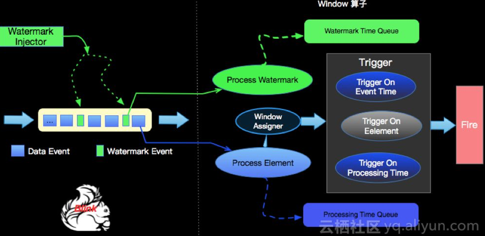
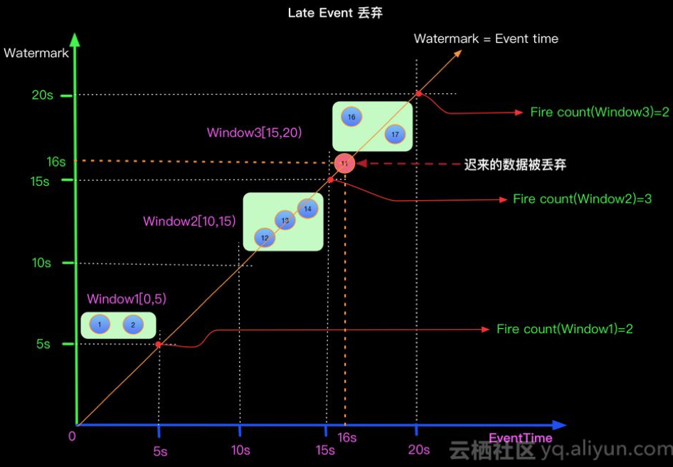
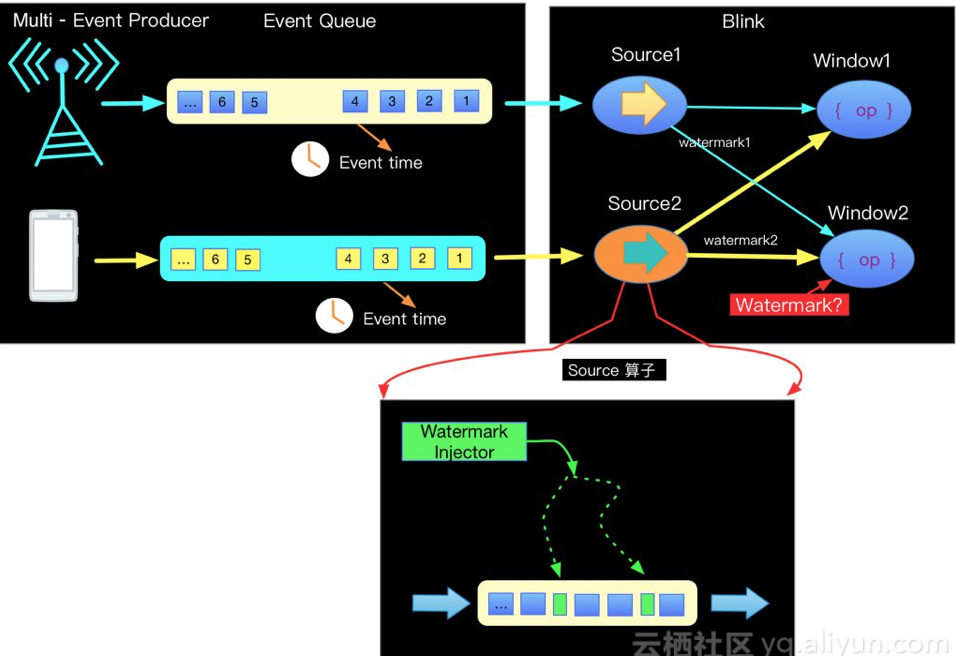
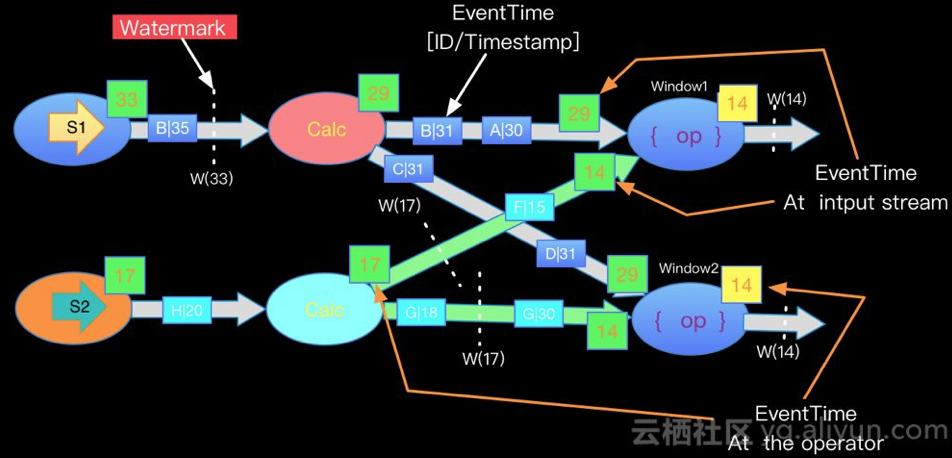

本文作者为阿里巴巴高级技术专家:金竹，原文发表在云栖社区。

地址为:https://yq.aliyun.com/articles/666056?spm=a2c4e.11155435.0.0.106e1b10snGqMd

## 实际问题（乱序）

在介绍Watermark相关内容之前我们先抛出一个具体的问题，在实际的流式计算中数据到来的顺序对计算结果的正确性有至关重要的影响，比如：某数据源中的某些数据由于某种原因(如：网络原因，外部存储自身原因)会有5秒的延时，也就是在实际时间的第1秒产生的数据有可能在第5秒中产生的数据之后到来(比如到Window处理节点).选具体某个delay的元素来说，假设在一个5秒的Tumble窗口(详见Window介绍章节)，有一个EventTime是 11秒的数据，在第16秒时候到来了。图示第11秒的数据，在16秒到来了，如下图：


那么对于一个Count聚合的Tumble(5s)的window，上面的情况如何处理才能window2=4，window3=2 呢？Apache Flink的时间类型
开篇我们描述的问题是一个很常见的TimeWindow中数据乱序的问题，乱序是相对于事件产生时间和到达Apache Flink 实际处理算子的顺序而言的，关于时间在Apache Flink中有如下三种时间类型，如下图：


那么对于一个Count聚合的Tumble(5s)的window，上面的情况如何处理才能window2=4，window3=2 呢？

## Apache Flink的时间类型

开篇我们描述的问题是一个很常见的TimeWindow中数据乱序的问题，乱序是相对于事件产生时间和到达Apache Flink 实际处理算子的顺序而言的，关于时间在Apache Flink中有如下三种时间类型，如下图：


* ProcessingTime 

是数据流入到具体某个算子时候相应的系统时间。ProcessingTime 有最好的性能和最低的延迟。但在分布式计算环境中ProcessingTime具有不确定性，相同数据流多次运行有可能产生不同的计算结果。

* IngestionTime

IngestionTime是数据进入Apache Flink框架的时间，是在Source Operator中设置的。与ProcessingTime相比可以提供更可预测的结果，因为IngestionTime的时间戳比较稳定(在源处只记录一次)，同一数据在流经不同窗口操作时将使用相同的时间戳，而对于ProcessingTime同一数据在流经不同窗口算子会有不同的处理时间戳。

* EventTime

EventTime是事件在设备上产生时候携带的。在进入Apache Flink框架之前EventTime通常要嵌入到记录中，并且EventTime也可以从记录中提取出来。在实际的网上购物订单等业务场景中，大多会使用EventTime来进行数据计算。

开篇描述的问题和本篇要介绍的Watermark所涉及的时间类型均是指EventTime类型。

## 什么是Watermark

Watermark是Apache Flink为了处理EventTime 窗口计算提出的一种机制,本质上也是一种时间戳，由Apache Flink Source或者自定义的Watermark生成器按照需求Punctuated或者Periodic两种方式生成的一种系统Event，与普通数据流Event一样流转到对应的下游算子，接收到Watermark Event的算子以此不断调整自己管理的EventTime clock。 Apache Flink 框架保证Watermark单调递增，算子接收到一个Watermark时候，框架知道不会再有任何小于该Watermark的时间戳的数据元素到来了，所以Watermark可以看做是告诉Apache Flink框架数据流已经处理到什么位置(时间维度)的方式。 Watermark的产生和Apache Flink内部处理逻辑如下图所示: 





## Watermark的产生方式

目前Apache Flink 有两种生产Watermark的方式，如下：

* Punctuated - 数据流中每一个递增的EventTime都会产生一个Watermark。 

在实际的生产中Punctuated方式在TPS很高的场景下会产生大量的Watermark在一定程度上对下游算子造成压力，所以只有在实时性要求非常高的场景才会选择Punctuated的方式进行Watermark的生成。

* Periodic - 周期性的（一定时间间隔或者达到一定的记录条数）产生一个Watermark。在实际的生产中Periodic的方式必须结合时间和积累条数两个维度继续周期性产生Watermark，否则在极端情况下会有很大的延时。

所以Watermark的生成方式需要根据业务场景的不同进行不同的选择。

## Watermark的接口定义

对应Apache Flink Watermark两种不同的生成方式，我们了解一下对应的接口定义，如下：

* Periodic Watermarks - AssignerWithPeriodicWatermarks

```
/**
* Returns the current watermark. This method is periodically called by the
* system to retrieve the current watermark. The method may return {@code null} to
* indicate that no new Watermark is available.
*
* &lt;p&gt;The returned watermark will be emitted only if it is non-null and itsTimestamp
* is larger than that of the previously emitted watermark (to preserve the contract of
* ascending watermarks). If the current watermark is still
* identical to the previous one, no progress in EventTime has happened since
* the previous call to this method. If a null value is returned, or theTimestamp
* of the returned watermark is smaller than that of the last emitted one, then no
* new watermark will be generated.
*
* &lt;p&gt;The interval in which this method is called and Watermarks are generated
* depends on {@link ExecutionConfig#getAutoWatermarkInterval()}.
*
* @see org.Apache.flink.streaming.api.watermark.Watermark
* @see ExecutionConfig#getAutoWatermarkInterval()
*
* @return {@code Null}, if no watermark should be emitted, or the next watermark to emit.
*/
@Nullable
Watermark getCurrentWatermark();
```

* Punctuated Watermarks - AssignerWithPunctuatedWatermarks 

```java
public interface AssignerWithPunctuatedWatermarks&lt;T&gt; extendsTimestampAssigner&lt;T&gt; {

/**
* Asks this implementation if it wants to emit a watermark. This method is called right after
* the {@link #extractTimestamp(Object, long)} method.
*
* &lt;p&gt;The returned watermark will be emitted only if it is non-null and itsTimestamp
* is larger than that of the previously emitted watermark (to preserve the contract of
* ascending watermarks). If a null value is returned, or theTimestamp of the returned
* watermark is smaller than that of the last emitted one, then no new watermark will
* be generated.
*
* &lt;p&gt;For an example how to use this method, see the documentation of
* {@link AssignerWithPunctuatedWatermarks this class}.
*
* @return {@code Null}, if no watermark should be emitted, or the next watermark to emit.
*/
@Nullable
Watermark checkAndGetNextWatermark(T lastElement, long extractedTimestamp);
}
```

AssignerWithPunctuatedWatermarks 继承了TimestampAssigner接口 -TimestampAssigner


```java
public interfaceTimestampAssigner&lt;T&gt; extends Function {

/**
* Assigns aTimestamp to an element, in milliseconds since the Epoch.
*
* &lt;p&gt;The method is passed the previously assignedTimestamp of the element.
* That previousTimestamp may have been assigned from a previous assigner,
* by ingestionTime. If the element did not carry aTimestamp before, this value is
* {@code Long.MIN_VALUE}.
*
* @param element The element that theTimestamp is wil be assigned to.
* @param previousElementTimestamp The previous internalTimestamp of the element,
* or a negative value, if noTimestamp has been assigned, yet.
* @return The newTimestamp.
*/
long extractTimestamp(T element, long previousElementTimestamp);
}
```

从接口定义可以看出，Watermark可以在Event(Element)中提取EventTime，进而定义一定的计算逻辑产生Watermark的时间戳。

## Watermark解决如上问题

从上面的Watermark生成接口和Apache Flink内部对Periodic Watermark的实现来看，Watermark的时间戳可以和Event中的EventTime 一致，也可以自己定义任何合理的逻辑使得Watermark的时间戳不等于Event中的EventTime，Event中的EventTime自产生那一刻起就不可以改变了，不受Apache Flink框架控制，而Watermark的产生是在Apache Flink的Source节点或实现的Watermark生成器计算产生(如上Apache Flink内置的 Periodic Watermark实现), Apache Flink内部对单流或多流的场景有统一的Watermark处理。

回过头来我们在看看Watermark机制如何解决上面的问题，上面的问题在于如何将迟来的EventTime 位11的元素正确处理。要解决这个问题我们还需要先了解一下EventTime window是如何触发的？ EventTime window 计算条件是当Window计算的Timer时间戳 小于等于 当前系统的Watermak的时间戳时候进行计算。 

* 当Watermark的时间戳等于Event中携带的EventTime时候，上面场景（Watermark=EventTime)的计算结果如下：





 上面对应的DDL(Alibaba 企业版的Flink分支)定义如下：
 
 
```
CREATE TABLE source(
...,
Event_timeTimeStamp,
WATERMARK wk1 FOR Event_time as withOffset(Event_time, 0) 
) with (
...
);
```

* 如果想正确处理迟来的数据可以定义Watermark生成策略为 Watermark = EventTime -5s， 如下：


上面对应的DDL(Alibaba 内部的DDL语法，目前正在和社区讨论)定义如下： 

```
CREATE TABLE source(
...,
Event_timeTimeStamp,
WATERMARK wk1 FOR Event_time as withOffset(Event_time, 5000) 
) with (
...
);
```

上面正确处理的根源是我们采取了 延迟触发 window 计算 的方式正确处理了 Late Event. 与此同时，我们发现window的延时触发计算，也导致了下游的LATENCY变大，本例子中下游得到window的结果就延迟了5s.

## 多流的Watermark处理

在实际的流计算中往往一个job中会处理多个Source的数据，对Source的数据进行GroupBy分组，那么来自不同Source的相同key值会shuffle到同一个处理节点，并携带各自的Watermark，Apache Flink内部要保证Watermark要保持单调递增，多个Source的Watermark汇聚到一起时候可能不是单调自增的，这样的情况Apache Flink内部是如何处理的呢？如下图所示：





Apache Flink内部实现每一个边上只能有一个递增的Watermark， 当出现多流携带Eventtime汇聚到一起(GroupBy or Union)时候，Apache Flink会选择所有流入的Eventtime中最小的一个向下游流出。从而保证watermark的单调递增和保证数据的完整性.如下图: 





本节以一个流计算常见的乱序问题介绍了Apache Flink如何利用Watermark机制来处理乱序问题. 本篇内容在一定程度上也体现了EventTime Window中的Trigger机制依赖了Watermark(后续Window篇章会介绍)。Watermark机制是流计算中处理乱序，正确处理Late Event的核心手段。

