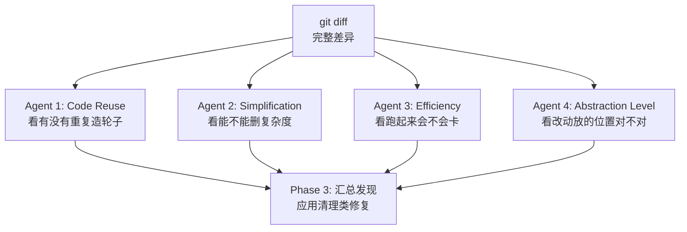

# 实践 重点汇总

> 从 0-ALL.md 筛选：面试常问与企业开发常用内容。

## TOC

1. 10 道 AI 编程相关的开放性面试问题 (`10 道 AI 编程相关的开放性面试问题.md`)
2. AI 编程 Skills 选型清单：需求澄清、TDD、代码审查与 UI 设计 (`AI 编程 Skills 选型清单-需求澄清、TDD、代码审查与 UI 设计.md`)
3. AI 编程选 CLI 还是 IDE？按任务选择更合适的工作流 (`AI 编程选 CLI 还是 IDE？按任务选择更合适的工作流.md`)
4. Claude Code Agent View：多会话并行管理实战 (`Claude Code Agent View-多会话并行管理实战.md`)
5. Claude Code 核心命令详解：code-review、loop、goal、batch、run、verify (`Claude Code 核心命令详解-code-review、loop、goal、batch、run、verify.md`)
6. Claude Code 使用指南：配置、工作流与进阶技巧 (`Claude Code 使用指南-配置、工作流与进阶技巧.md`)
7. CLAUDE.md 最佳实践：该写什么、不该写什么、项目变大后怎么拆 (`CLAUDE.md 最佳实践-该写什么、不该写什么、项目变大后怎么拆.md`)
8. Codex 使用指南：配置、AGENTS.md 与 Agentic 工作流 (`Codex 使用指南-配置、AGENTS.md 与 Agentic 工作流.md`)
9. JavaGuide 专属 draw.io 绘图 Skill 开源：用 Agent 自动生成可编辑的 draw.io 技术图 (`JavaGuide 专属 draw.io 绘图 Skill 开源-用 Agent 自动生成可编辑的 draw.io 技术图.md`)
10. mattpocock/skills：我最推荐的 4 个 AI 编程 Skill (`mattpocockskills-我最推荐的 4 个 AI 编程 Skill.md`)
11. oh-my-pi 开源终端 AI 编码代理体验 (`oh-my-pi 开源终端 AI 编码代理体验.md`)
12. Spec Coding 规范驱动编程实战：从 Vibe Coding 到 AI 代码规范 (`Spec Coding 规范驱动编程实战-从 Vibe Coding 到 AI 代码规范.md`)
13. Vibe Coding 实用技巧总结：Git、Spec、上下文管理与多 Agent 协作 (`Vibe Coding 实用技巧总结-Git、Spec、上下文管理与多 Agent 协作.md`)
14. 比 iTerm2 更适合 Claude Code/Codex 的终端，我换成 Ghostty 了 (`比 iTerm2 更适合 Claude CodeCodex 的终端，我换成 Ghostty 了.md`)
15. 强模型时代，AI 编程 Skills 还有必要装吗？ (`强模型时代，AI 编程 Skills 还有必要装吗？.md`)

---

<!-- source: 10 道 AI 编程相关的开放性面试问题.md -->

## [1] 10 道 AI 编程相关的开放性面试问题

---
title: 10 道 AI 编程相关的开放性面试问题
description: 涵盖 Cursor、Claude Code、Trae 等 AI 编程 IDE 使用技巧，Spec Coding 与 Vibe Coding 区别，以及 AI 对后端开发影响等高频面试问题。
category: AI 应用开发
icon: "mdi:code-tags"
head:
  - - meta
    - name: keywords
      content: AI 编程,Cursor,Claude Code,Spec Coding,Vibe Coding,AI IDE,编程工具,后端开发
---

腾讯面试的时候，面试官问我：“用过什么 AI 编程工具？”。我说：“Trae。”

空气突然安静了两秒。我搞不清楚为什么面试官沉默了，当时我还在想：“是不是我回答得不够高级？”。

面试被挂后才意识到：Trae 是字节的，腾讯家的是 CodeBuddy，阿里家的是 Qoder。

段子归段子！今天小 G 分享 9 道当下校招和社招技术面试中经常会被问到的 AI 编程开放性问题，希望对你有帮助。

1. ⭐ **AI 编程 IDE**：Cursor、Claude Code 等工具的使用技巧
2. ⭐ **AI 对后端开发的影响**：AI 会淘汰初级程序员吗？最大风险是什么？
3. ⭐ **未来核心竞争力**：3 年后端工程师的核心竞争力是什么？

## AI 编程 IDE 使用技巧

### 用过什么 AI 编程 IDE 吗？什么感觉？

目前整体感觉是：AI 编程能力进步很快。它已经从几年前简单的代码补全，进化成了一个可以深度协作的工程助手。

我总结了一套自己的使用方法论：

1. 在接手复杂项目或模块时，我不会直接让 AI 写代码，而是先让 Cursor 分析整个代码库，生成一份包含核心架构、模块职责和数据流的文档。这一步非常关键，因为它决定了后续协作的质量。只有当我和 AI 对项目有一致理解时，后续产出才会稳定、高质量。
2. 对于每个独立的开发任务，开启一个新的对话，并提供必要的上下文，包括需求背景、涉及模块和约束条件。这种方式能减少上下文污染，让 AI 生成的代码更精准。
3. 定期删除冗余实现和废弃代码。旧代码会误导 AI 的判断，增加上下文噪音。

### AI 编程的核心原则

AI 是一个强大的知识库和辅助工具，可以帮我们快速实现功能、学习新知识。但如果完全依赖 AI 写代码而不理解其原理，个人技术能力可能会退化。

几个原则：

- AI 生成代码之后必须人工 Review。
- 关键逻辑必要时自己重写。
- 核心路径必须做压测和边界测试。

我希望效率提升，但不以牺牲技术能力为代价。

### ⭐ Cursor 实战技巧

> 这里是以 Cursor 为例，其他 AI IDE 都是类似的。

1. **先理架构再动手**：无论是自己写代码还是让 AI 生成代码，都必须先明确需求、整体架构和模块边界。如果在架构模糊的情况下直接编码，很容易出现重复实现或职责冲突，后期修改成本反而更高。
2. **单 Chat 专注单功能**：新功能或大改动开启新的 Chat，并在开头引入项目结构说明或关键文档作为上下文。这样可以避免历史对话干扰。
3. **功能落地后写指南**：让 AI 总结实现过程，抽象出通用步骤。比如新增接口的标准流程、文件导出的统一实现方式等。这些内容可以在后续类似需求中快速复用。
4. **不依赖 AI，主动复盘**：AI 仅作辅助，代码生成后需认真 Review，理解原理、优化不合理处。
5. **定期删无用代码**：清理冗余代码，减少对 AI 的误导和上下文干扰，提升开发效率。
6. **用好配置文件**：`.cursorrules` 定义 AI 生成代码的规则、风格和常用片段；`.cursorignore` 指定不允许 AI 修改的文件 / 目录，保护核心代码。
7. **持续维护文档**：项目重大变更后，让 AI 同步更新文档、记录 “踩坑” 经验。
8. **让 AI 先“学”项目**：大型项目先让 Cursor 分析代码库，生成含架构、目录职责、核心类的结构文档，作为后续开发的基础上下文。

### ⭐Claude Code 使用技巧

1. **上下文窗口是你最贵的资源**——所有技巧本质上都在帮你把这块白板用得更高效。
2. **先规划后执行**——Plan Mode 投资的是后面的时间。
3. **`CLAUDE.md` 自我进化**——把纠正转化为规则，让 AI 越用越顺手。
4. **并行是最大的效率杠杆**——多实例 + Worktree + 子代理。
5. **验证优于信任**——给 Claude 验收标准，让它自己检查。
6. **`/compact` 比反复纠正更有效**——上下文被污染后，压缩或清空重来更好。

Claude Code 详细内容我单独分享过：[Claude Code 使用指南](https://javaguide.cn/AI编程/claudecode-tips.html)。

## AI 编程对程序员的影响

### 你如何看待 AI 对后端开发的影响

AI 不会取代后端工程师，但会改变后端工程师的工作方式和能力结构。

AI 能帮我们处理重复的、模式化的工作：

- **在编码层面**：AI 工具在生成**模式化代码（Boilerplate）**方面表现不错，CRUD、单元测试、胶水代码的编写效率可提升 50%~70%。但在**分布式约束**（如分布式锁的超时续租、消息队列的 Exactly-once 语义、接口幂等性设计）上，AI 存在显著的**“幻觉”风险**——它往往只给出 Happy Path 代码，忽略了生产环境中的异常补偿逻辑、竞态条件处理和分布式事务边界控制。
- **在架构层面**：AI 正在催生新的应用范式，比如智能体（Agent）驱动的自动化业务流程，后端需要提供更灵活、更原子化的能力接口。传统的“大而全”接口正逐步拆解为可被 AI 调用的原子化能力。
- **在运维与排障层面**：AI 可以辅助分析日志、监控告警，甚至预测系统瓶颈。例如，基于 AIOps 的工具可以自动分析异常日志模式，定位根因。

AI 让后端工程师能更专注于业务建模、复杂系统设计和架构决策这些更具创造性的核心工作。

拿我自己来说，我经常会和 AI 讨论业务和技术方案，它总能给我不错的启发——尤其是在需求拆解和技术选型时，AI 能提供多角度的思考。

从实战经验来看，AI 辅助编程的能力可以归纳为两个维度：

- **从 0 到 1 的规划与交付**：给出需求描述，AI 可以自主完成技术选型和架构设计，适合快速验证构想，但方案仍需人工评审。
- **既有代码的增量优化**：在已有复杂度的代码库中，AI 能够理解既有架构、定位问题、完成优化。但 AI 给出的方案“看起来对”，上生产就翻车的情况并不少见。

### 前后端开发者的核心竞争力已经变了

说句实话，前后端开发者的核心竞争力已经变了。

以前前端拼手速和还原度，后端拼 CRUD 和八股文。现在这些东西 AI 全能做，而且又快又不喊累，就废点 Token。你花半天切的页面，AI 十分钟搞定；你写两小时的增删改查，AI 三分钟交卷。不是说这些技能没用了，而是不稀缺了，就不值钱。

前端受冲击最直接。页面还原、组件编写、样式调整，模式化程度太高，大模型最擅长这类活。但死掉的不是前端这个岗位，是“只会写页面”的前端。

有竞争力的前端往两个方向走：要么往深扎——性能优化、渲染管线分析、工程化基建，AI 替代不了；要么往难走——WebGL、大规模可视化、跨端底层原理，AI 生成质量差，反而是护城河。

后端稍好，但也别乐观。AI 写单个接口已经很强了，它的短板是系统级思考——服务怎么拆、数据模型怎么设计、缓存一致性怎么保证、容量瓶颈在哪。这些需要结合业务场景和技术债综合判断，AI 给的方案“看起来对”，上生产就翻车。

后端的核心竞争力在往系统设计、稳定性治理、复杂业务建模转。

不管前端后端，有一件事已经是基本功：高效跟 AI 协作。不是会用 ChatGPT 就行，而是能拆解问题、引导输出、判断结果靠不靠谱、识别安全隐患。你从“写代码的人”变成了“AI 的技术审核官”。

那些生成代码不看逻辑的人，短期效率高，长期在给自己埋雷——线上出问题只会反复问 AI，自己毫无排查思路。

### AI 会淘汰初级程序员吗

短期内不会淘汰，但会彻底改变初级程序员的能力结构。

以前初级工程师的价值在于：

- 写 CRUD 增删改查
- 写基础接口
- 写 SQL 查询语句
- 写基础工具类/配置

现在这些工作 AI 都能做得很好，甚至更高效、更少出错。但初级程序员不会被淘汰，只是价值创造点发生了迁移。

未来初级工程师需要具备：

- **需求拆解能力**：将模糊的业务需求转化为清晰的技术任务。
- **业务理解能力**：理解领域模型和业务规则，而不仅是“翻译需求”。
- **架构感知能力**：理解系统整体架构，知道自己代码在系统中的位置。
- **Prompt 表达能力**：能精准地描述问题，从 AI 获取高质量答案。

AI 让编程门槛变低，但对“理解能力”的要求反而更高。未来的初级工程师更像是一个“AI 协调者”，而非单纯的“代码编写者”。

从企业招聘角度看，纯编码能力的需求会减少，但对“能利用 AI 快速交付业务价值”的工程师需求会增加。

### AI 带来的最大风险是什么

我认为主要有三个层面：

**1. 技术能力退化**

过度依赖 AI 会导致工程师自身技术能力的退化，尤其是：

- **调试能力下降**：习惯让 AI 排查问题，自身对底层原理的理解变浅。
- **代码敏感度下降**：对“好代码”和“坏代码”的判断能力变弱，甚至不知道什么是好代码。
- **架构思维退化**：长期只关注功能实现，忽视架构设计和扩展性。

**2. 架构失控**

AI 生成的代码往往关注“当前功能可用”，容易忽视长期架构健康度。这很大程度上源于 **Vibe Coding（氛围编程）**——依赖模糊意图让 AI“自由发挥”。

- **模块边界模糊**：AI 倾向于“快速完成功能”，可能将多个职责混入同一模块。建议在编码前明确模块职责（DDD 风格的 Context Boundary），通过预先定义的接口契约约束 AI 生成范围。

- **技术债务累积**：为快速实现功能，AI 可能使用硬编码、绕过标准异常处理、引入不必要的循环依赖等反模式。这些债务在项目规模增长后会显著增加重构成本。

- **风格一致性缺失**：不同 Chat 会话中生成的代码可能采用不同的命名规范、错误处理模式和日志格式。建议通过 **Spec Coding** 的方式，预先定义统一的技术规范和代码风格（如 `.cursorrules`），让 AI 始终在同一套规则下工作。

- **资源治理缺失**：AI 不会自动考虑连接池大小、线程池队列长度、缓存过期策略等资源约束。例如，生成的代码可能创建大量线程但无界队列，在流量激增时导致内存溢出；或使用默认数据库连接池配置，在高并发下成为瓶颈。

- **工程规范适配**：AI 生成的代码架构虽然合理，但与既有工程规范的适配往往需要人工把关。比如文件名组织、代码风格差异、依赖管理策略——这些“看起来没问题”的代码，可能在团队协作中制造麻烦。

**3. 安全风险（尤其需要重视）**

- **代码漏洞**：AI 可能生成包含安全漏洞的代码，常见问题包括：
  - **SQL 注入**：使用字符串拼接而非参数化查询
  - **XSS**：未对用户输入进行 HTML 转义
  - **权限校验缺失**：缺少接口级/方法级权限检查
  - **敏感信息泄露**：日志中打印密钥、Token 或密码
  - **依赖漏洞**：引入存在已知 CVE 的第三方库
- **数据泄露**：不当使用可能泄露公司代码、业务逻辑给外部模型（尤其是云端托管的 AI 服务）。
- **供应链风险**：AI 推荐的依赖包可能存在已知漏洞或恶意代码。
- **密钥泄露**：AI 生成的代码可能硬编码密钥、Token 等敏感信息。

**4. 分布式场景下的失效模式（尤其危险）**

AI 生成的代码在分布式环境中极易忽略关键约束，导致生产事故：

| 失效模式               | AI 常见问题                    | 生产风险                               |
| ---------------------- | ------------------------------ | -------------------------------------- |
| **幂等性缺失**         | 未考虑接口幂等，直接插入或更新 | 网络超时重试导致重复数据、资金重复扣款 |
| **并发竞态**           | 缺乏分布式锁或 CAS 机制        | 库存超卖、并发修改覆盖、统计口径错误   |
| **分布式事务边界模糊** | 未明确事务边界和回滚策略       | 数据不一致、部分成功部分失败、难以追溯 |
| **超时与降级缺失**     | 仅设置默认超时，无熔断降级逻辑 | 级联故障、雪崩效应、服务整体不可用     |
| **连接池泄漏**         | 未及时释放连接或连接数配置不当 | 连接池耗尽、服务假死、重启才能恢复     |

**典型案例**：AI 生成“扣减库存”代码时，通常只写 `UPDATE stock SET count = count - 1 WHERE id = ?`，而忽略：

- 并发场景下的行锁或分布式锁
- 库存不足时的幂等性保证（同一请求多次扣减不应重复）
- 下游服务超时时的补偿机制
- 数据库连接超时与熔断策略

**应对策略**：

- 在 Spec 中**显式约束**：要求 AI 生成分布式锁、幂等校验、补偿逻辑的代码模板
- **强制 Code Review**：重点关注跨服务调用、事务边界、异常处理分支
- **混沌工程验证**：通过故障注入测试分布式场景下的容错能力

企业必须建立配套的安全治理体系：

- **强制代码审查**：AI 生成的代码必须经过人工 Review。
- **自动化扫描**：集成 SAST/SCA 工具，并增加针对 AI 特有风险的扫描（如 git-secrets, TruffleHog）。
- **架构守护**：配合 Spec Coding，使用 ArchUnit 等工具进行架构约束的自动化测试。

### AI 编程正在让程序员更累、更卷？

有人说：“以为有了 AI 提效就能轻松点？清醒点，它没让你变轻松，它只是让老板觉得你一个人能顶三个人用。”

这话听着扎心，但确实是很多人的真实感受。

AI 把你的能力放大了，以前一天写三个接口就觉得自己挺能干，现在一天能写十个，还能顺手把架构设计、测试用例、文档全部搞定。多巴胺疯狂分泌，你会忍不住接更多的活儿，因为“我能搞定”的信心被 AI 撑大了。

但问题来了：效率越高，老板欲望膨胀得越快。“一人即团队”的幻觉让招聘名额先砍一半，剩下的兄弟往死里用。以前你只需深耕一个模块，现在要同时应付前后端、多线程任务、甚至一堆 Agent。

更魔幻的是岗位少了，活多了。你不仅要写代码，还要审 AI 的代码、改 AI 的 Bug，最后还得给领导解释为什么 AI 生成的代码上线就崩。有时候分不清楚是自己用 AI 还是 AI 用自己。

### ⭐ 未来 3 年后端工程师的核心竞争力是什么

我认为核心竞争力的焦点会从“写代码能力”转向以下四个维度：

**1. 系统设计能力**

AI 非常擅长生成单个功能的代码，但**系统级设计**仍需工程师主导：

- 服务拆分与模块边界划分
- 微服务与单体架构权衡
- 数据模型设计与一致性策略
- 接口版本演进策略
- 分布式事务与幂等设计

**2. 复杂业务建模能力**

过去我们说 AI 不擅长领域建模，但现在情况已经变了。AI 在需求拆解、规则梳理、场景推演等方面已经很强。

不过，还是需要工程师配合将业务规则转化为适合当前项目可执行的设计：

- 领域驱动设计（DDD）建模
- 业务流程抽象与状态机设计
- 边界上下文划分

**3. 性能与稳定性治理能力**

AI 生成的代码往往只关注功能正确性，而忽视生产环境的性能特征：

- **P99 延迟**：AI 可能生成 N+1 查询、未加索引的 SQL、同步阻塞调用，导致长尾延迟激增
- **内存逃逸**：不恰当的对象创建和闭包使用可能导致频繁的 GC 甚至 OOM
- **连接池膨胀**：未限制并发数、未设置超时可能导致连接池耗尽，引发级联故障

工程师需要具备**性能度量与调优**能力：

- SQL 慢查询优化与索引设计（EXPLAIN 分析执行计划）
- 缓存策略设计与一致性保障（本地缓存 vs 分布式缓存）
- 异步化改造与线程池参数调优（核心线程数、队列容量、拒绝策略）
- 服务降级、熔断、限流方案（Sentinel、Hystrix 应用）
- 容量规划与弹性伸缩（压测评估 QPS 水位、自动扩缩容）

**验证手段**：AI 生成代码后，必须通过压测（JMeter、Gatling）验证 P95/P99 延迟，通过 JVM 监控（MAT、Arthas）排查内存泄漏，而非仅依赖功能测试。

**4. AI 协作能力**

如何高效地与 AI 协作本身就是一种核心竞争力：

- **精准表达需求（Prompt 能力）**：使用结构化 Prompt（背景-任务-约束-输出格式），避免模糊指令
- **拆分问题并引导 AI**：将复杂任务拆解为可独立验证的子任务，利用 Chain-of-Thought 引导推理
- **判断 AI 输出质量**：建立代码 Review checklist，关注正确性、安全性、性能、可维护性
- **代码安全与合规校验**：熟悉 OWASP Top 10，能够识别 AI 生成代码中的安全风险
- **结合 AI 工具链**：掌握 `.cursorrules`、自定义 Skills、IDE 插件的配置与使用

这本质上是从“代码编写者”向“AI 协作工程师”的角色转变。

未来竞争的关键不再是“代码产出速度”，而是“系统设计质量”和“业务价值交付能力”。

## 总结

AI 编程工具正在深刻改变开发者的工作方式。Cursor、Claude Code、Trae 等工具，已经从代码补全进化到了可以深度协作的工程助手。

从 Prompt 到 Harness，短短四年，写代码这件事正在从程序员的“手艺”变成 Agent 的“标准操作”。有人说：“未来可能一个 CTO 就能管所有 Agent，让它产出所有代码、部署、改 bug。”这话听着激进，但你仔细想想，好像也不是完全没可能。

**真正决定你职业发展的，是你如何使用这些工具，以及你在使用过程中是否保持了对技术的深度思考。**

说实话，从去年这个时候开始就挺焦虑 AI 发展，尤其是 Coding 方向。到今天，进化速度这么快，我反而有些释然了。会写代码正在从核心技能变成基础素养，就像会用 Excel 不算竞争力一样。真正值钱的是定义问题、设计方案、把控质量、交付业务价值。

最后给正在准备面试的几点建议：

1. **实际使用过才能回答好**：面试官问 AI 编程工具，最怕的就是“听说过没用过”。哪怕只是用 Cursor 写过几个小项目，也比只看过教程强。
2. **建立自己的方法论**：不要只是“会用”，要有自己的使用心得和最佳实践，这是面试中的加分项。
3. **保持批判性思维**：AI 生成代码后必须 Review，这是基本素养。面试中展示这种态度，会让面试官觉得你是一个靠谱的工程师。
4. **关注技术趋势但不要焦虑**：AI 会改变很多，但系统设计、架构思维、业务理解这些核心能力不会过时。

用好 AI 工具 + 保持独立思考，这两者缺一不可。AI 时代，程序员的未来说不定会在各行各业发光。共勉！


---

---

<!-- source: AI 编程 Skills 选型清单-需求澄清、TDD、代码审查与 UI 设计.md -->

## [2] AI 编程 Skills 选型清单：需求澄清、TDD、代码审查与 UI 设计

---
title: AI 编程 Skills 选型清单：需求澄清、TDD、代码审查与 UI 设计
description: 按任务场景整理 AI 编程 Skills 选型清单，覆盖需求澄清、TDD、代码审查、UI 设计、React 性能优化、PostgreSQL、Claude API 与 Skill 开发，并说明哪些工具适合按需安装。
category: AI 编程实战
head:
  - - meta
    - name: keywords
      content: AI编程,Skills,Superpowers,mattpocock,grilling,Claude Code,Cursor,代码审查,TDD,UI设计,React,Next.js,PostgreSQL,Claude API,Skill开发
---

你好，我是小 G。最近有朋友问我：“你平时常用的有哪些 Skills？能不能给兄弟们分享一波？”

那当然可以啊！Skill 刚出来那会儿我就开始用了，后来也在公司内部定制过不少 Skill，同事朋友用了都说不错。

按理说，列份清单应该挺简单的。可真开始整理，我发现能入选的 Skill 其实并不多。而且，在整理 Skill 的过程中我再次感叹 AI 时代技术发展的太快了！有点顶不住啊！

Skill 刚出来那会，模型能力还没那么强。项目还没读明白就动手，代码写完不补测试，聊久了又忘掉前面的要求，这些情况都很常见。

于是我们把开发步骤一条条塞进 Skill：先澄清需求，再拆计划，测试要先写，改完还得审查。规则越细，心里越踏实。

可模型变强得太快了。

现在把同样的任务交给 Codex 或 Claude Code，大多数时候它们会自己读项目、查调用链、改文件、补测试、跑验证。以前需要在 `SKILL.md` 里反复叮嘱的事情，很多已经成了基础动作。

这时候还把 Skills 一股脑装满，就像给一个已经会干活的人塞了一摞操作手册。小改动也要写计划、走审查、跑完整验证，最后时间全花在流程上，多少有点折腾。

所以这份清单会收得比较克制。我现在愿意留下的，通常能补上模型猜不到的项目约定，或者自带专业流程、脚本、模板和参考资料。只会提醒“先读代码、再修改、最后跑测试”的 Skill，我基本不会再推荐了。

之前的[万字详解 Agent Skills](https://javaguide.cn/ai/agent/skills.html)讲过 Skill 和 Prompt、MCP 的区别；如果你想知道我为什么开始删减 Skills，可以接着看最新写的这篇 [强模型时代，AI 编程 Skills 还有必要装吗？](./强模型时代，AI 编程 Skills 还有必要装吗？.md)。

## Superpowers

Superpowers 把需求澄清、计划、TDD、Git Worktree、子 Agent 协作、代码审查和完成前验证串成一套开发方法。它适合陌生代码库、复杂功能和高风险改动；改文案、补空值判断、调整一条校验逻辑时，这套流程通常太重。

Superpowers 会依次调用这些 Skill：

| Skill                                             | 主要动作                               |
| ------------------------------------------------- | -------------------------------------- |
| `brainstorming`                                   | 编码前澄清需求、比较方案并保存设计     |
| `using-git-worktrees`                             | 创建隔离工作区，检查测试基线           |
| `writing-plans`                                   | 把设计拆成带文件位置和验证步骤的小任务 |
| `subagent-driven-development` / `executing-plans` | 分派子 Agent 或按批次执行计划          |
| `test-driven-development`                         | 执行 RED-GREEN-REFACTOR                |
| `requesting-code-review`                          | 按严重程度审查实现                     |
| `verification-before-completion`                  | 在宣布完成前检查证据                   |
| `finishing-a-development-branch`                  | 验证测试并处理合并、PR 或保留分支      |

这套流程已经适配 Claude Code、Codex、Cursor 和 OpenCode。Claude Code 对应的插件安装命令是：

```text
/plugin install superpowers@claude-plugins-official
```

Codex App 可以在侧边栏的 Plugins 中搜索 Superpowers；Codex CLI 则可以输入 `/plugins` 后搜索安装。不同 Agent 的安装方式并不互通，使用多个 Agent 时需要分别安装。

Claude Code 安装界面会让你选择作用范围：


| 选项                               | 作用范围         | 建议                                           |
| ---------------------------------- | ---------------- | ---------------------------------------------- |
| Install for you                    | 所有项目生效     | 已经确认自己愿意长期使用整套流程时再选         |
| Install for all collaborators      | 项目成员共享     | 团队已经约定采用同一开发方法时再提交           |
| Install for you, in this repo only | 只在当前仓库生效 | 第一次体验时优先选择，方便观察它是否拖慢小任务 |

我不再建议新手一上来全局安装。先在一个仓库里跑两三个真实任务，看看需求澄清、TDD 和审查流程是否真的减少返工，再决定要不要扩大范围。

项目地址：<https://github.com/obra/superpowers>

## mattpocock/skills

如果你只想加强开发流程里的某一个环节，可以看看 [mattpocock/skills](https://github.com/mattpocock/skills)。这个项目把工程经验拆成较小、容易修改、可以组合的 Skills，不会要求每个任务都走完同一套流程。

目前比较适合程序员的模块包括：

| Skill                    | 适合解决的问题                                             |
| ------------------------ | ---------------------------------------------------------- |
| `grill-me` / `grilling`  | 开工前持续追问，把需求、决策和依赖关系确认清楚             |
| `diagnosing-bugs`        | 按复现、缩小范围、提出假设、插桩、修复和回归测试的顺序排查 |
| `tdd`                    | 用 RED-GREEN-REFACTOR 循环开发功能或修复 Bug               |
| `code-review`            | 分别检查代码规范和实现是否符合原始需求                     |
| `to-spec` / `to-tickets` | 把已有讨论整理成规格说明，再拆成带依赖关系的任务           |
| `domain-modeling`        | 统一领域术语，并把关键决策写进 `CONTEXT.md` 和 ADR         |

跨 Agent 安装可以使用：

```bash
npx skills@latest add mattpocock/skills
```

安装器会让你选择需要的 Skills 和目标 Agent。按照项目当前的安装说明，还要勾选 `/setup-matt-pocock-skills`，然后在目标仓库运行一次，完成 Issue Tracker 和文档存放位置等配置。

第一次使用时，不必把整套都装上。需求经常没聊清楚，可以先选 `grill-me` 和 `grilling`；难定位的 Bug 多，再补 `diagnosing-bugs`。

这套 Skills 适合已经有基本开发习惯、只想补几个薄弱环节的人。如果项目里已经有稳定的需求模板、TDD 规范和代码审查流程，重复安装对应 Skill 不会带来多少帮助。

这几个 Skill 的实际用法和适用边界，我单独写了一篇：[mattpocock/skills：我最推荐的 4 个 AI 编程 Skill](https://javaguide.cn/AI编程/实践/mattpocock-skills.html)。

项目地址：<https://github.com/mattpocock/skills>

## ECC（原 Everything Claude Code）

Everything Claude Code 现在已经更名为 **ECC**。

项目已经从一套 Claude Code 配置扩展为跨 Agent 的 Harness 系统，覆盖 Codex、Claude Code、Cursor、OpenCode 等工具。

ECC 仓库同时放了 Skills、Agents、Hooks、Rules，以及记忆管理、安全扫描、持续学习和多语言工程规则。仓库里的 Skills 已经达到数百个，更像一套团队级 Harness 配置库。团队需要统一 Agent 的工作方式、记忆策略和安全检查时，集中管理会省去不少重复配置。


组件一多，选择成本也会跟着上来。项目只缺代码审查或 TDD 时，可以用 ECC 的选择性安装，只取 Java 代码审查、上下文持久化或安全扫描等对应组件，不必把整套系统塞进每个仓库。

项目地址：<https://github.com/affaan-m/ECC>

## Doc Co-Authoring

程序员写代码之前，最容易被低估的一步其实是：把需求讲清楚。

需求没讲清楚时，AI 编程 Agent 会很努力地往前冲，但冲的方向不一定对。它可能把一个还没定边界的想法直接写成实现，最后代码、测试、文档都很完整，只是和真实需求差了一截。

Anthropic 官方 Skills 仓库里的 **doc-coauthoring** 就是为这类场景准备的。它关注的重点很具体：把写 PRD、技术方案、决策文档、RFC 这类工作拆成一套协作流程，先处理上下文、结构和读者理解，句子润色只是后面的事。

doc-coauthoring 用三个阶段处理一份文档：

| 阶段                       | 做什么                                                       |
| -------------------------- | ------------------------------------------------------------ |
| **Context Gathering**      | 先收集背景、约束、历史讨论、架构依赖和利益相关方关注点       |
| **Refinement & Structure** | 按章节迭代，先提问和发散，再筛选内容，最后写成可读段落       |
| **Reader Testing**         | 用一个全新上下文的 Claude 测试文档，检查读者是否会误解或遗漏 |

拿订单退款模块举例。Coding Agent 开工前，可以先让 doc-coauthoring 整理一份短技术方案，把退款状态机、接口幂等、库存和优惠券回滚、失败后的人工补偿逐项写清楚。

文档定下来后，小任务可以直接把技术方案和验收标准交给 Agent；改动涉及多个模块时，再接 Superpowers 拆计划、写测试和审查代码。这样做主要是为了把分歧留在文档阶段解决，免得实现完成后再改范围。

Claude Code 的安装命令如下：

```bash
/plugin marketplace add anthropics/skills
/plugin install example-skills@anthropic-agent-skills
```

`example-skills` 是一组示例 Skill，doc-coauthoring 只是其中之一。装过这组插件后，后面提到的 skill-creator 也会一起提供，不用重复安装。

项目地址：<https://github.com/anthropics/Agent Skills 是什么？和 Prompt、MCP 到底差在哪？/tree/main/Agent Skills 是什么？和 Prompt、MCP 到底差在哪？/doc-coauthoring>

## UI UX Pro Max

这是一个专为 AI 编程 Agent（Claude Code、Cursor、Windsurf 等）设计的专业 UI/UX 设计智能 Skill。


它会根据产品类型和行业特性生成设计系统，再把配色、字体、布局、动效和反模式交给 Agent 执行。与只有几段审美提示词的轻量 Skill 相比，它带了一套可以检索的设计资料。

当前公开版本提供的主要数据包括：

| 资源类型       | 数量   | 说明                                                    |
| -------------- | ------ | ------------------------------------------------------- |
| UI 风格        | 84 种  | Glassmorphism、Neumorphism、Bento Grid、AI-Native UI 等 |
| 产品类型与色板 | 192 组 | 按 SaaS、金融、医疗、电商等产品场景匹配                 |
| 字体搭配       | 74 组  | 包含 Google Fonts 组合                                  |
| 图表类型       | 25 种  | 面向仪表盘和分析页面                                    |
| 推理规则       | 161 条 | 按行业生成设计系统                                      |
| UX 准则        | 98 条  | 覆盖反模式、交互和可访问性                              |
| 支持技术栈     | 22 种  | React、Next.js、Vue、Nuxt、SwiftUI、Flutter、JavaFX 等  |

以“帮我做一个美容 SPA 的落地页”为例，生成结果会先把页面归到健康养生场景，再给出 Soft UI 方向，配色采用淡粉、鼠尾草绿和金色点缀，字体选择 Cormorant Garamond。同一份结果还会列出反模式，例如避免常见的紫粉渐变。

Claude Code 可以从插件市场安装：

```text
/plugin marketplace add nextlevelbuilder/ui-ux-pro-max-skill
/plugin install ui-ux-pro-max@ui-ux-pro-max-skill
```

Codex、Cursor、Windsurf 等工具更适合使用当前官方 CLI。包名是 `ui-ux-pro-max-cli`，旧的 `uipro-cli` 已经不再更新：

```bash
npx ui-ux-pro-max-cli init --ai codex
npx ui-ux-pro-max-cli init --ai cursor
```

它的检索脚本依赖 Python 3。安装完成后，直接描述页面类型和行业即可触发：

```text
帮我做一个 SaaS 产品的落地页
设计一个医疗分析仪表盘
做一个深色主题的金融 App
```

交付检查会继续检查图标、hover 状态、文本对比度和 `reduced-motion`，其中包括“不用 emoji 充当图标”这类明确规则。已有设计系统的项目要谨慎使用自动推荐，否则新生成的色板、字体和组件规范可能与现有规则冲突。这种情况下，把团队已有的设计规范写成项目级 Skill 会更合适。

项目地址：<https://github.com/nextlevelbuilder/ui-ux-pro-max-skill>

不需要完整设计知识库时，可以换成 Anthropic 官方的 **frontend-design** Skill。

当前版本更强调先确定鲜明的视觉方向，再通过字体、配色、布局、动效和细节把方向落实，同时避免模板化的“AI 页面”观感。它不再把禁用 Inter、Roboto 或紫白渐变写成固定规则；是否使用某种字体和配色，应由品牌规范、内容类型和既有设计系统决定。

## Vercel React Best Practices

现在让 Agent 写出一个能跑的 React 页面并不难，容易被忽略的是后面的性能问题：几个本来可以并行的请求被写成串行，客户端收到一大坨用不到的数据，组件因为依赖项处理不当反复渲染，随手引入一个包又把 Bundle 撑大了。

Vercel 官方维护的 **vercel-react-best-practices** 就盯着这些问题。截至 2026 年 7 月，它在 [skills.sh](https://skills.sh/vercel-labs/agent-skills/vercel-react-best-practices) 上的累计安装量约为 57 万次，包含 70 条 React 和 Next.js 性能规则，并按影响程度分成 8 类。

| 优先级     | 主要检查内容                                                                |
| ---------- | --------------------------------------------------------------------------- |
| CRITICAL   | 消除请求瀑布、控制 Bundle 体积                                              |
| HIGH       | 服务端缓存与请求去重、并行获取数据、减少 React Server Components 序列化开销 |
| MEDIUM     | 客户端请求去重、依赖项管理、减少无效重渲染、处理 Hydration 问题             |
| LOW-MEDIUM | DOM 批处理、缓存重复计算、用 Set 或 Map 优化高频查找                        |

每条规则都带有错误代码、修改后的代码和适用条件。写新页面、做性能审查或者重构 React 代码时，让 Agent 按这些规则逐项检查，比临时提醒一句“帮我优化性能”更具体。

安装命令如下：

```bash
npx skills add https://github.com/vercel-labs/agent-skills --skill vercel-react-best-practices
```

这套规则只适合 React 和 Next.js 项目，Vue、Svelte 或后端项目没必要安装。性能优化也不能只看规则清单，涉及缓存、序列化和渲染的问题，最后还是要结合构建产物、React Profiler 和真实请求链路验证。

项目地址：<https://github.com/vercel-labs/agent-skills/tree/main/Agent Skills 是什么？和 Prompt、MCP 到底差在哪？/react-best-practices>

## sanyuan-skills

`sanyuan-skills` 当前收录 6 个独立 Skill，安装时可以按目录选择。只想在提交前补一轮代码审查，就装 Code Review Expert，不会同时引入需求澄清、TDD 等流程。

| Skill              | 适用场景                                               |
| ------------------ | ------------------------------------------------------ |
| Code Review Expert | 从 SOLID、安全、性能、错误处理和边界条件等维度审查代码 |
| Sigma              | 通过苏格拉底式追问学习技术概念                         |
| Skill Review       | 检查 Skill 的结构、描述、流程和 Token 使用             |
| Skill Forge        | 创建新的 Skill                                         |
| Wiki Ingest        | 把文章、文档或笔记整理成可交叉引用的 Wiki              |
| Book Study         | 阅读辅导、掌握度测试和间隔复习                         |

Java 开发者最容易直接用起来的是 Code Review Expert。它适合在提交前补一轮独立审查，但不能替代项目自己的检查规则。事务边界、错误码约定、日志字段和兼容性要求仍然要放进仓库的 `AGENTS.md`、审查说明或测试里。

每个 Skill 都可以单独安装：

```bash
npx skills add sanyuan0704/sanyuan-skills --skill code-review-expert
npx skills add sanyuan0704/sanyuan-skills --skill sigma
npx skills add sanyuan0704/sanyuan-skills --skill skill-review
npx skills add sanyuan0704/sanyuan-skills --skill skill-forge
```

安装后可以直接调用：

```text
/code-review-expert    # 审查当前 git 变更
/sigma <主题>          # 启动学习辅导，如 /sigma React Hooks
/skill-review          # 检查已有 Skill
/skill-forge           # 创建新技能
```

项目地址：<https://github.com/sanyuan0704/sanyuan-skills>

## Supabase Postgres Best Practices

**supabase-postgres-best-practices** 由 Supabase 官方维护，内容主要围绕 PostgreSQL，普通 PostgreSQL 项目也能用。截至 2026 年 7 月，它在 [skills.sh](https://skills.sh/supabase/agent-skills/supabase-postgres-best-practices) 上的累计安装量约为 30 万次。

它把 PostgreSQL 相关规则分成 8 类：查询性能、连接管理、安全与 RLS、表结构设计、并发与锁、数据访问模式、监控诊断和高级特性。每条规则会说明问题出现的原因，再给出错误 SQL、修改后的 SQL、`EXPLAIN` 分析和性能指标。

比如让 Agent 审查一条“按用户、状态和创建时间查询订单”的 SQL，它会继续检查组合索引的字段顺序、查询条件是否命中索引、连接池是否合理，以及这个改动会不会影响写入和锁竞争，不会只留下一句“加个索引”。

安装命令如下：

```bash
npx skills add https://github.com/supabase/agent-skills --skill supabase-postgres-best-practices
```

Java 后端项目只要使用 PostgreSQL，也可以直接拿来检查 SQL、表结构和数据库配置。MySQL 项目不要照搬其中的 RLS、索引和数据库参数；涉及建索引、改字段或调整连接池时，还要结合数据量、`EXPLAIN ANALYZE` 和压测结果判断，不能让 Agent 直接改生产库。

项目地址：<https://github.com/supabase/agent-skills/tree/main/Agent Skills 是什么？和 Prompt、MCP 到底差在哪？/supabase-postgres-best-practices>

## Claude API

Claude API 这个 Skill 面向的是 AI 应用开发。只在 IDE 里使用 Coding Agent 时可以跳过；做智能客服、代码生成平台、文档分析工具或内部 Agent 平台时，它可以用来核对 SDK 和 API 细节。

模型名称、参数和流式事件都可能随版本变化，凭记忆写调用代码容易用到旧接口。Anthropic 官方的 **claude-api** Skill 覆盖模型选择、价格、参数、流式输出、工具调用、MCP、Agent、缓存、Token 计算和模型迁移，并按语言拆分文档：

| 语言 / 接入方式 | 说明                             |
| --------------- | -------------------------------- |
| **Python**      | 使用官方 Python SDK              |
| **TypeScript**  | 使用官方 TypeScript SDK 和 Zod   |
| **Java**        | Java / Kotlin / Scala 项目可参考 |
| **Go**          | Go 服务端应用可参考              |
| **Ruby / PHP**  | 适合对应语言栈项目               |
| **C#**          | .NET 项目可参考                  |
| **cURL**        | 原始 HTTP、Shell 脚本或调试用    |

遇到 SDK 方法名、参数、流式事件或工具调用结构时，这个 Skill 会先查对应文档，再生成代码。它的主要作用就是减少 Agent 凭旧版本记忆猜接口的情况。

项目地址：<https://github.com/anthropics/Agent Skills 是什么？和 Prompt、MCP 到底差在哪？/tree/main/Agent Skills 是什么？和 Prompt、MCP 到底差在哪？/claude-api>

## skill-creator

这是 Anthropic 官方 Skills 仓库中的一个元技能，用来创建、修改和评估 Skill。

它提供了一套 Skill 开发工作流：

| 阶段              | 工作内容                                               |
| ----------------- | ------------------------------------------------------ |
| **意图捕获**      | 理解你想让 Skill 做什么，明确边界和目标                |
| **起草 SKILL.md** | 编写 Skill 的核心指令文件，包含 frontmatter 和指令内容 |
| **测试验证**      | 创建测试用例，运行对比实验（有 Skill vs 无 Skill）     |
| **迭代优化**      | 根据测试反馈持续改进指令                               |
| **描述优化**      | 优化 Skill 的 description，提高触发准确性              |

它还带有评估工具，可以对比“使用 Skill”和“不使用 Skill”的输出，记录时间、Token 和断言结果，再生成可视化报告。如果没有 Skill 时模型已经能稳定完成任务，就没有必要继续维护一份额外流程。

适合想给团队做专属 Skill 的开发者作为起点。

项目地址：<https://github.com/anthropics/Agent Skills 是什么？和 Prompt、MCP 到底差在哪？/tree/main/Agent Skills 是什么？和 Prompt、MCP 到底差在哪？/skill-creator>

## 怎么选

| 你反复遇到的问题                         | 优先考虑                         | 不建议安装的情况                           |
| ---------------------------------------- | -------------------------------- | ------------------------------------------ |
| 复杂功能容易漏需求、漏测试               | Superpowers                      | 主要处理小改动，现有 Agent 已能稳定完成    |
| 只想补需求澄清、Bug 诊断、TDD 或代码审查 | mattpocock/skills                | 项目已经有稳定的等价流程                   |
| 团队要统一 Agents、Hooks、记忆和安全策略 | ECC                              | 只缺一项代码审查或 TDD 流程                |
| PRD、技术方案经常写不清楚                | Doc Co-Authoring                 | 只是改一小段已有文档                       |
| 没有设计系统，AI 生成页面经常千篇一律    | UI UX Pro Max                    | 项目已经有成熟的组件库和设计规范           |
| React / Next.js 页面能跑但性能问题多     | Vercel React Best Practices      | 项目没有使用 React                         |
| 提交前想补一轮通用代码审查               | Code Review Expert               | 项目风险主要来自内部规则，通用检查帮不上忙 |
| PostgreSQL 查询和表结构经常需要返工      | Supabase Postgres Best Practices | 项目使用 MySQL 或其他数据库                |
| 正在开发 Claude API 应用                 | Claude API                       | 只在 IDE 里使用 Coding Agent               |
| 想把反复失败的任务沉淀成 Skill           | skill-creator                    | 没做过无 Skill 基线测试                    |

我的做法是先不用 Skill 跑一次同类任务。模型本来就能稳定完成，就不装；同一个问题反复出现，再去看候选项目的 `SKILL.md`、`scripts/` 和 `references/`，确认它确实补上了缺口，也没有危险命令或过宽权限。

第一次安装尽量限定在当前仓库。连续跑两三个真实任务后，再比较返工次数、执行时间和结果稳定性。没有明显改善就删掉，确认长期有用再考虑全局启用。

具体从哪个开始，取决于最近哪类问题最常返工：代码审查总漏同一类风险，可以试 Code Review Expert；需求还没定清楚 Agent 就开工，可以试 Doc Co-Authoring，或者更轻量的 [`grilling`](https://github.com/mattpocock/Agent Skills 是什么？和 Prompt、MCP 到底差在哪？/blob/main/Agent Skills 是什么？和 Prompt、MCP 到底差在哪？/productivity/grilling/SKILL.md)。

这份清单没有默认必装项。能说清一个 Skill 解决什么问题、什么时候触发，以及失效后怎么删，它才值得留在列表里。


---

---

<!-- source: AI 编程选 CLI 还是 IDE？按任务选择更合适的工作流.md -->

## [3] AI 编程选 CLI 还是 IDE？按任务选择更合适的工作流

---
title: AI 编程选 CLI 还是 IDE？按任务选择更合适的工作流
description: 深度对比 Claude Code、Cursor、Kiro、TRAE 等主流 AI 编程工具，解析 CLI 与 IDE 的核心差异、适用场景与选型建议。
category: AI 编程技巧
head:
  - - meta
    - name: keywords
      content: AI编程,CLI,IDE,Claude Code,Cursor,Kiro,TRAE,AI工具对比,AI编程选型
---

说实话，这个话题我酝酿很久了。很早就想聊聊，但一直拖着没有抽出时间写（其实就是懒！）。

每次在群里聊 AI Coding 或者公众号分享 AI Coding 技巧，总有人问：“Claude Code 那个黑窗口到底好在哪？我 Cursor 用得好好的为什么要换？” 然后另一边马上有人回：“都 2026 年了还在用 IDE？你落后了啊，CLI 才是正解！”。

两边都有道理，但两边说的又都不全面。今天我把自己这大半年从 IDE 到 CLI 再到两者混用的经历，结合最近行业里几款重磅产品的实际体验，一次性讲清楚。

## 先搞清楚：CLI 和 IDE 到底是什么

这里说的 CLI 和 IDE，除了界面形态不同，也对应两种常见的人机协作方式。

**AI IDE 工具**把代码编辑、运行调试和 AI 对话放进同一个图形界面。Cursor、Kiro、Qoder、TRAE、Windsurf 都属于这一类，其中 Cursor、Windsurf、Kiro、TRAE 基于 VS Code 二次开发，界面和操作习惯对 VS Code 用户比较友好。Zed 走的是原生 IDE 路线；JetBrains + Qoder 插件则是在现有 IDE 里接入 Agent 能力。


**AI CLI 工具**把主要交互放在终端里，Claude Code、Codex、Qwen Code、OpenCode 都是常见选择。你输入一段自然语言指令，Agent 会自己读仓库、改代码、跑测试，再根据报错继续调整。任务跑起来之后，开发者不必一直盯着每一行代码，更多时候是在定目标、补充约束和验收结果。


粗略地说，CLI 更适合把目标和验收条件交给 Agent，让它连续执行；IDE 更适合开发者盯着代码，随时插手修改。不过，这条线已经越来越模糊了，后面会专门讲到。

| 维度     | AI IDE 工具                      | AI CLI 工具                        |
| -------- | -------------------------------- | ---------------------------------- |
| 交互方式 | 图形界面（鼠标 + 键盘）          | 以终端命令和文字指令为主           |
| 常见协作 | 边写边审，随时插手               | 先定目标，中途检查，最后验收       |
| 主要特点 | Diff、补全和调试集中在同一个界面 | 适合连续执行长任务，也方便接入脚本 |
| 典型场景 | 日常编码、UI 调试、小功能修改    | 大规模重构、多文件变更、CI/CD 集成 |
| 代表产品 | Cursor、Kiro、TRAE、Qoder        | Claude Code、Codex、Qwen Code      |

## 这场争论是怎么开始的

Vibe Coding 比 Claude Code 早了三周多。

2025 年 2 月 2 日，Andrej Karpathy 在 X 上提出了 [Vibe Coding](https://x.com/karpathy/status/1886192184808149383)。他描述的是一种很随性的编程方式：用自然语言让 AI 改代码，接受改动，遇到报错再把错误丢回去继续修，甚至可以不仔细阅读 Diff。接受改动却不仔细看 Diff，让它和常规 AI 辅助开发拉开了距离。后者仍然要求人理解关键改动、检查测试结果，并为最终交付负责。


2 月 24 日，Anthropic 又以限量研究预览的形式发布了 [Claude Code](https://www.anthropic.com/news/claude-3-7-sonnet)。它把 Agent 直接放进终端，可以读取文件、执行命令、修改代码并运行测试。讨论的单位随之变了：过去大家比较一次补全准不准，现在开始追问 Agent 能不能独立完成一整个任务。

3 月初，YC 在一场名为 [Vibe Coding Is The Future](https://www.youtube.com/watch?v=IACHfKmZMr8) 的对谈中又披露了一组很抓眼球的数据：2025 年冬季批次中，四分之一的初创团队有 95% 的代码由 AI 生成。讨论随即从“AI 能写多少代码”滑到了“一个人能不能顶过去一支团队”。

不过，95% 只是代码生成比例，不能说明这些代码无需理解、测试和返工，更不能直接换算成节省了多少人力。社交平台上那些“1 小时完成团队 1 年工作量”的案例，任务范围和验收口径都不一样，拿来证明产品能力并不靠谱。

Claude Code 后续加入了 `/compact`、`/code-review`、`/simplify`、Hooks、Agent Teams 等能力。这些功能让 CLI 的工作单位越来越接近一条完整任务链：读代码、修改、验证，再继续迭代。

IDE 产品则从另一条路补齐 Agent 工作流。Kiro 用 Requirements-First、Design-First 和 Quick Spec 等流程给 Agent 补上需求、设计和验收依据；TRAE 把浏览器调试、数据库连接和部署收进 SOLO 流程。详见 [Kiro Specs 文档](https://kiro.dev/docs/specs/feature-specs/)。

CLI 工具也在补界面。Claude Code 和 Codex 后来都推出了 VS Code 插件，把 Agent 状态、代码 Diff 和结果审查带回编辑器。

今天再看，CLI 和 IDE 的区别主要留在入口：一个从终端开始，一个从编辑器开始；任务规划、Agent 执行和结果审查已经越做越像。

## 各有什么产品值得关注

### CLI 阵营

**1. Claude Code —— 面向 Claude 模型的 CLI Agent**

Claude Code 是 Anthropic 在 2025 年 2 月发布的 CLI Agent。模型、权限控制和工具调用都由同一家公司维护，几部分可以跟着产品一起调整。本文更新于 2026 年 7 月 24 日，示例按 Claude Fable 5 模型家族表述；具体型号、上下文长度和可用功能，还是要以账户里的实际显示为准。

2026 年 1 月的一次大更新包含 1096 次提交。创始人 Boris Cherny 当时展示了让 Claude Code 参与自身开发的过程，他把这种做法称为“用 AI 加速 AI”。

几项常用能力：

- 四 Agent cleanup 审查（`/simplify`，偏清理，不负责找 correctness bug）
- diff 正确性审查（`/code-review`）
- 上下文压缩（`/compact`）
- Hooks 机制（代码变更后自动触发验证）
- Agent Teams（多 Agent 点对点通信协作）
- Skills/Plugins 生态

现实门槛：需要接入 Claude Max 订阅才能发挥最大能力。不过可以通过 CC Switch 工具接入国内的 MiniMax 或 GLM 等模型作为替代方案，借此控制使用成本。

**2. Codex —— OpenAI 的编码 Agent**

OpenAI 提供的编码 Agent，支持 CLI、App 等形态。截至 2026-07-24，示例按 GPT-5.6 模型家族表述；模型和功能受账户、运行环境与配置影响。Harness Engineering 更准确的含义是为 Agent 设计环境、约束和反馈回路，并不等于人类不再读或写代码。

**3. Qwen Code —— 国内模型厂商入局**

阿里出品，贴着 Qwen 模型优化。代表了国内模型厂商亲自下场做 AI Coding 产品的趋势。

**4. OpenCode —— 开源社区的 CLI 选择**

轻量级开源 CLI 工具，可以接入多种模型后端，适合想要自定义和二次开发的开发者。

### IDE 阵营

**1. Cursor —— AI IDE 的代表产品**

Cursor 基于 VS Code 二次开发，很早就把 AI 补全、对话和 Agent 操作塞进了编辑器。Tab 补全、可视化 Diff、Agent Mode 都是它的强项。套餐和用量规则的变化影响过用户口碑，但只看编辑和审查体验，Cursor 依然经常被拿来和其他 AI IDE 比较。

**2. Kiro —— Spec 工作流的探索者**

Kiro 由 AWS 推出，提供 Requirements-First、Design-First 和 Quick Spec 等多种 Spec 工作流。需求还比较模糊时，可以先把 Requirements 写清楚；已经有设计方案，也可以从 Design 或 Quick Spec 开始，不需要每个任务都走完全相同的流程。

我更看重 Spec 带来的两个检查点：动手前，人可以先看需求和设计有没有跑偏；执行时，Agent 也有现成的任务说明和验收依据。做复杂 Feature 时这套流程很省返工，换成改文案、调样式之类的小需求，完整走一遍就有点重了。

**3. TRAE —— 一站式体验的代表**

TRAE 是字节推出的 AI 原生 IDE。它的 SOLO 模式把需求实现、浏览器调试、数据库连接和部署放进一条流程里，很多配置不需要用户自己来回切工具。对于想先把想法做成可运行原型的人，这种一站式体验确实省事。

**4. Qoder —— CLI 内核 + IDE 外壳的混合体**

Qoder 采用了“IDE 外壳 + CLI 内核”的组合。Editor 模式偏人机协同，你写代码，AI 在旁边补全和修改；Quest 模式更接近把整个任务交给 Agent，底层由 Qoder CLI 驱动。两种模式放在同一个 IDE 里，需要时直接切换。

需要边写边改时留在 Editor，碰到多文件任务再交给 Quest，这样可以少换一次工具。不过，CLI 能力能否同步到 IDE、相关协议是否完整兼容，仍取决于具体版本，不能默认新能力会第一时间全部接入。

### 原生 IDE 阵营（非 VS Code）

**1. Zed —— 高性能原生 IDE**

Zed 由 Atom 原班人马打造，底层使用 Rust 编写，采用了不同于 VS Code 扩展体系的原生架构。它主打启动速度和编辑响应，也内置了 AI 功能，比较适合已经厌倦 VS Code 系产品，又不想放弃 Agent 能力的开发者。

**2. JetBrains + Qoder 插件 —— 老牌 IDE 的 AI 升级**

JetBrains 系列（IntelliJ IDEA、PyCharm、WebStorm 等）在 Java/Kotlin、Python、JavaScript 等语言和框架上积累了很深的索引、重构和调试能力。Qoder 插件把 CLI 内核的 Agent 能力接进 JetBrains。已经习惯这些 IDE 的开发者，不必为了使用 Agent 整套迁移到另一个编辑器。

### 产品全景图

| 产品              | 形态           | 模型绑定            | 主要特点                         | 更适合                                      |
| ----------------- | -------------- | ------------------- | -------------------------------- | ------------------------------------------- |
| Claude Code       | CLI            | Claude Fable 5 家族 | 与 Claude 模型和工具调用一起迭代 | 习惯终端、经常处理长任务的开发者            |
| Codex             | CLI + App      | GPT-5.6 家族        | 多环境 Agent 与任务管理          | OpenAI 生态用户                             |
| Qwen Code         | CLI            | Qwen                | 围绕 Qwen 模型适配               | 想使用国内模型的开发者                      |
| Cursor            | IDE            | 多模型              | Tab 补全、可视化 Diff            | 日常开发离不开 IDE 的开发者                 |
| Kiro              | IDE            | Claude（Opus）      | 多种 Spec 起始工作流             | 复杂 Feature 和团队协作                     |
| TRAE              | IDE            | 多模型              | SOLO 一站式流程                  | 快速制作和验证原型                          |
| Qoder             | IDE + CLI      | 多模型              | Editor、Quest 两种模式可以切换   | 想在一个产品里兼顾编辑和 Agent 任务的开发者 |
| Zed               | 原生 IDE       | 多模型              | Rust 编写，启动和编辑响应快      | 更看重编辑器性能的开发者                    |
| JetBrains + Qoder | 原生 IDE + CLI | 多模型              | 语言与框架支持结合 Agent 能力    | 已经习惯 JetBrains 的 Java/Python/JS 开发者 |

## CLI 到底强在哪

我从 IDE 切到 CLI 之后，最先改变的是任务颗粒度。以前更多是让 AI 补下一段代码，或者在当前文件里改几行；到了 CLI 里，我会直接交代一个完整目标，让它读仓库、改代码、跑测试，再根据报错继续修改。

任务一长，这种差别就出来了。Agent 跑上几十分钟时，我可以先去做别的，过一会儿再回来检查进度。IDE 继续拿来读代码、查资料，CLI 就放在旁边干活，两边互不耽误。那种“去喝杯咖啡，回来它还在跑”的感觉，确实很容易让人上瘾。

CLI 也容易接进现有的工程流程。同一套命令可以在本地终端、远程主机或 CI 里调用，退出码和文本输出也方便交给脚本处理。

不过，所谓 Run Everywhere 只能说明交互方式容易迁移，不代表换个环境就能原样运行。文件系统、凭据、网络、沙箱、审批方式和可用工具都可能不同，该配的权限和验证一项也少不了。

很多 Agent 功能会先放到 CLI 里试验。命令和工具协议改起来快，不用先设计一整套图形交互。但这个顺序并不固定，可视化编辑、交互调试一类能力，IDE 往往更早做出来，用起来也更顺手。

## IDE 的不可替代之处

CLI 用得多了以后，我也没有把 IDE 扔掉。平时写一小段代码、调试接口或者看 Diff，IDE 依然更顺手。

一次改动跨了十几个文件时，可视化 Diff 可以直接列出改了哪些行、哪些文件需要回退。Claude Code 和 Codex 也提供 `/diff`、Review 等能力，CLI 并非只能靠 `git diff` 硬翻；只是文件导航、类型信息、断点和 Diff 全放在一个界面里，审查起来确实省事。

Tab 补全则是另一种工作节奏。实现思路已经比较明确时，我并不想把整个任务都交给 Agent，自己写几行、按一下 Tab 接受补全，反而更快。CLI 可以完全绕过补全这一步，但不是每个小改动都值得启动一次完整任务。

前端和 UI 问题经常要边看页面渲染，边查网络请求、打断点，这些本来就是 IDE 擅长的事情。CLI 可以再接 Agent Browser 等工具，能做归能做，配置和操作链路还是会多一层。

对于刚接触 AI 编程的人，IDE 也友好得多。终端环境、命令、权限和 Git 操作都被收进按钮和面板里，至少不会刚开始就卡在工具配置上。

## 到底怎么选

我的结论是：**不存在哪个更好，只存在哪个更适合当前场景。** 一个成熟的工作流，应该能根据任务、背景、团队自如切换。

### 按任务粒度选

| 任务类型                       | 推荐工具                           | 理由                     |
| ------------------------------ | ---------------------------------- | ------------------------ |
| 小修小补（改函数、修样式）     | IDE（Tab 补全 + 可视化 Diff）      | 速度快、反馈即时         |
| 中等任务（加接口、改模块）     | Plan 模式（CLI 或 IDE Agent 均可） | 平衡规划与执行           |
| Feature 级别（新功能，大重构） | Spec 模式 或 CLI 长时运行          | 自主性强、适合长时间迭代 |

### 按个人背景选

| 你的情况                | 推荐                                | 理由                                       |
| ----------------------- | ----------------------------------- | ------------------------------------------ |
| 资深后端，习惯终端操作  | CLI 为主                            | 能把 CLI 的效率优势发挥到极致              |
| 前端开发，频繁调试 UI   | IDE 为主                            | 浏览器集成和可视化是刚需                   |
| 非科班背景、AI 创业者   | IDE（Cursor / TRAE / Kiro）         | 门槛低、一站式体验                         |
| 想兼顾两种形态          | 选择同时提供编辑与 Agent 模式的工具 | 在同一产品中切换交互方式                   |
| 追求编辑器性能          | Zed                                 | Rust 编写，启动极快，对 VS Code 疲劳者友好 |
| Java 项目，用 JetBrains | JetBrains + Qoder                   | 深度语言支持 + AI Agent 能力，升级成本最低 |

### 按团队协作选

- 团队已经在做需求和设计评审，可以把 Spec 文档当成版本化资产提交到 Git，先过 Spec Review，再进入 Code Review。客户端不必强制统一，文件格式和验收流程统一就够了。
- 如果团队更看重工具自由，可以把项目约束写进 AGENTS.md 和 Rules。有人用 CLI，有人留在 IDE，只要最后执行的是同一套测试、检查和提交规范，就不会因为客户端不同而失控。

## 行业趋势：CLI 和 IDE 正在快速融合

再争论 CLI 和 IDE 谁会取代谁，意义已经不大了。两边都在补自己缺的那部分体验。

Claude Code 推出了官方 VS Code 插件，Codex 做了独立桌面 App，Gemini CLI 也在向编辑器延伸。另一边，Cursor 的 Agent Mode、TRAE 的 SOLO 模式、Kiro 的 Spec 长时运行、Qoder 的 Quest 模式，都开始支持把一整个任务交给 Agent。

Anthropic 做 Claude Code 时有过一个很激进的判断：“随着 AI 能力提升，人们完全不需要关注代码本身。大篇幅展示代码的重型 GUI 自然也就没必要了。” 部分产品确实在弱化编辑区，把 Agent 面板、任务进度和结果验收放到了更显眼的位置。

但我不太认同“以后完全不用看代码”这个判断。代码仍然是最终可审计的资产，关键实现、Diff、测试结果和生产风险也得有人看。编辑区可能会往后退一点，代码审查和结果验收反而会占用更多注意力。

模型厂商自己做 Agent 时，一次工具调用失败，可以同时排查模型、提示策略、权限系统和 Agent 运行时。Anthropic 有 Claude Code，OpenAI 有 Codex，Google 有 Gemini CLI，阿里有 Qoder，模型和产品团队之间少隔了一层。

第三方 IDE 厂商需要跟着模型更新做适配，偶尔会慢半拍；好处是可以同时接入多种模型，不必把所有体验押在一家模型上。所以，这两类产品谁一定走得更快，现在还下不了结论。

## 总结

| 如果你…                  | 选                                  |
| ------------------------ | ----------------------------------- |
| 习惯终端、需要脚本化任务 | CLI                                 |
| 看重可视化、需要调试     | IDE                                 |
| 任务混合、想灵活切换     | 两者兼用                            |
| 希望减少工具切换         | 评估同时提供编辑与 Agent 模式的产品 |

我现在没打算给 CLI 和 IDE 固定主次。写一小段代码、调 UI、看 Diff 时，我留在 IDE；任务跨多个文件，还要反复跑测试时，就交给 CLI 或 IDE 里的 Agent 模式。

团队里也可以有人用 Cursor，有人用 Claude Code。需要统一的是 Spec 格式、AGENTS.md、测试、CI 和 Code Review 的验收标准，没必要强迫所有人盯着同一个客户端。


---

---

<!-- source: Claude Code Agent View-多会话并行管理实战.md -->

## [4] Claude Code Agent View：多会话并行管理实战

---
title: Claude Code Agent View：多会话并行管理实战
description: Anthropic 发布的 Agent View 为 Claude Code 提供终端内的多会话管理能力，可集中查看 Agent 状态、处理输入并管理后台会话。
category: AI 编程实战
head:
  - - meta
    - name: keywords
      content: Claude Code,Agent View,多会话管理,Agent并行,AI编程,CLI工具,会话编排
---

大家好，我是小 G。

我平时用 Claude Code，经常会同时开几个会话：一个开发新功能，一个重构，一个跑测试，一个看报错，另一个整理 PR 评论或补文档。


以前这么用其实挺累。我一般会在 Ghostty 里开多个分屏，再配上几个终端标签页。窗口铺得满满当当，看起来像是把并行效率拉满了，脑子里却一直要记着：哪个会话还在跑？哪个已经完成？哪个卡在权限确认？哪个报错了？

最烦的是，有些 Agent 其实早就在等你确认了，但你根本没注意到。等你切回去一看，它已经停在那里十几分钟了。

Anthropic 前段时间推出的 **Agent View**，正好接手了这件麻烦事。它把后台会话集中到一个列表里，正在工作、等待输入、已经完成还是运行失败，扫一眼就知道。Claude 还是那个 Claude，但我终于不用靠脑子维护那张“会话状态表”了。

我在 [AI 编程选 CLI 还是 IDE？](https://mp.weixin.qq.com/s/6a3f2U6ZAJa2N7Cp10S01Q) 里提到过，AI Coding 的一些新工作流经常先在 CLI 里试水。Agent View 算是一个例子。不过，它更接近“后台会话管理器”，还不是会自动拆任务、分工和协调冲突的多 Agent 编排平台。

如果你还不熟悉 Claude Code，可以先看看下面两篇：

- [《Claude Code 使用指南》](https://javaguide.cn/AI编程/实践/claudecode-tips.html)：Sub-Agent 子代理、多实例协作（Multi-Claude）、CLAUDE.md 配置等
- [《Claude Code 核心命令详解》](https://javaguide.cn/AI编程/实践/claudecode-commands.html)：`/simplify`、`/loop`、`/batch` 等命令的实战用法

## 怎么打开 Agent View

Agent View 目前还是 Research Preview（研究预览版），需要 Claude Code `v2.1.139` 或更高版本。可以先检查一下版本：

```bash
claude --version
```

最直接的打开方式是在终端运行：

```bash
claude agents
```


打开后，每个后台会话占一行。左边是状态图标，中间是会话名和最近的执行摘要，右边是运行时长。会话默认按状态分组，需要你处理的会排在前面。

已经打开的普通 Claude Code 会话不会自动出现在这里。想把当前会话转到后台，可以输入：

```text
/bg
```

也可以在输入框为空时按左方向键 `←`。这两个操作都是把会话分离到后台，不会结束任务。之后用方向键选中会话，再按 `Enter` 或 `→`，就能重新进入完整对话。


## 先看黄色，再看红色

Agent View 打开后，我通常先扫一遍左侧的状态图标。它比会话名更值得看，因为它直接告诉你哪里需要介入。


| 状态          | 界面表现 | 怎么处理                                      |
| ------------- | -------- | --------------------------------------------- |
| `Needs Input` | 黄色     | 正在等回答、权限确认或登录操作，优先处理      |
| `Working`     | 动画     | 仍在调用工具或生成回复，可以先放着            |
| `Completed`   | 绿色     | 任务正常结束，接下来检查 Diff、测试和执行结果 |
| `Failed`      | 红色     | 运行出错，打开摘要或日志定位原因              |
| `Idle`        | 变暗     | 当前没有任务，可以继续发消息                  |
| `Stopped`     | 灰色     | 会话已被手动停止，或者进程被外部结束          |

这里有个容易误判的地方：界面里的 `Completed` 分组也会收纳失败和已停止的会话，分组名不等于所有任务都成功了。是否真的完成，还是要看图标颜色和执行结果。

黄色最有用。以前我以为某个会话还在跑，切回去才发现它早就停在“是否允许执行这个命令？”那里等我。现在看到黄色就处理，没有黄色就先做别的。

## 不用切换，也能回复

选中会话后按空格键 `Space`，底部会弹出 Peek Panel，显示最近一次输出，或者 Claude 正在等待的问题。


如果只是确认“是否允许修改这个文件”或者“要不要继续跑测试”，直接在面板里回复就行。会话收到消息后继续执行，不需要进入完整对话。

以前要先找到对应的终端标签页，看它在等什么，回复完再切回来。现在按一下空格就能处理，这种小地方用久了很省心。

如果要看完整上下文，按 `Enter` 或 `→` 进入会话；看完按 `←` 返回 Agent View。

快捷键不用专门背，界面底部会显示提示，按 `?` 还能查看完整列表。日常常用的主要是下面这些：

| 快捷键            | 功能                                 |
| ----------------- | ------------------------------------ |
| `↑` / `↓`         | 在会话列表中移动                     |
| `Space`           | 打开或关闭 Peek Panel                |
| `Enter`           | 进入会话，或在输入框有内容时派发任务 |
| `Shift+Enter`     | 派发任务并立即进入新会话             |
| `Alt+1` ~ `Alt+9` | 直接进入第 N 个会话                  |
| `Ctrl+T`          | 置顶或取消置顶当前会话               |
| `Ctrl+R`          | 重命名当前会话                       |
| `Ctrl+X`          | 停止会话；2 秒内再按一次删除         |

`Ctrl+X` 连按两次要谨慎。如果会话使用了 Claude Code 自动创建的 Worktree，删除会话时，里面尚未提交的修改也可能一起被删掉。

## 把任务甩到后台跑

在已有会话里输入 `/bg`，可以直接把当前任务放到后台：

```text
/bg
```

这会把当前会话后台化，然后返回 Agent View。


也可以顺手补一条指令再转入后台：

```text
/bg 跑完测试并修复失败用例
```

如果任务还没开始，从 Shell 直接创建后台会话更省事：

```bash
claude --bg "修复 auth 模块里所有失败的单元测试，直到全部通过"
```

这类“耗时，但不需要全程盯着”的任务很适合放到后台：

- 跑一整组失败测试并尝试修复
- 检查某个模块的类型错误
- 批量整理文档
- 分析 PR 评论并给出修改建议
- 对多个仓库同时做小范围改动

Mitchell Hashimoto（HashiCorp 联合创始人、Ghostty 作者）在 [My AI Adoption Journey](https://mitchellh.com/writing/my-ai-adoption-journey) 里分享过一个挺有意思的习惯：每天最后 30 分钟，把深度调研、模糊想法探索、Issue 和 PR 分拣交给 Agent，第二天上班直接看结果。

他也写得很克制：理想状态是始终有 Agent 在处理有用的工作，实际只有大约 10%～20% 的工作时间能做到，而且通常只跑一个 Agent。这个比例反倒更接近日常开发，不需要为了“并行”硬凑一排任务。

## Shell 命令

不想打开 Agent View，也可以直接在 Shell 里管理后台会话：

```bash
claude agents          # 打开 Agent View

claude attach <id>     # 切换到指定会话

claude logs <id>       # 打印指定会话的最近输出

claude stop <id>       # 停止会话，也可以用 claude kill

claude respawn <id>    # 重启指定会话，保留对话历史

claude respawn --all   # 重启所有正在运行的后台会话

claude rm <id>         # 从列表中移除会话
```

这里面我用得比较少、但很容易理解错的是 `respawn`：

```bash
claude respawn <id>
```

它会重启指定的 Session，原来的对话记录还在。Claude Code 更新以后想让某个后台会话使用新版本，或者会话进程异常退出时，都可以用它。

`respawn` 不是 Context Reset，也不会生成一份干净上下文。如果旧会话已经塞满无关日志和过期方案，重启进程也解决不了上下文污染。遇到这种情况，另开会话，再带入一份核对过的任务摘要更稳妥。

另外，`claude rm <id>` 主要是从后台列表中移除会话。对话记录仍保存在本机，可以通过 `claude --resume` 找回；Claude Code 自动创建的 Worktree 只有在确认安全时才会一并清理。

## 从 Agent View 里直接派发任务

Agent View 底部有一个输入框。输入任务并按 `Enter`，会新建一个后台 Session；再输入一条任务，会继续新建 Session，而不是追问上一个会话。想给已有会话补充信息，要用 Peek Panel 回复，或者先进入该会话。

输入框还支持一些特殊写法：

| 输入格式                | 效果                                             |
| ----------------------- | ------------------------------------------------ |
| `<agent-name> <prompt>` | 第一个词匹配自定义 Subagent 时，用它作为主 Agent |
| `@<agent-name>`         | 在 Prompt 中指定一个自定义 Subagent              |
| `@<repo>`               | 选择另一个仓库或目录，在那里启动会话             |
| `/<command>`            | 搜索并使用可派发的 Skill 或命令                  |
| `! <command>`           | 直接启动后台 Shell 任务，不调用模型              |
| `#<number>` 或 PR URL   | 已有会话在处理该 PR 时，直接选中原会话           |

自定义 Subagent 通常放在项目的 `.claude/agents/` 或用户目录的 `~/.claude/agents/` 下。给代码审查、测试分析这类重复任务准备一个专用 Agent，派发时就不用每次重新交代工具和边界。

`#<number>` 和 PR URL 也挺实用。如果已经有一个 Session 在处理同一个 PR，Agent View 会选中原会话，避免两个会话重复修改。

关于 Skills 的使用，可以继续看[推荐 6 个 Skills](https://mp.weixin.qq.com/s/55YhKrMAHsbrAgf4P2ezRA)和[万字详解 Agent Skills](https://mp.weixin.qq.com/s/5iaTBH12VTH55jYwo4wmwA)。

## 什么场景适合用

判断一个任务要不要放进 Agent View，我主要看两点：它能不能暂时离开我独立推进，回来后又能不能通过 Diff、测试或日志验收。两点都满足，放到后台通常比较省心。

### 同时处理几件互不依赖的小事

比如手上有 5 个小需求，可以分别交给 5 个 Session：一个修测试，一个查类型错误，一个整理文档，另外两个处理互不相关的 Bug。任务发出去以后先忙自己的，回来再看状态：黄色的先回复，红色的查日志，绿色的集中验收。

前提是这些任务真的能分开做。五个 Session 同时修改同一批文件，即使有 Worktree 隔离，最后仍然要处理实现冲突和重复修改。省下来的时间，很可能又花在合并代码上。

[Nicholas Carlini 的 C 编译器实验](https://www.anthropic.com/engineering/building-c-compiler) 把并行规模拉到了另一个量级：16 个 Claude Opus 4.6 实例在两周内跑了近 2000 个 Claude Code Session，产出约 10 万行代码，花费接近 2 万美元。这个实验使用的是 Agent Teams 和自定义执行框架，并非 Agent View 的能力展示。

落到日常开发，能借鉴的是任务拆分、角色分工和测试约束。没有这些准备，多开几个 Session 只会更快地产生冲突。`/simplify` 和 `/batch` 等并行工作流的具体用法，可以看 [《Claude Code 核心命令详解》](https://javaguide.cn/AI编程/实践/claudecode-commands.html)。

### 需要等待的 CI、测试和 PR

CI、集成测试和 PR Review 经常要等外部结果。一直把 Session 留在前台，人会忍不住隔几分钟看一眼；放到后台，等状态变黄、变红或完成后再回来处理就行。

每隔一段时间检查一次 CI，可以用 `/loop`；任务有明确的结束条件，例如“持续修复，直到测试全部通过”，用 `/goal` 更合适。Agent View 只负责展示 Session 状态，实际的定时检查和持续执行仍由这些命令完成。

[Stripe 的 Minions](https://stripe.dev/blog/minions-stripes-one-shot-end-to-end-coding-agents) 已经把这条链路做成了一套内部系统：开发者从 Slack 派发任务，Agent 负责编码、验证和创建 PR，每周有超过 1000 个这类 PR 被合并，代码仍然由人审查。Minions 和 Agent View 是两套东西，但都绕不开测试、CI 和 Code Review。少了这些环节，列表显示绿色，也不能说明代码已经可以合并。

### 多仓库并行

`@<repo>` 可以把任务派到另一个仓库或目录。一个 Session 改后端接口，一个改前端页面，再开一个更新文档，状态仍然放在同一张列表里，不用分别维护几组终端窗口。

在 Git 仓库中，后台 Session 第一次准备修改文件时，Claude Code 默认会把它移到 `.claude/worktrees/` 下的独立 Worktree，避免几个 Session 直接写同一份工作区。非 Git 目录、已经处在 Worktree 中，或者项目关闭了后台 Worktree 隔离时，行为会有所不同。

前后端任务如果依赖同一份接口约定，最好先把请求参数、响应结构和验收标准定下来。Agent View 不会替两个 Session 同步这些变化。

## 哪些场景别硬用

### 多个任务需要频繁同步

每个 Session 都有自己的上下文，只向你汇报进度。一个 Session 刚改完接口，另一个不会自动知道；两个 Session 同时调整同一个核心模块，也不会主动商量由谁负责。

临时查资料、跑测试这类支线任务，可以交给 Subagent；需要多个 Agent 共享任务列表并互相通信，可以考虑 Agent Teams。Agent View 更适合由人来分配独立任务，再统一检查结果。

并行 Session 还会分别消耗订阅额度。任务开得越多，Token 消耗和触发限额的速度也越快。如果几件事本来就互相等待，串行处理可能更省事。

### 任务必须脱离本机持续运行

后台 Session 由本机 Supervisor 进程管理。关闭 Agent View、Shell 或终端窗口以后，任务可以继续；机器休眠时会保留 Session，唤醒后重新连接。

关机或重启会停止正在运行的任务。下次打开 Agent View 时，这些 Session 会显示为失败，进入、预览或回复后可以接着原来的对话继续。需要机器离线后照常运行的任务，应放到云端环境。详见 [Agent View 官方文档](https://code.claude.com/docs/en/agent-view)。

想进一步了解几种并行方式的区别，可以看 [Claude Code 并行 Agent 官方说明](https://code.claude.com/docs/en/agents)、[《上下文工程实战指南》](https://javaguide.cn/ai/agent/context-engineering.html) 和 [《Harness Engineering》](https://javaguide.cn/ai/agent/harness-engineering.html)。

## Research Preview 期间别写死流程

Agent View 仍处于 Research Preview 阶段，界面、状态分组和快捷键都可能变化。准备把它接进团队流程时，升级 Claude Code 后最好检查一次官方文档，不要把当前快捷键写死在长期规范里。

如果暂时不想用，可以在 `.claude/settings.json` 里关闭：

```json
{
  "disableAgentView": true
}
```

## 总结

我更愿意把 Agent View 理解成 Claude Code 的任务面板。它把散落在终端里的后台 Session 放到同一个列表，让我知道哪个还在运行、哪个正在等回复、哪个已经可以验收。

任务怎么拆、多个 Agent 怎么同步、最终结果是否可靠，仍然要靠 Worktree、测试、CI 和人来处理。

对我来说，它最实用的变化还是文章开头那个小问题：不用再去五六个终端标签页里，寻找已经等了十几分钟的权限确认。


---

---

<!-- source: Claude Code 核心命令详解-code-review、loop、goal、batch、run、verify.md -->

## [5] Claude Code 核心命令详解：code-review、loop、goal、batch、run、verify

---
title: Claude Code 核心命令详解：code-review、loop、goal、batch、run、verify
description: 深入解析 Claude Code 核心命令，涵盖 /simplify、/code-review、/review、/loop、/goal、/batch、/run、/verify、/debug 等实用命令的使用方法与实战技巧。
category: AI 编程技巧
head:
  - - meta
    - name: keywords
      content: Claude Code,命令,slash commands,/simplify,/code-review,/review,/loop,/goal,/batch,/run,/verify,/debug,AI编程,AI辅助开发
---

你好，我是小 G。Claude Code 里其实有不少好用的命令，例如代码审查、代码简化、定时任务，但我发现很多每天经常用的朋友并不知道，也不知道如何用。

很多朋友认为用了 Cluade Code 直接对话就够了，不需要了解这些命令。但站在我用了这么久的角度来看，你了解一下肯定还是更好的。

当然了，了解不是说得死记硬背这些命令。你知道大概有这个东西就足够了！真需要用的时候，直接输入 `/`，再从命令列表里选即可。

> **版本说明**：本文按 Claude Code v2.1.218（2026-07-25）的官方文档和客户端行为整理。命令更新很快，最终以 `/help`、`/` 命令列表和官方 Commands 页面为准。

## `/` 菜单里不只有内置命令

在 Claude Code 中输入 `/`，看到的是当前环境里所有可以直接调用的入口。除了 Claude Code 自带的内置命令，这里还会列出 Bundled Skills、用户自己编写的 Skills，以及插件和 MCP Server 提供的命令。具体能看到哪些条目，还会受版本、平台、套餐和当前环境影响。

[官方 Commands 文档](https://code.claude.com/docs/en/commands)把大多数内置命令描述为“行为直接写在 CLI 中”的命令，例如 `/clear`、`/compact`、`/model`、`/diff`、`/context` 和 `/permissions`。[Bundled Skills](https://code.claude.com/docs/en/slash-commands#bundled-skills) 则基于 Prompt 工作：Claude 会加载对应指令，再调用工具或组织子代理完成任务。`/simplify`、`/batch`、`/debug`、`/loop`、`/run`、`/verify`、`/code-review` 和 `/claude-api` 都属于这一类。官方命令表会在这类条目后标注 `Skill`；少数会并行调度多个子代理并在后台运行的能力则标注为 `Workflow`。

`/review` 是内置命令，用来对 GitHub Pull Request 做一次快速、只读的单轮审查；不带参数时会先列出可选的 Open PR。要检查当前 diff 的正确性问题和清理机会，使用 `/code-review`；要对 PR 做可调节强度的多 Agent 审查，可以执行 `/code-review <level> <PR 编号>`。需要云端深度审查时使用 `/code-review ultra`，`/ultrareview` 目前是它的别名。

## /simplify：代码简化与重构

一份改动已经能正常运行，但里面可能留着重复 helper、绕得过深的分支，或者放错层级的业务逻辑。这时再跑 `/simplify`。它会检查当前改动，并尝试应用清理类修复。

从 Claude Code v2.1.154 开始，官方把 `/simplify` 定位为 **cleanup-only review**。复用、简化、效率和抽象层级归它处理；逻辑 Bug 交给 `/code-review`。

### 它怎样处理一份改动

不带参数时，`/simplify` 通常从 `git diff` 读取增量变更。工作区没有未提交修改时，它会转而检查最近一次 commit。也可以指定类名，例如 `/simplify MarketDataService`，让它把注意力放到整个文件。具体取值范围仍以当前版本的客户端行为为准。

拿到改动后，四个 Agent 会并行读取同一份 diff：



Code Reuse Agent 会先在项目里寻找现成实现。比如新写的 `requireNonBlank()` 与 `InputValidator.requireNonBlank()` 重复，它会建议复用后者。Simplification Agent 处理相似方法、冗余临时状态和过深分支；Efficiency Agent 会留意循环内重复创建对象、无必要的并发容器和重复计算。

Abstraction Level Agent 关注代码放置位置。业务规则进入 Controller、通用校验散落在多个 Service、底层工具反向依赖业务对象，都属于这一类。四份结果返回后，Claude Code 会过滤误报并应用它判断为安全的清理。

> **风险提示**：`/simplify` 会改代码，却不负责保证业务正确。事务、安全、并发和资金链路先跑 `/code-review` 或 `/security-review`，之后仍要检查 diff 并执行测试。

### 指定关注方向

参数里可以直接写关注方向：

```bash
/simplify duplicate helpers
/simplify SQL performance
/simplify unnecessary abstraction
/simplify MarketDataService
```

已经知道问题大致落在哪个文件或哪类代码味道时，带参数比裸跑更容易得到有针对性的结果。

### 案例：Spring 事务失效

这个案例来自早期 `/simplify` 行为，当时它会更积极地查 correctness bug。按现在的官方定位，这类问题更应该交给 `/code-review` 或 `/security-review`，再用 `/simplify` 做清理和重构。

有一次我写了一个用户认证模块，自测通过就准备提交了。习惯性地先跑了一遍审查命令，它直接帮我找到了 6 个潜在问题，经过确认，确实都是实际存在的问题。


其中一个问题落在 **Spring 事务失效** 上，多个审查视角都指向了同一处代码。

`WatchlistService` 的外层方法先获取 Redis 分布式锁并做 double-check，再调用一个 `protected` 方法写数据库：

```java
public void initializeDefaultWatchlist(Long userId) {
    // Redis 分布式锁 + double-check（幂等）
    // ...
    doInitializeDefaultWatchlist(userId);  // 同一类内部调用
    // ...
}

@Transactional(rollbackFor = Exception.class)
protected void doInitializeDefaultWatchlist(Long userId) {
    groupService.save(defaultGroup);        // INSERT 分组
    stockService.saveBatch(initialStocks);  // INSERT 5 只股票
}
```

`@Transactional` 放在这个方法上没有解决事务问题。Spring 默认采用代理式 AOP，同一个类内部直接调用 `doInitializeDefaultWatchlist()` 会绕过代理，事务拦截器收不到这次调用。

如果 `saveBatch` 中途抛出异常，`save` 已经写入的分组记录不会回滚，数据库里会留下一个没有股票的分组。

> **前提条件**：在 Spring 默认代理式 AOP 下，同类内部直接调用会绕过代理，`@Transactional` 不会生效；如果使用 AspectJ weaving 或通过代理对象调用，结论不同。

- **Quality / correctness 视角** 标记了自调用导致 `@Transactional` 失效，评为高严重性。
- **Efficiency Agent** 排除了锁 TTL 不足的可能，把问题收敛到事务失效。
- **Code Reuse Agent** 确认手写的分布式锁没有可复用替代，实现合理。

当时给出的修复方案是把声明式事务换成**编程式事务**，用 `TransactionTemplate` 直接控制事务边界。其他修复方式包括：把事务方法移动到另一个 Spring Bean、通过代理对象调用、调整事务边界到外层 public 方法。

```java
@RequiredArgsConstructor
public class WatchlistService {

    private final TransactionTemplate transactionTemplate;

    private void doInitializeDefaultWatchlist(Long userId) {
        transactionTemplate.executeWithoutResult(status -> {
            groupService.save(defaultGroup);
            stockService.saveBatch(initialStocks);
        });
    }
}
```


这次扫描还发现了另外 5 个问题，涵盖代码复用、安全性和效率：

| 发现                                                                                       | Agent                | 修复方式                                              |
| ------------------------------------------------------------------------------------------ | -------------------- | ----------------------------------------------------- |
| 两个 Controller 各自定义了 `requireNonBlank()`，和已有的 `InputValidator` 重复             | Reuse                | 删除私有方法，改用 `InputValidator.requireNonBlank()` |
| 异常处理器的 regex 每次 `replaceAll` 都重新编译，且字符类不含 `+/=`，base64 token 会漏脱敏 | Quality + Efficiency | 提取为 `static final Pattern`，扩展字符类覆盖 base64  |
| 用 `ConcurrentHashMap` + `@Scheduled` 手动清理 30 秒过期的 Ticket                          | Efficiency           | 替换为项目已有的 Caffeine 缓存（自带 TTL 淘汰）       |
| `@Bean` 方法里的局部 `Map` 用了 `ConcurrentHashMap`                                        | Efficiency           | 改为 `HashMap`（单线程填充，不需要并发安全）          |
| 注释笔误：“兖底” 应为 “兜底”                                                               | Quality              | 修正                                                  |

最终结果：5 个文件修改，净减少 38 行代码，修复 6 个问题，编译一次通过。

### 案例：指定模块审查

`/simplify` 还可以指定具体的类或模块做审查：


```bash
/simplify MarketDataService
```

我之前对项目的行情数据服务 `MarketDataService`（约 570 行）跑过一次专项审查。这个类聚合多个数据源，提供 Caffeine 本地缓存 + Redis 分布式缓存 + 熔断降级。当时的审查找到了 8 个问题，其中有两个高严重性的 correctness bug。按现在的命令定位，这类问题应该优先交给 `/code-review`。

**Bug：`year` 周期被静默降级为 `month`。** `normalizePeriod` 方法里有一个 switch：

```java
case "year", "yearly", "y" -> "month";  // Bug！应该是 "year"
```

其他周期都正确映射（`day → "day"`、`week → "week"`、`month → "month"`），唯独 `year` 被映射到了 `month`。调用方请求年度 K 线，实际拿到的是月度 K 线，没有任何报错或提示。

### 什么时候用 `/simplify`

提交 PR 前，或者刚完成一轮多文件重构，可以先用 `/code-review` 检查逻辑，再让 `/simplify` 清理重复实现和局部复杂度。它会结合项目现有代码给建议，例如改用已有 helper，或者把误放在 Controller 的业务逻辑移回 Service。

它不适合代替全项目审计。裸跑时主要检查当前增量；代码风格交给 formatter，正确性和安全问题则交给 `/code-review`、`/security-review` 与 SAST 工具。

## /code-review 和 /review：代码审查

本地工作区有一份尚未提交的 diff，先用 `/code-review` 查正确性、边界条件和潜在 Bug。已经提交为 Pull Request，则用 `/review` 选择或指定 PR。涉及登录、支付、权限和上传等敏感模块时，还需要 `/security-review`。

`/simplify` 解决的是另一类问题：代码逻辑已经确认可用，还想继续清理重复、低效实现和抽象层级。常见顺序是先 `/code-review`，再 `/simplify`。

### `/code-review` 如何产出报告

`/code-review` 先读取 `git diff` 或指定 PR 的变更，再并行分析并按置信度过滤结果。报告按 Critical、High、Medium、Low 分级，每条问题会指向具体行号，并附原因和修复建议。默认情况下它只报告；传入 `--fix` 后，才会尝试修改其中一部分问题。

### 怎么用

```bash
/code-review high    # 只看高严重性问题
/code-review --fix   # 审查并自动修复部分问题
/code-review ultra   # 云端深度审查
```

如果要审查具体 PR，用 `/review`：

```bash
/review              # 列出当前仓库的 Open PR，供你选择
/review 123          # 审查指定 PR
```

文件级审查建议写成自然语言：比如“review src/auth/login.service.ts”。

报告出来后，可以继续输入“修复所有 Critical 问题”，让 Claude 按审查结果修改。

### /code-review、/review、/security-review 怎么选

- 当前 diff 或本地变更：`/code-review`
- 已经创建的 Pull Request：`/review 123`
- 登录、支付、权限、上传、Webhook 等敏感模块：`/security-review`
- 核心 PR 合并前需要更重的云端审查：`/code-review ultra`

### /code-review ultra：云端深度审查

`/code-review ultra` 把审查放到云端沙箱中，由多个 Agent 分析同一个 PR。它适合核心 PR 合并前再加一轮检查。旧命令 `/ultrareview` 仍然保留为别名，但当前官方更推荐 `/code-review ultra`。

```bash
/code-review ultra        # 深度审查当前 diff / PR 语境
/code-review ultra 123    # 深度审查指定目标（具体支持以 /help 为准）
```

云端执行不依赖本地环境，代价是等待时间和 Token 消耗都会增加。官方目前仍将其标记为 research preview，功能与价格以官方文档和本地 `/help` 为准。

### `/code-review` 和 `/simplify` 怎么排顺序

对一份还不敢确认正确的改动，先跑 `/code-review`。等逻辑错误、边界条件和安全问题处理完，再用 `/simplify` 删除冗余代码。若只是刚写完原型，已经有测试证明行为没变，也可以直接让 `/simplify` 做一轮清理。

### 实战案例

有一次我写了一个用户认证模块，自测通过就准备提交了。顺手跑了一遍 `/code-review`，它标出了三个问题：

**Critical：密码重置接口没做速率限制。** 攻击者可以无限次调用重置接口轰炸用户邮箱。这个我自己测试的时候根本想不到——测试环境只有我一个用户，哪来的速率限制需求。

**High：Token 过期时间从配置读取但没兜底。** 配置项没设的话，过期时间会变成 0，意味着 Token 一生成就过期。`/code-review` 建议加一个 `Math.max(config.tokenExpiry, 3600)` 做保底。

**Medium：日志里把 userId 明文打印了。** 虽然不算敏感信息，但在合规要求严格的场景下还是脱敏比较好。

三个问题里有两个与安全性有关。单靠我当时的自测，密码重置频率和空配置这两种情况都没有覆盖到。

### 不要用它替代静态检查

`/code-review` 默认只给建议，明确传入 `--fix` 才会改代码。它还会读取 `CLAUDE.md`：项目的编码规范、技术选型和安全要求写得越具体，审查时可用的项目约束就越多。

SonarQube 这类工具按规则稳定扫描，`/code-review` 则会结合上下文分析 Spring 代理、事务边界和权限链路。两者覆盖的问题不同，不能相互替代。

## `/loop` 与 `/goal`：定时重复和完成条件

Boris Cherny 曾多次分享 `/loop` 的用法。


每隔半小时检查一次 PR，关注的是触发时间，用 `/loop`。现在开始修复失败测试，并持续做到全部通过，关注的是验收条件，用 `/goal`。

`/loop` 创建当前会话中的重复任务；`/goal` 会立即开始工作，围绕完成条件连续规划、执行和验证。把迁移任务错交给 `/loop`，容易得到一个周期性运行、却没有明确停止点的任务。

### 三种调度方案怎么选

当前可用的调度入口有 Cloud 任务、Desktop 任务和 `/loop`：

|                  | **Cloud 任务**     | **Desktop 任务** | **/loop**                                                                                                     |
| ---------------- | ------------------ | ---------------- | ------------------------------------------------------------------------------------------------------------- |
| 运行位置         | Anthropic 云端     | 你的机器         | 你的机器                                                                                                      |
| 需要开机吗       | 不需要             | 需要             | 需要                                                                                                          |
| 需要存活会话吗   | 不需要             | 不需要           | **需要，可保持前台或交给 supervisor 后台托管**                                                                |
| 重启后还在吗     | 在                 | 在               | 会话级；关闭期间不会执行；使用 `--resume` / `--continue` 恢复同一会话时，7 天内未过期的 recurring task 可恢复 |
| 能访问本地文件吗 | 不能（重新 clone） | 能               | 能                                                                                                            |
| MCP 服务器       | 每个任务单独配置   | 配置文件和连接器 | 继承当前会话                                                                                                  |
| 最小间隔         | 1 小时             | 1 分钟           | 1 分钟                                                                                                        |

机器不能保持在线时，选 Cloud 任务。本地文件和 MCP 配置必须参与时，Desktop 任务更合适。`/loop` 留给当前会话里的临时轮询，不适合要求长期可靠执行的任务。

### `/loop`：按间隔重复执行

Prompt 里写清执行内容和间隔：

```bash
/loop 30m "审查当前 diff，列出正确性问题"       # 每 30 分钟执行一次审查 Prompt
/loop 1h "跑一遍单元测试，看看有没有失败的"  # 每小时检查测试
/loop 5m "检查 GitHub 上开放的 PR 状态"    # 每 5 分钟看 PR 动态
```

不要写 `/loop 30m /code-review`。`/code-review` 禁止由模型调用，进入 recurring task 后只会被当成普通文本。需要定时审查时，直接描述要检查的内容，或者改用该环境允许调用的工具。

间隔既可以放在前面，如 `/loop 30m 检查构建状态`；也可以写在 Prompt 后面，如 `/loop 检查构建状态 every 2 hours`。省略间隔后，Claude 会动态选择下一次执行时间，通常落在 1 分钟到 1 小时之间；Bedrock、Vertex AI、Microsoft Foundry 场景固定为 10 分钟。

### `/goal`：持续工作到验收条件满足

需要“现在开始，持续修到测试通过”时使用 `/goal`。它会围绕完成条件持续规划、执行和验证；仍要写清停止条件、权限边界以及哪些情况必须停下来请人确认：

```bash
/goal "修复 auth 模块里所有失败的单元测试，直到全部通过；涉及生产配置时停止并询问"
/goal "把 src/legacy 下组件迁移到 Tailwind CSS，以现有视觉回归测试通过为完成条件"
/goal "完成 ESM 迁移，以构建和测试全部通过为完成条件"
```

可执行的验收标准决定了 `/goal` 何时结束。付款、部署、删除数据、修改生产配置等高风险动作不能混进默认授权，应在 Prompt 中写明“停止并询问”。

### 放到实际任务里

PR 状态、测试结果、文档同步都适合按时间检查。定时任务最好先保持只读，发现问题后汇报：

```bash
/loop 5m "用 gh 命令检查开放 PR 的状态，标记有冲突的和可以安全合并的"
/loop 2h "运行测试套件，汇报新增失败及相关提交，不修改代码"
/loop 2h "检查最近的代码变更，更新对应的公开文档"
```

发现测试失败后，如果希望 Claude 立刻修复，再单独启动 `/goal`。大规模技术迁移也按同样方式处理，把构建和测试结果写成结束条件：

```bash
/goal "把项目里所有 CommonJS 的 require/module.exports 改成 ESM 的 import/export，以构建和测试全部通过为完成条件"
```

项目里有多项固定检查时，可以把 `/loop` 命令收进自定义命令文件，启动项目后统一创建。

### 怎么管理任务

任务创建后，可以直接用自然语言查询和停止：

```bash
我现在有哪些定时任务？
停掉那个检查部署的任务
```

底层对应三个工具：

| 工具         | 干什么                                                |
| ------------ | ----------------------------------------------------- |
| `CronCreate` | 创建任务，接收 cron 表达式、要执行的 prompt、是否循环 |
| `CronList`   | 列出所有在跑的任务，显示 ID、调度时间、prompt         |
| `CronDelete` | 按 ID 删任务                                          |

### 运行限制

调度器每秒检查到期任务，但 Claude 忙于当前对话时不会立刻执行，任务会排队。Recurring Task 还有 jitter：当前最多延迟 30 分钟；间隔小于 1 小时时，延迟上限为半个 interval。要求精确到分钟的调度不要交给 `/loop`。

循环任务创建 7 天后自动过期，并在删除前执行最后一次。它依赖当前 Session；Session 由 supervisor 托管时，关闭终端后仍能继续，否则关闭期间不会执行，也不会补跑。使用 `--resume` 或 `--continue` 恢复同一会话时，尚未过期的任务可以恢复。

高频 `/loop` 和长时间 `/goal` 都会持续消耗 Token。关键路径先提交一份可回滚的版本，定时检查默认只汇报；`/goal` 还要写明验收标准、审批动作和无法继续时的退出方式。需要长期可靠运行时，改用 Cloud 或 Desktop Scheduled Tasks，不要把 `/loop` 当成 CI/CD。

## /debug：排查 Claude Code 运行时问题

MCP Server 连不上、Hook 没有触发、工具调用被拒绝，这些问题通常出在 Claude Code 的配置或当前会话。先用对应命令查看实际状态：`/mcp` 检查连接和授权，`/hooks` 查看已经载入的 Hook，`/permissions` 查看生效的权限规则及其来源。状态信息仍解释不了问题时，再运行 `/debug`。

`/debug` 是一个 Bundled Skill。它会为当前会话启用调试日志，读取日志和相关设置路径，再根据你提供的描述分析原因：

```bash
/debug MCP Server 显示已连接，但没有可用工具
/debug 为什么这个工具调用被权限规则拒绝
/debug Hook 为什么没有触发
```

调试日志默认不会提前开启。如果启动 Claude Code 时没有传入 `--debug`，执行 `/debug` 后需要把问题再复现一次，它才能从新日志里找原因；执行前已经发生的错误不会被补记。MCP 初始化这类发生在启动阶段的问题，可以退出后用 `claude --debug "什么是 Model Context Protocol (MCP)？和 Function Calling、Agent 什么关系？"` 重新启动，拿到更完整的日志。

`/debug` 解决的是 Claude Code 自身的运行和配置问题。业务代码的 Bug 仍然要用项目的调试器、应用日志和测试排查。

## /run 和 /verify：把改动跑起来

Claude Code v2.1.145+ 提供了 `/run` 和 `/verify` 两个 Bundled Skills。前者启动应用并观察结果，后者侧重构建与运行检查。

### /run：启动应用并观察

```bash
/run
```

`/run` 会尝试识别项目的启动方式并拉起应用。改完登录逻辑后，可以让它启动服务，再检查登录流程是否按预期工作。

### /verify：构建或运行来验证改动

```bash
/verify
```

`/verify` 不要求完整走一遍交互流程，主要执行构建和运行检查，适合先排除编译错误与明显的运行时问题。

### /run-skill-generator：记录项目的启动方式

```bash
/run-skill-generator
```

Claude 通常会从 README、`package.json`、`Makefile` 等文件推断启动方式。多模块项目、特殊环境变量或自定义启动脚本容易让它判断错误。先运行一次 `/run-skill-generator`，确认并记录正确流程，后续 `/run` 和 `/verify` 会复用这份配置。

## /batch：多任务并行编排

`/batch` 适合一次交付多项、彼此相对独立的改动。这组需求同时涉及页面、组件、提示词管理和历史记录：

```bash
/batch  1、移除自选股界面，直接通过分析界面来管理，每一行股票的最右侧展示选项，支持删除和分组。
  2、自选股提取一个组件、K线展示和讨论室都单独提取一个组件出来。
  3、优化提示词管理，例如支持删除和重命名。
  4、历史记录目前支持10条记录，这块的设计优化一下。
```

Claude 会先把需求拆成多个 Unit（工作单元），通常为 5～30 个，等你确认计划后再启动后台 Worker。每个 Worker 使用独立的 Git Worktree，分别修改对应模块，避免多个 Agent 直接写同一个工作区。


Worker 完成后，主进程会逐个检查改动，每个单元通常对应一个独立 PR。

> **风险提示**：`/batch` 适合边界清晰、模块相对独立的大任务；不适合强耦合核心链路一次性大改。共享文件（如 package.json、路由表、公共类型、数据库迁移脚本）容易冲突。使用前建议先 commit 干净工作区。


## 执行前后的辅助命令

`/context`、`/permissions` 和 `/diff` 分别回答三个问题：当前上下文还剩多少，Claude 被允许执行哪些操作，它刚才实际修改了什么。

### 长会话先看 /context

长任务开始遗漏约束或重复读取文件时，先检查上下文占用：

```bash
/context
```

`/context` 会列出工具输出、历史对话和规则文件占用的空间。如果当前会话仍值得继续，再带着保留要求执行 `/compact`：

```bash
/compact 只保留当前重构目标、已完成改动、剩余 TODO、关键约束
```

裸跑 `/compact` 容易把仍在使用的约束一起压缩。示例中明确保留重构目标、已完成改动、剩余 TODO 和关键约束，后续更容易接着做。

### 自动化任务前先收紧 /permissions

`/loop`、`/goal` 和 `/batch` 会让 Claude 在较长时间内持续执行。开始前运行：

```bash
/permissions
```

这个交互界面会列出当前生效的权限规则，以及每条规则来自哪个配置文件。规则分为三类：

- `allow`：匹配后直接执行，不再询问。
- `ask`：每次匹配时都请求确认。
- `deny`：直接阻止操作。

规则按照 `deny → ask → allow` 的顺序匹配，`deny` 的优先级最高。构建、测试等确定且低风险的操作可以按需加入 `allow`；推送远程分支、执行部署脚本等动作更适合设为 `ask`；生产数据库写入和任务范围外的破坏性操作则应设为 `deny`。

权限由 Claude Code 客户端执行，不依赖模型是否记得你的要求。因此，“不要部署”这类 Prompt 只能作为行为提醒；必须禁止的操作，应落实为 `deny` 规则或 PreToolUse Hook。

### 改完先看 /diff

Claude 的文字总结可能漏掉顺手修改的文件。执行：

```bash
/diff
```

交互式 diff viewer 会展示工作区里真实变化的文件和行。`/simplify`、`/batch` 跑完后，以这里的改动为准，再决定保留、继续修改还是回滚。

另外，`/statusline` 可以把模型、目录、上下文和成本常驻显示在状态栏；长任务前后用 `/usage` 或 `/cost` 查看消耗即可。

## 按任务规模组合命令

普通功能改动不需要把所有命令跑一遍。先用 `/code-review` 检查当前 diff；确认逻辑后执行 `/simplify`；接着用 `/verify` 跑构建和必要的运行检查，最后通过 `/diff` 人工确认。

多模块需求才考虑 `/batch`。开始前检查 `/permissions`，各个 Worker 完成后分别审查；敏感模块追加 `/security-review`，形成 PR 后再用 `/review` 做合并前检查。

`/loop` 和 `/goal` 也不属于固定流水线。前者只处理周期性检查，后者处理有明确验收条件的连续任务。会话变长时再看 `/context`，必要时带保留范围执行 `/compact`。

## 非交互模式：脚本和 CI 里用 Claude Code

脚本和 CI 通常只需要执行一次 Prompt，拿到结果后退出，不必保持交互会话。

### `claude -p`：非交互模式

```bash
claude -p "summarize this diff" --output-format json
```

`-p` 接收 Prompt 并在执行后直接输出结果。加上 `--output-format json`，脚本可以直接解析结构化响应。

### `--bare`：跳过自动加载

一次性分析不依赖 Hooks、Skills、MCP、Auto Memory 和 `CLAUDE.md` 时，可以加 `--bare`：

```bash
claude --bare -p "explain this function"
```

`--bare` 少了自动加载过程，启动更快，同时也拿不到这些项目上下文，不适合复杂代码修改。

### `--teleport`：网页端会话拉回本地

```bash
claude --teleport
```

Claude Code on the web 中的任务需要访问本地仓库或命令行时，可以用 `--teleport` 把网页会话接到本地终端继续处理。

## 附录：Claude Code 接入第三方模型

部分服务商提供 Anthropic API 兼容端点，Claude Code 因而可以连接 MiniMax、GLM 等第三方模型。这里要求的是 Anthropic API 兼容性，工具调用、流式响应和长上下文等能力还要逐项验证。接入前还需确认服务条款、数据处理位置与密钥保存方式，来源不明的代理不要使用。

### 1. 获取 API Key

- MiniMax 开放平台：[https://platform.minimaxi.com/user-center/basic-information/interface-key](https://platform.minimaxi.com/user-center/basic-information/interface-key)
- GLM 开放平台：[https://www.bigmodel.cn/usercenter/proj-mgmt/apikeys](https://www.bigmodel.cn/usercenter/proj-mgmt/apikeys)


### 2. 使用供应商配置工具

**CC Switch** 是一个社区配置管理工具，可以管理 Claude Code 供应商配置、Skills、MCP 和提示词。是否采用取决于团队对第三方工具、密钥存储和代理日志的安全要求。

项目地址：[https://github.com/farion1231/cc-switch](https://github.com/farion1231/cc-switch)


启动 CC Switch，点击右上角的 `+`，选择预设的 MiniMax/GLM 供应商，填写 API Key 和模型后添加。


### 3. 验证是否生效

在任意目录下输入 `claude` 命令即可启动 Claude Code，选择**信任此文件夹（Trust This Folder）**。


### 4. 接入验证清单

对话成功只能证明基础请求可用。Claude Code 还依赖工具调用和多步执行，建议在测试仓库逐项验证：

- [ ] 是否能稳定 stream 输出
- [ ] 是否能调用 Bash / Read / Edit / Write
- [ ] 是否能跑 subagent
- [ ] 是否能处理长上下文和压缩
- [ ] 是否支持 MCP 工具调用
- [ ] 是否能完成真实项目的“改代码 → 跑测试 → 修复”闭环

## 几组命令怎么选

`/code-review` 检查当前 diff，`/review` 检查已经创建的 PR。逻辑确认后仍有重复和复杂代码，再运行 `/simplify`。

`/loop` 按时间间隔触发，`/goal` 围绕验收条件持续执行。前者适合定时检查，后者适合修复失败测试或完成技术迁移。

`/run` 用来启动应用并观察实际行为，`/verify` 先做构建和运行检查。复杂项目先让 `/run-skill-generator` 记录正确的启动方式。

`/batch`、`/simplify`、`/goal` 都可能带来较大范围的修改。执行前检查 `/permissions`，执行后看 `/diff`、跑测试。会话过长时，先用 `/context` 找出占用来源，再决定是否执行 `/compact`。

## 参考资料

- [Claude Code commands](https://code.claude.com/docs/en/commands)
- [Claude Code CLI reference](https://code.claude.com/docs/en/cli-usage)
- [Debug your configuration](https://code.claude.com/docs/en/debug-your-config)
- [Best practices for Claude Code](https://code.claude.com/docs/en/best-practices)
- [Configure permissions](https://code.claude.com/docs/en/permissions)
- [Extend Claude with skills](https://code.claude.com/docs/en/skills)
- [Automate with hooks](https://code.claude.com/docs/en/hooks)


---

---

<!-- source: Claude Code 使用指南-配置、工作流与进阶技巧.md -->

## [6] Claude Code 使用指南：配置、工作流与进阶技巧

---
title: Claude Code 使用指南：配置、工作流与进阶技巧
description: 结合 Anthropic 官方文档和真实项目用法，讲清 Claude Code 的配置、权限、MCP、Skills、Sub-Agent、上下文管理和常见工作流。
category: AI 编程实战
head:
  - - meta
    - name: keywords
      content: Claude Code,AI编程,CLAUDE.md,MCP,Skills,Sub-Agent,Agentic Coding,AI辅助开发
---

你好，我是小 G。前几天那篇 [Vibe Coding 实用技巧总结](./Vibe Coding 实用技巧总结-Git、Spec、上下文管理与多 Agent 协作.md)，公众号阅读两天时间到了 6w+，评论区里问 Claude Code 的朋友不少。

这篇就来单独聊聊 Claude Code。

不知道大家和我是不是有同样的感觉，刚开始用的时候真挺别扭，甚至有点抵触：已经习惯了 Cursor、IDEA 里的侧边栏、文件树、diff 面板，再回到终端里跟 AI 协作，真心不顺手。

后来用多了，反而觉得 CLI 这层很适合长任务。它能在本地跑，也能搬到远程机器、临时环境、CI/CD 里跑；同一套命令、权限和验证方式可以复用，不用为了 GUI 再改一遍步骤。

现在我用 Claude Code，直接先把目录、目标和验收方式说清楚，让它自己去读代码、跑命令，最后我再看 diff 和测试结果。

麻烦也在这里。`CLAUDE.md` 写太满、权限放太宽、上下文塞爆、Sub-Agent 拆错边界，都会让它越跑越偏。

下面这些内容基本来自我这一年多的使用记录，偏实战，不追求把官方文档重新讲一遍。

PS：Claude Code 迭代非常快，本文按 v2.1.218（2026-07-24）的官方文档和个人使用经验整理。命令、权限模式、插件、Auto Mode、Sub-Agent 和 Worktree 行为，可能受版本、平台、账号套餐、provider 和安装渠道影响。实际使用前，最好先看 `claude --version`、`claude --help`、`/help` 和官方文档。比如 `/run`、`/verify` 需要 v2.1.145+；`/code-review` 支持 effort 等级、`--comment` 和 `--fix`；`/simplify` 当前更适合理解成 cleanup-only review，不是完整的 correctness bug review。

国内使用还要考虑账号、网络、成本和第三方中转稳定性。GLM、MiniMax、Kimi、DeepSeek 这类国产模型可以作为替代或补充；但碰到大规模代码修改、复杂重构、长链路排错，Claude 目前仍然值得单独研究。

## `CLAUDE.md` 非常重要

`CLAUDE.md` 最好别写成第二份 README。它更像是写给 Claude Code 的项目备忘录：哪些规则代码里看不出来、哪些命令经常被它猜错、哪些目录不要碰、改完某类代码必须跑哪条测试。


我的项目文件里通常只留这些东西：**Claude 容易猜错的规则、代码里读不出来的约定、团队必须遵守的规范，以及技术栈版本、常用命令、架构取舍、项目坑点。**

官方文档建议每份 `CLAUDE.md` 目标控制在 200 行以内。文件太长会消耗更多上下文，也可能降低规则遵守度。内容继续膨胀时，再拆到带 `paths` 的 `.claude/rules/`，低频参考内容放进 Skills。


我判断一条规则该不该留，会问一句：

> 这行删掉后，Claude 会不会更容易犯错？

如果会，就保留；如果不会，直接删掉。

### 放在哪里

`CLAUDE.md` 可以放在多个位置。官方的加载顺序大致从全局到局部，别只盯着项目根目录那一份：


最外层是组织级文件，通常给 IT 或 DevOps 统一下发规范。macOS 路径是 `/Library/Application Support/ClaudeCode/CLAUDE.md`，Linux/WSL 是 `/etc/claude-code/CLAUDE.md`，Windows 是 `C:\Program Files\ClaudeCode\CLAUDE.md`。这类规则一般不是个人项目里要动的东西。

再往下是用户级 `~/.claude/CLAUDE.md`，适合放自己的通用偏好。项目级文件放在 `./CLAUDE.md` 或 `./.claude/CLAUDE.md`，应该提交到 Git，让团队都看到。本地级 `./CLAUDE.local.md` 只留个人配置，记得加进 `.gitignore`。子目录里的 `CLAUDE.md` 不会一开局就全塞进上下文，Claude 访问到对应目录时才按需加载。

这些文件会一起进入上下文，后加载的文件不会把前面的内容整块覆盖掉。只是越靠近当前项目、作用范围越具体的规则，会排在更后面，Claude 通常也更容易采纳。

比如用户级规则写“统一用空格缩进”，项目级规则写“这个仓库使用 Tab”，那在这个项目里，Claude 通常会优先按项目规则来。官方文档里的加载顺序也是从组织级、用户级，一直到项目级和本地级。

我的习惯是把项目级 `CLAUDE.md` 提交到 Git，只写团队共同遵守的规则。只和自己有关的偏好，比如某个项目里想让提交信息用中文，放进 `CLAUDE.local.md`，再加到 `.gitignore`。

项目规模大时，可以拆开：

```text
my-project/
├── CLAUDE.md
├── backend/
│   └── CLAUDE.md
├── frontend/
│   └── CLAUDE.md
└── .claude/
    ├── rules/
    ├── skills/
    └── agents/
```

根目录放全局约定，子目录放局部规则。Claude 读取到某个子目录文件时，会按需加载对应目录下的说明。这个机制对 monorepo 很友好，后端、前端、管理台不用挤在一份文件里。

`@path` 引用也别误会。它不会凭空省上下文，被引用的内容最终还是会进来，只是维护起来更清楚。某些规则只对特定目录生效时，优先考虑 `.claude/rules/` 这类按路径加载的规则，别继续往根目录文件里塞。

### 初始化和维护

新项目可以先运行：

```bash
/init
```

Claude 会读仓库，生成一份初始 `CLAUDE.md`。这份文件只能当草稿，别直接提交。它可能猜错 build 命令，也可能把 README 里已经写清楚的内容又抄一遍。

维护时最容易失控的是越写越多。

Claude 偶尔犯一次错，先别急着加规则。等同类问题出现两三次、你也能用一句明确指令挡住它，再写进去。反过来，代码里一眼能读出来的事实、模型本来就会做的事、已经过时的历史约定，都应该删掉。规则太多时，最该看的几句会被冲淡。

如果 Claude 明明读到了规则却没照做，先看规则写得是否太软。“尽量保持测试完整”就很虚；“修改 Service 后必须运行对应单测，并贴出命令和结果”更好执行。同一条规则在多个会话里反复失效，再去检查文件太长，或者规则放错了位置。

我会把规则分成两类：团队级、长期有效、必须共享的要求写进 `CLAUDE.md`；个人偏好、阶段性调试经验、临时提醒，交给 Auto Memory 或本地配置。`CLAUDE.md` 最好来自真实错误，也要定期删掉失效内容。

写完规则后，也别默认它已经生效。用 `/context` 查看当前会话实际加载了哪些 `CLAUDE.md`、`CLAUDE.local.md` 和 rules 文件；`/memory` 主要用于查看和编辑规则、记忆的配置位置。如果某个文件不在 `/context` 结果里，Claude 这轮就看不到。复杂项目里用了带 `paths` 的 `.claude/rules/`，还可以用 `InstructionsLoaded` Hook 记录规则文件什么时候被加载、为什么被加载。

## 权限管理要重视

### 分层授权

Claude Code 默认会对敏感操作弹确认，比如写文件、执行 Bash、调用 MCP 工具。刚开始会觉得麻烦，但在你还不熟悉它的执行习惯时，先保留确认更安全。

我一般先只放开那些看了也不会出事、跑了也不会破坏现场的命令。比如 `git diff`、`git status`、`rg` 这类只读命令，可以少拦一点；`mvn test`、`pnpm test`、`npm run lint` 这类固定验证命令，也可以按项目情况放行。

反过来，`rm -rf`、`git push --force`、修改 `.git/` 这类操作默认不要放。`.env`、`secrets/`、生成产物、证书目录和各种 dump 文件，也尽量用 deny 规则先挡住。

权限可以通过 `/permissions` 配，也可以写进 `.claude/settings.json`：

```json
{
  "permissions": {
    "allow": ["Bash(git status*)", "Bash(git diff*)", "Bash(rg *)"],
    "deny": [
      "Read(./.env)",
      "Read(./.env.*)",
      "Read(./secrets/**)",
      "Bash(rm -rf *)"
    ]
  }
}
```

规则会被 Claude Code 的执行层处理。也就是说，就算 prompt 里写了“请一定不要读 `.env`”，那仍然只是建议；deny 规则才会拦住对应操作。

Auto Mode 的分类器也会参考你在对话里写下的边界，但这不是硬保证。不能丢的边界，最好写进 `permissions.deny`，或者用 Hook 在工具调用前拦住。长会话压缩以后，聊天里临时说过的限制也可能被压掉。

### Auto Mode

如果频繁确认已经影响节奏，可以考虑 Auto Mode。

当前官方文档里，CLI 会通过 `Shift+Tab` 切换权限模式；当账号、模型、provider 和组织设置都满足要求时，`auto` 才会出现在模式循环里。Team / Enterprise 环境下，管理员还可能把它打开或锁掉。

它的原理是用一个单独的分类器判断操作风险，低风险操作自动放行；下载并执行陌生代码、向外部端点发送敏感内容、生产部署、强推、直接 push 到 `main` 这类动作，会被阻断或转人工确认。

不过 Auto Mode 不提供安全沙箱，也不保证不会误判。它解决的是“少点确认”，不负责隔离文件系统、网络和凭据。高风险任务还是要靠容器、临时账号、最小权限、deny 规则、Hooks 和人工 Review。

想默认进入 Auto Mode，也别把 `"defaultMode": "auto"` 写到项目级 `.claude/settings.json` 或 `.claude/settings.local.json` 里。v2.1.142+ 会忽略这些来源里的 `auto` 设置，避免仓库自己给自己打开 Auto Mode。应该放到用户级 `~/.claude/settings.json` 或组织 managed settings。Bedrock、Vertex AI、Microsoft Foundry 这类 provider 还可能需要额外设置 `CLAUDE_CODE_ENABLE_AUTO_MODE=1`。

启动参数也不要写死。不同版本、安装渠道和 provider 对 permission mode 的支持可能不同，脚本里最好先用 `claude --help` 或官方文档确认当前可用值。交互使用时，我更倾向于在会话里用 `Shift+Tab` 切换模式，而不是把高权限模式写进脚本。

`--dangerously-skip-permissions` 我不建议在日常项目里用。除非你已经把文件系统、网络、凭据都隔离好了，否则一次误操作就可能改到不该改的文件，或者读到不该读的凭据。

## 安全边界

生产凭据、数据库密码、云厂商长期 token，不要直接暴露给 Claude；生产环境也别让它直接碰，除非这件事本来就有审批和审计。

Git 这边也要收紧。不要允许它默认 push 到 `main`，更不要让强推远端分支变成一个随手能执行的动作。来源不明的远程脚本，尤其是 `curl | bash` 这种写法，最好只在隔离环境里试。

文件读取范围同样要管住。`.env`、`secrets/`、证书目录、SSH key、数据库 dump、生产日志，这些都不该默认进 Claude 的可读范围。

不只是 `.env`。像 `~/.aws/`、`~/.gcp/`、`~/.kube/`、`~/.ssh/`、Maven `settings.xml`、npm token、生产日志和数据库 dump，都不应该随便暴露给 Claude。真要让它看日志，也尽量先脱敏、截取和限定范围。

真的需要自动化高权限任务时，放进容器、临时凭据、最小权限账号里跑。这样即使命令执行错了，影响范围也更可控。

## MCP、Skills、Sub-Agent 和插件怎么分

Claude Code 周边东西很多，刚接触时确实容易混在一起。我自己的分法大概是这样：

| **机制**    | **解决什么问题**       | **适合放什么**                         | **不适合放什么**       |
| ----------- | ---------------------- | -------------------------------------- | ---------------------- |
| `CLAUDE.md` | 每次会话都要知道的背景 | 构建命令、目录约定、团队规则           | 多步骤任务流程         |
| Rules       | 按路径加载局部规则     | 前端规则、后端规则、安全规则           | 全项目都要看的核心约定 |
| Skills      | 可复用任务步骤         | TDD、Code Review、写文章、前端实现     | 永久背景知识           |
| MCP         | 连接外部系统           | GitHub、Sentry、Notion、Figma、数据库  | 本地普通文件规则       |
| Sub-Agent   | 隔离支线任务上下文     | 代码搜索、专项审查、并行研究           | 边界很小的一次性修改   |
| Hooks       | 固定执行动作           | 禁止危险命令、编辑后格式化、结束前测试 | 仅供参考的建议         |
| 插件        | 打包分发一组扩展       | Skills、MCP、Hooks、脚本的组合         | 没审查过的第三方权限包 |

比如“每次编辑后必须跑 formatter”，写进 `CLAUDE.md` 只能提醒 Claude 记得，写成 Hook 才能在文件改完后触发。再比如“修 GitHub Issue 的步骤”，放进 `CLAUDE.md` 会污染所有会话，做成 Skill 更合适。

### Code Intelligence：让 Claude 少靠全文搜索硬读

项目能用 Code Intelligence 的话，尽量配上。它相当于给 Claude 接了一套语言服务器：看类型错误、找符号定义、查引用关系，不必每次都靠 `rg` 搜一大片文件。

拿 Java 或 TypeScript 项目来说，Claude 想知道某个类在哪里定义、被谁调用，不一定非得先搜关键词，再挨个打开文件确认。借助 LSP，它可以直接跳到定义、查看引用，改完代码后还能马上发现类型错误。

它不能替代全文搜索，但能少读很多无关文件。项目一大，上下文会干净不少，Claude 也不容易被一堆候选文件带偏。Claude Code 官方也建议类型化语言安装 Code Intelligence 插件，因为一次符号跳转，往往能省掉一次搜索加多文件读取。

不过，Code Intelligence 插件不是“装上就完事”。它还需要本机有对应的 language server binary，比如 Java 对应 `jdtls`，TypeScript 对应 `typescript-language-server`。如果 `/plugin` 的 Errors 页里出现 `Executable not found in $PATH`，通常就是这个依赖没装好。

### MCP：让 Claude 接上真实世界

MCP（Model Context Protocol，模型上下文协议）管连接外部系统。外部系统提供一个 MCP Server，Claude Code 这类客户端连上来后，就能看到并调用里面的工具。


这是 Claude Code 接外部工具的主要方式。查数据库、读 Sentry 报错、访问浏览器、拉 Notion 文档、取 Figma 设计稿，都属于这一类。

添加远程 MCP 服务器的命令大概长这样：

```bash
claude mcp add --transport http notion https://mcp.notion.com/mcp \
  --header "Authorization: Bearer your-token"
```

这里的 `your-token` 只是示意。真实项目里尽量别直接把 token 写进 shell history。

团队项目里，能共享的 MCP 配置可以放到 `.mcp.json`，再提交到仓库。比如某个项目统一要接 Notion、Sentry、内部文档系统，就把 server 名称、URL、transport 这些公共配置沉淀下来。

带 token、密钥、数据库连接串的配置，不要提交到 `.mcp.json`。更稳的做法是放用户级配置、本地环境变量、密钥管理系统，或者使用对应 MCP server 支持的 OAuth 流程。

MCP Server 要克制。工具越多，Claude 越容易选错，也越难审计。平时可以用 `/mcp` 看当前连接状态，启用或禁用 server；成本和用量拆分更适合看 `/usage`，它会展示 skill、subagent、plugin、MCP server 等维度的使用情况。不常用的 server 先断开。

### Skills：把重复动作存下来

规则文件和 Skill 不要混着用。

规则文件放长期约束，比如技术栈版本、启动命令、目录结构、错误码格式、哪些文件不能碰。

Skill 放任务步骤，比如代码审查、写测试、改前端页面、网页调研、写技术文章。这些任务每次走法都差不多，不必在聊天里反复提醒。

小 G 之前写过两篇相关的文章：[Agent Skills 是什么？和 Prompt、MCP 到底差在哪？](https://javaguide.cn/ai/agent/skills.html) 和 [AI 编程 Skills 选型清单](https://javaguide.cn/AI编程/实践/programmer-essential-skills.html)。

Skill 就是一份按需加载的任务说明。某类任务怎么做、有哪些约束、要检查哪些点、踩过哪些坑，都写进 `SKILL.md`。

它和 `CLAUDE.md` 的一个区别在于加载时机。Claude 默认只看到 Skill 的名称和描述，用来判断是否该调用；调用这个 Skill 时，`SKILL.md` 正文和相关资源才会进入上下文。用户级 Skill 放在 `~/.claude/Agent Skills 是什么？和 Prompt、MCP 到底差在哪？/`，项目级 Skill 放在 `.claude/Agent Skills 是什么？和 Prompt、MCP 到底差在哪？/`。

还有一个版本变化要注意：Claude Code 里 custom commands 已经合并进 Skills。`.claude/commands/deploy.md` 和 `.claude/Agent Skills 是什么？和 Prompt、MCP 到底差在哪？/deploy/SKILL.md` 都能创建 `/deploy` 这类命令；旧的 `.claude/commands/` 还能用，新内容更推荐按 Skill 组织。


重复性很强的步骤都可以沉淀成 Skill。写功能前固定走 TDD，先写失败测试再实现；代码审查时固定检查安全、事务、性能和边界条件；写技术文章时固定核对事实来源、引用、标题层级和 AI 味。

这比每次在 prompt 里补一长串提醒稳定得多。官方对 Skill 的定义也接近这个意思：一组可复用的指令、脚本和资源，让 Claude 按固定步骤处理某类任务。

现成 Skill 也可以用，比如 Superpowers 把 TDD、Code Review、Spec-Driven、Git Worktree、子 Agent 协作这些步骤封装好了。

我在 [AI 编程 Skills 选型清单：需求澄清、TDD、代码审查与 UI 设计](https://javaguide.cn/AI编程/实践/programmer-essential-skills.html) 这篇文章中有详细推荐。

第三方 Skill 不要拿来就跑。`SKILL.md` 本身就是指令，里面如果带了危险命令、奇怪脚本、过宽权限，Agent 可能会照着做。装之前至少看一眼正文、`scripts/` 和 `references/`，确认它没有越权操作。

### 插件：先看官方 marketplace

不想自己从零配 Skills、MCP、Hooks，可以先去 Claude Code 的官方插件市场 [`claude-plugins-official`](https://github.com/anthropics/claude-plugins-official) 翻一翻。

安装也很直接：

```bash
/plugin install <name>@claude-plugins-official
```

插件省的是组装时间。一个插件里可能已经打包好了 Skill、MCP Server、Hooks 和一些辅助脚本，装完 Claude 就多了一套现成工作流。

但插件最终还是会在你本地跑，有些还会碰文件系统、浏览器、GitHub、数据库或第三方服务。装之前至少看一眼说明、权限和源码来源；不用了就卸掉，减少不必要的工具入口。具体安装和发现方式可以看官方的 [Discover plugins](https://code.claude.com/docs/en/discover-plugins) 文档。

### Sub-Agent：让主会话保持干净

Sub-Agent 我用得比较多。


排查复杂问题时，Claude 经常要读几十个文件、搜一堆代码、跑几条命令。主会话很快被日志、搜索结果和文件内容塞满，后面再继续写代码，就容易飘。

这种支线任务可以丢给 Sub-Agent。它有自己的上下文，可以单独读代码、查日志、分析问题，结束后只把结论汇报回主会话。

Claude Code 内置的 subagent 里，我最常见到的是 Explore、Plan 和 general-purpose。这些内置 subagent 都继承父会话权限，但会叠加各自的工具限制：

| **子代理**          | **模型**            | **工具/权限**                    | **用途**                       |
| ------------------- | ------------------- | -------------------------------- | ------------------------------ |
| **Explore**         | Haiku，偏快速低延迟 | 只读，无 Write / Edit            | 文件发现、代码搜索、代码库探索 |
| **Plan**            | 继承主对话模型      | 只读，无 Write / Edit            | Plan Mode 下的代码库研究       |
| **general-purpose** | 继承主对话模型      | 继承主会话可用工具，仍受权限约束 | 复杂研究、多步骤操作、代码修改 |

Explore 和 Plan 更偏只读研究，不负责直接改代码。官方文档里还有个细节：Explore 和 Plan 会跳过 `CLAUDE.md` 文件和父会话的 git status，所以更适合快速做代码搜索和上下文收集；其他内置 subagent 和自定义 subagent 会加载这些内容。

general-purpose 边界更宽，可能会探索、执行命令、修改代码。用它之前最好明确哪些目录可读、哪些文件不能改、是否允许写入、最终只需要结论还是要直接动手实现。真要做强约束，不能只靠提示词，要配合 subagent 的 `tools` / `disallowedTools`、权限模式、`permissions.deny` 或 Hooks。

你也可以创建自己的 subagent。项目级配置放在 `.claude/agents/`，给团队共享；用户级配置放在 `~/.claude/agents/`，自己跨项目复用。每个 subagent 都可以配置系统提示词、工具权限、模型，以及触发条件。

我比较常用的场景是让 subagent 跑测试套件，只把失败用例和错误信息带回来；或者让不同 subagent 分别研究认证、数据库、API 模块，最后把结论合并到主会话。更复杂的任务，也可以先让 code-reviewer subagent 找性能问题，再让 optimizer subagent 尝试修复。

任务太小、边界不清、代码还在剧烈变化时，不一定要拆 subagent。主会话保留目标、决策和验收，subagent 只处理局部、明确、能汇报结果的专项任务。

后续用到 Agent teams 时，可以把它看成多会话协作的玩法。Sub-Agent 用来隔离支线任务，Agent teams 用来让多个独立会话围绕共享任务协作。刚上手不用急，先把 Worktree、小步提交和验证节奏跑顺。

一个自定义安全审查子代理可以这么写：

```markdown
---
name: security-reviewer
description: Reviews Java and Spring Boot code for security risks.
tools: Read, Grep, Glob, Bash
model: opus
---

Review the target diff for:

- SQL injection and unsafe dynamic queries.
- Authentication and authorization bypass.
- Secrets or credentials committed to code.
- Unsafe deserialization or command execution.

Return concrete file and line references. Do not rewrite code unless explicitly asked.
```

实际项目里，subagent 的 tools 尽量收窄。如果只做代码审查，通常不需要 `Edit` / `Write`。同时设置 `tools` 和 `disallowedTools` 时，`disallowedTools` 会先应用；同一个工具同时出现在两边，最后会被移除。

### Hooks：处理必须执行的规则

Hooks 很容易被忽略，但真实项目里很有用。它能在 Claude Code 的生命周期节点上执行动作，比如工具调用前、文件编辑后、会话结束前、上下文压缩前后。

举个例子，假设 Claude Code 准备执行：

```bash
rm -rf /tmp/build
```

`PreToolUse` Hook 会先拿到这次 Bash 调用，判断它是否危险；命中规则后返回 `deny`，Claude Code 会取消这次工具调用，并把拒绝原因反馈给 Claude。

下面这张图来自 Claude Code 官方 Hooks 文档，展示的就是这条链路。


我会把几类动作交给 Hook：编辑后自动格式化，会话结束前跑测试，禁止改 `migrations/` 或 `.github/workflows/`，拦截 `curl | bash`、`rm -rf`、向外部端点发送敏感内容，或者在 Sub-Agent 启动时注入额外上下文。

需要固定执行的动作适合放进 Hook；只作为背景参考的内容，再写进 `CLAUDE.md`。

如果写的是 HTTP Hook，还要注意一个坑：不能靠返回 4xx / 5xx 阻断工具调用。HTTP Hook 的非 2xx、连接失败和超时都会被当成非阻塞错误，执行会继续。要拦住工具调用，需要返回 2xx，并在 JSON 里写 `decision: "block"`，或者在 `hookSpecificOutput` 里写 `permissionDecision: "deny"`。

## 最常用的工作流

### 探索、计划、执行、验证

复杂任务别一上来就让 Claude 写代码。先让它读仓库，暂时不要修改文件：

```text
进入 plan mode。先阅读 src/auth 和相关测试，搞清楚登录态刷新链路。
不要写代码，只汇报当前链路、相关文件和可能的修改点。
```

读完以后再让它给计划：

```text
我要修复用户 session 超时后刷新 token 失败的问题。
基于刚才的阅读，列出要改的文件、测试策略和风险点。
```

你确认计划后再执行：

```text
按这个计划实现。优先补一个能复现问题的测试，再改实现。
完成后运行相关测试，把命令和结果贴出来。
```

这个节奏前面会慢一点，但后面省返工。尤其是你不熟悉代码库，或者改动跨多个模块时，先让 Claude 把调用链、风险点和测试策略说清楚，后面少很多“改完才发现方向错了”的尴尬。

小改动可以跳过计划。比如改一个文案、加一条日志、补一个一眼能看出来的空指针判断，直接让它做就行。过度规划也会浪费上下文。

### TDD 测试驱动开发

AI 写代码最麻烦的地方在于，它很会写“看起来合理”的代码。TDD 能先把预期行为钉住，再让实现往测试上靠。

提示词不用绕：

```text
先不要改实现。为 TokenRefreshService 写一个失败测试，
覆盖 session 已过期但 refresh token 仍有效的场景。
测试失败后再修改实现，直到测试通过。
```

如果测试没有先失败过，就很难确认后面的实现到底修到了哪个问题。否则它可能直接改一堆代码，然后告诉你“已修复”。

[AI 编程 Skills 选型清单](https://javaguide.cn/AI编程/实践/programmer-essential-skills.html)中推荐的 Superpowers 就把 TDD 给封装好了。

### 让 Claude 自己验证

Anthropic 官方最佳实践里有一句我很认同：**给 Claude 一个能运行的检查。测试、build、lint、截图对比、脚本输出都可以。**

比如别只说：

```text
写一个邮箱校验函数。
```

写成下面这样会少很多猜测：

```text
写一个邮箱校验函数。测试用例：

- hello@gmail.com 应该通过
- hello@ 应该失败
- @domain.com 应该失败
- a@b.co 应该通过

写完后运行测试，把命令和结果贴出来。
```

验收标准越具体，Claude 越不容易停在“看起来完成了”。

如果任务会跑很久，可以再加一句“最多尝试 3 轮，仍失败就停下来汇报阻塞点”，避免它在错误方向上消耗太多 Token。

### 代码库问答

接手陌生项目时，我会先把 Claude Code 当临时向导用。别急着让它改文件，先问调用链：

```text
用户登录的完整链路是什么？从 HTTP 请求进来到 session 写入为止，
列出相关类和方法，不要修改文件。
```

或者：

```text
这个项目里订单状态机在哪里定义？每个状态之间怎么流转？
如果有隐式约束，也一起指出来。
```

但它总结出来的内容仍然要抽查。跨服务调用、配置开关、历史兼容逻辑这几类地方，最容易被它说得很顺，实际漏掉一条分支。

### Bug 修复需要提供错误信息

修 Bug 时最怕只丢一句：

```text
登录有 bug，帮我修一下。
```

这基本是在让 Claude 猜。把原始材料贴上去会稳很多：

```text
下面是线上报错日志、复现步骤和相关请求参数。
请先定位可能原因，不要马上改代码。
找到根因后，补一个能复现的测试，再修复。
```

日志、堆栈、Slack 讨论、Docker 输出、失败测试结果，都比你转述“好像是缓存问题”更有用。转述越多，Claude 越容易被你的猜测带偏。

### 多实例和 Worktree

不要让一个 Claude 做所有事。互相独立的任务，可以拆到不同会话里并行跑。

Claude Code 支持用 Git Worktree 隔离不同会话：

```bash
claude --worktree feature-auth
claude --worktree bugfix-payment
```

`--worktree` 是 Claude Code 官方支持的参数，会在仓库下创建隔离 worktree 并启动会话；默认目录在 `.claude/worktrees/<name>/`，分支名通常是 `worktree-<name>`。如果你想完全自己控制目录和分支，也可以先用 Git 原生命令创建：

```bash
git worktree add ../project-auth -b feature-auth
cd ../project-auth
claude
```

每个 Worktree 有独立目录和分支。一个会话改认证模块，另一个会话修支付 bug，文件不会互相踩。官方桌面应用也会为新会话自动创建 Worktree，这个方向和 CLI 是一致的。


如果你已经有多个后台会话，可以用：

```bash
claude agents
```

Agent View 会把后台 session 放在一个界面里，看哪些在运行、哪些需要你确认、哪些已经完成。多会话用久了以后，比开一排终端窗口清爽很多。

这里有个容易踩的点：后台会话在动手改文件前，会自动把自己挪进 `.claude/worktrees/` 下的独立 worktree，避免几个会话踩同一份工作区。但如果项目带大量生成产物，或者 pre-commit hook 很挑路径，反复隔离反而成了负担。这种情况可以在 `.claude/settings.json` 里把 `worktree.bgIsolation` 设成 `"none"`（需要 v2.1.143+），让后台会话直接改工作区。代价也摆在那儿：并发会话有概率互相踩，按项目情况权衡。

如果你用了 `.worktreeinclude` 把 `.env`、`.env.local`、`config/secrets.json` 这类 gitignore 文件复制到新 worktree，一定要确认里面只是本地开发凭据，不是生产凭据。Worktree 隔离的是文件改动，不等于隔离密钥风险。

### Commit 和 PR 别一次塞太大

不要让 Claude 一次性提交一大坨改动。

我倾向于把它拆成小步提交。一个 commit 只做一件事，提交前让 Claude 给出 diff 摘要、验证命令和剩余风险，自己再过一遍 `git diff --stat` 和重点文件的 `git diff`。

Claude 写 commit message 和 PR 描述很快，但最后别只看它的总结。它说“只改了认证逻辑”，不如你自己看一眼 diff 可信。PR 描述写清三件事就够了：改了什么、怎么测的、还有哪些地方没完全兜住。

## 常用命令

命令不用背，真用的时候打 `/` 翻一下就行。我平时按两类记。

第一类是基础命令。`/help` 看当前环境到底有哪些命令；`/diff` 看 Claude 改了哪些文件、哪些行；长任务变慢、变飘时，先看 `/context`，上下文太满再用 `/compact`；权限相关看 `/permissions`，规则和记忆的配置位置看 `/memory`，MCP 连接看 `/mcp`，用量拆分看 `/usage`。

第二类是 bundled skills / workflow 相关命令。`/code-review` 用来扫当前改动里的 correctness bug、边界条件和潜在风险，可以指定 effort，比如 `/code-review high`；加 `--comment` 可以把发现发成 GitHub PR 行内评论；加 `--fix` 会把 review findings 应用到工作区。

`/simplify` 当前更适合当成 cleanup-only review，用来处理复用、简化、效率这类清理项，并自动应用修复。它不是完整的 bug-hunting review。老版本里 `/simplify` 和 `/code-review --fix` 的关系变过，如果你看到的命令行为和本文不一致，优先看当前 `/help` 和官方 commands 文档。

`/batch` 用在边界清晰的多模块大改上，会把需求拆成多个工作单元，开后台 Worker 在隔离 worktree 里并行干。`/loop` 用来按间隔重复执行 Prompt，适合轮询 CI 或定时维护；需要立即持续修复直到满足测试全绿、迁移完成等条件时，使用 `/goal`，并写清验收与停止条件。`/run` 用来把应用启动起来，看改动是否生效；`/verify` 更轻，主要做 build 和运行验证，快速确认有没有编译或运行时问题。

这些命令和 bundled skills 迭代很快，不同版本、平台和套餐看到的列表可能不一样。写文章可以介绍经验，真到自己机器上用，还是先看 `/help` 和官方 commands 文档。某个版本里的行为不一定长期保持不变。

`/compact` 还有一个容易忽略的点：压缩之后，有些规则不会立刻回到上下文里。根目录的 `CLAUDE.md` 会重新注入，但子目录里的嵌套规则不一定马上回来。长任务压缩后，最好让 Claude 先复述一遍当前目标、已改文件、剩余风险和下一步验证命令，再继续往下跑。

命令细节我在 [Claude Code 核心命令详解：code-review、loop、goal、batch、run、verify](https://javaguide.cn/AI编程/实践/claudecode-commands.html) 这篇里展开写过，这里就不重复铺太长了。

## 提示词怎么写

### 英文和中文各用在合适位置

编程任务里，英文通常稳一些。我不会把这件事上升成“中文不行”，只是代码、库名、错误信息、API 文档本来就大量使用英文。像 `modal`、`debounce`、`retry policy`、`transaction boundary` 这类词，硬翻成中文反而容易变味。

但业务背景、产品规则、中文文案，当然还是中文更准。我的习惯是：代码动作、技术约束和术语尽量用英文；业务语义、验收标准和中文文案用中文讲清楚。

### 限制范围

还要小心一句话：“调查一下这个项目”。Claude 会很认真地到处搜文件，读着读着，上下文就被填满了。

可以这样写：

```text
只调查 src/payment 和 src/order 目录。
目标是确认订单支付成功后库存扣减在哪里触发。
不要修改文件，只列出调用链和相关类。
```

范围、目标、禁止动作写清楚后，它搜索文件和修改代码的范围会收窄很多。

### 给金标准范例

让 Claude 按项目风格写代码，别只说“参考最佳实践”。这个范围太宽，它很容易写出一套看起来不错、但和你项目完全不搭的东西。

给它一份现有样板，效果通常更好：

```text
阅读 UserController.java、UserService.java 和 UserDTO.java。
参考它们的分层方式、构造器注入、Result<T> 返回格式和异常处理。
为订单查询补一个 OrderController，不要引入新的返回结构。
```

项目里的既有风格，往往比外面那套“最佳实践”更有约束力。尤其是老项目，分层、返回结构、异常处理、日志格式，很多都带着历史包袱和团队习惯。让 Claude 先读样板，再让它照着补，输出会更贴近当前仓库。

### 前端别只说“做得好看”

如果让 Claude 写前端，别只说“现代、简洁、高级”。

这类词太空，最后很容易得到一套熟悉的组合：Inter 字体、紫色渐变、大圆角卡片、满屏营销页味道。后台系统尤其容易翻车，本来是给运营同学高频使用的页面，结果做成了产品官网。

我一般会写得更硬一点：

```text
使用现有 Ant Design 组件，不新增 UI 库。
页面是后台运营工具，信息密度优先，不要营销页风格。
主色沿用项目 CSS 变量，不要新增紫色渐变背景。
参考 src/pages/UserList.tsx 的筛选区和表格布局。
```

设计规范也可以做成 Skill，让 Claude 每次写前端前先读项目视觉约束。先把不该出现的套路挡住。后台工具就按后台工具来，信息密度、可扫描性、操作反馈，比“氛围感”重要得多。

[AI 编程 Skills 选型清单](https://javaguide.cn/AI编程/实践/programmer-essential-skills.html)中也有推荐前端相关的开源 Skills。

## 常见失败模式

我自己踩得最多的是会话太杂。一个会话里同时聊需求、排错、重构、发版，Claude 很快就开始带着前一个话题的惯性做下一个任务。切任务时直接 `/clear`，必要时写一份 `HANDOFF.md`，不要硬撑着同一个上下文继续聊。

第二种是纠正死循环。同一处错误纠正 3 次还不对，就别继续在原上下文里磨了。停下来，重新写起始 prompt，把目标、证据和禁止动作说清楚。

`CLAUDE.md` 膨胀也很常见。规则很多，Claude 反而不遵守，这时不要继续加规则，先删掉代码里能读出来的内容，只保留真实犯错后总结出的约束。

还有一种是无边界调查。让 Claude “看一下这个项目”，它可能一次读几百个文件，上下文很快耗尽。限定目录、目标和禁止动作，或者交给 Sub-Agent。

测试全绿也不代表行为正确。让 Claude 展示证据，对比 main 和 feature 分支，该看日志就看日志，该跑手工验证就跑手工验证。

权限过宽最危险。为了省确认直接 bypass，后面排查误操作会很麻烦。allow/deny、Auto Mode、容器隔离、临时凭据，尽量按风险分层配置。

## 总结

一开始很容易只盯着“让它多写点代码”。用久了会发现，影响结果的反而是那些很普通的工程习惯：`CLAUDE.md` 写清项目规矩，复杂任务先 plan，改动后必须 verify，长调查丢给 Sub-Agent，多任务用 Worktree 隔离，权限别一次放太开。

实际项目里，可以先从一个目录、一个模块、一条可验证的任务链开始，让 Claude 在小范围内稳定完成任务，再逐步增加任务复杂度。


---

---

<!-- source: CLAUDE.md 最佳实践-该写什么、不该写什么、项目变大后怎么拆.md -->

## [7] CLAUDE.md 最佳实践：该写什么、不该写什么、项目变大后怎么拆

---
title: CLAUDE.md 最佳实践：该写什么、不该写什么、项目变大后怎么拆
description: 说明 CLAUDE.md 适合记录哪些项目规则，以及如何配合 .claude/rules、Auto Memory 管理和维护这些规则。
category: AI 编程实战
head:
  - - meta
    - name: keywords
      content: CLAUDE.md,Claude Code,AI编程,AI项目规范,Agentic Coding,AI辅助开发,CLAUDE.md最佳实践,.claude/rules
---

你好，我是小 G。前几天分享 [Claude Code 使用技巧](https://javaguide.cn/AI编程/实践/claudecode-tips.html) 时，我简单介绍了 `CLAUDE.md`。有 G 友在评论区问，这个文件能不能单独写一篇。

很多朋友第一次看到 `CLAUDE.md`，会把它当成另一份 README。README 主要给人介绍项目，`CLAUDE.md` 则给 Claude Code 提供工作指令，例如项目怎么启动、哪些文件不能改、接口返回格式是什么、改完代码要运行哪些检查。

这些内容当然可以在每次新会话里重新说明，但很容易漏。长期有效、Claude 又无法从代码中准确推断的规则，更适合提前写进 `CLAUDE.md`。

本文结合 [Claude Code 官方文档](https://code.claude.com/docs/en/best-practices)和自己的使用经验，介绍 `CLAUDE.md` 该写什么、怎样拆分以及后续如何维护。

还有个小提醒：Claude Code 迭代很快，`.claude/rules/` 和 Auto Memory 这两块尤其容易随版本变化。本文按 2026-07-24 的官方文档核对。实际落地前，先用 `claude --version` 确认版本，再用 `/context` 查看本会话实际加载的指令；`/memory` 主要用于查看和编辑规则、记忆的配置位置与文件。

## 什么是 CLAUDE.md？

`CLAUDE.md` 是 Claude Code 的持久指令文件，可以放在用户级、项目级等不同位置。Claude Code 读取它之后，会根据其中的命令、约定和限制处理当前项目。

适合写入的内容包括：

- Claude 容易猜错的规则
- 代码里读不出来的约定
- 团队必须遵守的规范
- 技术栈版本、常用命令、架构取舍、项目坑点

判断一条内容是否有必要保留，可以问：

> 这行删掉后，Claude 会不会更容易犯错？

如果会，就保留；如果不会，它大概率只是在浪费上下文。

## CLAUDE.md 和其他规则文件有什么区别？


### CLAUDE.md vs AGENTS.md

|          | CLAUDE.md                  | AGENTS.md                                                   |
| -------- | -------------------------- | ----------------------------------------------------------- |
| **谁读** | Claude Code 专属           | 跨工具开放标准，OpenAI Codex、Cursor、Google Jules 等也采用 |
| **定位** | Claude Code 的项目规则文件 | 跨工具通用的 Agent 指令文件                                 |


**AGENTS.md** 面向多个编码 Agent，**CLAUDE.md** 是 Claude Code 的专属入口。仓库同时使用两种文件时，可以让它们复用同一份基础指令。

`AGENTS.md` 也可以由团队约定一块“已确认的常见错误”区域，但 Agent 不会因为文件存在就自动记录错误，更不能保证写入一条规则后下次不再犯。是否写入、谁来评审、何时删除，都要在工作流里明确。

如果仓库已经用 `AGENTS.md` 给其他编码 Agent 提供指令，可以创建一个导入 `AGENTS.md` 的 `CLAUDE.md`，让两个工具复用同一份基础指令，不用重复维护。

```markdown
@AGENTS.md

## Claude Code 特定指令

- 使用 plan mode 处理 `src/billing/` 下的改动
```

我的 [一文搞懂 Harness Engineering](https://javaguide.cn/ai/agent/harness-engineering.html) 还介绍过一个例子：OpenAI 的 `AGENTS.md` 大约只有 100 行，主要用于指向 docs/ 目录下更具体的设计文档、架构图、执行计划和质量评级。Agent 先读取入口文件，处理到相关任务时再加载详细资料，避免一开始就把所有内容放进上下文。

### CLAUDE.md vs .claude/rules/

|                | CLAUDE.md                                                                 | `.claude/rules/`                                                             |
| -------------- | ------------------------------------------------------------------------- | ---------------------------------------------------------------------------- |
| **加载方式**   | 根目录/项目级文件通常在会话启动时加载；子目录文件在读取对应目录时按需加载 | 不带 `paths` 的规则启动时加载；带 `paths` 的规则在 Claude 读取匹配文件时加载 |
| **适用场景**   | 全局通用规则                                                              | 只针对特定文件/目录的规则                                                    |
| **上下文消耗** | 根目录/项目级规则会持续消耗上下文                                         | 只有 path-scoped rules 按需消耗；全局 rules 仍会持续消耗上下文               |

后端 API 规范、测试配置等只对特定目录生效的规则，可以放进 `.claude/rules/`，不必继续写进根目录 `CLAUDE.md`。

要注意两点：

1. `.claude/rules/` 不是 Claude Code 安装后默认一定会出现的目录，需要时可以手动创建。
2. 带 `paths` frontmatter 的路径规则会按匹配结果加载；没有 `paths` 的规则仍会作为全局规则进入上下文。因此，创建 `.claude/rules/` 目录本身并不能减少上下文占用。

### CLAUDE.md vs SPEC.md

| ​        | CLAUDE.md                              | SPEC.md                                          |
| -------- | -------------------------------------- | ------------------------------------------------ |
| **用途** | 项目规则（怎么干活）                   | 需求规格（做什么）                               |
| **内容** | 编码规范、常用命令、踩坑记录、团队约定 | 需求边界、功能定义、验收标准，类似面向 AI 的 PRD |
| **谁用** | AI 编码助手（日常编码）                | Spec Coding 流程（需求驱动开发）                 |

`SPEC.md` 是一些团队在 **Spec Coding** 中使用的文件名，`Specify → Design → Implement → Test` 也是本文采用的一种组织方式。不同工具可能使用 requirements、design、tasks、plan 等文件和阶段，不存在统一强制的四阶段标准。


上图中的 `requirements.md` 是该工作流在 `Specify` 阶段生成的需求文件；其他团队也可能把同类任务规格集中写在 `SPEC.md`，两者不是通用的固定别名。

我在[Spec Coding 规范驱动编程实战：从 Vibe Coding 到 AI 代码规范](https://javaguide.cn/AI编程/实践/spec-coding.html)这篇文章中有详细介绍。

可以这样区分：**CLAUDE.md 管长期行为规范，Spec 管当次任务约束。**

### 实际怎么选？

- **CLAUDE.md**：Claude Code 专属的行为规范；根目录/用户级通常在会话开始时加载，子目录规则按需生效。
- **AGENTS.md**：跨工具通用的“怎么干”规则，可被 `CLAUDE.md` 导入复用。
- **`.claude/rules/`**：局部规则目录；不带 `paths` 更像全局规则，带 `paths` 才会在处理匹配文件时生效。
- **SPEC.md**：需求规格文件，定义这次做什么，属于 Spec Coding 流程中的一环。

## CLAUDE.md 到底该写什么？

先看一个我经常见到的写法。很多人跑完 `/init`，看到 Claude 生成了一份 `CLAUDE.md`，觉得“有总比没有好”，于是基本没改就提交了：

```markdown
# 项目说明

这是一个 Spring Boot 项目，使用 Java 17 和 Maven。

# 代码风格

- 写干净的代码
- 遵循最佳实践
- 确保代码可读性

# 工作流

- 提交前运行测试
- 保持良好的代码组织
```

这几条要求本身没有错，但很难改变 Claude 的行为。以“写干净的代码”为例，删掉这句话以后，Claude 依然会尽量生成可读的代码。它留在文件里，只会继续占用上下文。

`CLAUDE.md` 会和系统指令、对话记录、读取的文件共同占用上下文。Anthropic 在官方文档中指出：**随着上下文窗口被填满，Claude 的整体表现会下降。**


文件越长，留给后续对话和代码的空间越少，真正重要的规则也更容易被其他内容淹没。

Anthropic 建议保持 `CLAUDE.md` 精简不超过 200 行，只保留 Claude 无法轻易从代码中推断的信息。如果内容继续膨胀，可以拆到带 `paths` 的 `.claude/rules/`，或者把不是每次会话都需要的参考内容放到 Skills 里。


检查 `CLAUDE.md` 时，可以逐行问：“删掉这行以后，Claude 是否更容易犯同类错误？”有明确影响的规则留下；看不出行为差异的内容先删除，后面遇到实际问题再补。

### 该写的东西

值得写进 `CLAUDE.md` 的内容主要有五类。

**1\. 技术栈和版本信息。**

框架版本差异经常直接影响生成结果。例如，Spring Boot 2 和 3 的部分配置方式不同；没有明确版本时，Claude 可能生成与当前项目不一致的用法。MyBatis-Plus 这类依赖可以从 `pom.xml` 读到，选择它而没有使用 JPA 的原因，则需要额外说明。

**2\. 常用命令。**

在 `CLAUDE.md` 中直接给出项目编译、测试、lint 和启动命令。使用代码块或行内代码保留原始参数，Claude 执行时不需要再把自然语言转换成命令。

```markdown
# Commands

- 构建：`mvn clean package -DskipTests`
- 测试：`mvn test -pl module-name`
- 启动：`mvn spring-boot:run -pl bootstrap`
- 代码检查：`mvn checkstyle:check`
```

**3\. 架构决策和背后的理由。**

规则背后的原因会影响 Claude 如何处理相邻场景。之前我的项目里只写了“不要直接写 SQL，使用 QueryWrapper”，Claude 仍会在部分查询中写 SQL。后来补充原因：“SQL 审计系统依赖 Wrapper 的解析来记录操作日志。”这条约束的适用范围就清楚了，其他查询也应该使用 Wrapper。

**4\. 团队约定和项目特有的坑。**

提交信息格式（如 `feat(scope): message`）、分支命名规范、环境变量依赖，都很难只靠阅读代码确定。这类新成员接手项目时需要询问的信息，也适合写进 `CLAUDE.md`。

**5\. 需要跨会话保留的任务信息。**

任务描述、验收标准、优先级、依赖关系和阻塞问题需要跨会话保留时，可以单独建立任务文件，再由 `CLAUDE.md` 或 `AGENTS.md` 指向它。这样既能保留当前任务的进度，也不会把经常变化的内容和长期规则混在一起。

### 不该写的东西

**1\. 代码风格规则。**

缩进用几个空格、import 怎么排序、要不要尾分号——这类事交给格式化工具。

项目里没配 Checkstyle 或者 Prettier 的，先配工具，别用自然语言去干代码格式化的活。

**2\. 语言或框架的默认行为。**

例如：

- “Vue 用 `ref` / `reactive` 管理响应式状态。”
- “JPA 实体类对应数据库表。”
- “SQL 用 `WHERE` 做条件过滤。”

这些纯是废话，写下来只会给 AI 增加理解负担。

**3\. 大段参考文档。**

外部 API 文档、SDK 参数表这种内容，不要整段塞进来。放链接就够了，Claude 真用到时再读。

### 好的 CLAUDE.md 示例

#### 用户级示例：先管住通用坏习惯

[andrej-karpathy-skills](https://github.com/multica-ai/andrej-karpathy-skills) 是一个第三方整理的 Claude Code 规则/Skills 项目，灵感来自 Andrej Karpathy 对 LLM 编码问题的公开观察。里面的规则不依赖具体仓库，更适合放在用户级，用来限制编码过程中常见的跑偏行为。

下图是这个仓库里的 `CLAUDE.md` 示例：


这份文件只处理几个高频问题：编码前检查假设，避免过度抽象，把修改限制在任务范围内，完成后运行测试并对照验收标准。规则数量不多，每条都对应一种可以观察到的行为。

建议直接去 GitHub 读原文，这里不再整段引用。

#### 项目级示例：把仓库规矩写成速查卡

我的 [interview-guide](https://javaguide.cn/专栏/interview-guide.html) 使用的是项目级 `CLAUDE.md`。根目录文件保留技术栈、常用命令、分层边界、异常处理、事务规则和禁止清单，详细规范再交给 `.claude/rules/`。

精简后的根目录文件可以这样写：

```markdown
# AI Interview Platform Rules

Spring Boot 4.0 + Java 21 + Spring AI 2.0 + React 面试平台。

## Tech Stack

- Backend: Spring Boot 4.0 / Java 21 / Gradle / Spring AI 2.0
- Database: PostgreSQL + pgvector（1024 维 COSINE）
- Cache & MQ: Redis / Redisson / Redis Stream
- Frontend: React 18 + TypeScript + Vite + TailwindCSS 4（`frontend/`）
- Mapping & Docs: MapStruct / OpenAPI / iText 8 / Apache Tika

## Commands

- 构建：`./gradlew build`
- 测试：`./gradlew test`
- 后端启动：`./gradlew bootRun`
- 前端启动：`cd frontend && npm run dev`
- 前端检查：`cd frontend && npm run lint`

## Architecture

- 单模块 Gradle 项目，按功能分包。
- 后端遵循 `Controller -> Service -> Repository` 分层。
- 基础设施能力放在 `common/`，包括限流、AI 调用、异步任务、配置、异常、统一响应。
- 前端代码放在 `frontend/`。
- 详细项目结构见 `docs/architecture.md`。

## Must Follow

- Controller 只做参数校验和响应包装，不写业务逻辑。
- Service 承担业务编排，`@Transactional` 只放 Service 层。
- Repository 只负责数据访问，不写业务逻辑。
- 对外响应统一使用 `Result<T>`。
- 业务异常必须使用 `BusinessException(ErrorCode.XXX, "描述信息")`。
- Entity 映射使用 MapStruct，禁止手写重复转换逻辑。
- LLM、S3、外部 HTTP 调用不得放在数据库事务内。
- 统一通过 `LlmProviderRegistry` 获取 `ChatClient`。
- 结构化输出统一使用 `StructuredOutputInvoker` 做重试包装。
- Redis Stream 生产/消费使用 `AbstractStreamProducer` / `AbstractStreamConsumer` 模板。
- 限流使用 `@RateLimit`，不要手写散落的 Redis 限流逻辑。
- 数据库向量搜索使用 PostgreSQL + pgvector，维度为 1024，距离类型为 COSINE。

## Never Do

- 不要 `throw new RuntimeException(...)`，必须用 `BusinessException`。
- 不要直接返回 Entity 给前端。
- 不要把 `@Value` 散落在 Service 中，配置集中到 `@ConfigurationProperties`。
- 不要内联全限定类名，使用 import。
- 不要事务内调用 LLM、S3 或外部 HTTP。
- 不要同类内部调用 `@Transactional` 方法。
- 不要 `catch (Exception e) {}` 静默忽略。
- 不要循环调用 DB，优先批量操作。
- 不要硬编码密钥。
- 不要使用 `Executors.newXxxThreadPool()`，使用显式 `ThreadPoolExecutor`。

## More Rules

- 错误码规范：`.claude/rules/error-handling.md`
- 限流规范：`.claude/rules/rate-limit.md`
- Redis Stream 规范：`.claude/rules/redis-stream.md`
- AI 服务调用规范：`.claude/rules/ai-service.md`
- 数据库规范：`.claude/rules/数据库必读经典书籍.md`
- 前端规范：`.claude/rules/frontend.md`
```

## 怎么写才能让 Claude 真正遵守？

规则需要对应明确动作，并且能够检查执行结果。

### 规则要具体可验证

“注意代码可读性”没有给出可检查的标准。换成“函数名使用动词开头、单个函数不超过 40 行”，Claude 才知道具体要做什么，代码审查时也能直接核对。

### 禁令要搭配替代方案

禁令最好同时给出替代方案：不要做 X，遇到这种情况使用 Y。

举个我自己项目里的例子。之前 Claude 经常写 `@Autowired` 字段注入，但团队规范是构造器注入。

一开始我只写了“不要用 `@Autowired` 字段注入”。效果很一般：它确实不用字段注入了，但有时改成手写构造器，有时又绕到别的注入方式上。后来我把规则补完整：

```markdown
# 依赖注入

- 不要使用 @Autowired 字段注入
- 使用构造器注入，配合 Lombok 的 @RequiredArgsConstructor
- 参考示例：UserController.java 中的写法
```

补全后的规则同时给出了推荐写法和项目内的参考文件，Claude 处理同类代码时有了可以直接遵循的样板。

### 善用标记词但别滥用

Claude 反复违反某条规则时，可以在前面加 `IMPORTANT:` 或 `YOU MUST:`。这类标记只用于少数关键规则；如果每条都有标记，强调就失去了区分度。

如果 Claude 反复忽略某条规则的话，这个时候就要检查文件是否过长、规则是否放错位置。继续增加强调词，通常不能解决这两个问题。

### 标题用常规名字

Commands、Structure、Conventions、Testing 这类常见标题已经能准确说明内容。Claude 更容易按这些标题找到命令、目录结构和测试要求，项目成员阅读时也省得重新理解一套命名。

### Hooks

`CLAUDE.md` 只能提供指令，无法强制阻止一次工具调用。修改敏感文件、执行危险命令等操作，可以交给 Hook 检查。例如，`PreToolUse` 会在工具执行前接收调用信息，再根据权限和风险决定是否放行。

Claude Code 官方文档给出的执行过程如下：


能机械检查的要求，优先交给 Linter、Hook 或 CI。比如要阻止 Claude 修改 `.env`，可以让 `PreToolUse` Hook 检查目标路径并拒绝操作；只在 `CLAUDE.md` 中提醒，仍然可能漏掉。

适合做 Hook 的事情：

- 编辑后自动格式化。
- 会话结束前跑测试。
- 禁止改 `migrations/` 或 `.github/workflows/`。
- 拦截 `curl | bash`、`rm -rf`、向外部端点发送敏感内容。
- 在 Sub-Agent 启动时注入额外上下文。

漏掉一次就会产生明显风险的要求，适合用 Hook 强制检查。仅用于帮助 Claude 理解项目的约定，继续写在 `CLAUDE.md` 中。

## CLAUDE.md 放在哪里？

Claude Code 支持在多个位置放置 `CLAUDE.md`，各自的影响范围如下：


| 位置       | 路径                                                                                                                                                  | 用途                                                                         |
| ---------- | ----------------------------------------------------------------------------------------------------------------------------------------------------- | ---------------------------------------------------------------------------- |
| **组织级** | macOS: `/Library/Application Support/ClaudeCode/CLAUDE.md`，Linux/WSL: `/etc/claude-code/CLAUDE.md`，Windows: `C:\Program Files\ClaudeCode\CLAUDE.md` | IT/DevOps 统一下发的编码规范、合规要求和数据处理说明，不能通过个人配置排除。 |
| **用户级** | `~/.claude/CLAUDE.md`                                                                                                                                 | 你的个人偏好，对所有项目生效                                                 |
| **项目级** | `./CLAUDE.md` 或 `./.claude/CLAUDE.md`                                                                                                                | 团队共享规范，提交至 Git                                                     |
| **本地级** | `./CLAUDE.local.md`                                                                                                                                   | 个人的项目特定配置，加入 `.gitignore`                                        |
| **子目录** | `./subdir/CLAUDE.md`                                                                                                                                  | Claude 访问该目录文件时按需加载，不在会话开始时注入                          |

不同层级的 `CLAUDE.md` 会一起加载，后面的文件不会直接覆盖前面的全部内容。越靠近当前项目、作用范围越具体的规则，越贴近当前任务。

例如，用户级规则要求统一用空格缩进，项目级规则却要求使用 Tab，Claude 在该项目里更可能采用项目规则。不过，冲突指令会增加不确定性，发现后应该直接清理。

我的做法比较简单：项目级 `CLAUDE.md` 提交到 Git，放团队都要遵守的规则；只和自己有关的偏好，比如当前项目里希望提交信息用中文，就放进 `CLAUDE.local.md`，再加到 `.gitignore`，别把个人习惯混进团队文件。

## 项目变大了，CLAUDE.md 怎么管？

中小项目通常只需要一份 `CLAUDE.md`。模块增多以后，所有规则继续挤在根目录文件里，会让每个会话都加载一批与当前任务无关的内容。


### 项目不大时：只保留一份文件

技术栈、常用命令和架构边界等全局信息留在根目录文件中。大部分中小项目用这一层就够了，我自己的 `CLAUDE.md` 通常也不会超过 50 行。

### 内容变多时：让主文件负责路由

根目录 `CLAUDE.md` 保留项目概述和常用命令，架构规范、API 约定、测试要求放在独立文件中，再用 `@path/to/file` 引用：

```markdown
## Project

Spring Boot 3.2 + MyBatis-Plus + MySQL 8.0 的订单管理服务。

## Commands

- 构建：`mvn clean package`
- 测试：`mvn test`

## Rules

- API 约定：@docs/api-conventions.md
- 数据库规范：@docs/database-rules.md
```

### 规则只对部分代码生效时：按路径加载

在 `.claude/rules/` 中使用 frontmatter 匹配文件路径：

```markdown
---
paths:
  - "src/main/java/**/controller/**/*.java"
---

# Controller 规范

- 统一使用 Result<T> 包装返回值
- 所有接口必须添加 Swagger 注解
```

编辑 Controller 时会加载 Controller 规则，处理 Service 时则不会一直占用这部分上下文。实际使用时，加载时机还会带来三个边界。

**新建文件时，路径规则可能尚未加载。** path-scoped rules 在 Claude **读取**匹配文件时注入，不会在每次工具调用前检查。直接新建一个匹配路径的文件时，创建期规则可能还没有进入上下文。“新建 Controller 必须带某个文件头”这类要求应该放到无 `paths` 的全局 rules、根目录 `CLAUDE.md`，或者交给 Hook 检查。

**压缩上下文后，局部规则需要重新触发。** `/compact` 之后，根目录 `CLAUDE.md` 会重新注入；子目录 `CLAUDE.md` 和路径规则要等 Claude 再次读取匹配文件才会加载。继续修改文件前，可以先用 `/context` 检查当前会话中的指令。

**规则是否加载需要实际检查。** `/context` 可以查看当前会话加载的 `CLAUDE.md`、`CLAUDE.local.md` 和 rules 文件；`/memory` 用于查看和编辑配置位置。需要记录详细加载过程时，可以配置 `InstructionsLoaded` Hook。

我目前在用的就是主文件 + 按路径匹配的规则文件这一层级。更高阶的玩法（比如引入 Skills 和 MCP 做动态能力加载）还在探索中。

> **工程提示**：`@path/to/file` 会把整个文件嵌入上下文。引用几百行的文件，会让每个会话一开始就占用较多指令空间。官方文档目前限制递归导入最多 4 层。对于大文件，可以改写成“架构细节参见 `docs/architecture.md`”，让 Claude 在需要时读取。

## 怎么维护？

项目结构、命令和工作流发生变化后，`CLAUDE.md` 中的旧规则也要跟着清理。

`CLAUDE.md` 用于保存主动维护的长期指令，例如团队必须遵守的规则和每个会话都要知道的项目事实。Auto Memory 是 Claude Code v2.1.59+ 内置的自动记忆机制，可以记录协作过程中出现的调试结论、偏好和工作习惯。

我的习惯是：会影响团队协作、每次会话都应该遵守的，写进 `CLAUDE.md`；只是在排查过程中学到的小经验，就交给 Auto Memory。

比如“所有接口返回 `Result<T>`”应该写进 `CLAUDE.md`；“这个项目的 Redis Stream 测试需要本地先启动 Redis”这种调试发现，让 Auto Memory 记住就够了。Auto Memory 默认开启，可以在 `/memory` 里查看、编辑、关闭；它会为每个项目维护独立的 memory 目录，但它不是团队共享规范，不能替代提交到仓库里的 `CLAUDE.md`。


### 什么时候添加规则？

Claude 已经出现过某类错误，而且一句明确的规则能够降低重复出错的概率，这时再考虑添加。规则文件只能提供指令；可以机械校验的要求，还要交给测试、Linter、Hook 或 CI。

### 什么时候删除规则？

规则对应的项目约束已经失效，或者移除后 Claude 的行为没有变化，就可以删除。代码中已经能够直接读出的事实，也不需要在规则文件里重复维护。

### 怎么判断规则需要调整？

Claude 如果说“抱歉，我刚才忽略了 XX 规则”，先确认该文件是否已经加载，再检查规则是否给出了明确动作。只有“注意”“尽量”这类要求时，可以换成可执行、可验证的表述。

同一条规则在不同会话中反复被违反，还要排查文件是否过长、多个规则是否冲突、规则是否放在正确的作用域。继续加粗或加感叹号，通常不会改变这些问题。

### 怎么做定期检查？

可以定期选几条规则，问 Claude：“删除这条规则后，你会改变哪些行为？”这个回答只能用于初步筛选，因为 Claude 对自身行为的预判并不完全可靠。拿不准时，可以在两个平行会话中分别使用包含和不包含该规则的 `CLAUDE.md`，给出相同 prompt，再比较结果。

遇到错误时，也不要立即让 Claude 把教训写进 `CLAUDE.md`。先判断它是否长期有效、是否影响团队成员、以后是否还会遇到。同类错误重复出现后，再归纳成一条规则；只与本机有关的偏好或一次调试结论，可以留在 Auto Memory。

## 常见踩坑

- **只知道加规则，不记得删。** 每次出错就往 `CLAUDE.md` 里补一句，旧规则却一直留着，文件很快就会越写越长。等 Claude 开始漏规则时，再加粗、加感叹号意义不大，先把过期、重复的内容删掉。
- **用 `@` 一口气导入大文件。** `@` 引用会把整个文件放进上下文。几百行的文档直接导入，会话还没开始就先占掉一块空间。低频资料写成“架构细节见 `docs/architecture.md`”就够了，需要时再让 Claude 自己读。
- **把新建文件的要求全放在 path-scoped rules 里。** 路径规则要等 Claude 读取匹配文件后才会加载。直接新建文件时，这些规则可能还没有进入上下文。创建阶段必须遵守的要求，放到全局 rules、根目录 `CLAUDE.md` 或 Hook 里更合适。
- **几个规则文件各说各话。** 用户级、项目级和目录级规则一旦冲突，Claude 不一定会提醒你，也不一定每次都做出同样的选择。项目规则改动后，顺手检查一下其他层级，把重复和冲突的内容一起清掉。
- **Claude 偶尔出错，就马上补一条永久规则。** 一次罕见问题换来一条长期规则，后面的每个会话都要为它占用上下文。同类问题反复出现，而且确实能用一句明确指令约束时，再写进去也不迟。

## 总结

写 `CLAUDE.md` 时，不用想着把项目里的所有规矩都塞进去，这样完全没意义。

我自己平时经常用的一个判断是：这条信息，Claude 光看代码能不能猜准？看不出来，猜错后又容易把活干偏，这类信息就该写。

技术栈版本、启动和测试命令、架构边界、项目里那些不太显眼的限制，通常都值得留。至于缩进、import 排序这些，交给格式化工具更省心。

项目还小时，也别急着搭一套复杂的规则体系。先在根目录放一份短一点的 `CLAUDE.md`，够用就行。等内容真的多了，再把局部规则拆到 `.claude/rules/` 或独立文档里。拆完用 `/context` 看一眼，别以为文件放对了，Claude 就一定已经读到了。

`CLAUDE.md` 也不是写完就封存的说明书。Claude 反复犯同一个错，就补一条；项目改了，旧规则就删；能靠测试、Linter、Hook 或 CI 卡住的，直接交给工具。文件短一点、规则准一点，往往比面面俱到更有用。


---

---

<!-- source: Codex 使用指南-配置、AGENTS.md 与 Agentic 工作流.md -->

## [8] Codex 使用指南：配置、AGENTS.md 与 Agentic 工作流

---
title: Codex 使用指南：配置、AGENTS.md 与 Agentic 工作流
description: 结合 OpenAI 官方文档和 Codex CLI 社区实践，讲清 Codex 的任务描述、计划阶段、AGENTS.md、config.toml、权限控制、MCP、Skills、Subagents、Hooks 和 Scheduled Tasks。
category: AI 编程实战
head:
  - - meta
    - name: keywords
      content: OpenAI Codex,Codex CLI,AI编程,AGENTS.md,Agent Skills,MCP,Subagents,Hooks,Scheduled Tasks,AI辅助开发
---

你好，我是小 G。前面写过一篇 [Claude Code 使用指南：配置、工作流与进阶技巧](./Claude Code 使用指南-配置、工作流与进阶技巧.md)，发出去之后，有同学在后台问：Claude Code 讲了这么多，那 Codex 怎么用更稳？

我最开始用 Codex 的时候，对它的预期其实不高。

毕竟从名字上看，很容易以为它就是一个更会写代码的命令行助手。真正用了一段时间之后，感受不太一样：Codex 更像一个能自己读仓库、改文件、跑命令、回来交差的工程助手。它不适合只拿来补几行代码，反而更适合处理那些有明确目标、能验证、边界也说得清的任务。

但这里面有个前提。

你得先把工作台摆好：任务边界、权限、项目规则和验收标准，都要提前说清楚。

任务描述太虚，它就会到处猜；权限给得太宽，它可能顺手做出你没授权的动作；`AGENTS.md` 写成项目宣传稿，它每轮还是得重新理解仓库；验收标准不给，它很容易停在“看起来已经改完了”。

这篇文章不打算按产品发布史来介绍 Codex，也不围着某个模型名展开。模型、套餐、命令细节变得很快，写死很容易过期。更值得留下来的，是几条在真实项目里比较抗折腾的经验：任务怎么交代，什么时候先进计划阶段（Plan），`AGENTS.md` 放什么，`config.toml` 管什么，权限、Rules、Hooks 怎么分层，MCP、Skills、Subagents、Scheduled Tasks 又分别适合什么场景。

先说个边界：本文主要面向 **Codex CLI + Codex App** 的日常使用。IDE Extension、Web/Cloud 端能看到的命令和能力不一定完全一致。

## 任务别只写一句话

很多人第一次把任务丢给 Codex，会这么写：

```text
帮我优化一下登录逻辑。
```

这句话对人都不够用，对 Codex 当然也不够用。登录逻辑在哪里？优化的是性能、可读性、安全性，还是线上 Bug？哪些文件不能动？改完后用什么证明它真的好了？

OpenAI 官方最佳实践里有个很实在的框架：Goal、Context、Constraints、Done when。翻成日常写法，就是把“要做什么、看哪里、别碰什么、做到什么程度算完”说清楚。Done when 不要只写“功能正常”，最好写清楚测试、构建、lint、截图、日志或命令输出这类可验证证据。

比如同样是修登录问题，我会改成这样：

```text
目标：修复用户 session 过期后 refresh token 仍有效但刷新失败的问题。
上下文：重点阅读 src/auth、src/session 和 AuthControllerTest。
约束：不要改数据库表结构，不要引入新依赖，保持现有 Result<T> 返回格式。
完成标准：补一个能复现问题的测试，修改实现后运行相关测试，并汇报命令和结果。
```

这样可以减少 Codex 的猜测空间。

小任务可以简单一点。比如改一处文案、补一条日志、把某个参数名统一掉，直接说明目标就行。可一旦任务碰到权限、支付、订单状态、数据迁移、并发、兼容性这些东西，最好别省那几行说明。你前面多写 2 分钟，后面少看很多奇怪 diff。

还有一个习惯很有用：**把原始材料给 Codex，别只给自己的判断。**

比如线上报错，不要只说“应该是缓存没清”。把堆栈、请求参数、复现步骤、失败测试、浏览器控制台输出贴进去，让它自己定位。你先下一个结论，它很容易顺着你的猜测往下走，最后把一个配置问题修成了业务逻辑问题。

## 复杂任务先让它看路

Codex 能直接改代码，但不代表每次都应该直接改。

我现在会先看任务风险。改文案、补字段、加一条明显的空值保护，这类事情直接让它做。它读文件、改文件、跑一下测试，效率很高。

另一类任务就不一样了。比如你要改订单状态机，或者把一个 600 多行的函数拆开，又或者排查一个偶发超时。你自己都还没完全摸清调用链，这时候让 Codex 上来就写代码，很容易越修越绕。

这类任务我会先让它进入计划阶段：

```text
先进入计划阶段，不要修改文件。
阅读 src/payment、src/order 和相关测试，搞清楚支付成功后库存扣减的调用链。
请输出关键文件、当前流程、可能修改点、风险点和建议验证命令。
```

等它读完仓库，再让它把计划拆出来：

```text
基于刚才的分析，给出一个分阶段计划。
每个阶段写清楚要改哪些文件、补哪些测试、怎么验证。
不要开始实现，等我确认。
```

这个流程慢在前 10 分钟，快在后面。

老项目真正麻烦的地方，往往不是某一段代码难写，而是历史兼容逻辑、灰度开关、配置兜底和不敢动的边界混在一起。计划阶段（Plan）的价值，就是先把这些东西捞出来。

计划阶段的输出只是候选方案，不是最终事实。高风险改动仍然要人工确认关键调用链、事务边界和兼容性。

不过也别把计划阶段（Plan）当仪式。任务足够小、验收足够明确时，直接执行反而更好。社区里有个观点我挺认同：普通 Codex 配小任务，比复杂 workflow 更容易稳定产出。

## AGENTS.md 非常重要

### 不要写成第二份 README

它有点像 Claude Code 里的 `CLAUDE.md`，都是给 Agent 看的项目级指令文件。更直白一点说，`AGENTS.md` 是一份 **Agent 工作说明**：告诉 Codex 这个项目怎么启动、怎么测试、哪些目录别碰、改完后要给出什么证据。


不过两者的定位不完全一样。

`CLAUDE.md` 是 Claude Code 专属入口，主要给 Claude Code 读；`AGENTS.md` 是一个面向 coding agents 的开放指令文件格式，OpenAI Codex 官方支持它。其他工具是否读取、如何读取，要以各自文档为准，不要默认所有 Agent 都会按同一套规则加载。

如果仓库里已经有 `AGENTS.md`，通常没必要再维护一份内容几乎一样的 `CLAUDE.md`。可以让 `CLAUDE.md` 导入 `AGENTS.md`，再补 Claude Code 特有的要求：

```markdown
@AGENTS.md

## Claude Code 特定指令

- 使用 plan mode 处理 `src/billing/` 下的改动。
```

这样基础规则只维护一份，Claude Code 和 Codex 都能复用。反过来，如果团队原来只有 `CLAUDE.md`，现在想让 Codex、Cursor 这类工具也读到同一套约定，可以把通用部分抽到 `AGENTS.md`，把 Claude Code 专属命令留在 `CLAUDE.md`。

我建议 `AGENTS.md` 只放 Agent 真会用到的信息：

- Codex 容易猜错的规则
- 代码里读不出来的约定
- 团队必须遵守的规范
- 技术栈版本、常用命令、架构取舍、项目坑点

### 分层怎么放

Codex 启动时会构建一条 instruction chain。当前官方文档里的发现顺序是：先读 Codex home 下的 `AGENTS.override.md`，如果没有再读 `AGENTS.md`；然后从项目根目录一路走到当前目录。每个目录按 `AGENTS.override.md`、`AGENTS.md`、fallback filenames 的顺序最多读取一个文件。越靠近当前工作目录的说明越靠后，也越容易影响本轮任务。

`AGENTS.override.md` 适合临时覆盖同目录下的 `AGENTS.md`。如果你只是想短期改一条规则，不想动基础文件，可以用它。

还有个不太起眼但很实际的限制：`project_doc_max_bytes` 默认限制的是 Codex 合并后的项目指令大小，官方默认是 32 KiB。即便能调大，也不建议把规则写成大而全的 README。文件太胖以后，重要规则会被淹掉，Codex 也不一定更听话。

我的判断标准很简单：

> 这行删掉以后，Codex 会不会更容易犯错？

会，就留；不会，就删。

有些团队还会把 `AGENTS.md` 当成 Agent 的错误笔记。比如 Codex 在某类任务里反复改错测试命令、误动生成目录、忘记跑某个检查，就把原因和正确做法沉淀进去。这个思路是对的，但别把每次失败都原样粘进去。最好压成一条可执行规则，否则文件会很快变成流水账。

`/init` 可以生成一份初始 `AGENTS.md`，但它只能当草稿。自动生成的内容经常会把 README 里的东西搬进来，也可能猜错测试命令。生成后最好人工删一轮，只保留会影响 Codex 行为的部分。

还有一种更适合大项目的写法：让 `AGENTS.md` 只做目录。

我在 [一文搞懂 Harness Engineering](https://javaguide.cn/ai/agent/harness-engineering.html) 里也提到过，OpenAI 自己的 `AGENTS.md` 大约只有 100 行，更像一个索引：先告诉 Agent 最关键的仓库规则，再指向 `docs/` 下面更细的设计文档、架构图、执行计划和质量评级。Agent 真的需要深入某个模块时，再顺着链接去读。

这就是渐进式披露。

不要把所有背景一次性塞进上下文。根目录 `AGENTS.md` 放最关键的工作规则；模块级 `AGENTS.md` 放局部约定；更长的设计说明、迁移背景、架构取舍，放到单独文档里，通过链接让 Agent 按需加载。这样既不浪费上下文，也更容易维护。

## `config.toml` 管客户端行为

`AGENTS.md` 是项目说明，`config.toml` 是 Codex 客户端自己的配置。

常见位置有几个：用户级配置在 `~/.codex/config.toml`，项目级配置在 `.codex/config.toml`，不同 profile 可以放到 `~/.codex/<profile>.config.toml`，系统级配置在 Unix 上通常是 `/etc/codex/config.toml`。

按当前官方配置文档，优先级从高到低是：CLI flags 和 `--config` 覆盖、项目级 `.codex/config.toml`、通过 `--profile` 选择的 profile、用户级 `~/.codex/config.toml`、系统级 `/etc/codex/config.toml`、内置默认值。项目级配置只有在项目被信任后才会加载；如果项目被标记为 untrusted，项目内的 `.codex/` 配置、Hooks 和 Rules 都会被跳过。

日常最值得关心的不是某个模型名，而是权限和沙箱。

```toml
approval_policy = "on-request"
sandbox_mode = "workspace-write"
```

这组配置比较适合日常开发：Codex 可以在工作区里改文件、跑验证，但遇到更敏感的命令会停下来问你。

`approval_policy = "never"` 或者更宽的沙箱，不是不可以用，只是要放在隔离好的环境里。比如临时 worktree、容器、一次性脚本、CI、测试账号、最小权限凭据。为了少点几次确认就把权限全放开，真实项目里不太划算。

Hooks 当前默认启用。如果你确实要关闭，再在 `config.toml` 里设置：

```toml
[features]
hooks = false
```

这个方向也更符合安全直觉：别人仓库里带的配置、Rules、Hooks 都可能影响本地执行，不能默认全信。

这几个文件和机制的分工可以先这么记：

| 能力               | 主要解决什么                   | 适合放什么                                   |
| ------------------ | ------------------------------ | -------------------------------------------- |
| `AGENTS.md`        | Agent 工作说明                 | 项目规则、常用命令、目录约定、验收标准       |
| `config.toml`      | Codex 客户端配置               | 模型、sandbox、approval、profile、MCP 等配置 |
| Rules              | 命令级 allow / prompt / forbid | 哪些命令可放行、哪些必须确认、哪些禁止       |
| Hooks              | 生命周期脚本                   | 检查、审计、格式化、上下文注入               |
| sandbox / approval | 最终执行边界                   | 文件系统、网络、命令执行和人工确认策略       |

## 权限、Rules 和 Hooks 各管各的

Codex 的安全控制有好几层，刚上手时容易全写到 `AGENTS.md` 里。

这种做法不够可靠，因为 `AGENTS.md` 只是指令，不是执行层面的硬约束。

`AGENTS.md` 是软提醒；sandbox 和 approval 管运行边界；Rules 管命令能不能跑；Hooks 管某个生命周期节点必须做什么。

比如“不要执行 `rm -rf`”，只写在 `AGENTS.md` 里，还是一条建议。写进 Rules，Codex 执行前就会被拦住。Rules 当前仍是实验能力，语法和成熟度可能变化；下面写法以当前 Codex Rules 文档为准。如果你的本机版本不支持，先用 `/permissions`、sandbox、approval 或 Hooks 做替代控制。

```python
prefix_rule(
    pattern = ["rm", "-rf"],
    decision = "forbidden",
    justification = "不要让 Codex 执行递归强删；请人工确认具体目录后手动处理。",
    match = [
        "rm -rf dist",
    ],
)
```

Hooks 解决的是另一类问题。

如果你希望 Codex 停止前跑一段校验脚本，或者在工具调用前检查 prompt 里有没有误贴 API key，或者编辑后自动跑格式化，就适合放到 Hook 里。Codex Hooks 当前支持的事件以官方文档为准，比如 `PreToolUse`、`PermissionRequest`、`PostToolUse`、`PreCompact`、`PostCompact`、`UserPromptSubmit`、`SessionStart`、`SubagentStart`、`SubagentStop`、`Stop` 等。

不过 Hook 最后跑的还是本地脚本，写坏了一样麻烦。官方文档里也提到，非托管命令 Hook 需要 Review 和信任，变更后会重新等待确认。多个匹配同一事件的 command hooks 会并发启动，不能依赖 Hook 之间的执行顺序来做安全拦截。这个限制看着啰嗦，但挺有必要。

## 让 Codex 证明它真的改对了

AI 写代码最麻烦的地方，不是它写不出来，而是它很会写“看起来合理”的代码。

所以我很少只说“改完告诉我”。我更愿意把验证写进任务里：

```text
先补一个失败测试复现这个问题。
确认测试失败后再改实现。
改完运行相关测试。
如果连续两三轮仍失败，停止并汇报当前阻塞点和证据，不要继续盲改。
```

这个顺序能挡住很多假修复。它必须先把问题复现出来，再改实现，最后用测试证明。

Codex 结束时，我一般会看 3 件事：改了哪些文件，跑了哪些命令，还有哪些风险没覆盖。`/diff` 用来快速看改动，`/review` 可以审当前未提交改动、某个 commit，或者按你的自定义要求做检查。

更细一点，AI Coding 的验证证据可以按这个清单要：

- 失败测试先红后绿。
- `git diff` 摘要和关键文件说明。
- 测试、lint、build 命令和结果。
- 没覆盖到的风险点。
- 需要人工 Review 的重点。
- 出问题时怎么回滚。

社区实践里有两个提示词也挺好用：

```text
Prove to me this works. Compare the diff against main and show the evidence.
```

```text
Knowing everything you know now, scrap this approach and propose the simpler implementation.
```

前一句是让它拿证据，不要只写结论。后一句适合在第一版方案能跑但很绕的时候用。Codex 已经读过一轮上下文，再让它重新想一次，往往能把实现收得更干净。

不过最后还是要自己看 diff。Codex 的总结不能代替 Review。它说“只改了测试”，你也得打开关键文件看一眼；它说“没有风险”，你也要自己想想事务、并发、权限、兼容性有没有漏。

## MCP 只接真正能省事的工具

MCP（Model Context Protocol，模型上下文协议）像一套接线规范：**外部系统把能力封装成 MCP Server，支持 MCP 的 AI 应用连接上来之后，就能发现这些能力并调用。**


真实开发里的上下文，不只在仓库里。

报错在 Sentry，需求在 Linear，接口说明在内部文档，设计稿在 Figma，复现步骤在浏览器，PR 讨论在 GitHub。你当然可以一段段复制给 Codex，但次数多了就很烦。

MCP 适合解决这种问题。按当前 Codex MCP 文档，Codex 支持 STDIO MCP Server 和 Streamable HTTP Server，Streamable HTTP Server 支持 Bearer token 或 OAuth 认证。具体 server 类型、认证字段和配置方式，还是以当前 MCP 文档为准。

比如添加 Context7 文档 MCP：

```bash
codex mcp add context7 -- npx -y @upstash/context7-mcp
```

加完之后，可以在 TUI 里用 `/mcp` 看当前服务器状态。

这里有个取舍：**MCP 不是越多越好。**

我更建议只接高频、明确、最好先只读的工具。经常查线上错误，就接 Sentry 或日志平台；经常改前端，就接浏览器、Playwright、Figma；经常处理 PR，就接 GitHub。带写权限、带 token、能操作外部系统的 MCP，先克制一点。

可以按风险分三层：

- 只读 MCP：查文档、查错误日志、读 Sentry、看 PR 信息。
- 半写 MCP：创建 issue、评论 PR、生成草稿、更新非生产文档。
- 高危 MCP：发版、改生产配置、删除资源、操作云平台或数据库。

默认先接只读工具。半写工具要限定 scope，高危工具单独审批和审计，token 尽量用最小权限和短期凭据。

工具越多，Codex 的选择空间越大，误用概率也会变高。

自己写 MCP Server 时，别只暴露工具参数。当前 Codex MCP 文档里提到，Codex 会读取 MCP 初始化时返回的 `instructions` 字段，并建议把最重要的说明放在前 512 个字符里。什么时候该用、什么时候不该用、返回内容怎么理解，这些都值得写清楚。

## Skills 用来存重复流程

规则文件和 Skill 解决的问题不太一样。

规则文件更适合放这个项目一直要遵守什么，比如：技术栈版本、启动命令、目录结构、错误码格式、哪些文件不能碰。

Skill 更适合放遇到某类任务时应该怎么做。比如做代码审查、写测试、改前端页面、网页调研、写技术文章，这些任务每次流程都差不多，就没必要每次都在聊天里重新提醒一遍。

小 G 之前写过两篇相关的文章：[Agent Skills 是什么？和 Prompt、MCP 到底差在哪？](https://javaguide.cn/ai/agent/skills.html) 和 [AI 编程 Skills 选型清单](https://javaguide.cn/AI编程/实践/programmer-essential-skills.html)。

简单说，Skill 就是一份能被 Agent 按需加载的任务说明。它不是插件，也不是 MCP 工具本身，而是把某类任务的流程、约束、检查项和踩坑经验写进 `SKILL.md`。

Skill 不像 `AGENTS.md` 那样把全文每次都塞进上下文。默认情况下，Codex 会先看到 Skill 的名称和描述，用来判断是否该调用；只有真正用到这个 Skill 时，`SKILL.md` 正文和相关资源才会进入上下文。


这些重复性很强的流程，都适合沉淀成 Skill。比如写功能前固定走 TDD，先写失败测试再实现；代码审查时固定检查安全、事务、性能和边界条件；写技术文章时固定核对事实来源、引用、标题层级和 AI 味。

Skill 的价值就在这里：把重复提醒变成可复用的工作手册。Codex 的 Skills 和 Claude 的 Skills 在理念上接近，都是把重复任务流程沉淀成可复用能力；但两者的文件结构、触发方式、可用平台和安全模型，要分别以各自官方文档为准。

一份最小可用的 `SKILL.md`，可以先写到这个粒度：

```markdown
---
name: java-service-review
description: Review Java service-layer changes for transaction boundaries, null handling, logging, and regression tests.
---

Use this skill when reviewing Java service-layer changes.

Input materials:

- Current diff or target files.
- Related tests and error logs, if available.

Steps:

1. Read the changed service methods and related tests.
2. Check transaction boundaries, null handling, logging, and regression coverage.
3. Return findings with file and line references.

Do not rewrite code unless the user explicitly asks.

Done when:

- Findings are ordered by severity.
- Each finding explains the risk and a concrete fix direction.
```

现成 Skill 也可以直接用，比如 Superpowers 把 TDD、Code Review、Spec-Driven、Git Worktree、子 Agent 协作这些流程封装好了。

我在 [AI 编程 Skills 选型清单：需求澄清、TDD、代码审查与 UI 设计](https://javaguide.cn/AI编程/实践/programmer-essential-skills.html) 这篇文章中有详细推荐。

但第三方 Skill 不要拿来就跑。`SKILL.md` 也是指令，里面如果带了危险命令、奇怪脚本、过宽权限，Agent 会照着做。装之前至少看一眼正文、`scripts/` 和 `references/`，确认它没有越权操作。

## Subagents 适合处理支线调查

长任务里，最占上下文的往往不是最终方案，而是中间调查过程。

比如排查一个复杂 Bug，Codex 可能要读几十个文件、翻一堆日志、试几个假设。最后真正有用的结论只有几条，但主会话已经被搜索结果和中间推理塞满了。

这种时候可以用 Subagents。

按当前 Codex 文档，Subagent workflow 默认启用，但 Codex 只有在你明确要求时才会 spawn subagents。每个 subagent 都会执行自己的模型和工具工作，因此会比单 agent 更耗 token。

当前文档里列出的内置 agent 包括：`default` 做通用兜底，`worker` 更偏执行和修复，`explorer` 更偏只读探索。自定义 agent 配置格式、内置 agent 名称和可见入口都可能随版本变化，实际以 `/agent`、官方 Subagents 文档和本机版本为准。你也可以在 `~/.codex/agents/` 或 `.codex/agents/` 里放自定义 TOML Agent。

比较适合拆出去的任务长这样：

```text
Review current branch against main.
Spawn one subagent for each topic: security, concurrency, tests, maintainability.
Wait for all agents, then summarize findings with file references and severity.
Do not modify files.
```

这类任务边界清楚，也天然并行。

不适合拆的是很小的改动。改一个 DTO 字段还开 4 个 subagent，沟通成本可能比修改本身还高。我的习惯是：主会话负责目标、取舍和最后验收；subagent 只处理局部、明确、能独立汇报的事。

还有一点要留意：Subagents 继承当前 sandbox 策略。交互式 CLI 里，非当前 thread 的 approval 请求也可能弹出来，批准前看清楚是哪个 agent 发起的请求。

## Scheduled Tasks 别一上来就全自动

Codex App 里原先常被称为 Automations 的能力，当前 UI 主要称为 **Scheduled Tasks**。它适合跑重复任务，比如每天扫近期提交、每周生成 release note、定时检查 CI 失败、汇总未处理告警。

它不是拿来“自动修复一切”的。

Scheduled Tasks 要区分运行方式。绑定当前任务的计划适合回到同一上下文继续检查；独立或项目级计划可以按 schedule 启动运行。项目级任务执行时，本地 Codex App 所在机器要开机，Codex 要运行，项目路径也要还在磁盘上。Git 仓库任务可以在本地项目里跑，也可以在 dedicated background worktree 里跑。Scheduled Tasks 使用默认 sandbox 设置，如果给了 full access，后台任务风险也会变高。

我觉得比较稳的顺序是：先把流程写成普通 prompt，手动跑几次；如果每次都在复制同一套步骤，就沉淀成 Skill；等 Skill 稳定之后，再做成 Scheduled Task。

也就是说，Skill 定方法，Scheduled Task 定时间。任务 Prompt 也要写成可独立运行的 durable prompt，不要依赖上一次对话里的隐含上下文。

比如“每天自动修复所有 Bug 并提交 PR”，听起来很省事，真实项目里大概率制造一堆要人收拾的 diff。更靠谱的是“每天扫描最近 24 小时的 CI 失败并汇总原因”。先让它报告，再决定要不要改。

## 常用命令记几类就够了

Codex CLI 的 slash command 会变，CLI、Codex App、IDE Extension 看到的命令也不一定完全一致。下面这些命令只作为当前使用经验，实际以你所在 surface 的 `/` 弹窗和 `/help` 为准。

我一般记几类：

- 控制会话与计划：`/permissions`、`/model`、`/fast`、`/status`、`/clear`、`/plan`、`/goal`。
- 看上下文、记忆和改动：`/diff`、`/compact`、`/copy`、`/memories`。
- 扩展能力：`/agent`、`/mcp`、`/hooks`、`/plugins`、`/apps`、`/skills`。
- Review 和恢复：`/review`、`/fork`、`/resume`。

命令只是入口，不是工作流本身。真正决定结果的，还是任务边界、项目规则、验证标准和权限设置。

## 几个我常用的工作流

接手陌生项目时，我会先让 Codex 当临时向导：

```text
不要修改文件。
请解释用户登录流程，从 HTTP 请求进入到 session 写入为止。
列出关键类、方法、配置项，以及你认为需要人工确认的隐式约束。
```

它总结出来的内容要抽查，尤其是跨服务调用、灰度配置、历史兼容逻辑。让它列文件和方法名，比只听自然语言总结可靠。

修 Bug 时，不要只说“帮我修一下”。我更愿意把材料摊开：

```text
下面是失败测试、错误日志和复现步骤。
先定位根因，不要马上改代码。
找到根因后，先补一个能复现的测试，再修改实现。
完成后运行相关测试，并说明为什么这个测试能覆盖问题。
```

如果它连续两轮都在同一个错误方向上打转，别继续追问“再试试”。停下来，让它复盘已经知道什么、哪些假设被证伪、下一步还缺什么证据。

TDD 对 AI 编程也很有用：

```text
先不要改实现。
为 OrderStatusService 写一个失败测试，覆盖已支付订单重复回调时不能重复扣库存的场景。
测试失败后再改实现，直到测试通过。
```

这个顺序能先固定期望行为，再让 Codex 去实现。

前端任务要更具体一点。别只说“现代、简洁、高级”，这类词太空，最后很容易得到紫色渐变、大圆角卡片、营销页布局。后台系统尤其容易翻车。

```text
这是后台运营页面，信息密度优先，不要营销页风格。
使用现有 Ant Design 组件，不新增 UI 库。
参考 src/pages/UserList.tsx 的筛选区、表格和分页布局。
主色沿用 CSS 变量，不要新增渐变背景。
完成后启动本地页面，检查移动端和桌面端是否有文本重叠。
```

PR Review 也一样，范围越窄越好：

```text
Review current branch against main.
Focus only on correctness, transaction boundaries, null handling, and missing tests.
Return findings ordered by severity with file and line references.
Do not comment on style unless it can cause a bug.
```

Codex 有时会把“可能更好”说得像“必须修”。Review 结果里真正要优先处理的，是会导致 Bug、安全问题、数据不一致、兼容性破坏和测试缺口的发现。

## 安全边界

Codex 能读文件、写文件、跑命令、接 MCP、调浏览器。能力越强，边界越要清楚。

我建议至少守住几条线：

- 不把生产数据库密码、云厂商长期 token、SSH key 暴露给 Codex。
- 不让它默认读取 `.env`、证书、数据库 dump、生产日志和私钥目录。
- 不让它直接操作生产环境，除非有临时凭据、审批和审计。
- 不允许默认 push 到主分支或强推远端分支。
- 不在无隔离环境里执行来源不明的远程脚本。
- 不把写权限 MCP 一次性全接上。

真的要跑高权限自动化，就放进容器、临时账号、最小权限凭据和独立 worktree 里。AI 写错代码还能 Review，AI 拿错权限就麻烦多了。高权限自动化还要保留操作日志、命令输出、diff 和审批记录，并确保能快速回滚。

## 容易翻车的地方

任务太虚，是最常见的问题。你只说“优化一下”，Codex 就只能自己猜，最后很可能搜一堆文件、改一堆边缘代码。把目标、上下文、限制和完成标准补齐，通常能少掉很多无效探索。

过度规划也会浪费时间。小改动不需要长计划，直接做、看 diff、跑验证就行。计划阶段（Plan）更适合跨模块、风险高、调用链不清楚的任务。

`AGENTS.md` 太胖时，效果反而会变差。规则很多，但真正关键的几条被冲淡了。它应该从真实错误里长出来：Codex 反复踩过的坑，写进去；代码里一眼能读出来的事实，删掉。

工具和权限也别一次放太开。MCP 接太多，Codex 会选错；权限给太宽，后台任务能做的事就超出你的心理预期。高权限任务放隔离环境，日常开发保持最小权限。

最后是验证缺失。代码看着合理，不代表行为对。测试、lint、构建、截图、日志，这些东西至少要有一种。长会话开始变慢、变飘时，就 `/compact`，必要时 `/fork` 或新开 thread。多 agent 也一样，主会话做决策，subagent 只处理局部研究。

## 按风险分层使用

小任务不用复杂化。改文案、补日志、改一个明显的字段映射，直接让 Codex 执行，结束后看 `/diff`，跑对应单测就行。

中等任务先走计划阶段（Plan），再执行，再验证。比如改一个模块内的业务流程、补一个接口、重构一个局部服务，最好先让 Codex 读相关文件，列出修改点和验证命令，你确认后再动手。

高风险任务先只读分析。支付、权限、数据迁移、生产配置、并发一致性这类改动，先让 Codex 找调用链、风险点和测试缺口；人工确认关键判断后，再用 TDD 或小步提交推进。环境上尽量用 worktree、容器、临时凭据和更收紧的权限。

自动化任务也别一步到位。先手动跑通一两次，再沉淀成 Skill；等 Skill 稳定，再做成 Scheduled Task。高权限自动化要额外保留审计记录和回滚方案。

## 总结

Codex 用顺之后，感觉会从“让 AI 写代码”变成“调度一个能自己读仓库、跑命令、交付 diff 的工程助手”。

但越是这样，越不能只盯着 prompt。

任务边界、项目规则、权限控制、验证标准、外部工具、可复用流程，这些东西一起决定了 Codex 最后交出来的质量。我的建议还是那句：先让它在一个小范围里稳定做对，再慢慢把边界往外推。

别一上来就全自动。


---

---

<!-- source: JavaGuide 专属 draw.io 绘图 Skill 开源-用 Agent 自动生成可编辑的 draw.io 技术图.md -->

## [9] JavaGuide 专属 draw.io 绘图 Skill 开源：用 Agent 自动生成可编辑的 draw.io 技术图

---
title: JavaGuide 专属 draw.io 绘图 Skill 开源：用 Agent 自动生成可编辑的 draw.io 技术图
description: 分享 drawio-chart Skill 的设计思路、安装方式和使用流程，说明为什么技术文章配图更适合保留 draw.io 源文件，以及如何让 Agent 生成可维护的流程图、架构图和模块关系图。
category: AI 编程实战
tag:
  - AI 编程
  - Skills
  - draw.io
  - Codex
  - 技术写作
head:
  - - meta
    - name: keywords
      content: draw.io,drawio-chart,Agent Skills,AI编程,技术文章配图,Codex,diagrams.net
---

你好，我是小 G。很多时候我感叹 AI 时代给我带来的冲击，是从一些小事引起的。

在过去，我写一篇技术文章最少需要花费一周，长一点的甚至要一个月。其中，有 1/3 的时间都花费在了枯燥的配图上。

熟悉我的读者朋友应该知道，[JavaGuide](https://mp.weixin.qq.com/s/MP8_Td9h72jAhTntVV4DxQ) 上的很多配图都是用 draw.io 手动绘制的。每一篇文章都有大量的图解，帮助理解。


但是到了 AI 时代就彻底变了，尤其是对于 draw.io 配图来说。

在去年 Skill 还没火的时候，我是用 AI 直接生成对应的 XML，然后导入到 draw.io 中。

到了今天，得益于 Skill 的诞生，生成 draw.io 配图变得更加自动化了。

这篇文章会分享我平时用的自定义 draw.io 绘图 Skill：[`drawio-chart`](https://github.com/Snailclimb/AIGuide/tree/main/Agent Skills 是什么？和 Prompt、MCP 到底差在哪？/drawio-chart)，也会顺带聊聊为什么我没有完全转向图片生成模型，而是继续保留 `.drawio` 这种可编辑源文件。

## 为什么选择 draw.io？

图不能只看生成时漂不漂亮，后面能不能改也很重要。

技术文章发出去以后，标题、节点、箭头、术语经常会调整。如果手里只剩一张 PNG，要么重新生成，要么硬改图片，最后风格还不一定能对上。

所以我现在更愿意保留一份可编辑源文件。

比如我本地会把这些 `.drawio` 源文件单独留在素材目录里，后面要改某张图，直接打开对应文件就行。


`draw.io` 的好处就在这里：`.drawio` 可以继续在 diagrams.net 或 draw.io 桌面版里改，导出 PNG、SVG、PDF 也方便。流程图、架构图、状态图这些技术图，源文件通常不大，放进仓库或素材目录也没什么压力。

导出时也不用额外折腾，菜单里可以直接选 PNG、JPEG、WebP、SVG、PDF 等常见格式。


Skill 刚诞生那会，我就把这套流程整理成了一个 Skill：[`drawio-chart`](https://github.com/Snailclimb/AIGuide/tree/main/Agent Skills 是什么？和 Prompt、MCP 到底差在哪？/drawio-chart)。

现在你在 [javaguide.cn](https://javaguide.cn/) 上看到的不少 AI 编程、Spec Coding、Claude Code 相关文章配图，基本都是这套思路做出来的：

- 先让 Agent 抽结构、排节点、生成 `.drawio`，再按文章需要导出图片；
- 需要更强视觉表现时，再搭配 GPT-IMG2 做进一步处理。

## 为什么不只用图片生成？

我之前也试过几个方向。

[`tt-a1i/archify`](https://github.com/tt-a1i/archify) 更像是用自然语言生成自包含的 HTML 技术图，支持主题切换和多格式导出，也有校验、渲染流程。

[`coleam00/excalidraw-diagram-skill`](https://github.com/coleam00/excalidraw-diagram-skill) 走 Excalidraw 风格，适合白板感和观点表达，还会用 Playwright 检查文字重叠、箭头错位、间距失衡这些问题。

[`DayuanJiang/next-ai-draw-io`](https://github.com/DayuanJiang/next-ai-draw-io) 更像一套 AI 绘图产品，把 AI 接进 draw.io，支持在线 Demo、桌面应用、Docker、本地安装、MCP Server 和多模型配置。我当时用起来体感有点卡，画图效率也不高。不过这个项目现在还在更新，我没有重新压测，就不评价当前性能了。

这几个项目各有侧重。Archify 成品感更强，Excalidraw 更适合白板表达，next-ai-draw-io 更像独立产品。

但放到 JavaGuide 的技术文章里，我更常遇到的是这些需求：

- 图里有很多中文术语，后续经常要微调。
- 同一批文章里的配色、字体、节点风格要尽量统一。
- 图要能插进 Markdown、公众号、网页和仓库文档。
- 文章更新后，最好只改几个节点，而不是整张重来。

这时候 `.drawio` 源文件更顺手。

单独打开一个绘图系统，对文章配图来说有点重。Coding Agent 本来就在读文章、改文件、跑命令、整理素材，让它顺手调用 Skill 生成 `.drawio`，再批量导出，链路会短很多。

图片生成模型适合增强视觉表现，但不太适合长期维护。今天改一个词，明天加一个分支，你很难只让它精准动那一小块，还保持整张图不变形。

draw.io 没有那么“生成即大片”，但节点、连线、容器、文字都能继续改。对技术图来说，这点很值钱。

## 我现在的绘图流程

我现在更常用的流程大概是这样：

1. 先写文章，或者至少把文章的主线、流程、概念关系整理出来。
2. 让 Agent 判断这篇文章里哪些地方值得画图。
3. 用 `$drawio-chart` 生成 `.drawio` 源文件。
4. 需要发布时导出 PNG / SVG / PDF。
5. 如果某张图需要更强的视觉表现，再搭配 GPT-IMG2 做进一步处理。

我更在意的是把结构和表现拆开。

`drawio-chart` 负责结构化图表：流程怎么走，模块怎么连，状态怎么迁移，哪些节点属于一组。GPT-IMG2 更适合处理位图层面的表达，比如让一张图更像文章配图、更有视觉完整度。

结构还留在 `.drawio` 里，后面要改就能改。

下面这张就是一次实际生成 `.drawio` 的过程。Agent 读完需求后直接写出源文件，最后返回文件路径和结构说明。


打开以后，它仍然是标准 draw.io 文件。节点、连线、文字都能继续手动调，不会被锁死在一张图片里。


这就是绘图之后没有改动的原图，可以看到线条还是有一些小细节需要手动调整优化。这也是比较正常的。

下面来看看用这个 Skill 画的一些图片。

这张 `CLAUDE.md` 维护决策流程图，就是典型的流程判断类配图：


Multi-Agent 协作这种内容，如果只用文字写，读者很容易看成一堆角色名。画成流水线后，每个 Agent 负责什么、信息怎么流转，会直观很多。


Spec Coding 这类文章也类似。它讲的是一套工作流，不是一个孤立概念。图里把需求、Spec、实现、验证串起来，读者就能先抓住整体，再回到正文看细节。


还有 Spec 管理策略这种图，文字解释会比较绕。分层过滤、精准召回、上下文控制这些词放到一张图里，反而更容易理解。


这些图不一定每张都要靠 AI 一次性做完。省时间的地方主要在前半段：Agent 先帮你搭出结构，后续人再按文章语境修。

技术文章配图一旦和文章脱节，就会很麻烦。图里的节点、标题、箭头如果不能和正文对上，再漂亮也没用。

## `drawio-chart` 这个 Skill 做了什么？

我之前在 [《Agent Skills 是什么？和 Prompt、MCP 到底差在哪？》](https://javaguide.cn/ai/agent/skills.html) 里讲过，Skill 更像一份按需加载的任务说明。

它不负责发明一个新工具，也不等同于 Function Calling 或 MCP。它解决的是：某类任务怎么做、什么时候做、哪些步骤不能漏、需要哪些参考资料。

`drawio-chart` 就是把“给技术文章画 draw.io 图”这件事沉淀成了 Skill。

它的主文件是 [`SKILL.md`](https://github.com/Snailclimb/AIGuide/blob/main/Agent Skills 是什么？和 Prompt、MCP 到底差在哪？/drawio-chart/SKILL.md)，里面只放几类信息：

- 什么时候应该用它，比如 draw.io、diagrams.net、流程图、架构图、时序图、ER 图、状态机图、思维导图。
- 什么时候不该用它，比如用户只想要 Mermaid 代码，或者要的是位图插画、海报、白板风配图。
- 绘图前要收集什么信息，比如主题、图表类型、关键节点、节点关系、是否导出。
- 生成 `.drawio` 时按什么顺序走，比如标题、容器、核心节点、连线、标签。
- 交付前检查什么，比如节点是否齐全、关系是否画对、连线标签是否过长、文件名是否规范。

更细的东西没有全塞进 `SKILL.md`。

它拆了几个 `references/` 文件：

| 文件                  | 放什么                                         |
| --------------------- | ---------------------------------------------- |
| `style-spec.md`       | 配色、字体、节点语义、连线风格                 |
| `xml-and-layout.md`   | draw.io XML 结构、节点模板、连线模板、布局建议 |
| `export-and-files.md` | PNG / SVG / PDF 导出命令、文件命名、交付规则   |
| `use-cases.md`        | 常见 prompt、多图文章配图模式、页面命名建议    |

这个拆法和 Skills 的设计思路是一致的。

主文件不要写成超长 README。Agent 先知道这个 Skill 能干什么；命中任务以后，再根据当前需求读取对应参考文件。

比如只是生成一张流程图，不一定要读完整导出规范。如果用户明确要求导出 PNG，再去看 `export-and-files.md` 就够了。需要控制样式时，再读 `style-spec.md`。

这样上下文不会被无关细节挤满，执行也更稳定。

## 我给它加了哪些约束？

画图这件事很容易失控。

Agent 生成图时，常见问题有几个：节点文字太长，连线标签压在箭头上；一张图里颜色乱用，看起来像随机上色；流程图里每条线都带很长的解释；XML 里混进 HTML 标签，后面渲染或编辑时容易出问题。

所以 `drawio-chart` 里写了不少很具体的约束。

比如样式上，Agent 不需要现场随便选颜色。规则会按语义分配：入口、业务服务、基础设施、客户端、外部依赖、数据库、缓存、消息队列、异常状态分别有对应色值。这样同一批图放在一起时，读者不会每张都重新理解颜色。

文字上，它要求 `mxCell.value` 默认使用纯文本，需要换行时用 XML 换行实体，不在节点值里塞 `<br>`、`<b>` 这类 HTML 标签。

连线标签也要短。短连接线不要放长说明，能写进节点就写进节点，能放旁注就放旁注。技术图里很多凌乱感，都是从“每条线都想解释一句”开始的。

导出上，它默认先保留 `.drawio`，再按需要导出。即使导出失败，也不能删源文件。

## 怎么安装和使用？

我已经把这个 Skill 放到了 [AIGuide：AI 应用开发、AI 编程实战与面试指南](https://github.com/Snailclimb/AIGuide) 仓库里：

- 仓库入口：**<https://github.com/Snailclimb/AIGuide/tree/main/skills>**
- Skill 目录：**<https://github.com/Snailclimb/AIGuide/tree/main/Agent Skills 是什么？和 Prompt、MCP 到底差在哪？/drawio-chart>**

如果你在用 `npx skills` 生态，可以这样安装：

```bash
npx skills add Snailclimb/AIGuide/Agent Skills 是什么？和 Prompt、MCP 到底差在哪？/drawio-chart
```

如果只想安装给 Codex，也可以直接指定 agent：

```bash
npx -y skills add Snailclimb/AIGuide/Agent Skills 是什么？和 Prompt、MCP 到底差在哪？/drawio-chart --agent codex --yes
```

如果你主要在 Codex 里用，也可以从 GitHub 安装：

```bash
python3 ~/.codex/Agent Skills 是什么？和 Prompt、MCP 到底差在哪？/.system/skill-installer/scripts/install-skill-from-github.py \
  --repo Snailclimb/AIGuide \
  --path skills/drawio-chart
```

这里要注意一下，`skills@1.5.15` 这类版本里，`npx skills add Snailclimb/AIGuide --path skills/drawio-chart` 可能仍会先扫描到仓库里的全部 Skill。更稳的写法是把 `skills/drawio-chart` 直接写进 source，也就是上面的 `Snailclimb/AIGuide/Agent Skills 是什么？和 Prompt、MCP 到底差在哪？/drawio-chart`。

安装时会看到它识别仓库来源、找到 `drawio-chart`，再让你选择安装到哪个 agent 和作用范围。


Codex 有时不会立刻重新扫描新装的 Skill，我一般会重启一下再用。

刚开始别让 Agent 猜。直接点名 `$drawio-chart`，它更容易进到正确的工作流里。比如画一个登录流程图，我会这么写：

```text
使用 $drawio-chart 画一个用户登录流程图，包含：
输入账号密码 -> 验证账号密码 -> 成功跳转首页 -> 失败提示错误并允许重试。
要求导出 PNG。
```

给整篇文章配图时，我通常不会先规定“必须画几张”。更顺的做法是把文章路径交给它，让它先从文章里挑真正值得画的结构，再把格式要求补上：

```text
使用 $drawio-chart 读取这篇文章，为文章生成几张合适的技术配图。
所有配图放到同一个 draw.io 文件里，每张子图作为一个 diagram page。
主文件名和文章文件名保持一致，页面名用英文小写中横线。
配图风格遵循 drawio-chart 的统一规范。
```

这里不要只丢一句“帮我画个架构图”。微服务架构图至少要说清楚有哪些服务、哪些存储、哪些外部依赖，请求从哪里进来，哪些调用是同步的，哪些链路走异步消息。

你给它的是一段明确的图表需求，它产出的才更接近可用稿。只给一个很虚的标题，后面大概率还是要人手动返工。

## 哪些图适合 draw.io？

我现在主要把三类图交给 `drawio-chart`。

一类是文章里的流程图。比如 Spec Coding、CLAUDE.md 维护策略、Agent 协作流水线，这些图都有清晰的步骤和分支，draw.io 很适合后续微调。

一类是架构图和模块关系图。这里最烦的是风格不统一：同一篇文章里，服务节点一个颜色，存储节点一个颜色，外部依赖再单独区分，读者看起来会轻松很多。

还有一类是会反复改的图。文章上线后，标题、节点名、箭头方向、导出尺寸都可能调整。只要 `.drawio` 还在，改起来就不算麻烦。

我不太会拿它做封面图、海报、产品氛围图，这些交给 GPT-IMG2 更合适。想要白板手绘风，Excalidraw 那套更贴近；想要带主题切换、自包含 HTML 和网页交互，Archify 也值得看看。


---

---

<!-- source: mattpocockskills-我最推荐的 4 个 AI 编程 Skill.md -->

## [10] mattpocock/skills：我最推荐的 4 个 AI 编程 Skill

---
title: mattpocock/skills：我最推荐的 4 个 AI 编程 Skill
description: 深入介绍 mattpocock/skills 中的 grilling、research、diagnosing-bugs 和 code-review，结合真实项目案例说明它们适合解决哪些 AI 编程失败点，以及如何按需安装和使用。
category: AI 编程实战
tag:
  - AI 编程
  - Skills
  - Codex
  - Claude Code
head:
  - - meta
    - name: keywords
      content: AI编程,Agent Skills,mattpocock skills,grilling,research,diagnosing-bugs,code-review,Codex,Claude Code,AI辅助开发,代码审查,需求澄清,Bug诊断
---

你好，我是小 G。

我在 [AI 编程 Skills 选型清单](https://javaguide.cn/AI编程/实践/programmer-essential-skills.html) 和 [强模型时代，AI 编程 Skills 还有必要装吗？](https://javaguide.cn/AI编程/实践/skill-selection-and-pruning.html) 这两篇文章中，都提到了 [mattpocock/skills](https://github.com/mattpocock/skills)，`grilling` 还专门拿了实际项目举例。

有不少读者朋友对 `grilling` 感兴趣。不过，回头看，这两篇都写得太简略了。文章只留下“让 Agent 持续追问”这个印象，一次只问一个问题、哪些信息该让 Agent 自己查、什么时候才能开始执行，都没有展开。

所以我重新读了一遍仓库里的 `SKILL.md`。`mattpocock/skills` 把常见工程问题拆成了较小、方便修改、可以组合的 Skill：需求含糊就补需求澄清，Bug 难查就补诊断流程，准备交付再补代码审查。

这种拆法很合我的使用习惯。Codex、Claude Code 已经能稳定完成的基础动作，无须每次重教；哪个环节经常返工，就给哪个环节加一小段流程。

群里讨论时，大家提到的也是类似问题：完整套件容易让小任务背上过重的流程，`grilling` 虽然会连续追问，但需求确实能收得更清楚。


除了 `grilling` 之外，`research`、`diagnosing-bugs` 和 `code-review` 这三个也非常不错，这篇文章都会分享。

## `grilling` 不只是让 Agent 多问几句

我在前两篇文章里，其实也把 `grilling` 写简单了：让 Agent 别急着写代码，先多问几个问题。普通 Prompt 加上这句话也能做到。

当前版本的 [`grilling`](https://github.com/mattpocock/Agent Skills 是什么？和 Prompt、MCP 到底差在哪？/blob/main/Agent Skills 是什么？和 Prompt、MCP 到底差在哪？/productivity/grilling/SKILL.md) 很短，里面把访谈怎么往下走规定得很细。


它会沿着决策树往下问，一次只处理一个决定。前面的答案可能改变后面的分支，所以不能一口气扔出十几个问题，让用户像填问卷一样回答。

它还把事实和决定分开。项目用了什么框架、现有接口怎么设计、数据库里有没有某个字段，Agent 应该自己读代码和文档。首期做哪个方案、要不要兼容旧行为、愿意承担多少复杂度，则交给用户。

双方没有确认已经达成共同理解之前，Agent 也不能照着自己的判断开工。

## `grilling`、`grill-me` 和 `grill-with-docs` 有什么区别？

`grilling` 是可复用的底层访谈 Skill，模型可以主动调用，用户也可以直接调用，其他 Skill 同样能复用。`/grill-me` 是更明确的人工入口，本身只负责启动一次 `/grilling` 会话。

讨论会产生长期使用的领域术语或架构决定时，可以换成 [`/grill-with-docs`](https://github.com/mattpocock/Agent Skills 是什么？和 Prompt、MCP 到底差在哪？/blob/main/Agent Skills 是什么？和 Prompt、MCP 到底差在哪？/engineering/grill-with-docs/SKILL.md)。它还会调用 `domain-modeling`：术语确定后写入 `CONTEXT.md`，少量难以撤销、以后看起来可能奇怪的决定再记录为 ADR。


三者的关系可以理解为：

```text
grill-me ──────────> grilling
grill-with-docs ───> grilling + domain-modeling
```

访谈规则集中在 `grilling` 里，其他 Skill 直接复用。

[v1.1.0](https://github.com/mattpocock/Agent Skills 是什么？和 Prompt、MCP 到底差在哪？/releases/tag/v1.1.0) 又把确认步骤改成显式停止条件，并区分环境事实和用户决定。旧规则可能让组合调用它的 Agent 顺手替用户做产品决定，现在这类决定必须逐个问人。

## 我用 grilling 确认了一次知识库面试需求

这次真实使用来自我的开源项目 [SpringAI 智能面试平台](https://javaguide.cn/专栏/interview-guide.html)。

当时我准备把模拟面试和知识库打通，直接选择了 `grilling`，给出的任务只有一句：帮我把这件事想清楚。

现有实现其实已经打通了一部分：普通模拟面试和知识库面试都使用 `InterviewSession`，作答、异步评估和部分前端页面也已经复用。此时继续设计底层，可能改掉本来可以保留的代码，首期产品范围反而还没确定。


`grilling` 问的第一个决定，是知识库在面试里扮演什么角色。

一种方案是完全根据用户资料生成定向面试；另一种是照常选择 Java、系统设计等 Skill，知识库只补充上下文。我选了前者，现有的题库生成、分类、难度、固定追问和评分规则都能继续使用。后一种还会引出两类题目的混合比例、实时 RAG、题目去重、来源冲突和评估依据。

这个决定确认后，它才进入下一个分支：一场面试绑定一个知识库，还是允许组合多个知识库？

请求参数、会话字段和题库筛选都围绕单个 `knowledgeBaseId` 设计。多知识库还要处理召回结果合并、权重、重复内容和权限校验。首期因此限制为单库，没有提前改关联表和接口结构。

第三个决定是入口。知识库面试已经有独立页面，普通模拟面试则从“模拟面试中心”进入。最后保留两个入口，但底层继续复用 `InterviewSession`，配置组件和创建接口也尽量共用，避免以后维护两套相似逻辑。

代码还没有开始改，首期范围已经收成三个选择：纯知识库面试、单个 `knowledgeBaseId`、双入口共用会话与创建能力。

`grilling` 没有替我写产品方案。它给出推荐答案和代码依据，取舍仍然由我确认。第一个答案如果换成“通用 Skill + 知识库上下文”，后面要问的也不会是单库还是多库，而会转向两类题目的混合与评估方式。

现在的模型写代码已经够快了。需求范围没定时，Agent 也能很快交出代码、测试和文档。方向偏了，这些产物都要跟着返工。

当然，不是每个任务都要先接受一轮“拷问”。改一处文案、补一个明确的空值判断、按现成模式增加字段，验收标准已经写得很具体，直接做通常更省时间。`grilling` 也替代不了测试和代码审查，它只负责把动手前还没定下来的问题暴露出来。

当前的 `grilling` 也没有问题数量上限，复杂需求可能聊得很久。如果担心访谈拉得太长，可以给它设置每轮 3～5 个问题的预算。一轮结束后先整理已经确认和仍未确认的决定，再由用户选择是否继续。

不要只写“最多问 5 个问题”。额度用完后，Agent 仍然不能自行补齐剩余决定或直接开工。

## `research`：把查资料这条支线交出去

给项目升级某个 SDK 时，当前版本支持哪些参数、旧接口何时弃用、流式事件怎么变化，不该靠用户凭记忆回答，也不适合让主 Agent 一边改代码一边翻长文档。

[`research`](https://github.com/mattpocock/Agent Skills 是什么？和 Prompt、MCP 到底差在哪？/blob/main/Agent Skills 是什么？和 Prompt、MCP 到底差在哪？/engineering/research/SKILL.md) 会把问题交给后台 Agent，只查官方文档、源码、规范和第一方 API。结论写进仓库里的一个 Markdown 文件并标明来源，主 Agent 可以继续处理其他工作。


我看中的是它把资料来源和交付物钉死了：不拿二手教程替代官方资料，也不把几十页搜索过程塞回主会话，只留下可复查的结论。

使用它有两个前提：Agent 支持后台或 Subagent 调查，项目也接受多一个研究文档。只查一个方法签名时，直接打开官方文档更快；涉及版本迁移、协议差异或陌生依赖，再把这条支线交出去。

## `diagnosing-bugs`：先做出一个会变红的反馈环

Agent 排查 Bug 时很容易过早形成判断。看到一个可疑分支，马上改代码，再跑一遍测试；没修好，就继续换下一个猜测。改动越来越多，最初的故障现象反而没有被稳定复现。

[`diagnosing-bugs`](https://github.com/mattpocock/Agent Skills 是什么？和 Prompt、MCP 到底差在哪？/blob/main/Agent Skills 是什么？和 Prompt、MCP 到底差在哪？/engineering/diagnosing-bugs/SKILL.md) 把最多精力放在第一阶段：先做出一个能准确捕获当前 Bug 的反馈环。


反馈环可以是一条失败测试、一段 `curl`、带固定输入的 CLI、Playwright 脚本或线上请求回放。它要能捕获原故障，运行稳定、足够快，并且 Agent 可以独立执行。

确实无法复现时，它会列出尝试过的办法，再向用户申请可复现环境、HAR、日志、`core dump` 或临时生产插桩权限。

反馈环准备好后，再重复复现并缩小输入。接着列出 3～5 个可以证伪的假设，说明“如果它是原因，改变什么之后现象会如何变化”，再根据预测增加断点或定向日志。

修复阶段会把最小复现转成回归测试，在正确的模块接口处看它先失败，再应用修复。结束前重跑原始场景，清掉带唯一前缀的临时日志和调试程序，并把最终根因写进提交或 PR。

这套流程适合难复现的 Bug、性能退化和已经猜错几轮的问题。编译错误、明显的字段拼写错误，没必要先建一套诊断流程。项目没有合适的测试接缝时，最小复现也无法变成可靠测试。这个 Skill 会记录下架构问题，不会硬写一个和真实调用方式不一致的单元测试。

## `code-review`：代码规范和需求实现分开审

代码审查经常只看实现质量：命名是否清楚、有没有重复逻辑、异常处理是否合理、测试够不够。代码本身可能挑不出大问题，却实现错了需求。

[`code-review`](https://github.com/mattpocock/Agent Skills 是什么？和 Prompt、MCP 到底差在哪？/blob/main/Agent Skills 是什么？和 Prompt、MCP 到底差在哪？/engineering/code-review/SKILL.md) 把审查分为 `Standards` 和 `Spec` 两条线。


`Standards` 会读取仓库自己的 `CONTRIBUTING.md` 和编码规范，再检查变更是否遵守约定。当前版本还内置了一组 `Fowler Code Smells`。仓库明文规则优先，Smell 只能作为判断线索，不能直接算违规。

`Spec` 则回到最初的 Issue、PRD 或技术方案，检查交付内容是否真的覆盖了原需求。两条审查由并行 Subagent 分别完成，最后再合并结果，避免负责代码风格的上下文影响需求检查。

审查前还要固定 `commit`、分支、`tag` 或 `main` 作为比较基点。Skill 基于 `merge base` 查看 `HEAD` 以来的 `diff`，不会把整个仓库泛泛看一遍。

项目没有 PRD、Issue 或验收标准时，`Spec` 这条线只能跳过；仓库没有编码约定，`Standards` 更多依赖通用 Code Smells。并行审查还要求宿主 Agent 支持 Subagent。CI、静态检查和人工领域审查仍然要保留。

## 怎么安装

这个仓库可以通过 `skills.sh` 的安装器接入 Codex、Claude Code 等支持 Agent Skills 的工具：

```bash
npx skills@latest add mattpocock/skills
```

安装器会让你选择具体 Skill 和目标 Agent。只想体验需求访谈，可以先选 `grill-me` 和 `grilling`。需要在讨论过程中维护 `CONTEXT.md` 和 ADR，再选择 `grill-with-docs` 与 `domain-modeling`。

按照项目当前说明，使用工程链路前还要在目标仓库运行一次 `/setup-matt-pocock-skills`，确认 GitHub、Linear 或本地任务管理方式，并确定 `Triage` 标签和 Agent 文档目录。

也可以直接让 Coding Agent 帮你安装，这里以 Codex 为例：

```text
请帮我从 mattpocock/skills 仓库安装 4 个 Agent Skill：grilling、research、diagnosing-bugs、code-review。
```


安装完成后，通常要到下一轮对话才会出现在可用 Skill 列表里。

`tdd`、`to-spec` 和 `to-tickets` 没有单列。TDD、规格说明和任务拆分已经是常见工程方法，不少 Agent 也能完成基础版本。项目采用“讨论 → Spec → Tickets → 实现 → 审查”的整条链路时，再组合它们。

这篇文章挑的 4 个，对应的是我现在更在意的几个失败点：开工前方向没定，资料来源不可靠，Bug 没复现就开始猜，代码写完却没有对照原始需求。

第一次安装不用全局启用。先限定在一个仓库，拿两三个真实任务观察返工次数、执行时间和产物质量。模型没有 Skill 也能稳定完成，就删掉；同一个问题反复出现，再留下那一小段流程。

第三方 Skill 是交给 Agent 的指令。安装前读一遍 `SKILL.md`，再检查 `scripts/`、`references/` 和权限要求。列表短一点没关系，知道每个 Skill 为什么还在，使用时反而更省心。


---

---

<!-- source: oh-my-pi 开源终端 AI 编码代理体验.md -->

## [11] oh-my-pi 开源终端 AI 编码代理体验

---
title: oh-my-pi 开源终端 AI 编码代理体验
description: 介绍 oh-my-pi 的核心能力，包括 Hashline 补丁机制、LSP 与 DAP 集成、内置工具、多模型路由、安装配置和使用建议。
category: AI 编程实战
head:
  - - meta
    - name: keywords
      content: oh-my-pi,omp,AI编程,终端AI编码代理,Claude Code替代,OpenCode,Codex CLI,Hashline,LSP,DAP,多模型路由
---

和阿里的朋友确认了一下，从 7 月 10 日起，阿里会把 Claude Code 列入高风险软件名单，并推荐内部员工使用 Qoder 作为替代。

这事就不展开讨论了。

虽然 A 社经常不干人事，但 Claude 模型和 Claude Code 确实做的好。和同类产品相比，依然是最稳的那一个。毕竟是商业化项目，团队都是大牛，产品发布节奏非常快。

同类型项目，知名一点的有 OpenCode、Codex CLI、Cline、Trae、Qoder，之前 DeepSeek TUI 后来还改名成了 CodeWhale。

前两天群里有朋友丢了一个 **oh-my-pi** 的 GitHub 链接，说最近用着还挺舒服。

我一开始也没太当回事，内心 OS：**又一个终端 Agent？它和 Claude Code、OpenCode、Codex CLI 的区别在哪？**

用了几天之后，我的态度转变了。

## 它是什么

oh-my-pi 是一个开源的终端 AI 编码代理。

安装成功之后，你在项目目录里执行 `omp` 命令，然后就可以让它读代码、改代码、跑命令、解释报错、生成提交说明。

这和 Claude Code、Codex CLI 这些工具都差不多。

差异主要在 **工具层**。

LSP、DAP、Hashline、browser、GitHub、子 Agent、多模型路由这些东西，它都塞进了终端里。

比如重命名函数时，它可以用语言服务器查引用，少靠 `grep` 硬猜；调一个崩溃时，它可以进调试器看栈帧和变量；看 PR 时，也可以把 PR 当成一种可读取的资源。

还有个很主观的小点，它的终端 UI 我还挺喜欢，很符合我的品味。

这个不算核心能力，但天天盯着终端干活的人应该懂，界面顺眼真的会影响心情。

## Hashline

很多 Agent 改文件，实际还是 `old_string -> new_string`。

先读一段文件，再让模型把原文复述出来，然后工具拿这段原文去匹配替换。

这个方案的问题，大家应该都遇到过。

少一个空格，多一个换行，缩进差一点，补丁就找不到位置。更麻烦的是，你刚手动改过文件，模型还拿旧上下文去改，新旧内容一混，现场直接乱掉。

oh-my-pi 的 `edit` 工具里有个东西，叫 **Hashline**。

`@oh-my-pi/hashline` 把它描述成一种 compact、line-anchored patch language。大概意思是，读文件的时候，每一行会带一个内容 hash；模型改文件时围绕 hash 做修改，少复述整段原文。


如果文件中途变了，hash 对不上，补丁会先被拒掉。

这不只是为了把 patch 写短，更重要的是多了一层稳定定位和校验。模型不可能永远把原文背得一字不差，所以工具层先加一道保险。

官方 benchmark 里提到，Grok 4 Fast 在同类任务中输出 token 少了 61%。这个数字我没有复现实验，所以这里只当成项目方口径，看趋势就行。

相比省 token，我更在意坏补丁能不能早点被挡下来。真在项目里用，少一次乱改，比少几百个 token 更重要。

## 最像 IDE 的地方

oh-my-pi 最像 IDE 的地方，在于它把 LSP 和 DAP 这两套 IDE 常用能力直接接进了 Agent 工具面。

官方将其拆分成两类：

- `lsp` 负责 diagnostics、navigation、symbols、renames、code actions、raw requests；
- `debug` 负责 DAP 会话里的 breakpoints、stepping、threads、stack、variables。

这两个词听着偏底层，放到日常编码里其实很好理解。

**LSP 负责回答代码结构是什么。** 比如一个函数在哪里定义、被哪些地方引用、当前文件有哪些诊断、某个重命名会牵动哪些导入和 re-export。

以前 Agent 想改函数名，很多时候只能先 `grep`，再让模型判断这些命中是不是同一个符号。这个过程很容易混进注释、字符串、同名变量，尤其是 TypeScript 这种项目里，barrel export、路径别名、重导出一多，纯文本搜索就开始不够用了。

如果它能走 LSP 的 rename、references、diagnostics，至少拿到的是语言服务器眼里的代码关系。模型还是会判断错，但它不再完全站在文本外面猜。

这点对我挺重要。

让 Agent 写代码，我最担心它一本正经地猜调用关系，猜错了还继续往下写。LSP 至少给它一张更接近 IDE 的地图。

**DAP 负责另一件事：运行时。**

以前让 Agent 调试，它很容易走到一个套路：加日志，运行，看输出，再加日志。这个办法当然有用，但遇到 native 崩溃、Go 服务 hang 住、Python 进程卡住这种问题，只靠日志很慢。

有了 DAP，它至少可以打断点、单步执行、看线程、看调用栈、读变量。这里拿到的是运行时状态，不只是文本匹配结果。

当然，这不代表它就一定能把 bug 修好。只是它调试时看的东西，开始接近一个真人开发者会看的东西：先看停在哪，再看变量怎么变，最后再决定补丁怎么写。

所以我更愿意把这一块理解成“终端里的 IDE 能力”。它和后面的工具数量不是同一个维度。

后面那些 `eval`、`task`、`browser`、`github` 更像是 Agent 工作台；LSP 和 DAP 才是它最像 IDE 的核心。

## 工具非常丰富

多数 Agent 的内置工具都比较克制：读文件、搜文本、改文件、跑命令。再重一点的活儿，通常交给 MCP server。

omp 走的是另一条路。一共 32 个内置工具，看起来有点重，但也确实有几个工具挺有代表性。

先说 `eval`。它内置常驻 Python 和 Bun JS 内核，不是跑完就扔的一次性沙箱。更关键的是，这两个内核还能反过来调用 omp 自己的工具，比如 `read`、`search`、`task`。Agent 可以在 Python cell 里读 CSV，再切到 JavaScript cell 里处理数据，过程中不用离开会话。

当前的多 Agent 协调工具是 `task`、`hub`、`todo` 和 `ask`，不是旧资料里的 `task` / `irc`。`task` 负责 fan-out 子 Agent，每个 worker 可以使用自己的工具面，也可以隔离到单独 worktree；`hub` 用于 live Agent 的协作与消息，`todo` 管任务状态，`ask` 用于发起结构化询问。具体字段变化较快，以当前工具描述为准。

`browser` 基于 Puppeteer，也提供 stealth 相关处理，并能通过 CDP 驱动 Electron 应用。Stealth 只能减少部分常见自动化特征，不能保证网站把它识别为普通用户，更不能绕过网站条款、登录限制或反自动化策略。

`github` 是我更喜欢的一块。它没有让模型再学一堆 `gh_issue_view`、`gh_pr_view`、`gh_search`，而是把 PR 当文件系统路径读。`read pr://1428` 拿到的结构，和 `read src/foo.ts` 是同一个思路；`search` 也能像遍历目录一样遍历 diff。这个抽象还延伸出了 `pr://`、`issue://`、`agent://`、`skill://`、`rule://`、`conflict://` 等内部 scheme。

我顺手拿 JavaGuide 的一个 issue 试了下。它先读 issue，再去仓库里找对应 Markdown，接着顺着图片链接继续读。


还有个 `advisor`，可以挂一个 reviewer 模型。它每轮都看主 Agent 的输出，然后把提醒 inline 注入回来。它跑自己的上下文和自己的模型，专门挑主 Agent 漏掉的东西。这个设计有点像旁边坐了个只负责挑刺的人。

这些工具单独看不一定都新鲜，放在同一个工具面里就有点不一样了。读本地文件、读 PR、读子 Agent 结果，都尽量收敛到“读取资源”这个动作上，模型少学一堆奇怪接口。

但工具多也有另一面：路由层会更复杂，误调用工具的机会也会变多。所以我不建议第一次就全配上。

多模型、多工具、多记忆，听起来很爽，但配置、成本和权限都会跟着上来。尤其是 `bash`、`write`、`edit`、`browser`、`github`、`ssh` 这种工具，开之前最好想清楚它能碰到什么。

部分工具默认关闭，清单会随版本变化，建议直接查看当前 `/tools` 或帮助信息，不在文章里维护静态名单。

真要收窄工具面，可以用 `--tools read,edit,bash,...` 只暴露一部分。当前隐藏能力通过 `xd://` 资源发现机制按需暴露，不再使用旧资料里的 `search_tool_bm25`。

这个默认策略是对的。终端 Agent 最麻烦的地方往往不在能力少，而在权限给太多之后，自己也记不清它能碰哪里。

## 多模型提供商与角色路由

模型列表我一开始没想到会这么满。

不仅仅是 OpenAI、Anthropic、Gemini 这三家国外比较火的，像 Cursor、Copilot、Kimi Code、Moonshot、通义、Qwen Portal、GLM、小米 MiMo、Qianfan 这类编码订阅也能看到；本地模型这边，Ollama、LM Studio、llama.cpp、vLLM、LiteLLM 等等也有。

另外，它还支持 5 个角色路由，`default`、`smol`、`slow`、`plan`、`commit`。

我会把 `default` 当主力模型，平时读代码、改代码、问问题都先走它。`smol` 更适合丢给子 Agent 做批量查文件、扫信息这种小活儿，便宜一点、快一点就行，不指望它做复杂判断。

真遇到架构判断、难 bug、长上下文推理，再让 `slow` 上更强也更贵的模型。`plan` 用来先想清楚改哪几个文件、步骤怎么拆，`commit` 则留给 changelog、提交说明这种固定格式的文字活儿。


这样日常对话、子 Agent、深度推理、规划和提交说明就不用挤在一个模型上。它更像成本和质量分流，不会让模型本身凭空变强。主会话里按 `Ctrl+P` 就能轮着切，也可以用 `/model` 手动换。

我不会一上来就把这些都配满。先让 `default` 跑稳，再考虑 `smol` 和 `slow`。fallback chain、按路径 scope 模型、多 key 轮询这些东西看着很香，但第一天就全开，出问题时很难判断是哪一层在抽风。

## 怎么上手

安装就是一行命令的事，很简单。

macOS / Linux：

```sh
curl -fsSL https://omp.sh/install | sh
```

Homebrew：

```sh
brew install can1357/tap/omp
```

Bun：

```sh
bun install -g @oh-my-pi/pi-coding-agent
```

Windows PowerShell：

```powershell
irm https://omp.sh/install.ps1 | iex
```

项目要求 `bun >= 1.3.14`，仓库根目录的 `package.json` 也写着 `packageManager: bun@1.3.14`。如果你用 Bun 安装，先看一下版本，别卡在环境上。

装好之后，找一个不那么重要的项目试就行。

```sh
cd your-project
omp
```

第一次进去不会马上开始聊天，它会先让你做一个 setup。

先选要登录的 provider。这里可以连多个，比如 ChatGPT Plus/Pro、Anthropic、Z.AI、Kimi Code、OpenRouter、Copilot、Cursor 这些都会列出来。你已经配过环境变量的 provider，也会直接显示 logged in。


然后切到 Web search，选择 `web_search` 工具优先使用哪个搜索后端。当前项目已扩展到约 25 个后端，静态列出名称很快会过期；选 `Auto` 时会从已经配置好的后端中选择，手动模式以当前 Setup 页面为准。


这一步不用纠结太久。先把一个主模型和一个搜索 provider 跑通，比一上来把所有账号都接进去更稳。

配置完回到主界面后，我这里模型已经直接选好了，左侧显示的是 `DeepSeek V4 Flash`。


我一开始还愣了一下：我刚才好像没手动选 DeepSeek，为什么它自己配好了？

于是顺手问了它。它的解释大概是：oh-my-pi 内置了一份模型目录，启动时会按顺序找可用凭据，比如命令行参数、`models.yml`、之前 `/login` 保存的 key / OAuth、环境变量和几个 `.env` 文件。只要它发现 `DEEPSEEK_API_KEY` 这类变量能匹配上，就会把对应 provider 下的模型标成可用，再自动挑一个初始模型。


后面想换模型也不用重启，直接用 `/model`。它只会展示已经有可用凭据的模型，上面还能按 provider 切 tab。我这里能看到 DeepSeek、Z.AI、Ollama、LM Studio、llama.cpp 这些入口。


如果要看当前版本有哪些命令和参数，直接跑：

```sh
omp --help
```

如果你之前用过 Claude Code、Codex CLI、Cursor、Windsurf、Gemini、Cline 这些工具，它还会去读磁盘上已有的 rules、skills 和 MCP servers。像 `.claude`、`.cursor`、`.windsurf`、`.gemini`、`.codex`、`.cline`、`.github/copilot`、`.vscode` 这些目录，都在它会看的范围里。

## 总结

oh-my-pi 的特点主要集中在工具层：Hashline 用于提高补丁定位的稳定性，LSP 和 DAP 提供代码结构和运行时状态，`github`、`browser`、`task`、`eval` 等工具把不同资源接入同一会话。

工具多也意味着权限面更大。`github`、`browser`、`memory`、`ssh` 等能力建议按任务逐项启用；涉及账户、私信、仓库写操作和远程主机时，先确认权限范围、审计记录和服务条款。

对于已经习惯终端工作流、愿意折腾模型、工具和权限的人，可以拿一个个人项目玩一下。只想要一个少配置、打开就能用的稳定工具，那 Claude Code 还是更省心。

oh-my-pi 现在最吸引我的地方，是它把开源 Agent 的工具层往前推了一步。东西多，野心大，亮点也很明确，但信任得一点点试出来。

项目地址：[https://github.com/can1357/oh-my-pi](https://github.com/can1357/oh-my-pi)

官网：[https://omp.sh](https://omp.sh)


---

---

<!-- source: Spec Coding 规范驱动编程实战-从 Vibe Coding 到 AI 代码规范.md -->

## [12] Spec Coding 规范驱动编程实战：从 Vibe Coding 到 AI 代码规范

---
title: Spec Coding 规范驱动编程实战：从 Vibe Coding 到 AI 代码规范
description: 系统梳理 Spec Coding 规范驱动编程的核心思路与落地流程，涵盖 Vibe Coding 与 Spec Coding 的区别、四步落地方法、AI IDE 规范文件配置、三色标签权限控制、Spec 分层管理和多代理协作避坑经验。
category: AI 编程技巧
head:
  - - meta
    - name: keywords
      content: Spec Coding,Vibe Coding,规范驱动编程,AI代码规范,AI编程,Cursor,Claude Code,Copilot,多代理协作,AI辅助开发
---

你好，我是小 G。拖了蛮久，来填坑了。

Spec Coding 很早之前就有群友提到说建议写一下。确实还蛮重要的，工作中能用到，面试也开始问了。


上周和同事聊到 Spec Coding，他问：“Claude Code 都能自己写代码了，为什么还要花时间写规范？”

这个问题很实际。AI 写代码确实快，Demo、脚本、一次性页面可以用较轻的约束快速验证。

但把同样的玩法搬到多人协作、长期维护的项目里，缺失信息就会变成风险：需求没写清的部分由模型补全，边界条件按常见模式推断，团队自己的错误码和权限约定也可能没有进入上下文。输出是基于模型学到的模式和当前上下文生成的，不是对项目真实约束的自动发现。

这篇文章主要说明三个问题：

1. Vibe Coding 和 Spec Coding 的实际差别，以及什么时候该用哪个
2. 完整的 Spec Coding 落地流程，从写需求到让 AI 按规矩执行
3. Spec 在主流 AI IDE（Cursor、Claude Code、Copilot 等）里怎么配、怎么管、怎么防止 AI 越界

## Vibe Coding 不是不能用

Vibe Coding（氛围编程），凭感觉走。给 AI 一句模糊的意图，它就直接开始输出代码。

Karpathy 最早提这个词时，说的也是那种把需求丢给 AI、顺着感觉不断调整、甚至暂时不太管代码细节的写法。

Vibe Coding 不是原罪。下面这些场景，用它反而很合适：

- 验证一个想法，先写个 Demo 看看效果
- 写一次性脚本，跑完就扔
- 做内部小工具，影响面很小
- AI 写完后，有完整测试兜底，而且不直接暴露给外部用户

这些情况下，硬写一大堆 Spec 反而是浪费时间。

真正的问题是：很多人验证完想法之后，顺手就把 Vibe 出来的代码推上了生产。

这就不一样了。

Demo 阶段你可以靠感觉走，因为错了就改，坏了就删。生产代码不行，它后面会接数据库、接支付、接用户数据、接别人的维护成本。你今天省下来的半小时，可能会变成后面几天的排查时间。

我的判断标准就一条： **这段代码要活多久？**

- **两天就扔掉**的脚本，Vibe 够了。写 Spec 反而拖效率。
- **3-5 天**这种中间地带，可以写轻量 Spec。不用展开完整设计，只写关键约束和验收标准，半小时差不多能搞定。
- **超过一周**的代码，只要需要别人维护、涉及数据持久化、接入外部接口，就别裸 Vibe。至少要把约束、边界和验收标准写清楚。

而且，很多时候搭配轻量级 Spec 也没问题，不需要太死板。

轻量 Spec 可以简单到这种程度：

```markdown
## 任务目标

实现一个订单导出接口，支持按时间范围导出 CSV。

## 关键约束

- 单次导出最多 5000 条
- 时间范围不能超过 31 天
- 必须校验用户权限，只能导出当前租户的数据
- 查询必须命中 order_tenant_time_idx 联合索引
- 导出失败要记录失败原因，不能只返回 unknown error

## 验收标准

- 正常导出 CSV，字段顺序符合产品约定
- 超过 5000 条时返回明确错误
- 越权租户数据不能被导出
- 单元测试覆盖空时间、越界时间、无权限、无数据四种场景
```

## Spec Coding 到底是什么

Spec Coding，直译过来叫规范驱动编程。简单来说就是：先把规范写清楚，再让 AI 干活。

平时让 AI 写代码，很多人会直接丢一句：

> 帮我做一个用户系统。

AI 当然能写，而且看起来还挺像那么回事。但问题也在这里：你没告诉它用户系统到底长什么样，它就只能自己猜。

用户怎么注册？邮箱能不能重复？密码怎么存？接口失败时返回什么格式？哪些功能这期不做？管理员有没有禁用用户的能力？这些东西如果一开始没写清楚，AI 不会停下来反问你，它大概率会先补一套自己觉得合理的方案。

Spec Coding 做的事情，就是把这些规则提前写下来。

这里的 Spec 不是随便写两句需求，而是一份 AI 能照着执行的技术约定。接口、数据结构、错误码、边界条件、安全要求、技术栈限制，甚至哪些操作不允许碰，都要写在里面。

它和 Vibe Coding 的差别，也就在这。

Vibe Coding 更像是你给 AI 一个大方向，然后让它自由发挥。代码生成出来以后，你再去验收、改 bug、补细节。短平快的小脚本这么干没啥问题，甚至很爽。

但项目稍微复杂一点，就容易出事。等你发现 AI 理解错了，代码已经写了一堆。你回头查，也很难说清楚到底是需求没讲明白，还是 AI 自己乱发挥。

简单总结下 Spec Coding 和 Vibe Coding 的差别：**AI 的行为是由你定义的，还是由它猜的？**

## 一种四步落地方式

本文采用 GitHub [Spec Kit](https://github.github.com/spec-kit/index.html) 示例中的 Specify、Plan、Tasks、Implement 四步来说明。它是一种可操作的工作流，不是所有 Spec Coding 工具统一遵循的标准；有的团队会合并设计与任务阶段，有的工具还会增加澄清、验证或变更管理阶段。

| 阶段          | 干什么   | 产出              | 关键动作                         |
| ------------- | -------- | ----------------- | -------------------------------- |
| **Specify**   | 产品定义 | `requirements.md` | 明确功能、用户、痛点，定“做什么” |
| **Plan**      | 技术规划 | `design.md`       | 定技术栈、架构、契约，定“怎么做” |
| **Tasks**     | 任务拆解 | `tasks.md`        | 拆成原子任务，写验收标准         |
| **Implement** | AI 执行  | -                 | AI 按 Spec 干活，人验收          |

理解起来其实很简单，核心就是**先写清楚要做什么，再写清楚怎么做，然后拆任务，最后交给 AI 执行**。


### Specify：先搞清楚做什么

第一步是 `Specify`，产出一般是 `requirements.md`，或者叫 `spec.md`。

这一步有点像写 PRD，但面向的使用者是 AI。

所以，它不能只写方向，得把边界也写出来。

比如你写一句：

> 做一个用户系统。

人看着没问题，AI 看了就开始猜了：用户怎么注册？邮箱能不能重复？密码有啥要求？第三方登录做不做？管理员能不能禁人？被禁了数据怎么办？

你不写，它就自己定。

更稳一点的写法是：

> 支持邮箱注册和登录；邮箱必须唯一；单因素密码至少 15 个字符；暂不支持第三方登录；管理员可以禁用用户；用户被禁用后不能登录，但历史数据保留。

这句话让 AI 知道哪些能做，哪些不能做，哪些边界不能碰。

### Plan：敲定技术方案

第二步是 `Plan`，一般会落到 `design.md` 或 `plan.md` 里。

这一步很多人会跳过，觉得反正 AI 会写代码，让它自己发挥就行。

然后问题就来了。

你没说用哪个 Java 版本，它可能给你写 Java 8 的代码；你没说 Spring Boot 版本，它可能按旧写法来；你没说错误码格式，它就每个接口返回一套；你没说分层方式，它可能 Controller 里直接写业务逻辑；你没说表字段怎么命名，它也会按自己的习惯来。

所以 `design.md` 不用写得特别重，但几个关键约束得先定下来。

比如先写成这样就够用：

```markdown
## 技术栈

- 语言: Java 21 (LTS)
- 框架: Spring Boot 3.2.x（现有旧项目快照；新项目按当时的支持矩阵选版本）
- 数据库: PostgreSQL 16
- 缓存: Redis 7.x

## 架构设计

- 分层: Controller → Service → Repository
- 通信: REST API + gRPC（内部服务）
- 部署: Docker + Kubernetes

## 接口约定

- API 规范: OpenAPI 3.0
- 错误码: 统一格式 {"code": "USER_NOT_FOUND", "message": "..."}
- 日志格式: JSON，必须包含 trace_id
```

你可能会想：这不就是设计文档吗？

确实有点像。

但区别在于，传统设计文档主要是给人看的。人看完知道大方向，剩下很多细节可以靠团队习惯补上。比如密码不能明文存、错误码要统一、日志里要带 trace_id，这些东西在成熟团队里通常不用反复强调。

AI 不一样。

你没写，它就猜。猜对了还好，猜错了就得你回来返工。

拿密码存储举个例子。你只写一句“登录要安全”，范围太宽，模型可能选择已经过期或不适合当前系统的方案。

新系统可以把规则写成下面这样，再根据服务器基准测试确定参数：

```text
密码使用 Argon2id 哈希存储，参数通过目标服务器基准测试确定，并记录算法版本以便后续迁移。
如果现有系统必须兼容 bcrypt，保留旧哈希校验，并在用户成功登录后逐步迁移到 Argon2id。
数据库只保存带盐哈希，不保存明文密码；使用经过维护的密码库生成随机盐。
单因素密码最少 15 个字符，最大长度至少支持 64 个字符，不强制大小写、数字或特殊字符组合。
注册和改密时检查泄露密码 Blocklist，登录接口设置速率限制。
```

这些要求来自 [OWASP Password Storage Cheat Sheet](https://cheatsheetseries.owasp.org/cheatsheets/Password_Storage_Cheat_Sheet.html)和 [NIST SP 800-63B-4](https://pages.nist.gov/800-63-4/sp800-63b.html)。安全参数仍要经过架构评审和实测，不能只把示例数字复制进 Spec。

错误处理也一样。别写“接口失败时返回友好提示”，这句话基本没约束力。AI 可能这个接口返回 `error`，那个接口返回 `message`，还有的地方直接抛异常。

直接写清楚：

```json
{
  "code": "USER_NOT_FOUND",
  "message": "用户不存在",
  "trace_id": "xxx"
}
```

再补一段状态码约定：

```text
参数错误返回 400。
未登录返回 401。
无权限返回 403。
资源不存在返回 404。
邮箱重复、用户名重复这类冲突返回 409。
```

这样 AI 至少知道该往哪个方向写。

说到底，`design.md` 主要是为了减少 AI 自己补设定。你把技术栈、接口格式、错误码、日志、并发、安全这些规则提前写好，后面让 AI 写代码时，它就不太容易跑偏。

### Tasks：任务要小到能验收

第三步是 `Tasks`，一般会写到 `tasks.md` 里。

这里不要一上来就让 AI “完成用户模块”。这个范围太大了。注册、登录、查询、禁用、权限、参数校验、异常处理、单元测试，全都塞在一个任务里，AI 很容易写着写着漏东西。最后你看代码时，还得一项一项往回补。

但也别拆得太碎。创建 UserDTO、添加 email 字段、写一个空的 Service 方法——这种任务看起来很细，实际会把人折腾死。你维护任务列表的时间，可能比让 AI 写代码还长。

我比较喜欢的粒度是：一个 Task 对应一个 API、一张表的核心操作，或者一个能独立验收的小功能。

比如用户注册接口，可以这么写：

```markdown
### Task-001: 用户注册接口

描述：实现用户注册，包含参数校验、密码哈希和用户入库。

验收标准：

- [ ] POST /api/v1/users 成功时返回 201
- [ ] 新密码使用经过基准测试的 Argon2id 参数哈希后存储
- [ ] 单因素密码至少 15 个字符，最大长度支持至少 64 个字符，并检查泄露密码 Blocklist
- [ ] 登录与注册相关接口有速率限制
- [ ] 邮箱唯一，重复注册返回 409
- [ ] 返回体必须包含 user_id、email、created_at
- [ ] 分支覆盖率达到项目约定基线（本示例为 80%），且关键安全分支均有断言

预估工时：2h
```

这里真正值钱的是验收标准。“保证安全”“代码优雅”“性能要好”——这种话写了跟没写差不多，AI 不知道你心里的安全到底指什么，优雅要优雅到什么程度。

但密码使用经过基准测试的 Argon2id 参数、重复邮箱返回 `409`、返回体包含 `user_id`、`email`、`created_at`，以及关键分支有测试——这些东西都能验证，不用靠感觉。

覆盖率阈值别机械套。团队应根据模块风险、历史缺陷和测试类型确定基线；比单个百分比更重要的是权限、金额、状态迁移、重试和异常补偿等关键分支有没有有效断言。

### Implement：让 AI 干活

提示词不用搞得很玄学，直接把相关 Spec 塞进去就行：

```text
请根据以下 Spec 实现 Task-001。

需求说明：
[粘贴 requirements.md 相关段落]

技术约束：
[粘贴 design.md 相关段落]

任务验收标准：
[粘贴 tasks.md 里的 Task-001]
```

这里有个坑：不要把所有 Spec 一股脑塞进上下文。

单次会话里，我会优先放三类内容：

- 全局约束，比如代码风格、错误码格式、日志规范；
- 当前任务的需求说明；
- 当前任务的验收标准。

其他内容按需补，不要为了“完整”把所有文档都贴进去。

单次应该放多少 Token，没有跨模型和跨任务通用的 3000–8000 阈值。更实用的做法是先放全局硬约束、当前任务和验收标准，再通过索引或文件路径按需读取证据；当无关材料开始干扰判断，或任务可以独立拆分时再拆会话。

别指望模型在一个特别长的上下文里什么都顾得上。上下文越长，关键信息越可能被淹在中间，最后反而漏掉最重要的约束。

我自己会遵守三条原则：

第一，约定写进文档，不要只写在聊天里。聊天记录下次很可能接不上，文档才是可以复用的上下文。

第二，验收标准能量化就量化。“高性能”没法验收，`QPS > 1000`、`P95 < 200 ms`、`branch coverage >= 80%` 才能验收。

第三，Spec 要进 Git，跟代码一起走。代码变了，Spec 也要改。不然后面继续让 AI 开发，它拿到的就是一份过期说明。

这一步走通后，AI 不会突然变聪明，但乱猜的空间会小很多。

接下来还有个很现实的问题：这些 Spec 到底放哪里，怎么让工具每次都读到？

## Spec 在 AI IDE 里怎么落地

写完 Spec 之后，有个问题经常被忽略：**这些文件到底放哪里？怎么让 AI 自动读到？**

主流工具都有自己的规范文件机制：

| 工具               | 规范文件位置                                                                             | 作用域          | 加载方式                                                                   |
| ------------------ | ---------------------------------------------------------------------------------------- | --------------- | -------------------------------------------------------------------------- |
| **Cursor**         | `.cursor/rules/*.mdc`（当前）或 `.cursorrules`（Legacy）                                 | 项目级 / 全局   | Rules 可设 Always apply，也可按 glob 附加                                  |
| **Claude Code**    | `CLAUDE.md`、`.claude/rules/*.md`                                                        | 项目级 / 目录级 | 根规则常驻，子目录或带 `paths` 的规则按文件访问加载                        |
| **GitHub Copilot** | `.github/copilot-instructions.md`、`.github/instructions/*.instructions.md`、`AGENTS.md` | 仓库级 / 路径级 | 仓库级说明、路径级 Instructions 和 Agent 指令分别按当前客户端能力加载      |
| **Windsurf**       | `.windsurf/rules/*.md`、`AGENTS.md`（旧项目可能仍有 `.windsurfrules`）                   | 项目级 / 目录级 | Workspace Rules 与目录级 `AGENTS.md` 按作用域加载                          |
| **Aider**          | `CONVENTIONS.md`（仓库根目录）                                                           | 项目级          | 通过 `--read CONVENTIONS.md`，或在 `.aider.conf.yml` 里用 `read:` 自动加载 |

到这里，另一个问题也会冒出来：Cursor、Claude Code、Copilot 这些是日常写代码的入口，那 Superpowers、Spec-Kit、Open Spec、Kiro、BMAD-METHOD 这些专门围绕 Spec Coding 的工具，到底该怎么选？

这个问题展开会比较长，我准备放到下一篇单独聊。这里先把 Spec 怎么写、怎么放、怎么管住 AI 说清楚。

知道放哪之后，还有一个问题：**哪些 Spec 每次都注入，哪些按需带上？**

实际操作中，我一般分成两层。

**几乎每个会话都要带上的（必须注入）：**

- **技术栈**：版本和关键库写明，比如 Go 1.21 + Gin + GORM + PostgreSQL 14。别让 AI 自己猜版本号。
- **代码风格**：给出少量“金标准”文件路径或短代码片段，展示命名、错误处理和返回格式。不要把 150–200 行代码固定塞进 every-session 上下文。
- **边界条件**：用三色标签（后面会说）划清楚什么能做、什么要问、什么绝不能碰。

这些放工具的 always-on 规则文件里，每次会话自动注入。

**当前任务相关时才带的（按需注入）：**

- **项目愿景**：一两句话说清为啥做这个项目，比如“把用户服务从单体拆出来，用 Go 重写，API 兼容”。新任务开始时带一次就行。
- **命令清单**：列出 build、test、run 命令，比如 `make build`、`go test ./...`。有执行任务时带上。
- **目录结构**：树状图说清代码、测试、文档分别放哪。涉及新增文件时才需要。
- **Git 规范**：分支名、commit message、PR 要求。涉及 Git 操作时带上。

这么分看的是使用频率：全局约束几乎每次都要遵守，值得常驻。其他的按任务加，避免上下文里堆太多不相关的内容。Spec 塞越多，AI 反而越容易漏掉真正重要的那几条。

## 三色标签：AI 能干什么、不能干什么

AI 遇到拿不准的操作时，到底该自己决定还是停下来问你？

三种颜色，三种权限。


- ✅ **Always（自动执行）**：代码检查、测试、格式化这些，AI 自己拍板就行。比如提交前自动跑 `make lint`。
- ⚠️ **Ask first（需确认）**：可能影响其他模块的变更，AI 出方案等你审。改数据库索引、改 API 路由这种就属于这类。
- 🚫 **Never（绝对禁止）**：直连生产库、提交密钥、删线上数据。AI 碰到就必须停，报错。

落地的时候有几件事容易忽略。

**刚开始宁严勿松。** Ask First 多放点，跑一周后看哪些操作 AI 每次都做对了，再放到 Always。

**规则必须写具体。** “重要变更需确认”这句话 AI 没法执行，它不知道什么算“重要”。得写成“修改已有 API 的 URL 路径需确认”。“小心操作数据库”也不行，要写“ALTER TABLE 操作需确认”。

**Never 规则不能只靠 AI 自觉。** 只在文档里写“禁止直连生产库”，并不能真的拦住它。AI 不会主动检查自己的输出是否违规。Never 规则需要多层防线：

1. **Spec 声明**：影响 AI 生成倾向，但拦不住
2. **配置模板**：`.env.example` 里不放真实密钥，AI 就没东西可复制
3. **Pre-commit hook**：正则扫密钥硬编码、生产环境连接串，提交时自动拦截
4. **AI IDE 配置**：用权限规则和沙箱限制读取范围；`.cursorignore` 可减少索引和上下文访问，但不是完整安全边界
5. **密钥隔离**：生产凭据不落在 Agent 可访问的工作区，使用短期、最小权限凭据

越重要的 Never 规则，越要推进到 CI 层做硬性检查。停在“文档里有写”这一步，迟早出事。

**每周回头看一次**。AI 是不是动不动就停下来问？那 Ask First 里有些操作可以放行了。AI 有没有偷偷干不该干的事？有就补 Never。项目里有没有冒出新的敏感操作？加进去。

## 项目大了，Spec 怎么管

小项目 Spec 少，手动往上下文里丢就行。模块多了之后全塞上下文就废了，AI 看着一堆和当前任务无关的约束，反而更容易跑偏。

按规模选策略。


### 规则不多时：分文件存储

按领域拆就行：

```text
specs/
├── global/              # 全局约束
│   ├── conventions.md   # 代码规范
│   └── architecture.md  # 架构概览
├── backend/             # 后端规格
│   ├── api/
│   ├── service/
│   └── persistence/
├── frontend/            # 前端规格
└── shared/              # 共享契约
    └── dto.md
```

每次只把当前任务相关的两三个文件丢进去，别贪多。

### 人工选择开始吃力时：摘要索引

手动挑文件开始累了，就让 AI 先生成一份目录加关键词索引：

```markdown
## Spec 索引

- [数据库设计](specs/db/schema.md) - 关键词: PostgreSQL, 索引优化
- [用户 API](specs/backend/api/user.md) - 关键词: REST, JWT, 鉴权
- [订单服务](specs/backend/service/order.md) - 关键词: 事务, 幂等
```

需要细节时让 AI 主动来要，不用全量灌进去。

### 关键词索引频繁漏召回时：评估 RAG

模块数不能直接决定是否要上 RAG。先观察几个信号：同一概念分散在大量文档中、关键词检索经常漏掉同义表达、人工选择上下文已经影响交付，而且团队能够维护权限、索引更新和评测集。满足这些条件后，再评估全文检索、向量检索或两者混合。

Chunk 大小、Top-K 和相似度阈值都要根据 Embedding 模型、文档结构与任务评测调优。不同模型的相似度分布不同，`Top-K 3–5`、`> 0.7` 不能跨模型直接复用。上线前至少准备一组真实问题，评估召回率、误召回、延迟和成本，并确保权限过滤发生在结果进入模型之前。

### 不分规模都管用的一条：单会话单任务

```text
Session 1: 数据库设计
├── 输入: global/conventions.md + backend/db/
├── 输出: 完成实体设计
└── 关闭会话

Session 2: API 实现
├── 输入: Session 1 产出 + backend/api/
├── 输出: 完成 Controller
└── 关闭会话
```

上下文干净，AI 就不会被前面任务的边角料带跑。这条比什么花哨的检索策略都管用。

## 领域知识为什么这么重要

AI 训练数据再多，也不知道你项目里那些特定的规则，你得主动告诉它。

举个例子：你做了一个商城项目，其中有一个规则是优惠券和秒杀不能叠加。这个规则你不写进 Spec，AI 很可能就把两个折扣都算上了。代码能跑，测试也可能过，但业务直接错了。

这类知识一般可以分成几种：

- **业务规则**：优惠券和秒杀不能叠加，同一用户每天只能领取一次奖励
- **技术约束**：订单分页必须走指定联合索引；深分页（> 100 页）改用游标，禁止全表扫描
- **历史债务**：第三方上传接口只支持 5 MB，超过就会报错，所以代码里要提前校验
- **性能基线**：单表查询控制在 50 ms 内；关键接口超过 200 ms 要考虑降级或兜底

这些东西是 AI 写代码时的边界。

现在很多 Spec-Driven Development 的思路就是把 Spec 从“写给人看的文档”变成“约束 AI 生成代码的规则”。

不要认为 Spec 只是前期用用，后续实现、校验和维护时都需要。

不过，只把规则写进去还不够，最好再加一段自检清单。因为 AI 很容易写完功能就结束，不会主动回头确认这些隐含约束。

## 完成自检清单

任务写完之后，不要让 AI 直接说一句“已完成”。

至少让它按清单自己过一遍。比如完成 `Task-001` 后，必须逐项确认：

- [ ] 所有 API 错误返回都符合统一格式
- [ ] 数据库查询命中了指定联合索引
- [ ] 优惠券和秒杀的互斥逻辑已正确实现
- [ ] 单元测试覆盖了空值、越界、并发等边界场景
- [ ] 分支覆盖率达到项目约定基线，关键边界分支均有断言
- [ ] 圈复杂度未超过项目静态检查阈值；例外有评审记录

如果有哪一项没法确认，不能糊弄过去，要把原因写出来。

AI 很容易把代码写完当成任务完成。可真实项目里，功能能跑只是第一步，错误格式、索引命中、边界测试、复杂度控制，这些才是后面少背锅的地方。

## 多代理协作的坑

有人会问：一个 AI 不够用，多搞几个行不行？

可以，但坑比你想的多。


三代理协作的思路是代码、测试、审查各管一段，流水线推进。代码代理接到 Task 写功能，写完交给测试代理出用例跑测试，通过后再交给审查代理看代码质量，最后人类终审合并。

有个坑必须提前说清：测试代理在自己的分支上写测试，但被测代码在代码代理的分支上。这两个分支是平行的，测试代理要么先 merge 代码分支，要么根本跑不起来。

两种能跑通的模式：

**串行同分支（推荐起步）。** 三个代理在同一个 feature 分支上按顺序 commit，用 commit message 前缀区分角色。简单，没有合并冲突，适合大多数项目。

```bash
git commit -m "[code] implement user registration API"
git commit -m "[test] add unit tests for user registration"
git commit -m "[review] fix null check in email validation"
```

**链式继承（代理能力已验证后）。** 测试代理从代码分支 checkout，审查代理从测试分支 checkout，最后从审查分支 merge 回主线。分支之间是继承关系而不是平行关系，每个代理都能看到前一个代理的产出。

多代理翻车的场景不少：死锁（A 等 B、B 等 A，设计时确保依赖是 DAG）、无限循环（代理自我迭代停不下来，设最大轮次 Max 3）、输出格式错误（JSON 解析失败，加校验和重试，最多 3 次）。提前设好这些兜底，能避开大部分问题。

老实说，多代理这块我自己也还在摸索，目前的经验是串行同分支模式能覆盖八成场景，复杂编排除非团队有人专门维护，否则翻车概率不低。

## Spec 不是写完就扔的

跑了几个项目后，有几个习惯固定下来了。

**渐进细化。** 别想着一口气写出完美 Spec。先写高层大纲，让 AI 把骨架跑起来，再一个模块一个模块补细节。

**模块化组织。** API、数据库、样式规范、错误码、权限规则各一个文件。每次只给 AI 当前任务用得到的上下文。

**持续迭代。** 每次 Code Review 发现问题，或者 AI 又把同一个坑踩了一遍，回去改 Spec。只改代码不改规范，下次照样犯。

这里有个高频翻车场景值得特别说一下：Task-001 完成时 Spec 规定错误格式是 `{"code": "USER_NOT_FOUND", "message": "..."}`，两周后 Spec 更新加了 `trace_id` 字段，但 Task-001 的代码已经没人管了。规范和实现就这么悄悄跑偏了。

应对办法：Spec 变更时做影响范围评估。可以在每个 Spec 文件里维护一个“依赖此文件的模块”列表，Spec 更新时主动触发受影响模块的回归测试。CI 流水线里加一条判断：Spec 文件有变动，自动跑相关模块的测试。

## 分享几套 Spec 模板

我常用的就这三种，按场景选一个就行。

**模板一：OpenAPI 风格，适合 API 开发**

````markdown
## API：POST /api/v1/users

### 基本信息

- **端点**：`/api/v1/users`
- **方法**：POST

### 请求参数

| 字段     | 类型   | 必填 | 约束                                                         | 示例             |
| -------- | ------ | ---- | ------------------------------------------------------------ | ---------------- |
| email    | string | 是   | 邮箱格式                                                     | user@example.com |
| password | string | 是   | 单因素密码至少 15 字符，最大支持至少 64 字符；不强制字符组合 | -                |

### 响应格式

- **201 Created**：用户创建成功

  ```json
  { "id": "uuid", "email": "user@example.com", "created_at": "..." }
  ```

- **409 Conflict**：邮箱已存在
  ```json
  { "code": "EMAIL_ALREADY_EXISTS", "message": "Email already exists" }
  ```

### 验收标准

- [ ] 新密码使用经过目标服务器基准测试的 Argon2id 参数
- [ ] 密码经过泄露密码 Blocklist 检查，注册和登录接口有速率限制
- [ ] 邮箱唯一性由数据库唯一索引保证
- [ ] 分支覆盖率达到项目约定基线（示例：80%），且关键安全分支有断言
````

**模板二：Gherkin 风格，适合 BDD**

```gherkin
Feature: 用户登录

  Scenario: 使用有效凭据登录
    Given 用户已注册邮箱 "test@example.com" 和密码 "CorrectHorse123!"
    When 用户提交登录请求
    Then 返回 200 状态码和 JWT token
    And token 有效期 24 小时

  Scenario: 使用无效密码登录
    Given 用户已注册邮箱 "test@example.com"
    When 用户用错误密码提交登录
    Then 返回 401
    And 错误信息为 "Invalid credentials"
    And 不暴露具体是邮箱还是密码错
```

**模板三：Checklist 风格，适合代码审查**

```markdown
## Code Review Checklist

### 功能性

- [ ] 实现符合 Spec 描述
- [ ] 边界条件已处理：空值、越界、并发
- [ ] 错误处理完善

### 质量

- [ ] 函数长度 <= 50 行
- [ ] 圈复杂度符合项目静态检查阈值，例外有评审记录
- [ ] 无重复代码（DRY）

### 安全

- [ ] 无敏感信息硬编码
- [ ] 输入已验证/转义
- [ ] 权限检查已加
```

## 踩过的坑

说几个我自己踩过的。

约束写太死了，AI 连正常的灵活性都没有。比如你把 Service 层每个方法签名都定好，AI 连个参数名都不敢改。Spec 定的是边界，不是逐行伪代码。

反过来，约束写少了更常见。关键边界没定义，AI 就自己猜。猜对了算运气，猜错了算日常。我有一个项目，AI 用了 MD5 存密码，就是因为 Spec 里没写用什么加密算法。

Spec 改了没同步，这个最隐蔽。代码和文档慢慢就跑偏了，AI 下次拿到的还是旧版规范，写出来的代码自然也对不上。

还有一个：只写不验。Spec 写了一大堆，但没接到 CI 里，最后变成形式主义。写完没人检查，跟没写差不多。

那个合并按钮，永远应该握在你自己手里。


---

---

<!-- source: Vibe Coding 实用技巧总结-Git、Spec、上下文管理与多 Agent 协作.md -->

## [13] Vibe Coding 实用技巧总结：Git、Spec、上下文管理与多 Agent 协作

---
title: Vibe Coding 实用技巧总结：Git、Spec、上下文管理与多 Agent 协作
description: 结合 Spec、Skills、上下文管理、Git 版本控制、多模型分工、测试验证、代码 Review 和多 Agent 协作，整理 Vibe Coding 在真实项目里更可控的用法。
category: AI 编程技巧
tag:
  - Vibe Coding
  - AI 编程
  - Claude Code
  - Codex
head:
  - - meta
    - name: keywords
      content: Vibe Coding,AI 编程技巧,Agent Skills,Claude Code,Codex,Spec Coding,Git 版本管理,AI 代码审查,多模型协作
---

你好，我是小 G。上个周末，我通过文字消息分享了一些 Vibe Coding 的小技巧。这篇文章把当时没展开的内容补完整，也顺便整理一下这几年实际用 AI 编程时踩过的坑。


正文开始之前，想问问大家：你还记得自己第一次 Vibe Coding 的感觉吗？

我反正是特别上头，24 年第一次接触 Cursor，真是惊为天人。那种感觉就像小时候刚接触游戏一样，但比游戏还爽一些。每天最开心的事情就是 Vibe Coding，看着代码一行一行被自动写出来。就感觉自己一天做的事情比过去一周还要多。

那段时间是真的游戏都不想碰了，就想着 AI 能帮我多干点活。

但爽完之后，翻车情况也越来越多，经常会遇到一些莫名其妙的问题。这让我意识到，单纯凭感觉去 Vibe Coding 是不太可行的。

下面这些，是小 G 这几年用 AI 编码踩出来的一些经验。不花哨，但都挺管用。

## 先把 Git 准备好

如果只选一个最重要的 Vibe Coding 技巧，小 G 会选 Git。

原因很简单：AI 写错一行代码不可怕，可怕的是它一口气改了 20 个文件，等你发现方向不对，已经不知道哪一块该留、哪一块该扔。Git 不是写完代码之后再补的仪式，它应该站在 AI 动手之前。

让 Agent 改代码前，先看工作区：

```bash
git status --short
```

如果当前目录里已经有改动，先弄清楚这些改动是谁的、要不要保留。多人协作或多 Agent 并行时，这一步尤其重要。不要让 AI 回滚它没写的东西，也不要把别人的半成品混进自己的任务里。

确认干净后，再给当前任务单独开分支：

```bash
git switch -c feat/order-export
```

任务很小也建议开分支。主分支上裸跑 Vibe Coding，心理负担会越来越大；分支隔离之后，AI 就算写歪了，也只是当前任务分支的问题。

AI 改完后，别急着看它的总结，先看仓库自己怎么说：

```bash
git diff --stat
git diff
```

`git diff --stat` 看影响面，`git diff` 看细节。确认没问题之后，再分块暂存和提交：

```bash
git add -p
git commit -m "feat: add order export"
```

一个提交只做一件事。能分块提交就分块提交，后面 Review、回滚、定位问题都会轻很多。AI 说“我只改了导出逻辑”，不如 diff 可信。

改坏了也尽量用可控回滚：

```bash
# 丢弃某个未提交文件的修改
git restore path/to/file

# 撤销已经暂存的文件
git restore --staged path/to/file

# 已经提交并推送过，优先生成反向提交
git revert <commit>
```

`git reset --hard` 不是什么禁术，但别随手交给 Agent。除非当前分支就是一次性实验分支，否则它很容易把没保存好的改动一起抹掉。

并行任务可以用 `git worktree` 隔离：

```bash
git worktree add ../project-order-export -b feat/order-export
git worktree add ../project-refactor-user -b feat/refactor-user
```

一个 Agent 一个目录、一个分支、一个任务。这样它们即使乱改，也只会乱在自己的工作区里。


## 开工前先把范围写窄

你需要让 AI 做什么，尽量说得具体一些，不要让它自己猜。

以订单场景为例，你说一句：帮我实现导出订单功能。

这句话太宽泛了，AI 不知道每次导出几条，导出什么格式，导出哪些字段，字段顺序是怎样的。

信息没给够，它就会自己猜。猜出来的结果能跑，但未必是你想要的。

不如在开工前花几分钟写轻量 Spec，通常比后面返工便宜得多：

```markdown
## 目标

实现订单导出接口，支持按时间范围导出 CSV。

## 约束

- 单次最多导出 5000 条
- 时间范围不能超过 31 天
- 只能导出当前租户的数据
- 查询必须走 order_tenant_time_idx
- 导出失败要记录失败原因，不能只返回 unknown error

## 验收

- 正常导出 CSV，字段顺序为 order_no、amount、status、created_at
- 超过 5000 条返回明确错误
- 越权租户数据不能被导出
- 单元测试覆盖无数据、越权、超过条数、超过时间范围 4 种情况
```

这份东西不用写得像方案评审文档。


小任务写清楚目标、约束和验收就够了；中等任务再补接口格式、错误码、表结构；大一点的需求，再拆成 `requirements.md`、`design.md`、`tasks.md`。没必要一上来就把流程拉满，不然你会先被文档劝退。

关于 Spec Coding 的详细介绍，可以参考：[Spec Coding 规范驱动编程实战：从 Vibe Coding 到 AI 代码规范](https://javaguide.cn/AI编程/实践/spec-coding.html)。

还有一招，比抽象规范更管用：给 AI 看项目里写得好的代码。

```text
先阅读 UserController、UserService、UserRepository 和对应测试。参考它们的分层方式、异常处理、返回体包装、日志风格和测试写法。然后实现 OrderExportController。

不要引入新的响应格式。
不要新增全局异常处理器。
不要绕过现有权限校验逻辑。
```

“代码要优雅、可维护、符合最佳实践”这种话，放在 Prompt 里看着很认真，实际约束力很弱。

模型更擅长模仿具体样板。你让它看一段项目里真正合格的代码，它反而更容易写出同一套风格。

## 把项目坑点写进规则文件

长期项目可以把这些规则放到 AI 工具能稳定读取的位置。比如：

- Claude Code：`CLAUDE.md`
- Codex：`AGENTS.md`
- Cursor：Project Rules、`.cursor/rules/*.mdc`，也可以配合 `AGENTS.md`
- GitHub Copilot / VS Code：仓库级 `.github/copilot-instructions.md`、路径级 `.github/instructions/*.instructions.md`，也支持 `AGENTS.md`

千万别写成项目说明书！应该写 Claude 容易猜错、代码里读不出来、团队又必须遵守的规则。重点放技术栈版本、常用命令、架构取舍、团队约定和项目坑点；别塞空话、默认行为和大段文档。

判断标准很简单：这行删掉后，Claude 会不会更容易犯错？


每次 AI 犯了重复错误，也别只在聊天里训它一句。

聊天记录会散，规则文件会跟着仓库走。你把坑补进规则里，下一次它才更可能绕过去。

## 善用 Skill，把套路沉淀下来

规则文件和 Skill 解决的问题不太一样。

规则文件更适合放这个项目一直要遵守什么，比如：技术栈版本、启动命令、目录结构、错误码格式、哪些文件不能碰。

Skill 更适合放遇到某类任务时应该怎么做。比如做代码审查、写测试、改前端页面、网页调研、写技术文章，这些任务每次流程都差不多，就没必要每次都在聊天里重新提醒一遍。

小 G 之前写过两篇相关的文章：[Agent Skills 是什么？和 Prompt、MCP 到底差在哪？](https://javaguide.cn/ai/agent/skills.html) 和 [AI 编程 Skills 选型清单](https://javaguide.cn/AI编程/实践/programmer-essential-skills.html)。

简单说，Skill 就是一份能被 Agent 按需加载的任务说明。它不是插件，也不是 MCP 工具本身，而是把某类任务的流程、约束、检查项和踩坑经验写进 `SKILL.md`。


比如这些事情，就很适合沉淀成 Skill：

- 写功能前走 TDD：先写失败测试，再写实现。
- 做代码审查时固定检查安全、事务、性能、边界条件和项目约定。
- 写前端页面时固定检查响应式、hover 状态、可访问性和设计系统。
- 做网页调研时固定选择搜索、抓取、浏览器自动化这些工具的顺序。
- 写技术文章时固定检查事实来源、引用、标题层级和 AI 味。

**为什么要用 Skill？** 因为这些流程每次靠聊天提醒都很烦。你今天提醒它先写测试，明天换个会话它又忘了；你这次让它 Review 权限风险，下次它可能只看命名和格式。Skill 的价值就在这里：把重复提醒变成可复用的工作手册。

不过，Skill 也别写成 README。

README 是给人看的，可以讲背景、原理和安装说明；Skill 是给 Agent 执行任务时看的，重点是：什么时候用、按什么顺序做、哪些情况别做、失败了怎么兜底。

正文越长，越容易占上下文。写 Skill 时可以问自己一句：这段话会不会直接影响 Agent 下一步怎么做？不会，就别塞进去。

Anthropic 的建议是，`SKILL.md` 正文最好控制在 500 行以内；如果超过这个长度，就把细节拆到单独文件里，通过渐进式披露的方式让 Agent 按需读取。


现成 Skill 也可以直接用，比如 Superpowers 把 TDD、Code Review、Spec-Driven、Git Worktree、子 Agent 协作这些流程封装好了。

我在 [AI 编程 Skills 选型清单：需求澄清、TDD、代码审查与 UI 设计](https://javaguide.cn/AI编程/实践/programmer-essential-skills.html) 这篇文章中有详细推荐。

但第三方 Skill 不要拿来就跑。`SKILL.md` 也是指令，里面如果带了危险命令、奇怪脚本、过宽权限，Agent 会照着做。装之前至少看一眼正文、`scripts/` 和 `references/`，确认它没有越权操作。

## 贵模型别拿来搬砖

不要什么事都丢给最贵的模型。

这就像请了一个资深架构师，结果天天让他改字段名、补 getter、调 CSS，钱花了，价值没用出来。反过来也一样，为了省钱把系统设计、安全边界、复杂重构全交给便宜模型硬扛，最后返工成本可能更高。

小 G 更常用的是“强推理模型把方向定清楚，低成本模型去干边界明确的活，最后再用独立模型验一遍”。

```text
第一步，让推理和代码审查能力较强的模型读需求和代码库。
只让它做方案、列风险、拆任务，不让它急着写代码。

第二步，方案确认后，把一个个 Task 交给成本和延迟更合适的实现模型。
让它按任务编码、补测试、跑命令，做完之后给出 diff 摘要。

第三步，把 git diff 交给独立的审查模型。
这次只让它 Review：Bug、越权风险、事务边界、性能问题、测试缺口。
```

具体模型变化很快。截至 2026-07-24，可选模型家族包括 Claude Fable 5、GPT-5.6、DeepSeek V4、GLM-5.2、MiniMax M3 和 Kimi K3。这里列的是时间快照，不是固定搭配；实际选择还要看账户可用性、任务实测、价格、上下文限制和工具兼容性。

代码审计也可以这么干。先让便宜模型扫一遍项目，把疑似问题列出来；再让强模型复核这些问题到底成不成立。直接让高价模型全量扫，当然也不是不行，就是钱烧得快，收益未必成比例。


## 别听它说修好了，看证据

AI 最爱说“已修复”“已优化”“没问题”。

听听就行，别直接信。

小 G 更愿意看三样东西：测试、命令输出、diff。

比如你让它修一个订单导出 Bug，不要只问“修好了吗？”。可以直接这样要求：

```text
先不要改实现。
先根据 Spec 补测试，覆盖正常路径、参数非法、权限不足、无数据、并发重复请求。
测试一开始应该失败。
我确认测试合理之后，你再改实现，直到测试通过。
```

这个做法有点像 TDD，但不用搞得很教条。重点是别让 AI 一边改代码、一边补一个永远会通过的测试。先让测试失败，再让实现通过，心里会踏实很多。

不想完整 TDD，至少也要让它列清楚验收项：

```markdown
- [ ] 新增接口有权限校验
- [ ] 错误返回符合统一格式
- [ ] 数据库查询命中指定索引
- [ ] 空值、越界、重复请求都有测试
- [ ] 日志不打印 token、password、api key
- [ ] 所有测试通过
```

还要让它贴运行过的命令和结果：

```bash
mvn test
npm test
go test ./...
pnpm lint
```

没跑就写“未运行”，并说明原因。比如依赖没装、数据库没起、测试环境缺配置，都可以接受；最怕的是它没跑，但写一句“已验证”糊弄过去。

性能优化更不能只听它说。它说“速度提升明显”，你就让它把证据贴出来：优化前后的 SQL、`EXPLAIN`、测试数据量、P95/P99 或接口耗时。没有真实压测结果，就只写预期收益和待验证项，别让它编数字。

## 上下文别越堆越乱

小 G 之前写过一篇 [Context Engineering](https://javaguide.cn/ai/agent/context-engineering.html)，里面有个观点放到 Vibe Coding 里也很适用：**上下文窗口大不等于效果好——窗口能装更多东西，但模型能不能稳定找到重点，是另一回事。**


一个会话里先写登录，再改支付，再重构缓存，最后又问为什么测试挂了，模型迟早把旧约束、失败尝试和废弃方案混在一起。你以为自己给了它完整历史，它拿到的可能是一堆噪声。

Vibe Coding 里，上下文要管三件事。

**第一，别把仓库一股脑塞进去。** 当前任务只需要 Spec、相关文件、报错日志、验收命令和少量参考实现。其他内容先用路径、文件名、目录结构挂着，等需要时再让 Agent 去读。Claude Code 分析大仓库时也是这种思路：先用搜索和目录定位，再逐步读具体文件，而不是上来吞全量代码。

**第二，长任务要及时压缩。** Claude Code 可以用 `/compact` 压缩上下文，用 `/clear` 清空上下文（详细用法参考 [Claude Code 核心命令详解](https://javaguide.cn/AI编程/实践/claudecode-commands.html)）；Codex 或其他 Agent 也有类似的摘要、压缩、重开机制。压缩是为了保留重点（如：架构决策、已改文件、未解决问题、失败命令和下一步任务），丢掉重复对话和已经消化过的工具输出。

**第三，关键进展要落到文件里。** 比如让 Agent 在长任务中维护一份 `NOTES.md` 或任务 handoff，记录：

```markdown
## 已完成

- 修改了哪些文件
- 哪些测试已经跑过
- 哪些问题已经确认不是 Bug

## 剩余任务

- 还没修的失败用例
- 还没确认的边界场景
- 下一个 Agent 需要先读哪些文件
```

这样就算开新会话，也不用重新解释半天。聊天记录会变长、变乱、变旧，结构化笔记反而更稳定。

小 G 的习惯是：一个会话只处理一个任务；超过两次纠正还不对，就开新会话；新会话只带当前 Spec、相关文件、失败日志、验收命令和上一轮 handoff。上下文包该多大没有通用阈值，应以模型能否稳定找到约束、完成任务并通过验收为准；可以从最少必要材料开始，不够再补。

上下文包可以写得很简单：

```markdown
## 当前任务

实现订单导出接口。

## 必读文件

- src/main/java/.../UserController.java
- src/main/java/.../OrderRepository.java
- docs/spec/order-export.md

## 禁止修改

- 数据库已有字段名
- 全局异常格式
- 登录鉴权逻辑

## 验收命令

- mvn test
- mvn -Dtest=OrderExportServiceTest test
```

文档也可以当上下文用。AI 改了多个模块后，让它补一份变更说明：新增了什么接口，改了哪些表或索引，关键业务规则是什么，如何验证，如何回滚。这样就可以下次继续开发时能直接喂给 AI。

历史包袱多的项目里，哪个字段不能改、哪个接口兼容老客户端、哪个枚举值被外部系统写死，这些口口相传的规则都该进文档。

## 多 Agent 先串行再并行

多 Agent 分工协作的玩法，确实很香，但真心不建议大家上来就尝试多 Agent 并行（例如，一个写代码，一个补测试，一个做 Review，一个写文档），很容易把项目搞乱。

你刚开始就串行着跑就好了：

1. Plan Agent 只读代码，输出方案和任务拆分；
2. Code Agent 只负责一个 Task，不碰其他任务；
3. Test Agent 补测试并运行验证；
4. Review Agent 只看 diff，找问题，不直接大改。

一定不要一上来就让多个 Agent 同时改代码，让们在同一个 feature 分支上按顺序提交：

```bash
git commit -m "[plan] add order export design"
git commit -m "[code] implement order export api"
git commit -m "[test] add order export tests"
git commit -m "[review] fix tenant permission check"
```

等流程跑顺以后，也比较熟练之后，再考虑 **worktree 并行、[Agent View](https://javaguide.cn/AI编程/实践/claudecode-agentview.html)** 这类玩法。


并行最怕的不是 Git 冲突，那种至少能看到。真正麻烦的是不冲突——两个 Agent 同时改同一个公共 DTO，一个为了导出加字段，一个为了查询删字段，合并时看起来没问题，但接口语义、序列化结果、前端依赖可能已经变了。

所以多 Agent 不能靠运气，要靠任务边界、分支隔离和验收项管住。哪些文件能改、哪些模块不能碰、改完要跑哪些测试、哪些 diff 必须人工看，都要提前写清楚。

## subagent 适合做专项任务

这里也可以顺手提一下 subagent。

以 Claude Code 为例，subagent 可以理解成一个“专门干某类活的小助手”。它有自己的上下文、系统提示词和工具权限，适合处理边界比较清楚的任务，比如代码审查、测试补齐、日志分析、文档整理。官方文档里也提到，subagent 可以在独立上下文中运行，减少主会话的上下文压力，并且可以为不同任务配置不同的工具访问权限。


它和前面说的多 Agent 并行不是一回事。多 Agent 更偏协作方式，subagent 更偏任务委派。比如主会话正在实现订单导出功能，你可以把“检查这次 diff 有没有权限绕过风险”交给 Review subagent，把“根据当前代码补单元测试”交给 Test subagent。它们各自做完后，把结论返回给主会话。

但 subagent 也别滥用。任务太小、边界不清、代码还在剧烈变化时，拆出去反而容易增加沟通成本。比较稳的用法是：主 Agent 负责整体上下文和决策，subagent 负责局部、明确、可验收的任务。

## 权限控制很重要

AI Coding 不能只靠 Prompt 里写一句：“请你谨慎一点，别做危险操作”。

Claude Code 这类工具已经不只是回答问题了，它会读文件、改代码、执行命令，也可能通过 MCP 调内部工具或外部服务。风险自然也不再只是代码写错，更严重的问题可能误删文件、改坏配置、跑错迁移、推送到远程，甚至碰到密钥、证书、生产配置这类敏感信息。

所以权限要提前收住。

`.env.production`、密钥、证书这类文件，默认就不应该让 AI 读取或修改；删除文件、数据库迁移、推送远程、改 CI 配置这类操作，必须人工确认；登录、支付、权限、上传、Webhook 这类模块，改完要单独做安全 Review。

Claude Code 官方其实也提供了对应的权限机制。比如可以用 `/permissions` 查看和管理工具权限；权限规则里可以配置 `allow`、`ask`、`deny`，分别表示允许执行、执行前询问、直接拒绝。像 `git diff`、跑单测这类低风险命令，可以放得宽一点；`git push`、删除文件、读取 `.env`、访问 `secrets/**` 这类操作，就应该放到 `ask` 或 `deny` 里。

如果只是配置权限规则还不放心，可以继续加 Hooks 和 Sandbox。Hooks 可以在工具调用前后执行自定义检查，比如拦截危险命令、检查是否改了敏感路径、在提交前跑格式化和测试；Sandbox 则更偏执行环境隔离，用来限制 Bash 命令能访问的文件系统和网络范围。

举个例子，假设 Claude Code 准备执行：

```bash
rm -rf /tmp/build
```

`PreToolUse` Hook 会先拿到这次 Bash 调用，判断它是不是危险命令；如果命中规则，就返回 `deny`，Claude Code 会取消这次工具调用，并把拒绝原因反馈给 Claude。

下面这张图展示了整个过程，图源 Claude Code 官方文档对 Hooks 的介绍。


更稳的做法，是把这些规则固化到工程里：

- 哪些命令可以自动执行；
- 哪些命令必须人工确认；
- 哪些路径禁止读取或修改；
- 哪些 MCP 工具不能随便调用；
- 哪些 CI 任务必须人工审批；
- 哪些测试不过就不能合并。

这里还有一个容易忽略的点：权限规则不是万能的。比如你只拦了 `rm *`，不代表一定拦得住 `/bin/rm`、`find -delete` 这类变体。所以高风险操作不能只靠一条命令黑名单兜底，最好结合路径限制、Hooks、Sandbox、CI 和人工 Review 一起管。

工程上的谨慎，肯定不能写在 Prompt 里，要落到命令、脚本、权限、测试、CI 和审批流程里。

## 分享下我常用的一套流程

日常写需求时，小 G 一般按这个节奏走：

1. 新建分支，先确认工作区是干净的。
2. 写一份轻量 Spec，把目标、约束、验收标准说清楚。
3. 看看有没有合适的 Skill，比如 TDD、Code Review、前端设计、网页调研。
4. 先让能力较强的模型出方案，只讨论方案，不急着写代码。
5. 方案确认后，再让低价模型按 Task 一步步实现。
6. 每完成一个 Task，就跑测试、看 diff，然后小步提交。
7. 当前 diff 稳住后，再让独立模型做一次 Review。
8. 修掉 Review 里合理的问题，再跑一遍测试。
9. 合并前，人工看关键 diff。涉及数据、权限、支付、定时任务这类改动时，再补一下文档、回滚方案或者灰度说明。

这个流程比“一句话生成代码”慢一点。

但慢的这点时间，通常会在后面赚回来。至少能少很多返工、回滚和线上排雷。

短期原型可以大胆 Vibe，先把东西跑起来再说；但只要代码要长期维护，还是得回到工程流程里。GitHub Flow 本身也是围绕分支、Pull Request、Review 和合并来组织协作，不是让人直接往主分支怼代码。Codex 这类工具也支持通过 `AGENTS.md` 放项目级规则，让 AI 按仓库里的约定做事，而不是每次都靠聊天临时提醒。

说白了，AI 写代码越快，Git、测试、Review、Spec 这些老东西越不能丢。

以前它们是为了约束人，现在还得顺手约束 AI。


---

---

<!-- source: 比 iTerm2 更适合 Claude CodeCodex 的终端，我换成 Ghostty 了.md -->

## [14] 比 iTerm2 更适合 Claude Code/Codex 的终端，我换成 Ghostty 了

---
title: 比 iTerm2 更适合 Claude Code/Codex 的终端，我换成 Ghostty 了
description: 介绍 Ghostty 终端的安装、配置文件位置、字体主题、Starship、分屏快捷键、Quick Terminal、Shell Integration、SSH 和常见问题，适合 Claude Code 与 Codex CLI 用户搭建顺手的终端工作台。
category: AI 编程技巧
tag:
  - Ghostty
  - Claude Code
  - Codex
  - 终端工具
head:
  - - meta
    - name: keywords
      content: Ghostty,Ghostty安装,Ghostty配置,Ghostty教程,Claude Code终端,Codex CLI,AI编程终端,终端工具,Starship,Shell Integration
---

你好，我是小 G。我把终端从 iTerm2 换到 Ghostty 已经有三个月了。

整体体验还不错，这篇文章来分享一下。

Ghostty 不是 Claude Code 的官方指定终端，但确实被 Claude Code 带火了一把。Claude Code 创始人 Boris Cherny 在聊团队使用习惯时提到，他们的开发团队程序员非常喜欢 Ghostty。


我自己也是看了这个分享，后来被 iTerm2 搞烦了之后转去的。

用 Claude Code 或 Codex CLI 跑久了，终端会变成一个小工作台：一边看 Agent 输出，一边跑测试、看日志、处理 Git。iTerm2 当然也能做，但要调到顺手，通常得花不少时间配字体、主题、快捷键和分屏。Ghostty 的好处是下载下来就已经比较能用，后面只是按自己的习惯微调。

Ghostty 做的事情就是把终端模拟器这件事做好，没有什么花里花哨的。它没有内置 AI，也不是服务器管理器。

当然了，iTerm2、Warp、Kitty 等等，都是不错的，我希望看到这篇文章的朋友不要因为这些争论，你自己用着顺手才是最重要的！


## 安装

macOS 直接用 Homebrew：

```bash
brew install --cask ghostty
```

也可以去官网下载 `.dmg`，拖到 Applications。官方 macOS 包是 Ghostty 项目签名并经过 notarize 的；Homebrew cask 用的也是官方 `.dmg`。

装完看一下版本：

```bash
/Applications/Ghostty.app/Contents/MacOS/ghostty +version
```

如果 CLI 已经进 PATH：

```bash
ghostty +version
```


> 版本说明：本文配置按我本机的 Ghostty 1.3.1（1.3.x 系列）校对。Ghostty 更新挺快，配置项以你本机的 `ghostty +show-config --default --docs` 为准。Ghostty 1.4.0 计划提供 `ghostty +ssh`；下文保留 1.3.x 的 SSH 处理方式，1.4 用户请先看 [Ghostty SSH 文档](https://ghostty.org/docs/features/ssh)，不要直接照抄旧配置。

Linux 安装方式要看发行版。Arch Linux 可以直接：

```bash
sudo pacman -S ghostty
```

其他发行版优先看官方安装页。Ghostty 官方直接分发的是 macOS 预构建包，Linux 包多由发行版维护者或社区维护；工作机、公司机器上别随手跑来路不明的安装脚本。

## 先用默认值跑一天

其实你不需要做任何配置都能用，已经能够满足大部分朋友的需求了。

Ghostty 默认内置 JetBrains Mono，也带 Nerd Fonts 能力。大多数人不配字体也能直接用。

刚开始用，别一上来复制几百行配置。先打开跑一天，再改字体、主题、窗口内边距、透明度、剪贴板、Shell Integration 和分屏快捷键。终端配置越长，出问题越难查；Ghostty 值得用的一点，就是可以少配。

## 配置文件在哪里

Ghostty 配置就是 `key = value`。当前推荐文件名是 `config.ghostty`，旧文件名 `config` 仍会被读取。常见路径：

```text
~/.config/比 iTerm2 更适合 Claude CodeCodex 的终端，我换成 Ghostty 了/config.ghostty
~/.config/比 iTerm2 更适合 Claude CodeCodex 的终端，我换成 Ghostty 了/config
```

macOS 还会读：

```text
~/Library/Application Support/com.mitchellh.ghostty/config.ghostty
~/Library/Application Support/com.mitchellh.ghostty/config
```

两个地方都有配置时，macOS 的 Application Support 路径后加载，冲突项会覆盖前面的值。配置不生效，先查这个。

常用检查命令：

```bash
ghostty +list-fonts
ghostty +list-themes
ghostty +list-keybinds --default
ghostty +validate-config
```

改完配置后，macOS 按 `Cmd + Shift + ,` 重载，Linux 按 `Ctrl + Shift + ,`。透明度这类窗口项不一定热更新，没变化就重启 Ghostty。

## 我的最小配置

先建目录：

```bash
mkdir -p ~/.config/ghostty
```

编辑配置：

```bash
nano ~/.config/比 iTerm2 更适合 Claude CodeCodex 的终端，我换成 Ghostty 了/config.ghostty
```

可直接用这一份：

```ini
# 字体
font-family = "JetBrainsMono Nerd Font Mono"
font-size = 14
font-thicken = true
font-thicken-strength = 80
font-codepoint-map = U+2E80-U+9FFF,U+F900-U+FAFF,U+FF00-U+FFEF=PingFang SC

# 主题
theme = Catppuccin Mocha

# 窗口
window-padding-x = 12
window-padding-y = 10
window-save-state = always
background-opacity = 0.95
background-blur = 20

# 光标和滚动
cursor-style = bar
cursor-style-blink = true
scrollback-limit = 10000000
scrollbar = never

# Shell Integration
shell-integration = detect
shell-integration-features = cursor,sudo,title

# macOS
macos-option-as-alt = left
macos-titlebar-style = transparent
macos-titlebar-proxy-icon = hidden

# 分屏
split-divider-color = #45475a
unfocused-split-opacity = 0.92

# 剪贴板
copy-on-select = false
clipboard-paste-protection = true
clipboard-paste-bracketed-safe = true
```

字体这里用的是 JetBrainsMono Nerd Font Mono，主要是为了让 Git 分支符号、Starship prompt、Powerline 图标别变成方块。没装的话：

```bash
brew install --cask font-jetbrains-mono-nerd-font
```

中文不要直接把 `PingFang SC` 当第二个 `font-family` 乱塞。主字体没命中时，英文可能也落到中文字体上，字距会很怪。`font-codepoint-map` 只把中文码位交给 `PingFang SC`，更稳。

`copy-on-select = false` 是我的习惯。Ghostty 默认选中文本会复制，Linux 用户可能喜欢；在 macOS 上，我更愿意手动 `Cmd + C`，避免剪贴板被误覆盖。

`clipboard-paste-protection = true` 建议留着。从网页复制多行命令进终端，本来就应该多一道提醒。

`scrollback-limit` 的单位是字节，不是行数；`10000000` 大约是 10 MB，而且每个分屏、标签页都会单独算。


## 主题

列出内置主题：

```bash
ghostty +list-themes
```

换主题只要一行：

```ini
theme = TokyoNight
```

我一般用：

```ini
theme = Catppuccin Mocha
```

想跟随系统明暗模式：

```ini
theme = dark:Catppuccin Mocha,light:Catppuccin Latte
```

Ghostty 内置主题已经够多。自定义主题本质上也是一段会被 Ghostty 加载的配置片段，大多数只改颜色；从陌生来源下载时，打开看一眼，确认它没有顺手改字体、透明度或 keybind。

## Starship 可选

Ghostty 管终端窗口、字体、主题和协议；Starship 管 shell prompt。

想让 prompt 和 Catppuccin 风格一致，可以装：

```bash
brew install starship
```

`~/.zshrc` 末尾加：

```bash
command -v starship >/dev/null && eval "$(starship init zsh)"
```

想确认 Starship 到底显示了哪些模块，可以在 Git 仓库里跑：

```bash
starship explain
```


我不建议一开始就把 Starship 模块全开。目录、Git 分支、Git 状态、耗时够用；Kubernetes、云账号、容器这些东西，用到再加。prompt 每次回车都要计算，信息太满反而慢。

## 分屏和常用快捷键

macOS 下先记这些：

| 快捷键                  | 作用               |
| ----------------------- | ------------------ |
| `Cmd + T`               | 新标签页           |
| `Cmd + W`               | 关闭当前终端或分屏 |
| `Cmd + D`               | 向右分屏           |
| `Cmd + Shift + D`       | 向下分屏           |
| `Cmd + [` / `Cmd + ]`   | 前后切换分屏       |
| `Cmd + Option + 方向键` | 按方向切换分屏     |
| `Cmd + Shift + Enter`   | 放大/恢复当前分屏  |
| `Cmd + F`               | 搜索历史输出       |
| `Cmd + Shift + ,`       | 重载配置           |
| `Cmd + Shift + P`       | 命令面板           |

跑 Claude Code 时，三块布局最顺手：

1. `Cmd + D` 左右分屏。
2. 光标放到右侧，`Cmd + Shift + D` 再上下分屏。
3. 左侧跑 Claude Code，右上跑测试，右下看日志或 Git。
4. Claude 输出太长，按 `Cmd + Shift + Enter` 临时放大。

这个布局不用 tmux，也不用多个窗口来回摆。


想自己绑快捷键，用这个格式：

```ini
keybind = trigger=action
```

例如：

```ini
keybind = cmd+shift+e=equalize_splits
keybind = cmd+shift+f=toggle_split_zoom
```

## Quick Terminal

Quick Terminal 是从屏幕上方滑下来的临时终端。适合临时跑命令，不适合承载整天的主工作流。

配置：

```ini
quick-terminal-position = top
quick-terminal-screen = main
quick-terminal-autohide = true
quick-terminal-animation-duration = 0.15
keybind = global:ctrl+grave_accent=toggle_quick_terminal
```

Quick Terminal 没有默认快捷键，必须自己绑定 `toggle_quick_terminal`。`global:` 不是所有平台都能用：macOS 需要给 Ghostty 辅助功能权限；Linux Quick Terminal 只支持 Wayland，并要求 compositor 提供 `wlr-layer-shell-v1`，X11 不支持。Linux 的滑入动画目前只支持 KDE，还要启用 KWin 的 “Sliding Popups” 插件并完整重启 Ghostty；GNOME 等环境即使配置了 `quick-terminal-animation-duration` 也不会出现该动画。配置没问题但快捷键没反应时，先查显示协议、桌面环境能力、系统权限和快捷键冲突。

另外，macOS 上改 `quick-terminal-position` 后需要完整重启 Ghostty。

## Shell Integration

这一项我会留着：

```ini
shell-integration = detect
```

Ghostty 会给 zsh、fish、bash、nushell、elvish 加一段集成脚本。开了以后，新分屏会跟着当前目录走；比如你在项目根目录里开右侧分屏，右边不会又回到 home 目录。复杂 prompt 换行和 resize 也少一点错位，历史输出还能按 prompt 跳。

有两个小坑。

macOS 自带 `/bin/bash` 太老，官方文档说它不支持自动注入；默认 zsh 用户一般不用管。另一个是你在 Ghostty 里手动切 shell，比如进 `nix-shell`，集成能力可能会丢，需要手动加载对应脚本。

## SSH 不急着配

Ghostty 1.3.x 有自己的 terminfo 和协议能力。远程主机不认识时，Neovim、htop 这类 TUI 可能显示异常。

如果你只是偶尔 SSH，先别动。真遇到远程显示问题，再考虑：

```ini
shell-integration-features = cursor,title,ssh-env,ssh-terminfo
```

SSH 环境本来就复杂，没问题时少加一层包装。

Ghostty 1.4.0 发布后，优先评估 `ghostty +ssh` 提供的集成方式，再决定是否保留上述 1.3.x 配置。

## 常见问题

配置不生效，先查两个目录，再跑校验：

```bash
ls -la ~/.config/ghostty
ls -la "$HOME/Library/Application Support/com.mitchellh.ghostty"
ghostty +validate-config
```

网上有些配置会写 `=== 字体 ===` 这种分隔符，Ghostty 不认。注释要写成 `# 字体`。

英文字距很怪，先看字体名有没有命中：

```bash
ghostty +list-fonts | rg -i "JetBrains|Mono|Nerd"
```

如果你写了 `font-family = JetBrains Mono`，但本机没这个字体，Ghostty 会 fallback。fallback 到中文字体时，英文就容易变丑。装字体，或者改成 Ghostty 实际识别到的 family 名。

主题名以 `ghostty +list-themes` 输出为准。看到 `Catppuccin Mocha`，配置里就原样写：

```ini
theme = Catppuccin Mocha
```

透明度没变化，先完整重启 Ghostty。还有一种情况是 Neovim、tmux 自己画了背景色；Ghostty 默认只让窗口背景透明，不保证所有显式背景色的单元格都透明。真要连这些 cell 也一起透明，再看 `background-opacity-cells`。

选中文本把剪贴板覆盖了，就关掉：

```ini
copy-on-select = false
```

Quick Terminal 全局快捷键没反应，查三件事：配置里有没有 `global:`，系统权限或桌面环境是否支持，快捷键是不是被其他软件占了。

## 总结

如果只是想换个好看的终端，iTerm2 也能调主题和透明度。对我来说，Ghostty 在原生窗口、默认分屏、可读配置和长输出时的体感更轻；这属于个人机器和使用方式下的感受，不是统一性能结论。

建议先用默认值跑一天，再按实际问题调整字体、主题和快捷键；分屏用顺后，再决定是否启用 Quick Terminal。也可以让 Coding Agent 根据本文生成候选配置，但写入前要先确认本机 Ghostty 版本、平台和已有配置，避免覆盖个人快捷键。


---

---

<!-- source: 强模型时代，AI 编程 Skills 还有必要装吗？.md -->

## [15] 强模型时代，AI 编程 Skills 还有必要装吗？

---
title: 强模型时代，AI 编程 Skills 还有必要装吗？
description: 从 Codex、Superpowers 和 grilling 的实际使用出发，讨论强模型时代哪些 Skill 可以删除，哪些工作流仍然值得长期保留。
category: AI 编程实战
tag:
  - AI 编程
  - Codex
  - Skills
  - Superpowers
head:
  - - meta
    - name: keywords
      content: AI编程,Codex,Skills,Superpowers,grilling,AGENTS.md,Subagent,Plugin
---

前几天在知乎看到一个问题：**Codex 用上 GPT-5.6 后，Skills 还有多少必要？**


一条提问和我自己的使用变化不能代表行业趋势。更准确地说，我发现手里一部分开发类 Skill 的收益正在下降，所以想重新检查哪些该留、哪些该删。

我现在看到一个 Skill，会先看它到底能提供什么能力。如果没有确切作用的话，肯定是不会装的。

前两年，模型干活经常漏步骤，Skill 写得越细越让人安心。现在 GPT-5.6、Kimi K3、Claude Fable 5 等模型已经能完成不少基础动作，我也开始重新检查手里的 Skill。

> 下面我会以 Codex 作为 Coding Agent 为例来谈，其他都是类似的。

## 很多基础步骤已经不用单独教了

以前的开发类 Skill 经常写成一张操作清单：怎么读项目，怎么找调用链，改完代码跑哪些测试，提交 PR 前再检查什么。模型能力还不够稳定时，这些提醒确实有用。

现在让 Codex 修一处 Bug，只要现象、预期和验收标准比较清楚，它通常能自行阅读相关代码、沿着调用链定位问题，再完成实现和基础验证。项目结构复杂、测试入口特殊或者改动风险较高时，仍然要明确告诉它跑哪些检查，不能把验证完全交给模型猜。

长任务、审批和多 Agent 协作，Codex 本身也提供了对应能力。需要扩展任务流程或外部能力时，还可以使用 Skills、Plugins、MCP 和 Hooks。过去那种“不把每一步写满就容易跑偏”的情况少了很多。


一份 `SKILL.md` 如果没有项目特有的约束，也没有脚本、模板和检查项，只是在重复常规开发步骤，我通常不会留。它没有给模型增加多少新信息，却可能让一个小任务多走几道流程。

## Skill 装多了也有成本

Codex 不会在会话开始时读取所有 `SKILL.md` 的全文。它先拿到每个 Skill 的名称、描述和路径，任务匹配后才加载正文，这套机制叫渐进式披露。

按照 [Codex 的 Skills 文档](https://learn.chatgpt.com/docs/build-skills)，初始 Skill 列表最多使用模型上下文窗口的 2%；无法确定窗口大小时，上限是 8,000 个字符。超出预算后，Codex 会先缩短描述。数量继续增加，部分 Skill 可能被移出初始列表。

装到 100 个时，Agent 开工前看到的可能已经不是 100 份完整描述。

描述写得太宽，一个普通改动就可能命中好几份 Skill。规则发生冲突时，Codex 还要判断当前该执行哪套流程。再混进几份长期没有维护的说明，任务跑偏后很难马上找到原因。

上下文窗口变大也没有消除这个问题。旧对话、工具说明和 Skill 描述都能放进去，但项目真正重要的约束往往只有几句。内容越杂，关键要求越容易被淹没。


Skill 和浏览器书签挺像。刚开始看到什么都想存，总觉得以后用得上。半年后回头一看，常用的还是那几个。

从 Skill 出来到现在，我经常使用、愿意长期维护的不到 20 个。比如写作时常用的 [draw.io 绘图 Skill](https://mp.weixin.qq.com/s/rAKCSFHB407v6fe35ix0rg)，它能固定图表样式，也能避开我反复遇到的排版问题。这类 Skill 沉淀的是个人偏好和具体经验，模型临场发挥很难一直保持同样的结果。

## 规则应该放在哪

很多 Skill 越写越大，是因为大家把所有规则都往里面塞。我现在会按规则的作用范围来分：

- 每轮任务都要遵守的项目约定，放进 `AGENTS.md` 或项目规则文件。
- 只在特定任务中使用的流程，写成 Skill。
- 耗时较长、会制造大量中间信息的支线调查，交给 Subagent。
- 需要把 Skills、Hooks、MCP 和连接器统一分发给团队，再打包成 Plugin。
- 漏一次就可能出问题的机械约束，交给 Hook、CI、linter 或测试。

规则文件管这个项目一直怎么做，Skill 管遇到某类任务时怎么做。两者混在一起，最后往往会得到一个很长、什么都想管、又很难维护的 `SKILL.md`。

Skill 可以携带脚本、参考资料和模板，在命中任务后按需加载。团队需要统一安装和分发时，再用 Plugin 把这些能力打包起来。


如果想系统了解 Skill 和 Prompt、MCP、Function Calling 的分工，可以看 [Agent Skills 是什么？和 Prompt、MCP 到底差在哪？](https://javaguide.cn/ai/agent/skills.html)。这篇文章只讨论怎么选和怎么删，不重复展开技术实现。

## 为什么我很少再用 Superpowers

像 [Superpowers](https://github.com/obra/superpowers) 这类覆盖完整开发流程的 Skills 套件，我现在用得少了。

我把这个问题丢到群里聊，大家的反馈也很接近：**Superpowers 容易让小任务背上过重的流程；`grilling` 虽然会连续追问，但需求确实能收得更清楚。**


Superpowers 提供的是一套完整的软件开发方法：先通过 brainstorming 澄清需求，再用 writing-plans 拆任务，按 test-driven-development 写测试和实现，通过 Git worktree 隔离开发，交给 Subagent 分段执行，最后做代码审查和完成前验证。

复杂项目、陌生代码库和高风险改动仍然适合这套流程。

如果只是改一处校验逻辑或者补一个很小的测试，上来就走完“需求澄清 → 设计 → 计划 → 执行 → 审查 → 验证”，时间很容易被流程本身吃掉。流程越完整，越考验启用时机；任务不够复杂时，它会从保护变成负担。

现在的 Codex 能在执行过程中调整步骤，也会在缺少关键信息时请求确认。很多小任务只需要补几条项目约束，没有必要每次都套上一整本操作手册。

第三方 Skill 还有安全风险。`SKILL.md` 本身就是给 Agent 的指令，里面如果藏了危险命令、异常脚本或过宽的权限要求，Agent 可能真的会照着做。安装前至少看一遍 `SKILL.md`、`scripts/` 和 `references/`；套件越大，越要先弄清楚它会让 Agent 做什么。

## 我更喜欢 mattpocock/skills 这种轻量组合

Superpowers 用一套完整方法覆盖开发过程，[mattpocock/skills](https://github.com/mattpocock/skills) 更像一个可以拆开使用的工具箱。

这个仓库里的 Skill 被设计成较小、容易修改、可以组合的模块。需求还没想清楚，可以用 `grilling` 追问；Bug 很难定位，再启用 `diagnosing-bugs`；需要严格走红绿重构时，单独使用 `tdd`；准备合并代码，再让 `code-review` 检查。它们不会默认要求每个任务都走完同一条流程。

这套拆法很适合现在的强模型。Codex 已经能完成的步骤，不需要再教一遍；哪个环节反复出错，就只补哪一块。任务变复杂时，再把几个 Skill 组合起来。


这里面我尤其喜欢 [`grilling`](https://github.com/mattpocock/Agent Skills 是什么？和 Prompt、MCP 到底差在哪？/blob/main/Agent Skills 是什么？和 Prompt、MCP 到底差在哪？/productivity/grilling/SKILL.md)。

它的规则很短：动手前持续追问，把计划、决策和依赖关系问清楚；一次只问一个问题，等用户回答后再继续；能从环境中查到的事实自己查，需要取舍的决定再交给用户。

## 哪些 Skill 还值得留

我现在会优先保留三类 Skill。

第一类是模型很难凭空猜到的个人偏好和固定产物，例如文章风格、图表规范、公司内部模板和特定代码库的发布流程。有了这些约束，每次交付才能尽量保持同一套标准。

第二类是带有专业判断、脚本或参考资料的任务。安全审查、复杂文档处理、特定框架迁移和生产检查，只靠一句 Prompt 很难覆盖所有细节。Skill 可以把检查项、工具脚本和证据来源放在一起，用到时再加载。

第三类是能减少方向错误的流程。`grilling` 就属于这一类：它没有替 Codex 写代码，只是把开工前的需求确认固定下来。模型执行得越快，这类“先确认方向”的流程越值得保留。

## 我用 grilling 澄清了一次真实需求

这个案例来自我的开源项目 [《SpringAI 智能面试平台》（2.0 版本已开源）](https://javaguide.cn/专栏/interview-guide.html)。当时我准备把模拟面试和知识库打通，给 `grilling` 的任务也很直接：帮我把这件事想清楚。

现有实现比我预想的更接近“打通”：知识库面试和普通模拟面试都在使用 `InterviewSession`，作答、评估和部分前端页面也已经复用。这次没有必要先改底层，得先确定首期产品范围。


它问的第一个问题，是首期做“完全基于用户资料的定向面试”，还是让用户照常选择 Java、系统设计等 Skill，知识库只负责补充上下文。

它建议先做前者。现有的题库生成、分类、难度、固定追问和评分规则都更贴近这条链路，只要统一入口和历史记录就能跑通。后一种方案还会引出 Skill 题目与知识库题目的混合比例、实时 RAG、来源冲突、评估依据和题目去重，改造范围会大很多。

我确认首期目标后，它才继续问：一场面试只选一个知识库，还是允许组合多个知识库？当前请求、会话字段和题库筛选都只有一个 `knowledgeBaseId`，所以它建议首期先限制单库，等流程稳定后再考虑多库关联。

接着是入口。知识库面试已经有独立页面，普通模拟面试从“模拟面试中心”进入。最后确定双入口共存，但共用同一套配置组件和创建接口，避免维护两套交互逻辑。

代码还没开始改，产品范围、数据模型和入口复用方式已经定下来了。

我愿意保留 `grilling`，是因为模型写代码已经够快了，返工多半发生在开工太早的时候：需求范围没定，异常处理没聊，用户场景和技术取舍还很含糊。Agent 按自己的理解一口气做完，最后可能还得推倒重来。

**模型越强，执行越快，走错方向的代价也会跟着变大。**

`grilling` 没有教模型怎么写代码，它只是把“动手前先问清楚”固定成一套可重复执行的流程。强模型不会自动消除这种流程的价值。

## 我的 Skill 删减标准

现在每装一个 Skill，我都会多问几句：

- 这件事模型原本就会做吗？
- 没有它时，我是否反复在同一个地方翻车？
- 它有没有沉淀脚本、模板、专业资料或个人偏好？
- 规则过期之后，我能否及时发现并删掉？

只会提醒“先读项目、再写代码、最后跑测试”的 Skill，我现在基本直接删。项目里真有特殊要求，写进 `AGENTS.md` 会更合适；测试、格式化和安全限制能够机械执行的部分，则交给 CI、Hook 或 linter。

同一个地方连续翻车，才值得单独写一个 Skill，尤其是出错代价不低的任务。里面只留关键判断和验证动作，够解决问题就停，不顺手扩成一套大而全的工作流。

想了解目前有哪些现成 Skill，以及它们分别适合什么任务，可以继续看 [AI 编程 Skills 选型清单](https://javaguide.cn/AI编程/实践/programmer-essential-skills.html)。关于 Codex 里的 `AGENTS.md`、权限、MCP、Skills 和 Scheduled Tasks 分工，则可以参考 [OpenAI Codex 最佳实践指南](https://javaguide.cn/AI编程/实践/codex-best-practices.html)。

这篇文章题目里虽然写了“还有必要吗”，但我没准备把 Skill 全删掉。我只是不会再看到一个就装一个。

现在遇到新 Skill，我会先不用它跑一次。能跑好，就不装；如果同一个问题反复出现，再把那一小段流程留下来。这样清理完，列表可能短了不少，但每个 Skill 为什么还在，我心里有数。

