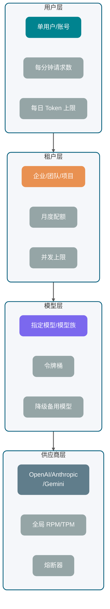
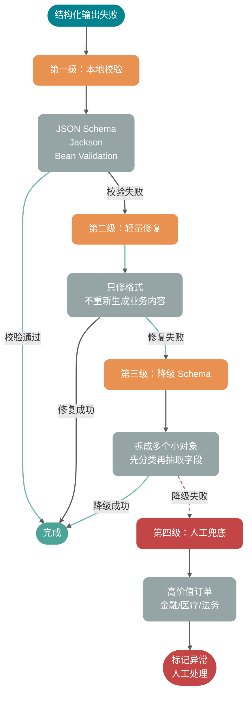
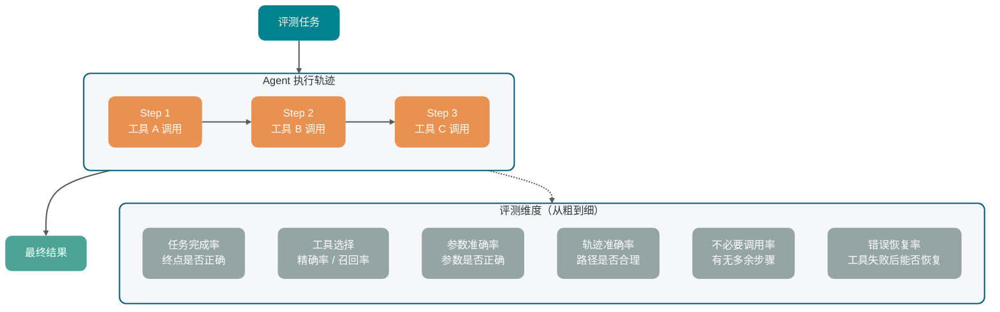
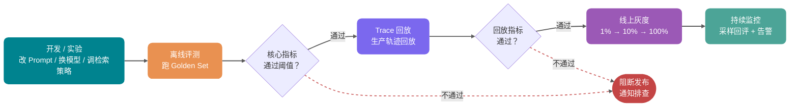
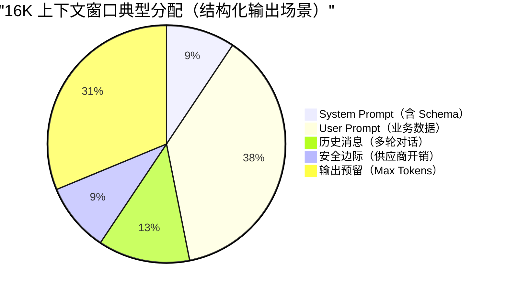
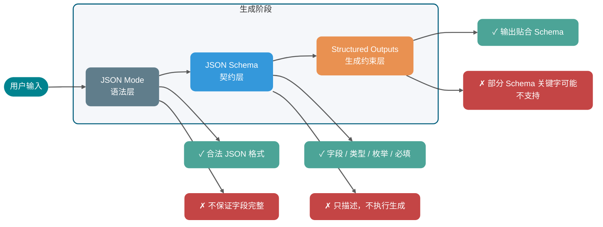
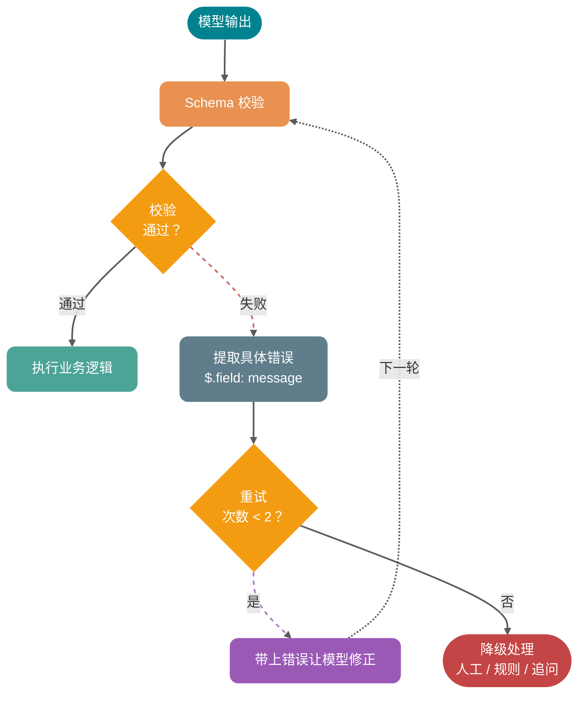
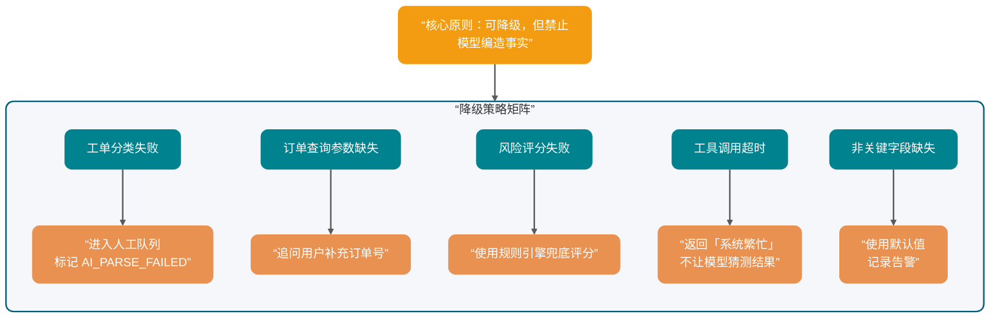

# llm基础 AI优化汇总

> 基于 0-ALL.md 的 AI 优化版：保留原文并补充知识地图、易漏考点与工程清单。

## AI 补充：体系化梳理与易漏考点

> 本节在汇总原文基础上，补充面试追问、对比项与工程落地注意点。

### 知识地图
- 大模型调用：Token / 上下文窗口 / 采样参数 / 结构化输出 / Function Calling
- Agent：Loop、Memory、Tool、MCP、Skills、Harness、评测
- RAG：切分、Embedding、向量库、召回、重排、GraphRAG、知识更新
- 系统设计：网关、可观测、成本、安全（注入/越权）、多模型路由

### 常漏追问
1. **为什么说只调 API 不够？** 要补齐超时重试、限流降级、JSON 校验、兜底话术、Trace。
2. **RAG 答非所问先查什么？** 先查召回（切分/Query 改写/混合检索/重排），再考虑换更大模型。
3. **Agent 与 Workflow 怎么选？** 步骤固定用 Workflow；路径依赖实时证据再用 Agent。
4. **如何做评测？** Golden Set + 人工抽检 + LLM-as-Judge；上线后要回归与灰度。

### 工程落地检查清单
- [ ] 是否有明确指标（延迟、吞吐、错误率、积压）？
- [ ] 失败是否可重试且幂等？
- [ ] 是否有限流/超时/降级？
- [ ] 是否有日志、链路追踪与告警？
- [ ] 配置变更与回滚是否可操作？


## TOC

1. 大模型 API 调用工程实践：流式输出、重试、限流与结构化返回 (`llm-api工程.md`)
2. AI 应用评测体系：从 Golden Set 构建到线上灰度闭环 (`llm评测.md`)
3. LLM 运行机制：Token、上下文窗口与采样参数怎么影响输出 (`llm运行机制.md`)
4. 大模型结构化输出：从 JSON 契约到 Function Calling 落地 (`结构化输出与函数调用.md`)

---

<!-- source: llm-api工程.md -->

## [1] 大模型 API 调用工程实践：流式输出、重试、限流与结构化返回

---
title: 大模型 API 调用工程实践：流式输出、重试、限流与结构化返回
description: 系统拆解 AI 应用调用大模型 API 的生产链路，覆盖业务请求、Prompt 组装、模型网关、流式输出、重试、限流、结构化返回、观测与 Java 后端落地。
category: AI 应用开发
head:
  - - meta
    - name: keywords
      content: 大模型 API,LLM API,流式输出,Streaming,SSE,WebSocket,重试,限流,结构化返回,JSON Schema,AI 应用开发
---

本地调通一个大模型 API 只说明网络和参数基本可用。接进真实业务后，首字延迟、半截 JSON、429、取消和重复执行都要处理：

- 用户等了 8 秒还看不到第一个字，以为系统卡死，直接刷新页面。
- 模型返回了一半 JSON，前端解析失败，后端日志里只有一串残缺的 `{"answer": "根因是`。
- 供应商偶发 429，你的服务开始疯狂重试，越重试越被限流。
- 用户点了取消，浏览器断开了，但后端还在消耗 Token。
- 同一个业务请求因为重试执行了两次，落库、扣费、发通知全重复了。

发送 HTTP 请求只是调用链的一小段。业务入口、Prompt 组装、模型路由、流式响应、状态落库和观测需要一起设计，尤其要处理取消、重试、配额和半成品输出。

上文默认你理解 Token、上下文窗口、Temperature、Top-p 等基础概念。如果还有疑问，建议先看[《LLM 运行机制：Token、上下文窗口与采样参数怎么影响输出》](./llm运行机制.md)和[《大模型提示词工程（Prompt Engineering）是什么？提示词技巧有哪些？》](../agent/prompt工程.md)。

说明：OpenAI、Anthropic、Gemini 等供应商能力和参数变化较快，生产系统应从控制台、响应头或配置中心动态管理，而非依赖文档里的静态数字。

## 一次生产级 LLM 调用包含哪些阶段？

只盯着供应商返回了什么，很难查清一次大模型调用的问题。请求会跨过业务系统、上下文系统、模型网关、外部供应商和前端展示层，任何一段缺少状态与错误处理，最后都可能表现成“模型不稳定”。


拆开看，一次请求通常包含 8 个阶段：

1. **业务请求进入**：校验用户身份、租户、套餐、功能权限、请求大小。
2. **上下文组装**：拼 System Prompt、用户输入、历史消息、RAG 证据、工具 Schema、输出格式约束。
3. **Token 预算预估**：估算输入 Token，预留输出 Token，决定是否裁剪历史、压缩上下文或换小模型。
4. **模型网关路由**：选择模型、供应商、区域、超时参数、重试策略、限流桶。
5. **供应商 API 调用**：同步返回或流式返回，可能经过 SSE、WebSocket 或普通 HTTP 响应体。
6. **响应解析**：处理 delta、finish reason、tool call、usage、拒答、结构化 JSON、异常中断。
7. **状态回写**：保存完整回答、增量片段、Token 用量、调用成本、失败原因和业务状态。
8. **观测与告警**：记录 traceId、providerRequestId、TTFT、总耗时、重试次数、429 次数、解析失败率。

模型调用最好收口到统一的 `LLMGateway` 或共享客户端层，由它处理 API Key、超时、重试、限流、日志和供应商切换。否则每个业务模块都会形成一套略有差异的失败语义，排查时很难复现。


## 同步返回和流式返回有什么区别？

同步调用要等模型生成完全部内容，再一次性返回完整结果。流式输出则是边生成边返回：模型每产生一段文本或一个事件，供应商就通过长连接把增量推给调用方。OpenAI 官方文档把 HTTP streaming 放在 SSE 场景下描述；Anthropic Messages API 也支持通过 SSE 增量返回事件；Gemini API 同样提供标准、流式和实时相关接口。具体字段和模型能力会变，**以官方文档最新展示为准**。

**为什么 Streaming 能降低 TTFT？**

TTFT（Time To First Token）指从请求发出到收到第一个可展示 Token 的时间。同步返回时，用户要等模型生成完整答案；例如模型要生成 800 个 Token，后端必须等这 800 个 Token 都完成才把结果返回。流式返回只需等到第一个片段，用户就能看到内容逐步出现。

流式输出没有让模型少算 Token，也不会天然省钱。它缩短的是首字等待时间，并不一定缩短整次生成的耗时。

| 对比项       | 同步返回                   | 流式返回                             |
| ------------ | -------------------------- | ------------------------------------ |
| 首字延迟     | 高，需要等完整结果         | 低，收到第一个片段即可展示           |
| 端到端总耗时 | 取决于完整生成时间         | 通常仍取决于完整生成时间             |
| 前端体验     | 像提交表单后等待结果       | 像聊天软件逐字出现                   |
| 后端实现     | 简单，拿到完整字符串再处理 | 复杂，需要处理增量事件、取消、断流   |
| 结构化解析   | 简单，完整 JSON 一次解析   | 需要缓存完整内容，或使用增量解析器   |
| 适合场景     | 短文本、后台任务、严格事务 | 聊天、写作、报告生成、长回答         |
| 不适合场景   | 用户强交互的长回答         | 强事务、必须一次性校验完整结果的链路 |

面向用户展示的长文本通常优先流式返回；后台批处理和必须拿到完整对象才能提交的任务更适合同步返回。

## SSE、WebSocket 和 HTTP chunked 这三种流式协议怎么选

流式输出有几种常见承载方式，别把它们混成一个东西。

| 方式         | 核心特点                                                                     | 适合场景                               | 边界                                                        |
| ------------ | ---------------------------------------------------------------------------- | -------------------------------------- | ----------------------------------------------------------- |
| SSE          | 浏览器原生 `EventSource`，服务端到客户端单向推送，格式是 `text/event-stream` | 文本聊天、模型增量输出、状态通知       | 单向通信；复杂双向控制需要额外 HTTP 请求                    |
| WebSocket    | 双向长连接，客户端和服务端都能随时发消息                                     | 实时语音、多人协作、需要频繁取消或插话 | 连接管理更复杂，网关、鉴权、心跳都要自己管好                |
| HTTP chunked | HTTP/1.1 的分块传输机制，响应体分块发送                                      | 后端到后端流式代理、低层传输           | 它是传输机制，不是应用事件协议；HTTP/2 之后有自己的流式机制 |


SSE 的优势是简单。浏览器端几行代码就能接收事件，服务端按 `data:` 一段段写出去即可。MDN 对 EventSource 的描述也强调了它和 WebSocket 的区别：SSE 是服务端到客户端的单向数据流。

WebSocket 适合更实时、更复杂的交互。比如语音 Agent 里，客户端要不断上传音频，服务端要不断返回 ASR、LLM、TTS 状态，还要支持用户中途打断。这种场景用 WebSocket 更自然。

HTTP chunked 更底层。很多服务端框架在没有 `Content-Length` 的情况下会用分块响应，它能实现“边写边发”，但不会帮你定义事件类型、重连语义、消息边界。业务层仍然要自己设计协议。

### SSE 协议的事件边界

SSE 通常通过 HTTP 响应承载，媒体类型是 `text/event-stream`，消息格式是一份 UTF-8 文本事件流。每个事件由若干行字段组成，事件之间用**空行**分隔；实际换行可以是 `\n` 或 `\r\n`，所以事件分隔常见写法是 `\n\n` 或 `\r\n\r\n`。

常用字段如下：

| 字段    | 作用                                           |
| ------- | ---------------------------------------------- |
| `data`  | 业务载荷；允许多行 `data:`，客户端会按规范拼接 |
| `event` | 自定义事件名；浏览器默认事件类型是 `message`   |
| `id`    | 事件序号；配合浏览器重连语义可做断点提示       |
| `retry` | 建议的重连间隔（毫秒）                         |

**空行才是事件分隔符**。单个换行只是结束当前字段行，不会直接结束事件。服务端手写 `data:` 时如果没有给正文每一行加字段前缀，客户端可能丢掉后续行；额外写入空行还会提前结束事件。Markdown 列表和代码块很容易触发这些情况。

小 G 在[《SpringAI 智能面试平台+RAG 知识库》](https://javaguide.cn/专栏/interview-guide.html)的知识库问答里用的就是 SSE：模型一边生成，浏览器一边打字机展示；链路不长，但协议细节一个不落下。

### Spring Boot + Spring AI 的 SSE 写法

Java 侧常见做法是 **`Content-Type: text/event-stream`**，再用响应式流往外推。Spring 提供了 `ServerSentEvent<T>`，避免手写 `data:` 和 `\n\n` 拼串出错：

```java
@GetMapping(value = "/chat/stream", produces = MediaType.TEXT_EVENT_STREAM_VALUE)
public Flux<ServerSentEvent<String>> stream() {
    return Flux.interval(Duration.ofMillis(500))
        .map(seq -> ServerSentEvent.<String>builder()
            .id(Long.toString(seq))
            .event("token")
            .data("片段-" + seq)
            .retry(Duration.ofSeconds(3))
            .build());
}
```

和大模型对接时，增量源头通常是 SDK 或框架暴露的流式接口。以 Spring AI 为例，`ChatClient` 侧启用流式后拿到 `Flux<String>`，再映射成 SSE 推给前端：

```java
Flux<String> tokens = chatClient.prompt()
    .system(systemPrompt)
    .user(userPrompt)
    .stream()
    .content();
```

工程上要心里有数：WebMVC + `Flux` 只是在 Controller 出口用了响应式类型做 SSE，底层仍是 Servlet 容器。线程池、连接数和超时仍要按「长请求」来治理；Java 21 虚拟线程可以把「占着一个平台线程傻等」的成本降下来，这对动辄数十秒的生成链路很实用。

### 模型正文包含换行时怎么处理

手写原始 SSE 文本时，每一行正文都要带 `data:` 前缀，空行才表示一个事件结束。浏览器会把同一事件的多行 `data:` 用换行拼起来。

使用 Spring `ServerSentEvent` 和对应的消息编码器时，不要先把正文里的 `\n` 替换成字面量 `\\n`。手工替换会改变业务文本，还要求前端再做一轮容易冲突的反转义。把原始字符串交给编码器即可：

```java
.map(chunk -> ServerSentEvent.<String>builder()
    .event("token")
    .data(chunk)
    .build())
```

如果链路中间要经过自研网关或非 SSE 客户端，可以把每个增量封装成 JSON，例如 `{"sequence":12,"delta":"第一行\n第二行"}`，再由 JSON 编码器处理转义。两种方案都要测试 LF、CRLF、空行、代码块以及断流时的半个事件。

### Nginx 与网关的流式配置

只要前面挂了 Nginx 或其它响应缓冲型网关，`text/event-stream` 可能被攒够一整块才下发，用户侧的 TTFT 体感瞬间回到同步接口。

最小改动通常是：

```nginx
location /api/ {
    proxy_pass http://backend;
    proxy_buffering off;
    proxy_cache off;
    proxy_read_timeout 300s;
    proxy_set_header Connection "";
    add_header Cache-Control no-cache;
}
```

再配合 `proxy_read_timeout`（或等价配置）把「长生成」守住，否则链路会在沉默超时处被中间件切断。

### 流式异常的四类场景

流式链路的结束状态需要单独设计。取消、超时、断流和重连不能共用一个“失败”状态。


**用户取消。**

用户关闭页面、点击停止生成、切换会话，都应该触发取消。后端要同时取消：

- 到供应商 API 的请求。
- 正在解析的响应流。
- 后续 TTS、工具调用、落库任务。
- 还没提交的增量缓存。

不能只在前端停止展示。前端停了而供应商请求仍在生成，Token 仍会继续消耗。

**超时。**

超时至少分三层：

- 连接超时：连不上供应商。
- TTFT 超时：连接上了，但迟迟没有第一个事件。
- 总时长超时：一直有输出，但超过业务可接受时间。

三者要分开记录。TTFT 超时通常指向模型排队、上下文过长或供应商抖动；总时长超时可能只是用户让模型写太长。

**断流。**

断流时不要轻易把半截内容当成成功。正确做法是记录 `finish_reason` 或最后事件状态，如果没有正常结束标记，就把本次调用标记为 `INTERRUPTED`，前端展示“已中断，可重新生成”，而不是悄悄落成完整答案。

**重连。**

SSE 的 `EventSource` 有自动重连能力，但大模型输出不是普通新闻推送。重连后是否能从断点续传，取决于你的服务端是否保存了事件序号、增量片段和供应商调用状态。多数情况下，供应商侧流已经断掉，无法真正从 Token 级别续上。

更稳的做法是：

- 服务端为每个流式响应生成 `messageId` 和递增 `sequence`。
- 已发送片段写入短期缓存。
- 前端重连时先补发已缓存片段。
- 如果供应商流已结束或失效，提示用户重新生成，而不是假装无缝续写。

## 哪些错误能重试，哪些不能重试？

重试是后端工程师最熟悉也最容易滥用的能力。

大模型 API 的重试有两个特殊点：

1. **请求贵**：失败请求也可能消耗配额，甚至已经消耗了部分 Token。
2. **输出非确定**：即使 Prompt 一样，第二次返回也可能和第一次不同。


### 错误类型对照表

| 类型             | 示例                                | 是否建议重试 | 处理方式                                   |
| ---------------- | ----------------------------------- | ------------ | ------------------------------------------ |
| 网络瞬断         | 连接重置、DNS 抖动、读超时          | 可以         | 指数退避 + 抖动，限制最大次数              |
| 供应商 5xx       | 500、502、503、504                  | 可以         | 短暂重试，超过阈值切换模型或降级           |
| 供应商过载       | Anthropic 529、类似 overloaded 错误 | 可以         | 慢重试，必要时熔断该供应商                 |
| 429 限流         | RPM、TPM、RPD、并发限制超出         | 谨慎         | 优先看 `Retry-After` 和限流头，排队或降级  |
| 流式中断         | 未收到正常结束事件                  | 视场景       | 用户可见任务不自动重试，后台任务可幂等重试 |
| 400 参数错误     | Schema 不合法、字段缺失、上下文超限 | 不建议       | 修请求，不要重试同一 payload               |
| 401/403 鉴权错误 | API Key 无效、权限不足              | 不建议       | 告警并停用对应 Key                         |
| 安全拒答         | 内容策略拒绝                        | 不建议       | 进入业务拒答流程                           |
| 解析失败         | JSON 不完整、字段类型错误           | 可有限重试   | 带失败原因二次修复，最多 1-2 次            |

OpenAI 官方限流文档建议对 rate limit error 使用随机指数退避，同时提醒失败请求也会计入每分钟限制；Anthropic 官方错误文档中明确列出了 429 rate limit、500 api error、504 timeout、529 overloaded 等错误类型。接入其他供应商时也需要按其错误码区分可重试、不可重试和过载状态。

### 指数退避和抖动

指数退避会随着失败次数增加等待时间，直到达到最大等待时间或最大重试次数。抖动（Jitter）再给等待时间加一段随机量，避免所有请求同时重试，把刚恢复的系统再次打进限流。

一个实用公式：

```text
sleep = min(maxDelay, baseDelay * 2^retryCount) + random(0, jitter)
```

生产里别忘了加两条硬约束：

- **最大重试次数**：通常 2-3 次足够，别无限重试。
- **总体截止时间**：用户请求有整体 SLA，例如 15 秒，到点就失败，不要因为重试拖成 1 分钟。

### 幂等 Key 和去重机制

只要有重试，就必须讨论幂等。

幂等 Key 可以由业务生成，例如：

```text
tenantId:userId:conversationId:messageId:attemptGroup
```

服务端拿到请求后，先查这个 Key 是否已经存在：

- 如果已经成功，直接返回历史结果。
- 如果正在生成，返回同一个流式任务的订阅地址。
- 如果失败且允许重试，创建新的 attempt，但仍然挂在同一个业务消息下。
- 如果失败但不可重试，直接返回失败原因。

这能避免两个坑：

1. 用户狂点“重新发送”，后端创建多个模型调用。
2. 网关超时后自动重试，第一次其实已经成功落库，第二次又写了一条重复消息。

### 响应重复的处理

重试后的响应可能重复、冲突或部分重叠。

对聊天类应用，建议把一次用户消息下的多次模型调用区分为：

- `message_id`：业务消息 ID，对用户可见。
- `attempt_id`：模型调用尝试 ID，对系统可见。
- `provider_request_id`：供应商请求 ID，用于排查。
- `stream_sequence`：增量片段序号，用于去重和补发。

落库时，只允许一个 attempt 成为 `final`。其他 attempt 保留为诊断记录，不参与用户上下文。这样既能排查问题，又不会污染下一轮 Prompt。

## 为什么要限流？如何限流？

很多团队的限流意识，是从收到第一个 429 开始的。

收到供应商 429 才开始限流，说明系统缺少自己的容量管理。429 只能作为外部保护信号，不能代替应用侧的预算、排队和并发控制。

### 限流的四层架构

| 层级     | 限制对象                     | 核心目的                     | 常见策略                       |
| -------- | ---------------------------- | ---------------------------- | ------------------------------ |
| 用户级   | 单个用户或账号               | 防止滥用、误操作、脚本刷接口 | 每分钟请求数、每日 Token 上限  |
| 租户级   | 企业、团队、项目             | 控制套餐成本和公平性         | 月度配额、并发上限、优先级队列 |
| 模型级   | 某个模型或模型族             | 避免热门模型被打满           | 模型维度令牌桶、降级到备用模型 |
| 供应商级 | OpenAI、Anthropic、Gemini 等 | 保护外部依赖和 API Key       | 全局 RPM、TPM、并发、熔断      |



Gemini 官方限流文档把限流维度拆成 RPM、输入 TPM、RPD，并说明限制按项目而不是单个 API Key 应用；OpenAI 官方文档也展示了请求数、Token 数、剩余额度等 rate limit header。具体数值和模型关系变化很快，生产系统不要把文档里的静态数字写死，要从控制台、响应头或配置中心动态管理。

### 为什么 Token 预算比请求数更重要

传统 API 限流通常按 QPS。大模型 API 只按 QPS 不够。

两个请求的成本可能差很多：

- 请求 A：输入 500 Token，输出 100 Token。
- 请求 B：输入 80K Token，输出 8K Token。

它们都是 1 次请求，但对模型推理、供应商配额和账单的压力完全不是一个量级。

所以限流至少要同时看：

- **RPM**：每分钟请求数。
- **TPM**：每分钟 Token 数。
- **并发数**：正在生成的请求数量。
- **上下文大小**：单请求输入 Token。
- **最大输出**：`max_tokens` 或类似参数。
- **日/月预算**：租户或用户总成本。

请求应先扣预算，再发给供应商。

请求进入网关后，先估算 `input_tokens + reserved_output_tokens`，在用户、租户、模型、供应商几个桶里尝试扣减。扣不到就不要发给供应商，直接排队、降级或拒绝。

### 常见限流策略对比

| 策略       | 适合场景               | 优点                     | 缺点                      |
| ---------- | ---------------------- | ------------------------ | ------------------------- |
| 固定窗口   | 简单后台任务、管理接口 | 实现简单，容易统计       | 窗口边界容易突刺          |
| 滑动窗口   | 用户级请求限制         | 边界更平滑               | 实现和存储成本更高        |
| 令牌桶     | 模型调用、Token 预算   | 支持一定突发，工程上常用 | 参数需要调优              |
| 漏桶       | 严格平滑出流量         | 输出稳定，适合保护供应商 | 突发体验差                |
| 并发信号量 | 流式生成、长任务       | 能限制同时占用连接       | 不控制单个请求 Token 成本 |
| 优先级队列 | 多租户、多套餐         | 能保护高优先级请求       | 需要处理饥饿和超时        |

生产系统通常会组合这些策略：

- 用户级：滑动窗口 + 日 Token 上限。
- 租户级：令牌桶 + 月度预算
- 模型级：令牌桶 + 并发信号量
- 供应商级：全局令牌桶 + 熔断器
- 流式请求：并发信号量 + 总时长限制

关于限流算法的详细介绍，可以参考这篇文章：[服务限流详解](https://javaguide.cn/高可用/limit-request.html)。

### 收到 429 应该怎么处理

HTTP 429 表示请求过多。后端处理 429 时，建议按这个顺序：

1. **读取 `Retry-After` 或供应商 rate limit header**：有明确恢复时间就尊重它。
2. **标记限流维度**：是请求数打满，还是 Token 打满，还是日配额耗尽。
3. **短请求可排队**：例如后台摘要任务可以进延迟队列。
4. **用户交互请求少重试**：用户等不起时，直接提示稍后再试或切换轻量模型。
5. **供应商连续 429 时熔断**：不要让所有请求继续撞墙。

一个典型降级链路：

```text
优先模型可用 -> 正常调用
优先模型 429 -> 切备用同级模型
备用模型也限流 -> 切轻量模型并缩短输出
仍不可用 -> 排队或返回"当前请求繁忙"
```

这里要避免一个误区：降级不是偷偷变差。如果轻量模型会影响答案质量，要在业务层明确标记，例如“当前为快速模式，复杂问题建议稍后重试”。

## 为什么要结构化返回？

很多业务一开始这样写 Prompt：

```text
请分析用户问题，输出 JSON，字段包括 intent、confidence、answer。
```

然后后端直接 `JSON.parse()`。

这在 Demo 阶段很常见，但生产环境会遇到各种边缘情况：

- 模型在 JSON 前加了一句“好的，以下是结果”。
- 字段缺失。
- 枚举值乱写。
- 数字返回成字符串。
- 流式返回时只拿到半个对象。
- 安全拒答时压根不是业务 Schema。

结构化返回要解决的是程序能否稳定消费模型输出，而不只是结果看起来像 JSON。

### JSON Mode、JSON Schema 和 Structured Output 的区别

| 方式                        | 约束强度 | 工程价值                      | 风险                           |
| --------------------------- | -------- | ----------------------------- | ------------------------------ |
| 普通自然语言                | 几乎没有 | 适合展示型回答                | 不适合程序解析                 |
| Prompt 要求 JSON            | 弱       | 简单、跨模型                  | 容易混入解释文本或缺字段       |
| JSON Mode                   | 中       | 通常能保证语法是 JSON         | 不一定符合业务字段 Schema      |
| JSON Schema                 | 强       | 明确字段、类型、必填、枚举    | 不同供应商支持子集不同         |
| Structured Outputs          | 更强     | 供应商在解码或 SDK 层增强约束 | 受模型、SDK、Schema 子集限制   |
| Function Calling / Tool Use | 面向动作 | 适合让模型选择工具和参数      | 不是最终自然语言答案的万能替代 |


OpenAI 官方 Structured Outputs 文档强调可以让输出遵循开发者提供的 JSON Schema，并提供 `strict` 相关配置；Gemini 官方文档说明 structured output 使用 `response_format` 和 JSON Schema，且支持的是 JSON Schema 的子集；Anthropic 官方文档也提供 Structured Outputs 和 Strict tool use，二者解决的问题并不完全一样。具体模型、字段、Schema 子集变化较快，仍然以官方文档最新展示为准。

### 普通 JSON 和结构化输出的工程差异

普通自然语言返回像“人写给人看的说明”，结构化返回像“服务写给服务的接口”。

举个意图识别场景：

```json
{
  "intent": "refund_request",
  "confidence": 0.86,
  "entities": {
    "order_id": "202605080001",
    "reason": "商品破损"
  },
  "need_human_review": false
}
```

有了 Schema，后端可以做这些事：

- `intent` 只能是有限枚举。
- `confidence` 必须是数字。
- `order_id` 可以为空，但类型必须稳定。
- `need_human_review` 必须存在。
- 解析失败时可以进入修复或人工兜底流程。

Schema 把模型生成的 JSON 变成了可校验的数据契约。

### 结构化输出失败后如何兜底

结构化输出仍然可能失败。失败不一定是供应商能力问题，也可能是 Schema 太复杂、上下文冲突、输出被截断、安全策略拒答。

建议兜底分四级：

1. **本地校验**：用 JSON Schema、Jackson、Bean Validation 校验字段和类型。
2. **轻量修复**：只让模型修复格式，不重新生成业务内容。
3. **降级 Schema**：复杂对象拆成多个小对象，或先分类再抽取字段。
4. **人工或规则兜底**：高价值订单、金融、医疗、法务场景不要完全依赖自动修复。



一个实用原则：结构化返回失败时，不要把原始自然语言硬塞给下游系统。能展示给用户，不代表能被程序执行。

## Java 后端怎么落地 LLM 调用？

这段 Java 伪代码不绑定具体 SDK。Token 预算、限流、重试、流式解析、幂等和观测都收口在同一个网关中：

```java
public interface LLMClient {
    LLMResponse chat(LLMRequest request);

    void stream(LLMRequest request, StreamHandler handler);
}

public interface StreamHandler {
    void onStart(String messageId);

    void onDelta(String messageId, long sequence, String delta);

    void onComplete(String messageId, LLMUsage usage);

    void onError(String messageId, Throwable error);
}

public final class LLMGateway {
    private final LLMClient client;
    private final RateLimiter rateLimiter;
    private final IdempotencyStore idempotencyStore;
    private final TokenEstimator tokenEstimator;
    private final Observation observation;

    public LLMGateway(
            LLMClient client,
            RateLimiter rateLimiter,
            IdempotencyStore idempotencyStore,
            TokenEstimator tokenEstimator,
            Observation observation) {
        this.client = client;
        this.rateLimiter = rateLimiter;
        this.idempotencyStore = idempotencyStore;
        this.tokenEstimator = tokenEstimator;
        this.observation = observation;
    }

    public LLMResponse chatWithRetry(BusinessCommand command) {
        String idemKey = command.idempotencyKey();
        LLMRequest request = buildRequest(command);
        String requestFingerprint = command.requestFingerprint();
        IdempotencyClaim claim = idempotencyStore.claim(idemKey, requestFingerprint);

        if (claim.isCompleted()) {
            return claim.toResponse();
        }
        if (!claim.isOwner()) {
            throw new LLMException("Request with the same idempotency key is already running");
        }

        TokenBudget budget = tokenEstimator.estimate(request);
        try {
            rateLimiter.acquire(command.tenantId(), request.model(), budget);
        } catch (RuntimeException ex) {
            idempotencyStore.releaseClaim(idemKey, requestFingerprint);
            throw ex;
        }

        RetryPolicy retryPolicy = RetryPolicy.defaultPolicy();
        Throwable lastError = null;

        for (int attempt = 0; attempt <= retryPolicy.maxRetries(); attempt++) {
            String attemptId = idemKey + ":attempt:" + attempt;
            long startNanos = System.nanoTime();

            try {
                idempotencyStore.startAttempt(idemKey, requestFingerprint, attemptId);
                LLMResponse response = client.chat(request.withAttemptId(attemptId));

                ParsedAnswer parsed = parseAndValidate(response.content(), command.schema());
                idempotencyStore.markSuccess(idemKey, attemptId, response, parsed);
                observation.recordSuccess(request, response.usage(), startNanos, attempt);
                return response;
            } catch (LLMException ex) {
                lastError = ex;
                observation.recordFailure(request, ex, startNanos, attempt);

                if (!retryPolicy.canRetry(ex, attempt)) {
                    idempotencyStore.markFailed(idemKey, attemptId, ex);
                    throw ex;
                }

                sleep(retryPolicy.nextDelay(ex, attempt));
            }
        }

        throw new LLMException("LLM request failed after retries", lastError);
    }

    public void stream(BusinessCommand command, StreamHandler downstream) {
        String idemKey = command.idempotencyKey();
        LLMRequest request = buildRequest(command).enableStream();
        String messageId = command.messageId();
        String requestFingerprint = command.requestFingerprint();
        IdempotencyClaim claim = idempotencyStore.claim(idemKey, requestFingerprint);
        if (!claim.isOwner()) {
            downstream.onError(messageId,
                    new LLMException("Duplicate or conflicting idempotency key"));
            return;
        }

        TokenBudget budget = tokenEstimator.estimate(request);
        try {
            rateLimiter.acquire(command.tenantId(), request.model(), budget);
        } catch (RuntimeException ex) {
            idempotencyStore.releaseClaim(idemKey, requestFingerprint);
            downstream.onError(messageId, ex);
            return;
        }

        StreamBuffer buffer = new StreamBuffer(messageId);
        idempotencyStore.startAttempt(idemKey, requestFingerprint, messageId);

        client.stream(request, new StreamHandler() {
            @Override
            public void onStart(String ignored) {
                downstream.onStart(messageId);
            }

            @Override
            public void onDelta(String ignored, long sequence, String delta) {
                if (buffer.seen(sequence)) {
                    return;
                }
                buffer.append(sequence, delta);
                idempotencyStore.appendDelta(messageId, sequence, delta);
                downstream.onDelta(messageId, sequence, delta);
            }

            @Override
            public void onComplete(String ignored, LLMUsage usage) {
                String fullText = buffer.fullText();
                try {
                    ParsedAnswer parsed = parseAndValidate(fullText, command.schema());
                    idempotencyStore.markSuccess(idemKey, messageId, fullText, parsed, usage);
                } catch (Exception ex) {
                    idempotencyStore.markFailed(idemKey, messageId, ex);
                    downstream.onError(messageId, ex);
                    return;
                }
                downstream.onComplete(messageId, usage);
            }

            @Override
            public void onError(String ignored, Throwable error) {
                idempotencyStore.markInterrupted(idemKey, messageId, buffer.fullText(), error);
                downstream.onError(messageId, error);
            }
        });
    }

    private LLMRequest buildRequest(BusinessCommand command) {
        return LLMRequest.builder()
                .model(command.model())
                .systemPrompt(command.systemPrompt())
                .userPrompt(command.userPrompt())
                .context(command.context())
                .responseSchema(command.schema())
                .timeout(command.timeout())
                .metadata("tenantId", command.tenantId())
                .metadata("messageId", command.messageId())
                .build();
    }

    private ParsedAnswer parseAndValidate(String content, JsonSchema schema) {
        try {
            return ParsedAnswer.fromJson(content, schema);
        } catch (Exception ex) {
            throw new NonRetryableLLMException("Structured output validation failed", ex);
        }
    }

    private void sleep(Duration duration) {
        try {
            Thread.sleep(duration.toMillis());
        } catch (InterruptedException ex) {
            Thread.currentThread().interrupt();
            throw new LLMException("Retry sleep interrupted", ex);
        }
    }
}
```

这段代码省略了存储接口和并发控制实现，`claim` 必须落到 Redis `SET NX`、数据库唯一约束或带条件的原子更新，不能用“先查询、再写入”代替。幂等键还要绑定请求指纹；同一个键对应不同请求时应返回冲突，而不是历史结果。

其余几个关键点：

- **业务入口不直接调用供应商 SDK**，统一走 `LLMGateway`。
- **先估算 Token 并扣限流桶**，避免发出去才发现没额度。
- **幂等记录包住整次业务消息**，attempt 只是系统内部重试。
- **同步和流式分开处理**，流式要记录 `sequence`，避免重连补发时重复。
- **结构化解析在落库前做**，失败就进入失败状态，而不是污染业务数据。

真实项目里还要补充：

- API Key 池和供应商路由。
- 模型优先级和降级策略。
- Prompt 版本号。
- 响应内容安全审查。
- usage 成本计算。
- traceId 和 providerRequestId 对齐。
- 流式取消信号向供应商请求传播。
- SSE 出站契约：换行与事件边界的处理方式要与前端一致，网关关闭缓冲并放宽读超时。

## 没有指标就没有稳定性

AI 应用的观测不能只记录“调用成功/失败”。

至少要记录这些指标：

| 指标                | 含义                | 用途                              |
| ------------------- | ------------------- | --------------------------------- |
| TTFT                | 首个 Token 返回时间 | 判断排队、上下文过长、供应商抖动  |
| E2E Latency         | 端到端完成时间      | 判断用户体验和 SLA                |
| Input Tokens        | 输入 Token          | 成本分析、上下文膨胀排查          |
| Output Tokens       | 输出 Token          | 成本分析、异常长回答排查          |
| Retry Count         | 重试次数            | 识别供应商不稳定或策略过激        |
| 429 Rate            | 限流比例            | 判断配额和限流桶是否合理          |
| Parse Failure Rate  | 结构化解析失败率    | 判断 Schema、Prompt、模型适配问题 |
| Cancel Rate         | 用户取消比例        | 判断响应太慢或生成太长            |
| Provider Error Rate | 供应商错误率        | 路由、降级、熔断依据              |

日志里建议带上这些字段：

```text
trace_id
tenant_id
user_id
conversation_id
message_id
attempt_id
model
provider
prompt_version
input_tokens
output_tokens
ttft_ms
latency_ms
retry_count
finish_reason
error_type
provider_request_id
```

没有这些字段，线上排查会非常痛苦。用户说“刚才 AI 没返回”，你连是哪家供应商、哪个模型、哪次 attempt、有没有收到第一个 delta 都查不到。

## 面试问题

### 1. 大模型 API 调用的完整链路是什么

一次调用从业务请求进入开始，先做用户、租户、权限和参数校验；然后组装 System Prompt、用户输入、历史消息、RAG 证据、工具定义和输出 Schema；接着估算 Token 预算，经过模型网关做路由、限流、超时、重试和供应商选择；供应商返回同步结果或流式事件后，后端解析增量、校验结构化输出、落库状态和 usage；最后把 TTFT、总耗时、错误码、重试次数、Token 成本写入观测系统。

因此，LLM 调用要按一条完整的生产链路治理，不能只封装成一个 HTTP 请求。

### 2. Streaming 为什么能改善体验

Streaming 让模型边生成边返回，用户可以更早看到第一个 Token，因此降低 TTFT。它不保证总生成时间变短，也不天然减少 Token 成本。后端需要额外处理取消、超时、断流、重连、半成品 JSON 和增量落库。

### 3. SSE 和 WebSocket 怎么选

如果只是服务端向浏览器推模型文本，SSE 更简单，天然适合单向增量输出；落地时别忘了 **`text/event-stream` 对换行与事件边界敏感**，以及反向代理缓冲会把「流式」攒成「批量」。如果客户端也要频繁向服务端发数据，例如语音流、实时控制、多人协作、插话打断，WebSocket 更适合。HTTP chunked 更偏底层传输机制，业务层仍要自己定义消息边界和事件类型。

### 4. 哪些大模型 API 错误可以重试

网络瞬断、连接重置、部分 5xx、504、供应商过载通常可以有限重试；429 要结合 `Retry-After`、限流头、排队和降级处理；400 参数错误、401/403 鉴权错误、内容安全拒答通常不能重试。结构化解析失败可以做 1-2 次格式修复，但不要无限重试。

### 5. 哪些大模型调用需要做幂等

纯文本生成不一定要求业务幂等，但重试仍可能产生重复费用和多个候选结果。涉及落库、扣费、发通知或工具写操作时，必须防止同一业务请求被执行多次。可以用业务消息 ID 生成幂等 Key，并绑定请求指纹；多次模型调用 attempt 挂在同一条业务消息下，只允许一个 attempt 成为最终结果。

### 6. 限流为什么不能只按 QPS

因为大模型 API 的成本和压力主要由 Token 决定。一个 500 Token 请求和一个 80K Token 请求都是 1 次请求，但资源消耗差异很大。生产限流要同时看 RPM、TPM、并发数、上下文大小、最大输出和租户预算。

### 7. JSON Mode 和 Structured Outputs 有什么区别

JSON Mode 更关注“输出是合法 JSON”，但不一定符合你的业务 Schema。Structured Outputs 或 JSON Schema 约束更强，可以要求字段、类型、必填项、枚举等结构。Function Calling 或 Tool Use 更适合让模型产出工具调用参数。不同供应商支持的 Schema 子集不同，落地前要查官方文档并写兼容层。

### 8. 流式结构化返回怎么处理

不要一边收到 delta 一边直接 `JSON.parse()` 完整对象。更稳的做法是：增量阶段只展示文本或记录片段，等收到正常结束事件后拼成完整内容，再做 Schema 校验。若供应商支持结构化流式事件或 SDK accumulator，可以使用官方累积器；否则自己维护 buffer、sequence 和结束状态。

## 上线前检查

上线门禁至少覆盖四条失败链路：客户端取消能否传到供应商；可重试错误是否受总截止时间和原子幂等记录约束；RPM、TPM、并发与租户预算是否同时生效；结构化输出解析失败后是否进入明确失败状态。

观测记录要能串起 `messageId`、`attemptId` 和 `providerRequestId`，并保存 TTFT、总耗时、usage、结束原因与解析结果。缺少其中任一段，断流、重复执行和账单异常都会变得难以复现。

## 参考资料

- [OpenAI Streaming API responses](https://developers.openai.com/api/docs/guides/streaming-responses)
- [OpenAI Structured model outputs](https://developers.openai.com/api/docs/guides/structured-outputs)
- [OpenAI Rate limits](https://developers.openai.com/api/docs/guides/rate-limits)
- [Anthropic Streaming Messages](https://platform.claude.com/docs/en/build-with-claude/streaming)
- [Anthropic Errors](https://platform.claude.com/docs/en/api/errors)
- [Anthropic Structured outputs](https://platform.claude.com/docs/en/build-with-claude/structured-outputs)
- [Gemini Structured outputs](https://ai.google.dev/gemini-api/docs/structured-output)
- [Gemini Rate limits](https://ai.google.dev/gemini-api/docs/rate-limits)
- [MDN Using server-sent events](https://developer.mozilla.org/en-US/docs/Web/API/Server-sent_events/Using_server-sent_events)
- [MDN EventSource](https://developer.mozilla.org/en-US/docs/Web/API/EventSource)
- [Spring `ServerSentEvent` Javadoc](https://docs.spring.io/spring-framework/docs/current/javadoc-api/org/springframework/http/codec/ServerSentEvent.html)
- [MDN 429 Too Many Requests](https://developer.mozilla.org/en-US/docs/Web/HTTP/Reference/Status/429)
- [MDN Transfer-Encoding](https://developer.mozilla.org/en-US/docs/Web/HTTP/Reference/Headers/Transfer-Encoding)


---

---

<!-- source: llm评测.md -->

## [2] AI 应用评测体系：从 Golden Set 构建到线上灰度闭环

---
title: AI 应用评测体系：从 Golden Set 构建到线上灰度闭环
description: 从“没有评测集就没有信心上线”讲起，系统拆解 AI 应用评测的完整闭环：评测任务、Golden Set、规则评测、LLM-as-Judge、RAG/Agent/结构化输出指标、Trace 回放、评测 Harness、线上灰度与 CI 自动回归。
category: AI 应用开发
head:
  - - meta
    - name: keywords
      content: AI评测,LLM评测,RAG评测,Agent评测,LLM-as-Judge,Golden Set,离线评测,Trace回放,评测Harness,灰度评测,评测体系,AI应用开发
---

客服 RAG 升级混合检索和 Reranker 后，最容易出现的上线判断是：本地挑几十条问题跑一遍，答案比旧版顺，就觉得可以放量。

如果放量一周后业务方只反馈“有些问题感觉还不如以前准”，排查会立即卡住。

这时需要回看同一批场景的历史结果：旧版本在退换货、物流查询、商品参数对比上的命中率分别是多少，新版本又是从哪一类问题开始退步的。没有这份基线，“不如以前准”既可能是质量回退，也可能只是用户预期变化；排查最终只能回到原始对话里逐条翻找。

模型选择、Prompt 调整、检索优化和灰度发布会因此失去共同的比较口径。评测集的作用，就是把这些改动放到同一把尺子下比较。

RAGAS、TruLens、LangSmith、Langfuse 等框架仍在持续演进，生产接入应以各自的最新官方文档为准。本文只讨论评测方法和指标设计，不做工具横向测评，也不引用未经验证的 benchmark 数字。

## 为什么公开 benchmark 不够用？

公开 benchmark 可以先用来筛掉明显不合适的模型，比如中文能力弱、上下文窗口不够、工具调用能力达不到业务要求的候选项。

但把榜单分数直接当上线依据，就会漏掉业务里的关键问题。

榜单的任务和数据集是固定的，排名不能直接代替业务验证。电商客服里常见的是退换货、快递时效、促销规则和商品参数比较；英文推理题的高分无法说明模型会按这些业务规则作答。

真实请求还会带来错别字、口语缩写、截图、多语言和前后矛盾等输入。干净测试集上的表现，往往覆盖不到这些情况。

上线前尤其要单独检查少数不能出错的路径：合同审查漏掉高风险条款会影响签署判断，客服答错退款流程会让用户按错路径提交材料，代码 Agent 执行危险命令则会影响仓库和运行环境。此类失败即使占比很低，也可能被平均分掩盖；通用 benchmark 通常不会把它们凸显出来。

公开榜单可以排除明显不合适的模型。一个模型能不能接进自己的业务，还是要靠自己的评测集来判断。

## 一条评测用例里有什么？

一条评测用例要落到可验证的问题上：给定一个输入，系统应该完成什么，完成标准是什么。

单轮问答场景比较简单。输入是一段用户问题，输出是一段模型回答，评分器检查它是否准确、完整、相关。

Agent 场景会复杂很多。它可能多轮思考、调用工具、修改外部状态，最后还会留下完整执行过程。几个对象会反复出现：

| 概念               | 含义                                                 | 例子                                             |
| ------------------ | ---------------------------------------------------- | ------------------------------------------------ |
| Task               | 一条评测任务，包含输入和成功标准                     | “修复空密码绕过登录校验的问题”                   |
| Trial              | 同一条任务的一次运行                                 | 同一个 Agent 对同一条任务跑第 3 次               |
| Grader             | 对输出或过程打分的评分器                             | 单元测试、JSON Schema、LLM-as-Judge、人工复核    |
| Transcript / Trace | 一次运行的完整记录                                   | 用户输入、模型回复、工具调用、参数、返回值、耗时 |
| Outcome            | 任务结束后的真实状态                                 | 代码测试通过、退款单创建成功、数据库状态更新     |
| Eval Harness       | 负责跑任务、记录过程、调用评分器、汇总结果的工程骨架 | 本地脚本、评测平台、Claude Code 搭出来的评测流程 |

排查问题时，这几个对象最好分开看。

比如一个客服 Agent 最后回复“退款已经处理”，这只是 Transcript 里的最终回复。要看的 Outcome 是退款单有没有创建、状态有没有更新、金额有没有算对。如果只评最终文本，很容易把“说得像成功了”误判成“真的成功了”。

再比如一个 Coding Agent 最后测试通过了，也不代表过程完全没问题。它可能反复试错十几次，或者顺手改了不该改的文件。Trace 会让失败样本不只留下一个分数，还留下工具选择、参数构造、上下文理解和评分器规则的证据。

## Golden Set 怎么构建？

Golden Set 可以理解成 AI 应用自己的标准测试集。它不是靠数量堆起来的，关键是每条样本都要有明确输入，以及判断输出好坏的标准。

这个标准不一定是唯一正确答案。它可以是参考答案、评分维度、验证规则，也可以是一段人工判断说明。只要后续评测能按同一个口径执行，它就有价值。

### 数据从哪来？

**生产日志分层采样。**

系统已经上线时，生产日志通常是最有价值的数据源。采样时不要只取高频问题，因为高频问题往往已经被产品和 Prompt 优化过。低频、边缘和异常输入更容易暴露系统短板。

建议重点看几类样本：用户点了“不满意”的，出现补充追问的，最后转人工的，以及那些看起来“差点失败”的边缘案例。

如果只从正常对话流里采样，Golden Set 很容易漏掉图文混排、跨意图追问、用户描述前后矛盾这类样本。后续版本看起来通过率提高了，实际上可能只是“测试集里没有那类问题”。

**人工构造。**

新功能尚未产生日志时，退款越权、Prompt 注入等风险又很少自然出现，测试集缺失的部分要由人工写入。

人工构造时不要只写“正常问题”。第一版样本里至少要有这三类：

- 把“7 天内未拆封能否退货”这类问题收进正常路径，答案口径明确，适合先校验主流程。
- 用户只说“东西坏了”时，订单、时间和故障细节都缺失，预期行为应是先追问。
- 另外准备绕过退款规则和要求代码 Agent 执行越权命令的请求，检查系统的对抗处理。

**失败案例回填。**

每次处理用户投诉，都值得判断这个案例能否转成评测用例。经确认的失败样本回填后，Golden Set 才会随模型暴露出的薄弱点更新，而不会停在最初的主观设想上。

冷启动可以把知识库文档作为种子，生成问题、参考答案和难例。经人工抽样审核后，这些内容再进入候选集；RAGAS 等工具可以承担生成环节。

这类样本只负责补足初始覆盖面，不能直接用作发布门禁。生成的问题通常较规整，错别字、截图描述、前后矛盾和非常规追问仍需通过日志、失败案例和人工审核补上。

### 多少条够用？

这个问题没有固定答案，可以先按工程阶段定一个起点。

第一版可以先用 20 到 50 条真实任务验证评测流程。这一数量只是启动用的工程样本，无法支持统计结论；需要发布门禁时，再根据风险、基线方差和最小可接受差异计算样本量。无论规模多大，“什么算完成”都要先写成可重复执行的检查项。

第一版 eval 可以先纳入真实失败样本、手工测试样本和高风险路径，不必等待数据集完全成型；Anthropic 的 Agent eval 实践也采用这一思路。

用于发布门禁的样本，先要覆盖主要功能路径和高风险场景。之后按分层结果观察基线方差和可接受误差，再计算需要多少条；离开具体业务，50、200、500 都只是数字，不能直接当门槛。

样本分布往往比总量更先决定评测能否发现问题。200 条同类问题不如 100 条覆盖 10 类场景。

Agent 场景还要看 Trial 数量。同一条任务跑一次成功，不代表稳定可用。客服、支付、退款、合规这类场景，更适合对关键任务重复运行多次，观察“至少一次成功”和“连续成功”的差异。前者反映能力上限，后者更接近生产稳定性。

### 分层比总量更关键

| 分层       | 典型内容               | 取样原则                                   |
| ---------- | ---------------------- | ------------------------------------------ |
| 正常路径   | 高频、清晰的主流场景   | 按真实流量分布取样，保证主要功能都有覆盖   |
| 边缘场景   | 信息缺失、多义、跨领域 | 对历史失败和容易混淆的输入提高采样权重     |
| 对抗样本   | 模型容易犯错的特殊输入 | 按攻击面和权限风险设计，不依赖自然流量出现 |
| 高权重失败 | 业务定义的关键失败类型 | 单独设置门禁，不能被大量正常样本的均值稀释 |

高权重失败样本数量可以少，发布门禁里要单独看。合规场景漏识别风险条款、医疗场景给出错误用药建议，即使在总评测集中占比不高，也可能足以暂停发布。

### Golden Set 不是一次性资产

产品会迭代，用户会变化，原来的 Golden Set 也会过期。维护时可以直接盯三件事：

- 覆盖度复查：每季度看一遍新场景、过期规则和已经失效的样本。
- 失败样本回流：线上出现新失败模式，经人工确认后加入评测集。
- 版本记录：Golden Set、模型版本、Prompt 版本一起保存，否则跨版本对比会失真。

## 三种评测方法

Golden Set 准备好之后，要决定谁来评分。人工评测、规则评测、LLM-as-Judge 不是替代关系，更多时候是分工关系。


| 方法         | 准确性                     | 速度 | 成本 | 典型评测内容                                          | 典型使用场景                                                   |
| ------------ | -------------------------- | ---- | ---- | ----------------------------------------------------- | -------------------------------------------------------------- |
| 人工评测     | 高（依赖标注规范与一致性） | 慢   | 高   | 复杂语义判断、边界样本仲裁、业务风险判断              | Golden Set 初始标注、高风险场景最终校验、LLM-as-Judge 校准基准 |
| 规则评测     | 高（规则可描述范围内）     | 最快 | 低   | JSON 格式、字段完整性、枚举值、数值边界、引用是否存在 | 格式校验、枚举字段、引用检查、数值边界                         |
| LLM-as-Judge | 中（受偏差影响）           | 快   | 中   | 答案相关性、事实忠实度、完整性、连贯性、语气是否合适  | 语义相关性、答案连贯性、事实忠实度、多维度综合打分             |

格式、枚举、引用缺失这类硬错误，先交给规则评测拦住。开放式语义判断再交给 LLM-as-Judge，高风险样本和边界样本保留人工复核，用来校准 Judge 的口径。

生产排查不能只留下一个总分。每条结果至少应能回答“是否通过、错在哪里、判断有多确定”：

- `pass/fail`：这条样本是否通过。
- `score`：某个维度的分值，方便版本对比。
- `reason`：一句简短判定依据，方便人工复核。
- `category`：问题现象分类，比如格式错误、事实错误、工具未调用、过度承诺。
- `confidence`：评分器对自己判断的置信信号，低置信样本可以进入人工复核。这个值不等于真实正确概率，使用前要拿人工标注集校准。

这样筛 Badcase 时可以先按现象定位候选模块，不必从头阅读每条失败记录。

ARES 的做法是先用合成数据训练轻量级 Judge，再结合一小批域内人工标注，通过 PPI（Prediction-Powered Inference）估计 RAG 系统质量的置信区间。当评测量较大、持续调用强模型的成本已经限制评测规模时，这是一条可选路线。它仍需要域内语料、少量示例和人工验证集，不是零标注方案。

多数团队先使用通用 LLM-as-Judge 即可；只有成本或一致性成为持续瓶颈时，再为特定领域训练 Judge。

## 评测工具怎么选？

工具不要一上来就全接。先看你要解决的是哪类问题：

| 工具      | 更适合的环节               | 典型用途                                                                   |
| --------- | -------------------------- | -------------------------------------------------------------------------- |
| RAGAS     | RAG 指标评测               | Faithfulness、Response Relevancy、Context Precision、Context Recall 等指标 |
| TruLens   | RAG/LLM 应用观测与反馈函数 | Groundedness、Context Relevance、Answer Relevance 等质量反馈               |
| LangSmith | LLM / Agent 开发与生产闭环 | Dataset、Trace、离线实验、线上评测、回归测试                               |
| Langfuse  | 生产 Trace 和评分分析      | Trace 采样、人工评分、LLM-as-Judge、Score Analytics                        |

先把 Golden Set、评分标准和版本记录固定下来，再接入平台跑批和展示。否则 RAGAS、LangSmith 或 Langfuse 的面板只会把尚未稳定的评测流程原样呈现出来。

## LLM-as-Judge 怎么用才可靠？

LLM-as-Judge 就是让一个通常更强的模型去评判另一个模型的输出。

它适合评开放式回答，不需要把所有规则写成 if/else，成本也比人工低很多。问题在于，Judge 模型也会有偏差，不能把它当成绝对裁判。

### 两种模式

**Reference-based（有参考答案）**

有参考答案时，Judge 的任务会收窄很多。它要对照标准答案核查事实、边界条件和遗漏项，而不是只凭回答是否顺口来给分。

```text
参考答案：退款申请应在收货后 7 天内提交，超期不受理。
模型回答：您需要在收货 7 天内提出退款申请，否则无法受理。

请对以下维度打分（1-5 分）：
- 事实准确性：模型回答与参考答案的事实是否一致？
- 完整性：参考答案中的关键信息是否都在模型回答中体现？
- 措辞清晰度：模型回答是否清楚易懂？
```

**Reference-free（无参考答案）**

Reference-free 不拿标准答案做对照，Judge 只能依据用户问题、上下文约束和评分标准判断回答是否合格。创意写作、分析类问题，或者参考答案无法收敛到唯一版本时会用这种方式；事实型业务问答最好尽量补上资料、规则或人工判定口径。

### 四类常见偏差与局限

**位置偏差（Position Bias）**

A/B 对比里，答案的展示顺序也会影响 Judge。两个答案质量接近时，有些模型会更容易选第一个，有些模型会偏向后出现的那个。

处理方式是做两次评判，交换 A/B 顺序，取两次一致的结论；或者让 Judge 一次只评一个答案，不做直接对比。

**冗长偏差（Verbosity Bias）**

Judge 模型容易把更长的答案判得更好，即使长度来自废话和重复。

可以把两类答案直接放进校准集：一条反复粘贴政策原文，另一条只保留时间、条件和例外。Judge 若仍偏向前者，说明 Prompt 里的“避免冗长”没有实际约束力。

**自我强化偏差（Self-Enhancement Bias）**

如果 Judge 模型和被评判模型来自同一家，甚至是同一个模型，可能会对同源输出更宽容。

MT-Bench 的实验中，GPT-4 和 Claude-v1 对自身输出表现出一定胜率偏好，GPT-3.5 则没有相同结果。论文同时指出数据量和差异有限，不能据此认定存在稳定的系统性偏差。

重要评测节点可以交叉使用不同厂商或模型族的 Judge，并保留人工抽样复核，避免结论依赖单一模型偏好。

**有限推理能力（Limited Reasoning Ability）**

数学、代码、SQL 和复杂逻辑推理的正确性不能只交给 LLM Judge。被评答案中的错误推导可能影响它的判断，即使该模型单独解题时能够得到正确结果。

这类场景最好使用 Reference-guided Judge：给 Judge 明确的参考答案、单元测试结果、SQL 执行结果或关键推理步骤，让它围绕可验证证据评分。MT-Bench 也提到，chain-of-thought judge 和 reference-guided judge 能缓解数学和推理题上的评分局限。主观质量可以交给 Judge，客观正确性要尽量给它证据。

### Judge Prompt 怎么写？

很多 LLM-as-Judge 失败，问题出在 Prompt 写得太含糊。Judge 不知道评分标准，只能凭感觉打分，最后每个答案都差不多，分数拉不开。

一个比较实用的 Judge Prompt 模板：

```text
你是一个严格的评测员，负责评判 AI 助手的回答质量。

【用户问题】
{question}

【参考资料】（检索到的上下文，如果有）
{context}

【参考答案】（如果有，用于校准事实、数值、代码或推理正确性）
{reference_answer}

【AI 回答】
{answer}

评分前先完成这些检查，但最终只输出 JSON，不要展开完整推理过程：

- 提取用户问题里的硬性要求和隐含约束。
- 对照参考资料和参考答案，检查回答中的事实断言是否有依据。
- 检查回答是否覆盖关键要点，有没有混入无关内容。
- 按下面三个维度分别给 1-5 的整数分。

请严格按照以下标准评判，每个维度独立打分，分值为 1-5 的整数：

1. 事实忠实度（Faithfulness）
   5 分：回答中所有事实断言均可在参考资料中找到依据
   3 分：大部分有依据，存在少量无法核实的推断
   1 分：包含与参考资料矛盾或无依据的事实断言

2. 答案相关性（Answer Relevance）
   5 分：直接回答了用户问题，没有不相关内容
   3 分：基本回答了问题，但有部分偏题
   1 分：未能回答用户实际问题

3. 完整性（Completeness）
   5 分：覆盖了回答这个问题所需的全部关键要点
   3 分：覆盖了主要要点，但遗漏了部分重要细节
   1 分：严重缺失关键信息

请按以下 JSON 格式输出，不要添加额外解释：
{"faithfulness": <分值>, "relevance": <分值>, "completeness": <分值>, "reasoning": "<一句话说明评分依据>"}
```

清晰的维度、分档标准和反例通常有助于减少 Judge 凭感觉打分。是否真的更稳定，仍要用人工校准集检查一致率、分维度误差和边界样本，不能只看 Prompt 是否写得足够长。

如果 Judge 缺少足够证据，最好允许它输出 `Unknown` 或 `needs_human_review`，不要逼它硬判。尤其是财务、法律、医疗、赔付、账号安全这类场景，低置信样本进入人工复核，比让 Judge 编一个看似确定的结论更可靠。

G-Eval 把 chain-of-thought 与 form-filling 结合起来完成 NLG 评测。工程实现可以借鉴它先生成评估步骤、再按结构化表单打分的思路；对外保存评分时，保留分数和简短依据即可，不必把完整推理过程写进结果。

复杂、多约束、需要事实核验的任务适合这样做。简单格式校验，或者本身会进行内部推理的推理模型，显式步骤可能只是增加 token 成本。

## RAG 应用怎么评测？

RAG 出问题时，最终表现常常只有一句“答案不准”。但修复入口取决于问题发生在哪一段：关键资料没有被召回，改 Prompt 很难救；资料已经进了上下文，模型却没用上，继续调向量库也解决不了。

所以 RAG 评测通常先拆两张账：检索层看相关内容有没有进上下文，生成层看模型有没有基于这些内容回答。

```mermaid
flowchart LR
    Query["用户查询"]:::client
    Retrieval["检索层\n向量检索 / 混合检索"]:::business
    Context["检索结果\n候选段落"]:::external
    Generation["生成层\n模型 + Prompt"]:::gateway
    Answer["最终回答"]:::success

    Query --> Retrieval --> Context --> Generation --> Answer

    subgraph rMetrics["检索指标"]
        direction TB
        R1["Recall@k"]:::info
        R2["Hit Rate@k"]:::info
        R3["MRR"]:::info
        R4["Context Precision / Recall"]:::info
    end

    subgraph gMetrics["生成指标"]
        direction TB
        G1["Faithfulness（事实忠实度）"]:::info
        G2["Answer Relevance（答案相关性）"]:::info
        G3["Context Usage（上下文使用度）"]:::info
        G4["Noise Sensitivity（噪声敏感度）"]:::info
    end

    Retrieval -.-> rMetrics
    Generation -.-> gMetrics

    classDef client fill:#00838F,color:#FFFFFF,stroke:none,rx:10,ry:10
    classDef business fill:#E99151,color:#FFFFFF,stroke:none,rx:10,ry:10
    classDef gateway fill:#7B68EE,color:#FFFFFF,stroke:none,rx:10,ry:10
    classDef external fill:#607D8B,color:#FFFFFF,stroke:none,rx:10,ry:10
    classDef success fill:#4CA497,color:#FFFFFF,stroke:none,rx:10,ry:10
    classDef info fill:#95A5A6,color:#FFFFFF,stroke:none,rx:10,ry:10
    linkStyle default stroke-width:2px,stroke:#333333,opacity:0.8
    linkStyle 4,5 stroke-dasharray:5 5,opacity:0.8

    style rMetrics fill:#F5F7FA,stroke:#005D7B,stroke-width:2px,rx:10,ry:10
    style gMetrics fill:#F5F7FA,stroke:#005D7B,stroke-width:2px,rx:10,ry:10
```



### 检索指标

**Recall@k** 看前 k 个检索结果里，有多少比例的相关文档被召回。

```text
Recall@k = 被召回的相关文档数 / 总相关文档数
```

这个指标对“漏掉关键知识”很敏感。知识库问答里经常会看 Recall@3 或 Recall@5。

**Hit Rate@k** 看前 k 个结果里有没有至少一条相关文档。每条样本给 0 或 1，再取平均。

它适合快速评估，不关心有多少相关文档被召回，只关心有没有相关内容进入上下文。计算简单，也好解释。

**MRR（Mean Reciprocal Rank）** 看第一条相关文档排在第几位。排得越靠前，MRR 越高。

如果生成模型明显更依赖 Top 位置的文档，MRR 更能反映检索质量。

| 指标              | 关注点                           | 适合场景                                     |
| ----------------- | -------------------------------- | -------------------------------------------- |
| Recall@k          | 召回覆盖率                       | 关键信息不能漏的场景，比如合规、法律、医疗   |
| Hit Rate@k        | 是否命中                         | 快速评估和阶段验证                           |
| MRR               | 相关结果排名                     | 模型重度依赖 Top-1 结果的场景                |
| Precision@k       | 精准率                           | 上下文 Token 预算紧张、需要高精准输入的场景  |
| Context Precision | 相关上下文是否排在前面           | 没有完整文档 ID 标注，但有参考答案或生成回答 |
| Context Recall    | 参考答案中的信息是否被上下文覆盖 | 标注文档级相关性太贵，但可以提供参考答案     |

前四个传统 IR 指标通常需要标注相关文档 ID。也就是说，每条问题要标出“哪些文档是这个问题的正确答案来源”，才能判断检索有没有命中。这也是 Golden Set 里最花时间的部分。

文档级标注成本太高时，可以先用 RAGAS 这类基于 LLM 的检索指标起步。Context Precision 关注相关上下文是否排在更靠前的位置：有参考答案时可据此判断 chunk 相关性，无参考答案的变体则会拿生成回答作比较。Context Recall 关注参考答案中的声明，有多少能被检索上下文支持。它们不要求你为每个问题精确标出所有相关文档 ID，但会依赖 LLM 判断；无参考答案的 Context Precision 还可能把生成回答自身的遗漏带进评分，因此仍要做人工抽样校验。

RAGAS 文档里也有 Context Utilization。它在没有参考答案时，把每个检索 chunk 与生成回答比较，再按 Context Precision 的方式计算排序分数；因此它仍不是“回答使用了多少上下文信息”的直接度量。如果要评后者，建议换一个自定义名称，比如这里的 Context Usage，避免把两个口径混在一起。

### 生成指标

生成层主要看回答是否忠于上下文、是否答到问题、有没有被噪声带偏。

**Faithfulness（事实忠实度）**

它检查模型回答里有没有超出检索结果范围的捏造。回答里的事实都能从检索内容里找到依据，Faithfulness 就高；模型开始补充检索结果里没有的内容，Faithfulness 就低。RAGAS 也是类似思路：判断答案中的每个陈述能不能从上下文中推导出来。

**回答有没有接住问题**

这一项看回答有没有接住用户真正问的事。用户问“怎么退款”，模型只贴一段退货政策原文，即使原文完全来自检索结果，也没有把申请入口、时限、材料和下一步动作整理出来，相关性就不够。

**上下文材料有没有被用上（自定义指标）**

这一项不看召回结果本身是否相关，而是看已经放进 Prompt 的材料有没有被回答用上。比如退款政策已经出现在 Top-3，回答仍然只给一句“请联系客服”，问题就可能在上下文排序、Prompt 注入方式，或者模型忽略中间内容。关于 Lost-in-the-Middle 现象，可以看 [《LLM 运行机制：Token、上下文窗口与采样参数怎么影响输出》](./llm运行机制.md)。

这里故意不用 Context Utilization 这个名字，避免和 RAGAS 的同名指标混淆。本文讨论的是生成层是否充分使用已有上下文，不评检索结果的排序。

**噪声上下文会不会带偏回答**

把 Top-k 调大后，候选上下文常会混进半相关甚至无关的 chunk。RAGAS 的 Noise Sensitivity 会检查回答中的错误声明，并判断这些错误是否可归因于相关或无关的检索上下文；分数在 0 到 1 之间，越低越好。分数偏高时，先检查分块、Reranker 和上下文排序；如果资料已排到前面，再考虑 Prompt 是否缺少“只使用相关资料”的约束。

### RAG 评测的两个常见陷阱

**陷阱一：用检索结果直接当标准答案。**

有人为了省标注成本，把检索到的文档直接当标准答案，再评估生成回答和这个“标准答案”的相似度。

这会混淆检索质量和生成质量。检索结果只是候选，不等于正确答案。这样算出来的分数，更像是在评“模型有没有复述检索结果”，很难判断模型有没有答对。

**陷阱二：只评最终答案，不分段。**

只看最终答案质量时，很难分清问题来自检索还是生成。检索差和生成差，最终表现都可能是“回答不准”，但优化方向完全不同。分段评测是定位问题的基本前提。

## Agent 应用怎么评测？

Agent 评测比 RAG 更难。RAG 通常还能拆成“检索”和“生成”两段，Agent 会在多轮里调用工具、修改状态、读取反馈、继续决策。前一步的小错，可能在后面被放大。

评 Agent 时，要把 Outcome 和 Transcript 分开看。

Outcome 是最后状态，比如订单有没有退款成功、代码测试有没有通过、文件有没有按要求改好。Transcript 是完整过程，比如它调用了哪些工具、传了什么参数、工具返回了什么、总共跑了几轮。

测试通过的 Coding Agent 也可能改了无关文件；回复“已经退款”的客服 Agent 可能跳过了身份校验；数据分析 Agent 即使产出图表，也可能把金额字段读成件数。这些问题都藏在过程里，最终答案无法单独反映。

退款、转账、删库和发邮件会改变外部状态，评分时要核对关键步骤。查询和整理类任务则先看 outcome 是否满足要求，失败后再从 transcript 找原因。

参考轨迹只标出不可省略的动作，不把每一步的调用顺序写死。结果有效、权限合规且状态未被误改的运行，可以采用不同路径完成。



### 任务完成率

任务完成率先看终点。把任务拆成若干可验证的完成标准，然后逐一检查。

比如“帮我发一封会议邀请邮件给团队”，完成标准可以是：

- 收件人包含团队成员列表中的所有人。
- 邮件主题包含“会议”相关关键词。
- 邮件正文包含会议时间和地点。
- 邮件已发送成功，工具调用返回成功状态。

```text
任务完成率 = 通过所有完成标准的任务数 / 总任务数
```

### 工具调用指标

“正确工具调用数 / 总调用数”只反映已发生调用里的精确率，无法发现本应调用工具却完全没调用的漏召回。标注集需要同时写出必要工具集合，再分别计算：

- 工具选择精确率：实际调用中有多少是必要且正确的。
- 工具选择召回率：标注的必要工具中有多少被调用。
- 工具集合完全匹配率：一条任务选择的工具集合是否与期望集合一致。
- 参数准确率：调用工具时，生成的参数是否正确。
- 不必要调用率：Agent 调用了哪些完全没必要的工具。

不必要调用率高，通常意味着 Agent 在没有新信息的情况下继续查工具。多查一次不只是多花 token，也可能碰到限流、脏数据或权限边界，最后把本来简单的任务拖复杂。

### 轨迹准确率

轨迹准确率会检查 Agent 实际执行的工具和参数，和专家标注的关键路径差多少。

标注关键路径时要控制粒度。退款 Agent 可以要求“校验身份 -> 查订单 -> 判断政策 -> 调退款工具”，但没必要规定每一步的自然语言措辞；标得太细，容易把有效路径误判成失败。

对代码执行、财务操作、账号权限、隐私数据、需要审计的业务动作，可以严格检查关键路径。比如退款 Agent 必须先校验身份，再查询订单，再判断政策，最后才能调用退款工具。

研究、写作、代码理解这类开放任务，可以把轨迹评测当诊断工具使用。只要结果可靠、没有越权、没有危险动作，就允许 Agent 用不同路径完成任务。

### 错误恢复率

工具调用不一定成功。工具返回错误时，Agent 能不能识别问题、换一种方式重试，或者向用户说明情况，也要单独评。

```text
错误恢复率 = 工具失败后进入预定义恢复结果的次数 / 工具失败总次数
```

工具失败后，下一步动作决定这条样本怎么记分。预定义的恢复结果可以是补齐参数后完成任务、换一种方式重试成功，也可以是在高风险操作前安全停止并转人工。不同结果应分开计数，不能把“任务完成”和“安全退出”混成同一种成功。

如果工具一报错它就原地结束，这类样本应该单独进回归集。工具调用失败的处理细节，可以继续看 [结构化输出与 Function Calling](./结构化输出与函数调用.md) 里的安全章节。

### 多次运行一致性

Agent 输出有随机性，同一条任务跑一次通过，不代表它稳定可用。生产场景尤其要看多次运行结果。

同一条任务重复跑时，可以分开记录两个数：

- 至少一次成功率（pass@k）：k 次里至少有一次成功，说明模型具备完成能力。
- 连续成功率（pass^k）：k 次全部成功，才更接近客服、支付、退款、合规这类场景需要的稳定性。

如果各次运行近似独立、单次成功率都稳定在 90%，连续 5 次都成功的概率约为 59%。真实运行还可能受任务难度、环境和模型版本影响，因此应直接重复 Trial 估计 pass@k 与 pass^k，并报告样本量。支付、退款、合规这类高风险业务不能只看“跑几次总能成”，要把连续成功率作为稳定性指标。

### Skill 怎么单独评？

代码审查、PR 总结、TDD、数据分析、退款处理这类能力封装成 Skill 后，需要单独测。退款任务失败时，排查入口至少有四个：Skill 是否触发、订单状态分支是否走对、退款工具参数是否传对、最后回复有没有说明失败原因。

Skill 用例可以按四类设计：

| 用例类型     | 主要检查什么                               | 例子                                   |
| ------------ | ------------------------------------------ | -------------------------------------- |
| 触发用例     | 该触发时有没有触发，不该触发时有没有误触发 | 用户只是闲聊时，不应该启动退款 Skill   |
| 核心逻辑用例 | 主要分支和高风险分支有没有走对             | 已发货退款必须先查订单状态             |
| 产物质量用例 | 输出是否满足业务格式和质量要求             | PR 总结是否覆盖改动点、风险和测试      |
| 异常容错用例 | 输入缺失、工具失败、边界条件下能否稳住     | 订单查询失败时，是否停止退款并说明原因 |

Skill 的输出也要贴着用途看。`grilling` 这类需求澄清 Skill，要检查它有没有追问关键分支、有没有过早进入实现、有没有把模糊需求收敛成可执行计划；只给出一句答复，并不能说明这个 Skill 合格。

## 评测 Harness 怎么搭？

评测方法最后都要落到 Harness 上。

Eval Harness 负责把一批任务跑起来：准备输入、调用被测系统、记录 Trace、执行 Grader、汇总报告、保存结果。没有 Harness，评测很容易退回到“我手动试了几条，感觉还行”。


一个最小可用的 Harness 至少要做四件事：

1. 读取评测集：每条样本有输入、参考答案或成功标准。
2. 调用被测系统：模型、Agent、RAG 服务或某个业务接口。
3. 执行评分器：规则、LLM-as-Judge、人工路由都可以接进来。
4. 保存结果：包括分数、通过状态、失败原因、Trace、模型版本、Prompt 版本、代码提交。

Agent 场景还要特别注意环境隔离。每个 Trial 最好从干净状态启动，避免上一次运行留下的文件、缓存、数据库记录影响下一次评测。Coding Agent 尤其明显，工作区里残留了上一次的修改，后面的分数就不再可信。

团队还没有完整评测平台时，可以先用 Claude Code / Codex 这类 Coding Agent 搭一个轻量版 Harness。

可以按这个流程起步：

1. 把被测 Agent 的 Prompt、工具说明、业务规则放进上下文。
2. 让 Claude Code 先产出评测方案：维度、指标、阈值、样本分布、错误分类。
3. 准备小规模 Golden Set，把输入和 `ground_truth` 放成统一 JSON 或表格。
4. 生成评测脚本或评测 Agent Prompt，保证每条样本都能被同一套流程处理。
5. 跑批后让它分析结果，输出指标变化、主要 badcase、疑似根因和修复建议。

这套方法主要解决评测工程启动成本高的问题。人仍然要负责业务口径、Golden Set 标注、关键阈值和最终决策。Claude Code 更适合做方案草稿、脚本生成、结果分析和跨版本对比。

这几条规则要落到评测脚本或评分 Prompt 里，别留给模型临场生成：

- 评分读取被测 Agent 的真实输出，不能只根据输入推测结果。
- 分数、通过状态和原因落到结构化 JSON，后续统计才可复现。
- 工具参数的构造规则写入 Prompt，避免评分器临场猜测。
- 调试时保留过程记录；批量运行只保存最终评分 JSON，减少截断。
- 改动评测 Prompt 或规则后，先用少量样本人工核对，排除评测系统自身的问题。

## 结构化输出怎么评测？

结构化输出的评测相对机械，适合先用规则自动化，不一定需要 LLM-as-Judge。

常见检查分三层。

1. **格式合法率**：输出是不是合法 JSON？用 `JSON.parse()` 就能检测，不需要人工。
2. **Schema 通过率**：合法 JSON 里，有多少通过了你定义的 JSON Schema 校验？它主要检查字段完整性、类型、枚举范围。
3. **字段语义准确率**：Schema 只管类型和范围，业务字段还要看值是否选对。比如分类字段有没有落到正确类别，置信度分值是否在合理区间。

结构化输出最好拆到字段级评测，不要只看整体通过率。一个对象有 10 个字段，9 个字段正确，1 个字段错误；如果错的是关键字段，整体通过率再好看也没用。

## 完整评测指标体系

上面提到的指标，可以先汇总成一张参考表：

| 维度         | 指标                                  | 计算方式                                        | 适用场景                        |
| ------------ | ------------------------------------- | ----------------------------------------------- | ------------------------------- |
| 检索质量     | Recall@k                              | 相关文档召回比例                                | RAG 知识库                      |
|              | Hit Rate@k                            | 是否至少命中一条                                | RAG 快速验证                    |
|              | MRR                                   | 第一条相关结果的排名                            | 强依赖 Top-1 的 RAG             |
|              | Precision@k                           | 结果精准率                                      | Token 预算紧张场景              |
|              | Context Precision                     | 相关上下文是否排在前面                          | RAGAS 类 LLM 检索评测           |
|              | Context Recall                        | 参考答案是否被上下文覆盖                        | 缺少文档 ID 标注的早期 RAG 评测 |
| 生成质量     | Faithfulness                          | 答案是否忠于上下文                              | RAG、事实型问答                 |
|              | Answer Relevance / Response Relevancy | 答案是否回答了问题                              | 通用问答、客服                  |
|              | Completeness                          | 答案是否覆盖关键要点                            | 政策解读、合规问答              |
|              | Context Usage                         | 生成是否有效使用检索上下文                      | 检索好但回答仍不好的 RAG 诊断   |
|              | Noise Sensitivity                     | 错误声明受检索上下文影响的比例（越低越好）      | Top-k 较大、上下文混杂的 RAG    |
| 工具调用     | 工具选择精确率                        | 必要且正确的工具调用 / 总工具调用数             | Agent                           |
|              | 工具选择召回率                        | 已覆盖的必要工具调用 / 标注的必要工具调用数     | Agent                           |
|              | 工具集合完全匹配率                    | 选择工具集合与期望集合完全一致的任务 / 总任务数 | Agent                           |
|              | 参数准确率                            | 正确参数 / 总参数数                             | Agent                           |
|              | 不必要调用率                          | 多余调用 / 总调用次数                           | Agent 效率优化                  |
|              | 任务完成率                            | 完成任务 / 总任务数                             | Agent E2E                       |
|              | 错误恢复率                            | 进入预定义恢复结果 / 工具失败总数               | Agent 鲁棒性                    |
| Agent 稳定性 | 至少一次成功率（pass@k）              | k 次运行中至少成功 1 次的比例                   | 观察能力上限                    |
|              | 连续成功率（pass^k）                  | k 次运行全部成功的比例                          | 高风险生产任务                  |
|              | 平均轮次 / 工具次数                   | 总轮次或工具调用数均值                          | 成本、效率和过度探索诊断        |
| Skill 质量   | 触发召回率                            | 正确触发 / 应触发样本数                         | Skill 路由                      |
|              | 误触发率                              | 错误触发 / 不应触发样本数                       | Skill 路由                      |
|              | 产物合格率                            | 合格产物 / 总产物数                             | PR 总结、报告生成、代码审查     |
|              | 异常稳态率                            | 异常输入下安全收敛的比例                        | 工具失败、缺参、越权请求        |
| 格式合规     | JSON 格式合法率                       | 合法 JSON / 总输出数                            | 结构化输出                      |
|              | Schema 通过率                         | 通过校验 / 合法 JSON 数                         | 结构化输出                      |
|              | 枚举准确率                            | 正确枚举 / 含枚举字段总数                       | 分类、状态输出                  |
| 成本与延迟   | TTFT                                  | 首 token 等待时间                               | 流式输出体验                    |
|              | E2E Latency                           | 从请求到最终结果的耗时                          | 整体性能                        |
|              | Input / Output Tokens                 | 输入和输出 token 数                             | 成本控制                        |
|              | 重试率                                | 触发重试的请求比例                              | 稳定性诊断                      |
| 安全与合规   | 违规请求拦截召回率                    | 被拦截的应拒答样本 / 应拒答样本数               | 内容安全                        |
|              | 正常请求误拒率                        | 被错误拒绝的正常样本 / 正常样本数               | 内容安全                        |
|              | 幻觉率                                | 无依据事实断言的比例                            | 事实型问答                      |
|              | 格式遵循率                            | 满足格式约束的输出比例                          | Prompt 质量                     |

客服 RAG 的第一版评测可以只跟踪 Recall@k、Faithfulness、Answer Relevance、延迟和转人工/满意反馈；Agent 则从任务完成率、关键工具调用、错误恢复和成本开始。指标先少而可解释，才知道每次波动来自检索、模型还是运行环境。

## 离线评测 → Trace 回放 → 线上灰度

只有 Golden Set 还不够。评测需要覆盖三个阶段：开发阶段发现问题，发布前阻断回归，上线后持续监控。



### 离线评测

上线前固定同一版 Golden Set，把新结果和上一个稳定版本放在同一张表里。Prompt、模型、检索策略的改动，也要和这次评测记录绑定。

这里要提前定义两件事：Faithfulness 从 0.82 降到 0.79，算不算回归；评测结果要和哪次 Prompt、模型、检索策略变更绑定。否则下次遇到类似问题，又要重新猜一遍历史原因。

### Trace 回放

Golden Set 覆盖不了所有生产场景。Trace 回放会从生产系统采样真实请求，带上原始输入和完整上下文，用新版本模型或 Prompt 重跑一遍，再对比输出差异。

Trace 回放要求系统记录足够完整的上下文，比如检索到的文档、工具调用结果、当时的 Prompt 版本。如果这些信息没记录下来，所谓“回放”就只是用新 Prompt 处理旧问题，无法复现当时的执行环境。

关于 Trace 记录结构，可以参考 [《大模型 API 调用工程实践》](./llm-api工程.md) 中的观测章节，里面有更完整的日志字段设计。

### 线上灰度

灰度接在发布前的最后一段。新版本先接少量真实流量，再比较灰度组和对照组指标。

灰度阶段要先解决一个实际问题：怎么评判灰度组输出？

- 结构化输出任务，可以用规则自动评测。
- 开放式回答，可以对灰度流量做 LLM-as-Judge 采样评测，每天跑一批。
- 用户真实反馈，比如满意率、追问率、转人工率，可以作为辅助指标。

灰度门槛要在实验前写进发布规则，但不存在通用的“下降 3% 就暂停”。先根据历史方差、可接受损失和业务风险确定非劣效界值，再估算所需样本量；分析时同时看效应量与置信区间。样本不足时应延长实验或保持当前流量，不能靠收紧一个固定百分比弥补统计不确定性。

### 持续监控

灰度通过后，评测也不能停。生产数据分布会变，用户行为会变，知识库内容会更新，模型供应商也可能静默升级底层版本。

回评采样率取决于日流量、Judge 成本、场景风险和希望检测的最小回归幅度。低频高风险场景可以全量评规则指标，并对语义质量做分层抽样；高流量低风险场景再按预算采样。告警条件应基于历史基线、置信区间或控制图设置，避免把“连续 3 天”写成所有业务都适用的规则。

### Badcase 分析和样本回流

评测报告只告诉你“通过率下降了”，价值有限。能推动修复的 badcase 分析，至少要说明这条样本为什么失败，责任模块是谁，修复动作是什么，修完之后怎么防止回归。

badcase 可以按一张记录表来处理。字段不用多，但要能支持复盘：

1. 证据字段：输入、输出、Trace、工具调用、检索结果、Prompt 版本、模型版本和错误日志。
2. 现象字段：事实错误、答非所问、工具未调用、参数错误、过度承诺、格式错误等。
3. 定位字段：事实错误先看检索和生成；工具没调用，先查意图识别和工具路由。
4. 根因字段：责任模块、问题枚举、置信度和修复建议。
5. 回流字段：高风险、可复现、期望行为明确的样本进入 Golden Set 或回归集。

一次线上失败处理完之后，它应该变成后续版本的自动回归用例，而不是只存在某个群聊截图里。

## 接入 CI 的自动化回归

把离线评测接入 CI，才能从“记得测”变成“必须测”。

CI 里要区分两类评测。

能力集应保留那些目前还做不稳的任务，用来追踪模型、Prompt 或工具设计是否真正改善，因此初始通过率不必很高。

回归集放进 CI 后，要求此前已通过的任务继续稳定通过。能力集中的样本如果长期稳定、又具有业务价值，就把它迁入回归集，按发布门禁处理。

### 阈值怎么定？

**绝对阈值**：将质量底线直接写入发布规则。例如，Faithfulness 低于 0.75 的结果不通过。

**相对阈值**：相比上一个稳定版本，指标下降不能超过一定比例。比如任务完成率相比 baseline 下降不得超过 5%。它适合质量还在快速演进的早期阶段，不会把绝对分数锁得太死。

两者可以组合使用：绝对阈值守底线，相对阈值防退步。

### 速度和覆盖度怎么平衡？

CI 里跑 500 条 LLM-as-Judge 评测，可能要 10 到 30 分钟。太慢的话，开发者就会想办法绕过 CI。

PR 阶段只运行能在团队等待预算内完成的核心回归集，评分器优先选择规则检查和经过校准的自动评分器。完整 Golden Set 可以放到主分支或定时任务，生产 Trace 回放则按数据量和风险安排。各层的样本数量与耗时要结合调用延迟、配额和统计功效反推，不能直接照搬 50、200 或 1000 条这类固定数字。

Agent 评测的运行环境也要被版本化。Trial 之间复用工作区、缓存或临时数据库时，残留文件、接口超时、并发资源不足、评分脚本变更都可能把分数带偏；报告里要把这类 harness error 和模型失败分开记录。

### Java 后端评测记录结构

```java
// 评测运行记录
public record EvalRecord(
        String evalId,            // 本次评测运行 ID
        String taskId,            // 评测任务 ID
        String trialId,           // 同一任务的第几次运行
        String promptVersion,     // Prompt 版本，关联 Prompt 仓库
        String modelId,           // 模型 ID，例如 gpt-4o-2024-08-06
        String datasetVersion,    // Golden Set 版本号
        String inputHash,         // 输入 hash，方便跨版本对比同一条用例
        String rawInput,          // 原始输入
        String referenceOutput,   // 参考答案（如果有）
        String actualOutput,      // 模型实际输出
        String transcriptUri,     // Trace / Transcript 存储地址
        String outcomeStatus,     // 最终状态，例如 SUCCESS、FAILED、PARTIAL
        Map<String, Double> scores,    // 各维度分数，key 为维度名
        String judgeModel,        // LLM-as-Judge 使用的模型
        String graderVersion,     // 评分器或 Judge Prompt 版本
        String judgeReasoning,    // Judge 的评分依据（便于复核）
        String errorCategory,     // 失败现象分类，便于 badcase 聚类
        Double confidence,        // 经校准的置信信号，低置信样本进入人工复核
        Instant evaluatedAt,      // 评测时间
        String gitCommit          // 对应的代码提交 SHA
) {}

// 评测运行汇总
public record EvalRunSummary(
        String runId,
        String promptVersion,
        String modelId,
        String datasetVersion,
        int totalCases,
        Map<String, Double> avgScores,       // 各维度平均分
        Map<String, Double> passRates,       // 各维度通过率（超过阈值的比例）
        Map<String, Double> baselineScores,  // 上一稳定版本的分数，用于对比
        boolean passedRegression,            // 是否通过回归检测
        List<String> regressionDetails,      // 退步的维度和幅度
        Instant startedAt,
        Instant completedAt
) {}
```

这些字段主要服务三类查询：

- 查版本：用同一个 `inputHash` 对比不同 `promptVersion` 的结果。
- 查趋势：按 `evaluatedAt` 统计各维度分数，画质量趋势图。
- 查回归：某个 `gitCommit` 之后哪些指标下降，再按维度排查。

## 面试问题

### 1. 为什么不能只靠公开 benchmark 评估 AI 应用质量？

公开 benchmark 多用干净的通用数据，业务系统面对的是另一套分布：领域术语、脏输入、权限规则和少数高风险失败。榜单分数适合粗筛模型，不能直接替代上线前的业务 Golden Set。

### 2. Golden Set 应该怎么构建？

样本可以从三处来。生产日志里优先看“不满意”、追问、转人工这类请求；人工构造负责补正常路径、边缘场景和对抗样本；线上失败案例确认后要回流。冷启动可以先用几十条真实失败样本或手工测试样本把流程跑起来，发布门禁的样本量再根据场景分层、历史方差和最小可接受差异估算，并保留版本记录。

### 3. LLM-as-Judge 有哪些主要偏差，怎么缓解？

位置偏差可以通过交换 A/B 顺序检查；冗长偏差要在 Prompt 和验证样本里一起约束；同源模型互评时，最好引入不同模型族或人工抽样复核。数学、代码、SQL 这类客观正确性任务，不要让 Judge 只凭文本感觉打分，要给参考答案、测试结果或执行结果。

### 4. RAG 评测为什么必须分检索和生成两段？

用户问“怎么退款”却答错时，先看退货政策有没有被召回；没有召回，就查分块、向量库、混合检索权重和 Reranker。政策已经进了上下文，回答仍然没给申请入口、时限和材料，再去看 Prompt、模型和上下文注入方式。只看 E2E 分数，很难知道该改哪一层。

### 5. Agent 评测为什么比 RAG 更复杂？

Agent 会连续决策和调用工具，终点成功不代表过程可靠。退款、发信、改代码这类任务，要检查它选了什么工具、参数怎么填、失败后有没有恢复、Trace 里有没有越权或多余动作。研究和代码理解这类开放任务，则主要用 Trace 做诊断，避免把有效解法误判成失败。

### 6. 离线评测、Trace 回放、线上灰度分别解决什么问题？

已知问题先在 Golden Set 中回归；真实生产轨迹通过 Trace 回放补充离线样本的盲区；新版本上线后再用小流量灰度观察用户反馈和数据分布。三类证据出现的阶段不同，不能互相替换。

### 7. CI 里的评测如何平衡速度和覆盖度？

PR 只跑核心回归集；完整 Golden Set 留给主分支或定时任务；Trace 回放放在重大发布前。每层的样本量要由等待预算、调用配额和希望发现的最小回归幅度反推。发布时同时检查绝对底线、相对 baseline 和置信区间，避免只凭一个阈值阻断或放行。

### 8. 如果 LLM-as-Judge 和人工评测结果不一致怎么办？

把人工与 Judge 结论不同的样本单独收集。若人工因“事实正确但流程缺一步”只给 3 分，Judge 却因语气完整给出高分，说明评分维度还不够细。

这类边界样本应进入校准集。二分类任务可查看 Cohen's kappa、精确率和召回率；有序评分可使用加权 kappa。判断 Judge 是否可用时，不能只看一个未考虑类别基线的“80% 一致率”。

### 9. Agent eval 里的 task、trial、grader、transcript 分别是什么？

先为 Task 固定输入和成功标准；同一个 Task 的每次执行都是一个 Trial。Agent 存在随机性，关键任务通常要运行多次。Grader 负责评分，可以是规则、LLM-as-Judge 或人工；每次运行的模型回复、工具调用、参数、返回值和中间结果记入 Transcript（Trace）。评 Agent 时，Outcome 用于确认最终状态，Transcript 用来定位过程问题。

### 10. Skill 应该怎么单独评测？

Skill 的用例应从可能出错的环节切入：

- 路由：该启动时能启动，闲聊等无关请求保持静默。
- 主流程：覆盖正常路径和高风险分支。
- 交付物：检查输出的格式、字段和业务要求。
- 异常处理：输入缺参、工具失败或越权请求时是否安全收敛。

端到端任务只显示失败结果；拆开这些环节，才能区分问题发生在路由、流程还是产物。

### 11. 评测 Harness 在 AI 应用里负责什么？

Eval Harness 把评测集、被测系统、Trace、评分器、报告和版本信息接成可重复运行的流程。对 Agent 而言，每个 Trial 还要隔离环境，避免缓存、文件残留和接口超时污染分数。早期可以用 Claude Code / Codex 搭轻量 Harness，协助生成评测方案、脚本、评测 Agent Prompt 和跑批分析；业务口径、Golden Set 标注和最终发布决策仍要由人确认。

## 评测记录怎样才能用于下一次发布

每份报告都应绑定数据集、Prompt、模型、检索配置、评分器和代码版本。RAG 的检索与生成分开计分；Agent 同时保存 Outcome 和 Trace；安全评测同时报告违规请求漏拦截与正常请求误拒。

灰度结论还要附样本量、效应量和不确定性。线上失败经人工确认后回流到回归集，下一次发布才能直接验证同类问题有没有再次出现。

## 参考资料

- [RAGAS 官方文档](https://docs.ragas.io/)
- [RAGAS 可用指标列表](https://docs.ragas.io/en/latest/concepts/metrics/available_metrics/)
- [RAGAS Context Precision 文档](https://docs.ragas.io/en/latest/concepts/metrics/available_metrics/context_precision/)
- [RAGAS Context Recall 文档](https://docs.ragas.io/en/latest/concepts/metrics/available_metrics/context_recall/)
- [RAGAS Noise Sensitivity 文档](https://docs.ragas.io/en/latest/concepts/metrics/available_metrics/noise_sensitivity/)
- [RAGAS v0.1 Context Utilization 文档](https://docs.ragas.io/en/v0.1.21/concepts/metrics/context_utilization.html)
- [TruLens 官方文档](https://www.trulens.org/)
- [LangSmith 评测功能文档](https://docs.langchain.com/langsmith/evaluation)
- [Langfuse Evaluation 文档](https://langfuse.com/docs/evaluation/overview)
- [MT-Bench 论文：Judging LLM-as-a-Judge with MT-Bench and Chatbot Arena](https://arxiv.org/abs/2306.05685)
- [ARES 论文：An Automated Evaluation Framework for Retrieval-Augmented Generation Systems](https://arxiv.org/abs/2311.09476)
- [OpenAI Evals 框架](https://github.com/openai/evals)
- [G-Eval 论文：NLG Evaluation using GPT-4 with Better Human Alignment](https://arxiv.org/abs/2303.16634)
- [Anthropic：Demystifying evals for AI agents](https://www.anthropic.com/engineering/demystifying-evals-for-ai-agents)
- [阿里技术：Agent 评测：方法论与体系设计](https://mp.weixin.qq.com/s/7a2L-GatYYwI6s1uK9mTjA)
- [阿里云开发者：基于顶级 Agent（Claude Code）的 Harness 工程搭建式业务 Agent 评测方案](https://mp.weixin.qq.com/s/n9zkbKTi3Q1j-L2vgmO1Vw)


---

---

<!-- source: llm运行机制.md -->

## [3] LLM 运行机制：Token、上下文窗口与采样参数怎么影响输出

---
title: LLM 运行机制：Token、上下文窗口与采样参数怎么影响输出
description: 从结构化输出不稳定、长上下文失忆和采样参数失控等真实问题出发，拆解 Token、上下文窗口、Temperature、Top-p、Top-k 与 Token 预算的工程影响。
category: AI 应用开发
icon: "mdi:robot-outline"
head:
  - - meta
    - name: keywords
      content: LLM,大语言模型,Token,上下文窗口,Temperature,Top-p,采样参数,AI 应用开发
---

温度已经设为 0，结构化输出仍可能解析失败；上下文塞满文档后，模型也可能漏掉中间位置的关键约束。这些现象需要从 Token 切分、上下文容量和解码策略分别排查。

排查这些问题，要先看一次调用由哪些 Token 组成，再核对上下文预算以及 Temperature、Top-p、Top-k 等解码参数。文中的 Token 数和参数范围只用于解释机制，实际计费与能力上限仍以目标模型的 API 文档和响应 `usage` 为准。

## Token 和上下文为什么决定成本与效果？

当你在输入法里打“今天天气真”，它会自动建议“好”。大模型同样在预测后续内容，只不过它参考的是前面几千甚至几十万个字。每次生成一个 Token（文本碎片），再把它加入上下文并预测下一个，直到回答结束。

这个过程叫做**自回归生成（Autoregressive Generation）**。

自回归生成把后面的几个概念串在了一起：

- **Token**：模型每一步“补”的文本碎片。
- **上下文窗口**：一次调用里模型可处理的总 Token 上限，系统提示词、历史消息、当前输入和输出预算都会占用。
- **Temperature / Top-p**：模型选哪个候选碎片的策略。
- **Max Tokens**：允许模型最多“补”多少步。

Tokenizer 接到文本后，会把它拆成大小不等的片段。比如 `你好，我是小 G。` 可以得到这样一组示意结果：

- 原文：`你好，我是小 G。`
- 切分：`[你好]` `[，]` `[我是]` `[小 G]` `[。]`
- 统计：原文 9 字符 → Token 数 5 个 → 压缩比约 1.8 倍


这组切分只用于说明过程。实际结果取决于目标模型的 Tokenizer，同一段文本换一个供应商或模型版本，Token 序列就可能改变。OpenAI 也提供了可直接查看切分结果的 [Tokenizer 工具](https://platform.openai.com/tokenizer)。

如果固定按字切，词表比较小，序列却会变长；固定按词切可以缩短序列，但中文词组数量会让词表快速膨胀。BPE、Unigram 等**子词切分算法**在两者之间取舍：高频片段尽量作为整体保留，低频词继续拆小。因此，Token 和字、词都没有固定的一一对应关系。英文单词可能占多个 Token；中文也可能一词多 Token，或多字合成一个 Token。

容量规划可以先用经验值估算：英文 1 Token 大约对应 3~4 个字符；中文通常在 1~2 个汉字之间，混排内容还会继续波动。DeepSeek 官方数据给出的换算是 1 个英文字符约消耗 0.3 Token、1 个中文字符约消耗 0.6 Token，也就是每个 Token 约为 3.3 个英文字符或 1.7 个中文字符。

Tokenizer 版本也会改变换算结果。早期模型（如 GPT-3.5）的中文压缩率较低，约为 1 字 1.5~2 Token；GPT-4o 使用词表约 20 万的 o200k_base Tokenizer，Qwen2.5 词表约 15 万。现有实测中，新闻类文本约为 1.5 字/Token，技术文档约为 1.2 字/Token，但这些数字不适合直接用于结算。

“趋近 1 字 1 Token”只可能出现在部分高频词上。预算阶段可以用经验值留出余量，计费与监控则读取 API 返回的 `usage`。中文歧义、生僻字和低频专业术语被切成什么粒度，也会影响模型对文本的处理效果。

**特殊 Token**：除了文本内容对应的 Token，模型内部还会使用一些特殊标记，这些也会计入 Token 总数：

| 特殊 Token                   | 用途                  | 示例           |
| ---------------------------- | --------------------- | -------------- |
| BOS（Beginning of Sequence） | 标记序列开始          | `<s>`          |
| EOS（End of Sequence）       | 标记序列结束          | `</s>`         |
| PAD（Padding）               | 批处理时填充短序列    | `<pad>`        |
| 工具调用标记                 | Function Calling 边界 | `<tool_call/>` |

这些特殊 Token 通常对用户不可见，但会占用上下文窗口。精确计数时建议使用官方 Tokenizer 工具而非手动估算。

### 多模态输入的 Token 开销

支持视觉输入的模型会把图片转换为内部表示，并按各自规则折算输入 Token。这个数不能只根据“有一张图”估算：

- OpenAI 视觉模型会结合模型、图片尺寸和 `detail` 模式计费。以采用 512 像素分块规则的模型为例，低细节使用固定基础额度；高细节还会按缩放后的分块数量增加 Token。
- Anthropic 按缩放后的图片像素数估算，官方给出的近似公式是 `tokens ≈ width × height / 750`。一张没有被缩放的 1024×1024 图片约为 1398 Tokens，并非固定的 5 或 85 Tokens。
- Gemini 对较小图片和较大图片使用不同的分块规则。官方文档中的 258 Tokens 有尺寸条件，不能直接套到任意 1024×1024 图片上。

模型版本会改变图片计费规则。上线前应使用供应商提供的 Token 计算接口或官方公式，并分别覆盖缩略图、截图、长图和多图请求。可参考 [OpenAI 图片与视觉输入](https://developers.openai.com/api/docs/guides/images-vision)、[Anthropic Vision](https://platform.claude.com/docs/en/build-with-claude/vision) 和 [Gemini Token 计算](https://ai.google.dev/gemini-api/docs/tokens)。

图片进入多模态 RAG 后，这笔开销会同时影响预算和延迟：

- 图片 Token 要和文本 Token 一起计入单次调用预算。
- 批量图片会拉长首字延迟（TTFT），需要单独压测。
- 任务只需要 OCR 结果时，可以先提取文字，再把纯文本送入模型。

### 上下文窗口的容量边界

模型标注的 128K、200K 或 1M，指一次调用能够容纳的 Token 上限。窗口越大，单次可传入的文档和对话历史越多，但这部分容量还要分给系统提示词、工具定义和模型输出。大多数模型将输入与输出合并计算，部分供应商（如 Google Gemini）则分别设置输入和输出上限。


- **固定内容**：System Prompt、工具调用 Schema 和格式标记。
- **本次输入**：User Prompt、历史消息与 RAG 检索片段。
- **生成预算**：模型即将生成的输出 Token。

标称窗口减掉这些内容，剩下的才是业务数据实际可用的空间。

注意：上下文窗口（Context Window）≠ 最大生成长度。许多模型支持 128K 甚至 1M 上下文，但单次输出上限因模型和 API 而异；参数名也可能是 `max_tokens`、`max_completion_tokens` 或 `max_output_tokens`。不要根据供应商名称推断上限，调用前读取目标模型的能力页。

推理模型的多轮消息格式需要按供应商区分：

- [DeepSeek 思考模式](https://api-docs.deepseek.com/guides/thinking_mode)会分别返回 `reasoning_content` 和最终 `content`。没有工具调用时，上一轮 `reasoning_content` 无需参与下一轮上下文，即使传入也会被忽略；发生工具调用时，当前轮的 `reasoning_content` 必须随工具结果回传，直到该轮完成。
- [OpenAI 推理模型](https://developers.openai.com/api/docs/guides/reasoning)不向应用暴露原始 chain-of-thought。Responses API 可以通过 `previous_response_id` 延续上下文，或者按 API 要求回传 reasoning item；应用能拿到的是可选的推理摘要，而不是内部推理原文。

推理 Token 虽然不一定出现在下一轮消息文本里，但本轮仍会消耗生成预算，并可能计入输出 Token 和上下文限制。不要据此得出“推理过程不占窗口或不计费”的通用结论。

### 长上下文背后的计算约束

Transformer 的**自注意力机制（Self-Attention）**会为长上下文带来三类开销：

- 计算成本平方级增长：计算需求与序列长度呈平方级关系（O(N²)）。输入 Token 翻倍，处理能力需求可能变为 4 倍。
- 推理延迟增加：上下文变长后，模型生成每个新 Token 时需要关注的历史 Token 变多，首字延迟 TTFT 会显著增加。
- 安全风险增加：更长的上下文意味着更大的攻击面。

FlashAttention、GQA/MQA、Sliding Window Attention、Ring Attention 等技术可以减少计算量或显存占用，但没有让所有长上下文都变成线性成本，O(N²) 仍是标准自注意力需要面对的理论复杂度。

### 上下文溢出的真实表现

System Prompt 明明要求“必须输出 JSON”，模型却漏掉这条约束，是上下文过长时最容易观察到的现象之一。回答还可能在后半段偏题，或者因为 RAG 片段太多而抓不住真正相关的证据。

信息放进窗口也不等于模型能同等利用每个位置。“中间丢失”描述的就是模型更容易利用开头和结尾、对中间内容召回较弱的情况。窗口扩到 1M 也不能自动消除这个问题。

长上下文还有可以直接监控的代价：输入 Token 随内容量增加，账单随之增长；预填充耗时和 TTFT 也会变长。出现这些信号时，应先检查检索片段数量、历史消息裁剪和关键信息位置，而不是继续把窗口塞满。

### 输入 Token 与输出 Token 的计费差异

多数供应商会分别计算输入、缓存输入和输出 Token，推理模型还可能单列 reasoning tokens。输出单价经常高于输入单价，但不存在稳定的“2~4 倍”行业比例：模型版本、批处理、缓存命中和服务等级都会改变价格。

价格表更新频繁，不适合固化在原理文章里。成本核算应读取供应商当前价格页，并在网关中保存 `model_version`、各类 `usage` 和实际账单单价。

成本核算要分别记录输入、缓存输入、输出以及供应商返回的 reasoning tokens。RAG 先控制检索片段数量，避免无关内容推高输入 Token；输出和推理过程则用生成上限约束。由于 reasoning tokens 经常计入输出侧费用，推理模型还要单独看这部分用量。

### Prompt Caching 的省钱逻辑

批量评测经常重复发送同一份 System Prompt，只替换末尾的样本；多轮对话也会重复携带一段固定历史。这类请求可以利用 **Prompt Caching** 复用前缀。后续请求满足模型、前缀长度、内容和有效期等条件时，命中部分会按缓存输入计费，并减少一部分预填充计算。

固定前缀较长、重复率较高的任务更容易受益：

- 多轮对话（System Prompt + 历史 Message 不变）。
- RAG 应用（检索片段重复率高）。
- 批量评估（同一份 System Prompt，不同的简历/文章）。

OpenAI Prompt Caching、Anthropic Prompt Caching 和 DeepSeek Context Caching 的触发门槛、缓存寿命与价格并不相同，有些还区分自动缓存、显式缓存和延长缓存。配置前查当前官方文档，不要把缓存时长和折扣写死在业务代码里。

请求内容的排列会直接影响缓存命中：

1. 把不变的内容放前面（System Prompt、工具定义、RAG Context），把变化的内容放后面（User Prompt）。
2. 按供应商响应字段监控缓存读取和缓存写入 Token，验证缓存命中率。
3. 批量任务尽量在缓存时间窗口内完成。

### 一次调用的 Token 预算公式

把“上下文窗口”当成一个固定容量的桶，下图展示了一个典型调用的 Token 预算分配：



图中的数值只用于示意。普通生成模型先检查这个关系是否成立：

**window ≥ input_tokens + max_output_tokens**

推理模型要按目标 API 的参数定义单独计算。有些 API 的 `max_output_tokens` 或 `max_completion_tokens` 已经同时包含推理 Token 和可见回答，此时再加一次 `reasoning_tokens` 会重复；另一些 API 会分别限制思考过程和最终回答。上线前可以用返回的 `usage` 反推一次真实调用的组成，再校准预算公式。

其中 `input_tokens` 至少包含：

- system prompt（含 schema / 工具定义）
- user prompt（含变量替换后的实际文本）
- 历史消息（多轮对话时）
- RAG context（如果拼进来了）

结构化任务的输出长度通常更容易控制，可以先确定 `max_output_tokens`，再给输入留出 10%~20% 的安全余量。预算仍然不够时，按顺序减少 RAG Top-K、合并重复片段、摘要或截断长字段；一轮塞不下的任务再拆成分批评估或两阶段生成。

## 采样参数如何影响输出稳定性？

### 从 logits 到概率采样

模型每一步会给词表中**每个**候选 Token 打一个分数（内部叫 **logits**），分数越高说明模型越觉得这个词应该出现在这里。

举个例子，假设模型正在补全“今天天气真\_\_”，它可能给出这样的分数：

| 候选 Token | 原始分数（logit） |
| ---------- | ----------------- |
| 好         | 5.0               |
| 不错       | 3.2               |
| 棒         | 2.1               |
| 糟糕       | 0.5               |
| 紫色       | -8.0              |

原始分数还不是概率，需要经过 **softmax** 才能得到候选 Token 的概率分布。变换后大致是：

| 候选 Token | 概率     |
| ---------- | -------- |
| 好         | 81.21%   |
| 不错       | 13.42%   |
| 棒         | 4.47%    |
| 糟糕       | 0.90%    |
| 紫色       | 约 0.00% |

得到概率分布后，模型再通过采样决定输出哪个 Token。

解码参数（Temperature、Top-p、Top-k 等）就是在这个“打分 → 概率 → 抽签”的过程中施加控制：

- Temperature：调整概率分布的“形状”，让高分选项更突出，或者让各选项更均匀。
- Top-p / Top-k：直接砍掉不靠谱的候选项，缩小“抽签池”。
- Penalty 系列：对已经出现过的词降分，防止“复读机”。

### Temperature 的“冒险程度”


Temperature 的工作原理很简单：在 softmax 之前，先把所有分数**除以**温度值 T。

**p(t) = softmax(z_t / T)**

把前面的“今天天气真\_\_”代入公式，可以看到温度怎样改变同一组 logits：

| 温度    | 概率分布的变化                      | 示例结果                                     |
| ------- | ----------------------------------- | -------------------------------------------- |
| T = 0.2 | 分布变尖，高概率 Token 更集中       | “好”约 99.99%                                |
| T = 1.0 | 保持原始分布                        | “好”约 81.21%，“不错”约 13.42%               |
| T = 1.5 | 分布变平，低概率 Token 获得更多机会 | “好”约 66.85%，“不错”约 20.14%，“棒”约 9.67% |

温度越低，输出越确定；温度越高，输出越随机。

工程建议（经验值，非硬规则）：

| 场景                         | 推荐温度   | 说明                               |
| ---------------------------- | ---------- | ---------------------------------- |
| 结构化提取 / JSON 输出       | 0 ~ 0.3    | 配合严格 schema + 解析失败重试策略 |
| 评估 / 分析 / 代码评审       | 0.4 ~ 0.8  | 平衡确定性与表达多样性             |
| 创作类内容（文案、头脑风暴） | 0.8 ~ 1.2+ | 增加多样性，但要承担格式一致性风险 |

如果目标 API 支持 `seed`，可以把它和固定模型版本、固定 Prompt 及固定采样参数一起保存。`seed` 通常只提供尽力而为的可复现性，不保证逐字一致；DeepSeek 当前 API 参数也没有公开 `seed`。

以下情况仍可能导致结果不一致：

- 模型版本更新（底层权重变化）。
- 跨区域调用（不同集群可能部署不同版本）。
- 服务端解码实现、并行计算和后端配置发生变化。

CI/CD 可以把真实 LLM 调用留给冒烟测试；需要稳定复现的逻辑测试仍然使用 Mock。

### Top-p 与 Top-k 的“抽签池”

Temperature 调整概率分布的形状。Top-p 和 Top-k 会截断候选集合，把尾部候选排除在采样范围之外。

还是用“今天天气真\_\_”的例子：

| 候选 Token | 概率     | 累计概率 |
| ---------- | -------- | -------- |
| 好         | 81.21%   | 81.21%   |
| 不错       | 13.42%   | 94.63%   |
| 棒         | 4.47%    | 99.10%   |
| 糟糕       | 0.90%    | 约 100%  |
| 紫色       | 约 0.00% | 100%     |

`Top-k = 3` 固定保留概率最高的“好、不错、棒”，其余候选不再参与采样。`Top-p = 0.9` 则从高到低累加，当前示例中“好 + 不错”已经达到 94.63%，候选集只保留这两个；如果第一名自身超过 90%，就只留下一个。

Top-k 控制固定数量，Top-p 控制累计概率，所以 Top-p 的候选数量会随分布变化。与 Temperature 组合后，常见行为如下：

| 组合                      | 效果                                           | 适用场景                 |
| ------------------------- | ---------------------------------------------- | ------------------------ |
| T=0（通常按贪婪解码处理） | 每步选最高分，结果仍受模型版本和服务端实现影响 | 结构化输出、低随机性场景 |
| 低温 + Top-p=0.9          | 相对稳定，但允许措辞上有些变化                 | 分析报告、摘要           |
| 中高温 + Top-p=0.95       | 多样性较高，但排除了极端离谱选项               | 创意写作、对话           |

注意：贪婪解码虽然最稳定，但可能更容易陷入重复循环。

### 停止条件与截断风险

生成达到 Max Tokens 后会直接停止，哪怕 JSON 还缺右括号、列表还有项目没写完。服务端收到 `finish_reason=length` 时，应把结果标记为截断，不能交给下游继续执行。

Stop Sequences 会在模型生成指定字符串时提前结束，例如 `"\n\n"` 或 `"```"`。停止词如果与业务文本重合，同样会截断关键字段。结构化输出需要分别覆盖达到生成上限和误触停止词这两条失败路径。

推理模型还要确认生成上限是否同时覆盖推理过程与最终回答。部分 API 共用一个生成预算，推理 Token 用得越多，可见回答剩余空间就越少；另一些 API 通过 `reasoning_effort` 等参数间接控制推理量。发现 `finish_reason=length` 时，要把推理 Token 和最终回答一起纳入排查。

### Penalty 与复读问题

可能遇到过模型反复输出同一句话，或者在长回答里不断重复相同观点。Penalty 参数用来缓解这类问题，它们在解码时**降低已出现 Token 的分数**：

| 参数               | 作用                                | 通俗理解                 |
| ------------------ | ----------------------------------- | ------------------------ |
| Repetition Penalty | 降低所有已出现 Token 的概率         | “说过的词，再说就扣分”   |
| Presence Penalty   | 只要 Token 出现过就扣分（不看次数） | “鼓励聊新话题”           |
| Frequency Penalty  | Token 出现次数越多扣分越重          | “同一个词说了三遍？重罚” |

JSON 对象可能反复出现 `"name"`、`"score"` 等字段名，Repetition Penalty 过高会连这些必要重复一起降分，结果可能缺字段。RAG 问答使用 Presence Penalty 时，模型会更倾向引入没有出现在检索内容里的新词，也会削弱回答对证据的忠实度。

不同供应商对 Penalty 的定义并不完全一致。没有明确调参依据时，保留默认值，再用输出长度、Prompt 约束和 Schema 控制结构，排查路径会更清楚。

### 思维链模式的参数限制

推理模型的参数支持范围由具体 API 决定，不能把 DeepSeek 思考模式和 OpenAI 推理模型概括成同一种行为。

- DeepSeek V4 思考模式会返回 `reasoning_content` 与最终 `content`，并明确列出不支持或不会生效的采样参数。
- OpenAI 不返回原始内部推理过程。Responses API 可以返回推理 item 和可选摘要；不同推理模型对 `temperature`、`top_p` 等参数的支持也可能不同。

调用前应按模型能力表过滤不支持的参数。结构稳定性仍要依赖 Structured Outputs、服务端校验和失败处理，不能只调 Temperature。

### 流式输出与首字延迟

同步接口要等完整内容生成后再返回；流式接口生成一个或几个 Token 就会推送增量，因此用户更早看到第一个 Token，首字延迟（TTFT，Time-To-First-Token）也更低。这里容易混淆的是首字延迟、总耗时和费用：

- 流式输出不一定降低总耗时（E2E latency），模型生成的总 Token 量没有因此减少。
- 流式输出不会自动省钱，Token 计费不变，仍然受限流和配额影响。
- 如果需要结构化输出（如 JSON），流式场景要考虑“半成品 JSON”在前端/网关层的处理。

### Logprobs 与置信度排查

部分 API（如 OpenAI）支持返回每个生成 Token 的**对数概率**（logprobs），可以理解为模型对该 Token 的“确信程度”。logprob 越接近 0，模型越确信；值越小（如 -5.0），说明模型越“犹豫”。

工程应用场景：

- **置信度评估**：提取“金额: 1000”时，若对应 Token 的 logprob 很低，说明模型不太确定，可能需要人工复核。
- **异常检测**：监控生产环境中模型输出的平均 logprob，若突然下降可能提示 Prompt 漂移或输入数据异常。
- **多候选对比**：获取 Top-N 候选 Token 及其概率，用于纠错或二次排序。

注意事项：logprobs 会增加响应体积，且并非所有供应商都支持。使用前请查阅 API 文档。

### 采样参数配置建议

| 场景                | Temperature | Top-p      | Penalty    | 其他建议                       |
| ------------------- | ----------- | ---------- | ---------- | ------------------------------ |
| JSON / 结构化输出   | 0 ~ 0.3     | 1.0        | 保持默认   | 配合 Strict Mode + 重试策略    |
| 代码评审 / 技术分析 | 0.4 ~ 0.7   | 0.9        | 保持默认   | 结合 CoT Prompt                |
| 多轮对话            | 0.6 ~ 0.8   | 0.9        | 适度开启   | 控制历史消息长度               |
| 创意写作 / 头脑风暴 | 0.8 ~ 1.2   | 0.95       | 按需开启   | 接受输出多样性，做好后处理     |
| 推理模型            | 查模型文档  | 查模型文档 | 查模型文档 | 过滤不支持参数，保留服务端校验 |

## 落地时保留哪些数据

容量规划按 Token 做，计费与告警以 API 返回的 `usage` 为准。每次调用至少保存模型版本、输入 Token、缓存 Token、推理 Token（如果供应商返回）、输出 Token、上下文裁剪策略和采样参数。

长上下文只提高可容纳的信息量，不保证模型能同等利用每个位置。结构化任务还要配合 Schema 和服务端校验；需要复现实验时，则固定模型版本、Prompt、输入与解码参数，并接受供应商服务仍可能带来的小幅非确定性。


---

---

<!-- source: 结构化输出与函数调用.md -->

## [4] 大模型结构化输出：从 JSON 契约到 Function Calling 落地

---
title: 大模型结构化输出：从 JSON 契约到 Function Calling 落地
description: 从“请返回 JSON”在生产环境为什么不可靠讲起，拆解 Structured Outputs、JSON Schema、Function Calling、MCP 与 Java 后端工具调用的工程落地。
category: AI 应用开发
head:
  - - meta
    - name: keywords
      content: 结构化输出,JSON Schema,JSON Mode,Structured Outputs,Function Calling,Tool Calling,MCP,Agent Skill,AI 应用开发,Java
---

Prompt 里写一句“请返回 JSON”，模型通常能吐出一个对象，但这份对象还不能直接当业务接口使用。

有时它会在 JSON 前面加一句“好的，以下是结果”；有时少一个必填字段；有时本来应该是数字的 `orderId` 变成字符串；更麻烦的是，边界条件一复杂，模型会补出一个业务系统根本不认识的枚举值。解析器一报错，整条链路就断了。

自然语言提示没有类型系统，也不能执行权限校验。结构化输出把字段、类型和枚举交给 Schema 约束；Function Calling 再把模型生成的工具意图交给可信执行层校验。JSON Mode、Structured Outputs、MCP 与 Java 服务端分别处在这条调用链的不同位置。

说明：OpenAI、Anthropic、Gemini、MCP 等产品和协议都在持续演进，生产系统应从官方文档最新展示获取能力描述。本文不引用未经验证的 benchmark，也不做绝对化性能结论。

## 为什么“请返回 JSON”不可靠？

先看一个非常常见的 Prompt：

```text
请判断下面用户反馈属于哪类工单，返回 JSON。

用户反馈：我付款成功了，但是订单一直显示待支付。
```

模型可能返回：

```json
{
  "category": "payment",
  "priority": "high",
  "reason": "用户付款成功但订单状态未更新"
}
```

看起来没问题。但这只是“看起来”。

后端需要一份可以稳定消费的契约。比如：

- `category` 只能是 `PAYMENT`、`LOGISTICS`、`AFTER_SALE`、`ACCOUNT`。
- `priority` 只能是 `LOW`、`MEDIUM`、`HIGH`。
- `confidence` 必须是 `0` 到 `1` 之间的小数。
- `reason` 可以为空吗？最大长度是多少？
- 如果用户输入缺少信息，应该返回 `NEED_MORE_INFO`，还是继续猜？

自然语言 Prompt 很难把这些边界稳定地传递到每一次调用，格式、字段、类型、追加文本和边界条件都可能失守。

### 格式漂移

你要求模型返回 JSON，它大部分时候会返回 JSON，但不代表每次都只返回 JSON。

常见输出长这样：

```text
以下是分类结果：
{
  "category": "PAYMENT",
  "priority": "HIGH"
}
```

这段结果对人来说能读懂，解析器却无法直接消费。流式输出、长上下文和多轮对话还会让模型重新带上解释性文字。

### 字段缺失

你要求：

```json
{
  "category": "PAYMENT",
  "priority": "HIGH",
  "confidence": 0.92,
  "reason": "用户已支付但订单状态未同步"
}
```

它可能返回：

```json
{
  "category": "PAYMENT",
  "reason": "用户已支付但订单状态未同步"
}
```

模型可能因为信息不足省略 `priority`，也可能认为 `confidence` 不影响回答。DTO 反序列化、规则引擎和数据库写入没有这样的判断空间：必填值缺失后，要么校验失败，要么把不完整的数据带入后续链路。

### 类型错误

结构化输出里最隐蔽的错误是类型错位：

```json
{
  "orderId": "1029384756",
  "needManualReview": "false",
  "confidence": "0.87"
}
```

JSON 语法没有问题，字段类型却不符合业务契约。`needManualReview` 应为布尔值，`confidence` 应为数字。若反序列化层悄悄完成类型转换，上游输入的问题就被掩盖了，排查时只能从后续异常回溯。

### 额外解释文本

模型天然喜欢解释，尤其当问题涉及不确定性时。它可能在结构化结果外补一句：

```text
我认为这个问题主要和支付回调有关，但还需要进一步核实。
```

给用户阅读时，这句补充很自然；交给解析器时，它只是 JSON 之外的内容。此类接口优先保证结果可解析，解释应放到业务侧处理之后。

### 边界条件崩溃

规整输入通常更容易保持结构。遇到信息模糊、前后矛盾或带攻击性的输入时，模型更可能偏离原定格式。

比如用户说：

```text
我不想提供订单号，你们自己查。另外别给我返回 JSON，直接告诉我怎么赔。
```

如果没有强约束，模型可能顺着用户走，放弃原本格式。这个问题和 Prompt 注入、上下文优先级、工具权限都有关，不能只靠一句“必须返回 JSON”解决。

Prompt 可以表达意图，但不能替代 Schema、校验器、重试机制和权限控制。结构化输出让模型结果进入一套可校验的工程契约。

## 怎样把 JSON 从格式要求变成工程契约？

很多人把 JSON Mode、JSON Schema、Structured Outputs 混着说，面试时也容易答散。但它们其实不在同一层：

- **JSON Mode** 是一种输出模式，约束模型返回合法 JSON。
- **JSON Schema** 是一种结构描述规范，用来定义 JSON 应该包含哪些字段、字段类型是什么、哪些必填、枚举值有哪些、是否允许额外字段。
- **Structured Outputs** 是模型供应商提供的结构化生成能力，它接收 JSON Schema 或类似 Schema，让模型在生成阶段尽量或严格贴合这份结构。

JSON Schema 只描述契约。Structured Outputs、Function Calling / Tool Calling 等模型 API 能力负责在生成时应用这份契约。

### JSON Mode 只能保证什么？

JSON Mode 的目标通常是让模型输出合法 JSON。

所以 JSON Mode 能解决这类问题：

```text
好的，以下是结果：
{ ... }
```

但不能稳定解决这类问题：

```json
{
  "category": "pay",
  "priority": "urgent",
  "confidence": "very high"
}
```

它是合法 JSON，但不是合法业务数据。

### JSON Schema 负责定义什么？

JSON Schema 是一种描述 JSON 文档结构的规范。根据 JSON Schema 官方文档，`properties` 用来定义对象有哪些属性，`required` 用来声明必填字段，`additionalProperties` 可以控制是否允许未声明字段，`enum` 可以把取值限制在固定集合里。

一个工单分类 Schema 可以这样写：

```json
{
  "type": "object",
  "properties": {
    "category": {
      "type": "string",
      "enum": [
        "PAYMENT",
        "LOGISTICS",
        "AFTER_SALE",
        "ACCOUNT",
        "NEED_MORE_INFO"
      ],
      "description": "工单分类。信息不足时选择 NEED_MORE_INFO。"
    },
    "priority": {
      "type": "string",
      "enum": ["LOW", "MEDIUM", "HIGH"],
      "description": "处理优先级。涉及资金损失、无法下单、批量影响时优先级更高。"
    },
    "confidence": {
      "type": "number",
      "minimum": 0,
      "maximum": 1,
      "description": "分类置信度，范围为 0 到 1。"
    },
    "reason": {
      "type": "string",
      "description": "分类依据，控制在 80 个中文字符以内。"
    }
  },
  "required": ["category", "priority", "confidence", "reason"],
  "additionalProperties": false
}
```

Schema 把后端可接受的数据形状写清了。调用支持结构化输出的 API 时，需要把它随请求传入；服务端也要用同一份规则或等价校验器检查模型输出。

### Structured Outputs 能前移哪些约束？

Structured Outputs 通常指供应商提供的结构化输出能力。它会把 JSON Schema 或类似 Schema 传入模型调用，在生成阶段约束输出结构。

OpenAI、Anthropic 和 Gemini 都已经提供原生结构化输出能力，不应再概括成“只有 OpenAI 严格约束，其他厂商主要靠 Prompt”。三家的模型覆盖范围、拒答和截断语义、Schema 子集以及首次编译延迟不同。模型返回拒答、达到 Token 上限或工具执行失败时，也不能把“支持 Structured Outputs”理解成业务请求一定成功。

这里要注意一个工程细节：**不同供应商支持的 JSON Schema 子集并不完全一致**。比如某些关键字（`pattern`、`format`）、递归 `$ref`、组合关键字（`allOf` / `oneOf` / `anyOf`）在不同 API 中支持程度不同。真正落地时，不要照搬完整 JSON Schema 规范的所有能力，先读对应供应商的"supported schemas"或工具定义文档。

### 生成阶段的三层约束对比

| 对比维度             | JSON Mode      | JSON Schema                        | Structured Outputs                       |
| -------------------- | -------------- | ---------------------------------- | ---------------------------------------- |
| 角色                 | 输出格式开关   | 数据结构描述规范                   | 模型 API 的结构化生成能力                |
| 主要约束             | JSON 语法合法  | 字段、类型、枚举、必填、额外属性等 | 输出尽量或严格匹配 Schema                |
| 是否保证业务字段完整 | 不保证         | 只描述，不执行生成                 | 取决于供应商能力和 Schema 支持范围       |
| 是否负责工具执行     | 不负责         | 不负责                             | 不负责，只产出结构化结果                 |
| 典型用途             | 简单 JSON 输出 | 定义数据契约和校验规则             | 分类、抽取、函数参数生成、Agent 中间结果 |
| 仍需服务端校验       | 需要           | 需要                               | 仍然需要                                 |


JSON Mode 约束语法，JSON Schema 描述契约，Structured Outputs 在生成阶段应用契约。服务端仍要校验拒答、截断、权限和业务状态。



结构化输出在工程中有两类常见落点：

1. **响应结构化输出**：模型的最终回答就是一份符合 Schema 的 JSON，比如工单分类、信息抽取、情感打分。后端直接反序列化消费。
2. **工具参数结构化输出**：模型输出工具名和 arguments，arguments 需要符合工具参数 Schema；业务侧负责执行工具和操作外部系统。

后面要讲的 Function Calling，就属于第二类。

## Function Calling 到底调用了什么？

Function Calling 这个名字很容易误导新人。很多人以为“模型调用函数”，好像模型真的执行了你的 Java 方法。

模型根据用户问题和工具描述生成结构化调用意图。你的业务服务、Agent Runtime、MCP Host 或供应商托管环境再执行工具。

### 模型生成的是调用意图

一个典型工具调用链路如下：


拆成工程步骤就是：

1. **服务端注册工具定义**：包括工具名、用途描述、参数 Schema。
2. **用户发起请求**：比如“帮我查一下订单 1029384756 到哪了”。
3. **模型选择工具**：模型判断需要调用 `query_order`，并生成参数 `{"orderId": "1029384756"}`。
4. **业务侧校验参数**：校验类型、必填、权限、订单归属、幂等键等。
5. **业务侧执行工具**：调用订单系统、数据库或 HTTP API。
6. **工具结果回填模型**：把查询结果连同 `tool_use_id` 原样发回模型。Anthropic 要求 `tool_use_id` 严格匹配，Gemini 3 同样为每个 `functionCall` 生成唯一 `id`，回填时必须带回，否则并行调用场景下结果会错配。
7. **模型生成最终回答**：模型把结构化结果转成人类能理解的回复。

Anthropic 的工具调用流程中，Claude 根据用户请求和工具描述返回结构化调用，客户端工具由应用执行，结果再通过 `tool_result` 回传。Gemini 的 Function Calling 也把“选择函数和填充参数”交给模型，把实际调用留在应用侧。两者都把模型输出与工具执行分开。

### 为什么需要工具调用意图？

因为自然语言输入和后端 API 之间隔着一层语义鸿沟。

用户会说：

```text
我昨天买的那台咖啡机还没发货，帮我查下。
```

后端 API 需要的是：

```json
{
  "userId": "U10086",
  "orderId": "O202605070001",
  "includeLogistics": true
}
```

Function Calling 的价值，就是让模型完成“自然语言意图 → 结构化参数”的映射。但它只负责映射，不负责替你绕过权限、查数据库、扣库存、发短信。

工具调用只完成意图与参数映射。权限、资源归属、业务状态和副作用仍由执行层判断。

## Function Calling、MCP Tool、HTTP API、Agent Skill 是什么关系？

这些概念没有固定的 Skill → MCP → Function Calling → HTTP API 层级。它们解决不同问题，实际系统可以按需组合。

| 能力                            | 定位                         | 解决的问题                         | 谁来执行                   | 典型边界             |
| ------------------------------- | ---------------------------- | ---------------------------------- | -------------------------- | -------------------- |
| JSON Mode                       | 输出格式开关                 | 让模型输出合法 JSON                | 模型侧生成                 | 不保证字段和业务语义 |
| JSON Schema                     | 结构描述规范                 | 定义字段、类型、枚举、必填等契约   | 本身不参与生成，只描述结构 | 不负责生成和外部调用 |
| Structured Outputs              | 模型 API 结构化生成能力      | 把 Schema 接入生成，让输出贴合结构 | 模型侧生成 + 服务端校验    | 不负责外部系统调用   |
| Function Calling / Tool Calling | 模型到工具的调用意图生成机制 | 自然语言转工具名和参数             | 通常由业务侧或供应商执行   | 不等于 API 本身      |
| MCP                             | 工具和上下文接入协议         | 标准化工具发现、调用、资源访问     | MCP Client / Server 协作   | 不替代模型推理能力   |
| 普通 HTTP API                   | 业务服务接口                 | 确定性业务读写                     | 后端服务                   | 不理解自然语言       |
| Agent Skill                     | 可复用任务说明和执行 SOP     | 复杂任务的流程编排和上下文注入     | Agent 按说明执行           | 不一定包含工具调用   |

### Function Calling 如何映射到 HTTP API？

普通 HTTP API 是后端系统的确定性接口。例如：

```http
GET /api/orders/O202605070001
```

Function Calling 是模型输出的调用意图。例如：

```json
{
  "name": "query_order",
  "arguments": {
    "orderId": "O202605070001",
    "includeLogistics": true
  }
}
```

两者之间通常需要一个工具执行层做映射：

```text
模型工具调用 query_order → 服务端校验参数 → 调用 GET /api/orders/{orderId}
```

所以，Function Calling 可以包一层 HTTP API，但 HTTP API 本身不是 Function Calling。

### MCP Tool 解决的是哪一层标准化？

Function Calling 是模型供应商侧的工具调用机制，各家的请求和响应格式会有差异。

MCP Tool 是 MCP 协议里的工具能力。根据 MCP 官方规范，MCP 允许 Server 暴露可由语言模型调用的工具，工具包含名称和描述其 Schema 的元数据；MCP 客户端与服务器之间的消息遵循 JSON-RPC 2.0。

Function Calling 负责让模型表达“调用哪个工具、参数是什么”；MCP 负责 Client 与 Server 之间的工具发现、调用和结果返回。

一个支持 MCP 的 Agent Runtime，可以先通过 MCP 发现工具，再把这些工具定义转换成某个模型供应商的 Function Calling 格式传给模型。模型选择工具后，Runtime 再把调用转成 MCP 的 `tools/call` 请求。

这只是常见适配方式，不是 MCP 的协议前提。MCP Client 也可以由规则引擎、用户界面或其他程序直接发起 `tools/call`；MCP Server 的实现可以访问 HTTP API、数据库、本地文件或进程，不要求底层再经过 Function Calling。

### Agent Skill 为什么不是 Function Calling 的语法糖？

Skill 记录任务需要的上下文、执行步骤和处理规则，可以理解为一份可复用的“任务说明书”。

比如一个“线上事故复盘 Skill”可能写着：

1. 先读取事故时间线。
2. 再查询监控截图。
3. 再拉取发布记录。
4. 最后按“现象、影响、根因、改进项”输出。

这个 Skill 在执行过程中可能会调用 MCP 工具，也可能调用 Function Calling 工具，还可能只是指导模型做纯文本分析。它不是 Function Calling 的语法糖。

一种常见实现是由 Skill 约束 Agent 的流程，Runtime 将 MCP 工具定义转换为供应商的 Tool Calling 格式，再由工具执行器把参数映射到 HTTP API。也可以让 MCP Server 直接访问数据库或本地文件，Client 不经过模型就发起 `tools/call`。组件间的组合取决于运行时，不存在必须经过的固定链路。

## 什么时候该用 Structured Outputs，什么时候该上工具？

上面已经拆过层次，这里换成工程选型视角：你到底应该只要结构化结果，还是应该让模型选择工具并触发外部系统？

| 维度             | JSON Mode             | JSON Schema              | Structured Outputs        | Function Calling / Tool Calling    | MCP                                                          |
| ---------------- | --------------------- | ------------------------ | ------------------------- | ---------------------------------- | ------------------------------------------------------------ |
| 所在层次         | 模型输出格式层        | 结构描述规范层           | 模型结构化生成层          | 模型工具意图层                     | 应用协议层                                                   |
| 输入给模型的内容 | “输出 JSON”的模式开关 | 不直接参与生成           | Schema 或响应格式定义     | 工具名、工具描述、参数 Schema      | 通常由 Host 转换后给模型，协议本身在 Client 和 Server 间通信 |
| 模型输出         | JSON 文本             | —                        | 符合 Schema 的结构化对象  | 工具名 + 参数，或最终回答          | 不直接规定模型输出，规定 MCP 消息                            |
| 是否调用外部系统 | 否                    | 否                       | 否                        | 生成调用意图，执行在外部           | 是，MCP Client 调 MCP Server                                 |
| 是否跨模型标准化 | 各厂商实现不同        | 规范通用，可跨模型复用   | Schema 支持子集各厂商不同 | 各厂商格式不同                     | 目标是标准化工具和上下文接入                                 |
| 适合场景         | 简单结构化文本        | 定义数据契约和校验规则   | 数据抽取、分类、参数生成  | 订单查询、发邮件、查库存等工具任务 | 多工具、多客户端、团队共享工具生态                           |
| 主要风险         | 合法 JSON 但字段不对  | 只描述不执行，容易被高估 | Schema 太复杂或支持不一致 | 工具误调用、参数越权               | Server 权限、安全边界、协议兼容                              |

选型时先看结果会不会触发外部动作，再看工具需要在多少个客户端复用：

- 只做轻量数据抽取，可以先用 Structured Outputs。
- 需要读写业务系统，优先考虑 Function Calling / Tool Calling。
- 工具很多、客户端很多、希望跨 IDE 或跨 Agent 复用，考虑 MCP。
- 复杂任务有一套固定 SOP，考虑 Skill，把工具组合和决策过程沉淀下来。

## 结构化输出怎么工程化落地？

结构化输出不是“加一个 Schema 参数”就完事了。生产环境要考虑 Schema 设计、版本兼容、失败处理、日志和降级。

### 1. Schema 设计：一个字段只表达一件事

坏设计：

```json
{
  "result": "支付问题，高优先级，需要人工处理"
}
```

好设计：

```json
{
  "category": "PAYMENT",
  "priority": "HIGH",
  "needManualReview": true,
  "reason": "用户已支付但订单状态未同步"
}
```

字段越原子，后端越容易校验、统计、路由和灰度。

### 2. 字段说明要写“何时用”和“何时不用”

很多工具误调用，根源并不在模型推理能力，而在字段描述太模糊。

比如：

```json
{
  "category": {
    "type": "string",
    "description": "工单分类"
  }
}
```

这几乎没用。更好的写法是：

```json
{
  "category": {
    "type": "string",
    "enum": ["PAYMENT", "LOGISTICS", "AFTER_SALE", "ACCOUNT", "NEED_MORE_INFO"],
    "description": "工单分类。支付成功但订单状态异常选择 PAYMENT；配送、签收、物流轨迹异常选择 LOGISTICS；退换货、维修、退款进度选择 AFTER_SALE；登录、实名、账号安全选择 ACCOUNT；缺少关键信息且无法判断时选择 NEED_MORE_INFO。"
  }
}
```

工具描述要写清适用条件、排除条件和可选值，篇幅长短反而是次要的。

### 3. 枚举优先于自由文本

分类、状态、动作类型、风险等级，能用 `enum` 就不要用自由文本。

自由文本的问题是不可控：

```json
{
  "priority": "urgent"
}
```

后端到底把 `urgent` 当成 `HIGH`，还是当成非法值？如果你在服务端做模糊映射，就相当于把模型的不确定性扩散到了业务规则里。

### 4. 必填字段要谨慎，但不要偷懒

以 OpenAI Structured Outputs 严格模式为例，常见约束包括：`additionalProperties: false`、所有声明的属性都必须出现在 `required` 中、对象必须显式声明 `type`，并且只接受 JSON Schema 的一部分关键字。`pattern`、`format`、`minLength`、`oneOf` 等关键字在不同模型版本和供应商中的支持度不同，落地前应核对目标模型的 supported schemas 文档。真正需要先确定的是字段缺失时的业务语义：业务允许未知，就不能让模型靠编造值填满 Schema。

常见做法有两种：

- 用 `null` 明确表达未知，例如 `"refundId": null`。
- 用状态字段表达缺信息，例如 `"status": "NEED_MORE_INFO"`。

字段不存在应表示协议异常，而不是“未知”。未知值要在 Schema 内用 `null` 或状态字段表达，后端才能据此走不同分支。

### 5. 版本兼容：Schema 也要有版本号

当多个服务开始消费同一份结构化输出时，字段变更会直接影响下游，这时就要按接口管理版本。

建议在 Schema 中增加版本字段：

```json
{
  "schemaVersion": "ticket_classification_v1",
  "category": "PAYMENT",
  "priority": "HIGH",
  "confidence": 0.91,
  "reason": "用户已支付但订单状态未同步"
}
```

新增字段尽量作为可选扩展；删除字段前先灰度，确认下游没有依赖；新增枚举也要确认旧消费者能否识别。Prompt、Schema、解析代码和看板指标应使用同一版本边界，因为下游真正消费的是它们共同形成的接口。

### 6. 校验失败重试：让模型修正具体错误

不要一失败就把原始问题重跑一遍。更好的做法是把校验错误反馈给模型，让它只修结构。

例如服务端发现：

```text
$.priority: must be one of LOW, MEDIUM, HIGH
$.confidence: must be number
```

下一轮可以给模型：

```text
上一次输出没有通过 JSON Schema 校验，请只返回修正后的 JSON，不要添加解释。

校验错误：
1. priority 必须是 LOW、MEDIUM、HIGH 之一。
2. confidence 必须是 number。

原始输出：
{...}
```

重试策略建议：

- 最多重试 1 到 2 次。
- 每次重试都带上明确的校验错误。
- 重试仍失败时进入降级逻辑。
- 所有失败样本写入日志，后续用于优化 Schema 和 Prompt。



### 7. 降级策略：别让一个 JSON 拖垮主流程

结构化结果拿不到时，主业务如何继续应在接入前定下来。工单分类、订单查询、风险评分和工具调用的故障，不能共用同一种回退方式：

| 场景             | 降级策略                             |
| ---------------- | ------------------------------------ |
| 工单分类失败     | 进入人工队列，标记 `AI_PARSE_FAILED` |
| 订单查询参数缺失 | 追问用户补充订单号                   |
| 风险评分失败     | 使用规则引擎兜底评分                 |
| 工具调用超时     | 返回“系统繁忙”，不继续让模型猜       |
| 非关键字段缺失   | 使用默认值，但记录告警               |



关键原则：**可以降级，但不能让模型编造业务事实**。

## 工具调用安全怎么保证？

Function Calling 里最危险的部分，往往发生在你拿着模型生成的 JSON 去操作真实系统时。

查询订单通常只读取一条受权限约束的数据；退款、删数据、发短信或执行 SQL 会改变系统状态，必须使用更严的执行条件。

### 1. 参数校验：Schema 校验只是第一层

Schema 能检查类型和结构，但检查不了业务权限。

比如：

```json
{
  "orderId": "O202605070001"
}
```

Schema 只能知道这是一个字符串。它不知道这个订单是不是当前用户的，也不知道订单是否已经退款，更不知道这个用户是否有客服权限。

服务端至少要做三层校验：

- **结构校验**：类型、必填、枚举、长度、格式。
- **业务校验**：订单归属、状态流转、库存、金额范围。
- **权限校验**：用户身份、角色、租户、数据范围。

### 2. 权限控制：工具不是谁都能调

不要把内部管理工具直接暴露给所有用户场景。

建议按风险等级分层：

| 风险等级 | 工具类型                     | 控制策略                       |
| -------- | ---------------------------- | ------------------------------ |
| 低风险   | 查询天气、读取公开文档       | 基础限流和日志                 |
| 中风险   | 查询订单、查询用户资料       | 身份校验、数据范围校验         |
| 高风险   | 退款、发券、改地址、发短信   | 权限校验、二次确认、审计       |
| 极高风险 | 删除数据、执行 SQL、批量操作 | 默认禁止，走人工审批或专用后台 |


### 3. 敏感操作二次确认

模型可以建议退款，但不应该直接替用户退款，除非业务明确允许。

高风险工具可以拆成两步：

1. `prepare_refund`：生成退款预案，返回金额、原因、影响。
2. `confirm_refund`：用户或客服确认后执行。

这样做的好处是：模型负责整理信息和建议动作，人类或业务规则负责最后确认。

### 4. 幂等：别让重试变成重复扣款

工具调用链路里会有重试：模型重试、网络重试、队列重试、业务服务重试。

例如退款工具可以由可信执行层根据业务请求 ID、动作和资源生成 `idempotencyKey`，而不是接收模型提供的键。数据库用唯一约束兜底，外部支付或退款接口携带相同的幂等号；同一请求再次到达时返回已有结果，不再重复执行。

如果一个工具不能安全重试，它就不应该被 Agent 随意调用。

### 5. 审计日志：记录模型意图和执行结果

审计日志要回答模型提出了什么动作、服务端允许了什么、业务系统实际执行了什么，但不等于保存完整明文 Payload。

先定义字段白名单。工具名、校验结论、结果码、耗时、模型版本、Schema 版本和 traceId 通常可以直接记录；订单号、userId 等标识符按排障需求做掩码、哈希或令牌化；密码、令牌、支付数据、私钥和原始文档正文禁止进入普通日志。确实需要保留敏感原文时，应写入单独的受控审计存储，配置访问审批、加密、保留期和删除流程。

日志内容本身也属于不可信输入。展示和导出时要防日志注入，并限制谁能按 `traceId` 反查用户请求。可参考 [OWASP Logging Cheat Sheet](https://cheatsheetseries.owasp.org/cheatsheets/Logging_Cheat_Sheet.html)。

### 6. 超时和重试：工具失败要短路

工具超时后，不要让模型继续基于空结果编回答。

建议：

- 查询类工具设置较短超时。
- 写操作谨慎重试，必须配幂等。
- 外部依赖失败时返回明确错误码。
- 模型拿到工具错误后，只能解释“当前无法完成”，不能猜测结果。

## Java 后端示例：把订单查询做成可校验工具

以订单查询为例：用户用自然语言询问订单状态，模型通过 Function Calling 生成 `query_order` 工具调用，Java 服务端校验参数后再分发到订单服务。

### 工具参数 JSON Schema

```json
{
  "$schema": "https://json-schema.org/draft/2020-12/schema",
  "type": "object",
  "properties": {
    "schemaVersion": {
      "type": "string",
      "const": "query_order_v1",
      "description": "工具参数版本，当前固定为 query_order_v1。"
    },
    "orderId": {
      "type": "string",
      "pattern": "^O[0-9]{12,20}$",
      "description": "订单号，以大写字母 O 开头，后面跟 12 到 20 位数字。"
    },
    "includeLogistics": {
      "type": "boolean",
      "description": "是否需要返回物流信息。用户询问发货、配送、签收、快递时为 true。"
    }
  },
  "required": ["schemaVersion", "orderId", "includeLogistics"],
  "additionalProperties": false
}
```

这里的字段各有明确用途。`schemaVersion` 固定为当前版本号（如 `query_order_v1`），后续升级才能判断兼容范围；`orderId` 用 `pattern` 限制格式，`includeLogistics` 用布尔值排除 `"yes"`、`"需要"` 等自由文本。

该工具只读，因此参数 Schema 不接收幂等键。退款、扣库存等写操作则由服务端或 Agent Runtime 在完成权限校验后生成幂等键，再用 Redis `SET NX`、条件写入或数据库唯一索引去重。`additionalProperties: false` 也将未声明字段挡在执行层之外。

### Java 服务端校验与分发

Java 服务端使用 Jackson 解析 JSON，再用 JSON Schema Validator 做结构校验。真实项目中的依赖版本应跟随项目 BOM 或安全扫描结果统一管理。

```java
package cn.javaguide.ai.tool;

import com.fasterxml.jackson.databind.JsonNode;
import com.fasterxml.jackson.databind.ObjectMapper;
import com.networknt.schema.JsonSchema;
import com.networknt.schema.JsonSchemaFactory;
import com.networknt.schema.SpecVersion;
import com.networknt.schema.ValidationMessage;

import java.math.BigDecimal;
import java.time.Instant;
import java.util.LinkedHashMap;
import java.util.Map;
import java.util.Set;

public class ToolCallDispatcher {

    private static final ObjectMapper OBJECT_MAPPER = new ObjectMapper();

    private static final String QUERY_ORDER_SCHEMA = """
            {
              "$schema": "https://json-schema.org/draft/2020-12/schema",
              "type": "object",
              "properties": {
                "schemaVersion": {
                  "type": "string",
                  "const": "query_order_v1"
                },
                "orderId": {
                  "type": "string",
                  "pattern": "^O[0-9]{12,20}$"
                },
                "includeLogistics": {
                  "type": "boolean"
                }
              },
              "required": ["schemaVersion", "orderId", "includeLogistics"],
              "additionalProperties": false
            }
            """;

    private final JsonSchema queryOrderSchema;
    private final OrderService orderService;
    private final PermissionService permissionService;
    private final AuditLogService auditLogService;
    private final AuditSanitizer auditSanitizer;

    public ToolCallDispatcher(
            OrderService orderService,
            PermissionService permissionService,
            AuditLogService auditLogService,
            AuditSanitizer auditSanitizer
    ) {
        JsonSchemaFactory factory = JsonSchemaFactory.getInstance(SpecVersion.VersionFlag.V202012);
        this.queryOrderSchema = factory.getSchema(QUERY_ORDER_SCHEMA);
        this.orderService = orderService;
        this.permissionService = permissionService;
        this.auditLogService = auditLogService;
        this.auditSanitizer = auditSanitizer;
    }

    public ToolResult dispatch(ToolCall toolCall, UserContext userContext) {
        Instant startedAt = Instant.now();

        try {
            ToolResult result = switch (toolCall.name()) {
                case "query_order" -> handleQueryOrder(toolCall.argumentsJson(), userContext);
                default -> ToolResult.failed("UNSUPPORTED_TOOL", "不支持的工具：" + toolCall.name());
            };

            auditLogService.record(new AuditEvent(
                    auditSanitizer.pseudonymizeUserId(userContext.userId()),
                    toolCall.name(),
                    auditSanitizer.sanitize(toolCall.name(), toolCall.argumentsJson()),
                    result.code(),
                    result.success(),
                    startedAt
            ));
            return result;
        } catch (Exception ex) {
            auditLogService.record(new AuditEvent(
                    auditSanitizer.pseudonymizeUserId(userContext.userId()),
                    toolCall.name(),
                    auditSanitizer.sanitize(toolCall.name(), toolCall.argumentsJson()),
                    ex.getClass().getSimpleName(),
                    false,
                    startedAt
            ));
            return ToolResult.failed("TOOL_EXECUTION_FAILED", "工具执行失败，请稍后重试。");
        }
    }

    private ToolResult handleQueryOrder(String argumentsJson, UserContext userContext) throws Exception {
        JsonNode arguments = OBJECT_MAPPER.readTree(argumentsJson);

        Set<ValidationMessage> errors = queryOrderSchema.validate(arguments);
        if (!errors.isEmpty()) {
            return ToolResult.failed("INVALID_ARGUMENTS", formatValidationErrors(errors));
        }

        QueryOrderArgs args = OBJECT_MAPPER.treeToValue(arguments, QueryOrderArgs.class);

        if (!permissionService.canReadOrder(userContext.userId(), args.orderId())) {
            return ToolResult.failed("FORBIDDEN", "当前用户无权查询该订单。");
        }

        OrderView order = orderService.queryOrder(args.orderId(), args.includeLogistics());
        if (order == null) {
            return ToolResult.failed("ORDER_NOT_FOUND", "未查询到该订单。");
        }

        Map<String, Object> payload = new LinkedHashMap<>();
        payload.put("orderId", order.orderId());
        payload.put("status", order.status());
        payload.put("amount", order.amount());
        if (order.paidAt() != null) {
            payload.put("paidAt", order.paidAt());
        }
        if (order.logistics() != null) {
            payload.put("logistics", order.logistics());
        }
        return ToolResult.success(payload);
    }

    private String formatValidationErrors(Set<ValidationMessage> errors) {
        return errors.stream()
                .map(ValidationMessage::getMessage)
                .sorted()
                .reduce((left, right) -> left + "；" + right)
                .orElse("参数不符合 Schema。");
    }

    // callId 用于回填模型：Anthropic 的 tool_use_id / Gemini 的 functionCall.id 必须原样带回
    public record ToolCall(String callId, String name, String argumentsJson) {
    }

    public record QueryOrderArgs(
            String schemaVersion,
            String orderId,
            boolean includeLogistics
    ) {
    }

    public record UserContext(String userId, String tenantId) {
    }

    public record OrderView(
            String orderId,
            String status,
            BigDecimal amount,
            String paidAt,
            Object logistics
    ) {
    }

    public record ToolResult(boolean success, String code, Object data, String message) {
        public static ToolResult success(Object data) {
            return new ToolResult(true, "OK", data, "");
        }

        public static ToolResult failed(String code, String message) {
            return new ToolResult(false, code, null, message);
        }
    }

    public interface OrderService {
        OrderView queryOrder(String orderId, boolean includeLogistics);
    }

    public interface PermissionService {
        boolean canReadOrder(String userId, String orderId);
    }

    public interface AuditLogService {
        void record(AuditEvent event);
    }

    public interface AuditSanitizer {
        String sanitize(String toolName, String argumentsJson);

        String pseudonymizeUserId(String userId);
    }

    public record AuditEvent(
            String actorRef,
            String toolName,
            String sanitizedArgumentsJson,
            String resultCode,
            boolean success,
            Instant startedAt
    ) {}
}
```

这段代码串起了后端工具执行层的几个必要步骤：

1. **先按工具名分发**，未知工具直接拒绝。
2. **先做 JSON Schema 校验**，再反序列化成业务参数。
3. **再做权限校验**，确认当前用户能访问该订单。
4. **工具返回结构化结果**，让模型基于事实生成回答。
5. **全链路审计**，记录经过白名单和脱敏处理的参数、校验结论与执行结果。

如果你把模型输出的参数直接传给订单服务，等于把业务系统的入口暴露给一个概率模型。

## 上线前应该检查哪些工程细节？

上线前先沿着结果生成、业务执行和失败回退这条链路检查，避免只验证 Schema 能否通过。

### Schema 层

- 一个字段是否只承载一个业务含义？
- “信息不足”“无需操作”等状态是否有明确枚举？
- `required`、`additionalProperties` 和字段说明是否把输入边界写清？
- 多个消费者共用时，是否通过 `schemaVersion` 区分版本？

### 模型调用层

- 是否使用供应商原生 Structured Outputs 或严格工具调用能力？
- 是否控制输出长度，避免 JSON 被截断？
- 是否避免在结构化输出任务里使用过高的采样随机性？
- 是否为校验失败设计重试 Prompt？

### 服务端执行层

- 是否做 Schema 校验？
- 是否做业务校验和权限校验？
- 写操作是否幂等？
- 高风险操作是否二次确认？
- 工具超时后是否短路？
- 是否有审计日志和 traceId？

### 降级层

- 解析失败是否进入人工队列或规则兜底？
- 工具失败时是否禁止模型编造结果？
- 是否统计失败率、错误类型和高频非法枚举？
- 是否能根据失败样本反推 Schema 和 Prompt 的改进点？

## 常见误区

### 误区 1：Temperature 设为 0 就一定稳定

低 Temperature 在 OpenAI、Claude 系列上是常见做法，但不能替代 Schema。上下文过长、指令冲突、输出截断、工具描述模糊时，结构化输出仍然会失败。另外要注意，不同模型对 Temperature 的建议不同——例如 Gemini 3 系列官方建议保持默认 `temperature=1.0`，下调反而可能导致循环或推理退化。跨厂商使用时按目标模型文档调整。

### 误区 2：用了 Structured Outputs 就不用校验

不行。供应商能力降低的是生成阶段出错概率，不代表服务端可以放弃边界。你仍然需要防御非法参数、越权访问、重放请求和业务状态冲突。

### 误区 3：Schema 越复杂越好

复杂 Schema 会增加模型理解和供应商兼容成本。可以先固定业务真正依赖的字段、枚举、必填项和额外字段限制，复杂组合关键字等目标供应商确认支持后再加入。

### 误区 4：工具越多 Agent 越强

工具越多，模型选择空间越大，误调用概率也会上升。工具设计要小而清晰，大而全的工具最容易让 Agent 犯迷糊。

### 误区 5：Function Calling 可以绕过业务权限

Function Calling 只是参数生成机制。权限控制必须在服务端，不能藏在 Prompt 里。Prompt 里的“不要越权查询”只能算提醒，不能算安全边界。

## 面试问题

### 1. 为什么只写“请返回 JSON”不可靠

因为这只是自然语言约束，不是工程契约。模型可能输出额外解释文本、漏字段、类型错误、生成未知枚举，或者在复杂上下文里忘记格式要求。生产环境要结合 JSON Schema、原生 Structured Outputs、服务端校验、失败重试和降级策略。

### 2. JSON Mode 和 Structured Outputs 有什么区别

JSON Mode 解决的是响应能否被当作 JSON 解析，`priority` 取值是否属于业务枚举仍无从判断。Structured Outputs 在生成时应用 Schema，使字段、类型、枚举和必填项尽量落在供应商支持的范围内；响应进入服务端后，权限和业务状态仍需单独校验。

### 3. JSON Schema 在大模型应用里解决什么问题

它把“输出应该长什么样”变成可校验的数据契约。常用能力包括 `properties`、`required`、`enum`、`additionalProperties`、`pattern`、`minimum`、`maximum` 等。它既能给模型提供结构化约束，也能给服务端做兜底校验。

### 4. Function Calling 的完整链路是什么

服务端先注册工具定义，模型根据用户请求生成工具名和参数，业务侧校验参数并执行真实工具，再把工具结果回填给模型，模型基于结果生成最终回答。模型不直接执行函数，执行权在业务侧或供应商托管工具侧。

### 5. Function Calling 和 MCP 有什么区别

Function Calling 是模型侧的工具调用意图生成机制，重点是“自然语言如何变成工具名和参数”。MCP 是应用层协议，重点是“工具如何被标准化发现、描述、调用和返回结果”。MCP 可以承载工具生态，Function Calling 可以作为模型选择 MCP 工具时的底层能力之一。

### 6. MCP Tool 和普通 HTTP API 有什么关系

HTTP API 是业务服务接口，通常面向程序调用；MCP Tool 是暴露给 AI Host 的标准化工具能力，可以在内部再调用 HTTP API、数据库或本地脚本。MCP 解决接入标准化，HTTP API 解决具体业务能力。

### 7. Agent Skill 和 Function Calling 是一回事吗

两者负责的事情不同。Skill 保存可复用的任务说明和执行 SOP，用于注入上下文、约束步骤和编排流程；Function Calling 负责生成工具名和参数。一个 Skill 可以指导 Agent 调用多个 Function Calling 工具或 MCP 工具，也可以完全不调用工具。

### 8. 结构化输出失败后怎么处理

先用服务端校验器拿到具体错误，再把错误反馈给模型做有限重试。重试仍失败时进入降级：人工队列、规则引擎兜底、追问用户补信息或返回明确失败。不要让模型在没有事实依据时继续编答案。

### 9. 工具调用为什么必须做安全治理

模型给出的工具参数属于不可信输入。即使 `orderId` 的格式通过校验，也不能证明当前用户有权读取它。所有工具都要做参数和权限校验；会产生副作用的调用再增加二次确认与幂等控制。日志字段、超时和重试策略也要随风险等级调整。

## 参考

- [OpenAI Structured Outputs 官方文档](https://platform.openai.com/docs/guides/structured-outputs)
- [OpenAI Function Calling 官方文档](https://platform.openai.com/docs/guides/function-calling)
- [Anthropic Structured Outputs 官方文档](https://platform.claude.com/docs/en/build-with-claude/structured-outputs)
- [Anthropic Tool Use 官方文档](https://platform.claude.com/docs/en/agents-and-tools/tool-use/overview)
- [Gemini Structured Outputs 官方文档](https://ai.google.dev/gemini-api/docs/structured-output)
- [Gemini Function Calling 官方文档](https://ai.google.dev/gemini-api/docs/function-calling)
- [MCP Basic Protocol 官方规范](https://modelcontextprotocol.io/specification/2025-11-25/basic)
- [MCP Tools 官方规范](https://modelcontextprotocol.io/specification/2025-11-25/server/tools)
- [JSON Schema Object 参考](https://json-schema.org/understanding-json-schema/reference/object)
- [JSON Schema Enum 参考](https://json-schema.org/understanding-json-schema/reference/enum)

