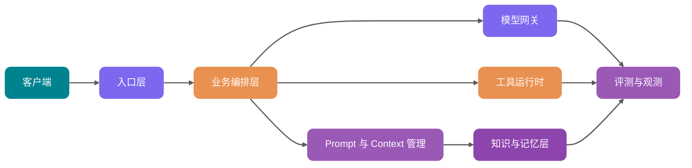

# 系统设计 重点汇总

> 从 0-ALL.md 筛选：面试常问与企业开发常用内容。

## TOC

1. AI 应用系统设计：从 Prompt Demo 到生产级架构 (`ai应用架构.md`)
2. AI 语音技术详解：从 ASR、TTS 到实时语音 Agent 的工程化落地 (`ai语音.md`)
3. 大模型网关详解：多模型路由、Fallback、限流与成本控制 (`llm网关.md`)

---

<!-- source: ai应用架构.md -->

## [1] AI 应用系统设计：从 Prompt Demo 到生产级架构

---
title: AI 应用系统设计：从 Prompt Demo 到生产级架构
description: 深入拆解生产级 AI 应用系统设计，覆盖 Prompt 管理、模型网关、RAG、Memory、Tool、异步任务、可观测、评测、安全合规与 Java 后端落地方案。
category: AI 应用开发
head:
  - - meta
    - name: keywords
      content: AI 应用架构,Prompt 管理,模型网关,RAG,Memory,Tool Calling,LLM Observability,LLM Evaluation,Java 后端
---

<!-- @include: @article-header.snippet.md -->

一个最小版 AI 应用很好搭：前端收一句用户问题，后端把问题和系统提示词拼到一起，调一次模型 API，页面上就能返回一段看起来还不错的答案。

Demo 演示到这里基本够了。

真实用户进来以后，问题会变得具体很多：用户问内部制度，检索层把他没有权限的文档也塞进上下文；运营改了一版 Prompt，昨天还能答对的问题今天开始跑偏；模型调用超时，浏览器一直等；月底看账单，只知道 Token 消耗涨了，却说不清花在哪个租户、哪个功能、哪个模型上；线上事故复盘时，只能从应用日志、向量库命中结果和模型返回里一点点拼当时发生了什么。

这篇文章讨论的是后面这部分：怎么把一个能跑通的 Prompt Demo，改造成能上线、能排查、能回滚、能控成本的生产级 AI 应用。

这是一篇总览：先比较 Demo 与生产系统的差距，再按入口、业务编排、模型网关、Prompt/Context、RAG、Memory、Tool、异步任务和评测观测说明职责。Java 后端的模块拆分、表设计和服务接口会穿插在对应章节中；需要深入某个主题时，可以继续阅读文中的专题链接。

## Demo 架构为什么扛不住生产流量

先看一个最常见的 Demo：

```text
前端输入问题 -> 后端拼 Prompt -> 调用模型 API -> 返回答案
```

这条链路能演示产品想法，但它缺了生产系统最关键的 6 件事。

| 维度     | Prompt Demo                | 生产级架构                                                   |
| -------- | -------------------------- | ------------------------------------------------------------ |
| 稳定性   | 单模型、单调用，失败就报错 | 多模型路由、重试、fallback、熔断、降级响应                   |
| 权限     | 默认用户能问什么就查什么   | 检索前权限过滤，工具调用按用户和租户鉴权                     |
| 成本     | 只看一次调用能不能成功     | Token 预算、模型分层、缓存、成本归因和限额                   |
| 可观测   | 记录用户问题和最终答案     | 记录 Prompt、检索片段、工具调用、模型输出、Token、延迟、错误 |
| 评测     | 靠人工试几条样例           | 固定评测集、线上抽样、LLM-as-Judge、人工复核闭环             |
| 数据治理 | 文档直接入库，日志随便存   | PII 脱敏、数据留存、审计、版本化、删除和授权链路             |

表里的能力不是给原有接口多套一层壳。模型输出由概率生成，同一个问题会受到 Prompt 版本、上下文顺序、检索结果、工具描述和采样参数的共同影响。答案跑偏时，未必能像普通 `if-else` 一样沿调用栈直接定位到一行代码。

生产系统需要把每次请求使用了什么输入、经过哪些步骤、产生了什么结果记录下来。这样才能回放一次错误回答，判断问题来自检索、模型、权限过滤还是输出解析。

如果你对大模型 API 的调用链还不熟，可以先看 [大模型 API 调用工程实践：流式输出、重试、限流与结构化返回](../llm基础/llm-api工程.md)。如果是想补 Token、上下文窗口和采样参数这些基础，再看 [LLM 运行机制：Token、上下文窗口与采样参数怎么影响输出](../llm基础/llm运行机制.md)。

## 一套可落地的 AI 应用分层

一条请求从入口进入后，要先确定身份和权限，再决定是否检索知识、调用工具或异步执行，最后把调用过程写入观测系统。下图按这条链路划分职责；实际项目可以合并模块，也不必把它当成固定的行业标准。



### 入口层：把用户请求变成可治理的任务

用户请求到达系统时，入口层先把它约束成后续服务能够处理的任务：

- 认证鉴权：确认用户、租户、角色、数据范围。
- 请求标准化：把 Web、App、API、Webhook、定时任务统一成内部任务模型。
- 限流与防刷：按用户、租户、模型能力和业务场景限流。
- 幂等控制：可重试的异步任务和带副作用的工具调用需要幂等键；只读查询是否需要去重，可按费用和一致性要求决定。
- 敏感内容预处理：PII 脱敏、恶意输入检测、Prompt 注入初筛。

后续链路应接收结构化请求，而不是只接收一段用户输入：

```java
public record AiRequest(
        String requestId,
        String tenantId,
        String userId,
        String sceneCode,
        String input,
        Map<String, Object> variables,
        PermissionScope permissionScope
) {
}
```

### 业务编排层：决定这次请求怎么跑

业务编排层决定这次请求采用哪条执行路径：

- 这次是普通问答、RAG 问答、Agent 多步任务，还是批处理任务？
- 需要哪些上下文：历史会话、用户画像、知识库、实时业务数据？
- 是否允许调用工具？哪些工具需要二次确认？
- 应该走同步、流式，还是异步？
- 输出要不要进入评测、人工审核或后处理？

例如，用户是否有权限读取某个文档、一次操作是否需要确认，都应由业务规则判断；模型适合处理规则难以穷举的语言理解。把两类决策混进一个“超级 Prompt”后，出错时很难区分是规则失效还是模型判断偏差。

### 模型网关：把模型调用变成基础设施

模型网关负责统一接入 OpenAI、Anthropic、Google Gemini、私有化模型、Embedding 模型、Rerank 模型等能力。它隐藏不同 API 的差异，对上提供稳定接口。模型网关本身可以单独展开一篇，细节可以看 [大模型网关详解：多模型路由、Fallback、限流与成本控制](./llm网关.md)。


模型调用在网关处收口后，路由、限额和观测才有一致的处理位置：

- 多模型路由：按场景、成本、延迟、语言、上下文长度和成功率选择模型。
- fallback：主模型失败、超时、限额不足时切到备用模型。
- 限流与熔断：避免供应商异常拖垮业务线程池。
- Token 预算：估算输入输出 Token，超预算时压缩上下文或降级模型。
- 成本归因：按租户、用户、场景、Prompt 版本记录成本。
- 统一观测：记录模型请求、响应、错误、TTFT、总延迟、Token usage。

OpenAI、Anthropic、Google 等官方文档都在持续更新模型、工具、流式、评测和成本相关能力。涉及具体模型名、上下文窗口、价格、可用区域和工具支持时，建议在配置中心或模型注册表里维护，并标注“以官方文档最新展示为准”，不要写死在业务代码里。

### Prompt 与 Context 管理：不要把 Prompt 当代码里的字符串

线上请求使用的 Prompt 应有明确版本，不能散落在代码里的多行字符串中。一次发布和回滚需要能查到具体内容、变量约束与生效范围：

- 模板版本：每次修改生成新版本，旧版本可回放。
- 变量注入：业务变量、用户输入、检索结果、工具结果分区注入。
- 灰度发布：按租户、用户比例、场景开关选择 Prompt 版本。
- 快速回滚：线上效果变差时能切回稳定版本。
- 审计记录：谁在什么时间改了什么，为什么改。
- 运行时绑定：每次请求记录使用的 Prompt 名称、版本和变量摘要。

Prompt 改动会改变回答内容，也可能改变检索、工具调用、成本和评测结果。因此，变更记录、运行 Trace 与评测结果需要能关联到同一个 Prompt 版本。Langfuse 把 Prompt Management、Tracing、Evaluation 放在同一套平台中，处理的正是这类关联；是否使用该工具取决于项目，但关联关系本身不能缺。

Prompt 写法本身可以看 [大模型提示词工程（Prompt Engineering）是什么？提示词技巧有哪些？](../agent/prompt工程.md)。如果你关心的是“哪些信息该进上下文、进多少、什么时候压缩”，更适合看 [上下文工程（Context Engineering）是什么？和 Prompt Engineering 有什么区别？](../agent/上下文工程.md)。


### RAG、Memory、Tool：三类上下文不要混在一起

检索文档、用户偏好和工具返回都会进入模型上下文，但它们的来源、更新方式和风险不同：

| 类型   | 存什么                                       | 生命周期         | 核心风险                               |
| ------ | -------------------------------------------- | ---------------- | -------------------------------------- |
| RAG    | 企业文档、产品手册、制度、代码文档、工单知识 | 由知识库更新决定 | 检索不到、越权召回、过期文档、引用错配 |
| Memory | 用户偏好、历史决策、长期画像、任务经验       | 随用户和会话演化 | 错误记忆固化、隐私泄露、过时记忆干扰   |
| Tool   | 查询订单、创建工单、发邮件、改配置、查数据库 | 运行时按需调用   | 参数错误、权限越界、敏感操作误执行     |

它们底层都可能使用向量检索、结构化存储和重排，但不能按同一套规则治理。RAG 对应共享知识源，Memory 保存个性化背景，Tool 则连接真实业务系统；权限检查和失效策略要分别设计。


不要把 Memory 当成个人版 RAG 随便写入。记忆一旦写错，后续多轮对话都会受到影响。不同类型的 Memory 需要不同控制：用户明确确认的偏好可以同步写入；由模型抽取的长期事实更适合先做 Schema 校验、来源记录和置信度过滤，再按风险决定是否异步写入、设置过期时间或进入人工审核。

RAG 的基础概念可以从 [RAG 基础概念：检索、生成与工程取舍](../rag/rag基础.md) 看起；文档如何解析、清洗和切 Chunk，可以看 [RAG 文档处理与切分策略](../rag/rag文档处理.md)；检索效果调优看 [RAG 优化：从召回、重排到上下文工程](../rag/rag优化.md)。Memory 单独展开的话，可以看 [AI Agent 记忆系统：短期记忆、长期记忆与记忆演化机制](../agent/agent记忆.md)。

## 同步、流式、异步三种交互模式怎么选

AI 应用不是所有请求都适合 HTTP 同步等待。交互模式选错，用户体验和系统稳定性都会被拖垮。

| 模式     | 适合场景                                   | 优势                         | 风险                           | 后端设计要点                         |
| -------- | ------------------------------------------ | ---------------------------- | ------------------------------ | ------------------------------------ |
| 同步请求 | 短问答、分类、抽取、低延迟小任务           | 实现简单，调用链清晰         | 超时敏感，容易占满线程         | 设置短超时、快速失败、结果缓存       |
| 流式响应 | 聊天、长答案、代码生成、语音前置文本       | 首字体验好，用户感知等待更短 | 中途失败处理复杂，前端状态更多 | SSE/WebSocket、TTFT 监控、可取消生成 |
| 异步任务 | 报告生成、批量评测、长文档分析、多工具任务 | 可排队、可重试、可恢复       | 任务状态和通知链路复杂         | 任务表、队列、进度事件、幂等和补偿   |

如果请求能在约 3 秒内稳定完成，并且客户端超时、网关超时也允许，同步调用通常更省事。这个时间不是固定标准，要结合自己的超时配置确定。

用户需要立刻看到生成过程时，流式响应更合适；依赖长文档、多轮工具调用或批量处理时，把任务放进队列更容易重试和恢复。

标签分类、风险评分、路由决策这类内部调用通常不需要首字反馈。为它们维护 SSE 或 WebSocket 连接，只会增加中断、取消和前端状态处理的成本。

流式输出、重试、限流和结构化返回在 [大模型 API 调用工程实践](../llm基础/llm-api工程.md) 里有更完整的工程拆解。如果场景是实时语音，还要考虑 VAD、ASR、TTS、打断和端到端延迟，可以继续看 [AI 语音技术详解：从 ASR、TTS 到实时语音 Agent 的工程化落地](./ai语音.md)。

## Prompt 管理：从模板字符串到版本系统

生产级 Prompt 管理可以先按 5 个对象建模：

- `prompt_template`：Prompt 基本信息，例如名称、场景、类型、状态。
- `prompt_version`：具体内容、变量定义、模型参数、创建人、变更说明。
- `prompt_release`：某个版本发布到哪个环境、哪些租户、多少流量。
- `prompt_run`：每次调用绑定的 Prompt 版本、变量摘要和模型输出。
- `prompt_eval_result`：某个 Prompt 版本在评测集上的结果。

核心表可以这样设计：

| 表名                 | 关键字段                                                                                                        | 作用                       |
| -------------------- | --------------------------------------------------------------------------------------------------------------- | -------------------------- |
| `ai_prompt_template` | `id`、`tenant_id`、`name`、`scene_code`、`type`、`status`                                                       | 管理 Prompt 逻辑名称       |
| `ai_prompt_version`  | `id`、`template_id`、`version_no`、`content`、`variables_schema`、`model_config`、`created_by`、`change_reason` | 保存可回放的 Prompt 内容   |
| `ai_prompt_release`  | `id`、`template_id`、`version_id`、`env`、`traffic_ratio`、`tenant_scope`、`status`                             | 控制灰度和回滚             |
| `ai_prompt_run`      | `id`、`request_id`、`version_id`、`variables_hash`、`input_tokens`、`output_tokens`、`created_at`               | 连接线上请求与 Prompt 版本 |

变量注入最容易在两个地方出问题。用户输入、工具结果和检索片段可能携带注入指令；分区标签和转义只能帮助模型识别不可信内容，后端仍要限制可调用工具，并在执行前再次校验参数和权限。

另一类问题来自版本错配：Prompt 新增变量而代码没有传值，渲染结果就会缺少上下文。`variables_schema` 可以在运行时提前拦住这类请求。

`ai_prompt_run` 通常只保存变量摘要、Hash、Token 和关联 ID。完整用户输入、检索片段或工具返回含有 PII、业务敏感信息时，再按安全等级决定是否脱敏、加密和缩短留存期；不能为了回放方便把所有明文都写入表中。

一个最小接口示例：

```java
public interface PromptService {

    RenderedPrompt render(RenderPromptCommand command);

    PromptVersion publish(PublishPromptCommand command);

    void rollback(String templateId, String targetVersionId);
}
```

如果 Prompt 输出要被程序稳定解析，最好不要只靠“请返回 JSON”。结构化输出、JSON Schema、Function Calling 的工程细节可以看 [大模型结构化输出：从 JSON 契约到 Function Calling 落地](../llm基础/结构化输出与函数调用.md)。

## 模型网关：多模型路由、fallback 与成本控制

模型网关很容易被低估。很多团队一开始直接在业务代码里调用某个供应商 SDK，等到要换模型、做灰度、查成本时才发现处处耦合。

### 模型网关策略对比

| 策略         | 核心逻辑                               | 适合场景                         | 风险                             |
| ------------ | -------------------------------------- | -------------------------------- | -------------------------------- |
| 固定模型     | 某个场景固定调用一个模型               | 早期系统、低复杂度任务           | 成本和稳定性受单供应商影响       |
| 成本优先路由 | 默认走低成本模型，失败或低置信度再升级 | 分类、摘要、轻量问答             | 低成本模型误判会传导到下游       |
| 质量优先路由 | 高价值请求优先走高能力模型             | 法务、金融、医疗辅助、复杂 Agent | 成本高，需要预算控制             |
| 延迟优先路由 | 按 P95/P99 延迟和可用区选择模型        | 实时聊天、语音、在线客服         | 可能牺牲复杂推理质量             |
| 多模型投票   | 多模型并行生成，再由评审器选择         | 高风险内容、关键报告             | 成本和延迟都高                   |
| fallback 链  | 主模型失败后切备用模型                 | 大多数生产系统                   | 备用模型能力差异会影响输出一致性 |

### Token 预算怎么做

模型网关在调用前要估算上下文和最大输出会占用多少 Token：

```text
预计输入 Token = System Prompt + 用户输入 + 历史消息 + RAG 片段 + Memory + Tool Schema
预计总 Token = 预计输入 Token + 最大输出 Token
```

超出预算时，优先移除与当前问题关联较弱的内容，而不是从字符串中间直接截断：

1. 删除低相关 RAG 片段。
2. 压缩早期历史消息。
3. 减少工具 Schema，只保留候选工具。
4. 降低最大输出长度。
5. 切换长上下文模型。
6. 拒绝执行并提示用户缩小范围。

这里的 Token 预算和上下文压缩，和前面提到的 Context Engineering 是同一类问题。更完整的上下文装配、按需加载和降级策略，可以看 [上下文工程（Context Engineering）是什么？和 Prompt Engineering 有什么区别？](../agent/上下文工程.md)。

OpenTelemetry 文档里的 GenAI registry 能看到 `gen_ai.request.model`、`gen_ai.response.model`、`gen_ai.usage.input_tokens`、`gen_ai.usage.output_tokens`、`gen_ai.response.time_to_first_chunk`、retrieval、tool 等字段。不过 OpenTelemetry 站内也提示 GenAI 语义约定已迁移到独立仓库，落地时不要只复制一篇旧文档里的字段名，最好锁定当前版本并做字段映射。无论你用 Langfuse、LangSmith，还是自建观测平台，都建议尽量向通用字段靠拢，后续迁移和统一监控会轻松很多。

## 工具调用与权限：让模型只提出动作，系统决定能不能做

Tool Calling 很容易让人产生错觉：模型返回了一个函数名和参数，系统执行就行。

这在生产环境很危险。

更稳的心智模型是：**模型只能提出“想调用什么工具”，真正执行前必须经过系统校验**。

工具运行时至少要包含 6 道关：

| 环节     | 作用                                                                 |
| -------- | -------------------------------------------------------------------- |
| 工具注册 | 声明工具名称、描述、参数 Schema、权限标签、风险等级                  |
| 工具检索 | 从大量工具中选出当前任务相关的少数工具，避免上下文膨胀               |
| 参数校验 | 用 JSON Schema 或强类型对象校验必填、格式、枚举、范围                |
| 权限校验 | 按用户、租户、角色、资源 ID 做后端鉴权                               |
| 确认策略 | 删除、支付、发送消息、改配置等操作按风险和预授权范围决定是否再次确认 |
| 审计日志 | 记录模型建议、最终参数、执行人、执行结果和回滚信息                   |

Anthropic、OpenAI 和 Google 的官方工具/函数调用文档都强调工具定义、参数结构和调用处理；Google 的文档还明确提醒，对会发送订单、更新数据库等有明显后果的函数调用，要在执行前让用户确认。已经获得明确预授权的低风险操作可以按策略自动执行，但权限判断必须由业务系统完成，不能交给模型。

即使供应商提供 server-side tool，业务侧也不能省掉自己的 ACL、审计和确认流。供应商负责把工具能力接进模型，业务系统负责判断这个用户、这个租户、这个资源在当前场景下能不能执行。

工具调用这块如果想从概念补起，可以先看 [大模型结构化输出：从 JSON 契约到 Function Calling 落地](../llm基础/结构化输出与函数调用.md)。如果你的工具要被多个模型、Agent 或 IDE 复用，再看 [什么是 Model Context Protocol（MCP）？和 Function Calling、Agent 什么关系？](../agent/什么是 Model Context Protocol (MCP)？和 Function Calling、Agent 什么关系？.md)。


工具接口可以这样定义：

```java
public interface AiTool {

    ToolDefinition definition();

    ToolResult execute(ToolExecutionContext context, Map<String, Object> arguments);
}
```

工具定义需要把副作用和风险等级分开。只读不等于低风险，例如读取密钥、医疗记录或大批量客户数据没有写入动作，但仍需要更严格的授权与审计：

```java
public enum ToolSideEffect {
    READ_ONLY,
    WRITE
}

public enum ToolRiskLevel {
    LOW,
    MEDIUM,
    HIGH
}
```

编排层根据 `sideEffect + riskLevel + preAuthorization` 选择控制策略。高风险写操作默认转换成“待确认动作”；高风险读取则要加强资源级鉴权、字段脱敏、结果数量限制和审计。如果业务允许预授权自动执行写操作，也要使用范围明确、可撤销的授权凭证，并配套幂等、审计和补偿机制。


## RAG 与 Memory：共享知识和个性化记忆怎么协作

RAG 和 Memory 都会把外部信息塞进上下文，但它们的治理方式不同。

### 一次请求里的协作顺序

一次请求里的推荐顺序如下：

1. 入口层确认用户身份和权限范围。
2. Memory 服务在用户范围内检索偏好和长期事实。
3. RAG 服务在租户和资源权限范围内检索共享知识库。
4. Context 管理层对两类结果分别去重、过滤、压缩。
5. 编排层把 Memory 放进“用户背景”区域，把 RAG 放进“证据资料”区域。
6. 模型输出时要求区分“基于资料的事实”和“基于用户偏好的表达方式”。

这套顺序主要是为了避免上下文污染。具体项目也可以先查 RAG 再查 Memory，但权限范围必须先确定，不能把“先检索、后过滤”当成默认方案。

### 怎么避免上下文污染

| 污染类型        | 典型表现                             | 防护方式                                    |
| --------------- | ------------------------------------ | ------------------------------------------- |
| RAG 噪声污染    | 检索到无关文档，模型被带偏           | Hybrid Search、Rerank、Top-N 压缩、引用校验 |
| 权限污染        | 用户拿到无权访问的文档片段           | 检索前 ACL 过滤，租户隔离，审计召回结果     |
| Memory 错误固化 | 用户一次临时说法被当成长期偏好       | 写入置信度、过期时间、用户可编辑、人工复核  |
| 新旧事实冲突    | 旧版本制度和新版本制度同时进入上下文 | 版本字段、时间过滤、冲突检测                |
| Prompt 注入污染 | 文档里写着“忽略前面规则”             | 文档内容分区、指令优先级、注入检测          |

RAG 和 Memory 的结果不要直接拼成一段“背景资料”。要给模型清晰标注来源、时间、权限和可信度，避免把“用户偏好”“公司制度”“工具结果”混成同一类信息。

知识库不是一次导入就结束。文档版本、增量同步、去重、回滚和全量重建都会影响线上答案，具体可以看 [RAG 知识库文档如何更新：增量更新、版本控制、去重与全量重建](../rag/rag知识更新.md)。如果问题需要跨文档关系、实体关系和全局摘要，传统向量检索不一定够用，可以继续看 [GraphRAG：用图结构补充向量检索](../rag/GraphRAG-用图结构补充向量检索.md)。

## 可观测与评测：没有回放，就没有优化

### Trace 应该记录什么

AI 应用排查问题时，最怕只看到最终答案。

一次完整请求至少要记录可关联的元数据。原文只在确有回放需要、获得相应授权并配置加密、访问控制和保留期时保存：

| 类别   | 默认记录的元数据                                                    |
| ------ | ------------------------------------------------------------------- |
| Prompt | 模板名、版本、变量 Hash 或脱敏摘要、消息角色和长度                  |
| 检索   | 脱敏 Query 或 Hash、Chunk ID、分数、来源、权限过滤结果、Rerank 排名 |
| Memory | 命中的记忆 ID、来源、更新时间、置信度                               |
| Tool   | 工具名称、参数 Hash 或脱敏字段、权限结果、执行耗时、结果码、错误    |
| 模型   | 供应商、模型名、采样参数、输入输出 Token、finish reason             |
| 延迟   | 入口耗时、检索耗时、模型 TTFT、总耗时、工具耗时                     |
| 成本   | 输入成本、输出成本、缓存命中、按租户和场景归因                      |
| 结果   | 响应 Hash、结构化解析结果、用户反馈、评测分数                       |

Langfuse、LangSmith、Google Vertex AI 和 OpenTelemetry 的官方文档里，都能看到 tracing、datasets、evaluators、token usage、latency 这类对象。工具可以不同，但你要抓的信号大体相同。

### 评测应该怎么做

评测要有固定样本、明确的通过条件和可回放的目标版本。如何准备评测集、拆分 RAG 与 Agent 指标，以及把 LLM-as-Judge 接入 CI，可参见 [AI 应用评测体系](../llm基础/llm评测.md)。

只给最终答案打一个“好不好”的分数，无法解释问题发生在召回、生成还是工具执行。各环节可分别记录以下指标；不同平台名称可能不同，内部口径要保持一致：

- **Context Recall**：正确证据有没有被召回。
- **Context Precision**：放进上下文的片段有多少是有用的。
- **Faithfulness**：答案是否忠于给定证据。
- **Answer Relevancy**：答案是否回应了用户问题。
- **Tool Success Rate**：工具调用是否成功完成。
- **Format Valid Rate**：结构化输出是否能被解析。
- **Cost per Success**：每次成功回答的平均成本。

LLM-as-Judge 适合大规模初筛、回归对比和线上抽样，但它的判断不能代替关键业务的规则校验、人工复核和用户反馈。外部评测平台的接口和能力会变化，评测任务、样本和结果应保存在自己的数据模型中，平台负责执行或展示即可。

线上样本进入评测系统后的回放与发布链路为：

```text
线上失败样本 -> 进入数据集 -> 固定版本回放 -> 定位 Prompt/RAG/Tool/模型问题 -> 灰度新策略 -> 对比指标 -> 再发布
```

没有固定版本的回放，Prompt、检索策略和模型版本发生变化后，就很难判断一次调整到底改善了什么。

## 安全与合规：AI 应用的风险入口更多

AI 应用的安全面比传统 CRUD 系统更宽。因为用户输入、检索文档、工具返回、历史记忆都可能影响模型行为。

### 风险项要落到代码和流程里

| 风险             | 说明                                             | 处理建议                                 |
| ---------------- | ------------------------------------------------ | ---------------------------------------- |
| PII 泄露         | 日志、Prompt、评测集里包含手机号、身份证、邮箱等 | 入库前脱敏，敏感字段加密，最小化留存     |
| 权限绕过         | 检索或工具调用绕过业务 ACL                       | 检索前过滤，工具执行前二次鉴权           |
| Prompt 注入      | 用户或文档诱导模型忽略系统规则                   | 内容分区、指令优先级、注入检测、拒答策略 |
| 数据留存失控     | 模型请求和观测日志保存过久                       | 按租户和场景配置留存周期                 |
| 训练数据风险     | 把用户敏感数据用于微调或评测                     | 明确授权、脱敏、隔离、可删除             |
| 高风险动作误执行 | 模型误调用删除、支付、发信等工具                 | 风险分级、二次确认、审计和补偿           |

这里有个容易忽略的细节：**安全策略不能只写在 Prompt 里**。Prompt 可以提醒模型“不要泄露隐私”，但权限过滤、脱敏、审计、确认流必须由代码和基础设施强制执行。

### 第三方模型要单独管数据边界

如果请求会发往第三方模型，还要单独确认数据授权、区域、留存和训练使用策略。拿不准时，默认按最小化原则处理：能不发的字段不发，必须发的字段先脱敏或摘要化，并把留存周期写进配置和审计里。

Prompt 注入、上下文分区和工具权限其实是连在一起的，前面提到的 [Prompt Engineering](../agent/prompt工程.md)、[Context Engineering](../agent/上下文工程.md) 和 [MCP](../agent/什么是 Model Context Protocol (MCP)？和 Function Calling、Agent 什么关系？.md) 这几篇可以配合看。

## Java 后端落地建议

如果用 Java 做生产级 AI 应用，更适合按“领域能力”拆模块，不要按供应商 SDK 拆模块。

### 模块拆分

| 模块               | 职责                                             |
| ------------------ | ------------------------------------------------ |
| `ai-api`           | 对外 REST/SSE/WebSocket 接口，请求鉴权和协议适配 |
| `ai-orchestrator`  | 业务编排、交互模式选择、任务状态机               |
| `ai-prompt`        | Prompt 模板、版本、灰度、渲染、回滚              |
| `ai-context`       | 上下文组装、Token 预算、历史压缩、上下文分区     |
| `ai-gateway`       | 模型路由、fallback、限流、熔断、成本统计         |
| `ai-rag`           | 知识库检索、权限过滤、Rerank、引用管理           |
| `ai-memory`        | 用户记忆写入、检索、冲突处理、过期策略           |
| `ai-tool`          | 工具注册、参数校验、执行、二次确认、审计         |
| `ai-eval`          | 数据集、评测任务、LLM-as-Judge、人工反馈         |
| `ai-observability` | Trace、指标、日志、成本、告警                    |

### 核心表设计

这组表不要求第一版全部建完，它主要说明生产系统里哪些数据要有归属。第一版至少要把请求 Trace、模型调用、Prompt 版本、RAG 召回记录落下来，后面排查问题才有材料。

| 表名               | 建议关键字段                                                                                                                                                          | 作用                                                     |
| ------------------ | --------------------------------------------------------------------------------------------------------------------------------------------------------------------- | -------------------------------------------------------- |
| `ai_request_trace` | `id`、`request_id`、`tenant_id`、`user_id`、`scene_code`、`mode`、`status`、`total_latency_ms`、`error_code`、`created_at`                                            | 一次 AI 请求的主 Trace，记录用户、租户、场景、状态、耗时 |
| `ai_model_call`    | `id`、`request_id`、`provider`、`model_name`、`prompt_version_id`、`input_tokens`、`output_tokens`、`ttft_ms`、`latency_ms`、`finish_reason`、`error_code`            | 模型调用明细，记录模型、参数、Token、TTFT、错误          |
| `ai_context_item`  | `id`、`request_id`、`source_type`、`source_id`、`content_hash`、`token_count`、`inject_position`、`sensitivity_level`                                                 | 上下文条目，记录来源类型、来源 ID、Token、注入位置       |
| `ai_rag_chunk_hit` | `id`、`request_id`、`knowledge_base_id`、`doc_id`、`chunk_id`、`score`、`rank_no`、`acl_result`、`citation_url`                                                       | RAG 召回明细，记录分数、排名、文档权限、引用信息         |
| `ai_memory_item`   | `id`、`tenant_id`、`user_id`、`memory_type`、`content`、`source_type`、`source_id`、`evidence_hash`、`request_id`、`confidence`、`expires_at`、`status`、`updated_at` | 长期记忆条目，记录内容、来源证据、置信度、过期时间和状态 |
| `ai_tool_call`     | `id`、`request_id`、`tool_name`、`risk_level`、`arguments_hash`、`permission_result`、`confirm_status`、`execute_status`、`latency_ms`                                | 工具调用明细，记录工具、参数摘要、权限结果、执行结果     |
| `ai_eval_dataset`  | `id`、`name`、`scene_code`、`version_no`、`status`、`created_by`                                                                                                      | 评测集元信息                                             |
| `ai_eval_case`     | `id`、`dataset_id`、`input`、`expected_behavior`、`tags`、`difficulty`、`status`                                                                                      | 评测样本，包含输入、期望行为、标签                       |
| `ai_eval_run`      | `id`、`dataset_id`、`target_type`、`target_version`、`judge_config`、`status`、`started_at`、`finished_at`                                                            | 某次评测任务                                             |
| `ai_eval_result`   | `id`、`run_id`、`case_id`、`score`、`pass_status`、`judge_reason`、`error_code`                                                                                       | 单条样本评测结果                                         |

表设计里有 3 个细节别省：

1. `request_id` 要贯穿 Prompt、RAG、Memory、Tool、Model Call 和 Eval，最好全链路唯一。
2. 大字段不要无脑进 MySQL。完整 Prompt、模型输出、工具返回可以放对象存储或日志系统，业务表里保留摘要、Hash、敏感级别和引用地址。
3. 运行时表要按 `tenant_id`、`scene_code`、`created_at`、`status` 设计索引和归档策略，否则观测表很快会变成新的性能瓶颈。

### 核心接口设计

```java
public interface ModelGateway {

    ModelResponse generate(ModelRequest request);

    Flux<ModelStreamEvent> stream(ModelRequest request);
}
```

如果项目没有用 WebFlux，`Flux<ModelStreamEvent>` 可以替换成 JDK `Flow.Publisher`、SSE emitter 或内部事件回调。重点是把“同步生成”和“流式事件”分成两个接口语义，不要让调用方猜返回值到底什么时候完整。

```java
public interface ContextAssembler {

    AssembledContext assemble(AiRequest request, ContextPolicy policy);
}
```

```java
public interface RagService {

    List<RagHit> retrieve(RagQuery query, PermissionScope permissionScope);
}
```

```java
public interface EvaluationService {

    EvalRunResult runDataset(EvalRunCommand command);
}
```

### 一个最小请求链路

```text
Controller
  -> RequestGuard 鉴权、限流、脱敏
  -> Orchestrator 选择同步/流式/异步
  -> ContextAssembler 拉取 RAG、Memory、历史
  -> PromptService 渲染模板版本
  -> ModelGateway 路由模型并记录 Token
  -> OutputParser 校验结构化输出
  -> TraceService 写入观测数据
```

企业知识库问答的第一版可以先实现 `ai-api`、`ai-prompt`、`ai-gateway`、`ai-rag` 和 `ai-observability`。Memory、Tool、Eval 随业务需要再加入；但每次请求的 Trace 与实际使用的 Prompt 版本应从第一版就记录，否则线上答案出问题时没有可用的排查材料。

如果想从 Java 后端调用大模型 API 的细节入手，可以先看 [大模型 API 调用工程实践](../llm基础/llm-api工程.md)；如果团队准备把模型调用统一成基础设施，建议把 [大模型网关详解](./llm网关.md) 单独读一遍。

## 面试怎么讲这套架构

回答这个问题时，可以从一次请求开始讲，而不是先罗列框架名称。用户请求进入入口层后先做鉴权和限流；编排层决定是否检索、调用工具或异步执行；Prompt/Context 组装完成后由模型网关路由模型；输出经过解析并写入 Trace。接着说明 Prompt 版本、Token 预算、工具权限和 PII 脱敏分别解决什么风险，最后补充固定样本集和失败样本回放如何验证改动。

如果你是按面试路线复习，可以直接看 [AI 系统设计面试题总结](../面试题/ai系统设计面试题.md)。RAG、Agent 和大模型基础也分别有 [RAG 面试题总结](../面试题/rag面试题.md)、[AI Agent 面试题总结](../面试题/agent面试题.md) 和 [大模型基础面试题总结](../面试题/llm面试题.md)。

## 高频面试问题

**1. Prompt Demo 到生产系统最大的差距是什么？**

Demo 验证的是模型能否完成一次回答。生产系统还要处理超时和降级、租户与资源权限、Token 成本、调用 Trace、评测回放以及敏感数据留存。

**2. 为什么需要模型网关？**

模型网关把供应商 API 差异收敛在一处，并负责模型路由、fallback、限流、熔断、Token 预算、成本统计和观测。业务服务因此不必分别耦合各家模型 API。

**3. 同步、流式、异步怎么选？**

能在客户端超时内稳定完成的短任务可同步返回；聊天和长答案需要尽早反馈时使用流式；报告生成、批处理和多工具任务放入异步队列。判断依据是耗时、是否需要首字反馈，以及失败后是否需要重试和恢复。

**4. Prompt 为什么要做版本管理？**

Prompt 会改变输出、检索策略、工具调用和 Token 消耗。版本号使线上请求能够关联到具体内容，也让灰度、回滚、审计和离线回放有明确对象。

**5. Tool Calling 的安全边界在哪里？**

模型只产生工具调用意图。参数校验、资源级权限校验、敏感操作确认和审计日志都由后端系统执行。

**6. RAG 和 Memory 有什么区别？**

RAG 查询企业文档、产品手册等共享知识；Memory 保存用户偏好、历史决策等个性化长期事实。两类结果可以同时使用，但要分区注入并分别处理权限、来源和过期时间。

**7. AI 应用可观测要看哪些指标？**

一次请求至少关联 Prompt 版本、检索命中、工具调用、模型输出、输入输出 Token、TTFT、总延迟、成功与错误状态、成本和评测分数。

**8. LLM-as-Judge 能不能替代人工评测？**

不能。它可以承担自动化回归、线上抽样和大规模初筛；关键业务仍需规则校验、人工复核和用户反馈闭环。

## 总结

模型调用只是生产链路中的一步。入口层处理权限、限流和脱敏；编排层选择同步、流式或异步路径并组织检索、记忆和工具；模型网关处理模型选择、Token 和故障兜底；评测与观测为每次调整提供证据。Memory、Tool、Eval 可以按业务需求逐步接入，但 Prompt 版本和 Trace 要尽早建立。

## 参考资料

JavaGuide 相关阅读：

- [AI 应用开发知识体系：大模型、Agent、RAG、MCP、Prompt 工程与系统设计](../README.md)
- [AI 系统设计专题：生产级架构、模型网关、评测治理与语音 Agent](./README.md)
- [大模型基础专题：运行机制、API 调用、结构化输出与评测](../llm基础/README.md)
- [RAG 专题：文档处理、向量数据库、GraphRAG、检索优化与知识库更新](../rag/README.md)
- [AI Agent 专题：Agent Loop、Memory、Prompt、Context、MCP 与 Skills](../agent/README.md)

- [OpenAI API 官方文档](https://developers.openai.com/api/docs)
- [OpenAI Function Calling 官方文档](https://developers.openai.com/api/docs/guides/function-calling)
- [OpenAI Streaming 官方文档](https://developers.openai.com/api/docs/guides/streaming-responses)
- [OpenAI Evals 官方文档](https://developers.openai.com/api/docs/guides/evals)
- [OpenAI Agents SDK 观测与集成](https://developers.openai.com/api/docs/guides/agents/integrations-observability)
- [Anthropic Tool Use 官方文档](https://platform.claude.com/docs/en/agents-and-tools/tool-use/overview)
- [Anthropic Prompt Caching 官方文档](https://platform.claude.com/docs/en/build-with-claude/prompt-caching)
- [Google Gemini Function Calling 官方文档](https://docs.cloud.google.com/gemini-enterprise-agent-platform/models/开发工具/function-calling)
- [Google 生成式 AI 评测官方文档](https://docs.cloud.google.com/gemini-enterprise-agent-platform/models/evaluation-overview)
- [Google RAG Grounding 官方文档](https://docs.cloud.google.com/gemini-enterprise-agent-platform/models/grounding/ground-responses-using-rag)
- [Langfuse Observability 官方文档](https://langfuse.com/docs/observability/overview)
- [Langfuse Prompt Management 官方文档](https://langfuse.com/docs/prompt-management/overview)
- [LangSmith Evaluation 官方文档](https://docs.langchain.com/langsmith/evaluation)
- [OpenTelemetry GenAI 属性注册表](https://opentelemetry.io/docs/specs/semconv/registry/attributes/gen-ai/)


---

---

<!-- source: ai语音.md -->

## [2] AI 语音技术详解：从 ASR、TTS 到实时语音 Agent 的工程化落地

---
title: AI 语音技术详解：从 ASR、TTS 到实时语音 Agent 的工程化落地
description: 说明 AI 语音系统的工程链路，涵盖音频采集、VAD、ASR、LLM、TTS、流式播放、打断处理、低延迟优化以及云端 API、本地模型、端云混合选型。
category: AI 应用开发
head:
  - - meta
    - name: keywords
      content: AI语音,ASR,TTS,VAD,实时语音Agent,Speech to Speech,语音识别,语音合成,端云混合,Realtime API
---

<!-- @include: @article-header.snippet.md -->

大家好，我是小 G。

很多开发者第一次做 AI 语音应用时，脑子里通常是这条链路：用户说话，转成文字，丢给大模型，再把回答播出来。

听起来就是三段调用：**ASR -> LLM -> TTS**。

推到生产环境，问题马上来了：用户还没说完，系统已经误判结束；用户想打断，AI 还在自顾自朗读；会议室里有空调声和键盘声，ASR 开始胡乱转写；网络稍微抖一下，下行音频就卡成一段一段；文本回答看起来没问题，语音交互却像慢半拍的电话客服。

文本 Agent 接上麦克风和扬声器，只能得到一个能说话的 Demo；生产系统还要处理实时音频、语音模型、对话状态和端云协同。

下文先说明 ASR、TTS 和 VAD 各自负责什么，再结合 interview-guide 项目讨论音频采集、流式传输、播放队列和状态机。最后再看云端 API、本地模型与端云混合方案各自适合什么场景。

## 术语说明

为避免阅读时产生困惑，本文涉及的核心术语做如下说明：

- **端侧** = 客户端（浏览器/App），指用户设备上的前端代码
- **Barge-in** = 打断/插话打断，即用户在大模型响应过程中主动中断 AI 说话
- **增量结果** = 流式输出 = partial results，指 ASR 实时返回的识别中间结果
- **级联方案** = ASR + LLM + TTS 分阶段串联的架构
- **原生 Realtime API** = 实时多模态语音接口，常见形态是音频进、音频出，也可以同时输出文本事件和工具调用事件

## AI 语音系统到底解决了什么问题？

先说清楚我们到底在解决什么问题。

语音 Agent 更接近实时协作系统：用户说话时，系统要同步完成理解、生成和播放。和文字对话相比，语音多了几个维度：

- **实时性**：用户说话的时候，系统就得开始工作，不能等用户说完再反应。
- **多模态信息**：语气、停顿、情绪，这些在文字里都丢了。
- **打断能力**：人说话可以互相插嘴，机器也得支持。
- **端到端延迟**：文字聊天慢 1 秒用户还能忍，语音慢 1 秒就感觉对方“没反应”。

市面上常见的语音交互有两类：

1. **命令式语音助手**：常见于智能家居和车载控制。用户说“打开空调”，系统把语音映射到预定义意图和设备指令。Siri、小爱同学等产品也在接入开放问答能力，不能简单归为固定菜单。
2. **大模型语音 Agent**：能理解开放问题、调用工具、持续多轮对话。你问“帮我看看上周那个接口超时是怎么回事”，它需要理解意图、检索上下文、生成回答、还要用语音和你来回确认。

这两类产品的工程重心差别很大。下文讨论大模型语音 Agent 的工程化落地。

## 语音识别（ASR）是怎么把声音变成文字的？

ASR（Automatic Speech Recognition）看起来就是“音频进、文字出”，但背后至少包含三个判断：

1. 这段音频说的是什么字。
2. 这些字怎么切分成词和句子。
3. 标点、数字、英文、技术名词怎么规范化。

比如用户说“帮我查一下 Java 21 的虚拟线程”，ASR 要同时识别中文、英文、数字和技术词。如果识别成“加瓦二十一的虚拟线程”，后面的 LLM 再强也得先猜半天。

### ASR 的三条技术路线

| 类型         | 代表方案                                                                                                                                                                  | 优势                                                                    | 短板                                                             | 适合场景                       |
| ------------ | ------------------------------------------------------------------------------------------------------------------------------------------------------------------------- | ----------------------------------------------------------------------- | ---------------------------------------------------------------- | ------------------------------ |
| 云端 API     | OpenAI Audio Transcriptions（`gpt-4o-transcribe`、`gpt-4o-mini-transcribe`、`whisper-1`、`gpt-4o-transcribe-diarize`）、Azure Speech、Google Speech、Deepgram、阿里云 ASR | 接入快，语言覆盖广，运维成本低                                          | 成本、网络延迟、数据合规受限                                     | 客服、会议转写、轻量语音助手   |
| 开源通用模型 | Whisper、faster-whisper、Whisper.cpp、FunASR                                                                                                                              | 可本地部署，可控性强，支持私有化；faster-whisper 可接入 Silero VAD 过滤 | 实时性要自己做工程优化；Whisper turbo 未针对翻译训练，翻译效果差 | 私有化转写、离线字幕、企业内网 |
| 领域定制模型 | 金融、医疗、车载专用 ASR                                                                                                                                                  | 专有名词和口音适配更好                                                  | 数据准备和训练成本高                                             | 高频垂直场景、强业务词表       |

**补充说明**：

- OpenAI 的 `gpt-4o-transcribe-diarize` 支持说话人标签，适合会议转写等多人场景。它目前只用于 `/v1/audio/transcriptions`，不支持 Realtime API；当音频超过 30 秒时，需要配置 `chunking_strategy`；它也不支持 `prompt`、`logprobs`、`timestamp_granularities[]`。如果不需要说话人标签，优先看 `gpt-4o-transcribe`、`gpt-4o-mini-transcribe` 或 `whisper-1`。
- Whisper turbo（large-v3-turbo）是 large-v3 的推理优化版，速度快但**未针对翻译任务训练**，执行 `--task translate` 时会输出原始语言而非英语，需要翻译时请用 medium 或 large。
- 实时转写要和录音文件转写分开看。OpenAI 当前文档把低延迟实时转写放在 Realtime transcription 里，模型是 `gpt-realtime-whisper`；文件上传、说话人分离这类任务走 Audio Transcriptions。

**选型建议**：如果你的核心需求是“实时对话”，不要只看离线 WER（Word Error Rate，词错误率）。你更应该关注：

- **首段延迟**：用户说完到看到第一个字的时间
- **增量结果稳定性**：能不能实时看到识别进度
- **端点检测准确率**：能不能准确判断用户说完了
- **噪声环境表现**：远场、多人说话时准不准
- **热词能力**：能不能识别你的业务专属词汇

### 流式 ASR 和非流式 ASR 的区别

对首字延迟和自然打断要求较高的实时对话，通常会使用流式 ASR；轮次明确、语音较短的场景也可以采用非流式识别。二者的主要差别是：

- **非流式 ASR**：等用户说完一段话，再整段识别。延迟 = 说话时长 + 识别时间。
- **流式 ASR**：边说边识别，用户话音刚落就能拿到结果。延迟 ≈ 端点检测时间 + 实时识别时间。

interview-guide 项目用的是**阿里云 DashScope 的 qwen3-asr-flash-realtime**。这类接入方式通过 WebSocket 持续追加音频，服务端 VAD 负责判断何时提交一轮识别：

```java
// QwenAsrService.java
OmniRealtimeConfig config = OmniRealtimeConfig.builder()
    .modalities(Collections.singletonList(OmniRealtimeModality.TEXT))
    .enableTurnDetection(true)  // 开启服务端 VAD
    .turnDetectionType("server_vad")
    .turnDetectionSilenceDurationMs(400)  // 400 ms 静音判定用户说完
    .transcriptionConfig(transcriptionParam)
    .build();
```

服务端 VAD 的好处是不用客户端自己实现完整的语音活动检测逻辑；代价也直接写在参数里：`turnDetectionSilenceDurationMs(400)` 表示静音持续 400 ms 后才认为一句话结束。DashScope 文档给出的取值范围是 200-6000 ms，值越低响应越快，也越容易把自然停顿切断；值越高，断句更保守，延迟也会增加。端侧和服务端 VAD 可以组合使用，但并非固定架构：需要低延迟打断时，可让端侧先报告 `speech_start`，服务端结合 ASR 和 VAD 事件确认轮次结束；客户端较轻或网络环境稳定时，也可以只使用服务端端点检测。

## 语音合成（TTS）是怎么把文字变成声音的？

TTS（Text To Speech）负责把模型回复合成音频。它看起来是输出层，但其实很影响用户对整个 Agent 的感知。

同一句“我帮你查一下”，不同 TTS 的差异可能体现在：

- 首包音频要等多久
- 音色是否自然，长句是否喘得像真人
- 数字、代码、英文缩写是否读得准确
- 是否支持情绪、语速、停顿、音高控制

### TTS 的技术演进

传统 TTS 分好几步走：

```
文本规范化 -> 文本分析 -> 声学模型 -> 声码器 -> 波形输出
```

神经 TTS、神经音频编解码器和生成式语音模型正在减少传统流水线中的人工模块。VALL-E、Fish Speech、CosyVoice 的建模方法并不相同，音质、延迟、流式能力和部署成本也不能只按“端到端”一项比较。对实时语音 Agent 来说，单句音质之外，还要看首包延迟、能否流式播放以及中断后的状态处理。

如果你必须等整段文字生成完才能合成，用户体感会非常慢。如果能按短句甚至 token 流式合成，首包体验会好很多。

### 实时 TTS 的两条路线

| 类型         | 代表方案                                                                                      | 特点                                                                     |
| ------------ | --------------------------------------------------------------------------------------------- | ------------------------------------------------------------------------ |
| 云端实时 TTS | OpenAI Speech、阿里云 qwen3-tts-flash-realtime / Qwen-TTS-Realtime、Azure TTS、ElevenLabs     | 流式输出，支持实时合成                                                   |
| 本地 TTS     | piper1-gpl（GPL-3.0，原 Piper 已归档）、Fish Speech（Fish Audio Research License）、CosyVoice | 可控性强，适合离线场景；商用前需逐项核对代码、模型权重和声音资源的许可证 |

interview-guide 用的也是阿里云实时 TTS，通过 WebSocket 合成音频。DashScope 当前 Java SDK 示例里推荐的模型名是 `qwen3-tts-flash-realtime`，项目里的封装类仍然叫 `QwenTtsRealtime`：

```java
// QwenTtsService.java
QwenTtsRealtimeConfig config = QwenTtsRealtimeConfig.builder()
    .voice(voice)  // 音色选择
    .responseFormat(QwenTtsRealtimeAudioFormat.PCM_24000HZ_MONO_16BIT)
    .mode("commit")  // 提交模式
    .languageType(languageType)
    .speechRate(speechRate)
    .volume(volume)
    .build();

// 发送文本，实时接收音频块
qwenTtsRealtime.appendText(text);
qwenTtsRealtime.commit();
```

这段代码采用 `commit` 模式，客户端追加文本后主动调用 `commit()` 触发合成。DashScope 文档里还提供 `server_commit` 模式，由服务端判断提交时机，延迟和句子完整性之间的取舍会不一样。

## VAD 如何控制对话轮次？

VAD（Voice Activity Detection，语音活动检测）这个组件经常被忽略，但它对体验影响极大。

VAD 不识别说话内容，通常输出某一小段音频包含语音的概率或语音开始、结束事件。应用据此判断：

- 用户开始说话了吗？
- 用户说完了吗？
- 当前语音活动是否足以触发一次打断或提交。

普通 VAD 不能单独判断声音来自用户、旁人、音乐还是扬声器回放。系统播放的回声需要 AEC 或播放参考信号处理；多人场景还可能需要说话人分离、声纹或面向目标说话人的 VAD。真实用户的说话方式也会增加端点检测难度：

- 句中会停顿：“这个问题……我想问一下……”
- 会有短反馈：“嗯”“对”“不是”
- 会边想边说，音量忽大忽小
- 旁边可能有人说话，扬声器里也可能正在播放 AI 的声音

**端侧 VAD 还是服务端 VAD？**

| 类型       | 代表方案                                                                               | 优势                               | 短板                                                 |
| ---------- | -------------------------------------------------------------------------------------- | ---------------------------------- | ---------------------------------------------------- |
| 端侧 VAD   | WebRTC VAD、Silero VAD、@ricky0123/vad-web                                             | 响应快，不消耗服务端资源           | 需要在客户端部署模型，阈值和噪声场景要自己调         |
| 服务端 VAD | DashScope ASR 的 server_vad、OpenAI Realtime turn detection、部分云端 ASR 内置端点检测 | 客户端逻辑简单，和识别服务集成更紧 | 增加服务端负载，有网络延迟，断句策略受供应商接口约束 |

> ⚠️ **VAD 不能只看离线准确率**：短语音（<1 秒，比如“嗯”“对”“不是”）、低音量插话、远场人声、扬声器回声，都会让 VAD 的线上表现和实验集差很多。faster-whisper 的 README 也把 Silero VAD 默认策略描述为偏保守：默认只移除超过 2 秒的静音。语音 Agent 里如果把 VAD 当成唯一的打断判据，很容易漏掉短反馈。

interview-guide 前端用的是 **@ricky0123/vad-web**，这是一个基于 ONNX 的端侧 VAD：

```typescript
// AudioRecorder.tsx
const vadInstance = await window.vad.MicVAD.new({
  getStream: async () => stream,
  onnxWASMBasePath: "https://cdn.jsdelivr.net/npm/onnxruntime-web@1.22.0/dist/",
  baseAssetPath: "https://cdn.jsdelivr.net/npm/@ricky0123/vad-web@0.0.29/dist/",
  onSpeechStart: () => {
    onSpeechStart?.(); // 用户开始说话
  },
  onSpeechEnd: () => {
    onSpeechEnd?.(); // 用户说完
  },
});
```

端侧 VAD 触发 `onSpeechEnd` 后，不宜无条件提交。可以增加一段可配置的静音确认时间，或者结合服务端最终转写事件，避免把用户中途停顿当成结束。确认时间要按语种、说话节奏和延迟目标通过线上样本调节，不能把 300-500 ms 当作通用阈值。

我的建议是：**VAD 不要只当开关用，它应该输出一组对话控制信号**。比如：

- `speech_start`：用户开始说话
- `speech_end`：检测到语音活动结束（可携带置信度）
- `maybe_barge_in`：可能是用户在打断
- `non_speech`：当前分片未检测到语音活动

## 一次完整的语音对话是怎么跑起来的？

先把链路放在一起看，后面的延迟、打断和端云协同才好理解。

一次语音 Agent 对话大概经过这些步骤：

1. 音频采集：麦克风采集原始音频
2. 前处理：AEC 消回声、NS 降噪、AGC 增益
3. VAD 检测：判断用户是否在说话，是否说完
4. 音频上传：把处理后的音频发到服务端
5. ASR 转写：把音频转成文字（流式输出增量结果）
6. 上下文组装：拼接系统指令、历史对话、工具定义
7. LLM 推理：理解意图、生成回复、必要时调用工具
8. TTS 合成：把回复文字转成音频（流式输出音频块）
9. 音频下行：客户端边收边播
10. 状态回写：记录本次对话，为下一轮准备上下文

实时语音链路中，一部分工作可以在用户结束说话前完成。

优秀的系统会尽量把可以提前做的事提前做：

- 用户刚开始说话时，先加载会话状态和工具定义
- ASR 出现稳定前缀后，提前做意图预判
- LLM 输出第一个短句时，TTS 立刻开始合成
- 工具调用较慢时，先播一句自然的过渡语

做法很直接：把能并行的环节提前启动，用流式输出把等待拆散。

## 实时语音为什么比文字对话难这么多？

语音对话的难点不在某一个模型，而在整条链路都被实时性约束住了。

### 难点一：延迟预算非常紧

文本聊天慢 1 秒，用户通常还能忍。语音对话慢 1 秒，用户会明显感觉对方“没反应”。

一轮语音交互的延迟来自这些环节：

| 环节         | 常见耗时                            | 优化方向                       |
| ------------ | ----------------------------------- | ------------------------------ |
| 采集与编码   | 音频帧大小、浏览器缓冲              | 小帧采集，减少无意义缓冲       |
| VAD 端点检测 | 等待静音确认用户说完                | 动态静音阈值，短句快速提交     |
| ASR          | 音频上传、解码、增量转写稳定        | 流式 ASR，热词，端侧预处理     |
| LLM          | 首 token 延迟、工具调用、上下文过长 | Prompt 缓存，短回复，异步工具  |
| TTS          | 首包合成、长句切分、声码器推理      | 句子级流式合成，预热音色       |
| 播放         | 网络抖动、解码、播放器缓冲          | 边收边播，控制播放队列和缓冲区 |

如果每段都多 200 ms，整轮对话马上就变成“慢半拍”。

所以实时语音优化要盯端到端 P95/P99 延迟，而不是只把某一个组件跑到理论上限。用户感受到的是整条链路，不是某个模型的 benchmark。

### 难点二：打断处理不是暂停按钮

语音 Agent 必须支持 **Barge-in（插话打断）**。

用户说“等一下，不是这个意思”，系统需要同时做几件事：

1. 识别出这是用户在说话，而不是背景噪声或扬声器回声
2. 立即停止本地播放队列，不能继续把旧回答播完
3. 取消服务端仍在生成的 LLM 和 TTS 流
4. 把已经播放、未播放、被打断的内容写进对话状态
5. 用新的用户音频开启下一轮理解

很多系统打断失败，不一定是 VAD 不准，更常见的问题是状态机没有把取消语义说清楚。比如播放器停了，但服务端 TTS 还在推流；LLM 停了，但历史里已经把未播出的回答记成了“已说过”。

interview-guide 的做法是：

```typescript
// VoiceInterviewPage.tsx
const handleAudioData = (audioData: string) => {
  // AI 播放时停发音频，避免自己的声音被识别
  if (isAiSpeakingRef.current) {
    return;
  }
  if (wsRef.current && wsRef.current.isConnected()) {
    wsRef.current.sendAudio(audioData);
  }
};
```

前端通过 `isAiSpeakingRef` 标记 AI 是否在说话，说话时停发音频。后端收到 `control` 消息取消生成。

### 难点三：噪声环境比测试环境复杂太多

语音 Demo 往往在安静办公室里跑，生产环境可能是：

- 车内、工厂、商场、地铁站
- 远场麦克风，用户离设备两三米
- 多人同时说话
- 用户开着外放，AI 的声音又被麦克风收回去

这会影响整条链路：

- VAD 把噪声当成人声，导致误触发
- ASR 把背景人声转成文本，污染用户意图
- TTS 播放被麦克风采集，造成自我打断

interview-guide 前端通过 `getUserMedia` 开了 3 个常见音频前处理选项：

```typescript
const stream = await navigator.mediaDevices.getUserMedia({
  audio: {
    echoCancellation: true, // AEC：消除扬声器回声
    noiseSuppression: true, // NS：压低背景噪声
    autoGainControl: true, // AGC：自动增益，让音量更稳定
    sampleRate: 16000,
  },
});
```

这三个参数能解决一部分问题，但不能指望它们覆盖所有场景。浏览器只是接收约束并尽力匹配，具体效果受浏览器、设备、麦克风和播放环境影响；AEC 在强回声场景下效果有限，NS 也可能把用户声音削掉一截。如果你要做硬件或 App 方案，端侧音频前处理会变成非常现实的工程投入。

### 难点四：上下文不只是文字历史

文本 Agent 的上下文主要是消息历史。语音 Agent 的上下文更多：

- 当前用户是否正在说话
- 上一段回答播放到了哪里
- 用户是正常提问，还是正在打断
- ASR 的增量文本是否稳定
- 用户语气是疑问、否定、犹豫，还是不耐烦
- 当前是否有工具调用正在执行

如果只把最终 ASR 文本喂给 LLM，很多信息会丢掉。

比如用户说“不是……我是说上个月那笔订单”，文本里能看到纠正，但看不到他是在打断 AI；系统如果不知道上一段回答播到哪里，就很难知道用户在否定哪一句。

interview-guide 用 WebSocket 消息类型区分了不同状态：

```typescript
// voiceInterview.ts
export interface WebSocketSubtitleMessage {
  type: "subtitle";
  text: string;
  isFinal: boolean; // true 只表示这一段 ASR 转写已经结束或稳定
}

export interface WebSocketAudioResponseMessage {
  type: "audio";
  data: string; // Base64 音频
  text: string; // 对应的文字
}

export interface WebSocketControlMessage {
  type: "control";
  action: string; // 'submit' | 'cancel' | 'pause'
  data?: Record<string, unknown>;
}
```

`isFinal` 是 ASR 事件状态，不等于用户已经点击或说出“提交”。如果产品采用手动提交，应由独立的 `control: submit` 事件确认；自动轮次模式则由端点检测、ASR 最终事件和业务状态共同决定是否提交，不能复用一个布尔值表达两层含义。

### 难点五：回声导致的误打断

AI 播放的声音被麦克风采集后，VAD 或 ASR 可能误判为用户说话，导致 AI 自我打断。

interview-guide 的当前做法是：

```typescript
if (isAiSpeakingRef.current) {
  return; // AI 说话时停发音频
}
```

这种“静默丢弃”的方案能避免自我打断，但也会屏蔽用户在 AI 说话期间的插话。

更精细的方案一般会这样做：

- AI 说话时继续接收音频，但不发到 ASR
- 在 AEC 处理后的音频上运行端侧 VAD，而非原始麦克风音频
- 结合回声参考、连续帧能量、VAD 置信度和播放队列状态判断是不是用户真的在插话

### 难点六：端侧能力决定体验下限

很多团队把所有能力都放云端，结果在弱网环境下体验崩得很快。

端侧至少应该承担这些职责：

- 麦克风采集和音频前处理
- VAD 或轻量打断检测
- 播放缓冲和取消播放
- 网络断开时的提示和重连

云端模型决定上限，端侧工程决定下限。这句话在语音系统里很实在。

## 从 interview-guide 看基础版语音 Agent 是怎么实现的？

下面以 interview-guide 项目为例，看一个基础版语音面试 Agent 是怎么跑起来的。

### 整体架构

```
┌─────────────────────────────────────────────────────────────┐
│                        前端 (React)                          │
├─────────────────────────────────────────────────────────────┤
│  AudioRecorder        WebSocket         VoiceInterviewPage   │
│  - getUserMedia       - sendAudio       - 状态管理          │
│  - AudioWorklet       - sendControl     - 手动提交          │
│  - VAD 检测           - 控制消息         - 分块播放          │
└─────────────────────────────────────────────────────────────┘
                            │
                            ▼
┌─────────────────────────────────────────────────────────────┐
│                     后端 (Spring Boot)                       │
├─────────────────────────────────────────────────────────────┤
│  VoiceInterviewWebSocketHandler                             │
│  - 会话管理（创建、暂停、恢复、结束）                         │
│  - ASR ready / reconnect 状态同步                            │
│  - 音频路由到 ASR，手动 submit 后触发 LLM                     │
│  - LLM 句子流输出，TTS 边合成边推送                           │
├─────────────────────────────────────────────────────────────┤
│  QwenAsrService          DashscopeLlmService      QwenTtsService │
│  - qwen3-asr-flash-      - qwen-max / qwen-plus   - qwen-tts-    │
│    realtime              - 工具调用支持           realtime       │
└─────────────────────────────────────────────────────────────┘
```

### 前端：音频采集与 VAD

前端的核心是 `AudioRecorder` 组件。它做了这么几件事：

**第一步，获取麦克风权限并配置音频参数：**

```typescript
const stream = await navigator.mediaDevices.getUserMedia({
  audio: {
    echoCancellation: true,
    noiseSuppression: true,
    autoGainControl: true,
    sampleRate: 16000, // ASR 需要 16 kHz
  },
});
```

**第二步，初始化端侧 VAD：**

```typescript
const vadInstance = await window.vad.MicVAD.new({
  getStream: async () => stream,
  onSpeechStart: () => {
    onSpeechStart?.(); // 触发回调
  },
  onSpeechEnd: () => {
    onSpeechEnd?.();
  },
});
await vadInstance.start();
```

**第三步，使用 AudioWorklet 做音频分块采集：**

VAD 的 `onSpeechEnd` 只表示语音活动可能结束，音频仍然要分块发送给服务端。interview-guide 的实现是：

```typescript
await audioContext.audioWorklet.addModule("/audio-worklet/pcm-processor.js");

const workletNode = new AudioWorkletNode(audioContext, "pcm-processor");
workletNode.port.onmessage = (event) => {
  if (!recordingActiveRef.current) {
    return;
  }
  const base64 = arrayBufferToBase64(event.data as ArrayBuffer);
  onAudioData(base64); // 200 ms Int16 PCM，发送给后端 ASR
};

source.connect(workletNode);
workletNode.connect(gainNode);
gainNode.connect(audioContext.destination);
```

`pcm-processor.js` 运行在音频渲染线程中，负责把浏览器输入的 Float32 音频重采样成 16 kHz、Int16 PCM，并按 200 ms 一块通过 `postMessage` 交回主线程。相比已经废弃的 `ScriptProcessorNode`，`AudioWorkletNode` 不会把音频处理压在 UI 主线程上，延迟和卡顿风险更低。

这里有个设计选择：**为什么不等 VAD 触发 `onSpeechEnd` 再发音频？**

因为 VAD 检测有延迟，等它确认用户说完了再开始发音频，会多等一段静音确认时间。更合理的做法是持续分块发送，VAD 触发 `onSpeechEnd` 只是告诉后端“这一段可能结束了，可以准备提交给 LLM”。

不过，interview-guide 的语音面试没有采用“检测到静音就自动提交”。它的做法是**ASR 持续转写、用户手动点击提交**。这样可以避免候选人中途停顿时被系统抢答，也能解决“后面的话覆盖前面的回答”的体验问题：前端只把 ASR 结果作为回答草稿，进入下一轮面试由 `submit` 控制消息决定。

### 前端：音频播放

interview-guide 用了两种音频播放模式：

**模式一：HTMLAudioElement（简单场景）：**

```typescript
// VoiceInterviewPage.tsx
const onAudioResponse = (audioData: string, text: string) => {
  if (audioData && audioData.length > 0) {
    setAiAudio(audioData); // 设置 src，触发自动播放
    setAiText(text);
    setAiSpeaking(true);

    // 设置超时 watchdog，防止音频播放异常卡住
    const durationMs = estimateWavDurationMs(audioData);
    audioPlaybackWatchdogRef.current = setTimeout(
      finishAiPlayback,
      Math.min(Math.max(durationMs + 1500, 4000), 60_000),
    );
  }
};
```

**模式二：AudioContext 分块播放（更精细控制）：**

```typescript
// 分块处理
const handleAudioChunk = (
  base64Wav: string,
  _index: number,
  isLast: boolean,
) => {
  // 1. 解码 WAV
  const binaryStr = atob(base64Wav);
  const bytes = new Uint8Array(binaryStr.length);
  for (let i = 0; i < binaryStr.length; i++) {
    bytes[i] = binaryStr.charCodeAt(i);
  }

  // 下面按项目约定处理 44 字节 WAV 头和 24 kHz、单声道、16-bit PCM。
  // 如果服务端可能返回其他 WAV 格式，应先解析 WAV 头，不能固定写死。
  const pcmOffset = 44;
  const pcmData = new Int16Array(
    bytes.buffer,
    pcmOffset,
    (bytes.length - pcmOffset) / 2,
  );
  const float32 = new Float32Array(pcmData.length);
  for (let i = 0; i < pcmData.length; i++) {
    float32[i] = pcmData[i] / 32768;
  }

  const audioBuffer = ctx.createBuffer(1, float32.length, 24_000);
  audioBuffer.copyToChannel(float32, 0);

  // 2. 放入播放队列
  chunkQueueRef.current.push(audioBuffer);
  if (!isChunkPlayingRef.current) {
    playNextChunk();
  }

  // 3. 最后一包或服务端 audio_complete 后，等待队列播完
  if (isLast) {
    scheduleChunkDrainCompletion();
  }
};

// 播放下一块
const playNextChunk = () => {
  if (chunkQueueRef.current.length === 0) {
    isChunkPlayingRef.current = false;
    return;
  }
  const buffer = chunkQueueRef.current.shift()!;
  const source = ctx.createBufferSource();
  source.buffer = buffer;
  source.connect(ctx.destination);
  source.onended = () => playNextChunk();
  source.start(0);
};
```

分块播放的好处是能更快开始播放，不用等完整音频文件加载完。代价也很明确：要自己管理队列、顺序、取消和“最后一包”语义。

新版实现里，服务端还会在所有 TTS 分片发送完成后额外推一个 `audio_complete` 控制消息。这样前端不再依赖某个音频分片必须带 `isLast=true`，即使某一句 TTS 合成失败，也能在已成功分片播放完后正确结束“面试官正在说话”的状态。

> ⚠️ **注意**：浏览器要求 AudioContext 必须在用户交互后创建或恢复（autoplay policy）。如果在页面加载时创建 AudioContext，大多数浏览器会将其置于 `suspended` 状态。建议在用户点击“开始面试”按钮时调用 `audioContext.resume()` 确保播放正常。

### 后端：WebSocket 会话管理

后端通过 `VoiceInterviewWebSocketHandler` 管理会话生命周期：

```java
// VoiceInterviewWebSocketHandler.java
public class VoiceInterviewWebSocketHandler {
    // 会话状态：idle -> listening -> thinking -> speaking -> completed
    // 支持：pause（暂停）、resume（恢复）、end（结束）

    // 收到客户端音频
    public void handleAudioMessage(String sessionId, String audioBase64) {
        asrService.sendAudio(sessionId, decodeBase64(audioBase64));
    }

    // 收到客户端控制消息
    public void handleControlMessage(String sessionId, String action, Map data) {
        switch (action) {
            case "submit" -> llmService.triggerResponse(sessionId, data);
            case "cancel" -> cancelCurrentGeneration(sessionId);
            case "pause" -> pauseSession(sessionId);
        }
    }
}
```

interview-guide 的会话状态机：

| 状态        | 含义                           | 可转换到          |
| ----------- | ------------------------------ | ----------------- |
| IN_PROGRESS | 面试进行中                     | PAUSED, COMPLETED |
| PAUSED      | 暂停（用户离开页面或主动暂停） | IN_PROGRESS       |
| COMPLETED   | 面试结束                       | -                 |

暂停/恢复机制很有用。比如用户接电话、切换标签页，可以暂停面试，回来后无缝继续。

### 后端：ASR 服务

后端的 ASR 服务封装了阿里云 DashScope 的接口：

```java
// QwenAsrService.java
public void startTranscription(
    String sessionId,
    Consumer<String> onFinal,
    Consumer<String> onPartial,
    Runnable onReady,
    Consumer<Throwable> onError
) {
    // 1. 创建会话并建立 WebSocket 连接
    OmniRealtimeConversation conversation = new OmniRealtimeConversation(param, callback);
    conversation.connect();

    // 2. 配置：开启服务端 VAD，400 ms 静音判定结束
    OmniRealtimeConfig config = OmniRealtimeConfig.builder()
        .enableTurnDetection(true)
        .turnDetectionSilenceDurationMs(400)
        .build();

    // 3. 发出会话配置。这里不能立刻把本地状态改成 ready
    conversation.updateSession(config);
}

// 4. callback 收到服务端 session.updated 事件后再开放音频上行
public void onSessionUpdated(String sessionId) {
    AsrSession asrSession = sessions.get(sessionId);
    asrSession.markReady();
    asrSession.getOnReady().run(); // 通知前端 asr_ready
}

public void sendAudio(String sessionId, byte[] audioData) {
    AsrSession session = sessions.get(sessionId);
    if (!session.awaitReady(1200)) {
        throw new IllegalStateException("ASR session not ready");
    }
    String audioBase64 = Base64.getEncoder().encodeToString(audioData);
    session.getConversation().appendAudio(audioBase64);
}
```

这一步很关键。`new OmniRealtimeConversation(...)` 只创建对象，`connect()` 才建立连接；`updateSession(config)` 发出配置后，还要等待服务端 `session.updated` 事件。前端在收到后端 `asr_ready` 之前应禁用麦克风；如果就绪超时或收到 `error`，后端关闭旧连接、重新建立会话，并把重连状态推给前端。上面的回调名称是说明性写法，实际事件类型和方法名要按项目使用的 DashScope SDK 版本实现。

服务端返回识别结果时，Handler 会把增量文字推送给前端：

```java
// WebSocket 推送增量文字
websocket.sendMessage(new WebSocketSubtitleMessage(
    "subtitle",
    transcript,
    isFinal  // true 表示这是最终结果
));
```

### 后端：TTS 服务

```java
// QwenTtsService.java
public byte[] synthesize(String text) throws Exception {
    CountDownLatch latch = new CountDownLatch(1);
    ByteArrayContainer audioContainer = new ByteArrayContainer();

    QwenTtsRealtime qwenTts = new QwenTtsRealtime(param, callback);
    try {
        qwenTts.connect();

        QwenTtsRealtimeConfig config = QwenTtsRealtimeConfig.builder()
            .voice(voice)  // 如 "Cherry"
            .responseFormat(QwenTtsRealtimeAudioFormat.PCM_24000HZ_MONO_16BIT)
            .speechRate(speechRate)
            .build();

        qwenTts.updateSession(config);
        qwenTts.appendText(text);
        qwenTts.commit();

        if (!latch.await(30, TimeUnit.SECONDS)) {
            throw new TimeoutException("TTS synthesis timed out");
        }
        return audioContainer.toByteArray();
    } finally {
        qwenTts.close();
    }
}
```

示例省略了音频回调和业务异常映射，但没有把超时当成成功。实际实现还要在取消时关闭连接，并在捕获 `InterruptedException` 后恢复线程中断标记。

Handler 拿到 PCM 数据后，转成 WAV 推送给前端：

```java
// LLM 每输出一个完整句子，就提交给并发 TTS 队列
OrderedTtsChunkEmitter chunkEmitter = new OrderedTtsChunkEmitter(session, semaphore);
llmService.chatStreamSentences(userText, sentence -> {
    chunkEmitter.submit(sentence);
});

// TTS 分片按句子顺序推送，最后发送 audio_complete 控制消息
chunkEmitter.finish();
chunkEmitter.awaitCompletion();
```

这里要压的是整段等待时间：**LLM 边生成句子，TTS 边合成，前端边播放**。后端用 `max-concurrent-tts-per-session` 控制单会话并发 TTS 数量，用 `tts-timeout-seconds` 避免某一句卡住整轮播放；如果所有句子级 TTS 都失败，再退回整段文本合成兜底。

## 怎么让语音 Agent 支持打断？

打断是语音 Agent 的高频难点，单靠一个暂停按钮解决不了。

### 打断的三层含义

1. **播放层打断**：用户说话时，停止当前音频播放
2. **生成层打断**：取消服务端正在生成的 LLM 和 TTS
3. **上下文层打断**：正确记录已播放和未播放的内容

interview-guide 当前版本还没有实现真正的 barge-in。下面的代码只是 AI 播放期间停止向后端发送麦克风音频，用来规避回声触发 ASR；代价是用户插话也会被一起丢弃：

```typescript
// 当前实现：AI 播放期间丢弃麦克风音频
const handleAudioData = (audioData: string) => {
  if (isAiSpeakingRef.current) {
    return;
  }
  wsRef.current.sendAudio(audioData);
};

// 音频播放完成时
const finishAiPlayback = () => {
  aiAudioPendingRef.current = false;
  clearAudioPlaybackWatchdog();
  setAiSpeaking(false);
  setIsSubmitting(false);

  // 正常播放完成后提交整段文本
  commitAiMessage(aiTextRef.current.trim());
};
```

要支持真正的打断，端侧 VAD 必须在播放期间继续检测用户语音，触发后停止当前播放器、清空未播队列，并把 `cancel` 传到后端正在运行的 LLM/TTS。上下文还要根据播放进度记录已经播出的文本；当前的 `finishAiPlayback()` 只在完整播放结束时提交整段内容，不具备这项能力。

### 状态机视角的打断

从状态机角度看，打断是一个几乎可以从任何状态进入的控制事件：

| 当前状态     | 用户打断     | 正确响应                                                           |
| ------------ | ------------ | ------------------------------------------------------------------ |
| listening    | 用户继续说话 | 继续收音和转写；这不属于打断                                       |
| thinking     | 用户补充     | 取消当前推理，用新输入重新触发                                     |
| speaking     | 用户插话     | 停止播放，清空队列                                                 |
| tool_calling | 用户说“算了” | 可取消的查询立即取消；已有副作用的操作进入幂等、补偿或人工确认流程 |

如果你的系统没有清晰的取消语义，很快就会出现“AI 一边听新问题，一边还在播旧答案”的混乱体验。

## 浏览器音频捕获与前处理在语音系统中扮演什么角色？

WebRTC 经常被笼统地用于指代浏览器音视频能力。语音 Agent 需要区分浏览器的音频捕获/前处理 API 和 WebRTC 实时传输协议。

**重要区分**：

- **Media Capture and Streams API**（`getUserMedia`）：负责从麦克风采集音频，可以传入 AEC/NS/AGC、采样率等约束。这是 interview-guide 实际使用的。
- **WebRTC 协议**（RTCPeerConnection）：负责端到端的实时传输，包含 ICE、DTLS-SRTP、RTP 等协议。如果你接 OpenAI Realtime API 的 WebRTC 模式、Azure Voice Live 或自建实时音视频链路，才会用到这套传输层。

interview-guide 的音频通路是：

```
getUserMedia → AudioWorklet → Base64 编码 → WebSocket 发送
```

这套通路的传输层是 **WebSocket（TCP）**，不是 WebRTC 的 **RTP/SRTP**。WebSocket 保证顺序，但弱网下会受到 TCP 重传影响；WebRTC 通常优先走 UDP，配合抖动缓冲、丢包隐藏等机制降低实时音频卡顿，网络受限时也可能 fallback 到 TCP/TURN。

### 浏览器音频前处理管线

在语音 Agent 场景下，你主要用到浏览器音频前处理的这些能力：

```
麦克风输入
    │
    ▼
┌─────────────────────────┐
│  AEC (回声消除)          │  消除扬声器播放的声音
└─────────────────────────┘
    │
    ▼
┌─────────────────────────┐
│  NS (噪声抑制)            │  压低背景噪声
└─────────────────────────┘
    │
    ▼
┌─────────────────────────┐
│  AGC (自动增益控制)       │  让音量更稳定
└─────────────────────────┘
    │
    ▼
┌─────────────────────────┐
│  VAD (语音活动检测)       │  判断是否有人声
└─────────────────────────┘
    │
    ▼
编码输出
```

### getUserMedia 的配置选择

interview-guide 用的是最基础的 `getUserMedia` 配置：

```typescript
navigator.mediaDevices.getUserMedia({
  audio: {
    echoCancellation: true,
    noiseSuppression: true,
    autoGainControl: true,
    sampleRate: 16000,
  },
});
```

但这不是唯一选择，不同场景有不同权衡：

| 参数             | true                             | false                          | 建议                                       |
| ---------------- | -------------------------------- | ------------------------------ | ------------------------------------------ |
| echoCancellation | 消除扬声器回声，但会损失部分音质 | 保留原始音质，但需要自己做 AEC | 开                                         |
| noiseSuppression | 压低噪声，但可能把用户声音也削掉 | 需要自己做 NS                  | 环境嘈杂时开，安静时关                     |
| autoGainControl  | 自动调整音量到合适范围           | 依赖麦克风原始音量             | 开                                         |
| sampleRate       | 越高音质越好，但数据量越大       | 16 kHz 对多数 ASR 已够用       | 按模型要求配置；浏览器不一定严格按约束输出 |

AEC/NS/AGC 在不同浏览器和设备上的表现差异较大。Chrome 桌面版、Safari 和移动端都要单独测试，测试场景至少覆盖外放、耳机、会议室和移动网络。

### WebRTC 的边界

WebRTC 很适合浏览器实时音频，但如果你做的是 App 或硬件方案，就要看平台能力和功耗约束。

移动端 native 开发可以用：

- **iOS**：AVAudioEngine + 系统内置的音频处理
- **Android**：AudioRecord + Oboe/AAudio，或者用 Google 的 WebRTC 库

硬件场景（智能音箱、车载）通常需要专门的 DSP 或音频前端算法处理回声、阵列波束和远场拾音，单靠浏览器式软件前处理不够。

## 级联链路和原生实时模型各有什么优劣？

这是选型时的核心问题。

### 方案一：级联式 ASR + LLM + TTS

```
音频 -> VAD -> 流式 ASR -> LLM -> 流式 TTS -> 音频
```

优点：

- ASR 文本可以落库、审计、纠错
- LLM 输入输出都是文本，方便复用现有 Agent 框架
- TTS 可以独立替换音色和供应商
- 每个组件都能单独压测和优化

缺点：

- 每层都有延迟
- ASR 错误会传导到 LLM
- 文本中间层会丢失语气、停顿、情绪
- 打断要跨 ASR、LLM、TTS、播放器统一取消

interview-guide 就是这套方案。它适合的场景：企业知识问答、客服工单、需要合规审计的业务系统。

### 方案二：原生 Realtime Speech-to-Speech

```
音频 -> 原生多模态模型 -> 音频
```

代表方案：OpenAI Realtime API、Gemini Live API、阿里通义 Qwen-Omni。

优点：

- 更低的端到端延迟
- 语气、停顿、情绪等副语言信息保留更多
- 可以统一处理音频输入、文本事件、工具调用

缺点：

- 中间过程更黑盒，问题定位更依赖供应商日志
- 文本审计和话术控制需要额外设计
- 成本模型可能按音频 token 或时长计费
- 如果业务强依赖私有化部署，供应商 API 未必满足要求

**连接方式选择**：

OpenAI Realtime API 当前文档提供三类连接方式：

| 连接方式  | 适用场景                                             |
| --------- | ---------------------------------------------------- |
| WebRTC    | 浏览器和移动端应用，适合直接采集麦克风并播放模型音频 |
| WebSocket | 服务端到服务端的中间件场景，低延迟且可控             |
| SIP       | VoIP 电话系统集成，适合呼叫中心、电话客服场景        |

### 我的建议

高频、强实时、强调自然交互的语音产品，可以优先评估原生 Realtime API。需要逐步审计 ASR 文本、控制回复话术或私有化部署时，级联链路通常更容易观测和替换组件，但组件增多也会引入更多超时与故障点。

**不要第一天就做端云混合**。先把一条链路跑通，再逐步替换。

## 怎么在生产环境中优化语音系统？

### 1. 调整音频帧和上行分块

编解码和语音处理通常使用 10 ms、20 ms、30 ms 等帧长，应用层可以把多个帧合并成一次网络分块。帧长和上行分块是两个不同概念：处理帧太大会增加算法延迟，网络分块太小则会增加消息和编码开销。

interview-guide 的选择是 **200 ms 分块**：

```typescript
// pcm-processor.js
this.targetSampleRate = 16000;
this.samplesPerChunk = 3200; // 200 ms at 16 kHz
```

这不会让 ASR 等到整句话结束才开始工作，但会给上行音频引入最多一个分块周期；再叠加服务端 VAD 的静音断句时间，用户会感到“话音落下后还要等一下”。如果要做得更好，可以：

- 减小分块到 100 ms
- 前端先发一小段让 ASR“热启动”
- 使用 ASR 的稳定增量转写提前做意图判断；VAD 事件只负责提供语音活动和轮次边界

### 2. 让 LLM 先说短句

语音回复不是写文章。用户不需要一上来听 500 字完整答案。

更好的策略：

- 先输出确认语：“我看一下”
- 工具调用期间播过渡语：“正在查最近一次订单”
- 查到结果后再给结论
- 长解释拆成多句，每句都能独立合成

### 3. TTS 按语义边界切分

TTS 切分太碎听起来断断续续；切分太长首包延迟高。

建议按优先级切：

1. 句号、问号、感叹号
2. 分号、冒号
3. 较长逗号短语
4. 超长句强制切分

同时要避免把数字、英文缩写、代码名切坏。比如"GPT-4o-mini-tts"不能被随便拆成几段读。

interview-guide 当前采用的就是这个思路：LLM 流式输出过程中，只要检测到一个完整句子，就立刻提交给 `OrderedTtsChunkEmitter` 做句子级 TTS。前端收到 `audio_chunk` 后立即入队播放，收到 `audio_complete` 后再等待播放队列自然清空。这样首段语音不需要等整段回答生成和合成结束。

### 4. 控制上下文长度

语音 Agent 很容易把所有转写、工具结果、播放状态都塞进上下文。短期看没事，长会话里会让延迟和成本一起上涨。

建议把上下文分成三层：

- **短期原文**：最近几轮完整转写和回答
- **会话摘要**：用户目标、已确认事实、未完成事项
- **事件状态**：当前播放进度、是否被打断、工具调用结果

LLM 不需要知道每个音频帧发生了什么，它需要知道和当前决策相关的高信噪比状态。

### 5. 全链路可观测

interview-guide 用 Redis 做会话状态缓存：

```java
// VoiceInterviewService.java
private static final String SESSION_CACHE_KEY_PREFIX = "voice:interview:session:";

private void cacheSession(VoiceInterviewSessionEntity session) {
    String cacheKey = getSessionCacheKey(session.getId());
    RBucket<VoiceInterviewSessionEntity> bucket = redissonClient.getBucket(cacheKey);
    bucket.set(session, Duration.ofHours(CACHE_TTL_HOURS));
}
```

生产环境还要记录：

- 上行音频时长
- 有效人声时长
- ASR token 或分钟数
- LLM 输入输出 token
- TTS 字符数、音频秒数、被打断秒数
- 每轮端到端延迟和取消次数

没有这些指标，语音 Agent 的成本会很难收敛。

## 语音 Agent 还能怎么演进？

interview-guide 是最基础版本，还有很多可以优化的地方。

### 端云混合

目前 interview-guide 基本是“云端为主”的设计。进阶方向是把更多能力下沉到端侧：

| 环节 | 当前                  | 演进方向                         |
| ---- | --------------------- | -------------------------------- |
| VAD  | 端侧 VAD + 服务端 VAD | 纯端侧 VAD，减少服务端压力       |
| ASR  | 纯云端                | 简单命令放端侧，复杂识别放云端   |
| LLM  | 纯云端                | 小模型端侧兜底，断网可用         |
| TTS  | 纯云端                | 固定提示音放端侧，自然对话放云端 |

端云混合不是把所有模型都塞到客户端。更稳的做法是：实时性强、隐私敏感、断网要兜底的能力优先下沉；需要大模型理解、复杂推理、统一审计的能力留在云端。

### 本地模型部署

如果你对数据合规有要求，可以考虑本地部署 ASR 和 TTS：

- **ASR**：faster-whisper、FunASR、SenseVoice
- **TTS**：piper1-gpl（原 Piper 已归档）、Fish Speech、CosyVoice

**注意**：原 Piper 仓库（rhasspy/piper）已于 2025 年 10 月归档，开发已迁移到 [OHF-Voice/piper1-gpl](https://github.com/OHF-Voice/piper1-gpl)。piper1-gpl 采用 GPL-3.0，商业项目需要评估开源合规要求；项目目前也在招募新的维护者，长期支持存在不确定性。Fish Speech 不是 Apache 2.0：其当前模型、代码和文档受 [Fish Audio Research License](https://github.com/fishaudio/fish-speech/blob/main/LICENSE) 约束，研究和非商业用途可免费使用，商业用途需要另行取得 Fish Audio 的书面许可。CosyVoice 也应分别核对代码、模型权重和声音资源的许可证。

本地部署的优势是可控、可离线。劣势是**工程成本高**：GPU/内存/并发容量要自己压测，流式推理、模型热加载、显存回收都要自己做。

### 原生 Realtime API

如果级联链路的延迟和自然度已经压不下去，可以评估原生 Realtime API：

- OpenAI Realtime API（支持 WebRTC、WebSocket 和 SIP，具体模型名从配置或模型网关读取）
- Gemini Live API
- 阿里通义 Qwen-Omni

这些 API 把 ASR、LLM、TTS 融合到统一的多模态链路里，延迟和自然度通常更有优势。代价也很现实：中间过程更黑盒，成本模型变化快，调试和审计都要额外设计。

OpenAI 在 2025 年 8 月把 Realtime API 推到 GA，并发布专用语音模型 `gpt-realtime`。Realtime 模型更新较快，生产代码不应把模型名散落在业务逻辑里，应该由配置中心或模型网关统一管理，并在上线前核对当前模型目录。

GA 发布时，Realtime API 同时提供或补充了几类能力：

1. **远程 MCP 服务器支持**，可像级联方案一样调用外部工具；
2. **图像输入支持**，模型可结合用户看到的屏幕内容进行对话；
3. **SIP 电话集成**，支持与传统电话网络连接。

价格也不要写死。Realtime 模型通常会区分文本、音频、缓存输入和输出等计费口径，实际接入前一定要以官方 pricing 页为准。

### 打断体验优化

目前 interview-guide 的打断是“静默丢弃”：AI 说话时用户的声音直接不发。这种方式简单，但体验不够自然。

更好的做法：

- AI 说话时继续接收音频，但不发到 ASR
- 检测到用户声音后，先降低 AI 播放音量（渐变而不是突然停止）
- 打断后保留已播放内容的上下文

### 多模态扩展

interview-guide 目前只有语音。可以扩展成：

- **语音 + 屏幕共享**：面试官可以看到候选人的 IDE
- **语音 + 摄像头**：看候选人的表情和肢体语言
- **语音 + 白板**：一起画架构图

这些多模态能力需要更复杂的流管理和状态同步。

## 面试里怎么回答 AI 语音系统问题？

如果面试官问：“你怎么设计一个实时语音 Agent？”

可以按这个思路回答：

1. **先拆链路**：客户端采集音频，VAD 判断说话边界，ASR 流式转写，LLM 做意图理解和工具调用，TTS 流式合成，客户端边收边播。
2. **再讲难点**：实时语音核心难点是端到端延迟、用户打断、噪声环境、上下文状态和端云协同。
3. **再讲状态机**：需要管理 listening、thinking、speaking、interrupted 等状态，打断时要取消播放、取消生成，并处理已播放和未播放上下文。
4. **最后讲选型**：云端 API 上线快，本地模型可控但工程成本高；端云混合和 Speech-to-Speech API 是否合适，要根据延迟、合规、成本和可观测需求评估。

## 总结

AI 语音 Agent 是一条实时音频流链路：VAD 决定对话轮次，ASR、LLM 和 TTS 需要流式衔接，播放、打断、取消和会话状态必须协同处理。级联方案的中间过程更容易控制和审计，原生实时模型在延迟与自然度上可能更有优势；端云如何划分，则要结合实时性、隐私、离线兜底、成本和运维能力判断。无论采用哪种方案，都应把它设计成可取消、可观测、可降级的系统，而不是三段 API 调用的简单串联。


---

---

<!-- source: llm网关.md -->

## [3] 大模型网关详解：多模型路由、Fallback、限流与成本控制

---
title: 大模型网关详解：多模型路由、Fallback、限流与成本控制
description: 介绍 LLM Gateway 的边界、模型路由、Fallback、限流配额、Token 预算、成本统计、观测审计、缓存策略、Java 后端落地方案和主流方案选型。
category: AI 应用开发
head:
  - - meta
    - name: keywords
      content: LLM Gateway,大模型网关,LLM Router,模型路由,多模型路由,fallback,限流,Token 预算,AI Gateway,LiteLLM,Cloudflare AI Gateway,Kong AI Gateway
---

前段时间有读者朋友想让我聊聊 LLM 网关：它到底解决什么问题，什么时候值得单独部署，又该怎么选型。

于是，我把自己做项目时的实践和思考整理成了这篇详细介绍，内容有点干，算上极少的代码的话，有 3w+ 字了。

先说结论：对大多数单体或单团队项目来说，自己在应用内写一个轻量 LLM 网关就够了。先把分散在各个业务模块中的模型调用集中到一个统一入口，再按需补上超时、重试、日志和简单路由。通常没必要专门引入 LiteLLM、Kong AI Gateway 这类额外组件，更没必要一开始就搭一套独立的网关平台。

意图分类、标题生成、JSON 修复和复杂报告生成如果全部调用同一个旗舰模型，早期开发确实省事。流量上来后，成本、延迟和供应商限流会一起暴露：轻量任务占用昂贵模型的配额，关键任务失败时又没有备用链路，月底账单还无法归因到具体租户和功能。

这类问题不适合让各个业务模块各自解决，否则模型选择、重试、限流和调用记录等逻辑很快就会散落在业务代码里。LLM Gateway 的作用，就是在应用层和模型供应商之间提供一个统一的调用入口，集中管理这些共性逻辑。

## 大模型网关基础

### LLM Gateway 到底是什么？

LLM Gateway 更像是：**API 网关能力 + 模型调用控制面**。

传统 API 网关是位于客户端与后端服务之间的**统一入口**，所有客户端请求先经过网关，再由网关路由到具体的目标服务，主要管 HTTP 流量：鉴权、限流、转发、日志、熔断。


LLM Gateway 则面对的是大模型调用，它除了处理普通 API 问题，还要处理模型特有的问题：模型选择、Token 预算、上下文长度、供应商差异、流式输出、工具调用、结构化响应、成本统计、Prompt 版本和输出质量。

更准确地说，**LLM Gateway 是应用层和模型供应商之间的一层治理入口**。它不一定替代企业已有的 API 网关，但会把模型调用相关的路由、预算、审计和适配逻辑收口。


业务代码不直接关心 OpenAI、Anthropic、Gemini、Qwen、DeepSeek、私有化模型分别怎么调，而是统一向 Gateway 发一个标准请求。Gateway 根据场景、预算、延迟、模型可用性和业务策略，决定调用哪个模型、走哪个供应商、是否需要重试、是否需要降级、怎么记录日志。

第一版 Gateway 可以很轻，只做统一封装、超时、重试和日志。到生产阶段，它通常还会管理模型路由、Token 预算、限流、成本归因、缓存、审计和安全策略。

如果只做“把请求转发一下”，它只是一个代理；开始记录为什么选这个模型、怎么扣预算、失败后怎么兜底，才进入 Gateway 的范围。

### 为什么需要 LLM Gateway？

很多团队第一次做 AI 应用时，会直接在业务服务里写模型调用：

```text
Controller -> Service -> OpenAI SDK -> 返回答案
```

这条链路很短，开发体验也好。但只要线上规模稍微起来，问题会集中暴露。

| 直连模型的典型问题 | 线上表现                                            | Gateway 对应能力                 |
| ------------------ | --------------------------------------------------- | -------------------------------- |
| 模型名写死         | 模型升级、下线、切换供应商时到处改代码              | 模型注册表 + 配置化路由          |
| API Key 分散       | 多个服务各自保存密钥，轮换困难                      | 统一密钥管理                     |
| 供应商限流         | 429 后业务服务疯狂重试，越重试越糟                  | 限流、排队、Fallback、熔断       |
| 成本不可见         | 月底只知道总账单，不知道哪个租户、功能、Prompt 花钱 | usage 记录 + 成本归因            |
| 所有请求走同一模型 | 简单任务浪费钱，复杂任务效果差                      | 按任务类型做模型路由             |
| 日志缺失           | 用户投诉“刚才 AI 胡说”，排查时找不到模型输入输出    | Trace、Prompt 版本、模型调用日志 |
| 供应商 SDK 分散    | 每个业务都处理流式、错误码、重试和结构化解析        | Provider Adapter 统一封装        |

除了访问控制，还要单独设计成本归因和问题回放。

这里简单解释一下：

- 成本归因指的是“一笔模型费用花在了谁、什么功能和哪次调用上”：例如按租户、用户、业务场景、Prompt 版本、模型和供应商拆分 Token 与金额。
- 问题回放则是在用户反馈“刚才的回答不对”时，能够通过 `request_id` 找回当时使用的 Prompt 版本、检索上下文、路由结果、模型版本、工具调用和错误信息，判断问题出在输入、路由、模型输出，还是下游解析。

传统 API 调用失败，通常能从状态码、请求参数、数据库状态里定位。LLM 调用失败就麻烦得多：可能是 Prompt 版本变了，可能是模型升级了，可能是检索上下文噪声太多，可能是输出被截断，可能是路由去了一个便宜但能力不够的模型。

没有 Gateway，所有这些线索都散在业务系统里。

散了就很难管。

### LLM Gateway 和 LLM Router 有什么区别？

Router 管的事情比较窄：这个请求该选哪个模型。输入是用户问题、任务类型、预算、上下文长度这些，输出就是一个模型名或者一组候选。

Gateway 的范围大得多。从请求进来到结果返回，中间经过的鉴权、限流、路由、fallback、日志、成本记录，都归它管。Router 只是 Gateway 里的一个环节。

| 维度     | LLM Router                           | LLM Gateway                                          |
| -------- | ------------------------------------ | ---------------------------------------------------- |
| 主要职责 | 模型选择                             | 统一接入、路由、限流、Fallback、观测、成本治理       |
| 决策粒度 | 单次请求选模型                       | 请求全生命周期治理                                   |
| 典型输入 | 用户问题、任务类型、预算、上下文长度 | 请求、用户、租户、场景、Prompt、模型、供应商、策略   |
| 典型输出 | 目标模型或模型集合                   | 完整调用结果、usage、日志、错误、成本、Fallback 轨迹 |
| 适合阶段 | 多模型调用开始变复杂                 | AI 应用进入生产                                      |

可以这么理解：**Router 负责选模型，Gateway 负责把整次模型调用管起来**。

你可以只有 Router，没有 Gateway，就做简单的模型路由功能。例如写一个函数，根据任务类型返回对应的模型。

这能解决一部分成本问题，但解决不了密钥管理、限流、日志、审计、统一错误处理和供应商切换。

反过来，一个早期 Gateway 也可以先没有复杂 Router。第一版只做统一接入、日志和 Fallback，就已经能减少很多生产事故。

路由策略不要绑死在某个具体模型名上，应尽量绑定到模型层级、成本区间、上下文能力和风险等级等相对稳定的属性。模型会升级，名字会变，但这些决策维度不会消失。

### LLM Gateway 和 RAG、Agent、MCP 是什么关系？

这几个概念经常一起出现，但边界不一样。

| 概念  | 主要解决什么问题                                | 和 Gateway 的关系                                                                        |
| ----- | ----------------------------------------------- | ---------------------------------------------------------------------------------------- |
| RAG   | 检索外部知识，把相关上下文塞进模型请求          | Gateway 可以限制 Token、记录 Prompt 版本、缓存检索后结果，但不负责检索质量本身           |
| Agent | 拆任务、调用工具、多轮执行                      | Gateway 可以管理每一步模型调用的预算、路由和 Fallback，不决定 Agent 的任务规划逻辑       |
| MCP   | 让模型或 Agent 以统一协议访问工具、资源和上下文 | Gateway 可以审计和治理模型请求，也可以配合工具调用日志，但不替代 MCP Server 或工具注册表 |

所以，Gateway 更靠近“模型调用治理”；RAG、Agent、MCP 更靠近“应用能力组织”。

一个复杂 Agent 可以在多个步骤里调用 Gateway，Gateway 也可以对每个步骤分别记录 `scene`、`route_reason`、Token 使用量和成本。

### LLM Gateway 会不会增加延迟？

会增加一点，但这部分通常不是用户等待的主要来源。

Gateway 在同机房完成路由、Token 估算和日志写入，耗时相对有限；模型排队、长上下文推理、跨区域网络、输出 Token、工具调用和重试，才更容易把端到端延迟拉长。

网关能介入的也正是这些地方。意图分类直接走低延迟模型，重复 FAQ 返回缓存结果，长上下文在发送前压缩；语音交互和在线客服则需要把 TTFT 纳入候选模型的健康指标。供应商出现抖动时，按策略切换候选或排队，比让业务接口一直等到超时更容易控制。

路由本身也有成本。每次请求都先调用强模型“判断该用什么模型”，很可能把节省下来的 Token 和时间又花回去。没有足够的请求量、评测集和质量反馈时，按场景配置规则或使用轻量分类器就够了。

### 你真的需要 LLM Gateway 吗？

先看模型调用在系统里处于什么位置。一个内部工具只调用一家模型、每天只有少量请求时，单独部署 Gateway 通常没有必要；在业务服务外封装一个 `LLMClient`，统一处理超时、重试、基础日志和错误转换就够了。

调用开始被多个服务、团队或租户复用后，事情就变了。模型配置分散在各处时，换供应商要逐个服务改代码；某个场景成本突然升高时，账单又无法按租户、功能和 Prompt 版本拆开。多供应商切换、配额、Fallback、审计和质量回放也会反复出现在每个调用点。

这时需要的未必是一个很重的平台，但模型调用应该有唯一入口。可以先让统一模块维护模型名、密钥、调用日志和错误处理，再逐步接入路由、预算和限流；当多个业务线共用模型、需要按租户计费，或需要管理 Prompt 留存和敏感内容时，再把它演进为完整的 LLM Gateway。

我的 [AI 面试平台](https://javaguide.cn/专栏/interview-guide.html)走的就是这条路。项目没有单独部署网关，也没有引入专门的 LLM Gateway 组件，而是在应用内通过 `LlmProviderRegistry` 统一管理不同 Provider 的配置、默认模型、API Key、`ChatClient` 和 Embedding 模型，再用 `StructuredOutputInvoker` 收口结构化输出的校验、修复、重试和指标。这已经具备了轻量 LLM 网关的核心形态，能够满足当前项目的需求。

不过，它还不是本文后面所说的完整生产级网关：跨 Provider 自动 Fallback、Token 预算、按调用成本归因、网关级多维限流和智能路由等能力，仍要等业务确实需要时再补。这个边界也说明了一件事：LLM Gateway 首先是一组需要集中治理的职责，不一定非要对应一个独立服务或第三方组件。


是否收口要看一次模型策略修改会影响多少服务，以及一次故障需要排查多少调用链。调用集中在一个模块时，后续增加模型、切换供应商或补审计都只改这一处；调用散进各个业务服务后，即使流量不大，也应先建立统一入口。

## 为什么不能所有请求都用最强模型？

### 最贵的模型不一定是最适合的模型

把最强模型设为默认值，确实能少做一些前期选择，但它无法替代任务分级。意图分类、标题生成、JSON 修复和轻量摘要更看重响应速度、结构化输出和失败兜底；它们长期占用强模型，只会放大成本和排队时间。复杂任务也不是模型越贵结果就越好，检索上下文、工具返回值和输出约束同样决定最终质量。

`tier-fast`、`tier-pro` 这类名称只表示能力层级，具体映射到哪个供应商、模型版本、上下文窗口和价格，应由模型注册表维护。供应商替换模型或调整价格时，角色规则不需要跟着改。

因此，路由记录不能只留下最终模型名，还要保留场景、模型层级、候选、路由原因和实际 usage。这样才能回看某次调用为什么选择快速模型、何时换了备用模型，以及这个决定对延迟和成本产生了什么影响。

### 什么任务适合小模型？什么任务必须上强模型？

模型选择可以先从任务本身开始，而不是先比较模型排行榜。固定规则过滤、关键词判断、权限校验和模板填充应交给代码处理；让模型判断“输入是否为空”或“文件后缀是否为 PDF”，既增加费用，也引入不必要的不确定性。

意图分类、标题生成、轻量摘要、简单改写和低风险信息抽取，通常适合低成本模型。这里更需要的是枚举约束、结构化输出校验和明确的失败路径，而不是最大的参数规模。解析失败或置信度不足时，再按场景升级模型即可。

多文档归纳、代码架构设计、复杂 Agent 规划和强事实核验更需要推理能力；金融、法务、医疗等错误代价高的场景，还要叠加人工审核或业务规则。强模型应留给这些请求，而不是成为所有请求的默认通道。

拿我的多智能体股票分析项目来说：技术指标整理和新闻初筛可以优先低延迟模型；研究资料归纳、多个角色结论冲突后的汇总，则需要更强的推理能力。

### LLM Router 如何选择模型？

LLM Router 的任务，是给每个请求选一个合适模型。

这里的合适不只看回答质量，还要看成本、延迟、上下文长度、供应商可用性和风险策略。

[LLMRouter](https://github.com/ulab-uiuc/LLMRouter) 这类智能路由项目，思路是为每个查询动态选择更合适的模型，从而在质量、成本和延迟之间做取舍。它覆盖了单轮路由、多轮路由、个性化路由、Agentic 路由等方向，也提供 KNN、SVM、MLP、Matrix Factorization、Elo Rating、Graph-based routing 等策略。

这些策略适合学习和实验，但生产里要先解决可解释性和回放能力。更稳的路线是：**模型路由从简单规则出发，然后根据实际场景慢慢演进成可训练、可评估、可迭代的系统**。

常见路由策略有这几类：

| **路由策略**        | **怎么做**                                | **适合场景**                     | **风险**                 |
| ------------------- | ----------------------------------------- | -------------------------------- | ------------------------ |
| 固定规则路由        | 按业务场景、接口、租户套餐选择模型        | 第一版 Gateway，大多数业务足够用 | 规则维护靠人，容易滞后   |
| 成本优先 / 级联路由 | 默认走便宜模型，失败或低置信度再升级      | 分类、摘要、客服 FAQ             | 低成本模型误判会传导     |
| 语义 / 分类路由     | 根据 Query 语义、复杂度、风险等级选择模型 | 问题类型稳定、流量较大           | 阈值和分类器需要持续调优 |
| 学习型路由          | 基于历史质量、成本、延迟训练 Router       | 多模型、多任务、大流量           | 依赖评测数据和反馈闭环   |
| 个性化路由          | 结合用户偏好、历史交互选择模型            | C 端助手、教育、内容平台         | 隐私和一致性成本更高     |
| Agentic 路由        | 多轮任务里动态切换模型和工具              | 复杂 Agent、长链路任务           | 调试和成本控制难度高     |

第一版通常从固定规则开始。翻译、代码生成、默认对话分别绑定模型层级；不同套餐或风险等级再覆盖默认规则。规则会随着业务增长变多，但它可以被配置、被审计，也能随时回退，适合先把模型调用收口。

级联路由把低成本模型放在前面，只有结构化输出解析失败、置信度不足或业务校验不通过时才升级。它会增加一次推理或评估，适用于摘要、分类、客服 FAQ 等可以容忍额外等待的场景；实时语音和在线协作编辑通常不宜把它放在主链路。

语义/分类路由会用 embedding 与任务原型、模型 profile 的相似度，或轻量分类器给请求标记复杂度和风险等级。模型能力、用户表达和请求分布都会变化，因此阈值、误路由率和评测样本需要持续检查。学习型、个性化和 Agentic 路由更依赖这些数据：前两者还要处理隐私与可解释性，后者则要处理多轮步骤的成本上限和调试问题。

多智能体场景还多了一层角色选择。可以先查角色配置，再继承整套策略的默认模型，最后才使用系统默认值；技术分析、舆情整理和最终报告由不同角色承担时，这比仅按接口名路由更稳定。配置的 Provider 健康时直接使用，只有它未注册或健康检查不通过时，才从可用候选中按能力、延迟、成本和成功率选择。

一次 Agent 调用开始前，应把选中的模型、Provider、模型名和是否发生调用前兜底固定为同一份路由结果。流式生成期间健康状态变化，不能在结束后重新路由再记 usage，否则实际由 A 产生的费用可能记到 B。这里的调用前兜底也不等于失败后的跨 Provider 重放：后者还要定义哪些异常可重放、ReAct 工具结果是否复用，以及已经输出的流式文本如何处理。

## LLM Gateway 需要具备哪些能力？


### 多模型统一接入

业务代码里最不该到处散落的，就是供应商 SDK 调用。

今天一个服务调 OpenAI，明天另一个服务调 DeepSeek，后天一个定时任务又接了 Gemini。短期看都能跑，时间一长就会变成一堆重复逻辑：API Key、超时、重试、流式解析、错误码、usage、日志格式、模型名映射，每个地方都处理一遍。

更稳的做法，是先定义统一请求和响应。

```java
public record LLMRequest(
        String requestId,
        String idempotencyKey,
        String tenantId,
        String userId,
        String scene,
        List<ChatMessage> messages,
        Map<String, Object> responseSchema,
        LLMOptions options
) {
}

public record LLMResponse(
        String requestId,
        String model,
        String provider,
        String content,
        TokenUsage usage,
        String finishReason,
        boolean fallbackUsed
) {
}

public interface ProviderClient {

    String providerName();

    boolean supports(String model);

    LLMResponse chat(LLMRequest request, RenderedPrompt prompt, ModelRoute route);

    Flux<LLMChunk> streamChat(LLMRequest request, RenderedPrompt prompt, ModelRoute route);
}

public interface LLMGateway {

    LLMResponse chat(LLMRequest request);
}
```

这几个接口解决几个实际问题：

- 业务侧只依赖 `LLMGateway`，不依赖某个供应商 SDK。
- 模型名、供应商、fallback 策略都能配置化。
- usage、成本、错误、延迟可以统一记录。
- 后续接入新模型，只需要增加 Provider Adapter。

统一请求的入口形状，工程上常见的是 OpenAI Chat Completions 兼容风格。LiteLLM、DeepSeek、Qwen 等方案都提供了类似入口，Kong AI Gateway 这类网关也会用 OpenAI 兼容格式作为 AI 插件的通用入口之一。

对外暴露 OpenAI 兼容接口的好处很直接：业务方通常不用大改 SDK，改 `base_url` 或网关地址就能从直连供应商切到统一入口。

但这只是入口形状统一，不代表出口也统一。

Cloudflare AI Gateway 这类托管网关还要按它当前文档支持的 Provider Native、REST 或 Binding 集成方式接入，不能默认所有供应商都能被当成同一个 OpenAI 协议透传。OpenAI 协议也表达不了一些供应商的专属能力，比如 Anthropic 的 extended thinking、Gemini 的 grounding 元数据。这类能力通常要放进 `extra_body`、`metadata` 或内部扩展字段里，再由 Provider Adapter 转成目标供应商自己的请求格式。

Provider Adapter 的工作不止 endpoint 和鉴权头，工具调用、流式事件、系统提示、结构化输出、usage 和错误码也要正确转换。

| 维度         | OpenAI Chat Completions          | Anthropic Messages API                    | Gemini generateContent      |
| ------------ | -------------------------------- | ----------------------------------------- | --------------------------- |
| 工具调用字段 | `tool_calls`                     | `tool_use` content block                  | `functionCall` part         |
| 工具结果回传 | `role=tool` 消息                 | `role=user` + `tool_result` content block | `functionResponse` part     |
| 工具 Schema  | JSON Schema                      | JSON Schema 子集                          | OpenAPI 子集                |
| 系统提示位置 | `messages` 中的 system/developer | 顶层 `system` 字段                        | `systemInstruction`         |
| 多工具调用   | 原生支持                         | 原生支持                                  | 结合模型和 SDK 行为单独验证 |
| 专属能力扩展 | `metadata` / 扩展参数            | thinking、cache_control 等                | grounding、cachedContent 等 |

OpenAI 兼容接口解决的是业务侧的接入方式，不能消除供应商协议差异。是否支持 Claude、Gemini 或私有模型，主要取决于 Provider Adapter 能否正确转换请求和事件；产品文档中的“支持某类 Provider”也不代表每项专属能力都可以无损映射。

先收口模型调用，再逐步补齐路由、限流和审计，通常比一开始覆盖所有专属能力更容易验证。

### 模型路由

模型路由很容易看到收益，尤其是有明显任务分层的系统。

第一版可以配置化，不需要训练模型。

```yaml
routes:
  - scene: intent_classification
    primary: tier-fast
    fallback:
      - tier-nano
      - tier-balanced
    max_output_tokens: 256
    risk_level: low

  - scene: complex_reasoning
    primary: tier-flagship
    fallback:
      - tier-pro
      - tier-balanced
    max_output_tokens: 4096
    risk_level: medium

  - scene: legal_review
    primary: tier-flagship
    fallback:
      - tier-compliance
    require_human_review: true
    risk_level: high

default:
  primary: tier-balanced
  fallback:
    - tier-fast
```

这里的 `tier-*` 是网关内部的模型层级名，不是供应商真实模型 ID。生产里通常会由 `Model Registry` 把 `tier-fast`、`tier-balanced`、`tier-flagship` 映射到当前可用的具体模型，并且在日志里同时记录“模型层级”和“真实模型名”。这样模型升级时只改注册表和灰度配置，不用改业务路由规则。

路由决策时，Gateway 至少要看这些因素：

| 因素         | 作用                                 |
| ------------ | ------------------------------------ |
| `scene`      | 业务场景，决定默认模型和风险等级     |
| 输入 Token   | 判断是否超过模型上下文窗口或预算     |
| 输出长度     | 控制成本和延迟                       |
| 用户套餐     | 免费用户和企业用户可以走不同模型     |
| 风险等级     | 高风险任务强制走合规模型或人工审核   |
| 当前模型状态 | 供应商异常、429、P95 延迟升高时切走  |
| 历史质量     | 某模型在某类任务上持续失败时降低权重 |

一个简单路由器可以先这样写：

```java
public class RuleBasedModelRouter {

    private final RouteConfigRepository routeConfigRepository;
    private final ModelHealthService modelHealthService;

    public ModelRoute route(LLMRequest request, TokenBudget budget) {
        RoutePolicy policy = routeConfigRepository.findByScene(request.scene())
                .orElseGet(routeConfigRepository::defaultPolicy);

        for (String model : policy.candidates()) {
            if (!budget.fits(model)) {
                continue;
            }
            if (!modelHealthService.isAvailable(model)) {
                continue;
            }
            return ModelRoute.of(model, policy.providerOf(model), policy);
        }

        throw new NoAvailableModelException(request.scene());
    }
}
```

这段代码不复杂，重点在职责边界：路由器只负责选模型，不负责调模型；健康检查只提供状态，不掺业务逻辑；预算判断单独放出来，后续替换估算方式也方便。


### 优雅降级

Fallback 不是失败就换一个模型再试这么简单。

需要先区分错误类型。

| 错误类型       | 是否适合 Fallback | 处理方式                                 |
| -------------- | ----------------- | ---------------------------------------- |
| 网络瞬断       | 适合              | 短重试后切备用模型                       |
| 供应商 5xx     | 适合              | 重试 + 熔断 + 切供应商                   |
| 429 限流       | 适合但要谨慎      | 读 `Retry-After`，必要时排队或切模型     |
| 上下文超限     | 不适合直接重试    | 压缩上下文、减少检索片段或换长上下文模型 |
| 参数错误       | 不适合            | 修请求，不要重复打供应商                 |
| 安全拒答       | 通常不适合        | 进入业务拒答或人工流程                   |
| 结构化解析失败 | 可有限修复        | 在同一 Schema 下重试、修复格式或明确失败 |

表中“切备用模型”表示由 Gateway 创建新的调用 attempt，不是让通用重试回调在异常后随意换一个客户端。一次请求已经执行过写操作、工具调用或扣费时，要先确认该步骤是否可重放；流式输出已经发给用户时，也不能把两个模型的片段直接拼成一段结果。

流式调用还要单独处理用户取消、TTFT 超时、连接断开和客户端重连。Gateway 需要保存流式响应的状态、序号和终止原因，避免把断流请求记成成功，也不能在重连后重复返回已经发送的片段。


一个 Fallback 链可以写成这样：

```text
优先模型可用 -> 正常调用
优先模型 429 -> 读取限流信息 -> 切备用同级模型
备用模型也不可用 -> 切轻量模型并缩短输出
仍不可用 -> 排队、返回降级提示或转人工
```

报告落库、工具执行和扣费这类带副作用的请求，Fallback 要和幂等机制一起设计。纯文本生成虽然不改变业务状态，重复调用仍会产生额外费用和不同版本的内容，因此每次 attempt 都应留下记录，并按场景决定是否复用结果。

降级后的语义也要可见。法务审核等高风险任务从强模型换到低成本模型，必须标记并纳入审核；没有满足质量约束的候选时，返回“当前系统繁忙，稍后重试”比悄悄返回低质量结论更合适。

幂等记录不能只存一个“已处理”标记。对于需要复用结果的场景，可以保存最终 `LLMResponse`，但键和值都要绑定请求语义，例如 `tenant_id + scene + idempotency_key + request_fingerprint`，同时记录 Prompt/路由策略版本和过期时间。相同幂等键对应的请求指纹不一致时应拒绝复用，避免把另一条请求的历史结果返回给用户。

并发请求还需要原子占用。可以使用数据库唯一约束、条件更新或 Redis `SET NX` 创建 `running` 记录，只有抢到 claim 的请求可以调用模型；其他请求等待、返回冲突或复用 `completed` 结果。`failed`、超时 `running` 和租约接管也要定义清楚，不能用“先查、再写”实现幂等。日志与缓存还要遵守租户隔离、敏感数据和留存策略。


### 限流与配额

LLM API 仍然可以按 QPS、RPM 和并发数限流，但只看请求数不够。

两个请求都是 1 次调用，但成本可能差几十倍：

- 请求 A：输入 500 Token，输出 100 Token。
- 请求 B：输入 80K Token，输出 8K Token。

如果只看请求数，B 和 A 一样。但对供应商配额、账单和延迟来说，它们完全不是一个量级。

LLM Gateway 通常要看这几层限流。

| 限流维度 | 控制对象                         | 解决问题             |
| -------- | -------------------------------- | -------------------- |
| 用户级   | 单用户请求                       | 防滥用、防脚本刷接口 |
| 租户级   | 团队预算                         | 控成本、做套餐隔离   |
| 模型级   | 某个模型                         | 防热门模型被打满     |
| 供应商级 | OpenAI / Anthropic / DeepSeek 等 | 防外部依赖拖垮系统   |
| Token 级 | 输入输出 Token                   | 控真实成本和配额压力 |

更稳的做法是：请求发给供应商之前，先扣预算。

```java
public record TokenBudget(
        int estimatedInputTokens,
        int reservedOutputTokens,
        int totalReservedTokens
) {
}

public interface LLMRateLimiter {

    RateLimitPermit acquire(String tenantId, String userId, String model, TokenBudget budget);

    void reconcile(RateLimitPermit permit, TokenUsage actualUsage);

    void release(RateLimitPermit permit);
}
```

进入 Gateway 后，先估算 `input_tokens + reserved_output_tokens`。用户桶、租户桶、模型桶、供应商桶都扣得动，再发请求。扣不动就排队、降级或拒绝。

预算要按 attempt 预留和结算。主模型超时或断流时可能已经产生 Token，不能直接释放全部额度；切换备用模型时，还要按备用供应商和价格层级重新 reserve。供应商返回 usage 后调用 `reconcile`，暂时拿不到 usage 时按保守值挂账，再通过账单或异步对账修正。

Token 估算不可能完全准，但粗估也比不估强。尤其是 RAG、长上下文、Agent 工具调用这类场景，不做预算很容易失控。

这里更推荐按四步走：**estimate → reserve → 真实 usage → reconcile**。先用估算值占住预算，调用结束后再用供应商返回的真实 `usage` 对账修正。不同供应商、不同模型的 tokenizer 和 usage 字段并不完全一致，生产里通常会先用统一近似器扣预算，再用真实 `input_tokens`、`output_tokens` 修正。如果直接按估算落库，长时间跑下来，成本和配额统计很容易积累出偏差。


### 成本统计

很多团队说要“降低大模型成本”，但连钱花在哪都不知道。

这不是优化，这是猜。

LLM Gateway 要记录每次调用的成本归因字段。

| 字段             | 说明                                        |
| ---------------- | ------------------------------------------- |
| `request_id`     | 一次业务请求的唯一 ID                       |
| `attempt_id`     | 一次模型调用尝试，fallback 或重试会产生多个 |
| `tenant_id`      | 租户或团队                                  |
| `user_id`        | 用户                                        |
| `scene`          | 业务场景，比如客服、摘要、代码生成          |
| `prompt_version` | Prompt 版本                                 |
| `provider`       | 供应商                                      |
| `model_tier`     | 路由选中的内部模型层级                      |
| `model`          | 实际调用模型                                |
| `input_tokens`   | 输入 Token                                  |
| `output_tokens`  | 输出 Token                                  |
| `cached_tokens`  | 命中 Prompt cache 或供应商缓存的 Token      |
| `cost`           | 按价格快照计算的成本                        |
| `price_version`  | 成本计算使用的价格版本或生效时间            |
| `latency_ms`     | 总延迟                                      |
| `ttft_ms`        | 首 Token 延迟                               |
| `fallback_used`  | 是否发生 fallback                           |
| `error_code`     | 错误类型                                    |

成本通常按价格快照计算：`input_tokens × 输入单价 + output_tokens × 输出单价`，再叠加缓存写入、缓存读取或供应商额外计费项。`cached_tokens` 因而不能只当作普通输入 Token；它需要和模型、价格版本一起解释，才能还原一次调用的金额。

这些字段可以把账单落回具体决策：租户或功能成本突然增加时，先看 Token、Prompt 版本和模型层级；某次 Fallback 集中发生时，查看当时的供应商、候选和错误码；模型升级后，再用同一场景的质量、延迟和成本做对比。

价格表、缓存折扣和供应商计费项会变化，成本记录不能只保存 `cost`。`usage` 明细、价格版本和计算时间要与每次调用一起留存，账单出现差异时才知道该按哪份规则复算。后续调整路由，也应以这些调用记录和失败样本为依据。

### 观测与审计

传统系统出问题，看日志、Trace、指标。AI 系统也一样，只是要多记录一些模型相关字段。

Cloudflare AI Gateway、LiteLLM、Kong AI Gateway 这类产品都把日志、Token、成本、错误、延迟、缓存、限流放在很显眼的位置。AI 应用出问题时，如果只记录最终答案，基本没法复盘。

一次模型调用的 Trace 至少应该长这样：

```json
{
  "request_id": "req_202605210001",
  "attempt_id": "att_01",
  "tenant_id": "team_java",
  "user_id": "u_1024",
  "scene": "knowledge_qa",
  "prompt_version": "rag_qa_v7",
  "provider": "openai",
  "model_tier": "tier-balanced",
  "model": "provider-model-id",
  "route_reason": "scene=knowledge_qa,cost_priority=true",
  "input_tokens": 4210,
  "output_tokens": 612,
  "cost": 0.0059,
  "ttft_ms": 680,
  "latency_ms": 4120,
  "fallback_used": false,
  "finish_reason": "stop"
}
```

`request_id`、模型、路由原因和 usage 足以支撑大部分聚合排障；完整 Prompt 和回答则可能包含个人信息、企业文档、内部代码或合同条款。日志是否保留原文，不能默认采用全量长期留存，应由数据分类、处理目的、合同、适用法规和排障需求共同决定。Cloudflare AI Gateway 等产品已经把请求/响应正文采集做成可配置项，自研系统也应把它放进策略而不是写死在日志代码里。

元数据同样要有明确期限，`usage`、模型、延迟、成本、`route_reason` 和错误码也可能关联到个人或租户。需要抽样保存 Prompt 或响应时，按数据级别、租户授权和最短必要期限控制比例与时长；手机号、身份证、银行卡、邮箱、地址等信息应在入口脱敏后再进入日志链路。留存开关之外，还要有访问控制、加密、导出、删除和法律保留机制，并记录每类数据的处理目的和删除结果。

### 缓存与语义缓存

缓存只在答案可复用时节省成本。请求里一旦带有权限、实时状态、私密上下文或需要专业判断的内容，缓存必须绕过或使用严格隔离的键。

| 缓存类型                 | 做法                                 | 适合场景                       | 风险                                       |
| ------------------------ | ------------------------------------ | ------------------------------ | ------------------------------------------ |
| 精确缓存                 | 请求完全一致时返回旧结果             | FAQ、固定说明、重复测试        | 个性化和权限场景容易错                     |
| OpenAI Prompt Caching    | 稳定长前缀自动命中缓存               | 长系统提示、稳定工具 Schema    | 支持模型、阈值和折扣以官方文档和价格表为准 |
| Anthropic Prompt Caching | 用 `cache_control` 标记可缓存块      | 长系统提示、大文档、多轮 Agent | 写入和读取的计费规则要按当前价格表核对     |
| Gemini Context Caching   | 通过 cached content 机制复用长上下文 | 长文档、视频、代码库、多轮问答 | 要管理缓存对象、TTL、存储成本和失效        |
| 语义缓存                 | 语义相似的问题复用旧答案             | 客服 FAQ、产品说明、低风险问答 | 相似不等于相同，容易答偏                   |
| 结果片段缓存             | 缓存中间摘要、检索结果、工具结果     | 长文档摘要、批处理             | 缓存失效和版本管理复杂                     |

客服 FAQ 这类问题很适合缓存：“怎么修改密码”“发票在哪里下载”“会员怎么退款”。这些答案稳定，个性化少，缓存收益明显。

带用户权限、实时状态、金融医疗法务建议、私密多轮对话，以及依赖当前时间、订单或库存状态的问题，都不适合直接复用通用答案。

语义缓存的键至少要隔离租户、权限范围、数据版本、场景和 Prompt 版本；向量相似度只能作为候选命中条件，不能替代这些边界。“我的订单为什么没发货”和“我的订单能不能退款”在向量空间里可能接近，但一个需要解释物流状态，另一个涉及售后规则；误命中会把用户带到错误流程。命中率应和业务校验、投诉率或转人工率一起看。

Prompt cache 也不是开了就赚。显式缓存通常要区分写入和读取；自动缓存也会受支持模型、最小前缀长度、价格表变化影响。如果你的 system prompt、工具 Schema 或上下文每次都夹带时间戳、随机 ID、用户临时状态，前缀一直变，缓存命中率上不去，成本收益就会很差。稳定内容放前面、动态内容放后面，是使用供应商缓存时最重要的 Prompt 结构原则。

## 如何让你设计一个 LLM Gateway，你会怎么做？

### 一个生产级 LLM Gateway 长什么样？

设计 LLM Gateway 时，可以先拆成这些组件：

| 组件                   | 职责                                                                                     |
| ---------------------- | ---------------------------------------------------------------------------------------- |
| API Adapter            | 对外暴露统一 API，兼容 OpenAI 风格请求或内部标准请求                                     |
| Auth / Tenant          | 鉴权、租户识别、套餐和权限校验                                                           |
| Prompt Renderer        | 渲染 Prompt 模板，记录 Prompt 版本                                                       |
| Token Budget Estimator | 估算输入输出 Token，判断是否超预算                                                       |
| Model Registry         | 维护模型能力、价格、上下文、供应商、状态                                                 |
| Router                 | 根据场景、预算、延迟、风险选择模型                                                       |
| Provider Adapter       | 通过统一的 `ProviderClient` 接口适配各家协议差异，包括工具调用、流式事件、usage 和错误码 |
| Retry / Fallback       | 按错误类型做重试、降级和熔断                                                             |
| Rate Limiter           | 用户、租户、模型、供应商、Token 多维限流                                                 |
| Cost Tracker           | 记录 usage，计算成本，按租户和场景归因                                                   |
| Observability          | 输出指标、日志、Trace、告警                                                              |
| Audit Log              | 审计关键请求，支持脱敏、留存和回放                                                       |

第一版先完成统一 API、Provider Adapter 以及 usage、成本、错误和延迟日志。调用记录足够稳定后，再接规则路由、Fallback、Token 预算和租户配额；质量回放、审计和分类路由需要建立在这些数据之上。这样可以先验证模型调用是否被正确收口，再判断新增的路由复杂度是否值得维护。

### 请求进来后，Gateway 内部怎么跑？

请求进入 Gateway 后，先完成鉴权和租户识别，得到能够使用的功能、套餐和预算边界；再由接口参数或轻量分类器确定 `scene`，渲染对应版本的 Prompt、上下文和工具 Schema。

Token 估算和路由紧接着发生。网关为候选模型预留输入与最大输出 Token，并在用户、租户、模型和供应商几个维度申请限额；路由结果固定后，由 Provider Adapter 进行同步或流式调用。响应中的文本、结构化 JSON、tool call、usage 和 finish reason 都要归到这一次 attempt。

发生网络错误、429 或解析失败时，错误分类决定重试、切候选、排队还是直接失败。每次新 attempt 都重新预留预算；调用结束后再按真实 usage 结算，写入模型、供应商、Prompt 版本、路由原因、延迟和错误信息，最后才把统一结果交回业务服务。


### 路由策略怎么从简单演进到智能？

路由策略不要一步到位。前面提到的固定规则、级联路由、语义 / 分类路由、学习型路由、个性化路由和 Agentic 路由，其实对应的是一条演进路线，而不是一份“第一版全都要做”的清单。

更稳妥的节奏是：先让系统可控，再让系统省钱，最后才让系统变聪明。

| 阶段   | 对应策略                  | 重点能力                          | 进入下一阶段的信号                       |
| ------ | ------------------------- | --------------------------------- | ---------------------------------------- |
| 阶段一 | 固定模型 + 手动配置       | 把模型调用收口，避免 SDK 到处散落 | 多个场景开始共用模型，成本和延迟差异明显 |
| 阶段二 | 固定规则路由              | 按场景、租户、风险等级选模型      | 规则越来越多，人工维护开始吃力           |
| 阶段三 | 成本优先 / 级联路由       | 小模型先试，失败或低置信度再升级  | 有稳定的质量校验和可接受的额外延迟       |
| 阶段四 | 语义 / 分类路由           | 根据 Query 类型、复杂度、风险路由 | 有足够请求样本，可以评估分类器漂移       |
| 阶段五 | 质量反馈 + 成本回归       | 用 trace 回放模型质量和成本收益   | 有评测集、人工抽样或业务反馈闭环         |
| 阶段六 | 学习型 / 个性化 / Agentic | 动态选择模型，甚至按步骤切模型    | 大流量、多任务、多模型，且有持续评测体系 |

进入下一阶段以前，要用表中信号验证新增复杂度确有收益，并保留固定规则作为回滚路径。分类路由需要监控误路由和阈值漂移；学习型或 Agentic 路由还需要稳定评测集、线上 Trace、成本上限和隐私控制。

### 路由错了怎么办？

路由一定会错。

任何路由策略都会出现误判，生产系统要为误判留下发现、兜底和回放的入口。

常见兜底方式有这些：

| 问题                         | 兜底方式                                            |
| ---------------------------- | --------------------------------------------------- |
| 分类器置信度低               | 走默认中强模型，或要求用户澄清                      |
| 小模型输出低质量             | 自动升级强模型重试                                  |
| 高风险任务被路由到低风险链路 | 风险规则优先级高于成本规则                          |
| 新模型上线后效果漂移         | 灰度、A/B、固定评测集回归                           |
| 用户投诉答案错误             | 通过 request_id 回放 Prompt、模型、上下文和路由原因 |
| 某模型 P95 延迟升高          | 健康检查降低权重或临时熔断                          |

“自动升级强模型重试”只适合无副作用、可重放的请求。带工具调用的 Agent 需要先持久化本轮工具结果或明确放弃本次执行；否则升级后的模型可能重复调用工具，导致状态和费用都不一致。

路由日志除模型名外还要记录 `route_reason`，否则无法还原这次选择依据。

例如：

```json
{
  "scene": "intent_classification",
  "selected_model_tier": "tier-fast",
  "selected_model": "provider-model-id",
  "route_reason": "scene_rule:low_risk,cost_priority,estimated_tokens=320",
  "confidence": 0.91,
  "fallback_candidates": ["tier-nano", "tier-balanced"]
}
```

没有 `route_reason`，路由系统后期会很难调。

## 主流方案怎么选？

### 自研、LiteLLM、Cloudflare AI Gateway、Kong AI Gateway、Inworld Router 怎么选？

现在 LLM Gateway / Router 方案很多，别只看“支持多少模型”。选型时先看几个问题：团队技术栈是什么，合规要求有多强，流量规模多大，是否要自托管，是否已经有 API 网关，是否需要深度观测。

| 方案                            | 主要优势                                                                | 适合场景                                                  | 不适合场景                                                               |
| ------------------------------- | ----------------------------------------------------------------------- | --------------------------------------------------------- | ------------------------------------------------------------------------ |
| 自研轻量网关                    | 可控、贴合业务，能和内部权限、计费、审计深度结合                        | 有后端能力，需求明确，想从规则路由逐步演进                | 想快速接入大量供应商，或缺少网关维护能力                                 |
| LiteLLM                         | 多供应商接入、OpenAI 兼容格式、Proxy / SDK 生态成熟                     | 平台团队、快速集成、多模型实验、统一入口                  | 强合规或深度企业治理场景需要额外改造；生产使用要注意版本锁定和供应链安全 |
| Cloudflare AI Gateway           | 托管入口、日志分析、缓存、限流、重试、动态路由、DLP、BYOK 等能力        | 已在 Cloudflare 平台上，想快速获得观测、缓存和统一入口    | 强自托管、私有化部署、复杂企业治理                                       |
| Kong AI Gateway                 | 企业 API 治理能力强，插件体系成熟，能结合鉴权、限流、PII 脱敏、成本治理 | 已有 Kong 基础设施，或需要把 AI 请求纳入企业 API 网关体系 | 小团队早期项目，或不想引入完整 API 网关体系                              |
| Inworld Router                  | 条件路由、流量切分、实验和 sticky user assignment                       | 实时语音、对话式 AI、AI 编程工具、用户分层和 A/B 测试     | 需要开源审计源码、私有化部署或明确企业 SLA 的场景需单独确认              |
| LLMRouter / RouteLLM 类研究项目 | 路由算法丰富，适合验证复杂度路由、成本质量权衡                          | 研究、实验、离线评估、验证路由策略                        | 直接作为生产 Gateway，需要补齐鉴权、计费、审计、限流、观测和高可用       |

LiteLLM 主要解决多家模型 SDK 重复接入的问题。业务统一使用 OpenAI 兼容接口，Proxy 负责对接不同供应商，还能集中管理 Key、预算、权限、日志和路由。它适合想快速接入多个模型供应商，又不想自己开发适配层的团队。

需要注意的是，Proxy 会保存供应商密钥，所有模型请求也会经过它。生产环境要固定依赖和镜像版本，做好升级测试、漏洞扫描和密钥轮换，别长期使用 `latest` 镜像。

Cloudflare AI Gateway 更适合已经使用 Cloudflare 的团队。请求链路不用大改，就能加上日志、缓存、限流、重试和 Fallback，也支持动态路由、BYOK 和 DLP 扫描。

具体怎么选择模型，仍然要由业务自己决定。如果数据、网络和审计都必须完全自控，接入前要先确认 Cloudflare 的托管方式是否合适。

Kong AI Gateway 适合已经使用 Kong，或者准备统一建设 API 网关的团队。原有的认证、限流、审计、安全和监控能力可以直接复用，再通过 AI 插件实现模型转换、路由和负载均衡。

对小团队来说，Kong 可能有些重。部分高级 AI 插件还需要企业授权，选型时要把授权、部署和运维成本一起考虑。

Inworld Router 更偏向实时路由和 A/B 实验。它可以按照价格、速度、模型能力或用户类型选择模型，并对比不同模型和 Prompt 的质量、留存和成本。

它比较适合实时对话、语音交互和 AI 编程工具。不过，它属于托管服务。如果涉及私有化、数据限制、SLA 或采购预算，要以最新的官方说明和商务条款为准。

LLMRouter 更适合研究和评测路由算法，支持 KNN、SVM、MLP、Elo、Graph、个性化、多轮和 Agentic Router 等方法。

它不能直接当作生产网关使用。权限、配额、计费、审计、限流和运维都要自己补齐。如果没有稳定的评测集和线上 Trace，复杂算法也很难证明比规则路由更好。

### 选型建议

如果业务刚起步，先做轻量自研 Gateway。不要一上来买很重的平台，先把模型调用收口，至少做到日志、usage、Token 预算和 Fallback。

如果你要快速接入很多模型和供应商，优先看 LiteLLM 这类成熟统一接口。它能让团队很快从“到处写 SDK”切到“统一入口”。

如果企业已经在用 Kong，可以考虑 Kong AI Gateway。它的价值在于把 AI 流量放进已有 API 治理体系里。

如果已经重度使用 Cloudflare，可以用 Cloudflare AI Gateway 先把观测、缓存、限流和统一入口补上。

如果要做智能路由，先准备评测集和线上 trace，再谈 LLMRouter 这类学习型策略。没有数据，路由算法越复杂，越难解释。

这里的顺序不要反：**先解决工程治理，再追求智能路由**。

## 怎么衡量 LLM Gateway 做得好不好？

LLM Gateway 做得好不好，不能只看“接了多少模型”。模型接得多，只能说明适配层写得多，不能说明线上链路稳定。

路由命中率、质量通过率、Fallback 率、成本和延迟等指标，需要按场景、模型层级和供应商分别统计。

| 指标             | 含义                                     |
| ---------------- | ---------------------------------------- |
| 路由命中率       | 请求是否进入预期模型或预期模型层级       |
| 质量通过率       | 输出是否通过评测、人工抽样或业务校验     |
| Fallback 率      | 主链路是否稳定，备用链路是否频繁触发     |
| 平均成本         | 单次请求或单业务场景成本                 |
| P95 延迟         | 用户体验，尤其是在线交互和语音场景       |
| TTFT             | 首 Token 延迟，影响流式体验              |
| 429 率           | 供应商限流压力                           |
| 缓存命中率       | 缓存节省的请求和 Token                   |
| 结构化解析失败率 | Schema、Prompt、模型适配是否稳定         |
| 路由漂移         | 模型升级或流量变化后，原路由策略是否失效 |

这里面最容易被忽略的是“路由漂移”。

模型能力不是静态的。一个便宜模型今天不适合复杂摘要，三个月后升级了，可能已经够用。反过来，一个原本稳定的模型升级后，也可能在某类格式化任务上变差。

所以路由规则不能写完就不管。它要像 Prompt 一样有版本，像代码一样做回归测试。

## 总结

LLM Gateway 让业务服务从供应商协议、模型路由、限流、缓存、Token 预算和审计细节中退出，只保留一次统一的模型调用入口。

但对大多数项目来说，这个入口完全可以是应用内自己写的一个轻量模块，不需要为了“用了 LLM Gateway”而专门引入额外组件。我的 [AI 面试平台](https://javaguide.cn/专栏/interview-guide.html)目前就是这么做的：先用统一的 Provider 注册表和调用封装解决眼前问题，后续再由真实流量和治理需求决定是否补齐路由、预算、Fallback 和成本统计，或者演进为独立网关。

第一版先验证三件事：请求是否被正确适配、每次调用是否可以按真实模型和 usage 回放、故障是否按预期兜底。配额、成本治理和缓存应由实际流量推动；分类或学习型路由则要等稳定评测集、线上 Trace 和回滚机制具备后再引入。

模型版本和价格变化后，同一套路由规则也要重新评估质量、延迟与成本。

## 参考资料

- [LiteLLM Docs](https://docs.litellm.ai/docs/)
- [LiteLLM Security Update: Suspected Supply Chain Incident](https://docs.litellm.ai/blog/security-update-march-2026)
- [Cloudflare AI Gateway Docs](https://developers.cloudflare.com/ai-gateway/)
- [Cloudflare AI Gateway Request Handling](https://developers.cloudflare.com/ai-gateway/configuration/request-handling/)
- [Cloudflare AI Gateway Fallbacks](https://developers.cloudflare.com/ai-gateway/configuration/fallbacks/)
- [Cloudflare AI Gateway DLP](https://developers.cloudflare.com/ai-gateway/features/dlp/set-up-dlp/)
- [Cloudflare AI Gateway BYOK](https://developers.cloudflare.com/ai-gateway/configuration/bring-your-own-keys/)
- [Kong AI Gateway Docs](https://developer.konghq.com/ai-gateway/)
- [Inworld Router Docs](https://docs.inworld.ai/router/introduction)
- [LLMRouter GitHub Repository](https://github.com/ulab-uiuc/LLMRouter)
- [OpenAI Prompt Caching](https://platform.openai.com/docs/guides/prompt-caching)
- [Anthropic Prompt Caching](https://docs.anthropic.com/en/docs/build-with-claude/prompt-caching)
- [Gemini Context Caching](https://ai.google.dev/gemini-api/docs/caching)

