# java AI优化汇总

> 基于 0-ALL.md 的 AI 优化版（原文较大）：正文收录重点篇并补充体系化内容；完整原文见 0-ALL.md。

## AI 补充：体系化梳理与易漏考点

> 本节在汇总原文基础上，补充面试追问、对比项与工程落地注意点。

### 知识地图
- 基础：类型/集合/异常/反射/泛型/SPI
- 并发：JMM、锁、AQS、线程池、ThreadLocal、CompletableFuture、虚拟线程
- JVM：内存区域、GC、类加载、排查调优
- IO：BIO/NIO/多路复用与零拷贝直觉

### 常漏追问
1. **HashMap 为什么线程不安全？** 扩容与并发写可能导致丢数据；并发用 ConcurrentHashMap。
2. **线程池如何拒绝？** Abort/CallerRuns/Discard/DiscardOldest；生产要监控队列与拒绝。
3. **GC 怎么选？** 吞吐 vs 延迟；先监控再调参。
4. **happens-before 能解决什么？** 可见性与有序性约束，不替代业务锁设计。

### 工程落地检查清单
- [ ] 是否有明确指标（延迟、吞吐、错误率、积压）？
- [ ] 失败是否可重试且幂等？
- [ ] 是否有限流/超时/降级？
- [ ] 是否有日志、链路追踪与告警？
- [ ] 配置变更与回滚是否可操作？


## TOC

1. Java IO 基础知识总结 (`io/Java IO 基础知识总结.md`)
2. Java IO 模型详解 (`io/Java IO 模型详解.md`)
3. Java IO 设计模式总结 (`io/Java IO 设计模式总结.md`)
4. Java NIO 核心知识总结 (`io/Java NIO 核心知识总结.md`)
5. Java内存区域详解（重点） (`jvm/Java内存区域详解（重点）.md`)
6. JDK监控和故障处理工具总结 (`jvm/JDK监控和故障处理工具总结.md`)
7. JVM垃圾回收详解（重点） (`jvm/JVM垃圾回收详解（重点）.md`)
8. JVM线上问题排查和性能调优案例 (`jvm/JVM线上问题排查和性能调优案例.md`)
9. 大白话带你认识 JVM (`jvm/大白话带你认识 JVM.md`)
10. 类加载过程详解 (`jvm/类加载过程详解.md`)
11. 类加载器详解（重点） (`jvm/类加载器详解（重点）.md`)
12. 类文件结构详解 (`jvm/类文件结构详解.md`)
13. 最重要的JVM参数总结 (`jvm/最重要的JVM参数总结.md`)
14. AQS 详解 (`并发/AQS 详解.md`)
15. Atomic 原子类总结 (`并发/Atomic 原子类总结.md`)
16. CAS 详解 (`并发/CAS 详解.md`)
17. CompletableFuture 详解 (`并发/CompletableFuture 详解.md`)
18. Java 常见并发容器总结 (`并发/Java 常见并发容器总结.md`)
19. Java 锁详解：互斥锁、读写锁、自旋锁与 synchronized 锁优化 (`并发/Java 锁详解-互斥锁、读写锁、自旋锁与 synchronized 锁优化.md`)
20. Java 线程池详解 (`并发/Java 线程池详解.md`)
21. Java 线程池最佳实践 (`并发/Java 线程池最佳实践.md`)
22. Java并发常见面试题总结（上） (`并发/Java并发常见面试题总结（上）.md`)
23. Java并发常见面试题总结（下） (`并发/Java并发常见面试题总结（下）.md`)
24. Java并发常见面试题总结（中） (`并发/Java并发常见面试题总结（中）.md`)
25. JMM（Java 内存模型）详解 (`并发/JMM（Java 内存模型）详解.md`)
26. ThreadLocal 详解 (`并发/ThreadLocal 详解.md`)
27. 从ReentrantLock的实现看AQS的原理及应用 (`并发/从ReentrantLock的实现看AQS的原理及应用.md`)
28. 乐观锁和悲观锁详解 (`并发/乐观锁和悲观锁详解.md`)
29. 虚拟线程常见问题总结 (`并发/虚拟线程常见问题总结.md`)
30. BigDecimal 详解 (`基础/BigDecimal 详解.md`)
31. Java SPI 机制详解 (`基础/Java SPI 机制详解.md`)
32. Java 代理模式详解 (`基础/Java 代理模式详解.md`)
33. Java 反射机制详解 (`基础/Java 反射机制详解.md`)
34. Java 关键字总结 (`基础/Java 关键字总结.md`)
35. Java 金额用 long 还是 BigDecimal？ (`基础/Java 金额用 long 还是 BigDecimal？.md`)
36. Java 魔法类 Unsafe 详解 (`基础/Java 魔法类 Unsafe 详解.md`)
37. Java 序列化详解 (`基础/Java 序列化详解.md`)
38. Java 语法糖详解 (`基础/Java 语法糖详解.md`)
39. Java 值传递详解 (`基础/Java 值传递详解.md`)
40. Java基础常见面试题总结(上) (`基础/Java基础常见面试题总结(上).md`)
41. Java基础常见面试题总结(下) (`基础/Java基础常见面试题总结(下).md`)
42. Java基础常见面试题总结(中) (`基础/Java基础常见面试题总结(中).md`)
43. 泛型&通配符详解 (`基础/泛型&通配符详解.md`)
44. ArrayBlockingQueue 源码分析 (`集合/ArrayBlockingQueue 源码分析.md`)
45. ArrayList 源码分析 (`集合/ArrayList 源码分析.md`)
46. ConcurrentHashMap 源码分析 (`集合/ConcurrentHashMap 源码分析.md`)
47. CopyOnWriteArrayList 源码分析 (`集合/CopyOnWriteArrayList 源码分析.md`)
48. DelayQueue 源码分析 (`集合/DelayQueue 源码分析.md`)
49. HashMap 源码分析 (`集合/HashMap 源码分析.md`)
50. Java集合常见面试题总结(上) (`集合/Java集合常见面试题总结(上).md`)
51. Java集合常见面试题总结(下) (`集合/Java集合常见面试题总结(下).md`)
52. Java集合使用注意事项总结 (`集合/Java集合使用注意事项总结.md`)
53. LinkedHashMap 源码分析 (`集合/LinkedHashMap 源码分析.md`)
54. LinkedList 源码分析 (`集合/LinkedList 源码分析.md`)
55. 《Java8 指南》中文翻译 (`新特性/《Java8 指南》中文翻译.md`)
56. Java 10 新特性概览 (`新特性/Java 10 新特性概览.md`)
57. Java 11 新特性概览（重要） (`新特性/Java 11 新特性概览（重要）.md`)
58. Java 12  & 13 新特性概览 (`新特性/Java 12 & 13 新特性概览.md`)
59. Java 14  & 15 新特性概览 (`新特性/Java 14 & 15 新特性概览.md`)
60. Java 16 新特性概览 (`新特性/Java 16 新特性概览.md`)
61. Java 17 新特性概览（重要） (`新特性/Java 17 新特性概览（重要）.md`)
62. Java 18 新特性概览 (`新特性/Java 18 新特性概览.md`)
63. Java 19 新特性概览 (`新特性/Java 19 新特性概览.md`)
64. Java 20 新特性概览 (`新特性/Java 20 新特性概览.md`)
65. Java 21 新特性概览(重要) (`新特性/Java 21 新特性概览(重要).md`)
66. Java 22 & 23 新特性概览 (`新特性/Java 22 & 23 新特性概览.md`)
67. Java 24 新特性概览 (`新特性/Java 24 新特性概览.md`)
68. Java 25 新特性概览 (`新特性/Java 25 新特性概览.md`)
69. Java 26 新特性概览 (`新特性/Java 26 新特性概览.md`)
70. Java 9 新特性概览 (`新特性/Java 9 新特性概览.md`)
71. Java8 新特性实战 (`新特性/Java8 新特性实战.md`)

---

<!-- source: io/Java IO 基础知识总结.md -->

## [1] Java IO 基础知识总结

---
title: Java IO 基础知识总结
category: Java
tag:
  - Java IO
  - Java基础
---

## IO 流简介

IO 即 `Input/Output`，输入和输出。数据输入到计算机内存的过程即输入，反之输出到外部存储（比如数据库，文件，远程主机）的过程即输出。数据传输过程类似于水流，因此称为 IO 流。IO 流在 Java 中分为输入流和输出流，而根据数据的处理方式又分为字节流和字符流。

Java IO 流的 40 多个类都是从如下 4 个抽象类基类中派生出来的。

- `InputStream`/`Reader`: 所有的输入流的基类，前者是字节输入流，后者是字符输入流。
- `OutputStream`/`Writer`: 所有输出流的基类，前者是字节输出流，后者是字符输出流。

## 字节流

### InputStream（字节输入流）
  
`InputStream`用于从源头（通常是文件）读取数据（字节信息）到内存中，`java.io.InputStream`抽象类是所有字节输入流的父类。

`InputStream` 常用方法：

- `read()`：返回输入流中下一个字节的数据。返回的值介于 0 到 255 之间。如果未读取任何字节，则代码返回 `-1` ，表示文件结束。
- `read(byte b[ ])` : 从输入流中读取一些字节存储到数组 `b` 中。如果数组 `b` 的长度为零，则不读取。如果没有可用字节读取，返回 `-1`。如果有可用字节读取，则最多读取的字节数最多等于 `b.length` ， 返回读取的字节数。这个方法等价于 `read(b, 0, b.length)`。
- `read(byte b[], int off, int len)`：在`read(byte b[ ])` 方法的基础上增加了 `off` 参数（偏移量）和 `len` 参数（要读取的最大字节数）。
- `skip(long n)`：忽略输入流中的 n 个字节 ,返回实际忽略的字节数。
- `available()`：返回输入流中可以读取的字节数。
- `close()`：关闭输入流释放相关的系统资源。

从 Java 9 开始，`InputStream` 新增加了多个实用的方法：

- `readAllBytes()`：读取输入流中的所有字节，返回字节数组。
- `readNBytes(byte[] b, int off, int len)`：阻塞直到读取 `len` 个字节。
- `transferTo(OutputStream out)`：将所有字节从一个输入流传递到一个输出流。

`FileInputStream` 是一个比较常用的字节输入流对象，可直接指定文件路径，可以直接读取单字节数据，也可以读取至字节数组中。

`FileInputStream` 代码示例：

```java
try (InputStream fis = new FileInputStream("input.txt")) {
    System.out.println("Number of remaining bytes:"
            + fis.available());
    int content;
    long skip = fis.skip(2);
    System.out.println("The actual number of bytes skipped:" + skip);
    System.out.print("The content read from file:");
    while ((content = fis.read()) != -1) {
        System.out.print((char) content);
    }
} catch (IOException e) {
    e.printStackTrace();
}
```

`input.txt` 文件内容：


输出：

```plain
Number of remaining bytes:11
The actual number of bytes skipped:2
The content read from file:JavaGuide
```

不过，一般我们是不会直接单独使用 `FileInputStream` ，通常会配合 `BufferedInputStream`（字节缓冲输入流，后文会讲到）来使用。

像下面这段代码在我们的项目中就比较常见，我们通过 `readAllBytes()` 读取输入流所有字节并将其直接赋值给一个 `String` 对象。

```java
// 新建一个 BufferedInputStream 对象
BufferedInputStream bufferedInputStream = new BufferedInputStream(new FileInputStream("input.txt"));
// 读取文件的内容并复制到 String 对象中
String result = new String(bufferedInputStream.readAllBytes());
System.out.println(result);
```

`DataInputStream` 用于读取指定类型数据，不能单独使用，必须结合其它流，比如 `FileInputStream` 。

```java
FileInputStream fileInputStream = new FileInputStream("input.txt");
//必须将fileInputStream作为构造参数才能使用
DataInputStream dataInputStream = new DataInputStream(fileInputStream);
//可以读取任意具体的类型数据
dataInputStream.readBoolean();
dataInputStream.readInt();
dataInputStream.readUTF();
```

`ObjectInputStream` 用于从输入流中读取 Java 对象（反序列化），`ObjectOutputStream` 用于将对象写入到输出流(序列化)。

```java
ObjectInputStream input = new ObjectInputStream(new FileInputStream("object.data"));
MyClass object = (MyClass) input.readObject();
input.close();
```

另外，用于序列化和反序列化的类必须实现 `Serializable` 接口，对象中如果有属性不想被序列化，使用 `transient` 修饰。

### OutputStream（字节输出流）

`OutputStream`用于将数据（字节信息）写入到目的地（通常是文件），`java.io.OutputStream`抽象类是所有字节输出流的父类。

`OutputStream` 常用方法：

- `write(int b)`：将特定字节写入输出流。
- `write(byte b[ ])` : 将数组`b` 写入到输出流，等价于 `write(b, 0, b.length)` 。
- `write(byte[] b, int off, int len)` : 在`write(byte b[ ])` 方法的基础上增加了 `off` 参数（偏移量）和 `len` 参数（要读取的最大字节数）。
- `flush()`：刷新此输出流并强制写出所有缓冲的输出字节。
- `close()`：关闭输出流释放相关的系统资源。

`FileOutputStream` 是最常用的字节输出流对象，可直接指定文件路径，可以直接输出单字节数据，也可以输出指定的字节数组。

`FileOutputStream` 代码示例：

```java
try (FileOutputStream output = new FileOutputStream("output.txt")) {
    byte[] array = "JavaGuide".getBytes();
    output.write(array);
} catch (IOException e) {
    e.printStackTrace();
}
```

运行结果：


类似于 `FileInputStream`，`FileOutputStream` 通常也会配合 `BufferedOutputStream`（字节缓冲输出流，后文会讲到）来使用。

```java
FileOutputStream fileOutputStream = new FileOutputStream("output.txt");
BufferedOutputStream bos = new BufferedOutputStream(fileOutputStream)
```

**`DataOutputStream`** 用于写入指定类型数据，不能单独使用，必须结合其它流，比如 `FileOutputStream` 。

```java
// 输出流
FileOutputStream fileOutputStream = new FileOutputStream("out.txt");
DataOutputStream dataOutputStream = new DataOutputStream(fileOutputStream);
// 输出任意数据类型
dataOutputStream.writeBoolean(true);
dataOutputStream.writeByte(1);
```

`ObjectInputStream` 用于从输入流中读取 Java 对象（`ObjectInputStream`,反序列化），`ObjectOutputStream`将对象写入到输出流(`ObjectOutputStream`，序列化)。

```java
ObjectOutputStream output = new ObjectOutputStream(new FileOutputStream("file.txt")
Person person = new Person("Guide哥", "JavaGuide作者");
output.writeObject(person);
```

## 字符流

不管是文件读写还是网络发送接收，信息的最小存储单元都是字节。 **那为什么 I/O 流操作要分为字节流操作和字符流操作呢？**

个人认为主要有两点原因：

- 字符流是由 Java 虚拟机将字节转换得到的，这个过程还算是比较耗时。
- 如果我们不知道编码类型就很容易出现乱码问题。

乱码问题这个很容易就可以复现，我们只需要将上面提到的 `FileInputStream` 代码示例中的 `input.txt` 文件内容改为中文即可，原代码不需要改动。


输出：

```java
Number of remaining bytes:9
The actual number of bytes skipped:2
The content read from file:§å®¶å¥½
```

可以很明显地看到读取出来的内容已经变成了乱码。

因此，I/O 流就干脆提供了一个直接操作字符的接口，方便我们平时对字符进行流操作。如果音频文件、图片等媒体文件用字节流比较好，如果涉及到字符的话使用字符流比较好。

字符流默认采用的是 `Unicode` 编码，我们可以通过构造方法自定义编码。

Unicode 本身只是一种字符集，它为每个字符分配一个唯一的数字编号，并没有规定具体的存储方式。UTF-8、UTF-16、UTF-32 都是 Unicode 的编码方式，它们使用不同的字节数来表示 Unicode 字符。例如，UTF-8 :英文占 1 字节，中文占 3 字节。

### Reader（字符输入流）

`Reader`用于从源头（通常是文件）读取数据（字符信息）到内存中，`java.io.Reader`抽象类是所有字符输入流的父类。

`Reader` 用于读取文本， `InputStream` 用于读取原始字节。

`Reader` 常用方法：

- `read()` : 从输入流读取一个字符。
- `read(char[] cbuf)` : 从输入流中读取一些字符，并将它们存储到字符数组 `cbuf`中，等价于 `read(cbuf, 0, cbuf.length)` 。
- `read(char[] cbuf, int off, int len)`：在`read(char[] cbuf)` 方法的基础上增加了 `off` 参数（偏移量）和 `len` 参数（要读取的最大字符数）。
- `skip(long n)`：忽略输入流中的 n 个字符 ,返回实际忽略的字符数。
- `close()` : 关闭输入流并释放相关的系统资源。

`InputStreamReader` 是字节流转换为字符流的桥梁，其子类 `FileReader` 是基于该基础上的封装，可以直接操作字符文件。

```java
// 字节流转换为字符流的桥梁
public class InputStreamReader extends Reader {
}
// 用于读取字符文件
public class FileReader extends InputStreamReader {
}
```

`FileReader` 代码示例：

```java
try (FileReader fileReader = new FileReader("input.txt");) {
    int content;
    long skip = fileReader.skip(3);
    System.out.println("The actual number of bytes skipped:" + skip);
    System.out.print("The content read from file:");
    while ((content = fileReader.read()) != -1) {
        System.out.print((char) content);
    }
} catch (IOException e) {
    e.printStackTrace();
}
```

`input.txt` 文件内容：


输出：

```plain
The actual number of bytes skipped:3
The content read from file:我是Guide。
```

### Writer（字符输出流）

`Writer`用于将数据（字符信息）写入到目的地（通常是文件），`java.io.Writer`抽象类是所有字符输出流的父类。

`Writer` 常用方法：

- `write(int c)` : 写入单个字符。
- `write(char[] cbuf)`：写入字符数组 `cbuf`，等价于`write(cbuf, 0, cbuf.length)`。
- `write(char[] cbuf, int off, int len)`：在`write(char[] cbuf)` 方法的基础上增加了 `off` 参数（偏移量）和 `len` 参数（要读取的最大字符数）。
- `write(String str)`：写入字符串，等价于 `write(str, 0, str.length())` 。
- `write(String str, int off, int len)`：在`write(String str)` 方法的基础上增加了 `off` 参数（偏移量）和 `len` 参数（要读取的最大字符数）。
- `append(CharSequence csq)`：将指定的字符序列附加到指定的 `Writer` 对象并返回该 `Writer` 对象。
- `append(char c)`：将指定的字符附加到指定的 `Writer` 对象并返回该 `Writer` 对象。
- `flush()`：刷新此输出流并强制写出所有缓冲的输出字符。
- `close()`:关闭输出流释放相关的系统资源。

`OutputStreamWriter` 是字符流转换为字节流的桥梁，其子类 `FileWriter` 是基于该基础上的封装，可以直接将字符写入到文件。

```java
// 字符流转换为字节流的桥梁
public class OutputStreamWriter extends Writer {
}
// 用于写入字符到文件
public class FileWriter extends OutputStreamWriter {
}
```

`FileWriter` 代码示例：

```java
try (Writer output = new FileWriter("output.txt")) {
    output.write("你好，我是Guide。");
} catch (IOException e) {
    e.printStackTrace();
}
```

输出结果：


## 字节缓冲流

IO 操作是很消耗性能的，缓冲流将数据加载至缓冲区，一次性读取/写入多个字节，从而避免频繁的 IO 操作，提高流的传输效率。

字节缓冲流这里采用了装饰器模式来增强 `InputStream` 和`OutputStream`子类对象的功能。

举个例子，我们可以通过 `BufferedInputStream`（字节缓冲输入流）来增强 `FileInputStream` 的功能。

```java
// 新建一个 BufferedInputStream 对象
BufferedInputStream bufferedInputStream = new BufferedInputStream(new FileInputStream("input.txt"));
```

字节流和字节缓冲流的性能差别主要体现在我们使用两者的时候都是调用 `write(int b)` 和 `read()` 这两个一次只读取一个字节的方法的时候。由于字节缓冲流内部有缓冲区（字节数组），因此，字节缓冲流会先将读取到的字节存放在缓存区，大幅减少 IO 次数，提高读取效率。

我使用 `write(int b)` 和 `read()` 方法，分别通过字节流和字节缓冲流复制一个 `524.9 mb` 的 PDF 文件耗时对比如下：

```plain
使用缓冲流复制PDF文件总耗时:15428 毫秒
使用普通字节流复制PDF文件总耗时:2555062 毫秒
```

两者耗时差别非常大，缓冲流耗费的时间是字节流的 1/165。

测试代码如下:

```java
@Test
void copy_pdf_to_another_pdf_buffer_stream() {
    // 记录开始时间
    long start = System.currentTimeMillis();
    try (BufferedInputStream bis = new BufferedInputStream(new FileInputStream("深入理解计算机操作系统.pdf"));
         BufferedOutputStream bos = new BufferedOutputStream(new FileOutputStream("深入理解计算机操作系统-副本.pdf"))) {
        int content;
        while ((content = bis.read()) != -1) {
            bos.write(content);
        }
    } catch (IOException e) {
        e.printStackTrace();
    }
    // 记录结束时间
    long end = System.currentTimeMillis();
    System.out.println("使用缓冲流复制PDF文件总耗时:" + (end - start) + " 毫秒");
}

@Test
void copy_pdf_to_another_pdf_stream() {
    // 记录开始时间
    long start = System.currentTimeMillis();
    try (FileInputStream fis = new FileInputStream("深入理解计算机操作系统.pdf");
         FileOutputStream fos = new FileOutputStream("深入理解计算机操作系统-副本.pdf")) {
        int content;
        while ((content = fis.read()) != -1) {
            fos.write(content);
        }
    } catch (IOException e) {
        e.printStackTrace();
    }
    // 记录结束时间
    long end = System.currentTimeMillis();
    System.out.println("使用普通流复制PDF文件总耗时:" + (end - start) + " 毫秒");
}
```

如果是调用 `read(byte b[])` 和 `write(byte b[], int off, int len)` 这两个写入一个字节数组的方法的话，只要字节数组的大小合适，两者的性能差距其实不大，基本可以忽略。

这次我们使用 `read(byte b[])` 和 `write(byte b[], int off, int len)` 方法，分别通过字节流和字节缓冲流复制一个 524.9 mb 的 PDF 文件耗时对比如下：

```plain
使用缓冲流复制PDF文件总耗时:695 毫秒
使用普通字节流复制PDF文件总耗时:989 毫秒
```

两者耗时差别不是很大，缓冲流的性能要略微好一点点。

测试代码如下：

```java
@Test
void copy_pdf_to_another_pdf_with_byte_array_buffer_stream() {
    // 记录开始时间
    long start = System.currentTimeMillis();
    try (BufferedInputStream bis = new BufferedInputStream(new FileInputStream("深入理解计算机操作系统.pdf"));
         BufferedOutputStream bos = new BufferedOutputStream(new FileOutputStream("深入理解计算机操作系统-副本.pdf"))) {
        int len;
        byte[] bytes = new byte[4 * 1024];
        while ((len = bis.read(bytes)) != -1) {
            bos.write(bytes, 0, len);
        }
    } catch (IOException e) {
        e.printStackTrace();
    }
    // 记录结束时间
    long end = System.currentTimeMillis();
    System.out.println("使用缓冲流复制PDF文件总耗时:" + (end - start) + " 毫秒");
}

@Test
void copy_pdf_to_another_pdf_with_byte_array_stream() {
    // 记录开始时间
    long start = System.currentTimeMillis();
    try (FileInputStream fis = new FileInputStream("深入理解计算机操作系统.pdf");
         FileOutputStream fos = new FileOutputStream("深入理解计算机操作系统-副本.pdf")) {
        int len;
        byte[] bytes = new byte[4 * 1024];
        while ((len = fis.read(bytes)) != -1) {
            fos.write(bytes, 0, len);
        }
    } catch (IOException e) {
        e.printStackTrace();
    }
    // 记录结束时间
    long end = System.currentTimeMillis();
    System.out.println("使用普通流复制PDF文件总耗时:" + (end - start) + " 毫秒");
}
```

### BufferedInputStream（字节缓冲输入流）

`BufferedInputStream` 从源头（通常是文件）读取数据（字节信息）到内存的过程中不会一个字节一个字节的读取，而是会先将读取到的字节存放在缓存区，并从内部缓冲区中单独读取字节。这样大幅减少了 IO 次数，提高了读取效率。

`BufferedInputStream` 内部维护了一个缓冲区，这个缓冲区实际就是一个字节数组，通过阅读 `BufferedInputStream` 源码即可得到这个结论。

```java
public
class BufferedInputStream extends FilterInputStream {
    // 内部缓冲区数组
    protected volatile byte buf[];
    // 缓冲区的默认大小
    private static int DEFAULT_BUFFER_SIZE = 8192;
    // 使用默认的缓冲区大小
    public BufferedInputStream(InputStream in) {
        this(in, DEFAULT_BUFFER_SIZE);
    }
    // 自定义缓冲区大小
    public BufferedInputStream(InputStream in, int size) {
        super(in);
        if (size <= 0) {
            throw new IllegalArgumentException("Buffer size <= 0");
        }
        buf = new byte[size];
    }
}
```

缓冲区的大小默认为 **8192** 字节，当然了，你也可以通过 `BufferedInputStream(InputStream in, int size)` 这个构造方法来指定缓冲区的大小。

### BufferedOutputStream（字节缓冲输出流）

`BufferedOutputStream` 将数据（字节信息）写入到目的地（通常是文件）的过程中不会一个字节一个字节的写入，而是会先将要写入的字节存放在缓存区，并从内部缓冲区中单独写入字节。这样大幅减少了 IO 次数，提高了效率

```java
try (BufferedOutputStream bos = new BufferedOutputStream(new FileOutputStream("output.txt"))) {
    byte[] array = "JavaGuide".getBytes();
    bos.write(array);
} catch (IOException e) {
    e.printStackTrace();
}
```

类似于 `BufferedInputStream` ，`BufferedOutputStream` 内部也维护了一个缓冲区，并且，这个缓存区的大小也是 **8192** 字节。

## 字符缓冲流

`BufferedReader` （字符缓冲输入流）和 `BufferedWriter`（字符缓冲输出流）类似于 `BufferedInputStream`（字节缓冲输入流）和`BufferedOutputStream`（字节缓冲输入流），内部都维护了一个字节数组作为缓冲区。不过，前者主要是用来操作字符信息。

## 打印流

下面这段代码大家经常使用吧？

```java
System.out.print("Hello！");
System.out.println("Hello！");
```

`System.out` 实际是用于获取一个 `PrintStream` 对象，`print`方法实际调用的是 `PrintStream` 对象的 `write` 方法。

`PrintStream` 属于字节打印流，与之对应的是 `PrintWriter` （字符打印流）。`PrintStream` 是 `OutputStream` 的子类，`PrintWriter` 是 `Writer` 的子类。

```java
public class PrintStream extends FilterOutputStream
    implements Appendable, Closeable {
}
public class PrintWriter extends Writer {
}
```

## 随机访问流

这里要介绍的随机访问流指的是支持随意跳转到文件的任意位置进行读写的 `RandomAccessFile` 。

`RandomAccessFile` 的构造方法如下，我们可以指定 `mode`（读写模式）。

```java
// openAndDelete 参数默认为 false 表示打开文件并且这个文件不会被删除
public RandomAccessFile(File file, String mode)
    throws FileNotFoundException {
    this(file, mode, false);
}
// 私有方法
private RandomAccessFile(File file, String mode, boolean openAndDelete)  throws FileNotFoundException{
  // 省略大部分代码
}
```

读写模式主要有下面四种：

- `r` : 只读模式。
- `rw`: 读写模式
- `rws`: 相对于 `rw`，`rws` 同步更新对“文件的内容”或“元数据”的修改到外部存储设备。
- `rwd` : 相对于 `rw`，`rwd` 同步更新对“文件的内容”的修改到外部存储设备。

文件内容指的是文件中实际保存的数据，元数据则是用来描述文件属性比如文件的大小信息、创建和修改时间。

`RandomAccessFile` 中有一个文件指针用来表示下一个将要被写入或者读取的字节所处的位置。我们可以通过 `RandomAccessFile` 的 `seek(long pos)` 方法来设置文件指针的偏移量（距文件开头 `pos` 个字节处）。如果想要获取文件指针当前的位置的话，可以使用 `getFilePointer()` 方法。

`RandomAccessFile` 代码示例：

```java
RandomAccessFile randomAccessFile = new RandomAccessFile(new File("input.txt"), "rw");
System.out.println("读取之前的偏移量：" + randomAccessFile.getFilePointer() + ",当前读取到的字符" + (char) randomAccessFile.read() + "，读取之后的偏移量：" + randomAccessFile.getFilePointer());
// 指针当前偏移量为 6
randomAccessFile.seek(6);
System.out.println("读取之前的偏移量：" + randomAccessFile.getFilePointer() + ",当前读取到的字符" + (char) randomAccessFile.read() + "，读取之后的偏移量：" + randomAccessFile.getFilePointer());
// 从偏移量 7 的位置开始往后写入字节数据
randomAccessFile.write(new byte[]{'H', 'I', 'J', 'K'});
// 指针当前偏移量为 0，回到起始位置
randomAccessFile.seek(0);
System.out.println("读取之前的偏移量：" + randomAccessFile.getFilePointer() + ",当前读取到的字符" + (char) randomAccessFile.read() + "，读取之后的偏移量：" + randomAccessFile.getFilePointer());
```

`input.txt` 文件内容：


输出：

```plain
读取之前的偏移量：0,当前读取到的字符A，读取之后的偏移量：1
读取之前的偏移量：6,当前读取到的字符G，读取之后的偏移量：7
读取之前的偏移量：0,当前读取到的字符A，读取之后的偏移量：1
```

`input.txt` 文件内容变为 `ABCDEFGHIJK` 。

`RandomAccessFile` 的 `write` 方法在写入对象的时候如果对应的位置已经有数据的话，会将其覆盖掉。

```java
RandomAccessFile randomAccessFile = new RandomAccessFile(new File("input.txt"), "rw");
randomAccessFile.write(new byte[]{'H', 'I', 'J', 'K'});
```

假设运行上面这段程序之前 `input.txt` 文件内容变为 `ABCD` ，运行之后则变为 `HIJK` 。

`RandomAccessFile` 比较常见的一个应用就是实现大文件的 **断点续传** 。何谓断点续传？简单来说就是上传文件中途暂停或失败（比如遇到网络问题）之后，不需要重新上传，只需要上传那些未成功上传的文件分片即可。分片（先将文件切分成多个文件分片）上传是断点续传的基础。

`RandomAccessFile` 可以帮助我们合并文件分片，示例代码如下：


我在[《Java 面试指北》](https://javaguide.cn/专栏/java-mian-shi-zhi-bei.html)中详细介绍了大文件的上传问题。


`RandomAccessFile` 的实现依赖于 `FileDescriptor` (文件描述符) 和 `FileChannel` （内存映射文件）。


---

---

<!-- source: io/Java IO 模型详解.md -->

## [2] Java IO 模型详解

---
title: Java IO 模型详解
description: Java IO模型详解：深入剖析BIO阻塞IO、NIO非阻塞IO、AIO异步IO三种模型、多路复用机制、Reactor/Proactor模式、同步异步阻塞非阻塞概念辨析。
category: Java
tag:
  - Java IO
  - Java基础
head:
  - - meta
    - name: keywords
      content: Java IO模型,BIO,NIO,AIO,阻塞IO,非阻塞IO,多路复用,Reactor模式,Proactor模式
---

IO 模型这块确实挺难理解的，需要太多计算机底层知识。写这篇文章用了挺久，就非常希望能把我所知道的讲出来吧！希望朋友们能有收获！为了写这篇文章，还翻看了一下《UNIX 网络编程》这本书，太难了，我滴乖乖！心痛~

_个人能力有限。如果文章有任何需要补充/完善/修改的地方，欢迎在评论区指出，共同进步！_

## 前言

I/O 一直是很多小伙伴难以理解的一个知识点，这篇文章我会将我所理解的 I/O 讲给你听，希望可以对你有所帮助。

## I/O

### 何为 I/O?

I/O（**I**nput/**O**utput） 即**输入／输出**。

**我们先从计算机结构的角度来解读一下 I/O。**

根据冯.诺依曼结构，计算机结构分为 5 大部分：运算器、控制器、存储器、输入设备、输出设备。


输入设备（比如键盘）和输出设备（比如显示器）都属于外部设备。网卡、硬盘这种既可以属于输入设备，也可以属于输出设备。

输入设备向计算机输入数据，输出设备接收计算机输出的数据。

**从计算机结构的视角来看的话， I/O 描述了计算机系统与外部设备之间通信的过程。**

**我们再先从应用程序的角度来解读一下 I/O。**

根据大学里学到的操作系统相关的知识：为了保证操作系统的稳定性和安全性，一个进程的地址空间划分为 **用户空间（User space）** 和 **内核空间（Kernel space）**。

像我们平常运行的应用程序都是运行在用户空间，只有内核空间才能进行系统态级别的资源有关的操作，比如文件管理、进程通信、内存管理等等。也就是说，我们想要进行 IO 操作，一定是要依赖内核空间的能力。

并且，用户空间的程序不能直接访问内核空间。

当想要执行 IO 操作时，由于没有执行这些操作的权限，只能发起系统调用请求操作系统帮忙完成。

因此，用户进程想要执行 IO 操作的话，必须通过 **系统调用** 来间接访问内核空间

我们在平常开发过程中接触最多的就是 **磁盘 IO（读写文件）** 和 **网络 IO（网络请求和响应）**。

**从应用程序的视角来看的话，我们的应用程序对操作系统的内核发起 IO 调用（系统调用），操作系统负责的内核执行具体的 IO 操作。也就是说，我们的应用程序实际上只是发起了 IO 操作的调用而已，具体 IO 的执行是由操作系统的内核来完成的。**

以传统的读取操作为例，应用程序发起 I/O 调用后通常会经历两个步骤：

1. 内核等待 I/O 设备准备好数据
2. 内核将数据从内核空间拷贝到用户空间。

### 有哪些常见的 IO 模型？

UNIX 系统下， IO 模型一共有 5 种：**同步阻塞 I/O**、**同步非阻塞 I/O**、**I/O 多路复用**、**信号驱动 I/O** 和**异步 I/O**。

这也是我们经常提到的 5 种 IO 模型。

## Java 中 3 种常见 IO 模型

### BIO (Blocking I/O)

**BIO 属于同步阻塞 IO 模型**。

同步阻塞 IO 模型中，应用程序发起 read 调用后，会一直阻塞，直到内核把数据拷贝到用户空间。


在客户端连接数量不高的情况下，是没问题的。但是，当面对十万甚至百万级连接的时候，传统的 BIO 模型是无能为力的。因此，我们需要一种更高效的 I/O 处理模型来应对更高的并发量。

### NIO (New I/O)

Java 中的 NIO 于 Java 1.4 中引入，对应 `java.nio` 包，提供了 `Channel`、`Selector`、`Buffer` 等抽象。NIO 中的 N 指的是 New，NIO 同时提供阻塞和非阻塞的通道；其中，可选择通道（`SelectableChannel`）可以配置为非阻塞模式。它是支持面向缓冲的、基于通道的 I/O 操作方法。

Java NIO 中，基于非阻塞 `SelectableChannel` 和 `Selector` 的网络编程方式对应 **I/O 多路复用模型**。不过，不能把整个 `java.nio` 包都等同于 I/O 多路复用，它还包含文件 I/O、阻塞通道等 API。

跟着我的思路往下看看，相信你会得到答案！

我们先来看看 **同步非阻塞 IO 模型**。


同步非阻塞 IO 模型中，应用程序会一直发起 read 调用，等待数据从内核空间拷贝到用户空间的这段时间里，线程依然是阻塞的，直到在内核把数据拷贝到用户空间。

相比于同步阻塞 IO 模型，同步非阻塞 IO 模型确实有了很大改进。通过轮询操作，避免了一直阻塞。

> 同步非阻塞 IO，发起一个 read 调用，如果数据没有准备好，这个时候应用程序可以不阻塞等待，而是切换去做一些小的计算任务，然后很快回来继续发起 read 调用，也就是轮询。这个
> 轮询不是持续不断发起的，会有间隙, 这个间隙的利用就是同步非阻塞 IO 比同步阻塞 IO 高效的地方。

但是，这种 IO 模型同样存在问题：**应用程序不断进行 I/O 系统调用轮询数据是否已经准备好的过程是十分消耗 CPU 资源的。**

这个时候，**I/O 多路复用模型** 就上场了。


IO 多路复用模型中，线程首先发起 select 调用，询问内核数据是否准备就绪，等内核把数据准备好了，用户线程再发起 read 调用。read 调用的过程（数据从内核空间 -> 用户空间）还是阻塞的。

> 目前支持 IO 多路复用的系统调用，有 select，epoll 等等。select 系统调用，目前几乎在所有的操作系统上都有支持。
>
> - **select 调用**：内核提供的系统调用，它支持一次查询多个系统调用的可用状态。几乎所有的操作系统都支持。
> - **epoll 调用**：linux 2.6 内核，属于 select 调用的增强版本，优化了 IO 的执行效率。

**IO 多路复用模型，通过减少无效的系统调用，减少了对 CPU 资源的消耗。**

Java 中的 NIO，有一个非常重要的**选择器 ( Selector )** 的概念，也可以被称为 **多路复用器**。通过它，只需要一个线程便可以管理多个客户端连接。当客户端数据到了之后，才会为其服务。


### AIO (Asynchronous I/O)

AIO 通常指 NIO.2 在 Java 7 中引入的异步通道 API。NIO.2 除了异步通道，还包括新的文件系统 API。

异步通道的操作会直接返回，调用者可以通过 `Future` 获取结果，也可以传入 `CompletionHandler` 在操作完成后执行回调。


目前来说 AIO 的应用还不是很广泛。Netty 之前也尝试使用过 AIO，不过又放弃了。这是因为，Netty 使用了 AIO 之后，在 Linux 系统上的性能并没有多少提升。

最后，来一张图，简单总结一下 Java 中的 BIO、NIO、AIO。


## 参考

- 《深入拆解 Tomcat & Jetty》
- 如何完成一次 IO：<https://llc687.top/126.html>
- 程序员应该这样理解 IO：[https://www.jianshu.com/p/fa7bdc4f3de7](https://www.jianshu.com/p/fa7bdc4f3de7)
- 10 分钟看懂， Java NIO 底层原理：<https://www.cnblogs.com/crazymakercircle/p/10225159.html>
- IO 模型知多少 | 理论篇：<https://www.cnblogs.com/sheng-jie/p/how-much-you-know-about-io-models.html>
- 《UNIX 网络编程 卷 1；套接字联网 API》6.2 节 IO 模型


---

---

<!-- source: io/Java IO 设计模式总结.md -->

## [3] Java IO 设计模式总结

---
title: Java IO 设计模式总结
category: Java
tag:
  - Java IO
  - Java基础
---

这篇文章我们简单来看看我们从 IO 中能够学习到哪些设计模式的应用。

## 装饰器模式

**装饰器（Decorator）模式** 可以在不改变原有对象的情况下拓展其功能。

装饰器模式通过组合替代继承来扩展原始类的功能，在一些继承关系比较复杂的场景（IO 这一场景各种类的继承关系就比较复杂）更加实用。

对于字节流来说， `FilterInputStream` （对应输入流）和`FilterOutputStream`（对应输出流）是装饰器模式的核心，分别用于增强 `InputStream` 和`OutputStream`子类对象的功能。

我们常见的`BufferedInputStream`(字节缓冲输入流)、`DataInputStream` 等等都是`FilterInputStream` 的子类，`BufferedOutputStream`（字节缓冲输出流）、`DataOutputStream`等等都是`FilterOutputStream`的子类。

举个例子，我们可以通过 `BufferedInputStream`（字节缓冲输入流）来增强 `FileInputStream` 的功能。

`BufferedInputStream` 构造函数如下：

```java
public BufferedInputStream(InputStream in) {
    this(in, DEFAULT_BUFFER_SIZE);
}

public BufferedInputStream(InputStream in, int size) {
    super(in);
    if (size <= 0) {
        throw new IllegalArgumentException("Buffer size <= 0");
    }
    buf = new byte[size];
}
```

可以看出，`BufferedInputStream` 的构造函数其中的一个参数就是 `InputStream` 。

`BufferedInputStream` 代码示例：

```java
try (BufferedInputStream bis = new BufferedInputStream(new FileInputStream("input.txt"))) {
    int content;
    long skip = bis.skip(2);
    while ((content = bis.read()) != -1) {
        System.out.print((char) content);
    }
} catch (IOException e) {
    e.printStackTrace();
}
```

这个时候，你可以会想了：**为啥我们直接不弄一个`BufferedFileInputStream`（字符缓冲文件输入流）呢？**

```java
BufferedFileInputStream bfis = new BufferedFileInputStream("input.txt");
```

如果 `InputStream`的子类比较少的话，这样做是没问题的。不过， `InputStream`的子类实在太多，继承关系也太复杂了。如果我们为每一个子类都定制一个对应的缓冲输入流，那岂不是太麻烦了。

如果你对 IO 流比较熟悉的话，你会发现`ZipInputStream` 和`ZipOutputStream` 还可以分别增强 `BufferedInputStream` 和 `BufferedOutputStream` 的能力。

```java
BufferedInputStream bis = new BufferedInputStream(new FileInputStream(fileName));
ZipInputStream zis = new ZipInputStream(bis);

BufferedOutputStream bos = new BufferedOutputStream(new FileOutputStream(fileName));
ZipOutputStream zipOut = new ZipOutputStream(bos);
```

`ZipInputStream` 和`ZipOutputStream` 分别继承自`InflaterInputStream` 和`DeflaterOutputStream`。

```java
public
class InflaterInputStream extends FilterInputStream {
}

public
class DeflaterOutputStream extends FilterOutputStream {
}

```

这也是装饰器模式很重要的一个特征，那就是可以对原始类嵌套使用多个装饰器。

为了实现这一效果，装饰器类需要跟原始类继承相同的抽象类或者实现相同的接口。上面介绍到的这些 IO 相关的装饰类和原始类共同的父类是 `InputStream` 和`OutputStream`。

对于字符流来说，`BufferedReader` 可以用来增加 `Reader` （字符输入流）子类的功能，`BufferedWriter` 可以用来增加 `Writer` （字符输出流）子类的功能。

```java
BufferedWriter bw = new BufferedWriter(new OutputStreamWriter(new FileOutputStream(fileName), "UTF-8"));
```

IO 流中的装饰器模式应用的例子实在是太多了，不需要特意记忆，完全没必要哈！搞清了装饰器模式的核心之后，你在使用的时候自然就会知道哪些地方运用到了装饰器模式。

## 适配器模式

**适配器（Adapter Pattern）模式** 主要用于接口互不兼容的类的协调工作，你可以将其联想到我们日常经常使用的电源适配器。

适配器模式中存在被适配的对象或者类称为 **适配者(Adaptee)** ，作用于适配者的对象或者类称为**适配器(Adapter)** 。适配器分为对象适配器和类适配器。类适配器使用继承关系来实现，对象适配器使用组合关系来实现。

IO 流中的字符流和字节流的接口不同，它们之间可以协调工作就是基于适配器模式来做的，更准确点来说是对象适配器。通过适配器，我们可以将字节流对象适配成一个字符流对象，这样我们可以直接通过字节流对象来读取或者写入字符数据。

`InputStreamReader` 和 `OutputStreamWriter` 就是两个适配器(Adapter)， 同时，它们两个也是字节流和字符流之间的桥梁。`InputStreamReader` 使用 `StreamDecoder` （流解码器）对字节进行解码，**实现字节流到字符流的转换，** `OutputStreamWriter` 使用`StreamEncoder`（流编码器）对字符进行编码，实现字符流到字节流的转换。

`InputStream` 和 `OutputStream` 的子类是被适配者， `InputStreamReader` 和 `OutputStreamWriter`是适配器。

```java
// InputStreamReader 是适配器，FileInputStream 是被适配的类
InputStreamReader isr = new InputStreamReader(new FileInputStream(fileName), "UTF-8");
// BufferedReader 增强 InputStreamReader 的功能（装饰器模式）
BufferedReader bufferedReader = new BufferedReader(isr);
```

`java.io.InputStreamReader` 部分源码：

```java
public class InputStreamReader extends Reader {
    //用于解码的对象
    private final StreamDecoder sd;
    public InputStreamReader(InputStream in) {
        super(in);
        try {
            // 获取 StreamDecoder 对象
            sd = StreamDecoder.forInputStreamReader(in, this, (String)null);
        } catch (UnsupportedEncodingException e) {
            throw new Error(e);
        }
    }
    // 使用 StreamDecoder 对象做具体的读取工作
    public int read() throws IOException {
        return sd.read();
    }
}
```

`java.io.OutputStreamWriter` 部分源码：

```java
public class OutputStreamWriter extends Writer {
    // 用于编码的对象
    private final StreamEncoder se;
    public OutputStreamWriter(OutputStream out) {
        super(out);
        try {
           // 获取 StreamEncoder 对象
            se = StreamEncoder.forOutputStreamWriter(out, this, (String)null);
        } catch (UnsupportedEncodingException e) {
            throw new Error(e);
        }
    }
    // 使用 StreamEncoder 对象做具体的写入工作
    public void write(int c) throws IOException {
        se.write(c);
    }
}
```

**适配器模式和装饰器模式有什么区别呢？**

**装饰器模式** 更侧重于动态地增强原始类的功能，装饰器类需要跟原始类继承相同的抽象类或者实现相同的接口。并且，装饰器模式支持对原始类嵌套使用多个装饰器。

**适配器模式** 更侧重于让接口不兼容而不能交互的类可以一起工作，当我们调用适配器对应的方法时，适配器内部会调用适配者类或者和适配类相关的类的方法，这个过程透明的。就比如说 `StreamDecoder` （流解码器）和`StreamEncoder`（流编码器）就是分别基于 `InputStream` 和 `OutputStream` 来获取 `FileChannel`对象并调用对应的 `read` 方法和 `write` 方法进行字节数据的读取和写入。

```java
StreamDecoder(InputStream in, Object lock, CharsetDecoder dec) {
    // 省略大部分代码
    // 根据 InputStream 对象获取 FileChannel 对象
    ch = getChannel((FileInputStream)in);
}
```

适配器和适配者两者不需要继承相同的抽象类或者实现相同的接口。

另外，`FutureTask` 类使用了适配器模式，`Executors` 的内部类 `RunnableAdapter` 实现属于适配器，用于将 `Runnable` 适配成 `Callable`。

`FutureTask`参数包含 `Runnable` 的一个构造方法：

```java
public FutureTask(Runnable runnable, V result) {
    // 调用 Executors 类的 callable 方法
    this.callable = Executors.callable(runnable, result);
    this.state = NEW;
}
```

`Executors`中对应的方法和适配器：

```java
// 实际调用的是 Executors 的内部类 RunnableAdapter 的构造方法
public static <T> Callable<T> callable(Runnable task, T result) {
    if (task == null)
        throw new NullPointerException();
    return new RunnableAdapter<T>(task, result);
}
// 适配器
static final class RunnableAdapter<T> implements Callable<T> {
    final Runnable task;
    final T result;
    RunnableAdapter(Runnable task, T result) {
        this.task = task;
        this.result = result;
    }
    public T call() {
        task.run();
        return result;
    }
}
```

## 工厂模式

工厂模式用于创建对象，NIO 中大量用到了工厂模式，比如 `Files` 类的 `newInputStream` 方法用于创建 `InputStream` 对象（静态工厂）、 `Paths` 类的 `get` 方法创建 `Path` 对象（静态工厂）、`ZipFileSystem` 类（`sun.nio`包下的类，属于 `java.nio` 相关的一些内部实现）的 `getPath` 的方法创建 `Path` 对象（简单工厂）。

```java
InputStream is = Files.newInputStream(Paths.get(generatorLogoPath))
```

## 观察者模式

NIO 中的文件目录监听服务使用到了观察者模式。

NIO 中的文件目录监听服务基于 `WatchService` 接口和 `Watchable` 接口。`WatchService` 属于观察者，`Watchable` 属于被观察者。

`Watchable` 接口定义了一个用于将对象注册到 `WatchService`（监控服务） 并绑定监听事件的方法 `register` 。

```java
public interface Path
    extends Comparable<Path>, Iterable<Path>, Watchable{
}

public interface Watchable {
    WatchKey register(WatchService watcher,
                      WatchEvent.Kind<?>[] events,
                      WatchEvent.Modifier... modifiers)
        throws IOException;
}
```

`WatchService` 用于监听文件目录的变化，同一个 `WatchService` 对象能够监听多个文件目录。

```java
// 创建 WatchService 对象
WatchService watchService = FileSystems.getDefault().newWatchService();

// 初始化一个被监控文件夹的 Path 类:
Path path = Paths.get("workingDirectory");
// 将这个 path 对象注册到 WatchService（监控服务） 中去
WatchKey watchKey = path.register(
watchService, StandardWatchEventKinds...);
```

`Path` 类 `register` 方法的第二个参数 `events` （需要监听的事件）为可变长参数，也就是说我们可以同时监听多种事件。

```java
WatchKey register(WatchService watcher,
                  WatchEvent.Kind<?>... events)
    throws IOException;
```

常用的监听事件有 3 种：

- `StandardWatchEventKinds.ENTRY_CREATE`：文件创建。
- `StandardWatchEventKinds.ENTRY_DELETE` : 文件删除。
- `StandardWatchEventKinds.ENTRY_MODIFY` : 文件修改。

`register` 方法返回 `WatchKey` 对象，通过`WatchKey` 对象可以获取事件的具体信息比如文件目录下是创建、删除还是修改了文件、创建、删除或者修改的文件的具体名称是什么。

```java
WatchKey key;
while ((key = watchService.take()) != null) {
    for (WatchEvent<?> event : key.pollEvents()) {
      // 可以调用 WatchEvent 对象的方法做一些事情比如输出事件的具体上下文信息
    }
    key.reset();
}
```

`WatchService` 内部是通过一个 daemon thread（守护线程）采用定期轮询的方式来检测文件的变化，简化后的源码如下所示。

```java
class PollingWatchService
    extends AbstractWatchService
{
    // 定义一个 daemon thread（守护线程）轮询检测文件变化
    private final ScheduledExecutorService scheduledExecutor;

    PollingWatchService() {
        scheduledExecutor = Executors
            .newSingleThreadScheduledExecutor(new ThreadFactory() {
                 @Override
                 public Thread newThread(Runnable r) {
                     Thread t = new Thread(r);
                     t.setDaemon(true);
                     return t;
                 }});
    }

  void enable(Set<? extends WatchEvent.Kind<?>> events, long period) {
    synchronized (this) {
      // 更新监听事件
      this.events = events;

        // 开启定期轮询
      Runnable thunk = new Runnable() { public void run() { poll(); }};
      this.poller = scheduledExecutor
        .scheduleAtFixedRate(thunk, period, period, TimeUnit.SECONDS);
    }
  }
}
```

## 参考

- Patterns in Java APIs：<http://cecs.wright.edu/~tkprasad/courses/ceg860/paper/node26.html>
- 装饰器模式：通过剖析 Java IO 类库源码学习装饰器模式：<https://time.geekbang.org/column/article/204845>
- sun.nio 包是什么，是 java 代码么？ - RednaxelaFX <https://www.zhihu.com/question/29237781/answer/43653953>


---

---

<!-- source: io/Java NIO 核心知识总结.md -->

## [4] Java NIO 核心知识总结

---
title: Java NIO 核心知识总结
category: Java
tag:
  - Java IO
  - Java基础
---

在学习 NIO 之前，需要先了解一下计算机 I/O 模型的基础理论知识。还不了解的话，可以参考我写的这篇文章：[Java IO 模型详解](https://javaguide.cn/java/io/Java IO 模型详解(2).html)。

## NIO 简介

在传统的 Java I/O 模型（BIO）中，I/O 操作是以阻塞的方式进行的。也就是说，当一个线程执行一个 I/O 操作时，它会被阻塞直到操作完成。这种阻塞模型在处理多个并发连接时可能会导致性能瓶颈，因为需要为每个连接创建一个线程，而线程的创建和切换都是有开销的。

为了解决这个问题，在 Java1.4 版本引入了一种新的 I/O 模型 — **NIO** （New IO，也称为 Non-blocking IO） 。NIO 弥补了同步阻塞 I/O 的不足，它在标准 Java 代码中提供了非阻塞、面向缓冲、基于通道的 I/O，可以使用少量的线程来处理多个连接，大大提高了 I/O 效率和并发。

下图是 BIO、NIO 和 AIO 处理客户端请求的简单对比图（关于 AIO 的介绍，可以看我写的这篇文章：[Java IO 模型详解](https://javaguide.cn/java/io/Java IO 模型详解(2).html)，不是重点，了解即可）。


⚠️需要注意：使用 NIO 并不一定意味着高性能，它的性能优势主要体现在高并发和高延迟的网络环境下。当连接数较少、并发程度较低或者网络传输速度较快时，NIO 的性能并不一定优于传统的 BIO 。

## NIO 核心组件

NIO 主要包括以下三个核心组件：

- **Buffer（缓冲区）**：NIO 读写数据都是通过缓冲区进行操作的。读操作的时候将 Channel 中的数据填充到 Buffer 中，而写操作时将 Buffer 中的数据写入到 Channel 中。
- **Channel（通道）**：Channel 是一个双向的、可读可写的数据传输通道，NIO 通过 Channel 来实现数据的输入输出。通道是一个抽象的概念，它可以代表文件、套接字或者其他数据源之间的连接。
- **Selector（选择器）**：允许一个线程处理多个 Channel，基于事件驱动的 I/O 多路复用模型。所有的 Channel 都可以注册到 Selector 上，由 Selector 来分配线程来处理事件。

三者的关系如下图所示（暂时不理解没关系，后文会详细介绍）：


下面详细介绍一下这三个组件。

### Buffer（缓冲区）

在传统的 BIO 中，数据的读写是面向流的， 分为字节流和字符流。

在 Java 1.4 的 NIO 库中，所有数据都是用缓冲区处理的，这是新库和之前的 BIO 的一个重要区别，有点类似于 BIO 中的缓冲流。NIO 在读取数据时，它是直接读到缓冲区中的。在写入数据时，写入到缓冲区中。 使用 NIO 在读写数据时，都是通过缓冲区进行操作。

`Buffer` 的子类如下图所示。其中，最常用的是 `ByteBuffer`，它可以用来存储和操作字节数据。


你可以将 Buffer 理解为一个数组，`IntBuffer`、`FloatBuffer`、`CharBuffer` 等分别对应 `int[]`、`float[]`、`char[]` 等。

为了更清晰地认识缓冲区，我们来简单看看`Buffer` 类中定义的四个成员变量：

```java
public abstract class Buffer {
    // Invariants: mark <= position <= limit <= capacity
    private int mark = -1;
    private int position = 0;
    private int limit;
    private int capacity;
}
```

这四个成员变量的具体含义如下：

1. 容量（`capacity`）：`Buffer`可以存储的最大数据量，`Buffer`创建时设置且不可改变；
2. 界限（`limit`）：`Buffer` 中可以读/写数据的边界。写模式下，`limit` 代表最多能写入的数据，一般等于 `capacity`（可以通过`limit(int newLimit)`方法设置）；读模式下，`limit` 等于 Buffer 中实际写入的数据大小。
3. 位置（`position`）：下一个可以被读写的数据的位置（索引）。从写操作模式到读操作模式切换的时候（flip），`position` 都会归零，这样就可以从头开始读写了。
4. 标记（`mark`）：`Buffer`允许将位置直接定位到该标记处，这是一个可选属性；

并且，上述变量满足如下的关系：**0 <= mark <= position <= limit <= capacity** 。

另外，Buffer 有读模式和写模式这两种模式，分别用于从 Buffer 中读取数据或者向 Buffer 中写入数据。Buffer 被创建之后默认是写模式，调用 `flip()` 可以切换到读模式。如果要再次切换回写模式，可以调用 `clear()` 或者 `compact()` 方法。


`Buffer` 对象不能通过 `new` 调用构造方法创建对象 ，只能通过静态方法实例化 `Buffer`。

这里以 `ByteBuffer`为例进行介绍：

```java
// 分配堆内存
public static ByteBuffer allocate(int capacity);
// 分配直接内存
public static ByteBuffer allocateDirect(int capacity);
```

Buffer 最核心的两个方法：

1. `get` : 读取缓冲区的数据
2. `put` ：向缓冲区写入数据

除上述两个方法之外，其他的重要方法：

- `flip` ：将缓冲区从写模式切换到读模式，它会将 `limit` 的值设置为当前 `position` 的值，将 `position` 的值设置为 0。
- `clear`: 清空缓冲区，将缓冲区从读模式切换到写模式，并将 `position` 的值设置为 0，将 `limit` 的值设置为 `capacity` 的值。
- ……

Buffer 中数据变化的过程：

```java
import java.nio.*;

public class CharBufferDemo {
    public static void main(String[] args) {
        // 分配一个容量为8的CharBuffer
        CharBuffer buffer = CharBuffer.allocate(8);
        System.out.println("初始状态：");
        printState(buffer);

        // 向buffer写入3个字符
        buffer.put('a').put('b').put('c');
        System.out.println("写入3个字符后的状态：");
        printState(buffer);

        // 调用flip()方法，准备读取buffer中的数据，将 position 置 0,limit 的置 3
        buffer.flip();
        System.out.println("调用flip()方法后的状态：");
        printState(buffer);

        // 读取字符
        while (buffer.hasRemaining()) {
            System.out.print(buffer.get());
        }

        // 调用clear()方法，清空缓冲区，将 position 的值置为 0，将 limit 的值置为 capacity 的值
        buffer.clear();
        System.out.println("调用clear()方法后的状态：");
        printState(buffer);

    }

    // 打印buffer的capacity、limit、position、mark的位置
    private static void printState(CharBuffer buffer) {
        System.out.print("capacity: " + buffer.capacity());
        System.out.print(", limit: " + buffer.limit());
        System.out.print(", position: " + buffer.position());
        System.out.print(", mark 开始读取的字符: " + buffer.mark());
        System.out.println("\n");
    }
}
```

输出:

```bash
初始状态：
capacity: 8, limit: 8, position: 0

写入3个字符后的状态：
capacity: 8, limit: 8, position: 3

准备读取buffer中的数据！

调用flip()方法后的状态：
capacity: 8, limit: 3, position: 0

读取到的数据：abc

调用clear()方法后的状态：
capacity: 8, limit: 8, position: 0
```

为了帮助理解，我绘制了一张图片展示 `capacity`、`limit`和`position`每一阶段的变化。


### Channel（通道）

Channel 是一个通道，它建立了与数据源（如文件、网络套接字等）之间的连接。我们可以利用它来读取和写入数据，就像打开了一条自来水管，让数据在 Channel 中自由流动。

BIO 中的流是单向的，分为各种 `InputStream`（输入流）和 `OutputStream`（输出流），数据只是在一个方向上传输。通道与流的不同之处在于通道是双向的，它可以用于读、写或者同时用于读写。

Channel 与前面介绍的 Buffer 打交道，读操作的时候将 Channel 中的数据填充到 Buffer 中，而写操作时将 Buffer 中的数据写入到 Channel 中。


另外，因为 Channel 是全双工的，所以它可以比流更好地映射底层操作系统的 API。特别是在 UNIX 网络编程模型中，底层操作系统的通道都是全双工的，同时支持读写操作。

`Channel` 的子类如下图所示。


其中，最常用的是以下几种类型的通道：

- `FileChannel`：文件访问通道；
- `SocketChannel`、`ServerSocketChannel`：TCP 通信通道；
- `DatagramChannel`：UDP 通信通道；


Channel 最核心的两个方法：

1. `read` ：读取数据并写入到 Buffer 中。
2. `write` ：将 Buffer 中的数据写入到 Channel 中。

这里我们以 `FileChannel` 为例演示一下是读取文件数据的。

```java
RandomAccessFile reader = new RandomAccessFile("/Users/guide/Documents/test_read.in", "r"))
FileChannel channel = reader.getChannel();
ByteBuffer buffer = ByteBuffer.allocate(1024);
channel.read(buffer);
```

### Selector（选择器）

Selector（选择器） 是 NIO 中的一个关键组件，它允许一个线程处理多个 Channel。Selector 是基于事件驱动的 I/O 多路复用模型，主要运作原理是：通过 Selector 注册通道的事件，Selector 会不断地轮询注册在其上的 Channel。当事件发生时，比如：某个 Channel 上面有新的 TCP 连接接入、读和写事件，这个 Channel 就处于就绪状态，会被 Selector 轮询出来。Selector 会将相关的 Channel 加入到就绪集合中。通过 SelectionKey 可以获取就绪 Channel 的集合，然后对这些就绪的 Channel 进行相应的 I/O 操作。


一个多路复用器 Selector 可以同时轮询多个 Channel，由于 JDK 使用了 `epoll()` 代替传统的 `select` 实现，所以它并没有最大连接句柄 `1024/2048` 的限制。这也就意味着只需要一个线程负责 Selector 的轮询，就可以接入成千上万的客户端。

Selector 可以监听以下四种事件类型：

1. `SelectionKey.OP_ACCEPT`：表示通道接受连接的事件，这通常用于 `ServerSocketChannel`。
2. `SelectionKey.OP_CONNECT`：表示通道完成连接的事件，这通常用于 `SocketChannel`。
3. `SelectionKey.OP_READ`：表示通道准备好进行读取的事件，即有数据可读。
4. `SelectionKey.OP_WRITE`：表示通道准备好进行写入的事件，即可以写入数据。

`Selector`是抽象类，可以通过调用此类的 `open()` 静态方法来创建 Selector 实例。Selector 可以同时监控多个 `SelectableChannel` 的 `IO` 状况，是非阻塞 `IO` 的核心。

一个 Selector 实例有三个 `SelectionKey` 集合：

1. 所有的 `SelectionKey` 集合：代表了注册在该 Selector 上的 `Channel`，这个集合可以通过 `keys()` 方法返回。
2. 被选择的 `SelectionKey` 集合：代表了所有可通过 `select()` 方法获取的、需要进行 `IO` 处理的 Channel，这个集合可以通过 `selectedKeys()` 返回。
3. 被取消的 `SelectionKey` 集合：代表了所有被取消注册关系的 `Channel`，在下一次执行 `select()` 方法时，这些 `Channel` 对应的 `SelectionKey` 会被彻底删除，程序通常无须直接访问该集合，也没有暴露访问的方法。

简单演示一下如何遍历被选择的 `SelectionKey` 集合并进行处理：

```java
Set<SelectionKey> selectedKeys = selector.selectedKeys();
Iterator<SelectionKey> keyIterator = selectedKeys.iterator();
while (keyIterator.hasNext()) {
    SelectionKey key = keyIterator.next();
    if (key != null) {
        if (key.isAcceptable()) {
            // ServerSocketChannel 接收了一个新连接
        } else if (key.isConnectable()) {
            // 表示一个新连接建立
        } else if (key.isReadable()) {
            // Channel 有准备好的数据，可以读取
        } else if (key.isWritable()) {
            // Channel 有空闲的 Buffer，可以写入数据
        }
    }
    keyIterator.remove();
}
```

Selector 还提供了一系列和 `select()` 相关的方法：

- `int select()`：监控所有注册的 `Channel`，当它们中间有需要处理的 `IO` 操作时，该方法返回，并将对应的 `SelectionKey` 加入被选择的 `SelectionKey` 集合中，该方法返回这些 `Channel` 的数量。
- `int select(long timeout)`：可以设置超时时长的 `select()` 操作。
- `int selectNow()`：执行一个立即返回的 `select()` 操作，相对于无参数的 `select()` 方法而言，该方法不会阻塞线程。
- `Selector wakeup()`：使一个还未返回的 `select()` 方法立刻返回。
- ……

使用 Selector 实现网络读写的简单示例：

```java
import java.io.IOException;
import java.net.InetSocketAddress;
import java.nio.ByteBuffer;
import java.nio.channels.SelectionKey;
import java.nio.channels.Selector;
import java.nio.channels.ServerSocketChannel;
import java.nio.channels.SocketChannel;
import java.util.Iterator;
import java.util.Set;

public class NioSelectorExample {

  public static void main(String[] args) {
    try {
      ServerSocketChannel serverSocketChannel = ServerSocketChannel.open();
      serverSocketChannel.configureBlocking(false);
      serverSocketChannel.socket().bind(new InetSocketAddress(8080));

      Selector selector = Selector.open();
      // 将 ServerSocketChannel 注册到 Selector 并监听 OP_ACCEPT 事件
      serverSocketChannel.register(selector, SelectionKey.OP_ACCEPT);

      while (true) {
        int readyChannels = selector.select();

        if (readyChannels == 0) {
          continue;
        }

        Set<SelectionKey> selectedKeys = selector.selectedKeys();
        Iterator<SelectionKey> keyIterator = selectedKeys.iterator();

        while (keyIterator.hasNext()) {
          SelectionKey key = keyIterator.next();

          if (key.isAcceptable()) {
            // 处理连接事件
            ServerSocketChannel server = (ServerSocketChannel) key.channel();
            SocketChannel client = server.accept();
            client.configureBlocking(false);

            // 将客户端通道注册到 Selector 并监听 OP_READ 事件
            client.register(selector, SelectionKey.OP_READ);
          } else if (key.isReadable()) {
            // 处理读事件
            SocketChannel client = (SocketChannel) key.channel();
            ByteBuffer buffer = ByteBuffer.allocate(1024);
            int bytesRead = client.read(buffer);

            if (bytesRead > 0) {
              buffer.flip();
              System.out.println("收到数据：" +new String(buffer.array(), 0, bytesRead));
              // 将客户端通道注册到 Selector 并监听 OP_WRITE 事件
              client.register(selector, SelectionKey.OP_WRITE);
            } else if (bytesRead < 0) {
              // 客户端断开连接
              client.close();
            }
          } else if (key.isWritable()) {
            // 处理写事件
            SocketChannel client = (SocketChannel) key.channel();
            ByteBuffer buffer = ByteBuffer.wrap("Hello, Client!".getBytes());
            client.write(buffer);

            // 将客户端通道注册到 Selector 并监听 OP_READ 事件
            client.register(selector, SelectionKey.OP_READ);
          }

          keyIterator.remove();
        }
      }
    } catch (IOException e) {
      e.printStackTrace();
    }
  }
}
```

在示例中，我们创建了一个简单的服务器，监听 8080 端口，使用 Selector 处理连接、读取和写入事件。当接收到客户端的数据时，服务器将读取数据并将其打印到控制台，然后向客户端回复 "Hello, Client!"。

## NIO 零拷贝

零拷贝是提升 IO 操作性能的一个常用手段，像 ActiveMQ、Kafka 、RocketMQ、QMQ、Netty 等顶级开源项目都用到了零拷贝。

零拷贝是指计算机执行 IO 操作时，CPU 不需要将数据从一个存储区域复制到另一个存储区域，从而可以减少上下文切换以及 CPU 的拷贝时间。也就是说，零拷贝主要解决操作系统在处理 I/O 操作时频繁复制数据的问题。零拷贝的常见实现技术有： `mmap+write`、`sendfile`和 `sendfile + DMA gather copy` 。

下图展示了各种零拷贝技术的对比图：

|                            | CPU 拷贝 | DMA 拷贝 | 系统调用   | 上下文切换 |
| -------------------------- | -------- | -------- | ---------- | ---------- |
| 传统方法                   | 2        | 2        | read+write | 4          |
| mmap+write                 | 1        | 2        | mmap+write | 4          |
| sendfile                   | 1        | 2        | sendfile   | 2          |
| sendfile + DMA gather copy | 0        | 2        | sendfile   | 2          |

可以看出，无论是传统的 I/O 方式，还是引入了零拷贝之后，2 次 DMA(Direct Memory Access) 拷贝是都少不了的。因为两次 DMA 都是依赖硬件完成的。零拷贝主要是减少了 CPU 拷贝及上下文的切换。

Java 对零拷贝的支持：

- `MappedByteBuffer` 是 NIO 基于内存映射（`mmap`）这种零拷⻉⽅式的提供的⼀种实现，底层实际是调用了 Linux 内核的 `mmap` 系统调用。它可以将一个文件或者文件的一部分映射到内存中，形成一个虚拟内存文件，这样就可以直接操作内存中的数据，而不需要通过系统调用来读写文件。
- `FileChannel` 的`transferTo()/transferFrom()`是 NIO 基于发送文件（`sendfile`）这种零拷贝方式的提供的一种实现，底层实际是调用了 Linux 内核的 `sendfile`系统调用。它可以直接将文件数据从磁盘发送到网络，而不需要经过用户空间的缓冲区。关于`FileChannel`的用法可以看看这篇文章：[Java NIO 文件通道 FileChannel 用法](https://www.cnblogs.com/robothy/p/14235598.html)。

代码示例：

```java
private void loadFileIntoMemory(File xmlFile) throws IOException {
  FileInputStream fis = new FileInputStream(xmlFile);
  // 创建 FileChannel 对象
  FileChannel fc = fis.getChannel();
  // FileChannel.map() 将文件映射到直接内存并返回 MappedByteBuffer 对象
  MappedByteBuffer mmb = fc.map(FileChannel.MapMode.READ_ONLY, 0, fc.size());
  xmlFileBuffer = new byte[(int)fc.size()];
  mmb.get(xmlFileBuffer);
  fis.close();
}
```

## 总结

这篇文章我们主要介绍了 NIO 的核心知识点，包括 NIO 的核心组件和零拷贝。

如果我们需要使用 NIO 构建网络程序的话，不建议直接使用原生 NIO，编程复杂且功能性太弱，推荐使用一些成熟的基于 NIO 的网络编程框架比如 Netty。Netty 在 NIO 的基础上进行了一些优化和扩展比如支持多种协议、支持 SSL/TLS 等等。

## 参考

- Java NIO 浅析：<https://tech.meituan.com/2016/11/04/nio.html>

- 面试官：Java NIO 了解？<https://mp.weixin.qq.com/s/mZobf-U8OSYQfHfYBEB6KA>

- Java NIO：Buffer、Channel 和 Selector：<https://www.javadoop.com/post/java-nio>


---

---

<!-- source: jvm/Java内存区域详解（重点）.md -->

## [5] Java内存区域详解（重点）

---
title: Java内存区域详解（重点）
description: JVM内存区域详解：深入剖析Java运行时数据区（堆、方法区、虚拟机栈、本地方法栈、程序计数器）、对象创建过程、内存分配策略、对象访问定位方式。
category: Java
tag:
  - JVM
head:
  - - meta
    - name: keywords
      content: JVM内存区域,运行时数据区,堆内存,方法区,虚拟机栈,程序计数器,对象创建,Java内存模型
---

> 如果没有特殊说明，都是针对的是 HotSpot 虚拟机。
>
> 本文基于《深入理解 Java 虚拟机：JVM 高级特性与最佳实践》进行总结补充。
>
> 常见面试题：
>
> - 介绍下 Java 内存区域（运行时数据区）
> - Java 对象的创建过程（五步，建议能默写出来并且要知道每一步虚拟机做了什么）
> - 对象的访问定位的两种方式（句柄和直接指针两种方式）

## 前言

对于 Java 程序员来说，在虚拟机自动内存管理机制下，不再需要像 C/C++程序开发程序员这样为每一个 new 操作去写对应的 delete/free 操作，不容易出现内存泄漏和内存溢出问题。正是因为 Java 程序员把内存控制权利交给 Java 虚拟机，一旦出现内存泄漏和溢出方面的问题，如果不了解虚拟机是怎样使用内存的，那么排查错误将会是一个非常艰巨的任务。

## 运行时数据区域

Java 虚拟机在执行 Java 程序的过程中会把它管理的内存划分成若干个不同的数据区域。

JDK 1.8 和之前的版本略有不同，我们这里以 JDK 1.7 和 JDK 1.8 这两个版本为例介绍。

**JDK 1.7**：


**JDK 1.8**：


**线程私有的：**

- 程序计数器
- 虚拟机栈
- 本地方法栈

**线程共享的：**

- 堆
- 方法区

直接内存经常与这些区域一起讨论，但它不是《Java 虚拟机规范》定义的运行时数据区，也不应被当作规范中的“线程共享运行时数据区”。

Java 虚拟机规范对于运行时数据区域的规定是相当宽松的。以堆为例：堆可以是连续空间，也可以不连续。堆的大小可以固定，也可以在运行时按需扩展。虚拟机实现者可以使用任何垃圾回收算法管理堆，甚至完全不进行垃圾收集也是可以的。

### 程序计数器

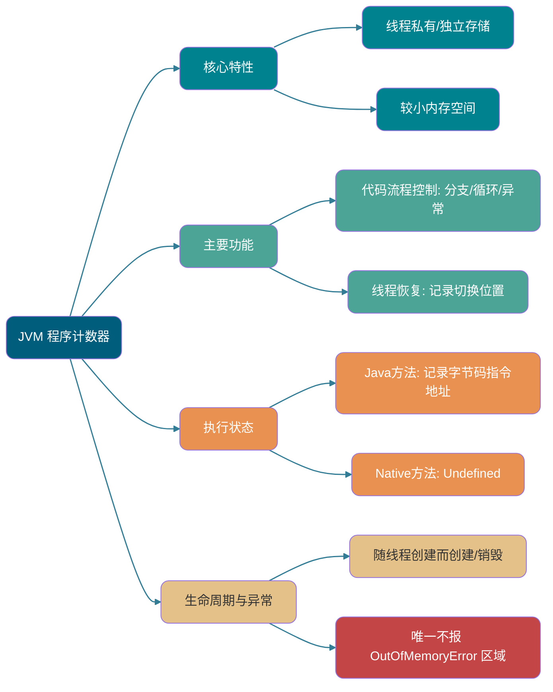
```mermaid
graph LR
    %% 颜色定义
    classDef main fill:#005D7B,color:#fff,rx:10,ry:10;
    classDef feature fill:#00838F,color:#fff,rx:10,ry:10;
    classDef function fill:#4CA497,color:#fff,rx:10,ry:10;
    classDef state fill:#E99151,color:#fff,rx:10,ry:10;
    classDef lifecycle fill:#E4C189,color:#333,rx:10,ry:10;
    classDef warning fill:#C44545,color:#fff,rx:10,ry:10;

    %% 核心节点
    Root(JVM 程序计数器):::main

    %% 分支1：基本特性
    Root --> Attr[核心特性]:::feature
    Attr --> Attr1[线程私有/独立存储]:::feature
    Attr --> Attr2[较小内存空间]:::feature

    %% 分支2：核心功能
    Root --> Func[主要功能]:::function
    Func --> Func1[代码流程控制: 分支/循环/异常]:::function
    Func --> Func2[线程恢复: 记录切换位置]:::function

    %% 分支3：执行状态
    Root --> Run[执行状态]:::state
    Run --> Run1[Java方法: 记录字节码指令地址]:::state
    Run --> Run2[Native方法: Undefined]:::state

    %% 分支4：生命周期与异常
    Root --> Life[生命周期与异常]:::lifecycle
    Life --> Life1[随线程创建而创建/销毁]:::lifecycle
    Life --> Life2[唯一不报 OutOfMemoryError 区域]:::warning

    %% 线条样式
    linkStyle default stroke:#005D7B,stroke-width:1.5px,opacity:0.8
```

程序计数器是一块较小的内存空间，可以看作是当前线程所执行的字节码的行号指示器。字节码解释器工作时通过改变这个计数器的值来选取下一条需要执行的字节码指令，分支、循环、跳转、异常处理、线程恢复等功能都需要依赖这个计数器来完成。

另外，为了线程切换后能恢复到正确的执行位置，每条线程都需要有一个独立的程序计数器，各线程之间计数器互不影响，独立存储，我们称这类内存区域为“线程私有”的内存。

从上面的介绍中我们知道了程序计数器主要有两个作用：

- 字节码解释器通过改变程序计数器来依次读取指令，从而实现代码的流程控制，如：顺序执行、选择、循环、异常处理。
- 在多线程的情况下，程序计数器用于记录当前线程执行的位置，从而当线程被切换回来的时候能够知道该线程上次运行到哪儿了。

程序计数器的生命周期与线程完全同步：

- **创建**：随着线程的创建而创建。
- **销毁**：随着线程的结束而销毁。

在执行 **Java 方法**（非 native）时，程序计数器记录的是 **当前正在执行的 JVM 字节码指令的地址**。当线程执行的是一个 **native 方法**（本地方法）时，程序计数器的值为 **Undefined（未定义）**，因为此时执行的不是 JVM 字节码指令。

⚠️ 注意：程序计数器是 JVM 规范中唯一没有规定任何 `OutOfMemoryError` 情况的内存区域。规范只规定了这一结论，并未要求所有实现都采用某种固定大小的具体表示。

### Java 虚拟机栈

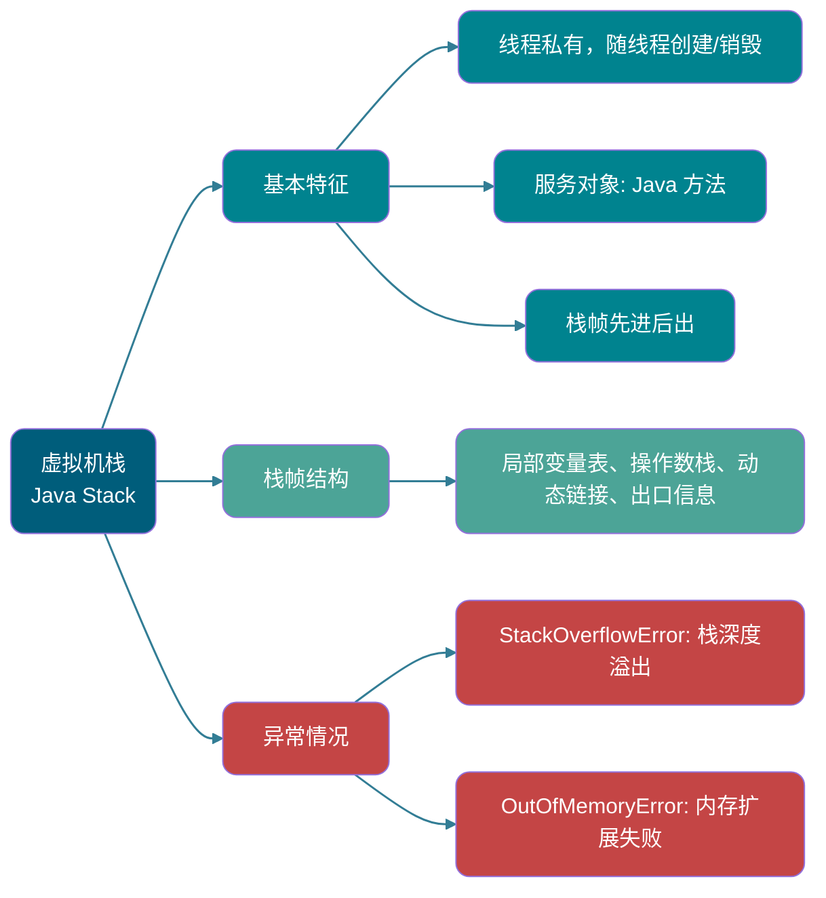
```mermaid
graph LR
    %% 颜色定义
    classDef main fill:#005D7B,color:#fff,rx:10,ry:10;
    classDef compare fill:#00838F,color:#fff,rx:10,ry:10;
    classDef structure fill:#4CA497,color:#fff,rx:10,ry:10;
    classDef error fill:#C44545,color:#fff,rx:10,ry:10;

    %% 核心节点
    Root(虚拟机栈<br/>Java Stack):::main

    %% 分支1：定义与对比
    Root --> Comp[基本特征]:::compare
    Comp --> Comp1[线程私有，随线程创建/销毁]:::compare
    Comp --> Comp2[服务对象: Java 方法]:::compare
    Comp --> Comp3[栈帧先进后出]:::compare

    %% 分支2：栈帧结构
    Root --> Struct[栈帧结构]:::structure
    Struct --> S1[局部变量表、操作数栈、动态链接、出口信息]:::structure

    %% 分支3：异常情况
    Root --> Err[异常情况]:::error
    Err --> Err1[StackOverflowError: 栈深度溢出]:::error
    Err --> Err2[OutOfMemoryError: 内存扩展失败]:::error

    %% 线条样式
    linkStyle default stroke:#005D7B,stroke-width:1.5px,opacity:0.8
```

与程序计数器一样，Java 虚拟机栈（后文简称栈）也是线程私有的，它的生命周期和线程相同，随着线程的创建而创建，随着线程的死亡而死亡。

栈绝对算的上是 JVM 运行时数据区域的一个核心，除了一些 Native 方法调用是通过本地方法栈实现的（后面会提到），其他所有的 Java 方法调用都是通过栈来实现的（也需要和其他运行时数据区域比如程序计数器配合）。

方法调用的数据需要通过栈进行传递，每一次方法调用都会有一个对应的栈帧被压入栈中，每一个方法调用结束后，都会有一个栈帧被弹出。

栈由一个个栈帧组成，而每个栈帧中都拥有：局部变量表、操作数栈、动态链接、方法返回地址。和数据结构上的栈类似，两者都是先进后出的数据结构，只支持出栈和入栈两种操作。


**局部变量表** 主要存放了编译期可知的各种数据类型（boolean、byte、char、short、int、float、long、double）、对象引用（reference 类型，它不同于对象本身，可能是一个指向对象起始地址的引用指针，也可能是指向一个代表对象的句柄或其他与此对象相关的位置）。


**操作数栈** 主要作为方法调用的中转站使用，用于存放方法执行过程中产生的中间计算结果。另外，计算过程中产生的临时变量也会放在操作数栈中。

**动态链接**是栈帧的一项功能。每个栈帧都持有指向当前方法所属类型的运行时常量池的引用，用于把方法代码中的方法符号引用转换为具体的方法引用，并把变量访问转换为对应运行时存储结构中的偏移；解析尚未确定的符号时还可能触发类加载。需要根据接收者实际类型选择虚方法实现的过程属于方法调用指令的动态分派，不能简单等同于这里的动态链接。


栈空间虽然不是无限的，但一般正常调用的情况下是不会出现问题的。不过，如果函数调用陷入无限递归的话，就会导致栈中被压入太多栈帧而占用太多空间，导致栈空间过深。那么当线程请求栈的深度超过当前 Java 虚拟机栈的最大深度的时候，就抛出 `StackOverflowError` 错误。

**Java 方法有两种返回方式**：

- **正常返回**：执行 return 语句，返回值传递给调用者。
- **异常返回**：方法执行过程中抛出异常且未被捕获。

不管哪种返回方式，都会导致栈帧被弹出。也就是说， **栈帧随着方法调用而创建，随着方法结束而销毁。无论方法正常完成还是异常完成都算作方法结束。**

除了 `StackOverflowError` 错误之外，栈还可能会出现 `OutOfMemoryError` 错误，这是因为如果栈的内存大小可以动态扩展， 那么当虚拟机在动态扩展栈时无法申请到足够的内存空间，则抛出 `OutOfMemoryError` 异常。

简单总结一下程序运行中栈可能会出现两种错误：

- **`StackOverflowError`：** 当线程执行所需的栈空间超过 JVM 允许的大小时，抛出 `StackOverflowError` 错误。
- **`OutOfMemoryError`：** 如果栈的内存大小可以动态扩展， 那么当虚拟机在动态扩展栈时无法申请到足够的内存空间，则抛出 `OutOfMemoryError` 异常。


### 本地方法栈

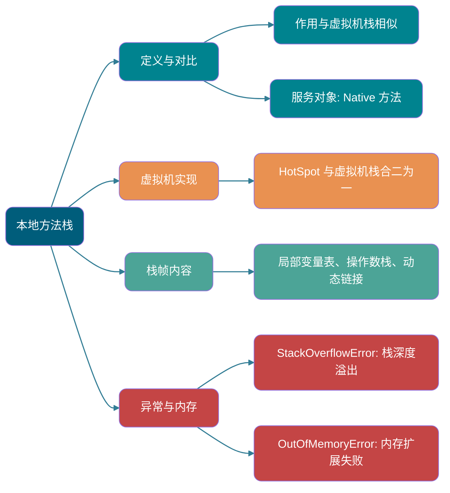
```mermaid
graph LR
    %% 颜色定义
    classDef main fill:#005D7B,color:#fff,rx:10,ry:10;
    classDef compare fill:#00838F,color:#fff,rx:10,ry:10;
    classDef structure fill:#4CA497,color:#fff,rx:10,ry:10;
    classDef implement fill:#E99151,color:#fff,rx:10,ry:10;
    classDef error fill:#C44545,color:#fff,rx:10,ry:10;

    %% 核心节点
    Root(本地方法栈):::main

    %% 分支1：定义与对比
    Root --> Comp[定义与对比]:::compare
    Comp --> Comp1[作用与虚拟机栈相似]:::compare
    Comp --> Comp2[服务对象: Native 方法]:::compare

    %% 分支2：HotSpot 实现
    Root --> Imp[虚拟机实现]:::implement
    Imp --> Imp1[HotSpot 与虚拟机栈合二为一]:::implement

    %% 分支3：栈帧结构
    Root --> Struct[栈帧内容]:::structure
    Struct --> S1[局部变量表、操作数栈、动态链接]:::structure

    %% 分支4：异常情况
    Root --> Err[异常与内存]:::error
    Err --> Err1[StackOverflowError: 栈深度溢出]:::error
    Err --> Err2[OutOfMemoryError: 内存扩展失败]:::error

    %% 线条样式
    linkStyle default stroke:#005D7B,stroke-width:1.5px,opacity:0.8
```

和虚拟机栈所发挥的作用非常相似，区别是：**虚拟机栈为虚拟机执行 Java 方法（也就是字节码）服务，而本地方法栈则为虚拟机使用到的 Native 方法服务。** 在 HotSpot 虚拟机中和 Java 虚拟机栈合二为一。

执行本地方法时，虚拟机实现可以使用传统的本地栈（通常称为 C 栈）。《Java 虚拟机规范》没有规定本地方法栈必须采用与 JVM 栈帧相同的局部变量表、操作数栈和动态链接结构。

本地方法执行完毕后，相应的实现相关栈数据会被释放。本地方法栈也可能出现 `StackOverflowError` 和 `OutOfMemoryError` 两种错误。

### 堆

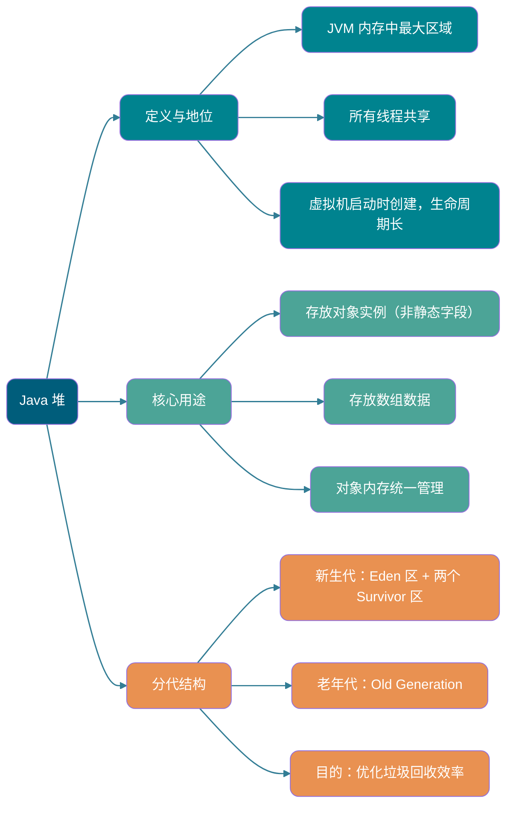
```mermaid
graph LR
    %% 颜色定义
    classDef main fill:#005D7B,color:#fff,rx:10,ry:10;
    classDef compare fill:#00838F,color:#fff,rx:10,ry:10;
    classDef structure fill:#4CA497,color:#fff,rx:10,ry:10;
    classDef implement fill:#E99151,color:#fff,rx:10,ry:10;
    classDef error fill:#C44545,color:#fff,rx:10,ry:10;

    %% 核心节点
    Root(Java 堆):::main

    %% 分支1：基本定义与地位
    Root --> Def[定义与地位]:::compare
    Def --> Def1[JVM 内存中最大区域]:::compare
    Def --> Def2[所有线程共享]:::compare
    Def --> Def3[虚拟机启动时创建，生命周期长]:::compare

    %% 分支2：核心用途
    Root --> Use[核心用途]:::structure
    Use --> Use1[存放对象实例（非静态字段）]:::structure
    Use --> Use2[存放数组数据]:::structure
    Use --> Use3[对象内存统一管理]:::structure

    %% 分3：分代结构 (GC 堆)
    Root --> GC[分代结构]:::implement
    GC --> GC1[新生代：Eden 区 + 两个 Survivor 区]:::implement
    GC --> GC2[老年代：Old Generation]:::implement
    GC --> GC3[目的：优化垃圾回收效率]:::implement

    %% 线条样式
    linkStyle default stroke:#005D7B,stroke-width:1.5px,opacity:0.8
```

Java 虚拟机所管理的内存中最大的一块，Java 堆是所有线程共享的一块内存区域，在虚拟机启动时创建。**此内存区域的唯一目的就是存放对象实例，几乎所有的对象实例以及数组都在这里分配内存。**

Java 世界中“几乎”所有的对象都在堆中分配。不过，JIT 编译器可以基于逃逸分析进行标量替换，从而消除部分对象的实际分配。HotSpot 的这类优化不能简单表述为“对象直接在 Java 虚拟机栈上分配”。

Java 堆是垃圾收集器管理的主要区域，因此也被称作 **GC 堆（Garbage Collected Heap）**。从垃圾回收的角度，由于现在收集器基本都采用分代垃圾收集算法，所以 Java 堆还可以细分为：新生代和老年代；再细致一点有：Eden、Survivor、Old 等空间。进一步划分的目的是更好地回收内存，或者更快地分配内存。

在 JDK 7 及更早版本的 HotSpot 中，GC 通常按下面三部分介绍，其中永久代是方法区的实现，并不属于 Java 堆：

1. 新生代内存(Young Generation)
2. 老生代(Old Generation)
3. 永久代(Permanent Generation)

下图所示的 Eden 区、两个 Survivor 区 S0 和 S1 都属于新生代，中间一层属于老年代，最下面一层属于永久代。


**JDK 8 版本之后 PermGen（永久代） 已被 Metaspace（元空间） 取代，元空间使用的是本地内存。**（我会在方法区这部分内容详细介绍到）。

大部分情况，对象都会首先在 Eden 区域分配，在一次新生代垃圾回收后，如果对象还存活，则会进入 S0 或者 S1，并且对象的年龄还会加 1（Eden 区->Survivor 区后对象的初始年龄变为 1）。对象达到晋升年龄阈值后会进入老年代，该阈值受收集器、自适应策略和 `-XX:MaxTenuringThreshold` 参数共同影响，并非所有收集器的默认值都是 15。对于采用 4 位年龄字段的经典分代收集器，该参数的上限是 15。

```bash
MaxTenuringThreshold of 20 is invalid; must be between 0 and 15
```

**为什么年龄只能是 0-15?**

因为记录年龄的区域在对象头中，这个区域的大小通常是 4 位。这 4 位可以表示的最大二进制数字是 1111，即十进制的 15。因此，对象的年龄被限制为 0 到 15。

这里我们简单结合对象布局来详细介绍一下。

在 HotSpot 虚拟机中，对象在内存中存储的布局可以分为 3 块区域：对象头（Header）、实例数据（Instance Data）和对齐填充（Padding）。其中，对象头包括两部分：标记字段（Mark Word）和类型指针（Klass Word）。关于对象内存布局的详细介绍，后文会介绍到，这里就不重复提了。

这个年龄信息就是在标记字段中存放的（标记字段还存放了对象自身的其他信息比如哈希码、锁状态信息等等）。下面旧版 HotSpot 源码中的 `markOop.hpp` 展示了当时标记字（Mark Word）的结构；现代 JDK 的对应实现和对象头布局已经发生变化：


可以看到对象年龄占用的大小确实是 4 位。

> **🐛 修正（参见：[issue552](https://github.com/Snailclimb/JavaGuide/issues/552)）**：“Hotspot 遍历所有对象时，按照年龄从小到大对其所占用的大小进行累加，当累加到某个年龄时，所累加的大小超过了 Survivor 区的一半，则取这个年龄和 `MaxTenuringThreshold` 中更小的一个值，作为新的晋升年龄阈值”。
>
> **动态年龄计算的代码如下**
>
> ```c++
> uint ageTable::compute_tenuring_threshold(size_t survivor_capacity) {
>  //survivor_capacity是survivor空间的大小
> size_t desired_survivor_size = (size_t)((((double) survivor_capacity)*TargetSurvivorRatio)/100);//TargetSurvivorRatio 为50
> size_t total = 0;
> uint age = 1;
> while (age < table_size) {
> total += sizes[age];//sizes数组是每个年龄段对象大小
> if (total > desired_survivor_size) break;
> age++;
> }
> uint result = age < MaxTenuringThreshold ? age : MaxTenuringThreshold;
>   ...
> }
> ```

堆这里最容易出现的就是 `OutOfMemoryError` 错误，并且出现这种错误之后的表现形式还会有几种，比如：

1. **`java.lang.OutOfMemoryError: GC Overhead Limit Exceeded`**：当 JVM 花太多时间执行垃圾回收并且只能回收很少的堆空间时，就会发生此错误。
2. **`java.lang.OutOfMemoryError: Java heap space`** :假如在创建新的对象时, 堆内存中的空间不足以存放新创建的对象, 就会引发此错误。(和配置的最大堆内存有关，且受制于物理内存大小。最大堆内存可通过 `-Xmx` 参数配置，若没有特别配置，将会使用默认值，详见：[Default Java 8 max heap size](https://stackoverflow.com/questions/28272923/default-xmxsize-in-java-8-max-heap-size))
3. ……

### 方法区

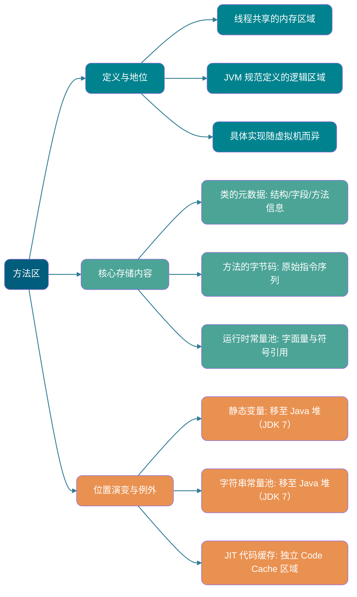
```mermaid
graph LR
    %% 颜色定义
    classDef main fill:#005D7B,color:#fff,rx:10,ry:10;
    classDef compare fill:#00838F,color:#fff,rx:10,ry:10;
    classDef structure fill:#4CA497,color:#fff,rx:10,ry:10;
    classDef implement fill:#E99151,color:#fff,rx:10,ry:10;
    classDef error fill:#C44545,color:#fff,rx:10,ry:10;

    %% 核心节点
    Root(方法区):::main

    %% 分支1：基本定义与地位
    Root --> Def[定义与地位]:::compare
    Def --> Def1[线程共享的内存区域]:::compare
    Def --> Def2[JVM 规范定义的逻辑区域]:::compare
    Def --> Def3[具体实现随虚拟机而异]:::compare

    %% 分支2：核心存储内容
    Root --> Store[核心存储内容]:::structure
    Store --> Store1[类的元数据: 结构/字段/方法信息]:::structure
    Store --> Store2[方法的字节码: 原始指令序列]:::structure
    Store --> Store3[运行时常量池: 字面量与符号引用]:::structure

    %% 分支3：HotSpot 位置演变 (JDK 7+)
    Root --> Change[位置演变与例外]:::implement
    Change --> Change1[静态变量: 移至 Java 堆（JDK 7）]:::implement
    Change --> Change2[字符串常量池: 移至 Java 堆（JDK 7）]:::implement
    Change --> Change3[JIT 代码缓存: 独立 Code Cache 区域]:::implement

    %% 线条样式
    linkStyle default stroke:#005D7B,stroke-width:1.5px,opacity:0.8
```

方法区属于是 JVM 运行时数据区域的一块逻辑区域，是各个线程共享的内存区域。

《Java 虚拟机规范》只是规定了有方法区这么个概念和它的作用，方法区到底要如何实现那就是虚拟机自己要考虑的事情了。也就是说，在不同的虚拟机实现上，方法区的实现是不同的。

当虚拟机加载一个类时，它会从 Class 文件中解析出相应的信息，并将这些**元数据**存入方法区。具体来说，方法区主要存储以下核心数据：

1. **类的元数据**：包括类的完整结构，如类名、父类、实现的接口、访问修饰符，以及字段和方法的详细信息（名称、类型、修饰符等）。
2. **方法的字节码**：每个方法的原始指令序列。
3. **运行时常量池**：每个类独有的，由 Class 文件中的常量池转换而来，用于存放编译期生成的各种字面量和对类型、字段、方法的符号引用。

需要特别注意的是，以下几类数据虽然在逻辑上与类相关，但在 HotSpot 虚拟机中，它们并不存储在方法区内：

- **静态变量（Static Variables）**：自 JDK 7 起，类静态变量与对应的 `java.lang.Class` 对象一起存放在 Java 堆中。
- **字符串常量池（String Pool）**：同样自 JDK 7 起，字符串常量池也**移至 Java 堆中**。
- **即时编译器编译后的代码缓存（JIT Code Cache）**：JIT 编译器将热点方法的字节码编译成的本地机器码，存放在一个**独立的、名为“Code Cache”的内存区域**，而不是方法区本身。这样做是为了实现更高效的执行和内存管理。


**方法区和永久代以及元空间是什么关系呢？** 方法区和永久代以及元空间的关系很像 Java 中接口和类的关系，类实现了接口，这里的类就可以看作是永久代和元空间，接口可以看作是方法区，也就是说永久代以及元空间是 HotSpot 虚拟机对虚拟机规范中方法区的两种实现方式。并且，永久代是 JDK 1.8 之前的方法区实现，JDK 1.8 及以后方法区的实现变成了元空间。


**为什么要将永久代 (PermGen) 替换为元空间 (MetaSpace) 呢?**

下图来自《深入理解 Java 虚拟机》第 3 版 2.2.5


1、永久代的容量受 `-XX:MaxPermSize` 上限约束，这个上限可以配置；元空间改用本地内存，并可通过 `-XX:MaxMetaspaceSize` 限制。两者都可能溢出，实际风险取决于配置和类元数据的增长情况。

> 当元空间溢出时会得到如下错误：`java.lang.OutOfMemoryError: Metaspace`

你可以使用 `-XX:MaxMetaspaceSize` 设置最大元空间大小。若不设置，类元数据空间可继续增长，直到受到可用本地内存等条件限制。`-XX:MetaspaceSize` 不是元空间的初始容量，而是触发元数据 GC 的初始高水位阈值，之后 JVM 会动态调整该阈值。

2、元空间里面存放的是类的元数据，这样加载多少类的元数据就不由 `MaxPermSize` 控制了, 而由系统的实际可用空间来控制，这样能加载的类就更多了。

3、在 JDK8，合并 HotSpot 和 JRockit 的代码时, JRockit 从来没有一个叫永久代的东西, 合并之后就没有必要额外的设置这么一个永久代的地方了。

4、永久代会为 GC 带来不必要的复杂度，并且回收效率偏低。

**方法区常用参数有哪些？**

JDK 1.8 之前永久代还没被彻底移除的时候通常通过下面这些参数来调节方法区大小。

```java
-XX:PermSize=N //方法区 (永久代) 初始大小
-XX:MaxPermSize=N //方法区 (永久代) 最大大小,超过这个值将会抛出 OutOfMemoryError 异常:java.lang.OutOfMemoryError: PermGen
```

相对而言，垃圾收集行为在这个区域是比较少出现的，但并非数据进入方法区后就“永久存在”了。

JDK 1.8 的时候，方法区（HotSpot 的永久代）被彻底移除了（JDK1.7 就已经开始了），取而代之是元空间，元空间使用的是本地内存。下面是一些常用参数：

```java
-XX:MetaspaceSize=N //设置触发元数据 GC 的初始高水位阈值
-XX:MaxMetaspaceSize=N //设置 Metaspace 的最大大小
```

与永久代很大的不同是，如果不指定 `MaxMetaspaceSize`，元空间没有由该参数设定的固定上限，持续的类元数据增长可能消耗大量本地内存。

### 运行时常量池

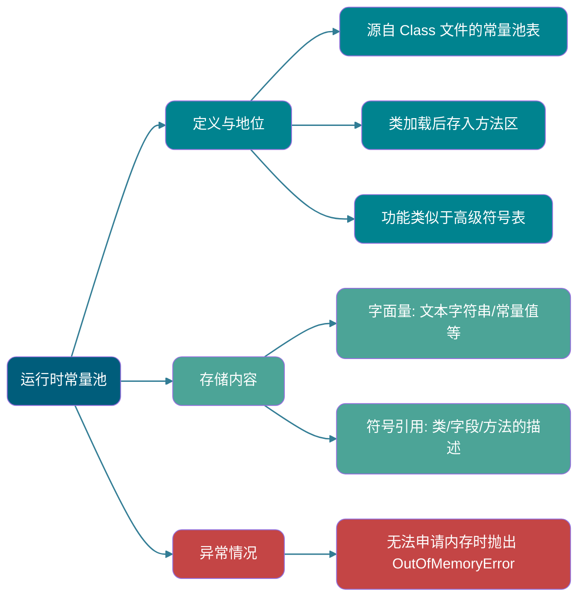
```mermaid
graph LR
    %% 颜色定义
    classDef main fill:#005D7B,color:#fff,rx:10,ry:10;
    classDef compare fill:#00838F,color:#fff,rx:10,ry:10;
    classDef structure fill:#4CA497,color:#fff,rx:10,ry:10;
    classDef implement fill:#E99151,color:#fff,rx:10,ry:10;
    classDef error fill:#C44545,color:#fff,rx:10,ry:10;

    %% 核心节点
    Root(运行时常量池):::main

    %% 分支1：来源与地位
    Root --> Source[定义与地位]:::compare
    Source --> Source1[源自 Class 文件的常量池表]:::compare
    Source --> Source2[类加载后存入方法区]:::compare
    Source --> Source3[功能类似于高级符号表]:::compare

    %% 分支2：存储内容分类
    Root --> Content[存储内容]:::structure
    Content --> Content1[字面量: 文本字符串/常量值等]:::structure
    Content --> Content2[符号引用: 类/字段/方法的描述]:::structure

    %% 分支3：异常处理
    Root --> Error[异常情况]:::error
    Error --> Error2[无法申请内存时抛出 OutOfMemoryError]:::error

    %% 线条样式
    linkStyle default stroke:#005D7B,stroke-width:1.5px,opacity:0.8
```

Class 文件中除了有类的版本、字段、方法、接口等描述信息外，还有用于存放编译期生成的各种字面量（Literal）和符号引用（Symbolic Reference）的 **常量池表(Constant Pool Table)**。

字面量是源代码中的固定值的表示法，即通过字面我们就能知道其值的含义。字面量包括整数、浮点数和字符串字面量。常见的符号引用包括类符号引用、字段符号引用、方法符号引用、接口方法符号。

《深入理解 Java 虚拟机》7.34 节第三版对符号引用和直接引用的解释如下：


常量池表会在类加载后存放到方法区的运行时常量池中。

运行时常量池的功能类似于传统编程语言的符号表，尽管它包含了比典型符号表更广泛的数据。

既然运行时常量池是方法区的一部分，自然受到方法区内存的限制，当常量池无法再申请到内存时会抛出 `OutOfMemoryError` 错误。

### 字符串常量池

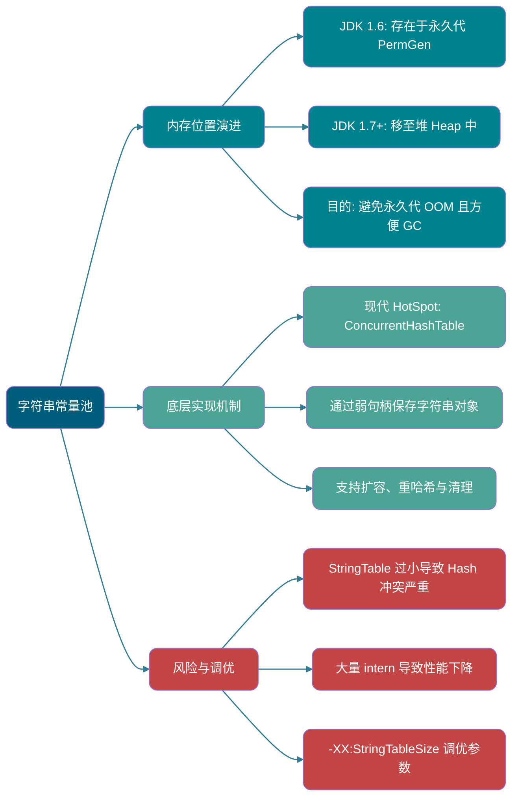
```mermaid
graph LR
    %% 颜色定义
    classDef main fill:#005D7B,color:#fff,rx:10,ry:10;
    classDef compare fill:#00838F,color:#fff,rx:10,ry:10;
    classDef structure fill:#4CA497,color:#fff,rx:10,ry:10;
    classDef implement fill:#E99151,color:#fff,rx:10,ry:10;
    classDef error fill:#C44545,color:#fff,rx:10,ry:10;

    %% 核心节点
    Root(字符串常量池):::main

    %% 分支1：内存位置演进
    Root --> History[内存位置演进]:::compare
    History --> Hist1[JDK 1.6: 存在于永久代 PermGen]:::compare
    History --> Hist2[JDK 1.7+: 移至堆 Heap 中]:::compare
    History --> Hist3[目的: 避免永久代 OOM 且方便 GC]:::compare

    %% 分支2：底层实现结构
    Root --> Impl[底层实现机制]:::structure
    Impl --> Impl1[现代 HotSpot: ConcurrentHashTable]:::structure
    Impl --> Impl2[通过弱句柄保存字符串对象]:::structure
    Impl --> Impl3[支持扩容、重哈希与清理]:::structure

    %% 分支3：风险与调优
    Root --> Tuning[风险与调优]:::error
    Tuning --> Risk1[StringTable 过小导致 Hash 冲突严重]:::error
    Tuning --> Risk2[大量 intern 导致性能下降]:::error
    Tuning --> Param[-XX:StringTableSize 调优参数]:::error

    %% 线条样式
    linkStyle default stroke:#005D7B,stroke-width:1.5px,opacity:0.8
```

**字符串常量池** 是 JVM 为了提升性能和减少内存消耗针对字符串（String 类）专门开辟的一块区域，主要目的是为了避免字符串的重复创建。

```java
// 1.在字符串常量池中查询字符串对象 "ab"，如果没有则创建"ab"并放入字符串常量池
// 2.将字符串对象 "ab" 的引用赋值给 aa
String aa = "ab";
// 直接返回字符串常量池中字符串对象 "ab"，赋值给引用 bb
String bb = "ab";
System.out.println(aa==bb); // true
```

HotSpot 虚拟机中字符串常量池的实现可以在 `src/hotspot/share/classfile/stringTable.cpp` 中看到。现代 HotSpot 的本地 `StringTable` 使用并发哈希表，并通过弱句柄保存堆中的字符串对象，支持扩容、重哈希以及清理失效条目；`-XX:StringTableSize` 用于设置初始桶数量。因此，“固定长度数组 + 链表”的说法只适用于部分旧版实现，不能用于概括当前 HotSpot。

JDK1.7 之前，字符串常量池存放在永久代。JDK1.7 将字符串常量池和类静态变量移到了 Java 堆中。


**JDK 1.7 为什么要将字符串常量池移动到堆中？**

主要是因为永久代（方法区实现）的 GC 回收效率太低，只有在整堆收集 (Full GC)的时候才会被执行 GC。Java 程序中通常会有大量的被创建的字符串等待回收，将字符串常量池放到堆中，能够更高效及时地回收字符串内存。

相关问题：[JVM 常量池中存储的是对象还是引用呢？ - RednaxelaFX - 知乎](https://www.zhihu.com/question/57109429/answer/151717241)

最后再来分享一段周志明老师在[《深入理解 Java 虚拟机（第 3 版）》样例代码&勘误](https://github.com/fenixsoft/jvm_book) GitHub 仓库的 [issue#112](https://github.com/fenixsoft/jvm_book/issues/112) 中说过的话：

> **运行时常量池、方法区、字符串常量池这些都是不随虚拟机实现而改变的逻辑概念，是公共且抽象的，Metaspace、Heap 是与具体某种虚拟机实现相关的物理概念，是私有且具体的。**

### 直接内存

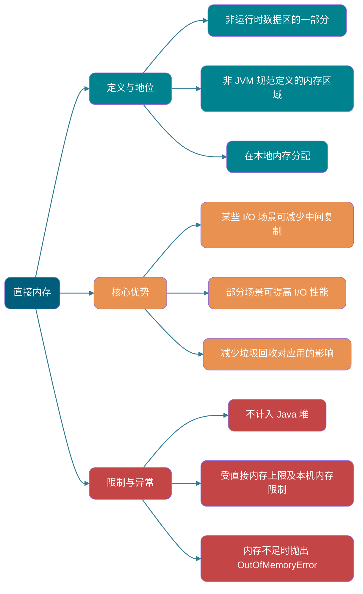
```mermaid
graph LR
    %% 颜色定义
    classDef main fill:#005D7B,color:#fff,rx:10,ry:10;
    classDef compare fill:#00838F,color:#fff,rx:10,ry:10;
    classDef structure fill:#4CA497,color:#fff,rx:10,ry:10;
    classDef implement fill:#E99151,color:#fff,rx:10,ry:10;
    classDef error fill:#C44545,color:#fff,rx:10,ry:10;

    %% 核心节点
    Root(直接内存):::main

    %% 分支1：定义与地位
    Root --> Source[定义与地位]:::compare
    Source --> Source1[非运行时数据区的一部分]:::compare
    Source --> Source2[非 JVM 规范定义的内存区域]:::compare
    Source --> Source3[在本地内存分配]:::compare

    %% 分支2：核心优势
    Root --> Advantage[核心优势]:::implement
    Advantage --> Adv1[某些 I/O 场景可减少中间复制]:::implement
    Advantage --> Adv2[部分场景可提高 I/O 性能]:::implement
    Advantage --> Adv3[减少垃圾回收对应用的影响]:::implement

    %% 分支3：限制与异常
    Root --> Error[限制与异常]:::error
    Error --> Error1[不计入 Java 堆]:::error
    Error --> Error2[受直接内存上限及本机内存限制]:::error
    Error --> Error3[内存不足时抛出 OutOfMemoryError]:::error

    %% 线条样式
    linkStyle default stroke:#005D7B,stroke-width:1.5px,opacity:0.8
```

直接内存是一种特殊的内存缓冲区，并不在 Java 堆或方法区中分配，而是在本地内存中分配。具体分配机制属于虚拟机实现细节，并不等同于必须通过 JNI 分配。

直接内存并不是虚拟机运行时数据区的一部分，也不是虚拟机规范中定义的内存区域，但是这部分内存也被频繁地使用。而且也可能导致 `OutOfMemoryError` 错误出现。

JDK1.4 中新加入的 **NIO（New I/O）**，引入了一种基于**通道（Channel）**与**缓冲区（Buffer）**的 I/O 方式。直接字节缓冲区可以在 Java 堆外分配内容，并通过 Java 堆中的 `DirectByteBuffer` 对象进行操作。JVM 会尽力直接在这种缓冲区上执行本地 I/O，从而在某些场景中减少中间缓冲区的数据复制；NIO 中只有可选择通道与 Selector 等部分提供非阻塞 I/O 能力，不能把整个 NIO 展开为 Non-Blocking I/O。

直接内存不计入 Java 堆，但仍会受到本机总内存、处理器寻址空间等条件的限制。对于 NIO 直接缓冲区，还可以通过 [`-XX:MaxDirectMemorySize`](https://docs.oracle.com/en/java/javase/25/docs/specs/man/java.html#extra-options-for-java) 限制总分配量。

类似的概念还有 **堆外内存**。在一些文章中将直接内存等价于堆外内存，个人觉得不是特别准确。

堆外内存是分配在 Java 堆之外的内存的统称，底层通常使用操作系统提供的本地内存。它是否以及如何受到 JVM 或 JDK 管理，取决于具体的分配方式。例如，在 OpenJDK/HotSpot 中，`DirectByteBuffer` 对应的本地内存会关联 Java 堆中的缓冲区对象，并在对象变为不可达后通过 `Cleaner` 等机制参与清理。由于清理时机不由应用程序直接控制，使用堆外内存可以减少 Java 堆的压力，但仍然需要关注本地内存泄漏和 `OutOfMemoryError`。

## HotSpot 虚拟机对象探秘

通过上面的介绍我们大概知道了虚拟机的内存情况，下面我们来详细的了解一下 HotSpot 虚拟机在 Java 堆中对象分配、布局和访问的全过程。

### 对象的创建

Java 对象的创建过程我建议最好是能默写出来，并且要掌握每一步在做什么。

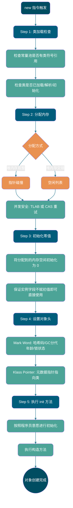
```mermaid
graph TD
    %% 颜色定义
    classDef root fill:#004D61,color:#fff,rx:10,ry:10;
    classDef step fill:#005D7B,color:#fff,rx:10,ry:10;
    classDef detail fill:#4CA497,color:#fff,rx:10,ry:10;
    classDef logic fill:#E99151,color:#fff,rx:10,ry:10;

    %% 核心流程
    Start(new 指令触发):::root

    Start --> S1[Step 1: 类加载检查]:::step
    S1 --> S1_1[检查常量池是否有类符号引用]:::detail
    S1_1 --> S1_2[检查类是否已加载/解析/初始化]:::detail

    S1_2 --> S2[Step 2: 分配内存]:::step
    S2 --> S2_Method{分配方式}:::logic
    S2_Method -->|堆内存规整| S2_A[指针碰撞]:::logic
    S2_Method -->|堆内存交错| S2_B[空闲列表]:::logic
    S2_A & S2_B --> S2_Safe[并发安全: TLAB 或 CAS 重试]:::detail

    S2_Safe --> S3[Step 3: 初始化零值]:::step
    S3 --> S3_1[将分配到的内存空间初始化为 0]:::detail
    S3_1 --> S3_2[保证实例字段不赋初值即可直接使用]:::detail

    S3_2 --> S4[Step 4: 设置对象头]:::step
    S4 --> S4_1[Mark Word: 哈希码/GC分代年龄/锁状态]:::detail
    S4_1 --> S4_2[Klass Pointer: 元数据指针指向类]:::detail

    S4_2 --> S5[Step 5: 执行 init 方法]:::step
    S5 --> S5_1[按照程序员意愿进行初始化]:::detail
    S5_1 --> S5_2[执行构造方法]:::detail

    S5_2 --> End((对象创建完成)):::root

    %% 线条样式
    linkStyle default stroke:#005D7B,stroke-width:1.5px,opacity:0.8
```

#### Step1:类加载检查

虚拟机遇到一条 new 指令时，首先将去检查这个指令的参数是否能在常量池中定位到这个类的符号引用，并且检查这个符号引用代表的类是否已被加载过、解析和初始化过。如果没有，那必须先执行相应的类加载过程。

#### Step2:分配内存

在**类加载检查**通过后，接下来虚拟机将为新生对象**分配内存**。对象所需的内存大小在类加载完成后便可确定，为对象分配空间的任务等同于把一块确定大小的内存从 Java 堆中划分出来。**分配方式**有 **“指针碰撞”** 和 **“空闲列表”** 两种，**选择哪种分配方式由 Java 堆是否规整决定，而 Java 堆是否规整又由所采用的垃圾收集器是否带有压缩整理功能决定**。

**内存分配的两种方式**（补充内容，需要掌握）：

- 指针碰撞：
  - 适用场合：堆内存规整（即没有内存碎片）的情况下。
  - 原理：用过的内存全部整合到一边，没有用过的内存放在另一边，中间有一个分界指针，只需要向着没用过的内存方向将该指针移动对象内存大小位置即可。
  - 使用该分配方式的 GC 收集器：Serial, ParNew
- 空闲列表：
  - 适用场合：堆内存不规整的情况下。
  - 原理：虚拟机会维护一个列表，该列表中会记录哪些内存块是可用的，在分配的时候，找一块儿足够大的内存块儿来划分给对象实例，最后更新列表记录。
  - 使用该分配方式的 GC 收集器：CMS

选择以上两种方式中的哪一种，取决于 Java 堆内存是否规整。而 Java 堆内存是否规整，取决于 GC 收集器的算法是“标记-清除”，还是“标记-整理”（也称作“标记-压缩”），值得注意的是，复制算法内存也是规整的。

**内存分配并发问题（补充内容，需要掌握）**

在创建对象的时候有一个很重要的问题，就是线程安全，因为在实际开发过程中，创建对象是很频繁的事情，作为虚拟机来说，必须要保证线程是安全的，通常来讲，虚拟机采用两种方式来保证线程安全：

- **CAS+失败重试：** CAS 是乐观锁的一种实现方式。所谓乐观锁就是，每次不加锁而是假设没有冲突而去完成某项操作，如果因为冲突失败就重试，直到成功为止。**虚拟机采用 CAS 配上失败重试的方式保证更新操作的原子性。**
- **TLAB：** 为每一个线程预先在 Eden 区分配一块儿内存，JVM 在给线程中的对象分配内存时，首先在 TLAB 分配，当对象大于 TLAB 中的剩余内存或 TLAB 的内存已用尽时，再采用上述的 CAS 进行内存分配

#### Step3:初始化零值

内存分配完成后，虚拟机需要将分配到的内存空间都初始化为零值（不包括对象头），这一步操作保证了对象的实例字段在 Java 代码中可以不赋初始值就直接使用，程序能访问到这些字段的数据类型所对应的零值。

#### Step4:设置对象头

初始化零值完成之后，**虚拟机要对对象进行必要的设置**，例如这个对象是哪个类的实例、如何才能找到类的元数据信息、对象的哈希码、对象的 GC 分代年龄等信息。 **这些信息存放在对象头中。** 另外，对象头的具体布局与 JDK 版本和虚拟机配置有关；例如偏向锁在 JDK 15 起默认禁用，相关实现后来又被移除。

#### Step5:执行 init 方法

在上面工作都完成之后，从虚拟机的视角来看，一个新的对象已经产生了，但从 Java 程序的视角来看，对象创建才刚开始，`<init>` 方法还没有执行，所有的字段都还为零。所以一般来说，执行 new 指令之后会接着执行 `<init>` 方法，把对象按照程序员的意愿进行初始化，这样一个真正可用的对象才算完全产生出来。

### 对象的内存布局

在 Hotspot 虚拟机中，对象在内存中的布局可以分为 3 块区域：**对象头（Header）**、**实例数据（Instance Data）**和**对齐填充（Padding）**。

对象头包括两部分信息：

1. 标记字段（Mark Word）：用于存储对象自身的运行时数据，如哈希码（HashCode）、GC 分代年龄、锁状态等；偏向线程 ID、偏向时间戳只适用于仍实现并启用偏向锁的旧版 HotSpot。
2. 类型指针（Klass pointer）：对象指向它的类元数据的指针，虚拟机通过这个指针来确定这个对象是哪个类的实例。

**实例数据部分是对象真正存储的有效信息**，也是在程序中所定义的各种类型的字段内容。

**对齐填充部分不是必然存在的，也没有什么特别的含义，仅仅起占位作用。** HotSpot 会按对象对齐边界分配对象，默认对齐通常是 8 字节，也可受 `-XX:ObjectAlignmentInBytes` 等配置影响。因此对象总大小需要补齐到对齐边界；对象头本身并不保证总是 8 字节的整数倍，例如启用压缩类指针时常见的对象头大小是 12 字节。

### 对象的访问定位

建立对象就是为了使用对象，我们的 Java 程序通过栈上的 reference 数据来操作堆上的具体对象。对象的访问方式由虚拟机实现而定，目前主流的访问方式有：**使用句柄**、**直接指针**。

#### 句柄

如果使用句柄的话，那么 Java 堆中将会划分出一块内存来作为句柄池，reference 中存储的就是对象的句柄地址，而句柄中包含了对象实例数据与对象类型数据各自的具体地址信息。


#### 直接指针

如果使用直接指针访问，reference 中存储的直接就是对象的地址。


这两种对象访问方式各有优势。使用句柄来访问的最大好处是 reference 中存储的是稳定的句柄地址，在对象被移动时只会改变句柄中的实例数据指针，而 reference 本身不需要修改。使用直接指针访问方式最大的好处就是速度快，它节省了一次指针定位的时间开销。

HotSpot 虚拟机主要使用的就是这种方式来进行对象访问。

## 参考

- 《深入理解 Java 虚拟机：JVM 高级特性与最佳实践（第二版》
- 《自己动手写 Java 虚拟机》
- Chapter 2. The Structure of the Java Virtual Machine：<https://docs.oracle.com/javase/specs/jvms/se8/html/jvms-2.html>
- JVM 栈帧内部结构-动态链接：<https://chenxitag.com/archives/368>
- Java 中 new String（“字面量”） 中 “字面量” 是何时进入字符串常量池的？ - 木女孩的回答 - 知乎：<https://www.zhihu.com/question/55994121/answer/147296098>
- JVM 常量池中存储的是对象还是引用呢？ - RednaxelaFX 的回答 - 知乎：<https://www.zhihu.com/question/57109429/answer/151717241>
- <http://www.pointsoftware.ch/en/under-the-hood-runtime-data-areas-javas-memory-model/>
- <https://dzone.com/articles/jvm-permgen-%E2%80%93-where-art-thou>
- <https://stackoverflow.com/questions/9095748/method-area-and-permgen>


---

---

<!-- source: jvm/JDK监控和故障处理工具总结.md -->

## [6] JDK监控和故障处理工具总结

---
title: JDK监控和故障处理工具总结
category: Java
tag:
  - JVM
---

## JDK 命令行工具

这些命令在 JDK 安装目录下的 bin 目录下：

- **`jps`** (JVM Process Status）: 类似 UNIX 的 `ps` 命令。用于查看所有 Java 进程的启动类、传入参数和 Java 虚拟机参数等信息；
- **`jstat`**（JVM Statistics Monitoring Tool）: 用于收集 HotSpot 虚拟机各方面的运行数据;
- **`jinfo`** (Configuration Info for Java) : Configuration Info for Java,显示虚拟机配置信息;
- **`jmap`** (Memory Map for Java) : 生成堆转储快照;
- **`jhat`** (JVM Heap Dump Browser) : 用于分析 heapdump 文件，它会建立一个 HTTP/HTML 服务器，让用户可以在浏览器上查看分析结果。JDK9 移除了 jhat；
- **`jstack`** (Stack Trace for Java) : 生成虚拟机当前时刻的线程快照，线程快照就是当前虚拟机内每一条线程正在执行的方法堆栈的集合。

### `jps`:查看所有 Java 进程

`jps`(JVM Process Status) 命令类似 UNIX 的 `ps` 命令。

`jps`：显示虚拟机执行主类名称以及这些进程的本地虚拟机唯一 ID（Local Virtual Machine Identifier,LVMID）。`jps -q`：只输出进程的本地虚拟机唯一 ID。

```powershell
C:\Users\SnailClimb>jps
7360 NettyClient2
17396
7972 Launcher
16504 Jps
17340 NettyServer
```

`jps -l`:输出主类的全名，如果进程执行的是 Jar 包，输出 Jar 路径。

```powershell
C:\Users\SnailClimb>jps -l
7360 firstNettyDemo.NettyClient2
17396
7972 org.jetbrains.jps.cmdline.Launcher
16492 sun.tools.jps.Jps
17340 firstNettyDemo.NettyServer
```

`jps -v`：输出虚拟机进程启动时 JVM 参数。

`jps -m`：输出传递给 Java 进程 main() 函数的参数。

### `jstat`: 监视虚拟机各种运行状态信息

jstat（JVM Statistics Monitoring Tool） 使用于监视虚拟机各种运行状态信息的命令行工具。 它可以显示本地或者远程（需要远程主机提供 RMI 支持）虚拟机进程中的类信息、内存、垃圾收集、JIT 编译等运行数据，在没有 GUI，只提供了纯文本控制台环境的服务器上，它将是运行期间定位虚拟机性能问题的首选工具。

**`jstat` 命令使用格式：**

```powershell
jstat -<option> [-t] [-h<lines>] <vmid> [<interval> [<count>]]
```

比如 `jstat -gc -h3 31736 1000 10`表示分析进程 id 为 31736 的 gc 情况，每隔 1000ms 打印一次记录，打印 10 次停止，每 3 行后打印指标头部。

**常见的 option 如下：**

- `jstat -class vmid`：显示 ClassLoader 的相关信息；
- `jstat -compiler vmid`：显示 JIT 编译的相关信息；
- `jstat -gc vmid`：显示与 GC 相关的堆信息；
- `jstat -gccapacity vmid`：显示各个代的容量及使用情况；
- `jstat -gcnew vmid`：显示新生代信息；
- `jstat -gcnewcapcacity vmid`：显示新生代大小与使用情况；
- `jstat -gcold vmid`：显示老年代和永久代的行为统计，从 jdk1.8 开始,该选项仅表示老年代，因为永久代被移除了；
- `jstat -gcoldcapacity vmid`：显示老年代的大小；
- `jstat -gcpermcapacity vmid`：显示永久代大小，从 jdk1.8 开始,该选项不存在了，因为永久代被移除了；
- `jstat -gcutil vmid`：显示垃圾收集信息；

另外，加上 `-t`参数可以在输出信息上加一个 Timestamp 列，显示程序的运行时间。

### `jinfo`: 实时地查看和调整虚拟机各项参数

`jinfo vmid` :输出当前 jvm 进程的全部参数和系统属性 (第一部分是系统的属性，第二部分是 JVM 的参数)。

`jinfo -flag name vmid` :输出对应名称的参数的具体值。比如输出 MaxHeapSize、查看当前 jvm 进程是否开启打印 GC 日志 ( `-XX:PrintGCDetails` :详细 GC 日志模式，这两个都是默认关闭的)。

```powershell
C:\Users\SnailClimb>jinfo  -flag MaxHeapSize 17340
-XX:MaxHeapSize=2124414976
C:\Users\SnailClimb>jinfo  -flag PrintGC 17340
-XX:-PrintGC
```

使用 jinfo 可以在不重启虚拟机的情况下，可以动态的修改 jvm 的参数。尤其在线上的环境特别有用,请看下面的例子：

`jinfo -flag [+|-]name vmid` 开启或者关闭对应名称的参数。

```powershell
C:\Users\SnailClimb>jinfo  -flag  PrintGC 17340
-XX:-PrintGC

C:\Users\SnailClimb>jinfo  -flag  +PrintGC 17340

C:\Users\SnailClimb>jinfo  -flag  PrintGC 17340
-XX:+PrintGC
```

### `jmap`:生成堆转储快照

`jmap`（Memory Map for Java）命令用于生成堆转储快照。 如果不使用 `jmap` 命令，要想获取 Java 堆转储，可以使用 `“-XX:+HeapDumpOnOutOfMemoryError”` 参数，可以让虚拟机在 OOM 异常出现之后自动生成 dump 文件，Linux 命令下可以通过 `kill -3` 发送进程退出信号也能拿到 dump 文件。

`jmap` 的作用并不仅仅是为了获取 dump 文件，它还可以查询 finalizer 执行队列、Java 堆和永久代的详细信息，如空间使用率、当前使用的是哪种收集器等。和`jinfo`一样，`jmap`有不少功能在 Windows 平台下也是受限制的。

示例：将指定应用程序的堆快照输出到桌面。后面，可以通过 jhat、Visual VM 等工具分析该堆文件。

```powershell
C:\Users\SnailClimb>jmap -dump:format=b,file=C:\Users\SnailClimb\Desktop\heap.hprof 17340
Dumping heap to C:\Users\SnailClimb\Desktop\heap.hprof ...
Heap dump file created
```

### **`jhat`**: 分析 heapdump 文件

**`jhat`** 用于分析 heapdump 文件，它会建立一个 HTTP/HTML 服务器，让用户可以在浏览器上查看分析结果。

```powershell
C:\Users\SnailClimb>jhat C:\Users\SnailClimb\Desktop\heap.hprof
Reading from C:\Users\SnailClimb\Desktop\heap.hprof...
Dump file created Sat May 04 12:30:31 CST 2019
Snapshot read, resolving...
Resolving 131419 objects...
Chasing references, expect 26 dots..........................
Eliminating duplicate references..........................
Snapshot resolved.
Started HTTP server on port 7000
Server is ready.
```

访问 <http://localhost:7000/>

注意⚠️：JDK9 移除了 jhat（[JEP 241: Remove the jhat Tool](https://openjdk.org/jeps/241)），你可以使用其替代品 Eclipse Memory Analyzer Tool (MAT) 和 VisualVM，这也是官方所推荐的。

### **`jstack`** :生成虚拟机当前时刻的线程快照

`jstack`（Stack Trace for Java）命令用于生成虚拟机当前时刻的线程快照。线程快照就是当前虚拟机内每一条线程正在执行的方法堆栈的集合.

生成线程快照的目的主要是定位线程长时间出现停顿的原因，如线程间死锁、死循环、请求外部资源导致的长时间等待等都是导致线程长时间停顿的原因。线程出现停顿的时候通过`jstack`来查看各个线程的调用堆栈，就可以知道没有响应的线程到底在后台做些什么事情，或者在等待些什么资源。

**下面是一个线程死锁的代码。我们下面会通过 `jstack` 命令进行死锁检查，输出死锁信息，找到发生死锁的线程。**

```java
public class DeadLockDemo {
    private static Object resource1 = new Object();//资源 1
    private static Object resource2 = new Object();//资源 2

    public static void main(String[] args) {
        new Thread(() -> {
            synchronized (resource1) {
                System.out.println(Thread.currentThread() + "get resource1");
                try {
                    Thread.sleep(1000);
                } catch (InterruptedException e) {
                    e.printStackTrace();
                }
                System.out.println(Thread.currentThread() + "waiting get resource2");
                synchronized (resource2) {
                    System.out.println(Thread.currentThread() + "get resource2");
                }
            }
        }, "线程 1").start();

        new Thread(() -> {
            synchronized (resource2) {
                System.out.println(Thread.currentThread() + "get resource2");
                try {
                    Thread.sleep(1000);
                } catch (InterruptedException e) {
                    e.printStackTrace();
                }
                System.out.println(Thread.currentThread() + "waiting get resource1");
                synchronized (resource1) {
                    System.out.println(Thread.currentThread() + "get resource1");
                }
            }
        }, "线程 2").start();
    }
}
```

Output

```plain
Thread[线程 1,5,main]get resource1
Thread[线程 2,5,main]get resource2
Thread[线程 1,5,main]waiting get resource2
Thread[线程 2,5,main]waiting get resource1
```

线程 A 通过 synchronized (resource1) 获得 resource1 的监视器锁，然后通过`Thread.sleep(1000);`让线程 A 休眠 1s 为的是让线程 B 得到执行然后获取到 resource2 的监视器锁。线程 A 和线程 B 休眠结束了都开始企图请求获取对方的资源，然后这两个线程就会陷入互相等待的状态，这也就产生了死锁。

**通过 `jstack` 命令分析：**

```powershell
C:\Users\SnailClimb>jps
13792 KotlinCompileDaemon
7360 NettyClient2
17396
7972 Launcher
8932 Launcher
9256 DeadLockDemo
10764 Jps
17340 NettyServer

C:\Users\SnailClimb>jstack 9256
```

输出的部分内容如下：

```powershell
Found one Java-level deadlock:
=============================
"线程 2":
  waiting to lock monitor 0x000000000333e668 (object 0x00000000d5efe1c0, a java.lang.Object),
  which is held by "线程 1"
"线程 1":
  waiting to lock monitor 0x000000000333be88 (object 0x00000000d5efe1d0, a java.lang.Object),
  which is held by "线程 2"

Java stack information for the threads listed above:
===================================================
"线程 2":
        at DeadLockDemo.lambda$main$1(DeadLockDemo.java:31)
        - waiting to lock <0x00000000d5efe1c0> (a java.lang.Object)
        - locked <0x00000000d5efe1d0> (a java.lang.Object)
        at DeadLockDemo$$Lambda$2/1078694789.run(Unknown Source)
        at java.lang.Thread.run(Thread.java:748)
"线程 1":
        at DeadLockDemo.lambda$main$0(DeadLockDemo.java:16)
        - waiting to lock <0x00000000d5efe1d0> (a java.lang.Object)
        - locked <0x00000000d5efe1c0> (a java.lang.Object)
        at DeadLockDemo$$Lambda$1/1324119927.run(Unknown Source)
        at java.lang.Thread.run(Thread.java:748)

Found 1 deadlock.
```

可以看到 `jstack` 命令已经帮我们找到发生死锁的线程的具体信息。

## JDK 可视化分析工具

### JConsole:Java 监视与管理控制台

JConsole 是基于 JMX 的可视化监视、管理工具。可以很方便的监视本地及远程服务器的 java 进程的内存使用情况。你可以在控制台输入`jconsole`命令启动或者在 JDK 目录下的 bin 目录找到`jconsole.exe`然后双击启动。

#### 连接 Jconsole


如果需要使用 JConsole 连接远程进程，可以在远程 Java 程序启动时加上下面这些参数:

```properties
-Djava.rmi.server.hostname=外网访问 ip 地址
-Dcom.sun.management.jmxremote.port=60001   //监控的端口号
-Dcom.sun.management.jmxremote.authenticate=false   //关闭认证
-Dcom.sun.management.jmxremote.ssl=false
```

在使用 JConsole 连接时，远程进程地址如下：

```plain
外网访问 ip 地址:60001
```

#### 查看 Java 程序概况


#### 内存监控

JConsole 可以显示当前内存的详细信息。不仅包括堆内存/非堆内存的整体信息，还可以细化到 eden 区、survivor 区等的使用情况，如下图所示。

点击右边的“执行 GC(G)”按钮可以强制应用程序执行一个 Full GC。

> - **新生代 GC（Minor GC）**:指发生新生代的的垃圾收集动作，Minor GC 非常频繁，回收速度一般也比较快。
> - **老年代 GC（Major GC/Full GC）**:指发生在老年代的 GC，出现了 Major GC 经常会伴随至少一次的 Minor GC（并非绝对），Major GC 的速度一般会比 Minor GC 的慢 10 倍以上。


#### 线程监控

类似我们前面讲的 `jstack` 命令，不过这个是可视化的。

最下面有一个"检测死锁 (D)"按钮，点击这个按钮可以自动为你找到发生死锁的线程以及它们的详细信息 。


### Visual VM:多合一故障处理工具

VisualVM 提供在 Java 虚拟机 (Java Virtual Machine, JVM) 上运行的 Java 应用程序的详细信息。在 VisualVM 的图形用户界面中，您可以方便、快捷地查看多个 Java 应用程序的相关信息。Visual VM 官网：<https://visualvm.github.io/> 。Visual VM 中文文档:<https://visualvm.github.io/documentation.html>。

下面这段话摘自《深入理解 Java 虚拟机》。

> VisualVM（All-in-One Java Troubleshooting Tool）是到目前为止随 JDK 发布的功能最强大的运行监视和故障处理程序，官方在 VisualVM 的软件说明中写上了“All-in-One”的描述字样，预示着他除了运行监视、故障处理外，还提供了很多其他方面的功能，如性能分析（Profiling）。VisualVM 的性能分析功能甚至比起 JProfiler、YourKit 等专业且收费的 Profiling 工具都不会逊色多少，而且 VisualVM 还有一个很大的优点：不需要被监视的程序基于特殊 Agent 运行，因此他对应用程序的实际性能的影响很小，使得他可以直接应用在生产环境中。这个优点是 JProfiler、YourKit 等工具无法与之媲美的。

VisualVM 基于 NetBeans 平台开发，因此他一开始就具备了插件扩展功能的特性，通过插件扩展支持，VisualVM 可以做到：

- 显示虚拟机进程以及进程的配置、环境信息（jps、jinfo）。
- 监视应用程序的 CPU、GC、堆、方法区以及线程的信息（jstat、jstack）。
- dump 以及分析堆转储快照（jmap、jhat）。
- 方法级的程序运行性能分析，找到被调用最多、运行时间最长的方法。
- 离线程序快照：收集程序的运行时配置、线程 dump、内存 dump 等信息建立一个快照，可以将快照发送开发者处进行 Bug 反馈。
- 其他 plugins 的无限的可能性……

这里就不具体介绍 VisualVM 的使用，如果想了解的话可以看:

- <https://visualvm.github.io/documentation.html>
- <https://www.ibm.com/developerworks/cn/java/j-lo-visualvm/index.html>

### MAT：内存分析器工具

MAT（Memory Analyzer Tool）是一款快速便捷且功能强大丰富的 JVM 堆内存离线分析工具。其通过展现 JVM 异常时所记录的运行时堆转储快照（Heap dump）状态（正常运行时也可以做堆转储分析），帮助定位内存泄漏问题或优化大内存消耗逻辑。

在遇到 OOM 和 GC 问题的时候，我一般会首选使用 MAT 分析 dump 文件在，这也是该工具应用最多的一个场景。

关于 MAT 的详细介绍推荐下面这两篇文章，写的很不错：

- [JVM 内存分析工具 MAT 的深度讲解与实践—入门篇](https://juejin.cn/post/6908665391136899079)
- [JVM 内存分析工具 MAT 的深度讲解与实践—进阶篇](https://juejin.cn/post/6911624328472133646)


---

---

<!-- source: jvm/JVM垃圾回收详解（重点）.md -->

## [7] JVM垃圾回收详解（重点）

---
title: JVM垃圾回收详解（重点）
category: Java
tag:
  - JVM
---

> 如果没有特殊说明，都是针对的是 HotSpot 虚拟机。
>
> 本文基于《深入理解 Java 虚拟机：JVM 高级特性与最佳实践》进行总结补充。
>
> 常见面试题：
>
> - 如何判断对象是否死亡（两种方法）。
> - 简单的介绍一下强引用、软引用、弱引用、虚引用（虚引用与软引用和弱引用的区别、使用软引用能带来的好处）。
> - 如何判断一个常量是废弃常量
> - 如何判断一个类是无用的类
> - 垃圾收集有哪些算法，各自的特点？
> - HotSpot 为什么要分为新生代和老年代？
> - 常见的垃圾回收器有哪些？
> - 介绍一下 CMS,G1 收集器。
> - Minor Gc 和 Full GC 有什么不同呢？

## 前言

当需要排查各种内存溢出问题、当垃圾收集成为系统达到更高并发的瓶颈时，我们就需要对这些“自动化”的技术实施必要的监控和调节。

## 堆空间的基本结构

Java 的自动内存管理主要是针对对象内存的回收和对象内存的分配。同时，Java 自动内存管理最核心的功能是 **堆** 内存中对象的分配与回收。

Java 堆是垃圾收集器管理的主要区域，因此也被称作 **GC 堆（Garbage Collected Heap）**。

从垃圾回收的角度来说，由于现在收集器基本都采用分代垃圾收集算法，所以 Java 堆被划分为了几个不同的区域，这样我们就可以根据各个区域的特点选择合适的垃圾收集算法。

在 JDK 7 版本及 JDK 7 版本之前，堆内存被通常分为下面三部分：

1. 新生代内存(Young Generation)
2. 老生代(Old Generation)
3. 永久代(Permanent Generation)

下图所示的 Eden 区、两个 Survivor 区 S0 和 S1 都属于新生代，中间一层属于老年代，最下面一层属于永久代。


**JDK 8 版本之后 PermGen(永久) 已被 Metaspace(元空间) 取代，元空间使用的是直接内存** 。

关于堆空间结构更详细的介绍，可以回过头看看 [Java 内存区域详解](./Java内存区域详解（重点）) 这篇文章。

## 内存分配和回收原则

### 对象优先在 Eden 区分配

大多数情况下，对象在新生代中 Eden 区分配。当 Eden 区没有足够空间进行分配时，虚拟机将发起一次 Minor GC。下面我们来进行实际测试一下。

测试代码：

```java
public class GCTest {
  public static void main(String[] args) {
    byte[] allocation1, allocation2;
    allocation1 = new byte[30900*1024];
  }
}
```

通过以下方式运行：


添加的参数：`-XX:+PrintGCDetails`


运行结果 (红色字体描述有误，应该是对应于 JDK1.7 的永久代)：


从上图我们可以看出 Eden 区内存几乎已经被分配完全（即使程序什么也不做，新生代也会使用 2000 多 k 内存）。

假如我们再为 `allocation2` 分配内存会出现什么情况呢？

```java
allocation2 = new byte[900*1024];
```


给 `allocation2` 分配内存的时候 Eden 区内存几乎已经被分配完了

当 Eden 区没有足够空间进行分配时，虚拟机将发起一次 Minor GC。GC 期间虚拟机又发现 `allocation1` 无法存入 Survivor 空间，所以只好通过 **分配担保机制** 把新生代的对象提前转移到老年代中去，老年代上的空间足够存放 `allocation1`，所以不会出现 Full GC。执行 Minor GC 后，后面分配的对象如果能够存在 Eden 区的话，还是会在 Eden 区分配内存。可以执行如下代码验证：

```java
public class GCTest {

  public static void main(String[] args) {
    byte[] allocation1, allocation2,allocation3,allocation4,allocation5;
    allocation1 = new byte[32000*1024];
    allocation2 = new byte[1000*1024];
    allocation3 = new byte[1000*1024];
    allocation4 = new byte[1000*1024];
    allocation5 = new byte[1000*1024];
  }
}

```

### 大对象直接进入老年代

大对象就是需要大量连续内存空间的对象（比如：字符串、数组）。

大对象直接进入老年代的行为是由虚拟机动态决定的，它与具体使用的垃圾回收器和相关参数有关。大对象直接进入老年代是一种优化策略，旨在避免将大对象放入新生代，从而减少新生代的垃圾回收频率和成本。

- G1 垃圾回收器会根据 `-XX:G1HeapRegionSize` 参数设置的堆区域大小和 `-XX:G1MixedGCLiveThresholdPercent` 参数设置的阈值，来决定哪些对象会直接进入老年代。
- Parallel Scavenge 垃圾回收器中，默认情况下，并没有一个固定的阈值(`XX:ThresholdTolerance`是动态调整的)来决定何时直接在老年代分配大对象。而是由虚拟机根据当前的堆内存情况和历史数据动态决定。

### 长期存活的对象将进入老年代

既然虚拟机采用了分代收集的思想来管理内存，那么内存回收时就必须能识别哪些对象应放在新生代，哪些对象应放在老年代中。为了做到这一点，虚拟机给每个对象一个对象年龄（Age）计数器。

大部分情况，对象都会首先在 Eden 区域分配。如果对象在 Eden 出生并经过第一次 Minor GC 后仍然能够存活，并且能被 Survivor 容纳的话，将被移动到 Survivor 空间（s0 或者 s1）中，并将对象年龄设为 1(Eden 区->Survivor 区后对象的初始年龄变为 1)。

对象在 Survivor 中每熬过一次 MinorGC,年龄就增加 1 岁，当它的年龄增加到一定程度（默认为 15 岁），就会被晋升到老年代中。对象晋升到老年代的年龄阈值，可以通过参数 `-XX:MaxTenuringThreshold` 来设置。

> 修正（[issue552](https://github.com/Snailclimb/JavaGuide/issues/552)）：“Hotspot 遍历所有对象时，按照年龄从小到大对其所占用的大小进行累积，当累积的某个年龄大小超过了 survivor 区的 50% 时（默认值是 50%，可以通过 `-XX:TargetSurvivorRatio=percent` 来设置，参见 [issue1199](https://github.com/Snailclimb/JavaGuide/issues/1199) ），取这个年龄和 MaxTenuringThreshold 中更小的一个值，作为新的晋升年龄阈值”。
>
> jdk8 官方文档引用：<https://docs.oracle.com/javase/8/docs/technotes/开发工具/unix/java.html>。
>
> 
>
> **动态年龄计算的代码如下：**
>
> ```c++
> uint ageTable::compute_tenuring_threshold(size_t survivor_capacity) {
> //survivor_capacity是survivor空间的大小
> size_t desired_survivor_size = (size_t)((((double)survivor_capacity)*TargetSurvivorRatio)/100);
> size_t total = 0;
> uint age = 1;
> while (age < table_size) {
> //sizes数组是每个年龄段对象大小
> total += sizes[age];
> if (total > desired_survivor_size) {
> break;
> }
> age++;
> }
> uint result = age < MaxTenuringThreshold ? age : MaxTenuringThreshold;
> ...
> }
>
> ```
>
> 额外补充说明([issue672](https://github.com/Snailclimb/JavaGuide/issues/672))：**关于默认的晋升年龄是 15，这个说法的来源大部分都是《深入理解 Java 虚拟机》这本书。**
> 如果你去 Oracle 的官网阅读[相关的虚拟机参数](https://docs.oracle.com/javase/8/docs/technotes/开发工具/unix/java.html)，你会发现`-XX:MaxTenuringThreshold=threshold`这里有个说明
>
> **Sets the maximum tenuring threshold for use in adaptive GC sizing. The largest value is 15. The default value is 15 for the parallel (throughput) collector, and 6 for the CMS collector.默认晋升年龄并不都是 15，这个是要区分垃圾收集器的，CMS 就是 6.**

### 主要进行 gc 的区域

周志明先生在《深入理解 Java 虚拟机》第二版中 P92 如是写道：

> ~~_“老年代 GC（Major GC/Full GC），指发生在老年代的 GC……”_~~

上面的说法已经在《深入理解 Java 虚拟机》第三版中被改正过来了。感谢 R 大的回答：


**总结：**

针对 HotSpot VM 的实现，它里面的 GC 其实准确分类只有两大种：

部分收集 (Partial GC)：

- 新生代收集（Minor GC / Young GC）：只对新生代进行垃圾收集；
- 老年代收集（Major GC / Old GC）：只对老年代进行垃圾收集。需要注意的是 Major GC 在有的语境中也用于指代整堆收集；
- 混合收集（Mixed GC）：对整个新生代和部分老年代进行垃圾收集。

整堆收集 (Full GC)：收集整个 Java 堆和方法区。

### 空间分配担保

空间分配担保是为了确保在 Minor GC 之前老年代本身还有容纳新生代所有对象的剩余空间。

《深入理解 Java 虚拟机》第三章对于空间分配担保的描述如下：

> JDK 6 Update 24 之前，在发生 Minor GC 之前，虚拟机必须先检查老年代最大可用的连续空间是否大于新生代所有对象总空间，如果这个条件成立，那这一次 Minor GC 可以确保是安全的。如果不成立，则虚拟机会先查看 `-XX:HandlePromotionFailure` 参数的设置值是否允许担保失败(Handle Promotion Failure);如果允许，那会继续检查老年代最大可用的连续空间是否大于历次晋升到老年代对象的平均大小，如果大于，将尝试进行一次 Minor GC，尽管这次 Minor GC 是有风险的;如果小于，或者 `-XX: HandlePromotionFailure` 设置不允许冒险，那这时就要改为进行一次 Full GC。
>
> JDK 6 Update 24 之后的规则变为只要老年代的连续空间大于新生代对象总大小或者历次晋升的平均大小，就会进行 Minor GC，否则将进行 Full GC。

## 死亡对象判断方法

堆中几乎放着所有的对象实例，对堆垃圾回收前的第一步就是要判断哪些对象已经死亡（即不能再被任何途径使用的对象）。

### 引用计数法

给对象中添加一个引用计数器：

- 每当有一个地方引用它，计数器就加 1；
- 当引用失效，计数器就减 1；
- 任何时候计数器为 0 的对象就是不可能再被使用的。

**这个方法实现简单，效率高，但是目前主流的虚拟机中并没有选择这个算法来管理内存，其最主要的原因是它很难解决对象之间循环引用的问题。**


所谓对象之间的相互引用问题，如下面代码所示：除了对象 `objA` 和 `objB` 相互引用着对方之外，这两个对象之间再无任何引用。但是他们因为互相引用对方，导致它们的引用计数器都不为 0，于是引用计数算法无法通知 GC 回收器回收他们。

```java
public class ReferenceCountingGc {
    Object instance = null;
    public static void main(String[] args) {
        ReferenceCountingGc objA = new ReferenceCountingGc();
        ReferenceCountingGc objB = new ReferenceCountingGc();
        objA.instance = objB;
        objB.instance = objA;
        objA = null;
        objB = null;
    }
}
```

### 可达性分析算法

这个算法的基本思想就是通过一系列的称为 **“GC Roots”** 的对象作为起点，从这些节点开始向下搜索，节点所走过的路径称为引用链，当一个对象到 GC Roots 没有任何引用链相连的话，则证明此对象是不可用的，需要被回收。

下图中的 `Object 6 ~ Object 10` 之间虽有引用关系，但它们到 GC Roots 不可达，因此为需要被回收的对象。


**哪些对象可以作为 GC Roots 呢？**

- 虚拟机栈(栈帧中的局部变量表)中引用的对象
- 本地方法栈(Native 方法)中引用的对象
- 方法区中类静态属性引用的对象
- 方法区中常量引用的对象
- 所有被同步锁持有的对象
- JNI（Java Native Interface）引用的对象

**对象可以被回收，就代表一定会被回收吗？**

即使在可达性分析法中不可达的对象，也并非是“非死不可”的，这时候它们暂时处于“缓刑阶段”，要真正宣告一个对象死亡，至少要经历两次标记过程；可达性分析法中不可达的对象被第一次标记并且进行一次筛选，筛选的条件是此对象是否有必要执行 `finalize` 方法。当对象没有覆盖 `finalize` 方法，或 `finalize` 方法已经被虚拟机调用过时，虚拟机将这两种情况视为没有必要执行。

被判定为需要执行的对象将会被放在一个队列中进行第二次标记，除非这个对象与引用链上的任何一个对象建立关联，否则就会被真的回收。

> `Object` 类中的 `finalize` 方法一直被认为是一个糟糕的设计，成为了 Java 语言的负担，影响了 Java 语言的安全和 GC 的性能。JDK9 版本及后续版本中各个类中的 `finalize` 方法会被逐渐弃用移除。忘掉它的存在吧！
>
> 参考：
>
> - [JEP 421: Deprecate Finalization for Removal](https://openjdk.java.net/jeps/421)
> - [是时候忘掉 finalize 方法了](https://mp.weixin.qq.com/s/LW-paZAMD08DP_3-XCUxmg)

### 引用类型总结

无论是通过引用计数法判断对象引用数量，还是通过可达性分析法判断对象的引用链是否可达，判定对象的存活都与“引用”有关。

JDK1.2 之前，Java 中引用的定义很传统：如果 reference 类型的数据存储的数值代表的是另一块内存的起始地址，就称这块内存代表一个引用。

JDK1.2 以后，Java 对引用的概念进行了扩充，将引用分为强引用、软引用、弱引用、虚引用四种（引用强度逐渐减弱），强引用就是 Java 中普通的对象，而软引用、弱引用、虚引用在 JDK 中定义的类分别是 `SoftReference`、`WeakReference`、`PhantomReference`。


**1．强引用（StrongReference）**

强引用实际上就是程序代码中普遍存在的引用赋值，这是使用最普遍的引用，其代码如下

```java
String strongReference = new String("abc");
```

如果一个对象具有强引用，那就类似于**必不可少的生活用品**，垃圾回收器绝不会回收它。当内存空间不足，Java 虚拟机宁愿抛出 OutOfMemoryError 错误，使程序异常终止，也不会靠随意回收具有强引用的对象来解决内存不足问题。

**2．软引用（SoftReference）**

如果一个对象只具有软引用，那就类似于**可有可无的生活用品**。软引用代码如下

```java
// 软引用
String str = new String("abc");
SoftReference<String> softReference = new SoftReference<String>(str);
```

如果内存空间足够，垃圾回收器就不会回收它，如果内存空间不足了，就会回收这些对象的内存。只要垃圾回收器没有回收它，该对象就可以被程序使用。软引用可用来实现内存敏感的高速缓存。

软引用可以和一个引用队列（ReferenceQueue）联合使用，如果软引用所引用的对象被垃圾回收，JAVA 虚拟机就会把这个软引用加入到与之关联的引用队列中。

**3．弱引用（WeakReference）**

如果一个对象只具有弱引用，那就类似于**可有可无的生活用品**。弱引用代码如下：

```java
String str = new String("abc");
WeakReference<String> weakReference = new WeakReference<>(str);
str = null; //str变成软引用，可以被收集
```

弱引用与软引用的区别在于：只具有弱引用的对象拥有更短暂的生命周期。在垃圾回收器线程扫描它所管辖的内存区域的过程中，一旦发现了只具有弱引用的对象，不管当前内存空间足够与否，都会回收它的内存。不过，由于垃圾回收器是一个优先级很低的线程， 因此不一定会很快发现那些只具有弱引用的对象。

弱引用可以和一个引用队列（ReferenceQueue）联合使用，如果弱引用所引用的对象被垃圾回收，Java 虚拟机就会把这个弱引用加入到与之关联的引用队列中。

**4．虚引用（PhantomReference）**

"虚引用"顾名思义，就是形同虚设，与其他几种引用都不同，虚引用并不会决定对象的生命周期。如果一个对象仅持有虚引用，那么它就和没有任何引用一样，在任何时候都可能被垃圾回收。虚引用代码如下：

```java
String str = new String("abc");
ReferenceQueue queue = new ReferenceQueue();
// 创建虚引用，要求必须与一个引用队列关联
PhantomReference pr = new PhantomReference(str, queue);
```

**虚引用主要用来跟踪对象被垃圾回收的活动**。

**虚引用与软引用和弱引用的一个区别在于：** 虚引用必须和引用队列（ReferenceQueue）联合使用。当垃圾回收器准备回收一个对象时，如果发现它还有虚引用，就会在回收对象的内存之前，把这个虚引用加入到与之关联的引用队列中。程序可以通过判断引用队列中是否已经加入了虚引用，来了解被引用的对象是否将要被垃圾回收。程序如果发现某个虚引用已经被加入到引用队列，那么就可以在所引用的对象的内存被回收之前采取必要的行动。

特别注意，在程序设计中一般很少使用弱引用与虚引用，使用软引用的情况较多，这是因为**软引用可以加速 JVM 对垃圾内存的回收速度，可以维护系统的运行安全，防止内存溢出（OutOfMemory）等问题的产生**。

### 如何判断一个常量是废弃常量？

运行时常量池主要回收的是废弃的常量。那么，我们如何判断一个常量是废弃常量呢？

~~**JDK1.7 及之后版本的 JVM 已经将运行时常量池从方法区中移了出来，在 Java 堆（Heap）中开辟了一块区域存放运行时常量池。**~~

> **🐛 修正（参见：[issue747](https://github.com/Snailclimb/JavaGuide/issues/747)，[reference](https://blog.csdn.net/q5706503/article/details/84640762)）**：
>
> 1. **JDK1.7 之前运行时常量池逻辑包含字符串常量池存放在方法区, 此时 hotspot 虚拟机对方法区的实现为永久代**
> 2. **JDK1.7 字符串常量池被从方法区拿到了堆中, 这里没有提到运行时常量池,也就是说字符串常量池被单独拿到堆,运行时常量池剩下的东西还在方法区, 也就是 hotspot 中的永久代** 。
> 3. **JDK1.8 hotspot 移除了永久代用元空间(Metaspace)取而代之, 这时候字符串常量池还在堆, 运行时常量池还在方法区, 只不过方法区的实现从永久代变成了元空间(Metaspace)**

假如在字符串常量池中存在字符串 "abc"，如果当前没有任何 String 对象引用该字符串常量的话，就说明常量 "abc" 就是废弃常量，如果这时发生内存回收的话而且有必要的话，"abc" 就会被系统清理出常量池了。

### 如何判断一个类是无用的类？

方法区主要回收的是无用的类，那么如何判断一个类是无用的类的呢？

判定一个常量是否是“废弃常量”比较简单，而要判定一个类是否是“无用的类”的条件则相对苛刻许多。类需要同时满足下面 3 个条件才能算是 **“无用的类”**：

- 该类所有的实例都已经被回收，也就是 Java 堆中不存在该类的任何实例。
- 加载该类的 `ClassLoader` 已经被回收。
- 该类对应的 `java.lang.Class` 对象没有在任何地方被引用，无法在任何地方通过反射访问该类的方法。

虚拟机可以对满足上述 3 个条件的无用类进行回收，这里说的仅仅是“可以”，而并不是和对象一样不使用了就会必然被回收。

## 垃圾收集算法

### 标记-清除算法

标记-清除（Mark-and-Sweep）算法分为“标记（Mark）”和“清除（Sweep）”阶段：首先标记出所有不需要回收的对象，在标记完成后统一回收掉所有没有被标记的对象。

它是最基础的收集算法，后续的算法都是对其不足进行改进得到。这种垃圾收集算法会带来两个明显的问题：

1. **效率问题**：标记和清除两个过程效率都不高。
2. **空间问题**：标记清除后会产生大量不连续的内存碎片。


关于具体是标记可回收对象（不可达对象）还是不可回收对象（可达对象），众说纷纭，两种说法其实都没问题，我个人更倾向于是后者。

如果按照前者的理解，整个标记-清除过程大致是这样的：

1. 当一个对象被创建时，给一个标记位，假设为 0 (false)；
2. 在标记阶段，我们将所有可达对象（或用户可以引用的对象）的标记位设置为 1 (true)；
3. 扫描阶段清除的就是标记位为 0 (false)的对象。

### 复制算法

为了解决标记-清除算法的效率和内存碎片问题，复制（Copying）收集算法出现了。它可以将内存分为大小相同的两块，每次使用其中的一块。当这一块的内存使用完后，就将还存活的对象复制到另一块去，然后再把使用的空间一次清理掉。这样就使每次的内存回收都是对内存区间的一半进行回收。


虽然改进了标记-清除算法，但依然存在下面这些问题：

- **可用内存变小**：可用内存缩小为原来的一半。
- **不适合老年代**：如果存活对象数量比较大，复制性能会变得很差。

### 标记-整理算法

标记-整理（Mark-and-Compact）算法是根据老年代的特点提出的一种标记算法，标记过程仍然与“标记-清除”算法一样，但后续步骤不是直接对可回收对象回收，而是让所有存活的对象向一端移动，然后直接清理掉端边界以外的内存。


由于多了整理这一步，因此效率也不高，适合老年代这种垃圾回收频率不是很高的场景。

### 分代收集算法

当前虚拟机的垃圾收集都采用分代收集算法，这种算法没有什么新的思想，只是根据对象存活周期的不同将内存分为几块。一般将 Java 堆分为新生代和老年代，这样我们就可以根据各个年代的特点选择合适的垃圾收集算法。

比如在新生代中，每次收集都会有大量对象死去，所以可以选择“复制”算法，只需要付出少量对象的复制成本就可以完成每次垃圾收集。而老年代的对象存活几率是比较高的，而且没有额外的空间对它进行分配担保，所以我们必须选择“标记-清除”或“标记-整理”算法进行垃圾收集。

**延伸面试问题：** HotSpot 为什么要分为新生代和老年代？

根据上面的对分代收集算法的介绍回答。

## 垃圾收集器

**如果说收集算法是内存回收的方法论，那么垃圾收集器就是内存回收的具体实现。**

虽然我们对各个收集器进行比较，但并非要挑选出一个最好的收集器。因为直到现在为止还没有最好的垃圾收集器出现，更加没有万能的垃圾收集器，**我们能做的就是根据具体应用场景选择适合自己的垃圾收集器**。试想一下：如果有一种四海之内、任何场景下都适用的完美收集器存在，那么我们的 HotSpot 虚拟机就不会实现那么多不同的垃圾收集器了。

JDK 默认垃圾收集器（使用 `java -XX:+PrintCommandLineFlags -version` 命令查看）：

- JDK 8: Parallel Scavenge（新生代）+ Parallel Old（老年代）
- JDK 9 ~ JDK22: G1

### Serial 收集器

Serial（串行）收集器是最基本、历史最悠久的垃圾收集器了。大家看名字就知道这个收集器是一个单线程收集器了。它的 **“单线程”** 的意义不仅仅意味着它只会使用一条垃圾收集线程去完成垃圾收集工作，更重要的是它在进行垃圾收集工作的时候必须暂停其他所有的工作线程（ **"Stop The World"** ），直到它收集结束。

**新生代采用标记-复制算法，老年代采用标记-整理算法。**


虚拟机的设计者们当然知道 Stop The World 带来的不良用户体验，所以在后续的垃圾收集器设计中停顿时间在不断缩短（仍然还有停顿，寻找最优秀的垃圾收集器的过程仍然在继续）。

但是 Serial 收集器有没有优于其他垃圾收集器的地方呢？当然有，它**简单而高效（与其他收集器的单线程相比）**。Serial 收集器由于没有线程交互的开销，自然可以获得很高的单线程收集效率。Serial 收集器对于运行在 Client 模式下的虚拟机来说是个不错的选择。

### ParNew 收集器

ParNew 收集器其实就是 Serial 收集器的多线程版本，除了使用多线程进行垃圾收集外，其余行为（控制参数、收集算法、回收策略等等）和 Serial 收集器完全一样。

**新生代采用标记-复制算法，老年代采用标记-整理算法。**


它是许多运行在 Server 模式下的虚拟机的首要选择，除了 Serial 收集器外，只有它能与 CMS 收集器（真正意义上的并发收集器，后面会介绍到）配合工作。

**并行和并发概念补充：**

- **并行（Parallel）**：指多条垃圾收集线程并行工作，但此时用户线程仍然处于等待状态。

- **并发（Concurrent）**：指用户线程与垃圾收集线程同时执行（但不一定是并行，可能会交替执行），用户程序在继续运行，而垃圾收集器运行在另一个 CPU 上。

### Parallel Scavenge 收集器

Parallel Scavenge 收集器也是使用标记-复制算法的多线程收集器，它看上去几乎和 ParNew 都一样。 **那么它有什么特别之处呢？**

```bash
-XX:+UseParallelGC

    使用 Parallel 收集器+ 老年代串行

-XX:+UseParallelOldGC

    使用 Parallel 收集器+ 老年代并行
```

Parallel Scavenge 收集器关注点是吞吐量（高效率的利用 CPU）。CMS 等垃圾收集器的关注点更多的是用户线程的停顿时间（提高用户体验）。所谓吞吐量就是 CPU 中用于运行用户代码的时间与 CPU 总消耗时间的比值。 Parallel Scavenge 收集器提供了很多参数供用户找到最合适的停顿时间或最大吞吐量，如果对于收集器运作不太了解，手工优化存在困难的时候，使用 Parallel Scavenge 收集器配合自适应调节策略，把内存管理优化交给虚拟机去完成也是一个不错的选择。

**新生代采用标记-复制算法，老年代采用标记-整理算法。**


**这是 JDK1.8 默认收集器**

使用 `java -XX:+PrintCommandLineFlags -version` 命令查看

```bash
-XX:InitialHeapSize=262921408 -XX:MaxHeapSize=4206742528 -XX:+PrintCommandLineFlags -XX:+UseCompressedClassPointers -XX:+UseCompressedOops -XX:+UseParallelGC
java version "1.8.0_211"
Java(TM) SE Runtime Environment (build 1.8.0_211-b12)
Java HotSpot(TM) 64-Bit Server VM (build 25.211-b12, mixed mode)
```

JDK1.8 默认使用的是 Parallel Scavenge + Parallel Old，如果指定了-XX:+UseParallelGC 参数，则默认指定了-XX:+UseParallelOldGC，可以使用-XX:-UseParallelOldGC 来禁用该功能

### Serial Old 收集器

**Serial 收集器的老年代版本**，它同样是一个单线程收集器。它主要有两大用途：一种用途是在 JDK1.5 以及以前的版本中与 Parallel Scavenge 收集器搭配使用，另一种用途是作为 CMS 收集器的后备方案。


### Parallel Old 收集器

**Parallel Scavenge 收集器的老年代版本**。使用多线程和“标记-整理”算法。在注重吞吐量以及 CPU 资源的场合，都可以优先考虑 Parallel Scavenge 收集器和 Parallel Old 收集器。


### CMS 收集器

**CMS（Concurrent Mark Sweep）收集器是一种以获取最短回收停顿时间为目标的收集器。它非常符合在注重用户体验的应用上使用。**

**CMS（Concurrent Mark Sweep）收集器是 HotSpot 虚拟机第一款真正意义上的并发收集器，它第一次实现了让垃圾收集线程与用户线程（基本上）同时工作。**

从名字中的**Mark Sweep**这两个词可以看出，CMS 收集器是一种 **“标记-清除”算法**实现的，它的运作过程相比于前面几种垃圾收集器来说更加复杂一些。整个过程分为四个步骤：

- **初始标记：** 短暂停顿，标记直接与 root 相连的对象（根对象）；
- **并发标记：** 同时开启 GC 和用户线程，用一个闭包结构去记录可达对象。但在这个阶段结束，这个闭包结构并不能保证包含当前所有的可达对象。因为用户线程可能会不断的更新引用域，所以 GC 线程无法保证可达性分析的实时性。所以这个算法里会跟踪记录这些发生引用更新的地方。
- **重新标记：** 重新标记阶段就是为了修正并发标记期间因为用户程序继续运行而导致标记产生变动的那一部分对象的标记记录，这个阶段的停顿时间一般会比初始标记阶段的时间稍长，远远比并发标记阶段时间短
- **并发清除：** 开启用户线程，同时 GC 线程开始对未标记的区域做清扫。


从它的名字就可以看出它是一款优秀的垃圾收集器，主要优点：**并发收集、低停顿**。但是它有下面三个明显的缺点：

- **对 CPU 资源敏感；**
- **无法处理浮动垃圾；**
- **它使用的回收算法-“标记-清除”算法会导致收集结束时会有大量空间碎片产生。**

**CMS 垃圾回收器在 Java 9 中已经被标记为过时(deprecated)，并在 Java 14 中被移除。**

### G1 收集器

**G1 (Garbage-First) 是一款面向服务器的垃圾收集器,主要针对配备多颗处理器及大容量内存的机器. 以极高概率满足 GC 停顿时间要求的同时,还具备高吞吐量性能特征。**

被视为 JDK1.7 中 HotSpot 虚拟机的一个重要进化特征。它具备以下特点：

- **并行与并发**：G1 能充分利用 CPU、多核环境下的硬件优势，使用多个 CPU（CPU 或者 CPU 核心）来缩短 Stop-The-World 停顿时间。部分其他收集器原本需要停顿 Java 线程执行的 GC 动作，G1 收集器仍然可以通过并发的方式让 java 程序继续执行。
- **分代收集**：虽然 G1 可以不需要其他收集器配合就能独立管理整个 GC 堆，但是还是保留了分代的概念。
- **空间整合**：与 CMS 的“标记-清除”算法不同，G1 从整体来看是基于“标记-整理”算法实现的收集器；从局部上来看是基于“标记-复制”算法实现的。
- **可预测的停顿**：这是 G1 相对于 CMS 的另一个大优势，降低停顿时间是 G1 和 CMS 共同的关注点，但 G1 除了追求低停顿外，还能建立可预测的停顿时间模型，能让使用者明确指定在一个长度为 M 毫秒的时间片段内，消耗在垃圾收集上的时间不得超过 N 毫秒。

G1 收集器的运作大致分为以下几个步骤：

- **初始标记**： 短暂停顿（Stop-The-World，STW），标记从 GC Roots 可直接引用的对象，即标记所有直接可达的活跃对象
- **并发标记**：与应用并发运行，标记所有可达对象。 这一阶段可能持续较长时间，取决于堆的大小和对象的数量。
- **最终标记**： 短暂停顿（STW），处理并发标记阶段结束后残留的少量未处理的引用变更。
- **筛选回收**：根据标记结果，选择回收价值高的区域，复制存活对象到新区域，回收旧区域内存。这一阶段包含一个或多个停顿（STW），具体取决于回收的复杂度。


**G1 收集器在后台维护了一个优先列表，每次根据允许的收集时间，优先选择回收价值最大的 Region(这也就是它的名字 Garbage-First 的由来)** 。这种使用 Region 划分内存空间以及有优先级的区域回收方式，保证了 G1 收集器在有限时间内可以尽可能高的收集效率（把内存化整为零）。

**从 JDK9 开始，G1 垃圾收集器成为了默认的垃圾收集器。**

### ZGC 收集器

与 CMS、ParNew 和 G1 类似，ZGC 也采用标记-复制算法，不过 ZGC 对该算法做了重大改进。

ZGC 可以将暂停时间控制在几毫秒以内，且暂停时间不受堆内存大小的影响，出现 Stop The World 的情况会更少，但代价是牺牲了一些吞吐量。ZGC 最大支持 16TB 的堆内存。

ZGC 在 Java11 中引入，处于试验阶段。经过多个版本的迭代，不断的完善和修复问题，ZGC 在 Java15 已经可以正式使用了。

不过，默认的垃圾回收器依然是 G1。你可以通过下面的参数启用 ZGC：

```bash
java -XX:+UseZGC className
```

在 Java21 中，引入了分代 ZGC，暂停时间可以缩短到 1 毫秒以内。

你可以通过下面的参数启用分代 ZGC：

```bash
java -XX:+UseZGC -XX:+ZGenerational className
```

关于 ZGC 收集器的详细介绍推荐看看这几篇文章：

- [从历代 GC 算法角度剖析 ZGC - 京东技术](https://mp.weixin.qq.com/s/ExkB40cq1_Z0ooDzXn7CVw)
- [新一代垃圾回收器 ZGC 的探索与实践 - 美团技术团队](https://tech.meituan.com/2020/08/06/new-zgc-practice-in-meituan.html)
- [极致八股文之 JVM 垃圾回收器 G1&ZGC 详解 - 阿里云开发者](https://mp.weixin.qq.com/s/Ywj3XMws0IIK-kiUllN87Q)

## 参考

- 《深入理解 Java 虚拟机：JVM 高级特性与最佳实践（第二版》
- The Java® Virtual Machine Specification - Java SE 8 Edition：<https://docs.oracle.com/javase/specs/jvms/se8/html/index.html>


---

---

<!-- source: jvm/JVM线上问题排查和性能调优案例.md -->

## [8] JVM线上问题排查和性能调优案例

---
title: JVM线上问题排查和性能调优案例
description: 汇集 JVM 在生产中的问题排查与优化案例，涵盖内存与 GC、工具使用等。
category: Java
tag:
  - JVM
head:
  - - meta
    - name: keywords
      content: JVM 实战,线上排查,性能调优,内存分析,GC 优化,工具
---

JVM 线上问题排查和性能调优也是面试常问的一个问题，尤其是社招中大厂的面试。

这篇文章，我会分享一些我看到的相关的案例。

下面是正文。

[一次线上 OOM 问题分析 - 艾小仙 - 2023](https://juejin.cn/post/7205141492264976445)

- **现象**：线上某个服务有接口非常慢，通过监控链路查看发现，中间的 GAP 时间非常大，实际接口并没有消耗很多时间，并且在那段时间里有很多这样的请求。
- **分析**：使用 VisualVM 分析 dump 文件（MAT 也能分析）。VisualVM 从 JDK 9 起不再随 Oracle JDK 一起提供，需要单独安装。
- **建议**：对于 SQL 语句，如果监测到没有 `where` 条件的全表查询应该默认增加一个合适的 `limit` 作为限制，防止这种问题拖垮整个系统
- **资料**：[实战案例：记一次 dump 文件分析历程转载 - HeapDump - 2022](https://heapdump.cn/article/3489050)。

[生产事故-记一次特殊的 OOM 排查 - 程语有云 - 2023](https://www.cnblogs.com/mylibs/p/production-accident-0002.html)

- **现象**：网络没有问题的情况下，系统某开放接口从 2023 年 3 月 10 日 14 时许开始无法访问和使用。
- **临时解决办法**：紧急回滚至上一稳定版本。
- **分析**：使用 MAT (Memory Analyzer Tool)工具分析 dump 文件。
- **建议**：`-Xmn` 用于设置支持该参数的分代收集器的年轻代大小，不能超过整个堆的 `-Xmx`。不合法的组合通常会使 JVM 启动失败，而不是让运行中的应用直接抛出 OOM；实际比例还应结合收集器和负载确定。
- **资料**：[最重要的 JVM 参数总结 - JavaGuide - 2023](https://javaguide.cn/java/jvm/最重要的JVM参数总结(2).html)

[一次大量 JVM Native 内存泄露的排查分析（64M 问题） - 掘金 - 2022](https://juejin.cn/post/7078624931826794503)

- **现象**：线上项目刚启动完使用 top 命令查看 RES 占用了超过 1.5G。
- **分析**：整个分析流程用到了较多工作，可以跟着作者思路一步一步来，值得学习借鉴。
- **建议**：排查 RES 过高时，应结合堆、线程栈、类元数据和其他本地内存的使用情况定位根因，不能仅根据应用使用了 Hibernate 就得出结论。
- **资料**：[Linux top 命令里的内存相关字段（VIRT, RES, SHR, CODE, DATA）](https://liam.page/2020/07/17/memory-stat-in-TOP/)

[YGC 问题排查，又让我涨姿势了！ - IT 人的职场进阶 - 2021](https://www.heapdump.cn/article/1661497)

- **现象**：广告服务在新版本上线后，收到了大量的服务超时告警。
- **分析**：使用 MAT (Memory Analyzer Tool) 工具分析 dump 文件。
- **建议**：学会 YGC（Young GC） 问题的排查思路，掌握 YGC 的相关知识点。

[听说 JVM 性能优化很难？今天我小试了一把！ - 陈树义 - 2021](https://shuyi.tech/archives/have-a-try-in-jvm-combat)

通过观察 GC 频率和停顿时间，来进行 JVM 内存空间调整，使其达到最合理的状态。调整过程记得小步快跑，避免内存剧烈波动影响线上服务。 这其实是最为简单的一种 JVM 性能调优方式了，可以算是粗调吧。

[你们要的线上 GC 问题案例来啦 - 编了个程 - 2021](https://mp.weixin.qq.com/s/df1uxHWUXzhErxW1sZ6OvQ)

- **案例 1**：使用 Guava Cache 时没有设置最大容量，缓存对象持续增长，导致频繁触发 Young GC。是否使用弱引用取决于缓存键或值的生命周期语义，不能将其作为所有缓存的通用配置。
- **案例 2**： 对于一个查询和排序分页的 SQL，同时这个 SQL 需要 join 多张表，在分库分表下，直接调用 SQL 性能很差。于是，查单表，再在内存排序分页，用了一个 List 来保存数据，而有些数据量大，造成了这个现象。

[Java 中 9 种常见的 CMS GC 问题分析与解决 - 美团技术团 - 2020](https://tech.meituan.com/2020/11/12/java-9-cms-gc.html)

这篇文章共 2w+ 字，详细介绍了 GC 基础，总结了 CMS GC 的一些常见问题分析与解决办法。

[给祖传系统做了点 GC 调优，暂停时间降低了 90% - 京东云技术团队 - 2023](https://juejin.cn/post/7311623433817571365)

这篇文章提到了一个在规则引擎系统中遇到的 GC（垃圾回收）问题，主要表现为系统在启动后发生了一次较长的 Young GC（年轻代垃圾回收）导致性能下降。经过分析，问题的核心在于动态对象年龄判定机制，它导致了过早的对象晋升，引起了长时间的垃圾回收。


---

---

<!-- source: jvm/大白话带你认识 JVM.md -->

## [9] 大白话带你认识 JVM

---
title: 大白话带你认识 JVM
category: Java
tag:
  - JVM
---

> 来自[说出你的愿望吧丷](https://juejin.im/user/5c2400afe51d45451758aa96)投稿，原文地址：<https://juejin.im/post/5e1505d0f265da5d5d744050>。

## 前言

如果在文中用词或者理解方面出现问题，欢迎指出。此文旨在提及而不深究，但会尽量效率地把知识点都抛出来

## 一、JVM 的基本介绍

JVM 是 Java Virtual Machine 的缩写，它是一个虚构出来的计算机，一种规范。通过在实际的计算机上仿真模拟各类计算机功能实现···

好，其实抛开这么专业的句子不说，就知道 JVM 其实就类似于一台小电脑运行在 windows 或者 linux 这些操作系统环境下即可。它直接和操作系统进行交互，与硬件不直接交互，而操作系统可以帮我们完成和硬件进行交互的工作。


### 1.1 Java 文件是如何被运行的

比如我们现在写了一个 HelloWorld.java 好了，那这个 HelloWorld.java 抛开所有东西不谈，那是不是就类似于一个文本文件，只是这个文本文件它写的都是英文，而且有一定的缩进而已。

那我们的 **JVM** 是不认识文本文件的，所以它需要一个 **编译** ，让其成为一个它会读二进制文件的 **HelloWorld.class**

#### ① 类加载器

如果 **JVM** 想要执行这个 **.class** 文件，我们需要将其装进一个 **类加载器** 中，它就像一个搬运工一样，会把所有的 **.class** 文件全部搬进 JVM 里面来。


#### ② 方法区

**方法区** 是用于存放类似于元数据信息方面的数据的，比如类信息，常量，静态变量，编译后代码···等

类加载器将 .class 文件搬过来就是先丢到这一块上

#### ③ 堆

**堆** 主要放了一些存储的数据，比如对象实例，数组···等，它和方法区都同属于 **线程共享区域** 。也就是说它们都是 **线程不安全** 的

#### ④ 栈

**栈** 这是我们的代码运行空间。我们编写的每一个方法都会放到 **栈** 里面运行。

我们会听说过 本地方法栈 或者 本地方法接口 这两个名词，不过我们基本不会涉及这两块的内容，它俩底层是使用 C 来进行工作的，和 Java 没有太大的关系。

#### ⑤ 程序计数器

主要就是完成一个加载工作，类似于一个指针一样的，指向下一行我们需要执行的代码。和栈一样，都是 **线程独享** 的，就是说每一个线程都会有自己对应的一块区域而不会存在并发和多线程的问题。


#### 小总结

1. Java 文件经过编译后变成 .class 字节码文件
2. 字节码文件通过类加载器被搬运到 JVM 虚拟机中
3. 虚拟机主要的 5 大块：方法区，堆都为线程共享区域，有线程安全问题，栈和本地方法栈和计数器都是独享区域，不存在线程安全问题，而 JVM 的调优主要就是围绕堆，栈两大块进行

### 1.2 简单的代码例子

一个简单的学生类


一个 main 方法


执行 main 方法的步骤如下:

1. 编译好 App.java 后得到 App.class 后，执行 App.class，系统会启动一个 JVM 进程，从 classpath 路径中找到一个名为 App.class 的二进制文件，将 App 的类信息加载到运行时数据区的方法区内，这个过程叫做 App 类的加载
2. JVM 找到 App 的主程序入口，执行 main 方法
3. 这个 main 中的第一条语句为 Student student = new Student("tellUrDream") ，就是让 JVM 创建一个 Student 对象，但是这个时候方法区中是没有 Student 类的信息的，所以 JVM 马上加载 Student 类，把 Student 类的信息放到方法区中
4. 加载完 Student 类后，JVM 在堆中为一个新的 Student 实例分配内存，然后调用构造函数初始化 Student 实例，这个 Student 实例持有 **指向方法区中的 Student 类的类型信息** 的引用
5. 执行 student.sayName();时，JVM 根据 student 的引用找到 student 对象，然后根据 student 对象持有的引用定位到方法区中 student 类的类型信息的方法表，获得 sayName() 的字节码地址。
6. 执行 sayName()

其实也不用管太多，只需要知道对象实例初始化时会去方法区中找类信息，完成后再到栈那里去运行方法。找方法就在方法表中找。

## 二、类加载器的介绍

之前也提到了它是负责加载.class 文件的，它们在文件开头会有特定的文件标示，将 class 文件字节码内容加载到内存中，并将这些内容转换成方法区中的运行时数据结构，并且 ClassLoader 只负责 class 文件的加载，而是否能够运行则由 Execution Engine 来决定

### 2.1 类加载器的流程

从类被加载到虚拟机内存中开始，到释放内存总共有 7 个步骤：加载，验证，准备，解析，初始化，使用，卸载。其中**验证，准备，解析三个部分统称为连接**

#### 2.1.1 加载

1. 将 class 文件加载到内存
2. 将静态数据结构转化成方法区中运行时的数据结构
3. 在堆中生成一个代表这个类的 java.lang.Class 对象作为数据访问的入口

#### 2.1.2 链接

1. 验证：确保加载的类符合 JVM 规范和安全，保证被校验类的方法在运行时不会做出危害虚拟机的事件，其实就是一个安全检查
2. 准备：为 static 变量在方法区中分配内存空间，设置变量的初始值，例如 static int a = 3 （注意：准备阶段只设置类中的静态变量（方法区中），不包括实例变量（堆内存中），实例变量是对象初始化时赋值的）
3. 解析：虚拟机将常量池内的符号引用替换为直接引用的过程（符号引用比如我现在 import java.util.ArrayList 这就算符号引用，直接引用就是指针或者对象地址，注意引用对象一定是在内存进行）

#### 2.1.3 初始化

初始化其实就是执行类构造器方法的`<clinit>()`的过程，而且要保证执行前父类的`<clinit>()`方法执行完毕。这个方法由编译器收集，顺序执行所有类变量（static 修饰的成员变量）显式初始化和静态代码块中语句。此时准备阶段时的那个 `static int a` 由默认初始化的 0 变成了显式初始化的 3。 由于执行顺序缘故，初始化阶段类变量如果在静态代码块中又进行了更改，会覆盖类变量的显式初始化，最终值会为静态代码块中的赋值。

> 注意：字节码文件中初始化方法有两种，非静态资源初始化的`<init>`和静态资源初始化的`<clinit>`，类构造器方法`<clinit>()`不同于类的构造器，这些方法都是字节码文件中只能给 JVM 识别的特殊方法。

#### 2.1.4 卸载

GC 将无用对象从内存中卸载

### 2.2 类加载器的加载顺序

加载一个 Class 类的顺序也是有优先级的，类加载器从最底层开始往上的顺序是这样的

1. BootStrap ClassLoader：rt.jar
2. Extension ClassLoader: 加载扩展的 jar 包
3. App ClassLoader：指定的 classpath 下面的 jar 包
4. Custom ClassLoader：自定义的类加载器

### 2.3 双亲委派机制

当一个类收到了加载请求时，它是不会先自己去尝试加载的，而是委派给父类去完成，比如我现在要 new 一个 Person，这个 Person 是我们自定义的类，如果我们要加载它，就会先委派 App ClassLoader ，只有当父类加载器都反馈自己无法完成这个请求（也就是父类加载器都没有找到加载所需的 Class）时，子类加载器才会自行尝试加载。

这样做的好处是，加载位于 rt.jar 包中的类时不管是哪个加载器加载，最终都会委托到 BootStrap ClassLoader 进行加载，这样保证了使用不同的类加载器得到的都是同一个结果。

其实这个也是一个隔离的作用，避免了我们的代码影响了 JDK 的代码，比如我现在自己定义一个 `java.lang.String`：

```java
package java.lang;
public class String {
    public static void main(String[] args) {
        System.out.println();
    }
}
```

尝试运行当前类的 `main` 函数的时候，我们的代码肯定会报错。这是因为在加载的时候其实是找到了 rt.jar 中的`java.lang.String`，然而发现这个里面并没有 `main` 方法。

## 三、运行时数据区

### 3.1 本地方法栈和程序计数器

比如说我们现在点开 Thread 类的源码，会看到它的 start0 方法带有一个 native 关键字修饰，而且不存在方法体，这种用 native 修饰的方法就是本地方法，这是使用 C 来实现的，然后一般这些方法都会放到一个叫做本地方法栈的区域。

程序计数器其实就是一个指针，它指向了我们程序中下一句需要执行的指令，它也是内存区域中唯一一个不会出现 OutOfMemoryError 的区域，而且占用内存空间小到基本可以忽略不计。这个内存仅代表当前线程所执行的字节码的行号指示器，字节码解析器通过改变这个计数器的值选取下一条需要执行的字节码指令。

如果执行的是 native 方法，那这个指针就不工作了。

### 3.2 方法区

方法区主要的作用是存放类的元数据信息，常量和静态变量···等。当它存储的信息过大时，会在无法满足内存分配时报错。

### 3.3 虚拟机栈和虚拟机堆

一句话便是：栈管运行，堆管存储。则虚拟机栈负责运行代码，而虚拟机堆负责存储数据。

#### 3.3.1 虚拟机栈的概念

它是 Java 方法执行的内存模型。里面会对局部变量，动态链表，方法出口，栈的操作（入栈和出栈）进行存储，且线程独享。同时如果我们听到局部变量表，那也是在说虚拟机栈

```java
public class Person{
    int a = 1;

    public void doSomething(){
        int b = 2;
    }
}
```

#### 3.3.2 虚拟机栈存在的异常

如果线程请求的栈的深度大于虚拟机栈的最大深度，就会报 **StackOverflowError** （这种错误经常出现在递归中）。Java 虚拟机也可以动态扩展，但随着扩展会不断地申请内存，当无法申请足够内存时就会报错 **OutOfMemoryError**。

#### 3.3.3 虚拟机栈的生命周期

对于栈来说，不存在垃圾回收。只要程序运行结束，栈的空间自然就会释放了。栈的生命周期和所处的线程是一致的。

这里补充一句：8 种基本类型的变量+对象的引用变量+实例方法都是在栈里面分配内存。

#### 3.3.4 虚拟机栈的执行

我们经常说的栈帧数据，说白了在 JVM 中叫栈帧，放到 Java 中其实就是方法，它也是存放在栈中的。

栈中的数据都是以栈帧的格式存在，它是一个关于方法和运行期数据的数据集。比如我们执行一个方法 a，就会对应产生一个栈帧 A1，然后 A1 会被压入栈中。同理方法 b 会有一个 B1，方法 c 会有一个 C1，等到这个线程执行完毕后，栈会先弹出 C1，后 B1,A1。它是一个先进后出，后进先出原则。

#### 3.3.5 局部变量的复用

局部变量表用于存放方法参数和方法内部所定义的局部变量。它的容量是以 Slot 为最小单位，一个 slot 可以存放 32 位以内的数据类型。

虚拟机通过索引定位的方式使用局部变量表，范围为 `[0,局部变量表的 slot 的数量]`。方法中的参数就会按一定顺序排列在这个局部变量表中，至于怎么排的我们可以先不关心。而为了节省栈帧空间，这些 slot 是可以复用的，当方法执行位置超过了某个变量，那么这个变量的 slot 可以被其它变量复用。当然如果需要复用，那我们的垃圾回收自然就不会去动这些内存。

#### 3.3.6 虚拟机堆的概念

JVM 内存会划分为堆内存和非堆内存，堆内存中也会划分为**年轻代**和**老年代**，而非堆内存则为**永久代**。年轻代又会分为**Eden**和**Survivor**区。Survivor 也会分为**FromPlace**和**ToPlace**，toPlace 的 survivor 区域是空的。Eden，FromPlace 和 ToPlace 的默认占比为 **8:1:1**。当然这个东西其实也可以通过一个 -XX:+UsePSAdaptiveSurvivorSizePolicy 参数来根据生成对象的速率动态调整

堆内存中存放的是对象，垃圾收集就是收集这些对象然后交给 GC 算法进行回收。非堆内存其实我们已经说过了，就是方法区。在 1.8 中已经移除永久代，替代品是一个元空间(MetaSpace)，最大区别是 metaSpace 是不存在于 JVM 中的，它使用的是本地内存。并有两个参数

```plain
MetaspaceSize：初始化元空间大小，控制发生GC
MaxMetaspaceSize：限制元空间大小上限，防止占用过多物理内存。
```

移除的原因可以大致了解一下：融合 HotSpot JVM 和 JRockit VM 而做出的改变，因为 JRockit 是没有永久代的，不过这也间接性地解决了永久代的 OOM 问题。

#### 3.3.7 Eden 年轻代的介绍

当我们 new 一个对象后，会先放到 Eden 划分出来的一块作为存储空间的内存，但是我们知道对堆内存是线程共享的，所以有可能会出现两个对象共用一个内存的情况。这里 JVM 的处理是为每个线程都预先申请好一块连续的内存空间并规定了对象存放的位置，而如果空间不足会再申请多块内存空间。这个操作我们会称作 TLAB，有兴趣可以了解一下。

当 Eden 空间满了之后，会触发一个叫做 Minor GC（就是一个发生在年轻代的 GC）的操作，存活下来的对象移动到 Survivor0 区。~~Survivor0 区满后触发 Minor GC，就会将存活对象移动到 Survivor1 区~~，此时还会把 from 和 to 两个指针交换，这样保证了一段时间内总有一个 survivor 区为空且 to 所指向的 survivor 区为空。经过多次的 Minor GC 后仍然存活的对象（**这里的存活判断是 15 次，对应到虚拟机参数为 -XX:MaxTenuringThreshold 。为什么是 15，因为 HotSpot 会在对象头中的标记字段里记录年龄，分配到的空间仅有 4 位，所以最多只能记录到 15**）会移动到老年代。

> 🐛 修正：当 Eden 区内存空间满了的时候，就会触发 Minor GC，Survivor0 区满不会触发 Minor GC 。
>
> **那 Survivor0 区 的对象什么时候垃圾回收呢？**
>
> 假设 Survivor0 区现在是满的，此时又触发了 Minor GC ，发现 Survivor0 区依旧是满的，存不下，此时会将 S0 区与 Eden 区的对象一起进行可达性分析，找出活跃的对象，将它复制到 S1 区并且将 S0 区域和 Eden 区的对象给清空，这样那些不可达的对象进行清除，并且将 S0 区 和 S1 区交换。

老年代是存储长期存活的对象的，占满时就会触发我们最常听说的 Full GC，期间会停止所有线程等待 GC 的完成。所以对于响应要求高的应用应该尽量去减少发生 Full GC 从而避免响应超时的问题。

而且当老年区执行了 full gc 之后仍然无法进行对象保存的操作，就会产生 OOM，这时候就是虚拟机中的堆内存不足，原因可能会是堆内存设置的大小过小，这个可以通过参数-Xms、-Xmx 来调整。也可能是代码中创建的对象大且多，而且它们一直在被引用从而长时间垃圾收集无法收集它们。


补充说明：关于-XX:TargetSurvivorRatio 参数的问题。其实也不一定是要满足-XX:MaxTenuringThreshold 才移动到老年代。可以举个例子：如对象年龄 5 的占 30%，年龄 6 的占 36%，年龄 7 的占 34%，加入某个年龄段（如例子中的年龄 6）后，总占用超过 Survivor 空间\*TargetSurvivorRatio 的时候，从该年龄段开始及大于的年龄对象就要进入老年代（即例子中的年龄 6 对象，就是年龄 6 和年龄 7 晋升到老年代），这时候无需等到 MaxTenuringThreshold 中要求的 15

#### 3.3.8 如何判断一个对象需要被干掉


图中程序计数器、虚拟机栈、本地方法栈，3 个区域随着线程的生存而生存的。内存分配和回收都是确定的。随着线程的结束内存自然就被回收了，因此不需要考虑垃圾回收的问题。而 Java 堆和方法区则不一样，各线程共享，内存的分配和回收都是动态的。因此垃圾收集器所关注的都是堆和方法这部分内存。

在进行回收前就要判断哪些对象还存活，哪些已经死去。下面介绍两个基础的计算方法

1.引用计数器计算：给对象添加一个引用计数器，每次引用这个对象时计数器加一，引用失效时减一，计数器等于 0 时就是不会再次使用的。不过这个方法有一种情况就是出现对象的循环引用时 GC 没法回收。

2.可达性分析计算：这是一种类似于二叉树的实现，将一系列的 GC ROOTS 作为起始的存活对象集，从这个节点往下搜索，搜索所走过的路径成为引用链，把能被该集合引用到的对象加入到集合中。搜索当一个对象到 GC Roots 没有使用任何引用链时，则说明该对象是不可用的。主流的商用程序语言，例如 Java，C#等都是靠这招去判定对象是否存活的。

（了解一下即可）在 Java 语言汇总能作为 GC Roots 的对象分为以下几种：

1. 虚拟机栈（栈帧中的本地方法表）中引用的对象（局部变量）
2. 方法区中静态变量所引用的对象（静态变量）
3. 方法区中常量引用的对象
4. 本地方法栈（即 native 修饰的方法）中 JNI 引用的对象（JNI 是 Java 虚拟机调用对应的 C 函数的方式，通过 JNI 函数也可以创建新的 Java 对象。且 JNI 对于对象的局部引用或者全局引用都会把它们指向的对象都标记为不可回收）
5. 已启动的且未终止的 Java 线程

这种方法的优点是能够解决循环引用的问题，可它的实现需要耗费大量资源和时间，也需要 GC（它的分析过程引用关系不能发生变化，所以需要停止所有进程）

#### 3.3.9 如何宣告一个对象的真正死亡

首先必须要提到的是一个名叫 **finalize()** 的方法

finalize()是 Object 类的一个方法、一个对象的 finalize()方法只会被系统自动调用一次，经过 finalize()方法逃脱死亡的对象，第二次不会再调用。

补充一句：并不提倡在程序中调用 finalize()来进行自救。建议忘掉 Java 程序中该方法的存在。因为它执行的时间不确定，甚至是否被执行也不确定（Java 程序的不正常退出），而且运行代价高昂，无法保证各个对象的调用顺序（甚至有不同线程中调用）。在 Java9 中已经被标记为 **deprecated** ，且 `java.lang.ref.Cleaner`（也就是强、软、弱、幻象引用的那一套）中已经逐步替换掉它，会比 `finalize` 来的更加的轻量及可靠。


判断一个对象的死亡至少需要两次标记

1. 如果对象进行可达性分析之后没发现与 GC Roots 相连的引用链，那它将会第一次标记并且进行一次筛选。判断的条件是决定这个对象是否有必要执行 finalize()方法。如果对象有必要执行 finalize()方法，则被放入 F-Queue 队列中。
2. GC 对 F-Queue 队列中的对象进行二次标记。如果对象在 finalize()方法中重新与引用链上的任何一个对象建立了关联，那么二次标记时则会将它移出“即将回收”集合。如果此时对象还没成功逃脱，那么只能被回收了。

如果确定对象已经死亡，我们又该如何回收这些垃圾呢

### 3.4 垃圾回收算法

关于常见垃圾回收算法的详细介绍，建议阅读这篇：[JVM 垃圾回收详解（重点）](https://javaguide.cn/java/jvm/JVM垃圾回收详解（重点）(2).html)。

### 3.5 （了解）各种各样的垃圾回收器

HotSpot VM 中的垃圾回收器，以及适用场景


到 jdk8 为止，默认的垃圾收集器是 Parallel Scavenge 和 Parallel Old

从 jdk9 开始，G1 收集器成为默认的垃圾收集器
目前来看，G1 回收器停顿时间最短而且没有明显缺点，非常适合 Web 应用。在 jdk8 中测试 Web 应用，堆内存 6G，新生代 4.5G 的情况下，Parallel Scavenge 回收新生代停顿长达 1.5 秒。G1 回收器回收同样大小的新生代只停顿 0.2 秒。

### 3.6 （了解）JVM 的常用参数

JVM 的参数非常之多，这里只列举比较重要的几个，通过各种各样的搜索引擎也可以得知这些信息。

| 参数名称                   | 含义                                                           | 默认值                | 说明                                                                                                                                                                                                                                                                                                                                                                                                                                                                                                               |
| -------------------------- | -------------------------------------------------------------- | --------------------- | ------------------------------------------------------------------------------------------------------------------------------------------------------------------------------------------------------------------------------------------------------------------------------------------------------------------------------------------------------------------------------------------------------------------------------------------------------------------------------------------------------------------ |
| -Xms                       | 初始堆大小                                                     | 物理内存的 1/64(<1GB) | 默认(MinHeapFreeRatio 参数可以调整)空余堆内存小于 40%时，JVM 就会增大堆直到-Xmx 的最大限制.                                                                                                                                                                                                                                                                                                                                                                                                                        |
| -Xmx                       | 最大堆大小                                                     | 物理内存的 1/4(<1GB)  | 默认(MaxHeapFreeRatio 参数可以调整)空余堆内存大于 70%时，JVM 会减少堆直到 -Xms 的最小限制                                                                                                                                                                                                                                                                                                                                                                                                                          |
| -Xmn                       | 年轻代大小(1.4or later)                                        |                       | 注意：此处的大小是（eden+ 2 survivor space).与 jmap -heap 中显示的 New gen 是不同的。整个堆大小=年轻代大小 + 老年代大小 + 持久代（永久代）大小.增大年轻代后,将会减小年老代大小.此值对系统性能影响较大,Sun 官方推荐配置为整个堆的 3/8                                                                                                                                                                                                                                                                               |
| -XX:NewSize                | 设置年轻代大小(for 1.3/1.4)                                    |                       |                                                                                                                                                                                                                                                                                                                                                                                                                                                                                                                    |
| -XX:MaxNewSize             | 年轻代最大值(for 1.3/1.4)                                      |                       |                                                                                                                                                                                                                                                                                                                                                                                                                                                                                                                    |
| -XX:PermSize               | 设置持久代(perm gen)初始值                                     | 物理内存的 1/64       |                                                                                                                                                                                                                                                                                                                                                                                                                                                                                                                    |
| -XX:MaxPermSize            | 设置持久代最大值                                               | 物理内存的 1/4        |                                                                                                                                                                                                                                                                                                                                                                                                                                                                                                                    |
| -Xss                       | 每个线程的堆栈大小                                             |                       | JDK5.0 以后每个线程堆栈大小为 1M,以前每个线程堆栈大小为 256K.根据应用的线程所需内存大小进行 调整.在相同物理内存下,减小这个值能生成更多的线程.但是操作系统对一个进程内的线程数还是有限制的,不能无限生成,经验值在 3000~5000 左右一般小的应用， 如果栈不是很深， 应该是 128k 够用的 大的应用建议使用 256k。这个选项对性能影响比较大，需要严格的测试。（校长）和 threadstacksize 选项解释很类似,官方文档似乎没有解释,在论坛中有这样一句话:-Xss is translated in a VM flag named ThreadStackSize”一般设置这个值就可以了 |
| -XX:NewRatio               | 年轻代(包括 Eden 和两个 Survivor 区)与年老代的比值(除去持久代) |                       | -XX:NewRatio=4 表示年轻代与年老代所占比值为 1:4,年轻代占整个堆栈的 1/5Xms=Xmx 并且设置了 Xmn 的情况下，该参数不需要进行设置。                                                                                                                                                                                                                                                                                                                                                                                      |
| -XX:SurvivorRatio          | Eden 区与 Survivor 区的大小比值                                |                       | 设置为 8,则两个 Survivor 区与一个 Eden 区的比值为 2:8,一个 Survivor 区占整个年轻代的 1/10                                                                                                                                                                                                                                                                                                                                                                                                                          |
| -XX:+DisableExplicitGC     | 关闭 System.gc()                                               |                       | 这个参数需要严格的测试                                                                                                                                                                                                                                                                                                                                                                                                                                                                                             |
| -XX:PretenureSizeThreshold | 对象超过多大是直接在旧生代分配                                 | 0                     | 单位字节 新生代采用 Parallel ScavengeGC 时无效另一种直接在旧生代分配的情况是大的数组对象,且数组中无外部引用对象.                                                                                                                                                                                                                                                                                                                                                                                                   |
| -XX:ParallelGCThreads      | 并行收集器的线程数                                             |                       | 此值最好配置与处理器数目相等 同样适用于 CMS                                                                                                                                                                                                                                                                                                                                                                                                                                                                        |
| -XX:MaxGCPauseMillis       | 每次年轻代垃圾回收的最长时间(最大暂停时间)                     |                       | 如果无法满足此时间,JVM 会自动调整年轻代大小,以满足此值.                                                                                                                                                                                                                                                                                                                                                                                                                                                            |

其实还有一些打印及 CMS 方面的参数，这里就不以一一列举了

## 四、关于 JVM 调优的一些方面

根据刚刚涉及的 jvm 的知识点，我们可以尝试对 JVM 进行调优，主要就是堆内存那块

所有线程共享数据区大小=新生代大小 + 年老代大小 + 持久代大小。持久代一般固定大小为 64m。所以 java 堆中增大年轻代后，将会减小年老代大小（因为老年代的清理是使用 fullgc，所以老年代过小的话反而是会增多 fullgc 的）。此值对系统性能影响较大，Sun 官方推荐配置为 java 堆的 3/8。

### 4.1 调整最大堆内存和最小堆内存

-Xmx –Xms：指定 java 堆最大值（默认值是物理内存的 1/4(<1GB)）和初始 java 堆最小值（默认值是物理内存的 1/64(<1GB)）

默认(MinHeapFreeRatio 参数可以调整)空余堆内存小于 40%时，JVM 就会增大堆直到-Xmx 的最大限制.，默认(MaxHeapFreeRatio 参数可以调整)空余堆内存大于 70%时，JVM 会减少堆直到 -Xms 的最小限制。简单点来说，你不停地往堆内存里面丢数据，等它剩余大小小于 40%了，JVM 就会动态申请内存空间不过会小于-Xmx，如果剩余大小大于 70%，又会动态缩小不过不会小于–Xms。就这么简单

开发过程中，通常会将 -Xms 与 -Xmx 两个参数配置成相同的值，其目的是为了能够在 java 垃圾回收机制清理完堆区后不需要重新分隔计算堆区的大小而浪费资源。

我们执行下面的代码

```java
System.out.println("Xmx=" + Runtime.getRuntime().maxMemory() / 1024.0 / 1024 + "M");    //系统的最大空间
System.out.println("free mem=" + Runtime.getRuntime().freeMemory() / 1024.0 / 1024 + "M");  //系统的空闲空间
System.out.println("total mem=" + Runtime.getRuntime().totalMemory() / 1024.0 / 1024 + "M");  //当前可用的总空间
```

注意：此处设置的是 Java 堆大小，也就是新生代大小 + 老年代大小


设置一个 VM options 的参数

```plain
-Xmx20m -Xms5m -XX:+PrintGCDetails
```


再次启动 main 方法


这里 GC 弹出了一个 Allocation Failure 分配失败，这个事情发生在 PSYoungGen，也就是年轻代中

这时候申请到的内存为 18M，空闲内存为 4.214195251464844M

我们此时创建一个字节数组看看，执行下面的代码

```java
byte[] b = new byte[1 * 1024 * 1024];
System.out.println("分配了1M空间给数组");
System.out.println("Xmx=" + Runtime.getRuntime().maxMemory() / 1024.0 / 1024 + "M");  //系统的最大空间
System.out.println("free mem=" + Runtime.getRuntime().freeMemory() / 1024.0 / 1024 + "M");  //系统的空闲空间
System.out.println("total mem=" + Runtime.getRuntime().totalMemory() / 1024.0 / 1024 + "M");
```


此时 free memory 就又缩水了，不过 total memory 是没有变化的。Java 会尽可能将 total mem 的值维持在最小堆内存大小

```java
byte[] b = new byte[10 * 1024 * 1024];
System.out.println("分配了10M空间给数组");
System.out.println("Xmx=" + Runtime.getRuntime().maxMemory() / 1024.0 / 1024 + "M");  //系统的最大空间
System.out.println("free mem=" + Runtime.getRuntime().freeMemory() / 1024.0 / 1024 + "M");  //系统的空闲空间
System.out.println("total mem=" + Runtime.getRuntime().totalMemory() / 1024.0 / 1024 + "M");  //当前可用的总空间
```


这时候我们创建了一个 10M 的字节数据，这时候最小堆内存是顶不住的。我们会发现现在的 total memory 已经变成了 15M，这就是已经申请了一次内存的结果。

此时我们再跑一下这个代码

```java
System.gc();
System.out.println("Xmx=" + Runtime.getRuntime().maxMemory() / 1024.0 / 1024 + "M");    //系统的最大空间
System.out.println("free mem=" + Runtime.getRuntime().freeMemory() / 1024.0 / 1024 + "M");  //系统的空闲空间
System.out.println("total mem=" + Runtime.getRuntime().totalMemory() / 1024.0 / 1024 + "M");  //当前可用的总空间
```


此时我们手动执行了一次 fullgc，此时 total memory 的内存空间又变回 5.5M 了，此时又是把申请的内存释放掉的结果。

### 4.2 调整新生代和老年代的比值

```plain
-XX:NewRatio --- 新生代（eden+2\*Survivor）和老年代（不包含永久区）的比值

例如：-XX:NewRatio=4，表示新生代:老年代=1:4，即新生代占整个堆的 1/5。在 Xms=Xmx 并且设置了 Xmn 的情况下，该参数不需要进行设置。
```

### 4.3 调整 Survivor 区和 Eden 区的比值

```plain
-XX:SurvivorRatio（幸存代）--- 设置两个 Survivor 区和 eden 的比值

例如：8，表示两个 Survivor:eden=2:8，即一个 Survivor 占年轻代的 1/10
```

### 4.4 设置年轻代和老年代的大小

```plain
-XX:NewSize --- 设置年轻代大小
-XX:MaxNewSize --- 设置年轻代最大值
```

可以通过设置不同参数来测试不同的情况，反正最优解当然就是官方的 Eden 和 Survivor 的占比为 8:1:1，然后在刚刚介绍这些参数的时候都已经附带了一些说明，感兴趣的也可以看看。反正最大堆内存和最小堆内存如果数值不同会导致多次的 gc，需要注意。

### 4.5 小总结

根据实际事情调整新生代和幸存代的大小，官方推荐新生代占 java 堆的 3/8，幸存代占新生代的 1/10

在 OOM 时，记得 Dump 出堆，确保可以排查现场问题，通过下面命令你可以输出一个.dump 文件，这个文件可以使用 VisualVM 或者 Java 自带的 Java VisualVM 工具。

```plain
-Xmx20m -Xms5m -XX:+HeapDumpOnOutOfMemoryError -XX:HeapDumpPath=你要输出的日志路径
```

一般我们也可以通过编写脚本的方式来让 OOM 出现时给我们报个信，可以通过发送邮件或者重启程序等来解决。

### 4.6 永久区的设置

```plain
-XX:PermSize -XX:MaxPermSize
```

初始空间（默认为物理内存的 1/64）和最大空间（默认为物理内存的 1/4）。也就是说，jvm 启动时，永久区一开始就占用了 PermSize 大小的空间，如果空间还不够，可以继续扩展，但是不能超过 MaxPermSize，否则会 OOM。

tips：如果堆空间没有用完也抛出了 OOM，有可能是永久区导致的。堆空间实际占用非常少，但是永久区溢出 一样抛出 OOM。

### 4.7 JVM 的栈参数调优

#### 4.7.1 调整每个线程栈空间的大小

可以通过-Xss：调整每个线程栈空间的大小

JDK5.0 以后每个线程堆栈大小为 1M，以前每个线程堆栈大小为 256K。在相同物理内存下,减小这个值能生成更多的线程。但是操作系统对一个进程内的线程数还是有限制的，不能无限生成，经验值在 3000~5000 左右

#### 4.7.2 设置线程栈的大小

```plain
-XXThreadStackSize：
设置线程栈的大小(0 means use default stack size)
```

这些参数都是可以通过自己编写程序去简单测试的，这里碍于篇幅问题就不再提供 demo 了

### 4.8 (可以直接跳过了)JVM 其他参数介绍

形形色色的参数很多，就不会说把所有都扯个遍了，因为大家其实也不会说一定要去深究到底。

#### 4.8.1 设置内存页的大小

```plain
-XXThreadStackSize：
设置内存页的大小，不可设置过大，会影响Perm的大小
```

#### 4.8.2 设置原始类型的快速优化

```plain
-XX:+UseFastAccessorMethods：
设置原始类型的快速优化
```

#### 4.8.3 设置关闭手动 GC

```plain
-XX:+DisableExplicitGC：
设置关闭System.gc()(这个参数需要严格的测试)
```

#### 4.8.4 设置垃圾最大年龄

```plain
-XX:MaxTenuringThreshold
设置垃圾最大年龄。如果设置为0的话,则年轻代对象不经过Survivor区,直接进入年老代.对于年老代比较多的应用,可以提高效率。如果将此值设置为一个较大值,则年轻代对象会在Survivor区进行多次复制,这样可以增加对象再年轻代的存活时间,加在年轻代即被回收的概率。该参数只有在串行GC时才有效.
```

#### 4.8.5 加快编译速度

```plain
-XX:+AggressiveOpts
加快编译速度
```

#### 4.8.6 改善锁机制性能

```plain
-XX:+UseBiasedLocking
```

#### 4.8.7 禁用垃圾回收

```plain
-Xnoclassgc
```

#### 4.8.8 设置堆空间存活时间

```plain
-XX:SoftRefLRUPolicyMSPerMB
设置每兆堆空闲空间中SoftReference的存活时间，默认值是1s。
```

#### 4.8.9 设置对象直接分配在老年代

```plain
-XX:PretenureSizeThreshold
设置对象超过多大时直接在老年代分配，默认值是0。
```

#### 4.8.10 设置 TLAB 占 eden 区的比例

```plain
-XX:TLABWasteTargetPercent
设置TLAB占eden区的百分比，默认值是1% 。
```

#### 4.8.11 设置是否优先 YGC

```plain
-XX:+CollectGen0First
设置FullGC时是否先YGC，默认值是false。
```

## finally

真的扯了很久这东西，参考了多方的资料，有极客时间的《深入拆解虚拟机》和《Java 核心技术面试精讲》，也有百度，也有自己在学习的一些线上课程的总结。希望对你有所帮助，谢谢。


---

---

<!-- source: jvm/类加载过程详解.md -->

## [10] 类加载过程详解

---
title: 类加载过程详解
category: Java
tag:
  - JVM
---

## 类的生命周期

类从被加载到虚拟机内存中开始到卸载出内存为止，它的整个生命周期可以简单概括为 7 个阶段：加载（Loading）、验证（Verification）、准备（Preparation）、解析（Resolution）、初始化（Initialization）、使用（Using）和卸载（Unloading）。其中，验证、准备和解析这三个阶段可以统称为连接（Linking）。

这 7 个阶段的顺序如下图所示：


## 类加载过程

**Class 文件需要加载到虚拟机中之后才能运行和使用，那么虚拟机是如何加载这些 Class 文件呢？**

系统加载 Class 类型的文件主要三步：**加载->连接->初始化**。连接过程又可分为三步：**验证->准备->解析**。


详见 [Java Virtual Machine Specification - 5.3. Creation and Loading](https://docs.oracle.com/javase/specs/jvms/se8/html/jvms-5.html#jvms-5.3 "Java Virtual Machine Specification - 5.3. Creation and Loading")。

### 加载

类加载过程的第一步，主要完成下面 3 件事情：

1. 通过全类名获取定义此类的二进制字节流。
2. 将字节流所代表的静态存储结构转换为方法区的运行时数据结构。
3. 在内存中生成一个代表该类的 `Class` 对象，作为方法区这些数据的访问入口。

虚拟机规范上面这 3 点并不具体，因此是非常灵活的。比如："通过全类名获取定义此类的二进制字节流" 并没有指明具体从哪里获取（ `ZIP`、 `JAR`、`EAR`、`WAR`、网络、动态代理技术运行时动态生成、其他文件生成比如 `JSP`...）、怎样获取。

加载这一步主要是通过我们后面要讲到的 **类加载器** 完成的。类加载器有很多种，当我们想要加载一个类的时候，具体是哪个类加载器加载由 **双亲委派模型** 决定（不过，我们也能打破双亲委派模型）。

> 类加载器、双亲委派模型也是非常重要的知识点，这部分内容在[类加载器详解](https://javaguide.cn/java/jvm/类加载器详解（重点）(2).html "类加载器详解")这篇文章中有详细介绍到。阅读本篇文章的时候，大家知道有这么个东西就可以了。

每个 Java 类都有一个引用指向加载它的 `ClassLoader`。不过，数组类不是通过 `ClassLoader` 创建的，而是 JVM 在需要的时候自动创建的，数组类通过`getClassLoader()`方法获取 `ClassLoader` 的时候和该数组的元素类型的 `ClassLoader` 是一致的。

一个非数组类的加载阶段（加载阶段获取类的二进制字节流的动作）是可控性最强的阶段，这一步我们可以去完成还可以自定义类加载器去控制字节流的获取方式（重写一个类加载器的 `loadClass()` 方法）。

加载阶段与连接阶段的部分动作(如一部分字节码文件格式验证动作)是交叉进行的，加载阶段尚未结束，连接阶段可能就已经开始了。

### 验证

**验证是连接阶段的第一步，这一阶段的目的是确保 Class 文件的字节流中包含的信息符合《Java 虚拟机规范》的全部约束要求，保证这些信息被当作代码运行后不会危害虚拟机自身的安全。**

验证阶段这一步在整个类加载过程中耗费的资源还是相对较多的，但很有必要，可以有效防止恶意代码的执行。任何时候，程序安全都是第一位。

不过，验证阶段也不是必须要执行的阶段。如果程序运行的全部代码(包括自己编写的、第三方包中的、从外部加载的、动态生成的等所有代码)都已经被反复使用和验证过，在生产环境的实施阶段就可以考虑使用 `-Xverify:none` 参数来关闭大部分的类验证措施，以缩短虚拟机类加载的时间。但是需要注意的是 `-Xverify:none` 和 `-noverify` 在 JDK 13 中被标记为 deprecated ，在未来版本的 JDK 中可能会被移除。

验证阶段主要由四个检验阶段组成：

1. 文件格式验证（Class 文件格式检查）
2. 元数据验证（字节码语义检查）
3. 字节码验证（程序语义检查）
4. 符号引用验证（类的正确性检查）

-verification.png)

文件格式验证这一阶段是基于该类的二进制字节流进行的，主要目的是保证输入的字节流能正确地解析并存储于方法区之内，格式上符合描述一个 Java 类型信息的要求。除了这一阶段之外，其余三个验证阶段都是基于方法区的存储结构上进行的，不会再直接读取、操作字节流了。

> 方法区属于是 JVM 运行时数据区域的一块逻辑区域，是各个线程共享的内存区域。当虚拟机要使用一个类时，它需要读取并解析 Class 文件获取相关信息，再将信息存入到方法区。方法区会存储已被虚拟机加载的 **类信息、字段信息、方法信息、常量、静态变量、即时编译器编译后的代码缓存等数据**。
>
> 关于方法区的详细介绍，推荐阅读 [Java 内存区域详解](https://javaguide.cn/java/jvm/Java内存区域详解（重点）(2).html "Java 内存区域详解") 这篇文章。

符号引用验证发生在类加载过程中的解析阶段，具体点说是 JVM 将符号引用转化为直接引用的时候（解析阶段会介绍符号引用和直接引用）。

符号引用验证的主要目的是确保解析阶段能正常执行，如果无法通过符号引用验证，JVM 会抛出异常，比如：

- `java.lang.IllegalAccessError`：当类试图访问或修改它没有权限访问的字段，或调用它没有权限访问的方法时，抛出该异常。
- `java.lang.NoSuchFieldError`：当类试图访问或修改一个指定的对象字段，而该对象不再包含该字段时，抛出该异常。
- `java.lang.NoSuchMethodError`：当类试图访问一个指定的方法，而该方法不存在时，抛出该异常。
- ……

### 准备

**准备阶段是正式为类变量分配内存并设置类变量初始值的阶段**，这些内存都将在方法区中分配。对于该阶段有以下几点需要注意：

1. 这时候进行内存分配的仅包括类变量（ Class Variables ，即静态变量，被 `static` 关键字修饰的变量，只与类相关，因此被称为类变量），而不包括实例变量。实例变量会在对象实例化时随着对象一块分配在 Java 堆中。
2. 从概念上讲，类变量所使用的内存都应当在 **方法区** 中进行分配。不过有一点需要注意的是：JDK 7 之前，HotSpot 使用永久代来实现方法区的时候，实现是完全符合这种逻辑概念的。 而在 JDK 7 及之后，HotSpot 已经把原本放在永久代的字符串常量池、静态变量等移动到堆中，这个时候类变量则会随着 Class 对象一起存放在 Java 堆中。相关阅读：[《深入理解 Java 虚拟机（第 3 版）》勘误#75](https://github.com/fenixsoft/jvm_book/issues/75 "《深入理解Java虚拟机（第3版）》勘误#75")
3. 这里所设置的初始值"通常情况"下是数据类型默认的零值（如 0、0L、null、false 等），比如我们定义了`public static int value=111` ，那么 value 变量在准备阶段的初始值就是 0 而不是 111（初始化阶段才会赋值）。特殊情况：比如给 value 变量加上了 final 关键字`public static final int value=111` ，那么准备阶段 value 的值就被赋值为 111。

**基本数据类型的零值**：(图片来自《深入理解 Java 虚拟机》第 3 版 7.3.3 )


### 解析

**解析阶段是虚拟机将常量池内的符号引用替换为直接引用的过程。** 解析动作主要针对类或接口、字段、类方法、接口方法、方法类型、方法句柄和调用限定符 7 类符号引用进行。

《深入理解 Java 虚拟机》7.3.4 节第三版对符号引用和直接引用的解释如下：


举个例子：在程序执行方法时，系统需要明确知道这个方法所在的位置。Java 虚拟机为每个类都准备了一张方法表来存放类中所有的方法。当需要调用一个类的方法的时候，只要知道这个方法在方法表中的偏移量就可以直接调用该方法了。通过解析操作符号引用就可以直接转变为目标方法在类中方法表的位置，从而使得方法可以被调用。

综上，解析阶段是虚拟机将常量池内的符号引用替换为直接引用的过程，也就是得到类或者字段、方法在内存中的指针或者偏移量。

### 初始化

**初始化阶段是执行初始化方法 `<clinit> ()`方法的过程，是类加载的最后一步，这一步 JVM 才开始真正执行类中定义的 Java 程序代码(字节码)。**

> 说明：`<clinit> ()`方法是编译之后自动生成的。

对于`<clinit> ()` 方法的调用，虚拟机会自己确保其在多线程环境中的安全性。因为 `<clinit> ()` 方法是带锁线程安全，所以在多线程环境下进行类初始化的话可能会引起多个线程阻塞，并且这种阻塞很难被发现。

对于初始化阶段，虚拟机严格规范了有且只有 6 种情况下，必须对类进行初始化(只有主动去使用类才会初始化类)：

1. 遇到 `new`、`getstatic`、`putstatic` 或 `invokestatic` 这 4 条字节码指令时：
   - `new`: 创建一个类的实例对象。
   - `getstatic`、`putstatic`: 读取或设置一个类型的静态字段（被 `final` 修饰、已在编译期把结果放入常量池的静态字段除外）。
   - `invokestatic`: 调用类的静态方法。
2. 使用 `java.lang.reflect` 包的方法对类进行反射调用时如 `Class.forName("...")`, `newInstance()` 等等。如果类没初始化，需要触发其初始化。
3. 初始化一个类，如果其父类还未初始化，则先触发该父类的初始化。
4. 当虚拟机启动时，用户需要定义一个要执行的主类 (包含 `main` 方法的那个类)，虚拟机会先初始化这个类。
5. `MethodHandle` 和 `VarHandle` 可以看作是轻量级的反射调用机制，而要想使用这 2 个调用，就必须先使用 `findStaticVarHandle` 来初始化要调用的类。
6. **「补充，来自[issue745](https://github.com/Snailclimb/JavaGuide/issues/745 "issue745")」** 当一个接口中定义了 JDK8 新加入的默认方法（被 default 关键字修饰的接口方法）时，如果有这个接口的实现类发生了初始化，那该接口要在其之前被初始化。

## 类卸载

> 卸载这部分内容来自 [issue#662](https://github.com/Snailclimb/JavaGuide/issues/662 "issue#662")由 **[guang19](https://github.com/guang19 "guang19")** 补充完善。

**卸载类即该类的 Class 对象被 GC。**

卸载类需要满足 3 个要求:

1. 该类的所有的实例对象都已被 GC，也就是说堆不存在该类的实例对象。
2. 该类没有在其他任何地方被引用
3. 该类的类加载器的实例已被 GC

所以，在 JVM 生命周期内，由 jvm 自带的类加载器加载的类是不会被卸载的。但是由我们自定义的类加载器加载的类是可能被卸载的。

只要想通一点就好了，JDK 自带的 `BootstrapClassLoader`, `ExtClassLoader`, `AppClassLoader` 负责加载 JDK 提供的类，所以它们(类加载器的实例)肯定不会被回收。而我们自定义的类加载器的实例是可以被回收的，所以使用我们自定义加载器加载的类是可以被卸载掉的。

**参考**

- 《深入理解 Java 虚拟机》
- 《实战 Java 虚拟机》
- Chapter 5. Loading, Linking, and Initializing - Java Virtual Machine Specification：<https://docs.oracle.com/javase/specs/jvms/se8/html/jvms-5.html#jvms-5.4>


---

---

<!-- source: jvm/类加载器详解（重点）.md -->

## [11] 类加载器详解（重点）

---
title: 类加载器详解（重点）
category: Java
tag:
  - JVM
---

## 回顾一下类加载过程

开始介绍类加载器和双亲委派模型之前，简单回顾一下类加载过程。

- 类加载过程：**加载->连接->初始化**。
- 连接过程又可分为三步：**验证->准备->解析**。


加载是类加载过程的第一步，主要完成下面 3 件事情：

1. 通过全类名获取定义此类的二进制字节流
2. 将字节流所代表的静态存储结构转换为方法区的运行时数据结构
3. 在内存中生成一个代表该类的 `Class` 对象，作为方法区这些数据的访问入口

## 类加载器

### 类加载器介绍

类加载器从 JDK 1.0 就出现了，最初只是为了满足 Java Applet（已经被淘汰） 的需要。后来，慢慢成为 Java 程序中的一个重要组成部分，赋予了 Java 类可以被动态加载到 JVM 中并执行的能力。

根据官方 API 文档的介绍：

> A class loader is an object that is responsible for loading classes. The class ClassLoader is an abstract class. Given the binary name of a class, a class loader should attempt to locate or generate data that constitutes a definition for the class. A typical strategy is to transform the name into a file name and then read a "class file" of that name from a file system.
>
> Every Class object contains a reference to the ClassLoader that defined it.
>
> Class objects for array classes are not created by class loaders, but are created automatically as required by the Java runtime. The class loader for an array class, as returned by Class.getClassLoader() is the same as the class loader for its element type; if the element type is a primitive type, then the array class has no class loader.

翻译过来大概的意思是：

> 类加载器是一个负责加载类的对象。`ClassLoader` 是一个抽象类。给定类的二进制名称，类加载器应尝试定位或生成构成类定义的数据。典型的策略是将名称转换为文件名，然后从文件系统中读取该名称的“类文件”。
>
> 每个 Java 类都有一个引用指向加载它的 `ClassLoader`。不过，数组类不是通过 `ClassLoader` 创建的，而是 JVM 在需要的时候自动创建的，数组类通过`getClassLoader()`方法获取 `ClassLoader` 的时候和该数组的元素类型的 `ClassLoader` 是一致的。

从上面的介绍可以看出:

- 类加载器是一个负责加载类的对象，用于实现类加载过程中的加载这一步。
- 每个 Java 类都有一个引用指向加载它的 `ClassLoader`。
- 数组类不是通过 `ClassLoader` 创建的（数组类没有对应的二进制字节流），是由 JVM 直接生成的。

```java
class Class<T> {
  ...
  private final ClassLoader classLoader;
  @CallerSensitive
  public ClassLoader getClassLoader() {
     //...
  }
  ...
}
```

简单来说，**类加载器的主要作用就是动态加载 Java 类的字节码（ `.class` 文件）到 JVM 中（在内存中生成一个代表该类的 `Class` 对象）。** 字节码可以是 Java 源程序（`.java`文件）经过 `javac` 编译得来，也可以是通过工具动态生成或者通过网络下载得来。

其实除了加载类之外，类加载器还可以加载 Java 应用所需的资源如文本、图像、配置文件、视频等等文件资源。本文只讨论其核心功能：加载类。

### 类加载器加载规则

JVM 启动的时候，并不会一次性加载所有的类，而是根据需要去动态加载。也就是说，大部分类在具体用到的时候才会去加载，这样对内存更加友好。

对于已经加载的类会被放在 `ClassLoader` 中。在类加载的时候，系统会首先判断当前类是否被加载过。已经被加载的类会直接返回，否则才会尝试加载。也就是说，对于一个类加载器来说，相同二进制名称的类只会被加载一次。

```java
public abstract class ClassLoader {
  ...
  private final ClassLoader parent;
  // 由这个类加载器加载的类。
  private final Vector<Class<?>> classes = new Vector<>();
  // 由VM调用，用此类加载器记录每个已加载类。
  void addClass(Class<?> c) {
        classes.addElement(c);
   }
  ...
}
```

### 类加载器总结

JVM 中内置了三个重要的 `ClassLoader`：

1. **`BootstrapClassLoader`(启动类加载器)**：最顶层的加载类，由 C++实现，通常表示为 null，并且没有父级，主要用来加载 JDK 内部的核心类库（ `%JAVA_HOME%/lib`目录下的 `rt.jar`、`resources.jar`、`charsets.jar`等 jar 包和类）以及被 `-Xbootclasspath`参数指定的路径下的所有类。
2. **`ExtensionClassLoader`(扩展类加载器)**：主要负责加载 `%JRE_HOME%/lib/ext` 目录下的 jar 包和类以及被 `java.ext.dirs` 系统变量所指定的路径下的所有类。
3. **`AppClassLoader`(应用程序类加载器)**：面向我们用户的加载器，负责加载当前应用 classpath 下的所有 jar 包和类。

> 🌈 拓展一下：
>
> - **`rt.jar`**：rt 代表“RunTime”，`rt.jar`是 Java 基础类库，包含 Java doc 里面看到的所有的类的类文件。也就是说，我们常用内置库 `java.xxx.*`都在里面，比如`java.util.*`、`java.io.*`、`java.nio.*`、`java.lang.*`、`java.sql.*`、`java.math.*`。
> - Java 9 引入了模块系统，并且略微更改了上述的类加载器。扩展类加载器被改名为平台类加载器（platform class loader）。Java SE 中除了少数几个关键模块，比如说 `java.base` 是由启动类加载器加载之外，其他的模块均由平台类加载器所加载。

除了这三种类加载器之外，用户还可以加入自定义的类加载器来进行拓展，以满足自己的特殊需求。就比如说，我们可以对 Java 类的字节码（ `.class` 文件）进行加密，加载时再利用自定义的类加载器对其解密。


除了 `BootstrapClassLoader` 是 JVM 自身的一部分之外，其他所有的类加载器都是在 JVM 外部实现的，并且全都继承自 `ClassLoader`抽象类。这样做的好处是用户可以自定义类加载器，以便让应用程序自己决定如何去获取所需的类。

每个 `ClassLoader` 可以通过`getParent()`获取其父 `ClassLoader`，如果获取到 `ClassLoader` 为`null`的话，那么该类加载器的父类加载器是 `BootstrapClassLoader` 。

```java
public abstract class ClassLoader {
  ...
  // 父加载器
  private final ClassLoader parent;
  @CallerSensitive
  public final ClassLoader getParent() {
     //...
  }
  ...
}
```

**为什么 获取到 `ClassLoader` 为`null`就是 `BootstrapClassLoader` 加载的呢？** 这是因为`BootstrapClassLoader` 由 C++ 实现，由于这个 C++ 实现的类加载器在 Java 中是没有与之对应的类的，所以拿到的结果是 null。

下面我们来看一个获取 `ClassLoader` 的小案例：

```java
public class PrintClassLoaderTree {

    public static void main(String[] args) {

        ClassLoader classLoader = PrintClassLoaderTree.class.getClassLoader();

        StringBuilder split = new StringBuilder("|--");
        boolean needContinue = true;
        while (needContinue){
            System.out.println(split.toString() + classLoader);
            if(classLoader == null){
                needContinue = false;
            }else{
                classLoader = classLoader.getParent();
                split.insert(0, "\t");
            }
        }
    }

}
```

输出结果(JDK 8 )：

```plain
|--sun.misc.Launcher$AppClassLoader@18b4aac2
    |--sun.misc.Launcher$ExtClassLoader@53bd815b
        |--null
```

从输出结果可以看出：

- 我们编写的 Java 类 `PrintClassLoaderTree` 的 `ClassLoader` 是`AppClassLoader`；
- `AppClassLoader`的父 `ClassLoader` 是`ExtClassLoader`；
- `ExtClassLoader`的父`ClassLoader`是`Bootstrap ClassLoader`，因此输出结果为 null。

### 自定义类加载器

我们前面也说说了，除了 `BootstrapClassLoader` 其他类加载器均由 Java 实现且全部继承自`java.lang.ClassLoader`。如果我们要自定义自己的类加载器，很明显需要继承 `ClassLoader`抽象类。

`ClassLoader` 类有两个关键的方法：

- `protected Class loadClass(String name, boolean resolve)`：加载指定二进制名称的类，实现了双亲委派机制 。`name` 为类的二进制名称，`resolve` 如果为 true，在加载时调用 `resolveClass(Class<?> c)` 方法解析该类。
- `protected Class findClass(String name)`：根据类的二进制名称来查找类，默认实现是空方法。

官方 API 文档中写到：

> Subclasses of `ClassLoader` are encouraged to override `findClass(String name)`, rather than this method.
>
> 建议 `ClassLoader`的子类重写 `findClass(String name)`方法而不是`loadClass(String name, boolean resolve)` 方法。

如果我们不想打破双亲委派模型，就重写 `ClassLoader` 类中的 `findClass()` 方法即可，无法被父类加载器加载的类最终会通过这个方法被加载。但是，如果想打破双亲委派模型则需要重写 `loadClass()` 方法。

## 双亲委派模型

### 双亲委派模型介绍

类加载器有很多种，当我们想要加载一个类的时候，具体是哪个类加载器加载呢？这就需要提到双亲委派模型了。

根据官网介绍：

> The ClassLoader class uses a delegation model to search for classes and resources. Each instance of ClassLoader has an associated parent class loader. When requested to find a class or resource, a ClassLoader instance will delegate the search for the class or resource to its parent class loader before attempting to find the class or resource itself. The virtual machine's built-in class loader, called the "bootstrap class loader", does not itself have a parent but may serve as the parent of a ClassLoader instance.

翻译过来大概的意思是：

> `ClassLoader` 类使用委托模型来搜索类和资源。每个 `ClassLoader` 实例都有一个相关的父类加载器。需要查找类或资源时，`ClassLoader` 实例会在试图亲自查找类或资源之前，将搜索类或资源的任务委托给其父类加载器。
> 虚拟机中被称为 "bootstrap class loader"的内置类加载器本身没有父类加载器，但是可以作为 `ClassLoader` 实例的父类加载器。

从上面的介绍可以看出：

- `ClassLoader` 类使用委托模型来搜索类和资源。
- 双亲委派模型要求除了顶层的启动类加载器外，其余的类加载器都应有自己的父类加载器。
- `ClassLoader` 实例会在试图亲自查找类或资源之前，将搜索类或资源的任务委托给其父类加载器。

下图展示的各种类加载器之间的层次关系被称为类加载器的“**双亲委派模型(Parents Delegation Model)**”。


注意 ⚠️：双亲委派模型并不是一种强制性的约束，只是 JDK 官方推荐的一种方式。如果我们因为某些特殊需求想要打破双亲委派模型，也是可以的，后文会介绍具体的方法。

其实这个双亲翻译的容易让别人误解，我们一般理解的双亲都是父母，这里的双亲更多地表达的是“父母这一辈”的人而已，并不是说真的有一个 `MotherClassLoader` 和一个`FatherClassLoader` 。个人觉得翻译成单亲委派模型更好一些，不过，国内既然翻译成了双亲委派模型并流传了，按照这个来也没问题，不要被误解了就好。

另外，类加载器之间的父子关系一般不是以继承的关系来实现的，而是通常使用组合关系来复用父加载器的代码。

```java
public abstract class ClassLoader {
  ...
  // 组合
  private final ClassLoader parent;
  protected ClassLoader(ClassLoader parent) {
       this(checkCreateClassLoader(), parent);
  }
  ...
}
```

在面向对象编程中，有一条非常经典的设计原则：**组合优于继承，多用组合少用继承。**

### 双亲委派模型的执行流程

双亲委派模型的实现代码非常简单，逻辑非常清晰，都集中在 `java.lang.ClassLoader` 的 `loadClass()` 中，相关代码如下所示。

```java
protected Class<?> loadClass(String name, boolean resolve)
    throws ClassNotFoundException
{
    synchronized (getClassLoadingLock(name)) {
        //首先，检查该类是否已经加载过
        Class c = findLoadedClass(name);
        if (c == null) {
            //如果 c 为 null，则说明该类没有被加载过
            long t0 = System.nanoTime();
            try {
                if (parent != null) {
                    //当父类的加载器不为空，则通过父类的loadClass来加载该类
                    c = parent.loadClass(name, false);
                } else {
                    //当父类的加载器为空，则调用启动类加载器来加载该类
                    c = findBootstrapClassOrNull(name);
                }
            } catch (ClassNotFoundException e) {
                //非空父类的类加载器无法找到相应的类，则抛出异常
            }

            if (c == null) {
                //当父类加载器无法加载时，则调用findClass方法来加载该类
                //用户可通过覆写该方法，来自定义类加载器
                long t1 = System.nanoTime();
                c = findClass(name);

                //用于统计类加载器相关的信息
                sun.misc.PerfCounter.getParentDelegationTime().addTime(t1 - t0);
                sun.misc.PerfCounter.getFindClassTime().addElapsedTimeFrom(t1);
                sun.misc.PerfCounter.getFindClasses().increment();
            }
        }
        if (resolve) {
            //对类进行link操作
            resolveClass(c);
        }
        return c;
    }
}
```

每当一个类加载器接收到加载请求时，它会先将请求转发给父类加载器。在父类加载器没有找到所请求的类的情况下，该类加载器才会尝试去加载。

结合上面的源码，简单总结一下双亲委派模型的执行流程：

- 在类加载的时候，系统会首先判断当前类是否被加载过。已经被加载的类会直接返回，否则才会尝试加载（每个父类加载器都会走一遍这个流程）。
- 类加载器在进行类加载的时候，它首先不会自己去尝试加载这个类，而是把这个请求委派给父类加载器去完成（调用父加载器 `loadClass()`方法来加载类）。这样的话，所有的请求最终都会传送到顶层的启动类加载器 `BootstrapClassLoader` 中。
- 只有当父加载器反馈自己无法完成这个加载请求（它的搜索范围中没有找到所需的类）时，子加载器才会尝试自己去加载（调用自己的 `findClass()` 方法来加载类）。
- 如果子类加载器也无法加载这个类，那么它会抛出一个 `ClassNotFoundException` 异常。

🌈 拓展一下：

**JVM 判定两个 Java 类是否相同的具体规则**：JVM 不仅要看类的全名是否相同，还要看加载此类的类加载器是否一样。只有两者都相同的情况，才认为两个类是相同的。即使两个类来源于同一个 `Class` 文件，被同一个虚拟机加载，只要加载它们的类加载器不同，那这两个类就必定不相同。

### 双亲委派模型的好处

双亲委派模型是 Java 类加载机制的重要组成部分，它通过委派父加载器优先加载类的方式，实现了两个关键的安全目标：避免类的重复加载和防止核心 API 被篡改。

JVM 区分不同类的依据是类名加上加载该类的类加载器，即使类名相同，如果由不同的类加载器加载，也会被视为不同的类。 双亲委派模型确保核心类总是由 `BootstrapClassLoader` 加载，保证了核心类的唯一性。

例如，当应用程序尝试加载 `java.lang.Object` 时，`AppClassLoader` 会首先将请求委派给 `ExtClassLoader`，`ExtClassLoader` 再委派给 `BootstrapClassLoader`。`BootstrapClassLoader` 会在 JRE 核心类库中找到并加载 `java.lang.Object`，从而保证应用程序使用的是 JRE 提供的标准版本。

有很多小伙伴就要说了：“那我绕过双亲委派模型不就可以了么？”。

然而，即使攻击者绕过了双亲委派模型，Java 仍然具备更底层的安全机制来保护核心类库。`ClassLoader` 的 `preDefineClass` 方法会在定义类之前进行类名校验。任何以 `"java."` 开头的类名都会触发 `SecurityException`，阻止恶意代码定义或加载伪造的核心类。

JDK 8 中`ClassLoader#preDefineClass` 方法源码如下：

```java
private ProtectionDomain preDefineClass(String name,
                                            ProtectionDomain pd)
    {
        // 检查类名是否合法
        if (!checkName(name)) {
            throw new NoClassDefFoundError("IllegalName: " + name);
        }

        // 防止在 "java.*" 包中定义类。
        // 此检查对于安全性至关重要，因为它可以防止恶意代码替换核心 Java 类。
        // JDK 9 利用平台类加载器增强了 preDefineClass 方法的安全性
        if ((name != null) && name.startsWith("java.")) {
            throw new SecurityException
                ("禁止的包名: " +
                 name.substring(0, name.lastIndexOf('.')));
        }

         // 如果未指定 ProtectionDomain，则使用默认域（defaultDomain）。
        if (pd == null) {
            pd = defaultDomain;
        }

        if (name != null) {
            checkCerts(name, pd.getCodeSource());
        }

        return pd;
    }
```

JDK 9 中这部分逻辑有所改变，多了平台类加载器（`getPlatformClassLoader()` 方法获取），增强了 `preDefineClass` 方法的安全性。这里就不贴源码了，感兴趣的话，可以自己去看看。

### 打破双亲委派模型方法

~~为了避免双亲委托机制，我们可以自己定义一个类加载器，然后重写 `loadClass()` 即可。~~

**🐛 修正（参见：[issue871](https://github.com/Snailclimb/JavaGuide/issues/871) ）**：自定义加载器的话，需要继承 `ClassLoader` 。如果我们不想打破双亲委派模型，就重写 `ClassLoader` 类中的 `findClass()` 方法即可，无法被父类加载器加载的类最终会通过这个方法被加载。但是，如果想打破双亲委派模型则需要重写 `loadClass()` 方法。

为什么是重写 `loadClass()` 方法打破双亲委派模型呢？双亲委派模型的执行流程已经解释了：

> 类加载器在进行类加载的时候，它首先不会自己去尝试加载这个类，而是把这个请求委派给父类加载器去完成（调用父加载器 `loadClass()`方法来加载类）。

重写 `loadClass()`方法之后，我们就可以改变传统双亲委派模型的执行流程。例如，子类加载器可以在委派给父类加载器之前，先自己尝试加载这个类，或者在父类加载器返回之后，再尝试从其他地方加载这个类。具体的规则由我们自己实现，根据项目需求定制化。

我们比较熟悉的 Tomcat 服务器为了能够优先加载 Web 应用目录下的类，然后再加载其他目录下的类，就自定义了类加载器 `WebAppClassLoader` 来打破双亲委托机制。这也是 Tomcat 下 Web 应用之间的类实现隔离的具体原理。

Tomcat 的类加载器的层次结构如下：


Tomcat 这四个自定义的类加载器对应的目录如下：

- `CommonClassLoader`对应`<Tomcat>/common/*`
- `CatalinaClassLoader`对应`<Tomcat >/server/*`
- `SharedClassLoader`对应 `<Tomcat >/shared/*`
- `WebAppClassloader`对应 `<Tomcat >/webapps/<app>/WEB-INF/*`

从图中的委派关系中可以看出：

- `CommonClassLoader`作为 `CatalinaClassLoader` 和 `SharedClassLoader` 的父加载器。`CommonClassLoader` 能加载的类都可以被 `CatalinaClassLoader` 和 `SharedClassLoader` 使用。因此，`CommonClassLoader` 是为了实现公共类库（可以被所有 Web 应用和 Tomcat 内部组件使用的类库）的共享和隔离。
- `CatalinaClassLoader` 和 `SharedClassLoader` 能加载的类则与对方相互隔离。`CatalinaClassLoader` 用于加载 Tomcat 自身的类，为了隔离 Tomcat 本身的类和 Web 应用的类。`SharedClassLoader` 作为 `WebAppClassLoader` 的父加载器，专门来加载 Web 应用之间共享的类比如 Spring、Mybatis。
- 每个 Web 应用都会创建一个单独的 `WebAppClassLoader`，并在启动 Web 应用的线程里设置线程线程上下文类加载器为 `WebAppClassLoader`。各个 `WebAppClassLoader` 实例之间相互隔离，进而实现 Web 应用之间的类隔。

单纯依靠自定义类加载器没办法满足某些场景的要求，例如，有些情况下，高层的类加载器需要加载低层的加载器才能加载的类。

比如，SPI 中，SPI 的接口（如 `java.sql.Driver`）是由 Java 核心库提供的，由`BootstrapClassLoader` 加载。而 SPI 的实现（如`com.mysql.cj.jdbc.Driver`）是由第三方供应商提供的，它们是由应用程序类加载器或者自定义类加载器来加载的。默认情况下，一个类及其依赖类由同一个类加载器加载。所以，加载 SPI 的接口的类加载器（`BootstrapClassLoader`）也会用来加载 SPI 的实现。按照双亲委派模型，`BootstrapClassLoader` 是无法找到 SPI 的实现类的，因为它无法委托给子类加载器去尝试加载。

再比如，假设我们的项目中有 Spring 的 jar 包，由于其是 Web 应用之间共享的，因此会由 `SharedClassLoader` 加载（Web 服务器是 Tomcat）。我们项目中有一些用到了 Spring 的业务类，比如实现了 Spring 提供的接口、用到了 Spring 提供的注解。所以，加载 Spring 的类加载器（也就是 `SharedClassLoader`）也会用来加载这些业务类。但是业务类在 Web 应用目录下，不在 `SharedClassLoader` 的加载路径下，所以 `SharedClassLoader` 无法找到业务类，也就无法加载它们。

如何解决这个问题呢？ 这个时候就需要用到 **线程上下文类加载器（`ThreadContextClassLoader`）** 了。

拿 Spring 这个例子来说，当 Spring 需要加载业务类的时候，它不是用自己的类加载器，而是用当前线程的上下文类加载器。还记得我上面说的吗？每个 Web 应用都会创建一个单独的 `WebAppClassLoader`，并在启动 Web 应用的线程里设置线程线程上下文类加载器为 `WebAppClassLoader`。这样就可以让高层的类加载器（`SharedClassLoader`）借助子类加载器（ `WebAppClassLoader`）来加载业务类，破坏了 Java 的类加载委托机制，让应用逆向使用类加载器。

线程上下文类加载器的原理是将一个类加载器保存在线程私有数据里，跟线程绑定，然后在需要的时候取出来使用。这个类加载器通常是由应用程序或者容器（如 Tomcat）设置的。

`Java.lang.Thread` 中的`getContextClassLoader()`和 `setContextClassLoader(ClassLoader cl)`分别用来获取和设置线程的上下文类加载器。如果没有通过`setContextClassLoader(ClassLoader cl)`进行设置的话，线程将继承其父线程的上下文类加载器。

Spring 获取线程线程上下文类加载器的代码如下：

```java
cl = Thread.currentThread().getContextClassLoader();
```

感兴趣的小伙伴可以自行深入研究一下 Tomcat 打破双亲委派模型的原理，推荐资料：[《深入拆解 Tomcat & Jetty》](http://gk.link/a/10Egr)。

## 推荐阅读

- 《深入拆解 Java 虚拟机》
- 深入分析 Java ClassLoader 原理：<https://blog.csdn.net/xyang81/article/details/7292380>
- Java 类加载器(ClassLoader)：<http://gityuan.com/2016/01/24/java-classloader/>
- Class Loaders in Java：<https://www.baeldung.com/java-classloaders>
- Class ClassLoader - Oracle 官方文档：<https://docs.oracle.com/javase/8/docs/api/java/lang/ClassLoader.html>
- 老大难的 Java ClassLoader 再不理解就老了：<https://zhuanlan.zhihu.com/p/51374915>


---

---

<!-- source: jvm/类文件结构详解.md -->

## [12] 类文件结构详解

---
title: 类文件结构详解
category: Java
tag:
  - JVM
---

## 回顾一下字节码

在 Java 中，JVM 可以理解的代码就叫做`字节码`（即扩展名为 `.class` 的文件），它不面向任何特定的处理器，只面向虚拟机。Java 语言通过字节码的方式，在一定程度上解决了传统解释型语言执行效率低的问题，同时又保留了解释型语言可移植的特点。所以 Java 程序运行时比较高效，而且，由于字节码并不针对一种特定的机器，因此，Java 程序无须重新编译便可在多种不同操作系统的计算机上运行。

Clojure（Lisp 语言的一种方言）、Groovy、Scala、JRuby、Kotlin 等语言都是运行在 Java 虚拟机之上。下图展示了不同的语言被不同的编译器编译成`.class`文件最终运行在 Java 虚拟机之上。`.class`文件的二进制格式可以使用 [WinHex](https://www.x-ways.net/winhex/) 查看。


可以说`.class`文件是不同的语言在 Java 虚拟机之间的重要桥梁，同时也是支持 Java 跨平台很重要的一个原因。

## Class 文件结构总结

根据 Java 虚拟机规范，Class 文件通过 `ClassFile` 定义，有点类似 C 语言的结构体。

`ClassFile` 的结构如下：

```java
ClassFile {
    u4             magic; //Class 文件的标志
    u2             minor_version;//Class 的小版本号
    u2             major_version;//Class 的大版本号
    u2             constant_pool_count;//常量池的数量
    cp_info        constant_pool[constant_pool_count-1];//常量池
    u2             access_flags;//Class 的访问标记
    u2             this_class;//当前类
    u2             super_class;//父类
    u2             interfaces_count;//接口数量
    u2             interfaces[interfaces_count];//一个类可以实现多个接口
    u2             fields_count;//字段数量
    field_info     fields[fields_count];//一个类可以有多个字段
    u2             methods_count;//方法数量
    method_info    methods[methods_count];//一个类可以有个多个方法
    u2             attributes_count;//此类的属性表中的属性数
    attribute_info attributes[attributes_count];//属性表集合
}
```

通过分析 `ClassFile` 的内容，我们便可以知道 class 文件的组成。


下面这张图是通过 IDEA 插件 `jclasslib` 查看的，你可以更直观看到 Class 文件结构。


使用 `jclasslib` 不光可以直观地查看某个类对应的字节码文件，还可以查看类的基本信息、常量池、接口、属性、函数等信息。

下面详细介绍一下 Class 文件结构涉及到的一些组件。

### 魔数（Magic Number）

```java
    u4             magic; //Class 文件的标志
```

每个 Class 文件的头 4 个字节称为魔数（Magic Number）,它的唯一作用是**确定这个文件是否为一个能被虚拟机接收的 Class 文件**。Java 规范规定魔数为固定值：0xCAFEBABE。如果读取的文件不是以这个魔数开头，Java 虚拟机将拒绝加载它。

### Class 文件版本号（Minor&Major Version）

```java
    u2             minor_version;//Class 的小版本号
    u2             major_version;//Class 的大版本号
```

紧接着魔数的四个字节存储的是 Class 文件的版本号：第 5 和第 6 个字节是**次版本号**，第 7 和第 8 个字节是**主版本号**。

每当 Java 发布大版本（比如 Java 8，Java9）的时候，主版本号都会加 1。你可以使用 `javap -v` 命令来快速查看 Class 文件的版本号信息。

高版本的 Java 虚拟机可以执行低版本编译器生成的 Class 文件，但是低版本的 Java 虚拟机不能执行高版本编译器生成的 Class 文件。所以，我们在实际开发的时候要确保开发的的 JDK 版本和生产环境的 JDK 版本保持一致。

### 常量池（Constant Pool）

```java
    u2             constant_pool_count;//常量池的数量
    cp_info        constant_pool[constant_pool_count-1];//常量池
```

紧接着主次版本号之后的是常量池，常量池的数量是 `constant_pool_count-1`（**常量池计数器是从 1 开始计数的，将第 0 项常量空出来是有特殊考虑的，索引值为 0 代表“不引用任何一个常量池项”**）。

常量池主要存放两大常量：字面量和符号引用。字面量比较接近于 Java 语言层面的的常量概念，如文本字符串、声明为 final 的常量值等。而符号引用则属于编译原理方面的概念。包括下面三类常量：

- 类和接口的全限定名
- 字段的名称和描述符
- 方法的名称和描述符

常量池中每一项常量都是一个表，这 14 种表有一个共同的特点：**开始的第一位是一个 u1 类型的标志位 -tag 来标识常量的类型，代表当前这个常量属于哪种常量类型．**

|               类型               | 标志（tag） |          描述          |
| :------------------------------: | :---------: | :--------------------: |
|        CONSTANT_utf8_info        |      1      |   UTF-8 编码的字符串   |
|      CONSTANT_Integer_info       |      3      |       整形字面量       |
|       CONSTANT_Float_info        |      4      |      浮点型字面量      |
|        CONSTANT_Long_info        |      5      |      长整型字面量      |
|       CONSTANT_Double_info       |      6      |   双精度浮点型字面量   |
|       CONSTANT_Class_info        |      7      |   类或接口的符号引用   |
|       CONSTANT_String_info       |      8      |    字符串类型字面量    |
|      CONSTANT_FieldRef_info      |      9      |     字段的符号引用     |
|     CONSTANT_MethodRef_info      |     10      |   类中方法的符号引用   |
| CONSTANT_InterfaceMethodRef_info |     11      |  接口中方法的符号引用  |
|    CONSTANT_NameAndType_info     |     12      |  字段或方法的符号引用  |
|     CONSTANT_MethodType_info     |     16      |      标志方法类型      |
|    CONSTANT_MethodHandle_info    |     15      |      表示方法句柄      |
|   CONSTANT_InvokeDynamic_info    |     18      | 表示一个动态方法调用点 |

`.class` 文件可以通过`javap -v class类名` 指令来看一下其常量池中的信息(`javap -v class类名-> temp.txt`：将结果输出到 temp.txt 文件)。

### 访问标志(Access Flags)

```java
    u2             access_flags;//Class 的访问标记
```

在常量池结束之后，紧接着的两个字节代表访问标志，这个标志用于识别一些类或者接口层次的访问信息，包括：这个 Class 是类还是接口，是否为 `public` 或者 `abstract` 类型，如果是类的话是否声明为 `final` 等等。

类访问和属性修饰符:


我们定义了一个 `Employee` 类

```java
package top.snailclimb.bean;
public class Employee {
   ...
}
```

通过`javap -v class类名` 指令来看一下类的访问标志。


### 当前类（This Class）、父类（Super Class）、接口（Interfaces）索引集合

```java
    u2             this_class;//当前类
    u2             super_class;//父类
    u2             interfaces_count;//接口数量
    u2             interfaces[interfaces_count];//一个类可以实现多个接口
```

Java 类的继承关系由类索引、父类索引和接口索引集合三项确定。类索引、父类索引和接口索引集合按照顺序排在访问标志之后，

类索引用于确定这个类的全限定名，父类索引用于确定这个类的父类的全限定名，由于 Java 语言的单继承，所以父类索引只有一个，除了 `java.lang.Object` 之外，所有的 Java 类都有父类，因此除了 `java.lang.Object` 外，所有 Java 类的父类索引都不为 0。

接口索引集合用来描述这个类实现了哪些接口，这些被实现的接口将按 `implements` (如果这个类本身是接口的话则是`extends`) 后的接口顺序从左到右排列在接口索引集合中。

### 字段表集合（Fields）

```java
    u2             fields_count;//字段数量
    field_info     fields[fields_count];//一个类会可以有个字段
```

字段表（field info）用于描述接口或类中声明的变量。字段包括类级变量以及实例变量，但不包括在方法内部声明的局部变量。

**field info(字段表) 的结构:**


- **access_flags:** 字段的作用域（`public` ,`private`,`protected`修饰符），是实例变量还是类变量（`static`修饰符）,可否被序列化（transient 修饰符）,可变性（final）,可见性（volatile 修饰符，是否强制从主内存读写）。
- **name_index:** 对常量池的引用，表示的字段的名称；
- **descriptor_index:** 对常量池的引用，表示字段和方法的描述符；
- **attributes_count:** 一个字段还会拥有一些额外的属性，attributes_count 存放属性的个数；
- **attributes[attributes_count]:** 存放具体属性具体内容。

上述这些信息中，各个修饰符都是布尔值，要么有某个修饰符，要么没有，很适合使用标志位来表示。而字段叫什么名字、字段被定义为什么数据类型这些都是无法固定的，只能引用常量池中常量来描述。

**字段的 access_flag 的取值:**


### 方法表集合（Methods）

```java
    u2             methods_count;//方法数量
    method_info    methods[methods_count];//一个类可以有个多个方法
```

methods_count 表示方法的数量，而 method_info 表示方法表。

Class 文件存储格式中对方法的描述与对字段的描述几乎采用了完全一致的方式。方法表的结构如同字段表一样，依次包括了访问标志、名称索引、描述符索引、属性表集合几项。

**method_info(方法表的) 结构:**


**方法表的 access_flag 取值：**


注意：因为`volatile`修饰符和`transient`修饰符不可以修饰方法，所以方法表的访问标志中没有这两个对应的标志，但是增加了`synchronized`、`native`、`abstract`等关键字修饰方法，所以也就多了这些关键字对应的标志。

### 属性表集合（Attributes）

```java
   u2             attributes_count;//此类的属性表中的属性数
   attribute_info attributes[attributes_count];//属性表集合
```

在 Class 文件，字段表，方法表中都可以携带自己的属性表集合，以用于描述某些场景专有的信息。与 Class 文件中其它的数据项目要求的顺序、长度和内容不同，属性表集合的限制稍微宽松一些，不再要求各个属性表具有严格的顺序，并且只要不与已有的属性名重复，任何人实现的编译器都可以向属性表中写 入自己定义的属性信息，Java 虚拟机运行时会忽略掉它不认识的属性。

## 参考

- 《实战 Java 虚拟机》
- Chapter 4. The class File Format - Java Virtual Machine Specification: <https://docs.oracle.com/javase/specs/jvms/se8/html/jvms-4.html>
- 实例分析 JAVA CLASS 的文件结构：<https://coolshell.cn/articles/9229.html>
- 《Java 虚拟机原理图解》 1.2.2、Class 文件中的常量池详解（上）：<https://blog.csdn.net/luanlouis/article/details/39960815>


---

---

<!-- source: jvm/最重要的JVM参数总结.md -->

## [13] 最重要的JVM参数总结

---
title: 最重要的JVM参数总结
description: 总结常用 JVM 参数与配置方法，结合内存与 GC 调优的实践建议。
category: Java
tag:
  - JVM
head:
  - - meta
    - name: keywords
      content: JVM 参数,堆大小,栈大小,GC 设置,性能调优,XX 参数
---

> 本文由 JavaGuide 翻译自 [https://www.baeldung.com/jvm-parameters](https://www.baeldung.com/jvm-parameters)，并对文章进行了大量的完善补充。
> 文档参数 [https://docs.oracle.com/javase/8/docs/technotes/开发工具/unix/java.html](https://docs.oracle.com/javase/8/docs/technotes/开发工具/unix/java.html)
>
> JDK 版本：1.8 为主，也会补充新版本常用参数

在本篇文章中，我们将一起掌握 Java 虚拟机（JVM）中最常用的一些参数配置，帮助你更好地理解和调优 Java 应用的运行环境。

## 堆内存相关

> Java 堆（Java Heap）是 JVM 所管理的内存中最大的一块区域，**所有线程共享**，在虚拟机启动时创建。**此内存区域的唯一目的就是存放对象实例，几乎所有的对象实例以及数组都要在堆上分配内存。**


### 设置堆内存大小（-Xms 和 -Xmx）

根据应用程序的实际需求设置初始和最大堆内存大小，是性能调优中最常见的实践之一。**推荐显式设置这两个参数，并且通常建议将它们设置为相同的值**，以避免运行时堆内存的动态调整带来的性能开销。

使用以下参数进行设置：

```bash
-Xms<heap size>[unit]  # 设置 JVM 初始堆大小
-Xmx<heap size>[unit]  # 设置 JVM 最大堆大小
```

- `<heap size>`: 指定内存的具体数值。
- `[unit]`: 指定内存的单位，如 g (GB)、m (MB)、k (KB)。

**示例：** 将 JVM 的初始堆和最大堆都设置为 4GB：

```bash
-Xms4G -Xmx4G
```

### 设置新生代内存大小 (Young Generation)

根据[Oracle 官方文档](https://docs.oracle.com/javase/8/docs/technotes/guides/vm/gctuning/sizing.html)，在堆总可用内存配置完成之后，第二大影响因素是 `Young Generation` 在堆内存所占的比例。新生代的默认大小会受 JVM 实现、平台、垃圾收集器、堆大小和自适应策略影响，并不存在适用于所有环境的固定“最小 1310 MB”；`NewSize` 和 `MaxNewSize` 分别用于约束新生代大小的下限和上限。

对于支持固定新生代大小参数的分代收集器，可以通过以下两种方式设置新生代内存大小：

**1.通过 `-XX:NewSize` 和 `-XX:MaxNewSize` 指定**

```bash
-XX:NewSize=<young size>[unit]    # 设置新生代初始大小
-XX:MaxNewSize=<young size>[unit] # 设置新生代最大大小
```

**示例：** 设置新生代最小 512MB，最大 1024MB：

```bash
-XX:NewSize=512m -XX:MaxNewSize=1024m
```

**2.通过 `-Xmn<young size>[unit]` 指定**

**示例：** 将新生代大小固定为 512MB：

```bash
-Xmn512m
```

显式设置新生代大小会限制垃圾收集器的自适应调整能力。[Oracle 官方文档](https://docs.oracle.com/en/java/javase/25/docs/specs/man/java.html#extra-options-for-java)明确建议不要为 G1 设置 `-Xmn`；是否需要调整以及如何调整，应结合具体收集器和 GC 日志判断。

GC 调优策略中很重要的一条经验总结是这样说的：

> 尽量让新创建的对象在新生代分配内存并被回收，因为 Minor GC 的成本通常远低于 Full GC。通过分析 GC 日志，判断新生代空间分配是否合理。如果大量新对象过早进入老年代（Promotion），可以适当通过 `-Xmn` 或 -`XX:NewSize/-XX:MaxNewSize` 调整新生代大小，目标是最大限度地减少对象直接进入老年代的情况。

另外，你还可以通过 **`-XX:NewRatio=<int>`** 参数来设置**老年代与整个新生代（包括 Eden 和两个 Survivor 区）的内存大小比例**。

例如，`-XX:NewRatio=2` 表示老年代 : 新生代 = 2 : 1，即新生代占整个堆大小的 1/3。默认值会受 JVM、收集器和平台影响。

```bash
-XX:NewRatio=2
```

### 设置永久代/元空间大小 (PermGen/Metaspace)

**从 Java 8 开始，类元数据改用本地内存。如果没有通过 `-XX:MaxMetaspaceSize` 设置上限，持续增长的类元数据可能消耗大量本地内存；永久代则受 `-XX:MaxPermSize` 上限约束。**

JDK 1.8 之前永久代还没被彻底移除的时候通常通过下面这些参数来调节方法区大小

```bash
-XX:PermSize=N #方法区 (永久代) 初始大小
-XX:MaxPermSize=N #方法区 (永久代) 最大大小,超过这个值将会抛出 OutOfMemoryError 异常:java.lang.OutOfMemoryError: PermGen
```

相对而言，垃圾收集行为在这个区域是比较少出现的，但并非数据进入方法区后就“永久存在”了。

**JDK 1.8 的时候，方法区（HotSpot 的永久代）被彻底移除了（JDK1.7 就已经开始了），取而代之是元空间，元空间使用的是本地内存。**

下面是一些常用参数：

```bash
-XX:MetaspaceSize=N #设置 Metaspace 的初始大小（是一个常见的误区，后面会解释）
-XX:MaxMetaspaceSize=N #设置 Metaspace 的最大大小
```

**🐛 修正（参见：[issue#1947](https://github.com/Snailclimb/JavaGuide/issues/1947)）**：

**1、`-XX:MetaspaceSize` 并非初始容量：** Metaspace 的初始容量并不是 `-XX:MetaspaceSize` 设置，无论 `-XX:MetaspaceSize` 配置什么值，对于 64 位 JVM，元空间的初始容量通常是一个固定的较小值（Oracle 文档提到约 12MB 到 20MB 之间，实际观察约 20.8MB）。

可以参考 Oracle 官方文档 [Other Considerations](https://docs.oracle.com/javase/8/docs/technotes/guides/vm/gctuning/considerations.html) 中提到的：

> Specify a higher value for the option MetaspaceSize to avoid early garbage collections induced for class metadata. The amount of class metadata allocated for an application is application-dependent and general guidelines do not exist for the selection of MetaspaceSize. The default size of MetaspaceSize is platform-dependent and ranges from 12 MB to about 20 MB.
>
> MetaspaceSize 的默认大小取决于平台，范围从 12 MB 到大约 20 MB。

另外，还可以看一下这个试验：[JVM 参数 MetaspaceSize 的误解](https://mp.weixin.qq.com/s/jqfppqqd98DfAJHZhFbmxA)。

**2、扩容与元数据 GC：** 当 Metaspace 的已提交空间达到 `-XX:MetaspaceSize` 对应的高水位阈值时，JVM 会触发一次垃圾回收以尝试卸载类、释放类元数据。在此之后，JVM 会根据释放效果动态调高或调低下一次触发 GC 的阈值；具体采用哪类回收周期取决于垃圾收集器和 JDK 版本，不能一概称为 Full GC。垃圾搜集器内部是根据变量 `_capacity_until_GC` 来判断 Metaspace 区域是否达到阈值的，初始化代码如下所示：

```c
void MetaspaceGC::initialize() {
  // Set the high-water mark to MaxMetapaceSize during VM initialization since
  // we can't do a GC during initialization.
  _capacity_until_GC = MaxMetaspaceSize;
}
```

**3、`-XX:MaxMetaspaceSize` 的作用：**如果不显式设置 `-XX:MaxMetaspaceSize`，元空间默认没有固定上限，持续增长的类元数据可能消耗大量本地内存。是否设置该参数以及设置多大，应结合类元数据使用情况和进程的本地内存预算决定。上限过小会增加元数据 GC 的频率，也可能提前触发 `OutOfMemoryError: Metaspace`，因此不存在适用于所有应用的推荐值。

相关阅读：[issue 更正：MaxMetaspaceSize 如果不指定大小的话，不会耗尽内存 #1204](https://github.com/Snailclimb/JavaGuide/issues/1204)。

## 垃圾收集相关

### 选择垃圾回收器

选择合适的垃圾收集器（Garbage Collector, GC）对于应用的吞吐量和响应延迟至关重要。关于垃圾收集算法和收集器的详细介绍，可以看笔者写的这篇：[JVM 垃圾回收详解（重点）](https://javaguide.cn/java/jvm/JVM垃圾回收详解（重点）(2).html)。

JVM 提供了多种 GC 实现，适用于不同的场景：

- **Serial GC（串行垃圾收集器）:** 单线程执行 GC，适用于客户端模式或单核 CPU 环境。参数：`-XX:+UseSerialGC`。
- **Parallel GC（并行垃圾收集器）:** 多线程执行新生代和老年代垃圾收集，关注吞吐量，是 JDK 8 Server VM 的默认 GC；在 JDK 8 中启用 `-XX:+UseParallelGC` 时默认搭配 Parallel Old。参数：`-XX:+UseParallelGC`。
- **CMS GC（Concurrent Mark Sweep 并发标记清除收集器）:** 以获取最短回收停顿时间为目标，大部分 GC 阶段可与用户线程并发执行。适用于对响应时间要求高的应用。在 JDK 9 中被标记为弃用，JDK 14 中被移除。参数：`-XX:+UseConcMarkSweepGC`。
- **G1 GC (Garbage-First Garbage Collector):** JDK 9 及之后 HotSpot 在典型 Server-class 机器上的默认 GC；其他环境的默认选择可能不同。它将堆划分为多个 Region，兼顾吞吐量和停顿时间，尝试满足用户设置的停顿时间目标。参数：`-XX:+UseG1GC`。
- **ZGC:** 低延迟 GC，需要较新版本的 JDK 支持。参数：`-XX:+UseZGC`。
- **Shenandoah GC:** 另一款低停顿收集器，是否可用取决于具体 JDK 发行版。参数：`-XX:+UseShenandoahGC`。

### GC 日志记录

在生产环境或进行 GC 问题排查时，**务必开启 GC 日志记录**。详细的 GC 日志是分析和解决 GC 问题的关键依据。

以下是一些 JDK 8 的 GC 日志参数：

```bash
# --- 推荐的基础配置 ---
# 打印详细 GC 信息
-XX:+PrintGCDetails
# 打印 GC 发生的时间戳 (相对于 JVM 启动时间)
# -XX:+PrintGCTimeStamps
# 打印 GC 发生的日期和时间 (更常用)
-XX:+PrintGCDateStamps
# 指定 GC 日志文件的输出路径，%t 可以输出日期时间戳
-Xloggc:/path/to/gc-%t.log

# --- 推荐的进阶配置 ---
# 打印对象年龄分布 (有助于判断对象晋升老年代的情况)
-XX:+PrintTenuringDistribution
# 在 GC 前后打印堆信息
-XX:+PrintHeapAtGC
# 打印各种类型引用 (强/软/弱/虚) 的处理信息
-XX:+PrintReferenceGC
# 打印应用暂停时间 (Stop-The-World, STW)
-XX:+PrintGCApplicationStoppedTime

# --- GC 日志文件滚动配置 ---
# 启用 GC 日志文件滚动
-XX:+UseGCLogFileRotation
# 设置滚动日志文件的数量 (例如，保留最近 14 个)
-XX:NumberOfGCLogFiles=14
# 设置每个日志文件的最大大小 (例如，50MB)
-XX:GCLogFileSize=50M

# --- 可选的辅助诊断配置 ---
# 打印安全点 (Safepoint) 统计信息 (有助于分析 STW 原因)
# -XX:+PrintSafepointStatistics
# -XX:PrintSafepointStatisticsCount=1
```

JDK 9 及之后应使用统一 JVM 日志框架 `-Xlog`。例如，下面的配置记录详细 GC 信息并启用按大小滚动：

```bash
-Xlog:gc*:file=/path/to/gc-%t.log:time,uptime,level,tags:filecount=14,filesize=50M
```

旧参数并非都能继续使用：部分参数会被映射、弃用或直接不再识别。例如 `PrintGCDetails` 对应 `-Xlog:gc*`，`PrintTenuringDistribution` 对应 `-Xlog:gc+age*=debug`，`PrintGCApplicationStoppedTime` 对应 `-Xlog:safepoint`。应以目标 JDK 的 `java` 命令文档和 `java -Xlog:help` 输出为准。

## 处理 OOM

对于大型应用程序来说，面对内存不足错误是非常常见的，这反过来会导致应用程序崩溃。这是一个非常关键的场景，很难通过复制来解决这个问题。

这就是为什么 JVM 提供了一些参数，这些参数将堆内存转储到一个物理文件中，以后可以用来查找泄漏:

```bash
# Java 堆耗尽并抛出 OOME 时生成堆转储文件
-XX:+HeapDumpOnOutOfMemoryError

# 指定堆转储文件或目录。若指定目录，JVM 会使用默认名称 java_pid<pid>.hprof
-XX:HeapDumpPath=/data/dumps/

# (可选) 在发生 OOM 时执行指定的命令或脚本
# 例如，发送告警通知或尝试重启服务（需谨慎使用）
# -XX:OnOutOfMemoryError="<command> <args>"
# 示例：-XX:OnOutOfMemoryError="sh /path/to/notify.sh"

# (可选) 启用 GC 开销限制检查
# 如果 GC 时间占总时间比例过高（默认 98%）且回收效果甚微（默认小于 2% 堆内存），
# 会提前抛出 OOM，防止应用长时间卡死在 GC 中。
-XX:+UseGCOverheadLimit
```

## 其他常用参数

- `-server`: 明确启用 Server 模式的 HotSpot VM。（在 64 位 JVM 上通常是默认值）。
- `-XX:+UseStringDeduplication`: (JDK 8u20+) 尝试识别内容相同的 String 对象并共享其底层字符数据数组，以减少内存占用。JDK 8 中底层数组是 `char[]`，启用 Compact Strings 的现代 JDK 通常是 `byte[]`；该选项还要求使用支持字符串去重的收集器，例如 G1。
- `-XX:SurvivorRatio=<ratio>`: 设置 Eden 区与单个 Survivor 区的大小比例。例如 `-XX:SurvivorRatio=8` 表示 Eden:Survivor = 8:1。
- `-XX:MaxTenuringThreshold=<threshold>`: 设置对象从新生代晋升到老年代的最大年龄阈值（对象每经历一次 Minor GC 且存活，年龄加 1）。默认值与收集器和 JDK 版本有关，例如 JDK 8 文档中 Parallel GC 的默认值为 15，CMS 的默认值为 6。
- `-XX:+DisableExplicitGC`: 让 JVM 忽略 `System.gc()` 等显式 GC 请求，但 JVM 在需要时仍会自行执行 GC。显式请求并不保证触发 Full GC；是否启用该参数应结合直接内存清理、框架行为和所用收集器评估，不能一概而论。
- `-XX:+UseLargePages`:（需要操作系统支持） 尝试使用大内存页（如 2MB 而非 4KB），可能提升内存密集型应用的性能，但需谨慎测试。
- `-XX:MinHeapFreeRatio=<percent>` / `-XX:MaxHeapFreeRatio=<percent>`: 控制 GC 后堆内存保持空闲的最小/最大百分比，用于动态调整堆大小（如果 `-Xms` 和 `-Xmx` 不相等）。通常建议将 `-Xms` 和 `-Xmx` 设为一致，避免调整开销。

**注意：** 以下参数在现代 JVM 版本中可能已**弃用、移除或默认开启且无需手动设置**：

- `-XX:+UseLWPSynchronization`: 较旧的同步策略选项，现代 JVM 通常有更优化的实现。
- `-XX:LargePageSizeInBytes`: 通常由 `-XX:+UseLargePages` 自动确定或通过 OS 配置。
- `-XX:+UseStringCache`: 已被移除。
- `-XX:+UseCompressedStrings`: 旧的实验性选项，已经被移除；JDK 9 引入的 Compact Strings 是另一套实现。
- `-XX:+OptimizeStringConcat`: 旧版 HotSpot C2 的字符串拼接优化选项；JDK 9 起字符串拼接主要通过 `invokedynamic` 和 `StringConcatFactory` 实现，不能把二者视为同一个开关。

## 总结

本文为 Java 开发者提供了一份实用的 JVM 常用参数配置指南，旨在帮助读者理解和优化 Java 应用的性能与稳定性。文章重点强调了以下几个方面：

1. **堆内存配置：** 可以根据部署环境显式设置初始与最大堆内存（`-Xms`、`-Xmx`，服务端应用通常设为一致）。新生代大小是否需要显式设置，应结合垃圾收集器和 GC 日志判断；G1 通常不建议设置 `-Xmn`。
2. **元空间管理（Java 8+）：** `-XX:MetaspaceSize` 用于设置触发元数据 GC 的初始高水位阈值，而不是元空间的初始容量。`-XX:MaxMetaspaceSize` 可以限制类元数据使用的本地内存，但具体上限需要根据应用实际情况确定。
3. **垃圾收集器选择与日志：**介绍了不同 GC 算法的适用场景，并强调在生产和测试环境中开启详细 GC 日志对于问题排查的必要性；JDK 8 使用传统 GC 日志参数，JDK 9 及之后使用 `-Xlog`。
4. **OOM 故障排查：** 说明了如何通过 `-XX:+HeapDumpOnOutOfMemoryError` 等参数在发生 OOM 时自动生成堆转储文件，以便进行后续的内存泄漏分析。
5. **其他参数：** 简要介绍了如字符串去重等其他有用参数，并指出了部分旧参数的现状。

具体的问题排查和调优案例，可以参考笔者整理的这篇文章：[JVM 线上问题排查和性能调优案例](https://javaguide.cn/java/jvm/JVM线上问题排查和性能调优案例(2).html)。


---

---

<!-- source: 并发/AQS 详解.md -->

## [14] AQS 详解

---
title: AQS 详解
description: AQS抽象队列同步器深度解析：详解AQS核心原理、CLH队列结构、独占锁与共享锁实现、ReentrantLock/Semaphore等同步器应用、线程阻塞唤醒机制。
category: Java
tag:
  - Java并发
head:
  - - meta
    - name: keywords
      content: AQS,AbstractQueuedSynchronizer,队列同步器,独占锁,共享锁,CLH队列,ReentrantLock实现原理
---

<!-- markdownlint-disable MD024 -->

## AQS 介绍

AQS 的全称为 `AbstractQueuedSynchronizer`，翻译过来的意思就是抽象队列同步器。这个类在 `java.util.concurrent.locks` 包下面。


AQS 就是一个抽象类，主要用来构建锁和同步器。

```java
public abstract class AbstractQueuedSynchronizer extends AbstractOwnableSynchronizer implements java.io.Serializable {
}
```

AQS 为构建锁和同步器提供了一些通用功能的实现。因此，使用 AQS 能简单且高效地构造出应用广泛的大量同步器，比如 `ReentrantLock`、`Semaphore`、`ReentrantReadWriteLock` 等。`SynchronousQueue` 虽然也使用等待队列和 CAS 实现线程配对，但并不基于 AQS。

## AQS 原理

> 说明：下文的 AQS 源码和节点状态分析主要基于 JDK 8。AQS 的内部实现后来持续演进：JDK 11 中仍能看到本文涉及的 `waitStatus`、`addWaiter()`、`acquireQueued()` 等字段或方法，JDK 17 及当前版本的节点字段和入队、等待实现则已有较大变化。基于同步状态、等待队列和模板方法构建同步器的整体思路没有改变。

在面试中被问到并发知识的时候，大多都会被问到“请你说一下自己对于 AQS 原理的理解”。下面给大家一个示例供大家参考，面试不是背题，大家一定要加入自己的思想，即使加入不了自己的思想也要保证自己能够通俗的讲出来而不是背出来。

### AQS 快速了解

在真正讲解 AQS 源码之前，需要对 AQS 有一个整体层面的认识。这里会先通过几个问题，从整体层面上认识 AQS，了解 AQS 在整个 Java 并发中所位于的层面，之后在学习 AQS 源码的过程中，才能更加了解同步器和 AQS 之间的关系。

#### AQS 的作用是什么？

AQS 解决了开发者在实现同步器时的复杂性问题。它提供了一个通用框架，用于实现各种同步器，例如 **可重入锁**（`ReentrantLock`）、**信号量**（`Semaphore`）和 **倒计时器**（`CountDownLatch`）。通过封装底层的线程同步机制，AQS 将复杂的线程管理逻辑隐藏起来，使开发者只需专注于具体的同步逻辑。

简单来说，AQS 是一个抽象类，为同步器提供了通用的 **执行框架**。它定义了 **资源获取和释放的通用流程**，而具体的资源获取逻辑则由具体同步器通过重写模板方法来实现。 因此，可以将 AQS 看作是同步器的 **基础“底座”**，而同步器则是基于 AQS 实现的 **具体“应用”**。

#### AQS 为什么使用 CLH 锁队列的变体？

CLH 锁是一种基于 **自旋锁** 的优化实现。

先说一下自旋锁存在的问题：自旋锁通过线程不断对一个原子变量执行 `compareAndSet`（简称 `CAS`）操作来尝试获取锁。在高并发场景下，多个线程会同时竞争同一个原子变量，容易造成某个线程的 `CAS` 操作长时间失败，从而导致 **“饥饿”问题**（某些线程可能永远无法获取锁）。

CLH 锁通过引入一个队列来组织并发竞争的线程，对自旋锁进行了改进：

- 每个线程会作为一个节点加入到队列中，并通过自旋监控前一个线程节点的状态，而不是直接竞争共享变量。
- 线程按顺序排队，确保公平性，从而避免了 “饥饿” 问题。

AQS（AbstractQueuedSynchronizer）在 CLH 锁的基础上进一步优化，形成了其内部的 **CLH 队列变体**。主要改进点有以下两方面：

1. **自旋 + 阻塞**： CLH 锁使用纯自旋方式等待锁的释放，但大量的自旋操作会占用过多的 CPU 资源。AQS 引入了 **自旋 + 阻塞** 的混合机制：
   - 如果线程获取锁失败，会先短暂自旋尝试获取锁；
   - 如果仍然失败，则线程会进入阻塞状态，等待被唤醒，从而减少 CPU 的浪费。
2. **单向队列改为双向队列**：CLH 锁使用单向队列，节点只知道前驱节点的状态，而当某个节点释放锁时，需要通过队列唤醒后续节点。AQS 将队列改为 **双向队列**，新增了 `next` 指针，使得节点不仅知道前驱节点，也可以直接唤醒后继节点，从而简化了队列操作，提高了唤醒效率。

#### AQS 的性能比较好，原因是什么？

因为 AQS 内部大量使用了 `CAS` 操作。

AQS 内部通过队列来存储等待的线程节点。由于队列是共享资源，在多线程场景下，需要保证队列的同步访问。

AQS 内部通过 `CAS` 操作来控制队列的同步访问，`CAS` 操作主要用于控制 `队列初始化`、 `线程节点入队` 两个操作的并发安全。虽然利用 `CAS` 控制并发安全可以保证比较好的性能，但同时会带来比较高的 **编码复杂度**。

#### AQS 中为什么 Node 节点需要不同的状态？

AQS 中的 `waitStatus` 状态类似于 **状态机**，通过不同状态来表明 Node 节点的不同含义，并且根据不同操作，来控制状态之间的流转。

- 状态 `0`：新节点加入队列之后，初始状态为 `0`。

- 状态 `SIGNAL`：当有新的节点加入队列，此时新节点的前继节点状态就会由 `0` 更新为 `SIGNAL`，表示前继节点释放锁之后，需要对新节点进行唤醒操作。如果唤醒 `SIGNAL` 状态节点的后续节点，就会将 `SIGNAL` 状态更新为 `0`。即通过清除 `SIGNAL` 状态，表示已经执行了唤醒操作。

- 状态 `CANCELLED`：如果一个节点在队列中等待获取锁锁时，因为某种原因失败了，该节点的状态就会变为 `CANCELLED`，表明取消获取锁，这种状态的节点是异常的，无法被唤醒，也无法唤醒后继节点。

### AQS 核心思想

AQS 核心思想是，如果被请求的共享资源空闲，则将当前请求资源的线程设置为有效的工作线程，并且将共享资源设置为锁定状态。如果被请求的共享资源被占用，那么就需要一套线程阻塞等待以及被唤醒时锁分配的机制，这个机制 AQS 是基于 **CLH 锁**（Craig, Landin, and Hagersten locks） 进一步优化实现的。

**CLH 锁** 对自旋锁进行了改进，是基于单链表的自旋锁。在多线程场景下，会将请求获取锁的线程组织成一个单向队列，每个等待的线程会通过自旋访问前一个线程节点的状态，前一个节点释放锁之后，当前节点才可以获取锁。**CLH 锁** 的队列结构如下图所示。


AQS 中使用的 **等待队列** 是 CLH 锁队列的变体（接下来简称为 CLH 变体队列）。

AQS 的 CLH 变体队列是一个双向队列，会暂时获取不到锁的线程将被加入到该队列中，CLH 变体队列和原本的 CLH 锁队列的区别主要有两点：

- 由 **自旋** 优化为 **自旋 + 阻塞**：自旋操作的性能很高，但大量的自旋操作比较占用 CPU 资源，因此在 CLH 变体队列中会先通过自旋尝试获取锁，如果失败再进行阻塞等待。
- 由 **单向队列** 优化为 **双向队列**：在 CLH 变体队列中，会对等待的线程进行阻塞操作，当队列前边的线程释放锁之后，需要对后边的线程进行唤醒，因此增加了 `next` 指针，成为了双向队列。

AQS 将每条请求共享资源的线程封装成一个 CLH 变体队列的一个结点（Node）来实现锁的分配。在 CLH 变体队列中，一个节点表示一个线程，它保存着线程的引用（thread）、 当前节点在队列中的状态（waitStatus）、前驱节点（prev）、后继节点（next）。

AQS 中的 CLH 变体队列结构如下图所示：


关于 AQS 核心数据结构-CLH 锁的详细解读，强烈推荐阅读 [Java AQS 核心数据结构-CLH 锁 - Qunar 技术沙龙](https://mp.weixin.qq.com/s/jEx-4XhNGOFdCo4Nou5tqg) 这篇文章。

AQS(`AbstractQueuedSynchronizer`)的核心原理图：


AQS 使用 **int 成员变量 `state` 表示同步状态**，通过内置的 **FIFO 线程等待/等待队列** 来完成获取资源线程的排队工作。

`state` 变量由 `volatile` 修饰，用于展示当前临界资源的获取情况。这里 `volatile` 的作用不仅仅是保证可见性，更重要的是通过 happens-before 规则（volatile 变量的写操作先行发生于后续的读操作）防止编译器和处理器对指令进行重排序，从而保证锁语义的正确性。

```java
// 共享变量，使用volatile修饰，保证线程可见性并防止指令重排序
private volatile int state;
```

另外，状态信息 `state` 可以通过 `protected` 类型的 `getState()`、`setState()` 和 `compareAndSetState()` 进行操作。并且，这几个方法都是 `final` 修饰的，在子类中无法被重写。

```java
//返回同步状态的当前值
protected final int getState() {
     return state;
}
 // 设置同步状态的值
protected final void setState(int newState) {
     state = newState;
}
//原子地（CAS操作）将同步状态值设置为给定值update如果当前同步状态的值等于expect（期望值）
protected final boolean compareAndSetState(int expect, int update) {
      return unsafe.compareAndSwapInt(this, stateOffset, expect, update);
}
```

以可重入的互斥锁 `ReentrantLock` 为例，它的内部维护了一个 `state` 变量，用来表示锁的占用状态。`state` 的初始值为 0，表示锁处于未锁定状态。当线程 A 调用 `lock()` 方法时，会尝试通过 `tryAcquire()` 方法独占该锁，并让 `state` 的值加 1。如果成功了，那么线程 A 就获取到了锁。如果失败了，那么线程 A 就会被加入到一个等待队列（CLH 变体队列）中，直到其他线程释放该锁。假设线程 A 获取锁成功了，释放锁之前，A 线程自己是可以重复获取此锁的（`state` 会累加）。这就是可重入性的体现：一个线程可以多次获取同一个锁而不会被阻塞。但是，这也意味着，一个线程必须释放与获取的次数相同的锁，才能让 `state` 的值回到 0，也就是让锁恢复到未锁定状态。只有这样，其他等待的线程才能有机会获取该锁。

线程 A 尝试获取锁的过程如下图所示（图源[从 ReentrantLock 的实现看 AQS 的原理及应用 - 美团技术团队](./从ReentrantLock的实现看AQS的原理及应用.md)）：


再以倒计时器 `CountDownLatch` 为例，可以将 `state` 初始化为 N，表示需要等待 N 次 `countDown()` 调用。N 表示事件数或计数次数，不要求与线程数一致；同一个线程可以调用多次 `countDown()`，也可以由多个线程分别调用。当 `state` 变为 0 时，AQS 会唤醒等待队列中因调用 `await()` 而阻塞的线程，这些线程随后可以继续执行。

### Node 节点 waitStatus 状态含义

AQS 中的 `waitStatus` 状态类似于 **状态机**，通过不同状态来表明 Node 节点的不同含义，并且根据不同操作，来控制状态之间的流转。

| Node 节点状态 | 值  | 含义                                                                                                                      |
| ------------- | --- | ------------------------------------------------------------------------------------------------------------------------- |
| `CANCELLED`   | 1   | 表示线程已经取消获取锁。线程在等待获取资源时被中断、等待资源超时会更新为该状态。                                          |
| `SIGNAL`      | -1  | 表示后继节点需要当前节点唤醒。在当前线程节点释放锁之后，需要对后继节点进行唤醒。                                          |
| `CONDITION`   | -2  | 表示节点在等待 Condition。当其他线程调用了 Condition 的 `signal()` 方法后，节点会从等待队列转移到同步队列中等待获取资源。 |
| `PROPAGATE`   | -3  | 用于共享模式。在共享模式下，可能会出现线程在队列中无法被唤醒的情况，因此引入了 `PROPAGATE` 状态来解决这个问题。           |
|               | 0   | 加入队列的新节点的初始状态。                                                                                              |

在 AQS 的源码中，经常使用 `> 0`、 `< 0` 来对 `waitStatus` 进行判断。

如果 `waitStatus > 0`，表明节点的状态已经取消等待获取资源。

如果 `waitStatus < 0`，表明节点的状态处于正常的状态，即没有取消等待。

其中 `SIGNAL` 状态是最重要的，节点状态流转以及对应操作如下：

| 状态流转         | 对应操作                                                                                                                                                  |
| ---------------- | --------------------------------------------------------------------------------------------------------------------------------------------------------- |
| `0`              | 新节点入队时，初始状态为 `0` 。                                                                                                                           |
| `0 -> SIGNAL`    | 新节点入队时，它的前继节点状态会由 `0` 更新为 `SIGNAL` 。`SIGNAL` 状态表明该节点的后续节点需要被唤醒。                                                    |
| `SIGNAL -> 0`    | 在唤醒后继节点时，需要清除当前节点的状态。通常发生在 `head` 节点，比如 `head` 节点的状态由 `SIGNAL` 更新为 `0` ，表示已经对 `head` 节点的后继节点唤醒了。 |
| `0 -> PROPAGATE` | AQS 内部引入了 `PROPAGATE` 状态，为了解决并发场景下，可能造成的线程节点无法唤醒的情况。（在 AQS 共享模式获取资源的源码分析会讲到）                        |

### 自定义同步器

基于 AQS 可以实现自定义的同步器， AQS 提供了 5 个模板方法（模板方法模式）。如果需要自定义同步器一般的方式是这样（模板方法模式很经典的一个应用）：

1. 自定义的同步器继承 `AbstractQueuedSynchronizer`。
2. 重写 AQS 暴露的模板方法。

**AQS 使用了模板方法模式，自定义同步器时需要重写下面几个 AQS 提供的钩子方法：**

```java
//独占方式。尝试获取资源，成功则返回true，失败则返回false。
protected boolean tryAcquire(int)
//独占方式。尝试释放资源，成功则返回true，失败则返回false。
protected boolean tryRelease(int)
//共享方式。尝试获取资源。负数表示失败；0表示成功，但没有剩余可用资源；正数表示成功，且有剩余资源。
protected int tryAcquireShared(int)
//共享方式。尝试释放资源，成功则返回true，失败则返回false。
protected boolean tryReleaseShared(int)
//该线程是否正在独占资源。只有用到condition才需要去实现它。
protected boolean isHeldExclusively()
```

**什么是钩子方法呢？** 钩子方法是一种被声明在抽象类中的方法，一般使用 `protected` 关键字修饰，它可以是空方法（由子类实现），也可以是默认实现的方法。模板设计模式通过钩子方法控制固定步骤的实现。

篇幅问题，这里就不详细介绍模板方法模式了，不太了解的小伙伴可以看看这篇文章：[用 Java8 改造后的模板方法模式真的是 yyds!](https://mp.weixin.qq.com/s/zpScSCktFpnSWHWIQem2jg)。

除了上面提到的钩子方法之外，AQS 类中的其他方法都是 `final`，所以无法被其他类重写。

### AQS 资源共享方式

AQS 定义两种资源共享方式：`Exclusive`（独占，只有一个线程能执行，如 `ReentrantLock`）和 `Share`（共享，多个线程可同时执行，如 `Semaphore`/`CountDownLatch`）。

一般来说，自定义同步器的共享方式要么是独占，要么是共享，他们也只需实现 `tryAcquire-tryRelease`、`tryAcquireShared-tryReleaseShared` 中的一种即可。但 AQS 也支持自定义同步器同时实现独占和共享两种方式，如 `ReentrantReadWriteLock`。

### 独占模式与共享模式的深入对比

上面简要介绍了 AQS 的两种资源共享方式，下面从多个维度对独占模式和共享模式进行系统对比，帮助更深入地理解二者的差异。

#### 特性对比

| 对比维度               | 独占模式（Exclusive）                            | 共享模式（Share）                                                                                    |
| ---------------------- | ------------------------------------------------ | ---------------------------------------------------------------------------------------------------- |
| **并发度**             | 同一时刻只有一个线程能获取到资源                 | 同一时刻可以有多个线程同时获取到资源                                                                 |
| **获取资源入口**       | `acquire(int arg)`                               | `acquireShared(int arg)`                                                                             |
| **释放资源入口**       | `release(int arg)`                               | `releaseShared(int arg)`                                                                             |
| **需要重写的模板方法** | `tryAcquire(int)` / `tryRelease(int)`            | `tryAcquireShared(int)` / `tryReleaseShared(int)`                                                    |
| **tryXxx 返回值**      | `boolean`，`true` 表示获取/释放成功              | `int`（获取时），负数表示失败，0 表示成功但无剩余资源，正数表示成功且有剩余资源；`boolean`（释放时） |
| **唤醒后继节点**       | 释放资源时唤醒一个后继节点                       | 获取资源成功后，如果还有剩余资源，会继续唤醒后续节点（传播唤醒）                                     |
| **Node 类型标识**      | `Node.EXCLUSIVE`（`null`）                       | `Node.SHARED`（一个静态的 `Node` 实例）                                                              |
| **典型实现**           | `ReentrantLock`、`ReentrantReadWriteLock` 的写锁 | `Semaphore`、`CountDownLatch`、`ReentrantReadWriteLock` 的读锁                                       |

#### `state` 在不同同步器中的语义

AQS 中的 `state` 是一个通用的同步状态变量，不同的同步器赋予它不同的含义：

| 同步器                   | 模式        | `state` 的语义                                                                    |
| ------------------------ | ----------- | --------------------------------------------------------------------------------- |
| `ReentrantLock`          | 独占        | 表示锁的重入次数。`state == 0` 表示锁空闲；`state > 0` 表示锁被持有，值为重入次数 |
| `ReentrantReadWriteLock` | 独占 + 共享 | 高 16 位表示读锁的持有数量（共享），低 16 位表示写锁的重入次数（独占）            |
| `Semaphore`              | 共享        | 表示可用许可证的数量。每次 `acquire()` 减少，`release()` 增加                     |
| `CountDownLatch`         | 共享        | 表示需要等待的计数。每次 `countDown()` 减 1，到 0 时唤醒所有等待线程              |

下面通过一个代码示例来直观感受独占模式和共享模式在使用上的区别：

```java
import java.util.concurrent.Semaphore;
import java.util.concurrent.locks.ReentrantLock;

public class ExclusiveVsSharedDemo {
    public static void main(String[] args) {
        // 独占模式：同一时刻只有 1 个线程能进入临界区
        ReentrantLock lock = new ReentrantLock();

        // 共享模式：同一时刻最多 3 个线程能进入临界区
        Semaphore semaphore = new Semaphore(3);

        // 独占模式示例
        Runnable exclusiveTask = () -> {
            lock.lock();
            try {
                System.out.println(Thread.currentThread().getName()
                        + " 获取到独占锁，正在执行...");
                Thread.sleep(500);
            } catch (InterruptedException e) {
                Thread.currentThread().interrupt();
            } finally {
                lock.unlock();
            }
        };

        // 共享模式示例
        Runnable sharedTask = () -> {
            boolean acquired = false;
            try {
                semaphore.acquire();
                acquired = true;
                System.out.println(Thread.currentThread().getName()
                        + " 获取到许可证，正在执行...");
                Thread.sleep(500);
            } catch (InterruptedException e) {
                Thread.currentThread().interrupt();
            } finally {
                if (acquired) {
                    semaphore.release();
                }
            }
        };

        System.out.println("=== 独占模式（ReentrantLock）===");
        for (int i = 0; i < 5; i++) {
            new Thread(exclusiveTask, "独占线程-" + i).start();
        }

        try { Thread.sleep(3000); } catch (InterruptedException e) { }

        System.out.println("\n=== 共享模式（Semaphore）===");
        for (int i = 0; i < 5; i++) {
            new Thread(sharedTask, "共享线程-" + i).start();
        }
    }
}
```

运行上面的代码可以观察到：独占模式下同一时刻只有一个线程执行，但默认的非公平 `ReentrantLock` 不保证线程严格按启动或等待顺序获得锁；共享模式下最多有 3 个线程同时执行。

### AQS 资源获取源码分析（独占模式）

AQS 中以独占模式获取资源的入口方法是 `acquire()`，如下：

```JAVA
// AQS
public final void acquire(int arg) {
    if (!tryAcquire(arg) &&
        acquireQueued(addWaiter(Node.EXCLUSIVE), arg))
        selfInterrupt();
}
```

在 `acquire()` 中，线程会先尝试获取共享资源；如果获取失败，会将线程封装为 Node 节点加入到 AQS 的等待队列中；加入队列之后，会让等待队列中的线程尝试获取资源，并且会对线程进行阻塞操作。分别对应以下三个方法：

- `tryAcquire()`：尝试获取锁（模板方法），`AQS` 不提供具体实现，由子类实现。
- `addWaiter()`：如果获取锁失败，会将当前线程封装为 Node 节点加入到 AQS 的 CLH 变体队列中等待获取锁。
- `acquireQueued()`：对线程进行阻塞，并调用 `tryAcquire()` 方法让队列中的线程尝试获取锁。

#### `tryAcquire()` 分析

AQS 中对应的 `tryAcquire()` 模板方法如下：

```JAVA
// AQS
protected boolean tryAcquire(int arg) {
    throw new UnsupportedOperationException();
}
```

`tryAcquire()` 方法是 AQS 提供的模板方法，不提供默认实现。

因此，这里分析 `tryAcquire()` 方法时，以 `ReentrantLock` 的非公平锁（独占锁）为例进行分析，`ReentrantLock` 内部实现的 `tryAcquire()` 会调用到下边的 `nonfairTryAcquire()`：

```JAVA
// ReentrantLock
final boolean nonfairTryAcquire(int acquires) {
    final Thread current = Thread.currentThread();
    // 1、获取 AQS 中的 state 状态
    int c = getState();
    // 2、如果 state 为 0，证明锁没有被其他线程占用
    if (c == 0) {
        // 2.1、通过 CAS 对 state 进行更新
        if (compareAndSetState(0, acquires)) {
            // 2.2、如果 CAS 更新成功，就将锁的持有者设置为当前线程
            setExclusiveOwnerThread(current);
            return true;
        }
    }
    // 3、如果当前线程和锁的持有线程相同，说明发生了「锁的重入」
    else if (current == getExclusiveOwnerThread()) {
        int nextc = c + acquires;
        if (nextc < 0) // overflow
            throw new Error("Maximum lock count exceeded");
        // 3.1、将锁的重入次数加 1
        setState(nextc);
        return true;
    }
    // 4、如果锁被其他线程占用，就返回 false，表示获取锁失败
    return false;
}
```

在 `nonfairTryAcquire()` 方法内部，主要通过两个核心操作去完成资源的获取：

- 通过 `CAS` 更新 `state` 变量。`state == 0` 表示资源没有被占用。`state > 0` 表示资源被占用，此时 `state` 表示重入次数。
- 通过 `setExclusiveOwnerThread()` 设置持有资源的线程。

如果线程更新 `state` 变量成功，就表明获取到了资源， 因此将持有资源的线程设置为当前线程即可。

#### `addWaiter()` 分析

在通过 `tryAcquire()` 方法尝试获取资源失败之后，会调用 `addWaiter()` 方法将当前线程封装为 Node 节点加入 `AQS` 内部的队列中。`addWaite()` 代码如下：

```JAVA
// AQS
private Node addWaiter(Node mode) {
    // 1、将当前线程封装为 Node 节点。
    Node node = new Node(Thread.currentThread(), mode);
    Node pred = tail;
    // 2、如果 pred ！= null，则证明 tail 节点已经被初始化，直接将 Node 节点加入队列即可。
    if (pred != null) {
        node.prev = pred;
        // 2.1、通过 CAS 控制并发安全。
        if (compareAndSetTail(pred, node)) {
            pred.next = node;
            return node;
        }
    }
    // 3、初始化队列，并将新创建的 Node 节点加入队列。
    enq(node);
    return node;
}
```

**节点入队的并发安全：**

在 `addWaiter()` 方法中，需要执行 Node 节点 **入队** 的操作。由于是在多线程环境下，因此需要通过 `CAS` 操作保证并发安全。

通过 `CAS` 操作去更新 `tail` 指针指向新入队的 Node 节点，`CAS` 可以保证只有一个线程会成功修改 `tail` 指针，以此来保证 Node 节点入队时的并发安全。

**AQS 内部队列的初始化：**

在执行 `addWaiter()` 时，如果发现 `pred == null`，即 `tail` 指针为 null，则证明队列没有初始化，需要调用 `enq()` 方法初始化队列，并将 `Node` 节点加入到初始化后的队列中，代码如下：

```JAVA
// AQS
private Node enq(final Node node) {
    for (;;) {
        Node t = tail;
        if (t == null) {
            // 1、通过 CAS 操作保证队列初始化的并发安全
            if (compareAndSetHead(new Node()))
                tail = head;
        } else {
            // 2、与 addWaiter() 方法中节点入队的操作相同
            node.prev = t;
            if (compareAndSetTail(t, node)) {
                t.next = node;
                return t;
            }
        }
    }
}
```

在 `enq()` 方法中初始化队列，在初始化过程中，也需要通过 `CAS` 来保证并发安全。

初始化队列总共包含两个步骤：初始化 `head` 节点、`tail` 指向 `head` 节点。

**初始化后的队列如下图所示：**


#### `acquireQueued()` 分析

为了方便阅读，这里再贴一下 `AQS` 中 `acquire()` 获取资源的代码：

```JAVA
// AQS
public final void acquire(int arg) {
    if (!tryAcquire(arg) &&
        acquireQueued(addWaiter(Node.EXCLUSIVE), arg))
        selfInterrupt();
}
```

在 `acquire()` 方法中，通过 `addWaiter()` 方法将 `Node` 节点加入队列之后，就会调用 `acquireQueued()` 方法。代码如下：

```JAVA
// AQS：令队列中的节点尝试获取锁，并且对线程进行阻塞。
final boolean acquireQueued(final Node node, int arg) {
    boolean failed = true;
    try {
        boolean interrupted = false;
        for (;;) {
            // 1、尝试获取锁。
            final Node p = node.predecessor();
            if (p == head && tryAcquire(arg)) {
                setHead(node);
                p.next = null; // help GC
                failed = false;
                return interrupted;
            }
            // 2、判断线程是否可以阻塞，如果可以，则阻塞当前线程。
            if (shouldParkAfterFailedAcquire(p, node) &&
                parkAndCheckInterrupt())
                interrupted = true;
        }
    } finally {
        // 3、如果获取锁失败，就会取消获取锁，将节点状态更新为 CANCELLED。
        if (failed)
            cancelAcquire(node);
    }
}
```

在 `acquireQueued()` 方法中，主要做两件事情：

- **尝试获取资源：** 当前线程加入队列之后，如果发现前继节点是 `head` 节点，说明当前线程是队列中第一个等待的节点，于是调用 `tryAcquire()` 尝试获取资源。

- **阻塞当前线程**：如果尝试获取资源失败，就需要阻塞当前线程，等待被唤醒之后获取资源。

**1、尝试获取资源**

在 `acquireQueued()` 方法中，尝试获取资源总共有 2 个步骤：

- `p == head`：表明当前节点的前继节点为 `head` 节点。此时当前节点为 AQS 队列中的第一个等待节点。
- `tryAcquire(arg) == true`：表明当前线程尝试获取资源成功。

在成功获取资源之后，就需要将当前线程的节点 **从等待队列中移除**。移除操作为：将当前等待的线程节点设置为 `head` 节点（`head` 节点是虚拟节点，并不参与排队获取资源）。

**2、阻塞当前线程**

在 `AQS` 中，当前节点的唤醒需要依赖于上一个节点。如果上一个节点取消获取锁，它的状态就会变为 `CANCELLED`，`CANCELLED` 状态的节点没有获取到锁，也就无法执行解锁操作对当前节点进行唤醒。因此在阻塞当前线程之前，需要跳过 `CANCELLED` 状态的节点。

通过 `shouldParkAfterFailedAcquire()` 方法来判断当前线程节点是否可以阻塞，如下：

```JAVA
// AQS：判断当前线程节点是否可以阻塞。
private static boolean shouldParkAfterFailedAcquire(Node pred, Node node) {
    int ws = pred.waitStatus;
    // 1、前继节点状态正常，直接返回 true 即可。
    if (ws == Node.SIGNAL)
        return true;
    // 2、ws > 0 表示前继节点的状态异常，即为 CANCELLED 状态，需要跳过异常状态的节点。
    if (ws > 0) {
        do {
            node.prev = pred = pred.prev;
        } while (pred.waitStatus > 0);
        pred.next = node;
    } else {
        // 3、如果前继节点的状态不是 SIGNAL，也不是 CANCELLED，就将状态设置为 SIGNAL。
        compareAndSetWaitStatus(pred, ws, Node.SIGNAL);
    }
    return false;
}
```

`shouldParkAfterFailedAcquire()` 方法中的判断逻辑：

- 如果发现前继节点的状态是 `SIGNAL`，则可以阻塞当前线程。
- 如果发现前继节点的状态是 `CANCELLED`，则需要跳过 `CANCELLED` 状态的节点。
- 如果发现前继节点的状态不是 `SIGNAL` 和 `CANCELLED`，表明前继节点的状态处于正常等待资源的状态，因此将前继节点的状态设置为 `SIGNAL`，表明该前继节点需要对后续节点进行唤醒。

当判断当前线程可以阻塞之后，通过调用 `parkAndCheckInterrupt()` 方法来阻塞当前线程。内部使用了 `LockSupport` 来实现阻塞。`LockSupoprt` 底层是基于 `Unsafe` 类来阻塞线程，代码如下：

```JAVA
// AQS
private final boolean parkAndCheckInterrupt() {
    // 1、线程阻塞到这里
    LockSupport.park(this);
    // 2、线程被唤醒之后，返回线程中断状态
    return Thread.interrupted();
}
```

**为什么在线程被唤醒之后，要返回线程的中断状态呢？**

在 `parkAndCheckInterrupt()` 方法中，当执行完 `LockSupport.park(this)`，线程会被阻塞，代码如下：

```JAVA
// AQS
private final boolean parkAndCheckInterrupt() {
    LockSupport.park(this);
    // 线程被唤醒之后，需要返回线程中断状态
    return Thread.interrupted();
}
```

当线程被唤醒之后，需要执行 `Thread.interrupted()` 来返回线程的中断状态，这是为什么呢？

这个和线程的中断协作机制有关系，线程被唤醒之后，并不确定是被中断唤醒，还是被 `LockSupport.unpark()` 唤醒，因此需要通过线程的中断状态来判断。

**在 `acquire()` 方法中，为什么需要调用 `selfInterrupt()`？**

`acquire()` 方法代码如下：

```JAVA
// AQS
public final void acquire(int arg) {
    if (!tryAcquire(arg) &&
        acquireQueued(addWaiter(Node.EXCLUSIVE), arg))
        selfInterrupt();
}
```

在 `acquire()` 方法中，当 `if` 语句的条件返回 `true` 后，就会调用 `selfInterrupt()`，该方法会中断当前线程，为什么需要中断当前线程呢？

当 `if` 判断为 `true` 时，需要 `tryAcquire()` 返回 `false`，并且 `acquireQueued()` 返回 `true`。

其中 `acquireQueued()` 方法返回的是线程被唤醒之后的 **中断状态**，通过执行 `Thread.interrupted()` 来返回。该方法在返回中断状态的同时，会清除线程的中断状态。

因此如果 `if` 判断为 `true`，表明线程的中断状态为 `true`，但是调用 `Thread.interrupted()` 之后，线程的中断状态被清除为 `false`，因此需要重新执行 `selfInterrupt()` 来重新设置线程的中断状态。

### AQS 资源释放源码分析（独占模式）

AQS 中以独占模式释放资源的入口方法是 `release()`，代码如下：

```JAVA
// AQS
public final boolean release(int arg) {
    // 1、尝试释放锁
    if (tryRelease(arg)) {
        Node h = head;
        // 2、唤醒后继节点
        if (h != null && h.waitStatus != 0)
            unparkSuccessor(h);
        return true;
    }
    return false;
}
```

在 `release()` 方法中，主要做两件事：尝试释放锁和唤醒后继节点。对应方法如下：

**1、尝试释放锁**

通过 `tryRelease()` 方法尝试释放锁，该方法为模板方法，由自定义同步器实现，因此这里仍然以 `ReentrantLock` 为例来讲解。

`ReentrantLock` 中实现的 `tryRelease()` 方法如下：

```JAVA
// ReentrantLock
protected final boolean tryRelease(int releases) {
    int c = getState() - releases;
    // 1、判断持有锁的线程是否为当前线程
    if (Thread.currentThread() != getExclusiveOwnerThread())
        throw new IllegalMonitorStateException();
    boolean free = false;
    // 2、如果 state 为 0，则表明当前线程已经没有重入次数。因此将 free 更新为 true，表明该线程会释放锁。
    if (c == 0) {
        free = true;
        // 3、更新持有资源的线程为 null
        setExclusiveOwnerThread(null);
    }
    // 4、更新 state 值
    setState(c);
    return free;
}
```

在 `tryRelease()` 方法中，会先计算释放锁之后的 `state` 值，判断 `state` 值是否为 0。

- 如果 `state == 0`，表明该线程没有重入次数了，更新 `free = true`，并修改持有资源的线程为 null，表明该线程完全释放这把锁。
- 如果 `state != 0`，表明该线程还存在重入次数，因此不更新 `free` 值，`free` 值为 `false` 表明该线程没有完全释放这把锁。

之后更新 `state` 值，并返回 `free` 值，`free` 值表明线程是否完全释放锁。

**2、唤醒后继节点**

如果 `tryRelease()` 返回 `true`，表明线程已经没有重入次数了，锁已经被完全释放，因此需要唤醒后继节点。

在唤醒后继节点之前，需要判断是否可以唤醒后继节点，判断条件为： `h != null && h.waitStatus != 0`。这里解释一下为什么要这样判断：

- `h == null`：表明 `head` 节点还没有被初始化，也就是 AQS 中的队列没有被初始化，因此无法唤醒队列中的线程节点。
- `h != null && h.waitStatus == 0`：表明头节点刚刚初始化完毕（节点的初始化状态为 0），后继节点线程还没有成功入队，因此不需要对后续节点进行唤醒。（当后继节点入队之后，会将前继节点的状态修改为 `SIGNAL`，表明需要对后继节点进行唤醒）
- `h != null && h.waitStatus != 0`：其中 `waitStatus` 有可能大于 0，也有可能小于 0。其中 `> 0` 表明节点已经取消等待获取资源，`< 0` 表明节点处于正常等待状态。

接下来进入 `unparkSuccessor()` 方法查看如何唤醒后继节点：

```JAVA
// AQS：这里的入参 node 为队列的头节点（虚拟头节点）
private void unparkSuccessor(Node node) {
    int ws = node.waitStatus;
    // 1、将头节点的状态进行清除，为后续的唤醒做准备。
    if (ws < 0)
        compareAndSetWaitStatus(node, ws, 0);

    Node s = node.next;
    // 2、如果后继节点异常，则需要从 tail 向前遍历，找到正常状态的节点进行唤醒。
    if (s == null || s.waitStatus > 0) {
        s = null;
        for (Node t = tail; t != null && t != node; t = t.prev)
            if (t.waitStatus <= 0)
                s = t;
    }
    if (s != null)
        // 3、唤醒后继节点
        LockSupport.unpark(s.thread);
}
```

在 `unparkSuccessor()` 中，如果头节点的状态 `< 0`（在正常情况下，只要有后继节点，头节点的状态应该为 `SIGNAL`，即 -1），表示需要对后继节点进行唤醒，因此这里提前清除头节点的状态标识，将状态修改为 0，表示已经执行了对后续节点唤醒的操作。

如果 `s == null` 或者 `s.waitStatus > 0`，表明后继节点异常，此时不能唤醒异常节点，而是要找到正常状态的节点进行唤醒。

因此需要从 `tail` 指针向前遍历，来找到第一个状态正常（`waitStatus <= 0`）的节点进行唤醒。

**为什么要从 `tail` 指针向前遍历，而不是从 `head` 指针向后遍历，寻找正常状态的节点呢？**

遍历的方向和 **节点的入队操作** 有关。入队方法如下：

```JAVA
// AQS：节点入队方法
private Node addWaiter(Node mode) {
    Node node = new Node(Thread.currentThread(), mode);
    Node pred = tail;
    if (pred != null) {
        // 1、先修改 prev 指针。
        node.prev = pred;
        if (compareAndSetTail(pred, node)) {
            // 2、再修改 next 指针。
            pred.next = node;
            return node;
        }
    }
    enq(node);
    return node;
}
```

在 `addWaiter()` 方法中，`node` 节点入队需要修改 `node.prev` 和 `pred.next` 两个指针，但是这两个操作并不是 **原子操作**，先修改了 `node.prev` 指针，之后才修改 `pred.next` 指针。

在极端情况下，可能会出现 `head` 节点的下一个节点状态为 `CANCELLED`，此时新入队的节点仅更新了 `node.prev` 指针，还未更新 `pred.next` 指针，如下图：


这样如果从 `head` 指针向后遍历，无法找到新入队的节点，因此需要从 `tail` 指针向前遍历找到新入队的节点。

### 图解 AQS 工作原理（独占模式）

至此，AQS 中以独占模式获取资源、释放资源的源码就讲完了。为了对 AQS 的工作原理、节点状态变化有一个更加清晰的认识，接下来会通过画图的方式来了解整个 AQS 的工作原理。

由于 AQS 是底层同步工具，获取和释放资源的方法并没有提供具体实现，因此这里基于 `ReentrantLock` 来画图进行讲解。

假设总共有 3 个线程尝试获取锁，线程分别为 `T1`、 `T2` 和 `T3`。

此时，假设线程 `T1` 先获取到锁，线程 `T2` 排队等待获取锁。在线程 `T2` 进入队列之前，需要对 AQS 内部队列进行初始化。`head` 节点在初始化后状态为 `0`。AQS 内部初始化后的队列如下图：


此时，线程 `T2` 尝试获取锁。由于线程 `T1` 持有锁，因此线程 `T2` 会进入队列中等待获取锁。同时会将前继节点（`head` 节点）的状态由 `0` 更新为 `SIGNAL`，表示需要对 `head` 节点的后继节点进行唤醒。此时，AQS 内部队列如下图所示：


此时，线程 `T3` 尝试获取锁。由于线程 `T1` 持有锁，因此线程 `T3` 会进入队列中等待获取锁。同时会将前继节点（线程 `T2` 节点）的状态由 `0` 更新为 `SIGNAL`，表示线程 `T2` 节点需要对后继节点进行唤醒。此时，AQS 内部队列如下图所示：


此时，假设线程 `T1` 释放锁，会唤醒后继节点 `T2`。线程 `T2` 被唤醒后获取到锁，并且会从等待队列中退出。

这里线程 `T2` 节点退出等待队列并不是直接从队列移除，而是令线程 `T2` 节点成为新的 `head` 节点，以此来退出资源获取的等待。此时 AQS 内部队列如下所示：


此时，假设线程 `T2` 释放锁，会唤醒后继节点 `T3`。线程 `T3` 获取到锁之后，同样也退出等待队列，即将线程 `T3` 节点变为 `head` 节点来退出资源获取的等待。此时 AQS 内部队列如下所示：


### AQS 资源获取源码分析（共享模式）

AQS 中以共享模式获取资源的入口方法是 `acquireShared()`，如下：

```JAVA
// AQS
public final void acquireShared(int arg) {
    if (tryAcquireShared(arg) < 0)
        doAcquireShared(arg);
}
```

在 `acquireShared()` 方法中，会先尝试获取共享锁，如果获取失败，则将当前线程加入到队列中阻塞，等待唤醒后尝试获取共享锁，分别对应一下两个方法：`tryAcquireShared()` 和 `doAcquireShared()`。

其中 `tryAcquireShared()` 方法是 AQS 提供的模板方法，由同步器来实现具体逻辑。因此这里以 `Semaphore` 为例，来分析共享模式下，如何获取资源。

#### `tryAcquireShared()` 分析

`Semaphore` 中实现了公平锁和非公平锁，接下来以非公平锁为例来分析 `tryAcquireShared()` 源码。

`Semaphore` 中重写的 `tryAcquireShared()` 方法会调用下边的 `nonfairTryAcquireShared()` 方法：

```JAVA
// Semaphore 重写 AQS 的模板方法
protected int tryAcquireShared(int acquires) {
    return nonfairTryAcquireShared(acquires);
}

// Semaphore
final int nonfairTryAcquireShared(int acquires) {
    for (;;) {
        // 1、获取可用资源数量。
        int available = getState();
        // 2、计算剩余资源数量。
        int remaining = available - acquires;
        // 3、如果剩余资源数量 < 0，则说明资源不足，直接返回；如果 CAS 更新 state 成功，则说明当前线程获取到了共享资源，直接返回。
        if (remaining < 0 ||
            compareAndSetState(available, remaining))
            return remaining;
    }
}
```

在共享模式下，AQS 中的 `state` 值表示共享资源的数量。

在 `nonfairTryAcquireShared()` 方法中，会在死循环中不断尝试获取资源，如果 「剩余资源数不足」 或者 「当前线程成功获取资源」，就退出死循环。方法返回 **剩余的资源数量**，根据返回值的不同，分为 3 种情况：

- **剩余资源数量 > 0**：表示成功获取资源，并且后续的线程也可以成功获取资源。
- **剩余资源数量 = 0**：表示成功获取资源，但是后续的线程无法成功获取资源。
- **剩余资源数量 < 0**：表示获取资源失败。

#### `doAcquireShared()` 分析

为了方便阅读，这里再贴一下获取资源的入口方法 `acquireShared()`：

```JAVA
// AQS
public final void acquireShared(int arg) {
    if (tryAcquireShared(arg) < 0)
        doAcquireShared(arg);
}
```

在 `acquireShared()` 方法中，会先通过 `tryAcquireShared()` 尝试获取资源。

如果发现方法的返回值 `< 0`，即剩余的资源数小于 0，则表明当前线程获取资源失败。因此会进入 `doAcquireShared()` 方法，将当前线程加入到 AQS 队列进行等待。如下：

```JAVA
// AQS
private void doAcquireShared(int arg) {
    // 1、将当前线程加入到队列中等待。
    final Node node = addWaiter(Node.SHARED);
    boolean failed = true;
    try {
        boolean interrupted = false;
        for (;;) {
            final Node p = node.predecessor();
            if (p == head) {
                // 2、如果当前线程是等待队列的第一个节点，则尝试获取资源。
                int r = tryAcquireShared(arg);
                if (r >= 0) {
					// 3、将当前线程节点移出等待队列，并唤醒后续线程节点。
                    setHeadAndPropagate(node, r);
                    p.next = null; // help GC
                    if (interrupted)
                        selfInterrupt();
                    failed = false;
                    return;
                }
            }
            if (shouldParkAfterFailedAcquire(p, node) &&
                parkAndCheckInterrupt())
                interrupted = true;
        }
    } finally {
        // 3、如果获取资源失败，就会取消获取资源，将节点状态更新为 CANCELLED。
        if (failed)
            cancelAcquire(node);
    }
}
```

由于当前线程已经尝试获取资源失败了，因此在 `doAcquireShared()` 方法中，需要将当前线程封装为 Node 节点，加入到队列中进行等待。

以 **共享模式** 获取资源和 **独占模式** 获取资源最大的不同之处在于：共享模式下，资源的数量可能会大于 1，即可以多个线程同时持有资源。

因此在共享模式下，当线程线程被唤醒之后，获取到了资源，如果发现还存在剩余资源，就会尝试唤醒后边的线程去尝试获取资源。对应的 `setHeadAndPropagate()` 方法如下：

```JAVA
// AQS
private void setHeadAndPropagate(Node node, int propagate) {
    Node h = head;
    // 1、将当前线程节点移出等待队列。
    setHead(node);
	// 2、唤醒后续等待节点。
    if (propagate > 0 || h == null || h.waitStatus < 0 ||
        (h = head) == null || h.waitStatus < 0) {
        Node s = node.next;
        if (s == null || s.isShared())
            doReleaseShared();
    }
}
```

在 `setHeadAndPropagate()` 方法中，唤醒后续节点需要满足一定的条件，主要需要满足 2 个条件：

- `propagate > 0`：`propagate` 代表获取资源之后剩余的资源数量，如果 `> 0`，则可以唤醒后续线程去获取资源。
- `h.waitStatus < 0`：这里的 `h` 节点是执行 `setHead()` 之前的 `head` 节点。判断 `head.waitStatus` 时使用 `< 0`，主要为了确定 `head` 节点的状态为 `SIGNAL` 或 `PROPAGATE`。如果 `head` 节点为 `SIGNAL`，则可以唤醒后续节点；如果 `head` 节点状态为 `PROPAGATE`，也可以唤醒后续节点（这是为了解决并发场景下出现的问题，后续会细讲）。

代码中关于 **唤醒后续等待节点** 的 `if` 判断稍微复杂一些，这里来讲一下为什么这样写：

```JAVA
if (propagate > 0 || h == null || h.waitStatus < 0 ||
    (h = head) == null || h.waitStatus < 0)
```

- `h == null || h.waitStatus < 0` ： `h == null` 用于防止空指针异常。正常情况下 h 不会为 `null` ，因为执行到这里之前，当前节点已经加入到队列中了，队列不可能还没有初始化。

  `h.waitStatus < 0` 主要判断 `head` 节点的状态是否为 `SIGNAL` 或者 `PROPAGATE`，直接使用 `< 0` 来判断比较方便。

- `(h = head) == null || h.waitStatus < 0` ：如果到这里说明之前判断的 `h.waitStatus < 0` ，说明存在并发。

  同时存在其他线程在唤醒后续节点，已经将 `head` 节点的值由 `SIGNAL` 修改为 `0` 了。因此，这里重新获取新的 `head` 节点，这次获取的 `head` 节点为通过 `setHead()` 设置的当前线程节点，之后再次判断 `waitStatus` 状态。

如果 `if` 条件判断通过，就会走到 `doReleaseShared()` 方法唤醒后续等待节点，如下：

```JAVA
private void doReleaseShared() {
    for (;;) {
        Node h = head;
        // 1、队列中至少需要一个等待的线程节点。
        if (h != null && h != tail) {
            int ws = h.waitStatus;
            // 2、如果 head 节点的状态为 SIGNAL，则可以唤醒后继节点。
            if (ws == Node.SIGNAL) {
                // 2.1 清除 head 节点的 SIGNAL 状态，更新为 0。表示已经唤醒该节点的后继节点了。
                if (!compareAndSetWaitStatus(h, Node.SIGNAL, 0))
                    continue;
                // 2.2 唤醒后继节点
                unparkSuccessor(h);
            }
            // 3、如果 head 节点的状态为 0，则更新为 PROPAGATE。这是为了解决并发场景下存在的问题，接下来会细讲。
            else if (ws == 0 &&
                     !compareAndSetWaitStatus(h, 0, Node.PROPAGATE))
                continue;
        }
        if (h == head)
            break;
    }
}
```

在 `doReleaseShared()` 方法中，会判断 `head` 节点的 `waitStatus` 状态来决定接下来的操作，有两种情况：

- `head` 节点的状态为 `SIGNAL`：表明 `head` 节点存在后继节点需要唤醒，因此通过 `CAS` 操作将 `head` 节点的 `SIGNAL` 状态更新为 `0`。通过清除 `SIGNAL` 状态来表示已经对 `head` 节点的后继节点进行唤醒操作了。
- `head` 节点的状态为 `0`：表明存在并发情况，需要将 `0` 修改为 `PROPAGATE` 来保证在并发场景下可以正常唤醒线程。

#### 为什么需要 `PROPAGATE` 状态？

在 `doReleaseShared()` 释放资源时，第 3 步不太容易理解，即如果发现 `head` 节点的状态是 `0`，就将 `head` 节点的状态由 `0` 更新为 `PROPAGATE`。

AQS 中，Node 节点的 `PROPAGATE` 就是为了处理并发场景下可能出现的无法唤醒线程节点的问题。`PROPAGATE` 只在 `doReleaseShared()` 方法中用到一次。

**接下来通过案例分析，为什么需要 `PROPAGATE` 状态？**

在共享模式下，线程获取和释放资源的方法调用链如下：

- 线程获取资源的方法调用链为： `acquireShared() -> tryAcquireShared() -> 线程阻塞等待唤醒 -> tryAcquireShared() -> setHeadAndPropagate() -> if (剩余资源数 > 0) || (head.waitStatus < 0) 则唤醒后续节点` 。

- 线程释放资源的方法调用链为： `releaseShared() -> tryReleaseShared() -> doReleaseShared()`。

**如果在释放资源时，没有将 `head` 节点的状态由 `0` 改为 `PROPAGATE`：**

假设总共有 4 个线程尝试以共享模式获取资源，总共有 2 个资源。初始 `T3` 和 `T4` 线程获取到了资源，`T1` 和 `T2` 线程没有获取到，因此在队列中排队等候。

- 在时刻 1 时，线程 `T1` 和 `T2` 在等待队列中，`T3` 和 `T4` 持有资源。此时等待队列内节点以及对应状态为（括号内为节点的 `waitStatus` 状态）：

  `head(-1) -> T1(-1) -> T2(0)`。

- 在时刻 2 时，线程 `T3` 释放资源，通过 `doReleaseShared()` 方法将 `head` 节点的状态由 `SIGNAL` 更新为 `0`，并唤醒线程 `T1`，之后线程 `T3` 退出。

  线程 `T1` 被唤醒之后，通过 `tryAcquireShared()` 获取到资源，但是此时还未来得及执行 `setHeadAndPropagate()` 将自己设置为 `head` 节点。此时等待队列内节点状态为：

  `head(0) -> T1(-1) -> T2(0)`。

- 在时刻 3 时，线程 `T4` 释放资源，由于此时 `head` 节点的状态为 `0`，如果 `doReleaseShared()` 中 `ws == 0` 时什么都不做（即没有 `PROPAGATE` 状态），那么 `T4` 无法唤醒 `head` 的后继节点，之后线程 `T4` 退出。

- 在时刻 4 时，线程 `T1` 继续执行 `setHeadAndPropagate()` 方法。先保存旧 `head`（`waitStatus == 0`），再执行 `setHead(T1)` 将自己设置为 `head` 节点。

  此时 `propagate == 0`，旧 `head.waitStatus == 0`，前两个条件不满足。但由于 `setHead()` 不会重置 `waitStatus`，新 `head`（即原来的 `T1` 节点）的 `waitStatus` 仍然是 `-1`（SIGNAL），所以第二次判断 `(h = head).waitStatus < 0` 仍然成立，会调用 `doReleaseShared()` 唤醒 `T2`。

  在这个时序下，二次 head 判断确实能兜住。那 `PROPAGATE` 解决的是什么问题呢？

- 在时刻 5（更极端的时序），考虑这样的交错：线程 `T1` 执行完 `setHead(T1)` 之后、判断新 `head.waitStatus` **之前**，线程 `T4` 的 `doReleaseShared()` 恰好执行了 `unparkSuccessor()` 唤醒了 `T2`，`T2` 快速获取资源并执行 `setHead(T2)` 将自己设为新的 `head`。由于 `T2` 原来是队列尾部节点，其 `waitStatus` 为 `0`。当 `T1` 恢复执行读取新 `head` 时，读到的是 `T2` 节点（`waitStatus == 0`），此时二次判断也无法通过了。

  在这种极端并发时序下，`propagate == 0`、旧 `head.waitStatus == 0`、新 `head.waitStatus == 0`，三个条件全部不满足，`T1` 不会调用 `doReleaseShared()`。如果此时队列中还有后续等待节点，就会导致唤醒信号丢失。

对应时刻表如下：

| 时刻   | 线程 T1                                                                           | 线程 T2                                                          | 线程 T3          | 线程 T4                                                       | 等待队列                          |
| ------ | --------------------------------------------------------------------------------- | ---------------------------------------------------------------- | ---------------- | ------------------------------------------------------------- | --------------------------------- |
| 时刻 1 | 等待队列                                                                          | 等待队列                                                         | 持有资源         | 持有资源                                                      | `head(-1) -> T1(-1) -> T2(0)`     |
| 时刻 2 | （执行）被唤醒后，获取资源，但未来得及将自己设置为 `head` 节点                    | 等待队列                                                         | （执行）释放资源 | 持有资源                                                      | `head(0) -> T1(-1) -> T2(0)`      |
| 时刻 3 |                                                                                   | 等待队列                                                         | 已退出           | （执行）释放资源。但 `head` 节点状态为 `0` ，无法唤醒后继节点 | `head(0) -> T1(-1) -> T2(0)`      |
| 时刻 4 | （执行）`setHead(T1)` 完成，尚未判断新 `head.waitStatus`                          | 等待队列                                                         | 已退出           | 已退出                                                        | `head(-1，线程 T1 节点) -> T2(0)` |
| 时刻 5 |                                                                                   | （执行）被 T4 唤醒，获取资源，执行 `setHead(T2)` 成为新的 `head` | 已退出           | （执行）`doReleaseShared()` 唤醒 T2                           | `head(0，线程 T2 节点)`           |
| 时刻 6 | （执行）读取新 `head` 为 T2 节点，`waitStatus == 0`，二次判断失败，不唤醒后续节点 | 已获取资源                                                       | 已退出           | 已退出                                                        | `head(0，线程 T2 节点)`           |

**如果在线程释放资源时，将 `head` 节点的状态由 `0` 改为 `PROPAGATE`，则可以解决上边出现的并发问题，如下：**

`PROPAGATE` 的关键在于：它修改的是**旧 `head`** 的状态，而旧 `head` 的引用在 `setHeadAndPropagate()` 方法开头就已经保存到了局部变量 `h` 中，不会被后续的并发修改影响。

- 在时刻 1~2 时，与上述场景相同：

  时刻 1：`head(-1) -> T1(-1) -> T2(0)`。

  时刻 2：`T3` 释放资源，`head` 状态变为 `0` 并唤醒 `T1`。

- 在时刻 3 时，线程 `T4` 释放资源，由于此时 `head` 节点的状态为 `0`，`doReleaseShared()` 会将 `head` 节点的状态由 `0` 更新为 `PROPAGATE(-3)`，之后线程 `T4` 退出。此时等待队列内节点状态为：

  `head(PROPAGATE) -> T1(-1) -> T2(0)`。

- 在时刻 4 时，线程 `T1` 继续执行 `setHeadAndPropagate()` 方法。先保存旧 `head` 到局部变量 `h`，此时 `h.waitStatus == PROPAGATE(-3)`。再执行 `setHead(T1)` 将自己设置为 `head` 节点。

- 在时刻 5 时，即使发生了与之前相同的极端交错（`T4` 唤醒了 `T2`，`T2` 成为新 `head`），`T1` 在判断时：

  - `propagate > 0` → `0 > 0` → false
  - `h == null` → false
  - `h.waitStatus < 0` → `PROPAGATE(-3) < 0` → **true**！

  由于旧 `head` 的引用 `h` 在方法开头就已保存，不受后续 `setHead()` 和并发操作的影响，所以 `PROPAGATE` 状态确保了 `h.waitStatus < 0` 一定能通过。因此线程 `T1` 会在 `setHeadAndPropagate()` 方法中调用 `doReleaseShared()` 唤醒后续节点。

有了 `PROPAGATE` 状态，就可以避免极端并发时序下唤醒信号丢失的问题。对应时刻表如下：

| 时刻   | 线程 T1                                                                                             | 线程 T2                                                            | 线程 T3          | 线程 T4                                                             | 等待队列                             |
| ------ | --------------------------------------------------------------------------------------------------- | ------------------------------------------------------------------ | ---------------- | ------------------------------------------------------------------- | ------------------------------------ |
| 时刻 1 | 等待队列                                                                                            | 等待队列                                                           | 持有资源         | 持有资源                                                            | `head(-1) -> T1(-1) -> T2(0)`        |
| 时刻 2 | （执行）被唤醒后，获取资源，但未来得及将自己设置为 `head` 节点                                      | 等待队列                                                           | （执行）释放资源 | 持有资源                                                            | `head(0) -> T1(-1) -> T2(0)`         |
| 时刻 3 | 未继续向下执行                                                                                      | 等待队列                                                           | 已退出           | （执行）释放资源。此时会将 `head` 节点状态由 `0` 更新为 `PROPAGATE` | `head(PROPAGATE) -> T1(-1) -> T2(0)` |
| 时刻 4 | （执行）保存旧 `head`（`waitStatus == PROPAGATE`），执行 `setHead(T1)`                              | 等待队列                                                           | 已退出           | 已退出                                                              | `head(-1，线程 T1 节点) -> T2(0)`    |
| 时刻 5 | （执行）判断旧 `h.waitStatus < 0`（`PROPAGATE(-3) < 0`）成立，调用 `doReleaseShared()` 唤醒后续节点 | 等待队列                                                           | 已退出           | 已退出                                                              | `head(0，线程 T1 节点) -> T2(0)`     |
| 时刻 6 | 已退出                                                                                              | （执行）线程 `T2` 被唤醒后，获取到资源，并将自己设置为 `head` 节点 | 已退出           | 已退出                                                              | `head(0，线程 T2 节点)`              |

简单总结：`PROPAGATE` 状态和 `setHeadAndPropagate()` 中的二次 head 判断是 JDK 7 中同一个 bug fix（[JDK-6801020](https://bugs.openjdk.org/browse/JDK-6801020)）的**双重保险**。`PROPAGATE` 通过修改旧 `head` 的状态来提供更可靠的保障，因为旧 `head` 的引用在方法开头就已保存到局部变量，不会被并发的 `setHead()` 操作替换。

### AQS 资源释放源码分析（共享模式）

AQS 中以共享模式释放资源的入口方法是 `releaseShared()`，代码如下：

```JAVA
// AQS
public final boolean releaseShared(int arg) {
    if (tryReleaseShared(arg)) {
        doReleaseShared();
        return true;
    }
    return false;
}
```

其中 `tryReleaseShared()` 方法是 AQS 提供的模板方法，这里同样以 `Semaphore` 来讲解，如下：

```JAVA
// Semaphore
protected final boolean tryReleaseShared(int releases) {
    for (;;) {
        int current = getState();
        int next = current + releases;
        if (next < current) // overflow
            throw new Error("Maximum permit count exceeded");
        if (compareAndSetState(current, next))
            return true;
    }
}
```

在 `Semaphore` 实现的 `tryReleaseShared()` 方法中，会在死循环内不断尝试释放资源，即通过 `CAS` 操作来更新 `state` 值。

如果更新成功，则证明资源释放成功，会进入到 `doReleaseShared()` 方法。

`doReleaseShared()` 方法在前文获取资源（共享模式）的部分已进行了详细的源码分析，此处不再重复。

### Condition 条件队列的工作机制

前面在 `waitStatus` 状态表格中提到过 `CONDITION`（值为 -2）状态，表示节点在 Condition 条件队列中等待。这里系统讲解 Condition 条件队列的工作机制。

#### 什么是 Condition？

`Condition` 是 `java.util.concurrent.locks` 包中定义的接口，它提供了类似于 `Object.wait()` / `Object.notify()` 的线程等待/通知机制，但功能更加强大和灵活。`Condition` 必须与 `Lock` 配合使用，就像 `wait/notify` 必须与 `synchronized` 配合使用一样。

与 `Object` 的 `wait/notify` 相比，`Condition` 的主要优势在于：

- **支持多个等待队列**：一个 `Lock` 可以创建多个 `Condition` 实例，不同的线程可以在不同的条件上等待，实现更精细的线程协作。而 `synchronized` 只有一个等待队列。
- **支持不响应中断的等待**：`Condition` 提供了 `awaitUninterruptibly()` 方法。
- **支持超时等待**：`Condition` 提供了 `awaitNanos(long)` 和 `await(long, TimeUnit)` 方法，可以设定等待的截止时间。

#### AQS 中的两种队列

在 AQS 内部实际上维护了 **两种队列**：

1. **同步队列（CLH 变体队列）**：就是前面详细分析过的双向队列，用于存放获取资源失败而等待的线程节点。
2. **条件队列（Condition Queue）**：是一个单向链表，用于存放调用了 `Condition.await()` 方法而等待的线程节点。每个 `Condition` 实例维护一个独立的条件队列。

条件队列中的节点使用 `Node` 的 `nextWaiter` 指针来链接下一个节点，形成单向链表。条件队列的头节点为 `firstWaiter`，尾节点为 `lastWaiter`。

#### Condition 的核心工作流程

AQS 的内部类 `ConditionObject` 实现了 `Condition` 接口，其核心方法为 `await()` 和 `signal()`。

**`await()` 方法的工作流程：**

1. 将当前线程封装为 `Node` 节点（`waitStatus` 设置为 `CONDITION`），加入到条件队列的尾部。
2. 完全释放当前线程持有的锁（即将 `state` 值置为 0），并保存释放前的 `state` 值。
3. 阻塞当前线程，等待被 `signal()` 唤醒或被中断。
4. 被唤醒后，重新通过 `acquireQueued()` 进入同步队列竞争锁，并恢复之前保存的 `state` 值（重入次数）。

**`signal()` 方法的工作流程：**

1. 检查调用 `signal()` 的线程是否持有锁（不持有则抛出 `IllegalMonitorStateException`）。
2. 将条件队列中第一个等待的节点从条件队列移除。
3. 将该节点的 `waitStatus` 从 `CONDITION` 修改为 `0`，并通过 `enq()` 方法将其加入到同步队列的尾部。
4. 如果同步队列中前驱节点的状态异常（`CANCELLED`）或者 CAS 设置前驱节点状态为 `SIGNAL` 失败，则直接唤醒该线程。

`signalAll()` 方法与 `signal()` 类似，区别在于它会将条件队列中的 **所有** 节点都转移到同步队列中。

下面的代码示例展示了 `Condition` 的典型用法——实现一个简单的有界阻塞队列：

```java
import java.util.LinkedList;
import java.util.Queue;
import java.util.concurrent.locks.Condition;
import java.util.concurrent.locks.ReentrantLock;

public class SimpleBlockingQueue<T> {
    private final Queue<T> queue = new LinkedList<>();
    private final int capacity;
    private final ReentrantLock lock = new ReentrantLock();
    // 两个不同的条件队列：分别用于"队列不满"和"队列不空"
    private final Condition notFull = lock.newCondition();
    private final Condition notEmpty = lock.newCondition();

    public SimpleBlockingQueue(int capacity) {
        this.capacity = capacity;
    }

    /**
     * 向队列中添加元素，如果队列已满则等待。
     */
    public void put(T item) throws InterruptedException {
        lock.lock();
        try {
            // 队列满时，在 notFull 条件上等待
            while (queue.size() == capacity) {
                notFull.await();
            }
            queue.offer(item);
            // 添加元素后，通知在 notEmpty 条件上等待的消费者线程
            notEmpty.signal();
        } finally {
            lock.unlock();
        }
    }

    /**
     * 从队列中取出元素，如果队列为空则等待。
     */
    public T take() throws InterruptedException {
        lock.lock();
        try {
            // 队列空时，在 notEmpty 条件上等待
            while (queue.isEmpty()) {
                notEmpty.await();
            }
            T item = queue.poll();
            // 取出元素后，通知在 notFull 条件上等待的生产者线程
            notFull.signal();
            return item;
        } finally {
            lock.unlock();
        }
    }

    public static void main(String[] args) {
        SimpleBlockingQueue<Integer> blockingQueue = new SimpleBlockingQueue<>(5);

        // 生产者线程
        Thread producer = new Thread(() -> {
            try {
                for (int i = 0; i < 10; i++) {
                    blockingQueue.put(i);
                    System.out.println("生产: " + i);
                }
            } catch (InterruptedException e) {
                Thread.currentThread().interrupt();
            }
        }, "Producer");

        // 消费者线程
        Thread consumer = new Thread(() -> {
            try {
                for (int i = 0; i < 10; i++) {
                    int item = blockingQueue.take();
                    System.out.println("消费: " + item);
                }
            } catch (InterruptedException e) {
                Thread.currentThread().interrupt();
            }
        }, "Consumer");

        producer.start();
        consumer.start();
    }
}
```

在上面的例子中，`notFull` 和 `notEmpty` 是两个独立的 `Condition` 实例，分别维护各自的条件队列。生产者在队列满时在 `notFull` 上等待，消费者在队列空时在 `notEmpty` 上等待。这种分离等待条件的设计，避免了不必要的线程唤醒，比 `synchronized` + `wait/notifyAll` 更加高效。

#### `await()` 核心源码分析

```java
// AQS 内部类 ConditionObject
public final void await() throws InterruptedException {
    if (Thread.interrupted())
        throw new InterruptedException();
    // 1、将当前线程封装为 Node 节点，加入条件队列
    Node node = addConditionWaiter();
    // 2、完全释放锁，并保存释放前的 state 值
    int savedState = fullyRelease(node);
    int interruptMode = 0;
    // 3、如果节点不在同步队列中，则阻塞当前线程
    while (!isOnSyncQueue(node)) {
        LockSupport.park(this);
        if ((interruptMode = checkInterruptWhileWaiting(node)) != 0)
            break;
    }
    // 4、被唤醒后，重新进入同步队列竞争锁
    if (acquireQueued(node, savedState) && interruptMode != THROW_IE)
        interruptMode = REINTERRUPT;
    if (node.nextWaiter != null)
        unlinkCancelledWaiters();
    if (interruptMode != 0)
        reportInterruptAfterWait(interruptMode);
}
```

`await()` 方法中有两个关键操作：

- `fullyRelease(node)`：完全释放锁（而不是只释放一次），这样即使线程重入了多次锁，也能在等待期间让其他线程获取到锁。被唤醒后会通过 `acquireQueued(node, savedState)` 恢复之前的重入次数。
- `isOnSyncQueue(node)`：判断节点是否已经被转移到同步队列。当其他线程调用 `signal()` 时，节点会从条件队列转移到同步队列，此时 `isOnSyncQueue()` 返回 `true`，线程退出 `while` 循环，开始竞争锁。

### 公平锁与非公平锁的性能差异分析

前面的源码分析中，以 `ReentrantLock` 的非公平锁为例讲解了 `tryAcquire()` 的实现。实际上 `ReentrantLock` 同时支持公平锁和非公平锁两种模式。这里深入分析二者的实现差异及其对性能的影响。

#### 源码层面的差异

`ReentrantLock` 默认使用非公平锁，通过构造参数可以切换为公平锁：

```java
// 非公平锁（默认）
ReentrantLock unfairLock = new ReentrantLock();
// 公平锁
ReentrantLock fairLock = new ReentrantLock(true);
```

二者的核心差异在于 `tryAcquire()` 方法的实现。非公平锁的 `nonfairTryAcquire()` 前面已经分析过，下面看公平锁的实现：

```java
// ReentrantLock.FairSync
protected final boolean tryAcquire(int acquires) {
    final Thread current = Thread.currentThread();
    int c = getState();
    if (c == 0) {
        // 关键差异：先调用 hasQueuedPredecessors() 判断同步队列中是否有等待更久的线程
        if (!hasQueuedPredecessors() &&
            compareAndSetState(0, acquires)) {
            setExclusiveOwnerThread(current);
            return true;
        }
    }
    else if (current == getExclusiveOwnerThread()) {
        int nextc = c + acquires;
        if (nextc < 0)
            throw new Error("Maximum lock count exceeded");
        setState(nextc);
        return true;
    }
    return false;
}
```

**唯一的区别** 就是公平锁在 CAS 修改 `state` 之前多了一个 `hasQueuedPredecessors()` 判断：

```java
// AQS
public final boolean hasQueuedPredecessors() {
    Node t = tail;
    Node h = head;
    Node s;
    return h != t &&
        ((s = h.next) == null || s.thread != Thread.currentThread());
}
```

这个方法用于判断当前线程之前是否有其他线程在排队。如果有，则当前线程不能直接获取锁，必须排队等待，从而保证了 **FIFO** 的公平性。

而非公平锁没有这个判断，当锁刚好释放时，新来的线程可以直接通过 CAS 抢到锁，即使同步队列中已经有其他线程在等待。

#### 性能差异对比

| 对比维度       | 非公平锁（默认）                                                               | 公平锁                                             |
| -------------- | ------------------------------------------------------------------------------ | -------------------------------------------------- |
| **吞吐量**     | 更高。新线程有机会直接获取锁，减少了线程上下文切换                             | 较低。所有线程都必须排队，增加了上下文切换的开销   |
| **线程饥饿**   | 可能发生。极端情况下某些线程长时间无法获取锁                                   | 通常更不容易发生，但公平锁不保证操作系统的线程调度 |
| **上下文切换** | 较少。持有锁的线程释放锁后，新到达的线程可能直接获取锁，不需要唤醒队列中的线程 | 较多。每次释放锁都需要唤醒队列中的下一个线程       |
| **适用场景**   | 大多数场景（对响应时间和吞吐量要求较高）                                       | 对公平性有严格要求的场景（如资源分配、任务调度）   |

**为什么非公平锁性能通常更好？**

关键原因在于 **减少了线程上下文切换的次数**。当持有锁的线程 A 释放锁后：

- **非公平锁**：此时如果恰好有线程 B 正在尝试获取锁（还没有进入同步队列），线程 B 可以直接通过 CAS 获取到锁并立即执行，省去了唤醒队列中线程的开销。而队列中等待的线程被唤醒后发现锁被占用，会重新阻塞，虽然看起来“浪费”了一次唤醒，但总体上减少了线程切换次数。
- **公平锁**：线程 B 必须排到队列尾部，然后唤醒队列头部的线程。从线程被唤醒到真正开始执行之间，存在一段 **调度延迟**（线程状态从阻塞切换到运行），在这段延迟期间锁处于空闲状态，降低了锁的利用率。

Doug Lea 在 `ReentrantLock` 的文档中指出：使用公平锁的程序在多线程环境下的总体吞吐量通常低于使用非公平锁的程序（即更慢），因此 `ReentrantLock` 默认使用非公平模式。但在需要保证请求处理顺序或避免线程饥饿的场景中（如连接池分配），公平锁是更好的选择。

下面通过代码示例来演示公平锁与非公平锁在行为上的差异：

```java
import java.util.concurrent.locks.ReentrantLock;

public class FairVsUnfairLockDemo {
    // 分别测试公平锁和非公平锁
    private static void testLock(ReentrantLock lock, String lockType) {
        System.out.println("=== " + lockType + " ===");
        Runnable task = () -> {
            for (int i = 0; i < 2; i++) {
                lock.lock();
                try {
                    System.out.println(Thread.currentThread().getName() + " 获取到锁");
                } finally {
                    lock.unlock();
                }
            }
        };

        Thread[] threads = new Thread[5];
        for (int i = 0; i < 5; i++) {
            threads[i] = new Thread(task, lockType + "-线程-" + i);
        }
        for (Thread t : threads) {
            t.start();
        }
        for (Thread t : threads) {
            try { t.join(); } catch (InterruptedException e) { }
        }
        System.out.println();
    }

    public static void main(String[] args) {
        // 非公平锁：同一个线程可能连续多次获取到锁
        testLock(new ReentrantLock(false), "非公平锁");

        // 公平锁：存在竞争时倾向于让等待更久的线程先获取锁
        testLock(new ReentrantLock(true), "公平锁");
    }
}
```

运行上面的代码通常可以观察到：非公平锁模式下，同一个线程更容易连续多次获取到锁（因为它释放锁后立即又去竞争，有机会在队列中的线程被唤醒之前抢到锁）；公平锁在存在等待者时倾向于按队列顺序分配锁。不过，公平性不等于操作系统调度公平，如果其他线程尚未运行到等待点，同一个线程仍可能连续获得锁。

## 常见同步工具类

### Semaphore（信号量）

#### 介绍

`synchronized` 和 `ReentrantLock` 都是一次只允许一个线程访问某个资源，而 `Semaphore`（信号量）可以用来控制同时访问特定资源的线程数量。

`Semaphore` 的使用简单，我们这里假设有 `N(N>5)` 个线程来获取 `Semaphore` 中的共享资源，下面的代码表示同一时刻 N 个线程中只有 5 个线程能获取到共享资源，其他线程都会阻塞，只有获取到共享资源的线程才能执行。等到有线程释放了共享资源，其他阻塞的线程才能获取到。

```java
// 初始共享资源数量
final Semaphore semaphore = new Semaphore(5);
// 获取1个许可
semaphore.acquire();
// 释放1个许可
semaphore.release();
```

当初始的资源个数为 1 的时候，`Semaphore` 退化为排他锁。

`Semaphore` 有两种模式：。

- **公平模式：** 存在竞争时，阻塞式 `acquire` 方法会在内部排队点按 FIFO 选择线程；这不等同于严格按照方法调用的墙上时间排序。另外，无参的 `tryAcquire()` 不遵守公平设置，仍可能插队成功；
- **非公平模式：** 抢占式的。

`Semaphore` 对应的两个构造方法如下：

```java
public Semaphore(int permits) {
    sync = new NonfairSync(permits);
}

public Semaphore(int permits, boolean fair) {
    sync = fair ? new FairSync(permits) : new NonfairSync(permits);
}
```

**这两个构造方法，都必须提供许可的数量，第二个构造方法可以指定是公平模式还是非公平模式，默认非公平模式。**

`Semaphore` 通常用于那些资源有明确访问数量限制的场景比如限流（仅限于单机模式，实际项目中推荐使用 Redis +Lua 来做限流）。

#### 原理

`Semaphore` 是共享锁的一种实现，它默认构造 AQS 的 `state` 值为 `permits`，你可以将 `permits` 的值理解为许可证的数量，只有拿到许可证的线程才能执行。

以无参 `acquire` 方法为例，调用 `semaphore.acquire()`，线程尝试获取许可证，如果 `state > 0` 的话，则表示可以获取成功，如果 `state <= 0` 的话，则表示许可证数量不足，获取失败。

如果可以获取成功的话(`state > 0` )，会尝试使用 CAS 操作去修改 `state` 的值 `state=state-1`。如果获取失败则会创建一个 Node 节点加入等待队列，挂起当前线程。

```java
// 获取1个许可证
public void acquire() throws InterruptedException {
    sync.acquireSharedInterruptibly(1);
}

// 获取一个或者多个许可证
public void acquire(int permits) throws InterruptedException {
    if (permits < 0) throw new IllegalArgumentException();
    sync.acquireSharedInterruptibly(permits);
}
```

`acquireSharedInterruptibly` 方法是 `AbstractQueuedSynchronizer` 中的默认实现。

```java
// 共享模式下获取许可证，获取成功则返回，失败则加入等待队列，挂起线程
public final void acquireSharedInterruptibly(int arg)
    throws InterruptedException {
    if (Thread.interrupted())
      throw new InterruptedException();
        // 尝试获取许可证，arg为获取许可证个数，当获取失败时,则创建一个节点加入等待队列，挂起当前线程。
    if (tryAcquireShared(arg) < 0)
      doAcquireSharedInterruptibly(arg);
}
```

这里再以非公平模式（`NonfairSync`）的为例，看看 `tryAcquireShared` 方法的实现。

```java
// 共享模式下尝试获取资源(在Semaphore中的资源即许可证):
protected int tryAcquireShared(int acquires) {
    return nonfairTryAcquireShared(acquires);
}

// 非公平的共享模式获取许可证
final int nonfairTryAcquireShared(int acquires) {
    for (;;) {
        // 当前可用许可证数量
        int available = getState();
        /*
         * 尝试获取许可证，当前可用许可证数量小于等于0时，返回负值，表示获取失败，
         * 当前可用许可证大于0时才可能获取成功，CAS失败了会循环重新获取最新的值尝试获取
         */
        int remaining = available - acquires;
        if (remaining < 0 ||
            compareAndSetState(available, remaining))
            return remaining;
    }
}
```

以无参 `release` 方法为例，调用 `semaphore.release();`，线程尝试释放许可证，并使用 CAS 操作去修改 `state` 的值 `state=state+1`。释放许可证成功之后，同时会唤醒等待队列中的一个线程。被唤醒的线程会重新尝试去修改 `state` 的值 `state=state-1`，如果 `state > 0` 则获取令牌成功，否则重新进入等待队列，挂起线程。

```java
// 释放一个许可证
public void release() {
    sync.releaseShared(1);
}

// 释放一个或者多个许可证
public void release(int permits) {
    if (permits < 0) throw new IllegalArgumentException();
    sync.releaseShared(permits);
}
```

`releaseShared` 方法是 `AbstractQueuedSynchronizer` 中的默认实现。

```java
// 释放共享锁
// 如果 tryReleaseShared 返回 true，就唤醒等待队列中的一个或多个线程。
public final boolean releaseShared(int arg) {
    //释放共享锁
    if (tryReleaseShared(arg)) {
      //释放当前节点的后置等待节点
      doReleaseShared();
      return true;
    }
    return false;
}
```

`tryReleaseShared` 方法是 `Semaphore` 的内部类 `Sync` 重写的一个方法， `AbstractQueuedSynchronizer` 中的默认实现仅仅抛出 `UnsupportedOperationException` 异常。

```java
// 内部类 Sync 中重写的一个方法
// 尝试释放资源
protected final boolean tryReleaseShared(int releases) {
    for (;;) {
        int current = getState();
        // 可用许可证+1
        int next = current + releases;
        if (next < current) // overflow
            throw new Error("Maximum permit count exceeded");
         // CAS修改state的值
        if (compareAndSetState(current, next))
            return true;
    }
}
```

可以看到，上面提到的几个方法底层基本都是通过同步器 `sync` 实现的。`Sync` 是 `CountDownLatch` 的内部类 , 继承了 `AbstractQueuedSynchronizer`，重写了其中的某些方法。并且，Sync 对应的还有两个子类 `NonfairSync`（对应非公平模式） 和 `FairSync`（对应公平模式）。

```java
private static final class Sync extends AbstractQueuedSynchronizer {
  // ...
}
static final class NonfairSync extends Sync {
  // ...
}
static final class FairSync extends Sync {
  // ...
}
```

#### 实战

```java
public class SemaphoreExample {
  // 请求的数量
  private static final int threadCount = 550;

  public static void main(String[] args) throws InterruptedException {
    // 创建一个具有固定线程数量的线程池对象（如果这里线程池的线程数量给太少的话你会发现执行的很慢）
    ExecutorService threadPool = Executors.newFixedThreadPool(300);
    // 初始许可证数量
    final Semaphore semaphore = new Semaphore(20);

    for (int i = 0; i < threadCount; i++) {
      final int threadnum = i;
      threadPool.execute(() -> {// Lambda 表达式的运用
        try {
          semaphore.acquire();// 获取一个许可，所以可运行线程数量为20/1=20
          test(threadnum);
          semaphore.release();// 释放一个许可
        } catch (InterruptedException e) {
          // TODO Auto-generated catch block
          e.printStackTrace();
        }

      });
    }
    threadPool.shutdown();
    System.out.println("finish");
  }

  public static void test(int threadnum) throws InterruptedException {
    Thread.sleep(1000);// 模拟请求的耗时操作
    System.out.println("threadnum:" + threadnum);
    Thread.sleep(1000);// 模拟请求的耗时操作
  }
}
```

执行 `acquire()` 方法阻塞，直到有一个许可证可以获得然后拿走一个许可证；每个 `release` 方法增加一个许可证，这可能会释放一个阻塞的 `acquire()` 方法。然而，其实并没有实际的许可证这个对象，`Semaphore` 只是维持了一个可获得许可证的数量。 `Semaphore` 经常用于限制获取某种资源的线程数量。

当然一次也可以一次拿取和释放多个许可，不过一般没有必要这样做：

```java
semaphore.acquire(5);// 获取5个许可，所以可运行线程数量为20/5=4
test(threadnum);
semaphore.release(5);// 释放5个许可
```

除了 `acquire()` 方法之外，另一个比较常用的与之对应的方法是 `tryAcquire()` 方法，该方法如果获取不到许可就立即返回 false。

[issue645 补充内容](https://github.com/Snailclimb/JavaGuide/issues/645)：

> `Semaphore` 基于 AQS 实现，用于控制并发访问的线程数量，但它与共享锁的概念有所不同。`Semaphore` 的构造函数使用 `permits` 参数初始化 AQS 的 `state` 变量，该变量表示可用的许可数量。当线程调用 `acquire()` 方法尝试获取许可时，`state` 会原子性地减 1。如果 `state` 减 1 后大于等于 0，则 `acquire()` 成功返回，线程可以继续执行。如果 `state` 减 1 后小于 0，表示当前并发访问的线程数量已达到 `permits` 的限制，该线程会被放入 AQS 的等待队列并阻塞，**而不是自旋等待**。当其他线程完成任务并调用 `release()` 方法时，`state` 会原子性地加 1。`release()` 操作会唤醒 AQS 等待队列中的一个或多个阻塞线程。这些被唤醒的线程将再次尝试 `acquire()` 操作，竞争获取可用的许可。因此，`Semaphore` 通过控制许可数量来限制并发访问的线程数量，而不是通过自旋和共享锁机制。

### CountDownLatch（倒计时器）

#### 介绍

`CountDownLatch` 允许 `count` 个线程阻塞在一个地方，直至所有线程的任务都执行完毕。

`CountDownLatch` 是一次性的，计数器的值只能在构造方法中初始化一次，之后没有任何机制再次对其设置值，当 `CountDownLatch` 使用完毕后，它不能再次被使用。

#### 原理

`CountDownLatch` 是共享锁的一种实现，它默认构造 AQS 的 `state` 值为 `count`。这个我们通过 `CountDownLatch` 的构造方法即可看出。

```java
public CountDownLatch(int count) {
    if (count < 0) throw new IllegalArgumentException("count < 0");
    this.sync = new Sync(count);
}

private static final class Sync extends AbstractQueuedSynchronizer {
    Sync(int count) {
        setState(count);
    }
  //...
}
```

当线程调用 `countDown()` 时，其实使用了 `tryReleaseShared` 方法以 CAS 的操作来减少 `state`，直至 `state` 为 0。当 `state` 为 0 时，表示所有的线程都调用了 `countDown` 方法，那么在 `CountDownLatch` 上等待的线程就会被唤醒并继续执行。

```java
public void countDown() {
    // Sync 是 CountDownLatch 的内部类 , 继承了 AbstractQueuedSynchronizer
    sync.releaseShared(1);
}
```

`releaseShared` 方法是 `AbstractQueuedSynchronizer` 中的默认实现。

```java
// 释放共享锁
// 如果 tryReleaseShared 返回 true，就唤醒等待队列中的一个或多个线程。
public final boolean releaseShared(int arg) {
    //释放共享锁
    if (tryReleaseShared(arg)) {
      //释放当前节点的后置等待节点
      doReleaseShared();
      return true;
    }
    return false;
}
```

`tryReleaseShared` 方法是 `CountDownLatch` 的内部类 `Sync` 重写的一个方法， `AbstractQueuedSynchronizer` 中的默认实现仅仅抛出 `UnsupportedOperationException` 异常。

```java
// 对 state 进行递减，直到 state 变成 0；
// 只有 count 递减到 0 时，countDown 才会返回 true
protected boolean tryReleaseShared(int releases) {
    // 自选检查 state 是否为 0
    for (;;) {
        int c = getState();
        // 如果 state 已经是 0 了，直接返回 false
        if (c == 0)
            return false;
        // 对 state 进行递减
        int nextc = c-1;
        // CAS 操作更新 state 的值
        if (compareAndSetState(c, nextc))
            return nextc == 0;
    }
}
```

以无参 `await` 方法为例，当调用 `await()` 的时候，如果 `state` 不为 0，那就证明任务还没有执行完毕，`await()` 就会一直阻塞，也就是说 `await()` 之后的语句不会被执行（`main` 线程被加入到等待队列也就是 变体 CLH 队列中了）。然后，`CountDownLatch` 会自旋 CAS 判断 `state == 0`，如果 `state == 0` 的话，就会释放所有等待的线程，`await()` 方法之后的语句得到执行。

```java
// 等待（也可以叫做加锁）
public void await() throws InterruptedException {
    sync.acquireSharedInterruptibly(1);
}
// 带有超时时间的等待
public boolean await(long timeout, TimeUnit unit)
    throws InterruptedException {
    return sync.tryAcquireSharedNanos(1, unit.toNanos(timeout));
}
```

`acquireSharedInterruptibly` 方法是 `AbstractQueuedSynchronizer` 中的默认实现。

```java
// 尝试获取锁，获取成功则返回，失败则加入等待队列，挂起线程
public final void acquireSharedInterruptibly(int arg)
    throws InterruptedException {
    if (Thread.interrupted())
      throw new InterruptedException();
        // 尝试获得锁，获取成功则返回
    if (tryAcquireShared(arg) < 0)
      // 获取失败加入等待队列，挂起线程
      doAcquireSharedInterruptibly(arg);
}
```

`tryAcquireShared` 方法是 `CountDownLatch` 的内部类 `Sync` 重写的一个方法，其作用就是判断 `state` 的值是否为 0，是的话就返回 1，否则返回 -1。

```java
protected int tryAcquireShared(int acquires) {
    return (getState() == 0) ? 1 : -1;
}
```

#### 实战

**CountDownLatch 的两种典型用法**：

1. 某一线程在开始运行前等待 n 个线程执行完毕 : 将 `CountDownLatch` 的计数器初始化为 n（`new CountDownLatch(n)`），每当一个任务线程执行完毕，就将计数器减 1（`countdownlatch.countDown()`），当计数器的值变为 0 时，在 `CountDownLatch 上 await()` 的线程就会被唤醒。一个典型应用场景就是启动一个服务时，主线程需要等待多个组件加载完毕，之后再继续执行。
2. 实现多个线程开始执行任务的最大并行性：注意是并行性，不是并发，强调的是多个线程在某一时刻同时开始执行。类似于赛跑，将多个线程放到起点，等待发令枪响，然后同时开跑。做法是初始化一个共享的 `CountDownLatch` 对象，将其计数器初始化为 1（`new CountDownLatch(1)`），多个线程在开始执行任务前首先 `coundownlatch.await()`，当主线程调用 `countDown()` 时，计数器变为 0，多个线程同时被唤醒。

**CountDownLatch 代码示例**：

```java
public class CountDownLatchExample {
  // 请求的数量
  private static final int THREAD_COUNT = 550;

  public static void main(String[] args) throws InterruptedException {
    // 创建一个具有固定线程数量的线程池对象（如果这里线程池的线程数量给太少的话你会发现执行的很慢）
    // 只是测试使用，实际场景请手动赋值线程池参数
    ExecutorService threadPool = Executors.newFixedThreadPool(300);
    final CountDownLatch countDownLatch = new CountDownLatch(THREAD_COUNT);
    for (int i = 0; i < THREAD_COUNT; i++) {
      final int threadNum = i;
      threadPool.execute(() -> {
        try {
          test(threadNum);
        } catch (InterruptedException e) {
          e.printStackTrace();
        } finally {
          // 表示一个请求已经被完成
          countDownLatch.countDown();
        }

      });
    }
    countDownLatch.await();
    threadPool.shutdown();
    System.out.println("finish");
  }

  public static void test(int threadnum) throws InterruptedException {
    Thread.sleep(1000);
    System.out.println("threadNum:" + threadnum);
    Thread.sleep(1000);
  }
}
```

上面的代码中，我们定义了请求的数量为 550，当这 550 个请求被处理完成之后，才会执行 `System.out.println("finish");`。

与 `CountDownLatch` 的第一次交互是主线程等待其他线程。主线程必须在启动其他线程后立即调用 `CountDownLatch.await()` 方法。这样主线程的操作就会在这个方法上阻塞，直到其他线程完成各自的任务。

其他 N 个线程必须引用闭锁对象，因为他们需要通知 `CountDownLatch` 对象，他们已经完成了各自的任务。这种通知机制是通过 `CountDownLatch.countDown()` 方法来完成的；每调用一次这个方法，在构造函数中初始化的 count 值就减 1。所以当 N 个线程都调 用了这个方法，count 的值等于 0，然后主线程就能通过 `await()` 方法，恢复执行自己的任务。

再插一嘴：`CountDownLatch` 的 `await()` 方法使用不当很容易产生死锁，比如我们上面代码中的 for 循环改为：

```java
for (int i = 0; i < threadCount-1; i++) {
.......
}
```

这样就导致 `count` 的值没办法等于 0，然后就会导致一直等待。

### CyclicBarrier（循环栅栏）

#### 介绍

`CyclicBarrier` 和 `CountDownLatch` 非常类似，它也可以实现线程间的技术等待，但是它的功能比 `CountDownLatch` 更加复杂和强大。主要应用场景和 `CountDownLatch` 类似。

> `CountDownLatch` 的实现是基于 AQS 的，而 `CyclicBarrier` 是基于 `ReentrantLock`(`ReentrantLock` 也属于 AQS 同步器)和 `Condition` 的。

`CyclicBarrier` 的字面意思是可循环使用（Cyclic）的屏障（Barrier）。它要做的事情是：让一组线程到达一个屏障（也可以叫同步点）时被阻塞，直到最后一个线程到达屏障时，屏障才会开门，所有被屏障拦截的线程才会继续干活。

#### 原理

`CyclicBarrier` 内部通过一个 `count` 变量作为计数器，`count` 的初始值为 `parties` 属性的初始化值，每当一个线程到了栅栏这里了，那么就将计数器减 1。如果 count 值为 0 了，表示这是这一代最后一个线程到达栅栏，就尝试执行我们构造方法中输入的任务。

```java
//每次拦截的线程数
private final int parties;
//计数器
private int count;
```

下面我们结合源码来简单看看。

1、`CyclicBarrier` 默认的构造方法是 `CyclicBarrier(int parties)`，其参数表示屏障拦截的线程数量，每个线程调用 `await()` 方法告诉 `CyclicBarrier` 我已经到达了屏障，然后当前线程被阻塞。

```java
public CyclicBarrier(int parties) {
    this(parties, null);
}

public CyclicBarrier(int parties, Runnable barrierAction) {
    if (parties <= 0) throw new IllegalArgumentException();
    this.parties = parties;
    this.count = parties;
    this.barrierCommand = barrierAction;
}
```

其中，`parties` 就代表了有拦截的线程的数量，当拦截的线程数量达到这个值的时候就打开栅栏，让所有线程通过。

2、当调用 `CyclicBarrier` 对象调用 `await()` 方法时，实际上调用的是 `dowait(false, 0L)` 方法。 `await()` 方法就像树立起一个栅栏的行为一样，将线程挡住了，当拦住的线程数量达到 `parties` 的值时，栅栏才会打开，线程才得以通过执行。

```java
public int await() throws InterruptedException, BrokenBarrierException {
  try {
      return dowait(false, 0L);
  } catch (TimeoutException toe) {
      throw new Error(toe); // cannot happen
  }
}
```

`dowait(false, 0L)` 方法源码分析如下：

```java
    // 当线程数量或者请求数量达到 count 时 await 之后的方法才会被执行。上面的示例中 count 的值就为 5。
    private int count;
    /**
     * Main barrier code, covering the various policies.
     */
    private int dowait(boolean timed, long nanos)
        throws InterruptedException, BrokenBarrierException,
               TimeoutException {
        final ReentrantLock lock = this.lock;
        // 锁住
        lock.lock();
        try {
            final Generation g = generation;

            if (g.broken)
                throw new BrokenBarrierException();

            // 如果线程中断了，抛出异常
            if (Thread.interrupted()) {
                breakBarrier();
                throw new InterruptedException();
            }
            // count 减1
            int index = --count;
            // 当 count 数量减为 0 之后说明最后一个线程已经到达栅栏了，也就是达到了可以执行await 方法之后的条件
            if (index == 0) {  // tripped
                boolean ranAction = false;
                try {
                    final Runnable command = barrierCommand;
                    if (command != null)
                        command.run();
                    ranAction = true;
                    // 将 count 重置为 parties 属性的初始化值
                    // 唤醒之前等待的线程
                    // 下一波执行开始
                    nextGeneration();
                    return 0;
                } finally {
                    if (!ranAction)
                        breakBarrier();
                }
            }

            // loop until tripped, broken, interrupted, or timed out
            for (;;) {
                try {
                    if (!timed)
                        trip.await();
                    else if (nanos > 0L)
                        nanos = trip.awaitNanos(nanos);
                } catch (InterruptedException ie) {
                    if (g == generation && ! g.broken) {
                        breakBarrier();
                        throw ie;
                    } else {
                        // We're about to finish waiting even if we had not
                        // been interrupted, so this interrupt is deemed to
                        // "belong" to subsequent execution.
                        Thread.currentThread().interrupt();
                    }
                }

                if (g.broken)
                    throw new BrokenBarrierException();

                if (g != generation)
                    return index;

                if (timed && nanos <= 0L) {
                    breakBarrier();
                    throw new TimeoutException();
                }
            }
        } finally {
            lock.unlock();
        }
    }
```

#### 实战

示例 1：

```java
public class CyclicBarrierExample1 {
  // 请求的数量
  private static final int threadCount = 550;
  // 需要同步的线程数量
  private static final CyclicBarrier cyclicBarrier = new CyclicBarrier(5);

  public static void main(String[] args) throws InterruptedException {
    // 创建线程池
    ExecutorService threadPool = Executors.newFixedThreadPool(10);

    for (int i = 0; i < threadCount; i++) {
      final int threadNum = i;
      Thread.sleep(1000);
      threadPool.execute(() -> {
        try {
          test(threadNum);
        } catch (InterruptedException e) {
          // TODO Auto-generated catch block
          e.printStackTrace();
        } catch (BrokenBarrierException e) {
          // TODO Auto-generated catch block
          e.printStackTrace();
        }
      });
    }
    threadPool.shutdown();
  }

  public static void test(int threadnum) throws InterruptedException, BrokenBarrierException {
    System.out.println("threadnum:" + threadnum + "is ready");
    try {
      /**等待60秒，保证子线程完全执行结束*/
      cyclicBarrier.await(60, TimeUnit.SECONDS);
    } catch (Exception e) {
      System.out.println("-----CyclicBarrierException------");
    }
    System.out.println("threadnum:" + threadnum + "is finish");
  }

}
```

运行结果，如下：

```plain
threadnum:0is ready
threadnum:1is ready
threadnum:2is ready
threadnum:3is ready
threadnum:4is ready
threadnum:4is finish
threadnum:0is finish
threadnum:1is finish
threadnum:2is finish
threadnum:3is finish
threadnum:5is ready
threadnum:6is ready
threadnum:7is ready
threadnum:8is ready
threadnum:9is ready
threadnum:9is finish
threadnum:5is finish
threadnum:8is finish
threadnum:7is finish
threadnum:6is finish
......
```

可以看到当线程数量也就是请求数量达到我们定义的 5 个的时候， `await()` 方法之后的方法才被执行。

另外，`CyclicBarrier` 还提供一个更高级的构造函数 `CyclicBarrier(int parties, Runnable barrierAction)`，用于在线程到达屏障时，优先执行 `barrierAction`，方便处理更复杂的业务场景。

示例 2：

```java
public class CyclicBarrierExample2 {
  // 请求的数量
  private static final int threadCount = 550;
  // 需要同步的线程数量
  private static final CyclicBarrier cyclicBarrier = new CyclicBarrier(5, () -> {
    System.out.println("------当线程数达到之后，优先执行------");
  });

  public static void main(String[] args) throws InterruptedException {
    // 创建线程池
    ExecutorService threadPool = Executors.newFixedThreadPool(10);

    for (int i = 0; i < threadCount; i++) {
      final int threadNum = i;
      Thread.sleep(1000);
      threadPool.execute(() -> {
        try {
          test(threadNum);
        } catch (InterruptedException e) {
          // TODO Auto-generated catch block
          e.printStackTrace();
        } catch (BrokenBarrierException e) {
          // TODO Auto-generated catch block
          e.printStackTrace();
        }
      });
    }
    threadPool.shutdown();
  }

  public static void test(int threadnum) throws InterruptedException, BrokenBarrierException {
    System.out.println("threadnum:" + threadnum + "is ready");
    cyclicBarrier.await();
    System.out.println("threadnum:" + threadnum + "is finish");
  }

}
```

运行结果，如下：

```plain
threadnum:0is ready
threadnum:1is ready
threadnum:2is ready
threadnum:3is ready
threadnum:4is ready
------当线程数达到之后，优先执行------
threadnum:4is finish
threadnum:0is finish
threadnum:2is finish
threadnum:1is finish
threadnum:3is finish
threadnum:5is ready
threadnum:6is ready
threadnum:7is ready
threadnum:8is ready
threadnum:9is ready
------当线程数达到之后，优先执行------
threadnum:9is finish
threadnum:5is finish
threadnum:6is finish
threadnum:8is finish
threadnum:7is finish
......
```

## 参考

- Java 并发之 AQS 详解：<https://www.cnblogs.com/waterystone/p/4920797.html>
- 从 ReentrantLock 的实现看 AQS 的原理及应用：<https://tech.meituan.com/2019/12/05/aqs-theory-and-apply.html>

<!-- @include: @article-footer.snippet.md -->

```

```


---

---

<!-- source: 并发/Atomic 原子类总结.md -->

## [15] Atomic 原子类总结

---
title: Atomic 原子类总结
description: Java原子类详解：全面总结JUC包Atomic原子类体系、AtomicInteger/AtomicLong/AtomicReference等常用类、基于CAS的线程安全实现、使用场景与性能优势。
category: Java
tag:
  - Java并发
head:
  - - meta
    - name: keywords
      content: Atomic原子类,AtomicInteger,AtomicLong,AtomicReference,CAS原子操作,JUC并发包,原子类使用
---

## Atomic 原子类介绍

`Atomic` 翻译成中文是“原子”的意思。在化学上，原子是构成物质的最小单位，在化学反应中不可分割。在编程中，`Atomic` 指的是一个操作具有原子性，即该操作不可分割、不可中断。即使在多个线程同时执行时，该操作要么全部执行完成，要么不执行，不会被其他线程看到部分完成的状态。

原子类简单来说就是具有原子性操作特征的类。

`java.util.concurrent.atomic` 包中的 `Atomic` 原子类提供了一种线程安全的方式来操作单个变量。

`Atomic` 类依赖于 CAS（Compare-And-Swap，比较并交换）乐观锁来保证其方法的原子性，而不需要使用传统的锁机制（如 `synchronized` 块或 `ReentrantLock`）。

这篇文章我们只介绍 Atomic 原子类的概念，具体实现原理可以阅读笔者写的这篇文章：[CAS 详解](./CAS 详解.md)。


根据操作的数据类型，可以将 JUC 包中的原子类分为 4 类：

**1、基本类型**

使用原子的方式更新基本类型

- `AtomicInteger`：整型原子类
- `AtomicLong`：长整型原子类
- `AtomicBoolean`：布尔型原子类

**2、数组类型**

使用原子的方式更新数组里的某个元素

- `AtomicIntegerArray`：整型数组原子类
- `AtomicLongArray`：长整型数组原子类
- `AtomicReferenceArray`：引用类型数组原子类

**3、引用类型**

- `AtomicReference`：引用类型原子类
- `AtomicMarkableReference`：原子更新带有标记的引用类型。该类将 boolean 标记与引用关联起来，可以检测由业务约定的两种状态之间的变化，但一个比特的标记无法记录任意次数的版本变化。
- `AtomicStampedReference`：原子更新带有版本号的引用类型。该类将整数值与引用关联起来，可用于解决原子的更新数据和数据的版本号，可以解决使用 CAS 进行原子更新时可能出现的 ABA 问题。

与之相比，`AtomicStampedReference` 使用整数版本号，更适合检测引用在两次读取之间是否经历过多次变化。

**4、对象的属性修改类型**

- `AtomicIntegerFieldUpdater`:原子更新整型字段的更新器
- `AtomicLongFieldUpdater`：原子更新长整型字段的更新器
- `AtomicReferenceFieldUpdater`：原子更新引用类型里的字段

## 基本类型原子类

使用原子的方式更新基本类型

- `AtomicInteger`：整型原子类
- `AtomicLong`：长整型原子类
- `AtomicBoolean`：布尔型原子类

上面三个类提供的方法几乎相同，所以我们这里以 `AtomicInteger` 为例子来介绍。

**`AtomicInteger` 类常用方法**：

```java
public final int get() //获取当前的值
public final int getAndSet(int newValue)//获取当前的值，并设置新的值
public final int getAndIncrement()//获取当前的值，并自增
public final int getAndDecrement() //获取当前的值，并自减
public final int getAndAdd(int delta) //获取当前的值，并加上预期的值
boolean compareAndSet(int expect, int update) //如果输入的数值等于预期值，则以原子方式将该值设置为输入值（update）
public final void lazySet(int newValue)//最终设置为newValue, lazySet 提供了一种比 set 方法更弱的语义，可能导致其他线程在之后的一小段时间内还是可以读到旧的值，但可能更高效。
```

**`AtomicInteger` 类使用示例** :

```java
// 初始化 AtomicInteger 对象，初始值为 0
AtomicInteger atomicInt = new AtomicInteger(0);

// 使用 getAndSet 方法获取当前值，并设置新值为 3
int tempValue = atomicInt.getAndSet(3);
System.out.println("tempValue: " + tempValue + "; atomicInt: " + atomicInt);

// 使用 getAndIncrement 方法获取当前值，并自增 1
tempValue = atomicInt.getAndIncrement();
System.out.println("tempValue: " + tempValue + "; atomicInt: " + atomicInt);

// 使用 getAndAdd 方法获取当前值，并增加指定值 5
tempValue = atomicInt.getAndAdd(5);
System.out.println("tempValue: " + tempValue + "; atomicInt: " + atomicInt);

// 使用 compareAndSet 方法进行原子性条件更新，期望值为 9，更新值为 10
boolean updateSuccess = atomicInt.compareAndSet(9, 10);
System.out.println("Update Success: " + updateSuccess + "; atomicInt: " + atomicInt);

// 获取当前值
int currentValue = atomicInt.get();
System.out.println("Current value: " + currentValue);

// 使用 lazySet 方法设置新值为 15
atomicInt.lazySet(15);
System.out.println("After lazySet, atomicInt: " + atomicInt);
```

输出：

```java
tempValue: 0; atomicInt: 3
tempValue: 3; atomicInt: 4
tempValue: 4; atomicInt: 9
Update Success: true; atomicInt: 10
Current value: 10
After lazySet, atomicInt: 15
```

## 数组类型原子类

使用原子的方式更新数组里的某个元素

- `AtomicIntegerArray`：整形数组原子类
- `AtomicLongArray`：长整形数组原子类
- `AtomicReferenceArray`：引用类型数组原子类

上面三个类提供的方法几乎相同，所以我们这里以 `AtomicIntegerArray` 为例子来介绍。

**`AtomicIntegerArray` 类常用方法**：

```java
public final int get(int i) //获取 index=i 位置元素的值
public final int getAndSet(int i, int newValue)//返回 index=i 位置的当前的值，并将其设置为新值：newValue
public final int getAndIncrement(int i)//获取 index=i 位置元素的值，并让该位置的元素自增
public final int getAndDecrement(int i) //获取 index=i 位置元素的值，并让该位置的元素自减
public final int getAndAdd(int i, int delta) //获取 index=i 位置元素的值，并加上预期的值
boolean compareAndSet(int i, int expect, int update) //如果输入的数值等于预期值，则以原子方式将 index=i 位置的元素值设置为输入值（update）
public final void lazySet(int i, int newValue)//最终 将index=i 位置的元素设置为newValue,使用 lazySet 设置之后可能导致其他线程在之后的一小段时间内还是可以读到旧的值。
```

**`AtomicIntegerArray` 类使用示例** :

```java
int[] nums = {1, 2, 3, 4, 5, 6};
// 创建 AtomicIntegerArray
AtomicIntegerArray atomicArray = new AtomicIntegerArray(nums);

// 打印 AtomicIntegerArray 中的初始值
System.out.println("Initial values in AtomicIntegerArray:");
for (int j = 0; j < nums.length; j++) {
    System.out.print("Index " + j + ": " + atomicArray.get(j) + " ");
}

// 使用 getAndSet 方法将索引 0 处的值设置为 2，并返回旧值
int tempValue = atomicArray.getAndSet(0, 2);
System.out.println("\nAfter getAndSet(0, 2):");
System.out.println("Returned value: " + tempValue);
for (int j = 0; j < atomicArray.length(); j++) {
    System.out.print("Index " + j + ": " + atomicArray.get(j) + " ");
}

// 使用 getAndIncrement 方法将索引 0 处的值加 1，并返回旧值
tempValue = atomicArray.getAndIncrement(0);
System.out.println("\nAfter getAndIncrement(0):");
System.out.println("Returned value: " + tempValue);
for (int j = 0; j < atomicArray.length(); j++) {
    System.out.print("Index " + j + ": " + atomicArray.get(j) + " ");
}

// 使用 getAndAdd 方法将索引 0 处的值增加 5，并返回旧值
tempValue = atomicArray.getAndAdd(0, 5);
System.out.println("\nAfter getAndAdd(0, 5):");
System.out.println("Returned value: " + tempValue);
for (int j = 0; j < atomicArray.length(); j++) {
    System.out.print("Index " + j + ": " + atomicArray.get(j) + " ");
}
```

输出：

```plain
Initial values in AtomicIntegerArray:
Index 0: 1 Index 1: 2 Index 2: 3 Index 3: 4 Index 4: 5 Index 5: 6
After getAndSet(0, 2):
Returned value: 1
Index 0: 2 Index 1: 2 Index 2: 3 Index 3: 4 Index 4: 5 Index 5: 6
After getAndIncrement(0):
Returned value: 2
Index 0: 3 Index 1: 2 Index 2: 3 Index 3: 4 Index 4: 5 Index 5: 6
After getAndAdd(0, 5):
Returned value: 3
Index 0: 8 Index 1: 2 Index 2: 3 Index 3: 4 Index 4: 5 Index 5: 6
```

## 引用类型原子类

基本类型原子类只能更新一个变量，如果需要原子更新多个变量，需要使用 引用类型原子类。

- `AtomicReference`：引用类型原子类
- `AtomicStampedReference`：原子更新带有版本号的引用类型。该类将整数值与引用关联起来，可用于解决原子的更新数据和数据的版本号，可以解决使用 CAS 进行原子更新时可能出现的 ABA 问题。
- `AtomicMarkableReference`：原子更新带有标记的引用类型。该类将 boolean 标记与引用关联起来，~~也可以解决使用 CAS 进行原子更新时可能出现的 ABA 问题。~~

上面三个类提供的方法几乎相同，所以我们这里以 `AtomicReference` 为例子来介绍。

**`AtomicReference` 类使用示例** :

```java
// Person 类
class Person {
    private String name;
    private int age;
    //省略getter/setter和toString
}


// 创建 AtomicReference 对象并设置初始值
AtomicReference<Person> ar = new AtomicReference<>(new Person("SnailClimb", 22));

// 打印初始值
System.out.println("Initial Person: " + ar.get().toString());

// 更新值
Person updatePerson = new Person("Daisy", 20);
ar.compareAndSet(ar.get(), updatePerson);

// 打印更新后的值
System.out.println("Updated Person: " + ar.get().toString());

// 尝试再次更新
Person anotherUpdatePerson = new Person("John", 30);
boolean isUpdated = ar.compareAndSet(updatePerson, anotherUpdatePerson);

// 打印是否更新成功及最终值
System.out.println("Second Update Success: " + isUpdated);
System.out.println("Final Person: " + ar.get().toString());
```

输出：

```plain
Initial Person: Person{name='SnailClimb', age=22}
Updated Person: Person{name='Daisy', age=20}
Second Update Success: true
Final Person: Person{name='John', age=30}
```

**`AtomicStampedReference` 类使用示例** :

```java
// 创建一个 AtomicStampedReference 对象，初始值为 "SnailClimb"，初始版本号为 1
AtomicStampedReference<String> asr = new AtomicStampedReference<>("SnailClimb", 1);

// 打印初始值和版本号
int[] initialStamp = new int[1];
String initialRef = asr.get(initialStamp);
System.out.println("Initial Reference: " + initialRef + ", Initial Stamp: " + initialStamp[0]);

// 更新值和版本号
int oldStamp = initialStamp[0];
String oldRef = initialRef;
String newRef = "Daisy";
int newStamp = oldStamp + 1;

boolean isUpdated = asr.compareAndSet(oldRef, newRef, oldStamp, newStamp);
System.out.println("Update Success: " + isUpdated);

// 打印更新后的值和版本号
int[] updatedStamp = new int[1];
String updatedRef = asr.get(updatedStamp);
System.out.println("Updated Reference: " + updatedRef + ", Updated Stamp: " + updatedStamp[0]);

// 尝试用错误的版本号更新
boolean isUpdatedWithWrongStamp = asr.compareAndSet(newRef, "John", oldStamp, newStamp + 1);
System.out.println("Update with Wrong Stamp Success: " + isUpdatedWithWrongStamp);

// 打印最终的值和版本号
int[] finalStamp = new int[1];
String finalRef = asr.get(finalStamp);
System.out.println("Final Reference: " + finalRef + ", Final Stamp: " + finalStamp[0]);
```

输出结果如下：

```plain
Initial Reference: SnailClimb, Initial Stamp: 1
Update Success: true
Updated Reference: Daisy, Updated Stamp: 2
Update with Wrong Stamp Success: false
Final Reference: Daisy, Final Stamp: 2
```

**`AtomicMarkableReference` 类使用示例** :

```java
// 创建一个 AtomicMarkableReference 对象，初始值为 "SnailClimb"，初始标记为 false
AtomicMarkableReference<String> amr = new AtomicMarkableReference<>("SnailClimb", false);

// 打印初始值和标记
boolean[] initialMark = new boolean[1];
String initialRef = amr.get(initialMark);
System.out.println("Initial Reference: " + initialRef + ", Initial Mark: " + initialMark[0]);

// 更新值和标记
String oldRef = initialRef;
String newRef = "Daisy";
boolean oldMark = initialMark[0];
boolean newMark = true;

boolean isUpdated = amr.compareAndSet(oldRef, newRef, oldMark, newMark);
System.out.println("Update Success: " + isUpdated);

// 打印更新后的值和标记
boolean[] updatedMark = new boolean[1];
String updatedRef = amr.get(updatedMark);
System.out.println("Updated Reference: " + updatedRef + ", Updated Mark: " + updatedMark[0]);

// 尝试用错误的标记更新
boolean isUpdatedWithWrongMark = amr.compareAndSet(newRef, "John", oldMark, !newMark);
System.out.println("Update with Wrong Mark Success: " + isUpdatedWithWrongMark);

// 打印最终的值和标记
boolean[] finalMark = new boolean[1];
String finalRef = amr.get(finalMark);
System.out.println("Final Reference: " + finalRef + ", Final Mark: " + finalMark[0]);
```

输出结果如下：

```plain
Initial Reference: SnailClimb, Initial Mark: false
Update Success: true
Updated Reference: Daisy, Updated Mark: true
Update with Wrong Mark Success: false
Final Reference: Daisy, Final Mark: true
```

## 对象的属性修改类型原子类

如果需要原子更新某个类里的某个字段时，需要用到对象的属性修改类型原子类。

- `AtomicIntegerFieldUpdater`:原子更新整形字段的更新器
- `AtomicLongFieldUpdater`：原子更新长整形字段的更新器
- `AtomicReferenceFieldUpdater`：原子更新引用类型里的字段的更新器

要想原子地更新对象的属性需要两步。第一步，因为对象的属性修改类型原子类都是抽象类，所以每次使用都必须使用静态方法 `newUpdater()` 创建一个更新器，并且需要设置想要更新的类和属性。第二步，目标字段必须使用 `volatile` 修饰，并与更新器的类型匹配：分别为 `int`、`long` 或引用类型；同时不能是 `static` 或 `final` 字段。

上面三个类提供的方法几乎相同，所以我们这里以 `AtomicIntegerFieldUpdater` 为例子来介绍。

**`AtomicIntegerFieldUpdater` 类使用示例** :

```java
// Person 类
class Person {
    private String name;
    // 要使用 AtomicIntegerFieldUpdater，字段必须是 volatile int
    volatile int age;
    //省略getter/setter和toString
}

// 创建 AtomicIntegerFieldUpdater 对象
AtomicIntegerFieldUpdater<Person> ageUpdater = AtomicIntegerFieldUpdater.newUpdater(Person.class, "age");

// 创建 Person 对象
Person person = new Person("SnailClimb", 22);

// 打印初始值
System.out.println("Initial Person: " + person);

// 更新 age 字段
ageUpdater.incrementAndGet(person); // 自增
System.out.println("After Increment: " + person);

ageUpdater.addAndGet(person, 5); // 增加 5
System.out.println("After Adding 5: " + person);

ageUpdater.compareAndSet(person, 28, 30); // 如果当前值是 28，则设置为 30
System.out.println("After Compare and Set (28 to 30): " + person);

// 尝试使用错误的比较值进行更新
boolean isUpdated = ageUpdater.compareAndSet(person, 28, 35); // 这次应该失败
System.out.println("Compare and Set (28 to 35) Success: " + isUpdated);
System.out.println("Final Person: " + person);
```

输出结果：

```plain
Initial Person: Name: SnailClimb, Age: 22
After Increment: Name: SnailClimb, Age: 23
After Adding 5: Name: SnailClimb, Age: 28
After Compare and Set (28 to 30): Name: SnailClimb, Age: 30
Compare and Set (28 to 35) Success: false
Final Person: Name: SnailClimb, Age: 30
```

## 参考

- 《Java 并发编程的艺术》

<!-- @include: @article-footer.snippet.md -->


---

---

<!-- source: 并发/CAS 详解.md -->

## [16] CAS 详解

---
title: CAS 详解
description: CAS比较并交换深度解析：详解CAS原子操作原理、Unsafe类实现、ABA问题及解决方案、自旋锁机制、与悲观锁性能对比。
category: Java
tag:
  - Java并发
head:
  - - meta
    - name: keywords
      content: CAS,Compare-And-Swap,原子操作,ABA问题,自旋锁,乐观锁,Unsafe,CAS原理
---

乐观锁和悲观锁的介绍以及乐观锁常见实现方式可以阅读笔者写的这篇文章：[乐观锁和悲观锁详解](https://javaguide.cn/java/并发/optimistic-lock-and-pessimistic-lock.html)。

这篇文章主要介绍：Java 中 CAS 的实现以及 CAS 存在的一些问题。

## Java 中 CAS 是如何实现的？

在 Java 中，实现 CAS（Compare-And-Swap, 比较并交换）操作的一个关键类是 `Unsafe`。

`Unsafe` 类位于 `sun.misc` 包下，是一个提供低级别、不安全操作的类。由于其强大的功能和潜在的危险性，它通常用于 JVM 内部或一些需要极高性能和底层访问的库中，而不推荐普通开发者在应用程序中使用。关于 `Unsafe` 类的详细介绍，可以阅读这篇文章：📌[Java 魔法类 Unsafe 详解](https://javaguide.cn/java/基础/unsafe.html)。

`sun.misc` 包下的 `Unsafe` 类提供了 `compareAndSwapObject`、`compareAndSwapInt`、`compareAndSwapLong` 方法来实现的对 `Object`、`int`、`long` 类型的 CAS 操作：

```java
/**
 * 以原子方式更新对象字段的值。
 *
 * @param o        要操作的对象
 * @param offset   对象字段的内存偏移量
 * @param expected 期望的旧值
 * @param x        要设置的新值
 * @return 如果值被成功更新，则返回 true；否则返回 false
 */
boolean compareAndSwapObject(Object o, long offset, Object expected, Object x);

/**
 * 以原子方式更新 int 类型的对象字段的值。
 */
boolean compareAndSwapInt(Object o, long offset, int expected, int x);

/**
 * 以原子方式更新 long 类型的对象字段的值。
 */
boolean compareAndSwapLong(Object o, long offset, long expected, long x);
```

`Unsafe` 在 JDK 8 中提供的这些 CAS 方法是 `native` 方法。Java 代码通过它们表达原子比较并交换语义，HotSpot 通常会把相关调用识别为 JVM 内部函数（intrinsic），再映射为目标处理器支持的原子指令或等价实现。具体实现依赖 JVM 和 CPU 架构，但不能简单概括为“通过 JNI 调用 C++ 内联汇编”。

`java.util.concurrent.atomic` 包提供了一些用于原子操作的类。


关于这些 Atomic 原子类的介绍和使用，可以阅读这篇文章：[Atomic 原子类总结](https://javaguide.cn/java/并发/atomic-classes.html)。

Atomic 类依赖于 CAS 乐观锁来保证其方法的原子性，而不需要使用传统的锁机制（如 `synchronized` 块或 `ReentrantLock`）。

`AtomicInteger` 是 Java 的原子类之一，主要用于对 `int` 类型的变量进行原子操作。下面的 JDK 8 实现利用 `Unsafe` 提供的低级别原子操作方法；在较新的 JDK 中，相关 API 和内部实现细节可能不同，应用代码也可以使用标准的 `VarHandle` 表达原子访问语义。

下面，我们通过解读 `AtomicInteger` 的核心源码（JDK1.8），来说明 Java 如何使用 `Unsafe` 类的方法来实现原子操作。

`AtomicInteger` 核心源码如下：

```java
// 获取 Unsafe 实例
private static final Unsafe unsafe = Unsafe.getUnsafe();
private static final long valueOffset;

static {
    try {
        // 获取“value”字段在AtomicInteger类中的内存偏移量
        valueOffset = unsafe.objectFieldOffset
            (AtomicInteger.class.getDeclaredField("value"));
    } catch (Exception ex) { throw new Error(ex); }
}
// 确保“value”字段的可见性
private volatile int value;

// 如果当前值等于预期值，则原子地将值设置为newValue
// 使用 Unsafe#compareAndSwapInt 方法进行CAS操作
public final boolean compareAndSet(int expect, int update) {
    return unsafe.compareAndSwapInt(this, valueOffset, expect, update);
}

// 原子地将当前值加 delta 并返回旧值
public final int getAndAdd(int delta) {
    return unsafe.getAndAddInt(this, valueOffset, delta);
}

// 原子地将当前值加 1 并返回加之前的值（旧值）
// 使用 Unsafe#getAndAddInt 方法进行CAS操作。
public final int getAndIncrement() {
    return unsafe.getAndAddInt(this, valueOffset, 1);
}

// 原子地将当前值减 1 并返回减之前的值（旧值）
public final int getAndDecrement() {
    return unsafe.getAndAddInt(this, valueOffset, -1);
}
```

`Unsafe#getAndAddInt` 源码：

```java
// 原子地获取并增加整数值
public final int getAndAddInt(Object o, long offset, int delta) {
    int v;
    do {
        // 以 volatile 方式获取对象 o 在内存偏移量 offset 处的整数值
        v = getIntVolatile(o, offset);
    } while (!compareAndSwapInt(o, offset, v, v + delta));
    // 返回旧值
    return v;
}
```

可以看到，`getAndAddInt` 使用了 `do-while` 循环：在 `compareAndSwapInt` 操作失败时，会不断重试直到成功。也就是说，`getAndAddInt` 方法会通过 `compareAndSwapInt` 方法来尝试更新 `value` 的值，如果更新失败（当前值在此期间被其他线程修改），它会重新获取当前值并再次尝试更新，直到操作成功。

由于 CAS 操作可能会因为并发冲突而失败，因此通常会与 `while` 循环搭配使用，在失败后不断重试，直到操作成功。这就是 **自旋锁机制**。

## CAS 算法存在哪些问题？

ABA 问题是 CAS 算法最常见的问题。

### ABA 问题

如果一个变量 V 初次读取的时候是 A 值，并且在准备赋值的时候检查到它仍然是 A 值，那我们就能说明它的值没有被其他线程修改过了吗？很明显是不能的，因为在这段时间它的值可能被改为其他值，然后又改回 A，那 CAS 操作就会误认为它从来没有被修改过。这个问题被称为 CAS 操作的 **"ABA"问题。**

ABA 问题的解决思路是在变量前面追加上**版本号或者时间戳**。JDK 1.5 以后的 `AtomicStampedReference` 类就是用来解决 ABA 问题的，其中的 `compareAndSet()` 方法就是首先检查当前引用是否等于预期引用，并且当前标志是否等于预期标志，如果全部相等，则以原子方式将该引用和该标志的值设置为给定的更新值。

```java
public boolean compareAndSet(V   expectedReference,
                             V   newReference,
                             int expectedStamp,
                             int newStamp) {
    Pair<V> current = pair;
    return
        expectedReference == current.reference &&
        expectedStamp == current.stamp &&
        ((newReference == current.reference &&
          newStamp == current.stamp) ||
         casPair(current, Pair.of(newReference, newStamp)));
}
```

### 循环时间长开销大

CAS 经常会用到自旋操作来进行重试，也就是不成功就一直循环执行直到成功。如果长时间不成功，会给 CPU 带来非常大的执行开销。

如果 JVM 能够支持处理器提供的 `pause` 指令，那么自旋操作的效率将有所提升。`pause` 指令有两个重要作用：

1. **延迟流水线执行指令**：`pause` 指令可以延迟指令的执行，从而减少 CPU 的资源消耗。具体的延迟时间取决于处理器的实现版本，在某些处理器上，延迟时间可能为零。
2. **避免内存顺序冲突**：在退出循环时，`pause` 指令可以避免由于内存顺序冲突而导致的 CPU 流水线被清空，从而提高 CPU 的执行效率。

### 只能保证一个共享变量的原子操作

CAS 操作仅能对单个共享变量有效。当需要操作多个共享变量时，CAS 就显得无能为力。不过，从 JDK 1.5 开始，Java 提供了 `AtomicReference` 类，这使得我们能够保证引用对象之间的原子性。通过将多个变量封装在一个对象中，我们可以使用 `AtomicReference` 来执行 CAS 操作。

除了 `AtomicReference` 这种方式之外，还可以利用加锁来保证。

## 总结

在 Java 中，原子类、`VarHandle` 等 API 可以表达 CAS 操作；JVM 再根据目标平台将其实现为处理器支持的原子指令或等价机制。具体实现依赖 JVM 和 CPU 架构，并不由 Java 规范限定为 JNI 或某一种汇编写法。

CAS 虽然具有高效的无锁特性，但也需要注意 ABA、循环时间长开销大等问题。


---

---

<!-- source: 并发/CompletableFuture 详解.md -->

## [17] CompletableFuture 详解

---
title: CompletableFuture 详解
description: CompletableFuture异步编程详解：全面讲解CompletableFuture核心API、异步任务编排、thenCompose/thenCombine组合、allOf/anyOf聚合、线程池配置与最佳实践。
category: Java
tag:
  - Java并发
head:
  - - meta
    - name: keywords
      content: CompletableFuture,异步编程,异步编排,Future,thenCompose,thenCombine,allOf,并行任务
---

实际项目中，一个接口可能需要同时获取多种不同的数据，然后再汇总返回，这种场景还是挺常见的。举个例子：用户请求获取订单信息，可能需要同时获取用户信息、商品详情、物流信息、商品推荐等数据。

如果是串行（按顺序依次执行每个任务）执行的话，接口的响应速度会非常慢。考虑到这些任务之间有大部分都是 **无前后顺序关联** 的，可以 **并行执行**，就比如说调用获取商品详情的时候，可以同时调用获取物流信息。通过并行执行多个任务的方式，接口的响应速度会得到大幅优化。


对于存在前后调用顺序关系的任务，可以进行任务编排。


1. 获取用户信息之后，才能调用商品详情和物流信息接口。
2. 成功获取商品详情和物流信息之后，才能调用商品推荐接口。

可能会用到多线程异步任务编排的场景（这里只是举例，数据不一定是一次返回，可能会对接口进行拆分）：

1. 首页：例如技术社区的首页可能需要同时获取文章推荐列表、广告栏、文章排行榜、热门话题等信息。
2. 详情页：例如技术社区的文章详情页可能需要同时获取作者信息、文章详情、文章评论等信息。
3. 统计模块：例如技术社区的后台统计模块可能需要同时获取粉丝数汇总、文章数据（阅读量、评论量、收藏量）汇总等信息。

对于 Java 程序来说，Java 8 才被引入的 `CompletableFuture` 可以帮助我们来做多个任务的编排，功能非常强大。

这篇文章是 `CompletableFuture` 的简单入门，带大家看看 `CompletableFuture` 常用的 API。

## Future 介绍

`Future` 接口是异步思想的典型运用，主要用在一些需要执行耗时任务的场景，避免程序一直原地等待耗时任务执行完成，执行效率太低。具体来说是这样的：当我们执行某一耗时的任务时，可以将这个耗时任务交给一个子线程去异步执行，同时我们可以干点其他事情，不用傻傻等待耗时任务执行完成。等我们的事情干完后，我们再通过 `Future` 获取到耗时任务的执行结果。这样一来，程序的执行效率就明显提高了。

这其实就是多线程中经典的 **Future 模式**，你可以将其看作是一种设计模式，核心思想是异步调用，主要用在多线程领域，并非 Java 语言独有。

在 Java 中，`Future` 是一个泛型接口，位于 `java.util.concurrent` 包下。它有 5 个经典抽象方法，主要包括下面 4 类功能；JDK 19 起又增加了 `resultNow()`、`exceptionNow()` 和 `state()` 三个默认查询方法。

- 取消任务；
- 判断任务是否被取消;
- 判断任务是否已经执行完成;
- 获取任务执行结果。

```java
// V 代表了Future执行的任务返回值的类型
public interface Future<V> {
    // 取消任务执行
    // 成功取消返回 true，否则返回 false
    boolean cancel(boolean mayInterruptIfRunning);
    // 判断任务是否被取消
    boolean isCancelled();
    // 判断任务是否已经执行完成
    boolean isDone();
    // 获取任务执行结果
    V get() throws InterruptedException, ExecutionException;
    // 指定时间内没有返回计算结果就抛出 TimeoutException 异常
    V get(long timeout, TimeUnit unit)
        throws InterruptedException, ExecutionException, TimeoutException;
}
```

简单理解就是：我有一个任务，提交给了 `Future` 来处理。任务执行期间我自己可以去做任何想做的事情。并且，在这期间我还可以取消任务以及获取任务的执行状态。一段时间之后，我就可以 `Future` 那里直接取出任务执行结果。

## CompletableFuture 介绍

`Future` 在实际使用过程中存在一些局限性，比如不支持异步任务的编排组合、获取计算结果的 `get()` 方法为阻塞调用。

Java 8 才被引入 `CompletableFuture` 类可以解决 `Future` 的这些缺陷。`CompletableFuture` 除了提供了更为好用和强大的 `Future` 特性之外，还提供了函数式编程、异步任务编排组合（可以将多个异步任务串联起来，组成一个完整的链式调用）等能力。

下面我们来简单看看 `CompletableFuture` 类的定义。

```java
public class CompletableFuture<T> implements Future<T>, CompletionStage<T> {
}
```

可以看到，`CompletableFuture` 同时实现了 `Future` 和 `CompletionStage` 接口。


`CompletableFuture` 除了提供了更为好用和强大的 `Future` 特性之外，还提供了函数式编程的能力。


`Future` 接口有 5 个方法：

- `boolean cancel(boolean mayInterruptIfRunning)`：尝试取消执行任务。
- `boolean isCancelled()`：判断任务是否被取消。
- `boolean isDone()`：判断任务是否已经被执行完成。
- `get()`：等待任务执行完成并获取运算结果。
- `get(long timeout, TimeUnit unit)`：多了一个超时时间。

`CompletionStage` 接口描述了一个异步计算的阶段。很多计算可以分成多个阶段或步骤，此时可以通过它将所有步骤组合起来，形成异步计算的流水线。

`CompletionStage` 接口中的方法比较多，`CompletableFuture` 的函数式能力就是这个接口赋予的。从这个接口的方法参数你就可以发现其大量使用了 Java8 引入的函数式编程。


由于方法众多，所以这里不能一一讲解，下文中我会介绍大部分常见方法的使用。

## CompletableFuture 常见操作

### 创建 CompletableFuture

常见的创建 `CompletableFuture` 对象的方法如下：

1. 通过 new 关键字。
2. 基于 `CompletableFuture` 自带的静态工厂方法：`runAsync()`、`supplyAsync()`。

#### new 关键字

通过 new 关键字创建 `CompletableFuture` 对象这种使用方式可以看作是将 `CompletableFuture` 当做 `Future` 来使用。

我在我的开源项目 [guide-rpc-framework](https://github.com/Snailclimb/guide-rpc-framework) 中就是这种方式创建的 `CompletableFuture` 对象。

下面咱们来看一个简单的案例。

我们通过创建了一个结果值类型为 `RpcResponse<Object>` 的 `CompletableFuture`，你可以把 `resultFuture` 看作是异步运算结果的载体。

```java
CompletableFuture<RpcResponse<Object>> resultFuture = new CompletableFuture<>();
```

假设在未来的某个时刻，我们得到了最终的结果。这时，我们可以调用 `complete()` 方法为其传入结果，这表示 `resultFuture` 已经被完成了。

```java
// complete() 方法只能调用一次，后续调用将被忽略。
resultFuture.complete(rpcResponse);
```

你可以通过 `isDone()` 方法来检查是否已经完成。

```java
public boolean isDone() {
    return result != null;
}
```

获取异步计算的结果也非常简单，直接调用 `get()` 方法即可。调用 `get()` 方法的线程会阻塞直到 `CompletableFuture` 完成运算。

```java
rpcResponse = completableFuture.get();
```

如果你已经知道计算的结果的话，可以使用静态方法 `completedFuture()` 来创建 `CompletableFuture`。

```java
CompletableFuture<String> future = CompletableFuture.completedFuture("hello!");
assertEquals("hello!", future.get());
```

`completedFuture()` 方法底层调用的是带参数的 new 方法，只不过，这个方法不对外暴露。

```java
public static <U> CompletableFuture<U> completedFuture(U value) {
    return new CompletableFuture<U>((value == null) ? NIL : value);
}
```

#### 静态工厂方法

这两个方法可以帮助我们封装计算逻辑。

```java
static <U> CompletableFuture<U> supplyAsync(Supplier<U> supplier);
// 使用自定义线程池(推荐)
static <U> CompletableFuture<U> supplyAsync(Supplier<U> supplier, Executor executor);
static CompletableFuture<Void> runAsync(Runnable runnable);
// 使用自定义线程池(推荐)
static CompletableFuture<Void> runAsync(Runnable runnable, Executor executor);
```

`runAsync()` 方法接受的参数是 `Runnable`，这是一个函数式接口，不允许返回值。当你需要异步操作且不关心返回结果的时候可以使用 `runAsync()` 方法。

```java
@FunctionalInterface
public interface Runnable {
    public abstract void run();
}
```

`supplyAsync()` 方法接受的参数是 `Supplier<U>`，这也是一个函数式接口，`U` 是返回结果值的类型。

```java
@FunctionalInterface
public interface Supplier<T> {

    /**
     * Gets a result.
     *
     * @return a result
     */
    T get();
}
```

当你需要异步操作且关心返回结果的时候，可以使用 `supplyAsync()` 方法。

```java
CompletableFuture<Void> future = CompletableFuture.runAsync(() -> System.out.println("hello!"));
future.get();// 输出 "hello!"
CompletableFuture<String> future2 = CompletableFuture.supplyAsync(() -> "hello!");
assertEquals("hello!", future2.get());
```

### 处理异步结算的结果

当我们获取到异步计算的结果之后，还可以对其进行进一步的处理，比较常用的方法有下面几个：

- `thenApply()`
- `thenAccept()`
- `thenRun()`
- `whenComplete()`

`thenApply()` 方法接受一个 `Function` 实例，用它来处理结果。

```java
// 非异步回调：可能由完成上一个阶段的线程执行；如果阶段已经完成，也可能由当前调用线程执行
public <U> CompletableFuture<U> thenApply(
    Function<? super T,? extends U> fn) {
    return uniApplyStage(null, fn);
}

//使用默认的 ForkJoinPool 线程池（不推荐）
public <U> CompletableFuture<U> thenApplyAsync(
    Function<? super T,? extends U> fn) {
    return uniApplyStage(defaultExecutor(), fn);
}
// 使用自定义线程池(推荐)
public <U> CompletableFuture<U> thenApplyAsync(
    Function<? super T,? extends U> fn, Executor executor) {
    return uniApplyStage(screenExecutor(executor), fn);
}
```

`thenApply()` 方法使用示例如下：

```java
CompletableFuture<String> future = CompletableFuture.completedFuture("hello!")
        .thenApply(s -> s + "world!");
assertEquals("hello!world!", future.get());
// 这次调用将被忽略。
future.thenApply(s -> s + "nice!");
assertEquals("hello!world!", future.get());
```

你还可以进行 **流式调用**：

```java
CompletableFuture<String> future = CompletableFuture.completedFuture("hello!")
        .thenApply(s -> s + "world!").thenApply(s -> s + "nice!");
assertEquals("hello!world!nice!", future.get());
```

**如果你不需要从回调函数中获取返回结果，可以使用 `thenAccept()` 或者 `thenRun()`。这两个方法的区别在于 `thenRun()` 不能访问异步计算的结果。**

`thenAccept()` 方法的参数是 `Consumer<? super T>`。

```java
public CompletableFuture<Void> thenAccept(Consumer<? super T> action) {
    return uniAcceptStage(null, action);
}

public CompletableFuture<Void> thenAcceptAsync(Consumer<? super T> action) {
    return uniAcceptStage(defaultExecutor(), action);
}

public CompletableFuture<Void> thenAcceptAsync(Consumer<? super T> action,
                                               Executor executor) {
    return uniAcceptStage(screenExecutor(executor), action);
}
```

顾名思义，`Consumer` 属于消费型接口，它可以接收 1 个输入对象然后进行“消费”。

```java
@FunctionalInterface
public interface Consumer<T> {

    void accept(T t);

    default Consumer<T> andThen(Consumer<? super T> after) {
        Objects.requireNonNull(after);
        return (T t) -> { accept(t); after.accept(t); };
    }
}
```

`thenRun()` 的方法是的参数是 `Runnable`。

```java
public CompletableFuture<Void> thenRun(Runnable action) {
    return uniRunStage(null, action);
}

public CompletableFuture<Void> thenRunAsync(Runnable action) {
    return uniRunStage(defaultExecutor(), action);
}

public CompletableFuture<Void> thenRunAsync(Runnable action,
                                            Executor executor) {
    return uniRunStage(screenExecutor(executor), action);
}
```

`thenAccept()` 和 `thenRun()` 使用示例如下：

```java
CompletableFuture.completedFuture("hello!")
        .thenApply(s -> s + "world!").thenApply(s -> s + "nice!").thenAccept(System.out::println);//hello!world!nice!

CompletableFuture.completedFuture("hello!")
        .thenApply(s -> s + "world!").thenApply(s -> s + "nice!").thenRun(() -> System.out.println("hello!"));//hello!
```

`whenComplete()` 的方法的参数是 `BiConsumer<? super T, ? super Throwable>`。

```java
public CompletableFuture<T> whenComplete(
    BiConsumer<? super T, ? super Throwable> action) {
    return uniWhenCompleteStage(null, action);
}


public CompletableFuture<T> whenCompleteAsync(
    BiConsumer<? super T, ? super Throwable> action) {
    return uniWhenCompleteStage(defaultExecutor(), action);
}
// 使用自定义线程池(推荐)
public CompletableFuture<T> whenCompleteAsync(
    BiConsumer<? super T, ? super Throwable> action, Executor executor) {
    return uniWhenCompleteStage(screenExecutor(executor), action);
}
```

相对于 `Consumer`， `BiConsumer` 可以接收 2 个输入对象然后进行“消费”。

```java
@FunctionalInterface
public interface BiConsumer<T, U> {
    void accept(T t, U u);

    default BiConsumer<T, U> andThen(BiConsumer<? super T, ? super U> after) {
        Objects.requireNonNull(after);

        return (l, r) -> {
            accept(l, r);
            after.accept(l, r);
        };
    }
}
```

`whenComplete()` 使用示例如下：

```java
CompletableFuture<String> future = CompletableFuture.supplyAsync(() -> "hello!")
        .whenComplete((res, ex) -> {
            // res 代表返回的结果
            // ex 的类型为 Throwable ，代表抛出的异常
            System.out.println(res);
            // 这里没有抛出异常所有为 null
            assertNull(ex);
        });
assertEquals("hello!", future.get());
```

### 异常处理

你可以通过 `handle()` 方法来处理任务执行过程中可能出现的抛出异常的情况。

```java
public <U> CompletableFuture<U> handle(
    BiFunction<? super T, Throwable, ? extends U> fn) {
    return uniHandleStage(null, fn);
}

public <U> CompletableFuture<U> handleAsync(
    BiFunction<? super T, Throwable, ? extends U> fn) {
    return uniHandleStage(defaultExecutor(), fn);
}

public <U> CompletableFuture<U> handleAsync(
    BiFunction<? super T, Throwable, ? extends U> fn, Executor executor) {
    return uniHandleStage(screenExecutor(executor), fn);
}
```

示例代码如下：

```java
CompletableFuture<String> future
        = CompletableFuture.supplyAsync(() -> {
    if (true) {
        throw new RuntimeException("Computation error!");
    }
    return "hello!";
}).handle((res, ex) -> {
    // res 代表返回的结果
    // ex 的类型为 Throwable ，代表抛出的异常
    return res != null ? res : "world!";
});
assertEquals("world!", future.get());
```

你还可以通过 `exceptionally()` 方法来处理异常情况。

```java
CompletableFuture<String> future
        = CompletableFuture.supplyAsync(() -> {
    if (true) {
        throw new RuntimeException("Computation error!");
    }
    return "hello!";
}).exceptionally(ex -> {
    System.out.println(ex.toString());// CompletionException
    return "world!";
});
assertEquals("world!", future.get());
```

如果你想让 `CompletableFuture` 的结果就是异常的话，可以使用 `completeExceptionally()` 方法为其赋值。

```java
CompletableFuture<String> completableFuture = new CompletableFuture<>();
// ...
completableFuture.completeExceptionally(
  new RuntimeException("Calculation failed!"));
// ...
completableFuture.get(); // ExecutionException
```

### 组合 CompletableFuture

你可以使用 `thenCompose()` 按顺序链接两个 `CompletableFuture` 对象，实现异步的任务链。它的作用是将前一个任务的返回结果作为下一个任务的输入参数，从而形成一个依赖关系。

```java
public <U> CompletableFuture<U> thenCompose(
    Function<? super T, ? extends CompletionStage<U>> fn) {
    return uniComposeStage(null, fn);
}

public <U> CompletableFuture<U> thenComposeAsync(
    Function<? super T, ? extends CompletionStage<U>> fn) {
    return uniComposeStage(defaultExecutor(), fn);
}

public <U> CompletableFuture<U> thenComposeAsync(
    Function<? super T, ? extends CompletionStage<U>> fn,
    Executor executor) {
    return uniComposeStage(screenExecutor(executor), fn);
}
```

`thenCompose()` 方法会使用示例如下：

```java
CompletableFuture<String> future
        = CompletableFuture.supplyAsync(() -> "hello!")
        .thenCompose(s -> CompletableFuture.supplyAsync(() -> s + "world!"));
assertEquals("hello!world!", future.get());
```

在实际开发中，这个方法还是非常有用的。比如说，task1 和 task2 都是异步执行的，但 task1 必须执行完成后才能开始执行 task2（task2 依赖 task1 的执行结果）。

和 `thenCompose()` 方法类似的还有 `thenCombine()` 方法， 它同样可以组合两个 `CompletableFuture` 对象。

```java
CompletableFuture<String> completableFuture
        = CompletableFuture.supplyAsync(() -> "hello!")
        .thenCombine(CompletableFuture.supplyAsync(
                () -> "world!"), (s1, s2) -> s1 + s2)
        .thenCompose(s -> CompletableFuture.supplyAsync(() -> s + "nice!"));
assertEquals("hello!world!nice!", completableFuture.get());
```

**那 `thenCompose()` 和 `thenCombine()` 有什么区别呢？**

- `thenCompose()` 可以链接两个 `CompletableFuture` 对象，并将前一个任务的返回结果作为下一个任务的参数，它们之间存在着先后顺序。
- `thenCombine()` 会在两个阶段都正常完成后，把它们的结果合并。这两个阶段可以彼此独立，但是否并行执行取决于它们的创建方式和所用执行器，`thenCombine()` 本身不负责启动任务。

除了 `thenCompose()` 和 `thenCombine()` 之外， 还有一些其他的组合 `CompletableFuture` 的方法用于实现不同的效果，满足不同的业务需求。

例如，在 task1 和 task2 都正常完成的场景中，可以使用 `acceptEither()`，让 task3 接收其中一个先完成任务的结果。需要注意，它不能作为可靠的“第一个成功结果”选择器：只要其中一个阶段异常完成，返回阶段的结果就要遵循 `CompletionStage` 对 either 组合的异常规则。

```java
public CompletableFuture<Void> acceptEither(
    CompletionStage<? extends T> other, Consumer<? super T> action) {
    return orAcceptStage(null, other, action);
}

public CompletableFuture<Void> acceptEitherAsync(
    CompletionStage<? extends T> other, Consumer<? super T> action) {
    return orAcceptStage(asyncPool, other, action);
}
```

简单举一个例子：

```java
CompletableFuture<String> task = CompletableFuture.supplyAsync(() -> {
    System.out.println("任务1开始执行，当前时间：" + System.currentTimeMillis());
    try {
        Thread.sleep(500);
    } catch (InterruptedException e) {
        e.printStackTrace();
    }
    System.out.println("任务1执行完毕，当前时间：" + System.currentTimeMillis());
    return "task1";
});

CompletableFuture<String> task2 = CompletableFuture.supplyAsync(() -> {
    System.out.println("任务2开始执行，当前时间：" + System.currentTimeMillis());
    try {
        Thread.sleep(1000);
    } catch (InterruptedException e) {
        e.printStackTrace();
    }
    System.out.println("任务2执行完毕，当前时间：" + System.currentTimeMillis());
    return "task2";
});

task.acceptEitherAsync(task2, (res) -> {
    System.out.println("任务3开始执行，当前时间：" + System.currentTimeMillis());
    System.out.println("上一个任务的结果为：" + res);
});

// 增加一些延迟时间，确保异步任务有足够的时间完成
try {
    Thread.sleep(2000);
} catch (InterruptedException e) {
    e.printStackTrace();
}
```

输出：

```plain
任务1开始执行，当前时间：1695088058520
任务2开始执行，当前时间：1695088058521
任务1执行完毕，当前时间：1695088059023
任务3开始执行，当前时间：1695088059023
上一个任务的结果为：task1
任务2执行完毕，当前时间：1695088059523
```

当两个阶段都正常完成时，`acceptEitherAsync()` 会使用其中一个已完成阶段的结果异步执行任务 3，通常是先完成者的结果。不过，如果其中一个阶段异常完成，而另一个尚未完成或正常完成，规范并不保证返回阶段最终一定正常完成还是异常完成。因此，不能依赖该方法忽略先发生的异常并继续等待另一个成功结果。

### 等待多个 CompletableFuture 完成

你可以通过 `CompletableFuture` 的 `allOf()` 静态方法等待多个 `CompletableFuture` 全部完成。`allOf()` 只组合已有阶段的完成状态，不负责启动这些任务；任务是否并行取决于它们的创建方式和执行器。

实际项目中，我们经常需要并行运行多个互不相关的任务，这些任务之间没有依赖关系，可以互相独立地运行。

比说我们要读取处理 6 个文件，这 6 个任务都是没有执行顺序依赖的任务，但是我们需要返回给用户的时候将这几个文件的处理的结果进行统计整理。像这种情况我们就可以使用并行运行多个 `CompletableFuture` 来处理。

示例代码如下：

```java
CompletableFuture<Void> task1 =
  CompletableFuture.supplyAsync(()->{
    //自定义业务操作
  });
......
CompletableFuture<Void> task6 =
  CompletableFuture.supplyAsync(()->{
    //自定义业务操作
  });
......
 CompletableFuture<Void> headerFuture=CompletableFuture.allOf(task1,.....,task6);

  try {
    headerFuture.join();
  } catch (Exception ex) {
    ......
  }
System.out.println("all done. ");
```

经常和 `allOf()` 方法拿来对比的是 `anyOf()` 方法。

**`allOf()` 方法会等到所有的 `CompletableFuture` 都运行完成之后再返回**

```java
Random rand = new Random();
CompletableFuture<String> future1 = CompletableFuture.supplyAsync(() -> {
    try {
        Thread.sleep(1000 + rand.nextInt(1000));
    } catch (InterruptedException e) {
        e.printStackTrace();
    } finally {
        System.out.println("future1 done...");
    }
    return "abc";
});
CompletableFuture<String> future2 = CompletableFuture.supplyAsync(() -> {
    try {
        Thread.sleep(1000 + rand.nextInt(1000));
    } catch (InterruptedException e) {
        e.printStackTrace();
    } finally {
        System.out.println("future2 done...");
    }
    return "efg";
});
```

调用 `join()` 可以让程序等 `future1` 和 `future2` 都运行完了之后再继续执行。

```java
CompletableFuture<Void> completableFuture = CompletableFuture.allOf(future1, future2);
completableFuture.join();
assertTrue(completableFuture.isDone());
System.out.println("all futures done...");
```

输出：

```plain
future1 done...
future2 done...
all futures done...
```

**`anyOf()` 方法不会等待所有的 `CompletableFuture` 都运行完成之后再返回，只要有一个执行完成即可！**

```java
CompletableFuture<Object> f = CompletableFuture.anyOf(future1, future2);
System.out.println(f.get());
```

输出结果可能是：

```plain
future2 done...
efg
```

也可能是：

```plain
future1 done...
abc
```

## CompletableFuture 使用建议

### 使用自定义线程池

我们上面的代码示例中，为了方便，都没有选择自定义线程池。实际项目中，这是不可取的。

在 `CompletableFuture` 的默认实现中，没有显式传入 `Executor` 的异步方法通常使用全局共享的 `ForkJoinPool.commonPool()`；子类可以通过重写 `defaultExecutor()` 改变非静态异步方法的默认执行器。这意味着应用程序、多个库或框架若都使用默认实现，相关异步任务通常会共享同一个线程池。

虽然 `ForkJoinPool` 效率很高，但当同时提交大量任务时，可能会导致资源竞争和线程饥饿，进而影响系统性能。

为避免这些问题，建议为 `CompletableFuture` 提供自定义线程池，带来以下优势：

- **隔离性**：为不同任务分配独立的线程池，避免全局线程池资源争夺。
- **资源控制**：根据任务特性调整线程池大小和队列类型，优化性能表现。
- **异常处理**：通过自定义 `ThreadFactory` 更好地处理线程中的异常情况。

```java
private ThreadPoolExecutor executor = new ThreadPoolExecutor(10, 10,
        0L, TimeUnit.MILLISECONDS,
        new LinkedBlockingQueue<Runnable>());

CompletableFuture.runAsync(() -> {
     //...
}, executor);
```

### 尽量避免使用 get()

`CompletableFuture` 的 `get()` 方法是阻塞的，尽量避免使用。如果必须要使用的话，需要添加超时时间，否则可能会导致主线程一直等待，无法执行其他任务。

```java
    CompletableFuture<String> future = CompletableFuture.supplyAsync(() -> {
        try {
            Thread.sleep(10_000);
        } catch (InterruptedException e) {
            e.printStackTrace();
        }
        return "Hello, world!";
    });

    // 获取异步任务的返回值，设置超时时间为 5 秒
    try {
        String result = future.get(5, TimeUnit.SECONDS);
        System.out.println(result);
    } catch (InterruptedException | ExecutionException | TimeoutException e) {
        // 处理异常
        e.printStackTrace();
    }
}
```

上面这段代码在调用 `get()` 时抛出了 `TimeoutException` 异常。这样我们就可以在异常处理中进行相应的操作，比如取消任务、重试任务、记录日志等。

### 正确进行异常处理

使用 `CompletableFuture` 的时候一定要以正确的方式进行异常处理，避免异常丢失或者出现不可控问题。

下面是一些建议：

- `whenComplete` 会在阶段正常或异常完成时执行回调，适合观察结果和记录异常；它默认保留原阶段的结果或异常，不用于把异常转换为正常结果。
- `exceptionally` 只在阶段异常完成时执行，并用回调的返回值恢复为正常结果；如果需要继续传播异常，可以在回调中显式抛出异常。
- `handle` 无论阶段正常还是异常完成都会执行，并根据结果和异常生成一个新的结果。
- `CompletableFuture.allOf` 可以等待多个阶段全部完成；只要其中一个阶段异常完成，返回的 `CompletableFuture` 也会异常完成，但仍需分别检查各阶段才能获得每个任务的结果或异常。
- ……

### 合理组合多个异步任务

正确使用 `thenCompose()`、 `thenCombine()`、`acceptEither()`、`allOf()`、`anyOf()` 等方法来组合多个异步任务，以满足实际业务的需求，提高程序执行效率。

实际使用中，我们还可以利用或者参考现成的异步任务编排框架，比如京东的 [asyncTool](https://gitee.com/jd-platform-opensource/asyncTool)。


## 后记

这篇文章只是简单介绍了 `CompletableFuture` 的核心概念和比较常用的一些 API。如果想要深入学习的话，还可以多找一些书籍和博客看，比如下面几篇文章就挺不错：

- [CompletableFuture 原理与实践-外卖商家端 API 的异步化 - 美团技术团队](https://tech.meituan.com/2022/05/12/principles-and-practices-of-completablefuture.html)：这篇文章详细介绍了 `CompletableFuture` 在实际项目中的运用。参考这篇文章，可以对项目中类似的场景进行优化，也算是一个小亮点了。这种性能优化方式比较简单且效果还不错！
- [读 RocketMQ 源码，学习并发编程三大神器 - 勇哥 java 实战分享](https://mp.weixin.qq.com/s/32Ak-WFLynQfpn0Cg0N-0A)：这篇文章介绍了 RocketMQ 对 `CompletableFuture` 的应用。具体来说，从 RocketMQ 4.7 开始，RocketMQ 引入了 `CompletableFuture` 来实现异步消息处理。

另外，建议 G 友们可以看看京东的 [asyncTool](https://gitee.com/jd-platform-opensource/asyncTool) 这个并发框架，里面大量使用到了 `CompletableFuture`。

<!-- @include: @article-footer.snippet.md -->


---

---

<!-- source: 并发/Java 常见并发容器总结.md -->

## [18] Java 常见并发容器总结

---
title: Java 常见并发容器总结
description: Java并发容器全面总结：详解ConcurrentHashMap/CopyOnWriteArrayList/BlockingQueue等JUC线程安全容器特性、适用场景与性能对比。
category: Java
tag:
  - Java并发
head:
  - - meta
    - name: keywords
      content: Java并发容器,ConcurrentHashMap,CopyOnWriteArrayList,BlockingQueue,ConcurrentLinkedQueue,线程安全容器
---

JDK 提供的这些容器大部分在 `java.util.concurrent` 包中。

- **`ConcurrentHashMap`** : 线程安全的 `HashMap`
- **`CopyOnWriteArrayList`** : 线程安全的 `List`，在读多写少的场合性能非常好，远远好于 `Vector`。
- **`ConcurrentLinkedQueue`** : 高效的并发队列，使用链表实现。可以看做一个线程安全的 `LinkedList`，这是一个非阻塞队列。
- **`BlockingQueue`** : 这是一个接口，JDK 内部通过链表、数组等方式实现了这个接口。表示阻塞队列，非常适合用于作为数据共享的通道。
- **`ConcurrentSkipListMap`** : 跳表的实现。这是一个 Map，使用跳表的数据结构进行快速查找。

## ConcurrentHashMap

我们知道，`HashMap` 是线程不安全的，如果在并发场景下使用，一种常见的解决方式是通过 `Collections.synchronizedMap()` 方法对 `HashMap` 进行包装，使其变为线程安全。不过，这种方式是通过一个全局锁来同步不同线程间的并发访问，会导致严重的性能瓶颈，尤其是在高并发场景下。

为了解决这一问题，`ConcurrentHashMap` 应运而生，作为 `HashMap` 的线程安全版本，它提供了更高效的并发处理能力。

在 JDK1.7 的时候，`ConcurrentHashMap` 对整个桶数组进行了分割分段(`Segment`，分段锁)，每一把锁只锁容器其中一部分数据（下面有示意图），多线程访问容器里不同数据段的数据，就不会存在锁竞争，提高并发访问率。


到了 JDK1.8 的时候，`ConcurrentHashMap` 取消了 `Segment` 分段锁，采用 `Node + CAS + synchronized` 来保证并发安全。数据结构跟 `HashMap` 1.8 的结构类似，数组+链表/红黑二叉树。Java 8 在链表长度超过一定阈值（8）时将链表（寻址时间复杂度为 O(N)）转换为红黑树（寻址时间复杂度为 O(log(N))）。

Java 8 中，更新操作的锁粒度更细：需要加锁时，`synchronized` 锁定的是对应桶的首节点，不同桶上的更新通常可以并发进行。读取操作一般不需要加锁，也可以与更新操作并发进行。


关于 `ConcurrentHashMap` 的详细介绍，请看我写的这篇文章：[`ConcurrentHashMap` 源码分析](./../集合/ConcurrentHashMap 源码分析.md)。

## CopyOnWriteArrayList

在 JDK 1.5 引入 `CopyOnWriteArrayList` 之前，除了较早的 `Vector`，也可以通过 `Collections.synchronizedList()` 包装普通 `List` 来获得同步访问能力。`Vector` 的增删改查等方法基本都加了 `synchronized`，单个方法调用具备线程安全性，但复合操作仍需额外同步。

JDK1.5 引入了 `Java.util.concurrent`（JUC）包，其中提供了很多线程安全且并发性能良好的容器，其中唯一的线程安全 `List` 实现就是 `CopyOnWriteArrayList`。

对于大部分业务场景来说，读取操作往往是远大于写入操作的。由于读取操作不会对原有数据进行修改，因此，对于每次读取都进行加锁其实是一种资源浪费。相比之下，我们应该允许多个线程同时访问 `List` 的内部数据，毕竟对于读取操作来说是安全的。

这种思路与 `ReentrantReadWriteLock` 读写锁的设计思想非常类似，即读读不互斥、读写互斥、写写互斥（只有读读不互斥）。`CopyOnWriteArrayList` 更进一步地实现了这一思想。为了将读操作性能发挥到极致，`CopyOnWriteArrayList` 中的读取操作是完全无需加锁的。更加厉害的是，写入操作也不会阻塞读取操作，只有写写才会互斥。这样一来，读操作的性能就可以大幅度提升。

`CopyOnWriteArrayList` 线程安全的核心在于其采用了 **写时复制（Copy-On-Write）** 的策略，从 `CopyOnWriteArrayList` 的名字就能看出了。

当需要修改（`add`，`set`、`remove` 等操作） `CopyOnWriteArrayList` 的内容时，不会直接修改原数组，而是会先创建底层数组的副本，对副本数组进行修改，修改完之后再将修改后的数组赋值回去，这样就可以保证写操作不会影响读操作了。

关于 `CopyOnWriteArrayList` 的详细介绍，请看我写的这篇文章：[`CopyOnWriteArrayList` 源码分析](./../集合/CopyOnWriteArrayList 源码分析.md)。

## ConcurrentLinkedQueue

Java 提供的线程安全的 `Queue` 可以分为**阻塞队列**和**非阻塞队列**，其中阻塞队列的典型例子是 `BlockingQueue`，非阻塞队列的典型例子是 `ConcurrentLinkedQueue`，在实际应用中要根据实际需要选用阻塞队列或者非阻塞队列。 **阻塞队列可以通过加锁来实现，非阻塞队列可以通过 CAS 操作实现。**

从名字可以看出，`ConcurrentLinkedQueue` 这个队列使用链表作为其数据结构．`ConcurrentLinkedQueue` 应该算是在高并发环境中性能最好的队列了。它之所有能有很好的性能，是因为其内部复杂的实现。

`ConcurrentLinkedQueue` 内部代码我们就不分析了，大家知道 `ConcurrentLinkedQueue` 主要使用 CAS 非阻塞算法来实现线程安全就好了。

`ConcurrentLinkedQueue` 适合在对性能要求相对较高，同时对队列的读写存在多个线程同时进行的场景，即如果对队列加锁的成本较高则适合使用无锁的 `ConcurrentLinkedQueue` 来替代。

## BlockingQueue

### BlockingQueue 简介

上面我们己经提到了 `ConcurrentLinkedQueue` 作为高性能的非阻塞队列。下面我们要讲到的是阻塞队列——`BlockingQueue`。阻塞队列（`BlockingQueue`）被广泛使用在“生产者-消费者”问题中，其原因是 `BlockingQueue` 提供了可阻塞的插入和移除的方法。当队列容器已满，生产者线程会被阻塞，直到队列未满；当队列容器为空时，消费者线程会被阻塞，直至队列非空时为止。

`BlockingQueue` 是一个接口，继承自 `Queue`，所以其实现类也可以作为 `Queue` 的实现来使用，而 `Queue` 又继承自 `Collection` 接口。下面是 `BlockingQueue` 的相关实现类：


下面主要介绍一下 3 个常见的 `BlockingQueue` 的实现类：`ArrayBlockingQueue`、`LinkedBlockingQueue`、`PriorityBlockingQueue`。

### ArrayBlockingQueue

`ArrayBlockingQueue` 是 `BlockingQueue` 接口的有界队列实现类，底层采用数组来实现。

```java
public class ArrayBlockingQueue<E>
extends AbstractQueue<E>
implements BlockingQueue<E>, Serializable{}
```

`ArrayBlockingQueue` 一旦创建，容量不能改变。其并发控制采用可重入锁 `ReentrantLock`，不管是插入操作还是读取操作，都需要获取到锁才能进行操作。当队列容量满时，尝试将元素放入队列将导致操作阻塞；尝试从一个空队列中取一个元素也会同样阻塞。

`ArrayBlockingQueue` 默认情况下不能保证等待线程访问队列的公平性。启用公平策略后，队列在存在竞争时会按 FIFO 顺序授予等待中的生产者或消费者访问机会；这描述的是队列中的等待顺序，并不等同于操作系统严格按墙上时间调度线程。非公平模式下，长时间阻塞的线程可能仍然无法及时访问队列。公平策略通常会降低吞吐量，如果需要可以采用如下代码：

```java
private static ArrayBlockingQueue<Integer> blockingQueue = new ArrayBlockingQueue<Integer>(10,true);
```

### LinkedBlockingQueue

`LinkedBlockingQueue` 底层基于**单向链表**实现的阻塞队列，可以当做无界队列也可以当做有界队列来使用，同样满足 FIFO 的特性，与 `ArrayBlockingQueue` 相比起来具有更高的吞吐量，为了防止 `LinkedBlockingQueue` 容量迅速增，损耗大量内存。通常在创建 `LinkedBlockingQueue` 对象时，会指定其大小，如果未指定，容量等于 `Integer.MAX_VALUE`。

**相关构造方法:**

```java
    /**
     *某种意义上的无界队列
     * Creates a {@code LinkedBlockingQueue} with a capacity of
     * {@link Integer#MAX_VALUE}.
     */
    public LinkedBlockingQueue() {
        this(Integer.MAX_VALUE);
    }

    /**
     *有界队列
     * Creates a {@code LinkedBlockingQueue} with the given (fixed) capacity.
     *
     * @param capacity the capacity of this queue
     * @throws IllegalArgumentException if {@code capacity} is not greater
     *         than zero
     */
    public LinkedBlockingQueue(int capacity) {
        if (capacity <= 0) throw new IllegalArgumentException();
        this.capacity = capacity;
        last = head = new Node<E>(null);
    }
```

### PriorityBlockingQueue

`PriorityBlockingQueue` 是一个支持优先级的无界阻塞队列。默认情况下元素采用自然顺序进行排序，也可以通过自定义类实现 `compareTo()` 方法来指定元素排序规则，或者初始化时通过构造器参数 `Comparator` 来指定排序规则。

`PriorityBlockingQueue` 并发控制采用的是可重入锁 `ReentrantLock`，队列为无界队列（`ArrayBlockingQueue` 是有界队列，`LinkedBlockingQueue` 也可以通过在构造函数中传入 `capacity` 指定队列最大的容量，但是 `PriorityBlockingQueue` 只能指定初始的队列大小，后面插入元素的时候，**如果空间不够的话会自动扩容**）。

简单地说，它就是 `PriorityQueue` 的线程安全版本。不可以插入 null 值，同时，插入队列的对象必须是可比较大小的（comparable），否则报 `ClassCastException` 异常。它的插入操作 put 方法不会 block，因为它是无界队列（take 方法在队列为空的时候会阻塞）。

**推荐文章：** [《解读 Java 并发队列 BlockingQueue》](https://javadoop.com/post/java-concurrent-queue)

## ConcurrentSkipListMap

> 下面这部分内容参考了极客时间专栏[《数据结构与算法之美》](https://time.geekbang.org/column/项目介绍/126?code=zl3GYeAsRI4rEJIBNu5B/km7LSZsPDlGWQEpAYw5Vu0=&utm_term=SPoster “《数据结构与算法之美》”)以及《实战 Java 高并发程序设计》。

为了引出 `ConcurrentSkipListMap`，先带着大家简单理解一下跳表。

对于一个单链表，即使链表是有序的，如果我们想要在其中查找某个数据，也只能从头到尾遍历链表，这样效率自然就会很低，跳表就不一样了。跳表是一种可以用来快速查找的数据结构，有点类似于平衡树。它们都可以对元素进行快速的查找。但一个重要的区别是：对平衡树的插入和删除往往很可能导致平衡树进行一次全局的调整。而对跳表的插入和删除只需要对整个数据结构的局部进行操作即可。这样带来的好处是：在高并发的情况下，你会需要一个全局锁来保证整个平衡树的线程安全。而对于跳表，你只需要部分锁即可。这样，在高并发环境下，你就可以拥有更好的性能。而就查询的性能而言，跳表的时间复杂度也是 **O(logn)** 所以在并发数据结构中，JDK 使用跳表来实现一个 Map。

跳表的本质是同时维护了多个链表，并且链表是分层的，


最低层的链表维护了跳表内所有的元素，每上面一层链表都是下面一层的子集。

跳表内的所有链表的元素都是排序的。查找时，可以从顶级链表开始找。一旦发现被查找的元素小于当前访问节点的后继节点（或后继节点为空），就会转入下一层链表继续找。这也就是说在查找过程中，搜索是跳跃式的。如上图所示，在跳表中查找元素 18。


查找 18 的时候原来需要遍历 18 次，现在只需要 7 次即可。针对链表长度比较大的时候，构建索引查找效率的提升就会非常明显。

从上面很容易看出，**跳表是一种利用空间换时间的算法。**

使用跳表实现 `Map` 和使用哈希算法实现 `Map` 的另外一个不同之处是：哈希并不会保存元素的顺序，而跳表内所有的元素都是排序的。因此在对跳表进行遍历时，你会得到一个有序的结果。所以，如果你的应用需要有序性，那么跳表就是你不二的选择。JDK 中实现这一数据结构的类是 `ConcurrentSkipListMap`。

## 参考

- 《实战 Java 高并发程序设计》
- <https://javadoop.com/post/java-concurrent-queue>
- <https://juejin.im/post/5aeebd02518825672f19c546>

<!-- @include: @article-footer.snippet.md -->


---

---

<!-- source: 并发/Java 锁详解-互斥锁、读写锁、自旋锁与 synchronized 锁优化.md -->

## [19] Java 锁详解：互斥锁、读写锁、自旋锁与 synchronized 锁优化

---
title: Java 锁详解：互斥锁、读写锁、自旋锁与 synchronized 锁优化
description: Java 锁机制系统梳理：从互斥锁、读写锁、自旋锁到 synchronized、ReentrantLock、AQS、StampedLock，讲清锁分类、实现原理、版本差异与选型建议。
category: Java
tag:
  - Java并发
head:
  - - meta
    - name: keywords
      content: Java锁,互斥锁,读写锁,自旋锁,synchronized,ReentrantLock,AQS,StampedLock,CAS,锁升级,锁优化,Java并发
---

学 Java 并发时，锁相关的名字很容易让大家搞混：互斥锁、读写锁、自旋锁、悲观锁、乐观锁、CAS、AQS、`synchronized`、`ReentrantLock`、`StampedLock`、偏向锁、轻量级锁、重量级锁。

这些名字并不都在同一个分类维度里。

有的说“谁能进入临界区”，比如互斥锁和读写锁；有的说“拿不到锁时怎么等”，比如自旋锁和阻塞锁；有的说“修改共享数据前先锁住，还是提交时再校验”，比如悲观锁和乐观锁；还有的说 HotSpot 在不同竞争强度下怎么优化 `synchronized`。

这篇文章先把锁的坐标系立起来，再看 Java 里常用锁工具怎么落地。关于悲观锁、乐观锁和 CAS 的细节，站内已经有两篇文章详细介绍：[乐观锁和悲观锁详解](./乐观锁和悲观锁详解.md)、[CAS 详解](./CAS 详解.md)。本文只保留必要上下文，重点放在“锁体系怎么串起来”。

PS：本文主要以 HotSpot / OpenJDK 为背景。`synchronized` 的 monitor 互斥和内存语义属于 Java/JVM 规范层面；对象头、Mark Word、轻量级锁、锁膨胀这些内容属于 HotSpot 实现优化，Java 语言规范并不承诺固定流程。偏向锁从 JDK 15 起默认禁用并废弃相关参数，JDK 18 起相关参数已经 obsoleted；虚拟线程与 `synchronized` pinning 的结论也要区分 JDK 21~23 和 JDK 24+。

先用一张表把分类维度拆开：

| 维度           | 典型名称                                       | 回答的问题                           |
| -------------- | ---------------------------------------------- | ------------------------------------ |
| 临界区互斥方式 | 互斥锁、读写锁                                 | 谁能进入临界区                       |
| 等待策略       | 自旋锁、阻塞锁                                 | 拿不到锁时怎么等                     |
| 并发控制思路   | 悲观锁、乐观锁                                 | 先锁住再改，还是提交时校验           |
| 原子更新机制   | CAS、Atomic 类                                 | 如何无阻塞更新单个变量               |
| JVM 实现优化   | 轻量级锁、重量级锁、锁膨胀                     | HotSpot 如何降低 `synchronized` 成本 |
| Java 锁工具    | `synchronized`、`ReentrantLock`、`StampedLock` | 代码里具体用什么                     |

## 一把锁到底保护什么？

锁要解决的是临界区问题。临界区指那段会访问共享可变状态，并且不能让多个执行单元随意交错执行的代码。


比如下面这个自增：

```java
count++;
```

源码里只有一行，但这行代码不能当成不可拆的动作。线程通常要先读出 `count`，再加 1，最后写回去。两个线程同时执行时，可能都读到旧值 `0`，各自算出 `1`，最后都把 `1` 写回去。两个线程都执行了自增，结果只加了一次。

锁的做法很直接：进入这段代码前先获得锁，执行完再释放锁。只要所有访问同一份共享状态的代码都遵守同一把锁的约定，就可以把原本可能交错的读写压成一段互斥执行。

这里有一句很容易被忽略的话：**锁真正保护的是访问对象状态的协议，对象本身不会因为被加锁就自动安全**。

`synchronized (account)` 不会神奇地让 `account` 的所有字段都安全。如果另一段代码绕过这把锁直接改 `account.balance`，线程安全照样会被破坏。MIT 6.005 的锁课程反复强调的也是这个点：锁应该守住某个数据抽象的表示不变量，随手找个对象套一下，并不能保证不变量一直成立。

## 互斥锁：同一时刻只允许一个线程进入

互斥锁（Mutex）的规则很简单：同一时刻，最多只有一个线程持有锁并进入临界区。

在 Java 中，`synchronized` 和 `ReentrantLock` 都可以作为互斥锁使用：

```java
class Counter {
    private int count;

    public synchronized void increment() {
        count++;
    }

    public synchronized int get() {
        return count;
    }
}
```

换成 `ReentrantLock`，写法会啰嗦一点，但能拿到更多控制权：

```java
class Counter {
    private final ReentrantLock lock = new ReentrantLock();
    private int count;

    public void increment() {
        lock.lock();
        try {
            count++;
        } finally {
            lock.unlock();
        }
    }
}
```

`try/finally` 不能省。`synchronized` 的释放动作由 JVM 帮你做，代码块正常退出或异常退出都会释放 monitor；`ReentrantLock` 是显式 API，拿锁和解锁要自己配对。Oracle 的 `ReentrantLock` 文档也把“调用 `lock` 后立刻进入 `try` 块”作为推荐写法。

互斥锁真正难的地方不在语法，而在锁粒度。

一把大锁把所有操作都包住，最省心，但并发度低；多把小锁分别保护不同数据，吞吐可能更好，但锁顺序、死锁、状态一致性都更难管。OSTEP 在讲 POSIX mutex 时也提到过这个取舍：不同数据用不同锁能增加并发，但程序员必须清楚每把锁到底保护哪一块状态。

## 读写锁：读读共享，写操作独占

互斥锁对读操作也很严格：只要一个线程在读，另一个线程也不能进来读。但很多业务对象有一个特点：读不会改变状态，多个读线程同时执行并不会互相破坏。

读写锁就是为这种场景准备的。

它把访问分成两类：

- 读锁：共享锁，多个线程可以同时持有。
- 写锁：独占锁，只能一个线程持有，并且写锁和读锁互斥。

对应规则也很好记：

- 读读不互斥。
- 读写互斥。
- 写写互斥。

Java 里的典型实现是 `ReentrantReadWriteLock`：

```java
class ProfileCache {
    private final ReentrantReadWriteLock rwLock = new ReentrantReadWriteLock();
    private final Lock readLock = rwLock.readLock();
    private final Lock writeLock = rwLock.writeLock();
    private final Map<Long, String> cache = new HashMap<>();

    public String get(long userId) {
        readLock.lock();
        try {
            return cache.get(userId);
        } finally {
            readLock.unlock();
        }
    }

    public void put(long userId, String profile) {
        writeLock.lock();
        try {
            cache.put(userId, profile);
        } finally {
            writeLock.unlock();
        }
    }
}
```

读写锁适合读多写少、读操作足够短、数据结构不容易被拆坏的场景。它不适合所有缓存，也不一定比互斥锁快。如果写操作很频繁，读线程和写线程会不断互相挡路，读写锁的维护成本反而可能抵消收益。

Java 还提供了 `StampedLock`，它支持写锁、悲观读锁和乐观读。乐观读没有真正持有传统读锁；它会先拿一个 stamp，读完后再校验期间有没有写入发生：

```java
class Point {
    private final StampedLock lock = new StampedLock();
    private double x;
    private double y;

    double distanceFromOrigin() {
        long stamp = lock.tryOptimisticRead();
        double currentX = x;
        double currentY = y;
        if (!lock.validate(stamp)) {
            stamp = lock.readLock();
            try {
                currentX = x;
                currentY = y;
            } finally {
                lock.unlockRead(stamp);
            }
        }
        return Math.hypot(currentX, currentY);
    }
}
```

`StampedLock` 的乐观读有边界：读到的数据可能短暂不一致，所以只适合能在本地变量里完成读取、并且可以通过 `validate` 失败后重读来兜底的短读场景。它也很难直接替代 `ReentrantReadWriteLock`，尤其要注意它不支持重入。

## 自旋锁：不阻塞，先原地等一会儿

线程拿不到锁时，通常有两种等待方式：

- 阻塞：挂起当前线程，让操作系统之后再唤醒。
- 自旋：不挂起线程，在 CPU 上循环检查锁是否可用。

自旋锁适合临界区非常短的场景。比如持锁线程马上就会释放锁，如果等待线程直接阻塞，线程挂起和唤醒的成本可能比“原地转几圈”等待还高。

问题也在这里：自旋会付出 CPU 成本，它会持续占用 CPU。如果锁很久不释放，或者等待线程很多，自旋会把 CPU 时间浪费在空转上。

Java 代码里可以用 CAS 写出一个很小的自旋锁示例：

```java
class SpinLock {
    private final AtomicReference<Thread> owner = new AtomicReference<>();

    public void lock() {
        Thread current = Thread.currentThread();
        while (!owner.compareAndSet(null, current)) {
            Thread.onSpinWait();
        }
    }

    public void unlock() {
        Thread current = Thread.currentThread();
        if (!owner.compareAndSet(current, null)) {
            throw new IllegalMonitorStateException();
        }
    }
}
```

这段代码只是用来说明“自旋 + CAS”的关系，不建议直接拿去做业务锁。真实锁要考虑可重入、公平性、中断、超时、异常释放、监控指标、等待队列等问题。JDK 已经把这些复杂性封装在 `synchronized`、`ReentrantLock`、AQS 同步器和 Atomic 类里了。

## 悲观锁、乐观锁和 CAS 的位置

悲观锁和乐观锁描述的是两种并发控制思路，不对应某个固定 Java 类。

悲观锁假设冲突很可能发生，所以先把资源锁住再操作。`synchronized`、`ReentrantLock`、数据库 `SELECT ... FOR UPDATE` 都是常见例子。

乐观锁假设冲突不频繁，先不阻塞别人，提交修改时再检查数据有没有被改过。数据库里的 `version` 字段、Java Atomic 类里的 CAS，都属于这个方向。

CAS（Compare-And-Swap，比较并交换）可以理解成一种硬件支持的原子更新方式：只有当内存中的值仍然等于预期旧值时，才把它改成新值。否则说明有人先改过了，当前线程可以选择重试、放弃或走降级逻辑。

CAS 常见问题有三个：

- 失败重试会消耗 CPU，冲突越激烈越明显。
- 只能很自然地处理单个变量，多个变量的一致性要额外设计。
- ABA 问题：值从 A 变成 B，又变回 A，单看值会以为它没变过。

ABA 可以用版本号、时间戳或带标记引用解决。Java 里有 `AtomicStampedReference` 和 `AtomicMarkableReference` 这类工具，不过在业务代码里更常见的做法是让数据模型本身带版本号。

这块如果继续展开，就会和已有文章重复。想看实现方式、版本号示例、ABA 处理和 Atomic 类源码，可以继续读：

- [乐观锁和悲观锁详解](./乐观锁和悲观锁详解.md)
- [CAS 详解](./CAS 详解.md)
- [Atomic 原子类总结](./Atomic 原子类总结.md)

## synchronized 的底层：monitor、字节码和内存语义

`synchronized` 是 Java 语言内置的同步机制，可以修饰实例方法、静态方法，也可以包住代码块。

```java
class Account {
    private long balance;

    public synchronized void deposit(long amount) {
        balance += amount;
    }

    public long balance() {
        synchronized (this) {
            return balance;
        }
    }
}
```

同步方法和同步代码块在字节码层面的表现不完全一样：

- 同步方法依赖方法访问标志 `ACC_SYNCHRONIZED`。
- 同步代码块会生成 `monitorenter` 和 `monitorexit` 指令。

不管表现形式如何，语义都是进入 monitor、退出 monitor。Java 语言规范还规定了锁释放和后续锁获取之间的 happens-before 关系：一个线程释放某把锁之前的写入，对随后获得同一把锁的线程可见。

这也是 `synchronized` 和“只做互斥”的普通概念锁不同的地方。它同时提供互斥和内存可见性。只保护临界区但不建立可见性，另一个线程可能仍然读到旧值。

另外，`synchronized` 是可重入的。一个线程已经持有某个对象的 monitor 时，可以再次进入同一把锁保护的代码，JVM 会记录重入次数，退出时逐层减少。

```java
class ReentrantDemo {
    public synchronized void outer() {
        inner();
    }

    public synchronized void inner() {
        // 同一线程可以再次进入 this 的 monitor
    }
}
```

## synchronized 锁优化：别把“锁升级”背成固定口诀

很多资料会把 `synchronized` 讲成“无锁 -> 偏向锁 -> 轻量级锁 -> 重量级锁”。这条线索对理解 HotSpot 早期优化很有帮助，但不能脱离版本。

JDK 6 之后，HotSpot 为 `synchronized` 做了大量优化。偏向锁面向“总是同一个线程进入同一把锁”的场景；轻量级锁面向“竞争不激烈，多个线程错开进入”的场景；重量级锁则会用到 ObjectMonitor，竞争线程可能阻塞和唤醒。

版本差异要单独记一下：

- JDK 6 到 JDK 14：偏向锁是 HotSpot 常见优化之一。
- JDK 15：JEP 374 将偏向锁默认禁用，并废弃相关参数。
- JDK 18：偏向锁相关参数被 obsoleted，传入后会被忽略并给出警告。
- JDK 21 到 JDK 23：虚拟线程在 `synchronized` 中阻塞时可能 pin 住平台线程。
- JDK 24：JEP 491 改进了虚拟线程与 `synchronized` 的配合，阻塞在 `synchronized` 上的虚拟线程可以释放底层平台线程，减少 pinning 问题。

所以，面试或写文章时可以讲“HotSpot 曾经通过偏向锁、轻量级锁、重量级锁降低 `synchronized` 成本”，但不要把偏向锁说成现代 JDK 一定会走的默认路径。

工程上更重要的是另一个结论：早年那句“能不用就不用”已经不适合今天的 `synchronized`。普通互斥场景下，它语法简单、异常释放安全、JIT 优化成熟。只有当你需要公平锁、可中断获取、超时获取、多个条件队列时，才更自然地转向 `ReentrantLock`。

## ReentrantLock、Condition 和 AQS 怎么接上

`ReentrantLock` 提供了比 `synchronized` 更细的控制能力：

- 可以选择公平锁或非公平锁。
- 可以用 `lockInterruptibly()` 响应中断。
- 可以用 `tryLock()` 或 `tryLock(timeout, unit)` 避免无限等待。
- 可以创建多个 `Condition`，把不同等待条件拆开管理。

一个典型写法如下：

```java
class BoundedBuffer<E> {
    private final ReentrantLock lock = new ReentrantLock();
    private final Condition notFull = lock.newCondition();
    private final Condition notEmpty = lock.newCondition();
    private final Queue<E> queue = new ArrayDeque<>();
    private final int capacity;

    BoundedBuffer(int capacity) {
        this.capacity = capacity;
    }

    public void put(E item) throws InterruptedException {
        lock.lockInterruptibly();
        try {
            while (queue.size() == capacity) {
                notFull.await();
            }
            queue.add(item);
            notEmpty.signal();
        } finally {
            lock.unlock();
        }
    }

    public E take() throws InterruptedException {
        lock.lockInterruptibly();
        try {
            while (queue.isEmpty()) {
                notEmpty.await();
            }
            E item = queue.remove();
            notFull.signal();
            return item;
        } finally {
            lock.unlock();
        }
    }
}
```

这里的 `while` 也不能随便改成 `if`。线程被唤醒后，只能说明“有机会重新竞争锁并检查条件”，不代表条件一定成立。虚假唤醒、多个等待线程竞争、条件被别的线程先消费掉，都要求醒来后再次检查。

`ReentrantLock` 底层依赖 AQS（AbstractQueuedSynchronizer）。AQS 可以先粗略理解成一套同步器框架：用一个 `state` 表示同步状态，用 FIFO 队列管理没抢到资源的线程，再配合 CAS、`LockSupport.park/unpark` 完成排队、阻塞和唤醒。

很多并发工具都建立在 AQS 之上，比如 `ReentrantLock`、`Semaphore`、`CountDownLatch`、`ReentrantReadWriteLock`。如果想把队列、`state`、CAS 和阻塞唤醒这条线继续拆开，可以接着看 [AQS 详解](./AQS 详解.md) 和 [从ReentrantLock的实现看AQS的原理及应用](./从ReentrantLock的实现看AQS的原理及应用.md)。

## Java 锁该怎么选？

选锁时别急着比较“哪个最快”。锁的表现跟临界区长度、竞争强度、线程数量、失败后的处理方式都有关。先把几个问题问清楚：这段代码保护哪份共享状态？持锁时间大概多长？拿不到锁时能不能等待？等待失败后是返回、重试，还是直接报错？

如果只是保护 JVM 进程内的一小段状态，比如更新几个字段、维护一个内存 Map、切换对象状态，`synchronized` 往往就够了。它写起来短，退出代码块时自动释放锁，也少了手写 `unlock()` 漏掉的风险。等到代码需要超时获取、可中断获取、公平锁，或者要用多个 `Condition` 管理不同等待队列，再换成 `ReentrantLock` 会更顺手。

读多写少时，可以看 `ReentrantReadWriteLock`。这里的重点是“写少”，光有读方法还不够。如果写操作很频繁，读锁和写锁会一直互相挡，维护读写状态也有成本，最后未必比一把互斥锁更划算。`StampedLock` 的乐观读更挑场景：读逻辑要短，读到中间状态也不能出大问题，并且必须接受校验失败后重新读一遍。

如果只是更新一个计数、状态位或引用，优先看 Atomic 类、`LongAdder`、`LongAccumulator` 这类工具。它们适合很短的原子更新，不适合把一整段业务流程塞进 CAS 重试循环里。业务流程越长，失败重试越容易把 CPU 消耗在无效循环上，也更难处理副作用。

如果问题已经越过 JVM 边界，比如多个应用实例同时改同一行数据库记录，Java 里的锁就管不住了。冲突不频繁时，可以用版本号做乐观锁；冲突比较频繁、必须强一致修改时，通常要回到数据库行锁、`SELECT ... FOR UPDATE`、唯一约束这类数据库机制。再往外走到跨服务互斥，就需要 Redis、ZooKeeper、数据库等外部系统来承接，不能指望 `synchronized` 或 `ReentrantLock`。

锁粒度也别一味追求“小”。一把大锁容易保证正确性，但吞吐可能受影响；拆成多把小锁，竞争会少一些，可锁顺序、死锁和排查成本都会上来。很多时候，先用清楚的一把锁把不变量守住，再根据压测结果拆锁，比一开始就设计一堆细粒度锁更稳。

## 常见坑

**锁对象不稳定。**

有些代码看起来加了锁，实际可能锁到了不同对象。常见原因是锁对象会变，比如字符串拼接结果、装箱对象、可重新赋值的字段。线程 A 进来时锁的是旧对象，线程 B 进来时锁的是新对象，两边互不影响，临界区就被拆开了。

```java
private Object lock = new Object();

public void update() {
    synchronized (lock) {
        lock = new Object(); // 后续线程可能会锁到另一把锁
    }
}
```

如果需要单独的锁对象，通常把它定义成 `private final`，并且不要把它暴露给外部代码。

**锁住外部可见对象。**

`synchronized (this)` 和 `synchronized (SomeClass.class)` 有时没问题，但它们也可能被外部代码拿来加锁，导致你无法控制锁竞争范围。库代码尤其要谨慎，通常更推荐私有 final 锁对象。

```java
private final Object lock = new Object();
```

**持锁期间做慢操作。**

持锁时访问数据库、调用 RPC、写大文件，都会拉长锁占用时间。锁占用越久，等待线程越多，超时、线程池耗尽和死锁风险都会变高。

**锁顺序不一致。**

两个线程分别按 `A -> B` 和 `B -> A` 的顺序加锁，很容易形成死锁。多把锁同时使用时，要给资源排一个全局稳定顺序。死锁的完整介绍可以看 [死锁详解](../../计算机基础/操作系统/死锁详解-四个必要条件、Java 死锁排查与数据库死锁处理.md)。

**把线程安全类和复合操作混为一谈。**

`ConcurrentHashMap` 的单次 `get`、`put` 是线程安全的，但“先判断不存在，再插入”是复合操作，需要用 `computeIfAbsent` 这类原子方法，或者额外同步。

```java
// 不推荐：containsKey 和 put 之间可能被其他线程插入
if (!map.containsKey(key)) {
    map.put(key, createValue());
}

// 推荐：把复合逻辑交给 ConcurrentHashMap 的原子方法
map.computeIfAbsent(key, ignored -> createValue());
```

**只看锁，不看资源池。**

线上很多“卡住”和 Java 锁死锁无关，线程可能都在等数据库连接、HTTP 连接、线程池队列或外部服务返回。线程栈里看到 `WAITING` 只能说明线程在等，判断死锁还要找到稳定的等待环。

## 总结

锁是一组并发控制工具的总称，这个概念还是比较大的。

互斥锁和读写锁回答“谁能进临界区”；自旋锁和阻塞锁回答“拿不到锁怎么等”；悲观锁和乐观锁回答“冲突发生前后怎么处理”；CAS 和 Atomic 类解决单变量原子更新；`synchronized`、`ReentrantLock`、`StampedLock`、AQS 则是 Java 把这些思想落到代码里的方式。

真正写代码时，先把共享状态和不变量找出来，再决定锁保护什么、锁粒度多大、等待是否能中断、失败是否能重试。工具只是手段，真正要守住的是同一套同步协议：所有访问共享状态的路径都必须遵守它。

## 参考资料

- [The Java Language Specification, Chapter 17. Threads and Locks](https://docs.oracle.com/javase/specs/jls/se24/html/jls-17.html)
- [The Java Virtual Machine Specification, monitorenter](https://docs.oracle.com/javase/specs/jvms/se24/html/jvms-6.html#jvms-6.5.monitorenter)
- [Oracle Java API: Lock](https://docs.oracle.com/javase/8/docs/api/java/util/concurrent/locks/Lock.html)
- [Oracle Java API: ReentrantLock](https://docs.oracle.com/javase/8/docs/api/java/util/concurrent/locks/ReentrantLock.html)
- [Oracle Java API: StampedLock](https://docs.oracle.com/javase/8/docs/api/java/util/concurrent/locks/StampedLock.html)
- [OpenJDK JEP 374: Deprecate and Disable Biased Locking](https://openjdk.org/jeps/374)
- [OpenJDK JEP 491: Synchronize Virtual Threads without Pinning](https://openjdk.org/jeps/491)
- [OSTEP 中文版：Locks](https://pages.cs.wisc.edu/~remzi/OSTEP/Chinese/28.pdf)
- [MIT 6.005: Locks and Synchronization](http://web.mit.edu/6.005/www/fa15/classes/23-locks/)


---

---

<!-- source: 并发/Java 线程池详解.md -->

## [20] Java 线程池详解

---
title: Java 线程池详解
description: Java线程池详解：深入讲解ThreadPoolExecutor核心参数配置、Executor框架体系、任务队列选择、拒绝策略、线程池工作原理及最佳实践。
category: Java
tag:
  - Java并发
head:
  - - meta
    - name: keywords
      content: Java线程池,ThreadPoolExecutor,Executor框架,线程池参数,拒绝策略,任务队列,线程池原理
---

<!-- markdownlint-disable MD024 -->

池化技术想必大家已经屡见不鲜了，线程池、数据库连接池、HTTP 连接池等等都是对这个思想的应用。池化技术的思想主要是为了减少每次获取资源的消耗，提高对资源的利用率。

这篇文章我会详细介绍一下线程池的基本概念以及核心原理。

## 线程池介绍

池化技术想必大家已经屡见不鲜了，线程池、数据库连接池、HTTP 连接池等等都是对这个思想的应用。池化技术的思想主要是为了减少每次获取资源的消耗，提高对资源的利用率。

线程池提供了一种限制和管理资源（包括执行一个任务）的方式。 每个线程池还维护一些基本统计信息，例如已完成任务的数量。使用线程池主要带来以下几个好处：

1. **降低资源消耗**：线程池里的线程是可以重复利用的。一旦线程完成了某个任务，它不会立即销毁，而是回到池子里等待下一个任务。这就避免了频繁创建和销毁线程带来的开销。
2. **提高响应速度**：因为线程池里通常会维护一定数量的核心线程（或者说“常驻工人”），任务来了之后，可以直接交给这些已经存在的、空闲的线程去执行，省去了创建线程的时间，任务能够更快地得到处理。
3. **提高线程的可管理性**：线程池允许我们统一管理池中的线程。我们可以配置线程池的大小（核心线程数、最大线程数）、任务队列的类型和大小、拒绝策略等。这样就能控制并发线程的总量，防止资源耗尽，保证系统的稳定性。同时，线程池通常也提供了监控接口，方便我们了解线程池的运行状态（比如有多少活跃线程、多少任务在排队等），便于调优。

## Executor 框架介绍

`Executor` 框架是 Java5 之后引进的，在 Java 5 之后，通过 `Executor` 来启动线程比使用 `Thread` 的 `start` 方法更好，除了更易管理，效率更好（用线程池实现，节约开销）外，还有关键的一点：有助于避免 this 逃逸问题。

> this 逃逸是指在构造函数返回之前其他线程就持有该对象的引用，调用尚未构造完全的对象的方法可能引发令人疑惑的错误。

`Executor` 框架不仅包括了线程池的管理，还提供了线程工厂、队列以及拒绝策略等，`Executor` 框架让并发编程变得更加简单。

`Executor` 框架结构主要由三大部分组成：

**1、任务(`Runnable` /`Callable`)**

执行任务需要实现的 **`Runnable` 接口** 或 **`Callable` 接口**。**`Runnable` 接口**或 **`Callable` 接口** 实现类都可以被 **`ThreadPoolExecutor`** 或 **`ScheduledThreadPoolExecutor`** 执行。

**2、任务的执行(`Executor`)**

如下图所示，包括任务执行机制的核心接口 **`Executor`**，以及继承自 `Executor` 接口的 **`ExecutorService` 接口。`ThreadPoolExecutor`** 和 **`ScheduledThreadPoolExecutor`** 这两个关键类实现了 **`ExecutorService`** 接口。


这里提了很多底层的类关系，但是，实际上我们需要更多关注的是 `ThreadPoolExecutor` 这个类，这个类在我们实际使用线程池的过程中，使用频率还是非常高的。

**注意：** 通过查看 `ScheduledThreadPoolExecutor` 源代码我们发现 `ScheduledThreadPoolExecutor` 实际上是继承了 `ThreadPoolExecutor` 并实现了 `ScheduledExecutorService`，而 `ScheduledExecutorService` 又实现了 `ExecutorService`，正如我们上面给出的类关系图显示的一样。

`ThreadPoolExecutor` 类描述:

```java
//AbstractExecutorService实现了ExecutorService接口
public class ThreadPoolExecutor extends AbstractExecutorService
```

`ScheduledThreadPoolExecutor` 类描述:

```java
//ScheduledExecutorService继承ExecutorService接口
public class ScheduledThreadPoolExecutor
        extends ThreadPoolExecutor
        implements ScheduledExecutorService
```

**3、异步计算的结果(`Future`)**

**`Future`** 接口以及 `Future` 接口的实现类 **`FutureTask`** 类都可以代表异步计算的结果。

当我们把 **`Runnable` 接口** 或 **`Callable` 接口** 的实现类提交给 **`ThreadPoolExecutor`** 或 **`ScheduledThreadPoolExecutor`** 执行时，调用 `submit()` 会返回一个实现了 `Future` 接口的对象。具体实现不一定是 `FutureTask`，例如定时线程池会返回相应的 `RunnableScheduledFuture` 实现。

**`Executor` 框架的使用示意图**：


1. 主线程首先要创建实现 `Runnable` 或者 `Callable` 接口的任务对象。
2. 把创建完成的实现 `Runnable`/`Callable` 接口的 对象直接交给 `ExecutorService` 执行: `ExecutorService.execute（Runnable command）`）或者也可以把 `Runnable` 对象或 `Callable` 对象提交给 `ExecutorService` 执行（`ExecutorService.submit（Runnable task）` 或 `ExecutorService.submit（Callable <T> task）`）。
3. 如果执行 `ExecutorService.submit(...)`，`ExecutorService` 将返回一个实现 `Future` 接口的对象。由于 `FutureTask` 同时实现了 `Runnable` 和 `Future`，我们也可以自行创建 `FutureTask`，然后直接交给 `ExecutorService` 执行。
4. 最后，主线程可以执行 `Future.get()` 方法来等待任务执行完成，也可以执行 `Future.cancel(boolean mayInterruptIfRunning)` 来尝试取消任务。

## ThreadPoolExecutor 类介绍（重要）

线程池实现类 `ThreadPoolExecutor` 是 `Executor` 框架最核心的类。

### 线程池参数分析

`ThreadPoolExecutor` 类中提供的四个构造方法。我们来看最长的那个，其余三个都是在这个构造方法的基础上产生（其他几个构造方法说白点都是给定某些默认参数的构造方法比如默认制定拒绝策略是什么）。

```java
    /**
     * 用给定的初始参数创建一个新的ThreadPoolExecutor。
     */
    public ThreadPoolExecutor(int corePoolSize,//线程池的核心线程数量
                              int maximumPoolSize,//线程池的最大线程数
                              long keepAliveTime,//当线程数大于核心线程数时，多余的空闲线程存活的最长时间
                              TimeUnit unit,//时间单位
                              BlockingQueue<Runnable> workQueue,//任务队列，用来储存等待执行任务的队列
                              ThreadFactory threadFactory,//线程工厂，用来创建线程，一般默认即可
                              RejectedExecutionHandler handler//拒绝策略，当提交的任务过多而不能及时处理时，我们可以定制策略来处理任务
                               ) {
        if (corePoolSize < 0 ||
            maximumPoolSize <= 0 ||
            maximumPoolSize < corePoolSize ||
            keepAliveTime < 0)
            throw new IllegalArgumentException();
        if (workQueue == null || threadFactory == null || handler == null)
            throw new NullPointerException();
        this.corePoolSize = corePoolSize;
        this.maximumPoolSize = maximumPoolSize;
        this.workQueue = workQueue;
        this.keepAliveTime = unit.toNanos(keepAliveTime);
        this.threadFactory = threadFactory;
        this.handler = handler;
    }
```

下面这些参数非常重要，在后面使用线程池的过程中你一定会用到！所以，务必拿着小本本记清楚。

`ThreadPoolExecutor` 3 个最重要的参数：

- `corePoolSize`：线程池优先维持的工作线程数量。默认情况下线程按需创建；工作线程数达到该值后，新任务通常先进入队列。
- `maximumPoolSize` : 任务队列中存放的任务达到队列容量的时候，当前可以同时运行的线程数量变为最大线程数。
- `workQueue`: 新任务来的时候会先判断当前运行的线程数量是否达到核心线程数，如果达到的话，新任务就会被存放在队列中。

`ThreadPoolExecutor` 其他常见参数 :

- `keepAliveTime`:线程池中的线程数量大于 `corePoolSize` 的时候，如果这时没有新的任务提交，核心线程外的线程不会立即销毁，而是会等待，直到等待的时间超过了 `keepAliveTime` 才会被回收销毁。
- `unit` : `keepAliveTime` 参数的时间单位。
- `threadFactory` :executor 创建新线程的时候会用到。
- `handler` :拒绝策略（后面会单独详细介绍一下）。

下面这张图可以加深你对线程池中各个参数的相互关系的理解（图片来源：《Java 性能调优实战》）：


### 线程池生命周期状态

`ThreadPoolExecutor` 使用 `ctl` 变量（`AtomicInteger` 类型）同时管理线程池的运行状态和工作线程数量。线程池共有 5 种状态：

- **运行中（`RUNNING`）**：接受新任务，并处理队列中的任务。线程池创建后的初始状态。
- **关闭（`SHUTDOWN`）**：不再接受新任务，但会继续处理队列中已有的任务。调用 `shutdown()` 后进入。
- **停止（`STOP`）**：不接受新任务，不处理队列中的任务，并尝试中断正在执行的任务。调用 `shutdownNow()` 后进入。
- **整理中（`TIDYING`）**：所有任务已终止，工作线程数为 0，即将执行 `terminated()` 钩子方法。
- **已终止（`TERMINATED`）**：`terminated()` 方法执行完毕，线程池彻底终结。

状态只能单向流转：运行中（`RUNNING`）→ 关闭（`SHUTDOWN`）→ 整理中（`TIDYING`）→ 已终止（`TERMINATED`），或者运行中（`RUNNING`）→ 停止（`STOP`）→ 整理中（`TIDYING`）→ 已终止（`TERMINATED`）。在关闭（`SHUTDOWN`）状态下再调用 `shutdownNow()` 也会转为停止（`STOP`）。

`shutdown()` 是“温和关闭”——中断空闲线程，但队列中的任务仍会执行完毕。`shutdownNow()` 是“强制关闭”——尝试中断所有正在运行的线程，并将队列中未执行的任务以 `List<Runnable>` 返回。`terminated()` 是一个空的钩子方法，可以通过继承 `ThreadPoolExecutor` 来重写它，用于在线程池终止后做清理工作。

### Worker 工作线程机制

`ThreadPoolExecutor` 将每个工作线程封装为内部类 `Worker`。`Worker` 继承了 AQS 并实现了 `Runnable` 接口。

**为什么 `Worker` 要继承 AQS？** `Worker` 实现了一个**不可重入的独占锁**，用于配合 `shutdown()` 区分线程是空闲还是正在工作——正在执行任务的 Worker 持有锁，`shutdown()` 对每个 Worker 尝试 `tryLock()`，失败则说明该线程正在工作，不会被中断。

**Worker 的生命周期：**

1. **创建**：`execute()` 判断需要新建线程时，调用 `addWorker()` 创建 `Worker` 实例，内部通过 `ThreadFactory` 创建线程。
2. **运行**：线程启动后进入 `runWorker()` 的 `while` 循环，通过 `getTask()` 不断从队列取任务执行。Worker 并不会被永久标记为“核心”或“非核心”；当允许核心线程超时，或者当前工作线程数大于 `corePoolSize` 时，`getTask()` 才会使用带超时的 `workQueue.poll(keepAliveTime, unit)`，否则使用 `workQueue.take()` 阻塞等待。
3. **退出**：`getTask()` 返回 `null` 时 Worker 退出循环并清理。返回 `null` 的情况包括：线程池处于停止（`STOP`）状态、线程池处于关闭（`SHUTDOWN`）状态且队列为空、非核心线程等待超时、或运行时缩小了 `maximumPoolSize`。如果退出后工作线程数低于核心数，会自动补充一个新线程。

**`ThreadPoolExecutor` 拒绝策略定义:**

当线程池已经关闭，或者当前工作线程数达到上限且队列也无法接收新任务时，`ThreadPoolExecutor` 会调用拒绝策略：

- `ThreadPoolExecutor.AbortPolicy`：抛出 `RejectedExecutionException` 来拒绝新任务的处理。
- `ThreadPoolExecutor.CallerRunsPolicy`：调用执行自己的线程运行任务，也就是直接在调用 `execute` 方法的线程中运行(`run`)被拒绝的任务，如果执行程序已关闭，则会丢弃该任务。因此这种策略会降低对于新任务提交速度，影响程序的整体性能。如果您的应用程序可以承受此延迟并且你要求任何一个任务请求都要被执行的话，你可以选择这个策略。
- `ThreadPoolExecutor.DiscardPolicy`：不处理新任务，直接丢弃掉。
- `ThreadPoolExecutor.DiscardOldestPolicy`：此策略将丢弃最早的未处理的任务请求。

举个例子：

举个例子：Spring 通过 `ThreadPoolTaskExecutor` 或者我们直接通过 `ThreadPoolExecutor` 的构造函数创建线程池的时候，当我们不指定 `RejectedExecutionHandler` 拒绝策略来配置线程池的时候，默认使用的是 `AbortPolicy`。在这种拒绝策略下，如果队列满了，`ThreadPoolExecutor` 将抛出 `RejectedExecutionException` 异常来拒绝新来的任务，这代表你将丢失对这个任务的处理。在线程池仍处于运行状态时，`CallerRunsPolicy` 会将被拒绝的任务交给调用者线程执行；线程池已经关闭时，该策略会直接丢弃任务。

```java
public static class CallerRunsPolicy implements RejectedExecutionHandler {

        public CallerRunsPolicy() { }

        public void rejectedExecution(Runnable r, ThreadPoolExecutor e) {
            if (!e.isShutdown()) {
                // 直接主线程执行，而不是线程池中的线程执行
                r.run();
            }
        }
    }
```

### 4 种拒绝策略的实际应用场景

上面介绍了 4 种内置拒绝策略的基本行为，下面结合实际生产经验，说明它们各自适合什么场景：

**`AbortPolicy`**：适用于对任务丢失零容忍的核心业务（如支付、转账）。任务被拒绝时调用方会收到 `RejectedExecutionException`，必须在业务代码中捕获并做补偿（如重试或持久化到数据库后补偿执行）。《阿里巴巴 Java 开发手册》指出，如果不做任何配置，队列满时会直接抛异常，开发者必须显式处理。

**`CallerRunsPolicy`**：适用于不允许丢弃任务、且允许降低提交速度的场景。由于任务在调用者线程中执行，调用者在此期间无法提交新任务，形成了一种天然的**反压（back-pressure）**机制。美团技术团队在《Java 线程池实现原理及其在美团业务中的实践》中提到，这是他们线上业务中较常使用的拒绝策略。但需要注意：如果提交任务的线程是 Web 容器的请求处理线程（如 Tomcat 的 Worker 线程），会导致该请求响应时间显著增加，在延迟敏感的场景中需谨慎。

**`DiscardPolicy`**：适用于任务允许丢失的非关键路径，如日志异步写入、监控指标上报。该策略完全静默（空实现），被拒绝的任务不会留下任何痕迹，排查问题时可能难以发现任务丢失。

**`DiscardOldestPolicy`**：适用于只关心最新数据、旧任务可被覆盖的场景，如实时行情推送、传感器数据采集。需要注意：如果使用了 `PriorityBlockingQueue`，`poll()` 弹出的是优先级最高的任务而非最旧的任务，可能导致重要任务被误丢。

**生产环境中的常见做法**：以上 4 种内置策略往往不能完全满足需求。Dubbo 框架自定义了 `AbortPolicyWithReport` 策略，在抛异常之外还会将被拒绝的任务信息 dump 到本地文件，方便事后排查。美团技术团队建议对线程池的拒绝次数进行监控和告警。常见的自定义策略思路包括：将被拒绝的任务写入数据库或消息队列后续补偿消费、递增监控计数器上报 Prometheus、或者调用 `workQueue.put(r)` 阻塞等待队列有空位（Netty 中有类似实现）。

### 线程池创建的两种方式

在 Java 中，创建线程池主要有两种方式：

**方式一：通过 `ThreadPoolExecutor` 构造函数直接创建（推荐）**


图中的“默认线程工厂”和“默认拒绝策略”，指的是当前构造函数没有显式传入对应参数时，`ThreadPoolExecutor` 会使用默认实现，并不是方法和说明错位。

这是最推荐的方式，因为它允许开发者明确指定线程池的核心参数，对线程池的运行行为有更精细的控制，从而避免资源耗尽的风险。

**方式二：通过 `Executors` 工具类创建（不推荐用于生产环境）**

`Executors` 工具类提供的创建线程池的方法如下图所示：


可以看出，通过 `Executors` 工具类可以创建多种类型的线程池，包括：

- `FixedThreadPool`：正常运行时最多使用固定数量的工作线程。线程可以因异常终止后被替换，线程池关闭时也会退出，因此并非在整个生命周期中数量始终不变。当有一个新的任务提交时，线程池中若有空闲线程，则立即执行。若没有，则新的任务会被暂存在一个任务队列中，待有线程空闲时，便处理在任务队列中的任务。
- `SingleThreadExecutor`： 只有一个线程的线程池。若多余一个任务被提交到该线程池，任务会被保存在一个任务队列中，待线程空闲，按先入先出的顺序执行队列中的任务。
- `CachedThreadPool`： 可根据实际情况调整线程数量的线程池。线程池的线程数量不确定，但若有空闲线程可以复用，则会优先使用可复用的线程。若所有线程均在工作，又有新的任务提交，则会创建新的线程处理任务。所有线程在当前任务执行完毕后，将返回线程池进行复用。
- `ScheduledThreadPool`：给定的延迟后运行任务或者定期执行任务的线程池。

《阿里巴巴 Java 开发手册》强制线程池不允许使用 `Executors` 去创建，而是通过 `ThreadPoolExecutor` 构造函数的方式，这样的处理方式让写的同学更加明确线程池的运行规则，规避资源耗尽的风险

`Executors` 返回线程池对象的弊端如下（后文会详细介绍到）：

- `FixedThreadPool` 和 `SingleThreadExecutor`:使用的是阻塞队列 `LinkedBlockingQueue`，任务队列最大长度为 `Integer.MAX_VALUE`，可以看作是无界的，可能堆积大量的请求，从而导致 OOM。
- `CachedThreadPool`:使用的是同步队列 `SynchronousQueue`, 允许创建的线程数量为 `Integer.MAX_VALUE`，如果任务数量过多且执行速度较慢，可能会创建大量的线程，从而导致 OOM。
- `ScheduledThreadPool` 和 `SingleThreadScheduledExecutor`:使用的无界的延迟阻塞队列 `DelayedWorkQueue`，任务队列最大长度为 `Integer.MAX_VALUE`,可能堆积大量的请求，从而导致 OOM。

```java
public static ExecutorService newFixedThreadPool(int nThreads) {
    // LinkedBlockingQueue 的默认长度为 Integer.MAX_VALUE，可以看作是无界的
    return new ThreadPoolExecutor(nThreads, nThreads,0L, TimeUnit.MILLISECONDS,new LinkedBlockingQueue<Runnable>());

}

public static ExecutorService newSingleThreadExecutor() {
    // LinkedBlockingQueue 的默认长度为 Integer.MAX_VALUE，可以看作是无界的
    return new FinalizableDelegatedExecutorService (new ThreadPoolExecutor(1, 1,0L, TimeUnit.MILLISECONDS,new LinkedBlockingQueue<Runnable>()));

}

// 同步队列 SynchronousQueue，没有容量，最大线程数是 Integer.MAX_VALUE`
public static ExecutorService newCachedThreadPool() {

    return new ThreadPoolExecutor(0, Integer.MAX_VALUE,60L, TimeUnit.SECONDS,new SynchronousQueue<Runnable>());

}

// DelayedWorkQueue（延迟阻塞队列）
public static ScheduledExecutorService newScheduledThreadPool(int corePoolSize) {
    return new ScheduledThreadPoolExecutor(corePoolSize);
}
public ScheduledThreadPoolExecutor(int corePoolSize) {
    super(corePoolSize, Integer.MAX_VALUE, 0, NANOSECONDS,
          new DelayedWorkQueue());
}
```

### 线程池常用的阻塞队列总结

新任务来的时候会先判断当前运行的线程数量是否达到核心线程数，如果达到的话，新任务就会被存放在队列中。

不同的线程池会选用不同的阻塞队列，我们可以结合内置线程池来分析。

- 容量为 `Integer.MAX_VALUE` 的 `LinkedBlockingQueue`（无界队列）：`FixedThreadPool` 和 `SingleThreadExecutor`。`FixedThreadPool` 最多只能创建核心线程数的线程（核心线程数和最大线程数相等），`SingleThreadExecutor` 只能创建一个线程（核心线程数和最大线程数都是 1），二者的任务队列在实际使用中几乎不会被放满。
- `SynchronousQueue`（同步队列）：`CachedThreadPool`。`SynchronousQueue` 没有容量，不存储元素，目的是保证对于提交的任务，如果有空闲线程，则使用空闲线程来处理；否则新建一个线程来处理任务。也就是说，`CachedThreadPool` 的最大线程数是 `Integer.MAX_VALUE`，可以理解为线程数是可以无限扩展的，可能会创建大量线程，从而导致 OOM。
- `DelayedWorkQueue`（延迟阻塞队列）：`ScheduledThreadPool` 和 `SingleThreadScheduledExecutor`。`DelayedWorkQueue` 的内部元素并不是按照放入的时间排序，而是会按照延迟的时间长短对任务进行排序，内部采用的是“堆”的数据结构，可以保证每次出队的任务都是当前队列中执行时间最靠前的。`DelayedWorkQueue` 添加元素满了之后会自动扩容原来容量的 1/2，即永远不会阻塞，最大扩容可达 `Integer.MAX_VALUE`，所以最多只能创建核心线程数的线程。

## 线程池原理分析（重要）

我们上面讲解了 `Executor` 框架以及 `ThreadPoolExecutor` 类，下面让我们实战一下，来通过写一个 `ThreadPoolExecutor` 的小 Demo 来回顾上面的内容。

### 线程池示例代码

首先创建一个 `Runnable` 接口的实现类（当然也可以是 `Callable` 接口，我们后面会介绍两者的区别。）

`MyRunnable.java`

```java
import java.util.Date;

/**
 * 这是一个简单的Runnable类，需要大约5秒钟来执行其任务。
 * @author shuang.kou
 */
public class MyRunnable implements Runnable {

    private String command;

    public MyRunnable(String s) {
        this.command = s;
    }

    @Override
    public void run() {
        System.out.println(Thread.currentThread().getName() + " Start. Time = " + new Date());
        processCommand();
        System.out.println(Thread.currentThread().getName() + " End. Time = " + new Date());
    }

    private void processCommand() {
        try {
            Thread.sleep(5000);
        } catch (InterruptedException e) {
            e.printStackTrace();
        }
    }

    @Override
    public String toString() {
        return this.command;
    }
}

```

编写测试程序，我们这里以阿里巴巴推荐的使用 `ThreadPoolExecutor` 构造函数自定义参数的方式来创建线程池。

`ThreadPoolExecutorDemo.java`

```java
import java.util.concurrent.ArrayBlockingQueue;
import java.util.concurrent.ThreadPoolExecutor;
import java.util.concurrent.TimeUnit;

public class ThreadPoolExecutorDemo {

    private static final int CORE_POOL_SIZE = 5;
    private static final int MAX_POOL_SIZE = 10;
    private static final int QUEUE_CAPACITY = 100;
    private static final Long KEEP_ALIVE_TIME = 1L;
    public static void main(String[] args) {

        //使用阿里巴巴推荐的创建线程池的方式
        //通过ThreadPoolExecutor构造函数自定义参数创建
        ThreadPoolExecutor executor = new ThreadPoolExecutor(
                CORE_POOL_SIZE,
                MAX_POOL_SIZE,
                KEEP_ALIVE_TIME,
                TimeUnit.SECONDS,
                new ArrayBlockingQueue<>(QUEUE_CAPACITY),
                new ThreadPoolExecutor.CallerRunsPolicy());

        for (int i = 0; i < 10; i++) {
            //创建WorkerThread对象（WorkerThread类实现了Runnable 接口）
            Runnable worker = new MyRunnable("" + i);
            //执行Runnable
            executor.execute(worker);
        }
        //终止线程池
        executor.shutdown();
        while (!executor.isTerminated()) {
        }
        System.out.println("Finished all threads");
    }
}

```

可以看到我们上面的代码指定了：

- `corePoolSize`: 核心线程数为 5。
- `maximumPoolSize`：最大线程数 10
- `keepAliveTime` : 等待时间为 1L。
- `unit`: 等待时间的单位为 TimeUnit.SECONDS。
- `workQueue`：任务队列为 `ArrayBlockingQueue`，并且容量为 100;
- `handler`:拒绝策略为 `CallerRunsPolicy`。

**输出结构**：

```plain
pool-1-thread-3 Start. Time = Sun Apr 12 11:14:37 CST 2020
pool-1-thread-5 Start. Time = Sun Apr 12 11:14:37 CST 2020
pool-1-thread-2 Start. Time = Sun Apr 12 11:14:37 CST 2020
pool-1-thread-1 Start. Time = Sun Apr 12 11:14:37 CST 2020
pool-1-thread-4 Start. Time = Sun Apr 12 11:14:37 CST 2020
pool-1-thread-3 End. Time = Sun Apr 12 11:14:42 CST 2020
pool-1-thread-4 End. Time = Sun Apr 12 11:14:42 CST 2020
pool-1-thread-1 End. Time = Sun Apr 12 11:14:42 CST 2020
pool-1-thread-5 End. Time = Sun Apr 12 11:14:42 CST 2020
pool-1-thread-1 Start. Time = Sun Apr 12 11:14:42 CST 2020
pool-1-thread-2 End. Time = Sun Apr 12 11:14:42 CST 2020
pool-1-thread-5 Start. Time = Sun Apr 12 11:14:42 CST 2020
pool-1-thread-4 Start. Time = Sun Apr 12 11:14:42 CST 2020
pool-1-thread-3 Start. Time = Sun Apr 12 11:14:42 CST 2020
pool-1-thread-2 Start. Time = Sun Apr 12 11:14:42 CST 2020
pool-1-thread-1 End. Time = Sun Apr 12 11:14:47 CST 2020
pool-1-thread-4 End. Time = Sun Apr 12 11:14:47 CST 2020
pool-1-thread-5 End. Time = Sun Apr 12 11:14:47 CST 2020
pool-1-thread-3 End. Time = Sun Apr 12 11:14:47 CST 2020
pool-1-thread-2 End. Time = Sun Apr 12 11:14:47 CST 2020
Finished all threads  // 任务全部执行完了才会跳出来，因为executor.isTerminated()判断为true了才会跳出while循环，当且仅当调用 shutdown() 方法后，并且所有提交的任务完成后返回为 true

```

### 线程池原理分析

我们通过前面的代码输出结果可以看出：**线程池首先会先执行 5 个任务，然后这些任务有任务被执行完的话，就会去拿新的任务执行。** 大家可以先通过上面讲解的内容，分析一下到底是咋回事？（自己独立思考一会）

现在，我们就分析上面的输出内容来简单分析一下线程池原理。

为了搞懂线程池的原理，我们需要首先分析一下 `execute` 方法。 在示例代码中，我们使用 `executor.execute(worker)` 来提交一个任务到线程池中去。

这个方法非常重要，下面我们来看看它的源码：

```java
   // 存放线程池的运行状态 (runState) 和线程池内有效线程的数量 (workerCount)
   private final AtomicInteger ctl = new AtomicInteger(ctlOf(RUNNING, 0));

    private static int workerCountOf(int c) {
        return c & CAPACITY;
    }
    //任务队列
    private final BlockingQueue<Runnable> workQueue;

    public void execute(Runnable command) {
        // 如果任务为null，则抛出异常。
        if (command == null)
            throw new NullPointerException();
        // ctl 中保存的线程池当前的一些状态信息
        int c = ctl.get();

        //  下面会涉及到 3 步 操作
        // 1.首先判断当前线程池中的工作线程总数是否小于 corePoolSize
        // 如果小于的话，通过addWorker(command, true)新建一个线程，并将任务(command)添加到该线程中；然后，启动该线程从而执行任务。
        if (workerCountOf(c) < corePoolSize) {
            if (addWorker(command, true))
                return;
            c = ctl.get();
        }
        // 2.如果当前工作线程总数大于等于 corePoolSize 的时候就会走到这里，表明没有走核心线程的创建分支。
        // 通过 isRunning 方法判断线程池状态，线程池处于 RUNNING 状态并且队列可以加入任务，该任务才会被加入进去
        if (isRunning(c) && workQueue.offer(command)) {
            int recheck = ctl.get();
            // 再次获取线程池状态，如果线程池状态不是 RUNNING 状态就需要从任务队列中移除任务，并尝试判断线程是否全部执行完毕。同时执行拒绝策略。
            if (!isRunning(recheck) && remove(command))
                reject(command);
                // 如果当前工作线程数量为0，新创建一个线程并执行。
            else if (workerCountOf(recheck) == 0)
                addWorker(null, false);
        }
        //3. 通过addWorker(command, false)新建一个线程，并将任务(command)添加到该线程中；然后，启动该线程从而执行任务。
        // 传入 false 代表增加线程时判断当前线程数是否少于 maxPoolSize
        //如果addWorker(command, false)执行失败，则通过reject()执行相应的拒绝策略的内容。
        else if (!addWorker(command, false))
            reject(command);
    }
```

这里简单分析一下整个流程（对整个逻辑进行了简化，方便理解）：

1. 如果当前工作线程总数小于核心线程数，那么就会新建一个线程来执行任务。
2. 如果当前工作线程总数已经达到核心线程数，先尝试把任务放入任务队列中等待执行。
3. 如果向任务队列投放任务失败（任务队列已经满了），并且当前工作线程总数小于最大线程数，就新建一个非核心线程来执行任务。
4. 如果当前工作线程总数已经等同于最大线程数，任务队列也无法继续接收任务，那么当前任务会被拒绝，拒绝策略会调用 `RejectedExecutionHandler.rejectedExecution()` 方法。

> **补充说明**：很多人误以为非核心线程只在任务队列满的时候才会被创建，之后就“闲着”等销毁。实际上，非核心线程执行完初始任务后，并不会立刻销毁，而是会**主动从任务队列中拉取任务执行**（通过 `getTask()` 方法）。具体来说，核心线程使用 `workQueue.take()` 阻塞等待任务，而非核心线程使用 `workQueue.poll(keepAliveTime, unit)` ——如果在存活时间内从队列中取到了任务，就会继续执行；只有超时没有取到任务，非核心线程才会被回收。这意味着，即使新任务被放入了队列，空闲的非核心线程也会抢先从队列中取走任务来执行，而不是等队列满了才被动响应。


在 `execute` 方法中，多次调用 `addWorker` 方法。`addWorker` 这个方法主要用来创建新的工作线程，如果返回 true 说明创建和启动工作线程成功，否则的话返回的就是 false。

```java
    // 全局锁，并发操作必备
    private final ReentrantLock mainLock = new ReentrantLock();
    // 跟踪线程池的最大大小，只有在持有全局锁mainLock的前提下才能访问此集合
    private int largestPoolSize;
    // 工作线程集合，存放线程池中所有的（活跃的）工作线程，只有在持有全局锁mainLock的前提下才能访问此集合
    private final HashSet<Worker> workers = new HashSet<>();
    //获取线程池状态
    private static int runStateOf(int c)     { return c & ~CAPACITY; }
    //判断线程池的状态是否为 Running
    private static boolean isRunning(int c) {
        return c < SHUTDOWN;
    }


    /**
     * 添加新的工作线程到线程池
     * @param firstTask 要执行
     * @param core参数为true的话表示使用线程池的基本大小，为false使用线程池最大大小
     * @return 添加成功就返回true否则返回false
     */
   private boolean addWorker(Runnable firstTask, boolean core) {
        retry:
        for (;;) {
            //这两句用来获取线程池的状态
            int c = ctl.get();
            int rs = runStateOf(c);

            // Check if queue empty only if necessary.
            if (rs >= SHUTDOWN &&
                ! (rs == SHUTDOWN &&
                   firstTask == null &&
                   ! workQueue.isEmpty()))
                return false;

            for (;;) {
               //获取线程池中工作的线程的数量
                int wc = workerCountOf(c);
                // core参数为false的话表明队列也满了，线程池大小变为 maximumPoolSize
                if (wc >= CAPACITY ||
                    wc >= (core ? corePoolSize : maximumPoolSize))
                    return false;
               //原子操作将workcount的数量加1
                if (compareAndIncrementWorkerCount(c))
                    break retry;
                // 如果线程的状态改变了就再次执行上述操作
                c = ctl.get();
                if (runStateOf(c) != rs)
                    continue retry;
                // else CAS failed due to workerCount change; retry inner loop
            }
        }
        // 标记工作线程是否启动成功
        boolean workerStarted = false;
        // 标记工作线程是否创建成功
        boolean workerAdded = false;
        Worker w = null;
        try {

            w = new Worker(firstTask);
            final Thread t = w.thread;
            if (t != null) {
              // 加锁
                final ReentrantLock mainLock = this.mainLock;
                mainLock.lock();
                try {
                   //获取线程池状态
                    int rs = runStateOf(ctl.get());
                   //rs < SHUTDOWN 如果线程池状态依然为RUNNING,并且线程的状态是存活的话，就会将工作线程添加到工作线程集合中
                  //(rs=SHUTDOWN && firstTask == null)如果线程池状态小于STOP，也就是RUNNING或者SHUTDOWN状态下，同时传入的任务实例firstTask为null，则需要添加到工作线程集合和启动新的Worker
                   // firstTask == null证明只新建线程而不执行任务
                    if (rs < SHUTDOWN ||
                        (rs == SHUTDOWN && firstTask == null)) {
                        if (t.isAlive()) // precheck that t is startable
                            throw new IllegalThreadStateException();
                        workers.add(w);
                       //更新当前工作线程的最大容量
                        int s = workers.size();
                        if (s > largestPoolSize)
                            largestPoolSize = s;
                      // 工作线程是否启动成功
                        workerAdded = true;
                    }
                } finally {
                    // 释放锁
                    mainLock.unlock();
                }
                //// 如果成功添加工作线程，则调用Worker内部的线程实例t的Thread#start()方法启动真实的线程实例
                if (workerAdded) {
                    t.start();
                  /// 标记线程启动成功
                    workerStarted = true;
                }
            }
        } finally {
           // 线程启动失败，需要从工作线程中移除对应的Worker
            if (! workerStarted)
                addWorkerFailed(w);
        }
        return workerStarted;
    }
```

更多关于线程池源码分析的内容推荐这篇文章：硬核干货：[4W 字从源码上分析 JUC 线程池 ThreadPoolExecutor 的实现原理](https://www.cnblogs.com/throwable/p/13574306.html)。

现在，让我们在回到示例代码， 现在应该是不是很容易就可以搞懂它的原理了呢？

没搞懂的话，也没关系，可以看看我的分析：

> 我们在代码中模拟了 10 个任务，我们配置的核心线程数为 5、等待队列容量为 100，所以每次只可能存在 5 个任务同时执行，剩下的 5 个任务会被放到等待队列中去。当前的 5 个任务中如果有任务被执行完了，线程池就会去拿新的任务执行。

### 几个常见的对比

#### `Runnable` vs `Callable`

`Runnable` 自 Java 1.0 以来一直存在，但 `Callable` 仅在 Java 1.5 中引入，目的就是为了来处理 `Runnable` 不支持的用例。`Runnable` 接口不会返回结果或抛出检查异常，但是 `Callable` 接口可以。所以，如果任务不需要返回结果或抛出异常推荐使用 `Runnable` 接口，这样代码看起来会更加简洁。

工具类 `Executors` 可以实现将 `Runnable` 对象转换成 `Callable` 对象。（`Executors.callable(Runnable task)` 或 `Executors.callable(Runnable task, Object result)`）。

`Runnable.java`

```java
@FunctionalInterface
public interface Runnable {
   /**
    * 被线程执行，没有返回值也无法抛出异常
    */
    public abstract void run();
}
```

`Callable.java`

```java
@FunctionalInterface
public interface Callable<V> {
    /**
     * 计算结果，或在无法这样做时抛出异常。
     * @return 计算得出的结果
     * @throws 如果无法计算结果，则抛出异常
     */
    V call() throws Exception;
}

```

#### `execute()` vs `submit()`

`execute()` 和 `submit()` 是两种提交任务到线程池的方法，有一些区别：

- **返回值**：`execute()` 方法用于提交不需要返回值的 `Runnable` 任务。`submit()` 可以提交 `Runnable` 或 `Callable` 任务，并返回一个 `Future` 对象。`Future.isDone()` 只能说明任务已经以正常完成、异常或取消中的某种状态结束；调用 `get()` 才能取得结果，或者获知任务抛出的异常（`get(long timeout, TimeUnit unit)` 在超时前未完成时会抛出 `TimeoutException`）。
- **异常处理**：在使用 `submit()` 方法时，可以通过 `Future` 对象处理任务执行过程中抛出的异常；而在使用 `execute()` 方法时，异常处理需要通过自定义的 `ThreadFactory`（在线程工厂创建线程的时候设置 `UncaughtExceptionHandler` 对象来 处理异常）或 `ThreadPoolExecutor` 的 `afterExecute()` 方法来处理

示例 1：使用 `get()` 方法获取返回值。

```java
// 这里只是为了演示使用，推荐使用 `ThreadPoolExecutor` 构造方法来创建线程池。
ExecutorService executorService = Executors.newFixedThreadPool(3);

Future<String> submit = executorService.submit(() -> {
    try {
        Thread.sleep(5000L);
    } catch (InterruptedException e) {
        e.printStackTrace();
    }
    return "abc";
});

String s = submit.get();
System.out.println(s);
executorService.shutdown();
```

输出：

```plain
abc
```

示例 2：使用 `get（long timeout，TimeUnit unit）` 方法获取返回值。

```java
ExecutorService executorService = Executors.newFixedThreadPool(3);

Future<String> submit = executorService.submit(() -> {
    try {
        Thread.sleep(5000L);
    } catch (InterruptedException e) {
        e.printStackTrace();
    }
    return "abc";
});

String s = submit.get(3, TimeUnit.SECONDS);
System.out.println(s);
executorService.shutdown();
```

输出：

```plain
Exception in thread "main" java.util.concurrent.TimeoutException
  at java.util.concurrent.FutureTask.get(FutureTask.java:205)
```

#### `shutdown()`VS`shutdownNow()`

- **`shutdown（）`** :关闭线程池，线程池的状态变为 `SHUTDOWN`。线程池不再接受新任务了，但是队列里的任务得执行完毕。
- **`shutdownNow()`**：关闭线程池，线程池的状态变为 `STOP`。线程池会尝试中断正在执行的任务，停止处理排队的任务并返回尚未开始执行的任务列表；任务不响应中断时，不能保证立即终止。

#### `isTerminated()` VS `isShutdown()`

- **`isShutDown`** 当调用 `shutdown()` 方法后返回为 true。
- **`isTerminated`** 当调用 `shutdown()` 方法后，并且所有提交的任务完成后返回为 true

## 几种常见的内置线程池

### FixedThreadPool

#### 介绍

`FixedThreadPool` 被称为可重用固定线程数的线程池。通过 `Executors` 类中的相关源代码来看一下相关实现：

```java
   /**
     * 创建一个可重用固定数量线程的线程池
     */
    public static ExecutorService newFixedThreadPool(int nThreads, ThreadFactory threadFactory) {
        return new ThreadPoolExecutor(nThreads, nThreads,
                                      0L, TimeUnit.MILLISECONDS,
                                      new LinkedBlockingQueue<Runnable>(),
                                      threadFactory);
    }
```

另外还有一个 `FixedThreadPool` 的实现方法，和上面的类似，所以这里不多做阐述：

```java
    public static ExecutorService newFixedThreadPool(int nThreads) {
        return new ThreadPoolExecutor(nThreads, nThreads,
                                      0L, TimeUnit.MILLISECONDS,
                                      new LinkedBlockingQueue<Runnable>());
    }
```

从上面源代码可以看出新创建的 `FixedThreadPool` 的 `corePoolSize` 和 `maximumPoolSize` 都被设置为 `nThreads`，这个 `nThreads` 参数是我们使用的时候自己传递的。

即使 `maximumPoolSize` 的值比 `corePoolSize` 大，也至多只会创建 `corePoolSize` 个线程。这是因为 `FixedThreadPool` 使用的是容量为 `Integer.MAX_VALUE` 的 `LinkedBlockingQueue`（无界队列），队列永远不会被放满。

#### 执行任务过程介绍

`FixedThreadPool` 的 `execute()` 方法运行示意图（该图片来源：《Java 并发编程的艺术》）：


**上图说明：**

1. 如果当前工作线程总数小于 `corePoolSize`，如果再来新任务的话，就创建新的线程来执行任务；
2. 当前工作线程总数达到 `corePoolSize` 后，如果再来新任务的话，会将任务加入 `LinkedBlockingQueue`；
3. 线程池中的线程执行完 手头的任务后，会在循环中反复从 `LinkedBlockingQueue` 中获取任务来执行；

#### 为什么不推荐使用 `FixedThreadPool`？

`FixedThreadPool` 使用无界队列 `LinkedBlockingQueue`（队列的容量为 Integer.MAX_VALUE）作为线程池的工作队列会对线程池带来如下影响：

1. 当线程池中的线程数达到 `corePoolSize` 后，新任务将在无界队列中等待，因此线程池中的线程数不会超过 `corePoolSize`；
2. 由于使用无界队列时 `maximumPoolSize` 将是一个无效参数，因为不可能存在任务队列满的情况。所以，通过创建 `FixedThreadPool` 的源码可以看出创建的 `FixedThreadPool` 的 `corePoolSize` 和 `maximumPoolSize` 被设置为同一个值。
3. 由于 1 和 2，使用无界队列时 `keepAliveTime` 将是一个无效参数；
4. 运行中的 `FixedThreadPool`（未执行 `shutdown()` 或 `shutdownNow()`）不会拒绝任务，在任务比较多的时候会导致 OOM（内存溢出）。

### SingleThreadExecutor

#### 介绍

`SingleThreadExecutor` 是只有一个线程的线程池。下面看看**SingleThreadExecutor 的实现：**

```java
   /**
     *返回只有一个线程的线程池
     */
    public static ExecutorService newSingleThreadExecutor(ThreadFactory threadFactory) {
        return new FinalizableDelegatedExecutorService
            (new ThreadPoolExecutor(1, 1,
                                    0L, TimeUnit.MILLISECONDS,
                                    new LinkedBlockingQueue<Runnable>(),
                                    threadFactory));
    }
```

```java
   public static ExecutorService newSingleThreadExecutor() {
        return new FinalizableDelegatedExecutorService
            (new ThreadPoolExecutor(1, 1,
                                    0L, TimeUnit.MILLISECONDS,
                                    new LinkedBlockingQueue<Runnable>()));
    }
```

从上面源代码可以看出新创建的 `SingleThreadExecutor` 的 `corePoolSize` 和 `maximumPoolSize` 都被设置为 1，其他参数和 `FixedThreadPool` 相同。

#### 执行任务过程介绍

`SingleThreadExecutor` 的运行示意图（该图片来源：《Java 并发编程的艺术》）：


**上图说明** :

1. 如果当前运行的线程数少于 `corePoolSize`，则创建一个新的线程执行任务；
2. 当前线程池中有一个运行的线程后，将任务加入 `LinkedBlockingQueue`
3. 线程执行完当前的任务后，会在循环中反复从 `LinkedBlockingQueue` 中获取任务来执行；

#### 为什么不推荐使用 `SingleThreadExecutor`？

`SingleThreadExecutor` 和 `FixedThreadPool` 一样，使用的都是容量为 `Integer.MAX_VALUE` 的 `LinkedBlockingQueue`（无界队列）。`SingleThreadExecutor` 使用无界队列作为线程池的工作队列会对线程池带来的影响与 `FixedThreadPool` 相同。说简单点，就是可能会导致 OOM。

### CachedThreadPool

#### 介绍

`CachedThreadPool` 是一个会根据需要创建新线程的线程池。下面通过源码来看看 `CachedThreadPool` 的实现：

```java
    /**
     * 创建一个线程池，根据需要创建新线程，但会在先前构建的线程可用时重用它。
     */
    public static ExecutorService newCachedThreadPool(ThreadFactory threadFactory) {
        return new ThreadPoolExecutor(0, Integer.MAX_VALUE,
                                      60L, TimeUnit.SECONDS,
                                      new SynchronousQueue<Runnable>(),
                                      threadFactory);
    }

```

```java
    public static ExecutorService newCachedThreadPool() {
        return new ThreadPoolExecutor(0, Integer.MAX_VALUE,
                                      60L, TimeUnit.SECONDS,
                                      new SynchronousQueue<Runnable>());
    }
```

`CachedThreadPool` 的 `corePoolSize` 被设置为空（0），`maximumPoolSize` 被设置为 `Integer.MAX_VALUE`，即它是无界的，这也就意味着如果主线程提交任务的速度高于 `maximumPool` 中线程处理任务的速度时，`CachedThreadPool` 会不断创建新的线程。极端情况下，这样会导致耗尽 cpu 和内存资源。

#### 执行任务过程介绍

`CachedThreadPool` 的 `execute()` 方法的执行示意图（该图片来源：《Java 并发编程的艺术》）：


**上图说明：**

1. 首先执行 `SynchronousQueue.offer(Runnable task)` 提交任务到任务队列。如果当前 `maximumPool` 中有闲线程正在执行 `SynchronousQueue.poll(keepAliveTime,TimeUnit.NANOSECONDS)`，那么主线程执行 offer 操作与空闲线程执行的 `poll` 操作配对成功，主线程把任务交给空闲线程执行，`execute()` 方法执行完成，否则执行下面的步骤 2；
2. 当初始 `maximumPool` 为空，或者 `maximumPool` 中没有空闲线程时，将没有线程执行 `SynchronousQueue.poll(keepAliveTime,TimeUnit.NANOSECONDS)`。这种情况下，步骤 1 将失败，此时 `CachedThreadPool` 会创建新线程执行任务，execute 方法执行完成；

#### 为什么不推荐使用 `CachedThreadPool`？

`CachedThreadPool` 使用的是同步队列 `SynchronousQueue`, 允许创建的线程数量为 `Integer.MAX_VALUE`，可能会创建大量线程，从而导致 OOM。

### ScheduledThreadPool

#### 介绍

`ScheduledThreadPool` 用来在给定的延迟后运行任务或者定期执行任务。这个在实际项目中基本不会被用到，也不推荐使用，大家只需要简单了解一下即可。

```java
public static ScheduledExecutorService newScheduledThreadPool(int corePoolSize) {
    return new ScheduledThreadPoolExecutor(corePoolSize);
}
public ScheduledThreadPoolExecutor(int corePoolSize) {
    super(corePoolSize, Integer.MAX_VALUE, 0, NANOSECONDS,
          new DelayedWorkQueue());
}
```

`ScheduledThreadPool` 是通过 `ScheduledThreadPoolExecutor` 创建的，使用的 `DelayedWorkQueue`（延迟阻塞队列）作为线程池的任务队列。

`DelayedWorkQueue` 的内部元素并不是按照放入的时间排序，而是会按照延迟的时间长短对任务进行排序，内部采用的是“堆”的数据结构，可以保证每次出队的任务都是当前队列中执行时间最靠前的。`DelayedWorkQueue` 添加元素满了之后会自动扩容原来容量的 1/2，即永远不会阻塞，最大扩容可达 `Integer.MAX_VALUE`，所以最多只能创建核心线程数的线程。

`ScheduledThreadPoolExecutor` 继承了 `ThreadPoolExecutor`，所以创建 `ScheduledThreadExecutor` 本质也是创建一个 `ThreadPoolExecutor` 线程池，只是传入的参数不相同。

```java
public class ScheduledThreadPoolExecutor
        extends ThreadPoolExecutor
        implements ScheduledExecutorService
```

#### ScheduledThreadPoolExecutor 和 Timer 对比

- `Timer` 对系统时钟的变化敏感，`ScheduledThreadPoolExecutor` 不是；
- `Timer` 只有一个执行线程，因此长时间运行的任务可以延迟其他任务。 `ScheduledThreadPoolExecutor` 可以配置任意数量的线程。 此外，如果你想（通过提供 `ThreadFactory`），你可以完全控制创建的线程;
- 在 `TimerTask` 中抛出的运行时异常会终止 `Timer` 的唯一线程，后续计划任务也无法继续运行。`ScheduledThreadPoolExecutor` 中某个任务抛出异常不会终止其他任务；周期任务抛出异常后，后续执行会被抑制。通过 `submit()` 或定时调度方法提交的任务通常会把异常保存在 `Future` 中，调用方可通过 `Future.get()` 获取；若在 `afterExecute()` 中统一检查，也需要从传入的 `Future` 中读取异常。

关于定时任务的详细介绍，可以看这篇文章：[Java 定时任务详解](https://javaguide.cn/系统设计/schedule-task.html)。

## 线程池最佳实践

[Java 线程池最佳实践](https://javaguide.cn/java/并发/java-thread-pool-best-practices.html)这篇文章总结了一些使用线程池的时候应该注意的东西，实际项目使用线程池之前可以看看。

## 参考

- 《Java 并发编程的艺术》
- [Java Scheduler ScheduledExecutorService ScheduledThreadPoolExecutor Example](https://www.journaldev.com/2340/java-scheduler-scheduledexecutorservice-scheduledthreadpoolexecutor-example "Java Scheduler ScheduledExecutorService ScheduledThreadPoolExecutor Example")
- [java.util.concurrent.ScheduledThreadPoolExecutor Example](https://examples.javacodegeeks.com/core-java/util/concurrent/scheduledthreadpoolexecutor/java-util-concurrent-scheduledthreadpoolexecutor-example/ "java.util.concurrent.ScheduledThreadPoolExecutor Example")
- [ThreadPoolExecutor – Java Thread Pool Example](https://www.journaldev.com/1069/threadpoolexecutor-java-thread-pool-example-executorservice "ThreadPoolExecutor – Java Thread Pool Example")

<!-- @include: @article-footer.snippet.md -->


---

---

<!-- source: 并发/Java 线程池最佳实践.md -->

## [21] Java 线程池最佳实践

---
title: Java 线程池最佳实践
description: Java线程池最佳实践总结：详解线程池参数配置、避免Executors工厂方法OOM风险、拒绝策略选择、线程池监控、线程命名规范等生产级实践。
category: Java
tag:
  - Java并发
head:
  - - meta
    - name: keywords
      content: 线程池最佳实践,ThreadPoolExecutor配置,Executors陷阱,OOM风险,拒绝策略,线程池监控,线程命名
---

简单总结一下我了解的使用线程池的时候应该注意的东西，网上似乎还没有专门写这方面的文章。

## 1、正确声明线程池

**线程池必须手动通过 `ThreadPoolExecutor` 的构造函数来声明，避免使用 `Executors` 类创建线程池，会有 OOM 风险。**

`Executors` 返回线程池对象的弊端如下（后文会详细介绍到）：

- **`FixedThreadPool` 和 `SingleThreadExecutor`**：使用的是阻塞队列 `LinkedBlockingQueue`，任务队列的默认长度和最大长度为 `Integer.MAX_VALUE`，可以看作是无界队列，可能堆积大量的请求，从而导致 OOM。
- **`CachedThreadPool`**：使用的是同步队列 `SynchronousQueue`，允许创建的线程数量为 `Integer.MAX_VALUE`，可能会创建大量线程，从而导致 OOM。
- **`ScheduledThreadPool` 和 `SingleThreadScheduledExecutor`** : 使用的无界的延迟阻塞队列 `DelayedWorkQueue`，任务队列最大长度为 `Integer.MAX_VALUE`，可能堆积大量的请求，从而导致 OOM。

说白了就是：**使用有界队列，控制线程创建数量。**

除了避免 OOM 的原因之外，不推荐使用 `Executors` 提供的两种快捷的线程池的原因还有：

- 实际使用中需要根据自己机器的性能、业务场景来手动配置线程池的参数比如核心线程数、使用的任务队列、饱和策略等等。
- 我们应该显示地给我们的线程池命名，这样有助于我们定位问题。

## 2、监测线程池运行状态

你可以通过一些手段来检测线程池的运行状态比如 SpringBoot 中的 Actuator 组件。

除此之外，我们还可以利用 `ThreadPoolExecutor` 的相关 API 做一个简陋的监控。从下图可以看出， `ThreadPoolExecutor` 提供了获取线程池当前的线程数和活跃线程数、已经执行完成的任务数、正在排队中的任务数等等。


下面是一个简单的 Demo。`printThreadPoolStatus()` 会每隔一秒打印出线程池的线程数、活跃线程数、完成的任务数、以及队列中的任务数。

```java
/**
 * 打印线程池的状态
 *
 * @param threadPool 线程池对象
 */
public static void printThreadPoolStatus(ThreadPoolExecutor threadPool) {
    ScheduledExecutorService scheduledExecutorService = new ScheduledThreadPoolExecutor(1, createThreadFactory("print-images/thread-pool-status", false));
    scheduledExecutorService.scheduleAtFixedRate(() -> {
        log.info("=========================");
        log.info("ThreadPool Size: [{}]", threadPool.getPoolSize());
        log.info("Active Threads: {}", threadPool.getActiveCount());
        log.info("Number of Tasks : {}", threadPool.getCompletedTaskCount());
        log.info("Number of Tasks in Queue: {}", threadPool.getQueue().size());
        log.info("=========================");
    }, 0, 1, TimeUnit.SECONDS);
}
```

## 3、建议不同类别的业务用不同的线程池

很多人在实际项目中都会有类似这样的问题：**我的项目中多个业务需要用到线程池，是为每个线程池都定义一个还是说定义一个公共的线程池呢？**

一般建议是不同的业务使用不同的线程池，配置线程池的时候根据当前业务的情况对当前线程池进行配置，因为不同的业务的并发以及对资源的使用情况都不同，重心优化系统性能瓶颈相关的业务。

**我们再来看一个真实的事故案例！** (本案例来源自：[《线程池运用不当的一次线上事故》](https://heapdump.cn/article/646639)，很精彩的一个案例)


上面的代码可能会存在死锁的情况，为什么呢？画个图给大家捋一捋。

试想这样一种极端情况：假如我们线程池的核心线程数为 **n**，父任务（扣费任务）数量为 **n**，父任务下面有两个子任务（扣费任务下的子任务），其中一个已经执行完成，另外一个被放在了任务队列中。由于父任务把线程池核心线程资源用完，所以子任务因为无法获取到线程资源无法正常执行，一直被阻塞在队列中。父任务等待子任务执行完成，而子任务等待父任务释放线程池资源，这也就造成了 **“死锁”**。


解决方法也很简单，就是新增加一个用于执行子任务的线程池专门为其服务。

## 4、别忘记给线程池命名

初始化线程池的时候需要显示命名（设置线程池名称前缀），有利于定位问题。

默认情况下创建的线程名字类似 `pool-1-thread-n` 这样的，没有业务含义，不利于我们定位问题。

给线程池里的线程命名通常有下面两种方式：

**1、利用 guava 的 `ThreadFactoryBuilder`**

```java
ThreadFactory threadFactory = new ThreadFactoryBuilder()
                        .setNameFormat(threadNamePrefix + "-%d")
                        .setDaemon(true).build();
ExecutorService threadPool = new ThreadPoolExecutor(corePoolSize, maximumPoolSize, keepAliveTime, TimeUnit.MINUTES, workQueue, threadFactory)
```

**2、自己实现 `ThreadFactory`。**

```java
import java.util.concurrent.ThreadFactory;
import java.util.concurrent.atomic.AtomicInteger;

/**
 * 线程工厂，它设置线程名称，有利于我们定位问题。
 */
public final class NamingThreadFactory implements ThreadFactory {

    private final AtomicInteger threadNum = new AtomicInteger();
    private final String name;

    /**
     * 创建一个带名字的线程池生产工厂
     */
    public NamingThreadFactory(String name) {
        this.name = name;
    }

    @Override
    public Thread newThread(Runnable r) {
        Thread t = new Thread(r);
        t.setName(name + " [#" + threadNum.incrementAndGet() + "]");
        return t;
    }
}
```

## 5、正确配置线程池参数

说到如何给线程池配置参数，美团的骚操作至今让我难忘（后面会提到）！

我们先来看一下各种书籍和博客上一般推荐的配置线程池参数的方式，可以作为参考。

### 常规操作

很多人甚至可能都会觉得把线程池配置过大一点比较好！我觉得这明显是有问题的。就拿我们生活中非常常见的一例子来说：**并不是人多就能把事情做好，增加了沟通交流成本。你本来一件事情只需要 3 个人做，你硬是拉来了 6 个人，会提升做事效率嘛？我想并不会。** 线程数量过多的影响也是和我们分配多少人做事情一样，对于多线程这个场景来说主要是增加了**上下文切换** 成本。不清楚什么是上下文切换的话，可以看我下面的介绍。

> 上下文切换：
>
> 多线程编程中一般线程的个数都大于 CPU 核心的个数，而一个 CPU 核心在任意时刻只能被一个线程使用，为了让这些线程都能得到有效执行，CPU 采取的策略是为每个线程分配时间片并轮转的形式。当一个线程的时间片用完的时候就会重新处于就绪状态让给其他线程使用，这个过程就属于一次上下文切换。概括来说就是：当前任务在执行完 CPU 时间片切换到另一个任务之前会先保存自己的状态，以便下次再切换回这个任务时，可以再加载这个任务的状态。**任务从保存到再加载的过程就是一次上下文切换**。
>
> 上下文切换通常是计算密集型的。也就是说，它需要相当可观的处理器时间，在每秒几十上百次的切换中，每次切换都需要纳秒量级的时间。所以，上下文切换对系统来说意味着消耗大量的 CPU 时间，事实上，可能是操作系统中时间消耗最大的操作。
>
> Linux 相比与其他操作系统（包括其他类 Unix 系统）有很多的优点，其中有一项就是，其上下文切换和模式切换的时间消耗非常少。

类比于现实世界中的人类通过合作做某件事情，我们可以肯定的一点是线程池大小设置过大或者过小都会有问题，合适的才是最好。

- 如果我们设置的线程池数量太小的话，如果同一时间有大量任务/请求需要处理，可能会导致大量的请求/任务在任务队列中排队等待执行，甚至会出现任务队列满了之后任务/请求无法处理的情况，或者大量任务堆积在任务队列导致 OOM。这样很明显是有问题的，CPU 根本没有得到充分利用。
- 如果我们设置线程数量太大，大量线程可能会同时在争取 CPU 资源，这样会导致大量的上下文切换，从而增加线程的执行时间，影响了整体执行效率。

有一个简单并且适用面比较广的公式：

- **CPU 密集型任务 (N)：** 这种任务消耗的主要是 CPU 资源，线程数应设置为 N（CPU 核心数）。由于任务主要瓶颈在于 CPU 计算能力，与核心数相等的线程数能够最大化 CPU 利用率，过多线程反而会导致竞争和上下文切换开销。
- **I/O 密集型任务(M \* N)：** 这类任务大部分时间处理 I/O 交互，线程在等待 I/O 时不占用 CPU。 为了充分利用 CPU 资源，线程数可以设置为 M \* N，其中 N 是 CPU 核心数，M 是一个大于 1 的倍数，建议默认设置为 2，具体取值取决于 I/O 等待时间和任务特点，需要通过测试和监控找到最佳平衡点。

CPU 密集型任务不再推荐 N+1，原因如下：

- "N+1" 的初衷是希望预留线程处理突发暂停，但实际上，处理缺页中断等情况仍然需要占用 CPU 核心。
- CPU 密集场景下，CPU 始终是瓶颈，预留线程并不能凭空增加 CPU 处理能力，反而可能加剧竞争。

**如何判断是 CPU 密集任务还是 IO 密集任务？**

CPU 密集型简单理解就是利用 CPU 计算能力的任务比如你在内存中对大量数据进行排序。但凡涉及到网络读取，文件读取这类都是 IO 密集型，这类任务的特点是 CPU 计算耗费时间相比于等待 IO 操作完成的时间来说很少，大部分时间都花在了等待 IO 操作完成上。

🌈 拓展一下（参见：[issue#1737](https://github.com/Snailclimb/JavaGuide/issues/1737)）：

线程数更严谨的计算的方法应该是：`最佳线程数 = N（CPU 核心数）∗（1+WT（线程等待时间）/ST（线程计算时间））`，其中 `WT（线程等待时间）=线程运行总时间 - ST（线程计算时间）`。

线程等待时间所占比例越高，需要越多线程。线程计算时间所占比例越高，需要越少线程。

我们可以通过 JDK 自带的工具 VisualVM 来查看 `WT/ST` 比例。

CPU 密集型任务的 `WT/ST` 接近或者等于 0，因此， 线程数可以设置为 N（CPU 核心数）∗（1+0）= N，和我们上面说的 N（CPU 核心数）+1 差不多。

IO 密集型任务下，几乎全是线程等待时间，从理论上来说，你就可以将线程数设置为 2N（按道理来说，WT/ST 的结果应该比较大，这里选择 2N 的原因应该是为了避免创建过多线程吧）。

**注意**：上面提到的公示也只是参考，实际项目不太可能直接按照公式来设置线程池参数，毕竟不同的业务场景对应的需求不同，具体还是要根据项目实际线上运行情况来动态调整。接下来介绍的美团的线程池参数动态配置这种方案就非常不错，很实用！

### 美团的骚操作

美团技术团队在[《Java 线程池实现原理及其在美团业务中的实践》](https://tech.meituan.com/2020/04/02/java-pooling-pratice-in-meituan.html)这篇文章中介绍到对线程池参数实现可自定义配置的思路和方法。

美团技术团队的思路是主要对线程池的核心参数实现自定义可配置。这三个核心参数是：

- **`corePoolSize` :** 核心线程数决定了线程池优先维持的工作线程数量；默认情况下核心线程也要等有任务时才创建，也可以通过 `prestartCoreThread()` 或 `prestartAllCoreThreads()` 提前启动。
- **`maximumPoolSize` :** 当队列中存放的任务达到队列容量的时候，当前可以同时运行的线程数量变为最大线程数。
- **`workQueue`:** 当新任务来的时候会先判断当前工作线程总数是否达到核心线程数；如果达到的话，新任务就会被优先存放在队列中，等空闲工作线程来处理。

**为什么是这三个参数？**

我在这篇[《新手也能看懂的线程池学习总结》](https://mp.weixin.qq.com/s?__biz=Mzg2OTA0Njk0OA==&mid=2247485808&idx=1&sn=1013253533d73450cef673aee13267ab&chksm=cea246bbf9d5cfad1c21316340a0ef1609a7457fea4113a1f8d69e8c91e7d9cd6285f5ee1490&token=510053261&lang=zh_CN&scene=21#wechat_redirect) 中就说过这三个参数是 `ThreadPoolExecutor` 最重要的参数，它们基本决定了线程池对于任务的处理策略。

**如何支持参数动态配置？** 且看 `ThreadPoolExecutor` 提供的下面这些方法。


格外需要注意的是 `corePoolSize`。程序运行期间调用 `setCorePoolSize()` 时，如果新的值小于当前工作线程数，多出的线程会在下一次空闲时被终止；如果新的值更大，则会按需启动新线程处理队列中的任务。

另外，你也看到了上面并没有动态指定队列长度的方法，美团的方式是自定义了一个叫做 `ResizableCapacityLinkedBlockIngQueue` 的队列（主要就是把 `LinkedBlockingQueue` 的 capacity 字段的 final 关键字修饰给去掉了，让它变为可变的）。

最终实现的可动态修改线程池参数效果如下。👏👏👏


如果我们的项目也想要实现这种效果的话，可以借助现成的开源项目：

- **[Hippo4j](https://github.com/opengoofy/hippo4j)**：异步线程池框架，支持线程池动态变更&监控&报警，无需修改代码轻松引入。支持多种使用模式，轻松引入，致力于提高系统运行保障能力。
- **[Dynamic TP](https://github.com/dromara/dynamic-tp)**：轻量级动态线程池，内置监控告警功能，集成三方中间件线程池管理，基于主流配置中心（已支持 Nacos、Apollo，Zookeeper、Consul、Etcd，可通过 SPI 自定义实现）。

## 6、别忘记关闭线程池

当线程池不再需要使用时，应该显式地关闭线程池，释放线程资源。

线程池提供了两个关闭方法：

- **`shutdown（）`** :关闭线程池，线程池的状态变为 `SHUTDOWN`。线程池不再接受新任务了，但是队列里的任务得执行完毕。
- **`shutdownNow()`**：关闭线程池，线程池的状态变为 `STOP`。线程池会尝试中断正在执行的任务，停止处理排队的任务并返回尚未开始执行的任务列表；任务如果不响应中断，不能保证立即终止。

调用完 `shutdownNow` 和 `shuwdown` 方法后，并不代表线程池已经完成关闭操作，它只是异步的通知线程池进行关闭处理。如果要同步等待线程池彻底关闭后才继续往下执行，需要调用 `awaitTermination` 方法进行同步等待。

在调用 `awaitTermination()` 方法时，应该设置合理的超时时间，以避免程序长时间阻塞而导致性能问题。另外。由于线程池中的任务可能会被取消或抛出异常，因此在使用 `awaitTermination()` 方法时还需要进行异常处理。`awaitTermination()` 方法会抛出 `InterruptedException` 异常，需要捕获并处理该异常，以避免程序崩溃或者无法正常退出。

```java
// ...
// 关闭线程池
executor.shutdown();
try {
    // 等待线程池关闭，最多等待5分钟
    if (!executor.awaitTermination(5, TimeUnit.MINUTES)) {
        // 如果等待超时，则打印日志
        System.err.println("线程池未能在5分钟内完全关闭");
    }
} catch (InterruptedException e) {
    // 恢复中断状态，由上层决定如何结束当前流程
    Thread.currentThread().interrupt();
}
```

## 7、线程池尽量不要放耗时任务

线程池本身的目的是为了提高任务执行效率，避免因频繁创建和销毁线程而带来的性能开销。如果将耗时任务提交到线程池中执行，可能会导致线程池中的线程被长时间占用，无法及时响应其他任务，甚至会导致线程池崩溃或者程序假死。

因此，在使用线程池时，不应让耗时任务长期占满一个还承担其他业务的共享线程池。`CompletableFuture` 只是组织异步任务，本身不会把阻塞式网络请求或文件读写变成非阻塞操作；这类任务可以使用隔离的专用线程池、真正的异步 I/O，或者在合适的 JDK 版本中使用虚拟线程。

## 8、线程池使用的一些小坑

### 重复创建线程池的坑

线程池是可以复用的，一定不要频繁创建线程池比如一个用户请求到了就单独创建一个线程池。

```java
@GetMapping("wrong")
public String wrong() throws InterruptedException {
    // 自定义线程池
    ThreadPoolExecutor executor = new ThreadPoolExecutor(5,10,1L,TimeUnit.SECONDS,new ArrayBlockingQueue<>(100),new ThreadPoolExecutor.CallerRunsPolicy());

    //  处理任务
    executor.execute(() -> {
      // ......
    }
    return "OK";
}
```

出现这种问题的原因还是对于线程池认识不够，需要加强线程池的基础知识。

### Spring 内部线程池的坑

使用 Spring 内部线程池时，一定要手动自定义线程池，配置合理的参数，不然会出现生产问题（一个请求创建一个线程）。

```java
@Configuration
@EnableAsync
public class ThreadPoolExecutorConfig {

    @Bean(name="threadPoolExecutor")
    public Executor threadPoolExecutor(){
        ThreadPoolTaskExecutor threadPoolExecutor = new ThreadPoolTaskExecutor();
        int processNum = Runtime.getRuntime().availableProcessors(); // 返回可用处理器的Java虚拟机的数量
        int corePoolSize = (int) (processNum / (1 - 0.2));
        int maxPoolSize = (int) (processNum / (1 - 0.5));
        threadPoolExecutor.setCorePoolSize(corePoolSize); // 核心池大小
        threadPoolExecutor.setMaxPoolSize(maxPoolSize); // 最大线程数
        threadPoolExecutor.setQueueCapacity(maxPoolSize * 1000); // 队列长度
        threadPoolExecutor.setThreadPriority(Thread.MAX_PRIORITY);
        threadPoolExecutor.setDaemon(false);
        threadPoolExecutor.setKeepAliveSeconds(300);// 线程空闲时间
        threadPoolExecutor.setThreadNamePrefix("test-Executor-"); // 线程名字前缀
        return threadPoolExecutor;
    }
}
```

### 线程池和 ThreadLocal 共用的坑

线程池和 `ThreadLocal` 共用，可能会导致任务从 `ThreadLocal` 获取到旧值。这是因为线程池会复用线程对象：如果前一个任务没有清理该工作线程上的 `ThreadLocal` 值，后续复用同一线程的任务就可能读取到它。不同线程之间的 `ThreadLocal` 值本身不会相互读取。

不要以为代码中没有显示使用线程池就不存在线程池了，像常用的 Web 服务器 Tomcat 处理任务为了提高并发量，就使用到了线程池，并且使用的是基于原生 Java 线程池改进完善得到的自定义线程池。

当然了，你可以将 Tomcat 设置为单线程处理任务。不过，这并不合适，会严重影响其处理任务的速度。

```properties
server.tomcat.max-threads=1
```

解决上述问题比较建议的办法是使用阿里巴巴开源的 `TransmittableThreadLocal`(`TTL`)。`TransmittableThreadLocal` 类继承并加强了 JDK 内置的 `InheritableThreadLocal` 类，在使用线程池等会池化复用线程的执行组件情况下，提供 `ThreadLocal` 值的传递功能，解决异步执行时上下文传递的问题。

`TransmittableThreadLocal` 项目地址：<https://github.com/alibaba/transmittable-thread-local>。

<!-- @include: @article-footer.snippet.md -->


---

---

<!-- source: 并发/Java并发常见面试题总结（上）.md -->

## [22] Java并发常见面试题总结（上）

---
title: Java并发常见面试题总结（上）
description: Java并发编程基础面试题：深入讲解线程与进程区别、多线程创建方式、线程生命周期状态、死锁四个条件及预防、并发与并行概念等核心知识。
category: Java
tag:
  - Java并发
head:
  - - meta
    - name: keywords
      content: Java并发,线程与进程,多线程,死锁,线程生命周期,并发编程,Java面试题,线程创建方式
---

## 线程

### ⭐️ 什么是线程和进程？

#### 何为进程？

进程是程序的一次执行过程，是系统运行程序的基本单位，因此进程是动态的。系统运行一个程序即是一个进程从创建，运行到消亡的过程。

在 Java 中，当我们启动 main 函数时其实就是启动了一个 JVM 的进程，而 main 函数所在的线程就是这个进程中的一个线程，也称主线程。

如下图所示，在 Windows 中通过查看任务管理器的方式，我们就可以清楚看到 Windows 当前运行的进程（`.exe` 文件的运行）。


#### 何为线程？

线程与进程相似，但线程是一个比进程更小的执行单位。一个进程在其执行的过程中可以产生多个线程。与进程不同的是同类的多个线程共享进程的**堆**和**方法区**资源，但每个线程有自己的**程序计数器**、**虚拟机栈**和**本地方法栈**，所以系统在产生一个线程，或是在各个线程之间做切换工作时，负担要比进程小得多，也正因为如此，线程也被称为轻量级进程。

Java 程序天生就是多线程程序，我们可以通过 JMX 来看看一个普通的 Java 程序有哪些线程，代码如下。

```java
public class MultiThread {
	public static void main(String[] args) {
		// 获取 Java 线程管理 MXBean
	ThreadMXBean threadMXBean = ManagementFactory.getThreadMXBean();
		// 不需要获取同步的 monitor 和 synchronizer 信息，仅获取线程和线程堆栈信息
		ThreadInfo[] threadInfos = threadMXBean.dumpAllThreads(false, false);
		// 遍历线程信息，仅打印线程 ID 和线程名称信息
		for (ThreadInfo threadInfo : threadInfos) {
			System.out.println("[" + threadInfo.getThreadId() + "] " + threadInfo.getThreadName());
		}
	}
}
```

上述程序输出如下（输出内容可能不同，不用太纠结下面每个线程的作用，只用知道 main 线程执行 main 方法即可）：

```plain
[5] Attach Listener //添加事件
[4] Signal Dispatcher // 分发处理给 JVM 信号的线程
[3] Finalizer //调用对象 finalize 方法的线程
[2] Reference Handler //清除 reference 线程
[1] main //main 线程,程序入口
```

从上面的输出内容可以看出：**一个 Java 程序的运行是 main 线程和多个其他线程同时运行**。

### Java 线程和操作系统的线程有啥区别？

早期 JDK 曾使用绿色线程（Green Threads）实现用户级线程。后来，HotSpot 中通过 `new Thread()` 创建的传统线程采用平台线程（Platform Thread）实现，平台线程通常以 1:1 方式映射到操作系统线程，由操作系统负责调度。Java 21 正式引入的虚拟线程（Virtual Thread）则由 JVM 调度，大量虚拟线程可以复用较少的平台线程作为载体，因此不能再把所有 Java 线程都等同于操作系统线程。

我们上面提到了用户线程和内核线程，考虑到很多读者不太了解二者的区别，这里简单介绍一下：

- 用户线程：由用户空间程序管理和调度的线程，运行在用户空间（专门给应用程序使用）。
- 内核线程：由操作系统内核管理和调度的线程，运行在内核空间（只有内核程序可以访问）。

顺便简单总结一下用户线程和内核线程的区别和特点：用户级线程通常由运行时在用户空间调度，创建和切换成本较低；能否利用多核取决于用户线程与内核线程之间的映射模型，多对一模型不能并行利用多核，多对多模型则可以。内核线程由操作系统调度，创建和切换成本通常更高，可以直接利用多核。

一句话概括 Java 线程和操作系统线程的关系：**平台线程通常映射到操作系统线程，而虚拟线程由 JVM 调度并挂载到平台线程上执行**。

线程模型是用户线程和内核线程之间的关联方式，常见的线程模型有这三种：

1. 一对一（一个用户线程对应一个内核线程）
2. 多对一（多个用户线程映射到一个内核线程）
3. 多对多（多个用户线程映射到多个内核线程）


在 Windows 和 Linux 等主流操作系统中，HotSpot 的平台线程通常采用一对一模型，也就是一个平台线程对应一个操作系统线程。虚拟线程不采用这种一对一映射，而是由 JVM 调度到一组平台线程上执行。

### ⭐️ 请简要描述线程与进程的关系，区别及优缺点？

下图是 Java 内存区域，通过下图我们从 JVM 的角度来说一下线程和进程之间的关系。


从上图可以看出：一个进程中可以有多个线程，多个线程共享进程的**堆**和**方法区（JDK1.8 之后的元空间）**资源，但是每个线程有自己的**程序计数器**、**虚拟机栈** 和 **本地方法栈**。

**总结：** 线程是进程划分成的更小的运行单位。线程和进程最大的不同在于基本上各进程是独立的，而各线程则不一定，因为同一进程中的线程极有可能会相互影响。线程执行开销小，但不利于资源的管理和保护；而进程正相反。

下面是该知识点的扩展内容！

下面来思考这样一个问题：为什么**程序计数器**、**虚拟机栈**和**本地方法栈**是线程私有的呢？为什么堆和方法区是线程共享的呢？

#### 程序计数器为什么是私有的？

程序计数器主要有下面两个作用：

1. 字节码解释器通过改变程序计数器来依次读取指令，从而实现代码的流程控制，如：顺序执行、选择、循环、异常处理。
2. 在多线程的情况下，程序计数器用于记录当前线程执行的位置，从而当线程被切换回来的时候能够知道该线程上次运行到哪儿了。

需要注意的是，如果执行的是 native 方法，那么程序计数器记录的是 undefined 地址，只有执行的是 Java 代码时程序计数器记录的才是下一条指令的地址。

所以，程序计数器私有主要是为了**线程切换后能恢复到正确的执行位置**。

#### 虚拟机栈和本地方法栈为什么是私有的？

- **虚拟机栈：** 每个 Java 方法在执行之前会创建一个栈帧用于存储局部变量表、操作数栈、常量池引用等信息。从方法调用直至执行完成的过程，就对应着一个栈帧在 Java 虚拟机栈中入栈和出栈的过程。
- **本地方法栈：** 和虚拟机栈所发挥的作用非常相似，区别是：**虚拟机栈为虚拟机执行 Java 方法（也就是字节码）服务，而本地方法栈则为虚拟机使用到的 Native 方法服务。** 在 HotSpot 虚拟机中和 Java 虚拟机栈合二为一。

所以，为了**保证线程中的局部变量不被别的线程访问到**，虚拟机栈和本地方法栈是线程私有的。

#### 一句话简单了解堆和方法区

堆和方法区是所有线程共享的资源，其中堆是进程中最大的一块内存，主要用于存放新创建的对象（几乎所有对象都在这里分配内存），方法区主要用于存放已被加载的类信息、常量、静态变量、即时编译器编译后的代码等数据。

### 如何创建线程？

一般来说，创建线程有很多种方式，例如继承 `Thread` 类、实现 `Runnable` 接口、实现 `Callable` 接口、使用线程池、使用 `CompletableFuture` 类等等。

不过，这些方式其实并没有真正创建出线程。准确点来说，这些都属于是在 Java 代码中使用多线程的方法。

严格来说，Java 就只有一种方式可以创建线程，那就是通过 `new Thread().start()` 创建。不管是哪种方式，最终还是依赖于 `new Thread().start()`。

### ⭐️ 说说线程的生命周期和状态？

Java 线程在运行的生命周期中的指定时刻只可能处于下面 6 种不同状态的其中一个状态：

- NEW: 初始状态，线程被创建出来但没有被调用 `start()`。
- RUNNABLE: 运行状态，线程被调用了 `start()` 等待运行的状态。
- BLOCKED：阻塞状态，需要等待锁释放。
- WAITING：等待状态，表示该线程需要等待其他线程做出一些特定动作（通知或中断）。
- TIMED_WAITING：超时等待状态，可以在指定的时间后自行返回而不是像 WAITING 那样一直等待。
- TERMINATED：终止状态，表示该线程已经运行完毕。

线程在生命周期中并不是固定处于某一个状态而是随着代码的执行在不同状态之间切换。

Java 线程状态变迁图(图源：[挑错 |《Java 并发编程的艺术》中关于线程状态的三处错误](https://mp.weixin.qq.com/s/0UTyrJpRKaKhkhHcQtXAiA))：


由上图可以看出：线程创建之后它将处于 **NEW（新建）** 状态，调用 `start()` 方法后开始运行，线程这时候处于 **READY（可运行）** 状态。可运行状态的线程获得了 CPU 时间片（timeslice）后就处于 **RUNNING（运行）** 状态。

> 在操作系统层面，线程有 READY 和 RUNNING 状态；而在 JVM 层面，只能看到 RUNNABLE 状态（图源：[HowToDoInJava](https://howtodoinJava.com/ "HowToDoInJava")：[Java Thread Life Cycle and Thread States](https://howtodoinJava.com/Java/multi-threading/Java-thread-life-cycle-and-thread-states/ "Java Thread Life Cycle and Thread States")），所以 Java 系统一般将这两个状态统称为 **RUNNABLE（运行中）** 状态。
>
> **为什么 JVM 没有区分这两种状态呢？** Java 的 `Thread.State` 描述的是 JVM 层面的线程状态，不用于反映操作系统调度器的全部内部状态。具体调度策略、时间片长度和是否采用轮转方式都由操作系统及其配置决定，不能固定概括为 10～20 ms 的轮转调度。


- 当线程执行 `wait()` 方法之后，线程进入 **WAITING（等待）** 状态。进入等待状态的线程需要依靠其他线程的通知才能够返回到运行状态。
- **TIMED_WAITING（超时等待）** 状态相当于在等待状态的基础上增加了超时限制，比如通过 `sleep（long millis）` 方法或 `wait（long millis）` 方法可以将线程置于 TIMED_WAITING 状态。当超时时间结束后，线程将会返回到 RUNNABLE 状态。
- 当线程进入 `synchronized` 方法/块或者调用 `wait` 后（被 `notify`）重新进入 `synchronized` 方法/块，但是锁被其它线程占有，这个时候线程就会进入 **BLOCKED（阻塞）** 状态。
- 线程在执行完了 `run()` 方法之后将会进入到 **TERMINATED（终止）** 状态。

### 什么是线程上下文切换？

线程在执行过程中会有自己的运行条件和状态（也称上下文），比如上文所说到过的程序计数器，栈信息等。当出现如下情况的时候，线程会从占用 CPU 状态中退出。

- 主动让出 CPU，比如调用了 `sleep()`, `wait()` 等。
- 时间片用完，因为操作系统要防止一个线程或者进程长时间占用 CPU 导致其他线程或者进程饿死。
- 调用了阻塞类型的系统中断，比如请求 IO，线程被阻塞。
- 被终止或结束运行

这其中前三种都会发生线程切换，线程切换意味着需要保存当前线程的上下文，留待线程下次占用 CPU 的时候恢复现场。并加载下一个将要占用 CPU 的线程上下文。这就是所谓的 **上下文切换**。

上下文切换是现代操作系统的基本功能，因其每次需要保存信息恢复信息，这将会占用 CPU，内存等系统资源进行处理，也就意味着效率会有一定损耗，如果频繁切换就会造成整体效率低下。

### Thread#sleep() 方法和 Object#wait() 方法对比

**共同点**：两者都可以暂停线程的执行。

**区别**：

- **`sleep()` 方法没有释放锁，而 `wait()` 方法释放了锁**。
- `wait()` 通常被用于线程间交互/通信，`sleep()` 通常被用于暂停执行。
- `wait()` 方法被调用后，线程不会自动苏醒，需要别的线程调用同一个对象上的 `notify()` 或者 `notifyAll()` 方法。`sleep()` 方法执行完成后，线程会自动苏醒，或者也可以使用 `wait(long timeout)` 超时后线程会自动苏醒。
- `sleep()` 是 `Thread` 类的静态本地方法，`wait()` 则是 `Object` 类的本地方法。为什么这样设计呢？下一个问题就会聊到。

### 为什么 wait() 方法不定义在 Thread 中？

`wait()` 是让获得对象锁的线程实现等待，会自动释放当前线程占有的对象锁。每个对象（`Object`）都拥有对象锁，既然要释放当前线程占有的对象锁并让其进入 WAITING 状态，自然是要操作对应的对象（`Object`）而非当前的线程（`Thread`）。

类似的问题：**为什么 `sleep()` 方法定义在 `Thread` 中？**

因为 `sleep()` 是让当前线程暂停执行，不涉及到对象类，也不需要获得对象锁。

### 可以直接调用 Thread 类的 run 方法吗？

这是另一个非常经典的 Java 多线程面试问题，而且在面试中会经常被问到。很简单，但是很多人都会答不上来！

new 一个 `Thread`，线程进入了新建状态。调用 `start()` 方法，会启动一个线程并使线程进入了就绪状态，当分配到时间片后就可以开始运行了。 `start()` 会执行线程的相应准备工作，然后自动执行 `run()` 方法的内容，这是真正的多线程工作。 但是，直接执行 `run()` 方法，会把 `run()` 方法当成一个普通方法在调用该方法的线程去执行，所以这并不是多线程工作。

**总结：调用 `start()` 方法方可启动线程并使线程进入就绪状态，直接执行 `run()` 方法的话不会以多线程的方式执行。**

## 多线程

### 并发与并行的区别

- **并发**：两个及两个以上的作业在同一 **时间段** 内执行。
- **并行**：两个及两个以上的作业在同一 **时刻** 执行。

最关键的点是：是否是 **同时** 执行。

### 同步和异步的区别

- **同步**：发出一个调用之后，在没有得到结果之前， 该调用就不可以返回，一直等待。
- **异步**：调用在发出之后，不用等待返回结果，该调用直接返回。

### ⭐️ 为什么要使用多线程？

先从总体上来说：

- **从计算机底层来说：** 线程可以比作是轻量级的进程，是程序执行的最小单位，线程间的切换和调度的成本远远小于进程。另外，多核 CPU 时代意味着多个线程可以同时运行，这减少了线程上下文切换的开销。
- **从当代互联网发展趋势来说：** 现在的系统动不动就要求百万级甚至千万级的并发量，而多线程并发编程正是开发高并发系统的基础，利用好多线程机制可以大大提高系统整体的并发能力以及性能。

再深入到计算机底层来探讨：

- **单核时代**：在单核时代多线程主要是为了提高单进程利用 CPU 和 IO 系统的效率。 假设只运行了一个 Java 进程的情况，当我们请求 IO 的时候，如果 Java 进程中只有一个线程，此线程被 IO 阻塞则整个进程被阻塞。CPU 和 IO 设备只有一个在运行，那么可以简单地说系统整体效率只有 50%。当使用多线程的时候，一个线程被 IO 阻塞，其他线程还可以继续使用 CPU。从而提高了 Java 进程利用系统资源的整体效率。
- **多核时代**: 多核时代多线程主要是为了提高进程利用多核 CPU 的能力。举个例子：假如我们要计算一个复杂的任务，我们只用一个线程的话，不论系统有几个 CPU 核心，都只会有一个 CPU 核心被利用到。而创建多个线程，这些线程可以被映射到底层多个 CPU 核心上执行，在任务中的多个线程没有资源竞争的情况下，任务执行的效率会有显著性的提高，约等于（单核时执行时间/CPU 核心数）。

### ⭐️ 单核 CPU 支持 Java 多线程吗？

单核 CPU 是支持 Java 多线程的。操作系统通过时间片轮转的方式，将 CPU 的时间分配给不同的线程。尽管单核 CPU 一次只能执行一个任务，但通过快速在多个线程之间切换，可以让用户感觉多个任务是同时进行的。

这里顺带提一下 Java 使用的线程调度方式。

操作系统主要通过两种线程调度方式来管理多线程的执行：

- **抢占式调度（Preemptive Scheduling）**：操作系统决定何时暂停当前正在运行的线程，并切换到另一个线程执行。这种切换通常是由系统时钟中断（时间片轮转）或其他高优先级事件（如 I/O 操作完成）触发的。这种方式存在上下文切换开销，但公平性和 CPU 资源利用率较好，不易阻塞。
- **协同式调度（Cooperative Scheduling）**：线程执行完毕后，主动通知系统切换到另一个线程。这种方式可以减少上下文切换带来的性能开销，但公平性较差，容易阻塞。

Java 使用的线程调度是抢占式的。也就是说，JVM 本身不负责线程的调度，而是将线程的调度委托给操作系统。操作系统通常会基于线程优先级和时间片来调度线程的执行，高优先级的线程通常获得 CPU 时间片的机会更多。

### ⭐️ 单核 CPU 上运行多个线程效率一定会高吗？

单核 CPU 同时运行多个线程的效率是否会高，取决于线程的类型和任务的性质。一般来说，有两种类型的线程：

1. **CPU 密集型**：CPU 密集型的线程主要进行计算和逻辑处理，需要占用大量的 CPU 资源。
2. **IO 密集型**：IO 密集型的线程主要进行输入输出操作，如读写文件、网络通信等，需要等待 IO 设备的响应，而不占用太多的 CPU 资源。

在单核 CPU 上，同一时刻只能有一个线程在运行，其他线程需要等待 CPU 的时间片分配。如果线程是 CPU 密集型的，那么多个线程同时运行会导致频繁的线程切换，增加了系统的开销，降低了效率。如果线程是 IO 密集型的，那么多个线程同时运行可以利用 CPU 在等待 IO 时的空闲时间，提高了效率。

因此，对于单核 CPU 来说，如果任务是 CPU 密集型的，那么开很多线程会影响效率；如果任务是 IO 密集型的，那么开很多线程会提高效率。当然，这里的“很多”也要适度，不能超过系统能够承受的上限。

### 使用多线程可能带来什么问题？

并发编程的目的就是为了能提高程序的执行效率进而提高程序的运行速度，但是并发编程并不总是能提高程序运行速度的，而且并发编程可能会遇到很多问题，比如：内存泄漏、死锁、线程不安全等等。

### 如何理解线程安全和不安全？

线程安全和不安全是在多线程环境下对于同一份数据的访问是否能够保证其正确性和一致性的描述。

- 线程安全指的是在多线程环境下，对于同一份数据，不管有多少个线程同时访问，都能保证这份数据的正确性和一致性。
- 线程不安全则表示在多线程环境下，对于同一份数据，多个线程同时访问时可能会导致数据混乱、错误或者丢失。

## ⭐️ 死锁

### 什么是线程死锁？

线程死锁描述的是这样一种情况：多个线程同时被阻塞，它们中的一个或者全部都在等待某个资源被释放。由于线程被无限期地阻塞，因此程序不可能正常终止。

如下图所示，线程 A 持有资源 2，线程 B 持有资源 1，他们同时都想申请对方的资源，所以这两个线程就会互相等待而进入死锁状态。


下面通过一个例子来说明线程死锁，代码模拟了上图的死锁的情况（代码来源于《并发编程之美》）：

```java
public class DeadLockDemo {
    private static Object resource1 = new Object();//资源 1
    private static Object resource2 = new Object();//资源 2

    public static void main(String[] args) {
        new Thread(() -> {
            synchronized (resource1) {
                System.out.println(Thread.currentThread() + "get resource1");
                try {
                    Thread.sleep(1000);
                } catch (InterruptedException e) {
                    e.printStackTrace();
                }
                System.out.println(Thread.currentThread() + "waiting get resource2");
                synchronized (resource2) {
                    System.out.println(Thread.currentThread() + "get resource2");
                }
            }
        }, "线程 1").start();

        new Thread(() -> {
            synchronized (resource2) {
                System.out.println(Thread.currentThread() + "get resource2");
                try {
                    Thread.sleep(1000);
                } catch (InterruptedException e) {
                    e.printStackTrace();
                }
                System.out.println(Thread.currentThread() + "waiting get resource1");
                synchronized (resource1) {
                    System.out.println(Thread.currentThread() + "get resource1");
                }
            }
        }, "线程 2").start();
    }
}
```

Output

```plain
Thread[线程 1,5,main]get resource1
Thread[线程 2,5,main]get resource2
Thread[线程 1,5,main]waiting get resource2
Thread[线程 2,5,main]waiting get resource1
```

线程 A 通过 `synchronized (resource1)` 获得 `resource1` 的监视器锁，然后通过 `Thread.sleep(1000);` 让线程 A 休眠 1s，为的是让线程 B 得到执行然后获取到 resource2 的监视器锁。线程 A 和线程 B 休眠结束了都开始企图请求获取对方的资源，然后这两个线程就会陷入互相等待的状态，这也就产生了死锁。

上面的例子符合产生死锁的四个必要条件：

1. **互斥条件**：该资源任意一个时刻只由一个线程占用。
2. **请求与保持条件**：一个线程因请求资源而阻塞时，对已获得的资源保持不放。
3. **不剥夺条件**：线程已获得的资源在未使用完之前不能被其他线程强行剥夺，只有自己使用完毕后才释放资源。
4. **循环等待条件**：若干线程之间形成一种头尾相接的循环等待资源关系。

### 如何检测死锁？

- 使用 `jstack <pid>` 或 `jcmd <pid> Thread.print -l` 查看线程栈和并发锁信息。如果检测到 Java 级别的死锁，输出中会列出相关线程及其持有、等待的锁。`jmap` 主要用于查看堆信息或生成堆转储，不是线程死锁诊断工具。
- 采用 VisualVM、JConsole 等工具进行排查。

这里以 JConsole 工具为例进行演示。

首先，我们要找到 JDK 的 bin 目录，找到 jconsole 并双击打开。


对于 MAC 用户来说，可以通过 `/usr/libexec/java_home -V` 查看 JDK 安装目录，找到后通过 `open . + 文件夹地址` 打开即可。例如，我本地的某个 JDK 的路径是：

```bash
 open . /Users/guide/Library/Java/JavaVirtualMachines/corretto-1.8.0_252/Contents/Home
```

打开 jconsole 后，连接对应的程序，然后进入线程界面选择检测死锁即可！


### 如何预防和避免线程死锁？

**如何预防死锁？** 破坏死锁的产生的必要条件即可：

1. **破坏请求与保持条件**：一次性申请所有的资源。
2. **破坏不剥夺条件**：占用部分资源的线程进一步申请其他资源时，如果申请不到，可以主动释放它占有的资源。
3. **破坏循环等待条件**：靠按序申请资源来预防。按某一顺序申请资源，释放资源则反序释放。破坏循环等待条件。

**如何避免死锁？**

避免死锁就是在资源分配时，借助于算法（比如银行家算法）对资源分配进行计算评估，使其进入安全状态。

> **安全状态** 指的是系统能够按照某种线程推进顺序（P1、P2、P3……Pn）来为每个线程分配所需资源，直到满足每个线程对资源的最大需求，使每个线程都可顺利完成。称 `<P1、P2、P3.....Pn>` 序列为安全序列。

我们对线程 2 的代码修改成下面这样就不会产生死锁了。

```java
new Thread(() -> {
            synchronized (resource1) {
                System.out.println(Thread.currentThread() + "get resource1");
                try {
                    Thread.sleep(1000);
                } catch (InterruptedException e) {
                    e.printStackTrace();
                }
                System.out.println(Thread.currentThread() + "waiting get resource2");
                synchronized (resource2) {
                    System.out.println(Thread.currentThread() + "get resource2");
                }
            }
        }, "线程 2").start();
```

输出：

```plain
Thread[线程 1,5,main]get resource1
Thread[线程 1,5,main]waiting get resource2
Thread[线程 1,5,main]get resource2
Thread[线程 2,5,main]get resource1
Thread[线程 2,5,main]waiting get resource2
Thread[线程 2,5,main]get resource2

Process finished with exit code 0
```

我们分析一下上面的代码为什么避免了死锁的发生？

线程 1 首先获得到 resource1 的监视器锁，这时候线程 2 就获取不到了。然后线程 1 再去获取 resource2 的监视器锁，可以获取到。然后线程 1 释放了对 resource1、resource2 的监视器锁的占用，线程 2 获取到就可以执行了。这样就破坏了循环等待条件，因此避免了死锁。

<!-- @include: @article-footer.snippet.md -->


---

---

<!-- source: 并发/Java并发常见面试题总结（下）.md -->

## [23] Java并发常见面试题总结（下）

---
title: Java并发常见面试题总结（下）
description: Java并发高级面试题：详解ThreadLocal原理与内存泄漏、线程池参数配置与工作原理、Future/CompletableFuture异步编程、并发容器与工具类使用。
category: Java
tag:
  - Java并发
head:
  - - meta
    - name: keywords
      content: ThreadLocal,线程池,Executor框架,Future,CompletableFuture,并发工具类,并发容器,并发面试题
---

<!-- @include: @article-header.snippet.md -->

## ThreadLocal

### ThreadLocal 有什么用？

通常情况下，我们创建的变量可以被任何一个线程访问和修改。这在多线程环境中可能导致数据竞争和线程安全问题。那么，**如果想让每个线程都有自己的专属本地变量，该如何实现呢？**

JDK 中提供的 `ThreadLocal` 类正是为了解决这个问题。**`ThreadLocal` 类允许每个线程绑定自己的值**，可以将其形象地比喻为一个“存放数据的盒子”。每个线程都有自己独立的盒子，用于存储私有数据，确保不同线程之间的数据互不干扰。

当你创建一个 `ThreadLocal` 变量时，每个访问该变量的线程都会拥有一个独立的副本。这也是 `ThreadLocal` 名称的由来。线程可以通过 `get()` 方法获取自己线程的本地副本，或通过 `set()` 方法修改该副本的值，从而避免了线程安全问题。

举个简单的例子：假设有两个人去宝屋收集宝物。如果他们共用一个袋子，必然会产生争执；但如果每个人都有一个独立的袋子，就不会有这个问题。如果将这两个人比作线程，那么 `ThreadLocal` 就是用来避免这两个线程竞争同一个资源的方法。

```java
public class ThreadLocalExample {
    private static ThreadLocal<Integer> threadLocal = ThreadLocal.withInitial(() -> 0);

    public static void main(String[] args) {
        Runnable task = () -> {
            int value = threadLocal.get();
            value += 1;
            threadLocal.set(value);
            System.out.println(Thread.currentThread().getName() + " Value: " + threadLocal.get());
        };

        Thread thread1 = new Thread(task, "Thread-1");
        Thread thread2 = new Thread(task, "Thread-2");

        thread1.start(); // 输出: Thread-1 Value: 1
        thread2.start(); // 输出: Thread-2 Value: 1
    }
}
```

### ⭐️ ThreadLocal 原理了解吗？

从 `Thread` 类源代码入手。

```java
public class Thread implements Runnable {
    //......
    //与此线程有关的ThreadLocal值。由ThreadLocal类维护
    ThreadLocal.ThreadLocalMap threadLocals = null;

    //与此线程有关的InheritableThreadLocal值。由InheritableThreadLocal类维护
    ThreadLocal.ThreadLocalMap inheritableThreadLocals = null;
    //......
}
```

从上面 `Thread` 类 源代码可以看出 `Thread` 类中有一个 `threadLocals` 和 一个 `inheritableThreadLocals` 变量，它们都是 `ThreadLocalMap` 类型的变量，我们可以把 `ThreadLocalMap` 理解为 `ThreadLocal` 类实现的定制化的 `HashMap`。默认情况下这两个变量都是 null，只有当前线程调用 `ThreadLocal` 类的 `set` 或 `get` 方法时才创建它们，实际上调用这两个方法的时候，我们调用的是 `ThreadLocalMap` 类对应的 `get()`、`set()` 方法。

`ThreadLocal` 类的 `set()` 方法

```java
public void set(T value) {
    //获取当前请求的线程
    Thread t = Thread.currentThread();
    //取出 Thread 类内部的 threadLocals 变量(哈希表结构)
    ThreadLocalMap map = getMap(t);
    if (map != null)
        // 将需要存储的值放入到这个哈希表中
        map.set(this, value);
    else
        createMap(t, value);
}
ThreadLocalMap getMap(Thread t) {
    return t.threadLocals;
}
```

通过上面这些内容，我们足以通过猜测得出结论：**最终的变量是放在了当前线程的 `ThreadLocalMap` 中，并不是存在 `ThreadLocal` 上，`ThreadLocal` 可以理解为只是 `ThreadLocalMap` 的封装，传递了变量值。** `ThrealLocal` 类中可以通过 `Thread.currentThread()` 获取到当前线程对象后，直接通过 `getMap(Thread t)` 可以访问到该线程的 `ThreadLocalMap` 对象。

**每个 `Thread` 中都具备一个 `ThreadLocalMap`，而 `ThreadLocalMap` 可以存储以 `ThreadLocal` 为 key，Object 对象为 value 的键值对。**

```java
ThreadLocalMap(ThreadLocal<?> firstKey, Object firstValue) {
    //......
}
```

比如我们在同一个线程中声明了两个 `ThreadLocal` 对象的话， `Thread` 内部都是使用仅有的那个 `ThreadLocalMap` 存放数据的，`ThreadLocalMap` 的 key 就是 `ThreadLocal` 对象，value 就是 `ThreadLocal` 对象调用 `set` 方法设置的值。

`ThreadLocal` 数据结构如下图所示：


`ThreadLocalMap` 是 `ThreadLocal` 的静态内部类。


### ⭐️ ThreadLocal 内存泄露问题是怎么导致的？

`ThreadLocal` 内存泄漏的根本原因在于其内部实现机制。

通过上面的内容我们已经知道：每个线程维护一个名为 `ThreadLocalMap` 的 map。 当你使用 `ThreadLocal` 存储值时，实际上是将值存储在当前线程的 `ThreadLocalMap` 中，其中 `ThreadLocal` 实例本身作为 key，而你要存储的值作为 value。

`ThreadLocal` 的 `set()` 方法源码如下：

```java
public void set(T value) {
    Thread t = Thread.currentThread(); // 获取当前线程
    ThreadLocalMap map = getMap(t);   // 获取当前线程的 ThreadLocalMap
    if (map != null) {
        map.set(this, value);         // 设置值
    } else {
        createMap(t, value);          // 创建新的 ThreadLocalMap
    }
}
```

`ThreadLocalMap` 的 `set()` 和 `createMap()` 方法中，并没有直接存储 `ThreadLocal` 对象本身，而是使用 `ThreadLocal` 的哈希值计算数组索引，最终存储于类型为 `static class Entry extends WeakReference<ThreadLocal<?>>` 的数组中。

```java
int i = key.threadLocalHashCode & (len-1);
```

`ThreadLocalMap` 的 `Entry` 定义如下：

```java
static class Entry extends WeakReference<ThreadLocal<?>> {
    Object value;

    Entry(ThreadLocal<?> k, Object v) {
        super(k);
        value = v;
    }
}
```

`ThreadLocalMap` 的 `key` 和 `value` 引用机制：

- **key 是弱引用**：`ThreadLocalMap` 中的 key 是 `ThreadLocal` 的弱引用 (`WeakReference<ThreadLocal<?>>`)。 这意味着，如果 `ThreadLocal` 实例不再被任何强引用指向，垃圾回收器会在下次 GC 时回收该实例，导致 `ThreadLocalMap` 中对应的 key 变为 `null`。
- **value 是强引用**：即使 `key` 被 GC 回收，`value` 仍然被 `ThreadLocalMap.Entry` 强引用存在，无法被 GC 回收。

当 `ThreadLocal` 实例失去强引用后，其对应的 value 仍然存在于 `ThreadLocalMap` 中，因为 `Entry` 对象强引用了它。如果线程持续存活（例如线程池中的线程），`ThreadLocalMap` 也会一直存在，导致 key 为 `null` 的 entry 无法被垃圾回收，即会造成内存泄漏。

也就是说，内存泄漏的发生需要同时满足两个条件：

1. `ThreadLocal` 实例不再被强引用；
2. 线程持续存活，导致 `ThreadLocalMap` 长期存在。

虽然 `ThreadLocalMap` 在 `get()`, `set()` 和 `remove()` 操作时会尝试清理 key 为 null 的 entry，但这种清理机制是被动的，并不完全可靠。

**如何避免内存泄漏的发生？**

1. 在使用完 `ThreadLocal` 后，务必调用 `remove()` 方法。 这是最安全和最推荐的做法。 `remove()` 方法会从 `ThreadLocalMap` 中显式地移除对应的 entry，彻底解决内存泄漏的风险。 即使将 `ThreadLocal` 定义为 `static final`，也强烈建议在每次使用后调用 `remove()`。
2. 在线程池等线程复用的场景下，使用 `try-finally` 块可以确保即使发生异常，`remove()` 方法也一定会被执行。

#### 为什么 Entry 的 key 要设计为弱引用？

这是一个经典的面试追问。很多同学知道 `ThreadLocalMap` 的 key 是弱引用，但不清楚**为什么要这样设计**，以及如果换成强引用会怎样。

我们先来看完整的引用链路。当一个线程使用 `ThreadLocal` 时，涉及以下引用关系：

```
强引用（栈/静态变量）──→ ThreadLocal 实例
                              ↑
Thread ──→ ThreadLocalMap ──→ Entry ─── key（WeakReference）──┘
                              │
                              └─── value（强引用）──→ 实际存储的对象
```

理解了这条引用链路，我们来对比两种设计方案：

**假设 key 使用强引用（实际没有采用）：**

当业务代码中的 `ThreadLocal` 引用被置为 `null`（例如方法执行结束、对象被回收），此时虽然业务代码已经不再需要这个 `ThreadLocal`，但由于 `ThreadLocalMap` 的 Entry 对 key 持有**强引用**，`ThreadLocal` 实例仍然无法被 GC 回收。只要线程不终止，这个 `ThreadLocal` 和它对应的 value 都会一直存在于内存中，造成 key 和 value **都无法回收**的内存泄漏。

**key 使用弱引用（实际采用的方案）：**

当业务代码中的 `ThreadLocal` 引用被置为 `null` 后，由于 Entry 的 key 是弱引用，`ThreadLocal` 实例在下次 GC 时会被回收，key 变为 `null`。此时虽然 value 仍然存在（强引用），但 `ThreadLocalMap` 在执行 `get()`、`set()`、`remove()` 等操作时，会主动探测并清理这些 key 为 `null` 的 "stale entry"（过期条目），从而释放 value 对象。

也就是说，**弱引用的设计是一种“兜底”防御机制**——即便开发者忘记调用 `remove()`，JVM 的 GC 配合 `ThreadLocalMap` 的自清理逻辑，仍然有机会回收泄漏的数据。而如果使用强引用，一旦忘记 `remove()`，就完全没有任何补救机会了。

> 需要注意的是，这种自清理机制是**被动触发**的（只在 `get`/`set`/`remove` 操作时顺便清理），并不能保证所有过期条目都被及时清理。因此，**弱引用只是降低了内存泄漏的风险，并没有彻底消除它**，手动调用 `remove()` 仍然是必须的。

#### 线程池场景下的特殊风险

上面提到内存泄漏的条件之一是“线程持续存活”。在使用 `new Thread()` 创建线程的场景下，线程执行完毕后会被销毁，其持有的 `ThreadLocalMap` 也会随之被 GC 回收，泄漏的影响相对有限。

但在**线程池**场景下，问题会被严重放大。线程池中的核心线程默认不会被销毁，它们会被反复复用来执行不同的任务。这意味着：

1. **内存泄漏可能累积**：如果任务不断创建新的临时 `ThreadLocal`，或使用多个 `ThreadLocal` 却没有清理，失去强引用的 key 被回收后，对应 value 仍可能残留在复用线程的 `ThreadLocalMap` 中。对同一个仍可达的 `ThreadLocal` 反复调用 `set()` 通常会替换旧 value，但最新 value 仍会一直保留到被覆盖、移除、清理或线程终止。
2. **数据污染（脏数据）**：上一个任务设置的 `ThreadLocal` 值，如果没有被清理，下一个被分配到同一线程的任务就能读取到这个残留值。这可能导致严重的业务逻辑错误，比如用户 A 的请求读取到了用户 B 的身份信息。

**美团技术团队的真实事故案例：**

美团技术团队在[《Java 线程池实现原理及其在美团业务中的实践》](https://tech.meituan.com/2020/04/02/java-pooling-pratice-in-meituan.html)一文中就记录了一次因 `ThreadLocal` 使用不当引发的线上事故：在一个依赖 `ThreadLocal` 传递用户上下文的 Web 应用中，由于使用了线程池处理请求，且没有在请求结束后清理 `ThreadLocal`，导致**后续请求复用了同一线程时，读取到了前一个请求遗留的用户信息**，造成了用户数据串号的严重问题。

#### 阿里巴巴 Java 开发手册的强制规约

正因为线程池 + `ThreadLocal` 的组合如此容易踩坑，《阿里巴巴 Java 开发手册》在“并发处理”章节中对此做出了**强制**级别的要求：

> **【强制】** 必须回收自定义的 `ThreadLocal` 变量记录的当前线程的值，尤其在线程池场景下，线程经常会被复用，如果不清理自定义的 `ThreadLocal` 变量，可能会影响后续业务逻辑和造成内存泄露等问题。尽量在代理中使用 `try-finally` 块进行回收。

正确的使用模式如下：

```java
// 定义为 static final，避免重复创建 ThreadLocal 实例
private static final ThreadLocal<UserContext> userContextHolder = new ThreadLocal<>();

public void processRequest(HttpServletRequest request) {
    try {
        // 在 try 块中设置值
        UserContext context = buildUserContext(request);
        userContextHolder.set(context);

        // 执行业务逻辑
        doBusinessLogic();
    } finally {
        // 在 finally 块中必须清理，确保无论是否发生异常都会执行
        userContextHolder.remove();
    }
}
```

这里有三个关键要点：

1. **`ThreadLocal` 声明为 `static final`**：确保该字段对应的 `ThreadLocal` 实例不会在每次调用时重复创建，避免旧实例失去强引用后留下过期条目；这并不意味着整个应用只能有一个 `ThreadLocal` 实例。
2. **`try-finally` 保证 `remove()` 一定被执行**：即使业务逻辑抛出异常，`finally` 块也能确保 `ThreadLocal` 被清理。
3. **在使用完毕后立即清理，而不是依赖下次使用前覆盖**：对同一个 `ThreadLocal` 调用 `set()` 会替换旧 value，但在下一次任务到来前，旧值仍会被线程持有；如果代码改为使用其他 `ThreadLocal`，过期条目还可能长期残留。用完后在 `finally` 中调用 `remove()`，可以及时避免内存占用和数据污染。

### ⭐️ 如何跨线程传递 ThreadLocal 的值？

**为什么 ThreadLocal 在异步场景下会失效？**

`ThreadLocal` 的值不在 `ThreadLocal` 对象中，而是存储在 `Thread` 里：

```java
Thread → ThreadLocalMap → Entry(ThreadLocal, value)
```

`ThreadLocal` 数据结构如下图所示：


异步执行往往意味着任务会从当前线程切换到另一个线程（例如线程池中的工作线程）执行。由于不同线程各自维护独立的 `ThreadLocalMap`，默认情况下 `ThreadLocal` 的上下文无法在异步执行中自动传递。

**如何跨线程传递 ThreadLocal 的值？**

为了解决这个问题，业界有两套主流的解决方案，一套是 JDK 原生的，另一套是阿里巴巴开源的。

1. `InheritableThreadLocal`：JDK1.2 提供的一个类，继承自 `ThreadLocal`。使用 `InheritableThreadLocal` 时，会在创建子线程时，令子线程继承父线程中的 `ThreadLocal` 值，但是无法支持线程池场景下的 `ThreadLocal` 值传递。
2. `TransmittableThreadLocal`： `TransmittableThreadLocal`（简称 TTL） 是阿里巴巴开源的工具类，继承并加强了 `InheritableThreadLocal` 类，可以在线程池的场景下支持 `ThreadLocal` 值传递。项目地址：<https://github.com/alibaba/transmittable-thread-local>。

#### InheritableThreadLocal 原理

`InheritableThreadLocal` 实现了创建异步线程时，继承父线程 `ThreadLocal` 值的功能。该类是 JDK 团队提供的，通过改造 JDK 源码包中的 `Thread` 类来实现创建线程时，`ThreadLocal` 值的传递。

**`InheritableThreadLocal` 的值存储在哪里？**

在 `Thread` 类中添加了一个新的 `ThreadLocalMap`，命名为 `inheritableThreadLocals`，该变量用于存储需要跨线程传递的 `ThreadLocal` 值。如下：

```JAVA
class Thread implements Runnable {
    ThreadLocal.ThreadLocalMap threadLocals = null;
    ThreadLocal.ThreadLocalMap inheritableThreadLocals = null;
}
```

**如何完成 `ThreadLocal` 值的传递？**

通过改造 `Thread` 类的构造方法来实现，在创建 `Thread` 线程时，拿到父线程的 `inheritableThreadLocals` 变量赋值给子线程即可。相关代码如下：

```JAVA
// Thread 的构造方法会调用 init() 方法
private void init(/* ... */) {
	// 1、获取父线程
    Thread parent = currentThread();
    // 2、将父线程的 inheritableThreadLocals 赋值给子线程
    if (inheritThreadLocals && parent.inheritableThreadLocals != null)
        this.inheritableThreadLocals =
        	ThreadLocal.createInheritedMap(parent.inheritableThreadLocals);
}
```

**`InheritableThreadLocal` 的方案有什么问题？**

这个方案的缺陷在于它的**一次性**，也就是它只在线程创建时发生一次复制。然而，现在的开发中，我们会大量使用线程池，但线程池里的线程是被复用的。

想象一下，任务 A 在线程 1 中执行，把它的 `ThreadLocal` 值传给了线程池里的子线程 2。任务 A 结束后，线程 1 去休息了。接着，任务 B 来了，它在线程 3 中执行，线程池又复用了刚才那个子线程 2 来执行任务 B 的一部分。此时，子线程 2 的 `ThreadLocal` 里还残留着任务 A 传给它的脏数据，而任务 B（在线程 3 里）的上下文却完全没有传递过来。这就导致了数据污染和上下文丢失。

#### TransmittableThreadLocal 原理

JDK 默认没有支持线程池场景下 `ThreadLocal` 值传递的功能，因此阿里巴巴开源了一套工具 `TransmittableThreadLocal` 来实现该功能。

由于阿里巴巴无法改动 JDK 源码，TTL 巧妙地利用了**装饰器模式**对任务（`Runnable`/`Callable`）或线程池（`Executor`）进行增强，将上下文的传递时机从“线程创建时”延迟到了“任务提交与执行时”。

TTL 的核心逻辑可以概括为三个阶段（CRR）：

- **Capture（捕获）**：在提交任务（如调用 `execute`）的一瞬间，`TtlRunnable` 会调用 `TransmittableThreadLocal.Transmitter.capture()`。它通过内部维护的 `holder` 集合，抓取当前父线程中所有活跃的 TTL 变量并存入快照。
- **Replay（回放）**：在线程池的工作线程执行 `run()` 方法前，调用 `replay()`。它将快照中的值 `set` 到当前工作线程中，并备份该线程原有的旧值。
- **Restore（恢复）**：任务执行结束后，调用 `restore()`。它根据备份将工作线程恢复到执行前的状态，防止上下文污染或内存泄漏。

这张图是 TTL 官方提供的 CRR 整个过程的时序图：


不太好理解吧？可以看下我绘制的这张 CRR 时序图，更清晰直观一些：

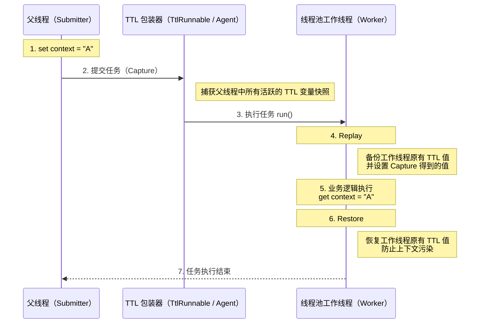
```mermaid
sequenceDiagram
    participant P as 父线程（Submitter）
    participant W as TTL 包装器（TtlRunnable / Agent）
    participant C as 线程池工作线程（Worker）

    Note over P: 1. set context = "A"
    P->>W: 2. 提交任务（Capture）
    Note right of W: 捕获父线程中所有活跃的 TTL 变量快照

    W->>C: 3. 执行任务 run()
    Note over C: 4. Replay
    Note right of C: 备份工作线程原有 TTL 值<br/>并设置 Capture 得到的值

    Note over C: 5. 业务逻辑执行<br/>get context = "A"

    Note over C: 6. Restore
    Note right of C: 恢复工作线程原有 TTL 值<br/>防止上下文污染

    C-->>P: 7. 任务执行结束

```

也就是说，TTL 的本质是在任务提交时 Capture 上下文，在任务执行前 Replay 上下文，在任务结束后 Restore 线程状态，从而安全地支持线程池中的 `ThreadLocal` 传递。

TTL 提供了两种主要的接入方式，可根据侵入性要求和改造成本进行选择。

**1. 显式包装（手动接入）**

使用 `TtlRunnable.get(Runnable)` 或 `TtlCallable.get(Callable)` 对任务进行包装，使用 `TtlExecutors.getTtlExecutor(Executor)`、`getTtlExecutorService(...)` 对线程池进行包装。这种接入方式清晰可控，但需要业务代码配合，存在一定侵入性。

下面这段代码展示了 TTL 通过 CRR，在支持线程池复用和拒绝策略的前提下，安全地传递并隔离 `ThreadLocal` 上下文。

```java
public class TtlContextHolder {
    private static final Logger log = LoggerFactory.getLogger(TtlContextHolder.class);

    // 1. 使用 static final 确保 TTL 实例不被重复创建，防止内存泄漏
    // 重写 copy 方法（可选）：如果是引用类型，建议实现深拷贝
    private static final TransmittableThreadLocal<String> CONTEXT = new TransmittableThreadLocal<String>() {
        @Override
        public String copy(String parentValue) {
            // 默认是直接返回引用，如果是可变对象（如 Map），请在这里 new 新对象
            return parentValue;
        }
    };

    // 2. 线程池初始化：确保只被 TtlExecutors 包装一次
    private static final ExecutorService TTL_EXECUTOR_SERVICE;

    static {
        ExecutorService rawExecutor = new ThreadPoolExecutor(
                2, 4, 60L, TimeUnit.SECONDS,
                new LinkedBlockingQueue<>(1000), (Runnable r) -> new Thread(r, "ttl-worker-" + r.hashCode()),
                new ThreadPoolExecutor.CallerRunsPolicy() // 关键：TTL 完美支持此拒绝策略
        );
        // 包装原始线程池
        TTL_EXECUTOR_SERVICE = TtlExecutors.getTtlExecutorService(rawExecutor);
    }

    public static void main(String[] args) throws Exception {
        try {
            // 3. 在父线程中设置上下文
            CONTEXT.set("value-set-in-parent");
            log.info("父线程上下文: {}", CONTEXT.get());

            // 4. 使用 Lambda 简化任务提交
            TTL_EXECUTOR_SERVICE.execute(() -> {
                log.info("异步任务(Runnable)读取上下文: {}", CONTEXT.get());
                // 模拟业务逻辑
                // 注意：子线程修改是否影响父线程，取决于 copy() 是否做了深拷贝
                CONTEXT.set("value-modified-in-child");
            });

            Future<String> future = TTL_EXECUTOR_SERVICE.submit(() -> {
                log.info("异步任务(Callable)读取上下文: {}", CONTEXT.get());
                return "Success";
            });

            future.get();

            // 5. 验证父线程上下文是否被污染
            log.info("父线程最终上下文: {}", CONTEXT.get());

        } finally {
            // 6. 清理当前线程（父线程）的上下文，子线程的上下文由 TTL 的 Restore 机制自动恢复
            CONTEXT.remove();
        }
    }
}
```

输出：

```ba
09:06:31.438 INFO  [main] TtlContextHolder - 父线程上下文: value-set-in-parent
09:06:31.452 INFO  [ttl-worker-1663166483] TtlContextHolder - 异步任务(Runnable)读取上下文: value-set-in-parent
09:06:31.453 INFO  [ttl-worker-841283083] TtlContextHolder - 异步任务(Callable)读取上下文: value-set-in-parent
09:06:31.453 INFO  [main] TtlContextHolder - 父线程最终上下文: value-set-in-parent
```

如果你想要测试这段代码，记得引入 TTL 的 Maven 依赖；

```XML
<dependency>
    <groupId>com.alibaba</groupId>
    <artifactId>transmittable-thread-local</artifactId>
    <version>2.14.4</version>
</dependency>
```

**2. 无侵入接入（Java Agent）**

通过 Java Agent 在类加载阶段对线程池相关类进行 字节码增强，自动织入 TTL 的上下文传递逻辑，实现业务代码零改造的上下文透传。这种方式业务代码无需感知 TTL 的存在，但实现复杂度相对较高。

TTL Agent 默认修饰了以下 JDK 执行器组件：

1. **标准线程池**：`java.util.concurrent.ThreadPoolExecutor` 和 `java.util.concurrent.ScheduledThreadPoolExecutor`。
2. **ForkJoin 体系**：`java.util.concurrent.ForkJoinTask`（从而透明支持了 `CompletableFuture` 和 Java 8 并行流 `Stream`）。
3. **遗留组件**：`java.util.TimerTask`（自 v2.7.0 起支持，v2.11.2 起默认开启）。

在 Java 启动参数中加入 `-javaagent` 配置：

```bash
# 基础配置
java -javaagent:path/to/transmittable-thread-local-2.x.y.jar \
     -cp classes \
     com.your.app.Main
```

#### 应用场景

1. **压测流量标记**： 在压测场景中，使用 `ThreadLocal` 存储压测标记，用于区分压测流量和真实流量。如果标记丢失，可能导致压测流量被错误地当成线上流量处理。
2. **上下文传递**：在分布式系统中，传递链路追踪信息（如 Trace ID）或用户上下文信息。

#### 总结

`ThreadLocal` 的值默认是无法跨线程传递的，因为它的值是存在**每个 `Thread` 对象自己**的 `ThreadLocalMap` 里的，父子线程是两个不同的对象。

为了解决这个问题，主要有两种方案：

1. **JDK 的 InheritableThreadLocal**：它会在**创建子线程**的时候，把父线程的值**复制**一份给子线程。但它的问题是，在**线程池**场景下会失效。因为线程池会**复用**线程，这会导致线程拿到的可能是上一个任务传下来的**脏数据**。
2. **阿里的 TransmittableThreadLocal (TTL)**：这是我们项目里用的方案，它专门解决线程池的问题。它的原理是，在**提交任务**到线程池时，它会把父线程的 `ThreadLocal` 值**捕获**下来，和任务**绑定**在一起。等线程池里的某个线程要执行这个任务时，它再把捕获的值**设置**到这个线程上，任务执行完再**清理**掉。

简单说，**InheritableThreadLocal 是跟线程绑定的，只在创建时有效；而 TTL 是跟任务绑定的，完美支持线程池。**

## 线程池

### 什么是线程池？

顾名思义，线程池就是管理一系列线程的资源池。当有任务要处理时，直接从线程池中获取线程来处理，处理完之后线程并不会立即被销毁，而是等待下一个任务。

### ⭐️ 为什么要用线程池？

池化技术想必大家已经屡见不鲜了，线程池、数据库连接池、HTTP 连接池等等都是对这个思想的应用。池化技术的思想主要是为了减少每次获取资源的消耗，提高对资源的利用率。

线程池提供了一种限制和管理资源（包括执行一个任务）的方式。 每个线程池还维护一些基本统计信息，例如已完成任务的数量。使用线程池主要带来以下几个好处：

1. **降低资源消耗**：线程池里的线程是可以重复利用的。一旦线程完成了某个任务，它不会立即销毁，而是回到池子里等待下一个任务。这就避免了频繁创建和销毁线程带来的开销。
2. **提高响应速度**：因为线程池里通常会维护一定数量的核心线程（或者说“常驻工人”），任务来了之后，可以直接交给这些已经存在的、空闲的线程去执行，省去了创建线程的时间，任务能够更快地得到处理。
3. **提高线程的可管理性**：线程池允许我们统一管理池中的线程。我们可以配置线程池的大小（核心线程数、最大线程数）、任务队列的类型和大小、拒绝策略等。这样就能控制并发线程的总量，防止资源耗尽，保证系统的稳定性。同时，线程池通常也提供了监控接口，方便我们了解线程池的运行状态（比如有多少活跃线程、多少任务在排队等），便于调优。

### 如何创建线程池？

在 Java 中，创建线程池主要有两种方式：

**方式一：通过 `ThreadPoolExecutor` 构造函数直接创建（推荐）**


图中的“默认线程工厂”和“默认拒绝策略”，指的是当前构造函数没有显式传入对应参数时，`ThreadPoolExecutor` 会使用默认实现，并不是方法和说明错位。

这是最推荐的方式，因为它允许开发者明确指定线程池的核心参数，对线程池的运行行为有更精细的控制，从而避免资源耗尽的风险。

**方式二：通过 `Executors` 工具类创建（不推荐用于生产环境）**

`Executors` 工具类提供的创建线程池的方法如下图所示：


可以看出，通过 `Executors` 工具类可以创建多种类型的线程池，包括：

- `FixedThreadPool`：正常运行时最多使用固定数量的工作线程。线程可以因异常终止后被替换，线程池关闭时也会退出，因此并非在整个生命周期中数量始终不变。当有一个新的任务提交时，线程池中若有空闲线程，则立即执行。若没有，则新的任务会被暂存在一个任务队列中，待有线程空闲时，便处理在任务队列中的任务。
- `SingleThreadExecutor`： 只有一个线程的线程池。若多余一个任务被提交到该线程池，任务会被保存在一个任务队列中，待线程空闲，按先入先出的顺序执行队列中的任务。
- `CachedThreadPool`： 可根据实际情况调整线程数量的线程池。线程池的线程数量不确定，但若有空闲线程可以复用，则会优先使用可复用的线程。若所有线程均在工作，又有新的任务提交，则会创建新的线程处理任务。所有线程在当前任务执行完毕后，将返回线程池进行复用。
- `ScheduledThreadPool`：给定的延迟后运行任务或者定期执行任务的线程池。

### ⭐️ 为什么不推荐使用内置线程池？

在《阿里巴巴 Java 开发手册》“并发处理”这一章节，明确指出线程资源必须通过线程池提供，不允许在应用中自行显式创建线程。

**为什么呢？**

> 使用线程池的好处是减少在创建和销毁线程上所消耗的时间以及系统资源开销，解决资源不足的问题。如果不使用线程池，有可能会造成系统创建大量同类线程而导致消耗完内存或者“过度切换”的问题。

另外，《阿里巴巴 Java 开发手册》中强制线程池不允许使用 `Executors` 去创建，而是通过 `ThreadPoolExecutor` 构造函数的方式，这样的处理方式让写的同学更加明确线程池的运行规则，规避资源耗尽的风险

`Executors` 返回线程池对象的弊端如下（后文会详细介绍到）：

- `FixedThreadPool` 和 `SingleThreadExecutor`:使用的是阻塞队列 `LinkedBlockingQueue`，任务队列最大长度为 `Integer.MAX_VALUE`，可以看作是无界的，可能堆积大量的请求，从而导致 OOM。
- `CachedThreadPool`:使用的是同步队列 `SynchronousQueue`, 允许创建的线程数量为 `Integer.MAX_VALUE`，如果任务数量过多且执行速度较慢，可能会创建大量的线程，从而导致 OOM。
- `ScheduledThreadPool` 和 `SingleThreadScheduledExecutor`:使用的无界的延迟阻塞队列 `DelayedWorkQueue`，任务队列最大长度为 `Integer.MAX_VALUE`,可能堆积大量的请求，从而导致 OOM。

```java
public static ExecutorService newFixedThreadPool(int nThreads) {
    // LinkedBlockingQueue 的默认长度为 Integer.MAX_VALUE，可以看作是无界的
    return new ThreadPoolExecutor(nThreads, nThreads,0L, TimeUnit.MILLISECONDS,new LinkedBlockingQueue<Runnable>());

}

public static ExecutorService newSingleThreadExecutor() {
    // LinkedBlockingQueue 的默认长度为 Integer.MAX_VALUE，可以看作是无界的
    return new FinalizableDelegatedExecutorService (new ThreadPoolExecutor(1, 1,0L, TimeUnit.MILLISECONDS,new LinkedBlockingQueue<Runnable>()));

}

// 同步队列 SynchronousQueue，没有容量，最大线程数是 Integer.MAX_VALUE`
public static ExecutorService newCachedThreadPool() {

    return new ThreadPoolExecutor(0, Integer.MAX_VALUE,60L, TimeUnit.SECONDS,new SynchronousQueue<Runnable>());

}

// DelayedWorkQueue（延迟阻塞队列）
public static ScheduledExecutorService newScheduledThreadPool(int corePoolSize) {
    return new ScheduledThreadPoolExecutor(corePoolSize);
}
public ScheduledThreadPoolExecutor(int corePoolSize) {
    super(corePoolSize, Integer.MAX_VALUE, 0, NANOSECONDS,
          new DelayedWorkQueue());
}
```

### ⭐️ 线程池常见参数有哪些？如何解释？

```java
    /**
     * 用给定的初始参数创建一个新的ThreadPoolExecutor。
     */
    public ThreadPoolExecutor(int corePoolSize,//线程池的核心线程数量
                              int maximumPoolSize,//线程池的最大线程数
                              long keepAliveTime,//当线程数大于核心线程数时，多余的空闲线程存活的最长时间
                              TimeUnit unit,//时间单位
                              BlockingQueue<Runnable> workQueue,//任务队列，用来储存等待执行任务的队列
                              ThreadFactory threadFactory,//线程工厂，用来创建线程，一般默认即可
                              RejectedExecutionHandler handler//拒绝策略，当提交的任务过多而不能及时处理时，我们可以定制策略来处理任务
                               ) {
        if (corePoolSize < 0 ||
            maximumPoolSize <= 0 ||
            maximumPoolSize < corePoolSize ||
            keepAliveTime < 0)
            throw new IllegalArgumentException();
        if (workQueue == null || threadFactory == null || handler == null)
            throw new NullPointerException();
        this.corePoolSize = corePoolSize;
        this.maximumPoolSize = maximumPoolSize;
        this.workQueue = workQueue;
        this.keepAliveTime = unit.toNanos(keepAliveTime);
        this.threadFactory = threadFactory;
        this.handler = handler;
    }
```

`ThreadPoolExecutor` 3 个最重要的参数：

- `corePoolSize`：默认情况下，即使空闲也会保留在线程池中的线程数量；未启用核心线程超时且工作线程少于该值时，新任务会优先触发创建线程。
- `maximumPoolSize`：线程池允许存在的最大工作线程数。
- `workQueue`：当工作线程数达到 `corePoolSize` 后，新任务会先尝试进入队列；只有入队失败且工作线程数小于 `maximumPoolSize` 时，线程池才会继续创建线程。

`ThreadPoolExecutor` 其他常见参数 :

- `keepAliveTime`:当线程池中的线程数量大于 `corePoolSize`，即有非核心线程（线程池中核心线程以外的线程）时，这些非核心线程空闲后不会立即销毁，而是会等待，直到等待的时间超过了 `keepAliveTime` 才会被回收销毁。
- `unit` : `keepAliveTime` 参数的时间单位。
- `threadFactory` :executor 创建新线程的时候会用到。
- `handler` :拒绝策略（后面会单独详细介绍一下）。

下面这张图可以加深你对线程池中各个参数的相互关系的理解（图片来源：《Java 性能调优实战》）：


### 线程池的核心线程会被回收吗？

`ThreadPoolExecutor` 默认不会回收核心线程，即使它们已经空闲了。这是为了减少创建线程的开销，因为核心线程通常是要长期保持活跃的。但是，如果线程池是被用于周期性使用的场景，且频率不高（周期之间有明显的空闲时间），可以考虑将 `allowCoreThreadTimeOut(boolean value)` 方法的参数设置为 `true`，这样就会回收空闲（时间间隔由 `keepAliveTime` 指定）的核心线程了。

```java
public void allowCoreThreadTimeOut(boolean value) {
    // 核心线程的 keepAliveTime 必须大于 0 才能启用超时机制
    if (value && keepAliveTime <= 0) {
        throw new IllegalArgumentException("Core threads must have nonzero keep alive times");
    }
    // 设置 allowCoreThreadTimeOut 的值
    if (value != allowCoreThreadTimeOut) {
        allowCoreThreadTimeOut = value;
        // 如果启用了超时机制，清理所有空闲的线程，包括核心线程
        if (value) {
            interruptIdleWorkers();
        }
    }
}
```

### 核心线程空闲时处于什么状态？

核心线程空闲时，其状态分为以下两种情况：

- **设置了核心线程的存活时间**：核心线程在空闲时，会处于 `WAITING` 状态，等待获取任务。如果阻塞等待的时间超过了核心线程存活时间，则该线程会退出工作，将该线程从线程池的工作线程集合中移除，线程状态变为 `TERMINATED` 状态。
- **没有设置核心线程的存活时间**：核心线程在空闲时，会一直处于 `WAITING` 状态，等待获取任务，核心线程会一直存活在线程池中。

当队列中有可用任务时，会唤醒被阻塞的线程，线程的状态会由 `WAITING` 状态变为 `RUNNABLE` 状态，之后去执行对应任务。

接下来通过相关源码，了解一下线程池内部是如何做的。

线程在线程池内部被抽象为了 `Worker`，当 `Worker` 被启动之后，会不断去任务队列中获取任务。

在获取任务的时候，会根据 `timed` 值来决定从任务队列（`BlockingQueue`）获取任务的行为。

如果「设置了核心线程的存活时间」或者「线程数量超过了核心线程数量」，则将 `timed` 标记为 `true`，表明获取任务时需要使用 `poll()` 指定超时时间。

- `timed == true`：使用 `poll(timeout, unit)` 来获取任务。使用 `poll(timeout, unit)` 方法获取任务超时的话，则当前线程会退出执行（`TERMINATED`），该线程从线程池中被移除。
- `timed == false`：使用 `take()` 来获取任务。使用 `take()` 方法获取任务会让当前线程一直阻塞等待（`WAITING`）。

源码如下：

```JAVA
// ThreadPoolExecutor
private Runnable getTask() {
    boolean timedOut = false;
    for (;;) {
        // ...

        // 1、如果「设置了核心线程的存活时间」或者是「线程数量超过了核心线程数量」，则 timed 为 true。
        boolean timed = allowCoreThreadTimeOut || wc > corePoolSize;
        // 2、扣减线程数量。
        // wc > maximuimPoolSize：线程池中的线程数量超过最大线程数量。其中 wc 为线程池中的线程数量。
        // timed && timeOut：timeOut 表示获取任务超时。
        // 分为两种情况：核心线程设置了存活时间 && 获取任务超时，则扣减线程数量；线程数量超过了核心线程数量 && 获取任务超时，则扣减线程数量。
        if ((wc > maximumPoolSize || (timed && timedOut))
            && (wc > 1 || workQueue.isEmpty())) {
            if (compareAndDecrementWorkerCount(c))
                return null;
            continue;
        }
        try {
            // 3、如果 timed 为 true，则使用 poll() 获取任务；否则，使用 take() 获取任务。
            Runnable r = timed ?
                workQueue.poll(keepAliveTime, TimeUnit.NANOSECONDS) :
                workQueue.take();
            // 4、获取任务之后返回。
            if (r != null)
                return r;
            timedOut = true;
        } catch (InterruptedException retry) {
            timedOut = false;
        }
    }
}
```

### ⭐️ 线程池的拒绝策略有哪些？

如果当前同时运行的线程数量达到最大线程数量并且队列也已经被放满了任务时，`ThreadPoolExecutor` 定义一些策略:

- `ThreadPoolExecutor.AbortPolicy`：抛出 `RejectedExecutionException` 来拒绝新任务的处理。
- `ThreadPoolExecutor.CallerRunsPolicy`：调用执行者自己的线程运行任务，也就是直接在调用 `execute` 方法的线程中运行(`run`)被拒绝的任务，如果执行程序已关闭，则会丢弃该任务。因此这种策略会降低对于新任务提交速度，影响程序的整体性能。如果你的应用程序可以承受此延迟并且你要求任何一个任务请求都要被执行的话，你可以选择这个策略。
- `ThreadPoolExecutor.DiscardPolicy`：不处理新任务，直接丢弃掉。
- `ThreadPoolExecutor.DiscardOldestPolicy`：此策略将丢弃最早的未处理的任务请求。

举个例子：Spring 通过 `ThreadPoolTaskExecutor` 或者我们直接通过 `ThreadPoolExecutor` 的构造函数创建线程池的时候，当我们不指定 `RejectedExecutionHandler` 拒绝策略来配置线程池的时候，默认使用的是 `AbortPolicy`。在这种拒绝策略下，如果队列满了，`ThreadPoolExecutor` 将抛出 `RejectedExecutionException` 异常来拒绝新来的任务，这代表你将丢失对这个任务的处理。如果希望在线程池仍处于运行状态时避免直接丢弃任务，可以使用 `CallerRunsPolicy`，把任务回退给调用 `execute()` 的线程执行；如果线程池已经关闭，该策略仍会丢弃任务。

```java
public static class CallerRunsPolicy implements RejectedExecutionHandler {

        public CallerRunsPolicy() { }

        public void rejectedExecution(Runnable r, ThreadPoolExecutor e) {
            if (!e.isShutdown()) {
                // 直接主线程执行，而不是线程池中的线程执行
                r.run();
            }
        }
    }
```

### 如果希望饱和时尽量不丢弃任务，应该选择哪个拒绝策略？

对于线程池仍在运行、并且调用线程可以接受同步执行任务的场景，可以考虑 `CallerRunsPolicy`。它不能提供“任何情况下都不丢任务”的保证：线程池关闭后任务会被丢弃，进程崩溃也无法靠内存中的拒绝策略恢复任务；需要强保证时应配合持久化或消息队列。

这里我们再来结合 `CallerRunsPolicy` 的源码来看看：

```java
public static class CallerRunsPolicy implements RejectedExecutionHandler {

        public CallerRunsPolicy() { }


        public void rejectedExecution(Runnable r, ThreadPoolExecutor e) {
            //只要当前程序没有关闭，就用执行execute方法的线程执行该任务
            if (!e.isShutdown()) {

                r.run();
            }
        }
    }
```

从源码可以看出，只要当前程序不关闭就会使用执行 `execute` 方法的线程执行该任务。

### CallerRunsPolicy 拒绝策略有什么风险？如何解决？

我们上面也提到了：如果希望在线程池饱和时通过调用线程施加反压、尽量避免直接丢弃任务，`CallerRunsPolicy` 是一种可选方案。

不过，如果走到 `CallerRunsPolicy` 的任务是个非常耗时的任务，且处理提交任务的线程是主线程，可能会导致主线程阻塞，影响程序的正常运行。

这里简单举一个例子，该线程池限定了最大线程数为 2，阻塞队列大小为 1（这意味着第 4 个任务就会走到拒绝策略），`ThreadUtil` 为 Hutool 提供的工具类：

```java
public class ThreadPoolTest {

    private static final Logger log = LoggerFactory.getLogger(ThreadPoolTest.class);

    public static void main(String[] args) {
        // 创建一个线程池，核心线程数为1，最大线程数为2
        // 当线程数大于核心线程数时，多余的空闲线程存活的最长时间为60秒，
        // 任务队列为容量为1的ArrayBlockingQueue，饱和策略为CallerRunsPolicy。
        ThreadPoolExecutor threadPoolExecutor = new ThreadPoolExecutor(1,
                2,
                60,
                TimeUnit.SECONDS,
                new ArrayBlockingQueue<>(1),
                new ThreadPoolExecutor.CallerRunsPolicy());

        // 提交第一个任务，由核心线程执行
        threadPoolExecutor.execute(() -> {
            log.info("核心线程执行第一个任务");
            ThreadUtil.sleep(1, TimeUnit.MINUTES);
        });

        // 提交第二个任务，由于核心线程被占用，任务将进入队列等待
        threadPoolExecutor.execute(() -> {
            log.info("非核心线程处理入队的第二个任务");
            ThreadUtil.sleep(1, TimeUnit.MINUTES);
        });

        // 提交第三个任务，由于核心线程被占用且队列已满，创建非核心线程处理
        threadPoolExecutor.execute(() -> {
            log.info("非核心线程处理第三个任务");
            ThreadUtil.sleep(1, TimeUnit.MINUTES);
        });

        // 提交第四个任务，由于核心线程和非核心线程都被占用，队列也满了，根据CallerRunsPolicy策略，任务将由提交任务的线程（即主线程）来执行
        threadPoolExecutor.execute(() -> {
            log.info("主线程处理第四个任务");
            ThreadUtil.sleep(2, TimeUnit.MINUTES);
        });

        // 提交第五个任务，主线程被第四个任务卡住，该任务必须等到主线程执行完才能提交
        threadPoolExecutor.execute(() -> {
            log.info("核心线程执行第五个任务");
        });

        // 关闭线程池
        threadPoolExecutor.shutdown();
    }
}

```

输出：

```bash
18:19:48.203 INFO  [pool-1-thread-1] c.j.concurrent.ThreadPoolTest - 核心线程执行第一个任务
18:19:48.203 INFO  [pool-1-thread-2] c.j.concurrent.ThreadPoolTest - 非核心线程处理第三个任务
18:19:48.203 INFO  [main] c.j.concurrent.ThreadPoolTest - 主线程处理第四个任务
18:20:48.212 INFO  [pool-1-thread-2] c.j.concurrent.ThreadPoolTest - 非核心线程处理入队的第二个任务
18:21:48.219 INFO  [pool-1-thread-2] c.j.concurrent.ThreadPoolTest - 核心线程执行第五个任务
```

从输出结果可以看出，因为 `CallerRunsPolicy` 这个拒绝策略，导致耗时的任务用了主线程执行，导致线程池阻塞，进而导致后续任务无法及时执行，严重的情况下很可能导致 OOM。

我们从问题的本质入手，调用者采用 `CallerRunsPolicy` 是希望所有的任务都能够被执行，暂时无法处理的任务又被保存在阻塞队列 `BlockingQueue` 中。这样的话，在内存允许的情况下，我们可以增加阻塞队列 `BlockingQueue` 的大小并调整堆内存以容纳更多的任务，确保任务能够被准确执行。

为了充分利用 CPU，我们还可以调整线程池的 `maximumPoolSize`（最大线程数）参数，这样可以提高任务处理速度，避免累计在 `BlockingQueue` 的任务过多导致内存用完。


如果服务器资源已达到可利用的极限，这就意味我们要在设计策略上改变线程池的调度了，我们都知道，导致主线程卡死的本质就是因为我们不希望任何一个任务被丢弃。换个思路，有没有办法既能保证任务不被丢弃且在服务器有余力时及时处理呢？

这里提供的一种**任务持久化**的思路，这里所谓的任务持久化，包括但不限于:

1. 设计一张任务表将任务存储到 MySQL 数据库中。
2. Redis 缓存任务。
3. 将任务提交到消息队列中。

这里以方案一为例，简单介绍一下实现逻辑：

1. 实现 `RejectedExecutionHandler` 接口自定义拒绝策略，自定义拒绝策略负责将线程池暂时无法处理（此时阻塞队列已满）的任务入库（保存到 MySQL 中）。注意：线程池暂时无法处理的任务会先被放在阻塞队列中，阻塞队列满了才会触发拒绝策略。
2. 继承 `BlockingQueue` 实现一个混合式阻塞队列，该队列包含 JDK 自带的 `ArrayBlockingQueue`。另外，该混合式阻塞队列需要修改取任务处理的逻辑，也就是重写 `take()` 方法，取任务时优先从数据库中读取最早的任务，数据库中无任务时再从 `ArrayBlockingQueue` 中去取任务。


整个实现逻辑还是比较简单的，核心在于自定义拒绝策略和阻塞队列。如此一来，一旦我们的线程池中线程达到满载时，我们就可以通过拒绝策略将最新任务持久化到 MySQL 数据库中，等到线程池有了有余力处理所有任务时，让其优先处理数据库中的任务以避免“饥饿”问题。

当然，对于这个问题，我们也可以参考其他主流框架的做法，以 Netty 为例，它的拒绝策略则是直接创建一个线程池以外的线程处理这些任务，为了保证任务的实时处理，这种做法可能需要良好的硬件设备且临时创建的线程无法做到准确的监控：

```java
private static final class NewThreadRunsPolicy implements RejectedExecutionHandler {
    NewThreadRunsPolicy() {
        super();
    }
    public void rejectedExecution(Runnable r, ThreadPoolExecutor executor) {
        try {
            //创建一个临时线程处理任务
            final Thread t = new Thread(r, "Temporary task executor");
            t.start();
        } catch (Throwable e) {
            throw new RejectedExecutionException(
                    "Failed to start a new thread", e);
        }
    }
}
```

ActiveMQ 则是尝试在指定的时效内尽可能的争取将任务入队，以保证最大交付：

```java
new RejectedExecutionHandler() {
                @Override
                public void rejectedExecution(final Runnable r, final ThreadPoolExecutor executor) {
                    try {
                        //限时阻塞等待，实现尽可能交付
                        executor.getQueue().offer(r, 60, TimeUnit.SECONDS);
                    } catch (InterruptedException e) {
                        throw new RejectedExecutionException("Interrupted waiting for BrokerService.worker");
                    }
                    throw new RejectedExecutionException("Timed Out while attempting to enqueue Task.");
                }
            });
```

### 线程池常用的阻塞队列有哪些？

新任务来的时候会先判断当前运行的线程数量是否达到核心线程数，如果达到的话，新任务就会被存放在队列中。

不同的线程池会选用不同的阻塞队列，我们可以结合内置线程池来分析。

- 容量为 `Integer.MAX_VALUE` 的 `LinkedBlockingQueue`（无界阻塞队列）：`FixedThreadPool` 和 `SingleThreadExecutor`。`FixedThreadPool` 最多只能创建核心线程数的线程（核心线程数和最大线程数相等），`SingleThreadExecutor` 只能创建一个线程（核心线程数和最大线程数都是 1），二者的任务队列永远不会被放满。
- `SynchronousQueue`（同步队列）：`CachedThreadPool`。`SynchronousQueue` 没有容量，不存储元素，目的是保证对于提交的任务，如果有空闲线程，则使用空闲线程来处理；否则新建一个线程来处理任务。也就是说，`CachedThreadPool` 的最大线程数是 `Integer.MAX_VALUE`，可以理解为线程数是可以无限扩展的，可能会创建大量线程，从而导致 OOM。
- `DelayedWorkQueue`（延迟队列）：`ScheduledThreadPool` 和 `SingleThreadScheduledExecutor`。`DelayedWorkQueue` 的内部元素并不是按照放入的时间排序，而是会按照延迟的时间长短对任务进行排序，内部采用的是“堆”的数据结构，可以保证每次出队的任务都是当前队列中执行时间最靠前的。`DelayedWorkQueue` 是一个无界队列。其底层虽然是数组，但当数组容量不足时，它会自动进行扩容，因此队列永远不会被填满。当任务不断提交时，它们会全部被添加到队列中。这意味着线程池的线程数量永远不会超过其核心线程数，最大线程数参数对于使用该队列的线程池来说是无效的。
- `ArrayBlockingQueue`（有界阻塞队列）：底层由数组实现，容量一旦创建，就不能修改。

### ⭐️ 线程池处理任务的流程了解吗？


1. 如果当前运行的线程数小于核心线程数，那么就会新建一个线程来执行任务。
2. 如果当前运行的线程数等于或大于核心线程数，但是小于最大线程数，那么就把该任务放入到任务队列里等待执行。
3. 如果向任务队列投放任务失败（任务队列已经满了），但是当前运行的线程数是小于最大线程数的，就新建一个线程来执行任务。
4. 如果当前运行的线程数已经等同于最大线程数了，新建线程将会使当前运行的线程超出最大线程数，那么当前任务会被拒绝，拒绝策略会调用 `RejectedExecutionHandler.rejectedExecution()` 方法。

再提一个有意思的小问题：**线程池在提交任务前，可以提前创建线程吗？**

答案是可以的！`ThreadPoolExecutor` 提供了两个方法帮助我们在提交任务之前，完成核心线程的创建，从而实现线程池预热的效果：

- `prestartCoreThread()`:启动一个线程，等待任务，如果已达到核心线程数，这个方法返回 false，否则返回 true；
- `prestartAllCoreThreads()`:启动所有的核心线程，并返回启动成功的核心线程数。

### ⭐️ 线程池中线程异常后，销毁还是复用？

直接说结论，需要分两种情况：

- **使用 `execute()` 提交任务**：当任务通过 `execute()` 提交到线程池并在执行过程中抛出异常时，如果这个异常没有在任务内被捕获，那么该异常会导致当前线程终止，并且异常会被打印到控制台或日志文件中。线程池会检测到这种线程终止，并创建一个新线程来替换它，从而保持配置的线程数不变。
- **使用 `submit()` 提交任务**：对于通过 `submit()` 提交的任务，如果在任务执行中发生异常，这个异常不会直接打印出来。相反，异常会被封装在由 `submit()` 返回的 `Future` 对象中。当调用 `Future.get()` 方法时，可以捕获到一个 `ExecutionException`。在这种情况下，线程不会因为异常而终止，它会继续存在于线程池中，准备执行后续的任务。

简单来说：使用 `execute()` 时，未捕获异常导致线程终止，线程池创建新线程替代；使用 `submit()` 时，异常被封装在 `Future` 中，线程继续复用。

这种设计允许 `submit()` 提供更灵活的错误处理机制，因为它允许调用者决定如何处理异常，而 `execute()` 则适用于那些不需要关注执行结果的场景。

具体的源码分析可以参考这篇：[线程池中线程异常后：销毁还是复用？ - 京东技术](https://mp.weixin.qq.com/s/9ODjdUU-EwQFF5PrnzOGfw)。

### ⭐️ 如何给线程池命名？

初始化线程池的时候需要显示命名（设置线程池名称前缀），有利于定位问题。

默认情况下创建的线程名字类似 `pool-1-thread-n` 这样的，没有业务含义，不利于我们定位问题。

给线程池里的线程命名通常有下面两种方式：

**1、利用 guava 的 `ThreadFactoryBuilder`**

```java
ThreadFactory threadFactory = new ThreadFactoryBuilder()
                        .setNameFormat(threadNamePrefix + "-%d")
                        .setDaemon(true).build();
ExecutorService threadPool = new ThreadPoolExecutor(corePoolSize, maximumPoolSize, keepAliveTime, TimeUnit.MINUTES, workQueue, threadFactory);
```

**2、自己实现 `ThreadFactory`。**

```java
import java.util.concurrent.ThreadFactory;
import java.util.concurrent.atomic.AtomicInteger;

/**
 * 线程工厂，它设置线程名称，有利于我们定位问题。
 */
public final class NamingThreadFactory implements ThreadFactory {

    private final AtomicInteger threadNum = new AtomicInteger();
    private final String name;

    /**
     * 创建一个带名字的线程池生产工厂
     */
    public NamingThreadFactory(String name) {
        this.name = name;
    }

    @Override
    public Thread newThread(Runnable r) {
        Thread t = new Thread(r);
        t.setName(name + " [#" + threadNum.incrementAndGet() + "]");
        return t;
    }
}
```

### 如何设定线程池的大小？

很多人甚至可能都会觉得把线程池配置过大一点比较好！我觉得这明显是有问题的。就拿我们生活中非常常见的一例子来说：**并不是人多就能把事情做好，增加了沟通交流成本。你本来一件事情只需要 3 个人做，你硬是拉来了 6 个人，会提升做事效率嘛？我想并不会。** 线程数量过多的影响也是和我们分配多少人做事情一样，对于多线程这个场景来说主要是增加了**上下文切换**成本。不清楚什么是上下文切换的话，可以看我下面的介绍。

> 上下文切换：
>
> 多线程编程中一般线程的个数都大于 CPU 核心的个数，而一个 CPU 核心在任意时刻只能被一个线程使用，为了让这些线程都能得到有效执行，CPU 采取的策略是为每个线程分配时间片并轮转的形式。当一个线程的时间片用完的时候就会重新处于就绪状态让给其他线程使用，这个过程就属于一次上下文切换。概括来说就是：当前任务在执行完 CPU 时间片切换到另一个任务之前会先保存自己的状态，以便下次再切换回这个任务时，可以再加载这个任务的状态。**任务从保存到再加载的过程就是一次上下文切换**。
>
> 上下文切换通常是计算密集型的。也就是说，它需要相当可观的处理器时间，在每秒几十上百次的切换中，每次切换都需要纳秒量级的时间。所以，上下文切换对系统来说意味着消耗大量的 CPU 时间，事实上，可能是操作系统中时间消耗最大的操作。
>
> Linux 相比与其他操作系统（包括其他类 Unix 系统）有很多的优点，其中有一项就是，其上下文切换和模式切换的时间消耗非常少。

类比于现实世界中的人类通过合作做某件事情，我们可以肯定的一点是线程池大小设置过大或者过小都会有问题，合适的才是最好。

- 如果我们设置的线程池数量太小的话，如果同一时间有大量任务/请求需要处理，可能会导致大量的请求/任务在任务队列中排队等待执行，甚至会出现任务队列满了之后任务/请求无法处理的情况，或者大量任务堆积在任务队列导致 OOM。这样很明显是有问题的，CPU 根本没有得到充分利用。
- 如果我们设置线程数量太大，大量线程可能会同时在争取 CPU 资源，这样会导致大量的上下文切换，从而增加线程的执行时间，影响了整体执行效率。

有一个简单并且适用面比较广的公式：

- **CPU 密集型任务(N+1)：** 这种任务消耗的主要是 CPU 资源，可以将线程数设置为 N（CPU 核心数）+1。比 CPU 核心数多出来的一个线程是为了防止线程偶发的缺页中断，或者其它原因导致的任务暂停而带来的影响。一旦任务暂停，CPU 就会处于空闲状态，而在这种情况下多出来的一个线程就可以充分利用 CPU 的空闲时间。
- **I/O 密集型任务(2N)：** 这种任务应用起来，系统会用大部分的时间来处理 I/O 交互，而线程在处理 I/O 的时间段内不会占用 CPU 来处理，这时就可以将 CPU 交出给其它线程使用。因此在 I/O 密集型任务的应用中，我们可以多配置一些线程，具体的计算方法是 2N。

**如何判断是 CPU 密集任务还是 IO 密集任务？**

CPU 密集型简单理解就是利用 CPU 计算能力的任务比如你在内存中对大量数据进行排序。但凡涉及到网络读取，文件读取这类都是 IO 密集型，这类任务的特点是 CPU 计算耗费时间相比于等待 IO 操作完成的时间来说很少，大部分时间都花在了等待 IO 操作完成上。

> 🌈 拓展一下（参见：[issue#1737](https://github.com/Snailclimb/JavaGuide/issues/1737)）：
>
> 线程数更严谨的计算的方法应该是：`最佳线程数 = N（CPU 核心数）∗（1+WT（线程等待时间）/ST（线程计算时间））`，其中 `WT（线程等待时间）=线程运行总时间 - ST（线程计算时间）`。
>
> 线程等待时间所占比例越高，需要越多线程。线程计算时间所占比例越高，需要越少线程。
>
> 我们可以通过 JDK 自带的工具 VisualVM 来查看 `WT/ST` 比例。
>
> CPU 密集型任务的 `WT/ST` 接近或者等于 0，因此， 线程数可以设置为 N（CPU 核心数）∗（1+0）= N，和我们上面说的 N（CPU 核心数）+1 差不多。
>
> IO 密集型任务下，几乎全是线程等待时间，从理论上来说，你就可以将线程数设置为 2N（按道理来说，WT/ST 的结果应该比较大，这里选择 2N 的原因应该是为了避免创建过多线程吧）。

公式也只是参考，具体还是要根据项目实际线上运行情况来动态调整。我在后面介绍的美团的线程池参数动态配置这种方案就非常不错，很实用！

### ⭐️ 如何动态修改线程池的参数？

美团技术团队在[《Java 线程池实现原理及其在美团业务中的实践》](https://tech.meituan.com/2020/04/02/java-pooling-pratice-in-meituan.html)这篇文章中介绍到对线程池参数实现可自定义配置的思路和方法。

美团技术团队的思路是主要对线程池的核心参数实现自定义可配置。这三个核心参数是：

- **`corePoolSize`：** 默认情况下，即使空闲也会保留在线程池中的线程数量；工作线程少于该值时，新任务会优先触发创建线程。
- **`maximumPoolSize`：** 线程池允许存在的最大工作线程数。
- **`workQueue`：** 工作线程数达到 `corePoolSize` 后，新任务会先尝试进入队列；入队失败时才会在不超过 `maximumPoolSize` 的前提下继续创建线程。

**为什么是这三个参数？**

我在[Java 线程池详解](https://javaguide.cn/java/并发/java-thread-pool-summary.html) 这篇文章中就说过这三个参数是 `ThreadPoolExecutor` 最重要的参数，它们基本决定了线程池对于任务的处理策略。

**如何支持参数动态配置？** 且看 `ThreadPoolExecutor` 提供的下面这些方法。


格外需要注意的是 `corePoolSize`。运行期间调小该参数后，超过新核心线程数的现有线程会在下一次空闲时终止；调大时，如果队列中已有任务，线程池会按需启动新线程处理。

另外，你也看到了上面并没有动态指定队列长度的方法，美团的方式是自定义了一个叫做 `ResizableCapacityLinkedBlockIngQueue` 的队列（主要就是把 `LinkedBlockingQueue` 的 capacity 字段的 final 关键字修饰给去掉了，让它变为可变的）。

最终实现的可动态修改线程池参数效果如下。👏👏👏


还没看够？我在[《后端面试高频系统设计&场景题》](https://javaguide.cn/专栏/back-end-interview-high-frequency-system-design-and-scenario-questions.html)中详细介绍了如何设计一个动态线程池，这也是面试中常问的一道系统设计题。


如果我们的项目也想要实现这种效果的话，可以借助现成的开源项目：

- **[Hippo4j](https://github.com/opengoofy/hippo4j)**：异步线程池框架，支持线程池动态变更&监控&报警，无需修改代码轻松引入。支持多种使用模式，轻松引入，致力于提高系统运行保障能力。
- **[Dynamic TP](https://github.com/dromara/dynamic-tp)**：轻量级动态线程池，内置监控告警功能，集成三方中间件线程池管理，基于主流配置中心（已支持 Nacos、Apollo，Zookeeper、Consul、Etcd，可通过 SPI 自定义实现）。

### ⭐️ 如何设计一个能够根据任务的优先级来执行的线程池？

这是一个常见的面试问题，本质其实还是在考察求职者对于线程池以及阻塞队列的掌握。

我们上面也提到了，不同的线程池会选用不同的阻塞队列作为任务队列。`FixedThreadPool` 使用默认容量为 `Integer.MAX_VALUE` 的 `LinkedBlockingQueue`，通常将其视为无界队列；实际应用几乎无法填满，因此 `FixedThreadPool` 通常只会创建 `corePoolSize` 个工作线程。

假如我们需要实现一个优先级任务线程池的话，那可以考虑使用 `PriorityBlockingQueue`（优先级阻塞队列）作为任务队列（`ThreadPoolExecutor` 的构造函数有一个 `workQueue` 参数可以传入任务队列）。


`PriorityBlockingQueue` 是一个支持优先级的无界阻塞队列，可以看作是线程安全的 `PriorityQueue`，两者底层都是使用小顶堆形式的二叉堆，即值最小的元素优先出队。不过，`PriorityQueue` 不支持阻塞操作。

要想让 `PriorityBlockingQueue` 实现对任务的排序，传入其中的任务必须是具备排序能力的，方式有两种：

1. 提交到线程池的任务实现 `Comparable` 接口，并重写 `compareTo` 方法来指定任务之间的优先级比较规则。
2. 创建 `PriorityBlockingQueue` 时传入一个 `Comparator` 对象来指定任务之间的排序规则（推荐）。

不过，这存在一些风险和问题，比如：

- `PriorityBlockingQueue` 是无界的，可能堆积大量的请求，从而导致 OOM。
- 可能会导致饥饿问题，即低优先级的任务长时间得不到执行。
- 由于需要对队列中的元素进行排序操作以及保证线程安全（并发控制采用的是可重入锁 `ReentrantLock`），因此会降低性能。

对于 OOM 这个问题的解决比较简单粗暴，就是继承 `PriorityBlockingQueue` 并重写一下 `offer` 方法（入队）的逻辑，当插入的元素数量超过指定值就返回 false。

饥饿问题这个可以通过优化设计来解决（比较麻烦），比如等待时间过长的任务会被移除并重新添加到队列中，但是优先级会被提升。

对于性能方面的影响，是没办法避免的，毕竟需要对任务进行排序操作。并且，对于大部分业务场景来说，这点性能影响是可以接受的。

## Future

重点是要掌握 `CompletableFuture` 的使用以及常见面试题。

除了下面的面试题之外，还推荐你看看我写的这篇文章： [CompletableFuture 详解](https://javaguide.cn/java/并发/completablefuture-intro.html)。

### Future 接口有什么用？

`Future` 接口是异步思想的典型运用，主要用在一些需要执行耗时任务的场景，避免程序一直原地等待耗时任务执行完成，执行效率太低。具体来说是这样的：当我们执行某一耗时的任务时，可以将这个耗时任务交给一个子线程去异步执行，同时我们可以干点其他事情，不用傻傻等待耗时任务执行完成。等我们的事情干完后，我们再通过 `Future` 获取到耗时任务的执行结果。这样一来，程序的执行效率就明显提高了。

这其实就是多线程中经典的 **Future 模式**，你可以将其看作是一种设计模式，核心思想是异步调用，主要用在多线程领域，并非 Java 语言独有。

在 Java 中，`Future` 是一个泛型接口，位于 `java.util.concurrent` 包下。它有 5 个经典抽象方法，主要包括下面 4 类功能；JDK 19 起又增加了 `resultNow()`、`exceptionNow()` 和 `state()` 三个默认查询方法。

- 取消任务；
- 判断任务是否被取消;
- 判断任务是否已经执行完成;
- 获取任务执行结果。

```java
// V 代表了Future执行的任务返回值的类型
public interface Future<V> {
    // 取消任务执行
    // 成功取消返回 true，否则返回 false
    boolean cancel(boolean mayInterruptIfRunning);
    // 判断任务是否被取消
    boolean isCancelled();
    // 判断任务是否已经执行完成
    boolean isDone();
    // 获取任务执行结果
    V get() throws InterruptedException, ExecutionException;
    // 指定时间内没有返回计算结果就抛出 TimeOutException 异常
    V get(long timeout, TimeUnit unit)

        throws InterruptedException, ExecutionException, TimeoutExceptio

}
```

简单理解就是：我有一个任务，提交给了 `Future` 来处理。任务执行期间我自己可以去做任何想做的事情。并且，在这期间我还可以取消任务以及获取任务的执行状态。一段时间之后，我就可以 `Future` 那里直接取出任务执行结果。

### Callable 和 Future 有什么关系？

我们可以通过 `FutureTask` 来理解 `Callable` 和 `Future` 之间的关系。

`FutureTask` 提供了 `Future` 接口的基本实现，常用来封装 `Callable` 和 `Runnable`，具有取消任务、查看任务是否执行完成以及获取任务执行结果的方法。`ExecutorService.submit()` 方法返回的其实就是 `Future` 的实现类 `FutureTask`。

```java
<T> Future<T> submit(Callable<T> task);
Future<?> submit(Runnable task);
```

`FutureTask` 不光实现了 `Future` 接口，还实现了 `Runnable` 接口，因此可以作为任务直接被线程执行。


`FutureTask` 有两个构造函数，可传入 `Callable` 或者 `Runnable` 对象。实际上，传入 `Runnable` 对象也会在方法内部转换为 `Callable` 对象。

```java
public FutureTask(Callable<V> callable) {
    if (callable == null)
        throw new NullPointerException();
    this.callable = callable;
    this.state = NEW;
}
public FutureTask(Runnable runnable, V result) {
    // 通过适配器RunnableAdapter来将Runnable对象runnable转换成Callable对象
    this.callable = Executors.callable(runnable, result);
    this.state = NEW;
}
```

`FutureTask` 相当于对 `Callable` 进行了封装，管理着任务执行的情况，存储了 `Callable` 的 `call` 方法的任务执行结果。

关于更多 `Future` 的源码细节，可以肝这篇万字解析，写的很清楚：[Java 是如何实现 Future 模式的？万字详解！](https://juejin.cn/post/6844904199625375757)。

### CompletableFuture 类有什么用？

`Future` 在实际使用过程中存在一些局限性，比如不支持异步任务的编排组合、获取计算结果的 `get()` 方法为阻塞调用。

Java 8 才被引入 `CompletableFuture` 类可以解决 `Future` 的这些缺陷。`CompletableFuture` 除了提供了更为好用和强大的 `Future` 特性之外，还提供了函数式编程、异步任务编排组合（可以将多个异步任务串联起来，组成一个完整的链式调用）等能力。

下面我们来简单看看 `CompletableFuture` 类的定义。

```java
public class CompletableFuture<T> implements Future<T>, CompletionStage<T> {
}
```

可以看到，`CompletableFuture` 同时实现了 `Future` 和 `CompletionStage` 接口。


`CompletionStage` 接口描述了一个异步计算的阶段。很多计算可以分成多个阶段或步骤，此时可以通过它将所有步骤组合起来，形成异步计算的流水线。

`CompletionStage` 接口中的方法比较多，`CompletableFuture` 的函数式能力就是这个接口赋予的。从这个接口的方法参数你就可以发现其大量使用了 Java8 引入的函数式编程。


### ⭐️ 一个任务需要依赖另外两个任务执行完之后再执行，怎么设计？

这种任务编排场景非常适合通过 `CompletableFuture` 实现。这里假设要实现 T3 在 T2 和 T1 执行完后执行。

代码如下（这里为了简化代码，用到了 Hutool 的线程工具类 `ThreadUtil` 和日期时间工具类 `DateUtil`）：

```java
// T1
CompletableFuture<Void> futureT1 = CompletableFuture.runAsync(() -> {
    System.out.println("T1 is executing. Current time：" + DateUtil.now());
    // 模拟耗时操作
    ThreadUtil.sleep(1000);
});
// T2
CompletableFuture<Void> futureT2 = CompletableFuture.runAsync(() -> {
    System.out.println("T2 is executing. Current time：" + DateUtil.now());
    ThreadUtil.sleep(1000);
});

// 使用allOf()方法合并T1和T2的CompletableFuture，等待它们都完成
CompletableFuture<Void> bothCompleted = CompletableFuture.allOf(futureT1, futureT2);
// 当T1和T2都完成后，执行T3
bothCompleted.thenRunAsync(() -> System.out.println("T3 is executing after T1 and T2 have completed.Current time：" + DateUtil.now()));
// 等待所有任务完成，验证效果
ThreadUtil.sleep(3000);
```

`T1` 和 `T2` 在前面通过 `runAsync()` 启动，`allOf()` 只组合它们的完成状态：当二者都完成后，再执行 T3。是否并行取决于任务的创建方式和执行器，而不是 `allOf()` 本身。

### ⭐️ 使用 CompletableFuture，有一个任务失败，如何处理异常？

使用 `CompletableFuture` 的时候一定要以正确的方式进行异常处理，避免异常丢失或者出现不可控问题。

下面是一些建议：

- `whenComplete` 会在阶段正常或异常完成时执行回调，适合观察结果和记录异常；它默认保留原阶段的结果或异常。
- `exceptionally` 只在阶段异常完成时执行，并用回调的返回值恢复为正常结果；如果需要继续传播异常，可以在回调中显式抛出异常。
- `handle` 无论阶段正常还是异常完成都会执行，并根据结果和异常生成一个新的结果。
- `CompletableFuture.allOf` 可以等待多个阶段全部完成；只要其中一个阶段异常完成，返回的 `CompletableFuture` 也会异常完成，但仍需分别检查各阶段才能获得每个任务的结果或异常。
- ……

### ⭐️ 在使用 CompletableFuture 的时候为什么要自定义线程池？

在 `CompletableFuture` 的默认实现中，没有显式传入 `Executor` 的异步方法通常使用全局共享的 `ForkJoinPool.commonPool()`；子类可以通过重写 `defaultExecutor()` 改变非静态异步方法的默认执行器。这意味着使用默认实现的应用程序和库通常会共享同一个线程池。

虽然 `ForkJoinPool` 效率很高，但当同时提交大量任务时，可能会导致资源竞争和线程饥饿，进而影响系统性能。

为避免这些问题，建议为 `CompletableFuture` 提供自定义线程池，带来以下优势：

- 隔离性：为不同任务分配独立的线程池，避免全局线程池资源争夺。
- 资源控制：根据任务特性调整线程池大小和队列类型，优化性能表现。
- 异常处理：通过自定义 `ThreadFactory` 更好地处理线程中的异常情况。

```java
private ThreadPoolExecutor executor = new ThreadPoolExecutor(10, 10,
        0L, TimeUnit.MILLISECONDS,
        new LinkedBlockingQueue<Runnable>());

CompletableFuture.runAsync(() -> {
     //...
}, executor);
```

## AQS

关于 AQS 源码的详细分析，可以看看这一篇文章：[AQS 详解](https://javaguide.cn/java/并发/aqs.html)。

### AQS 是什么？

AQS（`AbstractQueuedSynchronizer`，抽象队列同步器）是从 JDK1.5 开始提供的 Java 并发核心组件。

AQS 解决了开发者在实现同步器时的复杂性问题。它提供了一个通用框架，用于实现各种同步器，例如 **可重入锁**（`ReentrantLock`）、**信号量**（`Semaphore`）和 **倒计时器**（`CountDownLatch`）。通过封装底层的线程同步机制，AQS 将复杂的线程管理逻辑隐藏起来，使开发者只需专注于具体的同步逻辑。

简单来说，AQS 是一个抽象类，为同步器提供了通用的 **执行框架**。它定义了 **资源获取和释放的通用流程**，而具体的资源获取逻辑则由具体同步器通过重写模板方法来实现。 因此，可以将 AQS 看作是同步器的 **基础“底座”**，而同步器则是基于 AQS 实现的 **具体“应用”**。

### ⭐️ AQS 的原理是什么？

> 说明：下面展示的 `waitStatus`、`Unsafe.compareAndSwapInt()` 等内部结构和源码片段基于 JDK 8。AQS 的内部实现后来持续演进：JDK 11 中仍保留了本文涉及的主要结构，JDK 17 及当前版本的节点字段和入队、等待实现则已有较大变化，但同步状态、等待队列和模板方法这些核心思想仍然适用。

AQS 核心思想是，如果被请求的共享资源空闲，则将当前请求资源的线程设置为有效的工作线程，并且将共享资源设置为锁定状态。如果被请求的共享资源被占用，那么就需要一套线程阻塞等待以及被唤醒时锁分配的机制，这个机制 AQS 是基于 **CLH 锁**（Craig, Landin, and Hagersten locks） 进一步优化实现的。

**CLH 锁** 对自旋锁进行了改进，是基于单链表的自旋锁。在多线程场景下，会将请求获取锁的线程组织成一个单向队列，每个等待的线程会通过自旋访问前一个线程节点的状态，前一个节点释放锁之后，当前节点才可以获取锁。**CLH 锁** 的队列结构如下图所示。


AQS 中使用的 **等待队列** 是 CLH 锁队列的变体（接下来简称为 CLH 变体队列）。

AQS 的 CLH 变体队列是一个双向队列，会暂时获取不到锁的线程将被加入到该队列中，CLH 变体队列和原本的 CLH 锁队列的区别主要有两点：

- 由 **自旋** 优化为 **自旋 + 阻塞**：自旋操作的性能很高，但大量的自旋操作比较占用 CPU 资源，因此在 CLH 变体队列中会先通过自旋尝试获取锁，如果失败再进行阻塞等待。
- 由 **单向队列** 优化为 **双向队列**：在 CLH 变体队列中，会对等待的线程进行阻塞操作，当队列前边的线程释放锁之后，需要对后边的线程进行唤醒，因此增加了 `next` 指针，成为了双向队列。

AQS 将每条请求共享资源的线程封装成一个 CLH 变体队列的一个结点（Node）来实现锁的分配。在 CLH 变体队列中，一个节点表示一个线程，它保存着线程的引用（thread）、 当前节点在队列中的状态（waitStatus）、前驱节点（prev）、后继节点（next）。

AQS 中的 CLH 变体队列结构如下图所示：


AQS(`AbstractQueuedSynchronizer`)的核心原理图：


AQS 使用 **int 成员变量 `state` 表示同步状态**，通过内置的 **线程等待队列** 来完成获取资源线程的排队工作。

`state` 变量由 `volatile` 修饰，用于展示当前临界资源的获锁情况。

```java
// 共享变量，使用volatile修饰保证线程可见性
private volatile int state;
```

另外，状态信息 `state` 可以通过 `protected` 类型的 `getState()`、`setState()` 和 `compareAndSetState()` 进行操作。并且，这几个方法都是 `final` 修饰的，在子类中无法被重写。

```java
//返回同步状态的当前值
protected final int getState() {
     return state;
}
 // 设置同步状态的值
protected final void setState(int newState) {
     state = newState;
}
//原子地（CAS操作）将同步状态值设置为给定值update如果当前同步状态的值等于expect（期望值）
protected final boolean compareAndSetState(int expect, int update) {
      return unsafe.compareAndSwapInt(this, stateOffset, expect, update);
}
```

以 `ReentrantLock` 为例，`state` 初始值为 0，表示未锁定状态。A 线程 `lock()` 时，会调用 `tryAcquire()` 独占该锁并将 `state+1`。此后，其他线程再 `tryAcquire()` 时就会失败，直到 A 线程 `unlock()` 到 `state=`0（即释放锁）为止，其它线程才有机会获取该锁。当然，释放锁之前，A 线程自己是可以重复获取此锁的（`state` 会累加），这就是可重入的概念。但要注意，获取多少次就要释放多少次，这样才能保证 state 是能回到零态的。

再以 `CountDownLatch` 为例，`state` 初始化为 N，表示需要等待 N 次 `countDown()` 调用。N 表示事件数或计数次数，不要求与线程数一致；同一个线程可以调用多次，也可以由多个线程分别调用。当 `state` 变为 0 时，等待队列中因调用 `await()` 而阻塞的线程会被唤醒并继续执行。

### Semaphore 有什么用？

`synchronized` 和 `ReentrantLock` 都是一次只允许一个线程访问某个资源，而 `Semaphore`（信号量）可以用来控制同时访问特定资源的线程数量。

Semaphore 的使用简单，我们这里假设有 N(N>5) 个线程来获取 `Semaphore` 中的共享资源，下面的代码表示同一时刻 N 个线程中只有 5 个线程能获取到共享资源，其他线程都会阻塞，只有获取到共享资源的线程才能执行。等到有线程释放了共享资源，其他阻塞的线程才能获取到。

```java
// 初始共享资源数量
final Semaphore semaphore = new Semaphore(5);
// 获取1个许可
semaphore.acquire();
// 释放1个许可
semaphore.release();
```

当许可证数量为 1 时，`Semaphore` 可以把并发访问数限制为 1，但它不同于互斥锁：信号量没有所有权约束，获取许可证的线程和释放许可证的线程可以不是同一个线程。

`Semaphore` 有两种模式：。

- **公平模式：** 存在竞争时，阻塞式 `acquire` 方法会在内部排队点按 FIFO 选择线程；无参的 `tryAcquire()` 不遵守公平设置，仍可能插队成功；
- **非公平模式：** 抢占式的。

`Semaphore` 对应的两个构造方法如下：

```java
public Semaphore(int permits) {
    sync = new NonfairSync(permits);
}

public Semaphore(int permits, boolean fair) {
    sync = fair ? new FairSync(permits) : new NonfairSync(permits);
}
```

**这两个构造方法，都必须提供许可的数量，第二个构造方法可以指定是公平模式还是非公平模式，默认非公平模式。**

`Semaphore` 通常用于那些资源有明确访问数量限制的场景比如限流（仅限于单机模式，实际项目中推荐使用 Redis +Lua 来做限流）。

### Semaphore 的原理是什么？

`Semaphore` 是共享锁的一种实现，它默认构造 AQS 的 `state` 值为 `permits`，你可以将 `permits` 的值理解为许可证的数量，只有拿到许可证的线程才能执行。

调用 `semaphore.acquire()`，线程尝试获取许可证，如果 `state >= 0` 的话，则表示可以获取成功。如果获取成功的话，使用 CAS 操作去修改 `state` 的值 `state=state-1`。如果 `state<0` 的话，则表示许可证数量不足。此时会创建一个 Node 节点加入阻塞队列，挂起当前线程。

```java
/**
 *  获取1个许可证
 */
public void acquire() throws InterruptedException {
    sync.acquireSharedInterruptibly(1);
}
/**
 * 共享模式下获取许可证，获取成功则返回，失败则加入阻塞队列，挂起线程
 */
public final void acquireSharedInterruptibly(int arg)
    throws InterruptedException {
    if (Thread.interrupted())
      throw new InterruptedException();
        // 尝试获取许可证，arg为获取许可证个数，当可用许可证数减当前获取的许可证数结果小于0,则创建一个节点加入阻塞队列，挂起当前线程。
    if (tryAcquireShared(arg) < 0)
      doAcquireSharedInterruptibly(arg);
}
```

调用 `semaphore.release();`，线程尝试释放许可证，并使用 CAS 操作去修改 `state` 的值 `state=state+1`。释放许可证成功之后，同时会唤醒同步队列中的一个线程。被唤醒的线程会重新尝试去修改 `state` 的值 `state=state-1`，如果 `state>=0` 则获取令牌成功，否则重新进入阻塞队列，挂起线程。

```java
// 释放一个许可证
public void release() {
    sync.releaseShared(1);
}

// 释放共享锁，同时会唤醒同步队列中的一个线程。
public final boolean releaseShared(int arg) {
    //释放共享锁
    if (tryReleaseShared(arg)) {
      //唤醒同步队列中的一个线程
      doReleaseShared();
      return true;
    }
    return false;
}
```

### CountDownLatch 有什么用？

`CountDownLatch` 允许任意数量的线程在 `await()` 处等待，直至发生 `count` 次 `countDown()` 调用。这个计数表示事件或操作次数，不一定对应 `count` 个不同线程。

`CountDownLatch` 是一次性的，计数器的值只能在构造方法中初始化一次，之后没有任何机制再次对其设置值，当 `CountDownLatch` 使用完毕后，它不能再次被使用。

### CountDownLatch 的原理是什么？

`CountDownLatch` 是共享模式同步器的一种实现，它构造时将 AQS 的 `state` 设置为 `count`。每次调用 `countDown()` 都会通过 `tryReleaseShared` 将 `state` 减 1，直至为 0。调用 `await()` 时，如果 `state` 不为 0，当前线程就会等待：计数归零时，无参 `await()` 正常返回，带超时版本返回 `true`；等待期间被中断时会抛出 `InterruptedException`；带超时版本到期时返回 `false`。调用 `countDown()` 的次数与线程数量没有必然关系。

### 用过 CountDownLatch 么？什么场景下用的？

`CountDownLatch` 的作用就是允许任意数量的线程在一个地方等待，直至发生 `count` 次 `countDown()` 调用。之前在项目中，有一个使用多线程读取多个文件处理的场景，我用到了 `CountDownLatch`。具体场景是下面这样的：

我们要读取处理 6 个文件，这 6 个任务都是没有执行顺序依赖的任务，但是我们需要返回给用户的时候将这几个文件的处理的结果进行统计整理。

为此我们定义了一个线程池和 count 为 6 的 `CountDownLatch` 对象。使用线程池处理读取任务，每一个线程处理完之后就将 count-1，调用 `CountDownLatch` 对象的 `countDown()` 方法，直到所有文件读取完之后，才会接着执行后面的逻辑。

伪代码是下面这样的：

```java
public class CountDownLatchExample1 {
    // 处理文件的数量
    private static final int threadCount = 6;

    public static void main(String[] args) throws InterruptedException {
        // 创建一个具有固定线程数量的线程池对象（推荐使用构造方法创建）
        ExecutorService threadPool = Executors.newFixedThreadPool(10);
        final CountDownLatch countDownLatch = new CountDownLatch(threadCount);
        for (int i = 0; i < threadCount; i++) {
            final int threadnum = i;
            threadPool.execute(() -> {
                try {
                    //处理文件的业务操作
                    //......
                } catch (InterruptedException e) {
                    e.printStackTrace();
                } finally {
                    //表示一个文件已经被完成
                    countDownLatch.countDown();
                }

            });
        }
        countDownLatch.await();
        threadPool.shutdown();
        System.out.println("finish");
    }
}
```

**有没有可以改进的地方呢？**

可以使用 `CompletableFuture` 类来改进！Java8 的 `CompletableFuture` 提供了很多对多线程友好的方法，使用它可以很方便地为我们编写多线程程序，什么异步、串行、并行或者等待所有线程执行完任务什么的都非常方便。

```java
CompletableFuture<Void> task1 =
    CompletableFuture.supplyAsync(()->{
        //自定义业务操作
    });
......
CompletableFuture<Void> task6 =
    CompletableFuture.supplyAsync(()->{
    //自定义业务操作
    });
......
CompletableFuture<Void> headerFuture=CompletableFuture.allOf(task1,.....,task6);

try {
    headerFuture.join();
} catch (Exception ex) {
    //......
}
System.out.println("all done. ");
```

上面的代码还可以继续优化，当任务过多的时候，把每一个 task 都列出来不太现实，可以考虑通过循环来添加任务。

```java
//文件夹位置
List<String> filePaths = Arrays.asList(...)
// 异步处理所有文件
List<CompletableFuture<String>> fileFutures = filePaths.stream()
    .map(filePath -> doSomeThing(filePath))
    .collect(Collectors.toList());
// 将他们合并起来
CompletableFuture<Void> allFutures = CompletableFuture.allOf(
    fileFutures.toArray(new CompletableFuture[fileFutures.size()])
);
```

### CyclicBarrier 有什么用？

`CyclicBarrier` 和 `CountDownLatch` 非常类似，它也可以实现线程间的技术等待，但是它的功能比 `CountDownLatch` 更加复杂和强大。主要应用场景和 `CountDownLatch` 类似。

> `CountDownLatch` 的实现是基于 AQS 的，而 `CyclicBarrier` 是基于 `ReentrantLock`(`ReentrantLock` 也属于 AQS 同步器)和 `Condition` 的。

`CyclicBarrier` 的字面意思是可循环使用（Cyclic）的屏障（Barrier）。它要做的事情是：让一组线程到达一个屏障（也可以叫同步点）时被阻塞，直到最后一个线程到达屏障时，屏障才会开门，所有被屏障拦截的线程才会继续干活。

### CyclicBarrier 的原理是什么？

`CyclicBarrier` 内部通过一个 `count` 变量作为计数器，`count` 的初始值为 `parties` 属性的初始化值，每当一个线程到了栅栏这里了，那么就将计数器减 1。如果 count 值为 0 了，表示这是这一代最后一个线程到达栅栏，就尝试执行我们构造方法中输入的任务。

```java
//每次拦截的线程数
private final int parties;
//计数器
private int count;
```

下面我们结合源码来简单看看。

1、`CyclicBarrier` 默认的构造方法是 `CyclicBarrier(int parties)`，其参数表示屏障拦截的线程数量，每个线程调用 `await()` 方法告诉 `CyclicBarrier` 我已经到达了屏障，然后当前线程被阻塞。

```java
public CyclicBarrier(int parties) {
    this(parties, null);
}

public CyclicBarrier(int parties, Runnable barrierAction) {
    if (parties <= 0) throw new IllegalArgumentException();
    this.parties = parties;
    this.count = parties;
    this.barrierCommand = barrierAction;
}
```

其中，`parties` 就代表了有拦截的线程的数量，当拦截的线程数量达到这个值的时候就打开栅栏，让所有线程通过。

2、当调用 `CyclicBarrier` 对象调用 `await()` 方法时，实际上调用的是 `dowait(false, 0L)` 方法。 `await()` 方法就像树立起一个栅栏的行为一样，将线程挡住了，当拦住的线程数量达到 `parties` 的值时，栅栏才会打开，线程才得以通过执行。

```java
public int await() throws InterruptedException, BrokenBarrierException {
  try {
      return dowait(false, 0L);
  } catch (TimeoutException toe) {
      throw new Error(toe); // cannot happen
  }
}
```

`dowait(false, 0L)` 方法源码分析如下：

```java
    // 当线程数量或者请求数量达到 count 时 await 之后的方法才会被执行。上面的示例中 count 的值就为 5。
    private int count;
    /**
     * Main barrier code, covering the various policies.
     */
    private int dowait(boolean timed, long nanos)
        throws InterruptedException, BrokenBarrierException,
               TimeoutException {
        final ReentrantLock lock = this.lock;
        // 锁住
        lock.lock();
        try {
            final Generation g = generation;

            if (g.broken)
                throw new BrokenBarrierException();

            // 如果线程中断了，抛出异常
            if (Thread.interrupted()) {
                breakBarrier();
                throw new InterruptedException();
            }
            // cout减1
            int index = --count;
            // 当 count 数量减为 0 之后说明最后一个线程已经到达栅栏了，也就是达到了可以执行await 方法之后的条件
            if (index == 0) {  // tripped
                boolean ranAction = false;
                try {
                    final Runnable command = barrierCommand;
                    if (command != null)
                        command.run();
                    ranAction = true;
                    // 将 count 重置为 parties 属性的初始化值
                    // 唤醒之前等待的线程
                    // 下一波执行开始
                    nextGeneration();
                    return 0;
                } finally {
                    if (!ranAction)
                        breakBarrier();
                }
            }

            // loop until tripped, broken, interrupted, or timed out
            for (;;) {
                try {
                    if (!timed)
                        trip.await();
                    else if (nanos > 0L)
                        nanos = trip.awaitNanos(nanos);
                } catch (InterruptedException ie) {
                    if (g == generation && ! g.broken) {
                        breakBarrier();
                        throw ie;
                    } else {
                        // We're about to finish waiting even if we had not
                        // been interrupted, so this interrupt is deemed to
                        // "belong" to subsequent execution.
                        Thread.currentThread().interrupt();
                    }
                }

                if (g.broken)
                    throw new BrokenBarrierException();

                if (g != generation)
                    return index;

                if (timed && nanos <= 0L) {
                    breakBarrier();
                    throw new TimeoutException();
                }
            }
        } finally {
            lock.unlock();
        }
    }
```

## 虚拟线程

虚拟线程在 Java 21 正式发布，这是一项重量级的更新。虽然目前面试中问的不多，但还是建议大家去简单了解一下。我写了一篇文章来总结虚拟线程常见的问题：[虚拟线程常见问题总结](https://javaguide.cn/java/并发/virtual-thread.html)，包含下面这些问题：

1. 什么是虚拟线程？
2. 虚拟线程和平台线程有什么关系？
3. 虚拟线程有什么优点和缺点？
4. 如何创建虚拟线程？
5. 虚拟线程的底层原理是什么？

## 参考

- 《深入理解 Java 虚拟机》
- 《实战 Java 高并发程序设计》
- Java 线程池的实现原理及其在业务中的最佳实践：阿里云开发者：<https://mp.weixin.qq.com/s/icrrxEsbABBvEU0Gym7D5Q>
- 带你了解下 SynchronousQueue（并发队列专题）：<https://juejin.cn/post/7031196740128768037>
- 阻塞队列 — DelayedWorkQueue 源码分析：<https://zhuanlan.zhihu.com/p/310621485>
- Java 多线程（三）——FutureTask/CompletableFuture：<https://www.cnblogs.com/iwehdio/p/14285282.html>
- Java 并发之 AQS 详解：<https://www.cnblogs.com/waterystone/p/4920797.html>
- Java 并发包基石-AQS 详解：<https://www.cnblogs.com/chengxiao/archive/2017/07/24/7141160.html>

<!-- @include: @article-footer.snippet.md -->


---

---

<!-- source: 并发/Java并发常见面试题总结（中）.md -->

## [24] Java并发常见面试题总结（中）

---
title: Java并发常见面试题总结（中）
description: Java并发进阶面试题：深入解析synchronized与ReentrantLock区别、volatile可见性保证、JMM内存模型、happens-before原则等并发编程核心机制。
category: Java
tag:
  - Java并发
head:
  - - meta
    - name: keywords
      content: synchronized,ReentrantLock,volatile,JMM,happens-before,可见性,原子性,有序性,并发面试题
---

<!-- @include: @article-header.snippet.md -->

## ⭐️ JMM（Java 内存模型）

JMM（Java 内存模型）相关的问题比较多，也比较重要，于是我单独抽了一篇文章来总结 JMM 相关的知识点和问题：[JMM（Java 内存模型）详解](https://javaguide.cn/java/并发/jmm.html)。

## ⭐️ volatile 关键字

### 如何保证变量的可见性？

在 Java 中，`volatile` 关键字可以保证变量的可见性。对某个 `volatile` 变量的写入 happens-before 于后续对同一变量的读取，因此读线程能够看到该写入以及写入前按 happens-before 传递过来的结果。这是 JMM 规定的语义，不等同于要求每次访问都绕过 CPU 缓存、直接读写物理主存。


`volatile` 关键字并非 Java 语言特有，但不同语言中的语义并不相同。Java 的 `volatile` 由 JMM 定义可见性和有序性保证，不能解释为“禁用 CPU 缓存”。

`volatile` 关键字能保证数据的可见性，但不能保证数据的原子性。`synchronized` 关键字两者都能保证。

### 如何禁止指令重排序？

**在 Java 中，`volatile` 关键字除了可以保证变量的可见性，还有一个重要的作用就是防止 JVM 的指令重排序。** 如果我们将变量声明为 **`volatile`**，在对这个变量进行读写操作的时候，会通过插入特定的 **内存屏障** 的方式来禁止指令重排序。

在 Java 中，`Unsafe` 类提供了三个开箱即用的内存屏障相关的方法，屏蔽了操作系统底层的差异：

```java
public native void loadFence();
public native void storeFence();
public native void fullFence();
```

理论上来说，你通过这个三个方法也可以实现和 `volatile` 禁止重排序一样的效果，只是会麻烦一些。

#### 4 种内存屏障类型

在讲解 JVM 实现时，常用下面 4 类内存屏障来描述需要约束的重排序关系。它们是便于理解的实现层模型，并不是 JLS 对 JVM 必须逐条插入哪些具体屏障指令的规定：

| 屏障类型       | 指令示例                     | 说明                                                                                                                                                                                     |
| -------------- | ---------------------------- | ---------------------------------------------------------------------------------------------------------------------------------------------------------------------------------------- |
| **LoadLoad**   | `Load1; LoadLoad; Load2`     | 保证 `Load1` 的读取操作在 `Load2` 及其后续读取操作之前完成                                                                                                                               |
| **StoreStore** | `Store1; StoreStore; Store2` | 约束两个写操作的顺序，使 `Store1` 的效果不会晚于 `Store2` 对其他处理器可见                                                                                                               |
| **LoadStore**  | `Load1; LoadStore; Store2`   | 保证 `Load1` 的读取操作在 `Store2` 及其后续写入操作刷新到内存之前完成                                                                                                                    |
| **StoreLoad**  | `Store1; StoreLoad; Load2`   | 保证 `Store1` 的写入操作对其他处理器可见，先于 `Load2` 及其后续读取操作。`StoreLoad` 屏障的开销是四种屏障中最大的，它同时具有其他三种屏障的效果，因此也称为 **全能屏障（Full Barrier）** |

#### volatile 读写操作的内存屏障插入策略

下面是一种便于理解 `volatile` 语义的保守屏障插入策略。实际 JVM 会根据目标处理器的内存模型选择、合并或省略具体屏障，只要最终行为满足 JMM 即可：

**volatile 写操作的内存屏障插入策略：**

在每个 volatile 写操作的 **前面** 插入一个 `StoreStore` 屏障，在 **后面** 插入一个 `StoreLoad` 屏障。

```
StoreStore 屏障
volatile 写操作
StoreLoad 屏障
```

- 前面的 `StoreStore` 屏障：保证 `volatile` 写之前的普通写不会被重排序到该 `volatile` 写之后。
- 后面的 `StoreLoad` 屏障：保证 volatile 写之后，其写入的值对后续的 volatile 读/写操作可见。这是开销最大的屏障，但也是最关键的——它避免了 volatile 写与后面可能有的 volatile 读/写操作发生重排序。

**volatile 读操作的内存屏障插入策略：**

在每个 volatile 读操作的 **后面** 插入一个 `LoadLoad` 屏障和一个 `LoadStore` 屏障。

```
volatile 读操作
LoadLoad 屏障
LoadStore 屏障
```

- `LoadLoad` 屏障：保证 volatile 读之后的普通读操作不会被重排序到 volatile 读之前。
- `LoadStore` 屏障：保证 volatile 读之后的普通写操作不会被重排序到 volatile 读之前。

这样一来，volatile 写-读的组合就建立了一个类似于 **锁的释放-获取** 的语义：**volatile 写操作之前的所有操作结果，对于后续对该 volatile 变量的读操作之后的所有操作都是可见的。**

下面我以一个常见的面试题为例讲解一下 `volatile` 关键字禁止指令重排序的效果。

面试中面试官经常会说：“单例模式了解吗？来给我手写一下！给我解释一下双重检验锁方式实现单例模式的原理呗！”

**双重校验锁实现对象单例（线程安全）**：

```java
public class Singleton {

    private volatile static Singleton uniqueInstance;

    private Singleton() {
    }

    public static Singleton getUniqueInstance() {
       //先判断对象是否已经实例过，没有实例化过才进入加锁代码
        if (uniqueInstance == null) {
            //类对象加锁
            synchronized (Singleton.class) {
                if (uniqueInstance == null) {
                    uniqueInstance = new Singleton();
                }
            }
        }
        return uniqueInstance;
    }
}
```

`uniqueInstance` 采用 `volatile` 关键字修饰也是很有必要的， `uniqueInstance = new Singleton();` 这段代码其实是分为三步执行：

1. 为 `uniqueInstance` 分配内存空间
2. 初始化 `uniqueInstance`
3. 将 `uniqueInstance` 指向分配的内存地址

但是由于 JVM 具有指令重排的特性，执行顺序有可能变成 1->3->2。指令重排在单线程环境下不会出现问题，但是在多线程环境下会导致一个线程获得还没有初始化的实例。例如，线程 T1 执行了 1 和 3，此时 T2 调用 `getUniqueInstance`() 后发现 `uniqueInstance` 不为空，因此返回 `uniqueInstance`，但此时 `uniqueInstance` 还未被初始化。

#### 从内存屏障角度理解 DCL 必须使用 volatile

上面从指令重排序的角度解释了 DCL 单例中 `uniqueInstance` 为什么需要 `volatile` 修饰。下面从内存屏障的角度进一步分析 `volatile` 是如何解决这个问题的。

`uniqueInstance = new Singleton();` 这行代码的三个步骤（分配内存、初始化对象、赋值引用）中，如果不加 `volatile`，步骤 2 和步骤 3 可能会被重排序为 1→3→2。加了 `volatile` 之后，由于 `uniqueInstance` 是 volatile 变量，对它的写操作（步骤 3：将引用赋值给 `uniqueInstance`）会按照前面介绍的 volatile 写的内存屏障插入策略来处理：

1. 在 volatile 写 **之前** 插入 `StoreStore` 屏障：保证步骤 1（分配内存）和步骤 2（初始化对象）的写操作在步骤 3（赋值引用）之前完成，**禁止了步骤 2 和步骤 3 的重排序**。
2. 在 volatile 写 **之后** 插入 `StoreLoad` 屏障：约束该写与后续读写的重排序，并配合 `volatile` 读建立 JMM 要求的可见性。

这样，当线程 T2 读取 `uniqueInstance` 时（volatile 读），如果发现 `uniqueInstance != null`，那么可以保证该对象一定已经被完全初始化了。

### volatile 与 happens-before 的关系

JMM 中的 happens-before 原则是判断数据是否存在竞争、线程是否安全的重要依据。`volatile` 变量的读写操作与 happens-before 原则有着密切的关系。

> 关于 happens-before 原则的详细介绍，可以参考 [JMM（Java 内存模型）详解](https://javaguide.cn/java/并发/jmm.html) 这篇文章。

happens-before 原则中与 `volatile` 直接相关的是 **volatile 变量规则**：

> **对一个 volatile 变量的写操作 happens-before 于后续对该 volatile 变量的读操作。**

也就是说，如果线程 A 写入了一个 volatile 变量，线程 B 随后读取了同一个 volatile 变量，那么线程 A 在写入 volatile 变量之前所做的所有修改（包括对非 volatile 变量的修改），对线程 B 都是可见的。

这个规则配合 happens-before 的 **传递性规则**（如果 A happens-before B，B happens-before C，那么 A happens-before C），可以实现一种轻量级的线程间通信。下面通过一个示例来说明：

```java
public class VolatileHappensBeforeDemo {
    private int a = 0;
    private int b = 0;
    private volatile boolean flag = false;

    // 线程 A 执行
    public void writer() {
        a = 1;           // 操作1：普通写
        b = 2;           // 操作2：普通写
        flag = true;     // 操作3：volatile 写
    }

    // 线程 B 执行
    public void reader() {
        if (flag) {      // 操作4：volatile 读
            int x = a;   // 操作5：普通读，x 一定等于 1
            int y = b;   // 操作6：普通读，y 一定等于 2
            System.out.println("x=" + x + ", y=" + y);
        }
    }
}
```

上面代码中，happens-before 关系链如下：

1. 操作 1、操作 2 happens-before 操作 3（**程序顺序规则**：同一线程中，前面的操作 happens-before 后面的操作）
2. 操作 3 happens-before 操作 4（**volatile 变量规则**：volatile 写 happens-before volatile 读）
3. 操作 4 happens-before 操作 5、操作 6（**程序顺序规则**）

根据 **传递性**：操作 1、操作 2 happens-before 操作 5、操作 6。

因此，当线程 B 在操作 4 读取到 `flag == true` 时，线程 A 在操作 3 之前对 `a` 和 `b` 的修改对线程 B 一定是可见的。这里的关键在于：**volatile 变量的写-读操作，不仅保证了 volatile 变量本身的可见性，还通过 happens-before 的传递性“顺带”保证了其前后普通变量的可见性。**

这也解释了为什么在实际开发中，`volatile` 经常被用作 **状态标志位**（如上面例子中的 `flag`），它可以在不使用锁的情况下，安全地在线程间传递状态信息，同时保证相关数据的可见性。

### volatile 可以保证原子性么？

**`volatile` 关键字能保证变量的可见性，但不能保证对变量的操作是原子性的。**

我们通过下面的代码即可证明：

```java
/**
 * 微信搜 JavaGuide 回复"面试突击"即可免费领取个人原创的 Java 面试手册
 *
 * @author Guide哥
 * @date 2022/08/03 13:40
 **/
public class VolatileAtomicityDemo {
    public volatile static int inc = 0;

    public void increase() {
        inc++;
    }

    public static void main(String[] args) throws InterruptedException {
        ExecutorService threadPool = Executors.newFixedThreadPool(5);
        VolatileAtomicityDemo volatileAtomicityDemo = new VolatileAtomicityDemo();
        for (int i = 0; i < 5; i++) {
            threadPool.execute(() -> {
                for (int j = 0; j < 500; j++) {
                    volatileAtomicityDemo.increase();
                }
            });
        }
        // 等待1.5秒，保证上面程序执行完成
        Thread.sleep(1500);
        System.out.println(inc);
        threadPool.shutdown();
    }
}
```

正常情况下，运行上面的代码理应输出 `2500`。但你真正运行了上面的代码之后，你会发现每次输出结果都小于 `2500`。

为什么会出现这种情况呢？不是说好了，`volatile` 可以保证变量的可见性嘛！

也就是说，如果 `volatile` 能保证 `inc++` 操作的原子性的话。每个线程中对 `inc` 变量自增完之后，其他线程可以立即看到修改后的值。5 个线程分别进行了 500 次操作，那么最终 inc 的值应该是 5\*500=2500。

很多人会误认为自增操作 `inc++` 是原子性的，实际上，`inc++` 其实是一个复合操作，包括三步：

1. 读取 inc 的值。
2. 对 inc 加 1。
3. 将 inc 的值写回内存。

`volatile` 是无法保证这三个操作是具有原子性的，有可能导致下面这种情况出现：

1. 线程 1 对 `inc` 进行读取操作之后，还未对其进行修改。线程 2 又读取了 `inc` 的值并对其进行修改（+1），再将 `inc` 的值写回内存。
2. 线程 2 操作完毕后，线程 1 对 `inc` 的值进行修改（+1），再将 `inc` 的值写回内存。

这也就导致两个线程分别对 `inc` 进行了一次自增操作后，`inc` 实际上只增加了 1。

其实，如果想要保证上面的代码运行正确也非常简单，利用 `synchronized`、`Lock` 或者 `AtomicInteger` 都可以。

使用 `synchronized` 改进：

```java
public synchronized void increase() {
    inc++;
}
```

使用 `AtomicInteger` 改进：

```java
public AtomicInteger inc = new AtomicInteger();

public void increase() {
    inc.getAndIncrement();
}
```

使用 `ReentrantLock` 改进：

```java
Lock lock = new ReentrantLock();
public void increase() {
    lock.lock();
    try {
        inc++;
    } finally {
        lock.unlock();
    }
}
```

## ⭐️ 乐观锁和悲观锁

### 什么是悲观锁？

悲观锁总是假设最坏的情况，认为共享资源每次被访问的时候就会出现问题（比如共享数据被修改），所以每次在获取资源操作的时候都会上锁，这样其他线程想拿到这个资源就会阻塞直到锁被上一个持有者释放。也就是说，**共享资源每次只给一个线程使用，其它线程阻塞，用完后再把资源转让给其它线程**。

像 Java 中 `synchronized` 和 `ReentrantLock` 等独占锁就是悲观锁思想的实现。

```java
public void performSynchronisedTask() {
    synchronized (this) {
        // 需要同步的操作
    }
}

private Lock lock = new ReentrantLock();
lock.lock();
try {
   // 需要同步的操作
} finally {
    lock.unlock();
}
```

高并发的场景下，激烈的锁竞争会造成线程阻塞，大量阻塞线程会导致系统的上下文切换，增加系统的性能开销。并且，悲观锁还可能会存在死锁问题，影响代码的正常运行。

### 什么是乐观锁？

乐观锁总是假设最好的情况，认为共享资源每次被访问的时候不会出现问题，线程可以不停地执行，无需加锁也无需等待，只是在提交修改的时候去验证对应的资源（也就是数据）是否被其它线程修改了（具体方法可以使用版本号机制或 CAS 算法）。

在 Java 中 `java.util.concurrent.atomic` 包下面的原子变量类（比如 `AtomicInteger`、`LongAdder`）就是使用了乐观锁的一种实现方式 **CAS** 实现的。


```java
// LongAdder 在高并发场景下会比 AtomicInteger 和 AtomicLong 的性能更好
// 代价就是会消耗更多的内存空间（空间换时间）
LongAdder sum = new LongAdder();
sum.increment();
```

高并发的场景下，乐观锁相比悲观锁来说，不存在锁竞争造成线程阻塞，也不会有死锁的问题，在性能上往往会更胜一筹。但是，如果冲突频繁发生（写占比非常多的情况），会频繁失败和重试，这样同样会非常影响性能，导致 CPU 飙升。

不过，大量失败重试的问题也是可以解决的，像我们前面提到的 `LongAdder` 以空间换时间的方式就解决了这个问题。

理论上来说：

- 悲观锁通常多用于写比较多的情况（多写场景，竞争激烈），这样可以避免频繁失败和重试影响性能，悲观锁的开销是固定的。不过，如果乐观锁解决了频繁失败和重试这个问题的话（比如 `LongAdder`），也是可以考虑使用乐观锁的，要视实际情况而定。
- 乐观锁通常多用于写比较少的情况（多读场景，竞争较少），这样可以避免频繁加锁影响性能。不过，乐观锁主要针对的对象是单个共享变量（参考 `java.util.concurrent.atomic` 包下面的原子变量类）。

### 如何实现乐观锁？

乐观锁一般会使用版本号机制或 CAS 算法实现，CAS 算法相对来说更多一些，这里需要格外注意。

#### 版本号机制

一般是在数据表中加上一个数据版本号 `version` 字段，表示数据被修改的次数。当数据被修改时，`version` 值会加一。当线程 A 要更新数据值时，在读取数据的同时也会读取 `version` 值，在提交更新时，若刚才读取到的 version 值为当前数据库中的 `version` 值相等时才更新，否则重试更新操作，直到更新成功。

**举一个简单的例子**：假设数据库中帐户信息表中有一个 version 字段，当前值为 1；而当前帐户余额字段（`balance`）为 \$100。

1. 操作员 A 此时将其读出（`version`=1），并从其帐户余额中扣除 $50（$100-\$50）。
2. 在操作员 A 操作的过程中，操作员 B 也读入此用户信息（`version`=1），并从其帐户余额中扣除 $20（$100-\$20）。
3. 操作员 A 完成了修改工作，将数据版本号（`version`=1），连同帐户扣除后余额（`balance`=\$50），提交至数据库更新，此时由于提交数据版本等于数据库记录当前版本，数据被更新，数据库记录 `version` 更新为 2。
4. 操作员 B 完成了操作，也将版本号（`version`=1）试图向数据库提交数据（`balance`=\$80），但此时比对数据库记录版本时发现，操作员 B 提交的数据版本号为 1，数据库记录当前版本也为 2，不满足 “ 提交版本必须等于当前版本才能执行更新 ” 的乐观锁策略，因此，操作员 B 的提交被驳回。

这样就避免了操作员 B 用基于 `version`=1 的旧数据修改的结果覆盖操作员 A 的操作结果的可能。

#### CAS 算法

CAS 的全称是 **Compare And Swap（比较与交换）**，用于实现乐观锁，被广泛应用于各大框架中。CAS 的思想很简单，就是用一个预期值和要更新的变量值进行比较，两值相等才会进行更新。

CAS 是一个原子操作，底层依赖于一条 CPU 的原子指令。

> **原子操作** 即最小不可拆分的操作，也就是说操作一旦开始，就不能被打断，直到操作完成。

CAS 涉及到三个操作数：

- **V**：要更新的变量值(Var)
- **E**：预期值(Expected)
- **N**：拟写入的新值(New)

当且仅当 V 的值等于 E 时，CAS 通过原子方式用新值 N 来更新 V 的值。如果不等，说明已经有其它线程更新了 V，则当前线程放弃更新。

**举一个简单的例子**：线程 A 要修改变量 i 的值为 6，i 原值为 1（V = 1，E=1，N=6，假设不存在 ABA 问题）。

1. i 与 1 进行比较，如果相等， 则说明没被其他线程修改，可以被设置为 6。
2. i 与 1 进行比较，如果不相等，则说明被其他线程修改，当前线程放弃更新，CAS 操作失败。

当多个线程同时使用 CAS 操作一个变量时，只有一个会胜出，并成功更新，其余均会失败，但失败的线程并不会被挂起，仅是被告知失败，并且允许再次尝试，当然也允许失败的线程放弃操作。

Java 代码可以通过原子类、`VarHandle` 等 API 表达 CAS 语义。HotSpot 通常会把相关调用识别为 JVM 内部函数，再映射为目标处理器支持的原子指令或等价实现；这并不是 Java 规范固定要求的“JNI 调用 C++ 内联汇编”。

`sun.misc` 包下的 `Unsafe` 类提供了 `compareAndSwapObject`、`compareAndSwapInt`、`compareAndSwapLong` 方法来实现的对 `Object`、`int`、`long` 类型的 CAS 操作

```java
/**
  *  CAS
  * @param o         包含要修改field的对象
  * @param offset    对象中某field的偏移量
  * @param expected  期望值
  * @param update    更新值
  * @return          true | false
  */
public final native boolean compareAndSwapObject(Object o, long offset,  Object expected, Object update);

public final native boolean compareAndSwapInt(Object o, long offset, int expected,int update);

public final native boolean compareAndSwapLong(Object o, long offset, long expected, long update);
```

关于 `Unsafe` 类的详细介绍可以看这篇文章：[Java 魔法类 Unsafe 详解 - JavaGuide - 2022](https://javaguide.cn/java/基础/unsafe.html)。

### Java 中 CAS 是如何实现的？

在 Java 中，实现 CAS（Compare-And-Swap, 比较并交换）操作的一个关键类是 `Unsafe`。

`Unsafe` 类位于 `sun.misc` 包下，是一个提供低级别、不安全操作的类。由于其强大的功能和潜在的危险性，它通常用于 JVM 内部或一些需要极高性能和底层访问的库中，而不推荐普通开发者在应用程序中使用。关于 `Unsafe` 类的详细介绍，可以阅读这篇文章：📌[Java 魔法类 Unsafe 详解](https://javaguide.cn/java/基础/unsafe.html)。

`sun.misc` 包下的 `Unsafe` 类提供了 `compareAndSwapObject`、`compareAndSwapInt`、`compareAndSwapLong` 方法来实现的对 `Object`、`int`、`long` 类型的 CAS 操作：

```java
/**
 * 以原子方式更新对象字段的值。
 *
 * @param o        要操作的对象
 * @param offset   对象字段的内存偏移量
 * @param expected 期望的旧值
 * @param x        要设置的新值
 * @return 如果值被成功更新，则返回 true；否则返回 false
 */
boolean compareAndSwapObject(Object o, long offset, Object expected, Object x);

/**
 * 以原子方式更新 int 类型的对象字段的值。
 */
boolean compareAndSwapInt(Object o, long offset, int expected, int x);

/**
 * 以原子方式更新 long 类型的对象字段的值。
 */
boolean compareAndSwapLong(Object o, long offset, long expected, long x);
```

JDK 8 中 `Unsafe` 的这些 CAS 方法是 `native` 方法。Java 代码通过它们表达原子比较并交换语义，HotSpot 通常会将相关调用作为 JVM 内部函数处理，并映射为目标处理器支持的原子指令或等价实现。具体实现依赖 JVM 和 CPU 架构，但不能简单概括为“通过 JNI 调用 C++ 内联汇编”。

`java.util.concurrent.atomic` 包提供了一些用于原子操作的类。这些类利用底层的原子指令，确保在多线程环境下的操作是线程安全的。


关于这些 Atomic 原子类的介绍和使用，可以阅读这篇文章：[Atomic 原子类总结](https://javaguide.cn/java/并发/atomic-classes.html)。

`AtomicInteger` 是 Java 的原子类之一，主要用于对 `int` 类型的变量进行原子操作，它利用 `Unsafe` 类提供的低级别原子操作方法实现无锁的线程安全性。

下面，我们通过解读 `AtomicInteger` 的核心源码（JDK1.8），来说明 Java 如何使用 `Unsafe` 类的方法来实现原子操作。

`AtomicInteger` 核心源码如下：

```java
// 获取 Unsafe 实例
private static final Unsafe unsafe = Unsafe.getUnsafe();
private static final long valueOffset;

static {
    try {
        // 获取“value”字段在AtomicInteger类中的内存偏移量
        valueOffset = unsafe.objectFieldOffset
            (AtomicInteger.class.getDeclaredField("value"));
    } catch (Exception ex) { throw new Error(ex); }
}
// 确保“value”字段的可见性
private volatile int value;

// 如果当前值等于预期值，则原子地将值设置为newValue
// 使用 Unsafe#compareAndSwapInt 方法进行CAS操作
public final boolean compareAndSet(int expect, int update) {
    return unsafe.compareAndSwapInt(this, valueOffset, expect, update);
}

// 原子地将当前值加 delta 并返回旧值
public final int getAndAdd(int delta) {
    return unsafe.getAndAddInt(this, valueOffset, delta);
}

// 原子地将当前值加 1 并返回加之前的值（旧值）
// 使用 Unsafe#getAndAddInt 方法进行CAS操作。
public final int getAndIncrement() {
    return unsafe.getAndAddInt(this, valueOffset, 1);
}

// 原子地将当前值减 1 并返回减之前的值（旧值）
public final int getAndDecrement() {
    return unsafe.getAndAddInt(this, valueOffset, -1);
}
```

`Unsafe#getAndAddInt` 源码：

```java
// 原子地获取并增加整数值
public final int getAndAddInt(Object o, long offset, int delta) {
    int v;
    do {
        // 以 volatile 方式获取对象 o 在内存偏移量 offset 处的整数值
        v = getIntVolatile(o, offset);
    } while (!compareAndSwapInt(o, offset, v, v + delta));
    // 返回旧值
    return v;
}
```

可以看到，`getAndAddInt` 使用了 `do-while` 循环：在 `compareAndSwapInt` 操作失败时，会不断重试直到成功。也就是说，`getAndAddInt` 方法会通过 `compareAndSwapInt` 方法来尝试更新 `value` 的值，如果更新失败（当前值在此期间被其他线程修改），它会重新获取当前值并再次尝试更新，直到操作成功。

由于 CAS 操作可能会因为并发冲突而失败，因此通常会与 `while` 循环搭配使用，在失败后不断重试，直到操作成功。这就是 **自旋锁机制**。

### CAS 算法存在哪些问题？

ABA 问题是 CAS 算法最常见的问题。

#### ABA 问题

如果一个变量 V 初次读取的时候是 A 值，并且在准备赋值的时候检查到它仍然是 A 值，那我们就能说明它的值没有被其他线程修改过了吗？很明显是不能的，因为在这段时间它的值可能被改为其他值，然后又改回 A，那 CAS 操作就会误认为它从来没有被修改过。这个问题被称为 CAS 操作的 **"ABA"问题。**

ABA 问题的解决思路是在变量前面追加上**版本号或者时间戳**。JDK 1.5 以后的 `AtomicStampedReference` 类就是用来解决 ABA 问题的，其中的 `compareAndSet()` 方法就是首先检查当前引用是否等于预期引用，并且当前标志是否等于预期标志，如果全部相等，则以原子方式将该引用和该标志的值设置为给定的更新值。

```java
public boolean compareAndSet(V   expectedReference,
                             V   newReference,
                             int expectedStamp,
                             int newStamp) {
    Pair<V> current = pair;
    return
        expectedReference == current.reference &&
        expectedStamp == current.stamp &&
        ((newReference == current.reference &&
          newStamp == current.stamp) ||
         casPair(current, Pair.of(newReference, newStamp)));
}
```

#### 循环时间长开销大

CAS 经常会用到自旋操作来进行重试，也就是不成功就一直循环执行直到成功。如果长时间不成功，会给 CPU 带来非常大的执行开销。

如果 JVM 能够支持处理器提供的 `pause` 指令，那么自旋操作的效率将有所提升。`pause` 指令有两个重要作用：

1. **延迟流水线执行指令**：`pause` 指令可以延迟指令的执行，从而减少 CPU 的资源消耗。具体的延迟时间取决于处理器的实现版本，在某些处理器上，延迟时间可能为零。
2. **避免内存顺序冲突**：在退出循环时，`pause` 指令可以避免由于内存顺序冲突而导致的 CPU 流水线被清空，从而提高 CPU 的执行效率。

#### 只能保证一个共享变量的原子操作

CAS 操作仅能对单个共享变量有效。当需要操作多个共享变量时，CAS 就显得无能为力。不过，从 JDK 1.5 开始，Java 提供了 `AtomicReference` 类，这使得我们能够保证引用对象之间的原子性。通过将多个变量封装在一个对象中，我们可以使用 `AtomicReference` 来执行 CAS 操作。

除了 `AtomicReference` 这种方式之外，还可以利用加锁来保证。

### 总结

| **对比维度**    | **乐观锁 (Optimistic Locking)**             | **悲观锁 (Pessimistic Locking)**                                     |
| --------------- | ------------------------------------------- | -------------------------------------------------------------------- |
| **核心假设**    | 假设冲突很少发生，提交时才验证。            | 假设冲突必然发生，读取时就加锁。                                     |
| **常见实现**    | **CAS (Compare And Swap)** 或版本号机制。   | Java 监视器、`Lock` 或数据库锁等；具体实现可能包含自旋、排队和挂起。 |
| **竞争时行为**  | 更新失败后由业务逻辑决定重试、放弃或回退。  | 获取失败的线程可能自旋、排队或被挂起，取决于具体锁实现。             |
| **并发开销**    | **CPU 消耗**（高并发写时频繁自旋重试）。    | **上下文切换开销**（线程挂起与唤醒）。                               |
| **死锁风险**    | **无死锁**（因为不涉及持有锁的等待）。      | **有死锁风险**（多个锁相互等待）。                                   |
| **数据库实现**  | `UPDATE ... SET version = version + 1`      | `SELECT ... FOR UPDATE`                                              |
| **Java 代表类** | `AtomicInteger`、`LongAdder`、`StampedLock` | `synchronized`、`ReentrantLock`                                      |
| **适用场景**    | **多读少写**、并发冲突概率低的业务。        | **多写少读**、数据一致性要求极高的核心业务。                         |

## synchronized 关键字

### synchronized 是什么？有什么用？

`synchronized` 是 Java 中的一个关键字，翻译成中文是同步的意思，主要解决的是多个线程之间访问资源的同步性，可以保证被它修饰的方法或者代码块在任意时刻只能有一个线程执行。

在 Java 早期版本中，`synchronized` 属于 **重量级锁**，效率低下。这是因为监视器锁（monitor）是依赖于底层的操作系统的 `Mutex Lock` 来实现的，Java 的线程是映射到操作系统的原生线程之上的。如果要挂起或者唤醒一个线程，都需要操作系统帮忙完成，而操作系统实现线程之间的切换时需要从用户态转换到内核态，这个状态之间的转换需要相对比较长的时间，时间成本相对较高。

不过，在 Java 6 之后， `synchronized` 引入了大量的优化如自旋锁、适应性自旋锁、锁消除、锁粗化、偏向锁、轻量级锁等技术来减少锁操作的开销，这些优化让 `synchronized` 锁的效率提升了很多。因此， `synchronized` 还是可以在实际项目中使用的，像 JDK 源码、很多开源框架都大量使用了 `synchronized`。

关于偏向锁多补充一点：由于偏向锁增加了 JVM 的复杂性，同时也并没有为所有应用都带来性能提升。因此，在 JDK15 中，偏向锁被默认关闭（仍然可以使用 `-XX:+UseBiasedLocking` 启用偏向锁），在 JDK18 中，偏向锁已经被彻底废弃（无法通过命令行打开）。

### 如何使用 synchronized？

`synchronized` 关键字的使用方式主要有下面 3 种：

1. 修饰实例方法
2. 修饰静态方法
3. 修饰代码块

**1、修饰实例方法**（锁当前对象实例）

给当前对象实例加锁，进入同步代码前要获得 **当前对象实例的锁**。

```java
synchronized void method() {
    //业务代码
}
```

**2、修饰静态方法**（锁当前类）

给当前类加锁，会作用于类的所有对象实例，进入同步代码前要获得 **当前 class 的锁**。

这是因为静态成员不属于任何一个实例对象，归整个类所有，不依赖于类的特定实例，被类的所有实例共享。

```java
synchronized static void method() {
    //业务代码
}
```

静态 `synchronized` 方法和非静态 `synchronized` 方法之间的调用互斥么？不互斥！如果一个线程 A 调用一个实例对象的非静态 `synchronized` 方法，而线程 B 需要调用这个实例对象所属类的静态 `synchronized` 方法，是允许的，不会发生互斥现象，因为访问静态 `synchronized` 方法占用的锁是当前类的锁，而访问非静态 `synchronized` 方法占用的锁是当前实例对象锁。

**3、修饰代码块**（锁指定对象/类）

对括号里指定的对象/类加锁：

- `synchronized(object)` 表示进入同步代码块前要获得 **给定对象的锁**。
- `synchronized(类.class)` 表示进入同步代码块前要获得 **给定 Class 的锁**

```java
synchronized(this) {
    //业务代码
}
```

**总结：**

- `synchronized` 关键字加到 `static` 静态方法和 `synchronized(class)` 代码块上都是是给 Class 类上锁；
- `synchronized` 关键字加到实例方法上是给对象实例上锁；
- 尽量不要使用 `synchronized(String a)` 因为 JVM 中，字符串常量池具有缓存功能。

### 构造方法可以用 synchronized 修饰么？

构造方法不能使用 synchronized 关键字修饰。不过，可以在构造方法内部使用 synchronized 代码块。

另外，构造方法本身是线程安全的，但如果在构造方法中涉及到共享资源的操作，就需要采取适当的同步措施来保证整个构造过程的线程安全。

### ⭐️ synchronized 底层原理了解吗？

synchronized 关键字底层原理属于 JVM 层面的东西。

#### synchronized 同步语句块的情况

```java
public class SynchronizedDemo {
    public void method() {
        synchronized (this) {
            System.out.println("synchronized 代码块");
        }
    }
}
```

通过 JDK 自带的 `javap` 命令查看 `SynchronizedDemo` 类的相关字节码信息：首先切换到类的对应目录执行 `javac SynchronizedDemo.java` 命令生成编译后的 .class 文件，然后执行 `javap -c -s -v -l SynchronizedDemo.class`。


从上面我们可以看出：**`synchronized` 同步语句块的实现使用的是 `monitorenter` 和 `monitorexit` 指令，其中 `monitorenter` 指令指向同步代码块的开始位置，`monitorexit` 指令则指明同步代码块的结束位置。**

上面的字节码中包含一个 `monitorenter` 指令以及两个 `monitorexit` 指令，这是为了保证锁在同步代码块代码正常执行以及出现异常的这两种情况下都能被正确释放。

当执行 `monitorenter` 指令时，线程试图获取锁也就是获取 **对象监视器 `monitor`** 的持有权。

> 在 Java 虚拟机(HotSpot)中，Monitor 是基于 C++实现的，由[ObjectMonitor](https://github.com/openjdk-mirror/jdk7u-hotspot/blob/50bdefc3afe944ca74c3093e7448d6b889cd20d1/src/share/vm/runtime/objectMonitor.cpp)实现的。每个对象中都内置了一个 `ObjectMonitor` 对象。
>
> 另外，`wait/notify` 等方法也依赖于 `monitor` 对象，这就是为什么只有在同步的块或者方法中才能调用 `wait/notify` 等方法，否则会抛出 `java.lang.IllegalMonitorStateException` 的异常的原因。

在执行 `monitorenter` 时，会尝试获取对象的锁，如果锁的计数器为 0 则表示锁可以被获取，获取后将锁计数器设为 1 也就是加 1。


对象锁的拥有者线程才可以执行 `monitorexit` 指令来释放锁。在执行 `monitorexit` 指令后，将锁计数器设为 0，表明锁被释放，其他线程可以尝试获取锁。


如果获取对象锁失败，那当前线程就要阻塞等待，直到锁被另外一个线程释放为止。

#### synchronized 修饰方法的情况

```java
public class SynchronizedDemo2 {
    public synchronized void method() {
        System.out.println("synchronized 方法");
    }
}

```


`synchronized` 修饰的方法并没有 `monitorenter` 指令和 `monitorexit` 指令，取而代之的是 `ACC_SYNCHRONIZED` 标识，该标识指明了该方法是一个同步方法。JVM 通过该 `ACC_SYNCHRONIZED` 访问标志来辨别一个方法是否声明为同步方法，从而执行相应的同步调用。

如果是实例方法，JVM 会尝试获取实例对象的锁。如果是静态方法，JVM 会尝试获取当前 class 的锁。

#### 总结

`synchronized` 同步语句块的实现使用的是 `monitorenter` 和 `monitorexit` 指令，其中 `monitorenter` 指令指向同步代码块的开始位置，`monitorexit` 指令则指明同步代码块的结束位置。

`synchronized` 修饰的方法并没有 `monitorenter` 指令和 `monitorexit` 指令，取而代之的是 `ACC_SYNCHRONIZED` 标识，该标识指明了该方法是一个同步方法。

**不过，两者的本质都是对对象监视器 monitor 的获取。**

相关推荐：[Java 锁与线程的那些事 - 有赞技术团队](https://tech.youzan.com/javasuo-yu-xian-cheng-de-na-xie-shi/)。

🧗🏻 进阶一下：学有余力的小伙伴可以抽时间详细研究一下对象监视器 `monitor`。

### JDK1.6 之后的 synchronized 底层做了哪些优化？锁升级原理了解吗？

在 Java 6 之后， `synchronized` 引入了大量的优化如自旋锁、适应性自旋锁、锁消除、锁粗化、偏向锁、轻量级锁等技术来减少锁操作的开销，这些优化让 `synchronized` 锁的效率提升了很多（JDK18 中，偏向锁已经被彻底废弃，前面已经提到过了）。

锁主要存在四种状态，依次是：无锁状态、偏向锁状态、轻量级锁状态、重量级锁状态，他们会随着竞争的激烈而逐渐升级。注意锁可以升级不可降级，这种策略是为了提高获得锁和释放锁的效率。

`synchronized` 锁升级是一个比较复杂的过程，面试也很少问到，如果你想要详细了解的话，可以看看这篇文章：[浅析 synchronized 锁升级的原理与实现](https://www.cnblogs.com/star95/p/17542850.html)。

### synchronized 的偏向锁为什么被废弃了？

Open JDK 官方声明：[JEP 374: Deprecate and Disable Biased Locking](https://openjdk.org/jeps/374)

在 JDK15 中，偏向锁被默认关闭（仍然可以使用 `-XX:+UseBiasedLocking` 启用偏向锁），在 JDK18 中，偏向锁已经被彻底废弃（无法通过命令行打开）。

在官方声明中，主要原因有两个方面：

- **性能收益不明显：**

偏向锁是 HotSpot 虚拟机的一项优化技术，可以提升单线程对同步代码块的访问性能。

受益于偏向锁的应用程序通常使用了早期的 Java 集合 API，例如 HashTable、Vector，在这些集合类中通过 synchronized 来控制同步，这样在单线程频繁访问时，通过偏向锁会减少同步开销。

随着 JDK 的发展，出现了 ConcurrentHashMap 高性能的集合类，在集合类内部进行了许多性能优化，此时偏向锁带来的性能收益就不明显了。

偏向锁仅仅在单线程访问同步代码块的场景中可以获得性能收益。

如果存在多线程竞争，就需要 **撤销偏向锁**，这个操作的性能开销是比较昂贵的。偏向锁的撤销需要等待进入到全局安全点（safe point），该状态下所有线程都是暂停的，此时去检查线程状态并进行偏向锁的撤销。

- **JVM 内部代码维护成本太高：**

偏向锁将许多复杂代码引入到同步子系统，并且对其他的 HotSpot 组件也具有侵入性。这种复杂性为理解代码、系统重构带来了困难，因此， OpenJDK 官方希望禁用、废弃并删除偏向锁。

### ⭐️ synchronized 和 volatile 有什么区别？

`synchronized` 关键字和 `volatile` 关键字是两个互补的存在，而不是对立的存在！

- `volatile` 关键字是线程同步的轻量级实现，所以 `volatile` 性能肯定比 `synchronized` 关键字要好。但是 `volatile` 关键字只能用于变量而 `synchronized` 关键字可以修饰方法以及代码块。
- `volatile` 关键字能保证数据的可见性，但不能保证数据的原子性。`synchronized` 关键字两者都能保证。
- `volatile` 关键字主要用于解决变量在多个线程之间的可见性，而 `synchronized` 关键字解决的是多个线程之间访问资源的同步性。

#### volatile 与 synchronized 的性能对比

上面提到 `volatile` 是线程同步的轻量级实现，性能比 `synchronized` 要好。下面从底层原理的角度分析为什么 `volatile` 性能更好，以及在什么情况下应该选择哪个。

周志明在《深入理解 Java 虚拟机》中指出：

> volatile 变量的读操作的性能消耗与普通变量几乎没有什么差别，但是写操作则可能会慢上一些，因为它需要在本地代码中插入许多内存屏障指令来保证处理器不发生乱序执行。不过即便如此，大多数场景下 volatile 的总开销仍然要比锁来得更低。

二者性能差异的根本原因在于底层实现机制不同：

| 对比维度         | `volatile`                                                                 | `synchronized`                                                     |
| ---------------- | -------------------------------------------------------------------------- | ------------------------------------------------------------------ |
| **实现层面**     | 通过插入内存屏障指令实现，不涉及线程阻塞和上下文切换                       | 依赖操作系统的互斥锁（Mutex Lock），涉及用户态与内核态的切换       |
| **读操作开销**   | 与普通变量几乎相同                                                         | 需要获取 monitor 锁，即使无竞争也有一定开销（偏向锁/轻量级锁 CAS） |
| **写操作开销**   | 需要插入 `StoreStore` + `StoreLoad` 内存屏障，有一定开销但不会导致线程阻塞 | 需要获取和释放 monitor 锁，有竞争时会导致线程阻塞和上下文切换      |
| **竞争时的表现** | 不会导致线程阻塞，始终是非阻塞的                                           | 线程竞争激烈时，会频繁发生阻塞和唤醒，上下文切换开销大             |
| **功能范围**     | 只能修饰变量，只保证可见性和有序性                                         | 可以修饰方法和代码块，同时保证可见性、有序性和原子性               |

**选择建议：**

- 如果只需要保证变量的可见性（如状态标志位、DCL 单例中的实例引用），优先使用 `volatile`，因为它的开销更小。
- 如果需要保证复合操作的原子性（如 `i++`、先检查后执行等），则必须使用 `synchronized`、`Lock` 或原子类，`volatile` 无法胜任。

## ReentrantLock

### ReentrantLock 是什么？

`ReentrantLock` 实现了 `Lock` 接口，是一个可重入且独占式的锁，和 `synchronized` 关键字类似。不过，`ReentrantLock` 更灵活、更强大，增加了轮询、超时、中断、公平锁和非公平锁等高级功能。

```java
public class ReentrantLock implements Lock, java.io.Serializable {}
```

`ReentrantLock` 里面有一个内部类 `Sync`，`Sync` 继承 AQS（`AbstractQueuedSynchronizer`），添加锁和释放锁的大部分操作实际上都是在 `Sync` 中实现的。`Sync` 有公平锁 `FairSync` 和非公平锁 `NonfairSync` 两个子类。


`ReentrantLock` 默认使用非公平锁，也可以通过构造器来显式的指定使用公平锁。

```java
// 传入一个 boolean 值，true 时为公平锁，false 时为非公平锁
public ReentrantLock(boolean fair) {
    sync = fair ? new FairSync() : new NonfairSync();
}
```

从上面的内容可以看出， `ReentrantLock` 的底层就是由 AQS 来实现的。关于 AQS 的相关内容推荐阅读 [AQS 详解](https://javaguide.cn/java/并发/aqs.html) 这篇文章。

### 公平锁和非公平锁有什么区别？

- **公平锁** : 在存在竞争时，通常优先让等待时间最长的线程获得锁，但不保证操作系统的线程调度严格按时间顺序进行；`ReentrantLock` 的无参 `tryLock()` 也不会遵守公平设置。
- **非公平锁**：锁被释放之后，后申请的线程可能会先获取到锁，是随机或者按照其他优先级排序的。性能更好，但可能会导致某些线程永远无法获取到锁。

### ⭐️ synchronized 和 ReentrantLock 有什么区别？

#### 两者都是可重入锁

**可重入锁** 也叫递归锁，指的是线程可以再次获取自己的内部锁。比如一个线程获得了某个对象的锁，此时这个对象锁还没有释放，当其再次想要获取这个对象的锁的时候还是可以获取的，如果是不可重入锁的话，就会造成死锁。

JDK 中常用的锁（如 synchronized、ReentrantLock、ReentrantReadWriteLock）是可重入的，但并不是所有 Lock 实现都支持可重入，例如 StampedLock 就是不可重入的。

在下面的代码中，`method1()` 和 `method2()` 都被 `synchronized` 关键字修饰，`method1()` 调用了 `method2()`。

```java
public class SynchronizedDemo {
    public synchronized void method1() {
        System.out.println("方法1");
        method2();
    }

    public synchronized void method2() {
        System.out.println("方法2");
    }
}
```

由于 `synchronized` 锁是可重入的，同一个线程在调用 `method1()` 时可以直接获得当前对象的锁，执行 `method2()` 的时候可以再次获取这个对象的锁，不会产生死锁问题。假如 `synchronized` 是不可重入锁的话，由于该对象的锁已被当前线程所持有且无法释放，这就导致线程在执行 `method2()` 时获取锁失败，会出现死锁问题。

#### synchronized 依赖于 JVM 而 ReentrantLock 依赖于 API

`synchronized` 是依赖于 JVM 实现的，前面我们也讲到了 虚拟机团队在 JDK1.6 为 `synchronized` 关键字进行了很多优化，但是这些优化都是在虚拟机层面实现的，并没有直接暴露给我们。

`ReentrantLock` 是 JDK 层面实现的（也就是 API 层面，需要 `lock()` 和 `unlock()` 方法配合 `try/finally` 语句块来完成），所以我们可以通过查看它的源代码，来看它是如何实现的。

#### ReentrantLock 比 synchronized 增加了一些高级功能

相比 `synchronized`，`ReentrantLock` 增加了一些高级功能。主要来说主要有三点：

- **等待可中断** : `ReentrantLock` 提供了一种能够中断等待锁的线程的机制，通过 `lock.lockInterruptibly()` 来实现这个机制。也就是说当前线程在等待获取锁的过程中，如果其他线程中断当前线程「 `interrupt()` 」，当前线程就会抛出 `InterruptedException` 异常，可以捕捉该异常进行相应处理。
- **可配置公平策略** : `ReentrantLock` 可以指定公平或非公平策略，默认是非公平的，可通过 `ReentrantLock(boolean fair)` 构造方法配置。`synchronized` 不提供公平性配置，也不承诺等待线程按先后顺序获得监视器。
- **通知机制更强大**：`ReentrantLock` 通过绑定多个 `Condition` 对象，可以实现分组唤醒和选择性通知。这解决了 `synchronized` 只能随机唤醒或全部唤醒的效率问题，为复杂的线程协作场景提供了强大的支持。
- **支持超时**：`ReentrantLock` 提供了 `tryLock(timeout)` 的方法，可以指定等待获取锁的最长等待时间，如果超过了等待时间，就会获取锁失败，不会一直等待。

如果你想使用上述功能，那么选择 `ReentrantLock` 是一个不错的选择。

关于 `Condition` 接口的补充：

> `Condition` 是 JDK1.5 之后才有的，它具有很好的灵活性，比如可以实现多路通知功能也就是在一个 `Lock` 对象中可以创建多个 `Condition` 实例（即对象监视器），**线程对象可以注册在指定的 `Condition` 中，从而可以有选择性的进行线程通知，在调度线程上更加灵活。 在使用 `notify()/notifyAll()` 方法进行通知时，被通知的线程是由 JVM 选择的，用 `ReentrantLock` 类结合 `Condition` 实例可以实现“选择性通知”**，这个功能非常重要，而且是 `Condition` 接口默认提供的。而 `synchronized` 关键字就相当于整个 `Lock` 对象中只有一个 `Condition` 实例，所有的线程都注册在它一个身上。如果执行 `notifyAll()` 方法的话就会通知所有处于等待状态的线程，这样会造成很大的效率问题。而 `Condition` 实例的 `signalAll()` 方法，只会唤醒注册在该 `Condition` 实例中的所有等待线程。

关于 **等待可中断** 的补充：

> `lockInterruptibly()` 会让获取锁的线程在阻塞等待的过程中可以响应中断，即当前线程在获取锁的时候，发现锁被其他线程持有，就会阻塞等待。
>
> 在阻塞等待的过程中，如果其他线程中断当前线程 `interrupt()`，就会抛出 `InterruptedException` 异常，可以捕获该异常，做一些处理操作。
>
> 为了更好理解这个方法，借用 Stack Overflow 上的一个案例，可以更好地理解 `lockInterruptibly()` 可以响应中断：
>
> ```JAVA
> public class MyRentrantlock {
>     Thread t = new Thread() {
>         @Override
>         public void run() {
>             ReentrantLock r = new ReentrantLock();
>             // 1.1、第一次尝试获取锁，可以获取成功
>             r.lock();
>
>             // 1.2、此时锁的重入次数为 1
>             System.out.println("lock() : lock count :" + r.getHoldCount());
>
>             // 2、中断当前线程，通过 Thread.currentThread().isInterrupted() 可以看到当前线程的中断状态为 true
>             interrupt();
>             System.out.println("Current thread is intrupted");
>
>             // 3.1、尝试获取锁，可以成功获取
>             r.tryLock();
>             // 3.2、此时锁的重入次数为 2
>             System.out.println("tryLock() on intrupted thread lock count :" + r.getHoldCount());
>             try {
>                 // 4、打印线程的中断状态为 true，那么调用 lockInterruptibly() 方法就会抛出 InterruptedException 异常
>                 System.out.println("Current Thread isInterrupted:" + Thread.currentThread().isInterrupted());
>                 r.lockInterruptibly();
>                 System.out.println("lockInterruptibly() --NOt executable statement" + r.getHoldCount());
>             } catch (InterruptedException e) {
>                 r.lock();
>                 System.out.println("Error");
>             } finally {
>                 r.unlock();
>             }
>
>             // 5、打印锁的重入次数，可以发现 lockInterruptibly() 方法并没有成功获取到锁
>             System.out.println("lockInterruptibly() not able to Acqurie lock: lock count :" + r.getHoldCount());
>
>             r.unlock();
>             System.out.println("lock count :" + r.getHoldCount());
>             r.unlock();
>             System.out.println("lock count :" + r.getHoldCount());
>         }
>     };
>     public static void main(String str[]) {
>         MyRentrantlock m = new MyRentrantlock();
>         m.t.start();
>     }
> }
> ```
>
> 输出：
>
> ```BASH
> lock() : lock count :1
> Current thread is intrupted
> tryLock() on intrupted thread lock count :2
> Current Thread isInterrupted:true
> Error
> lockInterruptibly() not able to Acqurie lock: lock count :2
> lock count :1
> lock count :0
> ```

关于 **支持超时** 的补充：

> **为什么需要 `tryLock(timeout)` 这个功能呢？**
>
> `tryLock(timeout)` 方法尝试在指定的超时时间内获取锁。如果成功获取锁，则返回 `true`；如果在锁可用之前超时，则返回 `false`。此功能在以下几种场景中非常有用：
>
> - **防止死锁：** 在复杂的锁场景中，`tryLock(timeout)` 可以通过允许线程在合理的时间内放弃并重试来帮助防止死锁。
> - **提高响应速度：** 防止线程无限期阻塞。
> - **处理时间敏感的操作：** 对于具有严格时间限制的操作，`tryLock(timeout)` 允许线程在无法及时获取锁时继续执行替代操作。

### 可中断锁和不可中断锁有什么区别？

它们的区别在于：**线程在获取锁的过程中被阻塞时，是否能够因为中断而提前放弃等待。**

- **不可中断锁**：线程在等待锁期间即使收到中断信号，也不会退出阻塞状态，而是一直等待直到获得锁。中断状态会被保留，但不会影响锁的获取过程。
  - `synchronized` 属于典型的不可中断锁。
  - `ReentrantLock#lock()` 也是不可中断的。
- **可中断锁**：线程在等待锁的过程中如果收到中断信号，会立即停止等待并抛出 `InterruptedException`，从而有机会进行取消或错误处理。
  - `ReentrantLock#lockInterruptibly()` 实现了可中断锁。
  - `ReentrantLock#tryLock(long time, TimeUnit unit)`（带超时的尝试获取）也是可中断的。

## ReentrantReadWriteLock

`ReentrantReadWriteLock` 在实际项目中使用的并不多，面试中也问的比较少，简单了解即可。JDK 1.8 引入了性能更好的读写锁 `StampedLock`。

### ReentrantReadWriteLock 是什么？

`ReentrantReadWriteLock` 实现了 `ReadWriteLock`，是一个可重入的读写锁，既可以保证多个线程同时读的效率，同时又可以保证有写入操作时的线程安全。

```java
public class ReentrantReadWriteLock
        implements ReadWriteLock, java.io.Serializable{
}
public interface ReadWriteLock {
    Lock readLock();
    Lock writeLock();
}
```

- 一般锁进行并发控制的规则：读读互斥、读写互斥、写写互斥。
- 读写锁进行并发控制的规则：读读不互斥、读写互斥、写写互斥（只有读读不互斥）。

`ReentrantReadWriteLock` 其实是两把锁，一把是 `WriteLock`（写锁），一把是 `ReadLock`（读锁）。读锁是共享锁，写锁是独占锁。读锁可以被同时读，可以同时被多个线程持有，而写锁最多只能同时被一个线程持有。

和 `ReentrantLock` 一样，`ReentrantReadWriteLock` 底层也是基于 AQS 实现的。


`ReentrantReadWriteLock` 也支持公平锁和非公平锁，默认使用非公平锁，可以通过构造器来显式地指定。

```java
// 传入一个 boolean 值，true 时为公平锁，false 时为非公平锁
public ReentrantReadWriteLock(boolean fair) {
    sync = fair ? new FairSync() : new NonfairSync();
    readerLock = new ReadLock(this);
    writerLock = new WriteLock(this);
}
```

### ReentrantReadWriteLock 适合什么场景？

由于 `ReentrantReadWriteLock` 既可以保证多个线程同时读的效率，同时又可以保证有写入操作时的线程安全。因此，在读多写少的情况下，使用 `ReentrantReadWriteLock` 能够明显提升系统性能。

### 共享锁和独占锁有什么区别？

- **共享锁**：一把锁可以被多个线程同时获得。
- **独占锁**：一把锁只能被一个线程获得。

### 线程持有读锁还能获取写锁吗？

- 在线程持有读锁的情况下，该线程不能取得写锁（因为获取写锁的时候，如果发现当前的读锁被占用，就马上获取失败，不管读锁是不是被当前线程持有）。
- 在线程持有写锁的情况下，该线程可以继续获取读锁（获取读锁时如果发现写锁被占用，只有写锁没有被当前线程占用的情况才会获取失败）。

读写锁的源码分析，推荐阅读 [聊聊 Java 的几把 JVM 级锁 - 阿里巴巴中间件](https://mp.weixin.qq.com/s/h3VIUyH9L0v14MrQJiiDbw) 这篇文章，写的很不错。

### 读锁为什么不能升级为写锁？

写锁可以降级为读锁，但是 `ReentrantReadWriteLock` 不支持直接把读锁升级为写锁。关键原因是多个线程可能同时持有读锁：如果它们都在不释放读锁的情况下等待写锁，就会彼此等待而无法满足写锁的独占条件。需要升级时，应先释放读锁，再获取写锁，并在获得写锁后重新检查共享状态。

## StampedLock

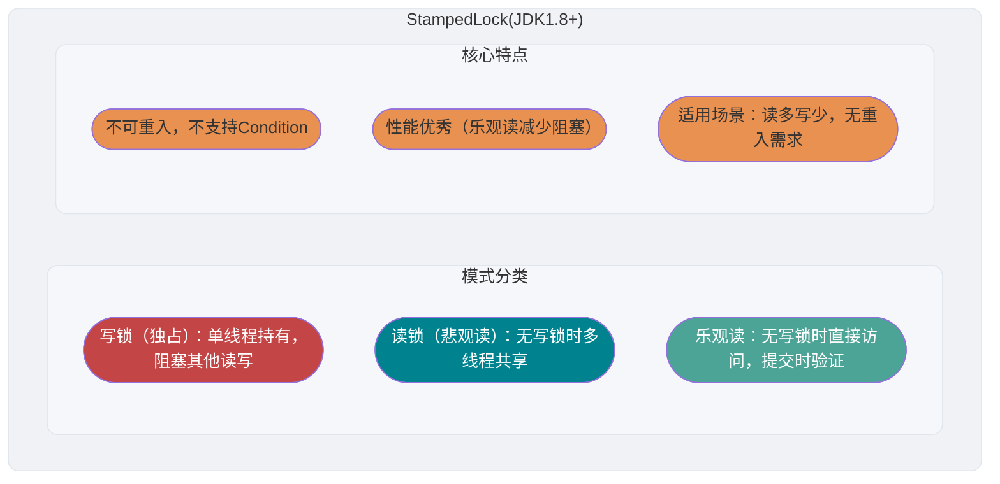
```mermaid
flowchart TB
    subgraph StampedLock["StampedLock(JDK1.8+)"]
        style StampedLock fill:#F0F2F5,stroke:#E0E6ED,rx:10,ry:10
        subgraph Modes["模式分类"]
            style Modes fill:#F5F7FA,stroke:#E0E6ED,rx:10,ry:10
            Write(["写锁（独占）：单线程持有，阻塞其他读写"]):::write
            Read(["读锁（悲观读）：无写锁时多线程共享"]):::read
            Optimistic(["乐观读：无写锁时直接访问，提交时验证"]):::optimistic
        end
        subgraph Features["核心特点"]
            style Features fill:#F5F7FA,stroke:#E0E6ED,rx:10,ry:10
            F1(["不可重入，不支持Condition"]):::feature
            F2(["性能优秀（乐观读减少阻塞）"]):::feature
            F3(["适用场景：读多写少，无重入需求"]):::feature
        end
    end

    classDef write fill:#C44545,color:#fff,rx:10,ry:10
    classDef read fill:#00838F,color:#fff,rx:10,ry:10
    classDef optimistic fill:#4CA497,color:#fff,rx:10,ry:10
    classDef feature fill:#E99151,color:#333,rx:10,ry:10

    linkStyle default stroke-width:1.5px,opacity:0.8
```

`StampedLock` 面试中问的比较少，不是很重要，简单了解即可。

### StampedLock 是什么？

`StampedLock` 是 JDK 1.8 引入的性能更好的读写锁，不可重入且不支持条件变量 `Condition`。

不同于一般的 `Lock` 类，`StampedLock` 并不是直接实现 `Lock` 或 `ReadWriteLock` 接口，而是基于 **CLH 锁** 独立实现的（AQS 也是基于这玩意）。

```java
public class StampedLock implements java.io.Serializable {
}
```

`StampedLock` 提供了三种模式的读写控制模式：读锁、写锁和乐观读。

- **写锁**：独占锁，一把锁只能被一个线程获得。当一个线程获取写锁后，其他请求读锁和写锁的线程必须等待。类似于 `ReentrantReadWriteLock` 的写锁，不过这里的写锁是不可重入的。
- **读锁**（悲观读）：共享锁，没有线程获取写锁的情况下，多个线程可以同时持有读锁。如果己经有线程持有写锁，则其他线程请求获取该读锁会被阻塞。类似于 `ReentrantReadWriteLock` 的读锁，不过这里的读锁是不可重入的。
- **乐观读**：允许多个线程获取乐观读以及读锁。同时允许一个写线程获取写锁。

另外，`StampedLock` 还支持这三种锁在一定条件下进行相互转换。

```java
long tryConvertToWriteLock(long stamp){}
long tryConvertToReadLock(long stamp){}
long tryConvertToOptimisticRead(long stamp){}
```

`StampedLock` 在获取锁的时候会返回一个 long 型的数据戳，该数据戳用于稍后的锁释放参数，如果返回的数据戳为 0 则表示锁获取失败。当前线程持有了锁再次获取锁时返回情况要看当前持有什么锁、再次申请什么锁，以及使用的是阻塞方法还是 `try` 方法：

- **当前线程持有写锁，再次获取写锁**：由于写锁是独占锁，第二次获取必须等待，但第一个写锁又要等待第二次调用返回后才能释放，于是当前线程把自己锁住了。结果就是一直阻塞，无法返回。
- **使用 `tryWriteLock()` 时，会返回 0**：`tryWriteLock()` 不会一直等待，它会立即尝试。当获取成功，则返回非 0 的数据戳；获取失败，则返回 0。
- **同一线程再次获取悲观读锁，会返回新的数据戳**：读锁是共享锁，读锁与读锁之间不冲突，所以正常返回数据戳。

真正的“可重入锁”会识别线程身份，虽然 `StampedLock` 这里同一个线程可以获取 2 次读锁，返回 2 个数据戳，但 `StampedLock` 不记录锁的线程所有权。判断是否可重入，重点看独占写锁。`StampedLock` 的写锁无法由同一个线程再次获取，所以它是不可重入的。

```java
// 写锁
public long writeLock() {
    long s, next;  // bypass acquireWrite in fully unlocked case only
    return ((((s = state) & ABITS) == 0L &&
             U.compareAndSwapLong(this, STATE, s, next = s + WBIT)) ?
            next : acquireWrite(false, 0L));
}
// 读锁
public long readLock() {
    long s = state, next;  // bypass acquireRead on common uncontended case
    return ((whead == wtail && (s & ABITS) < RFULL &&
             U.compareAndSwapLong(this, STATE, s, next = s + RUNIT)) ?
            next : acquireRead(false, 0L));
}
// 乐观读
public long tryOptimisticRead() {
    long s;
    return (((s = state) & WBIT) == 0L) ? (s & SBITS) : 0L;
}
```

### StampedLock 的性能为什么更好？

相比于传统读写锁多出来的乐观读是 `StampedLock` 比 `ReadWriteLock` 性能更好的关键原因。`StampedLock` 的乐观读允许一个写线程获取写锁，所以不会导致所有写线程阻塞，也就是当读多写少的时候，写线程有机会获取写锁，减少了线程饥饿的问题，吞吐量大大提高。

### StampedLock 适合什么场景？

和 `ReentrantReadWriteLock` 一样，`StampedLock` 同样适合读多写少的业务场景，可以作为 `ReentrantReadWriteLock` 的替代品，性能更好。

不过，需要注意的是 `StampedLock` 不可重入，不支持条件变量 `Condition`，对中断操作支持也不友好（使用不当容易导致 CPU 飙升）。如果你需要用到 `ReentrantLock` 的一些高级性能，就不太建议使用 `StampedLock` 了。

另外，`StampedLock` 性能虽好，但使用起来相对比较麻烦，一旦使用不当，就会出现生产问题。强烈建议你在使用 `StampedLock` 之前，看看 [StampedLock 官方文档中的案例](https://docs.oracle.com/javase/8/docs/api/java/util/concurrent/locks/StampedLock.html)。

### StampedLock 的底层原理了解吗？

`StampedLock` 不是直接实现 `Lock` 或 `ReadWriteLock` 接口，而是基于 **CLH 锁** 实现的（AQS 也是基于这玩意），CLH 锁是对自旋锁的一种改良，是一种隐式的链表队列。`StampedLock` 通过 CLH 队列进行线程的管理，通过同步状态值 `state` 来表示锁的状态和类型。

`StampedLock` 的原理和 AQS 原理比较类似，这里就不详细介绍了，感兴趣的可以看看下面这两篇文章：

- [AQS 详解](https://javaguide.cn/java/并发/aqs.html)
- [StampedLock 底层原理分析](https://segmentfault.com/a/1190000015808032)

如果你只是准备面试的话，建议多花点精力搞懂 AQS 原理即可，`StampedLock` 底层原理在面试中遇到的概率非常小。

## Atomic 原子类

Atomic 原子类部分的内容我单独写了一篇文章来总结：[Atomic 原子类总结](./Atomic 原子类总结.md)。

## 参考

- 《深入理解 Java 虚拟机》
- 《实战 Java 高并发程序设计》
- Guide to the Volatile Keyword in Java - Baeldung：<https://www.baeldung.com/java-volatile>
- 不可不说的 Java“锁”事 - 美团技术团队：<https://tech.meituan.com/2018/11/15/java-lock.html>
- 在 ReadWriteLock 类中读锁为什么不能升级为写锁？：<https://cloud.tencent.com/developer/article/1176230>
- 高性能解决线程饥饿的利器 StampedLock：<https://mp.weixin.qq.com/s/2Acujjr4BHIhlFsCLGwYSg>
- 理解 Java 中的 ThreadLocal - 技术小黑屋：<https://droidyue.com/blog/2016/03/13/learning-threadlocal-in-java/>
- ThreadLocal (Java Platform SE 8 ) - Oracle Help Center：<https://docs.oracle.com/javase/8/docs/api/java/lang/ThreadLocal.html>

<!-- @include: @article-footer.snippet.md -->


---

---

<!-- source: 并发/JMM（Java 内存模型）详解.md -->

## [25] JMM（Java 内存模型）详解

---
title: JMM（Java 内存模型）详解
description: 深入解析Java内存模型JMM：详解CPU缓存模型、指令重排序机制、happens-before原则、内存可见性保证，理解多线程并发编程的底层规范。
category: Java
tag:
  - Java并发
head:
  - - meta
    - name: keywords
      content: JMM,Java内存模型,CPU缓存,指令重排序,happens-before,内存可见性,并发编程模型
---

对于 Java 来说，你可以把 **JMM（Java 内存模型）** 看作是 Java 定义的并发编程相关的一组规范。除了抽象了线程和主内存之间的关系之外，其还规定了从 Java 源代码到 CPU 可执行指令的转化过程要遵守哪些并发相关的原则和规范。其主要目的是为了**简化多线程编程**，**增强程序的可移植性**。

JMM 主要定义了对于一个共享变量，当一个线程执行写操作后，该变量对其他线程的**可见性**。

要想透彻理解 JMM，我们需要从 **CPU 缓存模型**和**指令重排序**说起。

## 从 CPU 缓存模型说起

**为什么要弄一个 CPU 高速缓存呢？** 类比我们开发网站后台系统使用的缓存（比如 Redis）是为了解决程序处理速度和访问常规关系型数据库速度不对等的问题。 **CPU 缓存则是为了解决 CPU 处理速度和内存处理速度不对等的问题。**

我们甚至可以把 **内存看作外存的高速缓存**，程序运行的时候我们把外存的数据复制到内存，由于内存的处理速度远远高于外存，这样提高了处理速度。

总结：**CPU Cache 缓存的是内存数据用于解决 CPU 处理速度和内存不匹配的问题，内存缓存的是硬盘数据用于解决硬盘访问速度过慢的问题。**

为了更好地理解，我画了一个简单的 CPU Cache 示意图如下所示。

> **🐛 修正（参见：[issue#1848](https://github.com/Snailclimb/JavaGuide/issues/1848)）**：对 CPU 缓存模型绘图不严谨的地方进行完善。


现代的 CPU Cache 通常分为三层，分别叫 L1,L2,L3 Cache。有些 CPU 可能还有 L4 Cache，这里不做讨论，并不常见

**CPU Cache 的工作方式：** 先复制一份数据到 CPU Cache 中，当 CPU 需要用到的时候就可以直接从 CPU Cache 中读取数据，当运算完成后，再将运算得到的数据写回 Main Memory 中。但是，这样存在 **内存缓存不一致性的问题**！比如我执行一个 i++ 操作的话，如果两个线程同时执行的话，假设两个线程从 CPU Cache 中读取的 i=1，两个线程做了 i++ 运算完之后再写回 Main Memory 之后 i=2，而正确结果应该是 i=3。

**CPU 为了解决内存缓存不一致性问题可以通过制定缓存一致协议（比如 [MESI 协议](https://zh.wikipedia.org/wiki/MESI%E5%8D%8F%E8%AE%AE)）或者其他手段来解决。** 这个缓存一致性协议指的是在 CPU 高速缓存与主内存交互的时候需要遵守的原则和规范。不同的 CPU 中，使用的缓存一致性协议通常也会有所不同。


CPU 缓存一致性由处理器及其内存子系统协同实现。不同处理器架构还会规定各类内存访问在其他处理器看来可以按什么顺序出现，这通常称为硬件内存模型。JMM 位于更高的语言层，JVM 需要把它的要求映射到具体处理器提供的指令和屏障上。

## 指令重排序

说完了 CPU 缓存模型，我们再来看看另外一个比较重要的概念 **指令重排序**。

为了提升执行速度/性能，计算机在执行程序代码的时候，会对指令进行重排序。

**什么是指令重排序？** 简单来说就是系统在执行代码的时候并不一定是按照你写的代码的顺序依次执行。

常见的指令重排序有下面 2 种情况：

- **编译器优化重排**：编译器（包括 JVM、JIT 编译器等）在不改变单线程程序语义的前提下，重新安排语句的执行顺序。
- **指令并行重排**：现代处理器采用了指令级并行技术(Instruction-Level Parallelism，ILP)来将多条指令重叠执行。如果不存在数据依赖性，处理器可以改变语句对应机器指令的执行顺序。

另外，内存系统也会有“重排序”，但又不是真正意义上的重排序。在 JMM 里表现为主存和本地内存的内容可能不一致，进而导致程序在多线程下执行可能出现问题。

Java 源代码经过字节码编译、解释执行或 JIT 编译，最终由 JVM 在目标平台上执行相应的机器指令。编译器优化、处理器乱序执行以及内存子系统的行为都可能使多线程观察到的顺序与源代码直观顺序不同，它们并不是一条固定且严格线性的“重排流水线”。

**指令重排序可以保证串行语义一致，但是没有义务保证多线程间的语义也一致**，所以在多线程下，指令重排序可能会导致一些问题。

对于编译器优化重排和处理器的指令重排序（指令并行重排和内存系统重排都属于是处理器级别的指令重排序），处理该问题的方式不一样。

- 对于编译器，通过禁止特定类型的编译器重排序的方式来禁止重排序。

- 对于处理器，通过插入内存屏障（Memory Barrier，或有时叫做内存栅栏，Memory Fence）的方式来禁止特定类型的处理器重排序。

> 内存屏障（Memory Barrier，也叫内存栅栏，Memory Fence）用于约束特定内存访问之间的顺序和可见性。不同处理器架构的具体实现并不相同，不能一概理解为“把缓存刷新到物理内存”或“让缓存全部失效”；JVM 会根据目标平台选择满足 JMM 语义的指令。

## JMM(Java Memory Model)

### 什么是 JMM？为什么需要 JMM？

Java 是最早尝试提供内存模型的编程语言。由于早期内存模型存在一些缺陷（比如非常容易削弱编译器的优化能力），从 Java5 开始，Java 开始使用新的内存模型 [《JSR-133：Java Memory Model and Thread Specification》](http://www.cs.umd.edu/~pugh/java/memoryModel/CommunityReview.pdf)。

一般来说，编程语言也可以直接复用操作系统层面的内存模型。不过，不同的操作系统内存模型不同。如果直接复用操作系统层面的内存模型，就可能会导致同样一套代码换了一个操作系统就无法执行了。Java 语言是跨平台的，它需要自己提供一套内存模型以屏蔽系统差异。

这只是 JMM 存在的其中一个原因。实际上，对于 Java 来说，你可以把 JMM 看作是 Java 定义的并发编程相关的一组规范，除了抽象了线程和主内存之间的关系之外，其还规定了从 Java 源代码到 CPU 可执行指令的这个转化过程要遵守哪些和并发相关的原则和规范，其主要目的是为了简化多线程编程，增强程序可移植性的。

**为什么要遵守这些并发相关的原则和规范呢？** 这是因为并发编程下，像 CPU 多级缓存和指令重排这类设计可能会导致程序运行出现一些问题。就比如说我们上面提到的指令重排序就可能会让多线程程序的执行出现问题，为此，JMM 抽象了 happens-before 原则（后文会详细介绍到）来解决这个指令重排序问题。

JMM 说白了就是定义了一些规范来解决这些问题，开发者可以利用这些规范更方便地开发多线程程序。对于 Java 开发者说，你不需要了解底层原理，直接使用并发相关的一些关键字和类（比如 `volatile`、`synchronized`、各种 `Lock`）即可开发出并发安全的程序。

### JMM 是如何抽象线程和主内存之间的关系？

**Java 内存模型（JMM）** 抽象了线程和主内存之间的关系，就比如说线程之间的共享变量必须存储在主内存中。

Java 从早期规范开始就有内存模型；Java 5 通过 JSR-133 对它进行了重要修订，明确并增强了 `volatile`、`final` 和 happens-before 等语义。JMM 允许 JVM 使用寄存器、缓存以及编译器优化来实现共享变量访问；如果程序没有建立必要的同步关系，一个线程就可能看不到另一个线程的最新写入。

这和我们上面讲到的 CPU 缓存模型非常相似。

**什么是主内存？什么是本地内存？**

- **主内存**：JMM 用它抽象线程之间可以共享的变量，包括实例字段、静态字段和数组元素。方法局部变量、形参和异常处理参数不会在线程之间共享，因此不属于这里所说的共享变量。主内存是规范层面的抽象，不等同于某一块物理内存。
- **本地内存**：每个线程都有一个私有的本地内存，本地内存存储了该线程已读 / 写共享变量的副本。每个线程只能操作自己本地内存中的变量，无法直接访问其他线程的本地内存。如果线程间需要通信，必须通过主内存来进行。本地内存是 JMM 抽象出来的一个概念，并不真实存在，它涵盖了缓存、写缓冲区、寄存器以及其他的硬件和编译器优化。

Java 内存模型的抽象示意图如下：


从上图来看，线程 1 与线程 2 之间如果要进行通信的话，必须要经历下面 2 个步骤：

1. 线程 1 把本地内存中修改过的共享变量副本的值同步到主内存中去。
2. 线程 2 到主存中读取对应的共享变量的值。

也就是说，线程间的共享数据需要遵守 JMM 的规则进行通信；只有通过 `volatile`、锁、线程启动与终止等方式建立相应的 happens-before 关系时，JMM 才为相关写入提供可见性保证。

不过，多线程下，对主内存中的一个共享变量进行操作有可能诱发线程安全问题。举个例子：

1. 线程 1 和线程 2 分别对同一个共享变量进行操作，一个执行修改，一个执行读取。
2. 线程 2 读取到的是线程 1 修改之前的值还是修改后的值并不确定，都有可能，因为线程 1 和线程 2 都是先将共享变量从主内存拷贝到对应线程的工作内存中。

关于主内存与工作内存直接的具体交互协议，即一个变量如何从主内存拷贝到工作内存，如何从工作内存同步到主内存之间的实现细节，Java 内存模型定义来以下八种同步操作（了解即可，无需死记硬背）：

- **锁定（lock）**: 作用于主内存中的变量，将他标记为一个线程独享变量。
- **解锁（unlock）**: 作用于主内存中的变量，解除变量的锁定状态，被解除锁定状态的变量才能被其他线程锁定。
- **read（读取）**：作用于主内存的变量，它把一个变量的值从主内存传输到线程的工作内存中，以便随后的 load 动作使用。
- **load（载入）**：把 read 操作从主内存中得到的变量值放入工作内存的变量的副本中。
- **use（使用）**：把工作内存中的一个变量的值传给执行引擎，每当虚拟机遇到一个使用到变量的指令时都会使用该指令。
- **assign（赋值）**：作用于工作内存的变量，它把一个从执行引擎接收到的值赋给工作内存的变量，每当虚拟机遇到一个给变量赋值的字节码指令时执行这个操作。
- **store（存储）**：作用于工作内存的变量，它把工作内存中一个变量的值传送到主内存中，以便随后的 write 操作使用。
- **write（写入）**：作用于主内存的变量，它把 store 操作从工作内存中得到的变量的值放入主内存的变量中。

除了这 8 种同步操作之外，还规定了下面这些同步规则来保证这些同步操作的正确执行（了解即可，无需死记硬背）：

- 不允许一个线程无原因地（没有发生过任何 assign 操作）把数据从线程的工作内存同步回主内存中。
- 一个新的变量只能在主内存中 “诞生”，不允许在工作内存中直接使用一个未被初始化（load 或 assign）的变量，换句话说就是对一个变量实施 use 和 store 操作之前，必须先执行过了 assign 和 load 操作。
- 一个变量在同一个时刻只允许一条线程对其进行 lock 操作，但 lock 操作可以被同一条线程重复执行多次，多次执行 lock 后，只有执行相同次数的 unlock 操作，变量才会被解锁。
- 如果对一个变量执行 lock 操作，将会清空工作内存中此变量的值，在执行引擎使用这个变量前，需要重新执行 load 或 assign 操作初始化变量的值。
- 如果一个变量事先没有被 lock 操作锁定，则不允许对它执行 unlock 操作，也不允许去 unlock 一个被其他线程锁定住的变量。
- ……

### Java 内存区域和 JMM 有何区别？

这是一个比较常见的问题，很多初学者非常容易搞混。 **Java 内存区域和内存模型是完全不一样的两个东西**：

- JVM 内存结构和 Java 虚拟机的运行时区域相关，定义了 JVM 在运行时如何分区存储程序数据，就比如说堆主要用于存放对象实例。
- Java 内存模型和 Java 的并发编程相关，抽象了线程和主内存之间的关系就比如说线程之间的共享变量必须存储在主内存中，规定了从 Java 源代码到 CPU 可执行指令的这个转化过程要遵守哪些和并发相关的原则和规范，其主要目的是为了简化多线程编程，增强程序可移植性的。

### happens-before 原则是什么？

happens-before 这个概念最早诞生于 Leslie Lamport 于 1978 年发表的论文[《Time，Clocks and the Ordering of Events in a Distributed System》](https://lamport.azurewebsites.net/pubs/time-clocks.pdf)。在这篇论文中，Leslie Lamport 提出了[逻辑时钟](https://writings.sh/post/logical-clocks)的概念，这也成了第一个逻辑时钟算法。在分布式环境中，通过一系列规则来定义逻辑时钟的变化，从而能通过逻辑时钟来对分布式系统中的事件的先后顺序进行判断。**逻辑时钟并不度量时间本身，仅区分事件发生的前后顺序，其本质就是定义了一种 happens-before 关系。**

上面提到的 happens-before 这个概念诞生的背景并不是重点，简单了解即可。

JSR 133 引入了 happens-before 这个概念来描述两个操作之间的内存可见性。

**为什么需要 happens-before 原则？** happens-before 原则的诞生是为了程序员和编译器、处理器之间的平衡。程序员追求的是易于理解和编程的强内存模型，遵守既定规则编码即可。编译器和处理器追求的是较少约束的弱内存模型，让它们尽己所能地去优化性能，让性能最大化。happens-before 原则的设计思想其实非常简单：

- 为了对编译器和处理器的约束尽可能少，只要不改变程序的执行结果（单线程程序和正确执行的多线程程序），编译器和处理器怎么进行重排序优化都行。
- 对于会改变程序执行结果的重排序，JMM 要求编译器和处理器必须禁止这种重排序。

下面这张是我根据《Java 并发编程的艺术》这本书中的一张 JMM 设计思想示意图重新绘制的。


了解了 happens-before 原则的设计思想，我们再来看看 JSR-133 对 happens-before 原则的定义：

- 如果一个操作 happens-before 另一个操作，那么第一个操作的执行结果将对第二个操作可见，并且第一个操作的执行顺序排在第二个操作之前。
- 两个操作之间存在 happens-before 关系，并不意味着 Java 平台的具体实现必须要按照 happens-before 关系指定的顺序来执行。如果重排序之后的执行结果，与按 happens-before 关系来执行的结果一致，那么 JMM 也允许这样的重排序。

我们看下面这段代码：

```java
int userNum = getUserNum();   // 1
int teacherNum = getTeacherNum();   // 2
int totalNum = userNum + teacherNum;  // 3
```

- 1 happens-before 2
- 2 happens-before 3
- 1 happens-before 3

虽然 1 happens-before 2，但对 1 和 2 进行重排序不会影响代码的执行结果，所以 JMM 是允许编译器和处理器执行这种重排序的。但 1 和 2 必须是在 3 执行之前，也就是说 1,2 happens-before 3。

**happens-before 原则表达的意义其实并不是一个操作发生在另外一个操作的前面，虽然这从程序员的角度上来说也并无大碍。更准确地来说，它更想表达的意义是前一个操作的结果对于后一个操作是可见的，无论这两个操作是否在同一个线程里。**

举个例子：操作 1 happens-before 操作 2，即使操作 1 和操作 2 不在同一个线程内，JMM 也会保证操作 1 的结果对操作 2 是可见的。

### happens-before 常见规则有哪些？谈谈你的理解？

happens-before 有多条规则，下面列出其中最常用的 5 条：

1. **程序顺序规则**：一个线程内，按照代码顺序，书写在前面的操作 happens-before 于书写在后面的操作；
2. **监视器锁规则**：对一个监视器的解锁 happens-before 于随后对同一个监视器的加锁；
3. **volatile 变量规则**：对一个 `volatile` 变量的写操作 happens-before 于随后对同一个变量的读操作；
4. **传递规则**：如果 A happens-before B，且 B happens-before C，那么 A happens-before C；
5. **线程启动规则**：Thread 对象的 `start()` 方法 happens-before 于此线程的每一个动作。

这份列表并不完整，还包括线程终止、线程中断等规则。两个冲突访问之间如果无法通过完整规则推导出 happens-before 关系，就可能构成数据竞争，其可见性和顺序不能按单线程直觉来保证；这不等价于 JVM 可以无条件交换任意两条指令，执行结果仍受 JMM 的一致性和因果性规则约束。

### happens-before 和 JMM 什么关系？

happens-before 与 JMM 的关系如下图所示：


- JMM 向程序员提供了 **“ happens-before 规则 ”**（如程序顺序规则、`volatile` 变量规则等）。这是一种 **“ 强内存模型 ”** 的假象：程序员不需要关心底层复杂的重排序细节，只需要按照这些规则编写代码，就能保证多线程下的内存可见性。
- JVM 在执行时，会将 happens-before 规则映射到具体的实现上。为了在保证正确性的前提下不丧失性能，JMM 只会 **“ 禁止影响执行结果的重排序 ”**。对于不影响单线程执行结果的重排序，JMM 是允许的。
- 最底层是编译器和处理器真实的 **“ 重排序规则 ”**。

总结来说，JMM 就像是一个中间层：它向上通过 happens-before 为程序员提供简单的编程模型；向下通过禁止特定重排序，利用底层硬件性能。这种设计既保证了多线程的安全性，又最大限度释放了硬件的性能。

## 再看并发编程三个重要特性

### 原子性

一次操作或者多次操作，要么所有的操作全部都得到执行并且不会受到任何因素的干扰而中断，要么都不执行。

在 Java 中，可以借助 `synchronized`、各种 `Lock` 以及各种原子类实现原子性。

`synchronized` 和各种 `Lock` 可以保证任一时刻只有一个线程访问该代码块，因此可以保障原子性。各种原子类是利用 CAS (compare and swap) 操作（可能也会用到 `volatile` 或者 `final` 关键字）来保证原子操作。

### 可见性

当一个线程对共享变量进行了修改，那么另外的线程都是立即可以看到修改后的最新值。

在 Java 中，可以借助 `synchronized`、`volatile` 以及各种 `Lock` 实现可见性。

如果将变量声明为 `volatile`，对该变量的写与后续读之间会建立 happens-before 关系。JVM 必须保证相应的可见性和顺序语义，但具体实现不要求每次都访问物理主存。

### 有序性

由于指令重排序问题，代码的执行顺序未必就是编写代码时候的顺序。

我们上面讲重排序的时候也提到过：

> **指令重排序可以保证串行语义一致，但是没有义务保证多线程间的语义也一致**，所以在多线程下，指令重排序可能会导致一些问题。

在 Java 中，`volatile` 会约束与该变量读写相关、可能破坏其内存语义的重排序，但并不是禁止所有指令重排序优化。

## 总结

- Java 是最早尝试提供内存模型的语言，其主要目的是为了简化多线程编程，增强程序可移植性的。
- CPU 可以通过制定缓存一致协议（比如 [MESI 协议](https://zh.wikipedia.org/wiki/MESI%E5%8D%8F%E8%AE%AE)）来解决内存缓存不一致性问题。
- 为了提升执行速度/性能，计算机在执行程序代码的时候，会对指令进行重排序。 简单来说就是系统在执行代码的时候并不一定是按照你写的代码的顺序依次执行。**指令重排序可以保证串行语义一致，但是没有义务保证多线程间的语义也一致**，所以在多线程下，指令重排序可能会导致一些问题。
- 你可以把 JMM 看作是 Java 定义的并发编程相关的一组规范，除了抽象了线程和主内存之间的关系之外，其还规定了从 Java 源代码到 CPU 可执行指令的这个转化过程要遵守哪些和并发相关的原则和规范，其主要目的是为了简化多线程编程，增强程序可移植性的。
- JSR 133 引入了 happens-before 这个概念来描述两个操作之间的内存可见性。

## 参考

- 《Java 并发编程的艺术》第三章 Java 内存模型
- 《深入浅出 Java 多线程》：<http://concurrent.redspider.group/RedSpider.html>
- Java 内存访问重排序的研究：<https://tech.meituan.com/2014/09/23/java-memory-reordering.html>
- 嘿，同学，你要的 Java 内存模型 (JMM) 来了：<https://xie.infoq.cn/article/739920a92d0d27e2053174ef2>
- JSR 133 (Java Memory Model) FAQ：<https://www.cs.umd.edu/~pugh/java/memoryModel/jsr-133-faq.html>

<!-- @include: @article-footer.snippet.md -->


---

---

<!-- source: 并发/ThreadLocal 详解.md -->

## [26] ThreadLocal 详解

---
title: ThreadLocal 详解
description: ThreadLocal深度解析：详解ThreadLocal线程本地变量原理、ThreadLocalMap实现机制、弱引用与内存泄漏问题、使用场景与最佳实践。
category: Java
tag:
  - Java并发
head:
  - - meta
    - name: keywords
      content: ThreadLocal,线程本地变量,ThreadLocalMap,内存泄漏,弱引用,ThreadLocal原理,线程隔离
---

> 本文来自一枝花算不算浪漫投稿， 原文地址：[https://juejin.cn/post/6844904151567040519](https://juejin.cn/post/6844904151567040519)。

### 前言


**全文共 10000+字，31 张图，这篇文章同样耗费了不少的时间和精力才创作完成，原创不易，请大家点点关注+在看，感谢。**

对于 `ThreadLocal`，大家的第一反应可能是很简单呀，线程的变量副本，每个线程隔离。那这里有几个问题大家可以思考一下：

- `ThreadLocal` 的 key 是**弱引用**，那么在 `ThreadLocal.get()` 的时候，发生**GC**之后，key 是否为**null**？
- `ThreadLocal` 中 `ThreadLocalMap` 的**数据结构**？
- `ThreadLocalMap` 的**Hash 算法**？
- `ThreadLocalMap` 中**Hash 冲突**如何解决？
- `ThreadLocalMap` 的**扩容机制**？
- `ThreadLocalMap` 中**过期 key 的清理机制**？**探测式清理**和**启发式清理**流程？
- `ThreadLocalMap.set()` 方法实现原理？
- `ThreadLocalMap.get()` 方法实现原理？
- 项目中 `ThreadLocal` 使用情况？遇到的坑？
- ……

上述的一些问题你是否都已经掌握的很清楚了呢？本文将围绕这些问题使用图文方式来剖析 `ThreadLocal` 的**点点滴滴**。

### 目录

**注明：** 本文源码基于 `JDK 1.8`

### `ThreadLocal` 代码演示

我们先看下 `ThreadLocal` 使用示例：

```java
public class ThreadLocalTest {
    private List<String> messages = Lists.newArrayList();

    public static final ThreadLocal<ThreadLocalTest> holder = ThreadLocal.withInitial(ThreadLocalTest::new);

    public static void add(String message) {
        holder.get().messages.add(message);
    }

    public static List<String> clear() {
        List<String> messages = holder.get().messages;
        holder.remove();

        System.out.println("size: " + holder.get().messages.size());
        return messages;
    }

    public static void main(String[] args) {
        ThreadLocalTest.add("一枝花算不算浪漫");
        System.out.println(holder.get().messages);
        ThreadLocalTest.clear();
    }
}
```

打印结果：

```java
[一枝花算不算浪漫]
size: 0
```

`ThreadLocal` 对象可以提供线程局部变量，每个线程 `Thread` 拥有一份自己的**副本变量**，多个线程互不干扰。

### `ThreadLocal` 的数据结构


`Thread` 类有一个类型为 `ThreadLocal.ThreadLocalMap` 的实例变量 `threadLocals`，也就是说每个线程有一个自己的 `ThreadLocalMap`。

`ThreadLocalMap` 有自己的独立实现，可以简单地将它的 `key` 视作 `ThreadLocal`，`value` 为代码中放入的值（实际上 `key` 并不是 `ThreadLocal` 本身，而是它的一个**弱引用**）。

每个线程在往 `ThreadLocal` 里放值的时候，都会往自己的 `ThreadLocalMap` 里存，读也是以 `ThreadLocal` 作为引用，在自己的 `map` 里找对应的 `key`，从而实现了**线程隔离**。

`ThreadLocalMap` 有点类似 `HashMap` 的结构，只是 `HashMap` 是由**数组+链表**实现的，而 `ThreadLocalMap` 中并没有**链表**结构。

我们还要注意 `Entry`， 它的 `key` 是 `ThreadLocal<?> k`，继承自 `WeakReference`， 也就是我们常说的弱引用类型。

### GC 之后 key 是否为 null？

回应开头的那个问题， `ThreadLocal` 的 `key` 是弱引用，那么在 `ThreadLocal.get()` 的时候，发生 `GC` 之后，`key` 是否是 `null`？

为了搞清楚这个问题，我们需要搞清楚 `Java` 的**四种引用类型**：

- **强引用**：我们常常 new 出来的对象就是强引用类型，只要强引用存在，垃圾回收器将永远不会回收被引用的对象，哪怕内存不足的时候
- **软引用**：使用 SoftReference 修饰的对象被称为软引用，软引用指向的对象在内存要溢出的时候被回收
- **弱引用**：使用 `WeakReference` 引用的对象如果已不存在强引用或软引用，就属于弱可达对象；垃圾收集器决定处理这类对象时，会清除相应的弱引用。一次特定的垃圾回收并不保证立刻处理所有候选对象
- **虚引用**：虚引用是最弱的引用，在 Java 中使用 PhantomReference 进行定义。虚引用中唯一的作用就是用队列接收对象即将死亡的通知

接着再来看下代码，我们使用反射的方式来看看 `GC` 后 `ThreadLocal` 中的数据情况：(下面代码来源自：<https://blog.csdn.net/thewindkee/article/details/103726942> 本地运行演示 GC 回收场景)

> `System.gc()` 只是向 JVM 提出执行垃圾回收的建议，下面结果适合用来说明原理，但不能作为每次运行都必然出现的行为。

```java
public class ThreadLocalDemo {

    public static void main(String[] args) throws NoSuchFieldException, IllegalAccessException, InterruptedException {
        Thread t = new Thread(()->test("abc",false));
        t.start();
        t.join();
        System.out.println("--gc后--");
        Thread t2 = new Thread(() -> test("def", true));
        t2.start();
        t2.join();
    }

    private static void test(String s,boolean isGC)  {
        try {
            new ThreadLocal<>().set(s);
            if (isGC) {
                System.gc();
            }
            Thread t = Thread.currentThread();
            Class<? extends Thread> clz = t.getClass();
            Field field = clz.getDeclaredField("threadLocals");
            field.setAccessible(true);
            Object ThreadLocalMap = field.get(t);
            Class<?> tlmClass = ThreadLocalMap.getClass();
            Field tableField = tlmClass.getDeclaredField("table");
            tableField.setAccessible(true);
            Object[] arr = (Object[]) tableField.get(ThreadLocalMap);
            for (Object o : arr) {
                if (o != null) {
                    Class<?> entryClass = o.getClass();
                    Field valueField = entryClass.getDeclaredField("value");
                    Field referenceField = entryClass.getSuperclass().getSuperclass().getDeclaredField("referent");
                    valueField.setAccessible(true);
                    referenceField.setAccessible(true);
                    System.out.println(String.format("弱引用key:%s,值:%s", referenceField.get(o), valueField.get(o)));
                }
            }
        } catch (Exception e) {
            e.printStackTrace();
        }
    }
}
```

结果如下：

```java
弱引用key:java.lang.ThreadLocal@433619b6,值:abc
弱引用key:java.lang.ThreadLocal@418a15e3,值:java.lang.ref.SoftReference@bf97a12
--gc后--
弱引用key:null,值:def
```


如图所示，因为这里创建的 `ThreadLocal` 并没有指向任何值，也就是没有任何引用：

```java
new ThreadLocal<>().set(s);
```

在这次示例运行中，垃圾收集器处理了只剩弱引用的 `ThreadLocal`，所以我们看到 `referent=null`。但这取决于 JVM 是否实际执行并完成相应的垃圾回收。如果**改动一下代码：**


这个问题刚开始看，如果没有过多思考，**弱引用**，还有**垃圾回收**，那么肯定会觉得是 `null`。

其实是不对的，因为题目说的是在做 `ThreadLocal.get()` 操作，证明其实还是有**强引用**存在的，所以 `key` 并不为 `null`，如下图所示，`ThreadLocal` 的**强引用**仍然是存在的。


如果我们的**强引用**不存在，垃圾收集器就可以清除弱引用中的 `key`。此时 `Entry` 仍然强引用着 `value`，直到该过期条目被 `ThreadLocalMap` 后续操作清理，或者所属线程终止、整个 Map 不再可达；在线程池等长生命周期线程中，这段滞留时间可能很长，因而存在内存泄漏风险。

### `ThreadLocal.set()` 方法源码详解


`ThreadLocal` 中的 `set` 方法原理如上图所示，很简单，主要是判断 `ThreadLocalMap` 是否存在，然后使用 `ThreadLocal` 中的 `set` 方法进行数据处理。

代码如下：

```java
public void set(T value) {
    Thread t = Thread.currentThread();
    ThreadLocalMap map = getMap(t);
    if (map != null)
        map.set(this, value);
    else
        createMap(t, value);
}

void createMap(Thread t, T firstValue) {
    t.threadLocals = new ThreadLocalMap(this, firstValue);
}
```

主要的核心逻辑还是在 `ThreadLocalMap` 中的，一步步往下看，后面还有更详细的剖析。

### `ThreadLocalMap` Hash 算法

既然是 `Map` 结构，那么 `ThreadLocalMap` 当然也要实现自己的 `hash` 算法来解决散列表数组冲突问题。

```java
int i = key.threadLocalHashCode & (len-1);
```

`ThreadLocalMap` 中 `hash` 算法很简单，这里 `i` 就是当前 key 在散列表中对应的数组下标位置。

这里最关键的就是 `threadLocalHashCode` 值的计算，`ThreadLocal` 中有一个属性为 `HASH_INCREMENT = 0x61c88647`

```java
public class ThreadLocal<T> {
    private final int threadLocalHashCode = nextHashCode();

    private static AtomicInteger nextHashCode = new AtomicInteger();

    private static final int HASH_INCREMENT = 0x61c88647;

    private static int nextHashCode() {
        return nextHashCode.getAndAdd(HASH_INCREMENT);
    }

    static class ThreadLocalMap {
        ThreadLocalMap(ThreadLocal<?> firstKey, Object firstValue) {
            table = new Entry[INITIAL_CAPACITY];
            int i = firstKey.threadLocalHashCode & (INITIAL_CAPACITY - 1);

            table[i] = new Entry(firstKey, firstValue);
            size = 1;
            setThreshold(INITIAL_CAPACITY);
        }
    }
}
```

每当创建一个 `ThreadLocal` 对象，这个 `ThreadLocal.nextHashCode` 这个值就会增长 `0x61c88647`。

这个常量不是斐波那契数，而是由黄金分割比例推导出的 32 位散列增量。连续创建的 `ThreadLocal` 使用这个增量生成哈希码，再对长度为 2 的幂的数组取低位时，可以让槽位分布较均匀。

我们自己可以尝试下：


可以看到产生的哈希码分布较均匀，感兴趣的可以进一步了解基于黄金分割比例的乘法散列。

### `ThreadLocalMap` Hash 冲突

> **注明：** 下面所有示例图中，**绿色块**`Entry` 代表**正常数据**，**灰色块**代表 `Entry` 的 `key` 值为 `null`，**已被垃圾回收**。**白色块**表示 `Entry` 为 `null`。

虽然 `ThreadLocalMap` 中使用了**黄金分割数**来作为 `hash` 计算因子，大大减少了 `Hash` 冲突的概率，但是仍然会存在冲突。

`HashMap` 中解决冲突的方法是在数组上构造一个**链表**结构，冲突的数据挂载到链表上，如果链表长度超过一定数量则会转化成**红黑树**。

而 `ThreadLocalMap` 中并没有链表结构，所以这里不能使用 `HashMap` 解决冲突的方式了。


如上图所示，如果我们插入一个 `value=27` 的数据，通过 `hash` 计算后应该落入槽位 4 中，而槽位 4 已经有了 `Entry` 数据。

此时就会线性向后查找，一直找到 `Entry` 为 `null` 的槽位才会停止查找，将当前元素放入此槽位中。当然迭代过程中还有其他的情况，比如遇到了 `Entry` 不为 `null` 且 `key` 值相等的情况，还有 `Entry` 中的 `key` 值为 `null` 的情况等等都会有不同的处理，后面会一一详细讲解。

这里还画了一个 `Entry` 中的 `key` 为 `null` 的数据（**Entry=2 的灰色块数据**），因为 `key` 值是**弱引用**类型，所以会有这种数据存在。在 `set` 过程中，如果遇到了 `key` 过期的 `Entry` 数据，实际上是会进行一轮**探测式清理**操作的，具体操作方式后面会讲到。

### `ThreadLocalMap.set()` 详解

#### `ThreadLocalMap.set()` 原理图解

看完了 `ThreadLocal` **hash 算法**后，我们再来看 `set` 是如何实现的。

往 `ThreadLocalMap` 中 `set` 数据（**新增**或者**更新**数据）分为好几种情况，针对不同的情况我们画图来说明。

**第一种情况：** 通过 `hash` 计算后的槽位对应的 `Entry` 数据为空：


这里直接将数据放到该槽位即可。

**第二种情况：** 槽位数据不为空，`key` 值与当前 `ThreadLocal` 通过 `hash` 计算获取的 `key` 值一致：


这里直接更新该槽位的数据。

**第三种情况：** 槽位数据不为空，往后遍历过程中，在找到 `Entry` 为 `null` 的槽位之前，没有遇到 `key` 过期的 `Entry`：


遍历散列数组，线性往后查找，如果找到 `Entry` 为 `null` 的槽位，则将数据放入该槽位中，或者往后遍历过程中，遇到了**key 值相等**的数据，直接更新即可。

**第四种情况：** 槽位数据不为空，往后遍历过程中，在找到 `Entry` 为 `null` 的槽位之前，遇到 `key` 过期的 `Entry`，如下图，往后遍历过程中，遇到了 `index=7` 的槽位数据 `Entry` 的 `key=null`：


散列数组下标为 7 位置对应的 `Entry` 数据 `key` 为 `null`，表明此数据 `key` 值已经被垃圾回收掉了，此时就会执行 `replaceStaleEntry()` 方法，该方法含义是**替换过期数据的逻辑**，以**index=7**位起点开始遍历，进行探测式数据清理工作。

初始化探测式清理过期数据扫描的开始位置：`slotToExpunge = staleSlot = 7`

以当前 `staleSlot` 开始 向前迭代查找，找其他过期的数据，然后更新过期数据起始扫描下标 `slotToExpunge`。`for` 循环迭代，直到碰到 `Entry` 为 `null` 结束。

如果找到了过期的数据，继续向前迭代，直到遇到 `Entry=null` 的槽位才停止迭代，如下图所示，**slotToExpunge 被更新为 0**：


以当前节点(`index=7`)向前迭代，检测是否有过期的 `Entry` 数据，如果有则更新 `slotToExpunge` 值。碰到 `null` 则结束探测。以上图为例 `slotToExpunge` 被更新为 0。

上面向前迭代的操作是为了更新探测清理过期数据的起始下标 `slotToExpunge` 的值，这个值在后面会讲解，它是用来判断当前过期槽位 `staleSlot` 之前是否还有过期元素。

接着开始以 `staleSlot` 位置(`index=7`)向后迭代，**如果找到了相同 key 值的 Entry 数据：**


从当前节点 `staleSlot` 向后查找 `key` 值相等的 `Entry` 元素，找到后更新 `Entry` 的值并交换 `staleSlot` 元素的位置(`staleSlot` 位置为过期元素)，更新 `Entry` 数据，然后开始进行过期 `Entry` 的清理工作，如下图所示：

向后遍历过程中，如果没有找到相同 key 值的 Entry 数据：


从当前节点 `staleSlot` 向后查找 `key` 值相等的 `Entry` 元素，直到 `Entry` 为 `null` 则停止寻找。通过上图可知，此时 `table` 中没有 `key` 值相同的 `Entry`。

创建新的 `Entry`，替换 `table[stableSlot]` 位置：


替换完成后也是进行过期元素清理工作，清理工作主要是有两个方法：`expungeStaleEntry()` 和 `cleanSomeSlots()`，具体细节后面会讲到，请继续往后看。

#### `ThreadLocalMap.set()` 源码详解

上面已经用图的方式解析了 `set()` 实现的原理，其实已经很清晰了，我们接着再看下源码：

`java.lang.ThreadLocal`.`ThreadLocalMap.set()`:

```java
private void set(ThreadLocal<?> key, Object value) {
    Entry[] tab = table;
    int len = tab.length;
    int i = key.threadLocalHashCode & (len-1);

    for (Entry e = tab[i];
         e != null;
         e = tab[i = nextIndex(i, len)]) {
        ThreadLocal<?> k = e.get();

        if (k == key) {
            e.value = value;
            return;
        }

        if (k == null) {
            replaceStaleEntry(key, value, i);
            return;
        }
    }

    tab[i] = new Entry(key, value);
    int sz = ++size;
    if (!cleanSomeSlots(i, sz) && sz >= threshold)
        rehash();
}
```

这里会通过 `key` 来计算在散列表中的对应位置，然后以当前 `key` 对应的桶的位置向后查找，找到可以使用的桶。

```java
Entry[] tab = table;
int len = tab.length;
int i = key.threadLocalHashCode & (len-1);
```

什么情况下桶才是可以使用的呢？

1. `k = key` 说明是替换操作，可以使用
2. 碰到一个过期的桶，执行替换逻辑，占用过期桶
3. 查找过程中，碰到桶中 `Entry=null` 的情况，直接使用

接着就是执行 `for` 循环遍历，向后查找，我们先看下 `nextIndex()`、`prevIndex()` 方法实现：


```java
private static int nextIndex(int i, int len) {
    return ((i + 1 < len) ? i + 1 : 0);
}

private static int prevIndex(int i, int len) {
    return ((i - 1 >= 0) ? i - 1 : len - 1);
}
```

接着看剩下 `for` 循环中的逻辑：

1. 遍历当前 `key` 值对应的桶中 `Entry` 数据为空，这说明散列数组这里没有数据冲突，跳出 `for` 循环，直接 `set` 数据到对应的桶中
2. 如果 `key` 值对应的桶中 `Entry` 数据不为空
   2.1 如果 `k = key`，说明当前 `set` 操作是一个替换操作，做替换逻辑，直接返回
   2.2 如果 `key = null`，说明当前桶位置的 `Entry` 是过期数据，执行 `replaceStaleEntry()` 方法（核心方法），然后返回
3. `for` 循环执行完毕，继续往下执行说明向后迭代的过程中遇到了 `entry` 为 `null` 的情况
   3.1 在 `Entry` 为 `null` 的桶中创建一个新的 `Entry` 对象
   3.2 执行 `++size` 操作
4. 调用 `cleanSomeSlots()` 做一次启发式清理工作，清理散列数组中 `Entry` 的 `key` 过期的数据
   4.1 如果清理工作完成后，未清理到任何数据，且 `size` 超过了阈值（数组长度的 2/3），进行 `rehash()` 操作
   4.2 `rehash()` 中会先进行一轮探测式清理，清理过期 `key`，清理完成后如果**size >= threshold - threshold / 4**，就会执行真正的扩容逻辑（扩容逻辑往后看）

接着重点看下 `replaceStaleEntry()` 方法，`replaceStaleEntry()` 方法提供替换过期数据的功能，我们可以对应上面**第四种情况**的原理图来再回顾下，具体代码如下：

`java.lang.ThreadLocal.ThreadLocalMap.replaceStaleEntry()`:

```java
private void replaceStaleEntry(ThreadLocal<?> key, Object value,
                                       int staleSlot) {
    Entry[] tab = table;
    int len = tab.length;
    Entry e;

    int slotToExpunge = staleSlot;
    for (int i = prevIndex(staleSlot, len);
         (e = tab[i]) != null;
         i = prevIndex(i, len))

        if (e.get() == null)
            slotToExpunge = i;

    for (int i = nextIndex(staleSlot, len);
         (e = tab[i]) != null;
         i = nextIndex(i, len)) {

        ThreadLocal<?> k = e.get();

        if (k == key) {
            e.value = value;

            tab[i] = tab[staleSlot];
            tab[staleSlot] = e;

            if (slotToExpunge == staleSlot)
                slotToExpunge = i;
            cleanSomeSlots(expungeStaleEntry(slotToExpunge), len);
            return;
        }

        if (k == null && slotToExpunge == staleSlot)
            slotToExpunge = i;
    }

    tab[staleSlot].value = null;
    tab[staleSlot] = new Entry(key, value);

    if (slotToExpunge != staleSlot)
        cleanSomeSlots(expungeStaleEntry(slotToExpunge), len);
}
```

`slotToExpunge` 表示开始探测式清理过期数据的开始下标，默认从当前的 `staleSlot` 开始。以当前的 `staleSlot` 开始，向前迭代查找，找到没有过期的数据，`for` 循环一直碰到 `Entry` 为 `null` 才会结束。如果向前找到了过期数据，更新探测清理过期数据的开始下标为 i，即 `slotToExpunge=i`

```java
for (int i = prevIndex(staleSlot, len);
     (e = tab[i]) != null;
     i = prevIndex(i, len)){

    if (e.get() == null){
        slotToExpunge = i;
    }
}
```

接着开始从 `staleSlot` 向后查找，也是碰到 `Entry` 为 `null` 的桶结束。
如果迭代过程中，**碰到 k == key**，这说明这里是替换逻辑，替换新数据并且交换当前 `staleSlot` 位置。如果 `slotToExpunge == staleSlot`，这说明 `replaceStaleEntry()` 一开始向前查找过期数据时并未找到过期的 `Entry` 数据，接着向后查找过程中也未发现过期数据，修改开始探测式清理过期数据的下标为当前循环的 index，即 `slotToExpunge = i`。最后调用 `cleanSomeSlots(expungeStaleEntry(slotToExpunge), len);` 进行启发式过期数据清理。

```java
if (k == key) {
    e.value = value;

    tab[i] = tab[staleSlot];
    tab[staleSlot] = e;

    if (slotToExpunge == staleSlot)
        slotToExpunge = i;

    cleanSomeSlots(expungeStaleEntry(slotToExpunge), len);
    return;
}
```

`cleanSomeSlots()` 和 `expungeStaleEntry()` 方法后面都会细讲，这两个是和清理相关的方法，一个是过期 `key` 相关 `Entry` 的启发式清理(`Heuristically scan`)，另一个是过期 `key` 相关 `Entry` 的探测式清理。

**如果 k != key**则会接着往下走，`k == null` 说明当前遍历的 `Entry` 是一个过期数据，`slotToExpunge == staleSlot` 说明，一开始的向前查找数据并未找到过期的 `Entry`。如果条件成立，则更新 `slotToExpunge` 为当前位置，这个前提是前驱节点扫描时未发现过期数据。

```java
if (k == null && slotToExpunge == staleSlot)
    slotToExpunge = i;
```

往后迭代的过程中如果没有找到 `k == key` 的数据，且碰到 `Entry` 为 `null` 的数据，则结束当前的迭代操作。此时说明这里是一个添加的逻辑，将新的数据添加到 `table[staleSlot]` 对应的 `slot` 中。

```java
tab[staleSlot].value = null;
tab[staleSlot] = new Entry(key, value);
```

最后判断除了 `staleSlot` 以外，还发现了其他过期的 `slot` 数据，就要开启清理数据的逻辑：

```java
if (slotToExpunge != staleSlot)
    cleanSomeSlots(expungeStaleEntry(slotToExpunge), len);
```

### `ThreadLocalMap` 过期 key 的探测式清理流程

上面我们有提及 `ThreadLocalMap` 的两种过期 `key` 数据清理方式：**探测式清理**和**启发式清理**。

我们先讲下探测式清理，也就是 `expungeStaleEntry` 方法，遍历散列数组，从开始位置向后探测清理过期数据，将过期数据的 `Entry` 设置为 `null`，沿途中碰到未过期的数据则将此数据 `rehash` 后重新在 `table` 数组中定位，如果定位的位置已经有了数据，则会将未过期的数据放到最靠近此位置的 `Entry=null` 的桶中，使 `rehash` 后的 `Entry` 数据距离正确的桶的位置更近一些。操作逻辑如下：


如上图，`set(27)` 经过 hash 计算后应该落到 `index=4` 的桶中，由于 `index=4` 桶已经有了数据，所以往后迭代最终数据放入到 `index=7` 的桶中，放入后一段时间后 `index=5` 中的 `Entry` 数据 `key` 变为了 `null`


如果再有其他数据 `set` 到 `map` 中，就会触发**探测式清理**操作。

如上图，执行**探测式清理**后，`index=5` 的数据被清理掉，继续往后迭代，到 `index=7` 的元素时，经过 `rehash` 后发现该元素正确的 `index=4`，而此位置已经有了数据，往后查找离 `index=4` 最近的 `Entry=null` 的节点(刚被探测式清理掉的数据：`index=5`)，找到后移动 `index= 7` 的数据到 `index=5` 中，此时桶的位置离正确的位置 `index=4` 更近了。

经过一轮探测式清理后，`key` 过期的数据会被清理掉，没过期的数据经过 `rehash` 重定位后所处的桶位置理论上更接近 `i= key.hashCode & (tab.len - 1)` 的位置。这种优化会提高整个散列表查询性能。

接着看下 `expungeStaleEntry()` 具体流程，我们还是以先原理图后源码讲解的方式来一步步梳理：


我们假设 `expungeStaleEntry(3)` 来调用此方法，如上图所示，我们可以看到 `ThreadLocalMap` 中 `table` 的数据情况，接着执行清理操作：


第一步是清空当前 `staleSlot` 位置的数据，`index=3` 位置的 `Entry` 变成了 `null`。然后接着往后探测：


执行完第二步后，index=4 的元素挪到 index=3 的槽位中。

继续往后迭代检查，碰到正常数据，计算该数据位置是否偏移，如果被偏移，则重新计算 `slot` 位置，目的是让正常数据尽可能存放在正确位置或离正确位置更近的位置


在往后迭代的过程中碰到空的槽位，终止探测，这样一轮探测式清理工作就完成了，接着我们继续看看具体**实现源代码**：

```java
private int expungeStaleEntry(int staleSlot) {
    Entry[] tab = table;
    int len = tab.length;

    tab[staleSlot].value = null;
    tab[staleSlot] = null;
    size--;

    Entry e;
    int i;
    for (i = nextIndex(staleSlot, len);
         (e = tab[i]) != null;
         i = nextIndex(i, len)) {
        ThreadLocal<?> k = e.get();
        if (k == null) {
            e.value = null;
            tab[i] = null;
            size--;
        } else {
            int h = k.threadLocalHashCode & (len - 1);
            if (h != i) {
                tab[i] = null;

                while (tab[h] != null)
                    h = nextIndex(h, len);
                tab[h] = e;
            }
        }
    }
    return i;
}
```

这里我们还是以 `staleSlot=3` 来做示例说明，首先是将 `tab[staleSlot]` 槽位的数据清空，然后设置 `size--`
接着以 `staleSlot` 位置往后迭代，如果遇到 `k==null` 的过期数据，也是清空该槽位数据，然后 `size--`

```java
ThreadLocal<?> k = e.get();

if (k == null) {
    e.value = null;
    tab[i] = null;
    size--;
}
```

如果 `key` 没有过期，重新计算当前 `key` 的下标位置是不是当前槽位下标位置，如果不是，那么说明产生了 `hash` 冲突，此时以新计算出来正确的槽位位置往后迭代，找到最近一个可以存放 `entry` 的位置。

```java
int h = k.threadLocalHashCode & (len - 1);
if (h != i) {
    tab[i] = null;

    while (tab[h] != null)
        h = nextIndex(h, len);

    tab[h] = e;
}
```

这里是处理正常的产生 `Hash` 冲突的数据，经过迭代后，有过 `Hash` 冲突数据的 `Entry` 位置会更靠近正确位置，这样的话，查询的时候 效率才会更高。

### `ThreadLocalMap` 扩容机制

在 `ThreadLocalMap.set()` 方法的最后，如果执行完启发式清理工作后，未清理到任何数据，且当前散列数组中 `Entry` 的数量已经达到了列表的扩容阈值 `(len*2/3)`，就开始执行 `rehash()` 逻辑：

```java
if (!cleanSomeSlots(i, sz) && sz >= threshold)
    rehash();
```

接着看下 `rehash()` 具体实现：

```java
private void rehash() {
    expungeStaleEntries();

    if (size >= threshold - threshold / 4)
        resize();
}

private void expungeStaleEntries() {
    Entry[] tab = table;
    int len = tab.length;
    for (int j = 0; j < len; j++) {
        Entry e = tab[j];
        if (e != null && e.get() == null)
            expungeStaleEntry(j);
    }
}
```

这里首先是会进行探测式清理工作，从 `table` 的起始位置往后清理，上面有分析清理的详细流程。清理完成之后，`table` 中可能有一些 `key` 为 `null` 的 `Entry` 数据被清理掉，所以此时通过判断 `size >= threshold - threshold / 4` 也就是 `size >= threshold * 3/4` 来决定是否扩容。

我们还记得上面进行 `rehash()` 的阈值是 `size >= threshold`，所以当面试官套路我们 `ThreadLocalMap` 扩容机制的时候 我们一定要说清楚这两个步骤：


接着看看具体的 `resize()` 方法，为了方便演示，我们以 `oldTab.len=8` 来举例：


扩容后的 `tab` 的大小为 `oldLen * 2`，然后遍历老的散列表，重新计算 `hash` 位置，然后放到新的 `tab` 数组中，如果出现 `hash` 冲突则往后寻找最近的 `entry` 为 `null` 的槽位，遍历完成之后，`oldTab` 中所有的 `entry` 数据都已经放入到新的 `tab` 中了。重新计算 `tab` 下次扩容的**阈值**，具体代码如下：

```java
private void resize() {
    Entry[] oldTab = table;
    int oldLen = oldTab.length;
    int newLen = oldLen * 2;
    Entry[] newTab = new Entry[newLen];
    int count = 0;

    for (int j = 0; j < oldLen; ++j) {
        Entry e = oldTab[j];
        if (e != null) {
            ThreadLocal<?> k = e.get();
            if (k == null) {
                e.value = null;
            } else {
                int h = k.threadLocalHashCode & (newLen - 1);
                while (newTab[h] != null)
                    h = nextIndex(h, newLen);
                newTab[h] = e;
                count++;
            }
        }
    }

    setThreshold(newLen);
    size = count;
    table = newTab;
}
```

### `ThreadLocalMap.get()` 详解

上面已经看完了 `set()` 方法的源码，其中包括 `set` 数据、清理数据、优化数据桶的位置等操作，接着看看 `get()` 操作的原理。

#### `ThreadLocalMap.get()` 图解

**第一种情况：** 通过查找 `key` 值计算出散列表中 `slot` 位置，然后该 `slot` 位置中的 `Entry.key` 和查找的 `key` 一致，则直接返回：


**第二种情况：** `slot` 位置中的 `Entry.key` 和要查找的 `key` 不一致：


我们以 `get(ThreadLocal1)` 为例，通过 `hash` 计算后，正确的 `slot` 位置应该是 4，而 `index=4` 的槽位已经有了数据，且 `key` 值不等于 `ThreadLocal1`，所以需要继续往后迭代查找。

迭代到 `index=5` 的数据时，此时 `Entry.key=null`，触发一次探测式数据回收操作，执行 `expungeStaleEntry()` 方法，执行完后，`index 5,8` 的数据都会被回收，而 `index 6,7` 的数据都会前移。`index 6,7` 前移之后，继续从 `index=5` 往后迭代，于是就在 `index=6` 找到了 `key` 值相等的 `Entry` 数据，如下图所示：


#### `ThreadLocalMap.get()` 源码详解

`java.lang.ThreadLocal.ThreadLocalMap.getEntry()`:

```java
private Entry getEntry(ThreadLocal<?> key) {
    int i = key.threadLocalHashCode & (table.length - 1);
    Entry e = table[i];
    if (e != null && e.get() == key)
        return e;
    else
        return getEntryAfterMiss(key, i, e);
}

private Entry getEntryAfterMiss(ThreadLocal<?> key, int i, Entry e) {
    Entry[] tab = table;
    int len = tab.length;

    while (e != null) {
        ThreadLocal<?> k = e.get();
        if (k == key)
            return e;
        if (k == null)
            expungeStaleEntry(i);
        else
            i = nextIndex(i, len);
        e = tab[i];
    }
    return null;
}
```

### `ThreadLocalMap` 过期 key 的启发式清理流程

上面多次提及到 `ThreadLocalMap` 过期 key 的两种清理方式：**探测式清理(expungeStaleEntry())**、**启发式清理(cleanSomeSlots())**

探测式清理是以当前 `Entry` 往后清理，遇到值为 `null` 则结束清理，属于**线性探测清理**。

而启发式清理被作者定义为：**Heuristically scan some cells looking for stale entries**.


具体代码如下：

```java
private boolean cleanSomeSlots(int i, int n) {
    boolean removed = false;
    Entry[] tab = table;
    int len = tab.length;
    do {
        i = nextIndex(i, len);
        Entry e = tab[i];
        if (e != null && e.get() == null) {
            n = len;
            removed = true;
            i = expungeStaleEntry(i);
        }
    } while ( (n >>>= 1) != 0);
    return removed;
}
```

### `InheritableThreadLocal`

我们使用 `ThreadLocal` 的时候，在异步场景下是无法给子线程共享父线程中创建的线程副本数据的。

为了解决这个问题，JDK 中还有一个 `InheritableThreadLocal` 类，我们来看一个例子：

```java
public class InheritableThreadLocalDemo {
    public static void main(String[] args) {
        ThreadLocal<String> ThreadLocal = new ThreadLocal<>();
        ThreadLocal<String> inheritableThreadLocal = new InheritableThreadLocal<>();
        ThreadLocal.set("父类数据:threadLocal");
        inheritableThreadLocal.set("父类数据:inheritableThreadLocal");

        new Thread(new Runnable() {
            @Override
            public void run() {
                System.out.println("子线程获取父类ThreadLocal数据：" + ThreadLocal.get());
                System.out.println("子线程获取父类inheritableThreadLocal数据：" + inheritableThreadLocal.get());
            }
        }).start();
    }
}
```

打印结果：

```java
子线程获取父类ThreadLocal数据：null
子线程获取父类inheritableThreadLocal数据：父类数据:inheritableThreadLocal
```

实现原理是子线程是通过在父线程中通过调用 `new Thread()` 方法来创建子线程，`Thread#init` 方法在 `Thread` 的构造方法中被调用。在 `init` 方法中拷贝父线程数据到子线程中：

```java
private void init(ThreadGroup g, Runnable target, String name,
                      long stackSize, AccessControlContext acc,
                      boolean inheritThreadLocals) {
    if (name == null) {
        throw new NullPointerException("name cannot be null");
    }

    if (inheritThreadLocals && parent.inheritableThreadLocals != null)
        this.inheritableThreadLocals =
            ThreadLocal.createInheritedMap(parent.inheritableThreadLocals);
    this.stackSize = stackSize;
    tid = nextThreadID();
}
```

但 `InheritableThreadLocal` 仍然有缺陷，一般我们做异步化处理都是使用的线程池，而 `InheritableThreadLocal` 是在 `new Thread` 中的 `init()` 方法给赋值的，而线程池是线程复用的逻辑，所以这里会存在问题。

当然，有问题出现就会有解决问题的方案，阿里巴巴开源了一个 `TransmittableThreadLocal` 组件就可以解决这个问题，这里就不再延伸，感兴趣的可自行查阅资料。

### `ThreadLocal` 项目中使用实战

#### `ThreadLocal` 使用场景

我们现在项目中日志记录用的是 `ELK+Logstash`，最后在 `Kibana` 中进行展示和检索。

现在都是分布式系统统一对外提供服务，项目间调用的关系可以通过 `traceId` 来关联，但是不同项目之间如何传递 `traceId` 呢？

这里我们使用 `org.slf4j.MDC` 来实现此功能，内部就是通过 `ThreadLocal` 来实现的，具体实现如下：

当前端发送请求到**服务 A**时，**服务 A**会生成一个类似 `UUID` 的 `traceId` 字符串，将此字符串放入当前线程的 `ThreadLocal` 中，在调用**服务 B**的时候，将 `traceId` 写入到请求的 `Header` 中，**服务 B**在接收请求时会先判断请求的 `Header` 中是否有 `traceId`，如果存在则写入自己线程的 `ThreadLocal` 中。


图中的 `requestId` 即为我们各个系统链路关联的 `traceId`，系统间互相调用，通过这个 `requestId` 即可找到对应链路，这里还有会有一些其他场景：


针对于这些场景，我们都可以有相应的解决方案，如下所示

#### Feign 远程调用解决方案

**服务发送请求：**

```java
@Component
@Slf4j
public class FeignInvokeInterceptor implements RequestInterceptor {

    @Override
    public void apply(RequestTemplate template) {
        String requestId = MDC.get("requestId");
        if (StringUtils.isNotBlank(requestId)) {
            template.header("requestId", requestId);
        }
    }
}
```

**服务接收请求：**

```java
@Slf4j
@Component
public class LogInterceptor extends HandlerInterceptorAdapter {

    @Override
    public void afterCompletion(HttpServletRequest arg0, HttpServletResponse arg1, Object arg2, Exception arg3) {
        MDC.remove("requestId");
    }

    @Override
    public void postHandle(HttpServletRequest arg0, HttpServletResponse arg1, Object arg2, ModelAndView arg3) {
    }

    @Override
    public boolean preHandle(HttpServletRequest request, HttpServletResponse response, Object handler) throws Exception {

        String requestId = request.getHeader(BaseConstant.REQUEST_ID_KEY);
        if (StringUtils.isBlank(requestId)) {
            requestId = UUID.randomUUID().toString().replace("-", "");
        }
        MDC.put("requestId", requestId);
        return true;
    }
}
```

#### 线程池异步调用，requestId 传递

因为 `MDC` 是基于 `ThreadLocal` 去实现的，异步过程中，子线程并没有办法获取到父线程 `ThreadLocal` 存储的数据，所以这里可以自定义线程池执行器，修改其中的 `run()` 方法：

```java
public class MyThreadPoolTaskExecutor extends ThreadPoolTaskExecutor {

    @Override
    public void execute(Runnable runnable) {
        Map<String, String> context = MDC.getCopyOfContextMap();
        super.execute(() -> run(runnable, context));
    }

    @Override
    private void run(Runnable runnable, Map<String, String> context) {
        if (context != null) {
            MDC.setContextMap(context);
        }
        try {
            runnable.run();
        } finally {
            MDC.remove();
        }
    }
}
```

#### 使用 MQ 发送消息给第三方系统

在 MQ 发送的消息体中自定义属性 `requestId`，接收方消费消息后，自己解析 `requestId` 使用即可。

<!-- @include: @article-footer.snippet.md -->


---

---

<!-- source: 并发/从ReentrantLock的实现看AQS的原理及应用.md -->

## [27] 从ReentrantLock的实现看AQS的原理及应用

---
title: 从ReentrantLock的实现看AQS的原理及应用
description: ReentrantLock与AQS原理深度解析：详解ReentrantLock可重入锁实现、公平锁与非公平锁区别、基于AQS的加锁解锁流程、与synchronized性能对比。
category: Java
tag:
  - Java并发
head:
  - - meta
    - name: keywords
      content: ReentrantLock,AQS,公平锁,非公平锁,可重入锁,lock unlock,ReentrantLock原理,synchronized对比
---

> 本文转载自：<https://tech.meituan.com/2019/12/05/aqs-theory-and-apply.html>
>
> 作者：美团技术团队

Java 中的大部分同步类（Semaphore、ReentrantLock 等）都是基于 AbstractQueuedSynchronizer（简称为 AQS）实现的。AQS 是一种提供了原子式管理同步状态、阻塞和唤醒线程功能以及队列模型的简单框架。

本文会从应用层逐渐深入到原理层，并通过 ReentrantLock 的基本特性和 ReentrantLock 与 AQS 的关联，来深入解读 AQS 相关独占锁的知识点，同时采取问答的模式来帮助大家理解 AQS。由于篇幅原因，本篇文章主要阐述 AQS 中独占锁的逻辑和 Sync Queue，不讲述包含共享锁和 Condition Queue 的部分（本篇文章核心为 AQS 原理剖析，只是简单介绍了 ReentrantLock，感兴趣同学可以阅读一下 ReentrantLock 的源码）。

> 本文的源码分析基于 JDK 8。AQS 的内部实现后来持续演进：JDK 11 中仍能看到本文涉及的主要字段和方法，JDK 17 及当前版本的节点字段和入队、等待实现则已有较大变化。同步状态、等待队列以及获取/释放资源的核心思路仍可作为理解基础。

## 1 ReentrantLock

### 1.1 ReentrantLock 特性概览

ReentrantLock 意思为可重入锁，指的是一个线程能够对一个临界资源重复加锁。为了帮助大家更好地理解 ReentrantLock 的特性，我们先将 ReentrantLock 跟常用的 Synchronized 进行比较，其特性如下（蓝色部分为本篇文章主要剖析的点）：


下面通过伪代码，进行更加直观的比较：

```java
// **************************Synchronized的使用方式**************************
// 1.用于代码块
synchronized (this) {}
// 2.用于对象
synchronized (object) {}
// 3.用于方法
public synchronized void test () {}
// 4.可重入
for (int i = 0; i < 100; i++) {
  synchronized (this) {}
}
// **************************ReentrantLock的使用方式**************************
public void test () throws Exception {
  // 1.初始化选择公平锁、非公平锁
  ReentrantLock lock = new ReentrantLock(true);
  // 2.可用于代码块
  lock.lock();
  try {
    // 3.支持多种加锁方式，比较灵活; 具有可重入特性
    if (lock.tryLock(100, TimeUnit.MILLISECONDS)) {
      try {
        // 获取第二次锁之后执行的逻辑
      } finally {
        // 每次成功加锁都要对应释放一次
        lock.unlock();
      }
    }
  } finally {
    lock.unlock();
  }
}
```

### 1.2 ReentrantLock 与 AQS 的关联

通过上文我们已经了解，ReentrantLock 支持公平锁和非公平锁（关于公平锁和非公平锁的原理分析，可参考《[不可不说的 Java“锁”事](https://mp.weixin.qq.com/s?__biz=MjM5NjQ5MTI5OA==&mid=2651749434&idx=3&sn=5ffa63ad47fe166f2f1a9f604ed10091&chksm=bd12a5778a652c61509d9e718ab086ff27ad8768586ea9b38c3dcf9e017a8e49bcae3df9bcc8&scene=38#wechat_redirect)》），并且 ReentrantLock 的底层就是由 AQS 来实现的。那么 ReentrantLock 是如何通过公平锁和非公平锁与 AQS 关联起来呢？ 我们着重从这两者的加锁过程来理解一下它们与 AQS 之间的关系（加锁过程中与 AQS 的关联比较明显，解锁流程后续会介绍）。

非公平锁源码中的加锁流程如下：

```java
// java.util.concurrent.locks.ReentrantLock#NonfairSync

// 非公平锁
static final class NonfairSync extends Sync {
  ...
  final void lock() {
    if (compareAndSetState(0, 1))
      setExclusiveOwnerThread(Thread.currentThread());
    else
      acquire(1);
    }
  ...
}
```

这块代码的含义为：

- 若通过 CAS 设置变量 State（同步状态）成功，也就是获取锁成功，则将当前线程设置为独占线程。
- 若通过 CAS 设置变量 State（同步状态）失败，也就是获取锁失败，则进入 Acquire 方法进行后续处理。

第一步很好理解，但第二步获取锁失败后，后续的处理策略是怎么样的呢？这块可能会有以下思考：

- 某个线程获取锁失败的后续流程是什么呢？有以下两种可能：

(1) 将当前线程获锁结果设置为失败，获取锁流程结束。这种设计会极大降低系统的并发度，并不满足我们实际的需求。所以就需要下面这种流程，也就是 AQS 框架的处理流程。

(2) 存在某种排队等候机制，线程继续等待，仍然保留获取锁的可能，获取锁流程仍在继续。

- 对于问题 1 的第二种情况，既然说到了排队等候机制，那么就一定会有某种队列形成，这样的队列是什么数据结构呢？
- 处于排队等候机制中的线程，什么时候可以有机会获取锁呢？
- 如果处于排队等候机制中的线程一直无法获取锁，还是需要一直等待吗，还是有别的策略来解决这一问题？

带着非公平锁的这些问题，再看下公平锁源码中获锁的方式：

```java
// java.util.concurrent.locks.ReentrantLock#FairSync

static final class FairSync extends Sync {
  ...
  final void lock() {
    acquire(1);
  }
  ...
}
```

看到这块代码，我们可能会存在这种疑问：Lock 函数通过 Acquire 方法进行加锁，但是具体是如何加锁的呢？

结合公平锁和非公平锁的加锁流程，虽然流程上有一定的不同，但是都调用了 Acquire 方法，而 Acquire 方法是 FairSync 和 UnfairSync 的父类 AQS 中的核心方法。

对于上边提到的问题，其实在 ReentrantLock 类源码中都无法解答，而这些问题的答案，都是位于 Acquire 方法所在的类 AbstractQueuedSynchronizer 中，也就是本文的核心——AQS。下面我们会对 AQS 以及 ReentrantLock 和 AQS 的关联做详细介绍（相关问题答案会在 2.3.5 小节中解答）。

## 2 AQS

首先，我们通过下面的架构图来整体了解一下 AQS 框架：


- 上图中有颜色的为 Method，无颜色的为 Attribution。
- 总的来说，AQS 框架共分为五层，自上而下由浅入深，从 AQS 对外暴露的 API 到底层基础数据。
- 当有自定义同步器接入时，只需重写第一层所需要的部分方法即可，不需要关注底层具体的实现流程。当自定义同步器进行加锁或者解锁操作时，先经过第一层的 API 进入 AQS 内部方法，然后经过第二层进行锁的获取，接着对于获取锁失败的流程，进入第三层和第四层的等待队列处理，而这些处理方式均依赖于第五层的基础数据提供层。

下面我们会从整体到细节，从流程到方法逐一剖析 AQS 框架，主要分析过程如下：


### 2.1 原理概览

AQS 核心思想是，如果被请求的共享资源空闲，那么就将当前请求资源的线程设置为有效的工作线程，将共享资源设置为锁定状态；如果共享资源被占用，就需要一定的阻塞等待唤醒机制来保证锁分配。这个机制主要用的是 CLH 队列的变体实现的，将暂时获取不到锁的线程加入到队列中。

CLH：Craig、Landin and Hagersten 队列，是单向链表，AQS 中的队列是 CLH 变体的虚拟双向队列（FIFO），AQS 是通过将每条请求共享资源的线程封装成一个节点来实现锁的分配。

主要原理图如下：


AQS 使用一个 Volatile 的 int 类型的成员变量来表示同步状态，通过内置的 FIFO 队列来完成资源获取的排队工作，通过 CAS 完成对 State 值的修改。

#### 2.1.1 AQS 数据结构

先来看下 AQS 中最基本的数据结构——Node，Node 即为上面 CLH 变体队列中的节点。


解释一下几个方法和属性值的含义：

| 方法和属性值 | 含义                                                                                             |
| :----------- | :----------------------------------------------------------------------------------------------- |
| waitStatus   | 当前节点在队列中的状态                                                                           |
| thread       | 表示处于该节点的线程                                                                             |
| prev         | 前驱指针                                                                                         |
| predecessor  | 返回前驱节点，没有的话抛出 npe                                                                   |
| nextWaiter   | 指向下一个处于 CONDITION 状态的节点（由于本篇文章不讲述 Condition Queue 队列，这个指针不多介绍） |
| next         | 后继指针                                                                                         |

线程两种锁的模式：

| 模式      | 含义                           |
| :-------- | :----------------------------- |
| SHARED    | 表示线程以共享的模式等待锁     |
| EXCLUSIVE | 表示线程正在以独占的方式等待锁 |

waitStatus 有下面几个枚举值：

| 枚举      | 含义                                             |
| :-------- | :----------------------------------------------- |
| 0         | 当一个 Node 被初始化的时候的默认值               |
| CANCELLED | 为 1，表示线程获取锁的请求已经取消了             |
| CONDITION | 为-2，表示节点在等待队列中，节点线程等待唤醒     |
| PROPAGATE | 为-3，当前线程处在 SHARED 情况下，该字段才会使用 |
| SIGNAL    | 为-1，表示线程已经准备好了，就等资源释放了       |

#### 2.1.2 同步状态 State

在了解数据结构后，接下来了解一下 AQS 的同步状态——State。AQS 中维护了一个名为 state 的字段，意为同步状态，是由 Volatile 修饰的，用于展示当前临界资源的获锁情况。

```java
// java.util.concurrent.locks.AbstractQueuedSynchronizer

private volatile int state;
```

下面提供了几个访问这个字段的方法：

| 方法名                                                             | 描述                    |
| :----------------------------------------------------------------- | :---------------------- |
| protected final int getState()                                     | 获取 State 的值         |
| protected final void setState(int newState)                        | 设置 State 的值         |
| protected final boolean compareAndSetState(int expect, int update) | 使用 CAS 方式更新 State |

这几个方法都是 Final 修饰的，说明子类中无法重写它们。我们可以通过修改 State 字段表示的同步状态来实现多线程的独占模式和共享模式（加锁过程）。


对于我们自定义的同步工具，需要自定义获取同步状态和释放状态的方式，也就是 AQS 架构图中的第一层：API 层。

### 2.2 AQS 重要方法与 ReentrantLock 的关联

从架构图中可以得知，AQS 提供了大量用于自定义同步器实现的 Protected 方法。自定义同步器实现的相关方法也只是为了通过修改 State 字段来实现多线程的独占模式或者共享模式。自定义同步器需要实现以下方法（ReentrantLock 需要实现的方法如下，并不是全部）：

| 方法名                                      | 描述                                                                                                                   |
| :------------------------------------------ | :--------------------------------------------------------------------------------------------------------------------- |
| protected boolean isHeldExclusively()       | 该线程是否正在独占资源。只有用到 Condition 才需要去实现它。                                                            |
| protected boolean tryAcquire(int arg)       | 独占方式。arg 为获取锁的次数，尝试获取资源，成功则返回 True，失败则返回 False。                                        |
| protected boolean tryRelease(int arg)       | 独占方式。arg 为释放锁的次数，尝试释放资源，成功则返回 True，失败则返回 False。                                        |
| protected int tryAcquireShared(int arg)     | 共享方式。arg 为获取锁的次数，尝试获取资源。负数表示失败；0 表示成功，但没有剩余可用资源；正数表示成功，且有剩余资源。 |
| protected boolean tryReleaseShared(int arg) | 共享方式。arg 为释放锁的次数，尝试释放资源，如果释放后允许唤醒后续等待结点返回 True，否则返回 False。                  |

一般来说，自定义同步器要么是独占方式，要么是共享方式，它们也只需实现 tryAcquire-tryRelease、tryAcquireShared-tryReleaseShared 中的一种即可。AQS 也支持自定义同步器同时实现独占和共享两种方式，如 ReentrantReadWriteLock。ReentrantLock 是独占锁，所以实现了 tryAcquire-tryRelease。

以非公平锁为例，这里主要阐述一下非公平锁与 AQS 之间方法的关联之处，具体每一处核心方法的作用会在文章后面详细进行阐述。


> 🐛 修正（参见：[issue#1761](https://github.com/Snailclimb/JavaGuide/issues/1761)）: 图中的一处小错误，(AQS)CAS 修改共享资源 State 成功之后应该是获取锁成功（非公平锁）。
>
> 对应的源码如下：
>
> ```java
> final boolean nonfairTryAcquire(int acquires) {
>          final Thread current = Thread.currentThread();//获取当前线程
>          int c = getState();
>          if (c == 0) {
>              if (compareAndSetState(0, acquires)) {//CAS抢锁
>                  setExclusiveOwnerThread(current);//设置当前线程为独占线程
>                  return true;//抢锁成功
>              }
>          }
>          else if (current == getExclusiveOwnerThread()) {
>              int nextc = c + acquires;
>              if (nextc < 0) // overflow
>                  throw new Error("Maximum lock count exceeded");
>              setState(nextc);
>              return true;
>          }
>          return false;
>      }
> ```

为了帮助大家理解 ReentrantLock 和 AQS 之间方法的交互过程，以非公平锁为例，我们将加锁和解锁的交互流程单独拎出来强调一下，以便于对后续内容的理解。


加锁：

- 通过 ReentrantLock 的加锁方法 Lock 进行加锁操作。
- 会调用到内部类 Sync 的 Lock 方法，由于 Sync#lock 是抽象方法，根据 ReentrantLock 初始化选择的公平锁和非公平锁，执行相关内部类的 Lock 方法，本质上都会执行 AQS 的 Acquire 方法。
- AQS 的 Acquire 方法会执行 tryAcquire 方法，但是由于 tryAcquire 需要自定义同步器实现，因此执行了 ReentrantLock 中的 tryAcquire 方法，由于 ReentrantLock 是通过公平锁和非公平锁内部类实现的 tryAcquire 方法，因此会根据锁类型不同，执行不同的 tryAcquire。
- tryAcquire 是获取锁逻辑，获取失败后，会执行框架 AQS 的后续逻辑，跟 ReentrantLock 自定义同步器无关。

解锁：

- 通过 ReentrantLock 的解锁方法 Unlock 进行解锁。
- Unlock 会调用内部类 Sync 的 Release 方法，该方法继承于 AQS。
- Release 中会调用 tryRelease 方法，tryRelease 需要自定义同步器实现，tryRelease 只在 ReentrantLock 中的 Sync 实现，因此可以看出，释放锁的过程，并不区分是否为公平锁。
- 释放成功后，所有处理由 AQS 框架完成，与自定义同步器无关。

通过上面的描述，大概可以总结出 ReentrantLock 加锁解锁时 API 层核心方法的映射关系。


## 3 通过 ReentrantLock 理解 AQS

ReentrantLock 中公平锁和非公平锁在底层是相同的，这里以非公平锁为例进行分析。

在非公平锁中，有一段这样的代码：

```java
// java.util.concurrent.locks.ReentrantLock

static final class NonfairSync extends Sync {
  ...
  final void lock() {
    if (compareAndSetState(0, 1))
      setExclusiveOwnerThread(Thread.currentThread());
    else
      acquire(1);
  }
  ...
}
```

看一下这个 Acquire 是怎么写的：

```java
// java.util.concurrent.locks.AbstractQueuedSynchronizer

public final void acquire(int arg) {
  if (!tryAcquire(arg) && acquireQueued(addWaiter(Node.EXCLUSIVE), arg))
    selfInterrupt();
}
```

再看一下 tryAcquire 方法：

```java
// java.util.concurrent.locks.AbstractQueuedSynchronizer

protected boolean tryAcquire(int arg) {
  throw new UnsupportedOperationException();
}
```

可以看出，这里只是 AQS 的简单实现，具体获取锁的实现方法是由各自的公平锁和非公平锁单独实现的（以 ReentrantLock 为例）。如果该方法返回了 True，则说明当前线程获取锁成功，就不用往后执行了；如果获取失败，就需要加入到等待队列中。下面会详细解释线程是何时以及怎样被加入进等待队列中的。

### 3.1 线程加入等待队列

#### 3.1.1 加入队列的时机

当执行 Acquire(1)时，会通过 tryAcquire 获取锁。在这种情况下，如果获取锁失败，就会调用 addWaiter 加入到等待队列中去。

#### 3.1.2 如何加入队列

获取锁失败后，会执行 addWaiter(Node.EXCLUSIVE)加入等待队列，具体实现方法如下：

```java
// java.util.concurrent.locks.AbstractQueuedSynchronizer

private Node addWaiter(Node mode) {
  Node node = new Node(Thread.currentThread(), mode);
  // Try the fast path of enq; backup to full enq on failure
  Node pred = tail;
  if (pred != null) {
    node.prev = pred;
    if (compareAndSetTail(pred, node)) {
      pred.next = node;
      return node;
    }
  }
  enq(node);
  return node;
}
private final boolean compareAndSetTail(Node expect, Node update) {
  return unsafe.compareAndSwapObject(this, tailOffset, expect, update);
}
```

主要的流程如下：

- 通过当前的线程和锁模式新建一个节点。
- Pred 指针指向尾节点 Tail。
- 将 New 中 Node 的 Prev 指针指向 Pred。
- 通过 compareAndSetTail 方法，完成尾节点的设置。这个方法主要是对 tailOffset 和 Expect 进行比较，如果 tailOffset 的 Node 和 Expect 的 Node 地址是相同的，那么设置 Tail 的值为 Update 的值。

```java
// java.util.concurrent.locks.AbstractQueuedSynchronizer

static {
  try {
    stateOffset = unsafe.objectFieldOffset(AbstractQueuedSynchronizer.class.getDeclaredField("state"));
    headOffset = unsafe.objectFieldOffset(AbstractQueuedSynchronizer.class.getDeclaredField("head"));
    tailOffset = unsafe.objectFieldOffset(AbstractQueuedSynchronizer.class.getDeclaredField("tail"));
    waitStatusOffset = unsafe.objectFieldOffset(Node.class.getDeclaredField("waitStatus"));
    nextOffset = unsafe.objectFieldOffset(Node.class.getDeclaredField("next"));
  } catch (Exception ex) {
    throw new Error(ex);
  }
}
```

从 AQS 的静态代码块可以看出，都是获取一个对象的属性相对于该对象在内存当中的偏移量，这样我们就可以根据这个偏移量在对象内存当中找到这个属性。tailOffset 指的是 tail 对应的偏移量，所以这个时候会将 new 出来的 Node 置为当前队列的尾节点。同时，由于是双向链表，也需要将前一个节点指向尾节点。

- 如果 Pred 指针是 Null（说明等待队列中没有元素），或者当前 Pred 指针和 Tail 指向的位置不同（说明被别的线程已经修改），就需要看一下 Enq 的方法。

```java
// java.util.concurrent.locks.AbstractQueuedSynchronizer

private Node enq(final Node node) {
  for (;;) {
    Node t = tail;
    if (t == null) { // Must initialize
      if (compareAndSetHead(new Node()))
        tail = head;
    } else {
      node.prev = t;
      if (compareAndSetTail(t, node)) {
        t.next = node;
        return t;
      }
    }
  }
}
```

如果没有被初始化，需要进行初始化一个头结点出来。但请注意，初始化的头结点并不是当前线程节点，而是调用了无参构造函数的节点。如果经历了初始化或者并发导致队列中有元素，则与之前的方法相同。其实，addWaiter 就是一个在双端链表添加尾节点的操作，需要注意的是，双端链表的头结点是一个无参构造函数的头结点。

总结一下，线程获取锁的时候，过程大体如下：

1、当没有线程获取到锁时，线程 1 获取锁成功。

2、线程 2 申请锁，但是锁被线程 1 占有。


3、如果再有线程要获取锁，依次在队列中往后排队即可。

回到上边的代码，hasQueuedPredecessors 是公平锁加锁时判断等待队列中是否存在有效节点的方法。如果返回 False，说明当前线程可以争取共享资源；如果返回 True，说明队列中存在有效节点，当前线程必须加入到等待队列中。

```java
// java.util.concurrent.locks.ReentrantLock

public final boolean hasQueuedPredecessors() {
  // The correctness of this depends on head being initialized
  // before tail and on head.next being accurate if the current
  // thread is first in queue.
  Node t = tail; // Read fields in reverse initialization order
  Node h = head;
  Node s;
  return h != t && ((s = h.next) == null || s.thread != Thread.currentThread());
}
```

看到这里，我们理解一下 h != t && ((s = h.next) == null || s.thread != Thread.currentThread());为什么要判断的头结点的下一个节点？第一个节点储存的数据是什么？

> 双向链表中，第一个节点为虚节点，其实并不存储任何信息，只是占位。真正的第一个有数据的节点，是在第二个节点开始的。当 h != t 时：如果(s = h.next) == null，等待队列正在有线程进行初始化，但只是进行到了 Tail 指向 Head，没有将 Head 指向 Tail，此时队列中有元素，需要返回 True（这块具体见下边代码分析）。 如果(s = h.next) != null，说明此时队列中至少有一个有效节点。如果此时 s.thread == Thread.currentThread()，说明等待队列的第一个有效节点中的线程与当前线程相同，那么当前线程是可以获取资源的；如果 s.thread != Thread.currentThread()，说明等待队列的第一个有效节点线程与当前线程不同，当前线程必须加入进等待队列。

```java
// java.util.concurrent.locks.AbstractQueuedSynchronizer#enq

if (t == null) { // Must initialize
  if (compareAndSetHead(new Node()))
    tail = head;
} else {
  node.prev = t;
  if (compareAndSetTail(t, node)) {
    t.next = node;
    return t;
  }
}
```

节点入队不是原子操作，所以会出现短暂的 head != tail，此时 Tail 指向最后一个节点，而且 Tail 指向 Head。如果 Head 没有指向 Tail（可见 5、6、7 行），这种情况下也需要将相关线程加入队列中。所以这块代码是为了解决极端情况下的并发问题。

#### 3.1.3 等待队列中线程出队列时机

回到最初的源码：

```java
// java.util.concurrent.locks.AbstractQueuedSynchronizer

public final void acquire(int arg) {
  if (!tryAcquire(arg) && acquireQueued(addWaiter(Node.EXCLUSIVE), arg))
    selfInterrupt();
}
```

上文解释了 addWaiter 方法，这个方法其实就是把对应的线程以 Node 的数据结构形式加入到双端队列里，返回的是一个包含该线程的 Node。而这个 Node 会作为参数，进入到 acquireQueued 方法中。acquireQueued 方法可以对排队中的线程进行“获锁”操作。

总的来说，一个线程获取锁失败后会被放入等待队列，`acquireQueued` 会让它持续等待并尝试获取锁，直到获取成功。`acquire(int)` 是不可中断的获取方式：等待期间发生中断时会先记录中断状态，在成功获取锁后再通过 `selfInterrupt()` 恢复，而不会因此取消此次获取。

下面我们从“何时出队列？”和“如何出队列？”两个方向来分析一下 acquireQueued 源码：

```java
// java.util.concurrent.locks.AbstractQueuedSynchronizer

final boolean acquireQueued(final Node node, int arg) {
  // 标记是否成功拿到资源
  boolean failed = true;
  try {
    // 标记等待过程中是否中断过
    boolean interrupted = false;
    // 开始自旋，要么获取锁，要么中断
    for (;;) {
      // 获取当前节点的前驱节点
      final Node p = node.predecessor();
      // 如果p是头结点，说明当前节点在真实数据队列的首部，就尝试获取锁（别忘了头结点是虚节点）
      if (p == head && tryAcquire(arg)) {
        // 获取锁成功，头指针移动到当前node
        setHead(node);
        p.next = null; // help GC
        failed = false;
        return interrupted;
      }
      // 说明p为头节点且当前没有获取到锁（可能是非公平锁被抢占了）或者是p不为头结点，这个时候就要判断当前node是否要被阻塞（被阻塞条件：前驱节点的waitStatus为-1），防止无限循环浪费资源。具体两个方法下面细细分析
      if (shouldParkAfterFailedAcquire(p, node) && parkAndCheckInterrupt())
        interrupted = true;
    }
  } finally {
    if (failed)
      cancelAcquire(node);
  }
}
```

注：setHead 方法是把当前节点置为虚节点，但并没有修改 waitStatus，因为它是一直需要用的数据。

```java
// java.util.concurrent.locks.AbstractQueuedSynchronizer

private void setHead(Node node) {
  head = node;
  node.thread = null;
  node.prev = null;
}

// java.util.concurrent.locks.AbstractQueuedSynchronizer

// 靠前驱节点判断当前线程是否应该被阻塞
private static boolean shouldParkAfterFailedAcquire(Node pred, Node node) {
  // 获取前驱结点的节点状态
  int ws = pred.waitStatus;
  // 说明前驱结点处于唤醒状态
  if (ws == Node.SIGNAL)
    return true;
  // 通过枚举值我们知道waitStatus>0是取消状态
  if (ws > 0) {
    do {
      // 循环向前查找取消节点，把取消节点从队列中剔除
      node.prev = pred = pred.prev;
    } while (pred.waitStatus > 0);
    pred.next = node;
  } else {
    // 设置前任节点等待状态为SIGNAL
    compareAndSetWaitStatus(pred, ws, Node.SIGNAL);
  }
  return false;
}
```

parkAndCheckInterrupt 主要用于挂起当前线程，阻塞调用栈，返回当前线程的中断状态。

```java
// java.util.concurrent.locks.AbstractQueuedSynchronizer

private final boolean parkAndCheckInterrupt() {
    LockSupport.park(this);
    return Thread.interrupted();
}
```

上述方法的流程图如下：


从上图可以看出，跳出当前循环的条件是当“前置节点是头结点，且当前线程获取锁成功”。为了防止因死循环导致 CPU 资源被浪费，我们会判断前置节点的状态来决定是否要将当前线程挂起，具体挂起流程用流程图表示如下（shouldParkAfterFailedAcquire 流程）：


从队列中释放节点的疑虑打消了，那么又有新问题了：

- shouldParkAfterFailedAcquire 中取消节点是怎么生成的呢？什么时候会把一个节点的 waitStatus 设置为-1？
- 是在什么时间释放节点通知到被挂起的线程呢？

### 3.2 CANCELLED 状态节点生成

acquireQueued 方法中的 Finally 代码：

```java
// java.util.concurrent.locks.AbstractQueuedSynchronizer

final boolean acquireQueued(final Node node, int arg) {
  boolean failed = true;
  try {
    ...
    for (;;) {
      final Node p = node.predecessor();
      if (p == head && tryAcquire(arg)) {
        ...
        failed = false;
        ...
      }
      ...
  } finally {
    if (failed)
      cancelAcquire(node);
    }
}
```

通过 cancelAcquire 方法，将 Node 的状态标记为 CANCELLED。接下来，我们逐行来分析这个方法的原理：

```java
// java.util.concurrent.locks.AbstractQueuedSynchronizer

private void cancelAcquire(Node node) {
  // 将无效节点过滤
  if (node == null)
    return;
  // 设置该节点不关联任何线程，也就是虚节点
  node.thread = null;
  Node pred = node.prev;
  // 通过前驱节点，跳过取消状态的node
  while (pred.waitStatus > 0)
    node.prev = pred = pred.prev;
  // 获取过滤后的前驱节点的后继节点
  Node predNext = pred.next;
  // 把当前node的状态设置为CANCELLED
  node.waitStatus = Node.CANCELLED;
  // 如果当前节点是尾节点，将从后往前的第一个非取消状态的节点设置为尾节点
  // 更新失败的话，则进入else，如果更新成功，将tail的后继节点设置为null
  if (node == tail && compareAndSetTail(node, pred)) {
    compareAndSetNext(pred, predNext, null);
  } else {
    int ws;
    // 如果当前节点不是head的后继节点，1:判断当前节点前驱节点的是否为SIGNAL，2:如果不是，则把前驱节点设置为SIGNAL看是否成功
    // 如果1和2中有一个为true，再判断当前节点的线程是否为null
    // 如果上述条件都满足，把当前节点的前驱节点的后继指针指向当前节点的后继节点
    if (pred != head && ((ws = pred.waitStatus) == Node.SIGNAL || (ws <= 0 && compareAndSetWaitStatus(pred, ws, Node.SIGNAL))) && pred.thread != null) {
      Node next = node.next;
      if (next != null && next.waitStatus <= 0)
        compareAndSetNext(pred, predNext, next);
    } else {
      // 如果当前节点是head的后继节点，或者上述条件不满足，那就唤醒当前节点的后继节点
      unparkSuccessor(node);
    }
    node.next = node; // help GC
  }
}
```

当前的流程：

- 获取当前节点的前驱节点，如果前驱节点的状态是 CANCELLED，那就一直往前遍历，找到第一个 waitStatus <= 0 的节点，将找到的 Pred 节点和当前 Node 关联，将当前 Node 设置为 CANCELLED。
- 根据当前节点的位置，考虑以下三种情况：

(1) 当前节点是尾节点。

(2) 当前节点是 Head 的后继节点。

(3) 当前节点不是 Head 的后继节点，也不是尾节点。

根据上述第二条，我们来分析每一种情况的流程。

当前节点是尾节点。


当前节点是 Head 的后继节点。


当前节点不是 Head 的后继节点，也不是尾节点。


通过上面的流程，我们对于 CANCELLED 节点状态的产生和变化已经有了大致的了解，但是为什么所有的变化都是对 Next 指针进行了操作，而没有对 Prev 指针进行操作呢？什么情况下会对 Prev 指针进行操作？

> 执行 cancelAcquire 的时候，当前节点的前置节点可能已经从队列中出去了（已经执行过 Try 代码块中的 shouldParkAfterFailedAcquire 方法了），如果此时修改 Prev 指针，有可能会导致 Prev 指向另一个已经移除队列的 Node，因此这块变化 Prev 指针不安全。 shouldParkAfterFailedAcquire 方法中，会执行下面的代码，其实就是在处理 Prev 指针。shouldParkAfterFailedAcquire 是获取锁失败的情况下才会执行，进入该方法后，说明共享资源已被获取，当前节点之前的节点都不会出现变化，因此这个时候变更 Prev 指针比较安全。
>
> ```java
> do {
>   node.prev = pred = pred.prev;
> } while (pred.waitStatus > 0);
> ```

### 3.3 如何解锁

我们已经剖析了加锁过程中的基本流程，接下来再对解锁的基本流程进行分析。由于 ReentrantLock 在解锁的时候，并不区分公平锁和非公平锁，所以我们直接看解锁的源码：

```java
// java.util.concurrent.locks.ReentrantLock

public void unlock() {
  sync.release(1);
}
```

可以看到，本质释放锁的地方，是通过框架来完成的。

```java
// java.util.concurrent.locks.AbstractQueuedSynchronizer

public final boolean release(int arg) {
  if (tryRelease(arg)) {
    Node h = head;
    if (h != null && h.waitStatus != 0)
      unparkSuccessor(h);
    return true;
  }
  return false;
}
```

在 ReentrantLock 里面的公平锁和非公平锁的父类 Sync 定义了可重入锁的释放锁机制。

```java
// java.util.concurrent.locks.ReentrantLock.Sync

// 方法返回当前锁是不是没有被线程持有
protected final boolean tryRelease(int releases) {
  // 减少可重入次数
  int c = getState() - releases;
  // 当前线程不是持有锁的线程，抛出异常
  if (Thread.currentThread() != getExclusiveOwnerThread())
    throw new IllegalMonitorStateException();
  boolean free = false;
  // 如果持有线程全部释放，将当前独占锁所有线程设置为null，并更新state
  if (c == 0) {
    free = true;
    setExclusiveOwnerThread(null);
  }
  setState(c);
  return free;
}
```

我们来解释下述源码：

```java
// java.util.concurrent.locks.AbstractQueuedSynchronizer

public final boolean release(int arg) {
  // 上边自定义的tryRelease如果返回true，说明该锁没有被任何线程持有
  if (tryRelease(arg)) {
    // 获取头结点
    Node h = head;
    // 头结点不为空并且头结点的waitStatus不是初始化节点情况，解除线程挂起状态
    if (h != null && h.waitStatus != 0)
      unparkSuccessor(h);
    return true;
  }
  return false;
}
```

这里的判断条件为什么是 h != null && h.waitStatus != 0？

> h == null Head 还没初始化。初始情况下，head == null，第一个节点入队，Head 会被初始化一个虚拟节点。所以说，这里如果还没来得及入队，就会出现 head == null 的情况。
>
> h != null && waitStatus == 0 表明后继节点对应的线程仍在运行中，不需要唤醒。
>
> h != null && waitStatus < 0 表明后继节点可能被阻塞了，需要唤醒。

再看一下 unparkSuccessor 方法：

```java
// java.util.concurrent.locks.AbstractQueuedSynchronizer

private void unparkSuccessor(Node node) {
  // 获取头结点waitStatus
  int ws = node.waitStatus;
  if (ws < 0)
    compareAndSetWaitStatus(node, ws, 0);
  // 获取当前节点的下一个节点
  Node s = node.next;
  // 如果下个节点是null或者下个节点被cancelled，就找到队列最开始的非cancelled的节点
  if (s == null || s.waitStatus > 0) {
    s = null;
    // 就从尾部节点开始找，到队首，找到队列第一个waitStatus<0的节点。
    for (Node t = tail; t != null && t != node; t = t.prev)
      if (t.waitStatus <= 0)
        s = t;
  }
  // 如果当前节点的下个节点不为空，而且状态<=0，就把当前节点unpark
  if (s != null)
    LockSupport.unpark(s.thread);
}
```

为什么要从后往前找第一个非 Cancelled 的节点呢？原因如下。

之前的 addWaiter 方法：

```java
// java.util.concurrent.locks.AbstractQueuedSynchronizer

private Node addWaiter(Node mode) {
  Node node = new Node(Thread.currentThread(), mode);
  // Try the fast path of enq; backup to full enq on failure
  Node pred = tail;
  if (pred != null) {
    node.prev = pred;
    if (compareAndSetTail(pred, node)) {
      pred.next = node;
      return node;
    }
  }
  enq(node);
  return node;
}
```

我们从这里可以看到，节点入队并不是原子操作，也就是说，node.prev = pred; compareAndSetTail(pred, node) 这两个地方可以看作 Tail 入队的原子操作，但是此时 pred.next = node;还没执行，如果这个时候执行了 unparkSuccessor 方法，就没办法从前往后找了，所以需要从后往前找。还有一点原因，在产生 CANCELLED 状态节点的时候，先断开的是 Next 指针，Prev 指针并未断开，因此也是必须要从后往前遍历才能够遍历完全部的 Node。

综上所述，如果是从前往后找，由于极端情况下入队的非原子操作和 CANCELLED 节点产生过程中断开 Next 指针的操作，可能会导致无法遍历所有的节点。所以，唤醒对应的线程后，对应的线程就会继续往下执行。继续执行 acquireQueued 方法以后，中断如何处理？

### 3.4 中断恢复后的执行流程

唤醒后，会执行 return Thread.interrupted();，这个函数返回的是当前执行线程的中断状态，并清除。

```java
// java.util.concurrent.locks.AbstractQueuedSynchronizer

private final boolean parkAndCheckInterrupt() {
  LockSupport.park(this);
  return Thread.interrupted();
}
```

再回到 acquireQueued 代码，当 parkAndCheckInterrupt 返回 True 或者 False 的时候，interrupted 的值不同，但都会执行下次循环。如果这个时候获取锁成功，就会把当前 interrupted 返回。

```java
// java.util.concurrent.locks.AbstractQueuedSynchronizer

final boolean acquireQueued(final Node node, int arg) {
  boolean failed = true;
  try {
    boolean interrupted = false;
    for (;;) {
      final Node p = node.predecessor();
      if (p == head && tryAcquire(arg)) {
        setHead(node);
        p.next = null; // help GC
        failed = false;
        return interrupted;
      }
      if (shouldParkAfterFailedAcquire(p, node) && parkAndCheckInterrupt())
        interrupted = true;
      }
  } finally {
    if (failed)
      cancelAcquire(node);
  }
}
```

如果 acquireQueued 为 True，就会执行 selfInterrupt 方法。

```java
// java.util.concurrent.locks.AbstractQueuedSynchronizer

static void selfInterrupt() {
  Thread.currentThread().interrupt();
}
```

该方法其实是为了中断线程。但为什么获取了锁以后还要中断线程呢？这部分属于 Java 提供的协作式中断知识内容，感兴趣同学可以查阅一下。这里简单介绍一下：

1. 当中断线程被唤醒时，并不知道被唤醒的原因，可能是当前线程在等待中被中断，也可能是释放了锁以后被唤醒。因此我们通过 Thread.interrupted()方法检查中断标记（该方法返回了当前线程的中断状态，并将当前线程的中断标识设置为 False），并记录下来，如果发现该线程被中断过，就再中断一次。
2. 线程在等待资源的过程中被唤醒，唤醒后还是会不断地去尝试获取锁，直到抢到锁为止。也就是说，在整个流程中，并不响应中断，只是记录中断记录。最后抢到锁返回了，那么如果被中断过的话，就需要补充一次中断。

这里的处理方式主要是运用线程池中基本运作单元 Worder 中的 runWorker，通过 Thread.interrupted()进行额外的判断处理，感兴趣的同学可以看下 ThreadPoolExecutor 源码。

### 3.5 小结

我们在 1.3 小节中提出了一些问题，现在来回答一下。

> Q：某个线程获取锁失败的后续流程是什么呢？
>
> A：存在某种排队等候机制，线程继续等待，仍然保留获取锁的可能，获取锁流程仍在继续。
>
> Q：既然说到了排队等候机制，那么就一定会有某种队列形成，这样的队列是什么数据结构呢？
>
> A：是 CLH 变体的 FIFO 双端队列。
>
> Q：处于排队等候机制中的线程，什么时候可以有机会获取锁呢？
>
> A：可以详细看下 2.3.1.3 小节。
>
> Q：如果处于排队等候机制中的线程一直无法获取锁，需要一直等待么？还是有别的策略来解决这一问题？
>
> A：线程所在节点的状态会变成取消状态，取消状态的节点会从队列中释放，具体可见 2.3.2 小节。
>
> Q：Lock 函数通过 Acquire 方法进行加锁，但是具体是如何加锁的呢？
>
> A：AQS 的 Acquire 会调用 tryAcquire 方法，tryAcquire 由各个自定义同步器实现，通过 tryAcquire 完成加锁过程。

## 4 AQS 应用

### 4.1 ReentrantLock 的可重入应用

ReentrantLock 的可重入性是 AQS 很好的应用之一，在了解完上述知识点以后，我们很容易得知 ReentrantLock 实现可重入的方法。在 ReentrantLock 里面，不管是公平锁还是非公平锁，都有一段逻辑。

公平锁：

```java
// java.util.concurrent.locks.ReentrantLock.FairSync#tryAcquire

if (c == 0) {
  if (!hasQueuedPredecessors() && compareAndSetState(0, acquires)) {
    setExclusiveOwnerThread(current);
    return true;
  }
}
else if (current == getExclusiveOwnerThread()) {
  int nextc = c + acquires;
  if (nextc < 0)
    throw new Error("Maximum lock count exceeded");
  setState(nextc);
  return true;
}
```

非公平锁：

```java
// java.util.concurrent.locks.ReentrantLock.Sync#nonfairTryAcquire

if (c == 0) {
  if (compareAndSetState(0, acquires)){
    setExclusiveOwnerThread(current);
    return true;
  }
}
else if (current == getExclusiveOwnerThread()) {
  int nextc = c + acquires;
  if (nextc < 0) // overflow
    throw new Error("Maximum lock count exceeded");
  setState(nextc);
  return true;
}
```

从上面这两段都可以看到，有一个同步状态 State 来控制整体可重入的情况。State 是 Volatile 修饰的，用于保证一定的可见性和有序性。

```java
// java.util.concurrent.locks.AbstractQueuedSynchronizer

private volatile int state;
```

接下来看 State 这个字段主要的过程：

1. State 初始化的时候为 0，表示没有任何线程持有锁。
2. 当有线程持有该锁时，值就会在原来的基础上+1，同一个线程多次获得锁是，就会多次+1，这里就是可重入的概念。
3. 解锁也是对这个字段-1，一直到 0，此线程对锁释放。

### 4.2 JUC 中的应用场景

除了上边 ReentrantLock 的可重入性的应用，AQS 作为并发编程的框架，为很多其他同步工具提供了良好的解决方案。下面列出了 JUC 中的几种同步工具，大体介绍一下 AQS 的应用场景：

| 同步工具               | 同步工具与 AQS 的关联                                                                                                                                       |
| :--------------------- | :---------------------------------------------------------------------------------------------------------------------------------------------------------- |
| ReentrantLock          | 使用 AQS 保存锁重复持有的次数。当一个线程获取锁时，ReentrantLock 记录当前获得锁的线程标识，用于检测是否重复获取，以及错误线程试图解锁操作时异常情况的处理。 |
| Semaphore              | 使用 AQS 同步状态来保存信号量的当前计数。tryRelease 会增加计数，acquireShared 会减少计数。                                                                  |
| CountDownLatch         | 使用 AQS 同步状态来表示计数。计数为 0 时，所有的 Acquire 操作（CountDownLatch 的 await 方法）才可以通过。                                                   |
| ReentrantReadWriteLock | 使用 AQS 同步状态中的 16 位保存写锁持有的次数，剩下的 16 位用于保存读锁的持有次数。                                                                         |
| ThreadPoolExecutor     | Worker 利用 AQS 同步状态实现对独占线程变量的设置（tryAcquire 和 tryRelease）。                                                                              |

### 4.3 自定义同步工具

了解 AQS 基本原理以后，按照上面所说的 AQS 知识点，自己实现一个同步工具。

```java
public class LeeLock  {

    private static class Sync extends AbstractQueuedSynchronizer {
        @Override
        protected boolean tryAcquire (int arg) {
            if (compareAndSetState(0, 1)) {
                setExclusiveOwnerThread(Thread.currentThread());
                return true;
            }
            return false;
        }

        @Override
        protected boolean tryRelease (int arg) {
            if (getState() == 0 || getExclusiveOwnerThread() != Thread.currentThread()) {
                throw new IllegalMonitorStateException();
            }
            setExclusiveOwnerThread(null);
            setState(0);
            return true;
        }

        @Override
        protected boolean isHeldExclusively () {
            return getState() == 1 && getExclusiveOwnerThread() == Thread.currentThread();
        }
    }

    private final Sync sync = new Sync();

    public void lock () {
        sync.acquire(1);
    }

    public void unlock () {
        sync.release(1);
    }
}
```

通过我们自己定义的 Lock 完成一定的同步功能。

```java
public class LeeMain {

    static int count = 0;
    static LeeLock leeLock = new LeeLock();

    public static void main (String[] args) throws InterruptedException {

        Runnable runnable = new Runnable() {
            @Override
            public void run () {
                try {
                    leeLock.lock();
                    for (int i = 0; i < 10000; i++) {
                        count++;
                    }
                } catch (Exception e) {
                    e.printStackTrace();
                } finally {
                    leeLock.unlock();
                }

            }
        };
        Thread thread1 = new Thread(runnable);
        Thread thread2 = new Thread(runnable);
        thread1.start();
        thread2.start();
        thread1.join();
        thread2.join();
        System.out.println(count);
    }
}
```

上述代码每次运行结果都会是 20000。通过简单的几行代码就能实现同步功能，这就是 AQS 的强大之处。

## 5 总结

我们日常开发中使用并发的场景太多，但是对并发内部的基本框架原理了解的人却不多。由于篇幅原因，本文仅介绍了可重入锁 ReentrantLock 的原理和 AQS 原理，希望能够成为大家了解 AQS 和 ReentrantLock 等同步器的“敲门砖”。

## 参考资料

- Lea D. The java. util. concurrent synchronizer framework\[J]. Science of Computer Programming, 2005, 58(3): 293-309.
- 《Java 并发编程实战》
- [不可不说的 Java“锁”事](https://tech.meituan.com/2018/11/15/java-lock.html)

<!-- @include: @article-footer.snippet.md -->


---

---

<!-- source: 并发/乐观锁和悲观锁详解.md -->

## [28] 乐观锁和悲观锁详解

---
title: 乐观锁和悲观锁详解
description: 乐观锁与悲观锁深度对比：详解synchronized/ReentrantLock悲观锁实现、CAS/版本号乐观锁机制、适用场景分析、性能对比与选型建议。
category: Java
tag:
  - Java并发
head:
  - - meta
    - name: keywords
      content: 乐观锁,悲观锁,synchronized,ReentrantLock,CAS,版本号机制,并发控制,锁优化
---

如果将悲观锁（Pessimistic Lock）和乐观锁（Optimistic Lock）对应到现实生活中来。悲观锁有点像是一位比较悲观（也可以说是未雨绸缪）的人，总是会假设最坏的情况，避免出现问题。乐观锁有点像是一位比较乐观的人，总是会假设最好的情况，在要出现问题之前快速解决问题。

## 什么是悲观锁？

悲观锁总是假设最坏的情况，认为共享资源每次被访问的时候就会出现问题（比如共享数据被修改），所以每次在获取资源操作的时候都会上锁，这样其他线程想拿到这个资源就会阻塞直到锁被上一个持有者释放。也就是说，**共享资源每次只给一个线程使用，其它线程阻塞，用完后再把资源转让给其它线程**。

像 Java 中 `synchronized` 和 `ReentrantLock` 等独占锁就是悲观锁思想的实现。

```java
public void performSynchronisedTask() {
    synchronized (this) {
        // 需要同步的操作
    }
}

private Lock lock = new ReentrantLock();
lock.lock();
try {
   // 需要同步的操作
} finally {
    lock.unlock();
}
```

高并发的场景下，激烈的锁竞争会造成线程阻塞，大量阻塞线程会导致系统的上下文切换，增加系统的性能开销。并且，悲观锁还可能会存在死锁问题（线程获得锁的顺序不当时），影响代码的正常运行。

## 什么是乐观锁？

乐观锁总是假设最好的情况，认为共享资源每次被访问的时候不会出现问题，线程可以不停地执行，无需加锁也无需等待，只是在提交修改的时候去验证对应的资源（也就是数据）是否被其它线程修改了（具体方法可以使用版本号机制或 CAS 算法）。

在 Java 中 `java.util.concurrent.atomic` 包下面的原子变量类（比如 `AtomicInteger`、`LongAdder`）就是使用了乐观锁的一种实现方式 **CAS** 实现的。


```java
// LongAdder 在高并发场景下会比 AtomicInteger 和 AtomicLong 的性能更好
// 代价就是会消耗更多的内存空间（空间换时间）
LongAdder sum = new LongAdder();
sum.increment();
```

高并发的场景下，乐观锁相比悲观锁来说，不存在锁竞争造成线程阻塞，也不会有死锁问题，在性能上往往会更胜一筹。但是，如果冲突频繁发生（写占比非常多的情况），会频繁失败并重试，这样同样会非常影响性能，导致 CPU 飙升。

`LongAdder` 会在竞争激烈时把更新分散到多个内部单元，从而降低所有线程争用同一个值的概率，但内部更新仍可能使用 CAS 和重试，并没有彻底消除竞争。另外，`sum()` 返回的也不是与并发更新保持原子一致的快照。

理论上来说：

- 悲观锁通常多用于写比较多的情况（多写场景，竞争激烈），这样可以避免频繁失败和重试影响性能。不过，像 `LongAdder` 这样通过分散竞争来降低重试概率的方案，在只需要累加等特定语义时也可以考虑，仍需根据实际场景衡量。
- 乐观锁通常多用于写比较少的情况（多读场景，竞争较少），这样可以避免频繁加锁影响性能。不过，乐观锁主要针对的对象是单个共享变量（参考 `java.util.concurrent.atomic` 包下面的原子变量类）。

## 如何实现乐观锁？

乐观锁一般会使用版本号机制或 CAS 算法实现，CAS 算法相对来说更多一些，这里需要格外注意。

### 版本号机制

一般是在数据表中加上一个数据版本号 `version` 字段，表示数据被修改的次数。当数据被修改时，`version` 值会加一。当线程 A 要更新数据值时，在读取数据的同时也会读取 `version` 值，在提交更新时，若刚才读取到的 version 值为当前数据库中的 `version` 值相等时才更新，否则重试更新操作，直到更新成功。

**举一个简单的例子**：假设数据库中帐户信息表中有一个 version 字段，当前值为 1；而当前帐户余额字段（`balance`）为 \$100。

1. 操作员 A 此时将其读出（`version`=1），并从其帐户余额中扣除 $50（$100-\$50）。
2. 在操作员 A 操作的过程中，操作员 B 也读入此用户信息（`version`=1），并从其帐户余额中扣除 $20（$100-\$20）。
3. 操作员 A 完成了修改工作，将数据版本号（`version`=1），连同帐户扣除后余额（`balance`=\$50），提交至数据库更新，此时由于提交数据版本等于数据库记录当前版本，数据被更新，数据库记录 `version` 更新为 2。
4. 操作员 B 完成了操作，也将版本号（`version`=1）试图向数据库提交数据（`balance`=\$80），但此时比对数据库记录版本时发现，操作员 B 提交的数据版本号为 1，而数据库记录当前版本为 2，不满足 “ 提交版本必须等于当前版本才能执行更新 ” 的乐观锁策略，因此，操作员 B 的提交被驳回。

这样就避免了操作员 B 用基于 `version`=1 的旧数据修改的结果覆盖操作员 A 的操作结果的可能。

### CAS 算法

CAS 的全称是 **Compare And Swap（比较与交换）**，用于实现乐观锁，被广泛应用于各大框架中。CAS 的思想很简单，就是用一个预期值和要更新的变量值进行比较，两值相等才会进行更新。

CAS 是一个原子操作，底层依赖于一条 CPU 的原子指令。

> **原子操作** 即最小不可拆分的操作，也就是说操作一旦开始，就不能被打断，直到操作完成。

CAS 涉及到三个操作数：

- **V**：要更新的变量值(Var)
- **E**：预期值(Expected)
- **N**：拟写入的新值(New)

当且仅当 V 的值等于 E 时，CAS 通过原子方式用新值 N 来更新 V 的值。如果不等，说明已经有其它线程更新了 V，则当前线程放弃更新。

**举一个简单的例子**：线程 A 要修改变量 i 的值为 6，i 原值为 1（V = 1，E=1，N=6，假设不存在 ABA 问题）。

1. i 与 1 进行比较，如果相等， 则说明没被其他线程修改，可以被设置为 6。
2. i 与 1 进行比较，如果不相等，则说明被其他线程修改，当前线程放弃更新，CAS 操作失败。

当多个线程同时使用 CAS 操作一个变量时，只有一个会胜出，并成功更新，其余均会失败，但失败的线程并不会被挂起，仅是被告知失败，并且允许再次尝试，当然也允许失败的线程放弃操作。

关于 CAS 的进一步介绍，可以阅读读者写的这篇文章：[CAS 详解](./CAS 详解.md)，其中详细提到了 Java 中 CAS 的实现以及 CAS 存在的一些问题。

## 总结

本文详细介绍了乐观锁和悲观锁的概念以及乐观锁常见实现方式：

- 悲观锁基于悲观的假设，认为共享资源在每次访问时都会发生冲突，因此在每次操作时都会加锁。这种锁机制会导致其他线程阻塞，直到锁被释放。Java 中的 `synchronized` 和 `ReentrantLock` 是悲观锁的典型实现方式。虽然悲观锁能有效避免数据竞争，但在高并发场景下会导致线程阻塞、上下文切换频繁，从而影响系统性能，并且还可能引发死锁问题。
- 乐观锁基于乐观的假设，认为共享资源在每次访问时不会发生冲突，因此无须加锁，只需在提交修改时验证数据是否被其他线程修改。Java 中的 `AtomicInteger` 和 `LongAdder` 等类通过 CAS（Compare-And-Swap）算法实现了乐观锁。乐观锁避免了线程阻塞和死锁问题，在读多写少的场景中性能优越。但在写操作频繁的情况下，可能会导致大量重试和失败，从而影响性能。
- 乐观锁主要通过版本号机制或 CAS 算法实现。版本号机制通过比较版本号确保数据一致性，而 CAS 通过硬件指令实现原子操作，直接比较和交换变量值。

悲观锁和乐观锁各有优缺点，适用于不同的应用场景。在实际开发中，选择合适的锁机制能够有效提升系统的并发性能和稳定性。

## 参考

- 《Java 并发编程核心 78 讲》
- 通俗易懂 悲观锁、乐观锁、可重入锁、自旋锁、偏向锁、轻量/重量级锁、读写锁、各种锁及其 Java 实现！：<https://zhuanlan.zhihu.com/p/71156910>

<!-- @include: @article-footer.snippet.md -->


---

---

<!-- source: 并发/虚拟线程常见问题总结.md -->

## [29] 虚拟线程常见问题总结

---
title: 虚拟线程常见问题总结
description: Java 21 虚拟线程详解：梳理 Virtual Threads 的定位、调度原理、与平台线程的区别、适用场景、创建方式、性能边界、Spring Boot 接入方式和实践注意事项。
category: Java
tag:
  - Java并发
head:
  - - meta
    - name: keywords
      content: Java虚拟线程,Virtual Threads,Project Loom,Java 21新特性,轻量级线程,协程,虚拟线程原理
---

<!-- @include: @article-header.snippet.md -->

一个 Web 请求进来，代码要查数据库、调远程接口、读写文件。按传统的同步写法，这个请求会占住一个平台线程，哪怕大部分时间都在等 I/O。

线程池能缓解线程创建成本，但不能改变一个事实：平台线程数量仍然受操作系统线程数量、内存和调度成本限制。当并发请求继续增加时，线程池里的线程会被排队任务占满，吞吐量很快卡住。

虚拟线程就是为这个问题来的。它让我们继续用简单的同步阻塞代码，同时让等待 I/O 的任务不再长期占着昂贵的平台线程。

## 什么是虚拟线程？

虚拟线程（Virtual Thread）是 Java 21 正式引入的一种轻量级线程，也是 `java.lang.Thread` 的一种实现。它由 JDK 管理和调度，而不是直接和某个操作系统线程一一绑定。

平台线程（Platform Thread）通常是对操作系统线程的薄封装。一个平台线程运行时，会在整个生命周期内占用一个操作系统线程。虚拟线程不一样：它运行 Java 代码时需要挂载到某个平台线程上；当它执行可挂起的阻塞操作时，JDK 可以把它从平台线程上卸载下来，让这个平台线程去执行别的虚拟线程。

因此，虚拟线程的数量可以远大于平台线程数量。官方文档里用虚拟内存做类比：操作系统把大量虚拟地址映射到有限物理内存，Java 运行时则把大量虚拟线程映射到较少的平台线程。

虚拟线程的几个关键点：

- 虚拟线程仍然是 `Thread`，支持 `ThreadLocal`、中断、异常栈、调试和 JFR 观测。
- 虚拟线程适合大量阻塞等待的任务，比如 HTTP 调用、数据库查询、消息队列访问、文件或网络 I/O。
- 虚拟线程不是更快的 CPU 执行单元，不会让一段纯计算代码跑得更快。
- 虚拟线程很便宜，通常应该“每个任务一个虚拟线程”，而不是像平台线程一样池化复用。

## 虚拟线程和平台线程有什么关系？

在 Java 里，虚拟线程、平台线程和操作系统线程大致是这样的关系：


在 Windows、Linux 等主流操作系统中，HotSpot JVM 的平台线程通常采用一对一线程模型，也就是一个平台线程对应一个操作系统线程。虚拟线程引入后，JDK 在平台线程之上又加了一层调度：

- 虚拟线程是任务的承载者，业务代码看到的 `Thread.currentThread()` 返回的是虚拟线程本身。
- 平台线程是虚拟线程的载体（Carrier Thread），负责真正执行虚拟线程里的 Java 代码。
- 操作系统仍然只调度平台线程，不知道虚拟线程的存在。

一个虚拟线程开始执行时，会被 JDK 调度器挂载（mount）到某个平台线程上。执行到阻塞 I/O、`BlockingQueue.take()`、`Future.get()` 等支持挂起的阻塞点时，虚拟线程可以卸载（unmount），平台线程被释放出来继续执行其他虚拟线程。等阻塞操作就绪后，虚拟线程再被提交回调度器，挂载到某个平台线程上继续执行。

这个挂载和卸载过程对业务代码是透明的。你写的仍然是普通同步代码：

```java
String body = httpClient.send(request, BodyHandlers.ofString()).body();
Result result = repository.query(body);
return service.handle(result);
```

如果这些调用内部发生阻塞，虚拟线程可以挂起自己；如果换成平台线程，这个线程会一直占住对应的操作系统线程。

## Project Loom 和虚拟线程是什么关系？

Project Loom 是 OpenJDK 中改进 Java 并发模型的项目，虚拟线程是 Loom 最重要的成果之一。虚拟线程先后在 JDK 19、JDK 20 中预览，最终通过 [JEP 444](https://openjdk.org/jeps/444) 在 JDK 21 转正。

Loom 不只是加了一个轻量级线程 API。它还推动了 JDK 阻塞 I/O、调试、JFR、线程转储等配套能力的调整，让传统的 thread-per-request 编程风格在高并发 I/O 场景下重新变得可扩展。

这也是虚拟线程和普通“协程库”的一个重要区别：虚拟线程被纳入了 Java 平台的线程模型。调试器、Profiler、JFR、线程 dump 都能以线程为单位理解它，而不是把业务调用链拆成一堆回调阶段。

## 虚拟线程解决了什么问题？

很多服务端程序天然适合“一个请求一个线程”的模型。它的好处很明显：代码顺序执行，异常可以沿着调用栈抛出，调试器能一步步跟进去，线程 dump 也能看到请求卡在哪里。

问题在于平台线程太贵。

假设一个接口平均耗时 50ms，系统要达到 2000 QPS，按 Little's Law 粗略估算，需要同时处理约 100 个请求。如果接口平均耗时变成 500ms，同样 2000 QPS 就需要约 1000 个并发请求。每个请求都占一个平台线程时，线程数量很容易先于 CPU、网络带宽、数据库连接等资源成为瓶颈。

异步编程、Reactive 编程可以把线程从等待 I/O 中释放出来，但代价也很明显：调用链被拆成回调、`CompletableFuture` 链或响应式流水线，异常处理、调试、火焰图和线程上下文都会变复杂。

虚拟线程试图保留同步代码的可读性，同时降低阻塞等待时占用平台线程的成本。它提升的主要是吞吐能力和并发承载能力，不是单个请求的执行速度。

## 虚拟线程适合哪些场景？

虚拟线程最适合下面这类任务：

- 并发任务数量很多，通常是成千上万级别。
- 任务大部分时间在等待 I/O，比如数据库、Redis、HTTP/RPC、消息队列、文件和网络读写。
- 现有代码主要是同步阻塞模型，不想为了扩展性改成复杂的异步链。
- 希望保留传统调用栈，方便调试、压测分析和线上排查。

典型场景包括：

- Spring MVC / Servlet 接口中调用数据库和外部 HTTP 服务。
- 后台任务批量调用第三方接口。
- 网关或聚合服务并发调用多个下游服务。
- 消息消费逻辑中包含阻塞式数据库写入或远程调用。

虚拟线程不适合把 CPU 密集型任务“变快”。如果任务主要是在算哈希、压缩图片、排序大数组、跑复杂规则引擎，线程数量超过 CPU 核心数之后，吞吐通常不会继续提高。CPU 密集型工作仍然应该关注算法、数据结构、批处理、并行流、专门的计算线程池或本地化优化。

## 如何创建虚拟线程？

JDK 21 中常见的创建方式有四种。

### 使用 `Thread.startVirtualThread()`

适合启动一个很简单的虚拟线程：

```java
public class VirtualThreadDemo {
  public static void main(String[] args) throws InterruptedException {
    Thread thread = Thread.startVirtualThread(() -> {
      System.out.println(Thread.currentThread());
    });

    thread.join();
  }
}
```

需要注意的是，虚拟线程是守护线程。如果 `main` 方法不等待它结束，JVM 可能直接退出，导致任务还没来得及执行完。

### 使用 `Thread.ofVirtual()`

`Thread.ofVirtual()` 返回一个 `Thread.Builder.OfVirtual`，可以设置线程名，也可以选择创建后立即启动或先不启动：

```java
public class VirtualThreadDemo {
  public static void main(String[] args) throws InterruptedException {
    Thread unstarted = Thread.ofVirtual()
        .name("order-query")
        .unstarted(() -> System.out.println("query order"));

    unstarted.start();
    unstarted.join();

    Thread started = Thread.ofVirtual()
        .name("payment-query")
        .start(() -> System.out.println("query payment"));

    started.join();
  }
}
```

### 使用 `ThreadFactory`

如果你希望统一线程命名，或者把线程工厂交给框架使用，可以通过 `ThreadFactory` 创建虚拟线程：

```java
import java.util.concurrent.ThreadFactory;

public class VirtualThreadDemo {
  public static void main(String[] args) throws InterruptedException {
    ThreadFactory factory = Thread.ofVirtual()
        .name("worker-", 0)
        .factory();

    Thread thread = factory.newThread(() -> {
      System.out.println(Thread.currentThread().getName());
    });

    thread.start();
    thread.join();
  }
}
```

### 使用 `Executors.newVirtualThreadPerTaskExecutor()`

业务开发中最常见的是这种方式。它会为每个提交的任务创建一个新的虚拟线程：

```java
import java.util.concurrent.ExecutorService;
import java.util.concurrent.Executors;
import java.util.concurrent.Future;

public class VirtualThreadDemo {
  public static void main(String[] args) throws Exception {
    try (ExecutorService executor = Executors.newVirtualThreadPerTaskExecutor()) {
      Future<String> future = executor.submit(() -> {
        return "hello virtual thread";
      });

      System.out.println(future.get());
    }
  }
}
```

这里的 `ExecutorService` 不是传统意义上的线程池。它不会维护一组固定虚拟线程来复用，而是每个任务一个新的虚拟线程。`try-with-resources` 结束时会调用 `close()`，等待已提交任务完成。

## 虚拟线程要不要池化？

不要池化虚拟线程。

线程池的主要目标是复用昂贵的平台线程，并顺便限制并发。虚拟线程本身不是稀缺资源，池化它们通常没有意义，还会把“每个任务一个线程”的模型重新绕回旧思路。

如果你的真实目标是限制访问某个资源的并发量，应该限制资源，而不是限制虚拟线程数量。比如某个老系统最多只能承受 20 个并发请求，可以用 `Semaphore` 控制并发：

```java
import java.util.concurrent.Semaphore;

public class OldServiceClient {
  private static final Semaphore LIMIT = new Semaphore(20);

  public String call() throws InterruptedException {
    LIMIT.acquire();
    try {
      return doCall();
    } finally {
      LIMIT.release();
    }
  }

  private String doCall() {
    return "ok";
  }
}
```

如果瓶颈是数据库连接，那就调整连接池大小；如果瓶颈是下游接口限流，那就做限流、熔断和重试退避。虚拟线程能让等待变便宜，但不能让数据库连接、下游容量、CPU 和内存变无限。

## 虚拟线程和平台线程性能对比

先给结论：虚拟线程不是“跑得更快的线程”，而是“可以创建很多、阻塞成本更低的线程”。它通常能提升 I/O 密集型服务的吞吐，但不会降低一次数据库查询或一次 HTTP 调用本身的耗时。

下面这个例子模拟 10,000 个阻塞 1 秒的任务：

```java
import java.time.Duration;
import java.util.concurrent.ExecutorService;
import java.util.concurrent.Executors;
import java.util.stream.IntStream;

public class VirtualThreadCompareDemo {
  public static void main(String[] args) {
    long start = System.currentTimeMillis();

    try (ExecutorService executor = Executors.newVirtualThreadPerTaskExecutor()) {
      IntStream.range(0, 10_000).forEach(i -> {
        executor.submit(() -> {
          Thread.sleep(Duration.ofSeconds(1));
          return i;
        });
      });
    }

    System.out.println("cost: " + (System.currentTimeMillis() - start) + "ms");
  }
}
```

如果把它换成 `Executors.newFixedThreadPool(200)`，同一时间最多只有 200 个任务在执行，10,000 个任务会被分批处理。按每批 1 秒粗略估计，总耗时接近 50 秒。虚拟线程版本可以让这 10,000 个任务几乎同时进入等待状态，平台线程在等待期间被释放出来，总耗时更接近单个任务的等待时间。

这个例子只能说明虚拟线程对“阻塞等待”友好，不是严谨基准测试。真实服务要看数据库连接池、HTTP 客户端连接池、下游限流、GC、对象分配、锁竞争、容器 CPU 配额等因素。

## 虚拟线程的底层原理是什么？

可以把虚拟线程的执行过程拆成三件事：调度、挂载/卸载、栈管理。

### 调度

平台线程依赖操作系统调度。虚拟线程由 JDK 自己的调度器调度，再由平台线程承载执行。JEP 444 中说明，虚拟线程调度器是一个采用 FIFO 模式的 work-stealing `ForkJoinPool`，它和并行流使用的 common pool 不是同一个池。

默认情况下，调度器的并行度和可用处理器数量相关，可以通过下面的系统属性调整：

- `jdk.virtualThreadScheduler.parallelism`：调度器目标并行度。
- `jdk.virtualThreadScheduler.maxPoolSize`：调度器可扩展的平台线程上限。

大多数业务系统不需要改这两个参数。优先排查连接池、限流、锁和阻塞点，通常比调整调度器参数更有效。

### 挂载和卸载

虚拟线程执行 Java 代码时，会挂载到某个平台线程上。遇到支持挂起的阻塞操作时，虚拟线程可以保存当前执行状态并卸载，平台线程继续服务其他虚拟线程。

常见的 JDK 阻塞操作已经为虚拟线程做了适配。例如网络 I/O、`BlockingQueue`、`Future.get()` 等，在虚拟线程中阻塞时通常不会长期占住底层平台线程。

不是所有阻塞都能卸载。JDK 21 到 JDK 23 中，虚拟线程在 `synchronized` 代码块或方法中阻塞，会出现 Pinning，也就是被固定在载体线程上。JDK 24 的 [JEP 491](https://openjdk.org/jeps/491) 改进了这一点，使虚拟线程在 `synchronized` 中阻塞时也能释放底层平台线程，消除了绝大多数由 `synchronized` 带来的 Pinning 场景。调用 native 方法或 Foreign Function & Memory API 相关代码时，仍然要关注剩余的 Pinning 风险。

### 栈管理

平台线程通常使用固定大小的操作系统线程栈。虚拟线程的栈以栈块对象的形式存放在 Java 堆中，可以随着执行过程增长和收缩。这也是虚拟线程能够大量创建的重要原因之一。

不过，这并不代表虚拟线程没有内存成本。每个虚拟线程仍然是对象，也有栈块、局部变量、`ThreadLocal` 等内存开销。百万级虚拟线程不是免费的，只是比百万级平台线程现实得多。

## 什么是 Pinning？

Pinning 可以理解为“虚拟线程暂时没法从载体线程上卸载”。虚拟线程被固定在某个平台线程上后，它在阻塞期间会连带占住底层操作系统线程，扩展性也会跟着变差。

在 JDK 21 到 JDK 23 中，最典型的 Pinning 场景是：虚拟线程在 `synchronized` 代码块或方法里执行阻塞 I/O。

```java
public synchronized String load() throws IOException {
  return remoteClient.get("/config"); // JDK 21-23 中，这里阻塞时可能固定载体线程
}
```

短小、纯内存操作的 `synchronized` 问题不大。真正需要关注的是高频路径上持锁执行慢 I/O，例如持有对象锁时查数据库、调远程接口、读大文件。

如果你使用 JDK 21 到 JDK 23，可以考虑：

- 避免在 `synchronized` 内部执行慢 I/O。
- 对高频阻塞锁场景使用 `ReentrantLock`，并用 `try/finally` 释放锁。
- 用 JFR 观察 `jdk.VirtualThreadPinned` 事件。
- 临时使用 `-Djdk.tracePinnedThreads=full` 定位被固定的调用栈。

如果你使用 JDK 24 或更高版本，`synchronized` 导致的主要 Pinning 问题已经被 JEP 491 解决。选择 `synchronized` 还是 `java.util.concurrent.locks`，可以重新回到代码语义、可维护性和锁能力本身来判断。

## 使用虚拟线程有哪些注意事项？

### 不要把虚拟线程当作提速 CPU 的工具

虚拟线程提升的是等待型任务的并发承载能力。CPU 密集型任务最终还是要抢 CPU 时间片，虚拟线程数量再多也不能突破 CPU 核心数的物理限制。

### 不要用线程池思维限制虚拟线程

不要创建固定数量的虚拟线程池。需要限制并发时，用 `Semaphore`、连接池、限流器或队列容量限制具体资源。

### 小心 `ThreadLocal` 缓存大对象

Java 21 正式版保证虚拟线程支持 `ThreadLocal`，这有利于兼容老代码和框架。但不要用 `ThreadLocal` 给每个虚拟线程缓存大对象。

以前在线程池里，一个 `ThreadLocal<SimpleDateFormat>` 可能只对应几十或几百个平台线程。迁移到虚拟线程后，如果每个任务一个虚拟线程，同样的写法可能变成每个任务创建一份缓存对象，内存和分配压力会被放大。

如果只是传递请求上下文、用户 ID、Trace ID，通常问题不大。如果是缓存数据库连接、大数组、复杂 formatter、客户端对象，就要重新评估。JDK 25 通过 JEP 506 将 Scoped Values 转正，它更适合在大量虚拟线程之间传递不可变上下文。

### 虚拟线程不会消除线程安全问题

虚拟线程让创建线程更便宜，也意味着你更容易同时跑起大量并发任务。原来因为线程池较小而没暴露的数据竞争，切到虚拟线程后可能更容易出现。

需要继续遵守并发编程的基本规则：共享可变状态要加锁或隔离，数据库连接、会话对象、非线程安全客户端不要被多个虚拟线程同时乱用。

### 注意连接池和下游容量

很多服务迁移到虚拟线程后，第一个瓶颈不再是业务线程池，而是数据库连接池、HTTP 连接池、Redis 连接数或下游限流。

这不是虚拟线程的问题。虚拟线程只是让更多任务有机会同时推进，真正的共享资源仍然要按容量管理。压测时建议同时观察：

- 应用 QPS、响应时间和错误率。
- 数据库连接池活跃连接、等待队列和超时数。
- HTTP 客户端连接池和下游 429/5xx。
- CPU、堆内存、GC、对象分配速率。
- JFR 中的虚拟线程事件和锁竞争。

### 不要混用太多异步模型

虚拟线程最适合同步阻塞代码。已经用 Reactive/WebFlux/Netty 写成全链路异步的系统，不一定能因为打开虚拟线程就获得明显收益。

更麻烦的是混用模型：外层虚拟线程，内层又大量使用异步回调和线程池，排查时可能同时面对虚拟线程、事件循环、业务线程池、连接池几套上下文。迁移时最好先挑同步阻塞链路试点，而不是全系统一键替换。

## Spring Boot 如何开启虚拟线程？

Spring Boot 3.2 开始提供了比较直接的开关。使用 Java 21 或更高版本时，可以在配置中开启：

```properties
spring.threads.virtual.enabled=true
```

Spring Boot 官方文档还提到几个实践点：

- 开启虚拟线程后，配置传统线程池大小的部分属性不再按原来的方式生效，因为虚拟线程调度依赖 JVM 范围内的平台线程池。
- 虚拟线程是守护线程。如果应用依赖 `@Scheduled` 等后台任务保持 JVM 存活，建议设置 `spring.main.keep-alive=true`。
- Spring Boot 官方目前建议 Java 24 或更高版本获得更好的虚拟线程体验，主要和 Pinning 改进有关。

一个简单配置如下：

```yaml
spring:
  threads:
    virtual:
      enabled: true
  main:
    keep-alive: true
```

开启之后，不代表所有接口都会变快。它更可能改善的是同步阻塞、I/O 等待明显、并发较高的接口。如果接口主要耗在 CPU、锁竞争、慢 SQL 本身或下游限流上，虚拟线程只能让问题更早暴露。

## 如何排查虚拟线程问题？

JDK 已经为虚拟线程补了不少观测能力。

### 使用 `jcmd` 导出线程转储

传统 `jstack` 面对成千上万个虚拟线程时不太合适。JDK 提供了新的线程转储能力：

```bash
jcmd <pid> Thread.dump_to_file -format=json thread-dump.json
```

也可以导出文本格式：

```bash
jcmd <pid> Thread.dump_to_file -format=text thread-dump.txt
```

JSON 格式更适合工具分析，尤其是虚拟线程数量很多时。

### 使用 JFR 观察虚拟线程事件

JFR 中和虚拟线程相关的事件包括：

- `jdk.VirtualThreadStart`
- `jdk.VirtualThreadEnd`
- `jdk.VirtualThreadPinned`
- `jdk.VirtualThreadSubmitFailed`

其中 `jdk.VirtualThreadPinned` 对排查 Pinning 很有用。JDK 24 以后，`synchronized` 相关 Pinning 大多被解决，但 native/FFM 等剩余场景仍然可以通过 JFR 观察。

### 临时打开 Pinning 栈追踪

在 JDK 21 到 JDK 23 中，可以临时使用：

```bash
-Djdk.tracePinnedThreads=full
```

它会在虚拟线程阻塞且被固定时打印调用栈，适合本地或测试环境定位问题。JDK 24 的 JEP 491 之后，`synchronized` 相关的主要 Pinning 场景已经改进；native/FFM 等剩余边界仍然建议结合 JFR 和线程转储判断。

## 虚拟线程常见面试题

### 虚拟线程和平台线程的区别是什么？

平台线程通常和操作系统线程一一对应，创建和上下文切换成本较高，数量有限。虚拟线程由 JDK 调度，可以把大量虚拟线程映射到少量平台线程上。虚拟线程阻塞等待 I/O 时，通常可以从载体线程卸载，让平台线程继续执行其他虚拟线程。

### 虚拟线程为什么适合 I/O 密集型任务？

I/O 密集型任务大部分时间在等待外部资源。平台线程等待时会占住操作系统线程；虚拟线程等待时可以挂起自己并释放载体线程。这样同样数量的平台线程可以承载更多并发任务。

### 虚拟线程适合 CPU 密集型任务吗？

不适合把它当作 CPU 提速工具。CPU 密集型任务需要真实 CPU 时间，线程数超过核心数后只会增加调度竞争。虚拟线程能改善高并发等待，不会让单个计算任务更快。

### 虚拟线程需要池化吗？

不需要，也不建议。虚拟线程便宜，应该按任务创建。需要限制并发时，限制具体资源，比如数据库连接池、HTTP 连接池、`Semaphore`、限流器，而不是池化虚拟线程。

### 虚拟线程和协程一样吗？

它们都属于轻量级并发的思路，但 Java 虚拟线程是 `java.lang.Thread` 的实现，纳入了 Java 原有线程模型。业务代码不需要写 `async/await`，也不需要手动 yield。和 Go goroutine 相比，虚拟线程更强调兼容 Java 既有线程 API、调试工具和阻塞式代码风格。对开发者来说，它更像“便宜很多的线程”。

### 使用虚拟线程后还需要 Reactive 编程吗？

看场景。很多同步阻塞的服务端接口可以用虚拟线程获得更好的可读性和足够的吞吐，不必为了释放线程写复杂回调链。但 Reactive 仍然适合流式处理、背压、事件驱动、长连接和已经全链路异步化的系统。虚拟线程不是替代所有异步模型的银弹。

### JDK 21 里的 `synchronized` 还能不能用？

可以用，但要注意边界。JDK 21 到 JDK 23 中，虚拟线程在 `synchronized` 内部执行阻塞操作可能出现 Pinning。短小的内存同步问题不大，高频路径上不要持有 `synchronized` 锁执行慢 I/O。JDK 24 通过 JEP 491 改进后，`synchronized` 相关 Pinning 已经基本解决。

## 参考资料

- [JEP 444: Virtual Threads](https://openjdk.org/jeps/444)
- [Oracle Java 21 Documentation: Virtual Threads](https://docs.oracle.com/en/java/javase/21/core/virtual-threads.html)
- [JEP 491: Synchronize Virtual Threads without Pinning](https://openjdk.org/jeps/491)
- [JEP 506: Scoped Values](https://openjdk.org/jeps/506)
- [Spring Boot Reference Documentation: Virtual threads](https://docs.spring.io/spring-boot/reference/features/spring-application.html#features.spring-application.virtual-threads)
- [Spring Blog: Embracing Virtual Threads](https://spring.io/blog/2022/10/11/embracing-virtual-threads/)
- [Inside Java: Managing Throughput with Virtual Threads](https://inside.java/2024/02/04/sip094/)
- [Quarkus Blog: When Quarkus meets Virtual Threads](https://quarkus.io/blog/virtual-thread-1/)

<!-- @include: @article-footer.snippet.md -->


---

---

<!-- source: 基础/BigDecimal 详解.md -->

## [30] BigDecimal 详解

---
title: BigDecimal 详解
description: 详解BigDecimal使用方法：解决浮点数精度丢失问题，掌握加减乘除运算、RoundingMode舍入规则、compareTo比较方法，适用金融计算等高精度场景。
category: Java
tag:
  - Java基础
head:
  - - meta
    - name: keywords
      content: BigDecimal,浮点数精度,小数运算,RoundingMode舍入模式,BigDecimal比较,金额计算,精度丢失
---

《阿里巴巴 Java 开发手册》中提到：“为了避免精度丢失，可以使用 `BigDecimal` 来进行浮点数的运算”。

浮点数的运算竟然还会有精度丢失的风险吗？确实会！

示例代码：

```java
float a = 2.0f - 1.9f;
float b = 1.8f - 1.7f;
System.out.println(a);// 0.100000024
System.out.println(b);// 0.099999905
System.out.println(a == b);// false
```

**为什么浮点数 `float` 或 `double` 运算的时候会有精度丢失的风险呢？**

这个和计算机保存小数的机制有很大关系。我们知道计算机是二进制的，而且计算机在表示一个数字时，宽度是有限的。许多十进制小数转换为二进制后会无限循环，只能舍入为有限位数，因此存在精度损失的风险。不过，像 0.5、0.25 这样能够表示为有限二进制小数的值可以被精确表示。

就比如说十进制下的 0.2 就没办法精确转换成二进制小数：

```java
// 0.2 转换为二进制数的过程为，不断乘以 2，直到不存在小数为止，
// 在这个计算过程中，得到的整数部分从上到下排列就是二进制的结果。
0.2 * 2 = 0.4 -> 0
0.4 * 2 = 0.8 -> 0
0.8 * 2 = 1.6 -> 1
0.6 * 2 = 1.2 -> 1
0.2 * 2 = 0.4 -> 0（发生循环）
...
```

关于浮点数的更多内容，建议看一下[计算机系统基础（四）浮点数](http://kaito-kidd.com/2018/08/08/computer-system-float-point/)这篇文章。

## BigDecimal 介绍

`BigDecimal` 可以精确表示十进制数，并提供可显式指定精度和舍入规则的运算。不过，使用有限精度的 `MathContext`、执行需要舍入的除法，或将结果转换为 `float`、`double` 时，仍可能发生舍入。

通常情况下，大部分需要小数精确运算结果的业务场景（比如涉及到钱的场景）都是通过 `BigDecimal` 来做的。

《阿里巴巴 Java 开发手册》中提到：**浮点数之间的等值判断，基本数据类型不能用 == 来比较，包装数据类型不能用 equals 来判断。**


具体原因我们在上面已经详细介绍了，这里就不多提了。

想要解决浮点数运算精度丢失这个问题，可以直接使用 `BigDecimal` 来定义小数的值，然后再进行小数的运算操作即可。

```java
BigDecimal a = new BigDecimal("1.0");
BigDecimal b = new BigDecimal("0.9");
BigDecimal c = new BigDecimal("0.8");

BigDecimal x = a.subtract(b);
BigDecimal y = b.subtract(c);

System.out.println(x.compareTo(y));// 0
```

## BigDecimal 常见方法

### 创建

我们在使用 `BigDecimal` 时，为了防止精度丢失，推荐使用它的 `BigDecimal(String val)` 构造方法或者 `BigDecimal.valueOf(double val)` 静态方法来创建对象。

《阿里巴巴 Java 开发手册》对这部分内容也有提到，如下图所示。


### 加减乘除

`add` 方法用于将两个 `BigDecimal` 对象相加，`subtract` 方法用于将两个 `BigDecimal` 对象相减。`multiply` 方法用于将两个 `BigDecimal` 对象相乘，`divide` 方法用于将两个 `BigDecimal` 对象相除。

```java
BigDecimal a = new BigDecimal("1.0");
BigDecimal b = new BigDecimal("0.9");
System.out.println(a.add(b));// 1.9
System.out.println(a.subtract(b));// 0.1
System.out.println(a.multiply(b));// 0.90
System.out.println(a.divide(b));// 无法除尽，抛出 ArithmeticException 异常
System.out.println(a.divide(b, 2, RoundingMode.HALF_UP));// 1.11
```

这里需要注意的是，应根据业务是否允许舍入来选择 `divide` 的重载。要求结果精确时，可以使用不指定舍入规则的版本；结果无法精确表示时会抛出 `ArithmeticException`。允许舍入时，应显式指定 `scale` 和 `roundingMode`。`RoundingMode.UNNECESSARY` 用于断言结果无需舍入，如果实际需要舍入同样会抛出 `ArithmeticException`。

```java
public BigDecimal divide(BigDecimal divisor, int scale, RoundingMode roundingMode) {
    return divide(divisor, scale, roundingMode.oldMode);
}
```

保留规则非常多，这里列举几种:

```java
public enum RoundingMode {
   // 2.4 -> 3 , 1.6 -> 2
   // -1.6 -> -2 , -2.4 -> -3
   UP(BigDecimal.ROUND_UP),
   // 2.4 -> 2 , 1.6 -> 1
   // -1.6 -> -1 , -2.4 -> -2
   DOWN(BigDecimal.ROUND_DOWN),
   // 2.4 -> 3 , 1.6 -> 2
   // -1.6 -> -1 , -2.4 -> -2
   CEILING(BigDecimal.ROUND_CEILING),
   // 2.5 -> 2 , 1.6 -> 1
   // -1.6 -> -2 , -2.5 -> -3
   FLOOR(BigDecimal.ROUND_FLOOR),
   // 2.4 -> 2 , 1.6 -> 2
   // -1.6 -> -2 , -2.4 -> -2
   HALF_UP(BigDecimal.ROUND_HALF_UP),
   //......
}
```

### 大小比较

`a.compareTo(b)` : 返回 -1 表示 `a` 小于 `b`，0 表示 `a` 等于 `b`， 1 表示 `a` 大于 `b`。

```java
BigDecimal a = new BigDecimal("1.0");
BigDecimal b = new BigDecimal("0.9");
System.out.println(a.compareTo(b));// 1
```

### 保留几位小数

通过 `setScale` 方法设置保留几位小数以及保留规则。保留规则有挺多种，不需要记，IDEA 会提示。

```java
BigDecimal m = new BigDecimal("1.255433");
BigDecimal n = m.setScale(3,RoundingMode.HALF_DOWN);
System.out.println(n);// 1.255
```

## BigDecimal 等值比较问题

《阿里巴巴 Java 开发手册》中提到：


`BigDecimal` 使用 `equals()` 方法进行等值比较出现问题的代码示例：

```java
BigDecimal a = new BigDecimal("1");
BigDecimal b = new BigDecimal("1.0");
System.out.println(a.equals(b));//false
```

这是因为 `equals()` 方法不仅仅会比较值的大小（value）还会比较精度（scale），而 `compareTo()` 方法比较的时候会忽略精度。

1.0 的 scale 是 1，1 的 scale 是 0，因此 `a.equals(b)` 的结果是 false。


`compareTo()` 方法可以比较两个 `BigDecimal` 的值，如果相等就返回 0，如果第 1 个数比第 2 个数大则返回 1，反之返回-1。

```java
BigDecimal a = new BigDecimal("1");
BigDecimal b = new BigDecimal("1.0");
System.out.println(a.compareTo(b));//0
```

## BigDecimal 工具类分享

网上有一个使用人数比较多的 `BigDecimal` 工具类，提供了多个静态方法来简化 `BigDecimal` 的操作。

我对其进行了简单改进，分享一下源码：

```java
import java.math.BigDecimal;
import java.math.RoundingMode;

/**
 * 简化BigDecimal计算的小工具类
 */
public class BigDecimalUtil {

    /**
     * 默认除法运算精度
     */
    private static final int DEF_DIV_SCALE = 10;

    private BigDecimalUtil() {
    }

    /**
     * 使用 BigDecimal 进行加法运算，结果转换为 double 时仍可能发生舍入。
     *
     * @param v1 被加数
     * @param v2 加数
     * @return 两个参数的和
     */
    public static double add(double v1, double v2) {
        BigDecimal b1 = BigDecimal.valueOf(v1);
        BigDecimal b2 = BigDecimal.valueOf(v2);
        return b1.add(b2).doubleValue();
    }

    /**
     * 使用 BigDecimal 进行减法运算，结果转换为 double 时仍可能发生舍入。
     *
     * @param v1 被减数
     * @param v2 减数
     * @return 两个参数的差
     */
    public static double subtract(double v1, double v2) {
        BigDecimal b1 = BigDecimal.valueOf(v1);
        BigDecimal b2 = BigDecimal.valueOf(v2);
        return b1.subtract(b2).doubleValue();
    }

    /**
     * 使用 BigDecimal 进行乘法运算，结果转换为 double 时仍可能发生舍入。
     *
     * @param v1 被乘数
     * @param v2 乘数
     * @return 两个参数的积
     */
    public static double multiply(double v1, double v2) {
        BigDecimal b1 = BigDecimal.valueOf(v1);
        BigDecimal b2 = BigDecimal.valueOf(v2);
        return b1.multiply(b2).doubleValue();
    }

    /**
     * 提供（相对）精确的除法运算，当发生除不尽的情况时，精确到
     * 小数点以后10位，以后的数字四舍六入五成双。
     *
     * @param v1 被除数
     * @param v2 除数
     * @return 两个参数的商
     */
    public static double divide(double v1, double v2) {
        return divide(v1, v2, DEF_DIV_SCALE);
    }

    /**
     * 提供（相对）精确的除法运算。当发生除不尽的情况时，由scale参数指
     * 定精度，以后的数字四舍六入五成双。
     *
     * @param v1    被除数
     * @param v2    除数
     * @param scale 表示表示需要精确到小数点以后几位。
     * @return 两个参数的商
     */
    public static double divide(double v1, double v2, int scale) {
        if (scale < 0) {
            throw new IllegalArgumentException(
                    "The scale must be a positive integer or zero");
        }
        BigDecimal b1 = BigDecimal.valueOf(v1);
        BigDecimal b2 = BigDecimal.valueOf(v2);
        return b1.divide(b2, scale, RoundingMode.HALF_EVEN).doubleValue();
    }

    /**
     * 使用 HALF_EVEN 规则处理指定小数位。
     *
     * @param v     需要四舍六入五成双的数字
     * @param scale 小数点后保留几位
     * @return 四舍六入五成双后的结果
     */
    public static double round(double v, int scale) {
        if (scale < 0) {
            throw new IllegalArgumentException(
                    "The scale must be a positive integer or zero");
        }
        BigDecimal b = BigDecimal.valueOf(v);
        BigDecimal one = new BigDecimal("1");
        return b.divide(one, scale, RoundingMode.HALF_EVEN).doubleValue();
    }

    /**
     * 转换为 Float，超出 float 精度或范围时可能发生舍入或溢出
     *
     * @param v 需要被转换的数字
     * @return 返回转换结果
     */
    public static float convertToFloat(double v) {
        BigDecimal b = BigDecimal.valueOf(v);
        return b.floatValue();
    }

    /**
     * 转换为 Int，不进行舍入；小数部分会被截断，超出范围时会丢失高位
     *
     * @param v 需要被转换的数字
     * @return 返回转换结果
     */
    public static int convertsToInt(double v) {
        BigDecimal b = BigDecimal.valueOf(v);
        return b.intValue();
    }

    /**
     * 转换为 Long，不进行舍入；小数部分会被截断，超出范围时会丢失高位
     *
     * @param v 需要被转换的数字
     * @return 返回转换结果
     */
    public static long convertsToLong(double v) {
        BigDecimal b = BigDecimal.valueOf(v);
        return b.longValue();
    }

    /**
     * 返回两个数中大的一个值
     *
     * @param v1 需要被对比的第一个数
     * @param v2 需要被对比的第二个数
     * @return 返回两个数中大的一个值
     */
    public static double returnMax(double v1, double v2) {
        BigDecimal b1 = BigDecimal.valueOf(v1);
        BigDecimal b2 = BigDecimal.valueOf(v2);
        return b1.max(b2).doubleValue();
    }

    /**
     * 返回两个数中小的一个值
     *
     * @param v1 需要被对比的第一个数
     * @param v2 需要被对比的第二个数
     * @return 返回两个数中小的一个值
     */
    public static double returnMin(double v1, double v2) {
        BigDecimal b1 = BigDecimal.valueOf(v1);
        BigDecimal b2 = BigDecimal.valueOf(v2);
        return b1.min(b2).doubleValue();
    }

    /**
     * 精确对比两个数字
     *
     * @param v1 需要被对比的第一个数
     * @param v2 需要被对比的第二个数
     * @return 如果两个数一样则返回0，如果第一个数比第二个数大则返回1，反之返回-1
     */
    public static int compareTo(double v1, double v2) {
        BigDecimal b1 = BigDecimal.valueOf(v1);
        BigDecimal b2 = BigDecimal.valueOf(v2);
        return b1.compareTo(b2);
    }

}
```

相关 issue：[建议对保留规则设置为 RoundingMode.HALF_EVEN,即四舍六入五成双,#2129](https://github.com/Snailclimb/JavaGuide/issues/2129)。


## 总结

许多十进制小数无法用有限位二进制精确表示，因此使用 `float` 或 `double` 运算时存在精度丢失的风险。

不过，Java 提供了 `BigDecimal` 来操作浮点数。`BigDecimal` 的实现利用到了 `BigInteger`（用来操作大整数）, 所不同的是 `BigDecimal` 加入了小数位的概念。

<!-- @include: @article-footer.snippet.md -->


---

---

<!-- source: 基础/Java SPI 机制详解.md -->

## [31] Java SPI 机制详解

---
title: Java SPI 机制详解
description: 全面讲解Java SPI机制原理与应用：理解ServiceLoader服务发现机制、SPI在JDBC/Dubbo/Spring中的应用、与API对比及最佳实践。
category: Java
tag:
  - Java基础
head:
  - - meta
    - name: keywords
      content: Java SPI,SPI机制,ServiceLoader,服务发现,插件化,JDBC驱动加载,Dubbo扩展,SPI应用
---

> 本文来自 [Kingshion](https://github.com/jjx0708) 投稿。欢迎更多朋友参与到 JavaGuide 的维护工作，这是一件非常有意义的事情。详细信息请看：[JavaGuide 贡献指南](https://javaguide.cn/javaguide/contribution-guideline.html)。

面向对象设计鼓励模块间基于接口而非具体实现编程，以降低模块间的耦合，遵循依赖倒置原则，并支持开闭原则（对扩展开放，对修改封闭）。然而，直接依赖具体实现会导致在替换实现时需要修改代码，违背了开闭原则。为了解决这个问题，SPI 应运而生，它提供了一种服务发现机制，允许在程序外部动态指定具体实现。这与控制反转（IoC）的思想相似，将组件装配的控制权移交给了程序之外。

SPI 机制也解决了 Java 类加载体系中双亲委派模型带来的限制。[双亲委派模型](https://javaguide.cn/java/jvm/classloader.html)虽然保证了核心库的安全性和一致性，但也限制了核心库或扩展库加载应用程序类路径上的类（通常由第三方实现）。SPI 允许核心或扩展库定义服务接口，第三方开发者提供并部署实现，SPI 服务加载机制则在运行时动态发现并加载这些实现。例如，JDBC 4.0 及之后版本利用 SPI 自动发现和加载数据库驱动，开发者只需将驱动 JAR 包放置在类路径下即可，无需使用 `Class.forName()` 显式加载驱动类。

## SPI 介绍

### 何谓 SPI?

SPI 即 Service Provider Interface，字面意思就是：“服务提供者的接口”，我的理解是：专门提供给服务提供者或者扩展框架功能的开发者去使用的一个接口。

SPI 将服务接口和具体的服务实现分离开来，将服务调用方和服务实现者解耦，能够提升程序的扩展性、可维护性。修改或者替换服务实现并不需要修改调用方。

很多框架都使用了 Java 的 SPI 机制，比如：Spring 框架、数据库加载驱动、日志接口、以及 Dubbo 的扩展实现等等。


### SPI 和 API 有什么区别？

**那 SPI 和 API 有啥区别？**

说到 SPI 就不得不说一下 API（Application Programming Interface） 了，从广义上来说它们都属于接口，而且很容易混淆。下面先用一张图说明一下：


一般模块之间都是通过接口进行通讯，因此我们在服务调用方和服务实现方（也称服务提供者）之间引入一个“接口”。

- 当实现方提供了接口和实现，我们可以通过调用实现方的接口从而拥有实现方给我们提供的能力，这就是 **API**。这种情况下，接口和实现都是放在实现方的包中。调用方通过接口调用实现方的功能，而不需要关心具体的实现细节。
- 当接口存在于调用方这边时，这就是 **SPI**。由接口调用方确定接口规则，然后由不同的厂商根据这个规则对这个接口进行实现，从而提供服务。

举个通俗易懂的例子：公司 H 是一家科技公司，新设计了一款芯片，然后现在需要量产了，而市面上有好几家芯片制造业公司，这个时候，只要 H 公司指定好了这芯片生产的标准（定义好了接口标准），那么这些合作的芯片公司（服务提供者）就按照标准交付自家特色的芯片（提供不同方案的实现，但是给出来的结果是一样的）。

## 实战演示

SLF4J（Simple Logging Facade for Java）是 Java 的一个日志门面（接口），其具体实现有几种，比如：Logback、Log4j、Log4j2 等等，而且还可以切换，在切换日志具体实现的时候我们是不需要更改项目代码的，只需要在 Maven 依赖里面修改一些 pom 依赖就好了。


这就是依赖 SPI 机制实现的，那我们接下来就实现一个简易版本的日志框架。

### Service Provider Interface

新建一个 Java 项目 `service-provider-interface` 目录结构如下：（注意直接新建 Java 项目就好了，不用新建 Maven 项目，Maven 项目会涉及到一些编译配置，如果有私服的话，直接 deploy 会比较方便，但是没有的话，在过程中可能会遇到一些奇怪的问题。）

```plain
│  service-provider-interface.iml
│
├─.idea
│  │  .gitignore
│  │  misc.xml
│  │  modules.xml
│  └─ workspace.xml
│
└─src
    └─edu
        └─jiangxuan
            └─up
                └─spi
                        Logger.java
                        LoggerService.java
                        Main.class
```

新建 `Logger` 接口，这个就是 SPI， 服务提供者接口，后面的服务提供者就要针对这个接口进行实现。

```java
package edu.jiangxuan.up.spi;

public interface Logger {
    void info(String msg);
    void debug(String msg);
}
```

接下来就是 `LoggerService` 类，这个主要是为服务使用者（调用方）提供特定功能的。这个类也是实现 Java SPI 机制的关键所在，如果存在疑惑的话可以先往后面继续看。

```java
package edu.jiangxuan.up.spi;

import java.util.ArrayList;
import java.util.List;
import java.util.ServiceLoader;

public class LoggerService {
    private static final LoggerService SERVICE = new LoggerService();

    private final Logger logger;

    private final List<Logger> loggerList;

    private LoggerService() {
        ServiceLoader<Logger> loader = ServiceLoader.load(Logger.class);
        List<Logger> list = new ArrayList<>();
        for (Logger log : loader) {
            list.add(log);
        }
        // LoggerList 是所有 ServiceProvider
        loggerList = list;
        if (!list.isEmpty()) {
            // Logger 只取一个
            logger = list.get(0);
        } else {
            logger = null;
        }
    }

    public static LoggerService getService() {
        return SERVICE;
    }

    public void info(String msg) {
        if (logger == null) {
            System.out.println("info 中没有发现 Logger 服务提供者");
        } else {
            logger.info(msg);
        }
    }

    public void debug(String msg) {
        if (loggerList.isEmpty()) {
            System.out.println("debug 中没有发现 Logger 服务提供者");
        }
        loggerList.forEach(log -> log.debug(msg));
    }
}
```

新建 `Main` 类（服务使用者，调用方），启动程序查看结果。

```java
package org.spi.service;

public class Main {
    public static void main(String[] args) {
        LoggerService service = LoggerService.getService();

        service.info("Hello SPI");
        service.debug("Hello SPI");
    }
}
```

程序结果：

> info 中没有发现 Logger 服务提供者
> debug 中没有发现 Logger 服务提供者

此时我们只是空有接口，并没有为 `Logger` 接口提供任何的实现，所以输出结果中没有按照预期打印相应的结果。

你可以使用命令或者直接使用 IDEA 将整个程序直接打包成 jar 包。

### Service Provider

接下来新建一个项目用来实现 `Logger` 接口

新建项目 `service-provider` 目录结构如下：

```plain
│  service-provider.iml
│
├─.idea
│  │  .gitignore
│  │  misc.xml
│  │  modules.xml
│  └─ workspace.xml
│
├─lib
│      service-provider-interface.jar
|
└─src
    ├─edu
    │  └─jiangxuan
    │      └─up
    │          └─spi
    │              └─service
    │                      Logback.java
    │
    └─META-INF
        └─services
                edu.jiangxuan.up.spi.Logger

```

新建 `Logback` 类

```java
package edu.jiangxuan.up.spi.service;

import edu.jiangxuan.up.spi.Logger;

public class Logback implements Logger {
    @Override
    public void info(String s) {
        System.out.println("Logback info 打印日志：" + s);
    }

    @Override
    public void debug(String s) {
        System.out.println("Logback debug 打印日志：" + s);
    }
}

```

将 `service-provider-interface` 的 jar 导入项目中。

新建 lib 目录，然后将 jar 包拷贝过来，再添加到项目中。


再点击 OK。


接下来就可以在项目中导入 jar 包里面的一些类和方法了，就像 JDK 工具类导包一样的。

实现 `Logger` 接口，在 `src` 目录下新建 `META-INF/services` 文件夹，然后新建文件 `edu.jiangxuan.up.spi.Logger`（SPI 的全类名），文件里面的内容是：`edu.jiangxuan.up.spi.service.Logback`（Logback 的全类名，即 SPI 的实现类的包名 + 类名）。

**这是 JDK SPI 机制 ServiceLoader 约定好的标准。**

这里先大概解释一下：调用 `ServiceLoader.load()` 会创建服务加载器。遍历 `ServiceLoader` 时，加载器会按需定位并实例化提供者；调用 `stream()` 时得到的是 `ServiceLoader.Provider` 流，可以先通过 `type()` 检查提供者类型，只有调用 `Provider.get()` 才会获取对应的服务提供者实例。`ServiceLoader` 会缓存已经加载的提供者。对于类路径上的提供者，配置文件位于 `META-INF/services`；对于 Java 9 及之后的命名模块，还可以通过模块描述符中的 `uses` 和 `provides ... with ...` 声明服务关系。

所以会提出一些规范要求：文件名一定要是接口的全类名，然后里面的内容一定要是实现类的全类名，实现类可以有多个，直接换行就好了，多个实现类的时候，会一个一个的迭代加载。

接下来同样将 `service-provider` 项目打包成 jar 包，这个 jar 包就是服务提供方的实现。通常我们导入 maven 的 pom 依赖就有点类似这种，只不过我们现在没有将这个 jar 包发布到 maven 公共仓库中，所以在需要使用的地方只能手动的添加到项目中。

### 效果展示

为了更直观的展示效果，我这里再新建一个专门用来测试的工程项目：`java-spi-test`

然后先导入 `Logger` 的接口 jar 包，再导入具体的实现类的 jar 包。


新建 Main 方法测试：

```java
package edu.jiangxuan.up.service;

import edu.jiangxuan.up.spi.LoggerService;

public class TestJavaSPI {
    public static void main(String[] args) {
        LoggerService loggerService = LoggerService.getService();
        loggerService.info("你好");
        loggerService.debug("测试Java SPI 机制");
    }
}
```

运行结果如下：

> Logback info 打印日志：你好
> Logback debug 打印日志：测试 Java SPI 机制

说明导入 jar 包中的实现类生效了。

如果我们不导入具体的实现类的 jar 包，那么此时程序运行的结果就会是：

> info 中没有发现 Logger 服务提供者
> debug 中没有发现 Logger 服务提供者

通过使用 SPI 机制，可以看出服务（`LoggerService`）和 服务提供者两者之间的耦合度非常低，如果说我们想要换一种实现，那么其实只需要修改 `service-provider` 项目中针对 `Logger` 接口的具体实现就可以了，只需要换一个 jar 包即可，也可以有在一个项目里面有多个实现，这不就是 SLF4J 原理吗？

如果某一天需求变更了，此时需要将日志输出到消息队列，或者做一些别的操作，这个时候完全不需要更改 Logback 的实现，只需要新增一个服务实现（service-provider）可以通过在本项目里面新增实现也可以从外部引入新的服务实现 jar 包。我们可以在服务(LoggerService)中选择一个具体的 服务实现(service-provider) 来完成我们需要的操作。

那么接下来我们具体来说说 Java SPI 工作的重点原理—— **ServiceLoader**。

## ServiceLoader

### ServiceLoader 具体实现

> 下面展示的是 JDK 8 的 `ServiceLoader` 实现。Java 9 及之后的版本增加了模块层、`stream()`、`findFirst()` 和 provider method 等机制，当前源码结构已经不同。

想要使用 Java 的 SPI 机制是需要依赖 `ServiceLoader` 来实现的，那么我们接下来看看 `ServiceLoader` 具体是怎么做的：

`ServiceLoader` 是 JDK 提供的一个工具类， 位于 `package java.util;` 包下。

```plain
A facility to load implementations of a service.
```

这是 JDK 官方给的注释：**一种加载服务实现的工具。**

再往下看，我们发现这个类是一个 `final` 类型的，所以是不可被继承修改，同时它实现了 `Iterable` 接口。之所以实现了迭代器，是为了方便后续我们能够通过迭代的方式得到对应的服务实现。

```java
public final class ServiceLoader<S> implements Iterable<S>{ xxx...}
```

可以看到一个熟悉的常量定义：

`private static final String PREFIX = "META-INF/services/";`

下面是 `load` 方法：可以发现 `load` 方法支持两种重载后的入参；

```java
public static <S> ServiceLoader<S> load(Class<S> service) {
    ClassLoader cl = Thread.currentThread().getContextClassLoader();
    return ServiceLoader.load(service, cl);
}

public static <S> ServiceLoader<S> load(Class<S> service,
                                        ClassLoader loader) {
    return new ServiceLoader<>(service, loader);
}

private ServiceLoader(Class<S> svc, ClassLoader cl) {
    service = Objects.requireNonNull(svc, "Service interface cannot be null");
    loader = (cl == null) ? ClassLoader.getSystemClassLoader() : cl;
    acc = (System.getSecurityManager() != null) ? AccessController.getContext() : null;
    reload();
}

public void reload() {
    providers.clear();
    lookupIterator = new LazyIterator(service, loader);
}
```

其解决第三方类加载的机制其实就蕴含在 `ClassLoader cl = Thread.currentThread().getContextClassLoader();` 中，`cl` 就是**线程上下文类加载器**（Thread Context ClassLoader）。这是每个线程持有的类加载器，JDK 的设计允许应用程序或容器（如 Web 应用服务器）设置这个类加载器，以便核心类库能够通过它来加载应用程序类。

线程上下文类加载器默认情况下是应用程序类加载器（Application ClassLoader），它负责加载 classpath 上的类。当核心库需要加载应用程序提供的类时，它可以使用线程上下文类加载器来完成。这样，即使是由引导类加载器加载的核心库代码，也能够加载并使用由应用程序类加载器加载的类。

根据代码的调用顺序，在 `reload()` 方法中是通过一个内部类 `LazyIterator` 实现的。先继续往下面看。

`ServiceLoader` 实现了 `Iterable` 接口的方法后，具有了迭代的能力，在这个 `iterator` 方法被调用时，首先会在 `ServiceLoader` 的 `Provider` 缓存中进行查找，如果缓存中没有命中那么则在 `LazyIterator` 中进行查找。

```java

public Iterator<S> iterator() {
    return new Iterator<S>() {

        Iterator<Map.Entry<String, S>> knownProviders
                = providers.entrySet().iterator();

        public boolean hasNext() {
            if (knownProviders.hasNext())
                return true;
            return lookupIterator.hasNext(); // 调用 LazyIterator
        }

        public S next() {
            if (knownProviders.hasNext())
                return knownProviders.next().getValue();
            return lookupIterator.next(); // 调用 LazyIterator
        }

        public void remove() {
            throw new UnsupportedOperationException();
        }

    };
}
```

在调用 `LazyIterator` 时，具体实现如下：

```java

public boolean hasNext() {
    if (acc == null) {
        return hasNextService();
    } else {
        PrivilegedAction<Boolean> action = new PrivilegedAction<Boolean>() {
            public Boolean run() {
                return hasNextService();
            }
        };
        return AccessController.doPrivileged(action, acc);
    }
}

private boolean hasNextService() {
    if (nextName != null) {
        return true;
    }
    if (configs == null) {
        try {
            //通过PREFIX（META-INF/services/）和类名 获取对应的配置文件，得到具体的实现类
            String fullName = PREFIX + service.getName();
            if (loader == null)
                configs = ClassLoader.getSystemResources(fullName);
            else
                configs = loader.getResources(fullName);
        } catch (IOException x) {
            fail(service, "Error locating configuration files", x);
        }
    }
    while ((pending == null) || !pending.hasNext()) {
        if (!configs.hasMoreElements()) {
            return false;
        }
        pending = parse(service, configs.nextElement());
    }
    nextName = pending.next();
    return true;
}


public S next() {
    if (acc == null) {
        return nextService();
    } else {
        PrivilegedAction<S> action = new PrivilegedAction<S>() {
            public S run() {
                return nextService();
            }
        };
        return AccessController.doPrivileged(action, acc);
    }
}

private S nextService() {
    if (!hasNextService())
        throw new NoSuchElementException();
    String cn = nextName;
    nextName = null;
    Class<?> c = null;
    try {
        c = Class.forName(cn, false, loader);
    } catch (ClassNotFoundException x) {
        fail(service,
                "Provider " + cn + " not found");
    }
    if (!service.isAssignableFrom(c)) {
        fail(service,
                "Provider " + cn + " not a subtype");
    }
    try {
        S p = service.cast(c.newInstance());
        providers.put(cn, p);
        return p;
    } catch (Throwable x) {
        fail(service,
                "Provider " + cn + " could not be instantiated",
                x);
    }
    throw new Error();          // This cannot happen
}
```

可能很多人看这个会觉得有点复杂，没关系，我这边实现了一个简单的 `ServiceLoader` 小模型，用来演示从类路径配置文件读取实现类名并创建实例的核心思路。它没有覆盖 JDK 实现的惰性加载、去重、错误处理、模块提供者等完整行为：

### 自己实现一个 ServiceLoader

我先把代码贴出来：

```java
package edu.jiangxuan.up.service;

import java.io.BufferedReader;
import java.io.InputStream;
import java.io.InputStreamReader;
import java.lang.reflect.Constructor;
import java.net.URL;
import java.net.URLConnection;
import java.util.ArrayList;
import java.util.Enumeration;
import java.util.List;

public class MyServiceLoader<S> {

    // 对应的接口 Class 模板
    private final Class<S> service;

    // 对应实现类的 可以有多个，用 List 进行封装
    private final List<S> providers = new ArrayList<>();

    // 类加载器
    private final ClassLoader classLoader;

    // 暴露给外部使用的方法，通过调用这个方法可以开始加载自己定制的实现流程。
    public static <S> MyServiceLoader<S> load(Class<S> service) {
        return new MyServiceLoader<>(service);
    }

    // 构造方法私有化
    private MyServiceLoader(Class<S> service) {
        this.service = service;
        this.classLoader = Thread.currentThread().getContextClassLoader();
        doLoad();
    }

    // 关键方法，加载具体实现类的逻辑
    private void doLoad() {
        try {
            // 读取所有 jar 包里面 META-INF/services 包下面的文件，这个文件名就是接口名，然后文件里面的内容就是具体的实现类的路径加全类名
            Enumeration<URL> urls = classLoader.getResources("META-INF/services/" + service.getName());
            // 挨个遍历取到的文件
            while (urls.hasMoreElements()) {
                // 取出当前的文件
                URL url = urls.nextElement();
                System.out.println("File = " + url.getPath());
                // 建立链接
                URLConnection urlConnection = url.openConnection();
                urlConnection.setUseCaches(false);
                // 获取文件输入流
                InputStream inputStream = urlConnection.getInputStream();
                // 从文件输入流获取缓存
                BufferedReader bufferedReader = new BufferedReader(new InputStreamReader(inputStream));
                // 从文件内容里面得到实现类的全类名
                String className = bufferedReader.readLine();

                while (className != null) {
                    // 通过反射拿到实现类的实例
                    Class<?> clazz = Class.forName(className, false, classLoader);
                    // 如果声明的接口跟这个具体的实现类是属于同一类型，（可以理解为Java的一种多态，接口跟实现类、父类和子类等等这种关系。）则构造实例
                    if (service.isAssignableFrom(clazz)) {
                        Constructor<? extends S> constructor = (Constructor<? extends S>) clazz.getConstructor();
                        S instance = constructor.newInstance();
                        // 把当前构造的实例对象添加到 Provider的列表里面
                        providers.add(instance);
                    }
                    // 继续读取下一行的实现类，可以有多个实现类，只需要换行就可以了。
                    className = bufferedReader.readLine();
                }
            }
        } catch (Exception e) {
            System.out.println("读取文件异常。。。");
        }
    }

    // 返回spi接口对应的具体实现类列表
    public List<S> getProviders() {
        return providers;
    }
}
```

关键信息基本已经通过代码注释描述出来了，

主要的流程就是：

1. 通过 URL 工具类从 jar 包的 `/META-INF/services` 目录下面找到对应的文件，
2. 读取这个文件的名称找到对应的 spi 接口，
3. 通过 `InputStream` 流将文件里面的具体实现类的全类名读取出来，
4. 根据获取到的全类名，先判断跟 spi 接口是否为同一类型，如果是的，那么就通过反射的机制构造对应的实例对象，
5. 将构造出来的实例对象添加到 `Providers` 的列表中。

## 总结

其实不难发现，SPI 机制的具体实现需要动态定位并创建服务提供者。类路径上的提供者需要在 `META-INF/services/` 配置文件中声明；命名模块中的提供者则通过模块描述符的 `provides ... with ...` 声明。

另外，SPI 机制在很多框架中都有应用：Spring 框架的基本原理也是类似的方式。还有 Dubbo 框架提供同样的 SPI 扩展机制，只不过 Dubbo 和 spring 框架中的 SPI 机制具体实现方式跟咱们今天学得这个有些细微的区别，不过整体的原理都是一致的，相信大家通过对 JDK 中 SPI 机制的学习，能够一通百通，加深对其他高深框架的理解。

通过 SPI 机制能够大大地提高接口设计的灵活性，但是 SPI 机制也存在一些缺点，比如：

1. `ServiceLoader` 会惰性加载提供者；如果调用方为了选择实现而遍历全部提供者，仍可能产生额外开销；
2. 单个 `ServiceLoader` 实例不保证多线程安全，若要跨线程共享需要由调用方进行同步。不同 `ServiceLoader` 实例同时调用 `load` 并不会因此必然发生并发冲突。

<!-- @include: @article-footer.snippet.md -->


---

---

<!-- source: 基础/Java 代理模式详解.md -->

## [32] Java 代理模式详解

---
title: Java 代理模式详解
description: 详解Java代理模式原理与实现：对比静态代理与动态代理差异，深入分析JDK动态代理和CGLIB代理机制，理解AOP横切关注点实现。
category: Java
tag:
  - Java基础
head:
  - - meta
    - name: keywords
      content: Java代理模式,静态代理,动态代理,JDK动态代理,CGLIB代理,AOP,设计模式,代理实现
---

## 1. 代理模式

代理模式是一种比较好理解的设计模式。简单来说就是 **我们使用代理对象来代替对真实对象(real object)的访问，这样就可以在不修改原目标对象的前提下，提供额外的功能操作，扩展目标对象的功能。**

**代理模式的主要作用是扩展目标对象的功能，比如说在目标对象的某个方法执行前后你可以增加一些自定义的操作。**

举个例子：新娘找来了自己的姨妈来代替自己处理新郎的提问，新娘收到的提问都是经过姨妈处理过滤之后的。姨妈在这里就可以看作是代理你的代理对象，代理的行为（方法）是接收和回复新郎的提问。


<p style="text-align:right;font-size:13px;color:gray">https://medium.com/@mithunsasidharan/understanding-the-proxy-design-pattern-5e63fe38052a</p>

代理模式有静态代理和动态代理两种实现方式，我们 先来看一下静态代理模式的实现。

## 2. 静态代理

静态代理中，我们对目标对象的每个方法的增强都是手动完成的（后面会具体演示代码），非常不灵活（比如接口一旦新增加方法，目标对象和代理对象都要进行修改）且麻烦(需要对每个目标类都单独写一个代理类）。 实际应用场景非常非常少，日常开发几乎看不到使用静态代理的场景。

上面我们是从实现和应用角度来说的静态代理，从 JVM 层面来说， **静态代理在编译时就将接口、实现类、代理类这些都变成了一个个实际的 class 文件。**

静态代理实现步骤:

1. 定义一个接口及其实现类；
2. 创建一个代理类同样实现这个接口
3. 将目标对象注入进代理类，然后在代理类的对应方法调用目标类中的对应方法。这样的话，我们就可以通过代理类屏蔽对目标对象的访问，并且可以在目标方法执行前后做一些自己想做的事情。

下面通过代码展示！

**1.定义发送短信的接口**

```java
public interface SmsService {
    String send(String message);
}
```

**2.实现发送短信的接口**

```java
public class SmsServiceImpl implements SmsService {
    public String send(String message) {
        System.out.println("send message:" + message);
        return message;
    }
}
```

**3.创建代理类并同样实现发送短信的接口**

```java
public class SmsProxy implements SmsService {

    private final SmsService smsService;

    public SmsProxy(SmsService smsService) {
        this.smsService = smsService;
    }

    @Override
    public String send(String message) {
        //调用方法之前，我们可以添加自己的操作
        System.out.println("before method send()");
        smsService.send(message);
        //调用方法之后，我们同样可以添加自己的操作
        System.out.println("after method send()");
        return null;
    }
}
```

**4.实际使用**

```java
public class Main {
    public static void main(String[] args) {
        SmsService smsService = new SmsServiceImpl();
        SmsProxy smsProxy = new SmsProxy(smsService);
        smsProxy.send("java");
    }
}
```

运行上述代码之后，控制台打印出：

```bash
before method send()
send message:java
after method send()
```

可以输出结果看出，我们已经增加了 `SmsServiceImpl` 的 `send()` 方法。

## 3. 动态代理

相比于静态代理来说，动态代理更加灵活。我们不需要针对每个目标类都单独创建一个代理类，并且也不需要我们必须实现接口，我们可以直接代理实现类（CGLIB 动态代理机制）。

**从 JVM 角度来说，动态代理是在运行时动态生成类字节码，并加载到 JVM 中的。**

说到动态代理，Spring AOP、RPC 框架应该是两个不得不提的，它们的实现都依赖了动态代理。

**动态代理在我们日常开发中使用的相对较少，但是在框架中的几乎是必用的一门技术。学会了动态代理之后，对于我们理解和学习各种框架的原理也非常有帮助。**

就 Java 来说，动态代理的实现方式有很多种，比如 **JDK 动态代理**、**CGLIB 动态代理**等等。

[guide-rpc-framework](https://github.com/Snailclimb/guide-rpc-framework) 使用的是 JDK 动态代理，我们先来看看 JDK 动态代理的使用。

另外，虽然 [guide-rpc-framework](https://github.com/Snailclimb/guide-rpc-framework) 没有用到 **CGLIB 动态代理**，我们这里还是简单介绍一下其使用以及和**JDK 动态代理**的对比。

### 3.1. JDK 动态代理机制

#### 3.1.1. 介绍

**在 Java 动态代理机制中 `InvocationHandler` 接口和 `Proxy` 类是核心。**

`Proxy` 类中使用频率最高的方法是：`newProxyInstance()`，这个方法主要用来生成一个代理对象。

```java
    public static Object newProxyInstance(ClassLoader loader,
                                          Class<?>[] interfaces,
                                          InvocationHandler h)
        throws IllegalArgumentException
    {
        ......
    }
```

这个方法一共有 3 个参数：

1. **loader** :类加载器，用于加载代理对象。
2. **interfaces** : 被代理类实现的一些接口；
3. **h** : 实现了 `InvocationHandler` 接口的对象；

要实现动态代理的话，还必须需要实现 `InvocationHandler` 来自定义处理逻辑。 当我们的动态代理对象调用一个方法时，这个方法的调用就会被转发到实现 `InvocationHandler` 接口类的 `invoke` 方法来调用。

```java
public interface InvocationHandler {

    /**
     * 当你使用代理对象调用方法的时候实际会调用到这个方法
     */
    public Object invoke(Object proxy, Method method, Object[] args)
        throws Throwable;
}
```

`invoke()` 方法有下面三个参数：

1. **proxy** :动态生成的代理类
2. **method** : 与代理类对象调用的方法相对应
3. **args** : 当前 method 方法的参数

也就是说：**你通过 `Proxy` 类的 `newProxyInstance()` 创建的代理对象在调用方法的时候，实际会调用到实现 `InvocationHandler` 接口的类的 `invoke()` 方法。** 你可以在 `invoke()` 方法中自定义处理逻辑，比如在方法执行前后做什么事情。

#### 3.1.2. JDK 动态代理类使用步骤

1. 定义一个接口及其实现类；
2. 自定义 `InvocationHandler` 并重写 `invoke` 方法，在 `invoke` 方法中我们会调用原生方法（被代理类的方法）并自定义一些处理逻辑；
3. 通过 `Proxy.newProxyInstance(ClassLoader loader,Class<?>[] interfaces,InvocationHandler h)` 方法创建代理对象；

#### 3.1.3. 代码示例

这样说可能会有点空洞和难以理解，我上个例子，大家感受一下吧！

**1.定义发送短信的接口**

```java
public interface SmsService {
    String send(String message);
}
```

**2.实现发送短信的接口**

```java
public class SmsServiceImpl implements SmsService {
    public String send(String message) {
        System.out.println("send message:" + message);
        return message;
    }
}
```

**3.定义一个 JDK 动态代理类**

```java
import java.lang.reflect.InvocationHandler;
import java.lang.reflect.InvocationTargetException;
import java.lang.reflect.Method;

/**
 * @author shuang.kou
 * @createTime 2020年05月11日 11:23:00
 */
public class DebugInvocationHandler implements InvocationHandler {
    /**
     * 代理类中的真实对象
     */
    private final Object target;

    public DebugInvocationHandler(Object target) {
        this.target = target;
    }

    @Override
    public Object invoke(Object proxy, Method method, Object[] args) throws InvocationTargetException, IllegalAccessException {
        //调用方法之前，我们可以添加自己的操作
        System.out.println("before method " + method.getName());
        Object result = method.invoke(target, args);
        //调用方法之后，我们同样可以添加自己的操作
        System.out.println("after method " + method.getName());
        return result;
    }
}

```

`invoke()` 方法: 当我们的动态代理对象调用原生方法的时候，最终实际上调用到的是 `invoke()` 方法，然后 `invoke()` 方法代替我们去调用了被代理对象的原生方法。

**4.获取代理对象的工厂类**

```java
public class JdkProxyFactory {
    public static Object getProxy(Object target) {
        return Proxy.newProxyInstance(
                target.getClass().getClassLoader(), // 目标类的类加载器
                target.getClass().getInterfaces(),  // 代理需要实现的接口，可指定多个
                new DebugInvocationHandler(target)   // 代理对象对应的自定义 InvocationHandler
        );
    }
}
```

`getProxy()`：主要通过 `Proxy.newProxyInstance（）` 方法获取某个类的代理对象

**5.实际使用**

```java
SmsService smsService = (SmsService) JdkProxyFactory.getProxy(new SmsServiceImpl());
smsService.send("java");
```

运行上述代码之后，控制台打印出：

```plain
before method send
send message:java
after method send
```

### 3.2. CGLIB 动态代理机制

#### 3.2.1. 介绍

**JDK 动态代理有一个最致命的问题是其只能代理实现了接口的类。**

**为了解决这个问题，我们可以用 CGLIB 动态代理机制来避免。**

[CGLIB](https://github.com/cglib/cglib)(_Code Generation Library_)是一个基于[ASM](http://www.baeldung.com/java-asm)的字节码生成库，它允许我们在运行时对字节码进行修改和动态生成。CGLIB 通过继承方式实现代理。很多知名的开源框架都使用到了[CGLIB](https://github.com/cglib/cglib)， 例如 Spring 中的 AOP 模块中：如果目标对象实现了接口，则默认采用 JDK 动态代理，否则采用 CGLIB 动态代理。

**在 CGLIB 动态代理机制中 `MethodInterceptor` 接口和 `Enhancer` 类是核心。**

你需要自定义 `MethodInterceptor` 并重写 `intercept` 方法，`intercept` 用于拦截增强被代理类的方法。

```java
public interface MethodInterceptor
extends Callback{
    // 拦截被代理类中的方法
    public Object intercept(Object obj, java.lang.reflect.Method method, Object[] args,MethodProxy proxy) throws Throwable;
}

```

1. **obj** : 被代理的对象（需要增强的对象）
2. **method** : 被拦截的方法（需要增强的方法）
3. **args** : 方法入参
4. **proxy** : 用于调用原始方法

你可以通过 `Enhancer` 类来动态获取被代理类，当代理类调用方法的时候，实际调用的是 `MethodInterceptor` 中的 `intercept` 方法。

#### 3.2.2. CGLIB 动态代理类使用步骤

1. 定义一个类；
2. 自定义 `MethodInterceptor` 并重写 `intercept` 方法，`intercept` 用于拦截增强被代理类的方法，和 JDK 动态代理中的 `invoke` 方法类似；
3. 通过 `Enhancer` 类的 `create()` 创建代理类；

#### 3.2.3. 代码示例

不同于 JDK 动态代理不需要额外的依赖。[CGLIB](https://github.com/cglib/cglib)(_Code Generation Library_) 实际是属于一个开源项目，如果你要使用它的话，需要手动添加相关依赖。

```xml
<dependency>
  <groupId>cglib</groupId>
  <artifactId>cglib</artifactId>
  <version>3.3.0</version>
</dependency>
```

**1.实现一个使用阿里云发送短信的类**

```java
package github.javaguide.dynamicProxy.cglibDynamicProxy;

public class AliSmsService {
    public String send(String message) {
        System.out.println("send message:" + message);
        return message;
    }
}
```

**2.自定义 `MethodInterceptor`（方法拦截器）**

```java
import net.sf.cglib.proxy.MethodInterceptor;
import net.sf.cglib.proxy.MethodProxy;

import java.lang.reflect.Method;

/**
 * 自定义MethodInterceptor
 */
public class DebugMethodInterceptor implements MethodInterceptor {


    /**
     * @param o           代理对象本身（注意不是原始对象，如果使用method.invoke(o, args)会导致循环调用）
     * @param method      被拦截的方法（需要增强的方法）
     * @param args        方法入参
     * @param methodProxy 高性能的方法调用机制，避免反射开销
     */
    @Override
    public Object intercept(Object o, Method method, Object[] args, MethodProxy methodProxy) throws Throwable {
        //调用方法之前，我们可以添加自己的操作
        System.out.println("before method " + method.getName());
        Object object = methodProxy.invokeSuper(o, args);
        //调用方法之后，我们同样可以添加自己的操作
        System.out.println("after method " + method.getName());
        return object;
    }

}
```

**3.获取代理类**

```java
import net.sf.cglib.proxy.Enhancer;

public class CglibProxyFactory {

    public static Object getProxy(Class<?> clazz) {
        // 创建动态代理增强类
        Enhancer enhancer = new Enhancer();
        // 设置类加载器
        enhancer.setClassLoader(clazz.getClassLoader());
        // 设置被代理类
        enhancer.setSuperclass(clazz);
        // 设置方法拦截器
        enhancer.setCallback(new DebugMethodInterceptor());
        // 创建代理类
        return enhancer.create();
    }
}
```

**4.实际使用**

```java
AliSmsService aliSmsService = (AliSmsService) CglibProxyFactory.getProxy(AliSmsService.class);
aliSmsService.send("java");
```

运行上述代码之后，控制台打印出：

```bash
before method send
send message:java
after method send
```

### 3.3. JDK 动态代理和 CGLIB 动态代理对比

1. JDK 动态代理是官方的，它要求被代理的类必须实现接口。它的原理是动态生成一个接口的实现类来作为代理。CGLIB 是第三方的，它不需要接口。它的原理是动态生成一个被代理类的子类来作为代理。但也正因为是继承，所以它不能代理 `final` 的类，被代理的方法也不能是 `final` 或 `private`。
2. 就二者的效率来说，大部分情况都是 JDK 动态代理更优秀，随着 JDK 版本的升级，这个优势更加明显。

## 4. 静态代理和动态代理的对比

静态代理和动态代理的核心差异在于 **代理关系的确定时机、实现灵活性及维护成本**。

| 对比维度         | 静态代理 (Static Proxy)                                                                  | 动态代理 (Dynamic Proxy)                                                       |
| ---------------- | ---------------------------------------------------------------------------------------- | ------------------------------------------------------------------------------ |
| 代理关系确定时机 | 编译期（编译后生成固定的 `.class` 字节码文件）                                           | 运行时（动态生成代理类字节码并加载到 JVM）                                     |
| 实现方式         | 在编译前手动编写代理类，常通过组合和委托调用目标对象                                     | 无需手动编写具体代理类，通过 `Handler`/`Interceptor` 封装增强逻辑              |
| 接口依赖         | 不是必须；基于接口的静态代理通常让代理类与目标类遵循同一接口                             | JDK 动态代理面向接口，CGLIB 等子类代理面向可继承的实现类                       |
| 代码量与维护性   | 代码量大（目标类越多，代理类越多），维护成本高；接口新增方法时，目标类与代理类需同步修改 | 代码量极少（通用增强逻辑可复用），维护性好；与接口解耦，接口变更不影响代理逻辑 |
| 核心优势         | 实现简单、逻辑直观，无额外框架依赖                                                       | 灵活性强、复用性高，降低重复编码，适配复杂场景                                 |
| 典型应用场景     | 简单的装饰器模式、少量固定类的增强需求                                                   | Spring AOP、RPC 框架（如 Dubbo）、ORM 框架                                     |

## 5. 总结

这篇文章中主要介绍了代理模式的两种实现：静态代理以及动态代理。涵盖了静态代理和动态代理实战、静态代理和动态代理的区别、JDK 动态代理和 Cglib 动态代理区别等内容。

文中涉及到的所有源码，你可以在这里找到：[https://github.com/Snailclimb/guide-rpc-framework-learning/tree/master/src/main/java/github/javaguide/proxy](https://github.com/Snailclimb/guide-rpc-framework-learning/tree/master/src/main/java/github/javaguide/proxy)。

<!-- @include: @article-footer.snippet.md -->


---

---

<!-- source: 基础/Java 反射机制详解.md -->

## [33] Java 反射机制详解

---
title: Java 反射机制详解
description: 深入讲解Java反射机制原理与应用：掌握Class、Method、Field核心API，理解反射在Spring、MyBatis等框架中的应用，学习动态代理实现。
category: Java
tag:
  - Java基础
head:
  - - meta
    - name: keywords
      content: Java反射,反射机制,Class类,Method方法,Field字段,动态代理,框架原理,运行时操作
---

## 何为反射？

如果说大家研究过框架的底层原理或者咱们自己写过框架的话，一定对反射这个概念不陌生。

反射之所以被称为框架的灵魂，主要是因为它赋予了我们在运行时分析类以及执行类中方法的能力。

通过反射可以获取类的字段、方法、构造器等信息，并在访问控制和模块边界允许的情况下进行调用或读写。不同 API 的范围也不同，例如 `getMethods()` 返回可访问的 public 方法，而 `getDeclaredMethods()` 返回当前类声明的方法但不包含继承方法。

## 反射的应用场景了解么？

像咱们平时大部分时候都是在写业务代码，很少会接触到直接使用反射机制的场景。

但是，这并不代表反射没有用。相反，正是因为反射，你才能这么轻松地使用各种框架。像 Spring/Spring Boot、MyBatis 等等框架中都大量使用了反射机制。

**这些框架中也大量使用了动态代理，而动态代理的实现也依赖反射。**

比如下面是通过 JDK 实现动态代理的示例代码，其中就使用了反射类 `Method` 来调用指定的方法。

```java
public class DebugInvocationHandler implements InvocationHandler {
    /**
     * 代理类中的真实对象
     */
    private final Object target;

    public DebugInvocationHandler(Object target) {
        this.target = target;
    }


    public Object invoke(Object proxy, Method method, Object[] args) throws InvocationTargetException, IllegalAccessException {
        System.out.println("before method " + method.getName());
        Object result = method.invoke(target, args);
        System.out.println("after method " + method.getName());
        return result;
    }
}

```

另外，像 Java 中的一大利器 **注解** 的实现也用到了反射。

为什么你使用 Spring 的时候，一个 `@Component` 注解就声明了一个类为 Spring Bean 呢？为什么你通过一个 `@Value` 注解就读取到配置文件中的值呢？究竟是怎么起作用的呢？

这些都是因为你可以基于反射分析类，然后获取到类/属性/方法/方法的参数上的注解。你获取到注解之后，就可以做进一步的处理。

## 谈谈反射机制的优缺点

**优点**：可以让咱们的代码更加灵活、为各种框架提供开箱即用的功能提供了便利

**缺点**：让我们在运行时有了分析操作类的能力，这同样也增加了安全问题。比如可以无视泛型参数的安全检查（泛型参数的安全检查发生在编译时）。另外，反射的性能也要稍差点，不过，对于框架来说实际是影响不大的。相关阅读：[Java Reflection: Why is it so slow?](https://stackoverflow.com/questions/1392351/java-reflection-why-is-it-so-slow)

## 反射实战

### 获取 Class 对象的四种方式

如果我们动态获取到这些信息，我们需要依靠 Class 对象。Class 类对象将一个类的方法、变量等信息告诉运行的程序。Java 提供了四种方式获取 Class 对象:

**1. 知道具体类的情况下可以使用：**

```java
Class alunbarClass = TargetObject.class;
```

这种方式适用于编译时已经知道具体类型的场景，获取类字面量本身不会触发类初始化。

**2. 通过 `Class.forName()` 传入类的全路径获取：**

```java
Class alunbarClass1 = Class.forName("cn.javaguide.TargetObject");
```

**3. 通过对象实例 `instance.getClass()` 获取：**

```java
TargetObject o = new TargetObject();
Class alunbarClass2 = o.getClass();
```

**4. 通过类加载器 `xxxClassLoader.loadClass()` 传入类路径获取:**

```java
ClassLoader.getSystemClassLoader().loadClass("cn.javaguide.TargetObject");
```

通过类加载器获取 Class 对象不会进行初始化，意味着不进行包括初始化等一系列步骤，静态代码块和静态对象不会得到执行

### 反射的一些基本操作

1. 创建一个我们要使用反射操作的类 `TargetObject`。

```java
package cn.javaguide;

public class TargetObject {
    private String value;

    public TargetObject() {
        value = "JavaGuide";
    }

    public void publicMethod(String s) {
        System.out.println("I love " + s);
    }

    private void privateMethod() {
        System.out.println("value is " + value);
    }
}
```

2. 使用反射操作这个类的方法以及属性

```java
package cn.javaguide;

import java.lang.reflect.Field;
import java.lang.reflect.InvocationTargetException;
import java.lang.reflect.Method;

public class Main {
    public static void main(String[] args) throws ClassNotFoundException, NoSuchMethodException, IllegalAccessException, InstantiationException, InvocationTargetException, NoSuchFieldException {
        /**
         * 获取 TargetObject 类的 Class 对象并且创建 TargetObject 类实例
         */
        Class<?> targetClass = Class.forName("cn.javaguide.TargetObject");
        TargetObject targetObject = (TargetObject) targetClass.getDeclaredConstructor().newInstance();
        /**
         * 获取 TargetObject 类中定义的所有方法
         */
        Method[] methods = targetClass.getDeclaredMethods();
        for (Method method : methods) {
            System.out.println(method.getName());
        }

        /**
         * 获取指定方法并调用
         */
        Method publicMethod = targetClass.getDeclaredMethod("publicMethod",
                String.class);

        publicMethod.invoke(targetObject, "JavaGuide");

        /**
         * 获取指定参数并对参数进行修改
         */
        Field field = targetClass.getDeclaredField("value");
        //为了对类中的参数进行修改我们取消安全检查
        field.setAccessible(true);
        field.set(targetObject, "JavaGuide");

        /**
         * 调用 private 方法
         */
        Method privateMethod = targetClass.getDeclaredMethod("privateMethod");
        //为了调用private方法我们取消安全检查
        privateMethod.setAccessible(true);
        privateMethod.invoke(targetObject);
    }
}

```

输出内容：

```plain
publicMethod
privateMethod
I love JavaGuide
value is JavaGuide
```

**注意** : 有读者提到上面代码运行会抛出 `ClassNotFoundException` 异常，具体原因是你没有下面把这段代码的包名替换成自己创建的 `TargetObject` 所在的包。
可以参考：<https://www.cnblogs.com/chanshuyi/p/head_first_of_reflection.html> 这篇文章。

```java
Class<?> targetClass = Class.forName("cn.javaguide.TargetObject");
```

<!-- @include: @article-footer.snippet.md -->


---

---

<!-- source: 基础/Java 关键字总结.md -->

## [34] Java 关键字总结

---
title: Java 关键字总结
description: 系统总结Java常用关键字：详解final、static、this、super、volatile、transient、synchronized等关键字用法与区别，助力Java开发者掌握核心语法。
category: Java
tag:
  - Java基础
head:
  - - meta
    - name: keywords
      content: Java关键字,final关键字,static关键字,this关键字,super关键字,volatile,transient,synchronized
---

# final,static,this,super 关键字总结

## final 关键字

**final 关键字，意思是最终的、不可修改的，最见不得变化，用来修饰类、方法和变量，具有以下特点：**

1. final 修饰的类不能被继承，final 类中的所有成员方法都会被隐式的指定为 final 方法；

2. final 修饰的方法不能被重写；

3. final 修饰的变量只能被赋值一次。如果是基本数据类型变量，其值在初始化后不能更改；如果是引用类型变量，初始化后不能再指向另一个对象，但所引用对象自身仍可能可变。只有满足 JLS“常量变量”条件的 final 变量才是编译期常量。

说明：使用 final 方法的原因有两个：

1. 把方法锁定，以防任何继承类修改它的含义；
2. 效率。在早期的 Java 实现版本中，会将 final 方法转为内嵌调用。但是如果方法过于庞大，可能看不到内嵌调用带来的任何性能提升（现在的 Java 版本已经不需要使用 final 方法进行这些优化了）。

## static 关键字

**static 关键字主要有以下四种使用场景：**

1. **修饰成员变量和成员方法:** 被 static 修饰的成员属于类，不属于单个这个类的某个对象，被类中所有对象共享，可以并且建议通过类名调用。静态变量的具体存储位置属于 JVM 实现细节；以 JDK 8 及之后的 HotSpot 为例，类元数据位于本地内存的元空间，而类静态变量位于 Java 堆中。调用格式：`类名.静态变量名` `类名.静态方法名()`
2. **静态代码块:** 静态代码块定义在类中方法外, 静态代码块在非静态代码块之前执行（静态代码块—>非静态代码块—>构造方法）。 该类不管创建多少对象，静态代码块只执行一次.
3. **静态内部类（static 修饰类的话只能修饰内部类）：** 静态内部类与非静态内部类之间存在一个最大的区别: 非静态内部类在编译完成之后会隐含地保存着一个引用，该引用是指向创建它的外围类，但是静态内部类却没有。没有这个引用就意味着：1. 它的创建是不需要依赖外围类的创建。2. 它不能使用任何外围类的非 static 成员变量和方法。
4. **静态导包（用来导入类中的静态资源，1.5 之后的新特性）:** 格式为：`import static` 这两个关键字连用可以指定导入某个类中的指定静态资源，并且不需要使用类名调用类中静态成员，可以直接使用类中静态成员变量和成员方法。

## this 关键字

this 关键字用于引用类的当前实例。 例如：

```java
class Manager {
    Employees[] employees;
    void manageEmployees() {
        int totalEmp = this.employees.length;
        System.out.println("Total employees: " + totalEmp);
        this.report();
    }
    void report() { }
}
```

在上面的示例中，this 关键字用于两个地方：

- this.employees.length：访问类 Manager 的当前实例的变量。
- this.report（）：调用类 Manager 的当前实例的方法。

此关键字是可选的，这意味着如果上面的示例在不使用此关键字的情况下表现相同。 但是，使用此关键字可能会使代码更易读或易懂。

## super 关键字

super 关键字用于从子类访问父类的变量和方法。 例如：

```java
public class Super {
    protected int number;
    protected void showNumber() {
        System.out.println("number = " + number);
    }
}
public class Sub extends Super {
    void bar() {
        super.number = 10;
        super.showNumber();
    }
}
```

在上面的例子中，Sub 类访问父类成员变量 number 并调用其父类 Super 的 `showNumber（）` 方法。

**使用 this 和 super 要注意的问题：**

- 在构造器中使用 `super()` 调用父类中的其他构造方法时，该语句必须处于构造器的首行，否则编译器会报错。另外，this 调用本类中的其他构造方法时，也要放在首行。
- this、super 不能用在 static 方法中。

**简单解释一下：**

被 static 修饰的成员属于类，静态上下文中没有当前实例，因此不能使用 `this`。`super` 也不是一个指向“父类对象”的独立引用，而是用于访问父类成员或调用父类构造器的受限语法形式，因此同样不能在静态上下文中使用。

## 参考

- <https://www.codejava.net/java-core/the-java-language/java-keywords>
- <https://blog.csdn.net/u013393958/article/details/79881037>

# static 关键字详解

## static 关键字主要有以下四种使用场景

1. 修饰成员变量和成员方法
2. 静态代码块
3. 修饰类（只能修饰内部类）
4. 静态导包（用来导入类中的静态资源，1.5 之后的新特性）

### 修饰成员变量和成员方法（常用）

被 static 修饰的成员属于类，不属于单个这个类的某个对象，被类中所有对象共享，可以并且建议通过类名调用。静态变量的具体存储位置属于 JVM 实现细节。

方法区与 Java 堆一样，是各个线程共享的运行时数据区。JVM 规范规定它存储每个类的结构信息，例如运行时常量池、字段和方法数据，以及方法和构造器的代码。具体存储布局由 JVM 实现决定。

在 JDK 7 及更早版本的 HotSpot 中，方法区主要由永久代实现，但方法区与永久代并不等价。JDK 8 已移除永久代：类元数据改存于本地内存的元空间，字符串常量和类静态变量等则位于 Java 堆中。

调用格式：

- `类名.静态变量名`
- `类名.静态方法名()`

如果变量或者方法被 private 则代表该属性或者该方法只能在类的内部被访问而不能在类的外部被访问。

测试方法：

```java
public class StaticBean {
    String name;
    //静态变量
    static int age;
    public StaticBean(String name) {
        this.name = name;
    }
    //静态方法
    static void sayHello() {
        System.out.println("Hello i am java");
    }
    @Override
    public String toString() {
        return "StaticBean{"+
                "name=" + name + ",age=" + age +
                "}";
    }
}
```

```java
public class StaticDemo {
    public static void main(String[] args) {
        StaticBean staticBean = new StaticBean("1");
        StaticBean staticBean2 = new StaticBean("2");
        StaticBean staticBean3 = new StaticBean("3");
        StaticBean staticBean4 = new StaticBean("4");
        StaticBean.age = 33;
        System.out.println(staticBean + " " + staticBean2 + " " + staticBean3 + " " + staticBean4);
        //StaticBean{name=1,age=33} StaticBean{name=2,age=33} StaticBean{name=3,age=33} StaticBean{name=4,age=33}
        StaticBean.sayHello();//Hello i am java
    }
}
```

### 静态代码块

静态代码块定义在类中方法外, 静态代码块在非静态代码块之前执行（静态代码块 —> 非静态代码块 —> 构造方法）。 该类不管创建多少对象，静态代码块只执行一次.

静态代码块的格式是

```plain
static {
语句体;
}
```

一个类中的静态代码块可以有多个，位置可以随便放，它不在任何的方法体内。静态代码块在类初始化时执行；如果有多个，JVM 将按照它们在类中出现的先后顺序依次执行，每个代码块只会被执行一次。类的加载可能早于初始化。


静态代码块对于定义在它之后的静态变量，可以赋值，但是不能访问.

### 静态内部类

静态内部类与非静态内部类之间存在一个最大的区别，我们知道非静态内部类在编译完成之后会隐含地保存着一个引用，该引用是指向创建它的外围类，但是静态内部类却没有。没有这个引用就意味着：

1. 它的创建是不需要依赖外围类的创建。
2. 它不能使用任何外围类的非 static 成员变量和方法。

Example（静态内部类实现单例模式）

```java
public class Singleton {
    //声明为 private 避免调用默认构造方法创建对象
    private Singleton() {
    }
   // 声明为 private 表明静态内部该类只能在该 Singleton 类中被访问
    private static class SingletonHolder {
        private static final Singleton INSTANCE = new Singleton();
    }
    public static Singleton getUniqueInstance() {
        return SingletonHolder.INSTANCE;
    }
}
```

调用 `getUniqueInstance()` 并首次主动使用 `SingletonHolder.INSTANCE` 时，`SingletonHolder` 才会被初始化，此时初始化 `INSTANCE`。JVM 可以更早加载 `SingletonHolder`，但不会因此执行其静态初始化，并且能确保该类只初始化一次。

这种方式不仅具有延迟初始化的好处，而且由 JVM 提供了对线程安全的支持。

### 静态导包

格式为：import static

这两个关键字连用可以指定导入某个类中的指定静态资源，并且不需要使用类名调用类中静态成员，可以直接使用类中静态成员变量和成员方法

```java
 //将Math中的所有静态资源导入，这时候可以直接使用里面的静态方法，而不用通过类名进行调用
 //如果只想导入单一某个静态方法，只需要将*换成对应的方法名即可
import static java.lang.Math.*;//换成import static java.lang.Math.max;即可指定单一静态方法max导入
public class Demo {
  public static void main(String[] args) {
    int max = max(1,2);
    System.out.println(max);
  }
}
```

## 补充内容

### 静态方法与非静态方法

静态方法属于类本身，非静态方法属于从该类生成的每个对象。 如果您的方法执行的操作不依赖于其类的各个变量和方法，请将其设置为静态（这将使程序的占用空间更小）。 否则，它应该是非静态的。

Example

```java
class Foo {
    int i;
    public Foo(int i) {
       this.i = i;
    }
    public static String method1() {
       return "An example string that doesn't depend on i (an instance variable)";
    }
    public int method2() {
       return this.i + 1;  //Depends on i
    }
}
```

你可以像这样调用静态方法：`Foo.method1()`。 如果您尝试使用这种方法调用 method2 将失败。 但这样可行

```java
Foo bar = new Foo(1);
bar.method2();
```

总结：

- 在外部调用静态方法时，可以使用“类名.方法名”的方式，也可以使用“对象名.方法名”的方式。而实例方法只有后面这种方式。也就是说，调用静态方法可以无需创建对象。
- 静态方法在访问本类的成员时，只允许访问静态成员（即静态成员变量和静态方法），而不允许访问实例成员变量和实例方法；实例方法则无此限制

### `static{}` 静态代码块与 `{}` 非静态代码块（构造代码块）

相同点：都可以在类中定义多个；同一类中的多个静态代码块按文本顺序纳入类初始化过程，多个实例初始化块按文本顺序纳入实例初始化过程。

不同点：静态代码块在类初始化时执行一次，触发时机不一定是第一次 `new`；非静态代码块（实例初始化块）在每次初始化新实例时执行，并与实例字段初始化器按文本顺序纳入实例初始化过程。它们在父类构造器返回后、构造器的后续语句执行前运行；如果构造器通过 `this(...)` 委托给同类其他构造器，则这一初始化过程由委托链中实际调用父类构造器的构造器完成。普通方法中的裸代码块只是局部代码块，不是实例初始化块。

> **🐛 修正（参见：[issue #677](https://github.com/Snailclimb/JavaGuide/issues/677)）**：静态代码块可能在第一次 new 对象的时候执行，但不一定只在第一次 new 的时候执行。比如通过 `Class.forName("ClassDemo")` 创建 Class 对象的时候也会执行，即 new 或者 `Class.forName("ClassDemo")` 都会执行静态代码块。
> 一般情况下，如果有些代码比如一些项目最常用的变量或对象必须在项目启动的时候就执行，需要使用静态代码块，这种代码是主动执行的。如果我们想要设计不需要创建对象就可以调用类中的方法，例如：`Arrays` 类，`Character` 类，`String` 类等，就需要使用静态方法, 两者的区别是 静态代码块是自动执行的而静态方法是被调用的时候才执行的.

Example：

```java
public class Test {
    public Test() {
        System.out.print("默认构造方法！--");
    }
    //非静态代码块
    {
        System.out.print("非静态代码块！--");
    }
    //静态代码块
    static {
        System.out.print("静态代码块！--");
    }
    private static void test() {
        System.out.print("静态方法中的内容! --");
        {
            System.out.print("静态方法中的代码块！--");
        }
    }
    public static void main(String[] args) {
        Test test = new Test();
        Test.test();//静态代码块！--静态方法中的内容! --静态方法中的代码块！--
    }
}
```

上述代码输出：

```plain
静态代码块！--非静态代码块！--默认构造方法！--静态方法中的内容! --静态方法中的代码块！--
```

当只执行 `Test.test();` 时输出：

```plain
静态代码块！--静态方法中的内容! --静态方法中的代码块！--
```

当只执行 `Test test = new Test();` 时输出：

```plain
静态代码块！--非静态代码块！--默认构造方法！--
```

非静态代码块与构造函数的区别是：非静态代码块是给所有对象进行统一初始化，而构造函数是给对应的对象初始化，因为构造函数是可以多个的，运行哪个构造函数就会建立什么样的对象，但无论建立哪个对象，都会先执行相同的构造代码块。也就是说，构造代码块中定义的是不同对象共性的初始化内容。

### 参考

- <https://blog.csdn.net/chen13579867831/article/details/78995480>
- <https://www.cnblogs.com/chenssy/p/3388487.html>
- <https://www.cnblogs.com/Qian123/p/5713440.html>

<!-- @include: @article-footer.snippet.md -->


---

---

<!-- source: 基础/Java 金额用 long 还是 BigDecimal？.md -->

## [35] Java 金额用 long 还是 BigDecimal？

---
title: Java 金额用 long 还是 BigDecimal？
description: Java 金额类型选择指南：讲清 long 存储最小货币单位与 BigDecimal 进行精确计算的适用场景，以及舍入、溢出、单位转换和数据库字段设计。
category: Java
tag:
  - Java基础
  - Java金额计算
head:
  - - meta
    - name: keywords
      content: Java金额类型,long存金额,Long存分,BigDecimal金额计算,金额精度,金额舍入,DECIMAL,BIGINT
---

我在一篇讨论金额字段类型的文章评论区里，看到几种完全不同的答案：有人坚持用 `Long` 存分，有人说利息、汇率这类场景要用 `BigDecimal`，还有人提到接口里直接传字符串。

这些说法讨论的不是同一件事。用 `Long` 存分，说的是金额如何保存；利息和汇率用 `BigDecimal`，说的是金额如何计算；接口传字符串，通常只是数据传输格式。

已经确定最小单位的金额可以用 `long` 保存。计算过程中需要保留小数，或者要明确指定舍入方式，则使用 `BigDecimal`。两种类型可以出现在同一个系统里。

下文提到的 Long 方案，都是指用整数保存最小货币单位。Java 代码参与运算时通常使用基本类型 `long`，需要表达空值时才使用包装类型 `Long`。

| 对比项         | `long`                                   | `BigDecimal`                     |
| -------------- | ---------------------------------------- | -------------------------------- |
| 表示方式       | 固定最小单位的整数                       | 带 `scale` 的十进制数            |
| 常见用途       | 已确定最小单位的订单金额、余额、入账金额 | 折扣、税费、利率、汇率计算       |
| 主要风险       | 单位混淆、静默溢出、精度难扩展           | 构造方式、舍入规则、`scale` 差异 |
| 常见数据库类型 | `BIGINT`                                 | `DECIMAL(p, s)`                  |

## 为什么金额不能用 double？

`double` 和 `float` 保存的是二进制浮点数。很多有限位的十进制小数，换成二进制后会变成无限循环小数，只能取一个最接近的可表示值。

```java
double a = 1.0;
double b = 0.9;

System.out.println(a - b);
// 0.09999999999999998

System.out.println(0.1 + 0.1 + 0.1);
// 0.30000000000000004
```

这个误差与 Java 实现无关，采用 IEEE 754 二进制浮点数的语言都会遇到。金额计算通常要求结果遵循明确的十进制精度和舍入规则，近似值很难满足这个要求。

`new BigDecimal(0.1)` 可以把 `double` 中保存的近似值完整展示出来：

```java
System.out.println(new BigDecimal(0.1));
// 0.1000000000000000055511151231257827021181583404541015625
```

这也是为什么金额对象不应该从 `double` 构造。一个已经产生误差的值，再转成 `BigDecimal` 并不会自动恢复成原来的十进制小数。

## 哪些金额适合用 Long？

如果业务规定人民币金额统一精确到分，那么 `19.99` 元可以保存为 `1999` 分。加减法都在整数上完成，不会产生小数误差。

```java
long priceCents = 1_999L;
long shippingCents = 500L;
long totalCents = Math.addExact(priceCents, shippingCents);
```

`long` 适合订单金额、账户余额、支付金额这类已经完成舍入的值，数据库中可以使用 `BIGINT`。

数据库存储的时候，字段名最好带上单位，这样看着更直观一些：

```sql
CREATE TABLE orders (
    id           BIGINT PRIMARY KEY,
    amount_cents BIGINT NOT NULL
);
```

如果用 `amount` 的话，`amount = 100` 到底表示 100 元还是 100 分，只看数值无法判断。换成 `amount_cents = 100`，就不一样了。

**使用 long 时要注意什么？**

把金额统一存成分，精度也被固定在了两位小数。汇率、利息、税费或者按量计费的中间结果可能需要四位、六位甚至更多小数，这些计算不能继续拿“分”硬算。

还要防止溢出。普通的 `+` 和 `*` 在溢出后不会报错，金额代码可以改用 `Math.addExact()`、`Math.subtractExact()` 和 `Math.multiplyExact()`：

```java
long subtotalCents = Math.multiplyExact(unitPriceCents, quantity);
long balanceCents = Math.subtractExact(currentBalanceCents, paymentCents);
```

乘法还要检查中间结果。最终金额没有超过 `Long.MAX_VALUE`，不代表 `单价 × 数量 × 倍率` 的某一步也不会溢出。

多币种系统也不能假设所有货币都有两位小数。金额至少要和币种一起出现，最小单位位数由币种或业务规则决定，不能从一个孤立的 `long` 值中推断出来。

## 哪些金额适合用 BigDecimal？

折扣、税费、利息和汇率换算经常产生超过货币最小单位的中间结果。

`BigDecimal` 用任意精度整数和 `scale` 表示十进制数，能够把这些中间值保留下来，再在业务规定的位置舍入。

```java
BigDecimal price = new BigDecimal("19.99");
BigDecimal discountRate = new BigDecimal("0.95");

BigDecimal discountedPrice = price.multiply(discountRate);
// 18.9905
```

金额常量直接使用字符串构造。接口传过来的是字符串就直接转成 `BigDecimal`，数据库字段是 `DECIMAL` 就直接映射成 `BigDecimal`，中间不需要再转成 `double`。

**如果 `divide()` 除不尽的话，怎么办呢？**

这个时候需要指定保留位数和舍入方式。

下面的代码的意思就是保留两位小数，并使用 `HALF_UP`（四舍五入）。如果直接调用 `a.divide(b)`，程序会抛出 `ArithmeticException`。

```java
BigDecimal a = new BigDecimal("10");
BigDecimal b = new BigDecimal("3");

System.out.println(a.divide(b, 2, RoundingMode.HALF_UP)); // 3.33
```

还有一点需要注意：`BigDecimal` 是不可变类，运算结果要用新的变量接收，或者重新赋值。第一次调用 `add()` 时没有接收返回值，`amount` 还是 `10.00`：

```java
BigDecimal amount = new BigDecimal("10.00");

amount.add(new BigDecimal("2.00"));
System.out.println(amount); // 仍然是 10.00

amount = amount.add(new BigDecimal("2.00"));
System.out.println(amount); // 12.00
```

比较金额大小一般使用 `compareTo()`。`equals()` 还会比较 `scale`，所以 `1.0` 和 `1.00` 调用 `equals()` 的结果为 `false`：

```java
BigDecimal a = new BigDecimal("1.0");
BigDecimal b = new BigDecimal("1.00");

System.out.println(a.equals(b));         // false
System.out.println(a.compareTo(b) == 0); // true
```

这个差异也会影响 `HashMap` 和 `HashSet`。如果用 `BigDecimal` 作为键，最好先统一 `scale`，否则 `1.0` 和 `1.00` 会被当成两个键。

## Long 和 BigDecimal 可以一起用吗？

可以。以商品单价 `19.99` 元、购买 3 件、折扣 `0.95` 为例，计算时使用 `BigDecimal`，最终支付金额再转成以分为单位的 `long`：

```java
BigDecimal unitPrice = new BigDecimal("19.99");
BigDecimal discountRate = new BigDecimal("0.95");
long quantity = 3L;

BigDecimal payable = unitPrice
        .multiply(BigDecimal.valueOf(quantity))
        .multiply(discountRate)
        .setScale(2, RoundingMode.HALF_UP);

long payableCents = payable
        .movePointRight(2)
        .longValueExact();
```

这段代码算出的 `payable` 是 `56.97`，`movePointRight(2)` 将其转换为 `5697`。`longValueExact()` 只接受 `long` 范围内的整数，只要还有非零小数部分或者数值越界，就会抛出 `ArithmeticException`。

金额转换不要直接使用 `longValue()`，它会丢掉小数部分：

```java
long amount = new BigDecimal("19.99").longValue();
System.out.println(amount); // 19
```

如果输入金额最多只能有两位小数，还可以使用 `RoundingMode.UNNECESSARY` 做校验：

```java
public static long toCentsExact(BigDecimal amount) {
    return amount
            .setScale(2, RoundingMode.UNNECESSARY)
            .movePointRight(2)
            .longValueExact();
}

public static BigDecimal fromCents(long cents) {
    return BigDecimal.valueOf(cents, 2);
}
```

`19.9` 可以补成 `19.90`，`19.999` 则会直接抛出异常，不会悄悄截断或者四舍五入。

支付接口接收分，就传 `5697`；接收以元为单位的字符串，就传 `payable.toPlainString()`。转换代码放在接口适配层，业务计算过程中不要来回切换类型和单位。

## 数据库应该用 BIGINT 还是 DECIMAL？

Java 中使用 `long` 保存最小单位，数据库字段一般使用 `BIGINT`；Java 中使用 `BigDecimal`，数据库字段一般使用 `DECIMAL(p, s)`。

```sql
CREATE TABLE settlement_detail (
    id               BIGINT PRIMARY KEY,
    payable_cents    BIGINT        NOT NULL,
    exchange_rate    DECIMAL(18, 8) NOT NULL,
    settlement_amount DECIMAL(18, 2) NOT NULL
);
```

MySQL 把整数和 `DECIMAL` 都归为精确值类型。`DECIMAL(18, 2)` 中的 `18` 是总有效位数，`2` 是小数位数；它能否覆盖业务金额，要按最大值反推，不能见到金额字段就统一套一个精度。

不要依赖 MySQL 在写入 `DECIMAL` 时自动舍入。Java 代码先调用 `setScale()` 舍入或校验，再把结果写入数据库，这样入库值和程序计算结果才能对得上。

金额字段是否使用 `DEFAULT 0` 要看业务含义。缺失金额和金额为零并不总是一回事，随手加默认值可能掩盖漏传数据。`NOT NULL` 通常值得保留，默认值则应由领域规则决定。

## 总结

已经完成舍入、最小单位固定的金额，适合用 `long` 保存；折扣、税费、利率和汇率等需要保留小数的计算，使用 `BigDecimal`。舍入时要写明保留位数和 `RoundingMode`。

两种类型可以一起用。计算阶段保留 `BigDecimal`，最终金额确定后，先按最小单位位数移动小数点，再用 `longValueExact()` 转成整数。字段名要写清单位，整数运算要检查溢出，类型和单位的转换集中放在接口或数据库适配代码中。


---

---

<!-- source: 基础/Java 魔法类 Unsafe 详解.md -->

## [36] Java 魔法类 Unsafe 详解

---
title: Java 魔法类 Unsafe 详解
description: 深入解析Java魔法类Unsafe：讲解Unsafe直接内存操作、CAS原子操作、对象实例化等底层能力，理解JUC并发工具类实现原理及使用风险。
category: Java
tag:
  - Java基础
head:
  - - meta
    - name: keywords
      content: Unsafe类,内存操作,CAS原子操作,堆外内存,直接内存,sun.misc.Unsafe,JUC底层实现
---

> 本文整理完善自下面这两篇优秀的文章：
>
> - [Java 魔法类：Unsafe 应用解析 - 美团技术团队 -2019](https://tech.meituan.com/2019/02/14/talk-about-java-magic-class-unsafe.html)
> - [Java 双刃剑之 Unsafe 类详解 - 码农参上 - 2021](https://xie.infoq.cn/article/8b6ed4195e475bfb32dacc5cb)

<!-- markdownlint-disable MD024 -->

阅读过 JUC 源码的同学，一定会发现很多并发工具类都调用了一个叫做 `Unsafe` 的类。

那这个类主要是用来干什么的呢？有什么使用场景呢？这篇文章就带你搞清楚！

## Unsafe 介绍

`Unsafe` 是位于 `sun.misc` 包下的一个类，主要提供一些用于执行低级别、不安全操作的方法，如直接访问系统内存资源、自主管理内存资源等，这些方法在提升 Java 运行效率、增强 Java 语言底层资源操作能力方面起到了很大的作用。但由于 `Unsafe` 类使 Java 语言拥有了类似 C 语言指针一样操作内存空间的能力，这无疑也增加了程序发生相关指针问题的风险。在程序中过度、不正确使用 `Unsafe` 类会使得程序出错的概率变大，使得 Java 这种安全的语言变得不再“安全”，因此对 `Unsafe` 的使用一定要慎重。

另外，`Unsafe` 提供的这些功能的实现需要依赖本地方法（Native Method）。你可以将本地方法看作是 Java 中使用其他编程语言编写的方法。本地方法使用 **`native`** 关键字修饰，Java 代码中只是声明方法头，具体的实现则交给 **本地代码**。


**为什么要使用本地方法呢？**

1. 需要用到 Java 中不具备的依赖于操作系统的特性，Java 在实现跨平台的同时要实现对底层的控制，需要借助其他语言发挥作用。
2. 对于其他语言已经完成的一些现成功能，可以使用 Java 直接调用。
3. 程序对时间敏感或对性能要求非常高时，有必要使用更加底层的语言，例如 C/C++甚至是汇编。

在 JUC 包的很多并发工具类在实现并发机制时，都调用了本地方法，通过它们打破了 Java 运行时的界限，能够接触到操作系统底层的某些功能。对于同一本地方法，不同的操作系统可能会通过不同的方式来实现，但是对于使用者来说是透明的，最终都会得到相同的结果。

## Unsafe 创建

`sun.misc.Unsafe` 部分源码如下：

```java
public final class Unsafe {
  // 单例对象
  private static final Unsafe theUnsafe;
  ......
  private Unsafe() {
  }
  @CallerSensitive
  public static Unsafe getUnsafe() {
    Class var0 = Reflection.getCallerClass();
    // 仅在引导类加载器`BootstrapClassLoader`加载时才合法
    if(!VM.isSystemDomainLoader(var0.getClassLoader())) {
      throw new SecurityException("Unsafe");
    } else {
      return theUnsafe;
    }
  }
}
```

`Unsafe` 类为一单例实现，提供静态方法 `getUnsafe` 获取 `Unsafe` 实例。这个看上去貌似可以用来获取 `Unsafe` 实例。但是，当我们直接调用这个静态方法的时候，会抛出 `SecurityException` 异常：

```bash
Exception in thread "main" java.lang.SecurityException: Unsafe
 at sun.misc.Unsafe.getUnsafe(Unsafe.java:90)
 at com.cn.test.GetUnsafeTest.main(GetUnsafeTest.java:12)
```

**为什么 `public static` 方法无法被直接调用呢？**

这是因为在 `getUnsafe` 方法中，会对调用者的 `classLoader` 进行检查，判断当前类是否由 `Bootstrap classLoader` 加载，如果不是的话那么就会抛出一个 `SecurityException` 异常。也就是说，只有启动类加载器加载的类才能够调用 Unsafe 类中的方法，来防止这些方法在不可信的代码中被调用。

**为什么要对 Unsafe 类进行这么谨慎的使用限制呢?**

`Unsafe` 提供的功能过于底层（如直接访问系统内存资源、自主管理内存资源等），安全隐患也比较大，使用不当的话，很容易出现很严重的问题。

**如若想使用 `Unsafe` 这个类的话，应该如何获取其实例呢？**

这里介绍两个可行的方案。

1、利用反射获得 Unsafe 类中已经实例化完成的单例对象 `theUnsafe`。

```java
private static Unsafe reflectGetUnsafe() {
    try {
      Field field = Unsafe.class.getDeclaredField("theUnsafe");
      field.setAccessible(true);
      return (Unsafe) field.get(null);
    } catch (Exception e) {
      log.error(e.getMessage(), e);
      return null;
    }
}
```

2、从 `getUnsafe` 方法的使用限制条件出发，通过 Java 命令行命令 `-Xbootclasspath/a` 把调用 Unsafe 相关方法的类 A 所在 jar 包路径追加到默认的 bootstrap 路径中，使得 A 被引导类加载器加载，从而通过 `Unsafe.getUnsafe` 方法安全的获取 Unsafe 实例。

```bash
java -Xbootclasspath/a: ${path}   // 其中path为调用Unsafe相关方法的类所在jar包路径
```

## Unsafe 功能

概括的来说，`Unsafe` 类实现功能可以被分为下面 8 类：

1. 内存操作
2. 内存屏障
3. 对象操作
4. 数据操作
5. CAS 操作
6. 线程调度
7. Class 操作
8. 系统信息

### 内存操作

#### 介绍

如果你是一个写过 C 或者 C++ 的程序员，一定对内存操作不会陌生，而在 Java 中是不允许直接对内存进行操作的，对象内存的分配和回收都是由 JVM 自己实现的。但是在 `Unsafe` 中，提供的下列接口可以直接进行内存操作：

```java
//分配新的本地空间
public native long allocateMemory(long bytes);
//重新调整内存空间的大小
public native long reallocateMemory(long address, long bytes);
//将内存设置为指定值
public native void setMemory(Object o, long offset, long bytes, byte value);
//内存拷贝
public native void copyMemory(Object srcBase, long srcOffset,Object destBase, long destOffset,long bytes);
//清除内存
public native void freeMemory(long address);
```

使用下面的代码进行测试：

```java
private void memoryTest() {
    int size = 4;
    // 1. 分配初始内存
    long oldAddr = unsafe.allocateMemory(size);
    System.out.println("Initial address: " + oldAddr);

    // 2. 向初始内存写入数据
    unsafe.putInt(oldAddr, 16843009); // 写入 0x01010101
    System.out.println("Value at oldAddr: " + unsafe.getInt(oldAddr));

    // 3. 重新分配内存
    long newAddr = unsafe.reallocateMemory(oldAddr, size * 2);
    System.out.println("New address: " + newAddr);

    // 4. reallocateMemory 已经将数据从 oldAddr 拷贝到 newAddr
    // 所以 newAddr 的前4个字节应该和 oldAddr 的内容一样
    System.out.println("Value at newAddr (first 4 bytes): " + unsafe.getInt(newAddr));

    // 关键：之后所有操作都应该基于 newAddr，oldAddr 已失效！
    try {
        // 5. 在新内存块的后半部分写入新数据
        unsafe.putInt(newAddr + size, 33686018); // 写入 0x02020202

        // 6. 读取整个8字节的long值
        System.out.println("Value at newAddr (full 8 bytes): " + unsafe.getLong(newAddr));

    } finally {
        // 7. 只释放最后有效的内存地址
        unsafe.freeMemory(newAddr);
        // 如果尝试 freeMemory(oldAddr)，将会导致 double free 错误！
    }
}
```

先看结果输出：

```plain
Initial address: 140467048086752
Value at oldAddr: 16843009
New address: 140467048086752
Value at newAddr (first 4 bytes): 16843009
Value at newAddr (full 8 bytes): 144680345659310337
```

`reallocateMemory` 的行为类似于 C 语言中的 realloc 函数，它会尝试在不移动数据的情况下扩展或收缩内存块。其行为主要有两种情况：

1. **原地扩容**：如果当前内存块后面有足够的连续空闲空间，`reallocateMemory` 会直接在原地址上扩展内存，并返回原始地址。
2. **异地扩容**：如果当前内存块后面空间不足，它会寻找一个新的、足够大的内存区域，将旧数据拷贝过去，然后释放旧的内存地址，并返回新地址。

**结合本次的运行结果，我们可以进行如下分析：**

**第一步：初始分配与写入**

- `unsafe.allocateMemory(size)` 分配了 4 字节的堆外内存，地址为 `140467048086752`。
- `unsafe.putInt(oldAddr, 16843009)` 向该地址写入了 int 值 `16843009`，其十六进制表示为 `0x01010101`。`getInt` 读取正确，证明写入成功。

**第二步：原地内存扩容**

- `long newAddr = unsafe.reallocateMemory(oldAddr, size * 2)` 尝试将内存块扩容至 8 字节。
- 观察输出 New address: `140467048086752`，我们发现 `newAddr` 与 `oldAddr` 的值**完全相同**。
- 这表明本次操作触发了“原地扩容”。系统在原地址 `140467048086752` 后面找到了足够的空间，直接将内存块扩展到了 8 字节。在这个过程中，旧的地址 `oldAddr` 依然有效，并且就是 `newAddr`，数据也并未发生移动。

**第三步：验证数据与写入新数据**

- `unsafe.getInt(newAddr)` 再次读取前 4 个字节，结果仍是 `16843009`，验证了原数据完好无损。
- `unsafe.putInt(newAddr + size, 33686018)` 在扩容出的后 4 个字节（偏移量为 4）写入了新的 int 值 `33686018`（十六进制为 `0x02020202`）。

**第四步：读取完整数据**

- `unsafe.getLong(newAddr)` 从起始地址读取一个 long 值（8 字节）。此时内存中的 8 字节内容为 `0x01010101`（低地址） 和 `0x02020202`（高地址） 的拼接。
- 在小端字节序（Little-Endian）的机器上，这 8 字节在内存中会被解释为十六进制数 `0x0202020201010101`。
- 这个十六进制数转换为十进制，结果正是 `144680345659310337`。这完美地解释了最终的输出结果。

**第五步：安全的内存释放**

- `finally` 块中，`unsafe.freeMemory(newAddr)` 安全地释放了整个 8 字节的内存块。
- 由于本次是原地扩容（`oldAddr == newAddr`），所以即使错误地多写一句 `freeMemory(oldAddr)` 也会导致二次释放的严重错误。

#### 典型应用

`DirectByteBuffer` 是 Java 用于实现堆外内存的一个重要类，通常用在通信过程中做缓冲池，如在 Netty、MINA 等 NIO 框架中应用广泛。`DirectByteBuffer` 对于堆外内存的创建、使用、销毁等逻辑均由 Unsafe 提供的堆外内存 API 来实现。

**为什么要使用堆外内存？**

- 对垃圾回收停顿的改善。由于堆外内存是直接受操作系统管理而不是 JVM，所以当我们使用堆外内存时，即可保持较小的堆内内存规模。从而在 GC 时减少回收停顿对于应用的影响。
- 提升程序 I/O 操作的性能。通常在 I/O 通信过程中，会存在堆内内存到堆外内存的数据拷贝操作，对于需要频繁进行内存间数据拷贝且生命周期较短的暂存数据，都建议存储到堆外内存。

下图为 `DirectByteBuffer` 构造函数，创建 `DirectByteBuffer` 的时候，通过 `Unsafe.allocateMemory` 分配内存、`Unsafe.setMemory` 进行内存初始化，而后构建 `Cleaner` 对象用于跟踪 `DirectByteBuffer` 对象的垃圾回收，以实现当 `DirectByteBuffer` 被垃圾回收时，分配的堆外内存一起被释放。

```java
DirectByteBuffer(int cap) {                   // package-private

    super(-1, 0, cap, cap);
    boolean pa = VM.isDirectMemoryPageAligned();
    int ps = Bits.pageSize();
    long size = Math.max(1L, (long)cap + (pa ? ps : 0));
    Bits.reserveMemory(size, cap);

    long base = 0;
    try {
        // 分配内存并返回基地址
        base = unsafe.allocateMemory(size);
    } catch (OutOfMemoryError x) {
        Bits.unreserveMemory(size, cap);
        throw x;
    }
    // 内存初始化
    unsafe.setMemory(base, size, (byte) 0);
    if (pa && (base % ps != 0)) {
        // Round up to page boundary
        address = base + ps - (base & (ps - 1));
    } else {
        address = base;
    }
    // 跟踪 DirectByteBuffer 对象的垃圾回收，以实现堆外内存释放
    cleaner = Cleaner.create(this, new Deallocator(base, size, cap));
    att = null;
}
```

### 内存屏障

#### 介绍

在介绍内存屏障前，需要知道编译器和 CPU 会在保证程序输出结果一致的情况下，会对代码进行重排序，从指令优化角度提升性能。而指令重排序可能会带来一个不好的结果，导致 CPU 的高速缓存和内存中数据的不一致，而内存屏障（`Memory Barrier`）就是通过阻止屏障两边的指令重排序从而避免编译器和硬件的不正确优化情况。

在硬件层面上，内存屏障是 CPU 为了防止代码进行重排序而提供的指令，不同的硬件平台上实现内存屏障的方法可能并不相同。在 Java8 中，引入了 3 个内存屏障的函数，它屏蔽了操作系统底层的差异，允许在代码中定义、并统一由 JVM 来生成内存屏障指令，来实现内存屏障的功能。

`Unsafe` 中提供了下面三个内存屏障相关方法：

```java
//内存屏障，禁止load操作重排序。屏障前的load操作不能被重排序到屏障后，屏障后的load操作不能被重排序到屏障前
public native void loadFence();
//内存屏障，禁止store操作重排序。屏障前的store操作不能被重排序到屏障后，屏障后的store操作不能被重排序到屏障前
public native void storeFence();
//内存屏障，禁止load、store操作重排序
public native void fullFence();
```

内存屏障约束的是指定内存访问之间的重排序和可见性语义，并不等同于“清空 CPU 缓存”或强制从主存重新读取所有数据。`loadFence()` 只提供读侧排序约束，不能单独为两个普通字段访问建立 Java 内存模型中的 `happens-before` 关系。

因此，不能用“普通 `boolean` 字段 + `loadFence()`”替代 `volatile` 来保证跨线程可见性。共享标志位应使用 `volatile`、锁，或具有匹配读写访问模式的 `VarHandle` 等同步机制；否则代码仍然存在数据竞争，读取线程不保证能观察到写入。

#### 典型应用

在 Java 8 中引入了一种锁的新机制——`StampedLock`，它可以看成是读写锁的一个改进版本。`StampedLock` 提供了一种乐观读锁的实现，这种乐观读锁类似于无锁的操作，完全不会阻塞写线程获取写锁，从而缓解读多写少时写线程“饥饿”现象。由于 `StampedLock` 提供的乐观读锁不阻塞写线程获取读锁，当线程共享变量从主内存 load 到线程工作内存时，会存在数据不一致问题。

为了解决这个问题，`StampedLock` 的 `validate` 方法会通过 `Unsafe` 的 `loadFence` 方法加入一个 `load` 内存屏障。

```java
public boolean validate(long stamp) {
   U.loadFence();
   return (stamp & SBITS) == (state & SBITS);
}
```

### 对象操作

#### 介绍

**例子**

```java
import sun.misc.Unsafe;
import java.lang.reflect.Field;

public class Main {

    private int value;

    public static void main(String[] args) throws Exception{
        Unsafe unsafe = reflectGetUnsafe();
        assert unsafe != null;
        long offset = unsafe.objectFieldOffset(Main.class.getDeclaredField("value"));
        Main main = new Main();
        System.out.println("value before putInt: " + main.value);
        unsafe.putInt(main, offset, 42);
        System.out.println("value after putInt: " + main.value);
  System.out.println("value after putInt: " + unsafe.getInt(main, offset));
    }

    private static Unsafe reflectGetUnsafe() {
        try {
            Field field = Unsafe.class.getDeclaredField("theUnsafe");
            field.setAccessible(true);
            return (Unsafe) field.get(null);
        } catch (Exception e) {
            e.printStackTrace();
            return null;
        }
    }

}
```

输出结果：

```plain
value before putInt: 0
value after putInt: 42
value after putInt: 42
```

**对象属性**

对象成员属性的内存偏移量获取，以及字段属性值的修改，在上面的例子中我们已经测试过了。除了前面的 `putInt`、`getInt` 方法外，Unsafe 提供了全部 8 种基础数据类型以及 `Object` 的 `put` 和 `get` 方法，并且所有的 `put` 方法都可以越过访问权限，直接修改内存中的数据。阅读 openJDK 源码中的注释发现，基础数据类型和 `Object` 的读写稍有不同，基础数据类型是直接操作的属性值（`value`），而 `Object` 的操作则是基于引用值（`reference value`）。下面是 `Object` 的读写方法：

```java
//在对象的指定偏移地址获取一个对象引用
public native Object getObject(Object o, long offset);
//在对象指定偏移地址写入一个对象引用
public native void putObject(Object o, long offset, Object x);
```

除了对象属性的普通读写外，`Unsafe` 还提供了 **volatile 读写**和**有序写入**方法。`volatile` 读写方法的覆盖范围与普通读写相同，包含了全部基础数据类型和 `Object` 类型，以 `int` 类型为例：

```java
//在对象的指定偏移地址处读取一个int值，支持volatile load语义
public native int getIntVolatile(Object o, long offset);
//在对象指定偏移地址处写入一个int，支持volatile store语义
public native void putIntVolatile(Object o, long offset, int x);
```

相对于普通读写来说，`volatile` 读写具有更高的成本，因为它需要保证可见性和有序性。在执行 `get` 操作时，会强制从主存中获取属性值，在使用 `put` 方法设置属性值时，会强制将值更新到主存中，从而保证这些变更对其他线程是可见的。

有序写入的方法有以下三个：

```java
public native void putOrderedObject(Object o, long offset, Object x);
public native void putOrderedInt(Object o, long offset, int x);
public native void putOrderedLong(Object o, long offset, long x);
```

有序写入的成本相对 `volatile` 较低，因为它只保证写入时的有序性，而不保证可见性，也就是一个线程写入的值不能保证其他线程立即可见。为了解决这里的差异性，需要对内存屏障的知识点再进一步进行补充，首先需要了解两个指令的概念：

- `Load`：将主内存中的数据拷贝到处理器的缓存中
- `Store`：将处理器缓存的数据刷新到主内存中

顺序写入与 `volatile` 写入的差别在于，在顺序写时加入的内存屏障类型为 `StoreStore` 类型，而在 `volatile` 写入时加入的内存屏障是 `StoreLoad` 类型，如下图所示：


在有序写入方法中，使用的是 `StoreStore` 屏障，该屏障确保 `Store1` 立刻刷新数据到内存，这一操作先于 `Store2` 以及后续的存储指令操作。而在 `volatile` 写入中，使用的是 `StoreLoad` 屏障，该屏障确保 `Store1` 立刻刷新数据到内存，这一操作先于 `Load2` 及后续的装载指令，并且，`StoreLoad` 屏障会使该屏障之前的所有内存访问指令，包括存储指令和访问指令全部完成之后，才执行该屏障之后的内存访问指令。

综上所述，在上面的三类写入方法中，在写入效率方面，按照 `put`、`putOrder`、`putVolatile` 的顺序效率逐渐降低。

**对象实例化**

使用 `Unsafe` 的 `allocateInstance` 方法，允许我们使用非常规的方式进行对象的实例化，首先定义一个实体类，并且在构造函数中对其成员变量进行赋值操作：

```java
@Data
public class A {
    private int b;
    public A(){
        this.b =1;
    }
}
```

分别基于构造函数、反射以及 `Unsafe` 方法的不同方式创建对象进行比较：

```java
public void objTest() throws Exception{
    A a1=new A();
    System.out.println(a1.getB());
    A a2 = A.class.newInstance();
    System.out.println(a2.getB());
    A a3= (A) unsafe.allocateInstance(A.class);
    System.out.println(a3.getB());
}
```

打印结果分别为 1、1、0，说明通过 `allocateInstance` 方法创建对象过程中，不会调用类的构造方法。使用这种方式创建对象时，只用到了 `Class` 对象，所以说如果想要跳过对象的初始化阶段或者跳过构造器的安全检查，就可以使用这种方法。在上面的例子中，如果将 A 类的构造函数改为 `private` 类型，将无法通过构造函数和反射创建对象（可以通过构造函数对象 setAccessible 后创建对象），但 `allocateInstance` 方法仍然有效。

#### 典型应用

- **常规对象实例化方式**：我们通常所用到的创建对象的方式，从本质上来讲，都是通过 new 机制来实现对象的创建。但是，new 机制有个特点就是当类只提供有参的构造函数且无显式声明无参构造函数时，则必须使用有参构造函数进行对象构造，而使用有参构造函数时，必须传递相应个数的参数才能完成对象实例化。
- **非常规的实例化方式**：而 Unsafe 中提供 allocateInstance 方法，仅通过 Class 对象就可以创建此类的实例对象，而且不需要调用其构造函数、初始化代码、JVM 安全检查等。它抑制修饰符检测，也就是即使构造器是 private 修饰的也能通过此方法实例化，只需提类对象即可创建相应的对象。由于这种特性，allocateInstance 在 java.lang.invoke、Objenesis（提供绕过类构造器的对象生成方式）、Gson（反序列化时用到）中都有相应的应用。

### 数组操作

#### 介绍

`arrayBaseOffset` 与 `arrayIndexScale` 这两个方法配合起来使用，即可定位数组中每个元素在内存中的位置。

```java
//返回数组中第一个元素的偏移地址
public native int arrayBaseOffset(Class<?> arrayClass);
//返回数组中一个元素占用的大小
public native int arrayIndexScale(Class<?> arrayClass);
```

#### 典型应用

这两个与数据操作相关的方法，在 `java.util.concurrent.atomic` 包下的 `AtomicIntegerArray`（可以实现对 `Integer` 数组中每个元素的原子性操作）中有典型的应用，如下图 `AtomicIntegerArray` 源码所示，通过 `Unsafe` 的 `arrayBaseOffset`、`arrayIndexScale` 分别获取数组首元素的偏移地址 `base` 及单个元素大小因子 `scale`。后续相关原子性操作，均依赖于这两个值进行数组中元素的定位，如下图二所示的 `getAndAdd` 方法即通过 `checkedByteOffset` 方法获取某数组元素的偏移地址，而后通过 CAS 实现原子性操作。


### CAS 操作

#### 介绍

这部分主要为 CAS 相关操作的方法。

```java
/**
  *  CAS
  * @param o         包含要修改field的对象
  * @param offset    对象中某field的偏移量
  * @param expected  期望值
  * @param update    更新值
  * @return          true | false
  */
public final native boolean compareAndSwapObject(Object o, long offset,  Object expected, Object update);

public final native boolean compareAndSwapInt(Object o, long offset, int expected,int update);

public final native boolean compareAndSwapLong(Object o, long offset, long expected, long update);
```

**什么是 CAS?** CAS 即比较并交换（Compare And Swap），是实现并发算法时常用到的一种技术。CAS 操作包含三个操作数——内存位置、预期原值及新值。执行 CAS 操作时，如果内存位置的值与预期值相同，就以原子方式将其更新为新值，否则不更新。HotSpot 会把相关操作映射为目标平台提供的原子原语；在 x86 上通常使用 `cmpxchg`，其他处理器架构可能使用不同指令或指令序列。

#### 典型应用

在 JUC 包的并发工具类中大量地使用了 CAS 操作，像在前面介绍 `synchronized` 和 `AQS` 的文章中也多次提到了 CAS，其作为乐观锁在并发工具类中广泛发挥了作用。在 `Unsafe` 类中，提供了 `compareAndSwapObject`、`compareAndSwapInt`、`compareAndSwapLong` 方法来实现的对 `Object`、`int`、`long` 类型的 CAS 操作。以 `compareAndSwapInt` 方法为例：

```java
public final native boolean compareAndSwapInt(Object o, long offset,int expected,int x);
```

参数中 `o` 为需要更新的对象，`offset` 是对象 `o` 中整形字段的偏移量，如果这个字段的值与 `expected` 相同，则将字段的值设为 `x` 这个新值，并且此更新是不可被中断的，也就是一个原子操作。下面是一个使用 `compareAndSwapInt` 的例子：

```java
private volatile int a;
public static void main(String[] args){
    CasTest casTest=new CasTest();
    new Thread(()->{
        for (int i = 1; i < 5; i++) {
            casTest.increment(i);
            System.out.print(casTest.a+" ");
        }
    }).start();
    new Thread(()->{
        for (int i = 5 ; i <10 ; i++) {
            casTest.increment(i);
            System.out.print(casTest.a+" ");
        }
    }).start();
}

private void increment(int x){
    while (true){
        try {
            long fieldOffset = unsafe.objectFieldOffset(CasTest.class.getDeclaredField("a"));
            if (unsafe.compareAndSwapInt(this,fieldOffset,x-1,x))
                break;
        } catch (NoSuchFieldException e) {
            e.printStackTrace();
        }
    }
}
```

运行代码会依次输出：

```plain
1 2 3 4 5 6 7 8 9
```

如果你把上面这段代码贴到 IDE 中运行，会发现并不能得到目标输出结果。有朋友已经在 Github 上指出了这个问题：[issue#2650](https://github.com/Snailclimb/JavaGuide/issues/2650)。下面是修正后的代码：

```java
// 将递增和打印操作封装在一个原子性更强的方法内
private void incrementAndPrint(int targetValue) {
    while (true) {
        int currentValue = a; // 读取当前 a 的值
        // 如果当前值已经达到或超过目标值，说明已被其他线程处理，跳过
        if (currentValue >= targetValue) {
            return;
        }
        // 尝试 CAS 操作：如果当前值等于 targetValue - 1，则原子地设置为 targetValue
        if (currentValue == targetValue - 1) {
          if (unsafe.compareAndSwapInt(this, fieldOffset, currentValue, targetValue)) {
              // CAS 成功后立即打印，确保打印的就是本次设置的值
              System.out.print(targetValue + " ");
              return;
          }
        }
        // CAS 失败，重新读取并重试
    }
}
```

在上述例子中，我们创建了两个线程，它们都尝试修改共享变量 a。每个线程在调用 `incrementAndPrint(targetValue)` 方法时：

1. 会先读取 a 的当前值 `currentValue`。
2. 检查 `currentValue` 是否等于 `targetValue - 1`（即期望的前一个值）。
3. 如果条件满足，则调用 `unsafe.compareAndSwapInt()` 尝试将 `a` 从 `currentValue` 更新到 `targetValue`。
4. 如果 CAS 操作成功（返回 true），则打印 `targetValue` 并退出循环。
5. 如果 CAS 操作失败，说明有其他线程同时竞争，此时会重新读取 `currentValue` 并重试，直到成功为止。

这种机制确保了每个数字（从 1 到 9）只会被成功设置并打印一次，并且是按顺序进行的。


需要注意的是：

1. **自旋逻辑：** `compareAndSwapInt` 方法本身只执行一次比较和交换操作，并立即返回结果。因此，为了确保操作最终成功（在值符合预期的情况下），我们需要在代码中显式地实现自旋逻辑（如 `while(true)` 循环），不断尝试直到 CAS 操作成功。
2. **`AtomicInteger` 的实现：** JDK 中的 `java.util.concurrent.atomic.AtomicInteger` 类内部正是利用了类似的 CAS 操作和自旋逻辑来实现其原子性的 `getAndIncrement()`, `compareAndSet()` 等方法。直接使用 `AtomicInteger` 通常是更安全、更推荐的做法，因为它封装了底层的复杂性。
3. **ABA 问题：** CAS 操作本身存在 ABA 问题（一个值从 A 变为 B，再变回 A，CAS 检查时会认为值没有变过）。在某些场景下，如果值的变化历史很重要，可能需要使用 `AtomicStampedReference` 来解决。但在本例的简单递增场景中，ABA 问题通常不构成影响。
4. **CPU 消耗：** 长时间的自旋会消耗 CPU 资源。在竞争激烈或条件长时间不满足的情况下，可以考虑加入更复杂的退避策略（如 `Thread.sleep()` 或 `LockSupport.parkNanos()`）来优化。

### 线程调度

#### 介绍

当前 `Unsafe` 中与线程调度直接相关的主要方法是 `park` 和 `unpark`。历史上的 `monitorEnter`、`monitorExit`、`tryMonitorEnter` 已在 JDK 9 中移除。

```java
//取消阻塞线程
public native void unpark(Object thread);
//阻塞线程
public native void park(boolean isAbsolute, long time);
```

方法 `park`、`unpark` 即可实现线程的挂起与恢复，将一个线程进行挂起是通过 `park` 方法实现的，调用 `park` 方法后，线程将一直阻塞直到超时或者中断等条件出现；`unpark` 可以终止一个挂起的线程，使其恢复正常。

`monitor` 相关的三个方法只适用于介绍旧版本实现，当前 JDK 代码不能再调用它们。需要对象监视器时应使用 Java 语言的 `synchronized` 语句或 `java.util.concurrent` 中的锁与同步器。

#### 典型应用

Java 锁和同步器框架的核心类 `AbstractQueuedSynchronizer` (AQS)，就是通过调用 `LockSupport.park()` 和 `LockSupport.unpark()` 实现线程的阻塞和唤醒的，而 `LockSupport` 的 `park`、`unpark` 方法实际是调用 `Unsafe` 的 `park`、`unpark` 方式实现的。

```java
public static void park(Object blocker) {
    Thread t = Thread.currentThread();
    setBlocker(t, blocker);
    UNSAFE.park(false, 0L);
    setBlocker(t, null);
}
public static void unpark(Thread thread) {
    if (thread != null)
        UNSAFE.unpark(thread);
}
```

`LockSupport` 的 `park` 方法底层会调用 `Unsafe` 的 `park` 方法。`park` 可能因为可用许可、其他线程调用 `unpark`、线程中断或无理由返回；带超时的变体也会在超时后返回。因此，依赖条件的阻塞逻辑应在循环中重新检查条件。下面的例子演示由其他线程调用 `unpark` 的情况：

```java
public static void main(String[] args) {
    Thread mainThread = Thread.currentThread();
    new Thread(()->{
        try {
            TimeUnit.SECONDS.sleep(5);
            System.out.println("subThread try to unpark mainThread");
            unsafe.unpark(mainThread);
        } catch (InterruptedException e) {
            e.printStackTrace();
        }
    }).start();

    System.out.println("park main mainThread");
    unsafe.park(false,0L);
    System.out.println("unpark mainThread success");
}
```

程序输出为：

```plain
park main mainThread
subThread try to unpark mainThread
unpark mainThread success
```

程序运行的流程也比较容易看懂，子线程开始运行后先进行睡眠，确保主线程能够调用 `park` 方法阻塞自己，子线程在睡眠 5 秒后，调用 `unpark` 方法唤醒主线程，使主线程能继续向下执行。整个流程如下图所示：


### Class 操作

#### 介绍

`Unsafe` 对 `Class` 的相关操作主要包括类加载和静态变量的操作方法。

**静态属性读取相关的方法**

> 版本说明：`shouldBeInitialized` 和 `ensureClassInitialized` 已在 JDK 22 中从 `sun.misc.Unsafe` 移除，标准替代是 JDK 15 引入的 `MethodHandles.Lookup.ensureInitialized`。下面相关代码仅适用于较早版本的 JDK。

```java
//获取静态属性的偏移量
public native long staticFieldOffset(Field f);
//获取静态属性的对象指针
public native Object staticFieldBase(Field f);
//判断类是否需要初始化（用于获取类的静态属性前进行检测）
public native boolean shouldBeInitialized(Class<?> c);
```

创建一个包含静态属性的类，进行测试：

```java
@Data
public class User {
    public static String name="Hydra";
    int age;
}
private void staticTest() throws Exception {
    User user=new User();
    // 也可以用下面的语句触发类初始化
    // 1.
    // unsafe.ensureClassInitialized(User.class);
    // 2.
    // System.out.println(User.name);
    System.out.println(unsafe.shouldBeInitialized(User.class));
    Field sexField = User.class.getDeclaredField("name");
    long fieldOffset = unsafe.staticFieldOffset(sexField);
    Object fieldBase = unsafe.staticFieldBase(sexField);
    Object object = unsafe.getObject(fieldBase, fieldOffset);
    System.out.println(object);
}
```

运行结果：

```plain
false
Hydra
```

在 `Unsafe` 的对象操作中，我们学习了通过 `objectFieldOffset` 方法获取对象属性偏移量并基于它对变量的值进行存取，但是它不适用于类中的静态属性，这时候就需要使用 `staticFieldOffset` 方法。在上面的代码中，只有在获取 `Field` 对象的过程中依赖到了 `Class`，而获取静态变量的属性时不再依赖于 `Class`。

在上面的代码中首先创建一个 `User` 对象，这是因为如果一个类没有被初始化，那么它的静态属性也不会被初始化，最后获取的字段属性将是 `null`。所以在获取静态属性前，需要调用 `shouldBeInitialized` 方法，判断在获取前是否需要初始化这个类。如果删除创建 User 对象的语句，运行结果会变为：

```plain
true
null
```

**使用 `defineClass` 方法允许程序在运行时动态地创建一个类**

> 版本说明：`sun.misc.Unsafe.defineClass` 已在 JDK 11 中移除。JDK 9 及之后可根据访问控制需求使用 `MethodHandles.Lookup.defineClass`。

```java
public native Class<?> defineClass(String name, byte[] b, int off, int len, ClassLoader loader,ProtectionDomain protectionDomain);
```

在实际使用过程中，可以只传入字节数组、起始字节的下标以及读取的字节长度，默认情况下，类加载器（`ClassLoader`）和保护域（`ProtectionDomain`）来源于调用此方法的实例。下面的例子中实现了反编译生成后的 class 文件的功能：

```java
private static void defineTest() {
    String fileName="F:\\workspace\\unsafe-test\\target\\classes\\com\\cn\\model\\User.class";
    File file = new File(fileName);
    try(FileInputStream fis = new FileInputStream(file)) {
        byte[] content=new byte[(int)file.length()];
        fis.read(content);
        Class clazz = unsafe.defineClass(null, content, 0, content.length, null, null);
        Object o = clazz.getDeclaredConstructor().newInstance();
        Object age = clazz.getMethod("getAge").invoke(o, null);
        System.out.println(age);
    } catch (Exception e) {
        e.printStackTrace();
    }
}
```

在上面的历史代码中，首先读取一个 `class` 文件并通过文件流将它转化为字节数组，之后使用 `defineClass` 动态创建类并实例化。以这种方式定义的类仍要经过 JVM 的 class 文件格式检查、字节码验证以及相应的加载约束，并不会跳过所有安全检查。


旧版本 Unsafe 还曾提供 `defineAnonymousClass` 方法：

```java
public native Class<?> defineAnonymousClass(Class<?> hostClass, byte[] data, Object[] cpPatches);
```

该方法可用于动态创建匿名类，但已在 JDK 17 中移除。JDK 15 引入的 `MethodHandles.Lookup.defineHiddenClass` 是受支持的替代方案。Lambda 的具体实现属于 JDK 实现细节，当前版本不能再描述为依赖已经移除的 `Unsafe.defineAnonymousClass`。

#### 典型应用

历史版本的 JDK 曾使用 `Unsafe.defineAnonymousClass` 支持部分动态语言实现；当前 JDK 使用隐藏类等机制，不再提供该 Unsafe 方法。

### 系统信息

#### 介绍

这部分包含两个获取系统相关信息的方法。

```java
//返回系统指针的大小。返回值为4（32位系统）或 8（64位系统）。
public native int addressSize();
//内存页的大小，此值为2的幂次方。
public native int pageSize();
```

#### 典型应用

这两个方法的应用场景比较少，在 `java.nio.Bits` 类中，在使用 `pageCount` 计算所需的内存页的数量时，调用了 `pageSize` 方法获取内存页的大小。另外，在使用 `copySwapMemory` 方法拷贝内存时，调用了 `addressSize` 方法，检测 32 位系统的情况。

## 总结

在本文中，我们介绍了 `Unsafe` 的基本概念、工作原理和部分历史 API。需要注意的是，`sun.misc.Unsafe` 属于不受支持的内部 API，多个方法已经在不同 JDK 版本中移除。JDK 23 已将其内存访问方法标记为待移除，JDK 24 起默认在首次调用时给出运行时警告。新代码应优先使用标准 API：堆内字段和数组访问使用 `VarHandle`，堆外内存访问使用 Foreign Function and Memory API（`MemorySegment` 等），线程同步使用 `java.util.concurrent`。

<!-- @include: @article-footer.snippet.md -->


---

---

<!-- source: 基础/Java 序列化详解.md -->

## [37] Java 序列化详解

---
title: Java 序列化详解
description: 深入解析Java序列化与反序列化机制：详解Serializable接口、transient关键字、serialVersionUID作用、序列化协议选择及RPC、缓存等应用场景。
category: Java
tag:
  - Java基础
head:
  - - meta
    - name: keywords
      content: Java序列化,反序列化,Serializable接口,transient关键字,serialVersionUID,序列化协议,对象持久化
---

## 什么是序列化和反序列化？

如果我们需要持久化 Java 对象比如将 Java 对象保存在文件中，或者在网络传输 Java 对象，这些场景都需要用到序列化。

简单来说：

- **序列化**：将数据结构或对象转换成可以存储或传输的形式，通常是二进制字节流，也可以是 JSON, XML 等文本格式
- **反序列化**：将在序列化过程中所生成的数据转换为原始数据结构或者对象的过程

对于 Java 这种面向对象编程语言来说，我们序列化的都是对象（Object）也就是实例化后的类(Class)，但是在 C++这种半面向对象的语言中，struct（结构体）定义的是数据结构类型，而 class 对应的是对象类型。

下面是序列化和反序列化常见应用场景：

- 对象在进行网络传输（比如远程方法调用 RPC 的时候）之前需要先被序列化，接收到序列化的对象之后需要再进行反序列化；
- 将对象存储到文件之前需要进行序列化，将对象从文件中读取出来需要进行反序列化；
- 将对象存储到数据库（如 Redis）之前需要用到序列化，将对象从缓存数据库中读取出来需要反序列化；
- 将对象转换为需要长期保存或跨组件传递的字节表示时，通常需要序列化；普通 Java 对象在 JVM 内存中使用并不需要序列化。

维基百科是如是介绍序列化的：

> **序列化**（serialization）在计算机科学的数据处理中，是指将数据结构或对象状态转换成可取用格式（例如存成文件，存于缓冲，或经由网络中发送），以留待后续在相同或另一台计算机环境中，能恢复原先状态的过程。依照序列化格式重新获取字节的结果时，可以利用它来产生与原始对象相同语义的副本。对于许多对象，像是使用大量引用的复杂对象，这种序列化重建的过程并不容易。面向对象中的对象序列化，并不概括之前原始对象所关系的函数。这种过程也称为对象编组（marshalling）。从一系列字节提取数据结构的反向操作，是反序列化（也称为解编组、deserialization、unmarshalling）。

综上：**序列化的主要目的是把对象转换为适合网络传输或持久化到文件系统、数据库、缓存等介质的表示。**


<p style="text-align:right;font-size:13px;color:gray">https://www.corejavaguru.com/java/Java 序列化详解/interview-questions-1</p>

**序列化协议对应于 TCP/IP 4 层模型的哪一层？**

我们知道网络通信的双方必须要采用和遵守相同的协议。TCP/IP 四层模型是下面这样的，序列化协议属于哪一层呢？

1. 应用层
2. 传输层
3. 网络层
4. 网络接口层


如上图所示，OSI 七层协议模型中，表示层做的事情主要就是对应用层的用户数据进行处理转换为二进制流。反过来的话，就是将二进制流转换成应用层的用户数据。这不就对应的是序列化和反序列化么？

因为，OSI 七层协议模型中的应用层、表示层和会话层对应的都是 TCP/IP 四层模型中的应用层，所以序列化协议属于 TCP/IP 协议应用层的一部分。

## 常见序列化协议有哪些？

JDK 自带的序列化方式一般不会用，因为序列化效率低并且存在安全问题。比较常用的序列化协议有 Hessian、Kryo、Protobuf、ProtoStuff，这些都是基于二进制的序列化协议。

像 JSON 和 XML 这种属于文本类序列化方式。虽然可读性比较好，但是性能较差，一般不会选择。

### JDK 自带的序列化方式

JDK 自带的序列化，只需实现 `java.io.Serializable` 接口即可。

```java
@AllArgsConstructor
@NoArgsConstructor
@Getter
@Builder
@ToString
public class RpcRequest implements Serializable {
    private static final long serialVersionUID = 1905122041950251207L;
    private String requestId;
    private String interfaceName;
    private String methodName;
    private Object[] parameters;
    private Class<?>[] paramTypes;
    private RpcMessageTypeEnum rpcMessageTypeEnum;
}
```

**serialVersionUID 有什么作用？**

序列化号 `serialVersionUID` 起版本控制作用。反序列化时，会检查流中的 `serialVersionUID` 是否和当前类的 `serialVersionUID` 一致；如果不一致则会抛出 `InvalidClassException`。强烈推荐每个序列化类都手动指定其 `serialVersionUID`。如果未显式声明，序列化运行时会根据类的结构计算默认值，而不是由编译器生成字段。

**serialVersionUID 不是被 static 变量修饰了吗？为什么还会被“序列化”？**

~~`static` 修饰的变量是静态变量，位于方法区，本身是不会被序列化的。 `static` 变量是属于类的而不是对象。你反序列之后，`static` 变量的值就像是默认赋予给了对象一样，看着就像是 `static` 变量被序列化，实际只是假象罢了。~~

**🐛 修正（参见：[issue#2174](https://github.com/Snailclimb/JavaGuide/issues/2174)）**：

通常情况下，`static` 变量是属于类的，不属于任何单个对象实例，所以它们本身不会被包含在对象序列化的数据流里。序列化保存的是对象的状态（也就是实例变量的值）。然而，`serialVersionUID` 是一个特例，`serialVersionUID` 的序列化做了特殊处理。关键在于，`serialVersionUID` 不是作为对象状态的一部分被序列化的，而是被序列化机制本身用作一个特殊的“指纹”或“版本号”。

当一个对象被序列化时，`serialVersionUID` 会被写入到序列化的二进制流中（像是在保存一个版本号，而不是保存 `static` 变量本身的状态）；在反序列化时，也会解析它并做一致性判断，以此来验证序列化对象的版本一致性。如果两者不匹配，反序列化过程将抛出 `InvalidClassException`，因为这通常意味着序列化的类的定义已经发生了更改，可能不再兼容。

官方说明如下：

> A serializable class can declare its own serialVersionUID explicitly by declaring a field named `"serialVersionUID"` that must be `static`, `final`, and of type `long`;
>
> 如果想显式指定 `serialVersionUID`，则需要在类中使用 `static` 和 `final` 关键字来修饰一个 `long` 类型的变量，变量名字必须为 `"serialVersionUID"`。

也就是说，`serialVersionUID` 本身（作为 static 变量）确实不作为对象状态被序列化。但是，它的值被 Java 序列化机制特殊处理了——作为一个版本标识符被读取并写入序列化流中，用于在反序列化时进行版本兼容性检查。

**如果有些字段不想进行序列化怎么办？**

对于不想进行序列化的变量，可以使用 `transient` 关键字修饰。

`transient` 关键字的作用是：阻止实例中那些用此关键字修饰的变量序列化；当对象被反序列化时，被 `transient` 修饰的变量值不会被持久化和恢复。

关于 `transient` 还有几点注意：

- `transient` 只能修饰变量，不能修饰类和方法。
- `transient` 修饰的变量，在反序列化后变量值将会被置成类型的默认值。例如，如果是修饰 `int` 类型，那么反序列后结果就是 `0`。
- `static` 变量因为不属于任何对象(Object)，所以无论有没有 `transient` 关键字修饰，均不会被序列化。

**为什么不推荐使用 JDK 自带的序列化？**

我们很少或者说几乎不会直接使用 JDK 自带的序列化方式，主要原因有下面这些原因：

- **不支持跨语言调用** : 如果调用的是其他语言开发的服务的时候就不支持了。
- **性能差**：相比于其他序列化框架性能更低，主要原因是序列化之后的字节数组体积较大，导致传输成本加大。
- **存在安全问题**：序列化和反序列化本身并不存在问题。但当输入的反序列化的数据可被用户控制，那么攻击者即可通过构造恶意输入，让反序列化产生非预期的对象，在此过程中执行构造的任意代码。相关阅读：[应用安全:JAVA 反序列化漏洞之殇 - Cryin](https://cryin.github.io/blog/secure-development-java-deserialization-vulnerability/)、[Java 反序列化安全漏洞怎么回事? - Monica](https://www.zhihu.com/question/37562657/answer/1916596031)。

### Kryo

Kryo 是一个高性能的序列化/反序列化工具，由于其变长存储特性并使用了字节码生成机制，拥有较高的运行速度和较小的字节码体积。

另外，Kryo 已经是一种非常成熟的序列化实现了，已经在 Twitter、Groupon、Yahoo 以及多个著名开源项目（如 Hive、Storm）中广泛的使用。

[guide-rpc-framework](https://github.com/Snailclimb/guide-rpc-framework) 就是使用的 kryo 进行序列化，序列化和反序列化相关的代码如下：

```java
/**
 * Kryo serialization class, Kryo serialization efficiency is very high, but only compatible with Java language
 *
 * @author shuang.kou
 * @createTime 2020年05月13日 19:29:00
 */
@Slf4j
public class KryoSerializer implements Serializer {

    /**
     * Because Kryo is not thread safe. So, use ThreadLocal to store Kryo objects
     */
    private final ThreadLocal<Kryo> kryoThreadLocal = ThreadLocal.withInitial(() -> {
        Kryo kryo = new Kryo();
        kryo.register(RpcResponse.class);
        kryo.register(RpcRequest.class);
        return kryo;
    });

    @Override
    public byte[] serialize(Object obj) {
        try (ByteArrayOutputStream byteArrayOutputStream = new ByteArrayOutputStream();
             Output output = new Output(byteArrayOutputStream)) {
            Kryo kryo = kryoThreadLocal.get();
            // Object->byte:将对象序列化为byte数组
            kryo.writeObject(output, obj);
            kryoThreadLocal.remove();
            return output.toBytes();
        } catch (Exception e) {
            throw new SerializeException("Serialization failed");
        }
    }

    @Override
    public <T> T deserialize(byte[] bytes, Class<T> clazz) {
        try (ByteArrayInputStream byteArrayInputStream = new ByteArrayInputStream(bytes);
             Input input = new Input(byteArrayInputStream)) {
            Kryo kryo = kryoThreadLocal.get();
            // byte->Object:从byte数组中反序列化出对象
            Object o = kryo.readObject(input, clazz);
            kryoThreadLocal.remove();
            return clazz.cast(o);
        } catch (Exception e) {
            throw new SerializeException("Deserialization failed");
        }
    }

}
```

GitHub 地址：[https://github.com/EsotericSoftware/kryo](https://github.com/EsotericSoftware/kryo)。

### Protobuf

Protobuf 出自于 Google，性能还比较优秀，也支持多种语言，同时还是跨平台的。就是在使用中过于繁琐，因为你需要自己定义 IDL 文件和生成对应的序列化代码。这样虽然不灵活，但是，另一方面导致 protobuf 没有序列化漏洞的风险。

> Protobuf 包含序列化格式的定义、各种语言的库以及一个 IDL 编译器。正常情况下你需要定义 proto 文件，然后使用 IDL 编译器编译成你需要的语言

一个简单的 proto 文件如下：

```protobuf
// protobuf的版本
syntax = "proto3";
// SearchRequest会被编译成不同的编程语言的相应对象，比如Java中的class、Go中的struct
message Person {
  //string类型字段
  string name = 1;
  // int 类型字段
  int32 age = 2;
}
```

GitHub 地址：[https://github.com/protocolbuffers/protobuf](https://github.com/protocolbuffers/protobuf)。

### ProtoStuff

由于 Protobuf 的易用性较差，它的哥哥 Protostuff 诞生了。

protostuff 基于 Google protobuf，但是提供了更多的功能和更简易的用法。虽然更加易用，但是不代表 ProtoStuff 性能更差。

GitHub 地址：[https://github.com/protostuff/protostuff](https://github.com/protostuff/protostuff)。

### Hessian

Hessian 是一个轻量级的，自定义描述的二进制 RPC 协议。Hessian 是一个比较老的序列化实现了，并且同样也是跨语言的。


Dubbo2.x 默认启用的序列化方式是 Hessian2 ,但是，Dubbo 对 Hessian2 进行了修改，不过大体结构还是差不多。

### 总结

Kryo 是专门针对 Java 语言序列化方式并且性能非常好，如果你的应用是专门针对 Java 语言的话可以考虑使用，并且 Dubbo 官网的一篇文章中提到说推荐使用 Kryo 作为生产环境的序列化方式。(文章地址：<https://cn.dubbo.apache.org/zh-cn/docsv2.7/user/Java 序列化详解/>）。


像 Protobuf、 ProtoStuff、hessian 这类都是跨语言的序列化方式，如果有跨语言需求的话可以考虑使用。

除了我上面介绍到的序列化方式的话，还有像 Thrift，Avro 这些。

<!-- @include: @article-footer.snippet.md -->


---

---

<!-- source: 基础/Java 语法糖详解.md -->

## [38] Java 语法糖详解

---
title: Java 语法糖详解
description: 深入剖析Java语法糖原理：详解自动装箱拆箱、泛型擦除、增强for、可变参数、枚举、Lambda等语法糖的编译期实现机制，避免使用误区。
category: Java
tag:
  - Java基础
head:
  - - meta
    - name: keywords
      content: Java语法糖,自动装箱拆箱,泛型擦除,增强for循环,可变参数,枚举,内部类,Lambda表达式,语法糖原理
---

> 作者：Hollis
>
> 原文：<https://mp.weixin.qq.com/s/o4XdEMq1DL-nBS-f8Za5Aw>

语法糖是大厂 Java 面试常问的一个知识点。

本文从 Java 编译原理角度，深入字节码及 class 文件，抽丝剥茧，了解 Java 中的语法糖原理及用法，帮助大家在学会如何使用 Java 语法糖的同时，了解这些语法糖背后的原理。

## 什么是语法糖？

**语法糖（Syntactic Sugar）** 也称糖衣语法，是英国计算机学家 Peter.J.Landin 发明的一个术语，指在计算机语言中添加的某种语法，这种语法对语言的功能并没有影响，但是更方便程序员使用。简而言之，语法糖让程序更加简洁，有更高的可读性。


> 有意思的是，在编程领域，除了语法糖，还有语法盐和语法糖精的说法，篇幅有限这里不做扩展了。

我们所熟知的编程语言中几乎都有语法糖。作者认为，语法糖的多少是评判一个语言够不够牛逼的标准之一。很多人说 Java 是一个“低糖语言”，其实从 Java 7 开始 Java 语言层面上一直在添加各种糖，主要是在“Project Coin”项目下研发。尽管现在 Java 有人还是认为现在的 Java 是低糖，未来还会持续向着“高糖”的方向发展。

## Java 中有哪些常见的语法糖？

前面提到过，语法糖的存在主要是方便开发人员使用。但其实， **Java 虚拟机并不支持这些语法糖。这些语法糖在编译阶段就会被还原成简单的基础语法结构，这个过程就是解语法糖。**

说到编译，大家肯定都知道，Java 语言中，`javac` 命令可以将后缀名为 `.java` 的源文件编译为后缀名为 `.class` 的可以运行于 Java 虚拟机的字节码。如果你去看 `com.sun.tools.javac.main.JavaCompiler` 的源码，你会发现在 `compile()` 中有一个步骤就是调用 `desugar()`，这个方法就是负责解语法糖的实现的。

Java 中最常用的语法糖主要有泛型、变长参数、条件编译、自动拆装箱、内部类等。本文主要来分析下这些语法糖背后的原理。一步一步剥去糖衣，看看其本质。

我们这里会用到[反编译](https://mp.weixin.qq.com/s?__biz=MzI3NzE0NjcwMg==&mid=2650120609&idx=1&sn=5659f96310963ad57d55b48cee63c788&chksm=f36bbc80c41c3596a1e4bf9501c6280481f1b9e06d07af354474e6f3ed366fef016df673a7ba&scene=21#wechat_redirect)，你可以通过 [Decompilers online](http://www.javadecompilers.com/) 对 Class 文件进行在线反编译。

### switch 支持 String 与枚举

前面提到过，从 Java 7 开始，Java 语言中的语法糖在逐渐丰富，其中一个比较重要的就是 Java 7 中 `switch` 开始支持 `String`。

在开始之前先科普下，早期 Java 的 `switch` 支持 `byte`、`short`、`char`、`int` 以及对应的包装类型，不支持 `boolean`、`long`、`float`、`double`。`char` 表示 UTF-16 代码单元，并不是 ASCII 类型。之后，Java 又增加了对枚举和 `String` 等引用类型的支持。

那么接下来看下 `switch` 对 `String` 的支持，有以下代码：

```java
public class switchDemoString {
    public static void main(String[] args) {
        String str = "world";
        switch (str) {
        case "hello":
            System.out.println("hello");
            break;
        case "world":
            System.out.println("world");
            break;
        default:
            break;
        }
    }
}
```

反编译后内容如下：

```java
public class switchDemoString
{
    public switchDemoString()
    {
    }
    public static void main(String args[])
    {
        String str = "world";
        String s;
        switch((s = str).hashCode())
        {
        default:
            break;
        case 99162322:
            if(s.equals("hello"))
                System.out.println("hello");
            break;
        case 113318802:
            if(s.equals("world"))
                System.out.println("world");
            break;
        }
    }
}
```

从这份特定版本 `javac` 生成并反编译的代码可以看到，**字符串 `switch` 被转换成了 `hashCode()` 分派和 `equals()` 校验。** 这是编译器实现策略，不是 JLS 强制规定的字节码形式。

仔细看下可以发现，进行 `switch` 的实际是哈希值，然后通过使用 `equals` 方法比较进行安全检查，这个检查是必要的，因为哈希可能会发生碰撞。因此它的性能是不如使用枚举进行 `switch` 或者使用纯整数常量，但这也不是很差。

### 泛型

我们都知道，很多语言都是支持泛型的，但是很多人不知道的是，不同的编译器对于泛型的处理方式是不同的，通常情况下，一个编译器处理泛型有两种方式：`Code specialization` 和 `Code sharing`。C++和 C#是使用 `Code specialization` 的处理机制，而 Java 使用的是 `Code sharing` 的机制。

> Code sharing 方式为每个泛型类型创建唯一的字节码表示，并且将该泛型类型的实例都映射到这个唯一的字节码表示上。将多种泛型类形实例映射到唯一的字节码表示是通过类型擦除（`type erasure`）实现的。

也就是说，**对于 Java 虚拟机来说，他根本不认识 `Map<String, String> map` 这样的语法。需要在编译阶段通过类型擦除的方式进行解语法糖。**

类型擦除的主要过程如下：1.将所有的泛型参数用其最左边界（最顶级的父类型）类型替换。 2.移除所有的类型参数。

以下代码：

```java
Map<String, String> map = new HashMap<String, String>();
map.put("name", "hollis");
map.put("wechat", "Hollis");
map.put("blog", "www.hollischuang.com");
```

解语法糖之后会变成：

```java
Map map = new HashMap();
map.put("name", "hollis");
map.put("wechat", "Hollis");
map.put("blog", "www.hollischuang.com");
```

以下代码：

```java
public static <A extends Comparable<A>> A max(Collection<A> xs) {
    Iterator<A> xi = xs.iterator();
    A w = xi.next();
    while (xi.hasNext()) {
        A x = xi.next();
        if (w.compareTo(x) < 0)
            w = x;
    }
    return w;
}
```

类型擦除后会变成：

```java
 public static Comparable max(Collection xs){
    Iterator xi = xs.iterator();
    Comparable w = (Comparable)xi.next();
    while(xi.hasNext())
    {
        Comparable x = (Comparable)xi.next();
        if(w.compareTo(x) < 0)
            w = x;
    }
    return w;
}
```

**虚拟机中没有泛型，只有普通类和普通方法，所有泛型类的类型参数在编译时都会被擦除，泛型类并没有自己独有的 `Class` 类对象。比如并不存在 `List<String>.class` 或是 `List<Integer>.class`，而只有 `List.class`。**

### 自动装箱与拆箱

自动装箱就是 Java 自动将原始类型值转换成对应的对象，比如将 int 的变量转换成 Integer 对象，这个过程叫做装箱，反之将 Integer 对象转换成 int 类型值，这个过程叫做拆箱。因为这里的装箱和拆箱是自动进行的非人为转换，所以就称作为自动装箱和拆箱。原始类型 byte, short, char, int, long, float, double 和 boolean 对应的封装类为 Byte, Short, Character, Integer, Long, Float, Double, Boolean。

先来看个自动装箱的代码：

```java
 public static void main(String[] args) {
    int i = 10;
    Integer n = i;
}
```

反编译后代码如下:

```java
public static void main(String args[])
{
    int i = 10;
    Integer n = Integer.valueOf(i);
}
```

再来看个自动拆箱的代码：

```java
public static void main(String[] args) {

    Integer i = 10;
    int n = i;
}
```

反编译后代码如下：

```java
public static void main(String args[])
{
    Integer i = Integer.valueOf(10);
    int n = i.intValue();
}
```

从反编译得到内容可以看出，在装箱的时候自动调用的是 `Integer` 的 `valueOf(int)` 方法。而在拆箱的时候自动调用的是 `Integer` 的 `intValue` 方法。

所以，**装箱过程是通过调用包装器的 valueOf 方法实现的，而拆箱过程是通过调用包装器的 xxxValue 方法实现的。**

### 可变长参数

可变参数(`variable arguments`)是在 Java 1.5 中引入的一个特性。它允许一个方法把任意数量的值作为参数。

看下以下可变参数代码，其中 `print` 方法接收可变参数：

```java
public static void main(String[] args)
    {
        print("Holis", "公众号:Hollis", "博客：www.hollischuang.com", "QQ：907607222");
    }

public static void print(String... strs)
{
    for (int i = 0; i < strs.length; i++)
    {
        System.out.println(strs[i]);
    }
}
```

反编译后代码：

```java
 public static void main(String args[])
{
    print(new String[] {
        "Holis", "\u516C\u4F17\u53F7:Hollis", "\u535A\u5BA2\uFF1Awww.hollischuang.com", "QQ\uFF1A907607222"
    });
}

public static transient void print(String strs[])
{
    for(int i = 0; i < strs.length; i++)
        System.out.println(strs[i]);

}
```

从反编译后代码可以看出，可变参数在被使用的时候，他首先会创建一个数组，数组的长度就是调用该方法是传递的实参的个数，然后再把参数值全部放到这个数组当中，然后再把这个数组作为参数传递到被调用的方法中。（注：`transient` 仅在修饰成员变量时有意义，此处 “修饰方法” 是由于在 javassist 中使用相同数值分别表示 `transient` 以及 `vararg`，见 [此处](https://github.com/jboss-javassist/javassist/blob/7302b8b0a09f04d344a26ebe57f29f3db43f2a3e/src/main/javassist/bytecode/AccessFlag.java#L32)。）

### 枚举

Java SE5 提供了一种新的类型-Java 的枚举类型，关键字 `enum` 可以将一组具名的值的有限集合创建为一种新的类型，而这些具名的值可以作为常规的程序组件使用，这是一种非常有用的功能。

要想看源码，首先得有一个类吧，那么枚举类型到底是什么类呢？是 `enum` 吗？答案很明显不是，`enum` 就和 `class` 一样，只是一个关键字，他并不是一个类，那么枚举是由什么类维护的呢，我们简单的写一个枚举：

```java
public enum t {
    SPRING,SUMMER;
}
```

然后我们使用反编译，看看这段代码到底是怎么实现的，反编译后代码内容如下：

```java
// 枚举的二进制名称仍为 t，Java 标识符区分大小写
public final class t extends Enum
{
    private t(String s, int i)
    {
        super(s, i);
    }
    public static t[] values()
    {
        t at[];
        int i;
        t at1[];
        System.arraycopy(at = ENUM$VALUES, 0, at1 = new t[i = at.length], 0, i);
        return at1;
    }

    public static t valueOf(String s)
    {
        return (t) Enum.valueOf(t.class, s);
    }

    public static final t SPRING;
    public static final t SUMMER;
    private static final t ENUM$VALUES[];
    static
    {
        SPRING = new t("SPRING", 0);
        SUMMER = new t("SUMMER", 1);
        ENUM$VALUES = (new t[] {
            SPRING, SUMMER
        });
    }
}
```

通过反编译后代码我们可以看到，`public final class t extends Enum`，说明，该类继承了 `Enum` 类；当前枚举没有包含常量专属类体，因此它隐式为 `final`。

**使用 `enum` 定义的枚举类会直接继承 `Enum`，因此不能显式继承其他类，也不能被普通类继承。没有常量专属类体的枚举类隐式为 `final`；只要有枚举常量声明了专属类体，枚举类就隐式为 `sealed`，这些专属类体对应其许可的匿名子类。**

### 内部类

内部类又称为嵌套类，可以把内部类理解为外部类的一个普通成员。

**内部类之所以也是语法糖，是因为它仅仅是一个编译时的概念，`outer.java` 里面定义了一个内部类 `inner`，一旦编译成功，就会生成两个完全不同的 `.class` 文件，分别是 `outer.class` 和 `outer$inner.class`。不过，JLS 明确禁止嵌套类与任一外围类或接口具有相同的简单名称。**

```java
public class OuterClass {
    private String userName;

    public String getUserName() {
        return userName;
    }

    public void setUserName(String userName) {
        this.userName = userName;
    }

    public static void main(String[] args) {

    }

    class InnerClass{
        private String name;

        public String getName() {
            return name;
        }

        public void setName(String name) {
            this.name = name;
        }
    }
}
```

以上代码编译后会生成两个 class 文件：`OuterClass$InnerClass.class`、`OuterClass.class`。当我们尝试对 `OuterClass.class` 文件进行反编译的时候，命令行会打印以下内容：`Parsing OuterClass.class...Parsing inner class OuterClass$InnerClass.class... Generating OuterClass.jad`。他会把两个文件全部进行反编译，然后一起生成一个 `OuterClass.jad` 文件。文件内容如下：

```java
public class OuterClass
{
    class InnerClass
    {
        public String getName()
        {
            return name;
        }
        public void setName(String name)
        {
            this.name = name;
        }
        private String name;
        final OuterClass this$0;

        InnerClass()
        {
            this.this$0 = OuterClass.this;
            super();
        }
    }

    public OuterClass()
    {
    }
    public String getUserName()
    {
        return userName;
    }
    public void setUserName(String userName){
        this.userName = userName;
    }
    public static void main(String args1[])
    {
    }
    private String userName;
}
```

**为什么内部类可以使用外部类的 private 属性**：

我们在 InnerClass 中增加一个方法，打印外部类的 userName 属性

```java
//省略其他属性
public class OuterClass {
    private String userName;
    ......
    class InnerClass{
    ......
        public void printOut(){
            System.out.println("Username from OuterClass:"+userName);
        }
    }
}

// 此时，使用javap -p命令对OuterClass反编译结果：
public classOuterClass {
    private String userName;
    ......
    static String access$000(OuterClass);
}
// 此时，InnerClass的反编译结果：
class OuterClass$InnerClass {
    final OuterClass this$0;
    ......
    public void printOut();
}

```

实际上，在编译完成之后，inner 实例内部通常会有指向 outer 实例的引用 `this$0`。在 JDK 10 及更早版本生成的 class 文件中，编译器通常通过类似 `access$000` 的合成访问方法实现嵌套类之间的 private 成员访问，因此反编译后的 `printOut()` 方法大致如下。JDK 11 起引入基于 nest 的访问控制，同一 nest 中的类可以直接访问彼此的 private 成员，通常不再需要这类合成访问方法：

```java
public void printOut() {
    System.out.println("Username from OuterClass:" + OuterClass.access$000(this.this$0));
}
```

补充：

1. 在 JDK 10 及更早版本的典型 `javac` 输出中，匿名内部类、局部内部类、静态内部类也可能通过合成访问方法获取 private 属性；JDK 11 起通常使用 nest-based access control。
2. 静态内部类没有 `this$0` 的引用
3. 匿名内部类、局部内部类通过复制使用局部变量，该变量初始化之后就不能被修改。以下是一个案例：

```java
public class OuterClass {
    private String userName;

    public void test(){
        //这里i初始化为1后就不能再被修改
        int i=1;
        class Inner{
            public void printName(){
                System.out.println(userName);
                System.out.println(i);
            }
        }
    }
}
```

反编译后：

```java
//javap命令反编译Inner的结果
//i被复制进内部类，且为final
class OuterClass$1Inner {
  final int val$i;
  final OuterClass this$0;
  OuterClass$1Inner();
  public void printName();
}

```

### 条件编译

—般情况下，程序中的每一行代码都要参加编译。但有时候出于对程序代码优化的考虑，希望只对其中一部分内容进行编译，此时就需要在程序中加上条件，让编译器只对满足条件的代码进行编译，将不满足条件的代码舍弃，这就是条件编译。

如在 C 或 CPP 中，可以通过预处理语句来实现条件编译。其实在 Java 中也可实现条件编译。我们先来看一段代码：

```java
public class ConditionalCompilation {
    public static void main(String[] args) {
        final boolean DEBUG = true;
        if(DEBUG) {
            System.out.println("Hello, DEBUG!");
        }

        final boolean ONLINE = false;

        if(ONLINE){
            System.out.println("Hello, ONLINE!");
        }
    }
}
```

反编译后代码如下：

```java
public class ConditionalCompilation
{

    public ConditionalCompilation()
    {
    }

    public static void main(String args[])
    {
        boolean DEBUG = true;
        System.out.println("Hello, DEBUG!");
        boolean ONLINE = false;
    }
}
```

首先，我们发现，在反编译后的代码中没有 `System.out.println("Hello, ONLINE!");`，这其实就是条件编译。当 `if(ONLINE)` 为 false 的时候，编译器就没有对其内的代码进行编译。

所以，**Java 语法的条件编译，是通过判断条件为常量的 if 语句实现的。其原理也是 Java 语言的语法糖。根据 if 判断条件的真假，编译器直接把分支为 false 的代码块消除。通过该方式实现的条件编译，必须在方法体内实现，而无法在整个 Java 类的结构或者类的属性上进行条件编译，这与 C/C++的条件编译相比，确实更有局限性。在 Java 语言设计之初并没有引入条件编译的功能，虽有局限，但是总比没有更强。**

### 断言

在 Java 中，`assert` 关键字是从 JAVA SE 1.4 引入的，为了避免和老版本的 Java 代码中使用了 `assert` 关键字导致错误，Java 在执行的时候默认是不启动断言检查的（这个时候，所有的断言语句都将忽略！），如果要开启断言检查，则需要用开关 `-enableassertions` 或 `-ea` 来开启。

看一段包含断言的代码：

```java
public class AssertTest {
    public static void main(String args[]) {
        int a = 1;
        int b = 1;
        assert a == b;
        System.out.println("公众号：Hollis");
        assert a != b : "Hollis";
        System.out.println("博客：www.hollischuang.com");
    }
}
```

反编译后代码如下：

```java
public class AssertTest {
   public AssertTest()
    {
    }
    public static void main(String args[])
{
    int a = 1;
    int b = 1;
    if(!$assertionsDisabled && a != b)
        throw new AssertionError();
    System.out.println("\u516C\u4F17\u53F7\uFF1AHollis");
    if(!$assertionsDisabled && a == b)
    {
        throw new AssertionError("Hollis");
    } else
    {
        System.out.println("\u535A\u5BA2\uFF1Awww.hollischuang.com");
        return;
    }
}

static final boolean $assertionsDisabled = !com/hollis/suguar/AssertTest.desiredAssertionStatus();

}
```

很明显，反编译之后的代码要比我们自己的代码复杂的多。所以，使用了 assert 这个语法糖我们节省了很多代码。**其实断言的底层实现就是 if 语句，如果断言结果为 true，则什么都不做，程序继续执行，如果断言结果为 false，则程序抛出 `AssertionError` 来打断程序的执行。**`-enableassertions` 会设置\$assertionsDisabled 字段的值。

### 数值字面量

在 java 7 中，数值字面量，不管是整数还是浮点数，都允许在数字之间插入任意多个下划线。这些下划线不会对字面量的数值产生影响，目的就是方便阅读。

比如：

```java
public class Test {
    public static void main(String... args) {
        int i = 10_000;
        System.out.println(i);
    }
}
```

反编译后：

```java
public class Test
{
  public static void main(String[] args)
  {
    int i = 10000;
    System.out.println(i);
  }
}
```

反编译结果中看不到 `_`，是因为它只是源代码中字面量语法的一部分，不会影响数值，也不会被记录到 class 文件中。**编译器必须识别并校验 `_` 的位置，然后把字面量的数值写入字节码。**

### for-each

增强 for 循环（`for-each`）相信大家都不陌生，日常开发经常会用到的，他会比 for 循环要少写很多代码，那么这个语法糖背后是如何实现的呢？

```java
public static void main(String... args) {
    String[] strs = {"Hollis", "公众号：Hollis", "博客：www.hollischuang.com"};
    for (String s : strs) {
        System.out.println(s);
    }
    List<String> strList = ImmutableList.of("Hollis", "公众号：Hollis", "博客：www.hollischuang.com");
    for (String s : strList) {
        System.out.println(s);
    }
}
```

反编译后代码如下：

```java
public static transient void main(String args[])
{
    String strs[] = {
        "Hollis", "\u516C\u4F17\u53F7\uFF1AHollis", "\u535A\u5BA2\uFF1Awww.hollischuang.com"
    };
    String args1[] = strs;
    int i = args1.length;
    for(int j = 0; j < i; j++)
    {
        String s = args1[j];
        System.out.println(s);
    }

    List strList = ImmutableList.of("Hollis", "\u516C\u4F17\u53F7\uFF1AHollis", "\u535A\u5BA2\uFF1Awww.hollischuang.com");
    String s;
    for(Iterator iterator = strList.iterator(); iterator.hasNext(); System.out.println(s))
        s = (String)iterator.next();

}
```

代码很简单，**for-each 的实现原理其实就是使用了普通的 for 循环和迭代器。**

### try-with-resource

Java 里，对于文件操作 IO 流、数据库连接等开销非常昂贵的资源，用完之后必须及时通过 close 方法将其关闭，否则资源会一直处于打开状态，可能会导致内存泄露等问题。

关闭资源的常用方式就是在 `finally` 块里是释放，即调用 `close` 方法。比如，我们经常会写这样的代码：

```java
public static void main(String[] args) {
    BufferedReader br = null;
    try {
        String line;
        br = new BufferedReader(new FileReader("d:\\hollischuang.xml"));
        while ((line = br.readLine()) != null) {
            System.out.println(line);
        }
    } catch (IOException e) {
        // handle exception
    } finally {
        try {
            if (br != null) {
                br.close();
            }
        } catch (IOException ex) {
            // handle exception
        }
    }
}
```

从 Java 7 开始，jdk 提供了一种更好的方式关闭资源，使用 `try-with-resources` 语句，改写一下上面的代码，效果如下：

```java
public static void main(String... args) {
    try (BufferedReader br = new BufferedReader(new FileReader("d:\\ hollischuang.xml"))) {
        String line;
        while ((line = br.readLine()) != null) {
            System.out.println(line);
        }
    } catch (IOException e) {
        // handle exception
    }
}
```

看，这简直是一大福音啊，虽然我之前一般使用 `IOUtils` 去关闭流，并不会使用在 `finally` 中写很多代码的方式，但是这种新的语法糖看上去好像优雅很多呢。看下他的背后：

```java
public static transient void main(String args[])
    {
        BufferedReader br;
        Throwable throwable;
        br = new BufferedReader(new FileReader("d:\\ hollischuang.xml"));
        throwable = null;
        String line;
        try
        {
            while((line = br.readLine()) != null)
                System.out.println(line);
        }
        catch(Throwable throwable2)
        {
            throwable = throwable2;
            throw throwable2;
        }
        finally
        {
            if(br != null)
                if(throwable != null)
                    try
                    {
                        br.close();
                    }
                    catch(Throwable throwable1)
                    {
                        throwable.addSuppressed(throwable1);
                    }
                else
                    br.close();
        }
    }
}
```

**其实背后的原理也很简单，那些我们没有做的关闭资源的操作，编译器都帮我们做了。所以，再次印证了，语法糖的作用就是方便程序员的使用，但最终还是要转成编译器认识的语言。**

### Lambda 表达式

关于 lambda 表达式，有人可能会有质疑，因为网上有人说他并不是语法糖。其实我想纠正下这个说法。**Lambda 表达式不是匿名内部类的语法糖，但是他也是一个语法糖。实现方式其实是依赖了几个 JVM 底层提供的 lambda 相关 api。**

先来看一个简单的 lambda 表达式。遍历一个 list：

```java
public static void main(String... args) {
    List<String> strList = ImmutableList.of("Hollis", "公众号：Hollis", "博客：www.hollischuang.com");

    strList.forEach( s -> { System.out.println(s); } );
}
```

为啥说他并不是内部类的语法糖呢，前面讲内部类我们说过，内部类在编译之后会有两个 class 文件，但是，包含 lambda 表达式的类编译后只有一个文件。

反编译后代码如下:

```java
public static /* varargs */ void main(String ... args) {
    ImmutableList strList = ImmutableList.of((Object)"Hollis", (Object)"\u516c\u4f17\u53f7\uff1aHollis", (Object)"\u535a\u5ba2\uff1awww.hollischuang.com");
    strList.forEach((Consumer<String>)LambdaMetafactory.metafactory(null, null, null, (Ljava/lang/Object;)V, lambda$main$0(java.lang.String ), (Ljava/lang/String;)V)());
}

private static /* synthetic */ void lambda$main$0(String s) {
    System.out.println(s);
}
```

可以看到，在 `forEach` 方法中，其实是调用了 `java.lang.invoke.LambdaMetafactory#metafactory` 方法，该方法的第四个参数 `implMethod` 指定了方法实现。可以看到这里其实是调用了一个 `lambda$main$0` 方法进行了输出。

再来看一个稍微复杂一点的，先对 List 进行过滤，然后再输出：

```java
public static void main(String... args) {
    List<String> strList = ImmutableList.of("Hollis", "公众号：Hollis", "博客：www.hollischuang.com");

    List HollisList = strList.stream().filter(string -> string.contains("Hollis")).collect(Collectors.toList());

    HollisList.forEach( s -> { System.out.println(s); } );
}
```

反编译后代码如下：

```java
public static /* varargs */ void main(String ... args) {
    ImmutableList strList = ImmutableList.of((Object)"Hollis", (Object)"\u516c\u4f17\u53f7\uff1aHollis", (Object)"\u535a\u5ba2\uff1awww.hollischuang.com");
    List<Object> HollisList = strList.stream().filter((Predicate<String>)LambdaMetafactory.metafactory(null, null, null, (Ljava/lang/Object;)Z, lambda$main$0(java.lang.String ), (Ljava/lang/String;)Z)()).collect(Collectors.toList());
    HollisList.forEach((Consumer<Object>)LambdaMetafactory.metafactory(null, null, null, (Ljava/lang/Object;)V, lambda$main$1(java.lang.Object ), (Ljava/lang/Object;)V)());
}

private static /* synthetic */ void lambda$main$1(Object s) {
    System.out.println(s);
}

private static /* synthetic */ boolean lambda$main$0(String string) {
    return string.contains("Hollis");
}
```

两个 lambda 表达式分别调用了 `lambda$main$1` 和 `lambda$main$0` 两个方法。

**所以，lambda 表达式的实现其实是依赖了一些底层的 api，在编译阶段，编译器会把 lambda 表达式进行解糖，转换成调用内部 api 的方式。**

## 可能遇到的坑

### 泛型

**一、当泛型遇到重载**

```java
public class GenericTypes {

    public static void method(List<String> list) {
        System.out.println("invoke method(List<String> list)");
    }

    public static void method(List<Integer> list) {
        System.out.println("invoke method(List<Integer> list)");
    }
}
```

上面这段代码，有两个重载的函数，因为他们的参数类型不同，一个是 `List<String>` 另一个是 `List<Integer>`，但是，这段代码是编译通不过的。因为我们前面讲过，参数 `List<Integer>` 和 `List<String>` 编译之后都被擦除了，变成了一样的原生类型 List，擦除动作导致这两个方法的特征签名变得一模一样。

**二、当泛型遇到 catch**

泛型的类型参数不能用在 Java 异常处理的 catch 语句中。因为异常处理是由 JVM 在运行时刻来进行的。由于类型信息被擦除，JVM 是无法区分两个异常类型 `MyException<String>` 和 `MyException<Integer>` 的

**三、当泛型内包含静态变量**

```java
public class StaticTest{
    public static void main(String[] args){
        GT<Integer> gti = new GT<Integer>();
        gti.var=1;
        GT<String> gts = new GT<String>();
        gts.var=2;
        System.out.println(gti.var);
    }
}
class GT<T>{
    public static int var=0;
    public void nothing(T x){}
}
```

以上代码输出结果为：2！

有些同学可能会误认为泛型类是不同的类，对应不同的字节码，其实
由于经过类型擦除，所有的泛型类实例都关联到同一份字节码上，泛型类的静态变量是共享的。上面例子里的 `GT<Integer>.var` 和 `GT<String>.var` 其实是一个变量。

### 自动装箱与拆箱

**对象相等比较**

```java
public static void main(String[] args) {
    Integer a = 1000;
    Integer b = 1000;
    Integer c = 100;
    Integer d = 100;
    System.out.println("a == b is " + (a == b));
    System.out.println(("c == d is " + (c == d)));
}
```

输出结果：

```plain
a == b is false
c == d is true
```

在 Java 5 中，在 Integer 的操作上引入了一个新功能来节省内存和提高性能。整型对象通过使用相同的对象引用实现了缓存和重用。

> 适用于整数值区间-128 至 +127。
>
> 只适用于自动装箱。使用构造函数创建对象不适用。

### 增强 for 循环

```java
for (Student stu : students) {
    if (stu.getId() == 2)
        students.remove(stu);
}
```

会抛出 `ConcurrentModificationException` 异常。

这里涉及集合的 **fail-fast（快速失败）** 机制。以 `ArrayList` 为例，其内部维护了一个 `modCount` 计数器，每次对集合结构进行修改（如添加、删除）时都会递增该计数器。当创建 `Iterator` 时，会将当前的 `modCount` 记录为 `expectedModCount`。在每次调用 `next()` 时，`Iterator` 都会检查 `modCount` 是否等于 `expectedModCount`，如果不等，说明集合在遍历期间被其他方式修改了，就会抛出 `java.util.ConcurrentModificationException` 异常。

所以 `Iterator` 在工作的时候是不允许被迭代的对象被改变的。但你可以使用 `Iterator` 本身的方法 `remove()` 来删除对象，`Iterator.remove()` 方法会在删除元素后同步更新 `expectedModCount`，从而避免触发该异常。

## 总结

前面介绍了 12 种 Java 中常用的语法糖。所谓语法糖就是提供给开发人员便于开发的一种语法而已。但是这种语法只有开发人员认识。要想被执行，需要进行解糖，即转成 JVM 认识的语法。当我们把语法糖解糖之后，你就会发现其实我们日常使用的这些方便的语法，其实都是一些其他更简单的语法构成的。

有了这些语法糖，我们在日常开发的时候可以大大提升效率，但是同时也要避过度使用。使用之前最好了解下原理，避免掉坑。

<!-- @include: @article-footer.snippet.md -->


---

---

<!-- source: 基础/Java 值传递详解.md -->

## [39] Java 值传递详解

---
title: Java 值传递详解
description: 详解Java为什么只有值传递：通过示例深入分析Java参数传递机制，澄清值传递与引用传递的常见误区，理解形参实参本质区别。
category: Java
tag:
  - Java基础
head:
  - - meta
    - name: keywords
      content: Java值传递,引用传递,参数传递,形参实参,对象引用,方法调用,Java传参机制
---

开始之前，我们先来搞懂下面这两个概念：

- 形参&实参
- 值传递&引用传递

## 形参&实参

方法的定义可能会用到 **参数**（有参的方法），参数在程序语言中分为：

- **实参（实际参数，Arguments）**：用于传递给函数/方法的参数，必须有确定的值。
- **形参（形式参数，Parameters）**：用于定义函数/方法，接收实参，不需要有确定的值。

```java
String hello = "Hello!";
// hello 为实参
sayHello(hello);
// str 为形参
void sayHello(String str) {
    System.out.println(str);
}
```

## 值传递&引用传递

程序设计语言将实参传递给方法（或函数）的方式分为两种：

- **值传递**：方法接收的是实参值的拷贝，会创建副本。
- **引用传递**：方法接收的直接是实参的地址，而不是实参内的值，这就是指针，此时形参就是实参，对形参的任何修改都会反应到实参，包括重新赋值。

很多程序设计语言（比如 C++、 Pascal）提供了两种参数传递的方式，不过，在 Java 中只有值传递。

## 为什么 Java 只有值传递？

**为什么说 Java 只有值传递呢？** 不需要太多废话，我通过 3 个例子来给大家证明。

### 案例 1：传递基本类型参数

代码：

```java
public static void main(String[] args) {
    int num1 = 10;
    int num2 = 20;
    swap(num1, num2);
    System.out.println("num1 = " + num1);
    System.out.println("num2 = " + num2);
}

public static void swap(int a, int b) {
    int temp = a;
    a = b;
    b = temp;
    System.out.println("a = " + a);
    System.out.println("b = " + b);
}
```

输出：

```plain
a = 20
b = 10
num1 = 10
num2 = 20
```

解析：

在 `swap()` 方法中，`a`、`b` 的值进行交换，并不会影响到 `num1`、`num2`。因为，`a`、`b` 的值，只是从 `num1`、`num2` 的复制过来的。也就是说，a、b 相当于 `num1`、`num2` 的副本，副本的内容无论怎么修改，都不会影响到原件本身。


通过上面例子，我们已经知道了一个方法不能修改一个基本数据类型的参数，而对象引用作为参数就不一样，请看案例 2。

### 案例 2：传递引用类型参数 1

代码：

```java
  public static void main(String[] args) {
      int[] arr = { 1, 2, 3, 4, 5 };
      System.out.println(arr[0]);
      change(arr);
      System.out.println(arr[0]);
  }

  public static void change(int[] array) {
      // 将数组的第一个元素变为0
      array[0] = 0;
  }
```

输出：

```plain
1
0
```

解析：


看了这个案例很多人肯定觉得 Java 对引用类型的参数采用的是引用传递。

实际上，并不是的，这里传递的仍然是值，不过这个值是对象引用的副本。

也就是说，`change` 方法的参数拷贝的是 `arr` 中保存的引用值，因此形参和 `arr` 指向同一个数组对象。这也就说明了为什么通过形参修改数组内容会被调用方观察到。

为了更强有力地反驳 Java 对引用类型的参数采用的不是引用传递，我们再来看下面这个案例！

### 案例 3：传递引用类型参数 2

```java
public class Person {
    private String name;
   // 省略构造函数、Getter&Setter方法
}

public static void main(String[] args) {
    Person xiaoZhang = new Person("小张");
    Person xiaoLi = new Person("小李");
    swap(xiaoZhang, xiaoLi);
    System.out.println("xiaoZhang:" + xiaoZhang.getName());
    System.out.println("xiaoLi:" + xiaoLi.getName());
}

public static void swap(Person person1, Person person2) {
    Person temp = person1;
    person1 = person2;
    person2 = temp;
    System.out.println("person1:" + person1.getName());
    System.out.println("person2:" + person2.getName());
}
```

输出:

```plain
person1:小李
person2:小张
xiaoZhang:小张
xiaoLi:小李
```

解析：

怎么回事？？？两个引用类型的形参互换并没有影响实参啊！

`swap` 方法的参数 `person1` 和 `person2` 只是拷贝了实参 `xiaoZhang` 和 `xiaoLi` 中保存的引用值。因此，交换 `person1` 和 `person2` 只是交换形参各自保存的引用副本，并不会改变调用方变量 `xiaoZhang` 和 `xiaoLi` 的值。


## 引用传递是怎么样的？

看到这里，相信你已经知道了 Java 中只有值传递，是没有引用传递的。
但是，引用传递到底长什么样呢？下面以 `C++` 的代码为例，让你看一下引用传递的庐山真面目。

```C++
#include <iostream>

void incr(int& num)
{
    std::cout << "incr before: " << num << "\n";
    num++;
    std::cout << "incr after: " << num << "\n";
}

int main()
{
    int age = 10;
    std::cout << "invoke before: " << age << "\n";
    incr(age);
    std::cout << "invoke after: " << age << "\n";
}
```

输出结果：

```plain
invoke before: 10
incr before: 10
incr after: 11
invoke after: 11
```

分析：可以看到，在 `incr` 函数中对形参的修改，可以影响到实参的值。要注意：这里的 `incr` 形参的数据类型用的是 `int&` 才为引用传递，如果是用 `int` 的话还是值传递哦！

## 为什么 Java 不引入引用传递呢？

引用传递看似很好，能在方法内就直接把实参的值修改了，但是，为什么 Java 不引入引用传递呢？

**注意：以下为个人观点看法，并非来自于 Java 官方：**

1. 出于安全考虑，方法内部对值进行的操作，对于调用者都是未知的（把方法定义为接口，调用方不关心具体实现）。你也想象一下，如果拿着银行卡去取钱，取的是 100，扣的是 200，是不是很可怕。
2. Java 之父 James Gosling 在设计之初就看到了 C、C++ 的许多弊端，所以才想着去设计一门新的语言 Java。在他设计 Java 的时候就遵循了简单易用的原则，摒弃了许多开发者一不留意就会造成问题的“特性”，语言本身的东西少了，开发者要学习的东西也少了。

## 总结

Java 中将实参传递给方法（或函数）的方式是 **值传递**：

- 如果参数是基本类型的话，很简单，传递的就是基本类型的字面量值的拷贝，会创建副本。
- 如果参数是引用类型，传递的是引用值的副本。形参和实参起初指向同一个对象，但给形参重新赋值不会改变实参变量。

## 参考

- 《Java 核心技术卷 Ⅰ》基础知识第十版第四章 4.5 小节
- [Java 到底是值传递还是引用传递？ - Hollis 的回答 - 知乎](https://www.zhihu.com/question/31203609/answer/576030121)
- [Oracle Java Tutorials - Passing Information to a Method or a Constructor](https://docs.oracle.com/javase/Java 优质开源技术教程/java/javaOO/arguments.html)
- [Interview with James Gosling, Father of Java](https://mappingthejourney.com/single-post/2017/06/29/episode-3-interview-with-james-gosling-father-of-java/)

<!-- @include: @article-footer.snippet.md -->


---

---

<!-- source: 基础/Java基础常见面试题总结(上).md -->

## [40] Java基础常见面试题总结(上)

---
title: Java基础常见面试题总结(上)
category: Java
description: Java基础常见面试题总结：包含Java语言特点、JVM/JDK/JRE区别、字节码详解、基本数据类型、自动装箱拆箱、方法重载与重写等核心知识点，助力Java开发者面试通关。
tag:
  - Java基础
head:
  - - meta
    - name: keywords
      content: Java基础,JVM,JDK,JRE,Java SE,字节码,Java编译,自动装箱,基本数据类型,方法重载,Java面试题
---

## 基础概念与常识

### Java 语言有哪些特点？

1. 简单易学（语法简单，上手容易）；
2. 面向对象（封装，继承，多态）；
3. 平台无关性（Java 虚拟机实现平台无关性）；
4. 支持多线程（C++ 语言没有内置的多线程机制，因此必须调用操作系统的多线程功能来进行多线程程序设计，而 Java 语言却提供了多线程支持）；
5. 可靠性（具备异常处理和自动内存管理机制）；
6. 安全性（Java 语言本身的设计就提供了多重安全防护机制如访问权限修饰符、限制程序直接访问操作系统资源）；
7. 高效性（通过 Just In Time 编译器等技术的优化，Java 语言的运行效率还是非常不错的）；
8. 支持网络编程并且很方便；
9. 编译与解释并存；
10. ……

> **🐛 修正（参见：[issue#544](https://github.com/Snailclimb/JavaGuide/issues/544)）**：C++11 开始（2011 年的时候），C++ 就引入了多线程库，在 Windows、Linux、macOS 都可以使用 `std::thread` 和 `std::async` 来创建线程。参考链接：<http://www.cplusplus.com/reference/thread/thread/?kw=thread>

🌈 拓展一下：

“Write Once, Run Anywhere（一次编写，随处运行）”这句宣传口号，真心经典，流传了好多年！以至于，直到今天，依然有很多人觉得跨平台是 Java 语言最大的优势。实际上，跨平台已经不是 Java 最大的卖点了，各种 JDK 新特性也不是。目前市面上虚拟化技术已经非常成熟，比如你通过 Docker 就很容易实现跨平台了。在我看来，Java 强大的生态才是！

### Java SE vs Java EE

- Java SE（Java Platform, Standard Edition）: Java 平台标准版，Java 编程语言的基础，它包含了支持 Java 应用程序开发和运行的核心类库以及虚拟机等核心组件。Java SE 可以用于构建桌面应用程序或简单的服务器应用程序。
- Java EE（Java Platform, Enterprise Edition）：Java 平台企业版，建立在 Java SE 的基础上，包含了支持企业级应用程序开发和部署的标准和规范（比如 Servlet、JSP、EJB、JDBC、JPA、JTA、JavaMail、JMS）。 Java EE 可以用于构建分布式、可移植、健壮、可伸缩和安全的服务端 Java 应用程序，例如 Web 应用程序。

简单来说，Java SE 是 Java 的基础版本，Java EE 是 Java 的高级版本。Java SE 更适合开发桌面应用程序或简单的服务器应用程序，Java EE 更适合开发复杂的企业级应用程序或 Web 应用程序。

除了 Java SE 和 Java EE，还有一个 Java ME（Java Platform，Micro Edition）。Java ME 是 Java 的微型版本，主要用于开发嵌入式消费电子设备的应用程序，例如手机、PDA、机顶盒、冰箱、空调等。Java ME 无需重点关注，知道有这个东西就好了，现在已经用不上了。

### ⭐️ JVM vs JDK vs JRE

#### JVM

Java 虚拟机（Java Virtual Machine, JVM）是运行 Java 字节码的虚拟机。JVM 有针对不同系统的特定实现（Windows，Linux，macOS），目的是使用相同的字节码，它们都会给出相同的结果。字节码和不同系统的 JVM 实现是 Java 语言“一次编译，随处可以运行”的关键所在。

如下图所示，不同编程语言（Java、Groovy、Kotlin、JRuby、Clojure ...）通过各自的编译器编译成 `.class` 文件，并最终通过 JVM 在不同平台（Windows、Mac、Linux）上运行。


**JVM 并不是只有一种！只要满足 JVM 规范，每个公司、组织或者个人都可以开发自己的专属 JVM。** 也就是说我们平时接触到的 HotSpot VM 仅仅是是 JVM 规范的一种实现而已。

除了我们平时最常用的 HotSpot VM 外，还有 J9 VM、Zing VM、JRockit VM 等 JVM。维基百科上就有常见 JVM 的对比：[Comparison of Java virtual machines](https://en.wikipedia.org/wiki/Comparison_of_Java_virtual_machines)，感兴趣的可以去看看。并且，你可以在 [Java SE Specifications](https://docs.oracle.com/javase/specs/index.html) 上找到各个版本的 JDK 对应的 JVM 规范。


#### JDK 和 JRE

JDK（Java Development Kit）是一个功能齐全的 Java 开发工具包，供开发者使用，用于创建和编译 Java 程序。它包含了 JRE（Java Runtime Environment），以及编译器 javac 和其他工具，如 javadoc（文档生成器）、jdb（调试器）、jconsole（监控工具）、javap（反编译工具）等。

JRE 是运行已编译 Java 程序所需的环境，主要包含以下两个部分：

1. **JVM** : 也就是我们上面提到的 Java 虚拟机。
2. **Java 基础类库（Class Library）**：一组标准的类库，提供常用的功能和 API（如 I/O 操作、网络通信、数据结构等）。

简单来说，JRE 只包含运行 Java 程序所需的环境和类库，而 JDK 不仅包含 JRE，还包括用于开发和调试 Java 程序的工具。

如果需要编写、编译 Java 程序或使用 JDK 附带的开发工具，就需要安装 JDK。某些会在运行时编译 Java 源码的应用程序（如 JSP 转换为 Servlet）也可能需要 JDK。Java 核心反射 API 属于运行时类库，使用反射本身并不要求安装完整 JDK。

下图清晰展示了 JDK、JRE 和 JVM 的关系。


不过，从 JDK 9 开始，就不需要区分 JDK 和 JRE 的关系了，取而代之的是模块系统（JDK 被重新组织成 94 个模块）+ [jlink](http://openjdk.java.net/jeps/282) 工具（随 Java 9 一起发布的新命令行工具，用于生成自定义 Java 运行时映像，该映像仅包含给定应用程序所需的模块）。并且，从 JDK 11 开始，Oracle 不再提供单独的 JRE 下载。

在 [Java 9 新特性概览](https://javaguide.cn/java/新特性/java9.html)这篇文章中，我在介绍模块化系统的时候提到：

> 在引入了模块系统之后，JDK 被重新组织成 94 个模块。Java 应用可以通过新增的 jlink 工具，创建出只包含所依赖的 JDK 模块的自定义运行时镜像。这样可以极大的减少 Java 运行时环境的大小。

也就是说，可以用 jlink 根据自己的需求，创建一个更小的 runtime（运行时），而不是不管什么应用，都是同样的 JRE。

定制的、模块化的 Java 运行时映像有助于简化 Java 应用的部署和节省内存并增强安全性和可维护性。这对于满足现代应用程序架构的需求，如虚拟化、容器化、微服务和云原生开发，是非常重要的。

### ⭐️ 什么是字节码？采用字节码的好处是什么？

在 Java 中，JVM 可以理解的代码就叫做字节码（即扩展名为 `.class` 的文件），它不面向任何特定的处理器，只面向虚拟机。Java 语言通过字节码的方式，在一定程度上解决了传统解释型语言执行效率低的问题，同时又保留了解释型语言可移植的特点。所以， Java 程序运行时相对来说还是高效的（不过，和 C、 C++，Rust，Go 等语言还是有一定差距的），而且，由于字节码并不针对一种特定的机器，因此，Java 程序无须重新编译便可在多种不同操作系统的计算机上运行。

**Java 程序从源代码到运行的过程如下图所示**：


我们需要格外注意的是 `.class->机器码` 这一步。以 HotSpot 为例，JVM 加载字节码后可以先解释执行，并识别经常调用的方法和代码块（即热点代码），再由 **JIT（Just in Time Compilation）** 编译器将热点字节码编译为机器码。在当前 JVM 进程后续执行这些代码时，可以直接使用已编译的机器码。这也解释了我们为什么经常会说 **Java 是编译与解释共存的语言**。不过，JVM 规范并不要求具体实现必须包含解释器或 JIT 编译器。

> 🌈 拓展阅读：
>
> - [基本功 | Java 即时编译器原理解析及实践 - 美团技术团队](https://mp.weixin.qq.com/s/7PH8o1tbjLsM4-nOnjbwLw)
> - [基于静态编译构建微服务应用 - 阿里巴巴中间件](https://mp.weixin.qq.com/s/4haTyXUmh8m-dBQaEzwDJw)


> HotSpot 采用了惰性评估(Lazy Evaluation)的做法，根据二八定律，消耗大部分系统资源的只有那一小部分的代码（热点代码），而这也就是 JIT 所需要编译的部分。JVM 会根据代码每次被执行的情况收集信息并相应地做出一些优化，因此执行的次数越多，它的速度就越快。

JDK、JRE、JVM、JIT 这四者的关系如下图所示。


下面这张图是 JVM 的大致结构模型。


### ⭐️ 为什么说 Java 语言“编译与解释并存”？

其实这个问题我们讲字节码的时候已经提到过，因为比较重要，所以我们这里再提一下。

我们可以将高级编程语言按照程序的执行方式分为两种：

- **编译型**：[编译型语言](https://zh.wikipedia.org/wiki/%E7%B7%A8%E8%AD%AF%E8%AA%9E%E8%A8%80) 会通过[编译器](https://zh.wikipedia.org/wiki/%E7%B7%A8%E8%AD%AF%E5%99%A8)将源代码一次性翻译成可被该平台执行的机器码。一般情况下，编译语言的执行速度比较快，开发效率比较低。常见的编译性语言有 C、C++、Go、Rust 等等。
- **解释型**：[解释型语言](https://zh.wikipedia.org/wiki/%E7%9B%B4%E8%AD%AF%E8%AA%9E%E8%A8%80)会通过[解释器](https://zh.wikipedia.org/wiki/直譯器)一句一句的将代码解释（interpret）为机器代码后再执行。解释型语言开发效率比较快，执行速度比较慢。常见的解释性语言有 Python、JavaScript、PHP 等等。


根据维基百科介绍：

> 为了改善解释语言的效率而发展出的[即时编译](https://zh.wikipedia.org/wiki/即時編譯)技术，已经缩小了这两种语言间的差距。这种技术混合了编译语言与解释型语言的优点，它像编译语言一样，先把程序源代码编译成[字节码](https://zh.wikipedia.org/wiki/字节码)。到执行期时，再将字节码直译，之后执行。[Java](https://zh.wikipedia.org/wiki/Java)与[LLVM](https://zh.wikipedia.org/wiki/LLVM)是这种技术的代表产物。
>
> 相关阅读：[基本功 | Java 即时编译器原理解析及实践](https://mp.weixin.qq.com/s/7PH8o1tbjLsM4-nOnjbwLw)

**为什么说 Java 语言“编译与解释并存”？**

这是因为常见的 Java 实现同时使用编译和解释技术：Java 源码先由编译器生成字节码（`.class` 文件），字节码可由 JVM 解释执行，也可在运行时由 JIT 编译为机器码。字节码并非必须由解释器执行，具体执行策略由 JVM 实现决定。

### AOT 有什么优点？为什么不全部使用 AOT 呢？

JDK 9 曾通过 JEP 295 引入实验性的 AOT（Ahead of Time Compilation）工具 `jaotc`，但该工具已在 JDK 17 中移除。因此，JDK 17 及之后的标准 JDK 不再包含这套内置 AOT 编译器；下文讨论的是一般意义上的 AOT，以及 GraalVM Native Image 等独立工具链（Native Image 是 GraalVM 提供的一项 AOT 技术，后文会进一步介绍 GraalVM）。和 JIT 不同，AOT 会在程序执行前将代码编译为机器码，能够减少运行时预热开销并改善启动速度，但具体的内存占用、峰值性能和适用场景取决于所使用的 AOT 实现与应用负载。

下面的对比以常见的 HotSpot JIT 和 GraalVM Native Image 为例。不同 AOT 工具的实现方式并不完全相同，实际表现还会受到构建参数、应用负载，以及是否使用 PGO（Profile-Guided Optimization，即利用程序实际运行时收集的性能信息辅助优化）等因素影响。

| 对比维度         | JIT（即时编译）                          | AOT（提前编译）                                    |
| ---------------- | ---------------------------------------- | -------------------------------------------------- |
| **编译时机**     | 运行时根据代码执行情况编译               | 构建阶段提前编译                                   |
| **启动与预热**   | 启动后通常需要解释执行和编译热点代码     | 通常启动更快，不需要等待 JIT 预热                  |
| **长期运行性能** | 可以利用运行时采集的信息持续优化热点代码 | 缺少完整的运行时信息，具体表现取决于实现和构建配置 |
| **运行时内存**   | 需要保存编译器、性能数据和生成的机器码   | Native Image 等实现通常占用更少的运行时内存        |
| **运行依赖**     | 需要 JVM 和相应运行时                    | Native Image 可以生成独立的本地可执行文件          |
| **动态特性**     | 支持运行时加载、反射和字节码生成         | 闭世界分析工具通常需要元数据或构建期处理           |
| **常见场景**     | 长时间运行、重视持续吞吐量的服务         | CLI、Serverless、弹性扩缩容和冷启动敏感的服务      |


AOT 的优势主要体现在启动速度和运行时内存占用，比较适合冷启动频繁、实例生命周期较短或者需要快速扩容的应用。JIT 则能根据程序运行时收集到的信息优化热点代码，长时间运行的服务通常更容易发挥这方面的优势。二者的吞吐量和延迟表现不能只由编译方式直接下结论，还需要结合具体工具链和实际负载测试。

提到 AOT 就不得不提 [GraalVM](https://www.graalvm.org/) 了！GraalVM 是一种高性能的 JDK（完整的 JDK 发行版本），它可以运行 Java 和其他 JVM 语言，以及 JavaScript、Python 等非 JVM 语言。 GraalVM 不仅能提供 AOT 编译，还能提供 JIT 编译。感兴趣的同学，可以去看看 GraalVM 的官方文档：<https://www.graalvm.org/latest/docs/>。如果觉得官方文档看着比较难理解的话，也可以找一些文章来看看，比如：

- [基于静态编译构建微服务应用](https://mp.weixin.qq.com/s/4haTyXUmh8m-dBQaEzwDJw)
- [走向 Native 化：Spring&Dubbo AOT 技术示例与原理讲解](https://cn.dubbo.apache.org/zh-cn/blog/2023/06/28/%e8%b5%b0%e5%90%91-native-%e5%8c%96springdubbo-aot-%e6%8a%80%e6%9c%af%e7%a4%ba%e4%be%8b%e4%b8%8e%e5%8e%9f%e7%90%86%e8%ae%b2%e8%a7%a3/)

**既然 AOT 这么多优点，那为什么不全部使用这种编译方式呢？**

以 GraalVM Native Image 为例，它在构建本地可执行文件时会进行闭世界分析：构建器从程序入口出发，分析哪些类、方法和字段可能在运行时被访问，只把可达代码和必要的元数据放进最终产物。程序依旧可以接收动态输入和创建对象；构建阶段完全未知的代码则不会自动进入分析结果。

下面这段代码中的类名来自运行时参数，构建器无法仅靠静态调用关系确定要保留哪些类：

```java
String className = args[0];
Class<?> clazz = Class.forName(className);
Object instance = clazz.getDeclaredConstructor().newInstance();
```

反射、动态代理和 JNI 在 Native Image 中仍然可以使用。对于静态分析无法推断的动态访问，通常需要[可达性元数据](https://www.graalvm.org/latest/reference-manual/native-image/metadata/)，提前声明运行时可能访问的类、方法、字段、代理接口和 JNI 元素。运行时动态加载未知类、生成并加载新字节码的限制会更严格，因为相关代码在构建阶段并不存在。

Spring 使用 AOT 处理来适配这种执行方式。它会在构建阶段分析应用上下文，生成 Java 源码、代理字节码以及反射、资源和代理所需的 `RuntimeHints`。CGLIB 通常借助 ASM 在运行时生成代理类；到了 Native Image 场景，这类工作可以提前到构建阶段完成。框架或应用提供相应的构建期适配后，Spring、CGLIB 和 ASM 仍可参与 AOT 应用的构建与运行。具体机制可以参考 [Spring AOT 官方文档](https://docs.spring.io/spring-framework/reference/core/aot.html)。

AOT 把一部分运行时工作和信息搬到了构建阶段，同时增加了构建时间、元数据维护和兼容性适配成本。对于依赖运行时动态加载、Java Agent 或大量动态字节码生成的应用，JIT 模式通常更省事；对于冷启动和内存占用敏感的应用，AOT 更有吸引力。

### Oracle JDK vs OpenJDK

可能在看这个问题之前很多人和我一样并没有接触和使用过 OpenJDK。那么 Oracle JDK 和 OpenJDK 之间是否存在重大差异？下面我通过收集到的一些资料，为你解答这个被很多人忽视的问题。

首先，2006 年 SUN 公司将 Java 开源，也就有了 OpenJDK。2009 年 Oracle 收购了 Sun 公司，于是自己在 OpenJDK 的基础上搞了一个 Oracle JDK。Oracle JDK 是不开源的，并且刚开始的几个版本（Java8 ~ Java11）还会相比于 OpenJDK 添加一些特有的功能和工具。

其次，对于 Java 7 而言，OpenJDK 和 Oracle JDK 是十分接近的。 Oracle JDK 是基于 OpenJDK 7 构建的，只添加了一些小功能，由 Oracle 工程师参与维护。

下面这段话摘自 Oracle 官方在 2012 年发表的一个博客：

> 问：OpenJDK 存储库中的源代码与用于构建 Oracle JDK 的代码之间有什么区别？
>
> 答：非常接近 - 我们的 Oracle JDK 版本构建过程基于 OpenJDK 7 构建，只添加了几个部分，例如部署代码，其中包括 Oracle 的 Java 插件和 Java WebStart 的实现，以及一些闭源的第三方组件，如图形光栅化器，一些开源的第三方组件，如 Rhino，以及一些零碎的东西，如附加文档或第三方字体。展望未来，我们的目的是开源 Oracle JDK 的所有部分，除了我们考虑商业功能的部分。

最后，简单总结一下 Oracle JDK 和 OpenJDK 的区别：

1. **是否开源**：OpenJDK 是一个参考模型并且是完全开源的，而 Oracle JDK 是基于 OpenJDK 实现的，并不是完全开源的（个人观点：众所周知，JDK 原来是 SUN 公司开发的，后来 SUN 公司又卖给了 Oracle 公司，Oracle 公司以 Oracle 数据库而著名，而 Oracle 数据库又是闭源的，这个时候 Oracle 公司就不想完全开源了，但是原来的 SUN 公司又把 JDK 给开源了，如果这个时候 Oracle 收购回来之后就把他给闭源，必然会引起很多 Java 开发者的不满，导致大家对 Java 失去信心，那 Oracle 公司收购回来不就把 Java 烂在手里了吗！然后，Oracle 公司就想了个骚操作，这样吧，我把一部分核心代码开源出来给你们玩，并且我要和你们自己搞的 JDK 区分下，你们叫 OpenJDK，我叫 Oracle JDK，我发布我的，你们继续玩你们的，要是你们搞出来什么好玩的东西，我后续发布 Oracle JDK 也会拿来用一下，一举两得！）OpenJDK 开源项目：[https://github.com/openjdk/jdk](https://github.com/openjdk/jdk)。
2. **是否免费**：Oracle JDK 的许可取决于具体版本和更新版本。Oracle JDK 21 及之后的特定更新在 NFTC 有效期内允许包括商业生产在内的免费使用；例如，Oracle 计划对 JDK 21 更新采用 NFTC 至 2026 年 9 月，对 JDK 25 更新采用 NFTC 至 2028 年 9 月。免费期结束后改变的是后续更新的许可，已经下载的版本仍按下载时的许可证使用。Oracle 的 OpenJDK 构建则使用 GPLv2 + Classpath Exception。
3. **功能性**：Oracle JDK 在 OpenJDK 的基础上添加了一些特有的功能和工具，比如 Java Flight Recorder（JFR，一种监控工具）、Java Mission Control（JMC，一种监控工具）等工具。不过，在 Java 11 之后，OracleJDK 和 OpenJDK 的功能基本一致，之前 OracleJDK 中的私有组件大多数也已经被捐赠给开源组织。
4. **长期支持**：OpenJDK 项目本身不承诺商业 LTS 服务；Oracle 以及多家 OpenJDK 发行版厂商会为特定版本提供长期支持。Java 8、11、17、21、25 是 Oracle LTS 版本，Oracle 计划未来每两年发布一个 LTS 版本。
5. **协议**：Oracle JDK 的许可证随版本和更新版本而异，可能是 NFTC 或 OTN；BCL 仅用于 2019 年 4 月 16 日之前发布的版本。Oracle OpenJDK 使用 GPLv2 + Classpath Exception。

> 既然 Oracle JDK 这么好，那为什么还要有 OpenJDK？
>
> 答：
>
> 1. OpenJDK 是开源的，开源意味着你可以对它根据你自己的需要进行修改、优化，比如 Alibaba 基于 OpenJDK 开发了 Dragonwell8：[https://github.com/alibaba/dragonwell8](https://github.com/alibaba/dragonwell8)
> 2. OpenJDK 是商业免费的（这也是为什么通过 yum 包管理器上默认安装的 JDK 是 OpenJDK 而不是 Oracle JDK）。虽然 Oracle JDK 也是商业免费（比如 JDK 8），但并不是所有版本都是免费的。
> 3. OpenJDK 与 Oracle JDK 的特性版本都遵循六个月发布节奏；各发行版的更新与支持周期则可能不同。
>
> 基于以上这些原因，OpenJDK 还是有存在的必要的！


**Oracle JDK 和 OpenJDK 如何选择？**

建议选择 OpenJDK 或者基于 OpenJDK 的发行版，比如 AWS 的 Amazon Corretto，阿里巴巴的 Alibaba Dragonwell。

🌈 拓展一下：

- BCL 协议（Oracle Binary Code License Agreement）：可以使用 JDK（支持商用），但是不能进行修改。
- OTN 协议（Oracle Technology Network License Agreement）：11 及之后新发布的 JDK 用的都是这个协议，可以自己私下用，但是商用需要付费。

### Java 和 C++ 的区别？

我知道很多人没学过 C++，但是面试官就是没事喜欢拿咱们 Java 和 C++ 比呀！没办法！！！就算没学过 C++，也要记下来。

虽然，Java 和 C++ 都是面向对象的语言，都支持封装、继承和多态，但是，它们还是有挺多不相同的地方：

- Java 不提供指针来直接访问内存，程序内存更加安全
- Java 的类是单继承的，C++ 支持多重继承；虽然 Java 的类不可以多继承，但是接口可以多继承。
- Java 有自动内存管理垃圾回收机制(GC)，不需要程序员手动释放无用内存。
- C ++同时支持方法重载和操作符重载，但是 Java 只支持方法重载（操作符重载增加了复杂性，这与 Java 最初的设计思想不符）。
- ……

## 基本语法

### 注释有哪几种形式？

Java 中的注释有三种：

1. **单行注释**：通常用于解释方法内某单行代码的作用。

2. **多行注释**：通常用于解释一段代码的作用。

3. **文档注释**：通常用于生成 Java 开发文档。

用的比较多的还是单行注释和文档注释，多行注释在实际开发中使用的相对较少。


在我们编写代码的时候，如果代码量比较少，我们自己或者团队其他成员还可以很轻易地看懂代码，但是当项目结构一旦复杂起来，我们就需要用到注释了。注释并不会执行（编译器在编译代码之前会把代码中的所有注释抹掉，字节码中不保留注释），是我们程序员写给自己看的，注释是你的代码说明书，能够帮助看代码的人快速地理清代码之间的逻辑关系。因此，在写程序的时候随手加上注释是一个非常好的习惯。

《Clean Code》这本书明确指出：

> **代码的注释不是越详细越好。实际上好的代码本身就是注释，我们要尽量规范和美化自己的代码来减少不必要的注释。**
>
> **若编程语言足够有表达力，就不需要注释，尽量通过代码来阐述。**
>
> 举个例子：
>
> 去掉下面复杂的注释，只需要创建一个与注释所言同一事物的函数即可
>
> ```java
> // check to see if the employee is eligible for full benefits
> if ((employee.flags & HOURLY_FLAG) && (employee.age > 65))
> ```
>
> 应替换为
>
> ```java
> if (employee.isEligibleForFullBenefits())
> ```

### 标识符和关键字的区别是什么？

在我们编写程序的时候，需要大量地为程序、类、变量、方法等取名字，于是就有了 **标识符**。简单来说， **标识符就是一个名字**。

有一些标识符，Java 语言已经赋予了其特殊的含义，只能用于特定的地方，这些特殊的标识符就是 **关键字**。简单来说，**关键字是被赋予特殊含义的标识符**。比如，在我们的日常生活中，如果我们想要开一家店，则要给这个店起一个名字，起的这个“名字”就叫标识符。但是我们店的名字不能叫“警察局”，因为“警察局”这个名字已经被赋予了特殊的含义，而“警察局”就是我们日常生活中的关键字。

### Java 语言关键字有哪些？

| 分类                 | 关键字   |            |          |              |            |           |        |
| :------------------- | -------- | ---------- | -------- | ------------ | ---------- | --------- | ------ |
| 访问控制             | private  | protected  | public   |              |            |           |        |
| 类，方法和变量修饰符 | abstract | class      | extends  | final        | implements | interface | native |
|                      | new      | static     | strictfp | synchronized | transient  | volatile  | enum   |
| 程序控制             | break    | continue   | return   | do           | while      | if        | else   |
|                      | for      | instanceof | switch   | case         | default    | assert    |        |
| 错误处理             | try      | catch      | throw    | throws       | finally    |           |        |
| 包相关               | import   | package    |          |              |            |           |        |
| 基本类型             | boolean  | byte       | char     | double       | float      | int       | long   |
|                      | short    |            |          |              |            |           |        |
| 变量引用             | super    | this       | void     |              |            |           |        |
| 保留字               | goto     | const      |          |              |            |           |        |

> Tips：所有的关键字都是小写的，在 IDE 中会以特殊颜色显示。
>
> `default` 这个关键字很特殊，既属于程序控制，也属于类，方法和变量修饰符，还属于访问控制。
>
> - 在程序控制中，当在 `switch` 中匹配不到任何情况时，可以使用 `default` 来编写默认匹配的情况。
> - 在类，方法和变量修饰符中，从 JDK8 开始引入了默认方法，可以使用 `default` 关键字来定义一个方法的默认实现。
> - 在访问控制中，如果一个方法前没有任何修饰符，则默认会有一个修饰符 `default`，但是这个修饰符加上了就会报错。

⚠️ 注意：虽然 `true`, `false`, 和 `null` 看起来像关键字但实际上他们是字面值，同时你也不可以作为标识符来使用。

官方文档：[https://docs.oracle.com/javase/Java 优质开源技术教程/java/nutsandbolts/\_keywords.html](https://docs.oracle.com/javase/Java 优质开源技术教程/java/nutsandbolts/_keywords.html)

### ⭐️ 自增自减运算符

在写代码的过程中，常见的一种情况是需要某个整数类型变量增加 1 或减少 1。Java 提供了自增运算符 (`++`) 和自减运算符 (`--`) 来简化这种操作。

`++` 和 `--` 运算符可以放在变量之前，也可以放在变量之后：

- **前缀形式**（例如 `++a` 或 `--a`）：先自增/自减变量的值，然后再使用该变量，例如，`b = ++a` 先将 `a` 增加 1，然后把增加后的值赋给 `b`。
- **后缀形式**（例如 `a++` 或 `a--`）：先使用变量的当前值，然后再自增/自减变量的值。例如，`b = a++` 先将 `a` 的当前值赋给 `b`，然后再将 `a` 增加 1。

为了方便记忆，可以使用下面的口诀：**符号在前就先加/减，符号在后就后加/减**。

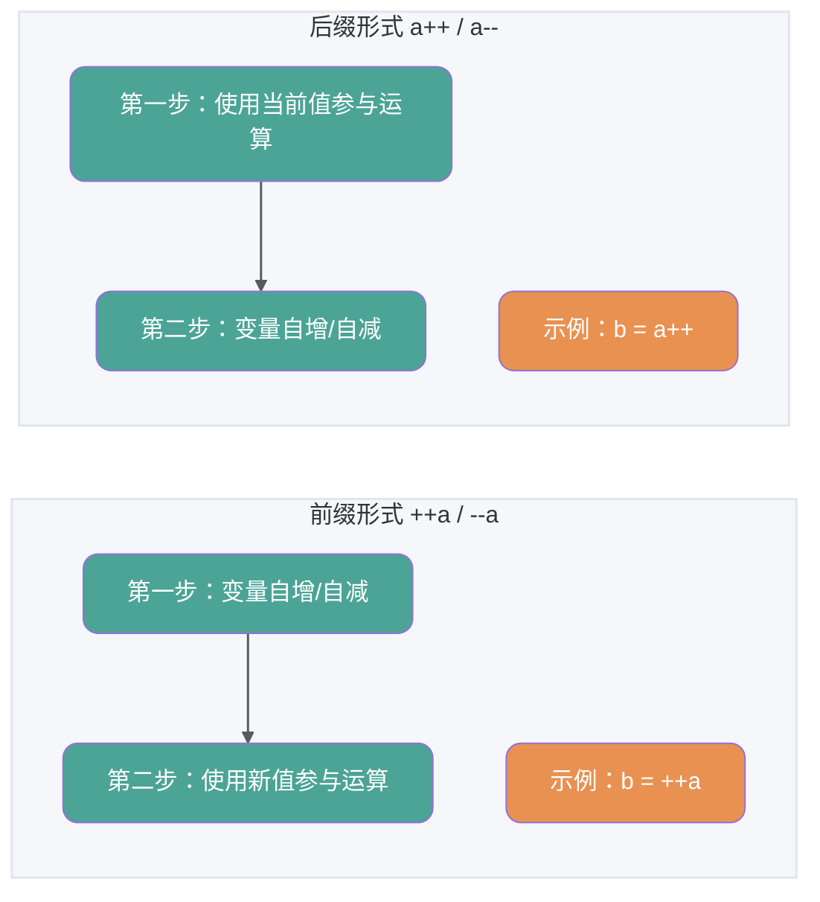
```mermaid
flowchart LR
    %% 定义全局样式
    classDef step fill:#4CA497,color:#fff,rx:10,ry:10
    classDef example fill:#E99151,color:#fff,rx:10,ry:10

    subgraph Prefix["前缀形式 ++a / --a"]
        direction TB
        style Prefix fill:#F5F7FA,stroke:#E0E6ED,stroke-width:1.5px
        P1["第一步：变量自增/自减"]:::step --> P2["第二步：使用新值参与运算"]:::step
        P3["示例：b = ++a<br先 a=a+1，再 b=a"]:::example
    end

    subgraph Suffix["后缀形式 a++ / a--"]
        direction TB
        style Suffix fill:#F5F7FA,stroke:#E0E6ED,stroke-width:1.5px
        S1["第一步：使用当前值参与运算"]:::step --> S2["第二步：变量自增/自减"]:::step
        S3["示例：b = a++<br先 b=a，再 a=a+1"]:::example
    end

    linkStyle default stroke-width:1.5px,opacity:0.8
```

下面来看一个考察自增自减运算符的高频笔试题：执行下面的代码后，`a`、`b`、 `c`、`d` 和 `e` 的值是？

```java
int a = 9;
int b = a++;
int c = ++a;
int d = c--;
int e = --d;
```

答案：`a = 11`、`b = 9`、 `c = 10`、 `d = 10`、 `e = 10`。

### ⭐️ 移位运算符

移位运算符是最基本的运算符之一，几乎每种编程语言都包含这一运算符。移位操作中，被操作的数据被视为二进制数，移位就是将其向左或向右移动若干位的运算。

移位运算符在各种框架以及 JDK 自身的源码中使用还是挺广泛的，`HashMap`（JDK1.8） 中的 `hash` 方法的源码就用到了移位运算符：

```java
static final int hash(Object key) {
    int h;
    // key.hashCode()：返回散列值也就是hashcode
    // ^：按位异或
    // >>>:无符号右移，忽略符号位，空位都以0补齐
    return (key == null) ? 0 : (h = key.hashCode()) ^ (h >>> 16);
  }

```

**使用移位运算符的主要原因**：

1. **高效**：移位运算符直接对应于处理器的移位指令。现代处理器具有专门的硬件指令来执行这些移位操作，这些指令通常在一个时钟周期内完成。相比之下，乘法和除法等算术运算在硬件层面上需要更多的时钟周期来完成。
2. **节省内存**：通过移位操作，可以使用一个整数（如 `int` 或 `long`）来存储多个布尔值或标志位，从而节省内存。

移位运算符最常用于快速乘以或除以 2 的幂次方。除此之外，它还在以下方面发挥着重要作用：

- **位字段管理**：例如存储和操作多个布尔值。
- **哈希算法和加密解密**：通过移位和与、或等操作来混淆数据。
- **数据压缩**：例如霍夫曼编码通过移位运算符可以快速处理和操作二进制数据，以生成紧凑的压缩格式。
- **数据校验**：例如 CRC（循环冗余校验）通过移位和多项式除法生成和校验数据完整性。
- **内存对齐**：通过移位操作，可以轻松计算和调整数据的对齐地址。

掌握最基本的移位运算符知识还是很有必要的，这不光可以帮助我们在代码中使用，还可以帮助我们理解源码中涉及到移位运算符的代码。

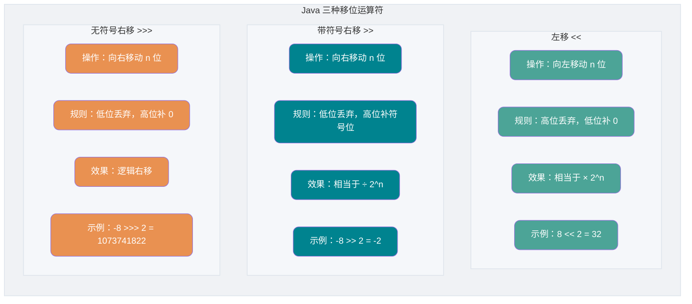
```mermaid
flowchart TB
    %% 定义全局样式，保持统一风格
    classDef left fill:#4CA497,color:#fff,rx:10,ry:10
    classDef right fill:#00838F,color:#fff,rx:10,ry:10
    classDef uright fill:#E99151,color:#fff,rx:10,ry:10

    subgraph ShiftOps["Java 三种移位运算符"]
        direction TB
        style ShiftOps fill:#F0F2F5,stroke:#E0E6ED,stroke-width:1.5px

        subgraph Left["左移 <<"]
            style Left fill:#F5F7FA,stroke:#E0E6ED,stroke-width:1.5px
            L1["操作：向左移动 n 位"]:::left
            L2["规则：高位丢弃，低位补 0"]:::left
            L3["效果：相当于 × 2^n"]:::left
            L4["示例：8 << 2 = 32"]:::left
        end

        subgraph Right["带符号右移 >>"]
            style Right fill:#F5F7FA,stroke:#E0E6ED,stroke-width:1.5px
            R1["操作：向右移动 n 位"]:::right
            R2["规则：低位丢弃，高位补符号位"]:::right
            R3["效果：相当于 ÷ 2^n"]:::right
            R4["示例：-8 >> 2 = -2"]:::right
        end

        subgraph URight["无符号右移 >>>"]
            style URight fill:#F5F7FA,stroke:#E0E6ED,stroke-width:1.5px
            U1["操作：向右移动 n 位"]:::uright
            U2["规则：低位丢弃，高位补 0"]:::uright
            U3["效果：逻辑右移"]:::uright
            U4["示例：-8 >>> 2 = 1073741822"]:::uright
        end
    end

    linkStyle default stroke-width:1.5px,opacity:0.8
```

Java 中有三种移位运算符：

- `<<` :左移运算符，向左移若干位，高位丢弃，低位补零。`x << n`，相当于 x 乘以 2 的 n 次方（不溢出的情况下）。
- `>>` :带符号右移，向右移若干位，高位补符号位，低位丢弃。正数高位补 0，负数高位补 1。`x >> n`，相当于 x 除以 2 的 n 次方。
- `>>>` :无符号右移，忽略符号位，空位都以 0 补齐。

虽然移位运算本质上可以分为左移和右移，但在实际应用中，右移操作需要考虑符号位的处理方式。

由于 `double`，`float` 在二进制中的表现比较特殊，因此不能来进行移位操作。

移位操作符实际上支持的类型只有 `int` 和 `long`，编译器在对 `short`、`byte`、`char` 类型进行移位前，都会将其转换为 `int` 类型再操作。

**如果移位的位数超过数值所占有的位数会怎样？**

当 int 类型左移/右移位数大于等于 32 位操作时，会先求余（%）后再进行左移/右移操作。也就是说左移/右移 32 位相当于不进行移位操作（32%32=0），左移/右移 42 位相当于左移/右移 10 位（42%32=10）。当 long 类型进行左移/右移操作时，由于 long 对应的二进制是 64 位，因此求余操作的基数也变成了 64。

也就是说：`x<<42` 等同于 `x<<10`，`x>>42` 等同于 `x>>10`，`x >>>42` 等同于 `x >>> 10`。

**左移运算符代码示例**：

```java
int i = -1;
System.out.println("初始数据：" + i);
System.out.println("初始数据对应的二进制字符串：" + Integer.toBinaryString(i));
i <<= 10;
System.out.println("左移 10 位后的数据 " + i);
System.out.println("左移 10 位后的数据对应的二进制字符 " + Integer.toBinaryString(i));
```

输出：

```plain
初始数据：-1
初始数据对应的二进制字符串：11111111111111111111111111111111
左移 10 位后的数据 -1024
左移 10 位后的数据对应的二进制字符 11111111111111111111110000000000
```

由于左移位数大于等于 32 位操作时，会先求余（%）后再进行左移操作，所以下面的代码左移 42 位相当于左移 10 位（42%32=10），输出结果和前面的代码一样。

```java
int i = -1;
System.out.println("初始数据：" + i);
System.out.println("初始数据对应的二进制字符串：" + Integer.toBinaryString(i));
i <<= 42;
System.out.println("左移 10 位后的数据 " + i);
System.out.println("左移 10 位后的数据对应的二进制字符 " + Integer.toBinaryString(i));
```

右移运算符使用类似，篇幅问题，这里就不做演示了。

### continue、break 和 return 的区别是什么？

在循环结构中，当循环条件不满足或者循环次数达到要求时，循环会正常结束。但是，有时候可能需要在循环的过程中，当发生了某种条件之后，提前终止循环，这就需要用到下面几个关键词：

1. `continue`：指跳出当前的这一次循环，继续下一次循环。
2. `break`：指跳出整个循环体，继续执行循环下面的语句。

`return` 用于跳出所在方法，结束该方法的运行。return 一般有两种用法：

1. `return;`：直接使用 return 结束方法执行，用于没有返回值函数的方法
2. `return value;`：return 一个特定值，用于有返回值函数的方法

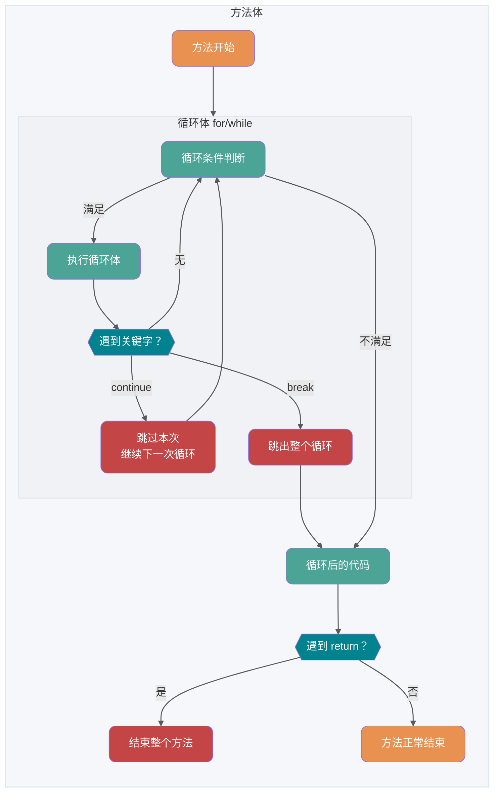
```mermaid
flowchart TB
    subgraph Method["方法体"]
        direction TB
        style Method fill:#F5F7FA,stroke:#E0E6ED,stroke-width:1.5px
        Start["方法开始"] --> Loop

        subgraph Loop["循环体 for/while"]
            direction TB
            style Loop fill:#F0F2F5,stroke:#E0E6ED,stroke-width:1.5px
            L1["循环条件判断"] -->|"满足"| L2["执行循环体"]
            L2 --> L3{{"遇到关键字？"}}
            L3 -->|"continue"| Continue["跳过本次<br/>继续下一次循环"]
            L3 -->|"break"| Break["跳出整个循环"]
            L3 -->|"无"| L1
            Continue --> L1
        end

        Break --> AfterLoop["循环后的代码"]
        L1 -->|"不满足"| AfterLoop
        AfterLoop --> L4{{"遇到 return？"}}
        L4 -->|"是"| Return["结束整个方法"]
        L4 -->|"否"| End["方法正常结束"]
    end

    classDef start fill:#E99151,color:#fff,rx:10,ry:10
    classDef loop fill:#4CA497,color:#fff,rx:10,ry:10
    classDef decision fill:#00838F,color:#fff,rx:10,ry:10
    classDef alert fill:#C44545,color:#fff,rx:10,ry:10

    class Start,End start
    class L1,L2,AfterLoop loop
    class L3,L4 decision
    class Continue,Break,Return alert

    linkStyle default stroke-width:1.5px,opacity:0.8
```

思考一下：下列语句的运行结果是什么？

```java
public static void main(String[] args) {
    boolean flag = false;
    for (int i = 0; i <= 3; i++) {
        if (i == 0) {
            System.out.println("0");
        } else if (i == 1) {
            System.out.println("1");
            continue;
        } else if (i == 2) {
            System.out.println("2");
            flag = true;
        } else if (i == 3) {
            System.out.println("3");
            break;
        } else if (i == 4) {
            System.out.println("4");
        }
        System.out.println("xixi");
    }
    if (flag) {
        System.out.println("haha");
        return;
    }
    System.out.println("heihei");
}
```

运行结果：

```plain
0
xixi
1
2
xixi
3
haha
```

## ⭐️ 基本数据类型

### Java 中的几种基本数据类型了解么？

Java 中有 8 种基本数据类型，分别为：

- 6 种数字类型：
  - 4 种整数型：`byte`、`short`、`int`、`long`
  - 2 种浮点型：`float`、`double`
- 1 种字符类型：`char`
- 1 种布尔型：`boolean`。

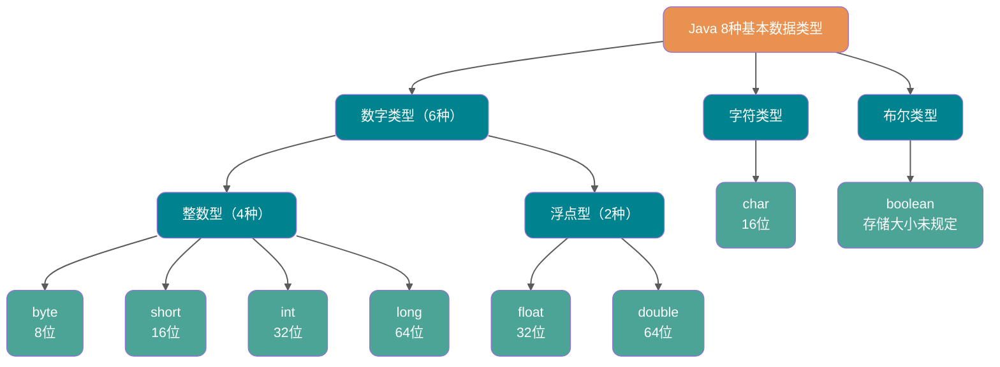
```mermaid
flowchart TB
    Root["Java 8种基本数据类型"] --> Numeric["数字类型（6种）"]
    Root --> Char["字符类型"]
    Root --> Bool["布尔类型"]

    Numeric --> IntType["整数型（4种）"]
    Numeric --> FloatType["浮点型（2种）"]

    IntType --> byte["byte<br/>8位"]
    IntType --> short["short<br/>16位"]
    IntType --> int["int<br/>32位"]
    IntType --> long["long<br/>64位"]

    FloatType --> float["float<br/>32位"]
    FloatType --> double["double<br/>64位"]

    Char --> char["char<br/>16位"]
    Bool --> boolean["boolean<br/>存储大小未规定"]

    classDef root fill:#E99151,color:#fff,rx:10,ry:10
    classDef category fill:#00838F,color:#fff,rx:10,ry:10
    classDef type fill:#4CA497,color:#fff,rx:10,ry:10

    class Root root
    class Numeric,Char,Bool,IntType,FloatType category
    class byte,short,int,long,float,double,char,boolean type

    linkStyle default stroke-width:1.5px,opacity:0.8
```

这 8 种基本数据类型的默认值以及所占空间的大小如下：

| 基本类型  | 位数   | 字节   | 默认值   | 取值范围                                                                                       |
| :-------- | :----- | :----- | :------- | ---------------------------------------------------------------------------------------------- |
| `byte`    | 8      | 1      | 0        | -128 ~ 127                                                                                     |
| `short`   | 16     | 2      | 0        | -32768（-2^15） ~ 32767（2^15 - 1）                                                            |
| `int`     | 32     | 4      | 0        | -2147483648 ~ 2147483647                                                                       |
| `long`    | 64     | 8      | 0L       | -9223372036854775808（-2^63） ~ 9223372036854775807（2^63 -1）                                 |
| `char`    | 16     | 2      | '\u0000' | 0 ~ 65535（2^16 - 1）                                                                          |
| `float`   | 32     | 4      | 0f       | 约 -3.4028235E38 ~ 3.4028235E38，最小正非零值约 1.4E-45，另含 ±0、±∞、NaN                      |
| `double`  | 64     | 8      | 0d       | 约 -1.7976931348623157E308 ~ 1.7976931348623157E308，最小正非零值约 4.9E-324，另含 ±0、±∞、NaN |
| `boolean` | 未规定 | 未规定 | false    | true、false                                                                                    |

可以看到，像 `byte`、`short`、`int`、`long` 能表示的最大正数都减 1 了。这是为什么呢？这是因为在二进制补码表示法中，最高位是用来表示符号的（0 表示正数，1 表示负数），其余位表示数值部分。所以，如果我们要表示最大的正数，我们需要把除了最高位之外的所有位都设为 1。如果我们再加 1，就会导致溢出，变成一个负数。

对于 `boolean`，官方文档未明确定义，它依赖于 JVM 厂商的具体实现。逻辑上理解是占用 1 位，但是实际中会考虑计算机高效存储因素。

另外，Java 的每种基本类型所占存储空间的大小不会像其他大多数语言那样随机器硬件架构的变化而变化。这种所占存储空间大小的不变性是 Java 程序比用其他大多数语言编写的程序更具可移植性的原因之一（《Java 编程思想》2.2 节有提到）。

**注意：**

1. 整数字面量默认按 `int` 解析；超出 `int` 范围或需要显式写成 `long` 字面量时，应在数值后加 **L**。能通过赋值转换表示的 `int` 字面量可以直接赋给 `long`，例如 `long n = 1;`。
2. 带小数点或指数的浮点字面量默认是 `double`，赋给 `float` 时通常需要加 **f 或 F**；整数字面量在可转换时可直接赋给 `float`，例如 `float n = 1;`。
3. `char a = 'h'`char :单引号，`String a = "hello"` :双引号。

这八种基本类型都有对应的包装类分别为：`Byte`、`Short`、`Integer`、`Long`、`Float`、`Double`、`Character`、`Boolean`。

### 基本类型和包装类型的区别？

- **用途**：除了定义一些常量和局部变量之外，我们在其他地方比如方法参数、对象属性中很少会使用基本类型来定义变量。并且，包装类型可用于泛型，而基本类型不可以。
- **存储方式**：基本数据类型的局部变量保存在当前栈帧的局部变量表中，基本数据类型的实例字段属于对象状态。包装类型属于对象类型，其实例通常分配在堆中，但 JIT 可能通过逃逸分析和标量替换消除实际分配。
- **占用空间**：相比于包装类型（对象类型）， 基本数据类型占用的空间往往非常小。
- **默认值**：成员变量包装类型不赋值就是 `null`，而基本类型有默认值且不是 `null`。
- **比较方式**：对于基本数据类型来说，`==` 比较的是值。对于包装数据类型来说，`==` 比较两个引用是否指向同一个对象（或都为 `null`）。比较包装对象表示的数值通常使用 `equals()` 或相应的 `compare()`/`compareTo()` 方法。

**为什么说对象实例通常存在于堆中呢？** JVM 规范将堆定义为分配类实例和数组的运行时数据区。不过，JIT 可以通过逃逸分析和标量替换消除某些对象的实际分配，这不等同于必须把完整对象分配到栈上。

⚠️ 注意：**基本数据类型存放在栈中是一个常见的误区！** 基本数据类型的存储位置取决于变量种类：局部变量保存在栈帧的局部变量表中，实例字段属于堆中对象的一部分；静态字段属于类，具体存储方式由 JVM 实现决定，不能笼统地说在方法区或元空间中。

```java
public class Test {
    // 成员变量，存放在堆中
    int a = 10;
    // 静态字段的存储属于 JVM 实现细节；在 JDK 8 及之后的 HotSpot 中位于 Java 堆。
    // 变量属于类，不属于对象。
    static int b = 20;

    public void method() {
        // 局部变量，存放在栈中
        int c = 30;
        static int d = 40; // 编译错误，不能在方法中使用 static 修饰局部变量
    }
}
```

### 包装类型的缓存机制了解么？

Java 基本数据类型的包装类型的大部分都用到了缓存机制来提升性能。

`Byte`,`Short`,`Integer`,`Long` 这 4 种包装类默认创建了数值 **[-128，127]** 的相应类型的缓存数据，`Character` 创建了数值在 **[0,127]** 范围的缓存数据，`Boolean` 直接返回 `TRUE` or `FALSE`。

对于 `Integer`，可以通过 JVM 参数 `-XX:AutoBoxCacheMax=<size>` 修改缓存上限，但不能修改下限 -128。实际使用时，并不建议设置过大的值，避免浪费内存，甚至是 OOM。

对于 `Byte`,`Short`,`Long` ,`Character` 没有类似 `-XX:AutoBoxCacheMax` 参数可以修改，因此缓存范围是固定的，无法通过 JVM 参数调整。`Boolean` 则直接返回预定义的 `TRUE` 和 `FALSE` 实例，没有缓存范围的概念。

**Integer 缓存源码：**

```java
public static Integer valueOf(int i) {
    if (i >= IntegerCache.low && i <= IntegerCache.high)
        return IntegerCache.cache[i + (-IntegerCache.low)];
    return new Integer(i);
}
private static class IntegerCache {
    static final int low = -128;
    static final int high;
    static {
        // high value may be configured by property
        int h = 127;
    }
}
```

**`Character` 缓存源码:**

```java
public static Character valueOf(char c) {
    if (c <= 127) { // must cache
      return CharacterCache.cache[(int)c];
    }
    return new Character(c);
}

private static class CharacterCache {
    private CharacterCache(){}
    static final Character cache[] = new Character[127 + 1];
    static {
        for (int i = 0; i < cache.length; i++)
            cache[i] = new Character((char)i);
    }

}
```

**`Boolean` 缓存源码：**

```java
public static Boolean valueOf(boolean b) {
    return (b ? TRUE : FALSE);
}
```

如果超出对应范围仍然会去创建新的对象，缓存的范围区间的大小只是在性能和资源之间的权衡。

两种浮点数类型的包装类 `Float`,`Double` 并没有实现缓存机制。

```java
Integer i1 = 33;
Integer i2 = 33;
System.out.println(i1 == i2);// 输出 true

Float i11 = 333f;
Float i22 = 333f;
System.out.println(i11 == i22);// 输出 false

Double i3 = 1.2;
Double i4 = 1.2;
System.out.println(i3 == i4);// 输出 false
```

下面我们来看一个问题：下面的代码的输出结果是 `true` 还是 `false` 呢？

```java
Integer i1 = 40;
Integer i2 = new Integer(40);
System.out.println(i1==i2);
```

`Integer i1=40` 这一行代码会发生装箱，也就是说这行代码等价于 `Integer i1=Integer.valueOf(40)`。因此，`i1` 直接使用的是缓存中的对象。而 `Integer i2 = new Integer(40)` 会直接创建新的对象。

因此，答案是 `false`。你答对了吗？

记住：**所有整型包装类对象之间值的比较，全部使用 equals 方法比较**。


### 自动装箱与拆箱了解吗？原理是什么？

**什么是自动拆装箱？**

- **装箱（Boxing）**：将基本类型用它们对应的引用类型包装起来；
- **拆箱（Unboxing）**：将包装类型转换为基本数据类型；

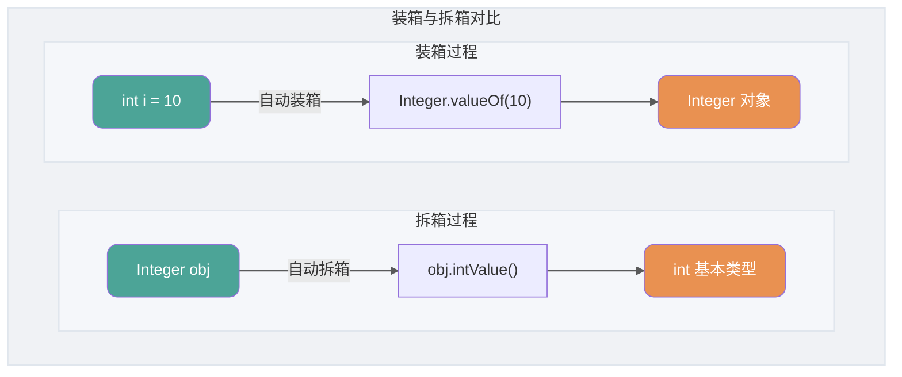
```mermaid
flowchart LR
  subgraph Row["装箱与拆箱对比"]
    direction LR
    style Row fill:#F0F2F5,stroke:#E0E6ED,stroke-width:1.5px

    subgraph Unboxing["拆箱过程"]
      direction LR
      style Unboxing fill:#F5F7FA,stroke:#E0E6ED,stroke-width:1.5px
      D["Integer obj"] -->|"自动拆箱"| E["obj.intValue()"]
      E --> F["int 基本类型"]
    end

    subgraph Boxing["装箱过程"]
      direction LR
      style Boxing fill:#F5F7FA,stroke:#E0E6ED,stroke-width:1.5px
      A["int i = 10"] -->|"自动装箱"| B["Integer.valueOf(10)"]
      B --> C["Integer 对象"]
    end
  end

  classDef core fill:#4CA497,color:#fff,rx:10,ry:10
  classDef highlight fill:#E99151,color:#fff,rx:10,ry:10

  class A,D core
  class C,F highlight

  linkStyle default stroke-width:1.5px,opacity:0.8
```

举例：

```java
Integer i = 10;  //装箱
int n = i;   //拆箱
```

上面这两行代码对应的字节码为：

```java
   L1

    LINENUMBER 8 L1

    ALOAD 0

    BIPUSH 10

    INVOKESTATIC java/lang/Integer.valueOf (I)Ljava/lang/Integer;

    PUTFIELD AutoBoxTest.i : Ljava/lang/Integer;

   L2

    LINENUMBER 9 L2

    ALOAD 0

    ALOAD 0

    GETFIELD AutoBoxTest.i : Ljava/lang/Integer;

    INVOKEVIRTUAL java/lang/Integer.intValue ()I

    PUTFIELD AutoBoxTest.n : I

    RETURN
```

从字节码中，我们发现装箱其实就是调用了 包装类的 `valueOf()` 方法，拆箱其实就是调用了 `xxxValue()` 方法。

因此，

- `Integer i = 10` 等价于 `Integer i = Integer.valueOf(10)`
- `int n = i` 等价于 `int n = i.intValue()`;

注意：**如果频繁拆装箱的话，也会严重影响系统的性能。我们应该尽量避免不必要的拆装箱操作。**

```java
private static long sum() {
    // 应该使用 long 而不是 Long
    Long sum = 0L;
    for (long i = 0; i <= Integer.MAX_VALUE; i++)
        sum += i;
    return sum;
}
```

### 为什么浮点数运算的时候会有精度丢失的风险？

浮点数运算精度丢失代码演示：

```java
float a = 2.0f - 1.9f;
float b = 1.8f - 1.7f;
System.out.printf("%.9f",a);// 0.100000024
System.out.println(b);// 0.099999905
System.out.println(a == b);// false
```

**为什么会出现这个问题呢？**

这个和计算机保存浮点数的机制有很大关系。计算机使用有限位宽的二进制格式表示 `float` 和 `double`，许多十进制小数转换为二进制后会无限循环，只能舍入为有限位数，因此存在精度损失的风险。不过，像 0.5、0.25 这样能够表示为有限二进制小数的值可以被精确表示。

就比如说十进制下的 0.2 就没办法精确转换成二进制小数：

```java
// 0.2 转换为二进制数的过程为，不断乘以 2，直到不存在小数为止，
// 在这个计算过程中，得到的整数部分从上到下排列就是二进制的结果。
0.2 * 2 = 0.4 -> 0
0.4 * 2 = 0.8 -> 0
0.8 * 2 = 1.6 -> 1
0.6 * 2 = 1.2 -> 1
0.2 * 2 = 0.4 -> 0（发生循环）
...
```

关于浮点数的更多内容，建议看一下[计算机系统基础（四）浮点数](http://kaito-kidd.com/2018/08/08/computer-system-float-point/)这篇文章。

### 如何解决浮点数运算的精度丢失问题？

`BigDecimal` 可以精确表示十进制数，并提供可显式指定精度和舍入规则的运算。使用有限精度、舍入除法或转换为 `float`、`double` 时仍可能发生舍入。通常情况下，大部分需要十进制精确运算结果的业务场景（比如涉及到钱的场景）都会使用 `BigDecimal`。

```java
BigDecimal a = new BigDecimal("1.0");
BigDecimal b = new BigDecimal("1.00");
BigDecimal c = new BigDecimal("0.8");

BigDecimal x = a.subtract(c);
BigDecimal y = b.subtract(c);

System.out.println(x); /* 0.2 */
System.out.println(y); /* 0.20 */
// 比较内容，不是比较值
System.out.println(Objects.equals(x, y)); /* false */
// 比较值相等用相等compareTo，相等返回0
System.out.println(0 == x.compareTo(y)); /* true */
```

关于 `BigDecimal` 的详细介绍，可以看看我写的这篇文章：[BigDecimal 详解](https://javaguide.cn/java/基础/bigdecimal.html)。

### 超过 long 整型的数据应该如何表示？

基本数值类型都有一个表达范围，如果超过这个范围就会有数值溢出的风险。

在 Java 中，64 位 long 整型是最大的整数类型。

```java
long l = Long.MAX_VALUE;
System.out.println(l + 1); // -9223372036854775808
System.out.println(l + 1 == Long.MIN_VALUE); // true
```

`BigInteger` 内部使用 `int[]` 数组来存储任意大小的整形数据。

相对于常规整数类型的运算来说，`BigInteger` 运算的效率会相对较低。

## 变量

### ⭐️ 成员变量与局部变量的区别？


- **语法形式**：从语法形式上看，成员变量是属于类的，而局部变量是在代码块或方法中定义的变量或是方法的参数；成员变量可以被 `public`,`private`,`static` 等修饰符所修饰，而局部变量不能被访问控制修饰符及 `static` 所修饰；但是，成员变量和局部变量都能被 `final` 所修饰。
- **存储方式**：如果成员变量使用 `static` 修饰，那么它属于类；如果没有使用 `static` 修饰，那么它属于实例。实例字段是对象状态的一部分，方法参数和局部变量则保存在当前栈帧的局部变量表中。JIT 优化可能消除部分实际存储。
- **生存时间**：从变量在内存中的生存时间上看，成员变量是对象的一部分，它随着对象的创建而存在，而局部变量随着方法的调用而自动生成，随着方法的调用结束而消亡。
- **默认值**：从变量是否有默认值来看，成员变量如果没有被赋初始值，则会自动以类型的默认值而赋值（一种情况例外：被 `final` 修饰的成员变量也必须显式地赋值），而局部变量则不会自动赋值。

**为什么成员变量有默认值？**

JLS 规定，类变量、实例变量和数组元素在创建时会被初始化为各自类型的默认值，例如数值类型为 0、`boolean` 为 `false`、引用类型为 `null`。局部变量不进行默认初始化，并受“明确赋值”（definite assignment）规则约束：在读取局部变量前，编译器必须能够确定它已经被赋值。这里是语言规范直接规定的两套初始化规则，并不是因为编译器无法预测成员变量何时赋值。

成员变量与局部变量代码示例：

```java
public class VariableExample {

    // 成员变量
    private String name;
    private int age;

    // 方法中的局部变量
    public void method() {
        int num1 = 10; // 栈中分配的局部变量
        String str = "Hello, world!"; // 栈中分配的局部变量
        System.out.println(num1);
        System.out.println(str);
    }

    // 带参数的方法中的局部变量
    public void method2(int num2) {
        int sum = num2 + 10; // 栈中分配的局部变量
        System.out.println(sum);
    }

    // 构造方法中的局部变量
    public VariableExample(String name, int age) {
        this.name = name; // 对成员变量进行赋值
        this.age = age; // 对成员变量进行赋值
        int num3 = 20; // 栈中分配的局部变量
        String str2 = "Hello, " + this.name + "!"; // 栈中分配的局部变量
        System.out.println(num3);
        System.out.println(str2);
    }
}

```

### 静态变量有什么作用？

静态变量也就是被 `static` 关键字修饰的变量。它可以被类的所有实例共享，无论一个类创建了多少个对象，它们都共享同一份静态变量。也就是说，静态变量只会被分配一次内存，即使创建多个对象，这样可以节省内存。


静态变量是通过类名来访问的，例如 `StaticVariableExample.staticVar`（如果被 `private` 关键字修饰就无法这样访问了）。

```java
public class StaticVariableExample {
    // 静态变量
    public static int staticVar = 0;
}
```

通常情况下，静态变量会被 `final` 关键字修饰成为常量。

```java
public class ConstantVariableExample {
    // 常量
    public static final int constantVar = 0;
}
```

### 字符型常量和字符串常量的区别？

- **形式** : 字符常量是单引号引起的一个字符，字符串常量是双引号引起的 0 个或若干个字符。
- **含义** : 字符常量是一个 `char` 值，表示 UTF-16 代码单元，可以参与数值运算；字符串常量是对 `String` 对象的引用，不是语言层面暴露的内存地址。
- **占用空间**：`char` 值是 16 位无符号整数。`String` 对象的内存占用属于 JVM 实现细节，不能通过字符串编码后的字节数直接得出。

⚠️ 注意 `char` 在 Java 中占两个字节。

字符型常量和字符串常量代码示例：

```java
public class StringExample {
    // 字符型常量
    public static final char LETTER_A = 'A';

    // 字符串常量
    public static final String GREETING_MESSAGE = "Hello, world!";
    public static void main(String[] args) {
        System.out.println("字符型常量占用的字节数为："+Character.BYTES);
        System.out.println("字符串使用 UTF-8 编码后的字节数为："+GREETING_MESSAGE.getBytes(java.nio.charset.StandardCharsets.UTF_8).length);
    }
}
```

输出：

```plain
字符型常量占用的字节数为：2
字符串使用 UTF-8 编码后的字节数为：13
```

## 方法

### 什么是方法的返回值？方法有哪几种类型？

**方法的返回值** 是指我们获取到的某个方法体中的代码执行后产生的结果！（前提是该方法可能产生结果）。返回值的作用是接收出结果，使得它可以用于其他的操作！

我们可以按照方法的返回值和参数类型将方法分为下面这几种：

**1、无参数无返回值的方法**

```java
public void f1() {
    //......
}
// 下面这个方法也没有返回值，虽然用到了 return
public void f(int a) {
    if (...) {
        // 表示结束方法的执行，下方的输出语句不会执行
        return;
    }
    System.out.println(a);
}
```

**2、有参数无返回值的方法**

```java
public void f2(Parameter 1, ..., Parameter n) {
    //......
}
```

**3、有返回值无参数的方法**

```java
public int f3() {
    //......
    return x;
}
```

**4、有返回值有参数的方法**

```java
public int f4(int a, int b) {
    return a * b;
}
```

### 静态方法为什么不能调用非静态成员？

静态方法在静态上下文中执行，没有隐式的当前实例 `this`，因此不能直接访问实例成员。静态方法仍然可以通过一个显式的对象引用访问该对象的实例成员，这与类加载或成员是否已经“分配内存”无关。

```java
public class Example {
    // 定义一个字符型常量
    public static final char LETTER_A = 'A';

    // 定义一个字符串常量
    public static final String GREETING_MESSAGE = "Hello, world!";

    public static void main(String[] args) {
        // 输出字符型常量的值
        System.out.println("字符型常量的值为：" + LETTER_A);

        // 输出字符串常量的值
        System.out.println("字符串常量的值为：" + GREETING_MESSAGE);
    }
}
```

### ⭐️ 静态方法和实例方法有何不同？

**1、调用方式**

在外部调用静态方法时，可以使用 `类名.方法名` 的方式，也可以使用 `对象.方法名` 的方式，而实例方法只有后面这种方式。也就是说，**调用静态方法可以无需创建对象**。

不过，需要注意的是一般不建议使用 `对象.方法名` 的方式来调用静态方法。这种方式非常容易造成混淆，静态方法不属于类的某个对象而是属于这个类。

因此，一般建议使用 `类名.方法名` 的方式来调用静态方法。

```java
public class Person {
    public void method() {
      //......
    }

    public static void staicMethod(){
      //......
    }
    public static void main(String[] args) {
        Person person = new Person();
        // 调用实例方法
        person.method();
        // 调用静态方法
        Person.staicMethod()
    }
}
```

**2、访问类成员是否存在限制**

静态方法在访问本类的成员时，只允许访问静态成员（即静态成员变量和静态方法），不允许访问实例成员（即实例成员变量和实例方法），而实例方法不存在这个限制。

### ⭐️ 重载和重写有什么区别？

> 重载就是同样的一个方法能够根据输入数据的不同，做出不同的处理
>
> 重写就是当子类继承自父类的相同方法，输入数据一样，但要做出有别于父类的响应时，你就要覆盖父类方法

#### 重载

发生在同一个类中（或者父类和子类之间），方法名必须相同，参数类型不同、个数不同、顺序不同，方法返回值和访问修饰符可以不同。

《Java 核心技术》这本书是这样介绍重载的：

> 如果多个方法(比如 `StringBuilder` 的构造方法)有相同的名字、不同的参数， 便产生了重载。
>
> ```java
> StringBuilder sb = new StringBuilder();
> StringBuilder sb2 = new StringBuilder("HelloWorld");
> ```
>
> 编译器必须挑选出具体执行哪个方法，它通过用各个方法给出的参数类型与特定方法调用所使用的值类型进行匹配来挑选出相应的方法。 如果编译器找不到匹配的参数， 就会产生编译时错误， 因为根本不存在匹配， 或者没有一个比其他的更好(这个过程被称为重载解析(overloading resolution))。
>
> Java 允许重载任何方法， 而不只是构造器方法。

综上：重载就是同一个类中多个同名方法根据不同的传参来执行不同的逻辑处理。

#### 重写

重写是子类实例方法与父类可访问实例方法之间的声明关系，由编译器按规则检查；运行期发生的是对重写方法的动态分派。

1. 方法名、参数列表必须相同，子类方法返回值类型应比父类方法返回值类型更小或相等，抛出的异常范围小于等于父类，访问修饰符范围大于等于父类。
2. 如果父类方法访问修饰符为 `private/final/static` 则子类就不能重写该方法，但是被 `static` 修饰的方法能够被再次声明。
3. 构造方法无法被重写

#### 总结

综上：**重写就是子类对父类方法的重新改造，外部样子不能改变，内部逻辑可以改变。**

| 区别点         | 重载 (Overloading)                                                                   | 重写 (Overriding)                                                                            |
| -------------- | ------------------------------------------------------------------------------------ | -------------------------------------------------------------------------------------------- |
| **发生范围**   | 同一个类中。                                                                         | 父类与子类之间（存在继承关系）。                                                             |
| **方法签名**   | 方法名**必须相同**，但**参数列表必须不同**（参数的类型、个数或顺序至少有一项不同）。 | 方法名、参数列表**必须完全相同**。                                                           |
| **返回类型**   | 与返回值类型**无关**，可以任意修改。                                                 | 子类方法的返回类型必须与父类方法的返回类型**相同**，或者是其**子类**。                       |
| **访问修饰符** | 与访问修饰符**无关**，可以任意修改。                                                 | 子类方法的访问权限**不能低于**父类方法的访问权限。（public > protected > default > private） |
| **绑定时期**   | 编译时绑定或称静态绑定                                                               | 运行时绑定 (Run-time Binding) 或称动态绑定                                                   |

**方法的重写要遵循“两同两小一大”**（以下内容摘录自《疯狂 Java 讲义》，[issue#892](https://github.com/Snailclimb/JavaGuide/issues/892)）：

- “两同”即方法名相同、形参列表相同；
- “两小”指的是子类方法返回值类型应比父类方法返回值类型更小或相等，子类方法声明抛出的异常类应比父类方法声明抛出的异常类更小或相等；
- “一大”指的是子类方法的访问权限应比父类方法的访问权限更大或相等。

⭐️ 关于 **重写的返回值类型** 这里需要额外多说明一下，上面的表述不太清晰准确：如果方法的返回类型是 void 和基本数据类型，则返回值重写时不可修改。但是如果方法的返回值是引用类型，重写时是可以返回该引用类型的子类的。

```java
public class Hero {
    public String name() {
        return "超级英雄";
    }
}
public class SuperMan extends Hero{
    @Override
    public String name() {
        return "超人";
    }
    public Hero hero() {
        return new Hero();
    }
}

public class SuperSuperMan extends SuperMan {
    @Override
    public String name() {
        return "超级超级英雄";
    }

    @Override
    public SuperMan hero() {
        return new SuperMan();
    }
}
```

### 什么是可变长参数？

从 Java5 开始，Java 支持定义可变长参数，所谓可变长参数就是允许在调用方法时传入不定长度的参数。就比如下面这个方法就可以接受 0 个或者多个参数。

```java
public static void method1(String... args) {
   //......
}
```

另外，可变参数只能作为函数的最后一个参数，但其前面可以有也可以没有任何其他参数。

```java
public static void method2(String arg1, String... args) {
   //......
}
```

**遇到方法重载的情况怎么办呢？会优先匹配固定参数还是可变参数的方法呢？**

答案是会优先匹配固定参数的方法，因为固定参数的方法匹配度更高。

我们通过下面这个例子来证明一下。

```java
/**
 * 微信搜 JavaGuide 回复"面试突击"即可免费领取个人原创的 Java 面试手册
 *
 * @author Guide哥
 * @date 2021/12/13 16:52
 **/
public class VariableLengthArgument {

    public static void printVariable(String... args) {
        for (String s : args) {
            System.out.println(s);
        }
    }

    public static void printVariable(String arg1, String arg2) {
        System.out.println(arg1 + arg2);
    }

    public static void main(String[] args) {
        printVariable("a", "b");
        printVariable("a", "b", "c", "d");
    }
}
```

输出：

```plain
ab
a
b
c
d
```

另外，Java 的可变参数编译后实际会被转换成一个数组，我们看编译后生成的 `class` 文件就可以看出来了。

```java
public class VariableLengthArgument {

    public static void printVariable(String... args) {
        String[] var1 = args;
        int var2 = args.length;

        for(int var3 = 0; var3 < var2; ++var3) {
            String s = var1[var3];
            System.out.println(s);
        }

    }
    // ......
}
```

## 参考

- What is the difference between JDK and JRE?：<https://stackoverflow.com/questions/1906445/what-is-the-difference-between-jdk-and-jre>
- Oracle vs OpenJDK：<https://www.educba.com/oracle-vs-openjdk/>
- Differences between Oracle JDK and OpenJDK：<https://stackoverflow.com/questions/22358071/differences-between-oracle-jdk-and-openjdk>
- 彻底弄懂 Java 的移位操作符：<https://juejin.cn/post/6844904025880526861>

<!-- @include: @article-footer.snippet.md -->


---

---

<!-- source: 基础/Java基础常见面试题总结(下).md -->

## [41] Java基础常见面试题总结(下)

---
title: Java基础常见面试题总结(下)
description: Java高级特性面试题总结：深入讲解异常处理机制、泛型原理、反射应用、注解使用、SPI机制、序列化、IO流模型(BIO/NIO/AIO)、语法糖等核心知识点。
category: Java
tag:
  - Java基础
head:
  - - meta
    - name: keywords
      content: Java异常,泛型,反射,注解,SPI,序列化,IO流,语法糖,try-with-resources,BIO NIO AIO,Java面试题
---

## 异常

**Java 异常类层次结构图概览**：


### Exception 和 Error 有什么区别？

在 Java 中，所有的异常都有一个共同的祖先 `java.lang` 包中的 `Throwable` 类。`Throwable` 类有两个重要的子类:

- **`Exception`** :程序本身可以处理的异常，可以通过 `catch` 来进行捕获。`Exception` 又可以分为 Checked Exception（受检查异常，必须处理） 和 Unchecked Exception（不受检查异常，可以不处理）。
- **`Error`**：`Error` 属于程序无法处理的错误，~~我们没办法通过 `catch` 来进行捕获~~不建议通过 `catch` 捕获。例如 Java 虚拟机运行错误（`Virtual MachineError`）、虚拟机内存不够错误(`OutOfMemoryError`)、类定义错误（`NoClassDefFoundError`）等。这些异常发生时，Java 虚拟机（JVM）一般会选择线程终止。

### ClassNotFoundException 和 NoClassDefFoundError 的区别

- `ClassNotFoundException` 是 Exception，发生在使用反射等动态加载时找不到类，是可预期的，可以捕获处理。
- `NoClassDefFoundError` 是 Error，表示 JVM 或类加载器尝试加载类定义时找不到该定义。除了运行时缺少 JAR，还可能由类初始化失败后再次使用该类等情况触发。它通常会终止当前线程，但不等于整个 JVM 必然无法继续运行。

### ⭐️ Checked Exception 和 Unchecked Exception 有什么区别？

**Checked Exception** 即 受检查异常，Java 代码在编译过程中，如果受检查异常没有被 `catch` 或者 `throws` 关键字处理的话，就没办法通过编译。

比如下面这段 IO 操作的代码：


除了 `RuntimeException` 及其子类以外，其他的 `Exception` 类及其子类都属于受检查异常。常见的受检查异常有：IO 相关的异常、`ClassNotFoundException`、`SQLException`...。

**Unchecked Exception** 即 **不受检查异常**，Java 代码在编译过程中，我们即使不处理不受检查异常也可以正常通过编译。

`RuntimeException` 及其子类属于非受检查异常；从 JLS 的分类来看，`Error` 及其子类也属于非受检查异常。常见的 `RuntimeException` 有：

- `NullPointerException`（空指针错误）
- `IllegalArgumentException`（参数错误比如方法入参类型错误）
- `NumberFormatException`（字符串转换为数字格式错误，`IllegalArgumentException` 的子类）
- `ArrayIndexOutOfBoundsException`（数组越界错误）
- `ClassCastException`（类型转换错误）
- `ArithmeticException`（算术错误）
- `SecurityException`（安全错误比如权限不够）
- `UnsupportedOperationException`（不支持的操作错误比如重复创建同一用户）
- ……


### 你更倾向于使用 Checked Exception 还是 Unchecked Exception？

默认使用 Unchecked Exception，只在必要时才用 Checked Exception。

我们可以把 Unchecked Exception（比如 `NullPointerException`）看作是代码 Bug。对待 Bug，最好的方式是让它暴露出来然后去修复代码，而不是用 `try-catch` 去掩盖它。

一般来说，只在一种情况下使用 Checked Exception：当这个异常是业务逻辑的一部分，并且调用方必须处理它时。比如说，一个余额不足异常。这不是 bug，而是一个正常的业务分支，我需要用 Checked Exception 来强制调用者去处理这种情况，比如提示用户去充值。这样就能在保证关键业务逻辑完整性的同时，让代码尽可能保持简洁。

### Throwable 类常用方法有哪些？

- `String getMessage()`: 返回异常发生时的详细信息
- `String toString()`: 返回异常发生时的简要描述
- `String getLocalizedMessage()`: 返回异常对象的本地化信息。使用 `Throwable` 的子类覆盖这个方法，可以生成本地化信息。如果子类没有覆盖该方法，则该方法返回的信息与 `getMessage()` 返回的结果相同
- `void printStackTrace()`: 在控制台上打印 `Throwable` 对象封装的异常信息

### try-catch-finally 如何使用？

- `try` 块：用于捕获异常。其后可接零个或多个 `catch` 块，如果没有 `catch` 块，则必须跟一个 `finally` 块。
- `catch` 块：用于处理 try 捕获到的异常。
- `finally` 块：无论是否捕获或处理异常，`finally` 块里的语句都会被执行。当在 `try` 块或 `catch` 块中遇到 `return` 语句时，`finally` 语句块将在方法返回之前被执行。

代码示例：

```java
try {
    System.out.println("Try to do something");
    throw new RuntimeException("RuntimeException");
} catch (Exception e) {
    System.out.println("Catch Exception -> " + e.getMessage());
} finally {
    System.out.println("Finally");
}
```

输出：

```plain
Try to do something
Catch Exception -> RuntimeException
Finally
```

**注意：不要在 finally 语句块中使用 return!** 当 try 语句和 finally 语句中都有 return 语句时，try 语句块中的 return 语句会被忽略。这是因为 try 语句中的 return 返回值会先被暂存在一个本地变量中，当执行到 finally 语句中的 return 之后，这个本地变量的值就变为了 finally 语句中的 return 返回值。

代码示例：

```java
public static void main(String[] args) {
    System.out.println(f(2));
}

public static int f(int value) {
    try {
        return value * value;
    } finally {
        if (value == 2) {
            return 0;
        }
    }
}
```

输出：

```plain
0
```

### finally 中的代码一定会执行吗？

不一定的！在某些情况下，finally 中的代码不会被执行。

就比如说 finally 之前虚拟机被终止运行的话，finally 中的代码就不会被执行。

```java
try {
    System.out.println("Try to do something");
    throw new RuntimeException("RuntimeException");
} catch (Exception e) {
    System.out.println("Catch Exception -> " + e.getMessage());
    // 终止当前正在运行的Java虚拟机
    System.exit(1);
} finally {
    System.out.println("Finally");
}
```

输出：

```plain
Try to do something
Catch Exception -> RuntimeException
```

另外，如果 JVM 进程被强制终止，例如调用 `Runtime.halt()`、操作系统直接结束进程或机器掉电，`finally` 块也可能来不及执行。普通的未捕获异常即使最终导致当前线程结束，在线程结束前仍会按语言规则执行 `finally`。

相关 issue：<https://github.com/Snailclimb/JavaGuide/issues/190>。

🧗🏻 进阶一下：从字节码角度分析 `try catch finally` 这个语法糖背后的实现原理。

### 如何使用 `try-with-resources` 代替 `try-catch-finally`？

1. **适用范围（资源的定义）：** 任何实现 `java.lang.AutoCloseable` 或者 `java.io.Closeable` 的对象
2. **关闭资源和 finally 块的执行顺序：** 在 `try-with-resources` 语句中，任何 catch 或 finally 块在声明的资源关闭后运行

《Effective Java》中明确指出：

> 面对必须要关闭的资源，我们总是应该优先使用 `try-with-resources` 而不是 `try-finally`。随之产生的代码更简短，更清晰，产生的异常对我们也更有用。`try-with-resources` 语句让我们更容易编写必须要关闭的资源的代码，若采用 `try-finally` 则几乎做不到这点。

Java 中类似于 `InputStream`、`OutputStream`、`Scanner`、`PrintWriter` 等的资源都需要我们调用 `close()` 方法来手动关闭，一般情况下我们都是通过 `try-catch-finally` 语句来实现这个需求，如下：

```java
//读取文本文件的内容
Scanner scanner = null;
try {
    scanner = new Scanner(new File("D://read.txt"));
    while (scanner.hasNext()) {
        System.out.println(scanner.nextLine());
    }
} catch (FileNotFoundException e) {
    e.printStackTrace();
} finally {
    if (scanner != null) {
        scanner.close();
    }
}
```

使用 Java 7 之后的 `try-with-resources` 语句改造上面的代码:

```java
try (Scanner scanner = new Scanner(new File("test.txt"))) {
    while (scanner.hasNext()) {
        System.out.println(scanner.nextLine());
    }
} catch (FileNotFoundException fnfe) {
    fnfe.printStackTrace();
}
```

当然多个资源需要关闭的时候，使用 `try-with-resources` 实现起来也非常简单，如果你还是用 `try-catch-finally` 可能会带来很多问题。

通过使用分号分隔，可以在 `try-with-resources` 块中声明多个资源。

```java
try (BufferedInputStream bin = new BufferedInputStream(new FileInputStream(new File("test.txt")));
     BufferedOutputStream bout = new BufferedOutputStream(new FileOutputStream(new File("out.txt")))) {
    int b;
    while ((b = bin.read()) != -1) {
        bout.write(b);
    }
}
catch (IOException e) {
    e.printStackTrace();
}
```

### ⭐️ 异常使用有哪些需要注意的地方？

- 不要把异常定义为静态变量，因为这样会导致异常栈信息错乱。每次手动抛出异常，我们都需要手动 new 一个异常对象抛出。
- 抛出的异常信息一定要有意义。
- 建议抛出更加具体的异常，比如字符串转换为数字格式错误的时候应该抛出 `NumberFormatException` 而不是其父类 `IllegalArgumentException`。
- 避免重复记录日志：如果在捕获异常的地方已经记录了足够的信息（包括异常类型、错误信息和堆栈跟踪等），那么在业务代码中再次抛出这个异常时，就不应该再次记录相同的错误信息。重复记录日志会使得日志文件膨胀，并且可能会掩盖问题的实际原因，使得问题更难以追踪和解决。
- ……

## 泛型

### 什么是泛型？有什么作用？

**Java 泛型（Generics）** 是 JDK 5 中引入的一个新特性。使用泛型参数，可以增强代码的可读性以及稳定性。

编译器可以对泛型参数进行检测，并且通过泛型参数可以指定传入的对象类型。比如 `ArrayList<Person> persons = new ArrayList<Person>()` 这行代码就指明了该 `ArrayList` 对象只能传入 `Person` 对象，如果传入其他类型的对象就会报错。

```java
ArrayList<E> extends AbstractList<E>
```

并且，原生 `List` 返回类型是 `Object`，需要手动转换类型才能使用，使用泛型后编译器自动转换。

### 泛型的使用方式有哪几种？

泛型一般有三种使用方式:**泛型类**、**泛型接口**、**泛型方法**。

**1.泛型类**：

```java
//此处T可以随便写为任意标识，常见的如T、E、K、V等形式的参数常用于表示泛型
//在实例化泛型类时，必须指定T的具体类型
public class Generic<T>{

    private T key;

    public Generic(T key) {
        this.key = key;
    }

    public T getKey(){
        return key;
    }
}
```

如何实例化泛型类：

```java
Generic<Integer> genericInteger = new Generic<Integer>(123456);
```

**2.泛型接口**：

```java
public interface Generator<T> {
    public T method();
}
```

实现泛型接口，不指定类型：

```java
class GeneratorImpl<T> implements Generator<T>{
    @Override
    public T method() {
        return null;
    }
}
```

实现泛型接口，指定类型：

```java
class GeneratorImpl implements Generator<String> {
    @Override
    public String method() {
        return "hello";
    }
}
```

**3.泛型方法**：

```java
   public static < E > void printArray( E[] inputArray )
   {
         for ( E element : inputArray ){
            System.out.printf( "%s ", element );
         }
         System.out.println();
    }
```

使用：

```java
// 创建不同类型数组：Integer, Double 和 Character
Integer[] intArray = { 1, 2, 3 };
String[] stringArray = { "Hello", "World" };
printArray( intArray  );
printArray( stringArray  );
```

> 注意：`public static <E> void printArray(E[] inputArray)` 是静态泛型方法。静态上下文没有当前实例，因此不能引用类声明的类型参数；这与“静态方法先加载”无关。静态方法可以声明并使用自己的类型参数 `<E>`。

### 项目中哪里用到了泛型？

- 自定义接口通用返回结果 `CommonResult<T>` 通过参数 `T` 可根据具体的返回类型动态指定结果的数据类型
- 定义 `Excel` 处理类 `ExcelUtil<T>` 用于动态指定 `Excel` 导出的数据类型
- 构建集合工具类（参考 `Collections` 中的 `sort`, `binarySearch` 方法）。
- ……

## ⭐️ 反射

关于反射的详细解读，请看这篇文章 [Java 反射机制详解](https://javaguide.cn/java/基础/reflection.html)。

### 什么是反射？

简单来说，Java 反射 (Reflection) 是一种**在程序运行时，动态地获取类的信息并操作类或对象（方法、属性）的能力**。

通常情况下，我们写的代码在编译时类型就已经确定了，要调用哪个方法、访问哪个字段都是明确的。但反射允许我们在**运行时**才去探知一个类有哪些方法、哪些属性、它的构造函数是怎样的，并在访问控制和模块边界允许的情况下动态创建对象、调用方法或修改属性。

正是这种在运行时“反观自身”并进行操作的能力，使得反射成为许多**通用框架和库的基石**。它让代码更加灵活，能够处理在编译时未知的类型。

### 反射有什么优缺点？

**优点：**

1. **灵活性和动态性**：反射允许程序在运行时动态地加载类、创建对象、调用方法和访问字段，根据实际需求（如配置文件、用户输入、注解等）动态地适应和扩展程序的行为。许多现代 Java 框架（如 Spring、Hibernate、MyBatis）正是基于这一特性来实现依赖注入（DI）、面向切面编程（AOP）、对象关系映射（ORM）、注解处理等核心功能，可以说反射是框架开发不可或缺的基础。
2. **解耦合和通用性**：通过反射，可以编写更通用、可重用和高度解耦的代码，降低模块之间的依赖。例如，可以通过反射实现通用的对象拷贝、序列化、Bean 工具等。

**缺点：**

1. **性能开销**：反射操作通常比直接代码调用要慢。因为涉及到动态类型解析、方法查找以及 JIT 编译器的优化受限等因素。不过，对于大多数框架场景，这种性能损耗通常是可以接受的，或者框架本身会做一些缓存优化。
2. **安全性问题**：反射在满足访问检查、模块开放关系等条件时，可以抑制部分 Java 语言访问检查（如访问 `private` 字段和方法），可能破坏封装性。此外，反射还可能绕过编译期泛型检查，带来类型安全隐患。Java 9 及之后的模块边界可能拒绝此类深层反射访问并抛出 `InaccessibleObjectException`。
3. **代码可读性和维护性**：过度使用反射会使代码变得复杂、难以理解和调试。错误通常在运行时才会暴露，不像编译期错误那样容易发现。

相关阅读：[Java Reflection: Why is it so slow?](https://stackoverflow.com/questions/1392351/java-reflection-why-is-it-so-slow)。

### 反射的应用场景？

我们平时写业务代码可能很少直接跟 Java 的反射（Reflection）打交道。但你可能没意识到，你天天都在享受反射带来的便利！**很多流行的框架，比如 Spring/Spring Boot、MyBatis 等，底层都大量运用了反射机制**，这才让它们能够那么灵活和强大。

下面简单列举几个最常见的场景帮助大家理解。

**1.依赖注入与控制反转（IoC）**

以 Spring/Spring Boot 为代表的 IoC 框架，会在启动时扫描带有特定注解（如 `@Component`, `@Service`, `@Repository`, `@Controller`）的类，利用反射实例化对象（Bean），并通过反射注入依赖（如 `@Autowired`、构造器注入等）。

**2.注解处理**

注解本身只是个“标记”，得有人去读这个标记才知道要做什么。反射就是那个“读取器”。框架通过反射检查类、方法、字段上有没有特定的注解，然后根据注解信息执行相应的逻辑。比如，看到 `@Value`，就用反射读取注解内容，去配置文件找对应的值，再用反射把值设置给字段。

**3.动态代理与 AOP**

想在调用某个方法前后自动加点料（比如打日志、开事务、做权限检查）？AOP（面向切面编程）就是干这个的，而动态代理是实现 AOP 的常用手段。JDK 自带的动态代理（Proxy 和 InvocationHandler）就离不开反射。代理对象在内部调用真实对象的方法时，就是通过反射的 `Method.invoke` 来完成的。

```java
public class DebugInvocationHandler implements InvocationHandler {
    private final Object target; // 真实对象

    public DebugInvocationHandler(Object target) { this.target = target; }

    // proxy: 代理对象, method: 被调用的方法, args: 方法参数
    public Object invoke(Object proxy, Method method, Object[] args) throws Throwable {
        System.out.println("切面逻辑：调用方法 " + method.getName() + " 之前");
        // 通过反射调用真实对象的同名方法
        Object result = method.invoke(target, args);
        System.out.println("切面逻辑：调用方法 " + method.getName() + " 之后");
        return result;
    }
}
```

**4.对象关系映射（ORM）**

像 MyBatis、Hibernate 这种框架，能帮你把数据库查出来的一行行数据，自动变成一个个 Java 对象。它是怎么知道数据库字段对应哪个 Java 属性的？还是靠反射。它通过反射获取 Java 类的属性列表，然后把查询结果按名字或配置对应起来，再用反射调用 setter 或直接修改字段值。反过来，保存对象到数据库时，也是用反射读取属性值来拼 SQL。

## 代理

关于 Java 代理的详细介绍，可以看看笔者写的 [Java 代理模式详解](https://javaguide.cn/java/基础/proxy.html) 这篇文章。

### 如何实现动态代理？

动态代理是一种非常强大的设计模式，它允许我们在**不修改源代码**的情况下，对一个类或对象的方法进行**功能增强（Enhancement）**。

在 Java 中，实现动态代理最主流的方式有两种：**JDK 动态代理** 和 **CGLIB 动态代理**。

**第一种：JDK 动态代理**

Java 官方提供的，其核心要求是目标类必须实现一个或多个接口。JDK 动态代理在运行时，会利用 `Proxy.newProxyInstance()` 方法，动态地创建一个实现了这些接口的代理类的实例。这个代理类在内存中生成，你看不到它的 `.java` 或 `.class` 文件。

当你调用代理对象的任何一个方法时，这个调用都会被转发到我们提供的一个 `InvocationHandler` 接口的 `invoke` 方法中。在 `invoke` 方法里，我们就可以在调用原始方法（目标方法）之前或之后，加入我们自己的增强逻辑。

**第二种：CGLIB 动态代理**

CGLIB 是一个第三方的代码生成库。它的原理与 JDK 完全不同，它不要求被代理的类实现接口。它在运行时，动态生成目标类的子类作为代理类（通过 ASM 字节码操作技术）。然后，它会重写父类（也就是被代理类）中所有非 `final`、`private` 和 `static` 的方法。

当你调用代理对象的任何一个方法时，这个调用会被 CGLIB 的 `MethodInterceptor` 接口的 `intercept` 方法拦截。和 `InvocationHandler` 的 `invoke` 方法一样，我们可以在 `intercept` 方法里，在调用原始的父类方法之前或之后，加入我们的增强逻辑。

### 静态代理和动态代理有什么区别？

静态代理和动态代理的核心差异在于 **代理关系的确定时机、实现灵活性及维护成本**。

| 对比维度         | 静态代理 (Static Proxy)                                                                  | 动态代理 (Dynamic Proxy)                                                       |
| ---------------- | ---------------------------------------------------------------------------------------- | ------------------------------------------------------------------------------ |
| 代理关系确定时机 | 编译期（编译后生成固定的 `.class` 字节码文件）                                           | 运行时（动态生成代理类字节码并加载到 JVM）                                     |
| 实现方式         | 在编译前手动编写代理类，常通过组合和委托调用目标对象                                     | 无需手动编写具体代理类，通过 `Handler`/`Interceptor` 封装增强逻辑              |
| 接口依赖         | 不是必须；基于接口的静态代理通常让代理类与目标类遵循同一接口                             | JDK 动态代理面向接口，CGLIB 等子类代理面向可继承的实现类                       |
| 代码量与维护性   | 代码量大（目标类越多，代理类越多），维护成本高；接口新增方法时，目标类与代理类需同步修改 | 代码量极少（通用增强逻辑可复用），维护性好；与接口解耦，接口变更不影响代理逻辑 |
| 核心优势         | 实现简单、逻辑直观，无额外框架依赖                                                       | 灵活性强、复用性高，降低重复编码，适配复杂场景                                 |
| 典型应用场景     | 简单的装饰器模式、少量固定类的增强需求                                                   | Spring AOP、RPC 框架（如 Dubbo）、ORM 框架                                     |

### ⭐️ JDK 动态代理和 CGLIB 动态代理有什么区别？

1. JDK 动态代理是官方的，它要求被代理的类必须实现接口。它的原理是动态生成一个接口的实现类来作为代理。CGLIB 是第三方的，它不需要接口。它的原理是动态生成一个被代理类的子类来作为代理。但也正因为是继承，所以它不能代理 `final` 的类，被代理的方法也不能是 `final` 或 `private`。
2. 就二者的效率来说，大部分情况都是 JDK 动态代理更优秀，随着 JDK 版本的升级，这个优势更加明显。

### ⭐️ 介绍一下动态代理在框架中的实际应用场景

动态代理最典型的应用场景就是**Spring AOP**。

AOP（Aspect-Oriented Programming:面向切面编程）能够将那些与业务无关，却为业务模块所共同调用的逻辑或责任（例如事务处理、日志管理、权限控制等）封装起来，便于减少系统的重复代码，降低模块间的耦合度，并有利于未来的可拓展性和可维护性。

Spring AOP 就是基于动态代理的，如果要代理的对象，实现了某个接口，那么 Spring AOP 会使用 **JDK Proxy**，去创建代理对象，而对于没有实现接口的对象，就无法使用 JDK Proxy 去进行代理了，这时候 Spring AOP 会使用 **Cglib** 生成一个被代理对象的子类来作为代理，如下图所示：


## 注解

### 何谓注解？

`Annotation`（注解） 是 Java5 开始引入的新特性，可以看作是一种特殊的注释，主要用于修饰类、方法或者变量，提供某些信息供程序在编译或者运行时使用。

注解本质是一个继承了 `Annotation` 的特殊接口：

```java
@Target(ElementType.METHOD)
@Retention(RetentionPolicy.SOURCE)
public @interface Override {

}

public interface Override extends Annotation{

}
```

JDK 提供了很多内置的注解（比如 `@Override`、`@Deprecated`），同时，我们还可以自定义注解。

### 注解的解析方法有哪几种？

注解只有被解析之后才会生效，常见的解析方法有两种：

- **编译期直接扫描**：编译器在编译 Java 代码的时候扫描对应的注解并处理，比如某个方法使用 `@Override` 注解，编译器在编译的时候就会检测当前的方法是否重写了父类对应的方法。
- **运行期通过反射处理**：像框架中自带的注解(比如 Spring 框架的 `@Value`、`@Component`)都是通过反射来进行处理的。

## ⭐️ SPI

关于 SPI 的详细解读，请看这篇文章 [Java SPI 机制详解](https://javaguide.cn/java/基础/spi.html)。

### 何谓 SPI?

SPI 即 Service Provider Interface，字面意思就是：“服务提供者的接口”，我的理解是：专门提供给服务提供者或者扩展框架功能的开发者去使用的一个接口。

SPI 将服务接口和具体的服务实现分离开来，将服务调用方和服务实现者解耦，能够提升程序的扩展性、可维护性。修改或者替换服务实现并不需要修改调用方。

很多框架都使用了 Java 的 SPI 机制，比如：Spring 框架、数据库加载驱动、日志接口、以及 Dubbo 的扩展实现等等。


### SPI 和 API 有什么区别？

**那 SPI 和 API 有啥区别？**

说到 SPI 就不得不说一下 API（Application Programming Interface） 了，从广义上来说它们都属于接口，而且很容易混淆。下面先用一张图说明一下：


一般模块之间都是通过接口进行通讯，因此我们在服务调用方和服务实现方（也称服务提供者）之间引入一个“接口”。

- 当实现方提供了接口和实现，我们可以通过调用实现方的接口从而拥有实现方给我们提供的能力，这就是 **API**。这种情况下，接口和实现都是放在实现方的包中。调用方通过接口调用实现方的功能，而不需要关心具体的实现细节。
- 当接口存在于调用方这边时，这就是 **SPI**。由接口调用方确定接口规则，然后由不同的厂商根据这个规则对这个接口进行实现，从而提供服务。

举个通俗易懂的例子：公司 H 是一家科技公司，新设计了一款芯片，然后现在需要量产了，而市面上有好几家芯片制造业公司，这个时候，只要 H 公司指定好了这芯片生产的标准（定义好了接口标准），那么这些合作的芯片公司（服务提供者）就按照标准交付自家特色的芯片（提供不同方案的实现，但是给出来的结果是一样的）。

### SPI 的优缺点？

通过 SPI 机制能够大大地提高接口设计的灵活性，但是 SPI 机制也存在一些缺点，比如：

- `ServiceLoader` 会按需定位并实例化提供者；如果调用方为了选择实现而遍历全部提供者，才会触发对全部可用提供者的加载。
- 单个 `ServiceLoader` 实例不保证多线程安全；不同实例之间并不存在“同时 `load` 就必然冲突”的规则。

## ⭐️ 序列化和反序列化

关于序列化和反序列化的详细解读，请看这篇文章 [Java 序列化详解](https://javaguide.cn/java/基础/serialization.html)，里面涉及到的知识点和面试题更全面。

### 什么是序列化？什么是反序列化？

如果我们需要持久化 Java 对象比如将 Java 对象保存在文件中，或者在网络传输 Java 对象，这些场景都需要用到序列化。

简单来说：

- **序列化**：将数据结构或对象转换成可以存储或传输的形式，通常是二进制字节流，也可以是 JSON, XML 等文本格式
- **反序列化**：将在序列化过程中所生成的数据转换为原始数据结构或者对象的过程

对于 Java 这种面向对象编程语言来说，我们序列化的都是对象（Object）也就是实例化后的类(Class)，但是在 C++这种半面向对象的语言中，struct（结构体）定义的是数据结构类型，而 class 对应的是对象类型。

下面是序列化和反序列化常见应用场景：

- 对象在进行网络传输（比如远程方法调用 RPC 的时候）之前需要先被序列化，接收到序列化的对象之后需要再进行反序列化；
- 将对象存储到文件之前需要进行序列化，将对象从文件中读取出来需要进行反序列化；
- 将对象存储到数据库（如 Redis）之前需要用到序列化，将对象从缓存数据库中读取出来需要反序列化；
- 将对象转换为需要长期保存或跨组件传递的字节表示时，通常需要序列化；普通 Java 对象在 JVM 内存中使用并不需要序列化。

维基百科是如是介绍序列化的：

> **序列化**（serialization）在计算机科学的数据处理中，是指将数据结构或对象状态转换成可取用格式（例如存成文件，存于缓冲，或经由网络中发送），以留待后续在相同或另一台计算机环境中，能恢复原先状态的过程。依照序列化格式重新获取字节的结果时，可以利用它来产生与原始对象相同语义的副本。对于许多对象，像是使用大量引用的复杂对象，这种序列化重建的过程并不容易。面向对象中的对象序列化，并不概括之前原始对象所关系的函数。这种过程也称为对象编组（marshalling）。从一系列字节提取数据结构的反向操作，是反序列化（也称为解编组、deserialization、unmarshalling）。

综上：**序列化的主要目的是把对象转换为适合网络传输或持久化到文件系统、数据库、缓存等介质的表示。**


<p style="text-align:right;font-size:13px;color:gray">https://www.corejavaguru.com/java/Java 序列化详解/interview-questions-1</p>

**序列化协议对应于 TCP/IP 4 层模型的哪一层？**

我们知道网络通信的双方必须要采用和遵守相同的协议。TCP/IP 四层模型是下面这样的，序列化协议属于哪一层呢？

1. 应用层
2. 传输层
3. 网络层
4. 网络接口层


如上图所示，OSI 七层协议模型中，表示层做的事情主要就是对应用层的用户数据进行处理转换为二进制流。反过来的话，就是将二进制流转换成应用层的用户数据。这不就对应的是序列化和反序列化么？

因为，OSI 七层协议模型中的应用层、表示层和会话层对应的都是 TCP/IP 四层模型中的应用层，所以序列化协议属于 TCP/IP 协议应用层的一部分。

### 如果有些字段不想进行序列化怎么办？

对于不想进行序列化的变量，使用 `transient` 关键字修饰。

`transient` 关键字的作用是：阻止实例中那些用此关键字修饰的变量序列化；当对象被反序列化时，被 `transient` 修饰的变量值不会被持久化和恢复。

关于 `transient` 还有几点注意：

- `transient` 只能修饰变量，不能修饰类和方法。
- `transient` 修饰的变量，在反序列化后变量值将会被置成类型的默认值。例如，如果是修饰 `int` 类型，那么反序列后结果就是 `0`。
- `static` 变量因为不属于任何对象(Object)，所以无论有没有 `transient` 关键字修饰，均不会被序列化。

### 常见序列化协议有哪些？

JDK 自带的序列化方式一般不会用，因为序列化效率低并且存在安全问题。比较常用的序列化协议有 Hessian、Kryo、Protobuf、ProtoStuff，这些都是基于二进制的序列化协议。

像 JSON 和 XML 这种属于文本类序列化方式。虽然可读性比较好，但是性能较差，一般不会选择。

### 为什么不推荐使用 JDK 自带的序列化？

我们很少或者说几乎不会直接使用 JDK 自带的序列化方式，主要原因有下面这些原因：

- **不支持跨语言调用** : 如果调用的是其他语言开发的服务的时候就不支持了。
- **性能差**：相比于其他序列化框架性能更低，主要原因是序列化之后的字节数组体积较大，导致传输成本加大。
- **存在安全问题**：序列化和反序列化本身并不存在问题。但当输入的反序列化的数据可被用户控制，那么攻击者即可通过构造恶意输入，让反序列化产生非预期的对象，在此过程中执行构造的任意代码。相关阅读：[应用安全：JAVA 反序列化漏洞之殇](https://cryin.github.io/blog/secure-development-java-deserialization-vulnerability/)。

## I/O

关于 I/O 的详细解读，请看下面这几篇文章，里面涉及到的知识点和面试题更全面。

- [Java IO 基础知识总结](https://javaguide.cn/java/io/io-basis.html)
- [Java IO 设计模式总结](https://javaguide.cn/java/io/io-design-patterns.html)
- [Java IO 模型详解](https://javaguide.cn/java/io/io-model.html)

### Java IO 流了解吗？

IO 即 `Input/Output`，输入和输出。数据输入到计算机内存的过程即输入，反之输出到外部存储（比如数据库，文件，远程主机）的过程即输出。数据传输过程类似于水流，因此称为 IO 流。IO 流在 Java 中分为输入流和输出流，而根据数据的处理方式又分为字节流和字符流。

Java IO 流的 40 多个类都是从如下 4 个抽象类基类中派生出来的。

- `InputStream`/`Reader`: 所有的输入流的基类，前者是字节输入流，后者是字符输入流。
- `OutputStream`/`Writer`: 所有输出流的基类，前者是字节输出流，后者是字符输出流。

### I/O 流为什么要分为字节流和字符流呢？

问题本质想问：**不管是文件读写还是网络发送接收，信息的最小存储单元都是字节，那为什么 I/O 流操作要分为字节流操作和字符流操作呢？**

个人认为主要有两点原因：

- 字符流是由 Java 虚拟机将字节转换得到的，这个过程还算是比较耗时；
- 如果我们不知道编码类型的话，使用字节流的过程中很容易出现乱码问题。

### Java IO 中的设计模式有哪些？

参考答案：[Java IO 设计模式总结](https://javaguide.cn/java/io/io-design-patterns.html)

### ⭐️ BIO、NIO 和 AIO 的区别？

参考答案：[Java IO 模型详解](https://javaguide.cn/java/io/io-model.html)

## 语法糖

### 什么是语法糖？

**语法糖（Syntactic sugar）** 代指的是编程语言为了方便程序员开发程序而设计的一种特殊语法，这种语法对编程语言的功能并没有影响。实现相同的功能，基于语法糖写出来的代码往往更简单简洁且更易阅读。

举个例子，Java 中的 `for-each` 就是一个常用的语法糖，其原理其实就是基于普通的 for 循环和迭代器。

```java
String[] strs = {"JavaGuide", "公众号：JavaGuide", "博客：https://javaguide.cn/"};
for (String s : strs) {
    System.out.println(s);
}
```

不过，JVM 其实并不能识别语法糖，Java 语法糖要想被正确执行，需要先通过编译器进行解糖，也就是在程序编译阶段将其转换成 JVM 认识的基本语法。这也侧面说明，Java 中真正支持语法糖的是 Java 编译器而不是 JVM。如果你去看 `com.sun.tools.javac.main.JavaCompiler` 的源码，你会发现在 `compile()` 中有一个步骤就是调用 `desugar()`，这个方法就是负责解语法糖的实现的。

### Java 中有哪些常见的语法糖？

Java 中最常用的语法糖主要有泛型、自动拆装箱、变长参数、枚举、内部类、增强 for 循环、try-with-resources 语法、lambda 表达式等。

关于这些语法糖的详细解读，请看这篇文章 [Java 语法糖详解](./Java 语法糖详解.md)。

<!-- @include: @article-footer.snippet.md -->


---

---

<!-- source: 基础/Java基础常见面试题总结(中).md -->

## [42] Java基础常见面试题总结(中)

---
title: Java基础常见面试题总结(中)
description: Java面向对象编程核心知识点总结：涵盖封装继承多态三大特性、接口与抽象类区别、Object类方法详解、深拷贝浅拷贝、String/StringBuffer/StringBuilder对比等，帮助快速掌握Java OOP精髓。
category: Java
tag:
  - Java基础
head:
  - - meta
    - name: keywords
      content: 面向对象,封装继承多态,接口,抽象类,深拷贝浅拷贝,Object类,equals,hashCode,String,字符串常量池,Java面试题
---

<!-- @include: @article-header.snippet.md -->

## 面向对象基础

### ⭐️ 面向对象和面向过程的区别

面向过程编程（Procedural-Oriented Programming，POP）和面向对象编程（Object-Oriented Programming，OOP）是两种常见的编程范式，两者的主要区别在于解决问题的方式不同：

- **面向过程编程（POP）**：面向过程把解决问题的过程拆成一个个方法，通过一个个方法的执行解决问题。
- **面向对象编程（OOP）**：面向对象会先抽象出对象，然后用对象执行方法的方式解决问题。

相比较于 POP，OOP 开发的程序一般具有下面这些优点：

- **易维护**：由于良好的结构和封装性，OOP 程序通常更容易维护。
- **易复用**：通过继承和多态，OOP 设计使得代码更具复用性，方便扩展功能。
- **易扩展**：模块化设计使得系统扩展变得更加容易和灵活。

POP 的编程方式通常更为简单和直接，适合处理一些较简单的任务。

POP 和 OOP 的性能差异主要取决于它们的运行机制，而不仅仅是编程范式本身。因此，简单地比较两者的性能是一个常见的误区（相关 issue : [面向过程：面向过程性能比面向对象高？？](https://github.com/Snailclimb/JavaGuide/issues/431)）。


在选择编程范式时，性能并不是唯一的考虑因素。代码的可维护性、可扩展性和开发效率同样重要。

现代编程语言基本都支持多种编程范式，既可以用来进行面向过程编程，也可以进行面向对象编程。

下面是一个求圆的面积和周长的示例，简单分别展示了面向对象和面向过程两种不同的解决方案。

**面向对象**：

```java
public class Circle {
    // 定义圆的半径
    private double radius;

    // 构造函数
    public Circle(double radius) {
        this.radius = radius;
    }

    // 计算圆的面积
    public double getArea() {
        return Math.PI * radius * radius;
    }

    // 计算圆的周长
    public double getPerimeter() {
        return 2 * Math.PI * radius;
    }

    public static void main(String[] args) {
        // 创建一个半径为3的圆
        Circle circle = new Circle(3.0);

        // 输出圆的面积和周长
        System.out.println("圆的面积为：" + circle.getArea());
        System.out.println("圆的周长为：" + circle.getPerimeter());
    }
}
```

我们定义了一个 `Circle` 类来表示圆，该类包含了圆的半径属性和计算面积、周长的方法。

**面向过程**：

```java
public class Main {
    public static void main(String[] args) {
        // 定义圆的半径
        double radius = 3.0;

        // 计算圆的面积和周长
        double area = Math.PI * radius * radius;
        double perimeter = 2 * Math.PI * radius;

        // 输出圆的面积和周长
        System.out.println("圆的面积为：" + area);
        System.out.println("圆的周长为：" + perimeter);
    }
}
```

我们直接定义了圆的半径，并使用该半径直接计算出圆的面积和周长。

### 创建一个对象用什么运算符？对象实例与对象引用有何不同？

使用 `new` 运算符可以创建对象实例。JVM 的堆用于分配类实例和数组；引用值可以保存在局部变量、对象字段、静态字段或数组元素中，并不一定存放在栈中。

- 一个对象引用可以指向 0 个或 1 个对象（一根绳子可以不系气球，也可以系一个气球）；
- 一个对象可以有 n 个引用指向它（可以用 n 条绳子系住一个气球）。

### ⭐️ 对象的相等和引用相等的区别

- 对象相等通常由 `equals()` 定义，用于比较类型约定的逻辑状态或值。
- 引用相等由 `==` 判断，表示两个引用是否指向同一个对象（或都为 `null`），Java 语言并不暴露或比较物理内存地址。

这里举一个例子：

```java
String str1 = "hello";
String str2 = new String("hello");
String str3 = "hello";
// 使用 == 比较字符串的引用相等
System.out.println(str1 == str2);
System.out.println(str1 == str3);
// 使用 equals 方法比较字符串的相等
System.out.println(str1.equals(str2));
System.out.println(str1.equals(str3));

```

输出结果：

```plain
false
true
true
true
```

从上面的代码输出结果可以看出：

- `str1` 和 `str2` 不相等，而 `str1` 和 `str3` 相等。这是因为 `==` 运算符比较的是字符串的引用是否相等。
- `str1`、 `str2`、`str3` 三者的内容都相等。这是因为 `equals` 方法比较的是字符串的内容，即使这些字符串的对象引用不同，只要它们的内容相等，就认为它们是相等的。

### 如果一个类没有声明构造方法，该程序能正确执行吗？

构造方法是一种特殊的方法，主要作用是完成对象的初始化工作。

如果一个类没有声明构造方法，也可以执行！因为一个类即使没有声明构造方法也会有默认的不带参数的构造方法。如果我们自己添加了类的构造方法（无论是否有参），Java 就不会添加默认的无参数的构造方法了。

我们一直在不知不觉地使用构造方法，这也是为什么我们在创建对象的时候后面要加一个括号（因为要调用无参的构造方法）。如果我们重载了有参的构造方法，记得都要把无参的构造方法也写出来（无论是否用到），因为这可以帮助我们在创建对象的时候少踩坑。

### 构造方法有哪些特点？是否可被 override?

构造方法具有以下特点：

- **名称与类名相同**：构造方法的名称必须与类名完全一致。
- **没有返回值**：构造方法没有返回类型，且不能使用 `void` 声明。
- **自动执行**：在生成类的对象时，构造方法会自动执行，无需显式调用。

构造方法**不能被重写（override）**，但**可以被重载（overload）**。因此，一个类中可以有多个构造方法，这些构造方法可以具有不同的参数列表，以提供不同的对象初始化方式。

### ⭐️ 面向对象三大特征

#### 封装

封装是指把一个对象的状态信息（也就是属性）隐藏在对象内部，不允许外部对象直接访问对象的内部信息。但是可以提供一些可以被外界访问的方法来操作属性。就好像我们看不到挂在墙上的空调的内部的零件信息（也就是属性），但是可以通过遥控器（方法）来控制空调。如果属性不想被外界访问，我们大可不必提供方法给外界访问。但是如果一个类没有提供给外界访问的方法，那么这个类也没有什么意义了。就好像如果没有空调遥控器，那么我们就无法操控空凋制冷，空调本身就没有意义了（当然现在还有很多其他方法，这里只是为了举例子）。

```java
public class Student {
    private int id;//id属性私有化
    private String name;//name属性私有化

    //获取id的方法
    public int getId() {
        return id;
    }

    //设置id的方法
    public void setId(int id) {
        this.id = id;
    }

    //获取name的方法
    public String getName() {
        return name;
    }

    //设置name的方法
    public void setName(String name) {
        this.name = name;
    }
}
```

#### 继承

不同类型的对象，相互之间经常有一定数量的共同点。例如，小明同学、小红同学、小李同学，都共享学生的特性（班级、学号等）。同时，每一个对象还定义了额外的特性使得他们与众不同。例如小明的数学比较好，小红的性格惹人喜爱；小李的力气比较大。继承是使用已存在的类的定义作为基础建立新类的技术，新类的定义可以增加新的数据或新的功能，也可以用父类的功能，但不能选择性地继承父类。通过使用继承，可以快速地创建新的类，可以提高代码的重用，程序的可维护性，节省大量创建新类的时间，提高我们的开发效率。

**关于继承如下 3 点请记住：**

1. 子类对象包含由父类声明的实例状态，但父类的 `private` 成员不会被子类继承，子类也不能直接访问这些成员。
2. 子类可以拥有自己属性和方法，即子类可以对父类进行扩展。
3. 子类可以用自己的方式实现父类的方法。（以后介绍）。

#### 多态

多态，顾名思义，表示一个对象具有多种的状态，具体表现为父类的引用指向子类的实例。

**多态的特点:**

- 对象类型和引用类型之间具有继承（类）/实现（接口）的关系；
- 引用类型变量发出的方法调用的到底是哪个类中的方法，必须在程序运行期间才能确定；
- 多态不能调用“只在子类存在但在父类不存在”的方法；
- 如果子类重写了父类的方法，真正执行的是子类重写的方法，如果子类没有重写父类的方法，执行的是父类的方法。

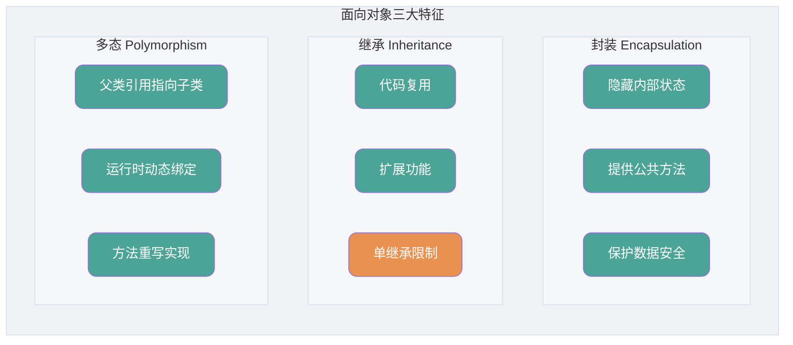
```mermaid
flowchart LR
    subgraph OOP["面向对象三大特征"]
        style OOP fill:#F0F2F5,stroke:#E0E6ED,stroke-width:1.5px

        subgraph Encapsulation["封装 Encapsulation"]
            style Encapsulation fill:#F5F7FA,stroke:#E0E6ED,stroke-width:1.5px
            E1["隐藏内部状态"]:::core
            E2["提供公共方法"]:::core
            E3["保护数据安全"]:::core
        end

        subgraph Inheritance["继承 Inheritance"]
            style Inheritance fill:#F5F7FA,stroke:#E0E6ED,stroke-width:1.5px
            I1["代码复用"]:::core
            I2["扩展功能"]:::core
            I3["单继承限制"]:::highlight
        end

        subgraph Polymorphism["多态 Polymorphism"]
            style Polymorphism fill:#F5F7FA,stroke:#E0E6ED,stroke-width:1.5px
            P1["父类引用指向子类"]:::core
            P2["运行时动态绑定"]:::core
            P3["方法重写实现"]:::core
        end
    end

    classDef core fill:#4CA497,color:#fff,rx:10,ry:10
    classDef highlight fill:#E99151,color:#fff,rx:10,ry:10

    linkStyle default stroke-width:1.5px,opacity:0.8
```

### ⭐️ 接口和抽象类有什么共同点和区别？

#### 接口和抽象类的共同点

- **实例化**：接口和抽象类都不能直接实例化，只能被实现（接口）或继承（抽象类）后才能创建具体的对象。
- **抽象方法**：接口和抽象类都可以包含抽象方法。抽象方法没有方法体，必须在子类或实现类中实现。

#### 接口和抽象类的区别

- **设计目的**：接口主要用于对类的行为进行约束，你实现了某个接口就具有了对应的行为。抽象类主要用于代码复用，强调的是所属关系。
- **继承和实现**：一个类只能继承一个类（包括抽象类），因为 Java 不支持多继承。但一个类可以实现多个接口，一个接口也可以继承多个其他接口。
- **成员变量**：接口中的成员变量只能是 `public static final` 类型的，不能被修改且必须有初始值。抽象类的成员变量可以有任何修饰符（`private`, `protected`, `public`），可以在子类中被重新定义或赋值。
- **方法**：
  - Java 8 之前，接口中的方法默认是 `public abstract`，也就是只能有方法声明。自 Java 8 起，可以在接口中定义 `default`（默认） 方法和 `static`（静态）方法。 自 Java 9 起，接口可以包含 `private` 方法。
  - 抽象类可以包含抽象方法和非抽象方法。抽象方法没有方法体，必须在子类中实现。非抽象方法有具体实现，可以直接在抽象类中使用或在子类中重写。

Java 8 为接口引入了 `default` 方法和 `static` 方法，Java 9 又允许接口声明 `private` 方法。这些方法让接口的使用更加灵活。

Java 8 引入的 `default` 方法用于提供接口方法的默认实现，可以在实现类中被覆盖。这样就可以在不修改实现类的情况下向现有接口添加新功能，从而增强接口的扩展性和向后兼容性。

```java
public interface MyInterface {
    default void defaultMethod() {
        System.out.println("This is a default method.");
    }
}
```

Java 8 引入的 `static` 方法无法在实现类中被覆盖，只能通过接口名直接调用（`MyInterface.staticMethod()`），类似于类中的静态方法。`static` 方法通常用于定义一些通用的、与接口相关的工具方法，一般很少用。

```java
public interface MyInterface {
    static void staticMethod() {
        System.out.println("This is a static method in the interface.");
    }
}
```

Java 9 允许在接口中使用 `private` 方法。`private` 方法可以用于在接口内部共享代码，不对外暴露。

```java
public interface MyInterface {
    // default 方法
    default void defaultMethod() {
        commonMethod();
    }

    // static 方法
    static void staticMethod() {
        commonMethod();
    }

    // 私有静态方法，可以被 static 和 default 方法调用
    private static void commonMethod() {
        System.out.println("This is a private method used internally.");
    }

      // 实例私有方法，只能被 default 方法调用。
    private void instanceCommonMethod() {
        System.out.println("This is a private instance method used internally.");
    }
}
```

### 深拷贝和浅拷贝区别了解吗？什么是引用拷贝？

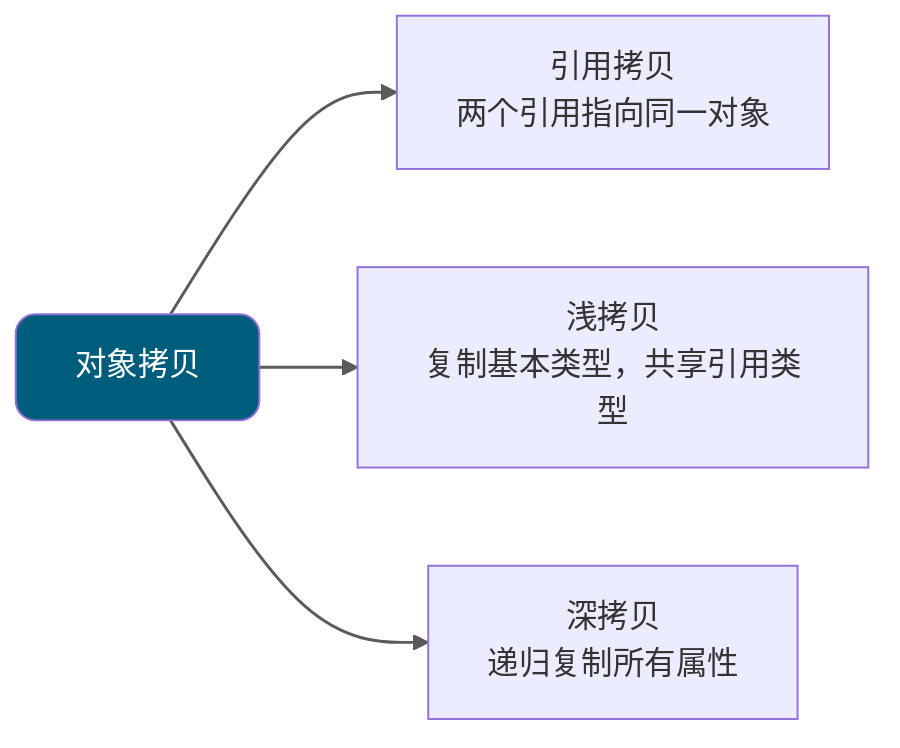
```mermaid
flowchart LR
    Copy["对象拷贝"] --> RefCopy["引用拷贝<br/>两个引用指向同一对象"]
    Copy --> ShallowCopy["浅拷贝<br/>复制基本类型，共享引用类型"]
    Copy --> DeepCopy["深拷贝<br/>递归复制所有属性"]

    classDef main fill:#005D7B,color:#fff,rx:10,ry:10
    class Copy main

    linkStyle default stroke-width:1.5px,opacity:0.8
```

关于深拷贝和浅拷贝区别，我这里先给结论：

- **浅拷贝**：浅拷贝会在堆上创建一个新的对象（区别于引用拷贝的一点），不过，如果原对象内部的属性是引用类型的话，浅拷贝会直接复制内部对象的引用地址，也就是说拷贝对象和原对象共用同一个内部对象。
- **深拷贝**：深拷贝会完全复制整个对象，包括这个对象所包含的内部对象。

上面的结论没有完全理解的话也没关系，我们来看一个具体的案例！

#### 浅拷贝

浅拷贝的示例代码如下，我们这里实现了 `Cloneable` 接口，并重写了 `clone()` 方法。

`clone()` 方法的实现很简单，直接调用的是父类 `Object` 的 `clone()` 方法。

```java
public class Address implements Cloneable{
    private String name;
    // 省略构造函数、Getter&Setter方法
    @Override
    public Address clone() {
        try {
            return (Address) super.clone();
        } catch (CloneNotSupportedException e) {
            throw new AssertionError();
        }
    }
}

public class Person implements Cloneable {
    private Address address;
    // 省略构造函数、Getter&Setter方法
    @Override
    public Person clone() {
        try {
            Person person = (Person) super.clone();
            return person;
        } catch (CloneNotSupportedException e) {
            throw new AssertionError();
        }
    }
}
```

测试：

```java
Person person1 = new Person(new Address("武汉"));
Person person1Copy = person1.clone();
// true
System.out.println(person1.getAddress() == person1Copy.getAddress());
```

从输出结构就可以看出， `person1` 的克隆对象和 `person1` 使用的仍然是同一个 `Address` 对象。

#### 深拷贝

这里我们简单对 `Person` 类的 `clone()` 方法进行修改，连带着要把 `Person` 对象内部的 `Address` 对象一起复制。

```java
@Override
public Person clone() {
    try {
        Person person = (Person) super.clone();
        person.setAddress(person.getAddress().clone());
        return person;
    } catch (CloneNotSupportedException e) {
        throw new AssertionError();
    }
}
```

测试：

```java
Person person1 = new Person(new Address("武汉"));
Person person1Copy = person1.clone();
// false
System.out.println(person1.getAddress() == person1Copy.getAddress());
```

从输出结构就可以看出，显然 `person1` 的克隆对象和 `person1` 包含的 `Address` 对象已经是不同的了。

**那什么是引用拷贝呢？** 简单来说，引用拷贝就是两个不同的引用指向同一个对象。

我专门画了一张图来描述浅拷贝、深拷贝和引用拷贝：


## ⭐️ Object

### Object 类的常见方法有哪些？

Object 类是一个特殊的类，是所有类的父类，主要提供了以下方法。需要注意，`finalize()` 自 JDK 9 起已被弃用，并在 JDK 18 中被标记为待移除，不应在新代码中使用：

```java
/**
 * native 方法，用于返回当前运行时对象的 Class 对象，使用了 final 关键字修饰，故不允许子类重写。
 */
public final native Class<?> getClass()
/**
 * native 方法，用于返回对象的哈希码，主要使用在哈希表中，比如 JDK 中的HashMap。
 */
public native int hashCode()
/**
 * 用于比较 2 个引用是否指向同一个对象，String 类对该方法进行了重写以用于比较字符串的值是否相等。
 */
public boolean equals(Object obj)
/**
 * native 方法，用于创建并返回当前对象的一份拷贝。
 */
protected native Object clone() throws CloneNotSupportedException
/**
 * 返回类的名字实例的哈希码的 16 进制的字符串。建议 Object 所有的子类都重写这个方法。
 */
public String toString()
/**
 * native 方法，并且不能重写。唤醒一个在此对象监视器上等待的线程(监视器相当于就是锁的概念)。如果有多个线程在等待只会任意唤醒一个。
 */
public final native void notify()
/**
 * native 方法，并且不能重写。跟 notify 一样，唯一的区别就是会唤醒在此对象监视器上等待的所有线程，而不是一个线程。
 */
public final native void notifyAll()
/**
 * native方法，并且不能重写。暂停线程的执行。注意：sleep 方法没有释放锁，而 wait 方法释放了锁 ，timeout 是等待时间。
 */
public final native void wait(long timeout) throws InterruptedException
/**
 * 多了 nanos 参数，这个参数表示额外时间（以纳秒为单位，范围是 0-999999）。 所以超时的时间还需要加上 nanos 纳秒。。
 */
public final void wait(long timeout, int nanos) throws InterruptedException
/**
 * 跟之前的2个wait方法一样，只不过该方法一直等待，没有超时时间这个概念
 */
public final void wait() throws InterruptedException
/**
 * 实例被垃圾回收器回收的时候触发的操作
 */
protected void finalize() throws Throwable { }
```

### == 和 equals() 的区别

**`==`** 对于基本类型和引用类型的作用效果是不同的：

- 对于基本数据类型来说，`==` 比较的是值。
- 对于引用数据类型来说，`==` 比较引用是否指向同一个对象（或都为 `null`），不是比较物理内存地址。

> 对于 `==` 来说，不管比较基本类型还是引用类型，其比较的都是操作数的值；引用值描述其所指向的对象，但 Java 语言不把它定义为可见的物理内存地址。

**`equals()`** 不能用于判断基本数据类型的变量，只能用来判断两个对象是否相等。`equals()` 方法存在于 `Object` 类中，而 `Object` 类是所有类的直接或间接父类，因此所有的类都有 `equals()` 方法。

`Object` 类 `equals()` 方法：

```java
public boolean equals(Object obj) {
     return (this == obj);
}
```

`equals()` 方法存在两种使用情况：

- **类没有重写 `equals()` 方法**：通过 `equals()` 比较该类的两个对象时，等价于通过“==”比较这两个对象，使用的默认是 `Object` 类 `equals()` 方法。
- **类重写了 `equals()` 方法**：一般我们都重写 `equals()` 方法来比较两个对象中的属性是否相等；若它们的属性相等，则返回 true（即，认为这两个对象相等）。

举个例子（这里只是为了举例。实际上，你按照下面这种写法的话，像 IDEA 这种比较智能的 IDE 都会提示你将 `==` 换成 `equals()`）：

```java
String a = new String("ab"); // a 为一个引用
String b = new String("ab"); // b为另一个引用,对象的内容一样
String aa = "ab"; // 放在常量池中
String bb = "ab"; // 从常量池中查找
System.out.println(aa == bb);// true
System.out.println(a == b);// false
System.out.println(a.equals(b));// true
System.out.println(42 == 42.0);// true
```

`String` 中的 `equals` 方法是被重写过的，因为 `Object` 的 `equals` 方法判断两个引用是否指向同一个对象，而 `String` 的 `equals` 方法比较的是字符串的值。

当使用字符串字面量创建 `String` 类型的对象（如 `String aa = "ab"`）时，虚拟机会在常量池中查找有没有已经存在的值和要创建的值相同的对象，如果有就把它赋给当前引用；如果没有，就在常量池中创建一个 `String` 对象并赋给当前引用。但当使用 `new` 关键字创建对象（如 `String a = new String("ab")`）时，虚拟机总是会在堆内存中**创建一个新的对象**并使用常量池中的值（如果没有，会先在字符串常量池中创建字符串对象 "ab"）进行初始化，然后赋给当前引用。

`String` 类 `equals()` 方法：

```java
public boolean equals(Object anObject) {
    if (this == anObject) {
        return true;
    }
    if (anObject instanceof String) {
        String anotherString = (String)anObject;
        int n = value.length;
        if (n == anotherString.value.length) {
            char v1[] = value;
            char v2[] = anotherString.value;
            int i = 0;
            while (n-- != 0) {
                if (v1[i] != v2[i])
                    return false;
                i++;
            }
            return true;
        }
    }
    return false;
}
```

### hashCode() 有什么用？

`hashCode()` 的作用是获取哈希码（`int` 整数），也称为散列码。这个哈希码的作用是确定该对象在哈希表中的索引位置。


`hashCode()` 定义在 JDK 的 `Object` 类中，这就意味着 Java 中的任何类都包含有 `hashCode()` 函数。另外需要注意的是：`Object` 的 `hashCode()` 方法是本地方法，也就是用 C 语言或 C++ 实现的。

> ⚠️ 注意：该方法在 **Oracle OpenJDK8** 中默认是 “使用线程局部状态来实现 Marsaglia's xor-shift 随机数生成”, 并不是 “地址” 或者 “地址转换而来”, 不同 JDK/VM 可能不同。在 **Oracle OpenJDK8** 中有六种生成方式（其中第五种是返回地址）, 通过添加 VM 参数: -XX:hashCode=4 启用第五种。参考源码:
>
> - <https://hg.openjdk.org/jdk8u/jdk8u/hotspot/file/87ee5ee27509/src/share/vm/runtime/globals.hpp>（1127 行）
> - <https://hg.openjdk.org/jdk8u/jdk8u/hotspot/file/87ee5ee27509/src/share/vm/runtime/synchronizer.cpp>（537 行开始）

```java
public native int hashCode();
```

散列表存储的是键值对(key-value)，它的特点是：**能根据“键”快速的检索出对应的“值”。这其中就利用到了散列码！（可以快速找到所需要的对象）**

### 为什么要有 hashCode？

我们以“HashSet 如何检查重复”为例子来说明为什么要有 hashCode？

当我们把对象加入 HashSet 时，HashSet 会先调用对象的 `hashCode()` 方法，得到一个“哈希值”，并通过内部散列函数对这个哈希值再做一次简单的转换（比如取余），决定这条数据应该放进底层数组的哪一个桶（bucket，对应到底层数组的某个位置）：

1. 如果该桶当前是空的，就直接将对象对应的节点插入到这个桶中。
2. 如果该桶中已经有其他元素，HashSet 会在这个桶对应的链表或红黑树中逐个比较：
   - 对于**哈希值不同**的节点，直接跳过；
   - 对于**哈希值相同**的节点，则会进一步调用 equals() 方法来检查这两个对象是否“相等”：
     – 如果 `equals()` 返回 true，说明集合中已经存在与当前对象等价的元素，`HashSet` 就不会再次加入它；
     – 如果返回 false， 则认为是新元素，会将该对象作为一个新节点加入到**同一个桶**的链表或红黑树中。

通过先利用 `hashCode()` 将候选范围缩小到同一个桶内，再在桶内少量元素上调用 `equals()` 做精确判断，`HashSet` 大大减少了 `equals()` 的调用次数，从而提高了查找和插入的执行效率。

**那为什么 JDK 还要同时提供这两个方法呢？**

这是因为在一些容器（比如 `HashMap`、`HashSet`）中，有了 `hashCode()` 之后，判断元素是否在对应容器中的效率会更高（参考添加元素进 `HashSet` 的过程）！

我们在前面也提到了添加元素进 `HashSet` 的过程，如果 `HashSet` 在对比的时候，同样的 `hashCode` 有多个对象，它会继续使用 `equals()` 来判断是否真的相同。也就是说 `hashCode` 帮助我们大大缩小了查找成本。

**那为什么不只提供 `hashCode()` 方法呢？**

这是因为两个对象的 `hashCode` 值相等并不代表两个对象就相等。

**那为什么两个对象有相同的 `hashCode` 值，它们也不一定是相等的？**

因为 `hashCode()` 所使用的哈希算法也许刚好会让多个对象传回相同的哈希值。越糟糕的哈希算法越容易碰撞，但这也与数据值域分布的特性有关（所谓哈希碰撞就是指不同的对象得到相同的 `hashCode` )。

总结下来就是：

- 如果两个对象的 `hashCode` 值相等，那这两个对象不一定相等（哈希碰撞）。
- 如果两个对象的 `hashCode` 值相等并且 `equals()` 方法也返回 `true`，我们才认为这两个对象相等。
- 如果两个对象的 `hashCode` 值不相等，我们就可以直接认为这两个对象不相等。

相信大家看了我前面对 `hashCode()` 和 `equals()` 的介绍之后，下面这个问题已经难不倒你们了。

### 为什么重写 equals() 时必须重写 hashCode() 方法？

因为两个相等的对象的 `hashCode` 值必须是相等。也就是说如果 `equals` 方法判断两个对象是相等的，那这两个对象的 `hashCode` 值也要相等。

如果重写 `equals()` 时没有重写 `hashCode()` 方法的话就可能会导致 `equals` 方法判断是相等的两个对象，`hashCode` 值却不相等。

**思考**：重写 `equals()` 时没有重写 `hashCode()` 方法的话，使用 `HashMap` 可能会出现什么问题。

**总结**：

- `equals` 方法判断两个对象是相等的，那这两个对象的 `hashCode` 值也要相等。
- 两个对象有相同的 `hashCode` 值，他们也不一定是相等的（哈希碰撞）。

更多关于 `hashCode()` 和 `equals()` 的内容可以查看：[Java hashCode() 和 equals()的若干问题解答](https://www.cnblogs.com/skywang12345/p/3324958.html)

## String

### ⭐️ String、StringBuffer、StringBuilder 的区别？

**可变性**

`String` 是不可变的（后面会详细分析原因），每次修改都会生成新的对象，并将引用指向新的实例，而 `StringBuffer` 和 `StringBuilder` 都是可变的，它们在修改字符串时不会创建新对象，而是直接在原有字符数组上进行操作。

`StringBuilder` 与 `StringBuffer` 都继承自 `AbstractStringBuilder` 类，在 `AbstractStringBuilder` 中也是使用字符数组保存字符串，不过没有使用 `final` 和 `private` 关键字修饰，最关键的是这个 `AbstractStringBuilder` 类还提供了很多修改字符串的方法比如 `append` 方法。

```java
abstract class AbstractStringBuilder implements Appendable, CharSequence {
    char[] value;
    public AbstractStringBuilder append(String str) {
        if (str == null)
            return appendNull();
        int len = str.length();
        ensureCapacityInternal(count + len);
        str.getChars(0, len, value, count);
        count += len;
        return this;
    }
    //...
}
```

**线程安全性**

`String` 中的对象是不可变的，也就可以理解为常量，线程安全。`AbstractStringBuilder` 是 `StringBuilder` 与 `StringBuffer` 的公共父类，定义了一些字符串的基本操作，如 `expandCapacity`、`append`、`insert`、`indexOf` 等公共方法。`StringBuffer` 对方法加了同步锁或者对调用的方法加了同步锁，所以是线程安全的。`StringBuilder` 并没有对方法进行加同步锁，所以是非线程安全的。


**性能**

两者的性能差异主要来源于线程安全机制：

- `StringBuffer` 的方法通常是同步的（线程安全），因此会带来一定的性能开销；
- `StringBuilder` 没有同步开销（非线程安全），在单线程场景下通常具有更好的性能表现。
  相同情况下使用 `StringBuilder` 相比使用 `StringBuffer` 仅能获得 10%~15% 左右的性能提升，但却要冒多线程不安全的风险。
  另外，具体的性能差异并不是固定的，在现代 JVM 中由于锁优化（如锁消除），两者在某些场景下性能差距可能较小。

**对于三者使用的总结：**

- 操作少量的数据: 适用 `String`
- 单线程操作字符串缓冲区下操作大量数据: 适用 `StringBuilder`
- 多线程操作字符串缓冲区下操作大量数据: 适用 `StringBuffer`

### ⭐️ String 为什么是不可变的？

`String` 类中使用 `final` 关键字修饰字符数组来保存字符串，~~所以 `String` 对象是不可变的。~~

```java
public final class String implements java.io.Serializable, Comparable<String>, CharSequence {
    private final char value[];
  //...
}
```

> 🐛 修正：我们知道被 `final` 关键字修饰的类不能被继承，修饰的方法不能被重写，修饰的变量是基本数据类型则值不能改变，修饰的变量是引用类型则不能再指向其他对象。因此，`final` 关键字修饰的数组保存字符串并不是 `String` 不可变的根本原因，因为这个数组保存的字符串是可变的（`final` 修饰引用类型变量的情况）。
>
> `String` 真正不可变有下面几点原因：
>
> 1. 保存字符串的数组被 `final` 修饰且为私有的，并且 `String` 类没有提供/暴露修改这个字符串的方法。
> 2. `String` 类被 `final` 修饰导致其不能被继承，进而避免了子类破坏 `String` 不可变。
>
> 相关阅读：[如何理解 String 类型值的不可变？ - 知乎提问](https://www.zhihu.com/question/20618891/answer/114125846)
>
> 补充（来自[issue 675](https://github.com/Snailclimb/JavaGuide/issues/675)）：在 Java 9 之后，`String`、`StringBuilder` 与 `StringBuffer` 的实现改用 `byte` 数组存储字符串。
>
> ```java
> public final class String implements java.io.Serializable,Comparable<String>, CharSequence {
>     // @Stable 注解表示变量最多被修改一次，称为“稳定的”。
>     @Stable
>     private final byte[] value;
> }
>
> abstract class AbstractStringBuilder implements Appendable, CharSequence {
>     byte[] value;
>
> }
> ```
>
> **Java 9 为何要将 `String` 的底层实现由 `char[]` 改成了 `byte[]` ?**
>
> 新版的 String 内部支持两种编码方案：Latin-1 和 UTF-16。如果字符串中的所有字符都能用 Latin-1 表示，就使用 Latin-1；否则使用 UTF-16。汉字不在 Latin-1 的字符范围内。Latin-1 方案下，每个字符内容使用一个字节存储，相比原来的 `char[]` 可以节省一半的字符数据空间。
>
> JDK 官方就说了绝大部分字符串对象只包含 Latin-1 可表示的字符。
>
> 
>
> 如果字符串包含 Latin-1 无法表示的字符（例如汉字），内部会使用 UTF-16，每个代码单元使用两个字节。
>
> 这是官方的介绍：<https://openjdk.java.net/jeps/254>。

### ⭐️ 字符串拼接用“+” 还是 StringBuilder?

Java 不支持用户自定义运算符重载，但语言规范为字符串连接专门定义了 `+` 和 `+=` 运算符。

```java
String str1 = "he";
String str2 = "llo";
String str3 = "world";
String str4 = str1 + str2 + str3;
```

上面的代码对应的字节码如下：


对于这里展示的 JDK 8 字节码，字符串“+”拼接被 `javac` 转换为 `StringBuilder.append()` 调用。JDK 9 起，`javac` 默认改用 `invokedynamic` 和 `StringConcatFactory`，因此不能把 `StringBuilder` 视为所有版本都必须采用的实现方式。

不过，在循环内使用“+”进行字符串的拼接的话，存在比较明显的缺陷：**编译器不会创建单个 `StringBuilder` 以复用，会导致创建过多的 `StringBuilder` 对象**。

```java
String[] arr = {"he", "llo", "world"};
String s = "";
for (int i = 0; i < arr.length; i++) {
    s += arr[i];
}
System.out.println(s);
```

`StringBuilder` 对象是在循环内部被创建的，这意味着每循环一次就会创建一个 `StringBuilder` 对象。


如果直接使用 `StringBuilder` 对象进行字符串拼接的话，就不会存在这个问题了。

```java
String[] arr = {"he", "llo", "world"};
StringBuilder s = new StringBuilder();
for (String value : arr) {
    s.append(value);
}
System.out.println(s);
```


如果你使用 IDEA 的话，IDEA 自带的代码检查机制也会提示你修改代码。

在 JDK 9 中，字符串相加“+”改为用动态方法 `makeConcatWithConstants()` 来实现，通过提前分配空间从而减少了部分临时对象的创建。然而这种优化主要针对简单的字符串拼接，如： `a+b+c`。对于循环中的大量拼接操作，仍然会逐个动态分配内存（类似于两个两个 append 的概念），并不如手动使用 StringBuilder 来进行拼接效率高。这个改进是 JDK9 的 [JEP 280](https://openjdk.org/jeps/280) 提出的，关于这部分改进的详细介绍，推荐阅读这篇文章：还在无脑用 [StringBuilder？来重温一下字符串拼接吧](https://juejin.cn/post/7182872058743750715) 以及参考 [issue#2442](https://github.com/Snailclimb/JavaGuide/issues/2442)。

### String#equals() 和 Object#equals() 有何区别？

`String` 中的 `equals` 方法是被重写过的，比较的是 String 字符串的值是否相等。`Object` 的 `equals` 方法判断两个引用是否指向同一个对象。

### ⭐️ 字符串常量池的作用了解吗？

**字符串常量池** 是 JVM 为了提升性能和减少内存消耗针对字符串（String 类）专门开辟的一块区域，主要目的是为了避免字符串的重复创建。

```java
// 1.在字符串常量池中查询字符串对象 "ab"，如果没有则创建"ab"并放入字符串常量池
// 2.将字符串对象 "ab" 的引用赋值给 aa
String aa = "ab";
// 直接返回字符串常量池中字符串对象 "ab"，赋值给引用 bb
String bb = "ab";
System.out.println(aa==bb); // true
```

更多关于字符串常量池的介绍可以看一下 [Java 内存区域详解](https://javaguide.cn/java/jvm/memory-area.html) 这篇文章。

### ⭐️ String s1 = new String("abc");这句话创建了几个字符串对象？

先说答案：会创建 1 或 2 个字符串对象。

1. 字符串常量池中不存在 "abc"：会创建 2 个 字符串对象。一个在字符串常量池中，由 `ldc` 指令触发创建。一个在堆中，由 `new String()` 创建，并使用常量池中的 "abc" 进行初始化。
2. 字符串常量池中已存在 "abc"：会创建 1 个 字符串对象。该对象在堆中，由 `new String()` 创建，并使用常量池中的 "abc" 进行初始化。

下面开始详细分析。

下面开始详细分析。

1、如果字符串常量池中不存在字符串对象 “abc”，那么它首先会在字符串常量池中创建字符串对象 "abc"，然后在堆内存中再创建其中一个字符串对象 "abc"。

示例代码（JDK 1.8）：

```java
String s1 = new String("abc");
```

对应的字节码：

```java
// 在堆内存中分配一个尚未初始化的 String 对象。
// #2 是常量池中的一个符号引用，指向 java/lang/String 类。
// 在类加载的解析阶段，这个符号引用会被解析成直接引用，即指向实际的 java/lang/String 类。
0 new #2 <java/lang/String>
// 复制栈顶的 String 对象引用，为后续的构造函数调用做准备。
// 此时操作数栈中有两个相同的对象引用：一个用于传递给构造函数，另一个用于保持对新对象的引用，后续将其存储到局部变量表。
3 dup
// JVM 先检查字符串常量池中是否存在 "abc"。
// 如果常量池中已存在 "abc"，则直接返回该字符串的引用；
// 如果常量池中不存在 "abc"，则 JVM 会在常量池中创建该字符串字面量并返回它的引用。
// 这个引用被压入操作数栈，用作构造函数的参数。
4 ldc #3 <abc>
// 调用构造方法，使用从常量池中加载的 "abc" 初始化堆中的 String 对象
// 新的 String 对象将包含与常量池中的 "abc" 相同的内容，但它是一个独立的对象，存储于堆中。
6 invokespecial #4 <java/lang/String.<init> : (Ljava/lang/String;)V>
// 将堆中的 String 对象引用存储到局部变量表
9 astore_1
// 返回，结束方法
10 return
```

`ldc (load constant)` 指令的确是从常量池中加载各种类型的常量，包括字符串常量、整数常量、浮点数常量，甚至类引用等。对于字符串常量，`ldc` 指令的行为如下：

1. **从常量池加载字符串**：`ldc` 首先检查字符串常量池中是否已经有内容相同的字符串对象。
2. **复用已有字符串对象**：如果字符串常量池中已经存在内容相同的字符串对象，`ldc` 会将该对象的引用加载到操作数栈上。
3. **没有则创建新对象并加入常量池**：如果字符串常量池中没有相同内容的字符串对象，JVM 会在常量池中创建一个新的字符串对象，并将其引用加载到操作数栈中。

2、如果字符串常量池中已存在字符串对象“abc”，则只会在堆中创建 1 个字符串对象“abc”。

示例代码（JDK 1.8）：

```java
// 字符串常量池中已存在字符串对象“abc”
String s1 = "abc";
// 下面这段代码只会在堆中创建 1 个字符串对象“abc”
String s2 = new String("abc");
```

对应的字节码：

```java
0 ldc #2 <abc>
2 astore_1
3 new #3 <java/lang/String>
6 dup
7 ldc #2 <abc>
9 invokespecial #4 <java/lang/String.<init> : (Ljava/lang/String;)V>
12 astore_2
13 return
```

这里就不对上面的字节码进行详细注释了，7 这个位置的 `ldc` 命令不会在堆中创建新的字符串对象“abc”，这是因为 0 这个位置已经执行了一次 `ldc` 命令，已经在堆中创建过一次字符串对象“abc”了。7 这个位置执行 `ldc` 命令会直接返回字符串常量池中字符串对象“abc”对应的引用。

### String#intern 方法有什么作用？

`String.intern()` 是一个 `native`（本地） 方法，用来处理字符串常量池中的字符串对象引用。它的工作流程可以概括为以下两种情况：

1. **常量池中已有相同内容的字符串对象**：如果字符串常量池中已经有一个与调用 `intern()` 方法的字符串内容相同的 `String` 对象，`intern()` 方法会直接返回常量池中该对象的引用。
2. **常量池中没有相同内容的字符串对象**：如果字符串常量池中还没有一个与调用 `intern()` 方法的字符串内容相同的对象，`intern()` 方法会将当前字符串对象的引用添加到字符串常量池中，并返回该引用。

总结：

- `intern()` 方法的主要作用是确保字符串引用在常量池中的唯一性。
- 当调用 `intern()` 时，如果常量池中已经存在相同内容的字符串，则返回常量池中已有对象的引用；否则，将该字符串添加到常量池并返回其引用。

示例代码（JDK 1.8） :

```java
// s1 指向字符串常量池中的 "Java" 对象
String s1 = "Java";
// s2 也指向字符串常量池中的 "Java" 对象，和 s1 是同一个对象
String s2 = s1.intern();
// 在堆中创建一个新的 "Java" 对象，s3 指向它
String s3 = new String("Java");
// s4 指向字符串常量池中的 "Java" 对象，和 s1 是同一个对象
String s4 = s3.intern();
// s1 和 s2 指向的是同一个常量池中的对象
System.out.println(s1 == s2); // true
// s3 指向堆中的对象，s4 指向常量池中的对象，所以不同
System.out.println(s3 == s4); // false
// s1 和 s4 都指向常量池中的同一个对象
System.out.println(s1 == s4); // true
```

### String 类型的变量和常量做“+”运算时发生了什么？

先来看字符串不加 `final` 关键字拼接的情况（JDK1.8）：

```java
String str1 = "str";
String str2 = "ing";
String str3 = "str" + "ing";
String str4 = str1 + str2;
String str5 = "string";
System.out.println(str3 == str4);//false
System.out.println(str3 == str5);//true
System.out.println(str4 == str5);//false
```

> **注意**：比较 String 字符串的值是否相等，可以使用 `equals()` 方法。 `String` 中的 `equals` 方法是被重写过的。 `Object` 的 `equals` 方法判断两个引用是否指向同一个对象，而 `String` 的 `equals` 方法比较的是字符串的值是否相等。如果你使用 `==` 比较两个字符串是否相等的话，IDEA 还是提示你使用 `equals()` 方法替换。


**对于编译期可以确定值的字符串表达式，编译器会进行常量折叠，并把结果作为字符串常量写入 class 文件的常量池；对应的字符串对象在运行时被创建并驻留到字符串池中。**

在编译过程中，Javac 编译器（下文中统称为编译器）会进行一个叫做 **常量折叠(Constant Folding)** 的代码优化。《深入理解 Java 虚拟机》中是也有介绍到：


常量折叠会把常量表达式的值求出来作为常量嵌在最终生成的代码中，这是 Javac 编译器会对源代码做的极少量优化措施之一（代码优化几乎都在即时编译器中进行）。

对于 `String str3 = "str" + "ing";` 编译器会给你优化成 `String str3 = "string";`。

并不是所有的常量都会进行折叠，只有编译器在程序编译期就可以确定值的常量才可以：

- 基本数据类型( `byte`、`boolean`、`short`、`char`、`int`、`float`、`long`、`double`)以及字符串常量。
- `final` 修饰的基本数据类型和字符串变量
- 字符串通过 “+”拼接得到的字符串、基本数据类型之间算数运算（加减乘除）、基本数据类型的位运算（<<、\>>、\>>>）

**引用的值在程序编译期是无法确定的，编译器无法对其进行优化。**

对象引用和“+”的字符串拼接方式，实际上是通过 `StringBuilder` 调用 `append()` 方法实现的，拼接完成之后调用 `toString()` 得到一个 `String` 对象。

```java
String str4 = new StringBuilder().append(str1).append(str2).toString();
```

我们在平时写代码的时候，尽量避免多个字符串对象拼接，因为这样会重新创建对象。如果需要改变字符串的话，可以使用 `StringBuilder` 或者 `StringBuffer`。

不过，字符串使用 `final` 关键字声明之后，可以让编译器当做常量来处理。

示例代码：

```java
final String str1 = "str";
final String str2 = "ing";
// 下面两个表达式其实是等价的
String c = "str" + "ing";// 常量池中的对象
String d = str1 + str2; // 常量池中的对象
System.out.println(c == d);// true
```

被 `final` 关键字修饰之后的 `String` 会被编译器当做常量来处理，编译器在程序编译期就可以确定它的值，其效果就相当于访问常量。

如果，编译器在运行时才能知道其确切值的话，就无法对其优化。

示例代码（`str2` 在运行时才能确定其值）：

```java
final String str1 = "str";
final String str2 = getStr();
String c = "str" + "ing";// 常量池中的对象
String d = str1 + str2; // 在堆上创建的新的对象
System.out.println(c == d);// false
public static String getStr() {
      return "ing";
}
```

## 参考

- 深入解析 String#intern：<https://tech.meituan.com/2014/03/06/in-depth-understanding-string-intern.html>
- Java String 源码解读：<http://keaper.cn/2020/09/08/java-string-mian-mian-guan/>
- R 大（RednaxelaFX）关于常量折叠的回答：<https://www.zhihu.com/question/55976094/answer/147302764>

<!-- @include: @article-footer.snippet.md -->


---

---

<!-- source: 基础/泛型&通配符详解.md -->

## [43] 泛型&通配符详解

---
title: 泛型&通配符详解
description: 全面解析Java泛型与通配符：深入理解类型擦除机制、上界下界通配符用法、PECS原则应用，掌握泛型编程核心技巧。
category: Java
tag:
  - Java基础
head:
  - - meta
    - name: keywords
      content: Java泛型,通配符,类型擦除,泛型边界,PECS原则,泛型方法,上界下界通配符,泛型接口
---

## 泛型

### 什么是泛型？有什么作用？

**Java 泛型（Generics）** 是 JDK 5 中引入的一个新特性。使用泛型参数，可以增强代码的可读性以及稳定性。**如无特别说明，以下行为以 Java 8 为准。**

编译器可以对泛型参数进行检测，并且通过泛型参数可以指定传入的对象类型。比如 `ArrayList<Person> persons = new ArrayList<Person>()` 这行代码指明了该 `ArrayList` 只能传入 `Person` 类型的对象，如果传入其他类型会报错（JDK 7 起可写 `new ArrayList<>()`，由编译器推断类型参数）。

```java
ArrayList<E> extends AbstractList<E>
```

并且，原生 `List` 返回类型是 `Object`，需要手动转换类型才能使用，使用泛型后编译器自动转换。

### 泛型的使用方式有哪几种？

泛型一般有三种使用方式:**泛型类**、**泛型接口**、**泛型方法**。

**1.泛型类**：

```java
//此处T可以随便写为任意标识，常见的如T、E、K、V等形式的参数常用于表示泛型
//在实例化泛型类时，必须指定T的具体类型
public class Generic<T>{

    private T key;

    public Generic(T key) {
        this.key = key;
    }

    public T getKey(){
        return key;
    }
}
```

如何实例化泛型类：

```java
Generic<Integer> genericInteger = new Generic<Integer>(123456);
// JDK 7 起可写：new Generic<>(123456)
```

**2.泛型接口**：

```java
public interface Generator<T> {
    public T method();
}
```

实现泛型接口，不指定类型：

```java
class GeneratorImpl<T> implements Generator<T>{
    @Override
    public T method() {
        return null;
    }
}
```

实现泛型接口，指定类型：

```java
class GeneratorImpl implements Generator<String> {
    @Override
    public String method() {
        return "hello";
    }
}
```

**3.泛型方法**：

```java
   public static < E > void printArray( E[] inputArray )
   {
         for ( E element : inputArray ){
            System.out.printf( "%s ", element );
         }
         System.out.println();
    }
```

使用：

```java
// 创建不同类型数组： Integer, Double 和 Character
Integer[] intArray = { 1, 2, 3 };
String[] stringArray = { "Hello", "World" };
printArray( intArray  );
printArray( stringArray  );
```

### 项目中哪里用到了泛型？

- 自定义接口通用返回结果 `CommonResult<T>` 通过参数 `T` 可根据具体的返回类型动态指定结果的数据类型
- 定义 `Excel` 处理类 `ExcelUtil<T>` 用于动态指定 `Excel` 导出的数据类型
- 构建集合工具类（参考 `Collections` 中的 `sort`, `binarySearch` 方法）。
- ……

### 什么是泛型擦除机制？为什么要擦除？

**Java 泛型通过类型擦除实现：泛型实例在运行时不保留具体类型实参，但类文件仍可在 `Signature` 等属性中保留泛型声明信息，并可通过反射 API 读取。**

编译器会在编译期间会动态地将泛型 `T` 擦除为 `Object` 或将 `T extends xxx` 擦除为其限定类型 `xxx`。

类型擦除让泛型代码能够与引入泛型之前的 Java 类库和二进制代码保持兼容。编译器会通过必要的类型转换和桥方法维持类型安全与多态语义。

这里说的可能有点抽象，我举个例子：

```java
List<Integer> list = new ArrayList<>();

list.add(12);
//1.编译期间直接添加会报错
list.add("a");
Class<? extends List> clazz = list.getClass();
Method add = clazz.getDeclaredMethod("add", Object.class);
//2.运行期间通过反射添加，是可以的
add.invoke(list, "kl");

System.out.println(list)
```

再来举一个例子 : 由于泛型擦除的问题，下面的方法重载会报错。

```java
public void print(List<String> list)  { }
public void print(List<Integer> list) { }
```


原因也很简单，泛型擦除之后，`List<String>` 与 `List<Integer>` 在编译以后都变成了 `List`。

**既然编译器要把泛型擦除，那为什么还要用泛型呢？用 Object 代替不行吗？**

这个问题其实在变相考察泛型的作用：

- 使用泛型可在编译期间进行类型检测。

- 使用 `Object` 类型需要手动添加强制类型转换，降低代码可读性，提高出错概率。

- 泛型可以使用自限定类型如 `T extends Comparable`。

### 什么是桥方法？

桥方法(`Bridge Method`) 用于继承泛型类时保证多态。

```java
class Node<T> {
    public T data;
    public Node(T data) { this.data = data; }
    public void setData(T data) {
        System.out.println("Node.setData");
        this.data = data;
    }
}

class MyNode extends Node<Integer> {
    public MyNode(Integer data) { super(data); }

  	// Node<T> 泛型擦除后为 setData(Object data)，而子类 MyNode 中并没有重写该方法，所以编译器会加入该桥方法保证多态
   	public void setData(Object data) {
        setData((Integer) data);
    }

    public void setData(Integer data) {
        System.out.println("MyNode.setData");
        super.setData(data);
    }
}
```

⚠️**注意**：桥方法为编译器自动生成，非手写。

### 泛型有哪些限制？为什么？

泛型的限制一般是由泛型擦除机制导致的。擦除为 `Object` 后无法进行类型判断

- 可以声明 `T` 类型的变量，但不能直接通过 `new T()` 实例化类型参数。
- 泛型参数不能是基本类型。因为基本类型不是 `Object` 子类，应该用基本类型对应的引用类型代替。
- 不能实例化泛型参数的数组。擦除后为 `Object` 后无法进行类型判断。
- 不能实例化泛型数组。
- 泛型无法使用 `instanceof` 对类型参数 T 做运行期判断；`getClass()` 在擦除后也无法区分不同泛型实参（如 `List<String>` 与 `List<Integer>` 均得到 `List.class`）。
- 不能实现两个不同泛型参数的同一接口，擦除后多个父类的桥方法将冲突
- 类的 `static` 上下文不能引用该类声明的类型参数，但静态泛型方法可以声明并使用自己的类型参数
- ……

### 以下代码是否能编译，为什么？

```java
public final class Algorithm {
    public static <T> T max(T x, T y) {
        return x > y ? x : y;
    }
}
```

无法编译，因为 x 和 y 都会被擦除为 `Object` 类型， `Object` 无法使用 `>` 进行比较

```java
public class Singleton<T> {

    public static T getInstance() {
        if (instance == null)
            instance = new Singleton<T>();

        return instance;
    }

    private static T instance = null;
}
```

无法编译，因为类的静态字段和静态方法不能引用类声明的类型参数 `T`。静态方法可以声明自己的类型参数，例如 `public static <T> T getInstance()`。

## 通配符

### 什么是通配符？有什么作用？

泛型类型是固定的，某些场景下使用起来不太灵活，于是，通配符就来了！通配符可以允许类型参数变化，用来解决泛型无法协变的问题。

举个例子：

```java
// 限制类型为 Person 的子类
<? extends Person>
// 限制类型为 Manager 的父类
<? super Manager>
```

### 通配符？和常用的泛型 T 之间有什么区别？

- `T` 可以用于声明变量或常量而 `?` 不行。
- `T` 一般用于声明泛型类或方法，通配符 `?` 一般用于泛型方法的调用代码和形参。
- `T` 在编译期会被擦除为限定类型或 `Object`。通配符 `?` 在方法内部会被编译器「捕获」为某个具体但未知的类型（capture），因此不能向 `List<?>` 写入除 `null` 外的元素，但可配合泛型方法使用。

### 什么是无界通配符？

无界通配符可以接收任何泛型类型数据，用于实现不依赖于具体类型参数的简单方法，可以捕获参数类型并交由泛型方法进行处理。

```java
void testMethod(Person<?> p) {
  // 泛型方法自行处理
}
```

**`List<?>` 和 `List` 有区别吗？** 当然有！

- `List<?> list` 表示 `list` 的元素类型是**某个未知但固定的类型**（即「存在某一类型 `T`，list 是 `List<T>`」），因此编译器不允许向其中添加除 `null` 外的任何元素，以避免类型不安全。
- `List list` 是原生类型（raw type），会绕过部分泛型类型检查，并不等同于 `List<Object>`。向其中添加元素通常会产生未检查警告，并可能把类型错误推迟到运行时。

```java
List<?> list = new ArrayList<>();
list.add("sss");//报错
List list2 = new ArrayList<>();
list2.add("sss");//警告信息
```

### 什么是上边界通配符？什么是下边界通配符？

在使用泛型的时候，我们还可以为传入的泛型类型实参进行上下边界的限制，如：**类型实参只准传入某种类型的父类或某种类型的子类**。

**上边界通配符 `extends`** 表示类型实参必须是指定类型或其子类型。

举个例子：

```java
// 限制必须是 Person 类的子类
<? extends Person>
```

类型边界可以设置多个，还可以对 `T` 类型进行限制。

```java
<T extends T1 & T2>
<T extends XXX>
```

**下边界通配符 `super`** 表示类型实参必须是指定类型或其父类型。

举个例子：

```java
//  限制必须是 Employee 类的父类
List<? super Employee>
```

**`? extends xxx` 和 `? super xxx` 有什么区别?**

两者接收类型实参的范围不同。对于 `List<? extends Xxx>`，可以读取为 `Xxx`，但除 `null` 外不能安全写入；对于 `List<? super Xxx>`，可以写入 `Xxx` 及其子类型，读取结果只能安全地视为 `Object`。

**PECS 原则（Producer Extends, Consumer Super）**：从数据结构**取**元素时用 `extends`（生产者，Producer）；向数据结构**写**元素时用 `super`（消费者，Consumer）。例如：`List<? extends Number>` 只能从中读取 `Number`，不能写入；`List<? super Integer>` 可以写入 `Integer` 及其子类，读取时得到的是 `Object`。`Collections.copy(List<? super T> dest, List<? extends T> src)` 就是典型用法：从 `src` 读、往 `dest` 写。

**`T extends xxx` 和 `? extends xxx` 又有什么区别？**

`T extends xxx` 用于声明带上界的类型参数，擦除后为 `xxx`；`? extends xxx` 用于参数化类型中的通配符实参，可出现在字段、局部变量、方法参数和返回类型等位置。

**`Class<?>` 和 `Class` 的区别？**

直接使用 Class 的话会有一个类型警告，使用 `Class<?>` 则没有，因为 Class 是一个泛型类，接收原生类型会产生警告

### 以下代码是否能编译，为什么？

```java
class Shape { /* ... */ }
class Circle extends Shape { /* ... */ }
class Rectangle extends Shape { /* ... */ }

class Node<T> { /* ... */ }

Node<Circle> nc = new Node<>();
Node<Shape>  ns = nc;
```

不能，因为 `Node<Circle>` 不是 `Node<Shape>` 的子类

```java
class Shape { /* ... */ }
class Circle extends Shape { /* ... */ }
class Rectangle extends Shape { /* ... */ }

class Node<T> { /* ... */ }
class ChildNode<T> extends Node<T>{

}
ChildNode<Circle> nc = new ChildNode<>();
Node<Circle>  ns = nc;
```

可以编译，`ChildNode<Circle>` 是 `Node<Circle>` 的子类

```java
public static void print(List<? extends Number> list) {
    for (Number n : list)
        System.out.print(n + " ");
    System.out.println();
}
```

可以编译，`List<? extends Number>` 可以往外取元素，但是无法调用 `add()` 添加元素。

## 参考

- Java 官方文档： https://docs.oracle.com/javase/Java 优质开源技术教程/java/generics/index.html
- Java 基础 一文搞懂泛型：https://www.cnblogs.com/XiiX/p/14719568.html


---

---

<!-- source: 集合/ArrayBlockingQueue 源码分析.md -->

## [44] ArrayBlockingQueue 源码分析

---
title: ArrayBlockingQueue 源码分析
description: ArrayBlockingQueue源码深度解析：详解有界阻塞队列实现、生产者消费者模式应用、ReentrantLock+Condition并发控制、线程池工作队列机制。
category: Java
tag:
  - Java集合
head:
  - - meta
    - name: keywords
      content: ArrayBlockingQueue源码,阻塞队列,有界队列,生产者消费者模式,ReentrantLock,Condition,线程池工作队列
---

## 阻塞队列简介

### 阻塞队列的历史

Java 阻塞队列的历史可以追溯到 JDK1.5 版本，当时 Java 平台增加了 `java.util.concurrent`，即我们常说的 JUC 包，其中包含了各种并发流程控制工具、并发容器、原子类等。这其中自然也包含了我们这篇文章所讨论的阻塞队列。

为了解决高并发场景下多线程之间数据共享的问题，JDK1.5 版本中出现了 `ArrayBlockingQueue` 和 `LinkedBlockingQueue`，它们是带有生产者-消费者模式实现的并发容器。其中，`ArrayBlockingQueue` 是有界队列，即添加的元素达到上限之后，再次添加就会被阻塞或者抛出异常。而 `LinkedBlockingQueue` 则由链表构成的队列，正是因为链表的特性，所以 `LinkedBlockingQueue` 在添加元素上并不会向 `ArrayBlockingQueue` 那样有着较多的约束，所以 `LinkedBlockingQueue` 设置队列是否有界是可选的(注意这里的无界并不是指可以添加任意数量的元素，而是说队列的大小默认为 `Integer.MAX_VALUE`，近乎于无限大)。

`SynchronousQueue` 和 `DelayQueue` 同样在 JDK 1.5 中引入，JDK 1.7 又增加了支持传输操作的 `TransferQueue` 接口。

### 阻塞队列的思想

阻塞队列就是典型的生产者-消费者模型，它可以做到以下几点:

1. 当阻塞队列数据为空时，所有的消费者线程都会被阻塞，等待队列非空。
2. 当生产者往队列里填充数据后，队列就会通知消费者队列非空，消费者此时就可以进来消费。
3. 当阻塞队列因为消费者消费过慢或者生产者存放元素过快导致队列填满时无法容纳新元素时，生产者就会被阻塞，等待队列非满时继续存放元素。
4. 当消费者从队列中消费一个元素之后，队列就会通知生产者队列非满，生产者可以继续填充数据了。

总结一下：阻塞队列就说基于非空和非满两个条件实现生产者和消费者之间的交互，尽管这些交互流程和等待通知的机制实现非常复杂，好在 Doug Lea 的操刀之下已将阻塞队列的细节屏蔽，我们只需调用 `put`、`take`、`offer`、`poll` 等 API 即可实现多线程之间的生产和消费。

这也使得阻塞队列在多线程开发中有着广泛的运用，最常见的例子无非是我们的线程池，从源码中我们就能看出当核心线程无法及时处理任务时，这些任务都会扔到 `workQueue` 中。

```java
public ThreadPoolExecutor(int corePoolSize,
                            int maximumPoolSize,
                            long keepAliveTime,
                            TimeUnit unit,
                            BlockingQueue<Runnable> workQueue,
                            ThreadFactory threadFactory,
                            RejectedExecutionHandler handler) {// ...}
```

## ArrayBlockingQueue 常见方法及测试

简单了解了阻塞队列的历史之后，我们就开始重点讨论本篇文章所要介绍的并发容器——`ArrayBlockingQueue`。为了后续更加深入的了解 `ArrayBlockingQueue`，我们不妨基于下面几个实例了解以下 `ArrayBlockingQueue` 的使用。

先看看第一个例子，我们这里会用两个线程分别模拟生产者和消费者，生产者生产完会使用 `put` 方法生产 10 个元素给消费者进行消费，当队列元素达到我们设置的上限 5 时，`put` 方法就会阻塞。
同理消费者也会通过 `take` 方法消费元素，当队列为空时，`take` 方法就会阻塞消费者线程。这里笔者为了保证消费者能够在消费完 10 个元素后及时退出。便通过倒计时门闩，来控制消费者结束，生产者在这里只会生产 10 个元素。当消费者将 10 个元素消费完成之后，按下倒计时门闩，所有线程都会停止。

```java
public class ProducerConsumerExample {

    public static void main(String[] args) throws InterruptedException {

        // 创建一个大小为 5 的 ArrayBlockingQueue
        ArrayBlockingQueue<Integer> queue = new ArrayBlockingQueue<>(5);

        // 创建生产者线程
        Thread producer = new Thread(() -> {
            try {
                for (int i = 1; i <= 10; i++) {
                    // 向队列中添加元素，如果队列已满则阻塞等待
                    queue.put(i);
                    System.out.println("生产者添加元素：" + i);
                }
            } catch (InterruptedException e) {
                e.printStackTrace();
            }

        });

        CountDownLatch countDownLatch = new CountDownLatch(1);

        // 创建消费者线程
        Thread consumer = new Thread(() -> {
            try {
                int count = 0;
                while (true) {

                    // 从队列中取出元素，如果队列为空则阻塞等待
                    int element = queue.take();
                    System.out.println("消费者取出元素：" + element);
                    ++count;
                    if (count == 10) {
                        break;
                    }
                }

                countDownLatch.countDown();
            } catch (InterruptedException e) {
                e.printStackTrace();
            }

        });

        // 启动线程
        producer.start();
        consumer.start();

        // 等待线程结束
        producer.join();
        consumer.join();

        countDownLatch.await();

        producer.interrupt();
        consumer.interrupt();
    }

}
```

代码输出结果如下，可以看到只有生产者往队列中投放元素之后消费者才能消费，这也就意味着当队列中没有数据的时消费者就会阻塞，等待队列非空再继续消费。

```cpp
生产者添加元素：1
生产者添加元素：2
消费者取出元素：1
消费者取出元素：2
生产者添加元素：3
消费者取出元素：3
生产者添加元素：4
生产者添加元素：5
消费者取出元素：4
生产者添加元素：6
消费者取出元素：5
生产者添加元素：7
生产者添加元素：8
生产者添加元素：9
生产者添加元素：10
消费者取出元素：6
消费者取出元素：7
消费者取出元素：8
消费者取出元素：9
消费者取出元素：10
```

了解了 `put`、`take` 这两个会阻塞的存和取方法之后，我我们再来看看阻塞队列中非阻塞的入队和出队方法 `offer` 和 `poll`。

如下所示，我们设置了一个大小为 3 的阻塞队列，我们会尝试在队列用 offer 方法存放 4 个元素，然后再从队列中用 `poll` 尝试取 4 次。

```cpp
public class OfferPollExample {

    public static void main(String[] args) {
        // 创建一个大小为 3 的 ArrayBlockingQueue
        ArrayBlockingQueue<String> queue = new ArrayBlockingQueue<>(3);

        // 向队列中添加元素
        System.out.println(queue.offer("A"));
        System.out.println(queue.offer("B"));
        System.out.println(queue.offer("C"));

        // 尝试向队列中添加元素，但队列已满，返回 false
        System.out.println(queue.offer("D"));

        // 从队列中取出元素
        System.out.println(queue.poll());
        System.out.println(queue.poll());
        System.out.println(queue.poll());

        // 尝试从队列中取出元素，但队列已空，返回 null
        System.out.println(queue.poll());
    }

}
```

最终代码的输出结果如下，可以看到因为队列的大小为 3 的缘故，我们前 3 次存放到队列的结果为 true，第 4 次存放时，由于队列已满，所以存放结果返回 false。这也是为什么我们后续的 `poll` 方法只得到了 3 个元素的值。

```cpp
true
true
true
false
A
B
C
null
```

了解了阻塞存取和非阻塞存取，我们再来看看阻塞队列的一个比较特殊的操作，某些场景下，我们希望能够一次性将阻塞队列的结果存到列表中再进行批量操作，我们就可以使用阻塞队列的 `drainTo` 方法，这个方法会一次性将队列中所有元素存放到列表，如果队列中有元素，且成功存到 list 中则 `drainTo` 会返回本次转移到 list 中的元素数，反之若队列为空，`drainTo` 则直接返回 0。

```java
public class DrainToExample {

    public static void main(String[] args) {
        // 创建一个大小为 5 的 ArrayBlockingQueue
        ArrayBlockingQueue<Integer> queue = new ArrayBlockingQueue<>(5);

        // 向队列中添加元素
        queue.add(1);
        queue.add(2);
        queue.add(3);
        queue.add(4);
        queue.add(5);

        // 创建一个 List，用于存储从队列中取出的元素
        List<Integer> list = new ArrayList<>();

        // 从队列中取出所有元素，并添加到 List 中
        queue.drainTo(list);

        // 输出 List 中的元素
        System.out.println(list);
    }

}
```

代码输出结果如下

```cpp
[1, 2, 3, 4, 5]
```

## ArrayBlockingQueue 源码分析

自此我们对阻塞队列的使用有了基本的印象，接下来我们就可以进一步了解一下 `ArrayBlockingQueue` 的工作机制了。

### 整体设计

在了解 `ArrayBlockingQueue` 的具体细节之前，我们先来看看 `ArrayBlockingQueue` 的类图。


从图中我们可以看出，`ArrayBlockingQueue` 实现了阻塞队列 `BlockingQueue` 这个接口，不难猜出通过实现 `BlockingQueue` 这个接口之后，`ArrayBlockingQueue` 就拥有了阻塞队列那些常见的操作行为。

同时， `ArrayBlockingQueue` 还继承了 `AbstractQueue` 这个抽象类，这个继承了 `AbstractCollection` 和 `Queue` 的抽象类，从抽象类的特定和语义我们也可以猜出，这个继承关系使得 `ArrayBlockingQueue` 拥有了队列的常见操作。

所以我们是否可以得出这样一个结论，通过继承 `AbstractQueue` 获得队列所有的操作模板，其实现的入队和出队操作的整体框架。然后 `ArrayBlockingQueue` 通过实现 `BlockingQueue` 获取到阻塞队列的常见操作并将这些操作实现，填充到 `AbstractQueue` 模板方法的细节中，由此 `ArrayBlockingQueue` 成为一个完整的阻塞队列。

为了印证这一点，我们到源码中一探究竟。首先我们先来看看 `AbstractQueue`，从类的继承关系我们可以大致得出，它通过 `AbstractCollection` 获得了集合的常见操作方法，然后通过 `Queue` 接口获得了队列的特性。

```java
public abstract class AbstractQueue<E>
    extends AbstractCollection<E>
    implements Queue<E> {
       //...
}
```

对于集合的操作无非是增删改查，所以我们不妨从添加方法入手，从源码中我们可以看到，它实现了 `AbstractCollection` 的 `add` 方法，其内部逻辑如下:

1. 调用继承 `Queue` 接口得来的 `offer` 方法，如果 `offer` 成功则返回 `true`。
2. 如果 `offer` 失败，即代表当前元素入队失败直接抛异常。

```java
public boolean add(E e) {
  if (offer(e))
      return true;
  else
      throw new IllegalStateException("Queue full");
}
```

而 `AbstractQueue` 中并没有对 `Queue` 的 `offer` 的实现，很明显这样做的目的是定义好了 `add` 的核心逻辑，将 `offer` 的细节交由其子类即我们的 `ArrayBlockingQueue` 实现。

到此，我们对于抽象类 `AbstractQueue` 的分析就结束了，我们继续看看 `ArrayBlockingQueue` 中实现的另一个重要接口 `BlockingQueue`。

点开 `BlockingQueue` 之后，我们可以看到这个接口同样继承了 `Queue` 接口，这就意味着它也具备了队列所拥有的所有行为。同时，它还定义了自己所需要实现的方法。

```java
public interface BlockingQueue<E> extends Queue<E> {

     //元素入队成功返回true，反之则会抛出异常IllegalStateException
    boolean add(E e);

     //元素入队成功返回true，反之返回false
    boolean offer(E e);

     //元素入队成功则直接返回，如果队列已满元素不可入队则将线程阻塞，因为阻塞期间可能会被打断，所以这里方法签名抛出了InterruptedException
    void put(E e) throws InterruptedException;

   //和上一个方法一样,只不过队列满时只会阻塞单位为unit，时间为timeout的时长，如果在等待时长内没有入队成功则直接返回false。
    boolean offer(E e, long timeout, TimeUnit unit)
        throws InterruptedException;

    //从队头取出一个元素，如果队列为空则阻塞等待，因为会阻塞线程的缘故，所以该方法可能会被打断，所以签名定义了InterruptedException
    E take() throws InterruptedException;

      //取出队头的元素并返回，如果当前队列为空则阻塞等待timeout且单位为unit的时长，如果这个时间段没有元素则直接返回null。
    E poll(long timeout, TimeUnit unit)
        throws InterruptedException;

      //获取队列剩余元素个数
    int remainingCapacity();

     //删除我们指定的对象，如果成功返回true，反之返回false。
    boolean remove(Object o);

    //判断队列中是否包含指定元素
    public boolean contains(Object o);

     //将队列中的元素全部存到指定的集合中
    int drainTo(Collection<? super E> c);

    //转移maxElements个元素到集合中
    int drainTo(Collection<? super E> c, int maxElements);
}
```

了解了 `BlockingQueue` 的常见操作后，我们就知道了 `ArrayBlockingQueue` 通过实现 `BlockingQueue` 的方法并重写后，填充到 `AbstractQueue` 的方法上，由此我们便知道了上文中 `AbstractQueue` 的 `add` 方法的 `offer` 方法是哪里是实现的了。

```java
public boolean add(E e) {
  //AbstractQueue的offer来自下层的ArrayBlockingQueue从BlockingQueue实现并重写的offer方法
  if (offer(e))
      return true;
  else
      throw new IllegalStateException("Queue full");
}
```

### 初始化

了解 `ArrayBlockingQueue` 的细节前，我们不妨先看看其构造函数，了解一下其初始化过程。从源码中我们可以看出 `ArrayBlockingQueue` 有 3 个构造方法，而最核心的构造方法就是下方这一个。

```java
// capacity 表示队列初始容量，fair 表示 锁的公平性
public ArrayBlockingQueue(int capacity, boolean fair) {
  //如果设置的队列大小小于0，则直接抛出IllegalArgumentException
  if (capacity <= 0)
      throw new IllegalArgumentException();
  //初始化一个数组用于存放队列的元素
  this.items = new Object[capacity];
  //创建阻塞队列流程控制的锁
  lock = new ReentrantLock(fair);
  //用lock锁创建两个条件控制队列生产和消费
  notEmpty = lock.newCondition();
  notFull =  lock.newCondition();
}
```

这个构造方法里面有两个比较核心的成员变量 `notEmpty`（非空） 和 `notFull`（非满），需要我们格外留意，它们是实现生产者和消费者有序工作的关键所在，这一点笔者会在后续的源码解析中详细说明，这里我们只需初步了解一下阻塞队列的构造即可。

另外两个构造方法都是基于上述的构造方法，默认情况下，我们会使用下面这个构造方法，该构造方法就意味着 `ArrayBlockingQueue` 用的是非公平锁，即各个生产者或者消费者线程收到通知后，对于锁的争抢是随机的。

```java
 public ArrayBlockingQueue(int capacity) {
        this(capacity, false);
    }
```

还有一个不怎么常用的构造方法，在初始化容量和锁的非公平性之后，它还提供了一个 `Collection` 参数，从源码中不难看出这个构造方法是将外部传入的集合的元素在初始化时直接存放到阻塞队列中。

```java
public ArrayBlockingQueue(int capacity, boolean fair,
                              Collection<? extends E> c) {
  //初始化容量和锁的公平性
  this(capacity, fair);

  final ReentrantLock lock = this.lock;
  //上锁并将c中的元素存放到ArrayBlockingQueue底层的数组中
  lock.lock();
  try {
      int i = 0;
      try {
                //遍历并添加元素到数组中
          for (E e : c) {
              checkNotNull(e);
              items[i++] = e;
          }
      } catch (ArrayIndexOutOfBoundsException ex) {
          throw new IllegalArgumentException();
      }
      //记录当前队列容量
      count = i;
                      //更新下一次put或者offer或用add方法添加到队列底层数组的位置
      putIndex = (i == capacity) ? 0 : i;
  } finally {
      //完成遍历后释放锁
      lock.unlock();
  }
}
```

### 阻塞式获取和新增元素

`ArrayBlockingQueue` 阻塞式获取和新增元素对应的就是生产者-消费者模型，虽然它也支持非阻塞式获取和新增元素（例如 `poll()` 和 `offer(E e)` 方法，后文会介绍到），但一般不会使用。

`ArrayBlockingQueue` 阻塞式获取和新增元素的方法为：

- `put(E e)`：将元素插入队列中，如果队列已满，则该方法会一直阻塞，直到队列有空间可用或者线程被中断。
- `take()`：获取并移除队列头部的元素，如果队列为空，则该方法会一直阻塞，直到队列非空或者线程被中断。

这两个方法实现的关键就是在于两个条件对象 `notEmpty`（非空） 和 `notFull`（非满），这个我们在上文的构造方法中有提到。

接下来笔者就通过两张图让大家了解一下这两个条件是如何在阻塞队列中运用的。


假设我们的代码消费者先启动，当它发现队列中没有数据，那么非空条件就会将这个线程挂起，即等待条件非空时挂起。然后 CPU 执行权到达生产者，生产者发现队列中可以存放数据，于是将数据存放进去，通知此时条件非空，此时消费者就会被唤醒到队列中使用 `take` 等方法获取值了。


随后的执行中，生产者生产速度远远大于消费者消费速度，于是生产者将队列塞满后再次尝试将数据存入队列，发现队列已满，于是阻塞队列就将当前线程挂起，等待非满。然后消费者拿着 CPU 执行权进行消费，于是队列可以存放新数据了，发出一个非满的通知，此时挂起的生产者就会等待 CPU 执行权到来时再次尝试将数据存到队列中。

简单了解阻塞队列的基于两个条件的交互流程之后，我们不妨看看 `put` 和 `take` 方法的源码。

```java
public void put(E e) throws InterruptedException {
    //确保插入的元素不为null
    checkNotNull(e);
    //加锁
    final ReentrantLock lock = this.lock;
    //这里使用lockInterruptibly()方法而不是lock()方法是为了能够响应中断操作，如果在等待获取锁的过程中被打断则该方法会抛出InterruptedException异常。
    lock.lockInterruptibly();
    try {
            //如果count等数组长度则说明队列已满，当前线程将被挂起放到AQS队列中，等待队列非满时插入（非满条件）。
       //在等待期间，锁会被释放，其他线程可以继续对队列进行操作。
        while (count == items.length)
            notFull.await();
           //如果队列可以存放元素，则调用enqueue将元素入队
        enqueue(e);
    } finally {
        //释放锁
        lock.unlock();
    }
}
```

`put` 方法内部调用了 `enqueue` 方法来实现元素入队，我们继续深入查看一下 `enqueue` 方法的实现细节：

```java
private void enqueue(E x) {
   //获取队列底层的数组
    final Object[] items = this.items;
    //将putindex位置的值设置为我们传入的x
    items[putIndex] = x;
    //更新putindex，如果putindex等于数组长度，则更新为0
    if (++putIndex == items.length)
        putIndex = 0;
    //队列长度+1
    count++;
    //通知队列非空，那些因为获取元素而阻塞的线程可以继续工作了
    notEmpty.signal();
}
```

从源码中可以看到入队操作的逻辑就是在数组中追加一个新元素，整体执行步骤为:

1. 获取 `ArrayBlockingQueue` 底层的数组 `items`。
2. 将元素存到 `putIndex` 位置。
3. 更新 `putIndex` 到下一个位置，如果 `putIndex` 等于队列长度，则说明 `putIndex` 已经到达数组末尾了，下一次插入则需要 0 开始。(`ArrayBlockingQueue` 用到了循环队列的思想，即从头到尾循环复用一个数组)
4. 更新 `count` 的值，表示当前队列长度+1。
5. 调用 `notEmpty.signal()` 通知队列非空，消费者可以从队列中获取值了。

自此我们了解了 `put` 方法的流程，为了更加完整的了解 `ArrayBlockingQueue` 关于生产者-消费者模型的设计，我们继续看看阻塞获取队列元素的 `take` 方法。

```java
public E take() throws InterruptedException {
       //获取锁
     final ReentrantLock lock = this.lock;
     lock.lockInterruptibly();
     try {
             //如果队列中元素个数为0，则将当前线程打断并存入AQS队列中，等待队列非空时获取并移除元素（非空条件）
         while (count == 0)
             notEmpty.await();
            //如果队列不为空则调用dequeue获取元素
         return dequeue();
     } finally {
          //释放锁
         lock.unlock();
     }
}
```

理解了 `put` 方法再看 `take` 方法就很简单了，其核心逻辑和 `put` 方法正好是相反的，比如 `put` 方法在队列满的时候等待队列非满时插入元素（非满条件），而 `take` 方法等待队列非空时获取并移除元素（非空条件）。

`take` 方法内部调用了 `dequeue` 方法来实现元素出队，其核心逻辑和 `enqueue` 方法也是相反的。

```java
private E dequeue() {
  //获取阻塞队列底层的数组
  final Object[] items = this.items;
  @SuppressWarnings("unchecked")
  //从队列中获取takeIndex位置的元素
  E x = (E) items[takeIndex];
  //将takeIndex置空
  items[takeIndex] = null;
  //takeIndex向后挪动，如果等于数组长度则更新为0
  if (++takeIndex == items.length)
      takeIndex = 0;
  //队列长度减1
  count--;
  if (itrs != null)
      itrs.elementDequeued();
  //通知那些被打断的线程当前队列状态非满，可以继续存放元素
  notFull.signal();
  return x;
}
```

由于 `dequeue` 方法（出队）和上面介绍的 `enqueue` 方法（入队）的步骤大致类似，这里就不重复介绍了。

为了帮助理解，我专门画了一张图来展示 `notEmpty`（非空） 和 `notFull`（非满）这两个条件对象是如何控制 `ArrayBlockingQueue` 的存和取的。


- **消费者**：当消费者从队列中 `take` 或者 `poll` 等操作取出一个元素之后，就会通知队列非满，此时那些等待非满的生产者就会被唤醒等待获取 CPU 时间片进行入队操作。
- **生产者**：当生产者将元素存到队列中后，就会触发通知队列非空，此时消费者就会被唤醒等待 CPU 时间片尝试获取元素。如此往复，两个条件对象就构成一个环路，控制着多线程之间的存和取。

### 非阻塞式获取和新增元素

`ArrayBlockingQueue` 非阻塞式获取和新增元素的方法为：

- `offer(E e)`：将元素插入队列尾部。如果队列已满，则该方法会直接返回 false，不会等待并阻塞线程。
- `poll()`：获取并移除队列头部的元素，如果队列为空，则该方法会直接返回 null，不会等待并阻塞线程。
- `add(E e)`：将元素插入队列尾部。如果队列已满则会抛出 `IllegalStateException` 异常，底层基于 `offer(E e)` 方法。
- `remove()`：移除队列头部的元素，如果队列为空则会抛出 `NoSuchElementException` 异常，底层基于 `poll()`。
- `peek()`：获取但不移除队列头部的元素，如果队列为空，则该方法会直接返回 null，不会等待并阻塞线程。

先来看看 `offer` 方法，逻辑和 `put` 差不多，唯一的区别就是入队失败时不会阻塞当前线程，而是直接返回 `false`。

```java
public boolean offer(E e) {
        //确保插入的元素不为null
        checkNotNull(e);
        //获取锁
        final ReentrantLock lock = this.lock;
        lock.lock();
        try {
             //队列已满直接返回false
            if (count == items.length)
                return false;
            else {
                //反之将元素入队并直接返回true
                enqueue(e);
                return true;
            }
        } finally {
            //释放锁
            lock.unlock();
        }
    }
```

`poll` 方法同理，获取元素失败也是直接返回空，并不会阻塞获取元素的线程。

```java
public E poll() {
        final ReentrantLock lock = this.lock;
        //上锁
        lock.lock();
        try {
            //如果队列为空直接返回null，反之出队返回元素值
            return (count == 0) ? null : dequeue();
        } finally {
            lock.unlock();
        }
    }
```

`add` 方法其实就是对于 `offer` 做了一层封装，如下代码所示，可以看到 `add` 会调用没有规定时间的 `offer`，如果入队失败则直接抛异常。

```java
public boolean add(E e) {
        return super.add(e);
    }


public boolean add(E e) {
        //调用offer方法如果失败直接抛出异常
        if (offer(e))
            return true;
        else
            throw new IllegalStateException("Queue full");
    }
```

`remove` 方法同理，调用 `poll`，如果返回 `null` 则说明队列没有元素，直接抛出异常。

```java
public E remove() {
        E x = poll();
        if (x != null)
            return x;
        else
            throw new NoSuchElementException();
    }
```

`peek()` 方法的逻辑也很简单，内部调用了 `itemAt` 方法。

```java
public E peek() {
        //加锁
        final ReentrantLock lock = this.lock;
        lock.lock();
        try {
            //当队列为空时返回 null
            return itemAt(takeIndex);
        } finally {
            //释放锁
            lock.unlock();
        }
    }

//返回队列中指定位置的元素
@SuppressWarnings("unchecked")
final E itemAt(int i) {
    return (E) items[i];
}
```

### 指定超时时间内阻塞式获取和新增元素

在 `offer(E e)` 和 `poll()` 非阻塞获取和新增元素的基础上，设计者提供了带有等待时间的 `offer(E e, long timeout, TimeUnit unit)` 和 `poll(long timeout, TimeUnit unit)`，用于在指定的超时时间内阻塞式地添加和获取元素。

```java
 public boolean offer(E e, long timeout, TimeUnit unit)
        throws InterruptedException {

        checkNotNull(e);
        long nanos = unit.toNanos(timeout);
        final ReentrantLock lock = this.lock;
        lock.lockInterruptibly();
        try {
        //队列已满，进入循环
            while (count == items.length) {
            //时间到了队列还是满的，则直接返回false
                if (nanos <= 0)
                    return false;
                 //阻塞nanos时间，等待非满
                nanos = notFull.awaitNanos(nanos);
            }
            enqueue(e);
            return true;
        } finally {
            lock.unlock();
        }
    }
```

可以看到，带有超时时间的 `offer` 方法在队列已满的情况下，会等待用户所传的时间段，如果规定时间内还不能存放元素则直接返回 `false`。

```java
public E poll(long timeout, TimeUnit unit) throws InterruptedException {
        long nanos = unit.toNanos(timeout);
        final ReentrantLock lock = this.lock;
        lock.lockInterruptibly();
        try {
          //队列为空，循环等待，若时间到还是空的，则直接返回null
            while (count == 0) {
                if (nanos <= 0)
                    return null;
                nanos = notEmpty.awaitNanos(nanos);
            }
            return dequeue();
        } finally {
            lock.unlock();
        }
    }
```

同理，带有超时时间的 `poll` 也一样，队列为空则在规定时间内等待，若时间到了还是空的，则直接返回 null。

### 判断元素是否存在

`ArrayBlockingQueue` 提供了 `contains(Object o)` 来判断指定元素是否存在于队列中。

```java
public boolean contains(Object o) {
    //若目标元素为空，则直接返回 false
    if (o == null) return false;
    //获取当前队列的元素数组
    final Object[] items = this.items;
    //加锁
    final ReentrantLock lock = this.lock;
    lock.lock();
    try {
        // 如果队列非空
        if (count > 0) {
            final int putIndex = this.putIndex;
            //从队列头部开始遍历
            int i = takeIndex;
            do {
                if (o.equals(items[i]))
                    return true;
                if (++i == items.length)
                    i = 0;
            } while (i != putIndex);
        }
        return false;
    } finally {
        //释放锁
        lock.unlock();
    }
}
```

## ArrayBlockingQueue 获取和新增元素的方法对比

为了帮助理解 `ArrayBlockingQueue`，我们再来对比一下上面提到的这些获取和新增元素的方法。

新增元素：

| 方法                                      | 队列满时处理方式                                         | 方法返回值 |
| ----------------------------------------- | -------------------------------------------------------- | ---------- |
| `put(E e)`                                | 线程阻塞，直到中断或被唤醒                               | void       |
| `offer(E e)`                              | 直接返回 false                                           | boolean    |
| `offer(E e, long timeout, TimeUnit unit)` | 指定超时时间内阻塞，超过规定时间还未添加成功则返回 false | boolean    |
| `add(E e)`                                | 直接抛出 `IllegalStateException` 异常                    | boolean    |

获取/移除元素：

| 方法                                | 队列空时处理方式                                    | 方法返回值 |
| ----------------------------------- | --------------------------------------------------- | ---------- |
| `take()`                            | 线程阻塞，直到中断或被唤醒                          | E          |
| `poll()`                            | 返回 null                                           | E          |
| `poll(long timeout, TimeUnit unit)` | 指定超时时间内阻塞，超过规定时间还是空的则返回 null | E          |
| `peek()`                            | 返回 null                                           | E          |
| `remove()`                          | 直接抛出 `NoSuchElementException` 异常              | boolean    |


## ArrayBlockingQueue 相关面试题

### ArrayBlockingQueue 是什么？它的特点是什么？

`ArrayBlockingQueue` 是 `BlockingQueue` 接口的有界队列实现类，常用于多线程之间的数据共享，底层采用数组实现，从其名字就能看出来了。

`ArrayBlockingQueue` 的容量有限，一旦创建，容量不能改变。

为了保证线程安全，`ArrayBlockingQueue` 的并发控制采用可重入锁 `ReentrantLock`，不管是插入操作还是读取操作，都需要获取到锁才能进行操作。并且，它还支持公平和非公平两种方式的锁访问机制，默认是非公平锁。

`ArrayBlockingQueue` 虽名为阻塞队列，但也支持非阻塞获取和新增元素（例如 `poll()` 和 `offer(E e)` 方法）。队列满时，`offer(E e)` 会返回 `false`；队列为空时，`poll()` 会返回 `null`。

### ArrayBlockingQueue 和 LinkedBlockingQueue 有什么区别？

`ArrayBlockingQueue` 和 `LinkedBlockingQueue` 是 Java 并发包中常用的两种阻塞队列实现，它们都是线程安全的。不过，不过它们之间也存在下面这些区别：

- 底层实现：`ArrayBlockingQueue` 基于数组实现，而 `LinkedBlockingQueue` 基于链表实现。
- 是否有界：`ArrayBlockingQueue` 是有界队列，必须在创建时指定容量大小。`LinkedBlockingQueue` 创建时可以不指定容量大小，默认是 `Integer.MAX_VALUE`，也就是无界的。但也可以指定队列大小，从而成为有界的。
- 锁是否分离： `ArrayBlockingQueue` 中的锁是没有分离的，即生产和消费用的是同一个锁；`LinkedBlockingQueue` 中的锁是分离的，即生产用的是 `putLock`，消费是 `takeLock`，这样可以防止生产者和消费者线程之间的锁争夺。
- 内存占用：`ArrayBlockingQueue` 需要提前分配数组内存，而 `LinkedBlockingQueue` 则是动态分配链表节点内存。这意味着，`ArrayBlockingQueue` 在创建时就会占用一定的内存空间，且往往申请的内存比实际所用的内存更大，而 `LinkedBlockingQueue` 则是根据元素的增加而逐渐占用内存空间。

### ArrayBlockingQueue 和 ConcurrentLinkedQueue 有什么区别？

`ArrayBlockingQueue` 和 `ConcurrentLinkedQueue` 是 Java 并发包中常用的两种队列实现，它们都是线程安全的。不过，不过它们之间也存在下面这些区别：

- 底层实现：`ArrayBlockingQueue` 基于数组实现，而 `ConcurrentLinkedQueue` 基于链表实现。
- 是否有界：`ArrayBlockingQueue` 是有界队列，必须在创建时指定容量大小，而 `ConcurrentLinkedQueue` 是无界队列，可以动态地增加容量。
- 是否阻塞：`ArrayBlockingQueue` 支持阻塞和非阻塞两种获取和新增元素的方式（一般只会使用前者）， `ConcurrentLinkedQueue` 是无界的，仅支持非阻塞式获取和新增元素。

### ArrayBlockingQueue 的实现原理是什么？

`ArrayBlockingQueue` 的实现原理主要分为以下几点（这里以阻塞式获取和新增元素为例介绍）：

- `ArrayBlockingQueue` 内部维护一个定长的数组用于存储元素。
- 通过使用 `ReentrantLock` 锁对象对读写操作进行同步，即通过锁机制来实现线程安全。
- 通过 `Condition` 实现线程间的等待和唤醒操作。

这里再详细介绍一下线程间的等待和唤醒具体的实现（不需要记具体的方法，面试中回答要点即可）：

- 当队列已满时，生产者线程会调用 `notFull.await()` 方法让生产者进行等待，等待队列非满时插入（非满条件）。
- 当队列为空时，消费者线程会调用 `notEmpty.await()` 方法让消费者进行等待，等待队列非空时消费（非空条件）。
- 当有新的元素被添加时，生产者线程会调用 `notEmpty.signal()` 方法唤醒正在等待消费的消费者线程。
- 当队列中有元素被取出时，消费者线程会调用 `notFull.signal()` 方法唤醒正在等待插入元素的生产者线程。

关于 `Condition` 接口的补充：

> `Condition` 是 JDK1.5 之后才有的，它具有很好的灵活性，比如可以实现多路通知功能也就是在一个 `Lock` 对象中可以创建多个 `Condition` 实例（即对象监视器），**线程对象可以注册在指定的 `Condition` 中，从而可以有选择性的进行线程通知，在调度线程上更加灵活。 在使用 `notify()/notifyAll()` 方法进行通知时，被通知的线程是由 JVM 选择的，用 `ReentrantLock` 类结合 `Condition` 实例可以实现“选择性通知”**，这个功能非常重要，而且是 `Condition` 接口默认提供的。而 `synchronized` 关键字就相当于整个 `Lock` 对象中只有一个 `Condition` 实例，所有的线程都注册在它一个身上。如果执行 `notifyAll()` 方法的话就会通知所有处于等待状态的线程，这样会造成很大的效率问题。而 `Condition` 实例的 `signalAll()` 方法，只会唤醒注册在该 `Condition` 实例中的所有等待线程。

## 参考文献

- 深入理解 Java 系列 | BlockingQueue 用法详解：<https://juejin.cn/post/6999798721269465102>
- 深入浅出阻塞队列 BlockingQueue 及其典型实现 ArrayBlockingQueue：<https://zhuanlan.zhihu.com/p/539619957>
- 并发编程大扫盲：ArrayBlockingQueue 底层原理和实战：<https://zhuanlan.zhihu.com/p/339662987>
<!-- @include: @article-footer.snippet.md -->


---

---

<!-- source: 集合/ArrayList 源码分析.md -->

## [45] ArrayList 源码分析

---
title: ArrayList 源码分析
description: ArrayList源码深度解析：详解ArrayList底层数组结构、1.5倍扩容机制、RandomAccess快速随机访问、序列化实现及与Vector性能对比。
category: Java
tag:
  - Java集合
head:
  - - meta
    - name: keywords
      content: ArrayList源码,ArrayList扩容机制,动态数组,RandomAccess,ArrayList序列化,ArrayList与Vector区别
---

## ArrayList 简介

`ArrayList` 的底层是数组队列，相当于动态数组。与 Java 中的数组相比，它的容量能动态增长。在添加大量元素前，应用程序可以使用 `ensureCapacity` 操作来增加 `ArrayList` 实例的容量。这可以减少递增式再分配的数量。

`ArrayList` 继承于 `AbstractList`，实现了 `List`, `RandomAccess`, `Cloneable`, `java.io.Serializable` 这些接口。

```java

public class ArrayList<E> extends AbstractList<E>
        implements List<E>, RandomAccess, Cloneable, java.io.Serializable{

  }
```

- `List` : 表明它是一个列表，支持添加、删除、查找等操作，并且可以通过下标进行访问。
- `RandomAccess`：这是一个标志接口，表明实现这个接口的 `List` 集合是支持 **快速随机访问** 的。在 `ArrayList` 中，我们就可以通过元素的序号快速获取元素对象，这就是快速随机访问。
- `Cloneable`：表明它支持通过 `clone()` 方法进行拷贝，`ArrayList#clone()` 返回的是浅拷贝。
- `Serializable` : 表明它可以进行序列化操作，也就是可以将对象转换为字节流进行持久化存储或网络传输，非常方便。


### ArrayList 和 Vector 的区别?（了解即可）

- `ArrayList` 是 `List` 的主要实现类，底层使用 `Object[]` 存储，适用于频繁的查找工作，线程不安全。
- `Vector` 是 `List` 的古老实现类，底层使用 `Object[]` 存储，线程安全。

### ArrayList 可以添加 null 值吗？

`ArrayList` 中可以存储任何类型的对象，包括 `null` 值。不过，不建议向 `ArrayList` 中添加 `null` 值， `null` 值无意义，会让代码难以维护比如忘记做判空处理就会导致空指针异常。

示例代码：

```java
ArrayList<String> listOfStrings = new ArrayList<>();
listOfStrings.add(null);
listOfStrings.add("java");
System.out.println(listOfStrings);
```

输出：

```plain
[null, java]
```

### Arraylist 与 LinkedList 区别？

- **是否保证线程安全：** `ArrayList` 和 `LinkedList` 都是不同步的，也就是不保证线程安全；
- **底层数据结构：** `ArrayList` 底层使用的是 **`Object` 数组**；`LinkedList` 底层使用的是 **双向链表** 数据结构（JDK1.6 之前为循环链表，JDK1.7 取消了循环。注意双向链表和双向循环链表的区别，下面有介绍到！）
- **插入和删除是否受元素位置的影响：**
  - `ArrayList` 采用数组存储，所以插入和删除元素的时间复杂度受元素位置的影响。 比如：执行 `add(E e)` 方法的时候， `ArrayList` 会默认在将指定的元素追加到此列表的末尾，这种情况时间复杂度就是 O(1)。但是如果要在指定位置 i 插入和删除元素的话（`add(int index, E element)`），时间复杂度就为 O(n)。因为在进行上述操作的时候集合中第 i 和第 i 个元素之后的(n-i)个元素都要执行向后位/向前移一位的操作。
  - `LinkedList` 采用链表存储，所以在头尾插入或者删除元素不受元素位置的影响（`add(E e)`、`addFirst(E e)`、`addLast(E e)`、`removeFirst()`、 `removeLast()`），时间复杂度为 O(1)，如果是要在指定位置 `i` 插入和删除元素的话（`add(int index, E element)`，`remove(Object o)`,`remove(int index)`）， 时间复杂度为 O(n)，因为需要先移动到指定位置再插入和删除。
- **是否支持快速随机访问：** `LinkedList` 不支持高效的随机元素访问，而 `ArrayList`（实现了 `RandomAccess` 接口） 支持。快速随机访问就是通过元素的序号快速获取元素对象(对应于 `get(int index)` 方法)。
- **内存空间占用：** `ArrayList` 的空间浪费主要体现在在 list 列表的结尾会预留一定的容量空间，而 LinkedList 的空间花费则体现在它的每一个元素都需要消耗比 ArrayList 更多的空间（因为要存放直接后继和直接前驱以及数据）。

## ArrayList 核心源码解读

这里以 JDK1.8 为例，分析一下 `ArrayList` 的底层源码。

```java
public class ArrayList<E> extends AbstractList<E>
        implements List<E>, RandomAccess, Cloneable, java.io.Serializable {
    private static final long serialVersionUID = 8683452581122892189L;

    /**
     * 默认初始容量大小
     */
    private static final int DEFAULT_CAPACITY = 10;

    /**
     * 空数组（用于空实例）。
     */
    private static final Object[] EMPTY_ELEMENTDATA = {};

    //用于默认大小空实例的共享空数组实例。
    //我们把它从EMPTY_ELEMENTDATA数组中区分出来，以知道在添加第一个元素时容量需要增加多少。
    private static final Object[] DEFAULTCAPACITY_EMPTY_ELEMENTDATA = {};

    /**
     * 保存ArrayList数据的数组
     */
    transient Object[] elementData; // non-private to simplify nested class access

    /**
     * ArrayList 所包含的元素个数
     */
    private int size;

    /**
     * 带初始容量参数的构造函数（用户可以在创建ArrayList对象时自己指定集合的初始大小）
     */
    public ArrayList(int initialCapacity) {
        if (initialCapacity > 0) {
            //如果传入的参数大于0，创建initialCapacity大小的数组
            this.elementData = new Object[initialCapacity];
        } else if (initialCapacity == 0) {
            //如果传入的参数等于0，创建空数组
            this.elementData = EMPTY_ELEMENTDATA;
        } else {
            //其他情况，抛出异常
            throw new IllegalArgumentException("Illegal Capacity: " +
                    initialCapacity);
        }
    }

    /**
     * 默认无参构造函数
     * DEFAULTCAPACITY_EMPTY_ELEMENTDATA 为0.初始化为10，也就是说初始其实是空数组 当添加第一个元素的时候数组容量才变成10
     */
    public ArrayList() {
        this.elementData = DEFAULTCAPACITY_EMPTY_ELEMENTDATA;
    }

    /**
     * 构造一个包含指定集合的元素的列表，按照它们由集合的迭代器返回的顺序。
     */
    public ArrayList(Collection<? extends E> c) {
        //将指定集合转换为数组
        elementData = c.toArray();
        //如果elementData数组的长度不为0
        if ((size = elementData.length) != 0) {
            // 如果elementData不是Object类型数据（c.toArray可能返回的不是Object类型的数组所以加上下面的语句用于判断）
            if (elementData.getClass() != Object[].class)
                //将原来不是Object类型的elementData数组的内容，赋值给新的Object类型的elementData数组
                elementData = Arrays.copyOf(elementData, size, Object[].class);
        } else {
            // 其他情况，用空数组代替
            this.elementData = EMPTY_ELEMENTDATA;
        }
    }

    /**
     * 修改这个ArrayList实例的容量是列表的当前大小。 应用程序可以使用此操作来最小化ArrayList实例的存储。
     */
    public void trimToSize() {
        modCount++;
        if (size < elementData.length) {
            elementData = (size == 0)
                    ? EMPTY_ELEMENTDATA
                    : Arrays.copyOf(elementData, size);
        }
    }
//下面是ArrayList的扩容机制
//ArrayList的扩容机制提高了性能，如果每次只扩充一个，
//那么频繁的插入会导致频繁的拷贝，降低性能，而ArrayList的扩容机制避免了这种情况。

    /**
     * 如有必要，增加此ArrayList实例的容量，以确保它至少能容纳元素的数量
     *
     * @param minCapacity 所需的最小容量
     */
    public void ensureCapacity(int minCapacity) {
        // 如果不是默认空数组，则minExpand的值为0；
        // 如果是默认空数组，则minExpand的值为10
        int minExpand = (elementData != DEFAULTCAPACITY_EMPTY_ELEMENTDATA)
                // 如果不是默认元素表，则可以使用任意大小
                ? 0
                // 如果是默认空数组，它应该已经是默认大小
                : DEFAULT_CAPACITY;

        // 如果最小容量大于已有的最大容量
        if (minCapacity > minExpand) {
            // 根据需要的最小容量，确保容量足够
            ensureExplicitCapacity(minCapacity);
        }
    }


    // 根据给定的最小容量和当前数组元素来计算所需容量。
    private static int calculateCapacity(Object[] elementData, int minCapacity) {
        // 如果当前数组元素为空数组（初始情况），返回默认容量和最小容量中的较大值作为所需容量
        if (elementData == DEFAULTCAPACITY_EMPTY_ELEMENTDATA) {
            return Math.max(DEFAULT_CAPACITY, minCapacity);
        }
        // 否则直接返回最小容量
        return minCapacity;
    }

    // 确保内部容量达到指定的最小容量。
    private void ensureCapacityInternal(int minCapacity) {
        ensureExplicitCapacity(calculateCapacity(elementData, minCapacity));
    }

    //判断是否需要扩容
    private void ensureExplicitCapacity(int minCapacity) {
        modCount++;
        // overflow-conscious code
        if (minCapacity - elementData.length > 0)
            //调用grow方法进行扩容，调用此方法代表已经开始扩容了
            grow(minCapacity);
    }

    /**
     * 要分配的最大数组大小
     */
    private static final int MAX_ARRAY_SIZE = Integer.MAX_VALUE - 8;

    /**
     * ArrayList扩容的核心方法。
     */
    private void grow(int minCapacity) {
        // oldCapacity为旧容量，newCapacity为新容量
        int oldCapacity = elementData.length;
        //将oldCapacity 右移一位，其效果相当于oldCapacity /2，
        //我们知道位运算的速度远远快于整除运算，整句运算式的结果就是将新容量更新为旧容量的1.5倍，
        int newCapacity = oldCapacity + (oldCapacity >> 1);
        //然后检查新容量是否大于最小需要容量，若还是小于最小需要容量，那么就把最小需要容量当作数组的新容量，
        if (newCapacity - minCapacity < 0)
            newCapacity = minCapacity;
        //再检查新容量是否超出了ArrayList所定义的最大容量，
        //若超出了，则调用hugeCapacity()来比较minCapacity和 MAX_ARRAY_SIZE，
        //如果minCapacity大于MAX_ARRAY_SIZE，则新容量则为Integer.MAX_VALUE，否则，新容量大小则为 MAX_ARRAY_SIZE。
        if (newCapacity - MAX_ARRAY_SIZE > 0)
            newCapacity = hugeCapacity(minCapacity);
        // minCapacity is usually close to size, so this is a win:
        elementData = Arrays.copyOf(elementData, newCapacity);
    }

    //比较minCapacity和 MAX_ARRAY_SIZE
    private static int hugeCapacity(int minCapacity) {
        if (minCapacity < 0) // overflow
            throw new OutOfMemoryError();
        return (minCapacity > MAX_ARRAY_SIZE) ?
                Integer.MAX_VALUE :
                MAX_ARRAY_SIZE;
    }

    /**
     * 返回此列表中的元素数。
     */
    public int size() {
        return size;
    }

    /**
     * 如果此列表不包含元素，则返回 true 。
     */
    public boolean isEmpty() {
        //注意=和==的区别
        return size == 0;
    }

    /**
     * 如果此列表包含指定的元素，则返回true 。
     */
    public boolean contains(Object o) {
        //indexOf()方法：返回此列表中指定元素的首次出现的索引，如果此列表不包含此元素，则为-1
        return indexOf(o) >= 0;
    }

    /**
     * 返回此列表中指定元素的首次出现的索引，如果此列表不包含此元素，则为-1
     */
    public int indexOf(Object o) {
        if (o == null) {
            for (int i = 0; i < size; i++)
                if (elementData[i] == null)
                    return i;
        } else {
            for (int i = 0; i < size; i++)
                //equals()方法比较
                if (o.equals(elementData[i]))
                    return i;
        }
        return -1;
    }

    /**
     * 返回此列表中指定元素的最后一次出现的索引，如果此列表不包含元素，则返回-1。.
     */
    public int lastIndexOf(Object o) {
        if (o == null) {
            for (int i = size - 1; i >= 0; i--)
                if (elementData[i] == null)
                    return i;
        } else {
            for (int i = size - 1; i >= 0; i--)
                if (o.equals(elementData[i]))
                    return i;
        }
        return -1;
    }

    /**
     * 返回此ArrayList实例的浅拷贝。 （元素本身不被复制。）
     */
    public Object clone() {
        try {
            ArrayList<?> v = (ArrayList<?>) super.clone();
            //Arrays.copyOf功能是实现数组的复制，返回复制后的数组。参数是被复制的数组和复制的长度
            v.elementData = Arrays.copyOf(elementData, size);
            v.modCount = 0;
            return v;
        } catch (CloneNotSupportedException e) {
            // 这不应该发生，因为我们是可以克隆的
            throw new InternalError(e);
        }
    }

    /**
     * 以正确的顺序（从第一个到最后一个元素）返回一个包含此列表中所有元素的数组。
     * 返回的数组将是“安全的”，因为该列表不保留对它的引用。
     * （换句话说，这个方法必须分配一个新的数组）。
     * 因此，调用者可以自由地修改返回的数组结构。
     * 注意：如果元素是引用类型，修改元素的内容会影响到原列表中的对象。
     * 此方法充当基于数组和基于集合的API之间的桥梁。
     */
    public Object[] toArray() {
        return Arrays.copyOf(elementData, size);
    }

    /**
     * 以正确的顺序返回一个包含此列表中所有元素的数组（从第一个到最后一个元素）;
     * 返回的数组的运行时类型是指定数组的运行时类型。 如果列表适合指定的数组，则返回其中。
     * 否则，将为指定数组的运行时类型和此列表的大小分配一个新数组。
     * 如果列表适用于指定的数组，其余空间（即数组的列表数量多于此元素），则紧跟在集合结束后的数组中的元素设置为null 。
     * （这仅在调用者知道列表不包含任何空元素的情况下才能确定列表的长度。）
     */
    @SuppressWarnings("unchecked")
    public <T> T[] toArray(T[] a) {
        if (a.length < size)
            // 新建一个运行时类型的数组，但是ArrayList数组的内容
            return (T[]) Arrays.copyOf(elementData, size, a.getClass());
        //调用System提供的arraycopy()方法实现数组之间的复制
        System.arraycopy(elementData, 0, a, 0, size);
        if (a.length > size)
            a[size] = null;
        return a;
    }

    // Positional Access Operations

    @SuppressWarnings("unchecked")
    E elementData(int index) {
        return (E) elementData[index];
    }

    /**
     * 返回此列表中指定位置的元素。
     */
    public E get(int index) {
        rangeCheck(index);

        return elementData(index);
    }

    /**
     * 用指定的元素替换此列表中指定位置的元素。
     */
    public E set(int index, E element) {
        //对index进行界限检查
        rangeCheck(index);

        E oldValue = elementData(index);
        elementData[index] = element;
        //返回原来在这个位置的元素
        return oldValue;
    }

    /**
     * 将指定的元素追加到此列表的末尾。
     */
    public boolean add(E e) {
        ensureCapacityInternal(size + 1);  // Increments modCount!!
        //这里看到ArrayList添加元素的实质就相当于为数组赋值
        elementData[size++] = e;
        return true;
    }

    /**
     * 在此列表中的指定位置插入指定的元素。
     * 先调用 rangeCheckForAdd 对index进行界限检查；然后调用 ensureCapacityInternal 方法保证capacity足够大；
     * 再将从index开始之后的所有成员后移一个位置；将element插入index位置；最后size加1。
     */
    public void add(int index, E element) {
        rangeCheckForAdd(index);

        ensureCapacityInternal(size + 1);  // Increments modCount!!
        //arraycopy()这个实现数组之间复制的方法一定要看一下，下面就用到了arraycopy()方法实现数组自己复制自己
        System.arraycopy(elementData, index, elementData, index + 1,
                size - index);
        elementData[index] = element;
        size++;
    }

    /**
     * 删除该列表中指定位置的元素。 将任何后续元素移动到左侧（从其索引中减去一个元素）。
     */
    public E remove(int index) {
        rangeCheck(index);

        modCount++;
        E oldValue = elementData(index);

        int numMoved = size - index - 1;
        if (numMoved > 0)
            System.arraycopy(elementData, index + 1, elementData, index,
                    numMoved);
        elementData[--size] = null; // clear to let GC do its work
        //从列表中删除的元素
        return oldValue;
    }

    /**
     * 从列表中删除指定元素的第一个出现（如果存在）。 如果列表不包含该元素，则它不会更改。
     * 返回true，如果此列表包含指定的元素
     */
    public boolean remove(Object o) {
        if (o == null) {
            for (int index = 0; index < size; index++)
                if (elementData[index] == null) {
                    fastRemove(index);
                    return true;
                }
        } else {
            for (int index = 0; index < size; index++)
                if (o.equals(elementData[index])) {
                    fastRemove(index);
                    return true;
                }
        }
        return false;
    }

    /*
     * 该方法为私有的移除方法，跳过了边界检查，并且不返回被移除的值。
     */
    private void fastRemove(int index) {
        modCount++;
        int numMoved = size - index - 1;
        if (numMoved > 0)
            System.arraycopy(elementData, index + 1, elementData, index,
                    numMoved);
        elementData[--size] = null; // 在移除元素后，将该位置的元素设为 null，以便垃圾回收器（GC）能够回收该元素。
    }

    /**
     * 从列表中删除所有元素。
     */
    public void clear() {
        modCount++;

        // 把数组中所有的元素的值设为null
        for (int i = 0; i < size; i++)
            elementData[i] = null;

        size = 0;
    }

    /**
     * 按指定集合的Iterator返回的顺序将指定集合中的所有元素追加到此列表的末尾。
     */
    public boolean addAll(Collection<? extends E> c) {
        Object[] a = c.toArray();
        int numNew = a.length;
        ensureCapacityInternal(size + numNew);  // Increments modCount
        System.arraycopy(a, 0, elementData, size, numNew);
        size += numNew;
        return numNew != 0;
    }

    /**
     * 将指定集合中的所有元素插入到此列表中，从指定的位置开始。
     */
    public boolean addAll(int index, Collection<? extends E> c) {
        rangeCheckForAdd(index);

        Object[] a = c.toArray();
        int numNew = a.length;
        ensureCapacityInternal(size + numNew);  // Increments modCount

        int numMoved = size - index;
        if (numMoved > 0)
            System.arraycopy(elementData, index, elementData, index + numNew,
                    numMoved);

        System.arraycopy(a, 0, elementData, index, numNew);
        size += numNew;
        return numNew != 0;
    }

    /**
     * 从此列表中删除所有索引为fromIndex （含）和toIndex之间的元素。
     * 将任何后续元素移动到左侧（减少其索引）。
     */
    protected void removeRange(int fromIndex, int toIndex) {
        modCount++;
        int numMoved = size - toIndex;
        System.arraycopy(elementData, toIndex, elementData, fromIndex,
                numMoved);

        // clear to let GC do its work
        int newSize = size - (toIndex - fromIndex);
        for (int i = newSize; i < size; i++) {
            elementData[i] = null;
        }
        size = newSize;
    }

    /**
     * 检查给定的索引是否在范围内。
     */
    private void rangeCheck(int index) {
        if (index >= size)
            throw new IndexOutOfBoundsException(outOfBoundsMsg(index));
    }

    /**
     * add和addAll使用的rangeCheck的一个版本
     */
    private void rangeCheckForAdd(int index) {
        if (index > size || index < 0)
            throw new IndexOutOfBoundsException(outOfBoundsMsg(index));
    }

    /**
     * 返回IndexOutOfBoundsException细节信息
     */
    private String outOfBoundsMsg(int index) {
        return "Index: " + index + ", Size: " + size;
    }

    /**
     * 从此列表中删除指定集合中包含的所有元素。
     */
    public boolean removeAll(Collection<?> c) {
        Objects.requireNonNull(c);
        //如果此列表被修改则返回true
        return batchRemove(c, false);
    }

    /**
     * 仅保留此列表中包含在指定集合中的元素。
     * 换句话说，从此列表中删除其中不包含在指定集合中的所有元素。
     */
    public boolean retainAll(Collection<?> c) {
        Objects.requireNonNull(c);
        return batchRemove(c, true);
    }


    /**
     * 从列表中的指定位置开始，返回列表中的元素（按正确顺序）的列表迭代器。
     * 指定的索引表示初始调用将返回的第一个元素为next 。 初始调用previous将返回指定索引减1的元素。
     * 返回的列表迭代器是fail-fast 。
     */
    public ListIterator<E> listIterator(int index) {
        if (index < 0 || index > size)
            throw new IndexOutOfBoundsException("Index: " + index);
        return new ListItr(index);
    }

    /**
     * 返回列表中的列表迭代器（按适当的顺序）。
     * 返回的列表迭代器是fail-fast 。
     */
    public ListIterator<E> listIterator() {
        return new ListItr(0);
    }

    /**
     * 以正确的顺序返回该列表中的元素的迭代器。
     * 返回的迭代器是fail-fast 。
     */
    public Iterator<E> iterator() {
        return new Itr();
    }
```

## ArrayList 扩容机制分析

### 先从 ArrayList 的构造函数说起

ArrayList 有三种方式来初始化，构造方法源码如下（JDK8）：

```java
/**
 * 默认初始容量大小
 */
private static final int DEFAULT_CAPACITY = 10;

private static final Object[] DEFAULTCAPACITY_EMPTY_ELEMENTDATA = {};

/**
 * 默认构造函数，使用初始容量10构造一个空列表(无参数构造)
 */
public ArrayList() {
    this.elementData = DEFAULTCAPACITY_EMPTY_ELEMENTDATA;
}

/**
 * 带初始容量参数的构造函数。（用户自己指定容量）
 */
public ArrayList(int initialCapacity) {
    if (initialCapacity > 0) {//初始容量大于0
        //创建initialCapacity大小的数组
        this.elementData = new Object[initialCapacity];
    } else if (initialCapacity == 0) {//初始容量等于0
        //创建空数组
        this.elementData = EMPTY_ELEMENTDATA;
    } else {//初始容量小于0，抛出异常
        throw new IllegalArgumentException("Illegal Capacity: " + initialCapacity);
    }
}


/**
 *构造包含指定collection元素的列表，这些元素利用该集合的迭代器按顺序返回
 *如果指定的集合为null，throws NullPointerException。
 */
public ArrayList(Collection<? extends E> c) {
    elementData = c.toArray();
    if ((size = elementData.length) != 0) {
        // c.toArray might (incorrectly) not return Object[] (see 6260652)
        if (elementData.getClass() != Object[].class)
            elementData = Arrays.copyOf(elementData, size, Object[].class);
    } else {
        // replace with empty array.
        this.elementData = EMPTY_ELEMENTDATA;
    }
}
```

细心的同学一定会发现：**以无参数构造方法创建 `ArrayList` 时，实际上初始化赋值的是一个空数组。当真正对数组进行添加元素操作时，才真正分配容量。即向数组中添加第一个元素时，数组容量扩为 10。** 下面在我们分析 `ArrayList` 扩容时会讲到这一点内容！

> 补充：JDK6 new 无参构造的 `ArrayList` 对象时，直接创建了长度是 10 的 `Object[]` 数组 `elementData`。

### 一步一步分析 ArrayList 扩容机制

这里以无参构造函数创建的 `ArrayList` 为例分析。

#### add 方法

```java
/**
* 将指定的元素追加到此列表的末尾。
*/
public boolean add(E e) {
    // 加元素之前，先调用ensureCapacityInternal方法
    ensureCapacityInternal(size + 1);  // Increments modCount!!
    // 这里看到ArrayList添加元素的实质就相当于为数组赋值
    elementData[size++] = e;
    return true;
}
```

**注意**：JDK11 移除了 `ensureCapacityInternal()` 和 `ensureExplicitCapacity()` 方法

`ensureCapacityInternal` 方法的源码如下：

```java
// 根据给定的最小容量和当前数组元素来计算所需容量。
private static int calculateCapacity(Object[] elementData, int minCapacity) {
    // 如果当前数组元素为空数组（初始情况），返回默认容量和最小容量中的较大值作为所需容量
    if (elementData == DEFAULTCAPACITY_EMPTY_ELEMENTDATA) {
        return Math.max(DEFAULT_CAPACITY, minCapacity);
    }
    // 否则直接返回最小容量
    return minCapacity;
}

// 确保内部容量达到指定的最小容量。
private void ensureCapacityInternal(int minCapacity) {
    ensureExplicitCapacity(calculateCapacity(elementData, minCapacity));
}
```

`ensureCapacityInternal` 方法非常简单，内部直接调用了 `ensureExplicitCapacity` 方法：

```java
//判断是否需要扩容
private void ensureExplicitCapacity(int minCapacity) {
    modCount++;
    //判断当前数组容量是否足以存储minCapacity个元素
    if (minCapacity - elementData.length > 0)
        //调用grow方法进行扩容
        grow(minCapacity);
}
```

我们来仔细分析一下：

- 当我们要 `add` 进第 1 个元素到 `ArrayList` 时，`elementData.length` 为 0（因为还是一个空的 list），因为执行了 `ensureCapacityInternal()` 方法，所以 `minCapacity` 此时为 10。此时，`minCapacity - elementData.length > 0` 成立，所以会进入 `grow(minCapacity)` 方法。
- 当 `add` 第 2 个元素时，`minCapacity` 为 2，此时 `elementData.length`（容量）在添加第一个元素后扩容成 `10` 了。此时，`minCapacity - elementData.length > 0` 不成立，所以不会进入（执行）`grow(minCapacity)` 方法。
- 添加第 3、4···到第 10 个元素时，依然不会执行 grow 方法，数组容量都为 10。

直到添加第 11 个元素，`minCapacity`（为 11）比 `elementData.length`（为 10）要大。进入 `grow` 方法进行扩容。

#### grow 方法

```java
/**
 * 要分配的最大数组大小
 */
private static final int MAX_ARRAY_SIZE = Integer.MAX_VALUE - 8;

/**
 * ArrayList扩容的核心方法。
 */
private void grow(int minCapacity) {
    // oldCapacity为旧容量，newCapacity为新容量
    int oldCapacity = elementData.length;
    // 将oldCapacity 右移一位，其效果相当于oldCapacity /2，
    // 我们知道位运算的速度远远快于整除运算，整句运算式的结果就是将新容量更新为旧容量的1.5倍，
    int newCapacity = oldCapacity + (oldCapacity >> 1);

    // 然后检查新容量是否大于最小需要容量，若还是小于最小需要容量，那么就把最小需要容量当作数组的新容量，
    if (newCapacity - minCapacity < 0)
        newCapacity = minCapacity;

    // 如果新容量大于 MAX_ARRAY_SIZE,进入(执行) `hugeCapacity()` 方法来比较 minCapacity 和 MAX_ARRAY_SIZE，
    // 如果minCapacity大于最大容量，则新容量则为`Integer.MAX_VALUE`，否则，新容量大小则为 MAX_ARRAY_SIZE 即为 `Integer.MAX_VALUE - 8`。
    if (newCapacity - MAX_ARRAY_SIZE > 0)
        newCapacity = hugeCapacity(minCapacity);

    // minCapacity is usually close to size, so this is a win:
    elementData = Arrays.copyOf(elementData, newCapacity);
}
```

**`int newCapacity = oldCapacity + (oldCapacity >> 1)`,所以 ArrayList 每次扩容之后容量都会变为原来的 1.5 倍左右（oldCapacity 为偶数就是 1.5 倍，否则是 1.5 倍左右）！** 奇偶不同，比如：10+10/2 = 15, 33+33/2=49。如果是奇数的话会丢掉小数.

> ">>"（移位运算符）：>>1 右移一位相当于除 2，右移 n 位相当于除以 2 的 n 次方。这里 oldCapacity 明显右移了 1 位所以相当于 oldCapacity /2。对于大数据的 2 进制运算，位移运算符比那些普通运算符的运算要快很多，因为程序仅仅移动一下而已，不去计算，这样提高了效率，节省了资源

**我们再来通过例子探究一下 `grow()` 方法：**

- 当 `add` 第 1 个元素时，`oldCapacity` 为 0，经比较后第一个 if 判断成立，`newCapacity = minCapacity`（为 10）。但是第二个 if 判断不会成立，即 `newCapacity` 不比 `MAX_ARRAY_SIZE` 大，则不会进入 `hugeCapacity` 方法。数组容量为 10，`add` 方法中 return true,size 增为 1。
- 当 `add` 第 11 个元素进入 `grow` 方法时，`newCapacity` 为 15，比 `minCapacity`（为 11）大，第一个 if 判断不成立。新容量没有大于数组最大 size，不会进入 `hugeCapacity` 方法。数组容量扩为 15，add 方法中 return true,size 增为 11。
- 以此类推······

**这里补充一点比较重要，但是容易被忽视掉的知识点：**

- Java 中的 `length` 属性是针对数组说的，比如说你声明了一个数组，想知道这个数组的长度则用到了 length 这个属性.
- Java 中的 `length()` 方法是针对字符串说的，如果想看这个字符串的长度则用到 `length()` 这个方法.
- Java 中的 `size()` 方法是针对泛型集合说的，如果想看这个泛型有多少个元素，就调用此方法来查看！

#### hugeCapacity() 方法

从上面 `grow()` 方法源码我们知道：如果新容量大于 `MAX_ARRAY_SIZE`,进入（执行） `hugeCapacity()` 方法来比较 `minCapacity` 和 `MAX_ARRAY_SIZE`，如果 `minCapacity` 大于最大容量，则新容量则为 `Integer.MAX_VALUE`，否则，新容量大小则为 `MAX_ARRAY_SIZE` 即为 `Integer.MAX_VALUE - 8`。

```java
private static int hugeCapacity(int minCapacity) {
    if (minCapacity < 0) // overflow
        throw new OutOfMemoryError();
    // 对minCapacity和MAX_ARRAY_SIZE进行比较
    // 若minCapacity大，将Integer.MAX_VALUE作为新数组的大小
    // 若MAX_ARRAY_SIZE大，将MAX_ARRAY_SIZE作为新数组的大小
    // MAX_ARRAY_SIZE = Integer.MAX_VALUE - 8;
    return (minCapacity > MAX_ARRAY_SIZE) ?
        Integer.MAX_VALUE :
        MAX_ARRAY_SIZE;
}
```

### `System.arraycopy()` 和 `Arrays.copyOf()` 方法

阅读源码的话，我们就会发现 `ArrayList` 中大量调用了这两个方法。比如：我们上面讲的扩容操作以及 `add(int index, E element)`、`toArray()` 等方法中都用到了该方法！

#### `System.arraycopy()` 方法

源码：

```java
    // 我们发现 arraycopy 是一个 native 方法,接下来我们解释一下各个参数的具体意义
    /**
    *   复制数组
    * @param src 源数组
    * @param srcPos 源数组中的起始位置
    * @param dest 目标数组
    * @param destPos 目标数组中的起始位置
    * @param length 要复制的数组元素的数量
    */
    public static native void arraycopy(Object src,  int  srcPos,
                                        Object dest, int destPos,
                                        int length);
```

场景：

```java
    /**
     * 在此列表中的指定位置插入指定的元素。
     *先调用 rangeCheckForAdd 对index进行界限检查；然后调用 ensureCapacityInternal 方法保证capacity足够大；
     *再将从index开始之后的所有成员后移一个位置；将element插入index位置；最后size加1。
     */
    public void add(int index, E element) {
        rangeCheckForAdd(index);

        ensureCapacityInternal(size + 1);  // Increments modCount!!
        //arraycopy()方法实现数组自己复制自己
        //elementData:源数组;index:源数组中的起始位置;elementData：目标数组；index + 1：目标数组中的起始位置； size - index：要复制的数组元素的数量；
        System.arraycopy(elementData, index, elementData, index + 1, size - index);
        elementData[index] = element;
        size++;
    }
```

我们写一个简单的方法测试以下：

```java
public class ArraycopyTest {

  public static void main(String[] args) {
    // TODO Auto-generated method stub
    int[] a = new int[10];
    a[0] = 0;
    a[1] = 1;
    a[2] = 2;
    a[3] = 3;
    System.arraycopy(a, 2, a, 3, 3);
    a[2]=99;
    for (int i = 0; i < a.length; i++) {
      System.out.print(a[i] + " ");
    }
  }

}
```

结果：

```plain
0 1 99 2 3 0 0 0 0 0
```

#### `Arrays.copyOf()` 方法

源码：

```java
    public static int[] copyOf(int[] original, int newLength) {
      // 申请一个新的数组
        int[] copy = new int[newLength];
  // 调用System.arraycopy,将源数组中的数据进行拷贝,并返回新的数组
        System.arraycopy(original, 0, copy, 0,
                         Math.min(original.length, newLength));
        return copy;
    }
```

场景：

```java
   /**
     以正确的顺序返回一个包含此列表中所有元素的数组（从第一个到最后一个元素）; 返回的数组的运行时类型是指定数组的运行时类型。
     */
    public Object[] toArray() {
    //elementData：要复制的数组；size：要复制的长度
        return Arrays.copyOf(elementData, size);
    }
```

个人觉得使用 `Arrays.copyOf()` 方法主要是为了给原有数组扩容，测试代码如下：

```java
public class ArrayscopyOfTest {

  public static void main(String[] args) {
    int[] a = new int[3];
    a[0] = 0;
    a[1] = 1;
    a[2] = 2;
    int[] b = Arrays.copyOf(a, 10);
    System.out.println("b.length"+b.length);
  }
}
```

结果：

```plain
10
```

#### 两者联系和区别

**联系：**

看两者源代码可以发现 `copyOf()` 内部实际调用了 `System.arraycopy()` 方法

**区别：**

`arraycopy()` 需要目标数组，将原数组拷贝到你自己定义的数组里或者原数组，而且可以选择拷贝的起点和长度以及放入新数组中的位置 `copyOf()` 是系统自动在内部新建一个数组，并返回该数组。

### `ensureCapacity` 方法

`ArrayList` 源码中有一个 `ensureCapacity` 方法不知道大家注意到没有，这个方法 `ArrayList` 内部没有被调用过，所以很显然是提供给用户调用的，那么这个方法有什么作用呢？

```java
    /**
    如有必要，增加此 ArrayList 实例的容量，以确保它至少可以容纳由minimum capacity参数指定的元素数。
     *
     * @param   minCapacity   所需的最小容量
     */
    public void ensureCapacity(int minCapacity) {
        int minExpand = (elementData != DEFAULTCAPACITY_EMPTY_ELEMENTDATA)
            // any size if not default element table
            ? 0
            // larger than default for default empty table. It's already
            // supposed to be at default size.
            : DEFAULT_CAPACITY;

        if (minCapacity > minExpand) {
            ensureExplicitCapacity(minCapacity);
        }
    }

```

理论上来说，最好在向 `ArrayList` 添加大量元素之前用 `ensureCapacity` 方法，以减少增量重新分配的次数

我们通过下面的代码实际测试以下这个方法的效果：

```java
public class EnsureCapacityTest {
  public static void main(String[] args) {
    ArrayList<Object> list = new ArrayList<Object>();
    final int N = 10000000;
    long startTime = System.currentTimeMillis();
    for (int i = 0; i < N; i++) {
      list.add(i);
    }
    long endTime = System.currentTimeMillis();
    System.out.println("使用ensureCapacity方法前："+(endTime - startTime));

  }
}
```

运行结果：

```plain
使用ensureCapacity方法前：2158
```

```java
public class EnsureCapacityTest {
    public static void main(String[] args) {
        ArrayList<Object> list = new ArrayList<Object>();
        final int N = 10000000;
        long startTime1 = System.currentTimeMillis();
        list.ensureCapacity(N);
        for (int i = 0; i < N; i++) {
            list.add(i);
        }
        long endTime1 = System.currentTimeMillis();
        System.out.println("使用ensureCapacity方法后："+(endTime1 - startTime1));
    }
}
```

运行结果：

```plain
使用ensureCapacity方法后：1773
```

通过运行结果，我们可以看出向 `ArrayList` 添加大量元素之前使用 `ensureCapacity` 方法可以提升性能。不过，这个性能差距几乎可以忽略不计。而且，实际项目根本也不可能往 `ArrayList` 里面添加这么多元素。

<!-- @include: @article-footer.snippet.md -->


---

---

<!-- source: 集合/ConcurrentHashMap 源码分析.md -->

## [46] ConcurrentHashMap 源码分析

---
title: ConcurrentHashMap 源码分析
description: ConcurrentHashMap源码深入解析：对比JDK1.7分段锁Segment与JDK1.8 CAS+Synchronized实现，理解高并发Map的线程安全机制与性能优化。
category: Java
tag:
  - Java集合
head:
  - - meta
    - name: keywords
      content: ConcurrentHashMap源码,线程安全Map,分段锁Segment,CAS操作,并发容器,JDK7与JDK8区别
---

> 本文来自末读代码投稿：<https://mp.weixin.qq.com/s/AHWzboztt53ZfFZmsSnMSw>，JavaGuide 对原文进行了大篇幅改进优化。

上一篇文章介绍了 HashMap 源码，反响不错，也有很多同学发表了自己的观点，这次又来了，这次是 `ConcurrentHashMap` 了，作为线程安全的 HashMap，它的使用频率也是很高。那么它的存储结构和实现原理是怎么样的呢？

## 1. ConcurrentHashMap 1.7

### 1. 存储结构


Java 7 中 `ConcurrentHashMap` 的存储结构如上图，`ConcurrentHashMap` 由很多个 `Segment` 组合，而每一个 `Segment` 是一个类似于 `HashMap` 的结构，所以每一个 `HashMap` 的内部可以进行扩容。但是 `Segment` 的个数一旦**初始化就不能改变**，默认 `Segment` 的个数是 16 个，因此默认最多可以有 16 个分段同时执行更新操作。

### 2. 初始化

通过 `ConcurrentHashMap` 的无参构造探寻 `ConcurrentHashMap` 的初始化流程。

```java
    /**
     * Creates a new, empty map with a default initial capacity (16),
     * load factor (0.75) and concurrencyLevel (16).
     */
    public ConcurrentHashMap() {
        this(DEFAULT_INITIAL_CAPACITY, DEFAULT_LOAD_FACTOR, DEFAULT_CONCURRENCY_LEVEL);
    }
```

无参构造中调用了有参构造，传入了三个参数的默认值，他们的值是。

```java
    /**
     * 默认初始化容量
     */
    static final int DEFAULT_INITIAL_CAPACITY = 16;

    /**
     * 默认负载因子
     */
    static final float DEFAULT_LOAD_FACTOR = 0.75f;

    /**
     * 默认并发级别
     */
    static final int DEFAULT_CONCURRENCY_LEVEL = 16;
```

接着看下这个有参构造函数的内部实现逻辑。

```java
@SuppressWarnings("unchecked")
public ConcurrentHashMap(int initialCapacity,float loadFactor, int concurrencyLevel) {
    // 参数校验
    if (!(loadFactor > 0) || initialCapacity < 0 || concurrencyLevel <= 0)
        throw new IllegalArgumentException();
    // 校验并发级别大小，大于 1<<16，重置为 65536
    if (concurrencyLevel > MAX_SEGMENTS)
        concurrencyLevel = MAX_SEGMENTS;
    // Find power-of-two sizes best matching arguments
    // 2的多少次方
    int sshift = 0;
    int ssize = 1;
    // 这个循环可以找到 concurrencyLevel 之上最近的 2的次方值
    while (ssize < concurrencyLevel) {
        ++sshift;
        ssize <<= 1;
    }
    // 记录段偏移量
    this.segmentShift = 32 - sshift;
    // 记录段掩码
    this.segmentMask = ssize - 1;
    // 设置容量
    if (initialCapacity > MAXIMUM_CAPACITY)
        initialCapacity = MAXIMUM_CAPACITY;
    // c = 容量 / ssize ，默认 16 / 16 = 1，这里是计算每个 Segment 中的类似于 HashMap 的容量
    int c = initialCapacity / ssize;
    if (c * ssize < initialCapacity)
        ++c;
    int cap = MIN_SEGMENT_TABLE_CAPACITY;
    //Segment 中的类似于 HashMap 的容量至少是2或者2的倍数
    while (cap < c)
        cap <<= 1;
    // create segments and segments[0]
    // 创建 Segment 数组，设置 segments[0]
    Segment<K,V> s0 = new Segment<K,V>(loadFactor, (int)(cap * loadFactor),
                         (HashEntry<K,V>[])new HashEntry[cap]);
    Segment<K,V>[] ss = (Segment<K,V>[])new Segment[ssize];
    UNSAFE.putOrderedObject(ss, SBASE, s0); // ordered write of segments[0]
    this.segments = ss;
}
```

总结一下在 Java 7 中 ConcurrentHashMap 的初始化逻辑。

1. 必要参数校验。
2. 校验并发级别 `concurrencyLevel` 大小，如果大于最大值，重置为最大值。无参构造**默认值是 16.**
3. 寻找并发级别 `concurrencyLevel` 之上最近的 **2 的幂次方**值，作为 `segments` 数组的长度，**默认是 16**。
4. 记录 `segmentShift` 偏移量，这个值为 **32 - sshift**，在后面 Put 时计算位置时会用到，默认是 28。
5. 记录 `segmentMask`，默认是 ssize - 1 = 16 -1 = 15.
6. **初始化 `segments[0]`**，**默认大小为 2**，**负载因子 0.75**，**扩容阀值是 2\*0.75=1.5**，插入第二个值时才会进行扩容。

### 3. put

接着上面的初始化参数继续查看 put 方法源码。

```java
/**
 * Maps the specified key to the specified value in this table.
 * Neither the key nor the value can be null.
 *
 * <p> The value can be retrieved by calling the <tt>get</tt> method
 * with a key that is equal to the original key.
 *
 * @param key key with which the specified value is to be associated
 * @param value value to be associated with the specified key
 * @return the previous value associated with <tt>key</tt>, or
 *         <tt>null</tt> if there was no mapping for <tt>key</tt>
 * @throws NullPointerException if the specified key or value is null
 */
public V put(K key, V value) {
    Segment<K,V> s;
    if (value == null)
        throw new NullPointerException();
    int hash = hash(key);
    // hash 值无符号右移 28位（初始化时获得），然后与 segmentMask=15 做与运算
    // 其实也就是把高4位与segmentMask（1111）做与运算
    int j = (hash >>> segmentShift) & segmentMask;
    if ((s = (Segment<K,V>)UNSAFE.getObject          // nonvolatile; recheck
         (segments, (j << SSHIFT) + SBASE)) == null) //  in ensureSegment
        // 如果查找到的 Segment 为空，初始化
        s = ensureSegment(j);
    return s.put(key, hash, value, false);
}

/**
 * Returns the segment for the given index, creating it and
 * recording in segment table (via CAS) if not already present.
 *
 * @param k the index
 * @return the segment
 */
@SuppressWarnings("unchecked")
private Segment<K,V> ensureSegment(int k) {
    final Segment<K,V>[] ss = this.segments;
    long u = (k << SSHIFT) + SBASE; // raw offset
    Segment<K,V> seg;
    // 判断 u 位置的 Segment 是否为null
    if ((seg = (Segment<K,V>)UNSAFE.getObjectVolatile(ss, u)) == null) {
        Segment<K,V> proto = ss[0]; // use segment 0 as prototype
        // 获取0号 segment 里的 HashEntry<K,V> 初始化长度
        int cap = proto.table.length;
        // 获取0号 segment 里的 hash 表里的扩容负载因子，所有的 segment 的 loadFactor 是相同的
        float lf = proto.loadFactor;
        // 计算扩容阀值
        int threshold = (int)(cap * lf);
        // 创建一个 cap 容量的 HashEntry 数组
        HashEntry<K,V>[] tab = (HashEntry<K,V>[])new HashEntry[cap];
        if ((seg = (Segment<K,V>)UNSAFE.getObjectVolatile(ss, u)) == null) { // recheck
            // 再次检查 u 位置的 Segment 是否为null，因为这时可能有其他线程进行了操作
            Segment<K,V> s = new Segment<K,V>(lf, threshold, tab);
            // 自旋检查 u 位置的 Segment 是否为null
            while ((seg = (Segment<K,V>)UNSAFE.getObjectVolatile(ss, u))
                   == null) {
                // 使用CAS 赋值，只会成功一次
                if (UNSAFE.compareAndSwapObject(ss, u, null, seg = s))
                    break;
            }
        }
    }
    return seg;
}
```

上面的源码分析了 `ConcurrentHashMap` 在 put 一个数据时的处理流程，下面梳理下具体流程。

1. 计算要 put 的 key 的位置，获取指定位置的 `Segment`。

2. 如果指定位置的 `Segment` 为空，则初始化这个 `Segment`.

   **初始化 Segment 流程：**

   1. 检查计算得到的位置的 `Segment` 是否为 null.
   2. 为 null 继续初始化，使用 `Segment[0]` 的容量和负载因子创建一个 `HashEntry` 数组。
   3. 再次检查计算得到的指定位置的 `Segment` 是否为 null.
   4. 使用创建的 `HashEntry` 数组初始化这个 Segment.
   5. 自旋判断计算得到的指定位置的 `Segment` 是否为 null，使用 CAS 在这个位置赋值为 `Segment`.

3. `Segment.put` 插入 key,value 值。

上面探究了获取 `Segment` 段和初始化 `Segment` 段的操作。最后一行的 `Segment` 的 put 方法还没有查看，继续分析。

```java
final V put(K key, int hash, V value, boolean onlyIfAbsent) {
    // 获取 ReentrantLock 独占锁，获取不到，scanAndLockForPut 获取。
    HashEntry<K,V> node = tryLock() ? null : scanAndLockForPut(key, hash, value);
    V oldValue;
    try {
        HashEntry<K,V>[] tab = table;
        // 计算要put的数据位置
        int index = (tab.length - 1) & hash;
        // CAS 获取 index 坐标的值
        HashEntry<K,V> first = entryAt(tab, index);
        for (HashEntry<K,V> e = first;;) {
            if (e != null) {
                // 检查是否 key 已经存在，如果存在，则遍历链表寻找位置，找到后替换 value
                K k;
                if ((k = e.key) == key ||
                    (e.hash == hash && key.equals(k))) {
                    oldValue = e.value;
                    if (!onlyIfAbsent) {
                        e.value = value;
                        ++modCount;
                    }
                    break;
                }
                e = e.next;
            }
            else {
                // first 有值没说明 index 位置已经有值了，有冲突，链表头插法。
                if (node != null)
                    node.setNext(first);
                else
                    node = new HashEntry<K,V>(hash, key, value, first);
                int c = count + 1;
                // 容量大于扩容阀值，小于最大容量，进行扩容
                if (c > threshold && tab.length < MAXIMUM_CAPACITY)
                    rehash(node);
                else
                    // index 位置赋值 node，node 可能是一个元素，也可能是一个链表的表头
                    setEntryAt(tab, index, node);
                ++modCount;
                count = c;
                oldValue = null;
                break;
            }
        }
    } finally {
        unlock();
    }
    return oldValue;
}
```

由于 `Segment` 继承了 `ReentrantLock`，所以 `Segment` 内部可以很方便的获取锁，put 流程就用到了这个功能。

1. `tryLock()` 获取锁，获取不到使用 **`scanAndLockForPut`** 方法继续获取。

2. 计算 put 的数据要放入的 index 位置，然后获取这个位置上的 `HashEntry`。

3. 遍历 put 新元素，为什么要遍历？因为这里获取的 `HashEntry` 可能是一个空元素，也可能是链表已存在，所以要区别对待。

   如果这个位置上的 **`HashEntry` 不存在**：

   1. 如果当前容量大于扩容阀值，小于最大容量，**进行扩容**。
   2. 直接头插法插入。

   如果这个位置上的 **`HashEntry` 存在**：

   1. 判断链表当前元素 key 和 hash 值是否和要 put 的 key 和 hash 值一致。一致则替换值
   2. 不一致，获取链表下一个节点，直到发现相同进行值替换，或者链表表里完毕没有相同的。
      1. 如果当前容量大于扩容阀值，小于最大容量，**进行扩容**。
      2. 直接链表头插法插入。

4. 如果要插入的位置之前已经存在，替换后返回旧值，否则返回 null.

这里面的第一步中的 `scanAndLockForPut` 操作这里没有介绍，这个方法做的操作就是不断的自旋 `tryLock()` 获取锁。当自旋次数大于指定次数时，使用 `lock()` 阻塞获取锁。在自旋时顺表获取下 hash 位置的 `HashEntry`。

```java
private HashEntry<K,V> scanAndLockForPut(K key, int hash, V value) {
    HashEntry<K,V> first = entryForHash(this, hash);
    HashEntry<K,V> e = first;
    HashEntry<K,V> node = null;
    int retries = -1; // negative while locating node
    // 自旋获取锁
    while (!tryLock()) {
        HashEntry<K,V> f; // to recheck first below
        if (retries < 0) {
            if (e == null) {
                if (node == null) // speculatively create node
                    node = new HashEntry<K,V>(hash, key, value, null);
                retries = 0;
            }
            else if (key.equals(e.key))
                retries = 0;
            else
                e = e.next;
        }
        else if (++retries > MAX_SCAN_RETRIES) {
            // 自旋达到指定次数后，阻塞等到只到获取到锁
            lock();
            break;
        }
        else if ((retries & 1) == 0 &&
                 (f = entryForHash(this, hash)) != first) {
            e = first = f; // re-traverse if entry changed
            retries = -1;
        }
    }
    return node;
}

```

### 4. 扩容 rehash

`ConcurrentHashMap` 的扩容只会扩容到原来的两倍。老数组里的数据移动到新的数组时，位置要么不变，要么变为 `index+ oldSize`，参数里的 node 会在扩容之后使用链表**头插法**插入到指定位置。

```java
private void rehash(HashEntry<K,V> node) {
    HashEntry<K,V>[] oldTable = table;
    // 老容量
    int oldCapacity = oldTable.length;
    // 新容量，扩大两倍
    int newCapacity = oldCapacity << 1;
    // 新的扩容阀值
    threshold = (int)(newCapacity * loadFactor);
    // 创建新的数组
    HashEntry<K,V>[] newTable = (HashEntry<K,V>[]) new HashEntry[newCapacity];
    // 新的掩码，默认2扩容后是4，-1是3，二进制就是11。
    int sizeMask = newCapacity - 1;
    for (int i = 0; i < oldCapacity ; i++) {
        // 遍历老数组
        HashEntry<K,V> e = oldTable[i];
        if (e != null) {
            HashEntry<K,V> next = e.next;
            // 计算新的位置，新的位置只可能是不变或者是老的位置+老的容量。
            int idx = e.hash & sizeMask;
            if (next == null)   //  Single node on list
                // 如果当前位置还不是链表，只是一个元素，直接赋值
                newTable[idx] = e;
            else { // Reuse consecutive sequence at same slot
                // 如果是链表了
                HashEntry<K,V> lastRun = e;
                int lastIdx = idx;
                // 新的位置只可能是不变或者是老的位置+老的容量。
                // 遍历结束后，lastRun 后面的元素位置都是相同的
                for (HashEntry<K,V> last = next; last != null; last = last.next) {
                    int k = last.hash & sizeMask;
                    if (k != lastIdx) {
                        lastIdx = k;
                        lastRun = last;
                    }
                }
                // ，lastRun 后面的元素位置都是相同的，直接作为链表赋值到新位置。
                newTable[lastIdx] = lastRun;
                // Clone remaining nodes
                for (HashEntry<K,V> p = e; p != lastRun; p = p.next) {
                    // 遍历剩余元素，头插法到指定 k 位置。
                    V v = p.value;
                    int h = p.hash;
                    int k = h & sizeMask;
                    HashEntry<K,V> n = newTable[k];
                    newTable[k] = new HashEntry<K,V>(h, p.key, v, n);
                }
            }
        }
    }
    // 头插法插入新的节点
    int nodeIndex = node.hash & sizeMask; // add the new node
    node.setNext(newTable[nodeIndex]);
    newTable[nodeIndex] = node;
    table = newTable;
}
```

有些同学可能会对最后的两个 for 循环有疑惑，这里第一个 for 是为了寻找这样一个节点，这个节点后面的所有 next 节点的新位置都是相同的。然后把这个作为一个链表赋值到新位置。第二个 for 循环是为了把剩余的元素通过头插法插入到指定位置链表。~~这样实现的原因可能是基于概率统计，有深入研究的同学可以发表下意见。~~

内部第二个 `for` 循环中使用了 `new HashEntry<K,V>(h, p.key, v, n)` 创建了一个新的 `HashEntry`，而不是复用之前的，是因为如果复用之前的，那么会导致正在遍历（如正在执行 `get` 方法）的线程由于指针的修改无法遍历下去。正如注释中所说的：

> 当它们不再被可能正在并发遍历表的任何读取线程引用时，被替换的节点将被垃圾回收。
>
> The nodes they replace will be garbage collectable as soon as they are no longer referenced by any reader thread that may be in the midst of concurrently traversing table

为什么需要再使用一个 `for` 循环找到 `lastRun`，其实是为了减少对象创建的次数，正如注解中所说的：

> 从统计上看，在默认的阈值下，当表容量加倍时，只有大约六分之一的节点需要被克隆。
>
> Statistically, at the default threshold, only about one-sixth of them need cloning when a table doubles.

### 5. get

到这里就很简单了，get 方法只需要两步即可。

1. 计算得到 key 的存放位置。
2. 遍历指定位置查找相同 key 的 value 值。

```java
public V get(Object key) {
    Segment<K,V> s; // manually integrate access methods to reduce overhead
    HashEntry<K,V>[] tab;
    int h = hash(key);
    long u = (((h >>> segmentShift) & segmentMask) << SSHIFT) + SBASE;
    // 计算得到 key 的存放位置
    if ((s = (Segment<K,V>)UNSAFE.getObjectVolatile(segments, u)) != null &&
        (tab = s.table) != null) {
        for (HashEntry<K,V> e = (HashEntry<K,V>) UNSAFE.getObjectVolatile
                 (tab, ((long)(((tab.length - 1) & h)) << TSHIFT) + TBASE);
             e != null; e = e.next) {
            // 如果是链表，遍历查找到相同 key 的 value。
            K k;
            if ((k = e.key) == key || (e.hash == h && key.equals(k)))
                return e.value;
        }
    }
    return null;
}
```

## 2. ConcurrentHashMap 1.8

总的来说，`ConcurrentHashMap` 在 Java8 中相对于 Java7 来说变化还是挺大的，

### 1. 存储结构


可以发现 Java8 的 ConcurrentHashMap 相对于 Java7 来说变化比较大，不再是之前的 **Segment 数组 + HashEntry 数组 + 链表**，而是 **Node 数组 + 链表 / 红黑树**。当冲突链表达到一定长度时，链表会转换成红黑树。

### 2. 初始化 initTable

```java
/**
 * Initializes table, using the size recorded in sizeCtl.
 */
private final Node<K,V>[] initTable() {
    Node<K,V>[] tab; int sc;
    while ((tab = table) == null || tab.length == 0) {
        //　如果 sizeCtl < 0 ,说明另外的线程执行CAS 成功，正在进行初始化。
        if ((sc = sizeCtl) < 0)
            // 让出 CPU 使用权
            Thread.yield(); // lost initialization race; just spin
        else if (U.compareAndSwapInt(this, SIZECTL, sc, -1)) {
            try {
                if ((tab = table) == null || tab.length == 0) {
                    int n = (sc > 0) ? sc : DEFAULT_CAPACITY;
                    @SuppressWarnings("unchecked")
                    Node<K,V>[] nt = (Node<K,V>[])new Node<?,?>[n];
                    table = tab = nt;
                    sc = n - (n >>> 2);
                }
            } finally {
                sizeCtl = sc;
            }
            break;
        }
    }
    return tab;
}
```

从源码中可以发现 `ConcurrentHashMap` 的初始化是通过**自旋和 CAS** 操作完成的。里面需要注意的是变量 `sizeCtl`（sizeControl 的缩写），它的值决定着当前的初始化状态。

1. -1 说明正在初始化，其他线程需要自旋等待
2. -N 说明 table 正在进行扩容，高 16 位表示扩容的标识戳，低 16 位减 1 为正在进行扩容的线程数
3. 0 表示 table 尚未初始化，初始化时使用默认容量
4. \>0 表示 table 扩容的阈值，如果 table 已经初始化。

### 3. put

直接过一遍 put 源码。

```java
public V put(K key, V value) {
    return putVal(key, value, false);
}

/** Implementation for put and putIfAbsent */
final V putVal(K key, V value, boolean onlyIfAbsent) {
    // key 和 value 不能为空
    if (key == null || value == null) throw new NullPointerException();
    int hash = spread(key.hashCode());
    int binCount = 0;
    for (Node<K,V>[] tab = table;;) {
        // f = 目标位置元素
        Node<K,V> f; int n, i, fh;// fh 后面存放目标位置的元素 hash 值
        if (tab == null || (n = tab.length) == 0)
            // 数组桶为空，初始化数组桶（自旋+CAS)
            tab = initTable();
        else if ((f = tabAt(tab, i = (n - 1) & hash)) == null) {
            // 桶内为空，CAS 放入，不加锁，成功了就直接 break 跳出
            if (casTabAt(tab, i, null,new Node<K,V>(hash, key, value, null)))
                break;  // no lock when adding to empty bin
        }
        else if ((fh = f.hash) == MOVED)
            tab = helpTransfer(tab, f);
        else {
            V oldVal = null;
            // 使用 synchronized 加锁加入节点
            synchronized (f) {
                if (tabAt(tab, i) == f) {
                    // 说明是链表
                    if (fh >= 0) {
                        binCount = 1;
                        // 循环加入新的或者覆盖节点
                        for (Node<K,V> e = f;; ++binCount) {
                            K ek;
                            if (e.hash == hash &&
                                ((ek = e.key) == key ||
                                 (ek != null && key.equals(ek)))) {
                                oldVal = e.val;
                                if (!onlyIfAbsent)
                                    e.val = value;
                                break;
                            }
                            Node<K,V> pred = e;
                            if ((e = e.next) == null) {
                                pred.next = new Node<K,V>(hash, key,
                                                          value, null);
                                break;
                            }
                        }
                    }
                    else if (f instanceof TreeBin) {
                        // 红黑树
                        Node<K,V> p;
                        binCount = 2;
                        if ((p = ((TreeBin<K,V>)f).putTreeVal(hash, key,
                                                       value)) != null) {
                            oldVal = p.val;
                            if (!onlyIfAbsent)
                                p.val = value;
                        }
                    }
                }
            }
            if (binCount != 0) {
                if (binCount >= TREEIFY_THRESHOLD)
                    treeifyBin(tab, i);
                if (oldVal != null)
                    return oldVal;
                break;
            }
        }
    }
    addCount(1L, binCount);
    return null;
}
```

1. 根据 key 计算出 hashcode。

2. 判断是否需要进行初始化。

3. 如果当前 key 定位出的 Node 为空，表示当前位置可以写入数据，利用 CAS 尝试写入；失败后重新进入循环并判断最新状态。

4. 如果当前位置的 `hashcode == MOVED == -1`,则需要进行扩容。

5. 如果都不满足，则利用 synchronized 锁写入数据。

6. 如果数量大于 `TREEIFY_THRESHOLD` 则要执行树化方法，在 `treeifyBin` 中会首先判断当前数组长度 ≥64 时才会将链表转换为红黑树。

### 4. get

get 流程比较简单，直接过一遍源码。

```java
public V get(Object key) {
    Node<K,V>[] tab; Node<K,V> e, p; int n, eh; K ek;
    // key 所在的 hash 位置
    int h = spread(key.hashCode());
    if ((tab = table) != null && (n = tab.length) > 0 &&
        (e = tabAt(tab, (n - 1) & h)) != null) {
        // 如果指定位置元素存在，头结点hash值相同
        if ((eh = e.hash) == h) {
            if ((ek = e.key) == key || (ek != null && key.equals(ek)))
                // key hash 值相等，key值相同，直接返回元素 value
                return e.val;
        }
        else if (eh < 0)
            // 头结点hash值小于0，说明正在扩容或者是红黑树，find查找
            return (p = e.find(h, key)) != null ? p.val : null;
        while ((e = e.next) != null) {
            // 是链表，遍历查找
            if (e.hash == h &&
                ((ek = e.key) == key || (ek != null && key.equals(ek))))
                return e.val;
        }
    }
    return null;
}
```

总结一下 get 过程：

1. 根据 hash 值计算位置。
2. 查找到指定位置，如果头节点就是要找的，直接返回它的 value.
3. 如果头节点 hash 值小于 0，说明正在扩容或者是红黑树，查找之。
4. 如果是链表，遍历查找之。

### 5. size 计数

`ConcurrentHashMap` 的 `size()` 方法用来获取当前 Map 中元素的总数，但在高并发场景下，如何准确且高效地统计元素数量是一个技术难点。Java8 采用了一套精巧的分段计数机制来解决这个问题。

#### 5.1 为什么需要分段计数

在并发环境下，如果多个线程同时执行 `put` 操作，它们都需要更新元素总数。如果使用一个共享的计数器变量，就会导致激烈的竞争——所有线程都在争抢同一个变量的修改权，这会严重影响性能。

为了解决这个问题，`ConcurrentHashMap` 采用了**分散热点**的设计思想：不使用单一计数器，而是将计数分散到多个变量中。就像银行不会只开一个窗口办业务，而是开多个窗口分流客户一样，这样可以大大减少冲突。

#### 5.2 baseCount 和 counterCells 的设计

`ConcurrentHashMap` 内部维护了两个关键的计数相关字段：

- **baseCount**：基础计数器，在没有竞争的情况下，直接通过 CAS 更新这个变量。可以把它理解为“主计数器”。
- **counterCells**：计数器数组。当多个线程竞争 `baseCount` 失败时，会尝试将计数增量分散到 `counterCells` 数组的不同位置。
  - 每个线程根据自己的 **Probe 值**（可理解为线程 ID 生成的一种哈希码）映射到数组的某个槽位，优先在这个“偏向的格子”里进行累加。
  - **注意**：这个格子并不是严格意义上的“线程私有”，当哈希冲突时，多个线程仍然可能映射到同一个槽位并发更新。

**举个例子**：假设有 10 个线程同时往 Map 中添加元素。第一个线程成功通过 CAS 更新了 `baseCount`，但后面 9 个线程在更新 `baseCount` 时发现有竞争，就会转而去 `counterCells` 数组中找一个位置进行累加。这 9 个线程可能分散到数组的不同位置（比如线程 2 在 `counterCells[1]`，线程 3 在 `counterCells[2]`），从而将竞争从一个点分散到了多个点。。

#### 5.3 put 元素时如何更新计数

在 `putVal` 方法的最后，我们可以看到调用了 `addCount(1L, binCount)` 方法，这个方法就是用来更新元素计数的。

`addCount` 的执行逻辑大致可以概括为：

1. **优先尝试更新 baseCount**

   - 如果当前还没有启用 `counterCells`（`counterCells == null`），线程会先尝试通过 CAS 直接更新 `baseCount`。
   - 如果 CAS 成功，说明竞争不激烈，直接返回即可。

2. **竞争出现时，转向 counterCells**

   - 如果 CAS 更新 `baseCount` 失败（说明有其他线程在竞争），或者 `counterCells` 已经存在（说明系统之前已经遇到过竞争），线程就会尝试在 `counterCells` 中更新：
     - 根据自己的 probe 值映射到某个槽位；
     - 对该槽位对应的 `CounterCell` 做一次 CAS 累加。
   - 如果这个槽位为空或 CAS 仍然冲突，就会进入一个更“重”的路径 `fullAddCount`，在里面负责初始化槽位、重新选择槽位等。

3. **动态初始化与扩容 counterCells**
   - 当检测到竞争比较激烈（例如：某个 cell 的 CAS 也频繁失败）时，`fullAddCount` 会在一个轻量级的自旋锁 `cellsBusy` 保护下：
     - 如果 `counterCells` 还没初始化，就初始化一个较小的数组（比如长度 2）；
     - 如果已经存在并且长度还没达到上限（通常不超过 CPU 核数），就按 2 倍进行扩容，增加更多的计数槽位，把线程进一步打散。

这种设计保证了：在低并发时只使用简单的 `baseCount`，路径非常短；在高并发时则自动切换到分段计数，通过 `counterCells` 和扩容机制摊薄竞争，兼顾了性能和准确性。

#### 5.4 sumCount 如何计算元素总数

当我们调用 `size()` 方法时，最终会调用 `sumCount()` 方法来计算元素总数。`sumCount()` 的逻辑非常简单直接：

1. 读取 `baseCount` 的值作为基础值。
2. 遍历 `counterCells` 数组，将所有非空位置的计数值累加到基础值上。
3. 返回累加结果。

**注意**：

- **弱一致性**：`sumCount()` 全程**不加锁**。在计算期间如果有其他线程插入数据，返回的结果只是一个**近似值**。但在高并发场景下，追求“刹那间的精确总数”代价过大且无意义，近似值通常已足够。
- **整型溢出**：`size()` 方法返回 `int` 类型。如果元素数量超过 `Integer.MAX_VALUE`，它只会返回 `Integer.MAX_VALUE`。Java 8 新增的 **`mappingCount()`** 方法返回 `long` 类型，适合表示更大的计数，但并发更新期间返回的仍是估计值。

## 3. 总结

Java7 中 `ConcurrentHashMap` 使用的分段锁，也就是每一个 Segment 上同时只有一个线程可以操作，每一个 `Segment` 都是一个类似 `HashMap` 数组的结构，它可以扩容，它的冲突会转化为链表。但是 `Segment` 的个数一但初始化就不能改变。

Java8 中的 `ConcurrentHashMap` 使用的 `Synchronized` 锁加 CAS 的机制。结构也由 Java7 中的 **`Segment` 数组 + `HashEntry` 数组 + 链表** 进化成了 **Node 数组 + 链表 / 红黑树**，Node 是类似于一个 HashEntry 的结构。它的冲突再达到一定大小时 `TREEIFY_THRESHOLD = 8` 会转化成红黑树，在冲突小于一定数量时 `UNTREEIFY_THRESHOLD = 6` 又退回链表。

有些同学可能对 `Synchronized` 的性能存在疑问，其实 `Synchronized` 锁自从引入锁升级策略后，性能不再是问题，有兴趣的同学可以自己了解下 `Synchronized` 的**锁升级**。

<!-- @include: @article-footer.snippet.md -->


---

---

<!-- source: 集合/CopyOnWriteArrayList 源码分析.md -->

## [47] CopyOnWriteArrayList 源码分析

---
title: CopyOnWriteArrayList 源码分析
description: CopyOnWriteArrayList源码深度解析：详解写时复制COW机制、适用读多写少场景、线程安全List实现、快照一致性保证及内存开销权衡。
category: Java
tag:
  - Java集合
head:
  - - meta
    - name: keywords
      content: CopyOnWriteArrayList源码,写时复制COW,线程安全List,读多写少,并发容器,快照一致性
---

## CopyOnWriteArrayList 简介

在 JDK1.5 之前，如果想要使用并发安全的 `List`，可以选择 `Vector` 或 `Collections.synchronizedList()` 返回的同步包装器。而 `Vector` 是一种老旧的集合，已经被淘汰。`Vector` 对于增删改查等方法基本都加了 `synchronized`，这种方式虽然能够保证同步，但这相当于对整个 `Vector` 加上了一把大锁，使得每个方法执行的时候都要去获得锁，导致性能非常低下。

JDK1.5 引入了 `Java.util.concurrent`（JUC）包，其中提供了很多线程安全且并发性能良好的容器，其中唯一的线程安全 `List` 实现就是 `CopyOnWriteArrayList`。关于 `java.util.concurrent` 包下常见并发容器的总结，可以看我写的这篇文章：[Java 常见并发容器总结](https://javaguide.cn/java/并发/java-concurrent-collections.html)。

### CopyOnWriteArrayList 到底有什么厉害之处？

对于大部分业务场景来说，读取操作往往是远大于写入操作的。由于读取操作不会对原有数据进行修改，因此，对于每次读取都进行加锁其实是一种资源浪费。相比之下，我们应该允许多个线程同时访问 `List` 的内部数据，毕竟对于读取操作来说是安全的。

这种思路与 `ReentrantReadWriteLock` 读写锁的设计思想非常类似，即读读不互斥、读写互斥、写写互斥（只有读读不互斥）。`CopyOnWriteArrayList` 更进一步地实现了这一思想。为了将读操作性能发挥到极致，`CopyOnWriteArrayList` 中的读取操作是完全无需加锁的。更加厉害的是，写入操作也不会阻塞读取操作，只有写写才会互斥。这样一来，读操作的性能就可以大幅度提升。

`CopyOnWriteArrayList` 线程安全的核心在于其采用了 **写时复制（Copy-On-Write）** 的策略，从 `CopyOnWriteArrayList` 的名字就能看出了。

### Copy-On-Write 的思想是什么？

`CopyOnWriteArrayList` 名字中的“Copy-On-Write”即写时复制，简称 COW。

下面是维基百科对 Copy-On-Write 的介绍，介绍的挺不错：

> 写入时复制（英语：Copy-on-write，简称 COW）是一种计算机程序设计领域的优化策略。其核心思想是，如果有多个调用者（callers）同时请求相同资源（如内存或磁盘上的数据存储），他们会共同获取相同的指针指向相同的资源，直到某个调用者试图修改资源的内容时，系统才会真正复制一份专用副本（private copy）给该调用者，而其他调用者所见到的最初的资源仍然保持不变。这过程对其他的调用者都是透明的。此作法主要的优点是如果调用者没有修改该资源，就不会有副本（private copy）被创建，因此多个调用者只是读取操作时可以共享同一份资源。

这里再以 `CopyOnWriteArrayList` 为例介绍：当需要修改（`add`，`set`、`remove` 等操作） `CopyOnWriteArrayList` 的内容时，不会直接修改原数组，而是会先创建底层数组的副本，对副本数组进行修改，修改完之后再将修改后的数组赋值回去，这样就可以保证写操作不会影响读操作了。

可以看出，写时复制机制非常适合读多写少的并发场景，能够极大地提高系统的并发性能。

不过，写时复制机制并不是银弹，其依然存在一些缺点，下面列举几点：

1. 内存占用：每次写操作都需要复制一份原始数据，会占用额外的内存空间，在数据量比较大的情况下，可能会导致内存资源不足。
2. 写操作开销：每一次写操作都需要复制一份原始数据，然后再进行修改和替换，所以写操作的开销相对较大，在写入比较频繁的场景下，性能可能会受到影响。
3. 快照一致性：迭代器会保留创建时底层数组的快照，后续修改不会反映到这个迭代器中。
4. ……

## CopyOnWriteArrayList 源码分析

这里以 JDK1.8 为例，分析一下 `CopyOnWriteArrayList` 的底层核心源码。

`CopyOnWriteArrayList` 的类定义如下：

```java
public class CopyOnWriteArrayList<E>
extends Object
implements List<E>, RandomAccess, Cloneable, Serializable
{
  //...
}
```

`CopyOnWriteArrayList` 实现了以下接口：

- `List` : 表明它是一个列表，支持添加、删除、查找等操作，并且可以通过下标进行访问。
- `RandomAccess`：这是一个标志接口，表明实现这个接口的 `List` 集合是支持 **快速随机访问** 的。
- `Cloneable`：表明它支持通过 `clone()` 方法进行拷贝，`CopyOnWriteArrayList#clone()` 返回的是浅拷贝。
- `Serializable` : 表明它可以进行序列化操作，也就是可以将对象转换为字节流进行持久化存储或网络传输，非常方便。


### 初始化

`CopyOnWriteArrayList` 中有一个无参构造函数和两个有参构造函数。

```java
// 创建一个空的 CopyOnWriteArrayList
public CopyOnWriteArrayList() {
    setArray(new Object[0]);
}

// 按照集合的迭代器返回的顺序创建一个包含指定集合元素的 CopyOnWriteArrayList
public CopyOnWriteArrayList(Collection<? extends E> c) {
    Object[] elements;
    if (c.getClass() == CopyOnWriteArrayList.class)
        elements = ((CopyOnWriteArrayList<?>)c).getArray();
    else {
        elements = c.toArray();
        // c.toArray might (incorrectly) not return Object[] (see 6260652)
        if (elements.getClass() != Object[].class)
            elements = Arrays.copyOf(elements, elements.length, Object[].class);
    }
    setArray(elements);
}

// 创建一个包含指定数组的副本的列表
public CopyOnWriteArrayList(E[] toCopyIn) {
    setArray(Arrays.copyOf(toCopyIn, toCopyIn.length, Object[].class));
}
```

### 插入元素

`CopyOnWriteArrayList` 的 `add()` 方法有三个版本：

- `add(E e)`：在 `CopyOnWriteArrayList` 的尾部插入元素。
- `add(int index, E element)`：在 `CopyOnWriteArrayList` 的指定位置插入元素。
- `addIfAbsent(E e)`：如果指定元素不存在，那么添加该元素。如果成功添加元素则返回 true。

这里以 `add(E e)` 为例进行介绍：

```java
// 插入元素到 CopyOnWriteArrayList 的尾部
public boolean add(E e) {
    final ReentrantLock lock = this.lock;
    // 加锁
    lock.lock();
    try {
        // 获取原来的数组
        Object[] elements = getArray();
        // 原来数组的长度
        int len = elements.length;
        // 创建一个长度+1的新数组，并将原来数组的元素复制给新数组
        Object[] newElements = Arrays.copyOf(elements, len + 1);
        // 元素放在新数组末尾
        newElements[len] = e;
        // array指向新数组
        setArray(newElements);
        return true;
    } finally {
        // 解锁
        lock.unlock();
    }
}
```

从上面的源码可以看出：

- `add` 方法内部用到了 `ReentrantLock` 加锁，保证了同步，避免了多个线程同时执行写操作。锁字段被 `final` 修饰，引用初始化后不能再指向其他对象，并且，释放锁的逻辑放在 `finally` 中，可以保证锁能被释放。
- `CopyOnWriteArrayList` 通过复制底层数组的方式实现写操作，即先创建一个新的数组来容纳新添加的元素，然后在新数组中进行写操作，最后将新数组赋值给底层数组的引用，替换掉旧的数组。这也就证明了我们前面说的：`CopyOnWriteArrayList` 线程安全的核心在于其采用了 **写时复制（Copy-On-Write）** 的策略。
- 每次写操作都需要通过 `Arrays.copyOf` 复制底层数组，时间复杂度是 O(n) 的，且会占用额外的内存空间。因此，`CopyOnWriteArrayList` 适用于读多写少的场景，在写操作不频繁且内存资源充足的情况下，可以提升系统的性能表现。
- `CopyOnWriteArrayList` 中并没有类似于 `ArrayList` 的 `grow()` 方法扩容的操作。

> `Arrays.copyOf` 方法的时间复杂度是 O(n)，其中 n 表示需要复制的数组长度。因为这个方法的实现原理是先创建一个新的数组，然后将源数组中的数据复制到新数组中，最后返回新数组。这个方法会复制整个数组，因此其时间复杂度与数组长度成正比，即 O(n)。值得注意的是，由于底层调用了系统级别的拷贝指令，因此在实际应用中这个方法的性能表现比较优秀，但是也需要注意控制复制的数据量，避免出现内存占用过高的情况。

### 读取元素

`CopyOnWriteArrayList` 的读取操作是基于内部数组 `array` 并没有发生实际的修改，因此在读取操作时不需要进行同步控制和锁操作，可以保证数据的安全性。这种机制下，多个线程可以同时读取列表中的元素。

```java
// 底层数组，只能通过getArray和setArray方法访问
private transient volatile Object[] array;

public E get(int index) {
    return get(getArray(), index);
}

final Object[] getArray() {
    return array;
}

private E get(Object[] a, int index) {
    return (E) a[index];
}
```

不过，`get` 方法是弱一致性的，在某些情况下可能读到旧的元素值。

`get(int index)` 方法是分两步进行的：

1. 通过 `getArray()` 获取当前数组的引用；
2. 直接从数组中获取下标为 index 的元素。

这个过程并没有加锁，所以在并发环境下可能出现如下情况：

1. 线程 1 调用 `get(int index)` 方法获取值，内部通过 `getArray()` 方法获取到了 array 属性值；
2. 线程 2 调用 `CopyOnWriteArrayList` 的 `add`、`set`、`remove` 等修改方法时，内部通过 `setArray` 方法修改了 `array` 属性的值；
3. 线程 1 还是从旧的 `array` 数组中取值。

### 获取列表中元素的个数

```java
public int size() {
    return getArray().length;
}
```

`CopyOnWriteArrayList` 中的 `array` 数组每次复制都刚好能够容纳下所有元素，并不像 `ArrayList` 那样会预留一定的空间。因此，`CopyOnWriteArrayList` 中并没有 `size` 属性 `CopyOnWriteArrayList` 的底层数组的长度就是元素个数，因此 `size()` 方法只要返回数组长度就可以了。

### 删除元素

`CopyOnWriteArrayList` 删除元素相关的方法一共有 4 个：

1. `remove(int index)`：移除此列表中指定位置上的元素。将任何后续元素向左移动（从它们的索引中减去 1）。
2. `boolean remove(Object o)`：删除此列表中首次出现的指定元素，如果不存在该元素则返回 false。
3. `boolean removeAll(Collection<?> c)`：从此列表中删除指定集合中包含的所有元素。
4. `void clear()`：移除此列表中的所有元素。

这里以 `remove(int index)` 为例进行介绍：

```java
public E remove(int index) {
    // 获取可重入锁
    final ReentrantLock lock = this.lock;
    // 加锁
    lock.lock();
    try {
         //获取当前array数组
        Object[] elements = getArray();
        // 获取当前array长度
        int len = elements.length;
        //获取指定索引的元素(旧值)
        E oldValue = get(elements, index);
        int numMoved = len - index - 1;
        // 判断删除的是否是最后一个元素
        if (numMoved == 0)
             // 如果删除的是最后一个元素，直接复制该元素前的所有元素到新的数组
            setArray(Arrays.copyOf(elements, len - 1));
        else {
            // 分段复制，将index前的元素和index+1后的元素复制到新数组
            // 新数组长度为旧数组长度-1
            Object[] newElements = new Object[len - 1];
            System.arraycopy(elements, 0, newElements, 0, index);
            System.arraycopy(elements, index + 1, newElements, index,
                             numMoved);
            //将新数组赋值给array引用
            setArray(newElements);
        }
        return oldValue;
    } finally {
         // 解锁
        lock.unlock();
    }
}
```

### 判断元素是否存在

`CopyOnWriteArrayList` 提供了两个用于判断指定元素是否在列表中的方法：

- `contains(Object o)`：判断是否包含指定元素。
- `containsAll(Collection<?> c)`：判断是否保证指定集合的全部元素。

```java
// 判断是否包含指定元素
public boolean contains(Object o) {
    //获取当前array数组
    Object[] elements = getArray();
    //调用index尝试查找指定元素，如果返回值大于等于0，则返回true，否则返回false
    return indexOf(o, elements, 0, elements.length) >= 0;
}

// 判断是否保证指定集合的全部元素
public boolean containsAll(Collection<?> c) {
    //获取当前array数组
    Object[] elements = getArray();
    //获取数组长度
    int len = elements.length;
    //遍历指定集合
    for (Object e : c) {
        //循环调用indexOf方法判断，只要有一个没有包含就直接返回false
        if (indexOf(e, elements, 0, len) < 0)
            return false;
    }
    //最后表示全部包含或者制定集合为空集合，那么返回true
    return true;
}
```

## CopyOnWriteArrayList 常用方法测试

代码：

```java
// 创建一个 CopyOnWriteArrayList 对象
CopyOnWriteArrayList<String> list = new CopyOnWriteArrayList<>();

// 向列表中添加元素
list.add("Java");
list.add("Python");
list.add("C++");
System.out.println("初始列表：" + list);

// 使用 get 方法获取指定位置的元素
System.out.println("列表第二个元素为：" + list.get(1));

// 使用 remove 方法删除指定元素
boolean result = list.remove("C++");
System.out.println("删除结果：" + result);
System.out.println("列表删除元素后为：" + list);

// 使用 set 方法更新指定位置的元素
list.set(1, "Golang");
System.out.println("列表更新后为：" + list);

// 使用 add 方法在指定位置插入元素
list.add(0, "PHP");
System.out.println("列表插入元素后为：" + list);

// 使用 size 方法获取列表大小
System.out.println("列表大小为：" + list.size());

// 使用 removeAll 方法删除指定集合中所有出现的元素
result = list.removeAll(List.of("Java", "Golang"));
System.out.println("批量删除结果：" + result);
System.out.println("列表批量删除元素后为：" + list);

// 使用 clear 方法清空列表中所有元素
list.clear();
System.out.println("列表清空后为：" + list);
```

输出：

```plain
列表更新后为：[Java, Golang]
列表插入元素后为：[PHP, Java, Golang]
列表大小为：3
批量删除结果：true
列表批量删除元素后为：[PHP]
列表清空后为：[]
```

<!-- @include: @article-footer.snippet.md -->


---

---

<!-- source: 集合/DelayQueue 源码分析.md -->

## [48] DelayQueue 源码分析

---
title: DelayQueue 源码分析
description: DelayQueue源码深度解析：详解延迟队列实现原理、Delayed接口使用、延时任务调度、订单超时取消等应用场景、基于PriorityQueue的线程安全设计。
category: Java
tag:
  - Java集合
head:
  - - meta
    - name: keywords
      content: DelayQueue源码,延迟队列,Delayed接口,延时任务,定时任务,订单超时,PriorityQueue实现
---

## DelayQueue 简介

`DelayQueue` 是 JUC 包(`java.util.concurrent)` 为我们提供的延迟队列，用于实现延时任务比如订单下单 15 分钟未支付直接取消。它是 `BlockingQueue` 的一种，底层是一个基于 `PriorityQueue` 实现的一个无界队列，是线程安全的。关于 `PriorityQueue`，可自行查阅 JDK 源码中的堆实现。


`DelayQueue` 中存放的元素必须实现 `Delayed` 接口，并且需要重写 `getDelay()` 方法（计算是否到期）。

```java
public interface Delayed extends Comparable<Delayed> {
    long getDelay(TimeUnit unit);
}
```

默认情况下, `DelayQueue` 会按照到期时间升序编排任务。只有当元素过期时（`getDelay()` 方法返回值小于等于 0），才能从队列中取出。

`DelayQueue` 最早在 Java 5 中引入，是一个线程安全的无界阻塞队列。

## DelayQueue 常见使用场景示例

我们这里希望任务按照预期的延迟变为可获取状态，例如提交 3 个任务，分别设置 1s、2s、3s 的延迟，即使乱序添加，延迟最先到期的任务也会最先变为可获取状态。


对此我们可以使用 `DelayQueue` 来实现，所以我们首先需要继承 `Delayed` 实现 `DelayedTask`，实现 `getDelay` 方法以及优先级比较 `compareTo`。

```java
/**
 * 延迟任务
 */
public class DelayedTask implements Delayed {
    /**
     * 任务到期时间
     */
    private long executeTime;
    /**
     * 任务
     */
    private Runnable task;

    public DelayedTask(long delay, Runnable task) {
        this.executeTime = System.currentTimeMillis() + delay;
        this.task = task;
    }

    /**
     * 查看当前任务还有多久到期
     * @param unit
     * @return
     */
    @Override
    public long getDelay(TimeUnit unit) {
        return unit.convert(executeTime - System.currentTimeMillis(), TimeUnit.MILLISECONDS);
    }

    /**
     * 延迟队列需要到期时间升序入队，所以我们需要实现compareTo进行到期时间比较
     * @param o
     * @return
     */
    @Override
    public int compareTo(Delayed o) {
        return Long.compare(this.executeTime, ((DelayedTask) o).executeTime);
    }

    public void execute() {
        task.run();
    }
}
```

完成任务的封装之后，使用就很简单了，设置好多久到期然后将任务提交到延迟队列中即可。

```java
// 创建延迟队列，并添加任务
DelayQueue < DelayedTask > delayQueue = new DelayQueue < > ();

//分别添加1s、2s、3s到期的任务
delayQueue.add(new DelayedTask(2000, () -> System.out.println("Task 2")));
delayQueue.add(new DelayedTask(1000, () -> System.out.println("Task 1")));
delayQueue.add(new DelayedTask(3000, () -> System.out.println("Task 3")));

// 取出任务并执行
while (!delayQueue.isEmpty()) {
  //阻塞获取最先到期的任务
  DelayedTask task = delayQueue.take();
  if (task != null) {
    task.execute();
  }
}
```

从输出结果可以看出，即使笔者先提到 2s 到期的任务，1s 到期的任务 Task1 还是优先执行的。

```java
Task 1
Task 2
Task 3
```

## DelayQueue 源码解析

这里以 JDK1.8 为例，分析一下 `DelayQueue` 的底层核心源码。

`DelayQueue` 的类定义如下：

```java
public class DelayQueue<E extends Delayed> extends AbstractQueue<E> implements BlockingQueue<E>
{
  //...
}
```

`DelayQueue` 继承了 `AbstractQueue` 类，实现了 `BlockingQueue` 接口。


### 核心成员变量

`DelayQueue` 的 4 个核心成员变量如下：

```java
//可重入锁，实现线程安全的关键
private final transient ReentrantLock lock = new ReentrantLock();
//延迟队列底层存储数据的集合,确保元素按照到期时间升序排列
private final PriorityQueue<E> q = new PriorityQueue<E>();

//指向准备执行优先级最高的线程
private Thread leader = null;
//实现多线程之间等待唤醒的交互
private final Condition available = lock.newCondition();
```

- `lock` : 我们都知道 `DelayQueue` 存取是线程安全的，所以为了保证存取元素时线程安全，我们就需要在存取时上锁，而 `DelayQueue` 就是基于 `ReentrantLock` 独占锁确保存取操作的线程安全。
- `q` : 延迟队列要求元素按照到期时间进行升序排列，所以元素添加时势必需要进行优先级排序，所以 `DelayQueue` 底层元素的存取都是通过这个优先队列 `PriorityQueue` 的成员变量 `q` 来管理的。
- `leader` : 延迟队列的任务只有到期之后才会执行，对于没有到期的任务只有等待，为了确保优先级最高的任务到期后可以即刻被执行，设计者就用 `leader` 来管理延迟任务，只有 `leader` 所指向的线程才具备定时等待任务到期执行的权限，而其他那些优先级低的任务只能无限期等待，直到 `leader` 线程执行完手头的延迟任务后唤醒它。
- `available` : 上文讲述 `leader` 线程时提到的等待唤醒操作的交互就是通过 `available` 实现的，假如线程 1 尝试在空的 `DelayQueue` 获取任务时，`available` 就会将其放入等待队列中。直到有一个线程添加一个延迟任务后通过 `available` 的 `signal` 方法将其唤醒。

### 构造方法

相较于其他的并发容器，延迟队列的构造方法比较简单，它只有两个构造方法，因为所有成员变量在类加载时都已经初始完成了，所以默认构造方法什么也没做。还有一个传入 `Collection` 对象的构造方法，它会将调用 `addAll()` 方法将集合元素存到优先队列 `q` 中。

```java
public DelayQueue() {}

public DelayQueue(Collection<? extends E> c) {
    this.addAll(c);
}
```

### 添加元素

`DelayQueue` 添加元素的方法无论是 `add`、`put` 还是 `offer`,本质上就是调用一下 `offer` ,所以了解延迟队列的添加逻辑我们只需阅读 offer 方法即可。

`offer` 方法的整体逻辑为:

1. 尝试获取 `lock`。
2. 如果上锁成功，则调 `q` 的 `offer` 方法将元素存放到优先队列中。
3. 调用 `peek` 方法看看当前队首元素是否就是本次入队的元素，如果是则说明当前这个元素是即将到期的任务（即优先级最高的元素），于是将 `leader` 设置为空，通知因为队列为空时调用 `take` 等方法导致阻塞的线程来争抢元素。
4. 上述步骤执行完成，释放 `lock`。
5. 返回 true。

源码如下，笔者已详细注释，读者可自行参阅:

```java
public boolean offer(E e) {
    //尝试获取lock
    final ReentrantLock lock = this.lock;
    lock.lock();
    try {
        //如果上锁成功,则调q的offer方法将元素存放到优先队列中
        q.offer(e);
        //调用peek方法看看当前队首元素是否就是本次入队的元素,如果是则说明当前这个元素是即将到期的任务(即优先级最高的元素)
        if (q.peek() == e) {
            //将leader设置为空,通知调用取元素方法而阻塞的线程来争抢这个任务
            leader = null;
            available.signal();
        }
        return true;
    } finally {
        //上述步骤执行完成，释放lock
        lock.unlock();
    }
}
```

### 获取元素

`DelayQueue` 中获取元素的方式分为阻塞式和非阻塞式，先来看看逻辑比较复杂的阻塞式获取元素方法 `take`,为了让读者可以更直观的了解阻塞式获取元素的全流程，笔者将以 3 个线程并发获取元素为例讲述 `take` 的工作流程。

> 想要理解下面的内容，需要用到 AQS 相关的知识，推荐阅读下面这两篇文章：
>
> - [图文讲解 AQS ，一起看看 AQS 的源码……(图文较长)](https://xie.infoq.cn/article/5a3cc0b709012d40cb9f41986)
> - [AQS 都看完了，Condition 原理可不能少！](https://xie.infoq.cn/article/0223d5e5f19726b36b084b10d)

1、首先， 3 个线程会尝试获取可重入锁 `lock`,假设我们现在有 3 个线程分别是 t1、t2、t3,随后 t1 得到了锁，而 t2、t3 没有抢到锁，故将这两个线程存入等待队列中。


2、紧接着 t1 开始进行元素获取的逻辑。

3、线程 t1 首先会查看 `DelayQueue` 队列首元素是否为空。

4、如果元素为空，则说明当前队列没有任何元素，故 t1 就会被阻塞存到 `conditionWaiter` 这个队列中。


注意，调用 `await` 之后 t1 就会释放 `lcok` 锁，假如 `DelayQueue` 持续为空，那么 t2、t3 也会像 t1 一样执行相同的逻辑并进入 `conditionWaiter` 队列中。


如果元素不为空，则判断当前任务是否到期，如果元素到期，则直接返回出去。如果元素未到期，则判断当前 `leader` 线程(`DelayQueue` 中唯一一个可以等待并获取元素的线程引用)是否为空，若不为空，则说明当前 `leader` 正在等待执行一个优先级比当前元素还高的元素到期，故当前线程 t1 只能调用 `await` 进入无限期等待，等到 `leader` 取得元素后唤醒。反之，若 `leader` 线程为空，则将当前线程设置为 leader 并进入有限期等待，到期后取出元素并返回。

自此我们阻塞式获取元素的逻辑都已完成后，源码如下，读者可自行参阅:

```java
public E take() throws InterruptedException {
    // 尝试获取可重入锁,将底层AQS的state设置为1,并设置为独占锁
    final ReentrantLock lock = this.lock;
    lock.lockInterruptibly();
    try {
        for (;;) {
            //查看队列第一个元素
            E first = q.peek();
            //若为空,则将当前线程放入ConditionObject的等待队列中，并将底层AQS的state设置为0，表示释放锁并进入无限期等待
            if (first == null)
                available.await();
            else {
                //若元素不为空，则查看当前元素多久到期
                long delay = first.getDelay(NANOSECONDS);
                //如果小于0则说明已到期直接返回出去
                if (delay <= 0)
                    return q.poll();
                //如果大于0则说明任务还没到期，首先需要释放对这个元素的引用
                first = null; // don't retain ref while waiting
                //判断leader是否为空，如果不为空，则说明正有线程作为leader并等待一个任务到期，则当前线程进入无限期等待
                if (leader != null)
                    available.await();
                else {
                    //反之将我们的线程成为leader
                    Thread thisThread = Thread.currentThread();
                    leader = thisThread;
                    try {
                        //并进入有限期等待
                        available.awaitNanos(delay);
                    } finally {
                        //等待任务到期时，释放leader引用，进入下一次循环将任务return出去
                        if (leader == thisThread)
                            leader = null;
                    }
                }
            }
        }
    } finally {
        // 收尾逻辑:当leader为null，并且队列中有任务时，唤醒等待的获取元素的线程。
        if (leader == null && q.peek() != null)
            available.signal();
        //释放锁
        lock.unlock();
    }
}
```

我们再来看看非阻塞的获取元素方法 `poll`，逻辑比较简单，整体步骤如下:

1. 尝试获取可重入锁。
2. 查看队列第一个元素，判断元素是否为空。
3. 若元素为空，或者元素未到期，则直接返回空。
4. 若元素不为空且到期了，直接调用 `poll` 返回出去。
5. 释放可重入锁 `lock`。

源码如下，读者可自行参阅源码及注释:

```java
public E poll() {
    //尝试获取可重入锁
    final ReentrantLock lock = this.lock;
    lock.lock();
    try {
        //查看队列第一个元素,判断元素是否为空
        E first = q.peek();

        //若元素为空，或者元素未到期，则直接返回空
        if (first == null || first.getDelay(NANOSECONDS) > 0)
            return null;
        else
            //若元素不为空且到期了，直接调用poll返回出去
            return q.poll();
    } finally {
        //释放可重入锁lock
        lock.unlock();
    }
}
```

### 查看元素

上文获取元素时都会调用到 `peek` 方法，peek 顾名思义仅仅窥探一下队列中的元素，它的步骤就 4 步:

1. 上锁。
2. 调用优先队列 q 的 peek 方法查看索引 0 位置的元素。
3. 释放锁。
4. 将元素返回出去。

```java
public E peek() {
    final ReentrantLock lock = this.lock;
    lock.lock();
    try {
        return q.peek();
    } finally {
        lock.unlock();
    }
}
```

## DelayQueue 常见面试题

### DelayQueue 的实现原理是什么？

`DelayQueue` 底层是使用优先队列 `PriorityQueue` 来存储元素，而 `PriorityQueue` 采用二叉小顶堆的思想确保值小的元素排在最前面，这就使得 `DelayQueue` 对于延迟任务优先级的管理就变得十分方便了。同时 `DelayQueue` 为了保证线程安全还用到了可重入锁 `ReentrantLock`,确保单位时间内只有一个线程可以操作延迟队列。最后，为了实现多线程之间等待和唤醒的交互效率，`DelayQueue` 还用到了 `Condition`，通过 `Condition` 的 `await` 和 `signal` 方法完成多线程之间的等待唤醒。

### DelayQueue 的实现是否线程安全？

`DelayQueue` 的实现是线程安全的，它通过 `ReentrantLock` 实现了互斥访问和 `Condition` 实现了线程间的等待和唤醒操作，可以保证多线程环境下的安全性和可靠性。

### DelayQueue 的使用场景有哪些？

`DelayQueue` 通常用于实现定时任务调度和缓存过期删除等场景。在定时任务调度中，需要将需要执行的任务封装成延迟任务对象，并将其添加到 `DelayQueue` 中，延迟到期的队首元素可以被取出；任务何时实际执行还取决于消费线程的调度。对于缓存过期这个场景而言，在数据被缓存到内存之后，我们可以将缓存的 key 封装成一个延迟的删除任务，并将其添加到 `DelayQueue` 中，当数据过期时，拿到这个任务的 key，将这个 key 从内存中移除。

### DelayQueue 中 Delayed 接口的作用是什么？

`Delayed` 接口定义了元素的剩余延迟时间(`getDelay`)和元素之间的比较规则(该接口继承了 `Comparable` 接口)。若希望元素能够存放到 `DelayQueue` 中，就必须实现 `Delayed` 接口的 `getDelay()` 方法和 `compareTo()` 方法，否则 `DelayQueue` 无法得知当前任务剩余时长和任务优先级的比较。

### DelayQueue 和 Timer/TimerTask 的区别是什么？

`DelayQueue` 和 `Timer/TimerTask` 都可以用于实现定时任务调度，但是它们的实现方式不同。`DelayQueue` 是基于优先级队列实现的，只负责保存延迟元素并在到期后允许取出；而 `Timer/TimerTask` 由单个后台线程按顺序执行任务，如果某个任务执行时间过长，会影响其他任务的执行。两者都支持在运行期间添加任务，但 `DelayQueue` 还可以直接移除其中的延迟元素。

## 参考文献

- 《深入理解高并发编程：JDK 核心技术》:
- 一口气说出 Java 6 种延时队列的实现方法（面试官也得服）:<https://www.jb51.net/article/186192.htm>
- 图解 DelayQueue 源码（java 8）——延时队列的小九九: <https://blog.csdn.net/every__day/article/details/113810985>
<!-- @include: @article-footer.snippet.md -->


---

---

<!-- source: 集合/HashMap 源码分析.md -->

## [49] HashMap 源码分析

---
title: HashMap 源码分析
description: HashMap源码深度剖析：详解JDK1.7/1.8结构差异、hash扰动函数、0.75负载因子、扩容rehash机制、链表转红黑树阈值等HashMap核心原理。
category: Java
tag:
  - Java集合
head:
  - - meta
    - name: keywords
      content: HashMap源码,哈希表,红黑树,链表,扰动函数,负载因子,HashMap扩容,哈希冲突,JDK1.8优化
---

<!-- @include: @article-header.snippet.md -->

> 感谢 [changfubai](https://github.com/changfubai) 对本文的改进做出的贡献！

## HashMap 简介

HashMap 主要用来存放键值对，它基于哈希表的 Map 接口实现，是常用的 Java 集合之一，是非线程安全的。

`HashMap` 可以存储 null 的 key 和 value，但 null 作为键只能有一个，null 作为值可以有多个

JDK1.8 之前 HashMap 由 数组+链表 组成的，数组是 HashMap 的主体，链表则是主要为了解决哈希冲突而存在的（“拉链法”解决冲突）。 JDK1.8 以后的 `HashMap` 在解决哈希冲突时有了较大的变化，当链表长度大于等于阈值（默认为 8）（将链表转换成红黑树前会判断，如果当前数组的长度小于 64，那么会选择先进行数组扩容，而不是转换为红黑树）时，将链表转化为红黑树，以减少搜索时间。

`HashMap` 默认的初始化大小为 16。之后每次扩充，容量变为原来的 2 倍。并且， `HashMap` 总是使用 2 的幂作为哈希表的大小。

## 底层数据结构分析

### JDK1.8 之前

JDK1.8 之前 HashMap 底层是 **数组和链表** 结合在一起使用也就是 **链表散列**。

HashMap 通过 key 的 hashCode 经过扰动函数处理过后得到 hash 值，然后通过 `(n - 1) & hash` 判断当前元素存放的位置（这里的 n 指的是数组的长度），如果当前位置存在元素的话，就判断该元素与要存入的元素的 hash 值以及 key 是否相同，如果相同的话，直接覆盖，不相同就通过拉链法解决冲突。

所谓扰动函数指的就是 HashMap 的 hash 方法。使用 hash 方法也就是扰动函数是为了防止一些实现比较差的 hashCode() 方法，换句话说使用扰动函数之后可以减少碰撞。

**JDK 1.8 HashMap 的 hash 方法源码:**

JDK 1.8 的 hash 方法 相比于 JDK 1.7 hash 方法更加简化，但是原理不变。

```java
    static final int hash(Object key) {
      int h;
      // key.hashCode()：返回散列值也就是hashcode
      // ^：按位异或
      // >>>:无符号右移，忽略符号位，空位都以0补齐
      return (key == null) ? 0 : (h = key.hashCode()) ^ (h >>> 16);
  }
```

对比一下 JDK1.7 的 HashMap 的 hash 方法源码.

```java
static int hash(int h) {
    // This function ensures that hashCodes that differ only by
    // constant multiples at each bit position have a bounded
    // number of collisions (approximately 8 at default load factor).

    h ^= (h >>> 20) ^ (h >>> 12);
    return h ^ (h >>> 7) ^ (h >>> 4);
}
```

相比于 JDK1.8 的 hash 方法，JDK 1.7 的 hash 方法的性能会稍差一点点，因为毕竟扰动了 4 次。

所谓 **“拉链法”** 就是：将链表和数组相结合。也就是说创建一个链表数组，数组中每一格就是一个链表。若遇到哈希冲突，则将冲突的值加到链表中即可。


### JDK1.8 之后

相比于之前的版本，JDK1.8 以后在解决哈希冲突时有了较大的变化。

当链表长度大于阈值（默认为 8）时，会首先调用 `treeifyBin()` 方法。这个方法会根据 HashMap 数组来决定是否转换为红黑树。只有当数组长度大于或者等于 64 的情况下，才会执行转换红黑树操作，以减少搜索时间。否则，就是只是执行 `resize()` 方法对数组扩容。相关源码这里就不贴了，重点关注 `treeifyBin()` 方法即可！


**类的属性：**

```java
public class HashMap<K,V> extends AbstractMap<K,V> implements Map<K,V>, Cloneable, Serializable {
    // 序列号
    private static final long serialVersionUID = 362498820763181265L;
    // 默认的初始容量是16
    static final int DEFAULT_INITIAL_CAPACITY = 1 << 4;
    // 最大容量
    static final int MAXIMUM_CAPACITY = 1 << 30;
    // 默认的负载因子
    static final float DEFAULT_LOAD_FACTOR = 0.75f;
    // 当桶(bucket)上的结点数大于等于这个值时会转成红黑树
    static final int TREEIFY_THRESHOLD = 8;
    // 当桶(bucket)上的结点数小于等于这个值时树转链表
    static final int UNTREEIFY_THRESHOLD = 6;
    // 桶中结构转化为红黑树对应的table的最小容量
    static final int MIN_TREEIFY_CAPACITY = 64;
    // 存储元素的数组，总是2的幂次倍
    transient Node<k,v>[] table;
    // 一个包含了映射中所有键值对的集合视图
    transient Set<map.entry<k,v>> entrySet;
    // 存放元素的个数，注意这个不等于数组的长度。
    transient int size;
    // 每次扩容和更改map结构的计数器
    transient int modCount;
    // 阈值(容量*负载因子) 当实际大小超过阈值时，会进行扩容
    int threshold;
    // 负载因子
    final float loadFactor;
}
```

- **loadFactor 负载因子**

  loadFactor 负载因子是控制数组存放数据的疏密程度，loadFactor 越趋近于 1，那么 数组中存放的数据(entry)也就越多，也就越密，也就是会让链表的长度增加，loadFactor 越小，也就是趋近于 0，数组中存放的数据(entry)也就越少，也就越稀疏。

  **loadFactor 太大导致查找元素效率低，太小导致数组的利用率低，存放的数据会很分散。loadFactor 的默认值为 0.75f 是官方给出的一个比较好的临界值**。

  给定的默认容量为 16，负载因子为 0.75。Map 在使用过程中不断的往里面存放数据，当数量超过了 16 \* 0.75 = 12 就需要将当前 16 的容量进行扩容，而扩容过程需要创建新数组并迁移节点等操作，所以非常消耗性能。

- **threshold**

  **threshold = capacity \* loadFactor**，**当 Size>threshold**的时候，那么就要考虑对数组的扩增了，也就是说，这个的意思就是 **衡量数组是否需要扩增的一个标准**。

**Node 节点类源码:**

```java
// 继承自 Map.Entry<K,V>
static class Node<K,V> implements Map.Entry<K,V> {
       final int hash;// 哈希值，存放元素到hashmap中时用来与其他元素hash值比较
       final K key;//键
       V value;//值
       // 指向下一个节点
       Node<K,V> next;
       Node(int hash, K key, V value, Node<K,V> next) {
            this.hash = hash;
            this.key = key;
            this.value = value;
            this.next = next;
        }
        public final K getKey()        { return key; }
        public final V getValue()      { return value; }
        public final String toString() { return key + "=" + value; }
        // 重写hashCode()方法
        public final int hashCode() {
            return Objects.hashCode(key) ^ Objects.hashCode(value);
        }

        public final V setValue(V newValue) {
            V oldValue = value;
            value = newValue;
            return oldValue;
        }
        // 重写 equals() 方法
        public final boolean equals(Object o) {
            if (o == this)
                return true;
            if (o instanceof Map.Entry) {
                Map.Entry<?,?> e = (Map.Entry<?,?>)o;
                if (Objects.equals(key, e.getKey()) &&
                    Objects.equals(value, e.getValue()))
                    return true;
            }
            return false;
        }
}
```

**树节点类源码:**

```java
static final class TreeNode<K,V> extends LinkedHashMap.Entry<K,V> {
        TreeNode<K,V> parent;  // 父
        TreeNode<K,V> left;    // 左
        TreeNode<K,V> right;   // 右
        TreeNode<K,V> prev;    // needed to unlink next upon deletion
        boolean red;           // 判断颜色
        TreeNode(int hash, K key, V val, Node<K,V> next) {
            super(hash, key, val, next);
        }
        // 返回根节点
        final TreeNode<K,V> root() {
            for (TreeNode<K,V> r = this, p;;) {
                if ((p = r.parent) == null)
                    return r;
                r = p;
       }
```

## HashMap 源码分析

### 构造方法

HashMap 中有四个构造方法，它们分别如下：

```java
    // 默认构造函数。
    public HashMap() {
        this.loadFactor = DEFAULT_LOAD_FACTOR; // all   other fields defaulted
     }

     // 包含另一个“Map”的构造函数
     public HashMap(Map<? extends K, ? extends V> m) {
         this.loadFactor = DEFAULT_LOAD_FACTOR;
         putMapEntries(m, false);//下面会分析到这个方法
     }

     // 指定“容量大小”的构造函数
     public HashMap(int initialCapacity) {
         this(initialCapacity, DEFAULT_LOAD_FACTOR);
     }

     // 指定“容量大小”和“负载因子”的构造函数
     public HashMap(int initialCapacity, float loadFactor) {
         if (initialCapacity < 0)
             throw new IllegalArgumentException("Illegal initial capacity: " + initialCapacity);
         if (initialCapacity > MAXIMUM_CAPACITY)
             initialCapacity = MAXIMUM_CAPACITY;
         if (loadFactor <= 0 || Float.isNaN(loadFactor))
             throw new IllegalArgumentException("Illegal load factor: " + loadFactor);
         this.loadFactor = loadFactor;
         // 初始容量暂时存放到 threshold ，在resize中再赋值给 newCap 进行table初始化
         this.threshold = tableSizeFor(initialCapacity);
     }
```

> 需要特别注意的是：传入的 `initialCapacity` 并不是最终的数组容量。`HashMap` 会调用 `tableSizeFor()` 将其**向上取整为大于或等于该值的最小 2 的幂次方**，并暂时保存到 `threshold` 字段。真正的 `table` 数组会在第一次扩容（`resize()`）时才初始化为这个大小。
>
> 例如：`initialCapacity = 9` → `threshold = 16` → `table` 长度最终为 16。

**putMapEntries 方法：**

```java
final void putMapEntries(Map<? extends K, ? extends V> m, boolean evict) {
    int s = m.size();
    if (s > 0) {
        // 判断table是否已经初始化
        if (table == null) { // pre-size
            /*
             * 未初始化，s为m的实际元素个数，ft=s/loadFactor => s=ft*loadFactor, 跟我们前面提到的
             * 阈值=容量*负载因子 是不是很像，是的，ft指的是要添加s个元素所需的最小的容量
             */
            float ft = ((float)s / loadFactor) + 1.0F;
            int t = ((ft < (float)MAXIMUM_CAPACITY) ?
                    (int)ft : MAXIMUM_CAPACITY);
            /*
             * 根据构造函数可知，table未初始化，threshold实际上是存放的初始化容量，如果添加s个元素所
             * 需的最小容量大于初始化容量，则将最小容量扩容为最接近的2的幂次方大小作为初始化。
             * 注意这里不是初始化阈值
             */
            if (t > threshold)
                threshold = tableSizeFor(t);
        }
        // 已初始化，并且m元素个数大于阈值，进行扩容处理
        else if (s > threshold)
            resize();
        // 将m中的所有元素添加至HashMap中，如果table未初始化，putVal中会调用resize初始化或扩容
        for (Map.Entry<? extends K, ? extends V> e : m.entrySet()) {
            K key = e.getKey();
            V value = e.getValue();
            putVal(hash(key), key, value, false, evict);
        }
    }
}
```

### put 方法

HashMap 只提供了 put 用于添加元素，putVal 方法只是给 put 方法调用的一个方法，并没有提供给用户使用。

**对 putVal 方法添加元素的分析如下：**

1. 如果定位到的数组位置没有元素 就直接插入。
2. 如果定位到的数组位置有元素就和要插入的 key 比较，如果 key 相同就直接覆盖，如果 key 不相同，就判断 p 是否是一个树节点，如果是就调用 `e = ((TreeNode<K,V>)p).putTreeVal(this, tab, hash, key, value)` 将元素添加进入。如果不是就遍历链表插入（插入的是链表尾部）。


```java
public V put(K key, V value) {
    return putVal(hash(key), key, value, false, true);
}

final V putVal(int hash, K key, V value, boolean onlyIfAbsent,
                   boolean evict) {
    Node<K,V>[] tab; Node<K,V> p; int n, i;
    // table未初始化或者长度为0，进行扩容
    if ((tab = table) == null || (n = tab.length) == 0)
        n = (tab = resize()).length;
    // (n - 1) & hash 确定元素存放在哪个桶中，桶为空，新生成结点放入桶中(此时，这个结点是放在数组中)
    if ((p = tab[i = (n - 1) & hash]) == null)
        tab[i] = newNode(hash, key, value, null);
    // 桶中已经存在元素（处理hash冲突）
    else {
        Node<K,V> e; K k;
        //快速判断第一个节点table[i]的key是否与插入的key一样，若相同就直接使用插入的值p替换掉旧的值e。
        if (p.hash == hash &&
            ((k = p.key) == key || (key != null && key.equals(k))))
                e = p;
        // 判断插入的是否是红黑树节点
        else if (p instanceof TreeNode)
            // 放入树中
            e = ((TreeNode<K,V>)p).putTreeVal(this, tab, hash, key, value);
        // 不是红黑树节点则说明为链表结点
        else {
            // 在链表最末插入结点
            for (int binCount = 0; ; ++binCount) {
                // 到达链表的尾部
                if ((e = p.next) == null) {
                    // 在尾部插入新结点
                    p.next = newNode(hash, key, value, null);
                    // 结点数量达到阈值(默认为 8 )，执行 treeifyBin 方法
                    // 这个方法会根据 HashMap 数组来决定是否转换为红黑树。
                    // 只有当数组长度大于或者等于 64 的情况下，才会执行转换红黑树操作，以减少搜索时间。否则，就是只是对数组扩容。
                    if (binCount >= TREEIFY_THRESHOLD - 1) // -1 for 1st
                        treeifyBin(tab, hash);
                    // 跳出循环
                    break;
                }
                // 判断链表中结点的key值与插入的元素的key值是否相等
                if (e.hash == hash &&
                    ((k = e.key) == key || (key != null && key.equals(k))))
                    // 相等，跳出循环
                    break;
                // 用于遍历桶中的链表，与前面的e = p.next组合，可以遍历链表
                p = e;
            }
        }
        // 表示在桶中找到key值、hash值与插入元素相等的结点
        if (e != null) {
            // 记录e的value
            V oldValue = e.value;
            // onlyIfAbsent为false或者旧值为null
            if (!onlyIfAbsent || oldValue == null)
                //用新值替换旧值
                e.value = value;
            // 访问后回调
            afterNodeAccess(e);
            // 返回旧值
            return oldValue;
        }
    }
    // 结构性修改
    ++modCount;
    // 实际大小大于阈值则扩容
    if (++size > threshold)
        resize();
    // 插入后回调
    afterNodeInsertion(evict);
    return null;
}
```

**我们再来对比一下 JDK1.7 put 方法的代码**

**对于 put 方法的分析如下：**

- ① 如果定位到的数组位置没有元素 就直接插入。
- ② 如果定位到的数组位置有元素，遍历以这个元素为头结点的链表，依次和插入的 key 比较，如果 key 相同就直接覆盖，不同就采用头插法插入元素。

```java
public V put(K key, V value)
    if (table == EMPTY_TABLE) {
    inflateTable(threshold);
}
    if (key == null)
        return putForNullKey(value);
    int hash = hash(key);
    int i = indexFor(hash, table.length);
    for (Entry<K,V> e = table[i]; e != null; e = e.next) { // 先遍历
        Object k;
        if (e.hash == hash && ((k = e.key) == key || key.equals(k))) {
            V oldValue = e.value;
            e.value = value;
            e.recordAccess(this);
            return oldValue;
        }
    }

    modCount++;
    addEntry(hash, key, value, i);  // 再插入
    return null;
}
```

### get 方法

```java
public V get(Object key) {
    Node<K,V> e;
    return (e = getNode(hash(key), key)) == null ? null : e.value;
}

final Node<K,V> getNode(int hash, Object key) {
    Node<K,V>[] tab; Node<K,V> first, e; int n; K k;
    if ((tab = table) != null && (n = tab.length) > 0 &&
        (first = tab[(n - 1) & hash]) != null) {
        // 数组元素相等
        if (first.hash == hash && // always check first node
            ((k = first.key) == key || (key != null && key.equals(k))))
            return first;
        // 桶中不止一个节点
        if ((e = first.next) != null) {
            // 在树中get
            if (first instanceof TreeNode)
                return ((TreeNode<K,V>)first).getTreeNode(hash, key);
            // 在链表中get
            do {
                if (e.hash == hash &&
                    ((k = e.key) == key || (key != null && key.equals(k))))
                    return e;
            } while ((e = e.next) != null);
        }
    }
    return null;
}
```

### resize 方法

进行扩容时会遍历 hash 表中的元素，并利用节点已有的 hash 值和旧容量判断节点在新数组中的位置，是非常耗时的。在编写程序中，要尽量避免 resize。resize 方法实际上将 table 初始化和 table 扩容进行了整合，底层的行为都是给 table 赋值一个新的数组。

```java
final Node<K,V>[] resize() {
    Node<K,V>[] oldTab = table;
    int oldCap = (oldTab == null) ? 0 : oldTab.length;
    int oldThr = threshold;
    int newCap, newThr = 0;
    if (oldCap > 0) {
        // 超过最大值就不再扩充了，就只好随你碰撞去吧
        if (oldCap >= MAXIMUM_CAPACITY) {
            threshold = Integer.MAX_VALUE;
            return oldTab;
        }
        // 没超过最大值，就扩充为原来的2倍
        else if ((newCap = oldCap << 1) < MAXIMUM_CAPACITY && oldCap >= DEFAULT_INITIAL_CAPACITY)
            newThr = oldThr << 1; // double threshold
    }
    else if (oldThr > 0) // initial capacity was placed in threshold
        // 创建对象时初始化容量大小放在threshold中，此时只需要将其作为新的数组容量
        newCap = oldThr;
    else {
        // signifies using defaults 无参构造函数创建的对象在这里计算容量和阈值
        newCap = DEFAULT_INITIAL_CAPACITY;
        newThr = (int)(DEFAULT_LOAD_FACTOR * DEFAULT_INITIAL_CAPACITY);
    }
    if (newThr == 0) {
        // 创建时指定了初始化容量或者负载因子，在这里进行阈值初始化，
    	// 或者扩容前的旧容量小于16，在这里计算新的resize上限
        float ft = (float)newCap * loadFactor;
        newThr = (newCap < MAXIMUM_CAPACITY && ft < (float)MAXIMUM_CAPACITY ? (int)ft : Integer.MAX_VALUE);
    }
    threshold = newThr;
    @SuppressWarnings({"rawtypes","unchecked"})
        Node<K,V>[] newTab = (Node<K,V>[])new Node[newCap];
    table = newTab;
    if (oldTab != null) {
        // 把每个bucket都移动到新的buckets中
        for (int j = 0; j < oldCap; ++j) {
            Node<K,V> e;
            if ((e = oldTab[j]) != null) {
                oldTab[j] = null;
                if (e.next == null)
                    // 只有一个节点，直接计算元素新的位置即可
                    newTab[e.hash & (newCap - 1)] = e;
                else if (e instanceof TreeNode)
                    // 将红黑树拆分成2棵子树，如果子树节点数小于等于 UNTREEIFY_THRESHOLD（默认为 6），则将子树转换为链表。
                    // 如果子树节点数大于 UNTREEIFY_THRESHOLD，则保持子树的树结构。
                    ((TreeNode<K,V>)e).split(this, newTab, j, oldCap);
                else {
                    Node<K,V> loHead = null, loTail = null;
                    Node<K,V> hiHead = null, hiTail = null;
                    Node<K,V> next;
                    do {
                        next = e.next;
                        // 原索引
                        if ((e.hash & oldCap) == 0) {
                            if (loTail == null)
                                loHead = e;
                            else
                                loTail.next = e;
                            loTail = e;
                        }
                        // 原索引+oldCap
                        else {
                            if (hiTail == null)
                                hiHead = e;
                            else
                                hiTail.next = e;
                            hiTail = e;
                        }
                    } while ((e = next) != null);
                    // 原索引放到bucket里
                    if (loTail != null) {
                        loTail.next = null;
                        newTab[j] = loHead;
                    }
                    // 原索引+oldCap放到bucket里
                    if (hiTail != null) {
                        hiTail.next = null;
                        newTab[j + oldCap] = hiHead;
                    }
                }
            }
        }
    }
    return newTab;
}
```

## HashMap 常用方法测试

```java
package map;

import java.util.Collection;
import java.util.HashMap;
import java.util.Set;

public class HashMapDemo {

    public static void main(String[] args) {
        HashMap<String, String> map = new HashMap<String, String>();
        // 键不能重复，值可以重复
        map.put("san", "张三");
        map.put("si", "李四");
        map.put("wu", "王五");
        map.put("wang", "老王");
        map.put("wang", "老王2");// 老王被覆盖
        map.put("lao", "老王");
        System.out.println("-------直接输出hashmap:-------");
        System.out.println(map);
        /**
         * 遍历HashMap
         */
        // 1.获取Map中的所有键
        System.out.println("-------foreach获取Map中所有的键:------");
        Set<String> keys = map.keySet();
        for (String key : keys) {
            System.out.print(key+"  ");
        }
        System.out.println();//换行
        // 2.获取Map中所有值
        System.out.println("-------foreach获取Map中所有的值:------");
        Collection<String> values = map.values();
        for (String value : values) {
            System.out.print(value+"  ");
        }
        System.out.println();//换行
        // 3.得到key的值的同时得到key所对应的值
        System.out.println("-------得到key的值的同时得到key所对应的值:-------");
        Set<String> keys2 = map.keySet();
        for (String key : keys2) {
            System.out.print(key + "：" + map.get(key)+"   ");

        }
        /**
         * 如果既要遍历key又要value，那么建议这种方式，因为如果先获取keySet然后再执行map.get(key)，map内部会执行两次遍历。
         * 一次是在获取keySet的时候，一次是在遍历所有key的时候。
         */
        // 当我调用put(key,value)方法的时候，首先会把key和value封装到
        // Entry这个静态内部类对象中，把Entry对象再添加到数组中，所以我们想获取
        // map中的所有键值对，我们只要获取数组中的所有Entry对象，接下来
        // 调用Entry对象中的getKey()和getValue()方法就能获取键值对了
        Set<java.util.Map.Entry<String, String>> entrys = map.entrySet();
        for (java.util.Map.Entry<String, String> entry : entrys) {
            System.out.println(entry.getKey() + "--" + entry.getValue());
        }

        /**
         * HashMap其他常用方法
         */
        System.out.println("after map.size()："+map.size());
        System.out.println("after map.isEmpty()："+map.isEmpty());
        System.out.println(map.remove("san"));
        System.out.println("after map.remove()："+map);
        System.out.println("after map.get(si)："+map.get("si"));
        System.out.println("after map.containsKey(si)："+map.containsKey("si"));
        System.out.println("after containsValue(李四)："+map.containsValue("李四"));
        System.out.println(map.replace("si", "李四2"));
        System.out.println("after map.replace(si, 李四2):"+map);
    }

}
```

<!-- @include: @article-footer.snippet.md -->


---

---

<!-- source: 集合/Java集合常见面试题总结(上).md -->

## [50] Java集合常见面试题总结(上)

---
title: Java集合常见面试题总结(上)
description: Java集合框架面试题总结：深入解析Collection/List/Set/Queue接口，对比ArrayList/LinkedList/HashMap等常用集合类，掌握集合底层数据结构与使用场景。
category: Java
tag:
  - Java集合
head:
  - - meta
    - name: keywords
      content: Java集合,Collection,List,Set,Queue,ArrayList,LinkedList,HashMap,集合框架,Java面试题
---

<!-- markdownlint-disable MD024 -->

## 集合概述

### Java 集合概览

Java 集合，也叫作容器，主要是由两大接口派生而来：一个是 `Collection` 接口，主要用于存放单一元素；另一个是 `Map` 接口，主要用于存放键值对。对于 `Collection` 接口，下面又有三个主要的子接口：`List`、`Set`、 `Queue`。

Java 集合框架如下图所示：


注：图中只列举了主要的继承派生关系，并没有列举所有关系。比方省略了 `AbstractList`, `NavigableSet` 等抽象类以及其他的一些辅助类，如想深入了解，可自行查看源码。

### ⭐️ 说说 List, Set, Queue, Map 四者的区别？

- `List`（对付顺序的好帮手）: 存储的元素是有序的、可重复的。
- `Set`（注重独一无二的性质）: 存储的元素不可重复的。
- `Queue`（实现排队功能的叫号机）: 按特定的排队规则来确定先后顺序，存储的元素是有序的、可重复的。
- `Map`（用 key 来搜索的专家）: 使用键值对（key-value）存储，类似于数学上的函数 y=f(x)，"x" 代表 key，"y" 代表 value，key 无序、不可重复，value 无序、可重复，每个键最多映射到一个值。注意，这里的“无序”指的是 `HashMap` 这类实现——键值对之间没有显式的关联顺序。`LinkedHashMap` 和 `TreeMap` 等实现则是有序的，它们通过额外的数据结构（双向链表或红黑树）来维护键值对的顺序。

### 集合框架底层数据结构总结

先来看一下 `Collection` 接口下面的集合。

#### List

- `ArrayList`：`Object[]` 数组。详细可以查看：[ArrayList 源码分析](./ArrayList 源码分析.md)。
- `Vector`：`Object[]` 数组。
- `LinkedList`：双向链表（JDK1.6 之前为循环链表，JDK1.7 取消了循环）。详细可以查看：[LinkedList 源码分析](./LinkedList 源码分析.md)。

#### Set

- `HashSet`（无序，唯一）: 基于 `HashMap` 实现的，底层采用 `HashMap` 来保存元素。
- `LinkedHashSet`: `LinkedHashSet` 是 `HashSet` 的子类，并且其内部是通过 `LinkedHashMap` 来实现的。
- `TreeSet`（有序，唯一）: 红黑树（自平衡的排序二叉树）。

#### Queue

- `PriorityQueue`: `Object[]` 数组来实现小顶堆。底层基于堆实现。
- `DelayQueue`:`PriorityQueue`。详细可以查看：[DelayQueue 源码分析](./DelayQueue 源码分析.md)。
- `ArrayDeque`: 可扩容动态双向数组。

再来看看 `Map` 接口下面的集合。

#### Map

- `HashMap`：JDK1.8 之前 `HashMap` 由数组+链表组成的，数组是 `HashMap` 的主体，链表则是主要为了解决哈希冲突而存在的（“拉链法”解决冲突）。JDK1.8 以后在解决哈希冲突时有了较大的变化，当链表长度大于阈值（默认为 8）（将链表转换成红黑树前会判断，如果当前数组的长度小于 64，那么会选择先进行数组扩容，而不是转换为红黑树）时，将链表转化为红黑树，以减少搜索时间。详细可以查看：[HashMap 源码分析](./HashMap 源码分析.md)，基础概念可以先看 [哈希表面试题总结](../../计算机基础/数据结构/哈希表面试题总结-哈希冲突、扩容与 Java HashMap.md)。
- `LinkedHashMap`：`LinkedHashMap` 继承自 `HashMap`，所以它的底层仍然是基于拉链式散列结构即由数组和链表或红黑树组成。另外，`LinkedHashMap` 在上面结构的基础上，增加了一条双向链表，使得上面的结构可以保持键值对的插入顺序。同时通过对链表进行相应的操作，实现了访问顺序相关逻辑。详细可以查看：[LinkedHashMap 源码分析](./LinkedHashMap 源码分析.md)，LRU 手写题可以看 [LRU 缓存面试题总结](../../计算机基础/数据结构/LRU 缓存面试题总结-哈希表、双向链表与 LinkedHashMap.md)。
- `Hashtable`：数组+链表组成的，数组是 `Hashtable` 的主体，链表则是主要为了解决哈希冲突而存在的。
- `TreeMap`：红黑树（自平衡的排序二叉树）。

### 如何选用集合？

我们主要根据集合的特点来选择合适的集合。比如：

- 我们需要根据键值获取到元素值时就选用 `Map` 接口下的集合，需要排序时选择 `TreeMap`,不需要排序时就选择 `HashMap`,需要保证线程安全就选用 `ConcurrentHashMap`。
- 我们只需要存放元素值时，就选择实现 `Collection` 接口的集合，需要保证元素唯一时选择实现 `Set` 接口的集合比如 `TreeSet` 或 `HashSet`，不需要就选择实现 `List` 接口的比如 `ArrayList` 或 `LinkedList`，然后再根据实现这些接口的集合的特点来选用。

### 为什么要使用集合？

当我们需要存储一组类型相同的数据时，数组是最常用且最基本的容器之一。但是，使用数组存储对象存在一些不足之处，因为在实际开发中，存储的数据类型多种多样且数量不确定。这时，Java 集合就派上用场了。与数组相比，Java 集合提供了更灵活、更有效的方法来存储多个数据对象。Java 集合框架中的各种集合类和接口可以存储不同类型和数量的对象，同时还具有多样化的操作方式。相较于数组，Java 集合的优势在于它们的大小可变、支持泛型、具有内建算法等。总的来说，Java 集合提高了数据的存储和处理灵活性，可以更好地适应现代软件开发中多样化的数据需求，并支持高质量的代码编写。

## List

### ⭐️ ArrayList 和 Array（数组）的区别？

`ArrayList` 内部基于动态数组实现，比 `Array`（静态数组） 使用起来更加灵活：

- `ArrayList` 会根据实际存储的元素动态扩容，也可以通过 `trimToSize()` 主动缩小底层数组，而 `Array` 被创建之后就不能改变它的长度了。
- `ArrayList` 允许你使用泛型来确保类型安全，`Array` 则不可以。
- `ArrayList` 中只能存储对象。对于基本类型数据，需要使用其对应的包装类（如 Integer、Double 等）。`Array` 可以直接存储基本类型数据，也可以存储对象。
- `ArrayList` 支持插入、删除、遍历等常见操作，并且提供了丰富的 API 操作方法，比如 `add()`、`remove()` 等。`Array` 只是一个固定长度的数组，只能按照下标访问其中的元素，不具备动态添加、删除元素的能力。
- `ArrayList` 创建时不需要指定大小，而 `Array` 创建时必须指定大小。

下面是二者使用的简单对比：

`Array`：

```java
 // 初始化一个 String 类型的数组
 String[] stringArr = new String[]{"hello", "world", "!"};
 // 修改数组元素的值
 stringArr[0] = "goodbye";
 System.out.println(Arrays.toString(stringArr));// [goodbye, world, !]
 // 删除数组中的元素，需要手动移动后面的元素
 for (int i = 0; i < stringArr.length - 1; i++) {
     stringArr[i] = stringArr[i + 1];
 }
 stringArr[stringArr.length - 1] = null;
 System.out.println(Arrays.toString(stringArr));// [world, !, null]
```

`ArrayList`：

```java
// 初始化一个 String 类型的 ArrayList
 ArrayList<String> stringList = new ArrayList<>(Arrays.asList("hello", "world", "!"));
// 添加元素到 ArrayList 中
 stringList.add("goodbye");
 System.out.println(stringList);// [hello, world, !, goodbye]
 // 修改 ArrayList 中的元素
 stringList.set(0, "hi");
 System.out.println(stringList);// [hi, world, !, goodbye]
 // 删除 ArrayList 中的元素
 stringList.remove(0);
 System.out.println(stringList); // [world, !, goodbye]
```

### ArrayList 和 Vector 的区别?（了解即可）

- `ArrayList` 是 `List` 的主要实现类，底层使用 `Object[]` 存储，适用于频繁的查找工作，线程不安全。
- `Vector` 是 `List` 的古老实现类，底层使用 `Object[]` 存储，线程安全。

### Vector 和 Stack 的区别?（了解即可）

- `Vector` 和 `Stack` 两者都是线程安全的，都是使用 `synchronized` 关键字进行同步处理。
- `Stack` 继承自 `Vector`，是一个后进先出的栈，而 `Vector` 是一个列表。

随着 Java 并发编程的发展，`Vector` 和 `Stack` 已经被淘汰，推荐使用并发集合类（例如 `ConcurrentHashMap`、`CopyOnWriteArrayList` 等）或者手动实现线程安全的方法来提供安全的多线程操作支持。

### ArrayList 可以添加 null 值吗？

`ArrayList` 中可以存储任何类型的对象，包括 `null` 值。不过，不建议向 `ArrayList` 中添加 `null` 值， `null` 值无意义，会让代码难以维护比如忘记做判空处理就会导致空指针异常。

示例代码：

```java
ArrayList<String> listOfStrings = new ArrayList<>();
listOfStrings.add(null);
listOfStrings.add("java");
System.out.println(listOfStrings);
```

输出：

```plain
[null, java]
```

### ⭐️ ArrayList 插入和删除元素的时间复杂度？

对于插入：

- 头部插入：由于需要将所有元素都依次向后移动一个位置，因此时间复杂度是 O(n)。
- 尾部插入：当 `ArrayList` 的容量未达到极限时，往列表末尾插入元素的时间复杂度是 O(1)，因为它只需要在数组末尾添加一个元素即可；当容量已达到极限并且需要扩容时，则需要执行一次 O(n) 的操作将原数组复制到新的更大的数组中，然后再执行 O(1) 的操作添加元素。
- 指定位置插入：需要将目标位置之后的所有元素都向后移动一个位置，然后再把新元素放入指定位置。这个过程需要移动平均 n/2 个元素，因此时间复杂度为 O(n)。

对于删除：

- 头部删除：由于需要将所有元素依次向前移动一个位置，因此时间复杂度是 O(n)。
- 尾部删除：当删除的元素位于列表末尾时，时间复杂度为 O(1)。
- 指定位置删除：需要将目标元素之后的所有元素向前移动一个位置以填补被删除的空白位置，因此需要移动平均 n/2 个元素，时间复杂度为 O(n)。

这里简单列举一个例子：

```java
// ArrayList的底层数组大小为10，此时存储了7个元素
+---+---+---+---+---+---+---+---+---+---+
| 1 | 2 | 3 | 4 | 5 | 6 | 7 |   |   |   |
+---+---+---+---+---+---+---+---+---+---+
  0   1   2   3   4   5   6   7   8   9
// 在索引为1的位置插入一个元素8，该元素后面的所有元素都要向右移动一位
+---+---+---+---+---+---+---+---+---+---+
| 1 | 8 | 2 | 3 | 4 | 5 | 6 | 7 |   |   |
+---+---+---+---+---+---+---+---+---+---+
  0   1   2   3   4   5   6   7   8   9
// 删除索引为1的位置的元素，该元素后面的所有元素都要向左移动一位
+---+---+---+---+---+---+---+---+---+---+
| 1 | 2 | 3 | 4 | 5 | 6 | 7 |   |   |   |
+---+---+---+---+---+---+---+---+---+---+
  0   1   2   3   4   5   6   7   8   9
```

### ⭐️ LinkedList 插入和删除元素的时间复杂度？

- 头部插入/删除：只需要修改头结点的指针即可完成插入/删除操作，因此时间复杂度为 O(1)。
- 尾部插入/删除：只需要修改尾结点的指针即可完成插入/删除操作，因此时间复杂度为 O(1)。
- 指定位置插入/删除：需要先移动到指定位置，再修改指定节点的指针完成插入/删除，不过由于有头尾指针，可以从较近的指针出发，因此需要遍历平均 n/4 个元素，时间复杂度为 O(n)。

这里简单列举一个例子：假如我们要删除节点 9 的话，需要先遍历链表找到该节点。然后，再执行相应节点指针指向的更改，具体的源码可以参考：[LinkedList 源码分析](https://javaguide.cn/java/集合/linkedlist-source-code.html)。


### LinkedList 为什么不能实现 RandomAccess 接口？

`RandomAccess` 是一个标记接口，用来表明实现该接口的类支持随机访问（即可以通过索引快速访问元素）。由于 `LinkedList` 底层数据结构是链表，内存地址不连续，只能通过指针来定位，不支持随机快速访问，所以不能实现 `RandomAccess` 接口。

### ⭐️ ArrayList 与 LinkedList 区别？

- **是否保证线程安全：** `ArrayList` 和 `LinkedList` 都是不同步的，也就是不保证线程安全；
- **底层数据结构：** `ArrayList` 底层使用的是 **`Object` 数组**；`LinkedList` 底层使用的是 **双向链表** 数据结构（JDK1.6 之前为循环链表，JDK1.7 取消了循环。注意双向链表和双向循环链表的区别，下面有介绍到！）
- **插入和删除是否受元素位置的影响：**
  - `ArrayList` 采用数组存储，所以插入和删除元素的时间复杂度受元素位置的影响。 比如：执行 `add(E e)` 方法的时候， `ArrayList` 会默认在将指定的元素追加到此列表的末尾，这种情况时间复杂度就是 O(1)。但是如果要在指定位置 i 插入和删除元素的话（`add(int index, E element)`），时间复杂度就为 O(n)。因为在进行上述操作的时候集合中第 i 和第 i 个元素之后的(n-i)个元素都要执行向后位/向前移一位的操作。
  - `LinkedList` 采用链表存储，所以在头尾插入或者删除元素不受元素位置的影响（`add(E e)`、`addFirst(E e)`、`addLast(E e)`、`removeFirst()`、 `removeLast()`），时间复杂度为 O(1)，如果是要在指定位置 `i` 插入和删除元素的话（`add(int index, E element)`，`remove(Object o)`,`remove(int index)`）， 时间复杂度为 O(n)，因为需要先移动到指定位置再插入和删除。
- **是否支持快速随机访问：** `LinkedList` 不支持高效的随机元素访问，而 `ArrayList`（实现了 `RandomAccess` 接口） 支持。快速随机访问就是通过元素的序号快速获取元素对象(对应于 `get(int index)` 方法)。
- **内存空间占用：** `ArrayList` 的空间浪费主要体现在在 list 列表的结尾会预留一定的容量空间，而 LinkedList 的空间花费则体现在它的每一个元素都需要消耗比 ArrayList 更多的空间（因为要存放直接后继和直接前驱以及数据）。

我们在项目中一般是不会使用到 `LinkedList` 的，需要用到 `LinkedList` 的场景几乎都可以使用 `ArrayList` 来代替，并且，性能通常会更好！就连 `LinkedList` 的作者约书亚 · 布洛克（Josh Bloch）自己都说从来不会使用 `LinkedList`。


另外，不要下意识地认为 `LinkedList` 作为链表就最适合元素增删的场景。我在上面也说了，`LinkedList` 仅仅在头尾插入或者删除元素的时候时间复杂度近似 O(1)，其他情况增删元素的平均时间复杂度都是 O(n)。

#### 补充内容: 双向链表和双向循环链表

**双向链表：** 包含两个指针，一个 prev 指向前一个节点，一个 next 指向后一个节点。


**双向循环链表：** 最后一个节点的 next 指向 head，而 head 的 prev 指向最后一个节点，构成一个环。


#### 补充内容:RandomAccess 接口

```java
public interface RandomAccess {
}
```

查看源码我们发现实际上 `RandomAccess` 接口中什么都没有定义。所以，在我看来 `RandomAccess` 接口不过是一个标识罢了。标识什么？ 标识实现这个接口的类具有随机访问功能。

在 `binarySearch()` 方法中，它要判断传入的 list 是否 `RandomAccess` 的实例，如果是，调用 `indexedBinarySearch()` 方法，如果不是，那么调用 `iteratorBinarySearch()` 方法

```java
    public static <T>
    int binarySearch(List<? extends Comparable<? super T>> list, T key) {
        if (list instanceof RandomAccess || list.size()<BINARYSEARCH_THRESHOLD)
            return Collections.indexedBinarySearch(list, key);
        else
            return Collections.iteratorBinarySearch(list, key);
    }
```

`ArrayList` 实现了 `RandomAccess` 接口， 而 `LinkedList` 没有实现。为什么呢？我觉得还是和底层数据结构有关！`ArrayList` 底层是数组，而 `LinkedList` 底层是链表。数组天然支持随机访问，时间复杂度为 O(1)，所以称为快速随机访问。链表需要遍历到特定位置才能访问特定位置的元素，时间复杂度为 O(n)，所以不支持快速随机访问。`ArrayList` 实现了 `RandomAccess` 接口，就表明了他具有快速随机访问功能。 `RandomAccess` 接口只是标识，并不是说 `ArrayList` 实现 `RandomAccess` 接口才具有快速随机访问功能的！

### ⭐️ 说一说 ArrayList 的扩容机制吧

详见笔主的这篇文章: [ArrayList 扩容机制分析](https://javaguide.cn/java/集合/arraylist-source-code.html#arraylist-扩容机制分析)。

### ⭐️ 集合中的 fail-fast 和 fail-safe 是什么？

`fail-fast`（快速失败）和 `fail-safe`（安全失败）是 Java 集合框架在处理并发修改问题时，两种截然不同的设计哲学和容错策略。

关于 `fail-fast` 引用 `medium` 中一篇文章关于 `fail-fast` 和 `fail-safe` 的说法：

> Fail-fast systems are designed to immediately stop functioning upon encountering an unexpected condition. This immediate failure helps to catch errors early, making debugging more straightforward.

快速失败的思想即针对可能发生的异常进行提前表明故障并停止运行，通过尽早的发现和停止错误，降低故障系统级联的风险。

在 `java.util` 包下的大部分集合（如 `ArrayList`, `HashMap`）是不支持线程安全的，为了能够提前发现并发操作导致线程安全风险，提出通过维护一个 `modCount` 记录修改的次数，迭代期间通过比对预期修改次数 `expectedModCount` 和 `modCount` 是否一致来判断是否存在并发操作，从而实现快速失败，由此保证在避免在异常时执行非必要的复杂代码。

**ArrayList (fail-fast) 示例：**

```java
     // 使用线程不安全的 ArrayList，它是一种 fail-fast 集合
      List<Integer> list = new ArrayList<>();
      CountDownLatch latch = new CountDownLatch(2);

      for (int i = 0; i < 5; i++) {
          list.add(i);
      }
      System.out.println("Initial list: " + list);

      Thread t1 = new Thread(() -> {
          try {
              for (Integer i : list) {
                  System.out.println("Iterator Thread (t1) sees: " + i);
                  Thread.sleep(100);
              }
          } catch (ConcurrentModificationException e) {
              System.err.println("!!! Iterator Thread (t1) caught ConcurrentModificationException as expected.");
          } catch (InterruptedException e) {
              e.printStackTrace();
          } finally {
              latch.countDown();
          }
      });

      Thread t2 = new Thread(() -> {
          try {
              Thread.sleep(50);
              System.out.println("-> Modifier Thread (t2) is removing element 1...");
              list.remove(Integer.valueOf(1));
              System.out.println("-> Modifier Thread (t2) finished removal.");
          } catch (InterruptedException e) {
              e.printStackTrace();
          } finally {
              latch.countDown();
          }
      });

      t1.start();
      t2.start();
      latch.await();

      System.out.println("Final list state: " + list);
```

输出：

```
Initial list: [0, 1, 2, 3, 4]
Iterator Thread (t1) sees: 0
-> Modifier Thread (t2) is removing element 1...
-> Modifier Thread (t2) finished removal.
!!! Iterator Thread (t1) caught ConcurrentModificationException as expected.
Final list state: [0, 2, 3, 4]
```

程序在线程 t2 修改列表后，线程 t1 的下一次迭代操作立刻就抛出了 `ConcurrentModificationException`。这是因为 ArrayList 的迭代器在每次 `next()` 调用时，都会检查 `modCount` 是否被改变。一旦发现集合在迭代器不知情的情况下被修改，它会立即“快速失败”，以防止在不一致的数据上继续操作导致不可预期的后果。

对此我们也给出 `for` 循环底层迭代器获取下一个元素时的 `next` 方法，可以看到其内部的 `checkForComodification` 具有针对修改次数比对的逻辑：

```java
 public E next() {
 			//检查是否存在并发修改
            checkForComodification();
            //......
            //返回下一个元素
            return (E) elementData[lastRet = i];
        }

final void checkForComodification() {
		//当前循环遍历次数和预期修改次数不一致时，就会抛出ConcurrentModificationException
            if (modCount != expectedModCount)
                throw new ConcurrentModificationException();
        }

```

而 `fail-safe` 也就是安全失败的含义，它旨在即使面对意外情况也能恢复并继续运行，这使得它特别适用于不确定或者不稳定的环境：

> Fail-safe systems take a different approach, aiming to recover and continue even in the face of unexpected conditions. This makes them particularly suited for uncertain or volatile environments.

该思想常运用于并发容器，最经典的实现就是 `CopyOnWriteArrayList` 的实现，通过写时复制（Copy-On-Write）的思想保证在进行修改操作时复制出一份快照，基于这份快照完成添加或者删除操作后，将 `CopyOnWriteArrayList` 底层的数组引用指向这个新的数组空间，由此避免迭代时被并发修改所干扰所导致并发操作安全问题，当然这种做法也存在缺点，即进行遍历操作时无法获得实时结果：


对应我们也给出 `CopyOnWriteArrayList` 实现 `fail-safe` 的核心代码，可以看到它的实现就是通过 `getArray` 获取数组引用然后通过 `Arrays.copyOf` 得到一个数组的快照，基于这个快照完成添加操作后，修改底层 `array` 变量指向的引用地址由此完成写时复制：

```java
public boolean add(E e) {
        final ReentrantLock lock = this.lock;
        lock.lock();
        try {
        	//获取原有数组
            Object[] elements = getArray();
            int len = elements.length;
            //基于原有数组复制出一份内存快照
            Object[] newElements = Arrays.copyOf(elements, len + 1);
            //进行添加操作
            newElements[len] = e;
            //array指向新的数组
            setArray(newElements);
            return true;
        } finally {
            lock.unlock();
        }
    }
```

## Set

### Comparable 和 Comparator 的区别

`Comparable` 接口和 `Comparator` 接口都是 Java 中用于排序的接口，它们在实现类对象之间比较大小、排序等方面发挥了重要作用：

- `Comparable` 接口实际上是出自 `java.lang` 包 它有一个 `compareTo(Object obj)` 方法用来排序
- `Comparator` 接口实际上是出自 `java.util` 包它有一个 `compare(Object obj1, Object obj2)` 方法用来排序

一般我们需要对一个集合使用自定义排序时，我们就要重写 `compareTo()` 方法或 `compare()` 方法，当我们需要对某一个集合实现两种排序方式，比如一个 `song` 对象中的歌名和歌手名分别采用一种排序方法的话，我们可以重写 `compareTo()` 方法和使用自制的 `Comparator` 方法或者以两个 `Comparator` 来实现歌名排序和歌星名排序，第二种代表我们只能使用两个参数版的 `Collections.sort()`.

#### Comparator 定制排序

```java
ArrayList<Integer> arrayList = new ArrayList<Integer>();
arrayList.add(-1);
arrayList.add(3);
arrayList.add(3);
arrayList.add(-5);
arrayList.add(7);
arrayList.add(4);
arrayList.add(-9);
arrayList.add(-7);
System.out.println("原始数组:");
System.out.println(arrayList);
// void reverse(List list)：反转
Collections.reverse(arrayList);
System.out.println("Collections.reverse(arrayList):");
System.out.println(arrayList);

// void sort(List list),按自然排序的升序排序
Collections.sort(arrayList);
System.out.println("Collections.sort(arrayList):");
System.out.println(arrayList);
// 定制排序的用法
Collections.sort(arrayList, new Comparator<Integer>() {
    @Override
    public int compare(Integer o1, Integer o2) {
        return o2.compareTo(o1);
    }
});
System.out.println("定制排序后：");
System.out.println(arrayList);
```

Output:

```plain
原始数组:
[-1, 3, 3, -5, 7, 4, -9, -7]
Collections.reverse(arrayList):
[-7, -9, 4, 7, -5, 3, 3, -1]
Collections.sort(arrayList):
[-9, -7, -5, -1, 3, 3, 4, 7]
定制排序后：
[7, 4, 3, 3, -1, -5, -7, -9]
```

#### 重写 compareTo 方法实现按年龄来排序

```java
// person对象没有实现Comparable接口，所以必须实现，这样才不会出错，才可以使treemap中的数据按顺序排列
// 前面一个例子的String类已经默认实现了Comparable接口，详细可以查看String类的API文档，另外其他
// 像Integer类等都已经实现了Comparable接口，所以不需要另外实现了
public  class Person implements Comparable<Person> {
    private String name;
    private int age;

    public Person(String name, int age) {
        super();
        this.name = name;
        this.age = age;
    }

    public String getName() {
        return name;
    }

    public void setName(String name) {
        this.name = name;
    }

    public int getAge() {
        return age;
    }

    public void setAge(int age) {
        this.age = age;
    }

    /**
     * T重写compareTo方法实现按年龄来排序
     */
    @Override
    public int compareTo(Person o) {
        if (this.age > o.getAge()) {
            return 1;
        }
        if (this.age < o.getAge()) {
            return -1;
        }
        return 0;
    }
}

```

```java
    public static void main(String[] args) {
        TreeMap<Person, String> pdata = new TreeMap<Person, String>();
        pdata.put(new Person("张三", 30), "zhangsan");
        pdata.put(new Person("李四", 20), "lisi");
        pdata.put(new Person("王五", 10), "wangwu");
        pdata.put(new Person("小红", 5), "xiaohong");
        // 得到key的值的同时得到key所对应的值
        Set<Person> keys = pdata.keySet();
        for (Person key : keys) {
            System.out.println(key.getAge() + "-" + key.getName());

        }
    }
```

Output：

```plain
5-小红
10-王五
20-李四
30-张三
```

### 无序性和不可重复性的含义是什么

- 无序性不等于随机性，无序性是指存储的数据在底层数组中并非按照数组索引的顺序添加，而是根据数据的哈希值决定的。
- 不可重复性是指添加的元素按照 `equals()` 判断时，返回 false，需要同时重写 `equals()` 方法和 `hashCode()` 方法。

### 比较 HashSet、LinkedHashSet 和 TreeSet 三者的异同

- `HashSet`、`LinkedHashSet` 和 `TreeSet` 都是 `Set` 接口的实现类，都能保证元素唯一，并且都不是线程安全的。
- `HashSet`、`LinkedHashSet` 和 `TreeSet` 的主要区别在于底层数据结构不同。`HashSet` 的底层数据结构是哈希表（基于 `HashMap` 实现）。`LinkedHashSet` 的底层数据结构是链表和哈希表，元素的插入和取出顺序满足 FIFO。`TreeSet` 底层数据结构是红黑树，元素是有序的，排序的方式有自然排序和定制排序。
- 底层数据结构不同又导致这三者的应用场景不同。`HashSet` 用于不需要保证元素插入和取出顺序的场景，`LinkedHashSet` 用于保证元素的插入和取出顺序满足 FIFO 的场景，`TreeSet` 用于支持对元素自定义排序规则的场景。

## Queue

### Queue 与 Deque 的区别

`Queue` 是单端队列，只能从一端插入元素，另一端删除元素，实现上一般遵循 **先进先出（FIFO）** 规则。

`Queue` 扩展了 `Collection` 的接口，根据 **因为容量问题而导致操作失败后处理方式的不同** 可以分为两类方法: 一种在操作失败后会抛出异常，另一种则会返回特殊值。

| `Queue` 接口 | 抛出异常  | 返回特殊值 |
| ------------ | --------- | ---------- |
| 插入队尾     | add(E e)  | offer(E e) |
| 删除队首     | remove()  | poll()     |
| 查询队首元素 | element() | peek()     |

`Deque` 是双端队列，在队列的两端均可以插入或删除元素。

`Deque` 扩展了 `Queue` 的接口, 增加了在队首和队尾进行插入和删除的方法，同样根据失败后处理方式的不同分为两类：

| `Deque` 接口 | 抛出异常      | 返回特殊值      |
| ------------ | ------------- | --------------- |
| 插入队首     | addFirst(E e) | offerFirst(E e) |
| 插入队尾     | addLast(E e)  | offerLast(E e)  |
| 删除队首     | removeFirst() | pollFirst()     |
| 删除队尾     | removeLast()  | pollLast()      |
| 查询队首元素 | getFirst()    | peekFirst()     |
| 查询队尾元素 | getLast()     | peekLast()      |

事实上，`Deque` 还提供有 `push()` 和 `pop()` 等其他方法，可用于模拟栈。

### ArrayDeque 与 LinkedList 的区别

`ArrayDeque` 和 `LinkedList` 都实现了 `Deque` 接口，两者都具有队列的功能，但两者有什么区别呢？

- `ArrayDeque` 是基于可变长的数组和双指针来实现，而 `LinkedList` 则通过链表来实现。

- `ArrayDeque` 不支持存储 `NULL` 数据，但 `LinkedList` 支持。

- `ArrayDeque` 是在 JDK1.6 才被引入的，而 `LinkedList` 早在 JDK1.2 时就已经存在。

- `ArrayDeque` 插入时可能存在扩容过程, 不过均摊后的插入操作依然为 O(1)。虽然 `LinkedList` 不需要扩容，但是每次插入数据时均需要申请新的堆空间，均摊性能相比更慢。

从性能的角度上，选用 `ArrayDeque` 来实现队列要比 `LinkedList` 更好。此外，`ArrayDeque` 也可以用于实现栈。

### 说一说 PriorityQueue

`PriorityQueue` 是在 JDK1.5 中被引入的, 其与 `Queue` 的区别在于元素出队顺序是与优先级相关的，即总是优先级最高的元素先出队。

这里列举其相关的一些要点：

- `PriorityQueue` 利用了二叉堆的数据结构来实现的，底层使用可变长的数组来存储数据
- `PriorityQueue` 通过堆元素的上浮和下沉，实现了在 O(logn) 的时间复杂度内插入元素和删除堆顶元素。
- `PriorityQueue` 是非线程安全的，且不支持存储 `NULL`。未提供 `Comparator` 时，元素需要实现 `Comparable`；提供 `Comparator` 时，元素需要能够被该比较器相互比较。
- `PriorityQueue` 默认是小顶堆，但可以接收一个 `Comparator` 作为构造参数，从而来自定义元素优先级的先后。

`PriorityQueue` 在面试中可能更多的会出现在手撕算法的时候，典型例题包括堆排序、求第 K 大的数、带权图的遍历等，所以需要会熟练使用才行。

如果想先补堆和 Top K 的算法模板，可以看 [堆详解](../../计算机基础/数据结构/堆详解（最大堆、最小堆、优先队列）.md) 和 [Top K 问题面试题总结](../../计算机基础/算法/Top K 问题面试题总结-堆、快排分区、桶计数与数据流.md)。

### 什么是 BlockingQueue？

`BlockingQueue`（阻塞队列）是一个接口，继承自 `Queue`。它为插入和移除操作分别提供了抛出异常、返回特殊值、持续阻塞和超时等待四种处理方式。其中，`take()` 可以在队列为空时阻塞，`put()` 可以在容量受限的队列已满时阻塞。

```java
public interface BlockingQueue<E> extends Queue<E> {
  // ...
}
```

`BlockingQueue` 常用于生产者-消费者模型中，生产者线程会向队列中添加数据，而消费者线程会从队列中取出数据进行处理。


### BlockingQueue 的实现类有哪些？


Java 中常用的阻塞队列实现类有以下几种：

1. `ArrayBlockingQueue`：使用数组实现的有界阻塞队列。在创建时需要指定容量大小，并支持公平和非公平两种方式的锁访问机制。
2. `LinkedBlockingQueue`：使用单向链表实现的可选有界阻塞队列。在创建时可以指定容量大小，如果不指定则默认为 `Integer.MAX_VALUE`。和 `ArrayBlockingQueue` 不同的是， 它仅支持非公平的锁访问机制。
3. `PriorityBlockingQueue`：支持优先级排序的无界阻塞队列。元素必须实现 `Comparable` 接口或者在构造函数中传入 `Comparator` 对象，并且不能插入 null 元素。
4. `SynchronousQueue`：同步队列，是一种不存储元素的阻塞队列。每个插入操作都必须等待对应的删除操作，反之删除操作也必须等待插入操作。因此，`SynchronousQueue` 通常用于线程之间的直接传递数据。
5. `DelayQueue`：延迟队列，其中的元素只有到了其指定的延迟时间，才能够从队列中出队。
6. ……

日常开发中，这些队列使用的其实都不多，了解即可。

### ⭐️ ArrayBlockingQueue 和 LinkedBlockingQueue 有什么区别？

`ArrayBlockingQueue` 和 `LinkedBlockingQueue` 是 Java 并发包中常用的两种阻塞队列实现，它们都是线程安全的。不过，不过它们之间也存在下面这些区别：

- 底层实现：`ArrayBlockingQueue` 基于数组实现，而 `LinkedBlockingQueue` 基于链表实现。
- 是否有界：`ArrayBlockingQueue` 是有界队列，必须在创建时指定容量大小。`LinkedBlockingQueue` 创建时可以不指定容量大小，默认是 `Integer.MAX_VALUE`，也就是无界的。但也可以指定队列大小，从而成为有界的。
- 锁是否分离： `ArrayBlockingQueue` 中的锁是没有分离的，即生产和消费用的是同一个锁；`LinkedBlockingQueue` 中的锁是分离的，即生产用的是 `putLock`，消费是 `takeLock`，这样可以防止生产者和消费者线程之间的锁争夺。
- 内存占用：`ArrayBlockingQueue` 需要提前分配数组内存，而 `LinkedBlockingQueue` 则是动态分配链表节点内存。这意味着，`ArrayBlockingQueue` 在创建时就会占用一定的内存空间，且往往申请的内存比实际所用的内存更大，而 `LinkedBlockingQueue` 则是根据元素的增加而逐渐占用内存空间。

## 数据结构延伸阅读

Java 集合面试经常会追到底层数据结构。建议结合下面几篇一起复习：

- [线性数据结构详解](../../计算机基础/数据结构/线性数据结构详解（数组、链表、栈、队列）.md)：理解数组、链表、栈、队列和 `ArrayList`、`LinkedList`、`ArrayDeque` 的关系。
- [哈希表面试题总结](../../计算机基础/数据结构/哈希表面试题总结-哈希冲突、扩容与 Java HashMap.md)：理解哈希冲突、扩容和 `HashMap` 的底层思想。
- [红黑树详解](../../计算机基础/数据结构/红黑树详解（性质、旋转、应用）.md)：理解 `TreeMap`、`TreeSet` 以及 `HashMap` 树化链表时涉及的红黑树。
- [堆详解](../../计算机基础/数据结构/堆详解（最大堆、最小堆、优先队列）.md)：理解 `PriorityQueue` 的底层结构和 Top K 题型。

<!-- @include: @article-footer.snippet.md -->


---

---

<!-- source: 集合/Java集合常见面试题总结(下).md -->

## [51] Java集合常见面试题总结(下)

---
title: Java集合常见面试题总结(下)
description: Java集合高频面试题：深入分析HashMap底层原理、红黑树转换、哈希冲突解决、ConcurrentHashMap线程安全机制、与Hashtable区别等核心知识点。
category: Java
tag:
  - Java集合
head:
  - - meta
    - name: keywords
      content: HashMap,ConcurrentHashMap,Hashtable,红黑树,哈希冲突,线程安全,集合面试题
---

<!-- @include: @article-header.snippet.md -->

## Map（重要）

### ⭐️ HashMap 和 Hashtable 的区别

- **线程是否安全：** `HashMap` 是非线程安全的，`Hashtable` 是线程安全的，因为 `Hashtable` 内部的方法基本都经过 `synchronized` 修饰。（如果你要保证线程安全的话就使用 `ConcurrentHashMap` 吧！）；
- **效率：** 因为线程安全的问题，`HashMap` 要比 `Hashtable` 效率高一点。另外，`Hashtable` 基本被淘汰，不要在代码中使用它；
- **对 Null key 和 Null value 的支持：** `HashMap` 可以存储 null 的 key 和 value，但 null 作为键只能有一个，null 作为值可以有多个；Hashtable 不允许有 null 键和 null 值，否则会抛出 `NullPointerException`。
- **初始容量大小和每次扩充容量大小的不同：** ① 创建时如果不指定容量初始值，`Hashtable` 默认的初始大小为 11，之后每次扩充，容量变为原来的 2n+1。`HashMap` 默认的初始化大小为 16。之后每次扩充，容量变为原来的 2 倍。② 创建时如果给定了容量初始值，那么 `Hashtable` 会直接使用你给定的大小，而 `HashMap` 会将其扩充为 2 的幂次方大小（`HashMap` 中的 `tableSizeFor()` 方法保证，下面给出了源代码）。也就是说 `HashMap` 总是使用 2 的幂作为哈希表的大小，后面会介绍到为什么是 2 的幂次方。
- **底层数据结构：** JDK1.8 以后的 `HashMap` 在解决哈希冲突时有了较大的变化，当链表长度大于阈值（默认为 8）时，将链表转化为红黑树（将链表转换成红黑树前会判断，如果当前数组的长度小于 64，那么会选择先进行数组扩容，而不是转换为红黑树），以减少搜索时间（后文中我会结合源码对这一过程进行分析）。`Hashtable` 没有这样的机制。
- **哈希函数的实现**：`HashMap` 对哈希值进行了高位和低位的混合扰动处理以减少冲突，而 `Hashtable` 直接使用键的 `hashCode()` 值。

**`HashMap` 中带有初始容量的构造函数：**

```java
    public HashMap(int initialCapacity, float loadFactor) {
        if (initialCapacity < 0)
            throw new IllegalArgumentException("Illegal initial capacity: " +
                                               initialCapacity);
        if (initialCapacity > MAXIMUM_CAPACITY)
            initialCapacity = MAXIMUM_CAPACITY;
        if (loadFactor <= 0 || Float.isNaN(loadFactor))
            throw new IllegalArgumentException("Illegal load factor: " +
                                               loadFactor);
        this.loadFactor = loadFactor;
        this.threshold = tableSizeFor(initialCapacity);
    }
     public HashMap(int initialCapacity) {
        this(initialCapacity, DEFAULT_LOAD_FACTOR);
    }
```

下面这个方法保证了 `HashMap` 总是使用 2 的幂作为哈希表的大小。

```java
/**
 * Returns a power of two size for the given target capacity.
 */
static final int tableSizeFor(int cap) {
    int n = cap - 1;
    n |= n >>> 1;
    n |= n >>> 2;
    n |= n >>> 4;
    n |= n >>> 8;
    n |= n >>> 16;
    return (n < 0) ? 1 : (n >= MAXIMUM_CAPACITY) ? MAXIMUM_CAPACITY : n + 1;
}
```

### HashMap 和 HashSet 区别

如果你看过 `HashSet` 源码的话就应该知道：`HashSet` 底层就是基于 `HashMap` 实现的。（`HashSet` 的源码非常非常少，因为除了 `clone()`、`writeObject()`、`readObject()` 是 `HashSet` 自己不得不实现之外，其他方法都是直接调用 `HashMap` 中的方法。

|               `HashMap`                |                                                        `HashSet`                                                         |
| :------------------------------------: | :----------------------------------------------------------------------------------------------------------------------: |
|           实现了 `Map` 接口            |                                                     实现 `Set` 接口                                                      |
|               存储键值对               |                                                        仅存储对象                                                        |
|     调用 `put()`向 map 中添加元素      |                                           调用 `add()`方法向 `Set` 中添加元素                                            |
| `HashMap` 使用键（Key）计算 `hashcode` | `HashSet` 使用成员对象来计算 `hashcode` 值，对于两个对象来说 `hashcode` 可能相同，所以`equals()`方法用来判断对象的相等性 |

### ⭐️ HashMap 和 TreeMap 区别

`TreeMap` 和 `HashMap` 都继承自 `AbstractMap`，但是需要注意的是 `TreeMap` 它还实现了 `NavigableMap` 接口和 `SortedMap` 接口。


实现 `NavigableMap` 接口让 `TreeMap` 有了对集合内元素的搜索的能力。

`NavigableMap` 接口提供了丰富的方法来探索和操作键值对:

1. **定向搜索**: `ceilingEntry()`, `floorEntry()`, `higherEntry()` 和 `lowerEntry()` 等方法可以用于定位大于等于、小于等于、严格大于、严格小于给定键的最接近的键值对。
2. **子集操作**: `subMap()`, `headMap()` 和 `tailMap()` 方法可以高效地创建原集合的子集视图，而无需复制整个集合。
3. **逆序视图**:`descendingMap()` 方法返回一个逆序的 `NavigableMap` 视图，使得可以反向迭代整个 `TreeMap`。
4. **边界操作**: `firstEntry()`, `lastEntry()`, `pollFirstEntry()` 和 `pollLastEntry()` 等方法可以方便地访问和移除元素。

这些方法都是基于红黑树数据结构的属性实现的，红黑树保持平衡状态，从而保证了搜索操作的时间复杂度为 O(log n)，这让 `TreeMap` 成为了处理有序集合搜索问题的强大工具。

实现 `SortedMap` 接口让 `TreeMap` 有了对集合中的元素根据键排序的能力。默认是按 key 的升序排序，不过我们也可以指定排序的比较器。示例代码如下：

```java
/**
 * @author shuang.kou
 * @createTime 2020年06月15日 17:02:00
 */
public class Person {
    private Integer age;

    public Person(Integer age) {
        this.age = age;
    }

    public Integer getAge() {
        return age;
    }


    public static void main(String[] args) {
        TreeMap<Person, String> treeMap = new TreeMap<>(new Comparator<Person>() {
            @Override
            public int compare(Person person1, Person person2) {
                int num = person1.getAge() - person2.getAge();
                return Integer.compare(num, 0);
            }
        });
        treeMap.put(new Person(3), "person1");
        treeMap.put(new Person(18), "person2");
        treeMap.put(new Person(35), "person3");
        treeMap.put(new Person(16), "person4");
        treeMap.entrySet().stream().forEach(personStringEntry -> {
            System.out.println(personStringEntry.getValue());
        });
    }
}
```

输出:

```plain
person1
person4
person2
person3
```

可以看出，`TreeMap` 中的元素已经是按照 `Person` 的 age 字段的升序来排列了。

上面，我们是通过传入匿名内部类的方式实现的，你可以将代码替换成 Lambda 表达式实现的方式：

```java
TreeMap<Person, String> treeMap = new TreeMap<>((person1, person2) -> {
  int num = person1.getAge() - person2.getAge();
  return Integer.compare(num, 0);
});
```

**综上，相比于 `HashMap` 来说， `TreeMap` 主要多了对集合中的元素根据键排序的能力以及对集合内元素的搜索的能力。**

### HashSet 如何检查重复？

以下内容摘自我的 Java 启蒙书《Head first java》第二版：

> 当你把对象加入 `HashSet` 时，`HashSet` 会先计算对象的 `hashcode` 值来判断对象加入的位置，同时也会与其他加入的对象的 `hashcode` 值作比较，如果没有相符的 `hashcode`，`HashSet` 会假设对象没有重复出现。但是如果发现有相同 `hashcode` 值的对象，这时会调用 `equals()` 方法来检查 `hashcode` 相等的对象是否真的相同。如果两者相同，`HashSet` 就不会让加入操作成功。

在 JDK1.8 中，`HashSet` 的 `add()` 方法只是简单的调用了 `HashMap` 的 `put()` 方法，并且判断了一下返回值以确保是否有重复元素。直接看一下 `HashSet` 中的源码：

```java
// Returns: true if this set did not already contain the specified element
// 返回值：当 set 中没有包含 add 的元素时返回真
public boolean add(E e) {
        return map.put(e, PRESENT)==null;
}
```

而在 `HashMap` 的 `putVal()` 方法中也能看到如下说明：

```java
// Returns : previous value, or null if none
// 返回值：如果插入位置没有元素返回null，否则返回上一个元素
final V putVal(int hash, K key, V value, boolean onlyIfAbsent,
                   boolean evict) {
...
}
```

也就是说，在 JDK1.8 中，如果 `HashSet` 中已经存在相同元素，底层 `HashMap` 会保留原有键，`HashSet#add()` 返回 `false`；不存在时才会新增元素并返回 `true`。

### ⭐️ HashMap 的底层实现

#### JDK1.8 之前

JDK1.8 之前 `HashMap` 底层是 **数组和链表** 结合在一起使用也就是 **链表散列**。HashMap 通过 key 的 `hashcode` 经过扰动函数处理过后得到 hash 值，然后通过 `(n - 1) & hash` 判断当前元素存放的位置（这里的 n 指的是数组的长度），如果当前位置存在元素的话，就判断该元素与要存入的元素的 hash 值以及 key 是否相同，如果相同的话，直接覆盖，不相同就通过拉链法解决冲突。

`HashMap` 中的扰动函数（`hash` 方法）是用来优化哈希值的分布。通过对原始的 `hashCode()` 进行额外处理，扰动函数可以减小由于糟糕的 `hashCode()` 实现导致的碰撞，从而提高数据的分布均匀性。

**JDK 1.8 HashMap 的 hash 方法源码:**

JDK 1.8 的 hash 方法 相比于 JDK 1.7 hash 方法更加简化，但是原理不变。

```java
    static final int hash(Object key) {
      int h;
      // key.hashCode()：返回散列值也就是hashcode
      // ^：按位异或
      // >>>:无符号右移，忽略符号位，空位都以0补齐
      return (key == null) ? 0 : (h = key.hashCode()) ^ (h >>> 16);
  }
```

对比一下 JDK1.7 的 HashMap 的 hash 方法源码.

```java
static int hash(int h) {
    // This function ensures that hashCodes that differ only by
    // constant multiples at each bit position have a bounded
    // number of collisions (approximately 8 at default load factor).

    h ^= (h >>> 20) ^ (h >>> 12);
    return h ^ (h >>> 7) ^ (h >>> 4);
}
```

相比于 JDK1.8 的 hash 方法，JDK 1.7 的 hash 方法的性能会稍差一点点，因为毕竟扰动了 4 次。

所谓 **“拉链法”** 就是：将链表和数组相结合。也就是说创建一个链表数组，数组中每一格就是一个链表。若遇到哈希冲突，则将冲突的值加到链表中即可。


#### JDK1.8 之后

相比于之前的版本， JDK1.8 之后在解决哈希冲突时有了较大的变化，当链表长度大于阈值（默认为 8）（将链表转换成红黑树前会判断，如果当前数组的长度小于 64，那么会选择先进行数组扩容，而不是转换为红黑树）时，将链表转化为红黑树。

这样做的目的是减少搜索时间：链表的查询效率为 O(n)（n 是链表的长度），红黑树是一种自平衡二叉搜索树，其查询效率为 O(log n)。当链表较短时，O(n) 和 O(log n) 的性能差异不明显。但当链表变长时，查询性能会显著下降。


**为什么优先扩容而非直接转为红黑树？**

数组扩容能减少哈希冲突的发生概率（即将元素重新分散到新的、更大的数组中），这在多数情况下比直接转换为红黑树更高效。

红黑树需要保持自平衡，维护成本较高。并且，过早引入红黑树反而会增加复杂度。

**为什么选择阈值 8 和 64？**

1. 泊松分布表明，链表长度达到 8 的概率极低（小于千万分之一）。在绝大多数情况下，链表长度都不会超过 8。阈值设置为 8，可以保证性能和空间效率的平衡。
2. 数组长度阈值 64 同样是经过实践验证的经验值。在小数组中扩容成本低，优先扩容可以避免过早引入红黑树。数组大小达到 64 时，冲突概率较高，此时红黑树的性能优势开始显现。

> TreeMap、TreeSet 以及 JDK1.8 之后的 HashMap 底层都用到了红黑树。红黑树就是为了解决二叉查找树的缺陷，因为二叉查找树在某些情况下会退化成一个线性结构。

我们来结合源码分析一下 `HashMap` 链表到红黑树的转换。

**1、 `putVal` 方法中执行链表转红黑树的判断逻辑。**

链表的长度大于 8 的时候，就执行 `treeifyBin`（转换红黑树）的逻辑。

```java
// 遍历链表
for (int binCount = 0; ; ++binCount) {
    // 遍历到链表最后一个节点
    if ((e = p.next) == null) {
        p.next = newNode(hash, key, value, null);
        // 如果链表元素个数大于TREEIFY_THRESHOLD（8）
        if (binCount >= TREEIFY_THRESHOLD - 1) // -1 for 1st
            // 红黑树转换（并不会直接转换成红黑树）
            treeifyBin(tab, hash);
        break;
    }
    if (e.hash == hash &&
        ((k = e.key) == key || (key != null && key.equals(k))))
        break;
    p = e;
}
```

**2、`treeifyBin` 方法中判断是否真的转换为红黑树。**

```java
final void treeifyBin(Node<K,V>[] tab, int hash) {
    int n, index; Node<K,V> e;
    // 判断当前数组的长度是否小于 64
    if (tab == null || (n = tab.length) < MIN_TREEIFY_CAPACITY)
        // 如果当前数组的长度小于 64，那么会选择先进行数组扩容
        resize();
    else if ((e = tab[index = (n - 1) & hash]) != null) {
        // 否则才将列表转换为红黑树

        TreeNode<K,V> hd = null, tl = null;
        do {
            TreeNode<K,V> p = replacementTreeNode(e, null);
            if (tl == null)
                hd = p;
            else {
                p.prev = tl;
                tl.next = p;
            }
            tl = p;
        } while ((e = e.next) != null);
        if ((tab[index] = hd) != null)
            hd.treeify(tab);
    }
}
```

将链表转换成红黑树前会判断，如果当前数组的长度小于 64，那么会选择先进行数组扩容，而不是转换为红黑树。

### ⭐️ HashMap 的长度为什么是 2 的幂次方

为了让 `HashMap` 存取高效并减少碰撞，我们需要确保数据尽量均匀分布。哈希值在 Java 中通常使用 `int` 表示，其范围是 `-2147483648 ~ 2147483647` 前后加起来大概 40 亿的映射空间，只要哈希函数映射得比较均匀松散，一般应用是很难出现碰撞的。但是，问题是一个 40 亿长度的数组，内存是放不下的。所以，这个散列值是不能直接拿来用的。用之前还要先做对数组的长度取模运算，得到的余数才能用来要存放的位置也就是对应的数组下标。

**这个算法应该如何设计呢？**

我们首先可能会想到采用 % 取余的操作来实现。对于非负的 `hash`，当 `length` 是 2 的幂次方时，`hash % length` 等价于 `hash & (length - 1)`。`HashMap` 使用后者计算数组下标。

除了上面所说的位运算比取余效率高之外，我觉得更重要的一个原因是：**长度是 2 的幂次方，可以让 `HashMap` 在扩容的时候更均匀**。例如:

- length = 8 时，length - 1 = 7 的二进制位 `0111`
- length = 16 时，length - 1 = 15 的二进制位 `1111`

这时候原本存在 `HashMap` 中的元素计算新的数组位置时 `hash&(length-1)`，取决 hash 的第四个二进制位（从右数），会出现两种情况：

1. 第四个二进制位为 0，数组位置不变，也就是说当前元素在新数组和旧数组的位置相同。
2. 第四个二进制位为 1，数组位置在新数组扩容之后的那一部分。

这里列举一个例子：

```plain
假设有一个元素的哈希值为 10101100

旧数组元素位置计算：
hash        = 10101100
length - 1  = 00000111
& -----------------
index       = 00000100  (4)

新数组元素位置计算：
hash        = 10101100
length - 1  = 00001111
& -----------------
index       = 00001100  (12)

看第四位（从右数）：
1.高位为 0：位置不变。
2.高位为 1：移动到新位置（原索引位置+原容量）。
```

⚠️注意：这里列举的场景看的是第四个二进制位，更准确点来说看的是高位（从右数），例如 `length = 32` 时，`length - 1 = 31`，二进制为 `11111`，这里看的就是第五个二进制位。

也就是说扩容之后，在旧数组元素 hash 值比较均匀（至于 hash 值均不均匀，取决于前面讲的对象的 `hashcode()` 方法和扰动函数）的情况下，新数组元素也会被分配的比较均匀，最好的情况是会有一半在新数组的前半部分，一半在新数组后半部分。

这样也使得扩容机制变得简单和高效，扩容后只需检查哈希值高位的变化来决定元素的新位置，要么位置不变（高位为 0），要么就是移动到新位置（高位为 1，原索引位置+原容量）。

最后，简单总结一下 `HashMap` 的长度是 2 的幂次方的原因：

1. 位运算效率更高：位运算(&)比取余运算(%)更高效。对于非负的 `hash`，当长度为 2 的幂次方时，`hash % length` 等价于 `hash & (length - 1)`。
2. 可以更好地保证哈希值的均匀分布：扩容之后，在旧数组元素 hash 值比较均匀的情况下，新数组元素也会被分配的比较均匀，最好的情况是会有一半在新数组的前半部分，一半在新数组后半部分。
3. 扩容机制变得简单和高效：扩容后只需检查哈希值高位的变化来决定元素的新位置，要么位置不变（高位为 0），要么就是移动到新位置（高位为 1，原索引位置+原容量）。

### ⭐️ HashMap 多线程操作导致死循环问题

JDK1.7 及之前版本的 `HashMap` 在多线程环境下扩容操作可能存在死循环问题，这是由于当一个桶位中有多个元素需要进行扩容时，多个线程同时对链表进行操作，头插法可能会导致链表中的节点指向错误的位置，从而形成一个环形链表，进而使得查询元素的操作陷入死循环无法结束。

为了解决这个问题，JDK1.8 版本的 HashMap 采用了尾插法而不是头插法来避免链表倒置，使得插入的节点永远都是放在链表的末尾，避免了链表中的环形结构。但是还是不建议在多线程下使用 `HashMap`，因为多线程下使用 `HashMap` 还是会存在数据覆盖的问题。并发环境下，推荐使用 `ConcurrentHashMap`。

一般面试中这样介绍就差不多，不需要记各种细节，个人觉得也没必要记。如果想要详细了解 `HashMap` 扩容导致死循环问题，可以看看耗子叔的这篇文章：[Java HashMap 的死循环](https://coolshell.cn/articles/9606.html)。

### ⭐️ HashMap 为什么线程不安全？

`HashMap` 不是线程安全的。在多线程环境下对 `HashMap` 进行并发写操作，可能会导致两种主要问题：

1. **数据丢失**：并发 `put` 操作可能导致一个线程的写入被另一个线程覆盖。
2. **无限循环**：在 JDK 7 及以前的版本中，并发扩容时，由于头插法可能导致链表形成环，从而在 `get` 操作时引发无限循环，CPU 飙升至 100%。

数据丢失这个在 JDK1.7 和 JDK 1.8 中都存在，这里以 JDK 1.8 为例进行介绍。

JDK 1.8 后，在 `HashMap` 中，多个键值对可能会被分配到同一个桶（bucket），并以链表或红黑树的形式存储。多个线程对 `HashMap` 的 `put` 操作会导致线程不安全，具体来说会有数据覆盖的风险。

举个例子：

- 两个线程 1,2 同时进行 put 操作，并且发生了哈希冲突（hash 函数计算出的插入下标是相同的）。
- 不同的线程可能在不同的时间片获得 CPU 执行的机会，当前线程 1 执行完哈希冲突判断后，由于时间片耗尽挂起。线程 2 先完成了插入操作。
- 随后，线程 1 获得时间片，由于之前已经进行过 hash 碰撞的判断，所有此时会直接进行插入，这就导致线程 2 插入的数据被线程 1 覆盖了。

```java
public V put(K key, V value) {
    return putVal(hash(key), key, value, false, true);
}

final V putVal(int hash, K key, V value, boolean onlyIfAbsent,
                   boolean evict) {
    // ...
    // 判断是否出现 hash 碰撞
    // (n - 1) & hash 确定元素存放在哪个桶中，桶为空，新生成结点放入桶中(此时，这个结点是放在数组中)
    if ((p = tab[i = (n - 1) & hash]) == null)
        tab[i] = newNode(hash, key, value, null);
    // 桶中已经存在元素（处理hash冲突）
    else {
    // ...
}
```

还有一种情况是这两个线程同时 `put` 操作导致 `size` 的值不正确：

1. 线程 1 执行 `if(++size > threshold)` 判断时，假设获得 `size` 的值为 10，由于时间片耗尽挂起。
2. 线程 2 也执行 `if(++size > threshold)` 判断，获得 `size` 的值也为 10，并将元素插入到该桶位中，并将 `size` 的值更新为 11。
3. 随后，线程 1 获得时间片，它也将元素放入桶位中，并将 size 的值更新为 11。
4. 线程 1、2 都执行了一次 `put` 操作，但是 `size` 的值只增加了 1。此时计数发生了丢失更新，但不能仅根据 `size` 的结果判断实际插入了几个元素。

```java
public V put(K key, V value) {
    return putVal(hash(key), key, value, false, true);
}

final V putVal(int hash, K key, V value, boolean onlyIfAbsent,
                   boolean evict) {
    // ...
    // 实际大小大于阈值则扩容
    if (++size > threshold)
        resize();
    // 插入后回调
    afterNodeInsertion(evict);
    return null;
}
```

### HashMap 常见的遍历方式？

[HashMap 的 7 种遍历方式与性能分析！](https://mp.weixin.qq.com/s/zQBN3UvJDhRTKP6SzcZFKw)

**🐛 修正（参见：[issue#1411](https://github.com/Snailclimb/JavaGuide/issues/1411)）**：

这篇文章对于 parallelStream 遍历方式的性能分析有误，先说结论：**存在阻塞时 parallelStream 性能最高, 非阻塞时 parallelStream 性能最低**。

当遍历不存在阻塞时, parallelStream 的性能是最低的：

```plain
Benchmark               Mode  Cnt     Score      Error  Units
Test.entrySet           avgt    5   288.651 ±   10.536  ns/op
Test.keySet             avgt    5   584.594 ±   21.431  ns/op
Test.lambda             avgt    5   221.791 ±   10.198  ns/op
Test.parallelStream     avgt    5  6919.163 ± 1116.139  ns/op
```

加入阻塞代码 `Thread.sleep(10)` 后, parallelStream 的性能才是最高的:

```plain
Benchmark               Mode  Cnt           Score          Error  Units
Test.entrySet           avgt    5  1554828440.000 ± 23657748.653  ns/op
Test.keySet             avgt    5  1550612500.000 ±  6474562.858  ns/op
Test.lambda             avgt    5  1551065180.000 ± 19164407.426  ns/op
Test.parallelStream     avgt    5   186345456.667 ±  3210435.590  ns/op
```

### ⭐️ ConcurrentHashMap 和 Hashtable 的区别

`ConcurrentHashMap` 和 `Hashtable` 的区别主要体现在实现线程安全的方式上不同。

- **底层数据结构：** JDK1.7 的 `ConcurrentHashMap` 底层采用 **分段的数组+链表** 实现，在 JDK1.8 中采用的数据结构跟 `HashMap` 的结构一样，数组+链表/红黑二叉树。`Hashtable` 和 JDK1.8 之前的 `HashMap` 的底层数据结构类似都是采用 **数组+链表** 的形式，数组是 HashMap 的主体，链表则是主要为了解决哈希冲突而存在的；
- **实现线程安全的方式（重要）：**
  - 在 JDK1.7 的时候，`ConcurrentHashMap` 对整个桶数组进行了分割分段(`Segment`，分段锁)，每一把锁只锁容器其中一部分数据（下面有示意图），多线程访问容器里不同数据段的数据，就不会存在锁竞争，提高并发访问率。
  - 到了 JDK1.8 的时候，`ConcurrentHashMap` 已经摒弃了 `Segment` 的概念，而是直接用 `Node` 数组+链表+红黑树的数据结构来实现，并发控制使用 `synchronized` 和 CAS 来操作。（JDK1.6 以后 `synchronized` 锁做了很多优化） 整个看起来就像是优化过且线程安全的 `HashMap`，虽然在 JDK1.8 中还能看到 `Segment` 的数据结构，但是已经简化了属性，只是为了兼容旧版本；
  - **`Hashtable`（同一把锁）** :使用 `synchronized` 来保证线程安全，效率非常低下。当一个线程访问同步方法时，其他线程也访问同步方法，可能会进入阻塞或轮询状态，如使用 put 添加元素，另一个线程不能使用 put 添加元素，也不能使用 get，竞争会越来越激烈效率越低。

下面，我们再来看看两者底层数据结构的对比图。

**Hashtable** :


<p style="text-align:right;font-size:13px;color:gray">https://www.cnblogs.com/chengxiao/p/6842045.html></p>

**JDK1.7 的 ConcurrentHashMap**：


`ConcurrentHashMap` 是由 `Segment` 数组结构和 `HashEntry` 数组结构组成。

`Segment` 数组中的每个元素包含一个 `HashEntry` 数组，每个 `HashEntry` 数组属于链表结构。

**JDK1.8 的 ConcurrentHashMap**：


JDK1.8 的 `ConcurrentHashMap` 不再是 **Segment 数组 + HashEntry 数组 + 链表**，而是 **Node 数组 + 链表 / 红黑树**。不过，Node 只能用于链表的情况，红黑树的情况需要使用 **`TreeNode`**。当冲突链表达到一定长度时，链表会转换成红黑树。

`TreeNode` 是存储红黑树节点，被 `TreeBin` 包装。`TreeBin` 通过 `root` 属性维护红黑树的根结点，因为红黑树在旋转的时候，根结点可能会被它原来的子节点替换掉，在这个时间点，如果有其他线程要写这棵红黑树就会发生线程不安全问题，所以在 `ConcurrentHashMap` 中 `TreeBin` 通过 `waiter` 属性维护当前使用这棵红黑树的线程，来防止其他线程的进入。

```java
static final class TreeBin<K,V> extends Node<K,V> {
        TreeNode<K,V> root;
        volatile TreeNode<K,V> first;
        volatile Thread waiter;
        volatile int lockState;
        // values for lockState
        static final int WRITER = 1; // set while holding write lock
        static final int WAITER = 2; // set when waiting for write lock
        static final int READER = 4; // increment value for setting read lock
...
}
```

### ⭐️ ConcurrentHashMap 线程安全的具体实现方式/底层具体实现

#### JDK1.8 之前


首先将数据分为一段一段（这个“段”就是 `Segment`）的存储，然后给每一段数据配一把锁，当一个线程占用锁访问其中一个段数据时，其他段的数据也能被其他线程访问。

**`ConcurrentHashMap` 是由 `Segment` 数组结构和 `HashEntry` 数组结构组成**。

`Segment` 继承了 `ReentrantLock`,所以 `Segment` 是一种可重入锁，扮演锁的角色。`HashEntry` 用于存储键值对数据。

```java
static class Segment<K,V> extends ReentrantLock implements Serializable {
}
```

一个 `ConcurrentHashMap` 里包含一个 `Segment` 数组，`Segment` 的个数一旦**初始化就不能改变**。 `Segment` 数组的大小默认是 16，也就是说默认可以同时支持 16 个线程并发写。

`Segment` 的结构和 `HashMap` 类似，是一种数组和链表结构，一个 `Segment` 包含一个 `HashEntry` 数组，每个 `HashEntry` 是一个链表结构的元素，每个 `Segment` 守护着一个 `HashEntry` 数组里的元素，当对 `HashEntry` 数组的数据进行修改时，必须首先获得对应的 `Segment` 的锁。也就是说，对同一 `Segment` 的并发写入会被阻塞，不同 `Segment` 的写入是可以并发执行的。

#### JDK1.8 之后


Java 8 几乎完全重写了 `ConcurrentHashMap`，代码量从原来 Java 7 中的 1000 多行，变成了现在的 6000 多行。

`ConcurrentHashMap` 取消了 `Segment` 分段锁，采用 `Node + CAS + synchronized` 来保证并发安全。数据结构跟 `HashMap` 1.8 的结构类似，数组+链表/红黑二叉树。Java 8 在链表长度超过一定阈值（8）时将链表（寻址时间复杂度为 O(N)）转换为红黑树（寻址时间复杂度为 O(log(N))）。

Java 8 中，锁粒度更细，更新非空桶时通常使用 `synchronized` 锁定桶的首节点，不同桶上的更新通常可以并行执行，读取操作也不会使用这些桶锁。

### ⭐️ JDK 1.7 和 JDK 1.8 的 ConcurrentHashMap 实现有什么不同？

- **线程安全实现方式**：JDK 1.7 采用 `Segment` 分段锁来保证安全， `Segment` 是继承自 `ReentrantLock`。JDK1.8 放弃了 `Segment` 分段锁的设计，采用 `Node + CAS + synchronized` 保证线程安全，锁粒度更细，`synchronized` 只锁定当前链表或红黑二叉树的首节点。
- **Hash 碰撞解决方法** : JDK 1.7 采用拉链法，JDK1.8 采用拉链法结合红黑树（链表长度超过一定阈值时，将链表转换为红黑树）。
- **并发度**：JDK 1.7 并发更新主要受 `Segment` 数量限制，默认是 16。JDK 1.8 不再使用固定数量的 `Segment`，不同桶上的更新通常可以并行执行。

### ConcurrentHashMap 为什么 key 和 value 不能为 null？

`ConcurrentHashMap` 的 key 和 value 不能为 null 主要是为了避免二义性。null 是一个特殊的值，表示没有对象或没有引用。如果你用 null 作为键，那么你就无法区分这个键是否存在于 `ConcurrentHashMap` 中，还是根本没有这个键。同样，如果你用 null 作为值，那么你就无法区分这个值是否是真正存储在 `ConcurrentHashMap` 中的，还是因为找不到对应的键而返回的。

拿 get 方法取值来说，返回的结果为 null 存在两种情况：

- 值没有在集合中；
- 值本身就是 null。

这也就是二义性的由来。

具体可以参考 [ConcurrentHashMap 源码分析](https://javaguide.cn/java/集合/concurrent-hash-map-source-code.html)。

多线程环境下，存在一个线程操作该 `ConcurrentHashMap` 时，其他的线程将该 `ConcurrentHashMap` 修改的情况，所以无法通过 `containsKey(key)` 来判断否存在这个键值对，也就没办法解决二义性问题了。

与此形成对比的是，`HashMap` 可以存储 null 的 key 和 value，但 null 作为键只能有一个，null 作为值可以有多个。如果传入 null 作为参数，就会返回 hash 值为 0 的位置的值。单线程环境下，不存在一个线程操作该 HashMap 时，其他的线程将该 `HashMap` 修改的情况，所以可以通过 `containsKey(key)` 来判断是否存在这个键值对，从而做相应的处理，也就不存在二义性问题。

也就是说，多线程下无法正确判定键值对是否存在（存在其他线程修改的情况），单线程是可以的（不存在其他线程修改的情况）。

如果你确实需要在 ConcurrentHashMap 中使用 null 的话，可以使用一个特殊的静态空对象来代替 null。

```java
public static final Object NULL = new Object();
```

最后，再分享一下 `ConcurrentHashMap` 作者本人 (Doug Lea)对于这个问题的回答：

> The main reason that nulls aren't allowed in ConcurrentMaps (ConcurrentHashMaps, ConcurrentSkipListMaps) is that ambiguities that may be just barely tolerable in non-concurrent maps can't be accommodated. The main one is that if `map.get(key)` returns `null`, you can't detect whether the key explicitly maps to `null` vs the key isn't mapped. In a non-concurrent map, you can check this via `map.contains(key)`, but in a concurrent one, the map might have changed between calls.

翻译过来之后的，大致意思还是单线程下可以容忍歧义，而多线程下无法容忍。

### ⭐️ ConcurrentHashMap 能保证复合操作的原子性吗？

`ConcurrentHashMap` 是线程安全的，意味着它可以保证多个线程同时对它进行读写操作时，不会出现数据不一致的情况，也不会导致 JDK1.7 及之前版本的 `HashMap` 多线程操作导致死循环问题。但是，这并不意味着它可以保证所有的复合操作都是原子性的，一定不要搞混了！

复合操作是指由多个基本操作(如 `put`、`get`、`remove`、`containsKey` 等)组成的操作，例如先判断某个键是否存在 `containsKey(key)`，然后根据结果进行插入或更新 `put(key, value)`。这种操作在执行过程中可能会被其他线程打断，导致结果不符合预期。

例如，有两个线程 A 和 B 同时对 `ConcurrentHashMap` 进行复合操作，如下：

```java
// 线程 A
if (!map.containsKey(key)) {
map.put(key, value);
}
// 线程 B
if (!map.containsKey(key)) {
map.put(key, anotherValue);
}
```

如果线程 A 和 B 的执行顺序是这样：

1. 线程 A 判断 map 中不存在 key
2. 线程 B 判断 map 中不存在 key
3. 线程 B 将 (key, anotherValue) 插入 map
4. 线程 A 将 (key, value) 插入 map

那么最终的结果是 (key, value)，而不是预期的 (key, anotherValue)。这就是复合操作的非原子性导致的问题。

**那如何保证 `ConcurrentHashMap` 复合操作的原子性呢？**

`ConcurrentHashMap` 提供了一些原子性的复合操作，如 `putIfAbsent`、`compute`、`computeIfAbsent`、`computeIfPresent`、`merge` 等。这些方法都可以接受一个函数作为参数，根据给定的 key 和 value 来计算一个新的 value，并且将其更新到 map 中。

上面的代码可以改写为：

```java
// 线程 A
map.putIfAbsent(key, value);
// 线程 B
map.putIfAbsent(key, anotherValue);
```

或者：

```java
// 线程 A
map.computeIfAbsent(key, k -> value);
// 线程 B
map.computeIfAbsent(key, k -> anotherValue);
```

很多同学可能会说了，这种情况也能加锁同步呀！确实可以，但不建议使用加锁的同步机制，违背了使用 `ConcurrentHashMap` 的初衷。在使用 `ConcurrentHashMap` 的时候，尽量使用这些原子性的复合操作方法来保证原子性。

## Collections 工具类（不重要）

**`Collections` 工具类常用方法**:

- 排序
- 查找，替换操作
- 同步控制（不推荐，需要线程安全的集合类型时请考虑使用 JUC 包下的并发集合）

### 排序操作

```java
void reverse(List list)//反转
void shuffle(List list)//随机排序
void sort(List list)//按自然排序的升序排序
void sort(List list, Comparator c)//定制排序，由Comparator控制排序逻辑
void swap(List list, int i , int j)//交换两个索引位置的元素
void rotate(List list, int distance)//旋转。当distance为正数时，将list后distance个元素整体移到前面。当distance为负数时，将 list的前distance个元素整体移到后面
```

### 查找，替换操作

```java
int binarySearch(List list, Object key)//对List进行二分查找，返回索引，注意List必须是有序的
int max(Collection coll)//根据元素的自然顺序，返回最大的元素。 类比int min(Collection coll)
int max(Collection coll, Comparator c)//根据定制排序，返回最大元素，排序规则由Comparatator类控制。类比int min(Collection coll, Comparator c)
void fill(List list, Object obj)//用指定的元素代替指定list中的所有元素
int frequency(Collection c, Object o)//统计元素出现次数
int indexOfSubList(List list, List target)//统计target在list中第一次出现的索引，找不到则返回-1，类比int lastIndexOfSubList(List source, list target)
boolean replaceAll(List list, Object oldVal, Object newVal)//用新元素替换旧元素
```

### 同步控制

`Collections` 提供了多个 `synchronizedXxx()` 方法·，该方法可以将指定集合包装成线程同步的集合，从而解决多线程并发访问集合时的线程安全问题。

所有访问都应当通过返回的包装器进行；使用 `Iterator`、`Spliterator` 或 `Stream` 遍历时，还需要手动同步该包装器。

我们知道 `HashSet`，`TreeSet`，`ArrayList`,`LinkedList`,`HashMap`,`TreeMap` 都是线程不安全的。`Collections` 提供了多个静态方法可以把他们包装成线程同步的集合。

**最好不要用下面这些方法，效率非常低，需要线程安全的集合类型时请考虑使用 JUC 包下的并发集合。**

方法如下：

```java
synchronizedCollection(Collection<T>  c) //返回指定 collection 支持的同步（线程安全的）collection。
synchronizedList(List<T> list)//返回指定列表支持的同步（线程安全的）List。
synchronizedMap(Map<K,V> m) //返回由指定映射支持的同步（线程安全的）Map。
synchronizedSet(Set<T> s) //返回指定 set 支持的同步（线程安全的）set。
```

<!-- @include: @article-footer.snippet.md -->


---

---

<!-- source: 集合/Java集合使用注意事项总结.md -->

## [52] Java集合使用注意事项总结

---
title: Java集合使用注意事项总结
description: Java集合使用注意事项总结：基于阿里巴巴开发手册梳理集合判空、Arrays.asList陷阱、subList问题、并发容器选择等最佳实践，避免常见错误。
category: Java
tag:
  - Java集合
head:
  - - meta
    - name: keywords
      content: Java集合最佳实践,集合判空,Arrays.asList,subList,并发容器,集合使用注意事项,性能优化
---

这篇文章我根据《阿里巴巴 Java 开发手册》总结了关于集合使用常见的注意事项以及其具体原理。

强烈建议小伙伴们多多阅读几遍，避免自己写代码的时候出现这些低级的问题。

## 集合判空

《阿里巴巴 Java 开发手册》的描述如下：

> **判断所有集合内部的元素是否为空，使用 `isEmpty()` 方法，而不是 `size()==0` 的方式。**

这是因为 `isEmpty()` 方法的可读性更好，并且时间复杂度为 `O(1)`。

绝大部分我们使用的集合的 `size()` 方法的时间复杂度也是 `O(1)`，不过，也有很多复杂度不是 `O(1)` 的，比如 `java.util.concurrent` 包下的 `ConcurrentLinkedQueue`。`ConcurrentLinkedQueue` 的 `isEmpty()` 方法通过 `first()` 方法进行判断，其中 `first()` 方法返回的是队列中第一个值不为 `null` 的节点（节点值为 `null` 的原因是在迭代器中使用的逻辑删除）

```java
public boolean isEmpty() { return first() == null; }

Node<E> first() {
    restartFromHead:
    for (;;) {
        for (Node<E> h = head, p = h, q;;) {
            boolean hasItem = (p.item != null);
            if (hasItem || (q = p.next) == null) {  // 当前节点值不为空 或 到达队尾
                updateHead(h, p);  // 将head设置为p
                return hasItem ? p : null;
            }
            else if (p == q) continue restartFromHead;
            else p = q;  // p = p.next
        }
    }
}
```

由于在插入与删除元素时，都会执行 `updateHead(h, p)` 方法，所以该方法的执行的时间复杂度可以近似为 `O(1)`。而 `size()` 方法需要遍历整个链表，时间复杂度为 `O(n)`

```java
public int size() {
    int count = 0;
    for (Node<E> p = first(); p != null; p = succ(p))
        if (p.item != null)
            if (++count == Integer.MAX_VALUE)
                break;
    return count;
}
```

此外，在 `ConcurrentHashMap` 1.7 中 `size()` 方法和 `isEmpty()` 方法的时间复杂度也不太一样。`ConcurrentHashMap` 1.7 将元素数量存储在每个 `Segment` 中，`size()` 方法需要统计每个 `Segment` 的数量，而 `isEmpty()` 只需要找到第一个不为空的 `Segment` 即可。但是在 `ConcurrentHashMap` 1.8 中的 `size()` 方法和 `isEmpty()` 都需要调用 `sumCount()` 方法，汇总 `baseCount` 和 `CounterCell[]` 中的计数。下面是 `sumCount()` 方法的源码：

```java
final long sumCount() {
    CounterCell[] as = counterCells; CounterCell a;
    long sum = baseCount;
    if (as != null)
        for (int i = 0; i < as.length; ++i)
            if ((a = as[i]) != null)
                sum += a.value;
    return sum;
}
```

在并发环境下，`ConcurrentHashMap` 1.8 使用 `baseCount` 和 `CounterCell[]` 分散计数更新时的竞争，而不是在每个 `Node` 中保存节点数量。在 `ConcurrentHashMap` 1.7 中，元素数量存储在每个 `Segment` 中，`size()` 方法需要统计每个 `Segment` 的数量，而 `isEmpty()` 只需要找到第一个不为空的 `Segment` 即可。

## 集合转 Map

《阿里巴巴 Java 开发手册》的描述如下：

> **在使用 `java.util.stream.Collectors` 类的 `toMap()` 方法转为 `Map` 集合时，一定要注意当 value 为 null 时会抛 NPE 异常。**

```java
class Person {
    private String name;
    private String phoneNumber;
     // getters and setters
}

List<Person> bookList = new ArrayList<>();
bookList.add(new Person("jack","18163138123"));
bookList.add(new Person("martin",null));
// 空指针异常
bookList.stream().collect(Collectors.toMap(Person::getName, Person::getPhoneNumber));
```

下面我们来解释一下原因。

首先，我们来看 `java.util.stream.Collectors` 类的 `toMap()` 方法，可以看到其内部调用了 `Map` 接口的 `merge()` 方法。

```java
public static <T, K, U, M extends Map<K, U>>
Collector<T, ?, M> toMap(Function<? super T, ? extends K> keyMapper,
                            Function<? super T, ? extends U> valueMapper,
                            BinaryOperator<U> mergeFunction,
                            Supplier<M> mapSupplier) {
    BiConsumer<M, T> accumulator
            = (map, element) -> map.merge(keyMapper.apply(element),
                                          valueMapper.apply(element), mergeFunction);
    return new CollectorImpl<>(mapSupplier, accumulator, mapMerger(mergeFunction), CH_ID);
}
```

`Map` 接口的 `merge()` 方法如下，这个方法是接口中的默认实现。

> 如果你还不了解 Java 8 新特性的话，请看这篇文章：[《Java8 新特性总结》](https://mp.weixin.qq.com/s/ojyl7B6PiHaTWADqmUq2rw)。

```java
default V merge(K key, V value,
        BiFunction<? super V, ? super V, ? extends V> remappingFunction) {
    Objects.requireNonNull(remappingFunction);
    Objects.requireNonNull(value);
    V oldValue = get(key);
    V newValue = (oldValue == null) ? value :
               remappingFunction.apply(oldValue, value);
    if(newValue == null) {
        remove(key);
    } else {
        put(key, newValue);
    }
    return newValue;
}
```

`merge()` 方法会先调用 `Objects.requireNonNull()` 方法判断 value 是否为空。

```java
public static <T> T requireNonNull(T obj) {
    if (obj == null)
        throw new NullPointerException();
    return obj;
}
```

> `Collectors` 也提供了无需 mergeFunction 的 `toMap()` 方法，但此时若出现 key 冲突，则会抛出 `duplicateKeyException` 异常，因此强烈建议使用 `toMap()` 方法必填 mergeFunction。

## 集合遍历

《阿里巴巴 Java 开发手册》的描述如下：

> **不要在 foreach 循环里进行元素的 `remove/add` 操作。remove 元素请使用 `Iterator` 方式，如果并发操作，需要对 `Iterator` 对象加锁。**

需要注意的是，仅对 `Iterator` 对象加锁并不能阻止其他线程修改集合。以 `Collections.synchronizedXxx()` 返回的同步包装器为例，遍历时应当同步包装后的集合对象，并确保所有访问都通过该包装器完成。

通过反编译你会发现 foreach 语法底层其实还是依赖 `Iterator`。不过， `remove/add` 操作直接调用的是集合自己的方法，而不是 `Iterator` 的 `remove/add` 方法

这就导致 `Iterator` 莫名其妙地发现自己有元素被 `remove/add`，然后，它就会抛出一个 `ConcurrentModificationException` 来提示用户发生了并发修改异常。这就是单线程状态下产生的 **fail-fast 机制**。

> **fail-fast 机制**：多个线程对 fail-fast 集合进行修改的时候，可能会抛出 `ConcurrentModificationException`。 即使是单线程下也有可能会出现这种情况，上面已经提到过。
>
> 相关阅读：[什么是 fail-fast](https://www.cnblogs.com/54chensongxia/p/12470446.html)。

Java8 开始，可以使用 `Collection#removeIf()` 方法删除满足特定条件的元素，如

```java
List<Integer> list = new ArrayList<>();
for (int i = 1; i <= 10; ++i) {
    list.add(i);
}
list.removeIf(filter -> filter % 2 == 0); /* 删除list中的所有偶数 */
System.out.println(list); /* [1, 3, 5, 7, 9] */
```

除了上面介绍的直接使用 `Iterator` 进行遍历操作之外，你还可以：

- 使用普通的 for 循环
- 根据场景使用支持快照迭代或弱一致性迭代的集合类。例如，`CopyOnWriteArrayList` 的迭代器基于快照，`ConcurrentHashMap` 的迭代器是弱一致的。
- ……

## 集合去重

《阿里巴巴 Java 开发手册》的描述如下：

> **可以利用 `Set` 元素唯一的特性，可以快速对一个集合进行去重操作，避免使用 `List` 的 `contains()` 进行遍历去重或者判断包含操作。**

这里我们以 `HashSet` 和 `ArrayList` 为例说明。

```java
// Set 去重代码示例
public static <T> Set<T> removeDuplicateBySet(List<T> data) {

    if (CollectionUtils.isEmpty(data)) {
        return new HashSet<>();
    }
    return new HashSet<>(data);
}

// List 去重代码示例
public static <T> List<T> removeDuplicateByList(List<T> data) {

    if (CollectionUtils.isEmpty(data)) {
        return new ArrayList<>();

    }
    List<T> result = new ArrayList<>(data.size());
    for (T current : data) {
        if (!result.contains(current)) {
            result.add(current);
        }
    }
    return result;
}

```

两者的核心差别在于 `contains()` 方法的实现。

`HashSet` 的 `contains()` 方法底部依赖的 `HashMap` 的 `containsKey()` 方法，时间复杂度接近于 O（1）（没有出现哈希冲突的时候为 O（1））。

```java
private transient HashMap<E,Object> map;
public boolean contains(Object o) {
    return map.containsKey(o);
}
```

我们有 N 个元素插入进 Set 中，那时间复杂度就接近是 O (n)。

`ArrayList` 的 `contains()` 方法是通过遍历所有元素的方法来做的，时间复杂度接近是 O(n)。

```java
public boolean contains(Object o) {
    return indexOf(o) >= 0;
}
public int indexOf(Object o) {
    if (o == null) {
        for (int i = 0; i < size; i++)
            if (elementData[i]==null)
                return i;
    } else {
        for (int i = 0; i < size; i++)
            if (o.equals(elementData[i]))
                return i;
    }
    return -1;
}

```

## 集合转数组

《阿里巴巴 Java 开发手册》的描述如下：

> **使用集合转数组的方法，必须使用集合的 `toArray(T[] array)`，传入的是类型完全一致、长度为 0 的空数组。**

`toArray(T[] array)` 方法的参数是一个泛型数组，如果 `toArray` 方法中没有传递任何参数的话返回的是 `Object` 类 型数组。

```java
String [] s= new String[]{
    "dog", "lazy", "a", "over", "jumps", "fox", "brown", "quick", "A"
};
List<String> list = Arrays.asList(s);
Collections.reverse(list);
//没有指定类型的话会报错
s=list.toArray(new String[0]);
```

由于 JVM 优化，`new String[0]` 作为 `Collection.toArray()` 方法的参数现在使用更好，`new String[0]` 就是起一个模板的作用，指定了返回数组的类型，0 是为了节省空间，因为它只是为了说明返回的类型。详见：<https://shipilev.net/blog/2016/arrays-wisdom-ancients/>

## 数组转集合

《阿里巴巴 Java 开发手册》的描述如下：

> **使用工具类 `Arrays.asList()` 把数组转换成集合时，不能使用其修改集合相关的方法， 它的 `add/remove/clear` 方法会抛出 `UnsupportedOperationException` 异常。**

我在之前的一个项目中就遇到一个类似的坑。

`Arrays.asList()` 在平时开发中还是比较常见的，我们可以使用它将一个数组转换为一个 `List` 集合。

```java
String[] myArray = {"Apple", "Banana", "Orange"};
List<String> myList = Arrays.asList(myArray);
//上面两个语句等价于下面一条语句
List<String> myList = Arrays.asList("Apple","Banana", "Orange");
```

JDK 源码对于这个方法的说明：

```java
/**
  *返回由指定数组支持的固定大小的列表。此方法作为基于数组和基于集合的API之间的桥梁，
  * 与 Collection.toArray()结合使用。返回的List是可序列化并实现RandomAccess接口。
  */
public static <T> List<T> asList(T... a) {
    return new ArrayList<>(a);
}
```

下面我们来总结一下使用注意事项。

**1、`Arrays.asList()` 不会将基本类型数组自动装箱并展开为列表元素。**

```java
int[] myArray = {1, 2, 3};
List myList = Arrays.asList(myArray);
System.out.println(myList.size());//1
System.out.println(myList.get(0));//数组地址值
System.out.println(myList.get(1));//报错：ArrayIndexOutOfBoundsException
int[] array = (int[]) myList.get(0);
System.out.println(array[0]);//1
```

当传入一个原生数据类型数组时，`Arrays.asList()` 的真正得到的参数就不是数组中的元素，而是数组对象本身！此时 `List` 的唯一元素就是这个数组，这也就解释了上面的代码。

我们使用包装类型数组就可以解决这个问题。

```java
Integer[] myArray = {1, 2, 3};
```

**2、使用集合的修改方法: `add()`、`remove()`、`clear()` 会抛出异常。**

```java
List myList = Arrays.asList(1, 2, 3);
myList.add(4);//运行时报错：UnsupportedOperationException
myList.remove(1);//运行时报错：UnsupportedOperationException
myList.clear();//运行时报错：UnsupportedOperationException
```

`Arrays.asList()` 方法返回的并不是 `java.util.ArrayList`，而是 `java.util.Arrays` 的一个内部类，这个内部类并没有实现集合的修改方法或者说并没有重写这些方法。

```java
List myList = Arrays.asList(1, 2, 3);
System.out.println(myList.getClass());//class java.util.Arrays$ArrayList
```

下图是 `java.util.Arrays$ArrayList` 的简易源码，我们可以看到这个类重写的方法有哪些。

```java
  private static class ArrayList<E> extends AbstractList<E>
        implements RandomAccess, java.io.Serializable
    {
        ...

        @Override
        public E get(int index) {
          ...
        }

        @Override
        public E set(int index, E element) {
          ...
        }

        @Override
        public int indexOf(Object o) {
          ...
        }

        @Override
        public boolean contains(Object o) {
           ...
        }

        @Override
        public void forEach(Consumer<? super E> action) {
          ...
        }

        @Override
        public void replaceAll(UnaryOperator<E> operator) {
          ...
        }

        @Override
        public void sort(Comparator<? super E> c) {
          ...
        }
    }
```

我们再看一下 `java.util.AbstractList` 的 `add/remove/clear` 方法就知道为什么会抛出 `UnsupportedOperationException` 了。

```java
public E remove(int index) {
    throw new UnsupportedOperationException();
}
public boolean add(E e) {
    add(size(), e);
    return true;
}
public void add(int index, E element) {
    throw new UnsupportedOperationException();
}

public void clear() {
    removeRange(0, size());
}
protected void removeRange(int fromIndex, int toIndex) {
    ListIterator<E> it = listIterator(fromIndex);
    for (int i=0, n=toIndex-fromIndex; i<n; i++) {
        it.next();
        it.remove();
    }
}
```

**那我们如何正确的将数组转换为 `ArrayList` ?**

1、手动实现工具类

```java
//JDK1.5+
static <T> List<T> arrayToList(final T[] array) {
  final List<T> l = new ArrayList<T>(array.length);

  for (final T s : array) {
    l.add(s);
  }
  return l;
}


Integer [] myArray = { 1, 2, 3 };
System.out.println(arrayToList(myArray).getClass());//class java.util.ArrayList
```

2、最简便的方法

```java
List list = new ArrayList<>(Arrays.asList("a", "b", "c"))
```

3、使用 Java8 的 `Stream`（推荐）

```java
Integer [] myArray = { 1, 2, 3 };
List myList = Arrays.stream(myArray).collect(Collectors.toList());
//基本类型也可以实现转换（依赖boxed的装箱操作）
int [] myArray2 = { 1, 2, 3 };
List myList = Arrays.stream(myArray2).boxed().collect(Collectors.toList());
```

4、使用 Guava

对于不可变集合，你可以使用[`ImmutableList`](https://github.com/google/guava/blob/master/guava/src/com/google/common/collect/ImmutableList.java)类及其[`of()`](https://github.com/google/guava/blob/master/guava/src/com/google/common/collect/ImmutableList.java#L101)与[`copyOf()`](https://github.com/google/guava/blob/master/guava/src/com/google/common/collect/ImmutableList.java#L225)工厂方法：（参数不能为空）

```java
List<String> il = ImmutableList.of("string", "elements");  // from varargs
List<String> il = ImmutableList.copyOf(aStringArray);      // from array
```

对于可变集合，你可以使用[`Lists`](https://github.com/google/guava/blob/master/guava/src/com/google/common/collect/Lists.java)类及其[`newArrayList()`](https://github.com/google/guava/blob/master/guava/src/com/google/common/collect/Lists.java#L87)工厂方法：

```java
List<String> l1 = Lists.newArrayList(anotherListOrCollection);    // from collection
List<String> l2 = Lists.newArrayList(aStringArray);               // from array
List<String> l3 = Lists.newArrayList("or", "string", "elements"); // from varargs
```

5、使用 Apache Commons Collections

```java
List<String> list = new ArrayList<String>();
CollectionUtils.addAll(list, str);
```

6、 使用 Java9 的 `List.of()` 方法

```java
Integer[] array = {1, 2, 3};
List<Integer> list = List.of(array);
```

<!-- @include: @article-footer.snippet.md -->


---

---

<!-- source: 集合/LinkedHashMap 源码分析.md -->

## [53] LinkedHashMap 源码分析

---
title: LinkedHashMap 源码分析
description: LinkedHashMap源码深度剖析：详解LinkedHashMap维护双向链表实现插入/访问有序、LRU缓存实现、与HashMap区别及遍历效率优化。
category: Java
tag:
  - Java集合
head:
  - - meta
    - name: keywords
      content: LinkedHashMap源码,插入顺序,访问顺序,LRU缓存,双向链表,有序Map,LinkedHashMap实现原理
---

## LinkedHashMap 简介

`LinkedHashMap` 是 Java 提供的一个集合类，它继承自 `HashMap`，并在 `HashMap` 基础上维护一条双向链表，使得具备如下特性:

1. 支持遍历时会按照插入顺序有序进行迭代。
2. 支持按照元素访问顺序排序，适用于封装 LRU 缓存工具。
3. 因为内部使用双向链表维护各个节点，所以遍历时的效率和元素个数成正比，相较于和容量成正比的 HashMap 来说，迭代效率会高很多。

`LinkedHashMap` 逻辑结构如下图所示，它是在 `HashMap` 基础上在各个节点之间维护一条双向链表，使得原本散列在不同 bucket 上的节点、链表、红黑树有序关联起来。


## LinkedHashMap 使用示例

### 插入顺序遍历

如下所示，我们按照顺序往 `LinkedHashMap` 添加元素然后进行遍历。

```java
HashMap < String, String > map = new LinkedHashMap < > ();
map.put("a", "2");
map.put("g", "3");
map.put("r", "1");
map.put("e", "23");

for (Map.Entry < String, String > entry: map.entrySet()) {
    System.out.println(entry.getKey() + ":" + entry.getValue());
}
```

输出：

```java
a:2
g:3
r:1
e:23
```

可以看出，`LinkedHashMap` 的迭代顺序是和插入顺序一致的，这一点是 `HashMap` 所不具备的。

### 访问顺序遍历

`LinkedHashMap` 定义了排序模式 `accessOrder`（boolean 类型，默认为 false），访问顺序则为 true，插入顺序则为 false。

为了实现访问顺序遍历，我们可以使用传入 `accessOrder` 属性的 `LinkedHashMap` 构造方法，并将 `accessOrder` 设置为 true，表示其具备访问有序性。

```java
LinkedHashMap<Integer, String> map = new LinkedHashMap<>(16, 0.75f, true);
map.put(1, "one");
map.put(2, "two");
map.put(3, "three");
map.put(4, "four");
map.put(5, "five");
//访问元素2,该元素会被移动至链表末端
map.get(2);
//访问元素3,该元素会被移动至链表末端
map.get(3);
for (Map.Entry<Integer, String> entry : map.entrySet()) {
    System.out.println(entry.getKey() + " : " + entry.getValue());
}
```

输出：

```java
1 : one
4 : four
5 : five
2 : two
3 : three
```

可以看出，`LinkedHashMap` 的迭代顺序是和访问顺序一致的。

### LRU 缓存

从上一个我们可以了解到通过 `LinkedHashMap` 我们可以封装一个简易版的 LRU（**L**east **R**ecently **U**sed，最近最少使用） 缓存，确保当存放的元素超过容器容量时，将最近最少访问的元素移除。


具体实现思路如下：

- 继承 `LinkedHashMap`;
- 构造方法中指定 `accessOrder` 为 true，这样在访问元素时就会把该元素移动到链表尾部，链表首元素就是最近最少被访问的元素；
- 重写 `removeEldestEntry` 方法，该方法会返回一个 boolean 值，告知 `LinkedHashMap` 是否需要移除链表首元素（缓存容量有限）。

```java
public class LRUCache<K, V> extends LinkedHashMap<K, V> {
    private final int capacity;

    public LRUCache(int capacity) {
        super(capacity, 0.75f, true);
        this.capacity = capacity;
    }

    /**
     * 判断size超过容量时返回true，告知LinkedHashMap移除最老的缓存项(即链表的第一个元素)
     */
    @Override
    protected boolean removeEldestEntry(Map.Entry<K, V> eldest) {
        return size() > capacity;
    }
}
```

测试代码如下，笔者初始化缓存容量为 3，然后按照次序先后添加 4 个元素。

```java
LRUCache<Integer, String> cache = new LRUCache<>(3);
cache.put(1, "one");
cache.put(2, "two");
cache.put(3, "three");
cache.put(4, "four");
cache.put(5, "five");
for (int i = 1; i <= 5; i++) {
    System.out.println(cache.get(i));
}
```

输出：

```java
null
null
three
four
five
```

从输出结果来看，由于缓存容量为 3，因此，添加第 4 个元素时，第 1 个元素会被删除。添加第 5 个元素时，第 2 个元素会被删除。

## LinkedHashMap 源码解析

### Node 的设计

在正式讨论 `LinkedHashMap` 前，我们先来聊聊 `LinkedHashMap` 节点 `Entry` 的设计，我们都知道 `HashMap` 的 bucket 上的因为冲突转为链表的节点会在符合以下两个条件时会将链表转为红黑树:

1. ~~链表上的节点个数达到树化的阈值 7，即 `TREEIFY_THRESHOLD - 1`。~~
2. bucket 的容量达到最小的树化容量即 `MIN_TREEIFY_CAPACITY`。

> **🐛 修正（参见：[issue#2147](https://github.com/Snailclimb/JavaGuide/issues/2147)）**：
>
> 链表上的节点个数达到树化的阈值是 8 而非 7。因为源码的判断是从链表初始元素开始遍历，下标是从 0 开始的，所以判断条件设置为 8-1=7，其实是迭代到尾部元素时再判断整个链表长度大于等于 8 才进行树化操作。
>
> 

而 `LinkedHashMap` 是在 `HashMap` 的基础上为 bucket 上的每一个节点建立一条双向链表，这就使得转为红黑树的树节点也需要具备双向链表节点的特性，即每一个树节点都需要拥有两个引用存储前驱节点和后继节点的地址，所以对于树节点类 `TreeNode` 的设计就是一个比较棘手的问题。

对此我们不妨来看看两者之间节点类的类图，可以看到:

1. `LinkedHashMap` 的节点内部类 `Entry` 基于 `HashMap` 的基础上，增加 `before` 和 `after` 指针使节点具备双向链表的特性。
2. `HashMap` 的树节点 `TreeNode` 继承了具备双向链表特性的 `LinkedHashMap` 的 `Entry`。


很多读者此时就会有这样一个疑问，为什么 `HashMap` 的树节点 `TreeNode` 要通过 `LinkedHashMap` 获取双向链表的特性呢？为什么不直接在 `Node` 上实现前驱和后继指针呢？

先来回答第一个问题，我们都知道 `LinkedHashMap` 是在 `HashMap` 基础上对节点增加双向指针实现双向链表的特性，所以 `LinkedHashMap` 内部链表转红黑树时，对应的节点会转为树节点 `TreeNode`,为了保证使用 `LinkedHashMap` 时树节点具备双向链表的特性，所以树节点 `TreeNode` 需要继承 `LinkedHashMap` 的 `Entry`。

再来说说第二个问题，我们直接在 `HashMap` 的节点 `Node` 上直接实现前驱和后继指针，然后 `TreeNode` 直接继承 `Node` 获取双向链表的特性为什么不行呢？其实这样做也是可以的。只不过这种做法会使得使用 `HashMap` 时存储键值对的节点类 `Node` 多了两个没有必要的引用，占用没必要的内存空间。

所以，为了保证 `HashMap` 底层的节点类 `Node` 没有多余的引用，又要保证 `LinkedHashMap` 的节点类 `Entry` 拥有存储链表的引用，设计者就让 `LinkedHashMap` 的节点 `Entry` 去继承 Node 并增加存储前驱后继节点的引用 `before`、`after`，让需要用到链表特性的节点去实现需要的逻辑。然后树节点 `TreeNode` 再通过继承 `Entry` 获取 `before`、`after` 两个指针。

```java
static class Entry<K,V> extends HashMap.Node<K,V> {
        Entry<K,V> before, after;
        Entry(int hash, K key, V value, Node<K,V> next) {
            super(hash, key, value, next);
        }
    }
```

但是这样做，不也使得使用 `HashMap` 时的 `TreeNode` 多了两个没有必要的引用吗？这不也是一种空间的浪费吗？

```java
static final class TreeNode<K,V> extends LinkedHashMap.Entry<K,V> {
  //略

}
```

对于这个问题，引用作者的一段注释，作者们认为在良好的 `hashCode` 算法时，`HashMap` 转红黑树的概率不大。就算转为红黑树变为树节点，也可能会因为移除或者扩容将 `TreeNode` 变为 `Node`，所以 `TreeNode` 的使用概率不算很大，对于这一点资源空间的浪费是可以接受的。

```bash
Because TreeNodes are about twice the size of regular nodes, we
use them only when bins contain enough nodes to warrant use
(see TREEIFY_THRESHOLD). And when they become too small (due to
removal or resizing) they are converted back to plain bins.  In
usages with well-distributed user hashCodes, tree bins are
rarely used.  Ideally, under random hashCodes, the frequency of
nodes in bins follows a Poisson distribution
```

### 构造方法

`LinkedHashMap` 构造方法有 4 个实现也比较简单，直接调用父类即 `HashMap` 的构造方法完成初始化。

```java
public LinkedHashMap() {
    super();
    accessOrder = false;
}

public LinkedHashMap(int initialCapacity) {
    super(initialCapacity);
    accessOrder = false;
}

public LinkedHashMap(int initialCapacity, float loadFactor) {
    super(initialCapacity, loadFactor);
    accessOrder = false;
}

public LinkedHashMap(int initialCapacity,
    float loadFactor,
    boolean accessOrder) {
    super(initialCapacity, loadFactor);
    this.accessOrder = accessOrder;
}
```

我们上面也提到了，默认情况下 `accessOrder` 为 false，如果我们要让 `LinkedHashMap` 实现键值对按照访问顺序排序（即将最近未访问的元素排在链表首部、最近访问的元素移动到链表尾部），需要调用第 4 个构造方法将 `accessOrder` 设置为 true。

### get 方法

`get` 方法是 `LinkedHashMap` 增删改查操作中唯一一个重写的方法， `accessOrder` 为 true 的情况下， 它会在元素查询完成之后，将当前访问的元素移到链表的末尾。

```java
public V get(Object key) {
     Node < K, V > e;
     //获取key的键值对,若为空直接返回
     if ((e = getNode(hash(key), key)) == null)
         return null;
     //若accessOrder为true，则调用afterNodeAccess将当前元素移到链表末尾
     if (accessOrder)
         afterNodeAccess(e);
     //返回键值对的值
     return e.value;
 }
```

从源码可以看出，`get` 的执行步骤非常简单:

1. 调用父类即 `HashMap` 的 `getNode` 获取键值对，若为空则直接返回。
2. 判断 `accessOrder` 是否为 true，若为 true 则说明需要保证 `LinkedHashMap` 的链表访问有序性，执行步骤 3。
3. 调用 `LinkedHashMap` 重写的 `afterNodeAccess` 将当前元素添加到链表末尾。

关键点在于 `afterNodeAccess` 方法的实现，这个方法负责将元素移动到链表末尾。

```java
void afterNodeAccess(Node < K, V > e) { // move node to last
    LinkedHashMap.Entry < K, V > last;
    //如果accessOrder 且当前节点不为链表尾节点
    if (accessOrder && (last = tail) != e) {

        //获取当前节点、以及前驱节点和后继节点
        LinkedHashMap.Entry < K, V > p =
            (LinkedHashMap.Entry < K, V > ) e, b = p.before, a = p.after;

        //将当前节点的后继节点指针指向空，使其和后继节点断开联系
        p.after = null;

        //如果前驱节点为空，则说明当前节点是链表的首节点，故将后继节点设置为首节点
        if (b == null)
            head = a;
        else
            //如果前驱节点不为空，则让前驱节点指向后继节点
            b.after = a;

        //如果后继节点不为空，则让后继节点指向前驱节点
        if (a != null)
            a.before = b;
        else
            //如果后继节点为空，则说明当前节点在链表最末尾，直接让last 指向前驱节点,这个 else其实 没有意义，因为最开头if已经确保了p不是尾结点了，自然after不会是null
            last = b;

        //如果last为空，则说明当前链表只有一个节点p，则将head指向p
        if (last == null)
            head = p;
        else {
            //反之让p的前驱指针指向尾节点，再让尾节点的前驱指针指向p
            p.before = last;
            last.after = p;
        }
        //tail指向p，自此将节点p移动到链表末尾
        tail = p;

        ++modCount;
    }
}
```

从源码可以看出， `afterNodeAccess` 方法完成了下面这些操作:

1. 如果 `accessOrder` 为 true 且链表尾部不为当前节点 p，我们则需要将当前节点移到链表尾部。
2. 获取当前节点 p、以及它的前驱节点 b 和后继节点 a。
3. 将当前节点 p 的后继指针设置为 null，使其和后继节点 p 断开联系。
4. 尝试将前驱节点指向后继节点，若前驱节点为空，则说明当前节点 p 就是链表首节点，故直接将后继节点 a 设置为首节点，随后我们再将 p 追加到 a 的末尾。
5. 再尝试让后继节点 a 指向前驱节点 b。
6. 上述操作让前驱节点和后继节点完成关联，并将当前节点 p 独立出来，这一步则是将当前节点 p 追加到链表末端，如果链表末端为空，则说明当前链表只有一个节点 p，所以直接让 head 指向 p 即可。
7. 上述操作已经将 p 成功到达链表末端，最后我们将 tail 指针即指向链表末端的指针指向 p 即可。

可以结合这张图理解，展示了 key 为 13 的元素被移动到了链表尾部。


看不太懂也没关系，知道这个方法的作用就够了，后续有时间再慢慢消化。

### newNode——新节点尾插链表

上文介绍了 `afterNodeAccess` 如何将**已存在的节点**移动到链表尾部，那么**新插入的节点**是如何被添加到链表中的呢？

答案在于 `LinkedHashMap` 重写了 `HashMap` 的 `newNode` 方法。当 `HashMap` 插入新键值对时，会调用 `newNode` 创建节点对象，`LinkedHashMap` 在重写的方法中不仅创建了 `Entry` 节点，还额外调用了 `linkNodeLast` 将其链接到双向链表的尾部：

```java
// HashMap 的 newNode 是普通实现
Node<K,V> newNode(int hash, K key, V value, Node<K,V> next) {
    return new Node<>(hash, key, value, next);
}

// LinkedHashMap 重写 newNode，额外调用 linkNodeLast
Node<K,V> newNode(int hash, K key, V value, Node<K,V> e) {
    LinkedHashMap.Entry<K,V> p =
        new LinkedHashMap.Entry<>(hash, key, value, e);
    linkNodeLast(p);  // 关键：将新节点链接到链表尾部
    return p;
}
```

`linkNodeLast` 方法的实现如下：

```java
// 将节点链接到双向链表尾部
private void linkNodeLast(LinkedHashMap.Entry<K,V> p) {
    LinkedHashMap.Entry<K,V> last = tail;
    tail = p;  // tail 指向新节点
    if (last == null)
        head = p;  // 链表为空，head 也指向新节点
    else {
        p.before = last;  // 新节点的前驱指向原尾节点
        last.after = p;   // 原尾节点的后继指向新节点
    }
}
```

**这就是 LinkedHashMap 实现插入有序的核心机制**：每次插入新节点时，通过重写 `newNode` 并调用 `linkNodeLast`，将新节点追加到双向链表尾部。这样遍历时从头节点 `head` 开始沿着 `after` 指针遍历，就能按插入顺序获取所有元素。

同理，`LinkedHashMap` 也重写了 `newTreeNode` 方法，确保树节点插入时同样会被链接到链表尾部：

```java
TreeNode<K,V> newTreeNode(int hash, K key, V value, Node<K,V> next) {
    TreeNode<K,V> p = new TreeNode<K,V>(hash, key, value, next);
    linkNodeLast(p);
    return p;
}
```

### remove 方法后置操作——afterNodeRemoval

`LinkedHashMap` 并没有对 `remove` 方法进行重写，而是直接继承 `HashMap` 的 `remove` 方法，为了保证键值对移除后双向链表中的节点也会同步被移除，`LinkedHashMap` 重写了 `HashMap` 的空实现方法 `afterNodeRemoval`。

```java
final Node<K,V> removeNode(int hash, Object key, Object value,
                               boolean matchValue, boolean movable) {
        //略
            if (node != null && (!matchValue || (v = node.value) == value ||
                                 (value != null && value.equals(v)))) {
                if (node instanceof TreeNode)
                    ((TreeNode<K,V>)node).removeTreeNode(this, tab, movable);
                else if (node == p)
                    tab[index] = node.next;
                else
                    p.next = node.next;
                ++modCount;
                --size;
                //HashMap的removeNode完成元素移除后会调用afterNodeRemoval进行移除后置操作
                afterNodeRemoval(node);
                return node;
            }
        }
        return null;
    }
//空实现
void afterNodeRemoval(Node<K,V> p) { }
```

我们可以看到从 `HashMap` 继承来的 `remove` 方法内部调用的 `removeNode` 方法将节点从 bucket 删除后，调用了 `afterNodeRemoval`。

```java
void afterNodeRemoval(Node<K,V> e) { // unlink

    //获取当前节点p、以及e的前驱节点b和后继节点a
        LinkedHashMap.Entry<K,V> p =
            (LinkedHashMap.Entry<K,V>)e, b = p.before, a = p.after;
    //将p的前驱和后继指针都设置为null，使其和前驱、后继节点断开联系
        p.before = p.after = null;

    //如果前驱节点为空，则说明当前节点p是链表首节点，让head指针指向后继节点a即可
        if (b == null)
            head = a;
        else
        //如果前驱节点b不为空，则让b直接指向后继节点a
            b.after = a;

    //如果后继节点为空，则说明当前节点p在链表末端，所以直接让tail指针指向前驱节点a即可
        if (a == null)
            tail = b;
        else
        //反之后继节点的前驱指针直接指向前驱节点
            a.before = b;
    }
```

从源码可以看出， `afterNodeRemoval` 方法的整体操作就是让当前节点 p 和前驱节点、后继节点断开联系，等待 gc 回收，整体步骤为:

1. 获取当前节点 p、以及 p 的前驱节点 b 和后继节点 a。
2. 让当前节点 p 和其前驱、后继节点断开联系。
3. 尝试让前驱节点 b 指向后继节点 a，若 b 为空则说明当前节点 p 在链表首部，我们直接将 head 指向后继节点 a 即可。
4. 尝试让后继节点 a 指向前驱节点 b，若 a 为空则说明当前节点 p 在链表末端，所以直接让 tail 指针指向前驱节点 b 即可。

可以结合这张图理解，展示了 key 为 13 的元素被删除，也就是从链表中移除了这个元素。


看不太懂也没关系，知道这个方法的作用就够了，后续有时间再慢慢消化。

### put 方法后置操作——afterNodeInsertion

同样的 `LinkedHashMap` 并没有实现插入方法，而是直接继承 `HashMap` 的所有插入方法交由用户使用，但为了维护双向链表访问的有序性，它做了这样两件事:

1. 重写 `afterNodeAccess`（上文提到过）,如果当前被插入的 key 已存在与 `map` 中，因为 `LinkedHashMap` 的插入操作会将新节点追加至链表末尾，所以对于存在的 key 则调用 `afterNodeAccess` 将其放到链表末端。
2. 重写了 `HashMap` 的 `afterNodeInsertion` 方法，当 `removeEldestEntry` 返回 true 时，会将链表首节点移除。

这一点我们可以在 `HashMap` 的插入操作核心方法 `putVal` 中看到。

```java
final V putVal(int hash, K key, V value, boolean onlyIfAbsent,
                   boolean evict) {
          //略
            if (e != null) { // existing mapping for key
                V oldValue = e.value;
                if (!onlyIfAbsent || oldValue == null)
                    e.value = value;
                 //如果当前的key在map中存在，则调用afterNodeAccess
                afterNodeAccess(e);
                return oldValue;
            }
        }
        ++modCount;
        if (++size > threshold)
            resize();
         //调用插入后置方法，该方法被LinkedHashMap重写
        afterNodeInsertion(evict);
        return null;
    }
```

上述步骤的源码上文已经解释过了，所以这里我们着重了解一下 `afterNodeInsertion` 的工作流程，假设我们的重写了 `removeEldestEntry`，当链表 `size` 超过 `capacity` 时，就返回 true。

```java
/**
 * 判断size超过容量时返回true，告知LinkedHashMap移除最老的缓存项(即链表的第一个元素)
 */
protected boolean removeEldestEntry(Map.Entry < K, V > eldest) {
    return size() > capacity;
}
```

以下图为例，假设笔者最后新插入了一个不存在的节点 19,假设 `capacity` 为 4，所以 `removeEldestEntry` 返回 true，我们要将链表首节点移除。


移除的步骤很简单，查看链表首节点是否存在，若存在则断开首节点和后继节点的关系，并让首节点指针指向下一节点，所以 head 指针指向了 12，节点 10 成为没有任何引用指向的空对象，等待 GC。


```java
void afterNodeInsertion(boolean evict) { // possibly remove eldest
        LinkedHashMap.Entry<K,V> first;
        //如果evict为true且队首元素不为空以及removeEldestEntry返回true，则说明我们需要最老的元素(即在链表首部的元素)移除。
        if (evict && (first = head) != null && removeEldestEntry(first)) {
          //获取链表首部的键值对的key
            K key = first.key;
            //调用removeNode将元素从HashMap的bucket中移除，并和LinkedHashMap的双向链表断开，等待gc回收
            removeNode(hash(key), key, null, false, true);
        }
    }
```

从源码可以看出， `afterNodeInsertion` 方法完成了下面这些操作:

1. 判断 `eldest` 是否为 true，只有为 true 才能说明可能需要将最年长的键值对（即链表首部的元素）进行移除，具体是否具体要进行移除，还得确定链表是否为空 `((first = head) != null)`，以及 `removeEldestEntry` 方法是否返回 true，只有这两个方法返回 true 才能确定当前链表不为空，且链表需要进行移除操作了。
2. 获取链表第一个元素的 key。
3. 调用 `HashMap` 的 `removeNode` 方法，该方法我们上文提到过，它会将节点从 `HashMap` 的 bucket 中移除，并且 `LinkedHashMap` 还重写了 `removeNode` 中的 `afterNodeRemoval` 方法，所以这一步将通过调用 `removeNode` 将元素从 `HashMap` 的 bucket 中移除，并和 `LinkedHashMap` 的双向链表断开，等待 gc 回收。

## LinkedHashMap 和 HashMap 遍历性能比较

`LinkedHashMap` 维护了一个双向链表来记录数据插入的顺序，因此在迭代遍历生成的迭代器的时候，是按照双向链表的路径进行遍历的。这一点相比于 `HashMap` 那种遍历整个 bucket 的方式来说，高效许多。

这一点我们可以从两者的迭代器中得以印证，先来看看 `HashMap` 的迭代器，可以看到 `HashMap` 迭代键值对时会用到一个 `nextNode` 方法，该方法会返回 next 指向的下一个元素，并会从 next 开始遍历 bucket 找到下一个 bucket 中不为空的元素 Node。

```java
 final class EntryIterator extends HashIterator
 implements Iterator < Map.Entry < K, V >> {
     public final Map.Entry < K,
     V > next() {
         return nextNode();
     }
 }

 //获取下一个Node
 final Node < K, V > nextNode() {
     Node < K, V > [] t;
     //获取下一个元素next
     Node < K, V > e = next;
     if (modCount != expectedModCount)
         throw new ConcurrentModificationException();
     if (e == null)
         throw new NoSuchElementException();
     //将next指向bucket中下一个不为空的Node
     if ((next = (current = e).next) == null && (t = table) != null) {
         do {} while (index < t.length && (next = t[index++]) == null);
     }
     return e;
 }
```

相比之下 `LinkedHashMap` 的迭代器则是直接使用通过 `after` 指针快速定位到当前节点的后继节点，简洁高效许多。

```java
 final class LinkedEntryIterator extends LinkedHashIterator
 implements Iterator < Map.Entry < K, V >> {
     public final Map.Entry < K,
     V > next() {
         return nextNode();
     }
 }
 //获取下一个Node
 final LinkedHashMap.Entry < K, V > nextNode() {
     //获取下一个节点next
     LinkedHashMap.Entry < K, V > e = next;
     if (modCount != expectedModCount)
         throw new ConcurrentModificationException();
     if (e == null)
         throw new NoSuchElementException();
     //current 指针指向当前节点
     current = e;
     //next直接当前节点的after指针快速定位到下一个节点
     next = e.after;
     return e;
 }
```

为了验证笔者所说的观点，笔者对这两个容器进行了压测，测试插入 1000w 和迭代 1000w 条数据的耗时，代码如下:

```java
int count = 1000_0000;
Map<Integer, Integer> hashMap = new HashMap<>();
Map<Integer, Integer> linkedHashMap = new LinkedHashMap<>();

long start, end;

start = System.currentTimeMillis();
for (int i = 0; i < count; i++) {
    hashMap.put(ThreadLocalRandom.current().nextInt(1, count), ThreadLocalRandom.current().nextInt(0, count));
}
end = System.currentTimeMillis();
System.out.println("map time putVal: " + (end - start));

start = System.currentTimeMillis();
for (int i = 0; i < count; i++) {
    linkedHashMap.put(ThreadLocalRandom.current().nextInt(1, count), ThreadLocalRandom.current().nextInt(0, count));
}
end = System.currentTimeMillis();
System.out.println("linkedHashMap putVal time: " + (end - start));

start = System.currentTimeMillis();
long num = 0;
for (Integer v : hashMap.values()) {
    num = num + v;
}
end = System.currentTimeMillis();
System.out.println("map get time: " + (end - start));

start = System.currentTimeMillis();
for (Integer v : linkedHashMap.values()) {
    num = num + v;
}
end = System.currentTimeMillis();
System.out.println("linkedHashMap get time: " + (end - start));
System.out.println(num);
```

从输出结果来看，因为 `LinkedHashMap` 需要维护双向链表的缘故，插入元素相较于 `HashMap` 会更耗时，但是有了双向链表明确的前后节点关系，迭代效率相对于前者高效了许多。不过，总体来说却别不大，毕竟数据量这么庞大。

```bash
map time putVal: 5880
linkedHashMap putVal time: 7567
map get time: 143
linkedHashMap get time: 67
63208969074998
```

## LinkedHashMap 常见面试题

### 什么是 LinkedHashMap？

`LinkedHashMap` 是 Java 集合框架中 `HashMap` 的一个子类，它继承了 `HashMap` 的所有属性和方法，并且在 `HashMap` 的基础重写了 `afterNodeRemoval`、`afterNodeInsertion`、`afterNodeAccess` 方法。使之拥有顺序插入和访问有序的特性。

### LinkedHashMap 如何按照插入顺序迭代元素？

`LinkedHashMap` 按照插入顺序迭代元素是它的默认行为。`LinkedHashMap` 内部维护了一个双向链表，用于记录元素的插入顺序。因此，当使用迭代器迭代元素时，元素的顺序与它们最初插入的顺序相同。

### LinkedHashMap 如何按照访问顺序迭代元素？

`LinkedHashMap` 可以通过构造函数中的 `accessOrder` 参数指定按照访问顺序迭代元素。当 `accessOrder` 为 true 时，每次访问一个元素时，该元素会被移动到链表的末尾，因此下次访问该元素时，它就会成为链表中的最后一个元素，从而实现按照访问顺序迭代元素。

### LinkedHashMap 如何实现 LRU 缓存？

将 `accessOrder` 设置为 true 并重写 `removeEldestEntry` 方法当链表大小超过容量时返回 true，使得每次访问一个元素时，该元素会被移动到链表的末尾。一旦插入操作让 `removeEldestEntry` 返回 true 时，视为缓存已满，`LinkedHashMap` 就会将链表首元素移除，由此我们就能实现一个 LRU 缓存。

### LinkedHashMap 和 HashMap 有什么区别？

`LinkedHashMap` 和 `HashMap` 都是 Java 集合框架中的 Map 接口的实现类。它们的最大区别在于迭代元素的顺序。`HashMap` 迭代元素的顺序是不确定的，而 `LinkedHashMap` 提供了按照插入顺序或访问顺序迭代元素的功能。此外，`LinkedHashMap` 内部维护了一个双向链表，用于记录元素的插入顺序或访问顺序，而 `HashMap` 则没有这个链表。因此，`LinkedHashMap` 的插入性能可能会比 `HashMap` 略低，但它提供了更多的功能并且迭代效率相较于 `HashMap` 更加高效。

## 参考文献

- LinkedHashMap 源码详细分析（JDK1.8）:<https://www.imooc.com/article/22931>
- HashMap 与 LinkedHashMap:<https://www.cnblogs.com/Spground/p/8536148.html>
- 源于 LinkedHashMap 源码: <https://leetcode.cn/problems/LRU 缓存面试题总结-哈希表、双向链表与 LinkedHashMap/solution/yuan-yu-linkedhashmapyuan-ma-by-jeromememory/>
<!-- @include: @article-footer.snippet.md -->


---

---

<!-- source: 集合/LinkedList 源码分析.md -->

## [54] LinkedList 源码分析

---
title: LinkedList 源码分析
description: LinkedList源码深度解析：剖析双向链表结构、Deque接口实现、头尾插入删除O(1)时间复杂度、与ArrayList性能对比及适用场景。
category: Java
tag:
  - Java集合
head:
  - - meta
    - name: keywords
      content: LinkedList源码,双向链表,Deque接口,LinkedList与ArrayList区别,插入删除性能,链表实现
---

<!-- @include: @article-header.snippet.md -->

## LinkedList 简介

`LinkedList` 是一个基于双向链表实现的集合类，经常被拿来和 `ArrayList` 做比较。关于 `LinkedList` 和 `ArrayList` 的详细对比，我们 [Java 集合常见面试题总结(上)](./Java集合常见面试题总结(上).md)有详细介绍到。


不过，我们在项目中一般是不会使用到 `LinkedList` 的，需要用到 `LinkedList` 的场景几乎都可以使用 `ArrayList` 来代替，并且，性能通常会更好！就连 `LinkedList` 的作者约书亚 · 布洛克（Josh Bloch）自己都说从来不会使用 `LinkedList`。


另外，不要下意识地认为 `LinkedList` 作为链表就最适合元素增删的场景。我在上面也说了，`LinkedList` 仅仅在头尾插入或者删除元素的时候时间复杂度近似 O(1)，其他情况增删元素的平均时间复杂度都是 O(n)。

### LinkedList 插入和删除元素的时间复杂度？

- 头部插入/删除：只需要修改头结点的指针即可完成插入/删除操作，因此时间复杂度为 O(1)。
- 尾部插入/删除：只需要修改尾结点的指针即可完成插入/删除操作，因此时间复杂度为 O(1)。
- 指定位置插入/删除：需要先移动到指定位置，再修改指定节点的指针完成插入/删除，不过由于有头尾指针，可以从较近的指针出发，因此需要遍历平均 n/4 个元素，时间复杂度为 O(n)。

### LinkedList 为什么不能实现 RandomAccess 接口？

`RandomAccess` 是一个标记接口，用来表明实现该接口的类支持随机访问（即可以通过索引快速访问元素）。由于 `LinkedList` 底层数据结构是链表，内存地址不连续，只能通过指针来定位，不支持随机快速访问，所以不能实现 `RandomAccess` 接口。

## LinkedList 源码分析

这里以 JDK1.8 为例，分析一下 `LinkedList` 的底层核心源码。

`LinkedList` 的类定义如下：

```java
public class LinkedList<E>
    extends AbstractSequentialList<E>
    implements List<E>, Deque<E>, Cloneable, java.io.Serializable
{
  //...
}
```

`LinkedList` 继承了 `AbstractSequentialList`，而 `AbstractSequentialList` 又继承于 `AbstractList`。

阅读过 `ArrayList` 的源码我们就知道，`ArrayList` 同样继承了 `AbstractList`， 所以 `LinkedList` 会有大部分方法和 `ArrayList` 相似。

`LinkedList` 实现了以下接口：

- `List` : 表明它是一个列表，支持添加、删除、查找等操作，并且可以通过下标进行访问。
- `Deque`：继承自 `Queue` 接口，具有双端队列的特性，支持从两端插入和删除元素，方便实现栈和队列等数据结构。需要注意，`Deque` 的发音为 "deck" [dɛk]，这个大部分人都会读错。
- `Cloneable`：表明它具有拷贝能力，可以进行深拷贝或浅拷贝操作。
- `Serializable` : 表明它可以进行序列化操作，也就是可以将对象转换为字节流进行持久化存储或网络传输，非常方便。


`LinkedList` 中的元素是通过 `Node` 定义的：

```java
private static class Node<E> {
    E item;// 节点值
    Node<E> next; // 指向的下一个节点（后继节点）
    Node<E> prev; // 指向的前一个节点（前驱结点）

    // 初始化参数顺序分别是：前驱结点、本身节点值、后继节点
    Node(Node<E> prev, E element, Node<E> next) {
        this.item = element;
        this.next = next;
        this.prev = prev;
    }
}
```

### 初始化

`LinkedList` 中有一个无参构造函数和一个有参构造函数。

```java
// 创建一个空的链表对象
public LinkedList() {
}

// 接收一个集合类型作为参数，会创建一个与传入集合相同元素的链表对象
public LinkedList(Collection<? extends E> c) {
    this();
    addAll(c);
}
```

### 插入元素

`LinkedList` 除了实现了 `List` 接口相关方法，还实现了 `Deque` 接口的很多方法，所以我们有很多种方式插入元素。

我们这里以 `List` 接口中相关的插入方法为例进行源码讲解，对应的是 `add()` 方法。

`add()` 方法有两个版本：

- `add(E e)`：用于在 `LinkedList` 的尾部插入元素，即将新元素作为链表的最后一个元素，时间复杂度为 O(1)。
- `add(int index, E element)`:用于在指定位置插入元素。这种插入方式需要先移动到指定位置，再修改指定节点的指针完成插入/删除，因此需要移动平均 n/4 个元素，时间复杂度为 O(n)。

```java
// 在链表尾部插入元素
public boolean add(E e) {
    linkLast(e);
    return true;
}

// 在链表指定位置插入元素
public void add(int index, E element) {
    // 下标越界检查
    checkPositionIndex(index);

    // 判断 index 是不是链表尾部位置
    if (index == size)
        // 如果是就直接调用 linkLast 方法将元素节点插入链表尾部即可
        linkLast(element);
    else
        // 如果不是则调用 linkBefore 方法将其插入指定元素之前
        linkBefore(element, node(index));
}

// 将元素节点插入到链表尾部
void linkLast(E e) {
    // 将最后一个元素赋值（引用传递）给节点 l
    final Node<E> l = last;
    // 创建节点，并指定节点前驱为链表尾节点 last，后继引用为空
    final Node<E> newNode = new Node<>(l, e, null);
    // 将 last 引用指向新节点
    last = newNode;
    // 判断尾节点是否为空
    // 如果 l 是null 意味着这是第一次添加元素
    if (l == null)
        // 如果是第一次添加，将first赋值为新节点，此时链表只有一个元素
        first = newNode;
    else
        // 如果不是第一次添加，将新节点赋值给l（添加前的最后一个元素）的next
        l.next = newNode;
    size++;
    modCount++;
}

// 在指定元素之前插入元素
void linkBefore(E e, Node<E> succ) {
    // assert succ != null;断言 succ不为 null
    // 定义一个节点元素保存 succ 的 prev 引用，也就是它的前一节点信息
    final Node<E> pred = succ.prev;
    // 初始化节点，并指明前驱和后继节点
    final Node<E> newNode = new Node<>(pred, e, succ);
    // 将 succ 节点前驱引用 prev 指向新节点
    succ.prev = newNode;
    // 判断前驱节点是否为空，为空表示 succ 是第一个节点
    if (pred == null)
        // 新节点成为第一个节点
        first = newNode;
    else
        // succ 节点前驱的后继引用指向新节点
        pred.next = newNode;
    size++;
    modCount++;
}
```

### 获取元素

`LinkedList` 获取元素相关的方法一共有 3 个：

1. `getFirst()`：获取链表的第一个元素。
2. `getLast()`：获取链表的最后一个元素。
3. `get(int index)`：获取链表指定位置的元素。

```java
// 获取链表的第一个元素
public E getFirst() {
    final Node<E> f = first;
    if (f == null)
        throw new NoSuchElementException();
    return f.item;
}

// 获取链表的最后一个元素
public E getLast() {
    final Node<E> l = last;
    if (l == null)
        throw new NoSuchElementException();
    return l.item;
}

// 获取链表指定位置的元素
public E get(int index) {
  // 下标越界检查，如果越界就抛异常
  checkElementIndex(index);
  // 返回链表中对应下标的元素
  return node(index).item;
}
```

这里的核心在于 `node(int index)` 这个方法：

```java
// 返回指定下标的非空节点
Node<E> node(int index) {
    // 断言下标未越界
    // assert isElementIndex(index);
    // 如果index小于size的二分之一  从前开始查找（向后查找）  反之向前查找
    if (index < (size >> 1)) {
        Node<E> x = first;
        // 遍历，循环向后查找，直至 i == index
        for (int i = 0; i < index; i++)
            x = x.next;
        return x;
    } else {
        Node<E> x = last;
        for (int i = size - 1; i > index; i--)
            x = x.prev;
        return x;
    }
}
```

`get(int index)` 或 `remove(int index)` 等方法内部都调用了该方法来获取对应的节点。

从这个方法的源码可以看出，该方法通过比较索引值与链表 size 的一半大小来确定从链表头还是尾开始遍历。如果索引值小于 size 的一半，就从链表头开始遍历，反之从链表尾开始遍历。这样可以在较短的时间内找到目标节点，充分利用了双向链表的特性来提高效率。

### 删除元素

`LinkedList` 删除元素相关的方法一共有 5 个：

1. `removeFirst()`：删除并返回链表的第一个元素。
2. `removeLast()`：删除并返回链表的最后一个元素。
3. `remove(E e)`：删除链表中首次出现的指定元素，如果不存在该元素则返回 false。
4. `remove(int index)`：删除指定索引处的元素，并返回该元素的值。
5. `void clear()`：移除此链表中的所有元素。

```java
// 删除并返回链表的第一个元素
public E removeFirst() {
    final Node<E> f = first;
    if (f == null)
        throw new NoSuchElementException();
    return unlinkFirst(f);
}

// 删除并返回链表的最后一个元素
public E removeLast() {
    final Node<E> l = last;
    if (l == null)
        throw new NoSuchElementException();
    return unlinkLast(l);
}

// 删除链表中首次出现的指定元素，如果不存在该元素则返回 false
public boolean remove(Object o) {
    // 如果指定元素为 null，遍历链表找到第一个为 null 的元素进行删除
    if (o == null) {
        for (Node<E> x = first; x != null; x = x.next) {
            if (x.item == null) {
                unlink(x);
                return true;
            }
        }
    } else {
        // 如果不为 null ,遍历链表找到要删除的节点
        for (Node<E> x = first; x != null; x = x.next) {
            if (o.equals(x.item)) {
                unlink(x);
                return true;
            }
        }
    }
    return false;
}

// 删除链表指定位置的元素
public E remove(int index) {
    // 下标越界检查，如果越界就抛异常
    checkElementIndex(index);
    return unlink(node(index));
}
```

这里的核心在于 `unlink(Node<E> x)` 这个方法：

```java
E unlink(Node<E> x) {
    // 断言 x 不为 null
    // assert x != null;
    // 获取当前节点（也就是待删除节点）的元素
    final E element = x.item;
    // 获取当前节点的下一个节点
    final Node<E> next = x.next;
    // 获取当前节点的前一个节点
    final Node<E> prev = x.prev;

    // 如果前一个节点为空，则说明当前节点是头节点
    if (prev == null) {
        // 直接让链表头指向当前节点的下一个节点
        first = next;
    } else { // 如果前一个节点不为空
        // 将前一个节点的 next 指针指向当前节点的下一个节点
        prev.next = next;
        // 将当前节点的 prev 指针置为 null，，方便 GC 回收
        x.prev = null;
    }

    // 如果下一个节点为空，则说明当前节点是尾节点
    if (next == null) {
        // 直接让链表尾指向当前节点的前一个节点
        last = prev;
    } else { // 如果下一个节点不为空
        // 将下一个节点的 prev 指针指向当前节点的前一个节点
        next.prev = prev;
        // 将当前节点的 next 指针置为 null，方便 GC 回收
        x.next = null;
    }

    // 将当前节点元素置为 null，方便 GC 回收
    x.item = null;
    size--;
    modCount++;
    return element;
}
```

`unlink()` 方法的逻辑如下：

1. 首先获取待删除节点 x 的前驱和后继节点；
2. 判断待删除节点是否为头节点或尾节点：
   - 如果 x 是头节点，则将 first 指向 x 的后继节点 next
   - 如果 x 是尾节点，则将 last 指向 x 的前驱节点 prev
   - 如果 x 不是头节点也不是尾节点，执行下一步操作
3. 将待删除节点 x 的前驱的后继指向待删除节点的后继 next，断开 x 和 x.prev 之间的链接；
4. 将待删除节点 x 的后继的前驱指向待删除节点的前驱 prev，断开 x 和 x.next 之间的链接；
5. 将待删除节点 x 的元素置空，修改链表长度。

可以参考下图理解（图源：[LinkedList 源码分析(JDK 1.8)](https://www.tianxiaobo.com/2018/01/31/LinkedList-%E6%BA%90%E7%A0%81%E5%88%86%E6%9E%90-JDK-1-8/)）：


### 遍历链表

推荐使用 `for-each` 循环来遍历 `LinkedList` 中的元素， `for-each` 循环最终会转换成迭代器形式。

```java
LinkedList<String> list = new LinkedList<>();
list.add("apple");
list.add("banana");
list.add("pear");

for (String fruit : list) {
    System.out.println(fruit);
}
```

`LinkedList` 的遍历的核心就是它的迭代器的实现。

```java
// 双向迭代器
private class ListItr implements ListIterator<E> {
    // 表示上一次调用 next() 或 previous() 方法时经过的节点；
    private Node<E> lastReturned;
    // 表示下一个要遍历的节点；
    private Node<E> next;
    // 表示下一个要遍历的节点的下标，也就是当前节点的后继节点的下标；
    private int nextIndex;
    // 表示当前遍历期望的修改计数值，用于和 LinkedList 的 modCount 比较，判断链表是否被其他线程修改过。
    private int expectedModCount = modCount;
    …………
}
```

下面我们对迭代器 `ListItr` 中的核心方法进行详细介绍。

我们先来看下从头到尾方向的迭代：

```java
// 判断还有没有下一个节点
public boolean hasNext() {
    // 判断下一个节点的下标是否小于链表的大小，如果是则表示还有下一个元素可以遍历
    return nextIndex < size;
}
// 获取下一个节点
public E next() {
    // 检查在迭代过程中链表是否被修改过
    checkForComodification();
    // 判断是否还有下一个节点可以遍历，如果没有则抛出 NoSuchElementException 异常
    if (!hasNext())
        throw new NoSuchElementException();
    // 将 lastReturned 指向当前节点
    lastReturned = next;
    // 将 next 指向下一个节点
    next = next.next;
    nextIndex++;
    return lastReturned.item;
}
```

再来看一下从尾到头方向的迭代：

```java
// 判断是否还有前一个节点
public boolean hasPrevious() {
    return nextIndex > 0;
}

// 获取前一个节点
public E previous() {
    // 检查是否在迭代过程中链表被修改
    checkForComodification();
    // 如果没有前一个节点，则抛出异常
    if (!hasPrevious())
        throw new NoSuchElementException();
    // 将 lastReturned 和 next 指针指向上一个节点
    lastReturned = next = (next == null) ? last : next.prev;
    nextIndex--;
    return lastReturned.item;
}
```

如果需要删除或插入元素，也可以使用迭代器进行操作。

```java
LinkedList<String> list = new LinkedList<>();
list.add("apple");
list.add(null);
list.add("banana");

//  Collection 接口的 removeIf 方法底层依然是基于迭代器
list.removeIf(Objects::isNull);

for (String fruit : list) {
    System.out.println(fruit);
}
```

迭代器对应的移除元素的方法如下：

```java
// 从列表中删除上次被返回的元素
public void remove() {
    // 检查是否在迭代过程中链表被修改
    checkForComodification();
    // 如果上次返回的节点为空，则抛出异常
    if (lastReturned == null)
        throw new IllegalStateException();

    // 获取当前节点的下一个节点
    Node<E> lastNext = lastReturned.next;
    // 从链表中删除上次返回的节点
    unlink(lastReturned);
    // 修改指针
    if (next == lastReturned)
        next = lastNext;
    else
        nextIndex--;
    // 将上次返回的节点引用置为 null，方便 GC 回收
    lastReturned = null;
    expectedModCount++;
}
```

## LinkedList 常用方法测试

代码：

```java
// 创建 LinkedList 对象
LinkedList<String> list = new LinkedList<>();

// 添加元素到链表末尾
list.add("apple");
list.add("banana");
list.add("pear");
System.out.println("链表内容：" + list);

// 在指定位置插入元素
list.add(1, "orange");
System.out.println("链表内容：" + list);

// 获取指定位置的元素
String fruit = list.get(2);
System.out.println("索引为 2 的元素：" + fruit);

// 修改指定位置的元素
list.set(3, "grape");
System.out.println("链表内容：" + list);

// 删除指定位置的元素
list.remove(0);
System.out.println("链表内容：" + list);

// 删除第一个出现的指定元素
list.remove("banana");
System.out.println("链表内容：" + list);

// 获取链表的长度
int size = list.size();
System.out.println("链表长度：" + size);

// 清空链表
list.clear();
System.out.println("清空后的链表：" + list);
```

输出：

```plain
索引为 2 的元素：banana
链表内容：[apple, orange, banana, grape]
链表内容：[orange, banana, grape]
链表内容：[orange, grape]
链表长度：2
清空后的链表：[]
```

<!-- @include: @article-footer.snippet.md -->


---

---

<!-- source: 新特性/《Java8 指南》中文翻译.md -->

## [55] 《Java8 指南》中文翻译

---
title: 《Java8 指南》中文翻译
description: 翻译与整理 Java 8 教程，涵盖 Lambda、方法引用、接口默认方法、Stream 等新特性与示例代码。
category: Java
tag:
  - Java新特性
head:
  - - meta
    - name: keywords
      content: Java 8,指南,Lambda,方法引用,默认方法,Stream API,函数式接口,Date/Time API
---

#《Java8 指南》中文翻译

JDK 8 于 2014 年 3 月 18 日发布，这是一个 LTS（长期支持版）版本，是 Java 历史上最重要的版本之一。至此为止，目前有 JDK8、JDK11、JDK17、JDK21 和 JDK 25 这五个长期支持版了。

JDK 8 引入了许多重要的新特性，这篇文章会挑选其中较为重要的一些新特性进行详细介绍：

- Lambda 表达式
- 方法引用
- 接口默认方法
- Stream API
- 函数式接口
- Optional 类
- Date/Time API
- 注解增强

下图是从 JDK 8 到 JDK 24 每个版本的更新带来的新特性数量和更新时间：


随着 Java 8 的普及度越来越高，很多人都提到面试中关于 Java 8 也是非常常问的知识点。应各位要求和需要，我打算对这部分知识做一个总结。本来准备自己总结的，后面看到 GitHub 上有一个相关的仓库，地址：
[https://github.com/winterbe/java8-tutorial](https://github.com/winterbe/java8-tutorial)。这个仓库是英文的，我对其进行了翻译并添加和修改了部分内容，下面是正文。

---

欢迎阅读我对 Java 8 的介绍。本教程将逐步指导您完成所有新语言功能。 在简短的代码示例的基础上，您将学习如何使用默认接口方法，lambda 表达式，方法引用和可重复注释。 在本文的最后，您将熟悉最新的 API 更改，如流，函数式接口(Functional Interfaces)，Map 类的扩展和新的 Date API。 没有大段枯燥的文字，只有一堆注释的代码片段。

## 接口的默认方法(Default Methods for Interfaces)

Java 8 使我们能够通过使用 `default` 关键字向接口添加非抽象方法实现。 此功能也称为[虚拟扩展方法](http://stackoverflow.com/a/24102730)。

第一个例子：

```java
interface Formula{

    double calculate(int a);

    default double sqrt(int a) {
        return Math.sqrt(a);
    }

}
```

Formula 接口中除了抽象方法计算接口公式还定义了默认方法 `sqrt`。 实现该接口的类只需要实现抽象方法 `calculate`。 默认方法 `sqrt` 可以直接使用。当然你也可以直接通过接口创建对象，然后实现接口中的默认方法就可以了，我们通过代码演示一下这种方式。

```java
public class Main {

  public static void main(String[] args) {
    // 通过匿名内部类方式访问接口
    Formula formula = new Formula() {
        @Override
        public double calculate(int a) {
            return sqrt(a * 100);
        }
    };

    System.out.println(formula.calculate(100));     // 100.0
    System.out.println(formula.sqrt(16));           // 4.0

  }

}
```

formula 是作为匿名对象实现的。该代码非常容易理解，6 行代码实现了计算 `sqrt(a * 100)`。在下一节中，我们将会看到在 Java 8 中实现单个方法对象有一种更好更方便的方法。

**译者注：** 不管是抽象类还是接口，都可以通过匿名内部类的方式访问。不能通过抽象类或者接口直接创建对象。对于上面通过匿名内部类方式访问接口，我们可以这样理解：一个内部类实现了接口里的抽象方法并且返回一个内部类对象，之后我们让接口的引用来指向这个对象。

## Lambda 表达式(Lambda expressions)

首先看看在老版本的 Java 中是如何排列字符串的：

```java
List<String> names = Arrays.asList("peter", "anna", "mike", "xenia");

Collections.sort(names, new Comparator<String>() {
    @Override
    public int compare(String a, String b) {
        return b.compareTo(a);
    }
});
```

只需要给静态方法 `Collections.sort` 传入一个 List 对象以及一个比较器来按指定顺序排列。通常做法都是创建一个匿名的比较器对象然后将其传递给 `sort` 方法。

在 Java 8 中你就没必要使用这种传统的匿名对象的方式了，Java 8 提供了更简洁的语法，lambda 表达式：

```java
Collections.sort(names, (String a, String b) -> {
    return b.compareTo(a);
});
```

可以看出，代码变得更短且更具有可读性，但是实际上还可以写得更短：

```java
Collections.sort(names, (String a, String b) -> b.compareTo(a));
```

对于函数体只有一行代码的，你可以去掉大括号{}以及 return 关键字，但是你还可以写得更短点：

```java
names.sort((a, b) -> b.compareTo(a));
```

List 类本身就有一个 `sort` 方法。并且 Java 编译器可以自动推导出参数类型，所以你可以不用再写一次类型。接下来我们看看 lambda 表达式还有什么其他用法。

## 函数式接口(Functional Interfaces)

**译者注：** 原文对这部分解释不太清楚，故做了修改！

Java 语言设计者们投入了大量精力来思考如何使现有的函数友好地支持 Lambda。最终采取的方法是：增加函数式接口的概念。**“函数式接口”是指仅仅只包含一个抽象方法，但是可以有多个非抽象方法（也就是上面提到的默认方法）的接口。** 像这样的接口，可以作为 lambda 表达式的目标类型。`java.lang.Runnable` 与 `java.util.concurrent.Callable` 是函数式接口最典型的两个例子。Java 8 增加了一种特殊的注解 `@FunctionalInterface`，但是这个注解通常不是必须的。只要接口满足函数式接口的定义，Java 编译器就可以将其作为 lambda 表达式的目标类型。一般建议在接口上使用 `@FunctionalInterface` 注解进行声明，这样编译器发现被标注的接口不满足函数式接口要求时就会报错，如下图所示。


示例：

```java
@FunctionalInterface
public interface Converter<F, T> {
  T convert(F from);
}
```

```java
    // TODO 将数字字符串转换为整数类型
    Converter<String, Integer> converter = (from) -> Integer.valueOf(from);
    Integer converted = converter.convert("123");
    System.out.println(converted.getClass()); //class java.lang.Integer
```

**译者注：** 大部分函数式接口都不用我们自己写，Java8 都给我们实现好了，这些接口都在 java.util.function 包里。

## 方法和构造函数引用(Method and Constructor References)

前一节中的代码还可以通过静态方法引用来表示：

```java
    Converter<String, Integer> converter = Integer::valueOf;
    Integer converted = converter.convert("123");
    System.out.println(converted.getClass());   //class java.lang.Integer
```

Java 8 允许您通过 `::` 关键字传递方法或构造函数的引用。 上面的示例显示了如何引用静态方法。 但我们也可以引用对象方法：

```java
class Something {
    String startsWith(String s) {
        return String.valueOf(s.charAt(0));
    }
}
```

```java
Something something = new Something();
Converter<String, String> converter = something::startsWith;
String converted = converter.convert("Java");
System.out.println(converted);    // "J"
```

接下来看看构造函数是如何使用 `::` 关键字来引用的，首先我们定义一个包含多个构造函数的简单类：

```java
class Person {
    String firstName;
    String lastName;

    Person() {}

    Person(String firstName, String lastName) {
        this.firstName = firstName;
        this.lastName = lastName;
    }
}
```

接下来我们指定一个用来创建 Person 对象的对象工厂接口：

```java
interface PersonFactory<P extends Person> {
    P create(String firstName, String lastName);
}
```

这里我们使用构造函数引用来将他们关联起来，而不是手动实现一个完整的工厂：

```java
PersonFactory<Person> personFactory = Person::new;
Person person = personFactory.create("Peter", "Parker");
```

我们只需要使用 `Person::new` 来获取 Person 类构造函数的引用，Java 编译器会自动根据 `PersonFactory.create` 方法的参数类型来选择合适的构造函数。

## Lambda 表达式作用域(Lambda Scopes)

### 访问局部变量

我们可以直接在 lambda 表达式中访问外部的局部变量：

```java
final int num = 1;
Converter<Integer, String> stringConverter =
        (from) -> String.valueOf(from + num);

stringConverter.convert(2);     // 3
```

但是和匿名对象不同的是，这里的变量 num 可以不用声明为 final，该代码同样正确：

```java
int num = 1;
Converter<Integer, String> stringConverter =
        (from) -> String.valueOf(from + num);

stringConverter.convert(2);     // 3
```

不过这里的 num 必须不可被后面的代码修改（即隐性的具有 final 的语义），例如下面的就无法编译：

```java
int num = 1;
Converter<Integer, String> stringConverter =
        (from) -> String.valueOf(from + num);
num = 3;//在lambda表达式中试图修改num同样是不允许的。
```

### 访问字段和静态变量

与局部变量相比，我们在 lambda 表达式中对实例字段和静态变量都有读写访问权限。 该行为和匿名对象是一致的。

```java
class Lambda4 {
    static int outerStaticNum;
    int outerNum;

    void testScopes() {
        Converter<Integer, String> stringConverter1 = (from) -> {
            outerNum = 23;
            return String.valueOf(from);
        };

        Converter<Integer, String> stringConverter2 = (from) -> {
            outerStaticNum = 72;
            return String.valueOf(from);
        };
    }
}
```

### 访问默认接口方法

还记得第一节中的 formula 示例吗？ `Formula` 接口定义了一个默认方法 `sqrt`，可以从包含匿名对象的每个 formula 实例访问该方法。 这不适用于 lambda 表达式。

无法从 lambda 表达式中访问默认方法，故以下代码无法编译：

```java
Formula formula = (a) -> sqrt(a * 100);
```

## 内置函数式接口(Built-in Functional Interfaces)

JDK 1.8 API 包含许多内置函数式接口。 其中一些接口在老版本的 Java 中是比较常见的比如：`Comparator` 或 `Runnable`，这些接口都增加了 `@FunctionalInterface` 注解以便能用在 lambda 表达式上。

但是 Java 8 API 同样还提供了很多全新的函数式接口来让你的编程工作更加方便，有一些接口是来自 [Google Guava](https://code.google.com/p/guava-libraries/) 库里的，即便你对这些很熟悉了，还是有必要看看这些是如何扩展到 lambda 上使用的。

### Predicate

Predicate 接口是只有一个参数的返回布尔类型值的 **断言型** 接口。该接口包含多种默认方法来将 Predicate 组合成其他复杂的逻辑（比如：与，或，非）：

**译者注：** Predicate 接口源码如下

```java
package java.util.function;
import java.util.Objects;

@FunctionalInterface
public interface Predicate<T> {

    // 该方法是接受一个传入类型,返回一个布尔值.此方法应用于判断.
    boolean test(T t);

    //and方法与关系型运算符"&&"相似，两边都成立才返回true
    default Predicate<T> and(Predicate<? super T> other) {
        Objects.requireNonNull(other);
        return (t) -> test(t) && other.test(t);
    }
    // 与关系运算符"!"相似，对判断进行取反
    default Predicate<T> negate() {
        return (t) -> !test(t);
    }
    //or方法与关系型运算符"||"相似，两边只要有一个成立就返回true
    default Predicate<T> or(Predicate<? super T> other) {
        Objects.requireNonNull(other);
        return (t) -> test(t) || other.test(t);
    }
   // 该方法接收一个Object对象,返回一个Predicate类型.此方法用于判断第一个test的方法与第二个test方法相同(equal).
    static <T> Predicate<T> isEqual(Object targetRef) {
        return (null == targetRef)
                ? Objects::isNull
                : object -> targetRef.equals(object);
    }
```

示例：

```java
Predicate<String> predicate = (s) -> s.length() > 0;

predicate.test("foo");              // true
predicate.negate().test("foo");     // false

Predicate<Boolean> nonNull = Objects::nonNull;
Predicate<Boolean> isNull = Objects::isNull;

Predicate<String> isEmpty = String::isEmpty;
Predicate<String> isNotEmpty = isEmpty.negate();
```

### Function

Function 接口接受一个参数并生成结果。默认方法可用于将多个函数链接在一起（compose, andThen）：

**译者注：** Function 接口源码如下

```java

package java.util.function;

import java.util.Objects;

@FunctionalInterface
public interface Function<T, R> {

    //将Function对象应用到输入的参数上，然后返回计算结果。
    R apply(T t);
    //将两个Function整合，并返回一个能够执行两个Function对象功能的Function对象。
    default <V> Function<V, R> compose(Function<? super V, ? extends T> before) {
        Objects.requireNonNull(before);
        return (V v) -> apply(before.apply(v));
    }
    //
    default <V> Function<T, V> andThen(Function<? super R, ? extends V> after) {
        Objects.requireNonNull(after);
        return (T t) -> after.apply(apply(t));
    }

    static <T> Function<T, T> identity() {
        return t -> t;
    }
}
```

```java
Function<String, Integer> toInteger = Integer::valueOf;
Function<String, String> backToString = toInteger.andThen(String::valueOf);
backToString.apply("123");     // "123"
```

### Supplier

Supplier 接口产生给定泛型类型的结果。 与 Function 接口不同，Supplier 接口不接受参数。

```java
Supplier<Person> personSupplier = Person::new;
personSupplier.get();   // new Person
```

### Consumer

Consumer 接口表示要对单个输入参数执行的操作。

```java
Consumer<Person> greeter = (p) -> System.out.println("Hello, " + p.firstName);
greeter.accept(new Person("Luke", "Skywalker"));
```

### Comparator

Comparator 是老 Java 中的经典接口， Java 8 在此之上添加了多种默认方法：

```java
Comparator<Person> comparator = (p1, p2) -> p1.firstName.compareTo(p2.firstName);

Person p1 = new Person("John", "Doe");
Person p2 = new Person("Alice", "Wonderland");

comparator.compare(p1, p2);             // > 0
comparator.reversed().compare(p1, p2);  // < 0
```

## Optional

Optional 不是函数式接口，而是用于显式表示“可能没有值”的容器。正确使用它可以减少部分手动 `null` 检查，但不能保证程序不再出现 `NullPointerException`。这是下一节的一个重要概念，让我们快速了解一下 Optional 的工作原理。

Optional 是一个简单的容器，它要么包含一个非 `null` 值，要么为空。在适合表达“结果可能不存在”的返回值场景中，可以返回 Optional，而不是用 `null` 表示没有结果。

译者注：示例中每个方法的作用已经添加。

```java
//of()：为非null的值创建一个Optional
Optional<String> optional = Optional.of("bam");
// isPresent()：如果值存在返回true，否则返回false
optional.isPresent();           // true
//get()：如果Optional有值则将其返回，否则抛出NoSuchElementException
optional.get();                 // "bam"
//orElse()：如果有值则将其返回，否则返回指定的其它值
optional.orElse("fallback");    // "bam"
//ifPresent()：如果Optional实例有值则为其调用consumer，否则不做处理
optional.ifPresent((s) -> System.out.println(s.charAt(0)));     // "b"
```

推荐阅读：[[Java8]如何正确使用 Optional](https://blog.kaaass.net/archives/764)

## Streams（流）

`java.util.stream.Stream` 表示能应用在一组元素上依次执行的操作序列。Stream 操作分为中间操作或者最终操作两种，最终操作返回一特定类型的计算结果，而中间操作返回 Stream 本身，这样你就可以将多个操作依次串起来。Stream 可以从集合、数组、生成函数等多种数据源创建；Map 本身没有 `stream()` 方法，但可以通过其 key、value 或 entry 视图创建流。Stream 的操作可以串行执行或者并行执行。

首先看看 Stream 是怎么用，首先创建实例代码需要用到的数据 List：

```java
List<String> stringList = new ArrayList<>();
stringList.add("ddd2");
stringList.add("aaa2");
stringList.add("bbb1");
stringList.add("aaa1");
stringList.add("bbb3");
stringList.add("ccc");
stringList.add("bbb2");
stringList.add("ddd1");
```

Java 8 扩展了集合类，可以通过 Collection.stream() 或者 Collection.parallelStream() 来创建一个 Stream。下面几节将详细解释常用的 Stream 操作：

### Filter（过滤）

过滤通过一个 predicate 接口来过滤并只保留符合条件的元素，该操作属于**中间操作**，所以我们可以在过滤后的结果来应用其他 Stream 操作（比如 forEach）。forEach 需要一个函数来对过滤后的元素依次执行。forEach 是一个最终操作，所以我们不能在 forEach 之后来执行其他 Stream 操作。

```java
        // 测试 Filter(过滤)
        stringList
                .stream()
                .filter((s) -> s.startsWith("a"))
                .forEach(System.out::println);//aaa2 aaa1
```

forEach 是为 Lambda 而设计的，保持了最紧凑的风格。而且 Lambda 表达式本身是可以重用的，非常方便。

### Sorted（排序）

排序是一个 **中间操作**，返回的是排序好后的 Stream。**如果你不指定一个自定义的 Comparator 则会使用默认排序。**

```java
        // 测试 Sort (排序)
        stringList
                .stream()
                .sorted()
                .filter((s) -> s.startsWith("a"))
                .forEach(System.out::println);// aaa1 aaa2
```

需要注意的是，排序只创建了一个排列好后的 Stream，而不会影响原有的数据源，排序之后原数据 stringList 是不会被修改的：

```java
    System.out.println(stringList);// ddd2, aaa2, bbb1, aaa1, bbb3, ccc, bbb2, ddd1
```

### Map（映射）

中间操作 map 会将元素根据指定的 Function 接口来依次将元素转成另外的对象。

下面的示例展示了将字符串转换为大写字符串。你也可以通过 map 来将对象转换成其他类型，map 返回的 Stream 类型是根据你 map 传递进去的函数的返回值决定的。

```java
        // 测试 Map 操作
        stringList
                .stream()
                .map(String::toUpperCase)
                .sorted((a, b) -> b.compareTo(a))
                .forEach(System.out::println);// "DDD2", "DDD1", "CCC", "BBB3", "BBB2", "BBB1", "AAA2", "AAA1"
```

### Match（匹配）

Stream 提供了多种匹配操作，允许检测指定的 Predicate 是否匹配整个 Stream。所有的匹配操作都是 **最终操作**，并返回一个 boolean 类型的值。

```java
        // 测试 Match (匹配)操作
        boolean anyStartsWithA =
                stringList
                        .stream()
                        .anyMatch((s) -> s.startsWith("a"));
        System.out.println(anyStartsWithA);      // true

        boolean allStartsWithA =
                stringList
                        .stream()
                        .allMatch((s) -> s.startsWith("a"));

        System.out.println(allStartsWithA);      // false

        boolean noneStartsWithZ =
                stringList
                        .stream()
                        .noneMatch((s) -> s.startsWith("z"));

        System.out.println(noneStartsWithZ);      // true
```

### Count（计数）

计数是一个 **最终操作**，返回 Stream 中元素的个数，**返回值类型是 long**。

```java
      //测试 Count (计数)操作
        long startsWithB =
                stringList
                        .stream()
                        .filter((s) -> s.startsWith("b"))
                        .count();
        System.out.println(startsWithB);    // 3
```

### Reduce（规约）

这是一个 **最终操作**，允许通过指定的函数来将 stream 中的多个元素规约为一个元素，规约后的结果是通过 Optional 接口表示的：

```java
        //测试 Reduce (规约)操作
        Optional<String> reduced =
                stringList
                        .stream()
                        .sorted()
                        .reduce((s1, s2) -> s1 + "#" + s2);

        reduced.ifPresent(System.out::println);//aaa1#aaa2#bbb1#bbb2#bbb3#ccc#ddd1#ddd2
```

**译者注：** 这个方法的主要作用是把 Stream 元素组合起来。它提供一个起始值（种子），然后依照运算规则（BinaryOperator），和前面 Stream 的第一个、第二个、第 n 个元素组合。从这个意义上说，字符串拼接、数值的 sum、min、max、average 都是特殊的 reduce。例如 Stream 的 sum 就相当于 `Integer sum = integers.reduce(0, (a, b) -> a+b);` 也有没有起始值的情况，这时会把 Stream 的前面两个元素组合起来，返回的是 Optional。

```java
// 字符串连接，concat = "ABCD"
String concat = Stream.of("A", "B", "C", "D").reduce("", String::concat);
// 求最小值，minValue = -3.0
double minValue = Stream.of(-1.5, 1.0, -3.0, -2.0).reduce(Double.MAX_VALUE, Double::min);
// 求和，sumValue = 10, 有起始值
int sumValue = Stream.of(1, 2, 3, 4).reduce(0, Integer::sum);
// 求和，sumValue = 10, 无起始值
sumValue = Stream.of(1, 2, 3, 4).reduce(Integer::sum).get();
// 过滤，字符串连接，concat = "ace"
concat = Stream.of("a", "B", "c", "D", "e", "F").
 filter(x -> x.compareTo("Z") > 0).
 reduce("", String::concat);
```

上面代码例如第一个示例的 reduce()，第一个参数（空白字符）即为起始值，第二个参数（String::concat）为 BinaryOperator。这类有起始值的 reduce() 都返回具体的对象。而对于第四个示例没有起始值的 reduce()，由于可能没有足够的元素，返回的是 Optional，请留意这个区别。更多内容查看：[IBM：Java 8 中的 Streams API 详解](https://www.ibm.com/developerworks/cn/java/j-lo-java8streamapi/index.html)

## Parallel Streams（并行流）

前面提到过 Stream 有串行和并行两种，串行 Stream 上的操作是在一个线程中依次完成，而并行 Stream 则是在多个线程上同时执行。

下面的例子展示了是如何通过并行 Stream 来提升性能：

首先我们创建一个没有重复元素的大表：

```java
int max = 1000000;
List<String> values = new ArrayList<>(max);
for (int i = 0; i < max; i++) {
    UUID uuid = UUID.randomUUID();
    values.add(uuid.toString());
}
```

我们分别用串行和并行两种方式对其进行排序，最后看看所用时间的对比。

### Sequential Sort（串行排序）

```java
//串行排序
long t0 = System.nanoTime();
long count = Arrays.stream(list.stream().sorted().toArray()).count();
System.out.println(count);

long t1 = System.nanoTime();

long millis = TimeUnit.NANOSECONDS.toMillis(t1 - t0);
System.out.println(String.format("sequential sort took: %d ms", millis));
```

```plain
1000000
sequential sort took: 709 ms//串行排序所用的时间
```

### Parallel Sort（并行排序）

```java
//并行排序
long t0 = System.nanoTime();

long count = Arrays.stream(list.parallelStream().sorted().toArray()).count();
System.out.println(count);

long t1 = System.nanoTime();

long millis = TimeUnit.NANOSECONDS.toMillis(t1 - t0);
System.out.println(String.format("parallel sort took: %d ms", millis));

```

```java
1000000
parallel sort took: 475 ms//并行排序所用的时间
```

上面两个代码几乎是一样的，但是并行版的快了 50% 左右，唯一需要做的改动就是将 `stream()` 改为 `parallelStream()`。

## Maps

前面提到过，Map 类型不支持 streams，不过 Map 提供了一些新的有用的方法来处理一些日常任务。Map 接口本身没有可用的 `stream()` 方法，但是你可以在键，值上创建专门的流或者通过 `map.keySet().stream()`,`map.values().stream()` 和 `map.entrySet().stream()`。

此外,Maps 支持各种新的和有用的方法来执行常见任务。

```java
Map<Integer, String> map = new HashMap<>();

for (int i = 0; i < 10; i++) {
    map.putIfAbsent(i, "val" + i);
}

map.forEach((id, val) -> System.out.println(val));//val0 val1 val2 val3 val4 val5 val6 val7 val8 val9
```

`putIfAbsent` 阻止我们在 null 检查时写入额外的代码;`forEach` 接受一个 consumer 来对 map 中的每个元素操作。

此示例显示如何使用函数在 map 上计算代码：

```java
map.computeIfPresent(3, (num, val) -> val + num);
map.get(3);             // val33

map.computeIfPresent(9, (num, val) -> null);
map.containsKey(9);     // false

map.computeIfAbsent(23, num -> "val" + num);
map.containsKey(23);    // true

map.computeIfAbsent(3, num -> "bam");
map.get(3);             // val33
```

接下来展示如何在 Map 里删除一个键值全都匹配的项：

```java
map.remove(3, "val3");
map.get(3);             // val33
map.remove(3, "val33");
map.get(3);             // null
```

另外一个有用的方法：

```java
map.getOrDefault(42, "not found");  // not found
```

对 Map 的元素做合并也变得很容易了：

```java
map.merge(9, "val9", (value, newValue) -> value.concat(newValue));
map.get(9);             // val9
map.merge(9, "concat", (value, newValue) -> value.concat(newValue));
map.get(9);             // val9concat
```

Merge 做的事情是如果键名不存在则插入，否则对原键对应的值做合并操作并重新插入到 map 中。

## Date API（日期相关 API）

Java 8 在 `java.time` 包下包含一个全新的日期和时间 API。新的 Date API 与 Joda-Time 库相似，但它们不一样。以下示例涵盖了此新 API 的最重要部分。译者对这部分内容参考相关书籍做了大部分修改。

**译者注（总结）：**

- Clock 类提供了访问当前日期和时间的方法，Clock 是时区敏感的，可以用来获取当前的毫秒数。某一个特定的时间点也可以使用 `Instant` 类来表示，`Instant` 类也可以用来创建旧版本的 `java.util.Date` 对象。

- 在新 API 中时区使用 ZoneId 来表示。时区可以很方便的使用静态方法 of 来获取到。 抽象类 `ZoneId`（在 `java.time` 包中）表示一个区域标识符。 它有一个名为 `getAvailableZoneIds` 的静态方法，它返回所有区域标识符。

- jdk1.8 中新增了 LocalDate 与 LocalDateTime 等类来解决日期处理方法，同时引入了一个新的类 DateTimeFormatter 来解决日期格式化问题。可以使用 Instant 代替 Date，LocalDateTime 代替 Calendar，DateTimeFormatter 代替 SimpleDateFormat。

### Clock

Clock 类提供了访问当前日期和时间的方法，Clock 是时区敏感的，可以用来获取当前的毫秒数。某一个特定的时间点也可以使用 `Instant` 类来表示，`Instant` 类也可以用来创建旧版本的 `java.util.Date` 对象。

```java
Clock clock = Clock.systemDefaultZone();
long millis = clock.millis();
System.out.println(millis);//1552379579043
Instant instant = clock.instant();
System.out.println(instant);
Date legacyDate = Date.from(instant); //2019-03-12T08:46:42.588Z
System.out.println(legacyDate);//Tue Mar 12 16:32:59 CST 2019
```

### Timezones（时区）

在新 API 中时区使用 ZoneId 来表示。时区可以很方便的使用静态方法 of 来获取到。 抽象类 `ZoneId`（在 `java.time` 包中）表示一个区域标识符。 它有一个名为 `getAvailableZoneIds` 的静态方法，它返回所有区域标识符。

```java
//输出所有区域标识符
System.out.println(ZoneId.getAvailableZoneIds());

ZoneId zone1 = ZoneId.of("Europe/Berlin");
ZoneId zone2 = ZoneId.of("Brazil/East");
System.out.println(zone1.getRules());// ZoneRules[currentStandardOffset=+01:00]
System.out.println(zone2.getRules());// ZoneRules[currentStandardOffset=-03:00]
```

### LocalTime（本地时间）

LocalTime 定义了一个没有时区信息的时间，例如 晚上 10 点或者 17:30:15。下面的例子使用前面代码创建的时区创建了两个本地时间。之后比较时间并以小时和分钟为单位计算两个时间的时间差：

```java
LocalTime now1 = LocalTime.now(zone1);
LocalTime now2 = LocalTime.now(zone2);
System.out.println(now1.isBefore(now2));  // false

long hoursBetween = ChronoUnit.HOURS.between(now1, now2);
long minutesBetween = ChronoUnit.MINUTES.between(now1, now2);

System.out.println(hoursBetween);       // -3
System.out.println(minutesBetween);     // -239
```

LocalTime 提供了多种工厂方法来简化对象的创建，包括解析时间字符串.

```java
LocalTime late = LocalTime.of(23, 59, 59);
System.out.println(late);       // 23:59:59
DateTimeFormatter germanFormatter =
    DateTimeFormatter
        .ofLocalizedTime(FormatStyle.SHORT)
        .withLocale(Locale.GERMAN);

LocalTime leetTime = LocalTime.parse("13:37", germanFormatter);
System.out.println(leetTime);   // 13:37
```

### LocalDate（本地日期）

LocalDate 表示了一个确切的日期，比如 2014-03-11。该对象值是不可变的，用起来和 LocalTime 基本一致。下面的例子展示了如何给 Date 对象加减天/月/年。另外要注意的是这些对象是不可变的，操作返回的总是一个新实例。

```java
LocalDate today = LocalDate.now();//获取现在的日期
System.out.println("今天的日期: "+today);//2019-03-12
LocalDate tomorrow = today.plus(1, ChronoUnit.DAYS);
System.out.println("明天的日期: "+tomorrow);//2019-03-13
LocalDate yesterday = tomorrow.minusDays(2);
System.out.println("昨天的日期: "+yesterday);//2019-03-11
LocalDate independenceDay = LocalDate.of(2019, Month.MARCH, 12);
DayOfWeek dayOfWeek = independenceDay.getDayOfWeek();
System.out.println("今天是周几:"+dayOfWeek);//TUESDAY
```

从字符串解析一个 LocalDate 类型和解析 LocalTime 一样简单，下面是使用 `DateTimeFormatter` 解析字符串的例子：

```java
    String str1 = "2014==04==12 01时06分09秒";
        // 根据需要解析的日期、时间字符串定义解析所用的格式器
        DateTimeFormatter fomatter1 = DateTimeFormatter
                .ofPattern("yyyy==MM==dd HH时mm分ss秒");

        LocalDateTime dt1 = LocalDateTime.parse(str1, fomatter1);
        System.out.println(dt1); // 输出 2014-04-12T01:06:09

        String str2 = "2014$$$四月$$$13 20小时";
        DateTimeFormatter fomatter2 = DateTimeFormatter
                .ofPattern("yyy$$$MMM$$$dd HH小时");
        LocalDateTime dt2 = LocalDateTime.parse(str2, fomatter2);
        System.out.println(dt2); // 输出 2014-04-13T20:00

```

再来看一个使用 `DateTimeFormatter` 格式化日期的示例

```java
LocalDateTime rightNow=LocalDateTime.now();
String date=DateTimeFormatter.ISO_LOCAL_DATE_TIME.format(rightNow);
System.out.println(date);//2019-03-12T16:26:48.29
DateTimeFormatter formatter=DateTimeFormatter.ofPattern("yyyy-MM-dd HH:mm:ss");
System.out.println(formatter.format(rightNow));//2019-03-12 16:26:48
```

**🐛 修正（参见：[issue#1157](https://github.com/Snailclimb/JavaGuide/issues/1157)）**：使用 `YYYY` 显示年份时，会显示当前时间所在周的年份，在跨年周会有问题。一般情况下都使用 `yyyy`，来显示准确的年份。

跨年导致日期显示错误示例：

```java
LocalDateTime rightNow = LocalDateTime.of(2020, 12, 31, 12, 0, 0);
String date= DateTimeFormatter.ISO_LOCAL_DATE_TIME.format(rightNow);
// 2020-12-31T12:00:00
System.out.println(date);
DateTimeFormatter formatterOfYYYY = DateTimeFormatter.ofPattern("YYYY-MM-dd HH:mm:ss");
// 2021-12-31 12:00:00
System.out.println(formatterOfYYYY.format(rightNow));

DateTimeFormatter formatterOfYyyy = DateTimeFormatter.ofPattern("yyyy-MM-dd HH:mm:ss");
// 2020-12-31 12:00:00
System.out.println(formatterOfYyyy.format(rightNow));
```

从下图可以更清晰的看到具体的错误，并且 IDEA 已经智能地提示更倾向于使用 `yyyy` 而不是 `YYYY`。


### LocalDateTime（本地日期时间）

LocalDateTime 同时表示了时间和日期，相当于前两节内容合并到一个对象上了。LocalDateTime 和 LocalTime 还有 LocalDate 一样，都是不可变的。LocalDateTime 提供了一些能访问具体字段的方法。

```java
LocalDateTime sylvester = LocalDateTime.of(2014, Month.DECEMBER, 31, 23, 59, 59);

DayOfWeek dayOfWeek = sylvester.getDayOfWeek();
System.out.println(dayOfWeek);      // WEDNESDAY

Month month = sylvester.getMonth();
System.out.println(month);          // DECEMBER

long minuteOfDay = sylvester.getLong(ChronoField.MINUTE_OF_DAY);
System.out.println(minuteOfDay);    // 1439
```

只要附加上时区信息，就可以将其转换为一个时间点 Instant 对象，Instant 时间点对象可以很容易的转换为老式的 `java.util.Date`。

```java
Instant instant = sylvester
        .atZone(ZoneId.systemDefault())
        .toInstant();

Date legacyDate = Date.from(instant);
System.out.println(legacyDate);     // Wed Dec 31 23:59:59 CET 2014
```

格式化 LocalDateTime 和格式化时间和日期一样的，除了使用预定义好的格式外，我们也可以自己定义格式：

```java
DateTimeFormatter formatter =
    DateTimeFormatter
        .ofPattern("MMM dd, yyyy - HH:mm");
LocalDateTime parsed = LocalDateTime.parse("Nov 03, 2014 - 07:13", formatter);
String string = formatter.format(parsed);
System.out.println(string);     // Nov 03, 2014 - 07:13
```

和 java.text.NumberFormat 不一样的是新版的 DateTimeFormatter 是不可变的，所以它是线程安全的。
关于时间日期格式的详细信息在[这里](https://docs.oracle.com/javase/8/docs/api/java/time/format/DateTimeFormatter.html)。

## Annotations（注解）

在 Java 8 中支持多重注解了，先看个例子来理解一下是什么意思。
首先定义一个包装类 Hints 注解用来放置一组具体的 Hint 注解：

```java
@Retention(RetentionPolicy.RUNTIME)
@interface Hints {
    Hint[] value();
}
@Repeatable(Hints.class)
@interface Hint {
    String value();
}
```

Java 8 允许我们把同一个类型的注解使用多次，只需要给该注解标注一下 `@Repeatable` 即可。

例 1: 使用包装类当容器来存多个注解（老方法）

```java
@Hints({@Hint("hint1"), @Hint("hint2")})
class Person {}
```

例 2：使用多重注解（新方法）

```java
@Hint("hint1")
@Hint("hint2")
class Person {}
```

第二个例子里 java 编译器会隐性的帮你定义好@Hints 注解，了解这一点有助于你用反射来获取这些信息：

```java
Hint hint = Person.class.getAnnotation(Hint.class);
System.out.println(hint);                   // null
Hints hints1 = Person.class.getAnnotation(Hints.class);
System.out.println(hints1.value().length);  // 2

Hint[] hints2 = Person.class.getAnnotationsByType(Hint.class);
System.out.println(hints2.length);          // 2
```

即便我们没有在 `Person` 类上定义 `@Hints` 注解，我们还是可以通过 `getAnnotation(Hints.class)` 来获取 `@Hints` 注解，更加方便的方法是使用 `getAnnotationsByType` 可以直接获取到所有的 `@Hint` 注解。
另外 Java 8 的注解还增加到两种新的 target 上了：

```java
@Target({ElementType.TYPE_PARAMETER, ElementType.TYPE_USE})
@interface MyAnnotation {}
```

## Where to go from here?

关于 Java 8 的新特性就写到这了，肯定还有更多的特性等待发掘。JDK 1.8 里还有很多很有用的东西，比如 `Arrays.parallelSort`, `StampedLock` 和 `CompletableFuture` 等等。

<!-- @include: @article-footer.snippet.md -->


---

---

<!-- source: 新特性/Java 10 新特性概览.md -->

## [56] Java 10 新特性概览

---
title: Java 10 新特性概览
description: 概览 JDK 10 的主要更新，重点介绍 var 类型推断与其他平台改进。
category: Java
tag:
  - Java新特性
head:
  - - meta
    - name: keywords
      content: Java 10,JDK10,var 局部变量类型推断,垃圾回收改进,性能
---

**Java 10** 发布于 2018 年 3 月 20 日，这是一个非 LTS（长期支持）版本，Oracle 仅提供六个月的支持。

下图是从 JDK 8 到 JDK 25 每个版本的更新带来的新特性数量和更新时间：


这篇文章会挑选其中较为重要的一些新特性进行详细介绍：

- [JEP 286: Local-Variable Type Inference（局部变量类型推断）](https://openjdk.org/jeps/286)
- [JEP 304: Garbage-Collector Interface（垃圾回收器接口）](https://openjdk.org/jeps/304)
- [JEP 307: Parallel Full GC for G1（G1 并行 Full GC）](https://openjdk.org/jeps/307)
- [JEP 310: Application Class-Data Sharing（应用程序类数据共享）](https://openjdk.org/jeps/310)
- [JEP 317: Experimental Java-Based JIT Compiler（实验性的基于 Java 的 JIT 编译器）](https://openjdk.org/jeps/317)

## JEP 286: Local-Variable Type Inference

由于太多 Java 开发者希望 Java 中引入局部变量类型推断，于是 Java 10 的时候它来了，也算是众望所归了！

Java 10 提供了 `var` 关键字声明局部变量。

```java
var id = 0;
var codefx = new URL("https://mp.weixin.qq.com/");
var list = new ArrayList<>();
var list = List.of(1, 2, 3);
var map = new HashMap<String, String>();
var p = Paths.of("src/test/java/Java9FeaturesTest.java");
var numbers = List.of("a", "b", "c");
for (var n : numbers)
    System.out.print(n+ " ");
```

`var` 只能用于有初始化器的局部变量声明，也可以用于基本或增强 `for` 循环中的局部变量，以及 `try`-with-resources 的资源变量。它不能用于字段、方法参数或返回类型。

```java
var count = null; //❌编译不通过，不能声明为 null
var r = () -> Math.random();//❌编译不通过，不能声明为 Lambda表达式
var array = {1, 2, 3};//❌编译不通过，不能声明数组
```

`var` 并不会改变 Java 是一门静态类型语言的事实，编译器负责推断出类型。

另外，Scala 和 Kotlin 中已经有了 `val` 关键字 ( `final var` 组合关键字)。

## JEP 304: Garbage-Collector Interface

在早期的 JDK 结构中，组成垃圾收集器 (GC) 实现的组件分散在代码库的各个部分。 Java 10 通过引入一套纯净的垃圾收集器接口来将不同垃圾收集器的源代码分隔开。

## JEP 307: Parallel Full GC for G1

从 Java 9 开始 G1 就成了默认的垃圾回收器，G1 是以一种低延时的垃圾回收器来设计的，旨在避免进行 Full GC，但是 Java 9 的 G1 的 Full GC 依然是使用单线程去完成标记清除算法，这可能会导致垃圾回收器在无法回收内存的时候触发 Full GC。

为了减少 Full GC 造成的应用停顿，从 Java 10 开始，G1 的 Full GC 改为使用多个并行工作线程执行标记、清除和压缩。这个变化缩短的是 Full GC 的停顿时间，并不会直接减少 Full GC 的触发次数。

## JEP 310: **应用程序类数据共享（扩展 CDS 功能）**

Java 5 已经引入类数据共享机制（Class Data Sharing，简称 CDS），允许将一组系统类预处理为共享归档文件，以便在运行时进行内存映射，从而减少 Java 程序的启动时间和多个 JVM 的内存占用。将应用类加入共享归档的 AppCDS 此前只在 Oracle JDK 中作为商业特性提供。

Java 10 在现有 CDS 功能基础上进一步扩展并开放 AppCDS，允许应用类放入共享归档。典型流程是先生成应用类列表，再根据类列表创建共享归档，后续启动时通过内存映射加载该归档；类列表文本本身并不是 JVM 在后续启动时直接加载的缓存。

## JEP 317: **实验性的基于 Java 的 JIT 编译器**

Graal 是一个基于 Java 语言编写的 JIT 编译器，是 JDK 9 中引入的实验性 Ahead-of-Time (AOT) 编译器的基础。

Oracle 的 HotSpot VM 便附带两个用 C++ 实现的 JIT compiler：C1 及 C2。在 Java 10 (Linux/x64, macOS/x64) 中，默认情况下 HotSpot 仍使用 C2，但通过向 java 命令添加 `-XX:+UnlockExperimentalVMOptions -XX:+UseJVMCICompiler` 参数便可将 C2 替换成 Graal。

## API 增强

并不是所有的 API 改动都会通过 JEP（Java Enhancement Proposal）来发布。

在 JDK 的开发流程中：**JEP** 通常用于重大的改变，例如引入新的语言特性（如 `var`）、新的 JVM 机制（如 ZGC）或者大规模的库重构。像 `List.copyOf()` 这种在现有类中增加几个静态方法的操作，通常被视为常规的库维护。它们由 JDK 开发者直接通过 **JBS (JDK Bug System)** 的工单（Ticket）进行提交和评审，然后随版本直接发布。

### 集合增强

`List`，`Set`，`Map` 提供了静态方法 `copyOf()` 返回入参集合的一个不可变拷贝。

```java
static <E> List<E> copyOf(Collection<? extends E> coll) {
    return ImmutableCollections.listCopy(coll);
}
```

使用 `copyOf()` 创建的集合为不可变集合，不能进行添加、删除、替换、 排序等操作，不然会报 `java.lang.UnsupportedOperationException` 异常。 IDEA 也会有相应的提示。


并且，`java.util.stream.Collectors` 中新增了静态方法，用于将流中的元素收集为不可变的集合。

```java
var list = new ArrayList<>();
list.stream().collect(Collectors.toUnmodifiableList());
list.stream().collect(Collectors.toUnmodifiableSet());
```

### Optional 增强

`Optional` 新增了一个无参的 `orElseThrow()` 方法，作为带参数的 `orElseThrow(Supplier<? extends X> exceptionSupplier)` 的简化版本，在没有值时默认抛出一个 NoSuchElementException 异常。

```java
Optional<String> optional = Optional.empty();
String result = optional.orElseThrow();
```

## 其他

- **线程-局部管控**：Java 10 中线程管控引入 JVM 安全点的概念，将允许在不运行全局 JVM 安全点的情况下实现线程回调，由线程本身或者 JVM 线程来执行，同时保持线程处于阻塞状态，这种方式使得停止单个线程变成可能，而不是只能启用或停止所有线程
- **备用存储装置上的堆分配**：Java 10 中将使得 JVM 能够使用适用于不同类型的存储机制的堆，在可选内存设备上进行堆内存分配
- ……

## 参考

- Java 10 Features and Enhancements : <https://howtodoinjava.com/Java 10 新特性概览/java10-features/>

- Guide to Java10 : <https://www.baeldung.com/java-10-overview>

- 4 Class Data Sharing : <https://docs.oracle.com/javase/10/vm/class-data-sharing.htm#JSJVM-GUID-7EAA3411-8CF0-4D19-BD05-DF5E1780AA91>

<!-- @include: @article-footer.snippet.md -->


---

---

<!-- source: 新特性/Java 11 新特性概览（重要）.md -->

## [57] Java 11 新特性概览（重要）

---
title: Java 11 新特性概览（重要）
description: 总结 JDK 11 的更新，关注新 HTTP 客户端与字符串增强等实用特性。
category: Java
tag:
  - Java新特性
head:
  - - meta
    - name: keywords
      content: Java 11,JDK11,LTS,HTTP 客户端,字符串 API,移除特性
---

Java 11 于 2018 年 9 月 25 日正式发布，这是很重要的一个版本！Java 11 是继 Java 8 之后的第一个长期支持（Long-Term-Support）版本。按照 Oracle 当前的支持路线图，Java 11 的 Extended Support 将持续至 2032 年 1 月。

下面这张图是 Oracle 官方给出的 Oracle JDK 支持的时间线。


下图是从 JDK 8 到 JDK 25 每个版本的更新带来的新特性数量和更新时间：


这篇文章会挑选其中较为重要的一些新特性进行详细介绍：

- [JEP 321: HTTP Client (Standard)](https://openjdk.org/jeps/321)
- [JEP 323: Local-Variable Syntax for Lambda Parameters](https://openjdk.org/jeps/323)
- [JEP 330: Launch Single-File Source-Code Programs](https://openjdk.org/jeps/330)
- [JEP 333: ZGC: A Scalable Low-Latency Garbage Collector (Experimental)](https://openjdk.org/jeps/333)

## JEP 321: HTTP Client（HTTP 客户端，标准版）

Java 11 对 Java 9 中引入并在 Java 10 中进行了更新的 HTTP Client API 进行了标准化，在前两个版本中进行孵化的同时，HTTP Client 几乎被完全重写，并且现在完全支持异步非阻塞。

并且，Java 11 中，HTTP Client 的包名由 `jdk.incubator.http` 改为 `java.net.http`，该 API 通过 `CompletableFuture` 提供非阻塞请求和响应语义。使用起来也很简单，如下：

```java
var request = HttpRequest.newBuilder()
    .uri(URI.create("https://javastack.cn"))
    .GET()
    .build();
var client = HttpClient.newHttpClient();

// 同步
HttpResponse<String> response = client.send(request, HttpResponse.BodyHandlers.ofString());
System.out.println(response.body());

// 异步
client.sendAsync(request, HttpResponse.BodyHandlers.ofString())
    .thenApply(HttpResponse::body)
    .thenAccept(System.out::println);
```

## JEP 333: ZGC（可扩展的低延迟垃圾收集器，实验性）

**ZGC 即 Z Garbage Collector**，是一个可伸缩的、低延迟的垃圾收集器。

ZGC 主要为了满足如下目标进行设计：

- GC 停顿时间不超过 10ms
- 既能处理几百 MB 的小堆，也能处理几个 TB 的大堆
- 应用吞吐能力不会下降超过 15%（与 G1 回收算法相比）
- 方便在此基础上引入新的 GC 特性和利用 colored 针以及 Load barriers 优化奠定基础
- 当前只支持 Linux/x64 位平台

ZGC 目前 **处在实验阶段**，只支持 Linux/x64 平台。注意：ZGC 在 Java 15 成为正式特性，在 Java 21 引入分代 ZGC。

与 CMS 中的 ParNew 和 G1 类似，ZGC 也采用标记-复制算法，不过 ZGC 对该算法做了重大改进。

在 ZGC 中出现 Stop The World 的情况会更少！

详情可以看：[《新一代垃圾回收器 ZGC 的探索与实践》](https://tech.meituan.com/2020/08/06/new-zgc-practice-in-meituan.html)

## JEP 323: Local-Variable Syntax for Lambda Parameters（Lambda 参数的局部变量语法）

从 Java 10 开始，便引入了局部变量类型推断这一关键特性。类型推断允许使用关键字 var 作为局部变量的类型而不是实际类型，编译器根据分配给变量的值推断出类型。

Java 10 中对 var 关键字存在几个限制

- 只能用于局部变量上
- 声明时必须初始化
- 不能用作方法参数
- 不能在 Lambda 表达式中使用

Java11 开始允许开发者在 Lambda 表达式中使用 var 进行参数声明。

```java
// 下面两者是等价的
Consumer<String> consumer = (var i) -> System.out.println(i);
Consumer<String> consumer = (String i) -> System.out.println(i);
```

## JEP 330: Launch Single-File Source-Code Programs（启动单文件源代码程序）

这意味着我们可以运行单一文件的 Java 源代码。此功能允许使用 Java 解释器直接执行 Java 源代码。源代码在内存中编译，然后由解释器执行，不需要在磁盘上生成 `.class` 文件了。唯一的约束在于所有相关的类必须定义在同一个 Java 文件中。

对于 Java 初学者并希望尝试简单程序的人特别有用，并且能和 jshell 一起使用，一定程度上增强了使用 Java 来写脚本程序的能力。

## API 增强

并不是所有的 API 改动都会通过 JEP（Java Enhancement Proposal）来发布。

在 JDK 的开发流程中：**JEP** 通常用于重大的改变，例如引入新的语言特性（如 `var`）、新的 JVM 机制（如 ZGC）或者大规模的库重构。像 `String.isBlank()` 这种在现有类中增加几个方法的操作，通常被视为常规的库维护。它们由 JDK 开发者直接通过 **JBS (JDK Bug System)** 的工单（Ticket）进行提交和评审，然后随版本直接发布。

### String 增强

Java 11 增加了一系列的字符串处理方法：

```java
//判断字符串是否为空
" ".isBlank();//true
//去除字符串首尾空格
" Java ".strip();// "Java"
//去除字符串首部空格
" Java ".stripLeading();   // "Java "
//去除字符串尾部空格
" Java ".stripTrailing();  // "Java"
//重复字符串多少次
"Java".repeat(3);             // "JavaJavaJava"
//返回由行终止符分隔的字符串集合。
"A\nB\nC".lines().count();    // 3
"A\nB\nC".lines().collect(Collectors.toList());
```

### Optional 增强

新增了 `isEmpty()` 方法来判断指定的 `Optional` 对象是否为空。

```java
var op = Optional.empty();
System.out.println(op.isEmpty());//判断指定的 Optional 对象是否为空
```

## 其他新特性

- **新的垃圾回收器 Epsilon**：一个完全消极的 GC 实现，分配有限的内存资源，最大限度的降低内存占用和内存吞吐延迟时间
- **低开销的 Heap Profiling**：Java 11 中提供一种低开销的 Java 堆分配采样方法，能够得到堆分配的 Java 对象信息，并且能够通过 JVMTI 访问堆信息
- **TLS1.3 协议**：Java 11 中包含了传输层安全性（TLS）1.3 规范（RFC 8446）的实现，替换了之前版本中包含的 TLS，包括 TLS 1.2，同时还改进了其他 TLS 功能，例如 OCSP 装订扩展（RFC 6066，RFC 6961），以及会话散列和扩展主密钥扩展（RFC 7627），在安全性和性能方面也做了很多提升
- **飞行记录器(Java Flight Recorder)**：飞行记录器之前是商业版 JDK 的一项分析工具，但在 Java 11 中，其代码被包含到公开代码库中，这样所有人都能使用该功能了。
- ......

## 参考

- JDK 11 Release Notes：<https://www.oracle.com/java/technologies/javase/11-relnote-issues.html>
- Java 11 – Features and Comparison：<https://www.geeksforgeeks.org/java-11-features-and-comparison/>

<!-- @include: @article-footer.snippet.md -->


---

---

<!-- source: 新特性/Java 12 & 13 新特性概览.md -->

## [58] Java 12  & 13 新特性概览

---
title: Java 12  & 13 新特性概览
description: 归纳 JDK 12/13 的特性更新，包含字符串增强、switch 改进与 GC 调整等。
category: Java
tag:
  - Java新特性
head:
  - - meta
    - name: keywords
      content: Java 12,Java 13,字符串增强,切换表达式,垃圾回收,JEP
---

## Java 12

JDK 12 于 2019 年 3 月 19 日发布，这是一个非 LTS 版本。

这篇文章会挑选其中较为重要的一些新特性进行详细介绍：

- [JEP 189: Shenandoah: A Low-Pause-Time Garbage Collector (Experimental)](https://openjdk.org/jeps/189)
- [JEP 325: Switch Expressions (Preview) (switch 表达式, 预览特性)](https://openjdk.org/jeps/325)
- [JEP 334: JVM Constants API (JVM 常量 API)](https://openjdk.org/jeps/334)
- [JEP 344: Abortable Mixed Collections for G1 (G1 可中止的混合收集集合)](https://openjdk.org/jeps/344)
- [JEP 346: Promptly Return Unused Committed Memory (G1 及时返回未使用的已分配内存)](https://openjdk.org/jeps/346)

下图是从 JDK 8 到 JDK 25 每个版本的更新带来的新特性数量和更新时间：


### JEP 189: Shenandoah（低延迟垃圾收集器，实验性）

Shenandoah 是由 Red Hat 主导开发的低暂停垃圾收集器，目标是在堆较大时仍尽量保持较短且与堆大小相对独立的暂停时间。

和 Java11 开源的 ZGC 相比（需要升级到 JDK11 才能使用），Shenandoah GC 有稳定的 JDK8u 版本，在 Java8 占据主要市场份额的今天有更大的可落地性。

### JEP 344 & JEP 346: G1 收集器优化

Java12 为默认的垃圾收集器 G1 带来了两项更新:

- **可中止的混合收集集合**：JEP344 的实现，为了达到用户提供的停顿时间目标，JEP 344 通过把要被回收的区域集（混合收集集合）拆分为强制和可选部分，使 G1 垃圾回收器能中止垃圾回收过程。 G1 可以中止可选部分的回收以达到停顿时间目标
- **及时返回未使用的已分配内存**：JEP346 的实现，增强 G1 GC，以便在空闲时自动将 Java 堆内存返回给操作系统

### JEP 334: JVM Constants API（JVM 常量 API）

引入了一个 API 来对关键类文件和运行时工件的名义描述进行建模，特别是可以从常量池加载的常量。

这个 API 提供了一组接口和工具类，用于表示和操作类文件中的常量池条目。它主要包括：

- **常量描述符接口**：`ConstantDesc` 接口及其子接口，用于描述各种类型的常量
- **常量值类型**：`ClassDesc`、`MethodTypeDesc`、`MethodHandleDesc`、`DynamicConstantDesc` 等
- **引导方法**：支持 `invokedynamic` 指令和常量动态引导方法

这个 API 主要是为了支持以下场景：

1. **类文件操作**：提供了一种标准化的方式来描述和操作类文件中的常量池
2. **字节码生成**：简化了字节码生成框架（如 ASM）与 Java 代码的交互
3. **反射增强**：使得反射操作更加类型安全和表达力更强
4. **编译器工具**：为编译器和代码生成工具提供了更好的抽象

这个 API 是 Java 12 中重要的底层改进，为后续的字节码操作和编译器特性奠定了基础。

### JEP 325: Switch Expressions（switch 表达式，预览）

传统的 `switch` 语法存在容易漏写 `break` 的问题，而且从代码整洁性层面来看，多个 break 本质也是一种重复。

Java12 增强了 `switch` 表达式，使用类似 lambda 语法条件匹配成功后的执行块，不需要多写 break。

```java
switch (day) {
    case MONDAY, FRIDAY, SUNDAY -> System.out.println(6);
    case TUESDAY                -> System.out.println(7);
    case THURSDAY, SATURDAY     -> System.out.println(8);
    case WEDNESDAY              -> System.out.println(9);
}
```

## Java 13

JDK 13 于 2019 年 9 月 17 日发布，这是一个非 LTS 版本。

这篇文章会挑选其中较为重要的一些新特性进行详细介绍：

- [JEP 350: Dynamic CDS Archives (动态 CDS 存档)](https://openjdk.org/jeps/350)
- [JEP 351: ZGC: Uncommit Unused Memory (ZGC 释放未使用内存)](https://openjdk.org/jeps/351)
- [JEP 355: Text Blocks (Preview) (文本块, 预览特性)](https://openjdk.org/jeps/355)
- [JEP 354: Switch Expressions (Second Preview) (switch 表达式, 第二次预览)](https://openjdk.org/jeps/354)

下图是从 JDK 8 到 JDK 24 每个版本的更新带来的新特性数量和更新时间：


### JEP 351: ZGC（释放未使用内存）

在 Java 11 中实验性引入的 ZGC 在实际的使用中存在未能主动将未使用的内存释放给操作系统的问题。

ZGC 堆由一组称为 ZPages 的堆区域组成。在 GC 周期中清空 ZPages 区域时，它们将被释放并返回到页面缓存 **ZPageCache** 中，此缓存中的 ZPages 按最近最少使用（LRU）的顺序，并按照大小进行组织。

在 Java 13 中，ZGC 将向操作系统返回被标识为长时间未使用的页面，这样它们将可以被其他进程重用。

### JEP 350: Dynamic CDS Archives（动态 CDS 存档）

Java 13 中对 Java 10 中引入的应用程序类数据共享(AppCDS)进行了进一步的简化、改进和扩展，即：**允许在 Java 应用程序执行结束时动态进行类归档**，具体能够被归档的类包括所有已被加载，但不属于默认基层 CDS 的应用程序类和引用类库中的类。

这提高了应用程序类数据共享（[AppCDS](https://openjdk.java.net/jeps/310)）的可用性。无需用户进行试运行来为每个应用程序创建类列表。

```bash
java -XX:ArchiveClassesAtExit=my_app_cds.jsa -cp my_app.jar
java -XX:SharedArchiveFile=my_app_cds.jsa -cp my_app.jar
```

### JEP 355: Text Blocks（文本块，预览）

解决 Java 定义多行字符串时只能通过换行转义或者换行连接符来变通支持的问题，引入**三重双引号**来定义多行文本。

Java 13 支持两个 `"""` 符号中间的任何内容都会被解释为字符串的一部分，包括换行符。注意：这里的“两个”应理解为“一对”，即开始和结束各一个。

未支持文本块之前的 HTML 写法：

```java
String json ="{\n" +
              "   \"name\":\"mkyong\",\n" +
              "   \"age\":38\n" +
              "}\n";
```

支持文本块之后的 HTML 写法：

```java
 String json = """
                {
                    "name":"mkyong",
                    "age":38
                }
                """;
```

未支持文本块之前的 SQL 写法：

```sql
String query = "SELECT `EMP_ID`, `LAST_NAME` FROM `EMPLOYEE_TB`\n" +
               "WHERE `CITY` = 'INDIANAPOLIS'\n" +
               "ORDER BY `EMP_ID`, `LAST_NAME`;\n";
```

支持文本块之后的 SQL 写法：

```sql
String query = """
               SELECT `EMP_ID`, `LAST_NAME` FROM `EMPLOYEE_TB`
               WHERE `CITY` = 'INDIANAPOLIS'
               ORDER BY `EMP_ID`, `LAST_NAME`;
               """;
```

文本块相关的方法（`formatted()`、`stripIndent()`、`translateEscapes()`）介绍请参见本文 [API 增强 - String 增强（文本块相关方法）](#string-增强文本块相关方法) 部分。

### JEP 354: Switch Expressions（switch 表达式，第二次预览）

`Switch` 表达式中就多了一个关键字用于跳出 `Switch` 块的关键字 `yield`，主要用于返回一个值

`yield` 和 `return` 的区别在于：`return` 结束当前方法并返回结果，而 `yield` 结束当前 `switch` 表达式分支并产生该表达式的值。`switch` 表达式必须覆盖所有可能的输入，但在已经穷尽所有取值时不一定需要 `default` 分支。

```java
 private static String descLanguage(String name) {
        return switch (name) {
            case "Java": yield "object-oriented, platform independent and secured";
            case "Ruby": yield "a programmer's best friend";
            default: yield name +" is a good language";
        };
 }
```

## API 增强

并不是所有的 API 改动都会通过 JEP（Java Enhancement Proposal）来发布。

在 JDK 的开发流程中：**JEP** 通常用于重大的改变，例如引入新的语言特性（如 `switch` 表达式）、新的 JVM 机制（如 ZGC）或者大规模的库重构。像 `String.indent()` 这种在现有类中增加几个方法的操作，通常被视为常规的库维护。它们由 JDK 开发者直接通过 **JBS (JDK Bug System)** 的工单（Ticket）进行提交和评审，然后随版本直接发布。

### String 增强

Java 12 增加了两个的字符串处理方法。

#### indent() - 缩进方法

`indent()` 方法可以实现字符串缩进。

```java
String text = "Java";
// 缩进 4 格
text = text.indent(4);
System.out.println(text);
text = text.indent(-10);
System.out.println(text);
```

输出：

```plain
     Java
Java
```

#### transform() - 转换方法

`transform()` 方法可以用来转变指定字符串。

```java
String result = "foo".transform(input -> input + " bar");
System.out.println(result); // foo bar
```

### Files 增强

Java 12 添加了 `mismatch()` 方法来比较两个文件：

```java
public static long mismatch(Path path, Path path2) throws IOException
```

`mismatch()` 方法用于比较两个文件，并返回第一个不匹配字节的位置，如果文件相同则返回 `-1L`。

代码示例（两个文件内容相同的情况）：

```java
Path filePath1 = Files.createTempFile("file1", ".txt");
Path filePath2 = Files.createTempFile("file2", ".txt");
Files.writeString(filePath1, "Java 12 Article");
Files.writeString(filePath2, "Java 12 Article");

long mismatch = Files.mismatch(filePath1, filePath2);
assertEquals(-1, mismatch);
```

代码示例（两个文件内容不相同的情况）：

```java
Path filePath3 = Files.createTempFile("file3", ".txt");
Path filePath4 = Files.createTempFile("file4", ".txt");
Files.writeString(filePath3, "Java 12 Article");
Files.writeString(filePath4, "Java 12 Tutorial");

long mismatch = Files.mismatch(filePath3, filePath4);
assertEquals(8, mismatch);
```

### NumberFormat 增强

Java 12 中 `NumberFormat` 新增了对复杂的数字进行格式化的支持：

```java
NumberFormat fmt = NumberFormat.getCompactNumberInstance(Locale.US, NumberFormat.Style.SHORT);
String result = fmt.format(1000);
System.out.println(result);
```

输出:

```plain
1K
```

### Socket API 增强

Java 13 将 Socket API 的底层进行了重写， `NioSocketImpl` 是对 `PlainSocketImpl` 的直接替代，它使用 `java.util.concurrent` 包下的锁而不是同步方法。如果要使用旧实现，请使用 `-Djdk.net.usePlainSocketImpl=true`。

并且，在 Java 13 中是默认使用新的 Socket 实现。

```java
public final class NioSocketImpl extends SocketImpl implements PlatformSocketImpl {
}
```

### FileSystems 增强

Java 13 中 `FileSystems` 类中添加了以下三种新方法，以便更容易地使用将文件内容视为文件系统的文件系统提供程序：

- `newFileSystem(Path)`
- `newFileSystem(Path, Map<String, ?>)`
- `newFileSystem(Path, Map<String, ?>, ClassLoader)`

### String 增强（文本块相关方法）

Java 13 引入了文本块（Text Blocks）预览特性，`String` 类新增加了 3 个新的方法来操作文本块：

- `formatted(Object... args)`：它类似于 `String` 的 `format()` 方法。添加它是为了支持文本块的格式设置。
- `stripIndent()`：用于去除文本块中每一行开头和结尾的空格。
- `translateEscapes()`：转义序列如 _"\\\t"_ 转换为 _"\t"_

由于文本块是一项预览功能，可以在未来版本中删除，因此这些新方法被标记为弃用。

```java
@Deprecated(forRemoval=true, since="13")
public String stripIndent() {
}
@Deprecated(forRemoval=true, since="13")
public String formatted(Object... args) {

}
@Deprecated(forRemoval=true, since="13")
public String translateEscapes() {
}
```

关于文本块的详细介绍，请参见本文 [JEP 355: Text Blocks (Preview)](#jep-355-text-blocks-preview) 部分。

## 补充

### 关于预览特性

先贴一段 oracle 官网原文：`This is a preview feature, which is a feature whose design, specification, and implementation are complete, but is not permanent, which means that the feature may exist in a different form or not at all in future JDK releases. To compile and run code that contains preview features, you must specify additional command-line options.`

这是一个预览功能，该功能的设计，规格和实现是完整的，但不是永久性的，这意味着该功能可能以其他形式存在或在将来的 JDK 版本中根本不存在。 要编译和运行包含预览功能的代码，必须指定其他命令行选项。

以 `switch` 表达式为例，它从 Java 12 开始预览，在 Java 13 中继续调整，并在 Java 14 中转为正式语言特性。转正后其语法和语义属于 Java SE 规范的一部分，不再需要启用预览功能。

一方面可以看出 JDK 作为标准平台在增加新特性的严谨态度，另一方面个人认为是对于预览特性应该采取审慎使用的态度。特性的设计和实现容易，但是其实际价值依然需要在使用中去验证

### JVM 虚拟机优化

每次 Java 版本的发布都伴随着对 JVM 虚拟机的优化，包括对现有垃圾回收算法的改进，引入新的垃圾回收算法，移除老旧的不再适用于今天的垃圾回收算法等

整体优化的方向是**高效，低时延的垃圾回收表现**

对于日常的应用开发者可能比较关注新的语法特性，但是从一个公司角度来说，在考虑是否升级 Java 平台时更加考虑的是**JVM 运行时的提升**

## 参考

- JDK Project Overview：<https://openjdk.java.net/projects/jdk/>
- Oracle Java12 ReleaseNote：<https://www.oracle.com/java/technologies/javase/12all-relnotes.htm>
- What is new in Java 12：<https://mkyong.com/java/what-is-new-in-java-12/>
- Oracle Java13 ReleaseNote <https://www.oracle.com/technetwork/java/javase/13all-relnotes-5461743.html#NewFeature>
- New Java13 Features <https://www.baeldung.com/java-13-new-features>
- Java13 新特性概述 <https://www.ibm.com/developerworks/cn/java/the-new-features-of-Java-13/index.html>

<!-- @include: @article-footer.snippet.md -->


---

---

<!-- source: 新特性/Java 14 & 15 新特性概览.md -->

## [59] Java 14  & 15 新特性概览

---
title: Java 14  & 15 新特性概览
description: 概览 JDK 14/15 的关键特性，如 record、文本块与空指针精准提示等语言增强。
category: Java
tag:
  - Java新特性
head:
  - - meta
    - name: keywords
      content: Java 14,Java 15,record,文本块,NullPointerException 细节,模式匹配,JEP
---

## Java 14

JDK 14 于 2020 年 3 月 17 日发布，这是一个非 LTS 版本。

这篇文章会挑选其中较为重要的一些新特性进行详细介绍：

- [JEP 305: Pattern Matching for instanceof（instanceof 模式匹配，预览）](https://openjdk.org/jeps/305)
- [JEP 358: Helpful NullPointerExceptions (空指针异常精准提示)](https://openjdk.org/jeps/358)
- [JEP 361: Switch Expressions (Standard) (switch 表达式, 转正)](https://openjdk.org/jeps/361)
- [JEP 359: Records (Preview) (record 关键字, 预览特性)](https://openjdk.org/jeps/359)
- [JEP 368: Text Blocks (Second Preview) (文本块, 第二次预览)](https://openjdk.org/jeps/368)
- [JEP 363: Remove the CMS Garbage Collector (移除 CMS 垃圾收集器)](https://openjdk.org/jeps/363)

下图是从 JDK 8 到 JDK 25 每个版本的更新带来的新特性数量和更新时间：


### JEP 305: Pattern Matching for instanceof（instanceof 模式匹配，预览）

Java 14 继续将 instanceof 模式匹配作为预览特性，这是 Java 14 引入的功能（JEP 305）。

该特性允许在 instanceof 检查的同时进行类型转换，避免了显式强制转换的需要。注意：instanceof 模式匹配在 Java 14 是第一次预览（JEP 305），在 Java 15 是第二次预览（JEP 375），最终在 Java 16 转正（JEP 394）。

### JEP 358: Helpful NullPointerExceptions（空指针异常精准提示）

通过 JVM 参数中添加 `-XX:+ShowCodeDetailsInExceptionMessages`，可以在空指针异常中获取更为详细的调用信息，更快的定位和解决问题。

```java
a.b.c.i = 99; // 假设这段代码会发生空指针
```

Java 14 之前：

```java
Exception in thread "main" java.lang.NullPointerException
    at NullPointerExample.main(NullPointerExample.java:5)
```

Java 14 之后：

```java
 // 增加参数后提示的异常中很明确的告知了哪里为空导致
Exception in thread "main" java.lang.NullPointerException:
        Cannot read field 'c' because 'a.b' is null.
    at Prog.main(Prog.java:5)
```

### JEP 361: Switch Expressions（switch 表达式，标准版）

Java 12 引入的 switch（预览特性）在 Java 14 变为正式版本，不需要增加参数来启用，直接在 JDK 14 中就能使用。

Java 12 为 switch 表达式引入了类似 lambda 语法条件匹配成功后的执行块，不需要多写 break，Java 13 提供了 `yield` 来在 block 中返回值。

```java
String result = switch (day) {
            case "M", "W", "F" -> "MWF";
            case "T", "TH", "S" -> "TTS";
            default -> {
                if(day.isEmpty())
                    yield "Please insert a valid day.";
                else
                    yield "Looks like a Sunday.";
            }

        };
System.out.println(result);
```

### JEP 359: Records（record 类，预览）

`record` 关键字可以简化 **数据类**（一个 Java 类一旦实例化就不能再修改）的定义方式，使用 `record` 代替 `class` 定义的类，只需要声明属性，就可以在获得属性的访问方法，以及 `toString()`，`hashCode()`, `equals()` 方法。

类似于使用 `class` 定义类，同时使用了 lombok 插件，并打上了 `@Getter,@ToString,@EqualsAndHashCode` 注解。

```java
/**
 * 这个类具有两个特征
 * 1. 所有成员属性都是final
 * 2. 全部方法由构造方法，和两个成员属性访问器组成（共三个）
 * 那么这种类就很适合使用record来声明
 */
final class Rectangle implements Shape {
    final double length;
    final double width;

    public Rectangle(double length, double width) {
        this.length = length;
        this.width = width;
    }

    double length() { return length; }
    double width() { return width; }
}
/**
 * 1. 使用 record 声明的类会自动拥有上面类中的三个方法
 * 2. 在这基础上还附赠了 equals()，hashCode() 方法以及 toString() 方法
 * 3. toString 方法中包括所有成员属性的字符串表示形式及其名称
 */
record Rectangle(float length, float width) { }
```

### JEP 368: Text Blocks（文本块，第二次预览）

Java14 中，文本块依然是预览特性，不过，其引入了两个新的转义字符：

- `\` : 表示行尾，不引入换行符
- `\s`：表示单个空格

```java
String str = "凡心所向，素履所往，生如逆旅，一苇以航。";

String str2 = """
        凡心所向，素履所往， \
        生如逆旅，一苇以航。""";
System.out.println(str2);// 凡心所向，素履所往， 生如逆旅，一苇以航。
String text = """
        java
        c++\sphp
        """;
System.out.println(text);
//输出：
java
c++ php
```

### 其他特性

- 从 Java11 引入的 ZGC 作为继 G1 过后的下一代 GC 算法，从支持 Linux 平台到 Java14 开始支持 MacOS 和 Windows（个人感觉是终于可以在日常开发工具中先体验下 ZGC 的效果了，虽然其实 G1 也够用）
- [JEP 363: Remove the CMS Garbage Collector](https://openjdk.org/jeps/363)（移除 CMS 垃圾收集器，功成而退）
- 新增了 jpackage 工具，标配将应用打成 jar 包外，还支持不同平台的特性包，比如 linux 下的 `deb` 和 `rpm`，window 平台下的 `msi` 和 `exe`

## Java 15

JDK 15 于 2020 年 9 月 15 日发布，这是一个非 LTS 版本。

这篇文章会挑选其中较为重要的一些新特性进行详细介绍：

- [JEP 379: Shenandoah: A Low-Pause-Time Garbage Collector (Shenandoah GC, 转正)](https://openjdk.org/jeps/379)
- [JEP 371: Hidden Classes (隐藏类)](https://openjdk.org/jeps/371)
- [JEP 378: Text Blocks (Standard) (文本块, 转正)](https://openjdk.org/jeps/378)
- [JEP 360: Sealed Classes (Preview) (密封类, 预览特性)](https://openjdk.org/jeps/360)
- [JEP 339: EdDSA (数字签名算法)](https://openjdk.org/jeps/339)

下图是从 JDK 8 到 JDK 24 每个版本的更新带来新特性数量和更新时间：


### JEP 379: Shenandoah（Shenandoah GC，标准版）

Shenandoah 垃圾收集器从 Java 12 开始作为实验性特性引入，经过多个版本的迭代和完善，在 Java 15 终于转正为正式特性。

Shenandoah 是 Red Hat 主导开发的低延迟垃圾收集器，主要目标是：

- 99.9% 的 GC 停顿时间小于 10ms
- 停顿时间与堆大小无关
- 支持从几百 MB 到几 TB 的堆内存

与 G1 和 ZGC 不同，Shenandoah 采用并发标记-整理算法，可以在不停止应用线程的情况下进行垃圾回收。

启用 Shenandoah GC：

```bash
java -XX:+UseShenandoahGC className
```

### JEP 339: EdDSA（数字签名算法）

新加入了一个安全性和性能都更强的基于 Edwards-Curve Digital Signature Algorithm（EdDSA）实现的数字签名算法。

虽然其性能优于现有的 ECDSA 实现，不过，它并不会完全取代 JDK 中现有的椭圆曲线数字签名算法( ECDSA)。

```java
KeyPairGenerator kpg = KeyPairGenerator.getInstance("Ed25519");
KeyPair kp = kpg.generateKeyPair();

byte[] msg = "test_string".getBytes(StandardCharsets.UTF_8);

Signature sig = Signature.getInstance("Ed25519");
sig.initSign(kp.getPrivate());
sig.update(msg);
byte[] s = sig.sign();

String encodedString = Base64.getEncoder().encodeToString(s);
System.out.println(encodedString);
```

输出：

```plain
0Hc0lxxASZNvS52WsvnncJOH/mlFhnA8Tc6D/k5DtAX5BSsNVjtPF4R4+yMWXVjrvB2mxVXmChIbki6goFBgAg==
```

### JEP 378: Text Blocks（文本块，标准版）

在 Java 15，文本块终于转正为正式功能特性，不再需要 `--enable-preview` 参数即可使用。

文本块提供了一种更简洁的方式来定义多行字符串，特别适合用于 SQL、JSON、HTML 等场景。

### JEP 371: Hidden Classes（隐藏类）

隐藏类是为框架（frameworks）所设计的，支持动态生成的类，这些类不能直接被其他类的字节码使用，只能在运行时通过反射间接使用它们。

主要特点：

- 不可被发现：隐藏类不能被其他类直接依赖
- 生命周期短：通常在使用完毕后就会被卸载
- 性能优化：为动态语言运行时提供了更好的性能支持

适用场景：

- 动态语言运行时（如 JavaScript、Groovy）
- 字节码生成框架（如 ASM、CGLIB）
- 反射代理（如动态代理）

### JEP 360: Sealed Classes（密封类，预览）

**密封类（Sealed Classes）** 是 Java 15 中的一个预览新特性。

没有密封类之前，在 Java 中如果想让一个类不能被继承和修改，我们可以使用 `final` 关键字对类进行修饰。不过，这种方式不太灵活，直接把一个类的继承和修改渠道给堵死了。

密封类可以对继承或者实现它们的类进行限制，这样这个类就只能被指定的类继承。

```java
// 抽象类 Person 只允许 Employee 和 Manager 继承。
public abstract sealed class Person
    permits Employee, Manager {

    //...
}
```

另外，任何扩展密封类的类本身都必须声明为 `sealed`、`non-sealed` 或 `final`。

```java
public final class Employee extends Person {
}

public non-sealed class Manager extends Person {
}
```


如果允许扩展的子类和封闭类在同一个源代码文件里，封闭类可以不使用 permits 语句，Java 编译器将检索源文件，在编译期为封闭类添加上许可的子类。

### JEP 375: Pattern Matching for instanceof（instanceof 模式匹配，第二次预览）

Java 15 继续将 instanceof 模式匹配作为预览特性，没有进行重大调整，主要是为了收集更多使用反馈。

instanceof 模式匹配允许在类型检查的同时进行变量绑定，避免了显式类型转换，使代码更简洁安全。

示例：

```java
// 传统写法
if (obj instanceof String) {
    String str = (String) obj;
    System.out.println(str.length());
}

// 模式匹配写法
if (obj instanceof String str) {
    System.out.println(str.length());
}
```

### API 增强

#### CharSequence 增强

在 Java 15 之前，如果你想判断一个 `StringBuilder`、`StringBuffer` 或者 `CharBuffer` 是否为空，通常需要调用 `length() == 0`。

`CharSequence` 接口添加了一个默认方法 `isEmpty()` 来判断字符序列为空，如果是则返回 true。

```java
public interface CharSequence {
  default boolean isEmpty() {
      return this.length() == 0;
  }
}
```

由于 `String`、`StringBuilder` 等都实现了这个接口，现在你可以用更统一、更具语义化的方式来编写判断逻辑。这对于编写泛型代码（处理各种字符序列）非常友好。

**注意：** `String` 类虽然早已有了 `isEmpty()` 方法，但那个是 `String` 自己定义的；Java 15 这一步是将该能力“上浮”到了接口层。

#### TreeMap 性能提升

这是一个非常硬核的优化。虽然 `putIfAbsent()`、`compute()` 等方法早在 Java 8 就出现在 `Map` 接口中了，但在 Java 15 之前，`TreeMap` 并没有自己去实现它们，而是直接沿用接口里的 `default` 实现。

**Java 15 的变化**：`TreeMap` 专门重写了以下方法：

- `putIfAbsent()`
- `computeIfAbsent()`
- `computeIfPresent()`
- `compute()`
- `merge()`

**为什么要重写？**

- **性能提升**：接口里的默认实现通常比较“笨”，往往需要进行多次查找（例如先查找是否存在，再决定是否插入）。
- **O(log n) 保证**：`TreeMap` 优化后的实现可以将查找和插入合并在一次红黑树遍历中完成，避免了重复的树搜索，显著提升了在处理大规模数据时的执行效率。

### 其他特性

- **Nashorn JavaScript 引擎彻底移除**：Nashorn 从 Java8 开始引入的 JavaScript 引擎，Java9 对 Nashorn 做了些增强，实现了一些 ES6 的新特性。在 Java 11 中就已经被弃用，到了 Java 15 就彻底被删除了。
- **DatagramSocket API 重构**
- **禁用和废弃偏向锁（Biased Locking）**：偏向锁的引入增加了 JVM 的复杂性大于其带来的性能提升。不过，你仍然可以使用 `-XX:+UseBiasedLocking` 启用偏向锁定，但它会提示这是一个已弃用的 API。
- ……

<!-- @include: @article-footer.snippet.md -->


---

---

<!-- source: 新特性/Java 16 新特性概览.md -->

## [60] Java 16 新特性概览

---
title: Java 16 新特性概览
description: 介绍 JDK 16 的语言与平台更新，包含记录类与其他 JEP 改动。
category: Java
tag:
  - Java新特性
head:
  - - meta
    - name: keywords
      content: Java 16,JDK16,记录类改进,新 API,JEP,性能
---

Java 16 在 2021 年 3 月 16 日正式发布，非长期支持（LTS）版本。

JDK 16 共有 17 个新特性，这篇文章会挑选其中较为重要的一些新特性进行详细介绍：

- [JEP 338: Vector API (Incubator)（向量 API，第一次孵化）](https://openjdk.java.net/jeps/338)
- [JEP 376: ZGC: Concurrent Thread-Stack Processing（ZGC 并发线程栈处理）](https://openjdk.java.net/jeps/376)
- [JEP 387: Elastic Metaspace（弹性元空间）](https://openjdk.java.net/jeps/387)
- [JEP 390: Warnings for Value-Based Classes（基于值的类的警告）](https://openjdk.java.net/jeps/390)
- [JEP 394: Pattern Matching for instanceof（instanceof 模式匹配，转正）](https://openjdk.java.net/jeps/394)
- [JEP 395: Records（record 类，转正）](https://openjdk.java.net/jeps/395)
- [JEP 396: Strongly Encapsulate JDK Internals by Default（默认强封装 JDK 内部元素）](https://openjdk.java.net/jeps/396)
- [JEP 397: Sealed Classes (Second Preview)（密封类，第二次预览）](https://openjdk.java.net/jeps/397)

下图是从 JDK 8 到 JDK 25 每个版本的更新带来的新特性数量和更新时间：


相关阅读：[OpenJDK Java 16 文档](https://openjdk.java.net/projects/jdk/16/)。

## JEP 338: Vector API（向量 API，第一次孵化）

向量（Vector） API 最初由 [JEP 338](https://openjdk.java.net/jeps/338) 提出，并作为[孵化 API](http://openjdk.java.net/jeps/11)集成到 Java 16 中。第二轮孵化由 [JEP 414](https://openjdk.java.net/jeps/414) 提出并集成到 Java 17 中，第三轮孵化由 [JEP 417](https://openjdk.java.net/jeps/417) 提出并集成到 Java 18 中，第四轮由 [JEP 426](https://openjdk.java.net/jeps/426) 提出并集成到了 Java 19 中。

该孵化器 API 提供了一个 API 的初始迭代以表达一些向量计算，这些计算在运行时可靠地编译为支持的 CPU 架构上的最佳向量硬件指令，从而获得优于同等标量计算的性能，充分利用单指令多数据（SIMD）技术（大多数现代 CPU 上都可以使用的一种指令）。尽管 HotSpot 支持自动向量化，但是可转换的标量操作集有限且易受代码更改的影响。该 API 将使开发人员能够轻松地用 Java 编写可移植的高性能向量算法。

在 [Java 18 新特性概览](./Java 18 新特性概览.md) 中，我有详细介绍到向量 API，这里就不再做额外的介绍了。

## JEP 347: Enable C++ 14 Language Features（启用 C++ 14 语言特性）

Java 16 允许在 JDK 的 C++ 源代码中使用 C++ 14 语言特性，并提供在 HotSpot 代码中可以使用哪些特性的具体指导。

在 Java 15 中，JDK 中 C++ 代码使用的语言特性仅限于 C++98/03 语言标准。它要求更新各种平台编译器的最低可接受版本。

## JEP 376: ZGC: Concurrent Thread-Stack Processing（ZGC 并发线程栈处理）

Java16 将 ZGC 线程栈处理从安全点转移到一个并发阶段，甚至在大堆上也允许在毫秒内暂停 GC 安全点。消除 ZGC 垃圾收集器中最后一个延迟源可以极大地提高应用程序的性能和效率。

## JEP 387: Elastic Metaspace（弹性元空间）

自从引入了 Metaspace 以来，根据反馈，Metaspace 经常占用过多的堆外内存，从而导致内存浪费。弹性元空间这个特性可将未使用的 HotSpot 类元数据（即元空间，metaspace）内存更快速地返回到操作系统，从而减少元空间的占用空间。

并且，这个提案还简化了元空间的代码以降低维护成本。

## JEP 390: Warnings for Value-Based Classes（基于值的类的警告）

> 以下介绍摘自：[实操 | 剖析 Java16 新语法特性](https://xie.infoq.cn/article/8304c894c4e38318d38ceb116)，原文写的很不错，推荐阅读。

早在 Java9 版本时，Java 的设计者们就对 `@Deprecated` 注解进行了一次升级，增加了 `since` 和 `forRemoval` 等 2 个新元素。其中，since 元素用于指定标记了 `@Deprecated` 注解的 API 被弃用时的版本，而 `forRemoval` 则进一步明确了 API 标记 @Deprecated 注解时的语义，如果 `forRemoval=true` 时，则表示该 API 在未来版本中肯定会被删除，开发人员应该使用新的 API 进行替代，不再容易产生歧义（Java9 之前，标记 @Deprecated 注解的 API，语义上存在多种可能性，比如：存在使用风险、可能在未来存在兼容性错误、可能在未来版本中被删除，以及应该使用更好的替代方案等）。

仔细观察原始类型的包装类（比如：`java.lang.Integer`、`java.lang.Double`），不难发现，其构造函数上都已经标记有 `@Deprecated(since="9", forRemoval = true)` 注解，这意味着这些构造函数计划在未来移除，不应该在程序中继续使用诸如 `new Integer(10)` 这样的编码方式（建议使用 `Integer a = 10` 或者 `Integer.valueOf()` 方法），如果继续使用，编译期将会产生 `'Integer(int)' is deprecated and marked for removal` 警告。并且，这些包装类型已经同 `java.util.Optional` 和 `java.time.LocalDateTime` 一样，被指定为基于值的类（value-based class），不要与 Project Valhalla 中的值类型混淆。

其次，在 `synchronized` 同步块中使用基于值的类实例，JDK 16 的编译器会产生警告。HotSpot 还可以通过诊断参数在运行期记录或阻止这类同步。即使没有启用运行期诊断，也不应该将基于值的类实例用作锁，例如：

```java
private Integer count = 0;

public void inc() {
    synchronized (count) {
        count++;
    }
}
```

`Integer` 是不可变对象，`count++` 会经过拆箱、加一和重新装箱，并将字段引用改为另一个 `Integer` 实例。因此，不同线程可能锁住不同的对象，无法为该复合操作提供稳定的互斥。如果需要并发自增，应使用固定的锁对象或 `AtomicInteger`。

## JEP 392: Packaging Tool（打包工具，转正）

在 Java 14 中，JEP 343 引入了打包工具，命令是 `jpackage`。在 Java 15 中，继续孵化，现在在 Java 16 中，终于成为了正式功能。

这个打包工具允许打包自包含的 Java 应用程序。它支持原生打包格式，为最终用户提供自然的安装体验，这些格式包括 Windows 上的 msi 和 exe、macOS 上的 pkg 和 dmg，还有 Linux 上的 deb 和 rpm。它还允许在打包时指定启动时参数，并且可以从命令行直接调用，也可以通过 ToolProvider API 以编程方式调用。注意 jpackage 模块名称从 jdk.incubator.jpackage 更改为 jdk.jpackage。这将改善最终用户在安装应用程序时的体验，并简化了“应用商店”模型的部署。

关于这个打包工具的实际使用，可以看这个视频 [Playing with Java 16 jpackage](https://www.youtube.com/watch?v=KahYIVzRIkQ)（需要梯子）。

## JEP 393: Foreign Memory Access API（外部内存访问 API，第三次孵化）

引入外部内存访问 API 以允许 Java 程序安全有效地访问 Java 堆之外的外部内存。

Java 14（[JEP 370](https://openjdk.org/jeps/370)）第一次孵化外部内存访问 API，Java 15 中进行了第二次孵化（[JEP 383](https://openjdk.org/jeps/383)），在 Java 16 中进行了第三次孵化。

引入外部内存访问 API 的目的如下：

- 通用：单个 API 应该能够对各种外部内存（如本机内存、持久内存、堆内存等）进行操作。
- 安全：无论操作何种内存，API 都不应该破坏 JVM 的安全性。
- 控制：可以自由的选择如何释放内存（显式、隐式等）。
- 可用：对于需要访问外部内存的程序，该 API 应提供一套足以替代 `sun.misc.Unsafe` 的易用方案。

## JEP 394: Pattern Matching for instanceof（instanceof 模式匹配，转正）

| JDK 版本   | 更新类型          | JEP                                     | 更新内容                                 |
| ---------- | ----------------- | --------------------------------------- | ---------------------------------------- |
| Java SE 14 | preview           | [JEP 305](https://openjdk.org/jeps/305) | 首次引入 instanceof 模式匹配。           |
| Java SE 15 | Second Preview    | [JEP 375](https://openjdk.org/jeps/375) | 相比较上个版本无变化，继续收集更多反馈。 |
| Java SE 16 | Permanent Release | [JEP 394](https://openjdk.org/jeps/394) | 模式变量不再隐式为 final。               |

从 Java 16 开始，你可以对 `instanceof` 中的变量值进行修改。

```java
// Old code
if (o instanceof String) {
    String s = (String)o;
    ... use s ...
}

// New code
if (o instanceof String s) {
    ... use s ...
}
```

## JEP 395: Records（record 类，转正）

记录类型变更历史：

| JDK 版本   | 更新类型          | JEP                                          | 更新内容                                                                  |
| ---------- | ----------------- | -------------------------------------------- | ------------------------------------------------------------------------- |
| Java SE 14 | Preview           | [JEP 359](https://openjdk.java.net/jeps/359) | 引入 `record` 关键字，`record` 提供一种紧凑的语法来定义类中的不可变数据。 |
| Java SE 15 | Second Preview    | [JEP 384](https://openjdk.org/jeps/384)      | 支持在局部方法和接口中使用 `record`。                                     |
| Java SE 16 | Permanent Release | [JEP 395](https://openjdk.org/jeps/395)      | 非静态内部类可以定义非常量的静态成员。                                    |

从 Java SE 16 开始，非静态内部类可以定义非常量的静态成员。

```java
public class Outer {
  class Inner {
    static int age;
  }
}
```

> 在 JDK 16 之前，如果写上面这种代码，IDE 会提示你静态字段 age 不能在非静态的内部类中定义，除非它用一个常量表达式初始化。（The field age cannot be declared static in a non-static inner type, unless initialized with a constant expression）

## JEP 396: Strongly Encapsulate JDK Internals by Default（默认强封装 JDK 内部元素）

此特性会默认强封装 JDK 的所有内部元素，但关键内部 API（例如 `sun.misc.Unsafe`）除外。默认情况下，使用早期版本成功编译的访问 JDK 内部 API 的代码可能不再起作用。鼓励开发人员从使用内部元素迁移到使用标准 API 的方法上，以便他们及其用户都可以无缝升级到将来的 Java 版本。强封装由 JDK 9 的启动器选项–illegal-access 控制，到 JDK 15 默认改为 warning，从 JDK 16 开始默认为 deny。（目前）仍然可以使用单个命令行选项放宽对所有软件包的封装，将来只有使用–add-opens 打开特定的软件包才行。

## JEP 397: Sealed Classes（密封类，第二次预览）

密封类由 [JEP 360](https://openjdk.java.net/jeps/360) 提出预览，集成到了 Java 15 中。在 JDK 16 中， 密封类得到了改进（更加严格的引用检查和密封类的继承关系），由 [JEP 397](https://openjdk.java.net/jeps/397) 提出了再次预览。

在 [Java 14 & 15 新特性概览](./Java 14 & 15 新特性概览.md) 中，我有详细介绍到密封类，这里就不再做额外的介绍了。

## 其他优化与改进

- **JEP 380:Unix-Domain 套接字通道**：Unix-domain 套接字一直是大多数 Unix 平台的一个特性，现在在 Windows 10 和 Windows Server 2019 也提供了支持。此特性为 java.nio.channels 包的套接字通道和服务器套接字通道 API 添加了 Unix-domain（AF_UNIX）套接字支持。它扩展了继承的通道机制以支持 Unix-domain 套接字通道和服务器套接字通道。Unix-domain 套接字用于同一主机上的进程间通信（IPC）。它们在很大程度上类似于 TCP/IP，区别在于套接字是通过文件系统路径名而不是 Internet 协议（IP）地址和端口号寻址的。对于本地进程间通信，Unix-domain 套接字比 TCP/IP 环回连接更安全、更有效
- **JEP 389:外部链接器 API（孵化）：** 该孵化器 API 提供了静态类型、纯 Java 访问原生代码的特性，该 API 将大大简化绑定原生库的原本复杂且容易出错的过程。Java 1.1 就已通过 Java 原生接口（JNI）支持了原生方法调用，但并不好用。Java 开发人员应该能够为特定任务绑定特定的原生库。它还提供了外来函数支持，而无需任何中间的 JNI 粘合代码。
- **JEP 357:从 Mercurial 迁移到 Git**：在此之前，OpenJDK 源代码是使用版本管理工具 Mercurial 进行管理，现在迁移到了 Git。
- **JEP 369:迁移到 GitHub**：和 JEP 357 从 Mercurial 迁移到 Git 的改变一致，在把版本管理迁移到 Git 之后，选择了在 GitHub 上托管 OpenJDK 社区的 Git 仓库。不过只对 JDK 11 以及更高版本 JDK 进行了迁移。
- **JEP 386:移植 Alpine Linux**：Alpine Linux 是一个独立的、非商业的 Linux 发行版，它十分的小，一个容器需要不超过 8MB 的空间，最小安装到磁盘只需要大约 130MB 存储空间，并且十分的简单，同时兼顾了安全性。此提案将 JDK 移植到了 Apline Linux，由于 Apline Linux 是基于 musl lib 的轻量级 Linux 发行版，因此其他 x64 和 AArch64 架构上使用 musl lib 的 Linux 发行版也适用。
- **JEP 388:Windows/AArch64 移植**：这些 JEP 的重点不是移植工作本身，而是将它们集成到 JDK 主线存储库中；JEP 386 将 JDK 移植到 Alpine Linux 和其他使用 musl 作为 x64 上主要 C 库的发行版上。此外，JEP 388 将 JDK 移植到 Windows AArch64（ARM64）。

## 参考文献

- [Java Language Changes](https://docs.oracle.com/en/java/javase/16/language/java-language-changes.html)
- [Consolidated JDK 16 Release Notes](https://www.oracle.com/java/technologies/javase/16all-relnotes.html)
- [Java 16 正式发布，新特性一一解析](https://www.infoq.cn/article/IAkwhx7i9V7G8zLVEd4L)
- [实操 | 剖析 Java16 新语法特性](https://xie.infoq.cn/article/8304c894c4e38318d38ceb116)（写的很赞）

<!-- @include: @article-footer.snippet.md -->


---

---

<!-- source: 新特性/Java 17 新特性概览（重要）.md -->

## [61] Java 17 新特性概览（重要）

---
title: Java 17 新特性概览（重要）
description: 总结 JDK 17 的重要更新与 JEP，涵盖密封类、记录类与模式匹配等特性。
category: Java
tag:
  - Java新特性
head:
  - - meta
    - name: keywords
      content: Java 17,JDK17,LTS,密封类,记录类,模式匹配,API 更新,JEP
---

Java 17 在 2021 年 9 月 14 日正式发布，是一个长期支持（LTS）版本。

下面这张图是 Oracle 官方给出的 Oracle JDK 支持的时间线。可以看得到，Java 17 最多可以支持到 2029 年 9 月份。


Java 17 将是继 Java 8 以来最重要的长期支持（LTS）版本，是 Java 社区八年努力的成果。Spring 6.x 和 Spring Boot 3.x 最低支持的就是 Java 17。

JDK 17 共有 14 个新特性，这篇文章会挑选其中较为重要的一些新特性进行详细介绍：

- [JEP 356: Enhanced Pseudo-Random Number Generators（增强的伪随机数生成器）](https://openjdk.java.net/jeps/356)
- [JEP 398: Deprecate the Applet API for Removal（标记弃用 Applet API 以便移除）](https://openjdk.java.net/jeps/398)
- [JEP 406: Pattern Matching for switch (Preview)（switch 模式匹配，预览）](https://openjdk.java.net/jeps/406)
- [JEP 407: Remove RMI Activation（移除 RMI 激活机制）](https://openjdk.java.net/jeps/407)
- [JEP 409: Sealed Classes（密封类，转正）](https://openjdk.java.net/jeps/409)
- [JEP 410: Remove the Experimental AOT and JIT Compiler（移除实验性的 AOT 和 JIT 编译器）](https://openjdk.java.net/jeps/410)
- [JEP 411: Deprecate the Security Manager for Removal（标记弃用安全管理器以便移除）](https://openjdk.java.net/jeps/411)
- [JEP 412: Foreign Function & Memory API (Incubator)（外部函数和内存 API，第一次孵化）](https://openjdk.java.net/jeps/412)
- [JEP 414: Vector API (Second Incubator)（向量 API，第二次孵化）](https://openjdk.java.net/jeps/414)

下图是从 JDK 8 到 JDK 16 每个版本的更新带来的新特性数量和更新时间：


相关阅读：[OpenJDK Java 17 文档](https://openjdk.java.net/projects/jdk/17/)。

## JEP 356: Enhanced Pseudo-Random Number Generators（增强的伪随机数生成器）

JDK 17 之前，我们可以借助 `Random`、`ThreadLocalRandom` 和 `SplittableRandom` 来生成随机数。不过，这 3 个类都各有缺陷，且缺少常见的伪随机算法支持。

Java 17 为伪随机数生成器（pseudorandom number generator，PRNG，又称为确定性随机位生成器）增加了新的接口类型和实现，使得开发者更容易在应用程序中互换使用各种 PRNG 算法。

> [PRNG](https://ctf-wiki.org/crypto/streamcipher/prng/项目介绍/) 用来生成接近于绝对随机数序列的数字序列。一般来说，PRNG 会依赖于一个初始值，也称为种子，来生成对应的伪随机数序列。只要种子确定了，PRNG 所生成的随机数就是完全确定的，因此其生成的随机数序列并不是真正随机的。

使用示例：

```java
RandomGeneratorFactory<RandomGenerator> l128X256MixRandom = RandomGeneratorFactory.of("L128X256MixRandom");
// 使用时间戳作为随机数种子
RandomGenerator randomGenerator = l128X256MixRandom.create(System.currentTimeMillis());
// 生成随机数
randomGenerator.nextInt(10);
```

## JEP 398: Deprecate the Applet API for Removal（标记弃用 Applet API 以便移除）

Applet API 用于编写在 Web 浏览器端运行的 Java 小程序，很多年前就已经被淘汰了，已经没有理由使用了。

Applet API 在 Java 9 时被标记弃用（[JEP 289](https://openjdk.java.net/jeps/289)），但不是为了删除。

## JEP 406: Pattern Matching for switch（switch 模式匹配，预览）

正如 `instanceof` 一样， `switch` 也紧跟着增加了类型匹配自动转换功能。

`instanceof` 代码示例：

```java
// Old code
if (o instanceof String) {
    String s = (String)o;
    ... use s ...
}

// New code
if (o instanceof String s) {
    ... use s ...
}
```

`switch` 代码示例：

```java
// Old code
static String formatter(Object o) {
    String formatted = "unknown";
    if (o instanceof Integer i) {
        formatted = String.format("int %d", i);
    } else if (o instanceof Long l) {
        formatted = String.format("long %d", l);
    } else if (o instanceof Double d) {
        formatted = String.format("double %f", d);
    } else if (o instanceof String s) {
        formatted = String.format("String %s", s);
    }
    return formatted;
}

// New code
static String formatterPatternSwitch(Object o) {
    return switch (o) {
        case Integer i -> String.format("int %d", i);
        case Long l    -> String.format("long %d", l);
        case Double d  -> String.format("double %f", d);
        case String s  -> String.format("String %s", s);
        default        -> o.toString();
    };
}

```

对于 `null` 值的判断也进行了优化。

```java
// Old code
static void testFooBar(String s) {
    if (s == null) {
        System.out.println("oops!");
        return;
    }
    switch (s) {
        case "Foo", "Bar" -> System.out.println("Great");
        default           -> System.out.println("Ok");
    }
}

// New code
static void testFooBar(String s) {
    switch (s) {
        case null         -> System.out.println("Oops");
        case "Foo", "Bar" -> System.out.println("Great");
        default           -> System.out.println("Ok");
    }
}
```

## JEP 407: Remove RMI Activation（移除 RMI 激活机制）

删除远程方法调用 (RMI) 激活机制，同时保留 RMI 的其余部分。RMI 激活机制已过时且不再使用。

## JEP 409: Sealed Classes（密封类）

密封类由 [JEP 360](https://openjdk.java.net/jeps/360) 提出预览，集成到了 Java 15 中。在 JDK 16 中， 密封类得到了改进（更加严格的引用检查和密封类的继承关系），由 [JEP 397](https://openjdk.java.net/jeps/397) 提出了再次预览。

在 [Java 14 & 15 新特性概览](./Java 14 & 15 新特性概览.md) 中，我有详细介绍到密封类，这里就不再做额外的介绍了。

## JEP 410: Remove the Experimental AOT and JIT Compiler（移除实验性的 AOT 和 JIT 编译器）

在 Java 9 的 [JEP 295](https://openjdk.java.net/jeps/295) ,引入了实验性的提前 (AOT) 编译器，在启动虚拟机之前将 Java 类编译为本机代码。

Java 17，删除实验性的提前 (AOT) 和即时 (JIT) 编译器，因为该编译器自推出以来很少使用，维护它所需的工作量很大。保留实验性的 Java 级 JVM 编译器接口 (JVMCI)，以便开发人员可以继续使用外部构建的编译器版本进行 JIT 编译。

## JEP 411: Deprecate the Security Manager for Removal（标记弃用安全管理器以便移除）

弃用安全管理器以便在将来的版本中删除。

安全管理器可追溯到 Java 1.0，多年来，它一直不是保护客户端 Java 代码的主要方法，也很少用于保护服务器端代码。为了推动 Java 向前发展，Java 17 弃用安全管理器，以便与旧版 Applet API ( [JEP 398](https://openjdk.java.net/jeps/398) ) 一起移除。

## JEP 412: Foreign Function & Memory API（外部函数和内存 API，孵化）

Java 程序可以通过该 API 与 Java 运行时之外的代码和数据进行互操作。通过高效地调用外部函数（即 JVM 之外的代码）和安全地访问外部内存（即不受 JVM 管理的内存），该 API 使 Java 程序能够调用本机库并处理本机数据，而不会像 JNI 那样危险和脆弱。

外部函数和内存 API 在 Java 17 中进行了第一轮孵化，由 [JEP 412](https://openjdk.java.net/jeps/412) 提出。第二轮孵化由[JEP 419](https://openjdk.org/jeps/419) 提出并集成到了 Java 18 中，预览由 [JEP 424](https://openjdk.org/jeps/424) 提出并集成到了 Java 19 中。

在 [Java 19 新特性概览](./Java 19 新特性概览.md) 中，我有详细介绍到外部函数和内存 API，这里就不再做额外的介绍了。

## JEP 414: Vector API（向量 API，第二次孵化）

向量（Vector） API 最初由 [JEP 338](https://openjdk.java.net/jeps/338) 提出，并作为[孵化 API](http://openjdk.java.net/jeps/11)集成到 Java 16 中。第二轮孵化由 [JEP 414](https://openjdk.java.net/jeps/414) 提出并集成到 Java 17 中，第三轮孵化由 [JEP 417](https://openjdk.java.net/jeps/417) 提出并集成到 Java 18 中，第四轮由 [JEP 426](https://openjdk.java.net/jeps/426) 提出并集成到了 Java 19 中。

该孵化器 API 提供了一个 API 的初始迭代以表达一些向量计算，这些计算在运行时可靠地编译为支持的 CPU 架构上的最佳向量硬件指令，从而获得优于同等标量计算的性能，充分利用单指令多数据（SIMD）技术（大多数现代 CPU 上都可以使用的一种指令）。尽管 HotSpot 支持自动向量化，但是可转换的标量操作集有限且易受代码更改的影响。该 API 将使开发人员能够轻松地用 Java 编写可移植的高性能向量算法。

在 [Java 18 新特性概览](./Java 18 新特性概览.md) 中，我有详细介绍到向量 API，这里就不再做额外的介绍了。

<!-- @include: @article-footer.snippet.md -->


---

---

<!-- source: 新特性/Java 18 新特性概览.md -->

## [62] Java 18 新特性概览

---
title: Java 18 新特性概览
description: 概览 JDK 18 的更新与预览特性，理解新 API 带来的改进。
category: Java
tag:
  - Java新特性
head:
  - - meta
    - name: keywords
      content: Java 18,JDK18,预览特性,API 更新,JEP
---

Java 18 在 2022 年 3 月 22 日正式发布，非长期支持版本。

JDK 18 共有 8 个新特性，这篇文章会挑选其中较为重要的一些新特性进行详细介绍：

- [JEP 400: UTF-8 by Default（UTF-8 作为默认字符集）](https://openjdk.java.net/jeps/400)
- [JEP 408: Simple Web Server（简单 Web 服务器）](https://openjdk.java.net/jeps/408)
- [JEP 413: Code Snippets in Java API Documentation（API 文档代码片段）](https://openjdk.java.net/jeps/413)
- [JEP 416: Reimplement Core Reflection with Method Handles（方法句柄重构核心反射）](https://openjdk.java.net/jeps/416)
- [JEP 417: Vector API (Third Incubator)（向量 API，第三次孵化）](https://openjdk.java.net/jeps/417)
- [JEP 418: Internet-Address Resolution SPI（互联网地址解析 SPI）](https://openjdk.java.net/jeps/418)
- [JEP 419: Foreign Function & Memory API (Second Incubator)（外部函数和内存 API，第二次孵化）](https://openjdk.java.net/jeps/419)

下图是从 JDK 8 到 JDK 25 每个版本的更新带来的新特性数量和更新时间：


相关阅读：

- [OpenJDK Java 18 文档](https://openjdk.java.net/projects/jdk/18/)
- [IntelliJ IDEA | Java 18 功能支持](https://mp.weixin.qq.com/s/PocFKR9z9u7-YCZHsrA5kQ)

## JEP 400: UTF-8 by Default（UTF-8 作为默认字符集，转正）

JDK 终于将 UTF-8 设置为默认字符集。

在 Java 17 及更早版本中，默认字符集是在 Java 虚拟机运行时才确定的，取决于不同的操作系统、区域设置等因素，因此存在潜在的风险。就比如说你在 Mac 上运行正常的一段打印文字到控制台的 Java 程序到了 Windows 上就会出现乱码，如果你不手动更改字符集的话。

## JEP 408: Simple Web Server（简单 Web 服务器，转正）

Java 18 之后，你可以使用 `jwebserver` 命令启动一个简易的静态 Web 服务器。

```bash
$ jwebserver
Binding to loopback by default. For all interfaces use "-b 0.0.0.0" or "-b ::".
Serving /cwd and subdirectories on 127.0.0.1 port 8000
URL: http://127.0.0.1:8000/
```

这个服务器不支持 CGI 和 Servlet，只限于静态文件。

## JEP 413: Code Snippets in Java API Documentation（API 文档代码片段，转正）

在 Java 18 之前，如果我们想要在 Javadoc 中引入代码片段可以使用 `<pre>{@code ...}</pre>`。

```java
<pre>{@code
    lines of source code
}</pre>
```

`<pre>{@code ...}</pre>` 这种方式生成的效果比较一般。

在 Java 18 之后，可以通过 `@snippet` 标签来做这件事情。

```java
/**
 * The following code shows how to use {@code Optional.isPresent}:
 * {@snippet :
 * if (v.isPresent()) {
 *     System.out.println("v: " + v.get());
 * }
 * }
 */
```

`@snippet` 这种方式生成的效果更好且使用起来更方便一些。

## JEP 416: Reimplement Core Reflection with Method Handles（方法句柄重构核心反射，转正）

Java 18 改进了 `java.lang.reflect.Method`、`Constructor` 的实现逻辑，使之性能更好，速度更快。这项改动不会改动相关 API，这意味着开发中不需要改动反射相关代码，就可以体验到性能更好的反射。

OpenJDK 官方给出了新老实现的反射性能基准测试结果。


## JEP 417: Vector API（向量 API，第三次孵化）

向量（Vector） API 最初由 [JEP 338](https://openjdk.java.net/jeps/338) 提出，并作为[孵化 API](http://openjdk.java.net/jeps/11)集成到 Java 16 中。第二轮孵化由 [JEP 414](https://openjdk.java.net/jeps/414) 提出并集成到 Java 17 中，第三轮孵化由 [JEP 417](https://openjdk.java.net/jeps/417) 提出并集成到 Java 18 中，第四轮由 [JEP 426](https://openjdk.java.net/jeps/426) 提出并集成到了 Java 19 中。

向量计算由对向量的一系列操作组成。向量 API 用来表达向量计算，该计算可以在运行时可靠地编译为支持的 CPU 架构上的最佳向量指令，从而实现优于等效标量计算的性能。

向量 API 的目标是为用户提供简洁易用且与平台无关的表达范围广泛的向量计算。

这是对数组元素的简单标量计算：

```java
void scalarComputation(float[] a, float[] b, float[] c) {
   for (int i = 0; i < a.length; i++) {
        c[i] = (a[i] * a[i] + b[i] * b[i]) * -1.0f;
   }
}
```

这是使用 Vector API 进行的等效向量计算：

```java
static final VectorSpecies<Float> SPECIES = FloatVector.SPECIES_PREFERRED;

void vectorComputation(float[] a, float[] b, float[] c) {
    int i = 0;
    int upperBound = SPECIES.loopBound(a.length);
    for (; i < upperBound; i += SPECIES.length()) {
        // FloatVector va, vb, vc;
        var va = FloatVector.fromArray(SPECIES, a, i);
        var vb = FloatVector.fromArray(SPECIES, b, i);
        var vc = va.mul(va)
                   .add(vb.mul(vb))
                   .neg();
        vc.intoArray(c, i);
    }
    for (; i < a.length; i++) {
        c[i] = (a[i] * a[i] + b[i] * b[i]) * -1.0f;
    }
}

```

在 JDK 18 中，向量 API 的性能得到了进一步的优化。

## JEP 418: Internet-Address Resolution SPI（互联网地址解析 SPI，转正）

Java 18 定义了一个全新的 SPI（service-provider interface），用于主要名称和地址的解析，以便 `java.net.InetAddress` 可以使用平台之外的第三方解析器。

## JEP 419: Foreign Function & Memory API（外部函数和内存 API，第二次孵化）

Java 程序可以通过该 API 与 Java 运行时之外的代码和数据进行互操作。通过高效地调用外部函数（即 JVM 之外的代码）和安全地访问外部内存（即不受 JVM 管理的内存），该 API 使 Java 程序能够调用本机库并处理本机数据，而不会像 JNI 那样危险和脆弱。

外部函数和内存 API 在 Java 17 中进行了第一轮孵化，由 [JEP 412](https://openjdk.java.net/jeps/412) 提出。第二轮孵化由[JEP 419](https://openjdk.org/jeps/419) 提出并集成到了 Java 18 中，预览由 [JEP 424](https://openjdk.org/jeps/424) 提出并集成到了 Java 19 中。

在 [Java 19 新特性概览](./Java 19 新特性概览.md) 中，我有详细介绍到外部函数和内存 API，这里就不再做额外的介绍了。

<!-- @include: @article-footer.snippet.md -->


---

---

<!-- source: 新特性/Java 19 新特性概览.md -->

## [63] Java 19 新特性概览

---
title: Java 19 新特性概览
description: 介绍 JDK 19 的预览特性与并发相关更新，为后续虚拟线程铺垫。
category: Java
tag:
  - Java新特性
head:
  - - meta
    - name: keywords
      content: Java 19,JDK19,虚拟线程预览,结构化并发,外部函数 API,JEP
---

JDK 19 于 2022 年 9 月 20 日正式发布，非长期支持版本。

JDK 19 共有 7 个新特性，这篇文章会挑选其中较为重要的一些新特性进行详细介绍：

- [JEP 424: Foreign Function & Memory API（外部函数和内存 API）](https://openjdk.org/jeps/424)（预览）
- [JEP 425: Virtual Threads（虚拟线程）](https://openjdk.org/jeps/425)（预览）
- [JEP 426: Vector API（向量 API）](https://openjdk.java.net/jeps/426)（第四次孵化）
- [JEP 428: Structured Concurrency（结构化并发）](https://openjdk.org/jeps/428)（孵化）

下图是从 JDK 8 到 JDK 25 每个版本的更新带来的新特性数量和更新时间：


## JEP 424: 外部函数和内存 API（预览）

Java 程序可以通过该 API 与 Java 运行时之外的代码和数据进行互操作。通过高效地调用外部函数（即 JVM 之外的代码）和安全地访问外部内存（即不受 JVM 管理的内存），该 API 使 Java 程序能够调用本机库并处理本机数据，而不会像 JNI 那样危险和脆弱。

外部函数和内存 API 在 Java 17 中进行了第一轮孵化，由 [JEP 412](https://openjdk.java.net/jeps/412) 提出。第二轮孵化由[JEP 419](https://openjdk.org/jeps/419) 提出并集成到了 Java 18 中，预览由 [JEP 424](https://openjdk.org/jeps/424) 提出并集成到了 Java 19 中。

在没有外部函数和内存 API 之前：

- Java 通过 [`sun.misc.Unsafe`](https://hg.openjdk.java.net/jdk/jdk/file/tip/src/jdk.unsupported/share/classes/sun/misc/Unsafe.java) 提供一些执行低级别、不安全操作的方法（如直接访问系统内存资源、自主管理内存资源等），`Unsafe` 类让 Java 语言拥有了类似 C 语言指针一样操作内存空间的能力的同时，也增加了 Java 语言的不安全性，不正确使用 `Unsafe` 类会使得程序出错的概率变大。
- Java 1.1 就已通过 Java 原生接口（JNI）支持了原生方法调用，但并不好用。JNI 实现起来过于复杂，步骤繁琐（具体的步骤可以参考这篇文章：[Guide to JNI (Java Native Interface)](https://www.baeldung.com/jni)），不受 JVM 的语言安全机制控制，影响 Java 语言的跨平台特性。并且，JNI 的性能也不行，因为 JNI 方法调用不能从许多常见的 JIT 优化（如内联）中受益。虽然 [JNA](https://github.com/java-native-access/jna)、[JNR](https://github.com/jnr/jnr-ffi) 和 [JavaCPP](https://github.com/bytedeco/javacpp) 等框架对 JNI 进行了改进，但效果还是不太理想。

引入外部函数和内存 API 就是为了解决 Java 访问外部函数和外部内存存在的一些痛点。

Foreign Function & Memory API (FFM API) 定义了类和接口：

- 分配外部内存：`MemorySegment`、`MemoryAddress` 和 `SegmentAllocator`
- 操作和访问结构化的外部内存：`MemoryLayout`、`VarHandle`
- 控制外部内存的分配和释放：`MemorySession`
- 调用外部函数：`Linker`、`FunctionDescriptor` 和 `SymbolLookup`

下面是 FFM API 使用示例，这段代码获取了 C 库函数的 `radixsort` 方法句柄，然后使用它对 Java 数组中的四个字符串进行排序。

```java
// 1. 在 C 库路径上查找外部函数
Linker linker = Linker.nativeLinker();
SymbolLookup stdlib = linker.defaultLookup();
MethodHandle radixSort = linker.downcallHandle(
                             stdlib.lookup("radixsort"), ...);
// 2. 分配堆上内存以存储四个字符串
String[] javaStrings   = { "mouse", "cat", "dog", "car" };
// 3. 分配堆外内存以存储四个指针
SegmentAllocator allocator = implicitAllocator();
MemorySegment offHeap  = allocator.allocateArray(ValueLayout.ADDRESS, javaStrings.length);
// 4. 将字符串从堆上复制到堆外
for (int i = 0; i < javaStrings.length; i++) {
    // 在堆外分配一个字符串，然后存储指向它的指针
    MemorySegment cString = allocator.allocateUtf8String(javaStrings[i]);
    offHeap.setAtIndex(ValueLayout.ADDRESS, i, cString);
}
// 5. 通过调用外部函数对堆外数据进行排序
radixSort.invoke(offHeap, javaStrings.length, MemoryAddress.NULL, '\0');
// 6. 将（重新排序的）字符串从堆外复制到堆上
for (int i = 0; i < javaStrings.length; i++) {
    MemoryAddress cStringPtr = offHeap.getAtIndex(ValueLayout.ADDRESS, i);
    javaStrings[i] = cStringPtr.getUtf8String(0);
}
assert Arrays.equals(javaStrings, new String[] {"car", "cat", "dog", "mouse"});  // true
```

## JEP 425: 虚拟线程（预览）

虚拟线程（Virtual Thread）是 JDK 而不是 OS 实现的轻量级线程，许多虚拟线程共享同一个操作系统线程，虚拟线程的数量可以远大于操作系统线程的数量。

虚拟线程在其他多线程语言中已经被证实是十分有用的，比如 Go 中的 Goroutine、Erlang 中的进程。

虚拟线程通常不需要为每个任务创建或切换一个操作系统线程，从而降低大量阻塞任务带来的线程资源和调度开销，并减少编写、维护和观察高吞吐量并发应用程序的工作量。

知乎有一个关于 Java 19 虚拟线程的讨论，感兴趣的可以去看看：<https://www.zhihu.com/question/536743167>。

Java 虚拟线程的详细解读和原理可以看下面这两篇文章：

- [虚拟线程原理及性能分析｜得物技术](https://mp.weixin.qq.com/s/vdLXhZdWyxc6K-D3Aj03LA)
- [Java19 正式 GA！看虚拟线程如何大幅提高系统吞吐量](https://mp.weixin.qq.com/s/yyApBXxpXxVwttr01Hld6Q)
- [虚拟线程 - VirtualThread 源码透视](https://www.cnblogs.com/throwable/p/16758997.html)

## JEP 426: 向量 API（第四次孵化）

向量（Vector） API 最初由 [JEP 338](https://openjdk.java.net/jeps/338) 提出，并作为[孵化 API](http://openjdk.java.net/jeps/11)集成到 Java 16 中。第二轮孵化由 [JEP 414](https://openjdk.java.net/jeps/414) 提出并集成到 Java 17 中，第三轮孵化由 [JEP 417](https://openjdk.java.net/jeps/417) 提出并集成到 Java 18 中，第四轮由 [JEP 426](https://openjdk.java.net/jeps/426) 提出并集成到了 Java 19 中。

在 [Java 18 新特性概览](./Java 18 新特性概览.md) 中，我有详细介绍到向量 API，这里就不再做额外的介绍了。

## JEP 428: 结构化并发（孵化）

JDK 19 引入了结构化并发，一种多线程编程方法，目的是为了通过结构化并发 API 来简化多线程编程，并不是为了取代 `java.util.concurrent`，目前处于孵化器阶段。

结构化并发将不同线程中运行的多个任务视为单个工作单元，从而简化错误处理、提高可靠性并增强可观察性。也就是说，结构化并发保留了单线程代码的可读性、可维护性和可观察性。

结构化并发的基本 API 是[`StructuredTaskScope`](https://download.java.net/java/early_access/loom/docs/api/jdk.incubator.concurrent/jdk/incubator/并发/StructuredTaskScope.html)。`StructuredTaskScope` 支持将任务拆分为多个并发子任务，在它们自己的线程中执行，并且子任务必须在主任务继续之前完成。

`StructuredTaskScope` 的基本用法如下：

```java
    try (var scope = new StructuredTaskScope<Object>()) {
        // 使用fork方法派生线程来执行子任务
        Future<Integer> future1 = scope.fork(task1);
        Future<String> future2 = scope.fork(task2);
        // 等待线程完成
        scope.join();
        // 结果的处理可能包括处理或重新抛出异常
        ... process results/exceptions ...
    } // close
```

结构化并发非常适合虚拟线程，虚拟线程是 JDK 实现的轻量级线程。许多虚拟线程共享同一个操作系统线程，从而允许非常多的虚拟线程。

<!-- @include: @article-footer.snippet.md -->


---

---

<!-- source: 新特性/Java 20 新特性概览.md -->

## [64] Java 20 新特性概览

---
title: Java 20 新特性概览
description: 总结 JDK 20 的语言与并发改动，延续虚拟线程与模式匹配相关增强。
category: Java
tag:
  - Java新特性
head:
  - - meta
    - name: keywords
      content: Java 20,JDK20,记录模式预览,虚拟线程改进,语言增强,JEP
---

JDK 20 于 2023 年 3 月 21 日发布，非长期支持版本。

它的下一个版本是 2023 年 9 月发布的 LTS 版本 JDK 21。

JDK 20 共有 7 个新特性，这篇文章会挑选其中较为重要的一些新特性进行详细介绍：

- [JEP 429: Scoped Values（作用域值）](https://openjdk.org/jeps/429)（第一次孵化）
- [JEP 432: Record Patterns（记录模式）](https://openjdk.org/jeps/432)（第二次预览）
- [JEP 433: Pattern Matching for switch（switch 模式匹配）](https://openjdk.org/jeps/433)（第四次预览）
- [JEP 434: Foreign Function & Memory API（外部函数和内存 API）](https://openjdk.org/jeps/434)（第二次预览）
- [JEP 436: Virtual Threads（虚拟线程）](https://openjdk.org/jeps/436)（第二次预览）
- [JEP 437: Structured Concurrency（结构化并发）](https://openjdk.org/jeps/437)（第二次孵化）
- [JEP 438: Vector API（向量 API）](https://openjdk.org/jeps/438)（第五次孵化）

下图是从 JDK 8 到 JDK 25 每个版本的更新带来的新特性数量和更新时间：


## JEP 429: Scoped Values（作用域值，第一次孵化）

作用域值（Scoped Values）它可以在线程内和线程间共享不可变的数据，优于线程局部变量，尤其是在使用大量虚拟线程时。

```java
final static ScopedValue<...> V = ScopedValue.newInstance();

// In some method
ScopedValue.where(V, <value>)
           .run(() -> { ... V.get() ... call methods ... });

// In a method called directly or indirectly from the lambda expression
... V.get() ...
```

作用域值允许在大型程序中的组件之间安全有效地共享数据，而无需求助于方法参数。

关于作用域值的详细介绍，推荐阅读[作用域值常见问题解答](https://www.happycoders.eu/java/scoped-values/)这篇文章。

## JEP 432: Record Patterns（记录模式，第二次预览）

记录模式（Record Patterns） 可对 record 的值进行解构，也就是更方便地从记录类（Record Class）中提取数据。并且，还可以嵌套记录模式和类型模式结合使用，以实现强大的、声明性的和可组合的数据导航和处理形式。

记录模式不能单独使用，而是要与 instanceof 或 switch 模式匹配一同使用。

先以 instanceof 为例简单演示一下。

简单定义一个记录类：

```java
record Shape(String type, long unit){}
```

没有记录模式之前：

```java
Shape circle = new Shape("Circle", 10);
if (circle instanceof Shape shape) {

  System.out.println("Area of " + shape.type() + " is : " + Math.PI * Math.pow(shape.unit(), 2));
}
```

有了记录模式之后：

```java
Shape circle = new Shape("Circle", 10);
if (circle instanceof Shape(String type, long unit)) {
  System.out.println("Area of " + type + " is : " + Math.PI * Math.pow(unit, 2));
}
```

再看看记录模式与 switch 的配合使用。

定义一些类：

```java
interface Shape {}
record Circle(double radius) implements Shape { }
record Square(double side) implements Shape { }
record Rectangle(double length, double width) implements Shape { }
```

没有记录模式之前：

```java
Shape shape = new Circle(10);
switch (shape) {
    case Circle c:
        System.out.println("The shape is Circle with area: " + Math.PI * c.radius() * c.radius());
        break;

    case Square s:
        System.out.println("The shape is Square with area: " + s.side() * s.side());
        break;

    case Rectangle r:
        System.out.println("The shape is Rectangle with area: " + r.length() * r.width());
        break;

    default:
        System.out.println("Unknown Shape");
        break;
}
```

有了记录模式之后：

```java
Shape shape = new Circle(10);
switch(shape) {

  case Circle(double radius):
    System.out.println("The shape is Circle with area: " + Math.PI * radius * radius);
    break;

  case Square(double side):
    System.out.println("The shape is Square with area: " + side * side);
    break;

  case Rectangle(double length, double width):
    System.out.println("The shape is Rectangle with area: " + length * width);
    break;

  default:
    System.out.println("Unknown Shape");
    break;
}
```

记录模式可以避免不必要的类型转换，使代码更简洁易读。记录模式本身并不会消除所有 `null` 或 `NullPointerException` 风险：`null` 不匹配记录模式，记录组件引用也仍然可能为 `null`。

记录模式在 Java 19 进行了第一次预览， 由 [JEP 405](https://openjdk.org/jeps/405) 提出。JDK 20 中是第二次预览，由 [JEP 432](https://openjdk.org/jeps/432) 提出。这次的改进包括：

- 添加对通用记录模式类型参数推断的支持，
- 添加对记录模式的支持以出现在增强语句的标题中 `for`
- 删除对命名记录模式的支持。

**注意**：不要把记录模式和 [JDK16](./Java 16 新特性概览.md) 正式引入的记录类搞混了。

## JEP 433: Pattern Matching for switch（switch 模式匹配，第四次预览）

正如 `instanceof` 一样， `switch` 也紧跟着增加了类型匹配自动转换功能。

`instanceof` 代码示例：

```java
// Old code
if (o instanceof String) {
    String s = (String)o;
    ... use s ...
}

// New code
if (o instanceof String s) {
    ... use s ...
}
```

`switch` 代码示例：

```java
// Old code
static String formatter(Object o) {
    String formatted = "unknown";
    if (o instanceof Integer i) {
        formatted = String.format("int %d", i);
    } else if (o instanceof Long l) {
        formatted = String.format("long %d", l);
    } else if (o instanceof Double d) {
        formatted = String.format("double %f", d);
    } else if (o instanceof String s) {
        formatted = String.format("String %s", s);
    }
    return formatted;
}

// New code
static String formatterPatternSwitch(Object o) {
    return switch (o) {
        case Integer i -> String.format("int %d", i);
        case Long l    -> String.format("long %d", l);
        case Double d  -> String.format("double %f", d);
        case String s  -> String.format("String %s", s);
        default        -> o.toString();
    };
}
```

`switch` 模式匹配分别在 Java17、Java18、Java19 中进行了预览，Java20 是第四次预览了。每一次的预览基本都会有一些小改进，这里就不细提了。

## JEP 434: Foreign Function & Memory API（外部函数和内存 API，第二次预览）

Java 程序可以通过该 API 与 Java 运行时之外的代码和数据进行互操作。通过高效地调用外部函数（即 JVM 之外的代码）和安全地访问外部内存（即不受 JVM 管理的内存），该 API 使 Java 程序能够调用本机库并处理本机数据，而不会像 JNI 那样危险和脆弱。

外部函数和内存 API 在 Java 17 中进行了第一轮孵化，由 [JEP 412](https://openjdk.java.net/jeps/412) 提出。Java 18 中进行了第二次孵化，由[JEP 419](https://openjdk.org/jeps/419) 提出。Java 19 中是第一次预览，由 [JEP 424](https://openjdk.org/jeps/424) 提出。

JDK 20 中是第二次预览，由 [JEP 434](https://openjdk.org/jeps/434) 提出，这次的改进包括：

- `MemorySegment` 和 `MemoryAddress` 抽象的统一
- 增强的 `MemoryLayout` 层次结构
- `MemorySession` 拆分为 `Arena` 和 `SegmentScope`，以促进跨维护边界的段共享。

在 [Java 19 新特性概览](./Java 19 新特性概览.md) 中，我有详细介绍到外部函数和内存 API，这里就不再做额外的介绍了。

## JEP 436: Virtual Threads（虚拟线程，第二次预览）

虚拟线程（Virtual Thread）是 JDK 而不是 OS 实现的轻量级线程，由 JDK 调度。许多虚拟线程共享同一个操作系统线程，虚拟线程的数量可以远大于操作系统线程的数量。

在引入虚拟线程之前，`java.lang.Thread` 包已经支持所谓的平台线程，也就是没有虚拟线程之前，我们一直使用的线程。JVM 调度程序通过平台线程（载体线程）来管理虚拟线程，一个平台线程可以在不同的时间执行不同的虚拟线程（多个虚拟线程挂载在一个平台线程上），当虚拟线程被阻塞或等待时，平台线程可以切换到执行另一个虚拟线程。

虚拟线程、平台线程和系统内核线程的关系图如下所示（图源：[How to Use Java 19 Virtual Threads](https://medium.com/javarevisited/how-to-use-java-19-virtual-threads-c16a32bad5f7)）：


关于平台线程和系统内核线程的对应关系多提一点：在 Windows 和 Linux 等主流操作系统中，Java 线程采用的是一对一的线程模型，也就是一个平台线程对应一个系统内核线程。Solaris 系统是一个特例，HotSpot VM 在 Solaris 上支持多对多和一对一。具体可以参考 R 大的回答: [JVM 中的线程模型是用户级的么？](https://www.zhihu.com/question/23096638/answer/29617153)。

相比较于平台线程来说，虚拟线程是廉价且轻量级的，使用完后即可销毁，因此它们不需要被重用或池化，每个任务可以有自己专属的虚拟线程来运行。虚拟线程的暂停和恢复通常不需要为每个任务创建或切换一个操作系统线程，从而降低大量阻塞任务带来的线程资源和调度开销。

虚拟线程在其他多线程语言中已经被证实是十分有用的，比如 Go 中的 Goroutine、Erlang 中的进程。

知乎有一个关于 Java 19 虚拟线程的讨论，感兴趣的可以去看看：<https://www.zhihu.com/question/536743167>。

Java 虚拟线程的详细解读和原理可以看下面这几篇文章：

- [虚拟线程极简入门](https://javaguide.cn/java/并发/virtual-thread.html)
- [Java19 正式 GA！看虚拟线程如何大幅提高系统吞吐量](https://mp.weixin.qq.com/s/yyApBXxpXxVwttr01Hld6Q)
- [虚拟线程 - VirtualThread 源码透视](https://www.cnblogs.com/throwable/p/16758997.html)

虚拟线程在 Java 19 中进行了第一次预览，由[JEP 425](https://openjdk.org/jeps/425)提出。JDK 20 中是第二次预览，做了一些细微变化，这里就不细提了。

最后，我们来看一下四种创建虚拟线程的方法：

```java
// 1、通过 Thread.ofVirtual() 创建
Runnable fn = () -> {
  // your code here
};

Thread thread = Thread.ofVirtual()
                      .start(fn);

// 2、通过 Thread.startVirtualThread() 创建
Thread thread = Thread.startVirtualThread(() -> {
  // your code here
});

// 3、通过 Executors.newVirtualThreadPerTaskExecutor() 创建
var executorService = Executors.newVirtualThreadPerTaskExecutor();

executorService.submit(() -> {
  // your code here
});

class CustomThread implements Runnable {
  @Override
  public void run() {
    System.out.println("CustomThread run");
  }
}

//4、通过 ThreadFactory 创建
CustomThread customThread = new CustomThread();
// 获取线程工厂类
ThreadFactory factory = Thread.ofVirtual().factory();
// 创建虚拟线程
Thread thread = factory.newThread(customThread);
// 启动线程
thread.start();
```

通过上述列举的 4 种创建虚拟线程的方式可以看出，官方为了降低虚拟线程的门槛，尽力复用原有的 `Thread` 线程类，这样可以平滑的过渡到虚拟线程的使用。

## JEP 437: Structured Concurrency（结构化并发，第二次孵化）

Java 19 引入了结构化并发，一种多线程编程方法，目的是为了通过结构化并发 API 来简化多线程编程，并不是为了取代 `java.util.concurrent`，目前处于孵化器阶段。

结构化并发将不同线程中运行的多个任务视为单个工作单元，从而简化错误处理、提高可靠性并增强可观察性。也就是说，结构化并发保留了单线程代码的可读性、可维护性和可观察性。

结构化并发的基本 API 是[`StructuredTaskScope`](https://download.java.net/java/early_access/loom/docs/api/jdk.incubator.concurrent/jdk/incubator/并发/StructuredTaskScope.html)。`StructuredTaskScope` 支持将任务拆分为多个并发子任务，在它们自己的线程中执行，并且子任务必须在主任务继续之前完成。

`StructuredTaskScope` 的基本用法如下：

```java
    try (var scope = new StructuredTaskScope<Object>()) {
        // 使用fork方法派生线程来执行子任务
        Future<Integer> future1 = scope.fork(task1);
        Future<String> future2 = scope.fork(task2);
        // 等待线程完成
        scope.join();
        // 结果的处理可能包括处理或重新抛出异常
        ... process results/exceptions ...
    } // close
```

结构化并发非常适合虚拟线程，虚拟线程是 JDK 实现的轻量级线程。许多虚拟线程共享同一个操作系统线程，从而允许非常多的虚拟线程。

JDK 20 中对结构化并发唯一变化是更新为支持在任务范围内创建的线程 `StructuredTaskScope` 继承范围值 这简化了跨线程共享不可变数据，详见[JEP 429](https://openjdk.org/jeps/429)。

## JEP 438: Vector API（向量 API，第五次孵化）

向量计算由对向量的一系列操作组成。向量 API 用来表达向量计算，该计算可以在运行时可靠地编译为支持的 CPU 架构上的最佳向量指令，从而实现优于等效标量计算的性能。

向量 API 的目标是为用户提供简洁易用且与平台无关的表达范围广泛的向量计算。

向量（Vector） API 最初由 [JEP 338](https://openjdk.java.net/jeps/338) 提出，并作为[孵化 API](http://openjdk.java.net/jeps/11)集成到 Java 16 中。第二轮孵化由 [JEP 414](https://openjdk.java.net/jeps/414) 提出并集成到 Java 17 中，第三轮孵化由 [JEP 417](https://openjdk.java.net/jeps/417) 提出并集成到 Java 18 中，第四轮由 [JEP 426](https://openjdk.java.net/jeps/426) 提出并集成到了 Java 19 中。

Java20 的这次孵化基本没有改变向量 API，只是进行了一些错误修复和性能增强，详见 [JEP 438](https://openjdk.org/jeps/438)。

<!-- @include: @article-footer.snippet.md -->


---

---

<!-- source: 新特性/Java 21 新特性概览(重要).md -->

## [65] Java 21 新特性概览(重要)

---
title: Java 21 新特性概览(重要)
description: 概览 JDK 21 的关键新特性与实践影响，重点介绍字符串模板、Sequenced Collections、分代 ZGC、虚拟线程等。
category: Java
tag:
  - Java新特性
head:
  - - meta
    - name: keywords
      content: Java 21,JDK21,LTS,字符串模板,Sequenced Collections,分代 ZGC,记录模式,switch 模式匹配,虚拟线程,外部函数与内存 API
---

JDK 21 于 2023 年 9 月 19 日 发布，这是一个非常重要的版本，里程碑式。

JDK 21 是 LTS（长期支持版）。Oracle 当前列出的 LTS 版本包括 JDK 8、JDK 11、JDK 17、JDK 21 和 JDK 25。

JDK 21 共有 15 个新特性，这篇文章会挑选其中较为重要的一些新特性进行详细介绍：

- [JEP 430: String Templates（字符串模板）](https://openjdk.org/jeps/430)（预览）
- [JEP 431: Sequenced Collections（有序集合）](https://openjdk.org/jeps/431)
- [JEP 439: Generational ZGC（分代 ZGC）](https://openjdk.org/jeps/439)
- [JEP 440: Record Patterns（记录模式）](https://openjdk.org/jeps/440)
- [JEP 441: Pattern Matching for switch（switch 的模式匹配）](https://openjdk.org/jeps/441)
- [JEP 442: Foreign Function & Memory API（外部函数和内存 API）](https://openjdk.org/jeps/442)（第三次预览）
- [JEP 443: Unnamed Patterns and Variables（未命名模式和变量）](https://openjdk.org/jeps/443)（预览）
- [JEP 444: Virtual Threads（虚拟线程）](https://openjdk.org/jeps/444)
- [JEP 445: Unnamed Classes and Instance Main Methods（未命名类和实例 main 方法）](https://openjdk.org/jeps/445)（预览）

下图是从 JDK 8 到 JDK 24 每个版本的更新带来的新特性数量和更新时间：


## JEP 430: String Templates（字符串模板，预览）

String Templates（字符串模板）是 JDK 21 中的预览功能。该功能在 JDK 22 中进行了第二次预览，随后被撤回，因此当前 JDK 中不再提供这套 API 和语法。

String Templates 提供了一种更简洁、更直观的方式来动态构建字符串。JDK 21 的预览语法使用 `\{表达式}` 作为嵌入式表达式，并由模板处理器处理模板。表达式支持局部变量、静态或非静态字段、方法调用和计算结果等。

实际上，String Templates（字符串模板）在大多数编程语言中都存在:

```typescript
"Greetings {{ name }}!";  //Angular
`Greetings ${ name }!`;    //Typescript
$"Greetings { name }!"    //Visual basic
f"Greetings { name }!"    //Python
```

Java 在没有 String Templates 之前，我们通常使用字符串拼接或格式化方法来构建字符串：

```java
//concatenation
message = "Greetings " + name + "!";

//String.format()
message = String.format("Greetings %s!", name);  //concatenation

//MessageFormat
message = new MessageFormat("Greetings {0}!").format(name);

//StringBuilder
message = new StringBuilder().append("Greetings ").append(name).append("!").toString();
```

这些方法或多或少都存在一些缺点，比如难以阅读、冗长、复杂。

Java 使用 String Templates 进行字符串拼接，可以直接在字符串中嵌入表达式，而无需进行额外的处理：

```java
String message = STR."Greetings \{name}!";
```

在上面的模板表达式中：

- STR 是模板处理器。
- `\{name}` 为表达式，运行时，这些表达式将被相应的变量值替换。

Java 目前支持三种模板处理器：

- STR：自动执行字符串插值，即将模板中的每个嵌入式表达式替换为其值（转换为字符串）。
- FMT：和 STR 类似，但是它还可以接受格式说明符，这些格式说明符出现在嵌入式表达式的左边，用来控制输出的样式。
- RAW：不会像 STR 和 FMT 模板处理器那样自动处理字符串模板，而是返回一个 `StringTemplate` 对象，这个对象包含了模板中的文本和表达式的信息。

```java
String name = "Lokesh";

//STR
String message = STR."Greetings \{name}.";

//FMT
String message = FMT."Greetings %-12s\{name}.";

//RAW
StringTemplate st = RAW."Greetings \{name}.";
String message = STR.process(st);
```

除了 JDK 自带的三种模板处理器外，你还可以实现 `StringTemplate.Processor` 接口来创建自己的模板处理器，只需要继承 `StringTemplate.Processor` 接口，然后实现 `process` 方法即可。

我们可以使用局部变量、静态/非静态字段甚至方法作为嵌入表达式：

```java
//variable
message = STR."Greetings \{name}!";

//method
message = STR."Greetings \{getName()}!";

//field
message = STR."Greetings \{this.name}!";
```

还可以在表达式中执行计算并打印结果：

```java
int x = 10, y = 20;
String s = STR."\{x} + \{y} = \{x + y}";  //"10 + 20 = 30"
```

为了提高可读性，我们可以将嵌入的表达式分成多行:

```java
String time = STR."The current time is \{
    //sample comment - current time in HH:mm:ss
    DateTimeFormatter
      .ofPattern("HH:mm:ss")
      .format(LocalTime.now())
  }.";
```

## JEP 431: Sequenced Collections（有序集合）

JDK 21 引入了一组新的集合接口：**Sequenced Collections（有序集合）**。这类集合具有确定的遍历顺序（encounter order），并提供访问集合首尾元素以及获取反向视图的方法。

Sequenced Collections 包括以下三个接口：

- [`SequencedCollection`](https://docs.oracle.com/en/java/javase/21/docs/api/java.base/java/util/SequencedCollection.html)
- [`SequencedSet`](https://docs.oracle.com/en/java/javase/21/docs/api/java.base/java/util/SequencedSet.html)
- [`SequencedMap`](https://docs.oracle.com/en/java/javase/21/docs/api/java.base/java/util/SequencedMap.html)

`SequencedCollection` 接口继承了 `Collection` 接口， 提供了在集合两端访问、添加或删除元素以及获取集合的反向视图的方法。

```java
interface SequencedCollection<E> extends Collection<E> {

  // New Method

  SequencedCollection<E> reversed();

  // Promoted methods from Deque<E>

  void addFirst(E);
  void addLast(E);

  E getFirst();
  E getLast();

  E removeFirst();
  E removeLast();
}
```

`List` 和 `Deque` 接口继承了 `SequencedCollection` 接口。

这里以 `ArrayList` 为例，演示一下实际使用效果：

```java
ArrayList<Integer> arrayList = new ArrayList<>();

arrayList.add(1);   // List contains: [1]

arrayList.addFirst(0);  // List contains: [0, 1]
arrayList.addLast(2);   // List contains: [0, 1, 2]

Integer firstElement = arrayList.getFirst();  // 0
Integer lastElement = arrayList.getLast();  // 2

List<Integer> reversed = arrayList.reversed();
System.out.println(reversed); // Prints [2, 1, 0]
```

`SequencedSet` 接口直接继承了 `SequencedCollection` 接口并重写了 `reversed()` 方法。

```java
interface SequencedSet<E> extends SequencedCollection<E>, Set<E> {

    SequencedSet<E> reversed();
}
```

`SortedSet` 接口继承了 `SequencedSet` 接口，`LinkedHashSet` 实现了 `SequencedSet` 接口。

这里以 `LinkedHashSet` 为例，演示一下实际使用效果：

```java
LinkedHashSet<Integer> linkedHashSet = new LinkedHashSet<>(List.of(1, 2, 3));

Integer firstElement = linkedHashSet.getFirst();   // 1
Integer lastElement = linkedHashSet.getLast();    // 3

linkedHashSet.addFirst(0);  //List contains: [0, 1, 2, 3]
linkedHashSet.addLast(4);   //List contains: [0, 1, 2, 3, 4]

System.out.println(linkedHashSet.reversed());   //Prints [4, 3, 2, 1, 0]
```

`SequencedMap` 接口继承了 `Map` 接口， 提供了在集合两端访问、添加或删除键值对、获取包含 key 的 `SequencedSet`、包含 value 的 `SequencedCollection`、包含 entry（键值对） 的 `SequencedSet` 以及获取集合的反向视图的方法。

```java
interface SequencedMap<K,V> extends Map<K,V> {

  // New Methods

  SequencedMap<K,V> reversed();

  SequencedSet<K> sequencedKeySet();
  SequencedCollection<V> sequencedValues();
  SequencedSet<Entry<K,V>> sequencedEntrySet();

  V putFirst(K, V);
  V putLast(K, V);


  // Promoted Methods from NavigableMap<K, V>

  Entry<K, V> firstEntry();
  Entry<K, V> lastEntry();

  Entry<K, V> pollFirstEntry();
  Entry<K, V> pollLastEntry();
}
```

`SortedMap` 接口继承了 `SequencedMap` 接口，`LinkedHashMap` 实现了 `SequencedMap` 接口。

这里以 `LinkedHashMap` 为例，演示一下实际使用效果：

```java
LinkedHashMap<Integer, String> map = new LinkedHashMap<>();

map.put(1, "One");
map.put(2, "Two");
map.put(3, "Three");

map.firstEntry();   //1=One
map.lastEntry();    //3=Three

System.out.println(map);  //{1=One, 2=Two, 3=Three}

Map.Entry<Integer, String> first = map.pollFirstEntry();   //1=One
Map.Entry<Integer, String> last = map.pollLastEntry();    //3=Three

System.out.println(map);  //{2=Two}

map.putFirst(1, "One");     //{1=One, 2=Two}
map.putLast(3, "Three");    //{1=One, 2=Two, 3=Three}

System.out.println(map);  //{1=One, 2=Two, 3=Three}
System.out.println(map.reversed());   //{3=Three, 2=Two, 1=One}
```

## JEP 439: Generational ZGC（分代 ZGC）

JDK21 中对 ZGC 进行了功能扩展，增加了分代 GC 功能。不过，默认是关闭的，需要通过配置打开：

```bash
// 启用分代ZGC
java -XX:+UseZGC -XX:+ZGenerational ...
```

在未来的版本中，官方会把 ZGenerational 设为默认值，即默认打开 ZGC 的分代 GC。在更晚的版本中，非分代 ZGC 就被移除。

> In a future release we intend to make Generational ZGC the default, at which point -XX:-ZGenerational will select non-generational ZGC. In an even later release we intend to remove non-generational ZGC, at which point the ZGenerational option will become obsolete.
>
> 在将来的版本中，我们打算将 Generational ZGC 作为默认选项，此时-XX:-ZGenerational 将选择非分代 ZGC。在更晚的版本中，我们打算移除非分代 ZGC，此时 ZGenerational 选项将变得过时。

分代 ZGC 在保持 ZGC 低暂停目标的同时，主要通过更频繁地回收年轻对象来降低分配停顿风险、减少所需堆内存并提高吞吐量。

## JEP 440: Record Patterns（记录模式）

记录模式在 Java 19 进行了第一次预览， 由 [JEP 405](https://openjdk.org/jeps/405) 提出。JDK 20 中是第二次预览，由 [JEP 432](https://openjdk.org/jeps/432) 提出。最终，记录模式在 JDK21 顺利转正。

[Java 20 新特性概览](./Java 20 新特性概览.md)已经详细介绍过记录模式，这里就不重复了。

## JEP 441: Pattern Matching for switch（switch 的模式匹配）

增强 Java 中的 switch 表达式和语句，允许在 case 标签中使用模式。当模式匹配时，执行 case 标签对应的代码。

在下面的代码中，switch 表达式使用了类型模式来进行匹配。

```java
static String formatterPatternSwitch(Object obj) {
    return switch (obj) {
        case Integer i -> String.format("int %d", i);
        case Long l    -> String.format("long %d", l);
        case Double d  -> String.format("double %f", d);
        case String s  -> String.format("String %s", s);
        default        -> obj.toString();
    };
}
```

## JEP 442: Foreign Function & Memory API（外部函数和内存 API，第三次预览）

Java 程序可以通过该 API 与 Java 运行时之外的代码和数据进行互操作。通过高效地调用外部函数（即 JVM 之外的代码）和安全地访问外部内存（即不受 JVM 管理的内存），该 API 使 Java 程序能够调用本机库并处理本机数据，而不会像 JNI 那样危险和脆弱。

外部函数和内存 API 在 Java 17 中进行了第一轮孵化，由 [JEP 412](https://openjdk.java.net/jeps/412) 提出。Java 18 中进行了第二次孵化，由[JEP 419](https://openjdk.org/jeps/419) 提出。Java 19 中是第一次预览，由 [JEP 424](https://openjdk.org/jeps/424) 提出。JDK 20 中是第二次预览，由 [JEP 434](https://openjdk.org/jeps/434) 提出。JDK 21 中是第三次预览，由 [JEP 442](https://openjdk.org/jeps/442) 提出。

在 [Java 19 新特性概览](./Java 19 新特性概览.md) 中，我有详细介绍到外部函数和内存 API，这里就不再做额外的介绍了。

## JEP 443: Unnamed Patterns and Variables（未命名模式和变量，预览）

未命名模式和变量使得我们可以使用下划线 `_` 表示未命名的变量以及模式匹配时不使用的组件，旨在提高代码的可读性和可维护性。

未命名变量的典型场景是 `try-with-resources` 语句、 `catch` 子句中的异常变量和 `for` 循环。当变量不需要使用的时候就可以使用下划线 `_` 代替，这样清晰标识未被使用的变量。

```java
try (var _ = ScopedContext.acquire()) {
  // No use of acquired resource
}
try { ... }
catch (Exception _) { ... }
catch (Throwable _) { ... }

for (int i = 0, _ = runOnce(); i < arr.length; i++) {
  ...
}
```

未命名模式是一个无条件的模式，并不绑定任何值。未命名模式变量出现在类型模式中。

```java
if (r instanceof ColoredPoint(_, Color c)) { ... c ... }

switch (b) {
    case Box(RedBall _), Box(BlueBall _) -> processBox(b);
    case Box(GreenBall _)                -> stopProcessing();
    case Box(_)                          -> pickAnotherBox();
}
```

## JEP 444: Virtual Threads（虚拟线程）

虚拟线程是一项重量级的更新，一定一定要重视！

虚拟线程在 Java 19 中进行了第一次预览，由[JEP 425](https://openjdk.org/jeps/425)提出。JDK 20 中是第二次预览。最终，虚拟线程在 JDK21 顺利转正。

[Java 20 新特性概览](./Java 20 新特性概览.md)已经详细介绍过虚拟线程，这里就不重复了。

## JEP 445: Unnamed Classes and Instance Main Methods（未命名类和实例 main 方法，预览）

这个特性主要简化了 `main` 方法的声明。对于 Java 初学者来说，这个 `main` 方法的声明引入了太多的 Java 语法概念，不利于初学者快速上手。

没有使用该特性之前定义一个 `main` 方法：

```java
public class HelloWorld {
    public static void main(String[] args) {
        System.out.println("Hello, World!");
    }
}
```

使用该新特性之后定义一个 `main` 方法：

```java
class HelloWorld {
    void main() {
        System.out.println("Hello, World!");
    }
}
```

进一步精简（未命名的类允许我们不定义类名）：

```java
void main() {
   System.out.println("Hello, World!");
}
```

## 参考

- Java 21 String Templates：<https://howtodoinjava.com/java/java-string-templates/>
- Java 21 Sequenced Collections：<https://howtodoinjava.com/java/sequenced-collections/>


---

---

<!-- source: 新特性/Java 22 & 23 新特性概览.md -->

## [66] Java 22 & 23 新特性概览

---
title: Java 22 & 23 新特性概览
description: 概览 JDK 22/23 的关键 JEP 与语言/平台增强，持续追踪性能与并发相关改动。
category: Java
tag:
  - Java新特性
head:
  - - meta
    - name: keywords
      content: Java 22,Java 23,JEP,Markdown 文档注释,类文件 API,向量 API,结构化并发,作用域值
---

JDK 23 和 JDK 22 一样，都是非 LTS（长期支持）版本，Oracle 通常仅为这类版本提供六个月的更新。它们之后的长期支持版是 2025 年 9 月发布的 JDK 25。

下图是从 JDK8 到 JDK 24 每个版本的更新带来的新特性数量和更新时间：


由于 JDK 22 和 JDK 23 重合的新特性较多，这里主要以 JDK 23 为主介绍，会补充 JDK 22 独有的一些特性。

JDK 23 一共有 12 个新特性：

- [JEP 455: Primitive Types in Patterns, instanceof, and switch (Preview)（模式中的原始类型、instanceof 和 switch，预览）](https://openjdk.org/jeps/455)
- [JEP 466: Class File API (Second Preview)（类文件 API，第二次预览）](https://openjdk.org/jeps/466)
- [JEP 467: Markdown Documentation Comments（Markdown 文档注释）](https://openjdk.org/jeps/467)
- [JEP 469: Vector API (Eighth Incubator)（向量 API，第八次孵化）](https://openjdk.org/jeps/469)
- [JEP 473: Stream Gatherers (Second Preview)（流收集器，第二次预览）](https://openjdk.org/jeps/473)
- [JEP 471: Deprecate the Memory-Access Methods in sun.misc.Unsafe for Removal（弃用 sun.misc.Unsafe 中的内存访问方法以便移除）](https://openjdk.org/jeps/471)
- [JEP 474: ZGC: Generational Mode by Default（ZGC：默认的分代模式）](https://openjdk.org/jeps/474)
- [JEP 476: Module Import Declarations (Preview)（模块导入声明，预览）](https://openjdk.org/jeps/476)
- [JEP 477: Unnamed Classes and Instance Main Methods (Third Preview)（未命名类和实例 main 方法，第三次预览）](https://openjdk.org/jeps/477)
- [JEP 480: Structured Concurrency (Third Preview)（结构化并发，第三次预览）](https://openjdk.org/jeps/480)
- [JEP 481: Scoped Values (Third Preview)（作用域值，第三次预览）](https://openjdk.org/jeps/481)
- [JEP 482: Flexible Constructor Bodies (Second Preview)（灵活的构造函数体，第二次预览）](https://openjdk.org/jeps/482)

JDK 22 共有 12 个新特性，如下所示：


其中，下面这 4 条新特性我会单独拎出来详细介绍一下：

- [JEP 423：G1 垃圾收集器区域固定](https://openjdk.org/jeps/423)
- [JEP 454：外部函数与内存 API](https://openjdk.org/jeps/454)
- [JEP 456：未命名模式和变量](https://openjdk.org/jeps/456)
- [JEP 458：启动多文件源代码程序](https://openjdk.org/jeps/458)

## JDK 23

### JEP 455: 模式中的原始类型、instanceof 和 switch（预览）

在 JEP 455 之前， `instanceof` 只支持引用类型，`switch` 表达式和语句的 `case` 标签只能使用整数字面量、枚举常量和字符串字面量。

JEP 455 的预览特性中，`instanceof` 和 `switch` 全面支持所有原始类型，包括 `byte`, `short`, `char`, `int`, `long`, `float`, `double`, `boolean`。

```java
// 传统写法
if (i >= -128 && i <= 127) {
    byte b = (byte)i;
    ... b ...
}

// 使用 instanceof 改进
if (i instanceof byte b) {
    ... b ...
}

long v = ...;
// 传统写法
if (v == 1L) {
    // ...
} else if (v == 2L) {
    // ...
} else if (v == 10_000_000_000L) {
    // ...
}

// 使用 long 类型的 case 标签
switch (v) {
    case 1L:
        // ...
        break;
    case 2L:
        // ...
        break;
    case 10_000_000_000L:
        // ...
        break;
    default:
        // ...
}
```

### JEP 466: Class File API（第二次预览）

类文件 API 在 JDK 22 进行了第一次预览，由 [JEP 457](https://openjdk.org/jeps/457) 提出。

类文件 API 的目标是提供一套标准化的 API，用于解析、生成和转换 Java 类文件，取代过去对第三方库（如 ASM）在类文件处理上的依赖。

```java
// 创建一个 ClassFile 对象，这是操作类文件的入口。
ClassFile cf = ClassFile.of();
// 解析字节数组为 ClassModel
ClassModel classModel = cf.parse(bytes);

// 构建新的类文件，移除以 "debug" 开头的所有方法
byte[] newBytes = cf.build(classModel.thisClass().asSymbol(),
        classBuilder -> {
            // 遍历所有类元素
            for (ClassElement ce : classModel) {
                // 判断是否为方法 且 方法名以 "debug" 开头
                if (!(ce instanceof MethodModel mm
                        && mm.methodName().stringValue().startsWith("debug"))) {
                    // 添加到新的类文件中
                    classBuilder.with(ce);
                }
            }
        });
```

### JEP 467：Markdown 文档注释

在 JavaDoc 文档注释中可以使用 Markdown 语法，取代原本只能使用 HTML 和 JavaDoc 标签的方式。

Markdown 更简洁易读，减少了手动编写 HTML 的繁琐，同时保留了对 HTML 元素和 JavaDoc 标签的支持。这个增强旨在让 API 文档注释的编写和阅读变得更加轻松，同时不会影响现有注释的解释。Markdown 提供了对常见文档元素（如段落、列表、链接等）的简化表达方式，提升了文档注释的可维护性和开发者体验。


### JEP 469：向量 API（第八次孵化）

向量计算由对向量的一系列操作组成。向量 API 用来表达向量计算，该计算可以在运行时可靠地编译为支持的 CPU 架构上的最佳向量指令，从而实现优于等效标量计算的性能。

向量 API 的目标是为用户提供简洁易用且与平台无关的表达范围广泛的向量计算。

这是对数组元素的简单标量计算：

```java
void scalarComputation(float[] a, float[] b, float[] c) {
   for (int i = 0; i < a.length; i++) {
        c[i] = (a[i] * a[i] + b[i] * b[i]) * -1.0f;
   }
}
```

这是使用 Vector API 进行的等效向量计算：

```java
static final VectorSpecies<Float> SPECIES = FloatVector.SPECIES_PREFERRED;

void vectorComputation(float[] a, float[] b, float[] c) {
    int i = 0;
    int upperBound = SPECIES.loopBound(a.length);
    for (; i < upperBound; i += SPECIES.length()) {
        // FloatVector va, vb, vc;
        var va = FloatVector.fromArray(SPECIES, a, i);
        var vb = FloatVector.fromArray(SPECIES, b, i);
        var vc = va.mul(va)
                   .add(vb.mul(vb))
                   .neg();
        vc.intoArray(c, i);
    }
    for (; i < a.length; i++) {
        c[i] = (a[i] * a[i] + b[i] * b[i]) * -1.0f;
    }
}
```

### JEP 473：流收集器（第二次预览）

流收集器在 JDK 22 进行了第一次预览，由 [JEP 461](https://openjdk.org/jeps/461) 提出。

这个改进使得 Stream API 可以支持自定义中间操作。

```java
source.gather(a).gather(b).gather(c).collect(...)
```

### JEP 471：弃用 sun.misc.Unsafe 中的内存访问方法

JEP 471 提议弃用 `sun.misc.Unsafe` 中的内存访问方法，这些方法将来的版本中会被移除。

这些不安全的方法已有安全高效的替代方案：

- `java.lang.invoke.VarHandle`：JDK 9 (JEP 193) 中引入，提供了一种安全有效地操作堆内存的方法，包括对象的字段、类的静态字段以及数组元素。
- `java.lang.foreign.MemorySegment`：JDK 22 (JEP 454) 中引入，提供了一种安全有效地访问堆外内存的方法，有时会与 `VarHandle` 协同工作。

`MemorySegment` 是 Foreign Function & Memory API（外部函数和内存 API）的核心类型之一，用于安全访问堆内或堆外内存；`VarHandle` 是独立的标准 API，可用于访问字段、数组元素或按内存布局访问数据。Foreign Function & Memory API 在 JDK 22 中转为正式特性。

```java
import java.lang.foreign.*;
import java.lang.invoke.VarHandle;

// 管理堆外整数数组的类
class OffHeapIntBuffer {

    // 用于访问整数元素的VarHandle
    private static final VarHandle ELEM_VH = ValueLayout.JAVA_INT.arrayElementVarHandle();

    // 内存管理器
    private final Arena arena;

    // 堆外内存段
    private final MemorySegment buffer;

    // 构造函数，分配指定数量的整数空间
    public OffHeapIntBuffer(long size) {
        this.arena  = Arena.ofShared();
        this.buffer = arena.allocate(ValueLayout.JAVA_INT, size);
    }

    // 释放内存
    public void deallocate() {
        arena.close();
    }

    // 以volatile方式设置指定索引的值
    public void setVolatile(long index, int value) {
        ELEM_VH.setVolatile(buffer, 0L, index, value);
    }

    // 初始化指定范围的元素为0
    public void initialize(long start, long n) {
        buffer.asSlice(ValueLayout.JAVA_INT.byteSize() * start,
                       ValueLayout.JAVA_INT.byteSize() * n)
              .fill((byte) 0);
    }

    // 将指定范围的元素复制到新数组
    public int[] copyToNewArray(long start, int n) {
        return buffer.asSlice(ValueLayout.JAVA_INT.byteSize() * start,
                              ValueLayout.JAVA_INT.byteSize() * n)
                     .toArray(ValueLayout.JAVA_INT);
    }
}
```

### JEP 474：ZGC：默认的分代模式

Z 垃圾回收器 (ZGC) 的默认模式切换为分代模式，并弃用非分代模式，计划在未来版本中移除。这是因为分代 ZGC 是大多数场景下的更优选择。

### JEP 476：模块导入声明（预览）

模块导入声明允许在 Java 代码中简洁地导入整个模块的所有导出包，而无需逐个声明包的导入。这一特性简化了模块化库的重用，特别是在使用多个模块时，避免了大量的包导入声明，使得开发者可以更方便地访问第三方库和 Java 基本类。

此特性对初学者和原型开发尤为有用，因为它无需开发者将自己的代码模块化，同时保留了对传统导入方式的兼容性，提升了开发效率和代码可读性。

```java
// 导入整个 java.base 模块，开发者可以直接访问 List、Map、Stream 等类，而无需每次手动导入相关包
import module java.base;

public class Example {
    public static void main(String[] args) {
        String[] fruits = { "apple", "berry", "citrus" };
        Map<String, String> fruitMap = Stream.of(fruits)
            .collect(Collectors.toMap(
                s -> s.toUpperCase().substring(0, 1),
                Function.identity()));

        System.out.println(fruitMap);
    }
}
```

### JEP 477：未命名类和实例 main 方法（第三次预览）

这个特性主要简化了 `main` 方法的声明。对于 Java 初学者来说，这个 `main` 方法的声明引入了太多的 Java 语法概念，不利于初学者快速上手。

没有使用该特性之前定义一个 `main` 方法：

```java
public class HelloWorld {
    public static void main(String[] args) {
        System.out.println("Hello, World!");
    }
}
```

使用该新特性之后定义一个 `main` 方法：

```java
class HelloWorld {
    void main() {
        System.out.println("Hello, World!");
    }
}
```

进一步简化（未命名的类允许我们省略类名）

```java
void main() {
   System.out.println("Hello, World!");
}
```

### JEP 480：结构化并发（第三次预览）

Java 19 以孵化器 API 的形式引入了结构化并发。JDK 23 中该 API 处于第三次预览阶段，目的是简化多线程编程，并不是为了取代 `java.util.concurrent`。

结构化并发将不同线程中运行的多个任务视为单个工作单元，从而简化错误处理、提高可靠性并增强可观察性。也就是说，结构化并发保留了单线程代码的可读性、可维护性和可观察性。

结构化并发的基本 API 是 [`StructuredTaskScope`](https://openjdk.org/jeps/480)。`StructuredTaskScope` 支持将任务拆分为多个并发子任务，在它们自己的线程中执行，并且子任务必须在主任务继续之前完成。

`StructuredTaskScope` 的基本用法如下：

```java
    try (var scope = new StructuredTaskScope<Object>()) {
        // 使用fork方法派生线程来执行子任务
        Subtask<Integer> subtask1 = scope.fork(task1);
        Subtask<String> subtask2 = scope.fork(task2);
        // 等待线程完成
        scope.join();
        // 结果的处理可能包括处理或重新抛出异常
        ... process results/exceptions ...
    } // close
```

结构化并发非常适合虚拟线程，虚拟线程是 JDK 实现的轻量级线程。许多虚拟线程共享同一个操作系统线程，从而允许非常多的虚拟线程。

### JEP 481：作用域值（第三次预览）

作用域值（Scoped Values）可以在线程内和线程间共享不可变的数据，优于线程局部变量，尤其是在使用大量虚拟线程时。

```java
final static ScopedValue<...> V = ScopedValue.newInstance();

// In some method
ScopedValue.where(V, <value>)
           .run(() -> { ... V.get() ... call methods ... });

// In a method called directly or indirectly from the lambda expression
... V.get() ...
```

作用域值允许在大型程序中的组件之间安全有效地共享数据，而无需求助于方法参数。

### JEP 482：灵活的构造函数体（第二次预览）

这个特性最初在 JDK 22 由 [JEP 447: Statements before super(...) (Preview)](https://openjdk.org/jeps/447)提出。

Java 要求在构造函数中，`super(...)` 或 `this(...)` 调用必须作为第一条语句出现。这意味着我们无法在调用父类构造函数之前在子类构造函数中直接初始化字段。

灵活的构造函数体解决了这一问题，它允许在构造函数体内，在调用 `super(..)` 或 `this(..)` 之前编写语句，这些语句可以初始化字段，但不能引用正在构造的实例。这样可以防止在父类构造函数中调用子类方法时，子类的字段未被正确初始化，增强了类构造的可靠性。

这一特性解决了之前 Java 语法限制了构造函数代码组织的问题，让开发者能够更自由、更自然地表达构造函数的行为，例如在构造函数中直接进行参数验证、准备和共享，而无需依赖辅助方法或构造函数，提高了代码的可读性和可维护性。

```java
class Person {
    private final String name;
    private int age;

    public Person(String name, int age) {
        if (age < 0) {
            throw new IllegalArgumentException("Age cannot be negative.");
        }
        this.name = name; // 在调用父类构造函数之前初始化字段
        this.age = age;
        // ... 其他初始化代码
    }
}

class Employee extends Person {
    private final int employeeId;

    public Employee(String name, int age, int employeeId) {
        this.employeeId = employeeId; // 在调用父类构造函数之前初始化字段
        super(name, age); // 调用父类构造函数
        // ... 其他初始化代码
    }
}
```

## JDK 22

### JEP 423：G1 垃圾收集器区域固定

JEP 423 提出在 G1 垃圾收集器中实现区域固定（Region Pinning）功能，旨在减少由于 Java Native Interface (JNI) 关键区域导致的延迟问题。

JNI 关键区域内的对象不能在垃圾收集时被移动，因此 G1 以往通过禁用垃圾收集解决该问题，导致线程阻塞及严重的延迟。通过在 G1 的老年代和年轻代中引入区域固定机制，允许在关键区域内固定对象所在的内存区域，同时继续回收未固定的区域，避免了禁用垃圾回收的需求。这种改进有助于显著降低延迟，提升系统在与 JNI 交互时的吞吐量和稳定性。

### JEP 454：外部函数和内存 API

Java 程序可以通过该 API 与 Java 运行时之外的代码和数据进行互操作。通过高效地调用外部函数（即 JVM 之外的代码）和安全地访问外部内存（即不受 JVM 管理的内存），该 API 使 Java 程序能够调用本机库并处理本机数据，而不会像 JNI 那样危险和脆弱。

外部函数和内存 API 在 Java 17 中进行了第一轮孵化，由 [JEP 412](https://openjdk.java.net/jeps/412) 提出。Java 18 中进行了第二次孵化，由[JEP 419](https://openjdk.org/jeps/419) 提出。Java 19 中是第一次预览，由 [JEP 424](https://openjdk.org/jeps/424) 提出。JDK 20 中是第二次预览，由 [JEP 434](https://openjdk.org/jeps/434) 提出。JDK 21 中是第三次预览，由 [JEP 442](https://openjdk.org/jeps/442) 提出。

最终，该特性在 JDK 22 中顺利转正。

在 [Java 19 新特性概览](./Java 19 新特性概览.md) 中，我有详细介绍到外部函数和内存 API，这里就不再做额外的介绍了。

### JEP 456：未命名模式和变量

未命名模式和变量在 JDK 21 中由 [JEP 443](https://openjdk.org/jeps/443)提出预览，JDK 22 中就已经转正。

关于这个新特性的详细介绍，可以看看[Java 21 新特性概览(重要)](./Java 21 新特性概览(重要).md)这篇文章中的介绍。

### JEP 458：启动多文件源代码程序

Java 11 引入了 [JEP 330：启动单文件源代码程序](https://openjdk.org/jeps/330)，增强了 `java` 启动器的功能，使其能够直接运行单个 Java 源文件。通过命令 `java HelloWorld.java`，Java 可以在内存中隐式编译源代码并立即执行，而不需要在磁盘上生成 `.class` 文件。这简化了开发者在编写小型工具程序或学习 Java 时的工作流程，避免了手动编译的额外步骤。

假设文件 `Prog.java` 声明了两个类：

```java
class Prog {
    public static void main(String[] args) { Helper.run(); }
}

class Helper {
    static void run() { System.out.println("Hello!"); }
}
```

`java Prog.java` 命令会在内存中编译两个类并执行 `main` 该文件中声明的第一个类的方法。

这种方式有一个限制，程序的所有源代码必须放在一个 `.java` 文件中。

[JEP 458：启动多文件源代码程序](https://openjdk.org/jeps/458) 是对 JEP 330 功能的扩展，允许直接运行由多个 Java 源文件组成的程序，而无需显式的编译步骤。

假设一个目录中有两个 Java 源文件 `Prog.java` 和 `Helper.java`，每个文件各自声明了一个类：

```java
// Prog.java
class Prog {
    public static void main(String[] args) { Helper.run(); }
}

// Helper.java
class Helper {
    static void run() { System.out.println("Hello!"); }
}
```

当你运行命令 `java Prog.java` 时，Java 启动器会在内存中编译并执行 `Prog` 类的 `main` 方法。由于 `Prog` 类中的代码引用了 `Helper` 类，启动器会自动在文件系统中找到 `Helper.java` 文件，编译其中的 `Helper` 类，并在内存中执行它。这个过程是自动的，开发者无需显式调用 `javac` 来编译所有源文件。

这一特性使得从小型项目到大型项目的过渡更加平滑，开发者可以自由选择何时引入构建工具，避免在快速迭代时被迫设置复杂的项目结构。该特性消除了单文件的限制，进一步简化了从单一文件到多文件程序的开发过程，特别适合原型开发、快速实验以及早期项目的探索阶段。


---

---

<!-- source: 新特性/Java 24 新特性概览.md -->

## [67] Java 24 新特性概览

---
title: Java 24 新特性概览
description: 总结 JDK 24 的新特性与改动，便于跟踪 Java 演进。
category: Java
tag:
  - Java新特性
head:
  - - meta
    - name: keywords
      content: Java 24,JDK24,JEP 更新,语言特性,GC 改进,平台增强
---

JDK 24 于 2025 年 3 月发布，这是一个非 LTS（长期支持版）版本。它的下一个版本是 2025 年 9 月发布的 LTS 版本 **JDK 25**。

JDK 24 共有 24 个新特性，这篇文章会挑选其中较为重要的一些新特性进行详细介绍：

- [JEP 478: Key Derivation Function API (密钥派生函数 API, 预览)](https://openjdk.org/jeps/478)
- [JEP 483: Early Class-File Loading & Linking (提前类加载和链接)](https://openjdk.org/jeps/483)
- [JEP 484: Class File API (类文件 API)](https://openjdk.org/jeps/484)
- [JEP 485: Stream Gatherers (流收集器)](https://openjdk.org/jeps/485)
- [JEP 486: Disable the Security Manager (永久禁用安全管理器)](https://openjdk.org/jeps/486)
- [JEP 487: Scoped Values (作用域值, 第四次预览)](https://openjdk.org/jeps/487)
- [JEP 495: Simplified Source Files and Instance Main Methods (简化的源文件和实例主方法, 第四次预览)](https://openjdk.org/jeps/495)
- [JEP 497: Quantum-Resistant Digital Signature Algorithm (ML-DSA) (量子抗性数字签名算法)](https://openjdk.org/jeps/497)
- [JEP 499: Structured Concurrency (结构化并发, 第四次预览)](https://openjdk.org/jeps/499)

下图是从 JDK 8 到 JDK 25 每个版本的更新带来的新特性数量和更新时间：


## JEP 478: Key Derivation Function API（密钥派生函数 API，预览）

密钥派生函数 API 提供了一套用于从初始密钥和其他数据派生额外密钥的标准接口。它可以为不同的加密目的（如加密、认证等）生成多个不同的密钥，避免直接重复使用同一密钥。该 API 在 JDK 24 中处于预览阶段。

通过该 API，开发者可以使用 HKDF 等由安全提供者实现的密钥派生算法：

```java
// 创建一个 KDF 对象，使用 HKDF-SHA256 算法
KDF hkdf = KDF.getInstance("HKDF-SHA256");

// 创建 Extract 和 Expand 参数规范
AlgorithmParameterSpec params =
    HKDFParameterSpec.ofExtract()
                     .addIKM(initialKeyMaterial) // 设置初始密钥材料
                     .addSalt(salt)             // 设置盐值
                     .thenExpand(info, 32);     // 设置扩展信息和目标长度

// 派生一个 32 字节的 AES 密钥
SecretKey key = hkdf.deriveKey("AES", params);

// 可以使用相同的 KDF 对象进行其他密钥派生操作
```

## JEP 483: Early Class-File Loading & Linking（提前类加载和链接）

在传统 JVM 中，应用在每次启动时需要动态加载和链接类。该特性通过缓存已加载和链接的类，减少后续启动中的重复工作。JEP 483 给出的 Spring PetClinic 基准中，使用 AOT 缓存后启动时间最多缩短了约 42%；实际收益取决于应用和运行环境。

这个优化不要求修改应用程序、库或框架代码，但需要先记录训练运行并创建 AOT 缓存，随后在正式启动时加载该缓存。相关参数包括 `-XX:AOTMode=record`、`-XX:AOTConfiguration`、`-XX:AOTMode=create` 和 `-XX:AOTCache`。

## JEP 484: Class File API（类文件 API）

类文件 API 在 JDK 22 进行了第一次预览（[JEP 457](https://openjdk.org/jeps/457)），在 JDK 23 进行了第二次预览并进一步完善（[JEP 466](https://openjdk.org/jeps/466)）。最终，该特性在 JDK 24 中顺利转正。

类文件 API 的目标是提供一套标准化的 API，用于解析、生成和转换 Java 类文件，取代过去对第三方库（如 ASM）在类文件处理上的依赖。

```java
// 创建一个 ClassFile 对象，这是操作类文件的入口。
ClassFile cf = ClassFile.of();
// 解析字节数组为 ClassModel
ClassModel classModel = cf.parse(bytes);

// 构建新的类文件，移除以 "debug" 开头的所有方法
byte[] newBytes = cf.build(classModel.thisClass().asSymbol(),
        classBuilder -> {
            // 遍历所有类元素
            for (ClassElement ce : classModel) {
                // 判断是否为方法 且 方法名以 "debug" 开头
                if (!(ce instanceof MethodModel mm
                        && mm.methodName().stringValue().startsWith("debug"))) {
                    // 添加到新的类文件中
                    classBuilder.with(ce);
                }
            }
        });
```

## JEP 485: Stream Gatherers（流收集器）

流收集器 `Stream::gather(Gatherer)` 是一个强大的新特性，它允许开发者定义自定义的中间操作，从而实现更复杂、更灵活的数据转换。`Gatherer` 接口是该特性的核心，它定义了如何从流中收集元素，维护中间状态，并在处理过程中生成结果。

与现有的 `filter`、`map` 或 `distinct` 等内置操作不同，`Stream::gather` 使得开发者能够实现那些难以用标准 Stream 操作完成的任务。例如，可以使用 `Stream::gather` 实现滑动窗口、自定义规则的去重、或者更复杂的状态转换和聚合。 这种灵活性极大地扩展了 Stream API 的应用范围，使开发者能够应对更复杂的数据处理场景。

基于 `Stream::gather(Gatherer)` 实现字符串长度的去重逻辑：

```java
var result = Stream.of("foo", "bar", "baz", "quux")
                   .gather(Gatherer.ofSequential(
                       HashSet::new, // 初始化状态为 HashSet,用于保存已经遇到过的字符串长度
                       (set, str, downstream) -> {
                           if (set.add(str.length())) {
                               return downstream.push(str);
                           }
                           return true; // 继续处理流
                       }
                   ))
                   .toList();// 转换为列表

// 输出结果 ==> [foo, quux]
```

## JEP 486: Disable the Security Manager（永久禁用安全管理器）

JDK 24 不再允许启用 `Security Manager`，即使通过 `java -Djava.security.manager` 命令也无法启用，这是逐步移除该功能的关键一步。虽然 `Security Manager` 曾经是 Java 中限制代码权限（如访问文件系统或网络、读取或写入敏感文件、执行系统命令）的重要工具，但由于复杂性高、使用率低且维护成本大，Java 社区决定最终移除它。

## JEP 487: Scoped Values（作用域值, 第四次预览）

作用域值（Scoped Values）可以在线程内和线程间共享不可变的数据，优于线程局部变量，尤其是在使用大量虚拟线程时。

```java
final static ScopedValue<...> V = ScopedValue.newInstance();

// In some method
ScopedValue.where(V, <value>)
           .run(() -> { ... V.get() ... call methods ... });

// In a method called directly or indirectly from the lambda expression
... V.get() ...
```

作用域值允许在大型程序中的组件之间安全有效地共享数据，而无需求助于方法参数。

## JEP 491: Virtual Threads Synchronization Without Pinning（虚拟线程的同步而不固定平台线程）

优化了虚拟线程与 `synchronized` 的工作机制。 虚拟线程在 `synchronized` 方法和代码块中阻塞时，通常能够释放其占用的操作系统线程（平台线程），避免了对平台线程的长时间占用，从而提升应用程序的并发能力。 这种机制避免了“固定 (Pinning)”——即虚拟线程长时间占用平台线程，阻止其服务于其他虚拟线程的情况。

现有的使用 `synchronized` 的 Java 代码无需修改即可受益于虚拟线程的扩展能力。 例如，一个 I/O 密集型的应用程序，如果使用传统的平台线程，可能会因为线程阻塞而导致并发能力下降。 而使用虚拟线程，即使在 `synchronized` 块中发生阻塞，也不会固定平台线程，从而允许平台线程继续服务于其他虚拟线程，提高整体的并发性能。

## JEP 493: Linking Run-Time Images Without JMOD Files（在没有 JMOD 文件的情况下链接运行时镜像）

默认情况下，JDK 同时包含运行时镜像（运行时所需的模块）和 JMOD 文件。这个特性使得 jlink 工具无需使用 JDK 的 JMOD 文件就可以创建自定义运行时镜像，减少了 JDK 的安装体积（约 25%）。

说明：

- Jlink 是随 Java 9 一起发布的新命令行工具。它允许开发人员为基于模块的 Java 应用程序创建自己的轻量级、定制的 JRE。
- JMOD 文件是模块化归档文件，可以包含类文件、原生库、配置文件、头文件、法律声明等内容。

## JEP 495: Simplified Source Files and Instance Main Methods（简化的源文件和实例主方法, 第四次预览）

这个特性主要简化了 `main` 方法的声明。对于 Java 初学者来说，这个 `main` 方法的声明引入了太多的 Java 语法概念，不利于初学者快速上手。

没有使用该特性之前定义一个 `main` 方法：

```java
public class HelloWorld {
    public static void main(String[] args) {
        System.out.println("Hello, World!");
    }
}
```

使用该新特性之后定义一个 `main` 方法：

```java
class HelloWorld {
    void main() {
        System.out.println("Hello, World!");
    }
}
```

进一步简化（未命名的类允许我们省略类名）

```java
void main() {
   System.out.println("Hello, World!");
}
```

## JEP 497: Quantum-Resistant Digital Signature Algorithm (ML-DSA)（量子抗性数字签名算法）

JDK 24 引入了支持实施抗量子的基于模块晶格的数字签名算法（Module-Lattice-Based Digital Signature Algorithm, **ML-DSA**），为抵御未来量子计算机可能带来的威胁做准备。

ML-DSA 是美国国家标准与技术研究院（NIST）在 FIPS 204 中标准化的量子抗性算法，用于数字签名和身份验证。

## JEP 498: Warnings When Using `sun.misc.Unsafe` Memory Access Methods (使用 `sun.misc.Unsafe` 内存访问方法时发出警告)

JDK 23([JEP 471](https://openjdk.org/jeps/471)) 提议弃用 `sun.misc.Unsafe` 中的内存访问方法，这些方法将来的版本中会被移除。在 JDK 24 中，当首次调用 `sun.misc.Unsafe` 的任何内存访问方法时，运行时会发出警告。

这些不安全的方法已有安全高效的替代方案：

- `java.lang.invoke.VarHandle`：JDK 9 (JEP 193) 中引入，提供了一种安全有效地操作堆内存的方法，包括对象的字段、类的静态字段以及数组元素。
- `java.lang.foreign.MemorySegment`：JDK 22 (JEP 454) 中引入，提供了一种安全有效地访问堆外内存的方法，有时会与 `VarHandle` 协同工作。

`MemorySegment` 是 Foreign Function & Memory API（外部函数和内存 API）的核心类型之一，用于安全访问堆内或堆外内存；`VarHandle` 是独立的标准 API，可用于访问字段、数组元素或按内存布局访问数据。Foreign Function & Memory API 在 JDK 22 中转为正式特性。

```java
import java.lang.foreign.*;
import java.lang.invoke.VarHandle;

// 管理堆外整数数组的类
class OffHeapIntBuffer {

    // 用于访问整数元素的VarHandle
    private static final VarHandle ELEM_VH = ValueLayout.JAVA_INT.arrayElementVarHandle();

    // 内存管理器
    private final Arena arena;

    // 堆外内存段
    private final MemorySegment buffer;

    // 构造函数，分配指定数量的整数空间
    public OffHeapIntBuffer(long size) {
        this.arena  = Arena.ofShared();
        this.buffer = arena.allocate(ValueLayout.JAVA_INT, size);
    }

    // 释放内存
    public void deallocate() {
        arena.close();
    }

    // 以volatile方式设置指定索引的值
    public void setVolatile(long index, int value) {
        ELEM_VH.setVolatile(buffer, 0L, index, value);
    }

    // 初始化指定范围的元素为0
    public void initialize(long start, long n) {
        buffer.asSlice(ValueLayout.JAVA_INT.byteSize() * start,
                       ValueLayout.JAVA_INT.byteSize() * n)
              .fill((byte) 0);
    }

    // 将指定范围的元素复制到新数组
    public int[] copyToNewArray(long start, int n) {
        return buffer.asSlice(ValueLayout.JAVA_INT.byteSize() * start,
                              ValueLayout.JAVA_INT.byteSize() * n)
                     .toArray(ValueLayout.JAVA_INT);
    }
}
```

## JEP 499: Structured Concurrency（结构化并发, 第四次预览）

JDK 19 以孵化器 API 的形式引入了结构化并发。JDK 24 中该 API 处于第四次预览阶段，目的是简化多线程编程，并不是为了取代 `java.util.concurrent`。

结构化并发将不同线程中运行的多个任务视为单个工作单元，从而简化错误处理、提高可靠性并增强可观察性。也就是说，结构化并发保留了单线程代码的可读性、可维护性和可观察性。

结构化并发的基本 API 是 `StructuredTaskScope`，它支持将任务拆分为多个并发子任务，在它们自己的线程中执行，并且子任务必须在主任务继续之前完成。

`StructuredTaskScope` 的基本用法如下：

```java
    try (var scope = new StructuredTaskScope<Object>()) {
        // 使用fork方法派生线程来执行子任务
        Subtask<Integer> subtask1 = scope.fork(task1);
        Subtask<String> subtask2 = scope.fork(task2);
        // 等待线程完成
        scope.join();
        // 结果的处理可能包括处理或重新抛出异常
        ... process results/exceptions ...
    } // close
```

结构化并发非常适合虚拟线程，虚拟线程是 JDK 实现的轻量级线程。许多虚拟线程共享同一个操作系统线程，从而允许非常多的虚拟线程。


---

---

<!-- source: 新特性/Java 25 新特性概览.md -->

## [68] Java 25 新特性概览

---
title: Java 25 新特性概览
description: 概览 JDK 25 的关键新特性与预览改动，关注并发、GC 与语言/平台增强。
category: Java
tag:
  - Java新特性
head:
  - - meta
    - name: keywords
      content: Java 25,JDK25,LTS,作用域值,紧凑对象头,分代 Shenandoah,模块导入,结构化并发
---

JDK 25 于 2025 年 9 月 16 日 发布，这是一个非常重要的版本，里程碑式。

JDK 25 被 Oracle 等大多数 JDK 发行方列为 LTS（长期支持版）。Oracle 当前的 LTS 版本包括 JDK 8、JDK 11、JDK 17、JDK 21 和 JDK 25。

JDK 25 共有 18 个新特性，这篇文章会挑选其中较为重要的一些新特性进行详细介绍：

- [JEP 506: Scoped Values (作用域值)](https://openjdk.org/jeps/506)
- [JEP 512: Compact Source Files and Instance Main Methods (紧凑源文件与实例主方法)](https://openjdk.org/jeps/512)
- [JEP 519: Compact Object Headers (紧凑对象头)](https://openjdk.org/jeps/519)
- [JEP 521: Generational Shenandoah (分代 Shenandoah GC)](https://openjdk.org/jeps/521)
- [JEP 507: Primitive Types in Patterns, instanceof, and switch (模式匹配支持基本类型, 第三次预览)](https://openjdk.org/jeps/507)
- [JEP 505: Structured Concurrency (结构化并发, 第五次预览)](https://openjdk.org/jeps/505)
- [JEP 511: Module Import Declarations (模块导入声明)](https://openjdk.org/jeps/511)
- [JEP 513: Flexible Constructor Bodies (灵活的构造函数体)](https://openjdk.org/jeps/513)
- [JEP 508: Vector API (向量 API, 第十次孵化)](https://openjdk.org/jeps/508)

下图是从 JDK 8 到 JDK 25 每个版本的更新带来的新特性数量和更新时间：


## JDK 25

### JEP 506: 作用域值

作用域值（Scoped Values）可以在线程内和线程间共享不可变的数据，优于线程局部变量 `ThreadLocal`，尤其是在使用大量虚拟线程时。

```java
final static ScopedValue<...> V = ScopedValue.newInstance();

// In some method
ScopedValue.where(V, <value>)
           .run(() -> { ... V.get() ... call methods ... });

// In a method called directly or indirectly from the lambda expression
... V.get() ...
```

作用域值提供从调用者到被调用者的单向不可变数据传递。通过结构化并发创建的子线程可以继承父线程中的绑定，而且这种继承无需复制绑定，从而减少大量线程共享上下文时的时间和空间开销。

### JEP 512: 紧凑源文件与实例主方法

该特性第一次预览是由 [JEP 445](https://openjdk.org/jeps/445 "JEP 445")（JDK 21）提出，随后经过了 JDK 22、JDK 23 和 JDK 24 的改进和完善，最终在 JDK 25 顺利转正。

这个改进极大地简化了编写简单 Java 程序的步骤，允许将类和主方法写在同一个没有顶级 `public class` 的文件中，并允许 `main` 方法成为一个非静态的实例方法。

```java
class HelloWorld {
    void main() {
        System.out.println("Hello, World!");
    }
}
```

进一步简化：

```java
void main() {
    System.out.println("Hello, World!");
}
```

这是为了降低 Java 的学习门槛和提升编写小型程序、脚本的效率而迈出的一大步。初学者不再需要理解 `public static void main(String[] args)` 这一长串复杂的声明。对于快速原型验证和脚本编写，这也使得 Java 成为一个更有吸引力的选择。

### JEP 519: 紧凑对象头

该特性在 [JEP 450](https://openjdk.org/jeps/450 "JEP 450")（JDK 24）中作为实验特性引入，JDK 25 转为正式特性。

通过优化对象头的内部结构，在 64 位架构的 HotSpot 虚拟机中，将对象头大小从原本的 96-128 位（12-16 字节）缩减至 64 位（8 字节），最终实现减少堆内存占用、提升部署密度、增强数据局部性的效果。

紧凑对象头并没有成为 JVM 默认的对象头布局方式，需通过显式配置启用：

- JDK 24 需通过命令行参数组合启用：
  `$ java -XX:+UnlockExperimentalVMOptions -XX:+UseCompactObjectHeaders ...`；
- JDK 25 之后仅需 `-XX:+UseCompactObjectHeaders` 即可启用。

### JEP 521: 分代 Shenandoah GC

Shenandoah GC 在 JDK 12 中作为实验特性引入，并在 JDK 15 中转为正式产品特性。它默认关闭，可通过 `-XX:+UseShenandoahGC` 启用。

Shenandoah 是由 Red Hat 主导开发的低暂停垃圾收集器，目标是在堆较大时仍尽量保持较短且与堆大小相对独立的暂停时间。

传统的 Shenandoah 对整个堆进行并发标记和整理，虽然暂停时间极短，但在处理年轻代对象时效率不如分代 GC。引入分代后，Shenandoah 可以更频繁、更高效地回收年轻代中的大量“朝生夕死”的对象，使其在保持极低暂停时间的同时，拥有了更高的吞吐量和更低的 CPU 开销。

Shenandoah GC 需要通过命令启用：

- JDK 24 需通过命令行参数组合启用：`-XX:+UseShenandoahGC -XX:+UnlockExperimentalVMOptions -XX:ShenandoahGCMode=generational`
- JDK 25 之后仅需 `-XX:+UseShenandoahGC -XX:ShenandoahGCMode=generational` 即可启用。

### JEP 507: 模式匹配支持基本类型（第三次预览）

该特性第一次预览是由 [JEP 455](https://openjdk.org/jeps/455 "JEP 455")（JDK 23）提出。

模式匹配可以在 `switch` 和 `instanceof` 语句中处理所有的基本数据类型（`int`, `double`, `boolean` 等）

```java
static void test(Object obj) {
    if (obj instanceof int i) {
        System.out.println("这是一个int类型: " + i);
    }
}
```

这样就可以像处理对象类型一样，对基本类型进行更安全、更简洁的类型匹配和转换，进一步消除了 Java 中的模板代码。

### JEP 505: 结构化并发（第五次预览）

JDK 19 以孵化器 API 的形式引入了结构化并发。JDK 25 中该 API 处于第五次预览阶段，目的是简化多线程编程，并不是为了取代 `java.util.concurrent`。

结构化并发将不同线程中运行的多个任务视为单个工作单元，从而简化错误处理、提高可靠性并增强可观察性。也就是说，结构化并发保留了单线程代码的可读性、可维护性和可观察性。

结构化并发的基本 API 是 `StructuredTaskScope`，它支持将任务拆分为多个并发子任务，在它们自己的线程中执行，并且子任务必须在主任务继续之前完成。

`StructuredTaskScope` 的基本用法如下：

```java
    try (var scope = StructuredTaskScope.open()) {
        // 使用fork方法派生线程来执行子任务
        Subtask<Integer> subtask1 = scope.fork(task1);
        Subtask<String> subtask2 = scope.fork(task2);
        // 等待线程完成
        scope.join();
        // 结果的处理可能包括处理或重新抛出异常
        ... process results/exceptions ...
    } // close
```

结构化并发非常适合虚拟线程，虚拟线程是 JDK 实现的轻量级线程。许多虚拟线程共享同一个操作系统线程，从而允许非常多的虚拟线程。

### JEP 511: 模块导入声明

该特性第一次预览是由 [JEP 476](https://openjdk.org/jeps/476 "JEP 476")（JDK 23）提出，随后在 [JEP 494](https://openjdk.org/jeps/494 "JEP 494")（JDK 24）中进行了完善，JDK 25 顺利转正。

模块导入声明允许在 Java 代码中简洁地导入整个模块的所有导出包，而无需逐个声明包的导入。这一特性简化了模块化库的重用，特别是在使用多个模块时，避免了大量的包导入声明，使得开发者可以更方便地访问第三方库和 Java 基本类。

此特性对初学者和原型开发尤为有用，因为它无需开发者将自己的代码模块化，同时保留了对传统导入方式的兼容性，提升了开发效率和代码可读性。

```java
// 导入整个 java.base 模块，开发者可以直接访问 List、Map、Stream 等类，而无需每次手动导入相关包
import module java.base;

public class Example {
    public static void main(String[] args) {
        String[] fruits = { "apple", "berry", "citrus" };
        Map<String, String> fruitMap = Stream.of(fruits)
            .collect(Collectors.toMap(
                s -> s.toUpperCase().substring(0, 1),
                Function.identity()));

        System.out.println(fruitMap);
    }
}
```

### JEP 513: 灵活的构造函数体

该特性第一次预览是由 [JEP 447](https://openjdk.org/jeps/447 "JEP 447")（JDK 22）提出，随后在 [JEP 482 ](https://openjdk.org/jeps/482 "JEP 482 ")（JDK 23）和 [JEP 492](https://openjdk.org/jeps/492 "JEP 492")（JDK 24）经历了预览，JDK 25 顺利转正。

Java 要求在构造函数中，`super(...)` 或 `this(...)` 调用必须作为第一条语句出现。这意味着我们无法在调用父类构造函数之前在子类构造函数中直接初始化字段。

灵活的构造函数体解决了这一问题，它允许在构造函数体内，在调用 `super(..)` 或 `this(..)` 之前编写语句，这些语句可以初始化字段，但不能引用正在构造的实例。这样可以防止在父类构造函数中调用子类方法时，子类的字段未被正确初始化，增强了类构造的可靠性。

这一特性解决了之前 Java 语法限制了构造函数代码组织的问题，让开发者能够更自由、更自然地表达构造函数的行为，例如在构造函数中直接进行参数验证、准备和共享，而无需依赖辅助方法或构造函数，提高了代码的可读性和可维护性。

```java
class Person {
    private final String name;
    private int age;

    public Person(String name, int age) {
        if (age < 0) {
            throw new IllegalArgumentException("Age cannot be negative.");
        }
        this.name = name; // 在调用父类构造函数之前初始化字段
        this.age = age;
        // ... 其他初始化代码
    }
}

class Employee extends Person {
    private final int employeeId;

    public Employee(String name, int age, int employeeId) {
        this.employeeId = employeeId; // 在调用父类构造函数之前初始化字段
        super(name, age); // 调用父类构造函数
        // ... 其他初始化代码
    }
}
```

### JEP 508: 向量 API（第十次孵化）

向量计算由对向量的一系列操作组成。向量 API 用来表达向量计算，该计算可以在运行时可靠地编译为支持的 CPU 架构上的最佳向量指令，从而实现优于等效标量计算的性能。

向量 API 的目标是为用户提供简洁易用且与平台无关的表达范围广泛的向量计算。

这是对数组元素的简单标量计算：

```java
void scalarComputation(float[] a, float[] b, float[] c) {
   for (int i = 0; i < a.length; i++) {
        c[i] = (a[i] * a[i] + b[i] * b[i]) * -1.0f;
   }
}
```

这是使用 Vector API 进行的等效向量计算：

```java
static final VectorSpecies<Float> SPECIES = FloatVector.SPECIES_PREFERRED;

void vectorComputation(float[] a, float[] b, float[] c) {
    int i = 0;
    int upperBound = SPECIES.loopBound(a.length);
    for (; i < upperBound; i += SPECIES.length()) {
        // FloatVector va, vb, vc;
        var va = FloatVector.fromArray(SPECIES, a, i);
        var vb = FloatVector.fromArray(SPECIES, b, i);
        var vc = va.mul(va)
                   .add(vb.mul(vb))
                   .neg();
        vc.intoArray(c, i);
    }
    for (; i < a.length; i++) {
        c[i] = (a[i] * a[i] + b[i] * b[i]) * -1.0f;
    }
}
```

尽管仍在孵化中，但其第十次迭代足以证明其重要性。它使得 Java 在科学计算、机器学习、大数据处理等性能敏感领域，能够编写出接近甚至媲美 C++等本地语言性能的代码。这是 Java 在高性能计算领域保持竞争力的关键。


---

---

<!-- source: 新特性/Java 26 新特性概览.md -->

## [69] Java 26 新特性概览

---
title: Java 26 新特性概览
description: 概览 JDK 26 的关键新特性与预览改动，关注 HTTP/3、GC 性能优化、AOT 缓存与语言/平台增强。
category: Java
tag:
  - Java新特性
head:
  - - meta
    - name: keywords
      content: Java 26,JDK26,HTTP/3,G1 GC,AOT 缓存,延迟常量,结构化并发,向量 API,模式匹配
---

JDK 26 于 2026 年 3 月 17 日 发布，这是一个非 LTS（非长期支持版）版本。上一个长期支持版是 **JDK 25**，下一个长期支持版预计是 **JDK 29**。

JDK 26 共有 10 个新特性，这篇文章会挑选其中较为重要的一些新特性进行详细介绍：

- [JEP 517: HTTP/3 for the HTTP Client API (为 HTTP Client API 引入 HTTP/3 支持)](https://openjdk.org/jeps/517)
- [JEP 522: G1 GC: Improve Throughput by Reducing Synchronization (G1 GC 吞吐量优化)](https://openjdk.org/jeps/522)
- [JEP 516: Ahead-of-Time Object Caching with Any GC (AOT 对象缓存支持任意 GC)](https://openjdk.org/jeps/516)
- [JEP 500: Prepare to Make Final Mean Final (准备让 final 真正不可变)](https://openjdk.org/jeps/500)
- [JEP 526: Lazy Constants (延迟常量, 第二次预览)](https://openjdk.org/jeps/526)
- [JEP 525: Structured Concurrency (结构化并发, 第六次预览)](https://openjdk.org/jeps/525)
- [JEP 530: Primitive Types in Patterns, instanceof, and switch (模式匹配支持基本类型, 第四次预览)](https://openjdk.org/jeps/530)
- [JEP 524: PEM Encodings of Cryptographic Objects (加密对象 PEM 编码, 第二次预览)](https://openjdk.org/jeps/524)
- [JEP 529: Vector API (向量 API, 第十一次孵化)](https://openjdk.org/jeps/529)
- [JEP 504: Remove the Applet API (移除 Applet API)](https://openjdk.org/jeps/504)

下图是从 JDK 8 到 JDK 25 每个版本的更新带来的新特性数量和更新时间：


## JEP 517: 为 HTTP Client API 引入 HTTP/3 支持

JDK 26 为 `java.net.http.HttpClient` API 正式添加了 **HTTP/3** 支持，这是一个期待已久的重要更新。

**HTTP/3 的优势**：

- **基于 QUIC 协议**：HTTP/2 是基于 TCP 协议实现的，HTTP/3 新增了 QUIC（Quick UDP Internet Connections） 协议来实现可靠的传输，提供与 TLS/SSL 相当的安全性，具有较低的连接和传输延迟。你可以将 QUIC 看作是 UDP 的升级版本，在其基础上新增了很多功能比如加密、重传等等。
- **消除队头阻塞**：HTTP/2 多请求复用一个 TCP 连接，一旦发生丢包，就会阻塞住所有的 HTTP 请求。由于 QUIC 协议的特性，HTTP/3 在一定程度上解决了队头阻塞（Head-of-Line blocking, 简写：HOL blocking）问题，一个连接建立多个不同的数据流，某个数据流发生丢包时，其他数据流不受影响。
- **更快的连接建立**：HTTP/2 需要经过经典的 TCP 三次握手过程（由于安全的 HTTPS 连接建立还需要 TLS 握手，共需要大约 3 个 RTT）。由于 QUIC 协议的特性（TLS 1.3，TLS 1.3 除了支持 1 个 RTT 的握手，还支持 0 个 RTT 的握手）连接建立仅需 0-RTT 或者 1-RTT。这意味着 QUIC 在最佳情况下不需要任何的额外往返时间就可以建立新连接。
- **更好的移动端体验**：HTTP/3 支持基于 QUIC 连接迁移。QUIC 使用由端点选择的可变长连接 ID 来标识和路由连接，连接 ID 还可以在连接期间更换；经过路径验证等处理后，网络地址变化（如从 Wi-Fi 切换到移动数据）不必像传统 TCP 四元组变化那样重新建立整条连接。

详细介绍可以阅读这篇文章：[计算机网络常见面试题总结（上）](https://javaguide.cn/计算机基础/计算机网络/other-network-questions.html)（网络分层模型、常见网路协议总结、HTTP、WebSocket、DNS 等）

**使用方式**：

JDK 26 中 `HttpClient` 的默认协议仍然是 HTTP/2。要使用 HTTP/3，需要在 `HttpClient` 或单个 `HttpRequest` 上显式指定 `HTTP_3`：

```java
HttpClient client = HttpClient.newBuilder()
    .version(HttpClient.Version.HTTP_3)
    .build();

HttpRequest request = HttpRequest.newBuilder()
    .uri(URI.create("https://example.com"))
    .build();

// 优先尝试 HTTP/3；服务器不支持时默认回退到 HTTP/2 或 HTTP/1.1
HttpResponse<String> response = client.send(request,
    HttpResponse.BodyHandlers.ofString());

System.out.println(response.body());
```

如果需要明确指定使用 HTTP/3，可以通过 `version()` 方法设置：

```java
// 所有请求默认优先使用 HTTP/3
HttpClient client = HttpClient.newBuilder()
    .version(HttpClient.Version.HTTP_3)  // 明确指定 HTTP/3
    .build();

// 设置单个HttpRequest对象的首选协议版本
HttpRequest request = HttpRequest.newBuilder(URI.create("https://javaguide.cn/"))
                         .version(HttpClient.Version.HTTP_3)
                         .GET().build();
```

## JEP 522: G1 GC 吞吐量优化

**从 JDK9 开始，G1 垃圾收集器成为了默认的垃圾收集器。** 它在延迟和吞吐量之间寻求平衡。然而，这种平衡有时会影响应用程序的性能。与面向吞吐量的 Parallel GC 相比，G1 更多地与应用程序并发工作，以减少 GC 暂停时间。但这意味着应用线程必须与 GC 线程共享 CPU 并进行协调，这种同步会降低吞吐量并增加延迟。

JEP 522 引入了**双卡表（Card Table）**机制：

1. **第一张卡表**：应用线程的写屏障在更新这张卡表时**无需任何同步**，使得写屏障代码更简单、更快速。
2. **第二张卡表**：优化器线程在后台并行处理这张初始为空的卡表。

当 G1 检测到扫描第一张卡表可能超过暂停时间目标时，它会原子性地交换这两张卡表。应用线程继续更新空的、原先的第二张表，而优化器线程则处理满的、原先的第一张表，无需进一步同步。

**性能提升效果**：

- 在**频繁修改对象引用字段**的应用中，吞吐量提升 **5-15%**
- 即使在不频繁修改引用字段的应用中，由于写屏障简化（x64 上从约 50 条指令减少到仅 12 条），吞吐量也能提升高达 **5%**
- GC 暂停时间也有**轻微下降**

**内存开销**：

第二张卡表与第一张容量相同，每张卡表需要 Java 堆容量的 0.2%，即每 1GB 堆内存额外使用约 2MB 原生内存。

## JEP 516: AOT 对象缓存支持任意 GC

这是 **Project Leyden** 的重要里程碑，使得提前（AOT）对象缓存能够与**任意垃圾收集器**配合使用。

之前在 JDK 24 中引入的 AOT 类数据共享（JEP 483）只支持 G1 垃圾收集器，无法与 ZGC 等其他 GC 配合使用。这是因为 AOT 缓存中存储的对象引用使用的是物理内存地址，而不同 GC 的内存布局和对象移动策略不同。

JEP 516 将对象引用的存储方式从**物理内存地址**改为**逻辑索引**：

- 使用 GC 无关的流式格式存储缓存
- 缓存可以在运行时被任意 GC 加载和解析
- JVM 在加载时将逻辑索引转换为实际的内存地址

**性能收益**：

- **启动时间优化**：显著减少 Java 应用的冷启动时间
- **支持 ZGC**：低延迟的 ZGC 现在也能享受 AOT 缓存带来的启动加速
- **云原生友好**：对于微服务和无服务器函数等启动时间敏感的场景特别有价值

## JEP 500: 准备让 final 真正不可变

这个特性为 Java 的完整性优先原则铺平道路，准备让 `final` 字段真正变得不可变。

从 JDK 5 开始，为支持序列化等场景，反射 API 允许通过**深度反射**修改部分 `final` 字段：

```java
import java.lang.reflect.Field;

class Example {
    private final String name;

    Example(String name) {
        this.name = name;
    }

    public String getName() {
        return name;
    }
}

// 通过反射修改 final 字段
Example example = new Example("Original");
Field field = Example.class.getDeclaredField("name");
field.setAccessible(true);
field.set(example, "Modified");  // JDK 26 默认会成功，同时发出非法 final 字段修改警告
System.out.println(example.getName());  // 输出 "Modified"
```

这种能力虽然被一些框架（如序列化库、依赖注入框架、测试工具）使用，但破坏了 `final` 的不可变性保证，也阻碍了编译器优化。

在 JDK 26 中，当通过深度反射修改 `final` 字段时，JVM 会**发出警告**。这是为未来版本中默认禁止此类操作做准备。

对于确实需要修改 `final` 字段的场景，JDK 26 提供了显式的选择机制，允许开发者在过渡期继续使用此能力，同时为未来的严格模式做好准备。

## JEP 526: 延迟常量（第二次预览）

该特性在 JDK 25 中由 [JEP 502: Stable Values（预览）](https://openjdk.org/jeps/502) 首次预览；JDK 26 的 JEP 526 将 API 更名为 Lazy Constants，并进行第二次预览。

传统的 `static final` 字段通常在类初始化时就会初始化，这会：

- 增加启动时间。
- 如果该常量从未被使用，则浪费内存。
- 需要复杂的延迟初始化模式（如双重检查锁定、Holder 类模式等）。

JEP 526 引入了 `LazyConstant<T>`，一种持有不可变数据的对象，JVM 将其视为真正的常量，以获得与声明 `final` 字段相同的性能。

```java
// 传统方式：类初始化时立即初始化
static final ExpensiveObject TRADITIONAL = new ExpensiveObject();

// 新方式：首次访问时才初始化
static final LazyConstant<ExpensiveObject> LAZY =
    LazyConstant.of(() -> new ExpensiveObject());

// 使用时
ExpensiveObject obj = LAZY.get();  // 此时才初始化
```

**优势**：

- **按需初始化**：只在首次访问时初始化，提升启动性能。
- **线程安全**：内置线程安全保证，无需手动同步。
- **JVM 优化**：JVM 可以像对待 `final` 字段一样优化延迟常量。
- **简化代码**：消除双重检查锁定等复杂的延迟初始化模式。

## JEP 525: 结构化并发（第六次预览）

JDK 19 以孵化器 API 的形式引入了结构化并发。JDK 26 中该 API 处于第六次预览阶段，目的是简化多线程编程，并不是为了取代 `java.util.concurrent`。

结构化并发将不同线程中运行的多个任务视为单个工作单元，从而简化错误处理、提高可靠性并增强可观察性。也就是说，结构化并发保留了单线程代码的可读性、可维护性和可观察性。

结构化并发的基本 API 是 `StructuredTaskScope`，它支持将任务拆分为多个并发子任务，在它们自己的线程中执行，并且子任务必须在主/父任务继续之前完成或者子任务随主/父任务失败而取消。

`StructuredTaskScope` 的基本用法如下：

```java
    try (var scope = StructuredTaskScope.open()) {
        // 使用fork方法派生线程来执行子任务
        Subtask<Integer> subtask1 = scope.fork(task1);
        Subtask<String> subtask2 = scope.fork(task2);
        // 等待线程完成
        scope.join();
        // 结果的处理可能包括处理或重新抛出异常
        ... process results/exceptions ...
    } // close
```

结构化并发非常适合虚拟线程，虚拟线程是 JDK 实现的轻量级线程。许多虚拟线程共享同一个操作系统线程，从而允许非常多的虚拟线程。

**Java 26 的新变动**：

- **Joiner 增强**：`Joiner` 接口新增 `onTimeout()` 方法，允许在超时发生时返回特定结果。
- **返回类型优化**：`allSuccessfulOrThrow()` 现在直接返回结果列表（`List`），而非之前的子任务流。
- **API 简化**：将 `anySuccessfulResultOrThrow()` 简化更名为 `anySuccessfulOrThrow()`。

## JEP 530: 模式匹配支持基本类型（第四次预览）

该特性第一次预览是由 [JEP 455](https://openjdk.org/jeps/455 "JEP 455")（JDK 23）提出。

模式匹配可以在 `switch` 和 `instanceof` 语句中处理所有的基本数据类型（`int`, `double`, `boolean` 等）

```java
static void test(Object obj) {
    if (obj instanceof int i) {
        System.out.println("这是一个int类型: " + i);
    }
}
```

JDK 26 对该特性进行了进一步增强：

- 消除了与基本类型相关的多项限制，使模式匹配、`instanceof` 和 `switch` 更加统一和表达力更强。
- 增强了无条件精确性的定义。
- 在 `switch` 构造中应用更严格的支配性检查，使编译器能够识别并减少更广泛的编码错误。

这样就可以像处理对象类型一样，对基本类型进行更安全、更简洁的类型匹配和转换，进一步消除了 Java 中的模板代码。

## JEP 524: 加密对象 PEM 编码（第二次预览）

该特性第一次预览是由 [JEP 518](https://openjdk.org/jeps/518)（JDK 25）提出。

PEM（Privacy-Enhanced Mail）是一种广泛使用的文本格式，用于存储和传输加密对象，如证书、私钥和公钥。JEP 524 提供了一个新的 API，用于将加密对象编码为 PEM 格式，以及从 PEM 格式解码回加密对象。

```java
// 将密钥编码为 PEM 格式
KeyPairGenerator kpg = KeyPairGenerator.getInstance("RSA");
kpg.initialize(2048);
KeyPair keyPair = kpg.generateKeyPair();

// 编码为 PEM
String pemEncoded = PEMEncoder.of().encodeToString(keyPair.getPrivate());

// 从 PEM 解码
PrivateKey decodedKey = PEMDecoder.of().decode(pemEncoded, PrivateKey.class);
```

这个 API 减少了错误风险，简化了合规性要求，并通过简化企业、云和监管需求的加密设置和集成，增强了安全 Java 应用程序的可移植性和互操作性。

## JEP 529: Vector API（向量 API, 第十一次孵化）

向量计算由对向量的一系列操作组成。向量 API 用来表达向量计算，该计算可以在运行时可靠地编译为支持的 CPU 架构上的最佳向量指令，从而实现优于等效标量计算的性能。

向量 API 的目标是为用户提供简洁易用且与平台无关的表达范围广泛的向量计算。

这是对数组元素的简单标量计算：

```java
void scalarComputation(float[] a, float[] b, float[] c) {
   for (int i = 0; i < a.length; i++) {
        c[i] = (a[i] * a[i] + b[i] * b[i]) * -1.0f;
   }
}
```

这是使用 Vector API 进行的等效向量计算：

```java
static final VectorSpecies<Float> SPECIES = FloatVector.SPECIES_PREFERRED;

void vectorComputation(float[] a, float[] b, float[] c) {
    int i = 0;
    int upperBound = SPECIES.loopBound(a.length);
    for (; i < upperBound; i += SPECIES.length()) {
        // FloatVector va, vb, vc;
        var va = FloatVector.fromArray(SPECIES, a, i);
        var vb = FloatVector.fromArray(SPECIES, b, i);
        var vc = va.mul(va)
                   .add(vb.mul(vb))
                   .neg();
        vc.intoArray(c, i);
    }
    for (; i < a.length; i++) {
        c[i] = (a[i] * a[i] + b[i] * b[i]) * -1.0f;
    }
}
```

尽管仍在孵化中，但其第十一次迭代足以证明其重要性。它使得 Java 在科学计算、机器学习、AI 推理、大数据处理等性能敏感领域，能够编写出接近甚至媲美 C++ 等本地语言性能的代码。

## JEP 504: 移除 Applet API

Applet API 在 JDK 9 中被标记为废弃，在 JDK 17 中被标记为即将移除。在 JDK 26 中，Applet API 终于被**完全移除**。大快人心啊！

这意味着：

- `java.applet.Applet` 类及其相关类已被删除。
- 减少了 JDK 的安装和源代码体积。
- 提升了应用程序的性能、稳定性和安全性。

Applet 技术早已过时，现代 Web 开发已完全转向其他技术栈。移除这个遗留 API 是 Java 平台现代化的必要步骤。

## 总结

JDK 26 虽然是一个非 LTS 版本，但包含了一些值得关注的重要特性：

| 类别     | 特性                                                       |
| -------- | ---------------------------------------------------------- |
| **网络** | HTTP/3 支持                                                |
| **性能** | G1 GC 吞吐量优化、AOT 缓存支持任意 GC                      |
| **语言** | 模式匹配支持基本类型（第四次预览）、延迟常量（第二次预览） |
| **并发** | 结构化并发（第六次预览）、向量 API（第十一次孵化）         |
| **安全** | 让 final 真正不可变、PEM 编码支持                          |
| **清理** | 移除 Applet API                                            |

Oracle 将提供更新直到 2026 年 9 月，届时将被 Oracle JDK 27 取代。


---

---

<!-- source: 新特性/Java 9 新特性概览.md -->

## [70] Java 9 新特性概览

---
title: Java 9 新特性概览
description: 解析 Java 9 的模块化系统与 jlink 等更新，理解对运行时镜像与库使用的影响。
category: Java
tag:
  - Java新特性
head:
  - - meta
    - name: keywords
      content: Java 9,JDK9,模块化,JPMS,jlink,集合工厂方法,新 API
---

**Java 9** 发布于 2017 年 9 月 21 日。作为 Java 8 之后 3 年半才发布的新版本，Java 9 带来了很多重大的变化其中最重要的改动是 Java 平台模块系统的引入，其他还有诸如集合、`Stream` 流……

JDK 9 不是 LTS（长期支持版）。Oracle 当前列出的 LTS 版本包括 JDK 8、JDK 11、JDK 17、JDK 21 和 JDK 25。

这篇文章会挑选其中较为重要的一些新特性进行详细介绍：

- [JEP 222: Java Shell Tool (JShell)](https://openjdk.org/jeps/222)
- [JEP 261: Module System (模块化系统)](https://openjdk.org/jeps/261)
- [JEP 248: G1 Becomes the Default Garbage Collector (G1 成为默认垃圾回收器)](https://openjdk.org/jeps/248)
- [JEP 254: Compact Strings (紧凑字符串)](https://openjdk.org/jeps/254)
- [JEP 193: Variable Handles (变量句柄)](https://openjdk.org/jeps/193)

下图是从 JDK 8 到 JDK 25 每个版本的更新带来的新特性数量和更新时间：


## JEP 222: Java Shell Tool (JShell)

JShell 是 Java 9 新增的一个实用工具。为 Java 提供了类似于 Python 的实时命令行交互工具。

在 JShell 中可以直接输入表达式并查看其执行结果。


**JShell 为我们带来了哪些好处呢？**

1. 降低了输出第一行 Java 版"Hello World！"的门槛，能够提高新手的学习热情。
2. 在处理简单的小逻辑，验证简单的小问题时，比 IDE 更有效率（并不是为了取代 IDE，对于复杂逻辑的验证，IDE 更合适，两者互补）。
3. ……

**JShell 的代码和普通的可编译代码，有什么不一样？**

1. 一旦语句输入完成，JShell 会在后台编译并执行代码，然后立即返回结果，无需用户手动运行 `javac` 和 `java`。
2. JShell 支持变量的重复声明，后面声明的会覆盖前面声明的。
3. JShell 支持独立的表达式比如普通的加法运算 `1 + 1`。
4. ……

## JEP 261: Module System（模块化系统）

模块系统是[Jigsaw Project](https://openjdk.java.net/projects/jigsaw/)的一部分，把模块化开发实践引入到了 Java 平台中，可以让我们的代码可重用性更好！

**什么是模块系统？** 官方的定义是：

> A uniquely named, reusable group of related packages, as well as resources (such as images and XML files) and a module descriptor。

简单来说，你可以将一个模块看作是一组唯一命名、可重用的包、资源和模块描述文件（`module-info.java`）。

任意一个 jar 文件，只要加上一个模块描述文件（`module-info.java`），就可以升级为一个模块。


在引入了模块系统之后，JDK 被重新组织成 94 个模块。Java 应用可以通过新增的 **[jlink](http://openjdk.java.net/jeps/282) 工具**（Jlink 是随 Java 9 一起发布的新命令行工具。它允许开发人员为基于模块的 Java 应用程序创建自己的轻量级、定制的 JRE），创建出只包含所依赖的 JDK 模块的自定义运行时镜像。这样可以极大的减少 Java 运行时环境的大小。

我们可以通过 `exports` 关键字控制哪些包可以对外开放使用，以及这些包可以开放给哪些模块。

```java
module my.module {
    //exports 公开指定包的所有公共成员
    exports com.my.package.name;
}

module my.module {
    // exports ... to 将指定包定向导出给指定模块
    exports com.my.package.name to com.specific.module;
}
```

想要深入了解 Java 9 的模块化，可以参考下面这几篇文章：

- [《Project Jigsaw: Module System Quick-Start Guide》](https://openjdk.java.net/projects/jigsaw/quick-start)
- [《Java 9 Modules: part 1》](https://stacktraceguru.com/Java 9 新特性概览/module-introduction)
- [Java 9 揭秘（2. 模块化系统）](http://www.cnblogs.com/IcanFixIt/p/6947763.html)

## JEP 248: G1 Becomes the Default Garbage Collector（G1 成为默认垃圾回收器）

在 Java 8 的时候，默认垃圾回收器是 Parallel Scavenge（新生代）+Parallel Old（老年代）。到了 Java 9, CMS 垃圾回收器被废弃了，**G1（Garbage-First Garbage Collector）** 成为了默认垃圾回收器。

G1 还是在 Java 7 中被引入的，经过两个版本优异的表现成为默认垃圾回收器。

## JEP 193: Variable Handles（变量句柄）

变量句柄是一个变量或一组变量的引用，包括静态域，非静态域，数组元素和堆外数据结构中的组成部分等。

变量句柄的含义类似于已有的方法句柄 `MethodHandle`，由 Java 类 `java.lang.invoke.VarHandle` 来表示，可以使用 `java.lang.invoke.MethodHandles.Lookup` 实例的查找方法等方式创建 `VarHandle` 对象。

`VarHandle` 的出现替代了 `java.util.concurrent.atomic` 和 `sun.misc.Unsafe` 的部分操作。并且提供了一系列标准的内存屏障操作，用于更加细粒度的控制内存排序。在安全性、可用性、性能上都要优于现有的 API。

## API 增强

并不是所有的 API 改动都会通过 JEP（Java Enhancement Proposal）来发布。

在 JDK 的开发流程中：**JEP** 通常用于重大的改变，例如引入新的语言特性、新的 JVM 机制或者大规模的库重构。像 `List.of()` 这种在现有类中增加几个工厂方法的操作，通常被视为常规的库维护。它们由 JDK 开发者直接通过 **JBS (JDK Bug System)** 的工单（Ticket）进行提交和评审，然后随版本直接发布。

### 集合增强

增加了 `List.of()`、`Set.of()`、`Map.of()` 和 `Map.ofEntries()` 等工厂方法来创建不可变集合（有点参考 Guava 的味道）：

```java
List.of("Java", "C++");
Set.of("Java", "C++");
Map.of("Java", 1, "C++", 2);
```

使用 `of()` 创建的集合为不可变集合，不能进行添加、删除、替换、 排序等操作，不然会报 `java.lang.UnsupportedOperationException` 异常。

### Stream 增强

`Stream` 中增加了新的方法 `ofNullable()`、`dropWhile()`、`takeWhile()` 以及 `iterate()` 方法的重载方法。

Java 9 中的 `ofNullable()` 方法可以根据一个可能为 `null` 的值创建单元素或空 `Stream`。Java 8 已经可以通过 `Stream.empty()` 创建空流，但没有这个将可空值直接转换为流的便捷方法。

```java
Stream<String> stringStream = Stream.ofNullable("Java");
System.out.println(stringStream.count());// 1
Stream<String> nullStream = Stream.ofNullable(null);
System.out.println(nullStream.count());//0
```

`takeWhile()` 方法可以从 `Stream` 中依次获取满足条件的元素，直到不满足条件为止结束获取。

```java
List<Integer> integerList = List.of(11, 33, 66, 8, 9, 13);
integerList.stream().takeWhile(x -> x < 50).forEach(System.out::println);// 11 33
```

`dropWhile()` 方法的效果和 `takeWhile()` 相反。

```java
List<Integer> integerList2 = List.of(11, 33, 66, 8, 9, 13);
integerList2.stream().dropWhile(x -> x < 50).forEach(System.out::println);// 66 8 9 13
```

`iterate()` 方法的新重载方法提供了一个 `Predicate` 参数（判断条件）来决定什么时候结束迭代

```java
public static<T> Stream<T> iterate(final T seed, final UnaryOperator<T> f) {
}
// 新增加的重载方法
public static<T> Stream<T> iterate(T seed, Predicate<? super T> hasNext, UnaryOperator<T> next) {

}
```

两者的使用对比如下，新的 `iterate()` 重载方法更加灵活一些。

```java
// 使用原始 iterate() 方法输出数字 1~10
Stream.iterate(1, i -> i + 1).limit(10).forEach(System.out::println);
// 使用新的 iterate() 重载方法输出数字 1~10
Stream.iterate(1, i -> i <= 10, i -> i + 1).forEach(System.out::println);
```

### Optional 增强

`Optional` 类中新增了 `ifPresentOrElse()`、`or()` 和 `stream()` 等方法

`ifPresentOrElse()` 方法接受两个参数 `Consumer` 和 `Runnable`，如果 `Optional` 不为空调用 `Consumer` 参数，为空则调用 `Runnable` 参数。

```java
public void ifPresentOrElse(Consumer<? super T> action, Runnable emptyAction)

Optional<Object> objectOptional = Optional.empty();
objectOptional.ifPresentOrElse(System.out::println, () -> System.out.println("Empty!!!"));// Empty!!!
```

`or()` 方法接受一个 `Supplier` 参数，如果 `Optional` 为空则返回 `Supplier` 参数指定的 `Optional` 值。

```java
public Optional<T> or(Supplier<? extends Optional<? extends T>> supplier)

Optional<Object> objectOptional = Optional.empty();
objectOptional.or(() -> Optional.of("java")).ifPresent(System.out::println);//java
```

### String 增强

Java 8 及之前的版本，`String` 一直是用 `char[]` 存储。在 Java 9 之后，`String` 的实现改用 `byte[]` 数组存储字符串，节省了空间。

```java
public final class String implements java.io.Serializable,Comparable<String>, CharSequence {
    // @Stable 注解表示变量最多被修改一次，称为"稳定的"。
    @Stable
    private final byte[] value;
}
```

### 接口增强

Java 9 允许在接口中使用私有方法。这样的话，接口的使用就更加灵活了，有点像是一个简化版的抽象类。

```java
public interface MyInterface {
    private void methodPrivate(){
    }
}
```

### IO 增强

在 Java 9 之前，我们只能在 `try-with-resources` 块中声明变量：

```java
try (Scanner scanner = new Scanner(new File("testRead.txt"));
    PrintWriter writer = new PrintWriter(new File("testWrite.txt"))) {
    // omitted
}
```

在 Java 9 之后，在 `try-with-resources` 语句中可以使用 effectively-final 变量。

```java
final Scanner scanner = new Scanner(new File("testRead.txt"));
PrintWriter writer = new PrintWriter(new File("testWrite.txt"));
try (scanner; writer) {
    // omitted
}
```

**什么是 effectively-final 变量？** 简单来说就是没有被 `final` 修饰但是值在初始化后从未更改的变量。

正如上面的代码所演示的那样，即使 `writer` 变量没有被显示声明为 `final`，但它在第一次被赋值后就不会改变了，因此，它就是 effectively-final 变量。

### 进程 API

Java 9 增加了 `java.lang.ProcessHandle` 接口来实现对原生进程进行管理，尤其适合于管理长时间运行的进程。

```java
// 获取当前正在运行的 JVM 的进程
ProcessHandle currentProcess = ProcessHandle.current();
// 输出进程的 id
System.out.println(currentProcess.pid());
// 输出进程的信息
System.out.println(currentProcess.info());
```

`ProcessHandle` 接口概览：


### 其他 API 增强

**响应式流（Reactive Streams）**

在 Java 9 中的 `java.util.concurrent.Flow` 类中新增了反应式流规范的核心接口。

`Flow` 中包含了 `Flow.Publisher`、`Flow.Subscriber`、`Flow.Subscription` 和 `Flow.Processor` 等 4 个核心接口。Java 9 还提供了 `SubmissionPublisher` 作为 `Flow.Publisher` 的一个实现。

关于 Java 9 响应式流更详细的解读，推荐你看 [Java 9 揭秘（17. Reactive Streams ）- 林本托](https://www.cnblogs.com/IcanFixIt/p/7245377.html) 这篇文章。

## 其它

- **平台日志 API 改进**：Java 9 允许为 JDK 和应用配置同样的日志实现。新增了 `System.LoggerFinder` 用来管理 JDK 使 用的日志记录器实现。JVM 在运行时只有一个系统范围的 `LoggerFinder` 实例。我们可以通过添加自己的 `System.LoggerFinder` 实现来让 JDK 和应用使用 SLF4J 等其他日志记录框架。
- **`CompletableFuture` 类增强**：新增了几个新的方法（`completeAsync`，`orTimeout` 等）。
- **Nashorn 引擎的增强**：Nashorn 是从 Java8 开始引入的 JavaScript 引擎，Java9 对 Nashorn 做了些增强，实现了一些 ES6 的新特性（Java 11 中已经被弃用）。
- **I/O 流的新特性**：增加了新的方法来读取和复制 `InputStream` 中包含的数据。
- **改进应用的安全性能**：Java 9 新增了 4 个 SHA- 3 哈希算法，SHA3-224、SHA3-256、SHA3-384 和 SHA3-512。
- **改进方法句柄（Method Handle）**：方法句柄从 Java7 开始引入，Java9 在类 `java.lang.invoke.MethodHandles` 中新增了更多的静态方法来创建不同类型的方法句柄。
- ……

## 参考

- Java version history：<https://en.wikipedia.org/wiki/Java_version_history>
- Release Notes for JDK 9 and JDK 9 Update Releases : <https://www.oracle.com/java/technologies/javase/9-all-relnotes.html>
- 《深入剖析 Java 新特性》-极客时间 - JShell：怎么快速验证简单的小问题？
- New Features in Java 9: <https://www.baeldung.com/new-java-9>
- Java – Try with Resources：<https://www.baeldung.com/java-try-with-resources>

<!-- @include: @article-footer.snippet.md -->


---

---

<!-- source: 新特性/Java8 新特性实战.md -->

## [71] Java8 新特性实战

---
title: Java8 新特性实战
description: 实战讲解 Java 8 的核心新特性，包括 Lambda、Stream、Optional、日期时间 API 与接口默认方法等。
category: Java
tag:
  - Java新特性
head:
  - - meta
    - name: keywords
      content: Java 8,Lambda,Stream API,Optional,Date/Time API,默认方法,函数式接口
---

> 本文来自[cowbi](https://github.com/cowbi)的投稿~

<!-- markdownlint-disable MD024 -->

JDK 8 于 2014 年 3 月 18 日发布，这是一个 LTS（长期支持版）版本，也是 Java 生态中长期广泛使用的版本之一。Oracle 当前列出的 LTS 版本包括 JDK 8、JDK 11、JDK 17、JDK 21 和 JDK 25。

JDK 8 引入了许多重要的新特性，这篇文章会挑选其中较为重要的一些新特性进行详细介绍：

- Lambda 表达式
- Stream API
- Optional 类
- Date-Time API
- 接口默认方法
- 函数式接口

下图是从 JDK 8 到 JDK 24 每个版本的更新带来的新特性数量和更新时间：


Oracle 于 2014 年发布了 Java 8（JDK 1.8），此后它在 Java 生态中得到了长期而广泛的使用。很多程序员对其部分新特性仍不够了解，尤其是习惯了 Java 8 之前版本的开发者，比如我。

为了不脱离队伍太远，还是有必要对这些新特性做一些总结梳理。它较 jdk.7 有很多变化或者说是优化，比如 interface 里可以有静态方法，并且可以有方法体，这一点就颠覆了之前的认知；`java.util.HashMap` 数据结构里增加了红黑树；还有众所周知的 Lambda 表达式等等。本文不能把所有的新特性都给大家一一分享，只列出比较常用的新特性给大家做详细讲解。更多相关内容请看[官网关于 Java8 的新特性的介绍](https://www.oracle.com/java/technologies/javase/8-whats-new.html)。

## Interface

interface 的设计初衷是面向抽象，提高扩展性。这也留有一点遗憾，Interface 修改的时候，实现它的类也必须跟着改。

为了解决接口的修改与现有的实现不兼容的问题。新 interface 的方法可以用 `default` 或 `static` 修饰，这样就可以有方法体，实现类也不必重写此方法。

一个 interface 中可以有多个方法被它们修饰，这 2 个修饰符的区别主要也是普通方法和静态方法的区别。

1. `default` 修饰的方法，是普通实例方法，可以用 `this` 调用，可以被子类继承、重写。
2. `static` 修饰的方法，使用上和一般类静态方法一样。但它不能被子类继承，只能用 `Interface` 调用。

我们来看一个实际的例子。

```java
public interface InterfaceNew {
    static void sm() {
        System.out.println("interface提供的方式实现");
    }
    static void sm2() {
        System.out.println("interface提供的方式实现");
    }

    default void def() {
        System.out.println("interface default方法");
    }
    default void def2() {
        System.out.println("interface default2方法");
    }
    //须要实现类重写
    void f();
}

public interface InterfaceNew1 {
    default void def() {
        System.out.println("InterfaceNew1 default方法");
    }
}
```

如果有一个类既实现了 `InterfaceNew` 接口又实现了 `InterfaceNew1` 接口，它们都有 `def()`，并且 `InterfaceNew` 接口和 `InterfaceNew1` 接口没有继承关系的话，这时就必须重写 `def()`。不然的话，编译的时候就会报错。

```java
public class InterfaceNewImpl implements InterfaceNew , InterfaceNew1{
    public static void main(String[] args) {
        InterfaceNewImpl interfaceNew = new InterfaceNewImpl();
        interfaceNew.def();
    }

    @Override
    public void def() {
        InterfaceNew1.super.def();
    }

    @Override
    public void f() {
    }
}
```

**在 Java 8，接口和抽象类有什么区别的？**

很多小伙伴认为：“既然 interface 也可以有自己的方法实现，似乎和 abstract class 没多大区别了。”

其实它们还是有区别的

1. interface 和 class 的区别，好像是废话，主要有：

   - 接口多实现，类单继承
   - 接口中没有方法体的实例方法隐式为 `public abstract`，字段隐式为 `public static final`；此外，接口还可以声明 `default`、`static` 等方法。abstract class 的成员可以使用更多修饰符

2. interface 的方法是更像是一个扩展插件。而 abstract class 的方法是要继承的。

开始我们也提到，interface 新增 `default` 和 `static` 修饰的方法，为了解决接口的修改与现有的实现不兼容的问题，并不是为了要替代 `abstract class`。在使用上，该用 abstract class 的地方还是要用 abstract class，不要因为 interface 的新特性而将之替换。

**记住接口永远和类不一样。**

## functional interface 函数式接口

**定义**：也称 SAM 接口，即 Single Abstract Method interfaces，有且只有一个抽象方法，但可以有多个非抽象方法的接口。

在 java 8 中专门有一个包放函数式接口 `java.util.function`，该包下的所有接口都有 `@FunctionalInterface` 注解，提供函数式编程。

在其他包中也有函数式接口，其中一些没有 `@FunctionalInterface` 注解，但是只要符合函数式接口的定义就是函数式接口，与是否有 `@FunctionalInterface` 注解无关，注解只是在编译时起到强制规范定义的作用。其在 Lambda 表达式中有广泛的应用。

## Lambda 表达式

接下来谈众所周知的 Lambda 表达式。它是推动 Java 8 发布的最重要新特性。是继泛型(`Generics`)和注解(`Annotation`)以来最大的变化。

使用 Lambda 表达式可以使代码变的更加简洁紧凑。让 java 也能支持简单的*函数式编程*。

> Lambda 表达式是一个匿名函数，java 8 允许把函数作为参数传递进方法中。

### 语法格式

```java
(parameters) -> expression 或
(parameters) ->{ statements; }
```

### Lambda 实战

我们用常用的实例来感受 Lambda 带来的便利

#### 替代匿名内部类

过去给方法传动态参数的唯一方法是使用内部类。比如

**1.`Runnable` 接口**

```java
new Thread(new Runnable() {
            @Override
            public void run() {
                System.out.println("The runable now is using!");
            }
}).start();
//用lambda
new Thread(() -> System.out.println("It's a lambda function!")).start();
```

**2.`Comparator` 接口**

```java
List<Integer> strings = Arrays.asList(1, 2, 3);

Collections.sort(strings, new Comparator<Integer>() {
@Override
public int compare(Integer o1, Integer o2) {
    return Integer.compare(o1, o2);}
});

//Lambda
Collections.sort(strings, (Integer o1, Integer o2) -> Integer.compare(o1, o2));
//分解开
Comparator<Integer> comparator = (Integer o1, Integer o2) -> Integer.compare(o1, o2);
Collections.sort(strings, comparator);
```

**3.`Listener` 接口**

```java
JButton button = new JButton();
button.addItemListener(new ItemListener() {
@Override
public void itemStateChanged(ItemEvent e) {
   e.getItem();
}
});
//lambda
button.addItemListener(e -> e.getItem());
```

**4.自定义接口**

上面的 3 个例子是我们在开发过程中最常见的，从中也能体会到 Lambda 带来的便捷与清爽。它只保留实际用到的代码，把无用代码全部省略。那它对接口有没有要求呢？我们发现这些匿名内部类只重写了接口的一个方法，当然也只有一个方法须要重写。这就是我们上文提到的**函数式接口**，也就是说只要方法的参数是函数式接口都可以用 Lambda 表达式。

```java
@FunctionalInterface
public interface Comparator<T>{
    int compare(T o1, T o2);
}

@FunctionalInterface
public interface Runnable{
    void run();
}
```

我们自定义一个函数式接口

```java
@FunctionalInterface
public interface LambdaInterface {
 void f();
}
//使用
public class LambdaClass {
    public static void forEg() {
        lambdaInterfaceDemo(()-> System.out.println("自定义函数式接口"));
    }
    //函数式接口参数
    static void lambdaInterfaceDemo(LambdaInterface i){
        i.f();
    }
}
```

#### 集合迭代

```java
void lamndaFor() {
        List<String> strings = Arrays.asList("1", "2", "3");
        //传统foreach
        for (String s : strings) {
            System.out.println(s);
        }
        //Lambda foreach
        strings.forEach((s) -> System.out.println(s));
        //or
        strings.forEach(System.out::println);
     //map
        Map<Integer, String> map = new HashMap<>();
        map.forEach((k,v)->System.out.println(v));
}
```

#### 方法的引用

Java 8 允许使用 `::` 关键字来传递方法或者构造函数引用，无论如何，表达式返回的类型必须是 functional-interface。

```java
public class LambdaClassSuper {
    LambdaInterface sf(){
        return null;
    }
}

public class LambdaClass extends LambdaClassSuper {
    public static LambdaInterface staticF() {
        return null;
    }

    public LambdaInterface f() {
        return null;
    }

    void show() {
        //1.调用静态函数，返回类型必须是functional-interface
        LambdaInterface t = LambdaClass::staticF;

        //2.实例方法调用
        LambdaClass lambdaClass = new LambdaClass();
        LambdaInterface lambdaInterface = lambdaClass::f;

        //3.超类上的方法调用
        LambdaInterface superf = super::sf;

        //4. 构造方法调用
        LambdaInterface tt = LambdaClassSuper::new;
    }
}
```

#### 访问变量

```java
int i = 0;
Collections.sort(strings, (Integer o1, Integer o2) -> o1 - i);
//i =3;
```

lambda 表达式可以引用外部局部变量，但该变量必须是 `final` 或 effectively final（初始化后不再赋值）。编译器不会自动为变量添加 `final` 修饰符。

## Stream

java 新增了 `java.util.stream` 包，它和之前的流大同小异。之前接触最多的是资源流，比如 `java.io.FileInputStream`，通过流把文件从一个地方输入到另一个地方，它只是内容搬运工，对文件内容不做任何*CRUD*。

`Stream` 依然不存储数据，不同的是它可以检索(Retrieve)和逻辑处理集合数据、包括筛选、排序、统计、计数等。可以想象成是 Sql 语句。

它的源数据可以是 `Collection`、`Array` 等。由于它的方法参数都是函数式接口类型，所以一般和 Lambda 配合使用。

### 流类型

1. stream 串行流
2. parallelStream 并行流，可多线程执行

### 常用方法

接下来我们看 `java.util.stream.Stream` 常用方法

```java
/**
* 返回一个串行流
*/
default Stream<E> stream()

/**
* 返回一个并行流
*/
default Stream<E> parallelStream()

/**
* 返回T的流
*/
public static<T> Stream<T> of(T t)

/**
* 返回其元素是指定值的顺序流。
*/
public static<T> Stream<T> of(T... values) {
    return Arrays.stream(values);
}


/**
* 过滤，返回由与给定predicate匹配的该流的元素组成的流
*/
Stream<T> filter(Predicate<? super T> predicate);

/**
* 此流的所有元素是否与提供的predicate匹配。
*/
boolean allMatch(Predicate<? super T> predicate)

/**
* 此流任意元素是否有与提供的predicate匹配。
*/
boolean anyMatch(Predicate<? super T> predicate);

/**
* 返回一个 Stream的构建器。
*/
public static<T> Builder<T> builder();

/**
* 使用 Collector对此流的元素进行归纳
*/
<R, A> R collect(Collector<? super T, A, R> collector);

/**
 * 返回此流中的元素数。
*/
long count();

/**
* 返回由该流的不同元素（根据 Object.equals(Object) ）组成的流。
*/
Stream<T> distinct();

/**
 * 遍历
*/
void forEach(Consumer<? super T> action);

/**
* 用于获取指定数量的流，截短长度不能超过 maxSize 。
*/
Stream<T> limit(long maxSize);

/**
* 用于映射每个元素到对应的结果
*/
<R> Stream<R> map(Function<? super T, ? extends R> mapper);

/**
* 根据提供的 Comparator进行排序。
*/
Stream<T> sorted(Comparator<? super T> comparator);

/**
* 丢弃此流中的前 n 个元素，返回由剩余元素组成的新流。
*/
Stream<T> skip(long n);

/**
* 返回一个包含此流的元素的数组。
*/
Object[] toArray();

/**
* 使用提供的 generator函数返回一个包含此流的元素的数组，以分配返回的数组，以及分区执行或调整大小可能需要的任何其他数组。
*/
<A> A[] toArray(IntFunction<A[]> generator);

/**
* 合并流
*/
public static <T> Stream<T> concat(Stream<? extends T> a, Stream<? extends T> b)
```

### 实战

本文列出 `Stream` 具有代表性的方法之使用，更多的使用方法还是要看 Api。

```java
@Test
public void test() {
  List<String> strings = Arrays.asList("abc", "def", "gkh", "abc");
    //返回符合条件的stream
    Stream<String> stringStream = strings.stream().filter(s -> "abc".equals(s));
    //计算流符合条件的流的数量
    long count = stringStream.count();

    //forEach遍历->打印元素
    strings.stream().forEach(System.out::println);

    //limit 获取到1个元素的stream
    Stream<String> limit = strings.stream().limit(1);
    //toArray 比如我们想看这个limitStream里面是什么，比如转换成String[],比如循环
    String[] array = limit.toArray(String[]::new);

    //map 对每个元素进行操作返回新流
    Stream<String> map = strings.stream().map(s -> s + "22");

    //sorted 排序并打印
    strings.stream().sorted().forEach(System.out::println);

    //Collectors collect 把abc放入容器中
    List<String> collect = strings.stream().filter(string -> "abc".equals(string)).collect(Collectors.toList());
    //把list转为string，各元素用，号隔开
    String mergedString = strings.stream().filter(string -> !string.isEmpty()).collect(Collectors.joining(","));

    //对数组的统计，比如用
    List<Integer> number = Arrays.asList(1, 2, 5, 4);

    IntSummaryStatistics statistics = number.stream().mapToInt((x) -> x).summaryStatistics();
    System.out.println("列表中最大的数 : "+statistics.getMax());
    System.out.println("列表中最小的数 : "+statistics.getMin());
    System.out.println("平均数 : "+statistics.getAverage());
    System.out.println("所有数之和 : "+statistics.getSum());

    //concat 合并流
    List<String> strings2 = Arrays.asList("xyz", "jqx");
    Stream.concat(strings2.stream(),strings.stream()).count();

    //注意 一个Stream只能操作一次，不能断开，否则会报错。
    Stream stream = strings.stream();
    //第一次使用
    stream.limit(2);
    //第二次使用
    stream.forEach(System.out::println);
    //报错 java.lang.IllegalStateException: stream has already been operated upon or closed

    //可以在同一条流水线中连续调用
    strings.stream().limit(2).forEach(System.out::println);
}
```

### 延迟执行

在执行返回 `Stream` 的方法时，并不立刻执行，而是等返回一个非 `Stream` 的方法后才执行。因为拿到 `Stream` 并不能直接用，而是需要处理成一个常规类型。这里的 `Stream` 可以想象成是二进制流（2 个完全不一样的东东），拿到也看不懂。

我们下面分解一下 `filter` 方法。

```java
@Test
public void laziness(){
  List<String> strings = Arrays.asList("abc", "def", "gkh", "abc");
  Stream<Integer> stream = strings.stream().filter(new Predicate() {
      @Override
      public boolean test(Object o) {
        System.out.println("Predicate.test 执行");
        return true;
        }
      });

   System.out.println("count 执行");
   stream.count();
}
/*-------执行结果--------*/
count 执行
Predicate.test 执行
Predicate.test 执行
Predicate.test 执行
Predicate.test 执行
```

按执行顺序应该是先打印 4 次「`Predicate.test` 执行」，再打印「`count` 执行」。实际结果恰恰相反。说明 filter 中的方法并没有立刻执行，而是等调用 `count()` 方法后才执行。

上面都是串行 `Stream` 的实例。并行 `parallelStream` 在使用方法上和串行一样。主要区别是 `parallelStream` 可多线程执行，是基于 ForkJoin 框架实现的，有时间大家可以了解一下 `ForkJoin` 框架和 `ForkJoinPool`。这里可以简单的理解它是通过线程池来实现的，这样就会涉及到线程安全，线程消耗等问题。下面我们通过代码来体验一下并行流的多线程执行。

```java
@Test
public void parallelStreamTest(){
   List<Integer> numbers = Arrays.asList(1, 2, 5, 4);
   numbers.parallelStream() .forEach(num->System.out.println(Thread.currentThread().getName()+">>"+num));
}
//执行结果
main>>5
ForkJoinPool.commonPool-worker-2>>4
ForkJoinPool.commonPool-worker-11>>1
ForkJoinPool.commonPool-worker-9>>2
```

从结果中我们看到，for-each 用到的是多线程。

### 小结

从源码和实例中我们可以总结出一些 stream 的特点

1. 通过简单的链式编程，使得它可以方便地对遍历处理后的数据进行再处理。
2. 方法参数都是函数式接口类型
3. 一个 Stream 只能操作一次，操作完就关闭了，继续使用这个 stream 会报错。
4. Stream 不保存数据，不改变数据源

## Optional

在[阿里巴巴开发手册关于 Optional 的介绍](https://share.weiyun.com/ThuqEbD5)中这样写到：

> 防止 NPE，是程序员的基本修养，注意 NPE 产生的场景：
>
> 1） 返回类型为基本数据类型，return 包装数据类型的对象时，自动拆箱有可能产生 NPE。
>
> 反例：public int f() { return Integer 对象}， 如果为 null，自动解箱抛 NPE。
>
> 2） 数据库的查询结果可能为 null。
>
> 3） 集合里的元素即使 isNotEmpty，取出的数据元素也可能为 null。
>
> 4） 远程调用返回对象时，一律要求进行空指针判断，防止 NPE。
>
> 5） 对于 Session 中获取的数据，建议进行 NPE 检查，避免空指针。
>
> 6） 级联调用 obj.getA().getB().getC()；一连串调用，易产生 NPE。
>
> 正例：使用 JDK8 的 Optional 类来防止 NPE 问题。

这里建议使用 `Optional` 显式表达“可能没有结果”，以减少部分 NPE（`java.lang.NullPointerException`）风险。Optional 要么包含一个非 `null` 值，要么为空，并不会在内部保存 `null`。下面我们通过源码逐步揭开 `Optional` 的红盖头。

假设有一个 `Zoo` 类，里面有个属性 `Dog`，需求要获取 `Dog` 的 `age`。

```java
class Zoo {
   private Dog dog;
}

class Dog {
   private int age;
}
```

传统解决 NPE 的办法如下：

```java
Zoo zoo = getZoo();
if(zoo != null){
   Dog dog = zoo.getDog();
   if(dog != null){
      int age = dog.getAge();
      System.out.println(age);
   }
}
```

层层判断对象非空，有人说这种方式很丑陋不优雅，我并不这么认为。反而觉得很整洁，易读，易懂。你们觉得呢？

`Optional` 是这样的实现的：

```java
Optional.ofNullable(zoo).map(o -> o.getDog()).map(d -> d.getAge()).ifPresent(age ->
    System.out.println(age)
);
```

是不是简洁了很多呢？

### 如何创建一个 Optional

上例中 `Optional.ofNullable` 是其中一种创建 Optional 的方式。我们先看一下它的含义和其他创建 Optional 的源码方法。

```java
/**
* Common instance for {@code empty()}. 全局EMPTY对象
*/
private static final Optional<?> EMPTY = new Optional<>();

/**
* Optional维护的值
*/
private final T value;

/**
* 如果value是null就返回EMPTY，否则就返回of(T)
*/
public static <T> Optional<T> ofNullable(T value) {
   return value == null ? empty() : of(value);
}
/**
* 返回 EMPTY 对象
*/
public static<T> Optional<T> empty() {
   Optional<T> t = (Optional<T>) EMPTY;
   return t;
}
/**
* 返回Optional对象
*/
public static <T> Optional<T> of(T value) {
    return new Optional<>(value);
}
/**
* 私有构造方法，给value赋值
*/
private Optional(T value) {
  this.value = Objects.requireNonNull(value);
}
/**
* 所以如果of(T value) 的value是null，会抛出NullPointerException异常，这样貌似就没处理NPE问题
*/
public static <T> T requireNonNull(T obj) {
  if (obj == null)
         throw new NullPointerException();
  return obj;
}
```

`ofNullable` 方法和 `of` 方法的主要区别是：当 value 为 `null` 时，`ofNullable` 返回空 Optional，而 `of` 会抛出 `NullPointerException`。当 `null` 表示合法的“没有值”时使用 `ofNullable`；当参数按约定必须非 `null` 时可以使用 `of` 及早暴露错误。

**`map()` 和 `flatMap()` 有什么区别的？**

`map` 和 `flatMap` 都是将一个函数应用于集合中的每个元素，但不同的是 `map` 返回一个新的集合，`flatMap` 是将每个元素都映射为一个集合，最后再将这个集合展平。

在实际应用场景中，如果 `map` 返回的是数组，那么最后得到的是一个二维数组，使用 `flatMap` 就是为了将这个二维数组展平变成一个一维数组。

```java
public class MapAndFlatMapExample {
    public static void main(String[] args) {
        List<String[]> listOfArrays = Arrays.asList(
                new String[]{"apple", "banana", "cherry"},
                new String[]{"orange", "grape", "pear"},
                new String[]{"kiwi", "melon", "pineapple"}
        );

        List<String[]> mapResult = listOfArrays.stream()
                .map(array -> Arrays.stream(array).map(String::toUpperCase).toArray(String[]::new))
                .collect(Collectors.toList());

        System.out.println("Using map:");
        mapResult.forEach(arrays-> System.out.println(Arrays.toString(arrays)));

        List<String> flatMapResult = listOfArrays.stream()
                .flatMap(array -> Arrays.stream(array).map(String::toUpperCase))
                .collect(Collectors.toList());

        System.out.println("Using flatMap:");
        System.out.println(flatMapResult);
    }
}

```

运行结果:

```plain
Using map:
[[APPLE, BANANA, CHERRY], [ORANGE, GRAPE, PEAR], [KIWI, MELON, PINEAPPLE]]

Using flatMap:
[APPLE, BANANA, CHERRY, ORANGE, GRAPE, PEAR, KIWI, MELON, PINEAPPLE]
```

最简单的理解就是 `flatMap()` 可以将 `map()` 的结果展开。

在 `Optional` 里面，当使用 `map()` 时，如果映射函数返回的是一个普通值，它会将这个值包装在一个新的 `Optional` 中。而使用 `flatMap` 时，如果映射函数返回的是一个 `Optional`，它会将这个返回的 `Optional` 展平，不再包装成嵌套的 `Optional`。

下面是一个对比的示例代码：

```java
public static void main(String[] args) {
        int userId = 1;

        // 使用flatMap的代码
        String cityUsingFlatMap = getUserById(userId)
                .flatMap(OptionalExample::getAddressByUser)
                .map(Address::getCity)
                .orElse("Unknown");

        System.out.println("User's city using flatMap: " + cityUsingFlatMap);

        // 不使用flatMap的代码
        Optional<Optional<Address>> optionalAddress = getUserById(userId)
                .map(OptionalExample::getAddressByUser);

        String cityWithoutFlatMap;
        if (optionalAddress.isPresent()) {
            Optional<Address> addressOptional = optionalAddress.get();
            if (addressOptional.isPresent()) {
                Address address = addressOptional.get();
                cityWithoutFlatMap = address.getCity();
            } else {
                cityWithoutFlatMap = "Unknown";
            }
        } else {
            cityWithoutFlatMap = "Unknown";
        }

        System.out.println("User's city without flatMap: " + cityWithoutFlatMap);
    }
```

在 `Stream` 和 `Optional` 中正确使用 `flatMap` 可以减少很多不必要的代码。

### 判断 value 是否为 null

```java
/**
* value是否为null
*/
public boolean isPresent() {
    return value != null;
}
/**
* 如果value不为null执行consumer.accept
*/
public void ifPresent(Consumer<? super T> consumer) {
   if (value != null)
    consumer.accept(value);
}
```

### 获取 value

```java
/**
* Return the value if present, otherwise invoke {@code other} and return
* the result of that invocation.
* 如果value != null 返回value，否则返回other的执行结果
*/
public T orElseGet(Supplier<? extends T> other) {
    return value != null ? value : other.get();
}

/**
* 如果value != null 返回value，否则返回T
*/
public T orElse(T other) {
    return value != null ? value : other;
}

/**
* 如果value != null 返回value，否则抛出参数返回的异常
*/
public <X extends Throwable> T orElseThrow(Supplier<? extends X> exceptionSupplier) throws X {
        if (value != null) {
            return value;
        } else {
            throw exceptionSupplier.get();
        }
}
/**
* value为null抛出NoSuchElementException，不为空返回value。
*/
public T get() {
  if (value == null) {
      throw new NoSuchElementException("No value present");
  }
  return value;
}
```

### 过滤值

```java
/**
* 1. 如果是empty返回empty
* 2. predicate.test(value)==true 返回this，否则返回empty
*/
public Optional<T> filter(Predicate<? super T> predicate) {
        Objects.requireNonNull(predicate);
        if (!isPresent())
            return this;
        else
            return predicate.test(value) ? this : empty();
}
```

### 小结

看完 `Optional` 源码可以发现，`of()` 要求参数非 `null`，`get()` 在 Optional 为空时抛出的是 `NoSuchElementException`，而 `flatMap()` 用于将返回 Optional 的映射结果展平，并不是应当避免的方法。通常应根据值是否允许缺失选择 `of()` 或 `ofNullable()`，并优先使用 `orElse`、`orElseGet`、`orElseThrow` 等方法处理空值。最后再综合用一下 `Optional` 的高频方法。

```java
Optional.ofNullable(zoo).map(o -> o.getDog()).map(d -> d.getAge()).filter(v->v==1).orElse(3);
```

## Date-Time API

这是对 `java.util.Date` 强有力的补充，解决了 Date 类的大部分痛点：

1. 非线程安全
2. 时区处理麻烦
3. 各种格式化、和时间计算繁琐
4. 设计有缺陷，Date 类同时包含日期和时间；还有一个 java.sql.Date，容易混淆。

我们从常用的时间实例来对比 java.util.Date 和新 Date 有什么区别。用 `java.util.Date` 的代码该改改了。

### java.time 主要类

`java.util.Date` 既包含日期又包含时间，而 `java.time` 把它们进行了分离

```java
LocalDateTime.class //日期+时间 format: yyyy-MM-ddTHH:mm:ss.SSS
LocalDate.class //日期 format: yyyy-MM-dd
LocalTime.class //时间 format: HH:mm:ss
```

### 格式化

**Java 8 之前:**

```java
public void oldFormat(){
    Date now = new Date();
    //format yyyy-MM-dd
    SimpleDateFormat sdf = new SimpleDateFormat("yyyy-MM-dd");
    String date  = sdf.format(now);
    System.out.println(String.format("date format : %s", date));

    //format HH:mm:ss
    SimpleDateFormat sdft = new SimpleDateFormat("HH:mm:ss");
    String time = sdft.format(now);
    System.out.println(String.format("time format : %s", time));

    //format yyyy-MM-dd HH:mm:ss
    SimpleDateFormat sdfdt = new SimpleDateFormat("yyyy-MM-dd HH:mm:ss");
    String datetime = sdfdt.format(now);
    System.out.println(String.format("dateTime format : %s", datetime));
}
```

**Java 8 之后:**

```java
public void newFormat(){
    //format yyyy-MM-dd
    LocalDate date = LocalDate.now();
    System.out.println(String.format("date format : %s", date));

    //format HH:mm:ss
    LocalTime time = LocalTime.now().withNano(0);
    System.out.println(String.format("time format : %s", time));

    //format yyyy-MM-dd HH:mm:ss
    LocalDateTime dateTime = LocalDateTime.now();
    DateTimeFormatter dateTimeFormatter = DateTimeFormatter.ofPattern("yyyy-MM-dd HH:mm:ss");
    String dateTimeStr = dateTime.format(dateTimeFormatter);
    System.out.println(String.format("dateTime format : %s", dateTimeStr));
}
```

### 字符串转日期格式

**Java 8 之前:**

```java
//已弃用
Date date = new Date("2021-01-26");
//替换为
SimpleDateFormat sdf = new SimpleDateFormat("yyyy-MM-dd");
Date date1 = sdf.parse("2021-01-26");
```

**Java 8 之后:**

```java
LocalDate date = LocalDate.of(2021, 1, 26);
LocalDate.parse("2021-01-26");

LocalDateTime dateTime = LocalDateTime.of(2021, 1, 26, 12, 12, 22);
LocalDateTime.parse("2021-01-26T12:12:22");

LocalTime time = LocalTime.of(12, 12, 22);
LocalTime.parse("12:12:22");
```

**Java 8 之前** 转换都需要借助 `SimpleDateFormat` 类，而**Java 8 之后**只需要 `LocalDate`、`LocalTime`、`LocalDateTime` 的 `of` 或 `parse` 方法。

### 日期计算

下面仅以**一周后日期**为例，其他单位（年、月、日、1/2 日、时等等）大同小异。另外，这些单位都在 _java.time.temporal.ChronoUnit_ 枚举中定义。

**Java 8 之前:**

```java
public void afterDay(){
     //一周后的日期
     SimpleDateFormat formatDate = new SimpleDateFormat("yyyy-MM-dd");
     Calendar ca = Calendar.getInstance();
     ca.add(Calendar.DATE, 7);
     Date d = ca.getTime();
     String after = formatDate.format(d);
     System.out.println("一周后日期：" + after);

   //算两个日期间隔多少天，计算间隔多少年，多少月方法类似
     String dates1 = "2021-12-23";
   String dates2 = "2021-02-26";
     SimpleDateFormat format = new SimpleDateFormat("yyyy-MM-dd");
     Date date1 = format.parse(dates1);
     Date date2 = format.parse(dates2);
     int day = (int) ((date1.getTime() - date2.getTime()) / (1000 * 3600 * 24));
     System.out.println(dates1 + "和" + dates2 + "相差" + day + "天");
     //结果：2021-02-26和2021-12-23相差300天
}
```

**Java 8 之后:**

```java
public void pushWeek(){
     //一周后的日期
     LocalDate localDate = LocalDate.now();
     //方法1
     LocalDate after = localDate.plus(1, ChronoUnit.WEEKS);
     //方法2
     LocalDate after2 = localDate.plusWeeks(1);
     System.out.println("一周后日期：" + after);

     //算两个日期间隔多少天，计算间隔多少年，多少月
     LocalDate date1 = LocalDate.parse("2021-02-26");
     LocalDate date2 = LocalDate.parse("2021-12-23");
     Period period = Period.between(date1, date2);
     System.out.println("date1 到 date2 相隔："
                + period.getYears() + "年"
                + period.getMonths() + "月"
                + period.getDays() + "天");
   //打印结果是 “date1 到 date2 相隔：0年9月27天”
     //这里period.getDays()得到的天是抛去年月以外的天数，并不是总天数
     //如果要获取纯粹的总天数应该用下面的方法
     long day = date2.toEpochDay() - date1.toEpochDay();
     System.out.println(date1 + "和" + date2 + "相差" + day + "天");
     //打印结果：2021-02-26和2021-12-23相差300天
}
```

### 获取指定日期

除了日期计算繁琐，获取特定一个日期也很麻烦，比如获取本月最后一天，第一天。

**Java 8 之前:**

```java
public void getDay() {

        SimpleDateFormat format = new SimpleDateFormat("yyyy-MM-dd");
        //获取当前月第一天：
        Calendar c = Calendar.getInstance();
        c.set(Calendar.DAY_OF_MONTH, 1);
        String first = format.format(c.getTime());
        System.out.println("first day:" + first);

        //获取当前月最后一天
        Calendar ca = Calendar.getInstance();
        ca.set(Calendar.DAY_OF_MONTH, ca.getActualMaximum(Calendar.DAY_OF_MONTH));
        String last = format.format(ca.getTime());
        System.out.println("last day:" + last);

        //当年最后一天
        Calendar currCal = Calendar.getInstance();
        Calendar calendar = Calendar.getInstance();
        calendar.clear();
        calendar.set(Calendar.YEAR, currCal.get(Calendar.YEAR));
        calendar.roll(Calendar.DAY_OF_YEAR, -1);
        Date time = calendar.getTime();
        System.out.println("last day:" + format.format(time));
}
```

**Java 8 之后:**

```java
public void getDayNew() {
    LocalDate today = LocalDate.now();
    //获取当前月第一天：
    LocalDate firstDayOfThisMonth = today.with(TemporalAdjusters.firstDayOfMonth());
    // 取本月最后一天
    LocalDate lastDayOfThisMonth = today.with(TemporalAdjusters.lastDayOfMonth());
    //取下一天：
    LocalDate nextDay = lastDayOfThisMonth.plusDays(1);
    //当年最后一天
    LocalDate lastday = today.with(TemporalAdjusters.lastDayOfYear());
    //2021年最后一个周日，如果用Calendar是不得烦死。
    LocalDate lastMondayOf2021 = LocalDate.parse("2021-12-31").with(TemporalAdjusters.lastInMonth(DayOfWeek.SUNDAY));
}
```

`java.time.temporal.TemporalAdjusters` 里面还有很多便捷的算法，这里就不带大家看 Api 了，都很简单，看了秒懂。

### JDBC 和 java8

现在 jdbc 时间类型和 java8 时间类型对应关系是

1. `Date` ---> `LocalDate`
2. `Time` ---> `LocalTime`
3. `Timestamp` ---> `LocalDateTime`

在 JDBC 4.2 之前，通常使用 `java.sql.Date`、`java.sql.Time` 和 `java.sql.Timestamp` 分别表示这些 SQL 时间类型。

### 时区

> 时区：正式的时区划分为每隔经度 15° 划分一个时区，全球共 24 个时区，每个时区相差 1 小时。但为了行政上的方便，常将 1 个国家或 1 个省份划在一起，比如我国幅员宽广，大概横跨 5 个时区，实际上只用东八时区的标准时即北京时间为准。

`java.util.Date` 对象实质上存的是 1970 年 1 月 1 日 0 点（GMT）至 Date 对象所表示时刻所经过的毫秒数。也就是说不管在哪个时区 new Date，它记录的毫秒数都一样，和时区无关。但在使用上应该把它转换成当地时间，这就涉及到了时间的国际化。`java.util.Date` 本身并不支持国际化，需要借助 `TimeZone`。

```java
//北京时间：Wed Jan 27 14:05:29 CST 2021
Date date = new Date();

SimpleDateFormat bjSdf = new SimpleDateFormat("yyyy-MM-dd HH:mm:ss");
//北京时区
bjSdf.setTimeZone(TimeZone.getTimeZone("Asia/Shanghai"));
System.out.println("毫秒数:" + date.getTime() + ", 北京时间:" + bjSdf.format(date));

//东京时区
SimpleDateFormat tokyoSdf = new SimpleDateFormat("yyyy-MM-dd HH:mm:ss");
tokyoSdf.setTimeZone(TimeZone.getTimeZone("Asia/Tokyo"));  // 设置东京时区
System.out.println("毫秒数:" + date.getTime() + ", 东京时间:" + tokyoSdf.format(date));

//如果直接print会自动转成当前时区的时间
System.out.println(date);
//Wed Jan 27 14:05:29 CST 2021
```

在新特性中引入了 `java.time.ZonedDateTime` 来表示带时区的时间。它可以看成是 `LocalDateTime + ZoneId`。

```java
//当前时区时间
ZonedDateTime zonedDateTime = ZonedDateTime.now();
System.out.println("当前时区时间: " + zonedDateTime);

//东京时间
ZoneId zoneId = ZoneId.of(ZoneId.SHORT_IDS.get("JST"));
ZonedDateTime tokyoTime = zonedDateTime.withZoneSameInstant(zoneId);
System.out.println("东京时间: " + tokyoTime);

// ZonedDateTime 转 LocalDateTime
LocalDateTime localDateTime = tokyoTime.toLocalDateTime();
System.out.println("东京时间转当地时间: " + localDateTime);

//LocalDateTime 转 ZonedDateTime
ZonedDateTime localZoned = localDateTime.atZone(ZoneId.systemDefault());
System.out.println("本地时区时间: " + localZoned);

//打印结果
当前时区时间: 2021-01-27T14:43:58.735+08:00[Asia/Shanghai]
东京时间: 2021-01-27T15:43:58.735+09:00[Asia/Tokyo]
东京时间转当地时间: 2021-01-27T15:43:58.735
当地时区时间: 2021-01-27T15:43:58.735+08:00[Asia/Shanghai]
```

### 小结

通过上面比较新老 `Date` 的不同，当然只列出部分功能上的区别，更多功能还得自己去挖掘。总之 date-time-api 给日期操作带来了福利。在日常工作中遇到 date 类型的操作，第一考虑的是 date-time-api，实在解决不了再考虑老的 Date。

## 总结

我们梳理总结的 java 8 新特性有

- Interface & functional Interface
- Lambda
- Stream
- Optional
- Date time-api

这些都是开发当中比较常用的特性。梳理下来发现它们真香，而我却没有更早的应用。总觉得学习 java 8 新特性比较麻烦，一直使用老的实现方式。其实这些新特性几天就可以掌握，一但掌握，效率会有很大的提高。其实我们涨工资也是涨的学习的钱，不学习终究会被淘汰，35 岁危机会提前来临。

<!-- @include: @article-footer.snippet.md -->

