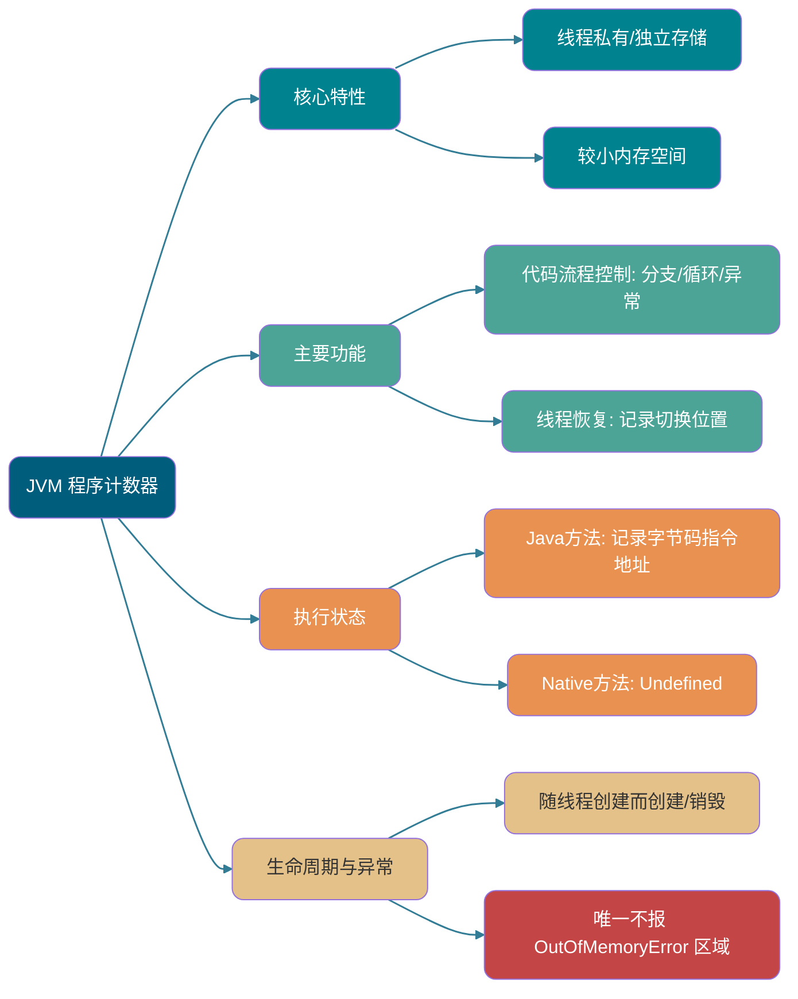
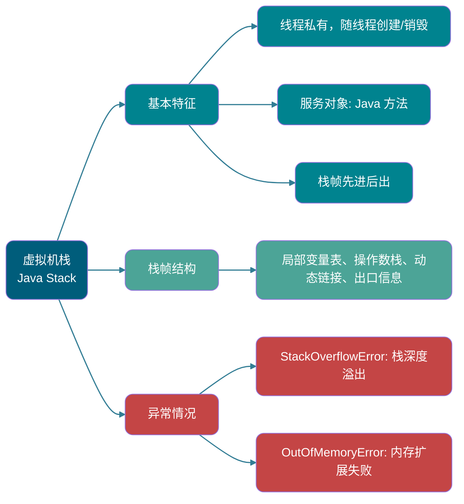
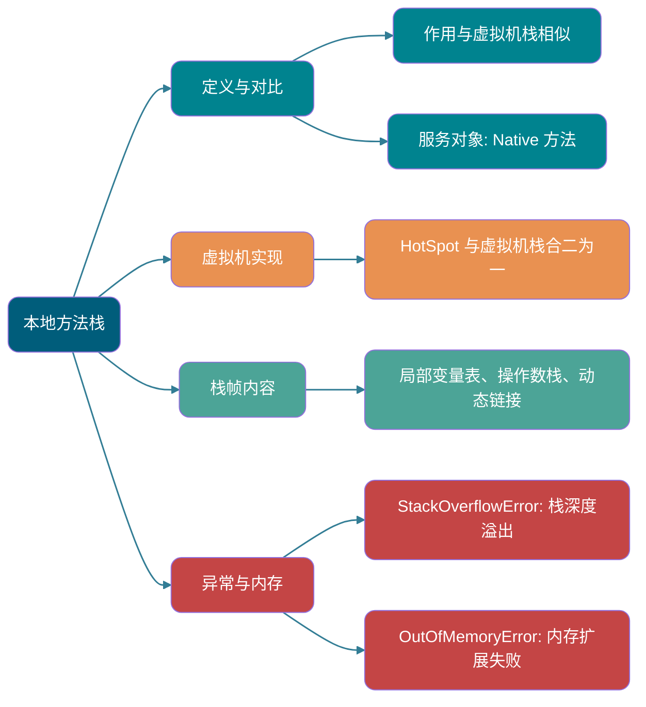
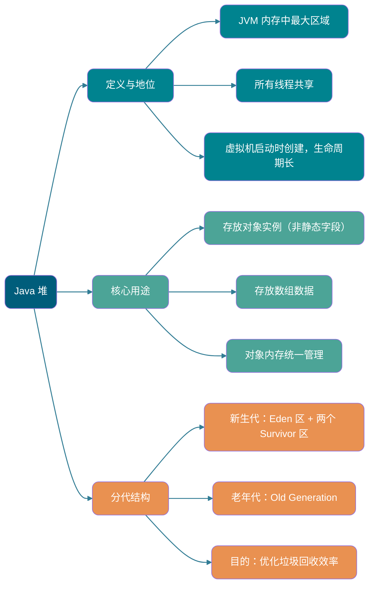
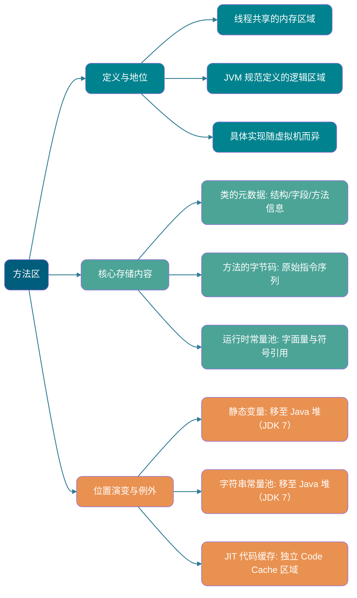
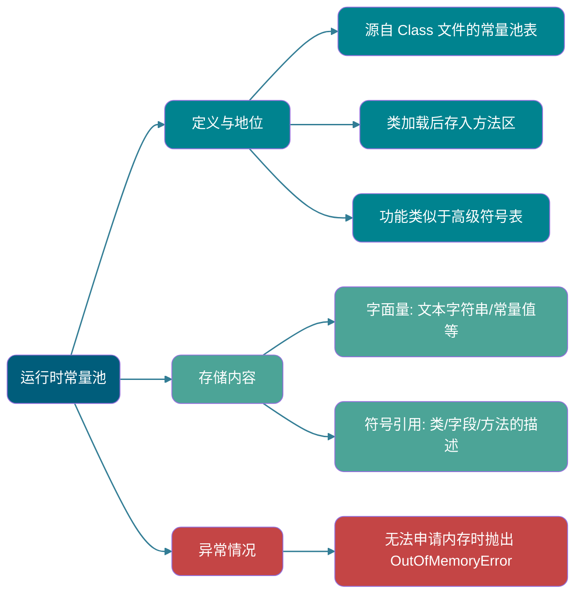
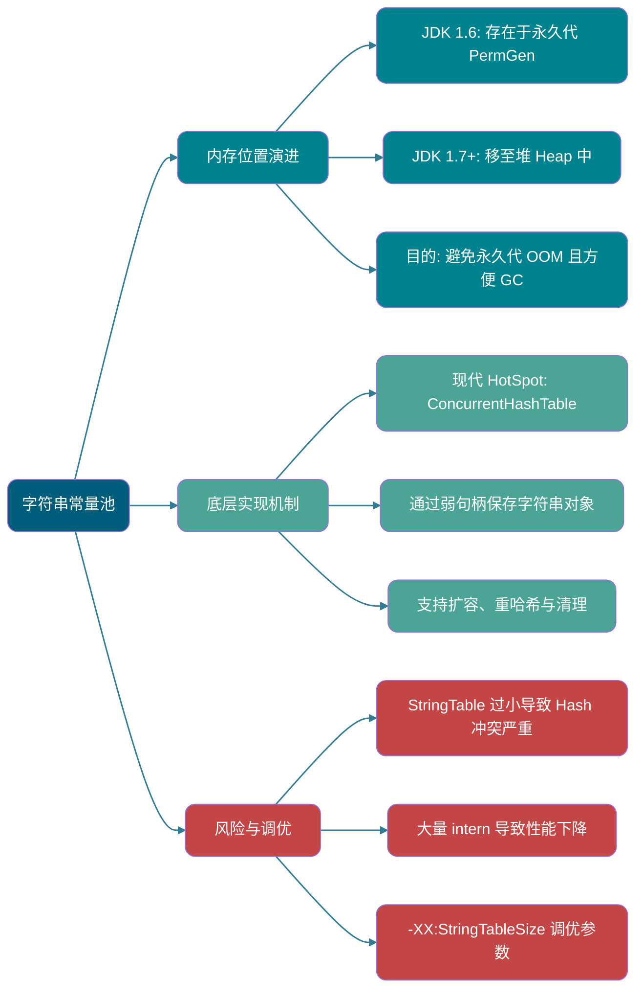
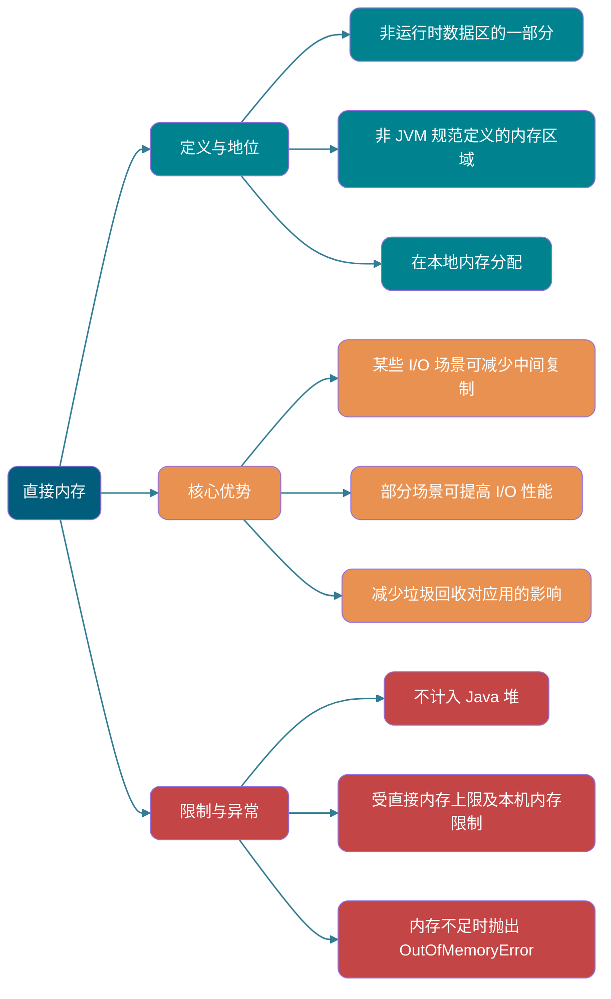
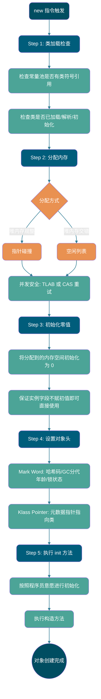

# jvm

> Aggregate of markdown under this directory (excludes README.md, TODO.md).


---

<!-- source: Java内存区域详解（重点）.md -->

---
title: Java内存区域详解（重点）
description: JVM内存区域详解：深入剖析Java运行时数据区（堆、方法区、虚拟机栈、本地方法栈、程序计数器）、对象创建过程、内存分配策略、对象访问定位方式。
category: Java
tag:
  - JVM
head:
  - - meta
    - name: keywords
      content: JVM内存区域,运行时数据区,堆内存,方法区,虚拟机栈,程序计数器,对象创建,Java内存模型
---

> 如果没有特殊说明，都是针对的是 HotSpot 虚拟机。
>
> 本文基于《深入理解 Java 虚拟机：JVM 高级特性与最佳实践》进行总结补充。
>
> 常见面试题：
>
> - 介绍下 Java 内存区域（运行时数据区）
> - Java 对象的创建过程（五步，建议能默写出来并且要知道每一步虚拟机做了什么）
> - 对象的访问定位的两种方式（句柄和直接指针两种方式）

## 前言

对于 Java 程序员来说，在虚拟机自动内存管理机制下，不再需要像 C/C++程序开发程序员这样为每一个 new 操作去写对应的 delete/free 操作，不容易出现内存泄漏和内存溢出问题。正是因为 Java 程序员把内存控制权利交给 Java 虚拟机，一旦出现内存泄漏和溢出方面的问题，如果不了解虚拟机是怎样使用内存的，那么排查错误将会是一个非常艰巨的任务。

## 运行时数据区域

Java 虚拟机在执行 Java 程序的过程中会把它管理的内存划分成若干个不同的数据区域。

JDK 1.8 和之前的版本略有不同，我们这里以 JDK 1.7 和 JDK 1.8 这两个版本为例介绍。

**JDK 1.7**：


**JDK 1.8**：


**线程私有的：**

- 程序计数器
- 虚拟机栈
- 本地方法栈

**线程共享的：**

- 堆
- 方法区

直接内存经常与这些区域一起讨论，但它不是《Java 虚拟机规范》定义的运行时数据区，也不应被当作规范中的“线程共享运行时数据区”。

Java 虚拟机规范对于运行时数据区域的规定是相当宽松的。以堆为例：堆可以是连续空间，也可以不连续。堆的大小可以固定，也可以在运行时按需扩展。虚拟机实现者可以使用任何垃圾回收算法管理堆，甚至完全不进行垃圾收集也是可以的。

### 程序计数器



程序计数器是一块较小的内存空间，可以看作是当前线程所执行的字节码的行号指示器。字节码解释器工作时通过改变这个计数器的值来选取下一条需要执行的字节码指令，分支、循环、跳转、异常处理、线程恢复等功能都需要依赖这个计数器来完成。

另外，为了线程切换后能恢复到正确的执行位置，每条线程都需要有一个独立的程序计数器，各线程之间计数器互不影响，独立存储，我们称这类内存区域为“线程私有”的内存。

从上面的介绍中我们知道了程序计数器主要有两个作用：

- 字节码解释器通过改变程序计数器来依次读取指令，从而实现代码的流程控制，如：顺序执行、选择、循环、异常处理。
- 在多线程的情况下，程序计数器用于记录当前线程执行的位置，从而当线程被切换回来的时候能够知道该线程上次运行到哪儿了。

程序计数器的生命周期与线程完全同步：

- **创建**：随着线程的创建而创建。
- **销毁**：随着线程的结束而销毁。

在执行 **Java 方法**（非 native）时，程序计数器记录的是 **当前正在执行的 JVM 字节码指令的地址**。当线程执行的是一个 **native 方法**（本地方法）时，程序计数器的值为 **Undefined（未定义）**，因为此时执行的不是 JVM 字节码指令。

⚠️ 注意：程序计数器是 JVM 规范中唯一没有规定任何 `OutOfMemoryError` 情况的内存区域。规范只规定了这一结论，并未要求所有实现都采用某种固定大小的具体表示。

### Java 虚拟机栈



与程序计数器一样，Java 虚拟机栈（后文简称栈）也是线程私有的，它的生命周期和线程相同，随着线程的创建而创建，随着线程的死亡而死亡。

栈绝对算的上是 JVM 运行时数据区域的一个核心，除了一些 Native 方法调用是通过本地方法栈实现的（后面会提到），其他所有的 Java 方法调用都是通过栈来实现的（也需要和其他运行时数据区域比如程序计数器配合）。

方法调用的数据需要通过栈进行传递，每一次方法调用都会有一个对应的栈帧被压入栈中，每一个方法调用结束后，都会有一个栈帧被弹出。

栈由一个个栈帧组成，而每个栈帧中都拥有：局部变量表、操作数栈、动态链接、方法返回地址。和数据结构上的栈类似，两者都是先进后出的数据结构，只支持出栈和入栈两种操作。


**局部变量表** 主要存放了编译期可知的各种数据类型（boolean、byte、char、short、int、float、long、double）、对象引用（reference 类型，它不同于对象本身，可能是一个指向对象起始地址的引用指针，也可能是指向一个代表对象的句柄或其他与此对象相关的位置）。


**操作数栈** 主要作为方法调用的中转站使用，用于存放方法执行过程中产生的中间计算结果。另外，计算过程中产生的临时变量也会放在操作数栈中。

**动态链接**是栈帧的一项功能。每个栈帧都持有指向当前方法所属类型的运行时常量池的引用，用于把方法代码中的方法符号引用转换为具体的方法引用，并把变量访问转换为对应运行时存储结构中的偏移；解析尚未确定的符号时还可能触发类加载。需要根据接收者实际类型选择虚方法实现的过程属于方法调用指令的动态分派，不能简单等同于这里的动态链接。


栈空间虽然不是无限的，但一般正常调用的情况下是不会出现问题的。不过，如果函数调用陷入无限递归的话，就会导致栈中被压入太多栈帧而占用太多空间，导致栈空间过深。那么当线程请求栈的深度超过当前 Java 虚拟机栈的最大深度的时候，就抛出 `StackOverflowError` 错误。

**Java 方法有两种返回方式**：

- **正常返回**：执行 return 语句，返回值传递给调用者。
- **异常返回**：方法执行过程中抛出异常且未被捕获。

不管哪种返回方式，都会导致栈帧被弹出。也就是说， **栈帧随着方法调用而创建，随着方法结束而销毁。无论方法正常完成还是异常完成都算作方法结束。**

除了 `StackOverflowError` 错误之外，栈还可能会出现 `OutOfMemoryError` 错误，这是因为如果栈的内存大小可以动态扩展， 那么当虚拟机在动态扩展栈时无法申请到足够的内存空间，则抛出 `OutOfMemoryError` 异常。

简单总结一下程序运行中栈可能会出现两种错误：

- **`StackOverflowError`：** 当线程执行所需的栈空间超过 JVM 允许的大小时，抛出 `StackOverflowError` 错误。
- **`OutOfMemoryError`：** 如果栈的内存大小可以动态扩展， 那么当虚拟机在动态扩展栈时无法申请到足够的内存空间，则抛出 `OutOfMemoryError` 异常。


### 本地方法栈



和虚拟机栈所发挥的作用非常相似，区别是：**虚拟机栈为虚拟机执行 Java 方法（也就是字节码）服务，而本地方法栈则为虚拟机使用到的 Native 方法服务。** 在 HotSpot 虚拟机中和 Java 虚拟机栈合二为一。

执行本地方法时，虚拟机实现可以使用传统的本地栈（通常称为 C 栈）。《Java 虚拟机规范》没有规定本地方法栈必须采用与 JVM 栈帧相同的局部变量表、操作数栈和动态链接结构。

本地方法执行完毕后，相应的实现相关栈数据会被释放。本地方法栈也可能出现 `StackOverflowError` 和 `OutOfMemoryError` 两种错误。

### 堆



Java 虚拟机所管理的内存中最大的一块，Java 堆是所有线程共享的一块内存区域，在虚拟机启动时创建。**此内存区域的唯一目的就是存放对象实例，几乎所有的对象实例以及数组都在这里分配内存。**

Java 世界中“几乎”所有的对象都在堆中分配。不过，JIT 编译器可以基于逃逸分析进行标量替换，从而消除部分对象的实际分配。HotSpot 的这类优化不能简单表述为“对象直接在 Java 虚拟机栈上分配”。

Java 堆是垃圾收集器管理的主要区域，因此也被称作 **GC 堆（Garbage Collected Heap）**。从垃圾回收的角度，由于现在收集器基本都采用分代垃圾收集算法，所以 Java 堆还可以细分为：新生代和老年代；再细致一点有：Eden、Survivor、Old 等空间。进一步划分的目的是更好地回收内存，或者更快地分配内存。

在 JDK 7 及更早版本的 HotSpot 中，GC 通常按下面三部分介绍，其中永久代是方法区的实现，并不属于 Java 堆：

1. 新生代内存(Young Generation)
2. 老生代(Old Generation)
3. 永久代(Permanent Generation)

下图所示的 Eden 区、两个 Survivor 区 S0 和 S1 都属于新生代，中间一层属于老年代，最下面一层属于永久代。


**JDK 8 版本之后 PermGen（永久代） 已被 Metaspace（元空间） 取代，元空间使用的是本地内存。**（我会在方法区这部分内容详细介绍到）。

大部分情况，对象都会首先在 Eden 区域分配，在一次新生代垃圾回收后，如果对象还存活，则会进入 S0 或者 S1，并且对象的年龄还会加 1（Eden 区->Survivor 区后对象的初始年龄变为 1）。对象达到晋升年龄阈值后会进入老年代，该阈值受收集器、自适应策略和 `-XX:MaxTenuringThreshold` 参数共同影响，并非所有收集器的默认值都是 15。对于采用 4 位年龄字段的经典分代收集器，该参数的上限是 15。

```bash
MaxTenuringThreshold of 20 is invalid; must be between 0 and 15
```

**为什么年龄只能是 0-15?**

因为记录年龄的区域在对象头中，这个区域的大小通常是 4 位。这 4 位可以表示的最大二进制数字是 1111，即十进制的 15。因此，对象的年龄被限制为 0 到 15。

这里我们简单结合对象布局来详细介绍一下。

在 HotSpot 虚拟机中，对象在内存中存储的布局可以分为 3 块区域：对象头（Header）、实例数据（Instance Data）和对齐填充（Padding）。其中，对象头包括两部分：标记字段（Mark Word）和类型指针（Klass Word）。关于对象内存布局的详细介绍，后文会介绍到，这里就不重复提了。

这个年龄信息就是在标记字段中存放的（标记字段还存放了对象自身的其他信息比如哈希码、锁状态信息等等）。下面旧版 HotSpot 源码中的 `markOop.hpp` 展示了当时标记字（Mark Word）的结构；现代 JDK 的对应实现和对象头布局已经发生变化：


可以看到对象年龄占用的大小确实是 4 位。

> **🐛 修正（参见：[issue552](https://github.com/Snailclimb/JavaGuide/issues/552)）**：“Hotspot 遍历所有对象时，按照年龄从小到大对其所占用的大小进行累加，当累加到某个年龄时，所累加的大小超过了 Survivor 区的一半，则取这个年龄和 `MaxTenuringThreshold` 中更小的一个值，作为新的晋升年龄阈值”。
>
> **动态年龄计算的代码如下**
>
> ```c++
> uint ageTable::compute_tenuring_threshold(size_t survivor_capacity) {
>  //survivor_capacity是survivor空间的大小
> size_t desired_survivor_size = (size_t)((((double) survivor_capacity)*TargetSurvivorRatio)/100);//TargetSurvivorRatio 为50
> size_t total = 0;
> uint age = 1;
> while (age < table_size) {
> total += sizes[age];//sizes数组是每个年龄段对象大小
> if (total > desired_survivor_size) break;
> age++;
> }
> uint result = age < MaxTenuringThreshold ? age : MaxTenuringThreshold;
>   ...
> }
> ```

堆这里最容易出现的就是 `OutOfMemoryError` 错误，并且出现这种错误之后的表现形式还会有几种，比如：

1. **`java.lang.OutOfMemoryError: GC Overhead Limit Exceeded`**：当 JVM 花太多时间执行垃圾回收并且只能回收很少的堆空间时，就会发生此错误。
2. **`java.lang.OutOfMemoryError: Java heap space`** :假如在创建新的对象时, 堆内存中的空间不足以存放新创建的对象, 就会引发此错误。(和配置的最大堆内存有关，且受制于物理内存大小。最大堆内存可通过 `-Xmx` 参数配置，若没有特别配置，将会使用默认值，详见：[Default Java 8 max heap size](https://stackoverflow.com/questions/28272923/default-xmxsize-in-java-8-max-heap-size))
3. ……

### 方法区



方法区属于是 JVM 运行时数据区域的一块逻辑区域，是各个线程共享的内存区域。

《Java 虚拟机规范》只是规定了有方法区这么个概念和它的作用，方法区到底要如何实现那就是虚拟机自己要考虑的事情了。也就是说，在不同的虚拟机实现上，方法区的实现是不同的。

当虚拟机加载一个类时，它会从 Class 文件中解析出相应的信息，并将这些**元数据**存入方法区。具体来说，方法区主要存储以下核心数据：

1. **类的元数据**：包括类的完整结构，如类名、父类、实现的接口、访问修饰符，以及字段和方法的详细信息（名称、类型、修饰符等）。
2. **方法的字节码**：每个方法的原始指令序列。
3. **运行时常量池**：每个类独有的，由 Class 文件中的常量池转换而来，用于存放编译期生成的各种字面量和对类型、字段、方法的符号引用。

需要特别注意的是，以下几类数据虽然在逻辑上与类相关，但在 HotSpot 虚拟机中，它们并不存储在方法区内：

- **静态变量（Static Variables）**：自 JDK 7 起，类静态变量与对应的 `java.lang.Class` 对象一起存放在 Java 堆中。
- **字符串常量池（String Pool）**：同样自 JDK 7 起，字符串常量池也**移至 Java 堆中**。
- **即时编译器编译后的代码缓存（JIT Code Cache）**：JIT 编译器将热点方法的字节码编译成的本地机器码，存放在一个**独立的、名为“Code Cache”的内存区域**，而不是方法区本身。这样做是为了实现更高效的执行和内存管理。


**方法区和永久代以及元空间是什么关系呢？** 方法区和永久代以及元空间的关系很像 Java 中接口和类的关系，类实现了接口，这里的类就可以看作是永久代和元空间，接口可以看作是方法区，也就是说永久代以及元空间是 HotSpot 虚拟机对虚拟机规范中方法区的两种实现方式。并且，永久代是 JDK 1.8 之前的方法区实现，JDK 1.8 及以后方法区的实现变成了元空间。


**为什么要将永久代 (PermGen) 替换为元空间 (MetaSpace) 呢?**

下图来自《深入理解 Java 虚拟机》第 3 版 2.2.5


1、永久代的容量受 `-XX:MaxPermSize` 上限约束，这个上限可以配置；元空间改用本地内存，并可通过 `-XX:MaxMetaspaceSize` 限制。两者都可能溢出，实际风险取决于配置和类元数据的增长情况。

> 当元空间溢出时会得到如下错误：`java.lang.OutOfMemoryError: Metaspace`

你可以使用 `-XX:MaxMetaspaceSize` 设置最大元空间大小。若不设置，类元数据空间可继续增长，直到受到可用本地内存等条件限制。`-XX:MetaspaceSize` 不是元空间的初始容量，而是触发元数据 GC 的初始高水位阈值，之后 JVM 会动态调整该阈值。

2、元空间里面存放的是类的元数据，这样加载多少类的元数据就不由 `MaxPermSize` 控制了, 而由系统的实际可用空间来控制，这样能加载的类就更多了。

3、在 JDK8，合并 HotSpot 和 JRockit 的代码时, JRockit 从来没有一个叫永久代的东西, 合并之后就没有必要额外的设置这么一个永久代的地方了。

4、永久代会为 GC 带来不必要的复杂度，并且回收效率偏低。

**方法区常用参数有哪些？**

JDK 1.8 之前永久代还没被彻底移除的时候通常通过下面这些参数来调节方法区大小。

```java
-XX:PermSize=N //方法区 (永久代) 初始大小
-XX:MaxPermSize=N //方法区 (永久代) 最大大小,超过这个值将会抛出 OutOfMemoryError 异常:java.lang.OutOfMemoryError: PermGen
```

相对而言，垃圾收集行为在这个区域是比较少出现的，但并非数据进入方法区后就“永久存在”了。

JDK 1.8 的时候，方法区（HotSpot 的永久代）被彻底移除了（JDK1.7 就已经开始了），取而代之是元空间，元空间使用的是本地内存。下面是一些常用参数：

```java
-XX:MetaspaceSize=N //设置触发元数据 GC 的初始高水位阈值
-XX:MaxMetaspaceSize=N //设置 Metaspace 的最大大小
```

与永久代很大的不同是，如果不指定 `MaxMetaspaceSize`，元空间没有由该参数设定的固定上限，持续的类元数据增长可能消耗大量本地内存。

### 运行时常量池



Class 文件中除了有类的版本、字段、方法、接口等描述信息外，还有用于存放编译期生成的各种字面量（Literal）和符号引用（Symbolic Reference）的 **常量池表(Constant Pool Table)**。

字面量是源代码中的固定值的表示法，即通过字面我们就能知道其值的含义。字面量包括整数、浮点数和字符串字面量。常见的符号引用包括类符号引用、字段符号引用、方法符号引用、接口方法符号。

《深入理解 Java 虚拟机》7.34 节第三版对符号引用和直接引用的解释如下：


常量池表会在类加载后存放到方法区的运行时常量池中。

运行时常量池的功能类似于传统编程语言的符号表，尽管它包含了比典型符号表更广泛的数据。

既然运行时常量池是方法区的一部分，自然受到方法区内存的限制，当常量池无法再申请到内存时会抛出 `OutOfMemoryError` 错误。

### 字符串常量池



**字符串常量池** 是 JVM 为了提升性能和减少内存消耗针对字符串（String 类）专门开辟的一块区域，主要目的是为了避免字符串的重复创建。

```java
// 1.在字符串常量池中查询字符串对象 "ab"，如果没有则创建"ab"并放入字符串常量池
// 2.将字符串对象 "ab" 的引用赋值给 aa
String aa = "ab";
// 直接返回字符串常量池中字符串对象 "ab"，赋值给引用 bb
String bb = "ab";
System.out.println(aa==bb); // true
```

HotSpot 虚拟机中字符串常量池的实现可以在 `src/hotspot/share/classfile/stringTable.cpp` 中看到。现代 HotSpot 的本地 `StringTable` 使用并发哈希表，并通过弱句柄保存堆中的字符串对象，支持扩容、重哈希以及清理失效条目；`-XX:StringTableSize` 用于设置初始桶数量。因此，“固定长度数组 + 链表”的说法只适用于部分旧版实现，不能用于概括当前 HotSpot。

JDK1.7 之前，字符串常量池存放在永久代。JDK1.7 将字符串常量池和类静态变量移到了 Java 堆中。


**JDK 1.7 为什么要将字符串常量池移动到堆中？**

主要是因为永久代（方法区实现）的 GC 回收效率太低，只有在整堆收集 (Full GC)的时候才会被执行 GC。Java 程序中通常会有大量的被创建的字符串等待回收，将字符串常量池放到堆中，能够更高效及时地回收字符串内存。

相关问题：[JVM 常量池中存储的是对象还是引用呢？ - RednaxelaFX - 知乎](https://www.zhihu.com/question/57109429/answer/151717241)

最后再来分享一段周志明老师在[《深入理解 Java 虚拟机（第 3 版）》样例代码&勘误](https://github.com/fenixsoft/jvm_book) GitHub 仓库的 [issue#112](https://github.com/fenixsoft/jvm_book/issues/112) 中说过的话：

> **运行时常量池、方法区、字符串常量池这些都是不随虚拟机实现而改变的逻辑概念，是公共且抽象的，Metaspace、Heap 是与具体某种虚拟机实现相关的物理概念，是私有且具体的。**

### 直接内存



直接内存是一种特殊的内存缓冲区，并不在 Java 堆或方法区中分配，而是在本地内存中分配。具体分配机制属于虚拟机实现细节，并不等同于必须通过 JNI 分配。

直接内存并不是虚拟机运行时数据区的一部分，也不是虚拟机规范中定义的内存区域，但是这部分内存也被频繁地使用。而且也可能导致 `OutOfMemoryError` 错误出现。

JDK1.4 中新加入的 **NIO（New I/O）**，引入了一种基于**通道（Channel）**与**缓冲区（Buffer）**的 I/O 方式。直接字节缓冲区可以在 Java 堆外分配内容，并通过 Java 堆中的 `DirectByteBuffer` 对象进行操作。JVM 会尽力直接在这种缓冲区上执行本地 I/O，从而在某些场景中减少中间缓冲区的数据复制；NIO 中只有可选择通道与 Selector 等部分提供非阻塞 I/O 能力，不能把整个 NIO 展开为 Non-Blocking I/O。

直接内存不计入 Java 堆，但仍会受到本机总内存、处理器寻址空间等条件的限制。对于 NIO 直接缓冲区，还可以通过 [`-XX:MaxDirectMemorySize`](https://docs.oracle.com/en/java/javase/25/docs/specs/man/java.html#extra-options-for-java) 限制总分配量。

类似的概念还有 **堆外内存**。在一些文章中将直接内存等价于堆外内存，个人觉得不是特别准确。

堆外内存是分配在 Java 堆之外的内存的统称，底层通常使用操作系统提供的本地内存。它是否以及如何受到 JVM 或 JDK 管理，取决于具体的分配方式。例如，在 OpenJDK/HotSpot 中，`DirectByteBuffer` 对应的本地内存会关联 Java 堆中的缓冲区对象，并在对象变为不可达后通过 `Cleaner` 等机制参与清理。由于清理时机不由应用程序直接控制，使用堆外内存可以减少 Java 堆的压力，但仍然需要关注本地内存泄漏和 `OutOfMemoryError`。

## HotSpot 虚拟机对象探秘

通过上面的介绍我们大概知道了虚拟机的内存情况，下面我们来详细的了解一下 HotSpot 虚拟机在 Java 堆中对象分配、布局和访问的全过程。

### 对象的创建

Java 对象的创建过程我建议最好是能默写出来，并且要掌握每一步在做什么。



#### Step1:类加载检查

虚拟机遇到一条 new 指令时，首先将去检查这个指令的参数是否能在常量池中定位到这个类的符号引用，并且检查这个符号引用代表的类是否已被加载过、解析和初始化过。如果没有，那必须先执行相应的类加载过程。

#### Step2:分配内存

在**类加载检查**通过后，接下来虚拟机将为新生对象**分配内存**。对象所需的内存大小在类加载完成后便可确定，为对象分配空间的任务等同于把一块确定大小的内存从 Java 堆中划分出来。**分配方式**有 **“指针碰撞”** 和 **“空闲列表”** 两种，**选择哪种分配方式由 Java 堆是否规整决定，而 Java 堆是否规整又由所采用的垃圾收集器是否带有压缩整理功能决定**。

**内存分配的两种方式**（补充内容，需要掌握）：

- 指针碰撞：
  - 适用场合：堆内存规整（即没有内存碎片）的情况下。
  - 原理：用过的内存全部整合到一边，没有用过的内存放在另一边，中间有一个分界指针，只需要向着没用过的内存方向将该指针移动对象内存大小位置即可。
  - 使用该分配方式的 GC 收集器：Serial, ParNew
- 空闲列表：
  - 适用场合：堆内存不规整的情况下。
  - 原理：虚拟机会维护一个列表，该列表中会记录哪些内存块是可用的，在分配的时候，找一块儿足够大的内存块儿来划分给对象实例，最后更新列表记录。
  - 使用该分配方式的 GC 收集器：CMS

选择以上两种方式中的哪一种，取决于 Java 堆内存是否规整。而 Java 堆内存是否规整，取决于 GC 收集器的算法是“标记-清除”，还是“标记-整理”（也称作“标记-压缩”），值得注意的是，复制算法内存也是规整的。

**内存分配并发问题（补充内容，需要掌握）**

在创建对象的时候有一个很重要的问题，就是线程安全，因为在实际开发过程中，创建对象是很频繁的事情，作为虚拟机来说，必须要保证线程是安全的，通常来讲，虚拟机采用两种方式来保证线程安全：

- **CAS+失败重试：** CAS 是乐观锁的一种实现方式。所谓乐观锁就是，每次不加锁而是假设没有冲突而去完成某项操作，如果因为冲突失败就重试，直到成功为止。**虚拟机采用 CAS 配上失败重试的方式保证更新操作的原子性。**
- **TLAB：** 为每一个线程预先在 Eden 区分配一块儿内存，JVM 在给线程中的对象分配内存时，首先在 TLAB 分配，当对象大于 TLAB 中的剩余内存或 TLAB 的内存已用尽时，再采用上述的 CAS 进行内存分配

#### Step3:初始化零值

内存分配完成后，虚拟机需要将分配到的内存空间都初始化为零值（不包括对象头），这一步操作保证了对象的实例字段在 Java 代码中可以不赋初始值就直接使用，程序能访问到这些字段的数据类型所对应的零值。

#### Step4:设置对象头

初始化零值完成之后，**虚拟机要对对象进行必要的设置**，例如这个对象是哪个类的实例、如何才能找到类的元数据信息、对象的哈希码、对象的 GC 分代年龄等信息。 **这些信息存放在对象头中。** 另外，对象头的具体布局与 JDK 版本和虚拟机配置有关；例如偏向锁在 JDK 15 起默认禁用，相关实现后来又被移除。

#### Step5:执行 init 方法

在上面工作都完成之后，从虚拟机的视角来看，一个新的对象已经产生了，但从 Java 程序的视角来看，对象创建才刚开始，`<init>` 方法还没有执行，所有的字段都还为零。所以一般来说，执行 new 指令之后会接着执行 `<init>` 方法，把对象按照程序员的意愿进行初始化，这样一个真正可用的对象才算完全产生出来。

### 对象的内存布局

在 Hotspot 虚拟机中，对象在内存中的布局可以分为 3 块区域：**对象头（Header）**、**实例数据（Instance Data）**和**对齐填充（Padding）**。

对象头包括两部分信息：

1. 标记字段（Mark Word）：用于存储对象自身的运行时数据，如哈希码（HashCode）、GC 分代年龄、锁状态等；偏向线程 ID、偏向时间戳只适用于仍实现并启用偏向锁的旧版 HotSpot。
2. 类型指针（Klass pointer）：对象指向它的类元数据的指针，虚拟机通过这个指针来确定这个对象是哪个类的实例。

**实例数据部分是对象真正存储的有效信息**，也是在程序中所定义的各种类型的字段内容。

**对齐填充部分不是必然存在的，也没有什么特别的含义，仅仅起占位作用。** HotSpot 会按对象对齐边界分配对象，默认对齐通常是 8 字节，也可受 `-XX:ObjectAlignmentInBytes` 等配置影响。因此对象总大小需要补齐到对齐边界；对象头本身并不保证总是 8 字节的整数倍，例如启用压缩类指针时常见的对象头大小是 12 字节。

### 对象的访问定位

建立对象就是为了使用对象，我们的 Java 程序通过栈上的 reference 数据来操作堆上的具体对象。对象的访问方式由虚拟机实现而定，目前主流的访问方式有：**使用句柄**、**直接指针**。

#### 句柄

如果使用句柄的话，那么 Java 堆中将会划分出一块内存来作为句柄池，reference 中存储的就是对象的句柄地址，而句柄中包含了对象实例数据与对象类型数据各自的具体地址信息。


#### 直接指针

如果使用直接指针访问，reference 中存储的直接就是对象的地址。


这两种对象访问方式各有优势。使用句柄来访问的最大好处是 reference 中存储的是稳定的句柄地址，在对象被移动时只会改变句柄中的实例数据指针，而 reference 本身不需要修改。使用直接指针访问方式最大的好处就是速度快，它节省了一次指针定位的时间开销。

HotSpot 虚拟机主要使用的就是这种方式来进行对象访问。

## 参考

- 《深入理解 Java 虚拟机：JVM 高级特性与最佳实践（第二版》
- 《自己动手写 Java 虚拟机》
- Chapter 2. The Structure of the Java Virtual Machine：<https://docs.oracle.com/javase/specs/jvms/se8/html/jvms-2.html>
- JVM 栈帧内部结构-动态链接：<https://chenxitag.com/archives/368>
- Java 中 new String（“字面量”） 中 “字面量” 是何时进入字符串常量池的？ - 木女孩的回答 - 知乎：<https://www.zhihu.com/question/55994121/answer/147296098>
- JVM 常量池中存储的是对象还是引用呢？ - RednaxelaFX 的回答 - 知乎：<https://www.zhihu.com/question/57109429/answer/151717241>
- <http://www.pointsoftware.ch/en/under-the-hood-runtime-data-areas-javas-memory-model/>
- <https://dzone.com/articles/jvm-permgen-%E2%80%93-where-art-thou>
- <https://stackoverflow.com/questions/9095748/method-area-and-permgen>


---

<!-- source: JDK监控和故障处理工具总结.md -->

---
title: JDK监控和故障处理工具总结
category: Java
tag:
  - JVM
---

## JDK 命令行工具

这些命令在 JDK 安装目录下的 bin 目录下：

- **`jps`** (JVM Process Status）: 类似 UNIX 的 `ps` 命令。用于查看所有 Java 进程的启动类、传入参数和 Java 虚拟机参数等信息；
- **`jstat`**（JVM Statistics Monitoring Tool）: 用于收集 HotSpot 虚拟机各方面的运行数据;
- **`jinfo`** (Configuration Info for Java) : Configuration Info for Java,显示虚拟机配置信息;
- **`jmap`** (Memory Map for Java) : 生成堆转储快照;
- **`jhat`** (JVM Heap Dump Browser) : 用于分析 heapdump 文件，它会建立一个 HTTP/HTML 服务器，让用户可以在浏览器上查看分析结果。JDK9 移除了 jhat；
- **`jstack`** (Stack Trace for Java) : 生成虚拟机当前时刻的线程快照，线程快照就是当前虚拟机内每一条线程正在执行的方法堆栈的集合。

### `jps`:查看所有 Java 进程

`jps`(JVM Process Status) 命令类似 UNIX 的 `ps` 命令。

`jps`：显示虚拟机执行主类名称以及这些进程的本地虚拟机唯一 ID（Local Virtual Machine Identifier,LVMID）。`jps -q`：只输出进程的本地虚拟机唯一 ID。

```powershell
C:\Users\SnailClimb>jps
7360 NettyClient2
17396
7972 Launcher
16504 Jps
17340 NettyServer
```

`jps -l`:输出主类的全名，如果进程执行的是 Jar 包，输出 Jar 路径。

```powershell
C:\Users\SnailClimb>jps -l
7360 firstNettyDemo.NettyClient2
17396
7972 org.jetbrains.jps.cmdline.Launcher
16492 sun.tools.jps.Jps
17340 firstNettyDemo.NettyServer
```

`jps -v`：输出虚拟机进程启动时 JVM 参数。

`jps -m`：输出传递给 Java 进程 main() 函数的参数。

### `jstat`: 监视虚拟机各种运行状态信息

jstat（JVM Statistics Monitoring Tool） 使用于监视虚拟机各种运行状态信息的命令行工具。 它可以显示本地或者远程（需要远程主机提供 RMI 支持）虚拟机进程中的类信息、内存、垃圾收集、JIT 编译等运行数据，在没有 GUI，只提供了纯文本控制台环境的服务器上，它将是运行期间定位虚拟机性能问题的首选工具。

**`jstat` 命令使用格式：**

```powershell
jstat -<option> [-t] [-h<lines>] <vmid> [<interval> [<count>]]
```

比如 `jstat -gc -h3 31736 1000 10`表示分析进程 id 为 31736 的 gc 情况，每隔 1000ms 打印一次记录，打印 10 次停止，每 3 行后打印指标头部。

**常见的 option 如下：**

- `jstat -class vmid`：显示 ClassLoader 的相关信息；
- `jstat -compiler vmid`：显示 JIT 编译的相关信息；
- `jstat -gc vmid`：显示与 GC 相关的堆信息；
- `jstat -gccapacity vmid`：显示各个代的容量及使用情况；
- `jstat -gcnew vmid`：显示新生代信息；
- `jstat -gcnewcapcacity vmid`：显示新生代大小与使用情况；
- `jstat -gcold vmid`：显示老年代和永久代的行为统计，从 jdk1.8 开始,该选项仅表示老年代，因为永久代被移除了；
- `jstat -gcoldcapacity vmid`：显示老年代的大小；
- `jstat -gcpermcapacity vmid`：显示永久代大小，从 jdk1.8 开始,该选项不存在了，因为永久代被移除了；
- `jstat -gcutil vmid`：显示垃圾收集信息；

另外，加上 `-t`参数可以在输出信息上加一个 Timestamp 列，显示程序的运行时间。

### `jinfo`: 实时地查看和调整虚拟机各项参数

`jinfo vmid` :输出当前 jvm 进程的全部参数和系统属性 (第一部分是系统的属性，第二部分是 JVM 的参数)。

`jinfo -flag name vmid` :输出对应名称的参数的具体值。比如输出 MaxHeapSize、查看当前 jvm 进程是否开启打印 GC 日志 ( `-XX:PrintGCDetails` :详细 GC 日志模式，这两个都是默认关闭的)。

```powershell
C:\Users\SnailClimb>jinfo  -flag MaxHeapSize 17340
-XX:MaxHeapSize=2124414976
C:\Users\SnailClimb>jinfo  -flag PrintGC 17340
-XX:-PrintGC
```

使用 jinfo 可以在不重启虚拟机的情况下，可以动态的修改 jvm 的参数。尤其在线上的环境特别有用,请看下面的例子：

`jinfo -flag [+|-]name vmid` 开启或者关闭对应名称的参数。

```powershell
C:\Users\SnailClimb>jinfo  -flag  PrintGC 17340
-XX:-PrintGC

C:\Users\SnailClimb>jinfo  -flag  +PrintGC 17340

C:\Users\SnailClimb>jinfo  -flag  PrintGC 17340
-XX:+PrintGC
```

### `jmap`:生成堆转储快照

`jmap`（Memory Map for Java）命令用于生成堆转储快照。 如果不使用 `jmap` 命令，要想获取 Java 堆转储，可以使用 `“-XX:+HeapDumpOnOutOfMemoryError”` 参数，可以让虚拟机在 OOM 异常出现之后自动生成 dump 文件，Linux 命令下可以通过 `kill -3` 发送进程退出信号也能拿到 dump 文件。

`jmap` 的作用并不仅仅是为了获取 dump 文件，它还可以查询 finalizer 执行队列、Java 堆和永久代的详细信息，如空间使用率、当前使用的是哪种收集器等。和`jinfo`一样，`jmap`有不少功能在 Windows 平台下也是受限制的。

示例：将指定应用程序的堆快照输出到桌面。后面，可以通过 jhat、Visual VM 等工具分析该堆文件。

```powershell
C:\Users\SnailClimb>jmap -dump:format=b,file=C:\Users\SnailClimb\Desktop\heap.hprof 17340
Dumping heap to C:\Users\SnailClimb\Desktop\heap.hprof ...
Heap dump file created
```

### **`jhat`**: 分析 heapdump 文件

**`jhat`** 用于分析 heapdump 文件，它会建立一个 HTTP/HTML 服务器，让用户可以在浏览器上查看分析结果。

```powershell
C:\Users\SnailClimb>jhat C:\Users\SnailClimb\Desktop\heap.hprof
Reading from C:\Users\SnailClimb\Desktop\heap.hprof...
Dump file created Sat May 04 12:30:31 CST 2019
Snapshot read, resolving...
Resolving 131419 objects...
Chasing references, expect 26 dots..........................
Eliminating duplicate references..........................
Snapshot resolved.
Started HTTP server on port 7000
Server is ready.
```

访问 <http://localhost:7000/>

注意⚠️：JDK9 移除了 jhat（[JEP 241: Remove the jhat Tool](https://openjdk.org/jeps/241)），你可以使用其替代品 Eclipse Memory Analyzer Tool (MAT) 和 VisualVM，这也是官方所推荐的。

### **`jstack`** :生成虚拟机当前时刻的线程快照

`jstack`（Stack Trace for Java）命令用于生成虚拟机当前时刻的线程快照。线程快照就是当前虚拟机内每一条线程正在执行的方法堆栈的集合.

生成线程快照的目的主要是定位线程长时间出现停顿的原因，如线程间死锁、死循环、请求外部资源导致的长时间等待等都是导致线程长时间停顿的原因。线程出现停顿的时候通过`jstack`来查看各个线程的调用堆栈，就可以知道没有响应的线程到底在后台做些什么事情，或者在等待些什么资源。

**下面是一个线程死锁的代码。我们下面会通过 `jstack` 命令进行死锁检查，输出死锁信息，找到发生死锁的线程。**

```java
public class DeadLockDemo {
    private static Object resource1 = new Object();//资源 1
    private static Object resource2 = new Object();//资源 2

    public static void main(String[] args) {
        new Thread(() -> {
            synchronized (resource1) {
                System.out.println(Thread.currentThread() + "get resource1");
                try {
                    Thread.sleep(1000);
                } catch (InterruptedException e) {
                    e.printStackTrace();
                }
                System.out.println(Thread.currentThread() + "waiting get resource2");
                synchronized (resource2) {
                    System.out.println(Thread.currentThread() + "get resource2");
                }
            }
        }, "线程 1").start();

        new Thread(() -> {
            synchronized (resource2) {
                System.out.println(Thread.currentThread() + "get resource2");
                try {
                    Thread.sleep(1000);
                } catch (InterruptedException e) {
                    e.printStackTrace();
                }
                System.out.println(Thread.currentThread() + "waiting get resource1");
                synchronized (resource1) {
                    System.out.println(Thread.currentThread() + "get resource1");
                }
            }
        }, "线程 2").start();
    }
}
```

Output

```plain
Thread[线程 1,5,main]get resource1
Thread[线程 2,5,main]get resource2
Thread[线程 1,5,main]waiting get resource2
Thread[线程 2,5,main]waiting get resource1
```

线程 A 通过 synchronized (resource1) 获得 resource1 的监视器锁，然后通过`Thread.sleep(1000);`让线程 A 休眠 1s 为的是让线程 B 得到执行然后获取到 resource2 的监视器锁。线程 A 和线程 B 休眠结束了都开始企图请求获取对方的资源，然后这两个线程就会陷入互相等待的状态，这也就产生了死锁。

**通过 `jstack` 命令分析：**

```powershell
C:\Users\SnailClimb>jps
13792 KotlinCompileDaemon
7360 NettyClient2
17396
7972 Launcher
8932 Launcher
9256 DeadLockDemo
10764 Jps
17340 NettyServer

C:\Users\SnailClimb>jstack 9256
```

输出的部分内容如下：

```powershell
Found one Java-level deadlock:
=============================
"线程 2":
  waiting to lock monitor 0x000000000333e668 (object 0x00000000d5efe1c0, a java.lang.Object),
  which is held by "线程 1"
"线程 1":
  waiting to lock monitor 0x000000000333be88 (object 0x00000000d5efe1d0, a java.lang.Object),
  which is held by "线程 2"

Java stack information for the threads listed above:
===================================================
"线程 2":
        at DeadLockDemo.lambda$main$1(DeadLockDemo.java:31)
        - waiting to lock <0x00000000d5efe1c0> (a java.lang.Object)
        - locked <0x00000000d5efe1d0> (a java.lang.Object)
        at DeadLockDemo$$Lambda$2/1078694789.run(Unknown Source)
        at java.lang.Thread.run(Thread.java:748)
"线程 1":
        at DeadLockDemo.lambda$main$0(DeadLockDemo.java:16)
        - waiting to lock <0x00000000d5efe1d0> (a java.lang.Object)
        - locked <0x00000000d5efe1c0> (a java.lang.Object)
        at DeadLockDemo$$Lambda$1/1324119927.run(Unknown Source)
        at java.lang.Thread.run(Thread.java:748)

Found 1 deadlock.
```

可以看到 `jstack` 命令已经帮我们找到发生死锁的线程的具体信息。

## JDK 可视化分析工具

### JConsole:Java 监视与管理控制台

JConsole 是基于 JMX 的可视化监视、管理工具。可以很方便的监视本地及远程服务器的 java 进程的内存使用情况。你可以在控制台输入`jconsole`命令启动或者在 JDK 目录下的 bin 目录找到`jconsole.exe`然后双击启动。

#### 连接 Jconsole


如果需要使用 JConsole 连接远程进程，可以在远程 Java 程序启动时加上下面这些参数:

```properties
-Djava.rmi.server.hostname=外网访问 ip 地址
-Dcom.sun.management.jmxremote.port=60001   //监控的端口号
-Dcom.sun.management.jmxremote.authenticate=false   //关闭认证
-Dcom.sun.management.jmxremote.ssl=false
```

在使用 JConsole 连接时，远程进程地址如下：

```plain
外网访问 ip 地址:60001
```

#### 查看 Java 程序概况


#### 内存监控

JConsole 可以显示当前内存的详细信息。不仅包括堆内存/非堆内存的整体信息，还可以细化到 eden 区、survivor 区等的使用情况，如下图所示。

点击右边的“执行 GC(G)”按钮可以强制应用程序执行一个 Full GC。

> - **新生代 GC（Minor GC）**:指发生新生代的的垃圾收集动作，Minor GC 非常频繁，回收速度一般也比较快。
> - **老年代 GC（Major GC/Full GC）**:指发生在老年代的 GC，出现了 Major GC 经常会伴随至少一次的 Minor GC（并非绝对），Major GC 的速度一般会比 Minor GC 的慢 10 倍以上。


#### 线程监控

类似我们前面讲的 `jstack` 命令，不过这个是可视化的。

最下面有一个"检测死锁 (D)"按钮，点击这个按钮可以自动为你找到发生死锁的线程以及它们的详细信息 。


### Visual VM:多合一故障处理工具

VisualVM 提供在 Java 虚拟机 (Java Virtual Machine, JVM) 上运行的 Java 应用程序的详细信息。在 VisualVM 的图形用户界面中，您可以方便、快捷地查看多个 Java 应用程序的相关信息。Visual VM 官网：<https://visualvm.github.io/> 。Visual VM 中文文档:<https://visualvm.github.io/documentation.html>。

下面这段话摘自《深入理解 Java 虚拟机》。

> VisualVM（All-in-One Java Troubleshooting Tool）是到目前为止随 JDK 发布的功能最强大的运行监视和故障处理程序，官方在 VisualVM 的软件说明中写上了“All-in-One”的描述字样，预示着他除了运行监视、故障处理外，还提供了很多其他方面的功能，如性能分析（Profiling）。VisualVM 的性能分析功能甚至比起 JProfiler、YourKit 等专业且收费的 Profiling 工具都不会逊色多少，而且 VisualVM 还有一个很大的优点：不需要被监视的程序基于特殊 Agent 运行，因此他对应用程序的实际性能的影响很小，使得他可以直接应用在生产环境中。这个优点是 JProfiler、YourKit 等工具无法与之媲美的。

VisualVM 基于 NetBeans 平台开发，因此他一开始就具备了插件扩展功能的特性，通过插件扩展支持，VisualVM 可以做到：

- 显示虚拟机进程以及进程的配置、环境信息（jps、jinfo）。
- 监视应用程序的 CPU、GC、堆、方法区以及线程的信息（jstat、jstack）。
- dump 以及分析堆转储快照（jmap、jhat）。
- 方法级的程序运行性能分析，找到被调用最多、运行时间最长的方法。
- 离线程序快照：收集程序的运行时配置、线程 dump、内存 dump 等信息建立一个快照，可以将快照发送开发者处进行 Bug 反馈。
- 其他 plugins 的无限的可能性……

这里就不具体介绍 VisualVM 的使用，如果想了解的话可以看:

- <https://visualvm.github.io/documentation.html>
- <https://www.ibm.com/developerworks/cn/java/j-lo-visualvm/index.html>

### MAT：内存分析器工具

MAT（Memory Analyzer Tool）是一款快速便捷且功能强大丰富的 JVM 堆内存离线分析工具。其通过展现 JVM 异常时所记录的运行时堆转储快照（Heap dump）状态（正常运行时也可以做堆转储分析），帮助定位内存泄漏问题或优化大内存消耗逻辑。

在遇到 OOM 和 GC 问题的时候，我一般会首选使用 MAT 分析 dump 文件在，这也是该工具应用最多的一个场景。

关于 MAT 的详细介绍推荐下面这两篇文章，写的很不错：

- [JVM 内存分析工具 MAT 的深度讲解与实践—入门篇](https://juejin.cn/post/6908665391136899079)
- [JVM 内存分析工具 MAT 的深度讲解与实践—进阶篇](https://juejin.cn/post/6911624328472133646)


---

<!-- source: JVM垃圾回收详解（重点）.md -->

---
title: JVM垃圾回收详解（重点）
category: Java
tag:
  - JVM
---

> 如果没有特殊说明，都是针对的是 HotSpot 虚拟机。
>
> 本文基于《深入理解 Java 虚拟机：JVM 高级特性与最佳实践》进行总结补充。
>
> 常见面试题：
>
> - 如何判断对象是否死亡（两种方法）。
> - 简单的介绍一下强引用、软引用、弱引用、虚引用（虚引用与软引用和弱引用的区别、使用软引用能带来的好处）。
> - 如何判断一个常量是废弃常量
> - 如何判断一个类是无用的类
> - 垃圾收集有哪些算法，各自的特点？
> - HotSpot 为什么要分为新生代和老年代？
> - 常见的垃圾回收器有哪些？
> - 介绍一下 CMS,G1 收集器。
> - Minor Gc 和 Full GC 有什么不同呢？

## 前言

当需要排查各种内存溢出问题、当垃圾收集成为系统达到更高并发的瓶颈时，我们就需要对这些“自动化”的技术实施必要的监控和调节。

## 堆空间的基本结构

Java 的自动内存管理主要是针对对象内存的回收和对象内存的分配。同时，Java 自动内存管理最核心的功能是 **堆** 内存中对象的分配与回收。

Java 堆是垃圾收集器管理的主要区域，因此也被称作 **GC 堆（Garbage Collected Heap）**。

从垃圾回收的角度来说，由于现在收集器基本都采用分代垃圾收集算法，所以 Java 堆被划分为了几个不同的区域，这样我们就可以根据各个区域的特点选择合适的垃圾收集算法。

在 JDK 7 版本及 JDK 7 版本之前，堆内存被通常分为下面三部分：

1. 新生代内存(Young Generation)
2. 老生代(Old Generation)
3. 永久代(Permanent Generation)

下图所示的 Eden 区、两个 Survivor 区 S0 和 S1 都属于新生代，中间一层属于老年代，最下面一层属于永久代。


**JDK 8 版本之后 PermGen(永久) 已被 Metaspace(元空间) 取代，元空间使用的是直接内存** 。

关于堆空间结构更详细的介绍，可以回过头看看 [Java 内存区域详解](./Java内存区域详解（重点）) 这篇文章。

## 内存分配和回收原则

### 对象优先在 Eden 区分配

大多数情况下，对象在新生代中 Eden 区分配。当 Eden 区没有足够空间进行分配时，虚拟机将发起一次 Minor GC。下面我们来进行实际测试一下。

测试代码：

```java
public class GCTest {
  public static void main(String[] args) {
    byte[] allocation1, allocation2;
    allocation1 = new byte[30900*1024];
  }
}
```

通过以下方式运行：


添加的参数：`-XX:+PrintGCDetails`


运行结果 (红色字体描述有误，应该是对应于 JDK1.7 的永久代)：


从上图我们可以看出 Eden 区内存几乎已经被分配完全（即使程序什么也不做，新生代也会使用 2000 多 k 内存）。

假如我们再为 `allocation2` 分配内存会出现什么情况呢？

```java
allocation2 = new byte[900*1024];
```


给 `allocation2` 分配内存的时候 Eden 区内存几乎已经被分配完了

当 Eden 区没有足够空间进行分配时，虚拟机将发起一次 Minor GC。GC 期间虚拟机又发现 `allocation1` 无法存入 Survivor 空间，所以只好通过 **分配担保机制** 把新生代的对象提前转移到老年代中去，老年代上的空间足够存放 `allocation1`，所以不会出现 Full GC。执行 Minor GC 后，后面分配的对象如果能够存在 Eden 区的话，还是会在 Eden 区分配内存。可以执行如下代码验证：

```java
public class GCTest {

  public static void main(String[] args) {
    byte[] allocation1, allocation2,allocation3,allocation4,allocation5;
    allocation1 = new byte[32000*1024];
    allocation2 = new byte[1000*1024];
    allocation3 = new byte[1000*1024];
    allocation4 = new byte[1000*1024];
    allocation5 = new byte[1000*1024];
  }
}

```

### 大对象直接进入老年代

大对象就是需要大量连续内存空间的对象（比如：字符串、数组）。

大对象直接进入老年代的行为是由虚拟机动态决定的，它与具体使用的垃圾回收器和相关参数有关。大对象直接进入老年代是一种优化策略，旨在避免将大对象放入新生代，从而减少新生代的垃圾回收频率和成本。

- G1 垃圾回收器会根据 `-XX:G1HeapRegionSize` 参数设置的堆区域大小和 `-XX:G1MixedGCLiveThresholdPercent` 参数设置的阈值，来决定哪些对象会直接进入老年代。
- Parallel Scavenge 垃圾回收器中，默认情况下，并没有一个固定的阈值(`XX:ThresholdTolerance`是动态调整的)来决定何时直接在老年代分配大对象。而是由虚拟机根据当前的堆内存情况和历史数据动态决定。

### 长期存活的对象将进入老年代

既然虚拟机采用了分代收集的思想来管理内存，那么内存回收时就必须能识别哪些对象应放在新生代，哪些对象应放在老年代中。为了做到这一点，虚拟机给每个对象一个对象年龄（Age）计数器。

大部分情况，对象都会首先在 Eden 区域分配。如果对象在 Eden 出生并经过第一次 Minor GC 后仍然能够存活，并且能被 Survivor 容纳的话，将被移动到 Survivor 空间（s0 或者 s1）中，并将对象年龄设为 1(Eden 区->Survivor 区后对象的初始年龄变为 1)。

对象在 Survivor 中每熬过一次 MinorGC,年龄就增加 1 岁，当它的年龄增加到一定程度（默认为 15 岁），就会被晋升到老年代中。对象晋升到老年代的年龄阈值，可以通过参数 `-XX:MaxTenuringThreshold` 来设置。

> 修正（[issue552](https://github.com/Snailclimb/JavaGuide/issues/552)）：“Hotspot 遍历所有对象时，按照年龄从小到大对其所占用的大小进行累积，当累积的某个年龄大小超过了 survivor 区的 50% 时（默认值是 50%，可以通过 `-XX:TargetSurvivorRatio=percent` 来设置，参见 [issue1199](https://github.com/Snailclimb/JavaGuide/issues/1199) ），取这个年龄和 MaxTenuringThreshold 中更小的一个值，作为新的晋升年龄阈值”。
>
> jdk8 官方文档引用：<https://docs.oracle.com/javase/8/docs/technotes/开发工具/unix/java.html>。
>
> 
>
> **动态年龄计算的代码如下：**
>
> ```c++
> uint ageTable::compute_tenuring_threshold(size_t survivor_capacity) {
> //survivor_capacity是survivor空间的大小
> size_t desired_survivor_size = (size_t)((((double)survivor_capacity)*TargetSurvivorRatio)/100);
> size_t total = 0;
> uint age = 1;
> while (age < table_size) {
> //sizes数组是每个年龄段对象大小
> total += sizes[age];
> if (total > desired_survivor_size) {
> break;
> }
> age++;
> }
> uint result = age < MaxTenuringThreshold ? age : MaxTenuringThreshold;
> ...
> }
>
> ```
>
> 额外补充说明([issue672](https://github.com/Snailclimb/JavaGuide/issues/672))：**关于默认的晋升年龄是 15，这个说法的来源大部分都是《深入理解 Java 虚拟机》这本书。**
> 如果你去 Oracle 的官网阅读[相关的虚拟机参数](https://docs.oracle.com/javase/8/docs/technotes/开发工具/unix/java.html)，你会发现`-XX:MaxTenuringThreshold=threshold`这里有个说明
>
> **Sets the maximum tenuring threshold for use in adaptive GC sizing. The largest value is 15. The default value is 15 for the parallel (throughput) collector, and 6 for the CMS collector.默认晋升年龄并不都是 15，这个是要区分垃圾收集器的，CMS 就是 6.**

### 主要进行 gc 的区域

周志明先生在《深入理解 Java 虚拟机》第二版中 P92 如是写道：

> ~~_“老年代 GC（Major GC/Full GC），指发生在老年代的 GC……”_~~

上面的说法已经在《深入理解 Java 虚拟机》第三版中被改正过来了。感谢 R 大的回答：


**总结：**

针对 HotSpot VM 的实现，它里面的 GC 其实准确分类只有两大种：

部分收集 (Partial GC)：

- 新生代收集（Minor GC / Young GC）：只对新生代进行垃圾收集；
- 老年代收集（Major GC / Old GC）：只对老年代进行垃圾收集。需要注意的是 Major GC 在有的语境中也用于指代整堆收集；
- 混合收集（Mixed GC）：对整个新生代和部分老年代进行垃圾收集。

整堆收集 (Full GC)：收集整个 Java 堆和方法区。

### 空间分配担保

空间分配担保是为了确保在 Minor GC 之前老年代本身还有容纳新生代所有对象的剩余空间。

《深入理解 Java 虚拟机》第三章对于空间分配担保的描述如下：

> JDK 6 Update 24 之前，在发生 Minor GC 之前，虚拟机必须先检查老年代最大可用的连续空间是否大于新生代所有对象总空间，如果这个条件成立，那这一次 Minor GC 可以确保是安全的。如果不成立，则虚拟机会先查看 `-XX:HandlePromotionFailure` 参数的设置值是否允许担保失败(Handle Promotion Failure);如果允许，那会继续检查老年代最大可用的连续空间是否大于历次晋升到老年代对象的平均大小，如果大于，将尝试进行一次 Minor GC，尽管这次 Minor GC 是有风险的;如果小于，或者 `-XX: HandlePromotionFailure` 设置不允许冒险，那这时就要改为进行一次 Full GC。
>
> JDK 6 Update 24 之后的规则变为只要老年代的连续空间大于新生代对象总大小或者历次晋升的平均大小，就会进行 Minor GC，否则将进行 Full GC。

## 死亡对象判断方法

堆中几乎放着所有的对象实例，对堆垃圾回收前的第一步就是要判断哪些对象已经死亡（即不能再被任何途径使用的对象）。

### 引用计数法

给对象中添加一个引用计数器：

- 每当有一个地方引用它，计数器就加 1；
- 当引用失效，计数器就减 1；
- 任何时候计数器为 0 的对象就是不可能再被使用的。

**这个方法实现简单，效率高，但是目前主流的虚拟机中并没有选择这个算法来管理内存，其最主要的原因是它很难解决对象之间循环引用的问题。**


所谓对象之间的相互引用问题，如下面代码所示：除了对象 `objA` 和 `objB` 相互引用着对方之外，这两个对象之间再无任何引用。但是他们因为互相引用对方，导致它们的引用计数器都不为 0，于是引用计数算法无法通知 GC 回收器回收他们。

```java
public class ReferenceCountingGc {
    Object instance = null;
    public static void main(String[] args) {
        ReferenceCountingGc objA = new ReferenceCountingGc();
        ReferenceCountingGc objB = new ReferenceCountingGc();
        objA.instance = objB;
        objB.instance = objA;
        objA = null;
        objB = null;
    }
}
```

### 可达性分析算法

这个算法的基本思想就是通过一系列的称为 **“GC Roots”** 的对象作为起点，从这些节点开始向下搜索，节点所走过的路径称为引用链，当一个对象到 GC Roots 没有任何引用链相连的话，则证明此对象是不可用的，需要被回收。

下图中的 `Object 6 ~ Object 10` 之间虽有引用关系，但它们到 GC Roots 不可达，因此为需要被回收的对象。


**哪些对象可以作为 GC Roots 呢？**

- 虚拟机栈(栈帧中的局部变量表)中引用的对象
- 本地方法栈(Native 方法)中引用的对象
- 方法区中类静态属性引用的对象
- 方法区中常量引用的对象
- 所有被同步锁持有的对象
- JNI（Java Native Interface）引用的对象

**对象可以被回收，就代表一定会被回收吗？**

即使在可达性分析法中不可达的对象，也并非是“非死不可”的，这时候它们暂时处于“缓刑阶段”，要真正宣告一个对象死亡，至少要经历两次标记过程；可达性分析法中不可达的对象被第一次标记并且进行一次筛选，筛选的条件是此对象是否有必要执行 `finalize` 方法。当对象没有覆盖 `finalize` 方法，或 `finalize` 方法已经被虚拟机调用过时，虚拟机将这两种情况视为没有必要执行。

被判定为需要执行的对象将会被放在一个队列中进行第二次标记，除非这个对象与引用链上的任何一个对象建立关联，否则就会被真的回收。

> `Object` 类中的 `finalize` 方法一直被认为是一个糟糕的设计，成为了 Java 语言的负担，影响了 Java 语言的安全和 GC 的性能。JDK9 版本及后续版本中各个类中的 `finalize` 方法会被逐渐弃用移除。忘掉它的存在吧！
>
> 参考：
>
> - [JEP 421: Deprecate Finalization for Removal](https://openjdk.java.net/jeps/421)
> - [是时候忘掉 finalize 方法了](https://mp.weixin.qq.com/s/LW-paZAMD08DP_3-XCUxmg)

### 引用类型总结

无论是通过引用计数法判断对象引用数量，还是通过可达性分析法判断对象的引用链是否可达，判定对象的存活都与“引用”有关。

JDK1.2 之前，Java 中引用的定义很传统：如果 reference 类型的数据存储的数值代表的是另一块内存的起始地址，就称这块内存代表一个引用。

JDK1.2 以后，Java 对引用的概念进行了扩充，将引用分为强引用、软引用、弱引用、虚引用四种（引用强度逐渐减弱），强引用就是 Java 中普通的对象，而软引用、弱引用、虚引用在 JDK 中定义的类分别是 `SoftReference`、`WeakReference`、`PhantomReference`。


**1．强引用（StrongReference）**

强引用实际上就是程序代码中普遍存在的引用赋值，这是使用最普遍的引用，其代码如下

```java
String strongReference = new String("abc");
```

如果一个对象具有强引用，那就类似于**必不可少的生活用品**，垃圾回收器绝不会回收它。当内存空间不足，Java 虚拟机宁愿抛出 OutOfMemoryError 错误，使程序异常终止，也不会靠随意回收具有强引用的对象来解决内存不足问题。

**2．软引用（SoftReference）**

如果一个对象只具有软引用，那就类似于**可有可无的生活用品**。软引用代码如下

```java
// 软引用
String str = new String("abc");
SoftReference<String> softReference = new SoftReference<String>(str);
```

如果内存空间足够，垃圾回收器就不会回收它，如果内存空间不足了，就会回收这些对象的内存。只要垃圾回收器没有回收它，该对象就可以被程序使用。软引用可用来实现内存敏感的高速缓存。

软引用可以和一个引用队列（ReferenceQueue）联合使用，如果软引用所引用的对象被垃圾回收，JAVA 虚拟机就会把这个软引用加入到与之关联的引用队列中。

**3．弱引用（WeakReference）**

如果一个对象只具有弱引用，那就类似于**可有可无的生活用品**。弱引用代码如下：

```java
String str = new String("abc");
WeakReference<String> weakReference = new WeakReference<>(str);
str = null; //str变成软引用，可以被收集
```

弱引用与软引用的区别在于：只具有弱引用的对象拥有更短暂的生命周期。在垃圾回收器线程扫描它所管辖的内存区域的过程中，一旦发现了只具有弱引用的对象，不管当前内存空间足够与否，都会回收它的内存。不过，由于垃圾回收器是一个优先级很低的线程， 因此不一定会很快发现那些只具有弱引用的对象。

弱引用可以和一个引用队列（ReferenceQueue）联合使用，如果弱引用所引用的对象被垃圾回收，Java 虚拟机就会把这个弱引用加入到与之关联的引用队列中。

**4．虚引用（PhantomReference）**

"虚引用"顾名思义，就是形同虚设，与其他几种引用都不同，虚引用并不会决定对象的生命周期。如果一个对象仅持有虚引用，那么它就和没有任何引用一样，在任何时候都可能被垃圾回收。虚引用代码如下：

```java
String str = new String("abc");
ReferenceQueue queue = new ReferenceQueue();
// 创建虚引用，要求必须与一个引用队列关联
PhantomReference pr = new PhantomReference(str, queue);
```

**虚引用主要用来跟踪对象被垃圾回收的活动**。

**虚引用与软引用和弱引用的一个区别在于：** 虚引用必须和引用队列（ReferenceQueue）联合使用。当垃圾回收器准备回收一个对象时，如果发现它还有虚引用，就会在回收对象的内存之前，把这个虚引用加入到与之关联的引用队列中。程序可以通过判断引用队列中是否已经加入了虚引用，来了解被引用的对象是否将要被垃圾回收。程序如果发现某个虚引用已经被加入到引用队列，那么就可以在所引用的对象的内存被回收之前采取必要的行动。

特别注意，在程序设计中一般很少使用弱引用与虚引用，使用软引用的情况较多，这是因为**软引用可以加速 JVM 对垃圾内存的回收速度，可以维护系统的运行安全，防止内存溢出（OutOfMemory）等问题的产生**。

### 如何判断一个常量是废弃常量？

运行时常量池主要回收的是废弃的常量。那么，我们如何判断一个常量是废弃常量呢？

~~**JDK1.7 及之后版本的 JVM 已经将运行时常量池从方法区中移了出来，在 Java 堆（Heap）中开辟了一块区域存放运行时常量池。**~~

> **🐛 修正（参见：[issue747](https://github.com/Snailclimb/JavaGuide/issues/747)，[reference](https://blog.csdn.net/q5706503/article/details/84640762)）**：
>
> 1. **JDK1.7 之前运行时常量池逻辑包含字符串常量池存放在方法区, 此时 hotspot 虚拟机对方法区的实现为永久代**
> 2. **JDK1.7 字符串常量池被从方法区拿到了堆中, 这里没有提到运行时常量池,也就是说字符串常量池被单独拿到堆,运行时常量池剩下的东西还在方法区, 也就是 hotspot 中的永久代** 。
> 3. **JDK1.8 hotspot 移除了永久代用元空间(Metaspace)取而代之, 这时候字符串常量池还在堆, 运行时常量池还在方法区, 只不过方法区的实现从永久代变成了元空间(Metaspace)**

假如在字符串常量池中存在字符串 "abc"，如果当前没有任何 String 对象引用该字符串常量的话，就说明常量 "abc" 就是废弃常量，如果这时发生内存回收的话而且有必要的话，"abc" 就会被系统清理出常量池了。

### 如何判断一个类是无用的类？

方法区主要回收的是无用的类，那么如何判断一个类是无用的类的呢？

判定一个常量是否是“废弃常量”比较简单，而要判定一个类是否是“无用的类”的条件则相对苛刻许多。类需要同时满足下面 3 个条件才能算是 **“无用的类”**：

- 该类所有的实例都已经被回收，也就是 Java 堆中不存在该类的任何实例。
- 加载该类的 `ClassLoader` 已经被回收。
- 该类对应的 `java.lang.Class` 对象没有在任何地方被引用，无法在任何地方通过反射访问该类的方法。

虚拟机可以对满足上述 3 个条件的无用类进行回收，这里说的仅仅是“可以”，而并不是和对象一样不使用了就会必然被回收。

## 垃圾收集算法

### 标记-清除算法

标记-清除（Mark-and-Sweep）算法分为“标记（Mark）”和“清除（Sweep）”阶段：首先标记出所有不需要回收的对象，在标记完成后统一回收掉所有没有被标记的对象。

它是最基础的收集算法，后续的算法都是对其不足进行改进得到。这种垃圾收集算法会带来两个明显的问题：

1. **效率问题**：标记和清除两个过程效率都不高。
2. **空间问题**：标记清除后会产生大量不连续的内存碎片。


关于具体是标记可回收对象（不可达对象）还是不可回收对象（可达对象），众说纷纭，两种说法其实都没问题，我个人更倾向于是后者。

如果按照前者的理解，整个标记-清除过程大致是这样的：

1. 当一个对象被创建时，给一个标记位，假设为 0 (false)；
2. 在标记阶段，我们将所有可达对象（或用户可以引用的对象）的标记位设置为 1 (true)；
3. 扫描阶段清除的就是标记位为 0 (false)的对象。

### 复制算法

为了解决标记-清除算法的效率和内存碎片问题，复制（Copying）收集算法出现了。它可以将内存分为大小相同的两块，每次使用其中的一块。当这一块的内存使用完后，就将还存活的对象复制到另一块去，然后再把使用的空间一次清理掉。这样就使每次的内存回收都是对内存区间的一半进行回收。


虽然改进了标记-清除算法，但依然存在下面这些问题：

- **可用内存变小**：可用内存缩小为原来的一半。
- **不适合老年代**：如果存活对象数量比较大，复制性能会变得很差。

### 标记-整理算法

标记-整理（Mark-and-Compact）算法是根据老年代的特点提出的一种标记算法，标记过程仍然与“标记-清除”算法一样，但后续步骤不是直接对可回收对象回收，而是让所有存活的对象向一端移动，然后直接清理掉端边界以外的内存。


由于多了整理这一步，因此效率也不高，适合老年代这种垃圾回收频率不是很高的场景。

### 分代收集算法

当前虚拟机的垃圾收集都采用分代收集算法，这种算法没有什么新的思想，只是根据对象存活周期的不同将内存分为几块。一般将 Java 堆分为新生代和老年代，这样我们就可以根据各个年代的特点选择合适的垃圾收集算法。

比如在新生代中，每次收集都会有大量对象死去，所以可以选择“复制”算法，只需要付出少量对象的复制成本就可以完成每次垃圾收集。而老年代的对象存活几率是比较高的，而且没有额外的空间对它进行分配担保，所以我们必须选择“标记-清除”或“标记-整理”算法进行垃圾收集。

**延伸面试问题：** HotSpot 为什么要分为新生代和老年代？

根据上面的对分代收集算法的介绍回答。

## 垃圾收集器

**如果说收集算法是内存回收的方法论，那么垃圾收集器就是内存回收的具体实现。**

虽然我们对各个收集器进行比较，但并非要挑选出一个最好的收集器。因为直到现在为止还没有最好的垃圾收集器出现，更加没有万能的垃圾收集器，**我们能做的就是根据具体应用场景选择适合自己的垃圾收集器**。试想一下：如果有一种四海之内、任何场景下都适用的完美收集器存在，那么我们的 HotSpot 虚拟机就不会实现那么多不同的垃圾收集器了。

JDK 默认垃圾收集器（使用 `java -XX:+PrintCommandLineFlags -version` 命令查看）：

- JDK 8: Parallel Scavenge（新生代）+ Parallel Old（老年代）
- JDK 9 ~ JDK22: G1

### Serial 收集器

Serial（串行）收集器是最基本、历史最悠久的垃圾收集器了。大家看名字就知道这个收集器是一个单线程收集器了。它的 **“单线程”** 的意义不仅仅意味着它只会使用一条垃圾收集线程去完成垃圾收集工作，更重要的是它在进行垃圾收集工作的时候必须暂停其他所有的工作线程（ **"Stop The World"** ），直到它收集结束。

**新生代采用标记-复制算法，老年代采用标记-整理算法。**


虚拟机的设计者们当然知道 Stop The World 带来的不良用户体验，所以在后续的垃圾收集器设计中停顿时间在不断缩短（仍然还有停顿，寻找最优秀的垃圾收集器的过程仍然在继续）。

但是 Serial 收集器有没有优于其他垃圾收集器的地方呢？当然有，它**简单而高效（与其他收集器的单线程相比）**。Serial 收集器由于没有线程交互的开销，自然可以获得很高的单线程收集效率。Serial 收集器对于运行在 Client 模式下的虚拟机来说是个不错的选择。

### ParNew 收集器

ParNew 收集器其实就是 Serial 收集器的多线程版本，除了使用多线程进行垃圾收集外，其余行为（控制参数、收集算法、回收策略等等）和 Serial 收集器完全一样。

**新生代采用标记-复制算法，老年代采用标记-整理算法。**


它是许多运行在 Server 模式下的虚拟机的首要选择，除了 Serial 收集器外，只有它能与 CMS 收集器（真正意义上的并发收集器，后面会介绍到）配合工作。

**并行和并发概念补充：**

- **并行（Parallel）**：指多条垃圾收集线程并行工作，但此时用户线程仍然处于等待状态。

- **并发（Concurrent）**：指用户线程与垃圾收集线程同时执行（但不一定是并行，可能会交替执行），用户程序在继续运行，而垃圾收集器运行在另一个 CPU 上。

### Parallel Scavenge 收集器

Parallel Scavenge 收集器也是使用标记-复制算法的多线程收集器，它看上去几乎和 ParNew 都一样。 **那么它有什么特别之处呢？**

```bash
-XX:+UseParallelGC

    使用 Parallel 收集器+ 老年代串行

-XX:+UseParallelOldGC

    使用 Parallel 收集器+ 老年代并行
```

Parallel Scavenge 收集器关注点是吞吐量（高效率的利用 CPU）。CMS 等垃圾收集器的关注点更多的是用户线程的停顿时间（提高用户体验）。所谓吞吐量就是 CPU 中用于运行用户代码的时间与 CPU 总消耗时间的比值。 Parallel Scavenge 收集器提供了很多参数供用户找到最合适的停顿时间或最大吞吐量，如果对于收集器运作不太了解，手工优化存在困难的时候，使用 Parallel Scavenge 收集器配合自适应调节策略，把内存管理优化交给虚拟机去完成也是一个不错的选择。

**新生代采用标记-复制算法，老年代采用标记-整理算法。**


**这是 JDK1.8 默认收集器**

使用 `java -XX:+PrintCommandLineFlags -version` 命令查看

```bash
-XX:InitialHeapSize=262921408 -XX:MaxHeapSize=4206742528 -XX:+PrintCommandLineFlags -XX:+UseCompressedClassPointers -XX:+UseCompressedOops -XX:+UseParallelGC
java version "1.8.0_211"
Java(TM) SE Runtime Environment (build 1.8.0_211-b12)
Java HotSpot(TM) 64-Bit Server VM (build 25.211-b12, mixed mode)
```

JDK1.8 默认使用的是 Parallel Scavenge + Parallel Old，如果指定了-XX:+UseParallelGC 参数，则默认指定了-XX:+UseParallelOldGC，可以使用-XX:-UseParallelOldGC 来禁用该功能

### Serial Old 收集器

**Serial 收集器的老年代版本**，它同样是一个单线程收集器。它主要有两大用途：一种用途是在 JDK1.5 以及以前的版本中与 Parallel Scavenge 收集器搭配使用，另一种用途是作为 CMS 收集器的后备方案。


### Parallel Old 收集器

**Parallel Scavenge 收集器的老年代版本**。使用多线程和“标记-整理”算法。在注重吞吐量以及 CPU 资源的场合，都可以优先考虑 Parallel Scavenge 收集器和 Parallel Old 收集器。


### CMS 收集器

**CMS（Concurrent Mark Sweep）收集器是一种以获取最短回收停顿时间为目标的收集器。它非常符合在注重用户体验的应用上使用。**

**CMS（Concurrent Mark Sweep）收集器是 HotSpot 虚拟机第一款真正意义上的并发收集器，它第一次实现了让垃圾收集线程与用户线程（基本上）同时工作。**

从名字中的**Mark Sweep**这两个词可以看出，CMS 收集器是一种 **“标记-清除”算法**实现的，它的运作过程相比于前面几种垃圾收集器来说更加复杂一些。整个过程分为四个步骤：

- **初始标记：** 短暂停顿，标记直接与 root 相连的对象（根对象）；
- **并发标记：** 同时开启 GC 和用户线程，用一个闭包结构去记录可达对象。但在这个阶段结束，这个闭包结构并不能保证包含当前所有的可达对象。因为用户线程可能会不断的更新引用域，所以 GC 线程无法保证可达性分析的实时性。所以这个算法里会跟踪记录这些发生引用更新的地方。
- **重新标记：** 重新标记阶段就是为了修正并发标记期间因为用户程序继续运行而导致标记产生变动的那一部分对象的标记记录，这个阶段的停顿时间一般会比初始标记阶段的时间稍长，远远比并发标记阶段时间短
- **并发清除：** 开启用户线程，同时 GC 线程开始对未标记的区域做清扫。


从它的名字就可以看出它是一款优秀的垃圾收集器，主要优点：**并发收集、低停顿**。但是它有下面三个明显的缺点：

- **对 CPU 资源敏感；**
- **无法处理浮动垃圾；**
- **它使用的回收算法-“标记-清除”算法会导致收集结束时会有大量空间碎片产生。**

**CMS 垃圾回收器在 Java 9 中已经被标记为过时(deprecated)，并在 Java 14 中被移除。**

### G1 收集器

**G1 (Garbage-First) 是一款面向服务器的垃圾收集器,主要针对配备多颗处理器及大容量内存的机器. 以极高概率满足 GC 停顿时间要求的同时,还具备高吞吐量性能特征。**

被视为 JDK1.7 中 HotSpot 虚拟机的一个重要进化特征。它具备以下特点：

- **并行与并发**：G1 能充分利用 CPU、多核环境下的硬件优势，使用多个 CPU（CPU 或者 CPU 核心）来缩短 Stop-The-World 停顿时间。部分其他收集器原本需要停顿 Java 线程执行的 GC 动作，G1 收集器仍然可以通过并发的方式让 java 程序继续执行。
- **分代收集**：虽然 G1 可以不需要其他收集器配合就能独立管理整个 GC 堆，但是还是保留了分代的概念。
- **空间整合**：与 CMS 的“标记-清除”算法不同，G1 从整体来看是基于“标记-整理”算法实现的收集器；从局部上来看是基于“标记-复制”算法实现的。
- **可预测的停顿**：这是 G1 相对于 CMS 的另一个大优势，降低停顿时间是 G1 和 CMS 共同的关注点，但 G1 除了追求低停顿外，还能建立可预测的停顿时间模型，能让使用者明确指定在一个长度为 M 毫秒的时间片段内，消耗在垃圾收集上的时间不得超过 N 毫秒。

G1 收集器的运作大致分为以下几个步骤：

- **初始标记**： 短暂停顿（Stop-The-World，STW），标记从 GC Roots 可直接引用的对象，即标记所有直接可达的活跃对象
- **并发标记**：与应用并发运行，标记所有可达对象。 这一阶段可能持续较长时间，取决于堆的大小和对象的数量。
- **最终标记**： 短暂停顿（STW），处理并发标记阶段结束后残留的少量未处理的引用变更。
- **筛选回收**：根据标记结果，选择回收价值高的区域，复制存活对象到新区域，回收旧区域内存。这一阶段包含一个或多个停顿（STW），具体取决于回收的复杂度。


**G1 收集器在后台维护了一个优先列表，每次根据允许的收集时间，优先选择回收价值最大的 Region(这也就是它的名字 Garbage-First 的由来)** 。这种使用 Region 划分内存空间以及有优先级的区域回收方式，保证了 G1 收集器在有限时间内可以尽可能高的收集效率（把内存化整为零）。

**从 JDK9 开始，G1 垃圾收集器成为了默认的垃圾收集器。**

### ZGC 收集器

与 CMS、ParNew 和 G1 类似，ZGC 也采用标记-复制算法，不过 ZGC 对该算法做了重大改进。

ZGC 可以将暂停时间控制在几毫秒以内，且暂停时间不受堆内存大小的影响，出现 Stop The World 的情况会更少，但代价是牺牲了一些吞吐量。ZGC 最大支持 16TB 的堆内存。

ZGC 在 Java11 中引入，处于试验阶段。经过多个版本的迭代，不断的完善和修复问题，ZGC 在 Java15 已经可以正式使用了。

不过，默认的垃圾回收器依然是 G1。你可以通过下面的参数启用 ZGC：

```bash
java -XX:+UseZGC className
```

在 Java21 中，引入了分代 ZGC，暂停时间可以缩短到 1 毫秒以内。

你可以通过下面的参数启用分代 ZGC：

```bash
java -XX:+UseZGC -XX:+ZGenerational className
```

关于 ZGC 收集器的详细介绍推荐看看这几篇文章：

- [从历代 GC 算法角度剖析 ZGC - 京东技术](https://mp.weixin.qq.com/s/ExkB40cq1_Z0ooDzXn7CVw)
- [新一代垃圾回收器 ZGC 的探索与实践 - 美团技术团队](https://tech.meituan.com/2020/08/06/new-zgc-practice-in-meituan.html)
- [极致八股文之 JVM 垃圾回收器 G1&ZGC 详解 - 阿里云开发者](https://mp.weixin.qq.com/s/Ywj3XMws0IIK-kiUllN87Q)

## 参考

- 《深入理解 Java 虚拟机：JVM 高级特性与最佳实践（第二版》
- The Java® Virtual Machine Specification - Java SE 8 Edition：<https://docs.oracle.com/javase/specs/jvms/se8/html/index.html>


---

<!-- source: JVM线上问题排查和性能调优案例.md -->

---
title: JVM线上问题排查和性能调优案例
description: 汇集 JVM 在生产中的问题排查与优化案例，涵盖内存与 GC、工具使用等。
category: Java
tag:
  - JVM
head:
  - - meta
    - name: keywords
      content: JVM 实战,线上排查,性能调优,内存分析,GC 优化,工具
---

JVM 线上问题排查和性能调优也是面试常问的一个问题，尤其是社招中大厂的面试。

这篇文章，我会分享一些我看到的相关的案例。

下面是正文。

[一次线上 OOM 问题分析 - 艾小仙 - 2023](https://juejin.cn/post/7205141492264976445)

- **现象**：线上某个服务有接口非常慢，通过监控链路查看发现，中间的 GAP 时间非常大，实际接口并没有消耗很多时间，并且在那段时间里有很多这样的请求。
- **分析**：使用 VisualVM 分析 dump 文件（MAT 也能分析）。VisualVM 从 JDK 9 起不再随 Oracle JDK 一起提供，需要单独安装。
- **建议**：对于 SQL 语句，如果监测到没有 `where` 条件的全表查询应该默认增加一个合适的 `limit` 作为限制，防止这种问题拖垮整个系统
- **资料**：[实战案例：记一次 dump 文件分析历程转载 - HeapDump - 2022](https://heapdump.cn/article/3489050)。

[生产事故-记一次特殊的 OOM 排查 - 程语有云 - 2023](https://www.cnblogs.com/mylibs/p/production-accident-0002.html)

- **现象**：网络没有问题的情况下，系统某开放接口从 2023 年 3 月 10 日 14 时许开始无法访问和使用。
- **临时解决办法**：紧急回滚至上一稳定版本。
- **分析**：使用 MAT (Memory Analyzer Tool)工具分析 dump 文件。
- **建议**：`-Xmn` 用于设置支持该参数的分代收集器的年轻代大小，不能超过整个堆的 `-Xmx`。不合法的组合通常会使 JVM 启动失败，而不是让运行中的应用直接抛出 OOM；实际比例还应结合收集器和负载确定。
- **资料**：[最重要的 JVM 参数总结 - JavaGuide - 2023](https://javaguide.cn/java/jvm/最重要的JVM参数总结(2).html)

[一次大量 JVM Native 内存泄露的排查分析（64M 问题） - 掘金 - 2022](https://juejin.cn/post/7078624931826794503)

- **现象**：线上项目刚启动完使用 top 命令查看 RES 占用了超过 1.5G。
- **分析**：整个分析流程用到了较多工作，可以跟着作者思路一步一步来，值得学习借鉴。
- **建议**：排查 RES 过高时，应结合堆、线程栈、类元数据和其他本地内存的使用情况定位根因，不能仅根据应用使用了 Hibernate 就得出结论。
- **资料**：[Linux top 命令里的内存相关字段（VIRT, RES, SHR, CODE, DATA）](https://liam.page/2020/07/17/memory-stat-in-TOP/)

[YGC 问题排查，又让我涨姿势了！ - IT 人的职场进阶 - 2021](https://www.heapdump.cn/article/1661497)

- **现象**：广告服务在新版本上线后，收到了大量的服务超时告警。
- **分析**：使用 MAT (Memory Analyzer Tool) 工具分析 dump 文件。
- **建议**：学会 YGC（Young GC） 问题的排查思路，掌握 YGC 的相关知识点。

[听说 JVM 性能优化很难？今天我小试了一把！ - 陈树义 - 2021](https://shuyi.tech/archives/have-a-try-in-jvm-combat)

通过观察 GC 频率和停顿时间，来进行 JVM 内存空间调整，使其达到最合理的状态。调整过程记得小步快跑，避免内存剧烈波动影响线上服务。 这其实是最为简单的一种 JVM 性能调优方式了，可以算是粗调吧。

[你们要的线上 GC 问题案例来啦 - 编了个程 - 2021](https://mp.weixin.qq.com/s/df1uxHWUXzhErxW1sZ6OvQ)

- **案例 1**：使用 Guava Cache 时没有设置最大容量，缓存对象持续增长，导致频繁触发 Young GC。是否使用弱引用取决于缓存键或值的生命周期语义，不能将其作为所有缓存的通用配置。
- **案例 2**： 对于一个查询和排序分页的 SQL，同时这个 SQL 需要 join 多张表，在分库分表下，直接调用 SQL 性能很差。于是，查单表，再在内存排序分页，用了一个 List 来保存数据，而有些数据量大，造成了这个现象。

[Java 中 9 种常见的 CMS GC 问题分析与解决 - 美团技术团 - 2020](https://tech.meituan.com/2020/11/12/java-9-cms-gc.html)

这篇文章共 2w+ 字，详细介绍了 GC 基础，总结了 CMS GC 的一些常见问题分析与解决办法。

[给祖传系统做了点 GC 调优，暂停时间降低了 90% - 京东云技术团队 - 2023](https://juejin.cn/post/7311623433817571365)

这篇文章提到了一个在规则引擎系统中遇到的 GC（垃圾回收）问题，主要表现为系统在启动后发生了一次较长的 Young GC（年轻代垃圾回收）导致性能下降。经过分析，问题的核心在于动态对象年龄判定机制，它导致了过早的对象晋升，引起了长时间的垃圾回收。


---

<!-- source: 大白话带你认识 JVM.md -->

---
title: 大白话带你认识 JVM
category: Java
tag:
  - JVM
---

> 来自[说出你的愿望吧丷](https://juejin.im/user/5c2400afe51d45451758aa96)投稿，原文地址：<https://juejin.im/post/5e1505d0f265da5d5d744050>。

## 前言

如果在文中用词或者理解方面出现问题，欢迎指出。此文旨在提及而不深究，但会尽量效率地把知识点都抛出来

## 一、JVM 的基本介绍

JVM 是 Java Virtual Machine 的缩写，它是一个虚构出来的计算机，一种规范。通过在实际的计算机上仿真模拟各类计算机功能实现···

好，其实抛开这么专业的句子不说，就知道 JVM 其实就类似于一台小电脑运行在 windows 或者 linux 这些操作系统环境下即可。它直接和操作系统进行交互，与硬件不直接交互，而操作系统可以帮我们完成和硬件进行交互的工作。


### 1.1 Java 文件是如何被运行的

比如我们现在写了一个 HelloWorld.java 好了，那这个 HelloWorld.java 抛开所有东西不谈，那是不是就类似于一个文本文件，只是这个文本文件它写的都是英文，而且有一定的缩进而已。

那我们的 **JVM** 是不认识文本文件的，所以它需要一个 **编译** ，让其成为一个它会读二进制文件的 **HelloWorld.class**

#### ① 类加载器

如果 **JVM** 想要执行这个 **.class** 文件，我们需要将其装进一个 **类加载器** 中，它就像一个搬运工一样，会把所有的 **.class** 文件全部搬进 JVM 里面来。


#### ② 方法区

**方法区** 是用于存放类似于元数据信息方面的数据的，比如类信息，常量，静态变量，编译后代码···等

类加载器将 .class 文件搬过来就是先丢到这一块上

#### ③ 堆

**堆** 主要放了一些存储的数据，比如对象实例，数组···等，它和方法区都同属于 **线程共享区域** 。也就是说它们都是 **线程不安全** 的

#### ④ 栈

**栈** 这是我们的代码运行空间。我们编写的每一个方法都会放到 **栈** 里面运行。

我们会听说过 本地方法栈 或者 本地方法接口 这两个名词，不过我们基本不会涉及这两块的内容，它俩底层是使用 C 来进行工作的，和 Java 没有太大的关系。

#### ⑤ 程序计数器

主要就是完成一个加载工作，类似于一个指针一样的，指向下一行我们需要执行的代码。和栈一样，都是 **线程独享** 的，就是说每一个线程都会有自己对应的一块区域而不会存在并发和多线程的问题。


#### 小总结

1. Java 文件经过编译后变成 .class 字节码文件
2. 字节码文件通过类加载器被搬运到 JVM 虚拟机中
3. 虚拟机主要的 5 大块：方法区，堆都为线程共享区域，有线程安全问题，栈和本地方法栈和计数器都是独享区域，不存在线程安全问题，而 JVM 的调优主要就是围绕堆，栈两大块进行

### 1.2 简单的代码例子

一个简单的学生类


一个 main 方法


执行 main 方法的步骤如下:

1. 编译好 App.java 后得到 App.class 后，执行 App.class，系统会启动一个 JVM 进程，从 classpath 路径中找到一个名为 App.class 的二进制文件，将 App 的类信息加载到运行时数据区的方法区内，这个过程叫做 App 类的加载
2. JVM 找到 App 的主程序入口，执行 main 方法
3. 这个 main 中的第一条语句为 Student student = new Student("tellUrDream") ，就是让 JVM 创建一个 Student 对象，但是这个时候方法区中是没有 Student 类的信息的，所以 JVM 马上加载 Student 类，把 Student 类的信息放到方法区中
4. 加载完 Student 类后，JVM 在堆中为一个新的 Student 实例分配内存，然后调用构造函数初始化 Student 实例，这个 Student 实例持有 **指向方法区中的 Student 类的类型信息** 的引用
5. 执行 student.sayName();时，JVM 根据 student 的引用找到 student 对象，然后根据 student 对象持有的引用定位到方法区中 student 类的类型信息的方法表，获得 sayName() 的字节码地址。
6. 执行 sayName()

其实也不用管太多，只需要知道对象实例初始化时会去方法区中找类信息，完成后再到栈那里去运行方法。找方法就在方法表中找。

## 二、类加载器的介绍

之前也提到了它是负责加载.class 文件的，它们在文件开头会有特定的文件标示，将 class 文件字节码内容加载到内存中，并将这些内容转换成方法区中的运行时数据结构，并且 ClassLoader 只负责 class 文件的加载，而是否能够运行则由 Execution Engine 来决定

### 2.1 类加载器的流程

从类被加载到虚拟机内存中开始，到释放内存总共有 7 个步骤：加载，验证，准备，解析，初始化，使用，卸载。其中**验证，准备，解析三个部分统称为连接**

#### 2.1.1 加载

1. 将 class 文件加载到内存
2. 将静态数据结构转化成方法区中运行时的数据结构
3. 在堆中生成一个代表这个类的 java.lang.Class 对象作为数据访问的入口

#### 2.1.2 链接

1. 验证：确保加载的类符合 JVM 规范和安全，保证被校验类的方法在运行时不会做出危害虚拟机的事件，其实就是一个安全检查
2. 准备：为 static 变量在方法区中分配内存空间，设置变量的初始值，例如 static int a = 3 （注意：准备阶段只设置类中的静态变量（方法区中），不包括实例变量（堆内存中），实例变量是对象初始化时赋值的）
3. 解析：虚拟机将常量池内的符号引用替换为直接引用的过程（符号引用比如我现在 import java.util.ArrayList 这就算符号引用，直接引用就是指针或者对象地址，注意引用对象一定是在内存进行）

#### 2.1.3 初始化

初始化其实就是执行类构造器方法的`<clinit>()`的过程，而且要保证执行前父类的`<clinit>()`方法执行完毕。这个方法由编译器收集，顺序执行所有类变量（static 修饰的成员变量）显式初始化和静态代码块中语句。此时准备阶段时的那个 `static int a` 由默认初始化的 0 变成了显式初始化的 3。 由于执行顺序缘故，初始化阶段类变量如果在静态代码块中又进行了更改，会覆盖类变量的显式初始化，最终值会为静态代码块中的赋值。

> 注意：字节码文件中初始化方法有两种，非静态资源初始化的`<init>`和静态资源初始化的`<clinit>`，类构造器方法`<clinit>()`不同于类的构造器，这些方法都是字节码文件中只能给 JVM 识别的特殊方法。

#### 2.1.4 卸载

GC 将无用对象从内存中卸载

### 2.2 类加载器的加载顺序

加载一个 Class 类的顺序也是有优先级的，类加载器从最底层开始往上的顺序是这样的

1. BootStrap ClassLoader：rt.jar
2. Extension ClassLoader: 加载扩展的 jar 包
3. App ClassLoader：指定的 classpath 下面的 jar 包
4. Custom ClassLoader：自定义的类加载器

### 2.3 双亲委派机制

当一个类收到了加载请求时，它是不会先自己去尝试加载的，而是委派给父类去完成，比如我现在要 new 一个 Person，这个 Person 是我们自定义的类，如果我们要加载它，就会先委派 App ClassLoader ，只有当父类加载器都反馈自己无法完成这个请求（也就是父类加载器都没有找到加载所需的 Class）时，子类加载器才会自行尝试加载。

这样做的好处是，加载位于 rt.jar 包中的类时不管是哪个加载器加载，最终都会委托到 BootStrap ClassLoader 进行加载，这样保证了使用不同的类加载器得到的都是同一个结果。

其实这个也是一个隔离的作用，避免了我们的代码影响了 JDK 的代码，比如我现在自己定义一个 `java.lang.String`：

```java
package java.lang;
public class String {
    public static void main(String[] args) {
        System.out.println();
    }
}
```

尝试运行当前类的 `main` 函数的时候，我们的代码肯定会报错。这是因为在加载的时候其实是找到了 rt.jar 中的`java.lang.String`，然而发现这个里面并没有 `main` 方法。

## 三、运行时数据区

### 3.1 本地方法栈和程序计数器

比如说我们现在点开 Thread 类的源码，会看到它的 start0 方法带有一个 native 关键字修饰，而且不存在方法体，这种用 native 修饰的方法就是本地方法，这是使用 C 来实现的，然后一般这些方法都会放到一个叫做本地方法栈的区域。

程序计数器其实就是一个指针，它指向了我们程序中下一句需要执行的指令，它也是内存区域中唯一一个不会出现 OutOfMemoryError 的区域，而且占用内存空间小到基本可以忽略不计。这个内存仅代表当前线程所执行的字节码的行号指示器，字节码解析器通过改变这个计数器的值选取下一条需要执行的字节码指令。

如果执行的是 native 方法，那这个指针就不工作了。

### 3.2 方法区

方法区主要的作用是存放类的元数据信息，常量和静态变量···等。当它存储的信息过大时，会在无法满足内存分配时报错。

### 3.3 虚拟机栈和虚拟机堆

一句话便是：栈管运行，堆管存储。则虚拟机栈负责运行代码，而虚拟机堆负责存储数据。

#### 3.3.1 虚拟机栈的概念

它是 Java 方法执行的内存模型。里面会对局部变量，动态链表，方法出口，栈的操作（入栈和出栈）进行存储，且线程独享。同时如果我们听到局部变量表，那也是在说虚拟机栈

```java
public class Person{
    int a = 1;

    public void doSomething(){
        int b = 2;
    }
}
```

#### 3.3.2 虚拟机栈存在的异常

如果线程请求的栈的深度大于虚拟机栈的最大深度，就会报 **StackOverflowError** （这种错误经常出现在递归中）。Java 虚拟机也可以动态扩展，但随着扩展会不断地申请内存，当无法申请足够内存时就会报错 **OutOfMemoryError**。

#### 3.3.3 虚拟机栈的生命周期

对于栈来说，不存在垃圾回收。只要程序运行结束，栈的空间自然就会释放了。栈的生命周期和所处的线程是一致的。

这里补充一句：8 种基本类型的变量+对象的引用变量+实例方法都是在栈里面分配内存。

#### 3.3.4 虚拟机栈的执行

我们经常说的栈帧数据，说白了在 JVM 中叫栈帧，放到 Java 中其实就是方法，它也是存放在栈中的。

栈中的数据都是以栈帧的格式存在，它是一个关于方法和运行期数据的数据集。比如我们执行一个方法 a，就会对应产生一个栈帧 A1，然后 A1 会被压入栈中。同理方法 b 会有一个 B1，方法 c 会有一个 C1，等到这个线程执行完毕后，栈会先弹出 C1，后 B1,A1。它是一个先进后出，后进先出原则。

#### 3.3.5 局部变量的复用

局部变量表用于存放方法参数和方法内部所定义的局部变量。它的容量是以 Slot 为最小单位，一个 slot 可以存放 32 位以内的数据类型。

虚拟机通过索引定位的方式使用局部变量表，范围为 `[0,局部变量表的 slot 的数量]`。方法中的参数就会按一定顺序排列在这个局部变量表中，至于怎么排的我们可以先不关心。而为了节省栈帧空间，这些 slot 是可以复用的，当方法执行位置超过了某个变量，那么这个变量的 slot 可以被其它变量复用。当然如果需要复用，那我们的垃圾回收自然就不会去动这些内存。

#### 3.3.6 虚拟机堆的概念

JVM 内存会划分为堆内存和非堆内存，堆内存中也会划分为**年轻代**和**老年代**，而非堆内存则为**永久代**。年轻代又会分为**Eden**和**Survivor**区。Survivor 也会分为**FromPlace**和**ToPlace**，toPlace 的 survivor 区域是空的。Eden，FromPlace 和 ToPlace 的默认占比为 **8:1:1**。当然这个东西其实也可以通过一个 -XX:+UsePSAdaptiveSurvivorSizePolicy 参数来根据生成对象的速率动态调整

堆内存中存放的是对象，垃圾收集就是收集这些对象然后交给 GC 算法进行回收。非堆内存其实我们已经说过了，就是方法区。在 1.8 中已经移除永久代，替代品是一个元空间(MetaSpace)，最大区别是 metaSpace 是不存在于 JVM 中的，它使用的是本地内存。并有两个参数

```plain
MetaspaceSize：初始化元空间大小，控制发生GC
MaxMetaspaceSize：限制元空间大小上限，防止占用过多物理内存。
```

移除的原因可以大致了解一下：融合 HotSpot JVM 和 JRockit VM 而做出的改变，因为 JRockit 是没有永久代的，不过这也间接性地解决了永久代的 OOM 问题。

#### 3.3.7 Eden 年轻代的介绍

当我们 new 一个对象后，会先放到 Eden 划分出来的一块作为存储空间的内存，但是我们知道对堆内存是线程共享的，所以有可能会出现两个对象共用一个内存的情况。这里 JVM 的处理是为每个线程都预先申请好一块连续的内存空间并规定了对象存放的位置，而如果空间不足会再申请多块内存空间。这个操作我们会称作 TLAB，有兴趣可以了解一下。

当 Eden 空间满了之后，会触发一个叫做 Minor GC（就是一个发生在年轻代的 GC）的操作，存活下来的对象移动到 Survivor0 区。~~Survivor0 区满后触发 Minor GC，就会将存活对象移动到 Survivor1 区~~，此时还会把 from 和 to 两个指针交换，这样保证了一段时间内总有一个 survivor 区为空且 to 所指向的 survivor 区为空。经过多次的 Minor GC 后仍然存活的对象（**这里的存活判断是 15 次，对应到虚拟机参数为 -XX:MaxTenuringThreshold 。为什么是 15，因为 HotSpot 会在对象头中的标记字段里记录年龄，分配到的空间仅有 4 位，所以最多只能记录到 15**）会移动到老年代。

> 🐛 修正：当 Eden 区内存空间满了的时候，就会触发 Minor GC，Survivor0 区满不会触发 Minor GC 。
>
> **那 Survivor0 区 的对象什么时候垃圾回收呢？**
>
> 假设 Survivor0 区现在是满的，此时又触发了 Minor GC ，发现 Survivor0 区依旧是满的，存不下，此时会将 S0 区与 Eden 区的对象一起进行可达性分析，找出活跃的对象，将它复制到 S1 区并且将 S0 区域和 Eden 区的对象给清空，这样那些不可达的对象进行清除，并且将 S0 区 和 S1 区交换。

老年代是存储长期存活的对象的，占满时就会触发我们最常听说的 Full GC，期间会停止所有线程等待 GC 的完成。所以对于响应要求高的应用应该尽量去减少发生 Full GC 从而避免响应超时的问题。

而且当老年区执行了 full gc 之后仍然无法进行对象保存的操作，就会产生 OOM，这时候就是虚拟机中的堆内存不足，原因可能会是堆内存设置的大小过小，这个可以通过参数-Xms、-Xmx 来调整。也可能是代码中创建的对象大且多，而且它们一直在被引用从而长时间垃圾收集无法收集它们。


补充说明：关于-XX:TargetSurvivorRatio 参数的问题。其实也不一定是要满足-XX:MaxTenuringThreshold 才移动到老年代。可以举个例子：如对象年龄 5 的占 30%，年龄 6 的占 36%，年龄 7 的占 34%，加入某个年龄段（如例子中的年龄 6）后，总占用超过 Survivor 空间\*TargetSurvivorRatio 的时候，从该年龄段开始及大于的年龄对象就要进入老年代（即例子中的年龄 6 对象，就是年龄 6 和年龄 7 晋升到老年代），这时候无需等到 MaxTenuringThreshold 中要求的 15

#### 3.3.8 如何判断一个对象需要被干掉


图中程序计数器、虚拟机栈、本地方法栈，3 个区域随着线程的生存而生存的。内存分配和回收都是确定的。随着线程的结束内存自然就被回收了，因此不需要考虑垃圾回收的问题。而 Java 堆和方法区则不一样，各线程共享，内存的分配和回收都是动态的。因此垃圾收集器所关注的都是堆和方法这部分内存。

在进行回收前就要判断哪些对象还存活，哪些已经死去。下面介绍两个基础的计算方法

1.引用计数器计算：给对象添加一个引用计数器，每次引用这个对象时计数器加一，引用失效时减一，计数器等于 0 时就是不会再次使用的。不过这个方法有一种情况就是出现对象的循环引用时 GC 没法回收。

2.可达性分析计算：这是一种类似于二叉树的实现，将一系列的 GC ROOTS 作为起始的存活对象集，从这个节点往下搜索，搜索所走过的路径成为引用链，把能被该集合引用到的对象加入到集合中。搜索当一个对象到 GC Roots 没有使用任何引用链时，则说明该对象是不可用的。主流的商用程序语言，例如 Java，C#等都是靠这招去判定对象是否存活的。

（了解一下即可）在 Java 语言汇总能作为 GC Roots 的对象分为以下几种：

1. 虚拟机栈（栈帧中的本地方法表）中引用的对象（局部变量）
2. 方法区中静态变量所引用的对象（静态变量）
3. 方法区中常量引用的对象
4. 本地方法栈（即 native 修饰的方法）中 JNI 引用的对象（JNI 是 Java 虚拟机调用对应的 C 函数的方式，通过 JNI 函数也可以创建新的 Java 对象。且 JNI 对于对象的局部引用或者全局引用都会把它们指向的对象都标记为不可回收）
5. 已启动的且未终止的 Java 线程

这种方法的优点是能够解决循环引用的问题，可它的实现需要耗费大量资源和时间，也需要 GC（它的分析过程引用关系不能发生变化，所以需要停止所有进程）

#### 3.3.9 如何宣告一个对象的真正死亡

首先必须要提到的是一个名叫 **finalize()** 的方法

finalize()是 Object 类的一个方法、一个对象的 finalize()方法只会被系统自动调用一次，经过 finalize()方法逃脱死亡的对象，第二次不会再调用。

补充一句：并不提倡在程序中调用 finalize()来进行自救。建议忘掉 Java 程序中该方法的存在。因为它执行的时间不确定，甚至是否被执行也不确定（Java 程序的不正常退出），而且运行代价高昂，无法保证各个对象的调用顺序（甚至有不同线程中调用）。在 Java9 中已经被标记为 **deprecated** ，且 `java.lang.ref.Cleaner`（也就是强、软、弱、幻象引用的那一套）中已经逐步替换掉它，会比 `finalize` 来的更加的轻量及可靠。


判断一个对象的死亡至少需要两次标记

1. 如果对象进行可达性分析之后没发现与 GC Roots 相连的引用链，那它将会第一次标记并且进行一次筛选。判断的条件是决定这个对象是否有必要执行 finalize()方法。如果对象有必要执行 finalize()方法，则被放入 F-Queue 队列中。
2. GC 对 F-Queue 队列中的对象进行二次标记。如果对象在 finalize()方法中重新与引用链上的任何一个对象建立了关联，那么二次标记时则会将它移出“即将回收”集合。如果此时对象还没成功逃脱，那么只能被回收了。

如果确定对象已经死亡，我们又该如何回收这些垃圾呢

### 3.4 垃圾回收算法

关于常见垃圾回收算法的详细介绍，建议阅读这篇：[JVM 垃圾回收详解（重点）](https://javaguide.cn/java/jvm/JVM垃圾回收详解（重点）(2).html)。

### 3.5 （了解）各种各样的垃圾回收器

HotSpot VM 中的垃圾回收器，以及适用场景


到 jdk8 为止，默认的垃圾收集器是 Parallel Scavenge 和 Parallel Old

从 jdk9 开始，G1 收集器成为默认的垃圾收集器
目前来看，G1 回收器停顿时间最短而且没有明显缺点，非常适合 Web 应用。在 jdk8 中测试 Web 应用，堆内存 6G，新生代 4.5G 的情况下，Parallel Scavenge 回收新生代停顿长达 1.5 秒。G1 回收器回收同样大小的新生代只停顿 0.2 秒。

### 3.6 （了解）JVM 的常用参数

JVM 的参数非常之多，这里只列举比较重要的几个，通过各种各样的搜索引擎也可以得知这些信息。

| 参数名称                   | 含义                                                           | 默认值                | 说明                                                                                                                                                                                                                                                                                                                                                                                                                                                                                                               |
| -------------------------- | -------------------------------------------------------------- | --------------------- | ------------------------------------------------------------------------------------------------------------------------------------------------------------------------------------------------------------------------------------------------------------------------------------------------------------------------------------------------------------------------------------------------------------------------------------------------------------------------------------------------------------------ |
| -Xms                       | 初始堆大小                                                     | 物理内存的 1/64(<1GB) | 默认(MinHeapFreeRatio 参数可以调整)空余堆内存小于 40%时，JVM 就会增大堆直到-Xmx 的最大限制.                                                                                                                                                                                                                                                                                                                                                                                                                        |
| -Xmx                       | 最大堆大小                                                     | 物理内存的 1/4(<1GB)  | 默认(MaxHeapFreeRatio 参数可以调整)空余堆内存大于 70%时，JVM 会减少堆直到 -Xms 的最小限制                                                                                                                                                                                                                                                                                                                                                                                                                          |
| -Xmn                       | 年轻代大小(1.4or later)                                        |                       | 注意：此处的大小是（eden+ 2 survivor space).与 jmap -heap 中显示的 New gen 是不同的。整个堆大小=年轻代大小 + 老年代大小 + 持久代（永久代）大小.增大年轻代后,将会减小年老代大小.此值对系统性能影响较大,Sun 官方推荐配置为整个堆的 3/8                                                                                                                                                                                                                                                                               |
| -XX:NewSize                | 设置年轻代大小(for 1.3/1.4)                                    |                       |                                                                                                                                                                                                                                                                                                                                                                                                                                                                                                                    |
| -XX:MaxNewSize             | 年轻代最大值(for 1.3/1.4)                                      |                       |                                                                                                                                                                                                                                                                                                                                                                                                                                                                                                                    |
| -XX:PermSize               | 设置持久代(perm gen)初始值                                     | 物理内存的 1/64       |                                                                                                                                                                                                                                                                                                                                                                                                                                                                                                                    |
| -XX:MaxPermSize            | 设置持久代最大值                                               | 物理内存的 1/4        |                                                                                                                                                                                                                                                                                                                                                                                                                                                                                                                    |
| -Xss                       | 每个线程的堆栈大小                                             |                       | JDK5.0 以后每个线程堆栈大小为 1M,以前每个线程堆栈大小为 256K.根据应用的线程所需内存大小进行 调整.在相同物理内存下,减小这个值能生成更多的线程.但是操作系统对一个进程内的线程数还是有限制的,不能无限生成,经验值在 3000~5000 左右一般小的应用， 如果栈不是很深， 应该是 128k 够用的 大的应用建议使用 256k。这个选项对性能影响比较大，需要严格的测试。（校长）和 threadstacksize 选项解释很类似,官方文档似乎没有解释,在论坛中有这样一句话:-Xss is translated in a VM flag named ThreadStackSize”一般设置这个值就可以了 |
| -XX:NewRatio               | 年轻代(包括 Eden 和两个 Survivor 区)与年老代的比值(除去持久代) |                       | -XX:NewRatio=4 表示年轻代与年老代所占比值为 1:4,年轻代占整个堆栈的 1/5Xms=Xmx 并且设置了 Xmn 的情况下，该参数不需要进行设置。                                                                                                                                                                                                                                                                                                                                                                                      |
| -XX:SurvivorRatio          | Eden 区与 Survivor 区的大小比值                                |                       | 设置为 8,则两个 Survivor 区与一个 Eden 区的比值为 2:8,一个 Survivor 区占整个年轻代的 1/10                                                                                                                                                                                                                                                                                                                                                                                                                          |
| -XX:+DisableExplicitGC     | 关闭 System.gc()                                               |                       | 这个参数需要严格的测试                                                                                                                                                                                                                                                                                                                                                                                                                                                                                             |
| -XX:PretenureSizeThreshold | 对象超过多大是直接在旧生代分配                                 | 0                     | 单位字节 新生代采用 Parallel ScavengeGC 时无效另一种直接在旧生代分配的情况是大的数组对象,且数组中无外部引用对象.                                                                                                                                                                                                                                                                                                                                                                                                   |
| -XX:ParallelGCThreads      | 并行收集器的线程数                                             |                       | 此值最好配置与处理器数目相等 同样适用于 CMS                                                                                                                                                                                                                                                                                                                                                                                                                                                                        |
| -XX:MaxGCPauseMillis       | 每次年轻代垃圾回收的最长时间(最大暂停时间)                     |                       | 如果无法满足此时间,JVM 会自动调整年轻代大小,以满足此值.                                                                                                                                                                                                                                                                                                                                                                                                                                                            |

其实还有一些打印及 CMS 方面的参数，这里就不以一一列举了

## 四、关于 JVM 调优的一些方面

根据刚刚涉及的 jvm 的知识点，我们可以尝试对 JVM 进行调优，主要就是堆内存那块

所有线程共享数据区大小=新生代大小 + 年老代大小 + 持久代大小。持久代一般固定大小为 64m。所以 java 堆中增大年轻代后，将会减小年老代大小（因为老年代的清理是使用 fullgc，所以老年代过小的话反而是会增多 fullgc 的）。此值对系统性能影响较大，Sun 官方推荐配置为 java 堆的 3/8。

### 4.1 调整最大堆内存和最小堆内存

-Xmx –Xms：指定 java 堆最大值（默认值是物理内存的 1/4(<1GB)）和初始 java 堆最小值（默认值是物理内存的 1/64(<1GB)）

默认(MinHeapFreeRatio 参数可以调整)空余堆内存小于 40%时，JVM 就会增大堆直到-Xmx 的最大限制.，默认(MaxHeapFreeRatio 参数可以调整)空余堆内存大于 70%时，JVM 会减少堆直到 -Xms 的最小限制。简单点来说，你不停地往堆内存里面丢数据，等它剩余大小小于 40%了，JVM 就会动态申请内存空间不过会小于-Xmx，如果剩余大小大于 70%，又会动态缩小不过不会小于–Xms。就这么简单

开发过程中，通常会将 -Xms 与 -Xmx 两个参数配置成相同的值，其目的是为了能够在 java 垃圾回收机制清理完堆区后不需要重新分隔计算堆区的大小而浪费资源。

我们执行下面的代码

```java
System.out.println("Xmx=" + Runtime.getRuntime().maxMemory() / 1024.0 / 1024 + "M");    //系统的最大空间
System.out.println("free mem=" + Runtime.getRuntime().freeMemory() / 1024.0 / 1024 + "M");  //系统的空闲空间
System.out.println("total mem=" + Runtime.getRuntime().totalMemory() / 1024.0 / 1024 + "M");  //当前可用的总空间
```

注意：此处设置的是 Java 堆大小，也就是新生代大小 + 老年代大小


设置一个 VM options 的参数

```plain
-Xmx20m -Xms5m -XX:+PrintGCDetails
```


再次启动 main 方法


这里 GC 弹出了一个 Allocation Failure 分配失败，这个事情发生在 PSYoungGen，也就是年轻代中

这时候申请到的内存为 18M，空闲内存为 4.214195251464844M

我们此时创建一个字节数组看看，执行下面的代码

```java
byte[] b = new byte[1 * 1024 * 1024];
System.out.println("分配了1M空间给数组");
System.out.println("Xmx=" + Runtime.getRuntime().maxMemory() / 1024.0 / 1024 + "M");  //系统的最大空间
System.out.println("free mem=" + Runtime.getRuntime().freeMemory() / 1024.0 / 1024 + "M");  //系统的空闲空间
System.out.println("total mem=" + Runtime.getRuntime().totalMemory() / 1024.0 / 1024 + "M");
```


此时 free memory 就又缩水了，不过 total memory 是没有变化的。Java 会尽可能将 total mem 的值维持在最小堆内存大小

```java
byte[] b = new byte[10 * 1024 * 1024];
System.out.println("分配了10M空间给数组");
System.out.println("Xmx=" + Runtime.getRuntime().maxMemory() / 1024.0 / 1024 + "M");  //系统的最大空间
System.out.println("free mem=" + Runtime.getRuntime().freeMemory() / 1024.0 / 1024 + "M");  //系统的空闲空间
System.out.println("total mem=" + Runtime.getRuntime().totalMemory() / 1024.0 / 1024 + "M");  //当前可用的总空间
```


这时候我们创建了一个 10M 的字节数据，这时候最小堆内存是顶不住的。我们会发现现在的 total memory 已经变成了 15M，这就是已经申请了一次内存的结果。

此时我们再跑一下这个代码

```java
System.gc();
System.out.println("Xmx=" + Runtime.getRuntime().maxMemory() / 1024.0 / 1024 + "M");    //系统的最大空间
System.out.println("free mem=" + Runtime.getRuntime().freeMemory() / 1024.0 / 1024 + "M");  //系统的空闲空间
System.out.println("total mem=" + Runtime.getRuntime().totalMemory() / 1024.0 / 1024 + "M");  //当前可用的总空间
```


此时我们手动执行了一次 fullgc，此时 total memory 的内存空间又变回 5.5M 了，此时又是把申请的内存释放掉的结果。

### 4.2 调整新生代和老年代的比值

```plain
-XX:NewRatio --- 新生代（eden+2\*Survivor）和老年代（不包含永久区）的比值

例如：-XX:NewRatio=4，表示新生代:老年代=1:4，即新生代占整个堆的 1/5。在 Xms=Xmx 并且设置了 Xmn 的情况下，该参数不需要进行设置。
```

### 4.3 调整 Survivor 区和 Eden 区的比值

```plain
-XX:SurvivorRatio（幸存代）--- 设置两个 Survivor 区和 eden 的比值

例如：8，表示两个 Survivor:eden=2:8，即一个 Survivor 占年轻代的 1/10
```

### 4.4 设置年轻代和老年代的大小

```plain
-XX:NewSize --- 设置年轻代大小
-XX:MaxNewSize --- 设置年轻代最大值
```

可以通过设置不同参数来测试不同的情况，反正最优解当然就是官方的 Eden 和 Survivor 的占比为 8:1:1，然后在刚刚介绍这些参数的时候都已经附带了一些说明，感兴趣的也可以看看。反正最大堆内存和最小堆内存如果数值不同会导致多次的 gc，需要注意。

### 4.5 小总结

根据实际事情调整新生代和幸存代的大小，官方推荐新生代占 java 堆的 3/8，幸存代占新生代的 1/10

在 OOM 时，记得 Dump 出堆，确保可以排查现场问题，通过下面命令你可以输出一个.dump 文件，这个文件可以使用 VisualVM 或者 Java 自带的 Java VisualVM 工具。

```plain
-Xmx20m -Xms5m -XX:+HeapDumpOnOutOfMemoryError -XX:HeapDumpPath=你要输出的日志路径
```

一般我们也可以通过编写脚本的方式来让 OOM 出现时给我们报个信，可以通过发送邮件或者重启程序等来解决。

### 4.6 永久区的设置

```plain
-XX:PermSize -XX:MaxPermSize
```

初始空间（默认为物理内存的 1/64）和最大空间（默认为物理内存的 1/4）。也就是说，jvm 启动时，永久区一开始就占用了 PermSize 大小的空间，如果空间还不够，可以继续扩展，但是不能超过 MaxPermSize，否则会 OOM。

tips：如果堆空间没有用完也抛出了 OOM，有可能是永久区导致的。堆空间实际占用非常少，但是永久区溢出 一样抛出 OOM。

### 4.7 JVM 的栈参数调优

#### 4.7.1 调整每个线程栈空间的大小

可以通过-Xss：调整每个线程栈空间的大小

JDK5.0 以后每个线程堆栈大小为 1M，以前每个线程堆栈大小为 256K。在相同物理内存下,减小这个值能生成更多的线程。但是操作系统对一个进程内的线程数还是有限制的，不能无限生成，经验值在 3000~5000 左右

#### 4.7.2 设置线程栈的大小

```plain
-XXThreadStackSize：
设置线程栈的大小(0 means use default stack size)
```

这些参数都是可以通过自己编写程序去简单测试的，这里碍于篇幅问题就不再提供 demo 了

### 4.8 (可以直接跳过了)JVM 其他参数介绍

形形色色的参数很多，就不会说把所有都扯个遍了，因为大家其实也不会说一定要去深究到底。

#### 4.8.1 设置内存页的大小

```plain
-XXThreadStackSize：
设置内存页的大小，不可设置过大，会影响Perm的大小
```

#### 4.8.2 设置原始类型的快速优化

```plain
-XX:+UseFastAccessorMethods：
设置原始类型的快速优化
```

#### 4.8.3 设置关闭手动 GC

```plain
-XX:+DisableExplicitGC：
设置关闭System.gc()(这个参数需要严格的测试)
```

#### 4.8.4 设置垃圾最大年龄

```plain
-XX:MaxTenuringThreshold
设置垃圾最大年龄。如果设置为0的话,则年轻代对象不经过Survivor区,直接进入年老代.对于年老代比较多的应用,可以提高效率。如果将此值设置为一个较大值,则年轻代对象会在Survivor区进行多次复制,这样可以增加对象再年轻代的存活时间,加在年轻代即被回收的概率。该参数只有在串行GC时才有效.
```

#### 4.8.5 加快编译速度

```plain
-XX:+AggressiveOpts
加快编译速度
```

#### 4.8.6 改善锁机制性能

```plain
-XX:+UseBiasedLocking
```

#### 4.8.7 禁用垃圾回收

```plain
-Xnoclassgc
```

#### 4.8.8 设置堆空间存活时间

```plain
-XX:SoftRefLRUPolicyMSPerMB
设置每兆堆空闲空间中SoftReference的存活时间，默认值是1s。
```

#### 4.8.9 设置对象直接分配在老年代

```plain
-XX:PretenureSizeThreshold
设置对象超过多大时直接在老年代分配，默认值是0。
```

#### 4.8.10 设置 TLAB 占 eden 区的比例

```plain
-XX:TLABWasteTargetPercent
设置TLAB占eden区的百分比，默认值是1% 。
```

#### 4.8.11 设置是否优先 YGC

```plain
-XX:+CollectGen0First
设置FullGC时是否先YGC，默认值是false。
```

## finally

真的扯了很久这东西，参考了多方的资料，有极客时间的《深入拆解虚拟机》和《Java 核心技术面试精讲》，也有百度，也有自己在学习的一些线上课程的总结。希望对你有所帮助，谢谢。


---

<!-- source: 类加载过程详解.md -->

---
title: 类加载过程详解
category: Java
tag:
  - JVM
---

## 类的生命周期

类从被加载到虚拟机内存中开始到卸载出内存为止，它的整个生命周期可以简单概括为 7 个阶段：加载（Loading）、验证（Verification）、准备（Preparation）、解析（Resolution）、初始化（Initialization）、使用（Using）和卸载（Unloading）。其中，验证、准备和解析这三个阶段可以统称为连接（Linking）。

这 7 个阶段的顺序如下图所示：


## 类加载过程

**Class 文件需要加载到虚拟机中之后才能运行和使用，那么虚拟机是如何加载这些 Class 文件呢？**

系统加载 Class 类型的文件主要三步：**加载->连接->初始化**。连接过程又可分为三步：**验证->准备->解析**。


详见 [Java Virtual Machine Specification - 5.3. Creation and Loading](https://docs.oracle.com/javase/specs/jvms/se8/html/jvms-5.html#jvms-5.3 "Java Virtual Machine Specification - 5.3. Creation and Loading")。

### 加载

类加载过程的第一步，主要完成下面 3 件事情：

1. 通过全类名获取定义此类的二进制字节流。
2. 将字节流所代表的静态存储结构转换为方法区的运行时数据结构。
3. 在内存中生成一个代表该类的 `Class` 对象，作为方法区这些数据的访问入口。

虚拟机规范上面这 3 点并不具体，因此是非常灵活的。比如："通过全类名获取定义此类的二进制字节流" 并没有指明具体从哪里获取（ `ZIP`、 `JAR`、`EAR`、`WAR`、网络、动态代理技术运行时动态生成、其他文件生成比如 `JSP`...）、怎样获取。

加载这一步主要是通过我们后面要讲到的 **类加载器** 完成的。类加载器有很多种，当我们想要加载一个类的时候，具体是哪个类加载器加载由 **双亲委派模型** 决定（不过，我们也能打破双亲委派模型）。

> 类加载器、双亲委派模型也是非常重要的知识点，这部分内容在[类加载器详解](https://javaguide.cn/java/jvm/类加载器详解（重点）(2).html "类加载器详解")这篇文章中有详细介绍到。阅读本篇文章的时候，大家知道有这么个东西就可以了。

每个 Java 类都有一个引用指向加载它的 `ClassLoader`。不过，数组类不是通过 `ClassLoader` 创建的，而是 JVM 在需要的时候自动创建的，数组类通过`getClassLoader()`方法获取 `ClassLoader` 的时候和该数组的元素类型的 `ClassLoader` 是一致的。

一个非数组类的加载阶段（加载阶段获取类的二进制字节流的动作）是可控性最强的阶段，这一步我们可以去完成还可以自定义类加载器去控制字节流的获取方式（重写一个类加载器的 `loadClass()` 方法）。

加载阶段与连接阶段的部分动作(如一部分字节码文件格式验证动作)是交叉进行的，加载阶段尚未结束，连接阶段可能就已经开始了。

### 验证

**验证是连接阶段的第一步，这一阶段的目的是确保 Class 文件的字节流中包含的信息符合《Java 虚拟机规范》的全部约束要求，保证这些信息被当作代码运行后不会危害虚拟机自身的安全。**

验证阶段这一步在整个类加载过程中耗费的资源还是相对较多的，但很有必要，可以有效防止恶意代码的执行。任何时候，程序安全都是第一位。

不过，验证阶段也不是必须要执行的阶段。如果程序运行的全部代码(包括自己编写的、第三方包中的、从外部加载的、动态生成的等所有代码)都已经被反复使用和验证过，在生产环境的实施阶段就可以考虑使用 `-Xverify:none` 参数来关闭大部分的类验证措施，以缩短虚拟机类加载的时间。但是需要注意的是 `-Xverify:none` 和 `-noverify` 在 JDK 13 中被标记为 deprecated ，在未来版本的 JDK 中可能会被移除。

验证阶段主要由四个检验阶段组成：

1. 文件格式验证（Class 文件格式检查）
2. 元数据验证（字节码语义检查）
3. 字节码验证（程序语义检查）
4. 符号引用验证（类的正确性检查）

-verification.png)

文件格式验证这一阶段是基于该类的二进制字节流进行的，主要目的是保证输入的字节流能正确地解析并存储于方法区之内，格式上符合描述一个 Java 类型信息的要求。除了这一阶段之外，其余三个验证阶段都是基于方法区的存储结构上进行的，不会再直接读取、操作字节流了。

> 方法区属于是 JVM 运行时数据区域的一块逻辑区域，是各个线程共享的内存区域。当虚拟机要使用一个类时，它需要读取并解析 Class 文件获取相关信息，再将信息存入到方法区。方法区会存储已被虚拟机加载的 **类信息、字段信息、方法信息、常量、静态变量、即时编译器编译后的代码缓存等数据**。
>
> 关于方法区的详细介绍，推荐阅读 [Java 内存区域详解](https://javaguide.cn/java/jvm/Java内存区域详解（重点）(2).html "Java 内存区域详解") 这篇文章。

符号引用验证发生在类加载过程中的解析阶段，具体点说是 JVM 将符号引用转化为直接引用的时候（解析阶段会介绍符号引用和直接引用）。

符号引用验证的主要目的是确保解析阶段能正常执行，如果无法通过符号引用验证，JVM 会抛出异常，比如：

- `java.lang.IllegalAccessError`：当类试图访问或修改它没有权限访问的字段，或调用它没有权限访问的方法时，抛出该异常。
- `java.lang.NoSuchFieldError`：当类试图访问或修改一个指定的对象字段，而该对象不再包含该字段时，抛出该异常。
- `java.lang.NoSuchMethodError`：当类试图访问一个指定的方法，而该方法不存在时，抛出该异常。
- ……

### 准备

**准备阶段是正式为类变量分配内存并设置类变量初始值的阶段**，这些内存都将在方法区中分配。对于该阶段有以下几点需要注意：

1. 这时候进行内存分配的仅包括类变量（ Class Variables ，即静态变量，被 `static` 关键字修饰的变量，只与类相关，因此被称为类变量），而不包括实例变量。实例变量会在对象实例化时随着对象一块分配在 Java 堆中。
2. 从概念上讲，类变量所使用的内存都应当在 **方法区** 中进行分配。不过有一点需要注意的是：JDK 7 之前，HotSpot 使用永久代来实现方法区的时候，实现是完全符合这种逻辑概念的。 而在 JDK 7 及之后，HotSpot 已经把原本放在永久代的字符串常量池、静态变量等移动到堆中，这个时候类变量则会随着 Class 对象一起存放在 Java 堆中。相关阅读：[《深入理解 Java 虚拟机（第 3 版）》勘误#75](https://github.com/fenixsoft/jvm_book/issues/75 "《深入理解Java虚拟机（第3版）》勘误#75")
3. 这里所设置的初始值"通常情况"下是数据类型默认的零值（如 0、0L、null、false 等），比如我们定义了`public static int value=111` ，那么 value 变量在准备阶段的初始值就是 0 而不是 111（初始化阶段才会赋值）。特殊情况：比如给 value 变量加上了 final 关键字`public static final int value=111` ，那么准备阶段 value 的值就被赋值为 111。

**基本数据类型的零值**：(图片来自《深入理解 Java 虚拟机》第 3 版 7.3.3 )


### 解析

**解析阶段是虚拟机将常量池内的符号引用替换为直接引用的过程。** 解析动作主要针对类或接口、字段、类方法、接口方法、方法类型、方法句柄和调用限定符 7 类符号引用进行。

《深入理解 Java 虚拟机》7.3.4 节第三版对符号引用和直接引用的解释如下：


举个例子：在程序执行方法时，系统需要明确知道这个方法所在的位置。Java 虚拟机为每个类都准备了一张方法表来存放类中所有的方法。当需要调用一个类的方法的时候，只要知道这个方法在方法表中的偏移量就可以直接调用该方法了。通过解析操作符号引用就可以直接转变为目标方法在类中方法表的位置，从而使得方法可以被调用。

综上，解析阶段是虚拟机将常量池内的符号引用替换为直接引用的过程，也就是得到类或者字段、方法在内存中的指针或者偏移量。

### 初始化

**初始化阶段是执行初始化方法 `<clinit> ()`方法的过程，是类加载的最后一步，这一步 JVM 才开始真正执行类中定义的 Java 程序代码(字节码)。**

> 说明：`<clinit> ()`方法是编译之后自动生成的。

对于`<clinit> ()` 方法的调用，虚拟机会自己确保其在多线程环境中的安全性。因为 `<clinit> ()` 方法是带锁线程安全，所以在多线程环境下进行类初始化的话可能会引起多个线程阻塞，并且这种阻塞很难被发现。

对于初始化阶段，虚拟机严格规范了有且只有 6 种情况下，必须对类进行初始化(只有主动去使用类才会初始化类)：

1. 遇到 `new`、`getstatic`、`putstatic` 或 `invokestatic` 这 4 条字节码指令时：
   - `new`: 创建一个类的实例对象。
   - `getstatic`、`putstatic`: 读取或设置一个类型的静态字段（被 `final` 修饰、已在编译期把结果放入常量池的静态字段除外）。
   - `invokestatic`: 调用类的静态方法。
2. 使用 `java.lang.reflect` 包的方法对类进行反射调用时如 `Class.forName("...")`, `newInstance()` 等等。如果类没初始化，需要触发其初始化。
3. 初始化一个类，如果其父类还未初始化，则先触发该父类的初始化。
4. 当虚拟机启动时，用户需要定义一个要执行的主类 (包含 `main` 方法的那个类)，虚拟机会先初始化这个类。
5. `MethodHandle` 和 `VarHandle` 可以看作是轻量级的反射调用机制，而要想使用这 2 个调用，就必须先使用 `findStaticVarHandle` 来初始化要调用的类。
6. **「补充，来自[issue745](https://github.com/Snailclimb/JavaGuide/issues/745 "issue745")」** 当一个接口中定义了 JDK8 新加入的默认方法（被 default 关键字修饰的接口方法）时，如果有这个接口的实现类发生了初始化，那该接口要在其之前被初始化。

## 类卸载

> 卸载这部分内容来自 [issue#662](https://github.com/Snailclimb/JavaGuide/issues/662 "issue#662")由 **[guang19](https://github.com/guang19 "guang19")** 补充完善。

**卸载类即该类的 Class 对象被 GC。**

卸载类需要满足 3 个要求:

1. 该类的所有的实例对象都已被 GC，也就是说堆不存在该类的实例对象。
2. 该类没有在其他任何地方被引用
3. 该类的类加载器的实例已被 GC

所以，在 JVM 生命周期内，由 jvm 自带的类加载器加载的类是不会被卸载的。但是由我们自定义的类加载器加载的类是可能被卸载的。

只要想通一点就好了，JDK 自带的 `BootstrapClassLoader`, `ExtClassLoader`, `AppClassLoader` 负责加载 JDK 提供的类，所以它们(类加载器的实例)肯定不会被回收。而我们自定义的类加载器的实例是可以被回收的，所以使用我们自定义加载器加载的类是可以被卸载掉的。

**参考**

- 《深入理解 Java 虚拟机》
- 《实战 Java 虚拟机》
- Chapter 5. Loading, Linking, and Initializing - Java Virtual Machine Specification：<https://docs.oracle.com/javase/specs/jvms/se8/html/jvms-5.html#jvms-5.4>


---

<!-- source: 类加载器详解（重点）.md -->

---
title: 类加载器详解（重点）
category: Java
tag:
  - JVM
---

## 回顾一下类加载过程

开始介绍类加载器和双亲委派模型之前，简单回顾一下类加载过程。

- 类加载过程：**加载->连接->初始化**。
- 连接过程又可分为三步：**验证->准备->解析**。


加载是类加载过程的第一步，主要完成下面 3 件事情：

1. 通过全类名获取定义此类的二进制字节流
2. 将字节流所代表的静态存储结构转换为方法区的运行时数据结构
3. 在内存中生成一个代表该类的 `Class` 对象，作为方法区这些数据的访问入口

## 类加载器

### 类加载器介绍

类加载器从 JDK 1.0 就出现了，最初只是为了满足 Java Applet（已经被淘汰） 的需要。后来，慢慢成为 Java 程序中的一个重要组成部分，赋予了 Java 类可以被动态加载到 JVM 中并执行的能力。

根据官方 API 文档的介绍：

> A class loader is an object that is responsible for loading classes. The class ClassLoader is an abstract class. Given the binary name of a class, a class loader should attempt to locate or generate data that constitutes a definition for the class. A typical strategy is to transform the name into a file name and then read a "class file" of that name from a file system.
>
> Every Class object contains a reference to the ClassLoader that defined it.
>
> Class objects for array classes are not created by class loaders, but are created automatically as required by the Java runtime. The class loader for an array class, as returned by Class.getClassLoader() is the same as the class loader for its element type; if the element type is a primitive type, then the array class has no class loader.

翻译过来大概的意思是：

> 类加载器是一个负责加载类的对象。`ClassLoader` 是一个抽象类。给定类的二进制名称，类加载器应尝试定位或生成构成类定义的数据。典型的策略是将名称转换为文件名，然后从文件系统中读取该名称的“类文件”。
>
> 每个 Java 类都有一个引用指向加载它的 `ClassLoader`。不过，数组类不是通过 `ClassLoader` 创建的，而是 JVM 在需要的时候自动创建的，数组类通过`getClassLoader()`方法获取 `ClassLoader` 的时候和该数组的元素类型的 `ClassLoader` 是一致的。

从上面的介绍可以看出:

- 类加载器是一个负责加载类的对象，用于实现类加载过程中的加载这一步。
- 每个 Java 类都有一个引用指向加载它的 `ClassLoader`。
- 数组类不是通过 `ClassLoader` 创建的（数组类没有对应的二进制字节流），是由 JVM 直接生成的。

```java
class Class<T> {
  ...
  private final ClassLoader classLoader;
  @CallerSensitive
  public ClassLoader getClassLoader() {
     //...
  }
  ...
}
```

简单来说，**类加载器的主要作用就是动态加载 Java 类的字节码（ `.class` 文件）到 JVM 中（在内存中生成一个代表该类的 `Class` 对象）。** 字节码可以是 Java 源程序（`.java`文件）经过 `javac` 编译得来，也可以是通过工具动态生成或者通过网络下载得来。

其实除了加载类之外，类加载器还可以加载 Java 应用所需的资源如文本、图像、配置文件、视频等等文件资源。本文只讨论其核心功能：加载类。

### 类加载器加载规则

JVM 启动的时候，并不会一次性加载所有的类，而是根据需要去动态加载。也就是说，大部分类在具体用到的时候才会去加载，这样对内存更加友好。

对于已经加载的类会被放在 `ClassLoader` 中。在类加载的时候，系统会首先判断当前类是否被加载过。已经被加载的类会直接返回，否则才会尝试加载。也就是说，对于一个类加载器来说，相同二进制名称的类只会被加载一次。

```java
public abstract class ClassLoader {
  ...
  private final ClassLoader parent;
  // 由这个类加载器加载的类。
  private final Vector<Class<?>> classes = new Vector<>();
  // 由VM调用，用此类加载器记录每个已加载类。
  void addClass(Class<?> c) {
        classes.addElement(c);
   }
  ...
}
```

### 类加载器总结

JVM 中内置了三个重要的 `ClassLoader`：

1. **`BootstrapClassLoader`(启动类加载器)**：最顶层的加载类，由 C++实现，通常表示为 null，并且没有父级，主要用来加载 JDK 内部的核心类库（ `%JAVA_HOME%/lib`目录下的 `rt.jar`、`resources.jar`、`charsets.jar`等 jar 包和类）以及被 `-Xbootclasspath`参数指定的路径下的所有类。
2. **`ExtensionClassLoader`(扩展类加载器)**：主要负责加载 `%JRE_HOME%/lib/ext` 目录下的 jar 包和类以及被 `java.ext.dirs` 系统变量所指定的路径下的所有类。
3. **`AppClassLoader`(应用程序类加载器)**：面向我们用户的加载器，负责加载当前应用 classpath 下的所有 jar 包和类。

> 🌈 拓展一下：
>
> - **`rt.jar`**：rt 代表“RunTime”，`rt.jar`是 Java 基础类库，包含 Java doc 里面看到的所有的类的类文件。也就是说，我们常用内置库 `java.xxx.*`都在里面，比如`java.util.*`、`java.io.*`、`java.nio.*`、`java.lang.*`、`java.sql.*`、`java.math.*`。
> - Java 9 引入了模块系统，并且略微更改了上述的类加载器。扩展类加载器被改名为平台类加载器（platform class loader）。Java SE 中除了少数几个关键模块，比如说 `java.base` 是由启动类加载器加载之外，其他的模块均由平台类加载器所加载。

除了这三种类加载器之外，用户还可以加入自定义的类加载器来进行拓展，以满足自己的特殊需求。就比如说，我们可以对 Java 类的字节码（ `.class` 文件）进行加密，加载时再利用自定义的类加载器对其解密。


除了 `BootstrapClassLoader` 是 JVM 自身的一部分之外，其他所有的类加载器都是在 JVM 外部实现的，并且全都继承自 `ClassLoader`抽象类。这样做的好处是用户可以自定义类加载器，以便让应用程序自己决定如何去获取所需的类。

每个 `ClassLoader` 可以通过`getParent()`获取其父 `ClassLoader`，如果获取到 `ClassLoader` 为`null`的话，那么该类加载器的父类加载器是 `BootstrapClassLoader` 。

```java
public abstract class ClassLoader {
  ...
  // 父加载器
  private final ClassLoader parent;
  @CallerSensitive
  public final ClassLoader getParent() {
     //...
  }
  ...
}
```

**为什么 获取到 `ClassLoader` 为`null`就是 `BootstrapClassLoader` 加载的呢？** 这是因为`BootstrapClassLoader` 由 C++ 实现，由于这个 C++ 实现的类加载器在 Java 中是没有与之对应的类的，所以拿到的结果是 null。

下面我们来看一个获取 `ClassLoader` 的小案例：

```java
public class PrintClassLoaderTree {

    public static void main(String[] args) {

        ClassLoader classLoader = PrintClassLoaderTree.class.getClassLoader();

        StringBuilder split = new StringBuilder("|--");
        boolean needContinue = true;
        while (needContinue){
            System.out.println(split.toString() + classLoader);
            if(classLoader == null){
                needContinue = false;
            }else{
                classLoader = classLoader.getParent();
                split.insert(0, "\t");
            }
        }
    }

}
```

输出结果(JDK 8 )：

```plain
|--sun.misc.Launcher$AppClassLoader@18b4aac2
    |--sun.misc.Launcher$ExtClassLoader@53bd815b
        |--null
```

从输出结果可以看出：

- 我们编写的 Java 类 `PrintClassLoaderTree` 的 `ClassLoader` 是`AppClassLoader`；
- `AppClassLoader`的父 `ClassLoader` 是`ExtClassLoader`；
- `ExtClassLoader`的父`ClassLoader`是`Bootstrap ClassLoader`，因此输出结果为 null。

### 自定义类加载器

我们前面也说说了，除了 `BootstrapClassLoader` 其他类加载器均由 Java 实现且全部继承自`java.lang.ClassLoader`。如果我们要自定义自己的类加载器，很明显需要继承 `ClassLoader`抽象类。

`ClassLoader` 类有两个关键的方法：

- `protected Class loadClass(String name, boolean resolve)`：加载指定二进制名称的类，实现了双亲委派机制 。`name` 为类的二进制名称，`resolve` 如果为 true，在加载时调用 `resolveClass(Class<?> c)` 方法解析该类。
- `protected Class findClass(String name)`：根据类的二进制名称来查找类，默认实现是空方法。

官方 API 文档中写到：

> Subclasses of `ClassLoader` are encouraged to override `findClass(String name)`, rather than this method.
>
> 建议 `ClassLoader`的子类重写 `findClass(String name)`方法而不是`loadClass(String name, boolean resolve)` 方法。

如果我们不想打破双亲委派模型，就重写 `ClassLoader` 类中的 `findClass()` 方法即可，无法被父类加载器加载的类最终会通过这个方法被加载。但是，如果想打破双亲委派模型则需要重写 `loadClass()` 方法。

## 双亲委派模型

### 双亲委派模型介绍

类加载器有很多种，当我们想要加载一个类的时候，具体是哪个类加载器加载呢？这就需要提到双亲委派模型了。

根据官网介绍：

> The ClassLoader class uses a delegation model to search for classes and resources. Each instance of ClassLoader has an associated parent class loader. When requested to find a class or resource, a ClassLoader instance will delegate the search for the class or resource to its parent class loader before attempting to find the class or resource itself. The virtual machine's built-in class loader, called the "bootstrap class loader", does not itself have a parent but may serve as the parent of a ClassLoader instance.

翻译过来大概的意思是：

> `ClassLoader` 类使用委托模型来搜索类和资源。每个 `ClassLoader` 实例都有一个相关的父类加载器。需要查找类或资源时，`ClassLoader` 实例会在试图亲自查找类或资源之前，将搜索类或资源的任务委托给其父类加载器。
> 虚拟机中被称为 "bootstrap class loader"的内置类加载器本身没有父类加载器，但是可以作为 `ClassLoader` 实例的父类加载器。

从上面的介绍可以看出：

- `ClassLoader` 类使用委托模型来搜索类和资源。
- 双亲委派模型要求除了顶层的启动类加载器外，其余的类加载器都应有自己的父类加载器。
- `ClassLoader` 实例会在试图亲自查找类或资源之前，将搜索类或资源的任务委托给其父类加载器。

下图展示的各种类加载器之间的层次关系被称为类加载器的“**双亲委派模型(Parents Delegation Model)**”。


注意 ⚠️：双亲委派模型并不是一种强制性的约束，只是 JDK 官方推荐的一种方式。如果我们因为某些特殊需求想要打破双亲委派模型，也是可以的，后文会介绍具体的方法。

其实这个双亲翻译的容易让别人误解，我们一般理解的双亲都是父母，这里的双亲更多地表达的是“父母这一辈”的人而已，并不是说真的有一个 `MotherClassLoader` 和一个`FatherClassLoader` 。个人觉得翻译成单亲委派模型更好一些，不过，国内既然翻译成了双亲委派模型并流传了，按照这个来也没问题，不要被误解了就好。

另外，类加载器之间的父子关系一般不是以继承的关系来实现的，而是通常使用组合关系来复用父加载器的代码。

```java
public abstract class ClassLoader {
  ...
  // 组合
  private final ClassLoader parent;
  protected ClassLoader(ClassLoader parent) {
       this(checkCreateClassLoader(), parent);
  }
  ...
}
```

在面向对象编程中，有一条非常经典的设计原则：**组合优于继承，多用组合少用继承。**

### 双亲委派模型的执行流程

双亲委派模型的实现代码非常简单，逻辑非常清晰，都集中在 `java.lang.ClassLoader` 的 `loadClass()` 中，相关代码如下所示。

```java
protected Class<?> loadClass(String name, boolean resolve)
    throws ClassNotFoundException
{
    synchronized (getClassLoadingLock(name)) {
        //首先，检查该类是否已经加载过
        Class c = findLoadedClass(name);
        if (c == null) {
            //如果 c 为 null，则说明该类没有被加载过
            long t0 = System.nanoTime();
            try {
                if (parent != null) {
                    //当父类的加载器不为空，则通过父类的loadClass来加载该类
                    c = parent.loadClass(name, false);
                } else {
                    //当父类的加载器为空，则调用启动类加载器来加载该类
                    c = findBootstrapClassOrNull(name);
                }
            } catch (ClassNotFoundException e) {
                //非空父类的类加载器无法找到相应的类，则抛出异常
            }

            if (c == null) {
                //当父类加载器无法加载时，则调用findClass方法来加载该类
                //用户可通过覆写该方法，来自定义类加载器
                long t1 = System.nanoTime();
                c = findClass(name);

                //用于统计类加载器相关的信息
                sun.misc.PerfCounter.getParentDelegationTime().addTime(t1 - t0);
                sun.misc.PerfCounter.getFindClassTime().addElapsedTimeFrom(t1);
                sun.misc.PerfCounter.getFindClasses().increment();
            }
        }
        if (resolve) {
            //对类进行link操作
            resolveClass(c);
        }
        return c;
    }
}
```

每当一个类加载器接收到加载请求时，它会先将请求转发给父类加载器。在父类加载器没有找到所请求的类的情况下，该类加载器才会尝试去加载。

结合上面的源码，简单总结一下双亲委派模型的执行流程：

- 在类加载的时候，系统会首先判断当前类是否被加载过。已经被加载的类会直接返回，否则才会尝试加载（每个父类加载器都会走一遍这个流程）。
- 类加载器在进行类加载的时候，它首先不会自己去尝试加载这个类，而是把这个请求委派给父类加载器去完成（调用父加载器 `loadClass()`方法来加载类）。这样的话，所有的请求最终都会传送到顶层的启动类加载器 `BootstrapClassLoader` 中。
- 只有当父加载器反馈自己无法完成这个加载请求（它的搜索范围中没有找到所需的类）时，子加载器才会尝试自己去加载（调用自己的 `findClass()` 方法来加载类）。
- 如果子类加载器也无法加载这个类，那么它会抛出一个 `ClassNotFoundException` 异常。

🌈 拓展一下：

**JVM 判定两个 Java 类是否相同的具体规则**：JVM 不仅要看类的全名是否相同，还要看加载此类的类加载器是否一样。只有两者都相同的情况，才认为两个类是相同的。即使两个类来源于同一个 `Class` 文件，被同一个虚拟机加载，只要加载它们的类加载器不同，那这两个类就必定不相同。

### 双亲委派模型的好处

双亲委派模型是 Java 类加载机制的重要组成部分，它通过委派父加载器优先加载类的方式，实现了两个关键的安全目标：避免类的重复加载和防止核心 API 被篡改。

JVM 区分不同类的依据是类名加上加载该类的类加载器，即使类名相同，如果由不同的类加载器加载，也会被视为不同的类。 双亲委派模型确保核心类总是由 `BootstrapClassLoader` 加载，保证了核心类的唯一性。

例如，当应用程序尝试加载 `java.lang.Object` 时，`AppClassLoader` 会首先将请求委派给 `ExtClassLoader`，`ExtClassLoader` 再委派给 `BootstrapClassLoader`。`BootstrapClassLoader` 会在 JRE 核心类库中找到并加载 `java.lang.Object`，从而保证应用程序使用的是 JRE 提供的标准版本。

有很多小伙伴就要说了：“那我绕过双亲委派模型不就可以了么？”。

然而，即使攻击者绕过了双亲委派模型，Java 仍然具备更底层的安全机制来保护核心类库。`ClassLoader` 的 `preDefineClass` 方法会在定义类之前进行类名校验。任何以 `"java."` 开头的类名都会触发 `SecurityException`，阻止恶意代码定义或加载伪造的核心类。

JDK 8 中`ClassLoader#preDefineClass` 方法源码如下：

```java
private ProtectionDomain preDefineClass(String name,
                                            ProtectionDomain pd)
    {
        // 检查类名是否合法
        if (!checkName(name)) {
            throw new NoClassDefFoundError("IllegalName: " + name);
        }

        // 防止在 "java.*" 包中定义类。
        // 此检查对于安全性至关重要，因为它可以防止恶意代码替换核心 Java 类。
        // JDK 9 利用平台类加载器增强了 preDefineClass 方法的安全性
        if ((name != null) && name.startsWith("java.")) {
            throw new SecurityException
                ("禁止的包名: " +
                 name.substring(0, name.lastIndexOf('.')));
        }

         // 如果未指定 ProtectionDomain，则使用默认域（defaultDomain）。
        if (pd == null) {
            pd = defaultDomain;
        }

        if (name != null) {
            checkCerts(name, pd.getCodeSource());
        }

        return pd;
    }
```

JDK 9 中这部分逻辑有所改变，多了平台类加载器（`getPlatformClassLoader()` 方法获取），增强了 `preDefineClass` 方法的安全性。这里就不贴源码了，感兴趣的话，可以自己去看看。

### 打破双亲委派模型方法

~~为了避免双亲委托机制，我们可以自己定义一个类加载器，然后重写 `loadClass()` 即可。~~

**🐛 修正（参见：[issue871](https://github.com/Snailclimb/JavaGuide/issues/871) ）**：自定义加载器的话，需要继承 `ClassLoader` 。如果我们不想打破双亲委派模型，就重写 `ClassLoader` 类中的 `findClass()` 方法即可，无法被父类加载器加载的类最终会通过这个方法被加载。但是，如果想打破双亲委派模型则需要重写 `loadClass()` 方法。

为什么是重写 `loadClass()` 方法打破双亲委派模型呢？双亲委派模型的执行流程已经解释了：

> 类加载器在进行类加载的时候，它首先不会自己去尝试加载这个类，而是把这个请求委派给父类加载器去完成（调用父加载器 `loadClass()`方法来加载类）。

重写 `loadClass()`方法之后，我们就可以改变传统双亲委派模型的执行流程。例如，子类加载器可以在委派给父类加载器之前，先自己尝试加载这个类，或者在父类加载器返回之后，再尝试从其他地方加载这个类。具体的规则由我们自己实现，根据项目需求定制化。

我们比较熟悉的 Tomcat 服务器为了能够优先加载 Web 应用目录下的类，然后再加载其他目录下的类，就自定义了类加载器 `WebAppClassLoader` 来打破双亲委托机制。这也是 Tomcat 下 Web 应用之间的类实现隔离的具体原理。

Tomcat 的类加载器的层次结构如下：


Tomcat 这四个自定义的类加载器对应的目录如下：

- `CommonClassLoader`对应`<Tomcat>/common/*`
- `CatalinaClassLoader`对应`<Tomcat >/server/*`
- `SharedClassLoader`对应 `<Tomcat >/shared/*`
- `WebAppClassloader`对应 `<Tomcat >/webapps/<app>/WEB-INF/*`

从图中的委派关系中可以看出：

- `CommonClassLoader`作为 `CatalinaClassLoader` 和 `SharedClassLoader` 的父加载器。`CommonClassLoader` 能加载的类都可以被 `CatalinaClassLoader` 和 `SharedClassLoader` 使用。因此，`CommonClassLoader` 是为了实现公共类库（可以被所有 Web 应用和 Tomcat 内部组件使用的类库）的共享和隔离。
- `CatalinaClassLoader` 和 `SharedClassLoader` 能加载的类则与对方相互隔离。`CatalinaClassLoader` 用于加载 Tomcat 自身的类，为了隔离 Tomcat 本身的类和 Web 应用的类。`SharedClassLoader` 作为 `WebAppClassLoader` 的父加载器，专门来加载 Web 应用之间共享的类比如 Spring、Mybatis。
- 每个 Web 应用都会创建一个单独的 `WebAppClassLoader`，并在启动 Web 应用的线程里设置线程线程上下文类加载器为 `WebAppClassLoader`。各个 `WebAppClassLoader` 实例之间相互隔离，进而实现 Web 应用之间的类隔。

单纯依靠自定义类加载器没办法满足某些场景的要求，例如，有些情况下，高层的类加载器需要加载低层的加载器才能加载的类。

比如，SPI 中，SPI 的接口（如 `java.sql.Driver`）是由 Java 核心库提供的，由`BootstrapClassLoader` 加载。而 SPI 的实现（如`com.mysql.cj.jdbc.Driver`）是由第三方供应商提供的，它们是由应用程序类加载器或者自定义类加载器来加载的。默认情况下，一个类及其依赖类由同一个类加载器加载。所以，加载 SPI 的接口的类加载器（`BootstrapClassLoader`）也会用来加载 SPI 的实现。按照双亲委派模型，`BootstrapClassLoader` 是无法找到 SPI 的实现类的，因为它无法委托给子类加载器去尝试加载。

再比如，假设我们的项目中有 Spring 的 jar 包，由于其是 Web 应用之间共享的，因此会由 `SharedClassLoader` 加载（Web 服务器是 Tomcat）。我们项目中有一些用到了 Spring 的业务类，比如实现了 Spring 提供的接口、用到了 Spring 提供的注解。所以，加载 Spring 的类加载器（也就是 `SharedClassLoader`）也会用来加载这些业务类。但是业务类在 Web 应用目录下，不在 `SharedClassLoader` 的加载路径下，所以 `SharedClassLoader` 无法找到业务类，也就无法加载它们。

如何解决这个问题呢？ 这个时候就需要用到 **线程上下文类加载器（`ThreadContextClassLoader`）** 了。

拿 Spring 这个例子来说，当 Spring 需要加载业务类的时候，它不是用自己的类加载器，而是用当前线程的上下文类加载器。还记得我上面说的吗？每个 Web 应用都会创建一个单独的 `WebAppClassLoader`，并在启动 Web 应用的线程里设置线程线程上下文类加载器为 `WebAppClassLoader`。这样就可以让高层的类加载器（`SharedClassLoader`）借助子类加载器（ `WebAppClassLoader`）来加载业务类，破坏了 Java 的类加载委托机制，让应用逆向使用类加载器。

线程上下文类加载器的原理是将一个类加载器保存在线程私有数据里，跟线程绑定，然后在需要的时候取出来使用。这个类加载器通常是由应用程序或者容器（如 Tomcat）设置的。

`Java.lang.Thread` 中的`getContextClassLoader()`和 `setContextClassLoader(ClassLoader cl)`分别用来获取和设置线程的上下文类加载器。如果没有通过`setContextClassLoader(ClassLoader cl)`进行设置的话，线程将继承其父线程的上下文类加载器。

Spring 获取线程线程上下文类加载器的代码如下：

```java
cl = Thread.currentThread().getContextClassLoader();
```

感兴趣的小伙伴可以自行深入研究一下 Tomcat 打破双亲委派模型的原理，推荐资料：[《深入拆解 Tomcat & Jetty》](http://gk.link/a/10Egr)。

## 推荐阅读

- 《深入拆解 Java 虚拟机》
- 深入分析 Java ClassLoader 原理：<https://blog.csdn.net/xyang81/article/details/7292380>
- Java 类加载器(ClassLoader)：<http://gityuan.com/2016/01/24/java-classloader/>
- Class Loaders in Java：<https://www.baeldung.com/java-classloaders>
- Class ClassLoader - Oracle 官方文档：<https://docs.oracle.com/javase/8/docs/api/java/lang/ClassLoader.html>
- 老大难的 Java ClassLoader 再不理解就老了：<https://zhuanlan.zhihu.com/p/51374915>


---

<!-- source: 类文件结构详解.md -->

---
title: 类文件结构详解
category: Java
tag:
  - JVM
---

## 回顾一下字节码

在 Java 中，JVM 可以理解的代码就叫做`字节码`（即扩展名为 `.class` 的文件），它不面向任何特定的处理器，只面向虚拟机。Java 语言通过字节码的方式，在一定程度上解决了传统解释型语言执行效率低的问题，同时又保留了解释型语言可移植的特点。所以 Java 程序运行时比较高效，而且，由于字节码并不针对一种特定的机器，因此，Java 程序无须重新编译便可在多种不同操作系统的计算机上运行。

Clojure（Lisp 语言的一种方言）、Groovy、Scala、JRuby、Kotlin 等语言都是运行在 Java 虚拟机之上。下图展示了不同的语言被不同的编译器编译成`.class`文件最终运行在 Java 虚拟机之上。`.class`文件的二进制格式可以使用 [WinHex](https://www.x-ways.net/winhex/) 查看。


可以说`.class`文件是不同的语言在 Java 虚拟机之间的重要桥梁，同时也是支持 Java 跨平台很重要的一个原因。

## Class 文件结构总结

根据 Java 虚拟机规范，Class 文件通过 `ClassFile` 定义，有点类似 C 语言的结构体。

`ClassFile` 的结构如下：

```java
ClassFile {
    u4             magic; //Class 文件的标志
    u2             minor_version;//Class 的小版本号
    u2             major_version;//Class 的大版本号
    u2             constant_pool_count;//常量池的数量
    cp_info        constant_pool[constant_pool_count-1];//常量池
    u2             access_flags;//Class 的访问标记
    u2             this_class;//当前类
    u2             super_class;//父类
    u2             interfaces_count;//接口数量
    u2             interfaces[interfaces_count];//一个类可以实现多个接口
    u2             fields_count;//字段数量
    field_info     fields[fields_count];//一个类可以有多个字段
    u2             methods_count;//方法数量
    method_info    methods[methods_count];//一个类可以有个多个方法
    u2             attributes_count;//此类的属性表中的属性数
    attribute_info attributes[attributes_count];//属性表集合
}
```

通过分析 `ClassFile` 的内容，我们便可以知道 class 文件的组成。


下面这张图是通过 IDEA 插件 `jclasslib` 查看的，你可以更直观看到 Class 文件结构。


使用 `jclasslib` 不光可以直观地查看某个类对应的字节码文件，还可以查看类的基本信息、常量池、接口、属性、函数等信息。

下面详细介绍一下 Class 文件结构涉及到的一些组件。

### 魔数（Magic Number）

```java
    u4             magic; //Class 文件的标志
```

每个 Class 文件的头 4 个字节称为魔数（Magic Number）,它的唯一作用是**确定这个文件是否为一个能被虚拟机接收的 Class 文件**。Java 规范规定魔数为固定值：0xCAFEBABE。如果读取的文件不是以这个魔数开头，Java 虚拟机将拒绝加载它。

### Class 文件版本号（Minor&Major Version）

```java
    u2             minor_version;//Class 的小版本号
    u2             major_version;//Class 的大版本号
```

紧接着魔数的四个字节存储的是 Class 文件的版本号：第 5 和第 6 个字节是**次版本号**，第 7 和第 8 个字节是**主版本号**。

每当 Java 发布大版本（比如 Java 8，Java9）的时候，主版本号都会加 1。你可以使用 `javap -v` 命令来快速查看 Class 文件的版本号信息。

高版本的 Java 虚拟机可以执行低版本编译器生成的 Class 文件，但是低版本的 Java 虚拟机不能执行高版本编译器生成的 Class 文件。所以，我们在实际开发的时候要确保开发的的 JDK 版本和生产环境的 JDK 版本保持一致。

### 常量池（Constant Pool）

```java
    u2             constant_pool_count;//常量池的数量
    cp_info        constant_pool[constant_pool_count-1];//常量池
```

紧接着主次版本号之后的是常量池，常量池的数量是 `constant_pool_count-1`（**常量池计数器是从 1 开始计数的，将第 0 项常量空出来是有特殊考虑的，索引值为 0 代表“不引用任何一个常量池项”**）。

常量池主要存放两大常量：字面量和符号引用。字面量比较接近于 Java 语言层面的的常量概念，如文本字符串、声明为 final 的常量值等。而符号引用则属于编译原理方面的概念。包括下面三类常量：

- 类和接口的全限定名
- 字段的名称和描述符
- 方法的名称和描述符

常量池中每一项常量都是一个表，这 14 种表有一个共同的特点：**开始的第一位是一个 u1 类型的标志位 -tag 来标识常量的类型，代表当前这个常量属于哪种常量类型．**

|               类型               | 标志（tag） |          描述          |
| :------------------------------: | :---------: | :--------------------: |
|        CONSTANT_utf8_info        |      1      |   UTF-8 编码的字符串   |
|      CONSTANT_Integer_info       |      3      |       整形字面量       |
|       CONSTANT_Float_info        |      4      |      浮点型字面量      |
|        CONSTANT_Long_info        |      5      |      长整型字面量      |
|       CONSTANT_Double_info       |      6      |   双精度浮点型字面量   |
|       CONSTANT_Class_info        |      7      |   类或接口的符号引用   |
|       CONSTANT_String_info       |      8      |    字符串类型字面量    |
|      CONSTANT_FieldRef_info      |      9      |     字段的符号引用     |
|     CONSTANT_MethodRef_info      |     10      |   类中方法的符号引用   |
| CONSTANT_InterfaceMethodRef_info |     11      |  接口中方法的符号引用  |
|    CONSTANT_NameAndType_info     |     12      |  字段或方法的符号引用  |
|     CONSTANT_MethodType_info     |     16      |      标志方法类型      |
|    CONSTANT_MethodHandle_info    |     15      |      表示方法句柄      |
|   CONSTANT_InvokeDynamic_info    |     18      | 表示一个动态方法调用点 |

`.class` 文件可以通过`javap -v class类名` 指令来看一下其常量池中的信息(`javap -v class类名-> temp.txt`：将结果输出到 temp.txt 文件)。

### 访问标志(Access Flags)

```java
    u2             access_flags;//Class 的访问标记
```

在常量池结束之后，紧接着的两个字节代表访问标志，这个标志用于识别一些类或者接口层次的访问信息，包括：这个 Class 是类还是接口，是否为 `public` 或者 `abstract` 类型，如果是类的话是否声明为 `final` 等等。

类访问和属性修饰符:


我们定义了一个 `Employee` 类

```java
package top.snailclimb.bean;
public class Employee {
   ...
}
```

通过`javap -v class类名` 指令来看一下类的访问标志。


### 当前类（This Class）、父类（Super Class）、接口（Interfaces）索引集合

```java
    u2             this_class;//当前类
    u2             super_class;//父类
    u2             interfaces_count;//接口数量
    u2             interfaces[interfaces_count];//一个类可以实现多个接口
```

Java 类的继承关系由类索引、父类索引和接口索引集合三项确定。类索引、父类索引和接口索引集合按照顺序排在访问标志之后，

类索引用于确定这个类的全限定名，父类索引用于确定这个类的父类的全限定名，由于 Java 语言的单继承，所以父类索引只有一个，除了 `java.lang.Object` 之外，所有的 Java 类都有父类，因此除了 `java.lang.Object` 外，所有 Java 类的父类索引都不为 0。

接口索引集合用来描述这个类实现了哪些接口，这些被实现的接口将按 `implements` (如果这个类本身是接口的话则是`extends`) 后的接口顺序从左到右排列在接口索引集合中。

### 字段表集合（Fields）

```java
    u2             fields_count;//字段数量
    field_info     fields[fields_count];//一个类会可以有个字段
```

字段表（field info）用于描述接口或类中声明的变量。字段包括类级变量以及实例变量，但不包括在方法内部声明的局部变量。

**field info(字段表) 的结构:**


- **access_flags:** 字段的作用域（`public` ,`private`,`protected`修饰符），是实例变量还是类变量（`static`修饰符）,可否被序列化（transient 修饰符）,可变性（final）,可见性（volatile 修饰符，是否强制从主内存读写）。
- **name_index:** 对常量池的引用，表示的字段的名称；
- **descriptor_index:** 对常量池的引用，表示字段和方法的描述符；
- **attributes_count:** 一个字段还会拥有一些额外的属性，attributes_count 存放属性的个数；
- **attributes[attributes_count]:** 存放具体属性具体内容。

上述这些信息中，各个修饰符都是布尔值，要么有某个修饰符，要么没有，很适合使用标志位来表示。而字段叫什么名字、字段被定义为什么数据类型这些都是无法固定的，只能引用常量池中常量来描述。

**字段的 access_flag 的取值:**


### 方法表集合（Methods）

```java
    u2             methods_count;//方法数量
    method_info    methods[methods_count];//一个类可以有个多个方法
```

methods_count 表示方法的数量，而 method_info 表示方法表。

Class 文件存储格式中对方法的描述与对字段的描述几乎采用了完全一致的方式。方法表的结构如同字段表一样，依次包括了访问标志、名称索引、描述符索引、属性表集合几项。

**method_info(方法表的) 结构:**


**方法表的 access_flag 取值：**


注意：因为`volatile`修饰符和`transient`修饰符不可以修饰方法，所以方法表的访问标志中没有这两个对应的标志，但是增加了`synchronized`、`native`、`abstract`等关键字修饰方法，所以也就多了这些关键字对应的标志。

### 属性表集合（Attributes）

```java
   u2             attributes_count;//此类的属性表中的属性数
   attribute_info attributes[attributes_count];//属性表集合
```

在 Class 文件，字段表，方法表中都可以携带自己的属性表集合，以用于描述某些场景专有的信息。与 Class 文件中其它的数据项目要求的顺序、长度和内容不同，属性表集合的限制稍微宽松一些，不再要求各个属性表具有严格的顺序，并且只要不与已有的属性名重复，任何人实现的编译器都可以向属性表中写 入自己定义的属性信息，Java 虚拟机运行时会忽略掉它不认识的属性。

## 参考

- 《实战 Java 虚拟机》
- Chapter 4. The class File Format - Java Virtual Machine Specification: <https://docs.oracle.com/javase/specs/jvms/se8/html/jvms-4.html>
- 实例分析 JAVA CLASS 的文件结构：<https://coolshell.cn/articles/9229.html>
- 《Java 虚拟机原理图解》 1.2.2、Class 文件中的常量池详解（上）：<https://blog.csdn.net/luanlouis/article/details/39960815>


---

<!-- source: 最重要的JVM参数总结.md -->

---
title: 最重要的JVM参数总结
description: 总结常用 JVM 参数与配置方法，结合内存与 GC 调优的实践建议。
category: Java
tag:
  - JVM
head:
  - - meta
    - name: keywords
      content: JVM 参数,堆大小,栈大小,GC 设置,性能调优,XX 参数
---

> 本文由 JavaGuide 翻译自 [https://www.baeldung.com/jvm-parameters](https://www.baeldung.com/jvm-parameters)，并对文章进行了大量的完善补充。
> 文档参数 [https://docs.oracle.com/javase/8/docs/technotes/开发工具/unix/java.html](https://docs.oracle.com/javase/8/docs/technotes/开发工具/unix/java.html)
>
> JDK 版本：1.8 为主，也会补充新版本常用参数

在本篇文章中，我们将一起掌握 Java 虚拟机（JVM）中最常用的一些参数配置，帮助你更好地理解和调优 Java 应用的运行环境。

## 堆内存相关

> Java 堆（Java Heap）是 JVM 所管理的内存中最大的一块区域，**所有线程共享**，在虚拟机启动时创建。**此内存区域的唯一目的就是存放对象实例，几乎所有的对象实例以及数组都要在堆上分配内存。**


### 设置堆内存大小（-Xms 和 -Xmx）

根据应用程序的实际需求设置初始和最大堆内存大小，是性能调优中最常见的实践之一。**推荐显式设置这两个参数，并且通常建议将它们设置为相同的值**，以避免运行时堆内存的动态调整带来的性能开销。

使用以下参数进行设置：

```bash
-Xms<heap size>[unit]  # 设置 JVM 初始堆大小
-Xmx<heap size>[unit]  # 设置 JVM 最大堆大小
```

- `<heap size>`: 指定内存的具体数值。
- `[unit]`: 指定内存的单位，如 g (GB)、m (MB)、k (KB)。

**示例：** 将 JVM 的初始堆和最大堆都设置为 4GB：

```bash
-Xms4G -Xmx4G
```

### 设置新生代内存大小 (Young Generation)

根据[Oracle 官方文档](https://docs.oracle.com/javase/8/docs/technotes/guides/vm/gctuning/sizing.html)，在堆总可用内存配置完成之后，第二大影响因素是 `Young Generation` 在堆内存所占的比例。新生代的默认大小会受 JVM 实现、平台、垃圾收集器、堆大小和自适应策略影响，并不存在适用于所有环境的固定“最小 1310 MB”；`NewSize` 和 `MaxNewSize` 分别用于约束新生代大小的下限和上限。

对于支持固定新生代大小参数的分代收集器，可以通过以下两种方式设置新生代内存大小：

**1.通过 `-XX:NewSize` 和 `-XX:MaxNewSize` 指定**

```bash
-XX:NewSize=<young size>[unit]    # 设置新生代初始大小
-XX:MaxNewSize=<young size>[unit] # 设置新生代最大大小
```

**示例：** 设置新生代最小 512MB，最大 1024MB：

```bash
-XX:NewSize=512m -XX:MaxNewSize=1024m
```

**2.通过 `-Xmn<young size>[unit]` 指定**

**示例：** 将新生代大小固定为 512MB：

```bash
-Xmn512m
```

显式设置新生代大小会限制垃圾收集器的自适应调整能力。[Oracle 官方文档](https://docs.oracle.com/en/java/javase/25/docs/specs/man/java.html#extra-options-for-java)明确建议不要为 G1 设置 `-Xmn`；是否需要调整以及如何调整，应结合具体收集器和 GC 日志判断。

GC 调优策略中很重要的一条经验总结是这样说的：

> 尽量让新创建的对象在新生代分配内存并被回收，因为 Minor GC 的成本通常远低于 Full GC。通过分析 GC 日志，判断新生代空间分配是否合理。如果大量新对象过早进入老年代（Promotion），可以适当通过 `-Xmn` 或 -`XX:NewSize/-XX:MaxNewSize` 调整新生代大小，目标是最大限度地减少对象直接进入老年代的情况。

另外，你还可以通过 **`-XX:NewRatio=<int>`** 参数来设置**老年代与整个新生代（包括 Eden 和两个 Survivor 区）的内存大小比例**。

例如，`-XX:NewRatio=2` 表示老年代 : 新生代 = 2 : 1，即新生代占整个堆大小的 1/3。默认值会受 JVM、收集器和平台影响。

```bash
-XX:NewRatio=2
```

### 设置永久代/元空间大小 (PermGen/Metaspace)

**从 Java 8 开始，类元数据改用本地内存。如果没有通过 `-XX:MaxMetaspaceSize` 设置上限，持续增长的类元数据可能消耗大量本地内存；永久代则受 `-XX:MaxPermSize` 上限约束。**

JDK 1.8 之前永久代还没被彻底移除的时候通常通过下面这些参数来调节方法区大小

```bash
-XX:PermSize=N #方法区 (永久代) 初始大小
-XX:MaxPermSize=N #方法区 (永久代) 最大大小,超过这个值将会抛出 OutOfMemoryError 异常:java.lang.OutOfMemoryError: PermGen
```

相对而言，垃圾收集行为在这个区域是比较少出现的，但并非数据进入方法区后就“永久存在”了。

**JDK 1.8 的时候，方法区（HotSpot 的永久代）被彻底移除了（JDK1.7 就已经开始了），取而代之是元空间，元空间使用的是本地内存。**

下面是一些常用参数：

```bash
-XX:MetaspaceSize=N #设置 Metaspace 的初始大小（是一个常见的误区，后面会解释）
-XX:MaxMetaspaceSize=N #设置 Metaspace 的最大大小
```

**🐛 修正（参见：[issue#1947](https://github.com/Snailclimb/JavaGuide/issues/1947)）**：

**1、`-XX:MetaspaceSize` 并非初始容量：** Metaspace 的初始容量并不是 `-XX:MetaspaceSize` 设置，无论 `-XX:MetaspaceSize` 配置什么值，对于 64 位 JVM，元空间的初始容量通常是一个固定的较小值（Oracle 文档提到约 12MB 到 20MB 之间，实际观察约 20.8MB）。

可以参考 Oracle 官方文档 [Other Considerations](https://docs.oracle.com/javase/8/docs/technotes/guides/vm/gctuning/considerations.html) 中提到的：

> Specify a higher value for the option MetaspaceSize to avoid early garbage collections induced for class metadata. The amount of class metadata allocated for an application is application-dependent and general guidelines do not exist for the selection of MetaspaceSize. The default size of MetaspaceSize is platform-dependent and ranges from 12 MB to about 20 MB.
>
> MetaspaceSize 的默认大小取决于平台，范围从 12 MB 到大约 20 MB。

另外，还可以看一下这个试验：[JVM 参数 MetaspaceSize 的误解](https://mp.weixin.qq.com/s/jqfppqqd98DfAJHZhFbmxA)。

**2、扩容与元数据 GC：** 当 Metaspace 的已提交空间达到 `-XX:MetaspaceSize` 对应的高水位阈值时，JVM 会触发一次垃圾回收以尝试卸载类、释放类元数据。在此之后，JVM 会根据释放效果动态调高或调低下一次触发 GC 的阈值；具体采用哪类回收周期取决于垃圾收集器和 JDK 版本，不能一概称为 Full GC。垃圾搜集器内部是根据变量 `_capacity_until_GC` 来判断 Metaspace 区域是否达到阈值的，初始化代码如下所示：

```c
void MetaspaceGC::initialize() {
  // Set the high-water mark to MaxMetapaceSize during VM initialization since
  // we can't do a GC during initialization.
  _capacity_until_GC = MaxMetaspaceSize;
}
```

**3、`-XX:MaxMetaspaceSize` 的作用：**如果不显式设置 `-XX:MaxMetaspaceSize`，元空间默认没有固定上限，持续增长的类元数据可能消耗大量本地内存。是否设置该参数以及设置多大，应结合类元数据使用情况和进程的本地内存预算决定。上限过小会增加元数据 GC 的频率，也可能提前触发 `OutOfMemoryError: Metaspace`，因此不存在适用于所有应用的推荐值。

相关阅读：[issue 更正：MaxMetaspaceSize 如果不指定大小的话，不会耗尽内存 #1204](https://github.com/Snailclimb/JavaGuide/issues/1204)。

## 垃圾收集相关

### 选择垃圾回收器

选择合适的垃圾收集器（Garbage Collector, GC）对于应用的吞吐量和响应延迟至关重要。关于垃圾收集算法和收集器的详细介绍，可以看笔者写的这篇：[JVM 垃圾回收详解（重点）](https://javaguide.cn/java/jvm/JVM垃圾回收详解（重点）(2).html)。

JVM 提供了多种 GC 实现，适用于不同的场景：

- **Serial GC（串行垃圾收集器）:** 单线程执行 GC，适用于客户端模式或单核 CPU 环境。参数：`-XX:+UseSerialGC`。
- **Parallel GC（并行垃圾收集器）:** 多线程执行新生代和老年代垃圾收集，关注吞吐量，是 JDK 8 Server VM 的默认 GC；在 JDK 8 中启用 `-XX:+UseParallelGC` 时默认搭配 Parallel Old。参数：`-XX:+UseParallelGC`。
- **CMS GC（Concurrent Mark Sweep 并发标记清除收集器）:** 以获取最短回收停顿时间为目标，大部分 GC 阶段可与用户线程并发执行。适用于对响应时间要求高的应用。在 JDK 9 中被标记为弃用，JDK 14 中被移除。参数：`-XX:+UseConcMarkSweepGC`。
- **G1 GC (Garbage-First Garbage Collector):** JDK 9 及之后 HotSpot 在典型 Server-class 机器上的默认 GC；其他环境的默认选择可能不同。它将堆划分为多个 Region，兼顾吞吐量和停顿时间，尝试满足用户设置的停顿时间目标。参数：`-XX:+UseG1GC`。
- **ZGC:** 低延迟 GC，需要较新版本的 JDK 支持。参数：`-XX:+UseZGC`。
- **Shenandoah GC:** 另一款低停顿收集器，是否可用取决于具体 JDK 发行版。参数：`-XX:+UseShenandoahGC`。

### GC 日志记录

在生产环境或进行 GC 问题排查时，**务必开启 GC 日志记录**。详细的 GC 日志是分析和解决 GC 问题的关键依据。

以下是一些 JDK 8 的 GC 日志参数：

```bash
# --- 推荐的基础配置 ---
# 打印详细 GC 信息
-XX:+PrintGCDetails
# 打印 GC 发生的时间戳 (相对于 JVM 启动时间)
# -XX:+PrintGCTimeStamps
# 打印 GC 发生的日期和时间 (更常用)
-XX:+PrintGCDateStamps
# 指定 GC 日志文件的输出路径，%t 可以输出日期时间戳
-Xloggc:/path/to/gc-%t.log

# --- 推荐的进阶配置 ---
# 打印对象年龄分布 (有助于判断对象晋升老年代的情况)
-XX:+PrintTenuringDistribution
# 在 GC 前后打印堆信息
-XX:+PrintHeapAtGC
# 打印各种类型引用 (强/软/弱/虚) 的处理信息
-XX:+PrintReferenceGC
# 打印应用暂停时间 (Stop-The-World, STW)
-XX:+PrintGCApplicationStoppedTime

# --- GC 日志文件滚动配置 ---
# 启用 GC 日志文件滚动
-XX:+UseGCLogFileRotation
# 设置滚动日志文件的数量 (例如，保留最近 14 个)
-XX:NumberOfGCLogFiles=14
# 设置每个日志文件的最大大小 (例如，50MB)
-XX:GCLogFileSize=50M

# --- 可选的辅助诊断配置 ---
# 打印安全点 (Safepoint) 统计信息 (有助于分析 STW 原因)
# -XX:+PrintSafepointStatistics
# -XX:PrintSafepointStatisticsCount=1
```

JDK 9 及之后应使用统一 JVM 日志框架 `-Xlog`。例如，下面的配置记录详细 GC 信息并启用按大小滚动：

```bash
-Xlog:gc*:file=/path/to/gc-%t.log:time,uptime,level,tags:filecount=14,filesize=50M
```

旧参数并非都能继续使用：部分参数会被映射、弃用或直接不再识别。例如 `PrintGCDetails` 对应 `-Xlog:gc*`，`PrintTenuringDistribution` 对应 `-Xlog:gc+age*=debug`，`PrintGCApplicationStoppedTime` 对应 `-Xlog:safepoint`。应以目标 JDK 的 `java` 命令文档和 `java -Xlog:help` 输出为准。

## 处理 OOM

对于大型应用程序来说，面对内存不足错误是非常常见的，这反过来会导致应用程序崩溃。这是一个非常关键的场景，很难通过复制来解决这个问题。

这就是为什么 JVM 提供了一些参数，这些参数将堆内存转储到一个物理文件中，以后可以用来查找泄漏:

```bash
# Java 堆耗尽并抛出 OOME 时生成堆转储文件
-XX:+HeapDumpOnOutOfMemoryError

# 指定堆转储文件或目录。若指定目录，JVM 会使用默认名称 java_pid<pid>.hprof
-XX:HeapDumpPath=/data/dumps/

# (可选) 在发生 OOM 时执行指定的命令或脚本
# 例如，发送告警通知或尝试重启服务（需谨慎使用）
# -XX:OnOutOfMemoryError="<command> <args>"
# 示例：-XX:OnOutOfMemoryError="sh /path/to/notify.sh"

# (可选) 启用 GC 开销限制检查
# 如果 GC 时间占总时间比例过高（默认 98%）且回收效果甚微（默认小于 2% 堆内存），
# 会提前抛出 OOM，防止应用长时间卡死在 GC 中。
-XX:+UseGCOverheadLimit
```

## 其他常用参数

- `-server`: 明确启用 Server 模式的 HotSpot VM。（在 64 位 JVM 上通常是默认值）。
- `-XX:+UseStringDeduplication`: (JDK 8u20+) 尝试识别内容相同的 String 对象并共享其底层字符数据数组，以减少内存占用。JDK 8 中底层数组是 `char[]`，启用 Compact Strings 的现代 JDK 通常是 `byte[]`；该选项还要求使用支持字符串去重的收集器，例如 G1。
- `-XX:SurvivorRatio=<ratio>`: 设置 Eden 区与单个 Survivor 区的大小比例。例如 `-XX:SurvivorRatio=8` 表示 Eden:Survivor = 8:1。
- `-XX:MaxTenuringThreshold=<threshold>`: 设置对象从新生代晋升到老年代的最大年龄阈值（对象每经历一次 Minor GC 且存活，年龄加 1）。默认值与收集器和 JDK 版本有关，例如 JDK 8 文档中 Parallel GC 的默认值为 15，CMS 的默认值为 6。
- `-XX:+DisableExplicitGC`: 让 JVM 忽略 `System.gc()` 等显式 GC 请求，但 JVM 在需要时仍会自行执行 GC。显式请求并不保证触发 Full GC；是否启用该参数应结合直接内存清理、框架行为和所用收集器评估，不能一概而论。
- `-XX:+UseLargePages`:（需要操作系统支持） 尝试使用大内存页（如 2MB 而非 4KB），可能提升内存密集型应用的性能，但需谨慎测试。
- `-XX:MinHeapFreeRatio=<percent>` / `-XX:MaxHeapFreeRatio=<percent>`: 控制 GC 后堆内存保持空闲的最小/最大百分比，用于动态调整堆大小（如果 `-Xms` 和 `-Xmx` 不相等）。通常建议将 `-Xms` 和 `-Xmx` 设为一致，避免调整开销。

**注意：** 以下参数在现代 JVM 版本中可能已**弃用、移除或默认开启且无需手动设置**：

- `-XX:+UseLWPSynchronization`: 较旧的同步策略选项，现代 JVM 通常有更优化的实现。
- `-XX:LargePageSizeInBytes`: 通常由 `-XX:+UseLargePages` 自动确定或通过 OS 配置。
- `-XX:+UseStringCache`: 已被移除。
- `-XX:+UseCompressedStrings`: 旧的实验性选项，已经被移除；JDK 9 引入的 Compact Strings 是另一套实现。
- `-XX:+OptimizeStringConcat`: 旧版 HotSpot C2 的字符串拼接优化选项；JDK 9 起字符串拼接主要通过 `invokedynamic` 和 `StringConcatFactory` 实现，不能把二者视为同一个开关。

## 总结

本文为 Java 开发者提供了一份实用的 JVM 常用参数配置指南，旨在帮助读者理解和优化 Java 应用的性能与稳定性。文章重点强调了以下几个方面：

1. **堆内存配置：** 可以根据部署环境显式设置初始与最大堆内存（`-Xms`、`-Xmx`，服务端应用通常设为一致）。新生代大小是否需要显式设置，应结合垃圾收集器和 GC 日志判断；G1 通常不建议设置 `-Xmn`。
2. **元空间管理（Java 8+）：** `-XX:MetaspaceSize` 用于设置触发元数据 GC 的初始高水位阈值，而不是元空间的初始容量。`-XX:MaxMetaspaceSize` 可以限制类元数据使用的本地内存，但具体上限需要根据应用实际情况确定。
3. **垃圾收集器选择与日志：**介绍了不同 GC 算法的适用场景，并强调在生产和测试环境中开启详细 GC 日志对于问题排查的必要性；JDK 8 使用传统 GC 日志参数，JDK 9 及之后使用 `-Xlog`。
4. **OOM 故障排查：** 说明了如何通过 `-XX:+HeapDumpOnOutOfMemoryError` 等参数在发生 OOM 时自动生成堆转储文件，以便进行后续的内存泄漏分析。
5. **其他参数：** 简要介绍了如字符串去重等其他有用参数，并指出了部分旧参数的现状。

具体的问题排查和调优案例，可以参考笔者整理的这篇文章：[JVM 线上问题排查和性能调优案例](https://javaguide.cn/java/jvm/JVM线上问题排查和性能调优案例(2).html)。

