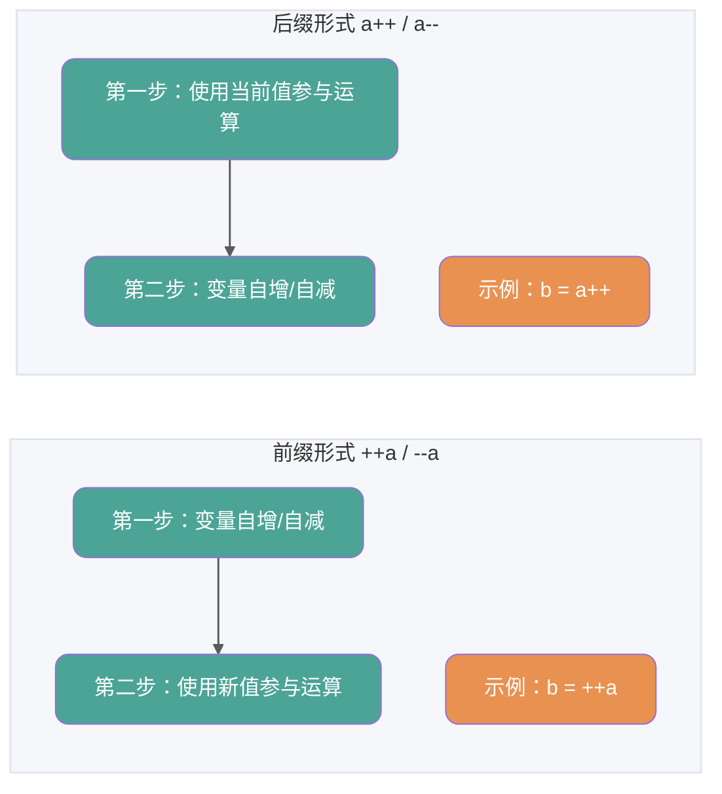
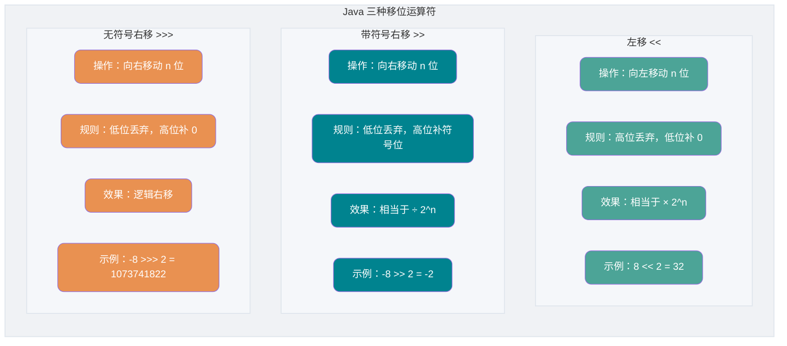
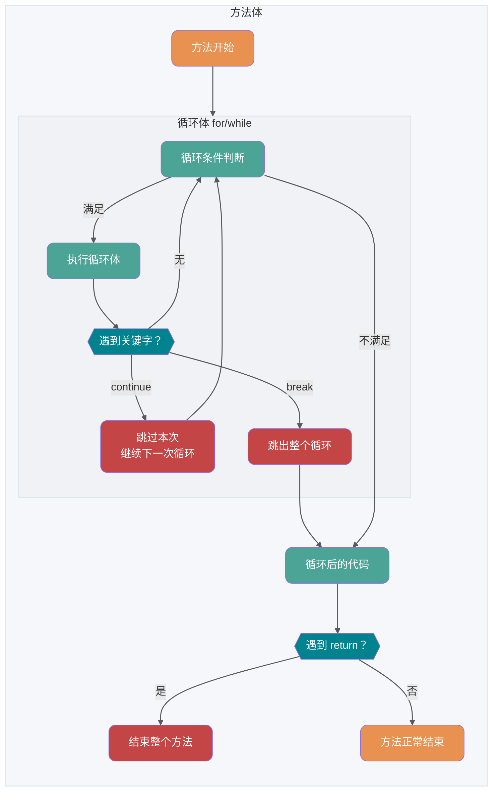
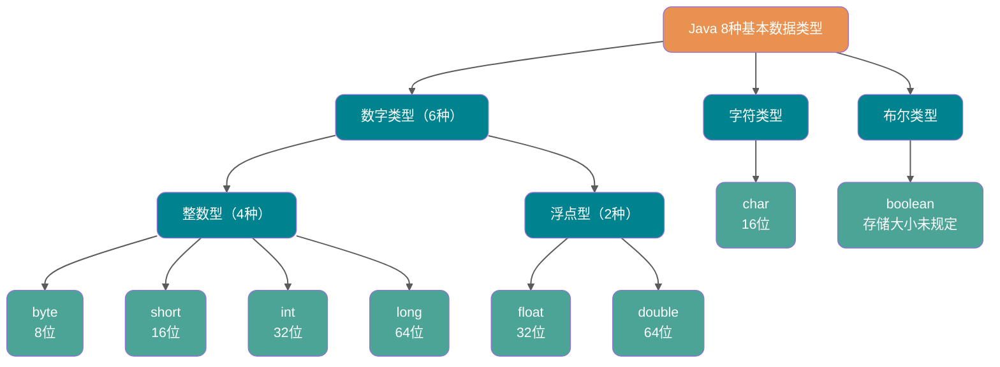
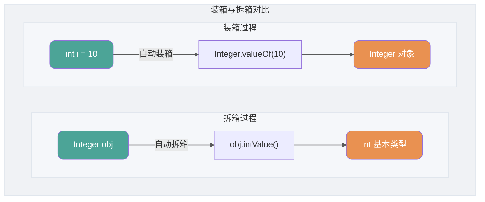
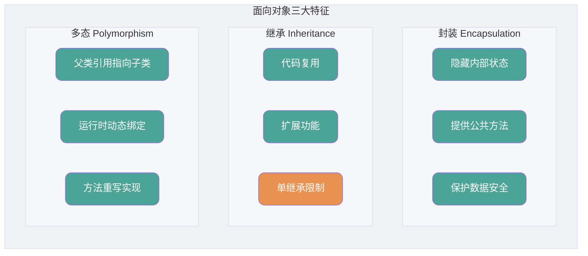
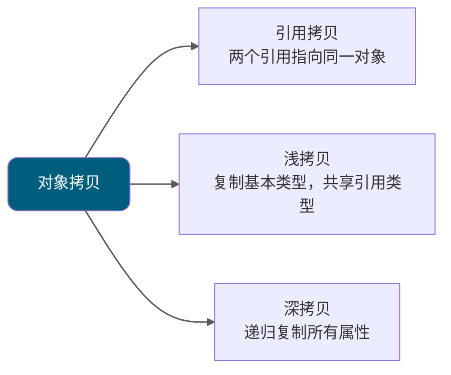

# 基础

> Aggregate of markdown under this directory (excludes README.md, TODO.md).


---

<!-- source: BigDecimal 详解.md -->

---
title: BigDecimal 详解
description: 详解BigDecimal使用方法：解决浮点数精度丢失问题，掌握加减乘除运算、RoundingMode舍入规则、compareTo比较方法，适用金融计算等高精度场景。
category: Java
tag:
  - Java基础
head:
  - - meta
    - name: keywords
      content: BigDecimal,浮点数精度,小数运算,RoundingMode舍入模式,BigDecimal比较,金额计算,精度丢失
---

《阿里巴巴 Java 开发手册》中提到：“为了避免精度丢失，可以使用 `BigDecimal` 来进行浮点数的运算”。

浮点数的运算竟然还会有精度丢失的风险吗？确实会！

示例代码：

```java
float a = 2.0f - 1.9f;
float b = 1.8f - 1.7f;
System.out.println(a);// 0.100000024
System.out.println(b);// 0.099999905
System.out.println(a == b);// false
```

**为什么浮点数 `float` 或 `double` 运算的时候会有精度丢失的风险呢？**

这个和计算机保存小数的机制有很大关系。我们知道计算机是二进制的，而且计算机在表示一个数字时，宽度是有限的。许多十进制小数转换为二进制后会无限循环，只能舍入为有限位数，因此存在精度损失的风险。不过，像 0.5、0.25 这样能够表示为有限二进制小数的值可以被精确表示。

就比如说十进制下的 0.2 就没办法精确转换成二进制小数：

```java
// 0.2 转换为二进制数的过程为，不断乘以 2，直到不存在小数为止，
// 在这个计算过程中，得到的整数部分从上到下排列就是二进制的结果。
0.2 * 2 = 0.4 -> 0
0.4 * 2 = 0.8 -> 0
0.8 * 2 = 1.6 -> 1
0.6 * 2 = 1.2 -> 1
0.2 * 2 = 0.4 -> 0（发生循环）
...
```

关于浮点数的更多内容，建议看一下[计算机系统基础（四）浮点数](http://kaito-kidd.com/2018/08/08/computer-system-float-point/)这篇文章。

## BigDecimal 介绍

`BigDecimal` 可以精确表示十进制数，并提供可显式指定精度和舍入规则的运算。不过，使用有限精度的 `MathContext`、执行需要舍入的除法，或将结果转换为 `float`、`double` 时，仍可能发生舍入。

通常情况下，大部分需要小数精确运算结果的业务场景（比如涉及到钱的场景）都是通过 `BigDecimal` 来做的。

《阿里巴巴 Java 开发手册》中提到：**浮点数之间的等值判断，基本数据类型不能用 == 来比较，包装数据类型不能用 equals 来判断。**


具体原因我们在上面已经详细介绍了，这里就不多提了。

想要解决浮点数运算精度丢失这个问题，可以直接使用 `BigDecimal` 来定义小数的值，然后再进行小数的运算操作即可。

```java
BigDecimal a = new BigDecimal("1.0");
BigDecimal b = new BigDecimal("0.9");
BigDecimal c = new BigDecimal("0.8");

BigDecimal x = a.subtract(b);
BigDecimal y = b.subtract(c);

System.out.println(x.compareTo(y));// 0
```

## BigDecimal 常见方法

### 创建

我们在使用 `BigDecimal` 时，为了防止精度丢失，推荐使用它的 `BigDecimal(String val)` 构造方法或者 `BigDecimal.valueOf(double val)` 静态方法来创建对象。

《阿里巴巴 Java 开发手册》对这部分内容也有提到，如下图所示。


### 加减乘除

`add` 方法用于将两个 `BigDecimal` 对象相加，`subtract` 方法用于将两个 `BigDecimal` 对象相减。`multiply` 方法用于将两个 `BigDecimal` 对象相乘，`divide` 方法用于将两个 `BigDecimal` 对象相除。

```java
BigDecimal a = new BigDecimal("1.0");
BigDecimal b = new BigDecimal("0.9");
System.out.println(a.add(b));// 1.9
System.out.println(a.subtract(b));// 0.1
System.out.println(a.multiply(b));// 0.90
System.out.println(a.divide(b));// 无法除尽，抛出 ArithmeticException 异常
System.out.println(a.divide(b, 2, RoundingMode.HALF_UP));// 1.11
```

这里需要注意的是，应根据业务是否允许舍入来选择 `divide` 的重载。要求结果精确时，可以使用不指定舍入规则的版本；结果无法精确表示时会抛出 `ArithmeticException`。允许舍入时，应显式指定 `scale` 和 `roundingMode`。`RoundingMode.UNNECESSARY` 用于断言结果无需舍入，如果实际需要舍入同样会抛出 `ArithmeticException`。

```java
public BigDecimal divide(BigDecimal divisor, int scale, RoundingMode roundingMode) {
    return divide(divisor, scale, roundingMode.oldMode);
}
```

保留规则非常多，这里列举几种:

```java
public enum RoundingMode {
   // 2.4 -> 3 , 1.6 -> 2
   // -1.6 -> -2 , -2.4 -> -3
   UP(BigDecimal.ROUND_UP),
   // 2.4 -> 2 , 1.6 -> 1
   // -1.6 -> -1 , -2.4 -> -2
   DOWN(BigDecimal.ROUND_DOWN),
   // 2.4 -> 3 , 1.6 -> 2
   // -1.6 -> -1 , -2.4 -> -2
   CEILING(BigDecimal.ROUND_CEILING),
   // 2.5 -> 2 , 1.6 -> 1
   // -1.6 -> -2 , -2.5 -> -3
   FLOOR(BigDecimal.ROUND_FLOOR),
   // 2.4 -> 2 , 1.6 -> 2
   // -1.6 -> -2 , -2.4 -> -2
   HALF_UP(BigDecimal.ROUND_HALF_UP),
   //......
}
```

### 大小比较

`a.compareTo(b)` : 返回 -1 表示 `a` 小于 `b`，0 表示 `a` 等于 `b`， 1 表示 `a` 大于 `b`。

```java
BigDecimal a = new BigDecimal("1.0");
BigDecimal b = new BigDecimal("0.9");
System.out.println(a.compareTo(b));// 1
```

### 保留几位小数

通过 `setScale` 方法设置保留几位小数以及保留规则。保留规则有挺多种，不需要记，IDEA 会提示。

```java
BigDecimal m = new BigDecimal("1.255433");
BigDecimal n = m.setScale(3,RoundingMode.HALF_DOWN);
System.out.println(n);// 1.255
```

## BigDecimal 等值比较问题

《阿里巴巴 Java 开发手册》中提到：


`BigDecimal` 使用 `equals()` 方法进行等值比较出现问题的代码示例：

```java
BigDecimal a = new BigDecimal("1");
BigDecimal b = new BigDecimal("1.0");
System.out.println(a.equals(b));//false
```

这是因为 `equals()` 方法不仅仅会比较值的大小（value）还会比较精度（scale），而 `compareTo()` 方法比较的时候会忽略精度。

1.0 的 scale 是 1，1 的 scale 是 0，因此 `a.equals(b)` 的结果是 false。


`compareTo()` 方法可以比较两个 `BigDecimal` 的值，如果相等就返回 0，如果第 1 个数比第 2 个数大则返回 1，反之返回-1。

```java
BigDecimal a = new BigDecimal("1");
BigDecimal b = new BigDecimal("1.0");
System.out.println(a.compareTo(b));//0
```

## BigDecimal 工具类分享

网上有一个使用人数比较多的 `BigDecimal` 工具类，提供了多个静态方法来简化 `BigDecimal` 的操作。

我对其进行了简单改进，分享一下源码：

```java
import java.math.BigDecimal;
import java.math.RoundingMode;

/**
 * 简化BigDecimal计算的小工具类
 */
public class BigDecimalUtil {

    /**
     * 默认除法运算精度
     */
    private static final int DEF_DIV_SCALE = 10;

    private BigDecimalUtil() {
    }

    /**
     * 使用 BigDecimal 进行加法运算，结果转换为 double 时仍可能发生舍入。
     *
     * @param v1 被加数
     * @param v2 加数
     * @return 两个参数的和
     */
    public static double add(double v1, double v2) {
        BigDecimal b1 = BigDecimal.valueOf(v1);
        BigDecimal b2 = BigDecimal.valueOf(v2);
        return b1.add(b2).doubleValue();
    }

    /**
     * 使用 BigDecimal 进行减法运算，结果转换为 double 时仍可能发生舍入。
     *
     * @param v1 被减数
     * @param v2 减数
     * @return 两个参数的差
     */
    public static double subtract(double v1, double v2) {
        BigDecimal b1 = BigDecimal.valueOf(v1);
        BigDecimal b2 = BigDecimal.valueOf(v2);
        return b1.subtract(b2).doubleValue();
    }

    /**
     * 使用 BigDecimal 进行乘法运算，结果转换为 double 时仍可能发生舍入。
     *
     * @param v1 被乘数
     * @param v2 乘数
     * @return 两个参数的积
     */
    public static double multiply(double v1, double v2) {
        BigDecimal b1 = BigDecimal.valueOf(v1);
        BigDecimal b2 = BigDecimal.valueOf(v2);
        return b1.multiply(b2).doubleValue();
    }

    /**
     * 提供（相对）精确的除法运算，当发生除不尽的情况时，精确到
     * 小数点以后10位，以后的数字四舍六入五成双。
     *
     * @param v1 被除数
     * @param v2 除数
     * @return 两个参数的商
     */
    public static double divide(double v1, double v2) {
        return divide(v1, v2, DEF_DIV_SCALE);
    }

    /**
     * 提供（相对）精确的除法运算。当发生除不尽的情况时，由scale参数指
     * 定精度，以后的数字四舍六入五成双。
     *
     * @param v1    被除数
     * @param v2    除数
     * @param scale 表示表示需要精确到小数点以后几位。
     * @return 两个参数的商
     */
    public static double divide(double v1, double v2, int scale) {
        if (scale < 0) {
            throw new IllegalArgumentException(
                    "The scale must be a positive integer or zero");
        }
        BigDecimal b1 = BigDecimal.valueOf(v1);
        BigDecimal b2 = BigDecimal.valueOf(v2);
        return b1.divide(b2, scale, RoundingMode.HALF_EVEN).doubleValue();
    }

    /**
     * 使用 HALF_EVEN 规则处理指定小数位。
     *
     * @param v     需要四舍六入五成双的数字
     * @param scale 小数点后保留几位
     * @return 四舍六入五成双后的结果
     */
    public static double round(double v, int scale) {
        if (scale < 0) {
            throw new IllegalArgumentException(
                    "The scale must be a positive integer or zero");
        }
        BigDecimal b = BigDecimal.valueOf(v);
        BigDecimal one = new BigDecimal("1");
        return b.divide(one, scale, RoundingMode.HALF_EVEN).doubleValue();
    }

    /**
     * 转换为 Float，超出 float 精度或范围时可能发生舍入或溢出
     *
     * @param v 需要被转换的数字
     * @return 返回转换结果
     */
    public static float convertToFloat(double v) {
        BigDecimal b = BigDecimal.valueOf(v);
        return b.floatValue();
    }

    /**
     * 转换为 Int，不进行舍入；小数部分会被截断，超出范围时会丢失高位
     *
     * @param v 需要被转换的数字
     * @return 返回转换结果
     */
    public static int convertsToInt(double v) {
        BigDecimal b = BigDecimal.valueOf(v);
        return b.intValue();
    }

    /**
     * 转换为 Long，不进行舍入；小数部分会被截断，超出范围时会丢失高位
     *
     * @param v 需要被转换的数字
     * @return 返回转换结果
     */
    public static long convertsToLong(double v) {
        BigDecimal b = BigDecimal.valueOf(v);
        return b.longValue();
    }

    /**
     * 返回两个数中大的一个值
     *
     * @param v1 需要被对比的第一个数
     * @param v2 需要被对比的第二个数
     * @return 返回两个数中大的一个值
     */
    public static double returnMax(double v1, double v2) {
        BigDecimal b1 = BigDecimal.valueOf(v1);
        BigDecimal b2 = BigDecimal.valueOf(v2);
        return b1.max(b2).doubleValue();
    }

    /**
     * 返回两个数中小的一个值
     *
     * @param v1 需要被对比的第一个数
     * @param v2 需要被对比的第二个数
     * @return 返回两个数中小的一个值
     */
    public static double returnMin(double v1, double v2) {
        BigDecimal b1 = BigDecimal.valueOf(v1);
        BigDecimal b2 = BigDecimal.valueOf(v2);
        return b1.min(b2).doubleValue();
    }

    /**
     * 精确对比两个数字
     *
     * @param v1 需要被对比的第一个数
     * @param v2 需要被对比的第二个数
     * @return 如果两个数一样则返回0，如果第一个数比第二个数大则返回1，反之返回-1
     */
    public static int compareTo(double v1, double v2) {
        BigDecimal b1 = BigDecimal.valueOf(v1);
        BigDecimal b2 = BigDecimal.valueOf(v2);
        return b1.compareTo(b2);
    }

}
```

相关 issue：[建议对保留规则设置为 RoundingMode.HALF_EVEN,即四舍六入五成双,#2129](https://github.com/Snailclimb/JavaGuide/issues/2129)。


## 总结

许多十进制小数无法用有限位二进制精确表示，因此使用 `float` 或 `double` 运算时存在精度丢失的风险。

不过，Java 提供了 `BigDecimal` 来操作浮点数。`BigDecimal` 的实现利用到了 `BigInteger`（用来操作大整数）, 所不同的是 `BigDecimal` 加入了小数位的概念。

<!-- @include: @article-footer.snippet.md -->


---

<!-- source: Java SPI 机制详解.md -->

---
title: Java SPI 机制详解
description: 全面讲解Java SPI机制原理与应用：理解ServiceLoader服务发现机制、SPI在JDBC/Dubbo/Spring中的应用、与API对比及最佳实践。
category: Java
tag:
  - Java基础
head:
  - - meta
    - name: keywords
      content: Java SPI,SPI机制,ServiceLoader,服务发现,插件化,JDBC驱动加载,Dubbo扩展,SPI应用
---

> 本文来自 [Kingshion](https://github.com/jjx0708) 投稿。欢迎更多朋友参与到 JavaGuide 的维护工作，这是一件非常有意义的事情。详细信息请看：[JavaGuide 贡献指南](https://javaguide.cn/javaguide/contribution-guideline.html)。

面向对象设计鼓励模块间基于接口而非具体实现编程，以降低模块间的耦合，遵循依赖倒置原则，并支持开闭原则（对扩展开放，对修改封闭）。然而，直接依赖具体实现会导致在替换实现时需要修改代码，违背了开闭原则。为了解决这个问题，SPI 应运而生，它提供了一种服务发现机制，允许在程序外部动态指定具体实现。这与控制反转（IoC）的思想相似，将组件装配的控制权移交给了程序之外。

SPI 机制也解决了 Java 类加载体系中双亲委派模型带来的限制。[双亲委派模型](https://javaguide.cn/java/jvm/classloader.html)虽然保证了核心库的安全性和一致性，但也限制了核心库或扩展库加载应用程序类路径上的类（通常由第三方实现）。SPI 允许核心或扩展库定义服务接口，第三方开发者提供并部署实现，SPI 服务加载机制则在运行时动态发现并加载这些实现。例如，JDBC 4.0 及之后版本利用 SPI 自动发现和加载数据库驱动，开发者只需将驱动 JAR 包放置在类路径下即可，无需使用 `Class.forName()` 显式加载驱动类。

## SPI 介绍

### 何谓 SPI?

SPI 即 Service Provider Interface，字面意思就是：“服务提供者的接口”，我的理解是：专门提供给服务提供者或者扩展框架功能的开发者去使用的一个接口。

SPI 将服务接口和具体的服务实现分离开来，将服务调用方和服务实现者解耦，能够提升程序的扩展性、可维护性。修改或者替换服务实现并不需要修改调用方。

很多框架都使用了 Java 的 SPI 机制，比如：Spring 框架、数据库加载驱动、日志接口、以及 Dubbo 的扩展实现等等。


### SPI 和 API 有什么区别？

**那 SPI 和 API 有啥区别？**

说到 SPI 就不得不说一下 API（Application Programming Interface） 了，从广义上来说它们都属于接口，而且很容易混淆。下面先用一张图说明一下：


一般模块之间都是通过接口进行通讯，因此我们在服务调用方和服务实现方（也称服务提供者）之间引入一个“接口”。

- 当实现方提供了接口和实现，我们可以通过调用实现方的接口从而拥有实现方给我们提供的能力，这就是 **API**。这种情况下，接口和实现都是放在实现方的包中。调用方通过接口调用实现方的功能，而不需要关心具体的实现细节。
- 当接口存在于调用方这边时，这就是 **SPI**。由接口调用方确定接口规则，然后由不同的厂商根据这个规则对这个接口进行实现，从而提供服务。

举个通俗易懂的例子：公司 H 是一家科技公司，新设计了一款芯片，然后现在需要量产了，而市面上有好几家芯片制造业公司，这个时候，只要 H 公司指定好了这芯片生产的标准（定义好了接口标准），那么这些合作的芯片公司（服务提供者）就按照标准交付自家特色的芯片（提供不同方案的实现，但是给出来的结果是一样的）。

## 实战演示

SLF4J（Simple Logging Facade for Java）是 Java 的一个日志门面（接口），其具体实现有几种，比如：Logback、Log4j、Log4j2 等等，而且还可以切换，在切换日志具体实现的时候我们是不需要更改项目代码的，只需要在 Maven 依赖里面修改一些 pom 依赖就好了。


这就是依赖 SPI 机制实现的，那我们接下来就实现一个简易版本的日志框架。

### Service Provider Interface

新建一个 Java 项目 `service-provider-interface` 目录结构如下：（注意直接新建 Java 项目就好了，不用新建 Maven 项目，Maven 项目会涉及到一些编译配置，如果有私服的话，直接 deploy 会比较方便，但是没有的话，在过程中可能会遇到一些奇怪的问题。）

```plain
│  service-provider-interface.iml
│
├─.idea
│  │  .gitignore
│  │  misc.xml
│  │  modules.xml
│  └─ workspace.xml
│
└─src
    └─edu
        └─jiangxuan
            └─up
                └─spi
                        Logger.java
                        LoggerService.java
                        Main.class
```

新建 `Logger` 接口，这个就是 SPI， 服务提供者接口，后面的服务提供者就要针对这个接口进行实现。

```java
package edu.jiangxuan.up.spi;

public interface Logger {
    void info(String msg);
    void debug(String msg);
}
```

接下来就是 `LoggerService` 类，这个主要是为服务使用者（调用方）提供特定功能的。这个类也是实现 Java SPI 机制的关键所在，如果存在疑惑的话可以先往后面继续看。

```java
package edu.jiangxuan.up.spi;

import java.util.ArrayList;
import java.util.List;
import java.util.ServiceLoader;

public class LoggerService {
    private static final LoggerService SERVICE = new LoggerService();

    private final Logger logger;

    private final List<Logger> loggerList;

    private LoggerService() {
        ServiceLoader<Logger> loader = ServiceLoader.load(Logger.class);
        List<Logger> list = new ArrayList<>();
        for (Logger log : loader) {
            list.add(log);
        }
        // LoggerList 是所有 ServiceProvider
        loggerList = list;
        if (!list.isEmpty()) {
            // Logger 只取一个
            logger = list.get(0);
        } else {
            logger = null;
        }
    }

    public static LoggerService getService() {
        return SERVICE;
    }

    public void info(String msg) {
        if (logger == null) {
            System.out.println("info 中没有发现 Logger 服务提供者");
        } else {
            logger.info(msg);
        }
    }

    public void debug(String msg) {
        if (loggerList.isEmpty()) {
            System.out.println("debug 中没有发现 Logger 服务提供者");
        }
        loggerList.forEach(log -> log.debug(msg));
    }
}
```

新建 `Main` 类（服务使用者，调用方），启动程序查看结果。

```java
package org.spi.service;

public class Main {
    public static void main(String[] args) {
        LoggerService service = LoggerService.getService();

        service.info("Hello SPI");
        service.debug("Hello SPI");
    }
}
```

程序结果：

> info 中没有发现 Logger 服务提供者
> debug 中没有发现 Logger 服务提供者

此时我们只是空有接口，并没有为 `Logger` 接口提供任何的实现，所以输出结果中没有按照预期打印相应的结果。

你可以使用命令或者直接使用 IDEA 将整个程序直接打包成 jar 包。

### Service Provider

接下来新建一个项目用来实现 `Logger` 接口

新建项目 `service-provider` 目录结构如下：

```plain
│  service-provider.iml
│
├─.idea
│  │  .gitignore
│  │  misc.xml
│  │  modules.xml
│  └─ workspace.xml
│
├─lib
│      service-provider-interface.jar
|
└─src
    ├─edu
    │  └─jiangxuan
    │      └─up
    │          └─spi
    │              └─service
    │                      Logback.java
    │
    └─META-INF
        └─services
                edu.jiangxuan.up.spi.Logger

```

新建 `Logback` 类

```java
package edu.jiangxuan.up.spi.service;

import edu.jiangxuan.up.spi.Logger;

public class Logback implements Logger {
    @Override
    public void info(String s) {
        System.out.println("Logback info 打印日志：" + s);
    }

    @Override
    public void debug(String s) {
        System.out.println("Logback debug 打印日志：" + s);
    }
}

```

将 `service-provider-interface` 的 jar 导入项目中。

新建 lib 目录，然后将 jar 包拷贝过来，再添加到项目中。


再点击 OK。


接下来就可以在项目中导入 jar 包里面的一些类和方法了，就像 JDK 工具类导包一样的。

实现 `Logger` 接口，在 `src` 目录下新建 `META-INF/services` 文件夹，然后新建文件 `edu.jiangxuan.up.spi.Logger`（SPI 的全类名），文件里面的内容是：`edu.jiangxuan.up.spi.service.Logback`（Logback 的全类名，即 SPI 的实现类的包名 + 类名）。

**这是 JDK SPI 机制 ServiceLoader 约定好的标准。**

这里先大概解释一下：调用 `ServiceLoader.load()` 会创建服务加载器。遍历 `ServiceLoader` 时，加载器会按需定位并实例化提供者；调用 `stream()` 时得到的是 `ServiceLoader.Provider` 流，可以先通过 `type()` 检查提供者类型，只有调用 `Provider.get()` 才会获取对应的服务提供者实例。`ServiceLoader` 会缓存已经加载的提供者。对于类路径上的提供者，配置文件位于 `META-INF/services`；对于 Java 9 及之后的命名模块，还可以通过模块描述符中的 `uses` 和 `provides ... with ...` 声明服务关系。

所以会提出一些规范要求：文件名一定要是接口的全类名，然后里面的内容一定要是实现类的全类名，实现类可以有多个，直接换行就好了，多个实现类的时候，会一个一个的迭代加载。

接下来同样将 `service-provider` 项目打包成 jar 包，这个 jar 包就是服务提供方的实现。通常我们导入 maven 的 pom 依赖就有点类似这种，只不过我们现在没有将这个 jar 包发布到 maven 公共仓库中，所以在需要使用的地方只能手动的添加到项目中。

### 效果展示

为了更直观的展示效果，我这里再新建一个专门用来测试的工程项目：`java-spi-test`

然后先导入 `Logger` 的接口 jar 包，再导入具体的实现类的 jar 包。


新建 Main 方法测试：

```java
package edu.jiangxuan.up.service;

import edu.jiangxuan.up.spi.LoggerService;

public class TestJavaSPI {
    public static void main(String[] args) {
        LoggerService loggerService = LoggerService.getService();
        loggerService.info("你好");
        loggerService.debug("测试Java SPI 机制");
    }
}
```

运行结果如下：

> Logback info 打印日志：你好
> Logback debug 打印日志：测试 Java SPI 机制

说明导入 jar 包中的实现类生效了。

如果我们不导入具体的实现类的 jar 包，那么此时程序运行的结果就会是：

> info 中没有发现 Logger 服务提供者
> debug 中没有发现 Logger 服务提供者

通过使用 SPI 机制，可以看出服务（`LoggerService`）和 服务提供者两者之间的耦合度非常低，如果说我们想要换一种实现，那么其实只需要修改 `service-provider` 项目中针对 `Logger` 接口的具体实现就可以了，只需要换一个 jar 包即可，也可以有在一个项目里面有多个实现，这不就是 SLF4J 原理吗？

如果某一天需求变更了，此时需要将日志输出到消息队列，或者做一些别的操作，这个时候完全不需要更改 Logback 的实现，只需要新增一个服务实现（service-provider）可以通过在本项目里面新增实现也可以从外部引入新的服务实现 jar 包。我们可以在服务(LoggerService)中选择一个具体的 服务实现(service-provider) 来完成我们需要的操作。

那么接下来我们具体来说说 Java SPI 工作的重点原理—— **ServiceLoader**。

## ServiceLoader

### ServiceLoader 具体实现

> 下面展示的是 JDK 8 的 `ServiceLoader` 实现。Java 9 及之后的版本增加了模块层、`stream()`、`findFirst()` 和 provider method 等机制，当前源码结构已经不同。

想要使用 Java 的 SPI 机制是需要依赖 `ServiceLoader` 来实现的，那么我们接下来看看 `ServiceLoader` 具体是怎么做的：

`ServiceLoader` 是 JDK 提供的一个工具类， 位于 `package java.util;` 包下。

```plain
A facility to load implementations of a service.
```

这是 JDK 官方给的注释：**一种加载服务实现的工具。**

再往下看，我们发现这个类是一个 `final` 类型的，所以是不可被继承修改，同时它实现了 `Iterable` 接口。之所以实现了迭代器，是为了方便后续我们能够通过迭代的方式得到对应的服务实现。

```java
public final class ServiceLoader<S> implements Iterable<S>{ xxx...}
```

可以看到一个熟悉的常量定义：

`private static final String PREFIX = "META-INF/services/";`

下面是 `load` 方法：可以发现 `load` 方法支持两种重载后的入参；

```java
public static <S> ServiceLoader<S> load(Class<S> service) {
    ClassLoader cl = Thread.currentThread().getContextClassLoader();
    return ServiceLoader.load(service, cl);
}

public static <S> ServiceLoader<S> load(Class<S> service,
                                        ClassLoader loader) {
    return new ServiceLoader<>(service, loader);
}

private ServiceLoader(Class<S> svc, ClassLoader cl) {
    service = Objects.requireNonNull(svc, "Service interface cannot be null");
    loader = (cl == null) ? ClassLoader.getSystemClassLoader() : cl;
    acc = (System.getSecurityManager() != null) ? AccessController.getContext() : null;
    reload();
}

public void reload() {
    providers.clear();
    lookupIterator = new LazyIterator(service, loader);
}
```

其解决第三方类加载的机制其实就蕴含在 `ClassLoader cl = Thread.currentThread().getContextClassLoader();` 中，`cl` 就是**线程上下文类加载器**（Thread Context ClassLoader）。这是每个线程持有的类加载器，JDK 的设计允许应用程序或容器（如 Web 应用服务器）设置这个类加载器，以便核心类库能够通过它来加载应用程序类。

线程上下文类加载器默认情况下是应用程序类加载器（Application ClassLoader），它负责加载 classpath 上的类。当核心库需要加载应用程序提供的类时，它可以使用线程上下文类加载器来完成。这样，即使是由引导类加载器加载的核心库代码，也能够加载并使用由应用程序类加载器加载的类。

根据代码的调用顺序，在 `reload()` 方法中是通过一个内部类 `LazyIterator` 实现的。先继续往下面看。

`ServiceLoader` 实现了 `Iterable` 接口的方法后，具有了迭代的能力，在这个 `iterator` 方法被调用时，首先会在 `ServiceLoader` 的 `Provider` 缓存中进行查找，如果缓存中没有命中那么则在 `LazyIterator` 中进行查找。

```java

public Iterator<S> iterator() {
    return new Iterator<S>() {

        Iterator<Map.Entry<String, S>> knownProviders
                = providers.entrySet().iterator();

        public boolean hasNext() {
            if (knownProviders.hasNext())
                return true;
            return lookupIterator.hasNext(); // 调用 LazyIterator
        }

        public S next() {
            if (knownProviders.hasNext())
                return knownProviders.next().getValue();
            return lookupIterator.next(); // 调用 LazyIterator
        }

        public void remove() {
            throw new UnsupportedOperationException();
        }

    };
}
```

在调用 `LazyIterator` 时，具体实现如下：

```java

public boolean hasNext() {
    if (acc == null) {
        return hasNextService();
    } else {
        PrivilegedAction<Boolean> action = new PrivilegedAction<Boolean>() {
            public Boolean run() {
                return hasNextService();
            }
        };
        return AccessController.doPrivileged(action, acc);
    }
}

private boolean hasNextService() {
    if (nextName != null) {
        return true;
    }
    if (configs == null) {
        try {
            //通过PREFIX（META-INF/services/）和类名 获取对应的配置文件，得到具体的实现类
            String fullName = PREFIX + service.getName();
            if (loader == null)
                configs = ClassLoader.getSystemResources(fullName);
            else
                configs = loader.getResources(fullName);
        } catch (IOException x) {
            fail(service, "Error locating configuration files", x);
        }
    }
    while ((pending == null) || !pending.hasNext()) {
        if (!configs.hasMoreElements()) {
            return false;
        }
        pending = parse(service, configs.nextElement());
    }
    nextName = pending.next();
    return true;
}


public S next() {
    if (acc == null) {
        return nextService();
    } else {
        PrivilegedAction<S> action = new PrivilegedAction<S>() {
            public S run() {
                return nextService();
            }
        };
        return AccessController.doPrivileged(action, acc);
    }
}

private S nextService() {
    if (!hasNextService())
        throw new NoSuchElementException();
    String cn = nextName;
    nextName = null;
    Class<?> c = null;
    try {
        c = Class.forName(cn, false, loader);
    } catch (ClassNotFoundException x) {
        fail(service,
                "Provider " + cn + " not found");
    }
    if (!service.isAssignableFrom(c)) {
        fail(service,
                "Provider " + cn + " not a subtype");
    }
    try {
        S p = service.cast(c.newInstance());
        providers.put(cn, p);
        return p;
    } catch (Throwable x) {
        fail(service,
                "Provider " + cn + " could not be instantiated",
                x);
    }
    throw new Error();          // This cannot happen
}
```

可能很多人看这个会觉得有点复杂，没关系，我这边实现了一个简单的 `ServiceLoader` 小模型，用来演示从类路径配置文件读取实现类名并创建实例的核心思路。它没有覆盖 JDK 实现的惰性加载、去重、错误处理、模块提供者等完整行为：

### 自己实现一个 ServiceLoader

我先把代码贴出来：

```java
package edu.jiangxuan.up.service;

import java.io.BufferedReader;
import java.io.InputStream;
import java.io.InputStreamReader;
import java.lang.reflect.Constructor;
import java.net.URL;
import java.net.URLConnection;
import java.util.ArrayList;
import java.util.Enumeration;
import java.util.List;

public class MyServiceLoader<S> {

    // 对应的接口 Class 模板
    private final Class<S> service;

    // 对应实现类的 可以有多个，用 List 进行封装
    private final List<S> providers = new ArrayList<>();

    // 类加载器
    private final ClassLoader classLoader;

    // 暴露给外部使用的方法，通过调用这个方法可以开始加载自己定制的实现流程。
    public static <S> MyServiceLoader<S> load(Class<S> service) {
        return new MyServiceLoader<>(service);
    }

    // 构造方法私有化
    private MyServiceLoader(Class<S> service) {
        this.service = service;
        this.classLoader = Thread.currentThread().getContextClassLoader();
        doLoad();
    }

    // 关键方法，加载具体实现类的逻辑
    private void doLoad() {
        try {
            // 读取所有 jar 包里面 META-INF/services 包下面的文件，这个文件名就是接口名，然后文件里面的内容就是具体的实现类的路径加全类名
            Enumeration<URL> urls = classLoader.getResources("META-INF/services/" + service.getName());
            // 挨个遍历取到的文件
            while (urls.hasMoreElements()) {
                // 取出当前的文件
                URL url = urls.nextElement();
                System.out.println("File = " + url.getPath());
                // 建立链接
                URLConnection urlConnection = url.openConnection();
                urlConnection.setUseCaches(false);
                // 获取文件输入流
                InputStream inputStream = urlConnection.getInputStream();
                // 从文件输入流获取缓存
                BufferedReader bufferedReader = new BufferedReader(new InputStreamReader(inputStream));
                // 从文件内容里面得到实现类的全类名
                String className = bufferedReader.readLine();

                while (className != null) {
                    // 通过反射拿到实现类的实例
                    Class<?> clazz = Class.forName(className, false, classLoader);
                    // 如果声明的接口跟这个具体的实现类是属于同一类型，（可以理解为Java的一种多态，接口跟实现类、父类和子类等等这种关系。）则构造实例
                    if (service.isAssignableFrom(clazz)) {
                        Constructor<? extends S> constructor = (Constructor<? extends S>) clazz.getConstructor();
                        S instance = constructor.newInstance();
                        // 把当前构造的实例对象添加到 Provider的列表里面
                        providers.add(instance);
                    }
                    // 继续读取下一行的实现类，可以有多个实现类，只需要换行就可以了。
                    className = bufferedReader.readLine();
                }
            }
        } catch (Exception e) {
            System.out.println("读取文件异常。。。");
        }
    }

    // 返回spi接口对应的具体实现类列表
    public List<S> getProviders() {
        return providers;
    }
}
```

关键信息基本已经通过代码注释描述出来了，

主要的流程就是：

1. 通过 URL 工具类从 jar 包的 `/META-INF/services` 目录下面找到对应的文件，
2. 读取这个文件的名称找到对应的 spi 接口，
3. 通过 `InputStream` 流将文件里面的具体实现类的全类名读取出来，
4. 根据获取到的全类名，先判断跟 spi 接口是否为同一类型，如果是的，那么就通过反射的机制构造对应的实例对象，
5. 将构造出来的实例对象添加到 `Providers` 的列表中。

## 总结

其实不难发现，SPI 机制的具体实现需要动态定位并创建服务提供者。类路径上的提供者需要在 `META-INF/services/` 配置文件中声明；命名模块中的提供者则通过模块描述符的 `provides ... with ...` 声明。

另外，SPI 机制在很多框架中都有应用：Spring 框架的基本原理也是类似的方式。还有 Dubbo 框架提供同样的 SPI 扩展机制，只不过 Dubbo 和 spring 框架中的 SPI 机制具体实现方式跟咱们今天学得这个有些细微的区别，不过整体的原理都是一致的，相信大家通过对 JDK 中 SPI 机制的学习，能够一通百通，加深对其他高深框架的理解。

通过 SPI 机制能够大大地提高接口设计的灵活性，但是 SPI 机制也存在一些缺点，比如：

1. `ServiceLoader` 会惰性加载提供者；如果调用方为了选择实现而遍历全部提供者，仍可能产生额外开销；
2. 单个 `ServiceLoader` 实例不保证多线程安全，若要跨线程共享需要由调用方进行同步。不同 `ServiceLoader` 实例同时调用 `load` 并不会因此必然发生并发冲突。

<!-- @include: @article-footer.snippet.md -->


---

<!-- source: Java 代理模式详解.md -->

---
title: Java 代理模式详解
description: 详解Java代理模式原理与实现：对比静态代理与动态代理差异，深入分析JDK动态代理和CGLIB代理机制，理解AOP横切关注点实现。
category: Java
tag:
  - Java基础
head:
  - - meta
    - name: keywords
      content: Java代理模式,静态代理,动态代理,JDK动态代理,CGLIB代理,AOP,设计模式,代理实现
---

## 1. 代理模式

代理模式是一种比较好理解的设计模式。简单来说就是 **我们使用代理对象来代替对真实对象(real object)的访问，这样就可以在不修改原目标对象的前提下，提供额外的功能操作，扩展目标对象的功能。**

**代理模式的主要作用是扩展目标对象的功能，比如说在目标对象的某个方法执行前后你可以增加一些自定义的操作。**

举个例子：新娘找来了自己的姨妈来代替自己处理新郎的提问，新娘收到的提问都是经过姨妈处理过滤之后的。姨妈在这里就可以看作是代理你的代理对象，代理的行为（方法）是接收和回复新郎的提问。


<p style="text-align:right;font-size:13px;color:gray">https://medium.com/@mithunsasidharan/understanding-the-proxy-design-pattern-5e63fe38052a</p>

代理模式有静态代理和动态代理两种实现方式，我们 先来看一下静态代理模式的实现。

## 2. 静态代理

静态代理中，我们对目标对象的每个方法的增强都是手动完成的（后面会具体演示代码），非常不灵活（比如接口一旦新增加方法，目标对象和代理对象都要进行修改）且麻烦(需要对每个目标类都单独写一个代理类）。 实际应用场景非常非常少，日常开发几乎看不到使用静态代理的场景。

上面我们是从实现和应用角度来说的静态代理，从 JVM 层面来说， **静态代理在编译时就将接口、实现类、代理类这些都变成了一个个实际的 class 文件。**

静态代理实现步骤:

1. 定义一个接口及其实现类；
2. 创建一个代理类同样实现这个接口
3. 将目标对象注入进代理类，然后在代理类的对应方法调用目标类中的对应方法。这样的话，我们就可以通过代理类屏蔽对目标对象的访问，并且可以在目标方法执行前后做一些自己想做的事情。

下面通过代码展示！

**1.定义发送短信的接口**

```java
public interface SmsService {
    String send(String message);
}
```

**2.实现发送短信的接口**

```java
public class SmsServiceImpl implements SmsService {
    public String send(String message) {
        System.out.println("send message:" + message);
        return message;
    }
}
```

**3.创建代理类并同样实现发送短信的接口**

```java
public class SmsProxy implements SmsService {

    private final SmsService smsService;

    public SmsProxy(SmsService smsService) {
        this.smsService = smsService;
    }

    @Override
    public String send(String message) {
        //调用方法之前，我们可以添加自己的操作
        System.out.println("before method send()");
        smsService.send(message);
        //调用方法之后，我们同样可以添加自己的操作
        System.out.println("after method send()");
        return null;
    }
}
```

**4.实际使用**

```java
public class Main {
    public static void main(String[] args) {
        SmsService smsService = new SmsServiceImpl();
        SmsProxy smsProxy = new SmsProxy(smsService);
        smsProxy.send("java");
    }
}
```

运行上述代码之后，控制台打印出：

```bash
before method send()
send message:java
after method send()
```

可以输出结果看出，我们已经增加了 `SmsServiceImpl` 的 `send()` 方法。

## 3. 动态代理

相比于静态代理来说，动态代理更加灵活。我们不需要针对每个目标类都单独创建一个代理类，并且也不需要我们必须实现接口，我们可以直接代理实现类（CGLIB 动态代理机制）。

**从 JVM 角度来说，动态代理是在运行时动态生成类字节码，并加载到 JVM 中的。**

说到动态代理，Spring AOP、RPC 框架应该是两个不得不提的，它们的实现都依赖了动态代理。

**动态代理在我们日常开发中使用的相对较少，但是在框架中的几乎是必用的一门技术。学会了动态代理之后，对于我们理解和学习各种框架的原理也非常有帮助。**

就 Java 来说，动态代理的实现方式有很多种，比如 **JDK 动态代理**、**CGLIB 动态代理**等等。

[guide-rpc-framework](https://github.com/Snailclimb/guide-rpc-framework) 使用的是 JDK 动态代理，我们先来看看 JDK 动态代理的使用。

另外，虽然 [guide-rpc-framework](https://github.com/Snailclimb/guide-rpc-framework) 没有用到 **CGLIB 动态代理**，我们这里还是简单介绍一下其使用以及和**JDK 动态代理**的对比。

### 3.1. JDK 动态代理机制

#### 3.1.1. 介绍

**在 Java 动态代理机制中 `InvocationHandler` 接口和 `Proxy` 类是核心。**

`Proxy` 类中使用频率最高的方法是：`newProxyInstance()`，这个方法主要用来生成一个代理对象。

```java
    public static Object newProxyInstance(ClassLoader loader,
                                          Class<?>[] interfaces,
                                          InvocationHandler h)
        throws IllegalArgumentException
    {
        ......
    }
```

这个方法一共有 3 个参数：

1. **loader** :类加载器，用于加载代理对象。
2. **interfaces** : 被代理类实现的一些接口；
3. **h** : 实现了 `InvocationHandler` 接口的对象；

要实现动态代理的话，还必须需要实现 `InvocationHandler` 来自定义处理逻辑。 当我们的动态代理对象调用一个方法时，这个方法的调用就会被转发到实现 `InvocationHandler` 接口类的 `invoke` 方法来调用。

```java
public interface InvocationHandler {

    /**
     * 当你使用代理对象调用方法的时候实际会调用到这个方法
     */
    public Object invoke(Object proxy, Method method, Object[] args)
        throws Throwable;
}
```

`invoke()` 方法有下面三个参数：

1. **proxy** :动态生成的代理类
2. **method** : 与代理类对象调用的方法相对应
3. **args** : 当前 method 方法的参数

也就是说：**你通过 `Proxy` 类的 `newProxyInstance()` 创建的代理对象在调用方法的时候，实际会调用到实现 `InvocationHandler` 接口的类的 `invoke()` 方法。** 你可以在 `invoke()` 方法中自定义处理逻辑，比如在方法执行前后做什么事情。

#### 3.1.2. JDK 动态代理类使用步骤

1. 定义一个接口及其实现类；
2. 自定义 `InvocationHandler` 并重写 `invoke` 方法，在 `invoke` 方法中我们会调用原生方法（被代理类的方法）并自定义一些处理逻辑；
3. 通过 `Proxy.newProxyInstance(ClassLoader loader,Class<?>[] interfaces,InvocationHandler h)` 方法创建代理对象；

#### 3.1.3. 代码示例

这样说可能会有点空洞和难以理解，我上个例子，大家感受一下吧！

**1.定义发送短信的接口**

```java
public interface SmsService {
    String send(String message);
}
```

**2.实现发送短信的接口**

```java
public class SmsServiceImpl implements SmsService {
    public String send(String message) {
        System.out.println("send message:" + message);
        return message;
    }
}
```

**3.定义一个 JDK 动态代理类**

```java
import java.lang.reflect.InvocationHandler;
import java.lang.reflect.InvocationTargetException;
import java.lang.reflect.Method;

/**
 * @author shuang.kou
 * @createTime 2020年05月11日 11:23:00
 */
public class DebugInvocationHandler implements InvocationHandler {
    /**
     * 代理类中的真实对象
     */
    private final Object target;

    public DebugInvocationHandler(Object target) {
        this.target = target;
    }

    @Override
    public Object invoke(Object proxy, Method method, Object[] args) throws InvocationTargetException, IllegalAccessException {
        //调用方法之前，我们可以添加自己的操作
        System.out.println("before method " + method.getName());
        Object result = method.invoke(target, args);
        //调用方法之后，我们同样可以添加自己的操作
        System.out.println("after method " + method.getName());
        return result;
    }
}

```

`invoke()` 方法: 当我们的动态代理对象调用原生方法的时候，最终实际上调用到的是 `invoke()` 方法，然后 `invoke()` 方法代替我们去调用了被代理对象的原生方法。

**4.获取代理对象的工厂类**

```java
public class JdkProxyFactory {
    public static Object getProxy(Object target) {
        return Proxy.newProxyInstance(
                target.getClass().getClassLoader(), // 目标类的类加载器
                target.getClass().getInterfaces(),  // 代理需要实现的接口，可指定多个
                new DebugInvocationHandler(target)   // 代理对象对应的自定义 InvocationHandler
        );
    }
}
```

`getProxy()`：主要通过 `Proxy.newProxyInstance（）` 方法获取某个类的代理对象

**5.实际使用**

```java
SmsService smsService = (SmsService) JdkProxyFactory.getProxy(new SmsServiceImpl());
smsService.send("java");
```

运行上述代码之后，控制台打印出：

```plain
before method send
send message:java
after method send
```

### 3.2. CGLIB 动态代理机制

#### 3.2.1. 介绍

**JDK 动态代理有一个最致命的问题是其只能代理实现了接口的类。**

**为了解决这个问题，我们可以用 CGLIB 动态代理机制来避免。**

[CGLIB](https://github.com/cglib/cglib)(_Code Generation Library_)是一个基于[ASM](http://www.baeldung.com/java-asm)的字节码生成库，它允许我们在运行时对字节码进行修改和动态生成。CGLIB 通过继承方式实现代理。很多知名的开源框架都使用到了[CGLIB](https://github.com/cglib/cglib)， 例如 Spring 中的 AOP 模块中：如果目标对象实现了接口，则默认采用 JDK 动态代理，否则采用 CGLIB 动态代理。

**在 CGLIB 动态代理机制中 `MethodInterceptor` 接口和 `Enhancer` 类是核心。**

你需要自定义 `MethodInterceptor` 并重写 `intercept` 方法，`intercept` 用于拦截增强被代理类的方法。

```java
public interface MethodInterceptor
extends Callback{
    // 拦截被代理类中的方法
    public Object intercept(Object obj, java.lang.reflect.Method method, Object[] args,MethodProxy proxy) throws Throwable;
}

```

1. **obj** : 被代理的对象（需要增强的对象）
2. **method** : 被拦截的方法（需要增强的方法）
3. **args** : 方法入参
4. **proxy** : 用于调用原始方法

你可以通过 `Enhancer` 类来动态获取被代理类，当代理类调用方法的时候，实际调用的是 `MethodInterceptor` 中的 `intercept` 方法。

#### 3.2.2. CGLIB 动态代理类使用步骤

1. 定义一个类；
2. 自定义 `MethodInterceptor` 并重写 `intercept` 方法，`intercept` 用于拦截增强被代理类的方法，和 JDK 动态代理中的 `invoke` 方法类似；
3. 通过 `Enhancer` 类的 `create()` 创建代理类；

#### 3.2.3. 代码示例

不同于 JDK 动态代理不需要额外的依赖。[CGLIB](https://github.com/cglib/cglib)(_Code Generation Library_) 实际是属于一个开源项目，如果你要使用它的话，需要手动添加相关依赖。

```xml
<dependency>
  <groupId>cglib</groupId>
  <artifactId>cglib</artifactId>
  <version>3.3.0</version>
</dependency>
```

**1.实现一个使用阿里云发送短信的类**

```java
package github.javaguide.dynamicProxy.cglibDynamicProxy;

public class AliSmsService {
    public String send(String message) {
        System.out.println("send message:" + message);
        return message;
    }
}
```

**2.自定义 `MethodInterceptor`（方法拦截器）**

```java
import net.sf.cglib.proxy.MethodInterceptor;
import net.sf.cglib.proxy.MethodProxy;

import java.lang.reflect.Method;

/**
 * 自定义MethodInterceptor
 */
public class DebugMethodInterceptor implements MethodInterceptor {


    /**
     * @param o           代理对象本身（注意不是原始对象，如果使用method.invoke(o, args)会导致循环调用）
     * @param method      被拦截的方法（需要增强的方法）
     * @param args        方法入参
     * @param methodProxy 高性能的方法调用机制，避免反射开销
     */
    @Override
    public Object intercept(Object o, Method method, Object[] args, MethodProxy methodProxy) throws Throwable {
        //调用方法之前，我们可以添加自己的操作
        System.out.println("before method " + method.getName());
        Object object = methodProxy.invokeSuper(o, args);
        //调用方法之后，我们同样可以添加自己的操作
        System.out.println("after method " + method.getName());
        return object;
    }

}
```

**3.获取代理类**

```java
import net.sf.cglib.proxy.Enhancer;

public class CglibProxyFactory {

    public static Object getProxy(Class<?> clazz) {
        // 创建动态代理增强类
        Enhancer enhancer = new Enhancer();
        // 设置类加载器
        enhancer.setClassLoader(clazz.getClassLoader());
        // 设置被代理类
        enhancer.setSuperclass(clazz);
        // 设置方法拦截器
        enhancer.setCallback(new DebugMethodInterceptor());
        // 创建代理类
        return enhancer.create();
    }
}
```

**4.实际使用**

```java
AliSmsService aliSmsService = (AliSmsService) CglibProxyFactory.getProxy(AliSmsService.class);
aliSmsService.send("java");
```

运行上述代码之后，控制台打印出：

```bash
before method send
send message:java
after method send
```

### 3.3. JDK 动态代理和 CGLIB 动态代理对比

1. JDK 动态代理是官方的，它要求被代理的类必须实现接口。它的原理是动态生成一个接口的实现类来作为代理。CGLIB 是第三方的，它不需要接口。它的原理是动态生成一个被代理类的子类来作为代理。但也正因为是继承，所以它不能代理 `final` 的类，被代理的方法也不能是 `final` 或 `private`。
2. 就二者的效率来说，大部分情况都是 JDK 动态代理更优秀，随着 JDK 版本的升级，这个优势更加明显。

## 4. 静态代理和动态代理的对比

静态代理和动态代理的核心差异在于 **代理关系的确定时机、实现灵活性及维护成本**。

| 对比维度         | 静态代理 (Static Proxy)                                                                  | 动态代理 (Dynamic Proxy)                                                       |
| ---------------- | ---------------------------------------------------------------------------------------- | ------------------------------------------------------------------------------ |
| 代理关系确定时机 | 编译期（编译后生成固定的 `.class` 字节码文件）                                           | 运行时（动态生成代理类字节码并加载到 JVM）                                     |
| 实现方式         | 在编译前手动编写代理类，常通过组合和委托调用目标对象                                     | 无需手动编写具体代理类，通过 `Handler`/`Interceptor` 封装增强逻辑              |
| 接口依赖         | 不是必须；基于接口的静态代理通常让代理类与目标类遵循同一接口                             | JDK 动态代理面向接口，CGLIB 等子类代理面向可继承的实现类                       |
| 代码量与维护性   | 代码量大（目标类越多，代理类越多），维护成本高；接口新增方法时，目标类与代理类需同步修改 | 代码量极少（通用增强逻辑可复用），维护性好；与接口解耦，接口变更不影响代理逻辑 |
| 核心优势         | 实现简单、逻辑直观，无额外框架依赖                                                       | 灵活性强、复用性高，降低重复编码，适配复杂场景                                 |
| 典型应用场景     | 简单的装饰器模式、少量固定类的增强需求                                                   | Spring AOP、RPC 框架（如 Dubbo）、ORM 框架                                     |

## 5. 总结

这篇文章中主要介绍了代理模式的两种实现：静态代理以及动态代理。涵盖了静态代理和动态代理实战、静态代理和动态代理的区别、JDK 动态代理和 Cglib 动态代理区别等内容。

文中涉及到的所有源码，你可以在这里找到：[https://github.com/Snailclimb/guide-rpc-framework-learning/tree/master/src/main/java/github/javaguide/proxy](https://github.com/Snailclimb/guide-rpc-framework-learning/tree/master/src/main/java/github/javaguide/proxy)。

<!-- @include: @article-footer.snippet.md -->


---

<!-- source: Java 反射机制详解.md -->

---
title: Java 反射机制详解
description: 深入讲解Java反射机制原理与应用：掌握Class、Method、Field核心API，理解反射在Spring、MyBatis等框架中的应用，学习动态代理实现。
category: Java
tag:
  - Java基础
head:
  - - meta
    - name: keywords
      content: Java反射,反射机制,Class类,Method方法,Field字段,动态代理,框架原理,运行时操作
---

## 何为反射？

如果说大家研究过框架的底层原理或者咱们自己写过框架的话，一定对反射这个概念不陌生。

反射之所以被称为框架的灵魂，主要是因为它赋予了我们在运行时分析类以及执行类中方法的能力。

通过反射可以获取类的字段、方法、构造器等信息，并在访问控制和模块边界允许的情况下进行调用或读写。不同 API 的范围也不同，例如 `getMethods()` 返回可访问的 public 方法，而 `getDeclaredMethods()` 返回当前类声明的方法但不包含继承方法。

## 反射的应用场景了解么？

像咱们平时大部分时候都是在写业务代码，很少会接触到直接使用反射机制的场景。

但是，这并不代表反射没有用。相反，正是因为反射，你才能这么轻松地使用各种框架。像 Spring/Spring Boot、MyBatis 等等框架中都大量使用了反射机制。

**这些框架中也大量使用了动态代理，而动态代理的实现也依赖反射。**

比如下面是通过 JDK 实现动态代理的示例代码，其中就使用了反射类 `Method` 来调用指定的方法。

```java
public class DebugInvocationHandler implements InvocationHandler {
    /**
     * 代理类中的真实对象
     */
    private final Object target;

    public DebugInvocationHandler(Object target) {
        this.target = target;
    }


    public Object invoke(Object proxy, Method method, Object[] args) throws InvocationTargetException, IllegalAccessException {
        System.out.println("before method " + method.getName());
        Object result = method.invoke(target, args);
        System.out.println("after method " + method.getName());
        return result;
    }
}

```

另外，像 Java 中的一大利器 **注解** 的实现也用到了反射。

为什么你使用 Spring 的时候，一个 `@Component` 注解就声明了一个类为 Spring Bean 呢？为什么你通过一个 `@Value` 注解就读取到配置文件中的值呢？究竟是怎么起作用的呢？

这些都是因为你可以基于反射分析类，然后获取到类/属性/方法/方法的参数上的注解。你获取到注解之后，就可以做进一步的处理。

## 谈谈反射机制的优缺点

**优点**：可以让咱们的代码更加灵活、为各种框架提供开箱即用的功能提供了便利

**缺点**：让我们在运行时有了分析操作类的能力，这同样也增加了安全问题。比如可以无视泛型参数的安全检查（泛型参数的安全检查发生在编译时）。另外，反射的性能也要稍差点，不过，对于框架来说实际是影响不大的。相关阅读：[Java Reflection: Why is it so slow?](https://stackoverflow.com/questions/1392351/java-reflection-why-is-it-so-slow)

## 反射实战

### 获取 Class 对象的四种方式

如果我们动态获取到这些信息，我们需要依靠 Class 对象。Class 类对象将一个类的方法、变量等信息告诉运行的程序。Java 提供了四种方式获取 Class 对象:

**1. 知道具体类的情况下可以使用：**

```java
Class alunbarClass = TargetObject.class;
```

这种方式适用于编译时已经知道具体类型的场景，获取类字面量本身不会触发类初始化。

**2. 通过 `Class.forName()` 传入类的全路径获取：**

```java
Class alunbarClass1 = Class.forName("cn.javaguide.TargetObject");
```

**3. 通过对象实例 `instance.getClass()` 获取：**

```java
TargetObject o = new TargetObject();
Class alunbarClass2 = o.getClass();
```

**4. 通过类加载器 `xxxClassLoader.loadClass()` 传入类路径获取:**

```java
ClassLoader.getSystemClassLoader().loadClass("cn.javaguide.TargetObject");
```

通过类加载器获取 Class 对象不会进行初始化，意味着不进行包括初始化等一系列步骤，静态代码块和静态对象不会得到执行

### 反射的一些基本操作

1. 创建一个我们要使用反射操作的类 `TargetObject`。

```java
package cn.javaguide;

public class TargetObject {
    private String value;

    public TargetObject() {
        value = "JavaGuide";
    }

    public void publicMethod(String s) {
        System.out.println("I love " + s);
    }

    private void privateMethod() {
        System.out.println("value is " + value);
    }
}
```

2. 使用反射操作这个类的方法以及属性

```java
package cn.javaguide;

import java.lang.reflect.Field;
import java.lang.reflect.InvocationTargetException;
import java.lang.reflect.Method;

public class Main {
    public static void main(String[] args) throws ClassNotFoundException, NoSuchMethodException, IllegalAccessException, InstantiationException, InvocationTargetException, NoSuchFieldException {
        /**
         * 获取 TargetObject 类的 Class 对象并且创建 TargetObject 类实例
         */
        Class<?> targetClass = Class.forName("cn.javaguide.TargetObject");
        TargetObject targetObject = (TargetObject) targetClass.getDeclaredConstructor().newInstance();
        /**
         * 获取 TargetObject 类中定义的所有方法
         */
        Method[] methods = targetClass.getDeclaredMethods();
        for (Method method : methods) {
            System.out.println(method.getName());
        }

        /**
         * 获取指定方法并调用
         */
        Method publicMethod = targetClass.getDeclaredMethod("publicMethod",
                String.class);

        publicMethod.invoke(targetObject, "JavaGuide");

        /**
         * 获取指定参数并对参数进行修改
         */
        Field field = targetClass.getDeclaredField("value");
        //为了对类中的参数进行修改我们取消安全检查
        field.setAccessible(true);
        field.set(targetObject, "JavaGuide");

        /**
         * 调用 private 方法
         */
        Method privateMethod = targetClass.getDeclaredMethod("privateMethod");
        //为了调用private方法我们取消安全检查
        privateMethod.setAccessible(true);
        privateMethod.invoke(targetObject);
    }
}

```

输出内容：

```plain
publicMethod
privateMethod
I love JavaGuide
value is JavaGuide
```

**注意** : 有读者提到上面代码运行会抛出 `ClassNotFoundException` 异常，具体原因是你没有下面把这段代码的包名替换成自己创建的 `TargetObject` 所在的包。
可以参考：<https://www.cnblogs.com/chanshuyi/p/head_first_of_reflection.html> 这篇文章。

```java
Class<?> targetClass = Class.forName("cn.javaguide.TargetObject");
```

<!-- @include: @article-footer.snippet.md -->


---

<!-- source: Java 关键字总结.md -->

---
title: Java 关键字总结
description: 系统总结Java常用关键字：详解final、static、this、super、volatile、transient、synchronized等关键字用法与区别，助力Java开发者掌握核心语法。
category: Java
tag:
  - Java基础
head:
  - - meta
    - name: keywords
      content: Java关键字,final关键字,static关键字,this关键字,super关键字,volatile,transient,synchronized
---

# final,static,this,super 关键字总结

## final 关键字

**final 关键字，意思是最终的、不可修改的，最见不得变化，用来修饰类、方法和变量，具有以下特点：**

1. final 修饰的类不能被继承，final 类中的所有成员方法都会被隐式的指定为 final 方法；

2. final 修饰的方法不能被重写；

3. final 修饰的变量只能被赋值一次。如果是基本数据类型变量，其值在初始化后不能更改；如果是引用类型变量，初始化后不能再指向另一个对象，但所引用对象自身仍可能可变。只有满足 JLS“常量变量”条件的 final 变量才是编译期常量。

说明：使用 final 方法的原因有两个：

1. 把方法锁定，以防任何继承类修改它的含义；
2. 效率。在早期的 Java 实现版本中，会将 final 方法转为内嵌调用。但是如果方法过于庞大，可能看不到内嵌调用带来的任何性能提升（现在的 Java 版本已经不需要使用 final 方法进行这些优化了）。

## static 关键字

**static 关键字主要有以下四种使用场景：**

1. **修饰成员变量和成员方法:** 被 static 修饰的成员属于类，不属于单个这个类的某个对象，被类中所有对象共享，可以并且建议通过类名调用。静态变量的具体存储位置属于 JVM 实现细节；以 JDK 8 及之后的 HotSpot 为例，类元数据位于本地内存的元空间，而类静态变量位于 Java 堆中。调用格式：`类名.静态变量名` `类名.静态方法名()`
2. **静态代码块:** 静态代码块定义在类中方法外, 静态代码块在非静态代码块之前执行（静态代码块—>非静态代码块—>构造方法）。 该类不管创建多少对象，静态代码块只执行一次.
3. **静态内部类（static 修饰类的话只能修饰内部类）：** 静态内部类与非静态内部类之间存在一个最大的区别: 非静态内部类在编译完成之后会隐含地保存着一个引用，该引用是指向创建它的外围类，但是静态内部类却没有。没有这个引用就意味着：1. 它的创建是不需要依赖外围类的创建。2. 它不能使用任何外围类的非 static 成员变量和方法。
4. **静态导包（用来导入类中的静态资源，1.5 之后的新特性）:** 格式为：`import static` 这两个关键字连用可以指定导入某个类中的指定静态资源，并且不需要使用类名调用类中静态成员，可以直接使用类中静态成员变量和成员方法。

## this 关键字

this 关键字用于引用类的当前实例。 例如：

```java
class Manager {
    Employees[] employees;
    void manageEmployees() {
        int totalEmp = this.employees.length;
        System.out.println("Total employees: " + totalEmp);
        this.report();
    }
    void report() { }
}
```

在上面的示例中，this 关键字用于两个地方：

- this.employees.length：访问类 Manager 的当前实例的变量。
- this.report（）：调用类 Manager 的当前实例的方法。

此关键字是可选的，这意味着如果上面的示例在不使用此关键字的情况下表现相同。 但是，使用此关键字可能会使代码更易读或易懂。

## super 关键字

super 关键字用于从子类访问父类的变量和方法。 例如：

```java
public class Super {
    protected int number;
    protected void showNumber() {
        System.out.println("number = " + number);
    }
}
public class Sub extends Super {
    void bar() {
        super.number = 10;
        super.showNumber();
    }
}
```

在上面的例子中，Sub 类访问父类成员变量 number 并调用其父类 Super 的 `showNumber（）` 方法。

**使用 this 和 super 要注意的问题：**

- 在构造器中使用 `super()` 调用父类中的其他构造方法时，该语句必须处于构造器的首行，否则编译器会报错。另外，this 调用本类中的其他构造方法时，也要放在首行。
- this、super 不能用在 static 方法中。

**简单解释一下：**

被 static 修饰的成员属于类，静态上下文中没有当前实例，因此不能使用 `this`。`super` 也不是一个指向“父类对象”的独立引用，而是用于访问父类成员或调用父类构造器的受限语法形式，因此同样不能在静态上下文中使用。

## 参考

- <https://www.codejava.net/java-core/the-java-language/java-keywords>
- <https://blog.csdn.net/u013393958/article/details/79881037>

# static 关键字详解

## static 关键字主要有以下四种使用场景

1. 修饰成员变量和成员方法
2. 静态代码块
3. 修饰类（只能修饰内部类）
4. 静态导包（用来导入类中的静态资源，1.5 之后的新特性）

### 修饰成员变量和成员方法（常用）

被 static 修饰的成员属于类，不属于单个这个类的某个对象，被类中所有对象共享，可以并且建议通过类名调用。静态变量的具体存储位置属于 JVM 实现细节。

方法区与 Java 堆一样，是各个线程共享的运行时数据区。JVM 规范规定它存储每个类的结构信息，例如运行时常量池、字段和方法数据，以及方法和构造器的代码。具体存储布局由 JVM 实现决定。

在 JDK 7 及更早版本的 HotSpot 中，方法区主要由永久代实现，但方法区与永久代并不等价。JDK 8 已移除永久代：类元数据改存于本地内存的元空间，字符串常量和类静态变量等则位于 Java 堆中。

调用格式：

- `类名.静态变量名`
- `类名.静态方法名()`

如果变量或者方法被 private 则代表该属性或者该方法只能在类的内部被访问而不能在类的外部被访问。

测试方法：

```java
public class StaticBean {
    String name;
    //静态变量
    static int age;
    public StaticBean(String name) {
        this.name = name;
    }
    //静态方法
    static void sayHello() {
        System.out.println("Hello i am java");
    }
    @Override
    public String toString() {
        return "StaticBean{"+
                "name=" + name + ",age=" + age +
                "}";
    }
}
```

```java
public class StaticDemo {
    public static void main(String[] args) {
        StaticBean staticBean = new StaticBean("1");
        StaticBean staticBean2 = new StaticBean("2");
        StaticBean staticBean3 = new StaticBean("3");
        StaticBean staticBean4 = new StaticBean("4");
        StaticBean.age = 33;
        System.out.println(staticBean + " " + staticBean2 + " " + staticBean3 + " " + staticBean4);
        //StaticBean{name=1,age=33} StaticBean{name=2,age=33} StaticBean{name=3,age=33} StaticBean{name=4,age=33}
        StaticBean.sayHello();//Hello i am java
    }
}
```

### 静态代码块

静态代码块定义在类中方法外, 静态代码块在非静态代码块之前执行（静态代码块 —> 非静态代码块 —> 构造方法）。 该类不管创建多少对象，静态代码块只执行一次.

静态代码块的格式是

```plain
static {
语句体;
}
```

一个类中的静态代码块可以有多个，位置可以随便放，它不在任何的方法体内。静态代码块在类初始化时执行；如果有多个，JVM 将按照它们在类中出现的先后顺序依次执行，每个代码块只会被执行一次。类的加载可能早于初始化。


静态代码块对于定义在它之后的静态变量，可以赋值，但是不能访问.

### 静态内部类

静态内部类与非静态内部类之间存在一个最大的区别，我们知道非静态内部类在编译完成之后会隐含地保存着一个引用，该引用是指向创建它的外围类，但是静态内部类却没有。没有这个引用就意味着：

1. 它的创建是不需要依赖外围类的创建。
2. 它不能使用任何外围类的非 static 成员变量和方法。

Example（静态内部类实现单例模式）

```java
public class Singleton {
    //声明为 private 避免调用默认构造方法创建对象
    private Singleton() {
    }
   // 声明为 private 表明静态内部该类只能在该 Singleton 类中被访问
    private static class SingletonHolder {
        private static final Singleton INSTANCE = new Singleton();
    }
    public static Singleton getUniqueInstance() {
        return SingletonHolder.INSTANCE;
    }
}
```

调用 `getUniqueInstance()` 并首次主动使用 `SingletonHolder.INSTANCE` 时，`SingletonHolder` 才会被初始化，此时初始化 `INSTANCE`。JVM 可以更早加载 `SingletonHolder`，但不会因此执行其静态初始化，并且能确保该类只初始化一次。

这种方式不仅具有延迟初始化的好处，而且由 JVM 提供了对线程安全的支持。

### 静态导包

格式为：import static

这两个关键字连用可以指定导入某个类中的指定静态资源，并且不需要使用类名调用类中静态成员，可以直接使用类中静态成员变量和成员方法

```java
 //将Math中的所有静态资源导入，这时候可以直接使用里面的静态方法，而不用通过类名进行调用
 //如果只想导入单一某个静态方法，只需要将*换成对应的方法名即可
import static java.lang.Math.*;//换成import static java.lang.Math.max;即可指定单一静态方法max导入
public class Demo {
  public static void main(String[] args) {
    int max = max(1,2);
    System.out.println(max);
  }
}
```

## 补充内容

### 静态方法与非静态方法

静态方法属于类本身，非静态方法属于从该类生成的每个对象。 如果您的方法执行的操作不依赖于其类的各个变量和方法，请将其设置为静态（这将使程序的占用空间更小）。 否则，它应该是非静态的。

Example

```java
class Foo {
    int i;
    public Foo(int i) {
       this.i = i;
    }
    public static String method1() {
       return "An example string that doesn't depend on i (an instance variable)";
    }
    public int method2() {
       return this.i + 1;  //Depends on i
    }
}
```

你可以像这样调用静态方法：`Foo.method1()`。 如果您尝试使用这种方法调用 method2 将失败。 但这样可行

```java
Foo bar = new Foo(1);
bar.method2();
```

总结：

- 在外部调用静态方法时，可以使用“类名.方法名”的方式，也可以使用“对象名.方法名”的方式。而实例方法只有后面这种方式。也就是说，调用静态方法可以无需创建对象。
- 静态方法在访问本类的成员时，只允许访问静态成员（即静态成员变量和静态方法），而不允许访问实例成员变量和实例方法；实例方法则无此限制

### `static{}` 静态代码块与 `{}` 非静态代码块（构造代码块）

相同点：都可以在类中定义多个；同一类中的多个静态代码块按文本顺序纳入类初始化过程，多个实例初始化块按文本顺序纳入实例初始化过程。

不同点：静态代码块在类初始化时执行一次，触发时机不一定是第一次 `new`；非静态代码块（实例初始化块）在每次初始化新实例时执行，并与实例字段初始化器按文本顺序纳入实例初始化过程。它们在父类构造器返回后、构造器的后续语句执行前运行；如果构造器通过 `this(...)` 委托给同类其他构造器，则这一初始化过程由委托链中实际调用父类构造器的构造器完成。普通方法中的裸代码块只是局部代码块，不是实例初始化块。

> **🐛 修正（参见：[issue #677](https://github.com/Snailclimb/JavaGuide/issues/677)）**：静态代码块可能在第一次 new 对象的时候执行，但不一定只在第一次 new 的时候执行。比如通过 `Class.forName("ClassDemo")` 创建 Class 对象的时候也会执行，即 new 或者 `Class.forName("ClassDemo")` 都会执行静态代码块。
> 一般情况下，如果有些代码比如一些项目最常用的变量或对象必须在项目启动的时候就执行，需要使用静态代码块，这种代码是主动执行的。如果我们想要设计不需要创建对象就可以调用类中的方法，例如：`Arrays` 类，`Character` 类，`String` 类等，就需要使用静态方法, 两者的区别是 静态代码块是自动执行的而静态方法是被调用的时候才执行的.

Example：

```java
public class Test {
    public Test() {
        System.out.print("默认构造方法！--");
    }
    //非静态代码块
    {
        System.out.print("非静态代码块！--");
    }
    //静态代码块
    static {
        System.out.print("静态代码块！--");
    }
    private static void test() {
        System.out.print("静态方法中的内容! --");
        {
            System.out.print("静态方法中的代码块！--");
        }
    }
    public static void main(String[] args) {
        Test test = new Test();
        Test.test();//静态代码块！--静态方法中的内容! --静态方法中的代码块！--
    }
}
```

上述代码输出：

```plain
静态代码块！--非静态代码块！--默认构造方法！--静态方法中的内容! --静态方法中的代码块！--
```

当只执行 `Test.test();` 时输出：

```plain
静态代码块！--静态方法中的内容! --静态方法中的代码块！--
```

当只执行 `Test test = new Test();` 时输出：

```plain
静态代码块！--非静态代码块！--默认构造方法！--
```

非静态代码块与构造函数的区别是：非静态代码块是给所有对象进行统一初始化，而构造函数是给对应的对象初始化，因为构造函数是可以多个的，运行哪个构造函数就会建立什么样的对象，但无论建立哪个对象，都会先执行相同的构造代码块。也就是说，构造代码块中定义的是不同对象共性的初始化内容。

### 参考

- <https://blog.csdn.net/chen13579867831/article/details/78995480>
- <https://www.cnblogs.com/chenssy/p/3388487.html>
- <https://www.cnblogs.com/Qian123/p/5713440.html>

<!-- @include: @article-footer.snippet.md -->


---

<!-- source: Java 金额用 long 还是 BigDecimal？.md -->

---
title: Java 金额用 long 还是 BigDecimal？
description: Java 金额类型选择指南：讲清 long 存储最小货币单位与 BigDecimal 进行精确计算的适用场景，以及舍入、溢出、单位转换和数据库字段设计。
category: Java
tag:
  - Java基础
  - Java金额计算
head:
  - - meta
    - name: keywords
      content: Java金额类型,long存金额,Long存分,BigDecimal金额计算,金额精度,金额舍入,DECIMAL,BIGINT
---

我在一篇讨论金额字段类型的文章评论区里，看到几种完全不同的答案：有人坚持用 `Long` 存分，有人说利息、汇率这类场景要用 `BigDecimal`，还有人提到接口里直接传字符串。

这些说法讨论的不是同一件事。用 `Long` 存分，说的是金额如何保存；利息和汇率用 `BigDecimal`，说的是金额如何计算；接口传字符串，通常只是数据传输格式。

已经确定最小单位的金额可以用 `long` 保存。计算过程中需要保留小数，或者要明确指定舍入方式，则使用 `BigDecimal`。两种类型可以出现在同一个系统里。

下文提到的 Long 方案，都是指用整数保存最小货币单位。Java 代码参与运算时通常使用基本类型 `long`，需要表达空值时才使用包装类型 `Long`。

| 对比项         | `long`                                   | `BigDecimal`                     |
| -------------- | ---------------------------------------- | -------------------------------- |
| 表示方式       | 固定最小单位的整数                       | 带 `scale` 的十进制数            |
| 常见用途       | 已确定最小单位的订单金额、余额、入账金额 | 折扣、税费、利率、汇率计算       |
| 主要风险       | 单位混淆、静默溢出、精度难扩展           | 构造方式、舍入规则、`scale` 差异 |
| 常见数据库类型 | `BIGINT`                                 | `DECIMAL(p, s)`                  |

## 为什么金额不能用 double？

`double` 和 `float` 保存的是二进制浮点数。很多有限位的十进制小数，换成二进制后会变成无限循环小数，只能取一个最接近的可表示值。

```java
double a = 1.0;
double b = 0.9;

System.out.println(a - b);
// 0.09999999999999998

System.out.println(0.1 + 0.1 + 0.1);
// 0.30000000000000004
```

这个误差与 Java 实现无关，采用 IEEE 754 二进制浮点数的语言都会遇到。金额计算通常要求结果遵循明确的十进制精度和舍入规则，近似值很难满足这个要求。

`new BigDecimal(0.1)` 可以把 `double` 中保存的近似值完整展示出来：

```java
System.out.println(new BigDecimal(0.1));
// 0.1000000000000000055511151231257827021181583404541015625
```

这也是为什么金额对象不应该从 `double` 构造。一个已经产生误差的值，再转成 `BigDecimal` 并不会自动恢复成原来的十进制小数。

## 哪些金额适合用 Long？

如果业务规定人民币金额统一精确到分，那么 `19.99` 元可以保存为 `1999` 分。加减法都在整数上完成，不会产生小数误差。

```java
long priceCents = 1_999L;
long shippingCents = 500L;
long totalCents = Math.addExact(priceCents, shippingCents);
```

`long` 适合订单金额、账户余额、支付金额这类已经完成舍入的值，数据库中可以使用 `BIGINT`。

数据库存储的时候，字段名最好带上单位，这样看着更直观一些：

```sql
CREATE TABLE orders (
    id           BIGINT PRIMARY KEY,
    amount_cents BIGINT NOT NULL
);
```

如果用 `amount` 的话，`amount = 100` 到底表示 100 元还是 100 分，只看数值无法判断。换成 `amount_cents = 100`，就不一样了。

**使用 long 时要注意什么？**

把金额统一存成分，精度也被固定在了两位小数。汇率、利息、税费或者按量计费的中间结果可能需要四位、六位甚至更多小数，这些计算不能继续拿“分”硬算。

还要防止溢出。普通的 `+` 和 `*` 在溢出后不会报错，金额代码可以改用 `Math.addExact()`、`Math.subtractExact()` 和 `Math.multiplyExact()`：

```java
long subtotalCents = Math.multiplyExact(unitPriceCents, quantity);
long balanceCents = Math.subtractExact(currentBalanceCents, paymentCents);
```

乘法还要检查中间结果。最终金额没有超过 `Long.MAX_VALUE`，不代表 `单价 × 数量 × 倍率` 的某一步也不会溢出。

多币种系统也不能假设所有货币都有两位小数。金额至少要和币种一起出现，最小单位位数由币种或业务规则决定，不能从一个孤立的 `long` 值中推断出来。

## 哪些金额适合用 BigDecimal？

折扣、税费、利息和汇率换算经常产生超过货币最小单位的中间结果。

`BigDecimal` 用任意精度整数和 `scale` 表示十进制数，能够把这些中间值保留下来，再在业务规定的位置舍入。

```java
BigDecimal price = new BigDecimal("19.99");
BigDecimal discountRate = new BigDecimal("0.95");

BigDecimal discountedPrice = price.multiply(discountRate);
// 18.9905
```

金额常量直接使用字符串构造。接口传过来的是字符串就直接转成 `BigDecimal`，数据库字段是 `DECIMAL` 就直接映射成 `BigDecimal`，中间不需要再转成 `double`。

**如果 `divide()` 除不尽的话，怎么办呢？**

这个时候需要指定保留位数和舍入方式。

下面的代码的意思就是保留两位小数，并使用 `HALF_UP`（四舍五入）。如果直接调用 `a.divide(b)`，程序会抛出 `ArithmeticException`。

```java
BigDecimal a = new BigDecimal("10");
BigDecimal b = new BigDecimal("3");

System.out.println(a.divide(b, 2, RoundingMode.HALF_UP)); // 3.33
```

还有一点需要注意：`BigDecimal` 是不可变类，运算结果要用新的变量接收，或者重新赋值。第一次调用 `add()` 时没有接收返回值，`amount` 还是 `10.00`：

```java
BigDecimal amount = new BigDecimal("10.00");

amount.add(new BigDecimal("2.00"));
System.out.println(amount); // 仍然是 10.00

amount = amount.add(new BigDecimal("2.00"));
System.out.println(amount); // 12.00
```

比较金额大小一般使用 `compareTo()`。`equals()` 还会比较 `scale`，所以 `1.0` 和 `1.00` 调用 `equals()` 的结果为 `false`：

```java
BigDecimal a = new BigDecimal("1.0");
BigDecimal b = new BigDecimal("1.00");

System.out.println(a.equals(b));         // false
System.out.println(a.compareTo(b) == 0); // true
```

这个差异也会影响 `HashMap` 和 `HashSet`。如果用 `BigDecimal` 作为键，最好先统一 `scale`，否则 `1.0` 和 `1.00` 会被当成两个键。

## Long 和 BigDecimal 可以一起用吗？

可以。以商品单价 `19.99` 元、购买 3 件、折扣 `0.95` 为例，计算时使用 `BigDecimal`，最终支付金额再转成以分为单位的 `long`：

```java
BigDecimal unitPrice = new BigDecimal("19.99");
BigDecimal discountRate = new BigDecimal("0.95");
long quantity = 3L;

BigDecimal payable = unitPrice
        .multiply(BigDecimal.valueOf(quantity))
        .multiply(discountRate)
        .setScale(2, RoundingMode.HALF_UP);

long payableCents = payable
        .movePointRight(2)
        .longValueExact();
```

这段代码算出的 `payable` 是 `56.97`，`movePointRight(2)` 将其转换为 `5697`。`longValueExact()` 只接受 `long` 范围内的整数，只要还有非零小数部分或者数值越界，就会抛出 `ArithmeticException`。

金额转换不要直接使用 `longValue()`，它会丢掉小数部分：

```java
long amount = new BigDecimal("19.99").longValue();
System.out.println(amount); // 19
```

如果输入金额最多只能有两位小数，还可以使用 `RoundingMode.UNNECESSARY` 做校验：

```java
public static long toCentsExact(BigDecimal amount) {
    return amount
            .setScale(2, RoundingMode.UNNECESSARY)
            .movePointRight(2)
            .longValueExact();
}

public static BigDecimal fromCents(long cents) {
    return BigDecimal.valueOf(cents, 2);
}
```

`19.9` 可以补成 `19.90`，`19.999` 则会直接抛出异常，不会悄悄截断或者四舍五入。

支付接口接收分，就传 `5697`；接收以元为单位的字符串，就传 `payable.toPlainString()`。转换代码放在接口适配层，业务计算过程中不要来回切换类型和单位。

## 数据库应该用 BIGINT 还是 DECIMAL？

Java 中使用 `long` 保存最小单位，数据库字段一般使用 `BIGINT`；Java 中使用 `BigDecimal`，数据库字段一般使用 `DECIMAL(p, s)`。

```sql
CREATE TABLE settlement_detail (
    id               BIGINT PRIMARY KEY,
    payable_cents    BIGINT        NOT NULL,
    exchange_rate    DECIMAL(18, 8) NOT NULL,
    settlement_amount DECIMAL(18, 2) NOT NULL
);
```

MySQL 把整数和 `DECIMAL` 都归为精确值类型。`DECIMAL(18, 2)` 中的 `18` 是总有效位数，`2` 是小数位数；它能否覆盖业务金额，要按最大值反推，不能见到金额字段就统一套一个精度。

不要依赖 MySQL 在写入 `DECIMAL` 时自动舍入。Java 代码先调用 `setScale()` 舍入或校验，再把结果写入数据库，这样入库值和程序计算结果才能对得上。

金额字段是否使用 `DEFAULT 0` 要看业务含义。缺失金额和金额为零并不总是一回事，随手加默认值可能掩盖漏传数据。`NOT NULL` 通常值得保留，默认值则应由领域规则决定。

## 总结

已经完成舍入、最小单位固定的金额，适合用 `long` 保存；折扣、税费、利率和汇率等需要保留小数的计算，使用 `BigDecimal`。舍入时要写明保留位数和 `RoundingMode`。

两种类型可以一起用。计算阶段保留 `BigDecimal`，最终金额确定后，先按最小单位位数移动小数点，再用 `longValueExact()` 转成整数。字段名要写清单位，整数运算要检查溢出，类型和单位的转换集中放在接口或数据库适配代码中。


---

<!-- source: Java 魔法类 Unsafe 详解.md -->

---
title: Java 魔法类 Unsafe 详解
description: 深入解析Java魔法类Unsafe：讲解Unsafe直接内存操作、CAS原子操作、对象实例化等底层能力，理解JUC并发工具类实现原理及使用风险。
category: Java
tag:
  - Java基础
head:
  - - meta
    - name: keywords
      content: Unsafe类,内存操作,CAS原子操作,堆外内存,直接内存,sun.misc.Unsafe,JUC底层实现
---

> 本文整理完善自下面这两篇优秀的文章：
>
> - [Java 魔法类：Unsafe 应用解析 - 美团技术团队 -2019](https://tech.meituan.com/2019/02/14/talk-about-java-magic-class-unsafe.html)
> - [Java 双刃剑之 Unsafe 类详解 - 码农参上 - 2021](https://xie.infoq.cn/article/8b6ed4195e475bfb32dacc5cb)

<!-- markdownlint-disable MD024 -->

阅读过 JUC 源码的同学，一定会发现很多并发工具类都调用了一个叫做 `Unsafe` 的类。

那这个类主要是用来干什么的呢？有什么使用场景呢？这篇文章就带你搞清楚！

## Unsafe 介绍

`Unsafe` 是位于 `sun.misc` 包下的一个类，主要提供一些用于执行低级别、不安全操作的方法，如直接访问系统内存资源、自主管理内存资源等，这些方法在提升 Java 运行效率、增强 Java 语言底层资源操作能力方面起到了很大的作用。但由于 `Unsafe` 类使 Java 语言拥有了类似 C 语言指针一样操作内存空间的能力，这无疑也增加了程序发生相关指针问题的风险。在程序中过度、不正确使用 `Unsafe` 类会使得程序出错的概率变大，使得 Java 这种安全的语言变得不再“安全”，因此对 `Unsafe` 的使用一定要慎重。

另外，`Unsafe` 提供的这些功能的实现需要依赖本地方法（Native Method）。你可以将本地方法看作是 Java 中使用其他编程语言编写的方法。本地方法使用 **`native`** 关键字修饰，Java 代码中只是声明方法头，具体的实现则交给 **本地代码**。


**为什么要使用本地方法呢？**

1. 需要用到 Java 中不具备的依赖于操作系统的特性，Java 在实现跨平台的同时要实现对底层的控制，需要借助其他语言发挥作用。
2. 对于其他语言已经完成的一些现成功能，可以使用 Java 直接调用。
3. 程序对时间敏感或对性能要求非常高时，有必要使用更加底层的语言，例如 C/C++甚至是汇编。

在 JUC 包的很多并发工具类在实现并发机制时，都调用了本地方法，通过它们打破了 Java 运行时的界限，能够接触到操作系统底层的某些功能。对于同一本地方法，不同的操作系统可能会通过不同的方式来实现，但是对于使用者来说是透明的，最终都会得到相同的结果。

## Unsafe 创建

`sun.misc.Unsafe` 部分源码如下：

```java
public final class Unsafe {
  // 单例对象
  private static final Unsafe theUnsafe;
  ......
  private Unsafe() {
  }
  @CallerSensitive
  public static Unsafe getUnsafe() {
    Class var0 = Reflection.getCallerClass();
    // 仅在引导类加载器`BootstrapClassLoader`加载时才合法
    if(!VM.isSystemDomainLoader(var0.getClassLoader())) {
      throw new SecurityException("Unsafe");
    } else {
      return theUnsafe;
    }
  }
}
```

`Unsafe` 类为一单例实现，提供静态方法 `getUnsafe` 获取 `Unsafe` 实例。这个看上去貌似可以用来获取 `Unsafe` 实例。但是，当我们直接调用这个静态方法的时候，会抛出 `SecurityException` 异常：

```bash
Exception in thread "main" java.lang.SecurityException: Unsafe
 at sun.misc.Unsafe.getUnsafe(Unsafe.java:90)
 at com.cn.test.GetUnsafeTest.main(GetUnsafeTest.java:12)
```

**为什么 `public static` 方法无法被直接调用呢？**

这是因为在 `getUnsafe` 方法中，会对调用者的 `classLoader` 进行检查，判断当前类是否由 `Bootstrap classLoader` 加载，如果不是的话那么就会抛出一个 `SecurityException` 异常。也就是说，只有启动类加载器加载的类才能够调用 Unsafe 类中的方法，来防止这些方法在不可信的代码中被调用。

**为什么要对 Unsafe 类进行这么谨慎的使用限制呢?**

`Unsafe` 提供的功能过于底层（如直接访问系统内存资源、自主管理内存资源等），安全隐患也比较大，使用不当的话，很容易出现很严重的问题。

**如若想使用 `Unsafe` 这个类的话，应该如何获取其实例呢？**

这里介绍两个可行的方案。

1、利用反射获得 Unsafe 类中已经实例化完成的单例对象 `theUnsafe`。

```java
private static Unsafe reflectGetUnsafe() {
    try {
      Field field = Unsafe.class.getDeclaredField("theUnsafe");
      field.setAccessible(true);
      return (Unsafe) field.get(null);
    } catch (Exception e) {
      log.error(e.getMessage(), e);
      return null;
    }
}
```

2、从 `getUnsafe` 方法的使用限制条件出发，通过 Java 命令行命令 `-Xbootclasspath/a` 把调用 Unsafe 相关方法的类 A 所在 jar 包路径追加到默认的 bootstrap 路径中，使得 A 被引导类加载器加载，从而通过 `Unsafe.getUnsafe` 方法安全的获取 Unsafe 实例。

```bash
java -Xbootclasspath/a: ${path}   // 其中path为调用Unsafe相关方法的类所在jar包路径
```

## Unsafe 功能

概括的来说，`Unsafe` 类实现功能可以被分为下面 8 类：

1. 内存操作
2. 内存屏障
3. 对象操作
4. 数据操作
5. CAS 操作
6. 线程调度
7. Class 操作
8. 系统信息

### 内存操作

#### 介绍

如果你是一个写过 C 或者 C++ 的程序员，一定对内存操作不会陌生，而在 Java 中是不允许直接对内存进行操作的，对象内存的分配和回收都是由 JVM 自己实现的。但是在 `Unsafe` 中，提供的下列接口可以直接进行内存操作：

```java
//分配新的本地空间
public native long allocateMemory(long bytes);
//重新调整内存空间的大小
public native long reallocateMemory(long address, long bytes);
//将内存设置为指定值
public native void setMemory(Object o, long offset, long bytes, byte value);
//内存拷贝
public native void copyMemory(Object srcBase, long srcOffset,Object destBase, long destOffset,long bytes);
//清除内存
public native void freeMemory(long address);
```

使用下面的代码进行测试：

```java
private void memoryTest() {
    int size = 4;
    // 1. 分配初始内存
    long oldAddr = unsafe.allocateMemory(size);
    System.out.println("Initial address: " + oldAddr);

    // 2. 向初始内存写入数据
    unsafe.putInt(oldAddr, 16843009); // 写入 0x01010101
    System.out.println("Value at oldAddr: " + unsafe.getInt(oldAddr));

    // 3. 重新分配内存
    long newAddr = unsafe.reallocateMemory(oldAddr, size * 2);
    System.out.println("New address: " + newAddr);

    // 4. reallocateMemory 已经将数据从 oldAddr 拷贝到 newAddr
    // 所以 newAddr 的前4个字节应该和 oldAddr 的内容一样
    System.out.println("Value at newAddr (first 4 bytes): " + unsafe.getInt(newAddr));

    // 关键：之后所有操作都应该基于 newAddr，oldAddr 已失效！
    try {
        // 5. 在新内存块的后半部分写入新数据
        unsafe.putInt(newAddr + size, 33686018); // 写入 0x02020202

        // 6. 读取整个8字节的long值
        System.out.println("Value at newAddr (full 8 bytes): " + unsafe.getLong(newAddr));

    } finally {
        // 7. 只释放最后有效的内存地址
        unsafe.freeMemory(newAddr);
        // 如果尝试 freeMemory(oldAddr)，将会导致 double free 错误！
    }
}
```

先看结果输出：

```plain
Initial address: 140467048086752
Value at oldAddr: 16843009
New address: 140467048086752
Value at newAddr (first 4 bytes): 16843009
Value at newAddr (full 8 bytes): 144680345659310337
```

`reallocateMemory` 的行为类似于 C 语言中的 realloc 函数，它会尝试在不移动数据的情况下扩展或收缩内存块。其行为主要有两种情况：

1. **原地扩容**：如果当前内存块后面有足够的连续空闲空间，`reallocateMemory` 会直接在原地址上扩展内存，并返回原始地址。
2. **异地扩容**：如果当前内存块后面空间不足，它会寻找一个新的、足够大的内存区域，将旧数据拷贝过去，然后释放旧的内存地址，并返回新地址。

**结合本次的运行结果，我们可以进行如下分析：**

**第一步：初始分配与写入**

- `unsafe.allocateMemory(size)` 分配了 4 字节的堆外内存，地址为 `140467048086752`。
- `unsafe.putInt(oldAddr, 16843009)` 向该地址写入了 int 值 `16843009`，其十六进制表示为 `0x01010101`。`getInt` 读取正确，证明写入成功。

**第二步：原地内存扩容**

- `long newAddr = unsafe.reallocateMemory(oldAddr, size * 2)` 尝试将内存块扩容至 8 字节。
- 观察输出 New address: `140467048086752`，我们发现 `newAddr` 与 `oldAddr` 的值**完全相同**。
- 这表明本次操作触发了“原地扩容”。系统在原地址 `140467048086752` 后面找到了足够的空间，直接将内存块扩展到了 8 字节。在这个过程中，旧的地址 `oldAddr` 依然有效，并且就是 `newAddr`，数据也并未发生移动。

**第三步：验证数据与写入新数据**

- `unsafe.getInt(newAddr)` 再次读取前 4 个字节，结果仍是 `16843009`，验证了原数据完好无损。
- `unsafe.putInt(newAddr + size, 33686018)` 在扩容出的后 4 个字节（偏移量为 4）写入了新的 int 值 `33686018`（十六进制为 `0x02020202`）。

**第四步：读取完整数据**

- `unsafe.getLong(newAddr)` 从起始地址读取一个 long 值（8 字节）。此时内存中的 8 字节内容为 `0x01010101`（低地址） 和 `0x02020202`（高地址） 的拼接。
- 在小端字节序（Little-Endian）的机器上，这 8 字节在内存中会被解释为十六进制数 `0x0202020201010101`。
- 这个十六进制数转换为十进制，结果正是 `144680345659310337`。这完美地解释了最终的输出结果。

**第五步：安全的内存释放**

- `finally` 块中，`unsafe.freeMemory(newAddr)` 安全地释放了整个 8 字节的内存块。
- 由于本次是原地扩容（`oldAddr == newAddr`），所以即使错误地多写一句 `freeMemory(oldAddr)` 也会导致二次释放的严重错误。

#### 典型应用

`DirectByteBuffer` 是 Java 用于实现堆外内存的一个重要类，通常用在通信过程中做缓冲池，如在 Netty、MINA 等 NIO 框架中应用广泛。`DirectByteBuffer` 对于堆外内存的创建、使用、销毁等逻辑均由 Unsafe 提供的堆外内存 API 来实现。

**为什么要使用堆外内存？**

- 对垃圾回收停顿的改善。由于堆外内存是直接受操作系统管理而不是 JVM，所以当我们使用堆外内存时，即可保持较小的堆内内存规模。从而在 GC 时减少回收停顿对于应用的影响。
- 提升程序 I/O 操作的性能。通常在 I/O 通信过程中，会存在堆内内存到堆外内存的数据拷贝操作，对于需要频繁进行内存间数据拷贝且生命周期较短的暂存数据，都建议存储到堆外内存。

下图为 `DirectByteBuffer` 构造函数，创建 `DirectByteBuffer` 的时候，通过 `Unsafe.allocateMemory` 分配内存、`Unsafe.setMemory` 进行内存初始化，而后构建 `Cleaner` 对象用于跟踪 `DirectByteBuffer` 对象的垃圾回收，以实现当 `DirectByteBuffer` 被垃圾回收时，分配的堆外内存一起被释放。

```java
DirectByteBuffer(int cap) {                   // package-private

    super(-1, 0, cap, cap);
    boolean pa = VM.isDirectMemoryPageAligned();
    int ps = Bits.pageSize();
    long size = Math.max(1L, (long)cap + (pa ? ps : 0));
    Bits.reserveMemory(size, cap);

    long base = 0;
    try {
        // 分配内存并返回基地址
        base = unsafe.allocateMemory(size);
    } catch (OutOfMemoryError x) {
        Bits.unreserveMemory(size, cap);
        throw x;
    }
    // 内存初始化
    unsafe.setMemory(base, size, (byte) 0);
    if (pa && (base % ps != 0)) {
        // Round up to page boundary
        address = base + ps - (base & (ps - 1));
    } else {
        address = base;
    }
    // 跟踪 DirectByteBuffer 对象的垃圾回收，以实现堆外内存释放
    cleaner = Cleaner.create(this, new Deallocator(base, size, cap));
    att = null;
}
```

### 内存屏障

#### 介绍

在介绍内存屏障前，需要知道编译器和 CPU 会在保证程序输出结果一致的情况下，会对代码进行重排序，从指令优化角度提升性能。而指令重排序可能会带来一个不好的结果，导致 CPU 的高速缓存和内存中数据的不一致，而内存屏障（`Memory Barrier`）就是通过阻止屏障两边的指令重排序从而避免编译器和硬件的不正确优化情况。

在硬件层面上，内存屏障是 CPU 为了防止代码进行重排序而提供的指令，不同的硬件平台上实现内存屏障的方法可能并不相同。在 Java8 中，引入了 3 个内存屏障的函数，它屏蔽了操作系统底层的差异，允许在代码中定义、并统一由 JVM 来生成内存屏障指令，来实现内存屏障的功能。

`Unsafe` 中提供了下面三个内存屏障相关方法：

```java
//内存屏障，禁止load操作重排序。屏障前的load操作不能被重排序到屏障后，屏障后的load操作不能被重排序到屏障前
public native void loadFence();
//内存屏障，禁止store操作重排序。屏障前的store操作不能被重排序到屏障后，屏障后的store操作不能被重排序到屏障前
public native void storeFence();
//内存屏障，禁止load、store操作重排序
public native void fullFence();
```

内存屏障约束的是指定内存访问之间的重排序和可见性语义，并不等同于“清空 CPU 缓存”或强制从主存重新读取所有数据。`loadFence()` 只提供读侧排序约束，不能单独为两个普通字段访问建立 Java 内存模型中的 `happens-before` 关系。

因此，不能用“普通 `boolean` 字段 + `loadFence()`”替代 `volatile` 来保证跨线程可见性。共享标志位应使用 `volatile`、锁，或具有匹配读写访问模式的 `VarHandle` 等同步机制；否则代码仍然存在数据竞争，读取线程不保证能观察到写入。

#### 典型应用

在 Java 8 中引入了一种锁的新机制——`StampedLock`，它可以看成是读写锁的一个改进版本。`StampedLock` 提供了一种乐观读锁的实现，这种乐观读锁类似于无锁的操作，完全不会阻塞写线程获取写锁，从而缓解读多写少时写线程“饥饿”现象。由于 `StampedLock` 提供的乐观读锁不阻塞写线程获取读锁，当线程共享变量从主内存 load 到线程工作内存时，会存在数据不一致问题。

为了解决这个问题，`StampedLock` 的 `validate` 方法会通过 `Unsafe` 的 `loadFence` 方法加入一个 `load` 内存屏障。

```java
public boolean validate(long stamp) {
   U.loadFence();
   return (stamp & SBITS) == (state & SBITS);
}
```

### 对象操作

#### 介绍

**例子**

```java
import sun.misc.Unsafe;
import java.lang.reflect.Field;

public class Main {

    private int value;

    public static void main(String[] args) throws Exception{
        Unsafe unsafe = reflectGetUnsafe();
        assert unsafe != null;
        long offset = unsafe.objectFieldOffset(Main.class.getDeclaredField("value"));
        Main main = new Main();
        System.out.println("value before putInt: " + main.value);
        unsafe.putInt(main, offset, 42);
        System.out.println("value after putInt: " + main.value);
  System.out.println("value after putInt: " + unsafe.getInt(main, offset));
    }

    private static Unsafe reflectGetUnsafe() {
        try {
            Field field = Unsafe.class.getDeclaredField("theUnsafe");
            field.setAccessible(true);
            return (Unsafe) field.get(null);
        } catch (Exception e) {
            e.printStackTrace();
            return null;
        }
    }

}
```

输出结果：

```plain
value before putInt: 0
value after putInt: 42
value after putInt: 42
```

**对象属性**

对象成员属性的内存偏移量获取，以及字段属性值的修改，在上面的例子中我们已经测试过了。除了前面的 `putInt`、`getInt` 方法外，Unsafe 提供了全部 8 种基础数据类型以及 `Object` 的 `put` 和 `get` 方法，并且所有的 `put` 方法都可以越过访问权限，直接修改内存中的数据。阅读 openJDK 源码中的注释发现，基础数据类型和 `Object` 的读写稍有不同，基础数据类型是直接操作的属性值（`value`），而 `Object` 的操作则是基于引用值（`reference value`）。下面是 `Object` 的读写方法：

```java
//在对象的指定偏移地址获取一个对象引用
public native Object getObject(Object o, long offset);
//在对象指定偏移地址写入一个对象引用
public native void putObject(Object o, long offset, Object x);
```

除了对象属性的普通读写外，`Unsafe` 还提供了 **volatile 读写**和**有序写入**方法。`volatile` 读写方法的覆盖范围与普通读写相同，包含了全部基础数据类型和 `Object` 类型，以 `int` 类型为例：

```java
//在对象的指定偏移地址处读取一个int值，支持volatile load语义
public native int getIntVolatile(Object o, long offset);
//在对象指定偏移地址处写入一个int，支持volatile store语义
public native void putIntVolatile(Object o, long offset, int x);
```

相对于普通读写来说，`volatile` 读写具有更高的成本，因为它需要保证可见性和有序性。在执行 `get` 操作时，会强制从主存中获取属性值，在使用 `put` 方法设置属性值时，会强制将值更新到主存中，从而保证这些变更对其他线程是可见的。

有序写入的方法有以下三个：

```java
public native void putOrderedObject(Object o, long offset, Object x);
public native void putOrderedInt(Object o, long offset, int x);
public native void putOrderedLong(Object o, long offset, long x);
```

有序写入的成本相对 `volatile` 较低，因为它只保证写入时的有序性，而不保证可见性，也就是一个线程写入的值不能保证其他线程立即可见。为了解决这里的差异性，需要对内存屏障的知识点再进一步进行补充，首先需要了解两个指令的概念：

- `Load`：将主内存中的数据拷贝到处理器的缓存中
- `Store`：将处理器缓存的数据刷新到主内存中

顺序写入与 `volatile` 写入的差别在于，在顺序写时加入的内存屏障类型为 `StoreStore` 类型，而在 `volatile` 写入时加入的内存屏障是 `StoreLoad` 类型，如下图所示：


在有序写入方法中，使用的是 `StoreStore` 屏障，该屏障确保 `Store1` 立刻刷新数据到内存，这一操作先于 `Store2` 以及后续的存储指令操作。而在 `volatile` 写入中，使用的是 `StoreLoad` 屏障，该屏障确保 `Store1` 立刻刷新数据到内存，这一操作先于 `Load2` 及后续的装载指令，并且，`StoreLoad` 屏障会使该屏障之前的所有内存访问指令，包括存储指令和访问指令全部完成之后，才执行该屏障之后的内存访问指令。

综上所述，在上面的三类写入方法中，在写入效率方面，按照 `put`、`putOrder`、`putVolatile` 的顺序效率逐渐降低。

**对象实例化**

使用 `Unsafe` 的 `allocateInstance` 方法，允许我们使用非常规的方式进行对象的实例化，首先定义一个实体类，并且在构造函数中对其成员变量进行赋值操作：

```java
@Data
public class A {
    private int b;
    public A(){
        this.b =1;
    }
}
```

分别基于构造函数、反射以及 `Unsafe` 方法的不同方式创建对象进行比较：

```java
public void objTest() throws Exception{
    A a1=new A();
    System.out.println(a1.getB());
    A a2 = A.class.newInstance();
    System.out.println(a2.getB());
    A a3= (A) unsafe.allocateInstance(A.class);
    System.out.println(a3.getB());
}
```

打印结果分别为 1、1、0，说明通过 `allocateInstance` 方法创建对象过程中，不会调用类的构造方法。使用这种方式创建对象时，只用到了 `Class` 对象，所以说如果想要跳过对象的初始化阶段或者跳过构造器的安全检查，就可以使用这种方法。在上面的例子中，如果将 A 类的构造函数改为 `private` 类型，将无法通过构造函数和反射创建对象（可以通过构造函数对象 setAccessible 后创建对象），但 `allocateInstance` 方法仍然有效。

#### 典型应用

- **常规对象实例化方式**：我们通常所用到的创建对象的方式，从本质上来讲，都是通过 new 机制来实现对象的创建。但是，new 机制有个特点就是当类只提供有参的构造函数且无显式声明无参构造函数时，则必须使用有参构造函数进行对象构造，而使用有参构造函数时，必须传递相应个数的参数才能完成对象实例化。
- **非常规的实例化方式**：而 Unsafe 中提供 allocateInstance 方法，仅通过 Class 对象就可以创建此类的实例对象，而且不需要调用其构造函数、初始化代码、JVM 安全检查等。它抑制修饰符检测，也就是即使构造器是 private 修饰的也能通过此方法实例化，只需提类对象即可创建相应的对象。由于这种特性，allocateInstance 在 java.lang.invoke、Objenesis（提供绕过类构造器的对象生成方式）、Gson（反序列化时用到）中都有相应的应用。

### 数组操作

#### 介绍

`arrayBaseOffset` 与 `arrayIndexScale` 这两个方法配合起来使用，即可定位数组中每个元素在内存中的位置。

```java
//返回数组中第一个元素的偏移地址
public native int arrayBaseOffset(Class<?> arrayClass);
//返回数组中一个元素占用的大小
public native int arrayIndexScale(Class<?> arrayClass);
```

#### 典型应用

这两个与数据操作相关的方法，在 `java.util.concurrent.atomic` 包下的 `AtomicIntegerArray`（可以实现对 `Integer` 数组中每个元素的原子性操作）中有典型的应用，如下图 `AtomicIntegerArray` 源码所示，通过 `Unsafe` 的 `arrayBaseOffset`、`arrayIndexScale` 分别获取数组首元素的偏移地址 `base` 及单个元素大小因子 `scale`。后续相关原子性操作，均依赖于这两个值进行数组中元素的定位，如下图二所示的 `getAndAdd` 方法即通过 `checkedByteOffset` 方法获取某数组元素的偏移地址，而后通过 CAS 实现原子性操作。


### CAS 操作

#### 介绍

这部分主要为 CAS 相关操作的方法。

```java
/**
  *  CAS
  * @param o         包含要修改field的对象
  * @param offset    对象中某field的偏移量
  * @param expected  期望值
  * @param update    更新值
  * @return          true | false
  */
public final native boolean compareAndSwapObject(Object o, long offset,  Object expected, Object update);

public final native boolean compareAndSwapInt(Object o, long offset, int expected,int update);

public final native boolean compareAndSwapLong(Object o, long offset, long expected, long update);
```

**什么是 CAS?** CAS 即比较并交换（Compare And Swap），是实现并发算法时常用到的一种技术。CAS 操作包含三个操作数——内存位置、预期原值及新值。执行 CAS 操作时，如果内存位置的值与预期值相同，就以原子方式将其更新为新值，否则不更新。HotSpot 会把相关操作映射为目标平台提供的原子原语；在 x86 上通常使用 `cmpxchg`，其他处理器架构可能使用不同指令或指令序列。

#### 典型应用

在 JUC 包的并发工具类中大量地使用了 CAS 操作，像在前面介绍 `synchronized` 和 `AQS` 的文章中也多次提到了 CAS，其作为乐观锁在并发工具类中广泛发挥了作用。在 `Unsafe` 类中，提供了 `compareAndSwapObject`、`compareAndSwapInt`、`compareAndSwapLong` 方法来实现的对 `Object`、`int`、`long` 类型的 CAS 操作。以 `compareAndSwapInt` 方法为例：

```java
public final native boolean compareAndSwapInt(Object o, long offset,int expected,int x);
```

参数中 `o` 为需要更新的对象，`offset` 是对象 `o` 中整形字段的偏移量，如果这个字段的值与 `expected` 相同，则将字段的值设为 `x` 这个新值，并且此更新是不可被中断的，也就是一个原子操作。下面是一个使用 `compareAndSwapInt` 的例子：

```java
private volatile int a;
public static void main(String[] args){
    CasTest casTest=new CasTest();
    new Thread(()->{
        for (int i = 1; i < 5; i++) {
            casTest.increment(i);
            System.out.print(casTest.a+" ");
        }
    }).start();
    new Thread(()->{
        for (int i = 5 ; i <10 ; i++) {
            casTest.increment(i);
            System.out.print(casTest.a+" ");
        }
    }).start();
}

private void increment(int x){
    while (true){
        try {
            long fieldOffset = unsafe.objectFieldOffset(CasTest.class.getDeclaredField("a"));
            if (unsafe.compareAndSwapInt(this,fieldOffset,x-1,x))
                break;
        } catch (NoSuchFieldException e) {
            e.printStackTrace();
        }
    }
}
```

运行代码会依次输出：

```plain
1 2 3 4 5 6 7 8 9
```

如果你把上面这段代码贴到 IDE 中运行，会发现并不能得到目标输出结果。有朋友已经在 Github 上指出了这个问题：[issue#2650](https://github.com/Snailclimb/JavaGuide/issues/2650)。下面是修正后的代码：

```java
// 将递增和打印操作封装在一个原子性更强的方法内
private void incrementAndPrint(int targetValue) {
    while (true) {
        int currentValue = a; // 读取当前 a 的值
        // 如果当前值已经达到或超过目标值，说明已被其他线程处理，跳过
        if (currentValue >= targetValue) {
            return;
        }
        // 尝试 CAS 操作：如果当前值等于 targetValue - 1，则原子地设置为 targetValue
        if (currentValue == targetValue - 1) {
          if (unsafe.compareAndSwapInt(this, fieldOffset, currentValue, targetValue)) {
              // CAS 成功后立即打印，确保打印的就是本次设置的值
              System.out.print(targetValue + " ");
              return;
          }
        }
        // CAS 失败，重新读取并重试
    }
}
```

在上述例子中，我们创建了两个线程，它们都尝试修改共享变量 a。每个线程在调用 `incrementAndPrint(targetValue)` 方法时：

1. 会先读取 a 的当前值 `currentValue`。
2. 检查 `currentValue` 是否等于 `targetValue - 1`（即期望的前一个值）。
3. 如果条件满足，则调用 `unsafe.compareAndSwapInt()` 尝试将 `a` 从 `currentValue` 更新到 `targetValue`。
4. 如果 CAS 操作成功（返回 true），则打印 `targetValue` 并退出循环。
5. 如果 CAS 操作失败，说明有其他线程同时竞争，此时会重新读取 `currentValue` 并重试，直到成功为止。

这种机制确保了每个数字（从 1 到 9）只会被成功设置并打印一次，并且是按顺序进行的。


需要注意的是：

1. **自旋逻辑：** `compareAndSwapInt` 方法本身只执行一次比较和交换操作，并立即返回结果。因此，为了确保操作最终成功（在值符合预期的情况下），我们需要在代码中显式地实现自旋逻辑（如 `while(true)` 循环），不断尝试直到 CAS 操作成功。
2. **`AtomicInteger` 的实现：** JDK 中的 `java.util.concurrent.atomic.AtomicInteger` 类内部正是利用了类似的 CAS 操作和自旋逻辑来实现其原子性的 `getAndIncrement()`, `compareAndSet()` 等方法。直接使用 `AtomicInteger` 通常是更安全、更推荐的做法，因为它封装了底层的复杂性。
3. **ABA 问题：** CAS 操作本身存在 ABA 问题（一个值从 A 变为 B，再变回 A，CAS 检查时会认为值没有变过）。在某些场景下，如果值的变化历史很重要，可能需要使用 `AtomicStampedReference` 来解决。但在本例的简单递增场景中，ABA 问题通常不构成影响。
4. **CPU 消耗：** 长时间的自旋会消耗 CPU 资源。在竞争激烈或条件长时间不满足的情况下，可以考虑加入更复杂的退避策略（如 `Thread.sleep()` 或 `LockSupport.parkNanos()`）来优化。

### 线程调度

#### 介绍

当前 `Unsafe` 中与线程调度直接相关的主要方法是 `park` 和 `unpark`。历史上的 `monitorEnter`、`monitorExit`、`tryMonitorEnter` 已在 JDK 9 中移除。

```java
//取消阻塞线程
public native void unpark(Object thread);
//阻塞线程
public native void park(boolean isAbsolute, long time);
```

方法 `park`、`unpark` 即可实现线程的挂起与恢复，将一个线程进行挂起是通过 `park` 方法实现的，调用 `park` 方法后，线程将一直阻塞直到超时或者中断等条件出现；`unpark` 可以终止一个挂起的线程，使其恢复正常。

`monitor` 相关的三个方法只适用于介绍旧版本实现，当前 JDK 代码不能再调用它们。需要对象监视器时应使用 Java 语言的 `synchronized` 语句或 `java.util.concurrent` 中的锁与同步器。

#### 典型应用

Java 锁和同步器框架的核心类 `AbstractQueuedSynchronizer` (AQS)，就是通过调用 `LockSupport.park()` 和 `LockSupport.unpark()` 实现线程的阻塞和唤醒的，而 `LockSupport` 的 `park`、`unpark` 方法实际是调用 `Unsafe` 的 `park`、`unpark` 方式实现的。

```java
public static void park(Object blocker) {
    Thread t = Thread.currentThread();
    setBlocker(t, blocker);
    UNSAFE.park(false, 0L);
    setBlocker(t, null);
}
public static void unpark(Thread thread) {
    if (thread != null)
        UNSAFE.unpark(thread);
}
```

`LockSupport` 的 `park` 方法底层会调用 `Unsafe` 的 `park` 方法。`park` 可能因为可用许可、其他线程调用 `unpark`、线程中断或无理由返回；带超时的变体也会在超时后返回。因此，依赖条件的阻塞逻辑应在循环中重新检查条件。下面的例子演示由其他线程调用 `unpark` 的情况：

```java
public static void main(String[] args) {
    Thread mainThread = Thread.currentThread();
    new Thread(()->{
        try {
            TimeUnit.SECONDS.sleep(5);
            System.out.println("subThread try to unpark mainThread");
            unsafe.unpark(mainThread);
        } catch (InterruptedException e) {
            e.printStackTrace();
        }
    }).start();

    System.out.println("park main mainThread");
    unsafe.park(false,0L);
    System.out.println("unpark mainThread success");
}
```

程序输出为：

```plain
park main mainThread
subThread try to unpark mainThread
unpark mainThread success
```

程序运行的流程也比较容易看懂，子线程开始运行后先进行睡眠，确保主线程能够调用 `park` 方法阻塞自己，子线程在睡眠 5 秒后，调用 `unpark` 方法唤醒主线程，使主线程能继续向下执行。整个流程如下图所示：


### Class 操作

#### 介绍

`Unsafe` 对 `Class` 的相关操作主要包括类加载和静态变量的操作方法。

**静态属性读取相关的方法**

> 版本说明：`shouldBeInitialized` 和 `ensureClassInitialized` 已在 JDK 22 中从 `sun.misc.Unsafe` 移除，标准替代是 JDK 15 引入的 `MethodHandles.Lookup.ensureInitialized`。下面相关代码仅适用于较早版本的 JDK。

```java
//获取静态属性的偏移量
public native long staticFieldOffset(Field f);
//获取静态属性的对象指针
public native Object staticFieldBase(Field f);
//判断类是否需要初始化（用于获取类的静态属性前进行检测）
public native boolean shouldBeInitialized(Class<?> c);
```

创建一个包含静态属性的类，进行测试：

```java
@Data
public class User {
    public static String name="Hydra";
    int age;
}
private void staticTest() throws Exception {
    User user=new User();
    // 也可以用下面的语句触发类初始化
    // 1.
    // unsafe.ensureClassInitialized(User.class);
    // 2.
    // System.out.println(User.name);
    System.out.println(unsafe.shouldBeInitialized(User.class));
    Field sexField = User.class.getDeclaredField("name");
    long fieldOffset = unsafe.staticFieldOffset(sexField);
    Object fieldBase = unsafe.staticFieldBase(sexField);
    Object object = unsafe.getObject(fieldBase, fieldOffset);
    System.out.println(object);
}
```

运行结果：

```plain
false
Hydra
```

在 `Unsafe` 的对象操作中，我们学习了通过 `objectFieldOffset` 方法获取对象属性偏移量并基于它对变量的值进行存取，但是它不适用于类中的静态属性，这时候就需要使用 `staticFieldOffset` 方法。在上面的代码中，只有在获取 `Field` 对象的过程中依赖到了 `Class`，而获取静态变量的属性时不再依赖于 `Class`。

在上面的代码中首先创建一个 `User` 对象，这是因为如果一个类没有被初始化，那么它的静态属性也不会被初始化，最后获取的字段属性将是 `null`。所以在获取静态属性前，需要调用 `shouldBeInitialized` 方法，判断在获取前是否需要初始化这个类。如果删除创建 User 对象的语句，运行结果会变为：

```plain
true
null
```

**使用 `defineClass` 方法允许程序在运行时动态地创建一个类**

> 版本说明：`sun.misc.Unsafe.defineClass` 已在 JDK 11 中移除。JDK 9 及之后可根据访问控制需求使用 `MethodHandles.Lookup.defineClass`。

```java
public native Class<?> defineClass(String name, byte[] b, int off, int len, ClassLoader loader,ProtectionDomain protectionDomain);
```

在实际使用过程中，可以只传入字节数组、起始字节的下标以及读取的字节长度，默认情况下，类加载器（`ClassLoader`）和保护域（`ProtectionDomain`）来源于调用此方法的实例。下面的例子中实现了反编译生成后的 class 文件的功能：

```java
private static void defineTest() {
    String fileName="F:\\workspace\\unsafe-test\\target\\classes\\com\\cn\\model\\User.class";
    File file = new File(fileName);
    try(FileInputStream fis = new FileInputStream(file)) {
        byte[] content=new byte[(int)file.length()];
        fis.read(content);
        Class clazz = unsafe.defineClass(null, content, 0, content.length, null, null);
        Object o = clazz.getDeclaredConstructor().newInstance();
        Object age = clazz.getMethod("getAge").invoke(o, null);
        System.out.println(age);
    } catch (Exception e) {
        e.printStackTrace();
    }
}
```

在上面的历史代码中，首先读取一个 `class` 文件并通过文件流将它转化为字节数组，之后使用 `defineClass` 动态创建类并实例化。以这种方式定义的类仍要经过 JVM 的 class 文件格式检查、字节码验证以及相应的加载约束，并不会跳过所有安全检查。


旧版本 Unsafe 还曾提供 `defineAnonymousClass` 方法：

```java
public native Class<?> defineAnonymousClass(Class<?> hostClass, byte[] data, Object[] cpPatches);
```

该方法可用于动态创建匿名类，但已在 JDK 17 中移除。JDK 15 引入的 `MethodHandles.Lookup.defineHiddenClass` 是受支持的替代方案。Lambda 的具体实现属于 JDK 实现细节，当前版本不能再描述为依赖已经移除的 `Unsafe.defineAnonymousClass`。

#### 典型应用

历史版本的 JDK 曾使用 `Unsafe.defineAnonymousClass` 支持部分动态语言实现；当前 JDK 使用隐藏类等机制，不再提供该 Unsafe 方法。

### 系统信息

#### 介绍

这部分包含两个获取系统相关信息的方法。

```java
//返回系统指针的大小。返回值为4（32位系统）或 8（64位系统）。
public native int addressSize();
//内存页的大小，此值为2的幂次方。
public native int pageSize();
```

#### 典型应用

这两个方法的应用场景比较少，在 `java.nio.Bits` 类中，在使用 `pageCount` 计算所需的内存页的数量时，调用了 `pageSize` 方法获取内存页的大小。另外，在使用 `copySwapMemory` 方法拷贝内存时，调用了 `addressSize` 方法，检测 32 位系统的情况。

## 总结

在本文中，我们介绍了 `Unsafe` 的基本概念、工作原理和部分历史 API。需要注意的是，`sun.misc.Unsafe` 属于不受支持的内部 API，多个方法已经在不同 JDK 版本中移除。JDK 23 已将其内存访问方法标记为待移除，JDK 24 起默认在首次调用时给出运行时警告。新代码应优先使用标准 API：堆内字段和数组访问使用 `VarHandle`，堆外内存访问使用 Foreign Function and Memory API（`MemorySegment` 等），线程同步使用 `java.util.concurrent`。

<!-- @include: @article-footer.snippet.md -->


---

<!-- source: Java 序列化详解.md -->

---
title: Java 序列化详解
description: 深入解析Java序列化与反序列化机制：详解Serializable接口、transient关键字、serialVersionUID作用、序列化协议选择及RPC、缓存等应用场景。
category: Java
tag:
  - Java基础
head:
  - - meta
    - name: keywords
      content: Java序列化,反序列化,Serializable接口,transient关键字,serialVersionUID,序列化协议,对象持久化
---

## 什么是序列化和反序列化？

如果我们需要持久化 Java 对象比如将 Java 对象保存在文件中，或者在网络传输 Java 对象，这些场景都需要用到序列化。

简单来说：

- **序列化**：将数据结构或对象转换成可以存储或传输的形式，通常是二进制字节流，也可以是 JSON, XML 等文本格式
- **反序列化**：将在序列化过程中所生成的数据转换为原始数据结构或者对象的过程

对于 Java 这种面向对象编程语言来说，我们序列化的都是对象（Object）也就是实例化后的类(Class)，但是在 C++这种半面向对象的语言中，struct（结构体）定义的是数据结构类型，而 class 对应的是对象类型。

下面是序列化和反序列化常见应用场景：

- 对象在进行网络传输（比如远程方法调用 RPC 的时候）之前需要先被序列化，接收到序列化的对象之后需要再进行反序列化；
- 将对象存储到文件之前需要进行序列化，将对象从文件中读取出来需要进行反序列化；
- 将对象存储到数据库（如 Redis）之前需要用到序列化，将对象从缓存数据库中读取出来需要反序列化；
- 将对象转换为需要长期保存或跨组件传递的字节表示时，通常需要序列化；普通 Java 对象在 JVM 内存中使用并不需要序列化。

维基百科是如是介绍序列化的：

> **序列化**（serialization）在计算机科学的数据处理中，是指将数据结构或对象状态转换成可取用格式（例如存成文件，存于缓冲，或经由网络中发送），以留待后续在相同或另一台计算机环境中，能恢复原先状态的过程。依照序列化格式重新获取字节的结果时，可以利用它来产生与原始对象相同语义的副本。对于许多对象，像是使用大量引用的复杂对象，这种序列化重建的过程并不容易。面向对象中的对象序列化，并不概括之前原始对象所关系的函数。这种过程也称为对象编组（marshalling）。从一系列字节提取数据结构的反向操作，是反序列化（也称为解编组、deserialization、unmarshalling）。

综上：**序列化的主要目的是把对象转换为适合网络传输或持久化到文件系统、数据库、缓存等介质的表示。**


<p style="text-align:right;font-size:13px;color:gray">https://www.corejavaguru.com/java/Java 序列化详解/interview-questions-1</p>

**序列化协议对应于 TCP/IP 4 层模型的哪一层？**

我们知道网络通信的双方必须要采用和遵守相同的协议。TCP/IP 四层模型是下面这样的，序列化协议属于哪一层呢？

1. 应用层
2. 传输层
3. 网络层
4. 网络接口层


如上图所示，OSI 七层协议模型中，表示层做的事情主要就是对应用层的用户数据进行处理转换为二进制流。反过来的话，就是将二进制流转换成应用层的用户数据。这不就对应的是序列化和反序列化么？

因为，OSI 七层协议模型中的应用层、表示层和会话层对应的都是 TCP/IP 四层模型中的应用层，所以序列化协议属于 TCP/IP 协议应用层的一部分。

## 常见序列化协议有哪些？

JDK 自带的序列化方式一般不会用，因为序列化效率低并且存在安全问题。比较常用的序列化协议有 Hessian、Kryo、Protobuf、ProtoStuff，这些都是基于二进制的序列化协议。

像 JSON 和 XML 这种属于文本类序列化方式。虽然可读性比较好，但是性能较差，一般不会选择。

### JDK 自带的序列化方式

JDK 自带的序列化，只需实现 `java.io.Serializable` 接口即可。

```java
@AllArgsConstructor
@NoArgsConstructor
@Getter
@Builder
@ToString
public class RpcRequest implements Serializable {
    private static final long serialVersionUID = 1905122041950251207L;
    private String requestId;
    private String interfaceName;
    private String methodName;
    private Object[] parameters;
    private Class<?>[] paramTypes;
    private RpcMessageTypeEnum rpcMessageTypeEnum;
}
```

**serialVersionUID 有什么作用？**

序列化号 `serialVersionUID` 起版本控制作用。反序列化时，会检查流中的 `serialVersionUID` 是否和当前类的 `serialVersionUID` 一致；如果不一致则会抛出 `InvalidClassException`。强烈推荐每个序列化类都手动指定其 `serialVersionUID`。如果未显式声明，序列化运行时会根据类的结构计算默认值，而不是由编译器生成字段。

**serialVersionUID 不是被 static 变量修饰了吗？为什么还会被“序列化”？**

~~`static` 修饰的变量是静态变量，位于方法区，本身是不会被序列化的。 `static` 变量是属于类的而不是对象。你反序列之后，`static` 变量的值就像是默认赋予给了对象一样，看着就像是 `static` 变量被序列化，实际只是假象罢了。~~

**🐛 修正（参见：[issue#2174](https://github.com/Snailclimb/JavaGuide/issues/2174)）**：

通常情况下，`static` 变量是属于类的，不属于任何单个对象实例，所以它们本身不会被包含在对象序列化的数据流里。序列化保存的是对象的状态（也就是实例变量的值）。然而，`serialVersionUID` 是一个特例，`serialVersionUID` 的序列化做了特殊处理。关键在于，`serialVersionUID` 不是作为对象状态的一部分被序列化的，而是被序列化机制本身用作一个特殊的“指纹”或“版本号”。

当一个对象被序列化时，`serialVersionUID` 会被写入到序列化的二进制流中（像是在保存一个版本号，而不是保存 `static` 变量本身的状态）；在反序列化时，也会解析它并做一致性判断，以此来验证序列化对象的版本一致性。如果两者不匹配，反序列化过程将抛出 `InvalidClassException`，因为这通常意味着序列化的类的定义已经发生了更改，可能不再兼容。

官方说明如下：

> A serializable class can declare its own serialVersionUID explicitly by declaring a field named `"serialVersionUID"` that must be `static`, `final`, and of type `long`;
>
> 如果想显式指定 `serialVersionUID`，则需要在类中使用 `static` 和 `final` 关键字来修饰一个 `long` 类型的变量，变量名字必须为 `"serialVersionUID"`。

也就是说，`serialVersionUID` 本身（作为 static 变量）确实不作为对象状态被序列化。但是，它的值被 Java 序列化机制特殊处理了——作为一个版本标识符被读取并写入序列化流中，用于在反序列化时进行版本兼容性检查。

**如果有些字段不想进行序列化怎么办？**

对于不想进行序列化的变量，可以使用 `transient` 关键字修饰。

`transient` 关键字的作用是：阻止实例中那些用此关键字修饰的变量序列化；当对象被反序列化时，被 `transient` 修饰的变量值不会被持久化和恢复。

关于 `transient` 还有几点注意：

- `transient` 只能修饰变量，不能修饰类和方法。
- `transient` 修饰的变量，在反序列化后变量值将会被置成类型的默认值。例如，如果是修饰 `int` 类型，那么反序列后结果就是 `0`。
- `static` 变量因为不属于任何对象(Object)，所以无论有没有 `transient` 关键字修饰，均不会被序列化。

**为什么不推荐使用 JDK 自带的序列化？**

我们很少或者说几乎不会直接使用 JDK 自带的序列化方式，主要原因有下面这些原因：

- **不支持跨语言调用** : 如果调用的是其他语言开发的服务的时候就不支持了。
- **性能差**：相比于其他序列化框架性能更低，主要原因是序列化之后的字节数组体积较大，导致传输成本加大。
- **存在安全问题**：序列化和反序列化本身并不存在问题。但当输入的反序列化的数据可被用户控制，那么攻击者即可通过构造恶意输入，让反序列化产生非预期的对象，在此过程中执行构造的任意代码。相关阅读：[应用安全:JAVA 反序列化漏洞之殇 - Cryin](https://cryin.github.io/blog/secure-development-java-deserialization-vulnerability/)、[Java 反序列化安全漏洞怎么回事? - Monica](https://www.zhihu.com/question/37562657/answer/1916596031)。

### Kryo

Kryo 是一个高性能的序列化/反序列化工具，由于其变长存储特性并使用了字节码生成机制，拥有较高的运行速度和较小的字节码体积。

另外，Kryo 已经是一种非常成熟的序列化实现了，已经在 Twitter、Groupon、Yahoo 以及多个著名开源项目（如 Hive、Storm）中广泛的使用。

[guide-rpc-framework](https://github.com/Snailclimb/guide-rpc-framework) 就是使用的 kryo 进行序列化，序列化和反序列化相关的代码如下：

```java
/**
 * Kryo serialization class, Kryo serialization efficiency is very high, but only compatible with Java language
 *
 * @author shuang.kou
 * @createTime 2020年05月13日 19:29:00
 */
@Slf4j
public class KryoSerializer implements Serializer {

    /**
     * Because Kryo is not thread safe. So, use ThreadLocal to store Kryo objects
     */
    private final ThreadLocal<Kryo> kryoThreadLocal = ThreadLocal.withInitial(() -> {
        Kryo kryo = new Kryo();
        kryo.register(RpcResponse.class);
        kryo.register(RpcRequest.class);
        return kryo;
    });

    @Override
    public byte[] serialize(Object obj) {
        try (ByteArrayOutputStream byteArrayOutputStream = new ByteArrayOutputStream();
             Output output = new Output(byteArrayOutputStream)) {
            Kryo kryo = kryoThreadLocal.get();
            // Object->byte:将对象序列化为byte数组
            kryo.writeObject(output, obj);
            kryoThreadLocal.remove();
            return output.toBytes();
        } catch (Exception e) {
            throw new SerializeException("Serialization failed");
        }
    }

    @Override
    public <T> T deserialize(byte[] bytes, Class<T> clazz) {
        try (ByteArrayInputStream byteArrayInputStream = new ByteArrayInputStream(bytes);
             Input input = new Input(byteArrayInputStream)) {
            Kryo kryo = kryoThreadLocal.get();
            // byte->Object:从byte数组中反序列化出对象
            Object o = kryo.readObject(input, clazz);
            kryoThreadLocal.remove();
            return clazz.cast(o);
        } catch (Exception e) {
            throw new SerializeException("Deserialization failed");
        }
    }

}
```

GitHub 地址：[https://github.com/EsotericSoftware/kryo](https://github.com/EsotericSoftware/kryo)。

### Protobuf

Protobuf 出自于 Google，性能还比较优秀，也支持多种语言，同时还是跨平台的。就是在使用中过于繁琐，因为你需要自己定义 IDL 文件和生成对应的序列化代码。这样虽然不灵活，但是，另一方面导致 protobuf 没有序列化漏洞的风险。

> Protobuf 包含序列化格式的定义、各种语言的库以及一个 IDL 编译器。正常情况下你需要定义 proto 文件，然后使用 IDL 编译器编译成你需要的语言

一个简单的 proto 文件如下：

```protobuf
// protobuf的版本
syntax = "proto3";
// SearchRequest会被编译成不同的编程语言的相应对象，比如Java中的class、Go中的struct
message Person {
  //string类型字段
  string name = 1;
  // int 类型字段
  int32 age = 2;
}
```

GitHub 地址：[https://github.com/protocolbuffers/protobuf](https://github.com/protocolbuffers/protobuf)。

### ProtoStuff

由于 Protobuf 的易用性较差，它的哥哥 Protostuff 诞生了。

protostuff 基于 Google protobuf，但是提供了更多的功能和更简易的用法。虽然更加易用，但是不代表 ProtoStuff 性能更差。

GitHub 地址：[https://github.com/protostuff/protostuff](https://github.com/protostuff/protostuff)。

### Hessian

Hessian 是一个轻量级的，自定义描述的二进制 RPC 协议。Hessian 是一个比较老的序列化实现了，并且同样也是跨语言的。


Dubbo2.x 默认启用的序列化方式是 Hessian2 ,但是，Dubbo 对 Hessian2 进行了修改，不过大体结构还是差不多。

### 总结

Kryo 是专门针对 Java 语言序列化方式并且性能非常好，如果你的应用是专门针对 Java 语言的话可以考虑使用，并且 Dubbo 官网的一篇文章中提到说推荐使用 Kryo 作为生产环境的序列化方式。(文章地址：<https://cn.dubbo.apache.org/zh-cn/docsv2.7/user/Java 序列化详解/>）。


像 Protobuf、 ProtoStuff、hessian 这类都是跨语言的序列化方式，如果有跨语言需求的话可以考虑使用。

除了我上面介绍到的序列化方式的话，还有像 Thrift，Avro 这些。

<!-- @include: @article-footer.snippet.md -->


---

<!-- source: Java 语法糖详解.md -->

---
title: Java 语法糖详解
description: 深入剖析Java语法糖原理：详解自动装箱拆箱、泛型擦除、增强for、可变参数、枚举、Lambda等语法糖的编译期实现机制，避免使用误区。
category: Java
tag:
  - Java基础
head:
  - - meta
    - name: keywords
      content: Java语法糖,自动装箱拆箱,泛型擦除,增强for循环,可变参数,枚举,内部类,Lambda表达式,语法糖原理
---

> 作者：Hollis
>
> 原文：<https://mp.weixin.qq.com/s/o4XdEMq1DL-nBS-f8Za5Aw>

语法糖是大厂 Java 面试常问的一个知识点。

本文从 Java 编译原理角度，深入字节码及 class 文件，抽丝剥茧，了解 Java 中的语法糖原理及用法，帮助大家在学会如何使用 Java 语法糖的同时，了解这些语法糖背后的原理。

## 什么是语法糖？

**语法糖（Syntactic Sugar）** 也称糖衣语法，是英国计算机学家 Peter.J.Landin 发明的一个术语，指在计算机语言中添加的某种语法，这种语法对语言的功能并没有影响，但是更方便程序员使用。简而言之，语法糖让程序更加简洁，有更高的可读性。


> 有意思的是，在编程领域，除了语法糖，还有语法盐和语法糖精的说法，篇幅有限这里不做扩展了。

我们所熟知的编程语言中几乎都有语法糖。作者认为，语法糖的多少是评判一个语言够不够牛逼的标准之一。很多人说 Java 是一个“低糖语言”，其实从 Java 7 开始 Java 语言层面上一直在添加各种糖，主要是在“Project Coin”项目下研发。尽管现在 Java 有人还是认为现在的 Java 是低糖，未来还会持续向着“高糖”的方向发展。

## Java 中有哪些常见的语法糖？

前面提到过，语法糖的存在主要是方便开发人员使用。但其实， **Java 虚拟机并不支持这些语法糖。这些语法糖在编译阶段就会被还原成简单的基础语法结构，这个过程就是解语法糖。**

说到编译，大家肯定都知道，Java 语言中，`javac` 命令可以将后缀名为 `.java` 的源文件编译为后缀名为 `.class` 的可以运行于 Java 虚拟机的字节码。如果你去看 `com.sun.tools.javac.main.JavaCompiler` 的源码，你会发现在 `compile()` 中有一个步骤就是调用 `desugar()`，这个方法就是负责解语法糖的实现的。

Java 中最常用的语法糖主要有泛型、变长参数、条件编译、自动拆装箱、内部类等。本文主要来分析下这些语法糖背后的原理。一步一步剥去糖衣，看看其本质。

我们这里会用到[反编译](https://mp.weixin.qq.com/s?__biz=MzI3NzE0NjcwMg==&mid=2650120609&idx=1&sn=5659f96310963ad57d55b48cee63c788&chksm=f36bbc80c41c3596a1e4bf9501c6280481f1b9e06d07af354474e6f3ed366fef016df673a7ba&scene=21#wechat_redirect)，你可以通过 [Decompilers online](http://www.javadecompilers.com/) 对 Class 文件进行在线反编译。

### switch 支持 String 与枚举

前面提到过，从 Java 7 开始，Java 语言中的语法糖在逐渐丰富，其中一个比较重要的就是 Java 7 中 `switch` 开始支持 `String`。

在开始之前先科普下，早期 Java 的 `switch` 支持 `byte`、`short`、`char`、`int` 以及对应的包装类型，不支持 `boolean`、`long`、`float`、`double`。`char` 表示 UTF-16 代码单元，并不是 ASCII 类型。之后，Java 又增加了对枚举和 `String` 等引用类型的支持。

那么接下来看下 `switch` 对 `String` 的支持，有以下代码：

```java
public class switchDemoString {
    public static void main(String[] args) {
        String str = "world";
        switch (str) {
        case "hello":
            System.out.println("hello");
            break;
        case "world":
            System.out.println("world");
            break;
        default:
            break;
        }
    }
}
```

反编译后内容如下：

```java
public class switchDemoString
{
    public switchDemoString()
    {
    }
    public static void main(String args[])
    {
        String str = "world";
        String s;
        switch((s = str).hashCode())
        {
        default:
            break;
        case 99162322:
            if(s.equals("hello"))
                System.out.println("hello");
            break;
        case 113318802:
            if(s.equals("world"))
                System.out.println("world");
            break;
        }
    }
}
```

从这份特定版本 `javac` 生成并反编译的代码可以看到，**字符串 `switch` 被转换成了 `hashCode()` 分派和 `equals()` 校验。** 这是编译器实现策略，不是 JLS 强制规定的字节码形式。

仔细看下可以发现，进行 `switch` 的实际是哈希值，然后通过使用 `equals` 方法比较进行安全检查，这个检查是必要的，因为哈希可能会发生碰撞。因此它的性能是不如使用枚举进行 `switch` 或者使用纯整数常量，但这也不是很差。

### 泛型

我们都知道，很多语言都是支持泛型的，但是很多人不知道的是，不同的编译器对于泛型的处理方式是不同的，通常情况下，一个编译器处理泛型有两种方式：`Code specialization` 和 `Code sharing`。C++和 C#是使用 `Code specialization` 的处理机制，而 Java 使用的是 `Code sharing` 的机制。

> Code sharing 方式为每个泛型类型创建唯一的字节码表示，并且将该泛型类型的实例都映射到这个唯一的字节码表示上。将多种泛型类形实例映射到唯一的字节码表示是通过类型擦除（`type erasure`）实现的。

也就是说，**对于 Java 虚拟机来说，他根本不认识 `Map<String, String> map` 这样的语法。需要在编译阶段通过类型擦除的方式进行解语法糖。**

类型擦除的主要过程如下：1.将所有的泛型参数用其最左边界（最顶级的父类型）类型替换。 2.移除所有的类型参数。

以下代码：

```java
Map<String, String> map = new HashMap<String, String>();
map.put("name", "hollis");
map.put("wechat", "Hollis");
map.put("blog", "www.hollischuang.com");
```

解语法糖之后会变成：

```java
Map map = new HashMap();
map.put("name", "hollis");
map.put("wechat", "Hollis");
map.put("blog", "www.hollischuang.com");
```

以下代码：

```java
public static <A extends Comparable<A>> A max(Collection<A> xs) {
    Iterator<A> xi = xs.iterator();
    A w = xi.next();
    while (xi.hasNext()) {
        A x = xi.next();
        if (w.compareTo(x) < 0)
            w = x;
    }
    return w;
}
```

类型擦除后会变成：

```java
 public static Comparable max(Collection xs){
    Iterator xi = xs.iterator();
    Comparable w = (Comparable)xi.next();
    while(xi.hasNext())
    {
        Comparable x = (Comparable)xi.next();
        if(w.compareTo(x) < 0)
            w = x;
    }
    return w;
}
```

**虚拟机中没有泛型，只有普通类和普通方法，所有泛型类的类型参数在编译时都会被擦除，泛型类并没有自己独有的 `Class` 类对象。比如并不存在 `List<String>.class` 或是 `List<Integer>.class`，而只有 `List.class`。**

### 自动装箱与拆箱

自动装箱就是 Java 自动将原始类型值转换成对应的对象，比如将 int 的变量转换成 Integer 对象，这个过程叫做装箱，反之将 Integer 对象转换成 int 类型值，这个过程叫做拆箱。因为这里的装箱和拆箱是自动进行的非人为转换，所以就称作为自动装箱和拆箱。原始类型 byte, short, char, int, long, float, double 和 boolean 对应的封装类为 Byte, Short, Character, Integer, Long, Float, Double, Boolean。

先来看个自动装箱的代码：

```java
 public static void main(String[] args) {
    int i = 10;
    Integer n = i;
}
```

反编译后代码如下:

```java
public static void main(String args[])
{
    int i = 10;
    Integer n = Integer.valueOf(i);
}
```

再来看个自动拆箱的代码：

```java
public static void main(String[] args) {

    Integer i = 10;
    int n = i;
}
```

反编译后代码如下：

```java
public static void main(String args[])
{
    Integer i = Integer.valueOf(10);
    int n = i.intValue();
}
```

从反编译得到内容可以看出，在装箱的时候自动调用的是 `Integer` 的 `valueOf(int)` 方法。而在拆箱的时候自动调用的是 `Integer` 的 `intValue` 方法。

所以，**装箱过程是通过调用包装器的 valueOf 方法实现的，而拆箱过程是通过调用包装器的 xxxValue 方法实现的。**

### 可变长参数

可变参数(`variable arguments`)是在 Java 1.5 中引入的一个特性。它允许一个方法把任意数量的值作为参数。

看下以下可变参数代码，其中 `print` 方法接收可变参数：

```java
public static void main(String[] args)
    {
        print("Holis", "公众号:Hollis", "博客：www.hollischuang.com", "QQ：907607222");
    }

public static void print(String... strs)
{
    for (int i = 0; i < strs.length; i++)
    {
        System.out.println(strs[i]);
    }
}
```

反编译后代码：

```java
 public static void main(String args[])
{
    print(new String[] {
        "Holis", "\u516C\u4F17\u53F7:Hollis", "\u535A\u5BA2\uFF1Awww.hollischuang.com", "QQ\uFF1A907607222"
    });
}

public static transient void print(String strs[])
{
    for(int i = 0; i < strs.length; i++)
        System.out.println(strs[i]);

}
```

从反编译后代码可以看出，可变参数在被使用的时候，他首先会创建一个数组，数组的长度就是调用该方法是传递的实参的个数，然后再把参数值全部放到这个数组当中，然后再把这个数组作为参数传递到被调用的方法中。（注：`transient` 仅在修饰成员变量时有意义，此处 “修饰方法” 是由于在 javassist 中使用相同数值分别表示 `transient` 以及 `vararg`，见 [此处](https://github.com/jboss-javassist/javassist/blob/7302b8b0a09f04d344a26ebe57f29f3db43f2a3e/src/main/javassist/bytecode/AccessFlag.java#L32)。）

### 枚举

Java SE5 提供了一种新的类型-Java 的枚举类型，关键字 `enum` 可以将一组具名的值的有限集合创建为一种新的类型，而这些具名的值可以作为常规的程序组件使用，这是一种非常有用的功能。

要想看源码，首先得有一个类吧，那么枚举类型到底是什么类呢？是 `enum` 吗？答案很明显不是，`enum` 就和 `class` 一样，只是一个关键字，他并不是一个类，那么枚举是由什么类维护的呢，我们简单的写一个枚举：

```java
public enum t {
    SPRING,SUMMER;
}
```

然后我们使用反编译，看看这段代码到底是怎么实现的，反编译后代码内容如下：

```java
// 枚举的二进制名称仍为 t，Java 标识符区分大小写
public final class t extends Enum
{
    private t(String s, int i)
    {
        super(s, i);
    }
    public static t[] values()
    {
        t at[];
        int i;
        t at1[];
        System.arraycopy(at = ENUM$VALUES, 0, at1 = new t[i = at.length], 0, i);
        return at1;
    }

    public static t valueOf(String s)
    {
        return (t) Enum.valueOf(t.class, s);
    }

    public static final t SPRING;
    public static final t SUMMER;
    private static final t ENUM$VALUES[];
    static
    {
        SPRING = new t("SPRING", 0);
        SUMMER = new t("SUMMER", 1);
        ENUM$VALUES = (new t[] {
            SPRING, SUMMER
        });
    }
}
```

通过反编译后代码我们可以看到，`public final class t extends Enum`，说明，该类继承了 `Enum` 类；当前枚举没有包含常量专属类体，因此它隐式为 `final`。

**使用 `enum` 定义的枚举类会直接继承 `Enum`，因此不能显式继承其他类，也不能被普通类继承。没有常量专属类体的枚举类隐式为 `final`；只要有枚举常量声明了专属类体，枚举类就隐式为 `sealed`，这些专属类体对应其许可的匿名子类。**

### 内部类

内部类又称为嵌套类，可以把内部类理解为外部类的一个普通成员。

**内部类之所以也是语法糖，是因为它仅仅是一个编译时的概念，`outer.java` 里面定义了一个内部类 `inner`，一旦编译成功，就会生成两个完全不同的 `.class` 文件，分别是 `outer.class` 和 `outer$inner.class`。不过，JLS 明确禁止嵌套类与任一外围类或接口具有相同的简单名称。**

```java
public class OuterClass {
    private String userName;

    public String getUserName() {
        return userName;
    }

    public void setUserName(String userName) {
        this.userName = userName;
    }

    public static void main(String[] args) {

    }

    class InnerClass{
        private String name;

        public String getName() {
            return name;
        }

        public void setName(String name) {
            this.name = name;
        }
    }
}
```

以上代码编译后会生成两个 class 文件：`OuterClass$InnerClass.class`、`OuterClass.class`。当我们尝试对 `OuterClass.class` 文件进行反编译的时候，命令行会打印以下内容：`Parsing OuterClass.class...Parsing inner class OuterClass$InnerClass.class... Generating OuterClass.jad`。他会把两个文件全部进行反编译，然后一起生成一个 `OuterClass.jad` 文件。文件内容如下：

```java
public class OuterClass
{
    class InnerClass
    {
        public String getName()
        {
            return name;
        }
        public void setName(String name)
        {
            this.name = name;
        }
        private String name;
        final OuterClass this$0;

        InnerClass()
        {
            this.this$0 = OuterClass.this;
            super();
        }
    }

    public OuterClass()
    {
    }
    public String getUserName()
    {
        return userName;
    }
    public void setUserName(String userName){
        this.userName = userName;
    }
    public static void main(String args1[])
    {
    }
    private String userName;
}
```

**为什么内部类可以使用外部类的 private 属性**：

我们在 InnerClass 中增加一个方法，打印外部类的 userName 属性

```java
//省略其他属性
public class OuterClass {
    private String userName;
    ......
    class InnerClass{
    ......
        public void printOut(){
            System.out.println("Username from OuterClass:"+userName);
        }
    }
}

// 此时，使用javap -p命令对OuterClass反编译结果：
public classOuterClass {
    private String userName;
    ......
    static String access$000(OuterClass);
}
// 此时，InnerClass的反编译结果：
class OuterClass$InnerClass {
    final OuterClass this$0;
    ......
    public void printOut();
}

```

实际上，在编译完成之后，inner 实例内部通常会有指向 outer 实例的引用 `this$0`。在 JDK 10 及更早版本生成的 class 文件中，编译器通常通过类似 `access$000` 的合成访问方法实现嵌套类之间的 private 成员访问，因此反编译后的 `printOut()` 方法大致如下。JDK 11 起引入基于 nest 的访问控制，同一 nest 中的类可以直接访问彼此的 private 成员，通常不再需要这类合成访问方法：

```java
public void printOut() {
    System.out.println("Username from OuterClass:" + OuterClass.access$000(this.this$0));
}
```

补充：

1. 在 JDK 10 及更早版本的典型 `javac` 输出中，匿名内部类、局部内部类、静态内部类也可能通过合成访问方法获取 private 属性；JDK 11 起通常使用 nest-based access control。
2. 静态内部类没有 `this$0` 的引用
3. 匿名内部类、局部内部类通过复制使用局部变量，该变量初始化之后就不能被修改。以下是一个案例：

```java
public class OuterClass {
    private String userName;

    public void test(){
        //这里i初始化为1后就不能再被修改
        int i=1;
        class Inner{
            public void printName(){
                System.out.println(userName);
                System.out.println(i);
            }
        }
    }
}
```

反编译后：

```java
//javap命令反编译Inner的结果
//i被复制进内部类，且为final
class OuterClass$1Inner {
  final int val$i;
  final OuterClass this$0;
  OuterClass$1Inner();
  public void printName();
}

```

### 条件编译

—般情况下，程序中的每一行代码都要参加编译。但有时候出于对程序代码优化的考虑，希望只对其中一部分内容进行编译，此时就需要在程序中加上条件，让编译器只对满足条件的代码进行编译，将不满足条件的代码舍弃，这就是条件编译。

如在 C 或 CPP 中，可以通过预处理语句来实现条件编译。其实在 Java 中也可实现条件编译。我们先来看一段代码：

```java
public class ConditionalCompilation {
    public static void main(String[] args) {
        final boolean DEBUG = true;
        if(DEBUG) {
            System.out.println("Hello, DEBUG!");
        }

        final boolean ONLINE = false;

        if(ONLINE){
            System.out.println("Hello, ONLINE!");
        }
    }
}
```

反编译后代码如下：

```java
public class ConditionalCompilation
{

    public ConditionalCompilation()
    {
    }

    public static void main(String args[])
    {
        boolean DEBUG = true;
        System.out.println("Hello, DEBUG!");
        boolean ONLINE = false;
    }
}
```

首先，我们发现，在反编译后的代码中没有 `System.out.println("Hello, ONLINE!");`，这其实就是条件编译。当 `if(ONLINE)` 为 false 的时候，编译器就没有对其内的代码进行编译。

所以，**Java 语法的条件编译，是通过判断条件为常量的 if 语句实现的。其原理也是 Java 语言的语法糖。根据 if 判断条件的真假，编译器直接把分支为 false 的代码块消除。通过该方式实现的条件编译，必须在方法体内实现，而无法在整个 Java 类的结构或者类的属性上进行条件编译，这与 C/C++的条件编译相比，确实更有局限性。在 Java 语言设计之初并没有引入条件编译的功能，虽有局限，但是总比没有更强。**

### 断言

在 Java 中，`assert` 关键字是从 JAVA SE 1.4 引入的，为了避免和老版本的 Java 代码中使用了 `assert` 关键字导致错误，Java 在执行的时候默认是不启动断言检查的（这个时候，所有的断言语句都将忽略！），如果要开启断言检查，则需要用开关 `-enableassertions` 或 `-ea` 来开启。

看一段包含断言的代码：

```java
public class AssertTest {
    public static void main(String args[]) {
        int a = 1;
        int b = 1;
        assert a == b;
        System.out.println("公众号：Hollis");
        assert a != b : "Hollis";
        System.out.println("博客：www.hollischuang.com");
    }
}
```

反编译后代码如下：

```java
public class AssertTest {
   public AssertTest()
    {
    }
    public static void main(String args[])
{
    int a = 1;
    int b = 1;
    if(!$assertionsDisabled && a != b)
        throw new AssertionError();
    System.out.println("\u516C\u4F17\u53F7\uFF1AHollis");
    if(!$assertionsDisabled && a == b)
    {
        throw new AssertionError("Hollis");
    } else
    {
        System.out.println("\u535A\u5BA2\uFF1Awww.hollischuang.com");
        return;
    }
}

static final boolean $assertionsDisabled = !com/hollis/suguar/AssertTest.desiredAssertionStatus();

}
```

很明显，反编译之后的代码要比我们自己的代码复杂的多。所以，使用了 assert 这个语法糖我们节省了很多代码。**其实断言的底层实现就是 if 语句，如果断言结果为 true，则什么都不做，程序继续执行，如果断言结果为 false，则程序抛出 `AssertionError` 来打断程序的执行。**`-enableassertions` 会设置\$assertionsDisabled 字段的值。

### 数值字面量

在 java 7 中，数值字面量，不管是整数还是浮点数，都允许在数字之间插入任意多个下划线。这些下划线不会对字面量的数值产生影响，目的就是方便阅读。

比如：

```java
public class Test {
    public static void main(String... args) {
        int i = 10_000;
        System.out.println(i);
    }
}
```

反编译后：

```java
public class Test
{
  public static void main(String[] args)
  {
    int i = 10000;
    System.out.println(i);
  }
}
```

反编译结果中看不到 `_`，是因为它只是源代码中字面量语法的一部分，不会影响数值，也不会被记录到 class 文件中。**编译器必须识别并校验 `_` 的位置，然后把字面量的数值写入字节码。**

### for-each

增强 for 循环（`for-each`）相信大家都不陌生，日常开发经常会用到的，他会比 for 循环要少写很多代码，那么这个语法糖背后是如何实现的呢？

```java
public static void main(String... args) {
    String[] strs = {"Hollis", "公众号：Hollis", "博客：www.hollischuang.com"};
    for (String s : strs) {
        System.out.println(s);
    }
    List<String> strList = ImmutableList.of("Hollis", "公众号：Hollis", "博客：www.hollischuang.com");
    for (String s : strList) {
        System.out.println(s);
    }
}
```

反编译后代码如下：

```java
public static transient void main(String args[])
{
    String strs[] = {
        "Hollis", "\u516C\u4F17\u53F7\uFF1AHollis", "\u535A\u5BA2\uFF1Awww.hollischuang.com"
    };
    String args1[] = strs;
    int i = args1.length;
    for(int j = 0; j < i; j++)
    {
        String s = args1[j];
        System.out.println(s);
    }

    List strList = ImmutableList.of("Hollis", "\u516C\u4F17\u53F7\uFF1AHollis", "\u535A\u5BA2\uFF1Awww.hollischuang.com");
    String s;
    for(Iterator iterator = strList.iterator(); iterator.hasNext(); System.out.println(s))
        s = (String)iterator.next();

}
```

代码很简单，**for-each 的实现原理其实就是使用了普通的 for 循环和迭代器。**

### try-with-resource

Java 里，对于文件操作 IO 流、数据库连接等开销非常昂贵的资源，用完之后必须及时通过 close 方法将其关闭，否则资源会一直处于打开状态，可能会导致内存泄露等问题。

关闭资源的常用方式就是在 `finally` 块里是释放，即调用 `close` 方法。比如，我们经常会写这样的代码：

```java
public static void main(String[] args) {
    BufferedReader br = null;
    try {
        String line;
        br = new BufferedReader(new FileReader("d:\\hollischuang.xml"));
        while ((line = br.readLine()) != null) {
            System.out.println(line);
        }
    } catch (IOException e) {
        // handle exception
    } finally {
        try {
            if (br != null) {
                br.close();
            }
        } catch (IOException ex) {
            // handle exception
        }
    }
}
```

从 Java 7 开始，jdk 提供了一种更好的方式关闭资源，使用 `try-with-resources` 语句，改写一下上面的代码，效果如下：

```java
public static void main(String... args) {
    try (BufferedReader br = new BufferedReader(new FileReader("d:\\ hollischuang.xml"))) {
        String line;
        while ((line = br.readLine()) != null) {
            System.out.println(line);
        }
    } catch (IOException e) {
        // handle exception
    }
}
```

看，这简直是一大福音啊，虽然我之前一般使用 `IOUtils` 去关闭流，并不会使用在 `finally` 中写很多代码的方式，但是这种新的语法糖看上去好像优雅很多呢。看下他的背后：

```java
public static transient void main(String args[])
    {
        BufferedReader br;
        Throwable throwable;
        br = new BufferedReader(new FileReader("d:\\ hollischuang.xml"));
        throwable = null;
        String line;
        try
        {
            while((line = br.readLine()) != null)
                System.out.println(line);
        }
        catch(Throwable throwable2)
        {
            throwable = throwable2;
            throw throwable2;
        }
        finally
        {
            if(br != null)
                if(throwable != null)
                    try
                    {
                        br.close();
                    }
                    catch(Throwable throwable1)
                    {
                        throwable.addSuppressed(throwable1);
                    }
                else
                    br.close();
        }
    }
}
```

**其实背后的原理也很简单，那些我们没有做的关闭资源的操作，编译器都帮我们做了。所以，再次印证了，语法糖的作用就是方便程序员的使用，但最终还是要转成编译器认识的语言。**

### Lambda 表达式

关于 lambda 表达式，有人可能会有质疑，因为网上有人说他并不是语法糖。其实我想纠正下这个说法。**Lambda 表达式不是匿名内部类的语法糖，但是他也是一个语法糖。实现方式其实是依赖了几个 JVM 底层提供的 lambda 相关 api。**

先来看一个简单的 lambda 表达式。遍历一个 list：

```java
public static void main(String... args) {
    List<String> strList = ImmutableList.of("Hollis", "公众号：Hollis", "博客：www.hollischuang.com");

    strList.forEach( s -> { System.out.println(s); } );
}
```

为啥说他并不是内部类的语法糖呢，前面讲内部类我们说过，内部类在编译之后会有两个 class 文件，但是，包含 lambda 表达式的类编译后只有一个文件。

反编译后代码如下:

```java
public static /* varargs */ void main(String ... args) {
    ImmutableList strList = ImmutableList.of((Object)"Hollis", (Object)"\u516c\u4f17\u53f7\uff1aHollis", (Object)"\u535a\u5ba2\uff1awww.hollischuang.com");
    strList.forEach((Consumer<String>)LambdaMetafactory.metafactory(null, null, null, (Ljava/lang/Object;)V, lambda$main$0(java.lang.String ), (Ljava/lang/String;)V)());
}

private static /* synthetic */ void lambda$main$0(String s) {
    System.out.println(s);
}
```

可以看到，在 `forEach` 方法中，其实是调用了 `java.lang.invoke.LambdaMetafactory#metafactory` 方法，该方法的第四个参数 `implMethod` 指定了方法实现。可以看到这里其实是调用了一个 `lambda$main$0` 方法进行了输出。

再来看一个稍微复杂一点的，先对 List 进行过滤，然后再输出：

```java
public static void main(String... args) {
    List<String> strList = ImmutableList.of("Hollis", "公众号：Hollis", "博客：www.hollischuang.com");

    List HollisList = strList.stream().filter(string -> string.contains("Hollis")).collect(Collectors.toList());

    HollisList.forEach( s -> { System.out.println(s); } );
}
```

反编译后代码如下：

```java
public static /* varargs */ void main(String ... args) {
    ImmutableList strList = ImmutableList.of((Object)"Hollis", (Object)"\u516c\u4f17\u53f7\uff1aHollis", (Object)"\u535a\u5ba2\uff1awww.hollischuang.com");
    List<Object> HollisList = strList.stream().filter((Predicate<String>)LambdaMetafactory.metafactory(null, null, null, (Ljava/lang/Object;)Z, lambda$main$0(java.lang.String ), (Ljava/lang/String;)Z)()).collect(Collectors.toList());
    HollisList.forEach((Consumer<Object>)LambdaMetafactory.metafactory(null, null, null, (Ljava/lang/Object;)V, lambda$main$1(java.lang.Object ), (Ljava/lang/Object;)V)());
}

private static /* synthetic */ void lambda$main$1(Object s) {
    System.out.println(s);
}

private static /* synthetic */ boolean lambda$main$0(String string) {
    return string.contains("Hollis");
}
```

两个 lambda 表达式分别调用了 `lambda$main$1` 和 `lambda$main$0` 两个方法。

**所以，lambda 表达式的实现其实是依赖了一些底层的 api，在编译阶段，编译器会把 lambda 表达式进行解糖，转换成调用内部 api 的方式。**

## 可能遇到的坑

### 泛型

**一、当泛型遇到重载**

```java
public class GenericTypes {

    public static void method(List<String> list) {
        System.out.println("invoke method(List<String> list)");
    }

    public static void method(List<Integer> list) {
        System.out.println("invoke method(List<Integer> list)");
    }
}
```

上面这段代码，有两个重载的函数，因为他们的参数类型不同，一个是 `List<String>` 另一个是 `List<Integer>`，但是，这段代码是编译通不过的。因为我们前面讲过，参数 `List<Integer>` 和 `List<String>` 编译之后都被擦除了，变成了一样的原生类型 List，擦除动作导致这两个方法的特征签名变得一模一样。

**二、当泛型遇到 catch**

泛型的类型参数不能用在 Java 异常处理的 catch 语句中。因为异常处理是由 JVM 在运行时刻来进行的。由于类型信息被擦除，JVM 是无法区分两个异常类型 `MyException<String>` 和 `MyException<Integer>` 的

**三、当泛型内包含静态变量**

```java
public class StaticTest{
    public static void main(String[] args){
        GT<Integer> gti = new GT<Integer>();
        gti.var=1;
        GT<String> gts = new GT<String>();
        gts.var=2;
        System.out.println(gti.var);
    }
}
class GT<T>{
    public static int var=0;
    public void nothing(T x){}
}
```

以上代码输出结果为：2！

有些同学可能会误认为泛型类是不同的类，对应不同的字节码，其实
由于经过类型擦除，所有的泛型类实例都关联到同一份字节码上，泛型类的静态变量是共享的。上面例子里的 `GT<Integer>.var` 和 `GT<String>.var` 其实是一个变量。

### 自动装箱与拆箱

**对象相等比较**

```java
public static void main(String[] args) {
    Integer a = 1000;
    Integer b = 1000;
    Integer c = 100;
    Integer d = 100;
    System.out.println("a == b is " + (a == b));
    System.out.println(("c == d is " + (c == d)));
}
```

输出结果：

```plain
a == b is false
c == d is true
```

在 Java 5 中，在 Integer 的操作上引入了一个新功能来节省内存和提高性能。整型对象通过使用相同的对象引用实现了缓存和重用。

> 适用于整数值区间-128 至 +127。
>
> 只适用于自动装箱。使用构造函数创建对象不适用。

### 增强 for 循环

```java
for (Student stu : students) {
    if (stu.getId() == 2)
        students.remove(stu);
}
```

会抛出 `ConcurrentModificationException` 异常。

这里涉及集合的 **fail-fast（快速失败）** 机制。以 `ArrayList` 为例，其内部维护了一个 `modCount` 计数器，每次对集合结构进行修改（如添加、删除）时都会递增该计数器。当创建 `Iterator` 时，会将当前的 `modCount` 记录为 `expectedModCount`。在每次调用 `next()` 时，`Iterator` 都会检查 `modCount` 是否等于 `expectedModCount`，如果不等，说明集合在遍历期间被其他方式修改了，就会抛出 `java.util.ConcurrentModificationException` 异常。

所以 `Iterator` 在工作的时候是不允许被迭代的对象被改变的。但你可以使用 `Iterator` 本身的方法 `remove()` 来删除对象，`Iterator.remove()` 方法会在删除元素后同步更新 `expectedModCount`，从而避免触发该异常。

## 总结

前面介绍了 12 种 Java 中常用的语法糖。所谓语法糖就是提供给开发人员便于开发的一种语法而已。但是这种语法只有开发人员认识。要想被执行，需要进行解糖，即转成 JVM 认识的语法。当我们把语法糖解糖之后，你就会发现其实我们日常使用的这些方便的语法，其实都是一些其他更简单的语法构成的。

有了这些语法糖，我们在日常开发的时候可以大大提升效率，但是同时也要避过度使用。使用之前最好了解下原理，避免掉坑。

<!-- @include: @article-footer.snippet.md -->


---

<!-- source: Java 值传递详解.md -->

---
title: Java 值传递详解
description: 详解Java为什么只有值传递：通过示例深入分析Java参数传递机制，澄清值传递与引用传递的常见误区，理解形参实参本质区别。
category: Java
tag:
  - Java基础
head:
  - - meta
    - name: keywords
      content: Java值传递,引用传递,参数传递,形参实参,对象引用,方法调用,Java传参机制
---

开始之前，我们先来搞懂下面这两个概念：

- 形参&实参
- 值传递&引用传递

## 形参&实参

方法的定义可能会用到 **参数**（有参的方法），参数在程序语言中分为：

- **实参（实际参数，Arguments）**：用于传递给函数/方法的参数，必须有确定的值。
- **形参（形式参数，Parameters）**：用于定义函数/方法，接收实参，不需要有确定的值。

```java
String hello = "Hello!";
// hello 为实参
sayHello(hello);
// str 为形参
void sayHello(String str) {
    System.out.println(str);
}
```

## 值传递&引用传递

程序设计语言将实参传递给方法（或函数）的方式分为两种：

- **值传递**：方法接收的是实参值的拷贝，会创建副本。
- **引用传递**：方法接收的直接是实参的地址，而不是实参内的值，这就是指针，此时形参就是实参，对形参的任何修改都会反应到实参，包括重新赋值。

很多程序设计语言（比如 C++、 Pascal）提供了两种参数传递的方式，不过，在 Java 中只有值传递。

## 为什么 Java 只有值传递？

**为什么说 Java 只有值传递呢？** 不需要太多废话，我通过 3 个例子来给大家证明。

### 案例 1：传递基本类型参数

代码：

```java
public static void main(String[] args) {
    int num1 = 10;
    int num2 = 20;
    swap(num1, num2);
    System.out.println("num1 = " + num1);
    System.out.println("num2 = " + num2);
}

public static void swap(int a, int b) {
    int temp = a;
    a = b;
    b = temp;
    System.out.println("a = " + a);
    System.out.println("b = " + b);
}
```

输出：

```plain
a = 20
b = 10
num1 = 10
num2 = 20
```

解析：

在 `swap()` 方法中，`a`、`b` 的值进行交换，并不会影响到 `num1`、`num2`。因为，`a`、`b` 的值，只是从 `num1`、`num2` 的复制过来的。也就是说，a、b 相当于 `num1`、`num2` 的副本，副本的内容无论怎么修改，都不会影响到原件本身。


通过上面例子，我们已经知道了一个方法不能修改一个基本数据类型的参数，而对象引用作为参数就不一样，请看案例 2。

### 案例 2：传递引用类型参数 1

代码：

```java
  public static void main(String[] args) {
      int[] arr = { 1, 2, 3, 4, 5 };
      System.out.println(arr[0]);
      change(arr);
      System.out.println(arr[0]);
  }

  public static void change(int[] array) {
      // 将数组的第一个元素变为0
      array[0] = 0;
  }
```

输出：

```plain
1
0
```

解析：


看了这个案例很多人肯定觉得 Java 对引用类型的参数采用的是引用传递。

实际上，并不是的，这里传递的仍然是值，不过这个值是对象引用的副本。

也就是说，`change` 方法的参数拷贝的是 `arr` 中保存的引用值，因此形参和 `arr` 指向同一个数组对象。这也就说明了为什么通过形参修改数组内容会被调用方观察到。

为了更强有力地反驳 Java 对引用类型的参数采用的不是引用传递，我们再来看下面这个案例！

### 案例 3：传递引用类型参数 2

```java
public class Person {
    private String name;
   // 省略构造函数、Getter&Setter方法
}

public static void main(String[] args) {
    Person xiaoZhang = new Person("小张");
    Person xiaoLi = new Person("小李");
    swap(xiaoZhang, xiaoLi);
    System.out.println("xiaoZhang:" + xiaoZhang.getName());
    System.out.println("xiaoLi:" + xiaoLi.getName());
}

public static void swap(Person person1, Person person2) {
    Person temp = person1;
    person1 = person2;
    person2 = temp;
    System.out.println("person1:" + person1.getName());
    System.out.println("person2:" + person2.getName());
}
```

输出:

```plain
person1:小李
person2:小张
xiaoZhang:小张
xiaoLi:小李
```

解析：

怎么回事？？？两个引用类型的形参互换并没有影响实参啊！

`swap` 方法的参数 `person1` 和 `person2` 只是拷贝了实参 `xiaoZhang` 和 `xiaoLi` 中保存的引用值。因此，交换 `person1` 和 `person2` 只是交换形参各自保存的引用副本，并不会改变调用方变量 `xiaoZhang` 和 `xiaoLi` 的值。


## 引用传递是怎么样的？

看到这里，相信你已经知道了 Java 中只有值传递，是没有引用传递的。
但是，引用传递到底长什么样呢？下面以 `C++` 的代码为例，让你看一下引用传递的庐山真面目。

```C++
#include <iostream>

void incr(int& num)
{
    std::cout << "incr before: " << num << "\n";
    num++;
    std::cout << "incr after: " << num << "\n";
}

int main()
{
    int age = 10;
    std::cout << "invoke before: " << age << "\n";
    incr(age);
    std::cout << "invoke after: " << age << "\n";
}
```

输出结果：

```plain
invoke before: 10
incr before: 10
incr after: 11
invoke after: 11
```

分析：可以看到，在 `incr` 函数中对形参的修改，可以影响到实参的值。要注意：这里的 `incr` 形参的数据类型用的是 `int&` 才为引用传递，如果是用 `int` 的话还是值传递哦！

## 为什么 Java 不引入引用传递呢？

引用传递看似很好，能在方法内就直接把实参的值修改了，但是，为什么 Java 不引入引用传递呢？

**注意：以下为个人观点看法，并非来自于 Java 官方：**

1. 出于安全考虑，方法内部对值进行的操作，对于调用者都是未知的（把方法定义为接口，调用方不关心具体实现）。你也想象一下，如果拿着银行卡去取钱，取的是 100，扣的是 200，是不是很可怕。
2. Java 之父 James Gosling 在设计之初就看到了 C、C++ 的许多弊端，所以才想着去设计一门新的语言 Java。在他设计 Java 的时候就遵循了简单易用的原则，摒弃了许多开发者一不留意就会造成问题的“特性”，语言本身的东西少了，开发者要学习的东西也少了。

## 总结

Java 中将实参传递给方法（或函数）的方式是 **值传递**：

- 如果参数是基本类型的话，很简单，传递的就是基本类型的字面量值的拷贝，会创建副本。
- 如果参数是引用类型，传递的是引用值的副本。形参和实参起初指向同一个对象，但给形参重新赋值不会改变实参变量。

## 参考

- 《Java 核心技术卷 Ⅰ》基础知识第十版第四章 4.5 小节
- [Java 到底是值传递还是引用传递？ - Hollis 的回答 - 知乎](https://www.zhihu.com/question/31203609/answer/576030121)
- [Oracle Java Tutorials - Passing Information to a Method or a Constructor](https://docs.oracle.com/javase/Java 优质开源技术教程/java/javaOO/arguments.html)
- [Interview with James Gosling, Father of Java](https://mappingthejourney.com/single-post/2017/06/29/episode-3-interview-with-james-gosling-father-of-java/)

<!-- @include: @article-footer.snippet.md -->


---

<!-- source: Java基础常见面试题总结(上).md -->

---
title: Java基础常见面试题总结(上)
category: Java
description: Java基础常见面试题总结：包含Java语言特点、JVM/JDK/JRE区别、字节码详解、基本数据类型、自动装箱拆箱、方法重载与重写等核心知识点，助力Java开发者面试通关。
tag:
  - Java基础
head:
  - - meta
    - name: keywords
      content: Java基础,JVM,JDK,JRE,Java SE,字节码,Java编译,自动装箱,基本数据类型,方法重载,Java面试题
---

## 基础概念与常识

### Java 语言有哪些特点？

1. 简单易学（语法简单，上手容易）；
2. 面向对象（封装，继承，多态）；
3. 平台无关性（Java 虚拟机实现平台无关性）；
4. 支持多线程（C++ 语言没有内置的多线程机制，因此必须调用操作系统的多线程功能来进行多线程程序设计，而 Java 语言却提供了多线程支持）；
5. 可靠性（具备异常处理和自动内存管理机制）；
6. 安全性（Java 语言本身的设计就提供了多重安全防护机制如访问权限修饰符、限制程序直接访问操作系统资源）；
7. 高效性（通过 Just In Time 编译器等技术的优化，Java 语言的运行效率还是非常不错的）；
8. 支持网络编程并且很方便；
9. 编译与解释并存；
10. ……

> **🐛 修正（参见：[issue#544](https://github.com/Snailclimb/JavaGuide/issues/544)）**：C++11 开始（2011 年的时候），C++ 就引入了多线程库，在 Windows、Linux、macOS 都可以使用 `std::thread` 和 `std::async` 来创建线程。参考链接：<http://www.cplusplus.com/reference/thread/thread/?kw=thread>

🌈 拓展一下：

“Write Once, Run Anywhere（一次编写，随处运行）”这句宣传口号，真心经典，流传了好多年！以至于，直到今天，依然有很多人觉得跨平台是 Java 语言最大的优势。实际上，跨平台已经不是 Java 最大的卖点了，各种 JDK 新特性也不是。目前市面上虚拟化技术已经非常成熟，比如你通过 Docker 就很容易实现跨平台了。在我看来，Java 强大的生态才是！

### Java SE vs Java EE

- Java SE（Java Platform, Standard Edition）: Java 平台标准版，Java 编程语言的基础，它包含了支持 Java 应用程序开发和运行的核心类库以及虚拟机等核心组件。Java SE 可以用于构建桌面应用程序或简单的服务器应用程序。
- Java EE（Java Platform, Enterprise Edition）：Java 平台企业版，建立在 Java SE 的基础上，包含了支持企业级应用程序开发和部署的标准和规范（比如 Servlet、JSP、EJB、JDBC、JPA、JTA、JavaMail、JMS）。 Java EE 可以用于构建分布式、可移植、健壮、可伸缩和安全的服务端 Java 应用程序，例如 Web 应用程序。

简单来说，Java SE 是 Java 的基础版本，Java EE 是 Java 的高级版本。Java SE 更适合开发桌面应用程序或简单的服务器应用程序，Java EE 更适合开发复杂的企业级应用程序或 Web 应用程序。

除了 Java SE 和 Java EE，还有一个 Java ME（Java Platform，Micro Edition）。Java ME 是 Java 的微型版本，主要用于开发嵌入式消费电子设备的应用程序，例如手机、PDA、机顶盒、冰箱、空调等。Java ME 无需重点关注，知道有这个东西就好了，现在已经用不上了。

### ⭐️ JVM vs JDK vs JRE

#### JVM

Java 虚拟机（Java Virtual Machine, JVM）是运行 Java 字节码的虚拟机。JVM 有针对不同系统的特定实现（Windows，Linux，macOS），目的是使用相同的字节码，它们都会给出相同的结果。字节码和不同系统的 JVM 实现是 Java 语言“一次编译，随处可以运行”的关键所在。

如下图所示，不同编程语言（Java、Groovy、Kotlin、JRuby、Clojure ...）通过各自的编译器编译成 `.class` 文件，并最终通过 JVM 在不同平台（Windows、Mac、Linux）上运行。


**JVM 并不是只有一种！只要满足 JVM 规范，每个公司、组织或者个人都可以开发自己的专属 JVM。** 也就是说我们平时接触到的 HotSpot VM 仅仅是是 JVM 规范的一种实现而已。

除了我们平时最常用的 HotSpot VM 外，还有 J9 VM、Zing VM、JRockit VM 等 JVM。维基百科上就有常见 JVM 的对比：[Comparison of Java virtual machines](https://en.wikipedia.org/wiki/Comparison_of_Java_virtual_machines)，感兴趣的可以去看看。并且，你可以在 [Java SE Specifications](https://docs.oracle.com/javase/specs/index.html) 上找到各个版本的 JDK 对应的 JVM 规范。


#### JDK 和 JRE

JDK（Java Development Kit）是一个功能齐全的 Java 开发工具包，供开发者使用，用于创建和编译 Java 程序。它包含了 JRE（Java Runtime Environment），以及编译器 javac 和其他工具，如 javadoc（文档生成器）、jdb（调试器）、jconsole（监控工具）、javap（反编译工具）等。

JRE 是运行已编译 Java 程序所需的环境，主要包含以下两个部分：

1. **JVM** : 也就是我们上面提到的 Java 虚拟机。
2. **Java 基础类库（Class Library）**：一组标准的类库，提供常用的功能和 API（如 I/O 操作、网络通信、数据结构等）。

简单来说，JRE 只包含运行 Java 程序所需的环境和类库，而 JDK 不仅包含 JRE，还包括用于开发和调试 Java 程序的工具。

如果需要编写、编译 Java 程序或使用 JDK 附带的开发工具，就需要安装 JDK。某些会在运行时编译 Java 源码的应用程序（如 JSP 转换为 Servlet）也可能需要 JDK。Java 核心反射 API 属于运行时类库，使用反射本身并不要求安装完整 JDK。

下图清晰展示了 JDK、JRE 和 JVM 的关系。


不过，从 JDK 9 开始，就不需要区分 JDK 和 JRE 的关系了，取而代之的是模块系统（JDK 被重新组织成 94 个模块）+ [jlink](http://openjdk.java.net/jeps/282) 工具（随 Java 9 一起发布的新命令行工具，用于生成自定义 Java 运行时映像，该映像仅包含给定应用程序所需的模块）。并且，从 JDK 11 开始，Oracle 不再提供单独的 JRE 下载。

在 [Java 9 新特性概览](https://javaguide.cn/java/新特性/java9.html)这篇文章中，我在介绍模块化系统的时候提到：

> 在引入了模块系统之后，JDK 被重新组织成 94 个模块。Java 应用可以通过新增的 jlink 工具，创建出只包含所依赖的 JDK 模块的自定义运行时镜像。这样可以极大的减少 Java 运行时环境的大小。

也就是说，可以用 jlink 根据自己的需求，创建一个更小的 runtime（运行时），而不是不管什么应用，都是同样的 JRE。

定制的、模块化的 Java 运行时映像有助于简化 Java 应用的部署和节省内存并增强安全性和可维护性。这对于满足现代应用程序架构的需求，如虚拟化、容器化、微服务和云原生开发，是非常重要的。

### ⭐️ 什么是字节码？采用字节码的好处是什么？

在 Java 中，JVM 可以理解的代码就叫做字节码（即扩展名为 `.class` 的文件），它不面向任何特定的处理器，只面向虚拟机。Java 语言通过字节码的方式，在一定程度上解决了传统解释型语言执行效率低的问题，同时又保留了解释型语言可移植的特点。所以， Java 程序运行时相对来说还是高效的（不过，和 C、 C++，Rust，Go 等语言还是有一定差距的），而且，由于字节码并不针对一种特定的机器，因此，Java 程序无须重新编译便可在多种不同操作系统的计算机上运行。

**Java 程序从源代码到运行的过程如下图所示**：


我们需要格外注意的是 `.class->机器码` 这一步。以 HotSpot 为例，JVM 加载字节码后可以先解释执行，并识别经常调用的方法和代码块（即热点代码），再由 **JIT（Just in Time Compilation）** 编译器将热点字节码编译为机器码。在当前 JVM 进程后续执行这些代码时，可以直接使用已编译的机器码。这也解释了我们为什么经常会说 **Java 是编译与解释共存的语言**。不过，JVM 规范并不要求具体实现必须包含解释器或 JIT 编译器。

> 🌈 拓展阅读：
>
> - [基本功 | Java 即时编译器原理解析及实践 - 美团技术团队](https://mp.weixin.qq.com/s/7PH8o1tbjLsM4-nOnjbwLw)
> - [基于静态编译构建微服务应用 - 阿里巴巴中间件](https://mp.weixin.qq.com/s/4haTyXUmh8m-dBQaEzwDJw)


> HotSpot 采用了惰性评估(Lazy Evaluation)的做法，根据二八定律，消耗大部分系统资源的只有那一小部分的代码（热点代码），而这也就是 JIT 所需要编译的部分。JVM 会根据代码每次被执行的情况收集信息并相应地做出一些优化，因此执行的次数越多，它的速度就越快。

JDK、JRE、JVM、JIT 这四者的关系如下图所示。


下面这张图是 JVM 的大致结构模型。


### ⭐️ 为什么说 Java 语言“编译与解释并存”？

其实这个问题我们讲字节码的时候已经提到过，因为比较重要，所以我们这里再提一下。

我们可以将高级编程语言按照程序的执行方式分为两种：

- **编译型**：[编译型语言](https://zh.wikipedia.org/wiki/%E7%B7%A8%E8%AD%AF%E8%AA%9E%E8%A8%80) 会通过[编译器](https://zh.wikipedia.org/wiki/%E7%B7%A8%E8%AD%AF%E5%99%A8)将源代码一次性翻译成可被该平台执行的机器码。一般情况下，编译语言的执行速度比较快，开发效率比较低。常见的编译性语言有 C、C++、Go、Rust 等等。
- **解释型**：[解释型语言](https://zh.wikipedia.org/wiki/%E7%9B%B4%E8%AD%AF%E8%AA%9E%E8%A8%80)会通过[解释器](https://zh.wikipedia.org/wiki/直譯器)一句一句的将代码解释（interpret）为机器代码后再执行。解释型语言开发效率比较快，执行速度比较慢。常见的解释性语言有 Python、JavaScript、PHP 等等。


根据维基百科介绍：

> 为了改善解释语言的效率而发展出的[即时编译](https://zh.wikipedia.org/wiki/即時編譯)技术，已经缩小了这两种语言间的差距。这种技术混合了编译语言与解释型语言的优点，它像编译语言一样，先把程序源代码编译成[字节码](https://zh.wikipedia.org/wiki/字节码)。到执行期时，再将字节码直译，之后执行。[Java](https://zh.wikipedia.org/wiki/Java)与[LLVM](https://zh.wikipedia.org/wiki/LLVM)是这种技术的代表产物。
>
> 相关阅读：[基本功 | Java 即时编译器原理解析及实践](https://mp.weixin.qq.com/s/7PH8o1tbjLsM4-nOnjbwLw)

**为什么说 Java 语言“编译与解释并存”？**

这是因为常见的 Java 实现同时使用编译和解释技术：Java 源码先由编译器生成字节码（`.class` 文件），字节码可由 JVM 解释执行，也可在运行时由 JIT 编译为机器码。字节码并非必须由解释器执行，具体执行策略由 JVM 实现决定。

### AOT 有什么优点？为什么不全部使用 AOT 呢？

JDK 9 曾通过 JEP 295 引入实验性的 AOT（Ahead of Time Compilation）工具 `jaotc`，但该工具已在 JDK 17 中移除。因此，JDK 17 及之后的标准 JDK 不再包含这套内置 AOT 编译器；下文讨论的是一般意义上的 AOT，以及 GraalVM Native Image 等独立工具链（Native Image 是 GraalVM 提供的一项 AOT 技术，后文会进一步介绍 GraalVM）。和 JIT 不同，AOT 会在程序执行前将代码编译为机器码，能够减少运行时预热开销并改善启动速度，但具体的内存占用、峰值性能和适用场景取决于所使用的 AOT 实现与应用负载。

下面的对比以常见的 HotSpot JIT 和 GraalVM Native Image 为例。不同 AOT 工具的实现方式并不完全相同，实际表现还会受到构建参数、应用负载，以及是否使用 PGO（Profile-Guided Optimization，即利用程序实际运行时收集的性能信息辅助优化）等因素影响。

| 对比维度         | JIT（即时编译）                          | AOT（提前编译）                                    |
| ---------------- | ---------------------------------------- | -------------------------------------------------- |
| **编译时机**     | 运行时根据代码执行情况编译               | 构建阶段提前编译                                   |
| **启动与预热**   | 启动后通常需要解释执行和编译热点代码     | 通常启动更快，不需要等待 JIT 预热                  |
| **长期运行性能** | 可以利用运行时采集的信息持续优化热点代码 | 缺少完整的运行时信息，具体表现取决于实现和构建配置 |
| **运行时内存**   | 需要保存编译器、性能数据和生成的机器码   | Native Image 等实现通常占用更少的运行时内存        |
| **运行依赖**     | 需要 JVM 和相应运行时                    | Native Image 可以生成独立的本地可执行文件          |
| **动态特性**     | 支持运行时加载、反射和字节码生成         | 闭世界分析工具通常需要元数据或构建期处理           |
| **常见场景**     | 长时间运行、重视持续吞吐量的服务         | CLI、Serverless、弹性扩缩容和冷启动敏感的服务      |


AOT 的优势主要体现在启动速度和运行时内存占用，比较适合冷启动频繁、实例生命周期较短或者需要快速扩容的应用。JIT 则能根据程序运行时收集到的信息优化热点代码，长时间运行的服务通常更容易发挥这方面的优势。二者的吞吐量和延迟表现不能只由编译方式直接下结论，还需要结合具体工具链和实际负载测试。

提到 AOT 就不得不提 [GraalVM](https://www.graalvm.org/) 了！GraalVM 是一种高性能的 JDK（完整的 JDK 发行版本），它可以运行 Java 和其他 JVM 语言，以及 JavaScript、Python 等非 JVM 语言。 GraalVM 不仅能提供 AOT 编译，还能提供 JIT 编译。感兴趣的同学，可以去看看 GraalVM 的官方文档：<https://www.graalvm.org/latest/docs/>。如果觉得官方文档看着比较难理解的话，也可以找一些文章来看看，比如：

- [基于静态编译构建微服务应用](https://mp.weixin.qq.com/s/4haTyXUmh8m-dBQaEzwDJw)
- [走向 Native 化：Spring&Dubbo AOT 技术示例与原理讲解](https://cn.dubbo.apache.org/zh-cn/blog/2023/06/28/%e8%b5%b0%e5%90%91-native-%e5%8c%96springdubbo-aot-%e6%8a%80%e6%9c%af%e7%a4%ba%e4%be%8b%e4%b8%8e%e5%8e%9f%e7%90%86%e8%ae%b2%e8%a7%a3/)

**既然 AOT 这么多优点，那为什么不全部使用这种编译方式呢？**

以 GraalVM Native Image 为例，它在构建本地可执行文件时会进行闭世界分析：构建器从程序入口出发，分析哪些类、方法和字段可能在运行时被访问，只把可达代码和必要的元数据放进最终产物。程序依旧可以接收动态输入和创建对象；构建阶段完全未知的代码则不会自动进入分析结果。

下面这段代码中的类名来自运行时参数，构建器无法仅靠静态调用关系确定要保留哪些类：

```java
String className = args[0];
Class<?> clazz = Class.forName(className);
Object instance = clazz.getDeclaredConstructor().newInstance();
```

反射、动态代理和 JNI 在 Native Image 中仍然可以使用。对于静态分析无法推断的动态访问，通常需要[可达性元数据](https://www.graalvm.org/latest/reference-manual/native-image/metadata/)，提前声明运行时可能访问的类、方法、字段、代理接口和 JNI 元素。运行时动态加载未知类、生成并加载新字节码的限制会更严格，因为相关代码在构建阶段并不存在。

Spring 使用 AOT 处理来适配这种执行方式。它会在构建阶段分析应用上下文，生成 Java 源码、代理字节码以及反射、资源和代理所需的 `RuntimeHints`。CGLIB 通常借助 ASM 在运行时生成代理类；到了 Native Image 场景，这类工作可以提前到构建阶段完成。框架或应用提供相应的构建期适配后，Spring、CGLIB 和 ASM 仍可参与 AOT 应用的构建与运行。具体机制可以参考 [Spring AOT 官方文档](https://docs.spring.io/spring-framework/reference/core/aot.html)。

AOT 把一部分运行时工作和信息搬到了构建阶段，同时增加了构建时间、元数据维护和兼容性适配成本。对于依赖运行时动态加载、Java Agent 或大量动态字节码生成的应用，JIT 模式通常更省事；对于冷启动和内存占用敏感的应用，AOT 更有吸引力。

### Oracle JDK vs OpenJDK

可能在看这个问题之前很多人和我一样并没有接触和使用过 OpenJDK。那么 Oracle JDK 和 OpenJDK 之间是否存在重大差异？下面我通过收集到的一些资料，为你解答这个被很多人忽视的问题。

首先，2006 年 SUN 公司将 Java 开源，也就有了 OpenJDK。2009 年 Oracle 收购了 Sun 公司，于是自己在 OpenJDK 的基础上搞了一个 Oracle JDK。Oracle JDK 是不开源的，并且刚开始的几个版本（Java8 ~ Java11）还会相比于 OpenJDK 添加一些特有的功能和工具。

其次，对于 Java 7 而言，OpenJDK 和 Oracle JDK 是十分接近的。 Oracle JDK 是基于 OpenJDK 7 构建的，只添加了一些小功能，由 Oracle 工程师参与维护。

下面这段话摘自 Oracle 官方在 2012 年发表的一个博客：

> 问：OpenJDK 存储库中的源代码与用于构建 Oracle JDK 的代码之间有什么区别？
>
> 答：非常接近 - 我们的 Oracle JDK 版本构建过程基于 OpenJDK 7 构建，只添加了几个部分，例如部署代码，其中包括 Oracle 的 Java 插件和 Java WebStart 的实现，以及一些闭源的第三方组件，如图形光栅化器，一些开源的第三方组件，如 Rhino，以及一些零碎的东西，如附加文档或第三方字体。展望未来，我们的目的是开源 Oracle JDK 的所有部分，除了我们考虑商业功能的部分。

最后，简单总结一下 Oracle JDK 和 OpenJDK 的区别：

1. **是否开源**：OpenJDK 是一个参考模型并且是完全开源的，而 Oracle JDK 是基于 OpenJDK 实现的，并不是完全开源的（个人观点：众所周知，JDK 原来是 SUN 公司开发的，后来 SUN 公司又卖给了 Oracle 公司，Oracle 公司以 Oracle 数据库而著名，而 Oracle 数据库又是闭源的，这个时候 Oracle 公司就不想完全开源了，但是原来的 SUN 公司又把 JDK 给开源了，如果这个时候 Oracle 收购回来之后就把他给闭源，必然会引起很多 Java 开发者的不满，导致大家对 Java 失去信心，那 Oracle 公司收购回来不就把 Java 烂在手里了吗！然后，Oracle 公司就想了个骚操作，这样吧，我把一部分核心代码开源出来给你们玩，并且我要和你们自己搞的 JDK 区分下，你们叫 OpenJDK，我叫 Oracle JDK，我发布我的，你们继续玩你们的，要是你们搞出来什么好玩的东西，我后续发布 Oracle JDK 也会拿来用一下，一举两得！）OpenJDK 开源项目：[https://github.com/openjdk/jdk](https://github.com/openjdk/jdk)。
2. **是否免费**：Oracle JDK 的许可取决于具体版本和更新版本。Oracle JDK 21 及之后的特定更新在 NFTC 有效期内允许包括商业生产在内的免费使用；例如，Oracle 计划对 JDK 21 更新采用 NFTC 至 2026 年 9 月，对 JDK 25 更新采用 NFTC 至 2028 年 9 月。免费期结束后改变的是后续更新的许可，已经下载的版本仍按下载时的许可证使用。Oracle 的 OpenJDK 构建则使用 GPLv2 + Classpath Exception。
3. **功能性**：Oracle JDK 在 OpenJDK 的基础上添加了一些特有的功能和工具，比如 Java Flight Recorder（JFR，一种监控工具）、Java Mission Control（JMC，一种监控工具）等工具。不过，在 Java 11 之后，OracleJDK 和 OpenJDK 的功能基本一致，之前 OracleJDK 中的私有组件大多数也已经被捐赠给开源组织。
4. **长期支持**：OpenJDK 项目本身不承诺商业 LTS 服务；Oracle 以及多家 OpenJDK 发行版厂商会为特定版本提供长期支持。Java 8、11、17、21、25 是 Oracle LTS 版本，Oracle 计划未来每两年发布一个 LTS 版本。
5. **协议**：Oracle JDK 的许可证随版本和更新版本而异，可能是 NFTC 或 OTN；BCL 仅用于 2019 年 4 月 16 日之前发布的版本。Oracle OpenJDK 使用 GPLv2 + Classpath Exception。

> 既然 Oracle JDK 这么好，那为什么还要有 OpenJDK？
>
> 答：
>
> 1. OpenJDK 是开源的，开源意味着你可以对它根据你自己的需要进行修改、优化，比如 Alibaba 基于 OpenJDK 开发了 Dragonwell8：[https://github.com/alibaba/dragonwell8](https://github.com/alibaba/dragonwell8)
> 2. OpenJDK 是商业免费的（这也是为什么通过 yum 包管理器上默认安装的 JDK 是 OpenJDK 而不是 Oracle JDK）。虽然 Oracle JDK 也是商业免费（比如 JDK 8），但并不是所有版本都是免费的。
> 3. OpenJDK 与 Oracle JDK 的特性版本都遵循六个月发布节奏；各发行版的更新与支持周期则可能不同。
>
> 基于以上这些原因，OpenJDK 还是有存在的必要的！


**Oracle JDK 和 OpenJDK 如何选择？**

建议选择 OpenJDK 或者基于 OpenJDK 的发行版，比如 AWS 的 Amazon Corretto，阿里巴巴的 Alibaba Dragonwell。

🌈 拓展一下：

- BCL 协议（Oracle Binary Code License Agreement）：可以使用 JDK（支持商用），但是不能进行修改。
- OTN 协议（Oracle Technology Network License Agreement）：11 及之后新发布的 JDK 用的都是这个协议，可以自己私下用，但是商用需要付费。

### Java 和 C++ 的区别？

我知道很多人没学过 C++，但是面试官就是没事喜欢拿咱们 Java 和 C++ 比呀！没办法！！！就算没学过 C++，也要记下来。

虽然，Java 和 C++ 都是面向对象的语言，都支持封装、继承和多态，但是，它们还是有挺多不相同的地方：

- Java 不提供指针来直接访问内存，程序内存更加安全
- Java 的类是单继承的，C++ 支持多重继承；虽然 Java 的类不可以多继承，但是接口可以多继承。
- Java 有自动内存管理垃圾回收机制(GC)，不需要程序员手动释放无用内存。
- C ++同时支持方法重载和操作符重载，但是 Java 只支持方法重载（操作符重载增加了复杂性，这与 Java 最初的设计思想不符）。
- ……

## 基本语法

### 注释有哪几种形式？

Java 中的注释有三种：

1. **单行注释**：通常用于解释方法内某单行代码的作用。

2. **多行注释**：通常用于解释一段代码的作用。

3. **文档注释**：通常用于生成 Java 开发文档。

用的比较多的还是单行注释和文档注释，多行注释在实际开发中使用的相对较少。


在我们编写代码的时候，如果代码量比较少，我们自己或者团队其他成员还可以很轻易地看懂代码，但是当项目结构一旦复杂起来，我们就需要用到注释了。注释并不会执行（编译器在编译代码之前会把代码中的所有注释抹掉，字节码中不保留注释），是我们程序员写给自己看的，注释是你的代码说明书，能够帮助看代码的人快速地理清代码之间的逻辑关系。因此，在写程序的时候随手加上注释是一个非常好的习惯。

《Clean Code》这本书明确指出：

> **代码的注释不是越详细越好。实际上好的代码本身就是注释，我们要尽量规范和美化自己的代码来减少不必要的注释。**
>
> **若编程语言足够有表达力，就不需要注释，尽量通过代码来阐述。**
>
> 举个例子：
>
> 去掉下面复杂的注释，只需要创建一个与注释所言同一事物的函数即可
>
> ```java
> // check to see if the employee is eligible for full benefits
> if ((employee.flags & HOURLY_FLAG) && (employee.age > 65))
> ```
>
> 应替换为
>
> ```java
> if (employee.isEligibleForFullBenefits())
> ```

### 标识符和关键字的区别是什么？

在我们编写程序的时候，需要大量地为程序、类、变量、方法等取名字，于是就有了 **标识符**。简单来说， **标识符就是一个名字**。

有一些标识符，Java 语言已经赋予了其特殊的含义，只能用于特定的地方，这些特殊的标识符就是 **关键字**。简单来说，**关键字是被赋予特殊含义的标识符**。比如，在我们的日常生活中，如果我们想要开一家店，则要给这个店起一个名字，起的这个“名字”就叫标识符。但是我们店的名字不能叫“警察局”，因为“警察局”这个名字已经被赋予了特殊的含义，而“警察局”就是我们日常生活中的关键字。

### Java 语言关键字有哪些？

| 分类                 | 关键字   |            |          |              |            |           |        |
| :------------------- | -------- | ---------- | -------- | ------------ | ---------- | --------- | ------ |
| 访问控制             | private  | protected  | public   |              |            |           |        |
| 类，方法和变量修饰符 | abstract | class      | extends  | final        | implements | interface | native |
|                      | new      | static     | strictfp | synchronized | transient  | volatile  | enum   |
| 程序控制             | break    | continue   | return   | do           | while      | if        | else   |
|                      | for      | instanceof | switch   | case         | default    | assert    |        |
| 错误处理             | try      | catch      | throw    | throws       | finally    |           |        |
| 包相关               | import   | package    |          |              |            |           |        |
| 基本类型             | boolean  | byte       | char     | double       | float      | int       | long   |
|                      | short    |            |          |              |            |           |        |
| 变量引用             | super    | this       | void     |              |            |           |        |
| 保留字               | goto     | const      |          |              |            |           |        |

> Tips：所有的关键字都是小写的，在 IDE 中会以特殊颜色显示。
>
> `default` 这个关键字很特殊，既属于程序控制，也属于类，方法和变量修饰符，还属于访问控制。
>
> - 在程序控制中，当在 `switch` 中匹配不到任何情况时，可以使用 `default` 来编写默认匹配的情况。
> - 在类，方法和变量修饰符中，从 JDK8 开始引入了默认方法，可以使用 `default` 关键字来定义一个方法的默认实现。
> - 在访问控制中，如果一个方法前没有任何修饰符，则默认会有一个修饰符 `default`，但是这个修饰符加上了就会报错。

⚠️ 注意：虽然 `true`, `false`, 和 `null` 看起来像关键字但实际上他们是字面值，同时你也不可以作为标识符来使用。

官方文档：[https://docs.oracle.com/javase/Java 优质开源技术教程/java/nutsandbolts/\_keywords.html](https://docs.oracle.com/javase/Java 优质开源技术教程/java/nutsandbolts/_keywords.html)

### ⭐️ 自增自减运算符

在写代码的过程中，常见的一种情况是需要某个整数类型变量增加 1 或减少 1。Java 提供了自增运算符 (`++`) 和自减运算符 (`--`) 来简化这种操作。

`++` 和 `--` 运算符可以放在变量之前，也可以放在变量之后：

- **前缀形式**（例如 `++a` 或 `--a`）：先自增/自减变量的值，然后再使用该变量，例如，`b = ++a` 先将 `a` 增加 1，然后把增加后的值赋给 `b`。
- **后缀形式**（例如 `a++` 或 `a--`）：先使用变量的当前值，然后再自增/自减变量的值。例如，`b = a++` 先将 `a` 的当前值赋给 `b`，然后再将 `a` 增加 1。

为了方便记忆，可以使用下面的口诀：**符号在前就先加/减，符号在后就后加/减**。



下面来看一个考察自增自减运算符的高频笔试题：执行下面的代码后，`a`、`b`、 `c`、`d` 和 `e` 的值是？

```java
int a = 9;
int b = a++;
int c = ++a;
int d = c--;
int e = --d;
```

答案：`a = 11`、`b = 9`、 `c = 10`、 `d = 10`、 `e = 10`。

### ⭐️ 移位运算符

移位运算符是最基本的运算符之一，几乎每种编程语言都包含这一运算符。移位操作中，被操作的数据被视为二进制数，移位就是将其向左或向右移动若干位的运算。

移位运算符在各种框架以及 JDK 自身的源码中使用还是挺广泛的，`HashMap`（JDK1.8） 中的 `hash` 方法的源码就用到了移位运算符：

```java
static final int hash(Object key) {
    int h;
    // key.hashCode()：返回散列值也就是hashcode
    // ^：按位异或
    // >>>:无符号右移，忽略符号位，空位都以0补齐
    return (key == null) ? 0 : (h = key.hashCode()) ^ (h >>> 16);
  }

```

**使用移位运算符的主要原因**：

1. **高效**：移位运算符直接对应于处理器的移位指令。现代处理器具有专门的硬件指令来执行这些移位操作，这些指令通常在一个时钟周期内完成。相比之下，乘法和除法等算术运算在硬件层面上需要更多的时钟周期来完成。
2. **节省内存**：通过移位操作，可以使用一个整数（如 `int` 或 `long`）来存储多个布尔值或标志位，从而节省内存。

移位运算符最常用于快速乘以或除以 2 的幂次方。除此之外，它还在以下方面发挥着重要作用：

- **位字段管理**：例如存储和操作多个布尔值。
- **哈希算法和加密解密**：通过移位和与、或等操作来混淆数据。
- **数据压缩**：例如霍夫曼编码通过移位运算符可以快速处理和操作二进制数据，以生成紧凑的压缩格式。
- **数据校验**：例如 CRC（循环冗余校验）通过移位和多项式除法生成和校验数据完整性。
- **内存对齐**：通过移位操作，可以轻松计算和调整数据的对齐地址。

掌握最基本的移位运算符知识还是很有必要的，这不光可以帮助我们在代码中使用，还可以帮助我们理解源码中涉及到移位运算符的代码。



Java 中有三种移位运算符：

- `<<` :左移运算符，向左移若干位，高位丢弃，低位补零。`x << n`，相当于 x 乘以 2 的 n 次方（不溢出的情况下）。
- `>>` :带符号右移，向右移若干位，高位补符号位，低位丢弃。正数高位补 0，负数高位补 1。`x >> n`，相当于 x 除以 2 的 n 次方。
- `>>>` :无符号右移，忽略符号位，空位都以 0 补齐。

虽然移位运算本质上可以分为左移和右移，但在实际应用中，右移操作需要考虑符号位的处理方式。

由于 `double`，`float` 在二进制中的表现比较特殊，因此不能来进行移位操作。

移位操作符实际上支持的类型只有 `int` 和 `long`，编译器在对 `short`、`byte`、`char` 类型进行移位前，都会将其转换为 `int` 类型再操作。

**如果移位的位数超过数值所占有的位数会怎样？**

当 int 类型左移/右移位数大于等于 32 位操作时，会先求余（%）后再进行左移/右移操作。也就是说左移/右移 32 位相当于不进行移位操作（32%32=0），左移/右移 42 位相当于左移/右移 10 位（42%32=10）。当 long 类型进行左移/右移操作时，由于 long 对应的二进制是 64 位，因此求余操作的基数也变成了 64。

也就是说：`x<<42` 等同于 `x<<10`，`x>>42` 等同于 `x>>10`，`x >>>42` 等同于 `x >>> 10`。

**左移运算符代码示例**：

```java
int i = -1;
System.out.println("初始数据：" + i);
System.out.println("初始数据对应的二进制字符串：" + Integer.toBinaryString(i));
i <<= 10;
System.out.println("左移 10 位后的数据 " + i);
System.out.println("左移 10 位后的数据对应的二进制字符 " + Integer.toBinaryString(i));
```

输出：

```plain
初始数据：-1
初始数据对应的二进制字符串：11111111111111111111111111111111
左移 10 位后的数据 -1024
左移 10 位后的数据对应的二进制字符 11111111111111111111110000000000
```

由于左移位数大于等于 32 位操作时，会先求余（%）后再进行左移操作，所以下面的代码左移 42 位相当于左移 10 位（42%32=10），输出结果和前面的代码一样。

```java
int i = -1;
System.out.println("初始数据：" + i);
System.out.println("初始数据对应的二进制字符串：" + Integer.toBinaryString(i));
i <<= 42;
System.out.println("左移 10 位后的数据 " + i);
System.out.println("左移 10 位后的数据对应的二进制字符 " + Integer.toBinaryString(i));
```

右移运算符使用类似，篇幅问题，这里就不做演示了。

### continue、break 和 return 的区别是什么？

在循环结构中，当循环条件不满足或者循环次数达到要求时，循环会正常结束。但是，有时候可能需要在循环的过程中，当发生了某种条件之后，提前终止循环，这就需要用到下面几个关键词：

1. `continue`：指跳出当前的这一次循环，继续下一次循环。
2. `break`：指跳出整个循环体，继续执行循环下面的语句。

`return` 用于跳出所在方法，结束该方法的运行。return 一般有两种用法：

1. `return;`：直接使用 return 结束方法执行，用于没有返回值函数的方法
2. `return value;`：return 一个特定值，用于有返回值函数的方法



思考一下：下列语句的运行结果是什么？

```java
public static void main(String[] args) {
    boolean flag = false;
    for (int i = 0; i <= 3; i++) {
        if (i == 0) {
            System.out.println("0");
        } else if (i == 1) {
            System.out.println("1");
            continue;
        } else if (i == 2) {
            System.out.println("2");
            flag = true;
        } else if (i == 3) {
            System.out.println("3");
            break;
        } else if (i == 4) {
            System.out.println("4");
        }
        System.out.println("xixi");
    }
    if (flag) {
        System.out.println("haha");
        return;
    }
    System.out.println("heihei");
}
```

运行结果：

```plain
0
xixi
1
2
xixi
3
haha
```

## ⭐️ 基本数据类型

### Java 中的几种基本数据类型了解么？

Java 中有 8 种基本数据类型，分别为：

- 6 种数字类型：
  - 4 种整数型：`byte`、`short`、`int`、`long`
  - 2 种浮点型：`float`、`double`
- 1 种字符类型：`char`
- 1 种布尔型：`boolean`。



这 8 种基本数据类型的默认值以及所占空间的大小如下：

| 基本类型  | 位数   | 字节   | 默认值   | 取值范围                                                                                       |
| :-------- | :----- | :----- | :------- | ---------------------------------------------------------------------------------------------- |
| `byte`    | 8      | 1      | 0        | -128 ~ 127                                                                                     |
| `short`   | 16     | 2      | 0        | -32768（-2^15） ~ 32767（2^15 - 1）                                                            |
| `int`     | 32     | 4      | 0        | -2147483648 ~ 2147483647                                                                       |
| `long`    | 64     | 8      | 0L       | -9223372036854775808（-2^63） ~ 9223372036854775807（2^63 -1）                                 |
| `char`    | 16     | 2      | '\u0000' | 0 ~ 65535（2^16 - 1）                                                                          |
| `float`   | 32     | 4      | 0f       | 约 -3.4028235E38 ~ 3.4028235E38，最小正非零值约 1.4E-45，另含 ±0、±∞、NaN                      |
| `double`  | 64     | 8      | 0d       | 约 -1.7976931348623157E308 ~ 1.7976931348623157E308，最小正非零值约 4.9E-324，另含 ±0、±∞、NaN |
| `boolean` | 未规定 | 未规定 | false    | true、false                                                                                    |

可以看到，像 `byte`、`short`、`int`、`long` 能表示的最大正数都减 1 了。这是为什么呢？这是因为在二进制补码表示法中，最高位是用来表示符号的（0 表示正数，1 表示负数），其余位表示数值部分。所以，如果我们要表示最大的正数，我们需要把除了最高位之外的所有位都设为 1。如果我们再加 1，就会导致溢出，变成一个负数。

对于 `boolean`，官方文档未明确定义，它依赖于 JVM 厂商的具体实现。逻辑上理解是占用 1 位，但是实际中会考虑计算机高效存储因素。

另外，Java 的每种基本类型所占存储空间的大小不会像其他大多数语言那样随机器硬件架构的变化而变化。这种所占存储空间大小的不变性是 Java 程序比用其他大多数语言编写的程序更具可移植性的原因之一（《Java 编程思想》2.2 节有提到）。

**注意：**

1. 整数字面量默认按 `int` 解析；超出 `int` 范围或需要显式写成 `long` 字面量时，应在数值后加 **L**。能通过赋值转换表示的 `int` 字面量可以直接赋给 `long`，例如 `long n = 1;`。
2. 带小数点或指数的浮点字面量默认是 `double`，赋给 `float` 时通常需要加 **f 或 F**；整数字面量在可转换时可直接赋给 `float`，例如 `float n = 1;`。
3. `char a = 'h'`char :单引号，`String a = "hello"` :双引号。

这八种基本类型都有对应的包装类分别为：`Byte`、`Short`、`Integer`、`Long`、`Float`、`Double`、`Character`、`Boolean`。

### 基本类型和包装类型的区别？

- **用途**：除了定义一些常量和局部变量之外，我们在其他地方比如方法参数、对象属性中很少会使用基本类型来定义变量。并且，包装类型可用于泛型，而基本类型不可以。
- **存储方式**：基本数据类型的局部变量保存在当前栈帧的局部变量表中，基本数据类型的实例字段属于对象状态。包装类型属于对象类型，其实例通常分配在堆中，但 JIT 可能通过逃逸分析和标量替换消除实际分配。
- **占用空间**：相比于包装类型（对象类型）， 基本数据类型占用的空间往往非常小。
- **默认值**：成员变量包装类型不赋值就是 `null`，而基本类型有默认值且不是 `null`。
- **比较方式**：对于基本数据类型来说，`==` 比较的是值。对于包装数据类型来说，`==` 比较两个引用是否指向同一个对象（或都为 `null`）。比较包装对象表示的数值通常使用 `equals()` 或相应的 `compare()`/`compareTo()` 方法。

**为什么说对象实例通常存在于堆中呢？** JVM 规范将堆定义为分配类实例和数组的运行时数据区。不过，JIT 可以通过逃逸分析和标量替换消除某些对象的实际分配，这不等同于必须把完整对象分配到栈上。

⚠️ 注意：**基本数据类型存放在栈中是一个常见的误区！** 基本数据类型的存储位置取决于变量种类：局部变量保存在栈帧的局部变量表中，实例字段属于堆中对象的一部分；静态字段属于类，具体存储方式由 JVM 实现决定，不能笼统地说在方法区或元空间中。

```java
public class Test {
    // 成员变量，存放在堆中
    int a = 10;
    // 静态字段的存储属于 JVM 实现细节；在 JDK 8 及之后的 HotSpot 中位于 Java 堆。
    // 变量属于类，不属于对象。
    static int b = 20;

    public void method() {
        // 局部变量，存放在栈中
        int c = 30;
        static int d = 40; // 编译错误，不能在方法中使用 static 修饰局部变量
    }
}
```

### 包装类型的缓存机制了解么？

Java 基本数据类型的包装类型的大部分都用到了缓存机制来提升性能。

`Byte`,`Short`,`Integer`,`Long` 这 4 种包装类默认创建了数值 **[-128，127]** 的相应类型的缓存数据，`Character` 创建了数值在 **[0,127]** 范围的缓存数据，`Boolean` 直接返回 `TRUE` or `FALSE`。

对于 `Integer`，可以通过 JVM 参数 `-XX:AutoBoxCacheMax=<size>` 修改缓存上限，但不能修改下限 -128。实际使用时，并不建议设置过大的值，避免浪费内存，甚至是 OOM。

对于 `Byte`,`Short`,`Long` ,`Character` 没有类似 `-XX:AutoBoxCacheMax` 参数可以修改，因此缓存范围是固定的，无法通过 JVM 参数调整。`Boolean` 则直接返回预定义的 `TRUE` 和 `FALSE` 实例，没有缓存范围的概念。

**Integer 缓存源码：**

```java
public static Integer valueOf(int i) {
    if (i >= IntegerCache.low && i <= IntegerCache.high)
        return IntegerCache.cache[i + (-IntegerCache.low)];
    return new Integer(i);
}
private static class IntegerCache {
    static final int low = -128;
    static final int high;
    static {
        // high value may be configured by property
        int h = 127;
    }
}
```

**`Character` 缓存源码:**

```java
public static Character valueOf(char c) {
    if (c <= 127) { // must cache
      return CharacterCache.cache[(int)c];
    }
    return new Character(c);
}

private static class CharacterCache {
    private CharacterCache(){}
    static final Character cache[] = new Character[127 + 1];
    static {
        for (int i = 0; i < cache.length; i++)
            cache[i] = new Character((char)i);
    }

}
```

**`Boolean` 缓存源码：**

```java
public static Boolean valueOf(boolean b) {
    return (b ? TRUE : FALSE);
}
```

如果超出对应范围仍然会去创建新的对象，缓存的范围区间的大小只是在性能和资源之间的权衡。

两种浮点数类型的包装类 `Float`,`Double` 并没有实现缓存机制。

```java
Integer i1 = 33;
Integer i2 = 33;
System.out.println(i1 == i2);// 输出 true

Float i11 = 333f;
Float i22 = 333f;
System.out.println(i11 == i22);// 输出 false

Double i3 = 1.2;
Double i4 = 1.2;
System.out.println(i3 == i4);// 输出 false
```

下面我们来看一个问题：下面的代码的输出结果是 `true` 还是 `false` 呢？

```java
Integer i1 = 40;
Integer i2 = new Integer(40);
System.out.println(i1==i2);
```

`Integer i1=40` 这一行代码会发生装箱，也就是说这行代码等价于 `Integer i1=Integer.valueOf(40)`。因此，`i1` 直接使用的是缓存中的对象。而 `Integer i2 = new Integer(40)` 会直接创建新的对象。

因此，答案是 `false`。你答对了吗？

记住：**所有整型包装类对象之间值的比较，全部使用 equals 方法比较**。


### 自动装箱与拆箱了解吗？原理是什么？

**什么是自动拆装箱？**

- **装箱（Boxing）**：将基本类型用它们对应的引用类型包装起来；
- **拆箱（Unboxing）**：将包装类型转换为基本数据类型；



举例：

```java
Integer i = 10;  //装箱
int n = i;   //拆箱
```

上面这两行代码对应的字节码为：

```java
   L1

    LINENUMBER 8 L1

    ALOAD 0

    BIPUSH 10

    INVOKESTATIC java/lang/Integer.valueOf (I)Ljava/lang/Integer;

    PUTFIELD AutoBoxTest.i : Ljava/lang/Integer;

   L2

    LINENUMBER 9 L2

    ALOAD 0

    ALOAD 0

    GETFIELD AutoBoxTest.i : Ljava/lang/Integer;

    INVOKEVIRTUAL java/lang/Integer.intValue ()I

    PUTFIELD AutoBoxTest.n : I

    RETURN
```

从字节码中，我们发现装箱其实就是调用了 包装类的 `valueOf()` 方法，拆箱其实就是调用了 `xxxValue()` 方法。

因此，

- `Integer i = 10` 等价于 `Integer i = Integer.valueOf(10)`
- `int n = i` 等价于 `int n = i.intValue()`;

注意：**如果频繁拆装箱的话，也会严重影响系统的性能。我们应该尽量避免不必要的拆装箱操作。**

```java
private static long sum() {
    // 应该使用 long 而不是 Long
    Long sum = 0L;
    for (long i = 0; i <= Integer.MAX_VALUE; i++)
        sum += i;
    return sum;
}
```

### 为什么浮点数运算的时候会有精度丢失的风险？

浮点数运算精度丢失代码演示：

```java
float a = 2.0f - 1.9f;
float b = 1.8f - 1.7f;
System.out.printf("%.9f",a);// 0.100000024
System.out.println(b);// 0.099999905
System.out.println(a == b);// false
```

**为什么会出现这个问题呢？**

这个和计算机保存浮点数的机制有很大关系。计算机使用有限位宽的二进制格式表示 `float` 和 `double`，许多十进制小数转换为二进制后会无限循环，只能舍入为有限位数，因此存在精度损失的风险。不过，像 0.5、0.25 这样能够表示为有限二进制小数的值可以被精确表示。

就比如说十进制下的 0.2 就没办法精确转换成二进制小数：

```java
// 0.2 转换为二进制数的过程为，不断乘以 2，直到不存在小数为止，
// 在这个计算过程中，得到的整数部分从上到下排列就是二进制的结果。
0.2 * 2 = 0.4 -> 0
0.4 * 2 = 0.8 -> 0
0.8 * 2 = 1.6 -> 1
0.6 * 2 = 1.2 -> 1
0.2 * 2 = 0.4 -> 0（发生循环）
...
```

关于浮点数的更多内容，建议看一下[计算机系统基础（四）浮点数](http://kaito-kidd.com/2018/08/08/computer-system-float-point/)这篇文章。

### 如何解决浮点数运算的精度丢失问题？

`BigDecimal` 可以精确表示十进制数，并提供可显式指定精度和舍入规则的运算。使用有限精度、舍入除法或转换为 `float`、`double` 时仍可能发生舍入。通常情况下，大部分需要十进制精确运算结果的业务场景（比如涉及到钱的场景）都会使用 `BigDecimal`。

```java
BigDecimal a = new BigDecimal("1.0");
BigDecimal b = new BigDecimal("1.00");
BigDecimal c = new BigDecimal("0.8");

BigDecimal x = a.subtract(c);
BigDecimal y = b.subtract(c);

System.out.println(x); /* 0.2 */
System.out.println(y); /* 0.20 */
// 比较内容，不是比较值
System.out.println(Objects.equals(x, y)); /* false */
// 比较值相等用相等compareTo，相等返回0
System.out.println(0 == x.compareTo(y)); /* true */
```

关于 `BigDecimal` 的详细介绍，可以看看我写的这篇文章：[BigDecimal 详解](https://javaguide.cn/java/基础/bigdecimal.html)。

### 超过 long 整型的数据应该如何表示？

基本数值类型都有一个表达范围，如果超过这个范围就会有数值溢出的风险。

在 Java 中，64 位 long 整型是最大的整数类型。

```java
long l = Long.MAX_VALUE;
System.out.println(l + 1); // -9223372036854775808
System.out.println(l + 1 == Long.MIN_VALUE); // true
```

`BigInteger` 内部使用 `int[]` 数组来存储任意大小的整形数据。

相对于常规整数类型的运算来说，`BigInteger` 运算的效率会相对较低。

## 变量

### ⭐️ 成员变量与局部变量的区别？


- **语法形式**：从语法形式上看，成员变量是属于类的，而局部变量是在代码块或方法中定义的变量或是方法的参数；成员变量可以被 `public`,`private`,`static` 等修饰符所修饰，而局部变量不能被访问控制修饰符及 `static` 所修饰；但是，成员变量和局部变量都能被 `final` 所修饰。
- **存储方式**：如果成员变量使用 `static` 修饰，那么它属于类；如果没有使用 `static` 修饰，那么它属于实例。实例字段是对象状态的一部分，方法参数和局部变量则保存在当前栈帧的局部变量表中。JIT 优化可能消除部分实际存储。
- **生存时间**：从变量在内存中的生存时间上看，成员变量是对象的一部分，它随着对象的创建而存在，而局部变量随着方法的调用而自动生成，随着方法的调用结束而消亡。
- **默认值**：从变量是否有默认值来看，成员变量如果没有被赋初始值，则会自动以类型的默认值而赋值（一种情况例外：被 `final` 修饰的成员变量也必须显式地赋值），而局部变量则不会自动赋值。

**为什么成员变量有默认值？**

JLS 规定，类变量、实例变量和数组元素在创建时会被初始化为各自类型的默认值，例如数值类型为 0、`boolean` 为 `false`、引用类型为 `null`。局部变量不进行默认初始化，并受“明确赋值”（definite assignment）规则约束：在读取局部变量前，编译器必须能够确定它已经被赋值。这里是语言规范直接规定的两套初始化规则，并不是因为编译器无法预测成员变量何时赋值。

成员变量与局部变量代码示例：

```java
public class VariableExample {

    // 成员变量
    private String name;
    private int age;

    // 方法中的局部变量
    public void method() {
        int num1 = 10; // 栈中分配的局部变量
        String str = "Hello, world!"; // 栈中分配的局部变量
        System.out.println(num1);
        System.out.println(str);
    }

    // 带参数的方法中的局部变量
    public void method2(int num2) {
        int sum = num2 + 10; // 栈中分配的局部变量
        System.out.println(sum);
    }

    // 构造方法中的局部变量
    public VariableExample(String name, int age) {
        this.name = name; // 对成员变量进行赋值
        this.age = age; // 对成员变量进行赋值
        int num3 = 20; // 栈中分配的局部变量
        String str2 = "Hello, " + this.name + "!"; // 栈中分配的局部变量
        System.out.println(num3);
        System.out.println(str2);
    }
}

```

### 静态变量有什么作用？

静态变量也就是被 `static` 关键字修饰的变量。它可以被类的所有实例共享，无论一个类创建了多少个对象，它们都共享同一份静态变量。也就是说，静态变量只会被分配一次内存，即使创建多个对象，这样可以节省内存。


静态变量是通过类名来访问的，例如 `StaticVariableExample.staticVar`（如果被 `private` 关键字修饰就无法这样访问了）。

```java
public class StaticVariableExample {
    // 静态变量
    public static int staticVar = 0;
}
```

通常情况下，静态变量会被 `final` 关键字修饰成为常量。

```java
public class ConstantVariableExample {
    // 常量
    public static final int constantVar = 0;
}
```

### 字符型常量和字符串常量的区别？

- **形式** : 字符常量是单引号引起的一个字符，字符串常量是双引号引起的 0 个或若干个字符。
- **含义** : 字符常量是一个 `char` 值，表示 UTF-16 代码单元，可以参与数值运算；字符串常量是对 `String` 对象的引用，不是语言层面暴露的内存地址。
- **占用空间**：`char` 值是 16 位无符号整数。`String` 对象的内存占用属于 JVM 实现细节，不能通过字符串编码后的字节数直接得出。

⚠️ 注意 `char` 在 Java 中占两个字节。

字符型常量和字符串常量代码示例：

```java
public class StringExample {
    // 字符型常量
    public static final char LETTER_A = 'A';

    // 字符串常量
    public static final String GREETING_MESSAGE = "Hello, world!";
    public static void main(String[] args) {
        System.out.println("字符型常量占用的字节数为："+Character.BYTES);
        System.out.println("字符串使用 UTF-8 编码后的字节数为："+GREETING_MESSAGE.getBytes(java.nio.charset.StandardCharsets.UTF_8).length);
    }
}
```

输出：

```plain
字符型常量占用的字节数为：2
字符串使用 UTF-8 编码后的字节数为：13
```

## 方法

### 什么是方法的返回值？方法有哪几种类型？

**方法的返回值** 是指我们获取到的某个方法体中的代码执行后产生的结果！（前提是该方法可能产生结果）。返回值的作用是接收出结果，使得它可以用于其他的操作！

我们可以按照方法的返回值和参数类型将方法分为下面这几种：

**1、无参数无返回值的方法**

```java
public void f1() {
    //......
}
// 下面这个方法也没有返回值，虽然用到了 return
public void f(int a) {
    if (...) {
        // 表示结束方法的执行，下方的输出语句不会执行
        return;
    }
    System.out.println(a);
}
```

**2、有参数无返回值的方法**

```java
public void f2(Parameter 1, ..., Parameter n) {
    //......
}
```

**3、有返回值无参数的方法**

```java
public int f3() {
    //......
    return x;
}
```

**4、有返回值有参数的方法**

```java
public int f4(int a, int b) {
    return a * b;
}
```

### 静态方法为什么不能调用非静态成员？

静态方法在静态上下文中执行，没有隐式的当前实例 `this`，因此不能直接访问实例成员。静态方法仍然可以通过一个显式的对象引用访问该对象的实例成员，这与类加载或成员是否已经“分配内存”无关。

```java
public class Example {
    // 定义一个字符型常量
    public static final char LETTER_A = 'A';

    // 定义一个字符串常量
    public static final String GREETING_MESSAGE = "Hello, world!";

    public static void main(String[] args) {
        // 输出字符型常量的值
        System.out.println("字符型常量的值为：" + LETTER_A);

        // 输出字符串常量的值
        System.out.println("字符串常量的值为：" + GREETING_MESSAGE);
    }
}
```

### ⭐️ 静态方法和实例方法有何不同？

**1、调用方式**

在外部调用静态方法时，可以使用 `类名.方法名` 的方式，也可以使用 `对象.方法名` 的方式，而实例方法只有后面这种方式。也就是说，**调用静态方法可以无需创建对象**。

不过，需要注意的是一般不建议使用 `对象.方法名` 的方式来调用静态方法。这种方式非常容易造成混淆，静态方法不属于类的某个对象而是属于这个类。

因此，一般建议使用 `类名.方法名` 的方式来调用静态方法。

```java
public class Person {
    public void method() {
      //......
    }

    public static void staicMethod(){
      //......
    }
    public static void main(String[] args) {
        Person person = new Person();
        // 调用实例方法
        person.method();
        // 调用静态方法
        Person.staicMethod()
    }
}
```

**2、访问类成员是否存在限制**

静态方法在访问本类的成员时，只允许访问静态成员（即静态成员变量和静态方法），不允许访问实例成员（即实例成员变量和实例方法），而实例方法不存在这个限制。

### ⭐️ 重载和重写有什么区别？

> 重载就是同样的一个方法能够根据输入数据的不同，做出不同的处理
>
> 重写就是当子类继承自父类的相同方法，输入数据一样，但要做出有别于父类的响应时，你就要覆盖父类方法

#### 重载

发生在同一个类中（或者父类和子类之间），方法名必须相同，参数类型不同、个数不同、顺序不同，方法返回值和访问修饰符可以不同。

《Java 核心技术》这本书是这样介绍重载的：

> 如果多个方法(比如 `StringBuilder` 的构造方法)有相同的名字、不同的参数， 便产生了重载。
>
> ```java
> StringBuilder sb = new StringBuilder();
> StringBuilder sb2 = new StringBuilder("HelloWorld");
> ```
>
> 编译器必须挑选出具体执行哪个方法，它通过用各个方法给出的参数类型与特定方法调用所使用的值类型进行匹配来挑选出相应的方法。 如果编译器找不到匹配的参数， 就会产生编译时错误， 因为根本不存在匹配， 或者没有一个比其他的更好(这个过程被称为重载解析(overloading resolution))。
>
> Java 允许重载任何方法， 而不只是构造器方法。

综上：重载就是同一个类中多个同名方法根据不同的传参来执行不同的逻辑处理。

#### 重写

重写是子类实例方法与父类可访问实例方法之间的声明关系，由编译器按规则检查；运行期发生的是对重写方法的动态分派。

1. 方法名、参数列表必须相同，子类方法返回值类型应比父类方法返回值类型更小或相等，抛出的异常范围小于等于父类，访问修饰符范围大于等于父类。
2. 如果父类方法访问修饰符为 `private/final/static` 则子类就不能重写该方法，但是被 `static` 修饰的方法能够被再次声明。
3. 构造方法无法被重写

#### 总结

综上：**重写就是子类对父类方法的重新改造，外部样子不能改变，内部逻辑可以改变。**

| 区别点         | 重载 (Overloading)                                                                   | 重写 (Overriding)                                                                            |
| -------------- | ------------------------------------------------------------------------------------ | -------------------------------------------------------------------------------------------- |
| **发生范围**   | 同一个类中。                                                                         | 父类与子类之间（存在继承关系）。                                                             |
| **方法签名**   | 方法名**必须相同**，但**参数列表必须不同**（参数的类型、个数或顺序至少有一项不同）。 | 方法名、参数列表**必须完全相同**。                                                           |
| **返回类型**   | 与返回值类型**无关**，可以任意修改。                                                 | 子类方法的返回类型必须与父类方法的返回类型**相同**，或者是其**子类**。                       |
| **访问修饰符** | 与访问修饰符**无关**，可以任意修改。                                                 | 子类方法的访问权限**不能低于**父类方法的访问权限。（public > protected > default > private） |
| **绑定时期**   | 编译时绑定或称静态绑定                                                               | 运行时绑定 (Run-time Binding) 或称动态绑定                                                   |

**方法的重写要遵循“两同两小一大”**（以下内容摘录自《疯狂 Java 讲义》，[issue#892](https://github.com/Snailclimb/JavaGuide/issues/892)）：

- “两同”即方法名相同、形参列表相同；
- “两小”指的是子类方法返回值类型应比父类方法返回值类型更小或相等，子类方法声明抛出的异常类应比父类方法声明抛出的异常类更小或相等；
- “一大”指的是子类方法的访问权限应比父类方法的访问权限更大或相等。

⭐️ 关于 **重写的返回值类型** 这里需要额外多说明一下，上面的表述不太清晰准确：如果方法的返回类型是 void 和基本数据类型，则返回值重写时不可修改。但是如果方法的返回值是引用类型，重写时是可以返回该引用类型的子类的。

```java
public class Hero {
    public String name() {
        return "超级英雄";
    }
}
public class SuperMan extends Hero{
    @Override
    public String name() {
        return "超人";
    }
    public Hero hero() {
        return new Hero();
    }
}

public class SuperSuperMan extends SuperMan {
    @Override
    public String name() {
        return "超级超级英雄";
    }

    @Override
    public SuperMan hero() {
        return new SuperMan();
    }
}
```

### 什么是可变长参数？

从 Java5 开始，Java 支持定义可变长参数，所谓可变长参数就是允许在调用方法时传入不定长度的参数。就比如下面这个方法就可以接受 0 个或者多个参数。

```java
public static void method1(String... args) {
   //......
}
```

另外，可变参数只能作为函数的最后一个参数，但其前面可以有也可以没有任何其他参数。

```java
public static void method2(String arg1, String... args) {
   //......
}
```

**遇到方法重载的情况怎么办呢？会优先匹配固定参数还是可变参数的方法呢？**

答案是会优先匹配固定参数的方法，因为固定参数的方法匹配度更高。

我们通过下面这个例子来证明一下。

```java
/**
 * 微信搜 JavaGuide 回复"面试突击"即可免费领取个人原创的 Java 面试手册
 *
 * @author Guide哥
 * @date 2021/12/13 16:52
 **/
public class VariableLengthArgument {

    public static void printVariable(String... args) {
        for (String s : args) {
            System.out.println(s);
        }
    }

    public static void printVariable(String arg1, String arg2) {
        System.out.println(arg1 + arg2);
    }

    public static void main(String[] args) {
        printVariable("a", "b");
        printVariable("a", "b", "c", "d");
    }
}
```

输出：

```plain
ab
a
b
c
d
```

另外，Java 的可变参数编译后实际会被转换成一个数组，我们看编译后生成的 `class` 文件就可以看出来了。

```java
public class VariableLengthArgument {

    public static void printVariable(String... args) {
        String[] var1 = args;
        int var2 = args.length;

        for(int var3 = 0; var3 < var2; ++var3) {
            String s = var1[var3];
            System.out.println(s);
        }

    }
    // ......
}
```

## 参考

- What is the difference between JDK and JRE?：<https://stackoverflow.com/questions/1906445/what-is-the-difference-between-jdk-and-jre>
- Oracle vs OpenJDK：<https://www.educba.com/oracle-vs-openjdk/>
- Differences between Oracle JDK and OpenJDK：<https://stackoverflow.com/questions/22358071/differences-between-oracle-jdk-and-openjdk>
- 彻底弄懂 Java 的移位操作符：<https://juejin.cn/post/6844904025880526861>

<!-- @include: @article-footer.snippet.md -->


---

<!-- source: Java基础常见面试题总结(下).md -->

---
title: Java基础常见面试题总结(下)
description: Java高级特性面试题总结：深入讲解异常处理机制、泛型原理、反射应用、注解使用、SPI机制、序列化、IO流模型(BIO/NIO/AIO)、语法糖等核心知识点。
category: Java
tag:
  - Java基础
head:
  - - meta
    - name: keywords
      content: Java异常,泛型,反射,注解,SPI,序列化,IO流,语法糖,try-with-resources,BIO NIO AIO,Java面试题
---

## 异常

**Java 异常类层次结构图概览**：


### Exception 和 Error 有什么区别？

在 Java 中，所有的异常都有一个共同的祖先 `java.lang` 包中的 `Throwable` 类。`Throwable` 类有两个重要的子类:

- **`Exception`** :程序本身可以处理的异常，可以通过 `catch` 来进行捕获。`Exception` 又可以分为 Checked Exception（受检查异常，必须处理） 和 Unchecked Exception（不受检查异常，可以不处理）。
- **`Error`**：`Error` 属于程序无法处理的错误，~~我们没办法通过 `catch` 来进行捕获~~不建议通过 `catch` 捕获。例如 Java 虚拟机运行错误（`Virtual MachineError`）、虚拟机内存不够错误(`OutOfMemoryError`)、类定义错误（`NoClassDefFoundError`）等。这些异常发生时，Java 虚拟机（JVM）一般会选择线程终止。

### ClassNotFoundException 和 NoClassDefFoundError 的区别

- `ClassNotFoundException` 是 Exception，发生在使用反射等动态加载时找不到类，是可预期的，可以捕获处理。
- `NoClassDefFoundError` 是 Error，表示 JVM 或类加载器尝试加载类定义时找不到该定义。除了运行时缺少 JAR，还可能由类初始化失败后再次使用该类等情况触发。它通常会终止当前线程，但不等于整个 JVM 必然无法继续运行。

### ⭐️ Checked Exception 和 Unchecked Exception 有什么区别？

**Checked Exception** 即 受检查异常，Java 代码在编译过程中，如果受检查异常没有被 `catch` 或者 `throws` 关键字处理的话，就没办法通过编译。

比如下面这段 IO 操作的代码：


除了 `RuntimeException` 及其子类以外，其他的 `Exception` 类及其子类都属于受检查异常。常见的受检查异常有：IO 相关的异常、`ClassNotFoundException`、`SQLException`...。

**Unchecked Exception** 即 **不受检查异常**，Java 代码在编译过程中，我们即使不处理不受检查异常也可以正常通过编译。

`RuntimeException` 及其子类属于非受检查异常；从 JLS 的分类来看，`Error` 及其子类也属于非受检查异常。常见的 `RuntimeException` 有：

- `NullPointerException`（空指针错误）
- `IllegalArgumentException`（参数错误比如方法入参类型错误）
- `NumberFormatException`（字符串转换为数字格式错误，`IllegalArgumentException` 的子类）
- `ArrayIndexOutOfBoundsException`（数组越界错误）
- `ClassCastException`（类型转换错误）
- `ArithmeticException`（算术错误）
- `SecurityException`（安全错误比如权限不够）
- `UnsupportedOperationException`（不支持的操作错误比如重复创建同一用户）
- ……


### 你更倾向于使用 Checked Exception 还是 Unchecked Exception？

默认使用 Unchecked Exception，只在必要时才用 Checked Exception。

我们可以把 Unchecked Exception（比如 `NullPointerException`）看作是代码 Bug。对待 Bug，最好的方式是让它暴露出来然后去修复代码，而不是用 `try-catch` 去掩盖它。

一般来说，只在一种情况下使用 Checked Exception：当这个异常是业务逻辑的一部分，并且调用方必须处理它时。比如说，一个余额不足异常。这不是 bug，而是一个正常的业务分支，我需要用 Checked Exception 来强制调用者去处理这种情况，比如提示用户去充值。这样就能在保证关键业务逻辑完整性的同时，让代码尽可能保持简洁。

### Throwable 类常用方法有哪些？

- `String getMessage()`: 返回异常发生时的详细信息
- `String toString()`: 返回异常发生时的简要描述
- `String getLocalizedMessage()`: 返回异常对象的本地化信息。使用 `Throwable` 的子类覆盖这个方法，可以生成本地化信息。如果子类没有覆盖该方法，则该方法返回的信息与 `getMessage()` 返回的结果相同
- `void printStackTrace()`: 在控制台上打印 `Throwable` 对象封装的异常信息

### try-catch-finally 如何使用？

- `try` 块：用于捕获异常。其后可接零个或多个 `catch` 块，如果没有 `catch` 块，则必须跟一个 `finally` 块。
- `catch` 块：用于处理 try 捕获到的异常。
- `finally` 块：无论是否捕获或处理异常，`finally` 块里的语句都会被执行。当在 `try` 块或 `catch` 块中遇到 `return` 语句时，`finally` 语句块将在方法返回之前被执行。

代码示例：

```java
try {
    System.out.println("Try to do something");
    throw new RuntimeException("RuntimeException");
} catch (Exception e) {
    System.out.println("Catch Exception -> " + e.getMessage());
} finally {
    System.out.println("Finally");
}
```

输出：

```plain
Try to do something
Catch Exception -> RuntimeException
Finally
```

**注意：不要在 finally 语句块中使用 return!** 当 try 语句和 finally 语句中都有 return 语句时，try 语句块中的 return 语句会被忽略。这是因为 try 语句中的 return 返回值会先被暂存在一个本地变量中，当执行到 finally 语句中的 return 之后，这个本地变量的值就变为了 finally 语句中的 return 返回值。

代码示例：

```java
public static void main(String[] args) {
    System.out.println(f(2));
}

public static int f(int value) {
    try {
        return value * value;
    } finally {
        if (value == 2) {
            return 0;
        }
    }
}
```

输出：

```plain
0
```

### finally 中的代码一定会执行吗？

不一定的！在某些情况下，finally 中的代码不会被执行。

就比如说 finally 之前虚拟机被终止运行的话，finally 中的代码就不会被执行。

```java
try {
    System.out.println("Try to do something");
    throw new RuntimeException("RuntimeException");
} catch (Exception e) {
    System.out.println("Catch Exception -> " + e.getMessage());
    // 终止当前正在运行的Java虚拟机
    System.exit(1);
} finally {
    System.out.println("Finally");
}
```

输出：

```plain
Try to do something
Catch Exception -> RuntimeException
```

另外，如果 JVM 进程被强制终止，例如调用 `Runtime.halt()`、操作系统直接结束进程或机器掉电，`finally` 块也可能来不及执行。普通的未捕获异常即使最终导致当前线程结束，在线程结束前仍会按语言规则执行 `finally`。

相关 issue：<https://github.com/Snailclimb/JavaGuide/issues/190>。

🧗🏻 进阶一下：从字节码角度分析 `try catch finally` 这个语法糖背后的实现原理。

### 如何使用 `try-with-resources` 代替 `try-catch-finally`？

1. **适用范围（资源的定义）：** 任何实现 `java.lang.AutoCloseable` 或者 `java.io.Closeable` 的对象
2. **关闭资源和 finally 块的执行顺序：** 在 `try-with-resources` 语句中，任何 catch 或 finally 块在声明的资源关闭后运行

《Effective Java》中明确指出：

> 面对必须要关闭的资源，我们总是应该优先使用 `try-with-resources` 而不是 `try-finally`。随之产生的代码更简短，更清晰，产生的异常对我们也更有用。`try-with-resources` 语句让我们更容易编写必须要关闭的资源的代码，若采用 `try-finally` 则几乎做不到这点。

Java 中类似于 `InputStream`、`OutputStream`、`Scanner`、`PrintWriter` 等的资源都需要我们调用 `close()` 方法来手动关闭，一般情况下我们都是通过 `try-catch-finally` 语句来实现这个需求，如下：

```java
//读取文本文件的内容
Scanner scanner = null;
try {
    scanner = new Scanner(new File("D://read.txt"));
    while (scanner.hasNext()) {
        System.out.println(scanner.nextLine());
    }
} catch (FileNotFoundException e) {
    e.printStackTrace();
} finally {
    if (scanner != null) {
        scanner.close();
    }
}
```

使用 Java 7 之后的 `try-with-resources` 语句改造上面的代码:

```java
try (Scanner scanner = new Scanner(new File("test.txt"))) {
    while (scanner.hasNext()) {
        System.out.println(scanner.nextLine());
    }
} catch (FileNotFoundException fnfe) {
    fnfe.printStackTrace();
}
```

当然多个资源需要关闭的时候，使用 `try-with-resources` 实现起来也非常简单，如果你还是用 `try-catch-finally` 可能会带来很多问题。

通过使用分号分隔，可以在 `try-with-resources` 块中声明多个资源。

```java
try (BufferedInputStream bin = new BufferedInputStream(new FileInputStream(new File("test.txt")));
     BufferedOutputStream bout = new BufferedOutputStream(new FileOutputStream(new File("out.txt")))) {
    int b;
    while ((b = bin.read()) != -1) {
        bout.write(b);
    }
}
catch (IOException e) {
    e.printStackTrace();
}
```

### ⭐️ 异常使用有哪些需要注意的地方？

- 不要把异常定义为静态变量，因为这样会导致异常栈信息错乱。每次手动抛出异常，我们都需要手动 new 一个异常对象抛出。
- 抛出的异常信息一定要有意义。
- 建议抛出更加具体的异常，比如字符串转换为数字格式错误的时候应该抛出 `NumberFormatException` 而不是其父类 `IllegalArgumentException`。
- 避免重复记录日志：如果在捕获异常的地方已经记录了足够的信息（包括异常类型、错误信息和堆栈跟踪等），那么在业务代码中再次抛出这个异常时，就不应该再次记录相同的错误信息。重复记录日志会使得日志文件膨胀，并且可能会掩盖问题的实际原因，使得问题更难以追踪和解决。
- ……

## 泛型

### 什么是泛型？有什么作用？

**Java 泛型（Generics）** 是 JDK 5 中引入的一个新特性。使用泛型参数，可以增强代码的可读性以及稳定性。

编译器可以对泛型参数进行检测，并且通过泛型参数可以指定传入的对象类型。比如 `ArrayList<Person> persons = new ArrayList<Person>()` 这行代码就指明了该 `ArrayList` 对象只能传入 `Person` 对象，如果传入其他类型的对象就会报错。

```java
ArrayList<E> extends AbstractList<E>
```

并且，原生 `List` 返回类型是 `Object`，需要手动转换类型才能使用，使用泛型后编译器自动转换。

### 泛型的使用方式有哪几种？

泛型一般有三种使用方式:**泛型类**、**泛型接口**、**泛型方法**。

**1.泛型类**：

```java
//此处T可以随便写为任意标识，常见的如T、E、K、V等形式的参数常用于表示泛型
//在实例化泛型类时，必须指定T的具体类型
public class Generic<T>{

    private T key;

    public Generic(T key) {
        this.key = key;
    }

    public T getKey(){
        return key;
    }
}
```

如何实例化泛型类：

```java
Generic<Integer> genericInteger = new Generic<Integer>(123456);
```

**2.泛型接口**：

```java
public interface Generator<T> {
    public T method();
}
```

实现泛型接口，不指定类型：

```java
class GeneratorImpl<T> implements Generator<T>{
    @Override
    public T method() {
        return null;
    }
}
```

实现泛型接口，指定类型：

```java
class GeneratorImpl implements Generator<String> {
    @Override
    public String method() {
        return "hello";
    }
}
```

**3.泛型方法**：

```java
   public static < E > void printArray( E[] inputArray )
   {
         for ( E element : inputArray ){
            System.out.printf( "%s ", element );
         }
         System.out.println();
    }
```

使用：

```java
// 创建不同类型数组：Integer, Double 和 Character
Integer[] intArray = { 1, 2, 3 };
String[] stringArray = { "Hello", "World" };
printArray( intArray  );
printArray( stringArray  );
```

> 注意：`public static <E> void printArray(E[] inputArray)` 是静态泛型方法。静态上下文没有当前实例，因此不能引用类声明的类型参数；这与“静态方法先加载”无关。静态方法可以声明并使用自己的类型参数 `<E>`。

### 项目中哪里用到了泛型？

- 自定义接口通用返回结果 `CommonResult<T>` 通过参数 `T` 可根据具体的返回类型动态指定结果的数据类型
- 定义 `Excel` 处理类 `ExcelUtil<T>` 用于动态指定 `Excel` 导出的数据类型
- 构建集合工具类（参考 `Collections` 中的 `sort`, `binarySearch` 方法）。
- ……

## ⭐️ 反射

关于反射的详细解读，请看这篇文章 [Java 反射机制详解](https://javaguide.cn/java/基础/reflection.html)。

### 什么是反射？

简单来说，Java 反射 (Reflection) 是一种**在程序运行时，动态地获取类的信息并操作类或对象（方法、属性）的能力**。

通常情况下，我们写的代码在编译时类型就已经确定了，要调用哪个方法、访问哪个字段都是明确的。但反射允许我们在**运行时**才去探知一个类有哪些方法、哪些属性、它的构造函数是怎样的，并在访问控制和模块边界允许的情况下动态创建对象、调用方法或修改属性。

正是这种在运行时“反观自身”并进行操作的能力，使得反射成为许多**通用框架和库的基石**。它让代码更加灵活，能够处理在编译时未知的类型。

### 反射有什么优缺点？

**优点：**

1. **灵活性和动态性**：反射允许程序在运行时动态地加载类、创建对象、调用方法和访问字段，根据实际需求（如配置文件、用户输入、注解等）动态地适应和扩展程序的行为。许多现代 Java 框架（如 Spring、Hibernate、MyBatis）正是基于这一特性来实现依赖注入（DI）、面向切面编程（AOP）、对象关系映射（ORM）、注解处理等核心功能，可以说反射是框架开发不可或缺的基础。
2. **解耦合和通用性**：通过反射，可以编写更通用、可重用和高度解耦的代码，降低模块之间的依赖。例如，可以通过反射实现通用的对象拷贝、序列化、Bean 工具等。

**缺点：**

1. **性能开销**：反射操作通常比直接代码调用要慢。因为涉及到动态类型解析、方法查找以及 JIT 编译器的优化受限等因素。不过，对于大多数框架场景，这种性能损耗通常是可以接受的，或者框架本身会做一些缓存优化。
2. **安全性问题**：反射在满足访问检查、模块开放关系等条件时，可以抑制部分 Java 语言访问检查（如访问 `private` 字段和方法），可能破坏封装性。此外，反射还可能绕过编译期泛型检查，带来类型安全隐患。Java 9 及之后的模块边界可能拒绝此类深层反射访问并抛出 `InaccessibleObjectException`。
3. **代码可读性和维护性**：过度使用反射会使代码变得复杂、难以理解和调试。错误通常在运行时才会暴露，不像编译期错误那样容易发现。

相关阅读：[Java Reflection: Why is it so slow?](https://stackoverflow.com/questions/1392351/java-reflection-why-is-it-so-slow)。

### 反射的应用场景？

我们平时写业务代码可能很少直接跟 Java 的反射（Reflection）打交道。但你可能没意识到，你天天都在享受反射带来的便利！**很多流行的框架，比如 Spring/Spring Boot、MyBatis 等，底层都大量运用了反射机制**，这才让它们能够那么灵活和强大。

下面简单列举几个最常见的场景帮助大家理解。

**1.依赖注入与控制反转（IoC）**

以 Spring/Spring Boot 为代表的 IoC 框架，会在启动时扫描带有特定注解（如 `@Component`, `@Service`, `@Repository`, `@Controller`）的类，利用反射实例化对象（Bean），并通过反射注入依赖（如 `@Autowired`、构造器注入等）。

**2.注解处理**

注解本身只是个“标记”，得有人去读这个标记才知道要做什么。反射就是那个“读取器”。框架通过反射检查类、方法、字段上有没有特定的注解，然后根据注解信息执行相应的逻辑。比如，看到 `@Value`，就用反射读取注解内容，去配置文件找对应的值，再用反射把值设置给字段。

**3.动态代理与 AOP**

想在调用某个方法前后自动加点料（比如打日志、开事务、做权限检查）？AOP（面向切面编程）就是干这个的，而动态代理是实现 AOP 的常用手段。JDK 自带的动态代理（Proxy 和 InvocationHandler）就离不开反射。代理对象在内部调用真实对象的方法时，就是通过反射的 `Method.invoke` 来完成的。

```java
public class DebugInvocationHandler implements InvocationHandler {
    private final Object target; // 真实对象

    public DebugInvocationHandler(Object target) { this.target = target; }

    // proxy: 代理对象, method: 被调用的方法, args: 方法参数
    public Object invoke(Object proxy, Method method, Object[] args) throws Throwable {
        System.out.println("切面逻辑：调用方法 " + method.getName() + " 之前");
        // 通过反射调用真实对象的同名方法
        Object result = method.invoke(target, args);
        System.out.println("切面逻辑：调用方法 " + method.getName() + " 之后");
        return result;
    }
}
```

**4.对象关系映射（ORM）**

像 MyBatis、Hibernate 这种框架，能帮你把数据库查出来的一行行数据，自动变成一个个 Java 对象。它是怎么知道数据库字段对应哪个 Java 属性的？还是靠反射。它通过反射获取 Java 类的属性列表，然后把查询结果按名字或配置对应起来，再用反射调用 setter 或直接修改字段值。反过来，保存对象到数据库时，也是用反射读取属性值来拼 SQL。

## 代理

关于 Java 代理的详细介绍，可以看看笔者写的 [Java 代理模式详解](https://javaguide.cn/java/基础/proxy.html) 这篇文章。

### 如何实现动态代理？

动态代理是一种非常强大的设计模式，它允许我们在**不修改源代码**的情况下，对一个类或对象的方法进行**功能增强（Enhancement）**。

在 Java 中，实现动态代理最主流的方式有两种：**JDK 动态代理** 和 **CGLIB 动态代理**。

**第一种：JDK 动态代理**

Java 官方提供的，其核心要求是目标类必须实现一个或多个接口。JDK 动态代理在运行时，会利用 `Proxy.newProxyInstance()` 方法，动态地创建一个实现了这些接口的代理类的实例。这个代理类在内存中生成，你看不到它的 `.java` 或 `.class` 文件。

当你调用代理对象的任何一个方法时，这个调用都会被转发到我们提供的一个 `InvocationHandler` 接口的 `invoke` 方法中。在 `invoke` 方法里，我们就可以在调用原始方法（目标方法）之前或之后，加入我们自己的增强逻辑。

**第二种：CGLIB 动态代理**

CGLIB 是一个第三方的代码生成库。它的原理与 JDK 完全不同，它不要求被代理的类实现接口。它在运行时，动态生成目标类的子类作为代理类（通过 ASM 字节码操作技术）。然后，它会重写父类（也就是被代理类）中所有非 `final`、`private` 和 `static` 的方法。

当你调用代理对象的任何一个方法时，这个调用会被 CGLIB 的 `MethodInterceptor` 接口的 `intercept` 方法拦截。和 `InvocationHandler` 的 `invoke` 方法一样，我们可以在 `intercept` 方法里，在调用原始的父类方法之前或之后，加入我们的增强逻辑。

### 静态代理和动态代理有什么区别？

静态代理和动态代理的核心差异在于 **代理关系的确定时机、实现灵活性及维护成本**。

| 对比维度         | 静态代理 (Static Proxy)                                                                  | 动态代理 (Dynamic Proxy)                                                       |
| ---------------- | ---------------------------------------------------------------------------------------- | ------------------------------------------------------------------------------ |
| 代理关系确定时机 | 编译期（编译后生成固定的 `.class` 字节码文件）                                           | 运行时（动态生成代理类字节码并加载到 JVM）                                     |
| 实现方式         | 在编译前手动编写代理类，常通过组合和委托调用目标对象                                     | 无需手动编写具体代理类，通过 `Handler`/`Interceptor` 封装增强逻辑              |
| 接口依赖         | 不是必须；基于接口的静态代理通常让代理类与目标类遵循同一接口                             | JDK 动态代理面向接口，CGLIB 等子类代理面向可继承的实现类                       |
| 代码量与维护性   | 代码量大（目标类越多，代理类越多），维护成本高；接口新增方法时，目标类与代理类需同步修改 | 代码量极少（通用增强逻辑可复用），维护性好；与接口解耦，接口变更不影响代理逻辑 |
| 核心优势         | 实现简单、逻辑直观，无额外框架依赖                                                       | 灵活性强、复用性高，降低重复编码，适配复杂场景                                 |
| 典型应用场景     | 简单的装饰器模式、少量固定类的增强需求                                                   | Spring AOP、RPC 框架（如 Dubbo）、ORM 框架                                     |

### ⭐️ JDK 动态代理和 CGLIB 动态代理有什么区别？

1. JDK 动态代理是官方的，它要求被代理的类必须实现接口。它的原理是动态生成一个接口的实现类来作为代理。CGLIB 是第三方的，它不需要接口。它的原理是动态生成一个被代理类的子类来作为代理。但也正因为是继承，所以它不能代理 `final` 的类，被代理的方法也不能是 `final` 或 `private`。
2. 就二者的效率来说，大部分情况都是 JDK 动态代理更优秀，随着 JDK 版本的升级，这个优势更加明显。

### ⭐️ 介绍一下动态代理在框架中的实际应用场景

动态代理最典型的应用场景就是**Spring AOP**。

AOP（Aspect-Oriented Programming:面向切面编程）能够将那些与业务无关，却为业务模块所共同调用的逻辑或责任（例如事务处理、日志管理、权限控制等）封装起来，便于减少系统的重复代码，降低模块间的耦合度，并有利于未来的可拓展性和可维护性。

Spring AOP 就是基于动态代理的，如果要代理的对象，实现了某个接口，那么 Spring AOP 会使用 **JDK Proxy**，去创建代理对象，而对于没有实现接口的对象，就无法使用 JDK Proxy 去进行代理了，这时候 Spring AOP 会使用 **Cglib** 生成一个被代理对象的子类来作为代理，如下图所示：


## 注解

### 何谓注解？

`Annotation`（注解） 是 Java5 开始引入的新特性，可以看作是一种特殊的注释，主要用于修饰类、方法或者变量，提供某些信息供程序在编译或者运行时使用。

注解本质是一个继承了 `Annotation` 的特殊接口：

```java
@Target(ElementType.METHOD)
@Retention(RetentionPolicy.SOURCE)
public @interface Override {

}

public interface Override extends Annotation{

}
```

JDK 提供了很多内置的注解（比如 `@Override`、`@Deprecated`），同时，我们还可以自定义注解。

### 注解的解析方法有哪几种？

注解只有被解析之后才会生效，常见的解析方法有两种：

- **编译期直接扫描**：编译器在编译 Java 代码的时候扫描对应的注解并处理，比如某个方法使用 `@Override` 注解，编译器在编译的时候就会检测当前的方法是否重写了父类对应的方法。
- **运行期通过反射处理**：像框架中自带的注解(比如 Spring 框架的 `@Value`、`@Component`)都是通过反射来进行处理的。

## ⭐️ SPI

关于 SPI 的详细解读，请看这篇文章 [Java SPI 机制详解](https://javaguide.cn/java/基础/spi.html)。

### 何谓 SPI?

SPI 即 Service Provider Interface，字面意思就是：“服务提供者的接口”，我的理解是：专门提供给服务提供者或者扩展框架功能的开发者去使用的一个接口。

SPI 将服务接口和具体的服务实现分离开来，将服务调用方和服务实现者解耦，能够提升程序的扩展性、可维护性。修改或者替换服务实现并不需要修改调用方。

很多框架都使用了 Java 的 SPI 机制，比如：Spring 框架、数据库加载驱动、日志接口、以及 Dubbo 的扩展实现等等。


### SPI 和 API 有什么区别？

**那 SPI 和 API 有啥区别？**

说到 SPI 就不得不说一下 API（Application Programming Interface） 了，从广义上来说它们都属于接口，而且很容易混淆。下面先用一张图说明一下：


一般模块之间都是通过接口进行通讯，因此我们在服务调用方和服务实现方（也称服务提供者）之间引入一个“接口”。

- 当实现方提供了接口和实现，我们可以通过调用实现方的接口从而拥有实现方给我们提供的能力，这就是 **API**。这种情况下，接口和实现都是放在实现方的包中。调用方通过接口调用实现方的功能，而不需要关心具体的实现细节。
- 当接口存在于调用方这边时，这就是 **SPI**。由接口调用方确定接口规则，然后由不同的厂商根据这个规则对这个接口进行实现，从而提供服务。

举个通俗易懂的例子：公司 H 是一家科技公司，新设计了一款芯片，然后现在需要量产了，而市面上有好几家芯片制造业公司，这个时候，只要 H 公司指定好了这芯片生产的标准（定义好了接口标准），那么这些合作的芯片公司（服务提供者）就按照标准交付自家特色的芯片（提供不同方案的实现，但是给出来的结果是一样的）。

### SPI 的优缺点？

通过 SPI 机制能够大大地提高接口设计的灵活性，但是 SPI 机制也存在一些缺点，比如：

- `ServiceLoader` 会按需定位并实例化提供者；如果调用方为了选择实现而遍历全部提供者，才会触发对全部可用提供者的加载。
- 单个 `ServiceLoader` 实例不保证多线程安全；不同实例之间并不存在“同时 `load` 就必然冲突”的规则。

## ⭐️ 序列化和反序列化

关于序列化和反序列化的详细解读，请看这篇文章 [Java 序列化详解](https://javaguide.cn/java/基础/serialization.html)，里面涉及到的知识点和面试题更全面。

### 什么是序列化？什么是反序列化？

如果我们需要持久化 Java 对象比如将 Java 对象保存在文件中，或者在网络传输 Java 对象，这些场景都需要用到序列化。

简单来说：

- **序列化**：将数据结构或对象转换成可以存储或传输的形式，通常是二进制字节流，也可以是 JSON, XML 等文本格式
- **反序列化**：将在序列化过程中所生成的数据转换为原始数据结构或者对象的过程

对于 Java 这种面向对象编程语言来说，我们序列化的都是对象（Object）也就是实例化后的类(Class)，但是在 C++这种半面向对象的语言中，struct（结构体）定义的是数据结构类型，而 class 对应的是对象类型。

下面是序列化和反序列化常见应用场景：

- 对象在进行网络传输（比如远程方法调用 RPC 的时候）之前需要先被序列化，接收到序列化的对象之后需要再进行反序列化；
- 将对象存储到文件之前需要进行序列化，将对象从文件中读取出来需要进行反序列化；
- 将对象存储到数据库（如 Redis）之前需要用到序列化，将对象从缓存数据库中读取出来需要反序列化；
- 将对象转换为需要长期保存或跨组件传递的字节表示时，通常需要序列化；普通 Java 对象在 JVM 内存中使用并不需要序列化。

维基百科是如是介绍序列化的：

> **序列化**（serialization）在计算机科学的数据处理中，是指将数据结构或对象状态转换成可取用格式（例如存成文件，存于缓冲，或经由网络中发送），以留待后续在相同或另一台计算机环境中，能恢复原先状态的过程。依照序列化格式重新获取字节的结果时，可以利用它来产生与原始对象相同语义的副本。对于许多对象，像是使用大量引用的复杂对象，这种序列化重建的过程并不容易。面向对象中的对象序列化，并不概括之前原始对象所关系的函数。这种过程也称为对象编组（marshalling）。从一系列字节提取数据结构的反向操作，是反序列化（也称为解编组、deserialization、unmarshalling）。

综上：**序列化的主要目的是把对象转换为适合网络传输或持久化到文件系统、数据库、缓存等介质的表示。**


<p style="text-align:right;font-size:13px;color:gray">https://www.corejavaguru.com/java/Java 序列化详解/interview-questions-1</p>

**序列化协议对应于 TCP/IP 4 层模型的哪一层？**

我们知道网络通信的双方必须要采用和遵守相同的协议。TCP/IP 四层模型是下面这样的，序列化协议属于哪一层呢？

1. 应用层
2. 传输层
3. 网络层
4. 网络接口层


如上图所示，OSI 七层协议模型中，表示层做的事情主要就是对应用层的用户数据进行处理转换为二进制流。反过来的话，就是将二进制流转换成应用层的用户数据。这不就对应的是序列化和反序列化么？

因为，OSI 七层协议模型中的应用层、表示层和会话层对应的都是 TCP/IP 四层模型中的应用层，所以序列化协议属于 TCP/IP 协议应用层的一部分。

### 如果有些字段不想进行序列化怎么办？

对于不想进行序列化的变量，使用 `transient` 关键字修饰。

`transient` 关键字的作用是：阻止实例中那些用此关键字修饰的变量序列化；当对象被反序列化时，被 `transient` 修饰的变量值不会被持久化和恢复。

关于 `transient` 还有几点注意：

- `transient` 只能修饰变量，不能修饰类和方法。
- `transient` 修饰的变量，在反序列化后变量值将会被置成类型的默认值。例如，如果是修饰 `int` 类型，那么反序列后结果就是 `0`。
- `static` 变量因为不属于任何对象(Object)，所以无论有没有 `transient` 关键字修饰，均不会被序列化。

### 常见序列化协议有哪些？

JDK 自带的序列化方式一般不会用，因为序列化效率低并且存在安全问题。比较常用的序列化协议有 Hessian、Kryo、Protobuf、ProtoStuff，这些都是基于二进制的序列化协议。

像 JSON 和 XML 这种属于文本类序列化方式。虽然可读性比较好，但是性能较差，一般不会选择。

### 为什么不推荐使用 JDK 自带的序列化？

我们很少或者说几乎不会直接使用 JDK 自带的序列化方式，主要原因有下面这些原因：

- **不支持跨语言调用** : 如果调用的是其他语言开发的服务的时候就不支持了。
- **性能差**：相比于其他序列化框架性能更低，主要原因是序列化之后的字节数组体积较大，导致传输成本加大。
- **存在安全问题**：序列化和反序列化本身并不存在问题。但当输入的反序列化的数据可被用户控制，那么攻击者即可通过构造恶意输入，让反序列化产生非预期的对象，在此过程中执行构造的任意代码。相关阅读：[应用安全：JAVA 反序列化漏洞之殇](https://cryin.github.io/blog/secure-development-java-deserialization-vulnerability/)。

## I/O

关于 I/O 的详细解读，请看下面这几篇文章，里面涉及到的知识点和面试题更全面。

- [Java IO 基础知识总结](https://javaguide.cn/java/io/io-basis.html)
- [Java IO 设计模式总结](https://javaguide.cn/java/io/io-design-patterns.html)
- [Java IO 模型详解](https://javaguide.cn/java/io/io-model.html)

### Java IO 流了解吗？

IO 即 `Input/Output`，输入和输出。数据输入到计算机内存的过程即输入，反之输出到外部存储（比如数据库，文件，远程主机）的过程即输出。数据传输过程类似于水流，因此称为 IO 流。IO 流在 Java 中分为输入流和输出流，而根据数据的处理方式又分为字节流和字符流。

Java IO 流的 40 多个类都是从如下 4 个抽象类基类中派生出来的。

- `InputStream`/`Reader`: 所有的输入流的基类，前者是字节输入流，后者是字符输入流。
- `OutputStream`/`Writer`: 所有输出流的基类，前者是字节输出流，后者是字符输出流。

### I/O 流为什么要分为字节流和字符流呢？

问题本质想问：**不管是文件读写还是网络发送接收，信息的最小存储单元都是字节，那为什么 I/O 流操作要分为字节流操作和字符流操作呢？**

个人认为主要有两点原因：

- 字符流是由 Java 虚拟机将字节转换得到的，这个过程还算是比较耗时；
- 如果我们不知道编码类型的话，使用字节流的过程中很容易出现乱码问题。

### Java IO 中的设计模式有哪些？

参考答案：[Java IO 设计模式总结](https://javaguide.cn/java/io/io-design-patterns.html)

### ⭐️ BIO、NIO 和 AIO 的区别？

参考答案：[Java IO 模型详解](https://javaguide.cn/java/io/io-model.html)

## 语法糖

### 什么是语法糖？

**语法糖（Syntactic sugar）** 代指的是编程语言为了方便程序员开发程序而设计的一种特殊语法，这种语法对编程语言的功能并没有影响。实现相同的功能，基于语法糖写出来的代码往往更简单简洁且更易阅读。

举个例子，Java 中的 `for-each` 就是一个常用的语法糖，其原理其实就是基于普通的 for 循环和迭代器。

```java
String[] strs = {"JavaGuide", "公众号：JavaGuide", "博客：https://javaguide.cn/"};
for (String s : strs) {
    System.out.println(s);
}
```

不过，JVM 其实并不能识别语法糖，Java 语法糖要想被正确执行，需要先通过编译器进行解糖，也就是在程序编译阶段将其转换成 JVM 认识的基本语法。这也侧面说明，Java 中真正支持语法糖的是 Java 编译器而不是 JVM。如果你去看 `com.sun.tools.javac.main.JavaCompiler` 的源码，你会发现在 `compile()` 中有一个步骤就是调用 `desugar()`，这个方法就是负责解语法糖的实现的。

### Java 中有哪些常见的语法糖？

Java 中最常用的语法糖主要有泛型、自动拆装箱、变长参数、枚举、内部类、增强 for 循环、try-with-resources 语法、lambda 表达式等。

关于这些语法糖的详细解读，请看这篇文章 [Java 语法糖详解](./Java 语法糖详解.md)。

<!-- @include: @article-footer.snippet.md -->


---

<!-- source: Java基础常见面试题总结(中).md -->

---
title: Java基础常见面试题总结(中)
description: Java面向对象编程核心知识点总结：涵盖封装继承多态三大特性、接口与抽象类区别、Object类方法详解、深拷贝浅拷贝、String/StringBuffer/StringBuilder对比等，帮助快速掌握Java OOP精髓。
category: Java
tag:
  - Java基础
head:
  - - meta
    - name: keywords
      content: 面向对象,封装继承多态,接口,抽象类,深拷贝浅拷贝,Object类,equals,hashCode,String,字符串常量池,Java面试题
---

<!-- @include: @article-header.snippet.md -->

## 面向对象基础

### ⭐️ 面向对象和面向过程的区别

面向过程编程（Procedural-Oriented Programming，POP）和面向对象编程（Object-Oriented Programming，OOP）是两种常见的编程范式，两者的主要区别在于解决问题的方式不同：

- **面向过程编程（POP）**：面向过程把解决问题的过程拆成一个个方法，通过一个个方法的执行解决问题。
- **面向对象编程（OOP）**：面向对象会先抽象出对象，然后用对象执行方法的方式解决问题。

相比较于 POP，OOP 开发的程序一般具有下面这些优点：

- **易维护**：由于良好的结构和封装性，OOP 程序通常更容易维护。
- **易复用**：通过继承和多态，OOP 设计使得代码更具复用性，方便扩展功能。
- **易扩展**：模块化设计使得系统扩展变得更加容易和灵活。

POP 的编程方式通常更为简单和直接，适合处理一些较简单的任务。

POP 和 OOP 的性能差异主要取决于它们的运行机制，而不仅仅是编程范式本身。因此，简单地比较两者的性能是一个常见的误区（相关 issue : [面向过程：面向过程性能比面向对象高？？](https://github.com/Snailclimb/JavaGuide/issues/431)）。


在选择编程范式时，性能并不是唯一的考虑因素。代码的可维护性、可扩展性和开发效率同样重要。

现代编程语言基本都支持多种编程范式，既可以用来进行面向过程编程，也可以进行面向对象编程。

下面是一个求圆的面积和周长的示例，简单分别展示了面向对象和面向过程两种不同的解决方案。

**面向对象**：

```java
public class Circle {
    // 定义圆的半径
    private double radius;

    // 构造函数
    public Circle(double radius) {
        this.radius = radius;
    }

    // 计算圆的面积
    public double getArea() {
        return Math.PI * radius * radius;
    }

    // 计算圆的周长
    public double getPerimeter() {
        return 2 * Math.PI * radius;
    }

    public static void main(String[] args) {
        // 创建一个半径为3的圆
        Circle circle = new Circle(3.0);

        // 输出圆的面积和周长
        System.out.println("圆的面积为：" + circle.getArea());
        System.out.println("圆的周长为：" + circle.getPerimeter());
    }
}
```

我们定义了一个 `Circle` 类来表示圆，该类包含了圆的半径属性和计算面积、周长的方法。

**面向过程**：

```java
public class Main {
    public static void main(String[] args) {
        // 定义圆的半径
        double radius = 3.0;

        // 计算圆的面积和周长
        double area = Math.PI * radius * radius;
        double perimeter = 2 * Math.PI * radius;

        // 输出圆的面积和周长
        System.out.println("圆的面积为：" + area);
        System.out.println("圆的周长为：" + perimeter);
    }
}
```

我们直接定义了圆的半径，并使用该半径直接计算出圆的面积和周长。

### 创建一个对象用什么运算符？对象实例与对象引用有何不同？

使用 `new` 运算符可以创建对象实例。JVM 的堆用于分配类实例和数组；引用值可以保存在局部变量、对象字段、静态字段或数组元素中，并不一定存放在栈中。

- 一个对象引用可以指向 0 个或 1 个对象（一根绳子可以不系气球，也可以系一个气球）；
- 一个对象可以有 n 个引用指向它（可以用 n 条绳子系住一个气球）。

### ⭐️ 对象的相等和引用相等的区别

- 对象相等通常由 `equals()` 定义，用于比较类型约定的逻辑状态或值。
- 引用相等由 `==` 判断，表示两个引用是否指向同一个对象（或都为 `null`），Java 语言并不暴露或比较物理内存地址。

这里举一个例子：

```java
String str1 = "hello";
String str2 = new String("hello");
String str3 = "hello";
// 使用 == 比较字符串的引用相等
System.out.println(str1 == str2);
System.out.println(str1 == str3);
// 使用 equals 方法比较字符串的相等
System.out.println(str1.equals(str2));
System.out.println(str1.equals(str3));

```

输出结果：

```plain
false
true
true
true
```

从上面的代码输出结果可以看出：

- `str1` 和 `str2` 不相等，而 `str1` 和 `str3` 相等。这是因为 `==` 运算符比较的是字符串的引用是否相等。
- `str1`、 `str2`、`str3` 三者的内容都相等。这是因为 `equals` 方法比较的是字符串的内容，即使这些字符串的对象引用不同，只要它们的内容相等，就认为它们是相等的。

### 如果一个类没有声明构造方法，该程序能正确执行吗？

构造方法是一种特殊的方法，主要作用是完成对象的初始化工作。

如果一个类没有声明构造方法，也可以执行！因为一个类即使没有声明构造方法也会有默认的不带参数的构造方法。如果我们自己添加了类的构造方法（无论是否有参），Java 就不会添加默认的无参数的构造方法了。

我们一直在不知不觉地使用构造方法，这也是为什么我们在创建对象的时候后面要加一个括号（因为要调用无参的构造方法）。如果我们重载了有参的构造方法，记得都要把无参的构造方法也写出来（无论是否用到），因为这可以帮助我们在创建对象的时候少踩坑。

### 构造方法有哪些特点？是否可被 override?

构造方法具有以下特点：

- **名称与类名相同**：构造方法的名称必须与类名完全一致。
- **没有返回值**：构造方法没有返回类型，且不能使用 `void` 声明。
- **自动执行**：在生成类的对象时，构造方法会自动执行，无需显式调用。

构造方法**不能被重写（override）**，但**可以被重载（overload）**。因此，一个类中可以有多个构造方法，这些构造方法可以具有不同的参数列表，以提供不同的对象初始化方式。

### ⭐️ 面向对象三大特征

#### 封装

封装是指把一个对象的状态信息（也就是属性）隐藏在对象内部，不允许外部对象直接访问对象的内部信息。但是可以提供一些可以被外界访问的方法来操作属性。就好像我们看不到挂在墙上的空调的内部的零件信息（也就是属性），但是可以通过遥控器（方法）来控制空调。如果属性不想被外界访问，我们大可不必提供方法给外界访问。但是如果一个类没有提供给外界访问的方法，那么这个类也没有什么意义了。就好像如果没有空调遥控器，那么我们就无法操控空凋制冷，空调本身就没有意义了（当然现在还有很多其他方法，这里只是为了举例子）。

```java
public class Student {
    private int id;//id属性私有化
    private String name;//name属性私有化

    //获取id的方法
    public int getId() {
        return id;
    }

    //设置id的方法
    public void setId(int id) {
        this.id = id;
    }

    //获取name的方法
    public String getName() {
        return name;
    }

    //设置name的方法
    public void setName(String name) {
        this.name = name;
    }
}
```

#### 继承

不同类型的对象，相互之间经常有一定数量的共同点。例如，小明同学、小红同学、小李同学，都共享学生的特性（班级、学号等）。同时，每一个对象还定义了额外的特性使得他们与众不同。例如小明的数学比较好，小红的性格惹人喜爱；小李的力气比较大。继承是使用已存在的类的定义作为基础建立新类的技术，新类的定义可以增加新的数据或新的功能，也可以用父类的功能，但不能选择性地继承父类。通过使用继承，可以快速地创建新的类，可以提高代码的重用，程序的可维护性，节省大量创建新类的时间，提高我们的开发效率。

**关于继承如下 3 点请记住：**

1. 子类对象包含由父类声明的实例状态，但父类的 `private` 成员不会被子类继承，子类也不能直接访问这些成员。
2. 子类可以拥有自己属性和方法，即子类可以对父类进行扩展。
3. 子类可以用自己的方式实现父类的方法。（以后介绍）。

#### 多态

多态，顾名思义，表示一个对象具有多种的状态，具体表现为父类的引用指向子类的实例。

**多态的特点:**

- 对象类型和引用类型之间具有继承（类）/实现（接口）的关系；
- 引用类型变量发出的方法调用的到底是哪个类中的方法，必须在程序运行期间才能确定；
- 多态不能调用“只在子类存在但在父类不存在”的方法；
- 如果子类重写了父类的方法，真正执行的是子类重写的方法，如果子类没有重写父类的方法，执行的是父类的方法。



### ⭐️ 接口和抽象类有什么共同点和区别？

#### 接口和抽象类的共同点

- **实例化**：接口和抽象类都不能直接实例化，只能被实现（接口）或继承（抽象类）后才能创建具体的对象。
- **抽象方法**：接口和抽象类都可以包含抽象方法。抽象方法没有方法体，必须在子类或实现类中实现。

#### 接口和抽象类的区别

- **设计目的**：接口主要用于对类的行为进行约束，你实现了某个接口就具有了对应的行为。抽象类主要用于代码复用，强调的是所属关系。
- **继承和实现**：一个类只能继承一个类（包括抽象类），因为 Java 不支持多继承。但一个类可以实现多个接口，一个接口也可以继承多个其他接口。
- **成员变量**：接口中的成员变量只能是 `public static final` 类型的，不能被修改且必须有初始值。抽象类的成员变量可以有任何修饰符（`private`, `protected`, `public`），可以在子类中被重新定义或赋值。
- **方法**：
  - Java 8 之前，接口中的方法默认是 `public abstract`，也就是只能有方法声明。自 Java 8 起，可以在接口中定义 `default`（默认） 方法和 `static`（静态）方法。 自 Java 9 起，接口可以包含 `private` 方法。
  - 抽象类可以包含抽象方法和非抽象方法。抽象方法没有方法体，必须在子类中实现。非抽象方法有具体实现，可以直接在抽象类中使用或在子类中重写。

Java 8 为接口引入了 `default` 方法和 `static` 方法，Java 9 又允许接口声明 `private` 方法。这些方法让接口的使用更加灵活。

Java 8 引入的 `default` 方法用于提供接口方法的默认实现，可以在实现类中被覆盖。这样就可以在不修改实现类的情况下向现有接口添加新功能，从而增强接口的扩展性和向后兼容性。

```java
public interface MyInterface {
    default void defaultMethod() {
        System.out.println("This is a default method.");
    }
}
```

Java 8 引入的 `static` 方法无法在实现类中被覆盖，只能通过接口名直接调用（`MyInterface.staticMethod()`），类似于类中的静态方法。`static` 方法通常用于定义一些通用的、与接口相关的工具方法，一般很少用。

```java
public interface MyInterface {
    static void staticMethod() {
        System.out.println("This is a static method in the interface.");
    }
}
```

Java 9 允许在接口中使用 `private` 方法。`private` 方法可以用于在接口内部共享代码，不对外暴露。

```java
public interface MyInterface {
    // default 方法
    default void defaultMethod() {
        commonMethod();
    }

    // static 方法
    static void staticMethod() {
        commonMethod();
    }

    // 私有静态方法，可以被 static 和 default 方法调用
    private static void commonMethod() {
        System.out.println("This is a private method used internally.");
    }

      // 实例私有方法，只能被 default 方法调用。
    private void instanceCommonMethod() {
        System.out.println("This is a private instance method used internally.");
    }
}
```

### 深拷贝和浅拷贝区别了解吗？什么是引用拷贝？



关于深拷贝和浅拷贝区别，我这里先给结论：

- **浅拷贝**：浅拷贝会在堆上创建一个新的对象（区别于引用拷贝的一点），不过，如果原对象内部的属性是引用类型的话，浅拷贝会直接复制内部对象的引用地址，也就是说拷贝对象和原对象共用同一个内部对象。
- **深拷贝**：深拷贝会完全复制整个对象，包括这个对象所包含的内部对象。

上面的结论没有完全理解的话也没关系，我们来看一个具体的案例！

#### 浅拷贝

浅拷贝的示例代码如下，我们这里实现了 `Cloneable` 接口，并重写了 `clone()` 方法。

`clone()` 方法的实现很简单，直接调用的是父类 `Object` 的 `clone()` 方法。

```java
public class Address implements Cloneable{
    private String name;
    // 省略构造函数、Getter&Setter方法
    @Override
    public Address clone() {
        try {
            return (Address) super.clone();
        } catch (CloneNotSupportedException e) {
            throw new AssertionError();
        }
    }
}

public class Person implements Cloneable {
    private Address address;
    // 省略构造函数、Getter&Setter方法
    @Override
    public Person clone() {
        try {
            Person person = (Person) super.clone();
            return person;
        } catch (CloneNotSupportedException e) {
            throw new AssertionError();
        }
    }
}
```

测试：

```java
Person person1 = new Person(new Address("武汉"));
Person person1Copy = person1.clone();
// true
System.out.println(person1.getAddress() == person1Copy.getAddress());
```

从输出结构就可以看出， `person1` 的克隆对象和 `person1` 使用的仍然是同一个 `Address` 对象。

#### 深拷贝

这里我们简单对 `Person` 类的 `clone()` 方法进行修改，连带着要把 `Person` 对象内部的 `Address` 对象一起复制。

```java
@Override
public Person clone() {
    try {
        Person person = (Person) super.clone();
        person.setAddress(person.getAddress().clone());
        return person;
    } catch (CloneNotSupportedException e) {
        throw new AssertionError();
    }
}
```

测试：

```java
Person person1 = new Person(new Address("武汉"));
Person person1Copy = person1.clone();
// false
System.out.println(person1.getAddress() == person1Copy.getAddress());
```

从输出结构就可以看出，显然 `person1` 的克隆对象和 `person1` 包含的 `Address` 对象已经是不同的了。

**那什么是引用拷贝呢？** 简单来说，引用拷贝就是两个不同的引用指向同一个对象。

我专门画了一张图来描述浅拷贝、深拷贝和引用拷贝：


## ⭐️ Object

### Object 类的常见方法有哪些？

Object 类是一个特殊的类，是所有类的父类，主要提供了以下方法。需要注意，`finalize()` 自 JDK 9 起已被弃用，并在 JDK 18 中被标记为待移除，不应在新代码中使用：

```java
/**
 * native 方法，用于返回当前运行时对象的 Class 对象，使用了 final 关键字修饰，故不允许子类重写。
 */
public final native Class<?> getClass()
/**
 * native 方法，用于返回对象的哈希码，主要使用在哈希表中，比如 JDK 中的HashMap。
 */
public native int hashCode()
/**
 * 用于比较 2 个引用是否指向同一个对象，String 类对该方法进行了重写以用于比较字符串的值是否相等。
 */
public boolean equals(Object obj)
/**
 * native 方法，用于创建并返回当前对象的一份拷贝。
 */
protected native Object clone() throws CloneNotSupportedException
/**
 * 返回类的名字实例的哈希码的 16 进制的字符串。建议 Object 所有的子类都重写这个方法。
 */
public String toString()
/**
 * native 方法，并且不能重写。唤醒一个在此对象监视器上等待的线程(监视器相当于就是锁的概念)。如果有多个线程在等待只会任意唤醒一个。
 */
public final native void notify()
/**
 * native 方法，并且不能重写。跟 notify 一样，唯一的区别就是会唤醒在此对象监视器上等待的所有线程，而不是一个线程。
 */
public final native void notifyAll()
/**
 * native方法，并且不能重写。暂停线程的执行。注意：sleep 方法没有释放锁，而 wait 方法释放了锁 ，timeout 是等待时间。
 */
public final native void wait(long timeout) throws InterruptedException
/**
 * 多了 nanos 参数，这个参数表示额外时间（以纳秒为单位，范围是 0-999999）。 所以超时的时间还需要加上 nanos 纳秒。。
 */
public final void wait(long timeout, int nanos) throws InterruptedException
/**
 * 跟之前的2个wait方法一样，只不过该方法一直等待，没有超时时间这个概念
 */
public final void wait() throws InterruptedException
/**
 * 实例被垃圾回收器回收的时候触发的操作
 */
protected void finalize() throws Throwable { }
```

### == 和 equals() 的区别

**`==`** 对于基本类型和引用类型的作用效果是不同的：

- 对于基本数据类型来说，`==` 比较的是值。
- 对于引用数据类型来说，`==` 比较引用是否指向同一个对象（或都为 `null`），不是比较物理内存地址。

> 对于 `==` 来说，不管比较基本类型还是引用类型，其比较的都是操作数的值；引用值描述其所指向的对象，但 Java 语言不把它定义为可见的物理内存地址。

**`equals()`** 不能用于判断基本数据类型的变量，只能用来判断两个对象是否相等。`equals()` 方法存在于 `Object` 类中，而 `Object` 类是所有类的直接或间接父类，因此所有的类都有 `equals()` 方法。

`Object` 类 `equals()` 方法：

```java
public boolean equals(Object obj) {
     return (this == obj);
}
```

`equals()` 方法存在两种使用情况：

- **类没有重写 `equals()` 方法**：通过 `equals()` 比较该类的两个对象时，等价于通过“==”比较这两个对象，使用的默认是 `Object` 类 `equals()` 方法。
- **类重写了 `equals()` 方法**：一般我们都重写 `equals()` 方法来比较两个对象中的属性是否相等；若它们的属性相等，则返回 true（即，认为这两个对象相等）。

举个例子（这里只是为了举例。实际上，你按照下面这种写法的话，像 IDEA 这种比较智能的 IDE 都会提示你将 `==` 换成 `equals()`）：

```java
String a = new String("ab"); // a 为一个引用
String b = new String("ab"); // b为另一个引用,对象的内容一样
String aa = "ab"; // 放在常量池中
String bb = "ab"; // 从常量池中查找
System.out.println(aa == bb);// true
System.out.println(a == b);// false
System.out.println(a.equals(b));// true
System.out.println(42 == 42.0);// true
```

`String` 中的 `equals` 方法是被重写过的，因为 `Object` 的 `equals` 方法判断两个引用是否指向同一个对象，而 `String` 的 `equals` 方法比较的是字符串的值。

当使用字符串字面量创建 `String` 类型的对象（如 `String aa = "ab"`）时，虚拟机会在常量池中查找有没有已经存在的值和要创建的值相同的对象，如果有就把它赋给当前引用；如果没有，就在常量池中创建一个 `String` 对象并赋给当前引用。但当使用 `new` 关键字创建对象（如 `String a = new String("ab")`）时，虚拟机总是会在堆内存中**创建一个新的对象**并使用常量池中的值（如果没有，会先在字符串常量池中创建字符串对象 "ab"）进行初始化，然后赋给当前引用。

`String` 类 `equals()` 方法：

```java
public boolean equals(Object anObject) {
    if (this == anObject) {
        return true;
    }
    if (anObject instanceof String) {
        String anotherString = (String)anObject;
        int n = value.length;
        if (n == anotherString.value.length) {
            char v1[] = value;
            char v2[] = anotherString.value;
            int i = 0;
            while (n-- != 0) {
                if (v1[i] != v2[i])
                    return false;
                i++;
            }
            return true;
        }
    }
    return false;
}
```

### hashCode() 有什么用？

`hashCode()` 的作用是获取哈希码（`int` 整数），也称为散列码。这个哈希码的作用是确定该对象在哈希表中的索引位置。


`hashCode()` 定义在 JDK 的 `Object` 类中，这就意味着 Java 中的任何类都包含有 `hashCode()` 函数。另外需要注意的是：`Object` 的 `hashCode()` 方法是本地方法，也就是用 C 语言或 C++ 实现的。

> ⚠️ 注意：该方法在 **Oracle OpenJDK8** 中默认是 “使用线程局部状态来实现 Marsaglia's xor-shift 随机数生成”, 并不是 “地址” 或者 “地址转换而来”, 不同 JDK/VM 可能不同。在 **Oracle OpenJDK8** 中有六种生成方式（其中第五种是返回地址）, 通过添加 VM 参数: -XX:hashCode=4 启用第五种。参考源码:
>
> - <https://hg.openjdk.org/jdk8u/jdk8u/hotspot/file/87ee5ee27509/src/share/vm/runtime/globals.hpp>（1127 行）
> - <https://hg.openjdk.org/jdk8u/jdk8u/hotspot/file/87ee5ee27509/src/share/vm/runtime/synchronizer.cpp>（537 行开始）

```java
public native int hashCode();
```

散列表存储的是键值对(key-value)，它的特点是：**能根据“键”快速的检索出对应的“值”。这其中就利用到了散列码！（可以快速找到所需要的对象）**

### 为什么要有 hashCode？

我们以“HashSet 如何检查重复”为例子来说明为什么要有 hashCode？

当我们把对象加入 HashSet 时，HashSet 会先调用对象的 `hashCode()` 方法，得到一个“哈希值”，并通过内部散列函数对这个哈希值再做一次简单的转换（比如取余），决定这条数据应该放进底层数组的哪一个桶（bucket，对应到底层数组的某个位置）：

1. 如果该桶当前是空的，就直接将对象对应的节点插入到这个桶中。
2. 如果该桶中已经有其他元素，HashSet 会在这个桶对应的链表或红黑树中逐个比较：
   - 对于**哈希值不同**的节点，直接跳过；
   - 对于**哈希值相同**的节点，则会进一步调用 equals() 方法来检查这两个对象是否“相等”：
     – 如果 `equals()` 返回 true，说明集合中已经存在与当前对象等价的元素，`HashSet` 就不会再次加入它；
     – 如果返回 false， 则认为是新元素，会将该对象作为一个新节点加入到**同一个桶**的链表或红黑树中。

通过先利用 `hashCode()` 将候选范围缩小到同一个桶内，再在桶内少量元素上调用 `equals()` 做精确判断，`HashSet` 大大减少了 `equals()` 的调用次数，从而提高了查找和插入的执行效率。

**那为什么 JDK 还要同时提供这两个方法呢？**

这是因为在一些容器（比如 `HashMap`、`HashSet`）中，有了 `hashCode()` 之后，判断元素是否在对应容器中的效率会更高（参考添加元素进 `HashSet` 的过程）！

我们在前面也提到了添加元素进 `HashSet` 的过程，如果 `HashSet` 在对比的时候，同样的 `hashCode` 有多个对象，它会继续使用 `equals()` 来判断是否真的相同。也就是说 `hashCode` 帮助我们大大缩小了查找成本。

**那为什么不只提供 `hashCode()` 方法呢？**

这是因为两个对象的 `hashCode` 值相等并不代表两个对象就相等。

**那为什么两个对象有相同的 `hashCode` 值，它们也不一定是相等的？**

因为 `hashCode()` 所使用的哈希算法也许刚好会让多个对象传回相同的哈希值。越糟糕的哈希算法越容易碰撞，但这也与数据值域分布的特性有关（所谓哈希碰撞就是指不同的对象得到相同的 `hashCode` )。

总结下来就是：

- 如果两个对象的 `hashCode` 值相等，那这两个对象不一定相等（哈希碰撞）。
- 如果两个对象的 `hashCode` 值相等并且 `equals()` 方法也返回 `true`，我们才认为这两个对象相等。
- 如果两个对象的 `hashCode` 值不相等，我们就可以直接认为这两个对象不相等。

相信大家看了我前面对 `hashCode()` 和 `equals()` 的介绍之后，下面这个问题已经难不倒你们了。

### 为什么重写 equals() 时必须重写 hashCode() 方法？

因为两个相等的对象的 `hashCode` 值必须是相等。也就是说如果 `equals` 方法判断两个对象是相等的，那这两个对象的 `hashCode` 值也要相等。

如果重写 `equals()` 时没有重写 `hashCode()` 方法的话就可能会导致 `equals` 方法判断是相等的两个对象，`hashCode` 值却不相等。

**思考**：重写 `equals()` 时没有重写 `hashCode()` 方法的话，使用 `HashMap` 可能会出现什么问题。

**总结**：

- `equals` 方法判断两个对象是相等的，那这两个对象的 `hashCode` 值也要相等。
- 两个对象有相同的 `hashCode` 值，他们也不一定是相等的（哈希碰撞）。

更多关于 `hashCode()` 和 `equals()` 的内容可以查看：[Java hashCode() 和 equals()的若干问题解答](https://www.cnblogs.com/skywang12345/p/3324958.html)

## String

### ⭐️ String、StringBuffer、StringBuilder 的区别？

**可变性**

`String` 是不可变的（后面会详细分析原因），每次修改都会生成新的对象，并将引用指向新的实例，而 `StringBuffer` 和 `StringBuilder` 都是可变的，它们在修改字符串时不会创建新对象，而是直接在原有字符数组上进行操作。

`StringBuilder` 与 `StringBuffer` 都继承自 `AbstractStringBuilder` 类，在 `AbstractStringBuilder` 中也是使用字符数组保存字符串，不过没有使用 `final` 和 `private` 关键字修饰，最关键的是这个 `AbstractStringBuilder` 类还提供了很多修改字符串的方法比如 `append` 方法。

```java
abstract class AbstractStringBuilder implements Appendable, CharSequence {
    char[] value;
    public AbstractStringBuilder append(String str) {
        if (str == null)
            return appendNull();
        int len = str.length();
        ensureCapacityInternal(count + len);
        str.getChars(0, len, value, count);
        count += len;
        return this;
    }
    //...
}
```

**线程安全性**

`String` 中的对象是不可变的，也就可以理解为常量，线程安全。`AbstractStringBuilder` 是 `StringBuilder` 与 `StringBuffer` 的公共父类，定义了一些字符串的基本操作，如 `expandCapacity`、`append`、`insert`、`indexOf` 等公共方法。`StringBuffer` 对方法加了同步锁或者对调用的方法加了同步锁，所以是线程安全的。`StringBuilder` 并没有对方法进行加同步锁，所以是非线程安全的。


**性能**

两者的性能差异主要来源于线程安全机制：

- `StringBuffer` 的方法通常是同步的（线程安全），因此会带来一定的性能开销；
- `StringBuilder` 没有同步开销（非线程安全），在单线程场景下通常具有更好的性能表现。
  相同情况下使用 `StringBuilder` 相比使用 `StringBuffer` 仅能获得 10%~15% 左右的性能提升，但却要冒多线程不安全的风险。
  另外，具体的性能差异并不是固定的，在现代 JVM 中由于锁优化（如锁消除），两者在某些场景下性能差距可能较小。

**对于三者使用的总结：**

- 操作少量的数据: 适用 `String`
- 单线程操作字符串缓冲区下操作大量数据: 适用 `StringBuilder`
- 多线程操作字符串缓冲区下操作大量数据: 适用 `StringBuffer`

### ⭐️ String 为什么是不可变的？

`String` 类中使用 `final` 关键字修饰字符数组来保存字符串，~~所以 `String` 对象是不可变的。~~

```java
public final class String implements java.io.Serializable, Comparable<String>, CharSequence {
    private final char value[];
  //...
}
```

> 🐛 修正：我们知道被 `final` 关键字修饰的类不能被继承，修饰的方法不能被重写，修饰的变量是基本数据类型则值不能改变，修饰的变量是引用类型则不能再指向其他对象。因此，`final` 关键字修饰的数组保存字符串并不是 `String` 不可变的根本原因，因为这个数组保存的字符串是可变的（`final` 修饰引用类型变量的情况）。
>
> `String` 真正不可变有下面几点原因：
>
> 1. 保存字符串的数组被 `final` 修饰且为私有的，并且 `String` 类没有提供/暴露修改这个字符串的方法。
> 2. `String` 类被 `final` 修饰导致其不能被继承，进而避免了子类破坏 `String` 不可变。
>
> 相关阅读：[如何理解 String 类型值的不可变？ - 知乎提问](https://www.zhihu.com/question/20618891/answer/114125846)
>
> 补充（来自[issue 675](https://github.com/Snailclimb/JavaGuide/issues/675)）：在 Java 9 之后，`String`、`StringBuilder` 与 `StringBuffer` 的实现改用 `byte` 数组存储字符串。
>
> ```java
> public final class String implements java.io.Serializable,Comparable<String>, CharSequence {
>     // @Stable 注解表示变量最多被修改一次，称为“稳定的”。
>     @Stable
>     private final byte[] value;
> }
>
> abstract class AbstractStringBuilder implements Appendable, CharSequence {
>     byte[] value;
>
> }
> ```
>
> **Java 9 为何要将 `String` 的底层实现由 `char[]` 改成了 `byte[]` ?**
>
> 新版的 String 内部支持两种编码方案：Latin-1 和 UTF-16。如果字符串中的所有字符都能用 Latin-1 表示，就使用 Latin-1；否则使用 UTF-16。汉字不在 Latin-1 的字符范围内。Latin-1 方案下，每个字符内容使用一个字节存储，相比原来的 `char[]` 可以节省一半的字符数据空间。
>
> JDK 官方就说了绝大部分字符串对象只包含 Latin-1 可表示的字符。
>
> 
>
> 如果字符串包含 Latin-1 无法表示的字符（例如汉字），内部会使用 UTF-16，每个代码单元使用两个字节。
>
> 这是官方的介绍：<https://openjdk.java.net/jeps/254>。

### ⭐️ 字符串拼接用“+” 还是 StringBuilder?

Java 不支持用户自定义运算符重载，但语言规范为字符串连接专门定义了 `+` 和 `+=` 运算符。

```java
String str1 = "he";
String str2 = "llo";
String str3 = "world";
String str4 = str1 + str2 + str3;
```

上面的代码对应的字节码如下：


对于这里展示的 JDK 8 字节码，字符串“+”拼接被 `javac` 转换为 `StringBuilder.append()` 调用。JDK 9 起，`javac` 默认改用 `invokedynamic` 和 `StringConcatFactory`，因此不能把 `StringBuilder` 视为所有版本都必须采用的实现方式。

不过，在循环内使用“+”进行字符串的拼接的话，存在比较明显的缺陷：**编译器不会创建单个 `StringBuilder` 以复用，会导致创建过多的 `StringBuilder` 对象**。

```java
String[] arr = {"he", "llo", "world"};
String s = "";
for (int i = 0; i < arr.length; i++) {
    s += arr[i];
}
System.out.println(s);
```

`StringBuilder` 对象是在循环内部被创建的，这意味着每循环一次就会创建一个 `StringBuilder` 对象。


如果直接使用 `StringBuilder` 对象进行字符串拼接的话，就不会存在这个问题了。

```java
String[] arr = {"he", "llo", "world"};
StringBuilder s = new StringBuilder();
for (String value : arr) {
    s.append(value);
}
System.out.println(s);
```


如果你使用 IDEA 的话，IDEA 自带的代码检查机制也会提示你修改代码。

在 JDK 9 中，字符串相加“+”改为用动态方法 `makeConcatWithConstants()` 来实现，通过提前分配空间从而减少了部分临时对象的创建。然而这种优化主要针对简单的字符串拼接，如： `a+b+c`。对于循环中的大量拼接操作，仍然会逐个动态分配内存（类似于两个两个 append 的概念），并不如手动使用 StringBuilder 来进行拼接效率高。这个改进是 JDK9 的 [JEP 280](https://openjdk.org/jeps/280) 提出的，关于这部分改进的详细介绍，推荐阅读这篇文章：还在无脑用 [StringBuilder？来重温一下字符串拼接吧](https://juejin.cn/post/7182872058743750715) 以及参考 [issue#2442](https://github.com/Snailclimb/JavaGuide/issues/2442)。

### String#equals() 和 Object#equals() 有何区别？

`String` 中的 `equals` 方法是被重写过的，比较的是 String 字符串的值是否相等。`Object` 的 `equals` 方法判断两个引用是否指向同一个对象。

### ⭐️ 字符串常量池的作用了解吗？

**字符串常量池** 是 JVM 为了提升性能和减少内存消耗针对字符串（String 类）专门开辟的一块区域，主要目的是为了避免字符串的重复创建。

```java
// 1.在字符串常量池中查询字符串对象 "ab"，如果没有则创建"ab"并放入字符串常量池
// 2.将字符串对象 "ab" 的引用赋值给 aa
String aa = "ab";
// 直接返回字符串常量池中字符串对象 "ab"，赋值给引用 bb
String bb = "ab";
System.out.println(aa==bb); // true
```

更多关于字符串常量池的介绍可以看一下 [Java 内存区域详解](https://javaguide.cn/java/jvm/memory-area.html) 这篇文章。

### ⭐️ String s1 = new String("abc");这句话创建了几个字符串对象？

先说答案：会创建 1 或 2 个字符串对象。

1. 字符串常量池中不存在 "abc"：会创建 2 个 字符串对象。一个在字符串常量池中，由 `ldc` 指令触发创建。一个在堆中，由 `new String()` 创建，并使用常量池中的 "abc" 进行初始化。
2. 字符串常量池中已存在 "abc"：会创建 1 个 字符串对象。该对象在堆中，由 `new String()` 创建，并使用常量池中的 "abc" 进行初始化。

下面开始详细分析。

下面开始详细分析。

1、如果字符串常量池中不存在字符串对象 “abc”，那么它首先会在字符串常量池中创建字符串对象 "abc"，然后在堆内存中再创建其中一个字符串对象 "abc"。

示例代码（JDK 1.8）：

```java
String s1 = new String("abc");
```

对应的字节码：

```java
// 在堆内存中分配一个尚未初始化的 String 对象。
// #2 是常量池中的一个符号引用，指向 java/lang/String 类。
// 在类加载的解析阶段，这个符号引用会被解析成直接引用，即指向实际的 java/lang/String 类。
0 new #2 <java/lang/String>
// 复制栈顶的 String 对象引用，为后续的构造函数调用做准备。
// 此时操作数栈中有两个相同的对象引用：一个用于传递给构造函数，另一个用于保持对新对象的引用，后续将其存储到局部变量表。
3 dup
// JVM 先检查字符串常量池中是否存在 "abc"。
// 如果常量池中已存在 "abc"，则直接返回该字符串的引用；
// 如果常量池中不存在 "abc"，则 JVM 会在常量池中创建该字符串字面量并返回它的引用。
// 这个引用被压入操作数栈，用作构造函数的参数。
4 ldc #3 <abc>
// 调用构造方法，使用从常量池中加载的 "abc" 初始化堆中的 String 对象
// 新的 String 对象将包含与常量池中的 "abc" 相同的内容，但它是一个独立的对象，存储于堆中。
6 invokespecial #4 <java/lang/String.<init> : (Ljava/lang/String;)V>
// 将堆中的 String 对象引用存储到局部变量表
9 astore_1
// 返回，结束方法
10 return
```

`ldc (load constant)` 指令的确是从常量池中加载各种类型的常量，包括字符串常量、整数常量、浮点数常量，甚至类引用等。对于字符串常量，`ldc` 指令的行为如下：

1. **从常量池加载字符串**：`ldc` 首先检查字符串常量池中是否已经有内容相同的字符串对象。
2. **复用已有字符串对象**：如果字符串常量池中已经存在内容相同的字符串对象，`ldc` 会将该对象的引用加载到操作数栈上。
3. **没有则创建新对象并加入常量池**：如果字符串常量池中没有相同内容的字符串对象，JVM 会在常量池中创建一个新的字符串对象，并将其引用加载到操作数栈中。

2、如果字符串常量池中已存在字符串对象“abc”，则只会在堆中创建 1 个字符串对象“abc”。

示例代码（JDK 1.8）：

```java
// 字符串常量池中已存在字符串对象“abc”
String s1 = "abc";
// 下面这段代码只会在堆中创建 1 个字符串对象“abc”
String s2 = new String("abc");
```

对应的字节码：

```java
0 ldc #2 <abc>
2 astore_1
3 new #3 <java/lang/String>
6 dup
7 ldc #2 <abc>
9 invokespecial #4 <java/lang/String.<init> : (Ljava/lang/String;)V>
12 astore_2
13 return
```

这里就不对上面的字节码进行详细注释了，7 这个位置的 `ldc` 命令不会在堆中创建新的字符串对象“abc”，这是因为 0 这个位置已经执行了一次 `ldc` 命令，已经在堆中创建过一次字符串对象“abc”了。7 这个位置执行 `ldc` 命令会直接返回字符串常量池中字符串对象“abc”对应的引用。

### String#intern 方法有什么作用？

`String.intern()` 是一个 `native`（本地） 方法，用来处理字符串常量池中的字符串对象引用。它的工作流程可以概括为以下两种情况：

1. **常量池中已有相同内容的字符串对象**：如果字符串常量池中已经有一个与调用 `intern()` 方法的字符串内容相同的 `String` 对象，`intern()` 方法会直接返回常量池中该对象的引用。
2. **常量池中没有相同内容的字符串对象**：如果字符串常量池中还没有一个与调用 `intern()` 方法的字符串内容相同的对象，`intern()` 方法会将当前字符串对象的引用添加到字符串常量池中，并返回该引用。

总结：

- `intern()` 方法的主要作用是确保字符串引用在常量池中的唯一性。
- 当调用 `intern()` 时，如果常量池中已经存在相同内容的字符串，则返回常量池中已有对象的引用；否则，将该字符串添加到常量池并返回其引用。

示例代码（JDK 1.8） :

```java
// s1 指向字符串常量池中的 "Java" 对象
String s1 = "Java";
// s2 也指向字符串常量池中的 "Java" 对象，和 s1 是同一个对象
String s2 = s1.intern();
// 在堆中创建一个新的 "Java" 对象，s3 指向它
String s3 = new String("Java");
// s4 指向字符串常量池中的 "Java" 对象，和 s1 是同一个对象
String s4 = s3.intern();
// s1 和 s2 指向的是同一个常量池中的对象
System.out.println(s1 == s2); // true
// s3 指向堆中的对象，s4 指向常量池中的对象，所以不同
System.out.println(s3 == s4); // false
// s1 和 s4 都指向常量池中的同一个对象
System.out.println(s1 == s4); // true
```

### String 类型的变量和常量做“+”运算时发生了什么？

先来看字符串不加 `final` 关键字拼接的情况（JDK1.8）：

```java
String str1 = "str";
String str2 = "ing";
String str3 = "str" + "ing";
String str4 = str1 + str2;
String str5 = "string";
System.out.println(str3 == str4);//false
System.out.println(str3 == str5);//true
System.out.println(str4 == str5);//false
```

> **注意**：比较 String 字符串的值是否相等，可以使用 `equals()` 方法。 `String` 中的 `equals` 方法是被重写过的。 `Object` 的 `equals` 方法判断两个引用是否指向同一个对象，而 `String` 的 `equals` 方法比较的是字符串的值是否相等。如果你使用 `==` 比较两个字符串是否相等的话，IDEA 还是提示你使用 `equals()` 方法替换。


**对于编译期可以确定值的字符串表达式，编译器会进行常量折叠，并把结果作为字符串常量写入 class 文件的常量池；对应的字符串对象在运行时被创建并驻留到字符串池中。**

在编译过程中，Javac 编译器（下文中统称为编译器）会进行一个叫做 **常量折叠(Constant Folding)** 的代码优化。《深入理解 Java 虚拟机》中是也有介绍到：


常量折叠会把常量表达式的值求出来作为常量嵌在最终生成的代码中，这是 Javac 编译器会对源代码做的极少量优化措施之一（代码优化几乎都在即时编译器中进行）。

对于 `String str3 = "str" + "ing";` 编译器会给你优化成 `String str3 = "string";`。

并不是所有的常量都会进行折叠，只有编译器在程序编译期就可以确定值的常量才可以：

- 基本数据类型( `byte`、`boolean`、`short`、`char`、`int`、`float`、`long`、`double`)以及字符串常量。
- `final` 修饰的基本数据类型和字符串变量
- 字符串通过 “+”拼接得到的字符串、基本数据类型之间算数运算（加减乘除）、基本数据类型的位运算（<<、\>>、\>>>）

**引用的值在程序编译期是无法确定的，编译器无法对其进行优化。**

对象引用和“+”的字符串拼接方式，实际上是通过 `StringBuilder` 调用 `append()` 方法实现的，拼接完成之后调用 `toString()` 得到一个 `String` 对象。

```java
String str4 = new StringBuilder().append(str1).append(str2).toString();
```

我们在平时写代码的时候，尽量避免多个字符串对象拼接，因为这样会重新创建对象。如果需要改变字符串的话，可以使用 `StringBuilder` 或者 `StringBuffer`。

不过，字符串使用 `final` 关键字声明之后，可以让编译器当做常量来处理。

示例代码：

```java
final String str1 = "str";
final String str2 = "ing";
// 下面两个表达式其实是等价的
String c = "str" + "ing";// 常量池中的对象
String d = str1 + str2; // 常量池中的对象
System.out.println(c == d);// true
```

被 `final` 关键字修饰之后的 `String` 会被编译器当做常量来处理，编译器在程序编译期就可以确定它的值，其效果就相当于访问常量。

如果，编译器在运行时才能知道其确切值的话，就无法对其优化。

示例代码（`str2` 在运行时才能确定其值）：

```java
final String str1 = "str";
final String str2 = getStr();
String c = "str" + "ing";// 常量池中的对象
String d = str1 + str2; // 在堆上创建的新的对象
System.out.println(c == d);// false
public static String getStr() {
      return "ing";
}
```

## 参考

- 深入解析 String#intern：<https://tech.meituan.com/2014/03/06/in-depth-understanding-string-intern.html>
- Java String 源码解读：<http://keaper.cn/2020/09/08/java-string-mian-mian-guan/>
- R 大（RednaxelaFX）关于常量折叠的回答：<https://www.zhihu.com/question/55976094/answer/147302764>

<!-- @include: @article-footer.snippet.md -->


---

<!-- source: 泛型&通配符详解.md -->

---
title: 泛型&通配符详解
description: 全面解析Java泛型与通配符：深入理解类型擦除机制、上界下界通配符用法、PECS原则应用，掌握泛型编程核心技巧。
category: Java
tag:
  - Java基础
head:
  - - meta
    - name: keywords
      content: Java泛型,通配符,类型擦除,泛型边界,PECS原则,泛型方法,上界下界通配符,泛型接口
---

## 泛型

### 什么是泛型？有什么作用？

**Java 泛型（Generics）** 是 JDK 5 中引入的一个新特性。使用泛型参数，可以增强代码的可读性以及稳定性。**如无特别说明，以下行为以 Java 8 为准。**

编译器可以对泛型参数进行检测，并且通过泛型参数可以指定传入的对象类型。比如 `ArrayList<Person> persons = new ArrayList<Person>()` 这行代码指明了该 `ArrayList` 只能传入 `Person` 类型的对象，如果传入其他类型会报错（JDK 7 起可写 `new ArrayList<>()`，由编译器推断类型参数）。

```java
ArrayList<E> extends AbstractList<E>
```

并且，原生 `List` 返回类型是 `Object`，需要手动转换类型才能使用，使用泛型后编译器自动转换。

### 泛型的使用方式有哪几种？

泛型一般有三种使用方式:**泛型类**、**泛型接口**、**泛型方法**。

**1.泛型类**：

```java
//此处T可以随便写为任意标识，常见的如T、E、K、V等形式的参数常用于表示泛型
//在实例化泛型类时，必须指定T的具体类型
public class Generic<T>{

    private T key;

    public Generic(T key) {
        this.key = key;
    }

    public T getKey(){
        return key;
    }
}
```

如何实例化泛型类：

```java
Generic<Integer> genericInteger = new Generic<Integer>(123456);
// JDK 7 起可写：new Generic<>(123456)
```

**2.泛型接口**：

```java
public interface Generator<T> {
    public T method();
}
```

实现泛型接口，不指定类型：

```java
class GeneratorImpl<T> implements Generator<T>{
    @Override
    public T method() {
        return null;
    }
}
```

实现泛型接口，指定类型：

```java
class GeneratorImpl implements Generator<String> {
    @Override
    public String method() {
        return "hello";
    }
}
```

**3.泛型方法**：

```java
   public static < E > void printArray( E[] inputArray )
   {
         for ( E element : inputArray ){
            System.out.printf( "%s ", element );
         }
         System.out.println();
    }
```

使用：

```java
// 创建不同类型数组： Integer, Double 和 Character
Integer[] intArray = { 1, 2, 3 };
String[] stringArray = { "Hello", "World" };
printArray( intArray  );
printArray( stringArray  );
```

### 项目中哪里用到了泛型？

- 自定义接口通用返回结果 `CommonResult<T>` 通过参数 `T` 可根据具体的返回类型动态指定结果的数据类型
- 定义 `Excel` 处理类 `ExcelUtil<T>` 用于动态指定 `Excel` 导出的数据类型
- 构建集合工具类（参考 `Collections` 中的 `sort`, `binarySearch` 方法）。
- ……

### 什么是泛型擦除机制？为什么要擦除？

**Java 泛型通过类型擦除实现：泛型实例在运行时不保留具体类型实参，但类文件仍可在 `Signature` 等属性中保留泛型声明信息，并可通过反射 API 读取。**

编译器会在编译期间会动态地将泛型 `T` 擦除为 `Object` 或将 `T extends xxx` 擦除为其限定类型 `xxx`。

类型擦除让泛型代码能够与引入泛型之前的 Java 类库和二进制代码保持兼容。编译器会通过必要的类型转换和桥方法维持类型安全与多态语义。

这里说的可能有点抽象，我举个例子：

```java
List<Integer> list = new ArrayList<>();

list.add(12);
//1.编译期间直接添加会报错
list.add("a");
Class<? extends List> clazz = list.getClass();
Method add = clazz.getDeclaredMethod("add", Object.class);
//2.运行期间通过反射添加，是可以的
add.invoke(list, "kl");

System.out.println(list)
```

再来举一个例子 : 由于泛型擦除的问题，下面的方法重载会报错。

```java
public void print(List<String> list)  { }
public void print(List<Integer> list) { }
```


原因也很简单，泛型擦除之后，`List<String>` 与 `List<Integer>` 在编译以后都变成了 `List`。

**既然编译器要把泛型擦除，那为什么还要用泛型呢？用 Object 代替不行吗？**

这个问题其实在变相考察泛型的作用：

- 使用泛型可在编译期间进行类型检测。

- 使用 `Object` 类型需要手动添加强制类型转换，降低代码可读性，提高出错概率。

- 泛型可以使用自限定类型如 `T extends Comparable`。

### 什么是桥方法？

桥方法(`Bridge Method`) 用于继承泛型类时保证多态。

```java
class Node<T> {
    public T data;
    public Node(T data) { this.data = data; }
    public void setData(T data) {
        System.out.println("Node.setData");
        this.data = data;
    }
}

class MyNode extends Node<Integer> {
    public MyNode(Integer data) { super(data); }

  	// Node<T> 泛型擦除后为 setData(Object data)，而子类 MyNode 中并没有重写该方法，所以编译器会加入该桥方法保证多态
   	public void setData(Object data) {
        setData((Integer) data);
    }

    public void setData(Integer data) {
        System.out.println("MyNode.setData");
        super.setData(data);
    }
}
```

⚠️**注意**：桥方法为编译器自动生成，非手写。

### 泛型有哪些限制？为什么？

泛型的限制一般是由泛型擦除机制导致的。擦除为 `Object` 后无法进行类型判断

- 可以声明 `T` 类型的变量，但不能直接通过 `new T()` 实例化类型参数。
- 泛型参数不能是基本类型。因为基本类型不是 `Object` 子类，应该用基本类型对应的引用类型代替。
- 不能实例化泛型参数的数组。擦除后为 `Object` 后无法进行类型判断。
- 不能实例化泛型数组。
- 泛型无法使用 `instanceof` 对类型参数 T 做运行期判断；`getClass()` 在擦除后也无法区分不同泛型实参（如 `List<String>` 与 `List<Integer>` 均得到 `List.class`）。
- 不能实现两个不同泛型参数的同一接口，擦除后多个父类的桥方法将冲突
- 类的 `static` 上下文不能引用该类声明的类型参数，但静态泛型方法可以声明并使用自己的类型参数
- ……

### 以下代码是否能编译，为什么？

```java
public final class Algorithm {
    public static <T> T max(T x, T y) {
        return x > y ? x : y;
    }
}
```

无法编译，因为 x 和 y 都会被擦除为 `Object` 类型， `Object` 无法使用 `>` 进行比较

```java
public class Singleton<T> {

    public static T getInstance() {
        if (instance == null)
            instance = new Singleton<T>();

        return instance;
    }

    private static T instance = null;
}
```

无法编译，因为类的静态字段和静态方法不能引用类声明的类型参数 `T`。静态方法可以声明自己的类型参数，例如 `public static <T> T getInstance()`。

## 通配符

### 什么是通配符？有什么作用？

泛型类型是固定的，某些场景下使用起来不太灵活，于是，通配符就来了！通配符可以允许类型参数变化，用来解决泛型无法协变的问题。

举个例子：

```java
// 限制类型为 Person 的子类
<? extends Person>
// 限制类型为 Manager 的父类
<? super Manager>
```

### 通配符？和常用的泛型 T 之间有什么区别？

- `T` 可以用于声明变量或常量而 `?` 不行。
- `T` 一般用于声明泛型类或方法，通配符 `?` 一般用于泛型方法的调用代码和形参。
- `T` 在编译期会被擦除为限定类型或 `Object`。通配符 `?` 在方法内部会被编译器「捕获」为某个具体但未知的类型（capture），因此不能向 `List<?>` 写入除 `null` 外的元素，但可配合泛型方法使用。

### 什么是无界通配符？

无界通配符可以接收任何泛型类型数据，用于实现不依赖于具体类型参数的简单方法，可以捕获参数类型并交由泛型方法进行处理。

```java
void testMethod(Person<?> p) {
  // 泛型方法自行处理
}
```

**`List<?>` 和 `List` 有区别吗？** 当然有！

- `List<?> list` 表示 `list` 的元素类型是**某个未知但固定的类型**（即「存在某一类型 `T`，list 是 `List<T>`」），因此编译器不允许向其中添加除 `null` 外的任何元素，以避免类型不安全。
- `List list` 是原生类型（raw type），会绕过部分泛型类型检查，并不等同于 `List<Object>`。向其中添加元素通常会产生未检查警告，并可能把类型错误推迟到运行时。

```java
List<?> list = new ArrayList<>();
list.add("sss");//报错
List list2 = new ArrayList<>();
list2.add("sss");//警告信息
```

### 什么是上边界通配符？什么是下边界通配符？

在使用泛型的时候，我们还可以为传入的泛型类型实参进行上下边界的限制，如：**类型实参只准传入某种类型的父类或某种类型的子类**。

**上边界通配符 `extends`** 表示类型实参必须是指定类型或其子类型。

举个例子：

```java
// 限制必须是 Person 类的子类
<? extends Person>
```

类型边界可以设置多个，还可以对 `T` 类型进行限制。

```java
<T extends T1 & T2>
<T extends XXX>
```

**下边界通配符 `super`** 表示类型实参必须是指定类型或其父类型。

举个例子：

```java
//  限制必须是 Employee 类的父类
List<? super Employee>
```

**`? extends xxx` 和 `? super xxx` 有什么区别?**

两者接收类型实参的范围不同。对于 `List<? extends Xxx>`，可以读取为 `Xxx`，但除 `null` 外不能安全写入；对于 `List<? super Xxx>`，可以写入 `Xxx` 及其子类型，读取结果只能安全地视为 `Object`。

**PECS 原则（Producer Extends, Consumer Super）**：从数据结构**取**元素时用 `extends`（生产者，Producer）；向数据结构**写**元素时用 `super`（消费者，Consumer）。例如：`List<? extends Number>` 只能从中读取 `Number`，不能写入；`List<? super Integer>` 可以写入 `Integer` 及其子类，读取时得到的是 `Object`。`Collections.copy(List<? super T> dest, List<? extends T> src)` 就是典型用法：从 `src` 读、往 `dest` 写。

**`T extends xxx` 和 `? extends xxx` 又有什么区别？**

`T extends xxx` 用于声明带上界的类型参数，擦除后为 `xxx`；`? extends xxx` 用于参数化类型中的通配符实参，可出现在字段、局部变量、方法参数和返回类型等位置。

**`Class<?>` 和 `Class` 的区别？**

直接使用 Class 的话会有一个类型警告，使用 `Class<?>` 则没有，因为 Class 是一个泛型类，接收原生类型会产生警告

### 以下代码是否能编译，为什么？

```java
class Shape { /* ... */ }
class Circle extends Shape { /* ... */ }
class Rectangle extends Shape { /* ... */ }

class Node<T> { /* ... */ }

Node<Circle> nc = new Node<>();
Node<Shape>  ns = nc;
```

不能，因为 `Node<Circle>` 不是 `Node<Shape>` 的子类

```java
class Shape { /* ... */ }
class Circle extends Shape { /* ... */ }
class Rectangle extends Shape { /* ... */ }

class Node<T> { /* ... */ }
class ChildNode<T> extends Node<T>{

}
ChildNode<Circle> nc = new ChildNode<>();
Node<Circle>  ns = nc;
```

可以编译，`ChildNode<Circle>` 是 `Node<Circle>` 的子类

```java
public static void print(List<? extends Number> list) {
    for (Number n : list)
        System.out.print(n + " ");
    System.out.println();
}
```

可以编译，`List<? extends Number>` 可以往外取元素，但是无法调用 `add()` 添加元素。

## 参考

- Java 官方文档： https://docs.oracle.com/javase/Java 优质开源技术教程/java/generics/index.html
- Java 基础 一文搞懂泛型：https://www.cnblogs.com/XiiX/p/14719568.html

