# 并发

> Aggregate of markdown under this directory (excludes README.md, TODO.md).


---

<!-- source: AQS 详解.md -->

---
title: AQS 详解
description: AQS抽象队列同步器深度解析：详解AQS核心原理、CLH队列结构、独占锁与共享锁实现、ReentrantLock/Semaphore等同步器应用、线程阻塞唤醒机制。
category: Java
tag:
  - Java并发
head:
  - - meta
    - name: keywords
      content: AQS,AbstractQueuedSynchronizer,队列同步器,独占锁,共享锁,CLH队列,ReentrantLock实现原理
---

<!-- markdownlint-disable MD024 -->

## AQS 介绍

AQS 的全称为 `AbstractQueuedSynchronizer`，翻译过来的意思就是抽象队列同步器。这个类在 `java.util.concurrent.locks` 包下面。


AQS 就是一个抽象类，主要用来构建锁和同步器。

```java
public abstract class AbstractQueuedSynchronizer extends AbstractOwnableSynchronizer implements java.io.Serializable {
}
```

AQS 为构建锁和同步器提供了一些通用功能的实现。因此，使用 AQS 能简单且高效地构造出应用广泛的大量同步器，比如 `ReentrantLock`、`Semaphore`、`ReentrantReadWriteLock` 等。`SynchronousQueue` 虽然也使用等待队列和 CAS 实现线程配对，但并不基于 AQS。

## AQS 原理

> 说明：下文的 AQS 源码和节点状态分析主要基于 JDK 8。AQS 的内部实现后来持续演进：JDK 11 中仍能看到本文涉及的 `waitStatus`、`addWaiter()`、`acquireQueued()` 等字段或方法，JDK 17 及当前版本的节点字段和入队、等待实现则已有较大变化。基于同步状态、等待队列和模板方法构建同步器的整体思路没有改变。

在面试中被问到并发知识的时候，大多都会被问到“请你说一下自己对于 AQS 原理的理解”。下面给大家一个示例供大家参考，面试不是背题，大家一定要加入自己的思想，即使加入不了自己的思想也要保证自己能够通俗的讲出来而不是背出来。

### AQS 快速了解

在真正讲解 AQS 源码之前，需要对 AQS 有一个整体层面的认识。这里会先通过几个问题，从整体层面上认识 AQS，了解 AQS 在整个 Java 并发中所位于的层面，之后在学习 AQS 源码的过程中，才能更加了解同步器和 AQS 之间的关系。

#### AQS 的作用是什么？

AQS 解决了开发者在实现同步器时的复杂性问题。它提供了一个通用框架，用于实现各种同步器，例如 **可重入锁**（`ReentrantLock`）、**信号量**（`Semaphore`）和 **倒计时器**（`CountDownLatch`）。通过封装底层的线程同步机制，AQS 将复杂的线程管理逻辑隐藏起来，使开发者只需专注于具体的同步逻辑。

简单来说，AQS 是一个抽象类，为同步器提供了通用的 **执行框架**。它定义了 **资源获取和释放的通用流程**，而具体的资源获取逻辑则由具体同步器通过重写模板方法来实现。 因此，可以将 AQS 看作是同步器的 **基础“底座”**，而同步器则是基于 AQS 实现的 **具体“应用”**。

#### AQS 为什么使用 CLH 锁队列的变体？

CLH 锁是一种基于 **自旋锁** 的优化实现。

先说一下自旋锁存在的问题：自旋锁通过线程不断对一个原子变量执行 `compareAndSet`（简称 `CAS`）操作来尝试获取锁。在高并发场景下，多个线程会同时竞争同一个原子变量，容易造成某个线程的 `CAS` 操作长时间失败，从而导致 **“饥饿”问题**（某些线程可能永远无法获取锁）。

CLH 锁通过引入一个队列来组织并发竞争的线程，对自旋锁进行了改进：

- 每个线程会作为一个节点加入到队列中，并通过自旋监控前一个线程节点的状态，而不是直接竞争共享变量。
- 线程按顺序排队，确保公平性，从而避免了 “饥饿” 问题。

AQS（AbstractQueuedSynchronizer）在 CLH 锁的基础上进一步优化，形成了其内部的 **CLH 队列变体**。主要改进点有以下两方面：

1. **自旋 + 阻塞**： CLH 锁使用纯自旋方式等待锁的释放，但大量的自旋操作会占用过多的 CPU 资源。AQS 引入了 **自旋 + 阻塞** 的混合机制：
   - 如果线程获取锁失败，会先短暂自旋尝试获取锁；
   - 如果仍然失败，则线程会进入阻塞状态，等待被唤醒，从而减少 CPU 的浪费。
2. **单向队列改为双向队列**：CLH 锁使用单向队列，节点只知道前驱节点的状态，而当某个节点释放锁时，需要通过队列唤醒后续节点。AQS 将队列改为 **双向队列**，新增了 `next` 指针，使得节点不仅知道前驱节点，也可以直接唤醒后继节点，从而简化了队列操作，提高了唤醒效率。

#### AQS 的性能比较好，原因是什么？

因为 AQS 内部大量使用了 `CAS` 操作。

AQS 内部通过队列来存储等待的线程节点。由于队列是共享资源，在多线程场景下，需要保证队列的同步访问。

AQS 内部通过 `CAS` 操作来控制队列的同步访问，`CAS` 操作主要用于控制 `队列初始化`、 `线程节点入队` 两个操作的并发安全。虽然利用 `CAS` 控制并发安全可以保证比较好的性能，但同时会带来比较高的 **编码复杂度**。

#### AQS 中为什么 Node 节点需要不同的状态？

AQS 中的 `waitStatus` 状态类似于 **状态机**，通过不同状态来表明 Node 节点的不同含义，并且根据不同操作，来控制状态之间的流转。

- 状态 `0`：新节点加入队列之后，初始状态为 `0`。

- 状态 `SIGNAL`：当有新的节点加入队列，此时新节点的前继节点状态就会由 `0` 更新为 `SIGNAL`，表示前继节点释放锁之后，需要对新节点进行唤醒操作。如果唤醒 `SIGNAL` 状态节点的后续节点，就会将 `SIGNAL` 状态更新为 `0`。即通过清除 `SIGNAL` 状态，表示已经执行了唤醒操作。

- 状态 `CANCELLED`：如果一个节点在队列中等待获取锁锁时，因为某种原因失败了，该节点的状态就会变为 `CANCELLED`，表明取消获取锁，这种状态的节点是异常的，无法被唤醒，也无法唤醒后继节点。

### AQS 核心思想

AQS 核心思想是，如果被请求的共享资源空闲，则将当前请求资源的线程设置为有效的工作线程，并且将共享资源设置为锁定状态。如果被请求的共享资源被占用，那么就需要一套线程阻塞等待以及被唤醒时锁分配的机制，这个机制 AQS 是基于 **CLH 锁**（Craig, Landin, and Hagersten locks） 进一步优化实现的。

**CLH 锁** 对自旋锁进行了改进，是基于单链表的自旋锁。在多线程场景下，会将请求获取锁的线程组织成一个单向队列，每个等待的线程会通过自旋访问前一个线程节点的状态，前一个节点释放锁之后，当前节点才可以获取锁。**CLH 锁** 的队列结构如下图所示。


AQS 中使用的 **等待队列** 是 CLH 锁队列的变体（接下来简称为 CLH 变体队列）。

AQS 的 CLH 变体队列是一个双向队列，会暂时获取不到锁的线程将被加入到该队列中，CLH 变体队列和原本的 CLH 锁队列的区别主要有两点：

- 由 **自旋** 优化为 **自旋 + 阻塞**：自旋操作的性能很高，但大量的自旋操作比较占用 CPU 资源，因此在 CLH 变体队列中会先通过自旋尝试获取锁，如果失败再进行阻塞等待。
- 由 **单向队列** 优化为 **双向队列**：在 CLH 变体队列中，会对等待的线程进行阻塞操作，当队列前边的线程释放锁之后，需要对后边的线程进行唤醒，因此增加了 `next` 指针，成为了双向队列。

AQS 将每条请求共享资源的线程封装成一个 CLH 变体队列的一个结点（Node）来实现锁的分配。在 CLH 变体队列中，一个节点表示一个线程，它保存着线程的引用（thread）、 当前节点在队列中的状态（waitStatus）、前驱节点（prev）、后继节点（next）。

AQS 中的 CLH 变体队列结构如下图所示：


关于 AQS 核心数据结构-CLH 锁的详细解读，强烈推荐阅读 [Java AQS 核心数据结构-CLH 锁 - Qunar 技术沙龙](https://mp.weixin.qq.com/s/jEx-4XhNGOFdCo4Nou5tqg) 这篇文章。

AQS(`AbstractQueuedSynchronizer`)的核心原理图：


AQS 使用 **int 成员变量 `state` 表示同步状态**，通过内置的 **FIFO 线程等待/等待队列** 来完成获取资源线程的排队工作。

`state` 变量由 `volatile` 修饰，用于展示当前临界资源的获取情况。这里 `volatile` 的作用不仅仅是保证可见性，更重要的是通过 happens-before 规则（volatile 变量的写操作先行发生于后续的读操作）防止编译器和处理器对指令进行重排序，从而保证锁语义的正确性。

```java
// 共享变量，使用volatile修饰，保证线程可见性并防止指令重排序
private volatile int state;
```

另外，状态信息 `state` 可以通过 `protected` 类型的 `getState()`、`setState()` 和 `compareAndSetState()` 进行操作。并且，这几个方法都是 `final` 修饰的，在子类中无法被重写。

```java
//返回同步状态的当前值
protected final int getState() {
     return state;
}
 // 设置同步状态的值
protected final void setState(int newState) {
     state = newState;
}
//原子地（CAS操作）将同步状态值设置为给定值update如果当前同步状态的值等于expect（期望值）
protected final boolean compareAndSetState(int expect, int update) {
      return unsafe.compareAndSwapInt(this, stateOffset, expect, update);
}
```

以可重入的互斥锁 `ReentrantLock` 为例，它的内部维护了一个 `state` 变量，用来表示锁的占用状态。`state` 的初始值为 0，表示锁处于未锁定状态。当线程 A 调用 `lock()` 方法时，会尝试通过 `tryAcquire()` 方法独占该锁，并让 `state` 的值加 1。如果成功了，那么线程 A 就获取到了锁。如果失败了，那么线程 A 就会被加入到一个等待队列（CLH 变体队列）中，直到其他线程释放该锁。假设线程 A 获取锁成功了，释放锁之前，A 线程自己是可以重复获取此锁的（`state` 会累加）。这就是可重入性的体现：一个线程可以多次获取同一个锁而不会被阻塞。但是，这也意味着，一个线程必须释放与获取的次数相同的锁，才能让 `state` 的值回到 0，也就是让锁恢复到未锁定状态。只有这样，其他等待的线程才能有机会获取该锁。

线程 A 尝试获取锁的过程如下图所示（图源[从 ReentrantLock 的实现看 AQS 的原理及应用 - 美团技术团队](./从ReentrantLock的实现看AQS的原理及应用.md)）：


再以倒计时器 `CountDownLatch` 为例，可以将 `state` 初始化为 N，表示需要等待 N 次 `countDown()` 调用。N 表示事件数或计数次数，不要求与线程数一致；同一个线程可以调用多次 `countDown()`，也可以由多个线程分别调用。当 `state` 变为 0 时，AQS 会唤醒等待队列中因调用 `await()` 而阻塞的线程，这些线程随后可以继续执行。

### Node 节点 waitStatus 状态含义

AQS 中的 `waitStatus` 状态类似于 **状态机**，通过不同状态来表明 Node 节点的不同含义，并且根据不同操作，来控制状态之间的流转。

| Node 节点状态 | 值  | 含义                                                                                                                      |
| ------------- | --- | ------------------------------------------------------------------------------------------------------------------------- |
| `CANCELLED`   | 1   | 表示线程已经取消获取锁。线程在等待获取资源时被中断、等待资源超时会更新为该状态。                                          |
| `SIGNAL`      | -1  | 表示后继节点需要当前节点唤醒。在当前线程节点释放锁之后，需要对后继节点进行唤醒。                                          |
| `CONDITION`   | -2  | 表示节点在等待 Condition。当其他线程调用了 Condition 的 `signal()` 方法后，节点会从等待队列转移到同步队列中等待获取资源。 |
| `PROPAGATE`   | -3  | 用于共享模式。在共享模式下，可能会出现线程在队列中无法被唤醒的情况，因此引入了 `PROPAGATE` 状态来解决这个问题。           |
|               | 0   | 加入队列的新节点的初始状态。                                                                                              |

在 AQS 的源码中，经常使用 `> 0`、 `< 0` 来对 `waitStatus` 进行判断。

如果 `waitStatus > 0`，表明节点的状态已经取消等待获取资源。

如果 `waitStatus < 0`，表明节点的状态处于正常的状态，即没有取消等待。

其中 `SIGNAL` 状态是最重要的，节点状态流转以及对应操作如下：

| 状态流转         | 对应操作                                                                                                                                                  |
| ---------------- | --------------------------------------------------------------------------------------------------------------------------------------------------------- |
| `0`              | 新节点入队时，初始状态为 `0` 。                                                                                                                           |
| `0 -> SIGNAL`    | 新节点入队时，它的前继节点状态会由 `0` 更新为 `SIGNAL` 。`SIGNAL` 状态表明该节点的后续节点需要被唤醒。                                                    |
| `SIGNAL -> 0`    | 在唤醒后继节点时，需要清除当前节点的状态。通常发生在 `head` 节点，比如 `head` 节点的状态由 `SIGNAL` 更新为 `0` ，表示已经对 `head` 节点的后继节点唤醒了。 |
| `0 -> PROPAGATE` | AQS 内部引入了 `PROPAGATE` 状态，为了解决并发场景下，可能造成的线程节点无法唤醒的情况。（在 AQS 共享模式获取资源的源码分析会讲到）                        |

### 自定义同步器

基于 AQS 可以实现自定义的同步器， AQS 提供了 5 个模板方法（模板方法模式）。如果需要自定义同步器一般的方式是这样（模板方法模式很经典的一个应用）：

1. 自定义的同步器继承 `AbstractQueuedSynchronizer`。
2. 重写 AQS 暴露的模板方法。

**AQS 使用了模板方法模式，自定义同步器时需要重写下面几个 AQS 提供的钩子方法：**

```java
//独占方式。尝试获取资源，成功则返回true，失败则返回false。
protected boolean tryAcquire(int)
//独占方式。尝试释放资源，成功则返回true，失败则返回false。
protected boolean tryRelease(int)
//共享方式。尝试获取资源。负数表示失败；0表示成功，但没有剩余可用资源；正数表示成功，且有剩余资源。
protected int tryAcquireShared(int)
//共享方式。尝试释放资源，成功则返回true，失败则返回false。
protected boolean tryReleaseShared(int)
//该线程是否正在独占资源。只有用到condition才需要去实现它。
protected boolean isHeldExclusively()
```

**什么是钩子方法呢？** 钩子方法是一种被声明在抽象类中的方法，一般使用 `protected` 关键字修饰，它可以是空方法（由子类实现），也可以是默认实现的方法。模板设计模式通过钩子方法控制固定步骤的实现。

篇幅问题，这里就不详细介绍模板方法模式了，不太了解的小伙伴可以看看这篇文章：[用 Java8 改造后的模板方法模式真的是 yyds!](https://mp.weixin.qq.com/s/zpScSCktFpnSWHWIQem2jg)。

除了上面提到的钩子方法之外，AQS 类中的其他方法都是 `final`，所以无法被其他类重写。

### AQS 资源共享方式

AQS 定义两种资源共享方式：`Exclusive`（独占，只有一个线程能执行，如 `ReentrantLock`）和 `Share`（共享，多个线程可同时执行，如 `Semaphore`/`CountDownLatch`）。

一般来说，自定义同步器的共享方式要么是独占，要么是共享，他们也只需实现 `tryAcquire-tryRelease`、`tryAcquireShared-tryReleaseShared` 中的一种即可。但 AQS 也支持自定义同步器同时实现独占和共享两种方式，如 `ReentrantReadWriteLock`。

### 独占模式与共享模式的深入对比

上面简要介绍了 AQS 的两种资源共享方式，下面从多个维度对独占模式和共享模式进行系统对比，帮助更深入地理解二者的差异。

#### 特性对比

| 对比维度               | 独占模式（Exclusive）                            | 共享模式（Share）                                                                                    |
| ---------------------- | ------------------------------------------------ | ---------------------------------------------------------------------------------------------------- |
| **并发度**             | 同一时刻只有一个线程能获取到资源                 | 同一时刻可以有多个线程同时获取到资源                                                                 |
| **获取资源入口**       | `acquire(int arg)`                               | `acquireShared(int arg)`                                                                             |
| **释放资源入口**       | `release(int arg)`                               | `releaseShared(int arg)`                                                                             |
| **需要重写的模板方法** | `tryAcquire(int)` / `tryRelease(int)`            | `tryAcquireShared(int)` / `tryReleaseShared(int)`                                                    |
| **tryXxx 返回值**      | `boolean`，`true` 表示获取/释放成功              | `int`（获取时），负数表示失败，0 表示成功但无剩余资源，正数表示成功且有剩余资源；`boolean`（释放时） |
| **唤醒后继节点**       | 释放资源时唤醒一个后继节点                       | 获取资源成功后，如果还有剩余资源，会继续唤醒后续节点（传播唤醒）                                     |
| **Node 类型标识**      | `Node.EXCLUSIVE`（`null`）                       | `Node.SHARED`（一个静态的 `Node` 实例）                                                              |
| **典型实现**           | `ReentrantLock`、`ReentrantReadWriteLock` 的写锁 | `Semaphore`、`CountDownLatch`、`ReentrantReadWriteLock` 的读锁                                       |

#### `state` 在不同同步器中的语义

AQS 中的 `state` 是一个通用的同步状态变量，不同的同步器赋予它不同的含义：

| 同步器                   | 模式        | `state` 的语义                                                                    |
| ------------------------ | ----------- | --------------------------------------------------------------------------------- |
| `ReentrantLock`          | 独占        | 表示锁的重入次数。`state == 0` 表示锁空闲；`state > 0` 表示锁被持有，值为重入次数 |
| `ReentrantReadWriteLock` | 独占 + 共享 | 高 16 位表示读锁的持有数量（共享），低 16 位表示写锁的重入次数（独占）            |
| `Semaphore`              | 共享        | 表示可用许可证的数量。每次 `acquire()` 减少，`release()` 增加                     |
| `CountDownLatch`         | 共享        | 表示需要等待的计数。每次 `countDown()` 减 1，到 0 时唤醒所有等待线程              |

下面通过一个代码示例来直观感受独占模式和共享模式在使用上的区别：

```java
import java.util.concurrent.Semaphore;
import java.util.concurrent.locks.ReentrantLock;

public class ExclusiveVsSharedDemo {
    public static void main(String[] args) {
        // 独占模式：同一时刻只有 1 个线程能进入临界区
        ReentrantLock lock = new ReentrantLock();

        // 共享模式：同一时刻最多 3 个线程能进入临界区
        Semaphore semaphore = new Semaphore(3);

        // 独占模式示例
        Runnable exclusiveTask = () -> {
            lock.lock();
            try {
                System.out.println(Thread.currentThread().getName()
                        + " 获取到独占锁，正在执行...");
                Thread.sleep(500);
            } catch (InterruptedException e) {
                Thread.currentThread().interrupt();
            } finally {
                lock.unlock();
            }
        };

        // 共享模式示例
        Runnable sharedTask = () -> {
            boolean acquired = false;
            try {
                semaphore.acquire();
                acquired = true;
                System.out.println(Thread.currentThread().getName()
                        + " 获取到许可证，正在执行...");
                Thread.sleep(500);
            } catch (InterruptedException e) {
                Thread.currentThread().interrupt();
            } finally {
                if (acquired) {
                    semaphore.release();
                }
            }
        };

        System.out.println("=== 独占模式（ReentrantLock）===");
        for (int i = 0; i < 5; i++) {
            new Thread(exclusiveTask, "独占线程-" + i).start();
        }

        try { Thread.sleep(3000); } catch (InterruptedException e) { }

        System.out.println("\n=== 共享模式（Semaphore）===");
        for (int i = 0; i < 5; i++) {
            new Thread(sharedTask, "共享线程-" + i).start();
        }
    }
}
```

运行上面的代码可以观察到：独占模式下同一时刻只有一个线程执行，但默认的非公平 `ReentrantLock` 不保证线程严格按启动或等待顺序获得锁；共享模式下最多有 3 个线程同时执行。

### AQS 资源获取源码分析（独占模式）

AQS 中以独占模式获取资源的入口方法是 `acquire()`，如下：

```JAVA
// AQS
public final void acquire(int arg) {
    if (!tryAcquire(arg) &&
        acquireQueued(addWaiter(Node.EXCLUSIVE), arg))
        selfInterrupt();
}
```

在 `acquire()` 中，线程会先尝试获取共享资源；如果获取失败，会将线程封装为 Node 节点加入到 AQS 的等待队列中；加入队列之后，会让等待队列中的线程尝试获取资源，并且会对线程进行阻塞操作。分别对应以下三个方法：

- `tryAcquire()`：尝试获取锁（模板方法），`AQS` 不提供具体实现，由子类实现。
- `addWaiter()`：如果获取锁失败，会将当前线程封装为 Node 节点加入到 AQS 的 CLH 变体队列中等待获取锁。
- `acquireQueued()`：对线程进行阻塞，并调用 `tryAcquire()` 方法让队列中的线程尝试获取锁。

#### `tryAcquire()` 分析

AQS 中对应的 `tryAcquire()` 模板方法如下：

```JAVA
// AQS
protected boolean tryAcquire(int arg) {
    throw new UnsupportedOperationException();
}
```

`tryAcquire()` 方法是 AQS 提供的模板方法，不提供默认实现。

因此，这里分析 `tryAcquire()` 方法时，以 `ReentrantLock` 的非公平锁（独占锁）为例进行分析，`ReentrantLock` 内部实现的 `tryAcquire()` 会调用到下边的 `nonfairTryAcquire()`：

```JAVA
// ReentrantLock
final boolean nonfairTryAcquire(int acquires) {
    final Thread current = Thread.currentThread();
    // 1、获取 AQS 中的 state 状态
    int c = getState();
    // 2、如果 state 为 0，证明锁没有被其他线程占用
    if (c == 0) {
        // 2.1、通过 CAS 对 state 进行更新
        if (compareAndSetState(0, acquires)) {
            // 2.2、如果 CAS 更新成功，就将锁的持有者设置为当前线程
            setExclusiveOwnerThread(current);
            return true;
        }
    }
    // 3、如果当前线程和锁的持有线程相同，说明发生了「锁的重入」
    else if (current == getExclusiveOwnerThread()) {
        int nextc = c + acquires;
        if (nextc < 0) // overflow
            throw new Error("Maximum lock count exceeded");
        // 3.1、将锁的重入次数加 1
        setState(nextc);
        return true;
    }
    // 4、如果锁被其他线程占用，就返回 false，表示获取锁失败
    return false;
}
```

在 `nonfairTryAcquire()` 方法内部，主要通过两个核心操作去完成资源的获取：

- 通过 `CAS` 更新 `state` 变量。`state == 0` 表示资源没有被占用。`state > 0` 表示资源被占用，此时 `state` 表示重入次数。
- 通过 `setExclusiveOwnerThread()` 设置持有资源的线程。

如果线程更新 `state` 变量成功，就表明获取到了资源， 因此将持有资源的线程设置为当前线程即可。

#### `addWaiter()` 分析

在通过 `tryAcquire()` 方法尝试获取资源失败之后，会调用 `addWaiter()` 方法将当前线程封装为 Node 节点加入 `AQS` 内部的队列中。`addWaite()` 代码如下：

```JAVA
// AQS
private Node addWaiter(Node mode) {
    // 1、将当前线程封装为 Node 节点。
    Node node = new Node(Thread.currentThread(), mode);
    Node pred = tail;
    // 2、如果 pred ！= null，则证明 tail 节点已经被初始化，直接将 Node 节点加入队列即可。
    if (pred != null) {
        node.prev = pred;
        // 2.1、通过 CAS 控制并发安全。
        if (compareAndSetTail(pred, node)) {
            pred.next = node;
            return node;
        }
    }
    // 3、初始化队列，并将新创建的 Node 节点加入队列。
    enq(node);
    return node;
}
```

**节点入队的并发安全：**

在 `addWaiter()` 方法中，需要执行 Node 节点 **入队** 的操作。由于是在多线程环境下，因此需要通过 `CAS` 操作保证并发安全。

通过 `CAS` 操作去更新 `tail` 指针指向新入队的 Node 节点，`CAS` 可以保证只有一个线程会成功修改 `tail` 指针，以此来保证 Node 节点入队时的并发安全。

**AQS 内部队列的初始化：**

在执行 `addWaiter()` 时，如果发现 `pred == null`，即 `tail` 指针为 null，则证明队列没有初始化，需要调用 `enq()` 方法初始化队列，并将 `Node` 节点加入到初始化后的队列中，代码如下：

```JAVA
// AQS
private Node enq(final Node node) {
    for (;;) {
        Node t = tail;
        if (t == null) {
            // 1、通过 CAS 操作保证队列初始化的并发安全
            if (compareAndSetHead(new Node()))
                tail = head;
        } else {
            // 2、与 addWaiter() 方法中节点入队的操作相同
            node.prev = t;
            if (compareAndSetTail(t, node)) {
                t.next = node;
                return t;
            }
        }
    }
}
```

在 `enq()` 方法中初始化队列，在初始化过程中，也需要通过 `CAS` 来保证并发安全。

初始化队列总共包含两个步骤：初始化 `head` 节点、`tail` 指向 `head` 节点。

**初始化后的队列如下图所示：**


#### `acquireQueued()` 分析

为了方便阅读，这里再贴一下 `AQS` 中 `acquire()` 获取资源的代码：

```JAVA
// AQS
public final void acquire(int arg) {
    if (!tryAcquire(arg) &&
        acquireQueued(addWaiter(Node.EXCLUSIVE), arg))
        selfInterrupt();
}
```

在 `acquire()` 方法中，通过 `addWaiter()` 方法将 `Node` 节点加入队列之后，就会调用 `acquireQueued()` 方法。代码如下：

```JAVA
// AQS：令队列中的节点尝试获取锁，并且对线程进行阻塞。
final boolean acquireQueued(final Node node, int arg) {
    boolean failed = true;
    try {
        boolean interrupted = false;
        for (;;) {
            // 1、尝试获取锁。
            final Node p = node.predecessor();
            if (p == head && tryAcquire(arg)) {
                setHead(node);
                p.next = null; // help GC
                failed = false;
                return interrupted;
            }
            // 2、判断线程是否可以阻塞，如果可以，则阻塞当前线程。
            if (shouldParkAfterFailedAcquire(p, node) &&
                parkAndCheckInterrupt())
                interrupted = true;
        }
    } finally {
        // 3、如果获取锁失败，就会取消获取锁，将节点状态更新为 CANCELLED。
        if (failed)
            cancelAcquire(node);
    }
}
```

在 `acquireQueued()` 方法中，主要做两件事情：

- **尝试获取资源：** 当前线程加入队列之后，如果发现前继节点是 `head` 节点，说明当前线程是队列中第一个等待的节点，于是调用 `tryAcquire()` 尝试获取资源。

- **阻塞当前线程**：如果尝试获取资源失败，就需要阻塞当前线程，等待被唤醒之后获取资源。

**1、尝试获取资源**

在 `acquireQueued()` 方法中，尝试获取资源总共有 2 个步骤：

- `p == head`：表明当前节点的前继节点为 `head` 节点。此时当前节点为 AQS 队列中的第一个等待节点。
- `tryAcquire(arg) == true`：表明当前线程尝试获取资源成功。

在成功获取资源之后，就需要将当前线程的节点 **从等待队列中移除**。移除操作为：将当前等待的线程节点设置为 `head` 节点（`head` 节点是虚拟节点，并不参与排队获取资源）。

**2、阻塞当前线程**

在 `AQS` 中，当前节点的唤醒需要依赖于上一个节点。如果上一个节点取消获取锁，它的状态就会变为 `CANCELLED`，`CANCELLED` 状态的节点没有获取到锁，也就无法执行解锁操作对当前节点进行唤醒。因此在阻塞当前线程之前，需要跳过 `CANCELLED` 状态的节点。

通过 `shouldParkAfterFailedAcquire()` 方法来判断当前线程节点是否可以阻塞，如下：

```JAVA
// AQS：判断当前线程节点是否可以阻塞。
private static boolean shouldParkAfterFailedAcquire(Node pred, Node node) {
    int ws = pred.waitStatus;
    // 1、前继节点状态正常，直接返回 true 即可。
    if (ws == Node.SIGNAL)
        return true;
    // 2、ws > 0 表示前继节点的状态异常，即为 CANCELLED 状态，需要跳过异常状态的节点。
    if (ws > 0) {
        do {
            node.prev = pred = pred.prev;
        } while (pred.waitStatus > 0);
        pred.next = node;
    } else {
        // 3、如果前继节点的状态不是 SIGNAL，也不是 CANCELLED，就将状态设置为 SIGNAL。
        compareAndSetWaitStatus(pred, ws, Node.SIGNAL);
    }
    return false;
}
```

`shouldParkAfterFailedAcquire()` 方法中的判断逻辑：

- 如果发现前继节点的状态是 `SIGNAL`，则可以阻塞当前线程。
- 如果发现前继节点的状态是 `CANCELLED`，则需要跳过 `CANCELLED` 状态的节点。
- 如果发现前继节点的状态不是 `SIGNAL` 和 `CANCELLED`，表明前继节点的状态处于正常等待资源的状态，因此将前继节点的状态设置为 `SIGNAL`，表明该前继节点需要对后续节点进行唤醒。

当判断当前线程可以阻塞之后，通过调用 `parkAndCheckInterrupt()` 方法来阻塞当前线程。内部使用了 `LockSupport` 来实现阻塞。`LockSupoprt` 底层是基于 `Unsafe` 类来阻塞线程，代码如下：

```JAVA
// AQS
private final boolean parkAndCheckInterrupt() {
    // 1、线程阻塞到这里
    LockSupport.park(this);
    // 2、线程被唤醒之后，返回线程中断状态
    return Thread.interrupted();
}
```

**为什么在线程被唤醒之后，要返回线程的中断状态呢？**

在 `parkAndCheckInterrupt()` 方法中，当执行完 `LockSupport.park(this)`，线程会被阻塞，代码如下：

```JAVA
// AQS
private final boolean parkAndCheckInterrupt() {
    LockSupport.park(this);
    // 线程被唤醒之后，需要返回线程中断状态
    return Thread.interrupted();
}
```

当线程被唤醒之后，需要执行 `Thread.interrupted()` 来返回线程的中断状态，这是为什么呢？

这个和线程的中断协作机制有关系，线程被唤醒之后，并不确定是被中断唤醒，还是被 `LockSupport.unpark()` 唤醒，因此需要通过线程的中断状态来判断。

**在 `acquire()` 方法中，为什么需要调用 `selfInterrupt()`？**

`acquire()` 方法代码如下：

```JAVA
// AQS
public final void acquire(int arg) {
    if (!tryAcquire(arg) &&
        acquireQueued(addWaiter(Node.EXCLUSIVE), arg))
        selfInterrupt();
}
```

在 `acquire()` 方法中，当 `if` 语句的条件返回 `true` 后，就会调用 `selfInterrupt()`，该方法会中断当前线程，为什么需要中断当前线程呢？

当 `if` 判断为 `true` 时，需要 `tryAcquire()` 返回 `false`，并且 `acquireQueued()` 返回 `true`。

其中 `acquireQueued()` 方法返回的是线程被唤醒之后的 **中断状态**，通过执行 `Thread.interrupted()` 来返回。该方法在返回中断状态的同时，会清除线程的中断状态。

因此如果 `if` 判断为 `true`，表明线程的中断状态为 `true`，但是调用 `Thread.interrupted()` 之后，线程的中断状态被清除为 `false`，因此需要重新执行 `selfInterrupt()` 来重新设置线程的中断状态。

### AQS 资源释放源码分析（独占模式）

AQS 中以独占模式释放资源的入口方法是 `release()`，代码如下：

```JAVA
// AQS
public final boolean release(int arg) {
    // 1、尝试释放锁
    if (tryRelease(arg)) {
        Node h = head;
        // 2、唤醒后继节点
        if (h != null && h.waitStatus != 0)
            unparkSuccessor(h);
        return true;
    }
    return false;
}
```

在 `release()` 方法中，主要做两件事：尝试释放锁和唤醒后继节点。对应方法如下：

**1、尝试释放锁**

通过 `tryRelease()` 方法尝试释放锁，该方法为模板方法，由自定义同步器实现，因此这里仍然以 `ReentrantLock` 为例来讲解。

`ReentrantLock` 中实现的 `tryRelease()` 方法如下：

```JAVA
// ReentrantLock
protected final boolean tryRelease(int releases) {
    int c = getState() - releases;
    // 1、判断持有锁的线程是否为当前线程
    if (Thread.currentThread() != getExclusiveOwnerThread())
        throw new IllegalMonitorStateException();
    boolean free = false;
    // 2、如果 state 为 0，则表明当前线程已经没有重入次数。因此将 free 更新为 true，表明该线程会释放锁。
    if (c == 0) {
        free = true;
        // 3、更新持有资源的线程为 null
        setExclusiveOwnerThread(null);
    }
    // 4、更新 state 值
    setState(c);
    return free;
}
```

在 `tryRelease()` 方法中，会先计算释放锁之后的 `state` 值，判断 `state` 值是否为 0。

- 如果 `state == 0`，表明该线程没有重入次数了，更新 `free = true`，并修改持有资源的线程为 null，表明该线程完全释放这把锁。
- 如果 `state != 0`，表明该线程还存在重入次数，因此不更新 `free` 值，`free` 值为 `false` 表明该线程没有完全释放这把锁。

之后更新 `state` 值，并返回 `free` 值，`free` 值表明线程是否完全释放锁。

**2、唤醒后继节点**

如果 `tryRelease()` 返回 `true`，表明线程已经没有重入次数了，锁已经被完全释放，因此需要唤醒后继节点。

在唤醒后继节点之前，需要判断是否可以唤醒后继节点，判断条件为： `h != null && h.waitStatus != 0`。这里解释一下为什么要这样判断：

- `h == null`：表明 `head` 节点还没有被初始化，也就是 AQS 中的队列没有被初始化，因此无法唤醒队列中的线程节点。
- `h != null && h.waitStatus == 0`：表明头节点刚刚初始化完毕（节点的初始化状态为 0），后继节点线程还没有成功入队，因此不需要对后续节点进行唤醒。（当后继节点入队之后，会将前继节点的状态修改为 `SIGNAL`，表明需要对后继节点进行唤醒）
- `h != null && h.waitStatus != 0`：其中 `waitStatus` 有可能大于 0，也有可能小于 0。其中 `> 0` 表明节点已经取消等待获取资源，`< 0` 表明节点处于正常等待状态。

接下来进入 `unparkSuccessor()` 方法查看如何唤醒后继节点：

```JAVA
// AQS：这里的入参 node 为队列的头节点（虚拟头节点）
private void unparkSuccessor(Node node) {
    int ws = node.waitStatus;
    // 1、将头节点的状态进行清除，为后续的唤醒做准备。
    if (ws < 0)
        compareAndSetWaitStatus(node, ws, 0);

    Node s = node.next;
    // 2、如果后继节点异常，则需要从 tail 向前遍历，找到正常状态的节点进行唤醒。
    if (s == null || s.waitStatus > 0) {
        s = null;
        for (Node t = tail; t != null && t != node; t = t.prev)
            if (t.waitStatus <= 0)
                s = t;
    }
    if (s != null)
        // 3、唤醒后继节点
        LockSupport.unpark(s.thread);
}
```

在 `unparkSuccessor()` 中，如果头节点的状态 `< 0`（在正常情况下，只要有后继节点，头节点的状态应该为 `SIGNAL`，即 -1），表示需要对后继节点进行唤醒，因此这里提前清除头节点的状态标识，将状态修改为 0，表示已经执行了对后续节点唤醒的操作。

如果 `s == null` 或者 `s.waitStatus > 0`，表明后继节点异常，此时不能唤醒异常节点，而是要找到正常状态的节点进行唤醒。

因此需要从 `tail` 指针向前遍历，来找到第一个状态正常（`waitStatus <= 0`）的节点进行唤醒。

**为什么要从 `tail` 指针向前遍历，而不是从 `head` 指针向后遍历，寻找正常状态的节点呢？**

遍历的方向和 **节点的入队操作** 有关。入队方法如下：

```JAVA
// AQS：节点入队方法
private Node addWaiter(Node mode) {
    Node node = new Node(Thread.currentThread(), mode);
    Node pred = tail;
    if (pred != null) {
        // 1、先修改 prev 指针。
        node.prev = pred;
        if (compareAndSetTail(pred, node)) {
            // 2、再修改 next 指针。
            pred.next = node;
            return node;
        }
    }
    enq(node);
    return node;
}
```

在 `addWaiter()` 方法中，`node` 节点入队需要修改 `node.prev` 和 `pred.next` 两个指针，但是这两个操作并不是 **原子操作**，先修改了 `node.prev` 指针，之后才修改 `pred.next` 指针。

在极端情况下，可能会出现 `head` 节点的下一个节点状态为 `CANCELLED`，此时新入队的节点仅更新了 `node.prev` 指针，还未更新 `pred.next` 指针，如下图：


这样如果从 `head` 指针向后遍历，无法找到新入队的节点，因此需要从 `tail` 指针向前遍历找到新入队的节点。

### 图解 AQS 工作原理（独占模式）

至此，AQS 中以独占模式获取资源、释放资源的源码就讲完了。为了对 AQS 的工作原理、节点状态变化有一个更加清晰的认识，接下来会通过画图的方式来了解整个 AQS 的工作原理。

由于 AQS 是底层同步工具，获取和释放资源的方法并没有提供具体实现，因此这里基于 `ReentrantLock` 来画图进行讲解。

假设总共有 3 个线程尝试获取锁，线程分别为 `T1`、 `T2` 和 `T3`。

此时，假设线程 `T1` 先获取到锁，线程 `T2` 排队等待获取锁。在线程 `T2` 进入队列之前，需要对 AQS 内部队列进行初始化。`head` 节点在初始化后状态为 `0`。AQS 内部初始化后的队列如下图：


此时，线程 `T2` 尝试获取锁。由于线程 `T1` 持有锁，因此线程 `T2` 会进入队列中等待获取锁。同时会将前继节点（`head` 节点）的状态由 `0` 更新为 `SIGNAL`，表示需要对 `head` 节点的后继节点进行唤醒。此时，AQS 内部队列如下图所示：


此时，线程 `T3` 尝试获取锁。由于线程 `T1` 持有锁，因此线程 `T3` 会进入队列中等待获取锁。同时会将前继节点（线程 `T2` 节点）的状态由 `0` 更新为 `SIGNAL`，表示线程 `T2` 节点需要对后继节点进行唤醒。此时，AQS 内部队列如下图所示：


此时，假设线程 `T1` 释放锁，会唤醒后继节点 `T2`。线程 `T2` 被唤醒后获取到锁，并且会从等待队列中退出。

这里线程 `T2` 节点退出等待队列并不是直接从队列移除，而是令线程 `T2` 节点成为新的 `head` 节点，以此来退出资源获取的等待。此时 AQS 内部队列如下所示：


此时，假设线程 `T2` 释放锁，会唤醒后继节点 `T3`。线程 `T3` 获取到锁之后，同样也退出等待队列，即将线程 `T3` 节点变为 `head` 节点来退出资源获取的等待。此时 AQS 内部队列如下所示：


### AQS 资源获取源码分析（共享模式）

AQS 中以共享模式获取资源的入口方法是 `acquireShared()`，如下：

```JAVA
// AQS
public final void acquireShared(int arg) {
    if (tryAcquireShared(arg) < 0)
        doAcquireShared(arg);
}
```

在 `acquireShared()` 方法中，会先尝试获取共享锁，如果获取失败，则将当前线程加入到队列中阻塞，等待唤醒后尝试获取共享锁，分别对应一下两个方法：`tryAcquireShared()` 和 `doAcquireShared()`。

其中 `tryAcquireShared()` 方法是 AQS 提供的模板方法，由同步器来实现具体逻辑。因此这里以 `Semaphore` 为例，来分析共享模式下，如何获取资源。

#### `tryAcquireShared()` 分析

`Semaphore` 中实现了公平锁和非公平锁，接下来以非公平锁为例来分析 `tryAcquireShared()` 源码。

`Semaphore` 中重写的 `tryAcquireShared()` 方法会调用下边的 `nonfairTryAcquireShared()` 方法：

```JAVA
// Semaphore 重写 AQS 的模板方法
protected int tryAcquireShared(int acquires) {
    return nonfairTryAcquireShared(acquires);
}

// Semaphore
final int nonfairTryAcquireShared(int acquires) {
    for (;;) {
        // 1、获取可用资源数量。
        int available = getState();
        // 2、计算剩余资源数量。
        int remaining = available - acquires;
        // 3、如果剩余资源数量 < 0，则说明资源不足，直接返回；如果 CAS 更新 state 成功，则说明当前线程获取到了共享资源，直接返回。
        if (remaining < 0 ||
            compareAndSetState(available, remaining))
            return remaining;
    }
}
```

在共享模式下，AQS 中的 `state` 值表示共享资源的数量。

在 `nonfairTryAcquireShared()` 方法中，会在死循环中不断尝试获取资源，如果 「剩余资源数不足」 或者 「当前线程成功获取资源」，就退出死循环。方法返回 **剩余的资源数量**，根据返回值的不同，分为 3 种情况：

- **剩余资源数量 > 0**：表示成功获取资源，并且后续的线程也可以成功获取资源。
- **剩余资源数量 = 0**：表示成功获取资源，但是后续的线程无法成功获取资源。
- **剩余资源数量 < 0**：表示获取资源失败。

#### `doAcquireShared()` 分析

为了方便阅读，这里再贴一下获取资源的入口方法 `acquireShared()`：

```JAVA
// AQS
public final void acquireShared(int arg) {
    if (tryAcquireShared(arg) < 0)
        doAcquireShared(arg);
}
```

在 `acquireShared()` 方法中，会先通过 `tryAcquireShared()` 尝试获取资源。

如果发现方法的返回值 `< 0`，即剩余的资源数小于 0，则表明当前线程获取资源失败。因此会进入 `doAcquireShared()` 方法，将当前线程加入到 AQS 队列进行等待。如下：

```JAVA
// AQS
private void doAcquireShared(int arg) {
    // 1、将当前线程加入到队列中等待。
    final Node node = addWaiter(Node.SHARED);
    boolean failed = true;
    try {
        boolean interrupted = false;
        for (;;) {
            final Node p = node.predecessor();
            if (p == head) {
                // 2、如果当前线程是等待队列的第一个节点，则尝试获取资源。
                int r = tryAcquireShared(arg);
                if (r >= 0) {
					// 3、将当前线程节点移出等待队列，并唤醒后续线程节点。
                    setHeadAndPropagate(node, r);
                    p.next = null; // help GC
                    if (interrupted)
                        selfInterrupt();
                    failed = false;
                    return;
                }
            }
            if (shouldParkAfterFailedAcquire(p, node) &&
                parkAndCheckInterrupt())
                interrupted = true;
        }
    } finally {
        // 3、如果获取资源失败，就会取消获取资源，将节点状态更新为 CANCELLED。
        if (failed)
            cancelAcquire(node);
    }
}
```

由于当前线程已经尝试获取资源失败了，因此在 `doAcquireShared()` 方法中，需要将当前线程封装为 Node 节点，加入到队列中进行等待。

以 **共享模式** 获取资源和 **独占模式** 获取资源最大的不同之处在于：共享模式下，资源的数量可能会大于 1，即可以多个线程同时持有资源。

因此在共享模式下，当线程线程被唤醒之后，获取到了资源，如果发现还存在剩余资源，就会尝试唤醒后边的线程去尝试获取资源。对应的 `setHeadAndPropagate()` 方法如下：

```JAVA
// AQS
private void setHeadAndPropagate(Node node, int propagate) {
    Node h = head;
    // 1、将当前线程节点移出等待队列。
    setHead(node);
	// 2、唤醒后续等待节点。
    if (propagate > 0 || h == null || h.waitStatus < 0 ||
        (h = head) == null || h.waitStatus < 0) {
        Node s = node.next;
        if (s == null || s.isShared())
            doReleaseShared();
    }
}
```

在 `setHeadAndPropagate()` 方法中，唤醒后续节点需要满足一定的条件，主要需要满足 2 个条件：

- `propagate > 0`：`propagate` 代表获取资源之后剩余的资源数量，如果 `> 0`，则可以唤醒后续线程去获取资源。
- `h.waitStatus < 0`：这里的 `h` 节点是执行 `setHead()` 之前的 `head` 节点。判断 `head.waitStatus` 时使用 `< 0`，主要为了确定 `head` 节点的状态为 `SIGNAL` 或 `PROPAGATE`。如果 `head` 节点为 `SIGNAL`，则可以唤醒后续节点；如果 `head` 节点状态为 `PROPAGATE`，也可以唤醒后续节点（这是为了解决并发场景下出现的问题，后续会细讲）。

代码中关于 **唤醒后续等待节点** 的 `if` 判断稍微复杂一些，这里来讲一下为什么这样写：

```JAVA
if (propagate > 0 || h == null || h.waitStatus < 0 ||
    (h = head) == null || h.waitStatus < 0)
```

- `h == null || h.waitStatus < 0` ： `h == null` 用于防止空指针异常。正常情况下 h 不会为 `null` ，因为执行到这里之前，当前节点已经加入到队列中了，队列不可能还没有初始化。

  `h.waitStatus < 0` 主要判断 `head` 节点的状态是否为 `SIGNAL` 或者 `PROPAGATE`，直接使用 `< 0` 来判断比较方便。

- `(h = head) == null || h.waitStatus < 0` ：如果到这里说明之前判断的 `h.waitStatus < 0` ，说明存在并发。

  同时存在其他线程在唤醒后续节点，已经将 `head` 节点的值由 `SIGNAL` 修改为 `0` 了。因此，这里重新获取新的 `head` 节点，这次获取的 `head` 节点为通过 `setHead()` 设置的当前线程节点，之后再次判断 `waitStatus` 状态。

如果 `if` 条件判断通过，就会走到 `doReleaseShared()` 方法唤醒后续等待节点，如下：

```JAVA
private void doReleaseShared() {
    for (;;) {
        Node h = head;
        // 1、队列中至少需要一个等待的线程节点。
        if (h != null && h != tail) {
            int ws = h.waitStatus;
            // 2、如果 head 节点的状态为 SIGNAL，则可以唤醒后继节点。
            if (ws == Node.SIGNAL) {
                // 2.1 清除 head 节点的 SIGNAL 状态，更新为 0。表示已经唤醒该节点的后继节点了。
                if (!compareAndSetWaitStatus(h, Node.SIGNAL, 0))
                    continue;
                // 2.2 唤醒后继节点
                unparkSuccessor(h);
            }
            // 3、如果 head 节点的状态为 0，则更新为 PROPAGATE。这是为了解决并发场景下存在的问题，接下来会细讲。
            else if (ws == 0 &&
                     !compareAndSetWaitStatus(h, 0, Node.PROPAGATE))
                continue;
        }
        if (h == head)
            break;
    }
}
```

在 `doReleaseShared()` 方法中，会判断 `head` 节点的 `waitStatus` 状态来决定接下来的操作，有两种情况：

- `head` 节点的状态为 `SIGNAL`：表明 `head` 节点存在后继节点需要唤醒，因此通过 `CAS` 操作将 `head` 节点的 `SIGNAL` 状态更新为 `0`。通过清除 `SIGNAL` 状态来表示已经对 `head` 节点的后继节点进行唤醒操作了。
- `head` 节点的状态为 `0`：表明存在并发情况，需要将 `0` 修改为 `PROPAGATE` 来保证在并发场景下可以正常唤醒线程。

#### 为什么需要 `PROPAGATE` 状态？

在 `doReleaseShared()` 释放资源时，第 3 步不太容易理解，即如果发现 `head` 节点的状态是 `0`，就将 `head` 节点的状态由 `0` 更新为 `PROPAGATE`。

AQS 中，Node 节点的 `PROPAGATE` 就是为了处理并发场景下可能出现的无法唤醒线程节点的问题。`PROPAGATE` 只在 `doReleaseShared()` 方法中用到一次。

**接下来通过案例分析，为什么需要 `PROPAGATE` 状态？**

在共享模式下，线程获取和释放资源的方法调用链如下：

- 线程获取资源的方法调用链为： `acquireShared() -> tryAcquireShared() -> 线程阻塞等待唤醒 -> tryAcquireShared() -> setHeadAndPropagate() -> if (剩余资源数 > 0) || (head.waitStatus < 0) 则唤醒后续节点` 。

- 线程释放资源的方法调用链为： `releaseShared() -> tryReleaseShared() -> doReleaseShared()`。

**如果在释放资源时，没有将 `head` 节点的状态由 `0` 改为 `PROPAGATE`：**

假设总共有 4 个线程尝试以共享模式获取资源，总共有 2 个资源。初始 `T3` 和 `T4` 线程获取到了资源，`T1` 和 `T2` 线程没有获取到，因此在队列中排队等候。

- 在时刻 1 时，线程 `T1` 和 `T2` 在等待队列中，`T3` 和 `T4` 持有资源。此时等待队列内节点以及对应状态为（括号内为节点的 `waitStatus` 状态）：

  `head(-1) -> T1(-1) -> T2(0)`。

- 在时刻 2 时，线程 `T3` 释放资源，通过 `doReleaseShared()` 方法将 `head` 节点的状态由 `SIGNAL` 更新为 `0`，并唤醒线程 `T1`，之后线程 `T3` 退出。

  线程 `T1` 被唤醒之后，通过 `tryAcquireShared()` 获取到资源，但是此时还未来得及执行 `setHeadAndPropagate()` 将自己设置为 `head` 节点。此时等待队列内节点状态为：

  `head(0) -> T1(-1) -> T2(0)`。

- 在时刻 3 时，线程 `T4` 释放资源，由于此时 `head` 节点的状态为 `0`，如果 `doReleaseShared()` 中 `ws == 0` 时什么都不做（即没有 `PROPAGATE` 状态），那么 `T4` 无法唤醒 `head` 的后继节点，之后线程 `T4` 退出。

- 在时刻 4 时，线程 `T1` 继续执行 `setHeadAndPropagate()` 方法。先保存旧 `head`（`waitStatus == 0`），再执行 `setHead(T1)` 将自己设置为 `head` 节点。

  此时 `propagate == 0`，旧 `head.waitStatus == 0`，前两个条件不满足。但由于 `setHead()` 不会重置 `waitStatus`，新 `head`（即原来的 `T1` 节点）的 `waitStatus` 仍然是 `-1`（SIGNAL），所以第二次判断 `(h = head).waitStatus < 0` 仍然成立，会调用 `doReleaseShared()` 唤醒 `T2`。

  在这个时序下，二次 head 判断确实能兜住。那 `PROPAGATE` 解决的是什么问题呢？

- 在时刻 5（更极端的时序），考虑这样的交错：线程 `T1` 执行完 `setHead(T1)` 之后、判断新 `head.waitStatus` **之前**，线程 `T4` 的 `doReleaseShared()` 恰好执行了 `unparkSuccessor()` 唤醒了 `T2`，`T2` 快速获取资源并执行 `setHead(T2)` 将自己设为新的 `head`。由于 `T2` 原来是队列尾部节点，其 `waitStatus` 为 `0`。当 `T1` 恢复执行读取新 `head` 时，读到的是 `T2` 节点（`waitStatus == 0`），此时二次判断也无法通过了。

  在这种极端并发时序下，`propagate == 0`、旧 `head.waitStatus == 0`、新 `head.waitStatus == 0`，三个条件全部不满足，`T1` 不会调用 `doReleaseShared()`。如果此时队列中还有后续等待节点，就会导致唤醒信号丢失。

对应时刻表如下：

| 时刻   | 线程 T1                                                                           | 线程 T2                                                          | 线程 T3          | 线程 T4                                                       | 等待队列                          |
| ------ | --------------------------------------------------------------------------------- | ---------------------------------------------------------------- | ---------------- | ------------------------------------------------------------- | --------------------------------- |
| 时刻 1 | 等待队列                                                                          | 等待队列                                                         | 持有资源         | 持有资源                                                      | `head(-1) -> T1(-1) -> T2(0)`     |
| 时刻 2 | （执行）被唤醒后，获取资源，但未来得及将自己设置为 `head` 节点                    | 等待队列                                                         | （执行）释放资源 | 持有资源                                                      | `head(0) -> T1(-1) -> T2(0)`      |
| 时刻 3 |                                                                                   | 等待队列                                                         | 已退出           | （执行）释放资源。但 `head` 节点状态为 `0` ，无法唤醒后继节点 | `head(0) -> T1(-1) -> T2(0)`      |
| 时刻 4 | （执行）`setHead(T1)` 完成，尚未判断新 `head.waitStatus`                          | 等待队列                                                         | 已退出           | 已退出                                                        | `head(-1，线程 T1 节点) -> T2(0)` |
| 时刻 5 |                                                                                   | （执行）被 T4 唤醒，获取资源，执行 `setHead(T2)` 成为新的 `head` | 已退出           | （执行）`doReleaseShared()` 唤醒 T2                           | `head(0，线程 T2 节点)`           |
| 时刻 6 | （执行）读取新 `head` 为 T2 节点，`waitStatus == 0`，二次判断失败，不唤醒后续节点 | 已获取资源                                                       | 已退出           | 已退出                                                        | `head(0，线程 T2 节点)`           |

**如果在线程释放资源时，将 `head` 节点的状态由 `0` 改为 `PROPAGATE`，则可以解决上边出现的并发问题，如下：**

`PROPAGATE` 的关键在于：它修改的是**旧 `head`** 的状态，而旧 `head` 的引用在 `setHeadAndPropagate()` 方法开头就已经保存到了局部变量 `h` 中，不会被后续的并发修改影响。

- 在时刻 1~2 时，与上述场景相同：

  时刻 1：`head(-1) -> T1(-1) -> T2(0)`。

  时刻 2：`T3` 释放资源，`head` 状态变为 `0` 并唤醒 `T1`。

- 在时刻 3 时，线程 `T4` 释放资源，由于此时 `head` 节点的状态为 `0`，`doReleaseShared()` 会将 `head` 节点的状态由 `0` 更新为 `PROPAGATE(-3)`，之后线程 `T4` 退出。此时等待队列内节点状态为：

  `head(PROPAGATE) -> T1(-1) -> T2(0)`。

- 在时刻 4 时，线程 `T1` 继续执行 `setHeadAndPropagate()` 方法。先保存旧 `head` 到局部变量 `h`，此时 `h.waitStatus == PROPAGATE(-3)`。再执行 `setHead(T1)` 将自己设置为 `head` 节点。

- 在时刻 5 时，即使发生了与之前相同的极端交错（`T4` 唤醒了 `T2`，`T2` 成为新 `head`），`T1` 在判断时：

  - `propagate > 0` → `0 > 0` → false
  - `h == null` → false
  - `h.waitStatus < 0` → `PROPAGATE(-3) < 0` → **true**！

  由于旧 `head` 的引用 `h` 在方法开头就已保存，不受后续 `setHead()` 和并发操作的影响，所以 `PROPAGATE` 状态确保了 `h.waitStatus < 0` 一定能通过。因此线程 `T1` 会在 `setHeadAndPropagate()` 方法中调用 `doReleaseShared()` 唤醒后续节点。

有了 `PROPAGATE` 状态，就可以避免极端并发时序下唤醒信号丢失的问题。对应时刻表如下：

| 时刻   | 线程 T1                                                                                             | 线程 T2                                                            | 线程 T3          | 线程 T4                                                             | 等待队列                             |
| ------ | --------------------------------------------------------------------------------------------------- | ------------------------------------------------------------------ | ---------------- | ------------------------------------------------------------------- | ------------------------------------ |
| 时刻 1 | 等待队列                                                                                            | 等待队列                                                           | 持有资源         | 持有资源                                                            | `head(-1) -> T1(-1) -> T2(0)`        |
| 时刻 2 | （执行）被唤醒后，获取资源，但未来得及将自己设置为 `head` 节点                                      | 等待队列                                                           | （执行）释放资源 | 持有资源                                                            | `head(0) -> T1(-1) -> T2(0)`         |
| 时刻 3 | 未继续向下执行                                                                                      | 等待队列                                                           | 已退出           | （执行）释放资源。此时会将 `head` 节点状态由 `0` 更新为 `PROPAGATE` | `head(PROPAGATE) -> T1(-1) -> T2(0)` |
| 时刻 4 | （执行）保存旧 `head`（`waitStatus == PROPAGATE`），执行 `setHead(T1)`                              | 等待队列                                                           | 已退出           | 已退出                                                              | `head(-1，线程 T1 节点) -> T2(0)`    |
| 时刻 5 | （执行）判断旧 `h.waitStatus < 0`（`PROPAGATE(-3) < 0`）成立，调用 `doReleaseShared()` 唤醒后续节点 | 等待队列                                                           | 已退出           | 已退出                                                              | `head(0，线程 T1 节点) -> T2(0)`     |
| 时刻 6 | 已退出                                                                                              | （执行）线程 `T2` 被唤醒后，获取到资源，并将自己设置为 `head` 节点 | 已退出           | 已退出                                                              | `head(0，线程 T2 节点)`              |

简单总结：`PROPAGATE` 状态和 `setHeadAndPropagate()` 中的二次 head 判断是 JDK 7 中同一个 bug fix（[JDK-6801020](https://bugs.openjdk.org/browse/JDK-6801020)）的**双重保险**。`PROPAGATE` 通过修改旧 `head` 的状态来提供更可靠的保障，因为旧 `head` 的引用在方法开头就已保存到局部变量，不会被并发的 `setHead()` 操作替换。

### AQS 资源释放源码分析（共享模式）

AQS 中以共享模式释放资源的入口方法是 `releaseShared()`，代码如下：

```JAVA
// AQS
public final boolean releaseShared(int arg) {
    if (tryReleaseShared(arg)) {
        doReleaseShared();
        return true;
    }
    return false;
}
```

其中 `tryReleaseShared()` 方法是 AQS 提供的模板方法，这里同样以 `Semaphore` 来讲解，如下：

```JAVA
// Semaphore
protected final boolean tryReleaseShared(int releases) {
    for (;;) {
        int current = getState();
        int next = current + releases;
        if (next < current) // overflow
            throw new Error("Maximum permit count exceeded");
        if (compareAndSetState(current, next))
            return true;
    }
}
```

在 `Semaphore` 实现的 `tryReleaseShared()` 方法中，会在死循环内不断尝试释放资源，即通过 `CAS` 操作来更新 `state` 值。

如果更新成功，则证明资源释放成功，会进入到 `doReleaseShared()` 方法。

`doReleaseShared()` 方法在前文获取资源（共享模式）的部分已进行了详细的源码分析，此处不再重复。

### Condition 条件队列的工作机制

前面在 `waitStatus` 状态表格中提到过 `CONDITION`（值为 -2）状态，表示节点在 Condition 条件队列中等待。这里系统讲解 Condition 条件队列的工作机制。

#### 什么是 Condition？

`Condition` 是 `java.util.concurrent.locks` 包中定义的接口，它提供了类似于 `Object.wait()` / `Object.notify()` 的线程等待/通知机制，但功能更加强大和灵活。`Condition` 必须与 `Lock` 配合使用，就像 `wait/notify` 必须与 `synchronized` 配合使用一样。

与 `Object` 的 `wait/notify` 相比，`Condition` 的主要优势在于：

- **支持多个等待队列**：一个 `Lock` 可以创建多个 `Condition` 实例，不同的线程可以在不同的条件上等待，实现更精细的线程协作。而 `synchronized` 只有一个等待队列。
- **支持不响应中断的等待**：`Condition` 提供了 `awaitUninterruptibly()` 方法。
- **支持超时等待**：`Condition` 提供了 `awaitNanos(long)` 和 `await(long, TimeUnit)` 方法，可以设定等待的截止时间。

#### AQS 中的两种队列

在 AQS 内部实际上维护了 **两种队列**：

1. **同步队列（CLH 变体队列）**：就是前面详细分析过的双向队列，用于存放获取资源失败而等待的线程节点。
2. **条件队列（Condition Queue）**：是一个单向链表，用于存放调用了 `Condition.await()` 方法而等待的线程节点。每个 `Condition` 实例维护一个独立的条件队列。

条件队列中的节点使用 `Node` 的 `nextWaiter` 指针来链接下一个节点，形成单向链表。条件队列的头节点为 `firstWaiter`，尾节点为 `lastWaiter`。

#### Condition 的核心工作流程

AQS 的内部类 `ConditionObject` 实现了 `Condition` 接口，其核心方法为 `await()` 和 `signal()`。

**`await()` 方法的工作流程：**

1. 将当前线程封装为 `Node` 节点（`waitStatus` 设置为 `CONDITION`），加入到条件队列的尾部。
2. 完全释放当前线程持有的锁（即将 `state` 值置为 0），并保存释放前的 `state` 值。
3. 阻塞当前线程，等待被 `signal()` 唤醒或被中断。
4. 被唤醒后，重新通过 `acquireQueued()` 进入同步队列竞争锁，并恢复之前保存的 `state` 值（重入次数）。

**`signal()` 方法的工作流程：**

1. 检查调用 `signal()` 的线程是否持有锁（不持有则抛出 `IllegalMonitorStateException`）。
2. 将条件队列中第一个等待的节点从条件队列移除。
3. 将该节点的 `waitStatus` 从 `CONDITION` 修改为 `0`，并通过 `enq()` 方法将其加入到同步队列的尾部。
4. 如果同步队列中前驱节点的状态异常（`CANCELLED`）或者 CAS 设置前驱节点状态为 `SIGNAL` 失败，则直接唤醒该线程。

`signalAll()` 方法与 `signal()` 类似，区别在于它会将条件队列中的 **所有** 节点都转移到同步队列中。

下面的代码示例展示了 `Condition` 的典型用法——实现一个简单的有界阻塞队列：

```java
import java.util.LinkedList;
import java.util.Queue;
import java.util.concurrent.locks.Condition;
import java.util.concurrent.locks.ReentrantLock;

public class SimpleBlockingQueue<T> {
    private final Queue<T> queue = new LinkedList<>();
    private final int capacity;
    private final ReentrantLock lock = new ReentrantLock();
    // 两个不同的条件队列：分别用于"队列不满"和"队列不空"
    private final Condition notFull = lock.newCondition();
    private final Condition notEmpty = lock.newCondition();

    public SimpleBlockingQueue(int capacity) {
        this.capacity = capacity;
    }

    /**
     * 向队列中添加元素，如果队列已满则等待。
     */
    public void put(T item) throws InterruptedException {
        lock.lock();
        try {
            // 队列满时，在 notFull 条件上等待
            while (queue.size() == capacity) {
                notFull.await();
            }
            queue.offer(item);
            // 添加元素后，通知在 notEmpty 条件上等待的消费者线程
            notEmpty.signal();
        } finally {
            lock.unlock();
        }
    }

    /**
     * 从队列中取出元素，如果队列为空则等待。
     */
    public T take() throws InterruptedException {
        lock.lock();
        try {
            // 队列空时，在 notEmpty 条件上等待
            while (queue.isEmpty()) {
                notEmpty.await();
            }
            T item = queue.poll();
            // 取出元素后，通知在 notFull 条件上等待的生产者线程
            notFull.signal();
            return item;
        } finally {
            lock.unlock();
        }
    }

    public static void main(String[] args) {
        SimpleBlockingQueue<Integer> blockingQueue = new SimpleBlockingQueue<>(5);

        // 生产者线程
        Thread producer = new Thread(() -> {
            try {
                for (int i = 0; i < 10; i++) {
                    blockingQueue.put(i);
                    System.out.println("生产: " + i);
                }
            } catch (InterruptedException e) {
                Thread.currentThread().interrupt();
            }
        }, "Producer");

        // 消费者线程
        Thread consumer = new Thread(() -> {
            try {
                for (int i = 0; i < 10; i++) {
                    int item = blockingQueue.take();
                    System.out.println("消费: " + item);
                }
            } catch (InterruptedException e) {
                Thread.currentThread().interrupt();
            }
        }, "Consumer");

        producer.start();
        consumer.start();
    }
}
```

在上面的例子中，`notFull` 和 `notEmpty` 是两个独立的 `Condition` 实例，分别维护各自的条件队列。生产者在队列满时在 `notFull` 上等待，消费者在队列空时在 `notEmpty` 上等待。这种分离等待条件的设计，避免了不必要的线程唤醒，比 `synchronized` + `wait/notifyAll` 更加高效。

#### `await()` 核心源码分析

```java
// AQS 内部类 ConditionObject
public final void await() throws InterruptedException {
    if (Thread.interrupted())
        throw new InterruptedException();
    // 1、将当前线程封装为 Node 节点，加入条件队列
    Node node = addConditionWaiter();
    // 2、完全释放锁，并保存释放前的 state 值
    int savedState = fullyRelease(node);
    int interruptMode = 0;
    // 3、如果节点不在同步队列中，则阻塞当前线程
    while (!isOnSyncQueue(node)) {
        LockSupport.park(this);
        if ((interruptMode = checkInterruptWhileWaiting(node)) != 0)
            break;
    }
    // 4、被唤醒后，重新进入同步队列竞争锁
    if (acquireQueued(node, savedState) && interruptMode != THROW_IE)
        interruptMode = REINTERRUPT;
    if (node.nextWaiter != null)
        unlinkCancelledWaiters();
    if (interruptMode != 0)
        reportInterruptAfterWait(interruptMode);
}
```

`await()` 方法中有两个关键操作：

- `fullyRelease(node)`：完全释放锁（而不是只释放一次），这样即使线程重入了多次锁，也能在等待期间让其他线程获取到锁。被唤醒后会通过 `acquireQueued(node, savedState)` 恢复之前的重入次数。
- `isOnSyncQueue(node)`：判断节点是否已经被转移到同步队列。当其他线程调用 `signal()` 时，节点会从条件队列转移到同步队列，此时 `isOnSyncQueue()` 返回 `true`，线程退出 `while` 循环，开始竞争锁。

### 公平锁与非公平锁的性能差异分析

前面的源码分析中，以 `ReentrantLock` 的非公平锁为例讲解了 `tryAcquire()` 的实现。实际上 `ReentrantLock` 同时支持公平锁和非公平锁两种模式。这里深入分析二者的实现差异及其对性能的影响。

#### 源码层面的差异

`ReentrantLock` 默认使用非公平锁，通过构造参数可以切换为公平锁：

```java
// 非公平锁（默认）
ReentrantLock unfairLock = new ReentrantLock();
// 公平锁
ReentrantLock fairLock = new ReentrantLock(true);
```

二者的核心差异在于 `tryAcquire()` 方法的实现。非公平锁的 `nonfairTryAcquire()` 前面已经分析过，下面看公平锁的实现：

```java
// ReentrantLock.FairSync
protected final boolean tryAcquire(int acquires) {
    final Thread current = Thread.currentThread();
    int c = getState();
    if (c == 0) {
        // 关键差异：先调用 hasQueuedPredecessors() 判断同步队列中是否有等待更久的线程
        if (!hasQueuedPredecessors() &&
            compareAndSetState(0, acquires)) {
            setExclusiveOwnerThread(current);
            return true;
        }
    }
    else if (current == getExclusiveOwnerThread()) {
        int nextc = c + acquires;
        if (nextc < 0)
            throw new Error("Maximum lock count exceeded");
        setState(nextc);
        return true;
    }
    return false;
}
```

**唯一的区别** 就是公平锁在 CAS 修改 `state` 之前多了一个 `hasQueuedPredecessors()` 判断：

```java
// AQS
public final boolean hasQueuedPredecessors() {
    Node t = tail;
    Node h = head;
    Node s;
    return h != t &&
        ((s = h.next) == null || s.thread != Thread.currentThread());
}
```

这个方法用于判断当前线程之前是否有其他线程在排队。如果有，则当前线程不能直接获取锁，必须排队等待，从而保证了 **FIFO** 的公平性。

而非公平锁没有这个判断，当锁刚好释放时，新来的线程可以直接通过 CAS 抢到锁，即使同步队列中已经有其他线程在等待。

#### 性能差异对比

| 对比维度       | 非公平锁（默认）                                                               | 公平锁                                             |
| -------------- | ------------------------------------------------------------------------------ | -------------------------------------------------- |
| **吞吐量**     | 更高。新线程有机会直接获取锁，减少了线程上下文切换                             | 较低。所有线程都必须排队，增加了上下文切换的开销   |
| **线程饥饿**   | 可能发生。极端情况下某些线程长时间无法获取锁                                   | 通常更不容易发生，但公平锁不保证操作系统的线程调度 |
| **上下文切换** | 较少。持有锁的线程释放锁后，新到达的线程可能直接获取锁，不需要唤醒队列中的线程 | 较多。每次释放锁都需要唤醒队列中的下一个线程       |
| **适用场景**   | 大多数场景（对响应时间和吞吐量要求较高）                                       | 对公平性有严格要求的场景（如资源分配、任务调度）   |

**为什么非公平锁性能通常更好？**

关键原因在于 **减少了线程上下文切换的次数**。当持有锁的线程 A 释放锁后：

- **非公平锁**：此时如果恰好有线程 B 正在尝试获取锁（还没有进入同步队列），线程 B 可以直接通过 CAS 获取到锁并立即执行，省去了唤醒队列中线程的开销。而队列中等待的线程被唤醒后发现锁被占用，会重新阻塞，虽然看起来“浪费”了一次唤醒，但总体上减少了线程切换次数。
- **公平锁**：线程 B 必须排到队列尾部，然后唤醒队列头部的线程。从线程被唤醒到真正开始执行之间，存在一段 **调度延迟**（线程状态从阻塞切换到运行），在这段延迟期间锁处于空闲状态，降低了锁的利用率。

Doug Lea 在 `ReentrantLock` 的文档中指出：使用公平锁的程序在多线程环境下的总体吞吐量通常低于使用非公平锁的程序（即更慢），因此 `ReentrantLock` 默认使用非公平模式。但在需要保证请求处理顺序或避免线程饥饿的场景中（如连接池分配），公平锁是更好的选择。

下面通过代码示例来演示公平锁与非公平锁在行为上的差异：

```java
import java.util.concurrent.locks.ReentrantLock;

public class FairVsUnfairLockDemo {
    // 分别测试公平锁和非公平锁
    private static void testLock(ReentrantLock lock, String lockType) {
        System.out.println("=== " + lockType + " ===");
        Runnable task = () -> {
            for (int i = 0; i < 2; i++) {
                lock.lock();
                try {
                    System.out.println(Thread.currentThread().getName() + " 获取到锁");
                } finally {
                    lock.unlock();
                }
            }
        };

        Thread[] threads = new Thread[5];
        for (int i = 0; i < 5; i++) {
            threads[i] = new Thread(task, lockType + "-线程-" + i);
        }
        for (Thread t : threads) {
            t.start();
        }
        for (Thread t : threads) {
            try { t.join(); } catch (InterruptedException e) { }
        }
        System.out.println();
    }

    public static void main(String[] args) {
        // 非公平锁：同一个线程可能连续多次获取到锁
        testLock(new ReentrantLock(false), "非公平锁");

        // 公平锁：存在竞争时倾向于让等待更久的线程先获取锁
        testLock(new ReentrantLock(true), "公平锁");
    }
}
```

运行上面的代码通常可以观察到：非公平锁模式下，同一个线程更容易连续多次获取到锁（因为它释放锁后立即又去竞争，有机会在队列中的线程被唤醒之前抢到锁）；公平锁在存在等待者时倾向于按队列顺序分配锁。不过，公平性不等于操作系统调度公平，如果其他线程尚未运行到等待点，同一个线程仍可能连续获得锁。

## 常见同步工具类

### Semaphore（信号量）

#### 介绍

`synchronized` 和 `ReentrantLock` 都是一次只允许一个线程访问某个资源，而 `Semaphore`（信号量）可以用来控制同时访问特定资源的线程数量。

`Semaphore` 的使用简单，我们这里假设有 `N(N>5)` 个线程来获取 `Semaphore` 中的共享资源，下面的代码表示同一时刻 N 个线程中只有 5 个线程能获取到共享资源，其他线程都会阻塞，只有获取到共享资源的线程才能执行。等到有线程释放了共享资源，其他阻塞的线程才能获取到。

```java
// 初始共享资源数量
final Semaphore semaphore = new Semaphore(5);
// 获取1个许可
semaphore.acquire();
// 释放1个许可
semaphore.release();
```

当初始的资源个数为 1 的时候，`Semaphore` 退化为排他锁。

`Semaphore` 有两种模式：。

- **公平模式：** 存在竞争时，阻塞式 `acquire` 方法会在内部排队点按 FIFO 选择线程；这不等同于严格按照方法调用的墙上时间排序。另外，无参的 `tryAcquire()` 不遵守公平设置，仍可能插队成功；
- **非公平模式：** 抢占式的。

`Semaphore` 对应的两个构造方法如下：

```java
public Semaphore(int permits) {
    sync = new NonfairSync(permits);
}

public Semaphore(int permits, boolean fair) {
    sync = fair ? new FairSync(permits) : new NonfairSync(permits);
}
```

**这两个构造方法，都必须提供许可的数量，第二个构造方法可以指定是公平模式还是非公平模式，默认非公平模式。**

`Semaphore` 通常用于那些资源有明确访问数量限制的场景比如限流（仅限于单机模式，实际项目中推荐使用 Redis +Lua 来做限流）。

#### 原理

`Semaphore` 是共享锁的一种实现，它默认构造 AQS 的 `state` 值为 `permits`，你可以将 `permits` 的值理解为许可证的数量，只有拿到许可证的线程才能执行。

以无参 `acquire` 方法为例，调用 `semaphore.acquire()`，线程尝试获取许可证，如果 `state > 0` 的话，则表示可以获取成功，如果 `state <= 0` 的话，则表示许可证数量不足，获取失败。

如果可以获取成功的话(`state > 0` )，会尝试使用 CAS 操作去修改 `state` 的值 `state=state-1`。如果获取失败则会创建一个 Node 节点加入等待队列，挂起当前线程。

```java
// 获取1个许可证
public void acquire() throws InterruptedException {
    sync.acquireSharedInterruptibly(1);
}

// 获取一个或者多个许可证
public void acquire(int permits) throws InterruptedException {
    if (permits < 0) throw new IllegalArgumentException();
    sync.acquireSharedInterruptibly(permits);
}
```

`acquireSharedInterruptibly` 方法是 `AbstractQueuedSynchronizer` 中的默认实现。

```java
// 共享模式下获取许可证，获取成功则返回，失败则加入等待队列，挂起线程
public final void acquireSharedInterruptibly(int arg)
    throws InterruptedException {
    if (Thread.interrupted())
      throw new InterruptedException();
        // 尝试获取许可证，arg为获取许可证个数，当获取失败时,则创建一个节点加入等待队列，挂起当前线程。
    if (tryAcquireShared(arg) < 0)
      doAcquireSharedInterruptibly(arg);
}
```

这里再以非公平模式（`NonfairSync`）的为例，看看 `tryAcquireShared` 方法的实现。

```java
// 共享模式下尝试获取资源(在Semaphore中的资源即许可证):
protected int tryAcquireShared(int acquires) {
    return nonfairTryAcquireShared(acquires);
}

// 非公平的共享模式获取许可证
final int nonfairTryAcquireShared(int acquires) {
    for (;;) {
        // 当前可用许可证数量
        int available = getState();
        /*
         * 尝试获取许可证，当前可用许可证数量小于等于0时，返回负值，表示获取失败，
         * 当前可用许可证大于0时才可能获取成功，CAS失败了会循环重新获取最新的值尝试获取
         */
        int remaining = available - acquires;
        if (remaining < 0 ||
            compareAndSetState(available, remaining))
            return remaining;
    }
}
```

以无参 `release` 方法为例，调用 `semaphore.release();`，线程尝试释放许可证，并使用 CAS 操作去修改 `state` 的值 `state=state+1`。释放许可证成功之后，同时会唤醒等待队列中的一个线程。被唤醒的线程会重新尝试去修改 `state` 的值 `state=state-1`，如果 `state > 0` 则获取令牌成功，否则重新进入等待队列，挂起线程。

```java
// 释放一个许可证
public void release() {
    sync.releaseShared(1);
}

// 释放一个或者多个许可证
public void release(int permits) {
    if (permits < 0) throw new IllegalArgumentException();
    sync.releaseShared(permits);
}
```

`releaseShared` 方法是 `AbstractQueuedSynchronizer` 中的默认实现。

```java
// 释放共享锁
// 如果 tryReleaseShared 返回 true，就唤醒等待队列中的一个或多个线程。
public final boolean releaseShared(int arg) {
    //释放共享锁
    if (tryReleaseShared(arg)) {
      //释放当前节点的后置等待节点
      doReleaseShared();
      return true;
    }
    return false;
}
```

`tryReleaseShared` 方法是 `Semaphore` 的内部类 `Sync` 重写的一个方法， `AbstractQueuedSynchronizer` 中的默认实现仅仅抛出 `UnsupportedOperationException` 异常。

```java
// 内部类 Sync 中重写的一个方法
// 尝试释放资源
protected final boolean tryReleaseShared(int releases) {
    for (;;) {
        int current = getState();
        // 可用许可证+1
        int next = current + releases;
        if (next < current) // overflow
            throw new Error("Maximum permit count exceeded");
         // CAS修改state的值
        if (compareAndSetState(current, next))
            return true;
    }
}
```

可以看到，上面提到的几个方法底层基本都是通过同步器 `sync` 实现的。`Sync` 是 `CountDownLatch` 的内部类 , 继承了 `AbstractQueuedSynchronizer`，重写了其中的某些方法。并且，Sync 对应的还有两个子类 `NonfairSync`（对应非公平模式） 和 `FairSync`（对应公平模式）。

```java
private static final class Sync extends AbstractQueuedSynchronizer {
  // ...
}
static final class NonfairSync extends Sync {
  // ...
}
static final class FairSync extends Sync {
  // ...
}
```

#### 实战

```java
public class SemaphoreExample {
  // 请求的数量
  private static final int threadCount = 550;

  public static void main(String[] args) throws InterruptedException {
    // 创建一个具有固定线程数量的线程池对象（如果这里线程池的线程数量给太少的话你会发现执行的很慢）
    ExecutorService threadPool = Executors.newFixedThreadPool(300);
    // 初始许可证数量
    final Semaphore semaphore = new Semaphore(20);

    for (int i = 0; i < threadCount; i++) {
      final int threadnum = i;
      threadPool.execute(() -> {// Lambda 表达式的运用
        try {
          semaphore.acquire();// 获取一个许可，所以可运行线程数量为20/1=20
          test(threadnum);
          semaphore.release();// 释放一个许可
        } catch (InterruptedException e) {
          // TODO Auto-generated catch block
          e.printStackTrace();
        }

      });
    }
    threadPool.shutdown();
    System.out.println("finish");
  }

  public static void test(int threadnum) throws InterruptedException {
    Thread.sleep(1000);// 模拟请求的耗时操作
    System.out.println("threadnum:" + threadnum);
    Thread.sleep(1000);// 模拟请求的耗时操作
  }
}
```

执行 `acquire()` 方法阻塞，直到有一个许可证可以获得然后拿走一个许可证；每个 `release` 方法增加一个许可证，这可能会释放一个阻塞的 `acquire()` 方法。然而，其实并没有实际的许可证这个对象，`Semaphore` 只是维持了一个可获得许可证的数量。 `Semaphore` 经常用于限制获取某种资源的线程数量。

当然一次也可以一次拿取和释放多个许可，不过一般没有必要这样做：

```java
semaphore.acquire(5);// 获取5个许可，所以可运行线程数量为20/5=4
test(threadnum);
semaphore.release(5);// 释放5个许可
```

除了 `acquire()` 方法之外，另一个比较常用的与之对应的方法是 `tryAcquire()` 方法，该方法如果获取不到许可就立即返回 false。

[issue645 补充内容](https://github.com/Snailclimb/JavaGuide/issues/645)：

> `Semaphore` 基于 AQS 实现，用于控制并发访问的线程数量，但它与共享锁的概念有所不同。`Semaphore` 的构造函数使用 `permits` 参数初始化 AQS 的 `state` 变量，该变量表示可用的许可数量。当线程调用 `acquire()` 方法尝试获取许可时，`state` 会原子性地减 1。如果 `state` 减 1 后大于等于 0，则 `acquire()` 成功返回，线程可以继续执行。如果 `state` 减 1 后小于 0，表示当前并发访问的线程数量已达到 `permits` 的限制，该线程会被放入 AQS 的等待队列并阻塞，**而不是自旋等待**。当其他线程完成任务并调用 `release()` 方法时，`state` 会原子性地加 1。`release()` 操作会唤醒 AQS 等待队列中的一个或多个阻塞线程。这些被唤醒的线程将再次尝试 `acquire()` 操作，竞争获取可用的许可。因此，`Semaphore` 通过控制许可数量来限制并发访问的线程数量，而不是通过自旋和共享锁机制。

### CountDownLatch（倒计时器）

#### 介绍

`CountDownLatch` 允许 `count` 个线程阻塞在一个地方，直至所有线程的任务都执行完毕。

`CountDownLatch` 是一次性的，计数器的值只能在构造方法中初始化一次，之后没有任何机制再次对其设置值，当 `CountDownLatch` 使用完毕后，它不能再次被使用。

#### 原理

`CountDownLatch` 是共享锁的一种实现，它默认构造 AQS 的 `state` 值为 `count`。这个我们通过 `CountDownLatch` 的构造方法即可看出。

```java
public CountDownLatch(int count) {
    if (count < 0) throw new IllegalArgumentException("count < 0");
    this.sync = new Sync(count);
}

private static final class Sync extends AbstractQueuedSynchronizer {
    Sync(int count) {
        setState(count);
    }
  //...
}
```

当线程调用 `countDown()` 时，其实使用了 `tryReleaseShared` 方法以 CAS 的操作来减少 `state`，直至 `state` 为 0。当 `state` 为 0 时，表示所有的线程都调用了 `countDown` 方法，那么在 `CountDownLatch` 上等待的线程就会被唤醒并继续执行。

```java
public void countDown() {
    // Sync 是 CountDownLatch 的内部类 , 继承了 AbstractQueuedSynchronizer
    sync.releaseShared(1);
}
```

`releaseShared` 方法是 `AbstractQueuedSynchronizer` 中的默认实现。

```java
// 释放共享锁
// 如果 tryReleaseShared 返回 true，就唤醒等待队列中的一个或多个线程。
public final boolean releaseShared(int arg) {
    //释放共享锁
    if (tryReleaseShared(arg)) {
      //释放当前节点的后置等待节点
      doReleaseShared();
      return true;
    }
    return false;
}
```

`tryReleaseShared` 方法是 `CountDownLatch` 的内部类 `Sync` 重写的一个方法， `AbstractQueuedSynchronizer` 中的默认实现仅仅抛出 `UnsupportedOperationException` 异常。

```java
// 对 state 进行递减，直到 state 变成 0；
// 只有 count 递减到 0 时，countDown 才会返回 true
protected boolean tryReleaseShared(int releases) {
    // 自选检查 state 是否为 0
    for (;;) {
        int c = getState();
        // 如果 state 已经是 0 了，直接返回 false
        if (c == 0)
            return false;
        // 对 state 进行递减
        int nextc = c-1;
        // CAS 操作更新 state 的值
        if (compareAndSetState(c, nextc))
            return nextc == 0;
    }
}
```

以无参 `await` 方法为例，当调用 `await()` 的时候，如果 `state` 不为 0，那就证明任务还没有执行完毕，`await()` 就会一直阻塞，也就是说 `await()` 之后的语句不会被执行（`main` 线程被加入到等待队列也就是 变体 CLH 队列中了）。然后，`CountDownLatch` 会自旋 CAS 判断 `state == 0`，如果 `state == 0` 的话，就会释放所有等待的线程，`await()` 方法之后的语句得到执行。

```java
// 等待（也可以叫做加锁）
public void await() throws InterruptedException {
    sync.acquireSharedInterruptibly(1);
}
// 带有超时时间的等待
public boolean await(long timeout, TimeUnit unit)
    throws InterruptedException {
    return sync.tryAcquireSharedNanos(1, unit.toNanos(timeout));
}
```

`acquireSharedInterruptibly` 方法是 `AbstractQueuedSynchronizer` 中的默认实现。

```java
// 尝试获取锁，获取成功则返回，失败则加入等待队列，挂起线程
public final void acquireSharedInterruptibly(int arg)
    throws InterruptedException {
    if (Thread.interrupted())
      throw new InterruptedException();
        // 尝试获得锁，获取成功则返回
    if (tryAcquireShared(arg) < 0)
      // 获取失败加入等待队列，挂起线程
      doAcquireSharedInterruptibly(arg);
}
```

`tryAcquireShared` 方法是 `CountDownLatch` 的内部类 `Sync` 重写的一个方法，其作用就是判断 `state` 的值是否为 0，是的话就返回 1，否则返回 -1。

```java
protected int tryAcquireShared(int acquires) {
    return (getState() == 0) ? 1 : -1;
}
```

#### 实战

**CountDownLatch 的两种典型用法**：

1. 某一线程在开始运行前等待 n 个线程执行完毕 : 将 `CountDownLatch` 的计数器初始化为 n（`new CountDownLatch(n)`），每当一个任务线程执行完毕，就将计数器减 1（`countdownlatch.countDown()`），当计数器的值变为 0 时，在 `CountDownLatch 上 await()` 的线程就会被唤醒。一个典型应用场景就是启动一个服务时，主线程需要等待多个组件加载完毕，之后再继续执行。
2. 实现多个线程开始执行任务的最大并行性：注意是并行性，不是并发，强调的是多个线程在某一时刻同时开始执行。类似于赛跑，将多个线程放到起点，等待发令枪响，然后同时开跑。做法是初始化一个共享的 `CountDownLatch` 对象，将其计数器初始化为 1（`new CountDownLatch(1)`），多个线程在开始执行任务前首先 `coundownlatch.await()`，当主线程调用 `countDown()` 时，计数器变为 0，多个线程同时被唤醒。

**CountDownLatch 代码示例**：

```java
public class CountDownLatchExample {
  // 请求的数量
  private static final int THREAD_COUNT = 550;

  public static void main(String[] args) throws InterruptedException {
    // 创建一个具有固定线程数量的线程池对象（如果这里线程池的线程数量给太少的话你会发现执行的很慢）
    // 只是测试使用，实际场景请手动赋值线程池参数
    ExecutorService threadPool = Executors.newFixedThreadPool(300);
    final CountDownLatch countDownLatch = new CountDownLatch(THREAD_COUNT);
    for (int i = 0; i < THREAD_COUNT; i++) {
      final int threadNum = i;
      threadPool.execute(() -> {
        try {
          test(threadNum);
        } catch (InterruptedException e) {
          e.printStackTrace();
        } finally {
          // 表示一个请求已经被完成
          countDownLatch.countDown();
        }

      });
    }
    countDownLatch.await();
    threadPool.shutdown();
    System.out.println("finish");
  }

  public static void test(int threadnum) throws InterruptedException {
    Thread.sleep(1000);
    System.out.println("threadNum:" + threadnum);
    Thread.sleep(1000);
  }
}
```

上面的代码中，我们定义了请求的数量为 550，当这 550 个请求被处理完成之后，才会执行 `System.out.println("finish");`。

与 `CountDownLatch` 的第一次交互是主线程等待其他线程。主线程必须在启动其他线程后立即调用 `CountDownLatch.await()` 方法。这样主线程的操作就会在这个方法上阻塞，直到其他线程完成各自的任务。

其他 N 个线程必须引用闭锁对象，因为他们需要通知 `CountDownLatch` 对象，他们已经完成了各自的任务。这种通知机制是通过 `CountDownLatch.countDown()` 方法来完成的；每调用一次这个方法，在构造函数中初始化的 count 值就减 1。所以当 N 个线程都调 用了这个方法，count 的值等于 0，然后主线程就能通过 `await()` 方法，恢复执行自己的任务。

再插一嘴：`CountDownLatch` 的 `await()` 方法使用不当很容易产生死锁，比如我们上面代码中的 for 循环改为：

```java
for (int i = 0; i < threadCount-1; i++) {
.......
}
```

这样就导致 `count` 的值没办法等于 0，然后就会导致一直等待。

### CyclicBarrier（循环栅栏）

#### 介绍

`CyclicBarrier` 和 `CountDownLatch` 非常类似，它也可以实现线程间的技术等待，但是它的功能比 `CountDownLatch` 更加复杂和强大。主要应用场景和 `CountDownLatch` 类似。

> `CountDownLatch` 的实现是基于 AQS 的，而 `CyclicBarrier` 是基于 `ReentrantLock`(`ReentrantLock` 也属于 AQS 同步器)和 `Condition` 的。

`CyclicBarrier` 的字面意思是可循环使用（Cyclic）的屏障（Barrier）。它要做的事情是：让一组线程到达一个屏障（也可以叫同步点）时被阻塞，直到最后一个线程到达屏障时，屏障才会开门，所有被屏障拦截的线程才会继续干活。

#### 原理

`CyclicBarrier` 内部通过一个 `count` 变量作为计数器，`count` 的初始值为 `parties` 属性的初始化值，每当一个线程到了栅栏这里了，那么就将计数器减 1。如果 count 值为 0 了，表示这是这一代最后一个线程到达栅栏，就尝试执行我们构造方法中输入的任务。

```java
//每次拦截的线程数
private final int parties;
//计数器
private int count;
```

下面我们结合源码来简单看看。

1、`CyclicBarrier` 默认的构造方法是 `CyclicBarrier(int parties)`，其参数表示屏障拦截的线程数量，每个线程调用 `await()` 方法告诉 `CyclicBarrier` 我已经到达了屏障，然后当前线程被阻塞。

```java
public CyclicBarrier(int parties) {
    this(parties, null);
}

public CyclicBarrier(int parties, Runnable barrierAction) {
    if (parties <= 0) throw new IllegalArgumentException();
    this.parties = parties;
    this.count = parties;
    this.barrierCommand = barrierAction;
}
```

其中，`parties` 就代表了有拦截的线程的数量，当拦截的线程数量达到这个值的时候就打开栅栏，让所有线程通过。

2、当调用 `CyclicBarrier` 对象调用 `await()` 方法时，实际上调用的是 `dowait(false, 0L)` 方法。 `await()` 方法就像树立起一个栅栏的行为一样，将线程挡住了，当拦住的线程数量达到 `parties` 的值时，栅栏才会打开，线程才得以通过执行。

```java
public int await() throws InterruptedException, BrokenBarrierException {
  try {
      return dowait(false, 0L);
  } catch (TimeoutException toe) {
      throw new Error(toe); // cannot happen
  }
}
```

`dowait(false, 0L)` 方法源码分析如下：

```java
    // 当线程数量或者请求数量达到 count 时 await 之后的方法才会被执行。上面的示例中 count 的值就为 5。
    private int count;
    /**
     * Main barrier code, covering the various policies.
     */
    private int dowait(boolean timed, long nanos)
        throws InterruptedException, BrokenBarrierException,
               TimeoutException {
        final ReentrantLock lock = this.lock;
        // 锁住
        lock.lock();
        try {
            final Generation g = generation;

            if (g.broken)
                throw new BrokenBarrierException();

            // 如果线程中断了，抛出异常
            if (Thread.interrupted()) {
                breakBarrier();
                throw new InterruptedException();
            }
            // count 减1
            int index = --count;
            // 当 count 数量减为 0 之后说明最后一个线程已经到达栅栏了，也就是达到了可以执行await 方法之后的条件
            if (index == 0) {  // tripped
                boolean ranAction = false;
                try {
                    final Runnable command = barrierCommand;
                    if (command != null)
                        command.run();
                    ranAction = true;
                    // 将 count 重置为 parties 属性的初始化值
                    // 唤醒之前等待的线程
                    // 下一波执行开始
                    nextGeneration();
                    return 0;
                } finally {
                    if (!ranAction)
                        breakBarrier();
                }
            }

            // loop until tripped, broken, interrupted, or timed out
            for (;;) {
                try {
                    if (!timed)
                        trip.await();
                    else if (nanos > 0L)
                        nanos = trip.awaitNanos(nanos);
                } catch (InterruptedException ie) {
                    if (g == generation && ! g.broken) {
                        breakBarrier();
                        throw ie;
                    } else {
                        // We're about to finish waiting even if we had not
                        // been interrupted, so this interrupt is deemed to
                        // "belong" to subsequent execution.
                        Thread.currentThread().interrupt();
                    }
                }

                if (g.broken)
                    throw new BrokenBarrierException();

                if (g != generation)
                    return index;

                if (timed && nanos <= 0L) {
                    breakBarrier();
                    throw new TimeoutException();
                }
            }
        } finally {
            lock.unlock();
        }
    }
```

#### 实战

示例 1：

```java
public class CyclicBarrierExample1 {
  // 请求的数量
  private static final int threadCount = 550;
  // 需要同步的线程数量
  private static final CyclicBarrier cyclicBarrier = new CyclicBarrier(5);

  public static void main(String[] args) throws InterruptedException {
    // 创建线程池
    ExecutorService threadPool = Executors.newFixedThreadPool(10);

    for (int i = 0; i < threadCount; i++) {
      final int threadNum = i;
      Thread.sleep(1000);
      threadPool.execute(() -> {
        try {
          test(threadNum);
        } catch (InterruptedException e) {
          // TODO Auto-generated catch block
          e.printStackTrace();
        } catch (BrokenBarrierException e) {
          // TODO Auto-generated catch block
          e.printStackTrace();
        }
      });
    }
    threadPool.shutdown();
  }

  public static void test(int threadnum) throws InterruptedException, BrokenBarrierException {
    System.out.println("threadnum:" + threadnum + "is ready");
    try {
      /**等待60秒，保证子线程完全执行结束*/
      cyclicBarrier.await(60, TimeUnit.SECONDS);
    } catch (Exception e) {
      System.out.println("-----CyclicBarrierException------");
    }
    System.out.println("threadnum:" + threadnum + "is finish");
  }

}
```

运行结果，如下：

```plain
threadnum:0is ready
threadnum:1is ready
threadnum:2is ready
threadnum:3is ready
threadnum:4is ready
threadnum:4is finish
threadnum:0is finish
threadnum:1is finish
threadnum:2is finish
threadnum:3is finish
threadnum:5is ready
threadnum:6is ready
threadnum:7is ready
threadnum:8is ready
threadnum:9is ready
threadnum:9is finish
threadnum:5is finish
threadnum:8is finish
threadnum:7is finish
threadnum:6is finish
......
```

可以看到当线程数量也就是请求数量达到我们定义的 5 个的时候， `await()` 方法之后的方法才被执行。

另外，`CyclicBarrier` 还提供一个更高级的构造函数 `CyclicBarrier(int parties, Runnable barrierAction)`，用于在线程到达屏障时，优先执行 `barrierAction`，方便处理更复杂的业务场景。

示例 2：

```java
public class CyclicBarrierExample2 {
  // 请求的数量
  private static final int threadCount = 550;
  // 需要同步的线程数量
  private static final CyclicBarrier cyclicBarrier = new CyclicBarrier(5, () -> {
    System.out.println("------当线程数达到之后，优先执行------");
  });

  public static void main(String[] args) throws InterruptedException {
    // 创建线程池
    ExecutorService threadPool = Executors.newFixedThreadPool(10);

    for (int i = 0; i < threadCount; i++) {
      final int threadNum = i;
      Thread.sleep(1000);
      threadPool.execute(() -> {
        try {
          test(threadNum);
        } catch (InterruptedException e) {
          // TODO Auto-generated catch block
          e.printStackTrace();
        } catch (BrokenBarrierException e) {
          // TODO Auto-generated catch block
          e.printStackTrace();
        }
      });
    }
    threadPool.shutdown();
  }

  public static void test(int threadnum) throws InterruptedException, BrokenBarrierException {
    System.out.println("threadnum:" + threadnum + "is ready");
    cyclicBarrier.await();
    System.out.println("threadnum:" + threadnum + "is finish");
  }

}
```

运行结果，如下：

```plain
threadnum:0is ready
threadnum:1is ready
threadnum:2is ready
threadnum:3is ready
threadnum:4is ready
------当线程数达到之后，优先执行------
threadnum:4is finish
threadnum:0is finish
threadnum:2is finish
threadnum:1is finish
threadnum:3is finish
threadnum:5is ready
threadnum:6is ready
threadnum:7is ready
threadnum:8is ready
threadnum:9is ready
------当线程数达到之后，优先执行------
threadnum:9is finish
threadnum:5is finish
threadnum:6is finish
threadnum:8is finish
threadnum:7is finish
......
```

## 参考

- Java 并发之 AQS 详解：<https://www.cnblogs.com/waterystone/p/4920797.html>
- 从 ReentrantLock 的实现看 AQS 的原理及应用：<https://tech.meituan.com/2019/12/05/aqs-theory-and-apply.html>

<!-- @include: @article-footer.snippet.md -->

```

```


---

<!-- source: Atomic 原子类总结.md -->

---
title: Atomic 原子类总结
description: Java原子类详解：全面总结JUC包Atomic原子类体系、AtomicInteger/AtomicLong/AtomicReference等常用类、基于CAS的线程安全实现、使用场景与性能优势。
category: Java
tag:
  - Java并发
head:
  - - meta
    - name: keywords
      content: Atomic原子类,AtomicInteger,AtomicLong,AtomicReference,CAS原子操作,JUC并发包,原子类使用
---

## Atomic 原子类介绍

`Atomic` 翻译成中文是“原子”的意思。在化学上，原子是构成物质的最小单位，在化学反应中不可分割。在编程中，`Atomic` 指的是一个操作具有原子性，即该操作不可分割、不可中断。即使在多个线程同时执行时，该操作要么全部执行完成，要么不执行，不会被其他线程看到部分完成的状态。

原子类简单来说就是具有原子性操作特征的类。

`java.util.concurrent.atomic` 包中的 `Atomic` 原子类提供了一种线程安全的方式来操作单个变量。

`Atomic` 类依赖于 CAS（Compare-And-Swap，比较并交换）乐观锁来保证其方法的原子性，而不需要使用传统的锁机制（如 `synchronized` 块或 `ReentrantLock`）。

这篇文章我们只介绍 Atomic 原子类的概念，具体实现原理可以阅读笔者写的这篇文章：[CAS 详解](./CAS 详解.md)。


根据操作的数据类型，可以将 JUC 包中的原子类分为 4 类：

**1、基本类型**

使用原子的方式更新基本类型

- `AtomicInteger`：整型原子类
- `AtomicLong`：长整型原子类
- `AtomicBoolean`：布尔型原子类

**2、数组类型**

使用原子的方式更新数组里的某个元素

- `AtomicIntegerArray`：整型数组原子类
- `AtomicLongArray`：长整型数组原子类
- `AtomicReferenceArray`：引用类型数组原子类

**3、引用类型**

- `AtomicReference`：引用类型原子类
- `AtomicMarkableReference`：原子更新带有标记的引用类型。该类将 boolean 标记与引用关联起来，可以检测由业务约定的两种状态之间的变化，但一个比特的标记无法记录任意次数的版本变化。
- `AtomicStampedReference`：原子更新带有版本号的引用类型。该类将整数值与引用关联起来，可用于解决原子的更新数据和数据的版本号，可以解决使用 CAS 进行原子更新时可能出现的 ABA 问题。

与之相比，`AtomicStampedReference` 使用整数版本号，更适合检测引用在两次读取之间是否经历过多次变化。

**4、对象的属性修改类型**

- `AtomicIntegerFieldUpdater`:原子更新整型字段的更新器
- `AtomicLongFieldUpdater`：原子更新长整型字段的更新器
- `AtomicReferenceFieldUpdater`：原子更新引用类型里的字段

## 基本类型原子类

使用原子的方式更新基本类型

- `AtomicInteger`：整型原子类
- `AtomicLong`：长整型原子类
- `AtomicBoolean`：布尔型原子类

上面三个类提供的方法几乎相同，所以我们这里以 `AtomicInteger` 为例子来介绍。

**`AtomicInteger` 类常用方法**：

```java
public final int get() //获取当前的值
public final int getAndSet(int newValue)//获取当前的值，并设置新的值
public final int getAndIncrement()//获取当前的值，并自增
public final int getAndDecrement() //获取当前的值，并自减
public final int getAndAdd(int delta) //获取当前的值，并加上预期的值
boolean compareAndSet(int expect, int update) //如果输入的数值等于预期值，则以原子方式将该值设置为输入值（update）
public final void lazySet(int newValue)//最终设置为newValue, lazySet 提供了一种比 set 方法更弱的语义，可能导致其他线程在之后的一小段时间内还是可以读到旧的值，但可能更高效。
```

**`AtomicInteger` 类使用示例** :

```java
// 初始化 AtomicInteger 对象，初始值为 0
AtomicInteger atomicInt = new AtomicInteger(0);

// 使用 getAndSet 方法获取当前值，并设置新值为 3
int tempValue = atomicInt.getAndSet(3);
System.out.println("tempValue: " + tempValue + "; atomicInt: " + atomicInt);

// 使用 getAndIncrement 方法获取当前值，并自增 1
tempValue = atomicInt.getAndIncrement();
System.out.println("tempValue: " + tempValue + "; atomicInt: " + atomicInt);

// 使用 getAndAdd 方法获取当前值，并增加指定值 5
tempValue = atomicInt.getAndAdd(5);
System.out.println("tempValue: " + tempValue + "; atomicInt: " + atomicInt);

// 使用 compareAndSet 方法进行原子性条件更新，期望值为 9，更新值为 10
boolean updateSuccess = atomicInt.compareAndSet(9, 10);
System.out.println("Update Success: " + updateSuccess + "; atomicInt: " + atomicInt);

// 获取当前值
int currentValue = atomicInt.get();
System.out.println("Current value: " + currentValue);

// 使用 lazySet 方法设置新值为 15
atomicInt.lazySet(15);
System.out.println("After lazySet, atomicInt: " + atomicInt);
```

输出：

```java
tempValue: 0; atomicInt: 3
tempValue: 3; atomicInt: 4
tempValue: 4; atomicInt: 9
Update Success: true; atomicInt: 10
Current value: 10
After lazySet, atomicInt: 15
```

## 数组类型原子类

使用原子的方式更新数组里的某个元素

- `AtomicIntegerArray`：整形数组原子类
- `AtomicLongArray`：长整形数组原子类
- `AtomicReferenceArray`：引用类型数组原子类

上面三个类提供的方法几乎相同，所以我们这里以 `AtomicIntegerArray` 为例子来介绍。

**`AtomicIntegerArray` 类常用方法**：

```java
public final int get(int i) //获取 index=i 位置元素的值
public final int getAndSet(int i, int newValue)//返回 index=i 位置的当前的值，并将其设置为新值：newValue
public final int getAndIncrement(int i)//获取 index=i 位置元素的值，并让该位置的元素自增
public final int getAndDecrement(int i) //获取 index=i 位置元素的值，并让该位置的元素自减
public final int getAndAdd(int i, int delta) //获取 index=i 位置元素的值，并加上预期的值
boolean compareAndSet(int i, int expect, int update) //如果输入的数值等于预期值，则以原子方式将 index=i 位置的元素值设置为输入值（update）
public final void lazySet(int i, int newValue)//最终 将index=i 位置的元素设置为newValue,使用 lazySet 设置之后可能导致其他线程在之后的一小段时间内还是可以读到旧的值。
```

**`AtomicIntegerArray` 类使用示例** :

```java
int[] nums = {1, 2, 3, 4, 5, 6};
// 创建 AtomicIntegerArray
AtomicIntegerArray atomicArray = new AtomicIntegerArray(nums);

// 打印 AtomicIntegerArray 中的初始值
System.out.println("Initial values in AtomicIntegerArray:");
for (int j = 0; j < nums.length; j++) {
    System.out.print("Index " + j + ": " + atomicArray.get(j) + " ");
}

// 使用 getAndSet 方法将索引 0 处的值设置为 2，并返回旧值
int tempValue = atomicArray.getAndSet(0, 2);
System.out.println("\nAfter getAndSet(0, 2):");
System.out.println("Returned value: " + tempValue);
for (int j = 0; j < atomicArray.length(); j++) {
    System.out.print("Index " + j + ": " + atomicArray.get(j) + " ");
}

// 使用 getAndIncrement 方法将索引 0 处的值加 1，并返回旧值
tempValue = atomicArray.getAndIncrement(0);
System.out.println("\nAfter getAndIncrement(0):");
System.out.println("Returned value: " + tempValue);
for (int j = 0; j < atomicArray.length(); j++) {
    System.out.print("Index " + j + ": " + atomicArray.get(j) + " ");
}

// 使用 getAndAdd 方法将索引 0 处的值增加 5，并返回旧值
tempValue = atomicArray.getAndAdd(0, 5);
System.out.println("\nAfter getAndAdd(0, 5):");
System.out.println("Returned value: " + tempValue);
for (int j = 0; j < atomicArray.length(); j++) {
    System.out.print("Index " + j + ": " + atomicArray.get(j) + " ");
}
```

输出：

```plain
Initial values in AtomicIntegerArray:
Index 0: 1 Index 1: 2 Index 2: 3 Index 3: 4 Index 4: 5 Index 5: 6
After getAndSet(0, 2):
Returned value: 1
Index 0: 2 Index 1: 2 Index 2: 3 Index 3: 4 Index 4: 5 Index 5: 6
After getAndIncrement(0):
Returned value: 2
Index 0: 3 Index 1: 2 Index 2: 3 Index 3: 4 Index 4: 5 Index 5: 6
After getAndAdd(0, 5):
Returned value: 3
Index 0: 8 Index 1: 2 Index 2: 3 Index 3: 4 Index 4: 5 Index 5: 6
```

## 引用类型原子类

基本类型原子类只能更新一个变量，如果需要原子更新多个变量，需要使用 引用类型原子类。

- `AtomicReference`：引用类型原子类
- `AtomicStampedReference`：原子更新带有版本号的引用类型。该类将整数值与引用关联起来，可用于解决原子的更新数据和数据的版本号，可以解决使用 CAS 进行原子更新时可能出现的 ABA 问题。
- `AtomicMarkableReference`：原子更新带有标记的引用类型。该类将 boolean 标记与引用关联起来，~~也可以解决使用 CAS 进行原子更新时可能出现的 ABA 问题。~~

上面三个类提供的方法几乎相同，所以我们这里以 `AtomicReference` 为例子来介绍。

**`AtomicReference` 类使用示例** :

```java
// Person 类
class Person {
    private String name;
    private int age;
    //省略getter/setter和toString
}


// 创建 AtomicReference 对象并设置初始值
AtomicReference<Person> ar = new AtomicReference<>(new Person("SnailClimb", 22));

// 打印初始值
System.out.println("Initial Person: " + ar.get().toString());

// 更新值
Person updatePerson = new Person("Daisy", 20);
ar.compareAndSet(ar.get(), updatePerson);

// 打印更新后的值
System.out.println("Updated Person: " + ar.get().toString());

// 尝试再次更新
Person anotherUpdatePerson = new Person("John", 30);
boolean isUpdated = ar.compareAndSet(updatePerson, anotherUpdatePerson);

// 打印是否更新成功及最终值
System.out.println("Second Update Success: " + isUpdated);
System.out.println("Final Person: " + ar.get().toString());
```

输出：

```plain
Initial Person: Person{name='SnailClimb', age=22}
Updated Person: Person{name='Daisy', age=20}
Second Update Success: true
Final Person: Person{name='John', age=30}
```

**`AtomicStampedReference` 类使用示例** :

```java
// 创建一个 AtomicStampedReference 对象，初始值为 "SnailClimb"，初始版本号为 1
AtomicStampedReference<String> asr = new AtomicStampedReference<>("SnailClimb", 1);

// 打印初始值和版本号
int[] initialStamp = new int[1];
String initialRef = asr.get(initialStamp);
System.out.println("Initial Reference: " + initialRef + ", Initial Stamp: " + initialStamp[0]);

// 更新值和版本号
int oldStamp = initialStamp[0];
String oldRef = initialRef;
String newRef = "Daisy";
int newStamp = oldStamp + 1;

boolean isUpdated = asr.compareAndSet(oldRef, newRef, oldStamp, newStamp);
System.out.println("Update Success: " + isUpdated);

// 打印更新后的值和版本号
int[] updatedStamp = new int[1];
String updatedRef = asr.get(updatedStamp);
System.out.println("Updated Reference: " + updatedRef + ", Updated Stamp: " + updatedStamp[0]);

// 尝试用错误的版本号更新
boolean isUpdatedWithWrongStamp = asr.compareAndSet(newRef, "John", oldStamp, newStamp + 1);
System.out.println("Update with Wrong Stamp Success: " + isUpdatedWithWrongStamp);

// 打印最终的值和版本号
int[] finalStamp = new int[1];
String finalRef = asr.get(finalStamp);
System.out.println("Final Reference: " + finalRef + ", Final Stamp: " + finalStamp[0]);
```

输出结果如下：

```plain
Initial Reference: SnailClimb, Initial Stamp: 1
Update Success: true
Updated Reference: Daisy, Updated Stamp: 2
Update with Wrong Stamp Success: false
Final Reference: Daisy, Final Stamp: 2
```

**`AtomicMarkableReference` 类使用示例** :

```java
// 创建一个 AtomicMarkableReference 对象，初始值为 "SnailClimb"，初始标记为 false
AtomicMarkableReference<String> amr = new AtomicMarkableReference<>("SnailClimb", false);

// 打印初始值和标记
boolean[] initialMark = new boolean[1];
String initialRef = amr.get(initialMark);
System.out.println("Initial Reference: " + initialRef + ", Initial Mark: " + initialMark[0]);

// 更新值和标记
String oldRef = initialRef;
String newRef = "Daisy";
boolean oldMark = initialMark[0];
boolean newMark = true;

boolean isUpdated = amr.compareAndSet(oldRef, newRef, oldMark, newMark);
System.out.println("Update Success: " + isUpdated);

// 打印更新后的值和标记
boolean[] updatedMark = new boolean[1];
String updatedRef = amr.get(updatedMark);
System.out.println("Updated Reference: " + updatedRef + ", Updated Mark: " + updatedMark[0]);

// 尝试用错误的标记更新
boolean isUpdatedWithWrongMark = amr.compareAndSet(newRef, "John", oldMark, !newMark);
System.out.println("Update with Wrong Mark Success: " + isUpdatedWithWrongMark);

// 打印最终的值和标记
boolean[] finalMark = new boolean[1];
String finalRef = amr.get(finalMark);
System.out.println("Final Reference: " + finalRef + ", Final Mark: " + finalMark[0]);
```

输出结果如下：

```plain
Initial Reference: SnailClimb, Initial Mark: false
Update Success: true
Updated Reference: Daisy, Updated Mark: true
Update with Wrong Mark Success: false
Final Reference: Daisy, Final Mark: true
```

## 对象的属性修改类型原子类

如果需要原子更新某个类里的某个字段时，需要用到对象的属性修改类型原子类。

- `AtomicIntegerFieldUpdater`:原子更新整形字段的更新器
- `AtomicLongFieldUpdater`：原子更新长整形字段的更新器
- `AtomicReferenceFieldUpdater`：原子更新引用类型里的字段的更新器

要想原子地更新对象的属性需要两步。第一步，因为对象的属性修改类型原子类都是抽象类，所以每次使用都必须使用静态方法 `newUpdater()` 创建一个更新器，并且需要设置想要更新的类和属性。第二步，目标字段必须使用 `volatile` 修饰，并与更新器的类型匹配：分别为 `int`、`long` 或引用类型；同时不能是 `static` 或 `final` 字段。

上面三个类提供的方法几乎相同，所以我们这里以 `AtomicIntegerFieldUpdater` 为例子来介绍。

**`AtomicIntegerFieldUpdater` 类使用示例** :

```java
// Person 类
class Person {
    private String name;
    // 要使用 AtomicIntegerFieldUpdater，字段必须是 volatile int
    volatile int age;
    //省略getter/setter和toString
}

// 创建 AtomicIntegerFieldUpdater 对象
AtomicIntegerFieldUpdater<Person> ageUpdater = AtomicIntegerFieldUpdater.newUpdater(Person.class, "age");

// 创建 Person 对象
Person person = new Person("SnailClimb", 22);

// 打印初始值
System.out.println("Initial Person: " + person);

// 更新 age 字段
ageUpdater.incrementAndGet(person); // 自增
System.out.println("After Increment: " + person);

ageUpdater.addAndGet(person, 5); // 增加 5
System.out.println("After Adding 5: " + person);

ageUpdater.compareAndSet(person, 28, 30); // 如果当前值是 28，则设置为 30
System.out.println("After Compare and Set (28 to 30): " + person);

// 尝试使用错误的比较值进行更新
boolean isUpdated = ageUpdater.compareAndSet(person, 28, 35); // 这次应该失败
System.out.println("Compare and Set (28 to 35) Success: " + isUpdated);
System.out.println("Final Person: " + person);
```

输出结果：

```plain
Initial Person: Name: SnailClimb, Age: 22
After Increment: Name: SnailClimb, Age: 23
After Adding 5: Name: SnailClimb, Age: 28
After Compare and Set (28 to 30): Name: SnailClimb, Age: 30
Compare and Set (28 to 35) Success: false
Final Person: Name: SnailClimb, Age: 30
```

## 参考

- 《Java 并发编程的艺术》

<!-- @include: @article-footer.snippet.md -->


---

<!-- source: CAS 详解.md -->

---
title: CAS 详解
description: CAS比较并交换深度解析：详解CAS原子操作原理、Unsafe类实现、ABA问题及解决方案、自旋锁机制、与悲观锁性能对比。
category: Java
tag:
  - Java并发
head:
  - - meta
    - name: keywords
      content: CAS,Compare-And-Swap,原子操作,ABA问题,自旋锁,乐观锁,Unsafe,CAS原理
---

乐观锁和悲观锁的介绍以及乐观锁常见实现方式可以阅读笔者写的这篇文章：[乐观锁和悲观锁详解](https://javaguide.cn/java/并发/optimistic-lock-and-pessimistic-lock.html)。

这篇文章主要介绍：Java 中 CAS 的实现以及 CAS 存在的一些问题。

## Java 中 CAS 是如何实现的？

在 Java 中，实现 CAS（Compare-And-Swap, 比较并交换）操作的一个关键类是 `Unsafe`。

`Unsafe` 类位于 `sun.misc` 包下，是一个提供低级别、不安全操作的类。由于其强大的功能和潜在的危险性，它通常用于 JVM 内部或一些需要极高性能和底层访问的库中，而不推荐普通开发者在应用程序中使用。关于 `Unsafe` 类的详细介绍，可以阅读这篇文章：📌[Java 魔法类 Unsafe 详解](https://javaguide.cn/java/基础/unsafe.html)。

`sun.misc` 包下的 `Unsafe` 类提供了 `compareAndSwapObject`、`compareAndSwapInt`、`compareAndSwapLong` 方法来实现的对 `Object`、`int`、`long` 类型的 CAS 操作：

```java
/**
 * 以原子方式更新对象字段的值。
 *
 * @param o        要操作的对象
 * @param offset   对象字段的内存偏移量
 * @param expected 期望的旧值
 * @param x        要设置的新值
 * @return 如果值被成功更新，则返回 true；否则返回 false
 */
boolean compareAndSwapObject(Object o, long offset, Object expected, Object x);

/**
 * 以原子方式更新 int 类型的对象字段的值。
 */
boolean compareAndSwapInt(Object o, long offset, int expected, int x);

/**
 * 以原子方式更新 long 类型的对象字段的值。
 */
boolean compareAndSwapLong(Object o, long offset, long expected, long x);
```

`Unsafe` 在 JDK 8 中提供的这些 CAS 方法是 `native` 方法。Java 代码通过它们表达原子比较并交换语义，HotSpot 通常会把相关调用识别为 JVM 内部函数（intrinsic），再映射为目标处理器支持的原子指令或等价实现。具体实现依赖 JVM 和 CPU 架构，但不能简单概括为“通过 JNI 调用 C++ 内联汇编”。

`java.util.concurrent.atomic` 包提供了一些用于原子操作的类。


关于这些 Atomic 原子类的介绍和使用，可以阅读这篇文章：[Atomic 原子类总结](https://javaguide.cn/java/并发/atomic-classes.html)。

Atomic 类依赖于 CAS 乐观锁来保证其方法的原子性，而不需要使用传统的锁机制（如 `synchronized` 块或 `ReentrantLock`）。

`AtomicInteger` 是 Java 的原子类之一，主要用于对 `int` 类型的变量进行原子操作。下面的 JDK 8 实现利用 `Unsafe` 提供的低级别原子操作方法；在较新的 JDK 中，相关 API 和内部实现细节可能不同，应用代码也可以使用标准的 `VarHandle` 表达原子访问语义。

下面，我们通过解读 `AtomicInteger` 的核心源码（JDK1.8），来说明 Java 如何使用 `Unsafe` 类的方法来实现原子操作。

`AtomicInteger` 核心源码如下：

```java
// 获取 Unsafe 实例
private static final Unsafe unsafe = Unsafe.getUnsafe();
private static final long valueOffset;

static {
    try {
        // 获取“value”字段在AtomicInteger类中的内存偏移量
        valueOffset = unsafe.objectFieldOffset
            (AtomicInteger.class.getDeclaredField("value"));
    } catch (Exception ex) { throw new Error(ex); }
}
// 确保“value”字段的可见性
private volatile int value;

// 如果当前值等于预期值，则原子地将值设置为newValue
// 使用 Unsafe#compareAndSwapInt 方法进行CAS操作
public final boolean compareAndSet(int expect, int update) {
    return unsafe.compareAndSwapInt(this, valueOffset, expect, update);
}

// 原子地将当前值加 delta 并返回旧值
public final int getAndAdd(int delta) {
    return unsafe.getAndAddInt(this, valueOffset, delta);
}

// 原子地将当前值加 1 并返回加之前的值（旧值）
// 使用 Unsafe#getAndAddInt 方法进行CAS操作。
public final int getAndIncrement() {
    return unsafe.getAndAddInt(this, valueOffset, 1);
}

// 原子地将当前值减 1 并返回减之前的值（旧值）
public final int getAndDecrement() {
    return unsafe.getAndAddInt(this, valueOffset, -1);
}
```

`Unsafe#getAndAddInt` 源码：

```java
// 原子地获取并增加整数值
public final int getAndAddInt(Object o, long offset, int delta) {
    int v;
    do {
        // 以 volatile 方式获取对象 o 在内存偏移量 offset 处的整数值
        v = getIntVolatile(o, offset);
    } while (!compareAndSwapInt(o, offset, v, v + delta));
    // 返回旧值
    return v;
}
```

可以看到，`getAndAddInt` 使用了 `do-while` 循环：在 `compareAndSwapInt` 操作失败时，会不断重试直到成功。也就是说，`getAndAddInt` 方法会通过 `compareAndSwapInt` 方法来尝试更新 `value` 的值，如果更新失败（当前值在此期间被其他线程修改），它会重新获取当前值并再次尝试更新，直到操作成功。

由于 CAS 操作可能会因为并发冲突而失败，因此通常会与 `while` 循环搭配使用，在失败后不断重试，直到操作成功。这就是 **自旋锁机制**。

## CAS 算法存在哪些问题？

ABA 问题是 CAS 算法最常见的问题。

### ABA 问题

如果一个变量 V 初次读取的时候是 A 值，并且在准备赋值的时候检查到它仍然是 A 值，那我们就能说明它的值没有被其他线程修改过了吗？很明显是不能的，因为在这段时间它的值可能被改为其他值，然后又改回 A，那 CAS 操作就会误认为它从来没有被修改过。这个问题被称为 CAS 操作的 **"ABA"问题。**

ABA 问题的解决思路是在变量前面追加上**版本号或者时间戳**。JDK 1.5 以后的 `AtomicStampedReference` 类就是用来解决 ABA 问题的，其中的 `compareAndSet()` 方法就是首先检查当前引用是否等于预期引用，并且当前标志是否等于预期标志，如果全部相等，则以原子方式将该引用和该标志的值设置为给定的更新值。

```java
public boolean compareAndSet(V   expectedReference,
                             V   newReference,
                             int expectedStamp,
                             int newStamp) {
    Pair<V> current = pair;
    return
        expectedReference == current.reference &&
        expectedStamp == current.stamp &&
        ((newReference == current.reference &&
          newStamp == current.stamp) ||
         casPair(current, Pair.of(newReference, newStamp)));
}
```

### 循环时间长开销大

CAS 经常会用到自旋操作来进行重试，也就是不成功就一直循环执行直到成功。如果长时间不成功，会给 CPU 带来非常大的执行开销。

如果 JVM 能够支持处理器提供的 `pause` 指令，那么自旋操作的效率将有所提升。`pause` 指令有两个重要作用：

1. **延迟流水线执行指令**：`pause` 指令可以延迟指令的执行，从而减少 CPU 的资源消耗。具体的延迟时间取决于处理器的实现版本，在某些处理器上，延迟时间可能为零。
2. **避免内存顺序冲突**：在退出循环时，`pause` 指令可以避免由于内存顺序冲突而导致的 CPU 流水线被清空，从而提高 CPU 的执行效率。

### 只能保证一个共享变量的原子操作

CAS 操作仅能对单个共享变量有效。当需要操作多个共享变量时，CAS 就显得无能为力。不过，从 JDK 1.5 开始，Java 提供了 `AtomicReference` 类，这使得我们能够保证引用对象之间的原子性。通过将多个变量封装在一个对象中，我们可以使用 `AtomicReference` 来执行 CAS 操作。

除了 `AtomicReference` 这种方式之外，还可以利用加锁来保证。

## 总结

在 Java 中，原子类、`VarHandle` 等 API 可以表达 CAS 操作；JVM 再根据目标平台将其实现为处理器支持的原子指令或等价机制。具体实现依赖 JVM 和 CPU 架构，并不由 Java 规范限定为 JNI 或某一种汇编写法。

CAS 虽然具有高效的无锁特性，但也需要注意 ABA、循环时间长开销大等问题。


---

<!-- source: CompletableFuture 详解.md -->

---
title: CompletableFuture 详解
description: CompletableFuture异步编程详解：全面讲解CompletableFuture核心API、异步任务编排、thenCompose/thenCombine组合、allOf/anyOf聚合、线程池配置与最佳实践。
category: Java
tag:
  - Java并发
head:
  - - meta
    - name: keywords
      content: CompletableFuture,异步编程,异步编排,Future,thenCompose,thenCombine,allOf,并行任务
---

实际项目中，一个接口可能需要同时获取多种不同的数据，然后再汇总返回，这种场景还是挺常见的。举个例子：用户请求获取订单信息，可能需要同时获取用户信息、商品详情、物流信息、商品推荐等数据。

如果是串行（按顺序依次执行每个任务）执行的话，接口的响应速度会非常慢。考虑到这些任务之间有大部分都是 **无前后顺序关联** 的，可以 **并行执行**，就比如说调用获取商品详情的时候，可以同时调用获取物流信息。通过并行执行多个任务的方式，接口的响应速度会得到大幅优化。


对于存在前后调用顺序关系的任务，可以进行任务编排。


1. 获取用户信息之后，才能调用商品详情和物流信息接口。
2. 成功获取商品详情和物流信息之后，才能调用商品推荐接口。

可能会用到多线程异步任务编排的场景（这里只是举例，数据不一定是一次返回，可能会对接口进行拆分）：

1. 首页：例如技术社区的首页可能需要同时获取文章推荐列表、广告栏、文章排行榜、热门话题等信息。
2. 详情页：例如技术社区的文章详情页可能需要同时获取作者信息、文章详情、文章评论等信息。
3. 统计模块：例如技术社区的后台统计模块可能需要同时获取粉丝数汇总、文章数据（阅读量、评论量、收藏量）汇总等信息。

对于 Java 程序来说，Java 8 才被引入的 `CompletableFuture` 可以帮助我们来做多个任务的编排，功能非常强大。

这篇文章是 `CompletableFuture` 的简单入门，带大家看看 `CompletableFuture` 常用的 API。

## Future 介绍

`Future` 接口是异步思想的典型运用，主要用在一些需要执行耗时任务的场景，避免程序一直原地等待耗时任务执行完成，执行效率太低。具体来说是这样的：当我们执行某一耗时的任务时，可以将这个耗时任务交给一个子线程去异步执行，同时我们可以干点其他事情，不用傻傻等待耗时任务执行完成。等我们的事情干完后，我们再通过 `Future` 获取到耗时任务的执行结果。这样一来，程序的执行效率就明显提高了。

这其实就是多线程中经典的 **Future 模式**，你可以将其看作是一种设计模式，核心思想是异步调用，主要用在多线程领域，并非 Java 语言独有。

在 Java 中，`Future` 是一个泛型接口，位于 `java.util.concurrent` 包下。它有 5 个经典抽象方法，主要包括下面 4 类功能；JDK 19 起又增加了 `resultNow()`、`exceptionNow()` 和 `state()` 三个默认查询方法。

- 取消任务；
- 判断任务是否被取消;
- 判断任务是否已经执行完成;
- 获取任务执行结果。

```java
// V 代表了Future执行的任务返回值的类型
public interface Future<V> {
    // 取消任务执行
    // 成功取消返回 true，否则返回 false
    boolean cancel(boolean mayInterruptIfRunning);
    // 判断任务是否被取消
    boolean isCancelled();
    // 判断任务是否已经执行完成
    boolean isDone();
    // 获取任务执行结果
    V get() throws InterruptedException, ExecutionException;
    // 指定时间内没有返回计算结果就抛出 TimeoutException 异常
    V get(long timeout, TimeUnit unit)
        throws InterruptedException, ExecutionException, TimeoutException;
}
```

简单理解就是：我有一个任务，提交给了 `Future` 来处理。任务执行期间我自己可以去做任何想做的事情。并且，在这期间我还可以取消任务以及获取任务的执行状态。一段时间之后，我就可以 `Future` 那里直接取出任务执行结果。

## CompletableFuture 介绍

`Future` 在实际使用过程中存在一些局限性，比如不支持异步任务的编排组合、获取计算结果的 `get()` 方法为阻塞调用。

Java 8 才被引入 `CompletableFuture` 类可以解决 `Future` 的这些缺陷。`CompletableFuture` 除了提供了更为好用和强大的 `Future` 特性之外，还提供了函数式编程、异步任务编排组合（可以将多个异步任务串联起来，组成一个完整的链式调用）等能力。

下面我们来简单看看 `CompletableFuture` 类的定义。

```java
public class CompletableFuture<T> implements Future<T>, CompletionStage<T> {
}
```

可以看到，`CompletableFuture` 同时实现了 `Future` 和 `CompletionStage` 接口。


`CompletableFuture` 除了提供了更为好用和强大的 `Future` 特性之外，还提供了函数式编程的能力。


`Future` 接口有 5 个方法：

- `boolean cancel(boolean mayInterruptIfRunning)`：尝试取消执行任务。
- `boolean isCancelled()`：判断任务是否被取消。
- `boolean isDone()`：判断任务是否已经被执行完成。
- `get()`：等待任务执行完成并获取运算结果。
- `get(long timeout, TimeUnit unit)`：多了一个超时时间。

`CompletionStage` 接口描述了一个异步计算的阶段。很多计算可以分成多个阶段或步骤，此时可以通过它将所有步骤组合起来，形成异步计算的流水线。

`CompletionStage` 接口中的方法比较多，`CompletableFuture` 的函数式能力就是这个接口赋予的。从这个接口的方法参数你就可以发现其大量使用了 Java8 引入的函数式编程。


由于方法众多，所以这里不能一一讲解，下文中我会介绍大部分常见方法的使用。

## CompletableFuture 常见操作

### 创建 CompletableFuture

常见的创建 `CompletableFuture` 对象的方法如下：

1. 通过 new 关键字。
2. 基于 `CompletableFuture` 自带的静态工厂方法：`runAsync()`、`supplyAsync()`。

#### new 关键字

通过 new 关键字创建 `CompletableFuture` 对象这种使用方式可以看作是将 `CompletableFuture` 当做 `Future` 来使用。

我在我的开源项目 [guide-rpc-framework](https://github.com/Snailclimb/guide-rpc-framework) 中就是这种方式创建的 `CompletableFuture` 对象。

下面咱们来看一个简单的案例。

我们通过创建了一个结果值类型为 `RpcResponse<Object>` 的 `CompletableFuture`，你可以把 `resultFuture` 看作是异步运算结果的载体。

```java
CompletableFuture<RpcResponse<Object>> resultFuture = new CompletableFuture<>();
```

假设在未来的某个时刻，我们得到了最终的结果。这时，我们可以调用 `complete()` 方法为其传入结果，这表示 `resultFuture` 已经被完成了。

```java
// complete() 方法只能调用一次，后续调用将被忽略。
resultFuture.complete(rpcResponse);
```

你可以通过 `isDone()` 方法来检查是否已经完成。

```java
public boolean isDone() {
    return result != null;
}
```

获取异步计算的结果也非常简单，直接调用 `get()` 方法即可。调用 `get()` 方法的线程会阻塞直到 `CompletableFuture` 完成运算。

```java
rpcResponse = completableFuture.get();
```

如果你已经知道计算的结果的话，可以使用静态方法 `completedFuture()` 来创建 `CompletableFuture`。

```java
CompletableFuture<String> future = CompletableFuture.completedFuture("hello!");
assertEquals("hello!", future.get());
```

`completedFuture()` 方法底层调用的是带参数的 new 方法，只不过，这个方法不对外暴露。

```java
public static <U> CompletableFuture<U> completedFuture(U value) {
    return new CompletableFuture<U>((value == null) ? NIL : value);
}
```

#### 静态工厂方法

这两个方法可以帮助我们封装计算逻辑。

```java
static <U> CompletableFuture<U> supplyAsync(Supplier<U> supplier);
// 使用自定义线程池(推荐)
static <U> CompletableFuture<U> supplyAsync(Supplier<U> supplier, Executor executor);
static CompletableFuture<Void> runAsync(Runnable runnable);
// 使用自定义线程池(推荐)
static CompletableFuture<Void> runAsync(Runnable runnable, Executor executor);
```

`runAsync()` 方法接受的参数是 `Runnable`，这是一个函数式接口，不允许返回值。当你需要异步操作且不关心返回结果的时候可以使用 `runAsync()` 方法。

```java
@FunctionalInterface
public interface Runnable {
    public abstract void run();
}
```

`supplyAsync()` 方法接受的参数是 `Supplier<U>`，这也是一个函数式接口，`U` 是返回结果值的类型。

```java
@FunctionalInterface
public interface Supplier<T> {

    /**
     * Gets a result.
     *
     * @return a result
     */
    T get();
}
```

当你需要异步操作且关心返回结果的时候，可以使用 `supplyAsync()` 方法。

```java
CompletableFuture<Void> future = CompletableFuture.runAsync(() -> System.out.println("hello!"));
future.get();// 输出 "hello!"
CompletableFuture<String> future2 = CompletableFuture.supplyAsync(() -> "hello!");
assertEquals("hello!", future2.get());
```

### 处理异步结算的结果

当我们获取到异步计算的结果之后，还可以对其进行进一步的处理，比较常用的方法有下面几个：

- `thenApply()`
- `thenAccept()`
- `thenRun()`
- `whenComplete()`

`thenApply()` 方法接受一个 `Function` 实例，用它来处理结果。

```java
// 非异步回调：可能由完成上一个阶段的线程执行；如果阶段已经完成，也可能由当前调用线程执行
public <U> CompletableFuture<U> thenApply(
    Function<? super T,? extends U> fn) {
    return uniApplyStage(null, fn);
}

//使用默认的 ForkJoinPool 线程池（不推荐）
public <U> CompletableFuture<U> thenApplyAsync(
    Function<? super T,? extends U> fn) {
    return uniApplyStage(defaultExecutor(), fn);
}
// 使用自定义线程池(推荐)
public <U> CompletableFuture<U> thenApplyAsync(
    Function<? super T,? extends U> fn, Executor executor) {
    return uniApplyStage(screenExecutor(executor), fn);
}
```

`thenApply()` 方法使用示例如下：

```java
CompletableFuture<String> future = CompletableFuture.completedFuture("hello!")
        .thenApply(s -> s + "world!");
assertEquals("hello!world!", future.get());
// 这次调用将被忽略。
future.thenApply(s -> s + "nice!");
assertEquals("hello!world!", future.get());
```

你还可以进行 **流式调用**：

```java
CompletableFuture<String> future = CompletableFuture.completedFuture("hello!")
        .thenApply(s -> s + "world!").thenApply(s -> s + "nice!");
assertEquals("hello!world!nice!", future.get());
```

**如果你不需要从回调函数中获取返回结果，可以使用 `thenAccept()` 或者 `thenRun()`。这两个方法的区别在于 `thenRun()` 不能访问异步计算的结果。**

`thenAccept()` 方法的参数是 `Consumer<? super T>`。

```java
public CompletableFuture<Void> thenAccept(Consumer<? super T> action) {
    return uniAcceptStage(null, action);
}

public CompletableFuture<Void> thenAcceptAsync(Consumer<? super T> action) {
    return uniAcceptStage(defaultExecutor(), action);
}

public CompletableFuture<Void> thenAcceptAsync(Consumer<? super T> action,
                                               Executor executor) {
    return uniAcceptStage(screenExecutor(executor), action);
}
```

顾名思义，`Consumer` 属于消费型接口，它可以接收 1 个输入对象然后进行“消费”。

```java
@FunctionalInterface
public interface Consumer<T> {

    void accept(T t);

    default Consumer<T> andThen(Consumer<? super T> after) {
        Objects.requireNonNull(after);
        return (T t) -> { accept(t); after.accept(t); };
    }
}
```

`thenRun()` 的方法是的参数是 `Runnable`。

```java
public CompletableFuture<Void> thenRun(Runnable action) {
    return uniRunStage(null, action);
}

public CompletableFuture<Void> thenRunAsync(Runnable action) {
    return uniRunStage(defaultExecutor(), action);
}

public CompletableFuture<Void> thenRunAsync(Runnable action,
                                            Executor executor) {
    return uniRunStage(screenExecutor(executor), action);
}
```

`thenAccept()` 和 `thenRun()` 使用示例如下：

```java
CompletableFuture.completedFuture("hello!")
        .thenApply(s -> s + "world!").thenApply(s -> s + "nice!").thenAccept(System.out::println);//hello!world!nice!

CompletableFuture.completedFuture("hello!")
        .thenApply(s -> s + "world!").thenApply(s -> s + "nice!").thenRun(() -> System.out.println("hello!"));//hello!
```

`whenComplete()` 的方法的参数是 `BiConsumer<? super T, ? super Throwable>`。

```java
public CompletableFuture<T> whenComplete(
    BiConsumer<? super T, ? super Throwable> action) {
    return uniWhenCompleteStage(null, action);
}


public CompletableFuture<T> whenCompleteAsync(
    BiConsumer<? super T, ? super Throwable> action) {
    return uniWhenCompleteStage(defaultExecutor(), action);
}
// 使用自定义线程池(推荐)
public CompletableFuture<T> whenCompleteAsync(
    BiConsumer<? super T, ? super Throwable> action, Executor executor) {
    return uniWhenCompleteStage(screenExecutor(executor), action);
}
```

相对于 `Consumer`， `BiConsumer` 可以接收 2 个输入对象然后进行“消费”。

```java
@FunctionalInterface
public interface BiConsumer<T, U> {
    void accept(T t, U u);

    default BiConsumer<T, U> andThen(BiConsumer<? super T, ? super U> after) {
        Objects.requireNonNull(after);

        return (l, r) -> {
            accept(l, r);
            after.accept(l, r);
        };
    }
}
```

`whenComplete()` 使用示例如下：

```java
CompletableFuture<String> future = CompletableFuture.supplyAsync(() -> "hello!")
        .whenComplete((res, ex) -> {
            // res 代表返回的结果
            // ex 的类型为 Throwable ，代表抛出的异常
            System.out.println(res);
            // 这里没有抛出异常所有为 null
            assertNull(ex);
        });
assertEquals("hello!", future.get());
```

### 异常处理

你可以通过 `handle()` 方法来处理任务执行过程中可能出现的抛出异常的情况。

```java
public <U> CompletableFuture<U> handle(
    BiFunction<? super T, Throwable, ? extends U> fn) {
    return uniHandleStage(null, fn);
}

public <U> CompletableFuture<U> handleAsync(
    BiFunction<? super T, Throwable, ? extends U> fn) {
    return uniHandleStage(defaultExecutor(), fn);
}

public <U> CompletableFuture<U> handleAsync(
    BiFunction<? super T, Throwable, ? extends U> fn, Executor executor) {
    return uniHandleStage(screenExecutor(executor), fn);
}
```

示例代码如下：

```java
CompletableFuture<String> future
        = CompletableFuture.supplyAsync(() -> {
    if (true) {
        throw new RuntimeException("Computation error!");
    }
    return "hello!";
}).handle((res, ex) -> {
    // res 代表返回的结果
    // ex 的类型为 Throwable ，代表抛出的异常
    return res != null ? res : "world!";
});
assertEquals("world!", future.get());
```

你还可以通过 `exceptionally()` 方法来处理异常情况。

```java
CompletableFuture<String> future
        = CompletableFuture.supplyAsync(() -> {
    if (true) {
        throw new RuntimeException("Computation error!");
    }
    return "hello!";
}).exceptionally(ex -> {
    System.out.println(ex.toString());// CompletionException
    return "world!";
});
assertEquals("world!", future.get());
```

如果你想让 `CompletableFuture` 的结果就是异常的话，可以使用 `completeExceptionally()` 方法为其赋值。

```java
CompletableFuture<String> completableFuture = new CompletableFuture<>();
// ...
completableFuture.completeExceptionally(
  new RuntimeException("Calculation failed!"));
// ...
completableFuture.get(); // ExecutionException
```

### 组合 CompletableFuture

你可以使用 `thenCompose()` 按顺序链接两个 `CompletableFuture` 对象，实现异步的任务链。它的作用是将前一个任务的返回结果作为下一个任务的输入参数，从而形成一个依赖关系。

```java
public <U> CompletableFuture<U> thenCompose(
    Function<? super T, ? extends CompletionStage<U>> fn) {
    return uniComposeStage(null, fn);
}

public <U> CompletableFuture<U> thenComposeAsync(
    Function<? super T, ? extends CompletionStage<U>> fn) {
    return uniComposeStage(defaultExecutor(), fn);
}

public <U> CompletableFuture<U> thenComposeAsync(
    Function<? super T, ? extends CompletionStage<U>> fn,
    Executor executor) {
    return uniComposeStage(screenExecutor(executor), fn);
}
```

`thenCompose()` 方法会使用示例如下：

```java
CompletableFuture<String> future
        = CompletableFuture.supplyAsync(() -> "hello!")
        .thenCompose(s -> CompletableFuture.supplyAsync(() -> s + "world!"));
assertEquals("hello!world!", future.get());
```

在实际开发中，这个方法还是非常有用的。比如说，task1 和 task2 都是异步执行的，但 task1 必须执行完成后才能开始执行 task2（task2 依赖 task1 的执行结果）。

和 `thenCompose()` 方法类似的还有 `thenCombine()` 方法， 它同样可以组合两个 `CompletableFuture` 对象。

```java
CompletableFuture<String> completableFuture
        = CompletableFuture.supplyAsync(() -> "hello!")
        .thenCombine(CompletableFuture.supplyAsync(
                () -> "world!"), (s1, s2) -> s1 + s2)
        .thenCompose(s -> CompletableFuture.supplyAsync(() -> s + "nice!"));
assertEquals("hello!world!nice!", completableFuture.get());
```

**那 `thenCompose()` 和 `thenCombine()` 有什么区别呢？**

- `thenCompose()` 可以链接两个 `CompletableFuture` 对象，并将前一个任务的返回结果作为下一个任务的参数，它们之间存在着先后顺序。
- `thenCombine()` 会在两个阶段都正常完成后，把它们的结果合并。这两个阶段可以彼此独立，但是否并行执行取决于它们的创建方式和所用执行器，`thenCombine()` 本身不负责启动任务。

除了 `thenCompose()` 和 `thenCombine()` 之外， 还有一些其他的组合 `CompletableFuture` 的方法用于实现不同的效果，满足不同的业务需求。

例如，在 task1 和 task2 都正常完成的场景中，可以使用 `acceptEither()`，让 task3 接收其中一个先完成任务的结果。需要注意，它不能作为可靠的“第一个成功结果”选择器：只要其中一个阶段异常完成，返回阶段的结果就要遵循 `CompletionStage` 对 either 组合的异常规则。

```java
public CompletableFuture<Void> acceptEither(
    CompletionStage<? extends T> other, Consumer<? super T> action) {
    return orAcceptStage(null, other, action);
}

public CompletableFuture<Void> acceptEitherAsync(
    CompletionStage<? extends T> other, Consumer<? super T> action) {
    return orAcceptStage(asyncPool, other, action);
}
```

简单举一个例子：

```java
CompletableFuture<String> task = CompletableFuture.supplyAsync(() -> {
    System.out.println("任务1开始执行，当前时间：" + System.currentTimeMillis());
    try {
        Thread.sleep(500);
    } catch (InterruptedException e) {
        e.printStackTrace();
    }
    System.out.println("任务1执行完毕，当前时间：" + System.currentTimeMillis());
    return "task1";
});

CompletableFuture<String> task2 = CompletableFuture.supplyAsync(() -> {
    System.out.println("任务2开始执行，当前时间：" + System.currentTimeMillis());
    try {
        Thread.sleep(1000);
    } catch (InterruptedException e) {
        e.printStackTrace();
    }
    System.out.println("任务2执行完毕，当前时间：" + System.currentTimeMillis());
    return "task2";
});

task.acceptEitherAsync(task2, (res) -> {
    System.out.println("任务3开始执行，当前时间：" + System.currentTimeMillis());
    System.out.println("上一个任务的结果为：" + res);
});

// 增加一些延迟时间，确保异步任务有足够的时间完成
try {
    Thread.sleep(2000);
} catch (InterruptedException e) {
    e.printStackTrace();
}
```

输出：

```plain
任务1开始执行，当前时间：1695088058520
任务2开始执行，当前时间：1695088058521
任务1执行完毕，当前时间：1695088059023
任务3开始执行，当前时间：1695088059023
上一个任务的结果为：task1
任务2执行完毕，当前时间：1695088059523
```

当两个阶段都正常完成时，`acceptEitherAsync()` 会使用其中一个已完成阶段的结果异步执行任务 3，通常是先完成者的结果。不过，如果其中一个阶段异常完成，而另一个尚未完成或正常完成，规范并不保证返回阶段最终一定正常完成还是异常完成。因此，不能依赖该方法忽略先发生的异常并继续等待另一个成功结果。

### 等待多个 CompletableFuture 完成

你可以通过 `CompletableFuture` 的 `allOf()` 静态方法等待多个 `CompletableFuture` 全部完成。`allOf()` 只组合已有阶段的完成状态，不负责启动这些任务；任务是否并行取决于它们的创建方式和执行器。

实际项目中，我们经常需要并行运行多个互不相关的任务，这些任务之间没有依赖关系，可以互相独立地运行。

比说我们要读取处理 6 个文件，这 6 个任务都是没有执行顺序依赖的任务，但是我们需要返回给用户的时候将这几个文件的处理的结果进行统计整理。像这种情况我们就可以使用并行运行多个 `CompletableFuture` 来处理。

示例代码如下：

```java
CompletableFuture<Void> task1 =
  CompletableFuture.supplyAsync(()->{
    //自定义业务操作
  });
......
CompletableFuture<Void> task6 =
  CompletableFuture.supplyAsync(()->{
    //自定义业务操作
  });
......
 CompletableFuture<Void> headerFuture=CompletableFuture.allOf(task1,.....,task6);

  try {
    headerFuture.join();
  } catch (Exception ex) {
    ......
  }
System.out.println("all done. ");
```

经常和 `allOf()` 方法拿来对比的是 `anyOf()` 方法。

**`allOf()` 方法会等到所有的 `CompletableFuture` 都运行完成之后再返回**

```java
Random rand = new Random();
CompletableFuture<String> future1 = CompletableFuture.supplyAsync(() -> {
    try {
        Thread.sleep(1000 + rand.nextInt(1000));
    } catch (InterruptedException e) {
        e.printStackTrace();
    } finally {
        System.out.println("future1 done...");
    }
    return "abc";
});
CompletableFuture<String> future2 = CompletableFuture.supplyAsync(() -> {
    try {
        Thread.sleep(1000 + rand.nextInt(1000));
    } catch (InterruptedException e) {
        e.printStackTrace();
    } finally {
        System.out.println("future2 done...");
    }
    return "efg";
});
```

调用 `join()` 可以让程序等 `future1` 和 `future2` 都运行完了之后再继续执行。

```java
CompletableFuture<Void> completableFuture = CompletableFuture.allOf(future1, future2);
completableFuture.join();
assertTrue(completableFuture.isDone());
System.out.println("all futures done...");
```

输出：

```plain
future1 done...
future2 done...
all futures done...
```

**`anyOf()` 方法不会等待所有的 `CompletableFuture` 都运行完成之后再返回，只要有一个执行完成即可！**

```java
CompletableFuture<Object> f = CompletableFuture.anyOf(future1, future2);
System.out.println(f.get());
```

输出结果可能是：

```plain
future2 done...
efg
```

也可能是：

```plain
future1 done...
abc
```

## CompletableFuture 使用建议

### 使用自定义线程池

我们上面的代码示例中，为了方便，都没有选择自定义线程池。实际项目中，这是不可取的。

在 `CompletableFuture` 的默认实现中，没有显式传入 `Executor` 的异步方法通常使用全局共享的 `ForkJoinPool.commonPool()`；子类可以通过重写 `defaultExecutor()` 改变非静态异步方法的默认执行器。这意味着应用程序、多个库或框架若都使用默认实现，相关异步任务通常会共享同一个线程池。

虽然 `ForkJoinPool` 效率很高，但当同时提交大量任务时，可能会导致资源竞争和线程饥饿，进而影响系统性能。

为避免这些问题，建议为 `CompletableFuture` 提供自定义线程池，带来以下优势：

- **隔离性**：为不同任务分配独立的线程池，避免全局线程池资源争夺。
- **资源控制**：根据任务特性调整线程池大小和队列类型，优化性能表现。
- **异常处理**：通过自定义 `ThreadFactory` 更好地处理线程中的异常情况。

```java
private ThreadPoolExecutor executor = new ThreadPoolExecutor(10, 10,
        0L, TimeUnit.MILLISECONDS,
        new LinkedBlockingQueue<Runnable>());

CompletableFuture.runAsync(() -> {
     //...
}, executor);
```

### 尽量避免使用 get()

`CompletableFuture` 的 `get()` 方法是阻塞的，尽量避免使用。如果必须要使用的话，需要添加超时时间，否则可能会导致主线程一直等待，无法执行其他任务。

```java
    CompletableFuture<String> future = CompletableFuture.supplyAsync(() -> {
        try {
            Thread.sleep(10_000);
        } catch (InterruptedException e) {
            e.printStackTrace();
        }
        return "Hello, world!";
    });

    // 获取异步任务的返回值，设置超时时间为 5 秒
    try {
        String result = future.get(5, TimeUnit.SECONDS);
        System.out.println(result);
    } catch (InterruptedException | ExecutionException | TimeoutException e) {
        // 处理异常
        e.printStackTrace();
    }
}
```

上面这段代码在调用 `get()` 时抛出了 `TimeoutException` 异常。这样我们就可以在异常处理中进行相应的操作，比如取消任务、重试任务、记录日志等。

### 正确进行异常处理

使用 `CompletableFuture` 的时候一定要以正确的方式进行异常处理，避免异常丢失或者出现不可控问题。

下面是一些建议：

- `whenComplete` 会在阶段正常或异常完成时执行回调，适合观察结果和记录异常；它默认保留原阶段的结果或异常，不用于把异常转换为正常结果。
- `exceptionally` 只在阶段异常完成时执行，并用回调的返回值恢复为正常结果；如果需要继续传播异常，可以在回调中显式抛出异常。
- `handle` 无论阶段正常还是异常完成都会执行，并根据结果和异常生成一个新的结果。
- `CompletableFuture.allOf` 可以等待多个阶段全部完成；只要其中一个阶段异常完成，返回的 `CompletableFuture` 也会异常完成，但仍需分别检查各阶段才能获得每个任务的结果或异常。
- ……

### 合理组合多个异步任务

正确使用 `thenCompose()`、 `thenCombine()`、`acceptEither()`、`allOf()`、`anyOf()` 等方法来组合多个异步任务，以满足实际业务的需求，提高程序执行效率。

实际使用中，我们还可以利用或者参考现成的异步任务编排框架，比如京东的 [asyncTool](https://gitee.com/jd-platform-opensource/asyncTool)。


## 后记

这篇文章只是简单介绍了 `CompletableFuture` 的核心概念和比较常用的一些 API。如果想要深入学习的话，还可以多找一些书籍和博客看，比如下面几篇文章就挺不错：

- [CompletableFuture 原理与实践-外卖商家端 API 的异步化 - 美团技术团队](https://tech.meituan.com/2022/05/12/principles-and-practices-of-completablefuture.html)：这篇文章详细介绍了 `CompletableFuture` 在实际项目中的运用。参考这篇文章，可以对项目中类似的场景进行优化，也算是一个小亮点了。这种性能优化方式比较简单且效果还不错！
- [读 RocketMQ 源码，学习并发编程三大神器 - 勇哥 java 实战分享](https://mp.weixin.qq.com/s/32Ak-WFLynQfpn0Cg0N-0A)：这篇文章介绍了 RocketMQ 对 `CompletableFuture` 的应用。具体来说，从 RocketMQ 4.7 开始，RocketMQ 引入了 `CompletableFuture` 来实现异步消息处理。

另外，建议 G 友们可以看看京东的 [asyncTool](https://gitee.com/jd-platform-opensource/asyncTool) 这个并发框架，里面大量使用到了 `CompletableFuture`。

<!-- @include: @article-footer.snippet.md -->


---

<!-- source: Java 常见并发容器总结.md -->

---
title: Java 常见并发容器总结
description: Java并发容器全面总结：详解ConcurrentHashMap/CopyOnWriteArrayList/BlockingQueue等JUC线程安全容器特性、适用场景与性能对比。
category: Java
tag:
  - Java并发
head:
  - - meta
    - name: keywords
      content: Java并发容器,ConcurrentHashMap,CopyOnWriteArrayList,BlockingQueue,ConcurrentLinkedQueue,线程安全容器
---

JDK 提供的这些容器大部分在 `java.util.concurrent` 包中。

- **`ConcurrentHashMap`** : 线程安全的 `HashMap`
- **`CopyOnWriteArrayList`** : 线程安全的 `List`，在读多写少的场合性能非常好，远远好于 `Vector`。
- **`ConcurrentLinkedQueue`** : 高效的并发队列，使用链表实现。可以看做一个线程安全的 `LinkedList`，这是一个非阻塞队列。
- **`BlockingQueue`** : 这是一个接口，JDK 内部通过链表、数组等方式实现了这个接口。表示阻塞队列，非常适合用于作为数据共享的通道。
- **`ConcurrentSkipListMap`** : 跳表的实现。这是一个 Map，使用跳表的数据结构进行快速查找。

## ConcurrentHashMap

我们知道，`HashMap` 是线程不安全的，如果在并发场景下使用，一种常见的解决方式是通过 `Collections.synchronizedMap()` 方法对 `HashMap` 进行包装，使其变为线程安全。不过，这种方式是通过一个全局锁来同步不同线程间的并发访问，会导致严重的性能瓶颈，尤其是在高并发场景下。

为了解决这一问题，`ConcurrentHashMap` 应运而生，作为 `HashMap` 的线程安全版本，它提供了更高效的并发处理能力。

在 JDK1.7 的时候，`ConcurrentHashMap` 对整个桶数组进行了分割分段(`Segment`，分段锁)，每一把锁只锁容器其中一部分数据（下面有示意图），多线程访问容器里不同数据段的数据，就不会存在锁竞争，提高并发访问率。


到了 JDK1.8 的时候，`ConcurrentHashMap` 取消了 `Segment` 分段锁，采用 `Node + CAS + synchronized` 来保证并发安全。数据结构跟 `HashMap` 1.8 的结构类似，数组+链表/红黑二叉树。Java 8 在链表长度超过一定阈值（8）时将链表（寻址时间复杂度为 O(N)）转换为红黑树（寻址时间复杂度为 O(log(N))）。

Java 8 中，更新操作的锁粒度更细：需要加锁时，`synchronized` 锁定的是对应桶的首节点，不同桶上的更新通常可以并发进行。读取操作一般不需要加锁，也可以与更新操作并发进行。


关于 `ConcurrentHashMap` 的详细介绍，请看我写的这篇文章：[`ConcurrentHashMap` 源码分析](./../集合/ConcurrentHashMap 源码分析.md)。

## CopyOnWriteArrayList

在 JDK 1.5 引入 `CopyOnWriteArrayList` 之前，除了较早的 `Vector`，也可以通过 `Collections.synchronizedList()` 包装普通 `List` 来获得同步访问能力。`Vector` 的增删改查等方法基本都加了 `synchronized`，单个方法调用具备线程安全性，但复合操作仍需额外同步。

JDK1.5 引入了 `Java.util.concurrent`（JUC）包，其中提供了很多线程安全且并发性能良好的容器，其中唯一的线程安全 `List` 实现就是 `CopyOnWriteArrayList`。

对于大部分业务场景来说，读取操作往往是远大于写入操作的。由于读取操作不会对原有数据进行修改，因此，对于每次读取都进行加锁其实是一种资源浪费。相比之下，我们应该允许多个线程同时访问 `List` 的内部数据，毕竟对于读取操作来说是安全的。

这种思路与 `ReentrantReadWriteLock` 读写锁的设计思想非常类似，即读读不互斥、读写互斥、写写互斥（只有读读不互斥）。`CopyOnWriteArrayList` 更进一步地实现了这一思想。为了将读操作性能发挥到极致，`CopyOnWriteArrayList` 中的读取操作是完全无需加锁的。更加厉害的是，写入操作也不会阻塞读取操作，只有写写才会互斥。这样一来，读操作的性能就可以大幅度提升。

`CopyOnWriteArrayList` 线程安全的核心在于其采用了 **写时复制（Copy-On-Write）** 的策略，从 `CopyOnWriteArrayList` 的名字就能看出了。

当需要修改（`add`，`set`、`remove` 等操作） `CopyOnWriteArrayList` 的内容时，不会直接修改原数组，而是会先创建底层数组的副本，对副本数组进行修改，修改完之后再将修改后的数组赋值回去，这样就可以保证写操作不会影响读操作了。

关于 `CopyOnWriteArrayList` 的详细介绍，请看我写的这篇文章：[`CopyOnWriteArrayList` 源码分析](./../集合/CopyOnWriteArrayList 源码分析.md)。

## ConcurrentLinkedQueue

Java 提供的线程安全的 `Queue` 可以分为**阻塞队列**和**非阻塞队列**，其中阻塞队列的典型例子是 `BlockingQueue`，非阻塞队列的典型例子是 `ConcurrentLinkedQueue`，在实际应用中要根据实际需要选用阻塞队列或者非阻塞队列。 **阻塞队列可以通过加锁来实现，非阻塞队列可以通过 CAS 操作实现。**

从名字可以看出，`ConcurrentLinkedQueue` 这个队列使用链表作为其数据结构．`ConcurrentLinkedQueue` 应该算是在高并发环境中性能最好的队列了。它之所有能有很好的性能，是因为其内部复杂的实现。

`ConcurrentLinkedQueue` 内部代码我们就不分析了，大家知道 `ConcurrentLinkedQueue` 主要使用 CAS 非阻塞算法来实现线程安全就好了。

`ConcurrentLinkedQueue` 适合在对性能要求相对较高，同时对队列的读写存在多个线程同时进行的场景，即如果对队列加锁的成本较高则适合使用无锁的 `ConcurrentLinkedQueue` 来替代。

## BlockingQueue

### BlockingQueue 简介

上面我们己经提到了 `ConcurrentLinkedQueue` 作为高性能的非阻塞队列。下面我们要讲到的是阻塞队列——`BlockingQueue`。阻塞队列（`BlockingQueue`）被广泛使用在“生产者-消费者”问题中，其原因是 `BlockingQueue` 提供了可阻塞的插入和移除的方法。当队列容器已满，生产者线程会被阻塞，直到队列未满；当队列容器为空时，消费者线程会被阻塞，直至队列非空时为止。

`BlockingQueue` 是一个接口，继承自 `Queue`，所以其实现类也可以作为 `Queue` 的实现来使用，而 `Queue` 又继承自 `Collection` 接口。下面是 `BlockingQueue` 的相关实现类：


下面主要介绍一下 3 个常见的 `BlockingQueue` 的实现类：`ArrayBlockingQueue`、`LinkedBlockingQueue`、`PriorityBlockingQueue`。

### ArrayBlockingQueue

`ArrayBlockingQueue` 是 `BlockingQueue` 接口的有界队列实现类，底层采用数组来实现。

```java
public class ArrayBlockingQueue<E>
extends AbstractQueue<E>
implements BlockingQueue<E>, Serializable{}
```

`ArrayBlockingQueue` 一旦创建，容量不能改变。其并发控制采用可重入锁 `ReentrantLock`，不管是插入操作还是读取操作，都需要获取到锁才能进行操作。当队列容量满时，尝试将元素放入队列将导致操作阻塞；尝试从一个空队列中取一个元素也会同样阻塞。

`ArrayBlockingQueue` 默认情况下不能保证等待线程访问队列的公平性。启用公平策略后，队列在存在竞争时会按 FIFO 顺序授予等待中的生产者或消费者访问机会；这描述的是队列中的等待顺序，并不等同于操作系统严格按墙上时间调度线程。非公平模式下，长时间阻塞的线程可能仍然无法及时访问队列。公平策略通常会降低吞吐量，如果需要可以采用如下代码：

```java
private static ArrayBlockingQueue<Integer> blockingQueue = new ArrayBlockingQueue<Integer>(10,true);
```

### LinkedBlockingQueue

`LinkedBlockingQueue` 底层基于**单向链表**实现的阻塞队列，可以当做无界队列也可以当做有界队列来使用，同样满足 FIFO 的特性，与 `ArrayBlockingQueue` 相比起来具有更高的吞吐量，为了防止 `LinkedBlockingQueue` 容量迅速增，损耗大量内存。通常在创建 `LinkedBlockingQueue` 对象时，会指定其大小，如果未指定，容量等于 `Integer.MAX_VALUE`。

**相关构造方法:**

```java
    /**
     *某种意义上的无界队列
     * Creates a {@code LinkedBlockingQueue} with a capacity of
     * {@link Integer#MAX_VALUE}.
     */
    public LinkedBlockingQueue() {
        this(Integer.MAX_VALUE);
    }

    /**
     *有界队列
     * Creates a {@code LinkedBlockingQueue} with the given (fixed) capacity.
     *
     * @param capacity the capacity of this queue
     * @throws IllegalArgumentException if {@code capacity} is not greater
     *         than zero
     */
    public LinkedBlockingQueue(int capacity) {
        if (capacity <= 0) throw new IllegalArgumentException();
        this.capacity = capacity;
        last = head = new Node<E>(null);
    }
```

### PriorityBlockingQueue

`PriorityBlockingQueue` 是一个支持优先级的无界阻塞队列。默认情况下元素采用自然顺序进行排序，也可以通过自定义类实现 `compareTo()` 方法来指定元素排序规则，或者初始化时通过构造器参数 `Comparator` 来指定排序规则。

`PriorityBlockingQueue` 并发控制采用的是可重入锁 `ReentrantLock`，队列为无界队列（`ArrayBlockingQueue` 是有界队列，`LinkedBlockingQueue` 也可以通过在构造函数中传入 `capacity` 指定队列最大的容量，但是 `PriorityBlockingQueue` 只能指定初始的队列大小，后面插入元素的时候，**如果空间不够的话会自动扩容**）。

简单地说，它就是 `PriorityQueue` 的线程安全版本。不可以插入 null 值，同时，插入队列的对象必须是可比较大小的（comparable），否则报 `ClassCastException` 异常。它的插入操作 put 方法不会 block，因为它是无界队列（take 方法在队列为空的时候会阻塞）。

**推荐文章：** [《解读 Java 并发队列 BlockingQueue》](https://javadoop.com/post/java-concurrent-queue)

## ConcurrentSkipListMap

> 下面这部分内容参考了极客时间专栏[《数据结构与算法之美》](https://time.geekbang.org/column/项目介绍/126?code=zl3GYeAsRI4rEJIBNu5B/km7LSZsPDlGWQEpAYw5Vu0=&utm_term=SPoster “《数据结构与算法之美》”)以及《实战 Java 高并发程序设计》。

为了引出 `ConcurrentSkipListMap`，先带着大家简单理解一下跳表。

对于一个单链表，即使链表是有序的，如果我们想要在其中查找某个数据，也只能从头到尾遍历链表，这样效率自然就会很低，跳表就不一样了。跳表是一种可以用来快速查找的数据结构，有点类似于平衡树。它们都可以对元素进行快速的查找。但一个重要的区别是：对平衡树的插入和删除往往很可能导致平衡树进行一次全局的调整。而对跳表的插入和删除只需要对整个数据结构的局部进行操作即可。这样带来的好处是：在高并发的情况下，你会需要一个全局锁来保证整个平衡树的线程安全。而对于跳表，你只需要部分锁即可。这样，在高并发环境下，你就可以拥有更好的性能。而就查询的性能而言，跳表的时间复杂度也是 **O(logn)** 所以在并发数据结构中，JDK 使用跳表来实现一个 Map。

跳表的本质是同时维护了多个链表，并且链表是分层的，


最低层的链表维护了跳表内所有的元素，每上面一层链表都是下面一层的子集。

跳表内的所有链表的元素都是排序的。查找时，可以从顶级链表开始找。一旦发现被查找的元素小于当前访问节点的后继节点（或后继节点为空），就会转入下一层链表继续找。这也就是说在查找过程中，搜索是跳跃式的。如上图所示，在跳表中查找元素 18。


查找 18 的时候原来需要遍历 18 次，现在只需要 7 次即可。针对链表长度比较大的时候，构建索引查找效率的提升就会非常明显。

从上面很容易看出，**跳表是一种利用空间换时间的算法。**

使用跳表实现 `Map` 和使用哈希算法实现 `Map` 的另外一个不同之处是：哈希并不会保存元素的顺序，而跳表内所有的元素都是排序的。因此在对跳表进行遍历时，你会得到一个有序的结果。所以，如果你的应用需要有序性，那么跳表就是你不二的选择。JDK 中实现这一数据结构的类是 `ConcurrentSkipListMap`。

## 参考

- 《实战 Java 高并发程序设计》
- <https://javadoop.com/post/java-concurrent-queue>
- <https://juejin.im/post/5aeebd02518825672f19c546>

<!-- @include: @article-footer.snippet.md -->


---

<!-- source: Java 锁详解-互斥锁、读写锁、自旋锁与 synchronized 锁优化.md -->

---
title: Java 锁详解：互斥锁、读写锁、自旋锁与 synchronized 锁优化
description: Java 锁机制系统梳理：从互斥锁、读写锁、自旋锁到 synchronized、ReentrantLock、AQS、StampedLock，讲清锁分类、实现原理、版本差异与选型建议。
category: Java
tag:
  - Java并发
head:
  - - meta
    - name: keywords
      content: Java锁,互斥锁,读写锁,自旋锁,synchronized,ReentrantLock,AQS,StampedLock,CAS,锁升级,锁优化,Java并发
---

学 Java 并发时，锁相关的名字很容易让大家搞混：互斥锁、读写锁、自旋锁、悲观锁、乐观锁、CAS、AQS、`synchronized`、`ReentrantLock`、`StampedLock`、偏向锁、轻量级锁、重量级锁。

这些名字并不都在同一个分类维度里。

有的说“谁能进入临界区”，比如互斥锁和读写锁；有的说“拿不到锁时怎么等”，比如自旋锁和阻塞锁；有的说“修改共享数据前先锁住，还是提交时再校验”，比如悲观锁和乐观锁；还有的说 HotSpot 在不同竞争强度下怎么优化 `synchronized`。

这篇文章先把锁的坐标系立起来，再看 Java 里常用锁工具怎么落地。关于悲观锁、乐观锁和 CAS 的细节，站内已经有两篇文章详细介绍：[乐观锁和悲观锁详解](./乐观锁和悲观锁详解.md)、[CAS 详解](./CAS 详解.md)。本文只保留必要上下文，重点放在“锁体系怎么串起来”。

PS：本文主要以 HotSpot / OpenJDK 为背景。`synchronized` 的 monitor 互斥和内存语义属于 Java/JVM 规范层面；对象头、Mark Word、轻量级锁、锁膨胀这些内容属于 HotSpot 实现优化，Java 语言规范并不承诺固定流程。偏向锁从 JDK 15 起默认禁用并废弃相关参数，JDK 18 起相关参数已经 obsoleted；虚拟线程与 `synchronized` pinning 的结论也要区分 JDK 21~23 和 JDK 24+。

先用一张表把分类维度拆开：

| 维度           | 典型名称                                       | 回答的问题                           |
| -------------- | ---------------------------------------------- | ------------------------------------ |
| 临界区互斥方式 | 互斥锁、读写锁                                 | 谁能进入临界区                       |
| 等待策略       | 自旋锁、阻塞锁                                 | 拿不到锁时怎么等                     |
| 并发控制思路   | 悲观锁、乐观锁                                 | 先锁住再改，还是提交时校验           |
| 原子更新机制   | CAS、Atomic 类                                 | 如何无阻塞更新单个变量               |
| JVM 实现优化   | 轻量级锁、重量级锁、锁膨胀                     | HotSpot 如何降低 `synchronized` 成本 |
| Java 锁工具    | `synchronized`、`ReentrantLock`、`StampedLock` | 代码里具体用什么                     |

## 一把锁到底保护什么？

锁要解决的是临界区问题。临界区指那段会访问共享可变状态，并且不能让多个执行单元随意交错执行的代码。


比如下面这个自增：

```java
count++;
```

源码里只有一行，但这行代码不能当成不可拆的动作。线程通常要先读出 `count`，再加 1，最后写回去。两个线程同时执行时，可能都读到旧值 `0`，各自算出 `1`，最后都把 `1` 写回去。两个线程都执行了自增，结果只加了一次。

锁的做法很直接：进入这段代码前先获得锁，执行完再释放锁。只要所有访问同一份共享状态的代码都遵守同一把锁的约定，就可以把原本可能交错的读写压成一段互斥执行。

这里有一句很容易被忽略的话：**锁真正保护的是访问对象状态的协议，对象本身不会因为被加锁就自动安全**。

`synchronized (account)` 不会神奇地让 `account` 的所有字段都安全。如果另一段代码绕过这把锁直接改 `account.balance`，线程安全照样会被破坏。MIT 6.005 的锁课程反复强调的也是这个点：锁应该守住某个数据抽象的表示不变量，随手找个对象套一下，并不能保证不变量一直成立。

## 互斥锁：同一时刻只允许一个线程进入

互斥锁（Mutex）的规则很简单：同一时刻，最多只有一个线程持有锁并进入临界区。

在 Java 中，`synchronized` 和 `ReentrantLock` 都可以作为互斥锁使用：

```java
class Counter {
    private int count;

    public synchronized void increment() {
        count++;
    }

    public synchronized int get() {
        return count;
    }
}
```

换成 `ReentrantLock`，写法会啰嗦一点，但能拿到更多控制权：

```java
class Counter {
    private final ReentrantLock lock = new ReentrantLock();
    private int count;

    public void increment() {
        lock.lock();
        try {
            count++;
        } finally {
            lock.unlock();
        }
    }
}
```

`try/finally` 不能省。`synchronized` 的释放动作由 JVM 帮你做，代码块正常退出或异常退出都会释放 monitor；`ReentrantLock` 是显式 API，拿锁和解锁要自己配对。Oracle 的 `ReentrantLock` 文档也把“调用 `lock` 后立刻进入 `try` 块”作为推荐写法。

互斥锁真正难的地方不在语法，而在锁粒度。

一把大锁把所有操作都包住，最省心，但并发度低；多把小锁分别保护不同数据，吞吐可能更好，但锁顺序、死锁、状态一致性都更难管。OSTEP 在讲 POSIX mutex 时也提到过这个取舍：不同数据用不同锁能增加并发，但程序员必须清楚每把锁到底保护哪一块状态。

## 读写锁：读读共享，写操作独占

互斥锁对读操作也很严格：只要一个线程在读，另一个线程也不能进来读。但很多业务对象有一个特点：读不会改变状态，多个读线程同时执行并不会互相破坏。

读写锁就是为这种场景准备的。

它把访问分成两类：

- 读锁：共享锁，多个线程可以同时持有。
- 写锁：独占锁，只能一个线程持有，并且写锁和读锁互斥。

对应规则也很好记：

- 读读不互斥。
- 读写互斥。
- 写写互斥。

Java 里的典型实现是 `ReentrantReadWriteLock`：

```java
class ProfileCache {
    private final ReentrantReadWriteLock rwLock = new ReentrantReadWriteLock();
    private final Lock readLock = rwLock.readLock();
    private final Lock writeLock = rwLock.writeLock();
    private final Map<Long, String> cache = new HashMap<>();

    public String get(long userId) {
        readLock.lock();
        try {
            return cache.get(userId);
        } finally {
            readLock.unlock();
        }
    }

    public void put(long userId, String profile) {
        writeLock.lock();
        try {
            cache.put(userId, profile);
        } finally {
            writeLock.unlock();
        }
    }
}
```

读写锁适合读多写少、读操作足够短、数据结构不容易被拆坏的场景。它不适合所有缓存，也不一定比互斥锁快。如果写操作很频繁，读线程和写线程会不断互相挡路，读写锁的维护成本反而可能抵消收益。

Java 还提供了 `StampedLock`，它支持写锁、悲观读锁和乐观读。乐观读没有真正持有传统读锁；它会先拿一个 stamp，读完后再校验期间有没有写入发生：

```java
class Point {
    private final StampedLock lock = new StampedLock();
    private double x;
    private double y;

    double distanceFromOrigin() {
        long stamp = lock.tryOptimisticRead();
        double currentX = x;
        double currentY = y;
        if (!lock.validate(stamp)) {
            stamp = lock.readLock();
            try {
                currentX = x;
                currentY = y;
            } finally {
                lock.unlockRead(stamp);
            }
        }
        return Math.hypot(currentX, currentY);
    }
}
```

`StampedLock` 的乐观读有边界：读到的数据可能短暂不一致，所以只适合能在本地变量里完成读取、并且可以通过 `validate` 失败后重读来兜底的短读场景。它也很难直接替代 `ReentrantReadWriteLock`，尤其要注意它不支持重入。

## 自旋锁：不阻塞，先原地等一会儿

线程拿不到锁时，通常有两种等待方式：

- 阻塞：挂起当前线程，让操作系统之后再唤醒。
- 自旋：不挂起线程，在 CPU 上循环检查锁是否可用。

自旋锁适合临界区非常短的场景。比如持锁线程马上就会释放锁，如果等待线程直接阻塞，线程挂起和唤醒的成本可能比“原地转几圈”等待还高。

问题也在这里：自旋会付出 CPU 成本，它会持续占用 CPU。如果锁很久不释放，或者等待线程很多，自旋会把 CPU 时间浪费在空转上。

Java 代码里可以用 CAS 写出一个很小的自旋锁示例：

```java
class SpinLock {
    private final AtomicReference<Thread> owner = new AtomicReference<>();

    public void lock() {
        Thread current = Thread.currentThread();
        while (!owner.compareAndSet(null, current)) {
            Thread.onSpinWait();
        }
    }

    public void unlock() {
        Thread current = Thread.currentThread();
        if (!owner.compareAndSet(current, null)) {
            throw new IllegalMonitorStateException();
        }
    }
}
```

这段代码只是用来说明“自旋 + CAS”的关系，不建议直接拿去做业务锁。真实锁要考虑可重入、公平性、中断、超时、异常释放、监控指标、等待队列等问题。JDK 已经把这些复杂性封装在 `synchronized`、`ReentrantLock`、AQS 同步器和 Atomic 类里了。

## 悲观锁、乐观锁和 CAS 的位置

悲观锁和乐观锁描述的是两种并发控制思路，不对应某个固定 Java 类。

悲观锁假设冲突很可能发生，所以先把资源锁住再操作。`synchronized`、`ReentrantLock`、数据库 `SELECT ... FOR UPDATE` 都是常见例子。

乐观锁假设冲突不频繁，先不阻塞别人，提交修改时再检查数据有没有被改过。数据库里的 `version` 字段、Java Atomic 类里的 CAS，都属于这个方向。

CAS（Compare-And-Swap，比较并交换）可以理解成一种硬件支持的原子更新方式：只有当内存中的值仍然等于预期旧值时，才把它改成新值。否则说明有人先改过了，当前线程可以选择重试、放弃或走降级逻辑。

CAS 常见问题有三个：

- 失败重试会消耗 CPU，冲突越激烈越明显。
- 只能很自然地处理单个变量，多个变量的一致性要额外设计。
- ABA 问题：值从 A 变成 B，又变回 A，单看值会以为它没变过。

ABA 可以用版本号、时间戳或带标记引用解决。Java 里有 `AtomicStampedReference` 和 `AtomicMarkableReference` 这类工具，不过在业务代码里更常见的做法是让数据模型本身带版本号。

这块如果继续展开，就会和已有文章重复。想看实现方式、版本号示例、ABA 处理和 Atomic 类源码，可以继续读：

- [乐观锁和悲观锁详解](./乐观锁和悲观锁详解.md)
- [CAS 详解](./CAS 详解.md)
- [Atomic 原子类总结](./Atomic 原子类总结.md)

## synchronized 的底层：monitor、字节码和内存语义

`synchronized` 是 Java 语言内置的同步机制，可以修饰实例方法、静态方法，也可以包住代码块。

```java
class Account {
    private long balance;

    public synchronized void deposit(long amount) {
        balance += amount;
    }

    public long balance() {
        synchronized (this) {
            return balance;
        }
    }
}
```

同步方法和同步代码块在字节码层面的表现不完全一样：

- 同步方法依赖方法访问标志 `ACC_SYNCHRONIZED`。
- 同步代码块会生成 `monitorenter` 和 `monitorexit` 指令。

不管表现形式如何，语义都是进入 monitor、退出 monitor。Java 语言规范还规定了锁释放和后续锁获取之间的 happens-before 关系：一个线程释放某把锁之前的写入，对随后获得同一把锁的线程可见。

这也是 `synchronized` 和“只做互斥”的普通概念锁不同的地方。它同时提供互斥和内存可见性。只保护临界区但不建立可见性，另一个线程可能仍然读到旧值。

另外，`synchronized` 是可重入的。一个线程已经持有某个对象的 monitor 时，可以再次进入同一把锁保护的代码，JVM 会记录重入次数，退出时逐层减少。

```java
class ReentrantDemo {
    public synchronized void outer() {
        inner();
    }

    public synchronized void inner() {
        // 同一线程可以再次进入 this 的 monitor
    }
}
```

## synchronized 锁优化：别把“锁升级”背成固定口诀

很多资料会把 `synchronized` 讲成“无锁 -> 偏向锁 -> 轻量级锁 -> 重量级锁”。这条线索对理解 HotSpot 早期优化很有帮助，但不能脱离版本。

JDK 6 之后，HotSpot 为 `synchronized` 做了大量优化。偏向锁面向“总是同一个线程进入同一把锁”的场景；轻量级锁面向“竞争不激烈，多个线程错开进入”的场景；重量级锁则会用到 ObjectMonitor，竞争线程可能阻塞和唤醒。

版本差异要单独记一下：

- JDK 6 到 JDK 14：偏向锁是 HotSpot 常见优化之一。
- JDK 15：JEP 374 将偏向锁默认禁用，并废弃相关参数。
- JDK 18：偏向锁相关参数被 obsoleted，传入后会被忽略并给出警告。
- JDK 21 到 JDK 23：虚拟线程在 `synchronized` 中阻塞时可能 pin 住平台线程。
- JDK 24：JEP 491 改进了虚拟线程与 `synchronized` 的配合，阻塞在 `synchronized` 上的虚拟线程可以释放底层平台线程，减少 pinning 问题。

所以，面试或写文章时可以讲“HotSpot 曾经通过偏向锁、轻量级锁、重量级锁降低 `synchronized` 成本”，但不要把偏向锁说成现代 JDK 一定会走的默认路径。

工程上更重要的是另一个结论：早年那句“能不用就不用”已经不适合今天的 `synchronized`。普通互斥场景下，它语法简单、异常释放安全、JIT 优化成熟。只有当你需要公平锁、可中断获取、超时获取、多个条件队列时，才更自然地转向 `ReentrantLock`。

## ReentrantLock、Condition 和 AQS 怎么接上

`ReentrantLock` 提供了比 `synchronized` 更细的控制能力：

- 可以选择公平锁或非公平锁。
- 可以用 `lockInterruptibly()` 响应中断。
- 可以用 `tryLock()` 或 `tryLock(timeout, unit)` 避免无限等待。
- 可以创建多个 `Condition`，把不同等待条件拆开管理。

一个典型写法如下：

```java
class BoundedBuffer<E> {
    private final ReentrantLock lock = new ReentrantLock();
    private final Condition notFull = lock.newCondition();
    private final Condition notEmpty = lock.newCondition();
    private final Queue<E> queue = new ArrayDeque<>();
    private final int capacity;

    BoundedBuffer(int capacity) {
        this.capacity = capacity;
    }

    public void put(E item) throws InterruptedException {
        lock.lockInterruptibly();
        try {
            while (queue.size() == capacity) {
                notFull.await();
            }
            queue.add(item);
            notEmpty.signal();
        } finally {
            lock.unlock();
        }
    }

    public E take() throws InterruptedException {
        lock.lockInterruptibly();
        try {
            while (queue.isEmpty()) {
                notEmpty.await();
            }
            E item = queue.remove();
            notFull.signal();
            return item;
        } finally {
            lock.unlock();
        }
    }
}
```

这里的 `while` 也不能随便改成 `if`。线程被唤醒后，只能说明“有机会重新竞争锁并检查条件”，不代表条件一定成立。虚假唤醒、多个等待线程竞争、条件被别的线程先消费掉，都要求醒来后再次检查。

`ReentrantLock` 底层依赖 AQS（AbstractQueuedSynchronizer）。AQS 可以先粗略理解成一套同步器框架：用一个 `state` 表示同步状态，用 FIFO 队列管理没抢到资源的线程，再配合 CAS、`LockSupport.park/unpark` 完成排队、阻塞和唤醒。

很多并发工具都建立在 AQS 之上，比如 `ReentrantLock`、`Semaphore`、`CountDownLatch`、`ReentrantReadWriteLock`。如果想把队列、`state`、CAS 和阻塞唤醒这条线继续拆开，可以接着看 [AQS 详解](./AQS 详解.md) 和 [从ReentrantLock的实现看AQS的原理及应用](./从ReentrantLock的实现看AQS的原理及应用.md)。

## Java 锁该怎么选？

选锁时别急着比较“哪个最快”。锁的表现跟临界区长度、竞争强度、线程数量、失败后的处理方式都有关。先把几个问题问清楚：这段代码保护哪份共享状态？持锁时间大概多长？拿不到锁时能不能等待？等待失败后是返回、重试，还是直接报错？

如果只是保护 JVM 进程内的一小段状态，比如更新几个字段、维护一个内存 Map、切换对象状态，`synchronized` 往往就够了。它写起来短，退出代码块时自动释放锁，也少了手写 `unlock()` 漏掉的风险。等到代码需要超时获取、可中断获取、公平锁，或者要用多个 `Condition` 管理不同等待队列，再换成 `ReentrantLock` 会更顺手。

读多写少时，可以看 `ReentrantReadWriteLock`。这里的重点是“写少”，光有读方法还不够。如果写操作很频繁，读锁和写锁会一直互相挡，维护读写状态也有成本，最后未必比一把互斥锁更划算。`StampedLock` 的乐观读更挑场景：读逻辑要短，读到中间状态也不能出大问题，并且必须接受校验失败后重新读一遍。

如果只是更新一个计数、状态位或引用，优先看 Atomic 类、`LongAdder`、`LongAccumulator` 这类工具。它们适合很短的原子更新，不适合把一整段业务流程塞进 CAS 重试循环里。业务流程越长，失败重试越容易把 CPU 消耗在无效循环上，也更难处理副作用。

如果问题已经越过 JVM 边界，比如多个应用实例同时改同一行数据库记录，Java 里的锁就管不住了。冲突不频繁时，可以用版本号做乐观锁；冲突比较频繁、必须强一致修改时，通常要回到数据库行锁、`SELECT ... FOR UPDATE`、唯一约束这类数据库机制。再往外走到跨服务互斥，就需要 Redis、ZooKeeper、数据库等外部系统来承接，不能指望 `synchronized` 或 `ReentrantLock`。

锁粒度也别一味追求“小”。一把大锁容易保证正确性，但吞吐可能受影响；拆成多把小锁，竞争会少一些，可锁顺序、死锁和排查成本都会上来。很多时候，先用清楚的一把锁把不变量守住，再根据压测结果拆锁，比一开始就设计一堆细粒度锁更稳。

## 常见坑

**锁对象不稳定。**

有些代码看起来加了锁，实际可能锁到了不同对象。常见原因是锁对象会变，比如字符串拼接结果、装箱对象、可重新赋值的字段。线程 A 进来时锁的是旧对象，线程 B 进来时锁的是新对象，两边互不影响，临界区就被拆开了。

```java
private Object lock = new Object();

public void update() {
    synchronized (lock) {
        lock = new Object(); // 后续线程可能会锁到另一把锁
    }
}
```

如果需要单独的锁对象，通常把它定义成 `private final`，并且不要把它暴露给外部代码。

**锁住外部可见对象。**

`synchronized (this)` 和 `synchronized (SomeClass.class)` 有时没问题，但它们也可能被外部代码拿来加锁，导致你无法控制锁竞争范围。库代码尤其要谨慎，通常更推荐私有 final 锁对象。

```java
private final Object lock = new Object();
```

**持锁期间做慢操作。**

持锁时访问数据库、调用 RPC、写大文件，都会拉长锁占用时间。锁占用越久，等待线程越多，超时、线程池耗尽和死锁风险都会变高。

**锁顺序不一致。**

两个线程分别按 `A -> B` 和 `B -> A` 的顺序加锁，很容易形成死锁。多把锁同时使用时，要给资源排一个全局稳定顺序。死锁的完整介绍可以看 [死锁详解](../../计算机基础/操作系统/死锁详解-四个必要条件、Java 死锁排查与数据库死锁处理.md)。

**把线程安全类和复合操作混为一谈。**

`ConcurrentHashMap` 的单次 `get`、`put` 是线程安全的，但“先判断不存在，再插入”是复合操作，需要用 `computeIfAbsent` 这类原子方法，或者额外同步。

```java
// 不推荐：containsKey 和 put 之间可能被其他线程插入
if (!map.containsKey(key)) {
    map.put(key, createValue());
}

// 推荐：把复合逻辑交给 ConcurrentHashMap 的原子方法
map.computeIfAbsent(key, ignored -> createValue());
```

**只看锁，不看资源池。**

线上很多“卡住”和 Java 锁死锁无关，线程可能都在等数据库连接、HTTP 连接、线程池队列或外部服务返回。线程栈里看到 `WAITING` 只能说明线程在等，判断死锁还要找到稳定的等待环。

## 总结

锁是一组并发控制工具的总称，这个概念还是比较大的。

互斥锁和读写锁回答“谁能进临界区”；自旋锁和阻塞锁回答“拿不到锁怎么等”；悲观锁和乐观锁回答“冲突发生前后怎么处理”；CAS 和 Atomic 类解决单变量原子更新；`synchronized`、`ReentrantLock`、`StampedLock`、AQS 则是 Java 把这些思想落到代码里的方式。

真正写代码时，先把共享状态和不变量找出来，再决定锁保护什么、锁粒度多大、等待是否能中断、失败是否能重试。工具只是手段，真正要守住的是同一套同步协议：所有访问共享状态的路径都必须遵守它。

## 参考资料

- [The Java Language Specification, Chapter 17. Threads and Locks](https://docs.oracle.com/javase/specs/jls/se24/html/jls-17.html)
- [The Java Virtual Machine Specification, monitorenter](https://docs.oracle.com/javase/specs/jvms/se24/html/jvms-6.html#jvms-6.5.monitorenter)
- [Oracle Java API: Lock](https://docs.oracle.com/javase/8/docs/api/java/util/concurrent/locks/Lock.html)
- [Oracle Java API: ReentrantLock](https://docs.oracle.com/javase/8/docs/api/java/util/concurrent/locks/ReentrantLock.html)
- [Oracle Java API: StampedLock](https://docs.oracle.com/javase/8/docs/api/java/util/concurrent/locks/StampedLock.html)
- [OpenJDK JEP 374: Deprecate and Disable Biased Locking](https://openjdk.org/jeps/374)
- [OpenJDK JEP 491: Synchronize Virtual Threads without Pinning](https://openjdk.org/jeps/491)
- [OSTEP 中文版：Locks](https://pages.cs.wisc.edu/~remzi/OSTEP/Chinese/28.pdf)
- [MIT 6.005: Locks and Synchronization](http://web.mit.edu/6.005/www/fa15/classes/23-locks/)


---

<!-- source: Java 线程池详解.md -->

---
title: Java 线程池详解
description: Java线程池详解：深入讲解ThreadPoolExecutor核心参数配置、Executor框架体系、任务队列选择、拒绝策略、线程池工作原理及最佳实践。
category: Java
tag:
  - Java并发
head:
  - - meta
    - name: keywords
      content: Java线程池,ThreadPoolExecutor,Executor框架,线程池参数,拒绝策略,任务队列,线程池原理
---

<!-- markdownlint-disable MD024 -->

池化技术想必大家已经屡见不鲜了，线程池、数据库连接池、HTTP 连接池等等都是对这个思想的应用。池化技术的思想主要是为了减少每次获取资源的消耗，提高对资源的利用率。

这篇文章我会详细介绍一下线程池的基本概念以及核心原理。

## 线程池介绍

池化技术想必大家已经屡见不鲜了，线程池、数据库连接池、HTTP 连接池等等都是对这个思想的应用。池化技术的思想主要是为了减少每次获取资源的消耗，提高对资源的利用率。

线程池提供了一种限制和管理资源（包括执行一个任务）的方式。 每个线程池还维护一些基本统计信息，例如已完成任务的数量。使用线程池主要带来以下几个好处：

1. **降低资源消耗**：线程池里的线程是可以重复利用的。一旦线程完成了某个任务，它不会立即销毁，而是回到池子里等待下一个任务。这就避免了频繁创建和销毁线程带来的开销。
2. **提高响应速度**：因为线程池里通常会维护一定数量的核心线程（或者说“常驻工人”），任务来了之后，可以直接交给这些已经存在的、空闲的线程去执行，省去了创建线程的时间，任务能够更快地得到处理。
3. **提高线程的可管理性**：线程池允许我们统一管理池中的线程。我们可以配置线程池的大小（核心线程数、最大线程数）、任务队列的类型和大小、拒绝策略等。这样就能控制并发线程的总量，防止资源耗尽，保证系统的稳定性。同时，线程池通常也提供了监控接口，方便我们了解线程池的运行状态（比如有多少活跃线程、多少任务在排队等），便于调优。

## Executor 框架介绍

`Executor` 框架是 Java5 之后引进的，在 Java 5 之后，通过 `Executor` 来启动线程比使用 `Thread` 的 `start` 方法更好，除了更易管理，效率更好（用线程池实现，节约开销）外，还有关键的一点：有助于避免 this 逃逸问题。

> this 逃逸是指在构造函数返回之前其他线程就持有该对象的引用，调用尚未构造完全的对象的方法可能引发令人疑惑的错误。

`Executor` 框架不仅包括了线程池的管理，还提供了线程工厂、队列以及拒绝策略等，`Executor` 框架让并发编程变得更加简单。

`Executor` 框架结构主要由三大部分组成：

**1、任务(`Runnable` /`Callable`)**

执行任务需要实现的 **`Runnable` 接口** 或 **`Callable` 接口**。**`Runnable` 接口**或 **`Callable` 接口** 实现类都可以被 **`ThreadPoolExecutor`** 或 **`ScheduledThreadPoolExecutor`** 执行。

**2、任务的执行(`Executor`)**

如下图所示，包括任务执行机制的核心接口 **`Executor`**，以及继承自 `Executor` 接口的 **`ExecutorService` 接口。`ThreadPoolExecutor`** 和 **`ScheduledThreadPoolExecutor`** 这两个关键类实现了 **`ExecutorService`** 接口。


这里提了很多底层的类关系，但是，实际上我们需要更多关注的是 `ThreadPoolExecutor` 这个类，这个类在我们实际使用线程池的过程中，使用频率还是非常高的。

**注意：** 通过查看 `ScheduledThreadPoolExecutor` 源代码我们发现 `ScheduledThreadPoolExecutor` 实际上是继承了 `ThreadPoolExecutor` 并实现了 `ScheduledExecutorService`，而 `ScheduledExecutorService` 又实现了 `ExecutorService`，正如我们上面给出的类关系图显示的一样。

`ThreadPoolExecutor` 类描述:

```java
//AbstractExecutorService实现了ExecutorService接口
public class ThreadPoolExecutor extends AbstractExecutorService
```

`ScheduledThreadPoolExecutor` 类描述:

```java
//ScheduledExecutorService继承ExecutorService接口
public class ScheduledThreadPoolExecutor
        extends ThreadPoolExecutor
        implements ScheduledExecutorService
```

**3、异步计算的结果(`Future`)**

**`Future`** 接口以及 `Future` 接口的实现类 **`FutureTask`** 类都可以代表异步计算的结果。

当我们把 **`Runnable` 接口** 或 **`Callable` 接口** 的实现类提交给 **`ThreadPoolExecutor`** 或 **`ScheduledThreadPoolExecutor`** 执行时，调用 `submit()` 会返回一个实现了 `Future` 接口的对象。具体实现不一定是 `FutureTask`，例如定时线程池会返回相应的 `RunnableScheduledFuture` 实现。

**`Executor` 框架的使用示意图**：


1. 主线程首先要创建实现 `Runnable` 或者 `Callable` 接口的任务对象。
2. 把创建完成的实现 `Runnable`/`Callable` 接口的 对象直接交给 `ExecutorService` 执行: `ExecutorService.execute（Runnable command）`）或者也可以把 `Runnable` 对象或 `Callable` 对象提交给 `ExecutorService` 执行（`ExecutorService.submit（Runnable task）` 或 `ExecutorService.submit（Callable <T> task）`）。
3. 如果执行 `ExecutorService.submit(...)`，`ExecutorService` 将返回一个实现 `Future` 接口的对象。由于 `FutureTask` 同时实现了 `Runnable` 和 `Future`，我们也可以自行创建 `FutureTask`，然后直接交给 `ExecutorService` 执行。
4. 最后，主线程可以执行 `Future.get()` 方法来等待任务执行完成，也可以执行 `Future.cancel(boolean mayInterruptIfRunning)` 来尝试取消任务。

## ThreadPoolExecutor 类介绍（重要）

线程池实现类 `ThreadPoolExecutor` 是 `Executor` 框架最核心的类。

### 线程池参数分析

`ThreadPoolExecutor` 类中提供的四个构造方法。我们来看最长的那个，其余三个都是在这个构造方法的基础上产生（其他几个构造方法说白点都是给定某些默认参数的构造方法比如默认制定拒绝策略是什么）。

```java
    /**
     * 用给定的初始参数创建一个新的ThreadPoolExecutor。
     */
    public ThreadPoolExecutor(int corePoolSize,//线程池的核心线程数量
                              int maximumPoolSize,//线程池的最大线程数
                              long keepAliveTime,//当线程数大于核心线程数时，多余的空闲线程存活的最长时间
                              TimeUnit unit,//时间单位
                              BlockingQueue<Runnable> workQueue,//任务队列，用来储存等待执行任务的队列
                              ThreadFactory threadFactory,//线程工厂，用来创建线程，一般默认即可
                              RejectedExecutionHandler handler//拒绝策略，当提交的任务过多而不能及时处理时，我们可以定制策略来处理任务
                               ) {
        if (corePoolSize < 0 ||
            maximumPoolSize <= 0 ||
            maximumPoolSize < corePoolSize ||
            keepAliveTime < 0)
            throw new IllegalArgumentException();
        if (workQueue == null || threadFactory == null || handler == null)
            throw new NullPointerException();
        this.corePoolSize = corePoolSize;
        this.maximumPoolSize = maximumPoolSize;
        this.workQueue = workQueue;
        this.keepAliveTime = unit.toNanos(keepAliveTime);
        this.threadFactory = threadFactory;
        this.handler = handler;
    }
```

下面这些参数非常重要，在后面使用线程池的过程中你一定会用到！所以，务必拿着小本本记清楚。

`ThreadPoolExecutor` 3 个最重要的参数：

- `corePoolSize`：线程池优先维持的工作线程数量。默认情况下线程按需创建；工作线程数达到该值后，新任务通常先进入队列。
- `maximumPoolSize` : 任务队列中存放的任务达到队列容量的时候，当前可以同时运行的线程数量变为最大线程数。
- `workQueue`: 新任务来的时候会先判断当前运行的线程数量是否达到核心线程数，如果达到的话，新任务就会被存放在队列中。

`ThreadPoolExecutor` 其他常见参数 :

- `keepAliveTime`:线程池中的线程数量大于 `corePoolSize` 的时候，如果这时没有新的任务提交，核心线程外的线程不会立即销毁，而是会等待，直到等待的时间超过了 `keepAliveTime` 才会被回收销毁。
- `unit` : `keepAliveTime` 参数的时间单位。
- `threadFactory` :executor 创建新线程的时候会用到。
- `handler` :拒绝策略（后面会单独详细介绍一下）。

下面这张图可以加深你对线程池中各个参数的相互关系的理解（图片来源：《Java 性能调优实战》）：


### 线程池生命周期状态

`ThreadPoolExecutor` 使用 `ctl` 变量（`AtomicInteger` 类型）同时管理线程池的运行状态和工作线程数量。线程池共有 5 种状态：

- **运行中（`RUNNING`）**：接受新任务，并处理队列中的任务。线程池创建后的初始状态。
- **关闭（`SHUTDOWN`）**：不再接受新任务，但会继续处理队列中已有的任务。调用 `shutdown()` 后进入。
- **停止（`STOP`）**：不接受新任务，不处理队列中的任务，并尝试中断正在执行的任务。调用 `shutdownNow()` 后进入。
- **整理中（`TIDYING`）**：所有任务已终止，工作线程数为 0，即将执行 `terminated()` 钩子方法。
- **已终止（`TERMINATED`）**：`terminated()` 方法执行完毕，线程池彻底终结。

状态只能单向流转：运行中（`RUNNING`）→ 关闭（`SHUTDOWN`）→ 整理中（`TIDYING`）→ 已终止（`TERMINATED`），或者运行中（`RUNNING`）→ 停止（`STOP`）→ 整理中（`TIDYING`）→ 已终止（`TERMINATED`）。在关闭（`SHUTDOWN`）状态下再调用 `shutdownNow()` 也会转为停止（`STOP`）。

`shutdown()` 是“温和关闭”——中断空闲线程，但队列中的任务仍会执行完毕。`shutdownNow()` 是“强制关闭”——尝试中断所有正在运行的线程，并将队列中未执行的任务以 `List<Runnable>` 返回。`terminated()` 是一个空的钩子方法，可以通过继承 `ThreadPoolExecutor` 来重写它，用于在线程池终止后做清理工作。

### Worker 工作线程机制

`ThreadPoolExecutor` 将每个工作线程封装为内部类 `Worker`。`Worker` 继承了 AQS 并实现了 `Runnable` 接口。

**为什么 `Worker` 要继承 AQS？** `Worker` 实现了一个**不可重入的独占锁**，用于配合 `shutdown()` 区分线程是空闲还是正在工作——正在执行任务的 Worker 持有锁，`shutdown()` 对每个 Worker 尝试 `tryLock()`，失败则说明该线程正在工作，不会被中断。

**Worker 的生命周期：**

1. **创建**：`execute()` 判断需要新建线程时，调用 `addWorker()` 创建 `Worker` 实例，内部通过 `ThreadFactory` 创建线程。
2. **运行**：线程启动后进入 `runWorker()` 的 `while` 循环，通过 `getTask()` 不断从队列取任务执行。Worker 并不会被永久标记为“核心”或“非核心”；当允许核心线程超时，或者当前工作线程数大于 `corePoolSize` 时，`getTask()` 才会使用带超时的 `workQueue.poll(keepAliveTime, unit)`，否则使用 `workQueue.take()` 阻塞等待。
3. **退出**：`getTask()` 返回 `null` 时 Worker 退出循环并清理。返回 `null` 的情况包括：线程池处于停止（`STOP`）状态、线程池处于关闭（`SHUTDOWN`）状态且队列为空、非核心线程等待超时、或运行时缩小了 `maximumPoolSize`。如果退出后工作线程数低于核心数，会自动补充一个新线程。

**`ThreadPoolExecutor` 拒绝策略定义:**

当线程池已经关闭，或者当前工作线程数达到上限且队列也无法接收新任务时，`ThreadPoolExecutor` 会调用拒绝策略：

- `ThreadPoolExecutor.AbortPolicy`：抛出 `RejectedExecutionException` 来拒绝新任务的处理。
- `ThreadPoolExecutor.CallerRunsPolicy`：调用执行自己的线程运行任务，也就是直接在调用 `execute` 方法的线程中运行(`run`)被拒绝的任务，如果执行程序已关闭，则会丢弃该任务。因此这种策略会降低对于新任务提交速度，影响程序的整体性能。如果您的应用程序可以承受此延迟并且你要求任何一个任务请求都要被执行的话，你可以选择这个策略。
- `ThreadPoolExecutor.DiscardPolicy`：不处理新任务，直接丢弃掉。
- `ThreadPoolExecutor.DiscardOldestPolicy`：此策略将丢弃最早的未处理的任务请求。

举个例子：

举个例子：Spring 通过 `ThreadPoolTaskExecutor` 或者我们直接通过 `ThreadPoolExecutor` 的构造函数创建线程池的时候，当我们不指定 `RejectedExecutionHandler` 拒绝策略来配置线程池的时候，默认使用的是 `AbortPolicy`。在这种拒绝策略下，如果队列满了，`ThreadPoolExecutor` 将抛出 `RejectedExecutionException` 异常来拒绝新来的任务，这代表你将丢失对这个任务的处理。在线程池仍处于运行状态时，`CallerRunsPolicy` 会将被拒绝的任务交给调用者线程执行；线程池已经关闭时，该策略会直接丢弃任务。

```java
public static class CallerRunsPolicy implements RejectedExecutionHandler {

        public CallerRunsPolicy() { }

        public void rejectedExecution(Runnable r, ThreadPoolExecutor e) {
            if (!e.isShutdown()) {
                // 直接主线程执行，而不是线程池中的线程执行
                r.run();
            }
        }
    }
```

### 4 种拒绝策略的实际应用场景

上面介绍了 4 种内置拒绝策略的基本行为，下面结合实际生产经验，说明它们各自适合什么场景：

**`AbortPolicy`**：适用于对任务丢失零容忍的核心业务（如支付、转账）。任务被拒绝时调用方会收到 `RejectedExecutionException`，必须在业务代码中捕获并做补偿（如重试或持久化到数据库后补偿执行）。《阿里巴巴 Java 开发手册》指出，如果不做任何配置，队列满时会直接抛异常，开发者必须显式处理。

**`CallerRunsPolicy`**：适用于不允许丢弃任务、且允许降低提交速度的场景。由于任务在调用者线程中执行，调用者在此期间无法提交新任务，形成了一种天然的**反压（back-pressure）**机制。美团技术团队在《Java 线程池实现原理及其在美团业务中的实践》中提到，这是他们线上业务中较常使用的拒绝策略。但需要注意：如果提交任务的线程是 Web 容器的请求处理线程（如 Tomcat 的 Worker 线程），会导致该请求响应时间显著增加，在延迟敏感的场景中需谨慎。

**`DiscardPolicy`**：适用于任务允许丢失的非关键路径，如日志异步写入、监控指标上报。该策略完全静默（空实现），被拒绝的任务不会留下任何痕迹，排查问题时可能难以发现任务丢失。

**`DiscardOldestPolicy`**：适用于只关心最新数据、旧任务可被覆盖的场景，如实时行情推送、传感器数据采集。需要注意：如果使用了 `PriorityBlockingQueue`，`poll()` 弹出的是优先级最高的任务而非最旧的任务，可能导致重要任务被误丢。

**生产环境中的常见做法**：以上 4 种内置策略往往不能完全满足需求。Dubbo 框架自定义了 `AbortPolicyWithReport` 策略，在抛异常之外还会将被拒绝的任务信息 dump 到本地文件，方便事后排查。美团技术团队建议对线程池的拒绝次数进行监控和告警。常见的自定义策略思路包括：将被拒绝的任务写入数据库或消息队列后续补偿消费、递增监控计数器上报 Prometheus、或者调用 `workQueue.put(r)` 阻塞等待队列有空位（Netty 中有类似实现）。

### 线程池创建的两种方式

在 Java 中，创建线程池主要有两种方式：

**方式一：通过 `ThreadPoolExecutor` 构造函数直接创建（推荐）**


图中的“默认线程工厂”和“默认拒绝策略”，指的是当前构造函数没有显式传入对应参数时，`ThreadPoolExecutor` 会使用默认实现，并不是方法和说明错位。

这是最推荐的方式，因为它允许开发者明确指定线程池的核心参数，对线程池的运行行为有更精细的控制，从而避免资源耗尽的风险。

**方式二：通过 `Executors` 工具类创建（不推荐用于生产环境）**

`Executors` 工具类提供的创建线程池的方法如下图所示：


可以看出，通过 `Executors` 工具类可以创建多种类型的线程池，包括：

- `FixedThreadPool`：正常运行时最多使用固定数量的工作线程。线程可以因异常终止后被替换，线程池关闭时也会退出，因此并非在整个生命周期中数量始终不变。当有一个新的任务提交时，线程池中若有空闲线程，则立即执行。若没有，则新的任务会被暂存在一个任务队列中，待有线程空闲时，便处理在任务队列中的任务。
- `SingleThreadExecutor`： 只有一个线程的线程池。若多余一个任务被提交到该线程池，任务会被保存在一个任务队列中，待线程空闲，按先入先出的顺序执行队列中的任务。
- `CachedThreadPool`： 可根据实际情况调整线程数量的线程池。线程池的线程数量不确定，但若有空闲线程可以复用，则会优先使用可复用的线程。若所有线程均在工作，又有新的任务提交，则会创建新的线程处理任务。所有线程在当前任务执行完毕后，将返回线程池进行复用。
- `ScheduledThreadPool`：给定的延迟后运行任务或者定期执行任务的线程池。

《阿里巴巴 Java 开发手册》强制线程池不允许使用 `Executors` 去创建，而是通过 `ThreadPoolExecutor` 构造函数的方式，这样的处理方式让写的同学更加明确线程池的运行规则，规避资源耗尽的风险

`Executors` 返回线程池对象的弊端如下（后文会详细介绍到）：

- `FixedThreadPool` 和 `SingleThreadExecutor`:使用的是阻塞队列 `LinkedBlockingQueue`，任务队列最大长度为 `Integer.MAX_VALUE`，可以看作是无界的，可能堆积大量的请求，从而导致 OOM。
- `CachedThreadPool`:使用的是同步队列 `SynchronousQueue`, 允许创建的线程数量为 `Integer.MAX_VALUE`，如果任务数量过多且执行速度较慢，可能会创建大量的线程，从而导致 OOM。
- `ScheduledThreadPool` 和 `SingleThreadScheduledExecutor`:使用的无界的延迟阻塞队列 `DelayedWorkQueue`，任务队列最大长度为 `Integer.MAX_VALUE`,可能堆积大量的请求，从而导致 OOM。

```java
public static ExecutorService newFixedThreadPool(int nThreads) {
    // LinkedBlockingQueue 的默认长度为 Integer.MAX_VALUE，可以看作是无界的
    return new ThreadPoolExecutor(nThreads, nThreads,0L, TimeUnit.MILLISECONDS,new LinkedBlockingQueue<Runnable>());

}

public static ExecutorService newSingleThreadExecutor() {
    // LinkedBlockingQueue 的默认长度为 Integer.MAX_VALUE，可以看作是无界的
    return new FinalizableDelegatedExecutorService (new ThreadPoolExecutor(1, 1,0L, TimeUnit.MILLISECONDS,new LinkedBlockingQueue<Runnable>()));

}

// 同步队列 SynchronousQueue，没有容量，最大线程数是 Integer.MAX_VALUE`
public static ExecutorService newCachedThreadPool() {

    return new ThreadPoolExecutor(0, Integer.MAX_VALUE,60L, TimeUnit.SECONDS,new SynchronousQueue<Runnable>());

}

// DelayedWorkQueue（延迟阻塞队列）
public static ScheduledExecutorService newScheduledThreadPool(int corePoolSize) {
    return new ScheduledThreadPoolExecutor(corePoolSize);
}
public ScheduledThreadPoolExecutor(int corePoolSize) {
    super(corePoolSize, Integer.MAX_VALUE, 0, NANOSECONDS,
          new DelayedWorkQueue());
}
```

### 线程池常用的阻塞队列总结

新任务来的时候会先判断当前运行的线程数量是否达到核心线程数，如果达到的话，新任务就会被存放在队列中。

不同的线程池会选用不同的阻塞队列，我们可以结合内置线程池来分析。

- 容量为 `Integer.MAX_VALUE` 的 `LinkedBlockingQueue`（无界队列）：`FixedThreadPool` 和 `SingleThreadExecutor`。`FixedThreadPool` 最多只能创建核心线程数的线程（核心线程数和最大线程数相等），`SingleThreadExecutor` 只能创建一个线程（核心线程数和最大线程数都是 1），二者的任务队列在实际使用中几乎不会被放满。
- `SynchronousQueue`（同步队列）：`CachedThreadPool`。`SynchronousQueue` 没有容量，不存储元素，目的是保证对于提交的任务，如果有空闲线程，则使用空闲线程来处理；否则新建一个线程来处理任务。也就是说，`CachedThreadPool` 的最大线程数是 `Integer.MAX_VALUE`，可以理解为线程数是可以无限扩展的，可能会创建大量线程，从而导致 OOM。
- `DelayedWorkQueue`（延迟阻塞队列）：`ScheduledThreadPool` 和 `SingleThreadScheduledExecutor`。`DelayedWorkQueue` 的内部元素并不是按照放入的时间排序，而是会按照延迟的时间长短对任务进行排序，内部采用的是“堆”的数据结构，可以保证每次出队的任务都是当前队列中执行时间最靠前的。`DelayedWorkQueue` 添加元素满了之后会自动扩容原来容量的 1/2，即永远不会阻塞，最大扩容可达 `Integer.MAX_VALUE`，所以最多只能创建核心线程数的线程。

## 线程池原理分析（重要）

我们上面讲解了 `Executor` 框架以及 `ThreadPoolExecutor` 类，下面让我们实战一下，来通过写一个 `ThreadPoolExecutor` 的小 Demo 来回顾上面的内容。

### 线程池示例代码

首先创建一个 `Runnable` 接口的实现类（当然也可以是 `Callable` 接口，我们后面会介绍两者的区别。）

`MyRunnable.java`

```java
import java.util.Date;

/**
 * 这是一个简单的Runnable类，需要大约5秒钟来执行其任务。
 * @author shuang.kou
 */
public class MyRunnable implements Runnable {

    private String command;

    public MyRunnable(String s) {
        this.command = s;
    }

    @Override
    public void run() {
        System.out.println(Thread.currentThread().getName() + " Start. Time = " + new Date());
        processCommand();
        System.out.println(Thread.currentThread().getName() + " End. Time = " + new Date());
    }

    private void processCommand() {
        try {
            Thread.sleep(5000);
        } catch (InterruptedException e) {
            e.printStackTrace();
        }
    }

    @Override
    public String toString() {
        return this.command;
    }
}

```

编写测试程序，我们这里以阿里巴巴推荐的使用 `ThreadPoolExecutor` 构造函数自定义参数的方式来创建线程池。

`ThreadPoolExecutorDemo.java`

```java
import java.util.concurrent.ArrayBlockingQueue;
import java.util.concurrent.ThreadPoolExecutor;
import java.util.concurrent.TimeUnit;

public class ThreadPoolExecutorDemo {

    private static final int CORE_POOL_SIZE = 5;
    private static final int MAX_POOL_SIZE = 10;
    private static final int QUEUE_CAPACITY = 100;
    private static final Long KEEP_ALIVE_TIME = 1L;
    public static void main(String[] args) {

        //使用阿里巴巴推荐的创建线程池的方式
        //通过ThreadPoolExecutor构造函数自定义参数创建
        ThreadPoolExecutor executor = new ThreadPoolExecutor(
                CORE_POOL_SIZE,
                MAX_POOL_SIZE,
                KEEP_ALIVE_TIME,
                TimeUnit.SECONDS,
                new ArrayBlockingQueue<>(QUEUE_CAPACITY),
                new ThreadPoolExecutor.CallerRunsPolicy());

        for (int i = 0; i < 10; i++) {
            //创建WorkerThread对象（WorkerThread类实现了Runnable 接口）
            Runnable worker = new MyRunnable("" + i);
            //执行Runnable
            executor.execute(worker);
        }
        //终止线程池
        executor.shutdown();
        while (!executor.isTerminated()) {
        }
        System.out.println("Finished all threads");
    }
}

```

可以看到我们上面的代码指定了：

- `corePoolSize`: 核心线程数为 5。
- `maximumPoolSize`：最大线程数 10
- `keepAliveTime` : 等待时间为 1L。
- `unit`: 等待时间的单位为 TimeUnit.SECONDS。
- `workQueue`：任务队列为 `ArrayBlockingQueue`，并且容量为 100;
- `handler`:拒绝策略为 `CallerRunsPolicy`。

**输出结构**：

```plain
pool-1-thread-3 Start. Time = Sun Apr 12 11:14:37 CST 2020
pool-1-thread-5 Start. Time = Sun Apr 12 11:14:37 CST 2020
pool-1-thread-2 Start. Time = Sun Apr 12 11:14:37 CST 2020
pool-1-thread-1 Start. Time = Sun Apr 12 11:14:37 CST 2020
pool-1-thread-4 Start. Time = Sun Apr 12 11:14:37 CST 2020
pool-1-thread-3 End. Time = Sun Apr 12 11:14:42 CST 2020
pool-1-thread-4 End. Time = Sun Apr 12 11:14:42 CST 2020
pool-1-thread-1 End. Time = Sun Apr 12 11:14:42 CST 2020
pool-1-thread-5 End. Time = Sun Apr 12 11:14:42 CST 2020
pool-1-thread-1 Start. Time = Sun Apr 12 11:14:42 CST 2020
pool-1-thread-2 End. Time = Sun Apr 12 11:14:42 CST 2020
pool-1-thread-5 Start. Time = Sun Apr 12 11:14:42 CST 2020
pool-1-thread-4 Start. Time = Sun Apr 12 11:14:42 CST 2020
pool-1-thread-3 Start. Time = Sun Apr 12 11:14:42 CST 2020
pool-1-thread-2 Start. Time = Sun Apr 12 11:14:42 CST 2020
pool-1-thread-1 End. Time = Sun Apr 12 11:14:47 CST 2020
pool-1-thread-4 End. Time = Sun Apr 12 11:14:47 CST 2020
pool-1-thread-5 End. Time = Sun Apr 12 11:14:47 CST 2020
pool-1-thread-3 End. Time = Sun Apr 12 11:14:47 CST 2020
pool-1-thread-2 End. Time = Sun Apr 12 11:14:47 CST 2020
Finished all threads  // 任务全部执行完了才会跳出来，因为executor.isTerminated()判断为true了才会跳出while循环，当且仅当调用 shutdown() 方法后，并且所有提交的任务完成后返回为 true

```

### 线程池原理分析

我们通过前面的代码输出结果可以看出：**线程池首先会先执行 5 个任务，然后这些任务有任务被执行完的话，就会去拿新的任务执行。** 大家可以先通过上面讲解的内容，分析一下到底是咋回事？（自己独立思考一会）

现在，我们就分析上面的输出内容来简单分析一下线程池原理。

为了搞懂线程池的原理，我们需要首先分析一下 `execute` 方法。 在示例代码中，我们使用 `executor.execute(worker)` 来提交一个任务到线程池中去。

这个方法非常重要，下面我们来看看它的源码：

```java
   // 存放线程池的运行状态 (runState) 和线程池内有效线程的数量 (workerCount)
   private final AtomicInteger ctl = new AtomicInteger(ctlOf(RUNNING, 0));

    private static int workerCountOf(int c) {
        return c & CAPACITY;
    }
    //任务队列
    private final BlockingQueue<Runnable> workQueue;

    public void execute(Runnable command) {
        // 如果任务为null，则抛出异常。
        if (command == null)
            throw new NullPointerException();
        // ctl 中保存的线程池当前的一些状态信息
        int c = ctl.get();

        //  下面会涉及到 3 步 操作
        // 1.首先判断当前线程池中的工作线程总数是否小于 corePoolSize
        // 如果小于的话，通过addWorker(command, true)新建一个线程，并将任务(command)添加到该线程中；然后，启动该线程从而执行任务。
        if (workerCountOf(c) < corePoolSize) {
            if (addWorker(command, true))
                return;
            c = ctl.get();
        }
        // 2.如果当前工作线程总数大于等于 corePoolSize 的时候就会走到这里，表明没有走核心线程的创建分支。
        // 通过 isRunning 方法判断线程池状态，线程池处于 RUNNING 状态并且队列可以加入任务，该任务才会被加入进去
        if (isRunning(c) && workQueue.offer(command)) {
            int recheck = ctl.get();
            // 再次获取线程池状态，如果线程池状态不是 RUNNING 状态就需要从任务队列中移除任务，并尝试判断线程是否全部执行完毕。同时执行拒绝策略。
            if (!isRunning(recheck) && remove(command))
                reject(command);
                // 如果当前工作线程数量为0，新创建一个线程并执行。
            else if (workerCountOf(recheck) == 0)
                addWorker(null, false);
        }
        //3. 通过addWorker(command, false)新建一个线程，并将任务(command)添加到该线程中；然后，启动该线程从而执行任务。
        // 传入 false 代表增加线程时判断当前线程数是否少于 maxPoolSize
        //如果addWorker(command, false)执行失败，则通过reject()执行相应的拒绝策略的内容。
        else if (!addWorker(command, false))
            reject(command);
    }
```

这里简单分析一下整个流程（对整个逻辑进行了简化，方便理解）：

1. 如果当前工作线程总数小于核心线程数，那么就会新建一个线程来执行任务。
2. 如果当前工作线程总数已经达到核心线程数，先尝试把任务放入任务队列中等待执行。
3. 如果向任务队列投放任务失败（任务队列已经满了），并且当前工作线程总数小于最大线程数，就新建一个非核心线程来执行任务。
4. 如果当前工作线程总数已经等同于最大线程数，任务队列也无法继续接收任务，那么当前任务会被拒绝，拒绝策略会调用 `RejectedExecutionHandler.rejectedExecution()` 方法。

> **补充说明**：很多人误以为非核心线程只在任务队列满的时候才会被创建，之后就“闲着”等销毁。实际上，非核心线程执行完初始任务后，并不会立刻销毁，而是会**主动从任务队列中拉取任务执行**（通过 `getTask()` 方法）。具体来说，核心线程使用 `workQueue.take()` 阻塞等待任务，而非核心线程使用 `workQueue.poll(keepAliveTime, unit)` ——如果在存活时间内从队列中取到了任务，就会继续执行；只有超时没有取到任务，非核心线程才会被回收。这意味着，即使新任务被放入了队列，空闲的非核心线程也会抢先从队列中取走任务来执行，而不是等队列满了才被动响应。


在 `execute` 方法中，多次调用 `addWorker` 方法。`addWorker` 这个方法主要用来创建新的工作线程，如果返回 true 说明创建和启动工作线程成功，否则的话返回的就是 false。

```java
    // 全局锁，并发操作必备
    private final ReentrantLock mainLock = new ReentrantLock();
    // 跟踪线程池的最大大小，只有在持有全局锁mainLock的前提下才能访问此集合
    private int largestPoolSize;
    // 工作线程集合，存放线程池中所有的（活跃的）工作线程，只有在持有全局锁mainLock的前提下才能访问此集合
    private final HashSet<Worker> workers = new HashSet<>();
    //获取线程池状态
    private static int runStateOf(int c)     { return c & ~CAPACITY; }
    //判断线程池的状态是否为 Running
    private static boolean isRunning(int c) {
        return c < SHUTDOWN;
    }


    /**
     * 添加新的工作线程到线程池
     * @param firstTask 要执行
     * @param core参数为true的话表示使用线程池的基本大小，为false使用线程池最大大小
     * @return 添加成功就返回true否则返回false
     */
   private boolean addWorker(Runnable firstTask, boolean core) {
        retry:
        for (;;) {
            //这两句用来获取线程池的状态
            int c = ctl.get();
            int rs = runStateOf(c);

            // Check if queue empty only if necessary.
            if (rs >= SHUTDOWN &&
                ! (rs == SHUTDOWN &&
                   firstTask == null &&
                   ! workQueue.isEmpty()))
                return false;

            for (;;) {
               //获取线程池中工作的线程的数量
                int wc = workerCountOf(c);
                // core参数为false的话表明队列也满了，线程池大小变为 maximumPoolSize
                if (wc >= CAPACITY ||
                    wc >= (core ? corePoolSize : maximumPoolSize))
                    return false;
               //原子操作将workcount的数量加1
                if (compareAndIncrementWorkerCount(c))
                    break retry;
                // 如果线程的状态改变了就再次执行上述操作
                c = ctl.get();
                if (runStateOf(c) != rs)
                    continue retry;
                // else CAS failed due to workerCount change; retry inner loop
            }
        }
        // 标记工作线程是否启动成功
        boolean workerStarted = false;
        // 标记工作线程是否创建成功
        boolean workerAdded = false;
        Worker w = null;
        try {

            w = new Worker(firstTask);
            final Thread t = w.thread;
            if (t != null) {
              // 加锁
                final ReentrantLock mainLock = this.mainLock;
                mainLock.lock();
                try {
                   //获取线程池状态
                    int rs = runStateOf(ctl.get());
                   //rs < SHUTDOWN 如果线程池状态依然为RUNNING,并且线程的状态是存活的话，就会将工作线程添加到工作线程集合中
                  //(rs=SHUTDOWN && firstTask == null)如果线程池状态小于STOP，也就是RUNNING或者SHUTDOWN状态下，同时传入的任务实例firstTask为null，则需要添加到工作线程集合和启动新的Worker
                   // firstTask == null证明只新建线程而不执行任务
                    if (rs < SHUTDOWN ||
                        (rs == SHUTDOWN && firstTask == null)) {
                        if (t.isAlive()) // precheck that t is startable
                            throw new IllegalThreadStateException();
                        workers.add(w);
                       //更新当前工作线程的最大容量
                        int s = workers.size();
                        if (s > largestPoolSize)
                            largestPoolSize = s;
                      // 工作线程是否启动成功
                        workerAdded = true;
                    }
                } finally {
                    // 释放锁
                    mainLock.unlock();
                }
                //// 如果成功添加工作线程，则调用Worker内部的线程实例t的Thread#start()方法启动真实的线程实例
                if (workerAdded) {
                    t.start();
                  /// 标记线程启动成功
                    workerStarted = true;
                }
            }
        } finally {
           // 线程启动失败，需要从工作线程中移除对应的Worker
            if (! workerStarted)
                addWorkerFailed(w);
        }
        return workerStarted;
    }
```

更多关于线程池源码分析的内容推荐这篇文章：硬核干货：[4W 字从源码上分析 JUC 线程池 ThreadPoolExecutor 的实现原理](https://www.cnblogs.com/throwable/p/13574306.html)。

现在，让我们在回到示例代码， 现在应该是不是很容易就可以搞懂它的原理了呢？

没搞懂的话，也没关系，可以看看我的分析：

> 我们在代码中模拟了 10 个任务，我们配置的核心线程数为 5、等待队列容量为 100，所以每次只可能存在 5 个任务同时执行，剩下的 5 个任务会被放到等待队列中去。当前的 5 个任务中如果有任务被执行完了，线程池就会去拿新的任务执行。

### 几个常见的对比

#### `Runnable` vs `Callable`

`Runnable` 自 Java 1.0 以来一直存在，但 `Callable` 仅在 Java 1.5 中引入，目的就是为了来处理 `Runnable` 不支持的用例。`Runnable` 接口不会返回结果或抛出检查异常，但是 `Callable` 接口可以。所以，如果任务不需要返回结果或抛出异常推荐使用 `Runnable` 接口，这样代码看起来会更加简洁。

工具类 `Executors` 可以实现将 `Runnable` 对象转换成 `Callable` 对象。（`Executors.callable(Runnable task)` 或 `Executors.callable(Runnable task, Object result)`）。

`Runnable.java`

```java
@FunctionalInterface
public interface Runnable {
   /**
    * 被线程执行，没有返回值也无法抛出异常
    */
    public abstract void run();
}
```

`Callable.java`

```java
@FunctionalInterface
public interface Callable<V> {
    /**
     * 计算结果，或在无法这样做时抛出异常。
     * @return 计算得出的结果
     * @throws 如果无法计算结果，则抛出异常
     */
    V call() throws Exception;
}

```

#### `execute()` vs `submit()`

`execute()` 和 `submit()` 是两种提交任务到线程池的方法，有一些区别：

- **返回值**：`execute()` 方法用于提交不需要返回值的 `Runnable` 任务。`submit()` 可以提交 `Runnable` 或 `Callable` 任务，并返回一个 `Future` 对象。`Future.isDone()` 只能说明任务已经以正常完成、异常或取消中的某种状态结束；调用 `get()` 才能取得结果，或者获知任务抛出的异常（`get(long timeout, TimeUnit unit)` 在超时前未完成时会抛出 `TimeoutException`）。
- **异常处理**：在使用 `submit()` 方法时，可以通过 `Future` 对象处理任务执行过程中抛出的异常；而在使用 `execute()` 方法时，异常处理需要通过自定义的 `ThreadFactory`（在线程工厂创建线程的时候设置 `UncaughtExceptionHandler` 对象来 处理异常）或 `ThreadPoolExecutor` 的 `afterExecute()` 方法来处理

示例 1：使用 `get()` 方法获取返回值。

```java
// 这里只是为了演示使用，推荐使用 `ThreadPoolExecutor` 构造方法来创建线程池。
ExecutorService executorService = Executors.newFixedThreadPool(3);

Future<String> submit = executorService.submit(() -> {
    try {
        Thread.sleep(5000L);
    } catch (InterruptedException e) {
        e.printStackTrace();
    }
    return "abc";
});

String s = submit.get();
System.out.println(s);
executorService.shutdown();
```

输出：

```plain
abc
```

示例 2：使用 `get（long timeout，TimeUnit unit）` 方法获取返回值。

```java
ExecutorService executorService = Executors.newFixedThreadPool(3);

Future<String> submit = executorService.submit(() -> {
    try {
        Thread.sleep(5000L);
    } catch (InterruptedException e) {
        e.printStackTrace();
    }
    return "abc";
});

String s = submit.get(3, TimeUnit.SECONDS);
System.out.println(s);
executorService.shutdown();
```

输出：

```plain
Exception in thread "main" java.util.concurrent.TimeoutException
  at java.util.concurrent.FutureTask.get(FutureTask.java:205)
```

#### `shutdown()`VS`shutdownNow()`

- **`shutdown（）`** :关闭线程池，线程池的状态变为 `SHUTDOWN`。线程池不再接受新任务了，但是队列里的任务得执行完毕。
- **`shutdownNow()`**：关闭线程池，线程池的状态变为 `STOP`。线程池会尝试中断正在执行的任务，停止处理排队的任务并返回尚未开始执行的任务列表；任务不响应中断时，不能保证立即终止。

#### `isTerminated()` VS `isShutdown()`

- **`isShutDown`** 当调用 `shutdown()` 方法后返回为 true。
- **`isTerminated`** 当调用 `shutdown()` 方法后，并且所有提交的任务完成后返回为 true

## 几种常见的内置线程池

### FixedThreadPool

#### 介绍

`FixedThreadPool` 被称为可重用固定线程数的线程池。通过 `Executors` 类中的相关源代码来看一下相关实现：

```java
   /**
     * 创建一个可重用固定数量线程的线程池
     */
    public static ExecutorService newFixedThreadPool(int nThreads, ThreadFactory threadFactory) {
        return new ThreadPoolExecutor(nThreads, nThreads,
                                      0L, TimeUnit.MILLISECONDS,
                                      new LinkedBlockingQueue<Runnable>(),
                                      threadFactory);
    }
```

另外还有一个 `FixedThreadPool` 的实现方法，和上面的类似，所以这里不多做阐述：

```java
    public static ExecutorService newFixedThreadPool(int nThreads) {
        return new ThreadPoolExecutor(nThreads, nThreads,
                                      0L, TimeUnit.MILLISECONDS,
                                      new LinkedBlockingQueue<Runnable>());
    }
```

从上面源代码可以看出新创建的 `FixedThreadPool` 的 `corePoolSize` 和 `maximumPoolSize` 都被设置为 `nThreads`，这个 `nThreads` 参数是我们使用的时候自己传递的。

即使 `maximumPoolSize` 的值比 `corePoolSize` 大，也至多只会创建 `corePoolSize` 个线程。这是因为 `FixedThreadPool` 使用的是容量为 `Integer.MAX_VALUE` 的 `LinkedBlockingQueue`（无界队列），队列永远不会被放满。

#### 执行任务过程介绍

`FixedThreadPool` 的 `execute()` 方法运行示意图（该图片来源：《Java 并发编程的艺术》）：


**上图说明：**

1. 如果当前工作线程总数小于 `corePoolSize`，如果再来新任务的话，就创建新的线程来执行任务；
2. 当前工作线程总数达到 `corePoolSize` 后，如果再来新任务的话，会将任务加入 `LinkedBlockingQueue`；
3. 线程池中的线程执行完 手头的任务后，会在循环中反复从 `LinkedBlockingQueue` 中获取任务来执行；

#### 为什么不推荐使用 `FixedThreadPool`？

`FixedThreadPool` 使用无界队列 `LinkedBlockingQueue`（队列的容量为 Integer.MAX_VALUE）作为线程池的工作队列会对线程池带来如下影响：

1. 当线程池中的线程数达到 `corePoolSize` 后，新任务将在无界队列中等待，因此线程池中的线程数不会超过 `corePoolSize`；
2. 由于使用无界队列时 `maximumPoolSize` 将是一个无效参数，因为不可能存在任务队列满的情况。所以，通过创建 `FixedThreadPool` 的源码可以看出创建的 `FixedThreadPool` 的 `corePoolSize` 和 `maximumPoolSize` 被设置为同一个值。
3. 由于 1 和 2，使用无界队列时 `keepAliveTime` 将是一个无效参数；
4. 运行中的 `FixedThreadPool`（未执行 `shutdown()` 或 `shutdownNow()`）不会拒绝任务，在任务比较多的时候会导致 OOM（内存溢出）。

### SingleThreadExecutor

#### 介绍

`SingleThreadExecutor` 是只有一个线程的线程池。下面看看**SingleThreadExecutor 的实现：**

```java
   /**
     *返回只有一个线程的线程池
     */
    public static ExecutorService newSingleThreadExecutor(ThreadFactory threadFactory) {
        return new FinalizableDelegatedExecutorService
            (new ThreadPoolExecutor(1, 1,
                                    0L, TimeUnit.MILLISECONDS,
                                    new LinkedBlockingQueue<Runnable>(),
                                    threadFactory));
    }
```

```java
   public static ExecutorService newSingleThreadExecutor() {
        return new FinalizableDelegatedExecutorService
            (new ThreadPoolExecutor(1, 1,
                                    0L, TimeUnit.MILLISECONDS,
                                    new LinkedBlockingQueue<Runnable>()));
    }
```

从上面源代码可以看出新创建的 `SingleThreadExecutor` 的 `corePoolSize` 和 `maximumPoolSize` 都被设置为 1，其他参数和 `FixedThreadPool` 相同。

#### 执行任务过程介绍

`SingleThreadExecutor` 的运行示意图（该图片来源：《Java 并发编程的艺术》）：


**上图说明** :

1. 如果当前运行的线程数少于 `corePoolSize`，则创建一个新的线程执行任务；
2. 当前线程池中有一个运行的线程后，将任务加入 `LinkedBlockingQueue`
3. 线程执行完当前的任务后，会在循环中反复从 `LinkedBlockingQueue` 中获取任务来执行；

#### 为什么不推荐使用 `SingleThreadExecutor`？

`SingleThreadExecutor` 和 `FixedThreadPool` 一样，使用的都是容量为 `Integer.MAX_VALUE` 的 `LinkedBlockingQueue`（无界队列）。`SingleThreadExecutor` 使用无界队列作为线程池的工作队列会对线程池带来的影响与 `FixedThreadPool` 相同。说简单点，就是可能会导致 OOM。

### CachedThreadPool

#### 介绍

`CachedThreadPool` 是一个会根据需要创建新线程的线程池。下面通过源码来看看 `CachedThreadPool` 的实现：

```java
    /**
     * 创建一个线程池，根据需要创建新线程，但会在先前构建的线程可用时重用它。
     */
    public static ExecutorService newCachedThreadPool(ThreadFactory threadFactory) {
        return new ThreadPoolExecutor(0, Integer.MAX_VALUE,
                                      60L, TimeUnit.SECONDS,
                                      new SynchronousQueue<Runnable>(),
                                      threadFactory);
    }

```

```java
    public static ExecutorService newCachedThreadPool() {
        return new ThreadPoolExecutor(0, Integer.MAX_VALUE,
                                      60L, TimeUnit.SECONDS,
                                      new SynchronousQueue<Runnable>());
    }
```

`CachedThreadPool` 的 `corePoolSize` 被设置为空（0），`maximumPoolSize` 被设置为 `Integer.MAX_VALUE`，即它是无界的，这也就意味着如果主线程提交任务的速度高于 `maximumPool` 中线程处理任务的速度时，`CachedThreadPool` 会不断创建新的线程。极端情况下，这样会导致耗尽 cpu 和内存资源。

#### 执行任务过程介绍

`CachedThreadPool` 的 `execute()` 方法的执行示意图（该图片来源：《Java 并发编程的艺术》）：


**上图说明：**

1. 首先执行 `SynchronousQueue.offer(Runnable task)` 提交任务到任务队列。如果当前 `maximumPool` 中有闲线程正在执行 `SynchronousQueue.poll(keepAliveTime,TimeUnit.NANOSECONDS)`，那么主线程执行 offer 操作与空闲线程执行的 `poll` 操作配对成功，主线程把任务交给空闲线程执行，`execute()` 方法执行完成，否则执行下面的步骤 2；
2. 当初始 `maximumPool` 为空，或者 `maximumPool` 中没有空闲线程时，将没有线程执行 `SynchronousQueue.poll(keepAliveTime,TimeUnit.NANOSECONDS)`。这种情况下，步骤 1 将失败，此时 `CachedThreadPool` 会创建新线程执行任务，execute 方法执行完成；

#### 为什么不推荐使用 `CachedThreadPool`？

`CachedThreadPool` 使用的是同步队列 `SynchronousQueue`, 允许创建的线程数量为 `Integer.MAX_VALUE`，可能会创建大量线程，从而导致 OOM。

### ScheduledThreadPool

#### 介绍

`ScheduledThreadPool` 用来在给定的延迟后运行任务或者定期执行任务。这个在实际项目中基本不会被用到，也不推荐使用，大家只需要简单了解一下即可。

```java
public static ScheduledExecutorService newScheduledThreadPool(int corePoolSize) {
    return new ScheduledThreadPoolExecutor(corePoolSize);
}
public ScheduledThreadPoolExecutor(int corePoolSize) {
    super(corePoolSize, Integer.MAX_VALUE, 0, NANOSECONDS,
          new DelayedWorkQueue());
}
```

`ScheduledThreadPool` 是通过 `ScheduledThreadPoolExecutor` 创建的，使用的 `DelayedWorkQueue`（延迟阻塞队列）作为线程池的任务队列。

`DelayedWorkQueue` 的内部元素并不是按照放入的时间排序，而是会按照延迟的时间长短对任务进行排序，内部采用的是“堆”的数据结构，可以保证每次出队的任务都是当前队列中执行时间最靠前的。`DelayedWorkQueue` 添加元素满了之后会自动扩容原来容量的 1/2，即永远不会阻塞，最大扩容可达 `Integer.MAX_VALUE`，所以最多只能创建核心线程数的线程。

`ScheduledThreadPoolExecutor` 继承了 `ThreadPoolExecutor`，所以创建 `ScheduledThreadExecutor` 本质也是创建一个 `ThreadPoolExecutor` 线程池，只是传入的参数不相同。

```java
public class ScheduledThreadPoolExecutor
        extends ThreadPoolExecutor
        implements ScheduledExecutorService
```

#### ScheduledThreadPoolExecutor 和 Timer 对比

- `Timer` 对系统时钟的变化敏感，`ScheduledThreadPoolExecutor` 不是；
- `Timer` 只有一个执行线程，因此长时间运行的任务可以延迟其他任务。 `ScheduledThreadPoolExecutor` 可以配置任意数量的线程。 此外，如果你想（通过提供 `ThreadFactory`），你可以完全控制创建的线程;
- 在 `TimerTask` 中抛出的运行时异常会终止 `Timer` 的唯一线程，后续计划任务也无法继续运行。`ScheduledThreadPoolExecutor` 中某个任务抛出异常不会终止其他任务；周期任务抛出异常后，后续执行会被抑制。通过 `submit()` 或定时调度方法提交的任务通常会把异常保存在 `Future` 中，调用方可通过 `Future.get()` 获取；若在 `afterExecute()` 中统一检查，也需要从传入的 `Future` 中读取异常。

关于定时任务的详细介绍，可以看这篇文章：[Java 定时任务详解](https://javaguide.cn/系统设计/schedule-task.html)。

## 线程池最佳实践

[Java 线程池最佳实践](https://javaguide.cn/java/并发/java-thread-pool-best-practices.html)这篇文章总结了一些使用线程池的时候应该注意的东西，实际项目使用线程池之前可以看看。

## 参考

- 《Java 并发编程的艺术》
- [Java Scheduler ScheduledExecutorService ScheduledThreadPoolExecutor Example](https://www.journaldev.com/2340/java-scheduler-scheduledexecutorservice-scheduledthreadpoolexecutor-example "Java Scheduler ScheduledExecutorService ScheduledThreadPoolExecutor Example")
- [java.util.concurrent.ScheduledThreadPoolExecutor Example](https://examples.javacodegeeks.com/core-java/util/concurrent/scheduledthreadpoolexecutor/java-util-concurrent-scheduledthreadpoolexecutor-example/ "java.util.concurrent.ScheduledThreadPoolExecutor Example")
- [ThreadPoolExecutor – Java Thread Pool Example](https://www.journaldev.com/1069/threadpoolexecutor-java-thread-pool-example-executorservice "ThreadPoolExecutor – Java Thread Pool Example")

<!-- @include: @article-footer.snippet.md -->


---

<!-- source: Java 线程池最佳实践.md -->

---
title: Java 线程池最佳实践
description: Java线程池最佳实践总结：详解线程池参数配置、避免Executors工厂方法OOM风险、拒绝策略选择、线程池监控、线程命名规范等生产级实践。
category: Java
tag:
  - Java并发
head:
  - - meta
    - name: keywords
      content: 线程池最佳实践,ThreadPoolExecutor配置,Executors陷阱,OOM风险,拒绝策略,线程池监控,线程命名
---

简单总结一下我了解的使用线程池的时候应该注意的东西，网上似乎还没有专门写这方面的文章。

## 1、正确声明线程池

**线程池必须手动通过 `ThreadPoolExecutor` 的构造函数来声明，避免使用 `Executors` 类创建线程池，会有 OOM 风险。**

`Executors` 返回线程池对象的弊端如下（后文会详细介绍到）：

- **`FixedThreadPool` 和 `SingleThreadExecutor`**：使用的是阻塞队列 `LinkedBlockingQueue`，任务队列的默认长度和最大长度为 `Integer.MAX_VALUE`，可以看作是无界队列，可能堆积大量的请求，从而导致 OOM。
- **`CachedThreadPool`**：使用的是同步队列 `SynchronousQueue`，允许创建的线程数量为 `Integer.MAX_VALUE`，可能会创建大量线程，从而导致 OOM。
- **`ScheduledThreadPool` 和 `SingleThreadScheduledExecutor`** : 使用的无界的延迟阻塞队列 `DelayedWorkQueue`，任务队列最大长度为 `Integer.MAX_VALUE`，可能堆积大量的请求，从而导致 OOM。

说白了就是：**使用有界队列，控制线程创建数量。**

除了避免 OOM 的原因之外，不推荐使用 `Executors` 提供的两种快捷的线程池的原因还有：

- 实际使用中需要根据自己机器的性能、业务场景来手动配置线程池的参数比如核心线程数、使用的任务队列、饱和策略等等。
- 我们应该显示地给我们的线程池命名，这样有助于我们定位问题。

## 2、监测线程池运行状态

你可以通过一些手段来检测线程池的运行状态比如 SpringBoot 中的 Actuator 组件。

除此之外，我们还可以利用 `ThreadPoolExecutor` 的相关 API 做一个简陋的监控。从下图可以看出， `ThreadPoolExecutor` 提供了获取线程池当前的线程数和活跃线程数、已经执行完成的任务数、正在排队中的任务数等等。


下面是一个简单的 Demo。`printThreadPoolStatus()` 会每隔一秒打印出线程池的线程数、活跃线程数、完成的任务数、以及队列中的任务数。

```java
/**
 * 打印线程池的状态
 *
 * @param threadPool 线程池对象
 */
public static void printThreadPoolStatus(ThreadPoolExecutor threadPool) {
    ScheduledExecutorService scheduledExecutorService = new ScheduledThreadPoolExecutor(1, createThreadFactory("print-images/thread-pool-status", false));
    scheduledExecutorService.scheduleAtFixedRate(() -> {
        log.info("=========================");
        log.info("ThreadPool Size: [{}]", threadPool.getPoolSize());
        log.info("Active Threads: {}", threadPool.getActiveCount());
        log.info("Number of Tasks : {}", threadPool.getCompletedTaskCount());
        log.info("Number of Tasks in Queue: {}", threadPool.getQueue().size());
        log.info("=========================");
    }, 0, 1, TimeUnit.SECONDS);
}
```

## 3、建议不同类别的业务用不同的线程池

很多人在实际项目中都会有类似这样的问题：**我的项目中多个业务需要用到线程池，是为每个线程池都定义一个还是说定义一个公共的线程池呢？**

一般建议是不同的业务使用不同的线程池，配置线程池的时候根据当前业务的情况对当前线程池进行配置，因为不同的业务的并发以及对资源的使用情况都不同，重心优化系统性能瓶颈相关的业务。

**我们再来看一个真实的事故案例！** (本案例来源自：[《线程池运用不当的一次线上事故》](https://heapdump.cn/article/646639)，很精彩的一个案例)


上面的代码可能会存在死锁的情况，为什么呢？画个图给大家捋一捋。

试想这样一种极端情况：假如我们线程池的核心线程数为 **n**，父任务（扣费任务）数量为 **n**，父任务下面有两个子任务（扣费任务下的子任务），其中一个已经执行完成，另外一个被放在了任务队列中。由于父任务把线程池核心线程资源用完，所以子任务因为无法获取到线程资源无法正常执行，一直被阻塞在队列中。父任务等待子任务执行完成，而子任务等待父任务释放线程池资源，这也就造成了 **“死锁”**。


解决方法也很简单，就是新增加一个用于执行子任务的线程池专门为其服务。

## 4、别忘记给线程池命名

初始化线程池的时候需要显示命名（设置线程池名称前缀），有利于定位问题。

默认情况下创建的线程名字类似 `pool-1-thread-n` 这样的，没有业务含义，不利于我们定位问题。

给线程池里的线程命名通常有下面两种方式：

**1、利用 guava 的 `ThreadFactoryBuilder`**

```java
ThreadFactory threadFactory = new ThreadFactoryBuilder()
                        .setNameFormat(threadNamePrefix + "-%d")
                        .setDaemon(true).build();
ExecutorService threadPool = new ThreadPoolExecutor(corePoolSize, maximumPoolSize, keepAliveTime, TimeUnit.MINUTES, workQueue, threadFactory)
```

**2、自己实现 `ThreadFactory`。**

```java
import java.util.concurrent.ThreadFactory;
import java.util.concurrent.atomic.AtomicInteger;

/**
 * 线程工厂，它设置线程名称，有利于我们定位问题。
 */
public final class NamingThreadFactory implements ThreadFactory {

    private final AtomicInteger threadNum = new AtomicInteger();
    private final String name;

    /**
     * 创建一个带名字的线程池生产工厂
     */
    public NamingThreadFactory(String name) {
        this.name = name;
    }

    @Override
    public Thread newThread(Runnable r) {
        Thread t = new Thread(r);
        t.setName(name + " [#" + threadNum.incrementAndGet() + "]");
        return t;
    }
}
```

## 5、正确配置线程池参数

说到如何给线程池配置参数，美团的骚操作至今让我难忘（后面会提到）！

我们先来看一下各种书籍和博客上一般推荐的配置线程池参数的方式，可以作为参考。

### 常规操作

很多人甚至可能都会觉得把线程池配置过大一点比较好！我觉得这明显是有问题的。就拿我们生活中非常常见的一例子来说：**并不是人多就能把事情做好，增加了沟通交流成本。你本来一件事情只需要 3 个人做，你硬是拉来了 6 个人，会提升做事效率嘛？我想并不会。** 线程数量过多的影响也是和我们分配多少人做事情一样，对于多线程这个场景来说主要是增加了**上下文切换** 成本。不清楚什么是上下文切换的话，可以看我下面的介绍。

> 上下文切换：
>
> 多线程编程中一般线程的个数都大于 CPU 核心的个数，而一个 CPU 核心在任意时刻只能被一个线程使用，为了让这些线程都能得到有效执行，CPU 采取的策略是为每个线程分配时间片并轮转的形式。当一个线程的时间片用完的时候就会重新处于就绪状态让给其他线程使用，这个过程就属于一次上下文切换。概括来说就是：当前任务在执行完 CPU 时间片切换到另一个任务之前会先保存自己的状态，以便下次再切换回这个任务时，可以再加载这个任务的状态。**任务从保存到再加载的过程就是一次上下文切换**。
>
> 上下文切换通常是计算密集型的。也就是说，它需要相当可观的处理器时间，在每秒几十上百次的切换中，每次切换都需要纳秒量级的时间。所以，上下文切换对系统来说意味着消耗大量的 CPU 时间，事实上，可能是操作系统中时间消耗最大的操作。
>
> Linux 相比与其他操作系统（包括其他类 Unix 系统）有很多的优点，其中有一项就是，其上下文切换和模式切换的时间消耗非常少。

类比于现实世界中的人类通过合作做某件事情，我们可以肯定的一点是线程池大小设置过大或者过小都会有问题，合适的才是最好。

- 如果我们设置的线程池数量太小的话，如果同一时间有大量任务/请求需要处理，可能会导致大量的请求/任务在任务队列中排队等待执行，甚至会出现任务队列满了之后任务/请求无法处理的情况，或者大量任务堆积在任务队列导致 OOM。这样很明显是有问题的，CPU 根本没有得到充分利用。
- 如果我们设置线程数量太大，大量线程可能会同时在争取 CPU 资源，这样会导致大量的上下文切换，从而增加线程的执行时间，影响了整体执行效率。

有一个简单并且适用面比较广的公式：

- **CPU 密集型任务 (N)：** 这种任务消耗的主要是 CPU 资源，线程数应设置为 N（CPU 核心数）。由于任务主要瓶颈在于 CPU 计算能力，与核心数相等的线程数能够最大化 CPU 利用率，过多线程反而会导致竞争和上下文切换开销。
- **I/O 密集型任务(M \* N)：** 这类任务大部分时间处理 I/O 交互，线程在等待 I/O 时不占用 CPU。 为了充分利用 CPU 资源，线程数可以设置为 M \* N，其中 N 是 CPU 核心数，M 是一个大于 1 的倍数，建议默认设置为 2，具体取值取决于 I/O 等待时间和任务特点，需要通过测试和监控找到最佳平衡点。

CPU 密集型任务不再推荐 N+1，原因如下：

- "N+1" 的初衷是希望预留线程处理突发暂停，但实际上，处理缺页中断等情况仍然需要占用 CPU 核心。
- CPU 密集场景下，CPU 始终是瓶颈，预留线程并不能凭空增加 CPU 处理能力，反而可能加剧竞争。

**如何判断是 CPU 密集任务还是 IO 密集任务？**

CPU 密集型简单理解就是利用 CPU 计算能力的任务比如你在内存中对大量数据进行排序。但凡涉及到网络读取，文件读取这类都是 IO 密集型，这类任务的特点是 CPU 计算耗费时间相比于等待 IO 操作完成的时间来说很少，大部分时间都花在了等待 IO 操作完成上。

🌈 拓展一下（参见：[issue#1737](https://github.com/Snailclimb/JavaGuide/issues/1737)）：

线程数更严谨的计算的方法应该是：`最佳线程数 = N（CPU 核心数）∗（1+WT（线程等待时间）/ST（线程计算时间））`，其中 `WT（线程等待时间）=线程运行总时间 - ST（线程计算时间）`。

线程等待时间所占比例越高，需要越多线程。线程计算时间所占比例越高，需要越少线程。

我们可以通过 JDK 自带的工具 VisualVM 来查看 `WT/ST` 比例。

CPU 密集型任务的 `WT/ST` 接近或者等于 0，因此， 线程数可以设置为 N（CPU 核心数）∗（1+0）= N，和我们上面说的 N（CPU 核心数）+1 差不多。

IO 密集型任务下，几乎全是线程等待时间，从理论上来说，你就可以将线程数设置为 2N（按道理来说，WT/ST 的结果应该比较大，这里选择 2N 的原因应该是为了避免创建过多线程吧）。

**注意**：上面提到的公示也只是参考，实际项目不太可能直接按照公式来设置线程池参数，毕竟不同的业务场景对应的需求不同，具体还是要根据项目实际线上运行情况来动态调整。接下来介绍的美团的线程池参数动态配置这种方案就非常不错，很实用！

### 美团的骚操作

美团技术团队在[《Java 线程池实现原理及其在美团业务中的实践》](https://tech.meituan.com/2020/04/02/java-pooling-pratice-in-meituan.html)这篇文章中介绍到对线程池参数实现可自定义配置的思路和方法。

美团技术团队的思路是主要对线程池的核心参数实现自定义可配置。这三个核心参数是：

- **`corePoolSize` :** 核心线程数决定了线程池优先维持的工作线程数量；默认情况下核心线程也要等有任务时才创建，也可以通过 `prestartCoreThread()` 或 `prestartAllCoreThreads()` 提前启动。
- **`maximumPoolSize` :** 当队列中存放的任务达到队列容量的时候，当前可以同时运行的线程数量变为最大线程数。
- **`workQueue`:** 当新任务来的时候会先判断当前工作线程总数是否达到核心线程数；如果达到的话，新任务就会被优先存放在队列中，等空闲工作线程来处理。

**为什么是这三个参数？**

我在这篇[《新手也能看懂的线程池学习总结》](https://mp.weixin.qq.com/s?__biz=Mzg2OTA0Njk0OA==&mid=2247485808&idx=1&sn=1013253533d73450cef673aee13267ab&chksm=cea246bbf9d5cfad1c21316340a0ef1609a7457fea4113a1f8d69e8c91e7d9cd6285f5ee1490&token=510053261&lang=zh_CN&scene=21#wechat_redirect) 中就说过这三个参数是 `ThreadPoolExecutor` 最重要的参数，它们基本决定了线程池对于任务的处理策略。

**如何支持参数动态配置？** 且看 `ThreadPoolExecutor` 提供的下面这些方法。


格外需要注意的是 `corePoolSize`。程序运行期间调用 `setCorePoolSize()` 时，如果新的值小于当前工作线程数，多出的线程会在下一次空闲时被终止；如果新的值更大，则会按需启动新线程处理队列中的任务。

另外，你也看到了上面并没有动态指定队列长度的方法，美团的方式是自定义了一个叫做 `ResizableCapacityLinkedBlockIngQueue` 的队列（主要就是把 `LinkedBlockingQueue` 的 capacity 字段的 final 关键字修饰给去掉了，让它变为可变的）。

最终实现的可动态修改线程池参数效果如下。👏👏👏


如果我们的项目也想要实现这种效果的话，可以借助现成的开源项目：

- **[Hippo4j](https://github.com/opengoofy/hippo4j)**：异步线程池框架，支持线程池动态变更&监控&报警，无需修改代码轻松引入。支持多种使用模式，轻松引入，致力于提高系统运行保障能力。
- **[Dynamic TP](https://github.com/dromara/dynamic-tp)**：轻量级动态线程池，内置监控告警功能，集成三方中间件线程池管理，基于主流配置中心（已支持 Nacos、Apollo，Zookeeper、Consul、Etcd，可通过 SPI 自定义实现）。

## 6、别忘记关闭线程池

当线程池不再需要使用时，应该显式地关闭线程池，释放线程资源。

线程池提供了两个关闭方法：

- **`shutdown（）`** :关闭线程池，线程池的状态变为 `SHUTDOWN`。线程池不再接受新任务了，但是队列里的任务得执行完毕。
- **`shutdownNow()`**：关闭线程池，线程池的状态变为 `STOP`。线程池会尝试中断正在执行的任务，停止处理排队的任务并返回尚未开始执行的任务列表；任务如果不响应中断，不能保证立即终止。

调用完 `shutdownNow` 和 `shuwdown` 方法后，并不代表线程池已经完成关闭操作，它只是异步的通知线程池进行关闭处理。如果要同步等待线程池彻底关闭后才继续往下执行，需要调用 `awaitTermination` 方法进行同步等待。

在调用 `awaitTermination()` 方法时，应该设置合理的超时时间，以避免程序长时间阻塞而导致性能问题。另外。由于线程池中的任务可能会被取消或抛出异常，因此在使用 `awaitTermination()` 方法时还需要进行异常处理。`awaitTermination()` 方法会抛出 `InterruptedException` 异常，需要捕获并处理该异常，以避免程序崩溃或者无法正常退出。

```java
// ...
// 关闭线程池
executor.shutdown();
try {
    // 等待线程池关闭，最多等待5分钟
    if (!executor.awaitTermination(5, TimeUnit.MINUTES)) {
        // 如果等待超时，则打印日志
        System.err.println("线程池未能在5分钟内完全关闭");
    }
} catch (InterruptedException e) {
    // 恢复中断状态，由上层决定如何结束当前流程
    Thread.currentThread().interrupt();
}
```

## 7、线程池尽量不要放耗时任务

线程池本身的目的是为了提高任务执行效率，避免因频繁创建和销毁线程而带来的性能开销。如果将耗时任务提交到线程池中执行，可能会导致线程池中的线程被长时间占用，无法及时响应其他任务，甚至会导致线程池崩溃或者程序假死。

因此，在使用线程池时，不应让耗时任务长期占满一个还承担其他业务的共享线程池。`CompletableFuture` 只是组织异步任务，本身不会把阻塞式网络请求或文件读写变成非阻塞操作；这类任务可以使用隔离的专用线程池、真正的异步 I/O，或者在合适的 JDK 版本中使用虚拟线程。

## 8、线程池使用的一些小坑

### 重复创建线程池的坑

线程池是可以复用的，一定不要频繁创建线程池比如一个用户请求到了就单独创建一个线程池。

```java
@GetMapping("wrong")
public String wrong() throws InterruptedException {
    // 自定义线程池
    ThreadPoolExecutor executor = new ThreadPoolExecutor(5,10,1L,TimeUnit.SECONDS,new ArrayBlockingQueue<>(100),new ThreadPoolExecutor.CallerRunsPolicy());

    //  处理任务
    executor.execute(() -> {
      // ......
    }
    return "OK";
}
```

出现这种问题的原因还是对于线程池认识不够，需要加强线程池的基础知识。

### Spring 内部线程池的坑

使用 Spring 内部线程池时，一定要手动自定义线程池，配置合理的参数，不然会出现生产问题（一个请求创建一个线程）。

```java
@Configuration
@EnableAsync
public class ThreadPoolExecutorConfig {

    @Bean(name="threadPoolExecutor")
    public Executor threadPoolExecutor(){
        ThreadPoolTaskExecutor threadPoolExecutor = new ThreadPoolTaskExecutor();
        int processNum = Runtime.getRuntime().availableProcessors(); // 返回可用处理器的Java虚拟机的数量
        int corePoolSize = (int) (processNum / (1 - 0.2));
        int maxPoolSize = (int) (processNum / (1 - 0.5));
        threadPoolExecutor.setCorePoolSize(corePoolSize); // 核心池大小
        threadPoolExecutor.setMaxPoolSize(maxPoolSize); // 最大线程数
        threadPoolExecutor.setQueueCapacity(maxPoolSize * 1000); // 队列长度
        threadPoolExecutor.setThreadPriority(Thread.MAX_PRIORITY);
        threadPoolExecutor.setDaemon(false);
        threadPoolExecutor.setKeepAliveSeconds(300);// 线程空闲时间
        threadPoolExecutor.setThreadNamePrefix("test-Executor-"); // 线程名字前缀
        return threadPoolExecutor;
    }
}
```

### 线程池和 ThreadLocal 共用的坑

线程池和 `ThreadLocal` 共用，可能会导致任务从 `ThreadLocal` 获取到旧值。这是因为线程池会复用线程对象：如果前一个任务没有清理该工作线程上的 `ThreadLocal` 值，后续复用同一线程的任务就可能读取到它。不同线程之间的 `ThreadLocal` 值本身不会相互读取。

不要以为代码中没有显示使用线程池就不存在线程池了，像常用的 Web 服务器 Tomcat 处理任务为了提高并发量，就使用到了线程池，并且使用的是基于原生 Java 线程池改进完善得到的自定义线程池。

当然了，你可以将 Tomcat 设置为单线程处理任务。不过，这并不合适，会严重影响其处理任务的速度。

```properties
server.tomcat.max-threads=1
```

解决上述问题比较建议的办法是使用阿里巴巴开源的 `TransmittableThreadLocal`(`TTL`)。`TransmittableThreadLocal` 类继承并加强了 JDK 内置的 `InheritableThreadLocal` 类，在使用线程池等会池化复用线程的执行组件情况下，提供 `ThreadLocal` 值的传递功能，解决异步执行时上下文传递的问题。

`TransmittableThreadLocal` 项目地址：<https://github.com/alibaba/transmittable-thread-local>。

<!-- @include: @article-footer.snippet.md -->


---

<!-- source: Java并发常见面试题总结（上）.md -->

---
title: Java并发常见面试题总结（上）
description: Java并发编程基础面试题：深入讲解线程与进程区别、多线程创建方式、线程生命周期状态、死锁四个条件及预防、并发与并行概念等核心知识。
category: Java
tag:
  - Java并发
head:
  - - meta
    - name: keywords
      content: Java并发,线程与进程,多线程,死锁,线程生命周期,并发编程,Java面试题,线程创建方式
---

## 线程

### ⭐️ 什么是线程和进程？

#### 何为进程？

进程是程序的一次执行过程，是系统运行程序的基本单位，因此进程是动态的。系统运行一个程序即是一个进程从创建，运行到消亡的过程。

在 Java 中，当我们启动 main 函数时其实就是启动了一个 JVM 的进程，而 main 函数所在的线程就是这个进程中的一个线程，也称主线程。

如下图所示，在 Windows 中通过查看任务管理器的方式，我们就可以清楚看到 Windows 当前运行的进程（`.exe` 文件的运行）。


#### 何为线程？

线程与进程相似，但线程是一个比进程更小的执行单位。一个进程在其执行的过程中可以产生多个线程。与进程不同的是同类的多个线程共享进程的**堆**和**方法区**资源，但每个线程有自己的**程序计数器**、**虚拟机栈**和**本地方法栈**，所以系统在产生一个线程，或是在各个线程之间做切换工作时，负担要比进程小得多，也正因为如此，线程也被称为轻量级进程。

Java 程序天生就是多线程程序，我们可以通过 JMX 来看看一个普通的 Java 程序有哪些线程，代码如下。

```java
public class MultiThread {
	public static void main(String[] args) {
		// 获取 Java 线程管理 MXBean
	ThreadMXBean threadMXBean = ManagementFactory.getThreadMXBean();
		// 不需要获取同步的 monitor 和 synchronizer 信息，仅获取线程和线程堆栈信息
		ThreadInfo[] threadInfos = threadMXBean.dumpAllThreads(false, false);
		// 遍历线程信息，仅打印线程 ID 和线程名称信息
		for (ThreadInfo threadInfo : threadInfos) {
			System.out.println("[" + threadInfo.getThreadId() + "] " + threadInfo.getThreadName());
		}
	}
}
```

上述程序输出如下（输出内容可能不同，不用太纠结下面每个线程的作用，只用知道 main 线程执行 main 方法即可）：

```plain
[5] Attach Listener //添加事件
[4] Signal Dispatcher // 分发处理给 JVM 信号的线程
[3] Finalizer //调用对象 finalize 方法的线程
[2] Reference Handler //清除 reference 线程
[1] main //main 线程,程序入口
```

从上面的输出内容可以看出：**一个 Java 程序的运行是 main 线程和多个其他线程同时运行**。

### Java 线程和操作系统的线程有啥区别？

早期 JDK 曾使用绿色线程（Green Threads）实现用户级线程。后来，HotSpot 中通过 `new Thread()` 创建的传统线程采用平台线程（Platform Thread）实现，平台线程通常以 1:1 方式映射到操作系统线程，由操作系统负责调度。Java 21 正式引入的虚拟线程（Virtual Thread）则由 JVM 调度，大量虚拟线程可以复用较少的平台线程作为载体，因此不能再把所有 Java 线程都等同于操作系统线程。

我们上面提到了用户线程和内核线程，考虑到很多读者不太了解二者的区别，这里简单介绍一下：

- 用户线程：由用户空间程序管理和调度的线程，运行在用户空间（专门给应用程序使用）。
- 内核线程：由操作系统内核管理和调度的线程，运行在内核空间（只有内核程序可以访问）。

顺便简单总结一下用户线程和内核线程的区别和特点：用户级线程通常由运行时在用户空间调度，创建和切换成本较低；能否利用多核取决于用户线程与内核线程之间的映射模型，多对一模型不能并行利用多核，多对多模型则可以。内核线程由操作系统调度，创建和切换成本通常更高，可以直接利用多核。

一句话概括 Java 线程和操作系统线程的关系：**平台线程通常映射到操作系统线程，而虚拟线程由 JVM 调度并挂载到平台线程上执行**。

线程模型是用户线程和内核线程之间的关联方式，常见的线程模型有这三种：

1. 一对一（一个用户线程对应一个内核线程）
2. 多对一（多个用户线程映射到一个内核线程）
3. 多对多（多个用户线程映射到多个内核线程）


在 Windows 和 Linux 等主流操作系统中，HotSpot 的平台线程通常采用一对一模型，也就是一个平台线程对应一个操作系统线程。虚拟线程不采用这种一对一映射，而是由 JVM 调度到一组平台线程上执行。

### ⭐️ 请简要描述线程与进程的关系，区别及优缺点？

下图是 Java 内存区域，通过下图我们从 JVM 的角度来说一下线程和进程之间的关系。


从上图可以看出：一个进程中可以有多个线程，多个线程共享进程的**堆**和**方法区（JDK1.8 之后的元空间）**资源，但是每个线程有自己的**程序计数器**、**虚拟机栈** 和 **本地方法栈**。

**总结：** 线程是进程划分成的更小的运行单位。线程和进程最大的不同在于基本上各进程是独立的，而各线程则不一定，因为同一进程中的线程极有可能会相互影响。线程执行开销小，但不利于资源的管理和保护；而进程正相反。

下面是该知识点的扩展内容！

下面来思考这样一个问题：为什么**程序计数器**、**虚拟机栈**和**本地方法栈**是线程私有的呢？为什么堆和方法区是线程共享的呢？

#### 程序计数器为什么是私有的？

程序计数器主要有下面两个作用：

1. 字节码解释器通过改变程序计数器来依次读取指令，从而实现代码的流程控制，如：顺序执行、选择、循环、异常处理。
2. 在多线程的情况下，程序计数器用于记录当前线程执行的位置，从而当线程被切换回来的时候能够知道该线程上次运行到哪儿了。

需要注意的是，如果执行的是 native 方法，那么程序计数器记录的是 undefined 地址，只有执行的是 Java 代码时程序计数器记录的才是下一条指令的地址。

所以，程序计数器私有主要是为了**线程切换后能恢复到正确的执行位置**。

#### 虚拟机栈和本地方法栈为什么是私有的？

- **虚拟机栈：** 每个 Java 方法在执行之前会创建一个栈帧用于存储局部变量表、操作数栈、常量池引用等信息。从方法调用直至执行完成的过程，就对应着一个栈帧在 Java 虚拟机栈中入栈和出栈的过程。
- **本地方法栈：** 和虚拟机栈所发挥的作用非常相似，区别是：**虚拟机栈为虚拟机执行 Java 方法（也就是字节码）服务，而本地方法栈则为虚拟机使用到的 Native 方法服务。** 在 HotSpot 虚拟机中和 Java 虚拟机栈合二为一。

所以，为了**保证线程中的局部变量不被别的线程访问到**，虚拟机栈和本地方法栈是线程私有的。

#### 一句话简单了解堆和方法区

堆和方法区是所有线程共享的资源，其中堆是进程中最大的一块内存，主要用于存放新创建的对象（几乎所有对象都在这里分配内存），方法区主要用于存放已被加载的类信息、常量、静态变量、即时编译器编译后的代码等数据。

### 如何创建线程？

一般来说，创建线程有很多种方式，例如继承 `Thread` 类、实现 `Runnable` 接口、实现 `Callable` 接口、使用线程池、使用 `CompletableFuture` 类等等。

不过，这些方式其实并没有真正创建出线程。准确点来说，这些都属于是在 Java 代码中使用多线程的方法。

严格来说，Java 就只有一种方式可以创建线程，那就是通过 `new Thread().start()` 创建。不管是哪种方式，最终还是依赖于 `new Thread().start()`。

### ⭐️ 说说线程的生命周期和状态？

Java 线程在运行的生命周期中的指定时刻只可能处于下面 6 种不同状态的其中一个状态：

- NEW: 初始状态，线程被创建出来但没有被调用 `start()`。
- RUNNABLE: 运行状态，线程被调用了 `start()` 等待运行的状态。
- BLOCKED：阻塞状态，需要等待锁释放。
- WAITING：等待状态，表示该线程需要等待其他线程做出一些特定动作（通知或中断）。
- TIMED_WAITING：超时等待状态，可以在指定的时间后自行返回而不是像 WAITING 那样一直等待。
- TERMINATED：终止状态，表示该线程已经运行完毕。

线程在生命周期中并不是固定处于某一个状态而是随着代码的执行在不同状态之间切换。

Java 线程状态变迁图(图源：[挑错 |《Java 并发编程的艺术》中关于线程状态的三处错误](https://mp.weixin.qq.com/s/0UTyrJpRKaKhkhHcQtXAiA))：


由上图可以看出：线程创建之后它将处于 **NEW（新建）** 状态，调用 `start()` 方法后开始运行，线程这时候处于 **READY（可运行）** 状态。可运行状态的线程获得了 CPU 时间片（timeslice）后就处于 **RUNNING（运行）** 状态。

> 在操作系统层面，线程有 READY 和 RUNNING 状态；而在 JVM 层面，只能看到 RUNNABLE 状态（图源：[HowToDoInJava](https://howtodoinJava.com/ "HowToDoInJava")：[Java Thread Life Cycle and Thread States](https://howtodoinJava.com/Java/multi-threading/Java-thread-life-cycle-and-thread-states/ "Java Thread Life Cycle and Thread States")），所以 Java 系统一般将这两个状态统称为 **RUNNABLE（运行中）** 状态。
>
> **为什么 JVM 没有区分这两种状态呢？** Java 的 `Thread.State` 描述的是 JVM 层面的线程状态，不用于反映操作系统调度器的全部内部状态。具体调度策略、时间片长度和是否采用轮转方式都由操作系统及其配置决定，不能固定概括为 10～20 ms 的轮转调度。


- 当线程执行 `wait()` 方法之后，线程进入 **WAITING（等待）** 状态。进入等待状态的线程需要依靠其他线程的通知才能够返回到运行状态。
- **TIMED_WAITING（超时等待）** 状态相当于在等待状态的基础上增加了超时限制，比如通过 `sleep（long millis）` 方法或 `wait（long millis）` 方法可以将线程置于 TIMED_WAITING 状态。当超时时间结束后，线程将会返回到 RUNNABLE 状态。
- 当线程进入 `synchronized` 方法/块或者调用 `wait` 后（被 `notify`）重新进入 `synchronized` 方法/块，但是锁被其它线程占有，这个时候线程就会进入 **BLOCKED（阻塞）** 状态。
- 线程在执行完了 `run()` 方法之后将会进入到 **TERMINATED（终止）** 状态。

### 什么是线程上下文切换？

线程在执行过程中会有自己的运行条件和状态（也称上下文），比如上文所说到过的程序计数器，栈信息等。当出现如下情况的时候，线程会从占用 CPU 状态中退出。

- 主动让出 CPU，比如调用了 `sleep()`, `wait()` 等。
- 时间片用完，因为操作系统要防止一个线程或者进程长时间占用 CPU 导致其他线程或者进程饿死。
- 调用了阻塞类型的系统中断，比如请求 IO，线程被阻塞。
- 被终止或结束运行

这其中前三种都会发生线程切换，线程切换意味着需要保存当前线程的上下文，留待线程下次占用 CPU 的时候恢复现场。并加载下一个将要占用 CPU 的线程上下文。这就是所谓的 **上下文切换**。

上下文切换是现代操作系统的基本功能，因其每次需要保存信息恢复信息，这将会占用 CPU，内存等系统资源进行处理，也就意味着效率会有一定损耗，如果频繁切换就会造成整体效率低下。

### Thread#sleep() 方法和 Object#wait() 方法对比

**共同点**：两者都可以暂停线程的执行。

**区别**：

- **`sleep()` 方法没有释放锁，而 `wait()` 方法释放了锁**。
- `wait()` 通常被用于线程间交互/通信，`sleep()` 通常被用于暂停执行。
- `wait()` 方法被调用后，线程不会自动苏醒，需要别的线程调用同一个对象上的 `notify()` 或者 `notifyAll()` 方法。`sleep()` 方法执行完成后，线程会自动苏醒，或者也可以使用 `wait(long timeout)` 超时后线程会自动苏醒。
- `sleep()` 是 `Thread` 类的静态本地方法，`wait()` 则是 `Object` 类的本地方法。为什么这样设计呢？下一个问题就会聊到。

### 为什么 wait() 方法不定义在 Thread 中？

`wait()` 是让获得对象锁的线程实现等待，会自动释放当前线程占有的对象锁。每个对象（`Object`）都拥有对象锁，既然要释放当前线程占有的对象锁并让其进入 WAITING 状态，自然是要操作对应的对象（`Object`）而非当前的线程（`Thread`）。

类似的问题：**为什么 `sleep()` 方法定义在 `Thread` 中？**

因为 `sleep()` 是让当前线程暂停执行，不涉及到对象类，也不需要获得对象锁。

### 可以直接调用 Thread 类的 run 方法吗？

这是另一个非常经典的 Java 多线程面试问题，而且在面试中会经常被问到。很简单，但是很多人都会答不上来！

new 一个 `Thread`，线程进入了新建状态。调用 `start()` 方法，会启动一个线程并使线程进入了就绪状态，当分配到时间片后就可以开始运行了。 `start()` 会执行线程的相应准备工作，然后自动执行 `run()` 方法的内容，这是真正的多线程工作。 但是，直接执行 `run()` 方法，会把 `run()` 方法当成一个普通方法在调用该方法的线程去执行，所以这并不是多线程工作。

**总结：调用 `start()` 方法方可启动线程并使线程进入就绪状态，直接执行 `run()` 方法的话不会以多线程的方式执行。**

## 多线程

### 并发与并行的区别

- **并发**：两个及两个以上的作业在同一 **时间段** 内执行。
- **并行**：两个及两个以上的作业在同一 **时刻** 执行。

最关键的点是：是否是 **同时** 执行。

### 同步和异步的区别

- **同步**：发出一个调用之后，在没有得到结果之前， 该调用就不可以返回，一直等待。
- **异步**：调用在发出之后，不用等待返回结果，该调用直接返回。

### ⭐️ 为什么要使用多线程？

先从总体上来说：

- **从计算机底层来说：** 线程可以比作是轻量级的进程，是程序执行的最小单位，线程间的切换和调度的成本远远小于进程。另外，多核 CPU 时代意味着多个线程可以同时运行，这减少了线程上下文切换的开销。
- **从当代互联网发展趋势来说：** 现在的系统动不动就要求百万级甚至千万级的并发量，而多线程并发编程正是开发高并发系统的基础，利用好多线程机制可以大大提高系统整体的并发能力以及性能。

再深入到计算机底层来探讨：

- **单核时代**：在单核时代多线程主要是为了提高单进程利用 CPU 和 IO 系统的效率。 假设只运行了一个 Java 进程的情况，当我们请求 IO 的时候，如果 Java 进程中只有一个线程，此线程被 IO 阻塞则整个进程被阻塞。CPU 和 IO 设备只有一个在运行，那么可以简单地说系统整体效率只有 50%。当使用多线程的时候，一个线程被 IO 阻塞，其他线程还可以继续使用 CPU。从而提高了 Java 进程利用系统资源的整体效率。
- **多核时代**: 多核时代多线程主要是为了提高进程利用多核 CPU 的能力。举个例子：假如我们要计算一个复杂的任务，我们只用一个线程的话，不论系统有几个 CPU 核心，都只会有一个 CPU 核心被利用到。而创建多个线程，这些线程可以被映射到底层多个 CPU 核心上执行，在任务中的多个线程没有资源竞争的情况下，任务执行的效率会有显著性的提高，约等于（单核时执行时间/CPU 核心数）。

### ⭐️ 单核 CPU 支持 Java 多线程吗？

单核 CPU 是支持 Java 多线程的。操作系统通过时间片轮转的方式，将 CPU 的时间分配给不同的线程。尽管单核 CPU 一次只能执行一个任务，但通过快速在多个线程之间切换，可以让用户感觉多个任务是同时进行的。

这里顺带提一下 Java 使用的线程调度方式。

操作系统主要通过两种线程调度方式来管理多线程的执行：

- **抢占式调度（Preemptive Scheduling）**：操作系统决定何时暂停当前正在运行的线程，并切换到另一个线程执行。这种切换通常是由系统时钟中断（时间片轮转）或其他高优先级事件（如 I/O 操作完成）触发的。这种方式存在上下文切换开销，但公平性和 CPU 资源利用率较好，不易阻塞。
- **协同式调度（Cooperative Scheduling）**：线程执行完毕后，主动通知系统切换到另一个线程。这种方式可以减少上下文切换带来的性能开销，但公平性较差，容易阻塞。

Java 使用的线程调度是抢占式的。也就是说，JVM 本身不负责线程的调度，而是将线程的调度委托给操作系统。操作系统通常会基于线程优先级和时间片来调度线程的执行，高优先级的线程通常获得 CPU 时间片的机会更多。

### ⭐️ 单核 CPU 上运行多个线程效率一定会高吗？

单核 CPU 同时运行多个线程的效率是否会高，取决于线程的类型和任务的性质。一般来说，有两种类型的线程：

1. **CPU 密集型**：CPU 密集型的线程主要进行计算和逻辑处理，需要占用大量的 CPU 资源。
2. **IO 密集型**：IO 密集型的线程主要进行输入输出操作，如读写文件、网络通信等，需要等待 IO 设备的响应，而不占用太多的 CPU 资源。

在单核 CPU 上，同一时刻只能有一个线程在运行，其他线程需要等待 CPU 的时间片分配。如果线程是 CPU 密集型的，那么多个线程同时运行会导致频繁的线程切换，增加了系统的开销，降低了效率。如果线程是 IO 密集型的，那么多个线程同时运行可以利用 CPU 在等待 IO 时的空闲时间，提高了效率。

因此，对于单核 CPU 来说，如果任务是 CPU 密集型的，那么开很多线程会影响效率；如果任务是 IO 密集型的，那么开很多线程会提高效率。当然，这里的“很多”也要适度，不能超过系统能够承受的上限。

### 使用多线程可能带来什么问题？

并发编程的目的就是为了能提高程序的执行效率进而提高程序的运行速度，但是并发编程并不总是能提高程序运行速度的，而且并发编程可能会遇到很多问题，比如：内存泄漏、死锁、线程不安全等等。

### 如何理解线程安全和不安全？

线程安全和不安全是在多线程环境下对于同一份数据的访问是否能够保证其正确性和一致性的描述。

- 线程安全指的是在多线程环境下，对于同一份数据，不管有多少个线程同时访问，都能保证这份数据的正确性和一致性。
- 线程不安全则表示在多线程环境下，对于同一份数据，多个线程同时访问时可能会导致数据混乱、错误或者丢失。

## ⭐️ 死锁

### 什么是线程死锁？

线程死锁描述的是这样一种情况：多个线程同时被阻塞，它们中的一个或者全部都在等待某个资源被释放。由于线程被无限期地阻塞，因此程序不可能正常终止。

如下图所示，线程 A 持有资源 2，线程 B 持有资源 1，他们同时都想申请对方的资源，所以这两个线程就会互相等待而进入死锁状态。


下面通过一个例子来说明线程死锁，代码模拟了上图的死锁的情况（代码来源于《并发编程之美》）：

```java
public class DeadLockDemo {
    private static Object resource1 = new Object();//资源 1
    private static Object resource2 = new Object();//资源 2

    public static void main(String[] args) {
        new Thread(() -> {
            synchronized (resource1) {
                System.out.println(Thread.currentThread() + "get resource1");
                try {
                    Thread.sleep(1000);
                } catch (InterruptedException e) {
                    e.printStackTrace();
                }
                System.out.println(Thread.currentThread() + "waiting get resource2");
                synchronized (resource2) {
                    System.out.println(Thread.currentThread() + "get resource2");
                }
            }
        }, "线程 1").start();

        new Thread(() -> {
            synchronized (resource2) {
                System.out.println(Thread.currentThread() + "get resource2");
                try {
                    Thread.sleep(1000);
                } catch (InterruptedException e) {
                    e.printStackTrace();
                }
                System.out.println(Thread.currentThread() + "waiting get resource1");
                synchronized (resource1) {
                    System.out.println(Thread.currentThread() + "get resource1");
                }
            }
        }, "线程 2").start();
    }
}
```

Output

```plain
Thread[线程 1,5,main]get resource1
Thread[线程 2,5,main]get resource2
Thread[线程 1,5,main]waiting get resource2
Thread[线程 2,5,main]waiting get resource1
```

线程 A 通过 `synchronized (resource1)` 获得 `resource1` 的监视器锁，然后通过 `Thread.sleep(1000);` 让线程 A 休眠 1s，为的是让线程 B 得到执行然后获取到 resource2 的监视器锁。线程 A 和线程 B 休眠结束了都开始企图请求获取对方的资源，然后这两个线程就会陷入互相等待的状态，这也就产生了死锁。

上面的例子符合产生死锁的四个必要条件：

1. **互斥条件**：该资源任意一个时刻只由一个线程占用。
2. **请求与保持条件**：一个线程因请求资源而阻塞时，对已获得的资源保持不放。
3. **不剥夺条件**：线程已获得的资源在未使用完之前不能被其他线程强行剥夺，只有自己使用完毕后才释放资源。
4. **循环等待条件**：若干线程之间形成一种头尾相接的循环等待资源关系。

### 如何检测死锁？

- 使用 `jstack <pid>` 或 `jcmd <pid> Thread.print -l` 查看线程栈和并发锁信息。如果检测到 Java 级别的死锁，输出中会列出相关线程及其持有、等待的锁。`jmap` 主要用于查看堆信息或生成堆转储，不是线程死锁诊断工具。
- 采用 VisualVM、JConsole 等工具进行排查。

这里以 JConsole 工具为例进行演示。

首先，我们要找到 JDK 的 bin 目录，找到 jconsole 并双击打开。


对于 MAC 用户来说，可以通过 `/usr/libexec/java_home -V` 查看 JDK 安装目录，找到后通过 `open . + 文件夹地址` 打开即可。例如，我本地的某个 JDK 的路径是：

```bash
 open . /Users/guide/Library/Java/JavaVirtualMachines/corretto-1.8.0_252/Contents/Home
```

打开 jconsole 后，连接对应的程序，然后进入线程界面选择检测死锁即可！


### 如何预防和避免线程死锁？

**如何预防死锁？** 破坏死锁的产生的必要条件即可：

1. **破坏请求与保持条件**：一次性申请所有的资源。
2. **破坏不剥夺条件**：占用部分资源的线程进一步申请其他资源时，如果申请不到，可以主动释放它占有的资源。
3. **破坏循环等待条件**：靠按序申请资源来预防。按某一顺序申请资源，释放资源则反序释放。破坏循环等待条件。

**如何避免死锁？**

避免死锁就是在资源分配时，借助于算法（比如银行家算法）对资源分配进行计算评估，使其进入安全状态。

> **安全状态** 指的是系统能够按照某种线程推进顺序（P1、P2、P3……Pn）来为每个线程分配所需资源，直到满足每个线程对资源的最大需求，使每个线程都可顺利完成。称 `<P1、P2、P3.....Pn>` 序列为安全序列。

我们对线程 2 的代码修改成下面这样就不会产生死锁了。

```java
new Thread(() -> {
            synchronized (resource1) {
                System.out.println(Thread.currentThread() + "get resource1");
                try {
                    Thread.sleep(1000);
                } catch (InterruptedException e) {
                    e.printStackTrace();
                }
                System.out.println(Thread.currentThread() + "waiting get resource2");
                synchronized (resource2) {
                    System.out.println(Thread.currentThread() + "get resource2");
                }
            }
        }, "线程 2").start();
```

输出：

```plain
Thread[线程 1,5,main]get resource1
Thread[线程 1,5,main]waiting get resource2
Thread[线程 1,5,main]get resource2
Thread[线程 2,5,main]get resource1
Thread[线程 2,5,main]waiting get resource2
Thread[线程 2,5,main]get resource2

Process finished with exit code 0
```

我们分析一下上面的代码为什么避免了死锁的发生？

线程 1 首先获得到 resource1 的监视器锁，这时候线程 2 就获取不到了。然后线程 1 再去获取 resource2 的监视器锁，可以获取到。然后线程 1 释放了对 resource1、resource2 的监视器锁的占用，线程 2 获取到就可以执行了。这样就破坏了循环等待条件，因此避免了死锁。

<!-- @include: @article-footer.snippet.md -->


---

<!-- source: Java并发常见面试题总结（下）.md -->

---
title: Java并发常见面试题总结（下）
description: Java并发高级面试题：详解ThreadLocal原理与内存泄漏、线程池参数配置与工作原理、Future/CompletableFuture异步编程、并发容器与工具类使用。
category: Java
tag:
  - Java并发
head:
  - - meta
    - name: keywords
      content: ThreadLocal,线程池,Executor框架,Future,CompletableFuture,并发工具类,并发容器,并发面试题
---

<!-- @include: @article-header.snippet.md -->

## ThreadLocal

### ThreadLocal 有什么用？

通常情况下，我们创建的变量可以被任何一个线程访问和修改。这在多线程环境中可能导致数据竞争和线程安全问题。那么，**如果想让每个线程都有自己的专属本地变量，该如何实现呢？**

JDK 中提供的 `ThreadLocal` 类正是为了解决这个问题。**`ThreadLocal` 类允许每个线程绑定自己的值**，可以将其形象地比喻为一个“存放数据的盒子”。每个线程都有自己独立的盒子，用于存储私有数据，确保不同线程之间的数据互不干扰。

当你创建一个 `ThreadLocal` 变量时，每个访问该变量的线程都会拥有一个独立的副本。这也是 `ThreadLocal` 名称的由来。线程可以通过 `get()` 方法获取自己线程的本地副本，或通过 `set()` 方法修改该副本的值，从而避免了线程安全问题。

举个简单的例子：假设有两个人去宝屋收集宝物。如果他们共用一个袋子，必然会产生争执；但如果每个人都有一个独立的袋子，就不会有这个问题。如果将这两个人比作线程，那么 `ThreadLocal` 就是用来避免这两个线程竞争同一个资源的方法。

```java
public class ThreadLocalExample {
    private static ThreadLocal<Integer> threadLocal = ThreadLocal.withInitial(() -> 0);

    public static void main(String[] args) {
        Runnable task = () -> {
            int value = threadLocal.get();
            value += 1;
            threadLocal.set(value);
            System.out.println(Thread.currentThread().getName() + " Value: " + threadLocal.get());
        };

        Thread thread1 = new Thread(task, "Thread-1");
        Thread thread2 = new Thread(task, "Thread-2");

        thread1.start(); // 输出: Thread-1 Value: 1
        thread2.start(); // 输出: Thread-2 Value: 1
    }
}
```

### ⭐️ ThreadLocal 原理了解吗？

从 `Thread` 类源代码入手。

```java
public class Thread implements Runnable {
    //......
    //与此线程有关的ThreadLocal值。由ThreadLocal类维护
    ThreadLocal.ThreadLocalMap threadLocals = null;

    //与此线程有关的InheritableThreadLocal值。由InheritableThreadLocal类维护
    ThreadLocal.ThreadLocalMap inheritableThreadLocals = null;
    //......
}
```

从上面 `Thread` 类 源代码可以看出 `Thread` 类中有一个 `threadLocals` 和 一个 `inheritableThreadLocals` 变量，它们都是 `ThreadLocalMap` 类型的变量，我们可以把 `ThreadLocalMap` 理解为 `ThreadLocal` 类实现的定制化的 `HashMap`。默认情况下这两个变量都是 null，只有当前线程调用 `ThreadLocal` 类的 `set` 或 `get` 方法时才创建它们，实际上调用这两个方法的时候，我们调用的是 `ThreadLocalMap` 类对应的 `get()`、`set()` 方法。

`ThreadLocal` 类的 `set()` 方法

```java
public void set(T value) {
    //获取当前请求的线程
    Thread t = Thread.currentThread();
    //取出 Thread 类内部的 threadLocals 变量(哈希表结构)
    ThreadLocalMap map = getMap(t);
    if (map != null)
        // 将需要存储的值放入到这个哈希表中
        map.set(this, value);
    else
        createMap(t, value);
}
ThreadLocalMap getMap(Thread t) {
    return t.threadLocals;
}
```

通过上面这些内容，我们足以通过猜测得出结论：**最终的变量是放在了当前线程的 `ThreadLocalMap` 中，并不是存在 `ThreadLocal` 上，`ThreadLocal` 可以理解为只是 `ThreadLocalMap` 的封装，传递了变量值。** `ThrealLocal` 类中可以通过 `Thread.currentThread()` 获取到当前线程对象后，直接通过 `getMap(Thread t)` 可以访问到该线程的 `ThreadLocalMap` 对象。

**每个 `Thread` 中都具备一个 `ThreadLocalMap`，而 `ThreadLocalMap` 可以存储以 `ThreadLocal` 为 key，Object 对象为 value 的键值对。**

```java
ThreadLocalMap(ThreadLocal<?> firstKey, Object firstValue) {
    //......
}
```

比如我们在同一个线程中声明了两个 `ThreadLocal` 对象的话， `Thread` 内部都是使用仅有的那个 `ThreadLocalMap` 存放数据的，`ThreadLocalMap` 的 key 就是 `ThreadLocal` 对象，value 就是 `ThreadLocal` 对象调用 `set` 方法设置的值。

`ThreadLocal` 数据结构如下图所示：


`ThreadLocalMap` 是 `ThreadLocal` 的静态内部类。


### ⭐️ ThreadLocal 内存泄露问题是怎么导致的？

`ThreadLocal` 内存泄漏的根本原因在于其内部实现机制。

通过上面的内容我们已经知道：每个线程维护一个名为 `ThreadLocalMap` 的 map。 当你使用 `ThreadLocal` 存储值时，实际上是将值存储在当前线程的 `ThreadLocalMap` 中，其中 `ThreadLocal` 实例本身作为 key，而你要存储的值作为 value。

`ThreadLocal` 的 `set()` 方法源码如下：

```java
public void set(T value) {
    Thread t = Thread.currentThread(); // 获取当前线程
    ThreadLocalMap map = getMap(t);   // 获取当前线程的 ThreadLocalMap
    if (map != null) {
        map.set(this, value);         // 设置值
    } else {
        createMap(t, value);          // 创建新的 ThreadLocalMap
    }
}
```

`ThreadLocalMap` 的 `set()` 和 `createMap()` 方法中，并没有直接存储 `ThreadLocal` 对象本身，而是使用 `ThreadLocal` 的哈希值计算数组索引，最终存储于类型为 `static class Entry extends WeakReference<ThreadLocal<?>>` 的数组中。

```java
int i = key.threadLocalHashCode & (len-1);
```

`ThreadLocalMap` 的 `Entry` 定义如下：

```java
static class Entry extends WeakReference<ThreadLocal<?>> {
    Object value;

    Entry(ThreadLocal<?> k, Object v) {
        super(k);
        value = v;
    }
}
```

`ThreadLocalMap` 的 `key` 和 `value` 引用机制：

- **key 是弱引用**：`ThreadLocalMap` 中的 key 是 `ThreadLocal` 的弱引用 (`WeakReference<ThreadLocal<?>>`)。 这意味着，如果 `ThreadLocal` 实例不再被任何强引用指向，垃圾回收器会在下次 GC 时回收该实例，导致 `ThreadLocalMap` 中对应的 key 变为 `null`。
- **value 是强引用**：即使 `key` 被 GC 回收，`value` 仍然被 `ThreadLocalMap.Entry` 强引用存在，无法被 GC 回收。

当 `ThreadLocal` 实例失去强引用后，其对应的 value 仍然存在于 `ThreadLocalMap` 中，因为 `Entry` 对象强引用了它。如果线程持续存活（例如线程池中的线程），`ThreadLocalMap` 也会一直存在，导致 key 为 `null` 的 entry 无法被垃圾回收，即会造成内存泄漏。

也就是说，内存泄漏的发生需要同时满足两个条件：

1. `ThreadLocal` 实例不再被强引用；
2. 线程持续存活，导致 `ThreadLocalMap` 长期存在。

虽然 `ThreadLocalMap` 在 `get()`, `set()` 和 `remove()` 操作时会尝试清理 key 为 null 的 entry，但这种清理机制是被动的，并不完全可靠。

**如何避免内存泄漏的发生？**

1. 在使用完 `ThreadLocal` 后，务必调用 `remove()` 方法。 这是最安全和最推荐的做法。 `remove()` 方法会从 `ThreadLocalMap` 中显式地移除对应的 entry，彻底解决内存泄漏的风险。 即使将 `ThreadLocal` 定义为 `static final`，也强烈建议在每次使用后调用 `remove()`。
2. 在线程池等线程复用的场景下，使用 `try-finally` 块可以确保即使发生异常，`remove()` 方法也一定会被执行。

#### 为什么 Entry 的 key 要设计为弱引用？

这是一个经典的面试追问。很多同学知道 `ThreadLocalMap` 的 key 是弱引用，但不清楚**为什么要这样设计**，以及如果换成强引用会怎样。

我们先来看完整的引用链路。当一个线程使用 `ThreadLocal` 时，涉及以下引用关系：

```
强引用（栈/静态变量）──→ ThreadLocal 实例
                              ↑
Thread ──→ ThreadLocalMap ──→ Entry ─── key（WeakReference）──┘
                              │
                              └─── value（强引用）──→ 实际存储的对象
```

理解了这条引用链路，我们来对比两种设计方案：

**假设 key 使用强引用（实际没有采用）：**

当业务代码中的 `ThreadLocal` 引用被置为 `null`（例如方法执行结束、对象被回收），此时虽然业务代码已经不再需要这个 `ThreadLocal`，但由于 `ThreadLocalMap` 的 Entry 对 key 持有**强引用**，`ThreadLocal` 实例仍然无法被 GC 回收。只要线程不终止，这个 `ThreadLocal` 和它对应的 value 都会一直存在于内存中，造成 key 和 value **都无法回收**的内存泄漏。

**key 使用弱引用（实际采用的方案）：**

当业务代码中的 `ThreadLocal` 引用被置为 `null` 后，由于 Entry 的 key 是弱引用，`ThreadLocal` 实例在下次 GC 时会被回收，key 变为 `null`。此时虽然 value 仍然存在（强引用），但 `ThreadLocalMap` 在执行 `get()`、`set()`、`remove()` 等操作时，会主动探测并清理这些 key 为 `null` 的 "stale entry"（过期条目），从而释放 value 对象。

也就是说，**弱引用的设计是一种“兜底”防御机制**——即便开发者忘记调用 `remove()`，JVM 的 GC 配合 `ThreadLocalMap` 的自清理逻辑，仍然有机会回收泄漏的数据。而如果使用强引用，一旦忘记 `remove()`，就完全没有任何补救机会了。

> 需要注意的是，这种自清理机制是**被动触发**的（只在 `get`/`set`/`remove` 操作时顺便清理），并不能保证所有过期条目都被及时清理。因此，**弱引用只是降低了内存泄漏的风险，并没有彻底消除它**，手动调用 `remove()` 仍然是必须的。

#### 线程池场景下的特殊风险

上面提到内存泄漏的条件之一是“线程持续存活”。在使用 `new Thread()` 创建线程的场景下，线程执行完毕后会被销毁，其持有的 `ThreadLocalMap` 也会随之被 GC 回收，泄漏的影响相对有限。

但在**线程池**场景下，问题会被严重放大。线程池中的核心线程默认不会被销毁，它们会被反复复用来执行不同的任务。这意味着：

1. **内存泄漏可能累积**：如果任务不断创建新的临时 `ThreadLocal`，或使用多个 `ThreadLocal` 却没有清理，失去强引用的 key 被回收后，对应 value 仍可能残留在复用线程的 `ThreadLocalMap` 中。对同一个仍可达的 `ThreadLocal` 反复调用 `set()` 通常会替换旧 value，但最新 value 仍会一直保留到被覆盖、移除、清理或线程终止。
2. **数据污染（脏数据）**：上一个任务设置的 `ThreadLocal` 值，如果没有被清理，下一个被分配到同一线程的任务就能读取到这个残留值。这可能导致严重的业务逻辑错误，比如用户 A 的请求读取到了用户 B 的身份信息。

**美团技术团队的真实事故案例：**

美团技术团队在[《Java 线程池实现原理及其在美团业务中的实践》](https://tech.meituan.com/2020/04/02/java-pooling-pratice-in-meituan.html)一文中就记录了一次因 `ThreadLocal` 使用不当引发的线上事故：在一个依赖 `ThreadLocal` 传递用户上下文的 Web 应用中，由于使用了线程池处理请求，且没有在请求结束后清理 `ThreadLocal`，导致**后续请求复用了同一线程时，读取到了前一个请求遗留的用户信息**，造成了用户数据串号的严重问题。

#### 阿里巴巴 Java 开发手册的强制规约

正因为线程池 + `ThreadLocal` 的组合如此容易踩坑，《阿里巴巴 Java 开发手册》在“并发处理”章节中对此做出了**强制**级别的要求：

> **【强制】** 必须回收自定义的 `ThreadLocal` 变量记录的当前线程的值，尤其在线程池场景下，线程经常会被复用，如果不清理自定义的 `ThreadLocal` 变量，可能会影响后续业务逻辑和造成内存泄露等问题。尽量在代理中使用 `try-finally` 块进行回收。

正确的使用模式如下：

```java
// 定义为 static final，避免重复创建 ThreadLocal 实例
private static final ThreadLocal<UserContext> userContextHolder = new ThreadLocal<>();

public void processRequest(HttpServletRequest request) {
    try {
        // 在 try 块中设置值
        UserContext context = buildUserContext(request);
        userContextHolder.set(context);

        // 执行业务逻辑
        doBusinessLogic();
    } finally {
        // 在 finally 块中必须清理，确保无论是否发生异常都会执行
        userContextHolder.remove();
    }
}
```

这里有三个关键要点：

1. **`ThreadLocal` 声明为 `static final`**：确保该字段对应的 `ThreadLocal` 实例不会在每次调用时重复创建，避免旧实例失去强引用后留下过期条目；这并不意味着整个应用只能有一个 `ThreadLocal` 实例。
2. **`try-finally` 保证 `remove()` 一定被执行**：即使业务逻辑抛出异常，`finally` 块也能确保 `ThreadLocal` 被清理。
3. **在使用完毕后立即清理，而不是依赖下次使用前覆盖**：对同一个 `ThreadLocal` 调用 `set()` 会替换旧 value，但在下一次任务到来前，旧值仍会被线程持有；如果代码改为使用其他 `ThreadLocal`，过期条目还可能长期残留。用完后在 `finally` 中调用 `remove()`，可以及时避免内存占用和数据污染。

### ⭐️ 如何跨线程传递 ThreadLocal 的值？

**为什么 ThreadLocal 在异步场景下会失效？**

`ThreadLocal` 的值不在 `ThreadLocal` 对象中，而是存储在 `Thread` 里：

```java
Thread → ThreadLocalMap → Entry(ThreadLocal, value)
```

`ThreadLocal` 数据结构如下图所示：


异步执行往往意味着任务会从当前线程切换到另一个线程（例如线程池中的工作线程）执行。由于不同线程各自维护独立的 `ThreadLocalMap`，默认情况下 `ThreadLocal` 的上下文无法在异步执行中自动传递。

**如何跨线程传递 ThreadLocal 的值？**

为了解决这个问题，业界有两套主流的解决方案，一套是 JDK 原生的，另一套是阿里巴巴开源的。

1. `InheritableThreadLocal`：JDK1.2 提供的一个类，继承自 `ThreadLocal`。使用 `InheritableThreadLocal` 时，会在创建子线程时，令子线程继承父线程中的 `ThreadLocal` 值，但是无法支持线程池场景下的 `ThreadLocal` 值传递。
2. `TransmittableThreadLocal`： `TransmittableThreadLocal`（简称 TTL） 是阿里巴巴开源的工具类，继承并加强了 `InheritableThreadLocal` 类，可以在线程池的场景下支持 `ThreadLocal` 值传递。项目地址：<https://github.com/alibaba/transmittable-thread-local>。

#### InheritableThreadLocal 原理

`InheritableThreadLocal` 实现了创建异步线程时，继承父线程 `ThreadLocal` 值的功能。该类是 JDK 团队提供的，通过改造 JDK 源码包中的 `Thread` 类来实现创建线程时，`ThreadLocal` 值的传递。

**`InheritableThreadLocal` 的值存储在哪里？**

在 `Thread` 类中添加了一个新的 `ThreadLocalMap`，命名为 `inheritableThreadLocals`，该变量用于存储需要跨线程传递的 `ThreadLocal` 值。如下：

```JAVA
class Thread implements Runnable {
    ThreadLocal.ThreadLocalMap threadLocals = null;
    ThreadLocal.ThreadLocalMap inheritableThreadLocals = null;
}
```

**如何完成 `ThreadLocal` 值的传递？**

通过改造 `Thread` 类的构造方法来实现，在创建 `Thread` 线程时，拿到父线程的 `inheritableThreadLocals` 变量赋值给子线程即可。相关代码如下：

```JAVA
// Thread 的构造方法会调用 init() 方法
private void init(/* ... */) {
	// 1、获取父线程
    Thread parent = currentThread();
    // 2、将父线程的 inheritableThreadLocals 赋值给子线程
    if (inheritThreadLocals && parent.inheritableThreadLocals != null)
        this.inheritableThreadLocals =
        	ThreadLocal.createInheritedMap(parent.inheritableThreadLocals);
}
```

**`InheritableThreadLocal` 的方案有什么问题？**

这个方案的缺陷在于它的**一次性**，也就是它只在线程创建时发生一次复制。然而，现在的开发中，我们会大量使用线程池，但线程池里的线程是被复用的。

想象一下，任务 A 在线程 1 中执行，把它的 `ThreadLocal` 值传给了线程池里的子线程 2。任务 A 结束后，线程 1 去休息了。接着，任务 B 来了，它在线程 3 中执行，线程池又复用了刚才那个子线程 2 来执行任务 B 的一部分。此时，子线程 2 的 `ThreadLocal` 里还残留着任务 A 传给它的脏数据，而任务 B（在线程 3 里）的上下文却完全没有传递过来。这就导致了数据污染和上下文丢失。

#### TransmittableThreadLocal 原理

JDK 默认没有支持线程池场景下 `ThreadLocal` 值传递的功能，因此阿里巴巴开源了一套工具 `TransmittableThreadLocal` 来实现该功能。

由于阿里巴巴无法改动 JDK 源码，TTL 巧妙地利用了**装饰器模式**对任务（`Runnable`/`Callable`）或线程池（`Executor`）进行增强，将上下文的传递时机从“线程创建时”延迟到了“任务提交与执行时”。

TTL 的核心逻辑可以概括为三个阶段（CRR）：

- **Capture（捕获）**：在提交任务（如调用 `execute`）的一瞬间，`TtlRunnable` 会调用 `TransmittableThreadLocal.Transmitter.capture()`。它通过内部维护的 `holder` 集合，抓取当前父线程中所有活跃的 TTL 变量并存入快照。
- **Replay（回放）**：在线程池的工作线程执行 `run()` 方法前，调用 `replay()`。它将快照中的值 `set` 到当前工作线程中，并备份该线程原有的旧值。
- **Restore（恢复）**：任务执行结束后，调用 `restore()`。它根据备份将工作线程恢复到执行前的状态，防止上下文污染或内存泄漏。

这张图是 TTL 官方提供的 CRR 整个过程的时序图：


不太好理解吧？可以看下我绘制的这张 CRR 时序图，更清晰直观一些：

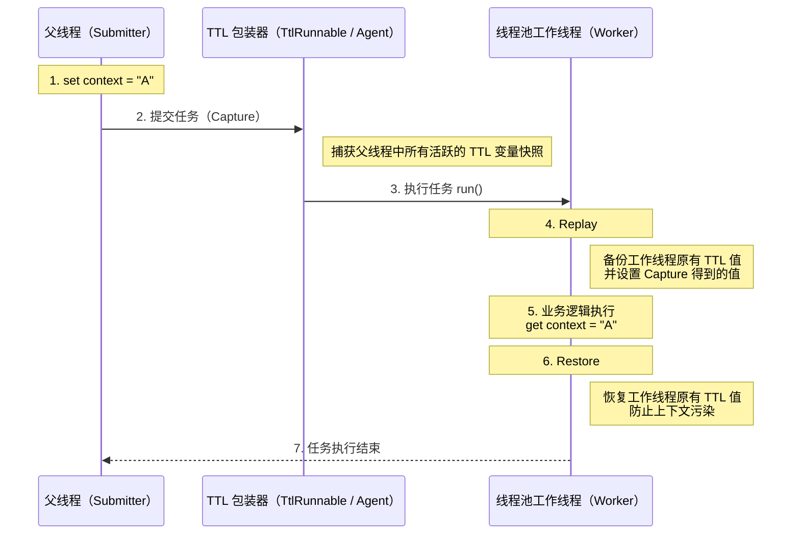

也就是说，TTL 的本质是在任务提交时 Capture 上下文，在任务执行前 Replay 上下文，在任务结束后 Restore 线程状态，从而安全地支持线程池中的 `ThreadLocal` 传递。

TTL 提供了两种主要的接入方式，可根据侵入性要求和改造成本进行选择。

**1. 显式包装（手动接入）**

使用 `TtlRunnable.get(Runnable)` 或 `TtlCallable.get(Callable)` 对任务进行包装，使用 `TtlExecutors.getTtlExecutor(Executor)`、`getTtlExecutorService(...)` 对线程池进行包装。这种接入方式清晰可控，但需要业务代码配合，存在一定侵入性。

下面这段代码展示了 TTL 通过 CRR，在支持线程池复用和拒绝策略的前提下，安全地传递并隔离 `ThreadLocal` 上下文。

```java
public class TtlContextHolder {
    private static final Logger log = LoggerFactory.getLogger(TtlContextHolder.class);

    // 1. 使用 static final 确保 TTL 实例不被重复创建，防止内存泄漏
    // 重写 copy 方法（可选）：如果是引用类型，建议实现深拷贝
    private static final TransmittableThreadLocal<String> CONTEXT = new TransmittableThreadLocal<String>() {
        @Override
        public String copy(String parentValue) {
            // 默认是直接返回引用，如果是可变对象（如 Map），请在这里 new 新对象
            return parentValue;
        }
    };

    // 2. 线程池初始化：确保只被 TtlExecutors 包装一次
    private static final ExecutorService TTL_EXECUTOR_SERVICE;

    static {
        ExecutorService rawExecutor = new ThreadPoolExecutor(
                2, 4, 60L, TimeUnit.SECONDS,
                new LinkedBlockingQueue<>(1000), (Runnable r) -> new Thread(r, "ttl-worker-" + r.hashCode()),
                new ThreadPoolExecutor.CallerRunsPolicy() // 关键：TTL 完美支持此拒绝策略
        );
        // 包装原始线程池
        TTL_EXECUTOR_SERVICE = TtlExecutors.getTtlExecutorService(rawExecutor);
    }

    public static void main(String[] args) throws Exception {
        try {
            // 3. 在父线程中设置上下文
            CONTEXT.set("value-set-in-parent");
            log.info("父线程上下文: {}", CONTEXT.get());

            // 4. 使用 Lambda 简化任务提交
            TTL_EXECUTOR_SERVICE.execute(() -> {
                log.info("异步任务(Runnable)读取上下文: {}", CONTEXT.get());
                // 模拟业务逻辑
                // 注意：子线程修改是否影响父线程，取决于 copy() 是否做了深拷贝
                CONTEXT.set("value-modified-in-child");
            });

            Future<String> future = TTL_EXECUTOR_SERVICE.submit(() -> {
                log.info("异步任务(Callable)读取上下文: {}", CONTEXT.get());
                return "Success";
            });

            future.get();

            // 5. 验证父线程上下文是否被污染
            log.info("父线程最终上下文: {}", CONTEXT.get());

        } finally {
            // 6. 清理当前线程（父线程）的上下文，子线程的上下文由 TTL 的 Restore 机制自动恢复
            CONTEXT.remove();
        }
    }
}
```

输出：

```ba
09:06:31.438 INFO  [main] TtlContextHolder - 父线程上下文: value-set-in-parent
09:06:31.452 INFO  [ttl-worker-1663166483] TtlContextHolder - 异步任务(Runnable)读取上下文: value-set-in-parent
09:06:31.453 INFO  [ttl-worker-841283083] TtlContextHolder - 异步任务(Callable)读取上下文: value-set-in-parent
09:06:31.453 INFO  [main] TtlContextHolder - 父线程最终上下文: value-set-in-parent
```

如果你想要测试这段代码，记得引入 TTL 的 Maven 依赖；

```XML
<dependency>
    <groupId>com.alibaba</groupId>
    <artifactId>transmittable-thread-local</artifactId>
    <version>2.14.4</version>
</dependency>
```

**2. 无侵入接入（Java Agent）**

通过 Java Agent 在类加载阶段对线程池相关类进行 字节码增强，自动织入 TTL 的上下文传递逻辑，实现业务代码零改造的上下文透传。这种方式业务代码无需感知 TTL 的存在，但实现复杂度相对较高。

TTL Agent 默认修饰了以下 JDK 执行器组件：

1. **标准线程池**：`java.util.concurrent.ThreadPoolExecutor` 和 `java.util.concurrent.ScheduledThreadPoolExecutor`。
2. **ForkJoin 体系**：`java.util.concurrent.ForkJoinTask`（从而透明支持了 `CompletableFuture` 和 Java 8 并行流 `Stream`）。
3. **遗留组件**：`java.util.TimerTask`（自 v2.7.0 起支持，v2.11.2 起默认开启）。

在 Java 启动参数中加入 `-javaagent` 配置：

```bash
# 基础配置
java -javaagent:path/to/transmittable-thread-local-2.x.y.jar \
     -cp classes \
     com.your.app.Main
```

#### 应用场景

1. **压测流量标记**： 在压测场景中，使用 `ThreadLocal` 存储压测标记，用于区分压测流量和真实流量。如果标记丢失，可能导致压测流量被错误地当成线上流量处理。
2. **上下文传递**：在分布式系统中，传递链路追踪信息（如 Trace ID）或用户上下文信息。

#### 总结

`ThreadLocal` 的值默认是无法跨线程传递的，因为它的值是存在**每个 `Thread` 对象自己**的 `ThreadLocalMap` 里的，父子线程是两个不同的对象。

为了解决这个问题，主要有两种方案：

1. **JDK 的 InheritableThreadLocal**：它会在**创建子线程**的时候，把父线程的值**复制**一份给子线程。但它的问题是，在**线程池**场景下会失效。因为线程池会**复用**线程，这会导致线程拿到的可能是上一个任务传下来的**脏数据**。
2. **阿里的 TransmittableThreadLocal (TTL)**：这是我们项目里用的方案，它专门解决线程池的问题。它的原理是，在**提交任务**到线程池时，它会把父线程的 `ThreadLocal` 值**捕获**下来，和任务**绑定**在一起。等线程池里的某个线程要执行这个任务时，它再把捕获的值**设置**到这个线程上，任务执行完再**清理**掉。

简单说，**InheritableThreadLocal 是跟线程绑定的，只在创建时有效；而 TTL 是跟任务绑定的，完美支持线程池。**

## 线程池

### 什么是线程池？

顾名思义，线程池就是管理一系列线程的资源池。当有任务要处理时，直接从线程池中获取线程来处理，处理完之后线程并不会立即被销毁，而是等待下一个任务。

### ⭐️ 为什么要用线程池？

池化技术想必大家已经屡见不鲜了，线程池、数据库连接池、HTTP 连接池等等都是对这个思想的应用。池化技术的思想主要是为了减少每次获取资源的消耗，提高对资源的利用率。

线程池提供了一种限制和管理资源（包括执行一个任务）的方式。 每个线程池还维护一些基本统计信息，例如已完成任务的数量。使用线程池主要带来以下几个好处：

1. **降低资源消耗**：线程池里的线程是可以重复利用的。一旦线程完成了某个任务，它不会立即销毁，而是回到池子里等待下一个任务。这就避免了频繁创建和销毁线程带来的开销。
2. **提高响应速度**：因为线程池里通常会维护一定数量的核心线程（或者说“常驻工人”），任务来了之后，可以直接交给这些已经存在的、空闲的线程去执行，省去了创建线程的时间，任务能够更快地得到处理。
3. **提高线程的可管理性**：线程池允许我们统一管理池中的线程。我们可以配置线程池的大小（核心线程数、最大线程数）、任务队列的类型和大小、拒绝策略等。这样就能控制并发线程的总量，防止资源耗尽，保证系统的稳定性。同时，线程池通常也提供了监控接口，方便我们了解线程池的运行状态（比如有多少活跃线程、多少任务在排队等），便于调优。

### 如何创建线程池？

在 Java 中，创建线程池主要有两种方式：

**方式一：通过 `ThreadPoolExecutor` 构造函数直接创建（推荐）**


图中的“默认线程工厂”和“默认拒绝策略”，指的是当前构造函数没有显式传入对应参数时，`ThreadPoolExecutor` 会使用默认实现，并不是方法和说明错位。

这是最推荐的方式，因为它允许开发者明确指定线程池的核心参数，对线程池的运行行为有更精细的控制，从而避免资源耗尽的风险。

**方式二：通过 `Executors` 工具类创建（不推荐用于生产环境）**

`Executors` 工具类提供的创建线程池的方法如下图所示：


可以看出，通过 `Executors` 工具类可以创建多种类型的线程池，包括：

- `FixedThreadPool`：正常运行时最多使用固定数量的工作线程。线程可以因异常终止后被替换，线程池关闭时也会退出，因此并非在整个生命周期中数量始终不变。当有一个新的任务提交时，线程池中若有空闲线程，则立即执行。若没有，则新的任务会被暂存在一个任务队列中，待有线程空闲时，便处理在任务队列中的任务。
- `SingleThreadExecutor`： 只有一个线程的线程池。若多余一个任务被提交到该线程池，任务会被保存在一个任务队列中，待线程空闲，按先入先出的顺序执行队列中的任务。
- `CachedThreadPool`： 可根据实际情况调整线程数量的线程池。线程池的线程数量不确定，但若有空闲线程可以复用，则会优先使用可复用的线程。若所有线程均在工作，又有新的任务提交，则会创建新的线程处理任务。所有线程在当前任务执行完毕后，将返回线程池进行复用。
- `ScheduledThreadPool`：给定的延迟后运行任务或者定期执行任务的线程池。

### ⭐️ 为什么不推荐使用内置线程池？

在《阿里巴巴 Java 开发手册》“并发处理”这一章节，明确指出线程资源必须通过线程池提供，不允许在应用中自行显式创建线程。

**为什么呢？**

> 使用线程池的好处是减少在创建和销毁线程上所消耗的时间以及系统资源开销，解决资源不足的问题。如果不使用线程池，有可能会造成系统创建大量同类线程而导致消耗完内存或者“过度切换”的问题。

另外，《阿里巴巴 Java 开发手册》中强制线程池不允许使用 `Executors` 去创建，而是通过 `ThreadPoolExecutor` 构造函数的方式，这样的处理方式让写的同学更加明确线程池的运行规则，规避资源耗尽的风险

`Executors` 返回线程池对象的弊端如下（后文会详细介绍到）：

- `FixedThreadPool` 和 `SingleThreadExecutor`:使用的是阻塞队列 `LinkedBlockingQueue`，任务队列最大长度为 `Integer.MAX_VALUE`，可以看作是无界的，可能堆积大量的请求，从而导致 OOM。
- `CachedThreadPool`:使用的是同步队列 `SynchronousQueue`, 允许创建的线程数量为 `Integer.MAX_VALUE`，如果任务数量过多且执行速度较慢，可能会创建大量的线程，从而导致 OOM。
- `ScheduledThreadPool` 和 `SingleThreadScheduledExecutor`:使用的无界的延迟阻塞队列 `DelayedWorkQueue`，任务队列最大长度为 `Integer.MAX_VALUE`,可能堆积大量的请求，从而导致 OOM。

```java
public static ExecutorService newFixedThreadPool(int nThreads) {
    // LinkedBlockingQueue 的默认长度为 Integer.MAX_VALUE，可以看作是无界的
    return new ThreadPoolExecutor(nThreads, nThreads,0L, TimeUnit.MILLISECONDS,new LinkedBlockingQueue<Runnable>());

}

public static ExecutorService newSingleThreadExecutor() {
    // LinkedBlockingQueue 的默认长度为 Integer.MAX_VALUE，可以看作是无界的
    return new FinalizableDelegatedExecutorService (new ThreadPoolExecutor(1, 1,0L, TimeUnit.MILLISECONDS,new LinkedBlockingQueue<Runnable>()));

}

// 同步队列 SynchronousQueue，没有容量，最大线程数是 Integer.MAX_VALUE`
public static ExecutorService newCachedThreadPool() {

    return new ThreadPoolExecutor(0, Integer.MAX_VALUE,60L, TimeUnit.SECONDS,new SynchronousQueue<Runnable>());

}

// DelayedWorkQueue（延迟阻塞队列）
public static ScheduledExecutorService newScheduledThreadPool(int corePoolSize) {
    return new ScheduledThreadPoolExecutor(corePoolSize);
}
public ScheduledThreadPoolExecutor(int corePoolSize) {
    super(corePoolSize, Integer.MAX_VALUE, 0, NANOSECONDS,
          new DelayedWorkQueue());
}
```

### ⭐️ 线程池常见参数有哪些？如何解释？

```java
    /**
     * 用给定的初始参数创建一个新的ThreadPoolExecutor。
     */
    public ThreadPoolExecutor(int corePoolSize,//线程池的核心线程数量
                              int maximumPoolSize,//线程池的最大线程数
                              long keepAliveTime,//当线程数大于核心线程数时，多余的空闲线程存活的最长时间
                              TimeUnit unit,//时间单位
                              BlockingQueue<Runnable> workQueue,//任务队列，用来储存等待执行任务的队列
                              ThreadFactory threadFactory,//线程工厂，用来创建线程，一般默认即可
                              RejectedExecutionHandler handler//拒绝策略，当提交的任务过多而不能及时处理时，我们可以定制策略来处理任务
                               ) {
        if (corePoolSize < 0 ||
            maximumPoolSize <= 0 ||
            maximumPoolSize < corePoolSize ||
            keepAliveTime < 0)
            throw new IllegalArgumentException();
        if (workQueue == null || threadFactory == null || handler == null)
            throw new NullPointerException();
        this.corePoolSize = corePoolSize;
        this.maximumPoolSize = maximumPoolSize;
        this.workQueue = workQueue;
        this.keepAliveTime = unit.toNanos(keepAliveTime);
        this.threadFactory = threadFactory;
        this.handler = handler;
    }
```

`ThreadPoolExecutor` 3 个最重要的参数：

- `corePoolSize`：默认情况下，即使空闲也会保留在线程池中的线程数量；未启用核心线程超时且工作线程少于该值时，新任务会优先触发创建线程。
- `maximumPoolSize`：线程池允许存在的最大工作线程数。
- `workQueue`：当工作线程数达到 `corePoolSize` 后，新任务会先尝试进入队列；只有入队失败且工作线程数小于 `maximumPoolSize` 时，线程池才会继续创建线程。

`ThreadPoolExecutor` 其他常见参数 :

- `keepAliveTime`:当线程池中的线程数量大于 `corePoolSize`，即有非核心线程（线程池中核心线程以外的线程）时，这些非核心线程空闲后不会立即销毁，而是会等待，直到等待的时间超过了 `keepAliveTime` 才会被回收销毁。
- `unit` : `keepAliveTime` 参数的时间单位。
- `threadFactory` :executor 创建新线程的时候会用到。
- `handler` :拒绝策略（后面会单独详细介绍一下）。

下面这张图可以加深你对线程池中各个参数的相互关系的理解（图片来源：《Java 性能调优实战》）：


### 线程池的核心线程会被回收吗？

`ThreadPoolExecutor` 默认不会回收核心线程，即使它们已经空闲了。这是为了减少创建线程的开销，因为核心线程通常是要长期保持活跃的。但是，如果线程池是被用于周期性使用的场景，且频率不高（周期之间有明显的空闲时间），可以考虑将 `allowCoreThreadTimeOut(boolean value)` 方法的参数设置为 `true`，这样就会回收空闲（时间间隔由 `keepAliveTime` 指定）的核心线程了。

```java
public void allowCoreThreadTimeOut(boolean value) {
    // 核心线程的 keepAliveTime 必须大于 0 才能启用超时机制
    if (value && keepAliveTime <= 0) {
        throw new IllegalArgumentException("Core threads must have nonzero keep alive times");
    }
    // 设置 allowCoreThreadTimeOut 的值
    if (value != allowCoreThreadTimeOut) {
        allowCoreThreadTimeOut = value;
        // 如果启用了超时机制，清理所有空闲的线程，包括核心线程
        if (value) {
            interruptIdleWorkers();
        }
    }
}
```

### 核心线程空闲时处于什么状态？

核心线程空闲时，其状态分为以下两种情况：

- **设置了核心线程的存活时间**：核心线程在空闲时，会处于 `WAITING` 状态，等待获取任务。如果阻塞等待的时间超过了核心线程存活时间，则该线程会退出工作，将该线程从线程池的工作线程集合中移除，线程状态变为 `TERMINATED` 状态。
- **没有设置核心线程的存活时间**：核心线程在空闲时，会一直处于 `WAITING` 状态，等待获取任务，核心线程会一直存活在线程池中。

当队列中有可用任务时，会唤醒被阻塞的线程，线程的状态会由 `WAITING` 状态变为 `RUNNABLE` 状态，之后去执行对应任务。

接下来通过相关源码，了解一下线程池内部是如何做的。

线程在线程池内部被抽象为了 `Worker`，当 `Worker` 被启动之后，会不断去任务队列中获取任务。

在获取任务的时候，会根据 `timed` 值来决定从任务队列（`BlockingQueue`）获取任务的行为。

如果「设置了核心线程的存活时间」或者「线程数量超过了核心线程数量」，则将 `timed` 标记为 `true`，表明获取任务时需要使用 `poll()` 指定超时时间。

- `timed == true`：使用 `poll(timeout, unit)` 来获取任务。使用 `poll(timeout, unit)` 方法获取任务超时的话，则当前线程会退出执行（`TERMINATED`），该线程从线程池中被移除。
- `timed == false`：使用 `take()` 来获取任务。使用 `take()` 方法获取任务会让当前线程一直阻塞等待（`WAITING`）。

源码如下：

```JAVA
// ThreadPoolExecutor
private Runnable getTask() {
    boolean timedOut = false;
    for (;;) {
        // ...

        // 1、如果「设置了核心线程的存活时间」或者是「线程数量超过了核心线程数量」，则 timed 为 true。
        boolean timed = allowCoreThreadTimeOut || wc > corePoolSize;
        // 2、扣减线程数量。
        // wc > maximuimPoolSize：线程池中的线程数量超过最大线程数量。其中 wc 为线程池中的线程数量。
        // timed && timeOut：timeOut 表示获取任务超时。
        // 分为两种情况：核心线程设置了存活时间 && 获取任务超时，则扣减线程数量；线程数量超过了核心线程数量 && 获取任务超时，则扣减线程数量。
        if ((wc > maximumPoolSize || (timed && timedOut))
            && (wc > 1 || workQueue.isEmpty())) {
            if (compareAndDecrementWorkerCount(c))
                return null;
            continue;
        }
        try {
            // 3、如果 timed 为 true，则使用 poll() 获取任务；否则，使用 take() 获取任务。
            Runnable r = timed ?
                workQueue.poll(keepAliveTime, TimeUnit.NANOSECONDS) :
                workQueue.take();
            // 4、获取任务之后返回。
            if (r != null)
                return r;
            timedOut = true;
        } catch (InterruptedException retry) {
            timedOut = false;
        }
    }
}
```

### ⭐️ 线程池的拒绝策略有哪些？

如果当前同时运行的线程数量达到最大线程数量并且队列也已经被放满了任务时，`ThreadPoolExecutor` 定义一些策略:

- `ThreadPoolExecutor.AbortPolicy`：抛出 `RejectedExecutionException` 来拒绝新任务的处理。
- `ThreadPoolExecutor.CallerRunsPolicy`：调用执行者自己的线程运行任务，也就是直接在调用 `execute` 方法的线程中运行(`run`)被拒绝的任务，如果执行程序已关闭，则会丢弃该任务。因此这种策略会降低对于新任务提交速度，影响程序的整体性能。如果你的应用程序可以承受此延迟并且你要求任何一个任务请求都要被执行的话，你可以选择这个策略。
- `ThreadPoolExecutor.DiscardPolicy`：不处理新任务，直接丢弃掉。
- `ThreadPoolExecutor.DiscardOldestPolicy`：此策略将丢弃最早的未处理的任务请求。

举个例子：Spring 通过 `ThreadPoolTaskExecutor` 或者我们直接通过 `ThreadPoolExecutor` 的构造函数创建线程池的时候，当我们不指定 `RejectedExecutionHandler` 拒绝策略来配置线程池的时候，默认使用的是 `AbortPolicy`。在这种拒绝策略下，如果队列满了，`ThreadPoolExecutor` 将抛出 `RejectedExecutionException` 异常来拒绝新来的任务，这代表你将丢失对这个任务的处理。如果希望在线程池仍处于运行状态时避免直接丢弃任务，可以使用 `CallerRunsPolicy`，把任务回退给调用 `execute()` 的线程执行；如果线程池已经关闭，该策略仍会丢弃任务。

```java
public static class CallerRunsPolicy implements RejectedExecutionHandler {

        public CallerRunsPolicy() { }

        public void rejectedExecution(Runnable r, ThreadPoolExecutor e) {
            if (!e.isShutdown()) {
                // 直接主线程执行，而不是线程池中的线程执行
                r.run();
            }
        }
    }
```

### 如果希望饱和时尽量不丢弃任务，应该选择哪个拒绝策略？

对于线程池仍在运行、并且调用线程可以接受同步执行任务的场景，可以考虑 `CallerRunsPolicy`。它不能提供“任何情况下都不丢任务”的保证：线程池关闭后任务会被丢弃，进程崩溃也无法靠内存中的拒绝策略恢复任务；需要强保证时应配合持久化或消息队列。

这里我们再来结合 `CallerRunsPolicy` 的源码来看看：

```java
public static class CallerRunsPolicy implements RejectedExecutionHandler {

        public CallerRunsPolicy() { }


        public void rejectedExecution(Runnable r, ThreadPoolExecutor e) {
            //只要当前程序没有关闭，就用执行execute方法的线程执行该任务
            if (!e.isShutdown()) {

                r.run();
            }
        }
    }
```

从源码可以看出，只要当前程序不关闭就会使用执行 `execute` 方法的线程执行该任务。

### CallerRunsPolicy 拒绝策略有什么风险？如何解决？

我们上面也提到了：如果希望在线程池饱和时通过调用线程施加反压、尽量避免直接丢弃任务，`CallerRunsPolicy` 是一种可选方案。

不过，如果走到 `CallerRunsPolicy` 的任务是个非常耗时的任务，且处理提交任务的线程是主线程，可能会导致主线程阻塞，影响程序的正常运行。

这里简单举一个例子，该线程池限定了最大线程数为 2，阻塞队列大小为 1（这意味着第 4 个任务就会走到拒绝策略），`ThreadUtil` 为 Hutool 提供的工具类：

```java
public class ThreadPoolTest {

    private static final Logger log = LoggerFactory.getLogger(ThreadPoolTest.class);

    public static void main(String[] args) {
        // 创建一个线程池，核心线程数为1，最大线程数为2
        // 当线程数大于核心线程数时，多余的空闲线程存活的最长时间为60秒，
        // 任务队列为容量为1的ArrayBlockingQueue，饱和策略为CallerRunsPolicy。
        ThreadPoolExecutor threadPoolExecutor = new ThreadPoolExecutor(1,
                2,
                60,
                TimeUnit.SECONDS,
                new ArrayBlockingQueue<>(1),
                new ThreadPoolExecutor.CallerRunsPolicy());

        // 提交第一个任务，由核心线程执行
        threadPoolExecutor.execute(() -> {
            log.info("核心线程执行第一个任务");
            ThreadUtil.sleep(1, TimeUnit.MINUTES);
        });

        // 提交第二个任务，由于核心线程被占用，任务将进入队列等待
        threadPoolExecutor.execute(() -> {
            log.info("非核心线程处理入队的第二个任务");
            ThreadUtil.sleep(1, TimeUnit.MINUTES);
        });

        // 提交第三个任务，由于核心线程被占用且队列已满，创建非核心线程处理
        threadPoolExecutor.execute(() -> {
            log.info("非核心线程处理第三个任务");
            ThreadUtil.sleep(1, TimeUnit.MINUTES);
        });

        // 提交第四个任务，由于核心线程和非核心线程都被占用，队列也满了，根据CallerRunsPolicy策略，任务将由提交任务的线程（即主线程）来执行
        threadPoolExecutor.execute(() -> {
            log.info("主线程处理第四个任务");
            ThreadUtil.sleep(2, TimeUnit.MINUTES);
        });

        // 提交第五个任务，主线程被第四个任务卡住，该任务必须等到主线程执行完才能提交
        threadPoolExecutor.execute(() -> {
            log.info("核心线程执行第五个任务");
        });

        // 关闭线程池
        threadPoolExecutor.shutdown();
    }
}

```

输出：

```bash
18:19:48.203 INFO  [pool-1-thread-1] c.j.concurrent.ThreadPoolTest - 核心线程执行第一个任务
18:19:48.203 INFO  [pool-1-thread-2] c.j.concurrent.ThreadPoolTest - 非核心线程处理第三个任务
18:19:48.203 INFO  [main] c.j.concurrent.ThreadPoolTest - 主线程处理第四个任务
18:20:48.212 INFO  [pool-1-thread-2] c.j.concurrent.ThreadPoolTest - 非核心线程处理入队的第二个任务
18:21:48.219 INFO  [pool-1-thread-2] c.j.concurrent.ThreadPoolTest - 核心线程执行第五个任务
```

从输出结果可以看出，因为 `CallerRunsPolicy` 这个拒绝策略，导致耗时的任务用了主线程执行，导致线程池阻塞，进而导致后续任务无法及时执行，严重的情况下很可能导致 OOM。

我们从问题的本质入手，调用者采用 `CallerRunsPolicy` 是希望所有的任务都能够被执行，暂时无法处理的任务又被保存在阻塞队列 `BlockingQueue` 中。这样的话，在内存允许的情况下，我们可以增加阻塞队列 `BlockingQueue` 的大小并调整堆内存以容纳更多的任务，确保任务能够被准确执行。

为了充分利用 CPU，我们还可以调整线程池的 `maximumPoolSize`（最大线程数）参数，这样可以提高任务处理速度，避免累计在 `BlockingQueue` 的任务过多导致内存用完。


如果服务器资源已达到可利用的极限，这就意味我们要在设计策略上改变线程池的调度了，我们都知道，导致主线程卡死的本质就是因为我们不希望任何一个任务被丢弃。换个思路，有没有办法既能保证任务不被丢弃且在服务器有余力时及时处理呢？

这里提供的一种**任务持久化**的思路，这里所谓的任务持久化，包括但不限于:

1. 设计一张任务表将任务存储到 MySQL 数据库中。
2. Redis 缓存任务。
3. 将任务提交到消息队列中。

这里以方案一为例，简单介绍一下实现逻辑：

1. 实现 `RejectedExecutionHandler` 接口自定义拒绝策略，自定义拒绝策略负责将线程池暂时无法处理（此时阻塞队列已满）的任务入库（保存到 MySQL 中）。注意：线程池暂时无法处理的任务会先被放在阻塞队列中，阻塞队列满了才会触发拒绝策略。
2. 继承 `BlockingQueue` 实现一个混合式阻塞队列，该队列包含 JDK 自带的 `ArrayBlockingQueue`。另外，该混合式阻塞队列需要修改取任务处理的逻辑，也就是重写 `take()` 方法，取任务时优先从数据库中读取最早的任务，数据库中无任务时再从 `ArrayBlockingQueue` 中去取任务。


整个实现逻辑还是比较简单的，核心在于自定义拒绝策略和阻塞队列。如此一来，一旦我们的线程池中线程达到满载时，我们就可以通过拒绝策略将最新任务持久化到 MySQL 数据库中，等到线程池有了有余力处理所有任务时，让其优先处理数据库中的任务以避免“饥饿”问题。

当然，对于这个问题，我们也可以参考其他主流框架的做法，以 Netty 为例，它的拒绝策略则是直接创建一个线程池以外的线程处理这些任务，为了保证任务的实时处理，这种做法可能需要良好的硬件设备且临时创建的线程无法做到准确的监控：

```java
private static final class NewThreadRunsPolicy implements RejectedExecutionHandler {
    NewThreadRunsPolicy() {
        super();
    }
    public void rejectedExecution(Runnable r, ThreadPoolExecutor executor) {
        try {
            //创建一个临时线程处理任务
            final Thread t = new Thread(r, "Temporary task executor");
            t.start();
        } catch (Throwable e) {
            throw new RejectedExecutionException(
                    "Failed to start a new thread", e);
        }
    }
}
```

ActiveMQ 则是尝试在指定的时效内尽可能的争取将任务入队，以保证最大交付：

```java
new RejectedExecutionHandler() {
                @Override
                public void rejectedExecution(final Runnable r, final ThreadPoolExecutor executor) {
                    try {
                        //限时阻塞等待，实现尽可能交付
                        executor.getQueue().offer(r, 60, TimeUnit.SECONDS);
                    } catch (InterruptedException e) {
                        throw new RejectedExecutionException("Interrupted waiting for BrokerService.worker");
                    }
                    throw new RejectedExecutionException("Timed Out while attempting to enqueue Task.");
                }
            });
```

### 线程池常用的阻塞队列有哪些？

新任务来的时候会先判断当前运行的线程数量是否达到核心线程数，如果达到的话，新任务就会被存放在队列中。

不同的线程池会选用不同的阻塞队列，我们可以结合内置线程池来分析。

- 容量为 `Integer.MAX_VALUE` 的 `LinkedBlockingQueue`（无界阻塞队列）：`FixedThreadPool` 和 `SingleThreadExecutor`。`FixedThreadPool` 最多只能创建核心线程数的线程（核心线程数和最大线程数相等），`SingleThreadExecutor` 只能创建一个线程（核心线程数和最大线程数都是 1），二者的任务队列永远不会被放满。
- `SynchronousQueue`（同步队列）：`CachedThreadPool`。`SynchronousQueue` 没有容量，不存储元素，目的是保证对于提交的任务，如果有空闲线程，则使用空闲线程来处理；否则新建一个线程来处理任务。也就是说，`CachedThreadPool` 的最大线程数是 `Integer.MAX_VALUE`，可以理解为线程数是可以无限扩展的，可能会创建大量线程，从而导致 OOM。
- `DelayedWorkQueue`（延迟队列）：`ScheduledThreadPool` 和 `SingleThreadScheduledExecutor`。`DelayedWorkQueue` 的内部元素并不是按照放入的时间排序，而是会按照延迟的时间长短对任务进行排序，内部采用的是“堆”的数据结构，可以保证每次出队的任务都是当前队列中执行时间最靠前的。`DelayedWorkQueue` 是一个无界队列。其底层虽然是数组，但当数组容量不足时，它会自动进行扩容，因此队列永远不会被填满。当任务不断提交时，它们会全部被添加到队列中。这意味着线程池的线程数量永远不会超过其核心线程数，最大线程数参数对于使用该队列的线程池来说是无效的。
- `ArrayBlockingQueue`（有界阻塞队列）：底层由数组实现，容量一旦创建，就不能修改。

### ⭐️ 线程池处理任务的流程了解吗？


1. 如果当前运行的线程数小于核心线程数，那么就会新建一个线程来执行任务。
2. 如果当前运行的线程数等于或大于核心线程数，但是小于最大线程数，那么就把该任务放入到任务队列里等待执行。
3. 如果向任务队列投放任务失败（任务队列已经满了），但是当前运行的线程数是小于最大线程数的，就新建一个线程来执行任务。
4. 如果当前运行的线程数已经等同于最大线程数了，新建线程将会使当前运行的线程超出最大线程数，那么当前任务会被拒绝，拒绝策略会调用 `RejectedExecutionHandler.rejectedExecution()` 方法。

再提一个有意思的小问题：**线程池在提交任务前，可以提前创建线程吗？**

答案是可以的！`ThreadPoolExecutor` 提供了两个方法帮助我们在提交任务之前，完成核心线程的创建，从而实现线程池预热的效果：

- `prestartCoreThread()`:启动一个线程，等待任务，如果已达到核心线程数，这个方法返回 false，否则返回 true；
- `prestartAllCoreThreads()`:启动所有的核心线程，并返回启动成功的核心线程数。

### ⭐️ 线程池中线程异常后，销毁还是复用？

直接说结论，需要分两种情况：

- **使用 `execute()` 提交任务**：当任务通过 `execute()` 提交到线程池并在执行过程中抛出异常时，如果这个异常没有在任务内被捕获，那么该异常会导致当前线程终止，并且异常会被打印到控制台或日志文件中。线程池会检测到这种线程终止，并创建一个新线程来替换它，从而保持配置的线程数不变。
- **使用 `submit()` 提交任务**：对于通过 `submit()` 提交的任务，如果在任务执行中发生异常，这个异常不会直接打印出来。相反，异常会被封装在由 `submit()` 返回的 `Future` 对象中。当调用 `Future.get()` 方法时，可以捕获到一个 `ExecutionException`。在这种情况下，线程不会因为异常而终止，它会继续存在于线程池中，准备执行后续的任务。

简单来说：使用 `execute()` 时，未捕获异常导致线程终止，线程池创建新线程替代；使用 `submit()` 时，异常被封装在 `Future` 中，线程继续复用。

这种设计允许 `submit()` 提供更灵活的错误处理机制，因为它允许调用者决定如何处理异常，而 `execute()` 则适用于那些不需要关注执行结果的场景。

具体的源码分析可以参考这篇：[线程池中线程异常后：销毁还是复用？ - 京东技术](https://mp.weixin.qq.com/s/9ODjdUU-EwQFF5PrnzOGfw)。

### ⭐️ 如何给线程池命名？

初始化线程池的时候需要显示命名（设置线程池名称前缀），有利于定位问题。

默认情况下创建的线程名字类似 `pool-1-thread-n` 这样的，没有业务含义，不利于我们定位问题。

给线程池里的线程命名通常有下面两种方式：

**1、利用 guava 的 `ThreadFactoryBuilder`**

```java
ThreadFactory threadFactory = new ThreadFactoryBuilder()
                        .setNameFormat(threadNamePrefix + "-%d")
                        .setDaemon(true).build();
ExecutorService threadPool = new ThreadPoolExecutor(corePoolSize, maximumPoolSize, keepAliveTime, TimeUnit.MINUTES, workQueue, threadFactory);
```

**2、自己实现 `ThreadFactory`。**

```java
import java.util.concurrent.ThreadFactory;
import java.util.concurrent.atomic.AtomicInteger;

/**
 * 线程工厂，它设置线程名称，有利于我们定位问题。
 */
public final class NamingThreadFactory implements ThreadFactory {

    private final AtomicInteger threadNum = new AtomicInteger();
    private final String name;

    /**
     * 创建一个带名字的线程池生产工厂
     */
    public NamingThreadFactory(String name) {
        this.name = name;
    }

    @Override
    public Thread newThread(Runnable r) {
        Thread t = new Thread(r);
        t.setName(name + " [#" + threadNum.incrementAndGet() + "]");
        return t;
    }
}
```

### 如何设定线程池的大小？

很多人甚至可能都会觉得把线程池配置过大一点比较好！我觉得这明显是有问题的。就拿我们生活中非常常见的一例子来说：**并不是人多就能把事情做好，增加了沟通交流成本。你本来一件事情只需要 3 个人做，你硬是拉来了 6 个人，会提升做事效率嘛？我想并不会。** 线程数量过多的影响也是和我们分配多少人做事情一样，对于多线程这个场景来说主要是增加了**上下文切换**成本。不清楚什么是上下文切换的话，可以看我下面的介绍。

> 上下文切换：
>
> 多线程编程中一般线程的个数都大于 CPU 核心的个数，而一个 CPU 核心在任意时刻只能被一个线程使用，为了让这些线程都能得到有效执行，CPU 采取的策略是为每个线程分配时间片并轮转的形式。当一个线程的时间片用完的时候就会重新处于就绪状态让给其他线程使用，这个过程就属于一次上下文切换。概括来说就是：当前任务在执行完 CPU 时间片切换到另一个任务之前会先保存自己的状态，以便下次再切换回这个任务时，可以再加载这个任务的状态。**任务从保存到再加载的过程就是一次上下文切换**。
>
> 上下文切换通常是计算密集型的。也就是说，它需要相当可观的处理器时间，在每秒几十上百次的切换中，每次切换都需要纳秒量级的时间。所以，上下文切换对系统来说意味着消耗大量的 CPU 时间，事实上，可能是操作系统中时间消耗最大的操作。
>
> Linux 相比与其他操作系统（包括其他类 Unix 系统）有很多的优点，其中有一项就是，其上下文切换和模式切换的时间消耗非常少。

类比于现实世界中的人类通过合作做某件事情，我们可以肯定的一点是线程池大小设置过大或者过小都会有问题，合适的才是最好。

- 如果我们设置的线程池数量太小的话，如果同一时间有大量任务/请求需要处理，可能会导致大量的请求/任务在任务队列中排队等待执行，甚至会出现任务队列满了之后任务/请求无法处理的情况，或者大量任务堆积在任务队列导致 OOM。这样很明显是有问题的，CPU 根本没有得到充分利用。
- 如果我们设置线程数量太大，大量线程可能会同时在争取 CPU 资源，这样会导致大量的上下文切换，从而增加线程的执行时间，影响了整体执行效率。

有一个简单并且适用面比较广的公式：

- **CPU 密集型任务(N+1)：** 这种任务消耗的主要是 CPU 资源，可以将线程数设置为 N（CPU 核心数）+1。比 CPU 核心数多出来的一个线程是为了防止线程偶发的缺页中断，或者其它原因导致的任务暂停而带来的影响。一旦任务暂停，CPU 就会处于空闲状态，而在这种情况下多出来的一个线程就可以充分利用 CPU 的空闲时间。
- **I/O 密集型任务(2N)：** 这种任务应用起来，系统会用大部分的时间来处理 I/O 交互，而线程在处理 I/O 的时间段内不会占用 CPU 来处理，这时就可以将 CPU 交出给其它线程使用。因此在 I/O 密集型任务的应用中，我们可以多配置一些线程，具体的计算方法是 2N。

**如何判断是 CPU 密集任务还是 IO 密集任务？**

CPU 密集型简单理解就是利用 CPU 计算能力的任务比如你在内存中对大量数据进行排序。但凡涉及到网络读取，文件读取这类都是 IO 密集型，这类任务的特点是 CPU 计算耗费时间相比于等待 IO 操作完成的时间来说很少，大部分时间都花在了等待 IO 操作完成上。

> 🌈 拓展一下（参见：[issue#1737](https://github.com/Snailclimb/JavaGuide/issues/1737)）：
>
> 线程数更严谨的计算的方法应该是：`最佳线程数 = N（CPU 核心数）∗（1+WT（线程等待时间）/ST（线程计算时间））`，其中 `WT（线程等待时间）=线程运行总时间 - ST（线程计算时间）`。
>
> 线程等待时间所占比例越高，需要越多线程。线程计算时间所占比例越高，需要越少线程。
>
> 我们可以通过 JDK 自带的工具 VisualVM 来查看 `WT/ST` 比例。
>
> CPU 密集型任务的 `WT/ST` 接近或者等于 0，因此， 线程数可以设置为 N（CPU 核心数）∗（1+0）= N，和我们上面说的 N（CPU 核心数）+1 差不多。
>
> IO 密集型任务下，几乎全是线程等待时间，从理论上来说，你就可以将线程数设置为 2N（按道理来说，WT/ST 的结果应该比较大，这里选择 2N 的原因应该是为了避免创建过多线程吧）。

公式也只是参考，具体还是要根据项目实际线上运行情况来动态调整。我在后面介绍的美团的线程池参数动态配置这种方案就非常不错，很实用！

### ⭐️ 如何动态修改线程池的参数？

美团技术团队在[《Java 线程池实现原理及其在美团业务中的实践》](https://tech.meituan.com/2020/04/02/java-pooling-pratice-in-meituan.html)这篇文章中介绍到对线程池参数实现可自定义配置的思路和方法。

美团技术团队的思路是主要对线程池的核心参数实现自定义可配置。这三个核心参数是：

- **`corePoolSize`：** 默认情况下，即使空闲也会保留在线程池中的线程数量；工作线程少于该值时，新任务会优先触发创建线程。
- **`maximumPoolSize`：** 线程池允许存在的最大工作线程数。
- **`workQueue`：** 工作线程数达到 `corePoolSize` 后，新任务会先尝试进入队列；入队失败时才会在不超过 `maximumPoolSize` 的前提下继续创建线程。

**为什么是这三个参数？**

我在[Java 线程池详解](https://javaguide.cn/java/并发/java-thread-pool-summary.html) 这篇文章中就说过这三个参数是 `ThreadPoolExecutor` 最重要的参数，它们基本决定了线程池对于任务的处理策略。

**如何支持参数动态配置？** 且看 `ThreadPoolExecutor` 提供的下面这些方法。


格外需要注意的是 `corePoolSize`。运行期间调小该参数后，超过新核心线程数的现有线程会在下一次空闲时终止；调大时，如果队列中已有任务，线程池会按需启动新线程处理。

另外，你也看到了上面并没有动态指定队列长度的方法，美团的方式是自定义了一个叫做 `ResizableCapacityLinkedBlockIngQueue` 的队列（主要就是把 `LinkedBlockingQueue` 的 capacity 字段的 final 关键字修饰给去掉了，让它变为可变的）。

最终实现的可动态修改线程池参数效果如下。👏👏👏


还没看够？我在[《后端面试高频系统设计&场景题》](https://javaguide.cn/专栏/back-end-interview-high-frequency-system-design-and-scenario-questions.html)中详细介绍了如何设计一个动态线程池，这也是面试中常问的一道系统设计题。


如果我们的项目也想要实现这种效果的话，可以借助现成的开源项目：

- **[Hippo4j](https://github.com/opengoofy/hippo4j)**：异步线程池框架，支持线程池动态变更&监控&报警，无需修改代码轻松引入。支持多种使用模式，轻松引入，致力于提高系统运行保障能力。
- **[Dynamic TP](https://github.com/dromara/dynamic-tp)**：轻量级动态线程池，内置监控告警功能，集成三方中间件线程池管理，基于主流配置中心（已支持 Nacos、Apollo，Zookeeper、Consul、Etcd，可通过 SPI 自定义实现）。

### ⭐️ 如何设计一个能够根据任务的优先级来执行的线程池？

这是一个常见的面试问题，本质其实还是在考察求职者对于线程池以及阻塞队列的掌握。

我们上面也提到了，不同的线程池会选用不同的阻塞队列作为任务队列。`FixedThreadPool` 使用默认容量为 `Integer.MAX_VALUE` 的 `LinkedBlockingQueue`，通常将其视为无界队列；实际应用几乎无法填满，因此 `FixedThreadPool` 通常只会创建 `corePoolSize` 个工作线程。

假如我们需要实现一个优先级任务线程池的话，那可以考虑使用 `PriorityBlockingQueue`（优先级阻塞队列）作为任务队列（`ThreadPoolExecutor` 的构造函数有一个 `workQueue` 参数可以传入任务队列）。


`PriorityBlockingQueue` 是一个支持优先级的无界阻塞队列，可以看作是线程安全的 `PriorityQueue`，两者底层都是使用小顶堆形式的二叉堆，即值最小的元素优先出队。不过，`PriorityQueue` 不支持阻塞操作。

要想让 `PriorityBlockingQueue` 实现对任务的排序，传入其中的任务必须是具备排序能力的，方式有两种：

1. 提交到线程池的任务实现 `Comparable` 接口，并重写 `compareTo` 方法来指定任务之间的优先级比较规则。
2. 创建 `PriorityBlockingQueue` 时传入一个 `Comparator` 对象来指定任务之间的排序规则（推荐）。

不过，这存在一些风险和问题，比如：

- `PriorityBlockingQueue` 是无界的，可能堆积大量的请求，从而导致 OOM。
- 可能会导致饥饿问题，即低优先级的任务长时间得不到执行。
- 由于需要对队列中的元素进行排序操作以及保证线程安全（并发控制采用的是可重入锁 `ReentrantLock`），因此会降低性能。

对于 OOM 这个问题的解决比较简单粗暴，就是继承 `PriorityBlockingQueue` 并重写一下 `offer` 方法（入队）的逻辑，当插入的元素数量超过指定值就返回 false。

饥饿问题这个可以通过优化设计来解决（比较麻烦），比如等待时间过长的任务会被移除并重新添加到队列中，但是优先级会被提升。

对于性能方面的影响，是没办法避免的，毕竟需要对任务进行排序操作。并且，对于大部分业务场景来说，这点性能影响是可以接受的。

## Future

重点是要掌握 `CompletableFuture` 的使用以及常见面试题。

除了下面的面试题之外，还推荐你看看我写的这篇文章： [CompletableFuture 详解](https://javaguide.cn/java/并发/completablefuture-intro.html)。

### Future 接口有什么用？

`Future` 接口是异步思想的典型运用，主要用在一些需要执行耗时任务的场景，避免程序一直原地等待耗时任务执行完成，执行效率太低。具体来说是这样的：当我们执行某一耗时的任务时，可以将这个耗时任务交给一个子线程去异步执行，同时我们可以干点其他事情，不用傻傻等待耗时任务执行完成。等我们的事情干完后，我们再通过 `Future` 获取到耗时任务的执行结果。这样一来，程序的执行效率就明显提高了。

这其实就是多线程中经典的 **Future 模式**，你可以将其看作是一种设计模式，核心思想是异步调用，主要用在多线程领域，并非 Java 语言独有。

在 Java 中，`Future` 是一个泛型接口，位于 `java.util.concurrent` 包下。它有 5 个经典抽象方法，主要包括下面 4 类功能；JDK 19 起又增加了 `resultNow()`、`exceptionNow()` 和 `state()` 三个默认查询方法。

- 取消任务；
- 判断任务是否被取消;
- 判断任务是否已经执行完成;
- 获取任务执行结果。

```java
// V 代表了Future执行的任务返回值的类型
public interface Future<V> {
    // 取消任务执行
    // 成功取消返回 true，否则返回 false
    boolean cancel(boolean mayInterruptIfRunning);
    // 判断任务是否被取消
    boolean isCancelled();
    // 判断任务是否已经执行完成
    boolean isDone();
    // 获取任务执行结果
    V get() throws InterruptedException, ExecutionException;
    // 指定时间内没有返回计算结果就抛出 TimeOutException 异常
    V get(long timeout, TimeUnit unit)

        throws InterruptedException, ExecutionException, TimeoutExceptio

}
```

简单理解就是：我有一个任务，提交给了 `Future` 来处理。任务执行期间我自己可以去做任何想做的事情。并且，在这期间我还可以取消任务以及获取任务的执行状态。一段时间之后，我就可以 `Future` 那里直接取出任务执行结果。

### Callable 和 Future 有什么关系？

我们可以通过 `FutureTask` 来理解 `Callable` 和 `Future` 之间的关系。

`FutureTask` 提供了 `Future` 接口的基本实现，常用来封装 `Callable` 和 `Runnable`，具有取消任务、查看任务是否执行完成以及获取任务执行结果的方法。`ExecutorService.submit()` 方法返回的其实就是 `Future` 的实现类 `FutureTask`。

```java
<T> Future<T> submit(Callable<T> task);
Future<?> submit(Runnable task);
```

`FutureTask` 不光实现了 `Future` 接口，还实现了 `Runnable` 接口，因此可以作为任务直接被线程执行。


`FutureTask` 有两个构造函数，可传入 `Callable` 或者 `Runnable` 对象。实际上，传入 `Runnable` 对象也会在方法内部转换为 `Callable` 对象。

```java
public FutureTask(Callable<V> callable) {
    if (callable == null)
        throw new NullPointerException();
    this.callable = callable;
    this.state = NEW;
}
public FutureTask(Runnable runnable, V result) {
    // 通过适配器RunnableAdapter来将Runnable对象runnable转换成Callable对象
    this.callable = Executors.callable(runnable, result);
    this.state = NEW;
}
```

`FutureTask` 相当于对 `Callable` 进行了封装，管理着任务执行的情况，存储了 `Callable` 的 `call` 方法的任务执行结果。

关于更多 `Future` 的源码细节，可以肝这篇万字解析，写的很清楚：[Java 是如何实现 Future 模式的？万字详解！](https://juejin.cn/post/6844904199625375757)。

### CompletableFuture 类有什么用？

`Future` 在实际使用过程中存在一些局限性，比如不支持异步任务的编排组合、获取计算结果的 `get()` 方法为阻塞调用。

Java 8 才被引入 `CompletableFuture` 类可以解决 `Future` 的这些缺陷。`CompletableFuture` 除了提供了更为好用和强大的 `Future` 特性之外，还提供了函数式编程、异步任务编排组合（可以将多个异步任务串联起来，组成一个完整的链式调用）等能力。

下面我们来简单看看 `CompletableFuture` 类的定义。

```java
public class CompletableFuture<T> implements Future<T>, CompletionStage<T> {
}
```

可以看到，`CompletableFuture` 同时实现了 `Future` 和 `CompletionStage` 接口。


`CompletionStage` 接口描述了一个异步计算的阶段。很多计算可以分成多个阶段或步骤，此时可以通过它将所有步骤组合起来，形成异步计算的流水线。

`CompletionStage` 接口中的方法比较多，`CompletableFuture` 的函数式能力就是这个接口赋予的。从这个接口的方法参数你就可以发现其大量使用了 Java8 引入的函数式编程。


### ⭐️ 一个任务需要依赖另外两个任务执行完之后再执行，怎么设计？

这种任务编排场景非常适合通过 `CompletableFuture` 实现。这里假设要实现 T3 在 T2 和 T1 执行完后执行。

代码如下（这里为了简化代码，用到了 Hutool 的线程工具类 `ThreadUtil` 和日期时间工具类 `DateUtil`）：

```java
// T1
CompletableFuture<Void> futureT1 = CompletableFuture.runAsync(() -> {
    System.out.println("T1 is executing. Current time：" + DateUtil.now());
    // 模拟耗时操作
    ThreadUtil.sleep(1000);
});
// T2
CompletableFuture<Void> futureT2 = CompletableFuture.runAsync(() -> {
    System.out.println("T2 is executing. Current time：" + DateUtil.now());
    ThreadUtil.sleep(1000);
});

// 使用allOf()方法合并T1和T2的CompletableFuture，等待它们都完成
CompletableFuture<Void> bothCompleted = CompletableFuture.allOf(futureT1, futureT2);
// 当T1和T2都完成后，执行T3
bothCompleted.thenRunAsync(() -> System.out.println("T3 is executing after T1 and T2 have completed.Current time：" + DateUtil.now()));
// 等待所有任务完成，验证效果
ThreadUtil.sleep(3000);
```

`T1` 和 `T2` 在前面通过 `runAsync()` 启动，`allOf()` 只组合它们的完成状态：当二者都完成后，再执行 T3。是否并行取决于任务的创建方式和执行器，而不是 `allOf()` 本身。

### ⭐️ 使用 CompletableFuture，有一个任务失败，如何处理异常？

使用 `CompletableFuture` 的时候一定要以正确的方式进行异常处理，避免异常丢失或者出现不可控问题。

下面是一些建议：

- `whenComplete` 会在阶段正常或异常完成时执行回调，适合观察结果和记录异常；它默认保留原阶段的结果或异常。
- `exceptionally` 只在阶段异常完成时执行，并用回调的返回值恢复为正常结果；如果需要继续传播异常，可以在回调中显式抛出异常。
- `handle` 无论阶段正常还是异常完成都会执行，并根据结果和异常生成一个新的结果。
- `CompletableFuture.allOf` 可以等待多个阶段全部完成；只要其中一个阶段异常完成，返回的 `CompletableFuture` 也会异常完成，但仍需分别检查各阶段才能获得每个任务的结果或异常。
- ……

### ⭐️ 在使用 CompletableFuture 的时候为什么要自定义线程池？

在 `CompletableFuture` 的默认实现中，没有显式传入 `Executor` 的异步方法通常使用全局共享的 `ForkJoinPool.commonPool()`；子类可以通过重写 `defaultExecutor()` 改变非静态异步方法的默认执行器。这意味着使用默认实现的应用程序和库通常会共享同一个线程池。

虽然 `ForkJoinPool` 效率很高，但当同时提交大量任务时，可能会导致资源竞争和线程饥饿，进而影响系统性能。

为避免这些问题，建议为 `CompletableFuture` 提供自定义线程池，带来以下优势：

- 隔离性：为不同任务分配独立的线程池，避免全局线程池资源争夺。
- 资源控制：根据任务特性调整线程池大小和队列类型，优化性能表现。
- 异常处理：通过自定义 `ThreadFactory` 更好地处理线程中的异常情况。

```java
private ThreadPoolExecutor executor = new ThreadPoolExecutor(10, 10,
        0L, TimeUnit.MILLISECONDS,
        new LinkedBlockingQueue<Runnable>());

CompletableFuture.runAsync(() -> {
     //...
}, executor);
```

## AQS

关于 AQS 源码的详细分析，可以看看这一篇文章：[AQS 详解](https://javaguide.cn/java/并发/aqs.html)。

### AQS 是什么？

AQS（`AbstractQueuedSynchronizer`，抽象队列同步器）是从 JDK1.5 开始提供的 Java 并发核心组件。

AQS 解决了开发者在实现同步器时的复杂性问题。它提供了一个通用框架，用于实现各种同步器，例如 **可重入锁**（`ReentrantLock`）、**信号量**（`Semaphore`）和 **倒计时器**（`CountDownLatch`）。通过封装底层的线程同步机制，AQS 将复杂的线程管理逻辑隐藏起来，使开发者只需专注于具体的同步逻辑。

简单来说，AQS 是一个抽象类，为同步器提供了通用的 **执行框架**。它定义了 **资源获取和释放的通用流程**，而具体的资源获取逻辑则由具体同步器通过重写模板方法来实现。 因此，可以将 AQS 看作是同步器的 **基础“底座”**，而同步器则是基于 AQS 实现的 **具体“应用”**。

### ⭐️ AQS 的原理是什么？

> 说明：下面展示的 `waitStatus`、`Unsafe.compareAndSwapInt()` 等内部结构和源码片段基于 JDK 8。AQS 的内部实现后来持续演进：JDK 11 中仍保留了本文涉及的主要结构，JDK 17 及当前版本的节点字段和入队、等待实现则已有较大变化，但同步状态、等待队列和模板方法这些核心思想仍然适用。

AQS 核心思想是，如果被请求的共享资源空闲，则将当前请求资源的线程设置为有效的工作线程，并且将共享资源设置为锁定状态。如果被请求的共享资源被占用，那么就需要一套线程阻塞等待以及被唤醒时锁分配的机制，这个机制 AQS 是基于 **CLH 锁**（Craig, Landin, and Hagersten locks） 进一步优化实现的。

**CLH 锁** 对自旋锁进行了改进，是基于单链表的自旋锁。在多线程场景下，会将请求获取锁的线程组织成一个单向队列，每个等待的线程会通过自旋访问前一个线程节点的状态，前一个节点释放锁之后，当前节点才可以获取锁。**CLH 锁** 的队列结构如下图所示。


AQS 中使用的 **等待队列** 是 CLH 锁队列的变体（接下来简称为 CLH 变体队列）。

AQS 的 CLH 变体队列是一个双向队列，会暂时获取不到锁的线程将被加入到该队列中，CLH 变体队列和原本的 CLH 锁队列的区别主要有两点：

- 由 **自旋** 优化为 **自旋 + 阻塞**：自旋操作的性能很高，但大量的自旋操作比较占用 CPU 资源，因此在 CLH 变体队列中会先通过自旋尝试获取锁，如果失败再进行阻塞等待。
- 由 **单向队列** 优化为 **双向队列**：在 CLH 变体队列中，会对等待的线程进行阻塞操作，当队列前边的线程释放锁之后，需要对后边的线程进行唤醒，因此增加了 `next` 指针，成为了双向队列。

AQS 将每条请求共享资源的线程封装成一个 CLH 变体队列的一个结点（Node）来实现锁的分配。在 CLH 变体队列中，一个节点表示一个线程，它保存着线程的引用（thread）、 当前节点在队列中的状态（waitStatus）、前驱节点（prev）、后继节点（next）。

AQS 中的 CLH 变体队列结构如下图所示：


AQS(`AbstractQueuedSynchronizer`)的核心原理图：


AQS 使用 **int 成员变量 `state` 表示同步状态**，通过内置的 **线程等待队列** 来完成获取资源线程的排队工作。

`state` 变量由 `volatile` 修饰，用于展示当前临界资源的获锁情况。

```java
// 共享变量，使用volatile修饰保证线程可见性
private volatile int state;
```

另外，状态信息 `state` 可以通过 `protected` 类型的 `getState()`、`setState()` 和 `compareAndSetState()` 进行操作。并且，这几个方法都是 `final` 修饰的，在子类中无法被重写。

```java
//返回同步状态的当前值
protected final int getState() {
     return state;
}
 // 设置同步状态的值
protected final void setState(int newState) {
     state = newState;
}
//原子地（CAS操作）将同步状态值设置为给定值update如果当前同步状态的值等于expect（期望值）
protected final boolean compareAndSetState(int expect, int update) {
      return unsafe.compareAndSwapInt(this, stateOffset, expect, update);
}
```

以 `ReentrantLock` 为例，`state` 初始值为 0，表示未锁定状态。A 线程 `lock()` 时，会调用 `tryAcquire()` 独占该锁并将 `state+1`。此后，其他线程再 `tryAcquire()` 时就会失败，直到 A 线程 `unlock()` 到 `state=`0（即释放锁）为止，其它线程才有机会获取该锁。当然，释放锁之前，A 线程自己是可以重复获取此锁的（`state` 会累加），这就是可重入的概念。但要注意，获取多少次就要释放多少次，这样才能保证 state 是能回到零态的。

再以 `CountDownLatch` 为例，`state` 初始化为 N，表示需要等待 N 次 `countDown()` 调用。N 表示事件数或计数次数，不要求与线程数一致；同一个线程可以调用多次，也可以由多个线程分别调用。当 `state` 变为 0 时，等待队列中因调用 `await()` 而阻塞的线程会被唤醒并继续执行。

### Semaphore 有什么用？

`synchronized` 和 `ReentrantLock` 都是一次只允许一个线程访问某个资源，而 `Semaphore`（信号量）可以用来控制同时访问特定资源的线程数量。

Semaphore 的使用简单，我们这里假设有 N(N>5) 个线程来获取 `Semaphore` 中的共享资源，下面的代码表示同一时刻 N 个线程中只有 5 个线程能获取到共享资源，其他线程都会阻塞，只有获取到共享资源的线程才能执行。等到有线程释放了共享资源，其他阻塞的线程才能获取到。

```java
// 初始共享资源数量
final Semaphore semaphore = new Semaphore(5);
// 获取1个许可
semaphore.acquire();
// 释放1个许可
semaphore.release();
```

当许可证数量为 1 时，`Semaphore` 可以把并发访问数限制为 1，但它不同于互斥锁：信号量没有所有权约束，获取许可证的线程和释放许可证的线程可以不是同一个线程。

`Semaphore` 有两种模式：。

- **公平模式：** 存在竞争时，阻塞式 `acquire` 方法会在内部排队点按 FIFO 选择线程；无参的 `tryAcquire()` 不遵守公平设置，仍可能插队成功；
- **非公平模式：** 抢占式的。

`Semaphore` 对应的两个构造方法如下：

```java
public Semaphore(int permits) {
    sync = new NonfairSync(permits);
}

public Semaphore(int permits, boolean fair) {
    sync = fair ? new FairSync(permits) : new NonfairSync(permits);
}
```

**这两个构造方法，都必须提供许可的数量，第二个构造方法可以指定是公平模式还是非公平模式，默认非公平模式。**

`Semaphore` 通常用于那些资源有明确访问数量限制的场景比如限流（仅限于单机模式，实际项目中推荐使用 Redis +Lua 来做限流）。

### Semaphore 的原理是什么？

`Semaphore` 是共享锁的一种实现，它默认构造 AQS 的 `state` 值为 `permits`，你可以将 `permits` 的值理解为许可证的数量，只有拿到许可证的线程才能执行。

调用 `semaphore.acquire()`，线程尝试获取许可证，如果 `state >= 0` 的话，则表示可以获取成功。如果获取成功的话，使用 CAS 操作去修改 `state` 的值 `state=state-1`。如果 `state<0` 的话，则表示许可证数量不足。此时会创建一个 Node 节点加入阻塞队列，挂起当前线程。

```java
/**
 *  获取1个许可证
 */
public void acquire() throws InterruptedException {
    sync.acquireSharedInterruptibly(1);
}
/**
 * 共享模式下获取许可证，获取成功则返回，失败则加入阻塞队列，挂起线程
 */
public final void acquireSharedInterruptibly(int arg)
    throws InterruptedException {
    if (Thread.interrupted())
      throw new InterruptedException();
        // 尝试获取许可证，arg为获取许可证个数，当可用许可证数减当前获取的许可证数结果小于0,则创建一个节点加入阻塞队列，挂起当前线程。
    if (tryAcquireShared(arg) < 0)
      doAcquireSharedInterruptibly(arg);
}
```

调用 `semaphore.release();`，线程尝试释放许可证，并使用 CAS 操作去修改 `state` 的值 `state=state+1`。释放许可证成功之后，同时会唤醒同步队列中的一个线程。被唤醒的线程会重新尝试去修改 `state` 的值 `state=state-1`，如果 `state>=0` 则获取令牌成功，否则重新进入阻塞队列，挂起线程。

```java
// 释放一个许可证
public void release() {
    sync.releaseShared(1);
}

// 释放共享锁，同时会唤醒同步队列中的一个线程。
public final boolean releaseShared(int arg) {
    //释放共享锁
    if (tryReleaseShared(arg)) {
      //唤醒同步队列中的一个线程
      doReleaseShared();
      return true;
    }
    return false;
}
```

### CountDownLatch 有什么用？

`CountDownLatch` 允许任意数量的线程在 `await()` 处等待，直至发生 `count` 次 `countDown()` 调用。这个计数表示事件或操作次数，不一定对应 `count` 个不同线程。

`CountDownLatch` 是一次性的，计数器的值只能在构造方法中初始化一次，之后没有任何机制再次对其设置值，当 `CountDownLatch` 使用完毕后，它不能再次被使用。

### CountDownLatch 的原理是什么？

`CountDownLatch` 是共享模式同步器的一种实现，它构造时将 AQS 的 `state` 设置为 `count`。每次调用 `countDown()` 都会通过 `tryReleaseShared` 将 `state` 减 1，直至为 0。调用 `await()` 时，如果 `state` 不为 0，当前线程就会等待：计数归零时，无参 `await()` 正常返回，带超时版本返回 `true`；等待期间被中断时会抛出 `InterruptedException`；带超时版本到期时返回 `false`。调用 `countDown()` 的次数与线程数量没有必然关系。

### 用过 CountDownLatch 么？什么场景下用的？

`CountDownLatch` 的作用就是允许任意数量的线程在一个地方等待，直至发生 `count` 次 `countDown()` 调用。之前在项目中，有一个使用多线程读取多个文件处理的场景，我用到了 `CountDownLatch`。具体场景是下面这样的：

我们要读取处理 6 个文件，这 6 个任务都是没有执行顺序依赖的任务，但是我们需要返回给用户的时候将这几个文件的处理的结果进行统计整理。

为此我们定义了一个线程池和 count 为 6 的 `CountDownLatch` 对象。使用线程池处理读取任务，每一个线程处理完之后就将 count-1，调用 `CountDownLatch` 对象的 `countDown()` 方法，直到所有文件读取完之后，才会接着执行后面的逻辑。

伪代码是下面这样的：

```java
public class CountDownLatchExample1 {
    // 处理文件的数量
    private static final int threadCount = 6;

    public static void main(String[] args) throws InterruptedException {
        // 创建一个具有固定线程数量的线程池对象（推荐使用构造方法创建）
        ExecutorService threadPool = Executors.newFixedThreadPool(10);
        final CountDownLatch countDownLatch = new CountDownLatch(threadCount);
        for (int i = 0; i < threadCount; i++) {
            final int threadnum = i;
            threadPool.execute(() -> {
                try {
                    //处理文件的业务操作
                    //......
                } catch (InterruptedException e) {
                    e.printStackTrace();
                } finally {
                    //表示一个文件已经被完成
                    countDownLatch.countDown();
                }

            });
        }
        countDownLatch.await();
        threadPool.shutdown();
        System.out.println("finish");
    }
}
```

**有没有可以改进的地方呢？**

可以使用 `CompletableFuture` 类来改进！Java8 的 `CompletableFuture` 提供了很多对多线程友好的方法，使用它可以很方便地为我们编写多线程程序，什么异步、串行、并行或者等待所有线程执行完任务什么的都非常方便。

```java
CompletableFuture<Void> task1 =
    CompletableFuture.supplyAsync(()->{
        //自定义业务操作
    });
......
CompletableFuture<Void> task6 =
    CompletableFuture.supplyAsync(()->{
    //自定义业务操作
    });
......
CompletableFuture<Void> headerFuture=CompletableFuture.allOf(task1,.....,task6);

try {
    headerFuture.join();
} catch (Exception ex) {
    //......
}
System.out.println("all done. ");
```

上面的代码还可以继续优化，当任务过多的时候，把每一个 task 都列出来不太现实，可以考虑通过循环来添加任务。

```java
//文件夹位置
List<String> filePaths = Arrays.asList(...)
// 异步处理所有文件
List<CompletableFuture<String>> fileFutures = filePaths.stream()
    .map(filePath -> doSomeThing(filePath))
    .collect(Collectors.toList());
// 将他们合并起来
CompletableFuture<Void> allFutures = CompletableFuture.allOf(
    fileFutures.toArray(new CompletableFuture[fileFutures.size()])
);
```

### CyclicBarrier 有什么用？

`CyclicBarrier` 和 `CountDownLatch` 非常类似，它也可以实现线程间的技术等待，但是它的功能比 `CountDownLatch` 更加复杂和强大。主要应用场景和 `CountDownLatch` 类似。

> `CountDownLatch` 的实现是基于 AQS 的，而 `CyclicBarrier` 是基于 `ReentrantLock`(`ReentrantLock` 也属于 AQS 同步器)和 `Condition` 的。

`CyclicBarrier` 的字面意思是可循环使用（Cyclic）的屏障（Barrier）。它要做的事情是：让一组线程到达一个屏障（也可以叫同步点）时被阻塞，直到最后一个线程到达屏障时，屏障才会开门，所有被屏障拦截的线程才会继续干活。

### CyclicBarrier 的原理是什么？

`CyclicBarrier` 内部通过一个 `count` 变量作为计数器，`count` 的初始值为 `parties` 属性的初始化值，每当一个线程到了栅栏这里了，那么就将计数器减 1。如果 count 值为 0 了，表示这是这一代最后一个线程到达栅栏，就尝试执行我们构造方法中输入的任务。

```java
//每次拦截的线程数
private final int parties;
//计数器
private int count;
```

下面我们结合源码来简单看看。

1、`CyclicBarrier` 默认的构造方法是 `CyclicBarrier(int parties)`，其参数表示屏障拦截的线程数量，每个线程调用 `await()` 方法告诉 `CyclicBarrier` 我已经到达了屏障，然后当前线程被阻塞。

```java
public CyclicBarrier(int parties) {
    this(parties, null);
}

public CyclicBarrier(int parties, Runnable barrierAction) {
    if (parties <= 0) throw new IllegalArgumentException();
    this.parties = parties;
    this.count = parties;
    this.barrierCommand = barrierAction;
}
```

其中，`parties` 就代表了有拦截的线程的数量，当拦截的线程数量达到这个值的时候就打开栅栏，让所有线程通过。

2、当调用 `CyclicBarrier` 对象调用 `await()` 方法时，实际上调用的是 `dowait(false, 0L)` 方法。 `await()` 方法就像树立起一个栅栏的行为一样，将线程挡住了，当拦住的线程数量达到 `parties` 的值时，栅栏才会打开，线程才得以通过执行。

```java
public int await() throws InterruptedException, BrokenBarrierException {
  try {
      return dowait(false, 0L);
  } catch (TimeoutException toe) {
      throw new Error(toe); // cannot happen
  }
}
```

`dowait(false, 0L)` 方法源码分析如下：

```java
    // 当线程数量或者请求数量达到 count 时 await 之后的方法才会被执行。上面的示例中 count 的值就为 5。
    private int count;
    /**
     * Main barrier code, covering the various policies.
     */
    private int dowait(boolean timed, long nanos)
        throws InterruptedException, BrokenBarrierException,
               TimeoutException {
        final ReentrantLock lock = this.lock;
        // 锁住
        lock.lock();
        try {
            final Generation g = generation;

            if (g.broken)
                throw new BrokenBarrierException();

            // 如果线程中断了，抛出异常
            if (Thread.interrupted()) {
                breakBarrier();
                throw new InterruptedException();
            }
            // cout减1
            int index = --count;
            // 当 count 数量减为 0 之后说明最后一个线程已经到达栅栏了，也就是达到了可以执行await 方法之后的条件
            if (index == 0) {  // tripped
                boolean ranAction = false;
                try {
                    final Runnable command = barrierCommand;
                    if (command != null)
                        command.run();
                    ranAction = true;
                    // 将 count 重置为 parties 属性的初始化值
                    // 唤醒之前等待的线程
                    // 下一波执行开始
                    nextGeneration();
                    return 0;
                } finally {
                    if (!ranAction)
                        breakBarrier();
                }
            }

            // loop until tripped, broken, interrupted, or timed out
            for (;;) {
                try {
                    if (!timed)
                        trip.await();
                    else if (nanos > 0L)
                        nanos = trip.awaitNanos(nanos);
                } catch (InterruptedException ie) {
                    if (g == generation && ! g.broken) {
                        breakBarrier();
                        throw ie;
                    } else {
                        // We're about to finish waiting even if we had not
                        // been interrupted, so this interrupt is deemed to
                        // "belong" to subsequent execution.
                        Thread.currentThread().interrupt();
                    }
                }

                if (g.broken)
                    throw new BrokenBarrierException();

                if (g != generation)
                    return index;

                if (timed && nanos <= 0L) {
                    breakBarrier();
                    throw new TimeoutException();
                }
            }
        } finally {
            lock.unlock();
        }
    }
```

## 虚拟线程

虚拟线程在 Java 21 正式发布，这是一项重量级的更新。虽然目前面试中问的不多，但还是建议大家去简单了解一下。我写了一篇文章来总结虚拟线程常见的问题：[虚拟线程常见问题总结](https://javaguide.cn/java/并发/virtual-thread.html)，包含下面这些问题：

1. 什么是虚拟线程？
2. 虚拟线程和平台线程有什么关系？
3. 虚拟线程有什么优点和缺点？
4. 如何创建虚拟线程？
5. 虚拟线程的底层原理是什么？

## 参考

- 《深入理解 Java 虚拟机》
- 《实战 Java 高并发程序设计》
- Java 线程池的实现原理及其在业务中的最佳实践：阿里云开发者：<https://mp.weixin.qq.com/s/icrrxEsbABBvEU0Gym7D5Q>
- 带你了解下 SynchronousQueue（并发队列专题）：<https://juejin.cn/post/7031196740128768037>
- 阻塞队列 — DelayedWorkQueue 源码分析：<https://zhuanlan.zhihu.com/p/310621485>
- Java 多线程（三）——FutureTask/CompletableFuture：<https://www.cnblogs.com/iwehdio/p/14285282.html>
- Java 并发之 AQS 详解：<https://www.cnblogs.com/waterystone/p/4920797.html>
- Java 并发包基石-AQS 详解：<https://www.cnblogs.com/chengxiao/archive/2017/07/24/7141160.html>

<!-- @include: @article-footer.snippet.md -->


---

<!-- source: Java并发常见面试题总结（中）.md -->

---
title: Java并发常见面试题总结（中）
description: Java并发进阶面试题：深入解析synchronized与ReentrantLock区别、volatile可见性保证、JMM内存模型、happens-before原则等并发编程核心机制。
category: Java
tag:
  - Java并发
head:
  - - meta
    - name: keywords
      content: synchronized,ReentrantLock,volatile,JMM,happens-before,可见性,原子性,有序性,并发面试题
---

<!-- @include: @article-header.snippet.md -->

## ⭐️ JMM（Java 内存模型）

JMM（Java 内存模型）相关的问题比较多，也比较重要，于是我单独抽了一篇文章来总结 JMM 相关的知识点和问题：[JMM（Java 内存模型）详解](https://javaguide.cn/java/并发/jmm.html)。

## ⭐️ volatile 关键字

### 如何保证变量的可见性？

在 Java 中，`volatile` 关键字可以保证变量的可见性。对某个 `volatile` 变量的写入 happens-before 于后续对同一变量的读取，因此读线程能够看到该写入以及写入前按 happens-before 传递过来的结果。这是 JMM 规定的语义，不等同于要求每次访问都绕过 CPU 缓存、直接读写物理主存。


`volatile` 关键字并非 Java 语言特有，但不同语言中的语义并不相同。Java 的 `volatile` 由 JMM 定义可见性和有序性保证，不能解释为“禁用 CPU 缓存”。

`volatile` 关键字能保证数据的可见性，但不能保证数据的原子性。`synchronized` 关键字两者都能保证。

### 如何禁止指令重排序？

**在 Java 中，`volatile` 关键字除了可以保证变量的可见性，还有一个重要的作用就是防止 JVM 的指令重排序。** 如果我们将变量声明为 **`volatile`**，在对这个变量进行读写操作的时候，会通过插入特定的 **内存屏障** 的方式来禁止指令重排序。

在 Java 中，`Unsafe` 类提供了三个开箱即用的内存屏障相关的方法，屏蔽了操作系统底层的差异：

```java
public native void loadFence();
public native void storeFence();
public native void fullFence();
```

理论上来说，你通过这个三个方法也可以实现和 `volatile` 禁止重排序一样的效果，只是会麻烦一些。

#### 4 种内存屏障类型

在讲解 JVM 实现时，常用下面 4 类内存屏障来描述需要约束的重排序关系。它们是便于理解的实现层模型，并不是 JLS 对 JVM 必须逐条插入哪些具体屏障指令的规定：

| 屏障类型       | 指令示例                     | 说明                                                                                                                                                                                     |
| -------------- | ---------------------------- | ---------------------------------------------------------------------------------------------------------------------------------------------------------------------------------------- |
| **LoadLoad**   | `Load1; LoadLoad; Load2`     | 保证 `Load1` 的读取操作在 `Load2` 及其后续读取操作之前完成                                                                                                                               |
| **StoreStore** | `Store1; StoreStore; Store2` | 约束两个写操作的顺序，使 `Store1` 的效果不会晚于 `Store2` 对其他处理器可见                                                                                                               |
| **LoadStore**  | `Load1; LoadStore; Store2`   | 保证 `Load1` 的读取操作在 `Store2` 及其后续写入操作刷新到内存之前完成                                                                                                                    |
| **StoreLoad**  | `Store1; StoreLoad; Load2`   | 保证 `Store1` 的写入操作对其他处理器可见，先于 `Load2` 及其后续读取操作。`StoreLoad` 屏障的开销是四种屏障中最大的，它同时具有其他三种屏障的效果，因此也称为 **全能屏障（Full Barrier）** |

#### volatile 读写操作的内存屏障插入策略

下面是一种便于理解 `volatile` 语义的保守屏障插入策略。实际 JVM 会根据目标处理器的内存模型选择、合并或省略具体屏障，只要最终行为满足 JMM 即可：

**volatile 写操作的内存屏障插入策略：**

在每个 volatile 写操作的 **前面** 插入一个 `StoreStore` 屏障，在 **后面** 插入一个 `StoreLoad` 屏障。

```
StoreStore 屏障
volatile 写操作
StoreLoad 屏障
```

- 前面的 `StoreStore` 屏障：保证 `volatile` 写之前的普通写不会被重排序到该 `volatile` 写之后。
- 后面的 `StoreLoad` 屏障：保证 volatile 写之后，其写入的值对后续的 volatile 读/写操作可见。这是开销最大的屏障，但也是最关键的——它避免了 volatile 写与后面可能有的 volatile 读/写操作发生重排序。

**volatile 读操作的内存屏障插入策略：**

在每个 volatile 读操作的 **后面** 插入一个 `LoadLoad` 屏障和一个 `LoadStore` 屏障。

```
volatile 读操作
LoadLoad 屏障
LoadStore 屏障
```

- `LoadLoad` 屏障：保证 volatile 读之后的普通读操作不会被重排序到 volatile 读之前。
- `LoadStore` 屏障：保证 volatile 读之后的普通写操作不会被重排序到 volatile 读之前。

这样一来，volatile 写-读的组合就建立了一个类似于 **锁的释放-获取** 的语义：**volatile 写操作之前的所有操作结果，对于后续对该 volatile 变量的读操作之后的所有操作都是可见的。**

下面我以一个常见的面试题为例讲解一下 `volatile` 关键字禁止指令重排序的效果。

面试中面试官经常会说：“单例模式了解吗？来给我手写一下！给我解释一下双重检验锁方式实现单例模式的原理呗！”

**双重校验锁实现对象单例（线程安全）**：

```java
public class Singleton {

    private volatile static Singleton uniqueInstance;

    private Singleton() {
    }

    public static Singleton getUniqueInstance() {
       //先判断对象是否已经实例过，没有实例化过才进入加锁代码
        if (uniqueInstance == null) {
            //类对象加锁
            synchronized (Singleton.class) {
                if (uniqueInstance == null) {
                    uniqueInstance = new Singleton();
                }
            }
        }
        return uniqueInstance;
    }
}
```

`uniqueInstance` 采用 `volatile` 关键字修饰也是很有必要的， `uniqueInstance = new Singleton();` 这段代码其实是分为三步执行：

1. 为 `uniqueInstance` 分配内存空间
2. 初始化 `uniqueInstance`
3. 将 `uniqueInstance` 指向分配的内存地址

但是由于 JVM 具有指令重排的特性，执行顺序有可能变成 1->3->2。指令重排在单线程环境下不会出现问题，但是在多线程环境下会导致一个线程获得还没有初始化的实例。例如，线程 T1 执行了 1 和 3，此时 T2 调用 `getUniqueInstance`() 后发现 `uniqueInstance` 不为空，因此返回 `uniqueInstance`，但此时 `uniqueInstance` 还未被初始化。

#### 从内存屏障角度理解 DCL 必须使用 volatile

上面从指令重排序的角度解释了 DCL 单例中 `uniqueInstance` 为什么需要 `volatile` 修饰。下面从内存屏障的角度进一步分析 `volatile` 是如何解决这个问题的。

`uniqueInstance = new Singleton();` 这行代码的三个步骤（分配内存、初始化对象、赋值引用）中，如果不加 `volatile`，步骤 2 和步骤 3 可能会被重排序为 1→3→2。加了 `volatile` 之后，由于 `uniqueInstance` 是 volatile 变量，对它的写操作（步骤 3：将引用赋值给 `uniqueInstance`）会按照前面介绍的 volatile 写的内存屏障插入策略来处理：

1. 在 volatile 写 **之前** 插入 `StoreStore` 屏障：保证步骤 1（分配内存）和步骤 2（初始化对象）的写操作在步骤 3（赋值引用）之前完成，**禁止了步骤 2 和步骤 3 的重排序**。
2. 在 volatile 写 **之后** 插入 `StoreLoad` 屏障：约束该写与后续读写的重排序，并配合 `volatile` 读建立 JMM 要求的可见性。

这样，当线程 T2 读取 `uniqueInstance` 时（volatile 读），如果发现 `uniqueInstance != null`，那么可以保证该对象一定已经被完全初始化了。

### volatile 与 happens-before 的关系

JMM 中的 happens-before 原则是判断数据是否存在竞争、线程是否安全的重要依据。`volatile` 变量的读写操作与 happens-before 原则有着密切的关系。

> 关于 happens-before 原则的详细介绍，可以参考 [JMM（Java 内存模型）详解](https://javaguide.cn/java/并发/jmm.html) 这篇文章。

happens-before 原则中与 `volatile` 直接相关的是 **volatile 变量规则**：

> **对一个 volatile 变量的写操作 happens-before 于后续对该 volatile 变量的读操作。**

也就是说，如果线程 A 写入了一个 volatile 变量，线程 B 随后读取了同一个 volatile 变量，那么线程 A 在写入 volatile 变量之前所做的所有修改（包括对非 volatile 变量的修改），对线程 B 都是可见的。

这个规则配合 happens-before 的 **传递性规则**（如果 A happens-before B，B happens-before C，那么 A happens-before C），可以实现一种轻量级的线程间通信。下面通过一个示例来说明：

```java
public class VolatileHappensBeforeDemo {
    private int a = 0;
    private int b = 0;
    private volatile boolean flag = false;

    // 线程 A 执行
    public void writer() {
        a = 1;           // 操作1：普通写
        b = 2;           // 操作2：普通写
        flag = true;     // 操作3：volatile 写
    }

    // 线程 B 执行
    public void reader() {
        if (flag) {      // 操作4：volatile 读
            int x = a;   // 操作5：普通读，x 一定等于 1
            int y = b;   // 操作6：普通读，y 一定等于 2
            System.out.println("x=" + x + ", y=" + y);
        }
    }
}
```

上面代码中，happens-before 关系链如下：

1. 操作 1、操作 2 happens-before 操作 3（**程序顺序规则**：同一线程中，前面的操作 happens-before 后面的操作）
2. 操作 3 happens-before 操作 4（**volatile 变量规则**：volatile 写 happens-before volatile 读）
3. 操作 4 happens-before 操作 5、操作 6（**程序顺序规则**）

根据 **传递性**：操作 1、操作 2 happens-before 操作 5、操作 6。

因此，当线程 B 在操作 4 读取到 `flag == true` 时，线程 A 在操作 3 之前对 `a` 和 `b` 的修改对线程 B 一定是可见的。这里的关键在于：**volatile 变量的写-读操作，不仅保证了 volatile 变量本身的可见性，还通过 happens-before 的传递性“顺带”保证了其前后普通变量的可见性。**

这也解释了为什么在实际开发中，`volatile` 经常被用作 **状态标志位**（如上面例子中的 `flag`），它可以在不使用锁的情况下，安全地在线程间传递状态信息，同时保证相关数据的可见性。

### volatile 可以保证原子性么？

**`volatile` 关键字能保证变量的可见性，但不能保证对变量的操作是原子性的。**

我们通过下面的代码即可证明：

```java
/**
 * 微信搜 JavaGuide 回复"面试突击"即可免费领取个人原创的 Java 面试手册
 *
 * @author Guide哥
 * @date 2022/08/03 13:40
 **/
public class VolatileAtomicityDemo {
    public volatile static int inc = 0;

    public void increase() {
        inc++;
    }

    public static void main(String[] args) throws InterruptedException {
        ExecutorService threadPool = Executors.newFixedThreadPool(5);
        VolatileAtomicityDemo volatileAtomicityDemo = new VolatileAtomicityDemo();
        for (int i = 0; i < 5; i++) {
            threadPool.execute(() -> {
                for (int j = 0; j < 500; j++) {
                    volatileAtomicityDemo.increase();
                }
            });
        }
        // 等待1.5秒，保证上面程序执行完成
        Thread.sleep(1500);
        System.out.println(inc);
        threadPool.shutdown();
    }
}
```

正常情况下，运行上面的代码理应输出 `2500`。但你真正运行了上面的代码之后，你会发现每次输出结果都小于 `2500`。

为什么会出现这种情况呢？不是说好了，`volatile` 可以保证变量的可见性嘛！

也就是说，如果 `volatile` 能保证 `inc++` 操作的原子性的话。每个线程中对 `inc` 变量自增完之后，其他线程可以立即看到修改后的值。5 个线程分别进行了 500 次操作，那么最终 inc 的值应该是 5\*500=2500。

很多人会误认为自增操作 `inc++` 是原子性的，实际上，`inc++` 其实是一个复合操作，包括三步：

1. 读取 inc 的值。
2. 对 inc 加 1。
3. 将 inc 的值写回内存。

`volatile` 是无法保证这三个操作是具有原子性的，有可能导致下面这种情况出现：

1. 线程 1 对 `inc` 进行读取操作之后，还未对其进行修改。线程 2 又读取了 `inc` 的值并对其进行修改（+1），再将 `inc` 的值写回内存。
2. 线程 2 操作完毕后，线程 1 对 `inc` 的值进行修改（+1），再将 `inc` 的值写回内存。

这也就导致两个线程分别对 `inc` 进行了一次自增操作后，`inc` 实际上只增加了 1。

其实，如果想要保证上面的代码运行正确也非常简单，利用 `synchronized`、`Lock` 或者 `AtomicInteger` 都可以。

使用 `synchronized` 改进：

```java
public synchronized void increase() {
    inc++;
}
```

使用 `AtomicInteger` 改进：

```java
public AtomicInteger inc = new AtomicInteger();

public void increase() {
    inc.getAndIncrement();
}
```

使用 `ReentrantLock` 改进：

```java
Lock lock = new ReentrantLock();
public void increase() {
    lock.lock();
    try {
        inc++;
    } finally {
        lock.unlock();
    }
}
```

## ⭐️ 乐观锁和悲观锁

### 什么是悲观锁？

悲观锁总是假设最坏的情况，认为共享资源每次被访问的时候就会出现问题（比如共享数据被修改），所以每次在获取资源操作的时候都会上锁，这样其他线程想拿到这个资源就会阻塞直到锁被上一个持有者释放。也就是说，**共享资源每次只给一个线程使用，其它线程阻塞，用完后再把资源转让给其它线程**。

像 Java 中 `synchronized` 和 `ReentrantLock` 等独占锁就是悲观锁思想的实现。

```java
public void performSynchronisedTask() {
    synchronized (this) {
        // 需要同步的操作
    }
}

private Lock lock = new ReentrantLock();
lock.lock();
try {
   // 需要同步的操作
} finally {
    lock.unlock();
}
```

高并发的场景下，激烈的锁竞争会造成线程阻塞，大量阻塞线程会导致系统的上下文切换，增加系统的性能开销。并且，悲观锁还可能会存在死锁问题，影响代码的正常运行。

### 什么是乐观锁？

乐观锁总是假设最好的情况，认为共享资源每次被访问的时候不会出现问题，线程可以不停地执行，无需加锁也无需等待，只是在提交修改的时候去验证对应的资源（也就是数据）是否被其它线程修改了（具体方法可以使用版本号机制或 CAS 算法）。

在 Java 中 `java.util.concurrent.atomic` 包下面的原子变量类（比如 `AtomicInteger`、`LongAdder`）就是使用了乐观锁的一种实现方式 **CAS** 实现的。


```java
// LongAdder 在高并发场景下会比 AtomicInteger 和 AtomicLong 的性能更好
// 代价就是会消耗更多的内存空间（空间换时间）
LongAdder sum = new LongAdder();
sum.increment();
```

高并发的场景下，乐观锁相比悲观锁来说，不存在锁竞争造成线程阻塞，也不会有死锁的问题，在性能上往往会更胜一筹。但是，如果冲突频繁发生（写占比非常多的情况），会频繁失败和重试，这样同样会非常影响性能，导致 CPU 飙升。

不过，大量失败重试的问题也是可以解决的，像我们前面提到的 `LongAdder` 以空间换时间的方式就解决了这个问题。

理论上来说：

- 悲观锁通常多用于写比较多的情况（多写场景，竞争激烈），这样可以避免频繁失败和重试影响性能，悲观锁的开销是固定的。不过，如果乐观锁解决了频繁失败和重试这个问题的话（比如 `LongAdder`），也是可以考虑使用乐观锁的，要视实际情况而定。
- 乐观锁通常多用于写比较少的情况（多读场景，竞争较少），这样可以避免频繁加锁影响性能。不过，乐观锁主要针对的对象是单个共享变量（参考 `java.util.concurrent.atomic` 包下面的原子变量类）。

### 如何实现乐观锁？

乐观锁一般会使用版本号机制或 CAS 算法实现，CAS 算法相对来说更多一些，这里需要格外注意。

#### 版本号机制

一般是在数据表中加上一个数据版本号 `version` 字段，表示数据被修改的次数。当数据被修改时，`version` 值会加一。当线程 A 要更新数据值时，在读取数据的同时也会读取 `version` 值，在提交更新时，若刚才读取到的 version 值为当前数据库中的 `version` 值相等时才更新，否则重试更新操作，直到更新成功。

**举一个简单的例子**：假设数据库中帐户信息表中有一个 version 字段，当前值为 1；而当前帐户余额字段（`balance`）为 \$100。

1. 操作员 A 此时将其读出（`version`=1），并从其帐户余额中扣除 $50（$100-\$50）。
2. 在操作员 A 操作的过程中，操作员 B 也读入此用户信息（`version`=1），并从其帐户余额中扣除 $20（$100-\$20）。
3. 操作员 A 完成了修改工作，将数据版本号（`version`=1），连同帐户扣除后余额（`balance`=\$50），提交至数据库更新，此时由于提交数据版本等于数据库记录当前版本，数据被更新，数据库记录 `version` 更新为 2。
4. 操作员 B 完成了操作，也将版本号（`version`=1）试图向数据库提交数据（`balance`=\$80），但此时比对数据库记录版本时发现，操作员 B 提交的数据版本号为 1，数据库记录当前版本也为 2，不满足 “ 提交版本必须等于当前版本才能执行更新 ” 的乐观锁策略，因此，操作员 B 的提交被驳回。

这样就避免了操作员 B 用基于 `version`=1 的旧数据修改的结果覆盖操作员 A 的操作结果的可能。

#### CAS 算法

CAS 的全称是 **Compare And Swap（比较与交换）**，用于实现乐观锁，被广泛应用于各大框架中。CAS 的思想很简单，就是用一个预期值和要更新的变量值进行比较，两值相等才会进行更新。

CAS 是一个原子操作，底层依赖于一条 CPU 的原子指令。

> **原子操作** 即最小不可拆分的操作，也就是说操作一旦开始，就不能被打断，直到操作完成。

CAS 涉及到三个操作数：

- **V**：要更新的变量值(Var)
- **E**：预期值(Expected)
- **N**：拟写入的新值(New)

当且仅当 V 的值等于 E 时，CAS 通过原子方式用新值 N 来更新 V 的值。如果不等，说明已经有其它线程更新了 V，则当前线程放弃更新。

**举一个简单的例子**：线程 A 要修改变量 i 的值为 6，i 原值为 1（V = 1，E=1，N=6，假设不存在 ABA 问题）。

1. i 与 1 进行比较，如果相等， 则说明没被其他线程修改，可以被设置为 6。
2. i 与 1 进行比较，如果不相等，则说明被其他线程修改，当前线程放弃更新，CAS 操作失败。

当多个线程同时使用 CAS 操作一个变量时，只有一个会胜出，并成功更新，其余均会失败，但失败的线程并不会被挂起，仅是被告知失败，并且允许再次尝试，当然也允许失败的线程放弃操作。

Java 代码可以通过原子类、`VarHandle` 等 API 表达 CAS 语义。HotSpot 通常会把相关调用识别为 JVM 内部函数，再映射为目标处理器支持的原子指令或等价实现；这并不是 Java 规范固定要求的“JNI 调用 C++ 内联汇编”。

`sun.misc` 包下的 `Unsafe` 类提供了 `compareAndSwapObject`、`compareAndSwapInt`、`compareAndSwapLong` 方法来实现的对 `Object`、`int`、`long` 类型的 CAS 操作

```java
/**
  *  CAS
  * @param o         包含要修改field的对象
  * @param offset    对象中某field的偏移量
  * @param expected  期望值
  * @param update    更新值
  * @return          true | false
  */
public final native boolean compareAndSwapObject(Object o, long offset,  Object expected, Object update);

public final native boolean compareAndSwapInt(Object o, long offset, int expected,int update);

public final native boolean compareAndSwapLong(Object o, long offset, long expected, long update);
```

关于 `Unsafe` 类的详细介绍可以看这篇文章：[Java 魔法类 Unsafe 详解 - JavaGuide - 2022](https://javaguide.cn/java/基础/unsafe.html)。

### Java 中 CAS 是如何实现的？

在 Java 中，实现 CAS（Compare-And-Swap, 比较并交换）操作的一个关键类是 `Unsafe`。

`Unsafe` 类位于 `sun.misc` 包下，是一个提供低级别、不安全操作的类。由于其强大的功能和潜在的危险性，它通常用于 JVM 内部或一些需要极高性能和底层访问的库中，而不推荐普通开发者在应用程序中使用。关于 `Unsafe` 类的详细介绍，可以阅读这篇文章：📌[Java 魔法类 Unsafe 详解](https://javaguide.cn/java/基础/unsafe.html)。

`sun.misc` 包下的 `Unsafe` 类提供了 `compareAndSwapObject`、`compareAndSwapInt`、`compareAndSwapLong` 方法来实现的对 `Object`、`int`、`long` 类型的 CAS 操作：

```java
/**
 * 以原子方式更新对象字段的值。
 *
 * @param o        要操作的对象
 * @param offset   对象字段的内存偏移量
 * @param expected 期望的旧值
 * @param x        要设置的新值
 * @return 如果值被成功更新，则返回 true；否则返回 false
 */
boolean compareAndSwapObject(Object o, long offset, Object expected, Object x);

/**
 * 以原子方式更新 int 类型的对象字段的值。
 */
boolean compareAndSwapInt(Object o, long offset, int expected, int x);

/**
 * 以原子方式更新 long 类型的对象字段的值。
 */
boolean compareAndSwapLong(Object o, long offset, long expected, long x);
```

JDK 8 中 `Unsafe` 的这些 CAS 方法是 `native` 方法。Java 代码通过它们表达原子比较并交换语义，HotSpot 通常会将相关调用作为 JVM 内部函数处理，并映射为目标处理器支持的原子指令或等价实现。具体实现依赖 JVM 和 CPU 架构，但不能简单概括为“通过 JNI 调用 C++ 内联汇编”。

`java.util.concurrent.atomic` 包提供了一些用于原子操作的类。这些类利用底层的原子指令，确保在多线程环境下的操作是线程安全的。


关于这些 Atomic 原子类的介绍和使用，可以阅读这篇文章：[Atomic 原子类总结](https://javaguide.cn/java/并发/atomic-classes.html)。

`AtomicInteger` 是 Java 的原子类之一，主要用于对 `int` 类型的变量进行原子操作，它利用 `Unsafe` 类提供的低级别原子操作方法实现无锁的线程安全性。

下面，我们通过解读 `AtomicInteger` 的核心源码（JDK1.8），来说明 Java 如何使用 `Unsafe` 类的方法来实现原子操作。

`AtomicInteger` 核心源码如下：

```java
// 获取 Unsafe 实例
private static final Unsafe unsafe = Unsafe.getUnsafe();
private static final long valueOffset;

static {
    try {
        // 获取“value”字段在AtomicInteger类中的内存偏移量
        valueOffset = unsafe.objectFieldOffset
            (AtomicInteger.class.getDeclaredField("value"));
    } catch (Exception ex) { throw new Error(ex); }
}
// 确保“value”字段的可见性
private volatile int value;

// 如果当前值等于预期值，则原子地将值设置为newValue
// 使用 Unsafe#compareAndSwapInt 方法进行CAS操作
public final boolean compareAndSet(int expect, int update) {
    return unsafe.compareAndSwapInt(this, valueOffset, expect, update);
}

// 原子地将当前值加 delta 并返回旧值
public final int getAndAdd(int delta) {
    return unsafe.getAndAddInt(this, valueOffset, delta);
}

// 原子地将当前值加 1 并返回加之前的值（旧值）
// 使用 Unsafe#getAndAddInt 方法进行CAS操作。
public final int getAndIncrement() {
    return unsafe.getAndAddInt(this, valueOffset, 1);
}

// 原子地将当前值减 1 并返回减之前的值（旧值）
public final int getAndDecrement() {
    return unsafe.getAndAddInt(this, valueOffset, -1);
}
```

`Unsafe#getAndAddInt` 源码：

```java
// 原子地获取并增加整数值
public final int getAndAddInt(Object o, long offset, int delta) {
    int v;
    do {
        // 以 volatile 方式获取对象 o 在内存偏移量 offset 处的整数值
        v = getIntVolatile(o, offset);
    } while (!compareAndSwapInt(o, offset, v, v + delta));
    // 返回旧值
    return v;
}
```

可以看到，`getAndAddInt` 使用了 `do-while` 循环：在 `compareAndSwapInt` 操作失败时，会不断重试直到成功。也就是说，`getAndAddInt` 方法会通过 `compareAndSwapInt` 方法来尝试更新 `value` 的值，如果更新失败（当前值在此期间被其他线程修改），它会重新获取当前值并再次尝试更新，直到操作成功。

由于 CAS 操作可能会因为并发冲突而失败，因此通常会与 `while` 循环搭配使用，在失败后不断重试，直到操作成功。这就是 **自旋锁机制**。

### CAS 算法存在哪些问题？

ABA 问题是 CAS 算法最常见的问题。

#### ABA 问题

如果一个变量 V 初次读取的时候是 A 值，并且在准备赋值的时候检查到它仍然是 A 值，那我们就能说明它的值没有被其他线程修改过了吗？很明显是不能的，因为在这段时间它的值可能被改为其他值，然后又改回 A，那 CAS 操作就会误认为它从来没有被修改过。这个问题被称为 CAS 操作的 **"ABA"问题。**

ABA 问题的解决思路是在变量前面追加上**版本号或者时间戳**。JDK 1.5 以后的 `AtomicStampedReference` 类就是用来解决 ABA 问题的，其中的 `compareAndSet()` 方法就是首先检查当前引用是否等于预期引用，并且当前标志是否等于预期标志，如果全部相等，则以原子方式将该引用和该标志的值设置为给定的更新值。

```java
public boolean compareAndSet(V   expectedReference,
                             V   newReference,
                             int expectedStamp,
                             int newStamp) {
    Pair<V> current = pair;
    return
        expectedReference == current.reference &&
        expectedStamp == current.stamp &&
        ((newReference == current.reference &&
          newStamp == current.stamp) ||
         casPair(current, Pair.of(newReference, newStamp)));
}
```

#### 循环时间长开销大

CAS 经常会用到自旋操作来进行重试，也就是不成功就一直循环执行直到成功。如果长时间不成功，会给 CPU 带来非常大的执行开销。

如果 JVM 能够支持处理器提供的 `pause` 指令，那么自旋操作的效率将有所提升。`pause` 指令有两个重要作用：

1. **延迟流水线执行指令**：`pause` 指令可以延迟指令的执行，从而减少 CPU 的资源消耗。具体的延迟时间取决于处理器的实现版本，在某些处理器上，延迟时间可能为零。
2. **避免内存顺序冲突**：在退出循环时，`pause` 指令可以避免由于内存顺序冲突而导致的 CPU 流水线被清空，从而提高 CPU 的执行效率。

#### 只能保证一个共享变量的原子操作

CAS 操作仅能对单个共享变量有效。当需要操作多个共享变量时，CAS 就显得无能为力。不过，从 JDK 1.5 开始，Java 提供了 `AtomicReference` 类，这使得我们能够保证引用对象之间的原子性。通过将多个变量封装在一个对象中，我们可以使用 `AtomicReference` 来执行 CAS 操作。

除了 `AtomicReference` 这种方式之外，还可以利用加锁来保证。

### 总结

| **对比维度**    | **乐观锁 (Optimistic Locking)**             | **悲观锁 (Pessimistic Locking)**                                     |
| --------------- | ------------------------------------------- | -------------------------------------------------------------------- |
| **核心假设**    | 假设冲突很少发生，提交时才验证。            | 假设冲突必然发生，读取时就加锁。                                     |
| **常见实现**    | **CAS (Compare And Swap)** 或版本号机制。   | Java 监视器、`Lock` 或数据库锁等；具体实现可能包含自旋、排队和挂起。 |
| **竞争时行为**  | 更新失败后由业务逻辑决定重试、放弃或回退。  | 获取失败的线程可能自旋、排队或被挂起，取决于具体锁实现。             |
| **并发开销**    | **CPU 消耗**（高并发写时频繁自旋重试）。    | **上下文切换开销**（线程挂起与唤醒）。                               |
| **死锁风险**    | **无死锁**（因为不涉及持有锁的等待）。      | **有死锁风险**（多个锁相互等待）。                                   |
| **数据库实现**  | `UPDATE ... SET version = version + 1`      | `SELECT ... FOR UPDATE`                                              |
| **Java 代表类** | `AtomicInteger`、`LongAdder`、`StampedLock` | `synchronized`、`ReentrantLock`                                      |
| **适用场景**    | **多读少写**、并发冲突概率低的业务。        | **多写少读**、数据一致性要求极高的核心业务。                         |

## synchronized 关键字

### synchronized 是什么？有什么用？

`synchronized` 是 Java 中的一个关键字，翻译成中文是同步的意思，主要解决的是多个线程之间访问资源的同步性，可以保证被它修饰的方法或者代码块在任意时刻只能有一个线程执行。

在 Java 早期版本中，`synchronized` 属于 **重量级锁**，效率低下。这是因为监视器锁（monitor）是依赖于底层的操作系统的 `Mutex Lock` 来实现的，Java 的线程是映射到操作系统的原生线程之上的。如果要挂起或者唤醒一个线程，都需要操作系统帮忙完成，而操作系统实现线程之间的切换时需要从用户态转换到内核态，这个状态之间的转换需要相对比较长的时间，时间成本相对较高。

不过，在 Java 6 之后， `synchronized` 引入了大量的优化如自旋锁、适应性自旋锁、锁消除、锁粗化、偏向锁、轻量级锁等技术来减少锁操作的开销，这些优化让 `synchronized` 锁的效率提升了很多。因此， `synchronized` 还是可以在实际项目中使用的，像 JDK 源码、很多开源框架都大量使用了 `synchronized`。

关于偏向锁多补充一点：由于偏向锁增加了 JVM 的复杂性，同时也并没有为所有应用都带来性能提升。因此，在 JDK15 中，偏向锁被默认关闭（仍然可以使用 `-XX:+UseBiasedLocking` 启用偏向锁），在 JDK18 中，偏向锁已经被彻底废弃（无法通过命令行打开）。

### 如何使用 synchronized？

`synchronized` 关键字的使用方式主要有下面 3 种：

1. 修饰实例方法
2. 修饰静态方法
3. 修饰代码块

**1、修饰实例方法**（锁当前对象实例）

给当前对象实例加锁，进入同步代码前要获得 **当前对象实例的锁**。

```java
synchronized void method() {
    //业务代码
}
```

**2、修饰静态方法**（锁当前类）

给当前类加锁，会作用于类的所有对象实例，进入同步代码前要获得 **当前 class 的锁**。

这是因为静态成员不属于任何一个实例对象，归整个类所有，不依赖于类的特定实例，被类的所有实例共享。

```java
synchronized static void method() {
    //业务代码
}
```

静态 `synchronized` 方法和非静态 `synchronized` 方法之间的调用互斥么？不互斥！如果一个线程 A 调用一个实例对象的非静态 `synchronized` 方法，而线程 B 需要调用这个实例对象所属类的静态 `synchronized` 方法，是允许的，不会发生互斥现象，因为访问静态 `synchronized` 方法占用的锁是当前类的锁，而访问非静态 `synchronized` 方法占用的锁是当前实例对象锁。

**3、修饰代码块**（锁指定对象/类）

对括号里指定的对象/类加锁：

- `synchronized(object)` 表示进入同步代码块前要获得 **给定对象的锁**。
- `synchronized(类.class)` 表示进入同步代码块前要获得 **给定 Class 的锁**

```java
synchronized(this) {
    //业务代码
}
```

**总结：**

- `synchronized` 关键字加到 `static` 静态方法和 `synchronized(class)` 代码块上都是是给 Class 类上锁；
- `synchronized` 关键字加到实例方法上是给对象实例上锁；
- 尽量不要使用 `synchronized(String a)` 因为 JVM 中，字符串常量池具有缓存功能。

### 构造方法可以用 synchronized 修饰么？

构造方法不能使用 synchronized 关键字修饰。不过，可以在构造方法内部使用 synchronized 代码块。

另外，构造方法本身是线程安全的，但如果在构造方法中涉及到共享资源的操作，就需要采取适当的同步措施来保证整个构造过程的线程安全。

### ⭐️ synchronized 底层原理了解吗？

synchronized 关键字底层原理属于 JVM 层面的东西。

#### synchronized 同步语句块的情况

```java
public class SynchronizedDemo {
    public void method() {
        synchronized (this) {
            System.out.println("synchronized 代码块");
        }
    }
}
```

通过 JDK 自带的 `javap` 命令查看 `SynchronizedDemo` 类的相关字节码信息：首先切换到类的对应目录执行 `javac SynchronizedDemo.java` 命令生成编译后的 .class 文件，然后执行 `javap -c -s -v -l SynchronizedDemo.class`。


从上面我们可以看出：**`synchronized` 同步语句块的实现使用的是 `monitorenter` 和 `monitorexit` 指令，其中 `monitorenter` 指令指向同步代码块的开始位置，`monitorexit` 指令则指明同步代码块的结束位置。**

上面的字节码中包含一个 `monitorenter` 指令以及两个 `monitorexit` 指令，这是为了保证锁在同步代码块代码正常执行以及出现异常的这两种情况下都能被正确释放。

当执行 `monitorenter` 指令时，线程试图获取锁也就是获取 **对象监视器 `monitor`** 的持有权。

> 在 Java 虚拟机(HotSpot)中，Monitor 是基于 C++实现的，由[ObjectMonitor](https://github.com/openjdk-mirror/jdk7u-hotspot/blob/50bdefc3afe944ca74c3093e7448d6b889cd20d1/src/share/vm/runtime/objectMonitor.cpp)实现的。每个对象中都内置了一个 `ObjectMonitor` 对象。
>
> 另外，`wait/notify` 等方法也依赖于 `monitor` 对象，这就是为什么只有在同步的块或者方法中才能调用 `wait/notify` 等方法，否则会抛出 `java.lang.IllegalMonitorStateException` 的异常的原因。

在执行 `monitorenter` 时，会尝试获取对象的锁，如果锁的计数器为 0 则表示锁可以被获取，获取后将锁计数器设为 1 也就是加 1。


对象锁的拥有者线程才可以执行 `monitorexit` 指令来释放锁。在执行 `monitorexit` 指令后，将锁计数器设为 0，表明锁被释放，其他线程可以尝试获取锁。


如果获取对象锁失败，那当前线程就要阻塞等待，直到锁被另外一个线程释放为止。

#### synchronized 修饰方法的情况

```java
public class SynchronizedDemo2 {
    public synchronized void method() {
        System.out.println("synchronized 方法");
    }
}

```


`synchronized` 修饰的方法并没有 `monitorenter` 指令和 `monitorexit` 指令，取而代之的是 `ACC_SYNCHRONIZED` 标识，该标识指明了该方法是一个同步方法。JVM 通过该 `ACC_SYNCHRONIZED` 访问标志来辨别一个方法是否声明为同步方法，从而执行相应的同步调用。

如果是实例方法，JVM 会尝试获取实例对象的锁。如果是静态方法，JVM 会尝试获取当前 class 的锁。

#### 总结

`synchronized` 同步语句块的实现使用的是 `monitorenter` 和 `monitorexit` 指令，其中 `monitorenter` 指令指向同步代码块的开始位置，`monitorexit` 指令则指明同步代码块的结束位置。

`synchronized` 修饰的方法并没有 `monitorenter` 指令和 `monitorexit` 指令，取而代之的是 `ACC_SYNCHRONIZED` 标识，该标识指明了该方法是一个同步方法。

**不过，两者的本质都是对对象监视器 monitor 的获取。**

相关推荐：[Java 锁与线程的那些事 - 有赞技术团队](https://tech.youzan.com/javasuo-yu-xian-cheng-de-na-xie-shi/)。

🧗🏻 进阶一下：学有余力的小伙伴可以抽时间详细研究一下对象监视器 `monitor`。

### JDK1.6 之后的 synchronized 底层做了哪些优化？锁升级原理了解吗？

在 Java 6 之后， `synchronized` 引入了大量的优化如自旋锁、适应性自旋锁、锁消除、锁粗化、偏向锁、轻量级锁等技术来减少锁操作的开销，这些优化让 `synchronized` 锁的效率提升了很多（JDK18 中，偏向锁已经被彻底废弃，前面已经提到过了）。

锁主要存在四种状态，依次是：无锁状态、偏向锁状态、轻量级锁状态、重量级锁状态，他们会随着竞争的激烈而逐渐升级。注意锁可以升级不可降级，这种策略是为了提高获得锁和释放锁的效率。

`synchronized` 锁升级是一个比较复杂的过程，面试也很少问到，如果你想要详细了解的话，可以看看这篇文章：[浅析 synchronized 锁升级的原理与实现](https://www.cnblogs.com/star95/p/17542850.html)。

### synchronized 的偏向锁为什么被废弃了？

Open JDK 官方声明：[JEP 374: Deprecate and Disable Biased Locking](https://openjdk.org/jeps/374)

在 JDK15 中，偏向锁被默认关闭（仍然可以使用 `-XX:+UseBiasedLocking` 启用偏向锁），在 JDK18 中，偏向锁已经被彻底废弃（无法通过命令行打开）。

在官方声明中，主要原因有两个方面：

- **性能收益不明显：**

偏向锁是 HotSpot 虚拟机的一项优化技术，可以提升单线程对同步代码块的访问性能。

受益于偏向锁的应用程序通常使用了早期的 Java 集合 API，例如 HashTable、Vector，在这些集合类中通过 synchronized 来控制同步，这样在单线程频繁访问时，通过偏向锁会减少同步开销。

随着 JDK 的发展，出现了 ConcurrentHashMap 高性能的集合类，在集合类内部进行了许多性能优化，此时偏向锁带来的性能收益就不明显了。

偏向锁仅仅在单线程访问同步代码块的场景中可以获得性能收益。

如果存在多线程竞争，就需要 **撤销偏向锁**，这个操作的性能开销是比较昂贵的。偏向锁的撤销需要等待进入到全局安全点（safe point），该状态下所有线程都是暂停的，此时去检查线程状态并进行偏向锁的撤销。

- **JVM 内部代码维护成本太高：**

偏向锁将许多复杂代码引入到同步子系统，并且对其他的 HotSpot 组件也具有侵入性。这种复杂性为理解代码、系统重构带来了困难，因此， OpenJDK 官方希望禁用、废弃并删除偏向锁。

### ⭐️ synchronized 和 volatile 有什么区别？

`synchronized` 关键字和 `volatile` 关键字是两个互补的存在，而不是对立的存在！

- `volatile` 关键字是线程同步的轻量级实现，所以 `volatile` 性能肯定比 `synchronized` 关键字要好。但是 `volatile` 关键字只能用于变量而 `synchronized` 关键字可以修饰方法以及代码块。
- `volatile` 关键字能保证数据的可见性，但不能保证数据的原子性。`synchronized` 关键字两者都能保证。
- `volatile` 关键字主要用于解决变量在多个线程之间的可见性，而 `synchronized` 关键字解决的是多个线程之间访问资源的同步性。

#### volatile 与 synchronized 的性能对比

上面提到 `volatile` 是线程同步的轻量级实现，性能比 `synchronized` 要好。下面从底层原理的角度分析为什么 `volatile` 性能更好，以及在什么情况下应该选择哪个。

周志明在《深入理解 Java 虚拟机》中指出：

> volatile 变量的读操作的性能消耗与普通变量几乎没有什么差别，但是写操作则可能会慢上一些，因为它需要在本地代码中插入许多内存屏障指令来保证处理器不发生乱序执行。不过即便如此，大多数场景下 volatile 的总开销仍然要比锁来得更低。

二者性能差异的根本原因在于底层实现机制不同：

| 对比维度         | `volatile`                                                                 | `synchronized`                                                     |
| ---------------- | -------------------------------------------------------------------------- | ------------------------------------------------------------------ |
| **实现层面**     | 通过插入内存屏障指令实现，不涉及线程阻塞和上下文切换                       | 依赖操作系统的互斥锁（Mutex Lock），涉及用户态与内核态的切换       |
| **读操作开销**   | 与普通变量几乎相同                                                         | 需要获取 monitor 锁，即使无竞争也有一定开销（偏向锁/轻量级锁 CAS） |
| **写操作开销**   | 需要插入 `StoreStore` + `StoreLoad` 内存屏障，有一定开销但不会导致线程阻塞 | 需要获取和释放 monitor 锁，有竞争时会导致线程阻塞和上下文切换      |
| **竞争时的表现** | 不会导致线程阻塞，始终是非阻塞的                                           | 线程竞争激烈时，会频繁发生阻塞和唤醒，上下文切换开销大             |
| **功能范围**     | 只能修饰变量，只保证可见性和有序性                                         | 可以修饰方法和代码块，同时保证可见性、有序性和原子性               |

**选择建议：**

- 如果只需要保证变量的可见性（如状态标志位、DCL 单例中的实例引用），优先使用 `volatile`，因为它的开销更小。
- 如果需要保证复合操作的原子性（如 `i++`、先检查后执行等），则必须使用 `synchronized`、`Lock` 或原子类，`volatile` 无法胜任。

## ReentrantLock

### ReentrantLock 是什么？

`ReentrantLock` 实现了 `Lock` 接口，是一个可重入且独占式的锁，和 `synchronized` 关键字类似。不过，`ReentrantLock` 更灵活、更强大，增加了轮询、超时、中断、公平锁和非公平锁等高级功能。

```java
public class ReentrantLock implements Lock, java.io.Serializable {}
```

`ReentrantLock` 里面有一个内部类 `Sync`，`Sync` 继承 AQS（`AbstractQueuedSynchronizer`），添加锁和释放锁的大部分操作实际上都是在 `Sync` 中实现的。`Sync` 有公平锁 `FairSync` 和非公平锁 `NonfairSync` 两个子类。


`ReentrantLock` 默认使用非公平锁，也可以通过构造器来显式的指定使用公平锁。

```java
// 传入一个 boolean 值，true 时为公平锁，false 时为非公平锁
public ReentrantLock(boolean fair) {
    sync = fair ? new FairSync() : new NonfairSync();
}
```

从上面的内容可以看出， `ReentrantLock` 的底层就是由 AQS 来实现的。关于 AQS 的相关内容推荐阅读 [AQS 详解](https://javaguide.cn/java/并发/aqs.html) 这篇文章。

### 公平锁和非公平锁有什么区别？

- **公平锁** : 在存在竞争时，通常优先让等待时间最长的线程获得锁，但不保证操作系统的线程调度严格按时间顺序进行；`ReentrantLock` 的无参 `tryLock()` 也不会遵守公平设置。
- **非公平锁**：锁被释放之后，后申请的线程可能会先获取到锁，是随机或者按照其他优先级排序的。性能更好，但可能会导致某些线程永远无法获取到锁。

### ⭐️ synchronized 和 ReentrantLock 有什么区别？

#### 两者都是可重入锁

**可重入锁** 也叫递归锁，指的是线程可以再次获取自己的内部锁。比如一个线程获得了某个对象的锁，此时这个对象锁还没有释放，当其再次想要获取这个对象的锁的时候还是可以获取的，如果是不可重入锁的话，就会造成死锁。

JDK 中常用的锁（如 synchronized、ReentrantLock、ReentrantReadWriteLock）是可重入的，但并不是所有 Lock 实现都支持可重入，例如 StampedLock 就是不可重入的。

在下面的代码中，`method1()` 和 `method2()` 都被 `synchronized` 关键字修饰，`method1()` 调用了 `method2()`。

```java
public class SynchronizedDemo {
    public synchronized void method1() {
        System.out.println("方法1");
        method2();
    }

    public synchronized void method2() {
        System.out.println("方法2");
    }
}
```

由于 `synchronized` 锁是可重入的，同一个线程在调用 `method1()` 时可以直接获得当前对象的锁，执行 `method2()` 的时候可以再次获取这个对象的锁，不会产生死锁问题。假如 `synchronized` 是不可重入锁的话，由于该对象的锁已被当前线程所持有且无法释放，这就导致线程在执行 `method2()` 时获取锁失败，会出现死锁问题。

#### synchronized 依赖于 JVM 而 ReentrantLock 依赖于 API

`synchronized` 是依赖于 JVM 实现的，前面我们也讲到了 虚拟机团队在 JDK1.6 为 `synchronized` 关键字进行了很多优化，但是这些优化都是在虚拟机层面实现的，并没有直接暴露给我们。

`ReentrantLock` 是 JDK 层面实现的（也就是 API 层面，需要 `lock()` 和 `unlock()` 方法配合 `try/finally` 语句块来完成），所以我们可以通过查看它的源代码，来看它是如何实现的。

#### ReentrantLock 比 synchronized 增加了一些高级功能

相比 `synchronized`，`ReentrantLock` 增加了一些高级功能。主要来说主要有三点：

- **等待可中断** : `ReentrantLock` 提供了一种能够中断等待锁的线程的机制，通过 `lock.lockInterruptibly()` 来实现这个机制。也就是说当前线程在等待获取锁的过程中，如果其他线程中断当前线程「 `interrupt()` 」，当前线程就会抛出 `InterruptedException` 异常，可以捕捉该异常进行相应处理。
- **可配置公平策略** : `ReentrantLock` 可以指定公平或非公平策略，默认是非公平的，可通过 `ReentrantLock(boolean fair)` 构造方法配置。`synchronized` 不提供公平性配置，也不承诺等待线程按先后顺序获得监视器。
- **通知机制更强大**：`ReentrantLock` 通过绑定多个 `Condition` 对象，可以实现分组唤醒和选择性通知。这解决了 `synchronized` 只能随机唤醒或全部唤醒的效率问题，为复杂的线程协作场景提供了强大的支持。
- **支持超时**：`ReentrantLock` 提供了 `tryLock(timeout)` 的方法，可以指定等待获取锁的最长等待时间，如果超过了等待时间，就会获取锁失败，不会一直等待。

如果你想使用上述功能，那么选择 `ReentrantLock` 是一个不错的选择。

关于 `Condition` 接口的补充：

> `Condition` 是 JDK1.5 之后才有的，它具有很好的灵活性，比如可以实现多路通知功能也就是在一个 `Lock` 对象中可以创建多个 `Condition` 实例（即对象监视器），**线程对象可以注册在指定的 `Condition` 中，从而可以有选择性的进行线程通知，在调度线程上更加灵活。 在使用 `notify()/notifyAll()` 方法进行通知时，被通知的线程是由 JVM 选择的，用 `ReentrantLock` 类结合 `Condition` 实例可以实现“选择性通知”**，这个功能非常重要，而且是 `Condition` 接口默认提供的。而 `synchronized` 关键字就相当于整个 `Lock` 对象中只有一个 `Condition` 实例，所有的线程都注册在它一个身上。如果执行 `notifyAll()` 方法的话就会通知所有处于等待状态的线程，这样会造成很大的效率问题。而 `Condition` 实例的 `signalAll()` 方法，只会唤醒注册在该 `Condition` 实例中的所有等待线程。

关于 **等待可中断** 的补充：

> `lockInterruptibly()` 会让获取锁的线程在阻塞等待的过程中可以响应中断，即当前线程在获取锁的时候，发现锁被其他线程持有，就会阻塞等待。
>
> 在阻塞等待的过程中，如果其他线程中断当前线程 `interrupt()`，就会抛出 `InterruptedException` 异常，可以捕获该异常，做一些处理操作。
>
> 为了更好理解这个方法，借用 Stack Overflow 上的一个案例，可以更好地理解 `lockInterruptibly()` 可以响应中断：
>
> ```JAVA
> public class MyRentrantlock {
>     Thread t = new Thread() {
>         @Override
>         public void run() {
>             ReentrantLock r = new ReentrantLock();
>             // 1.1、第一次尝试获取锁，可以获取成功
>             r.lock();
>
>             // 1.2、此时锁的重入次数为 1
>             System.out.println("lock() : lock count :" + r.getHoldCount());
>
>             // 2、中断当前线程，通过 Thread.currentThread().isInterrupted() 可以看到当前线程的中断状态为 true
>             interrupt();
>             System.out.println("Current thread is intrupted");
>
>             // 3.1、尝试获取锁，可以成功获取
>             r.tryLock();
>             // 3.2、此时锁的重入次数为 2
>             System.out.println("tryLock() on intrupted thread lock count :" + r.getHoldCount());
>             try {
>                 // 4、打印线程的中断状态为 true，那么调用 lockInterruptibly() 方法就会抛出 InterruptedException 异常
>                 System.out.println("Current Thread isInterrupted:" + Thread.currentThread().isInterrupted());
>                 r.lockInterruptibly();
>                 System.out.println("lockInterruptibly() --NOt executable statement" + r.getHoldCount());
>             } catch (InterruptedException e) {
>                 r.lock();
>                 System.out.println("Error");
>             } finally {
>                 r.unlock();
>             }
>
>             // 5、打印锁的重入次数，可以发现 lockInterruptibly() 方法并没有成功获取到锁
>             System.out.println("lockInterruptibly() not able to Acqurie lock: lock count :" + r.getHoldCount());
>
>             r.unlock();
>             System.out.println("lock count :" + r.getHoldCount());
>             r.unlock();
>             System.out.println("lock count :" + r.getHoldCount());
>         }
>     };
>     public static void main(String str[]) {
>         MyRentrantlock m = new MyRentrantlock();
>         m.t.start();
>     }
> }
> ```
>
> 输出：
>
> ```BASH
> lock() : lock count :1
> Current thread is intrupted
> tryLock() on intrupted thread lock count :2
> Current Thread isInterrupted:true
> Error
> lockInterruptibly() not able to Acqurie lock: lock count :2
> lock count :1
> lock count :0
> ```

关于 **支持超时** 的补充：

> **为什么需要 `tryLock(timeout)` 这个功能呢？**
>
> `tryLock(timeout)` 方法尝试在指定的超时时间内获取锁。如果成功获取锁，则返回 `true`；如果在锁可用之前超时，则返回 `false`。此功能在以下几种场景中非常有用：
>
> - **防止死锁：** 在复杂的锁场景中，`tryLock(timeout)` 可以通过允许线程在合理的时间内放弃并重试来帮助防止死锁。
> - **提高响应速度：** 防止线程无限期阻塞。
> - **处理时间敏感的操作：** 对于具有严格时间限制的操作，`tryLock(timeout)` 允许线程在无法及时获取锁时继续执行替代操作。

### 可中断锁和不可中断锁有什么区别？

它们的区别在于：**线程在获取锁的过程中被阻塞时，是否能够因为中断而提前放弃等待。**

- **不可中断锁**：线程在等待锁期间即使收到中断信号，也不会退出阻塞状态，而是一直等待直到获得锁。中断状态会被保留，但不会影响锁的获取过程。
  - `synchronized` 属于典型的不可中断锁。
  - `ReentrantLock#lock()` 也是不可中断的。
- **可中断锁**：线程在等待锁的过程中如果收到中断信号，会立即停止等待并抛出 `InterruptedException`，从而有机会进行取消或错误处理。
  - `ReentrantLock#lockInterruptibly()` 实现了可中断锁。
  - `ReentrantLock#tryLock(long time, TimeUnit unit)`（带超时的尝试获取）也是可中断的。

## ReentrantReadWriteLock

`ReentrantReadWriteLock` 在实际项目中使用的并不多，面试中也问的比较少，简单了解即可。JDK 1.8 引入了性能更好的读写锁 `StampedLock`。

### ReentrantReadWriteLock 是什么？

`ReentrantReadWriteLock` 实现了 `ReadWriteLock`，是一个可重入的读写锁，既可以保证多个线程同时读的效率，同时又可以保证有写入操作时的线程安全。

```java
public class ReentrantReadWriteLock
        implements ReadWriteLock, java.io.Serializable{
}
public interface ReadWriteLock {
    Lock readLock();
    Lock writeLock();
}
```

- 一般锁进行并发控制的规则：读读互斥、读写互斥、写写互斥。
- 读写锁进行并发控制的规则：读读不互斥、读写互斥、写写互斥（只有读读不互斥）。

`ReentrantReadWriteLock` 其实是两把锁，一把是 `WriteLock`（写锁），一把是 `ReadLock`（读锁）。读锁是共享锁，写锁是独占锁。读锁可以被同时读，可以同时被多个线程持有，而写锁最多只能同时被一个线程持有。

和 `ReentrantLock` 一样，`ReentrantReadWriteLock` 底层也是基于 AQS 实现的。


`ReentrantReadWriteLock` 也支持公平锁和非公平锁，默认使用非公平锁，可以通过构造器来显式地指定。

```java
// 传入一个 boolean 值，true 时为公平锁，false 时为非公平锁
public ReentrantReadWriteLock(boolean fair) {
    sync = fair ? new FairSync() : new NonfairSync();
    readerLock = new ReadLock(this);
    writerLock = new WriteLock(this);
}
```

### ReentrantReadWriteLock 适合什么场景？

由于 `ReentrantReadWriteLock` 既可以保证多个线程同时读的效率，同时又可以保证有写入操作时的线程安全。因此，在读多写少的情况下，使用 `ReentrantReadWriteLock` 能够明显提升系统性能。

### 共享锁和独占锁有什么区别？

- **共享锁**：一把锁可以被多个线程同时获得。
- **独占锁**：一把锁只能被一个线程获得。

### 线程持有读锁还能获取写锁吗？

- 在线程持有读锁的情况下，该线程不能取得写锁（因为获取写锁的时候，如果发现当前的读锁被占用，就马上获取失败，不管读锁是不是被当前线程持有）。
- 在线程持有写锁的情况下，该线程可以继续获取读锁（获取读锁时如果发现写锁被占用，只有写锁没有被当前线程占用的情况才会获取失败）。

读写锁的源码分析，推荐阅读 [聊聊 Java 的几把 JVM 级锁 - 阿里巴巴中间件](https://mp.weixin.qq.com/s/h3VIUyH9L0v14MrQJiiDbw) 这篇文章，写的很不错。

### 读锁为什么不能升级为写锁？

写锁可以降级为读锁，但是 `ReentrantReadWriteLock` 不支持直接把读锁升级为写锁。关键原因是多个线程可能同时持有读锁：如果它们都在不释放读锁的情况下等待写锁，就会彼此等待而无法满足写锁的独占条件。需要升级时，应先释放读锁，再获取写锁，并在获得写锁后重新检查共享状态。

## StampedLock

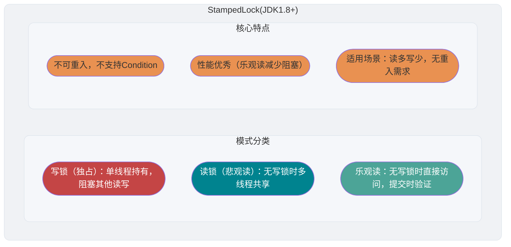

`StampedLock` 面试中问的比较少，不是很重要，简单了解即可。

### StampedLock 是什么？

`StampedLock` 是 JDK 1.8 引入的性能更好的读写锁，不可重入且不支持条件变量 `Condition`。

不同于一般的 `Lock` 类，`StampedLock` 并不是直接实现 `Lock` 或 `ReadWriteLock` 接口，而是基于 **CLH 锁** 独立实现的（AQS 也是基于这玩意）。

```java
public class StampedLock implements java.io.Serializable {
}
```

`StampedLock` 提供了三种模式的读写控制模式：读锁、写锁和乐观读。

- **写锁**：独占锁，一把锁只能被一个线程获得。当一个线程获取写锁后，其他请求读锁和写锁的线程必须等待。类似于 `ReentrantReadWriteLock` 的写锁，不过这里的写锁是不可重入的。
- **读锁**（悲观读）：共享锁，没有线程获取写锁的情况下，多个线程可以同时持有读锁。如果己经有线程持有写锁，则其他线程请求获取该读锁会被阻塞。类似于 `ReentrantReadWriteLock` 的读锁，不过这里的读锁是不可重入的。
- **乐观读**：允许多个线程获取乐观读以及读锁。同时允许一个写线程获取写锁。

另外，`StampedLock` 还支持这三种锁在一定条件下进行相互转换。

```java
long tryConvertToWriteLock(long stamp){}
long tryConvertToReadLock(long stamp){}
long tryConvertToOptimisticRead(long stamp){}
```

`StampedLock` 在获取锁的时候会返回一个 long 型的数据戳，该数据戳用于稍后的锁释放参数，如果返回的数据戳为 0 则表示锁获取失败。当前线程持有了锁再次获取锁时返回情况要看当前持有什么锁、再次申请什么锁，以及使用的是阻塞方法还是 `try` 方法：

- **当前线程持有写锁，再次获取写锁**：由于写锁是独占锁，第二次获取必须等待，但第一个写锁又要等待第二次调用返回后才能释放，于是当前线程把自己锁住了。结果就是一直阻塞，无法返回。
- **使用 `tryWriteLock()` 时，会返回 0**：`tryWriteLock()` 不会一直等待，它会立即尝试。当获取成功，则返回非 0 的数据戳；获取失败，则返回 0。
- **同一线程再次获取悲观读锁，会返回新的数据戳**：读锁是共享锁，读锁与读锁之间不冲突，所以正常返回数据戳。

真正的“可重入锁”会识别线程身份，虽然 `StampedLock` 这里同一个线程可以获取 2 次读锁，返回 2 个数据戳，但 `StampedLock` 不记录锁的线程所有权。判断是否可重入，重点看独占写锁。`StampedLock` 的写锁无法由同一个线程再次获取，所以它是不可重入的。

```java
// 写锁
public long writeLock() {
    long s, next;  // bypass acquireWrite in fully unlocked case only
    return ((((s = state) & ABITS) == 0L &&
             U.compareAndSwapLong(this, STATE, s, next = s + WBIT)) ?
            next : acquireWrite(false, 0L));
}
// 读锁
public long readLock() {
    long s = state, next;  // bypass acquireRead on common uncontended case
    return ((whead == wtail && (s & ABITS) < RFULL &&
             U.compareAndSwapLong(this, STATE, s, next = s + RUNIT)) ?
            next : acquireRead(false, 0L));
}
// 乐观读
public long tryOptimisticRead() {
    long s;
    return (((s = state) & WBIT) == 0L) ? (s & SBITS) : 0L;
}
```

### StampedLock 的性能为什么更好？

相比于传统读写锁多出来的乐观读是 `StampedLock` 比 `ReadWriteLock` 性能更好的关键原因。`StampedLock` 的乐观读允许一个写线程获取写锁，所以不会导致所有写线程阻塞，也就是当读多写少的时候，写线程有机会获取写锁，减少了线程饥饿的问题，吞吐量大大提高。

### StampedLock 适合什么场景？

和 `ReentrantReadWriteLock` 一样，`StampedLock` 同样适合读多写少的业务场景，可以作为 `ReentrantReadWriteLock` 的替代品，性能更好。

不过，需要注意的是 `StampedLock` 不可重入，不支持条件变量 `Condition`，对中断操作支持也不友好（使用不当容易导致 CPU 飙升）。如果你需要用到 `ReentrantLock` 的一些高级性能，就不太建议使用 `StampedLock` 了。

另外，`StampedLock` 性能虽好，但使用起来相对比较麻烦，一旦使用不当，就会出现生产问题。强烈建议你在使用 `StampedLock` 之前，看看 [StampedLock 官方文档中的案例](https://docs.oracle.com/javase/8/docs/api/java/util/concurrent/locks/StampedLock.html)。

### StampedLock 的底层原理了解吗？

`StampedLock` 不是直接实现 `Lock` 或 `ReadWriteLock` 接口，而是基于 **CLH 锁** 实现的（AQS 也是基于这玩意），CLH 锁是对自旋锁的一种改良，是一种隐式的链表队列。`StampedLock` 通过 CLH 队列进行线程的管理，通过同步状态值 `state` 来表示锁的状态和类型。

`StampedLock` 的原理和 AQS 原理比较类似，这里就不详细介绍了，感兴趣的可以看看下面这两篇文章：

- [AQS 详解](https://javaguide.cn/java/并发/aqs.html)
- [StampedLock 底层原理分析](https://segmentfault.com/a/1190000015808032)

如果你只是准备面试的话，建议多花点精力搞懂 AQS 原理即可，`StampedLock` 底层原理在面试中遇到的概率非常小。

## Atomic 原子类

Atomic 原子类部分的内容我单独写了一篇文章来总结：[Atomic 原子类总结](./Atomic 原子类总结.md)。

## 参考

- 《深入理解 Java 虚拟机》
- 《实战 Java 高并发程序设计》
- Guide to the Volatile Keyword in Java - Baeldung：<https://www.baeldung.com/java-volatile>
- 不可不说的 Java“锁”事 - 美团技术团队：<https://tech.meituan.com/2018/11/15/java-lock.html>
- 在 ReadWriteLock 类中读锁为什么不能升级为写锁？：<https://cloud.tencent.com/developer/article/1176230>
- 高性能解决线程饥饿的利器 StampedLock：<https://mp.weixin.qq.com/s/2Acujjr4BHIhlFsCLGwYSg>
- 理解 Java 中的 ThreadLocal - 技术小黑屋：<https://droidyue.com/blog/2016/03/13/learning-threadlocal-in-java/>
- ThreadLocal (Java Platform SE 8 ) - Oracle Help Center：<https://docs.oracle.com/javase/8/docs/api/java/lang/ThreadLocal.html>

<!-- @include: @article-footer.snippet.md -->


---

<!-- source: JMM（Java 内存模型）详解.md -->

---
title: JMM（Java 内存模型）详解
description: 深入解析Java内存模型JMM：详解CPU缓存模型、指令重排序机制、happens-before原则、内存可见性保证，理解多线程并发编程的底层规范。
category: Java
tag:
  - Java并发
head:
  - - meta
    - name: keywords
      content: JMM,Java内存模型,CPU缓存,指令重排序,happens-before,内存可见性,并发编程模型
---

对于 Java 来说，你可以把 **JMM（Java 内存模型）** 看作是 Java 定义的并发编程相关的一组规范。除了抽象了线程和主内存之间的关系之外，其还规定了从 Java 源代码到 CPU 可执行指令的转化过程要遵守哪些并发相关的原则和规范。其主要目的是为了**简化多线程编程**，**增强程序的可移植性**。

JMM 主要定义了对于一个共享变量，当一个线程执行写操作后，该变量对其他线程的**可见性**。

要想透彻理解 JMM，我们需要从 **CPU 缓存模型**和**指令重排序**说起。

## 从 CPU 缓存模型说起

**为什么要弄一个 CPU 高速缓存呢？** 类比我们开发网站后台系统使用的缓存（比如 Redis）是为了解决程序处理速度和访问常规关系型数据库速度不对等的问题。 **CPU 缓存则是为了解决 CPU 处理速度和内存处理速度不对等的问题。**

我们甚至可以把 **内存看作外存的高速缓存**，程序运行的时候我们把外存的数据复制到内存，由于内存的处理速度远远高于外存，这样提高了处理速度。

总结：**CPU Cache 缓存的是内存数据用于解决 CPU 处理速度和内存不匹配的问题，内存缓存的是硬盘数据用于解决硬盘访问速度过慢的问题。**

为了更好地理解，我画了一个简单的 CPU Cache 示意图如下所示。

> **🐛 修正（参见：[issue#1848](https://github.com/Snailclimb/JavaGuide/issues/1848)）**：对 CPU 缓存模型绘图不严谨的地方进行完善。


现代的 CPU Cache 通常分为三层，分别叫 L1,L2,L3 Cache。有些 CPU 可能还有 L4 Cache，这里不做讨论，并不常见

**CPU Cache 的工作方式：** 先复制一份数据到 CPU Cache 中，当 CPU 需要用到的时候就可以直接从 CPU Cache 中读取数据，当运算完成后，再将运算得到的数据写回 Main Memory 中。但是，这样存在 **内存缓存不一致性的问题**！比如我执行一个 i++ 操作的话，如果两个线程同时执行的话，假设两个线程从 CPU Cache 中读取的 i=1，两个线程做了 i++ 运算完之后再写回 Main Memory 之后 i=2，而正确结果应该是 i=3。

**CPU 为了解决内存缓存不一致性问题可以通过制定缓存一致协议（比如 [MESI 协议](https://zh.wikipedia.org/wiki/MESI%E5%8D%8F%E8%AE%AE)）或者其他手段来解决。** 这个缓存一致性协议指的是在 CPU 高速缓存与主内存交互的时候需要遵守的原则和规范。不同的 CPU 中，使用的缓存一致性协议通常也会有所不同。


CPU 缓存一致性由处理器及其内存子系统协同实现。不同处理器架构还会规定各类内存访问在其他处理器看来可以按什么顺序出现，这通常称为硬件内存模型。JMM 位于更高的语言层，JVM 需要把它的要求映射到具体处理器提供的指令和屏障上。

## 指令重排序

说完了 CPU 缓存模型，我们再来看看另外一个比较重要的概念 **指令重排序**。

为了提升执行速度/性能，计算机在执行程序代码的时候，会对指令进行重排序。

**什么是指令重排序？** 简单来说就是系统在执行代码的时候并不一定是按照你写的代码的顺序依次执行。

常见的指令重排序有下面 2 种情况：

- **编译器优化重排**：编译器（包括 JVM、JIT 编译器等）在不改变单线程程序语义的前提下，重新安排语句的执行顺序。
- **指令并行重排**：现代处理器采用了指令级并行技术(Instruction-Level Parallelism，ILP)来将多条指令重叠执行。如果不存在数据依赖性，处理器可以改变语句对应机器指令的执行顺序。

另外，内存系统也会有“重排序”，但又不是真正意义上的重排序。在 JMM 里表现为主存和本地内存的内容可能不一致，进而导致程序在多线程下执行可能出现问题。

Java 源代码经过字节码编译、解释执行或 JIT 编译，最终由 JVM 在目标平台上执行相应的机器指令。编译器优化、处理器乱序执行以及内存子系统的行为都可能使多线程观察到的顺序与源代码直观顺序不同，它们并不是一条固定且严格线性的“重排流水线”。

**指令重排序可以保证串行语义一致，但是没有义务保证多线程间的语义也一致**，所以在多线程下，指令重排序可能会导致一些问题。

对于编译器优化重排和处理器的指令重排序（指令并行重排和内存系统重排都属于是处理器级别的指令重排序），处理该问题的方式不一样。

- 对于编译器，通过禁止特定类型的编译器重排序的方式来禁止重排序。

- 对于处理器，通过插入内存屏障（Memory Barrier，或有时叫做内存栅栏，Memory Fence）的方式来禁止特定类型的处理器重排序。

> 内存屏障（Memory Barrier，也叫内存栅栏，Memory Fence）用于约束特定内存访问之间的顺序和可见性。不同处理器架构的具体实现并不相同，不能一概理解为“把缓存刷新到物理内存”或“让缓存全部失效”；JVM 会根据目标平台选择满足 JMM 语义的指令。

## JMM(Java Memory Model)

### 什么是 JMM？为什么需要 JMM？

Java 是最早尝试提供内存模型的编程语言。由于早期内存模型存在一些缺陷（比如非常容易削弱编译器的优化能力），从 Java5 开始，Java 开始使用新的内存模型 [《JSR-133：Java Memory Model and Thread Specification》](http://www.cs.umd.edu/~pugh/java/memoryModel/CommunityReview.pdf)。

一般来说，编程语言也可以直接复用操作系统层面的内存模型。不过，不同的操作系统内存模型不同。如果直接复用操作系统层面的内存模型，就可能会导致同样一套代码换了一个操作系统就无法执行了。Java 语言是跨平台的，它需要自己提供一套内存模型以屏蔽系统差异。

这只是 JMM 存在的其中一个原因。实际上，对于 Java 来说，你可以把 JMM 看作是 Java 定义的并发编程相关的一组规范，除了抽象了线程和主内存之间的关系之外，其还规定了从 Java 源代码到 CPU 可执行指令的这个转化过程要遵守哪些和并发相关的原则和规范，其主要目的是为了简化多线程编程，增强程序可移植性的。

**为什么要遵守这些并发相关的原则和规范呢？** 这是因为并发编程下，像 CPU 多级缓存和指令重排这类设计可能会导致程序运行出现一些问题。就比如说我们上面提到的指令重排序就可能会让多线程程序的执行出现问题，为此，JMM 抽象了 happens-before 原则（后文会详细介绍到）来解决这个指令重排序问题。

JMM 说白了就是定义了一些规范来解决这些问题，开发者可以利用这些规范更方便地开发多线程程序。对于 Java 开发者说，你不需要了解底层原理，直接使用并发相关的一些关键字和类（比如 `volatile`、`synchronized`、各种 `Lock`）即可开发出并发安全的程序。

### JMM 是如何抽象线程和主内存之间的关系？

**Java 内存模型（JMM）** 抽象了线程和主内存之间的关系，就比如说线程之间的共享变量必须存储在主内存中。

Java 从早期规范开始就有内存模型；Java 5 通过 JSR-133 对它进行了重要修订，明确并增强了 `volatile`、`final` 和 happens-before 等语义。JMM 允许 JVM 使用寄存器、缓存以及编译器优化来实现共享变量访问；如果程序没有建立必要的同步关系，一个线程就可能看不到另一个线程的最新写入。

这和我们上面讲到的 CPU 缓存模型非常相似。

**什么是主内存？什么是本地内存？**

- **主内存**：JMM 用它抽象线程之间可以共享的变量，包括实例字段、静态字段和数组元素。方法局部变量、形参和异常处理参数不会在线程之间共享，因此不属于这里所说的共享变量。主内存是规范层面的抽象，不等同于某一块物理内存。
- **本地内存**：每个线程都有一个私有的本地内存，本地内存存储了该线程已读 / 写共享变量的副本。每个线程只能操作自己本地内存中的变量，无法直接访问其他线程的本地内存。如果线程间需要通信，必须通过主内存来进行。本地内存是 JMM 抽象出来的一个概念，并不真实存在，它涵盖了缓存、写缓冲区、寄存器以及其他的硬件和编译器优化。

Java 内存模型的抽象示意图如下：


从上图来看，线程 1 与线程 2 之间如果要进行通信的话，必须要经历下面 2 个步骤：

1. 线程 1 把本地内存中修改过的共享变量副本的值同步到主内存中去。
2. 线程 2 到主存中读取对应的共享变量的值。

也就是说，线程间的共享数据需要遵守 JMM 的规则进行通信；只有通过 `volatile`、锁、线程启动与终止等方式建立相应的 happens-before 关系时，JMM 才为相关写入提供可见性保证。

不过，多线程下，对主内存中的一个共享变量进行操作有可能诱发线程安全问题。举个例子：

1. 线程 1 和线程 2 分别对同一个共享变量进行操作，一个执行修改，一个执行读取。
2. 线程 2 读取到的是线程 1 修改之前的值还是修改后的值并不确定，都有可能，因为线程 1 和线程 2 都是先将共享变量从主内存拷贝到对应线程的工作内存中。

关于主内存与工作内存直接的具体交互协议，即一个变量如何从主内存拷贝到工作内存，如何从工作内存同步到主内存之间的实现细节，Java 内存模型定义来以下八种同步操作（了解即可，无需死记硬背）：

- **锁定（lock）**: 作用于主内存中的变量，将他标记为一个线程独享变量。
- **解锁（unlock）**: 作用于主内存中的变量，解除变量的锁定状态，被解除锁定状态的变量才能被其他线程锁定。
- **read（读取）**：作用于主内存的变量，它把一个变量的值从主内存传输到线程的工作内存中，以便随后的 load 动作使用。
- **load（载入）**：把 read 操作从主内存中得到的变量值放入工作内存的变量的副本中。
- **use（使用）**：把工作内存中的一个变量的值传给执行引擎，每当虚拟机遇到一个使用到变量的指令时都会使用该指令。
- **assign（赋值）**：作用于工作内存的变量，它把一个从执行引擎接收到的值赋给工作内存的变量，每当虚拟机遇到一个给变量赋值的字节码指令时执行这个操作。
- **store（存储）**：作用于工作内存的变量，它把工作内存中一个变量的值传送到主内存中，以便随后的 write 操作使用。
- **write（写入）**：作用于主内存的变量，它把 store 操作从工作内存中得到的变量的值放入主内存的变量中。

除了这 8 种同步操作之外，还规定了下面这些同步规则来保证这些同步操作的正确执行（了解即可，无需死记硬背）：

- 不允许一个线程无原因地（没有发生过任何 assign 操作）把数据从线程的工作内存同步回主内存中。
- 一个新的变量只能在主内存中 “诞生”，不允许在工作内存中直接使用一个未被初始化（load 或 assign）的变量，换句话说就是对一个变量实施 use 和 store 操作之前，必须先执行过了 assign 和 load 操作。
- 一个变量在同一个时刻只允许一条线程对其进行 lock 操作，但 lock 操作可以被同一条线程重复执行多次，多次执行 lock 后，只有执行相同次数的 unlock 操作，变量才会被解锁。
- 如果对一个变量执行 lock 操作，将会清空工作内存中此变量的值，在执行引擎使用这个变量前，需要重新执行 load 或 assign 操作初始化变量的值。
- 如果一个变量事先没有被 lock 操作锁定，则不允许对它执行 unlock 操作，也不允许去 unlock 一个被其他线程锁定住的变量。
- ……

### Java 内存区域和 JMM 有何区别？

这是一个比较常见的问题，很多初学者非常容易搞混。 **Java 内存区域和内存模型是完全不一样的两个东西**：

- JVM 内存结构和 Java 虚拟机的运行时区域相关，定义了 JVM 在运行时如何分区存储程序数据，就比如说堆主要用于存放对象实例。
- Java 内存模型和 Java 的并发编程相关，抽象了线程和主内存之间的关系就比如说线程之间的共享变量必须存储在主内存中，规定了从 Java 源代码到 CPU 可执行指令的这个转化过程要遵守哪些和并发相关的原则和规范，其主要目的是为了简化多线程编程，增强程序可移植性的。

### happens-before 原则是什么？

happens-before 这个概念最早诞生于 Leslie Lamport 于 1978 年发表的论文[《Time，Clocks and the Ordering of Events in a Distributed System》](https://lamport.azurewebsites.net/pubs/time-clocks.pdf)。在这篇论文中，Leslie Lamport 提出了[逻辑时钟](https://writings.sh/post/logical-clocks)的概念，这也成了第一个逻辑时钟算法。在分布式环境中，通过一系列规则来定义逻辑时钟的变化，从而能通过逻辑时钟来对分布式系统中的事件的先后顺序进行判断。**逻辑时钟并不度量时间本身，仅区分事件发生的前后顺序，其本质就是定义了一种 happens-before 关系。**

上面提到的 happens-before 这个概念诞生的背景并不是重点，简单了解即可。

JSR 133 引入了 happens-before 这个概念来描述两个操作之间的内存可见性。

**为什么需要 happens-before 原则？** happens-before 原则的诞生是为了程序员和编译器、处理器之间的平衡。程序员追求的是易于理解和编程的强内存模型，遵守既定规则编码即可。编译器和处理器追求的是较少约束的弱内存模型，让它们尽己所能地去优化性能，让性能最大化。happens-before 原则的设计思想其实非常简单：

- 为了对编译器和处理器的约束尽可能少，只要不改变程序的执行结果（单线程程序和正确执行的多线程程序），编译器和处理器怎么进行重排序优化都行。
- 对于会改变程序执行结果的重排序，JMM 要求编译器和处理器必须禁止这种重排序。

下面这张是我根据《Java 并发编程的艺术》这本书中的一张 JMM 设计思想示意图重新绘制的。


了解了 happens-before 原则的设计思想，我们再来看看 JSR-133 对 happens-before 原则的定义：

- 如果一个操作 happens-before 另一个操作，那么第一个操作的执行结果将对第二个操作可见，并且第一个操作的执行顺序排在第二个操作之前。
- 两个操作之间存在 happens-before 关系，并不意味着 Java 平台的具体实现必须要按照 happens-before 关系指定的顺序来执行。如果重排序之后的执行结果，与按 happens-before 关系来执行的结果一致，那么 JMM 也允许这样的重排序。

我们看下面这段代码：

```java
int userNum = getUserNum();   // 1
int teacherNum = getTeacherNum();   // 2
int totalNum = userNum + teacherNum;  // 3
```

- 1 happens-before 2
- 2 happens-before 3
- 1 happens-before 3

虽然 1 happens-before 2，但对 1 和 2 进行重排序不会影响代码的执行结果，所以 JMM 是允许编译器和处理器执行这种重排序的。但 1 和 2 必须是在 3 执行之前，也就是说 1,2 happens-before 3。

**happens-before 原则表达的意义其实并不是一个操作发生在另外一个操作的前面，虽然这从程序员的角度上来说也并无大碍。更准确地来说，它更想表达的意义是前一个操作的结果对于后一个操作是可见的，无论这两个操作是否在同一个线程里。**

举个例子：操作 1 happens-before 操作 2，即使操作 1 和操作 2 不在同一个线程内，JMM 也会保证操作 1 的结果对操作 2 是可见的。

### happens-before 常见规则有哪些？谈谈你的理解？

happens-before 有多条规则，下面列出其中最常用的 5 条：

1. **程序顺序规则**：一个线程内，按照代码顺序，书写在前面的操作 happens-before 于书写在后面的操作；
2. **监视器锁规则**：对一个监视器的解锁 happens-before 于随后对同一个监视器的加锁；
3. **volatile 变量规则**：对一个 `volatile` 变量的写操作 happens-before 于随后对同一个变量的读操作；
4. **传递规则**：如果 A happens-before B，且 B happens-before C，那么 A happens-before C；
5. **线程启动规则**：Thread 对象的 `start()` 方法 happens-before 于此线程的每一个动作。

这份列表并不完整，还包括线程终止、线程中断等规则。两个冲突访问之间如果无法通过完整规则推导出 happens-before 关系，就可能构成数据竞争，其可见性和顺序不能按单线程直觉来保证；这不等价于 JVM 可以无条件交换任意两条指令，执行结果仍受 JMM 的一致性和因果性规则约束。

### happens-before 和 JMM 什么关系？

happens-before 与 JMM 的关系如下图所示：


- JMM 向程序员提供了 **“ happens-before 规则 ”**（如程序顺序规则、`volatile` 变量规则等）。这是一种 **“ 强内存模型 ”** 的假象：程序员不需要关心底层复杂的重排序细节，只需要按照这些规则编写代码，就能保证多线程下的内存可见性。
- JVM 在执行时，会将 happens-before 规则映射到具体的实现上。为了在保证正确性的前提下不丧失性能，JMM 只会 **“ 禁止影响执行结果的重排序 ”**。对于不影响单线程执行结果的重排序，JMM 是允许的。
- 最底层是编译器和处理器真实的 **“ 重排序规则 ”**。

总结来说，JMM 就像是一个中间层：它向上通过 happens-before 为程序员提供简单的编程模型；向下通过禁止特定重排序，利用底层硬件性能。这种设计既保证了多线程的安全性，又最大限度释放了硬件的性能。

## 再看并发编程三个重要特性

### 原子性

一次操作或者多次操作，要么所有的操作全部都得到执行并且不会受到任何因素的干扰而中断，要么都不执行。

在 Java 中，可以借助 `synchronized`、各种 `Lock` 以及各种原子类实现原子性。

`synchronized` 和各种 `Lock` 可以保证任一时刻只有一个线程访问该代码块，因此可以保障原子性。各种原子类是利用 CAS (compare and swap) 操作（可能也会用到 `volatile` 或者 `final` 关键字）来保证原子操作。

### 可见性

当一个线程对共享变量进行了修改，那么另外的线程都是立即可以看到修改后的最新值。

在 Java 中，可以借助 `synchronized`、`volatile` 以及各种 `Lock` 实现可见性。

如果将变量声明为 `volatile`，对该变量的写与后续读之间会建立 happens-before 关系。JVM 必须保证相应的可见性和顺序语义，但具体实现不要求每次都访问物理主存。

### 有序性

由于指令重排序问题，代码的执行顺序未必就是编写代码时候的顺序。

我们上面讲重排序的时候也提到过：

> **指令重排序可以保证串行语义一致，但是没有义务保证多线程间的语义也一致**，所以在多线程下，指令重排序可能会导致一些问题。

在 Java 中，`volatile` 会约束与该变量读写相关、可能破坏其内存语义的重排序，但并不是禁止所有指令重排序优化。

## 总结

- Java 是最早尝试提供内存模型的语言，其主要目的是为了简化多线程编程，增强程序可移植性的。
- CPU 可以通过制定缓存一致协议（比如 [MESI 协议](https://zh.wikipedia.org/wiki/MESI%E5%8D%8F%E8%AE%AE)）来解决内存缓存不一致性问题。
- 为了提升执行速度/性能，计算机在执行程序代码的时候，会对指令进行重排序。 简单来说就是系统在执行代码的时候并不一定是按照你写的代码的顺序依次执行。**指令重排序可以保证串行语义一致，但是没有义务保证多线程间的语义也一致**，所以在多线程下，指令重排序可能会导致一些问题。
- 你可以把 JMM 看作是 Java 定义的并发编程相关的一组规范，除了抽象了线程和主内存之间的关系之外，其还规定了从 Java 源代码到 CPU 可执行指令的这个转化过程要遵守哪些和并发相关的原则和规范，其主要目的是为了简化多线程编程，增强程序可移植性的。
- JSR 133 引入了 happens-before 这个概念来描述两个操作之间的内存可见性。

## 参考

- 《Java 并发编程的艺术》第三章 Java 内存模型
- 《深入浅出 Java 多线程》：<http://concurrent.redspider.group/RedSpider.html>
- Java 内存访问重排序的研究：<https://tech.meituan.com/2014/09/23/java-memory-reordering.html>
- 嘿，同学，你要的 Java 内存模型 (JMM) 来了：<https://xie.infoq.cn/article/739920a92d0d27e2053174ef2>
- JSR 133 (Java Memory Model) FAQ：<https://www.cs.umd.edu/~pugh/java/memoryModel/jsr-133-faq.html>

<!-- @include: @article-footer.snippet.md -->


---

<!-- source: ThreadLocal 详解.md -->

---
title: ThreadLocal 详解
description: ThreadLocal深度解析：详解ThreadLocal线程本地变量原理、ThreadLocalMap实现机制、弱引用与内存泄漏问题、使用场景与最佳实践。
category: Java
tag:
  - Java并发
head:
  - - meta
    - name: keywords
      content: ThreadLocal,线程本地变量,ThreadLocalMap,内存泄漏,弱引用,ThreadLocal原理,线程隔离
---

> 本文来自一枝花算不算浪漫投稿， 原文地址：[https://juejin.cn/post/6844904151567040519](https://juejin.cn/post/6844904151567040519)。

### 前言


**全文共 10000+字，31 张图，这篇文章同样耗费了不少的时间和精力才创作完成，原创不易，请大家点点关注+在看，感谢。**

对于 `ThreadLocal`，大家的第一反应可能是很简单呀，线程的变量副本，每个线程隔离。那这里有几个问题大家可以思考一下：

- `ThreadLocal` 的 key 是**弱引用**，那么在 `ThreadLocal.get()` 的时候，发生**GC**之后，key 是否为**null**？
- `ThreadLocal` 中 `ThreadLocalMap` 的**数据结构**？
- `ThreadLocalMap` 的**Hash 算法**？
- `ThreadLocalMap` 中**Hash 冲突**如何解决？
- `ThreadLocalMap` 的**扩容机制**？
- `ThreadLocalMap` 中**过期 key 的清理机制**？**探测式清理**和**启发式清理**流程？
- `ThreadLocalMap.set()` 方法实现原理？
- `ThreadLocalMap.get()` 方法实现原理？
- 项目中 `ThreadLocal` 使用情况？遇到的坑？
- ……

上述的一些问题你是否都已经掌握的很清楚了呢？本文将围绕这些问题使用图文方式来剖析 `ThreadLocal` 的**点点滴滴**。

### 目录

**注明：** 本文源码基于 `JDK 1.8`

### `ThreadLocal` 代码演示

我们先看下 `ThreadLocal` 使用示例：

```java
public class ThreadLocalTest {
    private List<String> messages = Lists.newArrayList();

    public static final ThreadLocal<ThreadLocalTest> holder = ThreadLocal.withInitial(ThreadLocalTest::new);

    public static void add(String message) {
        holder.get().messages.add(message);
    }

    public static List<String> clear() {
        List<String> messages = holder.get().messages;
        holder.remove();

        System.out.println("size: " + holder.get().messages.size());
        return messages;
    }

    public static void main(String[] args) {
        ThreadLocalTest.add("一枝花算不算浪漫");
        System.out.println(holder.get().messages);
        ThreadLocalTest.clear();
    }
}
```

打印结果：

```java
[一枝花算不算浪漫]
size: 0
```

`ThreadLocal` 对象可以提供线程局部变量，每个线程 `Thread` 拥有一份自己的**副本变量**，多个线程互不干扰。

### `ThreadLocal` 的数据结构


`Thread` 类有一个类型为 `ThreadLocal.ThreadLocalMap` 的实例变量 `threadLocals`，也就是说每个线程有一个自己的 `ThreadLocalMap`。

`ThreadLocalMap` 有自己的独立实现，可以简单地将它的 `key` 视作 `ThreadLocal`，`value` 为代码中放入的值（实际上 `key` 并不是 `ThreadLocal` 本身，而是它的一个**弱引用**）。

每个线程在往 `ThreadLocal` 里放值的时候，都会往自己的 `ThreadLocalMap` 里存，读也是以 `ThreadLocal` 作为引用，在自己的 `map` 里找对应的 `key`，从而实现了**线程隔离**。

`ThreadLocalMap` 有点类似 `HashMap` 的结构，只是 `HashMap` 是由**数组+链表**实现的，而 `ThreadLocalMap` 中并没有**链表**结构。

我们还要注意 `Entry`， 它的 `key` 是 `ThreadLocal<?> k`，继承自 `WeakReference`， 也就是我们常说的弱引用类型。

### GC 之后 key 是否为 null？

回应开头的那个问题， `ThreadLocal` 的 `key` 是弱引用，那么在 `ThreadLocal.get()` 的时候，发生 `GC` 之后，`key` 是否是 `null`？

为了搞清楚这个问题，我们需要搞清楚 `Java` 的**四种引用类型**：

- **强引用**：我们常常 new 出来的对象就是强引用类型，只要强引用存在，垃圾回收器将永远不会回收被引用的对象，哪怕内存不足的时候
- **软引用**：使用 SoftReference 修饰的对象被称为软引用，软引用指向的对象在内存要溢出的时候被回收
- **弱引用**：使用 `WeakReference` 引用的对象如果已不存在强引用或软引用，就属于弱可达对象；垃圾收集器决定处理这类对象时，会清除相应的弱引用。一次特定的垃圾回收并不保证立刻处理所有候选对象
- **虚引用**：虚引用是最弱的引用，在 Java 中使用 PhantomReference 进行定义。虚引用中唯一的作用就是用队列接收对象即将死亡的通知

接着再来看下代码，我们使用反射的方式来看看 `GC` 后 `ThreadLocal` 中的数据情况：(下面代码来源自：<https://blog.csdn.net/thewindkee/article/details/103726942> 本地运行演示 GC 回收场景)

> `System.gc()` 只是向 JVM 提出执行垃圾回收的建议，下面结果适合用来说明原理，但不能作为每次运行都必然出现的行为。

```java
public class ThreadLocalDemo {

    public static void main(String[] args) throws NoSuchFieldException, IllegalAccessException, InterruptedException {
        Thread t = new Thread(()->test("abc",false));
        t.start();
        t.join();
        System.out.println("--gc后--");
        Thread t2 = new Thread(() -> test("def", true));
        t2.start();
        t2.join();
    }

    private static void test(String s,boolean isGC)  {
        try {
            new ThreadLocal<>().set(s);
            if (isGC) {
                System.gc();
            }
            Thread t = Thread.currentThread();
            Class<? extends Thread> clz = t.getClass();
            Field field = clz.getDeclaredField("threadLocals");
            field.setAccessible(true);
            Object ThreadLocalMap = field.get(t);
            Class<?> tlmClass = ThreadLocalMap.getClass();
            Field tableField = tlmClass.getDeclaredField("table");
            tableField.setAccessible(true);
            Object[] arr = (Object[]) tableField.get(ThreadLocalMap);
            for (Object o : arr) {
                if (o != null) {
                    Class<?> entryClass = o.getClass();
                    Field valueField = entryClass.getDeclaredField("value");
                    Field referenceField = entryClass.getSuperclass().getSuperclass().getDeclaredField("referent");
                    valueField.setAccessible(true);
                    referenceField.setAccessible(true);
                    System.out.println(String.format("弱引用key:%s,值:%s", referenceField.get(o), valueField.get(o)));
                }
            }
        } catch (Exception e) {
            e.printStackTrace();
        }
    }
}
```

结果如下：

```java
弱引用key:java.lang.ThreadLocal@433619b6,值:abc
弱引用key:java.lang.ThreadLocal@418a15e3,值:java.lang.ref.SoftReference@bf97a12
--gc后--
弱引用key:null,值:def
```


如图所示，因为这里创建的 `ThreadLocal` 并没有指向任何值，也就是没有任何引用：

```java
new ThreadLocal<>().set(s);
```

在这次示例运行中，垃圾收集器处理了只剩弱引用的 `ThreadLocal`，所以我们看到 `referent=null`。但这取决于 JVM 是否实际执行并完成相应的垃圾回收。如果**改动一下代码：**


这个问题刚开始看，如果没有过多思考，**弱引用**，还有**垃圾回收**，那么肯定会觉得是 `null`。

其实是不对的，因为题目说的是在做 `ThreadLocal.get()` 操作，证明其实还是有**强引用**存在的，所以 `key` 并不为 `null`，如下图所示，`ThreadLocal` 的**强引用**仍然是存在的。


如果我们的**强引用**不存在，垃圾收集器就可以清除弱引用中的 `key`。此时 `Entry` 仍然强引用着 `value`，直到该过期条目被 `ThreadLocalMap` 后续操作清理，或者所属线程终止、整个 Map 不再可达；在线程池等长生命周期线程中，这段滞留时间可能很长，因而存在内存泄漏风险。

### `ThreadLocal.set()` 方法源码详解


`ThreadLocal` 中的 `set` 方法原理如上图所示，很简单，主要是判断 `ThreadLocalMap` 是否存在，然后使用 `ThreadLocal` 中的 `set` 方法进行数据处理。

代码如下：

```java
public void set(T value) {
    Thread t = Thread.currentThread();
    ThreadLocalMap map = getMap(t);
    if (map != null)
        map.set(this, value);
    else
        createMap(t, value);
}

void createMap(Thread t, T firstValue) {
    t.threadLocals = new ThreadLocalMap(this, firstValue);
}
```

主要的核心逻辑还是在 `ThreadLocalMap` 中的，一步步往下看，后面还有更详细的剖析。

### `ThreadLocalMap` Hash 算法

既然是 `Map` 结构，那么 `ThreadLocalMap` 当然也要实现自己的 `hash` 算法来解决散列表数组冲突问题。

```java
int i = key.threadLocalHashCode & (len-1);
```

`ThreadLocalMap` 中 `hash` 算法很简单，这里 `i` 就是当前 key 在散列表中对应的数组下标位置。

这里最关键的就是 `threadLocalHashCode` 值的计算，`ThreadLocal` 中有一个属性为 `HASH_INCREMENT = 0x61c88647`

```java
public class ThreadLocal<T> {
    private final int threadLocalHashCode = nextHashCode();

    private static AtomicInteger nextHashCode = new AtomicInteger();

    private static final int HASH_INCREMENT = 0x61c88647;

    private static int nextHashCode() {
        return nextHashCode.getAndAdd(HASH_INCREMENT);
    }

    static class ThreadLocalMap {
        ThreadLocalMap(ThreadLocal<?> firstKey, Object firstValue) {
            table = new Entry[INITIAL_CAPACITY];
            int i = firstKey.threadLocalHashCode & (INITIAL_CAPACITY - 1);

            table[i] = new Entry(firstKey, firstValue);
            size = 1;
            setThreshold(INITIAL_CAPACITY);
        }
    }
}
```

每当创建一个 `ThreadLocal` 对象，这个 `ThreadLocal.nextHashCode` 这个值就会增长 `0x61c88647`。

这个常量不是斐波那契数，而是由黄金分割比例推导出的 32 位散列增量。连续创建的 `ThreadLocal` 使用这个增量生成哈希码，再对长度为 2 的幂的数组取低位时，可以让槽位分布较均匀。

我们自己可以尝试下：

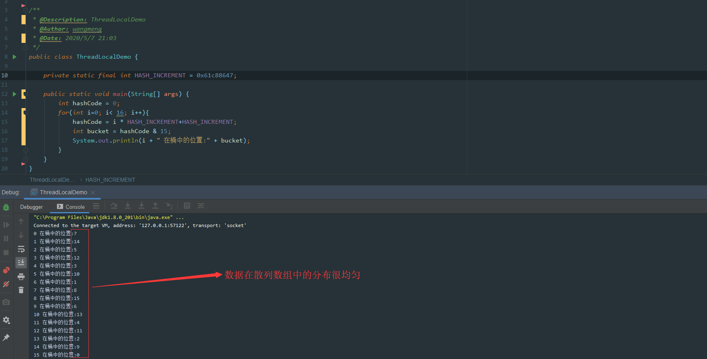

可以看到产生的哈希码分布较均匀，感兴趣的可以进一步了解基于黄金分割比例的乘法散列。

### `ThreadLocalMap` Hash 冲突

> **注明：** 下面所有示例图中，**绿色块**`Entry` 代表**正常数据**，**灰色块**代表 `Entry` 的 `key` 值为 `null`，**已被垃圾回收**。**白色块**表示 `Entry` 为 `null`。

虽然 `ThreadLocalMap` 中使用了**黄金分割数**来作为 `hash` 计算因子，大大减少了 `Hash` 冲突的概率，但是仍然会存在冲突。

`HashMap` 中解决冲突的方法是在数组上构造一个**链表**结构，冲突的数据挂载到链表上，如果链表长度超过一定数量则会转化成**红黑树**。

而 `ThreadLocalMap` 中并没有链表结构，所以这里不能使用 `HashMap` 解决冲突的方式了。


如上图所示，如果我们插入一个 `value=27` 的数据，通过 `hash` 计算后应该落入槽位 4 中，而槽位 4 已经有了 `Entry` 数据。

此时就会线性向后查找，一直找到 `Entry` 为 `null` 的槽位才会停止查找，将当前元素放入此槽位中。当然迭代过程中还有其他的情况，比如遇到了 `Entry` 不为 `null` 且 `key` 值相等的情况，还有 `Entry` 中的 `key` 值为 `null` 的情况等等都会有不同的处理，后面会一一详细讲解。

这里还画了一个 `Entry` 中的 `key` 为 `null` 的数据（**Entry=2 的灰色块数据**），因为 `key` 值是**弱引用**类型，所以会有这种数据存在。在 `set` 过程中，如果遇到了 `key` 过期的 `Entry` 数据，实际上是会进行一轮**探测式清理**操作的，具体操作方式后面会讲到。

### `ThreadLocalMap.set()` 详解

#### `ThreadLocalMap.set()` 原理图解

看完了 `ThreadLocal` **hash 算法**后，我们再来看 `set` 是如何实现的。

往 `ThreadLocalMap` 中 `set` 数据（**新增**或者**更新**数据）分为好几种情况，针对不同的情况我们画图来说明。

**第一种情况：** 通过 `hash` 计算后的槽位对应的 `Entry` 数据为空：


这里直接将数据放到该槽位即可。

**第二种情况：** 槽位数据不为空，`key` 值与当前 `ThreadLocal` 通过 `hash` 计算获取的 `key` 值一致：


这里直接更新该槽位的数据。

**第三种情况：** 槽位数据不为空，往后遍历过程中，在找到 `Entry` 为 `null` 的槽位之前，没有遇到 `key` 过期的 `Entry`：

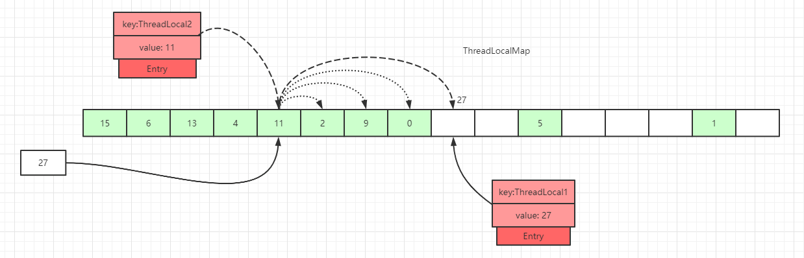

遍历散列数组，线性往后查找，如果找到 `Entry` 为 `null` 的槽位，则将数据放入该槽位中，或者往后遍历过程中，遇到了**key 值相等**的数据，直接更新即可。

**第四种情况：** 槽位数据不为空，往后遍历过程中，在找到 `Entry` 为 `null` 的槽位之前，遇到 `key` 过期的 `Entry`，如下图，往后遍历过程中，遇到了 `index=7` 的槽位数据 `Entry` 的 `key=null`：


散列数组下标为 7 位置对应的 `Entry` 数据 `key` 为 `null`，表明此数据 `key` 值已经被垃圾回收掉了，此时就会执行 `replaceStaleEntry()` 方法，该方法含义是**替换过期数据的逻辑**，以**index=7**位起点开始遍历，进行探测式数据清理工作。

初始化探测式清理过期数据扫描的开始位置：`slotToExpunge = staleSlot = 7`

以当前 `staleSlot` 开始 向前迭代查找，找其他过期的数据，然后更新过期数据起始扫描下标 `slotToExpunge`。`for` 循环迭代，直到碰到 `Entry` 为 `null` 结束。

如果找到了过期的数据，继续向前迭代，直到遇到 `Entry=null` 的槽位才停止迭代，如下图所示，**slotToExpunge 被更新为 0**：

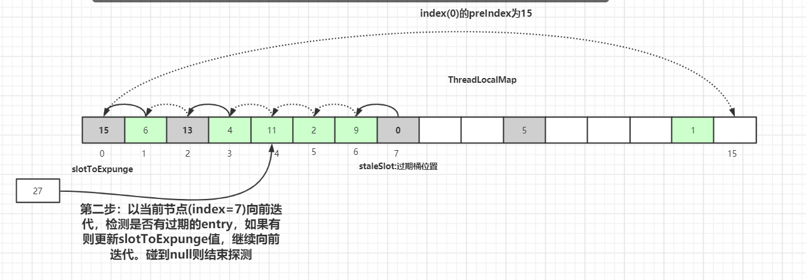

以当前节点(`index=7`)向前迭代，检测是否有过期的 `Entry` 数据，如果有则更新 `slotToExpunge` 值。碰到 `null` 则结束探测。以上图为例 `slotToExpunge` 被更新为 0。

上面向前迭代的操作是为了更新探测清理过期数据的起始下标 `slotToExpunge` 的值，这个值在后面会讲解，它是用来判断当前过期槽位 `staleSlot` 之前是否还有过期元素。

接着开始以 `staleSlot` 位置(`index=7`)向后迭代，**如果找到了相同 key 值的 Entry 数据：**


从当前节点 `staleSlot` 向后查找 `key` 值相等的 `Entry` 元素，找到后更新 `Entry` 的值并交换 `staleSlot` 元素的位置(`staleSlot` 位置为过期元素)，更新 `Entry` 数据，然后开始进行过期 `Entry` 的清理工作，如下图所示：

向后遍历过程中，如果没有找到相同 key 值的 Entry 数据：

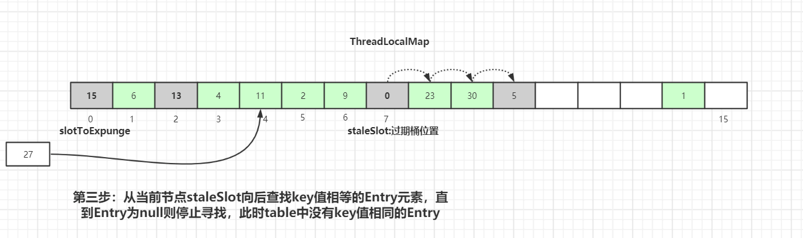

从当前节点 `staleSlot` 向后查找 `key` 值相等的 `Entry` 元素，直到 `Entry` 为 `null` 则停止寻找。通过上图可知，此时 `table` 中没有 `key` 值相同的 `Entry`。

创建新的 `Entry`，替换 `table[stableSlot]` 位置：

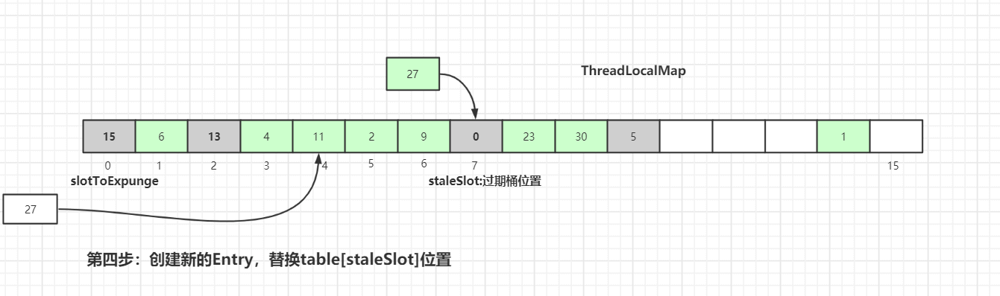

替换完成后也是进行过期元素清理工作，清理工作主要是有两个方法：`expungeStaleEntry()` 和 `cleanSomeSlots()`，具体细节后面会讲到，请继续往后看。

#### `ThreadLocalMap.set()` 源码详解

上面已经用图的方式解析了 `set()` 实现的原理，其实已经很清晰了，我们接着再看下源码：

`java.lang.ThreadLocal`.`ThreadLocalMap.set()`:

```java
private void set(ThreadLocal<?> key, Object value) {
    Entry[] tab = table;
    int len = tab.length;
    int i = key.threadLocalHashCode & (len-1);

    for (Entry e = tab[i];
         e != null;
         e = tab[i = nextIndex(i, len)]) {
        ThreadLocal<?> k = e.get();

        if (k == key) {
            e.value = value;
            return;
        }

        if (k == null) {
            replaceStaleEntry(key, value, i);
            return;
        }
    }

    tab[i] = new Entry(key, value);
    int sz = ++size;
    if (!cleanSomeSlots(i, sz) && sz >= threshold)
        rehash();
}
```

这里会通过 `key` 来计算在散列表中的对应位置，然后以当前 `key` 对应的桶的位置向后查找，找到可以使用的桶。

```java
Entry[] tab = table;
int len = tab.length;
int i = key.threadLocalHashCode & (len-1);
```

什么情况下桶才是可以使用的呢？

1. `k = key` 说明是替换操作，可以使用
2. 碰到一个过期的桶，执行替换逻辑，占用过期桶
3. 查找过程中，碰到桶中 `Entry=null` 的情况，直接使用

接着就是执行 `for` 循环遍历，向后查找，我们先看下 `nextIndex()`、`prevIndex()` 方法实现：


```java
private static int nextIndex(int i, int len) {
    return ((i + 1 < len) ? i + 1 : 0);
}

private static int prevIndex(int i, int len) {
    return ((i - 1 >= 0) ? i - 1 : len - 1);
}
```

接着看剩下 `for` 循环中的逻辑：

1. 遍历当前 `key` 值对应的桶中 `Entry` 数据为空，这说明散列数组这里没有数据冲突，跳出 `for` 循环，直接 `set` 数据到对应的桶中
2. 如果 `key` 值对应的桶中 `Entry` 数据不为空
   2.1 如果 `k = key`，说明当前 `set` 操作是一个替换操作，做替换逻辑，直接返回
   2.2 如果 `key = null`，说明当前桶位置的 `Entry` 是过期数据，执行 `replaceStaleEntry()` 方法（核心方法），然后返回
3. `for` 循环执行完毕，继续往下执行说明向后迭代的过程中遇到了 `entry` 为 `null` 的情况
   3.1 在 `Entry` 为 `null` 的桶中创建一个新的 `Entry` 对象
   3.2 执行 `++size` 操作
4. 调用 `cleanSomeSlots()` 做一次启发式清理工作，清理散列数组中 `Entry` 的 `key` 过期的数据
   4.1 如果清理工作完成后，未清理到任何数据，且 `size` 超过了阈值（数组长度的 2/3），进行 `rehash()` 操作
   4.2 `rehash()` 中会先进行一轮探测式清理，清理过期 `key`，清理完成后如果**size >= threshold - threshold / 4**，就会执行真正的扩容逻辑（扩容逻辑往后看）

接着重点看下 `replaceStaleEntry()` 方法，`replaceStaleEntry()` 方法提供替换过期数据的功能，我们可以对应上面**第四种情况**的原理图来再回顾下，具体代码如下：

`java.lang.ThreadLocal.ThreadLocalMap.replaceStaleEntry()`:

```java
private void replaceStaleEntry(ThreadLocal<?> key, Object value,
                                       int staleSlot) {
    Entry[] tab = table;
    int len = tab.length;
    Entry e;

    int slotToExpunge = staleSlot;
    for (int i = prevIndex(staleSlot, len);
         (e = tab[i]) != null;
         i = prevIndex(i, len))

        if (e.get() == null)
            slotToExpunge = i;

    for (int i = nextIndex(staleSlot, len);
         (e = tab[i]) != null;
         i = nextIndex(i, len)) {

        ThreadLocal<?> k = e.get();

        if (k == key) {
            e.value = value;

            tab[i] = tab[staleSlot];
            tab[staleSlot] = e;

            if (slotToExpunge == staleSlot)
                slotToExpunge = i;
            cleanSomeSlots(expungeStaleEntry(slotToExpunge), len);
            return;
        }

        if (k == null && slotToExpunge == staleSlot)
            slotToExpunge = i;
    }

    tab[staleSlot].value = null;
    tab[staleSlot] = new Entry(key, value);

    if (slotToExpunge != staleSlot)
        cleanSomeSlots(expungeStaleEntry(slotToExpunge), len);
}
```

`slotToExpunge` 表示开始探测式清理过期数据的开始下标，默认从当前的 `staleSlot` 开始。以当前的 `staleSlot` 开始，向前迭代查找，找到没有过期的数据，`for` 循环一直碰到 `Entry` 为 `null` 才会结束。如果向前找到了过期数据，更新探测清理过期数据的开始下标为 i，即 `slotToExpunge=i`

```java
for (int i = prevIndex(staleSlot, len);
     (e = tab[i]) != null;
     i = prevIndex(i, len)){

    if (e.get() == null){
        slotToExpunge = i;
    }
}
```

接着开始从 `staleSlot` 向后查找，也是碰到 `Entry` 为 `null` 的桶结束。
如果迭代过程中，**碰到 k == key**，这说明这里是替换逻辑，替换新数据并且交换当前 `staleSlot` 位置。如果 `slotToExpunge == staleSlot`，这说明 `replaceStaleEntry()` 一开始向前查找过期数据时并未找到过期的 `Entry` 数据，接着向后查找过程中也未发现过期数据，修改开始探测式清理过期数据的下标为当前循环的 index，即 `slotToExpunge = i`。最后调用 `cleanSomeSlots(expungeStaleEntry(slotToExpunge), len);` 进行启发式过期数据清理。

```java
if (k == key) {
    e.value = value;

    tab[i] = tab[staleSlot];
    tab[staleSlot] = e;

    if (slotToExpunge == staleSlot)
        slotToExpunge = i;

    cleanSomeSlots(expungeStaleEntry(slotToExpunge), len);
    return;
}
```

`cleanSomeSlots()` 和 `expungeStaleEntry()` 方法后面都会细讲，这两个是和清理相关的方法，一个是过期 `key` 相关 `Entry` 的启发式清理(`Heuristically scan`)，另一个是过期 `key` 相关 `Entry` 的探测式清理。

**如果 k != key**则会接着往下走，`k == null` 说明当前遍历的 `Entry` 是一个过期数据，`slotToExpunge == staleSlot` 说明，一开始的向前查找数据并未找到过期的 `Entry`。如果条件成立，则更新 `slotToExpunge` 为当前位置，这个前提是前驱节点扫描时未发现过期数据。

```java
if (k == null && slotToExpunge == staleSlot)
    slotToExpunge = i;
```

往后迭代的过程中如果没有找到 `k == key` 的数据，且碰到 `Entry` 为 `null` 的数据，则结束当前的迭代操作。此时说明这里是一个添加的逻辑，将新的数据添加到 `table[staleSlot]` 对应的 `slot` 中。

```java
tab[staleSlot].value = null;
tab[staleSlot] = new Entry(key, value);
```

最后判断除了 `staleSlot` 以外，还发现了其他过期的 `slot` 数据，就要开启清理数据的逻辑：

```java
if (slotToExpunge != staleSlot)
    cleanSomeSlots(expungeStaleEntry(slotToExpunge), len);
```

### `ThreadLocalMap` 过期 key 的探测式清理流程

上面我们有提及 `ThreadLocalMap` 的两种过期 `key` 数据清理方式：**探测式清理**和**启发式清理**。

我们先讲下探测式清理，也就是 `expungeStaleEntry` 方法，遍历散列数组，从开始位置向后探测清理过期数据，将过期数据的 `Entry` 设置为 `null`，沿途中碰到未过期的数据则将此数据 `rehash` 后重新在 `table` 数组中定位，如果定位的位置已经有了数据，则会将未过期的数据放到最靠近此位置的 `Entry=null` 的桶中，使 `rehash` 后的 `Entry` 数据距离正确的桶的位置更近一些。操作逻辑如下：

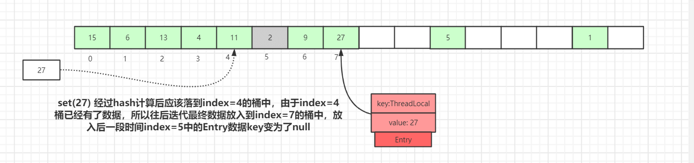

如上图，`set(27)` 经过 hash 计算后应该落到 `index=4` 的桶中，由于 `index=4` 桶已经有了数据，所以往后迭代最终数据放入到 `index=7` 的桶中，放入后一段时间后 `index=5` 中的 `Entry` 数据 `key` 变为了 `null`


如果再有其他数据 `set` 到 `map` 中，就会触发**探测式清理**操作。

如上图，执行**探测式清理**后，`index=5` 的数据被清理掉，继续往后迭代，到 `index=7` 的元素时，经过 `rehash` 后发现该元素正确的 `index=4`，而此位置已经有了数据，往后查找离 `index=4` 最近的 `Entry=null` 的节点(刚被探测式清理掉的数据：`index=5`)，找到后移动 `index= 7` 的数据到 `index=5` 中，此时桶的位置离正确的位置 `index=4` 更近了。

经过一轮探测式清理后，`key` 过期的数据会被清理掉，没过期的数据经过 `rehash` 重定位后所处的桶位置理论上更接近 `i= key.hashCode & (tab.len - 1)` 的位置。这种优化会提高整个散列表查询性能。

接着看下 `expungeStaleEntry()` 具体流程，我们还是以先原理图后源码讲解的方式来一步步梳理：


我们假设 `expungeStaleEntry(3)` 来调用此方法，如上图所示，我们可以看到 `ThreadLocalMap` 中 `table` 的数据情况，接着执行清理操作：

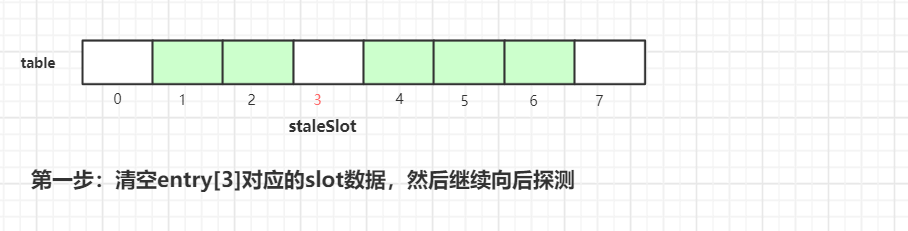

第一步是清空当前 `staleSlot` 位置的数据，`index=3` 位置的 `Entry` 变成了 `null`。然后接着往后探测：


执行完第二步后，index=4 的元素挪到 index=3 的槽位中。

继续往后迭代检查，碰到正常数据，计算该数据位置是否偏移，如果被偏移，则重新计算 `slot` 位置，目的是让正常数据尽可能存放在正确位置或离正确位置更近的位置


在往后迭代的过程中碰到空的槽位，终止探测，这样一轮探测式清理工作就完成了，接着我们继续看看具体**实现源代码**：

```java
private int expungeStaleEntry(int staleSlot) {
    Entry[] tab = table;
    int len = tab.length;

    tab[staleSlot].value = null;
    tab[staleSlot] = null;
    size--;

    Entry e;
    int i;
    for (i = nextIndex(staleSlot, len);
         (e = tab[i]) != null;
         i = nextIndex(i, len)) {
        ThreadLocal<?> k = e.get();
        if (k == null) {
            e.value = null;
            tab[i] = null;
            size--;
        } else {
            int h = k.threadLocalHashCode & (len - 1);
            if (h != i) {
                tab[i] = null;

                while (tab[h] != null)
                    h = nextIndex(h, len);
                tab[h] = e;
            }
        }
    }
    return i;
}
```

这里我们还是以 `staleSlot=3` 来做示例说明，首先是将 `tab[staleSlot]` 槽位的数据清空，然后设置 `size--`
接着以 `staleSlot` 位置往后迭代，如果遇到 `k==null` 的过期数据，也是清空该槽位数据，然后 `size--`

```java
ThreadLocal<?> k = e.get();

if (k == null) {
    e.value = null;
    tab[i] = null;
    size--;
}
```

如果 `key` 没有过期，重新计算当前 `key` 的下标位置是不是当前槽位下标位置，如果不是，那么说明产生了 `hash` 冲突，此时以新计算出来正确的槽位位置往后迭代，找到最近一个可以存放 `entry` 的位置。

```java
int h = k.threadLocalHashCode & (len - 1);
if (h != i) {
    tab[i] = null;

    while (tab[h] != null)
        h = nextIndex(h, len);

    tab[h] = e;
}
```

这里是处理正常的产生 `Hash` 冲突的数据，经过迭代后，有过 `Hash` 冲突数据的 `Entry` 位置会更靠近正确位置，这样的话，查询的时候 效率才会更高。

### `ThreadLocalMap` 扩容机制

在 `ThreadLocalMap.set()` 方法的最后，如果执行完启发式清理工作后，未清理到任何数据，且当前散列数组中 `Entry` 的数量已经达到了列表的扩容阈值 `(len*2/3)`，就开始执行 `rehash()` 逻辑：

```java
if (!cleanSomeSlots(i, sz) && sz >= threshold)
    rehash();
```

接着看下 `rehash()` 具体实现：

```java
private void rehash() {
    expungeStaleEntries();

    if (size >= threshold - threshold / 4)
        resize();
}

private void expungeStaleEntries() {
    Entry[] tab = table;
    int len = tab.length;
    for (int j = 0; j < len; j++) {
        Entry e = tab[j];
        if (e != null && e.get() == null)
            expungeStaleEntry(j);
    }
}
```

这里首先是会进行探测式清理工作，从 `table` 的起始位置往后清理，上面有分析清理的详细流程。清理完成之后，`table` 中可能有一些 `key` 为 `null` 的 `Entry` 数据被清理掉，所以此时通过判断 `size >= threshold - threshold / 4` 也就是 `size >= threshold * 3/4` 来决定是否扩容。

我们还记得上面进行 `rehash()` 的阈值是 `size >= threshold`，所以当面试官套路我们 `ThreadLocalMap` 扩容机制的时候 我们一定要说清楚这两个步骤：

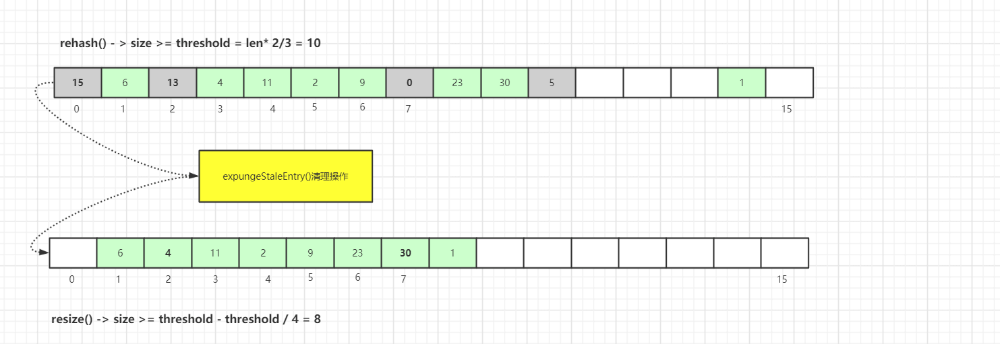

接着看看具体的 `resize()` 方法，为了方便演示，我们以 `oldTab.len=8` 来举例：

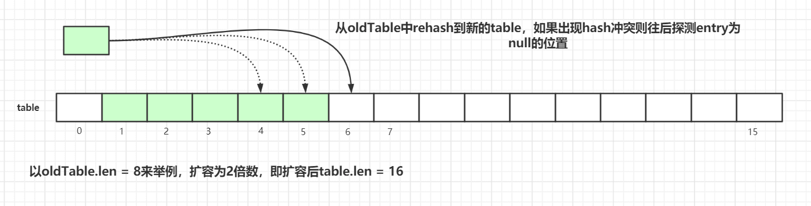

扩容后的 `tab` 的大小为 `oldLen * 2`，然后遍历老的散列表，重新计算 `hash` 位置，然后放到新的 `tab` 数组中，如果出现 `hash` 冲突则往后寻找最近的 `entry` 为 `null` 的槽位，遍历完成之后，`oldTab` 中所有的 `entry` 数据都已经放入到新的 `tab` 中了。重新计算 `tab` 下次扩容的**阈值**，具体代码如下：

```java
private void resize() {
    Entry[] oldTab = table;
    int oldLen = oldTab.length;
    int newLen = oldLen * 2;
    Entry[] newTab = new Entry[newLen];
    int count = 0;

    for (int j = 0; j < oldLen; ++j) {
        Entry e = oldTab[j];
        if (e != null) {
            ThreadLocal<?> k = e.get();
            if (k == null) {
                e.value = null;
            } else {
                int h = k.threadLocalHashCode & (newLen - 1);
                while (newTab[h] != null)
                    h = nextIndex(h, newLen);
                newTab[h] = e;
                count++;
            }
        }
    }

    setThreshold(newLen);
    size = count;
    table = newTab;
}
```

### `ThreadLocalMap.get()` 详解

上面已经看完了 `set()` 方法的源码，其中包括 `set` 数据、清理数据、优化数据桶的位置等操作，接着看看 `get()` 操作的原理。

#### `ThreadLocalMap.get()` 图解

**第一种情况：** 通过查找 `key` 值计算出散列表中 `slot` 位置，然后该 `slot` 位置中的 `Entry.key` 和查找的 `key` 一致，则直接返回：

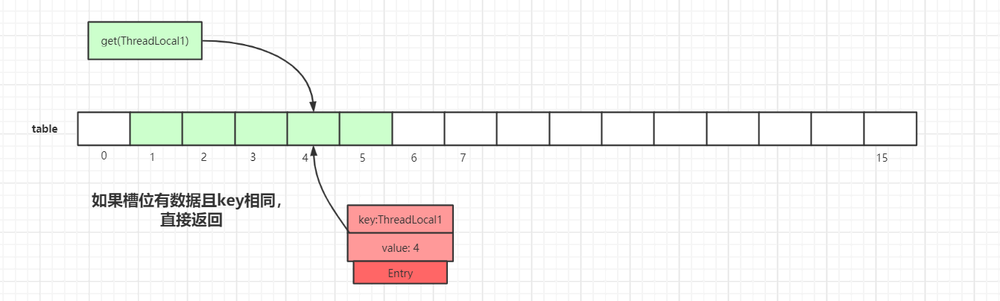

**第二种情况：** `slot` 位置中的 `Entry.key` 和要查找的 `key` 不一致：

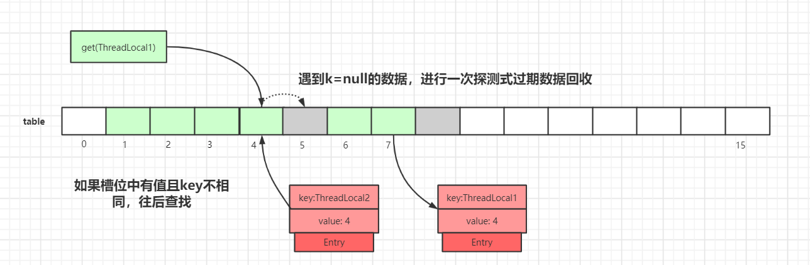

我们以 `get(ThreadLocal1)` 为例，通过 `hash` 计算后，正确的 `slot` 位置应该是 4，而 `index=4` 的槽位已经有了数据，且 `key` 值不等于 `ThreadLocal1`，所以需要继续往后迭代查找。

迭代到 `index=5` 的数据时，此时 `Entry.key=null`，触发一次探测式数据回收操作，执行 `expungeStaleEntry()` 方法，执行完后，`index 5,8` 的数据都会被回收，而 `index 6,7` 的数据都会前移。`index 6,7` 前移之后，继续从 `index=5` 往后迭代，于是就在 `index=6` 找到了 `key` 值相等的 `Entry` 数据，如下图所示：


#### `ThreadLocalMap.get()` 源码详解

`java.lang.ThreadLocal.ThreadLocalMap.getEntry()`:

```java
private Entry getEntry(ThreadLocal<?> key) {
    int i = key.threadLocalHashCode & (table.length - 1);
    Entry e = table[i];
    if (e != null && e.get() == key)
        return e;
    else
        return getEntryAfterMiss(key, i, e);
}

private Entry getEntryAfterMiss(ThreadLocal<?> key, int i, Entry e) {
    Entry[] tab = table;
    int len = tab.length;

    while (e != null) {
        ThreadLocal<?> k = e.get();
        if (k == key)
            return e;
        if (k == null)
            expungeStaleEntry(i);
        else
            i = nextIndex(i, len);
        e = tab[i];
    }
    return null;
}
```

### `ThreadLocalMap` 过期 key 的启发式清理流程

上面多次提及到 `ThreadLocalMap` 过期 key 的两种清理方式：**探测式清理(expungeStaleEntry())**、**启发式清理(cleanSomeSlots())**

探测式清理是以当前 `Entry` 往后清理，遇到值为 `null` 则结束清理，属于**线性探测清理**。

而启发式清理被作者定义为：**Heuristically scan some cells looking for stale entries**.


具体代码如下：

```java
private boolean cleanSomeSlots(int i, int n) {
    boolean removed = false;
    Entry[] tab = table;
    int len = tab.length;
    do {
        i = nextIndex(i, len);
        Entry e = tab[i];
        if (e != null && e.get() == null) {
            n = len;
            removed = true;
            i = expungeStaleEntry(i);
        }
    } while ( (n >>>= 1) != 0);
    return removed;
}
```

### `InheritableThreadLocal`

我们使用 `ThreadLocal` 的时候，在异步场景下是无法给子线程共享父线程中创建的线程副本数据的。

为了解决这个问题，JDK 中还有一个 `InheritableThreadLocal` 类，我们来看一个例子：

```java
public class InheritableThreadLocalDemo {
    public static void main(String[] args) {
        ThreadLocal<String> ThreadLocal = new ThreadLocal<>();
        ThreadLocal<String> inheritableThreadLocal = new InheritableThreadLocal<>();
        ThreadLocal.set("父类数据:threadLocal");
        inheritableThreadLocal.set("父类数据:inheritableThreadLocal");

        new Thread(new Runnable() {
            @Override
            public void run() {
                System.out.println("子线程获取父类ThreadLocal数据：" + ThreadLocal.get());
                System.out.println("子线程获取父类inheritableThreadLocal数据：" + inheritableThreadLocal.get());
            }
        }).start();
    }
}
```

打印结果：

```java
子线程获取父类ThreadLocal数据：null
子线程获取父类inheritableThreadLocal数据：父类数据:inheritableThreadLocal
```

实现原理是子线程是通过在父线程中通过调用 `new Thread()` 方法来创建子线程，`Thread#init` 方法在 `Thread` 的构造方法中被调用。在 `init` 方法中拷贝父线程数据到子线程中：

```java
private void init(ThreadGroup g, Runnable target, String name,
                      long stackSize, AccessControlContext acc,
                      boolean inheritThreadLocals) {
    if (name == null) {
        throw new NullPointerException("name cannot be null");
    }

    if (inheritThreadLocals && parent.inheritableThreadLocals != null)
        this.inheritableThreadLocals =
            ThreadLocal.createInheritedMap(parent.inheritableThreadLocals);
    this.stackSize = stackSize;
    tid = nextThreadID();
}
```

但 `InheritableThreadLocal` 仍然有缺陷，一般我们做异步化处理都是使用的线程池，而 `InheritableThreadLocal` 是在 `new Thread` 中的 `init()` 方法给赋值的，而线程池是线程复用的逻辑，所以这里会存在问题。

当然，有问题出现就会有解决问题的方案，阿里巴巴开源了一个 `TransmittableThreadLocal` 组件就可以解决这个问题，这里就不再延伸，感兴趣的可自行查阅资料。

### `ThreadLocal` 项目中使用实战

#### `ThreadLocal` 使用场景

我们现在项目中日志记录用的是 `ELK+Logstash`，最后在 `Kibana` 中进行展示和检索。

现在都是分布式系统统一对外提供服务，项目间调用的关系可以通过 `traceId` 来关联，但是不同项目之间如何传递 `traceId` 呢？

这里我们使用 `org.slf4j.MDC` 来实现此功能，内部就是通过 `ThreadLocal` 来实现的，具体实现如下：

当前端发送请求到**服务 A**时，**服务 A**会生成一个类似 `UUID` 的 `traceId` 字符串，将此字符串放入当前线程的 `ThreadLocal` 中，在调用**服务 B**的时候，将 `traceId` 写入到请求的 `Header` 中，**服务 B**在接收请求时会先判断请求的 `Header` 中是否有 `traceId`，如果存在则写入自己线程的 `ThreadLocal` 中。

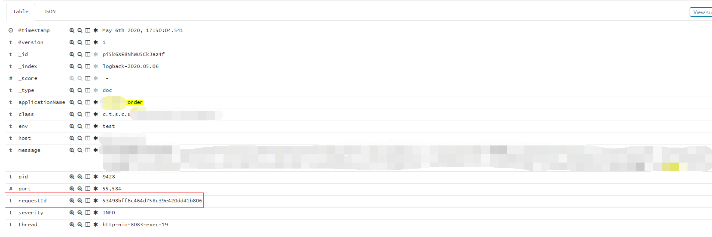

图中的 `requestId` 即为我们各个系统链路关联的 `traceId`，系统间互相调用，通过这个 `requestId` 即可找到对应链路，这里还有会有一些其他场景：


针对于这些场景，我们都可以有相应的解决方案，如下所示

#### Feign 远程调用解决方案

**服务发送请求：**

```java
@Component
@Slf4j
public class FeignInvokeInterceptor implements RequestInterceptor {

    @Override
    public void apply(RequestTemplate template) {
        String requestId = MDC.get("requestId");
        if (StringUtils.isNotBlank(requestId)) {
            template.header("requestId", requestId);
        }
    }
}
```

**服务接收请求：**

```java
@Slf4j
@Component
public class LogInterceptor extends HandlerInterceptorAdapter {

    @Override
    public void afterCompletion(HttpServletRequest arg0, HttpServletResponse arg1, Object arg2, Exception arg3) {
        MDC.remove("requestId");
    }

    @Override
    public void postHandle(HttpServletRequest arg0, HttpServletResponse arg1, Object arg2, ModelAndView arg3) {
    }

    @Override
    public boolean preHandle(HttpServletRequest request, HttpServletResponse response, Object handler) throws Exception {

        String requestId = request.getHeader(BaseConstant.REQUEST_ID_KEY);
        if (StringUtils.isBlank(requestId)) {
            requestId = UUID.randomUUID().toString().replace("-", "");
        }
        MDC.put("requestId", requestId);
        return true;
    }
}
```

#### 线程池异步调用，requestId 传递

因为 `MDC` 是基于 `ThreadLocal` 去实现的，异步过程中，子线程并没有办法获取到父线程 `ThreadLocal` 存储的数据，所以这里可以自定义线程池执行器，修改其中的 `run()` 方法：

```java
public class MyThreadPoolTaskExecutor extends ThreadPoolTaskExecutor {

    @Override
    public void execute(Runnable runnable) {
        Map<String, String> context = MDC.getCopyOfContextMap();
        super.execute(() -> run(runnable, context));
    }

    @Override
    private void run(Runnable runnable, Map<String, String> context) {
        if (context != null) {
            MDC.setContextMap(context);
        }
        try {
            runnable.run();
        } finally {
            MDC.remove();
        }
    }
}
```

#### 使用 MQ 发送消息给第三方系统

在 MQ 发送的消息体中自定义属性 `requestId`，接收方消费消息后，自己解析 `requestId` 使用即可。

<!-- @include: @article-footer.snippet.md -->


---

<!-- source: 从ReentrantLock的实现看AQS的原理及应用.md -->

---
title: 从ReentrantLock的实现看AQS的原理及应用
description: ReentrantLock与AQS原理深度解析：详解ReentrantLock可重入锁实现、公平锁与非公平锁区别、基于AQS的加锁解锁流程、与synchronized性能对比。
category: Java
tag:
  - Java并发
head:
  - - meta
    - name: keywords
      content: ReentrantLock,AQS,公平锁,非公平锁,可重入锁,lock unlock,ReentrantLock原理,synchronized对比
---

> 本文转载自：<https://tech.meituan.com/2019/12/05/aqs-theory-and-apply.html>
>
> 作者：美团技术团队

Java 中的大部分同步类（Semaphore、ReentrantLock 等）都是基于 AbstractQueuedSynchronizer（简称为 AQS）实现的。AQS 是一种提供了原子式管理同步状态、阻塞和唤醒线程功能以及队列模型的简单框架。

本文会从应用层逐渐深入到原理层，并通过 ReentrantLock 的基本特性和 ReentrantLock 与 AQS 的关联，来深入解读 AQS 相关独占锁的知识点，同时采取问答的模式来帮助大家理解 AQS。由于篇幅原因，本篇文章主要阐述 AQS 中独占锁的逻辑和 Sync Queue，不讲述包含共享锁和 Condition Queue 的部分（本篇文章核心为 AQS 原理剖析，只是简单介绍了 ReentrantLock，感兴趣同学可以阅读一下 ReentrantLock 的源码）。

> 本文的源码分析基于 JDK 8。AQS 的内部实现后来持续演进：JDK 11 中仍能看到本文涉及的主要字段和方法，JDK 17 及当前版本的节点字段和入队、等待实现则已有较大变化。同步状态、等待队列以及获取/释放资源的核心思路仍可作为理解基础。

## 1 ReentrantLock

### 1.1 ReentrantLock 特性概览

ReentrantLock 意思为可重入锁，指的是一个线程能够对一个临界资源重复加锁。为了帮助大家更好地理解 ReentrantLock 的特性，我们先将 ReentrantLock 跟常用的 Synchronized 进行比较，其特性如下（蓝色部分为本篇文章主要剖析的点）：


下面通过伪代码，进行更加直观的比较：

```java
// **************************Synchronized的使用方式**************************
// 1.用于代码块
synchronized (this) {}
// 2.用于对象
synchronized (object) {}
// 3.用于方法
public synchronized void test () {}
// 4.可重入
for (int i = 0; i < 100; i++) {
  synchronized (this) {}
}
// **************************ReentrantLock的使用方式**************************
public void test () throws Exception {
  // 1.初始化选择公平锁、非公平锁
  ReentrantLock lock = new ReentrantLock(true);
  // 2.可用于代码块
  lock.lock();
  try {
    // 3.支持多种加锁方式，比较灵活; 具有可重入特性
    if (lock.tryLock(100, TimeUnit.MILLISECONDS)) {
      try {
        // 获取第二次锁之后执行的逻辑
      } finally {
        // 每次成功加锁都要对应释放一次
        lock.unlock();
      }
    }
  } finally {
    lock.unlock();
  }
}
```

### 1.2 ReentrantLock 与 AQS 的关联

通过上文我们已经了解，ReentrantLock 支持公平锁和非公平锁（关于公平锁和非公平锁的原理分析，可参考《[不可不说的 Java“锁”事](https://mp.weixin.qq.com/s?__biz=MjM5NjQ5MTI5OA==&mid=2651749434&idx=3&sn=5ffa63ad47fe166f2f1a9f604ed10091&chksm=bd12a5778a652c61509d9e718ab086ff27ad8768586ea9b38c3dcf9e017a8e49bcae3df9bcc8&scene=38#wechat_redirect)》），并且 ReentrantLock 的底层就是由 AQS 来实现的。那么 ReentrantLock 是如何通过公平锁和非公平锁与 AQS 关联起来呢？ 我们着重从这两者的加锁过程来理解一下它们与 AQS 之间的关系（加锁过程中与 AQS 的关联比较明显，解锁流程后续会介绍）。

非公平锁源码中的加锁流程如下：

```java
// java.util.concurrent.locks.ReentrantLock#NonfairSync

// 非公平锁
static final class NonfairSync extends Sync {
  ...
  final void lock() {
    if (compareAndSetState(0, 1))
      setExclusiveOwnerThread(Thread.currentThread());
    else
      acquire(1);
    }
  ...
}
```

这块代码的含义为：

- 若通过 CAS 设置变量 State（同步状态）成功，也就是获取锁成功，则将当前线程设置为独占线程。
- 若通过 CAS 设置变量 State（同步状态）失败，也就是获取锁失败，则进入 Acquire 方法进行后续处理。

第一步很好理解，但第二步获取锁失败后，后续的处理策略是怎么样的呢？这块可能会有以下思考：

- 某个线程获取锁失败的后续流程是什么呢？有以下两种可能：

(1) 将当前线程获锁结果设置为失败，获取锁流程结束。这种设计会极大降低系统的并发度，并不满足我们实际的需求。所以就需要下面这种流程，也就是 AQS 框架的处理流程。

(2) 存在某种排队等候机制，线程继续等待，仍然保留获取锁的可能，获取锁流程仍在继续。

- 对于问题 1 的第二种情况，既然说到了排队等候机制，那么就一定会有某种队列形成，这样的队列是什么数据结构呢？
- 处于排队等候机制中的线程，什么时候可以有机会获取锁呢？
- 如果处于排队等候机制中的线程一直无法获取锁，还是需要一直等待吗，还是有别的策略来解决这一问题？

带着非公平锁的这些问题，再看下公平锁源码中获锁的方式：

```java
// java.util.concurrent.locks.ReentrantLock#FairSync

static final class FairSync extends Sync {
  ...
  final void lock() {
    acquire(1);
  }
  ...
}
```

看到这块代码，我们可能会存在这种疑问：Lock 函数通过 Acquire 方法进行加锁，但是具体是如何加锁的呢？

结合公平锁和非公平锁的加锁流程，虽然流程上有一定的不同，但是都调用了 Acquire 方法，而 Acquire 方法是 FairSync 和 UnfairSync 的父类 AQS 中的核心方法。

对于上边提到的问题，其实在 ReentrantLock 类源码中都无法解答，而这些问题的答案，都是位于 Acquire 方法所在的类 AbstractQueuedSynchronizer 中，也就是本文的核心——AQS。下面我们会对 AQS 以及 ReentrantLock 和 AQS 的关联做详细介绍（相关问题答案会在 2.3.5 小节中解答）。

## 2 AQS

首先，我们通过下面的架构图来整体了解一下 AQS 框架：


- 上图中有颜色的为 Method，无颜色的为 Attribution。
- 总的来说，AQS 框架共分为五层，自上而下由浅入深，从 AQS 对外暴露的 API 到底层基础数据。
- 当有自定义同步器接入时，只需重写第一层所需要的部分方法即可，不需要关注底层具体的实现流程。当自定义同步器进行加锁或者解锁操作时，先经过第一层的 API 进入 AQS 内部方法，然后经过第二层进行锁的获取，接着对于获取锁失败的流程，进入第三层和第四层的等待队列处理，而这些处理方式均依赖于第五层的基础数据提供层。

下面我们会从整体到细节，从流程到方法逐一剖析 AQS 框架，主要分析过程如下：


### 2.1 原理概览

AQS 核心思想是，如果被请求的共享资源空闲，那么就将当前请求资源的线程设置为有效的工作线程，将共享资源设置为锁定状态；如果共享资源被占用，就需要一定的阻塞等待唤醒机制来保证锁分配。这个机制主要用的是 CLH 队列的变体实现的，将暂时获取不到锁的线程加入到队列中。

CLH：Craig、Landin and Hagersten 队列，是单向链表，AQS 中的队列是 CLH 变体的虚拟双向队列（FIFO），AQS 是通过将每条请求共享资源的线程封装成一个节点来实现锁的分配。

主要原理图如下：


AQS 使用一个 Volatile 的 int 类型的成员变量来表示同步状态，通过内置的 FIFO 队列来完成资源获取的排队工作，通过 CAS 完成对 State 值的修改。

#### 2.1.1 AQS 数据结构

先来看下 AQS 中最基本的数据结构——Node，Node 即为上面 CLH 变体队列中的节点。


解释一下几个方法和属性值的含义：

| 方法和属性值 | 含义                                                                                             |
| :----------- | :----------------------------------------------------------------------------------------------- |
| waitStatus   | 当前节点在队列中的状态                                                                           |
| thread       | 表示处于该节点的线程                                                                             |
| prev         | 前驱指针                                                                                         |
| predecessor  | 返回前驱节点，没有的话抛出 npe                                                                   |
| nextWaiter   | 指向下一个处于 CONDITION 状态的节点（由于本篇文章不讲述 Condition Queue 队列，这个指针不多介绍） |
| next         | 后继指针                                                                                         |

线程两种锁的模式：

| 模式      | 含义                           |
| :-------- | :----------------------------- |
| SHARED    | 表示线程以共享的模式等待锁     |
| EXCLUSIVE | 表示线程正在以独占的方式等待锁 |

waitStatus 有下面几个枚举值：

| 枚举      | 含义                                             |
| :-------- | :----------------------------------------------- |
| 0         | 当一个 Node 被初始化的时候的默认值               |
| CANCELLED | 为 1，表示线程获取锁的请求已经取消了             |
| CONDITION | 为-2，表示节点在等待队列中，节点线程等待唤醒     |
| PROPAGATE | 为-3，当前线程处在 SHARED 情况下，该字段才会使用 |
| SIGNAL    | 为-1，表示线程已经准备好了，就等资源释放了       |

#### 2.1.2 同步状态 State

在了解数据结构后，接下来了解一下 AQS 的同步状态——State。AQS 中维护了一个名为 state 的字段，意为同步状态，是由 Volatile 修饰的，用于展示当前临界资源的获锁情况。

```java
// java.util.concurrent.locks.AbstractQueuedSynchronizer

private volatile int state;
```

下面提供了几个访问这个字段的方法：

| 方法名                                                             | 描述                    |
| :----------------------------------------------------------------- | :---------------------- |
| protected final int getState()                                     | 获取 State 的值         |
| protected final void setState(int newState)                        | 设置 State 的值         |
| protected final boolean compareAndSetState(int expect, int update) | 使用 CAS 方式更新 State |

这几个方法都是 Final 修饰的，说明子类中无法重写它们。我们可以通过修改 State 字段表示的同步状态来实现多线程的独占模式和共享模式（加锁过程）。


对于我们自定义的同步工具，需要自定义获取同步状态和释放状态的方式，也就是 AQS 架构图中的第一层：API 层。

### 2.2 AQS 重要方法与 ReentrantLock 的关联

从架构图中可以得知，AQS 提供了大量用于自定义同步器实现的 Protected 方法。自定义同步器实现的相关方法也只是为了通过修改 State 字段来实现多线程的独占模式或者共享模式。自定义同步器需要实现以下方法（ReentrantLock 需要实现的方法如下，并不是全部）：

| 方法名                                      | 描述                                                                                                                   |
| :------------------------------------------ | :--------------------------------------------------------------------------------------------------------------------- |
| protected boolean isHeldExclusively()       | 该线程是否正在独占资源。只有用到 Condition 才需要去实现它。                                                            |
| protected boolean tryAcquire(int arg)       | 独占方式。arg 为获取锁的次数，尝试获取资源，成功则返回 True，失败则返回 False。                                        |
| protected boolean tryRelease(int arg)       | 独占方式。arg 为释放锁的次数，尝试释放资源，成功则返回 True，失败则返回 False。                                        |
| protected int tryAcquireShared(int arg)     | 共享方式。arg 为获取锁的次数，尝试获取资源。负数表示失败；0 表示成功，但没有剩余可用资源；正数表示成功，且有剩余资源。 |
| protected boolean tryReleaseShared(int arg) | 共享方式。arg 为释放锁的次数，尝试释放资源，如果释放后允许唤醒后续等待结点返回 True，否则返回 False。                  |

一般来说，自定义同步器要么是独占方式，要么是共享方式，它们也只需实现 tryAcquire-tryRelease、tryAcquireShared-tryReleaseShared 中的一种即可。AQS 也支持自定义同步器同时实现独占和共享两种方式，如 ReentrantReadWriteLock。ReentrantLock 是独占锁，所以实现了 tryAcquire-tryRelease。

以非公平锁为例，这里主要阐述一下非公平锁与 AQS 之间方法的关联之处，具体每一处核心方法的作用会在文章后面详细进行阐述。


> 🐛 修正（参见：[issue#1761](https://github.com/Snailclimb/JavaGuide/issues/1761)）: 图中的一处小错误，(AQS)CAS 修改共享资源 State 成功之后应该是获取锁成功（非公平锁）。
>
> 对应的源码如下：
>
> ```java
> final boolean nonfairTryAcquire(int acquires) {
>          final Thread current = Thread.currentThread();//获取当前线程
>          int c = getState();
>          if (c == 0) {
>              if (compareAndSetState(0, acquires)) {//CAS抢锁
>                  setExclusiveOwnerThread(current);//设置当前线程为独占线程
>                  return true;//抢锁成功
>              }
>          }
>          else if (current == getExclusiveOwnerThread()) {
>              int nextc = c + acquires;
>              if (nextc < 0) // overflow
>                  throw new Error("Maximum lock count exceeded");
>              setState(nextc);
>              return true;
>          }
>          return false;
>      }
> ```

为了帮助大家理解 ReentrantLock 和 AQS 之间方法的交互过程，以非公平锁为例，我们将加锁和解锁的交互流程单独拎出来强调一下，以便于对后续内容的理解。


加锁：

- 通过 ReentrantLock 的加锁方法 Lock 进行加锁操作。
- 会调用到内部类 Sync 的 Lock 方法，由于 Sync#lock 是抽象方法，根据 ReentrantLock 初始化选择的公平锁和非公平锁，执行相关内部类的 Lock 方法，本质上都会执行 AQS 的 Acquire 方法。
- AQS 的 Acquire 方法会执行 tryAcquire 方法，但是由于 tryAcquire 需要自定义同步器实现，因此执行了 ReentrantLock 中的 tryAcquire 方法，由于 ReentrantLock 是通过公平锁和非公平锁内部类实现的 tryAcquire 方法，因此会根据锁类型不同，执行不同的 tryAcquire。
- tryAcquire 是获取锁逻辑，获取失败后，会执行框架 AQS 的后续逻辑，跟 ReentrantLock 自定义同步器无关。

解锁：

- 通过 ReentrantLock 的解锁方法 Unlock 进行解锁。
- Unlock 会调用内部类 Sync 的 Release 方法，该方法继承于 AQS。
- Release 中会调用 tryRelease 方法，tryRelease 需要自定义同步器实现，tryRelease 只在 ReentrantLock 中的 Sync 实现，因此可以看出，释放锁的过程，并不区分是否为公平锁。
- 释放成功后，所有处理由 AQS 框架完成，与自定义同步器无关。

通过上面的描述，大概可以总结出 ReentrantLock 加锁解锁时 API 层核心方法的映射关系。


## 3 通过 ReentrantLock 理解 AQS

ReentrantLock 中公平锁和非公平锁在底层是相同的，这里以非公平锁为例进行分析。

在非公平锁中，有一段这样的代码：

```java
// java.util.concurrent.locks.ReentrantLock

static final class NonfairSync extends Sync {
  ...
  final void lock() {
    if (compareAndSetState(0, 1))
      setExclusiveOwnerThread(Thread.currentThread());
    else
      acquire(1);
  }
  ...
}
```

看一下这个 Acquire 是怎么写的：

```java
// java.util.concurrent.locks.AbstractQueuedSynchronizer

public final void acquire(int arg) {
  if (!tryAcquire(arg) && acquireQueued(addWaiter(Node.EXCLUSIVE), arg))
    selfInterrupt();
}
```

再看一下 tryAcquire 方法：

```java
// java.util.concurrent.locks.AbstractQueuedSynchronizer

protected boolean tryAcquire(int arg) {
  throw new UnsupportedOperationException();
}
```

可以看出，这里只是 AQS 的简单实现，具体获取锁的实现方法是由各自的公平锁和非公平锁单独实现的（以 ReentrantLock 为例）。如果该方法返回了 True，则说明当前线程获取锁成功，就不用往后执行了；如果获取失败，就需要加入到等待队列中。下面会详细解释线程是何时以及怎样被加入进等待队列中的。

### 3.1 线程加入等待队列

#### 3.1.1 加入队列的时机

当执行 Acquire(1)时，会通过 tryAcquire 获取锁。在这种情况下，如果获取锁失败，就会调用 addWaiter 加入到等待队列中去。

#### 3.1.2 如何加入队列

获取锁失败后，会执行 addWaiter(Node.EXCLUSIVE)加入等待队列，具体实现方法如下：

```java
// java.util.concurrent.locks.AbstractQueuedSynchronizer

private Node addWaiter(Node mode) {
  Node node = new Node(Thread.currentThread(), mode);
  // Try the fast path of enq; backup to full enq on failure
  Node pred = tail;
  if (pred != null) {
    node.prev = pred;
    if (compareAndSetTail(pred, node)) {
      pred.next = node;
      return node;
    }
  }
  enq(node);
  return node;
}
private final boolean compareAndSetTail(Node expect, Node update) {
  return unsafe.compareAndSwapObject(this, tailOffset, expect, update);
}
```

主要的流程如下：

- 通过当前的线程和锁模式新建一个节点。
- Pred 指针指向尾节点 Tail。
- 将 New 中 Node 的 Prev 指针指向 Pred。
- 通过 compareAndSetTail 方法，完成尾节点的设置。这个方法主要是对 tailOffset 和 Expect 进行比较，如果 tailOffset 的 Node 和 Expect 的 Node 地址是相同的，那么设置 Tail 的值为 Update 的值。

```java
// java.util.concurrent.locks.AbstractQueuedSynchronizer

static {
  try {
    stateOffset = unsafe.objectFieldOffset(AbstractQueuedSynchronizer.class.getDeclaredField("state"));
    headOffset = unsafe.objectFieldOffset(AbstractQueuedSynchronizer.class.getDeclaredField("head"));
    tailOffset = unsafe.objectFieldOffset(AbstractQueuedSynchronizer.class.getDeclaredField("tail"));
    waitStatusOffset = unsafe.objectFieldOffset(Node.class.getDeclaredField("waitStatus"));
    nextOffset = unsafe.objectFieldOffset(Node.class.getDeclaredField("next"));
  } catch (Exception ex) {
    throw new Error(ex);
  }
}
```

从 AQS 的静态代码块可以看出，都是获取一个对象的属性相对于该对象在内存当中的偏移量，这样我们就可以根据这个偏移量在对象内存当中找到这个属性。tailOffset 指的是 tail 对应的偏移量，所以这个时候会将 new 出来的 Node 置为当前队列的尾节点。同时，由于是双向链表，也需要将前一个节点指向尾节点。

- 如果 Pred 指针是 Null（说明等待队列中没有元素），或者当前 Pred 指针和 Tail 指向的位置不同（说明被别的线程已经修改），就需要看一下 Enq 的方法。

```java
// java.util.concurrent.locks.AbstractQueuedSynchronizer

private Node enq(final Node node) {
  for (;;) {
    Node t = tail;
    if (t == null) { // Must initialize
      if (compareAndSetHead(new Node()))
        tail = head;
    } else {
      node.prev = t;
      if (compareAndSetTail(t, node)) {
        t.next = node;
        return t;
      }
    }
  }
}
```

如果没有被初始化，需要进行初始化一个头结点出来。但请注意，初始化的头结点并不是当前线程节点，而是调用了无参构造函数的节点。如果经历了初始化或者并发导致队列中有元素，则与之前的方法相同。其实，addWaiter 就是一个在双端链表添加尾节点的操作，需要注意的是，双端链表的头结点是一个无参构造函数的头结点。

总结一下，线程获取锁的时候，过程大体如下：

1、当没有线程获取到锁时，线程 1 获取锁成功。

2、线程 2 申请锁，但是锁被线程 1 占有。


3、如果再有线程要获取锁，依次在队列中往后排队即可。

回到上边的代码，hasQueuedPredecessors 是公平锁加锁时判断等待队列中是否存在有效节点的方法。如果返回 False，说明当前线程可以争取共享资源；如果返回 True，说明队列中存在有效节点，当前线程必须加入到等待队列中。

```java
// java.util.concurrent.locks.ReentrantLock

public final boolean hasQueuedPredecessors() {
  // The correctness of this depends on head being initialized
  // before tail and on head.next being accurate if the current
  // thread is first in queue.
  Node t = tail; // Read fields in reverse initialization order
  Node h = head;
  Node s;
  return h != t && ((s = h.next) == null || s.thread != Thread.currentThread());
}
```

看到这里，我们理解一下 h != t && ((s = h.next) == null || s.thread != Thread.currentThread());为什么要判断的头结点的下一个节点？第一个节点储存的数据是什么？

> 双向链表中，第一个节点为虚节点，其实并不存储任何信息，只是占位。真正的第一个有数据的节点，是在第二个节点开始的。当 h != t 时：如果(s = h.next) == null，等待队列正在有线程进行初始化，但只是进行到了 Tail 指向 Head，没有将 Head 指向 Tail，此时队列中有元素，需要返回 True（这块具体见下边代码分析）。 如果(s = h.next) != null，说明此时队列中至少有一个有效节点。如果此时 s.thread == Thread.currentThread()，说明等待队列的第一个有效节点中的线程与当前线程相同，那么当前线程是可以获取资源的；如果 s.thread != Thread.currentThread()，说明等待队列的第一个有效节点线程与当前线程不同，当前线程必须加入进等待队列。

```java
// java.util.concurrent.locks.AbstractQueuedSynchronizer#enq

if (t == null) { // Must initialize
  if (compareAndSetHead(new Node()))
    tail = head;
} else {
  node.prev = t;
  if (compareAndSetTail(t, node)) {
    t.next = node;
    return t;
  }
}
```

节点入队不是原子操作，所以会出现短暂的 head != tail，此时 Tail 指向最后一个节点，而且 Tail 指向 Head。如果 Head 没有指向 Tail（可见 5、6、7 行），这种情况下也需要将相关线程加入队列中。所以这块代码是为了解决极端情况下的并发问题。

#### 3.1.3 等待队列中线程出队列时机

回到最初的源码：

```java
// java.util.concurrent.locks.AbstractQueuedSynchronizer

public final void acquire(int arg) {
  if (!tryAcquire(arg) && acquireQueued(addWaiter(Node.EXCLUSIVE), arg))
    selfInterrupt();
}
```

上文解释了 addWaiter 方法，这个方法其实就是把对应的线程以 Node 的数据结构形式加入到双端队列里，返回的是一个包含该线程的 Node。而这个 Node 会作为参数，进入到 acquireQueued 方法中。acquireQueued 方法可以对排队中的线程进行“获锁”操作。

总的来说，一个线程获取锁失败后会被放入等待队列，`acquireQueued` 会让它持续等待并尝试获取锁，直到获取成功。`acquire(int)` 是不可中断的获取方式：等待期间发生中断时会先记录中断状态，在成功获取锁后再通过 `selfInterrupt()` 恢复，而不会因此取消此次获取。

下面我们从“何时出队列？”和“如何出队列？”两个方向来分析一下 acquireQueued 源码：

```java
// java.util.concurrent.locks.AbstractQueuedSynchronizer

final boolean acquireQueued(final Node node, int arg) {
  // 标记是否成功拿到资源
  boolean failed = true;
  try {
    // 标记等待过程中是否中断过
    boolean interrupted = false;
    // 开始自旋，要么获取锁，要么中断
    for (;;) {
      // 获取当前节点的前驱节点
      final Node p = node.predecessor();
      // 如果p是头结点，说明当前节点在真实数据队列的首部，就尝试获取锁（别忘了头结点是虚节点）
      if (p == head && tryAcquire(arg)) {
        // 获取锁成功，头指针移动到当前node
        setHead(node);
        p.next = null; // help GC
        failed = false;
        return interrupted;
      }
      // 说明p为头节点且当前没有获取到锁（可能是非公平锁被抢占了）或者是p不为头结点，这个时候就要判断当前node是否要被阻塞（被阻塞条件：前驱节点的waitStatus为-1），防止无限循环浪费资源。具体两个方法下面细细分析
      if (shouldParkAfterFailedAcquire(p, node) && parkAndCheckInterrupt())
        interrupted = true;
    }
  } finally {
    if (failed)
      cancelAcquire(node);
  }
}
```

注：setHead 方法是把当前节点置为虚节点，但并没有修改 waitStatus，因为它是一直需要用的数据。

```java
// java.util.concurrent.locks.AbstractQueuedSynchronizer

private void setHead(Node node) {
  head = node;
  node.thread = null;
  node.prev = null;
}

// java.util.concurrent.locks.AbstractQueuedSynchronizer

// 靠前驱节点判断当前线程是否应该被阻塞
private static boolean shouldParkAfterFailedAcquire(Node pred, Node node) {
  // 获取前驱结点的节点状态
  int ws = pred.waitStatus;
  // 说明前驱结点处于唤醒状态
  if (ws == Node.SIGNAL)
    return true;
  // 通过枚举值我们知道waitStatus>0是取消状态
  if (ws > 0) {
    do {
      // 循环向前查找取消节点，把取消节点从队列中剔除
      node.prev = pred = pred.prev;
    } while (pred.waitStatus > 0);
    pred.next = node;
  } else {
    // 设置前任节点等待状态为SIGNAL
    compareAndSetWaitStatus(pred, ws, Node.SIGNAL);
  }
  return false;
}
```

parkAndCheckInterrupt 主要用于挂起当前线程，阻塞调用栈，返回当前线程的中断状态。

```java
// java.util.concurrent.locks.AbstractQueuedSynchronizer

private final boolean parkAndCheckInterrupt() {
    LockSupport.park(this);
    return Thread.interrupted();
}
```

上述方法的流程图如下：


从上图可以看出，跳出当前循环的条件是当“前置节点是头结点，且当前线程获取锁成功”。为了防止因死循环导致 CPU 资源被浪费，我们会判断前置节点的状态来决定是否要将当前线程挂起，具体挂起流程用流程图表示如下（shouldParkAfterFailedAcquire 流程）：


从队列中释放节点的疑虑打消了，那么又有新问题了：

- shouldParkAfterFailedAcquire 中取消节点是怎么生成的呢？什么时候会把一个节点的 waitStatus 设置为-1？
- 是在什么时间释放节点通知到被挂起的线程呢？

### 3.2 CANCELLED 状态节点生成

acquireQueued 方法中的 Finally 代码：

```java
// java.util.concurrent.locks.AbstractQueuedSynchronizer

final boolean acquireQueued(final Node node, int arg) {
  boolean failed = true;
  try {
    ...
    for (;;) {
      final Node p = node.predecessor();
      if (p == head && tryAcquire(arg)) {
        ...
        failed = false;
        ...
      }
      ...
  } finally {
    if (failed)
      cancelAcquire(node);
    }
}
```

通过 cancelAcquire 方法，将 Node 的状态标记为 CANCELLED。接下来，我们逐行来分析这个方法的原理：

```java
// java.util.concurrent.locks.AbstractQueuedSynchronizer

private void cancelAcquire(Node node) {
  // 将无效节点过滤
  if (node == null)
    return;
  // 设置该节点不关联任何线程，也就是虚节点
  node.thread = null;
  Node pred = node.prev;
  // 通过前驱节点，跳过取消状态的node
  while (pred.waitStatus > 0)
    node.prev = pred = pred.prev;
  // 获取过滤后的前驱节点的后继节点
  Node predNext = pred.next;
  // 把当前node的状态设置为CANCELLED
  node.waitStatus = Node.CANCELLED;
  // 如果当前节点是尾节点，将从后往前的第一个非取消状态的节点设置为尾节点
  // 更新失败的话，则进入else，如果更新成功，将tail的后继节点设置为null
  if (node == tail && compareAndSetTail(node, pred)) {
    compareAndSetNext(pred, predNext, null);
  } else {
    int ws;
    // 如果当前节点不是head的后继节点，1:判断当前节点前驱节点的是否为SIGNAL，2:如果不是，则把前驱节点设置为SIGNAL看是否成功
    // 如果1和2中有一个为true，再判断当前节点的线程是否为null
    // 如果上述条件都满足，把当前节点的前驱节点的后继指针指向当前节点的后继节点
    if (pred != head && ((ws = pred.waitStatus) == Node.SIGNAL || (ws <= 0 && compareAndSetWaitStatus(pred, ws, Node.SIGNAL))) && pred.thread != null) {
      Node next = node.next;
      if (next != null && next.waitStatus <= 0)
        compareAndSetNext(pred, predNext, next);
    } else {
      // 如果当前节点是head的后继节点，或者上述条件不满足，那就唤醒当前节点的后继节点
      unparkSuccessor(node);
    }
    node.next = node; // help GC
  }
}
```

当前的流程：

- 获取当前节点的前驱节点，如果前驱节点的状态是 CANCELLED，那就一直往前遍历，找到第一个 waitStatus <= 0 的节点，将找到的 Pred 节点和当前 Node 关联，将当前 Node 设置为 CANCELLED。
- 根据当前节点的位置，考虑以下三种情况：

(1) 当前节点是尾节点。

(2) 当前节点是 Head 的后继节点。

(3) 当前节点不是 Head 的后继节点，也不是尾节点。

根据上述第二条，我们来分析每一种情况的流程。

当前节点是尾节点。


当前节点是 Head 的后继节点。


当前节点不是 Head 的后继节点，也不是尾节点。


通过上面的流程，我们对于 CANCELLED 节点状态的产生和变化已经有了大致的了解，但是为什么所有的变化都是对 Next 指针进行了操作，而没有对 Prev 指针进行操作呢？什么情况下会对 Prev 指针进行操作？

> 执行 cancelAcquire 的时候，当前节点的前置节点可能已经从队列中出去了（已经执行过 Try 代码块中的 shouldParkAfterFailedAcquire 方法了），如果此时修改 Prev 指针，有可能会导致 Prev 指向另一个已经移除队列的 Node，因此这块变化 Prev 指针不安全。 shouldParkAfterFailedAcquire 方法中，会执行下面的代码，其实就是在处理 Prev 指针。shouldParkAfterFailedAcquire 是获取锁失败的情况下才会执行，进入该方法后，说明共享资源已被获取，当前节点之前的节点都不会出现变化，因此这个时候变更 Prev 指针比较安全。
>
> ```java
> do {
>   node.prev = pred = pred.prev;
> } while (pred.waitStatus > 0);
> ```

### 3.3 如何解锁

我们已经剖析了加锁过程中的基本流程，接下来再对解锁的基本流程进行分析。由于 ReentrantLock 在解锁的时候，并不区分公平锁和非公平锁，所以我们直接看解锁的源码：

```java
// java.util.concurrent.locks.ReentrantLock

public void unlock() {
  sync.release(1);
}
```

可以看到，本质释放锁的地方，是通过框架来完成的。

```java
// java.util.concurrent.locks.AbstractQueuedSynchronizer

public final boolean release(int arg) {
  if (tryRelease(arg)) {
    Node h = head;
    if (h != null && h.waitStatus != 0)
      unparkSuccessor(h);
    return true;
  }
  return false;
}
```

在 ReentrantLock 里面的公平锁和非公平锁的父类 Sync 定义了可重入锁的释放锁机制。

```java
// java.util.concurrent.locks.ReentrantLock.Sync

// 方法返回当前锁是不是没有被线程持有
protected final boolean tryRelease(int releases) {
  // 减少可重入次数
  int c = getState() - releases;
  // 当前线程不是持有锁的线程，抛出异常
  if (Thread.currentThread() != getExclusiveOwnerThread())
    throw new IllegalMonitorStateException();
  boolean free = false;
  // 如果持有线程全部释放，将当前独占锁所有线程设置为null，并更新state
  if (c == 0) {
    free = true;
    setExclusiveOwnerThread(null);
  }
  setState(c);
  return free;
}
```

我们来解释下述源码：

```java
// java.util.concurrent.locks.AbstractQueuedSynchronizer

public final boolean release(int arg) {
  // 上边自定义的tryRelease如果返回true，说明该锁没有被任何线程持有
  if (tryRelease(arg)) {
    // 获取头结点
    Node h = head;
    // 头结点不为空并且头结点的waitStatus不是初始化节点情况，解除线程挂起状态
    if (h != null && h.waitStatus != 0)
      unparkSuccessor(h);
    return true;
  }
  return false;
}
```

这里的判断条件为什么是 h != null && h.waitStatus != 0？

> h == null Head 还没初始化。初始情况下，head == null，第一个节点入队，Head 会被初始化一个虚拟节点。所以说，这里如果还没来得及入队，就会出现 head == null 的情况。
>
> h != null && waitStatus == 0 表明后继节点对应的线程仍在运行中，不需要唤醒。
>
> h != null && waitStatus < 0 表明后继节点可能被阻塞了，需要唤醒。

再看一下 unparkSuccessor 方法：

```java
// java.util.concurrent.locks.AbstractQueuedSynchronizer

private void unparkSuccessor(Node node) {
  // 获取头结点waitStatus
  int ws = node.waitStatus;
  if (ws < 0)
    compareAndSetWaitStatus(node, ws, 0);
  // 获取当前节点的下一个节点
  Node s = node.next;
  // 如果下个节点是null或者下个节点被cancelled，就找到队列最开始的非cancelled的节点
  if (s == null || s.waitStatus > 0) {
    s = null;
    // 就从尾部节点开始找，到队首，找到队列第一个waitStatus<0的节点。
    for (Node t = tail; t != null && t != node; t = t.prev)
      if (t.waitStatus <= 0)
        s = t;
  }
  // 如果当前节点的下个节点不为空，而且状态<=0，就把当前节点unpark
  if (s != null)
    LockSupport.unpark(s.thread);
}
```

为什么要从后往前找第一个非 Cancelled 的节点呢？原因如下。

之前的 addWaiter 方法：

```java
// java.util.concurrent.locks.AbstractQueuedSynchronizer

private Node addWaiter(Node mode) {
  Node node = new Node(Thread.currentThread(), mode);
  // Try the fast path of enq; backup to full enq on failure
  Node pred = tail;
  if (pred != null) {
    node.prev = pred;
    if (compareAndSetTail(pred, node)) {
      pred.next = node;
      return node;
    }
  }
  enq(node);
  return node;
}
```

我们从这里可以看到，节点入队并不是原子操作，也就是说，node.prev = pred; compareAndSetTail(pred, node) 这两个地方可以看作 Tail 入队的原子操作，但是此时 pred.next = node;还没执行，如果这个时候执行了 unparkSuccessor 方法，就没办法从前往后找了，所以需要从后往前找。还有一点原因，在产生 CANCELLED 状态节点的时候，先断开的是 Next 指针，Prev 指针并未断开，因此也是必须要从后往前遍历才能够遍历完全部的 Node。

综上所述，如果是从前往后找，由于极端情况下入队的非原子操作和 CANCELLED 节点产生过程中断开 Next 指针的操作，可能会导致无法遍历所有的节点。所以，唤醒对应的线程后，对应的线程就会继续往下执行。继续执行 acquireQueued 方法以后，中断如何处理？

### 3.4 中断恢复后的执行流程

唤醒后，会执行 return Thread.interrupted();，这个函数返回的是当前执行线程的中断状态，并清除。

```java
// java.util.concurrent.locks.AbstractQueuedSynchronizer

private final boolean parkAndCheckInterrupt() {
  LockSupport.park(this);
  return Thread.interrupted();
}
```

再回到 acquireQueued 代码，当 parkAndCheckInterrupt 返回 True 或者 False 的时候，interrupted 的值不同，但都会执行下次循环。如果这个时候获取锁成功，就会把当前 interrupted 返回。

```java
// java.util.concurrent.locks.AbstractQueuedSynchronizer

final boolean acquireQueued(final Node node, int arg) {
  boolean failed = true;
  try {
    boolean interrupted = false;
    for (;;) {
      final Node p = node.predecessor();
      if (p == head && tryAcquire(arg)) {
        setHead(node);
        p.next = null; // help GC
        failed = false;
        return interrupted;
      }
      if (shouldParkAfterFailedAcquire(p, node) && parkAndCheckInterrupt())
        interrupted = true;
      }
  } finally {
    if (failed)
      cancelAcquire(node);
  }
}
```

如果 acquireQueued 为 True，就会执行 selfInterrupt 方法。

```java
// java.util.concurrent.locks.AbstractQueuedSynchronizer

static void selfInterrupt() {
  Thread.currentThread().interrupt();
}
```

该方法其实是为了中断线程。但为什么获取了锁以后还要中断线程呢？这部分属于 Java 提供的协作式中断知识内容，感兴趣同学可以查阅一下。这里简单介绍一下：

1. 当中断线程被唤醒时，并不知道被唤醒的原因，可能是当前线程在等待中被中断，也可能是释放了锁以后被唤醒。因此我们通过 Thread.interrupted()方法检查中断标记（该方法返回了当前线程的中断状态，并将当前线程的中断标识设置为 False），并记录下来，如果发现该线程被中断过，就再中断一次。
2. 线程在等待资源的过程中被唤醒，唤醒后还是会不断地去尝试获取锁，直到抢到锁为止。也就是说，在整个流程中，并不响应中断，只是记录中断记录。最后抢到锁返回了，那么如果被中断过的话，就需要补充一次中断。

这里的处理方式主要是运用线程池中基本运作单元 Worder 中的 runWorker，通过 Thread.interrupted()进行额外的判断处理，感兴趣的同学可以看下 ThreadPoolExecutor 源码。

### 3.5 小结

我们在 1.3 小节中提出了一些问题，现在来回答一下。

> Q：某个线程获取锁失败的后续流程是什么呢？
>
> A：存在某种排队等候机制，线程继续等待，仍然保留获取锁的可能，获取锁流程仍在继续。
>
> Q：既然说到了排队等候机制，那么就一定会有某种队列形成，这样的队列是什么数据结构呢？
>
> A：是 CLH 变体的 FIFO 双端队列。
>
> Q：处于排队等候机制中的线程，什么时候可以有机会获取锁呢？
>
> A：可以详细看下 2.3.1.3 小节。
>
> Q：如果处于排队等候机制中的线程一直无法获取锁，需要一直等待么？还是有别的策略来解决这一问题？
>
> A：线程所在节点的状态会变成取消状态，取消状态的节点会从队列中释放，具体可见 2.3.2 小节。
>
> Q：Lock 函数通过 Acquire 方法进行加锁，但是具体是如何加锁的呢？
>
> A：AQS 的 Acquire 会调用 tryAcquire 方法，tryAcquire 由各个自定义同步器实现，通过 tryAcquire 完成加锁过程。

## 4 AQS 应用

### 4.1 ReentrantLock 的可重入应用

ReentrantLock 的可重入性是 AQS 很好的应用之一，在了解完上述知识点以后，我们很容易得知 ReentrantLock 实现可重入的方法。在 ReentrantLock 里面，不管是公平锁还是非公平锁，都有一段逻辑。

公平锁：

```java
// java.util.concurrent.locks.ReentrantLock.FairSync#tryAcquire

if (c == 0) {
  if (!hasQueuedPredecessors() && compareAndSetState(0, acquires)) {
    setExclusiveOwnerThread(current);
    return true;
  }
}
else if (current == getExclusiveOwnerThread()) {
  int nextc = c + acquires;
  if (nextc < 0)
    throw new Error("Maximum lock count exceeded");
  setState(nextc);
  return true;
}
```

非公平锁：

```java
// java.util.concurrent.locks.ReentrantLock.Sync#nonfairTryAcquire

if (c == 0) {
  if (compareAndSetState(0, acquires)){
    setExclusiveOwnerThread(current);
    return true;
  }
}
else if (current == getExclusiveOwnerThread()) {
  int nextc = c + acquires;
  if (nextc < 0) // overflow
    throw new Error("Maximum lock count exceeded");
  setState(nextc);
  return true;
}
```

从上面这两段都可以看到，有一个同步状态 State 来控制整体可重入的情况。State 是 Volatile 修饰的，用于保证一定的可见性和有序性。

```java
// java.util.concurrent.locks.AbstractQueuedSynchronizer

private volatile int state;
```

接下来看 State 这个字段主要的过程：

1. State 初始化的时候为 0，表示没有任何线程持有锁。
2. 当有线程持有该锁时，值就会在原来的基础上+1，同一个线程多次获得锁是，就会多次+1，这里就是可重入的概念。
3. 解锁也是对这个字段-1，一直到 0，此线程对锁释放。

### 4.2 JUC 中的应用场景

除了上边 ReentrantLock 的可重入性的应用，AQS 作为并发编程的框架，为很多其他同步工具提供了良好的解决方案。下面列出了 JUC 中的几种同步工具，大体介绍一下 AQS 的应用场景：

| 同步工具               | 同步工具与 AQS 的关联                                                                                                                                       |
| :--------------------- | :---------------------------------------------------------------------------------------------------------------------------------------------------------- |
| ReentrantLock          | 使用 AQS 保存锁重复持有的次数。当一个线程获取锁时，ReentrantLock 记录当前获得锁的线程标识，用于检测是否重复获取，以及错误线程试图解锁操作时异常情况的处理。 |
| Semaphore              | 使用 AQS 同步状态来保存信号量的当前计数。tryRelease 会增加计数，acquireShared 会减少计数。                                                                  |
| CountDownLatch         | 使用 AQS 同步状态来表示计数。计数为 0 时，所有的 Acquire 操作（CountDownLatch 的 await 方法）才可以通过。                                                   |
| ReentrantReadWriteLock | 使用 AQS 同步状态中的 16 位保存写锁持有的次数，剩下的 16 位用于保存读锁的持有次数。                                                                         |
| ThreadPoolExecutor     | Worker 利用 AQS 同步状态实现对独占线程变量的设置（tryAcquire 和 tryRelease）。                                                                              |

### 4.3 自定义同步工具

了解 AQS 基本原理以后，按照上面所说的 AQS 知识点，自己实现一个同步工具。

```java
public class LeeLock  {

    private static class Sync extends AbstractQueuedSynchronizer {
        @Override
        protected boolean tryAcquire (int arg) {
            if (compareAndSetState(0, 1)) {
                setExclusiveOwnerThread(Thread.currentThread());
                return true;
            }
            return false;
        }

        @Override
        protected boolean tryRelease (int arg) {
            if (getState() == 0 || getExclusiveOwnerThread() != Thread.currentThread()) {
                throw new IllegalMonitorStateException();
            }
            setExclusiveOwnerThread(null);
            setState(0);
            return true;
        }

        @Override
        protected boolean isHeldExclusively () {
            return getState() == 1 && getExclusiveOwnerThread() == Thread.currentThread();
        }
    }

    private final Sync sync = new Sync();

    public void lock () {
        sync.acquire(1);
    }

    public void unlock () {
        sync.release(1);
    }
}
```

通过我们自己定义的 Lock 完成一定的同步功能。

```java
public class LeeMain {

    static int count = 0;
    static LeeLock leeLock = new LeeLock();

    public static void main (String[] args) throws InterruptedException {

        Runnable runnable = new Runnable() {
            @Override
            public void run () {
                try {
                    leeLock.lock();
                    for (int i = 0; i < 10000; i++) {
                        count++;
                    }
                } catch (Exception e) {
                    e.printStackTrace();
                } finally {
                    leeLock.unlock();
                }

            }
        };
        Thread thread1 = new Thread(runnable);
        Thread thread2 = new Thread(runnable);
        thread1.start();
        thread2.start();
        thread1.join();
        thread2.join();
        System.out.println(count);
    }
}
```

上述代码每次运行结果都会是 20000。通过简单的几行代码就能实现同步功能，这就是 AQS 的强大之处。

## 5 总结

我们日常开发中使用并发的场景太多，但是对并发内部的基本框架原理了解的人却不多。由于篇幅原因，本文仅介绍了可重入锁 ReentrantLock 的原理和 AQS 原理，希望能够成为大家了解 AQS 和 ReentrantLock 等同步器的“敲门砖”。

## 参考资料

- Lea D. The java. util. concurrent synchronizer framework\[J]. Science of Computer Programming, 2005, 58(3): 293-309.
- 《Java 并发编程实战》
- [不可不说的 Java“锁”事](https://tech.meituan.com/2018/11/15/java-lock.html)

<!-- @include: @article-footer.snippet.md -->


---

<!-- source: 乐观锁和悲观锁详解.md -->

---
title: 乐观锁和悲观锁详解
description: 乐观锁与悲观锁深度对比：详解synchronized/ReentrantLock悲观锁实现、CAS/版本号乐观锁机制、适用场景分析、性能对比与选型建议。
category: Java
tag:
  - Java并发
head:
  - - meta
    - name: keywords
      content: 乐观锁,悲观锁,synchronized,ReentrantLock,CAS,版本号机制,并发控制,锁优化
---

如果将悲观锁（Pessimistic Lock）和乐观锁（Optimistic Lock）对应到现实生活中来。悲观锁有点像是一位比较悲观（也可以说是未雨绸缪）的人，总是会假设最坏的情况，避免出现问题。乐观锁有点像是一位比较乐观的人，总是会假设最好的情况，在要出现问题之前快速解决问题。

## 什么是悲观锁？

悲观锁总是假设最坏的情况，认为共享资源每次被访问的时候就会出现问题（比如共享数据被修改），所以每次在获取资源操作的时候都会上锁，这样其他线程想拿到这个资源就会阻塞直到锁被上一个持有者释放。也就是说，**共享资源每次只给一个线程使用，其它线程阻塞，用完后再把资源转让给其它线程**。

像 Java 中 `synchronized` 和 `ReentrantLock` 等独占锁就是悲观锁思想的实现。

```java
public void performSynchronisedTask() {
    synchronized (this) {
        // 需要同步的操作
    }
}

private Lock lock = new ReentrantLock();
lock.lock();
try {
   // 需要同步的操作
} finally {
    lock.unlock();
}
```

高并发的场景下，激烈的锁竞争会造成线程阻塞，大量阻塞线程会导致系统的上下文切换，增加系统的性能开销。并且，悲观锁还可能会存在死锁问题（线程获得锁的顺序不当时），影响代码的正常运行。

## 什么是乐观锁？

乐观锁总是假设最好的情况，认为共享资源每次被访问的时候不会出现问题，线程可以不停地执行，无需加锁也无需等待，只是在提交修改的时候去验证对应的资源（也就是数据）是否被其它线程修改了（具体方法可以使用版本号机制或 CAS 算法）。

在 Java 中 `java.util.concurrent.atomic` 包下面的原子变量类（比如 `AtomicInteger`、`LongAdder`）就是使用了乐观锁的一种实现方式 **CAS** 实现的。


```java
// LongAdder 在高并发场景下会比 AtomicInteger 和 AtomicLong 的性能更好
// 代价就是会消耗更多的内存空间（空间换时间）
LongAdder sum = new LongAdder();
sum.increment();
```

高并发的场景下，乐观锁相比悲观锁来说，不存在锁竞争造成线程阻塞，也不会有死锁问题，在性能上往往会更胜一筹。但是，如果冲突频繁发生（写占比非常多的情况），会频繁失败并重试，这样同样会非常影响性能，导致 CPU 飙升。

`LongAdder` 会在竞争激烈时把更新分散到多个内部单元，从而降低所有线程争用同一个值的概率，但内部更新仍可能使用 CAS 和重试，并没有彻底消除竞争。另外，`sum()` 返回的也不是与并发更新保持原子一致的快照。

理论上来说：

- 悲观锁通常多用于写比较多的情况（多写场景，竞争激烈），这样可以避免频繁失败和重试影响性能。不过，像 `LongAdder` 这样通过分散竞争来降低重试概率的方案，在只需要累加等特定语义时也可以考虑，仍需根据实际场景衡量。
- 乐观锁通常多用于写比较少的情况（多读场景，竞争较少），这样可以避免频繁加锁影响性能。不过，乐观锁主要针对的对象是单个共享变量（参考 `java.util.concurrent.atomic` 包下面的原子变量类）。

## 如何实现乐观锁？

乐观锁一般会使用版本号机制或 CAS 算法实现，CAS 算法相对来说更多一些，这里需要格外注意。

### 版本号机制

一般是在数据表中加上一个数据版本号 `version` 字段，表示数据被修改的次数。当数据被修改时，`version` 值会加一。当线程 A 要更新数据值时，在读取数据的同时也会读取 `version` 值，在提交更新时，若刚才读取到的 version 值为当前数据库中的 `version` 值相等时才更新，否则重试更新操作，直到更新成功。

**举一个简单的例子**：假设数据库中帐户信息表中有一个 version 字段，当前值为 1；而当前帐户余额字段（`balance`）为 \$100。

1. 操作员 A 此时将其读出（`version`=1），并从其帐户余额中扣除 $50（$100-\$50）。
2. 在操作员 A 操作的过程中，操作员 B 也读入此用户信息（`version`=1），并从其帐户余额中扣除 $20（$100-\$20）。
3. 操作员 A 完成了修改工作，将数据版本号（`version`=1），连同帐户扣除后余额（`balance`=\$50），提交至数据库更新，此时由于提交数据版本等于数据库记录当前版本，数据被更新，数据库记录 `version` 更新为 2。
4. 操作员 B 完成了操作，也将版本号（`version`=1）试图向数据库提交数据（`balance`=\$80），但此时比对数据库记录版本时发现，操作员 B 提交的数据版本号为 1，而数据库记录当前版本为 2，不满足 “ 提交版本必须等于当前版本才能执行更新 ” 的乐观锁策略，因此，操作员 B 的提交被驳回。

这样就避免了操作员 B 用基于 `version`=1 的旧数据修改的结果覆盖操作员 A 的操作结果的可能。

### CAS 算法

CAS 的全称是 **Compare And Swap（比较与交换）**，用于实现乐观锁，被广泛应用于各大框架中。CAS 的思想很简单，就是用一个预期值和要更新的变量值进行比较，两值相等才会进行更新。

CAS 是一个原子操作，底层依赖于一条 CPU 的原子指令。

> **原子操作** 即最小不可拆分的操作，也就是说操作一旦开始，就不能被打断，直到操作完成。

CAS 涉及到三个操作数：

- **V**：要更新的变量值(Var)
- **E**：预期值(Expected)
- **N**：拟写入的新值(New)

当且仅当 V 的值等于 E 时，CAS 通过原子方式用新值 N 来更新 V 的值。如果不等，说明已经有其它线程更新了 V，则当前线程放弃更新。

**举一个简单的例子**：线程 A 要修改变量 i 的值为 6，i 原值为 1（V = 1，E=1，N=6，假设不存在 ABA 问题）。

1. i 与 1 进行比较，如果相等， 则说明没被其他线程修改，可以被设置为 6。
2. i 与 1 进行比较，如果不相等，则说明被其他线程修改，当前线程放弃更新，CAS 操作失败。

当多个线程同时使用 CAS 操作一个变量时，只有一个会胜出，并成功更新，其余均会失败，但失败的线程并不会被挂起，仅是被告知失败，并且允许再次尝试，当然也允许失败的线程放弃操作。

关于 CAS 的进一步介绍，可以阅读读者写的这篇文章：[CAS 详解](./CAS 详解.md)，其中详细提到了 Java 中 CAS 的实现以及 CAS 存在的一些问题。

## 总结

本文详细介绍了乐观锁和悲观锁的概念以及乐观锁常见实现方式：

- 悲观锁基于悲观的假设，认为共享资源在每次访问时都会发生冲突，因此在每次操作时都会加锁。这种锁机制会导致其他线程阻塞，直到锁被释放。Java 中的 `synchronized` 和 `ReentrantLock` 是悲观锁的典型实现方式。虽然悲观锁能有效避免数据竞争，但在高并发场景下会导致线程阻塞、上下文切换频繁，从而影响系统性能，并且还可能引发死锁问题。
- 乐观锁基于乐观的假设，认为共享资源在每次访问时不会发生冲突，因此无须加锁，只需在提交修改时验证数据是否被其他线程修改。Java 中的 `AtomicInteger` 和 `LongAdder` 等类通过 CAS（Compare-And-Swap）算法实现了乐观锁。乐观锁避免了线程阻塞和死锁问题，在读多写少的场景中性能优越。但在写操作频繁的情况下，可能会导致大量重试和失败，从而影响性能。
- 乐观锁主要通过版本号机制或 CAS 算法实现。版本号机制通过比较版本号确保数据一致性，而 CAS 通过硬件指令实现原子操作，直接比较和交换变量值。

悲观锁和乐观锁各有优缺点，适用于不同的应用场景。在实际开发中，选择合适的锁机制能够有效提升系统的并发性能和稳定性。

## 参考

- 《Java 并发编程核心 78 讲》
- 通俗易懂 悲观锁、乐观锁、可重入锁、自旋锁、偏向锁、轻量/重量级锁、读写锁、各种锁及其 Java 实现！：<https://zhuanlan.zhihu.com/p/71156910>

<!-- @include: @article-footer.snippet.md -->


---

<!-- source: 虚拟线程常见问题总结.md -->

---
title: 虚拟线程常见问题总结
description: Java 21 虚拟线程详解：梳理 Virtual Threads 的定位、调度原理、与平台线程的区别、适用场景、创建方式、性能边界、Spring Boot 接入方式和实践注意事项。
category: Java
tag:
  - Java并发
head:
  - - meta
    - name: keywords
      content: Java虚拟线程,Virtual Threads,Project Loom,Java 21新特性,轻量级线程,协程,虚拟线程原理
---

<!-- @include: @article-header.snippet.md -->

一个 Web 请求进来，代码要查数据库、调远程接口、读写文件。按传统的同步写法，这个请求会占住一个平台线程，哪怕大部分时间都在等 I/O。

线程池能缓解线程创建成本，但不能改变一个事实：平台线程数量仍然受操作系统线程数量、内存和调度成本限制。当并发请求继续增加时，线程池里的线程会被排队任务占满，吞吐量很快卡住。

虚拟线程就是为这个问题来的。它让我们继续用简单的同步阻塞代码，同时让等待 I/O 的任务不再长期占着昂贵的平台线程。

## 什么是虚拟线程？

虚拟线程（Virtual Thread）是 Java 21 正式引入的一种轻量级线程，也是 `java.lang.Thread` 的一种实现。它由 JDK 管理和调度，而不是直接和某个操作系统线程一一绑定。

平台线程（Platform Thread）通常是对操作系统线程的薄封装。一个平台线程运行时，会在整个生命周期内占用一个操作系统线程。虚拟线程不一样：它运行 Java 代码时需要挂载到某个平台线程上；当它执行可挂起的阻塞操作时，JDK 可以把它从平台线程上卸载下来，让这个平台线程去执行别的虚拟线程。

因此，虚拟线程的数量可以远大于平台线程数量。官方文档里用虚拟内存做类比：操作系统把大量虚拟地址映射到有限物理内存，Java 运行时则把大量虚拟线程映射到较少的平台线程。

虚拟线程的几个关键点：

- 虚拟线程仍然是 `Thread`，支持 `ThreadLocal`、中断、异常栈、调试和 JFR 观测。
- 虚拟线程适合大量阻塞等待的任务，比如 HTTP 调用、数据库查询、消息队列访问、文件或网络 I/O。
- 虚拟线程不是更快的 CPU 执行单元，不会让一段纯计算代码跑得更快。
- 虚拟线程很便宜，通常应该“每个任务一个虚拟线程”，而不是像平台线程一样池化复用。

## 虚拟线程和平台线程有什么关系？

在 Java 里，虚拟线程、平台线程和操作系统线程大致是这样的关系：


在 Windows、Linux 等主流操作系统中，HotSpot JVM 的平台线程通常采用一对一线程模型，也就是一个平台线程对应一个操作系统线程。虚拟线程引入后，JDK 在平台线程之上又加了一层调度：

- 虚拟线程是任务的承载者，业务代码看到的 `Thread.currentThread()` 返回的是虚拟线程本身。
- 平台线程是虚拟线程的载体（Carrier Thread），负责真正执行虚拟线程里的 Java 代码。
- 操作系统仍然只调度平台线程，不知道虚拟线程的存在。

一个虚拟线程开始执行时，会被 JDK 调度器挂载（mount）到某个平台线程上。执行到阻塞 I/O、`BlockingQueue.take()`、`Future.get()` 等支持挂起的阻塞点时，虚拟线程可以卸载（unmount），平台线程被释放出来继续执行其他虚拟线程。等阻塞操作就绪后，虚拟线程再被提交回调度器，挂载到某个平台线程上继续执行。

这个挂载和卸载过程对业务代码是透明的。你写的仍然是普通同步代码：

```java
String body = httpClient.send(request, BodyHandlers.ofString()).body();
Result result = repository.query(body);
return service.handle(result);
```

如果这些调用内部发生阻塞，虚拟线程可以挂起自己；如果换成平台线程，这个线程会一直占住对应的操作系统线程。

## Project Loom 和虚拟线程是什么关系？

Project Loom 是 OpenJDK 中改进 Java 并发模型的项目，虚拟线程是 Loom 最重要的成果之一。虚拟线程先后在 JDK 19、JDK 20 中预览，最终通过 [JEP 444](https://openjdk.org/jeps/444) 在 JDK 21 转正。

Loom 不只是加了一个轻量级线程 API。它还推动了 JDK 阻塞 I/O、调试、JFR、线程转储等配套能力的调整，让传统的 thread-per-request 编程风格在高并发 I/O 场景下重新变得可扩展。

这也是虚拟线程和普通“协程库”的一个重要区别：虚拟线程被纳入了 Java 平台的线程模型。调试器、Profiler、JFR、线程 dump 都能以线程为单位理解它，而不是把业务调用链拆成一堆回调阶段。

## 虚拟线程解决了什么问题？

很多服务端程序天然适合“一个请求一个线程”的模型。它的好处很明显：代码顺序执行，异常可以沿着调用栈抛出，调试器能一步步跟进去，线程 dump 也能看到请求卡在哪里。

问题在于平台线程太贵。

假设一个接口平均耗时 50ms，系统要达到 2000 QPS，按 Little's Law 粗略估算，需要同时处理约 100 个请求。如果接口平均耗时变成 500ms，同样 2000 QPS 就需要约 1000 个并发请求。每个请求都占一个平台线程时，线程数量很容易先于 CPU、网络带宽、数据库连接等资源成为瓶颈。

异步编程、Reactive 编程可以把线程从等待 I/O 中释放出来，但代价也很明显：调用链被拆成回调、`CompletableFuture` 链或响应式流水线，异常处理、调试、火焰图和线程上下文都会变复杂。

虚拟线程试图保留同步代码的可读性，同时降低阻塞等待时占用平台线程的成本。它提升的主要是吞吐能力和并发承载能力，不是单个请求的执行速度。

## 虚拟线程适合哪些场景？

虚拟线程最适合下面这类任务：

- 并发任务数量很多，通常是成千上万级别。
- 任务大部分时间在等待 I/O，比如数据库、Redis、HTTP/RPC、消息队列、文件和网络读写。
- 现有代码主要是同步阻塞模型，不想为了扩展性改成复杂的异步链。
- 希望保留传统调用栈，方便调试、压测分析和线上排查。

典型场景包括：

- Spring MVC / Servlet 接口中调用数据库和外部 HTTP 服务。
- 后台任务批量调用第三方接口。
- 网关或聚合服务并发调用多个下游服务。
- 消息消费逻辑中包含阻塞式数据库写入或远程调用。

虚拟线程不适合把 CPU 密集型任务“变快”。如果任务主要是在算哈希、压缩图片、排序大数组、跑复杂规则引擎，线程数量超过 CPU 核心数之后，吞吐通常不会继续提高。CPU 密集型工作仍然应该关注算法、数据结构、批处理、并行流、专门的计算线程池或本地化优化。

## 如何创建虚拟线程？

JDK 21 中常见的创建方式有四种。

### 使用 `Thread.startVirtualThread()`

适合启动一个很简单的虚拟线程：

```java
public class VirtualThreadDemo {
  public static void main(String[] args) throws InterruptedException {
    Thread thread = Thread.startVirtualThread(() -> {
      System.out.println(Thread.currentThread());
    });

    thread.join();
  }
}
```

需要注意的是，虚拟线程是守护线程。如果 `main` 方法不等待它结束，JVM 可能直接退出，导致任务还没来得及执行完。

### 使用 `Thread.ofVirtual()`

`Thread.ofVirtual()` 返回一个 `Thread.Builder.OfVirtual`，可以设置线程名，也可以选择创建后立即启动或先不启动：

```java
public class VirtualThreadDemo {
  public static void main(String[] args) throws InterruptedException {
    Thread unstarted = Thread.ofVirtual()
        .name("order-query")
        .unstarted(() -> System.out.println("query order"));

    unstarted.start();
    unstarted.join();

    Thread started = Thread.ofVirtual()
        .name("payment-query")
        .start(() -> System.out.println("query payment"));

    started.join();
  }
}
```

### 使用 `ThreadFactory`

如果你希望统一线程命名，或者把线程工厂交给框架使用，可以通过 `ThreadFactory` 创建虚拟线程：

```java
import java.util.concurrent.ThreadFactory;

public class VirtualThreadDemo {
  public static void main(String[] args) throws InterruptedException {
    ThreadFactory factory = Thread.ofVirtual()
        .name("worker-", 0)
        .factory();

    Thread thread = factory.newThread(() -> {
      System.out.println(Thread.currentThread().getName());
    });

    thread.start();
    thread.join();
  }
}
```

### 使用 `Executors.newVirtualThreadPerTaskExecutor()`

业务开发中最常见的是这种方式。它会为每个提交的任务创建一个新的虚拟线程：

```java
import java.util.concurrent.ExecutorService;
import java.util.concurrent.Executors;
import java.util.concurrent.Future;

public class VirtualThreadDemo {
  public static void main(String[] args) throws Exception {
    try (ExecutorService executor = Executors.newVirtualThreadPerTaskExecutor()) {
      Future<String> future = executor.submit(() -> {
        return "hello virtual thread";
      });

      System.out.println(future.get());
    }
  }
}
```

这里的 `ExecutorService` 不是传统意义上的线程池。它不会维护一组固定虚拟线程来复用，而是每个任务一个新的虚拟线程。`try-with-resources` 结束时会调用 `close()`，等待已提交任务完成。

## 虚拟线程要不要池化？

不要池化虚拟线程。

线程池的主要目标是复用昂贵的平台线程，并顺便限制并发。虚拟线程本身不是稀缺资源，池化它们通常没有意义，还会把“每个任务一个线程”的模型重新绕回旧思路。

如果你的真实目标是限制访问某个资源的并发量，应该限制资源，而不是限制虚拟线程数量。比如某个老系统最多只能承受 20 个并发请求，可以用 `Semaphore` 控制并发：

```java
import java.util.concurrent.Semaphore;

public class OldServiceClient {
  private static final Semaphore LIMIT = new Semaphore(20);

  public String call() throws InterruptedException {
    LIMIT.acquire();
    try {
      return doCall();
    } finally {
      LIMIT.release();
    }
  }

  private String doCall() {
    return "ok";
  }
}
```

如果瓶颈是数据库连接，那就调整连接池大小；如果瓶颈是下游接口限流，那就做限流、熔断和重试退避。虚拟线程能让等待变便宜，但不能让数据库连接、下游容量、CPU 和内存变无限。

## 虚拟线程和平台线程性能对比

先给结论：虚拟线程不是“跑得更快的线程”，而是“可以创建很多、阻塞成本更低的线程”。它通常能提升 I/O 密集型服务的吞吐，但不会降低一次数据库查询或一次 HTTP 调用本身的耗时。

下面这个例子模拟 10,000 个阻塞 1 秒的任务：

```java
import java.time.Duration;
import java.util.concurrent.ExecutorService;
import java.util.concurrent.Executors;
import java.util.stream.IntStream;

public class VirtualThreadCompareDemo {
  public static void main(String[] args) {
    long start = System.currentTimeMillis();

    try (ExecutorService executor = Executors.newVirtualThreadPerTaskExecutor()) {
      IntStream.range(0, 10_000).forEach(i -> {
        executor.submit(() -> {
          Thread.sleep(Duration.ofSeconds(1));
          return i;
        });
      });
    }

    System.out.println("cost: " + (System.currentTimeMillis() - start) + "ms");
  }
}
```

如果把它换成 `Executors.newFixedThreadPool(200)`，同一时间最多只有 200 个任务在执行，10,000 个任务会被分批处理。按每批 1 秒粗略估计，总耗时接近 50 秒。虚拟线程版本可以让这 10,000 个任务几乎同时进入等待状态，平台线程在等待期间被释放出来，总耗时更接近单个任务的等待时间。

这个例子只能说明虚拟线程对“阻塞等待”友好，不是严谨基准测试。真实服务要看数据库连接池、HTTP 客户端连接池、下游限流、GC、对象分配、锁竞争、容器 CPU 配额等因素。

## 虚拟线程的底层原理是什么？

可以把虚拟线程的执行过程拆成三件事：调度、挂载/卸载、栈管理。

### 调度

平台线程依赖操作系统调度。虚拟线程由 JDK 自己的调度器调度，再由平台线程承载执行。JEP 444 中说明，虚拟线程调度器是一个采用 FIFO 模式的 work-stealing `ForkJoinPool`，它和并行流使用的 common pool 不是同一个池。

默认情况下，调度器的并行度和可用处理器数量相关，可以通过下面的系统属性调整：

- `jdk.virtualThreadScheduler.parallelism`：调度器目标并行度。
- `jdk.virtualThreadScheduler.maxPoolSize`：调度器可扩展的平台线程上限。

大多数业务系统不需要改这两个参数。优先排查连接池、限流、锁和阻塞点，通常比调整调度器参数更有效。

### 挂载和卸载

虚拟线程执行 Java 代码时，会挂载到某个平台线程上。遇到支持挂起的阻塞操作时，虚拟线程可以保存当前执行状态并卸载，平台线程继续服务其他虚拟线程。

常见的 JDK 阻塞操作已经为虚拟线程做了适配。例如网络 I/O、`BlockingQueue`、`Future.get()` 等，在虚拟线程中阻塞时通常不会长期占住底层平台线程。

不是所有阻塞都能卸载。JDK 21 到 JDK 23 中，虚拟线程在 `synchronized` 代码块或方法中阻塞，会出现 Pinning，也就是被固定在载体线程上。JDK 24 的 [JEP 491](https://openjdk.org/jeps/491) 改进了这一点，使虚拟线程在 `synchronized` 中阻塞时也能释放底层平台线程，消除了绝大多数由 `synchronized` 带来的 Pinning 场景。调用 native 方法或 Foreign Function & Memory API 相关代码时，仍然要关注剩余的 Pinning 风险。

### 栈管理

平台线程通常使用固定大小的操作系统线程栈。虚拟线程的栈以栈块对象的形式存放在 Java 堆中，可以随着执行过程增长和收缩。这也是虚拟线程能够大量创建的重要原因之一。

不过，这并不代表虚拟线程没有内存成本。每个虚拟线程仍然是对象，也有栈块、局部变量、`ThreadLocal` 等内存开销。百万级虚拟线程不是免费的，只是比百万级平台线程现实得多。

## 什么是 Pinning？

Pinning 可以理解为“虚拟线程暂时没法从载体线程上卸载”。虚拟线程被固定在某个平台线程上后，它在阻塞期间会连带占住底层操作系统线程，扩展性也会跟着变差。

在 JDK 21 到 JDK 23 中，最典型的 Pinning 场景是：虚拟线程在 `synchronized` 代码块或方法里执行阻塞 I/O。

```java
public synchronized String load() throws IOException {
  return remoteClient.get("/config"); // JDK 21-23 中，这里阻塞时可能固定载体线程
}
```

短小、纯内存操作的 `synchronized` 问题不大。真正需要关注的是高频路径上持锁执行慢 I/O，例如持有对象锁时查数据库、调远程接口、读大文件。

如果你使用 JDK 21 到 JDK 23，可以考虑：

- 避免在 `synchronized` 内部执行慢 I/O。
- 对高频阻塞锁场景使用 `ReentrantLock`，并用 `try/finally` 释放锁。
- 用 JFR 观察 `jdk.VirtualThreadPinned` 事件。
- 临时使用 `-Djdk.tracePinnedThreads=full` 定位被固定的调用栈。

如果你使用 JDK 24 或更高版本，`synchronized` 导致的主要 Pinning 问题已经被 JEP 491 解决。选择 `synchronized` 还是 `java.util.concurrent.locks`，可以重新回到代码语义、可维护性和锁能力本身来判断。

## 使用虚拟线程有哪些注意事项？

### 不要把虚拟线程当作提速 CPU 的工具

虚拟线程提升的是等待型任务的并发承载能力。CPU 密集型任务最终还是要抢 CPU 时间片，虚拟线程数量再多也不能突破 CPU 核心数的物理限制。

### 不要用线程池思维限制虚拟线程

不要创建固定数量的虚拟线程池。需要限制并发时，用 `Semaphore`、连接池、限流器或队列容量限制具体资源。

### 小心 `ThreadLocal` 缓存大对象

Java 21 正式版保证虚拟线程支持 `ThreadLocal`，这有利于兼容老代码和框架。但不要用 `ThreadLocal` 给每个虚拟线程缓存大对象。

以前在线程池里，一个 `ThreadLocal<SimpleDateFormat>` 可能只对应几十或几百个平台线程。迁移到虚拟线程后，如果每个任务一个虚拟线程，同样的写法可能变成每个任务创建一份缓存对象，内存和分配压力会被放大。

如果只是传递请求上下文、用户 ID、Trace ID，通常问题不大。如果是缓存数据库连接、大数组、复杂 formatter、客户端对象，就要重新评估。JDK 25 通过 JEP 506 将 Scoped Values 转正，它更适合在大量虚拟线程之间传递不可变上下文。

### 虚拟线程不会消除线程安全问题

虚拟线程让创建线程更便宜，也意味着你更容易同时跑起大量并发任务。原来因为线程池较小而没暴露的数据竞争，切到虚拟线程后可能更容易出现。

需要继续遵守并发编程的基本规则：共享可变状态要加锁或隔离，数据库连接、会话对象、非线程安全客户端不要被多个虚拟线程同时乱用。

### 注意连接池和下游容量

很多服务迁移到虚拟线程后，第一个瓶颈不再是业务线程池，而是数据库连接池、HTTP 连接池、Redis 连接数或下游限流。

这不是虚拟线程的问题。虚拟线程只是让更多任务有机会同时推进，真正的共享资源仍然要按容量管理。压测时建议同时观察：

- 应用 QPS、响应时间和错误率。
- 数据库连接池活跃连接、等待队列和超时数。
- HTTP 客户端连接池和下游 429/5xx。
- CPU、堆内存、GC、对象分配速率。
- JFR 中的虚拟线程事件和锁竞争。

### 不要混用太多异步模型

虚拟线程最适合同步阻塞代码。已经用 Reactive/WebFlux/Netty 写成全链路异步的系统，不一定能因为打开虚拟线程就获得明显收益。

更麻烦的是混用模型：外层虚拟线程，内层又大量使用异步回调和线程池，排查时可能同时面对虚拟线程、事件循环、业务线程池、连接池几套上下文。迁移时最好先挑同步阻塞链路试点，而不是全系统一键替换。

## Spring Boot 如何开启虚拟线程？

Spring Boot 3.2 开始提供了比较直接的开关。使用 Java 21 或更高版本时，可以在配置中开启：

```properties
spring.threads.virtual.enabled=true
```

Spring Boot 官方文档还提到几个实践点：

- 开启虚拟线程后，配置传统线程池大小的部分属性不再按原来的方式生效，因为虚拟线程调度依赖 JVM 范围内的平台线程池。
- 虚拟线程是守护线程。如果应用依赖 `@Scheduled` 等后台任务保持 JVM 存活，建议设置 `spring.main.keep-alive=true`。
- Spring Boot 官方目前建议 Java 24 或更高版本获得更好的虚拟线程体验，主要和 Pinning 改进有关。

一个简单配置如下：

```yaml
spring:
  threads:
    virtual:
      enabled: true
  main:
    keep-alive: true
```

开启之后，不代表所有接口都会变快。它更可能改善的是同步阻塞、I/O 等待明显、并发较高的接口。如果接口主要耗在 CPU、锁竞争、慢 SQL 本身或下游限流上，虚拟线程只能让问题更早暴露。

## 如何排查虚拟线程问题？

JDK 已经为虚拟线程补了不少观测能力。

### 使用 `jcmd` 导出线程转储

传统 `jstack` 面对成千上万个虚拟线程时不太合适。JDK 提供了新的线程转储能力：

```bash
jcmd <pid> Thread.dump_to_file -format=json thread-dump.json
```

也可以导出文本格式：

```bash
jcmd <pid> Thread.dump_to_file -format=text thread-dump.txt
```

JSON 格式更适合工具分析，尤其是虚拟线程数量很多时。

### 使用 JFR 观察虚拟线程事件

JFR 中和虚拟线程相关的事件包括：

- `jdk.VirtualThreadStart`
- `jdk.VirtualThreadEnd`
- `jdk.VirtualThreadPinned`
- `jdk.VirtualThreadSubmitFailed`

其中 `jdk.VirtualThreadPinned` 对排查 Pinning 很有用。JDK 24 以后，`synchronized` 相关 Pinning 大多被解决，但 native/FFM 等剩余场景仍然可以通过 JFR 观察。

### 临时打开 Pinning 栈追踪

在 JDK 21 到 JDK 23 中，可以临时使用：

```bash
-Djdk.tracePinnedThreads=full
```

它会在虚拟线程阻塞且被固定时打印调用栈，适合本地或测试环境定位问题。JDK 24 的 JEP 491 之后，`synchronized` 相关的主要 Pinning 场景已经改进；native/FFM 等剩余边界仍然建议结合 JFR 和线程转储判断。

## 虚拟线程常见面试题

### 虚拟线程和平台线程的区别是什么？

平台线程通常和操作系统线程一一对应，创建和上下文切换成本较高，数量有限。虚拟线程由 JDK 调度，可以把大量虚拟线程映射到少量平台线程上。虚拟线程阻塞等待 I/O 时，通常可以从载体线程卸载，让平台线程继续执行其他虚拟线程。

### 虚拟线程为什么适合 I/O 密集型任务？

I/O 密集型任务大部分时间在等待外部资源。平台线程等待时会占住操作系统线程；虚拟线程等待时可以挂起自己并释放载体线程。这样同样数量的平台线程可以承载更多并发任务。

### 虚拟线程适合 CPU 密集型任务吗？

不适合把它当作 CPU 提速工具。CPU 密集型任务需要真实 CPU 时间，线程数超过核心数后只会增加调度竞争。虚拟线程能改善高并发等待，不会让单个计算任务更快。

### 虚拟线程需要池化吗？

不需要，也不建议。虚拟线程便宜，应该按任务创建。需要限制并发时，限制具体资源，比如数据库连接池、HTTP 连接池、`Semaphore`、限流器，而不是池化虚拟线程。

### 虚拟线程和协程一样吗？

它们都属于轻量级并发的思路，但 Java 虚拟线程是 `java.lang.Thread` 的实现，纳入了 Java 原有线程模型。业务代码不需要写 `async/await`，也不需要手动 yield。和 Go goroutine 相比，虚拟线程更强调兼容 Java 既有线程 API、调试工具和阻塞式代码风格。对开发者来说，它更像“便宜很多的线程”。

### 使用虚拟线程后还需要 Reactive 编程吗？

看场景。很多同步阻塞的服务端接口可以用虚拟线程获得更好的可读性和足够的吞吐，不必为了释放线程写复杂回调链。但 Reactive 仍然适合流式处理、背压、事件驱动、长连接和已经全链路异步化的系统。虚拟线程不是替代所有异步模型的银弹。

### JDK 21 里的 `synchronized` 还能不能用？

可以用，但要注意边界。JDK 21 到 JDK 23 中，虚拟线程在 `synchronized` 内部执行阻塞操作可能出现 Pinning。短小的内存同步问题不大，高频路径上不要持有 `synchronized` 锁执行慢 I/O。JDK 24 通过 JEP 491 改进后，`synchronized` 相关 Pinning 已经基本解决。

## 参考资料

- [JEP 444: Virtual Threads](https://openjdk.org/jeps/444)
- [Oracle Java 21 Documentation: Virtual Threads](https://docs.oracle.com/en/java/javase/21/core/virtual-threads.html)
- [JEP 491: Synchronize Virtual Threads without Pinning](https://openjdk.org/jeps/491)
- [JEP 506: Scoped Values](https://openjdk.org/jeps/506)
- [Spring Boot Reference Documentation: Virtual threads](https://docs.spring.io/spring-boot/reference/features/spring-application.html#features.spring-application.virtual-threads)
- [Spring Blog: Embracing Virtual Threads](https://spring.io/blog/2022/10/11/embracing-virtual-threads/)
- [Inside Java: Managing Throughput with Virtual Threads](https://inside.java/2024/02/04/sip094/)
- [Quarkus Blog: When Quarkus meets Virtual Threads](https://quarkus.io/blog/virtual-thread-1/)

<!-- @include: @article-footer.snippet.md -->

