# 分布式


---

<!-- source: 2026 最新分布式系统面试题总结-CAP、Raft、RPC、分布式锁、事务与 ID.md -->

---
title: 2026 最新分布式系统面试题总结：CAP、Raft、RPC、分布式锁、事务与 ID
description: 2026 最新分布式系统面试题和复习路线汇总，覆盖 CAP、BASE、中心化与去中心化、Paxos、Raft、ZAB、Gossip、一致性哈希、RPC、API 网关、分布式 ID、分布式锁、分布式事务、配置中心和 ZooKeeper 等高频考点。
category: 分布式
tag:
  - 分布式
  - 面试题
  - 系统设计
head:
  - - meta
    - name: keywords
      content: 分布式面试题,分布式系统面试题,中心化,去中心化,CAP 面试题,BASE 面试题,RPC 面试题,API 网关面试题,分布式锁面试题,分布式事务面试题,分布式 ID 面试题,ZooKeeper 面试题,Raft 面试题,Paxos 面试题
---

准备分布式系统面试，最容易踩的坑是把知识点背成一堆孤立概念：CAP 是一个点、RPC 是一个点、分布式锁是一个点、分布式事务又是一个点。

真正到面试里，面试官更关心的是：**你能不能把这些技术放回真实系统里，讲清楚它们解决什么问题、带来什么代价、适合什么场景**。

这篇文章是 JavaGuide 分布式系统内容的面试复习导航，不会重复搬运所有答案，而是帮你把分布式相关文章串起来，按面试准备顺序建立一条清晰路径。

## 分布式面试先抓主线

分布式系统面试通常围绕 4 条主线展开：

1. **一致性与可用性的权衡**：CAP、BASE、最终一致性、中心化与去中心化、共识算法。
2. **跨节点通信与治理**：RPC、注册发现、API 网关、配置中心。
3. **分布式数据一致性问题**：分布式 ID、分布式锁、分布式事务。
4. **典型中间件与落地场景**：ZooKeeper、Dubbo、Spring Cloud Gateway 等。

其中，最重要的是：**API 网关、配置中心、分布式 ID、分布式锁和分布式事务**。这几块内容需要你花费更多的时间。

如果时间有限，建议先看面试突击版：[分布式系统常见面试题总结](https://interview.javaguide.cn/分布式/distributed-system.html)。它已经把面试最高频的问题整理了出来，非常适合时间有限的情况下面试突击。

如果你还有时间系统补基础，可以按下面这条路线阅读 JavaGuide 正站文章。

## 第一阶段：分布式理论与算法

分布式理论是很多系统设计题的底层语言。它不一定每天都写进代码，但会决定你回答问题时有没有“架构感”。


重点文章：

- [CAP 理论和 BASE 理论解读](https://javaguide.cn/分布式/协议/cap-and-base-theorem.html)
- [分布式协调详解](https://javaguide.cn/分布式/协议/centralized-and-decentralized.html)
- [Paxos 算法解读](https://javaguide.cn/分布式/协议/paxos-algorithm.html)
- [Raft 算法解读](https://javaguide.cn/分布式/协议/raft-algorithm.html)
- [ZAB 协议详解](https://javaguide.cn/分布式/协议/zab.html)
- [Gossip 协议详解](https://javaguide.cn/分布式/协议/gossip-protocol.html)
- [一致性哈希算法详解](https://javaguide.cn/分布式/协议/consistent-hashing.html)

高频面试问题：

- CAP 是不是“三选二”？为什么说 P 在分布式系统里基本无法回避？
- BASE 和 ACID 的区别是什么？最终一致性如何落地？
- 中心化和去中心化有什么区别？Leader 单点、脑裂、多数派、Gossip 分别怎么理解？
- Paxos、Raft、ZAB 分别解决什么问题？为什么 Raft 更容易理解和工程实现？
- Gossip 协议为什么适合节点发现和状态传播？
- 一致性哈希解决了什么问题？虚拟节点有什么作用？

这一阶段的复习重点不是背定义，而是能说清楚：**当网络不可靠、节点会宕机、数据要多副本存储时，系统为什么必须做取舍**。

## 第二阶段：RPC 与 API 网关

微服务面试里，RPC 和 API 网关经常一起出现。RPC 关注服务之间如何调用，网关关注外部流量如何进入系统。

API 网关示意图如下：


RPC 示意图如下：


重点文章：

- [RPC 基础常见面试题总结](https://javaguide.cn/分布式/rpc/rpc-intro.html)
- [Dubbo 常见面试题总结](https://javaguide.cn/分布式/rpc/dubbo.html)
- [HTTP 和 RPC 有什么区别？](https://javaguide.cn/分布式/rpc/http&rpc.html)
- [API 网关基础知识总结](https://javaguide.cn/分布式/api-gateway.html)
- [Spring Cloud Gateway 常见问题总结](https://javaguide.cn/分布式/spring-cloud-gateway-questions.html)

高频面试问题：

- RPC 和 HTTP 有什么区别？为什么服务内部调用常用 RPC？
- 一个 RPC 框架通常包含哪些核心模块？
- 服务注册与发现、负载均衡、序列化、超时重试分别解决什么问题？
- API 网关和 Nginx、负载均衡器、BFF 的边界是什么？
- Spring Cloud Gateway 的过滤器链、路由匹配、限流熔断如何理解？

这一阶段建议把“调用链路”画出来：客户端请求如何进网关，网关如何路由到服务，服务之间如何通过 RPC 调用，失败时如何超时、重试、降级。

## 第三阶段：分布式 ID、锁和事务

这部分是后端面试的高频区，也是最容易被追问工程细节的部分，一定一定要花费更多时间准备。

重点文章：

- [分布式ID介绍&实现方案总结](https://javaguide.cn/分布式/distributed-id.html)
- [分布式 ID 设计指南](https://javaguide.cn/分布式/distributed-id-design.html)
- [分布式锁介绍](https://javaguide.cn/分布式/distributed-lock.html)
- [分布式锁常见实现方案总结](https://javaguide.cn/分布式/distributed-lock-implementations.html)
- [分布式事务解决方案总结](https://javaguide.cn/分布式/distributed-transaction.html)

高频面试问题：

- 为什么分库分表后不能继续依赖数据库自增 ID？
- UUID、数据库号段、Redis、Snowflake 各有什么优缺点？
- Redis 分布式锁为什么要设置过期时间？为什么要用 Lua 保证释放锁的原子性？
- Redisson 看门狗解决了什么问题？它又引入了哪些边界？
- 2PC、TCC、本地消息表、事务消息、Saga 分别适合什么场景？

准备这部分时，一定要讲“异常路径”：网络超时、锁过期、业务执行一半失败、消息重复投递、事务补偿失败。这些才是面试官真正想听的工程判断。

## 第四阶段：配置中心与 ZooKeeper

配置中心和 ZooKeeper 通常不是单独考一个大题，而是穿插在注册发现、配置变更、分布式协调、Leader 选举等问题里。

ZooKeeper 可以选择跳过，目前面试问的不多。有一种情况必须准备，那就是你的项目明确用到了或者你的技能介绍中提到了。

重点文章：

- [分布式配置中心面试题总结](https://javaguide.cn/分布式/distributed-configuration-center.html)
- [ZooKeeper相关概念总结(入门)](https://javaguide.cn/分布式/分布式流程协调/zookeeper/zookeeper-intro.html)
- [ZooKeeper相关概念总结(进阶)](https://javaguide.cn/分布式/分布式流程协调/zookeeper/zookeeper-plus.html)

高频面试问题：

- 配置中心为什么不能只是一个配置文件仓库？
- 配置变更如何推送？如何保证客户端拿到的是新配置？
- ZooKeeper 的临时节点、顺序节点、Watcher 分别能解决什么问题？
- ZooKeeper 为什么适合做分布式协调？
- ZooKeeper 和注册中心、配置中心之间是什么关系？

## 推荐复习顺序

如果你是临近面试，建议先用“高频题目定范围，再用专题文章补细节”的方式复习：

1. 先看 [分布式系统常见面试题总结](https://interview.javaguide.cn/分布式/distributed-system.html)，快速建立高频问题清单，知道哪些内容最容易被问到。
2. 再补理论基础：[CAP 理论和 BASE 理论解读](https://javaguide.cn/分布式/协议/cap-and-base-theorem.html)、[分布式协调详解](https://javaguide.cn/分布式/协议/centralized-and-decentralized.html)、[Raft 算法解读](https://javaguide.cn/分布式/协议/raft-algorithm.html)、[一致性哈希算法详解](https://javaguide.cn/分布式/协议/consistent-hashing.html)。这一步重点是理解系统为什么要在一致性、可用性和扩展性之间做取舍。
3. 然后看通信与流量入口：[RPC 基础常见面试题总结](https://javaguide.cn/分布式/rpc/rpc-intro.html)、[API 网关基础知识总结](https://javaguide.cn/分布式/api-gateway.html)。这一步要能讲清楚一次请求从网关进入系统，再到服务之间互相调用的完整链路。
4. 最后重点啃工程落地高频题：[分布式 ID](https://javaguide.cn/分布式/distributed-id.html)、[分布式锁](https://javaguide.cn/分布式/distributed-lock.html)、[分布式事务](https://javaguide.cn/分布式/distributed-transaction.html)。这一步不要只背方案优缺点，更要准备异常场景和兜底策略。

如果你准备的是社招或中高级岗位，不要只背标准答案。更重要的是能把方案放进具体业务场景里，讲清楚为什么这么选、失败后怎么兜底、系统压力上来后怎么扩展。

## 面试突击版推荐

这篇文章主要是 JavaGuide 正站的分布式学习导航。如果你想直接刷高频问答，可以看我已经整理好的面试突击版： [分布式系统常见面试题总结](https://interview.javaguide.cn/分布式/distributed-system.html)。

面试突击版更适合临考前快速过一遍；正站文章更适合系统学习和补齐细节。两者配合使用，效果会更稳。


---

<!-- source: API 网关详解-核心功能、工作原理与 Spring Cloud Gateway Kong APISIX 选型.md -->

---
title: API 网关详解：核心功能、工作原理与 Spring Cloud Gateway / Kong / APISIX 选型
category: 分布式
description: API 网关核心知识详解，涵盖请求路由、认证鉴权、限流熔断、负载均衡、灰度发布、双层网关架构，以及 Spring Cloud Gateway、Kong、APISIX、ShenYu 等常见网关选型对比。
tag:
  - API 网关
head:
  - - meta
    - name: keywords
      content: API 网关,微服务网关,Spring Cloud Gateway,Kong,APISIX,ShenYu,Zuul,限流熔断,负载均衡,网关选型,网关面试题
---

## 什么是网关？

API 网关（API Gateway）是位于客户端与后端服务之间的**统一入口**，所有客户端请求先经过网关，再由网关路由到具体的目标服务。

在这组分布式文章里，网关属于“流量入口”这一层。[RPC](./rpc/) 主要讲服务之间怎么互相调用，网关讲外部请求进入系统后怎么做路由、鉴权、限流、灰度和协议适配。如果你只想看 Spring Cloud Gateway 的路由、Predicate、Filter 和限流细节，可以继续读 [Spring Cloud Gateway 面试题总结](./Spring Cloud Gateway 面试题总结-路由、Predicate、Filter、限流熔断与工作原理.md)。

### 核心价值

在微服务架构下，一个系统被拆分为多个服务。像**安全认证、流量控制、日志、监控**等功能是每个服务都需要的。如果没有网关，我们需要在每个服务中单独实现这些功能，导致：

- **代码重复**：相同逻辑在多个服务中冗余实现
- **管理分散**：缺乏统一的配置和监控视图
- **维护成本高**：功能变更需要修改所有服务


### 核心职责

网关的功能虽然繁多，但核心可以概括为两件事：

| 职责         | 说明                                | 典型功能                               |
| ------------ | ----------------------------------- | -------------------------------------- |
| **请求转发** | 将客户端请求路由到正确的目标服务    | 动态路由、负载均衡、协议转换           |
| **请求过滤** | 在请求到达后端服务前/后进行拦截处理 | 身份认证、权限校验、限流熔断、日志记录 |

下表是抽象层面的两类核心职责，落到具体能力上，会衍生出下一节列举的十余项网关功能。

网关可以提供请求转发、安全认证（身份/权限认证）、流量控制、负载均衡、降级熔断、日志、监控、参数校验、协议转换等功能。

**网关在微服务架构中的位置**：所有客户端请求先到达网关，网关负责统一的认证鉴权、流量控制、路由分发，后端服务专注于业务逻辑处理。

### 高可用部署

引入网关后会增加一次网络转发（性能损耗在内网环境下通常可忽略），但同时也引入了新的单点风险。因此，网关服务本身必须保障高可用：

如下图所示，网关服务外层通过 Nginx（或其他负载均衡设备/软件）进行负载转发以达到高可用。Nginx 在部署时也应考虑高可用，避免单点风险。


## 网关能提供哪些功能？

绝大部分网关可以提供下面这些功能（有一些功能需要借助其他框架或者中间件）：

- **请求转发**：将请求转发到目标微服务。
- **负载均衡**：根据各个微服务实例的负载情况或者具体的负载均衡策略配置对请求实现动态的负载均衡。
- **安全认证**：对用户请求进行身份验证并仅允许可信客户端访问 API，并且还能够使用类似 RBAC 等方式来授权。
- **参数校验**：支持参数映射与校验逻辑。
- **日志记录**：记录所有请求的行为日志供后续使用。
- **监控告警**：从业务指标、机器指标、JVM 指标等方面进行监控并提供配套的告警机制。
- **流量控制**：对请求的流量进行控制，也就是限制某一时刻内的请求数。
- **熔断降级**：实时监控请求的统计信息，达到配置的失败阈值后，自动熔断，返回默认值。
- **响应缓存**：当用户请求获取的是一些静态的或更新不频繁的数据时，一段时间内多次请求获取到的数据很可能是一样的。对于这种情况可以将响应缓存起来。这样用户请求可以直接在网关层得到响应数据，无需再去访问业务服务，减轻业务服务的负担。
- **响应聚合**：某些情况下用户请求要获取的响应内容可能会来自于多个业务服务。通用网关可以做简单聚合，但复杂聚合更推荐放在 BFF（Backend For Frontend）或 GraphQL 层，避免把业务编排逻辑沉淀到基础设施层。
- **灰度发布**：将请求动态分流到不同的服务版本（最基本的一种灰度发布）。
- **异常处理**：对于业务服务返回的异常响应，可以在网关层在返回给用户之前做转换处理。这样可以把一些业务侧返回的异常细节隐藏，转换成用户友好的错误提示返回。
- **API 文档**：如果计划将 API 暴露给组织以外的开发人员，那么必须考虑使用 API 文档，例如 Swagger 或 OpenAPI。
- **协议转换**：通过协议转换整合后台基于 REST、AMQP、Dubbo 等不同风格和实现技术的微服务，面向 Web/Mobile、开放平台等特定客户端提供统一服务。
- **证书管理**：将 SSL 证书部署到 API 网关，由一个统一的入口管理接口，降低了证书更换时的复杂度。

需要注意的是，网关并不适合承载所有逻辑。强业务规则校验、复杂字段映射、长事务、长连接业务逻辑、细粒度业务授权等，通常应该回到业务服务、BFF 或 GraphQL 层处理。网关更适合做协议级、通用型、跨服务的能力，避免演化成难以维护的“巨石网关”。

下图来源于[百亿规模 API 网关服务 Shepherd 的设计与实现 - 美团技术团队 - 2021](https://mp.weixin.qq.com/s/iITqdIiHi3XGKq6u6FRVdg)这篇文章。


## 有哪些常见的网关系统？

### Netflix Zuul

Zuul 是 Netflix 开发的一款提供动态路由、监控、弹性、安全的网关服务，基于 Java 技术栈开发，可以和 Eureka、Ribbon、Hystrix 等组件配合使用。

Zuul 核心架构如下：


Zuul 主要通过过滤器（类似于 AOP）来过滤请求，从而实现网关必备的各种功能。


我们可以自定义过滤器来处理请求，并且，Zuul 生态本身就有很多现成的过滤器供我们使用。就比如限流可以使用社区扩展 [spring-cloud-zuul-ratelimit](https://github.com/marcosbarbero/spring-cloud-zuul-ratelimit)（这里只是举例说明）。需要区分的是：Hystrix 主要负责熔断、超时、降级和线程池/信号量隔离，并不是严格意义上的 QPS 限流组件。

```xml
<dependency>
  <groupId>org.springframework.cloud</groupId>
    <artifactId>spring-cloud-starter-netflix-zuul</artifactId>
</dependency>
<dependency>
    <groupId>com.marcosbarbero.cloud</groupId>
    <artifactId>spring-cloud-zuul-ratelimit</artifactId>
    <version>2.2.0.RELEASE</version>
</dependency>
```

[Zuul 1.x](https://netflixtechblog.com/announcing-zuul-edge-service-in-the-cloud-ab3af5be08ee) 基于同步 IO，性能较差。[Zuul 2.x](https://netflixtechblog.com/open-sourcing-zuul-2-82ea476cb2b3) 基于 Netty 实现了异步 IO，性能得到了大幅改进。


> **重要提示**：Spring Cloud Netflix 中 Zuul 1.x、Ribbon、Hystrix 等模块已进入维护模式，Spring Cloud 主流发行版也早已转向 Spring Cloud Gateway。尽管 Netflix 开源了 Zuul 2.x，但 Zuul 2.x 并未被集成到 Spring Cloud 主流版本中。对于 Spring Cloud 技术栈的新项目，不建议再选用 Zuul 1.x；存量项目应结合重构窗口逐步迁移到 Spring Cloud Gateway 或其他现代网关。

- GitHub 地址： <https://github.com/Netflix/zuul>
- 官方 Wiki： <https://github.com/Netflix/zuul/wiki>

### Spring Cloud Gateway

Spring Cloud Gateway 属于 Spring Cloud 生态系统中的网关，其诞生的目标是为了替代老牌网关 **Zuul**（准确说是 Zuul 1.x）。值得注意的是，Spring Cloud Gateway 的起步时间早于 Zuul 2.x，两者属于不同的技术演进路线。

#### 为什么 Spring Cloud Gateway 性能更好？

| 版本                     | IO 模型             | 线程模型     | 吞吐量 | 延迟 |
| ------------------------ | ------------------- | ------------ | ------ | ---- |
| **Zuul 1.x**             | 同步阻塞（Servlet） | 每请求一线程 | 低     | 高   |
| **Zuul 2.x**             | 异步非阻塞（Netty） | 事件循环     | 高     | 低   |
| **Spring Cloud Gateway** | 异步非阻塞（Netty） | 事件循环     | 高     | 低   |

Spring Cloud Gateway 基于 **Spring WebFlux** 实现，而不是传统的 Spring Web MVC。Spring WebFlux 使用 **Reactor** 库来实现响应式编程模型，底层基于 **Netty** 实现异步非阻塞的 I/O。

**响应式编程的优势**：

- **非阻塞 I/O**：无需为每个请求分配独立线程，少量线程即可处理大量并发连接
- **背压机制**：Reactor 的背压主要作用于网关进程内部的响应式链路，避免 in-flight 请求把自身压垮。端到端的过载保护仍需依赖显式的限流、舱壁、超时和熔断，例如 `RequestRateLimiter`、`CircuitBreaker` 等过滤器
- **资源利用率高**：线程上下文切换开销大幅降低

#### 核心概念

Spring Cloud Gateway 的核心组件包括三个部分：

1. **Route（路由）**：网关的基本构建块，由 ID、目标 URI、断言集合和过滤器集合组成
2. **Predicate（断言）**：基于 Java 8 `Predicate` 函数式接口实现，用于匹配 HTTP 请求（如路径、方法、请求头等）。例如 `Path=/api/users/**`、`Method=GET`、`Header=X-Request-Id, \d+`，多个 Predicate 通过逻辑与组合
3. **Filter（过滤器）**：`GatewayFilter` 的实例，用于在请求被发送到下游服务之前或之后修改请求和响应

Spring Cloud Gateway 和 Zuul 2.x 都是通过过滤器来处理请求，但 Spring Cloud Gateway 与 Spring 生态系统（如 Eureka、Consul、Config）集成更加紧密。目前，对于 Java 技术栈的新项目，Spring Cloud Gateway 通常是更主流的选择。需要注意的是，Spring Cloud Gateway 4.x/5.x 文档中已经同时提供 Server 与 Proxy Exchange 两类形态，并分别提供 WebFlux 和 Web MVC 兼容路径。熟悉 Servlet 技术栈、暂时不想引入响应式编程复杂度的团队，也可以评估 Spring Cloud Gateway Server MVC。

在能力边界上也要说清楚：Spring Cloud Gateway 内置了 `RequestRateLimiter` 过滤器，常见 Redis 实现基于令牌桶算法，但 Redis 限流还需要引入对应的 reactive Redis 依赖；熔断能力则是通过 Spring Cloud CircuitBreaker 适配 Resilience4j，需要额外引入 `spring-cloud-starter-circuitbreaker-reactor-resilience4j` 等依赖。路由配置也不只是“内存配置”，默认可以写在 YAML 中，也可以通过 `RouteDefinitionRepository`、Redis 路由仓库或自定义实现接入外部配置，并结合刷新机制动态生效。

- GitHub 地址： <https://github.com/spring-cloud/spring-cloud-gateway>
- 官网： <https://spring.io/projects/spring-cloud-gateway>

### OpenResty

根据官方介绍：

> OpenResty 是一个基于 Nginx 与 Lua 的高性能 Web 平台，其内部集成了大量精良的 Lua 库、第三方模块以及大多数的依赖项。用于方便地搭建能够处理超高并发、扩展性极高的动态 Web 应用、Web 服务和动态网关。


OpenResty 基于 Nginx，主要还是看中了其优秀的高并发能力。不过，由于 Nginx 采用 C 语言开发，二次开发门槛较高。如果想在 Nginx 上实现一些自定义的逻辑或功能，就需要编写 C 语言的模块，并重新编译 Nginx。

为了解决这个问题，OpenResty 集成并维护了 `ngx_http_lua_module`、`ngx_stream_lua_module` 等模块，把 Lua/LuaJIT 整合进了 Nginx，从而让我们能够在 Nginx 内部嵌入 Lua 脚本，使得可以通过简单的 Lua 语言来扩展网关的功能，比如实现自定义的路由规则、过滤器、缓存策略等。

> Lua 是一种非常快速的动态脚本语言，它的运行速度接近于 C 语言。LuaJIT 是 Lua 的一个即时编译器，它可以显著提高 Lua 代码的执行效率。LuaJIT 将一些常用的 Lua 函数和工具库预编译并缓存，这样在下次调用时就可以直接使用缓存的字节码，从而大大加快了执行速度。

关于 OpenResty 的入门以及网关安全实战推荐阅读这篇文章：[每个后端都应该了解的 OpenResty 入门以及网关安全实战](https://mp.weixin.qq.com/s/3HglZs06W95vF3tSa3KrXw)。

- GitHub 地址： <https://github.com/openresty/openresty>
- 官网地址： <https://openresty.org/>

### Kong

Kong 是一款基于 [OpenResty](https://github.com/openresty/) （Nginx + Lua）的高性能、云原生、可扩展、生态丰富的网关系统，主要由 3 个组件组成：

- Kong Server：基于 Nginx 的服务器，用来接收 API 请求。
- PostgreSQL：用来存储操作数据（传统数据库模式）。Kong 早期也支持 Cassandra，但 Kong Gateway 3.4 起已经移除 Cassandra DB 支持，新部署不建议再选 Cassandra。
- Kong Manager：官方 UI 管理工具，提供可视化的 API 管理、监控和配置功能（有 OSS 开源版和 Enterprise 企业版）。也可使用 RESTful Admin API 进行管理。


Kong 传统模式依赖外部数据库存储配置，架构相对复杂，需要额外保障数据库层的高可用。但自 **Kong 1.1** 版本起，已支持 **DB-less 模式（无库模式）**：

- **传统模式**：使用 PostgreSQL 存储配置，适合需要通过 Admin API 持久化管理 API 数据的场景
- **DB-less 模式**：通过声明式配置文件管理，无需部署数据库，架构更加轻量
- **Hybrid 模式**：控制平面使用数据库管理配置，数据平面不直接连接数据库，适合多集群、跨区域分发配置
- **Kubernetes Ingress 模式**：通过 ConfigMap 或 CRD（Kubernetes Custom Resource Definitions）管理配置，无需数据库，是 K8s 环境下的主流用法

> **注意**：本文后续讨论的 Kong 高可用问题，主要针对传统数据库模式。在 K8s 环境使用 Ingress Controller 模式，或使用 DB-less/Hybrid 模式时，架构和运维关注点会有明显差异。

Kong 提供了插件机制来扩展其功能，插件在 API 请求响应循环的生命周期中被执行。比如在服务上启用 Zipkin 插件：

```shell
$ curl -X POST http://kong:8001/services/{service}/plugins \
    --data "name=zipkin"  \
    --data "config.http_endpoint=http://your.zipkin.collector:9411/api/v2/spans" \
    --data "config.sample_ratio=0.001"
```

Kong 本身就是一个 Lua 应用程序，并且是在 OpenResty 的基础之上做了一层封装的应用。归根结底就是利用 Lua 嵌入 Nginx 的方式，赋予了 Nginx 可编程的能力，这样以插件的形式在 Nginx 这一层能够做到无限想象的事情。例如限流、安全访问策略、路由、负载均衡等等。编写一个 Kong 插件，就是按照 Kong 插件编写规范，写一个自己自定义的 Lua 脚本，然后加载到 Kong 中，最后引用即可。


除了 Lua，Kong 还可以基于 Go、JavaScript、Python 等语言开发插件，得益于对应的 PDK（插件开发工具包）。

关于 Kong 插件的详细介绍，推荐阅读官方文档：<https://docs.konghq.com/gateway/latest/kong-plugins/>，写的比较详细。

- GitHub 地址： <https://github.com/Kong/kong>
- 官网地址： <https://konghq.com/kong>

### APISIX

APISIX 是一款基于 OpenResty 和 etcd 的高性能、云原生、可扩展的网关系统。

> etcd 是使用 Go 语言开发的一个开源的、高可用的分布式 Key-Value 存储系统，使用 Raft 协议做分布式共识。

与传统 API 网关相比，APISIX 具有动态路由和插件热加载，特别适合微服务系统下的 API 管理。并且，APISIX 与 SkyWalking（分布式链路追踪系统）、Zipkin（分布式链路追踪系统）、Prometheus（监控系统）等 DevOps 生态工具对接都十分方便。


作为 Nginx 和 Kong 的替代项目，APISIX 已于 2020-07-15 成为 Apache 顶级项目。国内目前已经有很多知名企业（比如金山、有赞、爱奇艺、腾讯、贝壳）使用 APISIX 处理核心的业务流量。

APISIX 在路由动态性、基于 etcd 的配置热更新、插件生态、控制台等方面对 Kong 形成了有力竞争。不过，API 网关的性能对比高度依赖版本、部署拓扑、路由数量、插件链长度、请求体大小、TLS 开关和连接复用方式，建议根据自身场景做基准测试，不要直接照搬任一厂商的营销口径。

APISIX 同样支持定制化的插件开发。开发者除了能够使用 Lua 语言开发插件，还能通过下面两种方式开发来避开 Lua 语言的学习成本：

- 通过 Plugin Runner 来支持更多的主流编程语言（比如 Java、Python、Go 等等）。通过这样的方式，可以让后端工程师通过本地 RPC 通信，使用熟悉的编程语言开发 APISIX 的插件。这样做的好处是减少了开发成本，提高了开发效率，但是在性能上会有一些损失。
- 使用 Wasm（WebAssembly） 开发插件。Wasm 被嵌入到了 APISIX 中，用户可以使用 Wasm 去编译成 Wasm 的字节码在 APISIX 中运行。

> Wasm 是基于堆栈的虚拟机的二进制指令格式，一种低级汇编语言，旨在非常接近已编译的机器代码，并且非常接近本机性能。Wasm 最初是为浏览器构建的，但是随着技术的成熟，在服务器端看到了越来越多的用例。


- GitHub 地址：<https://github.com/apache/apisix>
- 官网地址： <https://apisix.apache.org/zh/>

### ShenYu

ShenYu 是一款基于 WebFlux 的可扩展、高性能、响应式网关，Apache 顶级开源项目。


ShenYu 通过插件扩展功能，插件是 ShenYu 的灵魂，并且插件也是可扩展和热插拔的。不同的插件实现不同的功能。ShenYu 自带了诸如限流、熔断、转发、重写、重定向和路由监控等插件。

- GitHub 地址： <https://github.com/apache/shenyu>
- 官网地址： <https://shenyu.apache.org/>

### 网关对比一览

| 特性           | Zuul 1.x                   | Zuul 2.x         | Spring Cloud Gateway                                   | Kong                          | APISIX           | ShenYu               |
| -------------- | -------------------------- | ---------------- | ------------------------------------------------------ | ----------------------------- | ---------------- | -------------------- |
| **IO 模型**    | 同步阻塞                   | 异步非阻塞       | 异步非阻塞                                             | 异步非阻塞                    | 异步非阻塞       | 异步非阻塞           |
| **底层技术**   | Servlet                    | Netty            | WebFlux/Server MVC + Netty/Servlet 容器                | OpenResty（Nginx + Lua）      | OpenResty + etcd | WebFlux + Netty      |
| **性能**       | 低                         | 高               | 高                                                     | 很高                          | 很高             | 高                   |
| **动态配置**   | 默认需重启，可扩展         | 支持，需自建体系 | 支持                                                   | 支持                          | 支持（热更新）   | 支持                 |
| **配置存储**   | 本地配置/内存              | 自定义           | 默认 YAML/内存，可接 Redis 或自定义路由仓库            | PostgreSQL / YAML / K8s CRD   | etcd（分布式）   | 内存/数据库/注册中心 |
| **限流熔断**   | 限流靠扩展，熔断靠 Hystrix | 需集成           | 限流内置 `RequestRateLimiter`；熔断需接 CircuitBreaker | 插件                          | 插件             | 插件                 |
| **生态系统**   | Netflix（维护模式）        | Netflix          | Spring Cloud                                           | Kong / 插件生态               | Apache           | Apache               |
| **运维复杂度** | 低                         | 中               | 低到中                                                 | 中（DB-less） / 高（DB Mode） | 中               | 中                   |
| **学习曲线**   | 平缓                       | 平缓             | 平缓到中                                               | 陡峭（Lua）                   | 陡峭（Lua）      | 平缓（Java）         |
| **适用场景**   | 遗留系统维护               | Netflix 存量体系 | Spring Cloud 生态                                      | 云原生、多语言                | 云原生、高性能   | Java 生态            |

上表中的“性能”只是经验分级，不能替代基准测试。实际性能会受路由数量、插件链长度、请求体大小、TLS 开关、连接复用率、日志采样率、下游延迟等因素影响。选型前建议用 wrk2、vegeta、k6 等工具在自身流量画像下复测，并重点观察 P99/P999 延迟、错误率、CPU/内存占用，而不是只看单纯 QPS。

## 如何选择？

选择 API 网关需要综合考虑技术栈、性能要求、团队能力和运维成本。

### 双层网关架构

在中大型微服务体系中，常见做法是把网关拆成两层：

- **流量网关**：通常部署在边缘层，可以选择 Kong、APISIX、Nginx/OpenResty、Envoy Gateway 等，负责 SSL 终止、WAF、全局限流、IP 黑白名单、DDoS 防护、协议适配等偏基础设施的能力。
- **业务网关**：通常部署在内网，可以选择 Spring Cloud Gateway、ShenYu 或自研网关，负责微服务路由、细粒度鉴权、参数校验、灰度路由、业务侧观测等更贴近业务系统的能力。

如果系统规模较小、业务域单一、团队人力有限，单层网关通常更简单；当外部流量治理和内部业务路由的职责开始互相干扰时，再拆成双层会更稳妥。如果团队已经全面使用 Service Mesh，也可以评估直接用 Envoy/Istio Ingress 承担南北向流量入口，避免代理层级过多。

| 场景                  | 推荐方案                                                         | 理由                                                                        |
| --------------------- | ---------------------------------------------------------------- | --------------------------------------------------------------------------- |
| **Spring Cloud 生态** | Spring Cloud Gateway                                             | 与 Spring Boot/Spring Cloud 无缝集成，配置简单                              |
| **高性能 / 云原生**   | APISIX                                                           | 基于 etcd 的热更新、性能优异、云原生架构                                    |
| **多语言生态**        | Kong                                                             | 插件丰富、支持多语言开发、社区成熟                                          |
| **Netflix 存量体系**  | 维持现状并规划迁移                                               | Zuul 1.x、Ribbon、Hystrix 等已进入维护模式，新项目不建议继续扩展            |
| **双层架构**          | Kong/APISIX/Envoy（流量网关） + Spring Cloud Gateway（业务网关） | 流量网关处理 SSL、WAF、全局限流；业务网关处理微服务鉴权、参数校验、灰度路由 |

## 参考

- Spring Cloud Gateway 官方文档：<https://docs.spring.io/spring-cloud-gateway/reference/>
- Spring Cloud Netflix 维护模式说明：<https://cloud.spring.io/spring-cloud-netflix/multi/multi__modules_in_maintenance_mode.html>
- Kong Gateway 3.4 Breaking Changes：<https://docs.konghq.com/gateway/latest/breaking-changes/34x/>
- ASF 宣布 Apache APISIX 成为顶级项目：<https://news.apache.org/foundation/entry/the-apache-software-foundation-announces66>
- RFC 9113 HTTP/2：<https://www.ietf.org/rfc/rfc9113.html>
- Kong 插件开发教程[通俗易懂]：<https://cloud.tencent.com/developer/article/2104299>
- API 网关 Kong 实战：<https://xie.infoq.cn/article/10e4dab2de0bdb6f2c3c93da6>
- Spring Cloud Gateway 原理介绍和应用：<https://blog.fintopia.tech/60e27b0e2078082a378ec5ed/>
- 微服务为什么要用到 API 网关？：<https://apisix.apache.org/zh/blog/2023/03/08/why-do-microservices-need-an-api-gateway/>

<!-- @include: @article-footer.snippet.md -->


---

<!-- source: rpc/Dubbo 面试题总结-架构原理、SPI、负载均衡、服务治理与集群容错.md -->

---
title: Dubbo 面试题总结：架构原理、SPI、负载均衡、服务治理与集群容错
category: 分布式
description: Dubbo 高频面试题总结，覆盖 Dubbo 架构原理、服务暴露与引用、SPI 扩展机制、负载均衡、集群容错、服务治理、注册中心和常见生产问题。
tag:
  - RPC
  - Dubbo
head:
  - - meta
    - name: keywords
      content: Dubbo,Dubbo 面试题,Dubbo 架构,Dubbo SPI,负载均衡,集群容错,服务治理,注册中心,RPC 框架,分布式服务框架
---

::: tip

- Dubbo3 已经发布，这篇文章是基于 Dubbo2 写的。Dubbo3 基于 Dubbo2 演进而来，在保持原有核心功能特性的同时， Dubbo3 在易用性、超大规模微服务实践、云原生基础设施适配、安全设计等几大方向上进行了全面升级。
- 本文中的很多链接已经失效，主要原因是因为 Dubbo 官方文档进行了修改导致 URL 失效。

:::

这篇文章默认你已经理解 RPC 的基本调用流程。如果你对动态代理、序列化、网络传输、服务发现这些概念还不熟，建议先看 [RPC 远程过程调用详解](./RPC 远程过程调用详解-原理、调用流程、序列化协议与框架选型.md)。Dubbo 涉及注册中心、负载均衡、集群容错，这部分也可以和 [ZooKeeper 专题](../分布式流程协调/zookeeper/) 放在一起看。

这篇文章是我根据官方文档以及自己平时的使用情况，对 Dubbo 所做的一个总结。欢迎补充！

## Dubbo 基础

### 什么是 Dubbo?


[Apache Dubbo](https://github.com/apache/dubbo) |ˈdʌbəʊ| 是一款高性能、轻量级的开源 WEB 和 RPC 框架。

根据 [Dubbo 官方文档](https://dubbo.apache.org/zh/)的介绍，Dubbo 提供了六大核心能力

1. 面向接口代理的高性能 RPC 调用。
2. 智能容错和负载均衡。
3. 服务自动注册和发现。
4. 高度可扩展能力。
5. 运行期流量调度。
6. 可视化的服务治理与运维。


简单来说就是：**Dubbo 不光可以帮助我们调用远程服务，还提供了一些其他开箱即用的功能比如智能负载均衡。**

Dubbo 目前已经有接近 34.4 k 的 Star 。

在 **2020 年度 OSC 中国开源项目** 评选活动中，Dubbo 位列开发框架和基础组件类项目的第 7 名。相比几年前来说，热度和排名有所下降。


Dubbo 是由阿里开源，后来加入了 Apache 。正是由于 Dubbo 的出现，才使得越来越多的公司开始使用以及接受分布式架构。

### 为什么要用 Dubbo?

随着互联网的发展，网站的规模越来越大，用户数量越来越多。单一应用架构、垂直应用架构无法满足我们的需求，这个时候分布式服务架构就诞生了。

分布式服务架构下，系统被拆分成不同的服务比如短信服务、安全服务，每个服务独立提供系统的某个核心服务。

我们可以使用 Java RMI（Java Remote Method Invocation）、Hessian 这种支持远程调用的框架来简单地暴露和引用远程服务。但是！当服务越来越多之后，服务调用关系越来越复杂。当应用访问压力越来越大后，负载均衡以及服务监控的需求也迫在眉睫。我们可以用 F5 这类硬件来做负载均衡，但这样增加了成本，并且存在单点故障的风险。

不过，Dubbo 的出现让上述问题得到了解决。**Dubbo 帮助我们解决了什么问题呢？**

1. **负载均衡**：同一个服务部署在不同的机器时该调用哪一台机器上的服务。
2. **服务调用链路生成**：随着系统的发展，服务越来越多，服务间依赖关系变得错踪复杂，甚至分不清哪个应用要在哪个应用之前启动，架构师都不能完整的描述应用的架构关系。Dubbo 可以为我们解决服务之间互相是如何调用的。
3. **服务访问压力以及时长统计、资源调度和治理**：基于访问压力实时管理集群容量，提高集群利用率。
4. ……


另外，Dubbo 除了能够应用在分布式系统中，也可以应用在现在比较火的微服务系统中。不过，由于 Spring Cloud 在微服务中应用更加广泛，所以，我觉得一般我们提 Dubbo 的话，大部分是分布式系统的情况。

**我们刚刚提到了分布式这个概念，下面再给大家介绍一下什么是分布式？为什么要分布式？**

## 分布式基础

### 什么是分布式?

分布式或者说 SOA 分布式重要的就是面向服务，说简单的分布式就是我们把整个系统拆分成不同的服务然后将这些服务放在不同的服务器上减轻单体服务的压力提高并发量和性能。比如电商系统可以简单地拆分成订单系统、商品系统、登录系统等等，拆分之后的每个服务可以部署在不同的机器上，如果某一个服务的访问量比较大的话也可以将这个服务同时部署在多台机器上。


### 为什么要分布式?

从开发角度来讲单体应用的代码都集中在一起，而分布式系统的代码根据业务被拆分。所以，每个团队可以负责一个服务的开发，这样提升了开发效率。另外，代码根据业务拆分之后更加便于维护和扩展。

另外，我觉得将系统拆分成分布式之后不光便于系统扩展和维护，更能提高整个系统的性能。你想一想嘛？把整个系统拆分成不同的服务/系统，然后每个服务/系统 单独部署在一台服务器上，是不是很大程度上提高了系统性能呢？

## Dubbo 架构

### Dubbo 架构中的核心角色有哪些？

[官方文档中的框架设计章节](https://dubbo.apache.org/zh/docs/v2.7/dev/design/) 已经介绍的非常详细了，我这里把一些比较重要的点再提一下。


上述节点简单介绍以及他们之间的关系：

- **Container：** 服务运行容器，负责加载、运行服务提供者。必须。
- **Provider：** 暴露服务的服务提供方，会向注册中心注册自己提供的服务。必须。
- **Consumer：** 调用远程服务的服务消费方，会向注册中心订阅自己所需的服务。必须。
- **Registry：** 服务注册与发现的注册中心。注册中心会返回服务提供者地址列表给消费者。非必须。
- **Monitor：** 统计服务的调用次数和调用时间的监控中心。服务消费者和提供者会定时发送统计数据到监控中心。 非必须。

### Dubbo 中的 Invoker 概念了解么？

`Invoker` 是 Dubbo 领域模型中非常重要的一个概念，你如果阅读过 Dubbo 源码的话，你会无数次看到这玩意。就比如下面我要说的负载均衡这块的源码中就有大量 `Invoker` 的身影。

简单来说，`Invoker` 就是 Dubbo 对远程调用的抽象。


按照 Dubbo 官方的话来说，`Invoker` 分为

- 服务提供 `Invoker`
- 服务消费 `Invoker`

假如我们需要调用一个远程方法，我们需要动态代理来屏蔽远程调用的细节吧！我们屏蔽掉的这些细节就依赖对应的 `Invoker` 实现， `Invoker` 实现了真正的远程服务调用。

### Dubbo 的工作原理了解么？

下图是 Dubbo 的整体设计，从下至上分为十层，各层均为单向依赖。

> 左边淡蓝背景的为服务消费方使用的接口，右边淡绿色背景的为服务提供方使用的接口，位于中轴线上的为双方都用到的接口。


- **config 配置层**：Dubbo 相关的配置。支持代码配置，同时也支持基于 Spring 来做配置，以 `ServiceConfig`, `ReferenceConfig` 为中心
- **proxy 服务代理层**：调用远程方法像调用本地的方法一样简单的一个关键，真实调用过程依赖代理类，以 `ServiceProxy` 为中心。
- **registry 注册中心层**：封装服务地址的注册与发现。
- **cluster 路由层**：封装多个提供者的路由及负载均衡，并桥接注册中心，以 `Invoker` 为中心。
- **monitor 监控层**：RPC 调用次数和调用时间监控，以 `Statistics` 为中心。
- **protocol 远程调用层**：封装 RPC 调用，以 `Invocation`, `Result` 为中心。
- **exchange 信息交换层**：封装请求响应模式，同步转异步，以 `Request`, `Response` 为中心。
- **transport 网络传输层**：抽象 mina 和 netty 为统一接口，以 `Message` 为中心。
- **serialize 数据序列化层**：对需要在网络传输的数据进行序列化。

### Dubbo 的 SPI 机制了解么？ 如何扩展 Dubbo 中的默认实现？

SPI（Service Provider Interface） 机制被大量用在开源项目中，它可以帮助我们动态寻找服务/功能（比如负载均衡策略）的实现。

SPI 的具体原理是这样的：我们将接口的实现类放在配置文件中，我们在程序运行过程中读取配置文件，通过反射加载实现类。这样，我们可以在运行的时候，动态替换接口的实现类。和 IoC 的解耦思想是类似的。

Java 本身就提供了 SPI 机制的实现。不过，Dubbo 没有直接用，而是对 Java 原生的 SPI 机制进行了增强，以便更好满足自己的需求。

**那我们如何扩展 Dubbo 中的默认实现呢？**

比如说我们想要实现自己的负载均衡策略，我们创建对应的实现类 `XxxLoadBalance` 实现 `LoadBalance` 接口或者 `AbstractLoadBalance` 类。

```java
package com.xxx;

import org.apache.dubbo.rpc.cluster.LoadBalance;
import org.apache.dubbo.rpc.Invoker;
import org.apache.dubbo.rpc.Invocation;
import org.apache.dubbo.rpc.RpcException;

public class XxxLoadBalance implements LoadBalance {
    public <T> Invoker<T> select(List<Invoker<T>> invokers, Invocation invocation) throws RpcException {
        // ...
    }
}
```

我们将这个实现类的路径写入到`resources` 目录下的 `META-INF/Dubbo 面试题总结-架构原理、SPI、负载均衡、服务治理与集群容错/org.apache.dubbo.rpc.cluster.LoadBalance`文件中即可。

```java
src
 |-main
    |-java
        |-com
            |-xxx
                |-XxxLoadBalance.java (实现LoadBalance接口)
    |-resources
        |-META-INF
            |-dubbo
                |-org.apache.dubbo.rpc.cluster.LoadBalance (纯文本文件，内容为：xxx=com.xxx.XxxLoadBalance)
```

`org.apache.dubbo.rpc.cluster.LoadBalance`

```plain
xxx=com.xxx.XxxLoadBalance
```

其他还有很多可供扩展的选择，你可以在[官方文档](https://cn.dubbo.apache.org/zh-cn/overview/home/)中找到。

### Dubbo 的微内核架构了解吗？

Dubbo 采用 微内核（Microkernel） + 插件（Plugin） 模式，简单来说就是微内核架构。微内核只负责组装插件。

**何为微内核架构呢？** 《软件架构模式》 这本书是这样介绍的：

> 微内核架构模式（有时被称为插件架构模式）是实现基于产品应用程序的一种自然模式。基于产品的应用程序是已经打包好并且拥有不同版本，可作为第三方插件下载的。然后，很多公司也在开发、发布自己内部商业应用像有版本号、说明及可加载插件式的应用软件（这也是这种模式的特征）。微内核系统可让用户添加额外的应用如插件，到核心应用，继而提供了可扩展性和功能分离的用法。

微内核架构包含两类组件：**核心系统（core system）** 和 **插件模块（plug-in modules）**。


核心系统提供系统所需核心能力，插件模块可以扩展系统的功能。因此， 基于微内核架构的系统，非常易于扩展功能。

我们常见的一些 IDE，都可以看作是基于微内核架构设计的。绝大多数 IDE 比如 IDEA、VSCode 都提供了插件来丰富自己的功能。

正是因为 Dubbo 基于微内核架构，才使得我们可以随心所欲替换 Dubbo 的功能点。比如你觉得 Dubbo 的序列化模块实现的不满足自己要求，没关系啊！你自己实现一个序列化模块就好了啊！

通常情况下，微核心都会采用 Factory、IoC、OSGi 等方式管理插件生命周期。Dubbo 不想依赖 Spring 等 IoC 容器，也不想自己造一个小的 IoC 容器（过度设计），因此采用了一种最简单的 Factory 方式管理插件：**JDK 标准的 SPI 扩展机制** （`java.util.ServiceLoader`）。

### 关于 Dubbo 架构的一些自测小问题

#### 注册中心的作用了解么？

注册中心负责服务地址的注册与查找，相当于目录服务，服务提供者和消费者只在启动时与注册中心交互。

#### 服务提供者宕机后，注册中心会做什么？

注册中心会立即推送事件通知消费者。

#### 监控中心的作用呢？

监控中心负责统计各服务调用次数，调用时间等。

#### 注册中心和监控中心都宕机的话，服务都会挂掉吗？

不会。两者都宕机也不影响已运行的提供者和消费者，消费者在本地缓存了提供者列表。注册中心和监控中心都是可选的，服务消费者可以直连服务提供者。

## Dubbo 的负载均衡策略

### 什么是负载均衡？

先来看一下稍微官方点的解释。下面这段话摘自维基百科对负载均衡的定义：

> 负载均衡改善了跨多个计算资源（例如计算机，计算机集群，网络链接，中央处理单元或磁盘驱动）的工作负载分布。负载平衡旨在优化资源使用，最大化吞吐量，最小化响应时间，并避免任何单个资源的过载。使用具有负载平衡而不是单个组件的多个组件可以通过冗余提高可靠性和可用性。负载平衡通常涉及专用软件或硬件。

**上面讲的大家可能不太好理解，再用通俗的话给大家说一下。**

我们的系统中的某个服务的访问量特别大，我们将这个服务部署在了多台服务器上，当客户端发起请求的时候，多台服务器都可以处理这个请求。那么，如何正确选择处理该请求的服务器就很关键。假如，你就要一台服务器来处理该服务的请求，那该服务部署在多台服务器的意义就不复存在了。负载均衡就是为了避免单个服务器响应同一请求，容易造成服务器宕机、崩溃等问题，我们从负载均衡的这四个字就能明显感受到它的意义。

### Dubbo 提供的负载均衡策略有哪些？

在集群负载均衡时，Dubbo 提供了多种均衡策略，默认为 `random` 随机调用。我们还可以自行扩展负载均衡策略（参考 Dubbo SPI 机制）。

在 Dubbo 中，所有负载均衡实现类均继承自 `AbstractLoadBalance`，该类实现了 `LoadBalance` 接口，并封装了一些公共的逻辑。

```java
public abstract class AbstractLoadBalance implements LoadBalance {

    static int calculateWarmupWeight(int uptime, int warmup, int weight) {
    }

    @Override
    public <T> Invoker<T> select(List<Invoker<T>> invokers, URL url, Invocation invocation) {
    }

    protected abstract <T> Invoker<T> doSelect(List<Invoker<T>> invokers, URL url, Invocation invocation);


    int getWeight(Invoker<?> invoker, Invocation invocation) {

    }
}
```

`AbstractLoadBalance` 的实现类有下面这些：


官方文档对负载均衡这部分的介绍非常详细，推荐小伙伴们看看，地址：[https://dubbo.apache.org/zh/docs/v2.7/dev/source/loadbalance/#m-zhdocsv27devsourceloadbalance](https://dubbo.apache.org/zh/docs/v2.7/dev/source/loadbalance/#m-zhdocsv27devsourceloadbalance) 。

#### RandomLoadBalance

根据权重随机选择（对加权随机算法的实现）。这是 Dubbo 默认采用的一种负载均衡策略。

`RandomLoadBalance` 具体的实现原理非常简单，假如有两个提供相同服务的服务器 S1,S2，S1 的权重为 7，S2 的权重为 3。

我们把这些权重值分布在坐标区间会得到：S1->[0, 7) ，S2->[7, 10)。我们生成[0, 10) 之间的随机数，随机数落到对应的区间，我们就选择对应的服务器来处理请求。


`RandomLoadBalance` 的源码非常简单，简单花几分钟时间看一下。

> 以下源码来自 Dubbo master 分支上的最新的版本 2.7.9。

```java
public class RandomLoadBalance extends AbstractLoadBalance {

    public static final String NAME = "random";

    @Override
    protected <T> Invoker<T> doSelect(List<Invoker<T>> invokers, URL url, Invocation invocation) {

        int length = invokers.size();
        boolean sameWeight = true;
        int[] weights = new int[length];
        int totalWeight = 0;
        // 下面这个for循环的主要作用就是计算所有该服务的提供者的权重之和 totalWeight（），
        // 除此之外，还会检测每个服务提供者的权重是否相同
        for (int i = 0; i < length; i++) {
            int weight = getWeight(invokers.get(i), invocation);
            totalWeight += weight;
            weights[i] = totalWeight;
            if (sameWeight && totalWeight != weight * (i + 1)) {
                sameWeight = false;
            }
        }
        if (totalWeight > 0 && !sameWeight) {
            // 随机生成一个 [0, totalWeight) 区间内的数字
            int offset = ThreadLocalRandom.current().nextInt(totalWeight);
            // 判断会落在哪个服务提供者的区间
            for (int i = 0; i < length; i++) {
                if (offset < weights[i]) {
                    return invokers.get(i);
                }
            }

        return invokers.get(ThreadLocalRandom.current().nextInt(length));
    }

}

```

#### LeastActiveLoadBalance

`LeastActiveLoadBalance` 直译过来就是**最小活跃数负载均衡**。

这个名字起得有点不直观，不仔细看官方对活跃数的定义，你压根不知道这玩意是干嘛的。

我这么说吧！初始状态下所有服务提供者的活跃数均为 0（每个服务提供者的中特定方法都对应一个活跃数，我在后面的源码中会提到），每收到一个请求后，对应的服务提供者的活跃数 +1，当这个请求处理完之后，活跃数 -1。

因此，**Dubbo 就认为谁的活跃数越少，谁的处理速度就越快，性能也越好，这样的话，我就优先把请求给活跃数少的服务提供者处理。**

**如果有多个服务提供者的活跃数相等怎么办？**

很简单，那就再走一遍 `RandomLoadBalance` 。

```java
public class LeastActiveLoadBalance extends AbstractLoadBalance {

    public static final String NAME = "leastactive";

    @Override
    protected <T> Invoker<T> doSelect(List<Invoker<T>> invokers, URL url, Invocation invocation) {
        int length = invokers.size();
        int leastActive = -1;
        int leastCount = 0;
        int[] leastIndexes = new int[length];
        int[] weights = new int[length];
        int totalWeight = 0;
        int firstWeight = 0;
        boolean sameWeight = true;
        // 这个 for 循环的主要作用是遍历 invokers 列表，找出活跃数最小的 Invoker
        // 如果有多个 Invoker 具有相同的最小活跃数，还会记录下这些 Invoker 在 invokers 集合中的下标，并累加它们的权重，比较它们的权重值是否相等
        for (int i = 0; i < length; i++) {
            Invoker<T> invoker = invokers.get(i);
            // 获取 invoker 对应的活跃(active)数
            int active = RpcStatus.getStatus(invoker.getUrl(), invocation.getMethodName()).getActive();
            int afterWarmup = getWeight(invoker, invocation);
            weights[i] = afterWarmup;
            if (leastActive == -1 || active < leastActive) {
                leastActive = active;
                leastCount = 1;
                leastIndexes[0] = i;
                totalWeight = afterWarmup;
                firstWeight = afterWarmup;
                sameWeight = true;
            } else if (active == leastActive) {
                leastIndexes[leastCount++] = i;
                totalWeight += afterWarmup;
                if (sameWeight && afterWarmup != firstWeight) {
                    sameWeight = false;
                }
            }
        }
       // 如果只有一个 Invoker 具有最小的活跃数，此时直接返回该 Invoker 即可
        if (leastCount == 1) {
            return invokers.get(leastIndexes[0]);
        }
        // 如果有多个 Invoker 具有相同的最小活跃数，但它们之间的权重不同
        // 这里的处理方式就和  RandomLoadBalance 一致了
        if (!sameWeight && totalWeight > 0) {
            int offsetWeight = ThreadLocalRandom.current().nextInt(totalWeight);
            for (int i = 0; i < leastCount; i++) {
                int leastIndex = leastIndexes[i];
                offsetWeight -= weights[leastIndex];
                if (offsetWeight < 0) {
                    return invokers.get(leastIndex);
                }
            }
        }
        return invokers.get(leastIndexes[ThreadLocalRandom.current().nextInt(leastCount)]);
    }
}

```

活跃数是通过 `RpcStatus` 中的一个 `ConcurrentMap` 保存的，根据 URL 以及服务提供者被调用的方法的名称，我们便可以获取到对应的活跃数。也就是说服务提供者中的每一个方法的活跃数都是互相独立的。

```java
public class RpcStatus {

    private static final ConcurrentMap<String, ConcurrentMap<String, RpcStatus>> METHOD_STATISTICS =
            new ConcurrentHashMap<String, ConcurrentMap<String, RpcStatus>>();

   public static RpcStatus getStatus(URL url, String methodName) {
        String uri = url.toIdentityString();
        ConcurrentMap<String, RpcStatus> map = METHOD_STATISTICS.computeIfAbsent(uri, k -> new ConcurrentHashMap<>());
        return map.computeIfAbsent(methodName, k -> new RpcStatus());
    }
    public int getActive() {
        return active.get();
    }

}
```

#### ConsistentHashLoadBalance

`ConsistentHashLoadBalance` 小伙伴们应该也不会陌生，在分库分表、各种集群中就经常使用这个负载均衡策略。

`ConsistentHashLoadBalance` 即**一致性 Hash 负载均衡策略**。 `ConsistentHashLoadBalance` 中没有权重的概念，具体是哪个服务提供者处理请求是由你的请求的参数决定的，也就是说相同参数的请求总是发到同一个服务提供者。


另外，Dubbo 为了避免数据倾斜问题（节点不够分散，大量请求落到同一节点），还引入了虚拟节点的概念。通过虚拟节点可以让节点更加分散，有效均衡各个节点的请求量。


官方有详细的源码分析：[https://dubbo.apache.org/zh/docs/v2.7/dev/source/loadbalance/#23-consistenthashloadbalance](https://dubbo.apache.org/zh/docs/v2.7/dev/source/loadbalance/#23-consistenthashloadbalance) 。这里还有一个相关的 [PR#5440](https://github.com/apache/Dubbo 面试题总结-架构原理、SPI、负载均衡、服务治理与集群容错/pull/5440) 来修复老版本中 ConsistentHashLoadBalance 存在的一些 Bug。感兴趣的小伙伴，可以多花点时间研究一下。我这里不多分析了，这个作业留给你们！

#### RoundRobinLoadBalance

加权轮询负载均衡。

轮询就是把请求依次分配给每个服务提供者。加权轮询就是在轮询的基础上，让更多的请求落到权重更大的服务提供者上。比如假如有两个提供相同服务的服务器 S1,S2，S1 的权重为 7，S2 的权重为 3。

如果我们有 10 次请求，那么 7 次会被 S1 处理，3 次被 S2 处理。

但是，如果是 `RandomLoadBalance` 的话，很可能存在 10 次请求有 9 次都被 S1 处理的情况（概率性问题）。

Dubbo 中的 `RoundRobinLoadBalance` 的代码实现被修改重建了好几次，Dubbo-2.6.5 版本的 `RoundRobinLoadBalance` 为平滑加权轮询算法。

## Dubbo 序列化协议

### Dubbo 支持哪些序列化方式呢？


Dubbo 支持多种序列化方式：JDK 自带的序列化、hessian2、JSON、Kryo、FST、Protostuff，ProtoBuf 等等。

Dubbo 默认使用的序列化方式是 hessian2。

### 谈谈你对这些序列化协议了解？

一般我们不会直接使用 JDK 自带的序列化方式。主要原因有两个：

1. **不支持跨语言调用** : 如果调用的是其他语言开发的服务的时候就不支持了。
2. **性能差**：相比于其他序列化框架性能更低，主要原因是序列化之后的字节数组体积较大，导致传输成本加大。

JSON 序列化由于性能问题，我们一般也不会考虑使用。

像 Protostuff，ProtoBuf、hessian2 这些都是跨语言的序列化方式，如果有跨语言需求的话可以考虑使用。

Kryo 和 FST 这两种序列化方式是 Dubbo 后来才引入的，性能非常好。不过，这两者都是专门针对 Java 语言的。Dubbo 官网的一篇文章中提到说推荐使用 Kryo 作为生产环境的序列化方式。

Dubbo 官方文档中还有一个关于这些[序列化协议的性能对比图](https://dubbo.apache.org/zh/docs/v2.7/user/Java 序列化详解/#m-zhdocsv27userserialization)可供参考。


<!-- @include: @article-footer.snippet.md -->


---

<!-- source: rpc/RPC 远程过程调用详解-原理、调用流程、序列化协议与框架选型.md -->

---
title: RPC 远程过程调用详解：原理、调用流程、序列化协议与框架选型
category: 分布式
description: RPC 远程过程调用基础详解，讲解 RPC 的核心原理、调用流程、动态代理、序列化协议、网络传输、服务发现，以及 Dubbo、gRPC、Thrift 等常见框架选型。
tag:
  - RPC
head:
  - - meta
    - name: keywords
      content: RPC,RPC 原理,远程过程调用,动态代理,序列化,服务发现,Dubbo,gRPC,Thrift,微服务通信,RPC 面试题
---

这篇文章会简单介绍一下 RPC 相关的基础概念。

放到分布式系统里看，RPC 解决的是**服务之间如何互相调用**。外部请求进入系统通常先经过 [API 网关](../API 网关详解-核心功能、工作原理与 Spring Cloud Gateway Kong APISIX 选型.md)，进入内部服务后，服务之间才会通过 RPC、HTTP Client、消息队列等方式继续协作。如果你想看 Dubbo 这种成熟 RPC 框架的服务治理细节，可以继续读 [Dubbo 面试题总结](./Dubbo 面试题总结-架构原理、SPI、负载均衡、服务治理与集群容错.md)。

## RPC 是什么?


**RPC（Remote Procedure Call）** 即远程过程调用，通过名字我们就能看出 RPC 关注的是远程调用而非本地调用。

**为什么要 RPC ？** 因为，两个不同的服务器上的服务提供的方法不在一个内存空间，所以，需要通过网络编程才能传递方法调用所需要的参数。并且，方法调用的结果也需要通过网络编程来接收。但是，如果我们自己手动网络编程来实现这个调用过程的话工作量是非常大的，因为，我们需要考虑底层传输方式（TCP 还是 UDP）、序列化方式等等方面。

**RPC 能帮助我们做什么呢？** 简单来说，通过 RPC 可以帮助我们调用远程计算机上某个服务的方法，这个过程就像调用本地方法一样简单。并且！我们不需要了解底层网络编程的具体细节。

举个例子：两个不同的服务 A、B 部署在两台不同的机器上，服务 A 如果想要调用服务 B 中的某个方法的话就可以通过 RPC 来做。

一言蔽之：**RPC 的出现就是为了让你调用远程方法像调用本地方法一样简单。**

## RPC 的原理是什么?

为了能够帮助小伙伴们理解 RPC 原理，我们可以将整个 RPC 的 核心功能看作是下面 👇 5 个部分实现的：

1. **客户端（服务消费端）**：调用远程方法的一端。
1. **客户端 Stub（桩）**：这其实就是一代理类。代理类主要做的事情很简单，就是把你调用方法、类、方法参数等信息传递到服务端。
1. **网络传输**：网络传输就是你要把你调用的方法的信息比如说参数啊这些东西传输到服务端，然后服务端执行完之后再把返回结果通过网络传输给你传输回来。网络传输的实现方式有很多种比如最基本的 Socket 或者性能以及封装更加优秀的 Netty（推荐）。
1. **服务端 Stub（桩）**：这个桩就不是代理类了。我觉得理解为桩实际不太好，大家注意一下就好。这里的服务端 Stub 实际指的就是接收到客户端执行方法的请求后，去执行对应的方法然后返回结果给客户端的类。
1. **服务端（服务提供端）**：提供远程方法的一端。

具体原理图如下，后面我会串起来将整个 RPC 的过程给大家说一下。


1. 服务消费端（client）以本地调用的方式调用远程服务；
1. 客户端 Stub（client stub） 接收到调用后负责将方法、参数等组装成能够进行网络传输的消息体（序列化）：`RpcRequest`；
1. 客户端 Stub（client stub） 找到远程服务的地址，并将消息发送到服务提供端；
1. 服务端 Stub（桩）收到消息将消息反序列化为 Java 对象: `RpcRequest`；
1. 服务端 Stub（桩）根据`RpcRequest`中的类、方法、方法参数等信息调用本地的方法；
1. 服务端 Stub（桩）得到方法执行结果并将组装成能够进行网络传输的消息体：`RpcResponse`（序列化）发送至消费方；
1. 客户端 Stub（client stub）接收到消息并将消息反序列化为 Java 对象:`RpcResponse` ，这样也就得到了最终结果。over!

相信小伙伴们看完上面的讲解之后，已经了解了 RPC 的原理。

虽然篇幅不多，但是基本把 RPC 框架的核心原理讲清楚了！另外，对于上面的技术细节，我会在后面的章节介绍到。

**最后，对于 RPC 的原理，希望小伙伴不单单要理解，还要能够自己画出来并且能够给别人讲出来。因为，在面试中这个问题在面试官问到 RPC 相关内容的时候基本都会碰到。**

## 有哪些常见的 RPC 框架？

我们这里说的 RPC 框架指的是可以让客户端直接调用服务端方法，就像调用本地方法一样简单的框架，比如我下面介绍的 Dubbo、Motan、gRPC 这些。 如果需要和 HTTP 协议打交道，解析和封装 HTTP 请求和响应。这类框架并不能算是“RPC 框架”，比如 Feign。

### Dubbo


Apache Dubbo 是一款微服务框架，为大规模微服务实践提供高性能 RPC 通信、流量治理、可观测性等解决方案，
涵盖 Java、Golang 等多种语言 SDK 实现。

Dubbo 提供了从服务定义、服务发现、服务通信到流量管控等几乎所有的服务治理能力，支持 Triple 协议（基于 HTTP/2 之上定义的下一代 RPC 通信协议）、应用级服务发现、Dubbo Mesh （Dubbo3 赋予了很多云原生友好的新特性）等特性。


Dubbo 是由阿里开源，后来加入了 Apache 。正是由于 Dubbo 的出现，才使得越来越多的公司开始使用以及接受分布式架构。

Dubbo 算的是比较优秀的国产开源项目了，它的源码也是非常值得学习和阅读的！

- GitHub：[https://github.com/apache/incubator-dubbo](https://github.com/apache/incubator-dubbo "https://github.com/apache/incubator-dubbo")
- 官网：<https://dubbo.apache.org/zh/>

### Motan

Motan 是新浪微博开源的一款 RPC 框架，据说在新浪微博正支撑着千亿次调用。不过笔者倒是很少看到有公司使用，而且网上的资料也比较少。

很多人喜欢拿 Motan 和 Dubbo 作比较，毕竟都是国内大公司开源的。笔者在查阅了很多资料，以及简单查看了其源码之后发现：**Motan 更像是一个精简版的 Dubbo，可能是借鉴了 Dubbo 的思想，Motan 的设计更加精简，功能更加纯粹。**

不过，我不推荐你在实际项目中使用 Motan。如果你要是公司实际使用的话，还是推荐 Dubbo ，其社区活跃度以及生态都要好很多。

- 从 Motan 看 RPC 框架设计：[http://kriszhang.com/motan-rpc-impl/](http://kriszhang.com/motan-rpc-impl/ "http://kriszhang.com/motan-rpc-impl/")
- Motan 中文文档：[https://github.com/weibocom/motan/wiki/zh_overview](https://github.com/weibocom/motan/wiki/zh_overview "https://github.com/weibocom/motan/wiki/zh_overview")

### gRPC


gRPC 是 Google 开源的一个高性能、通用的开源 RPC 框架。其由主要面向移动应用开发并基于 HTTP/2 协议标准而设计（支持双向流、消息头压缩等功能，更加节省带宽），基于 ProtoBuf 序列化协议开发，并且支持众多开发语言。

**何谓 ProtoBuf？** [ProtoBuf（ Protocol Buffer）](https://github.com/protocolbuffers/protobuf) 是一种更加灵活、高效的数据格式，可用于通讯协议、数据存储等领域，基本支持所有主流编程语言且与平台无关。不过，通过 ProtoBuf 定义接口和数据类型还挺繁琐的，这是一个小问题。


不得不说，gRPC 的通信层的设计还是非常优秀的，[Dubbo-go 3.0](https://dubbogo.github.io/) 的通信层改进主要借鉴了 gRPC。

不过，gRPC 的设计导致其几乎没有服务治理能力。如果你想要解决这个问题的话，就需要依赖其他组件比如腾讯的 PolarisMesh（北极星）了。

- GitHub：[https://github.com/grpc/grpc](https://github.com/grpc/grpc "https://github.com/grpc/grpc")
- 官网：[https://grpc.io/](https://grpc.io/ "https://grpc.io/")

### Thrift

Apache Thrift 是 Facebook 开源的跨语言的 RPC 通信框架，目前已经捐献给 Apache 基金会管理，由于其跨语言特性和出色的性能，在很多互联网公司得到应用，有能力的公司甚至会基于 thrift 研发一套分布式服务框架，增加诸如服务注册、服务发现等功能。

`Thrift`支持多种不同的**编程语言**，包括`C++`、`Java`、`Python`、`PHP`、`Ruby`等（相比于 gRPC 支持的语言更多 ）。

- 官网：[https://thrift.apache.org/](https://thrift.apache.org/ "https://thrift.apache.org/")
- Thrift 简单介绍：[https://www.jianshu.com/p/8f25d057a5a9](https://www.jianshu.com/p/8f25d057a5a9 "https://www.jianshu.com/p/8f25d057a5a9")

### 总结

gRPC 和 Thrift 虽然支持跨语言的 RPC 调用，但是它们只提供了最基本的 RPC 框架功能，缺乏一系列配套的服务化组件和服务治理功能的支撑。

Dubbo 不论是从功能完善程度、生态系统还是社区活跃度来说都是最优秀的。而且，Dubbo 在国内有很多成功的案例比如当当网、滴滴等等，是一款经得起生产考验的成熟稳定的 RPC 框架。最重要的是你还能找到非常多的 Dubbo 参考资料，学习成本相对也较低。

下图展示了 Dubbo 的生态系统。


Dubbo 也是 Spring Cloud Alibaba 里面的一个组件。


但是，Dubbo 和 Motan 主要是给 Java 语言使用。虽然，Dubbo 和 Motan 目前也能兼容部分语言，但是不太推荐。如果需要跨多种语言调用的话，可以考虑使用 gRPC。

综上，如果是 Java 后端技术栈，并且你在纠结选择哪一种 RPC 框架的话，我推荐你考虑一下 Dubbo。

## 如何设计并实现一个 RPC 框架？

**《手写 RPC 框架》** 是我的[知识星球](https://javaguide.cn/关于作者/zhishixingqiu-two-years.html)的一个内部小册，我写了 12 篇文章来讲解如何从零开始基于 Netty+Kyro+Zookeeper 实现一个简易的 RPC 框架。

麻雀虽小五脏俱全，项目代码注释详细，结构清晰，并且集成了 Check Style 规范代码结构，非常适合阅读和学习。

**内容概览**：


## 既然有了 HTTP 协议，为什么还要有 RPC ？

关于这个问题的详细答案，请看这篇文章：[有了 HTTP 协议，为什么还要有 RPC ？](../../计算机基础/计算机网络/有了 HTTP 协议，为什么还要 RPC？HTTP 与 RPC 区别对比.md) 。

<!-- @include: @article-footer.snippet.md -->


---

<!-- source: Spring Cloud Gateway 面试题总结-路由、Predicate、Filter、限流熔断与工作原理.md -->

---
title: Spring Cloud Gateway 面试题总结：路由、Predicate、Filter、限流熔断与工作原理
category: 分布式
description: Spring Cloud Gateway 高频面试题总结，覆盖核心概念、路由匹配、Predicate、GatewayFilter、GlobalFilter、限流熔断、负载均衡、跨域处理和常见生产问题。
tag:
  - API 网关
  - Spring Cloud
head:
  - - meta
    - name: keywords
      content: Spring Cloud Gateway,Spring Cloud Gateway 面试题,API 网关,Predicate,GatewayFilter,GlobalFilter,网关限流,网关熔断,微服务网关
---

> 本文重构完善自[6000 字 | 16 图 | 深入理解 Spring Cloud Gateway 的原理 - 悟空聊架构](https://mp.weixin.qq.com/s/XjFYsP1IUqNzWqXZdJn-Aw)这篇文章。

这篇文章只展开 Spring Cloud Gateway 的面试高频点。如果你还没搞清楚 API 网关为什么存在、网关和 RPC 的关系、Zuul / Gateway / Kong / APISIX 怎么选，建议先看 [API 网关详解](./API 网关详解-核心功能、工作原理与 Spring Cloud Gateway Kong APISIX 选型.md)。

## 什么是 Spring Cloud Gateway？

Spring Cloud Gateway 属于 Spring Cloud 生态系统中的网关，其诞生的目标主要是为了替代 **Zuul 1.x**。Zuul 1.x 基于 Servlet 阻塞 I/O 架构，在高并发场景下性能有限。而 Zuul 2.x 虽然采用了 Netty 非阻塞架构，但 Spring Cloud 官方并未正式集成 Zuul 2.x。Spring Cloud Gateway 起步要比 Zuul 2.x 更早。

为了提升网关的性能，Spring Cloud Gateway 基于 Spring WebFlux 。Spring WebFlux 使用 Reactor 库来实现响应式编程模型，底层基于 Netty 实现同步非阻塞的 I/O。


Spring Cloud Gateway 不仅提供统一的路由方式，并且基于 Filter 链的方式提供了网关基本的功能，例如：安全，监控/指标，限流。

Spring Cloud Gateway 和 Zuul 2.x 的差别不大，也是通过过滤器来处理请求。不过，目前更加推荐使用 Spring Cloud Gateway 而非 Zuul，Spring Cloud 生态对其支持更加友好。

- GitHub 地址： <https://github.com/spring-cloud/spring-cloud-gateway>
- 官网： <https://spring.io/projects/spring-cloud-gateway>

## Spring Cloud Gateway 的工作流程？

Spring Cloud Gateway 的工作流程如下图所示：


这是 Spring 官方博客中的一张图，原文地址：<https://spring.io/blog/2022/08/26/creating-a-custom-spring-cloud-gateway-filter>。

具体的流程分析：

1. **路由判断**：客户端的请求到达网关后，先经过 Gateway Handler Mapping 处理，这里面会做断言（Predicate）判断，看下符合哪个路由规则，这个路由映射后端的某个服务。
2. **请求过滤**：然后请求到达 Gateway Web Handler，这里面有很多过滤器，组成过滤器链（Filter Chain），这些过滤器可以对请求进行拦截和修改，比如添加请求头、参数校验等等，有点像净化污水。然后将请求转发到实际的后端服务。这些过滤器逻辑上可以称作 Pre-Filters，Pre 可以理解为“在...之前”。
3. **服务处理**：后端服务会对请求进行处理。
4. **响应过滤**：后端处理完结果后，返回给 Gateway 的过滤器再次做处理，逻辑上可以称作 Post-Filters，Post 可以理解为“在...之后”。
5. **响应返回**：响应经过过滤处理后，返回给客户端。

总结：客户端的请求先通过匹配规则找到合适的路由，就能映射到具体的服务。然后请求经过过滤器处理后转发给具体的服务，服务处理后，再次经过过滤器处理，最后返回给客户端。

## Spring Cloud Gateway 的断言是什么？

断言（Predicate）这个词听起来比较抽象，它可以理解为对请求条件做一次判断：结果为真就匹配当前路由，结果为假就继续匹配其他路由。

在 Gateway 中，如果客户端发送的请求满足了断言的条件，则映射到指定的路由器，就能转发到指定的服务上进行处理。

断言配置的示例如下，配置了两个路由规则，有一个 predicates 断言配置，当请求 url 中包含 `api/thirdparty`，就匹配到了第一个路由 `route_thirdparty`。


常见的路由断言规则如下图所示：


## Spring Cloud Gateway 的路由和断言是什么关系？

Route 路由和 Predicate 断言的对应关系如下：：


- **一对多**：一个路由规则可以包含多个断言。如上图中路由 Route1 配置了三个断言 Predicate。
- **同时满足**：如果一个路由规则中有多个断言，则需要同时满足才能匹配。如上图中路由 Route2 配置了两个断言，客户端发送的请求必须同时满足这两个断言，才能匹配路由 Route2。
- **第一个匹配成功**：如果一个请求可以匹配多个路由，则映射第一个匹配成功的路由。如上图所示，客户端发送的请求满足 Route3 和 Route4 的断言，但是 Route3 的配置在配置文件中靠前，所以只会匹配 Route3。

## Spring Cloud Gateway 如何实现动态路由？

在使用 Spring Cloud Gateway 的时候，官方文档提供的方案总是基于配置文件或代码配置的方式。

Spring Cloud Gateway 作为微服务的入口，需要尽量避免重启，而现在配置更改需要重启服务不能满足实际生产过程中的动态刷新、实时变更的业务需求，所以我们需要在 Spring Cloud Gateway 运行时动态配置网关。

实现动态路由的方式有很多种，其中一种推荐的方式是基于 Nacos 注册中心来做。 Spring Cloud Gateway 可以从注册中心获取服务的元数据（例如服务名称、路径等），然后根据这些信息自动生成路由规则。这样，当你添加、移除或更新服务实例时，网关会自动感知并相应地调整路由规则，无需手动维护路由配置。

其实这些复杂的步骤并不需要我们手动实现，通过 Nacos Server 和 Spring Cloud Alibaba Nacos Config 即可实现配置的动态变更，官方文档地址：<https://github.com/alibaba/spring-cloud-alibaba/wiki/Nacos-config> 。

## Spring Cloud Gateway 的过滤器有哪些？

过滤器 Filter 按照请求和响应可以分为两种：

- **Pre 类型**：在请求被转发到微服务之前，对请求进行拦截和修改，例如参数校验、权限校验、流量监控、日志输出以及协议转换等操作。
- **Post 类型**：微服务处理完请求后，返回响应给网关，网关可以再次进行处理，例如修改响应内容或响应头、日志输出、流量监控等。

另外一种分类是按照过滤器 Filter 作用的范围进行划分：

- **GatewayFilter**：局部过滤器，应用在单个路由或一组路由上的过滤器。标红色表示比较常用的过滤器。
- **GlobalFilter**：全局过滤器，应用在所有路由上的过滤器。

### 局部过滤器

常见的局部过滤器如下图所示：


具体怎么用呢？这里有个示例，如果 URL 匹配成功，则去掉 URL 中的 “api”。

```yaml
filters: #过滤器
  - RewritePath=/api/(?<segment>.*),/$\{segment} # 将跳转路径中包含的 “api” 替换成空
```

当然我们也可以自定义过滤器，本篇不做展开。

### 全局过滤器

常见的全局过滤器如下图所示：


全局过滤器最常见的用法是进行负载均衡。配置如下所示：

```yaml
spring:
  cloud:
    gateway:
      routes:
        - id: route_member # 第三方微服务路由规则
          uri: lb://passjava-member # 负载均衡，将请求转发到注册中心注册的 passjava-member 服务
          predicates: # 断言
            - Path=/api/member/** # 如果前端请求路径包含 api/member，则应用这条路由规则
          filters: #过滤器
            - RewritePath=/api/(?<segment>.*),/$\{segment} # 将跳转路径中包含的api替换成空
```

这里有个关键字 `lb`，用到了全局过滤器 `LoadBalancerClientFilter`，当匹配到这个路由后，会将请求转发到 passjava-member 服务，且支持负载均衡转发，也就是先将 passjava-member 解析成实际的微服务的 host 和 port，然后再转发给实际的微服务。

## Spring Cloud Gateway 支持限流吗？

Spring Cloud Gateway 自带了限流过滤器，对应的接口是 `RateLimiter`，`RateLimiter` 接口只有一个实现类 `RedisRateLimiter` （基于 Redis + Lua 实现的限流），提供的限流功能比较简易且不易使用。

从 Sentinel 1.6.0 版本开始，Sentinel 引入了 Spring Cloud Gateway 的适配模块，可以提供两种资源维度的限流：route 维度和自定义 API 维度。也就是说，Spring Cloud Gateway 可以结合 Sentinel 实现更强大的网关流量控制。

## Spring Cloud Gateway 如何自定义全局异常处理？

在 SpringBoot 项目中，我们捕获全局异常只需要在项目中配置 `@RestControllerAdvice`和 `@ExceptionHandler`就可以了。不过，这种方式在 Spring Cloud Gateway 下不适用。

Spring Cloud Gateway 提供了多种全局处理的方式，比较常用的一种是实现`ErrorWebExceptionHandler`并重写其中的`handle`方法。

```java
@Order(-1)
@Component
@RequiredArgsConstructor
public class GlobalErrorWebExceptionHandler implements ErrorWebExceptionHandler {
    private final ObjectMapper objectMapper;

    @Override
    public Mono<Void> handle(ServerWebExchange exchange, Throwable ex) {
    // ...
    }
}
```

## 参考

- Spring Cloud Gateway 官方文档：<https://cloud.spring.io/spring-cloud-gateway/reference/html/>
- Creating a custom Spring Cloud Gateway Filter：<https://spring.io/blog/2022/08/26/creating-a-custom-spring-cloud-gateway-filter>
- 全局异常处理: <https://zhuanlan.zhihu.com/p/347028665>

<!-- @include: @article-footer.snippet.md -->


---

<!-- source: 分布式 ID 设计实战-订单号、优惠券、一码付与业务 ID 生成策略.md -->

---
title: 分布式 ID 设计实战：订单号、优惠券、一码付与业务 ID 生成策略
category: 分布式
description: 分布式 ID 设计实战指南，结合订单号、支付码、优惠券、一码付等业务场景，讲解全局唯一 ID 的设计原则、业务语义、容量规划、可读性和生成策略。
tag:
  - 分布式 ID
head:
  - - meta
    - name: keywords
      content: 分布式 ID,分布式 ID 设计,订单号生成,优惠券 ID,一码付,业务 ID,全局唯一 ID,ID 生成策略,分布式系统设计
---

::: tip

看到百度 Geek 说的一篇结合具体场景聊分布式 ID 设计的文章，感觉挺不错的。于是，我将这篇文章的部分内容整理到了这里。原文传送门：[分布式 ID 生成服务的技术原理和项目实战](https://mp.weixin.qq.com/s/bFDLb6U6EgI-DvCdLTq_QA) 。

:::

网上绝大多数的分布式 ID 生成服务，一般着重于技术原理剖析，很少见到根据具体的业务场景去选型 ID 生成服务的文章。

本文结合一些使用场景，进一步探讨业务场景中对 ID 有哪些具体的要求。

如果你还没看过 UUID、号段模式、Snowflake、Leaf、Tinyid 这些方案的原理和取舍，建议先读 [分布式 ID 生成方案详解](./分布式 ID 生成方案详解-UUID、Snowflake、号段模式、Leaf 与 Tinyid 对比.md)。这篇更偏业务设计：同样是 ID，订单号更关注可查询和安全，TraceId 更关注调用链透传，短网址更关注长度和可读性。

## 场景一：订单系统

我们在商场买东西一码付二维码，下单生成的订单号，使用到的优惠券码，联合商品兑换券码，这些是在网上购物经常使用到的单号，那么为什么有些单号那么长，有些只有几位数？有些单号一看就知道年月日的信息，有些却看不出任何意义？下面展开分析下订单系统中不同场景的 id 服务的具体实现。

### 1、一码付

我们常见的一码付，指的是一个二维码可以使用支付宝或者微信进行扫码支付。

二维码的本质是一个字符串。聚合码的本质就是一个链接地址。用户使用支付宝微信直接扫一个码付钱，不用担心拿支付宝扫了微信的收款码或者用微信扫了支付宝的收款码，这极大减少了用户扫码支付的时间。

实现原理是当客户用 APP 扫码后，网站后台就会判断客户的扫码环境。（微信、支付宝、QQ 钱包、京东支付、云闪付等）。

判断扫码环境的原理就是根据打开链接浏览器的 HTTP header。任何浏览器打开 http 链接时，请求的 header 都会有 User-Agent(UA、用户代理)信息。

UA 是一个特殊字符串头，服务器依次可以识别出客户使用的操作系统及版本、CPU 类型、浏览器及版本、浏览器渲染引擎、浏览器语言、浏览器插件等很多信息。

各渠道对应支付产品的名称不一样，一定要仔细看各支付产品的 API 介绍。

1. 微信支付：JSAPI 支付支付
2. 支付宝：手机网站支付
3. QQ 钱包：公众号支付

其本质均为在 APP 内置浏览器中实现 HTML5 支付。


文库的研发同学在这个思路上，做了优化迭代。动态生成一码付的二维码预先绑定用户所选的商品信息和价格，根据用户所选的商品动态更新。这样不仅支持一码多平台调起支付，而且不用用户选择商品输入金额，即可完成订单支付的功能，很丝滑。用户在真正扫码后，服务端才通过前端获取用户 UID，结合二维码绑定的商品信息，真正的生成订单，发送支付信息到第三方（qq、微信、支付宝），第三方生成支付订单推给用户设备，从而调起支付。

区别于固定的一码付，在文库的应用中，使用到了动态二维码，二维码本质是一个短网址，ID 服务提供短网址的唯一标志参数。唯一的短网址映射的 ID 绑定了商品的订单信息，技术和业务的深度结合，缩短了支付流程，提升用户的支付体验。

### 2、订单号

订单号在实际的业务过程中作为一个订单的唯一标识码存在，一般实现以下业务场景：

1. 用户订单遇到问题，需要找客服进行协助；
2. 对订单进行操作，如线下收款，订单核销；
3. 下单，改单，成单，退单，售后等系统内部的订单流程处理和跟进。

很多时候搜索订单相关信息的时候都是以订单 ID 作为唯一标识符，这是由于订单号的生成规则的唯一性决定的。从技术角度看，除了 ID 服务必要的特性之外，在订单号的设计上需要体现几个特性：

**（1）信息安全**

编号不能透露公司的运营情况，比如日销、公司流水号等信息，以及商业信息和用户手机号，身份证等隐私信息。并且不能有明显的整体规律（可以有局部规律），任意修改一个字符就能查询到另一个订单信息，这也是不允许的。

类比于我们高考时候的考生编号的生成规则，一定不能是连号的，否则只需要根据顺序往下查询就能搜索到别的考生的成绩，这是绝对不可允许。

**（2）部分可读**

位数要便于操作，因此要求订单号的位数适中，且局部有规律。这样可以方便在订单异常，或者退货时客服查询。

过长的订单号或易读性差的订单号会导致客服输入困难且易错率较高，影响用户体验的售后体验。因此在实际的业务场景中，订单号的设计通常都会适当携带一些允许公开的对使用场景有帮助的信息，如时间，星期，类型等等，这个主要根据所涉及的编号对应的使用场景来。

而且像时间、星期这些自增长的属于作为订单号的设计的一部分元素，有助于解决业务累积而导致的订单号重复的问题。

**（3）查询效率**

常见的电商平台订单号大多是纯数字组成，兼具可读性的同时，int 类型相对 varchar 类型的查询效率更高，对在线业务更加友好。

### 3、优惠券和兑换券

优惠券、兑换券是运营推广最常用的促销工具之一，合理使用它们，可以让买家得到实惠，商家提升商品销量。常见场景有：

1. 在文库购买【文库 VIP+QQ 音乐年卡】联合商品，支付成功后会得到 QQ 音乐年卡的兑换码，可以去 QQ 音乐 App 兑换音乐会员年卡；
2. 疫情期间，部分地方政府发放的消费券；
3. 瓶装饮料经常会出现输入优惠编码兑换奖品。


从技术角度看，有些场景适合 ID 即时生成，比如电商平台购物领取的优惠券，只需要在用户领取时分配优惠券信息即可。有些线上线下结合的场景，比如疫情优惠券，瓶盖开奖，京东卡，超市卡这种，则需要预先生成，预先生成的券码具备以下特性：

1.预先生成，在活动正式开始前提供出来进行活动预热；

2.优惠券体量大，以万为单位，通常在 10 万级别以上；

3.不可破解、仿制券码；

4.支持用后核销；

5.优惠券、兑换券属于广撒网的策略，所以利用率低，也就不适合使用数据库进行存储 **（占空间，有效的数据又少）**。

设计思路上，需要设计一种有效的兑换码生成策略，支持预先生成，支持校验，内容简洁，生成的兑换码都具有唯一性，那么这种策略就是一种特殊的编解码策略，按照约定的编解码规则支撑上述需求。

既然是一种编解码规则，那么需要约定编码空间(也就是用户看到的组成兑换码的字符)，编码空间由字符 a-z,A-Z,数字 0-9 组成，为了增强兑换码的可识别度，剔除大写字母 O 以及 I,可用字符如下所示，共 60 个字符：

abcdefghijklmnopqrstuvwxyzABCDEFGHJKLMNPQRSTUVWXZY0123456789

之前说过，兑换码要求尽可能简洁，那么设计时就需要考虑兑换码的字符数，假设上限为 12 位，而字符空间有 60 位，那么可以表示的空间范围为 60^12=130606940160000000000000(也就是可以 12 位的兑换码可以生成天量,应该够运营同学挥霍了)，转换成 2 进制：

1001000100000000101110011001101101110011000000000000000000000(61 位)

**兑换码组成成分分析**

兑换码可以预先生成，并且不需要额外的存储空间保存这些信息，每一个优惠方案都有独立的一组兑换码(指运营同学组织的每一场运营活动都有不同的兑换码,不能混合使用, 例如双 11 兑换码不能使用在双 12 活动上)，每个兑换码有自己的编号，防止重复，为了保证兑换码的有效性，对兑换码的数据需要进行校验，当前兑换码的数据组成如下所示：

优惠方案 ID + 兑换码序列号 i + 校验码

**编码方案**

1. 兑换码序列号 i，代表当前兑换码是当前活动中第 i 个兑换码，兑换码序列号的空间范围决定了优惠活动可以发行的兑换码数目，当前采用 30 位 bit 位表示，可表示范围：1073741824（10 亿个券码）。
2. 优惠方案 ID, 代表当前优惠方案的 ID 号，优惠方案的空间范围决定了可以组织的优惠活动次数，当前采用 15 位表示，可以表示范围：32768（考虑到运营活动的频率，以及 ID 的初始值 10000，15 位足够，365 天每天有运营活动，可以使用 54 年）。
3. 校验码，校验兑换码是否有效，主要为了快捷的校验兑换码信息的是否正确，其次可以起到填充数据的目的，增强数据的散列性，使用 13 位表示校验位，其中分为两部分，前 6 位和后 7 位。

深耕业务还会有区分通用券和单独券的情况，分别具备以下特点，技术实现需要因地制宜地思考。

1. 通用券：多个玩家都可以输入兑换，然后有总量限制，期限限制。
2. 单独券：运营同学可以在后台设置兑换码的奖励物品、期限、个数，然后由后台生成兑换码的列表，兑换之后核销。

## 场景二：Tracing

### 1、日志跟踪

在分布式服务架构下，一个 Web 请求从网关流入，有可能会调用多个服务对请求进行处理，拿到最终结果。这个过程中每个服务之间的通信又是单独的网络请求，无论请求经过的哪个服务出了故障或者处理过慢都会对前端造成影响。

处理一个 Web 请求要调用的多个服务，为了能更方便的查询哪个环节的服务出现了问题，现在常用的解决方案是为整个系统引入分布式链路跟踪。


在分布式链路跟踪中有两个重要的概念：跟踪（trace）和 跨度（ span)。trace 是请求在分布式系统中的整个链路视图，span 则代表整个链路中不同服务内部的视图，span 组合在一起就是整个 trace 的视图。

在整个请求的调用链中，请求会一直携带 traceid 往下游服务传递，每个服务内部也会生成自己的 spanid 用于生成自己的内部调用视图，并和 traceid 一起传递给下游服务。

### 2、TraceId 生成规则

这种场景下，生成的 ID 除了要求唯一之外，还要求生成的效率高、吞吐量大。traceid 需要具备接入层的服务器实例自主生成的能力，如果每个 trace 中的 ID 都需要请求公共的 ID 服务生成，纯纯的浪费网络带宽资源。且会阻塞用户请求向下游传递，响应耗时上升，增加了没必要的风险。所以需要服务器实例最好可以自行计算 tracid，spanid，避免依赖外部服务。

产生规则：服务器 IP + ID 产生的时间 + 自增序列 + 当前进程号 ，比如：

0ad1348f1403169275002100356696

前 8 位 0ad1348f 即产生 TraceId 的机器的 IP，这是一个十六进制的数字，每两位代表 IP 中的一段，我们把这个数字，按每两位转成 10 进制即可得到常见的 IP 地址表示方式 10.209.52.143，您也可以根据这个规律来查找到请求经过的第一个服务器。

后面的 13 位 1403169275002 是产生 TraceId 的时间。之后的 4 位 1003 是一个自增的序列，从 1000 涨到 9000，到达 9000 后回到 1000 再开始往上涨。最后的 5 位 56696 是当前的进程 ID，为了防止单机多进程出现 TraceId 冲突的情况，所以在 TraceId 末尾添加了当前的进程 ID。

### 3、SpanId 生成规则

span 是层的意思，比如在第一个实例算是第一层， 请求代理或者分流到下一个实例处理，就是第二层，以此类推。通过层，SpanId 代表本次调用在整个调用链路树中的位置。

假设一个 服务器实例 A 接收了一次用户请求，代表是整个调用的根节点，那么 A 层处理这次请求产生的非服务调用日志记录 spanid 的值都是 0，A 层需要通过 RPC 依次调用 B、C、D 三个服务器实例，那么在 A 的日志中，SpanId 分别是 0.1，0.2 和 0.3，在 B、C、D 中，SpanId 也分别是 0.1，0.2 和 0.3；如果 C 系统在处理请求的时候又调用了 E，F 两个服务器实例，那么 C 系统中对应的 spanid 是 0.2.1 和 0.2.2，E、F 两个系统对应的日志也是 0.2.1 和 0.2.2。

根据上面的描述可以知道，如果把一次调用中所有的 SpanId 收集起来，可以组成一棵完整的链路树。

**spanid 的生成本质：在跨层传递透传的同时，控制大小版本号的自增来实现的。**

## 场景三：短网址

短网址主要功能包括网址缩短与还原两大功能。相对于长网址，短网址可以更方便地在电子邮件，社交网络，微博和手机上传播，例如原来很长的网址通过短网址服务即可生成相应的短网址，避免折行或超出字符限制。


常用的 ID 生成服务比如：MySQL ID 自增、 Redis 键自增、号段模式，生成的 ID 都是一串数字。短网址服务把客户的长网址转换成短网址，

实际是在 dwz.cn 域名后面拼接新产生的数字类型 ID，直接用数字 ID，网址长度也有些长，服务可以通过数字 ID 转更高进制的方式压缩长度。这种算法在短网址的技术实现上越来越多了起来，它可以进一步压缩网址长度。转进制的压缩算法在生活中有广泛的应用场景，举例：

- 客户的长网址：<https://wenku.baidu.com/ndbusiness/browse/wenkuvipcashier?cashier_code=PCoperatebanner>
- ID 映射的短网址：<https://dwz.cn/2047601319t66> (演示使用，可能无法正确打开)
- 转进制后的短网址：<https://dwz.cn/2ezwDJ0> (演示使用，可能无法正确打开)

<!-- @include: @article-footer.snippet.md -->


---

<!-- source: 分布式 ID 生成方案详解-UUID、Snowflake、号段模式、Leaf 与 Tinyid 对比.md -->

---
title: 分布式 ID 生成方案详解：UUID、Snowflake、号段模式、Leaf 与 Tinyid 对比
category: 分布式
description: 分布式 ID 生成方案详解，系统对比 UUID、数据库自增、数据库号段模式、Redis、MongoDB ObjectId、Snowflake、Leaf、Tinyid、UidGenerator、IdGenerator 的原理、优缺点和适用场景。
tag:
  - 分布式 ID
head:
  - - meta
    - name: keywords
      content: 分布式 ID,分布式 ID 生成,Snowflake,雪花算法,UUID,UUID v7,号段模式,Leaf,Tinyid,UidGenerator,IdGenerator,全局唯一 ID,分布式 ID 面试题
---

## 分布式 ID 介绍

这篇文章主要讲“ID 生成方案怎么选”，例如 UUID、数据库号段、Redis、Snowflake、Leaf、Tinyid。看完方案对比后，如果你想继续了解订单号、优惠券码、TraceId、短网址这类业务 ID 怎么设计，可以读 [分布式 ID 设计实战](./分布式 ID 设计实战-订单号、优惠券、一码付与业务 ID 生成策略.md)。

### 什么是 ID？

日常开发中，我们需要对系统中的各种数据使用 ID 唯一表示，比如用户 ID 唯一标识一个用户，商品 ID 唯一标识一件商品，订单 ID 唯一标识一笔订单。

我们现实生活中也有各种 ID，比如身份证 ID 唯一标识一个人，地址 ID 唯一标识一个地址。

简单来说，**ID 就是数据的唯一标识**。

### 什么是分布式 ID？

这里说的分布式 ID，主要指分布式系统中用于跨节点、跨库、跨服务唯一标识数据的 ID。它解决的是多节点并发生成 ID 时不能冲突的问题。

我简单举一个分库分表的例子。

我司的一个项目，使用的是单机 MySQL。但是，没想到的是，项目上线一个月之后，随着使用人数越来越多，整个系统的数据量将越来越大。单机 MySQL 已经没办法支撑了，需要进行分库分表，可以考虑 Apache ShardingSphere-JDBC 这类方案，具体还要看 SQL 复杂度、事务要求、运维能力和团队经验。

在分库之后，数据分散在不同数据库节点上，数据库的自增主键已经没办法满足生成的主键唯一了。**我们如何为不同的数据节点生成全局唯一主键呢？**

这个时候就需要生成**分布式 ID**了。


### 分布式 ID 需要满足哪些要求?


分布式 ID 作为分布式系统中必不可少的一环，很多地方都要用到分布式 ID。

一个最基本的分布式 ID 需要满足下面这些要求：

- **全局唯一**：ID 的全局唯一性是首先要满足的。
- **高性能**：分布式 ID 的生成速度要快，对本地资源消耗要小。
- **高可用**：发号服务要具备较高可用性，避免成为业务链路的单点。
- **方便易用**：拿来即用，使用方便，快速接入！

除了这些之外，一个比较好的分布式 ID 还应保证：

- **安全**：ID 中不包含敏感信息。
- **趋势递增**：如果要把 ID 存放在数据库的话，趋势递增的 ID 通常更利于 B+ 树索引写入。很多数据库主键场景更需要趋势递增，而不是全局严格递增；严格递增虽然方便排序，但通常会引入中心化发号器或强协调，成本更高。
- **业务含义可控**：是否嵌入业务含义要谨慎。业务含义有助于排查问题，但也可能泄露业务规模、地区、时间、渠道等信息，并让 ID 规则和业务强耦合。很多系统更倾向于让 ID 保持无语义，把业务信息放到单独字段。
- **独立部署**：也就是分布式系统单独有一个发号器服务，专门用来生成分布式 ID。这样，生成 ID 的服务就可以和业务相关的服务解耦。不过，这样同样带来了网络调用消耗增加的问题。总的来说，如果需要用到分布式 ID 的场景比较多的话，独立部署的发号器服务还是很有必要的。

还需要注意，不同方案的“唯一性”来源并不一样：

- 数据库自增、数据库号段模式依赖中心存储和事务分配。
- Redis 方案依赖单 key 原子递增、持久化策略和主从一致性。
- Snowflake 依赖时间戳、Worker ID、sequence 三者组合不冲突。
- UUID v4/v7 依赖随机数质量和生成器实现策略。
- 对不能容忍重复的主键场景，最终落库时仍建议用数据库唯一约束兜底。

## 基于数据库的生成方案（有状态）

### 数据库主键自增

这种方式就比较简单直白了，就是通过关系型数据库的自增主键来生成唯一 ID。


以 MySQL 举例，我们通过下面的方式即可。

**1. 创建一个数据库表。**

```sql
CREATE TABLE `sequence_id` (
  `id` BIGINT UNSIGNED NOT NULL AUTO_INCREMENT,
  `stub` char(10) NOT NULL DEFAULT '',
  PRIMARY KEY (`id`),
  UNIQUE KEY `stub` (`stub`)
) ENGINE=InnoDB DEFAULT CHARSET=utf8mb4;
```

`stub` 字段无意义，只是为了占位，便于我们插入或者修改数据。并且，给 `stub` 字段创建了唯一索引，保证其唯一性。

**2. 通过 `REPLACE INTO` 来插入数据。**

```java
BEGIN;
REPLACE INTO sequence_id (stub) VALUES ('stub');
SELECT LAST_INSERT_ID();
COMMIT;
```

**⚠️ REPLACE INTO 的生产隐患**：

`REPLACE INTO` 的语义是：如果新行不会和 `PRIMARY KEY` 或 `UNIQUE` 索引冲突，就直接插入；如果冲突，则先删除旧行，再插入新行。受影响行数可能是删除行数加插入行数。

- 每次操作都会触发索引删除和重建，对数据库压力较大。
- 如果表上有触发器，DELETE 操作会意外触发。

**替代方案**：如果只是为了推进序列表，可以使用 `INSERT ... ON DUPLICATE KEY UPDATE` 或单行 `UPDATE` 来避免 `REPLACE` 的删除语义。生产环境更常见的是号段模式：一次更新 `current_max_id = current_max_id + step`，再在内存中分配。

这种方式的优缺点也比较明显：

- **优点**：实现起来比较简单、ID 有序递增、存储消耗空间小。
- **缺点**：支持的并发量不大、存在数据库单点问题（可以通过主备、MGR、分库多发号段等方式提高可用性，但要处理主从切换、事务提交、重复发号和号段浪费问题）、ID 没有具体业务含义、安全问题（比如根据订单 ID 的递增规律就能推算出每天的订单量，商业机密啊！ ）、每次获取 ID 都要访问一次数据库（增加了对数据库的压力，获取速度也慢）。

### 数据库号段模式

数据库主键自增这种模式，每次获取 ID 都要访问一次数据库，ID 需求比较大的时候，肯定是不行的。

如果我们可以批量获取，然后存在内存里面，需要用到的时候直接从内存里拿，就能减少访问数据库的次数，延迟和数据库压力都会下降。这也就是我们说的 **基于数据库的号段模式来生成分布式 ID**。

数据库号段模式是目前比较主流的一种分布式 ID 生成方式。像滴滴开源的 [Tinyid](https://github.com/didi/tinyid/wiki/tinyid原理介绍) 就是基于这种方式来做的。不过，Tinyid 使用了双号段缓存、增加多数据库支持等方式来进一步优化。

以 MySQL 举例，我们通过下面的方式即可。

**1. 创建一个数据库表。**

```sql
CREATE TABLE `sequence_id_generator` (
  `id` INT NOT NULL,
  `current_max_id` BIGINT NOT NULL COMMENT '当前最大ID',
  `step` INT NOT NULL COMMENT '号段的长度',
  `version` INT NOT NULL COMMENT '版本号',
  `biz_type` INT NOT NULL COMMENT '业务类型',
  PRIMARY KEY (`id`),
  UNIQUE KEY `uk_biz_type` (`biz_type`)
) ENGINE=InnoDB DEFAULT CHARSET=utf8mb4;
```

`current_max_id` 字段和 `step` 字段主要用于获取批量 ID。获取的批量 ID 区间为 `(current_max_id, current_max_id + step]`，也就是不包含 `current_max_id` 的旧值本身。例如，旧 `current_max_id = 0`、`step = 100` 时，成功更新后本次可分配的 ID 区间为 `1~100`。


`version` 字段主要用于解决并发问题（乐观锁），完整流程如下：

```sql
-- 1. 读取当前值
SELECT current_max_id, step, version FROM sequence_id_generator WHERE biz_type = 101;
-- 2. CAS 更新（version 作为乐观锁版本号）
UPDATE sequence_id_generator
SET current_max_id = current_max_id + step, version = version + 1
WHERE version = {当前读取的version} AND biz_type = 101;
-- 3. 检查 affected_rows，为 1 表示成功，为 0 表示被其他线程抢先，需重试
```

`UPDATE ... WHERE version = ?` 执行后必须检查 `affected_rows`。如果结果为 0，说明号段已经被其他实例抢走，需要重新读取 `current_max_id` 和 `version` 后再重试。

> **⚠️ 高并发重试提醒**：在号段耗尽瞬间，多个线程可能同时争抢新号段，CAS 更新可能失败。代码层面需要实现**有限次数的重试循环**（如 3 次）和指数退避，确保请求稳定性。若重试仍失败，应阻塞等待下一个号段加载完成，或触发告警并进入熔断降级流程。**不建议返回所谓“降级 ID”**，否则可能破坏全局唯一性保证。

`biz_type` 主要用于表示业务类型。

**2. 先插入一行数据。**

```sql
INSERT INTO `sequence_id_generator` (`id`, `current_max_id`, `step`, `version`, `biz_type`)
VALUES
 (1, 0, 100, 0, 101);
```

**3. 通过 SELECT 获取指定业务下的批量唯一 ID**

```sql
SELECT `current_max_id`, `step`, `version` FROM `sequence_id_generator` WHERE `biz_type` = 101
```

结果：

```plain
id current_max_id step version biz_type
1 0 100 0 101
```

**4. 不够用的话，更新之后重新 SELECT 即可。**

```sql
UPDATE sequence_id_generator SET current_max_id = 0 + 100, version = version + 1 WHERE version = 0 AND `biz_type` = 101
SELECT `current_max_id`, `step`, `version` FROM `sequence_id_generator` WHERE `biz_type` = 101
```

结果：

```plain
id current_max_id step version biz_type
1 100 100 1 101
```

相比于数据库主键自增的方式，**数据库的号段模式对于数据库的访问次数更少，数据库压力更小。**

另外，为了避免单点问题，可以通过主从模式或多库部署提高可用性。如果使用主从模式，发号更新必须走主库，并确保故障切换后不会回到旧的 `current_max_id`；多库模式则要保证每个库分配的号段范围、步长或业务分片互不重叠。

号段模式还会带来“跳号”问题：实例申请号段后通常会缓存在内存中，实例宕机或重启时，未使用完的号段会被浪费。浪费号段不影响唯一性，但会导致 ID 不连续；不要为了追求连续性回收已分配但未使用的号段，否则可能产生重复 ID。生产环境需要监控号段消耗速度、加载失败率和重试次数。

**数据库号段模式的优缺点:**

- **优点**：ID 趋势递增、存储消耗空间小。
- **缺点**：存在数据库单点问题（可以通过主从、多库等方式提高可用性，不过增加了复杂度）、ID 没有具体业务含义、安全问题（比如根据订单 ID 的递增规律就能推算出每天的订单量，商业机密啊！ ）。

### NoSQL


一般情况下，NoSQL 方案使用 Redis 多一些。我们通过 Redis 的 `INCR` 命令即可实现对 ID 原子顺序递增。

```bash
127.0.0.1:6379> set sequence_id_biz_type 1
OK
127.0.0.1:6379> incr sequence_id_biz_type
(integer) 2
127.0.0.1:6379> get sequence_id_biz_type
"2"
```

为了提高可用性和并发，我们可以使用 Redis Cluster。Redis Cluster 是 Redis 官方提供的 Redis 集群解决方案（3.0+版本）。

Codis 曾经是常见的开源 Redis 集群方案，但项目长期不活跃。新项目一般优先评估 Redis Cluster、云厂商 Redis 集群或兼容 Redis 协议的托管服务；Codis 更适合存量系统继续维护，使用前需要单独评估维护状态。

除了高可用和并发之外，我们知道 Redis 基于内存，我们需要持久化数据，避免重启机器或者机器故障后数据丢失。Redis 支持两种不同的持久化方式：**快照（snapshotting，RDB）**、**只追加文件（append-only file, AOF）**。并且，Redis 4.0 开始支持 **RDB 和 AOF 的混合持久化**，由配置项 `aof-use-rdb-preamble` 控制：Redis 4.0 示例配置默认关闭，Redis 5.0+ 示例配置默认开启。具体默认值要以目标 Redis 版本、配置文件以及云厂商托管版配置为准。

关于 Redis 持久化，我这里就不过多介绍。不了解这部分内容的小伙伴，可以看看 [Redis 持久化机制详解](https://javaguide.cn/数据库/redis/redis-persistence.html)这篇文章。

虽然 Redis `INCR` 性能优异，但 Redis 持久化只能降低进程重启后的数据丢失风险，不能完全消除 ID 回退。尤其是 `appendfsync everysec`、RDB 快照、主从异步复制和故障切换场景，都可能丢失最近一段 `INCR` 结果。下面这些失败路径需要特别注意：

1. **持久化延迟导致 ID 回退**

   - **场景**：执行 `INCR` 后，Redis 在 RDB/AOF 刷盘前崩溃。
   - **后果**：重启后 ID 回退到上次持久化的值，可能产生重复 ID。

2. **AOF 重写导致短暂阻塞**

   - **场景**：AOF 文件过大触发重写。
   - **后果**：主进程 fork 子进程可能导致短暂的性能抖动。

3. **Redis Cluster 单分片热点**

   - **场景**：单个计数 key 始终落在集群的单一分片上。
   - **后果**：高并发下该分片可能成为瓶颈。

4. **主从异步复制故障切换**
   - **场景**：主节点故障切换到从节点时，从节点的 `INCR` 值可能落后于主节点。
   - **后果**：新主节点上的 ID 可能回退到旧值。

**生产配置建议**：

```conf
# Redis 7.0+ 可参考配置
appendonly yes
appendfsync everysec
aof-use-rdb-preamble yes  # 混合持久化（RDB+AOF 组合）
```

- **Redis 7.0+ 优化**：多部分 AOF（Multi-part AOF）改善了 AOF 重写期间 base/incr 文件的组织和管理方式，但 fork、磁盘 IO、`fsync` 策略仍可能带来抖动。
- **适用边界**：Redis 适合流水号、短周期计数、可业务兜底去重的场景。若对 ID 唯一性要求极高，例如金融订单号、支付流水这类核心主键，需要结合业务去重、持久化策略、主从一致性策略和落库唯一约束，或改用数据库号段模式、Leaf 等方案。

**Redis 方案的优缺点：**

- **优点**：性能不错，并且单 key、单主正常运行时生成的 ID 是递增的。
- **缺点**：和数据库主键自增方案的缺点类似，且存在持久化延迟、单分片热点、主从切换导致 ID 回退的风险。

除了 Redis 之外，MongoDB ObjectId 经常也会被拿来当做分布式 ID 的解决方案。


MongoDB ObjectId 一共需要 12 个字节存储：

- 0~3：Unix 秒级时间戳（4 字节）
- 4~8：随机值（5 字节，每个客户端进程生成一次，用于区分机器和进程）
- 9~11：自增计数器（3 字节，每个客户端进程内递增）

ObjectId 是无需中心协调的近似有序唯一标识，通常可满足文档 `_id` 场景，但它不是全局严格单调序列：它只有秒级时间精度，同一秒内生成的 ObjectId 不保证严格顺序；不同客户端机器的系统时间也可能不同。

**MongoDB 方案的优缺点：**

- **优点**：性能不错并且生成的 ID 按创建时间近似有序。
- **缺点**：不是严格单调递增，当机器时间不一致时排序结果可能不符合真实创建顺序；另外，ID 中包含时间信息，存在一定规律性。

## 基于算法的生成方案（无状态）

### UUID

UUID 是 Universally Unique Identifier（通用唯一标识符）的缩写，本质上是一个 128 bit 的标识符。它的标准字符串形式通常是 36 个字符（包含连字符），去掉连字符后是 32 个十六进制字符。

JDK 就提供了现成的生成 UUID 的方法，一行代码就行了。

```java
//输出示例：cb4a9ede-fa5e-4585-b9bb-d60bce986eaa
UUID.randomUUID()
```

[RFC 9562](https://www.rfc-editor.org/rfc/rfc9562.html) 已经取代 [RFC 4122](https://tools.ietf.org/html/rfc4122)，重新规范了 UUID，并新增了 v6、v7、v8。旧资料里仍会看到 RFC 4122 的说法，但新文章建议以 RFC 9562 为主。RFC 9562 中关于 UUID 的示例是这样的：


我们这里重点关注一下这个 Version（版本），不同的版本对应的 UUID 的生成规则是不同的。

8 种不同的 Version（版本）值分别对应的含义（参考[维基百科对于 UUID 的介绍](https://zh.wikipedia.org/wiki/通用唯一识别码)）：

- **版本 1（基于时间和节点 ID）**：基于时间戳（通常是当前时间）和节点 ID（通常为设备的 MAC 地址）生成。当包含 MAC 地址时，可以保证全球唯一性，但也因此存在隐私泄露的风险。
- **版本 2（基于标识符、时间和节点 ID）**：与版本 1 类似，也基于时间和节点 ID，但额外包含了本地标识符（例如用户 ID 或组 ID）。
- **版本 3（基于命名空间和名称的 MD5 哈希）**：使用 MD5 哈希算法，将命名空间标识符（一个 UUID）和名称字符串组合计算得到。相同的命名空间和名称总是生成相同的 UUID（**确定性生成**）。
- **版本 4（基于随机数）**：使用伪随机数生成器（PRNG）或加密安全随机数生成器（CSPRNG）来生成。UUID v4 有 122 bit 随机位，取值空间为 2^122；按生日悖论计算，约生成 2^61 个 UUID 时碰撞概率才接近 50%。实际应用中可认为唯一，但理论上仍是概率保证。
- **版本 5（基于命名空间和名称的 SHA-1 哈希）**：类似于版本 3，但使用 SHA-1 哈希算法。
- **版本 6（基于时间戳、计数器和节点 ID）**：改进了版本 1，将时间戳放在最高有效位（Most Significant Bit，MSB），使得 UUID 可以直接按时间排序。
- **版本 7（基于 Unix 毫秒时间戳）**：高位是 48 位 Unix 毫秒时间戳，剩余位在扣除版本和变体位后用于随机数，也允许实现使用亚毫秒时间或计数器来增强同一毫秒内的单调性。对需要时间排序且没有特殊兼容要求的新系统，UUID v7 通常比 v1/v6 更推荐；但存量系统、协议兼容和已有数据格式仍要单独评估。
- **版本 8（实验性/供应商定制）**：**122 位留给实现自定义**，仅要求版本和变体位固定。适用于嵌入额外信息或特殊应用限制的场景。**唯一性由实现保证，不可假设**。

下面是 UUID v1 生成结果的示例：


JDK 中通过 `UUID` 的 `randomUUID()` 方法生成的 UUID 的版本默认为 4。

```java
UUID uuid = UUID.randomUUID();
int version = uuid.version();// 4
```

另外，Variant（变体）也有 4 种不同的值，这种值分别对应不同的含义。这里就不介绍了，貌似平时也不怎么需要关注。

需要用到的时候，去看看维基百科对于 UUID 的 Variant（变体）相关的介绍即可。

从上面的介绍中可以看出，UUID 在正确实现和足够随机性的前提下，工程上可认为唯一。v4 的唯一性本质上是概率保证；v1/v6 依赖节点 ID 和时间戳，可能存在隐私泄露风险；v7/v8 的唯一性则依赖实现策略。

虽然，UUID 在工程上可认为全局唯一，但是，我们一般很少会使用它。

比如使用 UUID v4 这类非时序 UUID 作为 MySQL 数据库主键的时候就非常不合适：

- 数据库主键要尽量越短越好。UUID 本质是 128 bit，如果用字符串存储，通常是 36 字符含连字符，或 32 个十六进制字符；如果用二进制存储，可以压到 16 字节。
- UUID v4 这类非时序 UUID 是无序的，InnoDB 引擎下，数据库主键的无序性会严重影响数据库性能。

UUID v7（[RFC 9562](https://www.rfc-editor.org/rfc/rfc9562)）是一个标准化、趋势有序、无需 Worker ID 分配的可选方案：

UUID v7 不需要像 Snowflake 一样分配 Worker ID，接入成本低；但它仍然依赖随机数质量和生成器实现。对不能容忍重复的主键场景，数据库唯一约束仍然不能省。

| 特性               | Snowflake                 | UUID v7                                                  |
| ------------------ | ------------------------- | -------------------------------------------------------- |
| **Worker ID 管理** | 需要中心化分配（ZK/etcd） | 无需分配，开箱即用                                       |
| **时钟回拨风险**   | 需要额外处理              | 毫秒内允许乱序；遇到时钟回拨时，需要生成器实现单调性处理 |
| **B+ 树友好**      | 趋势递增                  | 趋势有序                                                 |
| **标准化**         | 各家实现不一              | RFC 标准，跨语言兼容                                     |
| **结构**           | 64 位（自定义）           | 128 位（48 位时间戳 + 随机数/计数器字段）                |

**适用场景**：中小规模分布式系统、无需 Snowflake 级性能、希望减少 Worker ID 运维成本的场景。

UUID v7 相比 UUID v4 更利于 B+ 树局部写入，但它仍然是 128 bit，比 64 bit 的 Snowflake ID 更占空间。数据库中建议优先使用 `BINARY(16)` 或原生 `uuid` 类型，而不是直接用字符串主键；高写入表仍需要压测页分裂、索引大小和缓存命中率。

**UUID v8（实验性用途）**：如果需要嵌入额外信息（如业务标识、集群信息）或有特殊应用限制，可考虑 UUID v8。但需注意：**v8 的唯一性由实现保证，不可假设与其他实现兼容**。

⚠️ **注意**：数据库支持情况还在普及中。PostgreSQL 18（2025-09-25 发布）开始提供内置 `uuidv7()` 函数，可生成时间有序 UUID。MySQL 8.0 的 `UUID()` 生成的是时间和节点相关的 UUID，常被视为 v1 风格；`UUID_TO_BIN(uuid, 1)` 可以重排时间部分改善索引局部性，但它不是 UUID v7 生成函数。UUID v7 通常需要应用层或自定义函数生成。

最后，我们再简单分析一下 **UUID 的优缺点** （面试的时候可能会被问到的哦！） :

- **优点**：生成速度通常比较快、简单易用。
- **缺点**：存储消耗空间大、不安全（基于 MAC 地址生成 UUID 的算法会造成 MAC 地址泄露）、很多版本不具备严格递增特性、没有具体业务含义；对唯一性要求极高的场景，还需要评估随机数质量、实现策略和重复处理机制。

### Snowflake（雪花算法）

Snowflake 是 Twitter 开源的分布式 ID 生成算法。Snowflake 由 64 bit 的二进制数字组成，这 64bit 的二进制被分成了几部分，每一部分存储的数据都有特定的含义：


- **sign (1 bit)**：符号位（标识正负），始终为 0，代表生成的 ID 为正数。
- **timestamp (41 bits)**：一共 41 位，用来表示**相对时间戳**（距自定义基点的毫秒数），可支撑 2^41 毫秒（约 69 年）。通常基点设为系统上线时间（如 2020-01-01），而非 Unix 纪元。
- **datacenter id + worker id (10 bits)**：一般来说，前 5 位表示机房 ID，后 5 位表示机器 ID（实际项目中可以根据实际情况调整）。这样就可以区分不同集群/机房的节点。
- **sequence (12 bits)**：一共 12 位，用来表示序列号。序列号为自增值。在标准 12-bit sequence 设计下，单个 Worker 每毫秒最多生成 4096 个序列号；如果调整 sequence 位数或采用改良算法，上限会变化。

> **⚠️ 高并发警示（标准 Snowflake）**：标准实现每节点每毫秒最多 4096 个序列号。如果某一毫秒内的并发请求超过 4096 个，部分实现会阻塞等待直到下一毫秒，可能在秒杀、大促等高并发瞬间出现响应延迟毛刺（Latency Spike）。一些改良实现（如 Seata 改良版、IdGenerator）通过时间戳/序列整体递增或“借用未来时间”来缓解该限制，但代价是生成时间可能短暂超前物理时间。生产环境需评估峰值 QPS，必要时采用多实例分片或改造算法增加 sequence 位数。

在实际项目中，我们一般也会对 Snowflake 算法进行改造，最常见的就是在 Snowflake 算法生成的 ID 中加入业务类型信息。

#### Snowflake 时钟回拨问题与解决

**问题根因**：NTP 同步、人工调整时间、硬件时钟漂移可能导致系统时间倒退。

**解决方案对比**：

| 方案               | 优点           | 缺点                                   | 适用场景                        |
| ------------------ | -------------- | -------------------------------------- | ------------------------------- |
| **拒绝服务**       | 实现简单       | 时钟回拨期间完全不可用                 | 对可用性要求不高的场景          |
| **等待追回**       | 保证 ID 唯一性 | 回拨幅度大时会长时间阻塞，可能影响业务 | 回拨幅度极小的场景              |
| **备用 Worker ID** | 高可用         | 实现复杂，需考虑租约、脑裂和旧实例恢复 | 已有可靠注册中心/租约机制的系统 |

备用 Worker ID 是一种可选方案，不是通用推荐。它适合已有可靠注册中心/租约机制的系统；更常见的处理还包括小幅回拨等待、超过阈值拒绝发号、持久化记录 last timestamp、通过注册中心保证 Worker ID 租约唯一。这里涉及的租约、脑裂和旧实例恢复问题，可以结合 [分布式协调详解](./协议/分布式协调详解-Leader、Quorum、Lease、Fencing Token 与 Gossip.md) 一起理解。

#### Snowflake Worker ID 分配难题

在**容器化部署（Kubernetes）** 环境下，Snowflake 的 Worker ID 分配成为最大痛点：

**问题场景**：

- Pod 的 IP 和名称是动态的，重启后会变化。
- 无法像物理机一样预先配置固定的 Worker ID。
- 自动扩缩容时需要动态申领和释放 Worker ID。

**主流解决方案**：

| 方案               | 实现方式                                             | 优点                 | 缺点                    |
| ------------------ | ---------------------------------------------------- | -------------------- | ----------------------- |
| **ZooKeeper 注册** | 服务启动时在 ZK 创建临时节点，节点序号作为 Worker ID | 自动回收，崩溃后释放 | 依赖 ZK，增加运维复杂度 |
| **Redis 注册**     | 使用 `SETNX` + 过期时间实现 Worker ID 申领           | 轻量，无额外组件     | 需处理 Redis 宕机场景   |
| **数据库分配**     | 启动时从数据库分配并持久化到本地文件                 | 简单可靠             | 依赖数据库              |
| **动态 Worker ID** | 使用 Pod IP 或 UID 哈希生成                          | 无需中心化组件       | 可能产生哈希冲突        |

**推荐**：生产环境可使用美团 Leaf（Snowflake 模式依赖 ZooKeeper 管理 `workId`），或使用滴滴 Tinyid 这类号段模式方案来规避 Worker ID 分配问题。

我们再来看看 Snowflake 算法的优缺点：

- **优点**：生成速度比较快、生成的 ID 有序递增、比较灵活（可以对 Snowflake 算法进行简单的改造比如加入业务 ID）。
- **缺点**：**时钟回拨风险**（需额外处理，详见上方解决方案）、依赖机器 ID 对分布式环境不友好（当需要自动启停或增减机器时，固定的机器 ID 可能不够灵活）。

如果你想要使用 Snowflake 算法的话，一般不需要你自己再造轮子。生产环境可以优先评估成熟实现，例如 Leaf、Tinyid、IdGenerator 或云厂商发号服务，但需要结合维护状态、语言生态、时钟回拨策略、Worker ID 分配方式和压测结果选择。

如果要从 Snowflake ID 中反解信息，需要按实际位分配来处理。以常见 41-bit timestamp + 10-bit worker + 12-bit sequence 为例，右移 22 位可以得到相对时间戳，再加上自定义 epoch 得到生成时间；通过 bit mask 可以取出 Worker ID 和 sequence。只要调整了位数或 epoch，解析逻辑也必须同步调整。

并且，Seata 还提出了“改良版雪花算法”，针对原版雪花算法进行了一定的优化改良，解决了时间回拨问题，大幅提高的 QPS。具体介绍和改进原理，可以参考下面这两篇文章：

- [Seata 基于改良版雪花算法的分布式 UUID 生成器分析](https://seata.io/zh-cn/blog/seata-analysis-UUID-generator.html)
- [在开源项目中看到一个改良版的雪花算法，现在它是你的了。](https://www.cnblogs.com/thisiswhy/p/17611163.html)

## 工业级分布式 ID 开源框架对比

评估这类框架时，不要只看功能列表，还要关注几个生产维度：项目是否仍在维护、最近 release/commit/issue 活跃度、依赖组件（MySQL、Redis、ZooKeeper、etcd 等）、时钟回拨策略、Worker ID 分配策略、客户端模式还是服务端模式，以及压测条件下的 P99/TP999 延迟。

### UidGenerator(百度)

[UidGenerator](https://github.com/baidu/uid-generator) 是百度开源的一款基于 Snowflake 的唯一 ID 生成器。

不过，UidGenerator 对 Snowflake 进行了改进，生成的唯一 ID 组成如下：


- **sign (1 bit)**：符号位（标识正负），始终为 0，代表生成的 ID 为正数。
- **delta seconds (28 bits)**：当前时间，相对于时间基点“2016-05-20”的增量值，单位：秒，最多可支持约 8.7 年。
- **worker id (22 bits)**：机器 ID，最多可支持约 420w 次机器启动。内置实现为在启动时由数据库分配，默认分配策略为用后即弃，后续可提供复用策略。
- **sequence (13 bits)**：每秒下的并发序列，13 bits 可支持每秒 8192 个并发。

可以看出，和原始 Snowflake 生成的唯一 ID 的组成不太一样。并且，上面这些参数我们都可以自定义。

UidGenerator 官方文档中的介绍如下：


UidGenerator 官方仓库长期不活跃，新项目不建议只因为知名度直接选用，需要先评估维护状态、依赖安全和 fork 生态。想要进一步了解的朋友，可以看看 [UidGenerator 的官方介绍](https://github.com/baidu/uid-generator/blob/master/README.zh_cn.md)。

### Leaf(美团)

[Leaf](https://github.com/Meituan-Dianping/Leaf) 是美团开源的一个分布式 ID 解决方案。这个项目的名字 Leaf（树叶）起源于德国哲学家、数学家莱布尼茨的一句话：“There are no two identical leaves in the world”（世界上没有两片相同的树叶）。这个命名也比较有辨识度。

Leaf 提供了 **号段模式** 和 **Snowflake** 这两种模式来生成分布式 ID。并且，它支持双号段，还解决了雪花 ID 系统时钟回拨问题。不过，时钟问题的解决需要弱依赖于 ZooKeeper（使用 ZooKeeper 作为注册中心，通过在特定路径下读取和创建子节点来管理 `workId`）。

Leaf 的诞生主要是为了解决美团各个业务线生成分布式 ID 的方法多种多样以及不可靠的问题。

Leaf 对原有的号段模式进行了核心优化——**双 Buffer 机制（Double Buffer Optimization）**：

> **设计原理**：Leaf 不会在号段用尽时才去数据库申请，而是在当前号段消耗到一定阈值后，由异步线程提前去数据库申请下一个号段并预加载到内存。具体阈值和实现细节建议以 Leaf 当前版本源码为准。双 Buffer 机制可以让 ID 获取的 TP999 更平稳，降低数据库访问带来的延迟抖动。

（图片来自于美团官方文章：[《Leaf——美团点评分布式 ID 生成系统》](https://tech.meituan.com/2017/04/21/mt-leaf.html)）


根据美团当时文章和项目 README 的压测描述，在 4C8G VM 和公司 RPC 调用方式下，Leaf 曾达到近 5w/s QPS、TP999 约 1ms。这个数据只能作为参考，实际性能还要看数据库、RPC 框架、网络、号段大小和部署方式。

### Tinyid(滴滴)

[Tinyid](https://github.com/didi/tinyid) 是滴滴开源的一款基于数据库号段模式的唯一 ID 生成器。

数据库号段模式的原理我们在上面已经介绍过了。**Tinyid 有哪些亮点呢？**

为了搞清楚这个问题，我们先来看看基于数据库号段模式的简单架构方案。（图片来自于 Tinyid 的官方 wiki:[《Tinyid 原理介绍》](https://github.com/didi/tinyid/wiki/tinyid%E5%8E%9F%E7%90%86%E4%BB%8B%E7%BB%8D)）


在这种架构模式下，我们通过 HTTP 请求向发号器服务申请唯一 ID。负载均衡 router 会把我们的请求送往其中的一台 tinyid-server。

这种方案有什么问题呢？在我看来（Tinyid 官方 wiki 也有介绍到），主要由下面这 2 个问题：

- 获取新号段的情况下，程序获取唯一 ID 的速度比较慢。
- 需要保证数据库高可用，这个是比较麻烦且耗费资源的。

除此之外，HTTP 调用也存在网络开销。

Tinyid 的原理比较简单，其架构如下图所示：


相比于基于数据库号段模式的简单架构方案，Tinyid 方案主要做了下面这些优化：

- **双号段缓存**：为了避免在获取新号段的情况下，程序获取唯一 ID 的速度比较慢。Tinyid 中的号段在用到一定程度的时候，就会去异步加载下一个号段，保证内存中始终有可用号段。
- **增加多数据库支持**：支持多个数据库，提高可用性。前提是各库分配的号段范围、步长或业务分片互不重叠，并且故障切换时不会重复分配已经发出的号段。
- **增加 tinyid-client**：纯本地操作，无 HTTP 请求消耗，性能和可用性都有很大提升。

Tinyid 的优缺点这里就不分析了，结合数据库号段模式的优缺点和 Tinyid 的原理就能知道。

### IdGenerator(个人)

和 UidGenerator、Leaf 一样，[IdGenerator](https://github.com/yitter/IdGenerator) 也是一款基于 Snowflake 的唯一 ID 生成器。

IdGenerator 官方自述有如下特点：

- 生成的唯一 ID 更短；
- 兼容所有雪花算法（号段模式或经典模式，大厂或小厂）；
- 原生支持 C#/Java/Go/C/Rust/Python/Node.js/PHP（C 扩展）/SQL/ 等语言，并提供多线程安全调用动态库（FFI）；
- 解决了时间回拨问题，支持手工插入新 ID（当业务需要在历史时间生成新 ID 时，用本算法的预留位能生成 5000 个每秒）；
- 不依赖外部存储系统；
- 默认配置下，ID 可用 71000 年不重复。

这些参数依赖位分配、基础时间、Worker ID 和序列配置，生产使用前仍应基于自己的配置计算容量上限并压测，不宜直接把默认宣传数据当成所有场景下的承诺。

IdGenerator 生成的唯一 ID 组成如下：


- **timestamp (位数不固定)**：时间差，是生成 ID 时的系统时间减去 BaseTime（基础时间，也称基点时间、原点时间、纪元时间，默认值为 2020 年）的总时间差（毫秒单位）。初始为 5 bits，随着运行时间而增加。如果觉得默认值太老，你可以重新设置，不过要注意，这个值以后最好不变。
- **worker id (默认 6 bits)**：机器 ID，机器码，最重要参数，是区分不同机器或不同应用的唯一 ID，最大值由 `WorkerIdBitLength`（默认 6）限定。如果一台服务器部署多个独立服务，需要为每个服务指定不同的 WorkerId。
- **sequence (默认 6 bits)**：序列数，是每毫秒下的序列数，由参数中的 `SeqBitLength`（默认 6）限定。增加 `SeqBitLength` 会让性能更高，但生成的 ID 也会更长。

Java 语言使用示例：<https://github.com/yitter/idgenerator/tree/master/Java>。

## 总结

通过这篇文章，我基本上已经把最常见的分布式 ID 生成方案都总结了一波。

除了上面介绍的方式之外，像 ZooKeeper 这类中间件也可以帮助我们生成唯一 ID。**没有银弹，一定要结合实际项目来选择最适合自己的方案。**

最后再强调一下：不要把 ID 连续性当成硬需求。大多数业务只要求唯一，不要求连续；连续 ID 还可能暴露业务量。号段模式、Snowflake、UUID 都可能出现跳号，跳号通常不是 bug。需要排序时，建议优先使用创建时间字段，不要完全依赖 ID 排序。

**核心方案横向对比表：**

| **方案**       | **性能** | **有序性**            | **运维成本** | **适用场景**                                                   |
| -------------- | -------- | --------------------- | ------------ | -------------------------------------------------------------- |
| **数据库自增** | 低       | 严格递增              | 低           | 业务量小、单机架构、后台系统                                   |
| **号段模式**   | 高       | 趋势递增              | 中           | 高并发、追求极致吞吐量的互联网业务                             |
| **Redis 方案** | 很高     | 单 key 正常运行时递增 | 中           | 已有 Redis 集群，能容忍极小概率 ID 回退                        |
| **Snowflake**  | 高       | 趋势递增              | 中           | 大中型分布式系统，需要处理 Worker ID、时钟回拨和容量规划       |
| **UUID v7**    | 高       | 趋势递增              | 极低         | 云原生、无中心化集群、追求开箱即用；主键场景仍建议唯一索引兜底 |

不过，本文主要介绍的是分布式 ID 的理论知识。在实际的面试中，面试官可能会结合具体的业务场景来考察你对分布式 ID 的设计，你可以参考这篇文章：[分布式 ID 设计指南](./distributed-id-design)（对于实际工作中分布式 ID 的设计也非常有帮助）。

<!-- @include: @article-footer.snippet.md -->


---

<!-- source: 分布式流程协调/zookeeper/ZooKeeper 进阶详解-ZAB 协议、Leader 选举、集群部署与会话机制.md -->

---
title: ZooKeeper 进阶详解：ZAB 协议、Leader 选举、集群部署与会话机制
category: 分布式
description: ZooKeeper 进阶详解，深入讲解 ZAB 协议、Leader 选举、集群部署策略、奇数节点原则、会话管理、Watcher 机制和与 Eureka、Nacos 等注册中心的对比。
tag:
  - ZooKeeper
head:
  - - meta
    - name: keywords
      content: ZooKeeper,ZooKeeper 进阶,ZAB 协议,Leader 选举,集群部署,会话管理,Watcher,Eureka 对比,Nacos 对比,分布式协调,CP 系统
---

> [FrancisQ](https://juejin.im/user/5c33853851882525ea106810) 投稿。

## 什么是 ZooKeeper

`ZooKeeper` 由 `Yahoo` 开发，后来捐赠给了 `Apache` ，现已成为 `Apache` 顶级项目。`ZooKeeper` 是一个开源的分布式应用程序协调服务器，其为分布式系统提供一致性服务。其一致性是通过专门为 ZooKeeper 设计的 **ZAB（ZooKeeper Atomic Broadcast）** 协议完成的。其主要功能包括：配置维护、分布式同步、集群管理等。

简单来说， `ZooKeeper` 是一个 **分布式协调服务框架** 。分布式？协调服务？这啥玩意？🤔🤔

其实解释到分布式这个概念的时候，我发现有些同学并不是能把 **分布式和集群** 这两个概念很好的理解透。前段时间有同学和我探讨起分布式的东西，他说分布式不就是加机器吗？一台机器不够用再加一台抗压呗。当然加机器这种说法也无可厚非，你一个分布式系统必定涉及到多个机器，但是你别忘了，计算机学科中还有一个相似的概念—— `Cluster` ，集群不也是加机器吗？但是 集群 和 分布式 其实就是两个完全不同的概念。

比如，我现在有一个秒杀服务，并发量太大单机系统承受不住，那我加几台服务器也 **一样** 提供秒杀服务，这个时候就是 **`Cluster` 集群** 。


但是，我现在换一种方式，我将一个秒杀服务 **拆分成多个子服务** ，比如创建订单服务，增加积分服务，扣优惠券服务等等，**然后我将这些子服务都部署在不同的服务器上** ，这个时候就是 **`Distributed` 分布式** 。


而我为什么反驳同学所说的分布式就是加机器呢？因为我认为加机器更加适用于构建集群，因为它真是只有加机器。而对于分布式来说，你首先需要将业务进行拆分，然后再加机器（不仅仅是加机器那么简单），同时你还要去解决分布式带来的一系列问题。


比如各个分布式组件如何协调起来，如何减少各个系统之间的耦合度，分布式事务的处理，如何去配置整个分布式系统等等。`ZooKeeper` 主要就是解决这些问题的。

## 一致性问题

设计一个分布式系统必定会遇到一个问题—— **因为分区容忍性（partition tolerance）的存在，就必定要求我们需要在系统可用性（availability）和数据一致性（consistency）中做出权衡** 。这就是著名的 `CAP` 定理。

理解起来其实很简单，比如说把一个班级作为整个系统，而学生是系统中的一个个独立的子系统。这个时候班里的小红小明偷偷谈恋爱被班里的大嘴巴小花发现了，小花欣喜若狂告诉了周围的人，然后小红小明谈恋爱的消息在班级里传播起来了。当在消息的传播（散布）过程中，你抓到一个同学问他们的情况，如果回答你不知道，那么说明整个班级系统出现了数据不一致的问题（因为小花已经知道这个消息了）。而如果他直接不回答你，因为整个班级有消息在进行传播（为了保证一致性，需要所有人都知道才可提供服务），这个时候就出现了系统的可用性问题。


而上述前者就是 `Eureka` 的处理方式，它保证了 AP（可用性），后者就是我们今天所要讲的 `ZooKeeper` 的处理方式，它保证了 CP（数据一致性）。

## 一致性协议和算法

而为了解决数据一致性问题，在科学家和程序员的不断探索中，就出现了很多的一致性协议和算法。比如 2PC（两阶段提交），3PC（三阶段提交），Paxos 算法等等。

这时候请你思考一个问题，同学之间如果采用传纸条的方式去传播消息，那么就会出现一个问题——我咋知道我的小纸条有没有传到我想要传递的那个人手中呢？万一被哪个小家伙给劫持篡改了呢，对吧？


这个时候就引申出一个概念—— **拜占庭将军问题** 。它意指 **在不可靠信道上试图通过消息传递的方式达到一致性是不可能的**， 所以所有的一致性算法的 **必要前提** 就是安全可靠的消息通道。

而为什么要去解决数据一致性的问题？你想想，如果一个秒杀系统将服务拆分成了下订单和加积分服务，这两个服务部署在不同的机器上了，万一在消息的传播过程中积分系统宕机了，总不能你这边下了订单却没加积分吧？你总得保证两边的数据需要一致吧？

### 2PC（两阶段提交）

两阶段提交是一种保证分布式系统数据一致性的协议，现在很多数据库都是采用的两阶段提交协议来完成 **分布式事务** 的处理。

在介绍 2PC 之前，我们先来想想分布式事务到底有什么问题呢？

还拿秒杀系统的下订单和加积分两个系统来举例吧（我想你们可能都吐了 🤮🤮🤮），我们此时下完订单会发个消息给积分系统告诉它下面该增加积分了。如果我们仅仅是发送一个消息也不收回复，那么我们的订单系统怎么能知道积分系统的收到消息的情况呢？如果我们增加一个收回复的过程，那么当积分系统收到消息后返回给订单系统一个 `Response` ，但在中间出现了网络波动，那个回复消息没有发送成功，订单系统是不是以为积分系统消息接收失败了？它是不是会回滚事务？但此时积分系统是成功收到消息的，它就会去处理消息然后给用户增加积分，这个时候就会出现积分加了但是订单没下成功。

所以我们所需要解决的是在分布式系统中，整个调用链中，我们所有服务的数据处理要么都成功要么都失败，即所有服务的 **原子性问题** 。

在两阶段提交中，主要涉及到两个角色，分别是协调者和参与者。

第一阶段：当要执行一个分布式事务的时候，事务发起者首先向协调者发起事务请求，然后协调者会给所有参与者发送 `prepare` 请求（其中包括事务内容）告诉参与者你们需要执行事务了，如果能执行我发的事务内容那么就先执行但不提交，执行后请给我回复。然后参与者收到 `prepare` 消息后，他们会开始执行事务（但不提交），并将 `Undo` 和 `Redo` 信息记入事务日志中，之后参与者就向协调者反馈是否准备好了。

第二阶段：第二阶段主要是协调者根据参与者反馈的情况来决定接下来是否可以进行事务的提交操作，即提交事务或者回滚事务。

比如这个时候 **所有的参与者** 都返回了准备好了的消息，这个时候就进行事务的提交，协调者此时会给所有的参与者发送 **`Commit` 请求** ，当参与者收到 `Commit` 请求的时候会执行前面执行的事务的 **提交操作** ，提交完毕之后将给协调者发送提交成功的响应。

而如果在第一阶段并不是所有参与者都返回了准备好了的消息，那么此时协调者将会给所有参与者发送 **回滚事务的 `rollback` 请求**，参与者收到之后将会 **回滚它在第一阶段所做的事务处理** ，然后再将处理情况返回给协调者，最终协调者收到响应后便给事务发起者返回处理失败的结果。


个人觉得 2PC 实现得还是比较鸡肋的，因为事实上它只解决了各个事务的原子性问题，随之也带来了很多的问题。


- **单点故障问题**，如果协调者挂了那么整个系统都处于不可用的状态了。
- **阻塞问题**，即当协调者发送 `prepare` 请求，参与者收到之后如果能处理那么它将会进行事务的处理但并不提交，这个时候会一直占用着资源不释放，如果此时协调者挂了，那么这些资源都不会再释放了，这会极大影响性能。
- **数据不一致问题**，比如当第二阶段，协调者只发送了一部分的 `commit` 请求就挂了，那么也就意味着，收到消息的参与者会进行事务的提交，而后面没收到的则不会进行事务提交，那么这时候就会产生数据不一致性问题。

### 3PC（三阶段提交）

因为 2PC 存在的一系列问题，比如单点，容错机制缺陷等等，从而产生了 **3PC（三阶段提交）** 。那么这三阶段又分别是什么呢？

> 千万不要吧 PC 理解成个人电脑了，其实他们是 phase-commit 的缩写，即阶段提交。

1. **CanCommit 阶段**：协调者向所有参与者发送 `CanCommit` 请求，参与者收到请求后会根据自身情况查看是否能执行事务，如果可以则返回 YES 响应并进入预备状态，否则返回 NO 。
2. **PreCommit 阶段**：协调者根据参与者返回的响应来决定是否可以进行下面的 `PreCommit` 操作。如果上面参与者返回的都是 YES，那么协调者将向所有参与者发送 `PreCommit` 预提交请求，**参与者收到预提交请求后，会进行事务的执行操作，并将 `Undo` 和 `Redo` 信息写入事务日志中** ，最后如果参与者顺利执行了事务则给协调者返回成功的响应。如果在第一阶段协调者收到了 **任何一个 NO** 的信息，或者 **在一定时间内** 并没有收到全部的参与者的响应，那么就会中断事务，它会向所有参与者发送中断请求（abort），参与者收到中断请求之后会立即中断事务，或者在一定时间内没有收到协调者的请求，它也会中断事务。
3. **DoCommit 阶段**：这个阶段其实和 `2PC` 的第二阶段差不多，如果协调者收到了所有参与者在 `PreCommit` 阶段的 YES 响应，那么协调者将会给所有参与者发送 `DoCommit` 请求，**参与者收到 `DoCommit` 请求后则会进行事务的提交工作**，完成后则会给协调者返回响应，协调者收到所有参与者返回的事务提交成功的响应之后则完成事务。若协调者在 `PreCommit` 阶段 **收到了任何一个 NO 或者在一定时间内没有收到所有参与者的响应** ，那么就会进行中断请求的发送，参与者收到中断请求后则会 **通过上面记录的回滚日志** 来进行事务的回滚操作，并向协调者反馈回滚状况，协调者收到参与者返回的消息后，中断事务。


> 这里是 `3PC` 在成功的环境下的流程图，你可以看到 `3PC` 在很多地方进行了超时中断的处理，比如协调者在指定时间内未收到全部的确认消息则进行事务中断的处理，这样能 **减少同步阻塞的时间** 。还有需要注意的是，**`3PC` 在 `DoCommit` 阶段参与者如未收到协调者发送的提交事务的请求，它会在一定时间内进行事务的提交**。为什么这么做呢？是因为这个时候我们肯定**保证了在第一阶段所有的协调者全部返回了可以执行事务的响应**，这个时候我们有理由**相信其他系统都能进行事务的执行和提交**，所以**不管**协调者有没有发消息给参与者，进入第三阶段参与者都会进行事务的提交操作。

总之，`3PC` 通过一系列的超时机制很好的缓解了阻塞问题，但是最重要的一致性并没有得到根本的解决，比如在 `DoCommit` 阶段，当一个参与者收到了请求之后其他参与者和协调者挂了或者出现了网络分区，这个时候收到消息的参与者都会进行事务提交，这就会出现数据不一致性问题。

所以，要解决一致性问题还需要靠 `Paxos` 算法 ⭐️ ⭐️ ⭐️ 。

### `Paxos` 算法

`Paxos` 算法是基于**消息传递且具有高度容错特性的一致性算法**，是目前公认的解决分布式一致性问题最有效的算法之一，**其解决的问题就是在分布式系统中如何就某个值（决议）达成一致** 。

在 `Paxos` 中主要有三个角色，分别为 `Proposer提案者`、`Acceptor表决者`、`Learner学习者`。`Paxos` 算法和 `2PC` 一样，也有两个阶段，分别为 `Prepare` 和 `accept` 阶段。

#### prepare 阶段

- `Proposer提案者`：负责提出 `proposal`，每个提案者在提出提案时都会首先获取到一个 **具有全局唯一性的、递增的提案编号 N**，即在整个集群中是唯一的编号 N，然后将该编号赋予其要提出的提案，在**第一阶段是只将提案编号发送给所有的表决者**。
- `Acceptor表决者`：每个表决者在 `accept` 某提案后，会将该提案编号 N 记录在本地，这样每个表决者中保存的已经被 accept 的提案中会存在一个**编号最大的提案**，其编号假设为 `maxN`。每个表决者仅会 `accept` 编号大于自己本地 `maxN` 的提案，在批准提案时表决者会将以前接受过的最大编号的提案作为响应反馈给 `Proposer` 。

> 下面是 `prepare` 阶段的流程图，你可以对照着参考一下。


#### accept 阶段

当一个提案被 `Proposer` 提出后，如果 `Proposer` 收到了超过半数的 `Acceptor` 的批准（`Proposer` 本身同意），那么此时 `Proposer` 会给所有的 `Acceptor` 发送真正的提案（你可以理解为第一阶段为试探），这个时候 `Proposer` 就会发送提案的内容和提案编号。

表决者收到提案请求后会再次比较本身已经批准过的最大提案编号和该提案编号，如果该提案编号 **大于等于** 已经批准过的最大提案编号，那么就 `accept` 该提案（此时执行提案内容但不提交），随后将情况返回给 `Proposer` 。如果不满足则不回应或者返回 NO 。


当 `Proposer` 收到超过半数的 `accept` ，那么它这个时候会向所有的 `acceptor` 发送提案的提交请求。需要注意的是，因为上述仅仅是超过半数的 `acceptor` 批准执行了该提案内容，其他没有批准的并没有执行该提案内容，所以这个时候需要**向未批准的 `acceptor` 发送提案内容和提案编号并让它无条件执行和提交**，而对于前面已经批准过该提案的 `acceptor` 来说 **仅仅需要发送该提案的编号** ，让 `acceptor` 执行提交就行了。


而如果 `Proposer` 如果没有收到超过半数的 `accept` 那么它将会将 **递增** 该 `Proposal` 的编号，然后 **重新进入 `Prepare` 阶段** 。

> 对于 `Learner` 来说如何去学习 `Acceptor` 批准的提案内容，这有很多方式，读者可以自己去了解一下，这里不做过多解释。

#### paxos 算法的死循环问题

其实就有点类似于两个人吵架，小明说我是对的，小红说我才是对的，两个人据理力争的谁也不让谁 🤬🤬。

比如说，此时提案者 P1 提出一个方案 M1，完成了 `Prepare` 阶段的工作，这个时候 `acceptor` 则批准了 M1，但是此时提案者 P2 同时也提出了一个方案 M2，它也完成了 `Prepare` 阶段的工作。然后 P1 的方案已经不能在第二阶段被批准了（因为 `acceptor` 已经批准了比 M1 更大的 M2），所以 P1 自增方案变为 M3 重新进入 `Prepare` 阶段，然后 `acceptor` ，又批准了新的 M3 方案，它又不能批准 M2 了，这个时候 M2 又自增进入 `Prepare` 阶段。。。

就这样无休无止的永远提案下去，这就是 `paxos` 算法的死循环问题。


那么如何解决呢？很简单，人多了容易吵架，我现在 **就允许一个能提案** 就行了。

## 引出 ZAB

### Zookeeper 架构

作为一个优秀高效且可靠的分布式协调框架，`ZooKeeper` 在解决分布式数据一致性问题时并没有直接使用 `Paxos` ，而是专门定制了一致性协议叫做 `ZAB(ZooKeeper Atomic Broadcast)` 原子广播协议，该协议能够很好地支持 **崩溃恢复** 。


### ZAB 中的三个角色

和介绍 `Paxos` 一样，在介绍 `ZAB` 协议之前，我们首先来了解一下在 `ZAB` 中三个主要的角色，`Leader 领导者`、`Follower跟随者`、`Observer观察者` 。

- `Leader`：集群中 **唯一的写请求处理者** ，能够发起投票（投票也是为了进行写请求）。
- `Follower`：能够接收客户端的请求，如果是读请求则可以自己处理，**如果是写请求则要转发给 `Leader`** 。在选举过程中会参与投票，**有选举权和被选举权** 。
- `Observer`：就是没有选举权和被选举权的 `Follower` 。

在 `ZAB` 协议中对 `zkServer`(即上面我们说的三个角色的总称) 还有两种模式的定义，分别是 **消息广播** 和 **崩溃恢复** 。

### 消息广播模式

说白了就是 `ZAB` 协议是如何处理写请求的，上面我们不是说只有 `Leader` 能处理写请求嘛？那么我们的 `Follower` 和 `Observer` 是不是也需要 **同步更新数据** 呢？总不能数据只在 `Leader` 中更新了，其他角色都没有得到更新吧？

不就是 **在整个集群中保持数据的一致性** 嘛？如果是你，你会怎么做呢？

废话，第一步肯定需要 `Leader` 将写请求 **广播** 出去呀，让 `Leader` 问问 `Followers` 是否同意更新，如果超过半数以上的同意那么就进行 `Follower` 和 `Observer` 的更新（和 `Paxos` 一样）。当然这么说有点虚，画张图理解一下。


嗯。。。看起来很简单，貌似懂了 🤥🤥🤥。这两个 `Queue` 哪冒出来的？答案是 **`ZAB` 需要让 `Follower` 和 `Observer` 保证顺序性** 。何为顺序性，比如我现在有一个写请求 A，此时 `Leader` 将请求 A 广播出去，因为只需要半数同意就行，所以可能这个时候有一个 `Follower` F1 因为网络原因没有收到，而 `Leader` 又广播了一个请求 B，因为网络原因，F1 竟然先收到了请求 B 然后才收到了请求 A，这个时候请求处理的顺序不同就会导致数据的不同，从而 **产生数据不一致问题** 。

所以在 `Leader` 这端，它为每个其他的 `zkServer` 准备了一个 **队列** ，采用先进先出的方式发送消息。由于协议是 **通过 `TCP`** 来进行网络通信的，保证了消息的发送顺序性，接受顺序性也得到了保证。

除此之外，在 `ZAB` 中还定义了一个 **全局单调递增的事务 ID `ZXID`** ，它是一个 64 位 long 型，其中高 32 位表示 `epoch` 年代，低 32 位表示事务 id。`epoch` 是会根据 `Leader` 的变化而变化的，当一个 `Leader` 挂了，新的 `Leader` 上位的时候，年代（`epoch`）就变了。而低 32 位可以简单理解为递增的事务 id。

定义这个的原因也是为了顺序性，每个 `proposal` 在 `Leader` 中生成后需要 **通过其 `ZXID` 来进行排序** ，才能得到处理。

### 崩溃恢复模式

说到崩溃恢复我们首先要提到 `ZAB` 中的 `Leader` 选举算法，当系统出现崩溃影响最大应该是 `Leader` 的崩溃，因为我们只有一个 `Leader` ，所以当 `Leader` 出现问题的时候我们势必需要重新选举 `Leader` 。

`Leader` 选举可以分为两个不同的阶段，第一个是我们提到的 `Leader` 宕机需要重新选举，第二则是当 `Zookeeper` 启动时需要进行系统的 `Leader` 初始化选举。下面我先来介绍一下 `ZAB` 是如何进行初始化选举的。

假设我们集群中有 3 台机器，那也就意味着我们需要两台以上同意（超过半数）。比如这个时候我们启动了 `server1` ，它会首先 **投票给自己** ，投票内容为服务器的 `myid` 和 `ZXID` ，因为初始化所以 `ZXID` 都为 0，此时 `server1` 发出的投票为 (1,0)。但此时 `server1` 的投票仅为 1，所以不能作为 `Leader` ，此时还在选举阶段所以整个集群处于 **`Looking` 状态**。

接着 `server2` 启动了，它首先也会将投票选给自己(2,0)，并将投票信息广播出去（`server1`也会，只是它那时没有其他的服务器了），`server1` 在收到 `server2` 的投票信息后会将投票信息与自己的作比较。**首先它会比较 `ZXID` ，`ZXID` 大的优先为 `Leader`，如果相同则比较 `myid`，`myid` 大的优先作为 `Leader`**。所以此时`server1` 发现 `server2` 更适合做 `Leader`，它就会将自己的投票信息更改为(2,0)然后再广播出去，之后`server2` 收到之后发现和自己的一样无需做更改，并且自己的 **投票已经超过半数** ，则 **确定 `server2` 为 `Leader`**，`server1` 也会将自己服务器设置为 `Following` 变为 `Follower`。整个服务器就从 `Looking` 变为了正常状态。

当 `server3` 启动发现集群没有处于 `Looking` 状态时，它会直接以 `Follower` 的身份加入集群。

还是前面三个 `server` 的例子，如果在整个集群运行的过程中 `server2` 挂了，那么整个集群会如何重新选举 `Leader` 呢？其实和初始化选举差不多。

首先毫无疑问的是剩下的两个 `Follower` 会将自己的状态 **从 `Following` 变为 `Looking` 状态** ，然后每个 `server` 会向初始化投票一样首先给自己投票（这不过这里的 `zxid` 可能不是 0 了，这里为了方便随便取个数字）。

假设 `server1` 给自己投票为(1,99)，然后广播给其他 `server`，`server3` 首先也会给自己投票(3,95)，然后也广播给其他 `server`。`server1` 和 `server3` 此时会收到彼此的投票信息，和一开始选举一样，他们也会比较自己的投票和收到的投票（`zxid` 大的优先，如果相同那么就 `myid` 大的优先）。这个时候 `server1` 收到了 `server3` 的投票发现没自己的合适故不变，`server3` 收到 `server1` 的投票结果后发现比自己的合适于是更改投票为(1,99)然后广播出去，最后 `server1` 收到了发现自己的投票已经超过半数就把自己设为 `Leader`，`server3` 也随之变为 `Follower`。

> 请注意 `ZooKeeper` 为什么要设置奇数个结点？比如这里我们是三个，挂了一个我们还能正常工作，挂了两个我们就不能正常工作了（已经没有超过半数的节点数了，所以无法进行投票等操作了）。而假设我们现在有四个，挂了一个也能工作，**但是挂了两个也不能正常工作了**，这是和三个一样的，而三个比四个还少一个，带来的效益是一样的，所以 `Zookeeper` 推荐奇数个 `server` 。

那么说完了 `ZAB` 中的 `Leader` 选举方式之后我们再来了解一下 **崩溃恢复** 是什么玩意？

其实主要就是 **当集群中有机器挂了，我们整个集群如何保证数据一致性？**

如果只是 `Follower` 挂了，而且挂的没超过半数的时候，因为我们一开始讲了在 `Leader` 中会维护队列，所以不用担心后面的数据没接收到导致数据不一致性。

如果 `Leader` 挂了那就麻烦了，我们肯定需要先暂停服务变为 `Looking` 状态然后进行 `Leader` 的重新选举（上面我讲过了），但这个就要分为两种情况了，分别是 **确保已经被 Leader 提交的提案最终能够被所有的 Follower 提交** 和 **跳过那些已经被丢弃的提案** 。

确保已经被 Leader 提交的提案最终能够被所有的 Follower 提交是什么意思呢？

假设 `Leader (server2)` 发送 `commit` 请求（忘了请看上面的消息广播模式），他发送给了 `server3`，然后要发给 `server1` 的时候突然挂了。这个时候重新选举的时候我们如果把 `server1` 作为 `Leader` 的话，那么肯定会产生数据不一致性，因为 `server3` 肯定会提交刚刚 `server2` 发送的 `commit` 请求的提案，而 `server1` 根本没收到所以会丢弃。


那怎么解决呢？

聪明的同学肯定会质疑，**这个时候 `server1` 已经不可能成为 `Leader` 了，因为 `server1` 和 `server3` 进行投票选举的时候会比较 `ZXID` ，而此时 `server3` 的 `ZXID` 肯定比 `server1` 的大了**。(不理解可以看前面的选举算法)

那么跳过那些已经被丢弃的提案又是什么意思呢？

假设 `Leader (server2)` 此时同意了提案 N1，自身提交了这个事务并且要发送给所有 `Follower` 要 `commit` 的请求，却在这个时候挂了，此时肯定要重新进行 `Leader` 的选举，比如说此时选 `server1` 为 `Leader` （这无所谓）。但是过了一会，这个 **挂掉的 `Leader` 又重新恢复了** ，此时它肯定会作为 `Follower` 的身份进入集群中，需要注意的是刚刚 `server2` 已经同意提交了提案 N1，但其他 `server` 并没有收到它的 `commit` 信息，所以其他 `server` 不可能再提交这个提案 N1 了，这样就会出现数据不一致性问题了，所以 **该提案 N1 最终需要被抛弃掉** 。


## Zookeeper 的几个理论知识

了解了 `ZAB` 协议还不够，它仅仅是 `Zookeeper` 内部实现的一种方式，而我们如何通过 `Zookeeper` 去做一些典型的应用场景呢？比如说集群管理，分布式锁，`Master` 选举等等。

这就涉及到如何使用 `Zookeeper` 了，但在使用之前我们还需要掌握几个概念。比如 `Zookeeper` 的 **数据模型**、**会话机制**、**ACL**、**Watcher 机制** 等等。

### 数据模型

`zookeeper` 数据存储结构与标准的 `Unix` 文件系统非常相似，都是在根节点下挂很多子节点(树型)。但是 `zookeeper` 中没有文件系统中目录与文件的概念，而是 **使用了 `znode` 作为数据节点** 。`znode` 是 `zookeeper` 中的最小数据单元，每个 `znode` 上都可以保存数据，同时还可以挂载子节点，形成一个树形化命名空间。


每个 `znode` 都有自己所属的 **节点类型** 和 **节点状态**。

其中节点类型可以分为 **持久节点**、**持久顺序节点**、**临时节点** 和 **临时顺序节点**。

- 持久节点：一旦创建就一直存在，直到将其删除。
- 持久顺序节点：一个父节点可以为其子节点 **维护一个创建的先后顺序** ，这个顺序体现在 **节点名称** 上，是节点名称后自动添加一个由 10 位数字组成的数字串，从 0 开始计数。
- 临时节点：临时节点的生命周期是与 **客户端会话** 绑定的，**会话消失则节点消失** 。临时节点 **只能做叶子节点** ，不能创建子节点。
- 临时顺序节点：父节点可以创建一个维持了顺序的临时节点(和前面的持久顺序性节点一样)。

节点状态中包含了很多节点的属性比如 `czxid`、`mzxid` 等等，在 `zookeeper` 中是使用 `Stat` 这个类来维护的。下面我列举一些属性解释。

- `czxid`：`Created ZXID`，该数据节点被 **创建** 时的事务 ID。
- `mzxid`：`Modified ZXID`，节点 **最后一次被更新时** 的事务 ID。
- `ctime`：`Created Time`，该节点被创建的时间。
- `mtime`：`Modified Time`，该节点最后一次被修改的时间。
- `version`：节点的版本号。
- `cversion`：**子节点** 的版本号。
- `aversion`：节点的 `ACL` 版本号。
- `ephemeralOwner`：创建该节点的会话的 `sessionID` ，如果该节点为持久节点，该值为 0。
- `dataLength`：节点数据内容的长度。
- `numChildre`：该节点的子节点个数，如果为临时节点为 0。
- `pzxid`：该节点子节点列表最后一次被修改时的事务 ID，注意是子节点的 **列表** ，不是内容。

### 会话

我想这个对于后端开发的朋友肯定不陌生，不就是 `session` 吗？只不过 `zk` 客户端和服务端是通过 **`TCP` 长连接** 维持的会话机制，其实对于会话来说你可以理解为 **保持连接状态** 。

在 `zookeeper` 中，会话还有对应的事件，比如 `CONNECTION_LOSS 连接丢失事件`、`SESSION_MOVED 会话转移事件`、`SESSION_EXPIRED 会话超时失效事件` 。

### ACL

`ACL` 为 `Access Control Lists` ，它是一种权限控制。在 `zookeeper` 中定义了 5 种权限，它们分别为：

- `CREATE`：创建子节点的权限。
- `READ`：获取节点数据和子节点列表的权限。
- `WRITE`：更新节点数据的权限。
- `DELETE`：删除子节点的权限。
- `ADMIN`：设置节点 ACL 的权限。

### Watcher 机制

`Watcher` 为事件监听器，是 `zk` 非常重要的一个特性，很多功能都依赖于它，它有点类似于订阅的方式，即客户端向服务端 **注册** 指定的 `watcher` ，当服务端符合了 `watcher` 的某些事件或要求则会 **向客户端发送事件通知** ，客户端收到通知后找到自己定义的 `Watcher` 然后 **执行相应的回调方法** 。


## Zookeeper 的几个典型应用场景

前面说了这么多的理论知识，你可能听得一头雾水，这些玩意有啥用？能干啥事？别急，听我慢慢道来。


### 选主

还记得上面我们的所说的临时节点吗？因为 `Zookeeper` 的强一致性，能够很好地在保证 **在高并发的情况下保证节点创建的全局唯一性** (即无法重复创建同样的节点)。

利用这个特性，我们可以 **让多个客户端创建一个指定的节点** ，创建成功的就是 `master`。

但是，如果这个 `master` 挂了怎么办？？？

你想想为什么我们要创建临时节点？还记得临时节点的生命周期吗？`master` 挂了是不是代表会话断了？会话断了是不是意味着这个节点没了？还记得 `watcher` 吗？我们是不是可以 **让其他不是 `master` 的节点监听节点的状态** ，比如说我们监听这个临时节点的父节点，如果子节点个数变了就代表 `master` 挂了，这个时候我们 **触发回调函数进行重新选举** ，或者我们直接监听节点的状态，我们可以通过节点是否已经失去连接来判断 `master` 是否挂了等等。


总的来说，我们可以完全 **利用 临时节点、节点状态 和 `watcher` 来实现选主的功能**，临时节点主要用来选举，节点状态和`watcher` 可以用来判断 `master` 的活性和进行重新选举。

### 数据发布/订阅

还记得 Zookeeper 的 `Watcher` 机制吗？ Zookeeper 通过这种推拉相结合的方式实现客户端与服务端的交互：客户端向服务端注册节点，一旦相应节点的数据变更，服务端就会向“监听”该节点的客户端发送 `Watcher` 事件通知，客户端接收到通知后需要 **主动** 到服务端获取最新的数据。基于这种方式，Zookeeper 实现了 **数据发布/订阅** 功能。

一个典型的应用场景为 **全局配置信息的集中管理**。 客户端在启动时会主动到 Zookeeper 服务端获取配置信息，同时 **在指定节点注册一个** `Watcher` **监听**。当配置信息发生变更，服务端通知所有订阅的客户端重新获取配置信息，实现配置信息的实时更新。

上面所提到的全局配置信息通常包括机器列表信息、运行时的开关配置、数据库配置信息等。需要注意的是，这类全局配置信息通常具备以下特性：

- 数据量较小
- 数据内容在运行时动态变化
- 集群中机器共享一致配置

### 负载均衡

可以通过 Zookeeper 的 **临时节点** 实现负载均衡。回顾一下临时节点的特性：当创建节点的客户端与服务端之间断开连接，即客户端会话（session）消失时，对应节点也会自动消失。因此，我们可以使用临时节点来维护 Server 的地址列表，从而保证请求不会被分配到已停机的服务上。

具体地，我们需要在集群的每一个 Server 中都使用 Zookeeper 客户端连接 Zookeeper 服务端，同时用 Server **自身的地址信息**在服务端指定目录下创建临时节点。当客户端请求调用集群服务时，首先通过 Zookeeper 获取该目录下的节点列表 （即所有可用的 Server），随后根据不同的负载均衡策略将请求转发到某一具体的 Server。

### 分布式锁

分布式锁的实现方式有很多种，比如 `Redis`、数据库、`zookeeper` 等。个人认为 `zookeeper` 在实现分布式锁这方面是非常非常简单的。

上面我们已经提到过了 **zk 在高并发的情况下保证节点创建的全局唯一性**，这玩意一看就知道能干啥了。实现互斥锁呗，又因为能在分布式的情况下，所以能实现分布式锁呗。

如何实现呢？这玩意其实跟选主基本一样，我们也可以利用临时节点的创建来实现。

首先肯定是如何获取锁，因为创建节点的唯一性，我们可以让多个客户端同时创建一个临时节点，**创建成功的就说明获取到了锁** 。然后没有获取到锁的客户端也像上面选主的非主节点创建一个 `watcher` 进行节点状态的监听，如果这个互斥锁被释放了（可能获取锁的客户端宕机了，或者那个客户端主动释放了锁）可以调用回调函数重新获得锁。

> `zk` 中不需要向 `redis` 那样考虑锁得不到释放的问题了，因为当客户端挂了，节点也挂了，锁也释放了。是不是很简单？

那能不能使用 `zookeeper` 同时实现 **共享锁和独占锁** 呢？答案是可以的，不过稍微有点复杂而已。

还记得 **有序的节点** 吗？

这个时候我规定所有创建节点必须有序，当你是读请求（要获取共享锁）的话，如果 **没有比自己更小的节点，或比自己小的节点都是读请求** ，则可以获取到读锁，然后就可以开始读了。**若比自己小的节点中有写请求** ，则当前客户端无法获取到读锁，只能等待前面的写请求完成。

如果你是写请求（获取独占锁），若 **没有比自己更小的节点** ，则表示当前客户端可以直接获取到写锁，对数据进行修改。若发现 **有比自己更小的节点，无论是读操作还是写操作，当前客户端都无法获取到写锁** ，等待所有前面的操作完成。

这就很好地同时实现了共享锁和独占锁，当然还有优化的地方，比如当一个锁得到释放它会通知所有等待的客户端从而造成 **羊群效应** 。此时你可以通过让等待的节点只监听他们前面的节点。

具体怎么做呢？其实也很简单，你可以让 **读请求监听比自己小的最后一个写请求节点，写请求只监听比自己小的最后一个节点** ，感兴趣的小伙伴可以自己去研究一下。

### 命名服务

如何给一个对象设置 ID，大家可能都会想到 `UUID`，但是 `UUID` 最大的问题就在于它太长了。。。(太长不一定是好事，嘿嘿嘿)。那么在条件允许的情况下，我们能不能使用 `zookeeper` 来实现呢？

我们之前提到过 `zookeeper` 是通过 **树形结构** 来存储数据节点的，那也就是说，对于每个节点的 **全路径**，它必定是唯一的，我们可以使用节点的全路径作为命名方式了。而且更重要的是，路径是我们可以自己定义的，这对于我们对有些有语意的对象的 ID 设置可以更加便于理解。

### 集群管理和注册中心

看到这里是不是觉得 `zookeeper` 实在是太强大了，它怎么能这么能干！

别急，它能干的事情还很多呢。可能我们会有这样的需求，我们需要了解整个集群中有多少机器在工作，我们想对集群中的每台机器的运行时状态进行数据采集，对集群中机器进行上下线操作等等。

而 `zookeeper` 天然支持的 `watcher` 和 临时节点能很好的实现这些需求。我们可以为每条机器创建临时节点，并监控其父节点，如果子节点列表有变动（我们可能创建删除了临时节点），那么我们可以使用在其父节点绑定的 `watcher` 进行状态监控和回调。


至于注册中心也很简单，我们同样也是让 **服务提供者** 在 `zookeeper` 中创建一个临时节点并且将自己的 `ip、port、调用方式` 写入节点，当 **服务消费者** 需要进行调用的时候会 **通过注册中心找到相应的服务的地址列表(IP 端口什么的)** ，并缓存到本地(方便以后调用)，当消费者调用服务时，不会再去请求注册中心，而是直接通过负载均衡算法从地址列表中取一个服务提供者的服务器调用服务。

当服务提供者的某台服务器宕机或下线时，相应的地址会从服务提供者地址列表中移除。同时，注册中心会将新的服务地址列表发送给服务消费者的机器并缓存在消费者本机（当然你可以让消费者进行节点监听，我记得 `Eureka` 会先试错，然后再更新）。


## 总结

看到这里的同学实在是太有耐心了 👍👍👍 不知道大家是否还记得我讲了什么 😒。


这篇文章中我带大家入门了 `zookeeper` 这个强大的分布式协调框架。现在我们来简单梳理一下整篇文章的内容。

- 分布式与集群的区别

- `2PC`、`3PC` 以及 `paxos` 算法这些一致性框架的原理和实现。

- `zookeeper` 专门的一致性算法 `ZAB` 原子广播协议的内容（`Leader` 选举、崩溃恢复、消息广播）。

- `zookeeper` 中的一些基本概念，比如 `ACL`，数据节点，会话，`watcher`机制等等。

- `zookeeper` 的典型应用场景，比如选主，注册中心等等。

  如果忘了可以回去看看再次理解一下，如果有疑问和建议欢迎提出 🤝🤝🤝。

<!-- @include: @article-footer.snippet.md -->


---

<!-- source: 分布式流程协调/zookeeper/ZooKeeper 入门指南-核心概念、ZNode、Watcher、ACL 与典型应用场景.md -->

---
title: ZooKeeper 入门指南：核心概念、ZNode、Watcher、ACL 与典型应用场景
category: 分布式
description: ZooKeeper 入门指南，讲解 ZooKeeper 核心概念、ZNode 数据模型、节点类型、Watcher 监听机制、ACL 权限控制，以及注册中心、分布式锁、配置中心等典型场景。
tag:
  - ZooKeeper
head:
  - - meta
    - name: keywords
      content: ZooKeeper,ZooKeeper 入门,ZNode,Watcher,ACL,分布式锁,注册中心,配置中心,分布式协调,ZAB,临时节点,持久节点
---

相信大家对 ZooKeeper 应该不算陌生。但是你真的了解 ZooKeeper 到底有啥用不？如果别人/面试官让你给他讲讲对于 ZooKeeper 的认识，你能回答到什么地步呢？

拿我自己来说吧！我本人在大学曾经使用 Dubbo 来做分布式项目的时候，使用了 ZooKeeper 作为注册中心。为了保证分布式系统能够同步访问某个资源，我还使用 ZooKeeper 做过分布式锁。另外，我在学习 Kafka 的时候，知道 Kafka 很多功能的实现依赖了 ZooKeeper。

前几天，总结项目经验的时候，我突然问自己 ZooKeeper 到底是个什么东西？想了半天，脑海中只是简单的能浮现出几句话：

1. ZooKeeper 可以被用作注册中心、分布式锁；
2. ZooKeeper 是 Hadoop 生态系统的一员；
3. 构建 ZooKeeper 集群的时候，使用的服务器最好是奇数台。

由此可见，我对于 ZooKeeper 的理解仅仅是停留在了表面。

所以，通过本文，希望带大家稍微详细的了解一下 ZooKeeper 。如果没有学过 ZooKeeper ，那么本文将会是你进入 ZooKeeper 大门的垫脚砖。如果你已经接触过 ZooKeeper ，那么本文将带你回顾一下 ZooKeeper 的一些基础概念。

另外，本文不光会涉及到 ZooKeeper 的一些概念，后面的文章会介绍到 ZooKeeper 常见命令的使用以及使用 Apache Curator 作为 ZooKeeper 的客户端。

_如果文章有任何需要改善和完善的地方，欢迎在评论区指出，共同进步！_

## ZooKeeper 介绍

### ZooKeeper 由来

正式介绍 ZooKeeper 之前，我们先来看看 ZooKeeper 的由来，还挺有意思的。

下面这段内容摘自《从 Paxos 到 ZooKeeper》第四章第一节，推荐大家阅读一下：

> ZooKeeper 最早起源于雅虎研究院的一个研究小组。在当时，研究人员发现，在雅虎内部很多大型系统基本都需要依赖一个类似的系统来进行分布式协调，但是这些系统往往都存在分布式单点问题。所以，雅虎的开发人员就试图开发一个通用的无单点问题的分布式协调框架，以便让开发人员将精力集中在处理业务逻辑上。
>
> 关于“ZooKeeper”这个项目的名字，其实也有一段趣闻。在立项初期，考虑到之前内部很多项目都是使用动物的名字来命名的（例如著名的 Pig 项目),雅虎的工程师希望给这个项目也取一个动物的名字。时任研究院的首席科学家 RaghuRamakrishnan 开玩笑地说：“在这样下去，我们这儿就变成动物园了！”此话一出，大家纷纷表示就叫动物园管理员吧一一一因为各个以动物命名的分布式组件放在一起，雅虎的整个分布式系统看上去就像一个大型的动物园了，而 ZooKeeper 正好要用来进行分布式环境的协调一一于是，ZooKeeper 的名字也就由此诞生了。

### ZooKeeper 概览

ZooKeeper 是一个开源的**分布式协调服务**，它的设计目标是将那些复杂且容易出错的分布式一致性服务封装起来，构成一个高效可靠的原语集，并以一系列简单易用的接口提供给用户使用。

> **原语：** 操作系统或计算机网络用语范畴。是由若干条指令组成的，用于完成一定功能的一个过程。具有不可分割性，即原语的执行必须是连续的，在执行过程中不允许被中断。

ZooKeeper 为我们提供了高可用、高性能、稳定的分布式数据一致性解决方案，通常被用于实现诸如数据发布/订阅、负载均衡、命名服务、分布式协调/通知、集群管理、Master 选举、分布式锁和分布式队列等功能。这些功能的实现主要依赖于 ZooKeeper 提供的 **数据存储+事件监听** 功能（后文会详细介绍到） 。

ZooKeeper 将数据保存在内存中，性能是不错的。 在“读”多于“写”的应用程序中尤其地高性能，因为“写”会导致所有的服务器间同步状态。（“读”多于“写”是协调服务的典型场景）。

另外，很多顶级的开源项目都用到了 ZooKeeper，比如：

- **Kafka** : ZooKeeper 主要为 Kafka 提供 Broker 和 Topic 的注册以及多个 Partition 的负载均衡等功能。不过，在 Kafka 2.8 之后，引入了基于 Raft 协议的 KRaft 模式，不再依赖 Zookeeper，大大简化了 Kafka 的架构。
- **Hbase** : ZooKeeper 为 Hbase 提供确保整个集群只有一个 Master 以及保存和提供 regionserver 状态信息（是否在线）等功能。
- **Hadoop** : ZooKeeper 为 Namenode 提供高可用支持。

### ZooKeeper 特点

- **顺序一致性：** 从同一客户端发起的事务请求，最终将会严格地按照顺序被应用到 ZooKeeper 中去。
- **原子性：** 所有事务请求的处理结果在整个集群中所有机器上的应用情况是一致的，也就是说，要么整个集群中所有的机器都成功应用了某一个事务，要么都没有应用。
- **单一系统映像：** 无论客户端连到哪一个 ZooKeeper 服务器上，其看到的服务端数据模型都是一致的。
- **可靠性：** 一旦一次更改请求被应用，更改的结果就会被持久化，直到被下一次更改覆盖。
- **顺序一致性**：所有客户端看到的数据变更顺序是一致的，按照操作被提交的全局 FIFO 顺序进行更新。但这并不保证变更会立即传播到所有节点。
- **集群部署**：3~5 台（最好奇数台）机器就可以组成一个集群，每台机器都在内存保存了 ZooKeeper 的全部数据，机器之间互相通信同步数据，客户端连接任何一台机器都可以。
- **高可用：**如果某台机器宕机，会保证数据不丢失。集群中挂掉不超过一半的机器，都能保证集群可用。比如 3 台机器可以挂 1 台，5 台机器可以挂 2 台。

### ZooKeeper 应用场景

ZooKeeper 概览中，我们介绍到使用其通常被用于实现诸如数据发布/订阅、负载均衡、命名服务、分布式协调/通知、集群管理、Master 选举、分布式锁和分布式队列等功能。

下面选 3 个典型的应用场景来专门说说：

1. **命名服务**：可以通过 ZooKeeper 的顺序节点生成全局唯一 ID。
2. **数据发布/订阅**：通过 **Watcher 机制** 可以很方便地实现数据发布/订阅。当你将数据发布到 ZooKeeper 被监听的节点上，其他机器可通过监听 ZooKeeper 上节点的变化来实现配置的动态更新。
3. **分布式锁**：通过创建唯一节点获得分布式锁，当获得锁的一方执行完相关代码或者是挂掉之后就释放锁。分布式锁的实现也需要用到 **Watcher 机制** ，我在 [分布式锁详解](https://javaguide.cn/分布式/distributed-lock.html) 这篇文章中有详细介绍到如何基于 ZooKeeper 实现分布式锁。

实际上，这些功能的实现基本都得益于 ZooKeeper 可以保存数据的功能，但是 ZooKeeper 不适合保存大量数据，这一点需要注意。

## ZooKeeper 重要概念

_破音：拿出小本本，下面的内容非常重要哦！_

### Data model（数据模型）

ZooKeeper 数据模型采用层次化的多叉树形结构，每个节点上都可以存储数据，这些数据可以是数字、字符串或者是二进制序列。并且。每个节点还可以拥有 N 个子节点，最上层是根节点以“/”来代表。每个数据节点在 ZooKeeper 中被称为 **znode**，它是 ZooKeeper 中数据的最小单元。并且，每个 znode 都有一个唯一的路径标识。

强调一句：**ZooKeeper 主要是用来协调服务的，而不是用来存储业务数据的，所以不要放比较大的数据在 znode 上，ZooKeeper 给出的每个节点的数据大小上限是 1M 。**

从下图可以更直观地看出：ZooKeeper 节点路径标识方式和 Unix 文件系统路径非常相似，都是由一系列使用斜杠"/"进行分割的路径表示，开发人员可以向这个节点中写入数据，也可以在节点下面创建子节点。这些操作我们后面都会介绍到。


### znode（数据节点）

介绍了 ZooKeeper 树形数据模型之后，我们知道每个数据节点在 ZooKeeper 中被称为 **znode**，它是 ZooKeeper 中数据的最小单元。你要存放的数据就放在上面，是你使用 ZooKeeper 过程中经常需要接触到的一个概念。

我们通常是将 znode 分为 4 大类：

- **持久（PERSISTENT）节点**：一旦创建就一直存在即使 ZooKeeper 集群宕机，直到将其删除。
- **临时（EPHEMERAL）节点**：临时节点的生命周期是与 **客户端会话（session）** 绑定的，**会话消失则节点消失**。并且，**临时节点只能做叶子节点** ，不能创建子节点。
- **持久顺序（PERSISTENT_SEQUENTIAL）节点**：除了具有持久（PERSISTENT）节点的特性之外， 子节点的名称还具有顺序性。比如 `/node1/app0000000001`、`/node1/app0000000002` 。
- **临时顺序（EPHEMERAL_SEQUENTIAL）节点**：除了具备临时（EPHEMERAL）节点的特性之外，子节点的名称还具有顺序性

每个 znode 由 2 部分组成:

- **stat**：状态信息
- **data**：节点存放的数据的具体内容

如下所示，我通过 get 命令来获取 根目录下的 dubbo 节点的内容。（get 命令在下面会介绍到）。

```shell
[zk: 127.0.0.1:2181(CONNECTED) 6] get /dubbo
# 该数据节点关联的数据内容为空
null
# 下面是该数据节点的一些状态信息，其实就是 Stat 对象的格式化输出
cZxid = 0x2
ctime = Tue Nov 27 11:05:34 CST 2018
mZxid = 0x2
mtime = Tue Nov 27 11:05:34 CST 2018
pZxid = 0x3
cversion = 1
dataVersion = 0
aclVersion = 0
ephemeralOwner = 0x0
dataLength = 0
numChildren = 1
```

Stat 类中包含了一个数据节点的所有状态信息的字段，包括事务 ID（cZxid）、节点创建时间（ctime） 和子节点个数（numChildren） 等等。

下面我们来看一下每个 znode 状态信息究竟代表的是什么吧！（下面的内容来源于《从 Paxos 到 ZooKeeper 分布式一致性原理与实践》，因为 Guide 确实也不是特别清楚，要学会参考资料的嘛！ ）：

| znode 状态信息 | 解释                                                                                                |
| -------------- | --------------------------------------------------------------------------------------------------- |
| cZxid          | create ZXID，即该数据节点被创建时的事务 id                                                          |
| ctime          | create time，即该节点的创建时间                                                                     |
| mZxid          | modified ZXID，即该节点最终一次更新时的事务 id                                                      |
| mtime          | modified time，即该节点最后一次的更新时间                                                           |
| pZxid          | 该节点的子节点列表最后一次修改时的事务 id，只有子节点列表变更才会更新 pZxid，子节点内容变更不会更新 |
| cversion       | 子节点版本号，当前节点的子节点每次变化时值增加 1                                                    |
| dataVersion    | 数据节点内容版本号，节点创建时为 0，每更新一次节点内容(不管内容有无变化)该版本号的值增加 1          |
| aclVersion     | 节点的 ACL 版本号，表示该节点 ACL 信息变更次数                                                      |
| ephemeralOwner | 创建该临时节点的会话的 sessionId；如果当前节点为持久节点，则 ephemeralOwner=0                       |
| dataLength     | 数据节点内容长度                                                                                    |
| numChildren    | 当前节点的子节点个数                                                                                |

### 版本（version）

在前面我们已经提到，对应于每个 znode，ZooKeeper 都会为其维护一个叫作 **Stat** 的数据结构，Stat 中记录了这个 znode 的三个相关的版本：

- **dataVersion**：当前 znode 节点的版本号
- **cversion**：当前 znode 子节点的版本
- **aclVersion**：当前 znode 的 ACL 的版本。

### ACL（权限控制）

ZooKeeper 采用 ACL（AccessControlLists）策略来进行权限控制，类似于 UNIX 文件系统的权限控制。

对于 znode 操作的权限，ZooKeeper 提供了以下 5 种：

- **CREATE** : 能创建子节点
- **READ**：能获取节点数据和列出其子节点
- **WRITE** : 能设置/更新节点数据
- **DELETE** : 能删除子节点
- **ADMIN** : 能设置节点 ACL 的权限

其中尤其需要注意的是，**CREATE** 和 **DELETE** 这两种权限都是针对 **子节点** 的权限控制。

对于身份认证，提供了以下几种方式：

- **world**：默认方式，所有用户都可无条件访问。
- **auth** :不使用任何 id，代表任何已认证的用户。
- **digest** :用户名:密码认证方式：_username:password_ 。
- **ip** : 对指定 ip 进行限制。

### Watcher（事件监听器）

Watcher（事件监听器），是 ZooKeeper 中的一个很重要的特性。ZooKeeper 允许用户在指定节点上注册一些 Watcher，并且在一些特定事件触发的时候，ZooKeeper 服务端会将事件通知到感兴趣的客户端上去，该机制是 ZooKeeper 实现分布式协调服务的重要特性。


_破音：非常有用的一个特性，都拿出小本本记好了，后面用到 ZooKeeper 基本离不开 Watcher（事件监听器）机制。_

### 会话（Session）

Session 可以看作是 ZooKeeper 服务器与客户端的之间的一个 TCP 长连接，通过这个连接，客户端能够通过心跳检测与服务器保持有效的会话，也能够向 ZooKeeper 服务器发送请求并接受响应，同时还能够通过该连接接收来自服务器的 Watcher 事件通知。

Session 有一个属性叫做：`sessionTimeout` ，`sessionTimeout` 代表会话的超时时间。当由于服务器压力太大、网络故障或是客户端主动断开连接等各种原因导致客户端连接断开时，只要在`sessionTimeout`规定的时间内能够重新连接上集群中任意一台服务器，那么之前创建的会话仍然有效。

另外，在为客户端创建会话之前，服务端首先会为每个客户端都分配一个 `sessionID`。由于 `sessionID`是 ZooKeeper 会话的一个重要标识，许多与会话相关的运行机制都是基于这个 `sessionID` 的，因此，无论是哪台服务器为客户端分配的 `sessionID`，都务必保证全局唯一。

## ZooKeeper 集群

为了保证高可用，最好是以集群形态来部署 ZooKeeper，这样只要集群中大部分机器是可用的（能够容忍一定的机器故障），那么 ZooKeeper 本身仍然是可用的。通常 3 台服务器就可以构成一个 ZooKeeper 集群了。ZooKeeper 官方提供的架构图就是一个 ZooKeeper 集群整体对外提供服务。


上图中每一个 Server 代表一个安装 ZooKeeper 服务的服务器。组成 ZooKeeper 服务的服务器都会在内存中维护当前的服务器状态，并且每台服务器之间都互相保持着通信。集群间通过 ZAB 协议（ZooKeeper Atomic Broadcast）来保持数据的一致性。

**最典型集群模式：Master/Slave 模式（主备模式）**。在这种模式中，通常 Master 服务器作为主服务器提供写服务，其他的 Slave 服务器从服务器通过异步复制的方式获取 Master 服务器最新的数据提供读服务。

### ZooKeeper 集群角色

但是，在 ZooKeeper 中没有选择传统的 Master/Slave 概念，而是引入了 Leader、Follower 和 Observer 三种角色。如下图所示


ZooKeeper 集群中的所有机器通过一个 **Leader 选举过程** 来选定一台称为 “**Leader**” 的机器，Leader 既可以为客户端提供写服务又能提供读服务。除了 Leader 外，**Follower** 和 **Observer** 都只能提供读服务。Follower 和 Observer 唯一的区别在于 Observer 机器不参与 Leader 的选举过程，也不参与写操作的“过半写成功”策略，因此 Observer 机器可以在不影响写性能的情况下提升集群的读性能。

| 角色     | 说明                                                                                                                                                                              |
| -------- | --------------------------------------------------------------------------------------------------------------------------------------------------------------------------------- |
| Leader   | 为客户端提供读和写的服务，负责投票的发起和决议，更新系统状态。                                                                                                                    |
| Follower | 为客户端提供读服务，如果是写服务则转发给 Leader。参与选举过程中的投票。                                                                                                           |
| Observer | 为客户端提供读服务，如果是写服务则转发给 Leader。不参与选举过程中的投票，也不参与“过半写成功”策略。在不影响写性能的情况下提升集群的读性能。此角色于 ZooKeeper3.3 系列新增的角色。 |

### ZooKeeper 集群 Leader 选举过程

当 Leader 服务器出现网络中断、崩溃退出与重启等异常情况时，就会进入 Leader 选举过程，这个过程会选举产生新的 Leader 服务器。

这个过程大致是这样的：

1. **Leader election（选举阶段）**：节点在一开始都处于选举阶段，只要有一个节点得到超半数节点的票数，它就可以当选准 leader。
2. **Discovery（发现阶段）**：在这个阶段，followers 跟准 leader 进行通信，同步 followers 最近接收的事务提议。
3. **Synchronization（同步阶段）**：同步阶段主要是利用 leader 前一阶段获得的最新提议历史，同步集群中所有的副本。同步完成之后准 leader 才会成为真正的 leader。
4. **Broadcast（广播阶段）**：到了这个阶段，ZooKeeper 集群才能正式对外提供事务服务，并且 leader 可以进行消息广播。同时如果有新的节点加入，还需要对新节点进行同步。

ZooKeeper 集群中的服务器状态有下面几种：

- **LOOKING**：寻找 Leader。
- **LEADING**：Leader 状态，对应的节点为 Leader。
- **FOLLOWING**：Follower 状态，对应的节点为 Follower。
- **OBSERVING**：Observer 状态，对应节点为 Observer，该节点不参与 Leader 选举。

### ZooKeeper 集群为啥最好奇数台？

ZooKeeper 集群在宕掉几个 ZooKeeper 服务器之后，如果剩下的 ZooKeeper 服务器个数大于宕掉的个数的话整个 ZooKeeper 才依然可用。假如我们的集群中有 n 台 ZooKeeper 服务器，那么也就是剩下的服务数必须大于 n/2。先说一下结论，2n 和 2n-1 的容忍度是一样的，都是 n-1，大家可以先自己仔细想一想，这应该是一个很简单的数学问题了。

比如假如我们有 3 台，那么最大允许宕掉 1 台 ZooKeeper 服务器，如果我们有 4 台的时候也同样只允许宕掉 1 台。
假如我们有 5 台，那么最大允许宕掉 2 台 ZooKeeper 服务器，如果我们有 6 台的时候也同样只允许宕掉 2 台。

综上，何必增加那一个不必要的 ZooKeeper 呢？

### ZooKeeper 选举的过半机制防止脑裂

**何为集群脑裂？**

对于一个集群，通常多台机器会部署在不同机房，来提高这个集群的可用性。保证可用性的同时，会发生一种机房间网络线路故障，导致机房间网络不通，而集群被割裂成几个小集群。这时候子集群各自选主导致“脑裂”的情况。

举例说明：比如现在有一个由 6 台服务器所组成的一个集群，部署在了 2 个机房，每个机房 3 台。正常情况下只有 1 个 leader，但是当两个机房中间网络断开的时候，每个机房的 3 台服务器都会认为另一个机房的 3 台服务器下线，而选出自己的 leader 并对外提供服务。若没有过半机制，当网络恢复的时候会发现有 2 个 leader。仿佛是 1 个大脑（leader）分散成了 2 个大脑，这就发生了脑裂现象。脑裂期间 2 个大脑都可能对外提供了服务，这将会带来数据一致性等问题。

**过半机制是如何防止脑裂现象产生的？**

ZooKeeper 的过半机制导致不可能产生 2 个 leader，因为少于等于一半是不可能产生 leader 的，这就使得不论机房的机器如何分配都不可能发生脑裂。

## ZAB 协议和 Paxos 算法

Paxos 算法应该可以说是 ZooKeeper 的灵魂了。但是，ZooKeeper 并没有完全采用 Paxos 算法 ，而是使用 ZAB 协议作为其保证数据一致性的核心算法。另外，在 ZooKeeper 的官方文档中也指出，ZAB 协议并不像 Paxos 算法那样，是一种通用的分布式一致性算法，它是一种特别为 Zookeeper 设计的崩溃可恢复的原子消息广播算法。

### ZAB 协议介绍

ZAB（ZooKeeper Atomic Broadcast，原子广播） 协议是为分布式协调服务 ZooKeeper 专门设计的一种支持崩溃恢复的原子广播协议。 在 ZooKeeper 中，主要依赖 ZAB 协议来实现分布式数据一致性，基于该协议，ZooKeeper 实现了一种主备模式的系统架构来保持集群中各个副本之间的数据一致性。

### ZAB 协议两种基本的模式：崩溃恢复和消息广播

ZAB 协议包括两种基本的模式，分别是

- **崩溃恢复**：当整个服务框架在启动过程中，或是当 Leader 服务器出现网络中断、崩溃退出与重启等异常情况时，ZAB 协议就会进入恢复模式并选举产生新的 Leader 服务器。当选举产生了新的 Leader 服务器，同时集群中已经有过半的机器与该 Leader 服务器完成了状态同步之后，ZAB 协议就会退出恢复模式。其中，**所谓的状态同步是指数据同步，用来保证集群中存在过半的机器能够和 Leader 服务器的数据状态保持一致**。
- **消息广播**：**当集群中已经有过半的 Follower 服务器完成了和 Leader 服务器的状态同步，那么整个服务框架就可以进入消息广播模式了。** 当一台同样遵守 ZAB 协议的服务器启动后加入到集群中时，如果此时集群中已经存在一个 Leader 服务器在负责进行消息广播，那么新加入的服务器就会自觉地进入数据恢复模式：找到 Leader 所在的服务器，并与其进行数据同步，然后一起参与到消息广播流程中去。

### ZAB 协议&Paxos 算法文章推荐

关于 **ZAB 协议&Paxos 算法** 需要讲和理解的东西太多了，具体可以看下面这几篇文章：

- [Paxos 算法详解](https://javaguide.cn/分布式/协议/paxos-algorithm.html)
- [Zab 协议详解](https://javaguide.cn/分布式/协议/zab.html)
- [Raft 算法详解](https://javaguide.cn/分布式/协议/raft-algorithm.html)

## ZooKeeper VS ETCD

[ETCD](https://etcd.io/) 是一种强一致性的分布式键值存储，它提供了一种可靠的方式来存储需要由分布式系统或机器集群访问的数据。ETCD 内部采用 [Raft 算法](https://javaguide.cn/分布式/协议/raft-algorithm.html)作为一致性算法，基于 Go 语言实现。

与 ZooKeeper 类似，ETCD 也可用于数据发布/订阅、负载均衡、命名服务、分布式协调/通知、分布式锁等场景。那二者如何选择呢？

得物技术的[浅析如何基于 ZooKeeper 实现高可用架构](https://mp.weixin.qq.com/s/pBI3rjv5NdS1124Z7HQ-JA)这篇文章给出了如下的对比表格（我进一步做了优化），可以作为参考：

|                  | ZooKeeper                                                             | ETCD                                                   |
| ---------------- | --------------------------------------------------------------------- | ------------------------------------------------------ |
| **语言**         | Java                                                                  | Go                                                     |
| **协议**         | TCP                                                                   | Grpc                                                   |
| **接口调用**     | 必须要使用自己的 client 进行调用                                      | 可通过 HTTP 传输，即可通过 CURL 等命令实现调用         |
| **一致性算法**   | Zab 协议                                                              | Raft 算法                                              |
| **Watcher 机制** | 较局限，一次性触发器                                                  | 一次 Watch 可以监听所有的事件                          |
| **数据模型**     | 基于目录的层次模式                                                    | 参考了 zk 的数据模型，是个扁平的 kv 模型               |
| **存储**         | kv 存储，使用的是 ConcurrentHashMap，内存存储，一般不建议存储较多数据 | kv 存储，使用 bbolt 存储引擎，可以处理几个 GB 的数据。 |
| **MVCC**         | 不支持                                                                | 支持，通过两个 B+ Tree 进行版本控制                    |
| **全局 Session** | 存在缺陷                                                              | 实现更灵活，避免了安全性问题                           |
| **权限校验**     | ACL                                                                   | RBAC                                                   |
| **事务能力**     | 提供了简易的事务能力                                                  | 只提供了版本号的检查能力                               |
| **部署维护**     | 复杂                                                                  | 简单                                                   |

ZooKeeper 在存储性能、全局 Session、Watcher 机制等方面存在一定局限性，越来越多的开源项目在替换 ZooKeeper 为 Raft 实现或其它分布式协调服务，例如：[Kafka Needs No Keeper - Removing ZooKeeper Dependency (confluent.io)](https://www.confluent.io/blog/removing-zookeeper-dependency-in-kafka/)、[Moving Toward a ZooKeeper-Less Apache Pulsar (streamnative.io)](https://streamnative.io/blog/moving-toward-zookeeper-less-apache-pulsar)。

ETCD 相对来说更优秀一些，提供了更稳定的高负载读写能力，对 ZooKeeper 暴露的许多问题进行了改进优化。并且，ETCD 基本能够覆盖 ZooKeeper 的所有应用场景，实现对其的替代。

## 总结

1. ZooKeeper 本身就是一个分布式程序（只要半数以上节点存活，ZooKeeper 就能正常服务）。
2. 为了保证高可用，最好是以集群形态来部署 ZooKeeper，这样只要集群中大部分机器是可用的（能够容忍一定的机器故障），那么 ZooKeeper 本身仍然是可用的。
3. ZooKeeper 将数据保存在内存中，这也就保证了 高吞吐量和低延迟（但是内存限制了能够存储的容量不太大，此限制也是保持 znode 中存储的数据量较小的进一步原因）。
4. ZooKeeper 是高性能的。 在“读”多于“写”的应用程序中尤其地明显，因为“写”会导致所有的服务器间同步状态。（“读”多于“写”是协调服务的典型场景。）
5. ZooKeeper 有临时节点的概念。 当创建临时节点的客户端会话一直保持活动，瞬时节点就一直存在。而当会话终结时，瞬时节点被删除。持久节点是指一旦这个 znode 被创建了，除非主动进行 znode 的移除操作，否则这个 znode 将一直保存在 ZooKeeper 上。
6. ZooKeeper 底层其实只提供了两个功能：① 管理（存储、读取）用户程序提交的数据；② 为用户程序提供数据节点监听服务。

## 参考

- 《从 Paxos 到 ZooKeeper 分布式一致性原理与实践》
- 谈谈 ZooKeeper 的局限性：<https://wingsxdu.com/posts/数据库/zookeeper-limitations/>

<!-- @include: @article-footer.snippet.md -->


---

<!-- source: 分布式流程协调/zookeeper/ZooKeeper 实战教程-Docker 部署、zkCli 命令、四字命令与 Curator 客户端.md -->

---
title: ZooKeeper 实战教程：Docker 部署、zkCli 命令、四字命令与 Curator 客户端
category: 分布式
description: ZooKeeper 实战教程，涵盖 Docker 安装部署、zkCli 常用命令、四字命令、Curator Java 客户端 CRUD 操作，以及基于 ZooKeeper 的分布式锁示例。
tag:
  - ZooKeeper
head:
  - - meta
    - name: keywords
      content: ZooKeeper,ZooKeeper 实战,ZooKeeper 安装,zkCli,Curator,四字命令,Docker 部署,分布式锁,ZooKeeper 教程
---

这篇文章简单给演示一下 ZooKeeper 常见命令的使用以及 ZooKeeper Java 客户端 Curator 的基本使用。介绍到的内容都是最基本的操作，能满足日常工作的基本需要。

这篇偏实践，不负责解释 ZooKeeper 为什么能做协调。建议先看 [ZooKeeper 入门指南](./ZooKeeper 入门指南-核心概念、ZNode、Watcher、ACL 与典型应用场景.md) 了解 ZNode、Watcher、Session，再看 [ZooKeeper 进阶详解](./ZooKeeper 进阶详解-ZAB 协议、Leader 选举、集群部署与会话机制.md) 或 [ZAB 协议详解](../../协议/ZAB 协议详解-ZooKeeper 原子广播、消息广播、崩溃恢复与 Leader 选举.md) 补协议和集群机制。

如果文章有任何需要改善和完善的地方，欢迎在评论区指出，共同进步！

## ZooKeeper 安装

### 使用 Docker 安装 zookeeper

**a.使用 Docker 下载 ZooKeeper**

```shell
docker pull zookeeper:3.5.8
```

**b.运行 ZooKeeper**

```shell
docker run -d --name zookeeper -p 2181:2181 zookeeper:3.5.8
```

### 连接 ZooKeeper 服务

**a.进入 ZooKeeper 容器中**

先使用 `docker ps` 查看 ZooKeeper 的 ContainerID，然后使用 `docker exec -it ContainerID /bin/bash` 命令进入容器中。

**b.先进入 bin 目录,然后通过 `./zkCli.sh -server 127.0.0.1:2181`命令连接 ZooKeeper 服务**

```bash
root@eaf70fc620cb:/apache-zookeeper-3.5.8-bin# cd bin
```

如果你看到控制台成功打印出如下信息的话，说明你已经成功连接 ZooKeeper 服务。


## ZooKeeper 常用命令演示

### 查看常用命令(help 命令)

通过 `help` 命令查看 ZooKeeper 常用命令

### 创建节点(create 命令)

通过 `create` 命令在根目录创建了 node1 节点，与它关联的字符串是"node1"

```shell
[zk: 127.0.0.1:2181(CONNECTED) 34] create /node1 “node1”
```

通过 `create` 命令在根目录创建了 node1 节点，与它关联的内容是数字 123

```shell
[zk: 127.0.0.1:2181(CONNECTED) 1] create /node1/node1.1 123
Created /node1/node1.1
```

### 更新节点数据内容(set 命令)

```shell
[zk: 127.0.0.1:2181(CONNECTED) 11] set /node1 "set node1"
```

### 获取节点的数据(get 命令)

`get` 命令可以获取指定节点的数据内容和节点的状态,可以看出我们通过 `set` 命令已经将节点数据内容改为 "set node1"。

```shell
[zk: zookeeper(CONNECTED) 12] get -s /node1
set node1
cZxid = 0x47
ctime = Sun Jan 20 10:22:59 CST 2019
mZxid = 0x4b
mtime = Sun Jan 20 10:41:10 CST 2019
pZxid = 0x4a
cversion = 1
dataVersion = 1
aclVersion = 0
ephemeralOwner = 0x0
dataLength = 9
numChildren = 1

```

### 查看某个目录下的子节点(ls 命令)

通过 `ls` 命令查看根目录下的节点

```shell
[zk: 127.0.0.1:2181(CONNECTED) 37] ls /
[dubbo, ZooKeeper, node1]
```

通过 `ls` 命令查看 node1 目录下的节点

```shell
[zk: 127.0.0.1:2181(CONNECTED) 5] ls /node1
[node1.1]
```

ZooKeeper 中的 ls 命令和 linux 命令中的 ls 类似， 这个命令将列出绝对路径 path 下的所有子节点信息（列出 1 级，并不递归）

### 查看节点状态(stat 命令)

通过 `stat` 命令查看节点状态

```shell
[zk: 127.0.0.1:2181(CONNECTED) 10] stat /node1
cZxid = 0x47
ctime = Sun Jan 20 10:22:59 CST 2019
mZxid = 0x47
mtime = Sun Jan 20 10:22:59 CST 2019
pZxid = 0x4a
cversion = 1
dataVersion = 0
aclVersion = 0
ephemeralOwner = 0x0
dataLength = 11
numChildren = 1
```

上面显示的一些信息比如 cversion、aclVersion、numChildren 等等，我在上面 “[ZooKeeper 相关概念总结(入门)](https://javaguide.cn/分布式/分布式流程协调/zookeeper/zookeeper-intro.html)” 这篇文章中已经介绍到。

### 查看节点信息和状态(ls2 命令)

`ls2` 命令更像是 `ls` 命令和 `stat` 命令的结合。 `ls2` 命令返回的信息包括 2 部分：

1. 子节点列表
2. 当前节点的 stat 信息。

```shell
[zk: 127.0.0.1:2181(CONNECTED) 7] ls2 /node1
[node1.1]
cZxid = 0x47
ctime = Sun Jan 20 10:22:59 CST 2019
mZxid = 0x47
mtime = Sun Jan 20 10:22:59 CST 2019
pZxid = 0x4a
cversion = 1
dataVersion = 0
aclVersion = 0
ephemeralOwner = 0x0
dataLength = 11
numChildren = 1

```

### 删除节点(delete 命令)

这个命令很简单，但是需要注意的一点是如果你要删除某一个节点，那么这个节点必须无子节点才行。

```shell
[zk: 127.0.0.1:2181(CONNECTED) 3] delete /node1/node1.1
```

在后面我会介绍到 Java 客户端 API 的使用以及开源 ZooKeeper 客户端 ZkClient 和 Curator 的使用。

## ZooKeeper Java 客户端 Curator 简单使用

Curator 是 Netflix 公司开源的一套 ZooKeeper Java 客户端框架，相比于 Zookeeper 自带的客户端 zookeeper 来说，Curator 的封装更加完善，各种 API 都可以比较方便地使用。


下面我们就来简单地演示一下 Curator 的使用吧！

Curator4.0+版本对 ZooKeeper 3.5.x 支持比较好。开始之前，请先将下面的依赖添加进你的项目。

```xml
<dependency>
    <groupId>org.apache.curator</groupId>
    <artifactId>curator-framework</artifactId>
    <version>4.2.0</version>
</dependency>
<dependency>
    <groupId>org.apache.curator</groupId>
    <artifactId>curator-recipes</artifactId>
    <version>4.2.0</version>
</dependency>
```

### 连接 ZooKeeper 客户端

通过 `CuratorFrameworkFactory` 创建 `CuratorFramework` 对象，然后再调用 `CuratorFramework` 对象的 `start()` 方法即可！

```java
private static final int BASE_SLEEP_TIME = 1000;
private static final int MAX_RETRIES = 3;

// Retry strategy. Retry 3 times, and will increase the sleep time between retries.
RetryPolicy retryPolicy = new ExponentialBackoffRetry(BASE_SLEEP_TIME, MAX_RETRIES);
CuratorFramework zkClient = CuratorFrameworkFactory.builder()
    // the server to connect to (can be a server list)
    .connectString("127.0.0.1:2181")
    .retryPolicy(retryPolicy)
    .build();
zkClient.start();
```

对于一些基本参数的说明：

- `baseSleepTimeMs`：重试之间等待的初始时间
- `maxRetries`：最大重试次数
- `connectString`：要连接的服务器列表
- `retryPolicy`：重试策略

### 数据节点的增删改查

#### 创建节点

我们在 [ZooKeeper 常见概念解读](./ZooKeeper 入门指南-核心概念、ZNode、Watcher、ACL 与典型应用场景.md) 中介绍到，我们通常是将 znode 分为 4 大类：

- **持久（PERSISTENT）节点**：一旦创建就一直存在即使 ZooKeeper 集群宕机，直到将其删除。
- **临时（EPHEMERAL）节点**：临时节点的生命周期是与 **客户端会话（session）** 绑定的，**会话消失则节点消失** 。并且，临时节点 **只能做叶子节点** ，不能创建子节点。
- **持久顺序（PERSISTENT_SEQUENTIAL）节点**：除了具有持久（PERSISTENT）节点的特性之外， 子节点的名称还具有顺序性。比如 `/node1/app0000000001`、`/node1/app0000000002` 。
- **临时顺序（EPHEMERAL_SEQUENTIAL）节点**：除了具备临时（EPHEMERAL）节点的特性之外，子节点的名称还具有顺序性。

你在使用的 ZooKeeper 的时候，会发现 `CreateMode` 类中实际有 7 种 znode 类型 ，但是用的最多的还是上面介绍的 4 种。

**a.创建持久化节点**

你可以通过下面两种方式创建持久化的节点。

```java
//注意:下面的代码会报错，下文说了具体原因
zkClient.create().forPath("/node1/00001");
zkClient.create().withMode(CreateMode.PERSISTENT).forPath("/node1/00002");
```

但是，你运行上面的代码会报错，这是因为的父节点`node1`还未创建。

你可以先创建父节点 `node1` ，然后再执行上面的代码就不会报错了。

```java
zkClient.create().forPath("/node1");
```

更推荐的方式是通过下面这行代码， **`creatingParentsIfNeeded()` 可以保证父节点不存在的时候自动创建父节点，这是非常有用的。**

```java
zkClient.create().creatingParentsIfNeeded().withMode(CreateMode.PERSISTENT).forPath("/node1/00001");
```

**b.创建临时节点**

```java
zkClient.create().creatingParentsIfNeeded().withMode(CreateMode.EPHEMERAL).forPath("/node1/00001");
```

**c.创建节点并指定数据内容**

```java
zkClient.create().creatingParentsIfNeeded().withMode(CreateMode.EPHEMERAL).forPath("/node1/00001","java".getBytes());
zkClient.getData().forPath("/node1/00001");//获取节点的数据内容，获取到的是 byte数组
```

**d.检测节点是否创建成功**

```java
zkClient.checkExists().forPath("/node1/00001");//不为null的话，说明节点创建成功
```

#### 删除节点

**a.删除一个子节点**

```java
zkClient.delete().forPath("/node1/00001");
```

**b.删除一个节点以及其下的所有子节点**

```java
zkClient.delete().deletingChildrenIfNeeded().forPath("/node1");
```

#### 获取/更新节点数据内容

```java
zkClient.create().creatingParentsIfNeeded().withMode(CreateMode.EPHEMERAL).forPath("/node1/00001","java".getBytes());
zkClient.getData().forPath("/node1/00001");//获取节点的数据内容
zkClient.setData().forPath("/node1/00001","c++".getBytes());//更新节点数据内容
```

#### 获取某个节点的所有子节点路径

```java
List<String> childrenPaths = zkClient.getChildren().forPath("/node1");
```

<!-- @include: @article-footer.snippet.md -->


---

<!-- source: 分布式配置中心详解-Apollo、Nacos、Spring Cloud Config 与 K8s ConfigMap 对比.md -->

---
title: 分布式配置中心详解：Apollo、Nacos、Spring Cloud Config 与 K8s ConfigMap 对比
description: 分布式配置中心原理与选型详解，涵盖 Apollo、Nacos、Spring Cloud Config、Kubernetes ConfigMap 的架构差异、配置推送机制、灰度发布、高可用设计和面试高频考点。
category: 分布式
keywords:
  - 配置中心
head:
  - - meta
    - name: keywords
      content: 配置中心,分布式配置中心,Apollo,Nacos,Spring Cloud Config,Kubernetes ConfigMap,配置推送,长轮询,灰度发布,配置中心面试题
---

## 为什么要用配置中心？

微服务架构下，应用被拆分为大量独立部署的服务，每个服务都有自己的配置（服务地址、数据库参数、功能开关等）。配置项数量会随着服务数量、环境数量和集群数量一起增长。传统配置文件方式存在以下问题：

- **修改需重启**：无论配置在代码库还是外部文件中，很多应用都需要重启进程才能让新配置生效。
- **与发版耦合**：如果配置放在代码库中，配置变更往往要跟代码发版绑定，难以独立灰度和回滚。
- **安全性不足**：敏感配置（数据库密码、API Key）直接写在代码库中容易泄露。
- **缺乏权限控制**：无法对配置的查看、修改、发布等操作进行细粒度权限管控。
- **配置分散难管理**：多环境（开发/测试/生产）、多集群的配置分散在各处，难以统一维护。

此外，配置中心通常提供以下增强能力：

- **版本管理**：记录每次配置变更的修改人、修改时间、修改内容，支持一键回滚。
- **灰度发布**：先将配置推送给部分实例验证，降低变更风险（Apollo、Nacos 1.1.0+ 支持）。


当然，不是所有系统都需要上配置中心。单体应用、单环境、配置项很少且变更频率低的场景，`application-{profile}.yml`、环境变量或 Kubernetes ConfigMap + 滚动重启通常就够了。配置中心会带来额外的运维成本、故障域和排查链路，小团队或低频配置场景不必过度工程化。

从分布式系统视角看，配置中心属于典型控制面：它负责决定“当前应该使用哪一份配置”，客户端负责拉取、缓存、监听和刷新。配置发布、灰度、回滚、客户端本地快照，处理的都是集中决策和客户端容灾之间的取舍。这个取舍可以和 [分布式协调详解](./协议/分布式协调详解-Leader、Quorum、Lease、Fencing Token 与 Gossip.md) 放在一起理解。

配置中心还经常和 [RPC](./rpc/) 以及 [API 网关](./API 网关详解-核心功能、工作原理与 Spring Cloud Gateway Kong APISIX 选型.md) 一起出现：RPC 框架需要拿到服务地址、超时、重试、降级等治理配置，网关也可能依赖配置中心做动态路由和灰度规则。它们解决的问题不同，但在真实微服务体系里通常会连在同一条链路上。

## 常见的配置中心有哪些？如何选择？

| 方案                                                                | 状态       | 特点                                   |
| ------------------------------------------------------------------- | ---------- | -------------------------------------- |
| [Spring Cloud Config](https://cloud.spring.io/spring-cloud-config/) | 活跃       | Spring 生态原生支持，基于 Git 存储     |
| [Nacos](https://github.com/alibaba/nacos)                           | 活跃       | 阿里开源，配置中心 + 服务发现二合一    |
| [Apollo](https://github.com/apolloconfig/apollo)                    | 活跃       | 携程开源，配置管理、权限和审计能力较强 |
| K8s ConfigMap                                                       | 活跃       | Kubernetes 原生方案                    |
| Disconf / Qconf                                                     | 长期不活跃 | 不建议新项目使用                       |

**选型建议**：

- 只需配置中心 → **Apollo**（管理能力更细）或 **Nacos**（单机启动更轻）
- 需要配置中心 + 服务发现 → **Nacos**
- Spring Cloud 体系且追求简单 → **Spring Cloud Config**
- Kubernetes 环境 → **K8s ConfigMap 挂载 + 应用层文件监听**。ConfigMap 以 Volume 挂载时会被 kubelet 周期同步，最终可见时间取决于 kubelet 同步周期和本地缓存传播方式；环境变量方式和 `subPath` 挂载不会自动更新。热重载可以用 inotify 监听挂载文件，也可以用 Spring Cloud Kubernetes 通过 K8s Watch API 监听 ConfigMap 变更并触发刷新。

**Apollo vs Nacos vs Spring Cloud Config**

> **版本说明**：以下对比基于 Apollo 2.x、Nacos 2.x、Spring Cloud Config 4.x/5.x。Spring Boot 3 体系通常对应 Spring Cloud Config 4.x，Spring Boot 4 体系对应更新的 Spring Cloud 2025.x 发行列车；如果仍在 Spring Boot 2 体系，对应的是 Spring Cloud Config 3.x。

| 功能点       | Apollo                                     | Nacos                                        | Spring Cloud Config                  |
| ------------ | ------------------------------------------ | -------------------------------------------- | ------------------------------------ |
| 配置界面     | 支持（权限、审计、发布流程较完整）         | 支持                                         | 无（通常通过 Git 平台操作）          |
| 配置实时生效 | 支持（HTTP 长轮询，通常秒级感知）          | 支持（gRPC 变更通知 + 客户端拉取）           | 半实时（需触发 refresh 或 Bus 广播） |
| 版本管理     | 原生支持                                   | 原生支持                                     | 依赖 Git                             |
| 权限管理     | 支持（应用/命名空间/环境等多层粒度）       | 支持                                         | 依赖 Git 平台                        |
| 灰度发布     | 支持（规则更细）                           | 支持（1.1.0+，能力相对基础）                 | 不支持                               |
| 配置回滚     | 支持                                       | 支持                                         | 依赖 Git                             |
| 告警通知     | 支持                                       | 支持                                         | 不支持                               |
| 多语言       | 支持（Open API / 多语言客户端）            | 支持（Open API / 多语言客户端）              | 更偏 Spring 应用                     |
| 多环境       | 支持（通常物理隔离）                       | 支持（多用 Namespace 逻辑隔离）              | 需配合多 Git 仓库                    |
| 依赖组件     | MySQL（注册中心默认内嵌在 Config Service） | 外部 MySQL（生产推荐）/ 嵌入式 Derby + JRaft | Git + 可选消息队列                   |

**深度对比**：

1. **Apollo**：在权限模型、发布审计、发布前 diff、灰度规则等管理特性上更细，适合对配置治理要求较高的团队。多环境（FAT/UAT/PROD）物理隔离场景下，需为每个环境部署 Config Service、Admin Service 和独立数据库，运维门槛中等偏高
2. **Nacos**：配置 + 注册中心二合一，部署简单（单机模式仅一个 Jar 包）。生产集群推荐使用外部 MySQL；嵌入式 Derby + JRaft 更适合测试或小规模场景。Nacos 的 Namespace/Group/DataId 模型上手快，但环境隔离通常偏逻辑隔离
3. **Spring Cloud Config**：架构最简单（基于 Git），但实时性差，需要额外组件实现自动刷新

## 配置中心、注册中心与 K8s ConfigMap 的边界

- **应用配置中心（Apollo/Nacos/Spring Cloud Config）**：主要解决业务参数、开关、阈值、连接信息等应用配置的集中管理、审计、灰度和动态刷新。
- **服务注册中心（Eureka/Nacos/Consul）**：主要解决服务实例注册、发现和健康状态同步。Nacos 同时提供配置中心和注册中心能力，但两类职责仍然不同。
- **Kubernetes ConfigMap**：主要解决 Pod 启动参数、环境变量、挂载文件等容器运行时配置管理，不天然提供发布审批、灰度规则和应用内对象刷新。
- **Service Mesh / Ingress 配置**：主要解决流量路由、熔断、重试、超时、灰度流量等治理策略，配置对象通常是 CRD 或控制平面资源。

## 配置中心核心设计要点

设计或选型配置中心时，需关注以下能力：

### 1. 配置推送机制

| 模式       | 实时性          | 服务端压力                   | 实现复杂度 | 适用场景     |
| ---------- | --------------- | ---------------------------- | ---------- | ------------ |
| **推模式** | 高（毫秒级）    | 高（需维护连接）             | 高         | 强实时性要求 |
| **拉模式** | 低（秒~分钟级） | 高（无效轮询）               | 低         | 配置变更极少 |
| **长轮询** | 中高（秒级）    | 中等（海量连接时内存压力大） | 中         | **主流方案** |

> **推送机制说明**：
>
> - **Apollo**：采用 HTTP 长轮询。客户端发起请求，服务端若有变更立即返回；无变更则挂起请求（服务端默认约 60s，客户端 read timeout 通常更长），期间一旦有变更立即响应。
> - **Nacos 2.x**：服务发现链路升级为 gRPC 双向流，实时性更好；配置中心链路更准确地说是“变更通知 + 客户端拉取”的两阶段模型，服务端通知配置发生变化，客户端再按需拉取最新配置内容。
>
> **注意**：严格说，长轮询仍是客户端发起的拉取请求，只是服务端通过挂起请求实现近实时；本表按行业惯例将其单列以突出运行特征。长轮询虽然比短轮询节省 CPU 和网络开销，但当客户端规模达到十万级时，服务端仍需维持海量挂起请求。以 Apollo 为例，服务端基于 Spring MVC `DeferredResult` 挂起请求，底层依托 Servlet 3.0 异步特性和 Tomcat NIO Connector 承载，对内存和连接数上限仍有要求。

### 2. 必备功能清单

- **权限控制**：配置的查看、修改、发布需分级授权
- **审计日志**：完整记录配置变更的操作人、时间、内容
- **版本管理**：每次发布生成版本号，支持回滚到任意历史版本
- **灰度发布**：配置先推送到部分实例，验证通过后全量发布
- **多环境隔离**：开发、测试、生产环境配置独立管理
- **高可用部署**：配置中心自身需要集群化部署，避免单点故障

### 3. 客户端容灾与启动顺序

配置中心是基础设施，一旦不可用会影响大量业务应用。因此客户端必须具备容灾能力：

- **多级缓存**：优先读内存配置；配置中心不可用时读取本地快照；本地快照也不存在时使用代码里的兜底默认值或拒绝启动。
- **降级启动**：对于非关键配置，可以先用本地快照启动，再异步连接配置中心；对于数据库地址、加密密钥这类关键配置，可以选择“无配置不启动”。
- **断线重连**：长轮询或长连接断开后，客户端应带退避策略重连，避免配置中心恢复时被瞬时流量打满。
- **刷新边界**：动态刷新不等于所有对象都会自动改变。比如 Spring 中已注入到普通字段、`final` 字段或条件装配逻辑里的值，可能不会按预期刷新，需要配合 `@RefreshScope`、监听器或重新设计 Bean 生命周期。

## 以 Apollo 为例介绍配置中心的设计

### Apollo 介绍

根据 Apollo 官方介绍：

> [Apollo](https://github.com/apolloconfig/apollo)（阿波罗）是携程框架部门研发的分布式配置中心，能够集中化管理应用不同环境、不同集群的配置，配置修改后能够实时推送到应用端，并且具备规范的权限、流程治理等特性，适用于微服务配置管理场景。
>
> 服务端基于 Spring Boot 和 Spring Cloud 开发，打包后可以直接运行，不需要额外安装 Tomcat 等应用容器。
>
> Java 客户端不依赖任何框架，能够运行于所有 Java 运行时环境，同时对 Spring/Spring Boot 环境也有较好的支持。

Apollo 核心特性：

- **配置修改实时生效（热发布）**：基于长轮询，1s 内即可接收到最新配置
- **灰度发布**：配置只推给部分应用，降低变更风险
- **部署简单**：单环境仅依赖 MySQL；Apollo 自带的注册中心（默认为 Eureka）以内嵌方式运行于 Config Service 进程内，无需独立部署。多环境物理隔离时，需要为每个环境部署一套 Config Service、Admin Service 和独立数据库
- **跨语言**：提供了 HTTP 接口，不限制编程语言

关于如何使用 Apollo 可以查看 [Apollo 官方使用指南](https://www.apolloconfig.com/#/zh/)。

### Apollo 架构解析

官方给出的 Apollo 基础模型（图片来源：Apollo 官方文档 - Apollo Design）：


1. 用户在 Apollo 配置中心修改/发布配置
2. Apollo 配置中心通知应用配置已更改
3. 应用访问 Apollo 配置中心获取最新配置

官方架构图（图片来源：Apollo 官方文档 - Apollo Design）：


### 组件说明

| 组件               | 作用                                                                                    | 默认端口               |
| ------------------ | --------------------------------------------------------------------------------------- | ---------------------- |
| **Portal**         | Web 管理界面，提供配置的可视化管理                                                      | 8070                   |
| **Client**         | 客户端 SDK，提供配置获取和变更监听能力                                                  | -                      |
| **Meta Server**    | 服务发现入口，与 Config Service 同进程，供 Client/Portal 获取服务地址                   | 8080                   |
| **Config Service** | 提供配置读取和长轮询通知接口，供 Client 调用；同时内嵌注册中心                          | 8080                   |
| **Admin Service**  | 提供配置管理接口，供 Portal 调用                                                        | 8090                   |
| **Eureka（内嵌）** | Config Service 同进程内嵌的注册中心实例，供 Config/Admin Service 注册发现；无需独立部署 | 与 Config Service 相同 |
| **MySQL**          | 存储配置数据和元数据                                                                    | 3306                   |

Apollo 2.0+ 支持通过 SPI 替换服务注册发现实现，例如接入 Nacos、Consul、Polaris 等。但在默认部署模型下，Eureka 是 Config Service 内嵌能力，不应把它理解为需要单独运维的外部 Eureka 集群。

### 核心流程

**Client 端（获取配置）**：

1. Client 启动时访问 Meta Server 获取 Config Service 地址列表
2. Client 本地缓存服务地址（Eureka 故障时仍可用）
3. Client 发起长轮询请求获取配置
4. Config Service 检测到配置变更后立即响应
5. Client 更新内存缓存、触发变更回调，并**异步持久化到本地文件系统**。Linux/Mac 默认缓存目录位于 `/opt/data/{appId}/config-cache/`，Windows 默认位于 `C:\opt\data\{appId}\config-cache\`，也可以通过系统属性 `apollo.cache-dir` 自定义

> **灾备机制**：即使 Config Service 全部宕机且应用重启，Client 仍可从本地磁盘读取缓存的配置完成启动，确保应用可用性不强依赖配置中心。

**Portal 端（发布配置）**：

1. 用户在 Portal 修改配置并点击发布
2. Portal 调用 Admin Service 发布接口
3. Admin Service 将配置写入 MySQL 并生成发布版本
4. Config Service 通过长轮询通知 Client 配置已变更
5. Client 重新拉取最新配置

### Client 使用示例

获取配置：

```java
Config config = ConfigService.getAppConfig();
String someKey = "someKeyFromDefaultNamespace";
String someDefaultValue = "someDefaultValueForTheKey";
String value = config.getProperty(someKey, someDefaultValue);
```

监听配置变化：

```java
Config config = ConfigService.getAppConfig();
config.addChangeListener(new ConfigChangeListener() {
    @Override
    public void onChange(ConfigChangeEvent changeEvent) {
        // 处理配置变更
        for (String key : changeEvent.changedKeys()) {
            ConfigChange change = changeEvent.getChange(key);
            System.out.println(String.format(
                "Key: %s, Old: %s, New: %s",
                key, change.getOldValue(), change.getNewValue()));
        }
    }
});
```

在 Spring Boot 项目中，生产代码通常不会直接到处调用底层 API，而是通过 Apollo Spring 集成完成配置注入和刷新，例如使用 `@EnableApolloConfig` 启用 Apollo，通过 `@Value`、`@ConfigurationProperties` 或 `@ApolloConfigChangeListener` 监听变更。需要注意的是，条件装配类（例如 `@ConditionalOnProperty`）和已经初始化完成的复杂 Bean 不一定会因为配置变化自动重建，关键配置变更仍要结合业务刷新策略验证。

## Nacos 配置中心核心模型

Nacos 同时提供配置中心和服务发现能力，这也是它与 Apollo 的主要差异之一。从配置中心角度看，Nacos 常用三层模型来定位一份配置：

- **Namespace**：通常用于环境或租户隔离，例如 dev、test、prod。
- **Group**：通常用于业务域或应用分组，默认是 `DEFAULT_GROUP`。
- **DataId**：具体配置文件或配置项标识，例如 `order-service.yaml`。

Nacos 的配置存储也要区分部署形态：

- **生产集群**：推荐使用外部 MySQL 存储配置数据，数据一致性主要由 MySQL 自身的高可用方案保障。
- **嵌入式存储**：Nacos 也支持 Derby 等嵌入式存储。集群模式下，Nacos 通过 JRaft 将各节点的嵌入式存储组成逻辑集群，适合测试、小规模或对运维成本特别敏感的场景，但排障复杂度更高。

Nacos 2.x 引入 gRPC 长连接后，客户端与服务端之间的连接开销比 1.x HTTP 长轮询更低。配置变更时，服务端会通知客户端“某个配置发生变化”，客户端再拉取最新配置内容并回调监听器。这样可以避免把大配置内容直接塞进通知链路，也便于客户端做本地快照和容灾。

Nacos 客户端同样会维护本地快照。配置中心不可用时，客户端可以读取本地 snapshot/failover 文件继续启动或运行；具体缓存路径会随客户端版本、命名空间、服务端地址、Group 和 DataId 变化，排障时建议以目标版本客户端日志和本地 `nacos/config` 目录为准。

## 参考

- [Nacos 官方文档](https://nacos.io/docs/latest/what-is-nacos/)
- [Nacos 集群模式部署](https://nacos.io/docs/v2.5/manual/admin/deployment/deployment-cluster/)
- [Apollo 官方文档](https://www.apolloconfig.com/#/zh/README)
- [Apollo GitHub 仓库](https://github.com/apolloconfig/apollo)
- [Spring Cloud Config 官方文档](https://cloud.spring.io/spring-cloud-config/)
- [Spring Cloud 版本兼容矩阵](https://spring.io/spring-cloud)
- [Kubernetes ConfigMap 官方文档](https://kubernetes.io/docs/concepts/configuration/configmap/)
- [Nacos 1.1.0 发布，支持灰度配置](https://nacos.io/zh-cn/blog/nacos%201.1.0.html)
- [Apollo 在有赞的实践](https://mp.weixin.qq.com/s/Ge14UeY9Gm2Hrk--E47eJQ)
- [微服务配置中心选型比较](https://www.itshangxp.com/spring-cloud/spring-cloud-config-center/)

<!-- @include: @planet.snippet.md -->


---

<!-- source: 分布式事务解决方案详解-XA、AT、TCC、Saga、本地消息表与事务消息.md -->

---
title: 分布式事务解决方案详解：XA、AT、TCC、Saga、本地消息表与事务消息
category: 分布式
description: 分布式事务解决方案详解，覆盖 2PC、3PC、XA、Seata AT、TCC、Saga、本地消息表、RocketMQ 事务消息、最大努力通知等方案的原理、优缺点、适用场景和面试考点。
tag:
  - 分布式事务
head:
  - - meta
    - name: keywords
      content: 分布式事务,2PC,3PC,XA,Seata AT,TCC,Saga,本地消息表,事务消息,RocketMQ,最大努力通知,最终一致性,补偿事务,分布式事务面试题
---

**网上已经有很多关于分布式事务的文章了，为啥还要写一篇？**

1. 第一是我觉得大部分文章理解起来挺难的，不太适合一些经验不多的小伙伴。这篇文章我的目标就是让即使是没啥工作经验的小伙伴们都能真正看懂分布式事务。
2. 第二是我觉得大部分文章介绍的不够详细，很多分布式事务相关的重要概念都没有提到。

开始聊分布式事务之前，我们先来回顾一下事务相关的概念。

> **版本说明**：本文 Seata 相关内容基于 1.7+ / 2.x 文档，RocketMQ 事务消息基于 4.9+ / 5.x 文档。不同版本的默认参数、API 和部署方式可能存在差异，落地时要以项目实际版本文档为准。

这篇文章关注的是跨服务写入如何协调提交或补偿。读它之前，最好先理解 [CAP 定理与 BASE 理论详解](./协议/CAP 定理与 BASE 理论详解-一致性、可用性、分区容错与最终一致性.md) 里的取舍，以及 [分布式锁](./分布式锁入门-为什么需要分布式锁、锁粒度、超时续约与应用场景.md) 中的互斥和租约问题；读完之后，可以再回看具体业务里哪些状态适合强约束，哪些状态可以最终一致。

## 事务

我们设想一个场景，这个场景中我们需要插入多条相关联的数据到数据库，不幸的是，这个过程可能会遇到下面这些问题：

- 数据库中途突然因为某些原因挂掉了。
- 客户端突然因为网络原因连接不上数据库了。
- 并发访问数据库时，多个线程同时写入数据库，覆盖了彼此的更改。
- ……

上面的任何一个问题都可能会导致数据的不一致性。为了保证数据的一致性，系统必须能够处理这些问题。事务就是我们抽象出来简化这些问题的首选机制。事务的概念起源于数据库，目前，已经成为一个比较广泛的概念。

**何为事务？** 一言以蔽之，**事务是逻辑上的一组操作，要么都执行，要么都不执行。**

事务最经典、最常被引用的例子就是转账。假如小明要给小红转账 1000 元，这个转账会涉及到两个关键操作，这两个操作必须都成功或者都失败。

1. 将小明的余额减少 1000 元
2. 将小红的余额增加 1000 元。

事务会把这两个操作看成逻辑上的一个整体，这个整体包含的操作要么都成功，要么都失败。这样就不会出现小明余额减少而小红的余额却并没有增加的情况。


## 数据库事务

大多数情况下，我们在谈论事务的时候，如果没有特指**分布式事务**，往往指的就是**数据库事务**。

数据库事务在我们日常开发中接触的最多了。如果你的项目属于单体架构的话，你接触到的往往就是数据库事务了。

**那数据库事务有什么作用呢？**

简单来说，数据库事务可以保证多个对数据库的操作（也就是 SQL 语句）构成一个逻辑上的整体。构成这个逻辑上的整体的这些数据库操作遵循：**要么全部执行成功，要么全部不执行**。

```sql
# 开启一个事务
START TRANSACTION;
# 多条 SQL 语句
SQL1,SQL2...
## 提交事务
COMMIT;
```


另外，关系型数据库（例如：`MySQL`、`SQL Server`、`Oracle` 等）事务都有 **ACID** 特性：


1. **原子性**（`Atomicity`）：事务是最小的执行单位，不允许分割。事务的原子性确保动作要么全部完成，要么完全不起作用；
2. **一致性**（`Consistency`）：执行事务前后，数据保持一致，例如转账业务中，无论事务是否成功，转账者和收款人的总额应该是不变的；
3. **隔离性**（`Isolation`）：并发访问数据库时，一个用户的事务不被其他事务所干扰，各并发事务之间数据库是独立的；
4. **持久性**（`Durability`）：一个事务被提交之后。它对数据库中数据的改变是持久的，即使数据库发生故障也不应该对其有任何影响。

🌈 这里要额外补充一点：**只有保证了事务的持久性、原子性、隔离性之后，一致性才能得到保障。也就是说 A、I、D 是手段，C 是目的！** 想必大家和我一样，被 ACID 这个概念误导了很久！我也是看周志明老师的公开课[《周志明的软件架构课》](https://time.geekbang.org/opencourse/项目介绍/100064201)才搞清楚的（多看好书！！！）。


另外，DDIA 也就是 [《Designing Data-Intensive Application（数据密集型应用系统设计）》](https://book.douban.com/subject/30329536/) 的作者在他的这本书中如是说：

> Atomicity, isolation, and durability are properties of the database, whereas consis‐
> tency (in the ACID sense) is a property of the application. The application may rely
> on the database’s atomicity and isolation properties in order to achieve consistency,
> but it’s not up to the database alone.
>
> 翻译过来的意思是：原子性，隔离性和持久性是数据库的属性，而一致性（在 ACID 意义上）是应用程序的属性。应用可能依赖数据库的原子性和隔离属性来实现一致性，但这并不仅取决于数据库。因此，字母 C 不属于 ACID 。

《Designing Data-Intensive Application（数据密集型应用系统设计）》这本书强推一波，值得读很多遍！豆瓣有接近 90% 的人看了这本书之后给了五星好评。另外，中文翻译版本已经在 GitHub 开源，地址：[https://github.com/Vonng/ddia](https://github.com/Vonng/ddia)。


**数据库事务的实现原理呢？**

我们这里以 MySQL 的 InnoDB 引擎为例来简单说一下。

MySQL InnoDB 引擎使用 **redo log（重做日志）** 保证事务的**持久性**，使用 **undo log（回滚日志）** 来保证事务的**原子性**。MySQL InnoDB 引擎通过 **锁机制**、**MVCC** 等手段来保证事务的隔离性（默认支持的隔离级别是 **`REPEATABLE-READ`**）。

## 分布式事务

微服务架构下，一个系统被拆分为多个小的微服务。每个微服务都可能存在不同的机器上，并且每个微服务可能都有一个单独的数据库供自己使用。这种情况下，一组操作可能会涉及到多个微服务以及多个数据库。举个例子：电商系统中，你创建一个订单往往会涉及到订单服务（订单数加一）、库存服务（库存减一）等等服务，这些服务会有供自己单独使用的数据库。


**那么如何保证这一组操作要么都执行成功，要么都执行失败呢？**

这个时候单单依靠数据库事务就不行了！我们就需要引入 **分布式事务** 这个概念了！

实际上，只要跨数据库的场景都需要用到引入分布式事务。比如说单个数据库的性能达到瓶颈或者数据量太大的时候，我们需要进行 **分库**。分库之后，同一个数据库中的表分布在了不同的数据库中，如果单个操作涉及到多个数据库，那么数据库自带的事务就无法满足我们的要求了。

一言以蔽之，**分布式事务的终极目标就是保证系统中多个相关联的数据库中的数据的一致性！**

那既然分布式事务也属于事务，理论上就应该遵守事务的 ACID 四大特性。但是，考虑到性能、可用性等各方面因素，我们往往是无法完全满足 ACID 的，只能选择一个比较折中的方案。

针对分布式事务，又诞生了一些新的理论。

## 分布式事务基础理论

### CAP 理论和 BASE 理论

CAP 理论和 BASE 理论是理解分布式事务取舍的前置知识。跨服务写数据时，系统通常无法同时追求强一致、持续可用和低复杂度，最终会落到“哪些步骤必须强约束、哪些步骤可以补偿收敛”的工程判断上。

这里不展开 CAP 和 BASE 的完整定义，建议先读 [CAP 定理与 BASE 理论详解](./协议/CAP 定理与 BASE 理论详解-一致性、可用性、分区容错与最终一致性.md)。如果你想进一步理解 Leader/Quorum、脑裂、Lease 和 Fencing Token 为什么会影响锁、事务和配置中心，可以继续读 [分布式协调详解](./协议/分布式协调详解-Leader、Quorum、Lease、Fencing Token 与 Gossip.md)。

### 一致性的 3 种级别

我们可以把对于系统一致性的要求分为下面 3 种级别：

- **强一致性**：系统写入了什么，读出来的就是什么。
- **弱一致性**：不一定可以读取到最新写入的值，也不保证多少时间之后读取到的数据是最新的，只是会尽量保证某个时刻达到数据一致的状态。
- **最终一致性**：弱一致性的升级版。系统会保证在一定时间内达到数据一致的状态。

除了上面这 3 个比较常见的一致性级别之外，还有读写一致性、因果一致性等一致性模型，具体可以参考[《Operational Characterization of Weak Memory Consistency Models》](https://es.cs.uni-kl.de/publications/datarsg/Senf13.pdf)这篇论文。因为日常工作中这些一致性模型很少见，我这里就不多做阐述（因为我自己也不是特别了解 😅）。

业界比较推崇是 **最终一致性**，但是某些对数据一致要求十分严格的场景比如银行转账还是要保证强一致性。

### 柔性事务

互联网应用最关键的就是要保证高可用，分布式系统几秒钟无法使用都可能造成巨大损失。在此场景下，一些大佬们在 CAP 理论和 BASE 理论的基础上，提出了 **柔性事务** 的概念。**柔性事务追求的是最终一致性。**

实际上，柔性事务就是 **BASE 理论 + 业务实践**。柔性事务追求的目标是：我们根据自身业务特性，通过适当的方式来保证系统数据的最终一致性。像 **TCC**、**Saga**、**MQ 事务**、**本地消息表** 就属于柔性事务。

### 刚性事务

与柔性事务相对的就是 **刚性事务** 了。前面我们说了，**柔性事务追求的是最终一致性**。那么，与之对应，刚性事务追求的就是 **强一致性**。像 **2PC**、**3PC** 就属于刚性事务。


## 分布式事务解决方案

分布式事务的解决方案有很多，比如：**XA / 2PC**、**3PC**、**AT**、**TCC**、**Saga**、**本地消息表**、**MQ 事务**（Kafka 和 RocketMQ 都提供了事务相关功能）、**最大努力通知**等等。

2PC、3PC 属于业务代码无侵入方案。XA 规范是 X/Open 组织定义的分布式事务处理（DTP，Distributed Transaction Processing）标准，定义了 TM 与 RM 之间的接口，并通常通过 2PC 完成提交。TCC、Saga 属于业务侵入方案，AT 介于 XA 与 TCC 之间，MQ 事务依赖于使用消息队列的场景，本地消息表和最大努力通知主要追求最终一致性，不支持自动回滚。

这些方案的适用场景有所区别，我们需要根据具体的场景选择适合自己项目的解决方案。

一个简单的选型思路：

- **不能容忍最终一致性**：优先考虑 XA / 2PC，适合金融、账务等短事务强一致场景，但要接受性能和可用性成本。
- **希望业务少改造**：可以评估 Seata AT、本地消息表或 MQ 事务。AT 对业务代码侵入较低，但对数据库表结构、SQL 支持范围和全局锁有要求。
- **可以接受业务侵入，且链路较短**：可以考虑 TCC，典型场景是账户冻结、库存预留、优惠券锁定等需要资源预留的业务。
- **链路较长、步骤较多**：可以考虑 Saga，典型场景是订单履约、旅行预订、审批流等长事务流程。
- **只需要通知对方最终完成**：可以考虑最大努力通知，例如支付回调、物流状态通知、积分发放等。

开始介绍 2PC 和 3PC 之前，我们先来介绍一下 2PC 和 3PC 涉及到的一些角色（XA 规范的角色组成）：


- **AP（Application Program）**：应用程序本身。
- **RM（Resource Manager）**：资源管理器，也就是事务的参与者，绝大部分情况下就是指数据库（后文会以关系型数据库为例），一个分布式事务往往涉及到多个 RM。
- **TM（Transaction Manager）**：事务管理器，负责管理全局事务，分配事务唯一标识，监控事务的执行进度，并负责事务的提交、回滚、失败恢复等。

### 2PC（两阶段提交协议）


2PC（Two-Phase Commit）这三个字母的含义：

- **2** -> 指代事务提交的 2 个阶段
- **P** -> Prepare（准备阶段）
- **C** -> Commit（提交阶段）

2PC 将事务的提交过程分为 2 个阶段：**准备阶段** 和 **提交阶段** 。

#### 准备阶段（Prepare）

准备阶段的核心是“询问”事务参与者执行本地数据库事务操作是否成功。

准备阶段的工作流程：

1. **事务协调者/管理者（后文简称 TM）** 向所有涉及到的 **事务参与者（后文简称 RM）** 发送消息询问：“你是否可以执行事务操作呢？”，并等待其答复。
2. **RM** 接收到消息之后，开始执行本地数据库事务预操作比如写 redo log/undo log 日志，**此时并不会提交事务** 。
3. **RM** 如果执行本地数据库事务操作成功，那就回复“Yes”表示我已就绪，否则就回复“No”表示我未就绪。

#### 提交阶段（Commit）

提交阶段的核心是“询问”事务参与者提交本地事务是否成功。

当所有事务参与者都是“就绪”状态的话：

1. **TM** 向所有参与者发送消息：“你们可以提交事务啦！”（**Commit 消息**）
2. **RM** 接收到 **Commit 消息** 后执行 **提交本地数据库事务** 操作，执行完成之后 **释放整个事务期间所占用的资源**。
3. **RM** 回复：“事务已经提交” （**ACK 消息**）。
4. **TM** 收到所有 **事务参与者** 的 **ACK 消息** 之后，整个分布式事务过程正式结束。


当任一事务参与者是“未就绪”状态的话：

1. **TM** 向所有参与者发送消息：“你们可以执行回滚操作了！”（**Rollback 消息**）。
2. **RM** 接收到 **Rollback 消息** 后执行 **本地数据库事务回滚** 执行完成之后 **释放整个事务期间所占用的资源**。
3. **RM** 回复：“事务已经回滚” （**ACK 消息**）。
4. **TM** 收到所有 **RM** 的 **ACK 消息** 之后，中断事务。


#### 总结

简单总结一下 **2PC** 两阶段中比较重要的一些点：

1. **准备阶段** 的主要目的是测试 **RM** 能否执行 **本地数据库事务** 操作（!!!注意：这一步并不会提交事务）。
2. **提交阶段** 中 **TM** 会根据 **准备阶段** 中 **RM** 的消息来决定是执行事务提交还是回滚操作。
3. **提交阶段** 之后一定会结束当前的分布式事务

**2PC 的优点：**

- 理论模型简单，便于理解和实现。
- 主流数据库（如 MySQL InnoDB、Oracle、PostgreSQL）通常都支持 XA，可以作为 2PC 中的 RM，由外部 TM 协调提交或回滚。

**2PC 的权衡：**

- 2PC 的设计目标是数据强一致性。但在工程实现中，由于网络分区、TM 宕机、RM 超时等极端情况，仍可能出现数据不一致或事务长时间阻塞，并不等于“天然绝对强一致”。

**2PC 存在的问题：**

- **同步阻塞**：事务参与者会在正式提交事务之前会一直占用相关的资源。比如用户小明转账给小红，那其他事务也要操作用户小明或小红的话，就会阻塞。
- **数据不一致**：由于网络问题或者 TM 宕机都有可能会造成数据不一致的情况。比如在第 2 阶段（提交阶段），部分网络出现问题导致部分参与者收不到 Commit/Rollback 消息的话，就会导致数据不一致。
- **单点问题**：TM 在其中也是一个很重要的角色，如果 TM 在准备（Prepare）阶段完成之后挂掉的话，事务参与者就会一直卡在提交（Commit）阶段。

### XA 模式

XA 可以理解为 2PC 在数据库等资源层面的标准化落地。2PC 是提交协议，XA 是 X/Open 定义的 DTP 接口规范，规定了 TM 如何协调多个 RM 参与同一个全局事务。

典型流程是：

1. AP 发起全局事务，TM 负责生成全局事务上下文。
2. 各个 RM（例如不同数据库）执行本地事务，但先不真正提交。
3. TM 调用各个 RM 的 `prepare`，所有 RM 都准备成功后再调用 `commit`，否则调用 `rollback`。

XA 的优势是业务侵入低，数据库本身负责事务隔离和回滚能力，适合短事务、强一致、并发压力不太高的场景。缺点也很明显：事务期间数据库资源会被长时间占用，性能和可用性都容易受到影响。

Seata 从 1.2 版本开始支持 XA 模式。Seata XA 模式利用数据库、消息服务等资源对 XA 协议的支持来管理分支事务，整体一致性更强，但吞吐通常不如 AT / TCC / Saga 这类柔性方案。

### 3PC（三阶段提交协议）


3PC 是在 2PC 基础上的优化版本。它将 2PC 的 **Prepare 阶段**拆成两个独立阶段：CanCommit（只询问能否提交，不执行事务预操作）和 PreCommit（执行事务预操作、写 redo/undo log）。再加上最后的 DoCommit，共三个阶段：

1. CanCommit（询问能否提交）
2. PreCommit（执行事务预操作）
3. DoCommit（真正提交）


#### 准备阶段(CanCommit)

准备阶段 RM 不会执行事务操作，TM 只是向 RM 发送 **准备请求** ，顺便询问一些信息比如事务参与者能否执行本地数据库事务操作。RM 回复“Yes”、“No”或者直接超时未回复。

#### 预提交阶段(PreCommit)

如果准备阶段所有的 RM 回复 “Yes”的话，TM 就会向所有的 RM 发送 **PreCommit 消息（预提交请求）** ，RM 收到消息之后会执行本地数据库事务预操作比如写 redo log/undo log 日志。

如果准备阶段有任一 RM 回复“NO” 或者直接超时未回复的话，TM 就会给所有 RM 发送 **Abort 消息（中断请求）** ，RM 收到消息后直接中断事务。这样其实对 RM 来说损失并不大，因为本质上 RM 到现在还并没有实际做什么事情。

如果 RM 成功的执行了事务预操作，就返回 “YES”。否则，返回“No”（最后的反悔机会）。

预提交阶段 TM 与 RM 都引入了超时机制，如果 **参与者** 没有收到 TM 的 PreCommit 消息，或者 TM 没有收到参与者返回的预执行结果状态，那么在超过等待时间后，事务就会中断，这就避免了事务的阻塞。

#### 执行事务提交阶段（DoCommit）

**执行事务提交（DoCommit）** 阶段就开始进行真正的事务提交。

如果预提交阶段所有的 RM 回复 “YES”的话，TM 就会向所有的 RM 发送 **DoCommit 消息（执行事务提交请求）** ，RM 收到消息之后会执行本地数据库事务提交，并在完成后释放占用的资源。当事务提交成功后，RM 会返回 “YES”。

如果预提交阶段有任一 RM 回复“NO”或者直接超时未回复的话，TM 就会给所有 RM 发送 **Abort 消息（中断请求）** ，RM 收到消息后会进行事务回滚，释放资源，中断本次事务。

如果 RM 在设定时间内没有收到 TM 的 DoCommit 消息，RM 会认为 TM 可能发生了故障，会直接进行事务提交。

只要预提交阶段所有 RM 都返回了 `Yes`，那么进入第三阶段后，事务大概率可以执行成功。

但这里要特别注意：**RM 超时后默认提交是 3PC 的“双刃剑”**。它缓解了 2PC 中 TM 宕机导致 RM 永久阻塞的问题，但也引入了新的不一致风险。比如 TM 原本决定 Abort，但只有部分 RM 收到 Abort 消息，其他 RM 因超时默认提交，就会造成同一个事务在不同 RM 上出现“部分提交、部分回滚”的状态。这也是 3PC 在工程上很少真正落地的重要原因。

#### 总结

**3PC 除了将 2PC 中的 Prepare 阶段做了进一步拆分之外，还做了哪些改进？**

3PC 同时在 TM 和 RM 中引入了 **超时机制**。如果 TM 在一定时间内没有收到 RM 的消息，就默认失败并中断事务；如果 RM 长时间收不到 TM 的下一步指令，也会根据所处阶段选择中断或提交，尽量避免资源长期阻塞。

不过，3PC 并没有完美解决 2PC 的阻塞问题，还引入了性能更差、仍可能数据不一致等新问题。因此，3PC 的实际应用并不广泛。工程上更主流的方向是使用 Paxos / Raft 等共识协议（通常结合复制状态机模式）来解决协调者单点和状态一致性问题，而不是直接使用 3PC。

### TCC（补偿事务）

TCC 属于目前比较常见的一种柔性事务解决方案。数据库专家帕特 · 赫兰德（Pat Helland）于 2007 年发表的 [《Life beyond Distributed Transactions: an Apostate’s Opinion》](https://www.ics.uci.edu/~cs223/papers/cidr07p15.pdf) 讨论了避免传统分布式事务、改用业务补偿的思路，感兴趣的小伙伴可以阅读一下这篇论文。

简单来说，TCC 是 Try、Confirm、Cancel 三个词的缩写，它分为三个阶段：

1. **Try（尝试）阶段**：尝试执行。完成业务检查，并预留好必需的业务资源。
2. **Confirm（确认）阶段**：确认执行。当所有事务参与者的 Try 阶段执行成功就会执行 Confirm，Confirm 阶段会处理 Try 阶段预留的业务资源。否则，就会执行 Cancel。
3. **Cancel（取消）阶段**：取消执行，释放 Try 阶段预留的业务资源。

每个阶段由业务代码控制，这样可以避免数据库层面的长事务和长期持锁，但代价是业务代码侵入更强，开发者需要自己处理资源预留、确认、取消、重试和异常补偿。

我们拿转账场景来说：

1. **Try（尝试）阶段**：在转账场景下，Try 要做的事情就是检查账户余额是否充足，预留的资源就是转账资金。
2. **Confirm（确认）阶段**：如果 Try 阶段执行成功的话，Confirm 阶段就会执行真正的扣钱操作。
3. **Cancel（取消）阶段**：释放 Try 阶段预留的转账资金。

一般情况下，当我们使用 `TCC` 模式的时候，需要自己实现 `try`、`confirm`、`cancel` 这三个方法，来达到最终一致性。

正常情况下，会执行 `try`、`confirm` 方法。


出现异常的话，会执行 `try`、`cancel` 方法。


Try 阶段出现问题的话，可以执行 Cancel。**那如果 Confirm 或者 Cancel 阶段失败了怎么办呢？**

TCC 会记录事务日志并持久化事务日志到某种存储介质上比如本地文件、关系型数据库、ZooKeeper，事务日志包含了事务的执行状态，通过事务执行状态可以判断出事务是提交成功了还是提交失败了，以及具体失败在哪一步。如果发现是 Confirm 或者 Cancel 阶段失败的话，会进行重试，继续尝试执行 Confirm 或者 Cancel 阶段的逻辑。重试次数由具体框架决定，超过最大重试次数仍未成功的，通常需要告警并进入人工介入流程。

如果代码没有特殊 Bug 的话，Confirm 或者 Cancel 阶段出现问题的概率是比较小的。

TCC 落地时有三个非常经典的工程问题：

1. **幂等性**：Confirm 和 Cancel 可能因为网络超时、TC 重试等原因被重复调用，必须保证多次执行结果一致。常见做法是在数据库中维护事务状态表，每次执行前先检查状态。
2. **空回滚**：Try 请求因为网络问题没有真正到达 RM，但 TM 已经发起 Cancel。此时 Cancel 面对的是“从未 Try 过的事务”，需要识别并直接返回成功，避免误执行回滚逻辑。
3. **悬挂**：Cancel 比 Try 先到达 RM，随后 Try 才姗姗来迟。如果 Try 继续预留资源，这份资源就可能永远没人 Confirm/Cancel。解决思路是在 Try 中先检查该事务是否已经被 Cancel 过，若已 Cancel 则拒绝执行 Try。

**事务日志会被删除吗？** 会的。如果事务提交成功（没有抛出任何异常），就可以删除对应的事务日志，节省资源。

**TCC 模式不需要依赖于底层数据资源的事务支持，但是需要我们手动实现更多的代码**，属于 **侵入业务代码** 的一种分布式解决方案。

TCC 事务模型的思想类似 2PC，我简单花了一张图对比一下二者。


**TCC 和 2PC/3PC 有什么区别呢？**

- 2PC/3PC 依靠数据库或者存储资源层面的事务，TCC 主要通过修改业务代码来实现。
- 2PC/3PC 属于业务代码无侵入的，TCC 对业务代码有侵入。
- 2PC/3PC 追求的是强一致性，在两阶段提交的整个过程中，一直会持有数据库的锁。TCC 追求的是最终一致性，不会一直持有各个业务资源的锁。

针对 TCC 的实现，业界也有一些不错的开源框架。不同的框架对于 TCC 的实现可能略有不同，不过大致思想都一样。

1. **[ByteTCC](https://github.com/liuyangming/ByteTCC)**：ByteTCC 是基于 Try-Confirm-Cancel（TCC）机制的分布式事务管理器的实现。相关阅读：[关于如何实现一个 TCC 分布式事务框架的一点思考](https://www.bytesoft.org/how-to-impl-tcc/)
2. **[Seata](https://seata.apache.org/zh-cn/)**：Seata 是一款开源的分布式事务解决方案，同时支持 AT、TCC、Saga、XA 四种模式。这里说的是它的 TCC 模式。
3. **[Hmily](https://gitee.com/dromara/hmily)**：金融级分布式事务解决方案。新项目选型时建议同时评估社区活跃度和 Seata 等替代方案。

### AT 模式（自动补偿）

AT（Automatic Transaction）模式是 Seata 的核心模式之一，目标是在尽量少改业务代码的前提下提供最终一致能力。它可以理解为“自动补偿”方案：业务仍然按本地事务提交，但框架会记录回滚所需的信息。

AT 模式大致分为两个阶段：

1. **一阶段**：业务 SQL 正常执行并提交本地事务，同时 Seata 代理数据源会解析 SQL，记录数据的 before image / after image 到 `undo_log` 表，并向 TC 注册分支事务。
2. **二阶段提交**：如果全局事务提交，TC 通知 RM 异步删除 `undo_log`。
3. **二阶段回滚**：如果全局事务回滚，RM 根据 `undo_log` 生成反向补偿 SQL，将数据恢复到 before image。

AT 模式的优点是业务侵入低，适合大量基于关系型数据库的常规 CRUD 场景；缺点是对 SQL 类型、表主键、全局锁、隔离级别等有要求，不适合所有复杂 SQL 和跨非关系型资源场景。

### TCC vs Saga

| 维度         | TCC                                  | Saga                                   |
| ------------ | ------------------------------------ | -------------------------------------- |
| 资源处理     | Try 阶段预留或冻结资源               | 每一步本地事务直接提交                 |
| 隔离性       | 通过业务预留实现“伪隔离”             | 隔离性弱，已提交结果可能被其他事务看到 |
| 业务侵入     | 高，需要 Try/Confirm/Cancel 三套逻辑 | 高，需要每一步正向操作和补偿操作       |
| 适合事务长度 | 更适合短链路、资源预留明确的场景     | 更适合长链路、多步骤流程               |
| 典型场景     | 转账、库存冻结、优惠券锁定           | 订单履约、旅行预订、审批流             |

### MQ 事务

RocketMQ、Kafka、Pulsar、QMQ 都提供了事务相关的功能。事务允许事件流应用将消费、处理、生产消息整个过程定义为一个原子操作。

这里我们拿 RocketMQ 来说（图源：《消息队列高手课》）。相关阅读：[RocketMQ 事务消息参考文档](https://rocketmq.apache.org/docs/featureBehavior/04transactionmessage/)。


1. MQ 发送方（比如物流服务）在消息队列上开启一个事务，然后发送一个“半消息”给 MQ Server/Broker。事务提交之前，半消息对于 MQ 订阅方/消费者（比如第三方通知服务）不可见
2. “半消息”发送成功的话，MQ 发送方就开始执行本地事务。
3. MQ 发送方的本地事务执行成功的话，“半消息”变成正常消息，可以正常被消费。MQ 发送方的本地事务执行失败的话，会直接回滚。

从上面的流程中可以看出，RocketMQ 的事务消息借鉴了两阶段提交的思想：先发送半消息，半消息对消费者不可见；等本地事务执行成功之后，再提交半消息，使其变为正常消息并被消费者消费。它并不是传统 XA 语义下的 2PC，而是 MQ 为了保证“本地事务结果”和“消息可见性”最终一致设计的一套机制。

**如果 MQ 发送方提交或者回滚事务消息时失败怎么办？**

RocketMQ 中的 Broker 会定期去 MQ 发送方上反查这个事务的本地事务的执行情况，并根据反查结果决定提交或者回滚这个事务。

事务反查机制的实现依赖于我们业务代码实现的对应的接口，比如你要查看创建物流信息的本地事务是否执行成功的话，直接在数据库中查询对应的物流信息是否存在即可。


**如果正常消息没有被正确消费怎么办呢？**

消息消费失败的话，RocketMQ 会自动进行消费重试。如果超过最大重试次数这个消息还是没有正确消费，RocketMQ 就会认为这个消息有问题，然后将其放到 **死信队列**。


进入死信队列的消息一般需要人工处理，手动排查问题。

**QMQ** 的事务消息就没有 RocketMQ 实现的那么复杂了，它借助了数据库自带的事务功能。其核心思想其实就是 eBay 提出的 **本地消息表** 方案，将分布式事务拆分成本地事务进行处理。

我们维护一个本地消息表用来存放消息发送的状态，保存消息发送情况到本地消息表的操作和业务操作要在一个事务里提交。这样的话，业务执行成功代表消息表也写入成功。

然后，我们再单独起一个线程定时轮询消息表，把没处理的消息发送到消息中间件。

消息发送成功后，更新消息状态为成功或者直接删除消息。

两类方案的核心差异在于对 MQ 可用性的依赖：

- **RocketMQ 事务消息**：本地事务本身不依赖 Broker，但执行本地事务之前需要先成功发送半消息。Broker 不可用时，半消息发送会失败，应用层需要决定是快速失败、重试，还是降级到其他补偿流程，不能简单理解为“整个应用挂掉”。
- **QMQ / 本地消息表**：消息先写入业务方本地数据库，并且和业务操作处于同一个本地事务中。MQ 短暂不可用不影响业务事务提交，后续由独立线程继续投递。

因此，本地消息表方案对 MQ 短暂不可用的容忍度更高，但代价是业务方需要维护消息表、投递线程、重试策略、幂等消费和对账机制。QMQ 只是把这套本地消息表方案封装得更完整、更开箱即用。

相关阅读： [面试官：RocketMQ 分布式事务消息的缺点？](https://mp.weixin.qq.com/s/cBx1l1zaThN6_808fMl27g)

### Saga

Saga 绝对可以说是历史非常悠久了，Saga 事务理论在 1987 年 Hector & Kenneth 在 ACM 发表的论文 [《Sagas》](https://www.cs.cornell.edu/andru/cs711/2002fa/reading/sagas.pdf) 中就被提出了，早于分布式事务概念的提出。

Saga 属于长事务解决方案，其核心思想是将长事务拆分为多个本地短事务（本地短事务序列）。


- 长事务 —> T1,T2 ~ Tn 个本地短事务
- 每个短事务都有一个补偿动作 —> C1,C2 ~ Cn

下图来自于 [微软技术文档—Saga 分布式事务](https://docs.microsoft.com/zh-cn/azure/architecture/reference-architectures/saga/saga) 。


如果 T1,T2 ~ Tn 这些短事务都能顺利完成的话，整个事务也就顺利结束，否则，将采取恢复模式。

**反向恢复**：

- 简介：如果 Ti 短事务提交失败，则补偿所有已完成的事务（一直执行 Ci 对 Ti 进行补偿）。
- 执行顺序：T1，T2，……，Ti（失败），Ci（补偿），……，C2，C1。

**正向恢复**：

- 简介：如果 Ti 短事务提交失败，则一直对 Ti 进行重试，直至成功为止。
- 执行顺序：T1，T2，……，Ti（失败），Ti（重试）……，Ti+1，……，Tn。

和 TCC 类似，Saga 正向操作与补偿操作都需要业务开发者自己实现，因此也属于 **侵入业务代码** 的一种分布式解决方案。和 TCC 很大的一点不同是 Saga 没有“Try” 动作，它的本地事务 Ti 直接被提交。因此，性能非常高！

补偿操作本身也是业务代码，同样可能因为网络、外部依赖不可用、业务规则变化等原因失败。Saga 框架通常采用“持续重试 + 最大重试上限 + 人工干预”的策略处理补偿失败，因此补偿动作必须设计为幂等。为了提高容错性（比如 Saga 系统本身也可能会崩溃），保证所有的短事务都得以提交或补偿，我们还需要将这些操作通过日志记录下来（Saga log，类似于数据库的日志机制）。这样，Saga 系统恢复之后，我们就知道短事务执行到哪里了或者补偿操作执行到哪里了。

另外，因为 Saga 没有进行“Try” 动作预留资源，所以不能保证隔离性。这也是 Saga 比较大的一个缺点。

针对 Saga 的实现，业界也有一些不错的开源框架。不同的框架对于 Saga 的实现可能略有不同，不过大致思想都一样。

1. **[ServiceComb Pack](https://github.com/apache/servicecomb-pack)**：微服务应用的数据最终一致性解决方案。
2. **[Seata](https://seata.apache.org/zh-cn/)**：Seata 是一款开源的分布式事务解决方案，Saga 是它支持的模式之一。

### 最大努力通知

最大努力通知是一种更轻量的最终一致方案，常见于支付回调、物流状态通知、积分发放等场景。

它的思路很简单：发起方完成本地事务后，尽最大努力把结果通知给接收方。如果通知失败，就按照固定间隔或指数退避持续重试；接收方接口必须保证幂等。超过最大重试次数后，一般进入人工处理或对账补偿。

最大努力通知可以看作本地消息表方案的简化变体：它可以不引入 MQ，由发起方直接重试调用接收方接口；但可靠性和削峰能力通常不如“本地消息表 + MQ + 消费幂等”的完整方案。

## Seata 综合方案简介

Seata 是国内比较常见的一站式分布式事务解决方案，核心角色包括：

- **TC（Transaction Coordinator）**：事务协调者，维护全局事务和分支事务状态。
- **TM（Transaction Manager）**：事务管理器，定义全局事务边界，负责开启、提交或回滚全局事务。
- **RM（Resource Manager）**：资源管理器，管理分支事务资源，向 TC 注册分支事务并上报状态。

Seata 支持多种事务模式：

| 模式 | 业务侵入 | 一致性目标            | 典型特点                             | 适用场景                   |
| ---- | -------- | --------------------- | ------------------------------------ | -------------------------- |
| AT   | 低       | 最终一致              | 自动生成 `undo_log`，二阶段自动补偿  | 常规关系型数据库 CRUD      |
| TCC  | 高       | 最终一致 / 业务强约束 | 业务实现 Try/Confirm/Cancel          | 需要资源预留的短链路事务   |
| Saga | 高       | 最终一致              | 长事务拆成本地事务 + 补偿            | 长流程、多服务编排         |
| XA   | 低       | 强一致倾向            | 依赖数据库 XA 能力，资源锁持有时间长 | 短事务、强一致、低并发场景 |

因此，不建议把 Seata 简单归类为 TCC 或 Saga 框架。实际选型时，要根据业务侵入度、数据库支持情况、链路长度、性能要求和一致性要求，在 AT / TCC / Saga / XA 中选择合适模式。

## 荐文

为了方便大家进一步学习，精选了一些不错的文章（中文）供小伙伴参考

> **[深度剖析 Saga 分布式事务](https://segmentfault.com/a/1190000041001954)**
>
> **[分布式事务最经典的七种解决方案](https://segmentfault.com/a/1190000040321750)**
>
> **[分布式事务的这些常见用法都有坑，来看看正确姿势](https://segmentfault.com/a/1190000041031586)**
>
> 叶东富 👍👍👍👍👍

写的很不错，总结的方案非常全面深入。

> [对比 7 种分布式事务方案，还是偏爱阿里开源的 Seata，真香！(原理+实战)](https://mp.weixin.qq.com/s/sXVSFqq2UZ6Pwwt7vx7vIA)
>
> 码猿技术专栏 🗓️2021-10-25 👍👍👍👍👍

介绍一些目前主流的几种分布式解决方案以及阿里开源的一站式分布式解决方案 Seata。

这篇文章不仅介绍了理论，还实战了 Seata 的 AT 模式。

> **[Seata 分布式事务实践和开源详解 | GIAC 实录](https://www.sofastack.tech/blog/seata-distributed-transaction-deep-dive/)**
>
> 张森 🗓️2019-07-02 👍👍👍👍👍

这篇文章是蚂蚁金服技术专家、分布式事务 Seata 发起者之一张森（花名：绍辉）在 GIAC 全球互联网架构大会的分享。文章内容详细介绍了分布式事务问题产生原因以及蚂蚁金服的应对措施（分布式事务 Seata 的 AT、TCC、Saga 和 XA 四种模式）。

文中有很多生动的配图帮助我们理解！实属是一篇顶级好文！

> **[1.4 w 字，25 张图让你彻底掌握分布式事务原理](https://mp.weixin.qq.com/s/qeUfEJFYCfyDjgzDnq_Jdw)**
>
> 码海 🗓️2020-10-30 👍👍👍👍👍

主要介绍了单数据源事务 & 多数据源事务、常见分布式事务解决方案以及 Seata in AT mode 的实现。

> **[6 张图带你彻底搞懂分布式事务 XA 模式](https://mp.weixin.qq.com/s/Rp8paKc2bQhERBGDKtpMcA)**
>
> 朱晋君 🗓️2021-04-25 👍👍👍

阿里巴巴云原生的一篇文章，主要介绍了 XA 模式以及 Seata 对 XA 模式的实现和优化。介绍的比较泛，需要结合一些相关文章来深入了解。

## 分布式事务开源项目

1. **[Seata](https://seata.apache.org/zh-cn/)**：Seata 是一款开源的分布式事务解决方案，支持 AT、TCC、Saga、XA 等模式，致力于在微服务架构下提供高性能和简单易用的分布式事务服务。
2. **[Hmily](https://gitee.com/dromara/hmily)**：Hmily 是一款高性能、金融级柔性分布式事务解决方案，主要提供 TCC、TAC（自动生成回滚 SQL）等方案。新项目选型时建议关注其社区活跃度，并与 Seata、DTM 等方案一起评估。
3. **[Raincat](https://gitee.com/dromara/Raincat)**：2 阶段提交分布式事务中间件。
4. **[Myth](https://gitee.com/dromara/myth)**：采用消息队列解决分布式事务的开源框架，基于 Java 语言开发（JDK 1.8），支持 Dubbo、Spring Cloud、Motan 等 RPC 框架。

## 参考

- [分布式系统的一致性协议之 2PC 和 3PC - Matt -2018](https://matt33.com/2018/07/08/distribute-system-consistency-protocol/)
- [Dealing Distributed Transactions with 2PC, 3PC, Local Transaction Table with MQs - Adrian -2021](https://masteranyfield.com/2021/07/26/dealing-distributed-transactions-with-2pc-3pc-local-transaction-table-with-mqs/)
- [怎么理解 3PC 解决了 2PC 的阻塞问题？ - 知乎提问](https://www.zhihu.com/question/422691164)
- [Apache Seata 官方文档](https://seata.apache.org/docs/overview/what-is-seata/)
- [Seata XA 模式](https://seata.apache.org/zh-cn/docs/user/mode/xa)
- [Seata TCC Fence：幂等、空回滚和悬挂问题](https://seata.apache.org/blog/seata-tcc-fence)
- [RocketMQ 事务消息官方文档](https://rocketmq.apache.org/docs/featureBehavior/04transactionmessage/)


---

<!-- source: 分布式锁入门-为什么需要分布式锁、锁粒度、超时续约与应用场景.md -->

---
title: 分布式锁入门：为什么需要分布式锁、锁粒度、超时续约与应用场景
category: 分布式
description: 分布式锁基础入门，讲解为什么需要分布式锁、互斥语义、锁粒度、owner token、安全释放、超时续约、Fencing Token，以及秒杀、库存扣减等典型应用场景。
tag:
  - 分布式锁
head:
  - - meta
    - name: keywords
      content: 分布式锁,分布式锁入门,为什么需要分布式锁,锁粒度,安全释放,Fencing Token,秒杀超卖,库存扣减,分布式锁面试题
---

网上有很多分布式锁相关的文章，这里写了一个相对简洁易懂的版本。面向面试和日常工作场景，先把最常见的概念和边界讲清楚。

这篇文章我们先介绍一下分布式锁的基本概念。

## 为什么需要分布式锁？

在多线程环境中，如果多个线程同时访问并修改同一份共享资源（例如商品库存、外卖订单），且没有互斥、原子更新、乐观锁或唯一约束等保护，就可能出现数据不一致、重复处理、超卖等问题，影响程序的正确性和稳定性。

举个例子，假设现在有 100 个用户参与某个限时秒杀活动，每位用户限购 1 件商品，且商品的数量只有 3 个。如果不对共享资源进行互斥访问，就可能出现以下情况：

- 线程 1、2、3 等多个线程同时进入抢购方法，每个线程对应一个用户。
- 线程 1 和线程 2 分别代表两个不同用户，它们几乎同时读到库存还剩 1 件，于是都通过库存校验，继续创建订单、扣减库存。
- 线程 1 继续执行，将库存数量减少 1 个，然后返回成功。
- 线程 2 也继续执行，将库存数量减少 1 个，然后返回成功。
- 最终两个请求都成功，但库存只够卖 1 件，于是发生超卖。

这里的限购校验和库存扣减是两个不同的约束：限购主要解决同一用户重复购买的问题，库存扣减主要解决多个用户竞争同一份库存的问题。


锁的思路是把某段临界区串行化：同一时刻只允许一个执行单元进入这段逻辑。它能降低并发冲突，但也会牺牲吞吐；如果能用数据库原子更新、唯一约束、乐观锁、CAS 或消息串行化解决，就不一定要上分布式锁。

比如防超卖不一定要用分布式锁：数据库条件更新 `UPDATE stock SET count = count - 1 WHERE sku_id = ? AND count > 0` 可以保证库存不扣成负数；用户限购可以对 `user_id + activity_id` 建唯一索引；创建订单可以使用幂等键防重复提交。高并发场景还可以结合 Redis 预扣库存、MQ 异步落库和对账补偿。

这里讨论的分布式锁，本质上是一种悲观互斥方案：先拿到锁，再进入临界区，拿不到锁就等待、失败或重试。

悲观锁总是假设最坏的情况，认为共享资源每次被访问的时候都可能出现问题（比如共享数据被修改），所以每次在获取资源操作的时候都会上锁，这样其他线程想拿到这个资源就会阻塞直到锁被上一个持有者释放。也就是说，**共享资源每次只给一个线程使用，其他线程阻塞，用完后再把资源转让给其他线程**。

对于单机多线程来说，在 Java 中，我们通常使用 `ReentrantLock` 类、`synchronized` 关键字这类 JDK 自带的 **本地锁** 来控制一个 JVM 进程内的多个线程对本地共享资源的访问。

下面是我对本地锁画的一张示意图。


从图中可以看出，这些线程访问共享资源是互斥的，同一时刻只有一个线程可以获取到本地锁访问共享资源。

分布式系统下，不同的服务/客户端通常运行在独立的 JVM 进程上。如果多个 JVM 进程共享同一份资源，使用本地锁就没办法实现资源的互斥访问。这时就需要把锁的状态放到所有进程都能访问的外部系统中，也就是 **分布式锁**。

换到分布式协调的视角看，分布式锁其实是在回答一个问题：同一时刻谁是某个资源的唯一 owner？如果你还没搞清楚 Leader/Quorum、Lease 和 Fencing Token 之间的关系，建议先读 [分布式协调详解](./协议/分布式协调详解-Leader、Quorum、Lease、Fencing Token 与 Gossip.md)，再回来看 Redis、ZooKeeper、etcd 这些具体实现会更顺。

举个例子：系统的订单服务一共部署了 3 份，都对外提供服务。为了防止超卖，需要保护的不是单独的“检查库存”，而是“校验库存 → 扣减库存 → 记录购买/创建订单”这段临界区；否则只锁查询、不锁扣减，仍然可能并发写错。由于订单服务位于不同的 JVM 进程中，本地锁在这种情况下就没办法正常工作。我们需要用到分布式锁，这样即使多个线程不在同一个 JVM 进程中，也能获取到同一把锁，进而实现共享资源的互斥访问。

下面是我对分布式锁画的一张示意图。


从图中可以看出，这些独立的进程中的线程访问共享资源是互斥的，同一时刻只有一个线程可以获取到分布式锁访问共享资源。

## 分布式锁应该具备哪些条件？

一个最基本的分布式锁需要满足：

- **互斥**：对同一个资源对应的同一个 lock key，同一时刻只能有一个有效持有者。lock key 要按资源粒度设计，例如 `stock:{skuId}`、`order:{orderId}`，避免把无关资源都塞进一把全局大锁。
- **高可用和防死锁**：锁服务本身要尽量可用；同时要有过期时间、会话机制或租约机制，避免客户端崩溃后锁永久不释放。但过期时间必须和业务执行时间、续约机制一起设计，否则可能出现锁提前过期、两个客户端同时进入临界区的问题。
- **安全释放**：释放锁时必须校验锁持有者身份，只能释放自己持有的锁。以 Redis 为例，获取锁时写入随机 value，释放时用 Lua 脚本先比较 value，再删除 key。

除了上面这三个基本条件之外，一个好的分布式锁还需要满足下面这些条件：

- **可重入**：不是所有场景都必须具备，但如果同一线程/请求链路可能重复进入同一临界区，就需要记录锁持有者和重入次数，避免自己把自己阻塞。
- **高性能**：获取和释放锁的操作应该快速完成，并且不应该对整个系统的性能造成过大影响。
- **获取语义明确**：获取锁可以是阻塞等待、限时等待，也可以是立即失败。生产中通常要设置最大等待时间和重试退避，不能无限等待。
- **续约机制**：锁 TTL 要结合业务临界区的 P99 执行时间设置；临界区可能超过 TTL 时，需要看门狗/租约续约，或者缩短临界区。
- **Fencing Token**：更严格的场景还需要 Fencing Token。每次成功获取锁时生成一个单调递增 token，下游资源只接受 token 更大的写入，用来拦截锁过期后旧持有者的迟到写。

## 分布式锁的常见实现方式有哪些？

常见分布式锁实现方案如下：

- 基于关系型数据库比如 MySQL 实现分布式锁。
- 基于分布式协调服务 ZooKeeper 实现分布式锁。
- 基于 Redis 这类高性能键值存储（Key-Value Store），或 etcd 这类分布式一致性键值存储实现分布式锁。

数据库实现大致有三类：唯一索引插入锁表、基于事务的 `SELECT ... FOR UPDATE` 行锁、MySQL `GET_LOCK()` 这类命名锁。它们都能实现一定程度的互斥，但性能、释放时机、超时语义和故障恢复方式不同。

数据库方案不是不能做失效，而是失效语义和性能通常不如 Redis/ZooKeeper/etcd 这类方案自然。比如锁表可以加过期时间字段，但要处理过期锁抢占、时钟一致性、清理任务和事务隔离；`GET_LOCK()` 依赖 MySQL 连接/session 语义，不适合所有业务链路。

Redis 锁更常用于高性能、短临界区、允许通过业务幂等兜底的场景；ZooKeeper/etcd 更适合需要会话语义、顺序节点、租约和更强一致性的协调场景，但吞吐、延迟和运维成本通常更高。我专门写了一篇文章来详细介绍 Redis 和 ZooKeeper 这两种方案：[分布式锁常见实现方案总结](./分布式锁实现方案详解-Redis、Redlock、ZooKeeper 与 Redisson 看门狗.md)。

最后提醒一句：**分布式锁不是分布式事务。锁只能控制临界区并发进入，不保证数据库提交一定成功，也不保证消息发送和订单写入原子一致。业务一致性仍要依赖本地事务、幂等、状态机、补偿任务等机制。**

## 总结

这篇文章我们主要介绍了：

- 分布式锁的用途：分布式系统下，不同的服务/客户端通常运行在独立的 JVM 进程上。如果多个 JVM 进程共享同一份资源的话，使用本地锁就没办法实现资源的互斥访问了。
- 分布式锁应该具备的条件：互斥、高可用和防死锁、安全释放、可重入、高性能、获取语义明确、续约机制。更严格的场景还要配合 Fencing Token。
- 分布式锁的常见实现方式：关系型数据库比如 MySQL、分布式协调服务 ZooKeeper、Redis 这类高性能键值存储、etcd 这类分布式一致性键值存储。

<!-- @include: @article-footer.snippet.md -->


---

<!-- source: 分布式锁实现方案详解-Redis、Redlock、ZooKeeper 与 Redisson 看门狗.md -->

---
title: 分布式锁实现方案详解：Redis、Redlock、ZooKeeper 与 Redisson 看门狗
category: 分布式
description: 分布式锁实现方案详解，覆盖 Redis SET NX EX、Lua 安全释放、Redisson Watch Dog、Redlock、ZooKeeper 临时顺序节点、Curator 可重入锁和 Fencing Token 等生产实践。
tag:
  - 分布式锁
head:
  - - meta
    - name: keywords
      content: 分布式锁,Redis 分布式锁,ZooKeeper 分布式锁,Redisson,Watch Dog,SETNX,Redlock,Fencing Token,Curator,分布式锁实现,分布式锁面试题
---

通常情况下，我们一般会选择基于 Redis 或者 ZooKeeper 实现分布式锁，Redis 用的要更多一点，我这里也先以 Redis 为例介绍分布式锁的实现。

这篇文章默认你已经知道为什么需要分布式锁。如果你还没搞清楚锁粒度、owner token、锁超时和业务临界区，建议先看 [分布式锁入门](./分布式锁入门-为什么需要分布式锁、锁粒度、超时续约与应用场景.md)。如果你想把锁过期、旧客户端恢复、Fencing Token 放到更大的协调模型里理解，可以结合 [分布式协调详解](./协议/分布式协调详解-Leader、Quorum、Lease、Fencing Token 与 Gossip.md)。

## 基于 Redis 实现分布式锁

### 如何基于 Redis 实现一个最简易的分布式锁？

不论是本地锁还是分布式锁，核心都在于“互斥”。

在 Redis 中，`SETNX` 命令可以帮助我们实现互斥。`SETNX` 即 **SET** if **N**ot e**X**ists（对应 Java 中的 `setIfAbsent` 方法），如果 key 不存在的话，才会设置 key 的值。如果 key 已经存在，`SETNX` 啥也不做。

```bash
> SETNX lockKey uniqueValue
(integer) 1
> SETNX lockKey uniqueValue
(integer) 0
```

释放锁的话，直接通过 `DEL` 命令删除对应的 key 即可。

```bash
> DEL lockKey
(integer) 1
```

为了防止误删到其他的锁，这里我们建议使用 Lua 脚本先比对 key 对应的 value 是否为加锁时写入的唯一值，校验通过后再删除。

选用 Lua 脚本是为了保证解锁操作的原子性。因为 Redis 在执行 Lua 脚本时，可以以原子性的方式执行，从而保证了锁释放操作的原子性。

```lua
-- 释放锁时，先比对 key 对应的 value 是否为加锁时写入的唯一值，校验通过后再删除，避免误删其他客户端持有的锁
if redis.call("get", KEYS[1]) == ARGV[1] then
    return redis.call("del", KEYS[1])
else
    return 0
end
```


这是一种最简易的 Redis 分布式锁实现，实现方式比较简单，性能也很高效。不过，这种方式实现分布式锁存在一些问题。就比如应用程序遇到一些问题比如释放锁的逻辑突然挂掉，可能会导致锁无法被释放，进而造成共享资源无法再被其他线程/进程访问。

### 为什么要给锁设置一个过期时间？

为了避免锁无法被释放，我们可以想到的一个解决办法就是：**给这个 key（也就是锁）设置一个过期时间**。

```bash
127.0.0.1:6379> SET lockKey uniqueValue EX 3 NX
OK
```

- **lockKey**：加锁的锁名；
- **uniqueValue**：能够唯一标识锁的随机字符串；
- **NX**：只有当 lockKey 对应的 key 值不存在的时候才能 SET 成功；
- **EX**：过期时间设置（秒为单位）。`EX 3` 表示这个锁有一个 3 秒的自动过期时间。与 `EX` 对应的是 `PX`（毫秒为单位），这两个都是过期时间设置。

**一定要保证设置指定 key 的值和过期时间是一个原子操作！！！** 不然的话，依然可能会出现锁无法被释放的问题。

为什么要用 `SET NX EX`，而不是先 `SETNX` 再 `EXPIRE` 呢？早期常见的 `SETNX` 后再 `EXPIRE` 是两步操作，如果客户端在 `SETNX` 成功后、`EXPIRE` 前崩溃，会留下永久锁。Redis 2.6.12 起支持 `SET key value NX EX seconds` 这类原子写法，应优先使用这种方式避免死锁风险。

这样确实可以解决问题，不过，这种解决办法同样存在漏洞：**如果操作共享资源的时间大于过期时间，就会出现锁提前过期的问题，进而导致分布式锁直接失效。如果锁的超时时间设置过长，又会影响到性能。**

这也是后文需要 Fencing Token 的根源：单纯延长 TTL 不能消除“客户端 A 仍以为自己持锁，但锁实际已过期并被客户端 B 获取”的窗口。

你或许在想：**如果操作共享资源的操作还未完成，锁过期时间能够自己续期就好了！**

### 如何实现锁的优雅续期？

对于 Java 开发的小伙伴来说，已经有了现成的解决方案：**[Redisson](https://github.com/redisson/redisson)**。其他语言的解决方案，可以在 Redis 官方文档中找到，地址：<https://redis.io/docs/latest/develop/clients/patterns/distributed-locks/>。


Redisson 是一个开源的 Java 语言 Redis 客户端，提供了很多开箱即用的功能，不仅仅包括多种分布式锁的实现。并且，Redisson 还支持 Redis 单机、Redis Sentinel、Redis Cluster 等多种部署架构。

Redisson 中的分布式锁自带自动续期机制，使用起来非常简单，原理也比较简单，其提供了一个专门用来监控和续期锁的 **Watch Dog（看门狗）**，如果操作共享资源的线程还未执行完成的话，Watch Dog 会不断地延长锁的过期时间，进而保证锁不会因为超时而被释放。


看门狗名字的由来于 `getLockWatchdogTimeout()` 方法，这个方法返回的是看门狗给锁续期的过期时间，默认为 30 秒（基于 [redisson-3.17.6](https://github.com/redisson/redisson/releases/tag/redisson-3.17.6)）。Redisson 当前已进入 4.x 版本，具体配置语义建议以项目实际使用版本的 `Config#getLockWatchdogTimeout` 和 `RedissonBaseLock#renewExpiration` 源码为准。

```java
// 默认 30 秒，支持修改
private long lockWatchdogTimeout = 30 * 1000;

public Config setLockWatchdogTimeout(long lockWatchdogTimeout) {
    this.lockWatchdogTimeout = lockWatchdogTimeout;
    return this;
}
public long getLockWatchdogTimeout() {
   return lockWatchdogTimeout;
}
```

`renewExpiration()` 方法包含了看门狗的主要逻辑：

```java
private void renewExpiration() {
         //......
        Timeout task = commandExecutor.getConnectionManager().newTimeout(new TimerTask() {
            @Override
            public void run(Timeout timeout) throws Exception {
                //......
                // 异步续期，基于 Lua 脚本
                CompletionStage<Boolean> future = renewExpirationAsync(threadId);
                future.whenComplete((res, e) -> {
                    if (e != null) {
                        // 无法续期
                        log.error("Can't update lock " + getRawName() + " expiration", e);
                        EXPIRATION_RENEWAL_MAP.remove(getEntryName());
                        return;
                    }

                    if (res) {
                        // 通过定时器回调链式触发下一次续期，非栈式递归，不会导致调用栈无限增长
                        renewExpiration();
                    } else {
                        // 取消续期
                        cancelExpirationRenewal(null);
                    }
                });
            }
         // 延迟 internalLockLeaseTime/3（默认 10s，也就是 30/3）再调用
        }, internalLockLeaseTime / 3, TimeUnit.MILLISECONDS);

        ee.setTimeout(task);
    }
```

默认情况下，每过 10 秒，看门狗就会执行续期操作，将锁的超时时间设置为 30 秒。看门狗续期前也会先判断是否需要执行续期操作，需要才会执行续期，否则取消续期操作。

Watch Dog 通过调用 `renewExpirationAsync()` 方法实现锁的异步续期：

```java
protected CompletionStage<Boolean> renewExpirationAsync(long threadId) {
    return evalWriteAsync(getRawName(), LongCodec.INSTANCE, RedisCommands.EVAL_BOOLEAN,
            // 判断是否为持锁线程，如果是就执行续期操作，将锁的过期时间设置为 30s（默认）
            "if (redis.call('hexists', KEYS[1], ARGV[2]) == 1) then " +
                    "redis.call('pexpire', KEYS[1], ARGV[1]); " +
                    "return 1; " +
                    "end; " +
                    "return 0;",
            Collections.singletonList(getRawName()),
            internalLockLeaseTime, getLockName(threadId));
}
```

可以看出，`renewExpirationAsync` 方法其实是调用 Lua 脚本实现的续期，这样做主要是为了保证续期操作的原子性。

我这里以 Redisson 的可重入锁实现 `RLock` 为例来说明如何使用 Redisson 实现分布式锁：

```java
// 1.获取指定的分布式锁对象
RLock lock = redisson.getLock("lock");
// 2.拿锁且不设置锁超时时间，具备 Watch Dog 自动续期机制
lock.lock();
// 3.执行业务
...
// 4.释放锁
lock.unlock();
```

只有未指定锁超时时间，才会使用到 Watch Dog 自动续期机制。

```java
// 手动给锁设置过期时间，不具备 Watch Dog 自动续期机制
lock.lock(10, TimeUnit.SECONDS);
```

如果使用 Redis 来实现分布式锁的话，还是比较推荐直接基于 Redisson 来做的。

### 如何实现可重入锁？

所谓可重入锁指的是在一个线程中可以多次获取同一把锁，比如一个线程在执行一个带锁的方法，该方法中又调用了另一个需要相同锁的方法，则该线程可以直接执行调用的方法即可重入，而无需重新获得锁。像 Java 中的 `synchronized` 和 `ReentrantLock` 都属于可重入锁。

**不可重入的分布式锁基本可以满足绝大部分业务场景了，一些特殊的场景可能会需要使用可重入的分布式锁。**

可重入分布式锁的实现核心思路是线程在获取锁的时候判断是否为自己的锁，如果是的话，就不用再重新获取了。为此，我们可以为每个锁关联一个可重入计数器和一个占有它的线程。当可重入计数器大于 0 时，则锁被占有，需要判断占有该锁的线程和请求获取锁的线程是否为同一个。

实际项目中，我们不需要自己手动实现，推荐使用我们上面提到的 **Redisson**，其内置了多种类型的锁比如可重入锁（Reentrant Lock）、自旋锁（Spin Lock）、公平锁（Fair Lock）、多重锁（MultiLock）、红锁（RedLock）、读写锁（ReadWriteLock）。


### Redis 如何解决集群情况下分布式锁的可靠性？

为了避免单点故障，生产环境下的 Redis 服务通常是集群化部署的。

Redis 集群下，上面介绍到的分布式锁的实现会存在一些问题。Redis 主从复制默认是异步的：主节点写入锁成功后会立即返回客户端，再异步同步给从节点。如果主节点在同步前宕机，Sentinel 或 Redis Cluster 故障转移可能把尚未收到锁数据的从节点提升为新主，导致原锁丢失，其他客户端可以再次加锁，从而破坏互斥性。


针对这个问题，Redis 之父 antirez 设计了 [Redlock 算法](https://redis.io/docs/latest/develop/clients/patterns/distributed-locks/) 来解决。


Redlock 算法的思想是让客户端向多个相互独立的 Redis master 依次请求申请加锁，如果客户端能够在严格多数派实例上成功完成加锁操作，那么就可以认为客户端成功获得分布式锁，否则加锁失败。

Redlock 的完整判断条件如下：

- 使用 N 个相互独立的 Redis master（不是 Redis Cluster 分片）。
- 客户端记录开始时间。
- 依次向各节点用相同的 key、value、TTL 加锁，每次请求设置较短超时，避免单个节点拖慢整体加锁。
- 只有获得至少 `N/2 + 1` 个节点成功，且总耗时小于 TTL，才算加锁成功。
- 锁的实际有效时间约为 `TTL - 加锁耗时 - 时钟漂移余量`。
- 失败时要向所有节点发起释放，包括加锁失败或请求超时的节点。

Redlock 是直接操作独立 Redis 节点的，并不是通过 Redis Cluster 操作的，这样才可以避免单个主从分片故障转移导致的锁丢失问题。

Redlock 实现比较复杂，性能比较差，发生时钟变迁的情况下还存在安全性隐患。《数据密集型应用系统设计》一书的作者 Martin Kleppmann 曾经专门发文（[How to do distributed locking - Martin Kleppmann - 2016](https://martin.kleppmann.com/2016/02/08/how-to-do-distributed-locking.html)）批评过 Redlock，他认为这是一个很差的分布式锁实现。感兴趣的朋友可以看看[Redis 锁从面试连环炮聊到神仙打架](https://mp.weixin.qq.com/s?__biz=Mzg3NjU3NTkwMQ==&mid=2247505097&idx=1&sn=5c03cb769c4458350f4d4a321ad51f5a&source=41#wechat_redirect)这篇文章，有详细介绍到 antirez 和 Martin Kleppmann 关于 Redlock 的讨论。

如何判断是否该用 Redlock？核心是先区分锁的使用场景：

1. 如果是**效率型加锁**，也就是锁失效时只是造成重复计算、重复执行任务这类可接受后果，可以使用 Redis 单实例、Sentinel 或 Cluster 方案，并显式接受极端情况下偶发并发执行的风险。
2. 如果是**正确性型加锁**，也就是锁失效会造成库存错误、资金错误、数据损坏这类不可接受后果，应优先考虑 ZooKeeper/etcd，并配合 Fencing Token，而不是依赖 Redis 主从故障转移保证强互斥。
3. Redlock 依赖有界网络延迟、有界进程暂停、有界时钟漂移。GC 长停顿、时钟跳变、延迟报文都会削弱其正确性。
4. Martin Kleppmann 的核心观点是：正确性型锁必须配合 Fencing Token；antirez 的反驳重点在于工程实践中时钟漂移影响有限、随机 value 可防误删。读者应先区分场景，再选方案。

## 基于 ZooKeeper 实现分布式锁

ZooKeeper 相比于 Redis 实现分布式锁，除了提供相对更高的可靠性之外，在功能层面还有一个非常有用的特性：**Watch 机制**。这个机制可以用来实现公平的分布式锁。不过，使用 ZooKeeper 实现的分布式锁在性能方面相对较差，因此如果对性能要求比较高的话，ZooKeeper 可能就不太适合了。

### 如何基于 ZooKeeper 实现分布式锁？

ZooKeeper 分布式锁是基于 **临时顺序节点** 和 **Watcher（事件监听器）** 实现的。

获取锁：

1. 首先我们要有一个持久节点 `/locks`，客户端获取锁就是在 `/locks` 下创建临时顺序节点。
2. 假设客户端 1 创建了 `/locks/lock1` 节点，创建成功之后，会判断 `lock1` 是否是 `/locks` 下最小的子节点。
3. 如果 `lock1` 是最小的子节点，则获取锁成功。否则，获取锁失败。
4. 如果获取锁失败，则说明有其他的客户端已经成功获取锁。客户端 1 并不会不停地循环去尝试加锁，而是在前一个节点比如 `/locks/lock0` 上注册一个事件监听器。这个监听器的作用是当前一个节点释放锁之后通知客户端 1（避免无效自旋），这样客户端 1 就加锁成功了。

释放锁：

1. 成功获取锁的客户端在执行完业务流程之后，会将对应的子节点删除。
2. 成功获取锁的客户端在出现故障之后，对应的子节点由于是临时顺序节点，也会被自动删除，避免了锁无法被释放。
3. 我们前面说的事件监听器其实监听的就是这个子节点删除事件，子节点删除就意味着锁被释放。


实际项目中，推荐使用 Curator 来实现 ZooKeeper 分布式锁。Curator 是 Netflix 公司开源的一套 ZooKeeper Java 客户端框架，相比于 ZooKeeper 自带的客户端 zookeeper 来说，Curator 的封装更加完善，各种 API 都可以比较方便地使用。

`Curator`主要实现了下面四种锁：

- `InterProcessMutex`：分布式可重入排它锁
- `InterProcessSemaphoreMutex`：分布式不可重入排它锁
- `InterProcessReadWriteLock`：分布式读写锁
- `InterProcessMultiLock`：将多个锁作为单个实体管理的容器，获取锁的时候获取所有锁，释放锁也会释放所有锁资源（忽略释放失败的锁）。

```java
CuratorFramework client = ZKUtils.getClient();
client.start();
// 分布式可重入排它锁
InterProcessLock lock1 = new InterProcessMutex(client, lockPath1);
// 分布式不可重入排它锁
InterProcessLock lock2 = new InterProcessSemaphoreMutex(client, lockPath2);
// 将多个锁作为一个整体
InterProcessMultiLock lock = new InterProcessMultiLock(Arrays.asList(lock1, lock2));

if (!lock.acquire(10, TimeUnit.SECONDS)) {
   throw new IllegalStateException("不能获取多锁");
}
System.out.println("已获取多锁");
System.out.println("是否有第一个锁: " + lock1.isAcquiredInThisProcess());
System.out.println("是否有第二个锁: " + lock2.isAcquiredInThisProcess());
try {
    // 资源操作
    resource.use();
} finally {
    System.out.println("释放多个锁");
    lock.release();
}
System.out.println("是否有第一个锁: " + lock1.isAcquiredInThisProcess());
System.out.println("是否有第二个锁: " + lock2.isAcquiredInThisProcess());
client.close();
```

### 为什么要用临时顺序节点？

每个数据节点在 ZooKeeper 中被称为 **znode**，它是 ZooKeeper 中数据的最小单元。

我们通常是将 znode 分为 4 大类：

- **持久（PERSISTENT）节点**：一旦创建就一直存在即使 ZooKeeper 集群宕机，直到将其删除。
- **临时（EPHEMERAL）节点**：临时节点的生命周期是与 **客户端会话（session）** 绑定的，**会话消失则节点消失**。并且，**临时节点只能做叶子节点**，不能创建子节点。
- **持久顺序（PERSISTENT_SEQUENTIAL）节点**：除了具有持久（PERSISTENT）节点的特性之外，子节点的名称还具有顺序性。比如 `/node1/app0000000001`、`/node1/app0000000002`。
- **临时顺序（EPHEMERAL_SEQUENTIAL）节点**：除了具备临时（EPHEMERAL）节点的特性之外，子节点的名称还具有顺序性。

可以看出，临时节点相比持久节点，最主要的是对会话失效的情况处理不一样，临时节点会话消失则对应的节点消失。这样的话，如果客户端发生异常导致没来得及释放锁也没关系，会话失效节点会自动被删除，可以避免客户端进程崩溃后永久占锁。

不过，ZooKeeper 同样需要考虑 GC 停顿、网络分区和 session timeout。客户端长时间 GC 或网络分区导致 session 过期时，ZooKeeper 会删除临时节点并允许新客户端加锁，而旧客户端可能还没感知到会话失效，仍以为自己持锁。对于正确性要求高的场景，仍应结合 Fencing Token 防止旧客户端恢复后写入陈旧数据。

使用 Redis 实现分布式锁的时候，我们是通过过期时间来避免锁无法被释放导致死锁问题的，而 ZooKeeper 可以利用临时节点的特性处理客户端崩溃后的锁释放问题。

假设不使用顺序节点的话，所有尝试获取锁的客户端都会对持有锁的子节点加监听器。当该锁被释放之后，势必会造成所有尝试获取锁的客户端来争夺锁，这样对性能不友好。使用顺序节点之后，只需要监听前一个节点就好了，对性能更友好。

### 为什么要设置对前一个节点的监听？

> Watcher（事件监听器），是 ZooKeeper 中的一个很重要的特性。ZooKeeper 允许用户在指定节点上注册一些 Watcher，并且在一些特定事件触发的时候，ZooKeeper 服务端会将事件通知到感兴趣的客户端上去，该机制是 ZooKeeper 实现分布式协调服务的重要特性。

同一时间段内，可能会有很多客户端同时获取锁，但只有一个可以获取成功。如果获取锁失败，则说明有其他的客户端已经成功获取锁。获取锁失败的客户端并不会不停地循环去尝试加锁，而是在前一个节点注册一个事件监听器。

这个事件监听器的作用是：**当前一个节点对应的客户端释放锁之后（也就是前一个节点被删除之后，监听的是删除事件），通知获取锁失败的客户端（唤醒等待的线程，Java 中的 `wait/notifyAll`），让它尝试去获取锁，然后就成功获取锁了。**

### 如何实现可重入锁？

这里以 Curator 的 `InterProcessMutex` 对可重入锁的实现来介绍（源码地址：[InterProcessMutex.java](https://github.com/apache/curator/blob/master/curator-recipes/src/main/java/org/apache/curator/framework/recipes/locks/InterProcessMutex.java)）。

当我们调用 `InterProcessMutex#acquire` 方法获取锁的时候，会调用 `InterProcessMutex#internalLock` 方法。

```java
// 获取可重入互斥锁，直到获取成功为止
@Override
public void acquire() throws Exception {
  if (!internalLock(-1, null)) {
    throw new IOException("Lost connection while trying to acquire lock: " + basePath);
  }
}
```

`internalLock` 方法会先获取当前请求锁的线程，然后从 `threadData`（`ConcurrentMap<Thread, LockData>` 类型）中获取当前线程对应的 `lockData`。`lockData` 包含锁的信息和加锁的次数，是实现可重入锁的关键。

第一次获取锁的时候，`lockData` 为 `null`。获取锁成功之后，会将当前线程和对应的 `lockData` 放到 `threadData` 中。

```java
private boolean internalLock(long time, TimeUnit unit) throws Exception {
  // 获取当前请求锁的线程
  Thread currentThread = Thread.currentThread();
  // 拿对应的 lockData
  LockData lockData = threadData.get(currentThread);
  // 第一次获取锁的话，lockData 为 null
  if (lockData != null) {
    // 当前线程获取过一次锁之后
    // 因为当前线程的锁存在，lockCount 自增后返回，实现锁重入
    lockData.lockCount.incrementAndGet();
    return true;
  }
  // 尝试获取锁
  String lockPath = internals.attemptLock(time, unit, getLockNodeBytes());
  if (lockPath != null) {
    LockData newLockData = new LockData(currentThread, lockPath);
    // 获取锁成功之后，将当前线程和对应的 lockData 放到 threadData 中
    threadData.put(currentThread, newLockData);
    return true;
  }

  return false;
}
```

`LockData` 是 `InterProcessMutex` 中的一个静态内部类。

```java
private final ConcurrentMap<Thread, LockData> threadData = Maps.newConcurrentMap();

private static class LockData
{
    // 当前持有锁的线程
    final Thread owningThread;
    // 锁对应的子节点
    final String lockPath;
    // 加锁的次数
    final AtomicInteger lockCount = new AtomicInteger(1);

    private LockData(Thread owningThread, String lockPath)
    {
      this.owningThread = owningThread;
      this.lockPath = lockPath;
    }
}
```

如果已经获取过一次锁，后面再来获取锁的话，直接就会在 `if (lockData != null)` 这里被拦下了，然后就会执行 `lockData.lockCount.incrementAndGet();` 将加锁次数加 1。

整个可重入锁的实现逻辑非常简单，直接在客户端判断当前线程有没有获取锁，有的话直接将加锁次数加 1 就可以了。

需要注意可重入的边界：Curator `InterProcessMutex` 的可重入仅限同一 JVM 内的同一线程。Redisson 的 `RLock` 也是通过 `UUID:threadId` 记录持锁线程和重入计数，并不表示同一业务用户跨 JVM、跨线程天然可重入。如果需要跨进程或跨 JVM 的业务级可重入，需要在应用层设计业务身份、幂等和去重逻辑。

## Fencing Token 的工程落地

Fencing Token（隔离令牌）本身只是一个单调递增的版本号，只有资源端配合校验才能发挥作用。客户端访问数据库、对象存储或外部资源时必须携带 token；资源端需要保存已见过的最大 token，并拒绝任何更小 token 的写入。否则，单独生成 token 没有意义。

常见落地方式如下：

| 存储/系统 | Token 来源                              | 校验方式                                                                                           |
| --------- | --------------------------------------- | -------------------------------------------------------------------------------------------------- |
| MySQL     | 业务表增加 `fencing_token` 字段         | `UPDATE ... SET fencing_token = ? WHERE id = ? AND ? > fencing_token`，确保新 token 大于已存 token |
| 对象存储  | 写入时携带 token 或版本条件             | 使用条件写（Conditional Write）或对象版本约束                                                      |
| ZooKeeper | 可考虑使用 `zxid` 或 znode stat version | 资源端拒绝旧版本写入                                                                               |
| etcd      | `revision` / `mod_revision`             | 通过条件事务（Txn）校验版本                                                                        |

注意：如果外部资源不支持条件写或版本校验，则不适合承担正确性型分布式锁场景，应考虑换用更强一致性的协调服务，或者把资源写入路径改造成支持 token 校验。

这正是前文提到“锁提前过期”问题的根源：单纯延长 TTL 不能消除“客户端 A 仍以为自己持锁，但锁实际已过期并被客户端 B 获取”的窗口。Fencing Token 通过资源端的版本校验来兜底。

## etcd / Consul 简要对照

- **etcd**：基于 Raft，提供 Lease、Txn、revision 等能力，天然更适合做带 fencing 的协调。云原生/Kubernetes 生态里 etcd 更常见。
- **Consul**：提供 Session + Lock，但仍要考虑 session TTL 误判和 fencing。

Java 生态里 ZooKeeper + Curator 更成熟；云原生/Kubernetes 生态里 etcd 更常见。

实际选型时要结合团队已有基础设施、客户端生态、性能要求和故障处理能力。

## 总结

在这篇文章中，我主要介绍了实现分布式锁的两种常见方式：**Redis** 和 **ZooKeeper**，并简单补充了 etcd / Consul 的对照。至于具体选择哪种方案，还是要根据业务的具体需求来决定。

- 如果对性能要求比较高，且能接受极端情况下偶发并发执行的风险，可以使用 Redis 实现分布式锁。推荐优先选择 **Redisson** 提供的现成分布式锁，而不是自己实现。
- 如果对可靠性和正确性要求比较高，建议使用 ZooKeeper 或 etcd 实现分布式锁，并配合 Fencing Token。推荐基于 **Curator** 框架来实现 ZooKeeper 分布式锁。不过，现在很多项目都不会用到 ZooKeeper，如果单纯是因为分布式锁而引入 ZooKeeper 的话，那是不太可取的，不建议为了一个小功能增加系统复杂度。

需要注意的是，无论选择哪种方式实现分布式锁，包括 Redis、ZooKeeper 或 etcd，在进程 GC 停顿、网络延迟、网络分区、时钟漂移等异常下，任何基于租约（lease）的分布式锁都存在客户端误以为自己仍持锁的窗口。为了进一步提高系统的可靠性，建议引入 Fencing Token 这类资源端兜底机制来避免陈旧客户端写入。

<!-- @include: @article-footer.snippet.md -->


---

<!-- source: 分布式系统详解-核心概念、架构演进、典型特征与学习路线.md -->

---
title: 分布式系统详解：核心概念、架构演进、典型特征与学习路线
description: 分布式系统入门详解，讲解什么是分布式系统、为什么需要分布式系统、单体到分布式架构的演进、典型特征、常见类型、核心难点和学习路线。
category: 分布式
tag:
  - 分布式
  - 系统设计
head:
  - - meta
    - name: keywords
      content: 分布式系统,什么是分布式系统,分布式架构,微服务,集群,远程调用,分布式一致性,数据分片,副本复制,分布式系统学习路线
---

刚接触分布式系统时，很多人会先被一串名词砸中：CAP、BASE、Paxos、Raft、分布式锁、分布式事务。

这些概念都绕不开，但入门时直接钻进去，容易把分布式系统学成一堆互不相干的术语。更好的切入口是一个更土但更实用的问题：原来一台机器、一个进程、一个数据库就能完成的事情，为什么后来要拆到多台机器上？拆完以后，为什么一个超时、一次重试、一条消息重复投递，都会牵出这么多设计问题？

这篇文章先把“分布式系统是什么”讲清楚。Paxos、Raft、分布式事务不会展开推导，只把它们放回主线里，知道它们大概在解决哪类麻烦。

## 什么是分布式系统？

《分布式系统概念与设计》这本书对分布式系统的定义是：

> 分布式系统是这样一种系统：位于联网计算机上的硬件或软件组件，仅通过消息传递进行通信并协调行动。

工程里可以这样理解：**分布式系统由多个相对独立的计算单元组成，这些计算单元靠网络通信和协作，对外提供一项完整服务。**

这里的“独立”别理解成每个节点都独占 CPU、内存、磁盘和操作系统。节点可以是物理机、虚拟机、容器，也可以只是一个软件进程。同一台机器上的两个进程会共享底层 CPU 和物理内存，容器也常共享宿主机内核。说它独立，主要是说它有自己的执行状态和局部数据，可以单独运行，也可能单独卡住、重启或丢失连接。

麻烦也从这里开始。

节点之间不共享同一个进程地址空间，原来的本地方法调用，拆出去后可能变成一次 RPC、一次 HTTP 请求、一次消息投递，或者一次数据库副本同步。网络有延迟，会丢包，请求可能到了服务端但响应丢了；客户端看到的“超时”，并不能证明服务端没有执行。

多台机器还带来另一个限制：没有哪个节点能在某个瞬间看到整个系统的真实状态。每个节点看到的是本地状态和已经收到的消息。节点时钟也会有偏差，即使用 NTP 做同步，也不能当作完全一致的全局时钟来用。

比如用户点击“提交订单”，页面上只是一次请求，服务端可能已经经过网关、用户服务、商品服务、订单服务、库存服务、优惠券服务、支付服务，还可能写数据库、发消息、更新缓存。用户看到的是一个按钮，后端看到的是一串跨节点协作。


| 维度     | 单机或单进程系统     | 分布式系统                       |
| -------- | -------------------- | -------------------------------- |
| 通信方式 | 方法调用、共享内存   | RPC、消息、网络协议              |
| 故障范围 | 往往共享一个故障边界 | 节点可以独立故障                 |
| 时间视图 | 主要依赖同一机器时钟 | 多节点时钟存在偏差               |
| 状态观察 | 较容易观察整体状态   | 节点通常只有局部视图             |
| 事务处理 | 本地数据库事务更常见 | 跨服务协调、补偿或共识           |
| 扩容方式 | 纵向升级为主         | 横向增加节点                     |
| 问题排查 | 单进程日志和调用栈   | 日志、指标、链路追踪和跨节点状态 |

## 为什么需要分布式系统？

单体应用并不低级。一个管理后台、一个访问量不大的业务系统，用一个应用加一台数据库，反而更容易开发、部署和排查问题。很多系统真正出问题，不是因为一开始用了单体，而是拆得太早，复杂度先涨上来，收益还没出现。

分布式系统一般是在压力出现后才变得有必要。

**先是计算压力。** 一台机器的 CPU、内存、磁盘 I/O 都有上限。机器配置可以往上堆，但价格、硬件规格和单点风险都会把纵向扩容拦住。把请求分摊到多台机器上，才是多数业务系统后面会走的路。

**存储压力也类似。** 一张订单表从 100 万行涨到 10 亿行，查询、备份、索引维护、故障恢复都会变重。所有数据继续压在一台机器上，成本和风险都会升高。数据分片会把不同数据拆到不同节点，比如按用户 ID 或订单 ID 分片；副本复制会把同一份数据保存多份，用来提高可用性、容灾能力，顺便分担一部分读请求。它们能解决容量和故障问题，也会把跨分片查询、副本同步、数据一致性带进来。

**可用性也会逼着系统往多节点走。** 如果只有一台应用服务器，它挂了服务就停；如果只有一台数据库，磁盘损坏或主机故障都会直接影响业务。多个实例、多个副本、多个可用区，至少能让系统在部分节点出问题时继续服务，或者保住一部分能力。

放到业务里，常见动机大概是这几类：

- **性能撑不住**：单机处理不了那么多请求，需要多台机器分担计算。
- **数据放不下**：单机存储、索引、备份和恢复成本太高，需要分片或副本。
- **故障扛不住**：单点故障影响太大，需要冗余、故障转移和降级。

也有一些系统不是被单机容量逼出来的，而是被地域、组织和安全边界推着走。服务和数据部署到离用户更近的地域，可以降低访问延迟，也方便做跨区域容灾；不同团队、业务域或安全域独立部署，可以避免所有功能共享同一个发布窗口和故障边界。

所以，**分布式不是“加机器”这么简单。它解决的是容量、可用性、隔离和协作问题，同时把网络、故障、数据一致性和排障成本一起带进系统。**

## 从单体电商到分布式电商

假设有一个早期电商系统，用户、商品、订单、库存、支付都写在一个 Spring Boot 应用里，数据放在同一个 MySQL 实例中。

业务刚开始时，这种结构很舒服。一次下单就是一条本地调用链：校验用户，查商品，扣库存，创建订单，发起支付。代码在一个进程里，事务在一个库里完成。出了问题，看一个应用日志和一个数据库，基本就能把事情查清。

访问量上来后，压力会先落到几个地方：商品详情页查询量高，订单创建写入量高，库存扣减并发冲突多，支付链路又不能随便失败。继续把所有逻辑塞在一个应用里，任何一个模块变慢，都可能拖住整个系统。

这时很多团队会先横向扩容：部署 3 个甚至更多应用实例，用 Nginx、网关或负载均衡器分发请求。只要应用尽量无状态，多加实例就能分担一部分流量。

再往后，系统可能会继续拆：

- 商品服务负责商品信息和价格展示；
- 订单服务负责订单创建、订单状态流转；
- 库存服务负责库存扣减、库存回滚和库存流水；
- 支付服务负责对接第三方支付渠道；
- 消息队列负责把支付成功、库存变更、物流通知等事件异步传出去。


拆分后的好处很直接。商品服务访问量大，可以单独扩容；支付服务对稳定性要求高，可以单独做限流、重试和熔断；库存服务并发冲突多，可以围绕库存扣减设计专门的数据结构和锁策略。

麻烦也很快出现。

订单服务调用库存服务扣库存，如果请求超时了，订单服务到底该不该重试？上一次扣库存是没发出去，还是已经扣成功但响应丢了？如果库存扣成功了，订单创建失败了，库存怎么补？支付成功消息重复投递，订单状态会不会被重复更新？

这些问题在单体里也可能出现，只是分布式系统会把它们放大。系统不再只有一个进程、一份内存、一个事务上下文，很多原来“顺手就做了”的事情，拆开后都要重新设计。

## 分布式系统有哪些典型特征？

只看机器数量不够。下面这些特征，才是分布式系统复杂度的来源。

### 多节点协作

一个请求往往要多个节点一起完成。下单请求可能经过网关、订单服务、库存服务、支付服务、消息队列和数据库。每个节点只负责一小段逻辑，拼起来才是一条完整业务链路。

链路拉长后，延迟和故障都会被放大。某个节点线程池打满、数据库慢查询、网络抖动，用户看到的可能只是“下单转圈”。

### 节点并发执行，没有瞬时全局视图

节点是并发运行的。每个节点只能直接看到自己的本地状态，以及已经收到的消息，不能在某个瞬间读取整个系统的真实状态。

于是就会出现一些看起来矛盾、但都能解释得通的判断：一个节点已经拿到最新配置，另一个节点还停留在旧版本；一个节点认为 Leader 还活着，另一个节点因为超时已经开始选举。很多分布式问题不一定是代码写错了，而是不同节点在不同时间看到了不同信息。

### 网络通信

节点之间要靠网络交换数据。网络和本地内存不是一类东西，它不保证请求一定到达，也不保证响应按预期时间返回。

一次远程调用可能出现这些情况：

- 请求尚未离开客户端；
- 请求已经到达服务端，但尚未执行完成；
- 服务端已经执行成功，但响应没有到达客户端；
- 客户端已经超时，服务端仍在继续执行；
- 服务端执行失败，但错误响应也没有成功返回。

超时、重试、幂等、熔断和降级，就是为这些情况准备的。远程调用进入主链路后，这些设计不能等线上报错以后再补。

### 局部故障

单机系统里，进程挂了，问题边界相对清晰。分布式系统里经常是半边好、半边坏：一部分节点正常，一部分节点异常；一部分请求成功，一部分请求失败；A 服务访问不了 B 服务，但 C 服务还能访问 B 服务。

一个节点没响应，也不一定就是宕机了。网络抖动、GC 暂停、线程池打满、磁盘 I/O 卡住，都可能让它短时间“像死了一样”。系统如果只靠“有没有响应”判断故障，很容易误判。

### 数据复制和数据分片

数据规模和可用性上来后，系统很容易走到分片和复制。

分片是把不同数据分散到不同节点，常见规则包括用户 ID、订单 ID、地域、哈希值。分片之后，单个节点压力小了，跨分片查询、跨分片事务、分片扩容会变麻烦。

复制是把同一份数据保存多份，比如 MySQL 主从复制、Redis 主从复制、Kafka 分区副本、ZooKeeper 多节点副本。有了副本，节点故障时更容易继续服务，读请求也可能分摊到多个副本上。代价是副本同步有延迟：主节点写成功后，从节点可能还没追上；用户刚写完数据，下一次读请求如果落到旧副本，就可能读到旧值。


### 没有完美同步的全局时钟

每台机器都有自己的物理时钟，但时钟会有偏差和漂移。NTP、GPS 这类时间同步机制可以缩小误差，不能保证所有节点在任意时刻都有完全一致的时间视图。

分布式系统很少只靠墙上时钟判断事件先后。表达因果关系时，可以使用 Lamport Clock、Vector Clock 等逻辑时钟；做复制、选举和状态变更时，也常用 term、epoch、版本号或单调递增序列。

物理时间依然有用，日志、超时、租约、缓存过期都离不开它。只是依赖物理时间时，要知道自己能接受多大的时钟误差和漂移。逻辑时钟解决事件顺序问题，不能直接替代“锁多久后过期”这类物理时间需求。

## 常见的分布式系统有哪些？

分布式系统不是某一种中间件，而是一类系统形态。常见类型有这些。

| 类型                | 解决的问题                               | 常见例子                            |
| ------------------- | ---------------------------------------- | ----------------------------------- |
| 分布式协调系统      | 选主、配置管理、服务发现、分布式锁       | ZooKeeper、etcd、Consul             |
| 分布式数据库        | 数据分片、副本复制、水平扩展             | TiDB、CockroachDB、Cassandra、HBase |
| 分布式缓存          | 多节点缓存、热点数据加速、缓存容量扩展   | Redis Cluster、Memcached 集群       |
| 分布式消息队列      | 异步解耦、削峰填谷、事件驱动             | Kafka、RocketMQ、Pulsar             |
| 分布式文件/对象存储 | 大文件存储、多副本、高吞吐读写           | HDFS、Ceph、MinIO                   |
| RPC 框架            | 接口定义、序列化、跨服务请求响应         | gRPC、Apache Thrift                 |
| 服务治理体系        | 注册发现、负载均衡、流量管理、熔断、配置 | Dubbo、Spring Cloud                 |

这些系统解决的问题不同，但经常一起出现在一个业务架构里。一个订单系统可能用 Redis 做缓存，用 RocketMQ 传递订单事件，用 ZooKeeper 或 Nacos 做注册发现，用 MySQL 分库分表存订单，再用链路追踪系统排查一次请求经过了哪些服务。

学分布式系统时，不要只盯着某个中间件背参数。要问它放在系统里解决了什么问题，又把哪些复杂度留给了业务方。

## 分布式系统、集群和微服务有什么区别？

这几个词经常混在一起，但指向的不是同一件事。

**集群**更强调部署形态。多台机器一起提供服务，就可以叫集群。比如 3 个 Nginx 实例、5 个 Redis 节点、3 个应用实例。它们可能做同样的事情，也可能有主从、分片、选主等分工。

**分布式系统**更强调节点之间的协作。多个节点靠网络通信，共同完成一个任务，对外表现为一个整体。集群可以是分布式系统的一种形态，但分布式系统还会涉及数据复制、一致性、容错、调度和协调。

**微服务**是一种应用架构风格。它把业务系统拆成多个围绕业务能力组织的服务，每个服务可以独立开发、部署和扩容。微服务系统一般也是分布式系统，因为服务之间要走网络调用。不过，分布式系统不一定是微服务。Kafka、HDFS、ZooKeeper 本身都是分布式系统，但不是业务微服务。

还有一种情况也很常见：一个业务应用还是单体，但它依赖 Redis Cluster、Kafka、Elasticsearch、MySQL 主从。这个业务应用本身没有拆成微服务，但它运行在一组分布式基础设施之上。

## 分布式系统难在哪里？

分布式系统难，不是因为概念听起来高级，而是失败情况太多。网络会让一次操作的结果变得不确定，独立故障又会让不同节点同时看到不同的系统状态。

本地调用和调用方处在同一个进程或故障范围内，执行结果相对好判断。远程调用多了一层不确定性：超时只说明客户端在指定时间内没有收到响应，不能证明服务端没有执行。请求可能没发出去，也可能已经执行成功但响应丢了。这个差别会直接影响重试策略。


比如订单服务调用库存服务扣库存，客户端设置了 2 秒超时。2 秒后订单服务没收到响应，它有几种选择：

- 直接认为扣库存失败，取消订单；
- 重新调用一次库存服务；
- 查询库存扣减流水，确认上一次请求是否成功；
- 先把订单置为处理中，后续通过消息或定时任务补偿。

每种选择都有代价。直接取消订单可能误判，因为库存服务也许已经扣成功；直接重试可能重复扣库存；查询流水要求库存服务提供幂等号和可查询记录；异步补偿会让用户看到“处理中”状态，产品体验也要配合。

幂等就是在这种场景下变得重要的。只要存在超时和重试，同一个业务请求就可能被处理多次。服务端必须能识别“这是同一次业务操作”，不能因为客户端重试就重复扣款、重复扣库存、重复发券。对有副作用的远程写操作，还要设计业务幂等号、结果查询、有限重试，以及指数退避和随机抖动，避免下游故障时被重试流量继续压垮。

数据一致性也是类似问题。单体应用里，一个数据库事务可以同时更新订单表和库存表；拆成订单服务和库存服务后，订单库和库存库不在同一个事务里。想让它们要么都成功、要么都失败，就需要分布式事务、事务消息、TCC、Saga、本地消息表等方案。

很多跨服务业务会接受短时间状态不一致，再用事务消息、重试、补偿和对账，让订单、库存、支付等状态最终满足业务约束。工程里也常把这种方案叫“最终一致性”。它和副本一致性模型里的 eventual consistency 不是同一个语境：后者强调不再发生新写入时，多个数据副本最终收敛；前者更偏向跨服务业务流程的异步协调。

排查问题也会变慢。一次请求经过 6 个服务，任何一个服务日志不规范、链路追踪缺失、错误码设计混乱，定位都会很费劲。生产环境里缺少观测能力时，很难判断请求卡在哪个节点，错误最早从哪里冒出来。

## 业务型分布式系统常见的基础能力

下面这些能力常见于微服务和在线业务系统，属于工程配套，不是分布式系统定义的一部分。服务成员关系也不一定非要靠独立注册中心维护，DNS、静态配置、Gossip 或集群协议都可能用得上。

**服务发现和负载均衡**：服务实例会扩容、缩容、重启，调用方不能把服务地址写死。注册中心记录服务实例，负载均衡从可用实例里选一个进行调用。

**超时、重试和幂等**：远程调用必须设置超时。重试要谨慎，只适合可重试且有幂等保护的操作。支付、扣库存、发券这类操作，一定要有业务唯一号或幂等表兜底。

**熔断、限流和降级**：下游服务变慢或失败时，上游不能无限等待和重试，否则故障会沿着调用链扩散。熔断用于快速失败，限流用于控制入口压力，降级用于保住主链路。

**配置管理和动态变更**：服务数量多了以后，配置不能只靠本地文件手动改。配置中心可以统一管理配置，并支持灰度发布、动态刷新和回滚。

**日志、指标和链路追踪**：日志回答“发生了什么”，指标回答“现在健康吗”，链路追踪回答“一次请求经过了哪里”。这 3 类数据放在一起，排查分布式问题才有抓手。

**数据一致性和补偿机制**：跨节点写数据时，要提前设计失败后的处理方式。是强一致、最终一致，还是允许短时间不一致？失败后靠重试、人工处理、对账修复，还是业务回滚？这些问题不能等线上出错后再补。

## 分布式系统怎么学？

学习分布式系统，不建议一上来背算法名。先从工程问题往理论走，会顺很多。

第一步看网络通信。HTTP、RPC、TCP、超时、重试、连接池、序列化，这些内容决定服务之间怎么说话。没有这部分基础，后面看服务治理会很虚。

第二步看服务拆分和服务治理。服务为什么要拆，拆完以后怎么注册发现、负载均衡、限流熔断、链路追踪，怎么处理版本兼容和灰度发布。微服务的大部分日常问题都在这一层。

第三步补数据层：复制、分片、缓存、消息队列、分布式 ID、分布式锁、分布式事务。这里要多问异常场景，比如消息重复投递怎么办、缓存和数据库不一致怎么办、锁过期但业务还没执行完怎么办。

最后再看 CAP、BASE、中心化与去中心化、Paxos、Raft、ZAB、Gossip、一致性哈希这些理论和协议。学习这些内容，重点是理解 ZooKeeper、etcd、Kafka、Redis Cluster、分布式数据库这些系统为什么这样设计。

这里建议先读 [分布式协调详解](./协议/分布式协调详解-Leader、Quorum、Lease、Fencing Token 与 Gossip.md)。它把 Leader、Quorum、脑裂、Lease、Fencing Token 和 Gossip 放在同一条主线里，能帮你在进入 Raft、ZAB、Gossip 细节之前，先明白“谁来做决定、状态怎么传播、错了会怎样”。

还要分清共识和分布式事务。Paxos、Raft、ZAB 主要解决一组副本如何对日志顺序、Leader 或状态变更达成一致；TCC、Saga、事务消息主要解决多个业务参与方之间如何协调提交和补偿。它们可能出现在同一个系统里，但处理的问题不同。

入门阶段先把这 5 个问题讲清楚，比背一串术语更有用：

1. 为什么单机系统要拆成多节点？
2. 远程调用和本地调用有什么差别？
3. 为什么分布式系统里超时不能简单等同于失败？
4. 为什么多副本会引入一致性问题？
5. 为什么跨服务写数据通常要考虑幂等、补偿和最终一致性？
6. 为什么有些系统需要 Leader，有些系统更适合用 Gossip 传播状态？

## 参考资料

- [什么是分布式系统，如何学习分布式系统](https://www.cnblogs.com/xybaby/p/7787034.html)
- [现在主流开源分布式系统架构都有哪些？](https://www.zhihu.com/question/19832447/answer/91660607)
- [常见分布式系统设计图解（汇总）](https://www.raychase.net/6364)
- [A brief introduction to distributed systems](https://www.researchgate.net/publication/306241722_A_brief_introduction_to_Distributed_Systems)
- [MIT 6.824 Distributed Systems](https://pdos.csail.mit.edu/6.824/)
- [Time, Clocks, and the Ordering of Events in a Distributed System](https://www.microsoft.com/en-us/research/publication/time-clocks-ordering-events-distributed-system/)
- [Timeouts, retries and backoff with jitter](https://aws.amazon.com/builders-library/timeouts-retries-and-backoff-with-jitter/)
- [Eventually Consistent - Revisited](https://www.allthingsdistributed.com/2008/12/eventually_consistent.html)
- [Raft Consensus Algorithm](https://raft.github.io/)
- 《Designing Data-Intensive Applications》
- 《分布式系统概念与设计》

<!-- @include: @article-footer.snippet.md -->


---

<!-- source: 协议/CAP 定理与 BASE 理论详解-一致性、可用性、分区容错与最终一致性.md -->

---
title: CAP 定理与 BASE 理论详解：一致性、可用性、分区容错与最终一致性
category: 分布式
description: CAP 定理与 BASE 理论详解，讲解 Consistency、Availability、Partition Tolerance 的取舍关系，以及 Basically Available、Soft State、Eventually Consistent 在分布式系统中的应用。
tag:
  - 分布式理论
head:
  - - meta
    - name: keywords
      content: CAP 定理,BASE 理论,分布式系统,一致性,可用性,分区容错,最终一致性,强一致性,分布式理论,分布式面试题
---

经历过技术面试的小伙伴想必对 CAP & BASE 这两个理论再熟悉不过了！

我当年参加面试的时候，不夸张地说，只要问到分布式相关的内容，面试官几乎都会问到这两个基础理论。一是因为这是学习分布式知识的必备前置基础，二是因为很多面试官自己比较熟悉（方便提问）。

我们非常有必要将这两个理论搞懂，并且能够用自己的理解给别人讲出来。

这篇主要解决“分区发生时系统怎么取舍”。如果你想继续理解 Leader、Quorum、Lease、Gossip 这些设计为什么会出现，可以接着读 [分布式协调详解](./分布式协调详解-Leader、Quorum、Lease、Fencing Token 与 Gossip.md)；如果想看业务侧如何用最终一致性落地，可以继续读 [分布式事务解决方案详解](../分布式事务解决方案详解-XA、AT、TCC、Saga、本地消息表与事务消息.md)。

## CAP 理论

[CAP 理论/定理](https://zh.wikipedia.org/wiki/CAP%E5%AE%9A%E7%90%86)起源于 2000 年，由加州大学伯克利分校的 Eric Brewer 教授在分布式计算原理研讨会（PODC）上提出，因此 CAP 定理又被称作 **布鲁尔定理（Brewer’s theorem）**

2 年后，麻省理工学院的 Seth Gilbert 和 Nancy Lynch 发表了布鲁尔猜想的证明，CAP 理论正式成为分布式领域的定理。

### 简介

CAP 定理讨论 Consistency（一致性）、Availability（可用性）和 Partition Tolerance（分区容错）。

> **重要说明**：下文使用「偏 CP / 偏 AP」仅作直觉描述。严格按 CAP 定义（C=Linearizability，A=每个非故障节点都必须响应）时，许多系统并不能被干净归类——同一系统内不同操作的一致性/可用性特征不同，很多系统既不满足 CAP-C 也不满足 CAP-A。


CAP 理论的提出者布鲁尔在提出 CAP 猜想的时候，并没有对 **Consistency**、**Availability**、**Partition Tolerance** 给出严格定义。

因此，对于 CAP 的民间解读有很多，比较常见、也更推荐的一种解读如下。

在理论计算机科学中，CAP 定理（CAP theorem）指出对于一个分布式系统来说，当设计读写操作时，只能同时满足以下三点中的两个：

- **一致性（Consistency）**：在 Gilbert/Lynch（2002）的证明语境里，CAP 的一致性 C 指的是 **Atomic Consistency**，通常等同于 **Linearizability（线性一致性）**。即所有操作按实时顺序线性化，即写操作一旦完成，后续所有读操作都必须返回该写入的值（或更新的值）。**注意：** 这里的 Consistency 与数据库 ACID 中的 Consistency（一致性约束）含义不同，后者指事务执行前后数据库状态满足完整性约束。
- **可用性（Availability）**：非故障的节点必须对每个请求返回响应（不讨论响应快慢）。**注意**：这是 CAP 理论中的严格定义，不包含工程中的延迟/SLA 指标（如「1s 内返回」）。
- **分区容错性（Partition Tolerance）**：CAP 里的 P 本质上是在假设异步网络（可能延迟/丢包/分区），不是一个你「选择要不要」的功能。真正的权衡是：当分区发生时，你必须在**线性一致（CAP 的 Consistency=Linearizability）**与**CAP-Availability（任何非故障节点都要对请求给非错误响应）**之间做选择。

**什么是网络分区？**

分布式系统中，多个节点之间的网络本来是连通的，但是因为某些故障（比如部分节点网络出了问题）某些节点之间不连通了，整个网络就分成了几块区域，这就叫 **网络分区**。


### 不是所谓的「3 选 2」

大部分人解释这一定律时，常常简单地表述为：「一致性、可用性、分区容忍性三者你只能同时达到其中两个，不可能同时达到」。实际上这是很有误导性的说法，而且在 CAP 理论诞生 12 年之后，CAP 之父也在 2012 年重写了之前的论文。

> **当发生网络分区的时候，如果我们要继续服务，那么强一致性和可用性只能 2 选 1。**
>
> 简而言之：CAP 理论中分区容错性 P 不是一定要满足的，但当选择满足 P 时，在此基础上只能满足可用性 A 或者一致性 C。

**为啥不可能选择 CA 架构呢？**

因为分布式系统离不开网络通信，而网络故障是常态：

- 心跳检测可能因网络抖动丢包，导致误判节点故障
- 数据同步过程中可能因包丢失导致不一致，系统为达成一致会不断重试，造成请求阻塞

**因此，在异步网络模型下（分区可能发生），当分区发生时，必须在线性一致性与 CAP-可用性之间取舍。** 能够保证 CA 的只有单机系统——因为只有一个节点，数据写入成功后所有请求都能看到相同数据；只要这个节点活着，系统就可用。

下面这张图展示了 CAP 理论的核心权衡和常见系统的倾向：

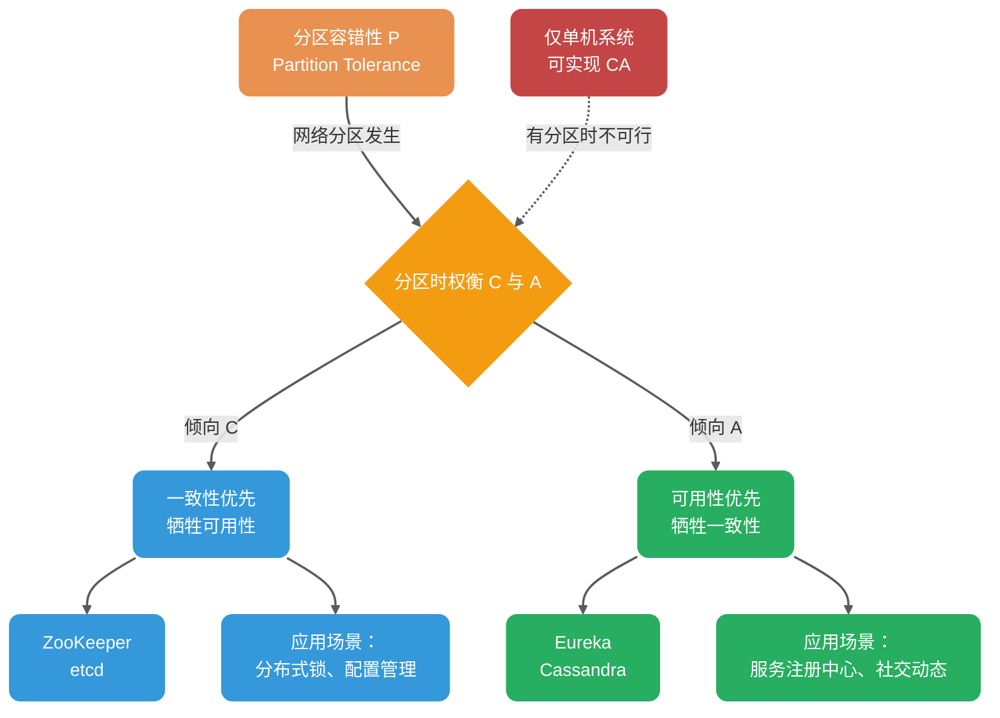

这里需要引入 **PACELC 理论**（CAP 的扩展）来更全面地解释：

Daniel J. Abadi 提出的 PACELC 理论指出：**如果存在分区（P），必须在可用性（A）和一致性（C）之间选择；否则（E，Else），必须在延迟（L）和一致性（C）之间选择。**

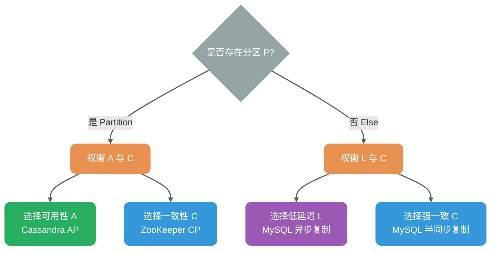

实际意义：即使无网络分区，分布式系统仍需在低延迟（异步复制）和强一致（同步复制）之间权衡。例如：

- **Cassandra**：可通过调整读写一致性级别（ONE/QUORUM/ALL）在延迟与一致性间权衡
- **MySQL 主从**：可选择异步复制（低延迟）或半同步复制（强一致）

比如 ZooKeeper、HBase 就是 CP 架构，Cassandra、Eureka 就是 AP 架构，Nacos 不仅支持 CP 架构也支持 AP 架构。

**选择 CP 还是 AP 的关键在于当前的业务场景，没有定论**：比如对于需要确保强一致性的场景如分布式锁、配置管理会选择 CP；对于高可用优先的场景如微服务注册中心会选择 AP。

**另外，需要补充说明的一点**：在无分区时，可以同时做到线性一致与「会响应」的 CAP-可用性；但工程上通常还要在延迟与一致性之间权衡（这便是 PACELC 理论中 ELC 部分讨论的内容）。

### CAP 理论的适用范围

**重要结论**：CAP 理论主要讨论单个数据对象在副本复制场景下的一致性与可用性权衡。

| 更贴近 CAP 讨论模型 | 需要拆分到分片/对象/操作级别分析     |
| ------------------- | ------------------------------------ |
| Redis 主从/哨兵集群 | 业务系统（无状态服务）               |
| MySQL 主从/多主集群 | Redis-Cluster（每个 shard 仍有副本） |
| MongoDB 副本集      | MongoDB-Cluster（分片 + 副本并存）   |
| ZooKeeper、etcd     | 分库分表（跨分片事务需额外协调）     |
| Kafka、RocketMQ     | 大多数微服务应用\*                   |

**说明**：

- **CAP 讨论模型**：单个读写寄存器（single register）的副本复制语义
- **复杂系统**：需要拆解到「每个对象/分区/操作」的一致性语义讨论
- **分片 + 副本**：分片系统每个 shard 通常仍有副本复制，一致性与可用性权衡仍在

> **业务系统与 CAP 的深度关联**：
>
> 业务系统本身虽不涉及副本同步，但**深受底层组件 CAP 属性的影响**。忽视这一点会导致系统在遭遇网络分区时发生级联雪崩（Cascading Failure）。
>
> **受 CAP 属性影响的业务场景**：
>
> | 业务场景 | 底层组件                     | CP 组件的影响              | AP 组件的影响                  |
> | -------- | ---------------------------- | -------------------------- | ------------------------------ |
> | RPC 路由 | 注册中心（如 Nacos CP 模式） | 注册期间不可用，请求被拒绝 | 可能路由到已下线实例，需要重试 |
> | 分布式锁 | Redis（AP）/ ZooKeeper（CP） | 性能较低但可靠             | 性能高但可能锁失效             |
> | 限流熔断 | Redis 计数器                 | 可能读到旧计数，限流失效   | 同左                           |
> | 缓存更新 | Redis 主从                   | 主从切换时可能丢数据       | 同左                           |
> | 消息消费 | Kafka                        | 消费进度同步慢，重复消费   | 同左                           |
>
> **实践建议**：业务开发者虽然不需要「实践」CAP 理论，但**必须理解 CAP 理论**，以便：
>
> - 为不同业务场景选择合适的组件（CP 或 AP）
> - 理解所选组件在网络分区时的行为特征
> - 设计符合业务需求的容错机制（重试、熔断、降级）

很多开发者认为自己在「实践 CAP 理论」，实际上只是站在已有组件上做选择（用 CP 还是 AP），而非真正实践该理论。真正需要实践 CAP 的是研发 Redis、MySQL 这类分布式存储组件的工程师。

### 在业务中应用 CAP 思想

除研发分布式存储组件外，业务开发中更多是**选择**合适的架构，而非实践 CAP 理论本身：

| 场景           | 偏向 CP 的选择               | 偏向 AP 的选择           | 业务权衡                 |
| -------------- | ---------------------------- | ------------------------ | ------------------------ |
| 数据库主从复制 | 同步复制（强一致）           | 异步复制（高性能）       | 数据一致性 vs 响应速度   |
| 分布式锁实现   | ZooKeeper（强一致）          | Redis（高性能）          | 锁的可靠性 vs 获取速度   |
| 服务注册中心   | ZooKeeper、Consul（CP 模式） | Eureka、Nacos（AP 模式） | 注册准确性 vs 发现可用性 |
| 限流计数器     | Redis（强一致命令）          | Redis（允许过期）        | 限流精度 vs 性能         |

**选型原则**：

- **关注性能**：倾向选择允许异步复制的组件，写入主节点即可返回成功，响应快；但存在数据丢失/读取到旧数据的风险，需配合重试机制
- **关注数据安全**：倾向选择要求多数派确认的组件，写入需等待 quorum 节点确认，响应慢；但能降低数据丢失风险

**注意**：数据丢失与否更取决于持久化、复制确认策略、故障模型，不能简单地用「CP/AP 标签」来判断。

**级联雪崩案例**：

一个典型的忽视 CAP 导致的级联雪崩场景：

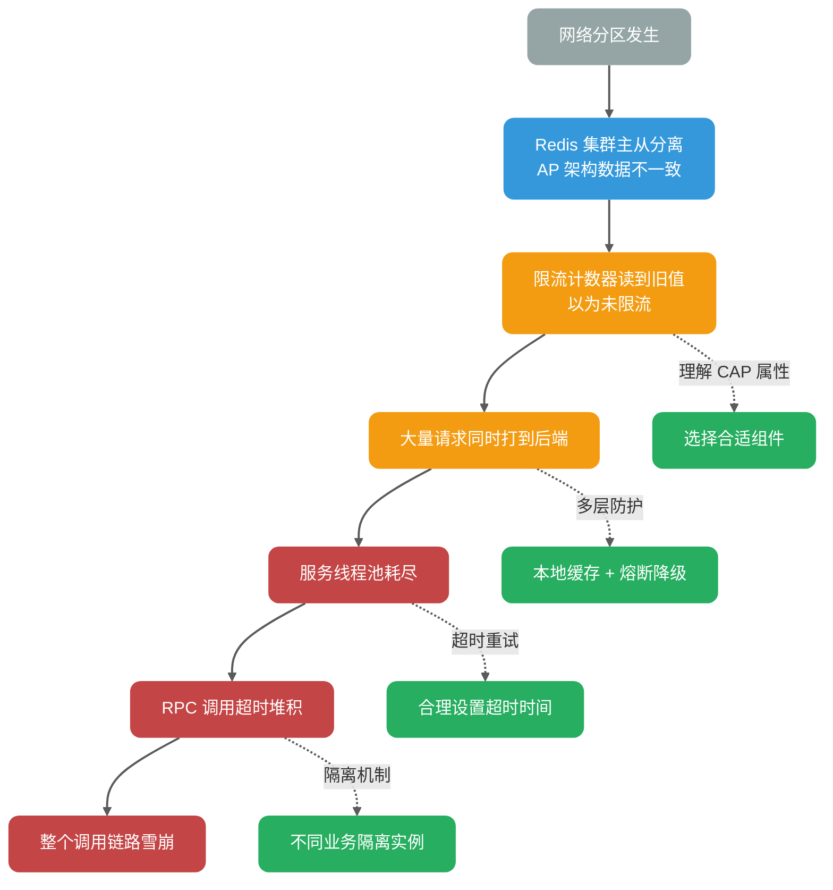

**防护措施**：

1. **理解底层组件的 CAP 属性**：知道在网络分区时组件的行为
2. **多层防护**：不只依赖单一组件，结合本地缓存、熔断、降级
3. **超时与重试**：合理设置超时时间，避免无限等待
4. **隔离机制**：不同业务使用不同的底层组件实例，避免故障扩散

### CAP 实际应用案例

我这里以注册中心来探讨一下 CAP 的实际应用。考虑到很多小伙伴不知道注册中心是干嘛的，这里简单以 Dubbo 为例说一说。

下图是 Dubbo 的架构图。**注册中心 Registry 在其中扮演什么角色呢？提供了什么服务呢？**

注册中心负责服务地址的注册与查找，相当于目录服务，服务提供者和消费者只在启动时与注册中心交互，注册中心不转发请求，压力较小。


常见的可以作为注册中心的组件有：ZooKeeper、Eureka、Nacos...。

#### ZooKeeper 3.8.x（CP 架构）

ZooKeeper 倾向 **CP 架构**。ZooKeeper 3.x 通过 ZAB 协议提供 **Linearizable Writes（线性化写入）**，但读取行为需区分：

- **Sync 读取**：强制与 Leader 同步，保证线性一致性（Linearizability）。
- **普通读取**：默认提供 **顺序一致性（Sequential Consistency）**，保证全局更新操作的顺序，同一会话内客户端视图绝不会发生回退，但可能读到稍旧数据（存在读取滞后）。

> **重要区别**：顺序一致性 ≠ 最终一致性。ZooKeeper 的普通读取保证所有客户端看到相同的**更新顺序**（全局 zxid 顺序），只是存在读取滞后；而最终一致性不保证全局顺序，仅保证最终收敛。ZK 的默认读更像是「stale-but-ordered」的读（顺序/会话保证很强），而不是 Dynamo 系那种 eventual consistency 语境。

在 Leader 选举期间或 Follower 节点数不足 Quorum（N/2+1）时，ZooKeeper 会拒绝服务以维持一致性，表现为不可用（牺牲 A）。

在多节点部署下，集群采用 Quorum 模式：多数派节点（n/2+1）必须同意变更才有效。

ZooKeeper 提供 Watcher 机制（异步通知变更）和版本号机制（zxid 校验新鲜度）以缓解读取滞后问题。

失败路径与状态机表现：

| 故障场景                        | 系统状态                        | 客户端表现                                                   |
| ------------------------------- | ------------------------------- | ------------------------------------------------------------ |
| Quorum 失效（半数以上节点故障） | **LOOKING** 状态，Leader 选举中 | 写入请求拒绝，读取请求可能返回旧数据或超时                   |
| Follower 与 Leader 分区         | Follower 进入 **ELECTION** 状态 | 该 Follower 无法参与投票，但可响应读取（滞后数据）           |
| Leader 与多数派分区             | Leader 自动降级，集群重新选举   | 原Leader的写入丢失，需客户端重试（检测到 zxid 回退）         |
| Watcher 丢失                    | 网络抖动或 GC 压力导致          | 客户端需重试（指数退避 + Jitter），监控 `Watches` 队列防背压 |

#### Eureka（AP 架构）

Eureka 采用 AP 架构：节点对等，通过 Peer 复制/同步（定期全量拉取 + 增量更新）保持数据一致，无 Leader 选举。**注意**：Spring Cloud 生态中历史上更常见 1.x 依赖形态；Netflix/eureka 的 2.x 仍在维护并持续发布。

失败路径与状态机表现：

| 故障场景                     | 系统状态                                 | 客户端表现                                                                                      | 自我保护机制                                                          |
| ---------------------------- | ---------------------------------------- | ----------------------------------------------------------------------------------------------- | --------------------------------------------------------------------- |
| 网络分区（脑裂）             | 分区两侧**独立运行**，均可读写           | 客户端可能读到旧注册信息（不一致窗口 = 心跳间隔 30s + gossip 传播延迟，10 节点拓扑中 P99 <60s） | 当续约阈值 < 85% 时触发**自我保护**，暂停实例剔除，避免“误杀”健康实例 |
| 半数节点故障                 | 剩余节点继续服务，但数据可能分叉         | 读操作正常，写入可能仅存于少数派节点                                                            | 自我保护触发，待节点恢复后通过 gossip 自动合并                        |
| 节点短暂重启                 | 从 Peer 批量拉取注册表（Registry Fetch） | 服务发现短暂不可用（< 1min），缓存起作用                                                        | 正常模式，自动恢复                                                    |
| 注册风暴（大量实例同时注册） | 写队列堆积，可能导致请求丢弃             | 部分注册请求超时，需客户端重试                                                                  | 可配置限流与背压（如 Ribbon 重试策略）                                |

**自我保护机制详细说明**：

Eureka Server 通过以下逻辑判断是否进入自我保护：

```
每分钟期望续约数 E = 当前实例数 N × (60 / 心跳间隔秒数)
阈值 T = E × 0.85
若最近 1 分钟实际续约数 R < T，则进入自我保护：暂停剔除（eviction）
（E/T 会按固定周期根据 N 更新，常见周期约 15 分钟）
```

默认心跳间隔为 30 秒时，每分钟期望续约数 = 实例数 × 2。

当 `实际续约率 < 85%` 时：

1. 进入 **SELF PRESERVATION** 模式
2. 停止剔除过期实例（EvictionTask 暂停）
3. 日志输出：`ENTER SELF PRESERVATION MODE`

**设计权衡**：宁可保留「僵尸」实例，也不误杀健康实例——因为在微服务场景下，短暂的服务降级好过大规模服务不可用。客户端通常配置重试与熔断来处理不可用实例。

#### 总结

选择 CP 或 AP 取决于场景：ZooKeeper 适合强一致需求，如配置管理；Eureka 适合高可用注册，如微服务发现。

Nacos 不仅支持 CP 也支持 AP。

### 总结

CAP 理论指导我们：在分布式系统可能出现网络分区（P）的前提下，我们必须在强一致性（C）和高可用性（A）之间做出权衡。

- **CP 架构**：牺牲可用性，保证强一致性。适用于对数据一致性要求极高的场景（如金融交易、分布式锁）。
- **AP 架构**：牺牲一致性，保证高可用性。适用于对系统可用性要求较高，能容忍短暂数据不一致的场景（如社交动态、商品搜索）。
- **PACELC**：在无分区（E）时，需在延迟（L）和一致性（C）之间权衡。

### 推荐阅读

1. [CAP 定理简化](https://medium.com/@ravindraprasad/cap-theorem-simplified-28499a67eab4) （英文，有趣的案例）
2. [神一样的 CAP 理论被应用在何方](https://juejin.im/post/6844903936718012430) （中文，列举了很多实际的例子）
3. [请停止呼叫数据库 CP 或 AP](https://martin.kleppmann.com/2015/05/11/please-stop-calling-databases-cp-or-ap.html) （英文，带给你不一样的思考）

## BASE 理论

[BASE 理论](https://dl.acm.org/doi/10.1145/1394127.1394128)起源于 2008 年，由 eBay 的架构师 Dan Pritchett 在 ACM 上发表，论文标题为《Base: An ACID Alternative》。

> **关键洞察**：从论文标题可以看出，**BASE 首先是 ACID 的替代品**。但同时需要注意，BASE 与 CAP 理论也存在密切关系——**最终一致性正是 CAP 中 AP 架构在工程实践中达到系统收敛的指导原则**。

### 简介

**BASE** 是 **Basically Available（基本可用）**、**Soft-state（软状态）** 和 **Eventually Consistent（最终一致性）** 三个短语的缩写。BASE 理论来源于对大规模互联网系统分布式实践的总结。

### BASE 与 ACID 的关系

要理解 BASE 理论，首先需要回顾 ACID 理论中的 **一致性（Consistency）**：

**ACID 的一致性定义**：事务执行前后，数据库只能从一个一致状态转变为另一个一致状态。

以转账为例：小竹向熊猫转账 1000W。

- **初始态**：小竹 1001W，熊猫 888W，合计 1889W
- **结果态**：小竹 1W，熊猫 1888W，合计 1889W

无论事务成功或失败，整体数据的变化必须一致——类似于能量守恒定律。

**分布式场景的挑战**：

在分布式系统中，商品服务和订单服务分离部署，[扣减库存、创建订单]需要通过网络调用，这中间必然存在时间差：

```
时刻 T1：库存 8888 → 8887（扣减成功）
时刻 T2：网络调用订单服务...
时刻 T3：订单创建成功
```

在 T1~T3 期间，系统处于 **中间态**：库存已减，订单未创建。跨服务后无法用单库 ACID 事务保证整体原子提交与隔离，系统会客观存在中间态；BASE 接受中间态并通过补偿/重试让状态最终收敛。

**BASE 理论的解决方案**：

BASE 理论承认并允许这种中间态的存在：

- **Soft-state（软状态）**：允许系统存在中间态，且该中间态不影响系统整体可用性
- **Eventually consistent（最终一致性）**：中间态最终会演变成终态（要么成功，要么回滚）

下面通过一个对比图来直观理解 ACID 和 BASE 在事务处理上的不同模式：

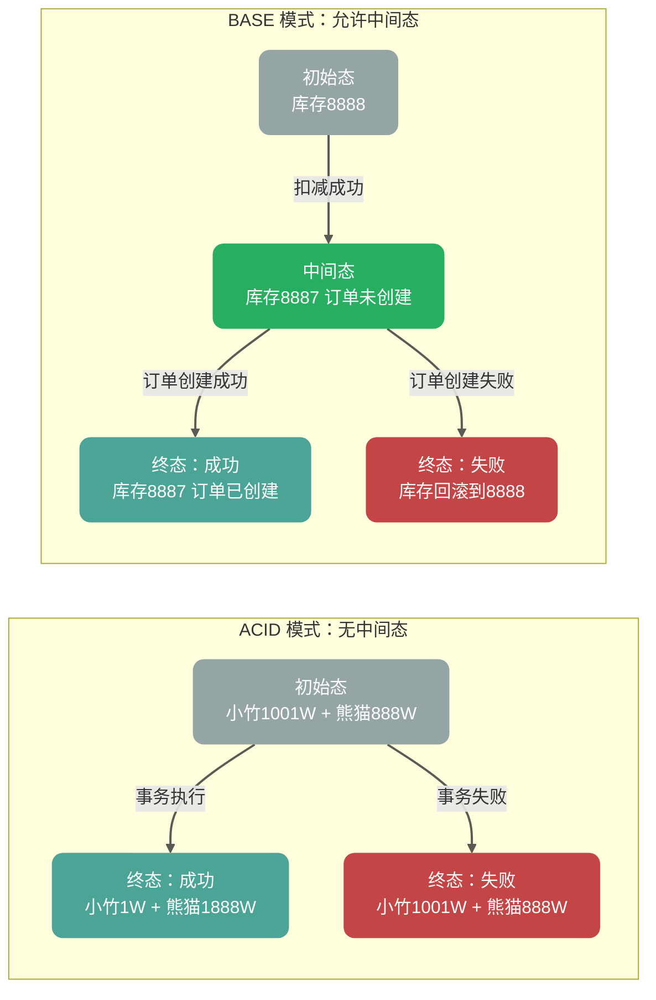

因此，**BASE 理论是 ACID 在分布式场景中的替代品**，而非 CAP 理论的补充。

### BASE 理论三要素


#### 基本可用

基本可用是指分布式系统在出现不可预知故障的时候，允许损失部分可用性。但是，这绝不等价于系统不可用。

**什么叫允许损失部分可用性呢？**

- **响应时间上的损失**：正常情况下，处理用户请求需要 0.5s 返回结果，但是由于系统出现故障，处理用户请求的时间变为 3s。
- **系统功能上的损失**：正常情况下，用户可以使用系统的全部功能，但是由于系统访问量突然剧增，系统的部分非核心功能无法使用。

#### 软状态

软状态（Soft State）是指允许系统中的数据存在中间状态，并认为该中间状态的存在不会影响系统的整体可用性。

> **与 ACID 的区别**：ACID 理论要求事务执行后立即进入终态（成功或失败），不允许中间态；而 BASE 理论承认中间态是分布式系统的客观存在，只要中间态最终会演变成终态即可。

举例说明：

- **ACID 模式**：银行转账事务中，扣款和入账必须同时成功或同时失败，不允许「扣款成功但入账未完成」的中间态
- **BASE 模式**：电商下单事务中，允许「库存已减但订单未创建」的中间态存在，只要最终会达到一致（要么订单创建成功，要么库存回滚）

#### 最终一致性

最终一致性（Eventual Consistency）强调：**若系统在一段时间内无新的更新操作，则所有副本最终收敛到相同值。**

需要注意的是，「最终一致性」这个词在两个不同语境下有不同含义：

| 语境                           | 含义                     | 典型场景                   |
| ------------------------------ | ------------------------ | -------------------------- |
| **副本式存储（CAP 语境）**     | 数据副本最终同步一致     | Cassandra 数据复制         |
| **事务状态（BASE/ACID 语境）** | 事务中间态最终演变成终态 | 分布式事务（如 TCC、Saga） |

**副本式存储的最终一致性**：

「一段时间」是未界定的——可能是毫秒级（局域网同步）或分钟级（跨地域复制）。生产环境中需通过 **Read Repair（读修复）**、**Anti-Entropy（反熵/后台同步）** 或 **Quorum 写入** 主动加速收敛。

**事务状态的最终一致性**：

以分布式事务为例：[扣减库存、创建订单、扣减余额]

- 时刻 T1：库存已减（中间态）
- 时刻 T2：订单已创建（中间态）
- 时刻 T3：余额已扣（终态：事务成功）

或在失败场景：

- 时刻 T1：库存已减（中间态）
- 时刻 T2：订单创建失败（触发回滚）
- 时刻 T3：库存回滚（终态：事务失败）

系统会保证在一定时间内达到数据一致的状态，而不需要实时保证系统数据的强一致性。

分布式一致性的 3 种级别：

1. **强一致性**：系统写入了什么，读出来的就是什么。
2. **弱一致性**：不一定可以读取到最新写入的值，也不保证多少时间之后读取到的数据是最新的，只是会尽量保证某个时刻达到数据一致的状态。
3. **最终一致性**：弱一致性的升级版，系统会保证在一定时间内达到数据一致的状态。

**业界比较推崇最终一致性级别，但是某些对数据一致要求十分严格的场景比如银行转账还是要保证强一致性。**

那实现最终一致性的具体方式是什么呢？

- **读时修复（Read Repair）**：在读取数据时，检测数据的不一致，进行修复。适合读多写少场景。
- **写时修复（Hinted Handoff）**：在写入数据时，如果目标节点不可用，将数据缓存下来，待节点恢复后重传。**写时修复** 优化了写入延迟，但增加了读取时的不一致风险（数据可能还在缓存队列中未落盘到目标节点）。
- **异步修复（Anti-Entropy/反熵）**：通过后台比对副本数据差异并修复。工程实现中关键挑战是**高效检测数据差异**——暴力逐条比对（O(n)）在大规模数据集下不可行，生产系统采用**默克尔树（Merkle Tree）**实现低开销差异定位。

**选择建议**：

- **写时修复**：适合写多读少，优化写入性能，但牺牲一致性窗口。
- **读时修复**：适合读多写少，保证读取数据的准确性。
- **Anti-Entropy**：后台兜底保障，适合数据规模大但对最终一致性要求高的场景。

### 为什么很多人把 BASE 当作 CAP 的补充？

这是一个**部分正确但表述不够精确**的说法。更准确的理解是：

1. **BASE 首先是 ACID 的替代品**：从论文标题[《Base: An ACID Alternative》](https://spawn-queue.acm.org/doi/10.1145/1394127.1394128)可以看出，BASE 理论的初衷是解决分布式事务场景下 ACID 过于严格的问题。

2. **BASE 与 CAP 的 AP 架构存在内在联系**：

   - 选择 AP 架构意味着放弃强一致性（C）
   - 放弃强一致性后，系统如何达到收敛？答案是**最终一致性**
   - 因此，BASE 理论（特别是最终一致性）是 AP 架构在工程实践中**必须采用**的指导原则

3. **误解产生的根源**：很多人把“BASE 与 AP 相关”误解为“BASE 是 CAP 的补充”。实际上：
   - **BASE 不是对 CAP 理论的补充或修正**
   - **BASE 是 AP 架构选择的工程实践指南**——当你选择了 AP，BASE 告诉你如何在工程实践中让系统最终达到一致

**正确的理解**：

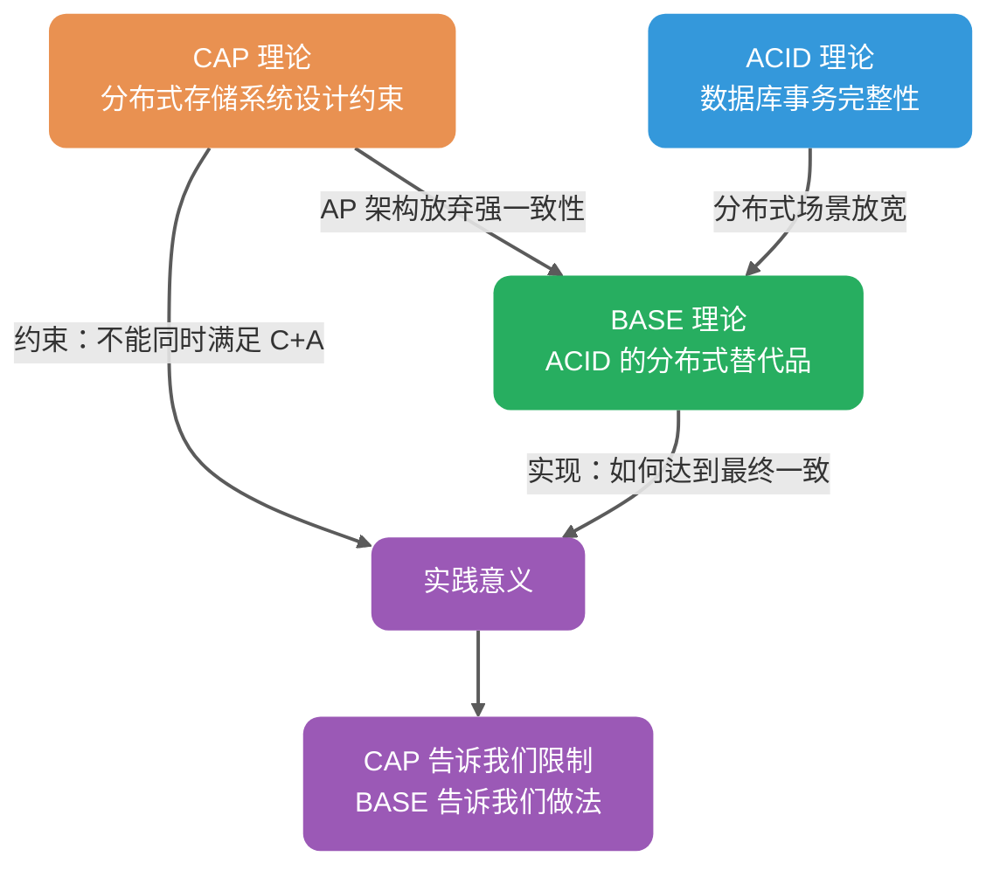

| 维度       | CAP 理论                 | BASE 理论                                        |
| ---------- | ------------------------ | ------------------------------------------------ |
| 关注领域   | 分布式存储系统（带副本） | 所有分布式系统                                   |
| 一致性含义 | 数据一致性（副本同步）   | 状态一致性（事务终态）                           |
| 可用性含义 | 节点故障时系统可用       | 部分节点故障时部分功能可用                       |
| 核心关系   | -                        | ① ACID 的分布式替代品<br>② AP 架构的工程实践指南 |

> **实践意义**：CAP 告诉我们在 AP 架构下无法保证强一致性，BASE 告诉我们在 AP 架构下如何通过最终一致性让系统达到收敛——两者是**约束与实现**的关系，而非补充关系。

如果说 CAP 是分布式存储系统的设计约束（告诉我们不能做什么），那么 BASE 就是分布式系统（尤其是业务系统）的实践指导（告诉我们如何做）——它告诉我们：**绝大多数应用场景不需要强一致性，通过接受中间态并最终达到一致性，是更务实的选择。**

### 总结

**ACID 是数据库事务完整性的理论，CAP 是分布式存储系统的设计理论，BASE 是 ACID 在分布式场景中的替代品，同时也是 AP 架构的工程实践指南。**

> **关键对应关系**：
>
> - **CAP 的一致性** = 数据一致性（副本节点间的数据同步）
> - **BASE 的一致性** = 状态一致性（事务终态的一致）= ACID 的一致性
> - **CAP 的可用性** = 主从集群的可用性（节点故障时系统仍可用）
> - **BASE 的可用性** = 分片式集群的可用性（部分节点故障只影响部分用户）
> - **CAP 与 BASE 的关系**：选择 AP 架构后，BASE 理论指导如何在工程实践中通过最终一致性达到系统收敛

<!-- @include: @article-footer.snippet.md -->


---

<!-- source: 协议/Gossip 协议详解-反熵、谣言传播、SWIM 与最终一致性.md -->

---
title: Gossip 协议详解：反熵、谣言传播、SWIM 与最终一致性
category: 分布式
description: Gossip 协议详解，讲解去中心化信息传播模型、反熵、谣言传播、Push/Pull 模式、SWIM 协议、最终一致性，以及在 Redis Cluster、Cassandra 等系统中的应用。
tag:
  - 分布式协议与算法
  - 数据复制协议
  - 最终一致性
head:
  - - meta
    - name: keywords
      content: Gossip 协议,SWIM 协议,反熵,谣言传播,最终一致性,去中心化,Redis Cluster,Cassandra,分布式协议,分布式算法
---

## 背景

在分布式系统中，不同节点间共享状态是一个基本需求。

一种简单的方法是 **集中式广播**：由中心节点向所有其他节点同步信息。这种方式适合中心化系统，但存在明显缺陷：当节点数量增加时，同步效率下降（O(N) 复杂度），且过度依赖中心节点，存在单点故障风险。

**分散式传播** 的 **Gossip 协议** 提供了一种去中心化的替代方案。

如果你还不清楚 Leader/Quorum 和 Gossip 分别适合解决什么问题，可以先看 [分布式协调详解](./分布式协调详解-Leader、Quorum、Lease、Fencing Token 与 Gossip.md)。这篇 Gossip 文章只展开“状态如何传播并最终收敛”，不负责解释 Leader 选举、脑裂和 Fencing Token 这类强协调问题。


## Gossip 协议介绍

**Gossip**（闲话协议）也称 **Epidemic 协议**（流行病协议），灵感来源于流行病传播的随机特性。其核心思想是：每个节点周期性地随机选择若干其他节点交换信息，使数据像病毒传播一样扩散至整个网络。


Gossip 协议最早由 Demers 等人在 1987 年的论文 [《Epidemic Algorithms for Replicated Database Maintenance》](https://dl.acm.org/doi/10.1145/41840.41841) 中提出，用于解决分布式数据库的副本同步问题。

**定义**：Gossip 协议是一种**去中心化**的通信协议，通过节点间的随机信息交换，在**非拜占庭且不存在永久网络分区**、节点持续周期性交换的前提下，使集群内所有节点的状态达到**最终一致性**。

> **重要区分**：Gossip 是信息传播协议，**不是共识算法**（如 Raft/Paxos）。共识算法保证强一致性与安全性，Gossip 只保证最终一致性，不适用于选主或状态机复制等需要强一致的场景。

**关键特性**：

- **去中心化**：无中心节点，所有节点地位平等
- **容错性强**：容忍节点宕机、网络分区、动态增删节点
- **概率收敛**：在均匀随机选点、fanout 为常数的经典模型下，传播轮次期望为 O(log N)（如 N=100 时约 5-7 轮，具体取决于 fanout 与丢包率）
- **消息冗余**：同一消息可能被多次接收，需去重机制

## Gossip 协议应用

Gossip 协议被广泛应用于分布式系统：

- **Redis Cluster**：用于节点间状态同步与故障检测
- **Apache Cassandra**：用于节点成员与状态信息传播；副本修复采用反熵/repair（基于 Merkle Tree）
- **Consul**：用于成员发现、故障探测与事件广播（基于 SWIM 协议）
- **Amazon Dynamo**：用于分布式存储的最终一致性

以 **Redis Cluster**（3.0+）为例：

Redis Cluster 是一个去中心化的分布式缓存方案，各节点通过 Gossip 协议交换集群状态，包括：节点信息、槽位分配、节点状态（在线/PFAIL/FAIL）。


**Gossip 消息类型**：

| 消息类型 | 用途                        |
| -------- | --------------------------- |
| MEET     | 将指定节点添加进集群        |
| PING     | 周期性发送，交换节点状态    |
| PONG     | 响应 PING，携带自身状态信息 |
| FAIL     | 广播节点故障标记            |

> 注：在实现上，MEET/PING/PONG 共享同一类消息结构；PONG 是对 PING/MEET 的响应，MEET 相当于“强制握手”的 PING。

**故障检测流程**：

1. 节点 A 若在 `cluster-node-timeout`（常见为 15s，具体以配置为准）内未收到 B 的响应，将 B 标记为 **PFAIL**（疑似下线）
2. 若 A 收到其他主节点对 B 的 PFAIL 报告，且**半数以上的主节点**确认 B 为 PFAIL（报告未过期），则 A 将 B 标记为 **FAIL**（已下线）并向集群广播

下图就是主从架构的 Redis Cluster 的示意图，图中的虚线代表的就是各个节点之间使用 Gossip 进行通信，实线表示主从复制。


> 注：Redis Cluster 主要通过 PING/PONG 的增量 gossip 传播节点/槽位/故障信息（带时间戳/标志位等），而不是采用像 Dynamo 那样基于 Merkle tree 的反熵对账流程。

关于 Redis Cluster 的详细介绍，可以查看这篇文章 [Redis 集群详解](https://javaguide.cn/数据库/redis/redis-cluster.html)。

## Gossip 协议传播模式

Gossip 协议有两种主要传播模式：**反熵** 和 **谣言传播**。

### 反熵

**定义**：节点间交换**完整数据**（或数据摘要），消除差异，实现最终一致。

**熵**的物理含义是系统混乱程度；反熵即**降低节点间数据差异，提升一致性**。

根据维基百科：

> 熵的概念最早起源于[物理学](https://zh.wikipedia.org/wiki/物理学)，用于度量一个热力学系统的混乱程度。熵最好理解为不确定性的量度而不是确定性的量度，因为越随机的信源的熵越大。

在这里，你可以把反熵中的熵理解为节点之间数据的混乱程度/差异性，反熵就是指消除不同节点中数据的差异，提升节点间数据的相似度，从而降低熵值。

**三种实现方式**：

| 方式      | 描述                               | 适用场景       |
| --------- | ---------------------------------- | -------------- |
| Push      | 发送方将自己的全部数据推送给接收方 | 发送方有新数据 |
| Pull      | 接收方拉取发送方的全部数据         | 接收方数据陈旧 |
| Push-Pull | 双向交换数据，并比较差异           | 最高效，最常用 |


伪代码如下：


**收敛特性**：在均匀随机选点、fanout 为常数的模型下，期望 O(log N) 轮覆盖全部节点（常见估算可用 log₂N 量级）

部分系统（如 InfluxDB）采用**确定性闭环调度**（如环形拓扑）代替随机选择，可在确定轮次内完成同步。这属于反熵的**工程衍生实现**，而非标准 Gossip 协议的核心机制。确定性调度牺牲了随机性的容错优势，换取可预测的收敛时间。


1. 节点 A 推送数据给节点 B，节点 B 获取到节点 A 中的最新数据。
2. 节点 B 推送数据给 C，节点 C 获取到节点 A，B 中的最新数据。
3. 节点 C 推送数据给 A，节点 A 获取到节点 B，C 中的最新数据。
4. 节点 A 再推送数据给 B 形成闭环，这样节点 B 就获取到节点 C 中的最新数据。

**权衡**：闭环调度可在确定时间内完成同步，但牺牲了**容错性**（环中节点故障影响传播路径），且难以适应节点动态增删。

**适用场景**：需要较低残留率（尽量不漏更新）、允许后台周期性对账修复；数据量大时必须依赖摘要/树等增量比对以控制成本。

> **生产级优化**：在大规模分布式存储（如 Cassandra、DynamoDB）中，节点数据量可达 TB 级，直接交换完整数据不现实。生产系统使用 **Merkle Tree（默克尔树）** 进行增量差异比对：两节点先交换 Merkle Tree 根哈希，若有差异则递归比对子树，在树高 O(log M) 的层级上定位差异（M 为该范围内条目数），随后仅传输增量数据。

### 谣言传播

**定义**：当节点有**新数据**时，变为活跃节点，周期性地向随机节点广播该数据，直到所有节点都收到。

**与反熵的区别**：

- 只传播**新增数据**（Delta），非完整数据
- 节点收到更新后进入活跃状态周期性传播，多次接触到已知该更新的节点后按策略（计数/概率/TTL）停止传播
- 适合**节点数量大**、**增量数据小**的场景

> **去重机制**：生产环境（如 Redis Cluster）通过**版本号**或**消息 ID** 去重，避免重复处理相同消息。

如下图所示（下图来自于[INTRODUCTION TO GOSSIP](https://managementfromscratch.wordpress.com/2016/04/01/introduction-to-gossip/) 这篇文章）：


伪代码如下：


**收敛特性**：在均匀随机选点、fanout 为常数的模型下，O(log N) 轮后以高概率覆盖全部节点。

**注意事项**：

- 控制消息包大小，尽量避免分片（视路径 MTU 而定，通常控制在单个网络包内）
- 配合去重机制（如消息 ID、版本号）
- 避免高频更新导致消息风暴
- 使用 **Jitter（随机抖动）**打散同步时间，避免多节点同时发起传播造成雪崩


### 总结

| 要点     | 反熵                       | 谣言传播                   |
| -------- | -------------------------- | -------------------------- |
| 传播内容 | 完整数据（或摘要）         | 仅新增数据（Delta）        |
| 适用场景 | 节点数量适中               | 节点数量较多/动态变化      |
| 消息开销 | 较大                       | 较小                       |
| 收敛范围 | 收敛到最新数据（全量同步） | 收敛到已知数据（增量传播） |

## Gossip 协议优势与缺陷

**优势**：

1. **实现简单**：协议逻辑简单，易于理解

2. **容错性强**：容忍节点宕机、网络分区、动态增删节点。新增或重启的节点在理想情况下最终一定会和其他节点的状态达到一致。

3. **扩展性好**：收敛时间为 O(log N)，当 N 较大（如 N > 100）时，并行传播通常比中心节点单播更快（后者需 O(N) 轮次）。在典型 rumor spreading 模型下代价是**消息总量为 O(N log N)**（具体取决于实现策略与停止条件），存在冗余开销。

**缺陷**：

1. **最终一致**：消息需通过多轮传播才能覆盖整个网络，存在不一致窗口期。达到一致的具体时间取决于网络状况、gossip 间隔（**视实现配置而定，常见 100ms-1s**）与节点规模。

2. **不适用拜占庭环境**：Gossip 协议的设计假设是非拜占庭环境，不处理恶意节点的情况（节点不会伪造或篡改消息）。

3. **消息冗余**：由于传播的随机性，同一节点可能重复收到相同消息，需配合去重机制。

## 总结

- Gossip 协议是一种**去中心化**的通信协议，通过节点间的随机信息交换，使集群内所有节点的状态达到**最终一致性**
- **不是共识算法**：Gossip 不保证强一致性/线性一致性，不能用于选主或状态机复制；共识算法（Raft/Paxos）才保证安全性与线性一致
- 核心特性：去中心化、容错性强、O(log N) 收敛
- 两种传播模式：**反熵**（完整数据/摘要）、**谣言传播**（增量数据）
- 典型应用：元数据传播（Redis Cluster）、最终一致存储（Cassandra/DynamoDB）
- 权衡：简单性与容错性 vs 最终一致延迟与消息冗余

## 参考

- [Epidemic Algorithms for Replicated Database Maintenance](https://dl.acm.org/doi/10.1145/41840.41841) - Demers et al., 1987
- [Amazon Dynamo: All Things Distributed](https://www.allthingsdistributed.com/files/amazon-dynamo-sosp2007.pdf) - DeCandia et al., 2007
- [Redis Cluster Specification](https://redis.io/docs/management/scaling/)
- 一万字详解 Redis Cluster Gossip 协议：<https://segmentfault.com/a/1190000038373546>
- 《分布式协议与算法实战》
- 《Redis 设计与实现》

<!-- @include: @article-footer.snippet.md -->


---

<!-- source: 协议/Paxos 算法详解-Basic Paxos、Multi-Paxos、角色流程与 Raft 对比.md -->

---
title: Paxos 算法详解：Basic Paxos、Multi-Paxos、角色流程与 Raft 对比
category: 分布式
description: Paxos 算法详解，讲解 Proposer、Acceptor、Learner 三类角色，Basic Paxos 两阶段流程、Multi-Paxos 优化、算法难点和与 Raft 算法的对比。
tag:
  - 分布式协议与算法
  - 共识算法
head:
  - - meta
    - name: keywords
      content: Paxos,Paxos 算法,Basic Paxos,Multi-Paxos,Proposer,Acceptor,Learner,共识算法,分布式一致性,Raft 对比
---

## 背景

Paxos 算法是 Leslie Lamport（莱斯利·兰伯特）在 **1990** 年提出的一种分布式系统 **共识** 算法。这是最早被广泛认可的分布式共识算法之一（前提是不存在拜占庭将军问题，也就是没有恶意节点）。

为了介绍 Paxos 算法，兰伯特专门写了一篇幽默风趣的论文。在这篇论文中，他虚拟了一个叫做 Paxos 的希腊城邦来更形象化地介绍 Paxos 算法。

不过，审稿人并不认可这篇论文的幽默。于是，他们就给兰伯特说：“如果你想要成功发表这篇论文的话，必须删除所有 Paxos 相关的故事背景”。兰伯特一听就不开心了：“我凭什么修改啊，你们这些审稿人就是缺乏幽默细胞，发不了就不发了呗！”。

于是乎，提出 Paxos 算法的那篇论文在当时并没有被成功发表。

直到 1998 年，系统研究中心 (Systems Research Center，SRC）的两个技术研究员需要找一些合适的分布式算法来服务他们正在构建的分布式系统，Paxos 算法刚好可以解决他们的部分需求。因此，兰伯特就把论文发给了他们。在看了论文之后，这俩大佬觉得论文还是挺不错的。于是，兰伯特在 **1998** 年重新发表论文 [《The Part-Time Parliament》](http://lamport.azurewebsites.net/pubs/lamport-paxos.pdf)。

论文发表之后，各路学者直呼看不懂，言语中还略显调侃之意。这谁忍得了，在 **2001** 年的时候，兰伯特专门又写了一篇 [《Paxos Made Simple》](http://lamport.azurewebsites.net/pubs/paxos-simple.pdf) 的论文来简化对 Paxos 的介绍，主要讲述两阶段共识协议部分，顺便还不忘嘲讽一下这群学者。

《Paxos Made Simple》这篇论文就 14 页，相比于 《The Part-Time Parliament》的 33 页精简了不少。最关键的是这篇论文的摘要就一句话：


> The Paxos algorithm, when presented in plain English, is very simple.

翻译过来的意思大概就是：当我用无修饰的英文来描述时，Paxos 算法真心简单！

有没有感觉到来自兰伯特大佬满满地嘲讽的味道？

## 介绍

本文将 Paxos 分为两部分进行讲解：

- **Basic Paxos 算法**：描述多节点之间如何就单个值（value）达成共识。
- **Multi-Paxos 思想**：通过执行多个 Basic Paxos 实例，就一系列值达成共识。

共识算法的作用是让分布式系统中的多个节点对某个提案（proposal）达成一致。“提案”在不同系统里可指代的对象很广，如选主、事件排序等都可以是提案。

由于 Paxos 算法公认难以理解和实现，2013 年诞生了更易理解的 [Raft 算法](https://javaguide.cn/分布式/theorem&algorithm&protocol/raft-algorithm.html)。

**关于 Raft 与 Paxos 的关系**：从学术角度，Raft 并非 Paxos 的严格变体——两者在底层设计哲学（如日志空洞、Leader 权限）上存在本质差异。但从工程实践角度，Raft 的设计灵感源于 Multi-Paxos，可理解为“受 Multi-Paxos 启发的重新设计”。本文后文将详细对比二者区别。

针对非拜占庭场景（无恶意节点），除 Raft 外，**ZAB 协议**、**Fast Paxos** 等都是基于 Paxos 改进的共识算法。

针对拜占庭场景（存在恶意节点），通常使用 **工作量证明（PoW，Proof-of-Work）**、**权益证明（PoS，Proof-of-Stake）** 等共识算法，典型应用为区块链系统。

## Basic Paxos 算法

### 角色定义

Basic Paxos 中存在 3 个重要的角色：

1. **提议者（Proposer）**：也可以叫做协调者（coordinator），负责接受客户端请求并发起提案。提案信息通常包括提案编号（proposal ID）和提议的值（value）。
2. **接受者（Acceptor）**：也可以叫做投票员（voter），负责对提案进行投票，同时需要记住自己的投票历史。
3. **学习者（Learner）**：负责学习（learn）已被选定的值。在复制状态机（RSM）实现中，该值通常对应一条待执行的命令，由状态机按序 apply 后再由对外服务层返回结果。


**角色交互关系图**：

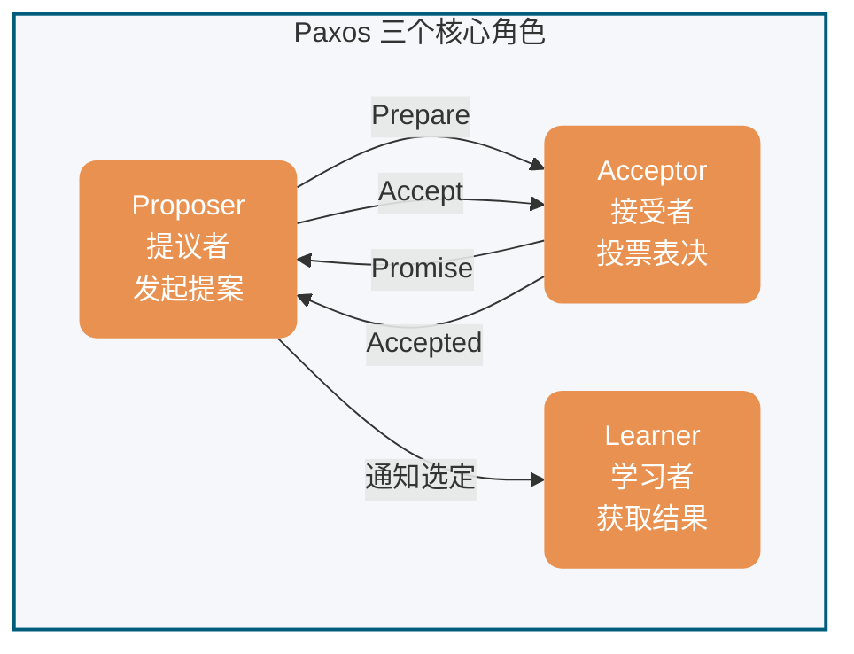

为了减少实现该算法所需的节点数，一个节点可以身兼多个角色。并且，一个提案被选定需要被半数以上的 Acceptor 接受。这样的话，Basic Paxos 算法还具备容错性，在少于一半的节点出现故障时，集群仍能正常工作。

### 执行流程

Basic Paxos 通过两个阶段达成共识：**Prepare/Promise（准备/承诺）阶段**和 **Accept/Accepted（接受/已接受）阶段**。

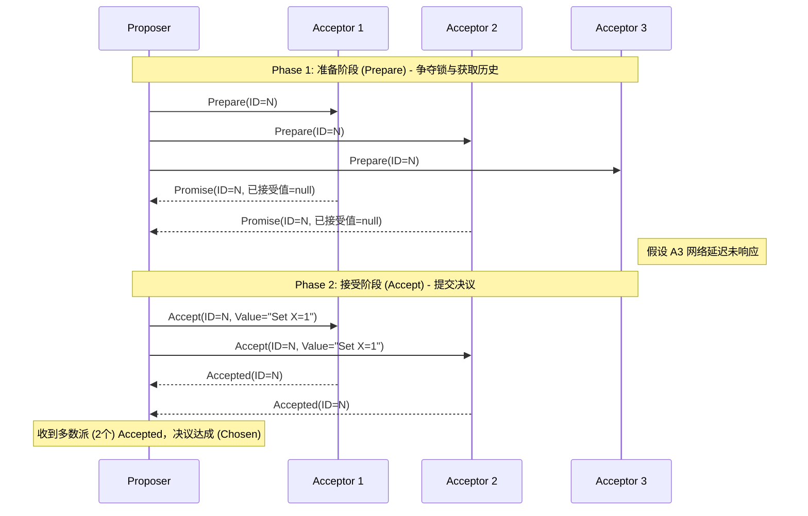

#### Phase 1: Prepare/Promise（准备/承诺阶段）

Proposer 选择一个提案编号 n（必须全局唯一且递增），向超过半数的 Acceptor 发送 `Prepare(n)` 请求。

**Acceptor 的处理逻辑**（对每个提案编号 n 的处理逻辑）：

- 若 n > 该 Acceptor 见过的最大提案编号 max_n
  - 返回 `Promise(n, max_v)`，其中 max_v 是之前接受过的最大编号提案的值（若有）
  - 承诺不再接受编号 < n 的提案
- 若 n ≤ max_n
  - 拒绝或忽略该请求

**目的**：让 Proposer 了解当前系统中已被接受或准备接受的提案，避免提出冲突的值。

#### Phase 2: Accept/Accepted（接受/已接受阶段）

当 Proposer 收到超过半数 Acceptor 的 Promise 响应后，选择响应中 max_v 最大的值（若无则任意选择一个值），向超过半数的 Acceptor 发送 `Accept(n, v)` 请求。

**Acceptor 的处理逻辑**：

- 若 n ≥ 该 Acceptor 在 Phase 1 承诺的 max_n
  - 接受该提案，记录 (n, v)，并返回 `Accepted(n, v)`
- 否则
  - 拒绝该请求

#### 收敛条件

当 Proposer 收到超过半数 Acceptor 对 `Accept(n, v)` 的响应时，提案 v 被**选定（chosen）**。Proposer 通知所有 Learner 提案已被选定。

### 安全性保证

Basic Paxos 保证以下安全性：

1. **一致性**：一旦某个值被选定，所有后续选定的值都是该值
2. **可终止性**：若无 Proposer 竞争且通信可靠，最终能选定一个值

**核心机制**：通过 Phase 1 收集 Promise，Proposer 只能选择已经被 Acceptors 承诺过的值（或选择新值），保证了不会有冲突的值被选定。

### 活性问题

Basic Paxos 存在**活锁（Livelock）**风险：

- 若多个 Proposer 同时发起提案，且提案编号交错递增
- 可能导致没有提案能获得超过半数的 Accept
- 系统陷入无限竞争，无法达成共识

**活锁示例**（Dueling Proposers）：

假设有两个 Proposer P1 和 P2 同时发起提案：

1. P1 发送 `Prepare(1)`，P2 发送 `Prepare(2)`
2. Acceptor 们承诺给编号较大的 P2
3. P1 发现编号被超越，发送 `Prepare(3)`
4. P2 发现编号被超越，发送 `Prepare(4)`
5. ... 循环往复，永远无法进入 Phase 2

**活锁时序图**：

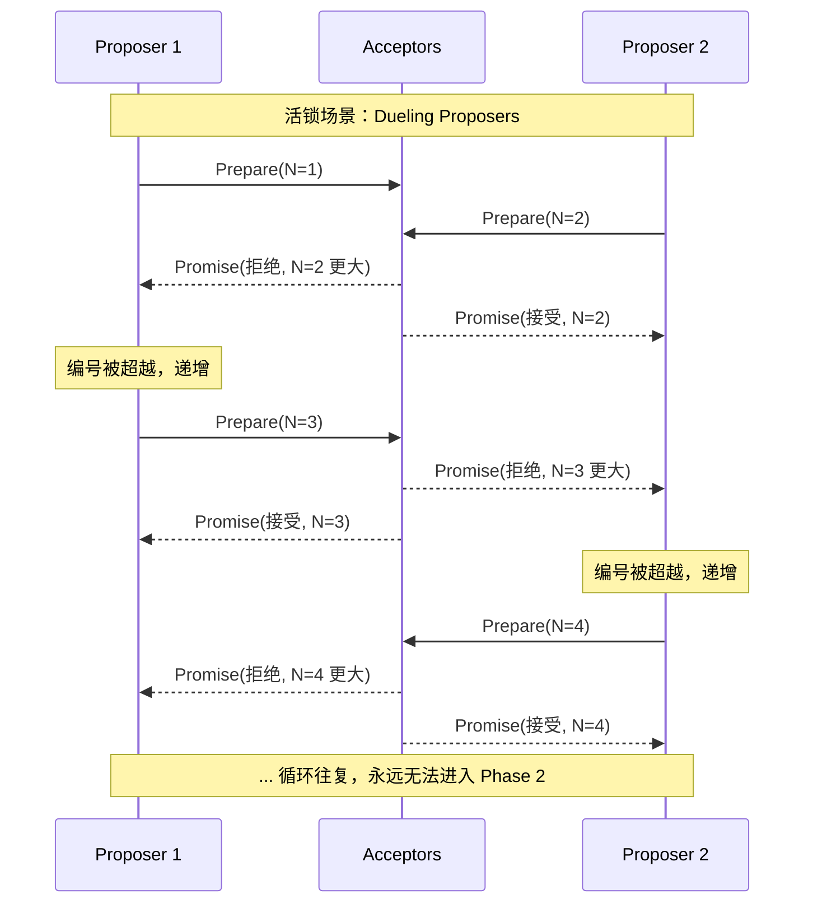

**解决方案**：通过 Multi-Paxos 引入稳定的 Leader 机制。

**随机退避算法（Randomized Exponential Backoff）**：

为防止多个 Proposer 竞争导致活锁，生产级实现通常引入随机退避：

当 Proposer 的 Prepare 请求被拒绝（编号过小）时：

1. 等待随机时间：`base_delay * random(1, 2^attempt)`
2. 选择更大的提案编号（如：`n = n + k`，`k > 0`）
3. 重试 Prepare 阶段

参数示例：

- `base_delay`: 10ms
- `attempt`: 重试次数（1, 2, 3...）
- 最大退避时间：`max(1s, base_delay * 2^10)`

这种机制确保竞争者不会同时重试，最终某个 Proposer 能成功完成 Phase 1。

**分区处理**：若发生网络分区，多数派一侧可继续选举 Leader 并提交新提案；少数派无法形成法定人数（quorum），只能等待分区恢复。

## Multi-Paxos 思想

### 核心思想

Basic Paxos 算法仅能就单个值达成共识，为了能够对一系列的值达成共识，我们需要用到 Multi-Paxos 思想。

Multi-Paxos 的核心优化思想是**复用 Leader**：通过 Basic Paxos 选出一个稳定的 Proposer 作为 Leader，后续提案直接由该 Leader 发起，跳过 Phase 1 的 Prepare/Promise 阶段。

### 优化机制

#### 1. Leader 稳定选举

- 通过 Basic Paxos 选出唯一的 Proposer 作为 Leader
- Leader 崩溃后，通过新一轮 Basic Paxos 选举新 Leader
- 避免多 Proposer 竞争导致的活锁

#### 2. 跳过 Phase 1

- Leader 稳定后，后续提案直接进入 Phase 2（Accept 阶段）
- 无需每次都执行 Prepare/Promise，减少一轮 RPC
- **延迟优化**：Basic Paxos 每个提案需要 2-RTT（Prepare + Accept），Multi-Paxos 后续提案仅需 1-RTT（仅 Accept），**提案提交延迟降低 50%**（2-RTT → 1-RTT）

**性能优化对比图**：

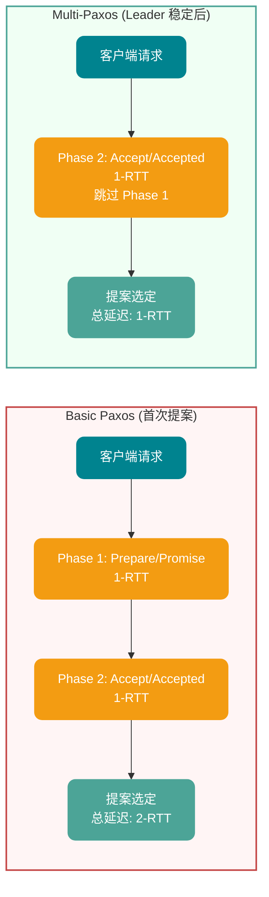

#### 3. 日志序号

- 为每个提案分配递增的**日志索引（log index）**
- 保证全局顺序：Leader 按顺序追加日志，Acceptor 按序号接受
- 支持**空洞**：某位置的提案可能因 Leader 切换而暂时缺失，后续可补齐

#### 4. 日志空洞（gap）与 NOP 填补

**问题描述**：当新 Leader 上线时，可能遇到一种棘手场景——前任 Leader 已经在某个日志位置上达成了共识，但新 Leader 不知道这个值。如果新 Leader 试图在该位置提交新值，就会覆盖已经选定的值，破坏一致性。

**解决方案：NOP（No-Operation）日志**

Multi-Paxos 通过引入 NOP 日志来解决这个问题：

1. **场景检测**：新 Leader 在 Phase 1（Prepare）阶段，收集到 Acceptor 返回的已接受值
2. **必须复用**：如果发现某位置已有被选定的值，新 Leader **必须**复用该值，不能提出新值
3. **NOP 占位**：对于空洞位置（无任何已接受值），新 Leader 可以提交特殊值——NOP（空操作）
4. **状态机跳过**：NOP 日志虽然占用日志位置，但状态机回放时会跳过，不执行任何业务逻辑

**示例流程**：

```
前任 Leader 崩溃前：
Index 1: Value=A (chosen)
Index 2: Value=B (chosen)
Index 3: <空洞> (未完成)

新 Leader 上线后：
Index 1: 复用 Value=A
Index 2: 复用 Value=B
Index 3: 提交 NOP (填补空洞，不执行业务逻辑)
Index 4: 提交 Value=C (正常业务日志)
```

**空洞与已接受值恢复流程**：

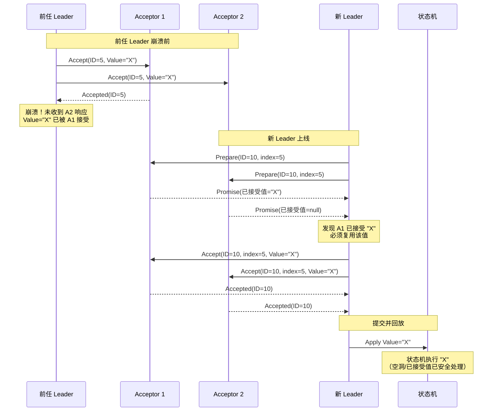

### 执行流程

1. **Leader 选举**：通过 Basic Paxos 选出 Leader
2. **日志复制**：Leader 接收客户端请求，追加到本地日志，分配递增索引
3. **直接 Accept**：Leader 向 Acceptor 发送 `Accept(index, value)`（跳过 Prepare）
4. **响应处理**：Acceptor 按序号接受日志，记录到本地
5. **提交确认**：当超过半数 Acceptor 接受某位置的日志后，该位置可提交

### 容错与恢复

- **Leader 崩溃**：新 Leader 通过日志比对找出已提交位置，补齐未提交日志
- **网络分区**：多数派一侧继续服务，少数派等待恢复
- **日志空洞**：新 Leader 可填补前任 Leader 未提交的日志位置

**新 Leader 恢复流程图**：

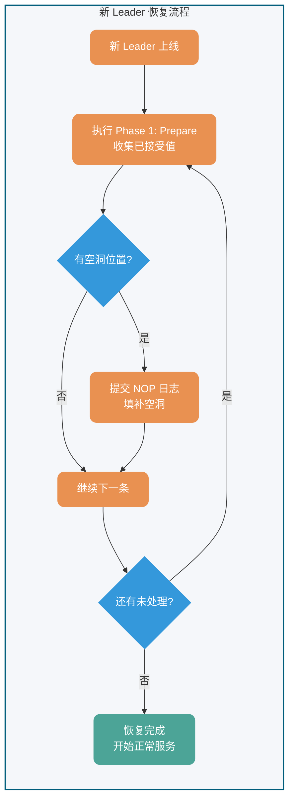

⚠️ **注意**：Multi-Paxos 只是一种思想，这种思想的核心就是通过多个 Basic Paxos 实例就一系列值达成共识。也就是说，Basic Paxos 是 Multi-Paxos 思想的核心，Multi-Paxos 就是多执行几次 Basic Paxos。

由于 Lamport 提出的 Multi-Paxos 思想缺少代码实现的必要细节（比如怎么选举领导者、日志空洞如何处理），所以在理解和实现上比较困难。

不过，也不需要担心，我们并不需要自己实现基于 Multi-Paxos 思想的共识算法，业界已经有了比较出名的实现。如 Raft 算法虽非 Paxos 严格变体，但借鉴了其核心思想（Leader 选举、日志复制），并简化了实现细节，变得更容易被理解以及工程实现，实际项目中可以优先考虑 Raft 算法。

## Paxos vs Raft

在 2014 年之后，Raft 算法凭借其极致的可理解性成为了工业界的新宠。必须明确，Raft 并非 Paxos 的变体，两者在底层设计哲学上存在硬性分歧。

| **对比维度**          | **Multi-Paxos**                                             | **Raft**                                                                    | **核心工程影响**                                                                |
| --------------------- | ----------------------------------------------------------- | --------------------------------------------------------------------------- | ------------------------------------------------------------------------------- |
| **日志流向与约束**    | 允许乱序提交，允许出现**日志空洞**。                        | 强制按序追加（Append-Only），**绝对不允许日志空洞**。                       | Raft 实现简单，状态机回放极其顺滑；Paxos 并发上限更高，但实现难度呈指数级增加。 |
| **Leader 选举与权限** | Leader 仅是一个性能优化手段（省略 Phase 1），非必须角色。   | **强 Leader 模型**。一切数据以 Leader 为准，日志只从 Leader 流向 Follower。 | Raft 通过限制只能选取“日志最完整”的节点当选 Leader，简化了数据恢复逻辑。        |
| **活锁防御**          | 需额外引入随机退避或外部选主算法。                          | 协议内置基于随机超时（Randomized Timeout）的选主防御机制。                  | Raft 的开箱即用性（Out-of-the-box）远高于 Paxos。                               |
| **工业级落地代表**    | Apache ZooKeeper (基于 ZAB, 类 Multi-Paxos), Google Spanner | etcd, HashiCorp Consul, TiKV                                                | 现代微服务基础设施倾向于选择 Raft。                                             |

## 实际应用

基于 Paxos 算法或其变体的系统包括：

- **Google Chubby**：基于 Paxos 实现的分布式锁服务
- **Apache ZooKeeper 3.8+**：基于 ZAB 协议（类 Multi-Paxos，写入通过 Leader 广播，支持 FIFO 顺序）
- **etcd 3.5+**：基于 Raft 算法（强一致性共识，支持动态成员变更、轻量级事务 Txn）
- **HashiCorp Consul**：基于 Raft 算法（服务发现与配置管理）

这些系统在分布式协调、配置管理、服务发现等领域发挥着关键作用。

> **版本说明**：上述系统随版本演进会有协议优化（如 etcd 3.4 引入租约 Keep-Alive 优化、ZooKeeper 3.5 引入动态重配置），生产部署前建议查阅对应版本的 Release Notes。

## 生产落地建议

### 可观测性指标（Observability Checklist）

| 类别     | 关键指标           | 告警阈值建议      | 说明                         |
| -------- | ------------------ | ----------------- | ---------------------------- |
| **延迟** | 提案提交延迟 (p99) | > 100ms           | 从客户端请求到收到多数派确认 |
| **吞吐** | 提案处理速率       | < 预期 QPS 的 50% | 可能网络分区或节点故障       |
| **选主** | Leader 切换次数    | > 3 次/小时       | 频繁切主说明集群不稳定       |
| **空洞** | 未提交日志位置数   | > 100             | 过多空洞影响状态机回放       |
| **脑裂** | 多 Leader 竞争事件 | = 0               | 绝不允许出现                 |

### 混沌工程建议

| 测试场景        | 验证目标                       | 推荐工具                 |
| --------------- | ------------------------------ | ------------------------ |
| **Leader 崩溃** | 验证快速选主与数据零丢失       | Chaos Mesh, Chaos Monkey |
| **网络分区**    | 验证多数派继续服务、少数派等待 | Toxiproxy                |
| **网络抖动**    | 验证随机退避机制避免活锁       | tc (netem)               |
| **时钟漂移**    | 验证提案编号唯一性不受影响     | --                       |

### 常见反模式（Anti-Patterns）

1. **忽略空洞处理**：状态机回放时遇到空洞位置直接跳过，可能导致客户端请求丢失
2. **固定提案编号**：使用时间戳或节点 ID 作为提案编号，无法保证全局递增
3. **无超时机制**：Prepare/Accept 请求无限等待，导致系统挂起
4. **忽略已接受值**：新 Leader 强制提交自己的值，破坏一致性

## 总结

- Paxos 算法是 Lamport 在 1990 年提出的分布式共识算法，是强一致性共识的理论基础
- Basic Paxos 通过两阶段（Prepare/Promise、Accept/Accepted）就单个值达成共识
- Multi-Paxos 通过复用 Leader 和跳过 Phase 1 优化，实现一系列值的共识（提案延迟从 2-RTT 降至 1-RTT）
- Raft 算法借鉴了 Multi-Paxos 思想但重新设计了实现细节（强 Leader 模型、禁止日志空洞），更易于理解和工程实现
- 在实际项目中，建议优先选择 Raft、etcd、ZooKeeper 等已完善的实现

## 参考

- [《Paxos Made Simple》](http://lamport.azurewebsites.net/pubs/paxos-simple.pdf) - Lamport, 2001
- [《The Part-Time Parliament》](http://lamport.azurewebsites.net/pubs/lamport-paxos.pdf) - Lamport, 1998
- [《In Search of an Understandable Consensus Algorithm》](https://raft.github.io/raft.pdf) - Ongaro & Ousterhout, 2014 (Raft 论文)
- <https://zh.wikipedia.org/wiki/Paxos>
- 分布式系统中的一致性与共识算法：<http://www.xuyasong.com/?p=1970>

<!-- @include: @article-footer.snippet.md -->


---

<!-- source: 协议/Raft 算法详解-Leader 选举、日志复制、安全性与成员变更.md -->

---
title: Raft 算法详解：Leader 选举、日志复制、安全性与成员变更
category: 分布式
description: Raft 算法详解，讲解 Leader 选举、日志复制、Leader 追加、日志一致性、安全性约束、成员变更和与 Paxos 的对比，帮助理解分布式一致性协议。
tag:
  - 分布式协议与算法
  - 共识算法
head:
  - - meta
    - name: keywords
      content: Raft,Raft 算法,Leader 选举,日志复制,成员变更,共识算法,分布式一致性,Paxos 对比,分布式协议
---

> 本文由 [SnailClimb](https://github.com/Snailclimb) 和 [Xieqijun](https://github.com/jun0315) 共同完成。

## 1 背景

在如今的互联网架构中，为了扛住海量流量，系统往往需要横向堆机器。机器一多，宕机、断网这些破事就成了家常便饭。怎么让这群随时可能掉线的服务器保持步调一致，不对外提供错乱的数据？这就轮到**分布式共识算法**出场了。

2014年，Diego Ongaro 等人发表了 Raft 算法。它的诞生有一个很明确的使命：**拯救被 Paxos 算法折磨的程序员**。Raft 主打一个“易于理解”，它将复杂的共识问题拆解成了几个独立的模块：

- **Leader 选举**：使用随机化选举超时（工程上常见如 150–300ms 或更大范围，具体取决于网络与故障模型）。
- **日志复制**：Leader 通过 AppendEntries RPC 广播日志。
- **安全性**：包括选举限制和日志匹配。

Raft 在实际生产中得到了广泛应用，基于 Raft 的实现如 etcd、Consul 等已成为分布式系统的重要组成部分。后续学术界和工业界也对 Raft 进行了多项扩展和优化，包括：

- **Pre-Vote**（2014）：防止网络分区的节点干扰稳定集群的选举
- **Read Index**（2014）：在 Leader 任期内通过线性一致性读优化读性能
- **Lease Read**：基于租约的线性一致性读方案
- **Joint Consensus**：用于集群成员变更的联合一致机制（通过引入过渡配置，典型过程为旧配置 → 联合配置 → 新配置）

因此，系统必须在正常操作期间处理服务器的上下线。它们必须对变故做出反应并在几秒钟内自动适应；对客户来说的话，明显的中断通常是不可接受的。

幸运的是，分布式共识可以帮助应对这些挑战。

### 1.1 非拜占庭条件下的“选主”类比

Raft 有一个前提假设：**非拜占庭容错（CFT）**。说白了就是，兄弟们可能会死机、会断网，但绝对不会出内鬼传递假情报。

我们可以用“将军选帅”来粗略理解这个过程： 假设有 A、B、C 三个将军，目前群龙无首。每个人心里都有个随机的倒计时（选举超时）。谁的倒计时先结束，谁就站出来大喊：“我要当大将军，请给我投票！” 如果其他将军还没开始竞选，也没把票投给别人，就会顺水推舟同意他。当这位将军拿到**过半数**的赞成票，他就成了大当家（Leader）。以后打不打仗，全听他的。如果信使半路阵亡，大家都没收到回音，那就重置倒计时，再来一轮。

### 1.2 到底什么是共识算法？

共识算法的核心目标，就是**让一群机器看起来像一台机器**。只要集群里超过半数的机器还活着，整个系统就能正常接客。

这通常是通过**复制状态机**来实现的：给每个节点发一本一模一样的账本（日志）。只要大家按照同样的顺序去执行账本上的命令，最后得到的结果自然完全一样。所以，共识算法本质上干的就是一件事——**保证所有节点的账本绝对一致**。共识是可容错系统中的一个基本问题：即使面对故障，服务器也可以在共享状态上达成一致。


## 2 基础概念

在深入 Raft 之前，我们得先认识里面的三大核心角色、任期机制和日志结构。

### 2.1 节点类型

一个 Raft 集群包括若干服务器，以典型的 5 服务器集群举例。在任意的时间，每个服务器一定会处于以下三个状态中的一个：

- **Leader（领导者）**：大当家。全权负责接待客户端、写账本、并把账本同步给小弟。为了防止别人篡位，他必须不断地向全员发送心跳，宣告“我还活着”。
- **Follower（跟随者）**：安分守己的小弟。平时绝对不主动发起请求，只被动接收老大的心跳和账本同步。
- **Candidate（候选人）**：临时状态。如果小弟迟迟等不到老大的心跳，就会觉得自己行了，变身候选人开始拉票。

在正常的情况下，只有一个服务器是 Leader，剩下的服务器是 Follower。Follower 是被动的，它们不会发送任何请求，只是响应来自 Leader 和 Candidate 的请求。


### 2.2 任期


Raft 算法将时间划分为任意长度的任期（term），任期用连续的数字表示，看作当前 term 号。每一个任期的开始都是一次选举，在选举开始时，一个或多个 Candidate 会尝试成为 Leader。如果一个 Candidate 赢得了选举，它就会在该任期内担任 Leader。如果没有选出 Leader（例如出现分票 split vote），该任期可能没有 Leader；随后在新的选举超时后会进入下一个任期并重新发起选举。只要多数节点可用且网络最终可达，系统通常能够在若干轮选举后选出 Leader。

每个节点都会存储当前的 term 号，当服务器之间进行通信时会交换当前的 term 号；如果有服务器发现自己的 term 号比其他人小，那么他会更新到较大的 term 值。如果一个 Candidate 或者 Leader 发现自己的 term 过期了，他会立即退回成 Follower。如果一台服务器收到的请求的 term 号是过期的，那么它会拒绝此次请求。

下面这张图是我手绘的，更容易理解一些，就很贴心：


### 2.3 日志

只有 Leader 有资格往账本里追加记录（Entry）。一条日志包含三个核心要素：`<当前任期, 索引号, 具体操作指令>`。

这里有两个非常关键的进度指针：

- **commitIndex**：大家公认已经安全落地的日志进度（已经被复制到过半数节点）。
- **lastApplied**：这台机器本地真正执行完的日志进度。

## 3 领导人选举


Raft 使用心跳机制来触发 Leader 的选举。

如果一台服务器持续收到来自 Leader 的 AppendEntries（心跳或日志复制）等合法 RPC，它会保持为 Follower 状态并刷新选举计时器。

Leader 会向所有的 Follower 周期性发送心跳来保证自己的 Leader 地位。如果一个 Follower 在一个周期内没有收到心跳信息，就叫做选举超时，然后它就会认为此时没有可用的 Leader，并且开始进行一次选举以选出一个新的 Leader。

为了开始新的选举，Follower 会自增自己的 term 号并且转换状态为 Candidate。然后他会向所有节点发起 RequestVote RPC 请求， Candidate 的状态会持续到以下情况发生：

- 赢得选举
- 其他节点赢得选举
- 一轮选举结束，无人胜出

赢得选举的条件是：一个 Candidate 在一个任期内收到了来自集群内的多数选票`（N/2+1）`，就可以成为 Leader。

在 Candidate 等待选票的时候，它可能收到其他节点声明自己是 Leader 的心跳，此时有两种情况：

- 该 Leader 的 term 号大于等于自己的 term 号，说明对方已经成为 Leader，则自己回退为 Follower。
- 该 Leader 的 term 号小于自己的 term 号，那么会拒绝该请求并让该节点更新 term。

由于可能同一时刻出现多个 Candidate，导致没有 Candidate 获得大多数选票，如果没有其他手段来重新分配选票的话，那么可能会无限重复下去。

Raft 使用了随机的选举超时时间来避免上述情况。每一个 Candidate 在发起选举后，都会随机化一个新的选举超时时间，这种机制使得各个服务器能够分散开来，在大多数情况下只有一个服务器会率先超时；它会在其他服务器超时之前赢得选举。

## 4 日志复制

一旦选出了 Leader，它就开始接受客户端的请求。每一个客户端的请求都包含一条需要被复制状态机（`Replicated State Machine`）执行的命令。

Leader 收到客户端请求后，会生成一个 entry，包含`<index,term,cmd>`，再将这个 entry 添加到自己的日志末尾后，向所有的节点广播该 entry，要求其他服务器复制这条 entry。

如果 Follower 接受该 entry，则会将 entry 添加到自己的日志后面，同时返回给 Leader 同意。

如果 Leader 收到了多数 Follower 对该日志复制成功的响应，Leader 会推进自己的 commitIndex，并在随后将这些已提交（committed）的日志按顺序应用（apply）到状态机后再向客户端返回结果。

需要注意一个关键限制：Leader 只能基于“当前任期（current term）内产生的日志在多数派上复制成功”来推进 commitIndex。对于之前任期遗留的日志，即使它们已经被复制到多数节点，Leader 也不应仅凭多数派直接提交；通常会通过提交当前任期的一条新日志（常见做法是当选后追加并提交一条 no-op 日志）来间接推动历史日志一并提交。

Follower 不会自行决定提交点；它们从 Leader 的 AppendEntries RPC 中携带的 leaderCommit 得知当前可提交的最大索引，并将本地 commitIndex 更新为 min(leaderCommit, lastLogIndex)，再按序 apply 到状态机。

### 4.1 日志匹配属性（Log Matching Property）

Raft 通过 **日志匹配属性（Log Matching Property）** 保证日志绝对不会分叉，这是 Raft 安全性的基石之一。该属性包含两个核心保证：

- **保证一**：如果两个日志在相同 index 位置的 entry 具有相同的 term，那么它们存储的 cmd 一定相同
- **保证二**：如果两个日志在相同 index 位置的 entry 具有相同的 term，那么该位置之前的所有 entry 也完全相同

#### 归纳法证明

日志匹配属性通过归纳法得以保证：

1. **基础情况**：日志为空时，属性自然成立
2. **归纳步骤**：假设日志在 index N 之前完全一致，当 Leader 尝试追加 entry N+1 时，通过 **AppendEntries RPC 的一致性检查** 确保：

```
AppendEntries RPC 参数：
- prevLogIndex：前一条日志的索引（Leader 认为与 Follower 对齐的位置）
- prevLogTerm：前一条日志的任期
- entries[]：待追加的新日志条目
```

**一致性检查逻辑**：

- Follower 收到 AppendEntries 请求后，检查本地日志中 index = prevLogIndex 的位置
- 如果该位置的 entry.term == prevLogTerm，说明Leader和Follower在prevLogIndex之前的日志完全一致，通过检查
- 如果不存在或 term 不匹配，拒绝追加，返回失败

**关键点**：通过检查 prevLogIndex 和 prevLogTerm 的配对，Leader 和 Follower 能够**数学上确保**它们对日志历史达成一致。只有当“最后一个已知一致点”确实一致时，才会追加新日志。这形成了归纳证明的传递链条：

```
entry[0] 一致 → entry[1] 一致 → entry[2] 一致 → ... → entry[N] 一致
    ↑_____________通过 prevLogIndex/prevLogTerm 递归验证_____________↑
```

因此，日志绝不会出现两个不同的值在同一 index 位置被“提交”的情况——即日志不分叉。

#### 工程实现优化

在实际生产实现（如 etcd 3.5.x）中，除了上述基础的一致性检查外，还包含多项工程优化：

- **快速回退（Fast Backup）**：当 AppendEntries 一致性检查失败时，Follower 返回冲突日志对应的 term 及其边界索引（该 term 的第一条和最后一条 index），Leader 据此一次性跳过整段冲突区间，而非逐条递减 nextIndex 重试。

- **重试风暴防护**：高负载下可能出现大量 AppendEntries 失败重试，实现中通常会加入：
  - **Jitter 退避**：重试间隔加入随机抖动，避免多个 Follower 同时重试
  - **背压机制**：限制单个 Follower 的重试速率，防止占用过多网络带宽

这些优化不影响日志匹配属性的理论正确性，而是提升了系统在异常场景下的恢复效率。

### 4.2 日志不一致的恢复

正常运作时，大当家（Leader）和小弟（Follower）的账本是完全同步的。然而，一旦老 Leader 突然宕机，新老交替之际往往会在集群中遗留大量未对齐的脏数据。

这时，新 Leader 发起 AppendEntries 同步请求就会触发“一致性检查报错”。Raft 解决数据冲突的逻辑非常霸道：**一切以现任 Leader 的账本为最高准则**，Follower 本地任何不一致的记录都必须被无情抹除并强行覆盖。

具体怎么做呢？Leader 会像“拉链”一样顺藤摸瓜，往前倒推寻找双方最后一次完美吻合的历史节点。找到这个“分叉点”后，Follower 会把分叉点之后的烂摊子全部咔嚓掉，老老实实地拷贝 Leader 提供的最新日志。

在代码层面，Leader 会在内存里给每个 Follower 单独记一本账，核心指针叫 `nextIndex`（预估要发给该小弟的下一条日志位置）。新官上任三把火，Leader 刚接盘时，会盲目自信地把所有小弟的 `nextIndex` 都预设为自己最新日志的索引加一。如果小弟的数据其实比较落后或者有冲突，第一发 AppendEntries 必然惨遭拒绝。接下来就是找分叉点的两种流派：

- **传统的朴素做法（逐条试探）**：撞了南墙就退一步。Leader 会把 `nextIndex` 减一，再发一次 RPC 试探。如果还不行，就继续减一，犹如乌龟漫步般逐条往前回退，直到彻底对上暗号。
- **工业级提速优化（Fast Backup 快速回退）**：在真实的生产环境中，逐条回退绝对是性能灾难。因此，工业界引入了快速回退机制。小弟在拒绝同步时不再是单纯地摇摇头，而是直接亮出底牌：“我这批错乱日志属于哪个历史任期（term），以及这个任期的头尾边界在哪里”。Leader 拿到这份情报，直接大刀阔斧地一次性跨越整段错误任期，极大地削减了冗余的网络重试次数。

经过这番拉扯，`nextIndex` 终将精准锚定双方的共识起点。此时，AppendEntries 终于收获成功回执，Follower 上的冲突数据被彻底清空，缺失的正统日志被严丝合缝地填补。一旦跨过这个坎，双方的账本就能在整个任期内保持如影随形、高度一致。

## 5 安全性

### 5.1 选举限制

Leader 需要保证自己存储全部已经提交的日志条目。这样才可以使日志条目只有一个流向：从 Leader 流向 Follower，Leader 永远不会覆盖已经存在的日志条目。

每个 Candidate 发送 RequestVote RPC 时，都会带上最后一个 entry 的信息。所有节点收到投票信息时，会对该 entry 进行比较，如果发现自己的更新，则拒绝投票给该 Candidate。

判断日志新旧的方式：如果两个日志的 term 不同，term 大的更新；如果 term 相同，更长的 index 更新。

### 5.2 提交规则（只提交当前任期日志）

Leader 推进 commitIndex 时，需要满足“当前任期产生的某条日志已复制到多数派”这一条件。对于旧任期遗留的日志，即使它们已经复制到多数派，Leader 也不应仅凭此直接提交；通常通过提交当前任期的一条新日志（常见为 no-op）来间接提交历史日志。这一限制用于避免 Leader 频繁切换时出现已提交日志被覆盖的安全性问题。

### 5.3 节点崩溃与网络分区

如果 Follower 和 Candidate 崩溃，处理方式会简单很多。之后发送给它的 RequestVote RPC 和 AppendEntries RPC 会失败。由于 Raft 的所有请求都是幂等的，所以失败的话会无限的重试。如果崩溃恢复后，就可以收到新的请求，然后选择追加或者拒绝 entry。

如果 Leader 崩溃，节点在 electionTimeout 内收不到心跳会触发新一轮选主；在选主完成前，系统通常无法对外提供线性一致的写入（以及线性一致读），表现为一段不可用窗口。

**量化分析**：在 5 节点集群中，Leader 崩溃后的不可用窗口通常小于 1 秒（P99 < 500ms 选举超时 + 一轮选举时间）。这是 **PACELC 定理**的体现：发生分区（P）时，系统选择牺牲可用性（A）以保证一致性（C）。幂等重试机制确保节点恢复后能安全追赶数据状态。

#### 单节点隔离与 Term 暴增问题

在标准 Raft 算法中，**单节点网络隔离**可能导致 **Term 暴增（Term Inflation）** 问题，造成“劣币驱逐良币”——一个被隔离的少数派节点在恢复后破坏健康集群的稳定性。

**场景推演**：

假设一个 5 节点集群，Leader 为节点 A，Follower 为 B、C、D、E。此时节点 E 发生网络分区，被彻底隔离：

```
正常区域：{A, B, C, D}    （Leader A + 多数派，可正常服务）
隔离区域：{E}             （单节点隔离，无法收到心跳）
```

| 时间线 | 正常区域 {A, B, C, D}                             | 隔离区域 {E}                                   |
| ------ | ------------------------------------------------- | ---------------------------------------------- |
| T0     | Leader A 正常服务，Term = 5                       | E 收不到心跳，选举超时                         |
| T1     | 集群继续正常工作                                  | E 自增 Term 发起选举（Term 6），但无响应       |
| T2     | ...                                               | E 继续自增（Term 7, 8, ...），假设涨到 Term 99 |
| T3     | 网络恢复，E 带着 Term 99 接入集群                 | E 向 {A, B, C, D} 广播 RequestVote (Term 99)   |
| T4     | 节点 A 收到 Term 99 > 自己的 Term 5，**被迫退位** | E 的“高 Term”破坏了健康集群                    |

**问题分析**：

- {A, B, C, D} 是**合法的多数派**（4/5），系统本应继续正常工作
- 节点 E 是**少数派**（1/5），它的隔离不应影响集群整体
- **关键问题**：E 的 Term 暴涨导致健康的 Leader A 被迫下线
- **后果**：整个集群需要重新选举，造成不必要的写入中断

这是标准 Raft 的一个已知边界问题：少数派节点的“疯狂选举”会干扰多数派的正常运行。

#### Pre-Vote 机制

为了解决上述问题，Raft 的扩展方案 **Pre-Vote** 被提出。Pre-Vote 要求节点在真正发起选举前，先进行一次“预投票”：

1. **预投票阶段**：Candidate 向其他节点发送 PreVoteRequest，携带自己的日志信息
2. **预投票条件**：
   - 候选人的日志至少与接收者一样新（选举限制）
   - **接收者确认自己与 Leader 的连接已断开**（超过 electionTimeout 未收到心跳）
3. **正式选举**：只有收到多数节点的 PreVote 响应后，才真正增加 term 并发起 RequestVote

**Pre-Vote 如何防止 Term 暴增**：

- 在上述单节点隔离场景中，E 在隔离期间发起 Pre-Vote 时，**其他节点仍能收到 Leader A 的心跳**
- 因此其他节点会**拒绝 E 的 PreVote 请求**（因为与 Leader 连接正常）
- E 无法获得多数 PreVote 响应，**不会真正增加 Term**
- 网络恢复后，E 的 Term 仍然较低，不会干扰健康的 Leader A

**核心思想**：只有确认自己与 Leader 失去连接后，节点才开始真正增加 Term。这有效防止了少数派节点的 Term 暴涨干扰多数派。

Pre-Vote 机制已广泛应用于 etcd、TiKV、Consul 等生产级 Raft 实现。

### 5.4 时间与可用性

Raft 的要求之一就是安全性不依赖于时间：系统不能仅仅因为一些事件发生的比预想的快一些或者慢一些就产生错误。为了保证上述要求，最好能满足以下的时间条件：

`broadcastTime << electionTimeout << MTBF`

- `broadcastTime`：向其他节点并发发送消息的平均响应时间；
- `electionTimeout`：选举超时时间；
- `MTBF(mean time between failures)`：单台机器的平均健康时间；

`broadcastTime`应该比`electionTimeout`小一个数量级，为的是使`Leader`能够持续发送心跳信息（heartbeat）来阻止`Follower`开始选举；

`electionTimeout`也要比`MTBF`小几个数量级，为的是使得系统稳定运行。当`Leader`崩溃时，大约会在整个`electionTimeout`的时间内不可用；我们希望这种情况仅占全部时间的很小一部分。

由于`broadcastTime`和`MTBF`是由系统决定的属性，因此需要决定`electionTimeout`的时间。

一般来说，broadcastTime 一般为 `0.5～20ms`，electionTimeout 可以设置为 `10～500ms`（工程上常见如 150–300ms），MTBF 一般为一两个月。

## 6 参考

- <https://tanxinyu.work/raft/>
- <https://github.com/OneSizeFitsQuorum/raft-thesis-zh_cn/blob/master/raft-thesis-zh_cn.md>
- <https://github.com/ongardie/dissertation/blob/master/stanford.pdf>
- <https://knowledge-sharing.gitbooks.io/raft/content/chapter5.html>

<!-- @include: @article-footer.snippet.md -->


---

<!-- source: 协议/ZAB 协议详解-ZooKeeper 原子广播、消息广播、崩溃恢复与 Leader 选举.md -->

---
title: ZAB 协议详解：ZooKeeper 原子广播、消息广播、崩溃恢复与 Leader 选举
category: 分布式
description: ZAB 协议详解，讲解 ZooKeeper Atomic Broadcast 的消息广播、崩溃恢复、Leader 选举、ZXID、事务日志和 Zab 与 Paxos、Raft 的关系。
tag:
  - 分布式协议与算法
  - 共识算法
head:
  - - meta
    - name: keywords
      content: ZAB 协议,ZooKeeper Atomic Broadcast,ZooKeeper,Leader 选举,消息广播,崩溃恢复,ZXID,分布式一致性,分布式协议
---

作为一款极其优秀的分布式协调框架，ZooKeeper 的高可用和数据一致性备受业界推崇。很多人误以为 ZooKeeper 使用的是大名鼎鼎的 Paxos 算法，但实际上，它的“灵魂”是一个专门为其定制的共识协议——**ZAB（ZooKeeper Atomic Broadcast，原子广播协议）**。

ZAB 并非像 Paxos 那样是通用的分布式一致性算法，它是一种**特别为 ZooKeeper 设计的、支持崩溃可恢复的原子消息广播算法**。基于 ZAB 协议，ZooKeeper 实现了一种主备模式的架构，来保持集群中各个副本之间的数据一致性。

这篇文章只讲 ZAB 的协议过程。如果你还不熟悉 ZooKeeper 的 ZNode、Watcher、Session 和应用场景，建议先读 [ZooKeeper 入门指南](../分布式流程协调/zookeeper/ZooKeeper 入门指南-核心概念、ZNode、Watcher、ACL 与典型应用场景.md)。如果你想先理解 Leader、Quorum 和脑裂这些通用问题，可以先读 [分布式协调详解](./分布式协调详解-Leader、Quorum、Lease、Fencing Token 与 Gossip.md)。

## ZAB 集群的核心角色与状态

在深入协议运作之前，我们需要先了解 ZooKeeper 集群中的三个主要角色：

- **Leader（领导者）：** 集群中**唯一**的写请求处理者。它负责发起投票和协调事务，所有的写操作都必须经过 Leader。
- **Follower（跟随者）：** 可以直接处理客户端的读请求。收到写请求时，会将其转发给 Leader。在 Leader 选举过程中，Follower 拥有选举权和被选举权。
- **Observer（观察者）：** 功能与 Follower 类似，但**没有**选举权和被选举权。它的存在是为了在不影响集群共识性能（即不增加需要等待的投票数）的前提下，横向扩展集群的读性能。

对应的，集群中的节点通常处于以下四种状态之一：

- `LOOKING`：寻找 Leader 状态（正在进行选举）。
- `LEADING`：当前节点是 Leader，正在领导集群。
- `FOLLOWING`：当前节点是 Follower，服从 Leader 领导。
- `OBSERVING`：当前节点是 Observer。

## 核心标识：ZXID 与 Epoch

为了保证分布式环境下消息的绝对顺序性，ZAB 协议引入了一个全局单调递增的事务 ID——**ZXID**。

ZXID 是一个 64 位的长整型（long）：

- **高 32 位（Epoch 纪元）：** 代表当前 Leader 的任期年代。当选出一个新的 Leader 时，Epoch 就会在前一个的基础上加 1。这相当于朝代更替。
- **低 32 位（事务 ID）：** 一个简单的递增计数器。针对客户端的每一个写请求，计数器都会加 1。新 Leader 上位时，这个低 32 位会被清零重置。


## ZAB 的两种基本模式

ZAB 协议的运作可以精简为两种基本模式的交替：**消息广播**（正常工作状态）和**崩溃恢复**（异常或启动状态）。

### 1. 消息广播模式（正常处理写请求）


当集群拥有健康的 Leader，且过半的节点完成了状态同步后，就会进入消息广播模式。这个过程类似于一个简化的“两阶段提交（2PC）”：

1. **生成提案：** Leader 接收到写请求后，将其转化为一个带有 ZXID 的提案（Proposal）。
2. **顺序发送：** Leader 为每个 Follower 维护了一个先进先出（FIFO）的网络队列（基于 TCP 协议），确保提案按生成顺序发送给 Follower。
3. **写入与反馈（WAL 强制落盘）：** Follower 收到提案后，必须将其追加到本地的事务日志（TxnLog）中，并强制执行系统调用 `fsync` 将内核缓冲区的数据物理刷入磁盘。只有确认数据切实落盘，才会向 Leader 响应 `ACK`。这一过程是 ZAB 抵御断电丢失数据的核心防线。因此，在物理部署上，强烈建议将 ZooKeeper 的事务日志目录（`dataLogDir`）挂载到独立且无锁的 SSD 上，避免与其他高 I/O 进程争用磁盘，从而规避因 `fsync` 阻塞导致的 P99 响应时间恶化。生产环境中必须重点监控节点的 `fsynctime` 指标，若平均刷盘耗时经常超过 100ms，集群随时可能崩溃。
4. **广播提交：** 当 Leader 收到**过半数** 节点的 `ACK` 响应后，就会认为该写操作成功。Leader 在本地写日志时会更新内部的 quorum 计数器（而非显式向自己发送 ACK），确认过半后向客户端返回成功响应，并向所有节点广播 `Commit` 消息。Follower 收到 `Commit` 后，正式将数据应用到内存中。

### 2. 崩溃恢复模式（Leader 宕机或网络异常）

当系统刚启动，或者 Leader 服务器崩溃、与过半 Follower 失去联系时，整个集群就会暂停对外服务，进入 `LOOKING` 状态，触发崩溃恢复模式。崩溃恢复主要包含两个阶段：**Leader 选举**和**数据恢复**。


#### 阶段一：Leader 选举

选举的核心原则是：**拥有最新数据的节点优先当选**。 每个节点都会先投自己一票，投票信息包含 `(Epoch, ZXID, myid)`。随后节点会交换选票，并按照以下顺序进行 PK：

1. **比较 Epoch：** 纪元大的优先。
2. **比较 ZXID：** 如果 Epoch 相同，ZXID 大的优先（代表数据越新）。
3. **比较 myid：** 如果前两者都相同，服务器唯一标识 `myid` 大的优先。

一旦某个节点获得了**过半数**的选票，它就会成为新的 Leader。_(这也是为什么 ZooKeeper 推荐部署奇数台服务器的原因，能以最低的成本实现半数以上的容错。)_

#### 阶段二：数据恢复

选出新 Leader 只是第一步，为了保证数据一致性，ZAB 必须在数据同步阶段实现两个极其重要的保证：

1. **确保已经在旧 Leader 上提交的事务，最终被所有节点提交。** （防止数据丢失）
2. **丢弃那些只在旧 Leader 上提出，但还没来得及提交的事务。** （防止脏数据干扰）

新 Leader 会找到当前最大的 `Epoch` 并加 1 作为新纪元，随后与所有 Follower 进行比对。Follower 会发送自己事务日志中最新记录的 `lastZxid`（包含已提议但尚未提交的提案），Leader 根据这个值采取多态同步策略：**差异化增量同步（DIFF）**、**强制丢弃未提交日志（TRUNC）** 或 **全量快照传输（SNAP）**。

这一设计至关重要：Leader 需要准确识别 Follower 日志中是否残留着旧 Leader 未完成提交的“幽灵提案”，才能正确下发 TRUNC 指令让其截断回滚。如果只上报已提交的 ZXID，这些未提交的脏数据将无法被感知，TRUNC 分支就永远不会被触发。

更关键的是，此时新的 Epoch 已经生效。若原 Leader 因 JVM 触发长达数十秒的 Full GC 而发生“假死”，当其苏醒并试图向集群下发旧 Epoch 的提案时，由于过半节点已记录了更高的新 Epoch 且已向新 Leader 提交 quorum，这些幽灵提案将被节点无情拒绝并抛弃。ZAB 正是通过 **Epoch 机制 + 多数派 quorum** 的组合，从根本上免疫了网络环境下的脑裂现象——单靠 Epoch 拒绝还不够，必须有过半节点已经连上新 Leader，旧 Leader 才真正失去写入能力。

当过半的机器与新 Leader 完成了状态和数据同步，ZAB 协议就会平滑退出崩溃恢复模式，重新进入消息广播模式。

## 与 Raft 对比

**ZAB 与 Raft 的高度相似性：** 如果你了解过 Raft 算法，会发现它们非常相似。它们都有唯一的主节点，都使用 Epoch/Term 来标识任期，并且都采用了只要半数以上节点确认即可提交的策略。这说明在现代分布式共识领域，这种基于主备和多数派选举的架构已经成为了事实上的标准。

在当前的分布式系统实践中，Raft 算法通常被视为比 ZAB 更实用和受欢迎的选择。 这是因为 Raft 从设计之初就强调易懂性和可实现性，它将领导者选举、日志复制和安全性明确分离，这使得开发者更容易正确实施和调试，而 ZAB 作为 ZooKeeper 的专有协议，更侧重于原子广播的特定需求，导致其通用性较差。

Raft 已广泛应用于现代系统，如 Kubernetes 的 etcd、Hashicorp Consul、Apache Kafka（在其 KIP-500 版本中去除 ZooKeeper 依赖，转向 Raft-based KRaft）、TiKV 等，这极大“民主化”了分布式共识的开发。

相比之下，ZAB 主要绑定在 ZooKeeper 上，虽然 ZooKeeper 仍是经典的协调服务，但许多新项目倾向于选择 Raft 以避免 ZooKeeper 的额外复杂性和潜在瓶颈（如在大规模下共识开销）。

此外，Raft 的社区支持更活跃，衍生出多种优化变体（如用于区块链的改进版本），使其在效率和适用场景上更具优势。 然而，如果你的系统已深度集成 ZooKeeper，ZAB 仍是最优化的选择；否则，对于新设计或通用共识需求，Raft 是当前更实用的标准。

## 总结

ZAB 协议通过精心设计的 Leader 选举和多数派确认机制，在分布式系统的分区容错性（P）和一致性（C）之间做出了选择（满足 CP 属性）。当出现网络分区时，ZAB 宁愿牺牲短暂的可用性（A）进行选举，也要保证数据的一致性。

需要特别强调的是，**ZAB 协议默认不保证严格的强一致性（线性一致性），而是提供顺序一致性（Sequential Consistency）**。

由于 Follower 可以直接处理客户端的读请求且不强求数据绝对同步，客户端完全可能读取到落后于 Leader 的陈旧数据（Stale Read）。在生产环境中，若业务涉及如分布式锁等对数据新鲜度要求极高的场景，必须在执行 `read()` 操作前显式调用 `sync()` 原语，强制要求连接的 Follower 追平 Leader 的事务状态机。

当发生网络分区时，客户端若连接至被隔离的少数派 Follower，虽然写操作会失败，但仍可读出过期数据，这是使用 ZAB 协议时必须考虑的边界场景。


---

<!-- source: 协议/拜占庭将军问题详解-分布式共识、3m+1 节点与 BFT 容错.md -->

---
title: 拜占庭将军问题详解：分布式共识、3m+1 节点与 BFT 容错
description: 拜占庭将军问题详解，讲解拜占庭故障、分布式共识、安全性与活性、口信消息 OM(m)、签名消息、3m+1 节点要求、CFT 与 BFT 区别，以及区块链中的应用。
category: 分布式
tag:
  - 分布式协议与算法
  - 共识算法
  - BFT
head:
  - - meta
    - name: keywords
      content: 拜占庭将军问题,拜占庭容错,BFT,PBFT,分布式共识,共识算法,3m+1,OM(m),签名消息,CFT,区块链共识,分布式系统
---

几个服务节点都说自己是对的，客户端该信谁？

在日常后端系统里，这个问题通常没有这么极端。Redis 主从、ZooKeeper、etcd、Nacos、数据库复制，更多遇到的是机器宕机、网络抖动、磁盘故障、进程重启。节点一般不会故意骗你，它只是没响应、响应慢，或者暂时和集群断开了。

拜占庭将军问题讨论的是更麻烦的一类情况：**系统里有节点会表现得不可预测，甚至可能给不同对象发送互相矛盾的信息**。

这就是它在分布式系统里的价值。古代军事故事只是表达手段，真正要讲的是“在不可靠成员中达成一致”。

如果你正在学习 Raft、ZAB、ZooKeeper、etcd 这类常见协调系统，需要先区分两类故障模型：它们通常处理的是崩溃故障和网络分区，不假设节点恶意撒谎；拜占庭问题讨论的是更强的故障模型。想看非拜占庭场景里的共识，可以继续读 [Raft 算法详解](./Raft 算法详解-Leader 选举、日志复制、安全性与成员变更.md) 和 [ZAB 协议详解](./ZAB 协议详解-ZooKeeper 原子广播、消息广播、崩溃恢复与 Leader 选举.md)。

## 拜占庭将军问题是什么？

拜占庭将军问题由 Leslie Lamport、Robert Shostak 和 Marshall Pease 在 1982 年发表的论文 [The Byzantine Generals Problem](https://www.microsoft.com/en-us/research/publication/拜占庭将军问题详解-分布式共识、3m+1 节点与 BFT 容错/) 中提出。论文发表于 ACM Transactions on Programming Languages and Systems，时间是 1982 年 7 月。

Lamport 是分布式系统领域绕不开的人。他因为在分布式和并发系统方面的基础贡献获得了 2013 年 ACM A.M. Turing Award，也就是常说的图灵奖。他还是 LaTeX 文档排版系统的最初开发者。

问题的故事版本大致是这样：

多位拜占庭将军分别率领军队包围一座敌城。每支军队分散在不同位置，将军之间不能面对面开会，只能靠信使传递消息。他们需要决定明天到底是进攻还是撤退。单独进攻会失败，只有足够多的军队一起行动才有胜算。

麻烦在于，将军里可能有叛徒。

叛徒不一定只是“不执行命令”。他可以给 A 将军说进攻，给 B 将军说撤退；也可以伪造自己听到的消息，诱导忠诚将军做出不同决定。放到计算机系统里，类似行为不一定来自主观恶意，也可能来自软件缺陷、状态损坏、内存或磁盘错误、节点被入侵后的异常行为。最后如果一部分忠诚将军进攻，另一部分忠诚将军撤退，整个作战计划就失败了。

放到分布式系统里，将军就是节点，信使就是网络消息，进攻/撤退就是某个要达成一致的值，比如：

- 哪个节点成为 Leader？
- 某条日志是否提交？
- 某笔交易是否有效？
- 某个状态机下一步执行什么命令？

所以，这个问题可以换成一句工程语言：

> 在部分节点可能故障、撒谎、伪造信息或发送矛盾信息的情况下，如何让所有正常节点对同一个结果达成一致？


这里有个细节要先说清。国内很多文章会把信使被截杀、消息丢失、消息篡改也一起放进故事里，这样方便理解“通信不可靠”。但 Lamport 论文里的“口信消息”模型为了做形式化证明，反而假设消息系统满足几个条件：发出的消息会被正确送达，接收者知道消息是谁发的，没收到消息这件事也能被检测出来。

所以，论文真正要处理的难点比“网络会丢包”更进一步：**发送消息的人可能作恶**。

## 达成共识到底要满足什么？

拜占庭将军问题里有一个指挥官和若干副官。指挥官要向副官发出进攻或撤退的命令，系统希望满足两个条件：

- **一致性（Agreement）**：所有忠诚副官最终执行同一个命令。
- **有效性（Validity）**：如果指挥官是忠诚的，所有忠诚副官都应该执行指挥官发出的命令。

第一条要求大家别分裂。第二条要求系统别因为防叛徒，把忠诚指挥官的正确命令也搞丢。

严格来说，Lamport 论文里的指挥官—副官模型更接近 **拜占庭广播（Byzantine Broadcast）** 或 **交互一致性（Interactive Consistency）** 问题。它和一般共识关系很近，但接口不完全一样：一般共识通常允许每个节点都提出初始值，然后要求正常节点决定同一个值；指挥官—副官模型则是由一个指挥官发送命令，副官负责判断该执行什么。

在更通用的分布式共识问题里，还会关心终止性，也就是正常节点最终要能做出决定，不能无限等下去。有些定义还会加入完整性（Integrity）：一个节点最多只能决定一次。工程系统里，超时、重试、选举轮次、视图切换这些机制，很多都在服务这个目标。


这里先把问题压回将军故事。假设只有 3 位将军 A、B、C，其中 A 是指挥官，B 和 C 是副官。只要 1 个将军是叛徒，事情就会卡住。

从忠诚副官 B 的局部视角看，下面两种执行过程可能完全一样：

- A 是叛徒：A 对 B 说“进攻”，对 C 说“撤退”；C 忠诚地向 B 转述“撤退”。
- C 是叛徒：A 是忠诚指挥官，对 B 和 C 都说“进攻”；C 却对 B 谎称 A 说的是“撤退”。

这两种情况下，B 看到的都是：A 直接告诉自己“进攻”，C 转述 A 说“撤退”。只看自己收到的消息，B 无法判断到底是 A 在骗他，还是 C 在撒谎。

这就是 3 将军 1 叛徒的困难之处。忠诚节点并不缺少投票规则，真正缺的是判断“谁在撒谎”的信息。对另一个忠诚副官构造对称场景，就会把两个忠诚副官推向不同决定，最终违反一致性。Lamport 论文提醒过，这类问题很容易被直觉证明带偏；论文最终通过归约证明：在只使用口信消息的情况下，如果要容忍 `m` 个叛徒，至少需要 `3m + 1` 个将军。换句话说，忠诚将军必须超过总数的 `2/3`。


容忍 1 个叛徒，至少要 4 个将军；容忍 2 个叛徒，至少要 7 个将军。

## 一致不代表一定能继续运行

学习共识协议时，要把两个性质分开看：

- **安全性（Safety）**：不能决定两个互相冲突的结果。
- **活性（Liveness）**：系统最终能够继续推进并作出决定。

很多协议在异常情况下会优先保护安全性。比如 Raft 集群拿不到多数派时，会停止提交新日志，而不是让两个网络分区各自提交一批互相冲突的日志。停止推进会影响可用性，但至少不会把状态写乱。

完全异步系统里，消息延迟没有上界。只靠超时，无法严格判断一个节点是真的宕机，还是只是慢了一点。FLP 结果进一步说明：在完全异步模型中，即使只有一个进程可能崩溃，确定性共识协议也存在无法终止的执行过程。

所以，真实系统通常会引入额外假设或机制来恢复活性，比如最终同步、随机化、故障检测器、重试和视图切换。后面说 PBFT 可以运行在互联网这类异步网络里，也要按这个思路理解：安全性和活性不是同一个承诺。


## 口信消息：为什么需要 3m + 1？

Lamport 论文先讨论的是 **Oral Messages**，通常翻译成口信消息。

口信消息模型有 3 个前提：

1. 发出的消息会被正确送达。
2. 接收者知道消息是谁发来的。
3. 没收到消息这件事可以被检测出来。

这些假设已经比真实网络强很多了。真实系统里，消息可能丢失，延迟可能不可预测，检测一个节点是真的挂了还是只是慢，通常只能靠超时近似判断。

即便在这些较强假设下，只要消息没有签名，叛徒仍然可以对不同人说不同的话。为了抵消这件事，协议需要让副官之间互相转述自己听到的命令，并通过多轮消息把矛盾摊开。

口信消息算法通常记为 `OM(m)`，其中 `m` 表示最多有多少个叛徒。

当 `m = 0` 时，流程很简单：指挥官把命令发给每个副官，副官照做。

当 `m > 0` 时，流程会递归展开：

1. 指挥官把命令发给所有副官。
2. 每个副官把自己收到的命令，再转发给其他副官。
3. 如果还需要容忍更多叛徒，就继续让收到转述的节点再向外转述。
4. 最后，每个忠诚副官对收到的一组值使用相同的 `majority` 函数；如果没有多数，可以使用默认值，论文里默认值是撤退。论文也提到，如果值域有序，也可以取中位数。关键是所有忠诚副官使用同一个确定性规则。


可以用 `m = 1` 看这个算法为什么需要 4 个将军。

假设 A 是指挥官，B、C、D 是副官，系统最多有 1 个叛徒。如果 A 是叛徒，他可能给 B 发进攻，给 C 和 D 发撤退。接下来 B、C、D 会互相转述自己从 A 那里收到的命令：

- B 告诉 C、D：A 让我进攻。
- C 告诉 B、D：A 让我撤退。
- D 告诉 B、C：A 让我撤退。

对 B 来说，他看到的是“进攻、撤退、撤退”，多数是撤退。C 和 D 看到的也是同样的多数结果。这样，哪怕 A 这个指挥官作恶，忠诚副官也能达成一致。

这里的关键不只是“少数服从多数”。如果指挥官忠诚，忠诚副官会收到并转发同一个值，忠诚者形成多数，从而保证有效性。如果指挥官是叛徒，协议更重要的作用是让所有忠诚副官得到相同的值向量，再对这个值向量应用同一个 `majority` 函数，从而保证一致性。

节点数不够时，忠诚节点看到的局部信息无法区分不同故障场景，投票规则再漂亮也没用。

不过，`OM(m)` 更像一个帮助理解结论的理论算法，不适合直接搬进业务系统。它要求知道叛徒上限 `m`，需要递归转发多轮消息，通信量会随着节点数和容错数快速膨胀。真实系统通常会换成更工程化的协议。

## 签名消息：有签名后问题会变简单吗？

论文接着讨论 **Signed Messages**，也就是签名消息。

签名消息在口信消息的基础上增加了两个能力：

- 忠诚将军的签名不能被伪造，消息内容被改动后可以检测出来。
- 任何人都可以验证签名是否来自对应的将军。

有了签名之后，叛徒仍然可以撒谎，但他很难替忠诚节点撒谎。B 如果收到一条“C 说 A 让大家撤退”的消息，可以检查这条消息有没有 C 的签名，也可以检查里面转述的 A 的命令有没有 A 的签名。

这会削弱叛徒最麻烦的能力：对不同人编造不同版本，还让别人无法追溯。

签名解决的是来源认证和消息完整性，不保证签名者诚实。叛徒指挥官仍然可以亲自签署两份互相冲突的命令；区别在于，这两份命令都留下了可验证证据，其他节点可以继续转发这些证据，使所有忠诚副官最终看到同一组矛盾信息。

在签名消息模型下，Lamport 给出了 `SM(m)` 算法。它可以在最多存在 `m` 个叛徒时满足 IC1 和 IC2，不再需要口信消息模型里的 `3m + 1` 个节点。原论文还指出，如果总节点数少于 `m + 2`，问题是平凡的，因为此时系统可能连 2 个忠诚将军都没有，谈不上有意义的忠诚节点一致性。因此，`n >= m + 2` 更适合理解为“至少存在两个忠诚节点，使问题具有实际意义”，不要把它当成和 `3m + 1` 同类的容错下界。

`SM(m)` 最后也不是简单多数决。每个忠诚副官维护一个收到的命令集合 `V`，然后执行共同约定的确定性 `choice(V)` 函数。如果叛徒指挥官分别签了“进攻”和“撤退”，忠诚副官最终拿到相同的集合，再对这个集合执行同一个 `choice`，结果自然一致。


这不代表现实里的 BFT 系统一律只要 `m + 2` 个节点。这里讨论的是 Lamport 论文中特定模型下的一次交互一致性问题。实际系统还要考虑异步网络、性能、客户端请求、状态机复制、视图切换、恶意客户端、重放攻击等问题。原论文也提到，如果要反复执行 `SM(m)`，需要给值附加序列号，避免旧签名消息被重放。PBFT 这类实用协议通常仍然采用 `3f + 1` 副本来容忍 `f` 个拜占庭故障节点。

这个地方很容易混：签名能让“谁说过什么”变得可验证，但它没有消除法定人数交集、消息无限延迟和状态机复制这些问题。

## 拜占庭故障和普通故障有什么区别？

后端工程里经常说故障，但故障有不同级别。

| 故障类型                               | 典型表现                                   | 说明                                 |
| -------------------------------------- | ------------------------------------------ | ------------------------------------ |
| 崩溃故障（Crash Fault）                | 进程停止、机器宕机                         | 节点不再继续执行                     |
| 遗漏/时序故障（Omission/Timing Fault） | 消息丢失、延迟、网络分区、响应过慢         | 节点可能还活着，但通信没有按预期完成 |
| 拜占庭故障（Byzantine Fault）          | 发送矛盾信息、错误计算、状态损坏、恶意作恶 | 行为可以任意偏离协议                 |


Paxos、Raft、ZAB 通常属于 CFT（Crash Fault Tolerance，崩溃容错）范畴。它们假设节点不会故意作恶，最多是不响应、响应慢、断网或宕机。以 Raft 为例，Raft 官方介绍里给的典型说法是：5 个服务器组成的集群可以在 2 个服务器失败时继续工作；失败更多时系统会停止前进，但不会返回错误结果。

BFT（Byzantine Fault Tolerance，拜占庭容错）处理的是更强的故障模型。节点可能还活着，也能正常通信，但它发出的内容不可信。PBFT 是经典的实用拜占庭容错状态机复制协议。Castro 和 Liskov 在 1999 年 OSDI 论文 [Practical Byzantine Fault Tolerance](https://www.usenix.org/conference/osdi-99/practical-byzantine-fault-tolerance) 中实现了一个拜占庭容错 NFS 服务，正常情况下只比标准未复制 NFS 慢 3%。

PBFT 允许网络消息丢失、延迟、重复和乱序，也允许故障节点任意偏离协议。它的安全性不依赖同步假设：即使网络长时间不稳定，正常副本也不会提交彼此冲突的操作。但它的活性依赖较弱的最终同步条件，正常节点和消息不能被无限期延迟。

在标准模型下，PBFT 使用 `3f + 1` 个副本容忍最多 `f` 个拜占庭故障。签名和 MAC 用于认证消息、防止伪造和重放；`3f + 1` 则用于保证法定人数之间存在足够的正常节点交集。两者解决的是不同问题。

常见模型可以粗略对比成这样：

| 模型                 | 容忍故障数       | 常见最小副本数    | 关键原因                                           |
| -------------------- | ---------------- | ----------------- | -------------------------------------------------- |
| CFT                  | `f` 个崩溃故障   | `2f + 1`          | 剩余节点仍需形成多数派                             |
| 经典 BFT 状态机复制  | `f` 个拜占庭故障 | `3f + 1`          | `2f + 1` 法定人数交集里至少包含 `f + 1` 个正常节点 |
| Lamport 签名消息模型 | `m` 个叛徒       | 不再要求 `3m + 1` | 签名使矛盾消息可验证和传播                         |


这张表只是常见模型总结，不是所有协议都无条件遵循的通用定律。可信硬件、混合故障模型、不同网络假设和不同安全目标，都可能改变副本数要求。

普通 Java 后端系统大多数时候用不到 BFT，因为服务节点通常属于同一个组织、同一套权限体系、同一套运维系统，节点之间默认可信。你要解决的主要问题是高可用、主从切换、日志一致性、脑裂避免，而不是防止自己的节点主动给其他节点撒谎。

但在这些场景里，拜占庭故障就不能轻易忽略：

- 公链、联盟链、跨机构清结算系统。
- 多方共同维护账本或状态，但彼此不完全互信。
- 需要容忍节点被入侵后继续发送合法格式的错误消息。
- 安全等级很高的复制状态机系统。

有些系统会说自己用了“共识”，但共识算法背后的故障假设差别很大。只说“用了 Raft”不能说明它能防恶意节点；只说“用了签名”也不能说明它完整实现了拜占庭容错。

## 拜占庭将军问题和区块链是什么关系？

很多人第一次听到拜占庭将军问题，是从区块链文章里看到的。

这个关联没错，但也别把两者画等号。拜占庭将军问题是一个更基础的分布式共识问题，区块链只是其中一类应用场景。公链网络里的节点来自不同主体，节点可能作恶，网络也可能延迟很大，所以它天然要面对拜占庭故障。

不过，区块链里的 PoW、PoS、BFT 类协议和 Lamport 论文里的口信消息、签名消息不是同一层东西：

- Lamport 论文给的是形式化问题和早期解法，关注忠诚节点如何在叛徒存在时达成一致。
- PBFT、HotStuff、Tendermint 这类协议更接近工程实现，关注副本复制、投票阶段、视图切换和提交规则。
- PoW、PoS 还引入了经济成本、权益、概率确认、最长链或最终确定性等设计。

区块链里的阈值也不一定按节点数量计算。PoW 通常关心攻击者掌握的算力比例；PoS 和 Tendermint 类协议通常关心恶意验证者掌握的权益或投票权重。一个攻击者即使只控制少量节点，只要控制了足够大的权重，也可能超过协议的安全阈值。


另外，PoW 和 PoS 更像抗女巫、领导者选择和权重分配机制。完整系统还需要区块提议、分叉选择、投票或最终确定性规则，不能把它们单独等同于完整共识协议。

所以，在学习路线里，拜占庭将军问题更适合作为共识算法前置知识。先理解它，再看 Paxos、Raft、ZAB、PBFT、区块链共识，很多概念会顺一些。

## 面试里怎么回答？

如果面试官问“什么是拜占庭将军问题”，可以按这个顺序回答：

1. 先说问题：分布式系统中，部分节点可能故障或作恶，正常节点仍然要对某个值达成一致。
2. 再说难点：拜占庭节点可以给不同节点发送互相矛盾的信息，正常节点很难判断谁在撒谎。
3. 补一个关键结论：在只使用口信消息的模型下，要容忍 `m` 个叛徒，至少需要 `3m + 1` 个节点；3 个节点无法容忍 1 个叛徒。
4. 说明解法方向：Lamport 论文给出了口信消息和签名消息两类解法；实际系统中，CFT 常见算法有 Paxos、Raft、ZAB，BFT 常见算法有 PBFT、HotStuff、Tendermint 等。
5. 最后落到工程判断：普通后端系统大多采用 CFT，因为节点默认可信；跨机构、区块链、安全敏感场景才更需要考虑 BFT。

一个比较完整的回答可以这样说：

> 拜占庭将军问题描述的是分布式系统在存在恶意节点或异常节点时如何达成共识。它比普通宕机故障更难，因为拜占庭节点可以对不同节点发送不同消息，破坏正常节点之间的一致判断。Lamport 论文证明，在口信消息模型下，如果要容忍 `m` 个叛徒，需要至少 `3m + 1` 个节点；签名消息模型不再要求 `3m + 1`，因为矛盾命令可以被验证和传播。Paxos、Raft、ZAB 主要处理崩溃故障，默认节点不会恶意撒谎；PBFT 这类算法处理拜占庭故障，适合节点之间不完全互信的场景，并且通常需要 `3f + 1` 个副本容忍 `f` 个拜占庭故障。

这已经足够应对大多数后端面试。除非岗位明确涉及区块链、分布式数据库内核、共识协议实现，否则没必要现场推导 `OM(m)` 的完整递归证明。

## 参考资料

- [The Byzantine Generals Problem - Microsoft Research](https://www.microsoft.com/en-us/research/publication/拜占庭将军问题详解-分布式共识、3m+1 节点与 BFT 容错/)
- [The Byzantine Generals Problem 论文 PDF](https://lamport.azurewebsites.net/pubs/byz.pdf)
- [Leslie Barry Lamport - A.M. Turing Award Laureate](https://amturing.acm.org/award_winners/lamport_1205376.cfm)
- [Raft Consensus Algorithm 官方介绍](https://raft.github.io/)
- [Practical Byzantine Fault Tolerance - USENIX](https://www.usenix.org/conference/osdi-99/practical-byzantine-fault-tolerance)
- [Impossibility of Distributed Consensus with One Faulty Process](https://groups.csail.mit.edu/tds/papers/Lynch/jacm85.pdf)
- [HotStuff: BFT Consensus in the Lens of Blockchain](https://arxiv.org/abs/1803.05069)
- [What is Tendermint](https://docs.tendermint.com/master/introduction/what-is-tendermint.html)
- [有关拜占庭将军问题](https://justinzhangonline.wordpress.com/2010/01/13/%E6%9C%89%E5%85%B3%E6%8B%9C%E5%8D%A0%E5%BA%AD%E5%B0%86%E5%86%9B%E9%97%AE%E9%A2%98/)
- [图码并茂一文看懂拜占庭将军问题 OM 版](https://marslenjoy.medium.com/%E5%9B%BE%E7%A0%81%E5%B9%B6%E8%8C%82%E4%B8%80%E6%96%87%E7%9C%8B%E6%87%82%E6%8B%9C%E5%8D%A0%E5%BA%AD%E5%B0%86%E5%86%9B%E9%97%AE%E9%A2%98om%E7%89%88-49e2dcbb629c)
- [拜占庭将军问题 - TheByte](https://www.thebyte.com.cn/consensus/The-Byzantine-General-Problem.html)

<!-- @include: @article-footer.snippet.md -->


---

<!-- source: 协议/分布式协调详解-Leader、Quorum、Lease、Fencing Token 与 Gossip.md -->

---
title: 分布式协调详解：Leader、Quorum、Lease、Fencing Token 与 Gossip
description: 分布式协调机制详解，讲解中心化与去中心化设计中的决策问题和状态传播问题，包括 Leader、Quorum、多数派、Term/Epoch、Lease、Fencing Token、Gossip、幂等和定时任务执行语义。
category: 分布式
tag:
  - 分布式理论
  - 分布式协议与算法
  - 系统设计
head:
  - - meta
    - name: keywords
      content: 分布式协调,中心化,去中心化,Leader,Primary,Quorum,多数派,Leader选举,Lease,Fencing Token,Gossip,幂等,最终一致性,定时任务
---

一个定时任务部署了 3 个实例，到了凌晨 2 点，到底谁来跑这批任务？

如果 3 个实例都跑，数据可能被重复处理；如果 3 个实例都等别人跑，任务就会漏掉。缓存集群、消息队列、配置中心、分布式锁也会遇到类似问题：节点多了以后，系统必须有人决定“谁负责什么”“谁现在还活着”“这次变更按什么顺序生效”。

这就是分布式系统里的协调问题。

不过，这里要先区分两件事：**只选出一个执行者**，和**业务只生效一次**。

选主、分布式锁或数据库抢占可以减少多个实例同时执行，但无法单独保证端到端的 exactly-once。执行节点可能已经处理成功，却在更新任务状态前宕机；调度系统为了避免漏任务，只能再次派发。Kubernetes CronJob 官方文档也提醒过，CronJob 创建 Job 的时间是近似的，某些情况下可能创建两个 Job，也可能没有创建 Job，因此 Job 本身应该设计成幂等。

生产里的定时任务通常更接近“至少执行一次 + 业务幂等”：用任务 ID、业务唯一键、状态机、去重表或事务约束保证同一批数据重复执行时不会产生额外副作用。


这篇文章只讨论设计取舍，不展开 ZooKeeper、etcd、Redis Cluster、Eureka 等具体系统的完整实现。想看共识算法，可以继续读 [Raft 算法详解](./Raft 算法详解-Leader 选举、日志复制、安全性与成员变更.md) 和 [ZAB 协议详解](./ZAB 协议详解-ZooKeeper 原子广播、消息广播、崩溃恢复与 Leader 选举.md)；想看状态传播，可以继续读 [Gossip 协议详解](./Gossip 协议详解-反熵、谣言传播、SWIM 与最终一致性.md)；想看业务互斥，可以继续读 [分布式锁实现方案详解](../分布式锁实现方案详解-Redis、Redlock、ZooKeeper 与 Redisson 看门狗.md)。

## 这篇和其他文章是什么关系？

[分布式系统入门](../分布式系统详解-核心概念、架构演进、典型特征与学习路线.md) 解决的是“为什么单机系统拆成多节点后会变复杂”。[CAP 定理与 BASE 理论详解](./CAP 定理与 BASE 理论详解-一致性、可用性、分区容错与最终一致性.md) 解决的是“分区发生时一致性和可用性怎么取舍”。Raft、Paxos、ZAB 解决的是“一组节点如何对某个值或日志顺序达成一致”。Gossip 解决的是“状态如何在大量节点之间传播并最终收敛”。

这篇文章放在它们中间，重点回答一个更工程化的问题：**一个分布式系统到底怎么协调多个节点？**

为了避免概念混在一起，先拆成两类问题：

- **决策问题**：谁能成为 Leader？某条日志是否提交？某个资源当前归谁？某个任务能不能执行？
- **传播问题**：成员状态、故障报告、配置版本、缓存元数据怎么扩散到其他节点？


Leader、Quorum、Lease、Lock、Fencing Token 主要围绕决策和执行资格展开；Gossip 主要解决状态传播。真实系统经常把这些机制组合起来使用，很少只有简单的“中心化”或“去中心化”二选一。

## 分布式系统为什么要协调？

单机系统里，很多事情可以直接靠本地内存、数据库事务或进程锁完成。到了分布式系统里，这些办法突然不够用了。

分布式系统多了一层网络，不确定性也跟着来了。

每个节点只能看到自己的本地状态，以及已经收到的消息。某个节点没有响应，可能是真的宕机了，也可能是网络抖动、GC 暂停、磁盘 I/O 卡住、线程池打满。调用方看到的超时，只能说明自己在指定时间内没有收到结果，不能证明对方一定没有执行。

协调要解决的就是这些问题：

- **成员管理**：集群里有哪些节点？哪些节点现在可以参与工作？
- **任务分配**：某个分片、任务、分区、主副本应该由谁负责？
- **顺序控制**：多个节点同时提交变更时，谁先谁后？
- **故障切换**：负责节点失联后，谁来接管？接管之前要确认哪些状态？
- **版本推进**：配置、元数据、选主结果变化后，如何让节点识别新旧状态？

这些问题可以交给当前 Leader 统一推进，也可以让一组节点通过 Quorum 共同判断，还可以通过 Gossip 先传播观察到的状态，再由投票、版本号或业务规则作出决定。

## Leader/Quorum 协调：谁来作出决定？

很多系统会引入 Leader、Primary 或调度中心。其他节点主要执行任务，或者根据 Leader 推进的日志、配置和分配结果更新状态。

这里容易有一个误解：有 Leader 不等于有一个脆弱的单点。Raft、ZAB 这类系统里的 Leader 是多副本选举出来的当前角色，状态仍然由日志复制和 Quorum 保护。真正要看的是，Leader 背后的状态有没有副本保护，Leader 挂掉后能不能选出新的 Leader，以及新 Leader 能不能接住旧状态继续工作。

Leader 常见职责有几类。

第一类是维护集群视图。比如哪些 Worker 在线、每个 Worker 的负载如何、某个分片现在归谁、某个副本是不是落后太多。这些信息可能来自心跳、上报、探测，也可能来自底层存储里的注册信息。

第二类是做分配决策。比如任务调度系统把任务派给某个执行器，分布式存储把分片迁移到某台机器，消息队列把分区 Leader 切到另一个副本。Worker 不需要各自猜测，只要执行已经确认的分配结果。

第三类是控制写入顺序。很多分布式系统并不怕读请求分散，真正麻烦的是写请求。多个节点同时改元数据，如果没有统一顺序，很容易出现两个节点都认为自己持有同一个分片、两个任务都认为自己是主执行者这类问题。Leader 可以把写入串成一条有序日志，再复制给其他节点。

Leader 让系统行为更容易理解，排查问题时也更容易找到决策入口。代价是协调链路可能变成瓶颈，也必须处理误判、脑裂和故障切换。

## Leader/Quorum 协调会遇到哪些问题？

最容易想到的是 Leader 单点。

如果 Leader 的状态只存在自己内存里，Leader 一挂，集群就不知道当前任务分配、分片归属和最新元数据是什么。这种设计确实很危险。更常见的工程做法是让 Leader 只承担“当前决策者”的角色，元数据和日志复制到多个副本里。Leader 挂掉后，剩余节点基于已有日志再选出新 Leader。

另一个问题是瓶颈。所有协调请求都经过 Leader，Leader 的 CPU、网络、磁盘日志写入都会影响整个系统。尤其是元数据变更很频繁时，Leader 会变成系统扩展的上限。很多系统会把数据面和控制面拆开：普通读写尽量分散，只有选主、元数据变更、分片迁移这类操作才进入协调链路。

更麻烦的是误判。

心跳检测很常见，但心跳不是“生死证明”。Leader 没收到 Worker 的心跳，只能说明在当前网络和超时时间内没有收到响应。Worker 可能还在执行任务，只是卡在 Full GC、网络隔离或磁盘写入上。如果 Leader 直接把任务交给另一个 Worker，旧 Worker 恢复后继续写结果，就可能出现重复写入。

脑裂也是从这里来的。

脑裂发生时，多个分区会同时认为自己有权继续推进系统状态。比如原 Leader 和一部分节点被隔离，另一部分节点又选出了新 Leader。如果两个 Leader 都能对外接受写入，分区恢复后就会出现两条互相冲突的状态线。对配置中心、分布式锁、主从切换、分片归属这类场景来说，这通常是不能接受的。

所以，难点不止是“选一个 Leader”，还要让旧 Leader 在失去资格后不能继续造成破坏。

## 如何缓解 Leader 单点和脑裂？

只给 Leader 配一个备用节点还不够。备用节点要接管，就必须知道 Leader 已经做过哪些决定、哪些决定已经提交、哪些决定还只是 Leader 自己以为成功。

这就需要副本、Quorum 和协议约束。

### 多数派不是完整答案

多数派规则很好理解：超过半数节点同意后，才认为某个决定有效。假设集群有 `N` 个投票节点，多数派就是 `floor(N/2) + 1`。3 个节点需要 2 个同意，5 个节点需要 3 个同意。

这个公式默认几个前提：

- 成员集相对固定；
- 每个投票节点权重相同；
- 处理的是崩溃故障和网络分区，不考虑恶意节点；
- 使用的是普通多数派 Quorum，而不是加权 Quorum、Flexible Quorum 或 BFT Quorum。

多数派有一个重要性质：任意两个多数派集合一定有交集。

但“存在交集”本身还不够。协议还必须约束谁有资格当选，以及新 Leader 如何恢复状态。以 Raft 为例，每个节点在同一个 Term 内最多投一票，候选人的日志还必须至少和投票者一样新。多数派交集加上日志新旧判断，才能保证已经提交的日志不会在后续选主时丢失。Raft 把这类性质称为 Leader Completeness。

因此，多数派提供的是交集基础；真正的安全性还来自选举规则、日志匹配规则和提交规则。

多数派也有成本。对依赖多数派保证安全的协调状态或复制日志，拿不到 Quorum 时通常应停止提交新的写入。系统是否还能提供旧数据读取，取决于具体协议和一致性要求。3 个节点容忍 1 个投票节点故障，5 个节点容忍 2 个投票节点故障；4 个节点仍然只能容忍 1 个投票节点故障，6 个节点仍然只能容忍 2 个投票节点故障，所以很多协调系统更推荐奇数个投票节点。

### Term/Epoch 只能保护协议内部

Leader 选举通常需要任期概念。Raft 里叫 Term，ZAB 里有 Epoch。每次选主进入一个新的任期，节点看到更高任期后，会拒绝旧任期请求，旧 Leader 也应退回普通节点。

这主要保护的是协调协议内部状态。

任期不会自动传播到所有外部业务资源。旧 Leader 如果绕过复制协议直接写数据库、对象存储或第三方接口，资源端并不知道 Raft Term 或 ZAB Epoch 已经变化。要真正拒绝迟到写，还需要资源端验证版本号或 Fencing Token。

### Lease 解决资源回收，不能证明旧客户端已经停下

比如一个客户端拿到了锁，然后发生长时间 GC。锁服务认为它已经失联，把锁交给了另一个客户端。旧客户端恢复后，它可能还拿着旧的执行上下文去写数据库、对象存储或外部接口。锁服务已经换主或换 owner，并不代表旧客户端手里的业务线程立刻消失。

**Lease** 可以理解为带有效期的授权。客户端拿到 Lease 后，需要在 TTL 内续约；续约失败或 Lease 过期后，协调系统就可以回收相关资源。etcd 的 Lease API 就是这种模型：集群授予带 TTL 的 Lease，如果集群在 TTL 内没有收到 keepAlive，Lease 就会过期，挂在 Lease 上的 Key 也会被删除。etcd 返回的 TTL 以服务端选择和响应为准，并不是客户端自己用本地时钟决定 Lease 是否过期。

真正危险的是客户端对 Lease 状态的认知可能过时。它可能因为长时间 GC、网络隔离或线程阻塞，没有及时发现 Lease 已经过期。

所以 Lease 适合做存活检测和资源自动回收，却不能单独证明旧客户端已经停止执行。只要旧客户端还能访问共享资源，就仍然可能产生迟到写。

### Fencing Token 拒绝过期执行者

**Fencing Token** 的处理方式更直接：每次成功获得权限时，协调系统发一个单调递增的 token。客户端写共享资源时必须带上这个 token，资源端记录见过的最大 token，并拒绝更小 token 的写入。

举个例子：

1. 客户端 A 获得锁，拿到 token=10。
2. A 发生长时间暂停，锁过期。
3. 客户端 B 获得锁，拿到 token=11，并成功写入资源。
4. A 恢复后继续带着 token=10 写资源。
5. 资源端发现 `10 < 11`，拒绝 A 的写入。

token 数字本身解决不了问题，资源端校验才是关键。资源端最好原子地完成“比较 token + 更新数据 + 记录最新 token”。如果先查 token、再单独写数据，中间仍可能被并发请求插入。

可以把 Lease、Fencing Token 和幂等键放在一起看：

| 机制          | 解决的问题                     | 不能保证什么               |
| ------------- | ------------------------------ | -------------------------- |
| Lease         | 自动回收失联客户端持有的资格   | 旧客户端已经停止运行       |
| Fencing Token | 拒绝旧持有者的迟到写           | 业务操作本身可重试         |
| 幂等键        | 防止同一业务请求重复产生副作用 | 当前执行者一定是最新 owner |


## Gossip 状态传播：让节点交换本地视图

Gossip 不依赖一个固定节点维护完整集群视图。每个节点保存自己的本地视图，并通过对等通信交换状态。

节点周期性选择其他节点交换信息，状态像消息扩散一样在集群里传播。一个节点知道了新成员、新故障、新版本，后面会继续告诉其他节点。经过多轮交换后，大部分节点会看到相近的状态。

Gossip 本身更适合传播“我观察到了什么”，不适合单独决定“全体必须接受什么”。

它通常提供最终传播和收敛，不直接提供严格互斥或全局写入顺序。Gossip 传播需要时间，同一时刻不同节点看到的状态可能不同。同一条消息也可能被重复传播，需要版本号、消息 ID、时间戳或其他方式去重。发生网络分区时，不同分区可能各自形成不同判断，恢复后还要靠版本、任期、冲突解决策略收敛。

但这不表示所有无固定 Leader 的协议都只能最终一致。EPaxos 这类无固定 Leader 的共识协议仍然可以提供强一致性，只是实现复杂度和适用场景与常见 Leader-based 协议不同。

真实系统经常混合使用多种机制。Redis Cluster 就是一个典型例子：节点通过 Cluster Bus 和 Gossip 传播成员状态、槽位信息和故障观察；节点可以先把另一个节点标记为 PFAIL；当多数 Master 对故障达成足够观察后，再升级为 FAIL；Replica 晋升还要结合多数投票、`currentEpoch` 和 `configEpoch` 区分新旧配置。

所以，Gossip 更适合“状态传播”，不适合单独承担“强互斥”和“严格写入顺序”。如果一个场景要求任意时刻只能有一个 owner，或者写入必须线性一致，还是要引入共识、多数派投票、资源端版本校验或 Fencing Token。

## 这些机制怎么选？

先看错误决定的后果。

如果重复执行一次任务只是多消耗一些资源，或者某个节点短时间看到旧状态可以接受，那状态传播和最终收敛通常就够了。比如节点发现、健康状态传播、缓存元数据扩散、非关键状态同步，都可以考虑 Gossip 或类似的对等传播方式。

如果错误决定会导致资金错误、库存错误、元数据损坏、两个主节点同时写同一份数据，那就要优先考虑 Leader/Quorum、共识算法、多数派提交，必要时再加 Fencing Token。这里牺牲一点可用性和吞吐，通常比事后修数据便宜。

再看系统规模和写入路径。

小规模控制面用 Leader 管理通常更容易维护。节点数量很大、状态变化频繁、每个节点只需要近似视图时，对等传播更合适。Gossip 的消息会有冗余，但它避免了所有状态更新都汇聚到一个固定节点；同时也会增加冲突处理、消息去重和状态排查成本。

可以用下面这个表快速判断：

| 机制              | 主要解决什么             | 一致性特点             | 典型场景                        |
| ----------------- | ------------------------ | ---------------------- | ------------------------------- |
| Leader + 日志复制 | 决定写入顺序和元数据状态 | 可提供强一致           | 配置发布、主从切换、元数据变更  |
| Quorum 投票       | 判断某个决定是否有效     | 依赖集合交集与协议规则 | 日志提交、Leader 选举、故障确认 |
| Lease / Lock      | 临时授予执行资格         | 资格可能过期           | 定时任务、资源 owner、短临界区  |
| Fencing Token     | 拒绝旧 owner 的迟到写    | 依赖资源端校验         | 数据库、对象存储、外部资源写入  |
| Gossip            | 扩散成员和状态信息       | 通常最终收敛           | 服务发现、健康状态、缓存元数据  |
| 队列 / 分片领取   | 把工作分配给多个 Worker  | 通常至少一次           | 批处理、消费任务、分片扫描      |


真实系统经常会混合使用这些机制。

比如控制面用 Leader 和多数派保护元数据，数据面尽量让请求分散；集群成员状态用 Gossip 传播，但真正的主从切换还要经过投票和 Epoch；任务调度可以有中心调度器，也可以让执行器自己触发，但底层仍可能依赖数据库条件更新、ZooKeeper、etcd 或消息队列。

## 3 个实例的定时任务到底怎么设计？

开头那个凌晨 2 点定时任务，常见方案不止一种。

1. 选出一个调度 Leader，由它创建任务。
2. 所有实例同时触发，但通过数据库唯一键、条件更新或分布式锁竞争执行权。
3. 调度器只产生任务消息，由消费者组领取和分片处理。
4. 把任务拆成多个分片，每个实例只处理自己领取的部分。

无论哪种方案，都不应该只依赖“这次一定只有一个实例执行”。更稳的设计通常包含这些东西：

- 调度记录有唯一任务 ID；
- 领取任务使用条件更新、版本号或租约；
- 业务处理具备幂等性；
- 任务支持超时回收和重新领取；
- 涉及外部共享资源时使用 Fencing Token 或资源版本校验；
- 保存执行进度，支持失败后从检查点恢复。

如果任务很短、失败后重跑代价低，数据库唯一键或消息队列通常就够了。如果任务会长时间占用外部资源，或者旧执行者恢复后继续写会造成损坏，就需要引入 Lease、Fencing Token、幂等键和状态机。

## 面试怎么回答？

面试里如果被问到“分布式系统中的中心化和去中心化有什么区别”，不要一上来就把 Leader 和 Gossip 对立起来。更好的回答顺序是：先说为什么需要协调，再把问题拆成“决策”和“传播”，最后补上脑裂、Lease、Fencing Token 和选型取舍。

可以这样回答：

> 分布式系统里，多个节点要共同完成一件事，就必须解决成员管理、任务分配、故障切换和写入顺序这些协调问题。
>
> 我会先把问题拆成两类：一类是决策问题，比如谁是 Leader、某条日志是否提交、某个资源当前归谁；另一类是传播问题，比如成员状态、故障观察、配置版本怎么扩散到其他节点。
>
> Leader、Quorum 和共识协议主要解决决策问题。Leader 不一定是单点，关键要看它背后有没有日志复制、多副本和多数派选举。为了避免脑裂，通常要用多数派、Term/Epoch、选举限制和日志匹配规则。
>
> Gossip 主要解决状态传播问题。它适合传播成员和健康状态，但不适合单独承担严格互斥或全局写入顺序。真实系统经常混合使用，比如 Gossip 传播故障观察，多数派投票和 Epoch 决定主节点晋升。
>
> 如果涉及锁或任务 owner，还要考虑 Lease 和 Fencing Token。Lease 能回收失联客户端的资格，但不能证明旧客户端已经停止运行；Fencing Token 需要资源端校验，才能拒绝旧 owner 的迟到写。业务侧还要用幂等键、唯一约束或状态机处理重复执行。

这个回答已经能覆盖大部分面试场景。如果面试官继续追问，可以按下面几类问题展开。

### 有 Leader 就一定是单点吗？

不一定。

如果 Leader 的状态只存在自己内存里，挂掉后没有副本接管，那就是单点。很多分布式系统里的 Leader 更像“当前决策者”：它负责接收写请求、推进日志或分配任务，但状态会复制到多个节点。Leader 挂掉后，剩余节点可以基于已有日志和多数派选举出新 Leader。

所以，判断是不是单点，不能只看有没有 Leader，要看 3 件事：

- Leader 状态有没有持久化和多副本；
- Leader 挂掉后能不能自动选出新 Leader；
- 新 Leader 能不能拿到已经提交过的状态。

### 如何避免脑裂？

脑裂的风险在于多个分区都认为自己有权写入。

常见做法是用多数派和任期控制。只有拿到多数派的节点集合才能选出 Leader 或提交写入。3 个节点至少要 2 个同意，5 个节点至少要 3 个同意。网络分区后，少数派拿不到多数派，就不能继续提交新的协调写入。

任期负责区分新旧 Leader。Raft 里的 Term、ZAB 里的 Epoch 都是类似思路。节点看到更高任期后，要拒绝旧任期的协议请求。这样旧 Leader 即使从网络隔离或长时间暂停中恢复，也不能继续用旧身份推进内部日志。

不过，这主要保护的是协调系统内部状态。业务资源还可能遇到旧客户端恢复后继续写的问题，这时就需要 Fencing Token：每次获得锁或权限时拿到一个递增 token，写资源时带上 token，资源端拒绝更小的旧 token。

### Gossip 是不是只能最终一致？

纯 Gossip 状态传播通常只负责信息扩散和最终收敛，不直接提供强互斥和全局写入顺序。

但“无固定 Leader”和“最终一致”不能画等号。也有无固定 Leader 的共识协议可以提供强一致性，只是工程实现更复杂。实际项目里更常见的组合是：Gossip 负责传播成员状态和故障报告，Quorum、Epoch、日志复制或资源端校验负责作出最终决定。

### 项目里怎么落到选型？

回答项目经验时，不要只说“我们用了 ZooKeeper/Redis/etcd”。更应该把选择理由说出来。

如果是分布式锁、配置变更、主节点切换、分片归属这类场景，可以这样说：

> 这类状态写错后代价比较高，所以我会优先考虑带多数派和会话/租约语义的协调组件。锁或 owner 过期后，还要考虑旧客户端恢复后的迟到写。如果资源端支持版本校验，会加 Fencing Token 做兜底。

如果是服务发现、节点状态传播、缓存集群状态这类场景，可以这样说：

> 这类信息允许短时间不一致，更看重扩展性和传播成本。可以接受通过 Gossip 或类似机制逐步收敛，但要处理消息重复、旧状态、网络分区恢复后的版本冲突。

面试回答到这个程度，就已经跳出了“中心化 vs 去中心化”的定义背诵，开始讲分布式系统里最重要的取舍：决策、传播、租约、幂等和故障恢复。

## 参考

- [Kubernetes CronJob](https://kubernetes.io/docs/concepts/workloads/controllers/cron-jobs/)
- [The Raft Consensus Algorithm](https://raft.github.io/)
- [In Search of an Understandable Consensus Algorithm](https://raft.github.io/raft.pdf)
- [ZooKeeper Internals：Atomic Broadcast、Leader Activation、Quorums](https://zookeeper.apache.org/doc/current/zookeeperInternals.html)
- [ZooKeeper Administrator's Guide：Clustered Setup 与多数派部署建议](https://zookeeper.apache.org/doc/current/zookeeperAdmin.html)
- [Redis Cluster Specification](https://redis.io/docs/latest/operate/oss_and_stack/reference/cluster-spec/)
- [etcd API：Lease API](https://etcd.io/docs/v3.7/learning/api/)
- [EPaxos](https://efficient.github.io/epaxos/)
- [How to do distributed locking - Martin Kleppmann](https://martin.kleppmann.com/2016/02/08/how-to-do-distributed-locking.html)
- [Epidemic Algorithms for Replicated Database Maintenance](https://dl.acm.org/doi/10.1145/43921.43922)

<!-- @include: @article-footer.snippet.md -->


---

<!-- source: 协议/一致性哈希算法详解-哈希环、虚拟节点、数据倾斜与分布式缓存应用.md -->

---
title: 一致性哈希算法详解：哈希环、虚拟节点、数据倾斜与分布式缓存应用
category: 分布式
description: 一致性哈希算法详解，讲解哈希环、节点扩缩容、虚拟节点、数据倾斜和负载均衡原理，以及在 Redis、Memcached、分布式缓存和分库分表中的典型应用。
tag:
  - 分布式协议与算法
  - 哈希算法
head:
  - - meta
    - name: keywords
      content: 一致性哈希,Consistent Hashing,哈希环,虚拟节点,数据倾斜,分布式缓存,Redis,Memcached,负载均衡,分布式算法
---

开始之前，先说两个常见的场景：

1. **负载均衡**：由于访问人数太多，我们的网站部署了多台服务器个共同提供相同的服务，但每台服务器上存储的数据不同。为了保证请求的正确响应，相同参数（key）的请求（比如同个 IP 的请求、同一个用户的请求）需要发到同一台服务器处理。
2. **分布式缓存**：由于缓存数据量太大，我们部署了多台缓存服务器共同提供缓存服务。缓存数据需要尽可能均匀地分布式在这些缓存服务器上，通过 key 可以找到对应的缓存服务器。

这两种场景的本质，都是需要建立一个**从 key 到服务器/节点的稳定映射关系**。

在协议专题里，一致性哈希解决的是**数据或请求怎么分布到节点上**，不是多副本之间如何达成一致。状态传播可以看 [Gossip 协议详解](./Gossip 协议详解-反熵、谣言传播、SWIM 与最终一致性.md)，写入顺序和多数派提交可以看 [Raft 算法详解](./Raft 算法详解-Leader 选举、日志复制、安全性与成员变更.md)。

为了实现这个目标，你首先会想到什么方案呢？

## 普通哈希算法

相信大家很快就能想到 **“哈希+取模”** 这个经典组合。通过哈希函数计算出 key 的哈希值，再对服务器数量取模，从而将 key 映射到固定的服务器上。

公式也很简单：

```java
node_number = hash(key) % N
```

- `hash(key)`: 使用哈希函数（建议使用性能较好的非加密哈希函数，例如 SipHash、MurMurHash3、CRC32、DJB）对唯一键进行哈希。
- `% N`: 对哈希值取模，将哈希值映射到一个介于 0 到 N-1 之间的值，N 为节点数/服务器数。


然而，传统的哈希取模算法有一个比较大的缺陷就是：**无法很好的解决机器/节点动态减少（比如某台机器宕机）或者增加的场景（比如又增加了一台机器）。**

想象一下，服务器的初始数量为 4 台 (N = 4)，如果其中一台服务器宕机，N 就变成了 3。此时，对于同一个 key，`hash(key) % 3` 的结果很可能与 `hash(key) % 4` 完全不同。


这意味着几乎所有的数据映射关系都会错乱。在分布式缓存场景下，这会导致**大规模的缓存失效和缓存穿透**，瞬间将压力全部打到后端的数据库上，引发系统雪崩。

据估算，当节点数量从 N 变为 N-1 时，平均有 (N-1)/N 比例的数据需要迁移，这个比例 **趋近于 100%** 。这种“牵一发而动全身”的效应，在生产环境中是完全不可接受的。

为了更好地解决这个问题，一致性哈希算法诞生了。

## 一致性哈希算法

一致性哈希算法在 1997 年由麻省理工学院提出（这篇论文的 PDF 在线阅读地址：<https://www.cs.princeton.edu/courses/archive/fall09/cos518/papers/chash.pdf>），是一种特殊的哈希算法，在移除或者添加一个服务器时，能够尽可能小地改变已存在的服务请求与处理请求服务器之间的映射关系。一致性哈希解决了传统哈希算法在分布式[哈希表](https://baike.baidu.com/item/哈希表/5981869)（Distributed Hash Table，DHT）中存在的动态伸缩等问题 。

一致性哈希算法的底层原理也很简单，关键在于**哈希环**的引入。

### 哈希环

一致性哈希算法将哈希空间组织成一个环形结构，将数据和节点都映射到这个环上，然后根据顺时针的规则确定数据或请求应该分配到哪个节点上。通常情况下，哈希环的起点是 0，终点是 2^32 - 1，并且起点与终点连接，故这个环的整数分布范围是 **[0, 2^32-1]** 。

传统哈希算法是对服务器数量取模，一致性哈希算法是对哈希环的范围取模，固定值，通常为 2^32：

```java
node_number = hash(key) % 2^32
```

服务器/节点如何映射到哈希环上呢？也是哈希取模。例如，一般我们会根据服务器的 IP 或者主机名进行哈希，然后再取模。

```java
hash（服务器ip）% 2^32
```

如下图所示：


我们将数据和节点都映射到哈希环上，环上的每个节点都负责一个区间。对于上图来说，每个节点负责的数据情况如下：

- **Node1:** 负责 Node4 到 Node1 之间的区域（包含 value6）。
- **Node2:** 负责 Node1 到 Node2 之间的区域（包含 value1, value2）。
- **Node3:** 负责 Node2 到 Node3 之间的区域（包含 value3）。
- **Node4:** 负责 Node3 到 Node4 之间的区域（包含 value4, value5）。

### 节点移除/增加

新增节点和移除节点的情况下，哈希环的引入可以避免影响范围太大，减少需要迁移的数据。

还是用上面分享的哈希环示意图为例，假设 Node2 节点被移除的话，那 Node3 就要负责 Node2 的数据，直接迁移 Node2 的数据到 Node3 即可，其他节点不受影响。


同样地，如果我们在 Node1 和 Node2 之间新增一个节点 Node5，那么原本应该由 Node2 负责的一部分数据（即哈希值落在 Node1 和 Node5 之间的数据，如图中的 value1）现在会由 Node5 负责。我们只需要将这部分数据从 Node2 迁移到 Node5 即可，同样只影响了相邻的节点，影响范围非常小。


### 数据倾斜问题

理想情况下，节点在环上是均匀分布的。然而，现实可能并不是这样的，尤其是节点数量比较少的时候。节点可能被映射到附近的区域，这样的话，就会导致绝大部分数据都由其中一个节点负责。


对于上图来说，每个节点负责的数据情况如下：

- **Node1:** 负责 Node4 到 Node1 之间的区域（包含 value6）。
- **Node2:** 负责 Node1 到 Node2 之间的区域（包含 value1）。
- **Node3:** 负责 Node2 到 Node3 之间的区域（包含 value2，value3， value4, value5）。
- **Node4:** 负责 Node3 到 Node4 之间的区域。

除了数据倾斜问题，还有一个隐患。当新增或者删除节点的时候，数据分配不均衡。例如，Node3 被移除的话，Node3 负责的所有数据都要交给 Node4，随后所有的请求都要达到 Node4 上。假设 Node4 的服务器处理能力比较差的话，那可能直接就被干崩了。理想情况下，应该有更多节点来分担压力。

如何解决这些问题呢？答案是引入**虚拟节点**。

### 虚拟节点

虚拟节点就是对真实的物理节点在哈希环上虚拟出几个它的分身节点。数据落到分身节点上实际上就是落到真实的物理节点上，通过将虚拟节点均匀分散在哈希环的各个部分。

如下图所示，Node1、Node2、Node3、Node4 这 4 个节点都对应 3 个虚拟节点（下图只是为了演示，实际情况节点分布不会这么有规律）。


对于上图来说，每个节点最终负责的数据情况如下：

- **Node1**:value4
- **Node2**:value1,value3
- **Node3**:value5
- **Node4**:value2,value6

**引入虚拟节点的好处是巨大的：**

1. **数据均衡：** 虚拟节点越多，环上的“服务器点”就越密集，数据分布自然就越均匀，从根本上解决了数据倾斜问题。通常，每个真实节点对应的虚拟节点数在 100 到 200 之间，例如 Nginx 选择为每个权重分配 160 个虚拟节点。这里的权重的是为了区分服务器，例如处理能力更强的服务器权重越高，进而导致对应的虚拟节点越多，被命中的概率越大。
2. **容错性增强：** 这才是虚拟节点最精妙的地方。当一个物理节点宕机，它相当于在环上的多个虚拟节点同时下线。这些虚拟节点原本负责的数据和流量，会**自然地、均匀地分散**给环上其他**多个不同**的物理节点去接管，而不会将压力集中于某一个邻居节点。这极大地提升了系统的稳定性和容错能力。

## 参考

- 深入剖析 Nginx 负载均衡算法：<https://www.taohui.tech/2021/02/08/nginx/%E6%B7%B1%E5%85%A5%E5%89%96%E6%9E%90Nginx%E8%B4%9F%E8%BD%BD%E5%9D%87%E8%A1%A1%E7%AE%97%E6%B3%95/>
- 读源码学架构系列：一致性哈希：<https://zhaoyang.me/posts/consistent-hash-algorithm/>
- 一致性 Hash 算法原理总结：<https://mp.weixin.qq.com/s/WTz1KA9kOGrqFVTtALJzjQ>

