# 协议 AI优化汇总

> 基于 0-ALL.md 的 AI 优化版：保留原文并补充知识地图、易漏考点与工程清单。

## AI 补充：体系化梳理与易漏考点

> 本节在汇总原文基础上，补充面试追问、对比项与工程落地注意点。

### 知识地图
- 理论：CAP/BASE、一致性哈希、Raft/Paxos 直觉
- 工程：分布式锁、分布式 ID、事务、配置中心、RPC

### 常漏追问
1. **Redis 锁为何要续期？** 避免业务未完成锁过期；Redisson 看门狗常见。
2. **分布式事务优先什么？** 能避免则避免；本地消息表/Outbox 往往更稳。
3. **RPC 比 HTTP 多解决什么？** 服务发现、负载、序列化、治理。

### 工程落地检查清单
- [ ] 是否有明确指标（延迟、吞吐、错误率、积压）？
- [ ] 失败是否可重试且幂等？
- [ ] 是否有限流/超时/降级？
- [ ] 是否有日志、链路追踪与告警？
- [ ] 配置变更与回滚是否可操作？


## TOC

1. CAP 定理与 BASE 理论详解：一致性、可用性、分区容错与最终一致性 (`CAP 定理与 BASE 理论详解-一致性、可用性、分区容错与最终一致性.md`)
2. Gossip 协议详解：反熵、谣言传播、SWIM 与最终一致性 (`Gossip 协议详解-反熵、谣言传播、SWIM 与最终一致性.md`)
3. Paxos 算法详解：Basic Paxos、Multi-Paxos、角色流程与 Raft 对比 (`Paxos 算法详解-Basic Paxos、Multi-Paxos、角色流程与 Raft 对比.md`)
4. Raft 算法详解：Leader 选举、日志复制、安全性与成员变更 (`Raft 算法详解-Leader 选举、日志复制、安全性与成员变更.md`)
5. ZAB 协议详解：ZooKeeper 原子广播、消息广播、崩溃恢复与 Leader 选举 (`ZAB 协议详解-ZooKeeper 原子广播、消息广播、崩溃恢复与 Leader 选举.md`)
6. 拜占庭将军问题详解：分布式共识、3m+1 节点与 BFT 容错 (`拜占庭将军问题详解-分布式共识、3m+1 节点与 BFT 容错.md`)
7. 分布式协调详解：Leader、Quorum、Lease、Fencing Token 与 Gossip (`分布式协调详解-Leader、Quorum、Lease、Fencing Token 与 Gossip.md`)
8. 一致性哈希算法详解：哈希环、虚拟节点、数据倾斜与分布式缓存应用 (`一致性哈希算法详解-哈希环、虚拟节点、数据倾斜与分布式缓存应用.md`)

---

<!-- source: CAP 定理与 BASE 理论详解-一致性、可用性、分区容错与最终一致性.md -->

## [1] CAP 定理与 BASE 理论详解：一致性、可用性、分区容错与最终一致性

---
title: CAP 定理与 BASE 理论详解：一致性、可用性、分区容错与最终一致性
category: 分布式
description: CAP 定理与 BASE 理论详解，讲解 Consistency、Availability、Partition Tolerance 的取舍关系，以及 Basically Available、Soft State、Eventually Consistent 在分布式系统中的应用。
tag:
  - 分布式理论
head:
  - - meta
    - name: keywords
      content: CAP 定理,BASE 理论,分布式系统,一致性,可用性,分区容错,最终一致性,强一致性,分布式理论,分布式面试题
---

经历过技术面试的小伙伴想必对 CAP & BASE 这两个理论再熟悉不过了！

我当年参加面试的时候，不夸张地说，只要问到分布式相关的内容，面试官几乎都会问到这两个基础理论。一是因为这是学习分布式知识的必备前置基础，二是因为很多面试官自己比较熟悉（方便提问）。

我们非常有必要将这两个理论搞懂，并且能够用自己的理解给别人讲出来。

这篇主要解决“分区发生时系统怎么取舍”。如果你想继续理解 Leader、Quorum、Lease、Gossip 这些设计为什么会出现，可以接着读 [分布式协调详解](./分布式协调详解-Leader、Quorum、Lease、Fencing Token 与 Gossip.md)；如果想看业务侧如何用最终一致性落地，可以继续读 [分布式事务解决方案详解](../分布式事务解决方案详解-XA、AT、TCC、Saga、本地消息表与事务消息.md)。

## CAP 理论

[CAP 理论/定理](https://zh.wikipedia.org/wiki/CAP%E5%AE%9A%E7%90%86)起源于 2000 年，由加州大学伯克利分校的 Eric Brewer 教授在分布式计算原理研讨会（PODC）上提出，因此 CAP 定理又被称作 **布鲁尔定理（Brewer’s theorem）**

2 年后，麻省理工学院的 Seth Gilbert 和 Nancy Lynch 发表了布鲁尔猜想的证明，CAP 理论正式成为分布式领域的定理。

### 简介

CAP 定理讨论 Consistency（一致性）、Availability（可用性）和 Partition Tolerance（分区容错）。

> **重要说明**：下文使用「偏 CP / 偏 AP」仅作直觉描述。严格按 CAP 定义（C=Linearizability，A=每个非故障节点都必须响应）时，许多系统并不能被干净归类——同一系统内不同操作的一致性/可用性特征不同，很多系统既不满足 CAP-C 也不满足 CAP-A。


CAP 理论的提出者布鲁尔在提出 CAP 猜想的时候，并没有对 **Consistency**、**Availability**、**Partition Tolerance** 给出严格定义。

因此，对于 CAP 的民间解读有很多，比较常见、也更推荐的一种解读如下。

在理论计算机科学中，CAP 定理（CAP theorem）指出对于一个分布式系统来说，当设计读写操作时，只能同时满足以下三点中的两个：

- **一致性（Consistency）**：在 Gilbert/Lynch（2002）的证明语境里，CAP 的一致性 C 指的是 **Atomic Consistency**，通常等同于 **Linearizability（线性一致性）**。即所有操作按实时顺序线性化，即写操作一旦完成，后续所有读操作都必须返回该写入的值（或更新的值）。**注意：** 这里的 Consistency 与数据库 ACID 中的 Consistency（一致性约束）含义不同，后者指事务执行前后数据库状态满足完整性约束。
- **可用性（Availability）**：非故障的节点必须对每个请求返回响应（不讨论响应快慢）。**注意**：这是 CAP 理论中的严格定义，不包含工程中的延迟/SLA 指标（如「1s 内返回」）。
- **分区容错性（Partition Tolerance）**：CAP 里的 P 本质上是在假设异步网络（可能延迟/丢包/分区），不是一个你「选择要不要」的功能。真正的权衡是：当分区发生时，你必须在**线性一致（CAP 的 Consistency=Linearizability）**与**CAP-Availability（任何非故障节点都要对请求给非错误响应）**之间做选择。

**什么是网络分区？**

分布式系统中，多个节点之间的网络本来是连通的，但是因为某些故障（比如部分节点网络出了问题）某些节点之间不连通了，整个网络就分成了几块区域，这就叫 **网络分区**。


### 不是所谓的「3 选 2」

大部分人解释这一定律时，常常简单地表述为：「一致性、可用性、分区容忍性三者你只能同时达到其中两个，不可能同时达到」。实际上这是很有误导性的说法，而且在 CAP 理论诞生 12 年之后，CAP 之父也在 2012 年重写了之前的论文。

> **当发生网络分区的时候，如果我们要继续服务，那么强一致性和可用性只能 2 选 1。**
>
> 简而言之：CAP 理论中分区容错性 P 不是一定要满足的，但当选择满足 P 时，在此基础上只能满足可用性 A 或者一致性 C。

**为啥不可能选择 CA 架构呢？**

因为分布式系统离不开网络通信，而网络故障是常态：

- 心跳检测可能因网络抖动丢包，导致误判节点故障
- 数据同步过程中可能因包丢失导致不一致，系统为达成一致会不断重试，造成请求阻塞

**因此，在异步网络模型下（分区可能发生），当分区发生时，必须在线性一致性与 CAP-可用性之间取舍。** 能够保证 CA 的只有单机系统——因为只有一个节点，数据写入成功后所有请求都能看到相同数据；只要这个节点活着，系统就可用。

下面这张图展示了 CAP 理论的核心权衡和常见系统的倾向：

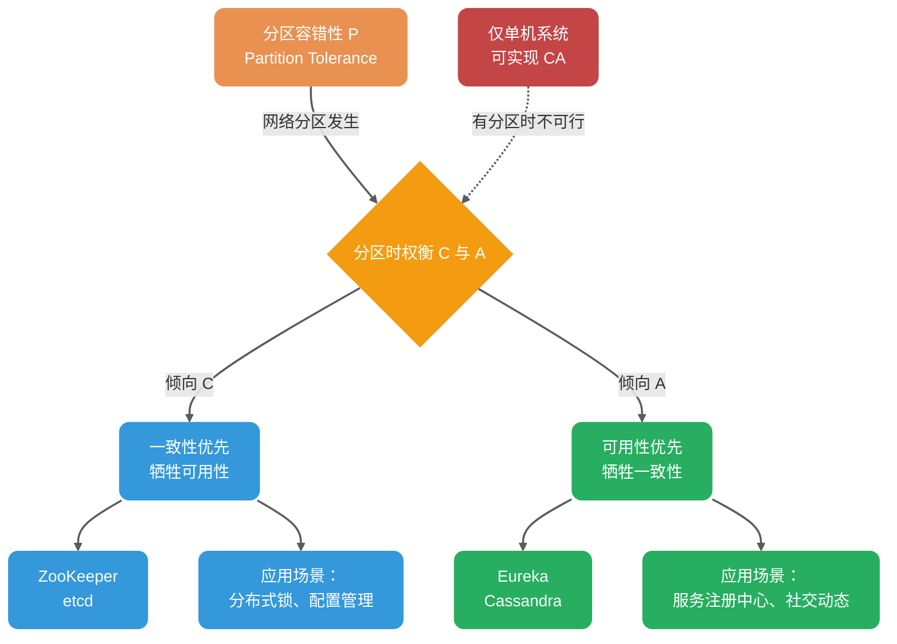

这里需要引入 **PACELC 理论**（CAP 的扩展）来更全面地解释：

Daniel J. Abadi 提出的 PACELC 理论指出：**如果存在分区（P），必须在可用性（A）和一致性（C）之间选择；否则（E，Else），必须在延迟（L）和一致性（C）之间选择。**

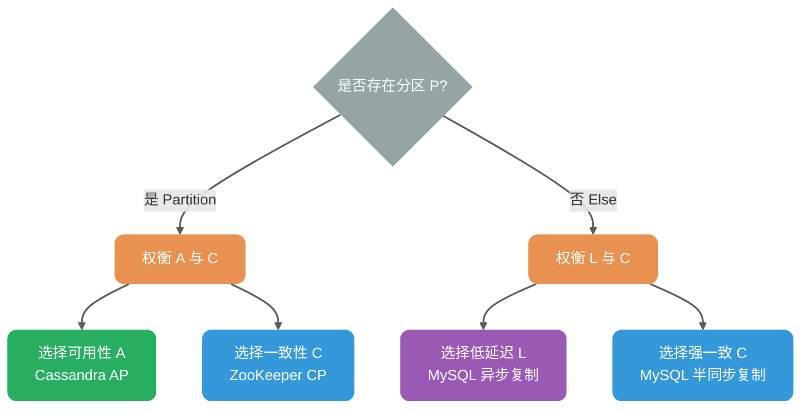

实际意义：即使无网络分区，分布式系统仍需在低延迟（异步复制）和强一致（同步复制）之间权衡。例如：

- **Cassandra**：可通过调整读写一致性级别（ONE/QUORUM/ALL）在延迟与一致性间权衡
- **MySQL 主从**：可选择异步复制（低延迟）或半同步复制（强一致）

比如 ZooKeeper、HBase 就是 CP 架构，Cassandra、Eureka 就是 AP 架构，Nacos 不仅支持 CP 架构也支持 AP 架构。

**选择 CP 还是 AP 的关键在于当前的业务场景，没有定论**：比如对于需要确保强一致性的场景如分布式锁、配置管理会选择 CP；对于高可用优先的场景如微服务注册中心会选择 AP。

**另外，需要补充说明的一点**：在无分区时，可以同时做到线性一致与「会响应」的 CAP-可用性；但工程上通常还要在延迟与一致性之间权衡（这便是 PACELC 理论中 ELC 部分讨论的内容）。

### CAP 理论的适用范围

**重要结论**：CAP 理论主要讨论单个数据对象在副本复制场景下的一致性与可用性权衡。

| 更贴近 CAP 讨论模型 | 需要拆分到分片/对象/操作级别分析     |
| ------------------- | ------------------------------------ |
| Redis 主从/哨兵集群 | 业务系统（无状态服务）               |
| MySQL 主从/多主集群 | Redis-Cluster（每个 shard 仍有副本） |
| MongoDB 副本集      | MongoDB-Cluster（分片 + 副本并存）   |
| ZooKeeper、etcd     | 分库分表（跨分片事务需额外协调）     |
| Kafka、RocketMQ     | 大多数微服务应用\*                   |

**说明**：

- **CAP 讨论模型**：单个读写寄存器（single register）的副本复制语义
- **复杂系统**：需要拆解到「每个对象/分区/操作」的一致性语义讨论
- **分片 + 副本**：分片系统每个 shard 通常仍有副本复制，一致性与可用性权衡仍在

> **业务系统与 CAP 的深度关联**：
>
> 业务系统本身虽不涉及副本同步，但**深受底层组件 CAP 属性的影响**。忽视这一点会导致系统在遭遇网络分区时发生级联雪崩（Cascading Failure）。
>
> **受 CAP 属性影响的业务场景**：
>
> | 业务场景 | 底层组件                     | CP 组件的影响              | AP 组件的影响                  |
> | -------- | ---------------------------- | -------------------------- | ------------------------------ |
> | RPC 路由 | 注册中心（如 Nacos CP 模式） | 注册期间不可用，请求被拒绝 | 可能路由到已下线实例，需要重试 |
> | 分布式锁 | Redis（AP）/ ZooKeeper（CP） | 性能较低但可靠             | 性能高但可能锁失效             |
> | 限流熔断 | Redis 计数器                 | 可能读到旧计数，限流失效   | 同左                           |
> | 缓存更新 | Redis 主从                   | 主从切换时可能丢数据       | 同左                           |
> | 消息消费 | Kafka                        | 消费进度同步慢，重复消费   | 同左                           |
>
> **实践建议**：业务开发者虽然不需要「实践」CAP 理论，但**必须理解 CAP 理论**，以便：
>
> - 为不同业务场景选择合适的组件（CP 或 AP）
> - 理解所选组件在网络分区时的行为特征
> - 设计符合业务需求的容错机制（重试、熔断、降级）

很多开发者认为自己在「实践 CAP 理论」，实际上只是站在已有组件上做选择（用 CP 还是 AP），而非真正实践该理论。真正需要实践 CAP 的是研发 Redis、MySQL 这类分布式存储组件的工程师。

### 在业务中应用 CAP 思想

除研发分布式存储组件外，业务开发中更多是**选择**合适的架构，而非实践 CAP 理论本身：

| 场景           | 偏向 CP 的选择               | 偏向 AP 的选择           | 业务权衡                 |
| -------------- | ---------------------------- | ------------------------ | ------------------------ |
| 数据库主从复制 | 同步复制（强一致）           | 异步复制（高性能）       | 数据一致性 vs 响应速度   |
| 分布式锁实现   | ZooKeeper（强一致）          | Redis（高性能）          | 锁的可靠性 vs 获取速度   |
| 服务注册中心   | ZooKeeper、Consul（CP 模式） | Eureka、Nacos（AP 模式） | 注册准确性 vs 发现可用性 |
| 限流计数器     | Redis（强一致命令）          | Redis（允许过期）        | 限流精度 vs 性能         |

**选型原则**：

- **关注性能**：倾向选择允许异步复制的组件，写入主节点即可返回成功，响应快；但存在数据丢失/读取到旧数据的风险，需配合重试机制
- **关注数据安全**：倾向选择要求多数派确认的组件，写入需等待 quorum 节点确认，响应慢；但能降低数据丢失风险

**注意**：数据丢失与否更取决于持久化、复制确认策略、故障模型，不能简单地用「CP/AP 标签」来判断。

**级联雪崩案例**：

一个典型的忽视 CAP 导致的级联雪崩场景：

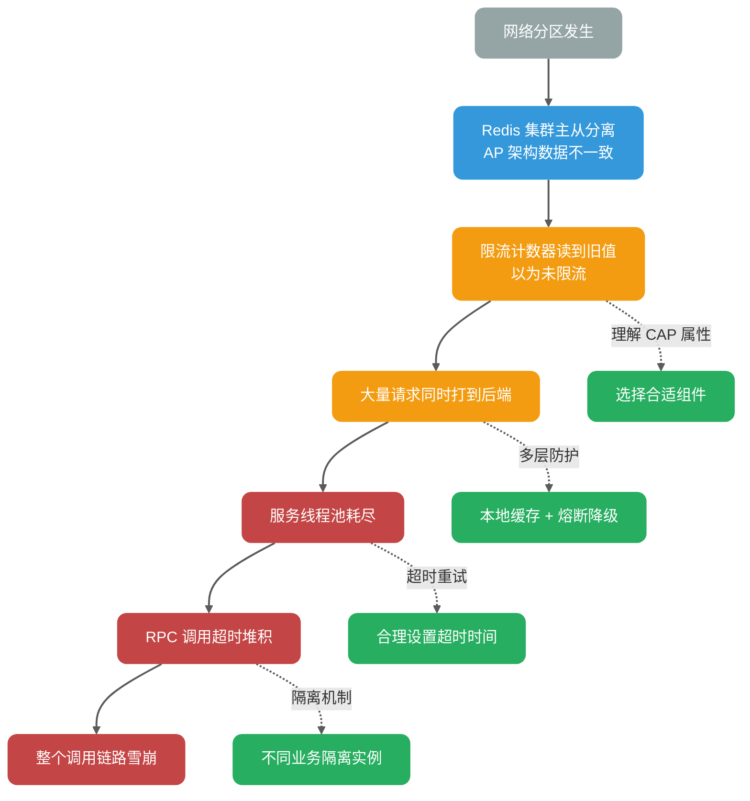

**防护措施**：

1. **理解底层组件的 CAP 属性**：知道在网络分区时组件的行为
2. **多层防护**：不只依赖单一组件，结合本地缓存、熔断、降级
3. **超时与重试**：合理设置超时时间，避免无限等待
4. **隔离机制**：不同业务使用不同的底层组件实例，避免故障扩散

### CAP 实际应用案例

我这里以注册中心来探讨一下 CAP 的实际应用。考虑到很多小伙伴不知道注册中心是干嘛的，这里简单以 Dubbo 为例说一说。

下图是 Dubbo 的架构图。**注册中心 Registry 在其中扮演什么角色呢？提供了什么服务呢？**

注册中心负责服务地址的注册与查找，相当于目录服务，服务提供者和消费者只在启动时与注册中心交互，注册中心不转发请求，压力较小。


常见的可以作为注册中心的组件有：ZooKeeper、Eureka、Nacos...。

#### ZooKeeper 3.8.x（CP 架构）

ZooKeeper 倾向 **CP 架构**。ZooKeeper 3.x 通过 ZAB 协议提供 **Linearizable Writes（线性化写入）**，但读取行为需区分：

- **Sync 读取**：强制与 Leader 同步，保证线性一致性（Linearizability）。
- **普通读取**：默认提供 **顺序一致性（Sequential Consistency）**，保证全局更新操作的顺序，同一会话内客户端视图绝不会发生回退，但可能读到稍旧数据（存在读取滞后）。

> **重要区别**：顺序一致性 ≠ 最终一致性。ZooKeeper 的普通读取保证所有客户端看到相同的**更新顺序**（全局 zxid 顺序），只是存在读取滞后；而最终一致性不保证全局顺序，仅保证最终收敛。ZK 的默认读更像是「stale-but-ordered」的读（顺序/会话保证很强），而不是 Dynamo 系那种 eventual consistency 语境。

在 Leader 选举期间或 Follower 节点数不足 Quorum（N/2+1）时，ZooKeeper 会拒绝服务以维持一致性，表现为不可用（牺牲 A）。

在多节点部署下，集群采用 Quorum 模式：多数派节点（n/2+1）必须同意变更才有效。

ZooKeeper 提供 Watcher 机制（异步通知变更）和版本号机制（zxid 校验新鲜度）以缓解读取滞后问题。

失败路径与状态机表现：

| 故障场景                        | 系统状态                        | 客户端表现                                                   |
| ------------------------------- | ------------------------------- | ------------------------------------------------------------ |
| Quorum 失效（半数以上节点故障） | **LOOKING** 状态，Leader 选举中 | 写入请求拒绝，读取请求可能返回旧数据或超时                   |
| Follower 与 Leader 分区         | Follower 进入 **ELECTION** 状态 | 该 Follower 无法参与投票，但可响应读取（滞后数据）           |
| Leader 与多数派分区             | Leader 自动降级，集群重新选举   | 原Leader的写入丢失，需客户端重试（检测到 zxid 回退）         |
| Watcher 丢失                    | 网络抖动或 GC 压力导致          | 客户端需重试（指数退避 + Jitter），监控 `Watches` 队列防背压 |

#### Eureka（AP 架构）

Eureka 采用 AP 架构：节点对等，通过 Peer 复制/同步（定期全量拉取 + 增量更新）保持数据一致，无 Leader 选举。**注意**：Spring Cloud 生态中历史上更常见 1.x 依赖形态；Netflix/eureka 的 2.x 仍在维护并持续发布。

失败路径与状态机表现：

| 故障场景                     | 系统状态                                 | 客户端表现                                                                                      | 自我保护机制                                                          |
| ---------------------------- | ---------------------------------------- | ----------------------------------------------------------------------------------------------- | --------------------------------------------------------------------- |
| 网络分区（脑裂）             | 分区两侧**独立运行**，均可读写           | 客户端可能读到旧注册信息（不一致窗口 = 心跳间隔 30s + gossip 传播延迟，10 节点拓扑中 P99 <60s） | 当续约阈值 < 85% 时触发**自我保护**，暂停实例剔除，避免“误杀”健康实例 |
| 半数节点故障                 | 剩余节点继续服务，但数据可能分叉         | 读操作正常，写入可能仅存于少数派节点                                                            | 自我保护触发，待节点恢复后通过 gossip 自动合并                        |
| 节点短暂重启                 | 从 Peer 批量拉取注册表（Registry Fetch） | 服务发现短暂不可用（< 1min），缓存起作用                                                        | 正常模式，自动恢复                                                    |
| 注册风暴（大量实例同时注册） | 写队列堆积，可能导致请求丢弃             | 部分注册请求超时，需客户端重试                                                                  | 可配置限流与背压（如 Ribbon 重试策略）                                |

**自我保护机制详细说明**：

Eureka Server 通过以下逻辑判断是否进入自我保护：

```
每分钟期望续约数 E = 当前实例数 N × (60 / 心跳间隔秒数)
阈值 T = E × 0.85
若最近 1 分钟实际续约数 R < T，则进入自我保护：暂停剔除（eviction）
（E/T 会按固定周期根据 N 更新，常见周期约 15 分钟）
```

默认心跳间隔为 30 秒时，每分钟期望续约数 = 实例数 × 2。

当 `实际续约率 < 85%` 时：

1. 进入 **SELF PRESERVATION** 模式
2. 停止剔除过期实例（EvictionTask 暂停）
3. 日志输出：`ENTER SELF PRESERVATION MODE`

**设计权衡**：宁可保留「僵尸」实例，也不误杀健康实例——因为在微服务场景下，短暂的服务降级好过大规模服务不可用。客户端通常配置重试与熔断来处理不可用实例。

#### 总结

选择 CP 或 AP 取决于场景：ZooKeeper 适合强一致需求，如配置管理；Eureka 适合高可用注册，如微服务发现。

Nacos 不仅支持 CP 也支持 AP。

### 总结

CAP 理论指导我们：在分布式系统可能出现网络分区（P）的前提下，我们必须在强一致性（C）和高可用性（A）之间做出权衡。

- **CP 架构**：牺牲可用性，保证强一致性。适用于对数据一致性要求极高的场景（如金融交易、分布式锁）。
- **AP 架构**：牺牲一致性，保证高可用性。适用于对系统可用性要求较高，能容忍短暂数据不一致的场景（如社交动态、商品搜索）。
- **PACELC**：在无分区（E）时，需在延迟（L）和一致性（C）之间权衡。

### 推荐阅读

1. [CAP 定理简化](https://medium.com/@ravindraprasad/cap-theorem-simplified-28499a67eab4) （英文，有趣的案例）
2. [神一样的 CAP 理论被应用在何方](https://juejin.im/post/6844903936718012430) （中文，列举了很多实际的例子）
3. [请停止呼叫数据库 CP 或 AP](https://martin.kleppmann.com/2015/05/11/please-stop-calling-databases-cp-or-ap.html) （英文，带给你不一样的思考）

## BASE 理论

[BASE 理论](https://dl.acm.org/doi/10.1145/1394127.1394128)起源于 2008 年，由 eBay 的架构师 Dan Pritchett 在 ACM 上发表，论文标题为《Base: An ACID Alternative》。

> **关键洞察**：从论文标题可以看出，**BASE 首先是 ACID 的替代品**。但同时需要注意，BASE 与 CAP 理论也存在密切关系——**最终一致性正是 CAP 中 AP 架构在工程实践中达到系统收敛的指导原则**。

### 简介

**BASE** 是 **Basically Available（基本可用）**、**Soft-state（软状态）** 和 **Eventually Consistent（最终一致性）** 三个短语的缩写。BASE 理论来源于对大规模互联网系统分布式实践的总结。

### BASE 与 ACID 的关系

要理解 BASE 理论，首先需要回顾 ACID 理论中的 **一致性（Consistency）**：

**ACID 的一致性定义**：事务执行前后，数据库只能从一个一致状态转变为另一个一致状态。

以转账为例：小竹向熊猫转账 1000W。

- **初始态**：小竹 1001W，熊猫 888W，合计 1889W
- **结果态**：小竹 1W，熊猫 1888W，合计 1889W

无论事务成功或失败，整体数据的变化必须一致——类似于能量守恒定律。

**分布式场景的挑战**：

在分布式系统中，商品服务和订单服务分离部署，[扣减库存、创建订单]需要通过网络调用，这中间必然存在时间差：

```
时刻 T1：库存 8888 → 8887（扣减成功）
时刻 T2：网络调用订单服务...
时刻 T3：订单创建成功
```

在 T1~T3 期间，系统处于 **中间态**：库存已减，订单未创建。跨服务后无法用单库 ACID 事务保证整体原子提交与隔离，系统会客观存在中间态；BASE 接受中间态并通过补偿/重试让状态最终收敛。

**BASE 理论的解决方案**：

BASE 理论承认并允许这种中间态的存在：

- **Soft-state（软状态）**：允许系统存在中间态，且该中间态不影响系统整体可用性
- **Eventually consistent（最终一致性）**：中间态最终会演变成终态（要么成功，要么回滚）

下面通过一个对比图来直观理解 ACID 和 BASE 在事务处理上的不同模式：

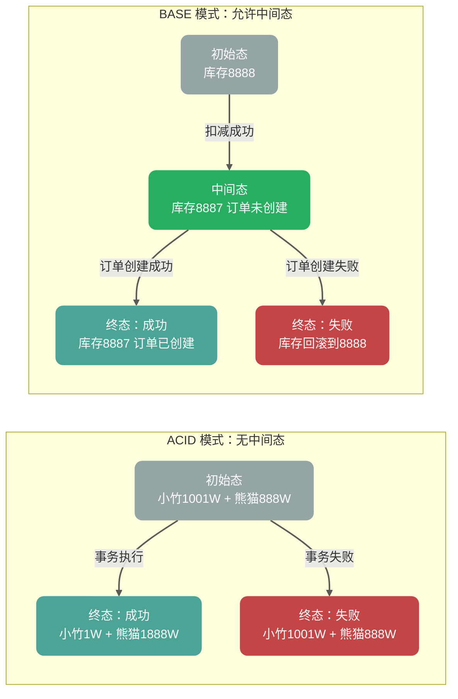

因此，**BASE 理论是 ACID 在分布式场景中的替代品**，而非 CAP 理论的补充。

### BASE 理论三要素


#### 基本可用

基本可用是指分布式系统在出现不可预知故障的时候，允许损失部分可用性。但是，这绝不等价于系统不可用。

**什么叫允许损失部分可用性呢？**

- **响应时间上的损失**：正常情况下，处理用户请求需要 0.5s 返回结果，但是由于系统出现故障，处理用户请求的时间变为 3s。
- **系统功能上的损失**：正常情况下，用户可以使用系统的全部功能，但是由于系统访问量突然剧增，系统的部分非核心功能无法使用。

#### 软状态

软状态（Soft State）是指允许系统中的数据存在中间状态，并认为该中间状态的存在不会影响系统的整体可用性。

> **与 ACID 的区别**：ACID 理论要求事务执行后立即进入终态（成功或失败），不允许中间态；而 BASE 理论承认中间态是分布式系统的客观存在，只要中间态最终会演变成终态即可。

举例说明：

- **ACID 模式**：银行转账事务中，扣款和入账必须同时成功或同时失败，不允许「扣款成功但入账未完成」的中间态
- **BASE 模式**：电商下单事务中，允许「库存已减但订单未创建」的中间态存在，只要最终会达到一致（要么订单创建成功，要么库存回滚）

#### 最终一致性

最终一致性（Eventual Consistency）强调：**若系统在一段时间内无新的更新操作，则所有副本最终收敛到相同值。**

需要注意的是，「最终一致性」这个词在两个不同语境下有不同含义：

| 语境                           | 含义                     | 典型场景                   |
| ------------------------------ | ------------------------ | -------------------------- |
| **副本式存储（CAP 语境）**     | 数据副本最终同步一致     | Cassandra 数据复制         |
| **事务状态（BASE/ACID 语境）** | 事务中间态最终演变成终态 | 分布式事务（如 TCC、Saga） |

**副本式存储的最终一致性**：

「一段时间」是未界定的——可能是毫秒级（局域网同步）或分钟级（跨地域复制）。生产环境中需通过 **Read Repair（读修复）**、**Anti-Entropy（反熵/后台同步）** 或 **Quorum 写入** 主动加速收敛。

**事务状态的最终一致性**：

以分布式事务为例：[扣减库存、创建订单、扣减余额]

- 时刻 T1：库存已减（中间态）
- 时刻 T2：订单已创建（中间态）
- 时刻 T3：余额已扣（终态：事务成功）

或在失败场景：

- 时刻 T1：库存已减（中间态）
- 时刻 T2：订单创建失败（触发回滚）
- 时刻 T3：库存回滚（终态：事务失败）

系统会保证在一定时间内达到数据一致的状态，而不需要实时保证系统数据的强一致性。

分布式一致性的 3 种级别：

1. **强一致性**：系统写入了什么，读出来的就是什么。
2. **弱一致性**：不一定可以读取到最新写入的值，也不保证多少时间之后读取到的数据是最新的，只是会尽量保证某个时刻达到数据一致的状态。
3. **最终一致性**：弱一致性的升级版，系统会保证在一定时间内达到数据一致的状态。

**业界比较推崇最终一致性级别，但是某些对数据一致要求十分严格的场景比如银行转账还是要保证强一致性。**

那实现最终一致性的具体方式是什么呢？

- **读时修复（Read Repair）**：在读取数据时，检测数据的不一致，进行修复。适合读多写少场景。
- **写时修复（Hinted Handoff）**：在写入数据时，如果目标节点不可用，将数据缓存下来，待节点恢复后重传。**写时修复** 优化了写入延迟，但增加了读取时的不一致风险（数据可能还在缓存队列中未落盘到目标节点）。
- **异步修复（Anti-Entropy/反熵）**：通过后台比对副本数据差异并修复。工程实现中关键挑战是**高效检测数据差异**——暴力逐条比对（O(n)）在大规模数据集下不可行，生产系统采用**默克尔树（Merkle Tree）**实现低开销差异定位。

**选择建议**：

- **写时修复**：适合写多读少，优化写入性能，但牺牲一致性窗口。
- **读时修复**：适合读多写少，保证读取数据的准确性。
- **Anti-Entropy**：后台兜底保障，适合数据规模大但对最终一致性要求高的场景。

### 为什么很多人把 BASE 当作 CAP 的补充？

这是一个**部分正确但表述不够精确**的说法。更准确的理解是：

1. **BASE 首先是 ACID 的替代品**：从论文标题[《Base: An ACID Alternative》](https://spawn-queue.acm.org/doi/10.1145/1394127.1394128)可以看出，BASE 理论的初衷是解决分布式事务场景下 ACID 过于严格的问题。

2. **BASE 与 CAP 的 AP 架构存在内在联系**：

   - 选择 AP 架构意味着放弃强一致性（C）
   - 放弃强一致性后，系统如何达到收敛？答案是**最终一致性**
   - 因此，BASE 理论（特别是最终一致性）是 AP 架构在工程实践中**必须采用**的指导原则

3. **误解产生的根源**：很多人把“BASE 与 AP 相关”误解为“BASE 是 CAP 的补充”。实际上：
   - **BASE 不是对 CAP 理论的补充或修正**
   - **BASE 是 AP 架构选择的工程实践指南**——当你选择了 AP，BASE 告诉你如何在工程实践中让系统最终达到一致

**正确的理解**：

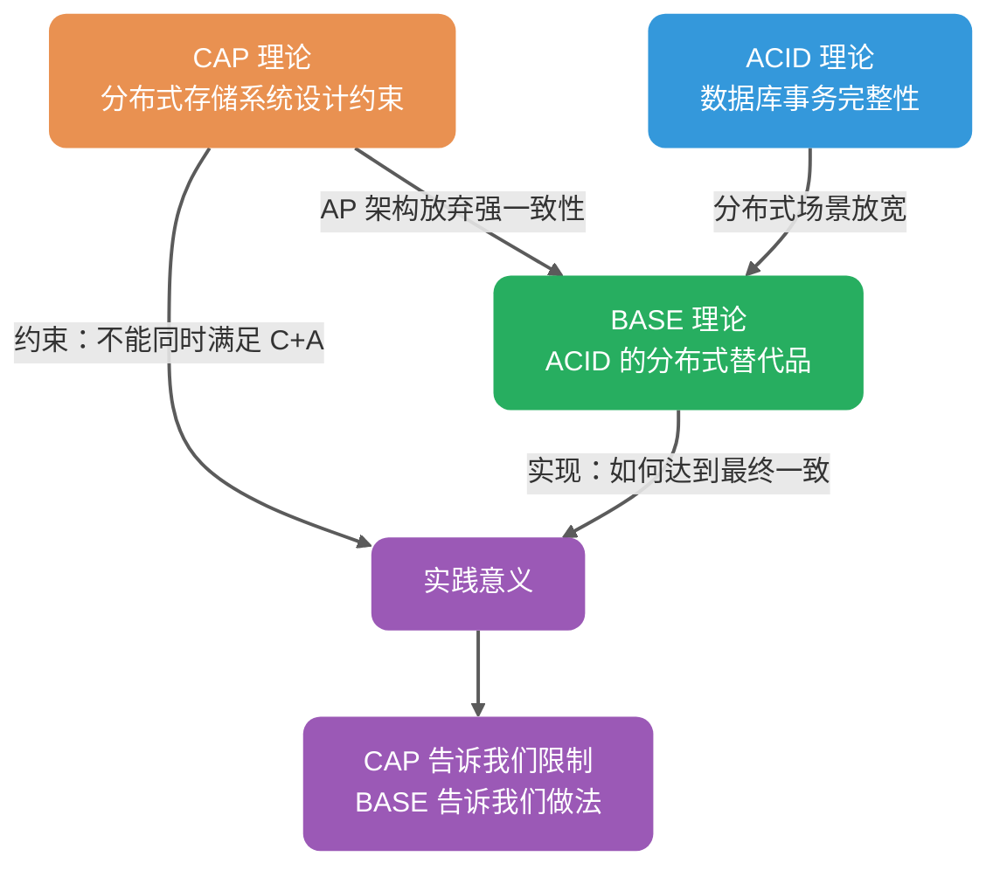

| 维度       | CAP 理论                 | BASE 理论                                        |
| ---------- | ------------------------ | ------------------------------------------------ |
| 关注领域   | 分布式存储系统（带副本） | 所有分布式系统                                   |
| 一致性含义 | 数据一致性（副本同步）   | 状态一致性（事务终态）                           |
| 可用性含义 | 节点故障时系统可用       | 部分节点故障时部分功能可用                       |
| 核心关系   | -                        | ① ACID 的分布式替代品<br>② AP 架构的工程实践指南 |

> **实践意义**：CAP 告诉我们在 AP 架构下无法保证强一致性，BASE 告诉我们在 AP 架构下如何通过最终一致性让系统达到收敛——两者是**约束与实现**的关系，而非补充关系。

如果说 CAP 是分布式存储系统的设计约束（告诉我们不能做什么），那么 BASE 就是分布式系统（尤其是业务系统）的实践指导（告诉我们如何做）——它告诉我们：**绝大多数应用场景不需要强一致性，通过接受中间态并最终达到一致性，是更务实的选择。**

### 总结

**ACID 是数据库事务完整性的理论，CAP 是分布式存储系统的设计理论，BASE 是 ACID 在分布式场景中的替代品，同时也是 AP 架构的工程实践指南。**

> **关键对应关系**：
>
> - **CAP 的一致性** = 数据一致性（副本节点间的数据同步）
> - **BASE 的一致性** = 状态一致性（事务终态的一致）= ACID 的一致性
> - **CAP 的可用性** = 主从集群的可用性（节点故障时系统仍可用）
> - **BASE 的可用性** = 分片式集群的可用性（部分节点故障只影响部分用户）
> - **CAP 与 BASE 的关系**：选择 AP 架构后，BASE 理论指导如何在工程实践中通过最终一致性达到系统收敛

<!-- @include: @article-footer.snippet.md -->


---

---

<!-- source: Gossip 协议详解-反熵、谣言传播、SWIM 与最终一致性.md -->

## [2] Gossip 协议详解：反熵、谣言传播、SWIM 与最终一致性

---
title: Gossip 协议详解：反熵、谣言传播、SWIM 与最终一致性
category: 分布式
description: Gossip 协议详解，讲解去中心化信息传播模型、反熵、谣言传播、Push/Pull 模式、SWIM 协议、最终一致性，以及在 Redis Cluster、Cassandra 等系统中的应用。
tag:
  - 分布式协议与算法
  - 数据复制协议
  - 最终一致性
head:
  - - meta
    - name: keywords
      content: Gossip 协议,SWIM 协议,反熵,谣言传播,最终一致性,去中心化,Redis Cluster,Cassandra,分布式协议,分布式算法
---

## 背景

在分布式系统中，不同节点间共享状态是一个基本需求。

一种简单的方法是 **集中式广播**：由中心节点向所有其他节点同步信息。这种方式适合中心化系统，但存在明显缺陷：当节点数量增加时，同步效率下降（O(N) 复杂度），且过度依赖中心节点，存在单点故障风险。

**分散式传播** 的 **Gossip 协议** 提供了一种去中心化的替代方案。

如果你还不清楚 Leader/Quorum 和 Gossip 分别适合解决什么问题，可以先看 [分布式协调详解](./分布式协调详解-Leader、Quorum、Lease、Fencing Token 与 Gossip.md)。这篇 Gossip 文章只展开“状态如何传播并最终收敛”，不负责解释 Leader 选举、脑裂和 Fencing Token 这类强协调问题。


## Gossip 协议介绍

**Gossip**（闲话协议）也称 **Epidemic 协议**（流行病协议），灵感来源于流行病传播的随机特性。其核心思想是：每个节点周期性地随机选择若干其他节点交换信息，使数据像病毒传播一样扩散至整个网络。


Gossip 协议最早由 Demers 等人在 1987 年的论文 [《Epidemic Algorithms for Replicated Database Maintenance》](https://dl.acm.org/doi/10.1145/41840.41841) 中提出，用于解决分布式数据库的副本同步问题。

**定义**：Gossip 协议是一种**去中心化**的通信协议，通过节点间的随机信息交换，在**非拜占庭且不存在永久网络分区**、节点持续周期性交换的前提下，使集群内所有节点的状态达到**最终一致性**。

> **重要区分**：Gossip 是信息传播协议，**不是共识算法**（如 Raft/Paxos）。共识算法保证强一致性与安全性，Gossip 只保证最终一致性，不适用于选主或状态机复制等需要强一致的场景。

**关键特性**：

- **去中心化**：无中心节点，所有节点地位平等
- **容错性强**：容忍节点宕机、网络分区、动态增删节点
- **概率收敛**：在均匀随机选点、fanout 为常数的经典模型下，传播轮次期望为 O(log N)（如 N=100 时约 5-7 轮，具体取决于 fanout 与丢包率）
- **消息冗余**：同一消息可能被多次接收，需去重机制

## Gossip 协议应用

Gossip 协议被广泛应用于分布式系统：

- **Redis Cluster**：用于节点间状态同步与故障检测
- **Apache Cassandra**：用于节点成员与状态信息传播；副本修复采用反熵/repair（基于 Merkle Tree）
- **Consul**：用于成员发现、故障探测与事件广播（基于 SWIM 协议）
- **Amazon Dynamo**：用于分布式存储的最终一致性

以 **Redis Cluster**（3.0+）为例：

Redis Cluster 是一个去中心化的分布式缓存方案，各节点通过 Gossip 协议交换集群状态，包括：节点信息、槽位分配、节点状态（在线/PFAIL/FAIL）。


**Gossip 消息类型**：

| 消息类型 | 用途                        |
| -------- | --------------------------- |
| MEET     | 将指定节点添加进集群        |
| PING     | 周期性发送，交换节点状态    |
| PONG     | 响应 PING，携带自身状态信息 |
| FAIL     | 广播节点故障标记            |

> 注：在实现上，MEET/PING/PONG 共享同一类消息结构；PONG 是对 PING/MEET 的响应，MEET 相当于“强制握手”的 PING。

**故障检测流程**：

1. 节点 A 若在 `cluster-node-timeout`（常见为 15s，具体以配置为准）内未收到 B 的响应，将 B 标记为 **PFAIL**（疑似下线）
2. 若 A 收到其他主节点对 B 的 PFAIL 报告，且**半数以上的主节点**确认 B 为 PFAIL（报告未过期），则 A 将 B 标记为 **FAIL**（已下线）并向集群广播

下图就是主从架构的 Redis Cluster 的示意图，图中的虚线代表的就是各个节点之间使用 Gossip 进行通信，实线表示主从复制。


> 注：Redis Cluster 主要通过 PING/PONG 的增量 gossip 传播节点/槽位/故障信息（带时间戳/标志位等），而不是采用像 Dynamo 那样基于 Merkle tree 的反熵对账流程。

关于 Redis Cluster 的详细介绍，可以查看这篇文章 [Redis 集群详解](https://javaguide.cn/数据库/redis/redis-cluster.html)。

## Gossip 协议传播模式

Gossip 协议有两种主要传播模式：**反熵** 和 **谣言传播**。

### 反熵

**定义**：节点间交换**完整数据**（或数据摘要），消除差异，实现最终一致。

**熵**的物理含义是系统混乱程度；反熵即**降低节点间数据差异，提升一致性**。

根据维基百科：

> 熵的概念最早起源于[物理学](https://zh.wikipedia.org/wiki/物理学)，用于度量一个热力学系统的混乱程度。熵最好理解为不确定性的量度而不是确定性的量度，因为越随机的信源的熵越大。

在这里，你可以把反熵中的熵理解为节点之间数据的混乱程度/差异性，反熵就是指消除不同节点中数据的差异，提升节点间数据的相似度，从而降低熵值。

**三种实现方式**：

| 方式      | 描述                               | 适用场景       |
| --------- | ---------------------------------- | -------------- |
| Push      | 发送方将自己的全部数据推送给接收方 | 发送方有新数据 |
| Pull      | 接收方拉取发送方的全部数据         | 接收方数据陈旧 |
| Push-Pull | 双向交换数据，并比较差异           | 最高效，最常用 |


伪代码如下：


**收敛特性**：在均匀随机选点、fanout 为常数的模型下，期望 O(log N) 轮覆盖全部节点（常见估算可用 log₂N 量级）

部分系统（如 InfluxDB）采用**确定性闭环调度**（如环形拓扑）代替随机选择，可在确定轮次内完成同步。这属于反熵的**工程衍生实现**，而非标准 Gossip 协议的核心机制。确定性调度牺牲了随机性的容错优势，换取可预测的收敛时间。


1. 节点 A 推送数据给节点 B，节点 B 获取到节点 A 中的最新数据。
2. 节点 B 推送数据给 C，节点 C 获取到节点 A，B 中的最新数据。
3. 节点 C 推送数据给 A，节点 A 获取到节点 B，C 中的最新数据。
4. 节点 A 再推送数据给 B 形成闭环，这样节点 B 就获取到节点 C 中的最新数据。

**权衡**：闭环调度可在确定时间内完成同步，但牺牲了**容错性**（环中节点故障影响传播路径），且难以适应节点动态增删。

**适用场景**：需要较低残留率（尽量不漏更新）、允许后台周期性对账修复；数据量大时必须依赖摘要/树等增量比对以控制成本。

> **生产级优化**：在大规模分布式存储（如 Cassandra、DynamoDB）中，节点数据量可达 TB 级，直接交换完整数据不现实。生产系统使用 **Merkle Tree（默克尔树）** 进行增量差异比对：两节点先交换 Merkle Tree 根哈希，若有差异则递归比对子树，在树高 O(log M) 的层级上定位差异（M 为该范围内条目数），随后仅传输增量数据。

### 谣言传播

**定义**：当节点有**新数据**时，变为活跃节点，周期性地向随机节点广播该数据，直到所有节点都收到。

**与反熵的区别**：

- 只传播**新增数据**（Delta），非完整数据
- 节点收到更新后进入活跃状态周期性传播，多次接触到已知该更新的节点后按策略（计数/概率/TTL）停止传播
- 适合**节点数量大**、**增量数据小**的场景

> **去重机制**：生产环境（如 Redis Cluster）通过**版本号**或**消息 ID** 去重，避免重复处理相同消息。

如下图所示（下图来自于[INTRODUCTION TO GOSSIP](https://managementfromscratch.wordpress.com/2016/04/01/introduction-to-gossip/) 这篇文章）：


伪代码如下：


**收敛特性**：在均匀随机选点、fanout 为常数的模型下，O(log N) 轮后以高概率覆盖全部节点。

**注意事项**：

- 控制消息包大小，尽量避免分片（视路径 MTU 而定，通常控制在单个网络包内）
- 配合去重机制（如消息 ID、版本号）
- 避免高频更新导致消息风暴
- 使用 **Jitter（随机抖动）**打散同步时间，避免多节点同时发起传播造成雪崩


### 总结

| 要点     | 反熵                       | 谣言传播                   |
| -------- | -------------------------- | -------------------------- |
| 传播内容 | 完整数据（或摘要）         | 仅新增数据（Delta）        |
| 适用场景 | 节点数量适中               | 节点数量较多/动态变化      |
| 消息开销 | 较大                       | 较小                       |
| 收敛范围 | 收敛到最新数据（全量同步） | 收敛到已知数据（增量传播） |

## Gossip 协议优势与缺陷

**优势**：

1. **实现简单**：协议逻辑简单，易于理解

2. **容错性强**：容忍节点宕机、网络分区、动态增删节点。新增或重启的节点在理想情况下最终一定会和其他节点的状态达到一致。

3. **扩展性好**：收敛时间为 O(log N)，当 N 较大（如 N > 100）时，并行传播通常比中心节点单播更快（后者需 O(N) 轮次）。在典型 rumor spreading 模型下代价是**消息总量为 O(N log N)**（具体取决于实现策略与停止条件），存在冗余开销。

**缺陷**：

1. **最终一致**：消息需通过多轮传播才能覆盖整个网络，存在不一致窗口期。达到一致的具体时间取决于网络状况、gossip 间隔（**视实现配置而定，常见 100ms-1s**）与节点规模。

2. **不适用拜占庭环境**：Gossip 协议的设计假设是非拜占庭环境，不处理恶意节点的情况（节点不会伪造或篡改消息）。

3. **消息冗余**：由于传播的随机性，同一节点可能重复收到相同消息，需配合去重机制。

## 总结

- Gossip 协议是一种**去中心化**的通信协议，通过节点间的随机信息交换，使集群内所有节点的状态达到**最终一致性**
- **不是共识算法**：Gossip 不保证强一致性/线性一致性，不能用于选主或状态机复制；共识算法（Raft/Paxos）才保证安全性与线性一致
- 核心特性：去中心化、容错性强、O(log N) 收敛
- 两种传播模式：**反熵**（完整数据/摘要）、**谣言传播**（增量数据）
- 典型应用：元数据传播（Redis Cluster）、最终一致存储（Cassandra/DynamoDB）
- 权衡：简单性与容错性 vs 最终一致延迟与消息冗余

## 参考

- [Epidemic Algorithms for Replicated Database Maintenance](https://dl.acm.org/doi/10.1145/41840.41841) - Demers et al., 1987
- [Amazon Dynamo: All Things Distributed](https://www.allthingsdistributed.com/files/amazon-dynamo-sosp2007.pdf) - DeCandia et al., 2007
- [Redis Cluster Specification](https://redis.io/docs/management/scaling/)
- 一万字详解 Redis Cluster Gossip 协议：<https://segmentfault.com/a/1190000038373546>
- 《分布式协议与算法实战》
- 《Redis 设计与实现》

<!-- @include: @article-footer.snippet.md -->


---

---

<!-- source: Paxos 算法详解-Basic Paxos、Multi-Paxos、角色流程与 Raft 对比.md -->

## [3] Paxos 算法详解：Basic Paxos、Multi-Paxos、角色流程与 Raft 对比

---
title: Paxos 算法详解：Basic Paxos、Multi-Paxos、角色流程与 Raft 对比
category: 分布式
description: Paxos 算法详解，讲解 Proposer、Acceptor、Learner 三类角色，Basic Paxos 两阶段流程、Multi-Paxos 优化、算法难点和与 Raft 算法的对比。
tag:
  - 分布式协议与算法
  - 共识算法
head:
  - - meta
    - name: keywords
      content: Paxos,Paxos 算法,Basic Paxos,Multi-Paxos,Proposer,Acceptor,Learner,共识算法,分布式一致性,Raft 对比
---

## 背景

Paxos 算法是 Leslie Lamport（莱斯利·兰伯特）在 **1990** 年提出的一种分布式系统 **共识** 算法。这是最早被广泛认可的分布式共识算法之一（前提是不存在拜占庭将军问题，也就是没有恶意节点）。

为了介绍 Paxos 算法，兰伯特专门写了一篇幽默风趣的论文。在这篇论文中，他虚拟了一个叫做 Paxos 的希腊城邦来更形象化地介绍 Paxos 算法。

不过，审稿人并不认可这篇论文的幽默。于是，他们就给兰伯特说：“如果你想要成功发表这篇论文的话，必须删除所有 Paxos 相关的故事背景”。兰伯特一听就不开心了：“我凭什么修改啊，你们这些审稿人就是缺乏幽默细胞，发不了就不发了呗！”。

于是乎，提出 Paxos 算法的那篇论文在当时并没有被成功发表。

直到 1998 年，系统研究中心 (Systems Research Center，SRC）的两个技术研究员需要找一些合适的分布式算法来服务他们正在构建的分布式系统，Paxos 算法刚好可以解决他们的部分需求。因此，兰伯特就把论文发给了他们。在看了论文之后，这俩大佬觉得论文还是挺不错的。于是，兰伯特在 **1998** 年重新发表论文 [《The Part-Time Parliament》](http://lamport.azurewebsites.net/pubs/lamport-paxos.pdf)。

论文发表之后，各路学者直呼看不懂，言语中还略显调侃之意。这谁忍得了，在 **2001** 年的时候，兰伯特专门又写了一篇 [《Paxos Made Simple》](http://lamport.azurewebsites.net/pubs/paxos-simple.pdf) 的论文来简化对 Paxos 的介绍，主要讲述两阶段共识协议部分，顺便还不忘嘲讽一下这群学者。

《Paxos Made Simple》这篇论文就 14 页，相比于 《The Part-Time Parliament》的 33 页精简了不少。最关键的是这篇论文的摘要就一句话：


> The Paxos algorithm, when presented in plain English, is very simple.

翻译过来的意思大概就是：当我用无修饰的英文来描述时，Paxos 算法真心简单！

有没有感觉到来自兰伯特大佬满满地嘲讽的味道？

## 介绍

本文将 Paxos 分为两部分进行讲解：

- **Basic Paxos 算法**：描述多节点之间如何就单个值（value）达成共识。
- **Multi-Paxos 思想**：通过执行多个 Basic Paxos 实例，就一系列值达成共识。

共识算法的作用是让分布式系统中的多个节点对某个提案（proposal）达成一致。“提案”在不同系统里可指代的对象很广，如选主、事件排序等都可以是提案。

由于 Paxos 算法公认难以理解和实现，2013 年诞生了更易理解的 [Raft 算法](https://javaguide.cn/分布式/theorem&algorithm&protocol/raft-algorithm.html)。

**关于 Raft 与 Paxos 的关系**：从学术角度，Raft 并非 Paxos 的严格变体——两者在底层设计哲学（如日志空洞、Leader 权限）上存在本质差异。但从工程实践角度，Raft 的设计灵感源于 Multi-Paxos，可理解为“受 Multi-Paxos 启发的重新设计”。本文后文将详细对比二者区别。

针对非拜占庭场景（无恶意节点），除 Raft 外，**ZAB 协议**、**Fast Paxos** 等都是基于 Paxos 改进的共识算法。

针对拜占庭场景（存在恶意节点），通常使用 **工作量证明（PoW，Proof-of-Work）**、**权益证明（PoS，Proof-of-Stake）** 等共识算法，典型应用为区块链系统。

## Basic Paxos 算法

### 角色定义

Basic Paxos 中存在 3 个重要的角色：

1. **提议者（Proposer）**：也可以叫做协调者（coordinator），负责接受客户端请求并发起提案。提案信息通常包括提案编号（proposal ID）和提议的值（value）。
2. **接受者（Acceptor）**：也可以叫做投票员（voter），负责对提案进行投票，同时需要记住自己的投票历史。
3. **学习者（Learner）**：负责学习（learn）已被选定的值。在复制状态机（RSM）实现中，该值通常对应一条待执行的命令，由状态机按序 apply 后再由对外服务层返回结果。


**角色交互关系图**：

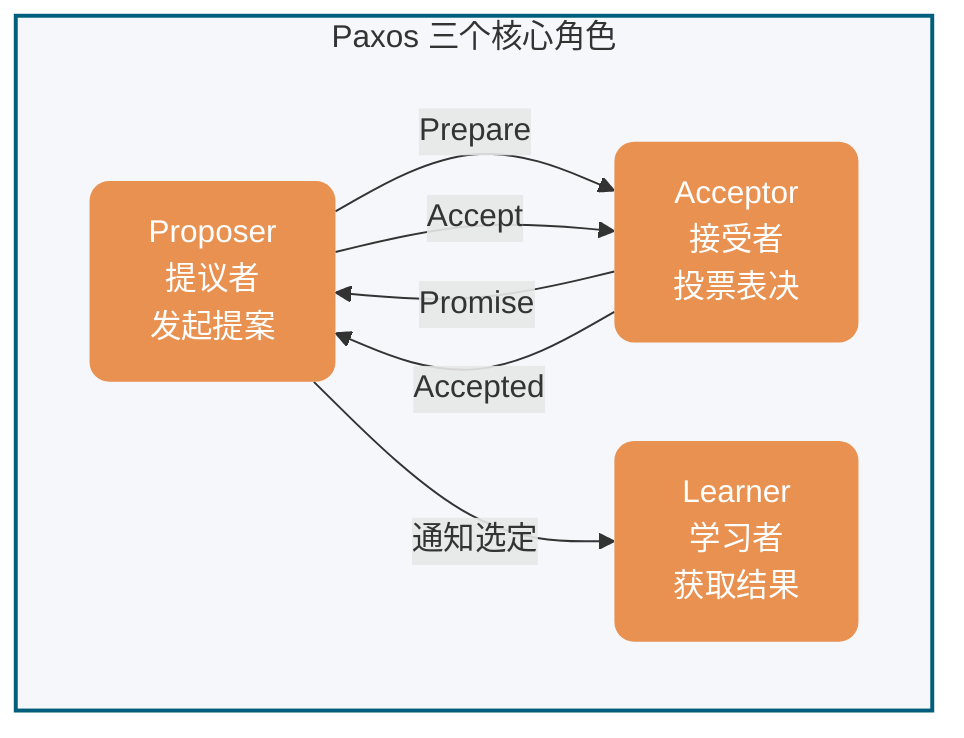

为了减少实现该算法所需的节点数，一个节点可以身兼多个角色。并且，一个提案被选定需要被半数以上的 Acceptor 接受。这样的话，Basic Paxos 算法还具备容错性，在少于一半的节点出现故障时，集群仍能正常工作。

### 执行流程

Basic Paxos 通过两个阶段达成共识：**Prepare/Promise（准备/承诺）阶段**和 **Accept/Accepted（接受/已接受）阶段**。

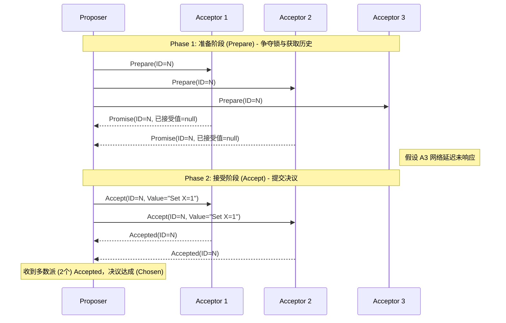

#### Phase 1: Prepare/Promise（准备/承诺阶段）

Proposer 选择一个提案编号 n（必须全局唯一且递增），向超过半数的 Acceptor 发送 `Prepare(n)` 请求。

**Acceptor 的处理逻辑**（对每个提案编号 n 的处理逻辑）：

- 若 n > 该 Acceptor 见过的最大提案编号 max_n
  - 返回 `Promise(n, max_v)`，其中 max_v 是之前接受过的最大编号提案的值（若有）
  - 承诺不再接受编号 < n 的提案
- 若 n ≤ max_n
  - 拒绝或忽略该请求

**目的**：让 Proposer 了解当前系统中已被接受或准备接受的提案，避免提出冲突的值。

#### Phase 2: Accept/Accepted（接受/已接受阶段）

当 Proposer 收到超过半数 Acceptor 的 Promise 响应后，选择响应中 max_v 最大的值（若无则任意选择一个值），向超过半数的 Acceptor 发送 `Accept(n, v)` 请求。

**Acceptor 的处理逻辑**：

- 若 n ≥ 该 Acceptor 在 Phase 1 承诺的 max_n
  - 接受该提案，记录 (n, v)，并返回 `Accepted(n, v)`
- 否则
  - 拒绝该请求

#### 收敛条件

当 Proposer 收到超过半数 Acceptor 对 `Accept(n, v)` 的响应时，提案 v 被**选定（chosen）**。Proposer 通知所有 Learner 提案已被选定。

### 安全性保证

Basic Paxos 保证以下安全性：

1. **一致性**：一旦某个值被选定，所有后续选定的值都是该值
2. **可终止性**：若无 Proposer 竞争且通信可靠，最终能选定一个值

**核心机制**：通过 Phase 1 收集 Promise，Proposer 只能选择已经被 Acceptors 承诺过的值（或选择新值），保证了不会有冲突的值被选定。

### 活性问题

Basic Paxos 存在**活锁（Livelock）**风险：

- 若多个 Proposer 同时发起提案，且提案编号交错递增
- 可能导致没有提案能获得超过半数的 Accept
- 系统陷入无限竞争，无法达成共识

**活锁示例**（Dueling Proposers）：

假设有两个 Proposer P1 和 P2 同时发起提案：

1. P1 发送 `Prepare(1)`，P2 发送 `Prepare(2)`
2. Acceptor 们承诺给编号较大的 P2
3. P1 发现编号被超越，发送 `Prepare(3)`
4. P2 发现编号被超越，发送 `Prepare(4)`
5. ... 循环往复，永远无法进入 Phase 2

**活锁时序图**：

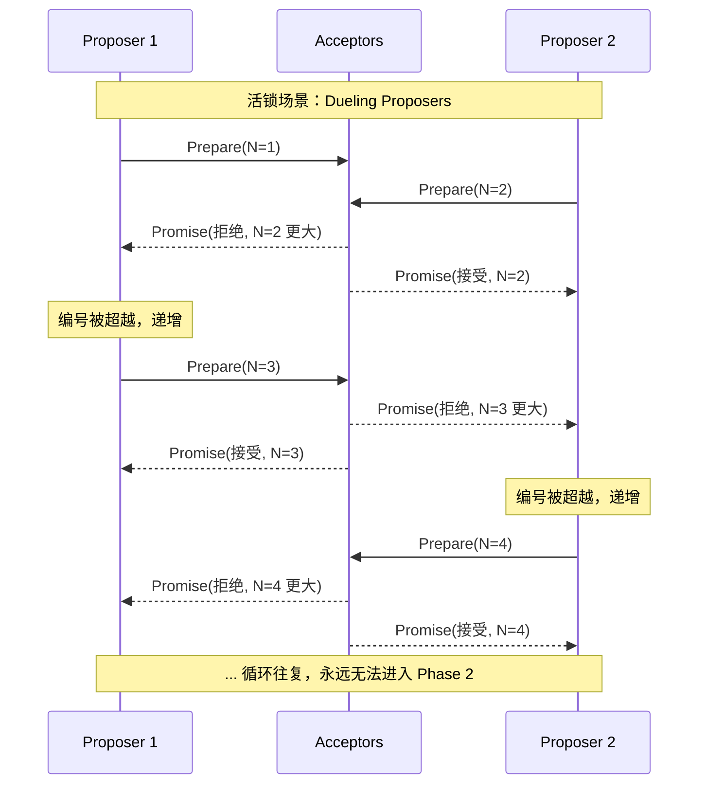

**解决方案**：通过 Multi-Paxos 引入稳定的 Leader 机制。

**随机退避算法（Randomized Exponential Backoff）**：

为防止多个 Proposer 竞争导致活锁，生产级实现通常引入随机退避：

当 Proposer 的 Prepare 请求被拒绝（编号过小）时：

1. 等待随机时间：`base_delay * random(1, 2^attempt)`
2. 选择更大的提案编号（如：`n = n + k`，`k > 0`）
3. 重试 Prepare 阶段

参数示例：

- `base_delay`: 10ms
- `attempt`: 重试次数（1, 2, 3...）
- 最大退避时间：`max(1s, base_delay * 2^10)`

这种机制确保竞争者不会同时重试，最终某个 Proposer 能成功完成 Phase 1。

**分区处理**：若发生网络分区，多数派一侧可继续选举 Leader 并提交新提案；少数派无法形成法定人数（quorum），只能等待分区恢复。

## Multi-Paxos 思想

### 核心思想

Basic Paxos 算法仅能就单个值达成共识，为了能够对一系列的值达成共识，我们需要用到 Multi-Paxos 思想。

Multi-Paxos 的核心优化思想是**复用 Leader**：通过 Basic Paxos 选出一个稳定的 Proposer 作为 Leader，后续提案直接由该 Leader 发起，跳过 Phase 1 的 Prepare/Promise 阶段。

### 优化机制

#### 1. Leader 稳定选举

- 通过 Basic Paxos 选出唯一的 Proposer 作为 Leader
- Leader 崩溃后，通过新一轮 Basic Paxos 选举新 Leader
- 避免多 Proposer 竞争导致的活锁

#### 2. 跳过 Phase 1

- Leader 稳定后，后续提案直接进入 Phase 2（Accept 阶段）
- 无需每次都执行 Prepare/Promise，减少一轮 RPC
- **延迟优化**：Basic Paxos 每个提案需要 2-RTT（Prepare + Accept），Multi-Paxos 后续提案仅需 1-RTT（仅 Accept），**提案提交延迟降低 50%**（2-RTT → 1-RTT）

**性能优化对比图**：

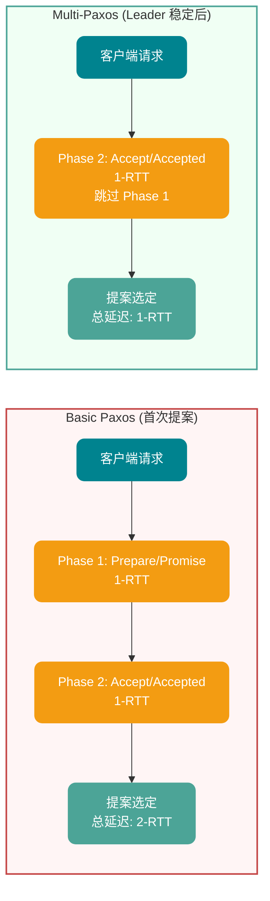

#### 3. 日志序号

- 为每个提案分配递增的**日志索引（log index）**
- 保证全局顺序：Leader 按顺序追加日志，Acceptor 按序号接受
- 支持**空洞**：某位置的提案可能因 Leader 切换而暂时缺失，后续可补齐

#### 4. 日志空洞（gap）与 NOP 填补

**问题描述**：当新 Leader 上线时，可能遇到一种棘手场景——前任 Leader 已经在某个日志位置上达成了共识，但新 Leader 不知道这个值。如果新 Leader 试图在该位置提交新值，就会覆盖已经选定的值，破坏一致性。

**解决方案：NOP（No-Operation）日志**

Multi-Paxos 通过引入 NOP 日志来解决这个问题：

1. **场景检测**：新 Leader 在 Phase 1（Prepare）阶段，收集到 Acceptor 返回的已接受值
2. **必须复用**：如果发现某位置已有被选定的值，新 Leader **必须**复用该值，不能提出新值
3. **NOP 占位**：对于空洞位置（无任何已接受值），新 Leader 可以提交特殊值——NOP（空操作）
4. **状态机跳过**：NOP 日志虽然占用日志位置，但状态机回放时会跳过，不执行任何业务逻辑

**示例流程**：

```
前任 Leader 崩溃前：
Index 1: Value=A (chosen)
Index 2: Value=B (chosen)
Index 3: <空洞> (未完成)

新 Leader 上线后：
Index 1: 复用 Value=A
Index 2: 复用 Value=B
Index 3: 提交 NOP (填补空洞，不执行业务逻辑)
Index 4: 提交 Value=C (正常业务日志)
```

**空洞与已接受值恢复流程**：

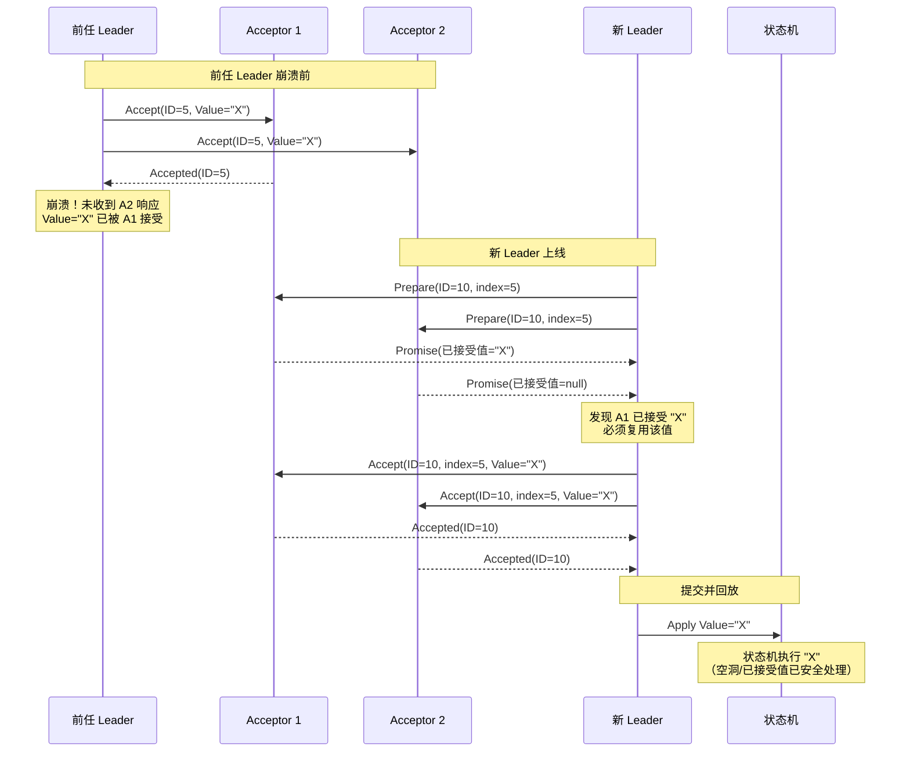

### 执行流程

1. **Leader 选举**：通过 Basic Paxos 选出 Leader
2. **日志复制**：Leader 接收客户端请求，追加到本地日志，分配递增索引
3. **直接 Accept**：Leader 向 Acceptor 发送 `Accept(index, value)`（跳过 Prepare）
4. **响应处理**：Acceptor 按序号接受日志，记录到本地
5. **提交确认**：当超过半数 Acceptor 接受某位置的日志后，该位置可提交

### 容错与恢复

- **Leader 崩溃**：新 Leader 通过日志比对找出已提交位置，补齐未提交日志
- **网络分区**：多数派一侧继续服务，少数派等待恢复
- **日志空洞**：新 Leader 可填补前任 Leader 未提交的日志位置

**新 Leader 恢复流程图**：

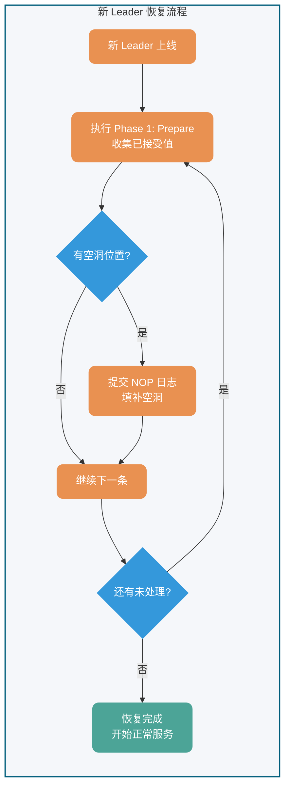

⚠️ **注意**：Multi-Paxos 只是一种思想，这种思想的核心就是通过多个 Basic Paxos 实例就一系列值达成共识。也就是说，Basic Paxos 是 Multi-Paxos 思想的核心，Multi-Paxos 就是多执行几次 Basic Paxos。

由于 Lamport 提出的 Multi-Paxos 思想缺少代码实现的必要细节（比如怎么选举领导者、日志空洞如何处理），所以在理解和实现上比较困难。

不过，也不需要担心，我们并不需要自己实现基于 Multi-Paxos 思想的共识算法，业界已经有了比较出名的实现。如 Raft 算法虽非 Paxos 严格变体，但借鉴了其核心思想（Leader 选举、日志复制），并简化了实现细节，变得更容易被理解以及工程实现，实际项目中可以优先考虑 Raft 算法。

## Paxos vs Raft

在 2014 年之后，Raft 算法凭借其极致的可理解性成为了工业界的新宠。必须明确，Raft 并非 Paxos 的变体，两者在底层设计哲学上存在硬性分歧。

| **对比维度**          | **Multi-Paxos**                                             | **Raft**                                                                    | **核心工程影响**                                                                |
| --------------------- | ----------------------------------------------------------- | --------------------------------------------------------------------------- | ------------------------------------------------------------------------------- |
| **日志流向与约束**    | 允许乱序提交，允许出现**日志空洞**。                        | 强制按序追加（Append-Only），**绝对不允许日志空洞**。                       | Raft 实现简单，状态机回放极其顺滑；Paxos 并发上限更高，但实现难度呈指数级增加。 |
| **Leader 选举与权限** | Leader 仅是一个性能优化手段（省略 Phase 1），非必须角色。   | **强 Leader 模型**。一切数据以 Leader 为准，日志只从 Leader 流向 Follower。 | Raft 通过限制只能选取“日志最完整”的节点当选 Leader，简化了数据恢复逻辑。        |
| **活锁防御**          | 需额外引入随机退避或外部选主算法。                          | 协议内置基于随机超时（Randomized Timeout）的选主防御机制。                  | Raft 的开箱即用性（Out-of-the-box）远高于 Paxos。                               |
| **工业级落地代表**    | Apache ZooKeeper (基于 ZAB, 类 Multi-Paxos), Google Spanner | etcd, HashiCorp Consul, TiKV                                                | 现代微服务基础设施倾向于选择 Raft。                                             |

## 实际应用

基于 Paxos 算法或其变体的系统包括：

- **Google Chubby**：基于 Paxos 实现的分布式锁服务
- **Apache ZooKeeper 3.8+**：基于 ZAB 协议（类 Multi-Paxos，写入通过 Leader 广播，支持 FIFO 顺序）
- **etcd 3.5+**：基于 Raft 算法（强一致性共识，支持动态成员变更、轻量级事务 Txn）
- **HashiCorp Consul**：基于 Raft 算法（服务发现与配置管理）

这些系统在分布式协调、配置管理、服务发现等领域发挥着关键作用。

> **版本说明**：上述系统随版本演进会有协议优化（如 etcd 3.4 引入租约 Keep-Alive 优化、ZooKeeper 3.5 引入动态重配置），生产部署前建议查阅对应版本的 Release Notes。

## 生产落地建议

### 可观测性指标（Observability Checklist）

| 类别     | 关键指标           | 告警阈值建议      | 说明                         |
| -------- | ------------------ | ----------------- | ---------------------------- |
| **延迟** | 提案提交延迟 (p99) | > 100ms           | 从客户端请求到收到多数派确认 |
| **吞吐** | 提案处理速率       | < 预期 QPS 的 50% | 可能网络分区或节点故障       |
| **选主** | Leader 切换次数    | > 3 次/小时       | 频繁切主说明集群不稳定       |
| **空洞** | 未提交日志位置数   | > 100             | 过多空洞影响状态机回放       |
| **脑裂** | 多 Leader 竞争事件 | = 0               | 绝不允许出现                 |

### 混沌工程建议

| 测试场景        | 验证目标                       | 推荐工具                 |
| --------------- | ------------------------------ | ------------------------ |
| **Leader 崩溃** | 验证快速选主与数据零丢失       | Chaos Mesh, Chaos Monkey |
| **网络分区**    | 验证多数派继续服务、少数派等待 | Toxiproxy                |
| **网络抖动**    | 验证随机退避机制避免活锁       | tc (netem)               |
| **时钟漂移**    | 验证提案编号唯一性不受影响     | --                       |

### 常见反模式（Anti-Patterns）

1. **忽略空洞处理**：状态机回放时遇到空洞位置直接跳过，可能导致客户端请求丢失
2. **固定提案编号**：使用时间戳或节点 ID 作为提案编号，无法保证全局递增
3. **无超时机制**：Prepare/Accept 请求无限等待，导致系统挂起
4. **忽略已接受值**：新 Leader 强制提交自己的值，破坏一致性

## 总结

- Paxos 算法是 Lamport 在 1990 年提出的分布式共识算法，是强一致性共识的理论基础
- Basic Paxos 通过两阶段（Prepare/Promise、Accept/Accepted）就单个值达成共识
- Multi-Paxos 通过复用 Leader 和跳过 Phase 1 优化，实现一系列值的共识（提案延迟从 2-RTT 降至 1-RTT）
- Raft 算法借鉴了 Multi-Paxos 思想但重新设计了实现细节（强 Leader 模型、禁止日志空洞），更易于理解和工程实现
- 在实际项目中，建议优先选择 Raft、etcd、ZooKeeper 等已完善的实现

## 参考

- [《Paxos Made Simple》](http://lamport.azurewebsites.net/pubs/paxos-simple.pdf) - Lamport, 2001
- [《The Part-Time Parliament》](http://lamport.azurewebsites.net/pubs/lamport-paxos.pdf) - Lamport, 1998
- [《In Search of an Understandable Consensus Algorithm》](https://raft.github.io/raft.pdf) - Ongaro & Ousterhout, 2014 (Raft 论文)
- <https://zh.wikipedia.org/wiki/Paxos>
- 分布式系统中的一致性与共识算法：<http://www.xuyasong.com/?p=1970>

<!-- @include: @article-footer.snippet.md -->


---

---

<!-- source: Raft 算法详解-Leader 选举、日志复制、安全性与成员变更.md -->

## [4] Raft 算法详解：Leader 选举、日志复制、安全性与成员变更

---
title: Raft 算法详解：Leader 选举、日志复制、安全性与成员变更
category: 分布式
description: Raft 算法详解，讲解 Leader 选举、日志复制、Leader 追加、日志一致性、安全性约束、成员变更和与 Paxos 的对比，帮助理解分布式一致性协议。
tag:
  - 分布式协议与算法
  - 共识算法
head:
  - - meta
    - name: keywords
      content: Raft,Raft 算法,Leader 选举,日志复制,成员变更,共识算法,分布式一致性,Paxos 对比,分布式协议
---

> 本文由 [SnailClimb](https://github.com/Snailclimb) 和 [Xieqijun](https://github.com/jun0315) 共同完成。

## 1 背景

在如今的互联网架构中，为了扛住海量流量，系统往往需要横向堆机器。机器一多，宕机、断网这些破事就成了家常便饭。怎么让这群随时可能掉线的服务器保持步调一致，不对外提供错乱的数据？这就轮到**分布式共识算法**出场了。

2014年，Diego Ongaro 等人发表了 Raft 算法。它的诞生有一个很明确的使命：**拯救被 Paxos 算法折磨的程序员**。Raft 主打一个“易于理解”，它将复杂的共识问题拆解成了几个独立的模块：

- **Leader 选举**：使用随机化选举超时（工程上常见如 150–300ms 或更大范围，具体取决于网络与故障模型）。
- **日志复制**：Leader 通过 AppendEntries RPC 广播日志。
- **安全性**：包括选举限制和日志匹配。

Raft 在实际生产中得到了广泛应用，基于 Raft 的实现如 etcd、Consul 等已成为分布式系统的重要组成部分。后续学术界和工业界也对 Raft 进行了多项扩展和优化，包括：

- **Pre-Vote**（2014）：防止网络分区的节点干扰稳定集群的选举
- **Read Index**（2014）：在 Leader 任期内通过线性一致性读优化读性能
- **Lease Read**：基于租约的线性一致性读方案
- **Joint Consensus**：用于集群成员变更的联合一致机制（通过引入过渡配置，典型过程为旧配置 → 联合配置 → 新配置）

因此，系统必须在正常操作期间处理服务器的上下线。它们必须对变故做出反应并在几秒钟内自动适应；对客户来说的话，明显的中断通常是不可接受的。

幸运的是，分布式共识可以帮助应对这些挑战。

### 1.1 非拜占庭条件下的“选主”类比

Raft 有一个前提假设：**非拜占庭容错（CFT）**。说白了就是，兄弟们可能会死机、会断网，但绝对不会出内鬼传递假情报。

我们可以用“将军选帅”来粗略理解这个过程： 假设有 A、B、C 三个将军，目前群龙无首。每个人心里都有个随机的倒计时（选举超时）。谁的倒计时先结束，谁就站出来大喊：“我要当大将军，请给我投票！” 如果其他将军还没开始竞选，也没把票投给别人，就会顺水推舟同意他。当这位将军拿到**过半数**的赞成票，他就成了大当家（Leader）。以后打不打仗，全听他的。如果信使半路阵亡，大家都没收到回音，那就重置倒计时，再来一轮。

### 1.2 到底什么是共识算法？

共识算法的核心目标，就是**让一群机器看起来像一台机器**。只要集群里超过半数的机器还活着，整个系统就能正常接客。

这通常是通过**复制状态机**来实现的：给每个节点发一本一模一样的账本（日志）。只要大家按照同样的顺序去执行账本上的命令，最后得到的结果自然完全一样。所以，共识算法本质上干的就是一件事——**保证所有节点的账本绝对一致**。共识是可容错系统中的一个基本问题：即使面对故障，服务器也可以在共享状态上达成一致。


## 2 基础概念

在深入 Raft 之前，我们得先认识里面的三大核心角色、任期机制和日志结构。

### 2.1 节点类型

一个 Raft 集群包括若干服务器，以典型的 5 服务器集群举例。在任意的时间，每个服务器一定会处于以下三个状态中的一个：

- **Leader（领导者）**：大当家。全权负责接待客户端、写账本、并把账本同步给小弟。为了防止别人篡位，他必须不断地向全员发送心跳，宣告“我还活着”。
- **Follower（跟随者）**：安分守己的小弟。平时绝对不主动发起请求，只被动接收老大的心跳和账本同步。
- **Candidate（候选人）**：临时状态。如果小弟迟迟等不到老大的心跳，就会觉得自己行了，变身候选人开始拉票。

在正常的情况下，只有一个服务器是 Leader，剩下的服务器是 Follower。Follower 是被动的，它们不会发送任何请求，只是响应来自 Leader 和 Candidate 的请求。


### 2.2 任期


Raft 算法将时间划分为任意长度的任期（term），任期用连续的数字表示，看作当前 term 号。每一个任期的开始都是一次选举，在选举开始时，一个或多个 Candidate 会尝试成为 Leader。如果一个 Candidate 赢得了选举，它就会在该任期内担任 Leader。如果没有选出 Leader（例如出现分票 split vote），该任期可能没有 Leader；随后在新的选举超时后会进入下一个任期并重新发起选举。只要多数节点可用且网络最终可达，系统通常能够在若干轮选举后选出 Leader。

每个节点都会存储当前的 term 号，当服务器之间进行通信时会交换当前的 term 号；如果有服务器发现自己的 term 号比其他人小，那么他会更新到较大的 term 值。如果一个 Candidate 或者 Leader 发现自己的 term 过期了，他会立即退回成 Follower。如果一台服务器收到的请求的 term 号是过期的，那么它会拒绝此次请求。

下面这张图是我手绘的，更容易理解一些，就很贴心：


### 2.3 日志

只有 Leader 有资格往账本里追加记录（Entry）。一条日志包含三个核心要素：`<当前任期, 索引号, 具体操作指令>`。

这里有两个非常关键的进度指针：

- **commitIndex**：大家公认已经安全落地的日志进度（已经被复制到过半数节点）。
- **lastApplied**：这台机器本地真正执行完的日志进度。

## 3 领导人选举


Raft 使用心跳机制来触发 Leader 的选举。

如果一台服务器持续收到来自 Leader 的 AppendEntries（心跳或日志复制）等合法 RPC，它会保持为 Follower 状态并刷新选举计时器。

Leader 会向所有的 Follower 周期性发送心跳来保证自己的 Leader 地位。如果一个 Follower 在一个周期内没有收到心跳信息，就叫做选举超时，然后它就会认为此时没有可用的 Leader，并且开始进行一次选举以选出一个新的 Leader。

为了开始新的选举，Follower 会自增自己的 term 号并且转换状态为 Candidate。然后他会向所有节点发起 RequestVote RPC 请求， Candidate 的状态会持续到以下情况发生：

- 赢得选举
- 其他节点赢得选举
- 一轮选举结束，无人胜出

赢得选举的条件是：一个 Candidate 在一个任期内收到了来自集群内的多数选票`（N/2+1）`，就可以成为 Leader。

在 Candidate 等待选票的时候，它可能收到其他节点声明自己是 Leader 的心跳，此时有两种情况：

- 该 Leader 的 term 号大于等于自己的 term 号，说明对方已经成为 Leader，则自己回退为 Follower。
- 该 Leader 的 term 号小于自己的 term 号，那么会拒绝该请求并让该节点更新 term。

由于可能同一时刻出现多个 Candidate，导致没有 Candidate 获得大多数选票，如果没有其他手段来重新分配选票的话，那么可能会无限重复下去。

Raft 使用了随机的选举超时时间来避免上述情况。每一个 Candidate 在发起选举后，都会随机化一个新的选举超时时间，这种机制使得各个服务器能够分散开来，在大多数情况下只有一个服务器会率先超时；它会在其他服务器超时之前赢得选举。

## 4 日志复制

一旦选出了 Leader，它就开始接受客户端的请求。每一个客户端的请求都包含一条需要被复制状态机（`Replicated State Machine`）执行的命令。

Leader 收到客户端请求后，会生成一个 entry，包含`<index,term,cmd>`，再将这个 entry 添加到自己的日志末尾后，向所有的节点广播该 entry，要求其他服务器复制这条 entry。

如果 Follower 接受该 entry，则会将 entry 添加到自己的日志后面，同时返回给 Leader 同意。

如果 Leader 收到了多数 Follower 对该日志复制成功的响应，Leader 会推进自己的 commitIndex，并在随后将这些已提交（committed）的日志按顺序应用（apply）到状态机后再向客户端返回结果。

需要注意一个关键限制：Leader 只能基于“当前任期（current term）内产生的日志在多数派上复制成功”来推进 commitIndex。对于之前任期遗留的日志，即使它们已经被复制到多数节点，Leader 也不应仅凭多数派直接提交；通常会通过提交当前任期的一条新日志（常见做法是当选后追加并提交一条 no-op 日志）来间接推动历史日志一并提交。

Follower 不会自行决定提交点；它们从 Leader 的 AppendEntries RPC 中携带的 leaderCommit 得知当前可提交的最大索引，并将本地 commitIndex 更新为 min(leaderCommit, lastLogIndex)，再按序 apply 到状态机。

### 4.1 日志匹配属性（Log Matching Property）

Raft 通过 **日志匹配属性（Log Matching Property）** 保证日志绝对不会分叉，这是 Raft 安全性的基石之一。该属性包含两个核心保证：

- **保证一**：如果两个日志在相同 index 位置的 entry 具有相同的 term，那么它们存储的 cmd 一定相同
- **保证二**：如果两个日志在相同 index 位置的 entry 具有相同的 term，那么该位置之前的所有 entry 也完全相同

#### 归纳法证明

日志匹配属性通过归纳法得以保证：

1. **基础情况**：日志为空时，属性自然成立
2. **归纳步骤**：假设日志在 index N 之前完全一致，当 Leader 尝试追加 entry N+1 时，通过 **AppendEntries RPC 的一致性检查** 确保：

```
AppendEntries RPC 参数：
- prevLogIndex：前一条日志的索引（Leader 认为与 Follower 对齐的位置）
- prevLogTerm：前一条日志的任期
- entries[]：待追加的新日志条目
```

**一致性检查逻辑**：

- Follower 收到 AppendEntries 请求后，检查本地日志中 index = prevLogIndex 的位置
- 如果该位置的 entry.term == prevLogTerm，说明Leader和Follower在prevLogIndex之前的日志完全一致，通过检查
- 如果不存在或 term 不匹配，拒绝追加，返回失败

**关键点**：通过检查 prevLogIndex 和 prevLogTerm 的配对，Leader 和 Follower 能够**数学上确保**它们对日志历史达成一致。只有当“最后一个已知一致点”确实一致时，才会追加新日志。这形成了归纳证明的传递链条：

```
entry[0] 一致 → entry[1] 一致 → entry[2] 一致 → ... → entry[N] 一致
    ↑_____________通过 prevLogIndex/prevLogTerm 递归验证_____________↑
```

因此，日志绝不会出现两个不同的值在同一 index 位置被“提交”的情况——即日志不分叉。

#### 工程实现优化

在实际生产实现（如 etcd 3.5.x）中，除了上述基础的一致性检查外，还包含多项工程优化：

- **快速回退（Fast Backup）**：当 AppendEntries 一致性检查失败时，Follower 返回冲突日志对应的 term 及其边界索引（该 term 的第一条和最后一条 index），Leader 据此一次性跳过整段冲突区间，而非逐条递减 nextIndex 重试。

- **重试风暴防护**：高负载下可能出现大量 AppendEntries 失败重试，实现中通常会加入：
  - **Jitter 退避**：重试间隔加入随机抖动，避免多个 Follower 同时重试
  - **背压机制**：限制单个 Follower 的重试速率，防止占用过多网络带宽

这些优化不影响日志匹配属性的理论正确性，而是提升了系统在异常场景下的恢复效率。

### 4.2 日志不一致的恢复

正常运作时，大当家（Leader）和小弟（Follower）的账本是完全同步的。然而，一旦老 Leader 突然宕机，新老交替之际往往会在集群中遗留大量未对齐的脏数据。

这时，新 Leader 发起 AppendEntries 同步请求就会触发“一致性检查报错”。Raft 解决数据冲突的逻辑非常霸道：**一切以现任 Leader 的账本为最高准则**，Follower 本地任何不一致的记录都必须被无情抹除并强行覆盖。

具体怎么做呢？Leader 会像“拉链”一样顺藤摸瓜，往前倒推寻找双方最后一次完美吻合的历史节点。找到这个“分叉点”后，Follower 会把分叉点之后的烂摊子全部咔嚓掉，老老实实地拷贝 Leader 提供的最新日志。

在代码层面，Leader 会在内存里给每个 Follower 单独记一本账，核心指针叫 `nextIndex`（预估要发给该小弟的下一条日志位置）。新官上任三把火，Leader 刚接盘时，会盲目自信地把所有小弟的 `nextIndex` 都预设为自己最新日志的索引加一。如果小弟的数据其实比较落后或者有冲突，第一发 AppendEntries 必然惨遭拒绝。接下来就是找分叉点的两种流派：

- **传统的朴素做法（逐条试探）**：撞了南墙就退一步。Leader 会把 `nextIndex` 减一，再发一次 RPC 试探。如果还不行，就继续减一，犹如乌龟漫步般逐条往前回退，直到彻底对上暗号。
- **工业级提速优化（Fast Backup 快速回退）**：在真实的生产环境中，逐条回退绝对是性能灾难。因此，工业界引入了快速回退机制。小弟在拒绝同步时不再是单纯地摇摇头，而是直接亮出底牌：“我这批错乱日志属于哪个历史任期（term），以及这个任期的头尾边界在哪里”。Leader 拿到这份情报，直接大刀阔斧地一次性跨越整段错误任期，极大地削减了冗余的网络重试次数。

经过这番拉扯，`nextIndex` 终将精准锚定双方的共识起点。此时，AppendEntries 终于收获成功回执，Follower 上的冲突数据被彻底清空，缺失的正统日志被严丝合缝地填补。一旦跨过这个坎，双方的账本就能在整个任期内保持如影随形、高度一致。

## 5 安全性

### 5.1 选举限制

Leader 需要保证自己存储全部已经提交的日志条目。这样才可以使日志条目只有一个流向：从 Leader 流向 Follower，Leader 永远不会覆盖已经存在的日志条目。

每个 Candidate 发送 RequestVote RPC 时，都会带上最后一个 entry 的信息。所有节点收到投票信息时，会对该 entry 进行比较，如果发现自己的更新，则拒绝投票给该 Candidate。

判断日志新旧的方式：如果两个日志的 term 不同，term 大的更新；如果 term 相同，更长的 index 更新。

### 5.2 提交规则（只提交当前任期日志）

Leader 推进 commitIndex 时，需要满足“当前任期产生的某条日志已复制到多数派”这一条件。对于旧任期遗留的日志，即使它们已经复制到多数派，Leader 也不应仅凭此直接提交；通常通过提交当前任期的一条新日志（常见为 no-op）来间接提交历史日志。这一限制用于避免 Leader 频繁切换时出现已提交日志被覆盖的安全性问题。

### 5.3 节点崩溃与网络分区

如果 Follower 和 Candidate 崩溃，处理方式会简单很多。之后发送给它的 RequestVote RPC 和 AppendEntries RPC 会失败。由于 Raft 的所有请求都是幂等的，所以失败的话会无限的重试。如果崩溃恢复后，就可以收到新的请求，然后选择追加或者拒绝 entry。

如果 Leader 崩溃，节点在 electionTimeout 内收不到心跳会触发新一轮选主；在选主完成前，系统通常无法对外提供线性一致的写入（以及线性一致读），表现为一段不可用窗口。

**量化分析**：在 5 节点集群中，Leader 崩溃后的不可用窗口通常小于 1 秒（P99 < 500ms 选举超时 + 一轮选举时间）。这是 **PACELC 定理**的体现：发生分区（P）时，系统选择牺牲可用性（A）以保证一致性（C）。幂等重试机制确保节点恢复后能安全追赶数据状态。

#### 单节点隔离与 Term 暴增问题

在标准 Raft 算法中，**单节点网络隔离**可能导致 **Term 暴增（Term Inflation）** 问题，造成“劣币驱逐良币”——一个被隔离的少数派节点在恢复后破坏健康集群的稳定性。

**场景推演**：

假设一个 5 节点集群，Leader 为节点 A，Follower 为 B、C、D、E。此时节点 E 发生网络分区，被彻底隔离：

```
正常区域：{A, B, C, D}    （Leader A + 多数派，可正常服务）
隔离区域：{E}             （单节点隔离，无法收到心跳）
```

| 时间线 | 正常区域 {A, B, C, D}                             | 隔离区域 {E}                                   |
| ------ | ------------------------------------------------- | ---------------------------------------------- |
| T0     | Leader A 正常服务，Term = 5                       | E 收不到心跳，选举超时                         |
| T1     | 集群继续正常工作                                  | E 自增 Term 发起选举（Term 6），但无响应       |
| T2     | ...                                               | E 继续自增（Term 7, 8, ...），假设涨到 Term 99 |
| T3     | 网络恢复，E 带着 Term 99 接入集群                 | E 向 {A, B, C, D} 广播 RequestVote (Term 99)   |
| T4     | 节点 A 收到 Term 99 > 自己的 Term 5，**被迫退位** | E 的“高 Term”破坏了健康集群                    |

**问题分析**：

- {A, B, C, D} 是**合法的多数派**（4/5），系统本应继续正常工作
- 节点 E 是**少数派**（1/5），它的隔离不应影响集群整体
- **关键问题**：E 的 Term 暴涨导致健康的 Leader A 被迫下线
- **后果**：整个集群需要重新选举，造成不必要的写入中断

这是标准 Raft 的一个已知边界问题：少数派节点的“疯狂选举”会干扰多数派的正常运行。

#### Pre-Vote 机制

为了解决上述问题，Raft 的扩展方案 **Pre-Vote** 被提出。Pre-Vote 要求节点在真正发起选举前，先进行一次“预投票”：

1. **预投票阶段**：Candidate 向其他节点发送 PreVoteRequest，携带自己的日志信息
2. **预投票条件**：
   - 候选人的日志至少与接收者一样新（选举限制）
   - **接收者确认自己与 Leader 的连接已断开**（超过 electionTimeout 未收到心跳）
3. **正式选举**：只有收到多数节点的 PreVote 响应后，才真正增加 term 并发起 RequestVote

**Pre-Vote 如何防止 Term 暴增**：

- 在上述单节点隔离场景中，E 在隔离期间发起 Pre-Vote 时，**其他节点仍能收到 Leader A 的心跳**
- 因此其他节点会**拒绝 E 的 PreVote 请求**（因为与 Leader 连接正常）
- E 无法获得多数 PreVote 响应，**不会真正增加 Term**
- 网络恢复后，E 的 Term 仍然较低，不会干扰健康的 Leader A

**核心思想**：只有确认自己与 Leader 失去连接后，节点才开始真正增加 Term。这有效防止了少数派节点的 Term 暴涨干扰多数派。

Pre-Vote 机制已广泛应用于 etcd、TiKV、Consul 等生产级 Raft 实现。

### 5.4 时间与可用性

Raft 的要求之一就是安全性不依赖于时间：系统不能仅仅因为一些事件发生的比预想的快一些或者慢一些就产生错误。为了保证上述要求，最好能满足以下的时间条件：

`broadcastTime << electionTimeout << MTBF`

- `broadcastTime`：向其他节点并发发送消息的平均响应时间；
- `electionTimeout`：选举超时时间；
- `MTBF(mean time between failures)`：单台机器的平均健康时间；

`broadcastTime`应该比`electionTimeout`小一个数量级，为的是使`Leader`能够持续发送心跳信息（heartbeat）来阻止`Follower`开始选举；

`electionTimeout`也要比`MTBF`小几个数量级，为的是使得系统稳定运行。当`Leader`崩溃时，大约会在整个`electionTimeout`的时间内不可用；我们希望这种情况仅占全部时间的很小一部分。

由于`broadcastTime`和`MTBF`是由系统决定的属性，因此需要决定`electionTimeout`的时间。

一般来说，broadcastTime 一般为 `0.5～20ms`，electionTimeout 可以设置为 `10～500ms`（工程上常见如 150–300ms），MTBF 一般为一两个月。

## 6 参考

- <https://tanxinyu.work/raft/>
- <https://github.com/OneSizeFitsQuorum/raft-thesis-zh_cn/blob/master/raft-thesis-zh_cn.md>
- <https://github.com/ongardie/dissertation/blob/master/stanford.pdf>
- <https://knowledge-sharing.gitbooks.io/raft/content/chapter5.html>

<!-- @include: @article-footer.snippet.md -->


---

---

<!-- source: ZAB 协议详解-ZooKeeper 原子广播、消息广播、崩溃恢复与 Leader 选举.md -->

## [5] ZAB 协议详解：ZooKeeper 原子广播、消息广播、崩溃恢复与 Leader 选举

---
title: ZAB 协议详解：ZooKeeper 原子广播、消息广播、崩溃恢复与 Leader 选举
category: 分布式
description: ZAB 协议详解，讲解 ZooKeeper Atomic Broadcast 的消息广播、崩溃恢复、Leader 选举、ZXID、事务日志和 Zab 与 Paxos、Raft 的关系。
tag:
  - 分布式协议与算法
  - 共识算法
head:
  - - meta
    - name: keywords
      content: ZAB 协议,ZooKeeper Atomic Broadcast,ZooKeeper,Leader 选举,消息广播,崩溃恢复,ZXID,分布式一致性,分布式协议
---

作为一款极其优秀的分布式协调框架，ZooKeeper 的高可用和数据一致性备受业界推崇。很多人误以为 ZooKeeper 使用的是大名鼎鼎的 Paxos 算法，但实际上，它的“灵魂”是一个专门为其定制的共识协议——**ZAB（ZooKeeper Atomic Broadcast，原子广播协议）**。

ZAB 并非像 Paxos 那样是通用的分布式一致性算法，它是一种**特别为 ZooKeeper 设计的、支持崩溃可恢复的原子消息广播算法**。基于 ZAB 协议，ZooKeeper 实现了一种主备模式的架构，来保持集群中各个副本之间的数据一致性。

这篇文章只讲 ZAB 的协议过程。如果你还不熟悉 ZooKeeper 的 ZNode、Watcher、Session 和应用场景，建议先读 [ZooKeeper 入门指南](../分布式流程协调/zookeeper/ZooKeeper 入门指南-核心概念、ZNode、Watcher、ACL 与典型应用场景.md)。如果你想先理解 Leader、Quorum 和脑裂这些通用问题，可以先读 [分布式协调详解](./分布式协调详解-Leader、Quorum、Lease、Fencing Token 与 Gossip.md)。

## ZAB 集群的核心角色与状态

在深入协议运作之前，我们需要先了解 ZooKeeper 集群中的三个主要角色：

- **Leader（领导者）：** 集群中**唯一**的写请求处理者。它负责发起投票和协调事务，所有的写操作都必须经过 Leader。
- **Follower（跟随者）：** 可以直接处理客户端的读请求。收到写请求时，会将其转发给 Leader。在 Leader 选举过程中，Follower 拥有选举权和被选举权。
- **Observer（观察者）：** 功能与 Follower 类似，但**没有**选举权和被选举权。它的存在是为了在不影响集群共识性能（即不增加需要等待的投票数）的前提下，横向扩展集群的读性能。

对应的，集群中的节点通常处于以下四种状态之一：

- `LOOKING`：寻找 Leader 状态（正在进行选举）。
- `LEADING`：当前节点是 Leader，正在领导集群。
- `FOLLOWING`：当前节点是 Follower，服从 Leader 领导。
- `OBSERVING`：当前节点是 Observer。

## 核心标识：ZXID 与 Epoch

为了保证分布式环境下消息的绝对顺序性，ZAB 协议引入了一个全局单调递增的事务 ID——**ZXID**。

ZXID 是一个 64 位的长整型（long）：

- **高 32 位（Epoch 纪元）：** 代表当前 Leader 的任期年代。当选出一个新的 Leader 时，Epoch 就会在前一个的基础上加 1。这相当于朝代更替。
- **低 32 位（事务 ID）：** 一个简单的递增计数器。针对客户端的每一个写请求，计数器都会加 1。新 Leader 上位时，这个低 32 位会被清零重置。


## ZAB 的两种基本模式

ZAB 协议的运作可以精简为两种基本模式的交替：**消息广播**（正常工作状态）和**崩溃恢复**（异常或启动状态）。

### 1. 消息广播模式（正常处理写请求）


当集群拥有健康的 Leader，且过半的节点完成了状态同步后，就会进入消息广播模式。这个过程类似于一个简化的“两阶段提交（2PC）”：

1. **生成提案：** Leader 接收到写请求后，将其转化为一个带有 ZXID 的提案（Proposal）。
2. **顺序发送：** Leader 为每个 Follower 维护了一个先进先出（FIFO）的网络队列（基于 TCP 协议），确保提案按生成顺序发送给 Follower。
3. **写入与反馈（WAL 强制落盘）：** Follower 收到提案后，必须将其追加到本地的事务日志（TxnLog）中，并强制执行系统调用 `fsync` 将内核缓冲区的数据物理刷入磁盘。只有确认数据切实落盘，才会向 Leader 响应 `ACK`。这一过程是 ZAB 抵御断电丢失数据的核心防线。因此，在物理部署上，强烈建议将 ZooKeeper 的事务日志目录（`dataLogDir`）挂载到独立且无锁的 SSD 上，避免与其他高 I/O 进程争用磁盘，从而规避因 `fsync` 阻塞导致的 P99 响应时间恶化。生产环境中必须重点监控节点的 `fsynctime` 指标，若平均刷盘耗时经常超过 100ms，集群随时可能崩溃。
4. **广播提交：** 当 Leader 收到**过半数** 节点的 `ACK` 响应后，就会认为该写操作成功。Leader 在本地写日志时会更新内部的 quorum 计数器（而非显式向自己发送 ACK），确认过半后向客户端返回成功响应，并向所有节点广播 `Commit` 消息。Follower 收到 `Commit` 后，正式将数据应用到内存中。

### 2. 崩溃恢复模式（Leader 宕机或网络异常）

当系统刚启动，或者 Leader 服务器崩溃、与过半 Follower 失去联系时，整个集群就会暂停对外服务，进入 `LOOKING` 状态，触发崩溃恢复模式。崩溃恢复主要包含两个阶段：**Leader 选举**和**数据恢复**。


#### 阶段一：Leader 选举

选举的核心原则是：**拥有最新数据的节点优先当选**。 每个节点都会先投自己一票，投票信息包含 `(Epoch, ZXID, myid)`。随后节点会交换选票，并按照以下顺序进行 PK：

1. **比较 Epoch：** 纪元大的优先。
2. **比较 ZXID：** 如果 Epoch 相同，ZXID 大的优先（代表数据越新）。
3. **比较 myid：** 如果前两者都相同，服务器唯一标识 `myid` 大的优先。

一旦某个节点获得了**过半数**的选票，它就会成为新的 Leader。_(这也是为什么 ZooKeeper 推荐部署奇数台服务器的原因，能以最低的成本实现半数以上的容错。)_

#### 阶段二：数据恢复

选出新 Leader 只是第一步，为了保证数据一致性，ZAB 必须在数据同步阶段实现两个极其重要的保证：

1. **确保已经在旧 Leader 上提交的事务，最终被所有节点提交。** （防止数据丢失）
2. **丢弃那些只在旧 Leader 上提出，但还没来得及提交的事务。** （防止脏数据干扰）

新 Leader 会找到当前最大的 `Epoch` 并加 1 作为新纪元，随后与所有 Follower 进行比对。Follower 会发送自己事务日志中最新记录的 `lastZxid`（包含已提议但尚未提交的提案），Leader 根据这个值采取多态同步策略：**差异化增量同步（DIFF）**、**强制丢弃未提交日志（TRUNC）** 或 **全量快照传输（SNAP）**。

这一设计至关重要：Leader 需要准确识别 Follower 日志中是否残留着旧 Leader 未完成提交的“幽灵提案”，才能正确下发 TRUNC 指令让其截断回滚。如果只上报已提交的 ZXID，这些未提交的脏数据将无法被感知，TRUNC 分支就永远不会被触发。

更关键的是，此时新的 Epoch 已经生效。若原 Leader 因 JVM 触发长达数十秒的 Full GC 而发生“假死”，当其苏醒并试图向集群下发旧 Epoch 的提案时，由于过半节点已记录了更高的新 Epoch 且已向新 Leader 提交 quorum，这些幽灵提案将被节点无情拒绝并抛弃。ZAB 正是通过 **Epoch 机制 + 多数派 quorum** 的组合，从根本上免疫了网络环境下的脑裂现象——单靠 Epoch 拒绝还不够，必须有过半节点已经连上新 Leader，旧 Leader 才真正失去写入能力。

当过半的机器与新 Leader 完成了状态和数据同步，ZAB 协议就会平滑退出崩溃恢复模式，重新进入消息广播模式。

## 与 Raft 对比

**ZAB 与 Raft 的高度相似性：** 如果你了解过 Raft 算法，会发现它们非常相似。它们都有唯一的主节点，都使用 Epoch/Term 来标识任期，并且都采用了只要半数以上节点确认即可提交的策略。这说明在现代分布式共识领域，这种基于主备和多数派选举的架构已经成为了事实上的标准。

在当前的分布式系统实践中，Raft 算法通常被视为比 ZAB 更实用和受欢迎的选择。 这是因为 Raft 从设计之初就强调易懂性和可实现性，它将领导者选举、日志复制和安全性明确分离，这使得开发者更容易正确实施和调试，而 ZAB 作为 ZooKeeper 的专有协议，更侧重于原子广播的特定需求，导致其通用性较差。

Raft 已广泛应用于现代系统，如 Kubernetes 的 etcd、Hashicorp Consul、Apache Kafka（在其 KIP-500 版本中去除 ZooKeeper 依赖，转向 Raft-based KRaft）、TiKV 等，这极大“民主化”了分布式共识的开发。

相比之下，ZAB 主要绑定在 ZooKeeper 上，虽然 ZooKeeper 仍是经典的协调服务，但许多新项目倾向于选择 Raft 以避免 ZooKeeper 的额外复杂性和潜在瓶颈（如在大规模下共识开销）。

此外，Raft 的社区支持更活跃，衍生出多种优化变体（如用于区块链的改进版本），使其在效率和适用场景上更具优势。 然而，如果你的系统已深度集成 ZooKeeper，ZAB 仍是最优化的选择；否则，对于新设计或通用共识需求，Raft 是当前更实用的标准。

## 总结

ZAB 协议通过精心设计的 Leader 选举和多数派确认机制，在分布式系统的分区容错性（P）和一致性（C）之间做出了选择（满足 CP 属性）。当出现网络分区时，ZAB 宁愿牺牲短暂的可用性（A）进行选举，也要保证数据的一致性。

需要特别强调的是，**ZAB 协议默认不保证严格的强一致性（线性一致性），而是提供顺序一致性（Sequential Consistency）**。

由于 Follower 可以直接处理客户端的读请求且不强求数据绝对同步，客户端完全可能读取到落后于 Leader 的陈旧数据（Stale Read）。在生产环境中，若业务涉及如分布式锁等对数据新鲜度要求极高的场景，必须在执行 `read()` 操作前显式调用 `sync()` 原语，强制要求连接的 Follower 追平 Leader 的事务状态机。

当发生网络分区时，客户端若连接至被隔离的少数派 Follower，虽然写操作会失败，但仍可读出过期数据，这是使用 ZAB 协议时必须考虑的边界场景。


---

---

<!-- source: 拜占庭将军问题详解-分布式共识、3m+1 节点与 BFT 容错.md -->

## [6] 拜占庭将军问题详解：分布式共识、3m+1 节点与 BFT 容错

---
title: 拜占庭将军问题详解：分布式共识、3m+1 节点与 BFT 容错
description: 拜占庭将军问题详解，讲解拜占庭故障、分布式共识、安全性与活性、口信消息 OM(m)、签名消息、3m+1 节点要求、CFT 与 BFT 区别，以及区块链中的应用。
category: 分布式
tag:
  - 分布式协议与算法
  - 共识算法
  - BFT
head:
  - - meta
    - name: keywords
      content: 拜占庭将军问题,拜占庭容错,BFT,PBFT,分布式共识,共识算法,3m+1,OM(m),签名消息,CFT,区块链共识,分布式系统
---

几个服务节点都说自己是对的，客户端该信谁？

在日常后端系统里，这个问题通常没有这么极端。Redis 主从、ZooKeeper、etcd、Nacos、数据库复制，更多遇到的是机器宕机、网络抖动、磁盘故障、进程重启。节点一般不会故意骗你，它只是没响应、响应慢，或者暂时和集群断开了。

拜占庭将军问题讨论的是更麻烦的一类情况：**系统里有节点会表现得不可预测，甚至可能给不同对象发送互相矛盾的信息**。

这就是它在分布式系统里的价值。古代军事故事只是表达手段，真正要讲的是“在不可靠成员中达成一致”。

如果你正在学习 Raft、ZAB、ZooKeeper、etcd 这类常见协调系统，需要先区分两类故障模型：它们通常处理的是崩溃故障和网络分区，不假设节点恶意撒谎；拜占庭问题讨论的是更强的故障模型。想看非拜占庭场景里的共识，可以继续读 [Raft 算法详解](./Raft 算法详解-Leader 选举、日志复制、安全性与成员变更.md) 和 [ZAB 协议详解](./ZAB 协议详解-ZooKeeper 原子广播、消息广播、崩溃恢复与 Leader 选举.md)。

## 拜占庭将军问题是什么？

拜占庭将军问题由 Leslie Lamport、Robert Shostak 和 Marshall Pease 在 1982 年发表的论文 [The Byzantine Generals Problem](https://www.microsoft.com/en-us/research/publication/拜占庭将军问题详解-分布式共识、3m+1 节点与 BFT 容错/) 中提出。论文发表于 ACM Transactions on Programming Languages and Systems，时间是 1982 年 7 月。

Lamport 是分布式系统领域绕不开的人。他因为在分布式和并发系统方面的基础贡献获得了 2013 年 ACM A.M. Turing Award，也就是常说的图灵奖。他还是 LaTeX 文档排版系统的最初开发者。

问题的故事版本大致是这样：

多位拜占庭将军分别率领军队包围一座敌城。每支军队分散在不同位置，将军之间不能面对面开会，只能靠信使传递消息。他们需要决定明天到底是进攻还是撤退。单独进攻会失败，只有足够多的军队一起行动才有胜算。

麻烦在于，将军里可能有叛徒。

叛徒不一定只是“不执行命令”。他可以给 A 将军说进攻，给 B 将军说撤退；也可以伪造自己听到的消息，诱导忠诚将军做出不同决定。放到计算机系统里，类似行为不一定来自主观恶意，也可能来自软件缺陷、状态损坏、内存或磁盘错误、节点被入侵后的异常行为。最后如果一部分忠诚将军进攻，另一部分忠诚将军撤退，整个作战计划就失败了。

放到分布式系统里，将军就是节点，信使就是网络消息，进攻/撤退就是某个要达成一致的值，比如：

- 哪个节点成为 Leader？
- 某条日志是否提交？
- 某笔交易是否有效？
- 某个状态机下一步执行什么命令？

所以，这个问题可以换成一句工程语言：

> 在部分节点可能故障、撒谎、伪造信息或发送矛盾信息的情况下，如何让所有正常节点对同一个结果达成一致？


这里有个细节要先说清。国内很多文章会把信使被截杀、消息丢失、消息篡改也一起放进故事里，这样方便理解“通信不可靠”。但 Lamport 论文里的“口信消息”模型为了做形式化证明，反而假设消息系统满足几个条件：发出的消息会被正确送达，接收者知道消息是谁发的，没收到消息这件事也能被检测出来。

所以，论文真正要处理的难点比“网络会丢包”更进一步：**发送消息的人可能作恶**。

## 达成共识到底要满足什么？

拜占庭将军问题里有一个指挥官和若干副官。指挥官要向副官发出进攻或撤退的命令，系统希望满足两个条件：

- **一致性（Agreement）**：所有忠诚副官最终执行同一个命令。
- **有效性（Validity）**：如果指挥官是忠诚的，所有忠诚副官都应该执行指挥官发出的命令。

第一条要求大家别分裂。第二条要求系统别因为防叛徒，把忠诚指挥官的正确命令也搞丢。

严格来说，Lamport 论文里的指挥官—副官模型更接近 **拜占庭广播（Byzantine Broadcast）** 或 **交互一致性（Interactive Consistency）** 问题。它和一般共识关系很近，但接口不完全一样：一般共识通常允许每个节点都提出初始值，然后要求正常节点决定同一个值；指挥官—副官模型则是由一个指挥官发送命令，副官负责判断该执行什么。

在更通用的分布式共识问题里，还会关心终止性，也就是正常节点最终要能做出决定，不能无限等下去。有些定义还会加入完整性（Integrity）：一个节点最多只能决定一次。工程系统里，超时、重试、选举轮次、视图切换这些机制，很多都在服务这个目标。


这里先把问题压回将军故事。假设只有 3 位将军 A、B、C，其中 A 是指挥官，B 和 C 是副官。只要 1 个将军是叛徒，事情就会卡住。

从忠诚副官 B 的局部视角看，下面两种执行过程可能完全一样：

- A 是叛徒：A 对 B 说“进攻”，对 C 说“撤退”；C 忠诚地向 B 转述“撤退”。
- C 是叛徒：A 是忠诚指挥官，对 B 和 C 都说“进攻”；C 却对 B 谎称 A 说的是“撤退”。

这两种情况下，B 看到的都是：A 直接告诉自己“进攻”，C 转述 A 说“撤退”。只看自己收到的消息，B 无法判断到底是 A 在骗他，还是 C 在撒谎。

这就是 3 将军 1 叛徒的困难之处。忠诚节点并不缺少投票规则，真正缺的是判断“谁在撒谎”的信息。对另一个忠诚副官构造对称场景，就会把两个忠诚副官推向不同决定，最终违反一致性。Lamport 论文提醒过，这类问题很容易被直觉证明带偏；论文最终通过归约证明：在只使用口信消息的情况下，如果要容忍 `m` 个叛徒，至少需要 `3m + 1` 个将军。换句话说，忠诚将军必须超过总数的 `2/3`。


容忍 1 个叛徒，至少要 4 个将军；容忍 2 个叛徒，至少要 7 个将军。

## 一致不代表一定能继续运行

学习共识协议时，要把两个性质分开看：

- **安全性（Safety）**：不能决定两个互相冲突的结果。
- **活性（Liveness）**：系统最终能够继续推进并作出决定。

很多协议在异常情况下会优先保护安全性。比如 Raft 集群拿不到多数派时，会停止提交新日志，而不是让两个网络分区各自提交一批互相冲突的日志。停止推进会影响可用性，但至少不会把状态写乱。

完全异步系统里，消息延迟没有上界。只靠超时，无法严格判断一个节点是真的宕机，还是只是慢了一点。FLP 结果进一步说明：在完全异步模型中，即使只有一个进程可能崩溃，确定性共识协议也存在无法终止的执行过程。

所以，真实系统通常会引入额外假设或机制来恢复活性，比如最终同步、随机化、故障检测器、重试和视图切换。后面说 PBFT 可以运行在互联网这类异步网络里，也要按这个思路理解：安全性和活性不是同一个承诺。


## 口信消息：为什么需要 3m + 1？

Lamport 论文先讨论的是 **Oral Messages**，通常翻译成口信消息。

口信消息模型有 3 个前提：

1. 发出的消息会被正确送达。
2. 接收者知道消息是谁发来的。
3. 没收到消息这件事可以被检测出来。

这些假设已经比真实网络强很多了。真实系统里，消息可能丢失，延迟可能不可预测，检测一个节点是真的挂了还是只是慢，通常只能靠超时近似判断。

即便在这些较强假设下，只要消息没有签名，叛徒仍然可以对不同人说不同的话。为了抵消这件事，协议需要让副官之间互相转述自己听到的命令，并通过多轮消息把矛盾摊开。

口信消息算法通常记为 `OM(m)`，其中 `m` 表示最多有多少个叛徒。

当 `m = 0` 时，流程很简单：指挥官把命令发给每个副官，副官照做。

当 `m > 0` 时，流程会递归展开：

1. 指挥官把命令发给所有副官。
2. 每个副官把自己收到的命令，再转发给其他副官。
3. 如果还需要容忍更多叛徒，就继续让收到转述的节点再向外转述。
4. 最后，每个忠诚副官对收到的一组值使用相同的 `majority` 函数；如果没有多数，可以使用默认值，论文里默认值是撤退。论文也提到，如果值域有序，也可以取中位数。关键是所有忠诚副官使用同一个确定性规则。


可以用 `m = 1` 看这个算法为什么需要 4 个将军。

假设 A 是指挥官，B、C、D 是副官，系统最多有 1 个叛徒。如果 A 是叛徒，他可能给 B 发进攻，给 C 和 D 发撤退。接下来 B、C、D 会互相转述自己从 A 那里收到的命令：

- B 告诉 C、D：A 让我进攻。
- C 告诉 B、D：A 让我撤退。
- D 告诉 B、C：A 让我撤退。

对 B 来说，他看到的是“进攻、撤退、撤退”，多数是撤退。C 和 D 看到的也是同样的多数结果。这样，哪怕 A 这个指挥官作恶，忠诚副官也能达成一致。

这里的关键不只是“少数服从多数”。如果指挥官忠诚，忠诚副官会收到并转发同一个值，忠诚者形成多数，从而保证有效性。如果指挥官是叛徒，协议更重要的作用是让所有忠诚副官得到相同的值向量，再对这个值向量应用同一个 `majority` 函数，从而保证一致性。

节点数不够时，忠诚节点看到的局部信息无法区分不同故障场景，投票规则再漂亮也没用。

不过，`OM(m)` 更像一个帮助理解结论的理论算法，不适合直接搬进业务系统。它要求知道叛徒上限 `m`，需要递归转发多轮消息，通信量会随着节点数和容错数快速膨胀。真实系统通常会换成更工程化的协议。

## 签名消息：有签名后问题会变简单吗？

论文接着讨论 **Signed Messages**，也就是签名消息。

签名消息在口信消息的基础上增加了两个能力：

- 忠诚将军的签名不能被伪造，消息内容被改动后可以检测出来。
- 任何人都可以验证签名是否来自对应的将军。

有了签名之后，叛徒仍然可以撒谎，但他很难替忠诚节点撒谎。B 如果收到一条“C 说 A 让大家撤退”的消息，可以检查这条消息有没有 C 的签名，也可以检查里面转述的 A 的命令有没有 A 的签名。

这会削弱叛徒最麻烦的能力：对不同人编造不同版本，还让别人无法追溯。

签名解决的是来源认证和消息完整性，不保证签名者诚实。叛徒指挥官仍然可以亲自签署两份互相冲突的命令；区别在于，这两份命令都留下了可验证证据，其他节点可以继续转发这些证据，使所有忠诚副官最终看到同一组矛盾信息。

在签名消息模型下，Lamport 给出了 `SM(m)` 算法。它可以在最多存在 `m` 个叛徒时满足 IC1 和 IC2，不再需要口信消息模型里的 `3m + 1` 个节点。原论文还指出，如果总节点数少于 `m + 2`，问题是平凡的，因为此时系统可能连 2 个忠诚将军都没有，谈不上有意义的忠诚节点一致性。因此，`n >= m + 2` 更适合理解为“至少存在两个忠诚节点，使问题具有实际意义”，不要把它当成和 `3m + 1` 同类的容错下界。

`SM(m)` 最后也不是简单多数决。每个忠诚副官维护一个收到的命令集合 `V`，然后执行共同约定的确定性 `choice(V)` 函数。如果叛徒指挥官分别签了“进攻”和“撤退”，忠诚副官最终拿到相同的集合，再对这个集合执行同一个 `choice`，结果自然一致。


这不代表现实里的 BFT 系统一律只要 `m + 2` 个节点。这里讨论的是 Lamport 论文中特定模型下的一次交互一致性问题。实际系统还要考虑异步网络、性能、客户端请求、状态机复制、视图切换、恶意客户端、重放攻击等问题。原论文也提到，如果要反复执行 `SM(m)`，需要给值附加序列号，避免旧签名消息被重放。PBFT 这类实用协议通常仍然采用 `3f + 1` 副本来容忍 `f` 个拜占庭故障节点。

这个地方很容易混：签名能让“谁说过什么”变得可验证，但它没有消除法定人数交集、消息无限延迟和状态机复制这些问题。

## 拜占庭故障和普通故障有什么区别？

后端工程里经常说故障，但故障有不同级别。

| 故障类型                               | 典型表现                                   | 说明                                 |
| -------------------------------------- | ------------------------------------------ | ------------------------------------ |
| 崩溃故障（Crash Fault）                | 进程停止、机器宕机                         | 节点不再继续执行                     |
| 遗漏/时序故障（Omission/Timing Fault） | 消息丢失、延迟、网络分区、响应过慢         | 节点可能还活着，但通信没有按预期完成 |
| 拜占庭故障（Byzantine Fault）          | 发送矛盾信息、错误计算、状态损坏、恶意作恶 | 行为可以任意偏离协议                 |


Paxos、Raft、ZAB 通常属于 CFT（Crash Fault Tolerance，崩溃容错）范畴。它们假设节点不会故意作恶，最多是不响应、响应慢、断网或宕机。以 Raft 为例，Raft 官方介绍里给的典型说法是：5 个服务器组成的集群可以在 2 个服务器失败时继续工作；失败更多时系统会停止前进，但不会返回错误结果。

BFT（Byzantine Fault Tolerance，拜占庭容错）处理的是更强的故障模型。节点可能还活着，也能正常通信，但它发出的内容不可信。PBFT 是经典的实用拜占庭容错状态机复制协议。Castro 和 Liskov 在 1999 年 OSDI 论文 [Practical Byzantine Fault Tolerance](https://www.usenix.org/conference/osdi-99/practical-byzantine-fault-tolerance) 中实现了一个拜占庭容错 NFS 服务，正常情况下只比标准未复制 NFS 慢 3%。

PBFT 允许网络消息丢失、延迟、重复和乱序，也允许故障节点任意偏离协议。它的安全性不依赖同步假设：即使网络长时间不稳定，正常副本也不会提交彼此冲突的操作。但它的活性依赖较弱的最终同步条件，正常节点和消息不能被无限期延迟。

在标准模型下，PBFT 使用 `3f + 1` 个副本容忍最多 `f` 个拜占庭故障。签名和 MAC 用于认证消息、防止伪造和重放；`3f + 1` 则用于保证法定人数之间存在足够的正常节点交集。两者解决的是不同问题。

常见模型可以粗略对比成这样：

| 模型                 | 容忍故障数       | 常见最小副本数    | 关键原因                                           |
| -------------------- | ---------------- | ----------------- | -------------------------------------------------- |
| CFT                  | `f` 个崩溃故障   | `2f + 1`          | 剩余节点仍需形成多数派                             |
| 经典 BFT 状态机复制  | `f` 个拜占庭故障 | `3f + 1`          | `2f + 1` 法定人数交集里至少包含 `f + 1` 个正常节点 |
| Lamport 签名消息模型 | `m` 个叛徒       | 不再要求 `3m + 1` | 签名使矛盾消息可验证和传播                         |


这张表只是常见模型总结，不是所有协议都无条件遵循的通用定律。可信硬件、混合故障模型、不同网络假设和不同安全目标，都可能改变副本数要求。

普通 Java 后端系统大多数时候用不到 BFT，因为服务节点通常属于同一个组织、同一套权限体系、同一套运维系统，节点之间默认可信。你要解决的主要问题是高可用、主从切换、日志一致性、脑裂避免，而不是防止自己的节点主动给其他节点撒谎。

但在这些场景里，拜占庭故障就不能轻易忽略：

- 公链、联盟链、跨机构清结算系统。
- 多方共同维护账本或状态，但彼此不完全互信。
- 需要容忍节点被入侵后继续发送合法格式的错误消息。
- 安全等级很高的复制状态机系统。

有些系统会说自己用了“共识”，但共识算法背后的故障假设差别很大。只说“用了 Raft”不能说明它能防恶意节点；只说“用了签名”也不能说明它完整实现了拜占庭容错。

## 拜占庭将军问题和区块链是什么关系？

很多人第一次听到拜占庭将军问题，是从区块链文章里看到的。

这个关联没错，但也别把两者画等号。拜占庭将军问题是一个更基础的分布式共识问题，区块链只是其中一类应用场景。公链网络里的节点来自不同主体，节点可能作恶，网络也可能延迟很大，所以它天然要面对拜占庭故障。

不过，区块链里的 PoW、PoS、BFT 类协议和 Lamport 论文里的口信消息、签名消息不是同一层东西：

- Lamport 论文给的是形式化问题和早期解法，关注忠诚节点如何在叛徒存在时达成一致。
- PBFT、HotStuff、Tendermint 这类协议更接近工程实现，关注副本复制、投票阶段、视图切换和提交规则。
- PoW、PoS 还引入了经济成本、权益、概率确认、最长链或最终确定性等设计。

区块链里的阈值也不一定按节点数量计算。PoW 通常关心攻击者掌握的算力比例；PoS 和 Tendermint 类协议通常关心恶意验证者掌握的权益或投票权重。一个攻击者即使只控制少量节点，只要控制了足够大的权重，也可能超过协议的安全阈值。


另外，PoW 和 PoS 更像抗女巫、领导者选择和权重分配机制。完整系统还需要区块提议、分叉选择、投票或最终确定性规则，不能把它们单独等同于完整共识协议。

所以，在学习路线里，拜占庭将军问题更适合作为共识算法前置知识。先理解它，再看 Paxos、Raft、ZAB、PBFT、区块链共识，很多概念会顺一些。

## 面试里怎么回答？

如果面试官问“什么是拜占庭将军问题”，可以按这个顺序回答：

1. 先说问题：分布式系统中，部分节点可能故障或作恶，正常节点仍然要对某个值达成一致。
2. 再说难点：拜占庭节点可以给不同节点发送互相矛盾的信息，正常节点很难判断谁在撒谎。
3. 补一个关键结论：在只使用口信消息的模型下，要容忍 `m` 个叛徒，至少需要 `3m + 1` 个节点；3 个节点无法容忍 1 个叛徒。
4. 说明解法方向：Lamport 论文给出了口信消息和签名消息两类解法；实际系统中，CFT 常见算法有 Paxos、Raft、ZAB，BFT 常见算法有 PBFT、HotStuff、Tendermint 等。
5. 最后落到工程判断：普通后端系统大多采用 CFT，因为节点默认可信；跨机构、区块链、安全敏感场景才更需要考虑 BFT。

一个比较完整的回答可以这样说：

> 拜占庭将军问题描述的是分布式系统在存在恶意节点或异常节点时如何达成共识。它比普通宕机故障更难，因为拜占庭节点可以对不同节点发送不同消息，破坏正常节点之间的一致判断。Lamport 论文证明，在口信消息模型下，如果要容忍 `m` 个叛徒，需要至少 `3m + 1` 个节点；签名消息模型不再要求 `3m + 1`，因为矛盾命令可以被验证和传播。Paxos、Raft、ZAB 主要处理崩溃故障，默认节点不会恶意撒谎；PBFT 这类算法处理拜占庭故障，适合节点之间不完全互信的场景，并且通常需要 `3f + 1` 个副本容忍 `f` 个拜占庭故障。

这已经足够应对大多数后端面试。除非岗位明确涉及区块链、分布式数据库内核、共识协议实现，否则没必要现场推导 `OM(m)` 的完整递归证明。

## 参考资料

- [The Byzantine Generals Problem - Microsoft Research](https://www.microsoft.com/en-us/research/publication/拜占庭将军问题详解-分布式共识、3m+1 节点与 BFT 容错/)
- [The Byzantine Generals Problem 论文 PDF](https://lamport.azurewebsites.net/pubs/byz.pdf)
- [Leslie Barry Lamport - A.M. Turing Award Laureate](https://amturing.acm.org/award_winners/lamport_1205376.cfm)
- [Raft Consensus Algorithm 官方介绍](https://raft.github.io/)
- [Practical Byzantine Fault Tolerance - USENIX](https://www.usenix.org/conference/osdi-99/practical-byzantine-fault-tolerance)
- [Impossibility of Distributed Consensus with One Faulty Process](https://groups.csail.mit.edu/tds/papers/Lynch/jacm85.pdf)
- [HotStuff: BFT Consensus in the Lens of Blockchain](https://arxiv.org/abs/1803.05069)
- [What is Tendermint](https://docs.tendermint.com/master/introduction/what-is-tendermint.html)
- [有关拜占庭将军问题](https://justinzhangonline.wordpress.com/2010/01/13/%E6%9C%89%E5%85%B3%E6%8B%9C%E5%8D%A0%E5%BA%AD%E5%B0%86%E5%86%9B%E9%97%AE%E9%A2%98/)
- [图码并茂一文看懂拜占庭将军问题 OM 版](https://marslenjoy.medium.com/%E5%9B%BE%E7%A0%81%E5%B9%B6%E8%8C%82%E4%B8%80%E6%96%87%E7%9C%8B%E6%87%82%E6%8B%9C%E5%8D%A0%E5%BA%AD%E5%B0%86%E5%86%9B%E9%97%AE%E9%A2%98om%E7%89%88-49e2dcbb629c)
- [拜占庭将军问题 - TheByte](https://www.thebyte.com.cn/consensus/The-Byzantine-General-Problem.html)

<!-- @include: @article-footer.snippet.md -->


---

---

<!-- source: 分布式协调详解-Leader、Quorum、Lease、Fencing Token 与 Gossip.md -->

## [7] 分布式协调详解：Leader、Quorum、Lease、Fencing Token 与 Gossip

---
title: 分布式协调详解：Leader、Quorum、Lease、Fencing Token 与 Gossip
description: 分布式协调机制详解，讲解中心化与去中心化设计中的决策问题和状态传播问题，包括 Leader、Quorum、多数派、Term/Epoch、Lease、Fencing Token、Gossip、幂等和定时任务执行语义。
category: 分布式
tag:
  - 分布式理论
  - 分布式协议与算法
  - 系统设计
head:
  - - meta
    - name: keywords
      content: 分布式协调,中心化,去中心化,Leader,Primary,Quorum,多数派,Leader选举,Lease,Fencing Token,Gossip,幂等,最终一致性,定时任务
---

一个定时任务部署了 3 个实例，到了凌晨 2 点，到底谁来跑这批任务？

如果 3 个实例都跑，数据可能被重复处理；如果 3 个实例都等别人跑，任务就会漏掉。缓存集群、消息队列、配置中心、分布式锁也会遇到类似问题：节点多了以后，系统必须有人决定“谁负责什么”“谁现在还活着”“这次变更按什么顺序生效”。

这就是分布式系统里的协调问题。

不过，这里要先区分两件事：**只选出一个执行者**，和**业务只生效一次**。

选主、分布式锁或数据库抢占可以减少多个实例同时执行，但无法单独保证端到端的 exactly-once。执行节点可能已经处理成功，却在更新任务状态前宕机；调度系统为了避免漏任务，只能再次派发。Kubernetes CronJob 官方文档也提醒过，CronJob 创建 Job 的时间是近似的，某些情况下可能创建两个 Job，也可能没有创建 Job，因此 Job 本身应该设计成幂等。

生产里的定时任务通常更接近“至少执行一次 + 业务幂等”：用任务 ID、业务唯一键、状态机、去重表或事务约束保证同一批数据重复执行时不会产生额外副作用。


这篇文章只讨论设计取舍，不展开 ZooKeeper、etcd、Redis Cluster、Eureka 等具体系统的完整实现。想看共识算法，可以继续读 [Raft 算法详解](./Raft 算法详解-Leader 选举、日志复制、安全性与成员变更.md) 和 [ZAB 协议详解](./ZAB 协议详解-ZooKeeper 原子广播、消息广播、崩溃恢复与 Leader 选举.md)；想看状态传播，可以继续读 [Gossip 协议详解](./Gossip 协议详解-反熵、谣言传播、SWIM 与最终一致性.md)；想看业务互斥，可以继续读 [分布式锁实现方案详解](../分布式锁实现方案详解-Redis、Redlock、ZooKeeper 与 Redisson 看门狗.md)。

## 这篇和其他文章是什么关系？

[分布式系统入门](../分布式系统详解-核心概念、架构演进、典型特征与学习路线.md) 解决的是“为什么单机系统拆成多节点后会变复杂”。[CAP 定理与 BASE 理论详解](./CAP 定理与 BASE 理论详解-一致性、可用性、分区容错与最终一致性.md) 解决的是“分区发生时一致性和可用性怎么取舍”。Raft、Paxos、ZAB 解决的是“一组节点如何对某个值或日志顺序达成一致”。Gossip 解决的是“状态如何在大量节点之间传播并最终收敛”。

这篇文章放在它们中间，重点回答一个更工程化的问题：**一个分布式系统到底怎么协调多个节点？**

为了避免概念混在一起，先拆成两类问题：

- **决策问题**：谁能成为 Leader？某条日志是否提交？某个资源当前归谁？某个任务能不能执行？
- **传播问题**：成员状态、故障报告、配置版本、缓存元数据怎么扩散到其他节点？


Leader、Quorum、Lease、Lock、Fencing Token 主要围绕决策和执行资格展开；Gossip 主要解决状态传播。真实系统经常把这些机制组合起来使用，很少只有简单的“中心化”或“去中心化”二选一。

## 分布式系统为什么要协调？

单机系统里，很多事情可以直接靠本地内存、数据库事务或进程锁完成。到了分布式系统里，这些办法突然不够用了。

分布式系统多了一层网络，不确定性也跟着来了。

每个节点只能看到自己的本地状态，以及已经收到的消息。某个节点没有响应，可能是真的宕机了，也可能是网络抖动、GC 暂停、磁盘 I/O 卡住、线程池打满。调用方看到的超时，只能说明自己在指定时间内没有收到结果，不能证明对方一定没有执行。

协调要解决的就是这些问题：

- **成员管理**：集群里有哪些节点？哪些节点现在可以参与工作？
- **任务分配**：某个分片、任务、分区、主副本应该由谁负责？
- **顺序控制**：多个节点同时提交变更时，谁先谁后？
- **故障切换**：负责节点失联后，谁来接管？接管之前要确认哪些状态？
- **版本推进**：配置、元数据、选主结果变化后，如何让节点识别新旧状态？

这些问题可以交给当前 Leader 统一推进，也可以让一组节点通过 Quorum 共同判断，还可以通过 Gossip 先传播观察到的状态，再由投票、版本号或业务规则作出决定。

## Leader/Quorum 协调：谁来作出决定？

很多系统会引入 Leader、Primary 或调度中心。其他节点主要执行任务，或者根据 Leader 推进的日志、配置和分配结果更新状态。

这里容易有一个误解：有 Leader 不等于有一个脆弱的单点。Raft、ZAB 这类系统里的 Leader 是多副本选举出来的当前角色，状态仍然由日志复制和 Quorum 保护。真正要看的是，Leader 背后的状态有没有副本保护，Leader 挂掉后能不能选出新的 Leader，以及新 Leader 能不能接住旧状态继续工作。

Leader 常见职责有几类。

第一类是维护集群视图。比如哪些 Worker 在线、每个 Worker 的负载如何、某个分片现在归谁、某个副本是不是落后太多。这些信息可能来自心跳、上报、探测，也可能来自底层存储里的注册信息。

第二类是做分配决策。比如任务调度系统把任务派给某个执行器，分布式存储把分片迁移到某台机器，消息队列把分区 Leader 切到另一个副本。Worker 不需要各自猜测，只要执行已经确认的分配结果。

第三类是控制写入顺序。很多分布式系统并不怕读请求分散，真正麻烦的是写请求。多个节点同时改元数据，如果没有统一顺序，很容易出现两个节点都认为自己持有同一个分片、两个任务都认为自己是主执行者这类问题。Leader 可以把写入串成一条有序日志，再复制给其他节点。

Leader 让系统行为更容易理解，排查问题时也更容易找到决策入口。代价是协调链路可能变成瓶颈，也必须处理误判、脑裂和故障切换。

## Leader/Quorum 协调会遇到哪些问题？

最容易想到的是 Leader 单点。

如果 Leader 的状态只存在自己内存里，Leader 一挂，集群就不知道当前任务分配、分片归属和最新元数据是什么。这种设计确实很危险。更常见的工程做法是让 Leader 只承担“当前决策者”的角色，元数据和日志复制到多个副本里。Leader 挂掉后，剩余节点基于已有日志再选出新 Leader。

另一个问题是瓶颈。所有协调请求都经过 Leader，Leader 的 CPU、网络、磁盘日志写入都会影响整个系统。尤其是元数据变更很频繁时，Leader 会变成系统扩展的上限。很多系统会把数据面和控制面拆开：普通读写尽量分散，只有选主、元数据变更、分片迁移这类操作才进入协调链路。

更麻烦的是误判。

心跳检测很常见，但心跳不是“生死证明”。Leader 没收到 Worker 的心跳，只能说明在当前网络和超时时间内没有收到响应。Worker 可能还在执行任务，只是卡在 Full GC、网络隔离或磁盘写入上。如果 Leader 直接把任务交给另一个 Worker，旧 Worker 恢复后继续写结果，就可能出现重复写入。

脑裂也是从这里来的。

脑裂发生时，多个分区会同时认为自己有权继续推进系统状态。比如原 Leader 和一部分节点被隔离，另一部分节点又选出了新 Leader。如果两个 Leader 都能对外接受写入，分区恢复后就会出现两条互相冲突的状态线。对配置中心、分布式锁、主从切换、分片归属这类场景来说，这通常是不能接受的。

所以，难点不止是“选一个 Leader”，还要让旧 Leader 在失去资格后不能继续造成破坏。

## 如何缓解 Leader 单点和脑裂？

只给 Leader 配一个备用节点还不够。备用节点要接管，就必须知道 Leader 已经做过哪些决定、哪些决定已经提交、哪些决定还只是 Leader 自己以为成功。

这就需要副本、Quorum 和协议约束。

### 多数派不是完整答案

多数派规则很好理解：超过半数节点同意后，才认为某个决定有效。假设集群有 `N` 个投票节点，多数派就是 `floor(N/2) + 1`。3 个节点需要 2 个同意，5 个节点需要 3 个同意。

这个公式默认几个前提：

- 成员集相对固定；
- 每个投票节点权重相同；
- 处理的是崩溃故障和网络分区，不考虑恶意节点；
- 使用的是普通多数派 Quorum，而不是加权 Quorum、Flexible Quorum 或 BFT Quorum。

多数派有一个重要性质：任意两个多数派集合一定有交集。

但“存在交集”本身还不够。协议还必须约束谁有资格当选，以及新 Leader 如何恢复状态。以 Raft 为例，每个节点在同一个 Term 内最多投一票，候选人的日志还必须至少和投票者一样新。多数派交集加上日志新旧判断，才能保证已经提交的日志不会在后续选主时丢失。Raft 把这类性质称为 Leader Completeness。

因此，多数派提供的是交集基础；真正的安全性还来自选举规则、日志匹配规则和提交规则。

多数派也有成本。对依赖多数派保证安全的协调状态或复制日志，拿不到 Quorum 时通常应停止提交新的写入。系统是否还能提供旧数据读取，取决于具体协议和一致性要求。3 个节点容忍 1 个投票节点故障，5 个节点容忍 2 个投票节点故障；4 个节点仍然只能容忍 1 个投票节点故障，6 个节点仍然只能容忍 2 个投票节点故障，所以很多协调系统更推荐奇数个投票节点。

### Term/Epoch 只能保护协议内部

Leader 选举通常需要任期概念。Raft 里叫 Term，ZAB 里有 Epoch。每次选主进入一个新的任期，节点看到更高任期后，会拒绝旧任期请求，旧 Leader 也应退回普通节点。

这主要保护的是协调协议内部状态。

任期不会自动传播到所有外部业务资源。旧 Leader 如果绕过复制协议直接写数据库、对象存储或第三方接口，资源端并不知道 Raft Term 或 ZAB Epoch 已经变化。要真正拒绝迟到写，还需要资源端验证版本号或 Fencing Token。

### Lease 解决资源回收，不能证明旧客户端已经停下

比如一个客户端拿到了锁，然后发生长时间 GC。锁服务认为它已经失联，把锁交给了另一个客户端。旧客户端恢复后，它可能还拿着旧的执行上下文去写数据库、对象存储或外部接口。锁服务已经换主或换 owner，并不代表旧客户端手里的业务线程立刻消失。

**Lease** 可以理解为带有效期的授权。客户端拿到 Lease 后，需要在 TTL 内续约；续约失败或 Lease 过期后，协调系统就可以回收相关资源。etcd 的 Lease API 就是这种模型：集群授予带 TTL 的 Lease，如果集群在 TTL 内没有收到 keepAlive，Lease 就会过期，挂在 Lease 上的 Key 也会被删除。etcd 返回的 TTL 以服务端选择和响应为准，并不是客户端自己用本地时钟决定 Lease 是否过期。

真正危险的是客户端对 Lease 状态的认知可能过时。它可能因为长时间 GC、网络隔离或线程阻塞，没有及时发现 Lease 已经过期。

所以 Lease 适合做存活检测和资源自动回收，却不能单独证明旧客户端已经停止执行。只要旧客户端还能访问共享资源，就仍然可能产生迟到写。

### Fencing Token 拒绝过期执行者

**Fencing Token** 的处理方式更直接：每次成功获得权限时，协调系统发一个单调递增的 token。客户端写共享资源时必须带上这个 token，资源端记录见过的最大 token，并拒绝更小 token 的写入。

举个例子：

1. 客户端 A 获得锁，拿到 token=10。
2. A 发生长时间暂停，锁过期。
3. 客户端 B 获得锁，拿到 token=11，并成功写入资源。
4. A 恢复后继续带着 token=10 写资源。
5. 资源端发现 `10 < 11`，拒绝 A 的写入。

token 数字本身解决不了问题，资源端校验才是关键。资源端最好原子地完成“比较 token + 更新数据 + 记录最新 token”。如果先查 token、再单独写数据，中间仍可能被并发请求插入。

可以把 Lease、Fencing Token 和幂等键放在一起看：

| 机制          | 解决的问题                     | 不能保证什么               |
| ------------- | ------------------------------ | -------------------------- |
| Lease         | 自动回收失联客户端持有的资格   | 旧客户端已经停止运行       |
| Fencing Token | 拒绝旧持有者的迟到写           | 业务操作本身可重试         |
| 幂等键        | 防止同一业务请求重复产生副作用 | 当前执行者一定是最新 owner |


## Gossip 状态传播：让节点交换本地视图

Gossip 不依赖一个固定节点维护完整集群视图。每个节点保存自己的本地视图，并通过对等通信交换状态。

节点周期性选择其他节点交换信息，状态像消息扩散一样在集群里传播。一个节点知道了新成员、新故障、新版本，后面会继续告诉其他节点。经过多轮交换后，大部分节点会看到相近的状态。

Gossip 本身更适合传播“我观察到了什么”，不适合单独决定“全体必须接受什么”。

它通常提供最终传播和收敛，不直接提供严格互斥或全局写入顺序。Gossip 传播需要时间，同一时刻不同节点看到的状态可能不同。同一条消息也可能被重复传播，需要版本号、消息 ID、时间戳或其他方式去重。发生网络分区时，不同分区可能各自形成不同判断，恢复后还要靠版本、任期、冲突解决策略收敛。

但这不表示所有无固定 Leader 的协议都只能最终一致。EPaxos 这类无固定 Leader 的共识协议仍然可以提供强一致性，只是实现复杂度和适用场景与常见 Leader-based 协议不同。

真实系统经常混合使用多种机制。Redis Cluster 就是一个典型例子：节点通过 Cluster Bus 和 Gossip 传播成员状态、槽位信息和故障观察；节点可以先把另一个节点标记为 PFAIL；当多数 Master 对故障达成足够观察后，再升级为 FAIL；Replica 晋升还要结合多数投票、`currentEpoch` 和 `configEpoch` 区分新旧配置。

所以，Gossip 更适合“状态传播”，不适合单独承担“强互斥”和“严格写入顺序”。如果一个场景要求任意时刻只能有一个 owner，或者写入必须线性一致，还是要引入共识、多数派投票、资源端版本校验或 Fencing Token。

## 这些机制怎么选？

先看错误决定的后果。

如果重复执行一次任务只是多消耗一些资源，或者某个节点短时间看到旧状态可以接受，那状态传播和最终收敛通常就够了。比如节点发现、健康状态传播、缓存元数据扩散、非关键状态同步，都可以考虑 Gossip 或类似的对等传播方式。

如果错误决定会导致资金错误、库存错误、元数据损坏、两个主节点同时写同一份数据，那就要优先考虑 Leader/Quorum、共识算法、多数派提交，必要时再加 Fencing Token。这里牺牲一点可用性和吞吐，通常比事后修数据便宜。

再看系统规模和写入路径。

小规模控制面用 Leader 管理通常更容易维护。节点数量很大、状态变化频繁、每个节点只需要近似视图时，对等传播更合适。Gossip 的消息会有冗余，但它避免了所有状态更新都汇聚到一个固定节点；同时也会增加冲突处理、消息去重和状态排查成本。

可以用下面这个表快速判断：

| 机制              | 主要解决什么             | 一致性特点             | 典型场景                        |
| ----------------- | ------------------------ | ---------------------- | ------------------------------- |
| Leader + 日志复制 | 决定写入顺序和元数据状态 | 可提供强一致           | 配置发布、主从切换、元数据变更  |
| Quorum 投票       | 判断某个决定是否有效     | 依赖集合交集与协议规则 | 日志提交、Leader 选举、故障确认 |
| Lease / Lock      | 临时授予执行资格         | 资格可能过期           | 定时任务、资源 owner、短临界区  |
| Fencing Token     | 拒绝旧 owner 的迟到写    | 依赖资源端校验         | 数据库、对象存储、外部资源写入  |
| Gossip            | 扩散成员和状态信息       | 通常最终收敛           | 服务发现、健康状态、缓存元数据  |
| 队列 / 分片领取   | 把工作分配给多个 Worker  | 通常至少一次           | 批处理、消费任务、分片扫描      |


真实系统经常会混合使用这些机制。

比如控制面用 Leader 和多数派保护元数据，数据面尽量让请求分散；集群成员状态用 Gossip 传播，但真正的主从切换还要经过投票和 Epoch；任务调度可以有中心调度器，也可以让执行器自己触发，但底层仍可能依赖数据库条件更新、ZooKeeper、etcd 或消息队列。

## 3 个实例的定时任务到底怎么设计？

开头那个凌晨 2 点定时任务，常见方案不止一种。

1. 选出一个调度 Leader，由它创建任务。
2. 所有实例同时触发，但通过数据库唯一键、条件更新或分布式锁竞争执行权。
3. 调度器只产生任务消息，由消费者组领取和分片处理。
4. 把任务拆成多个分片，每个实例只处理自己领取的部分。

无论哪种方案，都不应该只依赖“这次一定只有一个实例执行”。更稳的设计通常包含这些东西：

- 调度记录有唯一任务 ID；
- 领取任务使用条件更新、版本号或租约；
- 业务处理具备幂等性；
- 任务支持超时回收和重新领取；
- 涉及外部共享资源时使用 Fencing Token 或资源版本校验；
- 保存执行进度，支持失败后从检查点恢复。

如果任务很短、失败后重跑代价低，数据库唯一键或消息队列通常就够了。如果任务会长时间占用外部资源，或者旧执行者恢复后继续写会造成损坏，就需要引入 Lease、Fencing Token、幂等键和状态机。

## 面试怎么回答？

面试里如果被问到“分布式系统中的中心化和去中心化有什么区别”，不要一上来就把 Leader 和 Gossip 对立起来。更好的回答顺序是：先说为什么需要协调，再把问题拆成“决策”和“传播”，最后补上脑裂、Lease、Fencing Token 和选型取舍。

可以这样回答：

> 分布式系统里，多个节点要共同完成一件事，就必须解决成员管理、任务分配、故障切换和写入顺序这些协调问题。
>
> 我会先把问题拆成两类：一类是决策问题，比如谁是 Leader、某条日志是否提交、某个资源当前归谁；另一类是传播问题，比如成员状态、故障观察、配置版本怎么扩散到其他节点。
>
> Leader、Quorum 和共识协议主要解决决策问题。Leader 不一定是单点，关键要看它背后有没有日志复制、多副本和多数派选举。为了避免脑裂，通常要用多数派、Term/Epoch、选举限制和日志匹配规则。
>
> Gossip 主要解决状态传播问题。它适合传播成员和健康状态，但不适合单独承担严格互斥或全局写入顺序。真实系统经常混合使用，比如 Gossip 传播故障观察，多数派投票和 Epoch 决定主节点晋升。
>
> 如果涉及锁或任务 owner，还要考虑 Lease 和 Fencing Token。Lease 能回收失联客户端的资格，但不能证明旧客户端已经停止运行；Fencing Token 需要资源端校验，才能拒绝旧 owner 的迟到写。业务侧还要用幂等键、唯一约束或状态机处理重复执行。

这个回答已经能覆盖大部分面试场景。如果面试官继续追问，可以按下面几类问题展开。

### 有 Leader 就一定是单点吗？

不一定。

如果 Leader 的状态只存在自己内存里，挂掉后没有副本接管，那就是单点。很多分布式系统里的 Leader 更像“当前决策者”：它负责接收写请求、推进日志或分配任务，但状态会复制到多个节点。Leader 挂掉后，剩余节点可以基于已有日志和多数派选举出新 Leader。

所以，判断是不是单点，不能只看有没有 Leader，要看 3 件事：

- Leader 状态有没有持久化和多副本；
- Leader 挂掉后能不能自动选出新 Leader；
- 新 Leader 能不能拿到已经提交过的状态。

### 如何避免脑裂？

脑裂的风险在于多个分区都认为自己有权写入。

常见做法是用多数派和任期控制。只有拿到多数派的节点集合才能选出 Leader 或提交写入。3 个节点至少要 2 个同意，5 个节点至少要 3 个同意。网络分区后，少数派拿不到多数派，就不能继续提交新的协调写入。

任期负责区分新旧 Leader。Raft 里的 Term、ZAB 里的 Epoch 都是类似思路。节点看到更高任期后，要拒绝旧任期的协议请求。这样旧 Leader 即使从网络隔离或长时间暂停中恢复，也不能继续用旧身份推进内部日志。

不过，这主要保护的是协调系统内部状态。业务资源还可能遇到旧客户端恢复后继续写的问题，这时就需要 Fencing Token：每次获得锁或权限时拿到一个递增 token，写资源时带上 token，资源端拒绝更小的旧 token。

### Gossip 是不是只能最终一致？

纯 Gossip 状态传播通常只负责信息扩散和最终收敛，不直接提供强互斥和全局写入顺序。

但“无固定 Leader”和“最终一致”不能画等号。也有无固定 Leader 的共识协议可以提供强一致性，只是工程实现更复杂。实际项目里更常见的组合是：Gossip 负责传播成员状态和故障报告，Quorum、Epoch、日志复制或资源端校验负责作出最终决定。

### 项目里怎么落到选型？

回答项目经验时，不要只说“我们用了 ZooKeeper/Redis/etcd”。更应该把选择理由说出来。

如果是分布式锁、配置变更、主节点切换、分片归属这类场景，可以这样说：

> 这类状态写错后代价比较高，所以我会优先考虑带多数派和会话/租约语义的协调组件。锁或 owner 过期后，还要考虑旧客户端恢复后的迟到写。如果资源端支持版本校验，会加 Fencing Token 做兜底。

如果是服务发现、节点状态传播、缓存集群状态这类场景，可以这样说：

> 这类信息允许短时间不一致，更看重扩展性和传播成本。可以接受通过 Gossip 或类似机制逐步收敛，但要处理消息重复、旧状态、网络分区恢复后的版本冲突。

面试回答到这个程度，就已经跳出了“中心化 vs 去中心化”的定义背诵，开始讲分布式系统里最重要的取舍：决策、传播、租约、幂等和故障恢复。

## 参考

- [Kubernetes CronJob](https://kubernetes.io/docs/concepts/workloads/controllers/cron-jobs/)
- [The Raft Consensus Algorithm](https://raft.github.io/)
- [In Search of an Understandable Consensus Algorithm](https://raft.github.io/raft.pdf)
- [ZooKeeper Internals：Atomic Broadcast、Leader Activation、Quorums](https://zookeeper.apache.org/doc/current/zookeeperInternals.html)
- [ZooKeeper Administrator's Guide：Clustered Setup 与多数派部署建议](https://zookeeper.apache.org/doc/current/zookeeperAdmin.html)
- [Redis Cluster Specification](https://redis.io/docs/latest/operate/oss_and_stack/reference/cluster-spec/)
- [etcd API：Lease API](https://etcd.io/docs/v3.7/learning/api/)
- [EPaxos](https://efficient.github.io/epaxos/)
- [How to do distributed locking - Martin Kleppmann](https://martin.kleppmann.com/2016/02/08/how-to-do-distributed-locking.html)
- [Epidemic Algorithms for Replicated Database Maintenance](https://dl.acm.org/doi/10.1145/43921.43922)

<!-- @include: @article-footer.snippet.md -->


---

---

<!-- source: 一致性哈希算法详解-哈希环、虚拟节点、数据倾斜与分布式缓存应用.md -->

## [8] 一致性哈希算法详解：哈希环、虚拟节点、数据倾斜与分布式缓存应用

---
title: 一致性哈希算法详解：哈希环、虚拟节点、数据倾斜与分布式缓存应用
category: 分布式
description: 一致性哈希算法详解，讲解哈希环、节点扩缩容、虚拟节点、数据倾斜和负载均衡原理，以及在 Redis、Memcached、分布式缓存和分库分表中的典型应用。
tag:
  - 分布式协议与算法
  - 哈希算法
head:
  - - meta
    - name: keywords
      content: 一致性哈希,Consistent Hashing,哈希环,虚拟节点,数据倾斜,分布式缓存,Redis,Memcached,负载均衡,分布式算法
---

开始之前，先说两个常见的场景：

1. **负载均衡**：由于访问人数太多，我们的网站部署了多台服务器个共同提供相同的服务，但每台服务器上存储的数据不同。为了保证请求的正确响应，相同参数（key）的请求（比如同个 IP 的请求、同一个用户的请求）需要发到同一台服务器处理。
2. **分布式缓存**：由于缓存数据量太大，我们部署了多台缓存服务器共同提供缓存服务。缓存数据需要尽可能均匀地分布式在这些缓存服务器上，通过 key 可以找到对应的缓存服务器。

这两种场景的本质，都是需要建立一个**从 key 到服务器/节点的稳定映射关系**。

在协议专题里，一致性哈希解决的是**数据或请求怎么分布到节点上**，不是多副本之间如何达成一致。状态传播可以看 [Gossip 协议详解](./Gossip 协议详解-反熵、谣言传播、SWIM 与最终一致性.md)，写入顺序和多数派提交可以看 [Raft 算法详解](./Raft 算法详解-Leader 选举、日志复制、安全性与成员变更.md)。

为了实现这个目标，你首先会想到什么方案呢？

## 普通哈希算法

相信大家很快就能想到 **“哈希+取模”** 这个经典组合。通过哈希函数计算出 key 的哈希值，再对服务器数量取模，从而将 key 映射到固定的服务器上。

公式也很简单：

```java
node_number = hash(key) % N
```

- `hash(key)`: 使用哈希函数（建议使用性能较好的非加密哈希函数，例如 SipHash、MurMurHash3、CRC32、DJB）对唯一键进行哈希。
- `% N`: 对哈希值取模，将哈希值映射到一个介于 0 到 N-1 之间的值，N 为节点数/服务器数。


然而，传统的哈希取模算法有一个比较大的缺陷就是：**无法很好的解决机器/节点动态减少（比如某台机器宕机）或者增加的场景（比如又增加了一台机器）。**

想象一下，服务器的初始数量为 4 台 (N = 4)，如果其中一台服务器宕机，N 就变成了 3。此时，对于同一个 key，`hash(key) % 3` 的结果很可能与 `hash(key) % 4` 完全不同。


这意味着几乎所有的数据映射关系都会错乱。在分布式缓存场景下，这会导致**大规模的缓存失效和缓存穿透**，瞬间将压力全部打到后端的数据库上，引发系统雪崩。

据估算，当节点数量从 N 变为 N-1 时，平均有 (N-1)/N 比例的数据需要迁移，这个比例 **趋近于 100%** 。这种“牵一发而动全身”的效应，在生产环境中是完全不可接受的。

为了更好地解决这个问题，一致性哈希算法诞生了。

## 一致性哈希算法

一致性哈希算法在 1997 年由麻省理工学院提出（这篇论文的 PDF 在线阅读地址：<https://www.cs.princeton.edu/courses/archive/fall09/cos518/papers/chash.pdf>），是一种特殊的哈希算法，在移除或者添加一个服务器时，能够尽可能小地改变已存在的服务请求与处理请求服务器之间的映射关系。一致性哈希解决了传统哈希算法在分布式[哈希表](https://baike.baidu.com/item/哈希表/5981869)（Distributed Hash Table，DHT）中存在的动态伸缩等问题 。

一致性哈希算法的底层原理也很简单，关键在于**哈希环**的引入。

### 哈希环

一致性哈希算法将哈希空间组织成一个环形结构，将数据和节点都映射到这个环上，然后根据顺时针的规则确定数据或请求应该分配到哪个节点上。通常情况下，哈希环的起点是 0，终点是 2^32 - 1，并且起点与终点连接，故这个环的整数分布范围是 **[0, 2^32-1]** 。

传统哈希算法是对服务器数量取模，一致性哈希算法是对哈希环的范围取模，固定值，通常为 2^32：

```java
node_number = hash(key) % 2^32
```

服务器/节点如何映射到哈希环上呢？也是哈希取模。例如，一般我们会根据服务器的 IP 或者主机名进行哈希，然后再取模。

```java
hash（服务器ip）% 2^32
```

如下图所示：


我们将数据和节点都映射到哈希环上，环上的每个节点都负责一个区间。对于上图来说，每个节点负责的数据情况如下：

- **Node1:** 负责 Node4 到 Node1 之间的区域（包含 value6）。
- **Node2:** 负责 Node1 到 Node2 之间的区域（包含 value1, value2）。
- **Node3:** 负责 Node2 到 Node3 之间的区域（包含 value3）。
- **Node4:** 负责 Node3 到 Node4 之间的区域（包含 value4, value5）。

### 节点移除/增加

新增节点和移除节点的情况下，哈希环的引入可以避免影响范围太大，减少需要迁移的数据。

还是用上面分享的哈希环示意图为例，假设 Node2 节点被移除的话，那 Node3 就要负责 Node2 的数据，直接迁移 Node2 的数据到 Node3 即可，其他节点不受影响。


同样地，如果我们在 Node1 和 Node2 之间新增一个节点 Node5，那么原本应该由 Node2 负责的一部分数据（即哈希值落在 Node1 和 Node5 之间的数据，如图中的 value1）现在会由 Node5 负责。我们只需要将这部分数据从 Node2 迁移到 Node5 即可，同样只影响了相邻的节点，影响范围非常小。


### 数据倾斜问题

理想情况下，节点在环上是均匀分布的。然而，现实可能并不是这样的，尤其是节点数量比较少的时候。节点可能被映射到附近的区域，这样的话，就会导致绝大部分数据都由其中一个节点负责。


对于上图来说，每个节点负责的数据情况如下：

- **Node1:** 负责 Node4 到 Node1 之间的区域（包含 value6）。
- **Node2:** 负责 Node1 到 Node2 之间的区域（包含 value1）。
- **Node3:** 负责 Node2 到 Node3 之间的区域（包含 value2，value3， value4, value5）。
- **Node4:** 负责 Node3 到 Node4 之间的区域。

除了数据倾斜问题，还有一个隐患。当新增或者删除节点的时候，数据分配不均衡。例如，Node3 被移除的话，Node3 负责的所有数据都要交给 Node4，随后所有的请求都要达到 Node4 上。假设 Node4 的服务器处理能力比较差的话，那可能直接就被干崩了。理想情况下，应该有更多节点来分担压力。

如何解决这些问题呢？答案是引入**虚拟节点**。

### 虚拟节点

虚拟节点就是对真实的物理节点在哈希环上虚拟出几个它的分身节点。数据落到分身节点上实际上就是落到真实的物理节点上，通过将虚拟节点均匀分散在哈希环的各个部分。

如下图所示，Node1、Node2、Node3、Node4 这 4 个节点都对应 3 个虚拟节点（下图只是为了演示，实际情况节点分布不会这么有规律）。


对于上图来说，每个节点最终负责的数据情况如下：

- **Node1**:value4
- **Node2**:value1,value3
- **Node3**:value5
- **Node4**:value2,value6

**引入虚拟节点的好处是巨大的：**

1. **数据均衡：** 虚拟节点越多，环上的“服务器点”就越密集，数据分布自然就越均匀，从根本上解决了数据倾斜问题。通常，每个真实节点对应的虚拟节点数在 100 到 200 之间，例如 Nginx 选择为每个权重分配 160 个虚拟节点。这里的权重的是为了区分服务器，例如处理能力更强的服务器权重越高，进而导致对应的虚拟节点越多，被命中的概率越大。
2. **容错性增强：** 这才是虚拟节点最精妙的地方。当一个物理节点宕机，它相当于在环上的多个虚拟节点同时下线。这些虚拟节点原本负责的数据和流量，会**自然地、均匀地分散**给环上其他**多个不同**的物理节点去接管，而不会将压力集中于某一个邻居节点。这极大地提升了系统的稳定性和容错能力。

## 参考

- 深入剖析 Nginx 负载均衡算法：<https://www.taohui.tech/2021/02/08/nginx/%E6%B7%B1%E5%85%A5%E5%89%96%E6%9E%90Nginx%E8%B4%9F%E8%BD%BD%E5%9D%87%E8%A1%A1%E7%AE%97%E6%B3%95/>
- 读源码学架构系列：一致性哈希：<https://zhaoyang.me/posts/consistent-hash-algorithm/>
- 一致性 Hash 算法原理总结：<https://mp.weixin.qq.com/s/WTz1KA9kOGrqFVTtALJzjQ>

