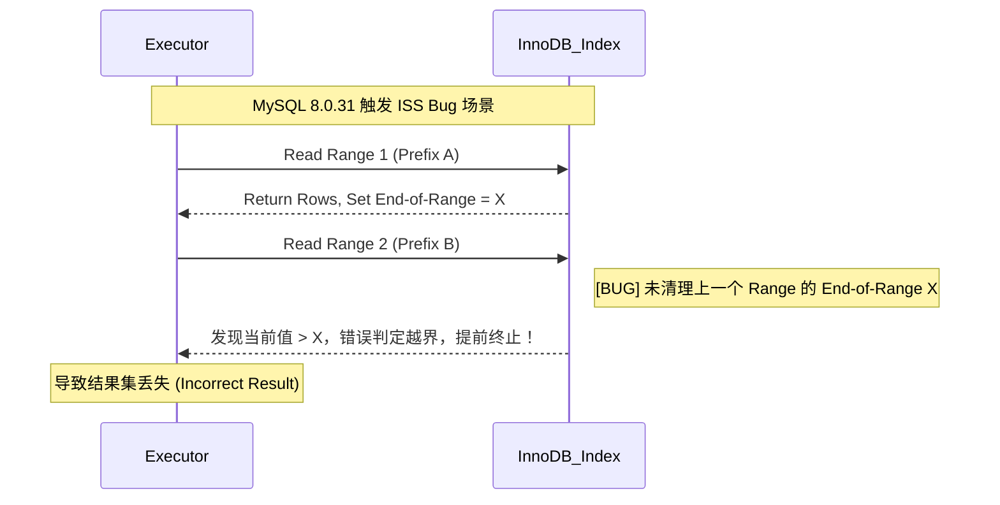
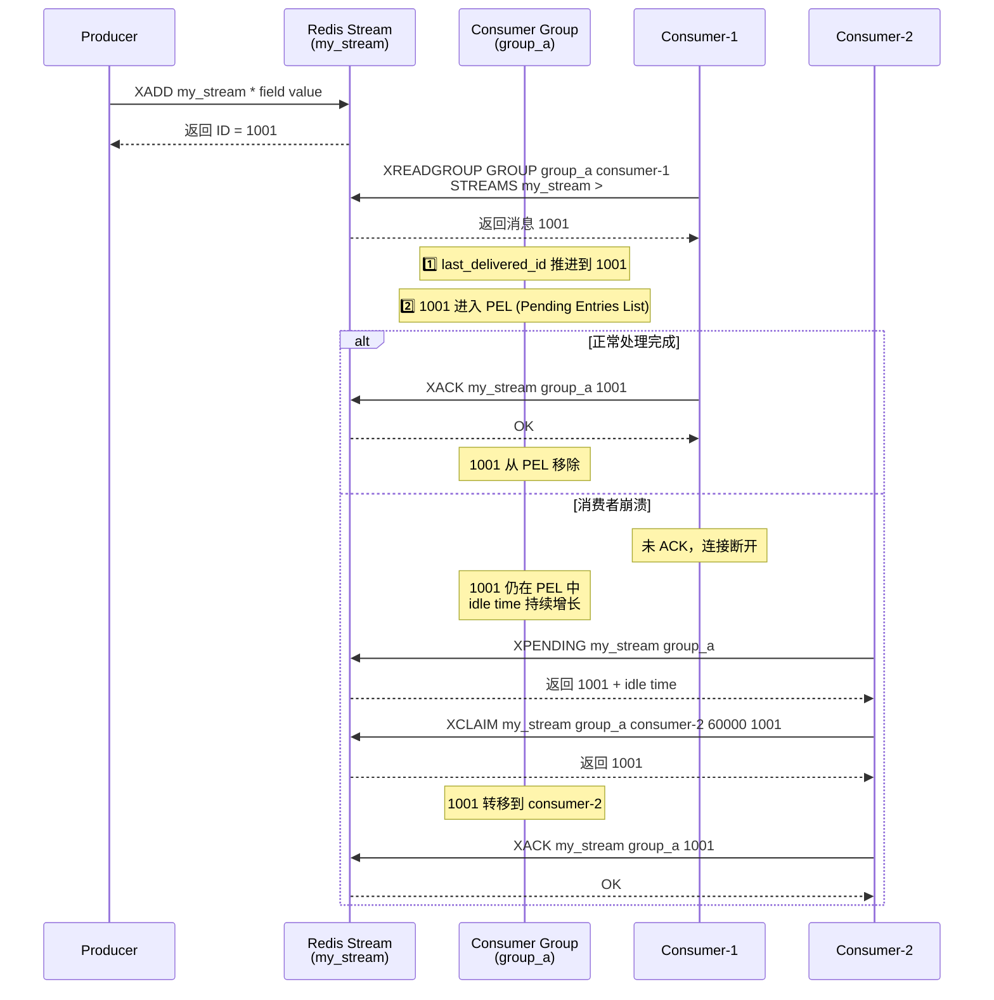
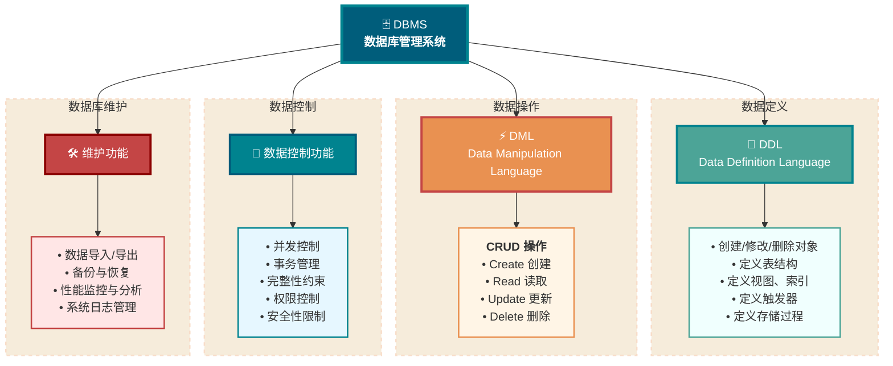
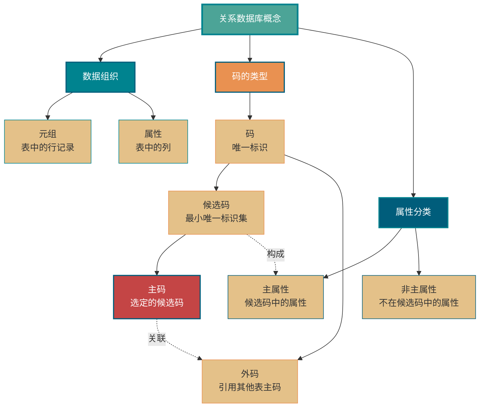
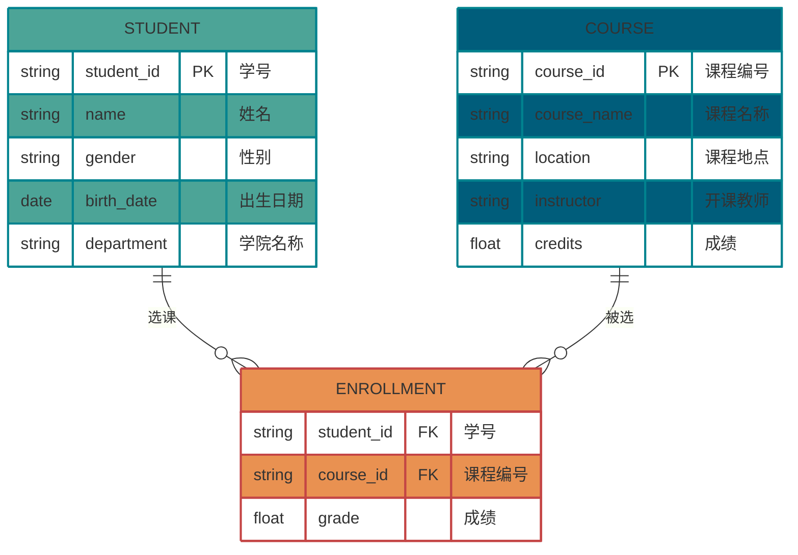
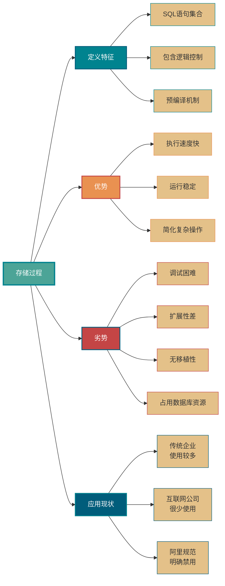
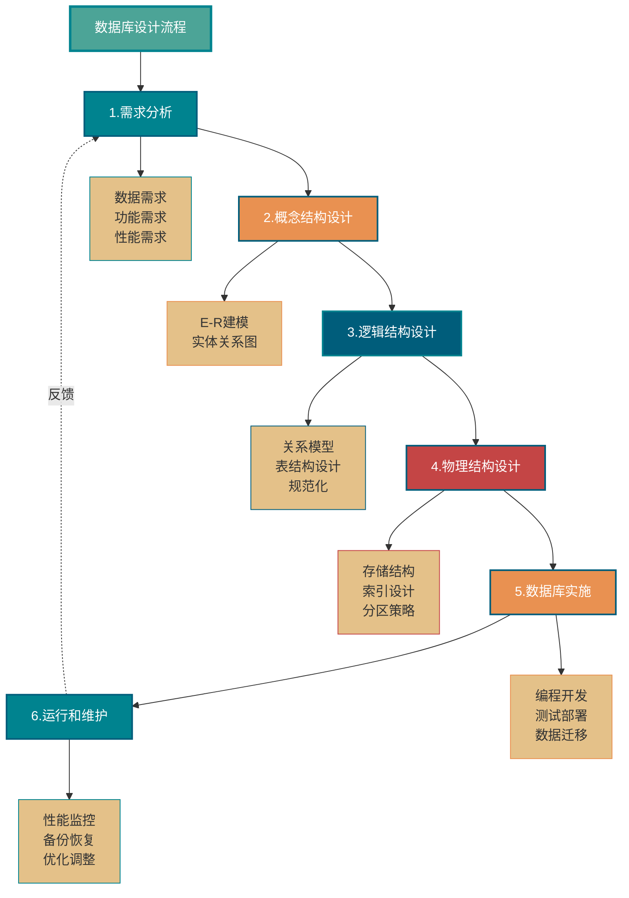

# 数据库 重点汇总

> 从 0-ALL.md 筛选：面试常问与企业开发常用内容。

## TOC

1. MongoDB常见面试题总结（上） (`mongodb/MongoDB常见面试题总结（上）.md`)
2. MongoDB常见面试题总结（下） (`mongodb/MongoDB常见面试题总结（下）.md`)
3. InnoDB存储引擎对MVCC的实现 (`mysql/InnoDB存储引擎对MVCC的实现.md`)
4. MySQL备份与恢复详解：mysqldump、XtraBackup、binlog和PITR (`mysql/MySQL备份与恢复详解-mysqldump、XtraBackup、binlog和PITR.md`)
5. MySQL查询缓存详解 (`mysql/MySQL查询缓存详解.md`)
6. MySQL常见面试题总结 (`mysql/MySQL常见面试题总结.md`)
7. MySQL高性能优化规范建议总结 (`mysql/MySQL高性能优化规范建议总结.md`)
8. MySQL日期类型选择建议 (`mysql/MySQL日期类型选择建议.md`)
9. MySQL三大日志(binlog、redo log和undo log)详解 (`mysql/MySQL三大日志(binlog、redo log和undo log)详解.md`)
10. MySQL事务隔离级别详解 (`mysql/MySQL事务隔离级别详解.md`)
11. MySQL索引失效场景总结 (`mysql/MySQL索引失效场景总结.md`)
12. MySQL索引详解 (`mysql/MySQL索引详解.md`)
13. MySQL隐式转换造成索引失效 (`mysql/MySQL隐式转换造成索引失效.md`)
14. MySQL执行计划分析 (`mysql/MySQL执行计划分析.md`)
15. MySQL自增主键一定是连续的吗？ (`mysql/MySQL自增主键一定是连续的吗？.md`)
16. SQL语句在MySQL中的执行过程 (`mysql/SQL语句在MySQL中的执行过程.md`)
17. 一千行 MySQL 学习笔记 (`mysql/一千行 MySQL 学习笔记.md`)
18. NoSQL基础常见面试题总结 (`NoSQL基础常见面试题总结.md`)
19. 3种常用的缓存读写策略详解 (`redis/3种常用的缓存读写策略详解.md`)
20. Redis 3 种特殊数据类型详解 (`redis/Redis 3 种特殊数据类型详解.md`)
21. Redis 5 种基本数据类型详解 (`redis/Redis 5 种基本数据类型详解.md`)
22. Redis常见面试题总结(上) (`redis/Redis常见面试题总结(上).md`)
23. Redis常见面试题总结(下) (`redis/Redis常见面试题总结(下).md`)
24. Redis常见阻塞原因总结 (`redis/Redis常见阻塞原因总结.md`)
25. Redis持久化机制详解 (`redis/Redis持久化机制详解.md`)
26. Redis内存碎片详解 (`redis/Redis内存碎片详解.md`)
27. Redis为什么用跳表实现有序集合 (`redis/Redis为什么用跳表实现有序集合.md`)
28. 缓存基础常见面试题总结 (`redis/缓存基础常见面试题总结.md`)
29. 如何基于Redis实现消息队列？ (`redis/如何基于Redis实现消息队列？.md`)
30. 如何基于Redis实现延时任务？ (`redis/如何基于Redis实现延时任务？.md`)
31. SQL常见面试题总结（1） (`sql/SQL常见面试题总结（1）.md`)
32. SQL常见面试题总结（2） (`sql/SQL常见面试题总结（2）.md`)
33. SQL常见面试题总结（3） (`sql/SQL常见面试题总结（3）.md`)
34. SQL常见面试题总结（4） (`sql/SQL常见面试题总结（4）.md`)
35. SQL常见面试题总结（5） (`sql/SQL常见面试题总结（5）.md`)
36. SQL语法基础知识总结 (`sql/SQL语法基础知识总结.md`)
37. 数据库基础常见面试题总结 (`数据库基础常见面试题总结.md`)
38. 字符集详解：字符集是什么？怎么用？ (`字符集详解-字符集是什么？怎么用？.md`)

---

<!-- source: mongodb/MongoDB常见面试题总结（上）.md -->

## [1] MongoDB常见面试题总结（上）

---
title: MongoDB常见面试题总结（上）
description: MongoDB常见面试题总结上篇，详解MongoDB基础概念、存储结构、数据类型、副本集高可用、分片集群水平扩展等核心知识点，助力后端面试准备。
category: 数据库
tag:
  - NoSQL
  - MongoDB
head:
  - - meta
    - name: keywords
      content: MongoDB面试题,文档数据库,BSON,副本集,分片集群,MongoDB索引,WiredTiger,聚合管道
---

> 少部分内容参考了 MongoDB 官方文档的描述，在此说明一下。

## MongoDB 基础

### MongoDB 是什么？

MongoDB 是一个基于 **分布式文件存储** 的开源 NoSQL 数据库系统，由 **C++** 编写的。MongoDB 提供了 **面向文档** 的存储方式，操作起来比较简单和容易，支持“**无模式**”的数据建模，可以存储比较复杂的数据类型，是一款非常流行的 **文档类型数据库** 。

在高负载的情况下，MongoDB 天然支持水平扩展和高可用，可以很方便地添加更多的节点/实例，以保证服务性能和可用性。在许多场景下，MongoDB 可以用于代替传统的关系型数据库或键/值存储方式，皆在为 Web 应用提供可扩展的高可用高性能数据存储解决方案。

### MongoDB 的存储结构是什么？

MongoDB 的存储结构区别于传统的关系型数据库，主要由如下三个单元组成：

- **文档（Document）**：MongoDB 中最基本的单元，由 BSON 键值对（key-value）组成，类似于关系型数据库中的行（Row）。
- **集合（Collection）**：一个集合可以包含多个文档，类似于关系型数据库中的表（Table）。
- **数据库（Database）**：一个数据库中可以包含多个集合，可以在 MongoDB 中创建多个数据库，类似于关系型数据库中的数据库（Database）。

也就是说，MongoDB 将数据记录存储为文档 （更具体来说是[BSON 文档](https://www.mongodb.com/docs/manual/core/document/#std-label-bson-document-format)），这些文档在集合中聚集在一起，数据库中存储一个或多个文档集合。

**SQL 与 MongoDB 常见术语对比**：

| SQL                      | MongoDB                         |
| ------------------------ | ------------------------------- |
| 表（Table）              | 集合（Collection）              |
| 行（Row）                | 文档（Document）                |
| 列（Col）                | 字段（Field）                   |
| 主键（Primary Key）      | 对象 ID（Objectid）             |
| 索引（Index）            | 索引（Index）                   |
| 嵌套表（Embedded Table） | 嵌入式文档（Embedded Document） |
| 数组（Array）            | 数组（Array）                   |

#### 文档

MongoDB 中的记录就是一个 BSON 文档，它是由键值对组成的数据结构，类似于 JSON 对象，是 MongoDB 中的基本数据单元。字段的值可能包括其他文档、数组和文档数组。


文档的键是字符串。除了少数例外情况，键可以使用任意 UTF-8 字符。

- 键不能含有 `\0`(空字符）。这个字符用来表示键的结尾。
- `.` 和 `$` 有特别的意义，只有在特定环境下才能使用。
- 以下划线`_`开头的键是保留的(不是严格要求的)。

**BSON [bee·sahn]** 是 Binary [JSON](http://json.org/)的简称，是 JSON 文档的二进制表示，支持将文档和数组嵌入到其他文档和数组中，还包含允许表示不属于 JSON 规范的数据类型的扩展。有关 BSON 规范的内容，可以参考 [bsonspec.org](http://bsonspec.org/)，另见[BSON 类型](https://www.mongodb.com/docs/manual/reference/bson-types/)。

根据维基百科对 BJSON 的介绍，BJSON 的遍历速度优于 JSON，这也是 MongoDB 选择 BSON 的主要原因，但 BJSON 需要更多的存储空间。

> 与 JSON 相比，BSON 着眼于提高存储和扫描效率。BSON 文档中的大型元素以长度字段为前缀以便于扫描。在某些情况下，由于长度前缀和显式数组索引的存在，BSON 使用的空间会多于 JSON。


#### 集合

MongoDB 集合存在于数据库中，**没有固定的结构**，也就是 **无模式** 的，这意味着可以往集合插入不同格式和类型的数据。不过，通常情况下，插入集合中的数据都会有一定的关联性。


集合不需要事先创建，当第一个文档插入或者第一个索引创建时，如果该集合不存在，则会创建一个新的集合。

集合名可以是满足下列条件的任意 UTF-8 字符串：

- 集合名不能是空字符串`""`。
- 集合名不能含有 `\0` （空字符)，这个字符表示集合名的结尾。
- 集合名不能以"system."开头，这是为系统集合保留的前缀。例如 `system.users` 这个集合保存着数据库的用户信息，`system.namespaces` 集合保存着所有数据库集合的信息。
- 集合名必须以下划线或者字母符号开始，并且不能包含 `$`。

#### 数据库

数据库用于存储所有集合，而集合又用于存储所有文档。一个 MongoDB 中可以创建多个数据库，每一个数据库都有自己的集合和权限。

MongoDB 预留了几个特殊的数据库。

- **admin** : admin 数据库主要是保存 root 用户和角色。例如，system.users 表存储用户，system.roles 表存储角色。一般不建议用户直接操作这个数据库。将一个用户添加到这个数据库，且使它拥有 admin 库上的名为 dbAdminAnyDatabase 的角色权限，这个用户自动继承所有数据库的权限。一些特定的服务器端命令也只能从这个数据库运行，比如关闭服务器。
- **local** : local 数据库是不会被复制到其他分片的，因此可以用来存储本地单台服务器的任意 collection。一般不建议用户直接使用 local 库存储任何数据，也不建议进行 CRUD 操作，因为数据无法被正常备份与恢复。
- **config** : 当 MongoDB 使用分片设置时，config 数据库可用来保存分片的相关信息。
- **test** : 默认创建的测试库，连接 [mongod](https://mongoing.com/docs/reference/program/mongod.html) 服务时，如果不指定连接的具体数据库，默认就会连接到 test 数据库。

数据库名可以是满足以下条件的任意 UTF-8 字符串：

- 不能是空字符串`""`。
- 不得含有`' '`（空格)、`.`、`$`、`/`、`\`和 `\0` (空字符)。
- 应全部小写。
- 最多 64 字节。

数据库名最终会变成文件系统里的文件，这也就是有如此多限制的原因。

### MongoDB 有什么特点？

- **数据记录被存储为文档**：MongoDB 中的记录就是一个 BSON 文档，它是由键值对组成的数据结构，类似于 JSON 对象，是 MongoDB 中的基本数据单元。
- **模式自由**：集合的概念类似 MySQL 里的表，但它不需要定义任何模式，能够用更少的数据对象表现复杂的领域模型对象。
- **支持多种查询方式**：MongoDB 查询 API 支持读写操作 (CRUD)以及数据聚合、文本搜索和地理空间查询。
- **支持 ACID 事务**：NoSQL 数据库通常不支持事务，为了可扩展和高性能进行了权衡。不过，也有例外，MongoDB 就支持事务。与关系型数据库一样，MongoDB 事务同样具有 ACID 特性。MongoDB 单文档原生支持原子性，也具备事务的特性。MongoDB 4.0 加入了对多文档事务的支持，但只支持复制集部署模式下的事务，也就是说事务的作用域限制为一个副本集内。MongoDB 4.2 引入了分布式事务，增加了对分片集群上多文档事务的支持，并合并了对副本集上多文档事务的现有支持。
- **高效的二进制存储**：存储在集合中的文档，是以键值对的形式存在的。键用于唯一标识一个文档，一般是 ObjectId 类型，值是以 BSON 形式存在的。BSON = Binary JSON， 是在 JSON 基础上加了一些类型及元数据描述的格式。
- **自带数据压缩功能**：存储同样的数据所需的资源更少。
- **支持 mapreduce**：通过分治的方式完成复杂的聚合任务。不过，从 MongoDB 5.0 开始，map-reduce 已经不被官方推荐使用了，替代方案是 [聚合管道](https://www.mongodb.com/docs/manual/core/aggregation-pipeline/)。聚合管道提供比 map-reduce 更好的性能和可用性。
- **支持多种类型的索引**：MongoDB 支持多种类型的索引，包括单字段索引、复合索引、多键索引、哈希索引、文本索引、 地理位置索引等，每种类型的索引有不同的使用场合。
- **支持 failover**：提供自动故障恢复的功能，主节点发生故障时，自动从从节点中选举出一个新的主节点，确保集群的正常使用，这对于客户端来说是无感知的。
- **支持分片集群**：MongoDB 支持集群自动切分数据，让集群存储更多的数据，具备更强的性能。在数据插入和更新时，能够自动路由和存储。
- **支持存储大文件**：MongoDB 的单文档存储空间要求不超过 16MB。对于超过 16MB 的大文件，MongoDB 提供了 GridFS 来进行存储，通过 GridFS，可以将大型数据进行分块处理，然后将这些切分后的小文档保存在数据库中。

### MongoDB 适合什么应用场景？

**MongoDB 的优势在于其数据模型和存储引擎的灵活性、架构的可扩展性以及对强大的索引支持。**

选用 MongoDB 应该充分考虑 MongoDB 的优势，结合实际项目的需求来决定：

- 随着项目的发展，使用类 JSON 格式（BSON）保存数据是否满足项目需求？MongoDB 中的记录就是一个 BSON 文档，它是由键值对组成的数据结构，类似于 JSON 对象，是 MongoDB 中的基本数据单元。
- 是否需要大数据量的存储？是否需要快速水平扩展？MongoDB 支持分片集群，可以很方便地添加更多的节点（实例），让集群存储更多的数据，具备更强的性能。
- 是否需要更多类型索引来满足更多应用场景？MongoDB 支持多种类型的索引，包括单字段索引、复合索引、多键索引、哈希索引、文本索引、 地理位置索引等，每种类型的索引有不同的使用场合。
- ……

## MongoDB 存储引擎

### MongoDB 支持哪些存储引擎？

存储引擎（Storage Engine）是数据库的核心组件，负责管理数据在内存和磁盘中的存储方式。

与 MySQL 一样，MongoDB 采用的也是 **插件式的存储引擎架构** ，支持不同类型的存储引擎，不同的存储引擎解决不同场景的问题。在创建数据库或集合时，可以指定存储引擎。

> 插件式的存储引擎架构可以实现 Server 层和存储引擎层的解耦，可以支持多种存储引擎，如 MySQL 既可以支持 B-Tree 结构的 InnoDB 存储引擎，还可以支持 LSM 结构的 RocksDB 存储引擎。

在存储引擎刚出来的时候，默认是使用 MMAPV1 存储引擎，MongoDB4.x 版本不再支持 MMAPv1 存储引擎。

现在主要有下面这两种存储引擎：

- **WiredTiger 存储引擎**：自 MongoDB 3.2 以后，默认的存储引擎为 [WiredTiger 存储引擎](https://www.mongodb.com/docs/manual/core/wiredtiger/) 。非常适合大多数工作负载，建议用于新部署。WiredTiger 提供文档级并发模型、检查点和数据压缩（后文会介绍到）等功能。
- **In-Memory 存储引擎**：[In-Memory 存储引擎](https://www.mongodb.com/docs/manual/core/inmemory/)在 MongoDB Enterprise 中可用。它不是将文档存储在磁盘上，而是将它们保留在内存中以获得更可预测的数据延迟。

此外，MongoDB 3.0 提供了 **可插拔的存储引擎 API** ，允许第三方为 MongoDB 开发存储引擎，这点和 MySQL 也比较类似。

### WiredTiger 基于 LSM Tree 还是 B+ Tree？

目前绝大部分流行的数据库存储引擎都是基于 B/B+ Tree 或者 LSM(Log Structured Merge) Tree 来实现的。对于 NoSQL 数据库来说，绝大部分（比如 HBase、Cassandra、RocksDB）都是基于 LSM 树，MongoDB 不太一样。

上面也说了，自 MongoDB 3.2 以后，默认的存储引擎为 WiredTiger 存储引擎。在 WiredTiger 引擎官网上，我们发现 WiredTiger 使用的是 B+ 树作为其存储结构：

```plain
WiredTiger maintains a table's data in memory using a data structure called a B-Tree ( B+ Tree to be specific), referring to the nodes of a B-Tree as pages. Internal pages carry only keys. The leaf pages store both keys and values.
```

此外，WiredTiger 还支持 [LSM(Log Structured Merge)](https://source.wiredtiger.com/3.1.0/lsm.html) 树作为存储结构，MongoDB 在使用 WiredTiger 作为存储引擎时，默认使用的是 B+ 树。

如果想要了解 MongoDB 使用 B+ 树的原因，可以看看这篇文章：[【驳斥八股文系列】别瞎分析了，MongoDB 使用的是 B+ 树，不是你们以为的 B 树](https://zhuanlan.zhihu.com/p/519658576)。

使用 B+ 树时，WiredTiger 以 **page** 为基本单位往磁盘读写数据。B+ 树的每个节点为一个 page，共有三种类型的 page：

- **root page（根节点）**：B+ 树的根节点。
- **internal page（内部节点）**：不实际存储数据的中间索引节点。
- **leaf page（叶子节点）**：真正存储数据的叶子节点，包含一个页头（page header）、块头（block header）和真正的数据（key/value），其中页头定义了页的类型、页中实际载荷数据的大小、页中记录条数等信息；块头定义了此页的 checksum、块在磁盘上的寻址位置等信息。

其整体结构如下图所示：


如果想要深入研究学习 WiredTiger 存储引擎，推荐阅读 MongoDB 中文社区的 [WiredTiger 存储引擎系列](https://mongoing.com/archives/category/wiredtiger%e5%ad%98%e5%82%a8%e5%bc%95%e6%93%8e%e7%b3%bb%e5%88%97)。

## MongoDB 聚合

### MongoDB 聚合有什么用？

实际项目中，我们经常需要将多个文档甚至是多个集合汇总到一起计算分析（比如求和、取最大值）并返回计算后的结果，这个过程被称为 **聚合操作** 。

根据官方文档介绍，我们可以使用聚合操作来：

- 将来自多个文档的值组合在一起。
- 对集合中的数据进行的一系列运算。
- 分析数据随时间的变化。

### MongoDB 提供了哪几种执行聚合的方法？

MongoDB 提供了两种执行聚合的方法：

- **聚合管道（Aggregation Pipeline）**：执行聚合操作的首选方法。
- **单一目的聚合方法（Single purpose aggregation methods）**：也就是单一作用的聚合函数比如 `count()`、`distinct()`、`estimatedDocumentCount()`。

绝大部分文章中还提到了 **map-reduce** 这种聚合方法。不过，从 MongoDB 5.0 开始，map-reduce 已经不被官方推荐使用了，替代方案是 [聚合管道](https://www.mongodb.com/docs/manual/core/aggregation-pipeline/)。聚合管道提供比 map-reduce 更好的性能和可用性。

MongoDB 聚合管道由多个阶段组成，每个阶段在文档通过管道时转换文档。每个阶段接收前一个阶段的输出，进一步处理数据，并将其作为输入数据发送到下一个阶段。

每个管道的工作流程是：

1. 接受一系列原始数据文档
2. 对这些文档进行一系列运算
3. 结果文档输出给下一个阶段


**常用阶段操作符**：

| 操作符    | 简述                                                                                                 |
| --------- | ---------------------------------------------------------------------------------------------------- |
| \$match   | 匹配操作符，用于对文档集合进行筛选                                                                   |
| \$project | 投射操作符，用于重构每一个文档的字段，可以提取字段，重命名字段，甚至可以对原有字段进行操作后新增字段 |
| \$sort    | 排序操作符，用于根据一个或多个字段对文档进行排序                                                     |
| \$limit   | 限制操作符，用于限制返回文档的数量                                                                   |
| \$skip    | 跳过操作符，用于跳过指定数量的文档                                                                   |
| \$count   | 统计操作符，用于统计文档的数量                                                                       |
| \$group   | 分组操作符，用于对文档集合进行分组                                                                   |
| \$unwind  | 拆分操作符，用于将数组中的每一个值拆分为单独的文档                                                   |
| \$lookup  | 连接操作符，用于连接同一个数据库中另一个集合，并获取指定的文档，类似于 populate                      |

更多操作符介绍详见官方文档：<https://docs.mongodb.com/manual/reference/operator/aggregation/>

阶段操作符用于 `db.collection.aggregate` 方法里面，数组参数中的第一层。

```sql
db.collection.aggregate( [ { 阶段操作符：表述 }, { 阶段操作符：表述 }, ... ] )
```

下面是 MongoDB 官方文档中的一个例子：

```sql
db.orders.aggregate([
   # 第一阶段：$match阶段按status字段过滤文档，并将status等于"A"的文档传递到下一阶段。
    { $match: { status: "A" } },
  # 第二阶段：$group阶段按cust_id字段将文档分组，以计算每个cust_id唯一值的金额总和。
    { $group: { _id: "$cust_id", total: { $sum: "$amount" } } }
])
```

## MongoDB 事务

> MongoDB 事务想要搞懂原理还是比较花费时间的，我自己也没有搞太明白。因此，我这里只是简单介绍一下 MongoDB 事务，想要了解原理的小伙伴，可以自行搜索查阅相关资料。
>
> 这里推荐几篇文章，供大家参考：
>
> - [技术干货| MongoDB 事务原理](https://mongoing.com/archives/82187)
> - [MongoDB 一致性模型设计与实现](https://developer.aliyun.com/article/782494)
> - [MongoDB 官方文档对事务的介绍](https://www.mongodb.com/docs/upcoming/core/transactions/)

我们在介绍 NoSQL 数据的时候也说过，NoSQL 数据库通常不支持事务，为了可扩展和高性能进行了权衡。不过，也有例外，MongoDB 就支持事务。

与关系型数据库一样，MongoDB 事务同样具有 ACID 特性：

- **原子性**（`Atomicity`）：事务是最小的执行单位，不允许分割。事务的原子性确保动作要么全部完成，要么完全不起作用；
- **一致性**（`Consistency`）：执行事务前后，数据保持一致，例如转账业务中，无论事务是否成功，转账者和收款人的总额应该是不变的；
- **隔离性**（`Isolation`）：并发访问数据库时，一个用户的事务不被其他事务所干扰，各并发事务之间数据库是独立的。WiredTiger 存储引擎支持读未提交（ read-uncommitted ）、读已提交（ read-committed ）和快照（ snapshot ）隔离，MongoDB 启动时默认选快照隔离。在不同隔离级别下，一个事务的生命周期内，可能出现脏读、不可重复读、幻读等现象。
- **持久性**（`Durability`）：一个事务被提交之后。它对数据库中数据的改变是持久的，即使数据库发生故障也不应该对其有任何影响。

关于事务的详细介绍这篇文章就不多说了，感兴趣的可以看看我写的[MySQL 常见面试题总结](../mysql/MySQL常见面试题总结.md)这篇文章，里面有详细介绍到。

MongoDB 单文档原生支持原子性，也具备事务的特性。当谈论 MongoDB 事务的时候，通常指的是 **多文档** 。MongoDB 4.0 加入了对多文档 ACID 事务的支持，但只支持复制集部署模式下的 ACID 事务，也就是说事务的作用域限制为一个副本集内。MongoDB 4.2 引入了 **分布式事务** ，增加了对分片集群上多文档事务的支持，并合并了对副本集上多文档事务的现有支持。

根据官方文档介绍：

> 从 MongoDB 4.2 开始，分布式事务和多文档事务在 MongoDB 中是一个意思。分布式事务是指分片集群和副本集上的多文档事务。从 MongoDB 4.2 开始，多文档事务（无论是在分片集群还是副本集上）也称为分布式事务。

在大多数情况下，多文档事务比单文档写入会产生更大的性能成本。对于大部分场景来说， [非规范化数据模型（嵌入式文档和数组）](https://www.mongodb.com/docs/upcoming/core/data-model-design/#std-label-data-modeling-embedding) 依然是最佳选择。也就是说，适当地对数据进行建模可以最大限度地减少对多文档事务的需求。

**注意**：

- 从 MongoDB 4.2 开始，多文档事务支持副本集和分片集群，其中：主节点使用 WiredTiger 存储引擎，同时从节点使用 WiredTiger 存储引擎或 In-Memory 存储引擎。在 MongoDB 4.0 中，只有使用 WiredTiger 存储引擎的副本集支持事务。
- 在 MongoDB 4.2 及更早版本中，你无法在事务中创建集合。从 MongoDB 4.4 开始，您可以在事务中创建集合和索引。有关详细信息，请参阅 [在事务中创建集合和索引](https://www.mongodb.com/docs/upcoming/core/transactions/#std-label-transactions-create-collections-indexes)。

## MongoDB 数据压缩

借助 WiredTiger 存储引擎（ MongoDB 3.2 后的默认存储引擎），MongoDB 支持对所有集合和索引进行压缩。压缩以额外的 CPU 为代价最大限度地减少存储使用。

默认情况下，WiredTiger 使用 [Snappy](https://github.com/google/snappy) 压缩算法（谷歌开源，旨在实现非常高的速度和合理的压缩，压缩比 3 ～ 5 倍）对所有集合使用块压缩，对所有索引使用前缀压缩。

除了 Snappy 之外，对于集合还有下面这些压缩算法：

- [zlib](https://github.com/madler/zlib)：高度压缩算法，压缩比 5 ～ 7 倍
- [Zstandard](https://github.com/facebook/zstd)（简称 zstd）：Facebook 开源的一种快速无损压缩算法，针对 zlib 级别的实时压缩场景和更好的压缩比，提供更高的压缩率和更低的 CPU 使用率，MongoDB 4.2 开始可用。

WiredTiger 日志也会被压缩，默认使用的也是 Snappy 压缩算法。如果日志记录小于或等于 128 字节，WiredTiger 不会压缩该记录。

## Amazon Document 与 MongoDB 的差异

Amazon DocumentDB（与 MongoDB 兼容） 是一种快速、可靠、完全托管的数据库服务。Amazon DocumentDB 可在云中轻松设置、操作和扩展与 MongoDB 兼容的数据库。

### `$vectorSearch` 运算符

Amazon DocumentDB 不支持`$vectorSearch`作为独立运营商。相反，我们在`$search`运营商`vectorSearch`内部支持。有关更多信息，请参阅 [向量搜索 Amazon DocumentDB](https://docs.aws.amazon.com/zh_cn/documentdb/latest/developerguide/vector-search.html)。

### `OpCountersCommand`

Amazon DocumentDB 的`OpCountersCommand`行为偏离于 MongoDB 的`opcounters.command` 如下：

- MongoDB 的`opcounters.command` 计入除插入、更新和删除之外的所有命令，而 Amazon DocumentDB 的 `OpCountersCommand` 也排除 `find` 命令。
- Amazon DocumentDB 将内部命令（例如`getCloudWatchMetricsV2`）对 `OpCountersCommand` 计入。

### 管理数据库和集合

Amazon DocumentDB 不支持管理或本地数据库，MongoDB `system.*` 或 `startup_log` 集合也不支持。

### `cursormaxTimeMS`

在 Amazon DocumentDB 中，`cursor.maxTimeMS` 重置每个请求的计数器。`getMore`因此，如果指定了 3000MS `maxTimeMS`，则该查询耗时 2800MS，而每个后续`getMore`请求耗时 300MS，则游标不会超时。游标仅在单个操作（无论是查询还是单个`getMore`请求）耗时超过指定值时才将超时`maxTimeMS`。此外，检查游标执行时间的扫描器以五 (5) 分钟间隔尺寸运行。

### explain()

Amazon DocumentDB 在利用分布式、容错、自修复的存储系统的专用数据库引擎上模拟 MongoDB 4.0 API。因此，查询计划和`explain()` 的输出在 Amazon DocumentDB 和 MongoDB 之间可能有所不同。希望控制其查询计划的客户可以使用 `$hint` 运算符强制选择首选索引。

### 字段名称限制

Amazon DocumentDB 不支持点“。” 例如，文档字段名称中 `db.foo.insert({‘x.1’:1})`。

Amazon DocumentDB 也不支持字段名称中的 $ 前缀。

例如，在 Amazon DocumentDB 或 MongoDB 中尝试以下命令：

```shell
rs0:PRIMARY< db.foo.insert({"a":{"$a":1}})
```

MongoDB 将返回以下内容：

```shell
WriteResult({ "nInserted" : 1 })
```

Amazon DocumentDB 将返回一个错误：

```shell
WriteResult({
  "nInserted" : 0,
  "writeError" : {
    "code" : 2,
    "errmsg" : "Document can't have $ prefix field names: $a"
  }
})
```

## 参考

- MongoDB 官方文档（主要参考资料，以官方文档为准）：<https://www.mongodb.com/docs/manual/>
- 《MongoDB 权威指南》
- 技术干货| MongoDB 事务原理 - MongoDB 中文社区：<https://mongoing.com/archives/82187>
- Transactions - MongoDB 官方文档：<https://www.mongodb.com/docs/manual/core/transactions/>
- WiredTiger Storage Engine - MongoDB 官方文档：<https://www.mongodb.com/docs/manual/core/wiredtiger/>
- WiredTiger 存储引擎之一：基础数据结构分析：<https://mongoing.com/topic/archives-35143>

<!-- @include: @article-footer.snippet.md -->


---

---

<!-- source: mongodb/MongoDB常见面试题总结（下）.md -->

## [2] MongoDB常见面试题总结（下）

---
title: MongoDB常见面试题总结（下）
description: MongoDB常见面试题总结下篇，深入讲解MongoDB各类索引（单字段、复合、多键、文本、地理位置、TTL）的原理、使用场景和查询优化技巧。
category: 数据库
tag:
  - NoSQL
  - MongoDB
head:
  - - meta
    - name: keywords
      content: MongoDB索引,复合索引,多键索引,文本索引,地理位置索引,TTL索引,MongoDB查询优化,索引设计
---

## MongoDB 索引

### MongoDB 索引有什么用?

和关系型数据库类似，MongoDB 中也有索引。索引的目的主要是用来提高查询效率，如果没有索引的话，MongoDB 必须执行 **集合扫描** ，即扫描集合中的每个文档，以选择与查询语句匹配的文档。如果查询存在合适的索引，MongoDB 可以使用该索引来限制它必须检查的文档数量。并且，MongoDB 可以使用索引中的排序返回排序后的结果。

虽然索引可以显著缩短查询时间，但是使用索引、维护索引是有代价的。在执行写入操作时，除了要更新文档之外，还必须更新索引，这必然会影响写入的性能。因此，当有大量写操作而读操作少时，或者不考虑读操作的性能时，都不推荐建立索引。

### MongoDB 支持哪些类型的索引？

**MongoDB 支持多种类型的索引，包括单字段索引、复合索引、多键索引、哈希索引、文本索引、 地理位置索引等，每种类型的索引有不同的使用场合。**

- **单字段索引：** 建立在单个字段上的索引，索引创建的排序顺序无所谓，MongoDB 可以头/尾开始遍历。
- **复合索引：** 建立在多个字段上的索引，也可以称之为组合索引、联合索引。
- **多键索引**：MongoDB 的一个字段可能是数组，在对这种字段创建索引时，就是多键索引。MongoDB 会为数组的每个值创建索引。就是说你可以按照数组里面的值做条件来查询，这个时候依然会走索引。
- **哈希索引**：按数据的哈希值索引，用在哈希分片集群上。
- **文本索引：** 支持对字符串内容的文本搜索查询。文本索引可以包含任何值为字符串或字符串元素数组的字段。一个集合只能有一个文本搜索索引，但该索引可以覆盖多个字段。MongoDB 虽然支持全文索引，但是性能低下，暂时不建议使用。
- **地理位置索引：** 基于经纬度的索引，适合 2D 和 3D 的位置查询。
- **唯一索引**：确保索引字段不会存储重复值。如果集合已经存在了违反索引的唯一约束的文档，则后台创建唯一索引会失败。
- **TTL 索引**：TTL 索引提供了一个过期机制，允许为每一个文档设置一个过期时间，当一个文档达到预设的过期时间之后就会被删除。
- ……

### 复合索引中字段的顺序有影响吗？

复合索引中字段的顺序非常重要，例如下图中的复合索引由`{userid:1, score:-1}`组成，则该复合索引首先按照`userid`升序排序；然后再每个`userid`的值内，再按照`score`降序排序。


在复合索引中，按照何种方式排序，决定了该索引在查询中是否能被应用到。

走复合索引的排序：

```sql
db.s2.find().sort({"userid": 1, "score": -1})
db.s2.find().sort({"userid": -1, "score": 1})
```

不走复合索引的排序：

```sql
db.s2.find().sort({"userid": 1, "score": 1})
db.s2.find().sort({"userid": -1, "score": -1})
db.s2.find().sort({"score": 1, "userid": -1})
db.s2.find().sort({"score": 1, "userid": 1})
db.s2.find().sort({"score": -1, "userid": -1})
db.s2.find().sort({"score": -1, "userid": 1})
```

我们可以通过 explain 进行分析：

```sql
db.s2.find().sort({"score": -1, "userid": 1}).explain()
```

### 复合索引遵循左前缀原则吗？

**MongoDB 的复合索引遵循左前缀原则**：拥有多个键的索引，可以同时得到所有这些键的前缀组成的索引，但不包括除左前缀之外的其他子集。比如说，有一个类似 `{a: 1, b: 1, c: 1, ..., z: 1}` 这样的索引，那么实际上也等于有了 `{a: 1}`、`{a: 1, b: 1}`、`{a: 1, b: 1, c: 1}` 等一系列索引，但是不会有 `{b: 1}` 这样的非左前缀的索引。

### 什么是 TTL 索引？

TTL 索引提供了一个过期机制，允许为每一个文档设置一个过期时间 `expireAfterSeconds` ，当一个文档达到预设的过期时间之后就会被删除。TTL 索引除了有 `expireAfterSeconds` 属性外，和普通索引一样。

数据过期对于某些类型的信息很有用，比如机器生成的事件数据、日志和会话信息，这些信息只需要在数据库中保存有限的时间。

**TTL 索引运行原理**：

- MongoDB 会开启一个后台线程读取该 TTL 索引的值来判断文档是否过期，但不会保证已过期的数据会立马被删除，因后台线程每 60 秒触发一次删除任务，且如果删除的数据量较大，会存在上一次的删除未完成，而下一次的任务已经开启的情况，导致过期的数据也会出现超过了数据保留时间 60 秒以上的现象。
- 对于副本集而言，TTL 索引的后台进程只会在 Primary 节点开启，在从节点会始终处于空闲状态，从节点的数据删除是由主库删除后产生的 oplog 来做同步。

**TTL 索引限制**：

- TTL 索引是单字段索引。复合索引不支持 TTL
- `_id`字段不支持 TTL 索引。
- 无法在上限集合(Capped Collection)上创建 TTL 索引，因为 MongoDB 无法从上限集合中删除文档。
- 如果某个字段已经存在非 TTL 索引，那么在该字段上无法再创建 TTL 索引。

### 什么是覆盖索引查询？

根据官方文档介绍，覆盖查询是以下的查询：

- 所有的查询字段是索引的一部分。
- 结果中返回的所有字段都在同一索引中。
- 查询中没有字段等于`null`。

由于所有出现在查询中的字段是索引的一部分， MongoDB 无需在整个数据文档中检索匹配查询条件和返回使用相同索引的查询结果。因为索引存在于内存中，从索引中获取数据比通过扫描文档读取数据要快得多。

举个例子：我们有如下 `users` 集合:

```json
{
   "_id": ObjectId("53402597d852426020000002"),
   "contact": "987654321",
   "dob": "01-01-1991",
   "gender": "M",
   "name": "Tom Benzamin",
   "user_name": "tombenzamin"
}
```

我们在 `users` 集合中创建联合索引，字段为 `gender` 和 `user_name` :

```sql
db.users.ensureIndex({gender:1,user_name:1})
```

现在，该索引会覆盖以下查询：

```sql
db.users.find({gender:"M"},{user_name:1,_id:0})
```

为了让指定的索引覆盖查询，必须显式地指定 `_id: 0` 来从结果中排除 `_id` 字段，因为索引不包括 `_id` 字段。

## MongoDB 高可用

### 复制集群

#### 什么是复制集群？

MongoDB 的复制集群又称为副本集群，是一组维护相同数据集合的 mongod 进程。

客户端连接到整个 Mongodb 复制集群，主节点机负责整个复制集群的写，从节点可以进行读操作，但默认还是主节点负责整个复制集群的读。主节点发生故障时，自动从从节点中选举出一个新的主节点，确保集群的正常使用，这对于客户端来说是无感知的。

通常来说，一个复制集群包含 1 个主节点（Primary），多个从节点（Secondary）以及零个或 1 个仲裁节点（Arbiter）。

- **主节点**：整个集群的写操作入口，接收所有的写操作，并将集合所有的变化记录到操作日志中，即 oplog。主节点挂掉之后会自动选出新的主节点。
- **从节点**：从主节点同步数据，在主节点挂掉之后选举新节点。不过，从节点可以配置成 0 优先级，阻止它在选举中成为主节点。
- **仲裁节点**：这个是为了节约资源或者多机房容灾用，只负责主节点选举时投票不存数据，保证能有节点获得多数赞成票。

下图是一个典型的三成员副本集群：


主节点与备节点之间是通过 **oplog（操作日志）** 来同步数据的。oplog 是 local 库下的一个特殊的 **上限集合(Capped Collection)** ，用来保存写操作所产生的增量日志，类似于 MySQL 中 的 Binlog。

> 上限集合类似于定长的循环队列，数据顺序追加到集合的尾部，当集合空间达到上限时，它会覆盖集合中最旧的文档。上限集合的数据将会被顺序写入到磁盘的固定空间内，所以，I/O 速度非常快，如果不建立索引，性能更好。


当主节点上的一个写操作完成后，会向 oplog 集合写入一条对应的日志，而从节点则通过这个 oplog 不断拉取到新的日志，在本地进行回放以达到数据同步的目的。

副本集最多有一个主节点。 如果当前主节点不可用，一个选举会抉择出新的主节点。MongoDB 的节点选举规则能够保证在 Primary 挂掉之后选取的新节点一定是集群中数据最全的一个。

#### 为什么要用复制集群？

- **实现 failover**：提供自动故障恢复的功能，主节点发生故障时，自动从从节点中选举出一个新的主节点，确保集群的正常使用，这对于客户端来说是无感知的。
- **实现读写分离**：我们可以设置从节点上可以读取数据，主节点负责写入数据，这样的话就实现了读写分离，减轻了主节点读写压力过大的问题。MongoDB 4.0 之前版本如果主库压力不大,不建议读写分离，因为写会阻塞读，除非业务对响应时间不是非常关注以及读取历史数据接受一定时间延迟。

### 分片集群

#### 什么是分片集群？

分片集群是 MongoDB 的分布式版本，相较副本集，分片集群数据被均衡的分布在不同分片中， 不仅大幅提升了整个集群的数据容量上限，也将读写的压力分散到不同分片，以解决副本集性能瓶颈的难题。

MongoDB 的分片集群由如下三个部分组成（下图来源于[官方文档对分片集群的介绍](https://www.mongodb.com/docs/manual/sharding/)）：


- **Config Servers**：配置服务器，本质上是一个 MongoDB 的副本集，负责存储集群的各种元数据和配置，如分片地址、Chunks 等
- **Mongos**：路由服务，不存具体数据，从 Config 获取集群配置讲请求转发到特定的分片，并且整合分片结果返回给客户端。
- **Shard**：每个分片是整体数据的一部分子集，从 MongoDB3.6 版本开始，每个 Shard 必须部署为副本集（replica set）架构

#### 为什么要用分片集群？

随着系统数据量以及吞吐量的增长，常见的解决办法有两种：垂直扩展和水平扩展。

垂直扩展通过增加单个服务器的能力来实现，比如磁盘空间、内存容量、CPU 数量等；水平扩展则通过将数据存储到多个服务器上来实现，根据需要添加额外的服务器以增加容量。

类似于 Redis Cluster，MongoDB 也可以通过分片实现 **水平扩展** 。水平扩展这种方式更灵活，可以满足更大数据量的存储需求，支持更高吞吐量。并且，水平扩展所需的整体成本更低，仅仅需要相对较低配置的单机服务器即可，代价是增加了部署的基础设施和维护的复杂性。

也就是说当你遇到如下问题时，可以使用分片集群解决：

- 存储容量受单机限制，即磁盘资源遭遇瓶颈。
- 读写能力受单机限制，可能是 CPU、内存或者网卡等资源遭遇瓶颈，导致读写能力无法扩展。

#### 什么是分片键？

**分片键（Shard Key）** 是数据分区的前提， 从而实现数据分发到不同服务器上，减轻服务器的负担。也就是说，分片键决定了集合内的文档如何在集群的多个分片间的分布状况。

分片键就是文档里面的一个字段，但是这个字段不是普通的字段，有一定的要求：

- 它必须在所有文档中都出现。
- 它必须是集合的一个索引，可以是单索引或复合索引的前缀索引，不能是多索引、文本索引或地理空间位置索引。
- MongoDB 4.2 之前的版本，文档的分片键字段值不可变。MongoDB 4.2 版本开始，除非分片键字段是不可变的 `_id` 字段，否则您可以更新文档的分片键值。MongoDB 5.0 版本开始，实现了实时重新分片（live resharding），可以实现分片键的完全重新选择。
- 它的大小不能超过 512 字节。

#### 如何选择分片键？

选择合适的片键对 sharding 效率影响很大，主要基于如下四个因素（摘自[分片集群使用注意事项 - - 腾讯云文档](https://cloud.tencent.com/document/product/240/44611)）：

- **取值基数** 取值基数建议尽可能大，如果用小基数的片键，因为备选值有限，那么块的总数量就有限，随着数据增多，块的大小会越来越大，导致水平扩展时移动块会非常困难。 例如：选择年龄做一个基数，范围最多只有 100 个，随着数据量增多，同一个值分布过多时，导致 chunck 的增长超出 chuncksize 的范围，引起 jumbo chunk，从而无法迁移，导致数据分布不均匀，性能瓶颈。
- **取值分布** 取值分布建议尽量均匀，分布不均匀的片键会造成某些块的数据量非常大，同样有上面数据分布不均匀，性能瓶颈的问题。
- **查询带分片** 查询时建议带上分片，使用分片键进行条件查询时，mongos 可以直接定位到具体分片，否则 mongos 需要将查询分发到所有分片，再等待响应返回。
- **避免单调递增或递减** 单调递增的 sharding key，数据文件挪动小，但写入会集中，导致最后一篇的数据量持续增大，不断发生迁移，递减同理。

综上，在选择片键时要考虑以上 4 个条件，尽可能满足更多的条件，才能降低 MoveChunks 对性能的影响，从而获得最优的性能体验。

#### 分片策略有哪些？

MongoDB 支持两种分片算法来满足不同的查询需求（摘自[MongoDB 分片集群介绍 - 阿里云文档](https://help.aliyun.com/document_detail/64561.html?spm=a2c4g.11186623.0.0.3121565eQhUGGB#h2--shard-key-3)）：

**1、基于范围的分片**：


MongoDB 按照分片键（Shard Key）的值的范围将数据拆分为不同的块（Chunk），每个块包含了一段范围内的数据。当分片键的基数大、频率低且值非单调变更时，范围分片更高效。

- 优点：Mongos 可以快速定位请求需要的数据，并将请求转发到相应的 Shard 节点中。
- 缺点：可能导致数据在 Shard 节点上分布不均衡，容易造成读写热点，且不具备写分散性。
- 适用场景：分片键的值不是单调递增或单调递减、分片键的值基数大且重复的频率低、需要范围查询等业务场景。

**2、基于 Hash 值的分片**


MongoDB 计算单个字段的哈希值作为索引值，并以哈希值的范围将数据拆分为不同的块（Chunk）。

- 优点：可以将数据更加均衡地分布在各 Shard 节点中，具备写分散性。
- 缺点：不适合进行范围查询，进行范围查询时，需要将读请求分发到所有的 Shard 节点。
- 适用场景：分片键的值存在单调递增或递减、片键的值基数大且重复的频率低、需要写入的数据随机分发、数据读取随机性较大等业务场景。

除了上述两种分片策略，您还可以配置 **复合片键** ，例如由一个低基数的键和一个单调递增的键组成。

#### 分片数据如何存储？

**Chunk（块）** 是 MongoDB 分片集群的一个核心概念，其本质上就是由一组 Document 组成的逻辑数据单元。每个 Chunk 包含一定范围片键的数据，互不相交且并集为全部数据，即离散数学中**划分**的概念。

分片集群不会记录每条数据在哪个分片上，而是记录 Chunk 在哪个分片上一级这个 Chunk 包含哪些数据。

默认情况下，一个 Chunk 的最大值默认为 64MB（可调整，取值范围为 1~1024 MB。如无特殊需求，建议保持默认值），进行数据插入、更新、删除时，如果此时 Mongos 感知到了目标 Chunk 的大小或者其中的数据量超过上限，则会触发 **Chunk 分裂**。


数据的增长会让 Chunk 分裂得越来越多。这个时候，各个分片上的 Chunk 数量可能会不平衡。Mongos 中的 **均衡器(Balancer)** 组件就会执行自动平衡，尝试使各个 Shard 上 Chunk 的数量保持均衡，这个过程就是 **再平衡（Rebalance）**。默认情况下，数据库和集合的 Rebalance 是开启的。

如下图所示，随着数据插入，导致 Chunk 分裂，让 AB 两个分片有 3 个 Chunk，C 分片只有一个，这个时候就会把 B 分配的迁移一个到 C 分片实现集群数据均衡。


> Balancer 是 MongoDB 的一个运行在 Config Server 的 Primary 节点上(自 MongoDB 3.4 版本起)的后台进程，它监控每个分片上 Chunk 数量，并在某个分片上 Chunk 数量达到阈值进行迁移。

Chunk 只会分裂，不会合并，即使 chunkSize 的值变大。

Rebalance 操作是比较耗费系统资源的，我们可以通过在业务低峰期执行、预分片或者设置 Rebalance 时间窗等方式来减少其对 MongoDB 正常使用所带来的影响。

#### Chunk 迁移原理是什么？

关于 Chunk 迁移原理的详细介绍，推荐阅读 MongoDB 中文社区的[一文读懂 MongoDB chunk 迁移](https://mongoing.com/archives/77479)这篇文章。

## 学习资料推荐

- [MongoDB 中文手册|官方文档中文版](https://docs.mongoing.com/)（推荐）：基于 4.2 版本，不断与官方最新版保持同步。
- [MongoDB 初学者教程——7 天学习 MongoDB](https://mongoing.com/archives/docs/mongodb%e5%88%9d%e5%ad%a6%e8%80%85%e6%95%99%e7%a8%8b/mongodb%e5%a6%82%e4%bd%95%e5%88%9b%e5%bb%ba%e6%95%b0%e6%8d%ae%e5%ba%93%e5%92%8c%e9%9b%86%e5%90%88)：快速入门。
- [SpringBoot 整合 MongoDB 实战 - 2022](https://www.cnblogs.com/dxflqm/p/16643981.html)：很不错的一篇 MongoDB 入门文章，主要围绕 MongoDB 的 Java 客户端使用进行基本的增删改查操作介绍。

## 参考

- MongoDB 官方文档（主要参考资料，以官方文档为准）：<https://www.mongodb.com/docs/manual/>
- 《MongoDB 权威指南》
- Indexes - MongoDB 官方文档：<https://www.mongodb.com/docs/manual/indexes/>
- MongoDB - 索引知识 - 程序员翔仔 - 2022：<https://fatedeity.cn/posts/数据库/mongodb-index-knowledge.html>
- MongoDB - 索引: <https://www.cnblogs.com/Neeo/articles/14325130.html>
- Sharding - MongoDB 官方文档：<https://www.mongodb.com/docs/manual/sharding/>
- MongoDB 分片集群介绍 - 阿里云文档：<https://help.aliyun.com/document_detail/64561.html>
- 分片集群使用注意事项 - - 腾讯云文档：<https://cloud.tencent.com/document/product/240/44611>

<!-- @include: @article-footer.snippet.md -->


---

---

<!-- source: mysql/InnoDB存储引擎对MVCC的实现.md -->

## [3] InnoDB存储引擎对MVCC的实现

---
title: InnoDB存储引擎对MVCC的实现
description: 深入剖析InnoDB存储引擎MVCC的实现原理，详解隐藏列、undo log版本链、ReadView机制，以及快照读与当前读的区别，理解MySQL如何实现事务隔离。
category: 数据库
tag:
  - MySQL
head:
  - - meta
    - name: keywords
      content: MVCC,多版本并发控制,InnoDB,快照读,当前读,一致性视图,ReadView,undo log,隐藏列,事务隔离
---

## 多版本并发控制 (Multi-Version Concurrency Control)

MVCC 是一种并发控制机制，用于在多个并发事务同时读写数据库时保持数据的一致性和隔离性。它是通过在每个数据行上维护多个版本的数据来实现的。当一个事务对数据进行修改时，InnoDB 会**直接更新当前数据行**（原地更新），并将**旧版本数据保存到 Undo Log** 中。其他事务在进行快照读（Snapshot Read）时，会根据 **ReadView** 和 **Undo Log** 中的版本链，读取到该数据在某一时刻的一致性视图，从而避免读操作被写操作阻塞。

1、读操作（SELECT）：

当一个事务执行读操作时，它会使用快照读取。快照读取是基于事务开始时数据库中的状态创建的，因此事务不会读取其他事务尚未提交的修改。具体工作情况如下：

- 对于读取操作，事务会查找符合条件的数据行，并选择符合其事务开始时间的数据版本进行读取。
- 如果某个数据行有多个版本，事务会选择不晚于其开始时间的最新版本，确保事务只读取在它开始之前已经存在的数据。
- 事务读取的是快照数据，因此其他并发事务对数据行的修改不会影响当前事务的读取操作。

2、写操作（INSERT、UPDATE、DELETE）：

当一个事务执行写操作时，它会生成一个新的数据版本，并将修改后的数据写入数据库。具体工作情况如下：

- 对于写操作，事务会为要修改的数据行创建一个新的版本，并将修改后的数据写入新版本。
- 新版本的数据会带有当前事务的版本号，以便其他事务能够正确读取相应版本的数据。
- 原始版本的数据仍然存在，供其他事务使用快照读取，这保证了其他事务不受当前事务的写操作影响。

3、事务提交和回滚：

- 当一个事务提交时，它所做的修改将成为数据库的最新版本，并且对其他事务可见。
- 当一个事务回滚时，它所做的修改将被撤销，对其他事务不可见。

4、版本的回收：

为了防止数据库中的版本无限增长，MVCC 会定期进行版本的回收。回收机制会删除已经不再需要的旧版本数据，从而释放空间。

MVCC 通过创建数据的多个版本和使用快照读取来实现并发控制。读操作使用旧版本数据的快照，写操作创建新版本，并确保原始版本仍然可用。这样，不同的事务可以在一定程度上并发执行，而不会相互干扰，从而提高了数据库的并发性能和数据一致性。

## 一致性非锁定读和锁定读

### 一致性非锁定读

对于 [**一致性非锁定读（Consistent Nonlocking Reads）**](https://dev.mysql.com/doc/refman/5.7/en/innodb-consistent-read.html)的实现，通常做法是加一个版本号或者时间戳字段，在更新数据的同时版本号 + 1 或者更新时间戳。查询时，将当前可见的版本号与对应记录的版本号进行比对，如果记录的版本小于可见版本，则表示该记录可见

在 `InnoDB` 存储引擎中，[多版本控制 (multi versioning)](https://dev.mysql.com/doc/refman/5.7/en/innodb-multi-versioning.html) 就是对非锁定读的实现。如果读取的行正在执行 `DELETE` 或 `UPDATE` 操作，这时读取操作不会去等待行上锁的释放。相反地，`InnoDB` 存储引擎会去读取行的一个快照数据，对于这种读取历史数据的方式，我们叫它快照读 (snapshot read)

在 `Repeatable Read` 和 `Read Committed` 两个隔离级别下，如果是执行普通的 `select` 语句（不包括 `select ... lock in share mode` ,`select ... for update`）则会使用 `一致性非锁定读（MVCC）`。并且在 `Repeatable Read` 下 `MVCC` 实现了可重复读和防止部分幻读

### 锁定读

如果执行的是下列语句，就是 [**锁定读（Locking Reads）**](https://dev.mysql.com/doc/refman/5.7/en/innodb-locking-reads.html)

- `select ... lock in share mode`
- `select ... for update`
- `insert`、`update`、`delete` 操作

在锁定读下，读取的是数据的最新版本，这种读也被称为 `当前读（current read）`。锁定读会对读取到的记录加锁：

- `select ... lock in share mode`：对记录加 `S` 锁，其它事务也可以加`S`锁，如果加 `x` 锁则会被阻塞

- `select ... for update`、`insert`、`update`、`delete`：对记录加 `X` 锁，且其它事务不能加任何锁

在一致性非锁定读下，即使读取的记录已被其它事务加上 `X` 锁，这时记录也是可以被读取的，即读取的快照数据。上面说了，在 `Repeatable Read` 下 `MVCC` 防止了部分幻读，这边的 “部分” 是指在 `一致性非锁定读` 情况下，只能读取到第一次查询之前所插入的数据（根据 Read View 判断数据可见性，Read View 在第一次查询时生成）。但是！如果是 `当前读` ，每次读取的都是最新数据，这时如果两次查询中间有其它事务插入数据，就会产生幻读。所以， **`InnoDB` 在实现`Repeatable Read` 时，如果执行的是当前读，则会对读取的记录使用 `Next-key Lock` ，来防止其它事务在间隙间插入数据**

## InnoDB 对 MVCC 的实现

`MVCC` 的实现依赖于：**隐藏字段、Read View、undo log**。在内部实现中，`InnoDB` 通过数据行的 `DB_TRX_ID` 和 `Read View` 来判断数据的可见性，如不可见，则通过数据行的 `DB_ROLL_PTR` 找到 `undo log` 中的历史版本。每个事务读到的数据版本可能是不一样的，在同一个事务中，用户只能看到该事务创建 `Read View` 之前已经提交的修改和该事务本身做的修改

### 隐藏字段

在内部，`InnoDB` 存储引擎为每行数据添加了三个 [隐藏字段](https://dev.mysql.com/doc/refman/5.7/en/innodb-multi-versioning.html)：

- `DB_TRX_ID（6字节）`：表示最后一次插入或更新该行的事务 id。此外，`delete` 操作在内部被视为更新，只不过会在记录头 `Record header` 中的 `deleted_flag` 字段将其标记为已删除
- `DB_ROLL_PTR（7字节）` 回滚指针，指向该行的 `undo log` 。如果该行未被更新，则为空
- `DB_ROW_ID（6字节）`：如果没有设置主键且该表没有唯一非空索引时，`InnoDB` 会使用该 id 来生成聚簇索引

### ReadView

```c
class ReadView {
  /* ... */
private:
  trx_id_t m_low_limit_id;      /* 大于等于这个 ID 的事务均不可见 */

  trx_id_t m_up_limit_id;       /* 小于这个 ID 的事务均可见 */

  trx_id_t m_creator_trx_id;    /* 创建该 Read View 的事务ID */

  trx_id_t m_low_limit_no;      /* 事务 Number, 小于该 Number 的 Undo Logs 均可以被 Purge */

  ids_t m_ids;                  /* 创建 Read View 时的活跃事务列表 */

  m_closed;                     /* 标记 Read View 是否 close */
}
```

[`Read View`](https://github.com/facebook/mysql-8.0/blob/8.0/storage/innobase/include/read0types.h#L298) 主要是用来做可见性判断，里面保存了 “当前对本事务不可见的其他活跃事务”

主要有以下字段：

- `m_low_limit_id`：目前出现过的最大的事务 ID+1，即下一个将被分配的事务 ID。大于等于这个 ID 的数据版本均不可见
- `m_up_limit_id`：活跃事务列表 `m_ids` 中最小的事务 ID，如果 `m_ids` 为空，则 `m_up_limit_id` 为 `m_low_limit_id`。小于这个 ID 的数据版本均可见
- `m_ids`：`Read View` 创建时其他未提交的活跃事务 ID 列表。创建 `Read View`时，将当前未提交事务 ID 记录下来，后续即使它们修改了记录行的值，对于当前事务也是不可见的。`m_ids` 不包括当前事务自己和已提交的事务（正在内存中）
- `m_creator_trx_id`：创建该 `Read View` 的事务 ID

**事务可见性示意图**（[图源](https://leviathan.vip/2019/03/20/InnoDB%E7%9A%84%E4%BA%8B%E5%8A%A1%E5%88%86%E6%9E%90-MVCC/#MVCC-1)）：


### undo-log

`undo log` 主要有两个作用：

- 当事务回滚时用于将数据恢复到修改前的样子
- 另一个作用是 `MVCC` ，当读取记录时，若该记录被其他事务占用或当前版本对该事务不可见，则可以通过 `undo log` 读取之前的版本数据，以此实现非锁定读

**在 `InnoDB` 存储引擎中 `undo log` 分为两种：`insert undo log` 和 `update undo log`：**

1. **`insert undo log`**：指在 `insert` 操作中产生的 `undo log`。因为 `insert` 操作的记录只对事务本身可见，对其他事务不可见，故该 `undo log` 可以在事务提交后直接删除。不需要进行 `purge` 操作

**`insert` 时的数据初始状态：**


2. **`update undo log`**：`update` 或 `delete` 操作中产生的 `undo log`。该 `undo log`可能需要提供 `MVCC` 机制，因此不能在事务提交时就进行删除。提交时放入 `undo log` 链表，等待 `purge线程` 进行最后的删除

**数据第一次被修改时：**


**数据第二次被修改时：**


不同事务或者相同事务的对同一记录行的修改，会使该记录行的 `undo log` 成为一条链表，链首就是最新的记录，链尾就是最早的旧记录。

### 数据可见性算法

在 `InnoDB` 存储引擎中，创建一个新事务后，执行每个 `select` 语句前，都会创建一个快照（Read View），**快照中保存了当前数据库系统中正处于活跃（没有 commit）的事务的 ID 号**。其实简单的说保存的是系统中当前不应该被本事务看到的其他事务 ID 列表（即 m_ids）。当用户在这个事务中要读取某个记录行的时候，`InnoDB` 会将该记录行的 `DB_TRX_ID` 与 `Read View` 中的一些变量及当前事务 ID 进行比较，判断是否满足可见性条件

[具体的比较算法](https://github.com/facebook/mysql-8.0/blob/8.0/storage/innobase/include/read0types.h#L161)如下([图源](https://leviathan.vip/2019/03/20/InnoDB%E7%9A%84%E4%BA%8B%E5%8A%A1%E5%88%86%E6%9E%90-MVCC/#MVCC-1))：


1. 如果记录 DB_TRX_ID < m_up_limit_id，那么表明最新修改该行的事务（DB_TRX_ID）在当前事务创建快照之前就提交了，所以该记录行的值对当前事务是可见的

2. 如果 DB_TRX_ID >= m_low_limit_id，那么表明最新修改该行的事务（DB_TRX_ID）在当前事务创建快照之后才修改该行，所以该记录行的值对当前事务不可见。跳到步骤 5

3. m_ids 为空，则表明在当前事务创建快照之前，修改该行的事务就已经提交了，所以该记录行的值对当前事务是可见的

4. 如果 m_up_limit_id <= DB_TRX_ID < m_low_limit_id，表明最新修改该行的事务（DB_TRX_ID）在当前事务创建快照的时候可能处于“活动状态”或者“已提交状态”；所以就要对活跃事务列表 m_ids 进行查找（源码中是用的二分查找，因为是有序的）

   - 如果在活跃事务列表 m_ids 中能找到 DB_TRX_ID，表明：① 在当前事务创建快照前，该记录行的值被事务 ID 为 DB_TRX_ID 的事务修改了，但没有提交；或者 ② 在当前事务创建快照后，该记录行的值被事务 ID 为 DB_TRX_ID 的事务修改了。这些情况下，这个记录行的值对当前事务都是不可见的。跳到步骤 5

   - 在活跃事务列表中找不到，则表明“id 为 trx_id 的事务”在修改“该记录行的值”后，在“当前事务”创建快照前就已经提交了，所以记录行对当前事务可见

5. 在该记录行的 DB_ROLL_PTR 指针所指向的 `undo log` 取出快照记录，用快照记录的 DB_TRX_ID 跳到步骤 1 重新开始判断，直到找到满足的快照版本或返回空

## RC 和 RR 隔离级别下 MVCC 的差异

在事务隔离级别 `RC` 和 `RR` （InnoDB 存储引擎的默认事务隔离级别）下，`InnoDB` 存储引擎使用 `MVCC`（非锁定一致性读），但它们生成 `Read View` 的时机却不同

- 在 RC 隔离级别下的 **`每次select`** 查询前都生成一个`Read View` (m_ids 列表)
- 在 RR 隔离级别下只在事务开始后 **`第一次select`** 数据前生成一个`Read View`（m_ids 列表）

## MVCC 解决不可重复读问题

虽然 RC 和 RR 都通过 `MVCC` 来读取快照数据，但由于 **生成 Read View 时机不同**，从而在 RR 级别下实现可重复读

举个例子：


### 在 RC 下 ReadView 生成情况

**1. 假设时间线来到 T4 ，那么此时数据行 id = 1 的版本链为：**


由于 RC 级别下每次查询都会生成`Read View` ，并且事务 101、102 并未提交，此时 `103` 事务生成的 `Read View` 中活跃的事务 **`m_ids` 为：[101,102]** ，`m_low_limit_id`为：104，`m_up_limit_id`为：101，`m_creator_trx_id` 为：103

- 此时最新记录的 `DB_TRX_ID` 为 101，m_up_limit_id <= 101 < m_low_limit_id，所以要在 `m_ids` 列表中查找，发现 `DB_TRX_ID` 存在列表中，那么这个记录不可见
- 根据 `DB_ROLL_PTR` 找到 `undo log` 中的上一版本记录，上一条记录的 `DB_TRX_ID` 还是 101，不可见
- 继续找上一条 `DB_TRX_ID`为 1，满足 1 < m_up_limit_id，可见，所以事务 103 查询到数据为 `name = 菜花`

**2. 时间线来到 T6 ，数据的版本链为：**


因为在 RC 级别下，重新生成 `Read View`，这时事务 101 已经提交，102 并未提交，所以此时 `Read View` 中活跃的事务 **`m_ids`：[102]** ，`m_low_limit_id`为：104，`m_up_limit_id`为：102，`m_creator_trx_id`为：103

- 此时最新记录的 `DB_TRX_ID` 为 102，m_up_limit_id <= 102 < m_low_limit_id，所以要在 `m_ids` 列表中查找，发现 `DB_TRX_ID` 存在列表中，那么这个记录不可见

- 根据 `DB_ROLL_PTR` 找到 `undo log` 中的上一版本记录，上一条记录的 `DB_TRX_ID` 为 101，满足 101 < m_up_limit_id，记录可见，所以在 `T6` 时间点查询到数据为 `name = 李四`，与时间 T4 查询到的结果不一致，不可重复读！

**3. 时间线来到 T9 ，数据的版本链为：**


重新生成 `Read View`， 这时事务 101 和 102 都已经提交，所以 **m_ids** 为空，则 m_up_limit_id = m_low_limit_id = 104，最新版本事务 ID 为 102，满足 102 < m_low_limit_id，可见，查询结果为 `name = 赵六`

> **总结：** **在 RC 隔离级别下，事务在每次查询开始时都会生成并设置新的 Read View，所以导致不可重复读**

### 在 RR 下 ReadView 生成情况

在可重复读级别下，只会在事务开始后第一次读取数据时生成一个 Read View（m_ids 列表）

**1. 在 T4 情况下的版本链为：**


在当前执行 `select` 语句时生成一个 `Read View`，此时 **`m_ids`：[101,102]** ，`m_low_limit_id`为：104，`m_up_limit_id`为：101，`m_creator_trx_id` 为：103

此时和 RC 级别下一样：

- 最新记录的 `DB_TRX_ID` 为 101，m_up_limit_id <= 101 < m_low_limit_id，所以要在 `m_ids` 列表中查找，发现 `DB_TRX_ID` 存在列表中，那么这个记录不可见
- 根据 `DB_ROLL_PTR` 找到 `undo log` 中的上一版本记录，上一条记录的 `DB_TRX_ID` 还是 101，不可见
- 继续找上一条 `DB_TRX_ID`为 1，满足 1 < m_up_limit_id，可见，所以事务 103 查询到数据为 `name = 菜花`

**2. 时间点 T6 情况下：**


在 RR 级别下只会生成一次`Read View`，所以此时依然沿用 **`m_ids`：[101,102]** ，`m_low_limit_id`为：104，`m_up_limit_id`为：101，`m_creator_trx_id` 为：103

- 最新记录的 `DB_TRX_ID` 为 102，m_up_limit_id <= 102 < m_low_limit_id，所以要在 `m_ids` 列表中查找，发现 `DB_TRX_ID` 存在列表中，那么这个记录不可见

- 根据 `DB_ROLL_PTR` 找到 `undo log` 中的上一版本记录，上一条记录的 `DB_TRX_ID` 为 101，不可见

- 继续根据 `DB_ROLL_PTR` 找到 `undo log` 中的上一版本记录，上一条记录的 `DB_TRX_ID` 还是 101，不可见

- 继续找上一条 `DB_TRX_ID`为 1，满足 1 < m_up_limit_id，可见，所以事务 103 查询到数据为 `name = 菜花`

**3. 时间点 T9 情况下：**


此时情况跟 T6 完全一样，由于已经生成了 `Read View`，此时依然沿用 **`m_ids`：[101,102]** ，所以查询结果依然是 `name = 菜花`

## MVCC➕Next-key-Lock 防止幻读

`InnoDB`存储引擎在 RR 级别下通过 `MVCC`和 `Next-key Lock` 来解决幻读问题：

**1、执行普通 `select`，此时会以 `MVCC` 快照读的方式读取数据**

在快照读的情况下，RR 隔离级别只会在事务开启后的第一次查询生成 `Read View` ，并使用至事务提交。所以在生成 `Read View` 之后其它事务所做的更新、插入记录版本对当前事务并不可见，实现了可重复读和防止快照读下的 “幻读”

**2、执行 select...for update/lock in share mode、insert、update、delete 等当前读**

在当前读下，读取的都是最新的数据，如果其它事务有插入新的记录，并且刚好在当前事务查询范围内，就会产生幻读！`InnoDB` 使用 [Next-key Lock](https://dev.mysql.com/doc/refman/5.7/en/innodb-locking.html#innodb-next-key-locks) 来防止这种情况。当执行当前读时，会锁定读取到的记录的同时，锁定它们的间隙，防止其它事务在查询范围内插入数据。只要我不让你插入，就不会发生幻读

## 参考

- **《MySQL 技术内幕 InnoDB 存储引擎第 2 版》**
- [Innodb 中的事务隔离级别和锁的关系](https://tech.meituan.com/2014/08/20/innodb-lock.html)
- [MySQL 事务与 MVCC 如何实现的隔离级别](https://blog.csdn.net/qq_35190492/article/details/109044141)
- [InnoDB 事务分析-MVCC](https://leviathan.vip/2019/03/20/InnoDB%E7%9A%84%E4%BA%8B%E5%8A%A1%E5%88%86%E6%9E%90-MVCC/)

<!-- @include: @article-footer.snippet.md -->


---

---

<!-- source: mysql/MySQL备份与恢复详解-mysqldump、XtraBackup、binlog和PITR.md -->

## [4] MySQL备份与恢复详解：mysqldump、XtraBackup、binlog和PITR

---
title: MySQL备份与恢复详解：mysqldump、XtraBackup、binlog和PITR
description: MySQL备份与恢复详解，讲解 mysqldump、MySQL Shell、Percona XtraBackup、binlog、PITR、RTO/RPO、恢复演练和常见备份误区。
category: 数据库
tag:
  - MySQL
  - 备份恢复
head:
  - - meta
    - name: keywords
      content: MySQL备份,MySQL恢复,mysqldump,mysqlbinlog,MySQL Shell,Percona XtraBackup,binlog,PITR,全量备份,增量备份,逻辑备份,物理备份,RTO,RPO
---

线上最怕的数据库事故，很多时候不是 MySQL 进程挂了。

进程挂了还能重启，主库挂了还能切从库。真正麻烦的是数据被删了、被错误脚本改了、磁盘坏了，或者迁移时发现少了一批表。这个时候，主从复制、redo log、undo log 都不够用，最后能救场的通常是备份和恢复方案。

这篇只讲 MySQL 备份与恢复，不展开 PostgreSQL、Redis 和云厂商备份产品。命令主要按 MySQL 8.4 LTS 校对，同时参考了截至 2026-06-25 的 MySQL 9.7 当前文档；不同版本的参数名、权限要求和工具兼容性会有变化，生产落地前一定要以自己环境里的 `mysqldump --help`、`mysqlbinlog --help` 和工具文档为准。

## 备份到底解决什么问题？

先把几个容易混在一起的概念拆开：

- **崩溃恢复**：MySQL 异常宕机后，InnoDB 依赖 redo log、undo log 等机制把数据库恢复到一致状态。这解决的是进程崩溃、机器重启后的存储引擎一致性问题。
- **主从复制 / 高可用切换**：主库不可用时，把流量切到从库或新主库。这解决的是服务可用性问题，但错误写入通常会被同步到从库。
- **备份恢复**：从某个历史数据副本恢复，再根据 binlog 回放到指定时间点。这解决的是数据丢失、误删误改、磁盘损坏、跨环境迁移和审计留存问题。

主从复制不能替代备份。

如果一条 `DROP TABLE` 在主库执行成功，它大概率也会同步到从库。复制做得越快，错误传播也越快。备份的价值在于保留一个独立的历史状态，让你有机会回到事故发生前。

## RTO 和 RPO 决定备份策略

备份策略不能只问“每天备几次”。更实际的问题是两个：

- **RPO（Recovery Point Objective）**：最多能接受丢多久的数据？
- **RTO（Recovery Time Objective）**：最多能接受多久恢复服务？

如果业务能接受丢 1 天数据，每天一次全量备份也许够用。如果订单、支付、库存这类数据最多只能丢几分钟，只有全量备份不够，还要保留 binlog 做增量恢复。如果数据库有几百 GB，恢复 SQL 文件可能跑很久，RTO 又要求在 30 分钟内恢复，那就要认真考虑物理备份、备库预热、恢复演练和切换流程。

一套常见组合是：

- 每天或每周做一次全量备份。
- 开启 binlog，并按 RPO 要求保留足够长的日志。
- 备份文件和 binlog 不放在同一块磁盘、同一个故障域里。
- 定期把备份恢复到一台新机器，记录实际耗时。

binlog 保留 30 天，不代表 RPO 就一定是几秒。真正能恢复到哪里，取决于最后一份完整、可读、已经复制到独立故障域的 binlog。生产里还要看 `sync_binlog`、`innodb_flush_log_at_trx_commit`、binlog 归档延迟、归档进程是否断过、binlog 文件链是否连续。MySQL 8.4 默认 `sync_binlog=1`、`innodb_flush_log_at_trx_commit=1`，这两个值更偏向安全；如果为了性能改小了持久性保证，就要把可能丢最近事务这件事算进 RPO。

所以，要求分钟级甚至秒级 RPO 的系统，不只要监控“磁盘上还有多少天 binlog”，还要监控“最新已安全归档的 binlog 距离现在多久”。

这里有个很现实的限制：恢复速度和数据量、磁盘性能、索引数量、网络带宽、导入方式都有关系。没有演练数据时，RTO 只能算愿望，不能算承诺。

## 备份方式有哪些？

MySQL 备份常见有三组分类，分别回答不同问题。

按备份时数据库是否提供服务：

| 类型 | 说明                                   | 适用场景                                 |
| ---- | -------------------------------------- | ---------------------------------------- |
| 冷备 | 停掉 MySQL 后复制数据文件              | 小型系统、维护窗口充足的场景             |
| 温备 | MySQL 运行中备份，但可能加锁或影响写入 | 对可用性要求一般、能接受短时间影响的场景 |
| 热备 | MySQL 运行中备份，尽量不阻塞业务读写   | 生产库、大库、维护窗口很短的场景         |

按备份文件内容：

| 类型     | 说明                             | 代表工具                                    |
| -------- | -------------------------------- | ------------------------------------------- |
| 逻辑备份 | 导出 SQL、CSV 等逻辑内容         | `mysqldump`、MySQL Shell dump utilities     |
| 物理备份 | 复制数据文件、日志文件等物理文件 | Percona XtraBackup、MySQL Enterprise Backup |

按备份范围：

| 类型     | 说明                             |
| -------- | -------------------------------- |
| 全量备份 | 备份某个时刻完整数据             |
| 增量备份 | 备份上次备份之后变化的数据或日志 |
| 差异备份 | 备份上次全量备份之后变化的数据   |

面试里经常会问这些分类，但生产里真正要落到一件事：备份文件能不能恢复出业务需要的数据。分类只是选型语言，恢复成功才是结果。

## 用 mysqldump 做逻辑备份

`mysqldump` 是 MySQL 自带的逻辑备份工具，它会导出一批 SQL 语句，用这些语句可以重建库表结构和表数据。它的优点是简单、通用、方便查看，也适合跨环境迁移。缺点同样明显：数据量大时备份慢，恢复更慢，因为恢复过程要重新执行 SQL、写数据、建索引。

MySQL 官方文档也明确提醒，`mysqldump` 不是大规模备份和恢复的快速方案；数据量上来以后，物理备份通常更合适。

一个偏生产的 InnoDB 全库备份命令可以这样写：

```bash
mysqldump \
  --host=127.0.0.1 \
  --user=backup_user \
  --password \
  --all-databases \
  --single-transaction \
  --routines \
  --events \
  --triggers \
  --source-data=2 \
  > mysql-full-backup.sql
```

几个参数要单独解释一下：

- `--single-transaction`：备份开始前开启一个一致性读事务，适合 InnoDB 表。它通常不需要在整个导出期间持续锁表，但本文命令还用了 `--source-data=2`，`mysqldump` 会在启动阶段短暂获取全局读锁，用来对齐一致性快照和 binlog 位点。因此更准确的说法是“不长期阻塞业务写入”，不是“完全无锁”。如果混了 MyISAM、MEMORY 等非事务表，备份期间这些表仍可能变化。
- `--routines` 和 `--events`：把存储过程、函数和事件也导出来。MySQL 8.4 文档明确说明，相关定义在数据字典里，`--all-databases` 不等于自动带上这些对象。
- `--triggers`：触发器默认会导出，显式写出来是为了让备份脚本的意图更清楚。
- `--source-data=2`：把当前 binlog 文件名和位置写入 dump 文件，并且以 SQL 注释形式保留。旧资料里常见的 `--master-data` 在新文档里已经是 `--source-data` 的废弃别名。

如果只备份一个库：

```bash
mysqldump \
  --host=127.0.0.1 \
  --user=backup_user \
  --password \
  --single-transaction \
  --routines \
  --events \
  --triggers \
  --source-data=2 \
  order_db \
  > order_db.sql
```

这种写法导出的主要是 `order_db` 里的对象，不会自动把 `CREATE DATABASE order_db` 和 `USE order_db` 写成一个完整建库脚本。恢复时要么提前建库，要么在备份时改用 `--databases order_db`：

```bash
mysqldump \
  --host=127.0.0.1 \
  --user=backup_user \
  --password \
  --single-transaction \
  --routines \
  --events \
  --triggers \
  --source-data=2 \
  --databases order_db \
  > order_db.sql
```

`--databases` 会在 dump 里加入 `CREATE DATABASE` 和 `USE`。如果你只是想把数据导入一个已经存在的同名库，保留前一种写法也可以，但恢复命令必须指明目标库。

如果备份文件很大，可以直接压缩：

```bash
mysqldump \
  --host=127.0.0.1 \
  --user=backup_user \
  --password \
  --single-transaction \
  --routines \
  --events \
  --triggers \
  order_db | gzip > order_db.sql.gz
```

恢复时执行：

```bash
mysql --host=127.0.0.1 --user=root --password < mysql-full-backup.sql
```

压缩文件可以这样恢复：

```bash
mysql --host=127.0.0.1 --user=root --password \
  -e "CREATE DATABASE IF NOT EXISTS order_db"

gunzip -c order_db.sql.gz | mysql --host=127.0.0.1 --user=root --password order_db
```

`mysqldump` 有几个常见坑：

- 备份用户权限不够，视图、触发器、存储过程、事件没有导完整。
- 使用 `--single-transaction` 时，备份期间执行了 `ALTER TABLE`、`DROP TABLE`、`TRUNCATE TABLE` 这类 DDL，可能导致备份失败或内容不符合预期。
- 没有记录 binlog 位点，后续无法从全量备份继续做按时间点恢复。
- 把备份恢复到启用了 GTID 的环境时，不要依赖默认的 `--set-gtid-purged=AUTO`。官方文档说明，默认情况下源端开启 GTID 时，dump 可能写入 `SET @@GLOBAL.gtid_purged` 和 `SET @@SESSION.sql_log_bin=0`；部分库 dump 也可能携带源实例 `gtid_executed` 中其他库事务的 GTID。导入测试库、临时库、已有 GTID 历史的目标实例时，通常要显式评估是否使用 `--set-gtid-purged=OFF`；如果是创建新的复制节点，则可能需要保留 GTID。关键是显式选择，不要照抄默认值。
- `--source-data=2` 记录的是实例级 binlog 位点，不是“只属于这个数据库”的增量日志。单库 PITR 比整实例 PITR 更麻烦，尤其要考虑跨库事务、存储过程、触发器和 `binlog_format`，不能简单地把整个实例 binlog 原样回放到目标库。

小库、测试环境、跨版本迁移、导出少量数据，`mysqldump` 很顺手。上百 GB 的生产库如果还只靠它做恢复，恢复时间通常会让人难受。

## MySQL Shell Dump Utilities：并行逻辑备份

如果你希望保留逻辑备份的可迁移性，又嫌 `mysqldump` 单线程导出和导入太慢，可以看看 MySQL Shell Dump Utilities。

MySQL Shell 提供了几类 `util` 函数：

```javascript
util.dumpInstance("/backup/mysql/instance", { threads: 8 });
util.dumpSchemas(["order_db"], "/backup/mysql/order_db", { threads: 8 });
util.dumpTables("order_db", ["orders", "order_item"], "/backup/mysql/orders", {
  threads: 8,
});
util.loadDump("/backup/mysql/order_db", { threads: 8 });
```

它的定位仍然是逻辑备份，但支持并行 dump / load、压缩、进度信息、校验和以及对象存储输出。官方文档里 `threads` 默认值是 4，可以按实例负载、网络和目标端写入能力调大。

不过不要把它误解成物理备份替代品。它导出的仍是逻辑对象和数据文件，恢复时也要重建表、索引和对象；大库如果 RTO 很紧，物理备份通常还是更稳。

## 用 binlog 做增量恢复

全量备份只能恢复到备份那一刻。想恢复到更靠后的时间点，需要依赖 binlog。

binlog 记录了会修改数据的事件，也是 MySQL 主从复制和按时间点恢复的基础。PITR（Point-in-Time Recovery）通常就是先恢复一个全量备份，再从备份对应的 binlog 位点开始回放日志，直到目标时间或目标位置。

一个简化例子：

1. 凌晨 02:00 做了一次全量备份，dump 文件里记录了 `binlog.000120` 和位置 `154`。
2. 上午 10:21 有人误删了 `order_item` 表的一批数据。
3. 恢复时先导入 02:00 的全量备份。
4. 再用 `mysqlbinlog` 回放 `binlog.000120` 及之后的日志，停止在误删语句之前。

按时间恢复可以这样写：

```bash
mysqlbinlog \
  --start-position=154 \
  --stop-datetime="2026-06-25 10:20:59" \
  binlog.000120 binlog.000121 \
  | mysql --binary-mode --host=127.0.0.1 --user=root --password
```

按时间停止适合快速缩小范围，但不能把它当成绝对精确的业务时间。`mysqlbinlog` 会按执行命令机器的本地时区解释 `--stop-datetime`，并在遇到第一个时间戳大于或等于目标值的事件时停止。生产恢复时，更稳的做法通常是先用时间范围导出一段 binlog 做检查，找到误操作对应的 event 或事务边界，再用 `--stop-position` 做最终回放。

如果已经精确找到了事件位置，用位置比时间更可靠：

```bash
mysqlbinlog \
  --start-position=154 \
  --stop-position=987654 \
  binlog.000120 \
  | mysql --binary-mode --host=127.0.0.1 --user=root --password
```

同时指定多个 binlog 文件时，`--start-position` 只作用于命令里的第一个文件，`--stop-position` 只作用于最后一个文件，中间文件会完整处理。位置是 binlog 文件里的字节偏移，不是第几个事件，必须落在有效事件边界上。

`mysql --binary-mode` 不是装饰参数。官方文档提到，如果 binlog 输出里包含 `\0` 这类空字符，不加 `--binary-mode` 可能无法被 `mysql` 客户端正确解析。

现代 MySQL 常见 `ROW` 格式 binlog。这个格式记录的是行变更，不一定能直接看到原始 SQL。排查误操作时，可以用下面的方式把行事件解码成便于阅读的注释：

```bash
mysqlbinlog --base64-output=DECODE-ROWS -vv binlog.000120 > binlog.000120.readable.sql
```

注意，这个输出主要用于人工检查。官方文档也提醒，如果要把 `mysqlbinlog` 输出重新执行，默认的 `--base64-output=AUTO` 才是安全行为；`DECODE-ROWS` 这类模式不应拿来做正式回放。

binlog 恢复有几个前提：

- MySQL 必须提前开启 binary logging。
- binlog 保留时间要覆盖你的 RPO 要求。
- 全量备份里要能找到起始 binlog 文件和位置，或者有 GTID 信息。
- 恢复前最好在隔离实例验证，不要直接把不确定的 binlog 回放到生产库。

binlog 文件本身也要备份。MySQL 官方文档给过一种连续备份 binlog 的方式：

```bash
mysqlbinlog \
  --read-from-remote-server \
  --host=127.0.0.1 \
  --user=binlog_backup \
  --password \
  --raw \
  --stop-never \
  --connection-server-id=330610 \
  --result-file=/backup/mysql/binlog/ \
  binlog.000999
```

这条命令会以原始二进制格式拉取 binlog，并在到达当前最后一个日志文件末尾后继续等待新事件。它和复制从库不同，连接断了不会像从库一样自动重连，所以生产脚本还要配合进程守护、告警和断点续传。

连续拉取 binlog 还有几个容易漏掉的点：

- 远程读取 binlog 的账号需要复制相关权限。MySQL 8.4 文档对 `--read-from-remote-server` 仍写的是 `REPLICATION SLAVE` 权限；不同版本和权限模型可能有差异，建账号时要按当前版本文档确认。
- `--stop-never` 会让 `mysqlbinlog` 以一个 server ID 持续连接源端，生产里建议显式配置 `--connection-server-id`，避免和复制节点或另一个 `mysqlbinlog` 进程冲突。
- `--raw` 模式默认会用源端 binlog 同名文件写到当前目录；如果文件已经存在会被覆盖。用 `--result-file` 指定独立目录或前缀，并对目录做权限和容量监控。
- 如果源端开启了 binlog 加密，`mysqlbinlog` 拉出来的副本仍会以未加密格式存放在备份端。传输链路要用 TLS，备份目录也要做加密、访问控制和删除保护。

## 用 XtraBackup 做物理备份

逻辑备份导出的是 SQL，物理备份复制的是 MySQL 数据文件和相关日志文件。数据量越大，物理备份的优势越明显：备份和恢复更接近文件复制，不需要逐条重放大量 `INSERT`。

Percona XtraBackup 是 MySQL 实践中常用的开源物理备份工具。它可以在 MySQL 运行时备份 InnoDB / XtraDB 等存储引擎的数据，常用于生产环境热备。不过“热备”主要是对 InnoDB 这类事务型引擎而言；Percona 文档也说明，复制非 InnoDB 数据时 InnoDB 表会被锁住，混用存储引擎的实例要单独评估影响。

一个最小的全量备份流程如下：

```bash
xtrabackup --backup --target-dir=/data/backups/mysql/base
```

备份完成后不能直接拿来启动，需要先 prepare，让数据文件达到一致状态：

```bash
xtrabackup --prepare --target-dir=/data/backups/mysql/base
```

`--prepare` 会应用 redo / undo，让备份目录里的文件形成一致快照。这个步骤不要中断；如果备份后面还要继续合并增量，需要按 Percona 文档使用 `--apply-log-only` 保留未提交事务回滚前的状态。

恢复时要停掉 MySQL，并确保目标 `datadir` 为空：

```bash
systemctl stop mysqld

mv /var/lib/mysql /var/lib/mysql.bak.$(date +%F-%H%M%S)
install -d -o mysql -g mysql /var/lib/mysql

xtrabackup --copy-back --target-dir=/data/backups/mysql/base

chown -R mysql:mysql /var/lib/mysql

systemctl start mysqld
```

这类命令看起来不复杂，真正容易出问题的是版本兼容。Percona 文档写得很明确：XtraBackup 8.4 只支持 MySQL 8.4 和 Percona Server for MySQL 8.4，不支持 MySQL 8.0 或 9.x；MySQL 8.0 要看 XtraBackup 8.0 系列的支持范围。生产环境不要用“版本号差不多”来判断能不能备份和恢复。

XtraBackup 也支持增量备份，例如基于一次全量备份继续备份变化数据：

```bash
xtrabackup \
  --backup \
  --target-dir=/data/backups/mysql/inc1 \
  --incremental-basedir=/data/backups/mysql/base
```

增量链路的 prepare 顺序、合并方式和恢复步骤更容易写错。团队没有熟练演练前，不建议一上来就把恢复能力押在复杂增量链上。更稳的做法是先保证“全量物理备份 + binlog”能恢复，再根据数据量和窗口压力增加增量备份。

如果 XtraBackup 恢复后还要继续做 PITR，起点不要靠猜。备份目录里的 `xtrabackup_binlog_info` 会记录备份时的 binlog 文件和位置：

```bash
cat /data/backups/mysql/base/xtrabackup_binlog_info
```

恢复全量物理备份后，再从这个文件给出的位点开始用 `mysqlbinlog` 回放后续日志。

## 逻辑备份和物理备份怎么选？

可以按数据量、恢复目标和运维能力来选。

| 场景                               | 更适合的方式                          |
| ---------------------------------- | ------------------------------------- |
| 小库、测试库、单表导出、跨环境迁移 | `mysqldump`                           |
| 需要查看或手工修改备份内容         | `mysqldump`                           |
| 中等规模逻辑迁移，希望并行导入导出 | MySQL Shell Dump Utilities            |
| 大库、恢复窗口短、主要是 InnoDB 表 | XtraBackup 或 MySQL Enterprise Backup |
| 需要按时间点恢复                   | 全量备份 + binlog                     |
| 云数据库实例                       | 优先用云厂商快照 / PITR，再做导出校验 |

这里不要把工具选型想得太玄。小库用 `mysqldump` 没问题，脚本简单，出问题也好排查。数据量上来以后，SQL 文件恢复慢的问题会越来越明显，再切到物理备份更实际。

最差的方案通常是只做一种备份，且从来不恢复验证。

## 恢复演练应该怎么做？

备份脚本跑成功，只说明生成了文件。文件能不能用，要靠恢复演练回答。

一个最小演练可以按这个流程走：

1. 准备一台隔离机器，安装相同大版本的 MySQL。
2. 拉取最近一次全量备份和对应 binlog，确认解密密钥、账号、证书和对象存储访问方式都可用。
3. 恢复全量备份，记录耗时。
4. 回放 binlog 到指定时间点，记录耗时。
5. 校验关键库表数量、关键业务 SQL、存储过程、事件、触发器、账号、角色和权限。
6. 检查 `charset`、`collation`、`time_zone`、`sql_mode`、只读开关和网络隔离，确保恢复实例不会被真实业务流量误连。
7. 用应用连接恢复实例，跑一组只读冒烟接口。
8. 记录这次演练的实际 RTO、可恢复到的时间点、失败步骤和人工操作。

校验不要只看 MySQL 能不能启动。至少要查几类数据：

```sql
-- 关键表行数
SELECT COUNT(*) FROM order_db.orders;

-- 最近写入时间
SELECT MAX(created_at) FROM order_db.orders;

-- 存储过程和函数
SHOW PROCEDURE STATUS WHERE Db = 'order_db';
SHOW FUNCTION STATUS WHERE Db = 'order_db';

-- 事件
SHOW EVENTS FROM order_db;

-- 触发器
SHOW TRIGGERS FROM order_db;

-- 账号、角色和权限
SELECT user, host FROM mysql.user;
SHOW GRANTS FOR 'app_user'@'%';

-- 关键环境参数
SELECT
  @@character_set_server,
  @@collation_server,
  @@time_zone,
  @@sql_mode,
  @@read_only,
  @@super_read_only;
```

如果业务有对账表、流水表、库存表，要优先校验这些表。恢复演练的目标很具体：尽早发现“备份少对象、binlog 缺文件、权限恢复不了、导入耗时远超预期”这类会在事故里放大的问题。

## 常见误区

**误区一：有从库就不用备份。**

从库能接管读写流量，但挡不住误删误改。错误 SQL 同步过去以后，从库也会变成错误状态。延迟从库能争取一点处理时间，但仍然不能替代离线备份。

**误区二：只备份数据，不备份 binlog。**

这种做法最多恢复到全量备份那一刻。全量备份之后到事故发生前的写入都找不回来，RPO 会被备份周期拉长。

**误区三：备份文件和数据库放在同一台机器。**

磁盘损坏、机房故障、误删目录时，数据和备份可能一起没了。至少要复制到独立存储；重要业务还要考虑跨机房或对象存储。

**误区四：备份脚本没有失败告警。**

备份目录里有旧文件，不代表最近一次备份成功。脚本应该检查退出码、文件大小、生成时间、校验和，并把失败通知到人。

**误区五：从不恢复。**

没有恢复演练的备份，平时看起来最省事，事故时最贵。恢复步骤越久没跑，越容易被版本、权限、路径、磁盘空间和工具参数卡住。

**误区六：校验和通过就等于能恢复。**

校验和只能说明文件在复制和存储过程中大概率没有损坏，不代表 SQL 能顺利导入、物理备份能启动、权限对象齐全，也不代表 binlog 链连续。恢复能力只能靠恢复演练证明。

**误区七：备份文件谁都能改、能删。**

备份如果和生产账号共用权限，或者普通运维脚本可以直接覆盖、删除，遇到误删、勒索软件、脚本 bug 时可能一起失效。重要业务至少要有一份跨账号、跨故障域、带版本或不可变策略的副本，并限制删除权限。

## 一套可落地的基础方案

如果没有现成方案，可以从这套开始：

- 业务库主要是 InnoDB，数据量不大：每天 `mysqldump --single-transaction --routines --events --triggers --source-data=2` 全量备份，保留 7 到 30 天，binlog 保留时间覆盖同样窗口。
- 数据量上来以后：每天或每周做一次 XtraBackup 全量备份，按业务写入量决定是否增加增量备份，binlog 单独备份。
- 备份落盘后计算校验和，复制到独立存储；重要业务再保留一份加密、跨账号、带版本或不可变策略的副本。
- 监控最新可用全量备份时间、最新已归档 binlog 时间、binlog 文件连续性和归档进程状态。
- 每月至少做一次恢复演练；核心业务在大促、迁移、版本升级前额外做一次。
- 写一份恢复 runbook，包含负责人、备份位置、解密方式、恢复命令、binlog 起点查找方式、隔离恢复环境、校验 SQL 和回滚说明。

这里的周期只是起点，不是标准答案。金融、订单、支付、医疗这类数据的 RPO/RTO 要求会更严；内部报表、日志分析库通常可以放宽。备份策略应该跟着业务损失来定，而不是跟着网上模板来定。

## 参考资料

- [MySQL Reference Manual：mysqldump](https://dev.mysql.com/doc/refman/8.4/en/mysqldump.html)
- [MySQL Reference Manual：mysqlbinlog](https://dev.mysql.com/doc/refman/8.4/en/mysqlbinlog.html)
- [MySQL Reference Manual：Using mysqlbinlog to Back Up Binary Log Files](https://dev.mysql.com/doc/refman/8.4/en/mysqlbinlog-backup.html)
- [MySQL Reference Manual：Point-in-Time Recovery](https://dev.mysql.com/doc/refman/8.4/en/point-in-time-recovery-binlog.html)
- [MySQL Reference Manual：Binary Logging Options and Variables](https://dev.mysql.com/doc/refman/8.4/en/replication-options-binary-log.html)
- [MySQL Shell 8.4：Instance Dump Utility, Schema Dump Utility, and Table Dump Utility](https://dev.mysql.com/doc/mysql-shell/8.4/en/mysql-shell-utilities-dump-instance-schema.html)
- [MySQL Shell 8.4：Dump Loading Utility](https://dev.mysql.com/doc/mysql-shell/8.4/en/mysql-shell-utilities-load-dump.html)
- [MySQL Reference Manual：MySQL Releases: Innovation and LTS](https://dev.mysql.com/doc/refman/8.4/en/mysql-releases.html)
- [Percona XtraBackup 8.4 Documentation](https://docs.percona.com/percona-xtrabackup/8.4/index.html)
- [Percona XtraBackup 8.4：Prepare a full backup](https://docs.percona.com/percona-xtrabackup/8.4/prepare-full-backup.html)
- [Percona XtraBackup 8.4：Index of files created by Percona XtraBackup](https://docs.percona.com/percona-xtrabackup/8.4/xtrabackup-files.html)
- [Percona XtraBackup 8.0 Supported Versions](https://docs.percona.com/percona-xtrabackup/8.0/supported-versions.html)

<!-- @include: @article-footer.snippet.md -->


---

---

<!-- source: mysql/MySQL查询缓存详解.md -->

## [5] MySQL查询缓存详解

---
title: MySQL查询缓存详解
description: 深入解析MySQL查询缓存的工作原理、配置管理及其优缺点，分析为什么MySQL 8.0移除了查询缓存功能，以及生产环境中的最佳实践建议。
category: 数据库
tag:
  - MySQL
head:
  - - meta
    - name: keywords
      content: MySQL查询缓存,Query Cache,MySQL缓存机制,缓存失效,MySQL 8.0,查询性能优化,MySQL内存管理
---

缓存是一个有效且实用的系统性能优化手段，无论是操作系统，还是各类应用软件与 Web 服务，均广泛采用了缓存机制。

然而，有经验的 DBA 都建议生产环境中把 MySQL 自带的 Query Cache（查询缓存）给关掉。而且，从 MySQL 5.7.20 开始，就已经默认弃用查询缓存了。在 MySQL 8.0 及之后，更是直接删除了查询缓存的功能。

这又是为什么呢？查询缓存真就这么鸡肋么?

带着如下几个问题，我们正式进入本文。

- MySQL 查询缓存是什么？适用范围？
- MySQL 缓存规则是什么？
- MySQL 缓存的优缺点是什么？
- MySQL 缓存对性能有什么影响？

## MySQL 查询缓存介绍

MySQL 体系架构如下图所示：


为了提高完全相同的查询语句的响应速度，MySQL Server 会对查询语句进行 Hash 计算得到一个 Hash 值。MySQL Server 不会对 SQL 做任何处理，SQL 必须完全一致 Hash 值才会一样。得到 Hash 值之后，通过该 Hash 值到查询缓存中匹配该查询的结果。

- 如果匹配（命中），则将查询的结果集直接返回给客户端，不必再解析、执行查询。
- 如果没有匹配（未命中），则将 Hash 值和结果集保存在查询缓存中，以便以后使用。

也就是说，**一个查询语句（select）到了 MySQL Server 之后，会先到查询缓存看看，如果曾经执行过的话，就直接返回结果集给客户端。**


## MySQL 查询缓存管理和配置

通过 `show variables like '%query_cache%'`命令可以查看查询缓存相关的信息。

8.0 版本之前的话，打印的信息可能是下面这样的：

```bash
mysql> show variables like '%query_cache%';
+------------------------------+---------+
| Variable_name                | Value   |
+------------------------------+---------+
| have_query_cache             | YES     |
| query_cache_limit            | 1048576 |
| query_cache_min_res_unit     | 4096    |
| query_cache_size             | 599040  |
| query_cache_type             | ON      |
| query_cache_wlock_invalidate | OFF     |
+------------------------------+---------+
6 rows in set (0.02 sec)
```

8.0 以及之后版本之后，打印的信息是下面这样的：

```bash
mysql> show variables like '%query_cache%';
+------------------+-------+
| Variable_name    | Value |
+------------------+-------+
| have_query_cache | NO    |
+------------------+-------+
1 row in set (0.01 sec)
```

我们这里对 8.0 版本之前`show variables like '%query_cache%';`命令打印出来的信息进行解释。

- **`have_query_cache`：** 该 MySQL Server 是否支持查询缓存，如果是 YES 表示支持，否则表示不支持。
- **`query_cache_limit`：** MySQL 查询缓存的最大查询结果，查询结果大于该值时不会被缓存。
- **`query_cache_min_res_unit`：** 查询缓存分配的最小块的大小(字节)。当查询进行的时候，MySQL 把查询结果保存在查询缓存中，但如果要保存的结果比较大，超过 `query_cache_min_res_unit` 的值，此时 MySQL 将在检索结果的同时保存数据，也就是说，有可能在一次查询中，MySQL 要进行多次内存分配的操作。适当的调节 `query_cache_min_res_unit` 可以优化内存。
- **`query_cache_size`：** 为缓存查询结果分配的内存的数量，单位是字节，且数值必须是 1024 的整数倍。MySQL 5.7 官方文档显示默认值为 `1048576`（1 MB），设置为 0 时禁用查询缓存。不同小版本的默认值存在差异，建议在配置文件中显式指定，不依赖默认行为。
- **`query_cache_type`：** 设置查询缓存类型，默认为 ON。设置 GLOBAL 值可以设置后面的所有客户端连接的类型。客户端可以设置 SESSION 值以影响他们自己对查询缓存的使用。
- **`query_cache_wlock_invalidate`**：如果某个表被锁住，是否返回缓存中的数据，默认处于关闭状态，生产环境通常建议保持此默认配置。

`query_cache_type` 可能的值（`query_cache_type` 在 MySQL 5.6/5.7 中是动态变量，**但有前提**：若实例启动时 `query_cache_type=0`，服务器会跳过查询缓存互斥锁的分配，此时通过 `SET GLOBAL` 动态修改将报错，必须修改配置文件并重启；若启动时非 0，则可通过 `SET GLOBAL query_cache_type=N` 在线生效，无需重启）：

- 0 或 OFF：关闭查询功能。
- 1 或 ON：开启查询缓存功能，但不缓存 `Select SQL_NO_CACHE` 开头的查询。
- 2 或 DEMAND：开启查询缓存功能，但仅缓存 `Select SQL_CACHE` 开头的查询。

**建议**：

- `query_cache_size` 不建议设置得过大。过大的空间不但挤占实例其他内存结构的空间，而且会增加在缓存中搜索的开销。建议根据实例规格，初始值设置为 10MB 到 100MB 之间的值，而后根据运行使用情况调整。
- 建议通过将 `query_cache_size` 设置为 0 来禁用查询缓存，而非仅依赖 `query_cache_type`。两者虽都是动态变量，但 `query_cache_size=0` 会完全跳过缓存内存分配和检查路径，禁用更彻底。

  8.0 版本之前，`my.cnf` 加入以下配置，重启 MySQL 开启查询缓存

```properties
query_cache_type=1
query_cache_size=614400
```

或者，当实例启动时 `query_cache_type` 非 0 的情况下，也可以通过以下命令在线开启查询缓存（若启动值为 0 则该命令会报错，需修改配置文件后重启）：

```sql
set global query_cache_type=1;
set global query_cache_size=614400;
```

手动清理缓存可以使用下面三个 SQL：

- `flush query cache;`：清理查询缓存内存碎片。
- `reset query cache;`：从查询缓存中移除所有查询。
- `flush tables;` 关闭所有打开的表，同时该操作会清空查询缓存中的内容。

## MySQL 缓存机制

### 缓存规则

- 查询缓存会将查询语句和结果集保存到内存（一般是 key-value 的形式，其中 Key 是由查询语句文本、当前所在的 Database、客户端字符集以及协议版本等环境参数共同计算生成的 Hash 值，Value 则是查询的结果集），下次再查直接从内存中取。
- 缓存的结果是通过 sessions 共享的，所以一个 client 查询的缓存结果，另一个 client 也可以使用。
- SQL 必须完全一致才会导致查询缓存命中（大小写、空格、使用的数据库、协议版本、字符集等必须一致）。检查查询缓存时，MySQL Server 不会对 SQL 做任何处理，它精确地使用客户端传来的查询。
- 不缓存查询中的子查询结果集，仅缓存查询最终结果集。
- 不确定的函数将永远不会被缓存, 比如 `now()`、`curdate()`、`last_insert_id()`、`rand()` 等。
- 不缓存产生告警（Warnings）的查询。
- 结果集超过 `query_cache_limit`（默认 1 MB）时不会被缓存。
- 如果查询中包含任何用户自定义函数、存储函数、用户变量、临时表、MySQL 库中的系统表，其查询结果也不会被缓存。
- 缓存建立之后，MySQL 的查询缓存系统会跟踪查询中涉及的每张表，如果这些表（数据或结构）发生变化，那么和这张表相关的所有缓存数据都将失效。
- MySQL 缓存在分库分表环境下几乎不起作用。原因在于：查询通常经由中间件（如 ShardingSphere、MyCat）路由到不同的 MySQL 实例，各实例维护各自独立的 Query Cache；中间件在路由时往往会改写 SQL（添加分片键条件等），导致改写后的语句与原始语句 Hash 值不一致，缓存无法命中。
- 不缓存使用 `SQL_NO_CACHE` 的查询。
- ……

查询缓存 `SELECT` 选项示例：

```sql
SELECT SQL_CACHE id, name FROM customer;# 会缓存
SELECT SQL_NO_CACHE id, name FROM customer;# 不会缓存
```

### 缓存机制中的内存管理

查询缓存是完全存储在内存中的，所以在配置和使用它之前，我们需要先了解它是如何使用内存的。

MySQL 查询缓存使用内存池技术，自己管理内存释放和分配，而不是通过操作系统。内存池使用的基本单位是变长的 block, 用来存储类型、大小、数据等信息。一个结果集的缓存通过链表把这些 block 串起来。block 最短长度为 `query_cache_min_res_unit`。

当服务器启动的时候，会初始化缓存需要的内存，是一个完整的空闲块。当查询开始返回结果时，由于此时无法预知完整的结果集有多大，MySQL 会先向内存池申请一个大小为 `query_cache_min_res_unit` 的基础数据块。如果结果集超出该块容量，则会在生成结果的过程中持续按需申请新的数据块，并将其通过链表拼接起来。

分配内存块需要先锁住空间块，所以操作很慢，MySQL 会尽量避免这个操作，选择尽可能小的内存块，如果不够，继续申请，如果存储完时有空余则释放多余的。

随着并发读写的进行，不同大小的缓存块被无序且随机地释放，加上分配时剩余的微小空间（小于 `query_cache_min_res_unit`）无法被复用，内存池中会迅速产生大量不连续的空闲内存块（类似操作系统层面的外部碎片），进而触发更频繁的内存整理消耗。

## MySQL 查询缓存的优缺点

**优点：**

- 查询缓存的查询，发生在 MySQL 接收到客户端的查询请求、查询权限验证之后和查询 SQL 解析之前。也就是说，当 MySQL 接收到客户端的查询 SQL 之后，仅仅只需要对其进行相应的权限验证之后，就会通过查询缓存来查找结果，甚至都不需要经过 Optimizer 模块进行执行计划的分析优化，更不需要发生任何存储引擎的交互。
- 由于查询缓存是基于内存的，直接从内存中返回相应的查询结果，因此减少了大量的磁盘 I/O 和 CPU 计算。**但此优势仅在低并发且读多写少的静态场景下成立**；在多核高并发环境下，`LOCK_query_cache` 全局互斥锁的激烈竞争会导致大量线程处于等锁状态（可通过 `SHOW PROCESSLIST` 看到 `Waiting for query cache lock`），实际 TPS/QPS 反而大幅下降。

**缺点：**

- MySQL 会对每条接收到的 SELECT 类型的查询进行 Hash 计算，然后查找这个查询的缓存结果是否存在。虽然 Hash 计算和查找本身的 CPU 开销微乎其微，但 Query Cache 底层依赖单一全局互斥锁（`LOCK_query_cache`）来保证并发安全。一旦涉及到高并发，成千上万条查询语句同时争抢该互斥锁进行缓存检查或写入，极其激烈的锁冲突和线程上下文切换开销将成为致命的性能瓶颈。
- 查询缓存的失效问题。如果表的变更比较频繁，则会造成查询缓存的失效率非常高。表的变更不仅仅指表中的数据发生变化，还包括表结构或者索引的任何变化。
- 查询语句不同，但查询结果相同的查询都会被缓存，这样便会造成内存资源的过度消耗。查询语句的字符大小写、空格或者注释的不同，查询缓存都会认为是不同的查询（因为他们的 Hash 值会不同）。
- 相关系统变量设置不合理会造成大量的内存碎片，这样便会导致查询缓存频繁清理内存。

## MySQL 查询缓存对性能的影响

在 MySQL Server 中打开查询缓存对数据库的读和写都会带来额外的消耗:

- **读操作需持锁检查**：读查询开始前必须检查缓存命中，这需要获取 `LOCK_query_cache` 共享锁。高并发下，大量读请求同时争抢锁会形成排队。
- **缓存写入开销**：若读查询可缓存，执行后需将结果写入缓存，涉及内存分配和链表拼接操作，同样需要持有锁。
- **写操作触发全局失效**：向表写入数据时，必须使该表所有缓存失效。这需要获取独占锁扫描整个缓存区，`query_cache_size` 越大持锁时间越长。Query Cache 的单一全局互斥锁设计导致写操作会阻塞所有其他读写请求，这也是 MySQL 8.0 移除它的首要原因。
- **InnoDB 长事务加剧问题**：MVCC 特性下，事务提交前相关缓存无法使用。长事务不仅降低缓存命中率，写操作触发的独占锁还会阻塞对**其他不相关表**的缓存读取。

可以通过以下命令查看查询缓存的使用情况，判断是否值得开启：

```sql
SHOW STATUS LIKE 'Qcache%';
```

关键指标说明：

| 状态变量               | 含义                                                               |
| :--------------------- | :----------------------------------------------------------------- |
| `Qcache_hits`          | 缓存命中次数                                                       |
| `Qcache_inserts`       | 写入缓存的查询次数                                                 |
| `Qcache_not_cached`    | 未被缓存的查询次数（不可缓存或未命中）                             |
| `Qcache_lowmem_prunes` | 因内存不足而被淘汰的缓存条目数，持续升高说明缓存空间不足或碎片严重 |
| `Qcache_free_memory`   | 缓存剩余空闲内存（字节）                                           |

命中率参考公式：

```
命中率 = Qcache_hits / (Qcache_hits + Qcache_inserts + Qcache_not_cached)
```

若命中率长期低于 50%，说明工作负载不适合 Query Cache，建议关闭。此外，还需关注 `Qcache_lowmem_prunes` 与 `Qcache_inserts` 的比值：若比值极高，意味着刚写入缓存的数据很快因内存碎片或空间不足被剔除，此时开启缓存是纯负收益。`Qcache_lowmem_prunes` 持续增长时，可执行 `FLUSH QUERY CACHE` 整理内存碎片，或适当降低 `query_cache_min_res_unit` 的值。

## 总结

MySQL 中的查询缓存虽然能够提升数据库的查询性能，但查询缓存机制本身也引入了额外的管理开销，每次查询后都要做一次缓存操作，失效后还要销毁。

查询缓存是一个适用较少情况的缓存机制。如果你的应用对数据库的更新很少，那么查询缓存将会作用显著。比较典型的如博客系统，一般博客更新相对较慢，数据表相对稳定不变，这时候查询缓存的作用会比较明显。

简单总结一下查询缓存的适用场景：

- 表数据修改不频繁、数据较静态。
- 查询（Select）重复度高。
- 查询结果集小于 1 MB。

对于一个更新频繁的系统来说，查询缓存的作用是很微小的，在某些情况下开启查询缓存会带来性能的下降。

简单总结一下查询缓存不适用的场景：

- 表中的数据、表结构或者索引变动频繁
- 重复的查询很少
- 查询的结果集很大

《高性能 MySQL》这样写到：

> 根据我们的经验，在高并发压力环境中查询缓存会导致系统性能的下降，甚至僵死。如果你一 定要使用查询缓存，那么不要设置太大内存，而且只有在明确收益的时候才使用（数据库内容修改次数较少）。

**确实是这样的！实际项目中，更建议使用本地缓存（比如 Caffeine）或者分布式缓存（比如 Redis） ，性能更好，更通用一些。**

## 参考

- 《高性能 MySQL》
- MySQL 缓存机制：<https://zhuanlan.zhihu.com/p/55947158>
- RDS MySQL 查询缓存（Query Cache）的设置和使用 - 阿里元云数据库 RDS 文档:<https://help.aliyun.com/document_detail/41717.html>
- 8.10.3 The MySQL Query Cache - MySQL 官方文档：<https://dev.mysql.com/doc/refman/5.7/en/query-cache.html>

<!-- @include: @article-footer.snippet.md -->


---

---

<!-- source: mysql/MySQL常见面试题总结.md -->

## [6] MySQL常见面试题总结

---
title: MySQL常见面试题总结
description: MySQL高频面试题精讲：基础架构、InnoDB引擎、索引原理、B+树、事务ACID、MVCC、redo/undo/binlog日志、行锁/表锁、慢查询优化，一文速通大厂必考点！
category: 数据库
tag:
  - MySQL
  - 大厂面试
head:
  - - meta
    - name: keywords
      content: MySQL面试题,MySQL基础架构,InnoDB存储引擎,MySQL索引,B+树索引,事务隔离级别,redo log,undo log,binlog,MVCC,行级锁,慢查询优化
---

## MySQL 基础

### 什么是关系型数据库？

顾名思义，关系型数据库（RDB，Relational Database）就是一种建立在关系模型的基础上的数据库。关系模型表明了数据库中所存储的数据之间的联系（一对一、一对多、多对多）。

关系型数据库中，我们的数据都被存放在了各种表中（比如用户表），表中的每一行就存放着一条数据（比如一个用户的信息）。


大部分关系型数据库都使用 SQL 来操作数据库中的数据。并且，大部分关系型数据库都支持事务的四大特性(ACID)。

**有哪些常见的关系型数据库呢？**

MySQL、PostgreSQL、Oracle、SQL Server、SQLite（微信本地的聊天记录的存储就是用的 SQLite） ……。

### 什么是 SQL？

SQL 是一种结构化查询语言(Structured Query Language)，专门用来与数据库打交道，目的是提供一种从数据库中读写数据的简单有效的方法。

几乎所有的主流关系数据库都支持 SQL ，适用性非常强。并且，一些非关系型数据库也兼容 SQL 或者使用的是类似于 SQL 的查询语言。

SQL 可以帮助我们：

- 新建数据库、数据表、字段；
- 在数据库中增加，删除，修改，查询数据；
- 新建视图、函数、存储过程；
- 对数据库中的数据进行简单的数据分析；
- 搭配 Hive，Spark SQL 做大数据；
- 搭配 SQLFlow 做机器学习；
- ……

### 什么是 MySQL？


**MySQL 是一种关系型数据库，主要用于持久化存储我们的系统中的一些数据比如用户信息。**

由于 MySQL 是开源免费并且比较成熟的数据库，因此，MySQL 被大量使用在各种系统中。任何人都可以在 GPL(General Public License) 的许可下下载并根据个性化的需要对其进行修改。MySQL 的默认端口号是**3306**。

### ⭐️MySQL 有什么优点？

这个问题本质上是在问 MySQL 如此流行的原因。

MySQL 成功可以归功于在**生态、功能和运维**这三个层面上的综合优势。

**第一，从生态和成本角度看，它的护城河非常深。**

- **开源免费：** 这是它得以广泛普及的基石。任何公司和个人都可以免费使用，极大地降低了技术门槛和初期成本。
- **社区庞大，生态完善：** 经过几十年的发展，MySQL 拥有极其活跃的社区和丰富的生态系统。这意味着无论你遇到什么问题，几乎都能在网上找到解决方案；同时，市面上所有的主流编程语言、框架、ORM 工具、监控系统都对 MySQL 有完美的支持。它的文档也非常丰富，学习资源唾手可得。

**第二，从核心技术功能上看，它非常强大且均衡。**

- **强大的事务支持：** 这是它作为关系型数据库的立身之本。值得一提的是，InnoDB 默认的可重复读（REPEATABLE-READ）隔离级别，通过 MVCC 和 Next-Key Lock 机制，很大程度上避免了幻读问题，这在很多其他数据库中都需要更高的隔离级别才能做到，兼顾了性能和一致性。详细介绍可以阅读笔者写的这篇文章：[MySQL 事务隔离级别详解](https://javaguide.cn/数据库/mysql/transaction-isolation-level.html)。
- **优秀的性能和可扩展性：** MySQL 本身经过了海量互联网业务的严酷考验，单机性能非常出色。更重要的是，它围绕着水平扩展，形成了一套非常成熟的架构方案，比如主从复制、读写分离、以及通过中间件实现的分库分表。这让它能够支撑从初创公司到大型互联网平台的各种规模的业务。

**第三，从运维和使用角度看，它非常‘亲民’。**

- **开箱即用，上手简单：** 相比于 Oracle 等大型商业数据库，MySQL 的安装、配置和日常使用都非常简单直观，学习曲线平缓，对于开发者和初级 DBA 非常友好。
- **维护成本低：** 由于其简单性和庞大的社区，找到相关的运维人才和解决方案都相对容易，整体的维护成本也更低。

值得一提的是最近几年，PostgreSQL 的势头很猛，甚至压过了 MySQL。网上出现了很多抨击诋毁 MySQL 的文章，笔者认为任何无脑抨击其中一方或者吹捧另外一方的行为都是不可取的。

笔者也写过一篇文章分享对这两个关系型数据库代表的看法，感兴趣的可以看看：[MySQL 被干成老二了？](https://mp.weixin.qq.com/s/APWD-PzTcTqGUuibAw7GGw)。

## MySQL 字段类型

MySQL 字段类型可以简单分为三大类：

- **数值类型**：整型（TINYINT、SMALLINT、MEDIUMINT、INT 和 BIGINT）、浮点型（FLOAT 和 DOUBLE）、定点型（DECIMAL）、位字段数据类型(BIT)
- **字符串类型**：CHAR、VARCHAR、TINYTEXT、TEXT、MEDIUMTEXT、LONGTEXT、BINARY、TINYBLOB、BLOB、MEDIUMBLOB 和 LONGBLOB 等，最常用的是 CHAR 和 VARCHAR。
- **日期时间类型**：YEAR、TIME、DATE、DATETIME 和 TIMESTAMP 等。

下面这张图不是我画的，忘记是从哪里保存下来的了，总结的还蛮不错的。


MySQL 字段类型比较多，我这里会挑选一些日常开发使用很频繁且面试常问的字段类型，以面试问题的形式来详细介绍。如无特殊说明，针对的都是 InnoDB 存储引擎。

另外，推荐阅读一下《高性能 MySQL(第三版)》的第四章，有详细介绍 MySQL 字段类型优化。

### ⭐️整数类型的 UNSIGNED 属性有什么用？

MySQL 中的整数类型可以使用可选的 UNSIGNED 属性来表示不允许负值的无符号整数。使用 UNSIGNED 属性可以将正整数的上限提高一倍，因为它不需要存储负数值。

例如， TINYINT UNSIGNED 类型的取值范围是 0 ~ 255，而普通的 TINYINT 类型的值范围是 -128 ~ 127。INT UNSIGNED 类型的取值范围是 0 ~ 4,294,967,295，而普通的 INT 类型的值范围是 -2,147,483,648 ~ 2,147,483,647。

对于从 0 开始递增的 ID 列，使用 UNSIGNED 属性可以非常适合，因为不允许负值并且可以拥有更大的上限范围，提供了更多的 ID 值可用。

### CHAR 和 VARCHAR 的区别是什么？

CHAR 和 VARCHAR 是最常用到的字符串类型，两者的主要区别在于：**CHAR 是定长字符串，VARCHAR 是变长字符串。**

CHAR 在存储时会在右边填充空格以达到指定的长度，检索时会去掉空格；VARCHAR 在存储时需要使用 1 或 2 个额外字节记录字符串的长度，检索时不需要处理。

CHAR 更适合存储长度较短或者长度都差不多的字符串，例如 Bcrypt 算法、MD5 算法加密后的密码、身份证号码。VARCHAR 类型适合存储长度不确定或者差异较大的字符串，例如用户昵称、文章标题等。

CHAR(M) 和 VARCHAR(M) 的 M 都代表能够保存的字符数的最大值，无论是字母、数字还是中文，每个都只占用一个字符。

### VARCHAR(100)和 VARCHAR(10)的区别是什么？

VARCHAR(100)和 VARCHAR(10)都是变长类型，表示能存储最多 100 个字符和 10 个字符。因此，VARCHAR (100) 可以满足更大范围的字符存储需求，有更好的业务拓展性。而 VARCHAR(10)存储超过 10 个字符时，就需要修改表结构才可以。

虽说 VARCHAR(100)和 VARCHAR(10)能存储的字符范围不同，但二者存储相同的字符串，所占用磁盘的存储空间其实是一样的，这也是很多人容易误解的一点。

不过，VARCHAR(100) 会消耗更多的内存。这是因为 VARCHAR 类型在内存中操作时，通常会分配固定大小的内存块来保存值，即使用字符类型中定义的长度。例如在进行排序的时候，VARCHAR(100)是按照 100 这个长度来进行的，也就会消耗更多内存。

### DECIMAL 和 FLOAT/DOUBLE 的区别是什么？

DECIMAL 和 FLOAT 的区别是：**DECIMAL 是定点数，FLOAT/DOUBLE 是浮点数。DECIMAL 可以存储精确的小数值，FLOAT/DOUBLE 只能存储近似的小数值。**

DECIMAL 用于存储具有精度要求的小数，例如与货币相关的数据，可以避免浮点数带来的精度损失。

在 Java 中，MySQL 的 DECIMAL 类型对应的是 Java 类 `java.math.BigDecimal`。

### 为什么不推荐使用 TEXT 和 BLOB？

TEXT 类型类似于 CHAR（0-255 字节）和 VARCHAR（0-65,535 字节），但可以存储更长的字符串，即长文本数据，例如博客内容。

| 类型       | 可存储大小           | 用途           |
| ---------- | -------------------- | -------------- |
| TINYTEXT   | 0-255 字节           | 一般文本字符串 |
| TEXT       | 0-65,535 字节        | 长文本字符串   |
| MEDIUMTEXT | 0-16,772,150 字节    | 较大文本数据   |
| LONGTEXT   | 0-4,294,967,295 字节 | 极大文本数据   |

BLOB 类型主要用于存储二进制大对象，例如图片、音视频等文件。

| 类型       | 可存储大小 | 用途                     |
| ---------- | ---------- | ------------------------ |
| TINYBLOB   | 0-255 字节 | 短文本二进制字符串       |
| BLOB       | 0-65KB     | 二进制字符串             |
| MEDIUMBLOB | 0-16MB     | 二进制形式的长文本数据   |
| LONGBLOB   | 0-4GB      | 二进制形式的极大文本数据 |

在日常开发中，很少使用 TEXT 类型，但偶尔会用到，而 BLOB 类型则基本不常用。如果预期长度范围可以通过 VARCHAR 来满足，建议避免使用 TEXT。

数据库规范通常不推荐使用 BLOB 和 TEXT 类型，这两种类型具有一些缺点和限制，例如：

- 不能有默认值。
- 在使用临时表时无法使用内存临时表，只能在磁盘上创建临时表（《高性能 MySQL》书中有提到）。
- 检索效率较低。
- 不能直接创建索引，需要指定前缀长度。
- 可能会消耗大量的网络和 IO 带宽。
- 可能导致表上的 DML 操作变慢。
- ……

### ⭐️DATETIME 和 TIMESTAMP 的区别是什么？如何选择？

DATETIME 类型没有时区信息，TIMESTAMP 和时区有关。

TIMESTAMP 只需要使用 4 个字节的存储空间，但是 DATETIME 需要耗费 8 个字节的存储空间。但是，这样同样造成了一个问题，Timestamp 表示的时间范围更小。

- DATETIME：'1000-01-01 00:00:00.000000' 到 '9999-12-31 23:59:59.999999'
- Timestamp：'1970-01-01 00:00:01.000000' UTC 到 '2038-01-19 03:14:07.999999' UTC

`TIMESTAMP` 的核心优势在于其内建的时区处理能力。数据库负责 UTC 存储和基于会话时区的自动转换，简化了需要处理多时区应用的开发。如果应用需要处理多时区，或者希望数据库能自动管理时区转换，`TIMESTAMP` 是自然的选择（注意其时间范围限制，也就是 2038 年问题）。

如果应用场景不涉及时区转换，或者希望应用程序完全控制时区逻辑，并且需要表示 2038 年之后的时间，`DATETIME` 是更稳妥的选择。

关于两者的详细对比以及日期存储类型选择建议，请参考我写的这篇文章： [MySQL 时间类型数据存储建议](./MySQL日期类型选择建议.md)。

### NULL 和 '' 的区别是什么？

`NULL` 和 `''` (空字符串) 是两个完全不同的值，它们分别表示不同的含义，并在数据库中有着不同的行为。`NULL` 代表缺失或未知的数据，而 `''` 表示一个已知存在的空字符串。它们的主要区别如下：

1. **含义**:
   - `NULL` 代表一个不确定的值，它不等于任何值，包括它自身。因此，`SELECT NULL = NULL` 的结果是 `NULL`，而不是 `true` 或 `false`。 `NULL` 意味着缺失或未知的信息。虽然 `NULL` 不等于任何值，但在某些操作中，数据库系统会将 `NULL` 值视为相同的类别进行处理，例如：`DISTINCT`,`GROUP BY`,`ORDER BY`。需要注意的是，这些操作将 `NULL` 值视为相同的类别进行处理，并不意味着 `NULL` 值之间是相等的。 它们只是在特定操作中被特殊处理，以保证结果的正确性和一致性。 这种处理方式是为了方便数据操作，而不是改变了 `NULL` 的语义。
   - `''` 表示一个空字符串，它是一个已知的值。
2. **存储空间**:
   - `NULL` 的存储空间占用取决于数据库的实现，通常需要一些空间来标记该值为空。
   - `''` 的存储空间占用通常较小，因为它只存储一个空字符串的标志，不需要存储实际的字符。
3. **比较运算**:
   - 任何值与 `NULL` 进行比较（例如 `=`, `!=`, `>`, `<` 等）的结果都是 `NULL`，表示结果不确定。要判断一个值是否为 `NULL`，必须使用 `IS NULL` 或 `IS NOT NULL`。
   - `''` 可以像其他字符串一样进行比较运算。例如，`'' = ''` 的结果是 `true`。
4. **聚合函数**:
   - 大多数聚合函数（例如 `SUM`, `AVG`, `MIN`, `MAX`）会忽略 `NULL` 值。
   - `COUNT(*)` 会统计所有行数，包括包含 `NULL` 值的行。`COUNT(列名)` 会统计指定列中非 `NULL` 值的行数。
   - 空字符串 `''` 会被聚合函数计算在内。例如，`SUM` 会将其视为 0，`MIN` 和 `MAX` 会将其视为一个空字符串。

看了上面的介绍之后，相信你对另外一个高频面试题：“为什么 MySQL 不建议使用 `NULL` 作为列默认值？”也有了答案。

### ⭐️Boolean 类型如何表示？

MySQL 中没有专门的布尔类型，`BOOL` 和 `BOOLEAN` 是 `TINYINT(1)` 的同义词，通常用 0 表示 false、非 0 表示 true。`BIT(1)` 是位字段类型，也可以存储 0 或 1，但它并不是 `BOOL`/`BOOLEAN` 的实际映射。

### ⭐️手机号存储用 INT 还是 VARCHAR？

存储手机号，**强烈推荐使用 VARCHAR 类型**，而不是 INT 或 BIGINT。主要原因如下：

1. **格式兼容性与完整性：**
   - 手机号可能包含前导零（如某些地区的固话区号）、国家代码前缀（'+'），甚至可能带有分隔符（'-' 或空格）。INT 或 BIGINT 这种数字类型会自动丢失这些重要的格式信息（比如前导零会被去掉，'+' 和 '-' 无法存储）。
   - VARCHAR 可以原样存储各种格式的号码，无论是国内的 11 位手机号，还是带有国家代码的国际号码，都能完美兼容。
2. **非算术性：** 手机号虽然看起来是数字，但我们从不对它进行数学运算（比如求和、平均值）。它本质上是一个标识符，更像是一个字符串。用 VARCHAR 更符合其数据性质。
3. **查询灵活性：**
   - 业务中常常需要根据号段（前缀）进行查询，例如查找所有 "138" 开头的用户。使用 VARCHAR 类型配合 `LIKE '138%'` 这样的 SQL 查询既直观又高效。
   - 如果使用数字类型，进行类似的前缀匹配通常需要复杂的函数转换（如 CAST 或 SUBSTRING），或者使用范围查询（如 `WHERE phone >= 13800000000 AND phone < 13900000000`），这不仅写法繁琐，而且可能无法有效利用索引，导致性能下降。
4. **加密存储的要求（非常关键）：**
   - 出于数据安全和隐私合规的要求，手机号这类敏感个人信息通常必须加密存储在数据库中。
   - 加密后的数据（密文）是一长串字符串（通常由字母、数字、符号组成，或经过 Base64/Hex 编码），INT 或 BIGINT 类型根本无法存储这种密文。只有 VARCHAR、TEXT 或 BLOB 等类型可以。

**关于 VARCHAR 长度的选择：**

- **如果不加密存储（强烈不推荐！）：** 考虑到国际号码和可能的格式符，VARCHAR(20) 到 VARCHAR(32) 通常是一个比较安全的范围，足以覆盖全球绝大多数手机号格式。VARCHAR(15) 可能对某些带国家码和格式符的号码来说不够用。
- **如果进行加密存储（推荐的标准做法）：** 长度必须根据所选加密算法产生的密文最大长度，以及可能的编码方式（如 Base64 会使长度增加约 1/3）来精确计算和设定。通常会需要更长的 VARCHAR 长度，例如 VARCHAR(128), VARCHAR(256) 甚至更长。

最后，来一张表格总结一下：

| 对比维度         | VARCHAR 类型（推荐）              | INT/BIGINT 类型（不推荐）    | 说明/备注                                                                   |
| ---------------- | --------------------------------- | ---------------------------- | --------------------------------------------------------------------------- |
| **格式兼容性**   | ✔ 能存前导零、"+"、"-"、空格等   | ✘ 自动丢失前导零，不能存符号 | VARCHAR 能原样存储各种手机号格式，INT/BIGINT 只支持单纯数字，且前导零会消失 |
| **完整性**       | ✔ 不丢失任何格式信息             | ✘ 丢失格式信息               | 例如 "013800012345" 存进 INT 会变成 13800012345，"+" 也无法存储             |
| **非算术性**     | ✔ 适合存储“标识符”               | ✘ 只适合做数值运算           | 手机号本质是字符串标识符，不做数学运算，VARCHAR 更贴合实际用途              |
| **查询灵活性**   | ✔ 支持 `LIKE '138%'` 等          | ✘ 查询前缀不方便或性能差     | 使用 VARCHAR 可高效按号段/前缀查询，数字类型需转为字符串或其他复杂处理      |
| **加密存储支持** | ✔ 可存储加密密文（字母、符号等） | ✘ 无法存储密文               | 加密手机号后密文是字符串/二进制，只有 VARCHAR、TEXT、BLOB 等能兼容          |
| **长度设置建议** | 15~20（未加密），加密视情况而定   | 无意义                       | 不加密时 VARCHAR(15~20) 通用，加密后长度取决于算法和编码方式                |

## MySQL 基础架构

> 建议配合 [SQL 语句在 MySQL 中的执行过程](./SQL语句在MySQL中的执行过程.md) 这篇文章来理解 MySQL 基础架构。另外，“一个 SQL 语句在 MySQL 中的执行流程”也是面试中比较常问的一个问题。

下图是 MySQL 的一个简要架构图，从下图你可以很清晰的看到客户端的一条 SQL 语句在 MySQL 内部是如何执行的。


从上图可以看出， MySQL 主要由下面几部分构成：

- **连接器：** 身份认证和权限相关(登录 MySQL 的时候)。
- **查询缓存：** 执行查询语句的时候，会先查询缓存（MySQL 8.0 版本后移除，因为这个功能不太实用）。
- **分析器：** 没有命中缓存的话，SQL 语句就会经过分析器，分析器说白了就是要先看你的 SQL 语句要干嘛，再检查你的 SQL 语句语法是否正确。
- **优化器：** 按照 MySQL 认为最优的方案去执行。
- **执行器：** 执行语句，然后从存储引擎返回数据。 执行语句之前会先判断是否有权限，如果没有权限的话，就会报错。
- **插件式存储引擎**：主要负责数据的存储和读取，采用的是插件式架构，支持 InnoDB、MyISAM、Memory 等多种存储引擎。InnoDB 是 MySQL 的默认存储引擎，绝大部分场景使用 InnoDB 就是最好的选择。

## MySQL 存储引擎

MySQL 核心在于存储引擎，想要深入学习 MySQL，必定要深入研究 MySQL 存储引擎。

### MySQL 支持哪些存储引擎？默认使用哪个？

MySQL 支持多种存储引擎，你可以通过 `SHOW ENGINES` 命令来查看 MySQL 支持的所有存储引擎。


从上图我们可以查看出， MySQL 当前默认的存储引擎是 InnoDB。并且，所有的存储引擎中只有 InnoDB 是事务性存储引擎，也就是说只有 InnoDB 支持事务。

我这里使用的 MySQL 版本是 8.x，不同的 MySQL 版本之间可能会有差别。

MySQL 5.5.5 之前，MyISAM 是 MySQL 的默认存储引擎。5.5.5 版本之后，InnoDB 是 MySQL 的默认存储引擎。

你可以通过 `SELECT VERSION()` 命令查看你的 MySQL 版本。

```bash
mysql> SELECT VERSION();
+-----------+
| VERSION() |
+-----------+
| 8.0.27    |
+-----------+
1 row in set (0.00 sec)
```

你也可以通过 `SHOW VARIABLES LIKE '%storage_engine%'` 命令直接查看 MySQL 当前默认的存储引擎。

```bash
mysql> SHOW VARIABLES  LIKE '%storage_engine%';
+---------------------------------+-----------+
| Variable_name                   | Value     |
+---------------------------------+-----------+
| default_storage_engine          | InnoDB    |
| default_tmp_storage_engine      | InnoDB    |
| disabled_storage_engines        |           |
| internal_tmp_mem_storage_engine | TempTable |
+---------------------------------+-----------+
4 rows in set (0.00 sec)
```

如果你想要深入了解每个存储引擎以及它们之间的区别，推荐你去阅读以下 MySQL 官方文档对应的介绍(面试不会问这么细，了解即可)：

- InnoDB 存储引擎详细介绍：<https://dev.mysql.com/doc/refman/8.0/en/innodb-storage-engine.html> 。
- 其他存储引擎详细介绍：<https://dev.mysql.com/doc/refman/8.0/en/storage-engines.html> 。


### MySQL 存储引擎架构了解吗？

MySQL 存储引擎采用的是 **插件式架构** ，支持多种存储引擎，我们甚至可以为不同的数据库表设置不同的存储引擎以适应不同场景的需要。**存储引擎是基于表的，而不是数据库。**

下图展示了具有可插拔存储引擎的 MySQL 架构：


你还可以根据 MySQL 定义的存储引擎实现标准接口来编写一个属于自己的存储引擎。这些非官方提供的存储引擎可以称为第三方存储引擎，区别于官方存储引擎。像目前最常用的 InnoDB 其实刚开始就是一个第三方存储引擎，后面由于过于优秀，其被 Oracle 直接收购了。

MySQL 官方文档也有介绍到如何编写一个自定义存储引擎，地址：<https://dev.mysql.com/doc/internals/en/custom-engine.html> 。

### ⭐️MyISAM 和 InnoDB 有什么区别？

MySQL 5.5 之前，MyISAM 引擎是 MySQL 的默认存储引擎，可谓是风光一时。

虽然，MyISAM 的性能还行，各种特性也还不错（比如全文索引、压缩、空间函数等）。但是，MyISAM 不支持事务和行级锁，而且最大的缺陷就是崩溃后无法安全恢复。

MySQL 5.5 版本之后，InnoDB 是 MySQL 的默认存储引擎。

言归正传！咱们下面还是来简单对比一下两者：

**1、是否支持行级锁**

MyISAM 只有表级锁(table-level locking)，而 InnoDB 支持行级锁(row-level locking)和表级锁,默认为行级锁。

也就说，MyISAM 一锁就是锁住了整张表，这在并发写的情况下是多么滴憨憨啊！这也是为什么 InnoDB 在并发写的时候，性能更牛皮了！

**2、是否支持事务**

MyISAM 不提供事务支持。

InnoDB 提供事务支持，实现了 SQL 标准定义了四个隔离级别，具有提交(commit)和回滚(rollback)事务的能力。并且，InnoDB 默认使用的 REPEATABLE-READ（可重读）隔离级别是可以解决幻读问题发生的（基于 MVCC 和 Next-Key Lock）。

关于 MySQL 事务的详细介绍，可以看看我写的这篇文章：[MySQL 事务隔离级别详解](./MySQL事务隔离级别详解.md)。

**3、是否支持外键**

MyISAM 不支持，而 InnoDB 支持。

外键对于维护数据一致性非常有帮助，但是对性能有一定的损耗。因此，通常情况下，我们是不建议在实际生产项目中使用外键的，在业务代码中进行约束即可！

阿里的《Java 开发手册》也是明确规定禁止使用外键的。


不过，在代码中进行约束的话，对程序员的能力要求更高，具体是否要采用外键还是要根据你的项目实际情况而定。

总结：一般我们也是不建议在数据库层面使用外键的，应用层面可以解决。不过，这样会对数据的一致性造成威胁。具体要不要使用外键还是要根据你的项目来决定。

**4、是否支持数据库异常崩溃后的安全恢复**

MyISAM 不支持，而 InnoDB 支持。

使用 InnoDB 的数据库在异常崩溃后，数据库重新启动的时候会保证数据库恢复到崩溃前的状态。这个恢复的过程依赖于 `redo log` 。

**5、是否支持 MVCC**

MyISAM 不支持，而 InnoDB 支持。

讲真，这个对比有点废话，毕竟 MyISAM 连行级锁都不支持。MVCC 可以看作是行级锁的一个升级，可以有效减少加锁操作，提高性能。

**6、索引实现不一样。**

虽然 MyISAM 引擎和 InnoDB 引擎都是使用 B+Tree 作为索引结构，但是两者的实现方式不太一样。

InnoDB 引擎中，其数据文件本身就是索引文件。相比 MyISAM，索引文件和数据文件是分离的，其表数据文件本身就是按 B+Tree 组织的一个索引结构，树的叶节点 data 域保存了完整的数据记录。

详细区别，推荐你看看我写的这篇文章：[MySQL 索引详解](./MySQL索引详解.md)。

**7、性能有差别。**

InnoDB 的性能比 MyISAM 更强大，不管是在读写混合模式下还是只读模式下，随着 CPU 核数的增加，InnoDB 的读写能力呈线性增长。MyISAM 因为读写不能并发，它的处理能力跟核数没关系。


**8、数据缓存策略和机制实现不同。**

InnoDB 使用缓冲池（Buffer Pool）缓存数据页和索引页，MyISAM 使用键缓存（Key Cache）仅缓存索引页而不缓存数据页。

**总结**：

- InnoDB 支持行级别的锁粒度，MyISAM 不支持，只支持表级别的锁粒度。
- MyISAM 不提供事务支持。InnoDB 提供事务支持，实现了 SQL 标准定义了四个隔离级别。
- MyISAM 不支持外键，而 InnoDB 支持。
- MyISAM 不支持 MVCC，而 InnoDB 支持。
- 虽然 MyISAM 引擎和 InnoDB 引擎都是使用 B+Tree 作为索引结构，但是两者的实现方式不太一样。
- MyISAM 不支持数据库异常崩溃后的安全恢复，而 InnoDB 支持。
- InnoDB 的性能比 MyISAM 更强大。

最后，再分享一张图片给你，这张图片详细对比了常见的几种 MySQL 存储引擎。


### MyISAM 和 InnoDB 如何选择？

大多数时候我们使用的都是 InnoDB 存储引擎，在某些读密集的情况下，使用 MyISAM 也是合适的。不过，前提是你的项目不介意 MyISAM 不支持事务、崩溃恢复等缺点（可是~我们一般都会介意啊）。

《MySQL 高性能》上面有一句话这样写到:

> 不要轻易相信“MyISAM 比 InnoDB 快”之类的经验之谈，这个结论往往不是绝对的。在很多我们已知场景中，InnoDB 的速度都可以让 MyISAM 望尘莫及，尤其是用到了聚簇索引，或者需要访问的数据都可以放入内存的应用。

因此，对于咱们日常开发的业务系统来说，你几乎找不到什么理由使用 MyISAM 了，老老实实用默认的 InnoDB 就可以了！

## ⭐️MySQL 索引

MySQL 索引相关的问题比较多，也非常重要，更详细的介绍可以阅读笔者写的这篇文章：[MySQL 索引详解](./MySQL索引详解.md) 。

### 索引是什么？

**索引是一种用于快速查询和检索数据的数据结构，其本质可以看成是一种排序好的数据结构。**

索引的作用就相当于书的目录。打个比方：我们在查字典的时候，如果没有目录，那我们就只能一页一页地去找我们需要查的那个字，速度很慢；如果有目录了，我们只需要先去目录里查找字的位置，然后直接翻到那一页就行了。

索引底层数据结构存在很多种类型，常见的索引结构有：B 树、 B+ 树 和 Hash、红黑树。在 MySQL 中，无论是 Innodb 还是 MyISAM，都使用了 B+ 树作为索引结构。

**索引的优点：**

1. **查询速度起飞 (主要目的)**：通过索引，数据库可以**大幅减少需要扫描的数据量**，直接定位到符合条件的记录，从而显著加快数据检索速度，减少磁盘 I/O 次数。
2. **保证数据唯一性**：通过创建**唯一索引 (Unique Index)**,可以确保表中的某一列（或几列组合）的值是独一无二的，比如用户 ID、邮箱等。主键本身就是一种唯一索引。
3. **加速排序和分组**：如果查询中的 ORDER BY 或 GROUP BY 子句涉及的列建有索引，数据库往往可以直接利用索引已经排好序的特性，避免额外的排序操作，从而提升性能。

**索引的缺点：**

1. **创建和维护耗时**：创建索引本身需要时间，特别是对大表操作时。更重要的是，当对表中的数据进行**增、删、改 (DML 操作)** 时，不仅要操作数据本身，相关的索引也必须动态更新和维护，这会**降低这些 DML 操作的执行效率**。
2. **占用存储空间**：索引本质上也是一种数据结构，需要以物理文件（或内存结构）的形式存储，因此会**额外占用一定的磁盘空间**。索引越多、越大，占用的空间也就越多。
3. **可能被误用或失效**：如果索引设计不当，或者查询语句写得不好，数据库优化器可能不会选择使用索引（或者选错索引），反而导致性能下降。

**那么，用了索引就一定能提高查询性能吗？**

**不一定。** 大多数情况下，合理使用索引确实比全表扫描快得多。但也有例外：

- **数据量太小**：如果表里的数据非常少（比如就几百条），全表扫描可能比通过索引查找更快，因为走索引本身也有开销。
- **查询结果集占比过大**：如果要查询的数据占了整张表的大部分（比如超过 20%-30%），优化器可能会认为全表扫描更划算，因为通过索引多次回表（随机 I/O）的成本可能高于一次顺序的全表扫描。
- **索引维护不当或统计信息过时**：导致优化器做出错误判断。

### 索引为什么快？

索引之所以快，核心原因是它**大大减少了磁盘 I/O 的次数**。

它的本质是一种**排好序的数据结构**，就像书的目录，让我们不用一页一页地翻（全表扫描）。

在 MySQL 中，这个数据结构是**B+树**。B+树结构主要从两方面做了优化：

1. B+树的特点是“矮胖”，一个千万数据的表，索引树的高度可能只有 3-4 层。这意味着，最多只需要**3-4 次磁盘 I/O**，就能精确定位到我想要的数据，而全表扫描可能需要成千上万次，所以速度极快。
2. B+树的叶子节点是**用链表连起来的**。找到开头后，就能顺着链表**顺序读**下去，这对磁盘非常友好，还能触发预读。

### MySQL 索引底层数据结构是什么？

在 MySQL 中，MyISAM 引擎和 InnoDB 引擎都是使用 B+Tree 作为索引结构，详细介绍可以参考笔者写的这篇文章：[MySQL 索引详解](https://javaguide.cn/数据库/mysql/mysql-index.html)。

### 为什么 InnoDB 没有使用哈希作为索引的数据结构？

> 我发现很多求职者甚至是面试官对这个问题都有误解，他们想当然的认为 MySQL 底层并没有使用哈希或者 B 树作为索引的数据结构。
>
> 实际上，不论是提问还是回答这个问题都要区分好存储引擎。像 MEMORY 引擎就同时支持哈希和 B 树。

哈希索引的底层是哈希表。它的优点是，在进行**精确的等值查询**时，理论上时间复杂度是 **O(1)** ，速度极快。比如 `WHERE id = 123`。

但是，它有几个对于通用数据库来说是致命的缺点：

1. **不支持范围查询:** 这是最主要的原因。哈希函数的一个特点是它会把相邻的输入值（比如 `id=100` 和 `id=101`）映射到哈希表中完全不相邻的位置。这种顺序的破坏，使得我们无法处理像 `WHERE age > 30` 或 `BETWEEN 100 AND 200`这样的范围查询。要完成这种查询，哈希索引只能退化为全表扫描。
2. **不支持排序:** 同理，因为哈希值是无序的，所以我们无法利用哈希索引来优化 `ORDER BY` 子句。
3. **不支持部分索引键查询:** 对于联合索引，比如`(col1, col2)`，哈希索引必须使用所有索引列进行查询，它无法单独利用 `col1` 来加速查询。
4. **哈希冲突问题:** 当不同的键产生相同的哈希值时，需要额外的链表或开放寻址来解决，这会降低性能。

鉴于数据库查询中范围查询和排序是极其常见的操作，一个不支持这些功能的索引结构，显然不能作为默认的、通用的索引类型。

### 为什么 InnoDB 没有使用 B 树作为索引的数据结构？

B 树和 B+树都是优秀的多路平衡搜索树，非常适合磁盘存储，因为它们都很“矮胖”，能最大化地利用每一次磁盘 I/O。

但 B+树是 B 树的一个增强版，它针对数据库场景做了几个关键优化：

1. **I/O 效率更高:** 在 B+树中，只有叶子节点才存储数据（或数据指针），而非叶子节点只存储索引键。因为非叶子节点不存数据，所以它们可以容纳更多的索引键。这意味着 B+树的“扇出”更大，在同样的数据量下，B+树通常会比 B 树更矮，也就意味着查找数据所需的磁盘 I/O 次数更少。
2. **查询性能更稳定:** 在 B+树中，任何一次查询都必须从根节点走到叶子节点才能找到数据，所以查询路径的长度是固定的。而在 B 树中，如果运气好，可能在非叶子节点就找到了数据，但运气不好也得走到叶子，这导致查询性能不稳定。
3. **对范围查询极其友好:** 这是 B+树最核心的优势。它的所有叶子节点之间通过一个双向链表连接。当我们执行一个范围查询（比如 `WHERE id > 100`）时，只需要通过树形结构找到 `id=100` 的叶子节点，然后就可以沿着链表向后顺序扫描，而无需再回溯到上层节点。这使得范围查询的效率大大提高。

### 什么是覆盖索引？

如果一个索引包含（或者说覆盖）所有需要查询的字段的值，我们就称之为 **覆盖索引（Covering Index）**。

在 InnoDB 存储引擎中，非主键索引的叶子节点包含的是主键的值。这意味着，当使用非主键索引进行查询时，数据库会先找到对应的主键值，然后再通过主键索引来定位和检索完整的行数据。这个过程被称为“回表”。

**覆盖索引即需要查询的字段正好是索引的字段，那么直接根据该索引，就可以查到数据了，而无需回表查询。**

### 请解释一下 MySQL 的联合索引及其最左前缀原则

使用表中的多个字段创建索引，就是 **联合索引**，也叫 **组合索引** 或 **复合索引**。

以 `score` 和 `name` 两个字段建立联合索引：

```sql
ALTER TABLE `cus_order` ADD INDEX id_score_name(score, name);
```

最左前缀匹配原则指的是在使用联合索引时，MySQL 会根据索引中的字段顺序，从左到右依次匹配查询条件中的字段。如果查询条件与索引中的最左侧字段相匹配，那么 MySQL 就会使用索引来过滤数据，这样可以提高查询效率。

最左匹配原则会一直向右匹配，直到遇到范围查询（如 >、<）为止。对于 >=、<=、BETWEEN 以及前缀匹配 LIKE 的范围查询，不会停止匹配（相关阅读：[联合索引的最左匹配原则全网都在说的一个错误结论](https://mp.weixin.qq.com/s/8qemhRg5MgXs1So5YCv0fQ)）。

假设有一个联合索引 `(column1, column2, column3)`，其从左到右的所有前缀为 `(column1)`、`(column1, column2)`、`(column1, column2, column3)`（创建 1 个联合索引相当于创建了 3 个索引），包含这些列的所有查询都会走索引而不会全表扫描。

我们在使用联合索引时，可以将区分度高的字段放在最左边，这也可以过滤更多数据。

我们这里简单演示一下最左前缀匹配的效果。

1、创建一个名为 `student` 的表，这张表只有 `id`、`name`、`class` 这 3 个字段。

```sql
CREATE TABLE `student` (
  `id` int NOT NULL,
  `name` varchar(100) DEFAULT NULL,
  `class` varchar(100) DEFAULT NULL,
  PRIMARY KEY (`id`),
  KEY `name_class_idx` (`name`,`class`)
) ENGINE=InnoDB DEFAULT CHARSET=utf8mb4;
```

2、下面我们分别测试三条不同的 SQL 语句。


```sql
# 可以命中索引
SELECT * FROM student WHERE name = 'Anne Henry';
EXPLAIN SELECT * FROM student WHERE name = 'Anne Henry' AND class = 'lIrm08RYVk';
# 无法命中索引
SELECT * FROM student WHERE class = 'lIrm08RYVk';
```

再来看一个常见的面试题：如果有索引 `联合索引（a，b，c）`，查询 `a=1 AND c=1` 会走索引么？`c=1` 呢？`b=1 AND c=1` 呢？ `b = 1 AND a = 1 AND c = 1` 呢？

先不要往下看答案，给自己 3 分钟时间想一想。

1. 查询 `a=1 AND c=1`：根据最左前缀匹配原则，查询可以使用索引的前缀部分。因此，该查询仅在 `a=1` 上使用索引，然后对结果进行 `c=1` 的过滤。
2. 查询 `c=1`：由于查询中不包含最左列 `a`，根据最左前缀匹配原则，整个索引都无法被使用。
3. 查询 `b=1 AND c=1`：和第二种一样的情况，整个索引都不会使用。
4. 查询 `b=1 AND a=1 AND c=1`：这个查询是可以用到索引的。查询优化器分析 SQL 语句时，对于联合索引，会对查询条件进行重排序，以便用到索引。会将 `b=1` 和 `a=1` 的条件进行重排序，变成 `a=1 AND b=1 AND c=1`。

MySQL 8.0.13 版本引入了索引跳跃扫描（Index Skip Scan，简称 ISS），它可以在某些索引查询场景下提高查询效率。在没有 ISS 之前，不满足最左前缀匹配原则的联合索引查询中会执行全表扫描。而 ISS 允许 MySQL 在某些情况下避免全表扫描，即使查询条件不符合最左前缀。不过，这个功能比较鸡肋， 和 Oracle 中的没法比，MySQL 8.0.31 还报告了一个 bug：[Bug #109145 Using index for skip scan cause incorrect result](https://bugs.mysql.com/bug.php?id=109145)（后续版本已经修复）。个人建议知道有这个东西就好，不需要深究，实际项目也不一定能用上。

### SELECT \* 会导致索引失效吗？

`SELECT *` 不会直接导致索引失效（如果不走索引大概率是因为 where 查询范围过大导致的），但它可能会带来一些其他的性能问题比如造成网络传输和数据处理的浪费、无法使用索引覆盖。

### 哪些字段适合创建索引？

- **不为 NULL 的字段**：索引字段的数据应该尽量不为 NULL，因为对于数据为 NULL 的字段，数据库较难优化。如果字段频繁被查询，但又避免不了为 NULL，建议使用 0,1,true,false 这样语义较为清晰的短值或短字符作为替代。
- **被频繁查询的字段**：我们创建索引的字段应该是查询操作非常频繁的字段。
- **被作为条件查询的字段**：被作为 WHERE 条件查询的字段，应该被考虑建立索引。
- **频繁需要排序的字段**：索引已经排序，这样查询可以利用索引的排序，加快排序查询时间。
- **被经常频繁用于连接的字段**：经常用于连接的字段可能是一些外键列，对于外键列并不一定要建立外键，只是说该列涉及到表与表的关系。对于频繁被连接查询的字段，可以考虑建立索引，提高多表连接查询的效率。

### 索引失效的原因有哪些？

1. 创建了组合索引，但查询条件未遵守最左匹配原则;
2. 在索引列上进行计算、函数、类型转换等操作;
3. 以 % 开头的 LIKE 查询比如 `LIKE '%abc';`;
4. 查询条件中使用 OR，且 OR 的前后条件中有一个列没有索引，涉及的索引都不会被使用到;
5. IN 的取值范围较大时会导致索引失效，走全表扫描(NOT IN 和 IN 的失效场景相同);
6. 发生[隐式转换](https://javaguide.cn/数据库/mysql/index-invalidation-caused-by-implicit-conversion.html "隐式转换");

## MySQL 查询缓存

MySQL 查询缓存是查询结果缓存。执行查询语句的时候，会先查询缓存，如果缓存中有对应的查询结果，就会直接返回。

`my.cnf` 加入以下配置，重启 MySQL 开启查询缓存

```properties
query_cache_type=1
query_cache_size=600000
```

MySQL 执行以下命令也可以开启查询缓存

```properties
set global  query_cache_type=1;
set global  query_cache_size=600000;
```

查询缓存会在同样的查询条件和数据情况下，直接返回缓存中的结果。但需要注意的是，查询缓存的匹配条件非常严格，任何细微的差异都会导致缓存无法命中。这里的查询条件包括查询语句本身、当前使用的数据库、以及其他可能影响结果的因素，如客户端协议版本号等。

**查询缓存不命中的情况：**

1. 任何两个查询在任何字符上的不同都会导致缓存不命中。
2. 如果查询中包含任何用户自定义函数、存储函数、用户变量、临时表、MySQL 库中的系统表，其查询结果也不会被缓存。
3. 缓存建立之后，MySQL 的查询缓存系统会跟踪查询中涉及的每张表，如果这些表（数据或结构）发生变化，那么和这张表相关的所有缓存数据都将失效。

**缓存虽然能够提升数据库的查询性能，但是缓存同时也带来了额外的开销，每次查询后都要做一次缓存操作，失效后还要销毁。** 因此，开启查询缓存要谨慎，尤其对于写密集的应用来说更是如此。如果开启，要注意合理控制缓存空间大小，一般来说其大小设置为几十 MB 比较合适。此外，还可以通过 `sql_cache` 和 `sql_no_cache` 来控制某个查询语句是否需要缓存：

```sql
SELECT sql_no_cache COUNT(*) FROM usr;
```

MySQL 5.6 开始，查询缓存已默认禁用。MySQL 8.0 开始，已经不再支持查询缓存了（具体可以参考这篇文章：[MySQL 8.0: Retiring Support for the Query Cache](https://dev.mysql.com/blog-archive/mysql-8-0-retiring-support-for-the-query-cache/)）。


## ⭐️MySQL 日志

上诉问题的答案可以在[《Java 面试指北》(付费，点击链接领取优惠卷)](https://javaguide.cn/专栏/java-mian-shi-zhi-bei.html) 的 **「技术面试题篇」** 中找到。


文章地址：<https://www.yuque.com/snailclimb/mf2z3k/zr4kfk> （密码获取：<https://t.zsxq.com/avfM0>）。

## ⭐️MySQL 事务

### 什么是事务？

我们设想一个场景，这个场景中我们需要插入多条相关联的数据到数据库，不幸的是，这个过程可能会遇到下面这些问题：

- 数据库中途突然因为某些原因挂掉了。
- 客户端突然因为网络原因连接不上数据库了。
- 并发访问数据库时，多个线程同时写入数据库，覆盖了彼此的更改。
- ……

上面的任何一个问题都可能会导致数据的不一致性。为了保证数据的一致性，系统必须能够处理这些问题。事务就是我们抽象出来简化这些问题的首选机制。事务的概念起源于数据库，目前，已经成为一个比较广泛的概念。

**何为事务？** 一言蔽之，**事务是逻辑上的一组操作，要么都执行，要么都不执行。**

事务最经典也经常被拿出来说例子就是转账了。假如小明要给小红转账 1000 元，这个转账会涉及到两个关键操作，这两个操作必须都成功或者都失败。

1. 将小明的余额减少 1000 元
2. 将小红的余额增加 1000 元。

事务会把这两个操作就可以看成逻辑上的一个整体，这个整体包含的操作要么都成功，要么都要失败。这样就不会出现小明余额减少而小红的余额却并没有增加的情况。


### 什么是数据库事务？

大多数情况下，我们在谈论事务的时候，如果没有特指**分布式事务**，往往指的就是**数据库事务**。

数据库事务在我们日常开发中接触的最多了。如果你的项目属于单体架构的话，你接触到的往往就是数据库事务了。

**那数据库事务有什么作用呢？**

简单来说，数据库事务可以保证多个对数据库的操作（也就是 SQL 语句）构成一个逻辑上的整体。构成这个逻辑上的整体的这些数据库操作遵循：**要么全部执行成功,要么全部不执行** 。

```sql
# 开启一个事务
START TRANSACTION;
# 多条 SQL 语句
SQL1,SQL2...
## 提交事务
COMMIT;
```


另外，关系型数据库（例如：`MySQL`、`SQL Server`、`Oracle` 等）事务都有 **ACID** 特性：


1. **原子性**（`Atomicity`）：事务是最小的执行单位，不允许分割。事务的原子性确保动作要么全部完成，要么完全不起作用；
2. **一致性**（`Consistency`）：执行事务前后，数据保持一致，例如转账业务中，无论事务是否成功，转账者和收款人的总额应该是不变的；
3. **隔离性**（`Isolation`）：并发访问数据库时，一个用户的事务不被其他事务所干扰，各并发事务之间数据库是独立的；
4. **持久性**（`Durability`）：一个事务被提交之后。它对数据库中数据的改变是持久的，即使数据库发生故障也不应该对其有任何影响。

🌈 这里要额外补充一点：**只有保证了事务的持久性、原子性、隔离性之后，一致性才能得到保障。也就是说 A、I、D 是手段，C 是目的！** 想必大家也和我一样，被 ACID 这个概念被误导了很久! 我也是看周志明老师的公开课[《周志明的软件架构课》](https://time.geekbang.org/opencourse/项目介绍/100064201)才搞清楚的（多看好书！！！）。


另外，DDIA 也就是 [《Designing Data-Intensive Application（数据密集型应用系统设计）》](https://book.douban.com/subject/30329536/) 的作者在他的这本书中如是说：

> Atomicity, isolation, and durability are properties of the database, whereas consis‐
> tency (in the ACID sense) is a property of the application. The application may rely
> on the database’s atomicity and isolation properties in order to achieve consistency,
> but it’s not up to the database alone.
>
> 翻译过来的意思是：原子性，隔离性和持久性是数据库的属性，而一致性（在 ACID 意义上）是应用程序的属性。应用可能依赖数据库的原子性和隔离属性来实现一致性，但这并不仅取决于数据库。因此，字母 C 不属于 ACID 。

《Designing Data-Intensive Application（数据密集型应用系统设计）》这本书强推一波，值得读很多遍！豆瓣有接近 90% 的人看了这本书之后给了五星好评。另外，中文翻译版本已经在 GitHub 开源，地址：[https://github.com/Vonng/ddia](https://github.com/Vonng/ddia) 。


### 并发事务带来了哪些问题?

在典型的应用程序中，多个事务并发运行，经常会操作相同的数据来完成各自的任务（多个用户对同一数据进行操作）。并发虽然是必须的，但可能会导致以下的问题。

#### 脏读（Dirty read）

一个事务读取数据并且对数据进行了修改，这个修改对其他事务来说是可见的，即使当前事务没有提交。这时另外一个事务读取了这个还未提交的数据，但第一个事务突然回滚，导致数据并没有被提交到数据库，那第二个事务读取到的就是脏数据，这也就是脏读的由来。

例如：事务 1 读取某表中的数据 A=20，事务 1 修改 A=A-1，事务 2 读取到 A = 19,事务 1 回滚导致对 A 的修改并未提交到数据库， A 的值还是 20。


#### 丢失修改（Lost to modify）

在一个事务读取一个数据时，另外一个事务也访问了该数据，那么在第一个事务中修改了这个数据后，第二个事务也修改了这个数据。这样第一个事务内的修改结果就被丢失，因此称为丢失修改。

例如：事务 1 读取某表中的数据 A=20，事务 2 也读取 A=20，事务 1 先修改 A=A-1，事务 2 后来也修改 A=A-1，最终结果 A=19，事务 1 的修改被丢失。


#### 不可重复读（Unrepeatable read）

指在一个事务内多次读同一数据。在这个事务还没有结束时，另一个事务也访问该数据。那么，在第一个事务中的两次读数据之间，由于第二个事务的修改导致第一个事务两次读取的数据可能不太一样。这就发生了在一个事务内两次读到的数据是不一样的情况，因此称为不可重复读。

例如：事务 1 读取某表中的数据 A=20，事务 2 也读取 A=20，事务 1 修改 A=A-1，事务 2 再次读取 A =19，此时读取的结果和第一次读取的结果不同。


#### 幻读（Phantom read）

幻读与不可重复读类似。它发生在一个事务读取了几行数据，接着另一个并发事务插入了一些数据时。在随后的查询中，第一个事务就会发现多了一些原本不存在的记录，就好像发生了幻觉一样，所以称为幻读。

例如：事务 2 读取某个范围的数据，事务 1 在这个范围插入了新的数据，事务 2 再次读取这个范围的数据发现相比于第一次读取的结果多了新的数据。


### 不可重复读和幻读有什么区别？

- 不可重复读：同一事务内，同一条记录被其他事务修改或删除，导致再次读取时记录内容或存在性发生变化。
- 幻读：同一事务内，同一个范围条件查询多次执行时，符合条件的记录集合发生变化，出现新增或消失的记录。

幻读其实可以看作是不可重复读的一种特殊情况，单独把幻读区分出来的原因主要是解决幻读和不可重复读的方案不一样。

举个例子：执行 `delete` 和 `update` 操作的时候，可以直接对记录加锁，保证事务安全。而执行 `insert` 操作的时候，由于记录锁（Record Lock）只能锁住已经存在的记录，为了避免插入新记录，需要依赖间隙锁（Gap Lock）。也就是说执行 `insert` 操作的时候需要依赖 Next-Key Lock（Record Lock+Gap Lock） 进行加锁来保证不出现幻读。

### 并发事务的控制方式有哪些？

MySQL 中并发事务的控制方式无非就两种：**锁** 和 **MVCC**。锁可以看作是悲观控制的模式，多版本并发控制（MVCC，Multiversion concurrency control）可以看作是乐观控制的模式。

**锁** 控制方式下会通过锁来显式控制共享资源而不是通过调度手段，MySQL 中主要是通过 **读写锁** 来实现并发控制。

- **共享锁（S 锁）**：又称读锁，事务在读取记录的时候获取共享锁，允许多个事务同时获取（锁兼容）。
- **排他锁（X 锁）**：又称写锁/独占锁，事务在修改记录的时候获取排他锁，不允许多个事务同时获取。如果一个记录已经被加了排他锁，那其他事务不能再对这条记录加任何类型的锁（锁不兼容）。

读写锁可以做到读读并行，但是无法做到写读、写写并行。另外，根据根据锁粒度的不同，又被分为 **表级锁(table-level locking)** 和 **行级锁(row-level locking)** 。InnoDB 不光支持表级锁，还支持行级锁，默认为行级锁。行级锁的粒度更小，仅对相关的记录上锁即可（对一行或者多行记录加锁），所以对于并发写入操作来说， InnoDB 的性能更高。不论是表级锁还是行级锁，都存在共享锁（Share Lock，S 锁）和排他锁（Exclusive Lock，X 锁）这两类。

**MVCC** 是多版本并发控制方法，即对一份数据会存储多个版本，通过事务的可见性来保证事务能看到自己应该看到的版本。通常会有一个全局的版本分配器来为每一行数据设置版本号，版本号是唯一的。

MVCC 在 MySQL 中实现所依赖的手段主要是: **隐藏字段、read view、undo log**。

- undo log : undo log 用于记录某行数据的多个版本的数据。
- read view 和 隐藏字段 : 用来判断当前版本数据的可见性。

关于 InnoDB 对 MVCC 的具体实现可以看这篇文章：[InnoDB 存储引擎对 MVCC 的实现](./InnoDB存储引擎对MVCC的实现.md) 。

### SQL 标准定义了哪些事务隔离级别?

SQL 标准定义了四种事务隔离级别，用来平衡事务的隔离性（Isolation）和并发性能。级别越高，数据一致性越好，但并发性能可能越低。这四个级别是：

- **READ-UNCOMMITTED(读取未提交)** ：最低的隔离级别，允许读取尚未提交的数据变更，可能会导致脏读、幻读或不可重复读。这种级别在实际应用中很少使用，因为它对数据一致性的保证太弱。
- **READ-COMMITTED(读取已提交)** ：允许读取并发事务已经提交的数据，可以阻止脏读，但是幻读或不可重复读仍有可能发生。这是大多数数据库（如 Oracle, SQL Server）的默认隔离级别。
- **REPEATABLE-READ(可重复读)** ：对同一字段的多次读取结果都是一致的，除非数据是被本身事务自己所修改，可以阻止脏读和不可重复读，但幻读仍有可能发生。MySQL InnoDB 存储引擎的默认隔离级别正是 REPEATABLE READ。并且，InnoDB 在此级别下通过 MVCC（多版本并发控制） 和 Next-Key Locks（间隙锁+行锁） 机制，在很大程度上解决了幻读问题。
- **SERIALIZABLE(可串行化)** ：最高的隔离级别，完全服从 ACID 的隔离级别。所有的事务依次逐个执行，这样事务之间就完全不可能产生干扰，也就是说，该级别可以防止脏读、不可重复读以及幻读。

| 隔离级别         | 脏读 (Dirty Read) | 不可重复读 (Non-Repeatable Read) | 幻读 (Phantom Read)    |
| ---------------- | ----------------- | -------------------------------- | ---------------------- |
| READ UNCOMMITTED | √                 | √                                | √                      |
| READ COMMITTED   | ×                 | √                                | √                      |
| REPEATABLE READ  | ×                 | ×                                | √ (标准) / ≈× (InnoDB) |
| SERIALIZABLE     | ×                 | ×                                | ×                      |

### MySQL 的默认隔离级别是什么?

MySQL InnoDB 存储引擎的默认隔离级别是 **REPEATABLE READ**。可以通过以下命令查看：

- MySQL 8.0 之前：`SELECT @@tx_isolation;`
- MySQL 8.0 及之后：`SELECT @@transaction_isolation;`

```sql
mysql> SELECT @@tx_isolation;
+-----------------+
| @@tx_isolation  |
+-----------------+
| REPEATABLE-READ |
+-----------------+
```

关于 MySQL 事务隔离级别的详细介绍，可以看看我写的这篇文章：[MySQL 事务隔离级别详解](./MySQL事务隔离级别详解.md)。

### MySQL 的隔离级别是基于锁实现的吗？

MySQL 的隔离级别基于锁和 MVCC 机制共同实现的。

SERIALIZABLE 隔离级别是通过锁来实现的，READ-COMMITTED 和 REPEATABLE-READ 隔离级别是基于 MVCC 实现的。不过， SERIALIZABLE 之外的其他隔离级别可能也需要用到锁机制，就比如 REPEATABLE-READ 在当前读情况下需要使用加锁读来保证不会出现幻读。

## MySQL 锁

锁是一种常见的并发事务的控制方式。

### 表级锁和行级锁了解吗？有什么区别？

MyISAM 仅仅支持表级锁(table-level locking)，一锁就锁整张表，这在并发写的情况下性非常差。InnoDB 不光支持表级锁(table-level locking)，还支持行级锁(row-level locking)，默认为行级锁。

行级锁的粒度更小，仅对相关的记录上锁即可（对一行或者多行记录加锁），所以对于并发写入操作来说， InnoDB 的性能更高。

**表级锁和行级锁对比**：

- **表级锁：** MySQL 中锁定粒度最大的一种锁（全局锁除外），是针对非索引字段加的锁，对当前操作的整张表加锁，实现简单，资源消耗也比较少，加锁快，不会出现死锁。不过，触发锁冲突的概率最高，高并发下效率极低。表级锁和存储引擎无关，MyISAM 和 InnoDB 引擎都支持表级锁。
- **行级锁：** MySQL 中锁定粒度最小的一种锁，是 **针对索引字段加的锁** ，只针对当前操作的行记录进行加锁。 行级锁能大大减少数据库操作的冲突。其加锁粒度最小，并发度高，但加锁的开销也最大，加锁慢，会出现死锁。行级锁和存储引擎有关，是在存储引擎层面实现的。

### 行级锁的使用有什么注意事项？

InnoDB 的行锁是针对索引字段加的锁，表级锁是针对非索引字段加的锁。当我们执行 `UPDATE`、`DELETE` 语句时，如果 `WHERE`条件中字段没有命中唯一索引或者索引失效的话，就会导致扫描全表对表中的所有行记录进行加锁。这个在我们日常工作开发中经常会遇到，一定要多多注意！！！

不过，很多时候即使用了索引也有可能会走全表扫描，这是因为 MySQL 优化器的原因。

### InnoDB 有哪几类行锁？

InnoDB 行锁是通过对索引数据页上的记录加锁实现的，MySQL InnoDB 支持三种行锁定方式：

- **记录锁（Record Lock）**：属于单个行记录上的锁。
- **间隙锁（Gap Lock）**：锁定一个范围，不包括记录本身。
- **临键锁（Next-Key Lock）**：Record Lock+Gap Lock，锁定一个范围，包含记录本身，主要目的是为了解决幻读问题（MySQL 事务部分提到过）。记录锁只能锁住已经存在的记录，为了避免插入新记录，需要依赖间隙锁。

**在 InnoDB 默认的隔离级别 REPEATABLE-READ 下，行锁默认使用的是 Next-Key Lock。但是，如果操作的索引是唯一索引或主键，InnoDB 会对 Next-Key Lock 进行优化，将其降级为 Record Lock，即仅锁住索引本身，而不是范围。**

### 共享锁和排他锁呢？

不论是表级锁还是行级锁，都存在共享锁（Share Lock，S 锁）和排他锁（Exclusive Lock，X 锁）这两类：

- **共享锁（S 锁）**：又称读锁，事务在读取记录的时候获取共享锁，允许多个事务同时获取（锁兼容）。
- **排他锁（X 锁）**：又称写锁/独占锁，事务在修改记录的时候获取排他锁，不允许多个事务同时获取。如果一个记录已经被加了排他锁，那其他事务不能再对这条事务加任何类型的锁（锁不兼容）。

排他锁与任何的锁都不兼容，共享锁仅和共享锁兼容。

|      | S 锁   | X 锁 |
| :--- | :----- | :--- |
| S 锁 | 不冲突 | 冲突 |
| X 锁 | 冲突   | 冲突 |

由于 MVCC 的存在，对于一般的 `SELECT` 语句，InnoDB 不会加任何锁。不过， 你可以通过以下语句显式加共享锁或排他锁。

```sql
# 共享锁 可以在 MySQL 5.7 和 MySQL 8.0 中使用
SELECT ... LOCK IN SHARE MODE;
# 共享锁 可以在 MySQL 8.0 中使用
SELECT ... FOR SHARE;
# 排他锁
SELECT ... FOR UPDATE;
```

### 意向锁有什么作用？

如果需要用到表锁的话，如何判断表中的记录没有行锁呢，一行一行遍历肯定是不行，性能太差。我们需要用到一个叫做意向锁的东东来快速判断是否可以对某个表使用表锁。

意向锁是表级锁，共有两种：

- **意向共享锁（Intention Shared Lock，IS 锁）**：事务有意向对表中的某些记录加共享锁（S 锁），加共享锁前必须先取得该表的 IS 锁。
- **意向排他锁（Intention Exclusive Lock，IX 锁）**：事务有意向对表中的某些记录加排他锁（X 锁），加排他锁之前必须先取得该表的 IX 锁。

**意向锁是由数据引擎自己维护的，用户无法手动操作意向锁，在为数据行加共享/排他锁之前，InnoDB 会先获取该数据行所在在数据表的对应意向锁。**

意向锁之间是互相兼容的。

|       | IS 锁 | IX 锁 |
| ----- | ----- | ----- |
| IS 锁 | 兼容  | 兼容  |
| IX 锁 | 兼容  | 兼容  |

意向锁和共享锁和排它锁互斥（这里指的是表级别的共享锁和排他锁，意向锁不会与行级的共享锁和排他锁互斥）。

|      | IS 锁 | IX 锁 |
| ---- | ----- | ----- |
| S 锁 | 兼容  | 互斥  |
| X 锁 | 互斥  | 互斥  |

《MySQL 技术内幕 InnoDB 存储引擎》这本书对应的描述应该是笔误了。


### 当前读和快照读有什么区别？

**快照读**（一致性非锁定读）就是单纯的 `SELECT` 语句，但不包括下面这两类 `SELECT` 语句：

```sql
SELECT ... FOR UPDATE
# 共享锁 可以在 MySQL 5.7 和 MySQL 8.0 中使用
SELECT ... LOCK IN SHARE MODE;
# 共享锁 可以在 MySQL 8.0 中使用
SELECT ... FOR SHARE;
```

快照即记录的历史版本，每行记录可能存在多个历史版本（多版本技术）。

快照读的情况下，如果读取的记录正在执行 UPDATE/DELETE 操作，读取操作不会因此去等待记录上 X 锁的释放，而是会去读取行的一个快照。

只有在事务隔离级别 RC(读取已提交) 和 RR（可重读）下，InnoDB 才会使用一致性非锁定读：

- 在 RC 级别下，对于快照数据，一致性非锁定读总是读取被锁定行的最新一份快照数据。
- 在 RR 级别下，对于快照数据，一致性非锁定读总是读取本事务开始时的行数据版本。

快照读比较适合对于数据一致性要求不是特别高且追求极致性能的业务场景。

**当前读** （一致性锁定读）就是给行记录加 X 锁或 S 锁。

当前读的一些常见 SQL 语句类型如下：

```sql
# 对读的记录加一个X锁
SELECT...FOR UPDATE
# 对读的记录加一个S锁
SELECT...LOCK IN SHARE MODE
# 对读的记录加一个S锁
SELECT...FOR SHARE
# 对修改的记录加一个X锁
INSERT...
UPDATE...
DELETE...
```

### 自增锁有了解吗？

> 不太重要的一个知识点，简单了解即可。

关系型数据库设计表的时候，通常会有一列作为自增主键。InnoDB 中的自增主键会涉及一种比较特殊的表级锁— **自增锁（AUTO-INC Locks）** 。

```sql
CREATE TABLE `sequence_id` (
  `id` BIGINT(20) UNSIGNED NOT NULL AUTO_INCREMENT,
  `stub` CHAR(10) NOT NULL DEFAULT '',
  PRIMARY KEY (`id`),
  UNIQUE KEY `stub` (`stub`)
) ENGINE=InnoDB DEFAULT CHARSET=utf8mb4;
```

更准确点来说，不仅仅是自增主键，`AUTO_INCREMENT`的列都会涉及到自增锁，毕竟非主键也可以设置自增长。

如果一个事务正在插入数据到有自增列的表时，会先获取自增锁，拿不到就可能会被阻塞住。这里的阻塞行为只是自增锁行为的其中一种，可以理解为自增锁就是一个接口，其具体的实现有多种。具体的配置项为 `innodb_autoinc_lock_mode` （MySQL 5.1.22 引入），可以选择的值如下：

| innodb_autoinc_lock_mode | 介绍                           |
| :----------------------- | :----------------------------- |
| 0                        | 传统模式                       |
| 1                        | 连续模式（MySQL 8.0 之前默认） |
| 2                        | 交错模式(MySQL 8.0 之后默认)   |

交错模式下，所有的“INSERT-LIKE”语句（所有的插入语句，包括：`INSERT`、`REPLACE`、`INSERT…SELECT`、`REPLACE…SELECT`、`LOAD DATA`等）都不使用表级锁，使用的是轻量级互斥锁实现，多条插入语句可以并发执行，速度更快，扩展性也更好。

不过，如果你的 MySQL 数据库有主从同步需求并且 Binlog 存储格式为 Statement 的话，不要将 InnoDB 自增锁模式设置为交叉模式，不然会有数据不一致性问题。这是因为并发情况下插入语句的执行顺序就无法得到保障。

> 如果 MySQL 采用的格式为 Statement ，那么 MySQL 的主从同步实际上同步的就是一条一条的 SQL 语句。

最后，再推荐一篇文章：[为什么 MySQL 的自增主键不单调也不连续](https://draveness.me/whys-the-design-mysql-auto-increment/) 。

## ⭐️MySQL 性能优化

关于 MySQL 性能优化的建议总结，请看这篇文章：[MySQL 高性能优化规范建议总结](./MySQL高性能优化规范建议总结.md) 。

### 能用 MySQL 直接存储文件（比如图片）吗？

可以是可以，直接存储文件对应的二进制数据即可。不过，还是建议不要在数据库中存储文件，会严重影响数据库性能，消耗过多存储空间。

可以选择使用云服务厂商提供的开箱即用的文件存储服务，成熟稳定，价格也比较低。


也可以选择自建文件存储服务，实现起来也不难，基于 FastDFS、MinIO（推荐） 等开源项目就可以实现分布式文件服务。

**数据库只存储文件地址信息，文件由文件存储服务负责存储。**

### MySQL 如何存储 IP 地址？

可以将 IP 地址转换成整形数据存储，性能更好，占用空间也更小。

MySQL 提供了两个方法来处理 ip 地址

- `INET_ATON()`：把 ip 转为无符号整型 (4-8 位)
- `INET_NTOA()` :把整型的 ip 转为地址

插入数据前，先用 `INET_ATON()` 把 ip 地址转为整型，显示数据时，使用 `INET_NTOA()` 把整型的 ip 地址转为地址显示即可。

### 有哪些常见的 SQL 优化手段？

[《Java 面试指北》(付费)](https://javaguide.cn/专栏/java-mian-shi-zhi-bei.html) 的 **「技术面试题篇」** 有一篇文章详细介绍了常见的 SQL 优化手段，非常全面，清晰易懂！


文章地址：https://www.yuque.com/snailclimb/mf2z3k/abc2sv （密码获取：<https://t.zsxq.com/avfM0>）。

### 如何分析 SQL 的性能？

我们可以使用 `EXPLAIN` 命令来分析 SQL 的 **执行计划** 。执行计划是指一条 SQL 语句在经过 MySQL 查询优化器的优化会后，具体的执行方式。

`EXPLAIN` 并不会真的去执行相关的语句，而是通过 **查询优化器** 对语句进行分析，找出最优的查询方案，并显示对应的信息。

`EXPLAIN` 适用于 `SELECT`, `DELETE`, `INSERT`, `REPLACE`, 和 `UPDATE`语句，我们一般分析 `SELECT` 查询较多。

我们这里简单来演示一下 `EXPLAIN` 的使用。

`EXPLAIN` 的输出格式如下：

```sql
mysql> EXPLAIN SELECT `score`,`name` FROM `cus_order` ORDER BY `score` DESC;
+----+-------------+-----------+------------+------+---------------+------+---------+------+--------+----------+----------------+
| id | select_type | table     | partitions | type | possible_keys | key  | key_len | ref  | rows   | filtered | Extra          |
+----+-------------+-----------+------------+------+---------------+------+---------+------+--------+----------+----------------+
|  1 | SIMPLE      | cus_order | NULL       | ALL  | NULL          | NULL | NULL    | NULL | 997572 |   100.00 | Using filesort |
+----+-------------+-----------+------------+------+---------------+------+---------+------+--------+----------+----------------+
1 row in set, 1 warning (0.00 sec)
```

各个字段的含义如下：

| **列名**      | **含义**                                     |
| ------------- | -------------------------------------------- |
| id            | SELECT 查询的序列标识符                      |
| select_type   | SELECT 关键字对应的查询类型                  |
| table         | 用到的表名                                   |
| partitions    | 匹配的分区，对于未分区的表，值为 NULL        |
| type          | 表的访问方法                                 |
| possible_keys | 可能用到的索引                               |
| key           | 实际用到的索引                               |
| key_len       | 所选索引的长度                               |
| ref           | 当使用索引等值查询时，与索引作比较的列或常量 |
| rows          | 预计要读取的行数                             |
| filtered      | 按表条件过滤后，留存的记录数的百分比         |
| Extra         | 附加信息                                     |

篇幅问题，我这里只是简单介绍了一下 MySQL 执行计划，详细介绍请看：[SQL 的执行计划](./MySQL执行计划分析.md)这篇文章。

### 读写分离和分库分表了解吗？

读写分离和分库分表相关的问题比较多，于是，我单独写了一篇文章来介绍：[读写分离和分库分表详解](../../高性能/读写分离和分库分表详解.md)。

### 深度分页如何优化？

[深度分页介绍及优化建议](../../高性能/深度分页介绍及优化建议.md)

### 数据冷热分离如何做？

[数据冷热分离详解](../../高性能/数据冷热分离详解.md)

### MySQL 性能怎么优化？

MySQL 性能优化是一个系统性工程，涉及多个方面，在面试中不可能面面俱到。因此，建议按照“点-线-面”的思路展开，从核心问题入手，再逐步扩展，展示出你对问题的思考深度和解决能力。

**1. 抓住核心：慢 SQL 定位与分析**

性能优化的第一步永远是找到瓶颈。面试时，建议先从 **慢 SQL 定位和分析** 入手，这不仅能展示你解决问题的思路，还能体现你对数据库性能监控的熟练掌握：

- **监控工具：** 介绍常用的慢 SQL 监控工具，如 **MySQL 慢查询日志**、**Performance Schema** 等，说明你对这些工具的熟悉程度以及如何通过它们定位问题。
- **EXPLAIN 命令：** 详细说明 `EXPLAIN` 命令的使用，分析查询计划、索引使用情况，可以结合实际案例展示如何解读分析结果，比如执行顺序、索引使用情况、全表扫描等。

**2. 由点及面：索引、表结构和 SQL 优化**

定位到慢 SQL 后，接下来就要针对具体问题进行优化。 这里可以重点介绍索引、表结构和 SQL 编写规范等方面的优化技巧：

- **索引优化：** 这是 MySQL 性能优化的重点，可以介绍索引的创建原则、覆盖索引、最左前缀匹配原则等。如果能结合你项目的实际应用来说明如何选择合适的索引，会更加分一些。
- **表结构优化：** 优化表结构设计，包括选择合适的字段类型、避免冗余字段、合理使用范式和反范式设计等等。
- **SQL 优化：** 避免使用 `SELECT *`、尽量使用具体字段、使用连接查询代替子查询、合理使用分页查询、批量操作等，都是 SQL 编写过程中需要注意的细节。

**3. 进阶方案：架构优化**

当面试官对基础优化知识比较满意时，可能会深入探讨一些架构层面的优化方案。以下是一些常见的架构优化策略：

- **读写分离：** 将读操作和写操作分离到不同的数据库实例，提升数据库的并发处理能力。
- **分库分表：** 将数据分散到多个数据库实例或数据表中，降低单表数据量，提升查询效率。但要权衡其带来的复杂性和维护成本，谨慎使用。
- **数据冷热分离**：根据数据的访问频率和业务重要性，将数据分为冷数据和热数据，冷数据一般存储在低成本、低性能的介质中，热数据存储在高性能存储介质中。
- **缓存机制：** 使用 Redis 等缓存中间件，将热点数据缓存到内存中，减轻数据库压力。这个非常常用，提升效果非常明显，性价比极高！

**4. 其他优化手段**

除了慢 SQL 定位、索引优化和架构优化，还可以提及一些其他优化手段，展示你对 MySQL 性能调优的全面理解：

- **连接池配置：** 配置合理的数据库连接池（如 **连接池大小**、**超时时间** 等），能够有效提升数据库连接的效率，避免频繁的连接开销。
- **硬件配置：** 提升硬件性能也是优化的重要手段之一。使用高性能服务器、增加内存、使用 **SSD** 硬盘等硬件升级，都可以有效提升数据库的整体性能。

**5.总结**

在面试中，建议按优先级依次介绍慢 SQL 定位、[索引优化](./MySQL索引详解.md)、表结构设计和 [SQL 优化](../../高性能/常见SQL优化手段总结.md)等内容。架构层面的优化，如[读写分离和分库分表](../../高性能/读写分离和分库分表详解.md)、[数据冷热分离](../../高性能/数据冷热分离详解.md) 应作为最后的手段，除非在特定场景下有明显的性能瓶颈，否则不应轻易使用，因其引入的复杂性会带来额外的维护成本。

## MySQL 学习资料推荐

[**书籍推荐**](../../书籍/数据库必读经典书籍.md#mysql) 。

**文章推荐** :

- [一树一溪的 MySQL 系列教程](https://mp.weixin.qq.com/mp/appmsgalbum?__biz=Mzg3NTc3NjM4Nw==&action=getalbum&album_id=2372043523518300162&scene=173&from_msgid=2247484308&from_itemidx=1&count=3&nolastread=1#wechat_redirect)
- [Yes 的 MySQL 系列教程](https://mp.weixin.qq.com/mp/appmsgalbum?__biz=MzkxNTE3NjQ3MA==&action=getalbum&album_id=1903249596194095112&scene=173&from_msgid=2247490365&from_itemidx=1&count=3&nolastread=1#wechat_redirect)
- [写完这篇 我的 SQL 优化能力直接进入新层次 - 变成派大星 - 2022](https://juejin.cn/post/7161964571853815822)
- [两万字详解！InnoDB 锁专题！ - 捡田螺的小男孩 - 2022](https://juejin.cn/post/7094049650428084232)
- [MySQL 的自增主键一定是连续的吗？ - 飞天小牛肉 - 2022](https://mp.weixin.qq.com/s/qci10h9rJx_COZbHV3aygQ)
- [深入理解 MySQL 索引底层原理 - 腾讯技术工程 - 2020](https://zhuanlan.zhihu.com/p/113917726)

## 参考

- 《高性能 MySQL》第 7 章 MySQL 高级特性
- 《MySQL 技术内幕 InnoDB 存储引擎》第 6 章 锁
- Relational Database：<https://www.omnisci.com/technical-glossary/relational-database>
- 一篇文章看懂 mysql 中 varchar 能存多少汉字、数字，以及 varchar(100)和 varchar(10)的区别：<https://www.cnblogs.com/zhuyeshen/p/11642211.html>
- 技术分享 | 隔离级别：正确理解幻读：<https://opensource.actionsky.com/20210818-mysql/>
- MySQL Server Logs - MySQL 5.7 Reference Manual：<https://dev.mysql.com/doc/refman/5.7/en/server-logs.html>
- Redo Log - MySQL 5.7 Reference Manual：<https://dev.mysql.com/doc/refman/5.7/en/innodb-redo-log.html>
- Locking Reads - MySQL 5.7 Reference Manual：<https://dev.mysql.com/doc/refman/5.7/en/innodb-locking-reads.html>
- 深入理解数据库行锁与表锁 <https://zhuanlan.zhihu.com/p/52678870>
- 详解 MySQL InnoDB 中意向锁的作用：<https://juejin.cn/post/6844903666332368909>
- 深入剖析 MySQL 自增锁：<https://juejin.cn/post/6968420054287253540>
- 在数据库中不可重复读和幻读到底应该怎么分？：<https://www.zhihu.com/question/392569386>

<!-- @include: @article-footer.snippet.md -->


---

---

<!-- source: mysql/MySQL高性能优化规范建议总结.md -->

## [7] MySQL高性能优化规范建议总结

---
title: MySQL高性能优化规范建议总结
description: MySQL高性能优化规范建议总结，涵盖数据库命名规范、表设计规范、字段设计规范、索引设计规范、SQL编写规范等，帮助你构建高效稳定的数据库系统。
category: 数据库
tag:
  - MySQL
head:
  - - meta
    - name: keywords
      content: MySQL优化规范,数据库设计规范,索引设计,SQL编写规范,慢查询优化,字段类型选择,表结构设计
---

> 作者: 听风 原文地址: <https://www.cnblogs.com/huchong/p/10219318.html>。
>
> JavaGuide 已获得作者授权，并对原文内容进行了完善补充。

## 数据库命名规范

- 所有数据库对象名称必须使用小写字母并用下划线分割。
- 所有数据库对象名称禁止使用 MySQL 保留关键字（如果表名中包含关键字查询时，需要将其用单引号括起来）。
- 数据库对象的命名要能做到见名识义，并且最好不要超过 32 个字符。
- 临时库表必须以 `tmp_` 为前缀并以日期为后缀，备份表必须以 `bak_` 为前缀并以日期 (时间戳) 为后缀。
- 所有存储相同数据的列名和列类型必须一致（一般作为关联列，如果查询时关联列类型不一致会自动进行数据类型隐式转换，会造成列上的索引失效，导致查询效率降低）。

## 数据库基本设计规范

### 所有表必须使用 InnoDB 存储引擎

没有特殊要求（即 InnoDB 无法满足的功能如：列存储、存储空间数据等）的情况下，所有表必须使用 InnoDB 存储引擎（MySQL5.5 之前默认使用 MyISAM，5.6 以后默认的为 InnoDB）。

InnoDB 支持事务，支持行级锁，更好的恢复性，高并发下性能更好。

### 数据库和表的字符集统一使用 UTF8

兼容性更好，统一字符集可以避免由于字符集转换产生的乱码，不同的字符集进行比较前需要进行转换会造成索引失效，如果数据库中有存储 emoji 表情的需要，字符集需要采用 utf8mb4 字符集。

推荐阅读一下我写的这篇文章：[MySQL 字符集详解](../字符集详解-字符集是什么？怎么用？.md) 。

### 所有表和字段都需要添加注释

使用 comment 从句添加表和列的备注，从一开始就进行数据字典的维护。

### 尽量控制单表数据量的大小，建议控制在 500 万以内

500 万并不是 MySQL 数据库的限制，过大会造成修改表结构，备份，恢复都会有很大的问题。

可以用历史数据归档（应用于日志数据），分库分表（应用于业务数据）等手段来控制数据量大小。

### 谨慎使用 MySQL 分区表

分区表在物理上表现为多个文件，在逻辑上表现为一个表。

谨慎选择分区键，跨分区查询效率可能更低。

建议采用物理分表的方式管理大数据。

### 经常一起使用的列放到一个表中

避免更多的关联操作。

### 禁止在表中建立预留字段

- 预留字段的命名很难做到见名识义。
- 预留字段无法确认存储的数据类型，所以无法选择合适的类型。
- 对预留字段类型的修改，会对表进行锁定。

### 禁止在数据库中存储文件（比如图片）这类大的二进制数据

在数据库中存储文件会严重影响数据库性能，消耗过多存储空间。

文件（比如图片）这类大的二进制数据通常存储于文件服务器，数据库只存储文件地址信息。

### 不要被数据库范式所束缚

一般来说，设计关系数据库时需要满足第三范式，但为了满足第三范式，我们可能会拆分出多张表。而在进行查询时需要对多张表进行关联查询，有时为了提高查询效率，会降低范式的要求，在表中保存一定的冗余信息，也叫做反范式。但要注意反范式一定要适度。

### 禁止在线上做数据库压力测试

### 禁止从开发环境、测试环境直接连接生产环境数据库

安全隐患极大，要对生产环境抱有敬畏之心！

## 数据库字段设计规范

### 优先选择符合存储需要的最小的数据类型

存储字节越小，占用空间也就越小，性能也越好。

**a.某些字符串可以转换成数字类型存储，比如可以将 IP 地址转换成整型数据。**

数字是连续的，性能更好，占用空间也更小。

MySQL 提供了两个方法来处理 ip 地址：

- `INET_ATON()`：把 ip 转为无符号整型 (4-8 位)；
- `INET_NTOA()`：把整型的 ip 转为地址。

插入数据前，先用 `INET_ATON()` 把 ip 地址转为整型；显示数据时，使用 `INET_NTOA()` 把整型的 ip 地址转为地址显示即可。

**b.对于非负型的数据 (如自增 ID、整型 IP、年龄) 来说，要优先使用无符号整型来存储。**

无符号相对于有符号可以多出一倍的存储空间：

```sql
SIGNED INT -2147483648~2147483647
UNSIGNED INT 0~4294967295
```

**c.小数值类型（比如年龄、状态表示如 0/1）优先使用 TINYINT 类型。**

### 避免使用 TEXT、BLOB 数据类型，最常见的 TEXT 类型可以存储 64k 的数据

**a. 建议把 BLOB 或是 TEXT 列分离到单独的扩展表中。**

MySQL 内存临时表不支持 TEXT、BLOB 这样的大数据类型，如果查询中包含这样的数据，在排序等操作时，就不能使用内存临时表，必须使用磁盘临时表进行。而且对于这种数据，MySQL 还是要进行二次查询，会使 sql 性能变得很差，但是不是说一定不能使用这样的数据类型。

如果一定要使用，建议把 BLOB 或是 TEXT 列分离到单独的扩展表中，查询时一定不要使用 `select *`而只需要取出必要的列，不需要 TEXT 列的数据时不要对该列进行查询。

**2、TEXT 或 BLOB 类型只能使用前缀索引**

因为 MySQL 对索引字段长度是有限制的，所以 TEXT 类型只能使用前缀索引，并且 TEXT 列上是不能有默认值的。

### 避免使用 ENUM 类型

- 修改 ENUM 值需要使用 ALTER 语句。
- ENUM 类型的 ORDER BY 操作效率低，需要额外操作。
- ENUM 数据类型存在一些限制，比如建议不要使用数值作为 ENUM 的枚举值。

相关阅读：[是否推荐使用 MySQL 的 enum 类型？ - 架构文摘 - 知乎](https://www.zhihu.com/question/404422255/answer/1661698499) 。

### 尽可能把所有列定义为 NOT NULL

除非有特别的原因使用 NULL 值，否则应该总是让字段保持 NOT NULL。

- 索引 NULL 列需要额外的空间来保存，所以要占用更多的空间。
- 进行比较和计算时要对 NULL 值做特别的处理。

相关阅读：[技术分享 | MySQL 默认值选型（是空，还是 NULL）](https://opensource.actionsky.com/20190710-mysql/) 。

### 一定不要用字符串存储日期

对于日期类型来说，一定不要用字符串存储日期。可以考虑 DATETIME、TIMESTAMP 和数值型时间戳。

这三种种方式都有各自的优势，根据实际场景选择最合适的才是王道。下面再对这三种方式做一个简单的对比，以供大家在实际开发中选择正确的存放时间的数据类型：

| 类型         | 存储空间 | 日期格式                       | 日期范围                                                     | 是否带时区信息 |
| ------------ | -------- | ------------------------------ | ------------------------------------------------------------ | -------------- |
| DATETIME     | 5~8 字节 | YYYY-MM-DD hh:mm:ss[.fraction] | 1000-01-01 00:00:00[.000000] ～ 9999-12-31 23:59:59[.999999] | 否             |
| TIMESTAMP    | 4~7 字节 | YYYY-MM-DD hh:mm:ss[.fraction] | 1970-01-01 00:00:01[.000000] ～ 2038-01-19 03:14:07[.999999] | 是             |
| 数值型时间戳 | 4 字节   | 全数字如 1578707612            | 1970-01-01 00:00:01 之后的时间                               | 否             |

MySQL 时间类型选择的详细介绍请看这篇：[MySQL 时间类型数据存储建议](https://javaguide.cn/数据库/mysql/some-thoughts-on-database-storage-time.html)。

### 同财务相关的金额类数据必须使用 decimal 类型

- **非精准浮点**：float、double
- **精准浮点**：decimal

decimal 类型为精准浮点数，在计算时不会丢失精度。占用空间由定义的宽度决定，每 4 个字节可以存储 9 位数字，并且小数点要占用一个字节。并且，decimal 可用于存储比 bigint 更大的整型数据。

不过， 由于 decimal 需要额外的空间和计算开销，应该尽量只在需要对数据进行精确计算时才使用 decimal 。

### 单表不要包含过多字段

如果一个表包含过多字段的话，可以考虑将其分解成多个表，必要时增加中间表进行关联。

## 索引设计规范

### 限制每张表上的索引数量，建议单张表索引不超过 5 个

索引并不是越多越好！索引可以提高效率，同样可以降低效率。

索引可以增加查询效率，但同样也会降低插入和更新的效率，甚至有些情况下会降低查询效率。

因为 MySQL 优化器在选择如何优化查询时，会根据统一信息，对每一个可以用到的索引来进行评估，以生成出一个最好的执行计划。如果同时有很多个索引都可以用于查询，就会增加 MySQL 优化器生成执行计划的时间，同样会降低查询性能。

### 禁止使用全文索引

全文索引不适用于 OLTP 场景。

### 禁止给表中的每一列都建立单独的索引

5.6 版本之前，一个 sql 只能使用到一个表中的一个索引；5.6 以后，虽然有了合并索引的优化方式，但是还是远远没有使用一个联合索引的查询方式好。

### 每个 InnoDB 表必须有个主键

InnoDB 是一种索引组织表：数据的存储的逻辑顺序和索引的顺序是相同的。每个表都可以有多个索引，但是表的存储顺序只能有一种。

InnoDB 是按照主键索引的顺序来组织表的。

- 不要使用更新频繁的列作为主键，不使用多列主键（相当于联合索引）。
- 不要使用 UUID、MD5、HASH、字符串列作为主键（无法保证数据的顺序增长）。
- 主键建议使用自增 ID 值。

### 常见索引列建议

- 出现在 SELECT、UPDATE、DELETE 语句的 WHERE 从句中的列。
- 包含在 ORDER BY、GROUP BY、DISTINCT 中的字段。
- 不要将符合 1 和 2 中的字段的列都建立一个索引，通常将 1、2 中的字段建立联合索引效果更好。
- 多表 join 的关联列。

### 如何选择索引列的顺序

建立索引的目的是：希望通过索引进行数据查找，减少随机 IO，增加查询性能，索引能过滤出越少的数据，则从磁盘中读入的数据也就越少。

- **区分度最高的列放在联合索引的最左侧**：这是最重要的原则。区分度越高，通过索引筛选出的数据就越少，I/O 操作也就越少。计算区分度的方法是 `count(distinct column) / count(*)`。
- **最频繁使用的列放在联合索引的左侧**：这符合最左前缀匹配原则。将最常用的查询条件列放在最左侧，可以最大程度地利用索引。
- **字段长度**：字段长度对联合索引非叶子节点的影响很小，因为它存储了所有联合索引字段的值。字段长度主要影响主键和包含在其他索引中的字段的存储空间，以及这些索引的叶子节点的大小。因此，在选择联合索引列的顺序时，字段长度的优先级最低。对于主键和包含在其他索引中的字段，选择较短的字段长度可以节省存储空间和提高 I/O 性能。

### 避免建立冗余索引和重复索引（增加了查询优化器生成执行计划的时间）

- 重复索引示例：primary key(id)、index(id)、unique index(id)。
- 冗余索引示例：index(a,b,c)、index(a,b)、index(a)。

### 对于频繁的查询，优先考虑使用覆盖索引

> 覆盖索引：就是包含了所有查询字段 (where、select、order by、group by 包含的字段) 的索引

**覆盖索引的好处**：

- **避免 InnoDB 表进行索引的二次查询，也就是回表操作**：InnoDB 是以聚集索引的顺序来存储的，对于 InnoDB 来说，二级索引在叶子节点中所保存的是行的主键信息，如果是用二级索引查询数据的话，在查找到相应的键值后，还要通过主键进行二次查询才能获取我们真实所需要的数据。而在覆盖索引中，二级索引的键值中可以获取所有的数据，避免了对主键的二次查询（回表），减少了 IO 操作，提升了查询效率。
- **可以把随机 IO 变成顺序 IO 加快查询效率**：由于覆盖索引是按键值的顺序存储的，对于 IO 密集型的范围查找来说，对比随机从磁盘读取每一行的数据 IO 要少的多，因此利用覆盖索引在访问时也可以把磁盘的随机读取的 IO 转变成索引查找的顺序 IO。

---

### 索引 SET 规范

**尽量避免使用外键约束**

- 不建议使用外键约束（foreign key），但一定要在表与表之间的关联键上建立索引。
- 外键可用于保证数据的参照完整性，但建议在业务端实现。
- 外键会影响父表和子表的写操作从而降低性能。

## 数据库 SQL 开发规范

### 尽量不在数据库做运算，复杂运算需移到业务应用里完成

尽量不在数据库做运算，复杂运算需移到业务应用里完成。这样可以避免数据库的负担过重，影响数据库的性能和稳定性。数据库的主要作用是存储和管理数据，而不是处理数据。

### 优化对性能影响较大的 SQL 语句

要找到最需要优化的 SQL 语句。要么是使用最频繁的语句，要么是优化后提高最明显的语句，可以通过查询 MySQL 的慢查询日志来发现需要进行优化的 SQL 语句。

### 充分利用表上已经存在的索引

避免使用双%号的查询条件。如：`a like '%123%'`（如果无前置%,只有后置%，是可以用到列上的索引的）。

一个 SQL 只能利用到复合索引中的一列进行范围查询。如：有 a,b,c 列的联合索引，在查询条件中有 a 列的范围查询，则在 b,c 列上的索引将不会被用到。

在定义联合索引时，如果 a 列要用到范围查找的话，就要把 a 列放到联合索引的右侧，使用 left join 或 not exists 来优化 not in 操作，因为 not in 也通常会使用索引失效。

### 禁止使用 SELECT \* 必须使用 SELECT <字段列表> 查询

- `SELECT *` 会消耗更多的 CPU。
- `SELECT *` 无用字段增加网络带宽资源消耗，增加数据传输时间，尤其是大字段（如 varchar、blob、text）。
- `SELECT *` 无法使用 MySQL 优化器覆盖索引的优化（基于 MySQL 优化器的“覆盖索引”策略又是速度极快、效率极高、业界极为推荐的查询优化方式）。
- `SELECT <字段列表>` 可减少表结构变更带来的影响。

### 禁止使用不含字段列表的 INSERT 语句

**不推荐**：

```sql
insert into t values ('a','b','c');
```

**推荐**：

```sql
insert into t(c1,c2,c3) values ('a','b','c');
```

### 建议使用预编译语句进行数据库操作

- 预编译语句可以重复使用这些计划，减少 SQL 编译所需要的时间，还可以解决动态 SQL 所带来的 SQL 注入的问题。
- 只传参数，比传递 SQL 语句更高效。
- 相同语句可以一次解析，多次使用，提高处理效率。

### 避免数据类型的隐式转换

隐式转换会导致索引失效，如：

```sql
select name,phone from customer where id = '111';
```

详细解读可以看：[MySQL 中的隐式转换造成的索引失效](./MySQL隐式转换造成索引失效.md) 这篇文章。

### 避免使用子查询，可以把子查询优化为 join 操作

通常子查询在 in 子句中，且子查询中为简单 SQL(不包含 union、group by、order by、limit 从句) 时，才可以把子查询转化为关联查询进行优化。

**子查询性能差的原因**：子查询的结果集无法使用索引，通常子查询的结果集会被存储到临时表中，不论是内存临时表还是磁盘临时表都不会存在索引，所以查询性能会受到一定的影响。特别是对于返回结果集比较大的子查询，其对查询性能的影响也就越大。由于子查询会产生大量的临时表也没有索引，所以会消耗过多的 CPU 和 IO 资源，产生大量的慢查询。

### 避免使用 JOIN 关联太多的表

对于 MySQL 来说，是存在关联缓存的，缓存的大小可以由 join_buffer_size 参数进行设置。

在 MySQL 中，对于同一个 SQL 多关联（join）一个表，就会多分配一个关联缓存，如果在一个 SQL 中关联的表越多，所占用的内存也就越大。

如果程序中大量地使用了多表关联的操作，同时 join_buffer_size 设置得也不合理，就容易造成服务器内存溢出的情况，就会影响到服务器数据库性能的稳定性。

同时对于关联操作来说，会产生临时表操作，影响查询效率，MySQL 最多允许关联 61 个表，建议不超过 5 个。

### 减少同数据库的交互次数

数据库更适合处理批量操作，合并多个相同的操作到一起，可以提高处理效率。

### 对应同一列进行 or 判断时，使用 in 代替 or

in 的值不要超过 500 个。in 操作可以更有效的利用索引，or 大多数情况下很少能利用到索引。

### 禁止使用 order by rand() 进行随机排序

order by rand() 会把表中所有符合条件的数据装载到内存中，然后在内存中对所有数据根据随机生成的值进行排序，并且可能会对每一行都生成一个随机值。如果满足条件的数据集非常大，就会消耗大量的 CPU 和 IO 及内存资源。

推荐在程序中获取一个随机值，然后从数据库中获取数据的方式。

### WHERE 从句中禁止对列进行函数转换和计算

对列进行函数转换或计算时会导致无法使用索引。

**不推荐**：

```sql
where date(create_time)='20190101'
```

**推荐**：

```sql
where create_time >= '20190101' and create_time < '20190102'
```

### 在明显不会有重复值时使用 UNION ALL 而不是 UNION

- UNION 会把两个结果集的所有数据放到临时表中后再进行去重操作。
- UNION ALL 不会再对结果集进行去重操作。

### 拆分复杂的大 SQL 为多个小 SQL

- 大 SQL 逻辑上比较复杂，需要占用大量 CPU 进行计算的 SQL。
- MySQL 中，一个 SQL 只能使用一个 CPU 进行计算。
- SQL 拆分后可以通过并行执行来提高处理效率。

### 程序连接不同的数据库使用不同的账号，禁止跨库查询

- 为数据库迁移和分库分表留出余地。
- 降低业务耦合度。
- 避免权限过大而产生的安全风险。

## 数据库操作行为规范

### 超 100 万行的批量写 (UPDATE、DELETE、INSERT) 操作，要分批多次进行操作

**大批量操作可能会造成严重的主从延迟**

主从环境中，大批量操作可能会造成严重的主从延迟，大批量的写操作一般都需要执行一定长的时间，而只有当主库上执行完成后，才会在其他从库上执行，所以会造成主库与从库长时间的延迟情况。

**binlog 日志为 row 格式时会产生大量的日志**

大批量写操作会产生大量日志，特别是对于 row 格式二进制数据而言，由于在 row 格式中会记录每一行数据的修改，我们一次修改的数据越多，产生的日志量也就会越多，日志的传输和恢复所需要的时间也就越长，这也是造成主从延迟的一个原因。

**避免产生大事务操作**

大批量修改数据，一定是在一个事务中进行的，这就会造成表中大批量数据进行锁定，从而导致大量的阻塞，阻塞会对 MySQL 的性能产生非常大的影响。

特别是长时间的阻塞会占满所有数据库的可用连接，这会使生产环境中的其他应用无法连接到数据库，因此一定要注意大批量写操作要进行分批。

### 对于大表使用 pt-online-schema-change 修改表结构

- 避免大表修改产生的主从延迟。
- 避免在对表字段进行修改时进行锁表。

对大表数据结构的修改一定要谨慎，会造成严重的锁表操作，尤其是生产环境，是不能容忍的。

pt-online-schema-change 它会首先建立一个与原表结构相同的新表，并且在新表上进行表结构的修改，然后再把原表中的数据复制到新表中，并在原表中增加一些触发器。把原表中新增的数据也复制到新表中，在行所有数据复制完成之后，把新表命名成原表，并把原来的表删除掉。把原来一个 DDL 操作，分解成多个小的批次进行。

### 禁止为程序使用的账号赋予 super 权限

- 当达到最大连接数限制时，还运行 1 个有 super 权限的用户连接。
- super 权限只能留给 DBA 处理问题的账号使用。

### 对于程序连接数据库账号，遵循权限最小原则

- 程序使用数据库账号只能在一个 DB 下使用，不准跨库。
- 程序使用的账号原则上不准有 drop 权限。

## 推荐阅读

- [技术同学必会的 MySQL 设计规约，都是惨痛的教训 - 阿里开发者](https://mp.weixin.qq.com/s/XC8e5iuQtfsrEOERffEZ-Q)
- [聊聊数据库建表的 15 个小技巧](https://mp.weixin.qq.com/s/NM-aHaW6TXrnO6la6Jfl5A)

<!-- @include: @article-footer.snippet.md -->


---

---

<!-- source: mysql/MySQL日期类型选择建议.md -->

## [8] MySQL日期类型选择建议

---
title: MySQL日期类型选择建议
description: 深入对比MySQL中DATETIME和TIMESTAMP的区别，分析时区处理、存储空间、取值范围等差异，给出日期类型选择的最佳实践建议。
category: 数据库
tag:
  - MySQL
head:
  - - meta
    - name: keywords
      content: MySQL时间存储,DATETIME,TIMESTAMP,时间戳,时区处理,日期类型选择,MySQL日期函数
---

在日常的软件开发工作中，存储时间是一项基础且常见的需求。无论是记录数据的操作时间、金融交易的发生时间，还是行程的出发时间、用户的下单时间等等，时间信息与我们的业务逻辑和系统功能紧密相关。因此，正确选择和使用 MySQL 的日期时间类型至关重要，其恰当与否甚至可能对业务的准确性和系统的稳定性产生显著影响。

本文旨在帮助开发者重新审视并深入理解 MySQL 中不同的时间存储方式，以便做出更合适项目业务场景的选择。

## 不要用字符串存储日期

和许多数据库初学者一样，笔者在早期学习阶段也曾尝试使用字符串（如 VARCHAR）类型来存储日期和时间，甚至一度认为这是一种简单直观的方法。毕竟，'YYYY-MM-DD HH:MM:SS' 这样的格式看起来清晰易懂。

但是，这是不正确的做法，主要会有下面两个问题：

1. **空间效率**：与 MySQL 内建的日期时间类型相比，字符串通常需要占用更多的存储空间来表示相同的时间信息。
2. **查询与计算效率低下**：
   - **比较操作复杂且低效**：基于字符串的日期比较需要按照字典序逐字符进行，这不仅不直观（例如，'2024-05-01' 会小于 '2024-1-10'），而且效率远低于使用原生日期时间类型进行的数值或时间点比较。
   - **计算功能受限**：无法直接利用数据库提供的丰富日期时间函数进行运算（例如，计算两个日期之间的间隔、对日期进行加减操作等），需要先转换格式，增加了复杂性。
   - **索引性能不佳**：基于字符串的索引在处理范围查询（如查找特定时间段内的数据）时，其效率和灵活性通常不如原生日期时间类型的索引。

## DATETIME 和 TIMESTAMP 选择

`DATETIME` 和 `TIMESTAMP` 是 MySQL 中两种非常常用的、用于存储包含日期和时间信息的数据类型。它们都可以存储精确到秒（MySQL 5.6.4+ 支持更高精度的小数秒）的时间值。那么，在实际应用中，我们应该如何在这两者之间做出选择呢？

下面我们从几个关键维度对它们进行对比：

### 时区信息

`DATETIME` 类型存储的是**字面量的日期和时间值**，它本身**不包含任何时区信息**。当你插入一个 `DATETIME` 值时，MySQL 存储的就是你提供的那个确切的时间，不会进行任何时区转换。

**这样就会有什么问题呢？** 如果你的应用需要支持多个时区，或者服务器、客户端的时区可能发生变化，那么使用 `DATETIME` 时，应用程序需要自行处理时区的转换和解释。如果处理不当（例如，假设所有存储的时间都属于同一个时区，但实际环境变化了），可能会导致时间显示或计算上的混乱。

**`TIMESTAMP` 和时区有关**。存储时，MySQL 会将当前会话时区下的时间值转换成 UTC（协调世界时）进行内部存储。当查询 `TIMESTAMP` 字段时，MySQL 又会将存储的 UTC 时间转换回当前会话所设置的时区来显示。

这意味着，对于同一条记录的 `TIMESTAMP` 字段，在不同的会话时区设置下查询，可能会看到不同的本地时间表示，但它们都对应着同一个绝对时间点（UTC 时间）。这对于需要全球化、多时区支持的应用来说非常有用。

下面实际演示一下！

建表 SQL 语句：

```sql
CREATE TABLE `time_zone_test` (
  `id` bigint(20) NOT NULL AUTO_INCREMENT,
  `date_time` datetime DEFAULT NULL,
  `time_stamp` timestamp NOT NULL DEFAULT CURRENT_TIMESTAMP ON UPDATE CURRENT_TIMESTAMP,
  PRIMARY KEY (`id`)
) ENGINE=InnoDB DEFAULT CHARSET=utf8;
```

插入一条数据（假设当前会话时区为系统默认，例如 UTC+0）:：

```sql
INSERT INTO time_zone_test(date_time,time_stamp) VALUES(NOW(),NOW());
```

查询数据（在同一时区会话下）：

```sql
SELECT date_time, time_stamp FROM time_zone_test;
```

结果：

```plain
+---------------------+---------------------+
| date_time           | time_stamp          |
+---------------------+---------------------+
| 2020-01-11 09:53:32 | 2020-01-11 09:53:32 |
+---------------------+---------------------+
```

现在，修改当前会话的时区为东八区 (UTC+8):

```sql
SET time_zone = '+8:00';
```

再次查询数据：

```bash
# TIMESTAMP 的值自动转换为 UTC+8 时间
+---------------------+---------------------+
| date_time           | time_stamp          |
+---------------------+---------------------+
| 2020-01-11 09:53:32 | 2020-01-11 17:53:32 |
+---------------------+---------------------+
```

**扩展：MySQL 时区设置常用 SQL 命令**

```sql
# 查看当前会话时区
SELECT @@session.time_zone;
# 设置当前会话时区
SET time_zone = 'Europe/Helsinki';
SET time_zone = "+00:00";
# 数据库全局时区设置
SELECT @@global.time_zone;
# 设置全局时区
SET GLOBAL time_zone = '+8:00';
SET GLOBAL time_zone = 'Europe/Helsinki';
```

### 占用空间

下图是 MySQL 日期类型所占的存储空间（官方文档传送门：<https://dev.mysql.com/doc/refman/8.0/en/storage-requirements.html>）：


在 MySQL 5.6.4 之前，DateTime 和 TIMESTAMP 的存储空间是固定的，分别为 8 字节和 4 字节。但是从 MySQL 5.6.4 开始，它们的存储空间会根据毫秒精度的不同而变化，DateTime 的范围是 5~8 字节，TIMESTAMP 的范围是 4~7 字节。

### 表示范围

`TIMESTAMP` 表示的时间范围更小，只能到 2038 年：

- `DATETIME`：'1000-01-01 00:00:00.000000' 到 '9999-12-31 23:59:59.999999'
- `TIMESTAMP`：'1970-01-01 00:00:01.000000' UTC 到 '2038-01-19 03:14:07.999999' UTC

### 性能

由于 `TIMESTAMP` 在存储和检索时需要进行 UTC 与当前会话时区的转换，这个过程可能涉及到额外的计算开销，尤其是在需要调用操作系统底层接口获取或处理时区信息时。虽然现代数据库和操作系统对此进行了优化，但在某些极端高并发或对延迟极其敏感的场景下，`DATETIME` 因其不涉及时区转换，处理逻辑相对更简单直接，可能会表现出微弱的性能优势。

为了获得可预测的行为并可能减少 `TIMESTAMP` 的转换开销，推荐的做法是在应用程序层面统一管理时区，或者在数据库连接/会话级别显式设置 `time_zone` 参数，而不是依赖服务器的默认或操作系统时区。

## 数值时间戳是更好的选择吗？

除了上述两种类型，实践中也常用整数类型（`INT` 或 `BIGINT`）来存储所谓的“Unix 时间戳”（即从 1970 年 1 月 1 日 00:00:00 UTC 起至目标时间的总秒数，或毫秒数）。

这种存储方式的具有 `TIMESTAMP` 类型的所具有一些优点，并且使用它的进行日期排序以及对比等操作的效率会更高，跨系统也很方便，毕竟只是存放的数值。缺点也很明显，就是数据的可读性太差了，你无法直观的看到具体时间。

时间戳的定义如下：

> 时间戳的定义是从一个基准时间开始算起，这个基准时间是「1970-1-1 00:00:00 +0:00」，从这个时间开始，用整数表示，以秒计时，随着时间的流逝这个时间整数不断增加。这样一来，我只需要一个数值，就可以完美地表示时间了，而且这个数值是一个绝对数值，即无论的身处地球的任何角落，这个表示时间的时间戳，都是一样的，生成的数值都是一样的，并且没有时区的概念，所以在系统的中时间的传输中，都不需要进行额外的转换了，只有在显示给用户的时候，才转换为字符串格式的本地时间。

数据库中实际操作：

```sql
-- 将日期时间字符串转换为 Unix 时间戳 (秒)
mysql> SELECT UNIX_TIMESTAMP('2020-01-11 09:53:32');
+---------------------------------------+
| UNIX_TIMESTAMP('2020-01-11 09:53:32') |
+---------------------------------------+
|                            1578707612 |
+---------------------------------------+
1 row in set (0.00 sec)

-- 将 Unix 时间戳 (秒) 转换为日期时间格式
mysql> SELECT FROM_UNIXTIME(1578707612);
+---------------------------+
| FROM_UNIXTIME(1578707612) |
+---------------------------+
| 2020-01-11 09:53:32       |
+---------------------------+
1 row in set (0.01 sec)
```

## PostgreSQL 中没有 DATETIME

由于有读者提到 PostgreSQL（PG） 的时间类型，因此这里拓展补充一下。PG 官方文档对时间类型的描述地址：<https://www.postgresql.org/docs/current/datatype-datetime.html>。


可以看到，PG 没有名为 `DATETIME` 的类型：

- PG 的 `TIMESTAMP WITHOUT TIME ZONE`在功能上最接近 MySQL 的 `DATETIME`。它存储日期和时间，但不包含任何时区信息，存储的是字面值。
- PG 的`TIMESTAMP WITH TIME ZONE` (或 `TIMESTAMPTZ`) 相当于 MySQL 的 `TIMESTAMP`。它在存储时会将输入值转换为 UTC，并在检索时根据当前会话的时区进行转换显示。

对于绝大多数需要记录精确发生时间点的应用场景，`TIMESTAMPTZ`是 PostgreSQL 中最推荐、最健壮的选择，因为它能最好地处理时区复杂性。

## 总结

MySQL 中时间到底怎么存储才好？`DATETIME`?`TIMESTAMP`?还是数值时间戳？

并没有一个银弹，很多程序员会觉得数值型时间戳是真的好，效率又高还各种兼容，但是很多人又觉得它表现的不够直观。

《高性能 MySQL 》这本神书的作者就是推荐 TIMESTAMP，原因是数值表示时间不够直观。下面是原文：


每种方式都有各自的优势，根据实际场景选择最合适的才是王道。下面再对这三种方式做一个简单的对比，以供大家实际开发中选择正确的存放时间的数据类型：

| 类型         | 存储空间 | 日期格式                       | 日期范围                                                     | 是否带时区信息 |
| ------------ | -------- | ------------------------------ | ------------------------------------------------------------ | -------------- |
| DATETIME     | 5~8 字节 | YYYY-MM-DD hh:mm:ss[.fraction] | 1000-01-01 00:00:00[.000000] ～ 9999-12-31 23:59:59[.999999] | 否             |
| TIMESTAMP    | 4~7 字节 | YYYY-MM-DD hh:mm:ss[.fraction] | 1970-01-01 00:00:01[.000000] ～ 2038-01-19 03:14:07[.999999] | 是             |
| 数值型时间戳 | 4 字节   | 全数字如 1578707612            | 1970-01-01 00:00:01 之后的时间                               | 否             |

**选择建议小结：**

- `TIMESTAMP` 的核心优势在于其内建的时区处理能力。数据库负责 UTC 存储和基于会话时区的自动转换，简化了需要处理多时区应用的开发。如果应用需要处理多时区，或者希望数据库能自动管理时区转换，`TIMESTAMP` 是自然的选择（注意其时间范围限制，也就是 2038 年问题）。
- 如果应用场景不涉及时区转换，或者希望应用程序完全控制时区逻辑，并且需要表示 2038 年之后的时间，`DATETIME` 是更稳妥的选择。
- 如果极度关注比较性能，或者需要频繁跨系统传递时间数据，并且可以接受可读性的牺牲（或总是在应用层转换），数值时间戳是一个强大的选项。

<!-- @include: @article-footer.snippet.md -->


---

---

<!-- source: mysql/MySQL三大日志(binlog、redo log和undo log)详解.md -->

## [9] MySQL三大日志(binlog、redo log和undo log)详解

---
title: MySQL三大日志(binlog、redo log和undo log)详解
description: 深入解析MySQL三大日志binlog、redo log和undo log的作用与原理，详解两阶段提交保证数据一致性的机制，以及日志在崩溃恢复和主从复制中的应用。
category: 数据库
tag:
  - MySQL
head:
  - - meta
    - name: keywords
      content: MySQL日志,binlog,redo log,undo log,两阶段提交,崩溃恢复,主从复制,WAL,事务日志
---

> 本文来自公号程序猿阿星投稿，JavaGuide 对其做了补充完善。

## 前言

MySQL 日志 主要包括错误日志、查询日志、慢查询日志、事务日志、二进制日志几大类。其中，比较重要的还要属二进制日志 binlog（归档日志）和事务日志 redo log（重做日志）和 undo log（回滚日志）。


今天就来聊聊 redo log（重做日志）、binlog（归档日志）、两阶段提交、undo log（回滚日志）。

## redo log

redo log（重做日志）是 InnoDB 存储引擎独有的，它让 MySQL 拥有了崩溃恢复能力。

比如 MySQL 实例挂了或宕机了，重启时，InnoDB 存储引擎会使用 redo log 恢复数据，保证数据的持久性与完整性。


MySQL 中数据是以页为单位，你查询一条记录，会从硬盘把一页的数据加载出来，加载出来的数据叫数据页，会放入到 `Buffer Pool` 中。

后续的查询都是先从 `Buffer Pool` 中找，没有命中再去硬盘加载，减少硬盘 IO 开销，提升性能。

更新表数据的时候，也是如此，发现 `Buffer Pool` 里存在要更新的数据，就直接在 `Buffer Pool` 里更新。

然后会把“在某个数据页上做了什么修改”记录到重做日志缓存（`redo log buffer`）里，接着刷盘到 redo log 文件里。


> 图片笔误提示：第 4 步 “清空 redo log buffe 刷盘到 redo 日志中”这句话中的 buffe 应该是 buffer。

理想情况，事务一提交就会进行刷盘操作，但实际上，刷盘的时机是根据策略来进行的。

> 小贴士：每条 redo 记录由“表空间号+数据页号+偏移量+修改数据长度+具体修改的数据”组成

### 刷盘时机

在 InnoDB 存储引擎中，**redo log buffer**（重做日志缓冲区）是一块用于暂存 redo log 的内存区域。为了确保事务的持久性和数据的一致性，InnoDB 会在特定时机将这块缓冲区中的日志数据刷新到磁盘上的 redo log 文件中。这些时机可以归纳为以下六种：

1. **事务提交时（最核心）**：当事务提交时，log buffer 里的 redo log 会被刷新到磁盘（可以通过`innodb_flush_log_at_trx_commit`参数控制，后文会提到）。
2. **redo log buffer 空间不足时**：这是 InnoDB 的一种主动容量管理策略，旨在避免因缓冲区写满而导致用户线程阻塞。
   - 当 redo log buffer 的已用空间超过其总容量的**一半 (50%)** 时，后台线程会**主动**将这部分日志刷新到磁盘，为后续的日志写入腾出空间，这是一种“未雨绸缪”的优化。
   - 如果因为大事务或 I/O 繁忙导致 buffer 被**完全写满**，那么所有试图写入新日志的用户线程都会被**阻塞**，并强制进行一次同步刷盘，直到有可用空间为止。这种情况会影响数据库性能，应尽量避免。
3. **触发检查点 (Checkpoint) 时**：Checkpoint 是 InnoDB 为了缩短崩溃恢复时间而设计的核心机制。当 Checkpoint 被触发时，InnoDB 需要将在此检查点之前的所有脏页刷写到磁盘。根据 **Write-Ahead Logging (WAL)** 原则，数据页写入磁盘前，其对应的 redo log 必须先落盘。因此，执行 Checkpoint 操作必然会确保相关的 redo log 也已经被刷新到了磁盘。
4. **后台线程周期性刷新**：InnoDB 有一个后台的 master thread，它会大约每秒执行一次例行任务，其中就包括将 redo log buffer 中的日志刷新到磁盘。这个机制是 `innodb_flush_log_at_trx_commit` 设置为 0 或 2 时的主要持久化保障。
5. **正常关闭服务器**：在 MySQL 服务器正常关闭的过程中，为了确保所有已提交事务的数据都被完整保存，InnoDB 会执行一次最终的刷盘操作，将 redo log buffer 中剩余的全部日志都清空并写入磁盘文件。
6. **binlog 切换时**：当开启 binlog 后，在 MySQL 采用 `innodb_flush_log_at_trx_commit=1` 和 `sync_binlog=1` 的 双一配置下，为了保证 redo log 和 binlog 之间状态的一致性（用于崩溃恢复或主从复制），在 binlog 文件写满或者手动执行 flush logs 进行切换时，会触发 redo log 的刷盘动作。

总之，InnoDB 在多种情况下会刷新重做日志，以保证数据的持久性和一致性。

我们要注意设置正确的刷盘策略`innodb_flush_log_at_trx_commit` 。根据 MySQL 配置的刷盘策略的不同，MySQL 宕机之后可能会存在轻微的数据丢失问题。

`innodb_flush_log_at_trx_commit` 的值有 3 种，也就是共有 3 种刷盘策略：

- **0**：设置为 0 的时候，表示每次事务提交时不进行刷盘操作。这种方式性能最高，但是也最不安全，因为如果 MySQL 挂了或宕机了，可能会丢失最近 1 秒内的事务。
- **1**：设置为 1 的时候，表示每次事务提交时都将进行刷盘操作。这种方式性能最低，但是也最安全，因为只要事务提交成功，redo log 记录就一定在磁盘里，不会有任何数据丢失。
- **2**：设置为 2 的时候，表示每次事务提交时都只把 log buffer 里的 redo log 内容写入 page cache（文件系统缓存）。page cache 是专门用来缓存文件的，这里被缓存的文件就是 redo log 文件。这种方式的性能和安全性都介于前两者中间。

刷盘策略`innodb_flush_log_at_trx_commit` 的默认值为 1，设置为 1 的时候才不会丢失任何数据。为了保证事务的持久性，我们必须将其设置为 1。

另外，InnoDB 存储引擎有一个后台线程，每隔`1` 秒，就会把 `redo log buffer` 中的内容写到文件系统缓存（`page cache`），然后调用 `fsync` 刷盘。


也就是说，一个没有提交事务的 redo log 记录，也可能会刷盘。

**为什么呢？**

因为在事务执行过程 redo log 记录是会写入`redo log buffer` 中，这些 redo log 记录会被后台线程刷盘。


除了后台线程每秒`1`次的轮询操作，还有一种情况，当 `redo log buffer` 占用的空间即将达到 `innodb_log_buffer_size` 一半的时候，后台线程会主动刷盘。

下面是不同刷盘策略的流程图。

#### innodb_flush_log_at_trx_commit=0


为`0`时，如果 MySQL 挂了或宕机可能会有`1`秒数据的丢失。

#### innodb_flush_log_at_trx_commit=1


为`1`时， 只要事务提交成功，redo log 记录就一定在硬盘里，不会有任何数据丢失。

如果事务执行期间 MySQL 挂了或宕机，这部分日志丢了，但是事务并没有提交，所以日志丢了也不会有损失。

#### innodb_flush_log_at_trx_commit=2


为`2`时， 只要事务提交成功，`redo log buffer`中的内容只写入文件系统缓存（`page cache`）。

如果仅仅只是 MySQL 挂了不会有任何数据丢失，但是宕机可能会有`1`秒数据的丢失。

### 日志文件组

硬盘上存储的 redo log 日志文件不只一个，而是以一个**日志文件组**的形式出现的，每个的`redo`日志文件大小都是一样的。

比如可以配置为一组`4`个文件，每个文件的大小是 `1GB`，整个 redo log 日志文件组可以记录`4G`的内容。

它采用的是环形数组形式，从头开始写，写到末尾又回到头循环写，如下图所示。


在这个**日志文件组**中还有两个重要的属性，分别是 `write pos、checkpoint`

- **write pos** 是当前记录的位置，一边写一边后移
- **checkpoint** 是当前要擦除的位置，也是往后推移

每次刷盘 redo log 记录到**日志文件组**中，`write pos` 位置就会后移更新。

每次 MySQL 加载**日志文件组**恢复数据时，会清空加载过的 redo log 记录，并把 `checkpoint` 后移更新。

`write pos` 和 `checkpoint` 之间的还空着的部分可以用来写入新的 redo log 记录。


如果 `write pos` 追上 `checkpoint` ，表示**日志文件组**满了，这时候不能再写入新的 redo log 记录，MySQL 得停下来，清空一些记录，把 `checkpoint` 推进一下。


注意从 MySQL 8.0.30 开始，日志文件组有了些许变化：

> The innodb_redo_log_capacity variable supersedes the innodb_log_files_in_group and innodb_log_file_size variables, which are deprecated. When the innodb_redo_log_capacity setting is defined, the innodb_log_files_in_group and innodb_log_file_size settings are ignored; otherwise, these settings are used to compute the innodb_redo_log_capacity setting (innodb_log_files_in_group \* innodb_log_file_size = innodb_redo_log_capacity). If none of those variables are set, redo log capacity is set to the innodb_redo_log_capacity default value, which is 104857600 bytes (100MB). The maximum redo log capacity is 128GB.

> Redo log files reside in the #innodb_redo directory in the data directory unless a different directory was specified by the innodb_log_group_home_dir variable. If innodb_log_group_home_dir was defined, the redo log files reside in the #innodb_redo directory in that directory. There are two types of redo log files, ordinary and spare. Ordinary redo log files are those being used. Spare redo log files are those waiting to be used. InnoDB tries to maintain 32 redo log files in total, with each file equal in size to 1/32 \* innodb_redo_log_capacity; however, file sizes may differ for a time after modifying the innodb_redo_log_capacity setting.

意思是在 MySQL 8.0.30 之前可以通过 `innodb_log_files_in_group` 和 `innodb_log_file_size` 配置日志文件组的文件数和文件大小，但在 MySQL 8.0.30 及之后的版本中，这两个变量已被废弃，即使被指定也是用来计算 `innodb_redo_log_capacity` 的值。而日志文件组的文件数则固定为 32，文件大小则为 `innodb_redo_log_capacity / 32` 。

关于这一点变化，我们可以验证一下。

首先创建一个配置文件，里面配置一下 `innodb_log_files_in_group` 和 `innodb_log_file_size` 的值：

```properties
[mysqld]
innodb_log_file_size = 10485760
innodb_log_files_in_group = 64
```

docker 启动一个 MySQL 8.0.32 的容器：

```bash
docker run -d -p 3312:3309 -e MYSQL_ROOT_PASSWORD=your-password -v /path/to/your/conf:/etc/mysql/conf.d --name
MySQL830 mysql:8.0.32
```

现在我们来看一下启动日志：

```plain
2023-08-03T02:05:11.720357Z 0 [Warning] [MY-013907] [InnoDB] Deprecated configuration parameters innodb_log_file_size and/or innodb_log_files_in_group have been used to compute innodb_redo_log_capacity=671088640. Please use innodb_redo_log_capacity instead.
```

这里也表明了 `innodb_log_files_in_group` 和 `innodb_log_file_size` 这两个变量是用来计算 `innodb_redo_log_capacity` ，且已经被废弃。

我们再看下日志文件组的文件数是多少：


可以看到刚好是 32 个，并且每个日志文件的大小是 `671088640 / 32 = 20971520`

所以在使用 MySQL 8.0.30 及之后的版本时，推荐使用 `innodb_redo_log_capacity` 变量配置日志文件组

### redo log 小结

相信大家都知道 redo log 的作用和它的刷盘时机、存储形式。

现在我们来思考一个问题：**只要每次把修改后的数据页直接刷盘不就好了，还有 redo log 什么事？**

它们不都是刷盘么？差别在哪里？

```java
1 Byte = 8bit
1 KB = 1024 Byte
1 MB = 1024 KB
1 GB = 1024 MB
1 TB = 1024 GB
```

实际上，数据页大小是`16KB`，刷盘比较耗时，可能就修改了数据页里的几 `Byte` 数据，有必要把完整的数据页刷盘吗？

而且数据页刷盘是随机写，因为一个数据页对应的位置可能在硬盘文件的随机位置，所以性能是很差。

如果是写 redo log，一行记录可能就占几十 `Byte`，只包含表空间号、数据页号、磁盘文件偏移
量、更新值，再加上是顺序写，所以刷盘速度很快。

所以用 redo log 形式记录修改内容，性能会远远超过刷数据页的方式，这也让数据库的并发能力更强。

> 其实内存的数据页在一定时机也会刷盘，我们把这称为页合并，讲 `Buffer Pool`的时候会对这块细说

## binlog

redo log 它是物理日志，记录内容是“在某个数据页上做了什么修改”，属于 InnoDB 存储引擎。

而 binlog 是逻辑日志，记录内容是语句的原始逻辑，类似于“给 ID=2 这一行的 c 字段加 1”，属于`MySQL Server` 层。

不管用什么存储引擎，只要发生了表数据更新，都会产生 binlog 日志。

那 binlog 到底是用来干嘛的？

可以说 MySQL 数据库的**数据备份、主备、主主、主从**都离不开 binlog，需要依靠 binlog 来同步数据，保证数据一致性。


binlog 会记录所有涉及更新数据的逻辑操作，并且是顺序写。

### 记录格式

binlog 日志有三种格式，可以通过`binlog_format`参数指定。

- **statement**
- **row**
- **mixed**

指定`statement`，记录的内容是`SQL`语句原文，比如执行一条`update T set update_time=now() where id=1`，记录的内容如下。


同步数据时，会执行记录的`SQL`语句，但是有个问题，`update_time=now()`这里会获取当前系统时间，直接执行会导致与原库的数据不一致。

为了解决这种问题，我们需要指定为`row`，记录的内容不再是简单的`SQL`语句了，还包含操作的具体数据，记录内容如下。


`row`格式记录的内容看不到详细信息，要通过`mysqlbinlog`工具解析出来。

`update_time=now()`变成了具体的时间`update_time=1627112756247`，条件后面的@1、@2、@3 都是该行数据第 1 个~3 个字段的原始值（**假设这张表只有 3 个字段**）。

这样就能保证同步数据的一致性，通常情况下都是指定为`row`，这样可以为数据库的恢复与同步带来更好的可靠性。

但是这种格式，需要更大的容量来记录，比较占用空间，恢复与同步时会更消耗 IO 资源，影响执行速度。

所以就有了一种折中的方案，指定为`mixed`，记录的内容是前两者的混合。

MySQL 会判断这条`SQL`语句是否可能引起数据不一致，如果是，就用`row`格式，否则就用`statement`格式。

### 写入机制

binlog 的写入时机也非常简单，事务执行过程中，先把日志写到`binlog cache`，事务提交的时候，再把`binlog cache`写到 binlog 文件中。

因为一个事务的 binlog 不能被拆开，无论这个事务多大，也要确保一次性写入，所以系统会给每个线程分配一个块内存作为`binlog cache`。

我们可以通过`binlog_cache_size`参数控制单个线程 binlog cache 大小，如果存储内容超过了这个参数，就要暂存到磁盘（`Swap`）。

binlog 日志刷盘流程如下


- **上图的 write，是指把日志写入到文件系统的 page cache，并没有把数据持久化到磁盘，所以速度比较快**
- **上图的 fsync，才是将数据持久化到磁盘的操作**

`write`和`fsync`的时机，可以由参数`sync_binlog`控制，默认是`1`。

为`0`的时候，表示每次提交事务都只`write`，由系统自行判断什么时候执行`fsync`。


虽然性能得到提升，但是机器宕机，`page cache`里面的 binlog 会丢失。

为了安全起见，可以设置为`1`，表示每次提交事务都会执行`fsync`，就如同 **redo log 日志刷盘流程** 一样。

最后还有一种折中方式，可以设置为`N(N>1)`，表示每次提交事务都`write`，但累积`N`个事务后才`fsync`。


在出现 IO 瓶颈的场景里，将`sync_binlog`设置成一个比较大的值，可以提升性能。

同样的，如果机器宕机，会丢失最近`N`个事务的 binlog 日志。

## 两阶段提交

redo log（重做日志）让 InnoDB 存储引擎拥有了崩溃恢复能力。

binlog（归档日志）保证了 MySQL 集群架构的数据一致性。

虽然它们都属于持久化的保证，但是侧重点不同。

在执行更新语句过程，会记录 redo log 与 binlog 两块日志，以基本的事务为单位，redo log 在事务执行过程中可以不断写入，而 binlog 只有在提交事务时才写入，所以 redo log 与 binlog 的写入时机不一样。


回到正题，redo log 与 binlog 两份日志之间的逻辑不一致，会出现什么问题？

我们以`update`语句为例，假设`id=2`的记录，字段`c`值是`0`，把字段`c`值更新成`1`，`SQL`语句为`update T set c=1 where id=2`。

假设执行过程中写完 redo log 日志后，binlog 日志写期间发生了异常，会出现什么情况呢？


由于 binlog 没写完就异常，这时候 binlog 里面没有对应的修改记录。因此，之后用 binlog 日志恢复数据时，就会少这一次更新，恢复出来的这一行`c`值是`0`，而原库因为 redo log 日志恢复，这一行`c`值是`1`，最终数据不一致。


为了解决两份日志之间的逻辑一致问题，InnoDB 存储引擎使用**两阶段提交**方案。

原理很简单，将 redo log 的写入拆成了两个步骤`prepare`和`commit`，这就是**两阶段提交**。


使用**两阶段提交**后，写入 binlog 时发生异常也不会有影响，因为 MySQL 根据 redo log 日志恢复数据时，发现 redo log 还处于`prepare`阶段，并且没有对应 binlog 日志，就会回滚该事务。


再看一个场景，redo log 设置`commit`阶段发生异常，那会不会回滚事务呢？


并不会回滚事务，它会执行上图框住的逻辑，虽然 redo log 是处于`prepare`阶段，但是能通过事务`id`找到对应的 binlog 日志，所以 MySQL 认为是完整的，就会提交事务恢复数据。

## undo log

> 这部分内容为 JavaGuide 的补充：

每一个事务对数据的修改都会被记录到 undo log ，当执行事务过程中出现错误或者需要执行回滚操作的话，MySQL 可以利用 undo log 将数据恢复到事务开始之前的状态。

undo log 属于逻辑日志，记录的是 SQL 语句，比如说事务执行一条 DELETE 语句，那 undo log 就会记录一条相对应的 INSERT 语句。同时，undo log 的信息也会被记录到 redo log 中，因为 undo log 也要实现持久性保护。并且，undo-log 本身是会被删除清理的，例如 INSERT 操作，在事务提交之后就可以清除掉了；UPDATE/DELETE 操作在事务提交不会立即删除，会加入 history list，由后台线程 purge 进行清理。

undo log 是采用 segment（段）的方式来记录的，每个 undo 操作在记录的时候占用一个 **undo log segment**（undo 日志段），undo log segment 包含在 **rollback segment**（回滚段）中。事务开始时，需要为其分配一个 rollback segment。每个 rollback segment 有 1024 个 undo log segment，这有助于管理多个并发事务的回滚需求。

通常情况下， **rollback segment header**（通常在回滚段的第一个页）负责管理 rollback segment。rollback segment header 是 rollback segment 的一部分，通常在回滚段的第一个页。**history list** 是 rollback segment header 的一部分，它的主要作用是记录所有已经提交但还没有被清理（purge）的事务的 undo log。这个列表使得 purge 线程能够找到并清理那些不再需要的 undo log 记录。

另外，`MVCC` 的实现依赖于：**隐藏字段、Read View、undo log**。在内部实现中，InnoDB 通过数据行的 `DB_TRX_ID` 和 `Read View` 来判断数据的可见性，如不可见，则通过数据行的 `DB_ROLL_PTR` 找到 undo log 中的历史版本。每个事务读到的数据版本可能是不一样的，在同一个事务中，用户只能看到该事务创建 `Read View` 之前已经提交的修改和该事务本身做的修改

## 总结

> 这部分内容为 JavaGuide 的补充：

MySQL InnoDB 引擎使用 **redo log(重做日志)** 保证事务的**持久性**，使用 **undo log(回滚日志)** 来保证事务的**原子性**。

MySQL 数据库的**数据备份、主备、主主、主从**都离不开 binlog，需要依靠 binlog 来同步数据，保证数据一致性。

## 参考

- 《MySQL 实战 45 讲》
- 《从零开始带你成为 MySQL 实战优化高手》
- 《MySQL 是怎样运行的：从根儿上理解 MySQL》
- 《MySQL 技术 Innodb 存储引擎》

<!-- @include: @article-footer.snippet.md -->


---

---

<!-- source: mysql/MySQL事务隔离级别详解.md -->

## [10] MySQL事务隔离级别详解

---
title: MySQL事务隔离级别详解
description: 详解MySQL四种事务隔离级别（读未提交、读已提交、可重复读、串行化）的特点与区别，分析脏读、不可重复读、幻读等并发问题，以及InnoDB如何通过MVCC和锁机制解决幻读。
category: 数据库
tag:
  - MySQL
head:
  - - meta
    - name: keywords
      content: MySQL事务隔离级别,读未提交,读已提交,可重复读,串行化,脏读,不可重复读,幻读,MVCC,间隙锁
---

> 本文由 [SnailClimb](https://github.com/Snailclimb) 和 [guang19](https://github.com/guang19) 共同完成。

关于事务基本概览的介绍，请看这篇文章的介绍：[MySQL 常见知识点&面试题总结](./MySQL常见面试题总结.md#MySQL-事务)

## 事务隔离级别总结

SQL 标准定义了四种事务隔离级别，用来平衡事务的隔离性（Isolation）和并发性能。级别越高，数据一致性越好，但并发性能可能越低。这四个级别是：

- **READ-UNCOMMITTED(读取未提交)** ：最低的隔离级别，允许读取尚未提交的数据变更，可能会导致脏读、幻读或不可重复读。这种级别在实际应用中很少使用，因为它对数据一致性的保证太弱。
- **READ-COMMITTED(读取已提交)** ：允许读取并发事务已经提交的数据，可以阻止脏读，但是幻读或不可重复读仍有可能发生。这是大多数数据库（如 Oracle, SQL Server）的默认隔离级别。
- **REPEATABLE-READ(可重复读)** ：对同一字段的多次读取结果都是一致的，除非数据是被本身事务自己所修改，可以阻止脏读和不可重复读，但幻读仍有可能发生。MySQL InnoDB 存储引擎的默认隔离级别正是 REPEATABLE READ。并且，InnoDB 在此级别下通过 MVCC（多版本并发控制） 和 Next-Key Locks（间隙锁+行锁） 机制，在很大程度上解决了幻读问题。
- **SERIALIZABLE(可串行化)** ：最高的隔离级别，完全服从 ACID 的隔离级别。所有的事务依次逐个执行，这样事务之间就完全不可能产生干扰，也就是说，该级别可以防止脏读、不可重复读以及幻读。

| 隔离级别         | 脏读 (Dirty Read) | 不可重复读 (Non-Repeatable Read) | 幻读 (Phantom Read)    |
| ---------------- | ----------------- | -------------------------------- | ---------------------- |
| READ UNCOMMITTED | √                 | √                                | √                      |
| READ COMMITTED   | ×                 | √                                | √                      |
| REPEATABLE READ  | ×                 | ×                                | √ (标准) / ≈× (InnoDB) |
| SERIALIZABLE     | ×                 | ×                                | ×                      |

**默认级别查询：**

MySQL InnoDB 存储引擎的默认隔离级别是 **REPEATABLE READ**。可以通过以下命令查看：

- MySQL 8.0 之前：`SELECT @@tx_isolation;`
- MySQL 8.0 及之后：`SELECT @@transaction_isolation;`

```bash
mysql> SELECT @@transaction_isolation;
+-------------------------+
| @@transaction_isolation |
+-------------------------+
| REPEATABLE-READ         |
+-------------------------+
```

**InnoDB 的 REPEATABLE READ 对幻读的处理：**

标准的 SQL 隔离级别定义里，REPEATABLE READ 是无法防止幻读的。但 InnoDB 的实现通过以下机制很大程度上避免了幻读：

- **快照读 (Snapshot Read)**:普通的 SELECT 语句，通过 **MVCC** 机制实现。事务启动时创建一个数据快照，后续的快照读都读取这个版本的数据，从而避免了看到其他事务新插入的行（幻读）或修改的行（不可重复读）。
- **当前读 (Current Read)**:像 `SELECT ... FOR UPDATE`, `SELECT ... LOCK IN SHARE MODE`, `INSERT`, `UPDATE`, `DELETE` 这些操作。InnoDB 使用 **Next-Key Lock** 来锁定扫描到的索引记录及其间的范围（间隙），防止其他事务在这个范围内插入新的记录，从而避免幻读。Next-Key Lock 是行锁（Record Lock）和间隙锁（Gap Lock）的组合。

值得注意的是，虽然通常认为隔离级别越高、并发性越差，但 InnoDB 存储引擎通过 MVCC 机制优化了 REPEATABLE READ 级别。对于许多常见的只读或读多写少的场景，其性能**与 READ COMMITTED 相比可能没有显著差异**。不过，在写密集型且并发冲突较高的场景下，RR 的间隙锁机制可能会比 RC 带来更多的锁等待。

此外，在某些特定场景下，如需要严格一致性的分布式事务（XA Transactions），InnoDB 可能要求或推荐使用 SERIALIZABLE 隔离级别来确保全局数据的一致性。

《MySQL 技术内幕：InnoDB 存储引擎(第 2 版)》7.7 章这样写到：

> InnoDB 存储引擎提供了对 XA 事务的支持，并通过 XA 事务来支持分布式事务的实现。分布式事务指的是允许多个独立的事务资源（transactional resources）参与到一个全局的事务中。事务资源通常是关系型数据库系统，但也可以是其他类型的资源。全局事务要求在其中的所有参与的事务要么都提交，要么都回滚，这对于事务原有的 ACID 要求又有了提高。另外，在使用分布式事务时，InnoDB 存储引擎的事务隔离级别必须设置为 SERIALIZABLE。

## 实际情况演示

在下面我会使用 2 个命令行 MySQL ，模拟多线程（多事务）对同一份数据的脏读问题。

MySQL 命令行的默认配置中事务都是自动提交的，即执行 SQL 语句后就会马上执行 COMMIT 操作。如果要显式地开启一个事务需要使用命令：`START TRANSACTION`。

我们可以通过下面的命令来设置隔离级别。

```sql
SET [SESSION|GLOBAL] TRANSACTION ISOLATION LEVEL [READ UNCOMMITTED|READ COMMITTED|REPEATABLE READ|SERIALIZABLE]
```

我们再来看一下我们在下面实际操作中使用到的一些并发控制语句:

- `START TRANSACTION` |`BEGIN`：显式地开启一个事务。
- `COMMIT`：提交事务，使得对数据库做的所有修改成为永久性。
- `ROLLBACK`：回滚会结束用户的事务，并撤销正在进行的所有未提交的修改。

### 脏读(读未提交)

%E5%AE%9E%E4%BE%8B.jpg>)

### 避免脏读(读已提交)


### 不可重复读

还是刚才上面的读已提交的图，虽然避免了读未提交，但是却出现了，一个事务还没有结束，就发生了 不可重复读问题。


### 可重复读


### 幻读

#### 演示幻读出现的情况


SQL 脚本 1 在第一次查询工资为 500 的记录时只有一条，SQL 脚本 2 插入了一条工资为 500 的记录，提交之后；SQL 脚本 1 在同一个事务中再次使用当前读查询发现出现了两条工资为 500 的记录这种就是幻读。

注：这个例子本质上是第一次快照读和第二次当前读的读语义不同。RR 下，MVCC 可以保证快照读不出现幻读，Next-Key Lock 可以约束当前读；但同一事务内混用快照读和当前读时，两次读取看到的结果可能不同。

#### 解决幻读的方法

解决幻读的方式有很多，但是它们的核心思想就是一个事务在操作某张表数据的时候，另外一个事务不允许新增或者删除这张表中的数据了。解决幻读的方式主要有以下几种：

1. 将事务隔离级别调整为 `SERIALIZABLE` 。
2. 在可重复读的事务级别下，给事务操作的这张表添加表锁。
3. 在可重复读的事务级别下，给事务操作的这张表添加 `Next-key Lock（Record Lock+Gap Lock）`。

### 参考

- 《MySQL 技术内幕：InnoDB 存储引擎》
- <https://dev.MySQL.com/doc/refman/5.7/en/>
- [Mysql 锁：灵魂七拷问](https://tech.youzan.com/seven-questions-about-the-lock-of-MySQL/)
- [Innodb 中的事务隔离级别和锁的关系](https://tech.meituan.com/2014/08/20/innodb-lock.html)

<!-- @include: @article-footer.snippet.md -->


---

---

<!-- source: mysql/MySQL索引失效场景总结.md -->

## [11] MySQL索引失效场景总结

---
title: MySQL索引失效场景总结
description: 全面总结MySQL索引失效的常见场景，包括SELECT *查询、违背最左前缀原则、索引列计算函数转换、LIKE模糊查询、OR连接、IN/NOT IN使用不当、隐式类型转换以及ORDER BY排序优化陷阱，帮助你避免索引失效导致的性能问题。
category: 数据库
tag:
  - MySQL
  - 性能优化
head:
  - - meta
    - name: keywords
    - content: MySQL索引失效,索引失效场景,最左前缀原则,覆盖索引,索引下推,隐式类型转换,SQL优化,MySQL性能优化,全表扫描,回表查询
---

在数据库性能优化中，索引是最直接有效的优化手段之一。然而，**建了索引并不等于一定能用上索引**。实际开发中，我们经常遇到这样的困惑：明明在字段上建立了索引，查询却依然慢如蜗牛，通过 `EXPLAIN` 分析发现居然是全表扫描。

导致索引失效的原因多种多样，既有 SQL 语句写法问题，也有索引设计不当的因素。有些失效场景是显性的（如违背最左前缀原则），有些则非常隐蔽（如隐式类型转换）。如果不深入了解这些失效场景，很容易在生产环境中埋下性能隐患。

本文将系统总结 MySQL 索引失效的常见场景，分析失效背后的原理机制，并提供相应的优化建议，帮助你在日常开发和排查问题中快速定位并解决索引失效问题。

### SELECT \* 查询（成本权衡）

- **核心定义**：`SELECT *` 本身**不会直接导致索引失效**。它是一种”非覆盖索引”查询，如果 `WHERE` 条件命中了索引，索引依然会被初步考虑。
- **回表成本决策**：当查询需要的字段不在索引树中时，MySQL 必须拿着主键回聚簇索引查找整行数据（回表）。优化器会对比”索引扫描 + 回表”与”直接全表扫描”的成本。如果查询结果占总数据量的比例较高（通常阈值在 20%~30%），优化器会认为全表扫描的顺序 IO 效率高于回表的随机 IO，从而**主动放弃索引**。
- **场景权衡**：
  - **覆盖索引场景**：如果查询只需索引覆盖的字段，使用覆盖索引可以避免回表，性能最优。
  - **回表不可避免时**：如果业务确实需要多个非索引字段，直接 `SELECT 需要的字段` 即可。当需要大部分字段时，代码可读性可能比”省几个字段”的微优化更重要，此时用 `SELECT *` 也无妨。
- **落地建议**：优先 `SELECT 需要的字段`，能覆盖索引最好；如果需要大量字段且回表不可避免，不必教条地”省字段”。

### 违背最左前缀原则

- **核心定义**：最左前缀匹配原则指的是在使用联合索引时，MySQL 会根据索引中的字段顺序，从左到右依次匹配查询条件中的字段。如果查询条件与索引中的最左侧字段相匹配，那么 MySQL 就会使用索引来过滤数据。
- **范围查询的中断效应**：在联合索引中，如果某个字段使用了范围查询（例如 >、<、BETWEEN、前缀匹配 LIKE "abc%"），该字段本身以及其之前的列可以正常匹配并用于索引的精确定位，但该字段之后的列将无法利用
  索引进行快速定位（即无法使用 ref 类型的二分查找）。这是因为在 B+Tree 索引结构中，只有当前导列完全相等时，后续列才是有序的。一旦前导列变成一个范围，后续列在整个扫描区间内就呈现相对无序状态，从而中断了精准定位能力。不过，在 MySQL 5.6 及以上版本中，这些后续列并未完全失效，而是降级为使用**索引下推（Index Condition Pushdown, ICP）机制**，在范围扫描的过程中直接进行条件过滤，以此来减少回表次数。
- **索引跳跃扫描 (ISS)**：MySQL 8.0.13 引入了**索引跳跃扫描（Index Skip Scan）**，允许在缺失最左前缀时，通过枚举前导列的所有 Distinct 值来跳跃扫描后续索引树。
  - **版本避坑指南**：在 **MySQL 8.0.31** 中，ISS 存在严重 Bug（[[Bug #109145]](https://bugs.mysql.com/bug.php?id=109145)），在跨 Range 读取时未清理陈旧的边界值，会导致查询直接**丢失数据**。
  - **落地建议**：ISS 在前导列基数（Cardinality）极低（如性别、状态枚举）时性能最优，因为优化器需要枚举前导列的所有 distinct 值逐一跳跃扫描——distinct 值越少，跳跃次数越少。但"基数低"本身并非官方限制条件，优化器会综合评估成本决定是否触发 ISS。在生产环境中，**严禁依赖 ISS 来弥补糟糕的索引设计**，必须通过调整联合索引顺序或补齐前导列条件来满足最左前缀。

**Index Skip Scan 失败路径图：**



失效示例：

```sql
-- 索引：(sname, s_code, address)
SELECT * FROM students WHERE s_code = 1;                  -- 跳过最左列 sname，索引失效
SELECT * FROM students WHERE sname = 'A' AND address = 'Shanghai'; -- 跳过中间列，仅 sname 走索引（索引下推 ICP 可优化过滤）
SELECT * FROM students WHERE sname = 'A' AND s_code > 1 AND address = 'Shanghai'; -- 范围查询后，address 无法用于定位，仅用于过滤
```

### 在索引列上进行计算、函数或类型转换

- **核心定义**：索引 B+Tree 存储的是字段的**原始值**。一旦在 `WHERE` 条件中对索引列应用了函数（如 `ABS()`、`DATE()`）或算术运算，该列的值在逻辑上发生了改变。
- **有序性破坏效应**：由于 B+Tree 是基于原始值排序的，经过函数处理后的结果在索引树中是**无序**的。数据库无法利用二分查找快速定位，只能被迫进行全表扫描。
- **函数索引**：MySQL 8.0 支持**函数索引**（Functional Index），可针对计算后的值建索引，但使用场景有限，首选还是优化 SQL 写法。

失效示例：

```sql
SELECT * FROM students WHERE height + 1 = 170;            -- 对索引列进行计算
SELECT * FROM students WHERE DATE(create_time) = '2022-01-01'; -- 对索引列使用函数
```

优化建议：

```sql
SELECT * FROM students WHERE height = 169;                -- 将计算移到等号右边
SELECT * FROM students WHERE create_time BETWEEN '2022-01-01 00:00:00' AND '2022-01-01 23:59:59';
```

### LIKE 模糊查询以通配符开头

- **核心定义**：`LIKE` 查询必须以具体字符开头才能利用索引有序性，例如 `WHERE sname LIKE 'Guide%';`。这是因为 B+ 树是从左到右排序的。前缀通配符（`%`）破坏了有序性，无法定位起始点。
- **前缀通配符的失效机制**：如果以 `%` 开头（如 `'%abc'`），由于索引是按字符从左到右排序的，前缀不确定意味着可能出现在索引树的任何位置，导致无法定位搜索区间的起始点。
- **落地建议**：
  - 如果必须进行全模糊查询，尽量只查询索引覆盖的列，此时 `EXPLAIN` 会显示 `type: index`（**Index Full Scan**），虽然扫描了整棵树，但无需回表，性能仍优于 `ALL`。
  - 核心业务的大规模模糊搜索应通过 **ElasticSearch** 或其他搜索引擎实现。

失效示例：

```sql
SELECT * FROM students WHERE sname LIKE '%Guide';          -- 前缀模糊，全表扫描
SELECT * FROM students WHERE sname LIKE '%Guide%';         -- 前后模糊，全表扫描
```

### OR 连接与 Index Merge

- **核心定义**：在 `OR` 连接的多个条件中，只要有**任意一列没有索引**，MySQL 就会放弃所有索引转而执行全表扫描。
- **Index Merge 机制**：若 `OR` 两侧都有索引，MySQL 5.1+ 可能会触发**索引合并（Index Merge）**优化，分别扫描两个索引后取并集。不过，如果两个索引过滤后的数据量都很大，合并结果集的成本可能高于全表扫描，依然会放弃索引。
- **落地建议**：
  - 优先将 `OR` 改写为 `UNION ALL`。`UNION ALL` 可以让每一段查询独立使用索引，且规避了优化器对 `OR` 成本估算不准的问题。
  - 注意：只有当确定结果集不重复时才用 `UNION ALL`，否则需用 `UNION`（涉及临时表去重，有额外开销）。

失效示例：

```sql
-- 假设 sname 和 address 都有索引，但各匹配 30%+ 数据
SELECT * FROM students WHERE sname = '学生 1' OR address = '上海'; -- 可能放弃索引，全表扫描

-- 建议改写为
SELECT * FROM students WHERE sname = '学生 1'
UNION ALL
SELECT * FROM students WHERE address = '上海'; -- 各自走索引
```

**验证方式**：`EXPLAIN` 中若出现 `type: index_merge` 和 `Extra: Using union; Using where`，说明使用了 Index Merge。

### IN / NOT IN 使用不当

**`IN` 列表长度**：

- `eq_range_index_dive_limit`（默认 **200**）并不直接导致索引失效，而是影响**行数估算策略**：
  - **<= 200**：MySQL 使用 **Index Dive**（深入索引树探测）精确估算行数，成本估算准确，索引大概率有效。
  - **> 200**：当 `IN` 列表长度超过 `eq_range_index_dive_limit`（MySQL 5.7.4+ 默认为 200）时，优化器从精确的 Index Dive 切换为基于 `index_statistics` 的估算。若表数据的基数（Cardinality）统计陈旧，可能导致估算成本异常，从而放弃走范围扫描（Range Scan）而选择全表扫描。
- 可通过调大 `eq_range_index_dive_limit` 或改写为 `JOIN` 临时表来规避。

**`NOT IN`** ：

- **常量列表**（如 `NOT IN (1,2,3)`）：通常全表扫描，因需遍历整个 B+ 树证明"不在集合中"。
- **子查询关联索引列**：`WHERE id NOT IN (SELECT user_id FROM orders WHERE user_id > 1000)` 可用 `orders` 表的 `user_id` 索引。
- **推荐替代**：优先使用 `NOT EXISTS` 或 `LEFT JOIN / IS NULL`，性能更优且语义更清晰。

失效示例：

```sql
SELECT * FROM students WHERE s_code IN (1, 2, 3, ..., 500); -- 列表过长，可能改用统计估算导致误判
SELECT * FROM students WHERE s_code NOT IN (1, 2, 3);     -- 常量列表，全表扫描
```

### 隐式类型转换

这是开发中最隐蔽的坑，**转换的方向决定了索引的生死**。

| 场景                  | 示例                | 转换方向                     | 索引是否有效 |
| --------------------- | ------------------- | ---------------------------- | ------------ |
| **字符串列 + 数字值** | `varchar_col = 123` | 字符串转数字（发生在索引列） | ❌ 失效      |
| **数字列 + 字符串值** | `int_col = '123'`   | 字符串转数字（发生在常量）   | ✅ 有效      |

**关键点**：

- 只有当**转换发生在索引列上**时，索引才会失效。
- 当字符串与数字进行比较时，MySQL 默认将字符串转换为**浮点数（DOUBLE）**进行比较（详见 [MySQL 官方文档规则 7](https://dev.mysql.com/doc/refman/8.0/en/type-conversion.html)）。对索引列发生隐式类型转换等同于在索引列上应用了不可逆的转换函数，破坏了 B+ 树的有序性，导致只能走全表扫描。
- `int_col = '123'` 会被转换为 `int_col = CAST('123' AS DOUBLE)`，转换发生在常量侧，不影响索引使用。

**详细介绍**：[MySQL隐式转换造成索引失效](https://javaguide.cn/数据库/mysql/index-invalidation-caused-by-implicit-conversion.html)

### ORDER BY 排序优化陷阱

即使 `WHERE` 条件精准，如果 `ORDER BY` 处理不好，依然会出现慢查询。

**触发 `Using filesort` 的条件**：

- 排序字段不在索引中
- 索引顺序与 `ORDER BY` 不一致（如索引 `(a,b)` 但 `ORDER BY b,a`）
- `WHERE` 与 `ORDER BY` 分别使用不同索引
- 排序列包含 `SELECT *` 中非索引列（需回表排序）

**优化方案**：

- 利用**覆盖索引**同时满足 `WHERE` 和 `ORDER BY`。例如索引为 `(name, age)`，查询 `SELECT name, age FROM users WHERE name = 'A' ORDER BY age`。
- 调整索引顺序以匹配 `ORDER BY`。

**验证方式**：`EXPLAIN` 中 `Extra` 列出现 `Using filesort` 即表示触发了排序。

### 总结

本文系统梳理了 MySQL 索引失效的常见场景，从底层机制上可归纳为以下两大核心类：

**1. SQL 写法与底层逻辑冲突（破坏 B+Tree 有序性）**

此类问题最为常见，本质是查询条件让底层的 B+Tree 失去了“二分查找”的快速定位能力。

- **违背最左前缀原则**：跳过联合索引前导列，或遇到范围查询（如 `>`、`<`、`BETWEEN`、`LIKE "abc%"`）导致后续列中断精确定位，降级为范围扫描加过滤。
- **对索引列进行加工**：在 `WHERE` 左侧对索引列进行数学计算或应用函数，导致原始数据发生逻辑改变，在索引树中呈现无序状态。
- **隐式类型转换（隐蔽且致命）**：当“字符串类型的列”去比较“数字类型的值”时，MySQL 会默认在列上套用转换函数，直接破坏树的有序性。
- **LIKE 模糊查询前置通配符**：如 `LIKE "%abc"`，前缀字符的不确定性使得优化器无法锁定扫描区间的起始点。
- **ORDER BY 排序陷阱**：排序列未命中索引、排序方向与索引结构不一致等触发额外的内存或磁盘排序（`Using filesort`）。

**2. 优化器的成本决策（基于 I/O 成本妥协）**

此类问题并非索引本身不可用，而是 MySQL 优化器经过计算后，认为”不走普通索引”整体开销反而更小。**需要特别说明的是：优化器选择全表扫描或回表查询，往往是正确的成本决策，而非”性能问题”**。

- **回表查询是正常现象**：当查询需要非索引覆盖的字段时，回表是不可避免的正常操作。索引过滤 + 回表获取业务字段是标准查询模式，并非”性能不佳”的表现。只有当回表次数过多（如命中数据量超过 20%~30%）且存在更优的全表扫描方案时，才需要关注。
- **全表扫描可能是最优选择**：优化器选择全表扫描通常是基于成本计算的理性决策。当索引选择率低（命中数据量大）时，顺序 IO 的全表扫描往往比随机 IO 的索引回表更高效。这不是索引”失效”，而是优化器选择了更优的执行路径。
- **`SELECT *` 的场景权衡**：优先 `SELECT 需要的字段`，能命中覆盖索引最好。如果需要大量非索引字段且回表不可避免，不必教条地"省字段"——当需要大部分字段时，代码可读性可能比"少传几个字段"的微优化更重要。
- **`OR` 条件导致全表扫描**：只要 `OR` 连接的任意一侧条件没有对应索引，就会触发全表扫描。即使两侧都有索引，若 Index Merge（索引合并）的预期成本过高，依然会被放弃。
- **`IN` 列表过长引发估算失真**：当 `IN` 列表长度超过系统阈值（默认 200）时，优化器会从精准的深入探测（Index Dive）切换为粗略的统计估算，极易因统计信息陈旧而产生执行成本的误判。

**实战建议**：

1. **养成 `EXPLAIN` 分析习惯**：在编写复杂 SQL 后，务必使用 `EXPLAIN` 分析执行计划，重点关注 `type`、`key`、`rows`、`Extra` 字段。**注意**：`type: ALL` 不一定是问题，可能是优化器的正确决策。
2. **根据场景选择查询策略**：
   - 如果查询字段能被索引覆盖，优先使用覆盖索引避免回表
   - 如果必须获取多个非索引字段，避免为了"省字段"而拆分多次查询，减少网络往返
3. **规范数据类型使用**：保持查询条件与字段类型一致，避免隐式类型转换。
4. **合理设计联合索引**：按照查询频率和选择性安排字段顺序，优先满足高频查询场景。
5. **大规模模糊搜索考虑 ES**：对于前后模糊查询（`%keyword%`），建议使用 Elasticsearch 等搜索引擎。

索引优化是数据库性能优化的基本功，但也需要结合实际业务场景和数据分布进行权衡。理解索引失效的根本原因，才能在遇到性能问题时快速定位并解决。

**延伸阅读**：

- [MySQL 索引详解](https://javaguide.cn/数据库/mysql/mysql-index.html)
- [MySQL 执行计划分析](https://javaguide.cn/数据库/mysql/mysql-query-execution-plan.html)
- [MySQL 隐式转换造成索引失效](https://javaguide.cn/数据库/mysql/index-invalidation-caused-by-implicit-conversion.html)


---

---

<!-- source: mysql/MySQL索引详解.md -->

## [12] MySQL索引详解

---
title: MySQL索引详解
description: MySQL索引详解，深入剖析B+树索引结构、聚簇索引与二级索引的区别、联合索引与最左前缀原则、覆盖索引与索引下推优化，以及常见的索引失效场景。
category: 数据库
tag:
  - MySQL
head:
  - - meta
    - name: keywords
      content: MySQL索引,B+树索引,聚簇索引,覆盖索引,联合索引,索引下推,回表查询,索引失效,最左前缀原则
---

> 感谢[WT-AHA](https://github.com/WT-AHA)对本文的完善，相关 PR：<https://github.com/Snailclimb/JavaGuide/pull/1648> 。

但凡经历过几场面试的小伙伴，应该都清楚，数据库索引这个知识点在面试中出现的频率高到离谱。

除了对于准备面试来说非常重要之外，善用索引对 SQL 的性能提升非常明显，是一个性价比较高的 SQL 优化手段。

## 索引介绍

**索引是一种用于快速查询和检索数据的数据结构，其本质可以看成是一种排序好的数据结构。**

索引的作用就相当于书的目录。打个比方：我们在查字典的时候，如果没有目录，那我们就只能一页一页地去找我们需要查的那个字，速度很慢；如果有目录了，我们只需要先去目录里查找字的位置，然后直接翻到那一页就行了。

索引底层数据结构存在很多种类型，常见的索引结构有：B 树、 B+ 树 和 Hash、红黑树。在 MySQL 中，无论是 Innodb 还是 MyISAM，都使用了 B+ 树作为索引结构。

## 索引的优缺点

**索引的优点：**

1. **查询速度起飞 (主要目的)**：通过索引，数据库可以**大幅减少需要扫描的数据量**，直接定位到符合条件的记录，从而显著加快数据检索速度，减少磁盘 I/O 次数。
2. **保证数据唯一性**：通过创建**唯一索引 (Unique Index)**，可以确保表中的某一列（或几列组合）的值是独一无二的，比如用户 ID、邮箱等。主键本身就是一种唯一索引。
3. **加速排序和分组**：如果查询中的 ORDER BY 或 GROUP BY 子句涉及的列建有索引，数据库往往可以直接利用索引已经排好序的特性，避免额外的排序操作，从而提升性能。

**索引的缺点：**

1. **创建和维护耗时**：创建索引本身需要时间，特别是对大表操作时。更重要的是，当对表中的数据进行**增、删、改 (DML 操作)** 时，不仅要操作数据本身，相关的索引也必须动态更新和维护，这会**降低这些 DML 操作的执行效率**。
2. **占用存储空间**：索引本质上也是一种数据结构，需要以物理文件（或内存结构）的形式存储，因此会**额外占用一定的磁盘空间**。索引越多、越大，占用的空间也就越多。
3. **可能被误用或失效**：如果索引设计不当，或者查询语句写得不好，数据库优化器可能不会选择使用索引（或者选错索引），反而导致性能下降。

**那么，用了索引就一定能提高查询性能吗？**

**不一定。** 大多数情况下，合理使用索引确实比全表扫描快得多。但也有例外：

- **数据量太小**：如果表里的数据非常少（比如就几百条），全表扫描可能比通过索引查找更快，因为走索引本身也有开销。
- **查询结果集占比过大**：如果要查询的数据占了整张表的大部分（比如超过 20%-30%），优化器可能会认为全表扫描更划算，因为通过索引多次回表（随机 I/O）的成本可能高于一次顺序的全表扫描。
- **索引维护不当或统计信息过时**：导致优化器做出错误判断。

## 索引底层数据结构选型

### Hash 表

哈希表是键值对的集合，通过键(key)即可快速取出对应的值(value)，因此哈希表可以快速检索数据（接近 O(1)）。

**为何能够通过 key 快速取出 value 呢？** 原因在于 **哈希算法**（也叫散列算法）。通过哈希算法，我们可以快速找到 key 对应的 index，找到了 index 也就找到了对应的 value。

```java
hash = hashfunc(key)
index = hash % array_size
```


但是！哈希算法有个 **Hash 冲突** 问题，也就是说多个不同的 key 最后得到的 index 相同。通常情况下，我们常用的解决办法是 **链地址法**。链地址法就是将哈希冲突数据存放在链表中。就比如 JDK1.8 之前 `HashMap` 就是通过链地址法来解决哈希冲突的。不过，JDK1.8 以后`HashMap`为了提高链表过长时的搜索效率，引入了红黑树。


为了减少 Hash 冲突的发生，一个好的哈希函数应该“均匀地”将数据分布在整个可能的哈希值集合中。

MySQL 的 InnoDB 存储引擎不直接支持常规的哈希索引，但是，InnoDB 存储引擎中存在一种特殊的“自适应哈希索引”（Adaptive Hash Index），自适应哈希索引并不是传统意义上的纯哈希索引，而是结合了 B+Tree 和哈希索引的特点，以便更好地适应实际应用中的数据访问模式和性能需求。自适应哈希索引的每个哈希桶实际上是一个小型的 B+Tree 结构。这个 B+Tree 结构可以存储多个键值对，而不仅仅是一个键。这有助于减少哈希冲突链的长度，提高了索引的效率。关于 Adaptive Hash Index 的详细介绍，可以查看 [MySQL 各种“Buffer”之 Adaptive Hash Index](https://mp.weixin.qq.com/s/ra4v1XR5pzSWc-qtGO-dBg) 这篇文章。

既然哈希表这么快，**为什么 MySQL 没有使用其作为索引的数据结构呢？** 主要是因为 Hash 索引不支持顺序和范围查询。假如我们要对表中的数据进行排序或者进行范围查询，那 Hash 索引可就不行了。并且，每次 IO 只能取一个。

试想一种情况：

```java
SELECT * FROM tb1 WHERE id < 500;
```

在这种范围查询中，优势非常大，直接遍历比 500 小的叶子节点就够了。而 Hash 索引是根据 hash 算法来定位的，难不成还要把 1 - 499 的数据，每个都进行一次 hash 计算来定位吗？这就是 Hash 最大的缺点了。

### 二叉查找树（BST）

二叉查找树（Binary Search Tree）是一种基于二叉树的数据结构，它具有以下特点：

1. 左子树所有节点的值均小于根节点的值。
2. 右子树所有节点的值均大于根节点的值。
3. 左右子树也分别为二叉查找树。

当二叉查找树是平衡的时候，也就是树的每个节点的左右子树深度相差不超过 1 的时候，查询的时间复杂度为 O(log2(N))，具有比较高的效率。然而，当二叉查找树不平衡时，例如在最坏情况下（有序插入节点），树会退化成线性链表（也被称为斜树），导致查询效率急剧下降，时间复杂退化为 O(N)。


也就是说，**二叉查找树的性能非常依赖于它的平衡程度，这就导致其不适合作为 MySQL 底层索引的数据结构。**

为了解决这个问题，并提高查询效率，人们发明了多种在二叉查找树基础上的改进型数据结构，如平衡二叉树、B-Tree、B+Tree 等。

### AVL 树

AVL 树是计算机科学中最早被发明的自平衡二叉查找树，它的名称来自于发明者 G.M. Adelson-Velsky 和 E.M. Landis 的名字缩写。AVL 树的特点是保证任何节点的左右子树高度之差不超过 1，因此也被称为高度平衡二叉树，它的查找、插入和删除在平均和最坏情况下的时间复杂度都是 O(logn)。


AVL 树采用了旋转操作来保持平衡。主要有四种旋转操作：LL 旋转、RR 旋转、LR 旋转和 RL 旋转。其中 LL 旋转和 RR 旋转分别用于处理左左和右右失衡，而 LR 旋转和 RL 旋转则用于处理左右和右左失衡。

由于 AVL 树需要频繁地进行旋转操作来保持平衡，因此会有较大的计算开销进而降低了数据库写操作的性能。并且， 在使用 AVL 树时，每个树节点仅存储一个数据，而每次进行磁盘 IO 时只能读取一个节点的数据，如果需要查询的数据分布在多个节点上，那么就需要进行多次磁盘 IO。**磁盘 IO 是一项耗时的操作，在设计数据库索引时，我们需要优先考虑如何最大限度地减少磁盘 IO 操作的次数。**

实际应用中，AVL 树使用的并不多。

### 红黑树

红黑树是一种自平衡二叉查找树，通过在插入和删除节点时进行颜色变换和旋转操作，使得树始终保持平衡状态，它具有以下特点：

1. 每个节点非红即黑；
2. 根节点总是黑色的；
3. 每个叶子节点都是黑色的空节点（NIL 节点）；
4. 如果节点是红色的，则它的子节点必须是黑色的（反之不一定）；
5. 从任意节点到它的叶子节点或空子节点的每条路径，必须包含相同数目的黑色节点（即相同的黑色高度）。


和 AVL 树不同的是，红黑树并不追求严格的平衡，而是大致的平衡。正因如此，红黑树的查询效率稍有下降，因为红黑树的平衡性相对较弱，可能会导致树的高度较高，这可能会导致一些数据需要进行多次磁盘 IO 操作才能查询到，这也是 MySQL 没有选择红黑树的主要原因。也正因如此，红黑树的插入和删除操作效率大大提高了，因为红黑树在插入和删除节点时只需进行 O(1) 次数的旋转和变色操作，即可保持基本平衡状态，而不需要像 AVL 树一样进行 O(logn) 次数的旋转操作。

**红黑树的应用还是比较广泛的，TreeMap、TreeSet 以及 JDK1.8 的 HashMap 底层都用到了红黑树。对于数据在内存中的这种情况来说，红黑树的表现是非常优异的。**

关于二叉搜索树、AVL 树、红黑树、B 树和 B+ 树的基础对比，可以先看 [树结构详解](../../计算机基础/数据结构/树结构详解（二叉树、AVL、BB+树）.md) 和 [红黑树详解](../../计算机基础/数据结构/红黑树详解（性质、旋转、应用）.md)。

### B 树& B+ 树

B 树也称 B- 树，全称为 **多路平衡查找树**，B+ 树是 B 树的一种变体。B 树和 B+ 树中的 B 是 `Balanced`（平衡）的意思。

目前大部分数据库系统及文件系统都采用 B-Tree 或其变种 B+Tree 作为索引结构。

**B 树& B+ 树两者有何异同呢？**

- B 树的所有节点既存放键(key)也存放数据(data)，而 B+ 树只有叶子节点存放 key 和 data，其他内节点只存放 key。
- B 树的叶子节点都是独立的；B+ 树的叶子节点有一条引用链指向与它相邻的叶子节点。
- B 树的检索的过程相当于对范围内的每个节点的关键字做二分查找，可能还没有到达叶子节点，检索就结束了。而 B+ 树的检索效率就很稳定了，任何查找都是从根节点到叶子节点的过程，叶子节点的顺序检索很明显。
- 在 B 树中进行范围查询时，首先找到要查找的下限，然后对 B 树进行中序遍历，直到找到查找的上限；而 B+ 树的范围查询，只需要对链表进行遍历即可。

综上，B+ 树与 B 树相比，具备更少的 IO 次数、更稳定的查询效率和更适于范围查询这些优势。

如果只想从数据结构角度快速复盘 B 树和 B+ 树，可以回到 [树结构详解](../../计算机基础/数据结构/树结构详解（二叉树、AVL、BB+树）.md) 的面试复盘部分。

在 MySQL 中，MyISAM 引擎和 InnoDB 引擎都是使用 B+Tree 作为索引结构，但是，两者的实现方式不太一样。（下面的内容整理自《Java 工程师修炼之道》）

> MyISAM 引擎中，B+Tree 叶节点的 data 域存放的是数据记录的地址。在索引检索的时候，首先按照 B+Tree 搜索算法搜索索引，如果指定的 Key 存在，则取出其 data 域的值，然后以 data 域的值为地址读取相应的数据记录。这被称为“**非聚簇索引（非聚集索引）**”。
>
> InnoDB 引擎中，其数据文件本身就是索引文件。相比 MyISAM，索引文件和数据文件是分离的，其表数据文件本身就是按 B+Tree 组织的一个索引结构，树的叶节点 data 域保存了完整的数据记录。这个索引的 key 是数据表的主键，因此 InnoDB 表数据文件本身就是主索引。这被称为“**聚簇索引（聚集索引）**”，而其余的索引都作为 **辅助索引**，辅助索引的 data 域存储相应记录主键的值而不是地址，这也是和 MyISAM 不同的地方。在根据主索引搜索时，直接找到 key 所在的节点即可取出数据；在根据辅助索引查找时，则需要先取出主键的值，再走一遍主索引。 因此，在设计表的时候，不建议使用过长的字段作为主键，也不建议使用非单调的字段作为主键，这样会造成主索引频繁分裂。

## 索引类型总结

按照数据结构维度划分：

- BTree 索引：MySQL 里默认和最常用的索引类型。只有叶子节点存储 value，非叶子节点只有指针和 key。存储引擎 MyISAM 和 InnoDB 实现 BTree 索引都是使用 B+Tree，但二者实现方式不一样（前面已经介绍了）。
- 哈希索引：类似键值对的形式，一次即可定位。
- RTree 索引：一般不会使用，仅支持 geometry 数据类型，优势在于范围查找，效率较低，通常使用搜索引擎如 ElasticSearch 代替。
- 全文索引：对文本的内容进行分词，进行搜索。目前只有 `CHAR`、`VARCHAR`、`TEXT` 列上可以创建全文索引。一般不会使用，效率较低，通常使用搜索引擎如 ElasticSearch 代替。

按照底层存储方式角度划分：

- 聚簇索引（聚集索引）：索引结构和数据一起存放的索引，InnoDB 中的主键索引就属于聚簇索引。
- 非聚簇索引（非聚集索引）：索引结构和数据分开存放的索引，二级索引（辅助索引）就属于非聚簇索引。MySQL 的 MyISAM 引擎，不管主键还是非主键，使用的都是非聚簇索引。

按照应用维度划分：

- 主键索引：加速查询 + 列值唯一（不可以有 NULL）+ 表中只有一个。
- 普通索引：仅加速查询。
- 唯一索引：加速查询 + 列值唯一（可以有 NULL）。
- 覆盖索引：一个索引包含（或者说覆盖）所有需要查询的字段的值。
- 联合索引：多列值组成一个索引，专门用于组合搜索，其效率大于索引合并。
- 全文索引：对文本的内容进行分词，进行搜索。目前只有 `CHAR`、`VARCHAR`、`TEXT` 列上可以创建全文索引。一般不会使用，效率较低，通常使用搜索引擎如 ElasticSearch 代替。
- 前缀索引：对文本的前几个字符创建索引，相比普通索引建立的数据更小，因为只取前几个字符。

MySQL 8.x 中实现的索引新特性：

- 隐藏索引：也称为不可见索引，不会被优化器使用，但是仍然需要维护，通常会软删除和灰度发布的场景中使用。主键不能设置为隐藏（包括显式设置或隐式设置）。
- 降序索引：之前的版本就支持通过 desc 来指定索引为降序，但实际上创建的仍然是常规的升序索引。直到 MySQL 8.x 版本才开始真正支持降序索引。另外，在 MySQL 8.x 版本中，不再对 GROUP BY 语句进行隐式排序。
- 函数索引：从 MySQL 8.0.13 版本开始支持在索引中使用函数或者表达式的值，也就是在索引中可以包含函数或者表达式。

## 主键索引（Primary Key）

数据表的主键列使用的就是主键索引。

一张数据表有只能有一个主键，并且主键不能为 null，不能重复。

在 MySQL 的 InnoDB 的表中，当没有显示的指定表的主键时，InnoDB 会自动先检查表中是否有唯一索引且不允许存在 null 值的字段，如果有，则选择该字段为默认的主键，否则 InnoDB 将会自动创建一个 6Byte 的自增主键。


## 二级索引

二级索引（Secondary Index）的叶子节点存储的数据是主键的值，也就是说，通过二级索引可以定位主键的位置，二级索引又称为辅助索引/非主键索引。

唯一索引、普通索引、前缀索引等索引都属于二级索引。

PS：不懂的同学可以暂存疑，慢慢往下看，后面会有答案的，也可以自行搜索。

1. **唯一索引（Unique Key）**：唯一索引也是一种约束。唯一索引的属性列不能出现重复的数据，但是允许数据为 NULL，一张表允许创建多个唯一索引。 建立唯一索引的目的大部分时候都是为了该属性列的数据的唯一性，而不是为了查询效率。
2. **普通索引（Index）**：普通索引的唯一作用就是为了快速查询数据。一张表允许创建多个普通索引，并允许数据重复和 NULL。
3. **前缀索引（Prefix）**：前缀索引只适用于字符串类型的数据。前缀索引是对文本的前几个字符创建索引，相比普通索引建立的数据更小，因为只取前几个字符。
4. **全文索引（Full Text）**：全文索引主要是为了检索大文本数据中的关键字的信息，是目前搜索引擎数据库使用的一种技术。Mysql5.6 之前只有 MyISAM 引擎支持全文索引，5.6 之后 InnoDB 也支持了全文索引。

二级索引：


## 聚簇索引与非聚簇索引

### 聚簇索引（聚集索引）

#### 聚簇索引介绍

聚簇索引（Clustered Index）即索引结构和数据一起存放的索引，并不是一种单独的索引类型。InnoDB 中的主键索引就属于聚簇索引。

在 MySQL 中，InnoDB 引擎的表的 `.ibd`文件就包含了该表的索引和数据，对于 InnoDB 引擎表来说，该表的索引（B+ 树）的每个非叶子节点存储索引，叶子节点存储索引和索引对应的数据。

#### 聚簇索引的优缺点

**优点**：

- **查询速度非常快**：聚簇索引的查询速度非常的快，因为整个 B+ 树本身就是一颗多叉平衡树，叶子节点也都是有序的，定位到索引的节点，就相当于定位到了数据。相比于非聚簇索引， 聚簇索引少了一次读取数据的 IO 操作。
- **对排序查找和范围查找优化**：聚簇索引对于主键的排序查找和范围查找速度非常快。

**缺点**：

- **依赖于有序的数据**：因为 B+ 树是多路平衡树，如果索引的数据不是有序的，那么就需要在插入时排序，如果数据是整型还好，否则类似于字符串或 UUID 这种又长又难比较的数据，插入或查找的速度肯定比较慢。
- **更新代价大**：如果对索引列的数据被修改时，那么对应的索引也将会被修改，而且聚簇索引的叶子节点还存放着数据，修改代价肯定是较大的，所以对于主键索引来说，主键一般都是不可被修改的。

### 非聚簇索引（非聚集索引）

#### 非聚簇索引介绍

非聚簇索引（Non-Clustered Index）即索引结构和数据分开存放的索引，并不是一种单独的索引类型。二级索引（辅助索引）就属于非聚簇索引。MySQL 的 MyISAM 引擎，不管主键还是非主键，使用的都是非聚簇索引。

非聚簇索引的叶子节点并不一定存放数据的指针，因为二级索引的叶子节点就存放的是主键，根据主键再回表查数据。

#### 非聚簇索引的优缺点

**优点**：

更新代价比聚簇索引要小。非聚簇索引的更新代价就没有聚簇索引那么大了，非聚簇索引的叶子节点是不存放数据的。

**缺点**：

- **依赖于有序的数据**：跟聚簇索引一样，非聚簇索引也依赖于有序的数据。
- **可能会二次查询（回表）**：这应该是非聚簇索引最大的缺点了。当查到索引对应的指针或主键后，可能还需要根据指针或主键再到数据文件或表中查询。

这是 MySQL 的表的文件截图：


聚簇索引和非聚簇索引：


#### 非聚簇索引一定回表查询吗（覆盖索引）？

**非聚簇索引不一定回表查询。**

试想一种情况，用户准备使用 SQL 查询用户名，而用户名字段正好建立了索引。

```sql
 SELECT name FROM table WHERE name='guang19';
```

那么这个索引的 key 本身就是 name，查到对应的 name 直接返回就行了，无需回表查询。

即使是 MyISAM 也是这样，虽然 MyISAM 的主键索引确实需要回表，因为它的主键索引的叶子节点存放的是指针。但是！**如果 SQL 查的就是主键呢?**

```sql
SELECT id FROM table WHERE id=1;
```

主键索引本身的 key 就是主键，查到返回就行了。这种情况就称之为覆盖索引了。

## 覆盖索引和联合索引

### 覆盖索引

如果一个索引包含（或者说覆盖）所有需要查询的字段的值，我们就称之为 **覆盖索引（Covering Index）**。

在 InnoDB 存储引擎中，非主键索引的叶子节点包含的是主键的值。这意味着，当使用非主键索引进行查询时，数据库会先找到对应的主键值，然后再通过主键索引来定位和检索完整的行数据。这个过程被称为“回表”。

**覆盖索引即需要查询的字段正好是索引的字段，那么直接根据该索引，就可以查到数据了，而无需回表查询。**

> 如主键索引，如果一条 SQL 需要查询主键，那么正好根据主键索引就可以查到主键。再如普通索引，如果一条 SQL 需要查询 name，name 字段正好有索引，
> 那么直接根据这个索引就可以查到数据，也无需回表。


我们这里简单演示一下覆盖索引的效果。

1、创建一个名为 `cus_order` 的表，来实际测试一下这种排序方式。为了测试方便，`cus_order` 这张表只有 `id`、`score`、`name` 这 3 个字段。

```sql
CREATE TABLE `cus_order` (
  `id` int(11) unsigned NOT NULL AUTO_INCREMENT,
  `score` int(11) NOT NULL,
  `name` varchar(11) NOT NULL DEFAULT '',
  PRIMARY KEY (`id`)
) ENGINE=InnoDB AUTO_INCREMENT=100000 DEFAULT CHARSET=utf8mb4;
```

2、定义一个简单的存储过程（PROCEDURE）来插入 100w 测试数据。

```sql
DELIMITER ;;
CREATE DEFINER=`root`@`%` PROCEDURE `BatchinsertDataToCusOder`(IN start_num INT,IN max_num INT)
BEGIN
      DECLARE i INT default start_num;
      WHILE i < max_num DO
          insert into `cus_order`(`id`, `score`, `name`)
          values (i,RAND() * 1000000,CONCAT('user', i));
          SET i = i + 1;
      END WHILE;
  END;;
DELIMITER ;
```

存储过程定义完成之后，我们执行存储过程即可！

```sql
CALL BatchinsertDataToCusOder(1, 1000000); # 插入100w+的随机数据
```

等待一会，100w 的测试数据就插入完成了！

3、创建覆盖索引并使用 `EXPLAIN` 命令分析。

为了能够对这 100w 数据按照 `score` 进行排序，我们需要执行下面的 SQL 语句。

```sql
#降序排序
SELECT `score`,`name` FROM `cus_order` ORDER BY `score` DESC;
```

使用 `EXPLAIN` 命令分析这条 SQL 语句，通过 `Extra` 这一列的 `Using filesort`，我们发现是没有用到覆盖索引的。


不过这也是理所应当，毕竟我们现在还没有创建索引呢！

我们这里以 `score` 和 `name` 两个字段建立联合索引：

```sql
ALTER TABLE `cus_order` ADD INDEX id_score_name(score, name);
```

创建完成之后，再用 `EXPLAIN` 命令分析再次分析这条 SQL 语句。


通过 `Extra` 这一列的 `Using index`，说明这条 SQL 语句成功使用了覆盖索引。

关于 `EXPLAIN` 命令的详细介绍请看：[MySQL 执行计划分析](./MySQL执行计划分析.md)这篇文章。

### 联合索引

使用表中的多个字段创建索引，就是 **联合索引**，也叫 **组合索引** 或 **复合索引**。

以 `score` 和 `name` 两个字段建立联合索引：

```sql
ALTER TABLE `cus_order` ADD INDEX id_score_name(score, name);
```

### 最左前缀匹配原则

最左前缀匹配原则指的是在使用联合索引时，MySQL 会根据索引中的字段顺序，从左到右依次匹配查询条件中的字段。如果查询条件与索引中的最左侧字段相匹配，那么 MySQL 就会使用索引来过滤数据，这样可以提高查询效率。

最左匹配原则会一直向右匹配，直到遇到范围查询（如 >、<）为止。对于 >=、<=、BETWEEN 以及前缀匹配 LIKE 的范围查询，不会停止匹配。

假设有一个联合索引 `(column1, column2, column3)`，其从左到右的所有前缀为 `(column1)`、`(column1, column2)`、`(column1, column2, column3)`（创建 1 个联合索引相当于创建了 3 个索引），包含这些列的所有查询都会走索引而不会全表扫描。

我们在使用联合索引时，可以将区分度高的字段放在最左边，这也可以过滤更多数据。

我们这里简单演示一下最左前缀匹配的效果。

1、创建一个名为 `student` 的表，这张表只有 `id`、`name`、`class` 这 3 个字段。

```sql
CREATE TABLE `student` (
  `id` int NOT NULL,
  `name` varchar(100) DEFAULT NULL,
  `class` varchar(100) DEFAULT NULL,
  PRIMARY KEY (`id`),
  KEY `name_class_idx` (`name`,`class`)
) ENGINE=InnoDB DEFAULT CHARSET=utf8mb4;
```

2、下面我们分别测试三条不同的 SQL 语句。


```sql
# 可以命中索引
SELECT * FROM student WHERE name = 'Anne Henry';
EXPLAIN SELECT * FROM student WHERE name = 'Anne Henry' AND class = 'lIrm08RYVk';
# 无法命中索引
SELECT * FROM student WHERE class = 'lIrm08RYVk';
```

再来看一个常见的面试题：如果有索引 `联合索引（a，b，c）`，查询 `a=1 AND c=1` 会走索引么？`c=1` 呢？`b=1 AND c=1` 呢？ `b = 1 AND a = 1 AND  c = 1` 呢？

先不要往下看答案，给自己 3 分钟时间想一想。

1. 查询 `a=1 AND c=1`：根据最左前缀匹配原则，查询可以使用索引的前缀部分。因此，该查询仅在 `a=1` 上使用索引，然后对结果进行 `c=1` 的过滤。
2. 查询 `c=1`：由于查询中不包含最左列 `a`，根据最左前缀匹配原则，整个索引都无法被使用。
3. 查询 `b=1 AND c=1`：和第二种一样的情况，整个索引都不会使用。
4. 查询 `b=1 AND a=1 AND c=1`：这个查询是可以用到索引的。查询优化器分析 SQL 语句时，对于联合索引，会对查询条件进行重排序，以便用到索引。会将 `b=1` 和 `a=1` 的条件进行重排序，变成 `a=1 AND b=1 AND c=1`。

MySQL 8.0.13 版本引入了索引跳跃扫描（Index Skip Scan，简称 ISS），它可以在某些索引查询场景下提高查询效率。在没有 ISS 之前，不满足最左前缀匹配原则的联合索引查询中会执行全表扫描。而 ISS 允许 MySQL 在某些情况下避免全表扫描，即使查询条件不符合最左前缀。不过，这个功能比较鸡肋， 和 Oracle 中的没法比，MySQL 8.0.31 还报告了一个 bug：[Bug #109145 Using index for skip scan cause incorrect result](https://bugs.mysql.com/bug.php?id=109145)（后续版本已经修复）。个人建议知道有这个东西就好，不需要深究，实际项目也不一定能用上。

## 索引下推

**索引下推（Index Condition Pushdown，简称 ICP）** 是 **MySQL 5.6** 版本中提供的一项索引优化功能，它允许存储引擎在索引遍历过程中，执行部分 `WHERE` 字句的判断条件，直接过滤掉不满足条件的记录，从而减少回表次数，提高查询效率。

假设我们有一个名为 `user` 的表，其中包含 `id`、`username`、`zipcode` 和 `birthdate` 4 个字段，创建了联合索引 `(zipcode, birthdate)`。

```sql
CREATE TABLE `user` (
  `id` int NOT NULL AUTO_INCREMENT,
  `username` varchar(20) CHARACTER SET utf8mb4 COLLATE utf8mb4_0900_ai_ci NOT NULL,
  `zipcode` varchar(20) CHARACTER SET utf8mb4 COLLATE utf8mb4_0900_ai_ci NOT NULL,
  `birthdate` date NOT NULL,
  PRIMARY KEY (`id`),
  KEY `idx_zipcode_birthdate` (`zipcode`,`birthdate`) ) ENGINE=InnoDB AUTO_INCREMENT=1001 DEFAULT CHARSET=utf8mb4;

# 查询 zipcode 为 431200 且生日在 3 月的用户
SELECT * FROM user WHERE zipcode = '431200' AND MONTH(birthdate) = 3;
```

- 没有索引下推之前，即使 `zipcode` 字段利用索引可以帮助我们快速定位到 `zipcode = '431200'` 的用户，但我们仍然需要对每一个找到的用户进行回表操作，获取完整的用户数据，再去判断 `MONTH(birthdate) = 3`。
- 有了索引下推之后，存储引擎会在使用 `zipcode` 字段索引查找 `zipcode = '431200'` 的用户时，同时判断 `MONTH(birthdate) = 3`。这样，只有同时满足条件的记录才会被返回，减少了回表次数。


再来讲讲索引下推的具体原理，先看下面这张 MySQL 简要架构图。


MySQL 可以简单分为 Server 层和存储引擎层这两层。Server 层处理查询解析、分析、优化、缓存以及与客户端的交互等操作，而存储引擎层负责数据的存储和读取，MySQL 支持 InnoDB、MyISAM、Memory 等多种存储引擎。

索引下推的 **下推** 其实就是指将部分上层（Server 层）负责的事情，交给了下层（存储引擎层）去处理。

我们这里结合索引下推原理再对上面提到的例子进行解释。

没有索引下推之前：

- 存储引擎层先根据 `zipcode` 索引字段找到所有 `zipcode = '431200'` 的用户的主键 ID，然后二次回表查询，获取完整的用户数据；
- 存储引擎层把所有 `zipcode = '431200'` 的用户数据全部交给 Server 层，Server 层根据 `MONTH(birthdate) = 3` 这一条件再进一步做筛选。

有了索引下推之后：

- 存储引擎层先根据 `zipcode` 索引字段找到所有 `zipcode = '431200'` 的用户，然后直接判断 `MONTH(birthdate) = 3`，筛选出符合条件的主键 ID；
- 二次回表查询，根据符合条件的主键 ID 去获取完整的用户数据；
- 存储引擎层把符合条件的用户数据全部交给 Server 层。

可以看出，**除了可以减少回表次数之外，索引下推还可以减少存储引擎层和 Server 层的数据传输量。**

最后，总结一下索引下推应用范围：

1. 适用于 InnoDB 引擎和 MyISAM 引擎的查询。
2. 适用于执行计划是 range、ref、eq_ref、ref_or_null 的范围查询。
3. 对于 InnoDB 表，仅用于非聚簇索引。索引下推的目标是减少全行读取次数，从而减少 I/O 操作。对于 InnoDB 聚集索引，完整的记录已经读入 InnoDB 缓冲区。在这种情况下使用索引下推不会减少 I/O。
4. 子查询不能使用索引下推，因为子查询通常会创建临时表来处理结果，而这些临时表是没有索引的。
5. 存储过程不能使用索引下推，因为存储引擎无法调用存储函数。

## 正确使用索引的一些建议

### 选择合适的字段创建索引

- **不为 NULL 的字段**：索引字段的数据应该尽量不为 NULL，因为对于数据为 NULL 的字段，数据库较难优化。如果字段频繁被查询，但又避免不了为 NULL，建议使用 0、1、true、false 这样语义较为清晰的短值或短字符作为替代。
- **被频繁查询的字段**：我们创建索引的字段应该是查询操作非常频繁的字段。
- **被作为条件查询的字段**：被作为 WHERE 条件查询的字段，应该被考虑建立索引。
- **频繁需要排序的字段**：索引已经排序，这样查询可以利用索引的排序，加快排序查询时间。
- **被经常频繁用于连接的字段**：经常用于连接的字段可能是一些外键列，对于外键列并不一定要建立外键，只是说该列涉及到表与表的关系。对于频繁被连接查询的字段，可以考虑建立索引，提高多表连接查询的效率。

### 避免索引失效

索引失效也是慢查询的主要原因之一，常见的导致索引失效的情况有下面这两类：

**1. SQL 写法与底层逻辑冲突（破坏 B+Tree 有序性）**

此类问题最为常见，本质是查询条件让底层的 B+Tree 失去了“二分查找”的快速定位能力。

- **违背最左前缀原则**：跳过联合索引前导列，或遇到范围查询（如 `>`、`<`、`BETWEEN`、`LIKE "abc%"`）导致后续列中断精确定位，降级为范围扫描加过滤。
- **对索引列进行加工**：在 `WHERE` 左侧对索引列进行数学计算或应用函数，导致原始数据发生逻辑改变，在索引树中呈现无序状态。
- **隐式类型转换（隐蔽且致命）**：当“字符串类型的列”去比较“数字类型的值”时，MySQL 会默认在列上套用转换函数，直接破坏树的有序性。
- **LIKE 模糊查询前置通配符**：如 `LIKE "%abc"`，前缀字符的不确定性使得优化器无法锁定扫描区间的起始点。
- **ORDER BY 排序陷阱**：排序列未命中索引、排序方向与索引结构不一致等触发额外的内存或磁盘排序（`Using filesort`）。

**2. 优化器的成本决策（基于 I/O 成本妥协）**

此类问题并非索引本身不可用，而是 MySQL 优化器经过计算后，认为“不走普通索引”整体开销反而更小。

- **无脑 `SELECT \*` 导致回表成本超载**：查询大量非索引覆盖列时，若命中数据量较大（通常超 20%~30%），优化器会判定全表扫描的顺序 I/O 优于频繁回表的随机 I/O，从而主动放弃索引。
- **`OR` 条件导致全表扫描**：只要 `OR` 连接的任意一侧条件没有对应索引，就会触发全表扫描。即使两侧都有索引，若 Index Merge（索引合并）的预期成本过高，依然会被放弃。
- **`IN` 列表过长引发估算失真**：当 `IN` 列表长度超过系统阈值（默认 200）时，优化器会从精准的深入探测（Index Dive）切换为粗略的统计估算，极易因统计信息陈旧而产生执行成本的误判。

详细介绍：[MySQL索引失效场景总结](https://javaguide.cn/数据库/mysql/mysql-index-invalidation.html)。

### 被频繁更新的字段应该慎重建立索引

虽然索引能带来查询上的效率，但是维护索引的成本也是不小的。 如果一个字段不被经常查询，反而被经常修改，那么就更不应该在这种字段上建立索引了。

### 限制每张表上的索引数量

索引并不是越多越好，建议单张表索引不超过 5 个！索引可以提高效率，同样可以降低效率。

索引可以增加查询效率，但同样也会降低插入和更新的效率，甚至有些情况下会降低查询效率。

因为 MySQL 优化器在选择如何优化查询时，会根据统计信息，对每一个可以用到的索引来进行评估，以生成出一个最好的执行计划，如果同时有很多个索引都可以用于查询，就会增加 MySQL 优化器生成执行计划的时间，同样会降低查询性能。

### 尽可能的考虑建立联合索引而不是单列索引

因为索引是需要占用磁盘空间的，可以简单理解为每个索引都对应着一颗 B+ 树。如果一个表的字段过多，索引过多，那么当这个表的数据达到一个体量后，索引占用的空间也是很多的，且修改索引时，耗费的时间也是较多的。如果是联合索引，多个字段在一个索引上，那么将会节约很大磁盘空间，且修改数据的操作效率也会提升。

### 注意避免冗余索引

冗余索引指的是索引的功能相同，能够命中索引(a, b)就肯定能命中索引(a) ，那么索引(a)就是冗余索引。如(name,city)和(name)这两个索引就是冗余索引，能够命中前者的查询肯定是能够命中后者的。在大多数情况下，都应该尽量扩展已有的索引而不是创建新索引。

### 字符串类型的字段使用前缀索引代替普通索引

前缀索引仅限于字符串类型，较普通索引会占用更小的空间，所以可以考虑使用前缀索引带替普通索引。

### 删除长期未使用的索引

删除长期未使用的索引，不用的索引的存在会造成不必要的性能损耗。

MySQL 5.7 可以通过查询 `sys` 库的 `schema_unused_indexes` 视图来查询哪些索引从未被使用。

### 知道如何分析 SQL 语句是否走索引查询

我们可以使用 `EXPLAIN` 命令来分析 SQL 的 **执行计划** ，这样就知道语句是否命中索引了。执行计划是指一条 SQL 语句在经过 MySQL 查询优化器的优化会后，具体的执行方式。

`EXPLAIN` 并不会真的去执行相关的语句，而是通过 **查询优化器** 对语句进行分析，找出最优的查询方案，并显示对应的信息。

`EXPLAIN` 的输出格式如下：

```sql
mysql> EXPLAIN SELECT `score`,`name` FROM `cus_order` ORDER BY `score` DESC;
+----+-------------+-----------+------------+------+---------------+------+---------+------+--------+----------+----------------+
| id | select_type | table     | partitions | type | possible_keys | key  | key_len | ref  | rows   | filtered | Extra          |
+----+-------------+-----------+------------+------+---------------+------+---------+------+--------+----------+----------------+
|  1 | SIMPLE      | cus_order | NULL       | ALL  | NULL          | NULL | NULL    | NULL | 997572 |   100.00 | Using filesort |
+----+-------------+-----------+------------+------+---------------+------+---------+------+--------+----------+----------------+
1 row in set, 1 warning (0.00 sec)
```

各个字段的含义如下：

| **列名**      | **含义**                                     |
| ------------- | -------------------------------------------- |
| id            | SELECT 查询的序列标识符                      |
| select_type   | SELECT 关键字对应的查询类型                  |
| table         | 用到的表名                                   |
| partitions    | 匹配的分区，对于未分区的表，值为 NULL        |
| type          | 表的访问方法                                 |
| possible_keys | 可能用到的索引                               |
| key           | 实际用到的索引                               |
| key_len       | 所选索引的长度                               |
| ref           | 当使用索引等值查询时，与索引作比较的列或常量 |
| rows          | 预计要读取的行数                             |
| filtered      | 按表条件过滤后，留存的记录数的百分比         |
| Extra         | 附加信息                                     |

篇幅问题，我这里只是简单介绍了一下 MySQL 执行计划，详细介绍请看：[MySQL 执行计划分析](./MySQL执行计划分析.md)这篇文章。

## 数据结构延伸阅读

理解 MySQL 索引时，建议回到树结构本身看一遍：

- [树结构详解](../../计算机基础/数据结构/树结构详解（二叉树、AVL、BB+树）.md)：对比二叉搜索树、AVL、红黑树、B 树和 B+ 树。
- [红黑树详解](../../计算机基础/数据结构/红黑树详解（性质、旋转、应用）.md)：理解内存中自平衡搜索树的取舍，再对比 B+ 树为什么更适合磁盘索引。

<!-- @include: @article-footer.snippet.md -->


---

---

<!-- source: mysql/MySQL隐式转换造成索引失效.md -->

## [13] MySQL隐式转换造成索引失效

---
title: MySQL隐式转换造成索引失效
description: 深入分析MySQL中隐式类型转换导致索引失效的原因和场景，通过实际案例演示字符串与数字比较时的性能问题，并给出避免索引失效的最佳实践。
category: 数据库
tag:
  - MySQL
  - 性能优化
head:
  - - meta
    - name: keywords
      content: MySQL隐式转换,索引失效,类型转换,MySQL性能优化,数据类型不匹配,全表扫描,SQL优化
---

> 本次测试使用的 MySQL 版本是 `5.7.26`，随着 MySQL 版本的更新某些特性可能会发生改变，本文不代表所述观点和结论于 MySQL 所有版本均准确无误，版本差异请自行甄别。
>
> 原文：<https://www.guitu18.com/post/2019/11/24/61.html>

## 前言

数据库优化是一个任重而道远的任务，想要做优化必须深入理解数据库的各种特性。在开发过程中我们经常会遇到一些原因很简单但造成的后果却很严重的疑难杂症，这类问题往往还不容易定位，排查费时费力最后发现是一个很小的疏忽造成的，又或者是因为不了解某个技术特性产生的。

于数据库层面，最常见的恐怕就是索引失效了，且一开始因为数据量小还不易被发现。但随着业务的拓展数据量的提升，性能问题慢慢的就体现出来了，处理不及时还很容易造成雪球效应，最终导致数据库卡死甚至瘫痪。造成索引失效的原因可能有很多种，相关技术博客已经有太多了，今天我要记录的是**隐式转换造成的索引失效**。

## 数据准备

首先使用存储过程生成 1000 万条测试数据，
测试表一共建立了 7 个字段（包括主键），`num1`和`num2`保存的是和`ID`一样的顺序数字，其中`num2`是字符串类型。
`type1`和`type2`保存的都是主键对 5 的取模，目的是模拟实际应用中常用类似 type 类型的数据，但是`type2`是没有建立索引的。
`str1`和`str2`都是保存了一个 20 位长度的随机字符串，`str1`不能为`NULL`，`str2`允许为`NULL`，相应的生成测试数据的时候我也会在`str2`字段生产少量`NULL`值（每 100 条数据产生一个`NULL`值）。

```sql
-- 创建测试数据表
DROP TABLE IF EXISTS test1;
CREATE TABLE `test1` (
    `id` int(11) NOT NULL,
    `num1` int(11) NOT NULL DEFAULT '0',
    `num2` varchar(11) NOT NULL DEFAULT '',
    `type1` int(4) NOT NULL DEFAULT '0',
    `type2` int(4) NOT NULL DEFAULT '0',
    `str1` varchar(100) NOT NULL DEFAULT '',
    `str2` varchar(100) DEFAULT NULL,
    PRIMARY KEY (`id`),
    KEY `num1` (`num1`),
    KEY `num2` (`num2`),
    KEY `type1` (`type1`),
    KEY `str1` (`str1`),
    KEY `str2` (`str2`)
) ENGINE=InnoDB DEFAULT CHARSET=utf8;
-- 创建存储过程
DROP PROCEDURE IF EXISTS pre_test1;
DELIMITER //
CREATE PROCEDURE `pre_test1`()
BEGIN
    DECLARE i INT DEFAULT 0;
    SET autocommit = 0;
    WHILE i < 10000000 DO
        SET i = i + 1;
        SET @str1 = SUBSTRING(MD5(RAND()),1,20);
        -- 每100条数据str2产生一个null值
        IF i % 100 = 0 THEN
            SET @str2 = NULL;
        ELSE
            SET @str2 = @str1;
        END IF;
        INSERT INTO test1 (`id`, `num1`, `num2`,
        `type1`, `type2`, `str1`, `str2`)
        VALUES (CONCAT('', i), CONCAT('', i),
        CONCAT('', i), i%5, i%5, @str1, @str2);
        -- 事务优化，每一万条数据提交一次事务
        IF i % 10000 = 0 THEN
            COMMIT;
        END IF;
    END WHILE;
END;
// DELIMITER ;
-- 执行存储过程
CALL pre_test1();
```

数据量比较大，还涉及使用`MD5`生成随机字符串，所以速度有点慢，稍安勿躁，耐心等待即可。

1000 万条数据，我用了 33 分钟才跑完（实际时间跟你电脑硬件配置有关）。这里贴几条生成的数据，大致长这样。


## SQL 测试

先来看这组 SQL，一共四条，我们的测试数据表`num1`是`int`类型，`num2`是`varchar`类型，但是存储的数据都是跟主键`id`一样的顺序数字，两个字段都建立有索引。

```sql
1: SELECT * FROM `test1` WHERE num1 = 10000;
2: SELECT * FROM `test1` WHERE num1 = '10000';
3: SELECT * FROM `test1` WHERE num2 = 10000;
4: SELECT * FROM `test1` WHERE num2 = '10000';
```

这四条 SQL 都是有针对性写的，12 查询的字段是 int 类型，34 查询的字段是`varchar`类型。12 或 34 查询的字段虽然都相同，但是一个条件是数字，一个条件是用引号引起来的字符串。这样做有什么区别呢？先不看下边的测试结果你能猜出这四条 SQL 的效率顺序吗？

经测试这四条 SQL 最后的执行结果却相差很大，其中 124 三条 SQL 基本都是瞬间出结果，大概在 0.001~0.005 秒，在千万级的数据量下这样的结果可以判定这三条 SQL 性能基本没差别了。但是第三条 SQL，多次测试耗时基本在 4.5~4.8 秒之间。

为什么 34 两条 SQL 效率相差那么大，但是同样做对比的 12 两条 SQL 却没什么差别呢？查看一下执行计划，下边分别 1234 条 SQL 的执行计划数据：


可以看到，124 三条 SQL 都能使用到索引，连接类型都为`ref`，扫描行数都为 1，所以效率非常高。再看看第三条 SQL，没有用上索引，所以为全表扫描，`rows`直接到达 1000 万了，所以性能差别才那么大。

仔细观察你会发现，34 两条 SQL 查询的字段`num2`是`varchar`类型的，查询条件等号右边加引号的第 4 条 SQL 是用到索引的，那么是查询的数据类型和字段数据类型不一致造成的吗？如果是这样那 12 两条 SQL 查询的字段`num1`是`int`类型，但是第 2 条 SQL 查询条件右边加了引号为什么还能用上索引呢。

查阅 MySQL 相关文档发现是隐式转换造成的，看一下官方的描述：

> 官方文档：[12.2 Type Conversion in Expression Evaluation](https://dev.mysql.com/doc/refman/5.7/en/type-conversion.html?spm=5176.100239.blogcont47339.5.1FTben)
>
> 当操作符与不同类型的操作数一起使用时，会发生类型转换以使操作数兼容。某些转换是隐式发生的。例如，MySQL 会根据需要自动将字符串转换为数字，反之亦然。以下规则描述了比较操作的转换方式：
>
> 1. 两个参数至少有一个是`NULL`时，比较的结果也是`NULL`，特殊的情况是使用`<=>`对两个`NULL`做比较时会返回`1`，这两种情况都不需要做类型转换
> 2. 两个参数都是字符串，会按照字符串来比较，不做类型转换
> 3. 两个参数都是整数，按照整数来比较，不做类型转换
> 4. 十六进制的值和非数字做比较时，会被当做二进制串
> 5. 有一个参数是`TIMESTAMP`或`DATETIME`，并且另外一个参数是常量，常量会被转换为`timestamp`
> 6. 有一个参数是`decimal`类型，如果另外一个参数是`decimal`或者整数，会将整数转换为`decimal`后进行比较，如果另外一个参数是浮点数，则会把`decimal`转换为浮点数进行比较
> 7. **所有其他情况下，两个参数都会被转换为浮点数再进行比较**

根据官方文档的描述，我们的第 23 两条 SQL 都发生了隐式转换，第 2 条 SQL 的查询条件`num1 = '10000'`，左边是`int`类型右边是字符串，第 3 条 SQL 相反，那么根据官方转换规则第 7 条，左右两边都会转换为浮点数再进行比较。

先看第 2 条 SQL：``SELECT * FROM `test1` WHERE num1 = '10000';`` **左边为 int 类型**`10000`，转换为浮点数还是`10000`，右边字符串类型`'10000'`，转换为浮点数也是`10000`。两边的转换结果都是唯一确定的，所以不影响使用索引。

第 3 条 SQL：``SELECT * FROM `test1` WHERE num2 = 10000;`` **左边是字符串类型**`'10000'`，转浮点数为 10000 是唯一的，右边`int`类型`10000`转换结果也是唯一的。但是，因为左边是检索条件，`'10000'`转到`10000`虽然是唯一，但是其他字符串也可以转换为`10000`，比如`'10000a'`，`'010000'`，`'10000'`等等都能转为浮点数`10000`，这样的情况下，是不能用到索引的。

关于这个**隐式转换**我们可以通过查询测试验证一下，先插入几条数据，其中`num2='10000a'`、`'010000'`和`'10000'`：

```sql
INSERT INTO `test1` (`id`, `num1`, `num2`, `type1`, `type2`, `str1`, `str2`) VALUES ('10000001', '10000', '10000a', '0', '0', '2df3d9465ty2e4hd523', '2df3d9465ty2e4hd523');
INSERT INTO `test1` (`id`, `num1`, `num2`, `type1`, `type2`, `str1`, `str2`) VALUES ('10000002', '10000', '010000', '0', '0', '2df3d9465ty2e4hd523', '2df3d9465ty2e4hd523');
INSERT INTO `test1` (`id`, `num1`, `num2`, `type1`, `type2`, `str1`, `str2`) VALUES ('10000003', '10000', ' 10000', '0', '0', '2df3d9465ty2e4hd523', '2df3d9465ty2e4hd523');
```

然后使用第三条 SQL 语句``SELECT * FROM `test1` WHERE num2 = 10000;``进行查询：


从结果可以看到，后面插入的三条数据也都匹配上了。那么这个字符串隐式转换的规则是什么呢？为什么`num2='10000a'`、`'010000'`和`'10000'`这三种情形都能匹配上呢？查阅相关资料发现规则如下：

1. **不以数字开头**的字符串都将转换为`0`。如`'abc'`、`'a123bc'`、`'abc123'`都会转化为`0`；
2. **以数字开头的**字符串转换时会进行截取，从第一个字符截取到第一个非数字内容为止。比如`'123abc'`会转换为`123`，`'012abc'`会转换为`012`也就是`12`，`'5.3a66b78c'`会转换为`5.3`，其他同理。

现对以上规则做如下测试验证：


如此也就印证了之前的查询结果了。

再次写一条 SQL 查询 str1 字段：``SELECT * FROM `test1` WHERE str1 = 1234;``


## 分析和总结

通过上面的测试我们发现 MySQL 使用操作符的一些特性：

1. 当操作符**左右两边的数据类型不一致**时，会发生**隐式转换**。
2. 当 where 查询操作符**左边为数值类型**时发生了隐式转换，那么对效率影响不大，但还是不推荐这么做。
3. 当 where 查询操作符**左边为字符类型**时发生了隐式转换，那么会导致索引失效，造成全表扫描效率极低。
4. 字符串转换为数值类型时，非数字开头的字符串会转化为`0`，以数字开头的字符串会截取从第一个字符到第一个非数字内容为止的值为转化结果。

所以，我们在写 SQL 时一定要养成良好的习惯，查询的字段是什么类型，等号右边的条件就写成对应的类型。特别当查询的字段是字符串时，等号右边的条件一定要用引号引起来标明这是一个字符串，否则会造成索引失效触发全表扫描。

<!-- @include: @article-footer.snippet.md -->


---

---

<!-- source: mysql/MySQL执行计划分析.md -->

## [14] MySQL执行计划分析

---
title: MySQL执行计划分析
description: 详解MySQL EXPLAIN执行计划的各列含义，包括id、select_type、type、key、rows、Extra等关键字段解读，帮助你分析SQL性能瓶颈并进行针对性优化。
category: 数据库
tag:
  - MySQL
head:
  - - meta
    - name: keywords
      content: MySQL执行计划,EXPLAIN,查询优化器,SQL性能分析,索引命中,type访问类型,Extra字段,慢查询优化
---

优化 SQL 的第一步应该是读懂 SQL 的执行计划。本篇文章，我们一起来学习下 MySQL `EXPLAIN` 执行计划相关知识。

> **版本说明**：本文内容基于 MySQL 5.7+ 和 8.0+ 版本。`filtered` 和 `partitions` 列在 MySQL 5.7+ 可用，`EXPLAIN ANALYZE` 和 Hash Join 特性需要 MySQL 8.0.18+ 和 8.0.20+。

## 什么是执行计划？

**执行计划** 是指一条 SQL 语句在经过 **MySQL 查询优化器** 的优化后，具体的执行方式。

执行计划通常用于 SQL 性能分析、优化等场景。通过 `EXPLAIN` 的结果，可以了解到如数据表的查询顺序、数据查询操作的操作类型、哪些索引可以被命中、哪些索引实际会命中、每个数据表有多少行记录被查询等信息。

## 如何获取执行计划？

MySQL 为我们提供了 `EXPLAIN` 命令，来获取执行计划的相关信息。

需要注意的是，标准 `EXPLAIN` 语句并不会真的去执行相关的语句，而是通过查询优化器对语句进行分析，找出最优的查询方案，并显示对应的信息。

MySQL 8.0.18 引入了 `EXPLAIN ANALYZE`，它会**真正执行**查询并输出每个步骤的实际耗时与行数，比标准 `EXPLAIN` 的估算数据更可靠，适合在测试环境深度排查慢查询：

```sql
mysql> EXPLAIN ANALYZE SELECT * FROM users WHERE age = 25\G
*************************** 1. row ***************************
EXPLAIN: -> Covering index lookup on users using idx_age_score_name (age=25)
(cost=1.52 rows=12) (actual time=0.0272..0.0344 rows=12 loops=1)
```

此外，`EXPLAIN FORMAT=JSON` 可以输出优化器的成本模型数据（`query_cost`），比表格形式更能反映各步骤的实际代价，在多表 JOIN 或子查询调优时尤为有用：

```sql
mysql> EXPLAIN FORMAT=JSON SELECT * FROM users WHERE age = 25\G
*************************** 1. row ***************************
EXPLAIN: {
  "query_block": {
    "select_id": 1,
    "cost_info": {
      "query_cost": "1.52"
    },
    "table": {
      "table_name": "users",
      "access_type": "ref",
      "key": "idx_age_score_name",
      "rows_examined_per_scan": 12,
      "filtered": "100.00",
      "using_index": true
    }
  }
}
```

`EXPLAIN` 执行计划支持 `SELECT`、`DELETE`、`INSERT`、`REPLACE` 以及 `UPDATE` 语句。我们一般多用于分析 `SELECT` 查询语句，使用起来非常简单，语法如下：

```sql
EXPLAIN SELECT 查询语句；
```

我们简单来看下一条查询语句的执行计划：

**示例 1：单表查询（使用索引）**

```sql
-- 表结构：users(id, age, score, name, address)，联合索引 idx_age_score_name(age, score, name)
mysql> EXPLAIN SELECT * FROM users WHERE age = 25;
+----+-------------+-------+------------+------+---------------------+---------------------+---------+-------+------+----------+-------------+
| id | select_type | table | partitions | type | possible_keys       | key                 | key_len | ref   | rows | filtered | Extra       |
+----+-------------+-------+------------+------+---------------------+---------------------+---------+-------+------+----------+-------------+
|  1 | SIMPLE      | users | NULL       | ref  | idx_age_score_name  | idx_age_score_name  | 5       | const |   12 |   100.00 | Using index |
+----+-------------+-------+------------+------+---------------------+---------------------+---------+-------+------+----------+-------------+
```

**示例 2：UNION 查询（id 为 NULL 的场景）**

```sql
mysql> EXPLAIN SELECT * FROM users WHERE id = 1 UNION SELECT * FROM users WHERE id = 2;
+----+--------------+------------+------------+-------+---------------+---------+---------+-------+------+----------+-------+
| id | select_type  | table      | partitions | type  | possible_keys | key     | key_len | ref   | rows | filtered | Extra |
+----+--------------+------------+------------+-------+---------------+---------+---------+-------+------+----------+-------+
|  1 | PRIMARY      | users      | NULL       | const | PRIMARY       | PRIMARY | 4       | const |    1 |   100.00 | NULL  |
|  2 | UNION        | users      | NULL       | const | PRIMARY       | PRIMARY | 4       | const |    1 |   100.00 | NULL  |
|  3 | UNION RESULT | <union1,2> | NULL       | ALL   | NULL          | NULL    | NULL    | NULL  | NULL |     NULL | Using temporary |
+----+--------------+------------+------------+-------+---------------+---------+---------+-------+------+----------+-------+
```

可以看到，执行计划结果中共有 12 列，各列代表的含义总结如下表：

| **列名**      | **含义**                                     |
| ------------- | -------------------------------------------- |
| id            | SELECT 查询的序列标识符                      |
| select_type   | SELECT 关键字对应的查询类型                  |
| table         | 用到的表名                                   |
| partitions    | 匹配的分区，对于未分区的表，值为 NULL        |
| type          | 表的访问方法                                 |
| possible_keys | 可能用到的索引                               |
| key           | 实际用到的索引                               |
| key_len       | 所选索引的长度                               |
| ref           | 当使用索引等值查询时，与索引作比较的列或常量 |
| rows          | 预计要读取的行数                             |
| filtered      | 按表条件过滤后，留存的记录数的百分比         |
| Extra         | 附加信息                                     |

## 如何分析 EXPLAIN 结果？

为了分析 `EXPLAIN` 语句的执行结果，我们需要搞懂执行计划中的重要字段。

### id

`SELECT` 标识符，用于标识每个 `SELECT` 语句的执行顺序。

`id` 列的解读规则：

- **id 相同**：从上往下依次执行（通常出现在多表 JOIN 场景）
- **id 不同**：id 值越大，执行优先级越高（子查询先于外层查询执行）
- **id 为 NULL**：表示这是 UNION RESULT 或 DERIVED 表的结果集，不需要单独执行查询

**示例**：

```sql
mysql> EXPLAIN SELECT * FROM users WHERE id = 1
    -> UNION
    -> SELECT * FROM users WHERE id = 2\G
*************************** 1. row ***************************
           id: 1
  select_type: PRIMARY
        table: users
         type: const
*************************** 2. row ***************************
           id: 2
  select_type: UNION
        table: users
         type: const
*************************** 3. row ***************************
           id: NULL
  select_type: UNION RESULT
        table: <union1,2>
         type: ALL
        Extra: Using temporary
```

第三行的 `id = NULL`，table = `<union1,2>`，表示这是前两个查询结果的合并。

### select_type

查询的类型，主要用于区分普通查询、联合查询、子查询等复杂的查询，常见的值有：

- **SIMPLE**：简单查询，不包含 UNION 或者子查询。
- **PRIMARY**：查询中如果包含子查询或其他部分，外层的 SELECT 将被标记为 PRIMARY。
- **SUBQUERY**：子查询中的第一个 SELECT。
- **UNION**：在 UNION 语句中，UNION 之后出现的 SELECT。
- **DERIVED**：在 FROM 中出现的子查询将被标记为 DERIVED。
- **UNION RESULT**：UNION 查询的结果。

### table

查询用到的表名，每行都有对应的表名，表名除了正常的表之外，也可能是以下列出的值：

- **`<unionM,N>`** : 本行引用了 id 为 M 和 N 的行的 UNION 结果；
- **`<derivedN>`** : 本行引用了 id 为 N 的表所产生的派生表结果。派生表有可能产生自 FROM 语句中的子查询。
- **`<subqueryN>`** : 本行引用了 id 为 N 的表所产生的物化子查询结果。

### type（重要）

查询执行的类型，描述了查询是如何执行的。**从最优到最差的排序为**：

`system > const > eq_ref > ref > fulltext > ref_or_null > index_merge > unique_subquery > index_subquery > range > index > ALL`

**性能判断经验法则**：

- **优秀**（至少达到）：`system`、`const`、`eq_ref`、`ref`、`range`
- **需关注**：`index_merge`、`index`（全索引扫描，大数据量下仍有性能风险）
- **需优化**：`ALL`（全表扫描）

**注意**：此排序反映的是**单表访问效率**，不代表整体查询性能。例如 `type=ref` 配合大量回表，可能比 `type=index` 的覆盖索引更慢。

常见的几种类型具体含义如下：

- **system**：表中只有一行记录（或者是空表），且存储引擎能够精确统计行数。适用于 MyISAM、Memory、InnoDB（当表只有 1 行时，InnoDB 会优化为 const）等引擎。是 const 访问类型的特例。
- **const**：表中最多只有一行匹配的记录，一次查询就可以找到，常用于使用主键或唯一索引的所有字段作为查询条件。
- **eq_ref**：当连表查询时，前一张表的行在当前这张表中只有一行与之对应。是除了 system 与 const 之外最好的 join 方式，常用于使用主键或唯一非空索引的所有字段作为连表条件（严格保证一对一匹配）。
- **ref**：使用普通索引作为查询条件，查询结果可能找到多个符合条件的行（与 eq_ref 的区别：一个驱动行可能匹配多个被驱动行）。
- **index_merge**：当 WHERE 子句包含多个范围条件，且每个条件可以使用不同索引时，MySQL 会合并多个索引的扫描结果。key 列列出使用的索引，Extra 列显示合并算法：

  - `Using union(...)`：对多个索引结果取并集（OR 条件）
  - `Using sort_union(...)`：先对索引结果排序再取并集（OR 条件，索引列非有序）
  - `Using intersection(...)`：对多个索引结果取交集（AND 条件）

  **示例**：

  ```sql
  -- OR 条件触发 index merge union
  EXPLAIN SELECT * FROM employees WHERE emp_no = 10001 OR dept_no = 'd001';
  -- Extra: Using union(PRIMARY,dept_no_index)
  ```

- **range**：对索引列进行范围查询，执行计划中的 key 列表示哪个索引被使用了。
- **index**：Full Index Scan，查询遍历了整棵索引树。与 ALL（全表扫描）类似，但通常开销更低：索引记录的体积远小于完整行数据，读取相同行数所需的 I/O 页数更少；若同时满足覆盖索引条件，还可避免回表。但在超大表（亿级以上）上，全索引扫描同样可能产生大量 I/O，不可因 type 级别高于 ALL 就忽视其代价。
- **ALL**：全表扫描。

### possible_keys

possible_keys 列表示 MySQL 执行查询时可能用到的索引。如果这一列为 NULL ，则表示没有可能用到的索引；这种情况下，需要检查 WHERE 语句中所使用的列，看是否可以通过给这些列中某个或多个添加索引的方法来提高查询性能。

### key（重要）

key 列表示 MySQL 实际使用到的索引。如果为 NULL，则表示未用到索引。

### key_len

key_len 列表示 MySQL 实际使用的索引的最大长度；当使用到联合索引时，有可能是多个列的长度和。在满足需求的前提下越短越好。如果 key 列显示 NULL ，则 key_len 列也显示 NULL 。

### rows

rows 列表示根据表统计信息及索引选用情况，**估算**出找到所需记录需要读取的行数，数值越小越好。

需要注意的是，该值是估算值而非精确值。InnoDB 的统计信息基于对索引页的随机采样：

- 采样页数由 `innodb_stats_persistent_sample_pages` 控制（默认 20 页）
- 在表数据频繁变动或批量导入后，估算值与真实行数的偏差可能达到 10%～50% 甚至更大
- **小表陷阱**：当表行数极少（如 < 100 行）时，优化器可能忽略索引而选择全表扫描，因为全表扫描的成本估算更低

**验证方法**：

```sql
-- 执行计划估算行数
mysql> EXPLAIN SELECT * FROM users WHERE age = 25\G
rows: 12

-- 实际行数（注意：在大表上慎用 COUNT(*)）
mysql> SELECT COUNT(*) FROM users WHERE age = 25;
+----------+
| COUNT(*) |
+----------+
|       12 |
+----------+
```

遇到执行计划与实际性能不符时，可以执行 `ANALYZE TABLE` 重新采样，再观察执行计划的变化。

### filtered

filtered 列表示存储引擎返回的数据在 Server 层经 WHERE 条件过滤后，**估算**留存的记录占比（百分比，0～100）。计算公式为：`filtered = (条件过滤后的行数 / 存储引擎返回的行数) × 100`。

**解读规则**：

- 当 `filtered = 100`：存储引擎返回的所有行都满足 WHERE 条件（理想情况）
- 当 `filtered < 100`：部分行被 Server 层过滤掉，说明索引未能覆盖所有查询条件
- **JOIN 场景**：优化器用 `rows × (filtered / 100)` 估算当前表传递给下一张表的行数（扇出）

该字段在多表 JOIN 场景中尤为重要：扇出越大，驱动表需要匹配的被驱动表行数就越多。因此当 `filtered` 值很低时，说明过滤效率较好；而当 `rows` 很大且 `filtered` 又不高时，则是潜在性能瓶颈的信号，应优先考虑通过索引下推（ICP）或更合适的索引来减少扇出。

### Extra（重要）

这列包含了 MySQL 解析查询的额外信息，通过这些信息，可以更准确的理解 MySQL 到底是如何执行查询的。常见的值如下：

- **Using filesort**：MySQL 无法利用索引完成 ORDER BY 或 GROUP BY 的排序要求，需要在返回结果集后额外执行一次排序操作。当结果集大小在 `sort_buffer_size` 以内时，排序在内存中完成；超出则借助临时磁盘文件。"filesort" 是历史遗留名称，并不代表一定产生磁盘 I/O。
- **Using temporary**：MySQL 需要创建临时表来存储查询的结果，常见于 ORDER BY 和 GROUP BY。
- **Using index**：表明查询使用了覆盖索引，不用回表，查询效率非常高。
- **Using index condition**：表示查询优化器选择使用了索引条件下推这个特性。
- **Using where**：MySQL Server 层对存储引擎返回的行应用了额外的 WHERE 条件过滤。即使已命中索引（如 `type=ref`），若索引只能满足部分查询条件，剩余条件仍需在 Server 层过滤，此时同样会出现 `Using where`。
- **Using join buffer (Block Nested Loop)**：连表查询时，被驱动表未使用索引，MySQL 会先将驱动表数据读入 join buffer，再遍历被驱动表进行匹配（复杂度 O(N×M)）。
- **Using join buffer (hash join)**：MySQL 8.0.18 引入了 Hash Join 算法，**仅用于等值 JOIN**（如 `t1.id = t2.id`），8.0.20 起默认替代 BNL。Hash Join 复杂度为构建阶段 O(N) + 探测阶段 O(M)，比 BNL 的 O(N×M) 更高效。

  **例外场景**（仍会退回 BNL）：

  - 非等值 JOIN（如 `t1.id > t2.id`）
  - JOIN 条件包含函数或表达式
  - 被驱动表上有索引可用时（此时会使用 Index Nested Loop）

这里提醒下，当 Extra 列包含 Using filesort 或 Using temporary 时，MySQL 的性能可能会存在问题，需要尽可能避免。

## 参考

- <https://dev.mysql.com/doc/refman/8.0/en/explain-output.html>
- <https://dev.mysql.com/doc/refman/8.0/en/explain.html>
- <https://juejin.cn/post/6953444668973514789>

<!-- @include: @article-footer.snippet.md -->


---

---

<!-- source: mysql/MySQL自增主键一定是连续的吗？.md -->

## [15] MySQL自增主键一定是连续的吗？

---
title: MySQL自增主键一定是连续的吗？
description: 详解MySQL自增主键不连续的原因，分析唯一键冲突、事务回滚、批量插入等场景下自增值的分配机制，以及InnoDB自增锁模式的配置与影响。
category: 数据库
tag:
  - MySQL
  - 大厂面试
head:
  - - meta
    - name: keywords
      content: MySQL自增主键,AUTO_INCREMENT,主键不连续,事务回滚,批量插入,唯一键冲突,innodb_autoinc_lock_mode
---

> 作者：飞天小牛肉
>
> 原文：<https://mp.weixin.qq.com/s/qci10h9rJx_COZbHV3aygQ>

众所周知，自增主键可以让聚集索引尽量地保持递增顺序插入，避免了随机查询，从而提高了查询效率。

但实际上，MySQL 的自增主键并不能保证一定是连续递增的。

下面举个例子来看下，如下所示创建一张表：


## 自增值保存在哪里？

使用 `insert into test_pk values(null, 1, 1)` 插入一行数据，再执行 `show create table` 命令来看一下表的结构定义：


上述表的结构定义存放在后缀名为 `.frm` 的本地文件中，在 MySQL 安装目录下的 data 文件夹下可以找到这个 `.frm` 文件：


从上述表结构可以看到，表定义里面出现了一个 `AUTO_INCREMENT=2`，表示下一次插入数据时，如果需要自动生成自增值，会生成 id = 2。

但需要注意的是，自增值并不会保存在这个表结构也就是 `.frm` 文件中，不同的引擎对于自增值的保存策略不同：

1）MyISAM 引擎的自增值保存在数据文件中

2）InnoDB 引擎的自增值，其实是保存在了内存里，并没有持久化。第一次打开表的时候，都会去找自增值的最大值 `max(id)`，然后将 `max(id)+1` 作为这个表当前的自增值。

举个例子：我们现在表里当前数据行里最大的 id 是 1，AUTO_INCREMENT=2，对吧。这时候，我们删除 id=1 的行，AUTO_INCREMENT 还是 2。


但如果马上重启 MySQL 实例，重启后这个表的 AUTO_INCREMENT 就会变成 1。 也就是说，MySQL 重启可能会修改一个表的 AUTO_INCREMENT 的值。


以上，是在我本地 MySQL 5.x 版本的实验，实际上，**到了 MySQL 8.0 版本后，自增值的变更记录被放在了 redo log 中，提供了自增值持久化的能力** ，也就是实现了“如果发生重启，表的自增值可以根据 redo log 恢复为 MySQL 重启前的值”

也就是说对于上面这个例子来说，重启实例后这个表的 AUTO_INCREMENT 仍然是 2。

理解了 MySQL 自增值到底保存在哪里以后，我们再来看看自增值的修改机制，并以此引出第一种自增值不连续的场景。

## 自增值不连续的场景

### 自增值不连续场景 1

在 MySQL 里面，如果字段 id 被定义为 AUTO_INCREMENT，在插入一行数据的时候，自增值的行为如下：

- 如果插入数据时 id 字段指定为 0、null 或未指定值，那么就把这个表当前的 AUTO_INCREMENT 值填到自增字段；
- 如果插入数据时 id 字段指定了具体的值，就直接使用语句里指定的值。

根据要插入的值和当前自增值的大小关系，自增值的变更结果也会有所不同。假设某次要插入的值是 `insert_num`，当前的自增值是 `autoIncrement_num`：

- 如果 `insert_num < autoIncrement_num`，那么这个表的自增值不变
- 如果 `insert_num >= autoIncrement_num`，就需要把当前自增值修改为新的自增值

也就是说，如果插入的 id 是 100，当前的自增值是 90，`insert_num >= autoIncrement_num`，那么自增值就会被修改为新的自增值即 101

一定是这样吗？

非也~

了解过分布式 id 的小伙伴一定知道，为了避免两个库生成的主键发生冲突，我们可以让一个库的自增 id 都是奇数，另一个库的自增 id 都是偶数

这个奇数偶数其实是通过 `auto_increment_offset` 和 `auto_increment_increment` 这两个参数来决定的，这俩分别用来表示自增的初始值和步长，默认值都是 1。

所以，上面的例子中生成新的自增值的步骤实际是这样的：从 `auto_increment_offset` 开始，以 `auto_increment_increment` 为步长，持续叠加，直到找到第一个大于 100 的值，作为新的自增值。

所以，这种情况下，自增值可能会是 102，103 等等之类的，就会导致不连续的主键 id。

更遗憾的是，即使在自增初始值和步长这两个参数都设置为 1 的时候，自增主键 id 也不一定能保证主键是连续的

### 自增值不连续场景 2

举个例子，我们现在往表里插入一条 (null,1,1) 的记录，生成的主键是 1，AUTO_INCREMENT= 2，对吧


这时我再执行一条插入 `(null,1,1)` 的命令，很显然会报错 `Duplicate entry`，因为我们设置了一个唯一索引字段 `a`：


但是，你会惊奇的发现，虽然插入失败了，但自增值仍然从 2 增加到了 3！

这是为啥？

我们来分析下这个 insert 语句的执行流程：

1. 执行器调用 InnoDB 引擎接口准备插入一行记录 (null,1,1);
2. InnoDB 发现用户没有指定自增 id 的值，则获取表 `test_pk` 当前的自增值 2；
3. 将传入的记录改成 (2,1,1);
4. 将表的自增值改成 3；
5. 继续执行插入数据操作，由于已经存在 a=1 的记录，所以报 Duplicate key error，语句返回

可以看到，自增值修改的这个操作，是在真正执行插入数据的操作之前。

这个语句真正执行的时候，因为碰到唯一键 a 冲突，所以 id = 2 这一行并没有插入成功，但也没有将自增值再改回去。所以，在这之后，再插入新的数据行时，拿到的自增 id 就是 3。也就是说，出现了自增主键不连续的情况。

至此，我们已经罗列了两种自增主键不连续的情况：

1. 自增初始值和自增步长设置不为 1
2. 唯一键冲突

除此之外，事务回滚也会导致这种情况

### 自增值不连续场景 3

我们现在表里有一行 `(1,1,1)` 的记录，AUTO_INCREMENT = 3：


我们先插入一行数据 `(null, 2, 2)`，也就是 (3, 2, 2) 嘛，并且 AUTO_INCREMENT 变为 4：


再去执行这样一段 SQL：


虽然我们插入了一条 (null, 3, 3) 记录，但是使用 rollback 进行回滚了，所以数据库中是没有这条记录的：


在这种事务回滚的情况下，自增值并没有同样发生回滚！如下图所示，自增值仍然固执地从 4 增加到了 5：


所以这时候我们再去插入一条数据（null, 3, 3）的时候，主键 id 就会被自动赋为 `5` 了：


那么，为什么在出现唯一键冲突或者回滚的时候，MySQL 没有把表的自增值改回去呢？回退回去的话不就不会发生自增 id 不连续了吗？

事实上，这么做的主要原因是为了提高性能。

我们直接用反证法来验证：假设 MySQL 在事务回滚的时候会把自增值改回去，会发生什么？

现在有两个并行执行的事务 A 和 B，在申请自增值的时候，为了避免两个事务申请到相同的自增 id，肯定要加锁，然后顺序申请，对吧。

1. 假设事务 A 申请到了 id = 1， 事务 B 申请到 id=2，那么这时候表 t 的自增值是 3，之后继续执行。
2. 事务 B 正确提交了，但事务 A 出现了唯一键冲突，也就是 id = 1 的那行记录插入失败了，那如果允许事务 A 把自增 id 回退，也就是把表的当前自增值改回 1，那么就会出现这样的情况：表里面已经有 id = 2 的行，而当前的自增 id 值是 1。
3. 接下来，继续执行的其他事务就会申请到 id=2。这时，就会出现插入语句报错“主键冲突”。


而为了解决这个主键冲突，有两种方法：

1. 每次申请 id 之前，先判断表里面是否已经存在这个 id，如果存在，就跳过这个 id
2. 把自增 id 的锁范围扩大，必须等到一个事务执行完成并提交，下一个事务才能再申请自增 id

很显然，上述两个方法的成本都比较高，会导致性能问题。而究其原因呢，是我们假设的这个 “允许自增 id 回退”。

因此，InnoDB 放弃了这个设计，语句执行失败也不回退自增 id。也正是因为这样，所以才只保证了自增 id 是递增的，但不保证是连续的。

综上，已经分析了三种自增值不连续的场景，还有第四种场景：批量插入数据。

### 自增值不连续场景 4

对于批量插入数据的语句，MySQL 有一个批量申请自增 id 的策略：

1. 语句执行过程中，第一次申请自增 id，会分配 1 个；
2. 1 个用完以后，这个语句第二次申请自增 id，会分配 2 个；
3. 2 个用完以后，还是这个语句，第三次申请自增 id，会分配 4 个；
4. 依此类推，同一个语句去申请自增 id，每次申请到的自增 id 个数都是上一次的两倍。

注意，这里说的批量插入数据，不是在普通的 insert 语句里面包含多个 value 值！！！，因为这类语句在申请自增 id 的时候，是可以精确计算出需要多少个 id 的，然后一次性申请，申请完成后锁就可以释放了。

而对于 `insert … select`、replace …… select 和 load data 这种类型的语句来说，MySQL 并不知道到底需要申请多少 id，所以就采用了这种批量申请的策略，毕竟一个一个申请的话实在太慢了。

举个例子，假设我们现在这个表有下面这些数据：


我们创建一个和当前表 `test_pk` 有相同结构定义的表 `test_pk2`：


然后使用 `insert...select` 往 `teset_pk2` 表中批量插入数据：


可以看到，成功导入了数据。

再来看下 `test_pk2` 的自增值是多少：


如上分析，是 8 而不是 6

具体来说，insert……select 实际上往表中插入了 5 行数据 （1 1）（2 2）（3 3）（4 4）（5 5）。但是，这五行数据是分三次申请的自增 id，结合批量申请策略，每次申请到的自增 id 个数都是上一次的两倍，所以：

- 第一次申请到了一个 id：id=1
- 第二次被分配了两个 id：id=2 和 id=3
- 第三次被分配到了 4 个 id：id=4、id = 5、id = 6、id=7

由于这条语句实际只用上了 5 个 id，所以 id=6 和 id=7 就被浪费掉了。之后，再执行 `insert into test_pk2 values(null,6,6)`，实际上插入的数据就是（8,6,6)：


## 小结

本文总结下自增值不连续的 4 个场景：

1. 自增初始值和自增步长设置不为 1
2. 唯一键冲突
3. 事务回滚
4. 批量插入（如 `insert...select` 语句）

<!-- @include: @article-footer.snippet.md -->


---

---

<!-- source: mysql/SQL语句在MySQL中的执行过程.md -->

## [16] SQL语句在MySQL中的执行过程

---
title: SQL语句在MySQL中的执行过程
description: 详解SQL语句在MySQL中的完整执行流程，从连接器身份认证、查询缓存、分析器语法解析、优化器生成执行计划到执行器调用存储引擎的全过程。
category: 数据库
tag:
  - MySQL
head:
  - - meta
    - name: keywords
      content: MySQL执行流程,SQL执行过程,连接器,解析器,优化器,执行器,Server层,存储引擎,InnoDB
---

> 本文来自[木木匠](https://github.com/kinglaw1204)投稿。

本篇文章会分析下一个 SQL 语句在 MySQL 中的执行流程，包括 SQL 的查询在 MySQL 内部会怎么流转，SQL 语句的更新是怎么完成的。

在分析之前我会先带着你看看 MySQL 的基础架构，知道了 MySQL 由那些组件组成以及这些组件的作用是什么，可以帮助我们理解和解决这些问题。

## 一 MySQL 基础架构分析

### 1.1 MySQL 基本架构概览

下图是 MySQL 的一个简要架构图，从下图你可以很清晰的看到用户的 SQL 语句在 MySQL 内部是如何执行的。

先简单介绍一下下图涉及的一些组件的基本作用帮助大家理解这幅图，在 1.2 节中会详细介绍到这些组件的作用。

- **连接器：** 身份认证和权限相关(登录 MySQL 的时候)。
- **查询缓存：** 执行查询语句的时候，会先查询缓存（MySQL 8.0 版本后移除，因为这个功能不太实用）。
- **分析器：** 没有命中缓存的话，SQL 语句就会经过分析器，分析器说白了就是要先看你的 SQL 语句要干嘛，再检查你的 SQL 语句语法是否正确。
- **优化器：** 按照 MySQL 认为最优的方案去执行。
- **执行器：** 执行语句，然后从存储引擎返回数据。 -


简单来说 MySQL 主要分为 Server 层和存储引擎层：

- **Server 层**：主要包括连接器、查询缓存、分析器、优化器、执行器等，所有跨存储引擎的功能都在这一层实现，比如存储过程、触发器、视图，函数等，还有一个通用的日志模块 binlog 日志模块。
- **存储引擎**：主要负责数据的存储和读取，采用可以替换的插件式架构，支持 InnoDB、MyISAM、Memory 等多个存储引擎，其中 InnoDB 引擎有自有的日志模块 redolog 模块。**现在最常用的存储引擎是 InnoDB，它从 MySQL 5.5 版本开始就被当做默认存储引擎了。**

### 1.2 Server 层基本组件介绍

#### 1) 连接器

连接器主要和身份认证和权限相关的功能相关，就好比一个级别很高的门卫一样。

主要负责用户登录数据库，进行用户的身份认证，包括校验账户密码，权限等操作，如果用户账户密码已通过，连接器会到权限表中查询该用户的所有权限，之后在这个连接里的权限逻辑判断都是会依赖此时读取到的权限数据，也就是说，后续只要这个连接不断开，即使管理员修改了该用户的权限，该用户也是不受影响的。

#### 2) 查询缓存(MySQL 8.0 版本后移除)

查询缓存主要用来缓存我们所执行的 SELECT 语句以及该语句的结果集。

连接建立后，执行查询语句的时候，会先查询缓存，MySQL 会先校验这个 SQL 是否执行过，以 Key-Value 的形式缓存在内存中，Key 是查询语句，Value 是结果集。如果缓存 key 被命中，就会直接返回给客户端，如果没有命中，就会执行后续的操作，完成后也会把结果缓存起来，方便下一次调用。当然在真正执行缓存查询的时候还是会校验用户的权限，是否有该表的查询条件。

MySQL 查询不建议使用缓存，因为查询缓存失效在实际业务场景中可能会非常频繁，假如你对一个表更新的话，这个表上的所有的查询缓存都会被清空。对于不经常更新的数据来说，使用缓存还是可以的。

所以，一般在大多数情况下我们都是不推荐去使用查询缓存的。

MySQL 8.0 版本后删除了缓存的功能，官方也是认为该功能在实际的应用场景比较少，所以干脆直接删掉了。

#### 3) 分析器

MySQL 没有命中缓存，那么就会进入分析器，分析器主要是用来分析 SQL 语句是来干嘛的，分析器也会分为几步：

**第一步，词法分析**，一条 SQL 语句有多个字符串组成，首先要提取关键字，比如 select，提出查询的表，提出字段名，提出查询条件等等。做完这些操作后，就会进入第二步。

**第二步，语法分析**，主要就是判断你输入的 SQL 是否正确，是否符合 MySQL 的语法。

完成这 2 步之后，MySQL 就准备开始执行了，但是如何执行，怎么执行是最好的结果呢？这个时候就需要优化器上场了。

#### 4) 优化器

优化器的作用就是它认为的最优的执行方案去执行（有时候可能也不是最优，这篇文章涉及对这部分知识的深入讲解），比如多个索引的时候该如何选择索引，多表查询的时候如何选择关联顺序等。

可以说，经过了优化器之后可以说这个语句具体该如何执行就已经定下来。

#### 5) 执行器

当选择了执行方案后，MySQL 就准备开始执行了，首先执行前会校验该用户有没有权限，如果没有权限，就会返回错误信息，如果有权限，就会去调用引擎的接口，返回接口执行的结果。

## 二 语句分析

### 2.1 查询语句

说了以上这么多，那么究竟一条 SQL 语句是如何执行的呢？其实我们的 SQL 可以分为两种，一种是查询，一种是更新（增加，修改，删除）。我们先分析下查询语句，语句如下：

```sql
select * from tb_student  A where A.age='18' and A.name=' 张三 ';
```

结合上面的说明，我们分析下这个语句的执行流程：

- 先通过连接器进行身份认证和权限获取（若认证失败则直接拒绝），在 MySQL8.0 版本以前，认证通过后会先查询缓存，以这条 SQL 语句为 key 在内存中查询是否有结果，如果有直接缓存，如果没有，执行下一步。
- 通过分析器进行词法分析，提取 SQL 语句的关键元素，比如提取上面这个语句是查询 select，提取需要查询的表名为 tb_student，需要查询所有的列，查询条件是这个表的 id='1'。然后判断这个 SQL 语句是否有语法错误，比如关键词是否正确等等，如果检查没问题就执行下一步。
- 接下来就是优化器进行确定执行方案，上面的 SQL 语句，可以有两种执行方案：a.先查询学生表中姓名为“张三”的学生，然后判断是否年龄是 18。b.先找出学生中年龄 18 岁的学生，然后再查询姓名为“张三”的学生。那么优化器根据自己的优化算法进行选择执行效率最好的一个方案（优化器认为，有时候不一定最好）。那么确认了执行计划后就准备开始执行了。

- 进行权限校验，如果没有权限就会返回错误信息，如果有权限就会调用数据库引擎接口，返回引擎的执行结果。

### 2.2 更新语句

以上就是一条查询 SQL 的执行流程，那么接下来我们看看一条更新语句如何执行的呢？SQL 语句如下：

```plain
update tb_student A set A.age='19' where A.name=' 张三 ';
```

我们来给张三修改下年龄，在实际数据库肯定不会设置年龄这个字段的，不然要被技术负责人打的。其实这条语句也基本上会沿着上一个查询的流程走，只不过执行更新的时候肯定要记录日志啦，这就会引入日志模块了，MySQL 自带的日志模块是 **binlog（归档日志）** ，所有的存储引擎都可以使用，我们常用的 InnoDB 引擎还自带了一个日志模块 **redo log（重做日志）**，我们就以 InnoDB 模式下来探讨这个语句的执行流程。流程如下：

- 先查询到张三这一条数据，不会走查询缓存，因为查询缓存的设计规则就是只服务于查询类语句。
- 然后拿到查询的语句，把 age 改为 19，然后调用引擎 API 接口，写入这一行数据，InnoDB 引擎把数据保存在内存中，同时记录 redo log，此时 redo log 进入 prepare 状态，然后告诉执行器，执行完成了，随时可以提交。
- 执行器收到通知后记录 binlog，然后清空该表的查询缓存。此时清空能保证后续的 SELECT 不会读到旧缓存 —— 因为事务马上就要最终提交，数据即将变成最新状态，缓存失效的时机刚好匹配数据的实际更新。
- 执行器调用引擎接口 ，提交 redo log 为 commit 状态。
- 更新完成。

**这里肯定有同学会问，为什么要用两个日志模块，用一个日志模块不行吗?**

这是因为最开始 MySQL 并没有 InnoDB 引擎（InnoDB 引擎是其他公司以插件形式插入 MySQL 的），MySQL 自带的引擎是 MyISAM，但是我们知道 redo log 是 InnoDB 引擎特有的，其他存储引擎都没有，这就导致会没有 crash-safe 的能力(crash-safe 的能力即使数据库发生异常重启，之前提交的记录都不会丢失)，binlog 日志只能用来归档。

并不是说只用一个日志模块不可以，只是 InnoDB 引擎就是通过 redo log 来支持事务的。那么，又会有同学问，我用两个日志模块，但是不要这么复杂行不行，为什么 redo log 要引入 prepare 预提交状态？这里我们用反证法来说明下为什么要这么做？

- **先写 redo log 直接提交，然后写 binlog**，假设写完 redo log 后，机器挂了，binlog 日志没有被写入，那么机器重启后，这台机器会通过 redo log 恢复数据，但是这个时候 binlog 并没有记录该数据，后续进行机器备份的时候，就会丢失这一条数据，同时主从同步也会丢失这一条数据。
- **先写 binlog，然后写 redo log**，假设写完了 binlog，机器异常重启了，由于没有 redo log，本机是无法恢复这一条记录的，但是 binlog 又有记录，那么和上面同样的道理，就会产生数据不一致的情况。

如果采用 redo log 两阶段提交的方式就不一样了，先写完 redo log，标记为 prepare，紧接着写完 binlog 后，然后再将 redo log 标记为 commit 就可以防止出现上述的问题，从而保证了数据的一致性。
那么问题来了，有没有一个极端的情况呢？假设 redo log 处于 prepare 状态，binlog 也已经写完了，这个时候发生了异常重启会怎么样呢？
这个就要依赖于 MySQL 的处理机制了，MySQL 的处理过程如下：

- 判断 redo log 是否为 commit 状态，如果是，说明 binlog 一定已完成刷盘，就立即提交。
- 如果 redo log 只是 prepare 状态但不是 commit 状态，这个时候就会拿着事物的XID，去 binlog 判断该事物是否完成刷盘，如果是就提交 redo log, 否则就回滚事务。

这样就解决了数据一致性的问题。

## 三 总结

- MySQL 主要分为 Server 层和引擎层，Server 层主要包括连接器、查询缓存、分析器、优化器、执行器，同时还有一个日志模块（binlog），这个日志模块所有执行引擎都可以共用，redolog 只有 InnoDB 有。
- 引擎层是插件式的，目前主要包括，MyISAM,InnoDB,Memory 等。
- 查询语句的执行流程如下：权限校验（如果命中缓存）--->查询缓存--->分析器--->优化器--->权限校验--->执行器--->引擎
- 更新语句执行流程如下：分析器---->权限校验---->执行器--->引擎---redo log(prepare 状态)--->binlog--->redo log(commit 状态)

## 四 参考

- 《MySQL 实战 45 讲》
- MySQL 5.6 参考手册:<https://dev.MySQL.com/doc/refman/5.6/en/>

<!-- @include: @article-footer.snippet.md -->


---

---

<!-- source: mysql/一千行 MySQL 学习笔记.md -->

## [17] 一千行 MySQL 学习笔记

---
title: 一千行 MySQL 学习笔记
description: 一千行MySQL学习笔记精华总结，涵盖数据库操作、表管理、SQL语法、索引、视图、存储过程、触发器等核心知识点，适合快速查阅和复习。
category: 数据库
tag:
  - MySQL
head:
  - - meta
    - name: keywords
      content: MySQL学习笔记,MySQL命令大全,SQL语法,数据库操作,表操作,索引,视图,存储过程,触发器
---

> 原文地址：<https://shockerli.net/post/1000-line-mysql-note/> ，JavaGuide 对本文进行了简答排版，新增了目录。

非常不错的总结，强烈建议保存下来，需要的时候看一看。

### 基本操作

```sql
/* Windows服务 */
-- 启动 MySQL
			net start mysql
-- 创建Windows服务
				sc create mysql binPath= mysqld_bin_path(注意：等号与值之间有空格)
/* 连接与断开服务器 */
-- 连接 MySQL
				mysql -h 地址 -P 端口 -u 用户名 -p 密码
-- 显示哪些线程正在运行
				SHOW PROCESSLIST
-- 显示系统变量信息
				SHOW VARIABLES
```

### 数据库操作

```sql
/* 数据库操作 */
-- 查看当前数据库
    SELECT DATABASE();
-- 显示当前时间、用户名、数据库版本
    SELECT now(), user(), version();
-- 创建库
    CREATE DATABASE[ IF NOT EXISTS] 数据库名 数据库选项
    数据库选项：
        CHARACTER SET charset_name
        COLLATE collation_name
-- 查看已有库
    SHOW DATABASES[ LIKE 'PATTERN']
-- 查看当前库信息
    SHOW CREATE DATABASE 数据库名
-- 修改库的选项信息
    ALTER DATABASE 库名 选项信息
-- 删除库
    DROP DATABASE[ IF EXISTS] 数据库名
        同时删除该数据库相关的目录及其目录内容
```

### 表的操作

```sql
/* 表的操作  */
-- 创建表
    CREATE [TEMPORARY] TABLE[ IF NOT EXISTS] [库名.]表名 ( 表的结构定义 )[ 表选项]
        每个字段必须有数据类型
        最后一个字段后不能有逗号
        TEMPORARY 临时表，会话结束时表自动消失
        对于字段的定义：
            字段名 数据类型 [NOT NULL | NULL] [DEFAULT default_value] [AUTO_INCREMENT] [UNIQUE [KEY] | [PRIMARY] KEY] [COMMENT 'string']
-- 表选项
    -- 字符集
        CHARSET = charset_name
        如果表没有设定，则使用数据库字符集
    -- 存储引擎
        ENGINE = engine_name
        表在管理数据时采用的不同的数据结构，结构不同会导致处理方式、提供的特性操作等不同
        常见的引擎：InnoDB MyISAM Memory/Heap BDB Merge Example CSV MaxDB Archive
        不同的引擎在保存表的结构和数据时采用不同的方式
        MyISAM表文件含义：.frm表定义，.MYD表数据，.MYI表索引
        InnoDB表文件含义：.frm表定义，表空间数据和日志文件
        SHOW ENGINES -- 显示存储引擎的状态信息
        SHOW ENGINE 引擎名 {LOGS|STATUS} -- 显示存储引擎的日志或状态信息
    -- 自增起始数
    	AUTO_INCREMENT = 行数
    -- 数据文件目录
        DATA DIRECTORY = '目录'
    -- 索引文件目录
        INDEX DIRECTORY = '目录'
    -- 表注释
        COMMENT = 'string'
    -- 分区选项
        PARTITION BY ... (详细见手册)
-- 查看所有表
    SHOW TABLES[ LIKE 'pattern']
    SHOW TABLES FROM  库名
-- 查看表结构
    SHOW CREATE TABLE 表名 （信息更详细）
    DESC 表名 / DESCRIBE 表名 / EXPLAIN 表名 / SHOW COLUMNS FROM 表名 [LIKE 'PATTERN']
    SHOW TABLE STATUS [FROM db_name] [LIKE 'pattern']
-- 修改表
    -- 修改表本身的选项
        ALTER TABLE 表名 表的选项
        eg: ALTER TABLE 表名 ENGINE=MYISAM;
    -- 对表进行重命名
        RENAME TABLE 原表名 TO 新表名
        RENAME TABLE 原表名 TO 库名.表名 （可将表移动到另一个数据库）
        -- RENAME可以交换两个表名
    -- 修改表的字段机构（13.1.2. ALTER TABLE语法）
        ALTER TABLE 表名 操作名
        -- 操作名
            ADD[ COLUMN] 字段定义       -- 增加字段
                AFTER 字段名          -- 表示增加在该字段名后面
                FIRST               -- 表示增加在第一个
            ADD PRIMARY KEY(字段名)   -- 创建主键
            ADD UNIQUE [索引名] (字段名)-- 创建唯一索引
            ADD INDEX [索引名] (字段名) -- 创建普通索引
            DROP[ COLUMN] 字段名      -- 删除字段
            MODIFY[ COLUMN] 字段名 字段属性     -- 支持对字段属性进行修改，不能修改字段名(所有原有属性也需写上)
            CHANGE[ COLUMN] 原字段名 新字段名 字段属性      -- 支持对字段名修改
            DROP PRIMARY KEY    -- 删除主键(删除主键前需删除其AUTO_INCREMENT属性)
            DROP INDEX 索引名 -- 删除索引
            DROP FOREIGN KEY 外键    -- 删除外键
-- 删除表
    DROP TABLE[ IF EXISTS] 表名 ...
-- 清空表数据
    TRUNCATE [TABLE] 表名
-- 复制表结构
    CREATE TABLE 表名 LIKE 要复制的表名
-- 复制表结构和数据
    CREATE TABLE 表名 [AS] SELECT * FROM 要复制的表名
-- 检查表是否有错误
    CHECK TABLE tbl_name [, tbl_name] ... [option] ...
-- 优化表
    OPTIMIZE [LOCAL | NO_WRITE_TO_BINLOG] TABLE tbl_name [, tbl_name] ...
-- 修复表
    REPAIR [LOCAL | NO_WRITE_TO_BINLOG] TABLE tbl_name [, tbl_name] ... [QUICK] [EXTENDED] [USE_FRM]
-- 分析表
    ANALYZE [LOCAL | NO_WRITE_TO_BINLOG] TABLE tbl_name [, tbl_name] ...
```

### 数据操作

```sql
/* 数据操作 */ ------------------
-- 增
    INSERT [INTO] 表名 [(字段列表)] VALUES (值列表)[, (值列表), ...]
        -- 如果要插入的值列表包含所有字段并且顺序一致，则可以省略字段列表。
        -- 可同时插入多条数据记录！
        REPLACE与INSERT类似，唯一的区别是对于匹配的行，现有行（与主键/唯一键比较）的数据会被替换，如果没有现有行，则插入新行。
    INSERT [INTO] 表名 SET 字段名=值[, 字段名=值, ...]
-- 查
    SELECT 字段列表 FROM 表名[ 其他子句]
        -- 可来自多个表的多个字段
        -- 其他子句可以不使用
        -- 字段列表可以用*代替，表示所有字段
-- 删
    DELETE FROM 表名[ 删除条件子句]
        没有条件子句，则会删除全部
-- 改
    UPDATE 表名 SET 字段名=新值[, 字段名=新值] [更新条件]
```

### 字符集编码

```sql
/* 字符集编码 */ ------------------
-- MySQL、数据库、表、字段均可设置编码
-- 数据编码与客户端编码不需一致
SHOW VARIABLES LIKE 'character_set_%'   -- 查看所有字符集编码项
    character_set_client        客户端向服务器发送数据时使用的编码
    character_set_results       服务器端将结果返回给客户端所使用的编码
    character_set_connection    连接层编码
SET 变量名 = 变量值
    SET character_set_client = gbk;
    SET character_set_results = gbk;
    SET character_set_connection = gbk;
SET NAMES GBK;  -- 相当于完成以上三个设置
-- 校对集
    校对集用以排序
    SHOW CHARACTER SET [LIKE 'pattern']/SHOW CHARSET [LIKE 'pattern']   查看所有字符集
    SHOW COLLATION [LIKE 'pattern']     查看所有校对集
    CHARSET 字符集编码     设置字符集编码
    COLLATE 校对集编码     设置校对集编码
```

### 数据类型(列类型)

```sql
/* 数据类型（列类型） */ ------------------
1. 数值类型
-- a. 整型 ----------
    类型         字节     范围（有符号位）
    tinyint     1字节    -128 ~ 127      无符号位：0 ~ 255
    smallint    2字节    -32768 ~ 32767
    mediumint   3字节    -8388608 ~ 8388607
    int         4字节
    bigint      8字节
    int(M)  M表示总位数
    - 默认存在符号位，unsigned 属性修改
    - 显示宽度，如果某个数不够定义字段时设置的位数，则前面以0补填，zerofill 属性修改
        例：int(5)   插入一个数'123'，补填后为'00123'
    - 在满足要求的情况下，越小越好。
    - 1表示bool值真，0表示bool值假。MySQL没有布尔类型，通过整型0和1表示。常用tinyint(1)表示布尔型。
-- b. 浮点型 ----------
    类型             字节     范围
    float(单精度)     4字节
    double(双精度)    8字节
    浮点型既支持符号位 unsigned 属性，也支持显示宽度 zerofill 属性。
        不同于整型，前后均会补填0.
    定义浮点型时，需指定总位数和小数位数。
        float(M, D)     double(M, D)
        M表示总位数，D表示小数位数。
        M和D的大小会决定浮点数的范围。不同于整型的固定范围。
        M既表示总位数（不包括小数点和正负号），也表示显示宽度（所有显示符号均包括）。
        支持科学计数法表示。
        浮点数表示近似值。
-- c. 定点数 ----------
    decimal -- 可变长度
    decimal(M, D)   M也表示总位数，D表示小数位数。
    保存一个精确的数值，不会发生数据的改变，不同于浮点数的四舍五入。
    将浮点数转换为字符串来保存，每9位数字保存为4个字节。
2. 字符串类型
-- a. char, varchar ----------
    char    定长字符串，速度快，但浪费空间
    varchar 变长字符串，速度慢，但节省空间
    M表示能存储的最大长度，此长度是字符数，非字节数。
    不同的编码，所占用的空间不同。
    char,最多255个字符，与编码无关。
    varchar,最多65535字符，与编码有关。
    一条有效记录最大不能超过65535个字节。
        utf8 最大为21844个字符，gbk 最大为32766个字符，latin1 最大为65532个字符
    varchar 是变长的，需要利用存储空间保存 varchar 的长度，如果数据小于255个字节，则采用一个字节来保存长度，反之需要两个字节来保存。
    varchar 的最大有效长度由最大行大小和使用的字符集确定。
    最大有效长度是65532字节，因为在varchar存字符串时，第一个字节是空的，不存在任何数据，然后还需两个字节来存放字符串的长度，所以有效长度是65535-1-2=65532字节。
    例：若一个表定义为 CREATE TABLE tb(c1 int, c2 char(30), c3 varchar(N)) charset=utf8; 问N的最大值是多少？ 答：(65535-1-2-4-30*3)/3
-- b. blob, text ----------
    blob 二进制字符串（字节字符串）
        tinyblob, blob, mediumblob, longblob
    text 非二进制字符串（字符字符串）
        tinytext, text, mediumtext, longtext
    text 在定义时，不需要定义长度，也不会计算总长度。
    text 类型在定义时，不可给default值
-- c. binary, varbinary ----------
    类似于char和varchar，用于保存二进制字符串，也就是保存字节字符串而非字符字符串。
    char, varchar, text 对应 binary, varbinary, blob.
3. 日期时间类型
    一般用整型保存时间戳，因为PHP可以很方便的将时间戳进行格式化。
    datetime    8字节    日期及时间     1000-01-01 00:00:00 到 9999-12-31 23:59:59
    date        3字节    日期         1000-01-01 到 9999-12-31
    timestamp   4字节    时间戳        19700101000000 到 2038-01-19 03:14:07
    time        3字节    时间         -838:59:59 到 838:59:59
    year        1字节    年份         1901 - 2155
datetime    YYYY-MM-DD hh:mm:ss
timestamp   YY-MM-DD hh:mm:ss
            YYYYMMDDhhmmss
            YYMMDDhhmmss
            YYYYMMDDhhmmss
            YYMMDDhhmmss
date        YYYY-MM-DD
            YY-MM-DD
            YYYYMMDD
            YYMMDD
            YYYYMMDD
            YYMMDD
time        hh:mm:ss
            hhmmss
            hhmmss
year        YYYY
            YY
            YYYY
            YY
4. 枚举和集合
-- 枚举(enum) ----------
enum(val1, val2, val3...)
    在已知的值中进行单选。最大数量为65535.
    枚举值在保存时，以2个字节的整型(smallint)保存。每个枚举值，按保存的位置顺序，从1开始逐一递增。
    表现为字符串类型，存储却是整型。
    NULL值的索引是NULL。
    空字符串错误值的索引值是0。
-- 集合（set） ----------
set(val1, val2, val3...)
    create table tab ( gender set('男', '女', '无') );
    insert into tab values ('男, 女');
    最多可以有64个不同的成员。以bigint存储，共8个字节。采取位运算的形式。
    当创建表时，SET成员值的尾部空格将自动被删除。
```

### 列属性(列约束)

```sql
/* 列属性（列约束） */ ------------------
1. PRIMARY 主键
    - 能唯一标识记录的字段，可以作为主键。
    - 一个表只能有一个主键。
    - 主键具有唯一性。
    - 声明字段时，用 primary key 标识。
        也可以在字段列表之后声明
            例：create table tab ( id int, stu varchar(10), primary key (id));
    - 主键字段的值不能为null。
    - 主键可以由多个字段共同组成。此时需要在字段列表后声明的方法。
        例：create table tab ( id int, stu varchar(10), age int, primary key (stu, age));
2. UNIQUE 唯一索引（唯一约束）
    使得某字段的值也不能重复。
3. NULL 约束
    null不是数据类型，是列的一个属性。
    表示当前列是否可以为null，表示什么都没有。
    null, 允许为空。默认。
    not null, 不允许为空。
    insert into tab values (null, 'val');
        -- 此时表示将第一个字段的值设为null, 取决于该字段是否允许为null
4. DEFAULT 默认值属性
    当前字段的默认值。
    insert into tab values (default, 'val');    -- 此时表示强制使用默认值。
    create table tab ( add_time timestamp default current_timestamp );
        -- 表示将当前时间的时间戳设为默认值。
        current_date, current_time
5. AUTO_INCREMENT 自动增长约束
    自动增长必须为索引（主键或unique）
    只能存在一个字段为自动增长。
    默认为1开始自动增长。可以通过表属性 auto_increment = x进行设置，或 alter table tbl auto_increment = x;
6. COMMENT 注释
    例：create table tab ( id int ) comment '注释内容';
7. FOREIGN KEY 外键约束
    用于限制主表与从表数据完整性。
    alter table t1 add constraint `t1_t2_fk` foreign key (t1_id) references t2(id);
        -- 将表t1的t1_id外键关联到表t2的id字段。
        -- 每个外键都有一个名字，可以通过 constraint 指定
    存在外键的表，称之为从表（子表），外键指向的表，称之为主表（父表）。
    作用：保持数据一致性，完整性，主要目的是控制存储在外键表（从表）中的数据。
    MySQL中，可以对InnoDB引擎使用外键约束：
    语法：
    foreign key (外键字段） references 主表名 (关联字段) [主表记录删除时的动作] [主表记录更新时的动作]
    此时需要检测一个从表的外键需要约束为主表的已存在的值。外键在没有关联的情况下，可以设置为null.前提是该外键列，没有not null。
    可以不指定主表记录更改或更新时的动作，那么此时主表的操作被拒绝。
    如果指定了 on update 或 on delete：在删除或更新时，有如下几个操作可以选择：
    1. cascade，级联操作。主表数据被更新（主键值更新），从表也被更新（外键值更新）。主表记录被删除，从表相关记录也被删除。
    2. set null，设置为null。主表数据被更新（主键值更新），从表的外键被设置为null。主表记录被删除，从表相关记录外键被设置成null。但注意，要求该外键列，没有not null属性约束。
    3. restrict，拒绝父表删除和更新。
    注意，外键只被InnoDB存储引擎所支持。其他引擎是不支持的。

```

### 建表规范

```sql
/* 建表规范 */ ------------------
    -- Normal Format, NF
        - 每个表保存一个实体信息
        - 每个具有一个ID字段作为主键
        - ID主键 + 原子表
    -- 1NF, 第一范式
        字段不能再分，就满足第一范式。
    -- 2NF, 第二范式
        满足第一范式的前提下，不能出现部分依赖。
        消除复合主键就可以避免部分依赖。增加单列关键字。
    -- 3NF, 第三范式
        满足第二范式的前提下，不能出现传递依赖。
        某个字段依赖于主键，而有其他字段依赖于该字段。这就是传递依赖。
        将一个实体信息的数据放在一个表内实现。
```

### SELECT

```sql
/* SELECT */ ------------------
SELECT [ALL|DISTINCT] select_expr FROM -> WHERE -> GROUP BY [合计函数] -> HAVING -> ORDER BY -> LIMIT
a. select_expr
    -- 可以用 * 表示所有字段。
        select * from tb;
    -- 可以使用表达式（计算公式、函数调用、字段也是个表达式）
        select stu, 29+25, now() from tb;
    -- 可以为每个列使用别名。适用于简化列标识，避免多个列标识符重复。
        - 使用 as 关键字，也可省略 as.
        select stu+10 as add10 from tb;
b. FROM 子句
    用于标识查询来源。
    -- 可以为表起别名。使用as关键字。
        SELECT * FROM tb1 AS tt, tb2 AS bb;
    -- from子句后，可以同时出现多个表。
        -- 多个表会横向叠加到一起，而数据会形成一个笛卡尔积。
        SELECT * FROM tb1, tb2;
    -- 向优化符提示如何选择索引
        USE INDEX、IGNORE INDEX、FORCE INDEX
        SELECT * FROM table1 USE INDEX (key1,key2) WHERE key1=1 AND key2=2 AND key3=3;
        SELECT * FROM table1 IGNORE INDEX (key3) WHERE key1=1 AND key2=2 AND key3=3;
c. WHERE 子句
    -- 从from获得的数据源中进行筛选。
    -- 整型1表示真，0表示假。
    -- 表达式由运算符和运算数组成。
        -- 运算数：变量（字段）、值、函数返回值
        -- 运算符：
            =, <=>, <>, !=, <=, <, >=, >, !, &&, ||,
            in (not) null, (not) like, (not) in, (not) between and, is (not), and, or, not, xor
            is/is not 加上true/false/unknown，检验某个值的真假
            <=>与<>功能相同，<=>可用于null比较
d. GROUP BY 子句, 分组子句
    GROUP BY 字段/别名 [排序方式]
    分组后会进行排序。升序：ASC，降序：DESC
    以下[合计函数]需配合 GROUP BY 使用：
    count 返回不同的非NULL值数目  count(*)、count(字段)
    sum 求和
    max 求最大值
    min 求最小值
    avg 求平均值
    group_concat 返回带有来自一个组的连接的非NULL值的字符串结果。组内字符串连接。
e. HAVING 子句，条件子句
    与 where 功能、用法相同，执行时机不同。
    where 在开始时执行检测数据，对原数据进行过滤。
    having 对筛选出的结果再次进行过滤。
    having 字段必须是查询出来的，where 字段必须是数据表存在的。
    where 不可以使用字段的别名，having 可以。因为执行WHERE代码时，可能尚未确定列值。
    where 不可以使用合计函数。一般需用合计函数才会用 having
    SQL标准要求HAVING必须引用GROUP BY子句中的列或用于合计函数中的列。
f. ORDER BY 子句，排序子句
    order by 排序字段/别名 排序方式 [,排序字段/别名 排序方式]...
    升序：ASC，降序：DESC
    支持多个字段的排序。
g. LIMIT 子句，限制结果数量子句
    仅对处理好的结果进行数量限制。将处理好的结果的看作是一个集合，按照记录出现的顺序，索引从0开始。
    limit 起始位置, 获取条数
    省略第一个参数，表示从索引0开始。limit 获取条数
h. DISTINCT, ALL 选项
    distinct 去除重复记录
    默认为 all, 全部记录
```

### UNION

```sql
/* UNION */ ------------------
      将多个select查询的结果组合成一个结果集合。
      SELECT ... UNION [ALL|DISTINCT] SELECT ...
      默认 DISTINCT 方式，即所有返回的行都是唯一的
      建议，对每个SELECT查询加上小括号包裹。
      ORDER BY 排序时，需加上 LIMIT 进行结合。
      需要各select查询的字段数量一样。
      每个select查询的字段列表(数量、类型)应一致，因为结果中的字段名以第一条select语句为准。
```

### 子查询

```sql
/* 子查询 */ ------------------
    - 子查询需用括号包裹。
-- from型
    from后要求是一个表，必须给子查询结果取个别名。
    - 简化每个查询内的条件。
    - from型需将结果生成一个临时表格，可用以原表的锁定的释放。
    - 子查询返回一个表，表型子查询。
    select * from (select * from tb where id>0) as subfrom where id>1;
-- where型
    - 子查询返回一个值，标量子查询。
    - 不需要给子查询取别名。
    - where子查询内的表，不能直接用以更新。
    select * from tb where money = (select max(money) from tb);
    -- 列子查询
        如果子查询结果返回的是一列。
        使用 in 或 not in 完成查询
        exists 和 not exists 条件
            如果子查询返回数据，则返回1或0。常用于判断条件。
            select column1 from t1 where exists (select * from t2);
    -- 行子查询
        查询条件是一个行。
        select * from t1 where (id, gender) in (select id, gender from t2);
        行构造符：(col1, col2, ...) 或 ROW(col1, col2, ...)
        行构造符通常用于与对能返回两个或两个以上列的子查询进行比较。
    -- 特殊运算符
    != all()    相当于 not in
    = some()    相当于 in。any 是 some 的别名
    != some()   不等同于 not in，不等于其中某一个。
    all, some 可以配合其他运算符一起使用。
```

### 连接查询(join)

```sql
/* 连接查询(join) */ ------------------
    将多个表的字段进行连接，可以指定连接条件。
-- 内连接(inner join)
    - 默认就是内连接，可省略inner。
    - 只有数据存在时才能发送连接。即连接结果不能出现空行。
    on 表示连接条件。其条件表达式与where类似。也可以省略条件（表示条件永远为真）
    也可用where表示连接条件。
    还有 using, 但需字段名相同。 using(字段名)
    -- 交叉连接 cross join
        即，没有条件的内连接。
        select * from tb1 cross join tb2;
-- 外连接(outer join)
    - 如果数据不存在，也会出现在连接结果中。
    -- 左外连接 left join
        如果数据不存在，左表记录会出现，而右表为null填充
    -- 右外连接 right join
        如果数据不存在，右表记录会出现，而左表为null填充
-- 自然连接(natural join)
    自动判断连接条件完成连接。
    相当于省略了using，会自动查找相同字段名。
    natural join
    natural left join
    natural right join
select info.id, info.name, info.stu_num, extra_info.hobby, extra_info.sex from info, extra_info where info.stu_num = extra_info.stu_id;
```

### TRUNCATE

```sql
/* TRUNCATE */ ------------------
TRUNCATE [TABLE] tbl_name
清空数据
删除重建表
区别：
1，truncate 是删除表再创建，delete 是逐条删除
2，truncate 重置auto_increment的值。而delete不会
3，truncate 不知道删除了几条，而delete知道。
4，当被用于带分区的表时，truncate 会保留分区
```

### 备份与还原

```sql
/* 备份与还原 */ ------------------
备份，将数据的结构与表内数据保存起来。
利用 mysqldump 指令完成。
-- 导出
mysqldump [options] db_name [tables]
mysqldump [options] ---database DB1 [DB2 DB3...]
mysqldump [options] --all--database
1. 导出一张表
　　mysqldump -u用户名 -p密码 库名 表名 > 文件名(D:/a.sql)
2. 导出多张表
　　mysqldump -u用户名 -p密码 库名 表1 表2 表3 > 文件名(D:/a.sql)
3. 导出所有表
　　mysqldump -u用户名 -p密码 库名 > 文件名(D:/a.sql)
4. 导出一个库
　　mysqldump -u用户名 -p密码 --lock-all-tables --database 库名 > 文件名(D:/a.sql)
可以-w携带WHERE条件
-- 导入
1. 在登录mysql的情况下：
　　source  备份文件
2. 在不登录的情况下
　　mysql -u用户名 -p密码 库名 < 备份文件
```

### 视图

```sql
什么是视图：
    视图是一个虚拟表，其内容由查询定义。同真实的表一样，视图包含一系列带有名称的列和行数据。但是，视图并不在数据库中以存储的数据值集形式存在。行和列数据来自由定义视图的查询所引用的表，并且在引用视图时动态生成。
    视图具有表结构文件，但不存在数据文件。
    对其中所引用的基础表来说，视图的作用类似于筛选。定义视图的筛选可以来自当前或其它数据库的一个或多个表，或者其它视图。通过视图进行查询没有任何限制，通过它们进行数据修改时的限制也很少。
    视图是存储在数据库中的查询的sql语句，它主要出于两种原因：安全原因，视图可以隐藏一些数据，如：社会保险基金表，可以用视图只显示姓名，地址，而不显示社会保险号和工资数等，另一原因是可使复杂的查询易于理解和使用。
-- 创建视图
CREATE [OR REPLACE] [ALGORITHM = {UNDEFINED | MERGE | TEMPTABLE}] VIEW view_name [(column_list)] AS select_statement
    - 视图名必须唯一，同时不能与表重名。
    - 视图可以使用select语句查询到的列名，也可以自己指定相应的列名。
    - 可以指定视图执行的算法，通过ALGORITHM指定。
    - column_list如果存在，则数目必须等于SELECT语句检索的列数
-- 查看结构
    SHOW CREATE VIEW view_name
-- 删除视图
    - 删除视图后，数据依然存在。
    - 可同时删除多个视图。
    DROP VIEW [IF EXISTS] view_name ...
-- 修改视图结构
    - 一般不修改视图，因为不是所有的更新视图都会映射到表上。
    ALTER VIEW view_name [(column_list)] AS select_statement
-- 视图作用
    1. 简化业务逻辑
    2. 对客户端隐藏真实的表结构
-- 视图算法(ALGORITHM)
    MERGE       合并
        将视图的查询语句，与外部查询需要先合并再执行！
    TEMPTABLE   临时表
        将视图执行完毕后，形成临时表，再做外层查询！
    UNDEFINED   未定义(默认)，指的是MySQL自主去选择相应的算法。
```

### 事务(transaction)

```sql
事务是指逻辑上的一组操作，组成这组操作的各个单元，要不全成功要不全失败。
    - 支持连续SQL的集体成功或集体撤销。
    - 事务是数据库在数据完整性方面的一个功能。
    - 需要利用 InnoDB 或 BDB 存储引擎，对自动提交的特性支持完成。
    - InnoDB被称为事务安全型引擎。
-- 事务开启
    START TRANSACTION; 或者 BEGIN;
    开启事务后，所有被执行的SQL语句均被认作当前事务内的SQL语句。
-- 事务提交
    COMMIT;
-- 事务回滚
    ROLLBACK;
    如果部分操作发生问题，映射到事务开启前。
-- 事务的特性
    1. 原子性（Atomicity）
        事务是一个不可分割的工作单位，事务中的操作要么都发生，要么都不发生。
    2. 一致性（Consistency）
        事务前后数据的完整性必须保持一致。
        - 事务开始和结束时，外部数据一致
        - 在整个事务过程中，操作是连续的
    3. 隔离性（Isolation）
        多个用户并发访问数据库时，一个用户的事务不能被其它用户的事务所干扰，多个并发事务之间的数据要相互隔离。
    4. 持久性（Durability）
        一个事务一旦被提交，它对数据库中的数据改变就是永久性的。
-- 事务的实现
    1. 要求是事务支持的表类型
    2. 执行一组相关的操作前开启事务
    3. 整组操作完成后，都成功，则提交；如果存在失败，选择回滚，则会回到事务开始的备份点。
-- 事务的原理
    利用InnoDB的自动提交(autocommit)特性完成。
    普通的MySQL执行语句后，当前的数据提交操作均可被其他客户端可见。
    而事务是暂时关闭“自动提交”机制，需要commit提交持久化数据操作。
-- 注意
    1. 数据定义语言（DDL）语句不能被回滚，比如创建或取消数据库的语句，和创建、取消或更改表或存储的子程序的语句。
    2. 事务不能被嵌套
-- 保存点
    SAVEPOINT 保存点名称 -- 设置一个事务保存点
    ROLLBACK TO SAVEPOINT 保存点名称 -- 回滚到保存点
    RELEASE SAVEPOINT 保存点名称 -- 删除保存点
-- InnoDB自动提交特性设置
    SET autocommit = 0|1;   0表示关闭自动提交，1表示开启自动提交。
    - 如果关闭了，那普通操作的结果对其他客户端也不可见，需要commit提交后才能持久化数据操作。
    - 也可以关闭自动提交来开启事务。但与START TRANSACTION不同的是，
        SET autocommit是永久改变服务器的设置，直到下次再次修改该设置。(针对当前连接)
        而START TRANSACTION记录开启前的状态，而一旦事务提交或回滚后就需要再次开启事务。(针对当前事务)

```

### 锁表

```sql
/* 锁表 */
表锁定只用于防止其它客户端进行不正当地读取和写入
MyISAM 支持表锁，InnoDB 支持行锁
-- 锁定
    LOCK TABLES tbl_name [AS alias]
-- 解锁
    UNLOCK TABLES
```

### 触发器

```sql
/* 触发器 */ ------------------
    触发程序是与表有关的命名数据库对象，当该表出现特定事件时，将激活该对象
    监听：记录的增加、修改、删除。
-- 创建触发器
CREATE TRIGGER trigger_name trigger_time trigger_event ON tbl_name FOR EACH ROW trigger_stmt
    参数：
    trigger_time是触发程序的动作时间。它可以是 before 或 after，以指明触发程序是在激活它的语句之前或之后触发。
    trigger_event指明了激活触发程序的语句的类型
        INSERT：将新行插入表时激活触发程序
        UPDATE：更改某一行时激活触发程序
        DELETE：从表中删除某一行时激活触发程序
    tbl_name：监听的表，必须是永久性的表，不能将触发程序与TEMPORARY表或视图关联起来。
    trigger_stmt：当触发程序激活时执行的语句。执行多个语句，可使用BEGIN...END复合语句结构
-- 删除
DROP TRIGGER [schema_name.]trigger_name
可以使用old和new代替旧的和新的数据
    更新操作，更新前是old，更新后是new.
    删除操作，只有old.
    增加操作，只有new.
-- 注意
    1. 对于具有相同触发程序动作时间和事件的给定表，不能有两个触发程序。
-- 字符连接函数
concat(str1,str2,...])
concat_ws(separator,str1,str2,...)
-- 分支语句
if 条件 then
    执行语句
elseif 条件 then
    执行语句
else
    执行语句
end if;
-- 修改最外层语句结束符
delimiter 自定义结束符号
    SQL语句
自定义结束符号
delimiter ;     -- 修改回原来的分号
-- 语句块包裹
begin
    语句块
end
-- 特殊的执行
1. 只要添加记录，就会触发程序。
2. Insert into on duplicate key update 语法会触发：
    如果没有重复记录，会触发 before insert, after insert;
    如果有重复记录并更新，会触发 before insert, before update, after update;
    如果有重复记录但是没有发生更新，则触发 before insert, before update
3. Replace 语法 如果有记录，则执行 before insert, before delete, after delete, after insert
```

### SQL 编程

```sql
/* SQL编程 */ ------------------
--// 局部变量 ----------
-- 变量声明
    declare var_name[,...] type [default value]
    这个语句被用来声明局部变量。要给变量提供一个默认值，请包含一个default子句。值可以被指定为一个表达式，不需要为一个常数。如果没有default子句，初始值为null。
-- 赋值
    使用 set 和 select into 语句为变量赋值。
    - 注意：在函数内是可以使用全局变量（用户自定义的变量）
--// 全局变量 ----------
-- 定义、赋值
set 语句可以定义并为变量赋值。
set @var = value;
也可以使用select into语句为变量初始化并赋值。这样要求select语句只能返回一行，但是可以是多个字段，就意味着同时为多个变量进行赋值，变量的数量需要与查询的列数一致。
还可以把赋值语句看作一个表达式，通过select执行完成。此时为了避免=被当作关系运算符看待，使用:=代替。（set语句可以使用= 和 :=）。
select @var:=20;
select @v1:=id, @v2=name from t1 limit 1;
select * from tbl_name where @var:=30;
select into 可以将表中查询获得的数据赋给变量。
    -| select max(height) into @max_height from tb;
-- 自定义变量名
为了避免select语句中，用户自定义的变量与系统标识符（通常是字段名）冲突，用户自定义变量在变量名前使用@作为开始符号。
@var=10;
    - 变量被定义后，在整个会话周期都有效（登录到退出）
--// 控制结构 ----------
-- if语句
if search_condition then
    statement_list
[elseif search_condition then
    statement_list]
...
[else
    statement_list]
end if;
-- case语句
CASE value WHEN [compare-value] THEN result
[WHEN [compare-value] THEN result ...]
[ELSE result]
END
-- while循环
[begin_label:] while search_condition do
    statement_list
end while [end_label];
- 如果需要在循环内提前终止 while循环，则需要使用标签；标签需要成对出现。
    -- 退出循环
        退出整个循环 leave
        退出当前循环 iterate
        通过退出的标签决定退出哪个循环
--// 内置函数 ----------
-- 数值函数
abs(x)          -- 绝对值 abs(-10.9) = 10
format(x, d)    -- 格式化千分位数值 format(1234567.456, 2) = 1,234,567.46
ceil(x)         -- 向上取整 ceil(10.1) = 11
floor(x)        -- 向下取整 floor (10.1) = 10
round(x)        -- 四舍五入去整
mod(m, n)       -- m%n m mod n 求余 10%3=1
pi()            -- 获得圆周率
pow(m, n)       -- m^n
sqrt(x)         -- 算术平方根
rand()          -- 随机数
truncate(x, d)  -- 截取d位小数
-- 时间日期函数
now(), current_timestamp();     -- 当前日期时间
current_date();                 -- 当前日期
current_time();                 -- 当前时间
date('yyyy-mm-dd hh:ii:ss');    -- 获取日期部分
time('yyyy-mm-dd hh:ii:ss');    -- 获取时间部分
date_format('yyyy-mm-dd hh:ii:ss', '%d %y %a %d %m %b %j'); -- 格式化时间
unix_timestamp();               -- 获得unix时间戳
from_unixtime();                -- 从时间戳获得时间
-- 字符串函数
length(string)          -- string长度，字节
char_length(string)     -- string的字符个数
substring(str, position [,length])      -- 从str的position开始,取length个字符
replace(str ,search_str ,replace_str)   -- 在str中用replace_str替换search_str
instr(string ,substring)    -- 返回substring首次在string中出现的位置
concat(string [,...])   -- 连接字串
charset(str)            -- 返回字串字符集
lcase(string)           -- 转换成小写
left(string, length)    -- 从string2中的左边起取length个字符
load_file(file_name)    -- 从文件读取内容
locate(substring, string [,start_position]) -- 同instr,但可指定开始位置
lpad(string, length, pad)   -- 重复用pad加在string开头,直到字串长度为length
ltrim(string)           -- 去除前端空格
repeat(string, count)   -- 重复count次
rpad(string, length, pad)   --在str后用pad补充,直到长度为length
rtrim(string)           -- 去除后端空格
strcmp(string1 ,string2)    -- 逐字符比较两字串大小
-- 流程函数
case when [condition] then result [when [condition] then result ...] [else result] end   多分支
if(expr1,expr2,expr3)  双分支。
-- 聚合函数
count()
sum();
max();
min();
avg();
group_concat()
-- 其他常用函数
md5();
default();
--// 存储函数，自定义函数 ----------
-- 新建
    CREATE FUNCTION function_name (参数列表) RETURNS 返回值类型
        函数体
    - 函数名，应该合法的标识符，并且不应该与已有的关键字冲突。
    - 一个函数应该属于某个数据库，可以使用db_name.function_name的形式执行当前函数所属数据库，否则为当前数据库。
    - 参数部分，由"参数名"和"参数类型"组成。多个参数用逗号隔开。
    - 函数体由多条可用的mysql语句，流程控制，变量声明等语句构成。
    - 多条语句应该使用 begin...end 语句块包含。
    - 一定要有 return 返回值语句。
-- 删除
    DROP FUNCTION [IF EXISTS] function_name;
-- 查看
    SHOW FUNCTION STATUS LIKE 'partten'
    SHOW CREATE FUNCTION function_name;
-- 修改
    ALTER FUNCTION function_name 函数选项
--// 存储过程，自定义功能 ----------
-- 定义
存储存储过程 是一段代码（过程），存储在数据库中的sql组成。
一个存储过程通常用于完成一段业务逻辑，例如报名，交班费，订单入库等。
而一个函数通常专注与某个功能，视为其他程序服务的，需要在其他语句中调用函数才可以，而存储过程不能被其他调用，是自己执行 通过call执行。
-- 创建
CREATE PROCEDURE sp_name (参数列表)
    过程体
参数列表：不同于函数的参数列表，需要指明参数类型
IN，表示输入型
OUT，表示输出型
INOUT，表示混合型
注意，没有返回值。
```

### 存储过程

```sql
/* 存储过程 */ ------------------
存储过程是一段可执行性代码的集合。相比函数，更偏向于业务逻辑。
调用：CALL 过程名
-- 注意
- 没有返回值。
- 只能单独调用，不可夹杂在其他语句中
-- 参数
IN|OUT|INOUT 参数名 数据类型
IN      输入：在调用过程中，将数据输入到过程体内部的参数
OUT     输出：在调用过程中，将过程体处理完的结果返回到客户端
INOUT   输入输出：既可输入，也可输出
-- 语法
CREATE PROCEDURE 过程名 (参数列表)
BEGIN
    过程体
END
```

### 用户和权限管理

```sql
/* 用户和权限管理 */ ------------------
-- root密码重置
1. 停止MySQL服务
2.  [Linux] /usr/local/mysql/bin/safe_mysqld --skip-grant-tables &
    [Windows] mysqld --skip-grant-tables
3. use mysql;
4. UPDATE `user` SET PASSWORD=PASSWORD("密码") WHERE `user` = "root";
5. FLUSH PRIVILEGES;
用户信息表：mysql.user
-- 刷新权限
FLUSH PRIVILEGES;
-- 增加用户
CREATE USER 用户名 IDENTIFIED BY [PASSWORD] 密码(字符串)
    - 必须拥有mysql数据库的全局CREATE USER权限，或拥有INSERT权限。
    - 只能创建用户，不能赋予权限。
    - 用户名，注意引号：如 'user_name'@'192.168.1.1'
    - 密码也需引号，纯数字密码也要加引号
    - 要在纯文本中指定密码，需忽略PASSWORD关键词。要把密码指定为由PASSWORD()函数返回的混编值，需包含关键字PASSWORD
-- 重命名用户
RENAME USER old_user TO new_user
-- 设置密码
SET PASSWORD = PASSWORD('密码')  -- 为当前用户设置密码
SET PASSWORD FOR 用户名 = PASSWORD('密码') -- 为指定用户设置密码
-- 删除用户
DROP USER 用户名
-- 分配权限/添加用户
GRANT 权限列表 ON 表名 TO 用户名 [IDENTIFIED BY [PASSWORD] 'password']
    - all privileges 表示所有权限
    - *.* 表示所有库的所有表
    - 库名.表名 表示某库下面的某表
    GRANT ALL PRIVILEGES ON `pms`.* TO 'pms'@'%' IDENTIFIED BY 'pms0817';
-- 查看权限
SHOW GRANTS FOR 用户名
    -- 查看当前用户权限
    SHOW GRANTS; 或 SHOW GRANTS FOR CURRENT_USER; 或 SHOW GRANTS FOR CURRENT_USER();
-- 撤消权限
REVOKE 权限列表 ON 表名 FROM 用户名
REVOKE ALL PRIVILEGES, GRANT OPTION FROM 用户名   -- 撤销所有权限
-- 权限层级
-- 要使用GRANT或REVOKE，您必须拥有GRANT OPTION权限，并且您必须用于您正在授予或撤销的权限。
全局层级：全局权限适用于一个给定服务器中的所有数据库，mysql.user
    GRANT ALL ON *.*和 REVOKE ALL ON *.*只授予和撤销全局权限。
数据库层级：数据库权限适用于一个给定数据库中的所有目标，mysql.db, mysql.host
    GRANT ALL ON db_name.*和REVOKE ALL ON db_name.*只授予和撤销数据库权限。
表层级：表权限适用于一个给定表中的所有列，mysql.talbes_priv
    GRANT ALL ON db_name.tbl_name和REVOKE ALL ON db_name.tbl_name只授予和撤销表权限。
列层级：列权限适用于一个给定表中的单一列，mysql.columns_priv
    当使用REVOKE时，您必须指定与被授权列相同的列。
-- 权限列表
ALL [PRIVILEGES]    -- 设置除GRANT OPTION之外的所有简单权限
ALTER   -- 允许使用ALTER TABLE
ALTER ROUTINE   -- 更改或取消已存储的子程序
CREATE  -- 允许使用CREATE TABLE
CREATE ROUTINE  -- 创建已存储的子程序
CREATE TEMPORARY TABLES     -- 允许使用CREATE TEMPORARY TABLE
CREATE USER     -- 允许使用CREATE USER, DROP USER, RENAME USER和REVOKE ALL PRIVILEGES。
CREATE VIEW     -- 允许使用CREATE VIEW
DELETE  -- 允许使用DELETE
DROP    -- 允许使用DROP TABLE
EXECUTE     -- 允许用户运行已存储的子程序
FILE    -- 允许使用SELECT...INTO OUTFILE和LOAD DATA INFILE
INDEX   -- 允许使用CREATE INDEX和DROP INDEX
INSERT  -- 允许使用INSERT
LOCK TABLES     -- 允许对您拥有SELECT权限的表使用LOCK TABLES
PROCESS     -- 允许使用SHOW FULL PROCESSLIST
REFERENCES  -- 未被实施
RELOAD  -- 允许使用FLUSH
REPLICATION CLIENT  -- 允许用户询问从属服务器或主服务器的地址
REPLICATION SLAVE   -- 用于复制型从属服务器（从主服务器中读取二进制日志事件）
SELECT  -- 允许使用SELECT
SHOW DATABASES  -- 显示所有数据库
SHOW VIEW   -- 允许使用SHOW CREATE VIEW
SHUTDOWN    -- 允许使用mysqladmin shutdown
SUPER   -- 允许使用CHANGE MASTER, KILL, PURGE MASTER LOGS和SET GLOBAL语句，mysqladmin debug命令；允许您连接（一次），即使已达到max_connections。
UPDATE  -- 允许使用UPDATE
USAGE   -- “无权限”的同义词
GRANT OPTION    -- 允许授予权限
```

### 表维护

```sql
/* 表维护 */
-- 分析和存储表的关键字分布
ANALYZE [LOCAL | NO_WRITE_TO_BINLOG] TABLE 表名 ...
-- 检查一个或多个表是否有错误
CHECK TABLE tbl_name [, tbl_name] ... [option] ...
option = {QUICK | FAST | MEDIUM | EXTENDED | CHANGED}
-- 整理数据文件的碎片
OPTIMIZE [LOCAL | NO_WRITE_TO_BINLOG] TABLE tbl_name [, tbl_name] ...
```

### 杂项

```sql
/* 杂项 */ ------------------
1. 可用反引号（`）为标识符（库名、表名、字段名、索引、别名）包裹，以避免与关键字重名！中文也可以作为标识符！
2. 每个库目录存在一个保存当前数据库的选项文件db.opt。
3. 注释：
    单行注释 # 注释内容
    多行注释 /* 注释内容 */
    单行注释 -- 注释内容     (标准SQL注释风格，要求双破折号后加一空格符（空格、TAB、换行等）)
4. 模式通配符：
    _   任意单个字符
    %   任意多个字符，甚至包括零字符
    单引号需要进行转义 \'
5. CMD命令行内的语句结束符可以为 ";", "\G", "\g"，仅影响显示结果。其他地方还是用分号结束。delimiter 可修改当前对话的语句结束符。
6. SQL对大小写不敏感
7. 清除已有语句：\c
```

<!-- @include: @article-footer.snippet.md -->


---

---

<!-- source: NoSQL基础常见面试题总结.md -->

## [18] NoSQL基础常见面试题总结

---
title: NoSQL基础常见面试题总结
description: NoSQL数据库基础面试题和知识总结，包括NoSQL与SQL的区别、NoSQL的优势、四种NoSQL数据库类型（键值、文档、图形、宽列）及其代表产品Redis、MongoDB、Neo4j等的应用场景。
category: 数据库
tag:
  - NoSQL
  - MongoDB
  - Redis
head:
  - - meta
    - name: keywords
      content: NoSQL,Redis,MongoDB,HBase,Cassandra,键值数据库,文档数据库,图数据库,宽列存储,SQL与NoSQL区别
---

## NoSQL 是什么？

NoSQL（Not Only SQL 的缩写）泛指非关系型的数据库，主要针对的是键值、文档以及图形类型数据存储。并且，NoSQL 数据库天生支持分布式，数据冗余和数据分片等特性，旨在提供可扩展的高可用高性能数据存储解决方案。

一个常见的误解是 NoSQL 数据库或非关系型数据库不能很好地存储关系型数据。NoSQL 数据库可以存储关系型数据—它们与关系型数据库的存储方式不同。

NoSQL 数据库代表：HBase、Cassandra、MongoDB、Redis。


## SQL 和 NoSQL 有什么区别？

|              | SQL 数据库                                                                 | NoSQL 数据库                                                                                                                            |
| :----------- | -------------------------------------------------------------------------- | --------------------------------------------------------------------------------------------------------------------------------------- |
| 数据存储模型 | 结构化存储，具有固定行和列的表格                                           | 非结构化存储。文档：JSON 文档，键值：键值对，宽列：包含行和动态列的表，图：节点和边                                                     |
| 发展历程     | 开发于 1970 年代，重点是减少数据重复                                       | 开发于 2000 年代后期，重点是提升可扩展性，减少大规模数据的存储成本                                                                      |
| 例子         | Oracle、MySQL、Microsoft SQL Server、PostgreSQL                            | 文档：MongoDB、CouchDB，键值：Redis、DynamoDB，宽列：Cassandra、 HBase，图表：Neo4j、 Amazon Neptune、Giraph                            |
| ACID 属性    | 提供原子性、一致性、隔离性和持久性 (ACID) 属性                             | 通常不支持 ACID 事务，为了可扩展、高性能进行了权衡，少部分支持比如 MongoDB 。不过，MongoDB 对 ACID 事务 的支持和 MySQL 还是有所区别的。 |
| 性能         | 性能通常取决于磁盘子系统。要获得最佳性能，通常需要优化查询、索引和表结构。 | 性能通常由底层硬件集群大小、网络延迟以及调用应用程序来决定。                                                                            |
| 扩展         | 垂直（使用性能更强大的服务器进行扩展）、读写分离、分库分表                 | 横向（增加服务器的方式横向扩展，通常是基于分片机制）                                                                                    |
| 用途         | 普通企业级的项目的数据存储                                                 | 用途广泛比如图数据库支持分析和遍历连接数据之间的关系、键值数据库可以处理大量数据扩展和极高的状态变化                                    |
| 查询语法     | 结构化查询语言 (SQL)                                                       | 数据访问语法可能因数据库而异                                                                                                            |

## NoSQL 数据库有什么优势？

NoSQL 数据库非常适合许多现代应用程序，例如移动、Web 和游戏等应用程序，它们需要灵活、可扩展、高性能和功能强大的数据库以提供卓越的用户体验。

- **灵活性：** NoSQL 数据库通常提供灵活的架构，以实现更快速、更多的迭代开发。灵活的数据模型使 NoSQL 数据库成为半结构化和非结构化数据的理想之选。
- **可扩展性：** NoSQL 数据库通常被设计为通过使用分布式硬件集群来横向扩展，而不是通过添加昂贵和强大的服务器来纵向扩展。
- **高性能：** NoSQL 数据库针对特定的数据模型和访问模式进行了优化，这与尝试使用关系数据库完成类似功能相比可实现更高的性能。
- **强大的功能：** NoSQL 数据库提供功能强大的 API 和数据类型，专门针对其各自的数据模型而构建。

## NoSQL 数据库有哪些类型？

NoSQL 数据库主要可以分为下面四种类型：

- **键值**：键值数据库是一种较简单的数据库，其中每个项目都包含键和值。这是极为灵活的 NoSQL 数据库类型，因为应用可以完全控制 value 字段中存储的内容，没有任何限制。Redis 和 DynanoDB 是两款非常流行的键值数据库。
- **文档**：文档数据库中的数据被存储在类似于 JSON（JavaScript 对象表示法）对象的文档中，非常清晰直观。每个文档包含成对的字段和值。这些值通常可以是各种类型，包括字符串、数字、布尔值、数组或对象等，并且它们的结构通常与开发者在代码中使用的对象保持一致。MongoDB 就是一款非常流行的文档数据库。
- **图形**：图形数据库旨在轻松构建和运行与高度连接的数据集一起使用的应用程序。图形数据库的典型使用案例包括社交网络、推荐引擎、欺诈检测和知识图形。Neo4j 和 Giraph 是两款非常流行的图形数据库。
- **宽列**：宽列存储数据库非常适合需要存储大量的数据。Cassandra 和 HBase 是两款非常流行的宽列存储数据库。

下面这张图片来源于 [微软的官方文档 | 关系数据与 NoSQL 数据](https://learn.microsoft.com/en-us/dotnet/architecture/cloud-native/relational-vs-nosql-data)。


## 参考

- NoSQL 是什么？- MongoDB 官方文档：<https://www.mongodb.com/zh-cn/nosql-explained>
- 什么是 NoSQL? - AWS：<https://aws.amazon.com/cn/NoSQL基础常见面试题总结/>
- NoSQL vs. SQL Databases - MongoDB 官方文档：<https://www.mongodb.com/zh-cn/nosql-explained/nosql-vs-sql>

<!-- @include: @article-footer.snippet.md -->


---

---

<!-- source: redis/3种常用的缓存读写策略详解.md -->

## [19] 3种常用的缓存读写策略详解

---
title: 3种常用的缓存读写策略详解
description: 深入对比 Cache Aside、Read/Write Through、Write Behind 三种缓存读写策略，附详细时序图、一致性问题分析及生产级解决方案，Redis 实战必备！
category: 数据库
tag:
  - Redis
head:
  - - meta
    - name: keywords
      content: 缓存读写策略,Cache Aside,Read Through,Write Through,Write Behind,Write Back,缓存一致性,缓存失效,旁路缓存,读写穿透,异步缓存写入,Redis缓存策略,缓存更新策略
---

看到很多小伙伴简历上写了“**熟练使用缓存**”，但是被我问到“**缓存常用的 3 种读写策略**”的时候却一脸懵逼。

在我看来，造成这个问题的原因是我们在学习 Redis 的时候，可能只是简单写了一些 Demo，并没有去关注缓存的读写策略，或者说压根不知道这回事。

但是，搞懂 3 种常见的缓存读写策略对于实际工作中使用缓存以及面试中被问到缓存都是非常有帮助的！

**下面介绍到的三种模式各有优劣，不存在最佳模式，根据具体的业务场景选择适合自己的缓存读写模式。**

### Cache Aside Pattern（旁路缓存模式）

这是我们日常开发中**最常用、最经典**的一种模式，几乎是互联网应用缓存方案的事实标准，尤其适合**读多写少**的业务场景。

这个模式之所以被称为**“旁路”(Aside)**,是因为应用程序的**写操作完全绕过了缓存，直接操作数据库**。

应用程序扮演了数据流转的“指挥官”，需要同时维护 Cache 和 DB 两个数据源。

下面我们来看一下这个策略模式下的缓存读写步骤。

**写操作 ：**

1. 应用**先更新 DB**。
2. 然后**直接删除 Cache**中对应的数据。

简单画了一张图帮助大家理解写的步骤。


**读操作：**

1. 应用先从 Cache 读取数据。
2. 如果命中(Hit)，则直接返回。
3. 如果未命中(Miss)，则从 DB 读取数据，成功读取后，**将数据写回 Cache**，然后返回。

简单画了一张图帮助大家理解读的步骤。


你仅仅了解了上面这些内容的话是远远不够的，我们还要搞懂其中的原理。

比如说面试官很可能会追问：

1. 为什么写操作是“先更新 DB，后删除 Cache”？顺序能反过来吗？
2. 那“先更新 DB，后删除 Cache”就绝对安全吗？
3. 为什么是“删除 Cache”，而不是“更新 Cache”？

接下来我会以此分析解答这些问题。

**1. 为什么写操作是“先更新 DB，后删除 Cache”？顺序能反过来吗？**

**答：** 绝对不能。如果“先删 Cache，后更新 DB”，在高并发下会引入经典的数据不一致问题。

- **时序分析 (请求 A 写, 请求 B 读):**
  1. 请求 A: 先将 Cache 中的数据删除。
  2. 请求 B: 此时发现 Cache 为空，于是去 DB 读取**旧值**，并准备写入 Cache。
  3. 请求 A : 将**新值**写入 DB。
  4. 请求 B: 将之前读到的**旧值**写入了 Cache。
- **结果：** DB 中是新值，而 Cache 中是旧值，数据不一致。

**2. 那“先更新 DB，后删除 Cache”就绝对安全吗？**

**答案：** 也不是绝对安全的！因为这样也可能会造成 **数据库和缓存数据不一致**的问题。

- **时序分析 (请求 A 读, 请求 B 写):**
  1. 请求 A : 缓存未命中，从 DB 读取到**旧值**。
  2. 请求 B: 迅速完成了 DB 的更新，并将 Cache 删除。
  3. 请求 A : 将自己之前拿到的**旧值**写入了 Cache。
- **结果：** DB 中是新值，Cache 中又是旧值。
- **为什么概率极小？** 这个问题本质上是一个并发时序问题：只要“读 DB → 写 Cache”这段时间窗口内，恰好有写请求完成了 DB 更新，就有可能产生不一致。在大多数业务里，这个窗口时间相对较短，而且还需要与写请求并发“撞车”，所以发生概率不算高，但绝不是不可能。

**3. 为什么是“删除 Cache”，而不是“更新 Cache”？**

- **性能开销：** 写操作往往只更新了对象的部分字段，如果为了“更新 Cache”而去重新查询或计算整个缓存对象，开销可能很大。相比之下，“删除”是一个轻量级操作。
- **懒加载思想：** “删除”操作遵循懒加载原则。只有当数据下一次被真正需要（被读取）时，才触发从 DB 加载并写入缓存，避免了无效的缓存更新。
- **并发安全：** “更新缓存”在高并发下可能出现更新顺序错乱的问题导致脏数据的概率会更大。

当然，这一切都建立在一个重要的前提之上：我们缓存的数据，是可以通过数据库进行确定性重建的，并且业务上可以容忍从‘缓存删除’到‘下一次读取并回填’之间这个极短时间窗口内的数据不一致。

现在我们再来分析一下 **Cache Aside Pattern 的缺陷**。

**缺陷 1：首次请求数据一定不在 Cache 的问题**

解决办法：对于访问量巨大的热点数据，可以在系统启动或低峰期进行缓存预热。

**缺陷 2：写操作比较频繁的话导致 Cache 中的数据会被频繁被删除，这样会影响缓存命中率 。**

解决办法：

- 数据库和缓存数据强一致场景：更新 DB 的时候同样更新 Cache，不过我们需要加一个锁/分布式锁来保证更新 Cache 的时候不存在线程安全问题。
- 可以短暂地允许数据库和缓存数据不一致的场景：更新 DB 的时候同样更新 Cache，但是给缓存加一个比较短的过期时间（如 1 分钟），这样的话就可以保证即使数据不一致的话影响也比较小。

### Read/Write Through Pattern（读写穿透）

在这种模式下，应用程序将**Cache 视为唯一的、主要的存储**。所有的读写请求都直接打向 Cache，而 Cache 服务自身负责与 DB 进行数据同步。

对应用程序**透明**，应用开发者无需关心 DB 的存在。

这种缓存读写策略小伙伴们应该也发现了在平时在开发过程中非常少见。抛去性能方面的影响，大概率是因为我们经常使用的分布式缓存 Redis 本身并没有提供 Cache 将数据写入 DB 的功能，需要我们在业务侧或中间件里自己实现。

**写（Write Through）：**

- 先查 Cache，Cache 中不存在，直接更新 DB。
- Cache 中存在，则先更新 Cache，然后 Cache 服务自己更新 DB。只有当 Cache 和 DB 都写入成功后，才向上层返回成功。

简单画了一张图帮助大家理解写的步骤。


**读(Read Through)：**

- 应用从 Cache 读取数据。
- 如果命中，直接返回。
- 如果未命中，由**Cache 服务自己**负责从 DB 加载数据，加载成功后先写入自身，再返回给应用。

简单画了一张图帮助大家理解读的步骤。


Read-Through 实际只是在 Cache-Aside 之上进行了封装。在 Cache-Aside 下，发生读请求的时候，如果 Cache 中不存在对应的数据，是由客户端自己负责把数据写入 Cache，而 Read Through 则是 Cache 服务自己来写入缓存的，这对客户端是透明的。

从实现角度看，Read-Through 本质上是把 Cache-Aside 中“读 Miss → 读 DB → 回填 Cache”的逻辑，下沉到了缓存服务内部，对客户端透明。

和 Cache Aside 一样， Read-Through 也有首次请求数据一定不再 Cache 的问题，对于热点数据可以提前放入缓存中。

### Write Behind Pattern（异步缓存写入）

Write Behind（也常被称为 Write-Back） Pattern 和 Read/Write Through Pattern 很相似，两者都是由 Cache 服务来负责 Cache 和 DB 的读写。

但是，两个又有很大的不同：**Read/Write Through 是同步更新 Cache 和 DB，而 Write Behind 则是只更新缓存，不直接更新 DB，而是改为异步批量的方式来更新 DB。**

**写操作 (Write Behind)：**

1. 应用将数据写入 Cache，然后**立即返回**。
2. Cache 服务将这个写操作放入一个队列中。
3. 通过一个独立的异步线程/任务，将队列中的写操作**批量地、合并地**写入 DB。

这种模式对数据一致性带来了挑战（例如：Cache 中的数据还没来得及写回 DB，系统就宕机了），因此不适用于需要强一致性的场景（如交易、库存）。

但是，它的异步和批量特性，带来了**无与伦比的写性能**。它在很多高性能系统中都有广泛应用：

- **MySQL 的 InnoDB Buffer Pool 机制：** 数据修改先在内存 Buffer Pool 中完成，然后由后台线程异步刷写到磁盘。
- **操作系统的页缓存（Page Cache）：** 文件写入也是先写到内存，再由操作系统异步刷盘。
- **高频计数场景：** 对于文章浏览量、帖子点赞数这类允许短暂数据不一致、但写入极其频繁的场景，可以先在 Redis 中快速累加，再通过定时任务异步同步回数据库。

<!-- @include: @article-footer.snippet.md -->


---

---

<!-- source: redis/Redis 3 种特殊数据类型详解.md -->

## [20] Redis 3 种特殊数据类型详解

---
title: Redis 3 种特殊数据类型详解
description: 详解Redis三种特殊数据类型Bitmap、HyperLogLog、GEO的使用方法和应用场景，包括签到统计、UV统计、附近的人等典型业务场景实现。
category: 数据库
tag:
  - Redis
head:
  - - meta
    - name: keywords
      content: Redis特殊数据类型,Bitmap,HyperLogLog,GEO,位图,基数统计,地理位置,签到统计,UV统计
---

除了 5 种基本的数据类型之外，Redis 还支持 3 种特殊的数据类型：Bitmap、HyperLogLog、GEO。

## Bitmap （位图）

### 介绍

根据官网介绍：

> Bitmaps are not an actual data type, but a set of bit-oriented operations defined on the String type which is treated like a bit vector. Since strings are binary safe blobs and their maximum length is 512 MB, they are suitable to set up to 2^32 different bits.
>
> Bitmap 不是 Redis 中的实际数据类型，而是在 String 类型上定义的一组面向位的操作，将其视为位向量。由于字符串是二进制安全的块，且最大长度为 512 MB，它们适合用于设置最多 2^32 个不同的位。

Bitmap 存储的是连续的二进制数字（0 和 1），通过 Bitmap, 只需要一个 bit 位来表示某个元素对应的值或者状态，key 就是对应元素本身 。我们知道 8 个 bit 可以组成一个 byte，所以 Bitmap 本身会极大的节省储存空间。

你可以将 Bitmap 看作是一个存储二进制数字（0 和 1）的数组，数组中每个元素的下标叫做 offset（偏移量）。


### 常用命令

| 命令                                  | 介绍                                                             |
| ------------------------------------- | ---------------------------------------------------------------- |
| SETBIT key offset value               | 设置指定 offset 位置的值                                         |
| GETBIT key offset                     | 获取指定 offset 位置的值                                         |
| BITCOUNT key start end                | 获取 start 和 end 之间值为 1 的元素个数                          |
| BITOP operation destkey key1 key2 ... | 对一个或多个 Bitmap 进行运算，可用运算符有 AND, OR, XOR 以及 NOT |

**Bitmap 基本操作演示**：

```bash
# SETBIT 会返回之前位的值（默认是 0）这里会生成 7 个位
> SETBIT mykey 7 1
(integer) 0
> SETBIT mykey 7 0
(integer) 1
> GETBIT mykey 7
(integer) 0
> SETBIT mykey 6 1
(integer) 0
> SETBIT mykey 8 1
(integer) 0
# 通过 bitcount 统计被被设置为 1 的位的数量。
> BITCOUNT mykey
(integer) 2
```

### 应用场景

**需要保存状态信息（0/1 即可表示）的场景**

- 举例：用户签到情况、活跃用户情况、用户行为统计（比如是否点赞过某个视频）。
- 相关命令：`SETBIT`、`GETBIT`、`BITCOUNT`、`BITOP`。

## HyperLogLog（基数统计）

### 介绍

HyperLogLog 是一种有名的基数计数概率算法 ，基于 LogLog Counting(LLC)优化改进得来，并不是 Redis 特有的，Redis 只是实现了这个算法并提供了一些开箱即用的 API。

Redis 提供的 HyperLogLog 占用空间非常非常小，只需要 12k 的空间就能存储接近`2^64`个不同元素。这是真的厉害，这就是数学的魅力么！并且，Redis 对 HyperLogLog 的存储结构做了优化，采用两种方式计数：

- **稀疏矩阵**：计数较少的时候，占用空间很小。
- **稠密矩阵**：计数达到某个阈值的时候，占用 12k 的空间。

Redis 官方文档中有对应的详细说明：


基数计数概率算法为了节省内存并不会直接存储元数据，而是通过一定的概率统计方法预估基数值（集合中包含元素的个数）。因此， HyperLogLog 的计数结果并不是一个精确值，存在一定的误差（标准误差为 `0.81%` ）。


HyperLogLog 的使用非常简单，但原理非常复杂。HyperLogLog 的原理以及在 Redis 中的实现可以看这篇文章：[HyperLogLog 算法的原理讲解以及 Redis 是如何应用它的](https://juejin.cn/post/6844903785744056333) 。

再推荐一个可以帮助理解 HyperLogLog 原理的工具：[Sketch of the Day: HyperLogLog — Cornerstone of a Big Data Infrastructure](http://content.research.neustar.biz/blog/hll.html) 。

除了 HyperLogLog 之外，Redis 还提供了其他的概率数据结构，对应的官方文档地址：<https://redis.io/docs/data-types/probabilistic/> 。

### 常用命令

HyperLogLog 相关的命令非常少，最常用的也就 3 个。

| 命令                                      | 介绍                                                                             |
| ----------------------------------------- | -------------------------------------------------------------------------------- |
| PFADD key element1 element2 ...           | 添加一个或多个元素到 HyperLogLog 中                                              |
| PFCOUNT key1 key2                         | 获取一个或者多个 HyperLogLog 的唯一计数。                                        |
| PFMERGE destkey sourcekey1 sourcekey2 ... | 将多个 HyperLogLog 合并到 destkey 中，destkey 会结合多个源，算出对应的唯一计数。 |

**HyperLogLog 基本操作演示**：

```bash
> PFADD hll foo bar zap
(integer) 1
> PFADD hll zap zap zap
(integer) 0
> PFADD hll foo bar
(integer) 0
> PFCOUNT hll
(integer) 3
> PFADD some-other-hll 1 2 3
(integer) 1
> PFCOUNT hll some-other-hll
(integer) 6
> PFMERGE desthll hll some-other-hll
"OK"
> PFCOUNT desthll
(integer) 6
```

### 应用场景

**数量巨大（百万、千万级别以上）的计数场景**

- 举例：热门网站每日/每周/每月访问 ip 数统计、热门帖子 uv 统计。
- 相关命令：`PFADD`、`PFCOUNT` 。

## Geospatial (地理位置)

### 介绍

Geospatial index（地理空间索引，简称 GEO） 主要用于存储地理位置信息，基于 Sorted Set 实现。

通过 GEO 我们可以轻松实现两个位置距离的计算、获取指定位置附近的元素等功能。


### 常用命令

| 命令                                             | 介绍                                                                                                 |
| ------------------------------------------------ | ---------------------------------------------------------------------------------------------------- |
| GEOADD key longitude1 latitude1 member1 ...      | 添加一个或多个元素对应的经纬度信息到 GEO 中                                                          |
| GEOPOS key member1 member2 ...                   | 返回给定元素的经纬度信息                                                                             |
| GEODIST key member1 member2 M/KM/FT/MI           | 返回两个给定元素之间的距离                                                                           |
| GEORADIUS key longitude latitude radius distance | 获取指定位置附近 distance 范围内的其他元素，支持 ASC(由近到远)、DESC（由远到近）、Count(数量) 等参数 |
| GEORADIUSBYMEMBER key member radius distance     | 类似于 GEORADIUS 命令，只是参照的中心点是 GEO 中的元素                                               |

**基本操作**：

```bash
> GEOADD personLocation 116.33 39.89 user1 116.34 39.90 user2 116.35 39.88 user3
3
> GEOPOS personLocation user1
116.3299986720085144
39.89000061669732844
> GEODIST personLocation user1 user2 km
1.4018
```

通过 Redis 可视化工具查看 `personLocation` ，果不其然，底层就是 Sorted Set。

GEO 中存储的地理位置信息的经纬度数据通过 GeoHash 算法转换成了一个整数，这个整数作为 Sorted Set 的 score(权重参数)使用。


**获取指定位置范围内的其他元素**：

```bash
> GEORADIUS personLocation 116.33 39.87 3 km
user3
user1
> GEORADIUS personLocation 116.33 39.87 2 km
> GEORADIUS personLocation 116.33 39.87 5 km
user3
user1
user2
> GEORADIUSBYMEMBER personLocation user1 5 km
user3
user1
user2
> GEORADIUSBYMEMBER personLocation user1 2 km
user1
user2
```

`GEORADIUS` 命令的底层原理解析可以看看阿里的这篇文章：[Redis 到底是怎么实现“附近的人”这个功能的呢？](https://juejin.cn/post/6844903966061363207) 。

**移除元素**：

GEO 底层是 Sorted Set ，你可以对 GEO 使用 Sorted Set 相关的命令。

```bash
> ZREM personLocation user1
1
> ZRANGE personLocation 0 -1
user3
user2
> ZSCORE personLocation user2
4069879562983946
```

### 应用场景

**需要管理使用地理空间数据的场景**

- 举例：附近的人。
- 相关命令: `GEOADD`、`GEORADIUS`、`GEORADIUSBYMEMBER` 。

## 总结

| 数据类型         | 说明                                                                                                                                                                                                                                                                  |
| ---------------- | --------------------------------------------------------------------------------------------------------------------------------------------------------------------------------------------------------------------------------------------------------------------- |
| Bitmap           | 你可以将 Bitmap 看作是一个存储二进制数字（0 和 1）的数组，数组中每个元素的下标叫做 offset（偏移量）。通过 Bitmap, 只需要一个 bit 位来表示某个元素对应的值或者状态，key 就是对应元素本身 。我们知道 8 个 bit 可以组成一个 byte，所以 Bitmap 本身会极大的节省储存空间。 |
| HyperLogLog      | Redis 提供的 HyperLogLog 占用空间非常非常小，只需要 12k 的空间就能存储接近`2^64`个不同元素。不过，HyperLogLog 的计数结果并不是一个精确值，存在一定的误差（标准误差为 `0.81%` ）。                                                                                     |
| Geospatial index | Geospatial index（地理空间索引，简称 GEO） 主要用于存储地理位置信息，基于 Sorted Set 实现。                                                                                                                                                                           |

## 参考

- Redis Data Structures：<https://redis.com/redis-enterprise/data-structures/> 。
- 《Redis 深度历险：核心原理与应用实践》1.6 四两拨千斤——HyperLogLog
- 布隆过滤器,位图,HyperLogLog：<https://hogwartsrico.github.io/2020/06/08/BloomFilter-HyperLogLog-BitMap/index.html>

<!-- @include: @article-footer.snippet.md -->


---

---

<!-- source: redis/Redis 5 种基本数据类型详解.md -->

## [21] Redis 5 种基本数据类型详解

---
title: Redis 5 种基本数据类型详解
description: 详解Redis五种基本数据类型String、List、Set、Hash、Zset的使用方法和应用场景，深入分析SDS、跳表、压缩列表等底层数据结构实现原理。
category: 数据库
tag:
  - Redis
head:
  - - meta
    - name: keywords
      content: Redis数据类型,String,List,Set,Hash,Zset,SDS,跳表,压缩列表,Redis命令
---

Redis 共有 5 种基本数据类型：String（字符串）、List（列表）、Set（集合）、Hash（散列）、Zset（有序集合）。

这 5 种数据类型是直接提供给用户使用的，是数据的保存形式，其底层实现主要依赖这 8 种数据结构：简单动态字符串（SDS）、LinkedList（双向链表）、Dict（哈希表/字典）、SkipList（跳跃表）、Intset（整数集合）、ZipList（压缩列表）、QuickList（快速列表）。

Redis 5 种基本数据类型对应的底层数据结构实现如下表所示：

| String | List                         | Hash          | Set          | Zset              |
| :----- | :--------------------------- | :------------ | :----------- | :---------------- |
| SDS    | LinkedList/ZipList/QuickList | Dict、ZipList | Dict、Intset | ZipList、SkipList |

Redis 3.2 之前，List 底层实现是 LinkedList 或者 ZipList。 Redis 3.2 之后，引入了 LinkedList 和 ZipList 的结合 QuickList，List 的底层实现变为 QuickList。从 Redis 7.0 开始， ZipList 被 ListPack 取代。

你可以在 Redis 官网上找到 Redis 数据类型/结构非常详细的介绍：

- [Redis Data Structures](https://redis.com/redis-enterprise/data-structures/)
- [Redis Data types tutorial](https://redis.io/docs/manual/data-types/data-types-tutorial/)

未来随着 Redis 新版本的发布，可能会有新的数据结构出现，通过查阅 Redis 官网对应的介绍，你总能获取到最靠谱的信息。


## String（字符串）

### 介绍

String 是 Redis 中最简单同时也是最常用的一个数据类型。

String 是一种二进制安全的数据类型，可以用来存储任何类型的数据比如字符串、整数、浮点数、图片（图片的 base64 编码或者解码或者图片的路径）、序列化后的对象。


虽然 Redis 是用 C 语言写的，但是 Redis 并没有使用 C 的字符串表示，而是自己构建了一种 **简单动态字符串**（Simple Dynamic String，**SDS**）。相比于 C 的原生字符串，Redis 的 SDS 不光可以保存文本数据还可以保存二进制数据，并且获取字符串长度复杂度为 O(1)（C 字符串为 O(N)）,除此之外，Redis 的 SDS API 是安全的，不会造成缓冲区溢出。

### 常用命令

| 命令                            | 介绍                             |
| ------------------------------- | -------------------------------- |
| SET key value                   | 设置指定 key 的值                |
| SETNX key value                 | 只有在 key 不存在时设置 key 的值 |
| GET key                         | 获取指定 key 的值                |
| MSET key1 value1 key2 value2 …… | 设置一个或多个指定 key 的值      |
| MGET key1 key2 ...              | 获取一个或多个指定 key 的值      |
| STRLEN key                      | 返回 key 所储存的字符串值的长度  |
| INCR key                        | 将 key 中储存的数字值增一        |
| DECR key                        | 将 key 中储存的数字值减一        |
| EXISTS key                      | 判断指定 key 是否存在            |
| DEL key（通用）                 | 删除指定的 key                   |
| EXPIRE key seconds（通用）      | 给指定 key 设置过期时间          |

更多 Redis String 命令以及详细使用指南，请查看 Redis 官网对应的介绍：<https://redis.io/commands/?group=string> 。

**基本操作**：

```bash
> SET key value
OK
> GET key
"value"
> EXISTS key
(integer) 1
> STRLEN key
(integer) 5
> DEL key
(integer) 1
> GET key
(nil)
```

**批量设置**：

```bash
> MSET key1 value1 key2 value2
OK
> MGET key1 key2 # 批量获取多个 key 对应的 value
1) "value1"
2) "value2"
```

**计数器（字符串的内容为整数的时候可以使用）：**

```bash
> SET number 1
OK
> INCR number # 将 key 中储存的数字值增一
(integer) 2
> GET number
"2"
> DECR number # 将 key 中储存的数字值减一
(integer) 1
> GET number
"1"
```

**设置过期时间（默认为永不过期）**：

```bash
> EXPIRE key 60
(integer) 1
> SETEX key 60 value # 设置值并设置过期时间
OK
> TTL key
(integer) 56
```

### 应用场景

**需要存储常规数据的场景**

- 举例：缓存 Session、Token、图片地址、序列化后的对象(相比较于 Hash 存储更节省内存)。
- 相关命令：`SET`、`GET`。

**需要计数的场景**

- 举例：用户单位时间的请求数（简单限流可以用到）、页面单位时间的访问数。
- 相关命令：`SET`、`GET`、 `INCR`、`DECR` 。

**分布式锁**

利用 `SETNX key value` 命令可以实现一个最简易的分布式锁（存在一些缺陷，通常不建议这样实现分布式锁）。

## List（列表）

### 介绍

Redis 中的 List 其实就是链表数据结构的实现。我在 [线性数据结构 :数组、链表、栈、队列](https://javaguide.cn/计算机基础/数据结构/linear-data-structure.html) 这篇文章中详细介绍了链表这种数据结构，我这里就不多做介绍了。

许多高级编程语言都内置了链表的实现比如 Java 中的 `LinkedList`，但是 C 语言并没有实现链表，所以 Redis 实现了自己的链表数据结构。Redis 的 List 的实现为一个 **双向链表**，即可以支持反向查找和遍历，更方便操作，不过带来了部分额外的内存开销。


### 常用命令

| 命令                        | 介绍                                       |
| --------------------------- | ------------------------------------------ |
| RPUSH key value1 value2 ... | 在指定列表的尾部（右边）添加一个或多个元素 |
| LPUSH key value1 value2 ... | 在指定列表的头部（左边）添加一个或多个元素 |
| LSET key index value        | 将指定列表索引 index 位置的值设置为 value  |
| LPOP key                    | 移除并获取指定列表的第一个元素(最左边)     |
| RPOP key                    | 移除并获取指定列表的最后一个元素(最右边)   |
| LLEN key                    | 获取列表元素数量                           |
| LRANGE key start end        | 获取列表 start 和 end 之间 的元素          |

更多 Redis List 命令以及详细使用指南，请查看 Redis 官网对应的介绍：<https://redis.io/commands/?group=list> 。

**通过 `RPUSH/LPOP` 或者 `LPUSH/RPOP`实现队列**：

```bash
> RPUSH myList value1
(integer) 1
> RPUSH myList value2 value3
(integer) 3
> LPOP myList
"value1"
> LRANGE myList 0 1
1) "value2"
2) "value3"
> LRANGE myList 0 -1
1) "value2"
2) "value3"
```

**通过 `RPUSH/RPOP`或者`LPUSH/LPOP` 实现栈**：

```bash
> RPUSH myList2 value1 value2 value3
(integer) 3
> RPOP myList2 # 将 list的最右边的元素取出
"value3"
```

我专门画了一个图方便大家理解 `RPUSH` , `LPOP` , `LPUSH` , `RPOP` 命令：


**通过 `LRANGE` 查看对应下标范围的列表元素**：

```bash
> RPUSH myList value1 value2 value3
(integer) 3
> LRANGE myList 0 1
1) "value1"
2) "value2"
> LRANGE myList 0 -1
1) "value1"
2) "value2"
3) "value3"
```

通过 `LRANGE` 命令，你可以基于 List 实现分页查询，性能非常高！

**通过 `LLEN` 查看链表长度**：

```bash
> LLEN myList
(integer) 3
```

### 应用场景

**信息流展示**

- 举例：最新文章、最新动态。
- 相关命令：`LPUSH`、`LRANGE`。

**消息队列**

`List` 可以用来做消息队列，只是功能过于简单且存在很多缺陷，不建议这样做。

相对来说，Redis 5.0 新增加的一个数据结构 `Stream` 更适合做消息队列一些，只是功能依然非常简陋。和专业的消息队列相比，还是有很多欠缺的地方比如消息丢失和堆积问题不好解决。

## Hash（哈希）

### 介绍

Redis 中的 Hash 是一个 String 类型的 field-value（键值对） 的映射表，特别适合用于存储对象，后续操作的时候，你可以直接修改这个对象中的某些字段的值。

Hash 类似于 JDK1.8 前的 `HashMap`，内部实现也差不多(数组 + 链表)。不过，Redis 的 Hash 做了更多优化。


### 常用命令

| 命令                                      | 介绍                                                     |
| ----------------------------------------- | -------------------------------------------------------- |
| HSET key field value                      | 设置指定哈希表中指定字段的值                             |
| HSETNX key field value                    | 只有指定字段不存在时设置指定字段的值                     |
| HMSET key field1 value1 field2 value2 ... | 同时将一个或多个 field-value (域-值)对设置到指定哈希表中 |
| HGET key field                            | 获取指定哈希表中指定字段的值                             |
| HMGET key field1 field2 ...               | 获取指定哈希表中一个或者多个指定字段的值                 |
| HGETALL key                               | 获取指定哈希表中所有的键值对                             |
| HEXISTS key field                         | 查看指定哈希表中指定的字段是否存在                       |
| HDEL key field1 field2 ...                | 删除一个或多个哈希表字段                                 |
| HLEN key                                  | 获取指定哈希表中字段的数量                               |
| HINCRBY key field increment               | 对指定哈希中的指定字段做运算操作（正数为加，负数为减）   |

更多 Redis Hash 命令以及详细使用指南，请查看 Redis 官网对应的介绍：<https://redis.io/commands/?group=hash> 。

**模拟对象数据存储**：

```bash
> HMSET userInfoKey name "guide" description "dev" age 24
OK
> HEXISTS userInfoKey name # 查看 key 对应的 value中指定的字段是否存在。
(integer) 1
> HGET userInfoKey name # 获取存储在哈希表中指定字段的值。
"guide"
> HGET userInfoKey age
"24"
> HGETALL userInfoKey # 获取在哈希表中指定 key 的所有字段和值
1) "name"
2) "guide"
3) "description"
4) "dev"
5) "age"
6) "24"
> HSET userInfoKey name "GuideGeGe"
> HGET userInfoKey name
"GuideGeGe"
> HINCRBY userInfoKey age 2
(integer) 26
```

### 应用场景

**对象数据存储场景**

- 举例：用户信息、商品信息、文章信息、购物车信息。
- 相关命令：`HSET` （设置单个字段的值）、`HMSET`（设置多个字段的值）、`HGET`（获取单个字段的值）、`HMGET`（获取多个字段的值）。

## Set（集合）

### 介绍

Redis 中的 Set 类型是一种无序集合，集合中的元素没有先后顺序但都唯一，有点类似于 Java 中的 `HashSet` 。当你需要存储一个列表数据，又不希望出现重复数据时，Set 是一个很好的选择，并且 Set 提供了判断某个元素是否在一个 Set 集合内的重要接口，这个也是 List 所不能提供的。

你可以基于 Set 轻易实现交集、并集、差集的操作，比如你可以将一个用户所有的关注人存在一个集合中，将其所有粉丝存在一个集合。这样的话，Set 可以非常方便的实现如共同关注、共同粉丝、共同喜好等功能。这个过程也就是求交集的过程。


### 常用命令

| 命令                                  | 介绍                                      |
| ------------------------------------- | ----------------------------------------- |
| SADD key member1 member2 ...          | 向指定集合添加一个或多个元素              |
| SMEMBERS key                          | 获取指定集合中的所有元素                  |
| SCARD key                             | 获取指定集合的元素数量                    |
| SISMEMBER key member                  | 判断指定元素是否在指定集合中              |
| SINTER key1 key2 ...                  | 获取给定所有集合的交集                    |
| SINTERSTORE destination key1 key2 ... | 将给定所有集合的交集存储在 destination 中 |
| SUNION key1 key2 ...                  | 获取给定所有集合的并集                    |
| SUNIONSTORE destination key1 key2 ... | 将给定所有集合的并集存储在 destination 中 |
| SDIFF key1 key2 ...                   | 获取给定所有集合的差集                    |
| SDIFFSTORE destination key1 key2 ...  | 将给定所有集合的差集存储在 destination 中 |
| SPOP key count                        | 随机移除并获取指定集合中一个或多个元素    |
| SRANDMEMBER key count                 | 随机获取指定集合中指定数量的元素          |

更多 Redis Set 命令以及详细使用指南，请查看 Redis 官网对应的介绍：<https://redis.io/commands/?group=set> 。

**基本操作**：

```bash
> SADD mySet value1 value2
(integer) 2
> SADD mySet value1 # 不允许有重复元素，因此添加失败
(integer) 0
> SMEMBERS mySet
1) "value1"
2) "value2"
> SCARD mySet
(integer) 2
> SISMEMBER mySet value1
(integer) 1
> SADD mySet2 value2 value3
(integer) 2
```

- `mySet` : `value1`、`value2` 。
- `mySet2`：`value2`、`value3` 。

**求交集**：

```bash
> SINTERSTORE mySet3 mySet mySet2
(integer) 1
> SMEMBERS mySet3
1) "value2"
```

**求并集**：

```bash
> SUNION mySet mySet2
1) "value3"
2) "value2"
3) "value1"
```

**求差集**：

```bash
> SDIFF mySet mySet2 # 差集是由所有属于 mySet 但不属于 A 的元素组成的集合
1) "value1"
```

### 应用场景

**需要存放的数据不能重复的场景**

- 举例：网站 UV 统计（数据量巨大的场景还是 `HyperLogLog`更适合一些）、文章点赞、动态点赞等场景。
- 相关命令：`SCARD`（获取集合数量） 。


**需要获取多个数据源交集、并集和差集的场景**

- 举例：共同好友(交集)、共同粉丝(交集)、共同关注(交集)、好友推荐（差集）、音乐推荐（差集）、订阅号推荐（差集+交集） 等场景。
- 相关命令：`SINTER`（交集）、`SINTERSTORE` （交集）、`SUNION` （并集）、`SUNIONSTORE`（并集）、`SDIFF`（差集）、`SDIFFSTORE` （差集）。


**需要随机获取数据源中的元素的场景**

- 举例：抽奖系统、随机点名等场景。
- 相关命令：`SPOP`（随机获取集合中的元素并移除，适合不允许重复中奖的场景）、`SRANDMEMBER`（随机获取集合中的元素，适合允许重复中奖的场景）。

## Sorted Set（有序集合）

### 介绍

Sorted Set 类似于 Set，但和 Set 相比，Sorted Set 增加了一个权重参数 `score`，使得集合中的元素能够按 `score` 进行有序排列，还可以通过 `score` 的范围来获取元素的列表。有点像是 Java 中 `HashMap` 和 `TreeSet` 的结合体。


### 常用命令

| 命令                                          | 介绍                                                                                                          |
| --------------------------------------------- | ------------------------------------------------------------------------------------------------------------- |
| ZADD key score1 member1 score2 member2 ...    | 向指定有序集合添加一个或多个元素                                                                              |
| ZCARD KEY                                     | 获取指定有序集合的元素数量                                                                                    |
| ZSCORE key member                             | 获取指定有序集合中指定元素的 score 值                                                                         |
| ZINTERSTORE destination numkeys key1 key2 ... | 将给定所有有序集合的交集存储在 destination 中，对相同元素对应的 score 值进行 SUM 聚合操作，numkeys 为集合数量 |
| ZUNIONSTORE destination numkeys key1 key2 ... | 求并集，其它和 ZINTERSTORE 类似                                                                               |
| ZDIFFSTORE destination numkeys key1 key2 ...  | 求差集，其它和 ZINTERSTORE 类似                                                                               |
| ZRANGE key start end                          | 获取指定有序集合 start 和 end 之间的元素（score 从低到高）                                                    |
| ZREVRANGE key start end                       | 获取指定有序集合 start 和 end 之间的元素（score 从高到底）                                                    |
| ZREVRANK key member                           | 获取指定有序集合中指定元素的排名(score 从大到小排序)                                                          |

更多 Redis Sorted Set 命令以及详细使用指南，请查看 Redis 官网对应的介绍：<https://redis.io/commands/?group=sorted-set> 。

**基本操作**：

```bash
> ZADD myZset 2.0 value1 1.0 value2
(integer) 2
> ZCARD myZset
2
> ZSCORE myZset value1
2.0
> ZRANGE myZset 0 1
1) "value2"
2) "value1"
> ZREVRANGE myZset 0 1
1) "value1"
2) "value2"
> ZADD myZset2 4.0 value2 3.0 value3
(integer) 2

```

- `myZset` : `value1`(2.0)、`value2`(1.0) 。
- `myZset2`：`value2` （4.0）、`value3`(3.0) 。

**获取指定元素的排名**：

```bash
> ZREVRANK myZset value1
0
> ZREVRANK myZset value2
1
```

**求交集**：

```bash
> ZINTERSTORE myZset3 2 myZset myZset2
1
> ZRANGE myZset3 0 1 WITHSCORES
value2
5
```

**求并集**：

```bash
> ZUNIONSTORE myZset4 2 myZset myZset2
3
> ZRANGE myZset4 0 2 WITHSCORES
value1
2
value3
3
value2
5
```

**求差集**：

```bash
> ZDIFF 2 myZset myZset2 WITHSCORES
value1
2
```

### 应用场景

**需要随机获取数据源中的元素根据某个权重进行排序的场景**

- 举例：各种排行榜比如直播间送礼物的排行榜、朋友圈的微信步数排行榜、王者荣耀中的段位排行榜、话题热度排行榜等等。
- 相关命令：`ZRANGE` (从小到大排序)、 `ZREVRANGE` （从大到小排序）、`ZREVRANK` (指定元素排名)。


[《Java 面试指北》](https://javaguide.cn/专栏/java-mian-shi-zhi-bei.html) 的「技术面试题篇」就有一篇文章详细介绍如何使用 Sorted Set 来设计制作一个排行榜。


**需要存储的数据有优先级或者重要程度的场景** 比如优先级任务队列。

- 举例：优先级任务队列。
- 相关命令：`ZRANGE` (从小到大排序)、 `ZREVRANGE` （从大到小排序）、`ZREVRANK` (指定元素排名)。

## 总结

| 数据类型 | 说明                                                                                                                                                                                           |
| -------- | ---------------------------------------------------------------------------------------------------------------------------------------------------------------------------------------------- |
| String   | 一种二进制安全的数据类型，可以用来存储任何类型的数据比如字符串、整数、浮点数、图片（图片的 base64 编码或者解码或者图片的路径）、序列化后的对象。                                               |
| List     | Redis 的 List 的实现为一个双向链表，即可以支持反向查找和遍历，更方便操作，不过带来了部分额外的内存开销。                                                                                       |
| Hash     | 一个 String 类型的 field-value（键值对） 的映射表，特别适合用于存储对象，后续操作的时候，你可以直接修改这个对象中的某些字段的值。                                                              |
| Set      | 无序集合，集合中的元素没有先后顺序但都唯一，有点类似于 Java 中的 `HashSet` 。                                                                                                                  |
| Zset     | 和 Set 相比，Sorted Set 增加了一个权重参数 `score`，使得集合中的元素能够按 `score` 进行有序排列，还可以通过 `score` 的范围来获取元素的列表。有点像是 Java 中 `HashMap` 和 `TreeSet` 的结合体。 |

## 数据结构延伸阅读

Redis 数据类型背后大量使用了基础数据结构。想从面试角度补底层，可以结合这些文章看：

- [线性数据结构详解](../../计算机基础/数据结构/线性数据结构详解（数组、链表、栈、队列）.md)：理解 List、队列和链表的关系。
- [哈希表面试题总结](../../计算机基础/数据结构/哈希表面试题总结-哈希冲突、扩容与 Java HashMap.md)：理解 Hash、Set 这类结构的查找和冲突处理。
- [跳表面试题总结](../../计算机基础/数据结构/跳表面试题总结-多级索引、范围查询与 Redis ZSet.md)：理解 Sorted Set 范围查询和排名能力背后的结构取舍。

## 参考

- Redis Data Structures：<https://redis.com/redis-enterprise/data-structures/> 。
- Redis Commands：<https://redis.io/commands/> 。
- Redis Data types tutorial：<https://redis.io/docs/manual/data-types/data-types-tutorial/> 。
- Redis 存储对象信息是用 Hash 还是 String : <https://segmentfault.com/a/1190000040032006>

<!-- @include: @article-footer.snippet.md -->


---

---

<!-- source: redis/Redis常见面试题总结(上).md -->

## [22] Redis常见面试题总结(上)

---
title: Redis常见面试题总结(上)
description: 最新Redis面试题总结（上）：深入讲解Redis基础、五大常用数据结构、单线程模型原理、持久化机制、内存淘汰与过期策略、分布式锁与消息队列实现。适合准备后端面试的开发者！
category: 数据库
tag:
  - Redis
head:
  - - meta
    - name: keywords
      content: Redis面试题,Redis基础,Redis数据结构,Redis线程模型,Redis持久化,Redis内存管理,Redis性能优化,Redis分布式锁,Redis消息队列,Redis延时队列,Redis缓存策略,Redis单线程,Redis多线程,Redis过期策略,Redis淘汰策略
---

## Redis 基础

### 什么是 Redis？

[Redis](https://redis.io/) （**RE**mote **DI**ctionary **S**erver）是一个基于 C 语言开发的开源 NoSQL 数据库（BSD 许可）。与传统数据库不同的是，Redis 的数据是保存在内存中的（内存数据库，支持持久化），因此读写速度非常快，被广泛应用于分布式缓存方向。并且，Redis 存储的是 KV 键值对数据。

为了满足不同的业务场景，Redis 内置了多种数据类型实现（比如 String、Hash、Sorted Set、Bitmap、HyperLogLog、GEO）。并且，Redis 还支持事务、持久化、Lua 脚本、发布订阅模型、多种开箱即用的集群方案（Redis Sentinel、Redis Cluster）。


Redis 没有外部依赖，Linux 和 OS X 是 Redis 开发和测试最多的两个操作系统，官方推荐生产环境使用 Linux 部署 Redis。

个人学习的话，你可以自己本机安装 Redis 或者通过 Redis 官网提供的[在线 Redis 环境](https://try.redis.io/)（少部分命令无法使用）来实际体验 Redis。


全世界有非常多的网站使用到了 Redis，[techstacks.io](https://techstacks.io/) 专门维护了一个[使用 Redis 的热门站点列表](https://techstacks.io/tech/redis)，感兴趣的话可以看看。

### ⭐️Redis 为什么这么快？

Redis 内部做了非常多的性能优化，比较重要的有下面 4 点：

1. **纯内存操作 (Memory-Based Storage)** ：这是最主要的原因。Redis 数据读写操作都发生在内存中，访问速度是纳秒级别，而传统数据库频繁读写磁盘的速度是毫秒级别，两者相差数个数量级。
2. **高效的 I/O 模型 (I/O Multiplexing & Single-Threaded Event Loop)** ：Redis 使用单线程事件循环配合 I/O 多路复用技术，让单个线程可以同时处理多个网络连接上的 I/O 事件（如读写），避免了多线程模型中的上下文切换和锁竞争问题。虽然是单线程，但结合内存操作的高效性和 I/O 多路复用，使得 Redis 能轻松处理大量并发请求（Redis 线程模型会在后文中详细介绍到）。
3. **优化的内部数据结构 (Optimized Data Structures)** ：Redis 提供多种数据类型（如 String, List, Hash, Set, Sorted Set 等），其内部实现采用高度优化的编码方式（如 ziplist, quicklist, skiplist, hashtable 等）。Redis 会根据数据大小和类型动态选择最合适的内部编码，以在性能和空间效率之间取得最佳平衡。
4. **简洁高效的通信协议 (Simple Protocol - RESP)** ：Redis 使用的是自己设计的 RESP (REdis Serialization Protocol) 协议。这个协议实现简单、解析性能好，并且是二进制安全的。客户端和服务端之间通信的序列化/反序列化开销很小，有助于提升整体的交互速度。

> 下面这张图片总结的挺不错的，分享一下，出自 [Why is Redis so fast?](https://twitter.com/alexxubyte/status/1498703822528544770)。


那既然都这么快了，为什么不直接用 Redis 当主数据库呢？主要是因为内存成本太高，并且 Redis 提供的数据持久化仍然有数据丢失的风险。

### 除了 Redis，你还知道其他分布式缓存方案吗？

如果面试中被问到这个问题的话，面试官主要想看看：

1. 你在选择 Redis 作为分布式缓存方案时，是否是经过严谨的调研和思考，还是只是因为 Redis 是当前的“热门”技术。
2. 你在分布式缓存方向的技术广度。

如果你了解其他方案，并且能解释为什么最终选择了 Redis（更进一步！），这会对你面试表现加分不少！

下面简单聊聊常见的分布式缓存技术选型。

分布式缓存的话，比较老牌同时也是使用的比较多的还是 **Memcached** 和 **Redis**。不过，现在基本没有看过还有项目使用 **Memcached** 来做缓存，都是直接用 **Redis**。

Memcached 是分布式缓存最开始兴起的那会，比较常用的。后来，随着 Redis 的发展，大家慢慢都转而使用更加强大的 Redis 了。

有一些大厂也开源了类似于 Redis 的分布式高性能 KV 存储数据库，例如，腾讯开源的 [**Tendis**](https://github.com/Tencent/Tendis)。Tendis 基于知名开源项目 [RocksDB](https://github.com/facebook/rocksdb) 作为存储引擎 ，100% 兼容 Redis 协议和 Redis4.0 所有数据模型。关于 Redis 和 Tendis 的对比，腾讯官方曾经发过一篇文章：[Redis vs Tendis：冷热混合存储版架构揭秘](https://mp.weixin.qq.com/s/MeYkfOIdnU6LYlsGb24KjQ)，可以简单参考一下。

不过，从 Tendis 这个项目的 Github 提交记录可以看出，Tendis 开源版几乎已经没有被维护更新了，加上其关注度并不高，使用的公司也比较少。因此，不建议你使用 Tendis 来实现分布式缓存。

目前，比较业界认可的 Redis 替代品还是下面这两个开源分布式缓存（都是通过碰瓷 Redis 火的）：

- [Dragonfly](https://github.com/dragonflydb/dragonfly)：一种针对现代应用程序负荷需求而构建的内存数据库，完全兼容 Redis 和 Memcached 的 API，迁移时无需修改任何代码，号称全世界最快的内存数据库。
- [KeyDB](https://github.com/Snapchat/KeyDB)：Redis 的一个高性能分支，专注于多线程、内存效率和高吞吐量。

不过，个人还是建议分布式缓存首选 Redis，毕竟经过了这么多年的考验，生态非常优秀，资料也很全面！

PS：篇幅问题，我这并没有对上面提到的分布式缓存选型做详细介绍和对比，感兴趣的话，可以自行研究一下。

### 说一下 Redis 和 Memcached 的区别和共同点

现在公司一般都是用 Redis 来实现缓存，而且 Redis 自身也越来越强大了！不过，了解 Redis 和 Memcached 的区别和共同点，有助于我们在做相应的技术选型的时候，能够做到有理有据！

**共同点**：

1. 都是基于内存的数据库，一般都用来当做缓存使用。
2. 都有过期策略。
3. 两者的性能都非常高。

**区别**：

1. **数据类型**：Redis 支持更丰富的数据类型（支持更复杂的应用场景）。Redis 不仅仅支持简单的 k/v 类型的数据，同时还提供 list、set、zset、hash 等数据结构的存储；而 Memcached 只支持最简单的 k/v 数据类型。
2. **数据持久化**：Redis 支持数据的持久化，可以将内存中的数据保持在磁盘中，重启的时候可以再次加载进行使用；而 Memcached 把数据全部存在内存之中。也就是说，Redis 有灾难恢复机制，而 Memcached 没有。
3. **集群模式支持**：Memcached 没有原生的集群模式，需要依靠客户端来实现往集群中分片写入数据；而 Redis 自 3.0 版本起是原生支持集群模式的。
4. **线程模型**：Memcached 是多线程、非阻塞 IO 复用的网络模型；而 Redis 使用单线程的多路 IO 复用模型（Redis 6.0 针对网络数据的读写引入了多线程）。
5. **特性支持**：Redis 支持发布订阅模型、Lua 脚本、事务等功能，而 Memcached 不支持。并且，Redis 支持更多的编程语言。
6. **过期数据删除**：Memcached 过期数据的删除策略只用了惰性删除，而 Redis 同时使用了惰性删除与定期删除。

相信看了上面的对比之后，我们已经没有什么理由可以选择使用 Memcached 来作为自己项目的分布式缓存了。

### ⭐️为什么要用 Redis？

**1、访问速度更快**

传统数据库数据保存在磁盘，而 Redis 基于内存，内存的访问速度比磁盘快很多。引入 Redis 之后，我们可以把一些高频访问的数据放到 Redis 中，这样下次就可以直接从内存中读取，速度可以提升几十倍甚至上百倍。

**2、高并发**

一般像 MySQL 这类的数据库的 QPS 大概都在 4k 左右（4 核 8g），但是使用 Redis 缓存之后很容易达到 5w+，甚至能达到 10w+（就单机 Redis 的情况，Redis 集群的话会更高）。

> QPS（Query Per Second）：服务器每秒可以执行的查询次数；

由此可见，直接操作缓存能够承受的数据库请求数量是远远大于直接访问数据库的，所以我们可以考虑把数据库中的部分数据转移到缓存中去，这样用户的一部分请求会直接到缓存这里而不用经过数据库。进而，我们也就提高了系统整体的并发。

**3、功能全面**

Redis 除了可以用作缓存之外，还可以用于分布式锁、限流、消息队列、延时队列等场景，功能强大！

### ⭐️为什么用 Redis 而不用本地缓存呢？

| 特性         | 本地缓存                             | Redis                            |
| ------------ | ------------------------------------ | -------------------------------- |
| 数据一致性   | 多服务器部署时存在数据不一致问题     | 数据一致                         |
| 内存限制     | 受限于单台服务器内存                 | 独立部署，内存空间更大           |
| 数据丢失风险 | 服务器宕机数据丢失                   | 可持久化，数据不易丢失           |
| 管理维护     | 分散，管理不便                       | 集中管理，提供丰富的管理工具     |
| 功能丰富性   | 功能有限，通常只提供简单的键值对存储 | 功能丰富，支持多种数据结构和功能 |

关于本地缓存、分布式缓存和多级缓存的详细介绍，可以看我写的这篇文章：[缓存基础常见面试题总结](http://localhost:8080/数据库/redis/cache-basics.html)。

### 常见的缓存读写策略有哪些？

关于常见的缓存读写策略的详细介绍，可以看我写的这篇文章：[3 种常用的缓存读写策略详解](https://javaguide.cn/数据库/redis/3-commonly-used-cache-read-and-write-strategies.html)。

### 什么是 Redis Module？有什么用？

Redis 从 4.0 版本开始，支持通过 Module 来扩展其功能以满足特殊的需求。这些 Module 以动态链接库（so 文件）的形式被加载到 Redis 中，这是一种非常灵活的动态扩展功能的实现方式，值得借鉴学习！

我们每个人都可以基于 Redis 去定制化开发自己的 Module，比如实现搜索引擎功能、自定义分布式锁和分布式限流。

目前，被 Redis 官方推荐的 Module 有：

- [RediSearch](https://github.com/RediSearch/RediSearch)：用于实现搜索引擎的模块。
- [RedisJSON](https://github.com/RedisJSON/RedisJSON)：用于处理 JSON 数据的模块。
- [RedisGraph](https://github.com/RedisGraph/RedisGraph)：用于实现图形数据库的模块。
- [RedisTimeSeries](https://github.com/RedisTimeSeries/RedisTimeSeries)：用于处理时间序列数据的模块。
- [RedisBloom](https://github.com/RedisBloom/RedisBloom)：用于实现布隆过滤器的模块。
- [RedisAI](https://github.com/RedisAI/RedisAI)：用于执行深度学习/机器学习模型并管理其数据的模块。
- [RedisCell](https://github.com/brandur/redis-cell)：用于实现分布式限流的模块。
- ……

关于 Redis 模块的详细介绍，可以查看官方文档：<https://redis.io/modules>。

## ⭐️Redis 应用

### Redis 除了做缓存，还能做什么？

- **分布式锁**：通过 Redis 来做分布式锁是一种比较常见的方式。通常情况下，我们都是基于 Redisson 来实现分布式锁。关于 Redis 实现分布式锁的详细介绍，可以看我写的这篇文章：[分布式锁详解](https://javaguide.cn/分布式/distributed-lock.html)。
- **限流**：一般是通过 Redis + Lua 脚本的方式来实现限流。如果不想自己写 Lua 脚本的话，也可以直接利用 Redisson 中的 `RRateLimiter` 来实现分布式限流，其底层实现就是基于 Lua 代码+令牌桶算法。
- **消息队列**：Redis 自带的 List 数据结构可以作为一个简单的队列使用。Redis 5.0 中增加的 Stream 类型的数据结构更加适合用来做消息队列。它比较类似于 Kafka，有主题和消费组的概念，支持消息持久化以及 ACK 机制。
- **延时队列**：Redisson 内置了延时队列（基于 Sorted Set 实现的）。
- **分布式 Session**：利用 String 或者 Hash 数据类型保存 Session 数据，所有的服务器都可以访问。
- **复杂业务场景**：通过 Redis 以及 Redis 扩展（比如 Redisson）提供的数据结构，我们可以很方便地完成很多复杂的业务场景，比如通过 Bitmap 统计活跃用户、通过 Sorted Set 维护排行榜、通过 HyperLogLog 统计网站 UV 和 PV。
- ……

### 如何基于 Redis 实现分布式锁？

关于 Redis 实现分布式锁的详细介绍，可以看我写的这篇文章：[分布式锁详解](https://javaguide.cn/分布式/distributed-lock-implementations.html)。

### Redis 可以做消息队列么？怎么实现？

先说结论：

- **如果业务简单、量小、追求极致性能**，且能容忍极小概率的数据丢失，使用 **Redis Stream** 是最优解，因为它省去了部署维护 MQ 的成本，可以复用现有的 Redis 组件（大部分需要用到 MQ 的项目，通常都会需要 Redis）。
- **如果是金融级业务、海量数据、需要严格保证不丢消息**，必须选择 **Kafka、RabbitMQ** 等更成熟的 MQ。

这个问题还是挺重要，技术选型也能用上，我专门写了一篇文章详细介绍和分析，推荐时间充足的同学抽空认真看几遍，收藏一下：[Redis 能做消息队列吗？怎么实现？](https://javaguide.cn/数据库/redis/redis-stream-mq.html)。

### 如何基于 Redis 实现延时任务？

> 类似的问题：
>
> - 订单在 10 分钟后未支付就失效，如何用 Redis 实现？
> - 红包 24 小时未被查收自动退还，如何用 Redis 实现？

基于 Redis 实现延时任务的功能无非就下面两种方案：

1. Redis 过期事件监听。
2. Redisson 内置的延时队列。

Redis 过期事件监听存在时效性较差、丢消息、多服务实例下消息重复消费等问题，不被推荐使用。

Redisson 内置的延时队列具备下面这些优势：

1. **减少了丢消息的可能**：DelayedQueue 中的消息会被持久化，即使 Redis 宕机了，根据持久化机制，也只可能丢失一点消息，影响不大。当然了，你也可以使用扫描数据库的方法作为补偿机制。
2. **消息不存在重复消费问题**：每个客户端都是从同一个目标队列中获取任务的，不存在重复消费的问题。

关于 Redis 实现延时任务的详细介绍，可以看我写的这篇文章：[如何基于 Redis 实现延时任务？](./如何基于Redis实现延时任务？.md)。

## ⭐️Redis 数据类型

关于 Redis 5 种基础数据类型和 3 种特殊数据类型的详细介绍请看下面这两篇文章以及 [Redis 官方文档](https://redis.io/docs/data-types/)：

- [Redis 5 种基本数据类型详解](https://javaguide.cn/数据库/redis/redis-data-structures-01.html)
- [Redis 3 种特殊数据类型详解](https://javaguide.cn/数据库/redis/redis-data-structures-02.html)

### Redis 常用的数据类型有哪些？

Redis 中比较常见的数据类型有下面这些：

- **5 种基础数据类型**：String（字符串）、List（列表）、Set（集合）、Hash（散列）、Zset（有序集合）。
- **3 种特殊数据类型**：HyperLogLog（基数统计）、Bitmap （位图）、Geospatial (地理位置)。

除了上面提到的之外，还有一些其他的比如 [Bloom filter（布隆过滤器）](https://javaguide.cn/计算机基础/数据结构/bloom-filter.html)、Bitfield（位域）。

### String 的应用场景有哪些？

String 是 Redis 中最简单同时也是最常用的一个数据类型。它是一种二进制安全的数据类型，可以用来存储任何类型的数据比如字符串、整数、浮点数、图片（图片的 base64 编码或者解码或者图片的路径）、序列化后的对象。

String 的常见应用场景如下：

- 常规数据（比如 Session、Token、序列化后的对象、图片的路径）的缓存；
- 计数比如用户单位时间的请求数（简单限流可以用到）、页面单位时间的访问数；
- 分布式锁（利用 `SETNX key value` 命令可以实现一个最简易的分布式锁）；
- ……

关于 String 的详细介绍请看这篇文章：[Redis 5 种基本数据类型详解](https://javaguide.cn/数据库/redis/redis-data-structures-01.html)。

### String 还是 Hash 存储对象数据更好呢？

简单对比一下二者：

- **对象存储方式**：String 存储的是序列化后的对象数据，存放的是整个对象，操作简单直接。Hash 是对对象的每个字段单独存储，可以获取部分字段的信息，也可以修改或者添加部分字段，节省网络流量。如果对象中某些字段需要经常变动或者经常需要单独查询对象中的个别字段信息，Hash 就非常适合。
- **内存消耗**：Hash 通常比 String 更节省内存，特别是在字段较多且字段长度较短时。Redis 对小型 Hash 进行优化（如使用 ziplist 存储），进一步降低内存占用。
- **复杂对象存储**：String 在处理多层嵌套或复杂结构的对象时更方便，因为无需处理每个字段的独立存储和操作。
- **性能**：String 的操作通常具有 O(1) 的时间复杂度，因为它存储的是整个对象，操作简单直接，整体读写的性能较好。Hash 由于需要处理多个字段的增删改查操作，在字段较多且经常变动的情况下，可能会带来额外的性能开销。

总结：

- 在绝大多数情况下，**String** 更适合存储对象数据，尤其是当对象结构简单且整体读写是主要操作时。
- 如果你需要频繁操作对象的部分字段或节省内存，**Hash** 可能是更好的选择。

### String 的底层实现是什么？

Redis 是基于 C 语言编写的，但 Redis 的 String 类型的底层实现并不是 C 语言中的字符串（即以空字符 `\0` 结尾的字符数组），而是自己编写了 [SDS](https://github.com/antirez/sds)（Simple Dynamic String，简单动态字符串）来作为底层实现。

SDS 最早是 Redis 作者为日常 C 语言开发而设计的 C 字符串，后来被应用到了 Redis 上，并经过了大量的修改完善以适合高性能操作。

Redis7.0 的 SDS 的部分源码如下（<https://github.com/redis/redis/blob/7.0/src/sds.h>）：

```c
/* Note: sdshdr5 is never used, we just access the flags byte directly.
 * However is here to document the layout of type 5 SDS strings. */
struct __attribute__ ((__packed__)) sdshdr5 {
    unsigned char flags; /* 3 lsb of type, and 5 msb of string length */
    char buf[];
};
struct __attribute__ ((__packed__)) sdshdr8 {
    uint8_t len; /* used */
    uint8_t alloc; /* excluding the header and null terminator */
    unsigned char flags; /* 3 lsb of type, 5 unused bits */
    char buf[];
};
struct __attribute__ ((__packed__)) sdshdr16 {
    uint16_t len; /* used */
    uint16_t alloc; /* excluding the header and null terminator */
    unsigned char flags; /* 3 lsb of type, 5 unused bits */
    char buf[];
};
struct __attribute__ ((__packed__)) sdshdr32 {
    uint32_t len; /* used */
    uint32_t alloc; /* excluding the header and null terminator */
    unsigned char flags; /* 3 lsb of type, 5 unused bits */
    char buf[];
};
struct __attribute__ ((__packed__)) sdshdr64 {
    uint64_t len; /* used */
    uint64_t alloc; /* excluding the header and null terminator */
    unsigned char flags; /* 3 lsb of type, 5 unused bits */
    char buf[];
};
```

通过源码可以看出，SDS 共有五种实现方式：SDS_TYPE_5（并未用到）、SDS_TYPE_8、SDS_TYPE_16、SDS_TYPE_32、SDS_TYPE_64，其中只有后四种实际用到。Redis 会根据初始化的长度决定使用哪种类型，从而减少内存的使用。

| 类型     | 字节 | 位  |
| -------- | ---- | --- |
| sdshdr5  | < 1  | <8  |
| sdshdr8  | 1    | 8   |
| sdshdr16 | 2    | 16  |
| sdshdr32 | 4    | 32  |
| sdshdr64 | 8    | 64  |

对于后四种实现都包含了下面这 4 个属性：

- `len`：字符串的长度也就是已经使用的字节数。
- `alloc`：总共可用的字符空间大小，alloc-len 就是 SDS 剩余的空间大小。
- `buf[]`：实际存储字符串的数组。
- `flags`：低三位保存类型标志。

SDS 相比于 C 语言中的字符串有如下提升：

1. **可以避免缓冲区溢出**：C 语言中的字符串被修改（比如拼接）时，一旦没有分配足够长度的内存空间，就会造成缓冲区溢出。SDS 被修改时，会先根据 len 属性检查空间大小是否满足要求，如果不满足，则先扩展至所需大小再进行修改操作。
2. **获取字符串长度的复杂度较低**：C 语言中的字符串的长度通常是经过遍历计数来实现的，时间复杂度为 O(n)。SDS 的长度获取直接读取 len 属性即可，时间复杂度为 O(1)。
3. **减少内存分配次数**：为了避免修改（增加/减少）字符串时，每次都需要重新分配内存（C 语言的字符串是这样的），SDS 实现了空间预分配和惰性空间释放两种优化策略。当 SDS 需要增加字符串时，Redis 会为 SDS 分配好内存，并且根据特定的算法分配多余的内存，这样可以减少连续执行字符串增长操作所需的内存重分配次数。当 SDS 需要减少字符串时，这部分内存不会立即被回收，会被记录下来，等待后续使用（支持手动释放，有对应的 API）。
4. **二进制安全**：C 语言中的字符串以空字符 `\0` 作为字符串结束的标识，这存在一些问题，像一些二进制文件（比如图片、视频、音频）就可能包括空字符，C 字符串无法正确保存。SDS 使用 len 属性判断字符串是否结束，不存在这个问题。

🤐 多提一嘴，很多文章里 SDS 的定义是下面这样的：

```c
struct sdshdr {
    unsigned int len;
    unsigned int free;
    char buf[];
};
```

这个也没错，Redis 3.2 之前就是这样定义的。后来，由于这种方式的定义存在问题，`len` 和 `free` 的定义用了 4 个字节，造成了浪费。Redis 3.2 之后，Redis 改进了 SDS 的定义，将其划分为了现在的 5 种类型。

### 购物车信息用 String 还是 Hash 存储更好呢?

由于购物车中的商品频繁修改和变动，购物车信息建议使用 Hash 存储：

- 用户 id 为 key
- 商品 id 为 field，商品数量为 value


那用户购物车信息的维护具体应该怎么操作呢？

- 用户添加商品就是往 Hash 里面增加新的 field 与 value；
- 查询购物车信息就是遍历对应的 Hash；
- 更改商品数量直接修改对应的 value 值（直接 set 或者做运算皆可）；
- 删除商品就是删除 Hash 中对应的 field；
- 清空购物车直接删除对应的 key 即可。

这里只是以业务比较简单的购物车场景举例，实际电商场景下，field 只保存一个商品 id 是没办法满足需求的。

### 使用 Redis 实现一个排行榜怎么做？

Redis 中有一个叫做 `Sorted Set`（有序集合）的数据类型经常被用在各种排行榜的场景，比如直播间送礼物的排行榜、朋友圈的微信步数排行榜、王者荣耀中的段位排行榜、话题热度排行榜等等。

相关的一些 Redis 命令：`ZRANGE`（从小到大排序）、`ZREVRANGE`（从大到小排序）、`ZREVRANK`（指定元素排名）。


[《Java 面试指北》](https://javaguide.cn/专栏/java-mian-shi-zhi-bei.html) 的「技术面试题篇」就有一篇文章详细介绍如何使用 Sorted Set 来设计制作一个排行榜，感兴趣的小伙伴可以看看。


### Redis 的有序集合底层为什么要用跳表，而不用平衡树、红黑树或者 B+ 树？

这道面试题很多大厂比较喜欢问，难度还是有点大的。

- 平衡树 vs 跳表：平衡树的插入、删除和查询的时间复杂度和跳表一样都是 **O(log n)**。对于范围查询来说，平衡树也可以通过中序遍历的方式达到和跳表一样的效果。但是它的每一次插入或者删除操作都需要保证整颗树左右节点的绝对平衡，只要不平衡就要通过旋转操作来保持平衡，这个过程是比较耗时的。跳表诞生的初衷就是为了克服平衡树的一些缺点。跳表使用概率平衡而不是严格强制的平衡，因此，跳表中的插入和删除算法比平衡树的等效算法简单得多，速度也快得多。
- 红黑树 vs 跳表：相比较于红黑树来说，跳表的实现也更简单一些，不需要通过旋转和染色（红黑变换）来保证黑平衡。并且，按照区间来查找数据这个操作，红黑树的效率没有跳表高。
- B+ 树 vs 跳表：B+ 树更适合作为数据库和文件系统中常用的索引结构之一，它的核心思想是通过可能少的 IO 定位到尽可能多的索引来获得查询数据。对于 Redis 这种内存数据库来说，它对这些并不感冒，因为 Redis 作为内存数据库它不可能存储大量的数据，所以对于索引不需要通过 B+ 树这种方式进行维护，只需按照概率进行随机维护即可，节约内存。而且使用跳表实现 zset 时相较前者来说更简单一些，在进行插入时只需通过索引将数据插入到链表中合适的位置再随机维护一定高度的索引即可，也不需要像 B+ 树那样插入时发现失衡时还需要对节点分裂与合并。

另外，我还单独写了一篇文章从有序集合的基本使用到跳表的源码分析和实现，让你会对 Redis 的有序集合底层实现的跳表有着更深刻的理解和掌握：[Redis 为什么用跳表实现有序集合](https://javaguide.cn/数据库/redis/redis-skiplist.html)。如果只想先过一遍跳表的基础结构、复杂度和范围查询，可以看 [跳表面试题总结](https://javaguide.cn/计算机基础/数据结构/skip-list.html)。

### Set 的应用场景是什么？

Redis 中 `Set` 是一种无序集合，集合中的元素没有先后顺序但都唯一，有点类似于 Java 中的 `HashSet` 。

`Set` 的常见应用场景如下：

- 存放的数据不能重复的场景：网站 UV 统计（数据量巨大的场景还是 `HyperLogLog` 更适合一些）、文章点赞、动态点赞等等。
- 需要获取多个数据源交集、并集和差集的场景：共同好友（交集）、共同粉丝（交集）、共同关注（交集）、好友推荐（差集）、音乐推荐（差集）、订阅号推荐（差集+交集）等等。
- 需要随机获取数据源中的元素的场景：抽奖系统、随机点名等等。

### 使用 Set 实现抽奖系统怎么做？

如果想要使用 `Set` 实现一个简单的抽奖系统的话，直接使用下面这几个命令就可以了：

- `SADD key member1 member2 ...`：向指定集合添加一个或多个元素。
- `SPOP key count`：随机移除并获取指定集合中一个或多个元素，适合不允许重复中奖的场景。
- `SRANDMEMBER key count`：随机获取指定集合中指定数量的元素，适合允许重复中奖的场景。

### 使用 Bitmap 统计活跃用户怎么做？

Bitmap 存储的是连续的二进制数字（0 和 1），通过 Bitmap，只需要一个 bit 位来表示某个元素对应的值或者状态，key 就是对应元素本身。我们知道 8 个 bit 可以组成一个 byte，所以 Bitmap 本身会极大的节省储存空间。

你可以将 Bitmap 看作是一个存储二进制数字（0 和 1）的数组，数组中每个元素的下标叫做 offset（偏移量）。


如果想要使用 Bitmap 统计活跃用户的话，可以使用日期（精确到天）作为 key，然后用户 ID 为 offset，如果当日活跃过就设置为 1。

初始化数据：

```bash
> SETBIT 20210308 1 1
(integer) 0
> SETBIT 20210308 2 1
(integer) 0
> SETBIT 20210309 1 1
(integer) 0
```

统计 20210308~20210309 总活跃用户数：

```bash
> BITOP and desk1 20210308 20210309
(integer) 1
> BITCOUNT desk1
(integer) 1
```

统计 20210308~20210309 在线活跃用户数：

```bash
> BITOP or desk2 20210308 20210309
(integer) 1
> BITCOUNT desk2
(integer) 2
```

### HyperLogLog 适合什么场景？

HyperLogLog (HLL) 是一种非常巧妙的概率性数据结构，它专门解决一类非常棘手的大数据问题：在海量数据中，用极小的内存，估算一个集合中不重复元素的数量，也就是我们常说的基数（Cardinality）

HLL 做的最核心的权衡，就是用一点点精确度的损失，来换取巨大的内存空间节省。它给出的不是一个 100%精确的数字，而是一个带有很小标准误差（Redis 中默认是 0.81%）的近似值。

**基于这个核心权衡，HyperLogLog 最适合以下特征的场景：**

1. **数据量巨大，内存敏感：** 这是 HLL 的主战场。比如，要统计一个亿级日活 App 的每日独立访客数。如果用传统的 Set 来存储用户 ID，一个 ID 占几十个字节，上亿个 ID 可能需要几个 GB 甚至几十 GB 的内存，这在很多场景下是不可接受的。而 HLL，在 Redis 中只需要固定的 12KB 内存，就能处理天文数字级别的基数，这是一个颠覆性的优势。
2. **对结果的精确度要求不是 100%：** 这是使用 HLL 的前提。比如，产品经理想知道一个热门帖子的 UV（独立访客数）是大约 1000 万还是 1010 万，这个细微的差别通常不影响商业决策。但如果场景是统计一个交易系统的准确交易笔数，那 HLL 就完全不适用，因为金融场景要求 100%的精确。

**所以，HyperLogLog 具体的应用场景就非常清晰了：**

- **网站/App 的 UV（Unique Visitor）统计：** 比如统计首页每天有多少个不同的 IP 或用户 ID 访问过。
- **搜索引擎关键词统计：** 统计每天有多少个不同的用户搜索了某个关键词。
- **社交网络互动统计：** 比如统计一条微博被多少个不同的用户转发过。

在这些场景下，我们关心的是数量级和趋势，而不是个位数的差异。

最后，Redis 的实现还非常智能，它内部会根据基数的大小，在**稀疏矩阵**（占用空间更小）和**稠密矩阵**（固定的 12KB）之间自动切换，进一步优化了内存使用。总而言之，当您需要对海量数据进行去重计数，并且可以接受微小误差时，HyperLogLog 就是不二之选。

### 使用 HyperLogLog 统计页面 UV 怎么做？

使用 HyperLogLog 统计页面 UV 主要需要用到下面这两个命令：

- `PFADD key element1 element2 ...`：添加一个或多个元素到 HyperLogLog 中。
- `PFCOUNT key1 key2`：获取一个或者多个 HyperLogLog 的唯一计数。

1、将访问指定页面的每个用户 ID 添加到 `HyperLogLog` 中。

```bash
PFADD PAGE_1:UV USER1 USER2 ...... USERn
```

2、统计指定页面的 UV。

```bash
PFCOUNT PAGE_1:UV
```

### 如果我想判断一个元素是否不在海量元素集合中，用什么数据类型？

这是布隆过滤器的经典应用场景。布隆过滤器可以告诉你一个元素一定不存在或者可能存在，它也有极高的空间效率和一定的误判率，但绝不会漏报。也就是说，布隆过滤器说某个元素存在，小概率会误判。布隆过滤器说某个元素不在，那么这个元素一定不在。

Bloom Filter 的简单原理图如下：


当字符串存储要加入到布隆过滤器中时，该字符串首先由多个哈希函数生成不同的哈希值，然后将对应的位数组的下标设置为 1（当位数组初始化时，所有位置均为 0）。当第二次存储相同字符串时，因为先前的对应位置已设置为 1，所以很容易知道此值已经存在（去重非常方便）。

如果我们需要判断某个字符串是否在布隆过滤器中时，只需要对给定字符串再次进行相同的哈希计算，得到值之后判断位数组中的每个元素是否都为 1，如果值都为 1，那么说明这个值在布隆过滤器中，如果存在一个值不为 1，说明该元素不在布隆过滤器中。

关于布隆过滤器的误判、删除困难、Guava 和 RedisBloom 使用，可以继续看 [布隆过滤器详解](https://javaguide.cn/计算机基础/数据结构/bloom-filter.html)。

## ⭐️Redis 持久化机制（重要）

Redis 持久化机制（RDB 持久化、AOF 持久化、RDB 和 AOF 的混合持久化）相关的问题比较多，也比较重要，于是我单独抽了一篇文章来总结 Redis 持久化机制相关的知识点和问题：[Redis 持久化机制详解](https://javaguide.cn/数据库/redis/redis-persistence.html)。

## ⭐️Redis 线程模型（重要）

对于读写命令来说，Redis 一直是单线程模型。不过，在 Redis 4.0 版本之后引入了多线程来执行一些大键值对的异步删除操作，Redis 6.0 版本之后引入了多线程来处理网络请求（提高网络 IO 读写性能）。

### Redis 单线程模型了解吗？

**Redis 基于 Reactor 模式设计开发了一套高效的事件处理模型**（Netty 的线程模型也基于 Reactor 模式，Reactor 模式不愧是高性能 IO 的基石），这套事件处理模型对应的是 Redis 中的文件事件处理器（file event handler）。由于文件事件处理器（file event handler）是单线程方式运行的，所以我们一般都说 Redis 是单线程模型。

《Redis 设计与实现》有一段话是这样介绍文件事件处理器的，我觉得写得挺不错。

> Redis 基于 Reactor 模式开发了自己的网络事件处理器：这个处理器被称为文件事件处理器（file event handler）。
>
> - 文件事件处理器使用 I/O 多路复用（multiplexing）程序来同时监听多个套接字，并根据套接字目前执行的任务来为套接字关联不同的事件处理器。
> - 当被监听的套接字准备好执行连接应答（accept）、读取（read）、写入（write）、关 闭（close）等操作时，与操作相对应的文件事件就会产生，这时文件事件处理器就会调用套接字之前关联好的事件处理器来处理这些事件。
>
> **虽然文件事件处理器以单线程方式运行，但通过使用 I/O 多路复用程序来监听多个套接字**，文件事件处理器既实现了高性能的网络通信模型，又可以很好地与 Redis 服务器中其他同样以单线程方式运行的模块进行对接，这保持了 Redis 内部单线程设计的简单性。

**既然是单线程，那怎么监听大量的客户端连接呢？**

Redis 通过 **IO 多路复用程序** 来监听来自客户端的大量连接（或者说是监听多个 socket），它会将感兴趣的事件及类型（读、写）注册到内核中并监听每个事件是否发生。

这样的好处非常明显：**I/O 多路复用技术的使用让 Redis 不需要额外创建多余的线程来监听客户端的大量连接，降低了资源的消耗**（和 NIO 中的 `Selector` 组件很像）。

文件事件处理器（file event handler）主要是包含 4 个部分：

- 多个 socket（客户端连接）
- IO 多路复用程序（支持多个客户端连接的关键）
- 文件事件分派器（将 socket 关联到相应的事件处理器）
- 事件处理器（连接应答处理器、命令请求处理器、命令回复处理器）


### Redis6.0 之前为什么不使用多线程？

虽然说 Redis 是单线程模型，但实际上，**Redis 在 4.0 之后的版本中就已经加入了对多线程的支持。**

不过，Redis 4.0 增加的多线程主要是针对一些大键值对的删除操作的命令，使用这些命令就会使用主线程之外的其他线程来“异步处理”，从而减少对主线程的影响。

为此，Redis 4.0 之后新增了几个异步命令：

- `UNLINK`：可以看作是 `DEL` 命令的异步版本。
- `FLUSHALL ASYNC`：用于清空所有数据库的所有键，不限于当前 `SELECT` 的数据库。
- `FLUSHDB ASYNC`：用于清空当前 `SELECT` 数据库中的所有键。


总的来说，直到 Redis 6.0 之前，Redis 的主要操作仍然是单线程处理的。

**那 Redis6.0 之前为什么不使用多线程？** 我觉得主要原因有 3 点：

- 单线程编程容易并且更容易维护；
- Redis 的性能瓶颈不在 CPU，主要在内存和网络；
- 多线程就会存在死锁、线程上下文切换等问题，甚至会影响性能。

相关阅读：[为什么 Redis 选择单线程模型？](https://draveness.me/whys-the-design-redis-single-thread/)。

### Redis6.0 之后为何引入了多线程？

**Redis6.0 引入多线程主要是为了提高网络 IO 读写性能**，因为这个算是 Redis 中的一个性能瓶颈（Redis 的瓶颈主要受限于内存和网络）。

虽然，Redis6.0 引入了多线程，但是 Redis 的多线程只是在网络数据的读写这类耗时操作上使用了，执行命令仍然是单线程顺序执行。因此，你也不需要担心线程安全问题。

Redis6.0 的多线程默认是禁用的，只使用主线程。如需开启需要设置 IO 线程数 > 1，需要修改 redis 配置文件 `redis.conf`：

```bash
io-threads 4 #设置1的话只会开启主线程，官网建议4核的机器建议设置为2或3个线程，8核的建议设置为6个线程
```

另外：

- io-threads 的个数一旦设置，不能通过 config 动态设置。
- 当设置 ssl 后，io-threads 将不工作。

开启多线程后，默认只会使用多线程进行 IO 写入 writes，即发送数据给客户端，如果需要开启多线程 IO 读取 reads，同样需要修改 redis 配置文件 `redis.conf`：

```bash
io-threads-do-reads yes
```

但是官网描述开启多线程读并不能有太大提升，因此一般情况下并不建议开启。

相关阅读：

- [Redis 6.0 新特性-多线程连环 13 问！](https://mp.weixin.qq.com/s/FZu3acwK6zrCBZQ_3HoUgw)
- [Redis 多线程网络模型全面揭秘](https://segmentfault.com/a/1190000039223696)（推荐）

### Redis 后台线程了解吗？

我们虽然经常说 Redis 是单线程模型（主要逻辑是单线程完成的），但实际还有一些后台线程用于执行一些比较耗时的操作：

- 通过 `bio_close_file` 后台线程来释放 AOF / RDB 等过程中产生的临时文件资源。
- 通过 `bio_aof_fsync` 后台线程调用 `fsync` 函数将系统内核缓冲区还未同步到到磁盘的数据强制刷到磁盘（AOF 文件）。
- 通过 `bio_lazy_free` 后台线程释放大对象（已删除）占用的内存空间.

在`bio.h` 文件中有定义（Redis 6.0 版本，源码地址：<https://github.com/redis/redis/blob/6.0/src/bio.h>）：

```java
#ifndef __BIO_H
#define __BIO_H

/* Exported API */
void bioInit(void);
void bioCreateBackgroundJob(int type, void *arg1, void *arg2, void *arg3);
unsigned long long bioPendingJobsOfType(int type);
unsigned long long bioWaitStepOfType(int type);
time_t bioOlderJobOfType(int type);
void bioKillThreads(void);

/* Background job opcodes */
#define BIO_CLOSE_FILE    0 /* Deferred close(2) syscall. */
#define BIO_AOF_FSYNC     1 /* Deferred AOF fsync. */
#define BIO_LAZY_FREE     2 /* Deferred objects freeing. */
#define BIO_NUM_OPS       3

#endif
```

关于 Redis 后台线程的详细介绍可以查看 [Redis 6.0 后台线程有哪些？](https://juejin.cn/post/7102780434739626014) 这篇就文章。

## ⭐️Redis 内存管理

### Redis 给缓存数据设置过期时间有什么用？

一般情况下，我们设置保存的缓存数据的时候都会设置一个过期时间。为什么呢？

内存是有限且珍贵的，如果不对缓存数据设置过期时间，那内存占用就会一直增长，最终可能会导致 OOM 问题。通过设置合理的过期时间，Redis 会自动删除暂时不需要的数据，为新的缓存数据腾出空间。

Redis 自带了给缓存数据设置过期时间的功能，比如：

```bash
127.0.0.1:6379> expire key 60 # 数据在 60s 后过期
(integer) 1
127.0.0.1:6379> setex key 60 value # 数据在 60s 后过期 (setex:[set] + [ex]pire)
OK
127.0.0.1:6379> ttl key # 查看数据还有多久过期
(integer) 56
```

注意 ⚠️：Redis 中除了字符串类型有自己独有设置过期时间的命令 `setex` 外，其他方法都需要依靠 `expire` 命令来设置过期时间 。另外，`persist` 命令可以移除一个键的过期时间。

**过期时间除了有助于缓解内存的消耗，还有什么其他用么？**

很多时候，我们的业务场景就是需要某个数据只在某一时间段内存在，比如我们的短信验证码可能只在 1 分钟内有效，用户登录的 Token 可能只在 1 天内有效。

如果使用传统的数据库来处理的话，一般都是自己判断过期，这样更麻烦并且性能要差很多。

### Redis 是如何判断数据是否过期的呢？

Redis 通过一个叫做过期字典（可以看作是 hash 表）来保存数据过期的时间。过期字典的键指向 Redis 数据库中的某个 key（键），过期字典的值是一个 long long 类型的整数，这个整数保存了 key 所指向的数据库键的过期时间（毫秒精度的 UNIX 时间戳）。


过期字典是存储在 redisDb 这个结构里的：

```c
typedef struct redisDb {
    ...

    dict *dict;     //数据库键空间,保存着数据库中所有键值对
    dict *expires   // 过期字典,保存着键的过期时间
    ...
} redisDb;
```

在查询一个 key 的时候，Redis 首先检查该 key 是否存在于过期字典中（时间复杂度为 O(1)），如果不在就直接返回，在的话需要判断一下这个 key 是否过期，过期直接删除 key 然后返回 null。

### Redis 过期 key 删除策略了解么？

如果假设你设置了一批 key 只能存活 1 分钟，那么 1 分钟后，Redis 是怎么对这批 key 进行删除的呢？

常用的过期数据的删除策略就下面这几种：

1. **惰性删除**：只会在取出/查询 key 的时候才对数据进行过期检查。这种方式对 CPU 最友好，但是可能会造成太多过期 key 没有被删除。
2. **定期删除**：周期性地随机从设置了过期时间的 key 中抽查一批，然后逐个检查这些 key 是否过期，过期就删除 key。相比于惰性删除，定期删除对内存更友好，对 CPU 不太友好。
3. **延迟队列**：把设置过期时间的 key 放到一个延迟队列里，到期之后就删除 key。这种方式可以保证每个过期 key 都能被删除，但维护延迟队列太麻烦，队列本身也要占用资源。
4. **定时删除**：每个设置了过期时间的 key 都会在设置的时间到达时立即被删除。这种方法可以确保内存中不会有过期的键，但是它对 CPU 的压力最大，因为它需要为每个键都设置一个定时器。

**Redis 采用的是那种删除策略呢？**

Redis 采用的是 **定期删除+惰性/懒汉式删除** 结合的策略，这也是大部分缓存框架的选择。定期删除对内存更加友好，惰性删除对 CPU 更加友好。两者各有千秋，结合起来使用既能兼顾 CPU 友好，又能兼顾内存友好。

下面是我们详细介绍一下 Redis 中的定期删除具体是如何做的。

Redis 的定期删除过程是随机的（周期性地随机从设置了过期时间的 key 中抽查一批），所以并不保证所有过期键都会被立即删除。这也就解释了为什么有的 key 过期了，并没有被删除。并且，Redis 底层会通过限制删除操作执行的时长和频率来减少删除操作对 CPU 时间的影响。

另外，定期删除还会受到执行时间和过期 key 的比例的影响：

- 执行时间已经超过了阈值，那么就中断这一次定期删除循环，以避免使用过多的 CPU 时间。
- 如果这一批过期的 key 比例超过一个比例，就会重复执行此删除流程，以更积极地清理过期 key。相应地，如果过期的 key 比例低于这个比例，就会中断这一次定期删除循环，避免做过多的工作而获得很少的内存回收。

Redis 7.2 版本的执行时间阈值是 **25ms**，过期 key 比例设定值是 **10%**。

```c
#define ACTIVE_EXPIRE_CYCLE_FAST_DURATION 1000 /* Microseconds. */
#define ACTIVE_EXPIRE_CYCLE_SLOW_TIME_PERC 25 /* Max % of CPU to use. */
#define ACTIVE_EXPIRE_CYCLE_ACCEPTABLE_STALE 10 /* % of stale keys after which
                                                   we do extra efforts. */
```

**每次随机抽查数量是多少？**

`expire.c` 中定义了每次随机抽查的数量，Redis 7.2 版本为 20，也就是说每次会随机选择 20 个设置了过期时间的 key 判断是否过期。

```c
#define ACTIVE_EXPIRE_CYCLE_KEYS_PER_LOOP 20 /* Keys for each DB loop. */
```

**如何控制定期删除的执行频率？**

在 Redis 中，定期删除的频率是由 **hz** 参数控制的。hz 默认为 10，代表每秒执行 10 次，也就是每秒钟进行 10 次尝试来查找并删除过期的 key。

hz 的取值范围为 1~500。增大 hz 参数的值会提升定期删除的频率。如果你想要更频繁地执行定期删除任务，可以适当增加 hz 的值，但这会增加 CPU 的使用率。根据 Redis 官方建议，hz 的值不建议超过 100，对于大部分用户使用默认的 10 就足够了。

下面是 hz 参数的官方注释，我翻译了其中的重要信息（Redis 7.2 版本）。


类似的参数还有一个 **dynamic-hz**，这个参数开启之后 Redis 就会在 hz 的基础上动态计算一个值。Redis 提供并默认启用了使用自适应 hz 值的能力，

这两个参数都在 Redis 配置文件 `redis.conf` 中：

```properties
# 默认为 10
hz 10
# 默认开启
dynamic-hz yes
```

多提一嘴，除了定期删除过期 key 这个定期任务之外，还有一些其他定期任务例如关闭超时的客户端连接、更新统计信息，这些定期任务的执行频率也是通过 hz 参数决定。

**为什么定期删除不是把所有过期 key 都删除呢？**

这样会对性能造成太大的影响。如果我们 key 数量非常庞大的话，挨个遍历检查是非常耗时的，会严重影响性能。Redis 设计这种策略的目的是为了平衡内存和性能。

**为什么 key 过期之后不立马把它删掉呢？这样不是会浪费很多内存空间吗？**

因为不太好办到，或者说这种删除方式的成本太高了。假如我们使用延迟队列作为删除策略，这样存在下面这些问题：

1. 队列本身的开销可能很大：key 多的情况下，一个延迟队列可能无法容纳。
2. 维护延迟队列太麻烦：修改 key 的过期时间就需要调整其在延迟队列中的位置，并且还需要引入并发控制。

### 大量 key 集中过期怎么办？

当 Redis 中存在大量 key 在同一时间点集中过期时，可能会导致以下问题：

- **请求延迟增加**：Redis 在处理过期 key 时需要消耗 CPU 资源，如果过期 key 数量庞大，会导致 Redis 实例的 CPU 占用率升高，进而影响其他请求的处理速度，造成延迟增加。
- **内存占用过高**：过期的 key 虽然已经失效，但在 Redis 真正删除它们之前，仍然会占用内存空间。如果过期 key 没有及时清理，可能会导致内存占用过高，甚至引发内存溢出。

为了避免这些问题，可以采取以下方案：

1. **尽量避免 key 集中过期**：在设置键的过期时间时尽量随机一点。
2. **开启 lazy free 机制**：修改 `redis.conf` 配置文件，将 `lazyfree-lazy-expire` 参数设置为 `yes`，即可开启 lazy free 机制。开启 lazy free 机制后，Redis 会在后台异步删除过期的 key，不会阻塞主线程的运行，从而降低对 Redis 性能的影响。

### Redis 内存淘汰策略了解么？

> 相关问题：MySQL 里有 2000w 数据，Redis 中只存 20w 的数据，如何保证 Redis 中的数据都是热点数据?

Redis 的内存淘汰策略只有在运行内存达到了配置的最大内存阈值时才会触发，这个阈值是通过 `redis.conf` 的 `maxmemory` 参数来定义的。64 位操作系统下，`maxmemory` 默认为 0，表示不限制内存大小。32 位操作系统下，默认的最大内存值是 3GB。

你可以使用命令 `config get maxmemory` 来查看 `maxmemory` 的值。

```bash
> config get maxmemory
maxmemory
0
```

Redis 提供了 6 种内存淘汰策略：

1. **volatile-lru（least recently used）**：从已设置过期时间的数据集（`server.db[i].expires`）中挑选最近最少使用的数据淘汰。
2. **volatile-ttl**：从已设置过期时间的数据集（`server.db[i].expires`）中挑选将要过期的数据淘汰。
3. **volatile-random**：从已设置过期时间的数据集（`server.db[i].expires`）中任意选择数据淘汰。
4. **allkeys-lru（least recently used）**：从数据集（`server.db[i].dict`）中移除最近最少使用的数据淘汰。
5. **allkeys-random**：从数据集（`server.db[i].dict`）中任意选择数据淘汰。
6. **no-eviction**（默认内存淘汰策略）：禁止驱逐数据，当内存不足以容纳新写入数据时，新写入操作会报错。

4.0 版本后增加以下两种：

7. **volatile-lfu（least frequently used）**：从已设置过期时间的数据集（`server.db[i].expires`）中挑选最不经常使用的数据淘汰。
8. **allkeys-lfu（least frequently used）**：从数据集（`server.db[i].dict`）中移除最不经常使用的数据淘汰。

`allkeys-xxx` 表示从所有的键值中淘汰数据，而 `volatile-xxx` 表示从设置了过期时间的键值中淘汰数据。

`config.c` 中定义了内存淘汰策略的枚举数组：

```c
configEnum maxmemory_policy_enum[] = {
    {"volatile-lru", MAXMEMORY_VOLATILE_LRU},
    {"volatile-lfu", MAXMEMORY_VOLATILE_LFU},
    {"volatile-random",MAXMEMORY_VOLATILE_RANDOM},
    {"volatile-ttl",MAXMEMORY_VOLATILE_TTL},
    {"allkeys-lru",MAXMEMORY_ALLKEYS_LRU},
    {"allkeys-lfu",MAXMEMORY_ALLKEYS_LFU},
    {"allkeys-random",MAXMEMORY_ALLKEYS_RANDOM},
    {"noeviction",MAXMEMORY_NO_EVICTION},
    {NULL, 0}
};
```

你可以使用 `config get maxmemory-policy` 命令来查看当前 Redis 的内存淘汰策略。

```bash
> config get maxmemory-policy
maxmemory-policy
noeviction
```

可以通过 `config set maxmemory-policy 内存淘汰策略` 命令修改内存淘汰策略，立即生效，但这种方式重启 Redis 之后就失效了。修改 `redis.conf` 中的 `maxmemory-policy` 参数不会因为重启而失效，不过，需要重启之后修改才能生效。

```properties
maxmemory-policy noeviction
```

关于淘汰策略的详细说明可以参考 Redis 官方文档：<https://redis.io/docs/reference/eviction/>。

## 参考

- 《Redis 开发与运维》
- 《Redis 设计与实现》
- 《Redis 核心原理与实战》
- Redis 命令手册：<https://www.redis.com.cn/commands.html>
- RedisSearch 终极使用指南，你值得拥有！：<https://mp.weixin.qq.com/s/FA4XVAXJksTOHUXMsayy2g>
- WHY Redis choose single thread (vs multi threads): [https://medium.com/@jychen7/sharing-redis-single-thread-vs-multi-threads-5870bd44d153](https://medium.com/@jychen7/sharing-redis-single-thread-vs-multi-threads-5870bd44d153)

<!-- @include: @article-footer.snippet.md -->


---

---

<!-- source: redis/Redis常见面试题总结(下).md -->

## [23] Redis常见面试题总结(下)

---
title: Redis常见面试题总结(下)
description: 最新Redis面试题总结（下）：深度剖析Redis事务原理、性能优化（pipeline/Lua/bigkey/hotkey）、缓存穿透/击穿/雪崩解决方案、慢查询与内存碎片、Redis Sentinel与Cluster集群详解。助你轻松应对后端技术面试！
category: 数据库
tag:
  - Redis
head:
  - - meta
    - name: keywords
      content: Redis面试题,Redis事务,Redis性能优化,Redis缓存穿透,Redis缓存击穿,Redis缓存雪崩,Redis bigkey,Redis hotkey,Redis慢查询,Redis内存碎片,Redis集群,Redis Sentinel,Redis Cluster,Redis pipeline,Redis Lua脚本
---

<!-- @include: @article-header.snippet.md -->

## Redis 事务

### 什么是 Redis 事务？

你可以将 Redis 中的事务理解为：**Redis 事务提供了一种将多个命令请求打包的功能。然后，再按顺序执行打包的所有命令，并且不会被中途打断。**

Redis 事务实际开发中使用的非常少，功能比较鸡肋，不要将其和我们平时理解的关系型数据库的事务混淆了。

除了不满足原子性和持久性之外，事务中的每条命令都会与 Redis 服务器进行网络交互，这是比较浪费资源的行为。明明一次批量执行多个命令就可以了，这种操作实在是看不懂。

因此，Redis 事务是不建议在日常开发中使用的。

### 如何使用 Redis 事务？

Redis 可以通过 **`MULTI`、`EXEC`、`DISCARD` 和 `WATCH`** 等命令来实现事务（Transaction）功能。

```bash
> MULTI
OK
> SET PROJECT "JavaGuide"
QUEUED
> GET PROJECT
QUEUED
> EXEC
1) OK
2) "JavaGuide"
```

[`MULTI`](https://redis.io/commands/multi) 命令后可以输入多个命令，Redis 不会立即执行这些命令，而是将它们放到队列，当调用了 [`EXEC`](https://redis.io/commands/exec) 命令后，再执行所有的命令。

这个过程是这样的：

1. 开始事务（`MULTI`）；
2. 命令入队（批量操作 Redis 的命令，先进先出（FIFO）的顺序执行）；
3. 执行事务（`EXEC`）。

你也可以通过 [`DISCARD`](https://redis.io/commands/discard) 命令取消一个事务，它会清空事务队列中保存的所有命令。

```bash
> MULTI
OK
> SET PROJECT "JavaGuide"
QUEUED
> GET PROJECT
QUEUED
> DISCARD
OK
```

你可以通过[`WATCH`](https://redis.io/commands/watch) 命令监听指定的 Key，当调用 `EXEC` 命令执行事务时，如果一个被 `WATCH` 命令监视的 Key 被 **其他客户端/Session** 修改的话，整个事务都不会被执行。

```bash
# 客户端 1
> SET PROJECT "RustGuide"
OK
> WATCH PROJECT
OK
> MULTI
OK
> SET PROJECT "JavaGuide"
QUEUED

# 客户端 2
# 在客户端 1 执行 EXEC 命令提交事务之前修改 PROJECT 的值
> SET PROJECT "GoGuide"

# 客户端 1
# 修改失败，因为 PROJECT 的值被客户端2修改了
> EXEC
(nil)
> GET PROJECT
"GoGuide"
```

不过，如果 **WATCH** 与 **事务** 在同一个 Session 里，并且被 **WATCH** 监视的 Key 被修改的操作发生在事务内部，这个事务是可以被执行成功的（相关 issue：[WATCH 命令碰到 MULTI 命令时的不同效果](https://github.com/Snailclimb/JavaGuide/issues/1714)）。

事务内部修改 WATCH 监视的 Key：

```bash
> SET PROJECT "JavaGuide"
OK
> WATCH PROJECT
OK
> MULTI
OK
> SET PROJECT "JavaGuide1"
QUEUED
> SET PROJECT "JavaGuide2"
QUEUED
> SET PROJECT "JavaGuide3"
QUEUED
> EXEC
1) OK
2) OK
3) OK
127.0.0.1:6379> GET PROJECT
"JavaGuide3"
```

事务外部修改 WATCH 监视的 Key：

```bash
> SET PROJECT "JavaGuide"
OK
> WATCH PROJECT
OK
> SET PROJECT "JavaGuide2"
OK
> MULTI
OK
> GET USER
QUEUED
> EXEC
(nil)
```

Redis 官网相关介绍 [https://redis.io/topics/transactions](https://redis.io/topics/transactions) 如下：


### Redis 事务支持原子性吗？

Redis 的事务和我们平时理解的关系型数据库的事务不同。我们知道事务具有四大特性：**1. 原子性**，**2. 隔离性**，**3. 持久性**，**4. 一致性**。

1. **原子性（Atomicity）**：事务是最小的执行单位，不允许分割。事务的原子性确保动作要么全部完成，要么完全不起作用；
2. **隔离性（Isolation）**：并发访问数据库时，一个用户的事务不被其他事务所干扰，各并发事务之间数据库是独立的；
3. **持久性（Durability）**：一个事务被提交之后。它对数据库中数据的改变是持久的，即使数据库发生故障也不应该对其有任何影响；
4. **一致性（Consistency）**：执行事务前后，数据保持一致，多个事务对同一个数据读取的结果是相同的。

Redis 事务在运行错误的情况下，除了执行过程中出现错误的命令外，其他命令都能正常执行。并且，Redis 事务是不支持回滚（roll back）操作的。因此，Redis 事务其实是不满足原子性的。

Redis 官网也解释了自己为啥不支持回滚。简单来说就是 Redis 开发者们觉得没必要支持回滚，这样更简单便捷并且性能更好。Redis 开发者觉得即使命令执行错误也应该在开发过程中就被发现而不是生产过程中。


**相关 issue**：

- [issue#452: 关于 Redis 事务不满足原子性的问题](https://github.com/Snailclimb/JavaGuide/issues/452)。
- [Issue#491:关于 Redis 没有事务回滚？](https://github.com/Snailclimb/JavaGuide/issues/491)。

### Redis 事务支持持久性吗？

Redis 不同于 Memcached 的很重要一点就是，Redis 支持持久化，而且支持 3 种持久化方式：

- 快照（snapshotting，RDB）；
- 只追加文件（append-only file，AOF）；
- RDB 和 AOF 的混合持久化（Redis 4.0 新增）。

与 RDB 持久化相比，AOF 持久化的实时性更好。在 Redis 的配置文件中存在三种不同的 AOF 持久化方式（`fsync` 策略），它们分别是：

```bash
appendfsync always    #每次有数据修改发生时，主线程直接调用fsync同步AOF文件（刷盘），fsync完成后返回。always由主线程执行而非后台线程，严重降低Redis性能
appendfsync everysec  #每秒钟调用fsync函数同步一次AOF文件
appendfsync no        #让操作系统决定何时进行同步，一般为30秒一次
```

AOF 持久化的 `fsync` 策略为 no、everysec 时都会存在数据丢失的情况。always 下可以基本是可以满足持久性要求的，但性能太差，实际开发过程中不会使用。

因此，Redis 事务的持久性也是没办法保证的。

### 如何解决 Redis 事务的缺陷？

Redis 从 2.6 版本开始支持执行 Lua 脚本，它的功能和事务非常类似。我们可以利用 Lua 脚本来批量执行多条 Redis 命令，这些 Redis 命令会被提交到 Redis 服务器一次性执行完成，大幅减小了网络开销。

一段 Lua 脚本可以视作一条命令执行，一段 Lua 脚本执行过程中不会有其他脚本或 Redis 命令同时执行，保证了操作不会被其他指令插入或打扰。

不过，如果 Lua 脚本运行时出错并中途结束，出错之后的命令是不会被执行的。并且，出错之前执行的命令是无法被撤销的，无法实现类似关系型数据库执行失败可以回滚的那种原子性效果。因此，**严格来说的话，通过 Lua 脚本来批量执行 Redis 命令实际也是不完全满足原子性的。**

如果想要让 Lua 脚本中的命令全部执行，必须保证语句语法和命令都是对的。

另外，Redis 7.0 新增了 [Redis functions](https://redis.io/docs/latest/develop/programmability/functions-intro/) 特性，你可以将 Redis functions 看作是比 Lua 更强大的脚本。

## ⭐️Redis 性能优化（重要）

除了下面介绍的内容之外，再推荐两篇不错的文章：

- [你的 Redis 真的变慢了吗？性能优化如何做 - 阿里开发者](https://mp.weixin.qq.com/s/nNEuYw0NlYGhuKKKKoWfcQ)。
- [Redis 常见阻塞原因总结 - JavaGuide](https://javaguide.cn/数据库/redis/redis-common-blocking-problems-summary.html)。

### 使用批量操作减少网络传输

一个 Redis 命令的执行可以简化为以下 4 步：

1. 发送命令；
2. 命令排队；
3. 命令执行；
4. 返回结果。

其中，第 1 步和第 4 步耗费时间之和称为 **Round Trip Time（RTT，往返时间）**，也就是数据在网络上传输的时间。

使用批量操作可以减少网络传输次数，进而有效减小网络开销，大幅减少 RTT。

另外，除了能减少 RTT 之外，发送一次命令的 socket I/O 成本也比较高（涉及上下文切换，存在 `read()` 和 `write()` 系统调用），批量操作还可以减少 socket I/O 成本。这个在官方对 pipeline 的介绍中有提到：<https://redis.io/docs/manual/pipelining/>。

#### 原生批量操作命令

Redis 中有一些原生支持批量操作的命令，比如：

- `MGET`（获取一个或多个指定 key 的值）、`MSET`（设置一个或多个指定 key 的值）、
- `HMGET`（获取指定哈希表中一个或者多个指定字段的值）、`HMSET`（同时将一个或多个 field-value 对设置到指定哈希表中）、
- `SADD`（向指定集合添加一个或多个元素）
- ……

不过，在 Redis 官方提供的分片集群解决方案 Redis Cluster 下，使用这些原生批量操作命令可能会存在一些小问题需要解决。就比如说 `MGET` 无法保证所有的 key 都在同一个 **hash slot（哈希槽）** 上，`MGET`可能还是需要多次网络传输，原子操作也无法保证了。不过，相较于非批量操作，还是可以节省不少网络传输次数。

整个步骤的简化版如下（通常由 Redis 客户端实现，无需我们自己再手动实现）：

1. 找到 key 对应的所有 hash slot；
2. 分别向对应的 Redis 节点发起 `MGET` 请求获取数据；
3. 等待所有请求执行结束，重新组装结果数据，保持跟入参 key 的顺序一致，然后返回结果。

如果想要解决这个多次网络传输的问题，比较常用的办法是自己维护 key 与 slot 的关系。不过这样不太灵活，虽然带来了性能提升，但同样让系统复杂性提升。

> Redis Cluster 并没有使用一致性哈希，采用的是 **哈希槽分区**，每一个键值对都属于一个 **hash slot（哈希槽）**。当客户端发送命令请求的时候，需要先根据 key 通过上面的计算公式找到的对应的哈希槽，然后再查询哈希槽和节点的映射关系，即可找到目标 Redis 节点。
>
> 我在 [Redis 集群详解](https://javaguide.cn/数据库/redis/redis-cluster.html) 这篇文章中详细介绍了 Redis Cluster 这部分的内容，感兴趣地可以看看。

#### pipeline

对于不支持批量操作的命令，我们可以利用 **pipeline（流水线）** 将一批 Redis 命令封装成一组，这些 Redis 命令会被一次性提交到 Redis 服务器，只需要一次网络传输。不过，需要注意控制一次批量操作的 **元素个数**（例如 500 以内，实际也和元素字节数有关），避免网络传输的数据量过大。

与 `MGET`、`MSET` 等原生批量操作命令一样，pipeline 同样在 Redis Cluster 上使用会存在一些小问题。原因类似，无法保证所有的 key 都在同一个 **hash slot（哈希槽）** 上。如果想要使用的话，客户端需要自己维护 key 与 slot 的关系。

原生批量操作命令和 pipeline 的是有区别的，使用的时候需要注意：

- 原生批量操作命令是原子操作，pipeline 是非原子操作。
- pipeline 可以打包不同的命令，原生批量操作命令不可以。
- 原生批量操作命令是 Redis 服务端支持实现的，而 pipeline 需要服务端和客户端的共同实现。

顺带补充一下 pipeline 和 Redis 事务的对比：

- 事务是原子操作，pipeline 是非原子操作。两个不同的事务不会同时运行，而 pipeline 可以同时以交错方式执行。
- Redis 事务中每个命令都需要发送到服务端，而 Pipeline 只需要发送一次，请求次数更少。

> 事务可以看作是一个原子操作，但其实并不满足原子性。当我们提到 Redis 中的原子操作时，主要指的是这个操作（比如事务、Lua 脚本）不会被其他操作（比如其他事务、Lua 脚本）打扰，并不能完全保证这个操作中的所有写命令要么都执行要么都不执行。这主要也是因为 Redis 是不支持回滚操作。


另外，pipeline 不适用于执行顺序有依赖关系的一批命令。就比如说，你需要将前一个命令的结果给后续的命令使用，pipeline 就没办法满足你的需求了。对于这种需求，我们可以使用 **Lua 脚本**。

#### Lua 脚本

Lua 脚本同样支持批量操作多条命令。一段 Lua 脚本可以视作一条命令执行，可以看作是 **原子操作**。也就是说，一段 Lua 脚本执行过程中不会有其他脚本或 Redis 命令同时执行，保证了操作不会被其他指令插入或打扰，这是 pipeline 所不具备的。

并且，Lua 脚本中支持一些简单的逻辑处理比如使用命令读取值并在 Lua 脚本中进行处理，这同样是 pipeline 所不具备的。

不过， Lua 脚本依然存在下面这些缺陷：

- 如果 Lua 脚本运行时出错并中途结束，之后的操作不会进行，但是之前已经发生的写操作不会撤销，所以即使使用了 Lua 脚本，也不能实现类似数据库回滚的原子性。
- Redis Cluster 下 Lua 脚本的原子操作也无法保证了，原因同样是无法保证所有的 key 都在同一个 **hash slot（哈希槽）** 上。

### 大量 key 集中过期问题

我在前面提到过：对于过期 key，Redis 采用的是 **定期删除+惰性/懒汉式删除** 策略。

定期删除执行过程中，如果突然遇到大量过期 key 的话，客户端请求必须等待定期清理过期 key 任务线程执行完成，因为这个这个定期任务线程是在 Redis 主线程中执行的。这就导致客户端请求没办法被及时处理，响应速度会比较慢。

**如何解决呢？** 下面是两种常见的方法：

1. 给 key 设置随机过期时间。
2. 开启 lazy-free（惰性删除/延迟释放）。lazy-free 特性是 Redis 4.0 开始引入的，指的是让 Redis 采用异步方式延迟释放 key 使用的内存，将该操作交给单独的子线程处理，避免阻塞主线程。

个人建议不管是否开启 lazy-free，我们都尽量给 key 设置随机过期时间。

### Redis bigkey（大 Key）

#### 什么是 bigkey？

简单来说，如果一个 key 对应的 value 所占用的内存比较大，那这个 key 就可以看作是 bigkey。具体多大才算大呢？有一个不是特别精确的参考标准：

- String 类型的 value 超过 1MB
- 复合类型（List、Hash、Set、Sorted Set 等）的 value 包含的元素超过 5000 个（不过，对于复合类型的 value 来说，不一定包含的元素越多，占用的内存就越多）。


#### bigkey 是怎么产生的？有什么危害？

bigkey 通常是由于下面这些原因产生的：

- 程序设计不当，比如直接使用 String 类型存储较大的文件对应的二进制数据。
- 对于业务的数据规模考虑不周到，比如使用集合类型的时候没有考虑到数据量的快速增长。
- 未及时清理垃圾数据，比如哈希中冗余了大量的无用键值对。

bigkey 除了会消耗更多的内存空间和带宽，还会对性能造成比较大的影响。

在 [Redis 常见阻塞原因总结](./Redis常见阻塞原因总结.md) 这篇文章中我们提到：大 key 还会造成阻塞问题。具体来说，主要体现在下面三个方面：

1. 客户端超时阻塞：由于 Redis 执行命令是单线程处理，然后在操作大 key 时会比较耗时，那么就会阻塞 Redis，从客户端这一视角看，就是很久很久都没有响应。
2. 网络阻塞：每次获取大 key 产生的网络流量较大，如果一个 key 的大小是 1 MB，每秒访问量为 1000，那么每秒会产生 1000MB 的流量，这对于普通千兆网卡的服务器来说是灾难性的。
3. 工作线程阻塞：如果使用 del 删除大 key 时，会阻塞工作线程，这样就没办法处理后续的命令。

大 key 造成的阻塞问题还会进一步影响到主从同步和集群扩容。

综上，大 key 带来的潜在问题是非常多的，我们应该尽量避免 Redis 中存在 bigkey。

#### 如何发现 bigkey？

**1、使用 Redis 自带的 `--bigkeys` 参数来查找。**

```bash
# redis-cli -p 6379 --bigkeys

# Scanning the entire keyspace to find biggest keys as well as
# average sizes per key type.  You can use -i 0.1 to sleep 0.1 sec
# per 100 SCAN commands (not usually needed).

[00.00%] Biggest string found so far '"ballcat:oauth:refresh_auth:f6cdb384-9a9d-4f2f-af01-dc3f28057c20"' with 4437 bytes
[00.00%] Biggest list   found so far '"my-list"' with 17 items

-------- summary -------

Sampled 5 keys in the keyspace!
Total key length in bytes is 264 (avg len 52.80)

Biggest   list found '"my-list"' has 17 items
Biggest string found '"ballcat:oauth:refresh_auth:f6cdb384-9a9d-4f2f-af01-dc3f28057c20"' has 4437 bytes

1 lists with 17 items (20.00% of keys, avg size 17.00)
0 hashs with 0 fields (00.00% of keys, avg size 0.00)
4 strings with 4831 bytes (80.00% of keys, avg size 1207.75)
0 streams with 0 entries (00.00% of keys, avg size 0.00)
0 sets with 0 members (00.00% of keys, avg size 0.00)
0 zsets with 0 members (00.00% of keys, avg size 0.00
```

从这个命令的运行结果，我们可以看出：这个命令会扫描（Scan）Redis 中的所有 key，会对 Redis 的性能有一点影响。并且，这种方式只能找出每种数据结构 top 1 bigkey（占用内存最大的 String 数据类型，包含元素最多的复合数据类型）。然而，一个 key 的元素多并不代表占用内存也多，需要我们根据具体的业务情况来进一步判断。

在线上执行该命令时，为了降低对 Redis 的影响，需要指定 `-i` 参数控制扫描的频率。`redis-cli -p 6379 --bigkeys -i 3` 表示扫描过程中每次扫描后休息的时间间隔为 3 秒。

**2、使用 Redis 自带的 SCAN 命令**

`SCAN` 命令可以按照一定的模式和数量返回匹配的 key。获取了 key 之后，可以利用 `STRLEN`、`HLEN`、`LLEN` 等命令返回其长度或成员数量。

| 数据结构   | 命令   | 复杂度 | 结果（对应 key）   |
| ---------- | ------ | ------ | ------------------ |
| String     | STRLEN | O(1)   | 字符串值的长度     |
| Hash       | HLEN   | O(1)   | 哈希表中字段的数量 |
| List       | LLEN   | O(1)   | 列表元素数量       |
| Set        | SCARD  | O(1)   | 集合元素数量       |
| Sorted Set | ZCARD  | O(1)   | 有序集合的元素数量 |

对于集合类型还可以使用 `MEMORY USAGE` 命令（Redis 4.0+），这个命令会返回键值对占用的内存空间。

**3、借助开源工具分析 RDB 文件。**

通过分析 RDB 文件来找出 big key。这种方案的前提是你的 Redis 采用的是 RDB 持久化。

网上有现成的代码/工具可以直接拿来使用：

- [redis-rdb-tools](https://github.com/sripathikrishnan/redis-rdb-tools)：Python 语言写的用来分析 Redis 的 RDB 快照文件用的工具。
- [rdb_bigkeys](https://github.com/weiyanwei412/rdb_bigkeys)：Go 语言写的用来分析 Redis 的 RDB 快照文件用的工具，性能更好。

**4、借助公有云的 Redis 分析服务。**

如果你用的是公有云的 Redis 服务的话，可以看看其是否提供了 key 分析功能（一般都提供了）。

这里以阿里云 Redis 为例说明，它支持 bigkey 实时分析、发现，文档地址：<https://www.alibabacloud.com/help/zh/apsaradb-for-redis/latest/use-the-real-time-key-statistics-feature>。


#### 如何处理 bigkey？

bigkey 的常见处理以及优化办法如下（这些方法可以配合起来使用）：

- **分割 bigkey**：将一个 bigkey 分割为多个小 key。例如，将一个含有上万字段数量的 Hash 按照一定策略（比如二次哈希）拆分为多个 Hash。
- **手动清理**：Redis 4.0+ 可以使用 `UNLINK` 命令来异步删除一个或多个指定的 key。Redis 4.0 以下可以考虑使用 `SCAN` 命令结合 `DEL` 命令来分批次删除。
- **采用合适的数据结构**：例如，文件二进制数据不使用 String 保存、使用 HyperLogLog 统计页面 UV、Bitmap 保存状态信息（0/1）。
- **开启 lazy-free（惰性删除/延迟释放）**：lazy-free 特性是 Redis 4.0 开始引入的，指的是让 Redis 采用异步方式延迟释放 key 使用的内存，将该操作交给单独的子线程处理，避免阻塞主线程。

### Redis hotkey（热 Key）

#### 什么是 hotkey？

如果一个 key 的访问次数比较多且明显多于其他 key 的话，那这个 key 就可以看作是 **hotkey（热 Key）**。例如在 Redis 实例的每秒处理请求达到 5000 次，而其中某个 key 的每秒访问量就高达 2000 次，那这个 key 就可以看作是 hotkey。

hotkey 出现的原因主要是某个热点数据访问量暴增，如重大的热搜事件、参与秒杀的商品。

#### hotkey 有什么危害？

处理 hotkey 会占用大量的 CPU 和带宽，可能会影响 Redis 实例对其他请求的正常处理。此外，如果突然访问 hotkey 的请求超出了 Redis 的处理能力，Redis 就会直接宕机。这种情况下，大量请求将落到后面的数据库上，可能会导致数据库崩溃。

因此，hotkey 很可能成为系统性能的瓶颈点，需要单独对其进行优化，以确保系统的高可用性和稳定性。

#### 如何发现 hotkey？

**1、使用 Redis 自带的 `--hotkeys` 参数来查找。**

Redis 4.0.3 版本中新增了 `hotkeys` 参数，该参数能够返回所有 key 的被访问次数。

使用该方案的前提条件是 Redis Server 的 `maxmemory-policy` 参数设置为 LFU 算法，不然就会出现如下所示的错误。

```bash
# redis-cli -p 6379 --hotkeys

# Scanning the entire keyspace to find hot keys as well as
# average sizes per key type.  You can use -i 0.1 to sleep 0.1 sec
# per 100 SCAN commands (not usually needed).

Error: ERR An LFU maxmemory policy is not selected, access frequency not tracked. Please note that when switching between policies at runtime LRU and LFU data will take some time to adjust.
```

Redis 中有两种 LFU 算法：

1. **volatile-lfu（least frequently used）**：从已设置过期时间的数据集（`server.db[i].expires`）中挑选最不经常使用的数据淘汰。
2. **allkeys-lfu（least frequently used）**：当内存不足以容纳新写入数据时，在键空间中，移除最不经常使用的 key。

以下是配置文件 `redis.conf` 中的示例：

```properties
# 使用 volatile-lfu 策略
maxmemory-policy volatile-lfu

# 或者使用 allkeys-lfu 策略
maxmemory-policy allkeys-lfu
```

需要注意的是，`hotkeys` 参数命令也会增加 Redis 实例的 CPU 和内存消耗（全局扫描），因此需要谨慎使用。

**2、使用 `MONITOR` 命令。**

`MONITOR` 命令是 Redis 提供的一种实时查看 Redis 的所有操作的方式，可以用于临时监控 Redis 实例的操作情况，包括读写、删除等操作。

由于该命令对 Redis 性能的影响比较大，因此禁止长时间开启 `MONITOR`（生产环境中建议谨慎使用该命令）。

```bash
# redis-cli
127.0.0.1:6379> MONITOR
OK
1683638260.637378 [0 172.17.0.1:61516] "ping"
1683638267.144236 [0 172.17.0.1:61518] "smembers" "mySet"
1683638268.941863 [0 172.17.0.1:61518] "smembers" "mySet"
1683638269.551671 [0 172.17.0.1:61518] "smembers" "mySet"
1683638270.646256 [0 172.17.0.1:61516] "ping"
1683638270.849551 [0 172.17.0.1:61518] "smembers" "mySet"
1683638271.926945 [0 172.17.0.1:61518] "smembers" "mySet"
1683638274.276599 [0 172.17.0.1:61518] "smembers" "mySet2"
1683638276.327234 [0 172.17.0.1:61518] "smembers" "mySet"
```

在发生紧急情况时，我们可以选择在合适的时机短暂执行 `MONITOR` 命令并将输出重定向至文件，在关闭 `MONITOR` 命令后通过对文件中请求进行归类分析即可找出这段时间中的 hotkey。

**3、借助开源项目。**

京东零售的 [hotkey](https://gitee.com/jd-platform-opensource/hotkey) 这个项目不光支持 hotkey 的发现，还支持 hotkey 的处理。


**4、根据业务情况提前预估。**

可以根据业务情况来预估一些 hotkey，比如参与秒杀活动的商品数据等。不过，我们无法预估所有 hotkey 的出现，比如突发的热点新闻事件等。

**5、业务代码中记录分析。**

在业务代码中添加相应的逻辑对 key 的访问情况进行记录分析。不过，这种方式会让业务代码的复杂性增加，一般也不会采用。

**6、借助公有云的 Redis 分析服务。**

如果你用的是公有云的 Redis 服务的话，可以看看其是否提供了 key 分析功能（一般都提供了）。

这里以阿里云 Redis 为例说明，它支持 hotkey 实时分析、发现，文档地址：<https://www.alibabacloud.com/help/zh/apsaradb-for-redis/latest/use-the-real-time-key-statistics-feature>。


#### 如何解决 hotkey？

hotkey 的常见处理以及优化办法如下（这些方法可以配合起来使用）：

- **读写分离**：主节点处理写请求，从节点处理读请求。
- **使用 Redis Cluster**：将热点数据分散存储在多个 Redis 节点上。
- **二级缓存**：hotkey 采用二级缓存的方式进行处理，将 hotkey 存放一份到 JVM 本地内存中（可以用 Caffeine）。

除了这些方法之外，如果你使用的公有云的 Redis 服务话，还可以留意其提供的开箱即用的解决方案。

这里以阿里云 Redis 为例说明，它支持通过代理查询缓存功能（Proxy Query Cache）优化热点 Key 问题。


### 慢查询命令

#### 为什么会有慢查询命令？

我们知道一个 Redis 命令的执行可以简化为以下 4 步：

1. 发送命令；
2. 命令排队；
3. 命令执行；
4. 返回结果。

Redis 慢查询统计的是命令执行这一步骤的耗时，慢查询命令也就是那些命令执行时间较长的命令。

Redis 为什么会有慢查询命令呢？

Redis 中的大部分命令都是 O(1) 时间复杂度，但也有少部分 O(n) 时间复杂度的命令，例如：

- `KEYS *`：会返回所有符合规则的 key。
- `HGETALL`：会返回一个 Hash 中所有的键值对。
- `LRANGE`：会返回 List 中指定范围内的元素。
- `SMEMBERS`：返回 Set 中的所有元素。
- `SINTER`/`SUNION`/`SDIFF`：计算多个 Set 的交集/并集/差集。
- ……

由于这些命令时间复杂度是 O(n)，有时候也会全表扫描，随着 n 的增大，执行耗时也会越长。不过， 这些命令并不是一定不能使用，但是需要明确 N 的值。另外，有遍历的需求可以使用 `HSCAN`、`SSCAN`、`ZSCAN` 代替。

除了这些 O(n) 时间复杂度的命令可能会导致慢查询之外，还有一些时间复杂度可能在 O(N) 以上的命令，例如：

- `ZRANGE`/`ZREVRANGE`：返回指定 Sorted Set 中指定排名范围内的所有元素。时间复杂度为 O(log(n)+m)，n 为所有元素的数量，m 为返回的元素数量，当 m 和 n 相当大时，O(n) 的时间复杂度更小。
- `ZREMRANGEBYRANK`/`ZREMRANGEBYSCORE`：移除 Sorted Set 中指定排名范围/指定 score 范围内的所有元素。时间复杂度为 O(log(n)+m)，n 为所有元素的数量，m 被删除元素的数量，当 m 和 n 相当大时，O(n) 的时间复杂度更小。
- ……

#### 如何找到慢查询命令？

Redis 提供了一个内置的**慢查询日志 (Slow Log)** 功能，专门用来记录执行时间超过指定阈值的命令。这对于排查性能瓶颈、找出导致 Redis 阻塞的“慢”操作非常有帮助，原理和 MySQL 的慢查询日志类似。

在 `redis.conf` 文件中，我们可以使用 `slowlog-log-slower-than` 参数设置耗时命令的阈值，并使用 `slowlog-max-len` 参数设置耗时命令的最大记录条数。

当 Redis 服务器检测到执行时间超过 `slowlog-log-slower-than` 阈值的命令时，就会将该命令记录在慢查询日志（slow log）中，这点和 MySQL 记录慢查询语句类似。当慢查询日志超过设定的最大记录条数之后，Redis 会把最早的执行命令依次舍弃。

⚠️ 注意：由于慢查询日志会占用一定内存空间，如果设置最大记录条数过大，可能会导致内存占用过高的问题。

`slowlog-log-slower-than` 和 `slowlog-max-len` 的默认配置如下（可以自行修改）：

```properties
# The following time is expressed in microseconds, so 1000000 is equivalent
# to one second. Note that a negative number disables the slow log, while
# a value of zero forces the logging of every command.
slowlog-log-slower-than 10000

# There is no limit to this length. Just be aware that it will consume memory.
# You can reclaim memory used by the slow log with SLOWLOG RESET.
slowlog-max-len 128
```

除了修改配置文件之外，你也可以直接通过 `CONFIG` 命令直接设置：

```bash
# 命令执行耗时超过 10000 微妙（即10毫秒）就会被记录
CONFIG SET slowlog-log-slower-than 10000
# 只保留最近 128 条耗时命令
CONFIG SET slowlog-max-len 128
```

获取慢查询日志的内容很简单，直接使用 `SLOWLOG GET` 命令即可。

```bash
127.0.0.1:6379> SLOWLOG GET #慢日志查询
 1) 1) (integer) 5
   2) (integer) 1684326682
   3) (integer) 12000
   4) 1) "KEYS"
      2) "*"
   5) "172.17.0.1:61152"
   6) ""
  // ...
```

慢查询日志中的每个条目都由以下六个值组成：

1. **唯一 ID**: 日志条目的唯一标识符。
2. **时间戳 (Timestamp)**: 命令执行完成时的 Unix 时间戳。
3. **耗时 (Duration)**: 命令执行所花费的时间，单位是**微秒**。
4. **命令及参数 (Command)**: 执行的具体命令及其参数数组。
5. **客户端信息 (Client IP:Port)**: 执行命令的客户端地址和端口。
6. **客户端名称 (Client Name)**: 如果客户端设置了名称 (CLIENT SETNAME)。

`SLOWLOG GET` 命令默认返回最近 10 条的慢查询命令，你也自己可以指定返回的慢查询命令的数量 `SLOWLOG GET N`。

下面是其他比较常用的慢查询相关的命令：

```bash
# 返回慢查询命令的数量
127.0.0.1:6379> SLOWLOG LEN
(integer) 128
# 清空慢查询命令
127.0.0.1:6379> SLOWLOG RESET
OK
```

### Redis 内存碎片

**相关问题**：

1. 什么是内存碎片？为什么会有 Redis 内存碎片？
2. 如何清理 Redis 内存碎片？

**参考答案**：[Redis 内存碎片详解](https://javaguide.cn/数据库/redis/redis-memory-fragmentation.html)。

## ⭐️Redis 生产问题（重要）

### 缓存穿透

#### 什么是缓存穿透？

缓存穿透说简单点就是大量请求的 key 是不合理的，**根本不存在于缓存中，也不存在于数据库中**。这就导致这些请求直接到了数据库上，根本没有经过缓存这一层，对数据库造成了巨大的压力，可能直接就被这么多请求弄宕机了。


举个例子：某个黑客故意制造一些非法的 key 发起大量请求，导致大量请求落到数据库，结果数据库上也没有查到对应的数据。也就是说这些请求最终都落到了数据库上，对数据库造成了巨大的压力。

#### 有哪些解决办法？

最基本的就是首先做好参数校验，一些不合法的参数请求直接抛出异常信息返回给客户端。比如查询的数据库 id 不能小于 0、传入的邮箱格式不对的时候直接返回错误消息给客户端等等。

**1）缓存无效 key**

如果缓存和数据库都查不到某个 key 的数据，就写一个到 Redis 中去并设置过期时间，具体命令如下：`SET key value EX 10086`。这种方式可以解决请求的 key 变化不频繁的情况，如果黑客恶意攻击，每次构建不同的请求 key，会导致 Redis 中缓存大量无效的 key。很明显，这种方案并不能从根本上解决此问题。如果非要用这种方式来解决穿透问题的话，尽量将无效的 key 的过期时间设置短一点，比如 1 分钟。

另外，这里多说一嘴，一般情况下我们是这样设计 key 的：`表名:列名:主键名:主键值`。

如果用 Java 代码展示的话，差不多是下面这样的：

```java
public Object getObjectInclNullById(Integer id) {
    // 从缓存中获取数据
    Object cacheValue = cache.get(id);
    // 缓存为空
    if (cacheValue == null) {
        // 从数据库中获取
        Object storageValue = storage.get(key);
        // 缓存空对象
        cache.set(key, storageValue);
        // 如果存储数据为空，需要设置一个过期时间(300秒)
        if (storageValue == null) {
            // 必须设置过期时间，否则有被攻击的风险
            cache.expire(key, 60 * 5);
        }
        return storageValue;
    }
    return cacheValue;
}
```

**2）布隆过滤器**

布隆过滤器是一个非常神奇的数据结构，通过它我们可以非常方便地判断一个给定数据是否存在于海量数据中。我们可以把它看作由二进制向量（或者说位数组）和一系列随机映射函数（哈希函数）两部分组成的数据结构。相比于我们平时常用的 List、Map、Set 等数据结构，它占用空间更少并且效率更高，但是缺点是其返回的结果是概率性的，而不是非常准确的。理论情况下添加到集合中的元素越多，误报的可能性就越大。并且，存放在布隆过滤器的数据不容易删除。


Bloom Filter 会使用一个较大的 bit 数组来保存所有的数据，数组中的每个元素都只占用 1 bit ，并且每个元素只能是 0 或者 1（代表 false 或者 true），这也是 Bloom Filter 节省内存的核心所在。这样来算的话，申请一个 100w 个元素的位数组只占用 1000000Bit / 8 = 125000 Byte = 125000/1024 KB ≈ 122KB 的空间。


具体是这样做的：把所有可能存在的请求的值都存放在布隆过滤器中，当用户请求过来，先判断用户发来的请求的值是否存在于布隆过滤器中。不存在的话，直接返回请求参数错误信息给客户端，存在的话才会走下面的流程。

加入布隆过滤器之后的缓存处理流程图如下：


更多关于布隆过滤器的详细介绍可以看看我的这篇原创：[不了解布隆过滤器？一文给你整的明明白白！](https://javaguide.cn/计算机基础/数据结构/bloom-filter.html)，强烈推荐。

**3）接口限流**

根据用户或者 IP 对接口进行限流，对于异常频繁的访问行为，还可以采取黑名单机制，例如将异常 IP 列入黑名单。

后面提到的缓存击穿和雪崩都可以配合接口限流来解决，毕竟这些问题的关键都是有很多请求落到了数据库上造成数据库压力过大。

限流的具体方案可以参考这篇文章：[服务限流详解](https://javaguide.cn/高可用/limit-request.html)。

### 缓存击穿

#### 什么是缓存击穿？

缓存击穿中，请求的 key 对应的是 **热点数据**，该数据 **存在于数据库中，但不存在于缓存中（通常是因为缓存中的那份数据已经过期）**。这就可能会导致瞬时大量的请求直接打到了数据库上，对数据库造成了巨大的压力，可能直接就被这么多请求弄宕机了。


举个例子：秒杀进行过程中，缓存中的某个秒杀商品的数据突然过期，这就导致瞬时大量对该商品的请求直接落到数据库上，对数据库造成了巨大的压力。

#### 有哪些解决办法？

1. **永不过期**（不推荐）：设置热点数据永不过期或者过期时间比较长。
2. **提前预热**（推荐）：针对热点数据提前预热，将其存入缓存中并设置合理的过期时间比如秒杀场景下的数据在秒杀结束之前不过期。
3. **加锁**（看情况）：在缓存失效后，通过设置互斥锁确保只有一个请求去查询数据库并更新缓存。

#### 缓存穿透和缓存击穿有什么区别？

缓存穿透中，请求的 key 既不存在于缓存中，也不存在于数据库中。

缓存击穿中，请求的 key 对应的是 **热点数据** ，该数据 **存在于数据库中，但不存在于缓存中（通常是因为缓存中的那份数据已经过期）** 。

### 缓存雪崩

#### 什么是缓存雪崩？

我发现缓存雪崩这名字起的有点意思，哈哈。

实际上，缓存雪崩描述的就是这样一个简单的场景：**缓存在同一时间大面积的失效，导致大量的请求都直接落到了数据库上，对数据库造成了巨大的压力。** 这就好比雪崩一样，摧枯拉朽之势，数据库的压力可想而知，可能直接就被这么多请求弄宕机了。

另外，缓存服务宕机也会导致缓存雪崩现象，导致所有的请求都落到了数据库上。


举个例子：缓存中的大量数据在同一时间过期，这个时候突然有大量的请求需要访问这些过期的数据。这就导致大量的请求直接落到数据库上，对数据库造成了巨大的压力。

#### 有哪些解决办法？

**针对 Redis 服务不可用的情况**：

1. **Redis 集群**：采用 Redis 集群，避免单机出现问题整个缓存服务都没办法使用。Redis Cluster 和 Redis Sentinel 是两种最常用的 Redis 集群实现方案，详细介绍可以参考：[Redis 集群详解](https://javaguide.cn/数据库/redis/redis-cluster.html)。
2. **多级缓存**：设置多级缓存，例如本地缓存+Redis 缓存的二级缓存组合，当 Redis 缓存出现问题时，还可以从本地缓存中获取到部分数据。

**针对大量缓存同时失效的情况**：

1. **设置随机失效时间**（可选）：为缓存设置随机的失效时间，例如在固定过期时间的基础上加上一个随机值，这样可以避免大量缓存同时到期，从而减少缓存雪崩的风险。
2. **提前预热**（推荐）：针对热点数据提前预热，将其存入缓存中并设置合理的过期时间，比如秒杀场景下的数据在秒杀结束之前不过期。
3. **持久缓存策略**（看情况）：虽然一般不推荐设置缓存永不过期，但对于某些关键性和变化不频繁的数据，可以考虑这种策略。

#### 缓存预热如何实现？

常见的缓存预热方式有两种：

1. 使用定时任务，比如 xxl-job，来定时触发缓存预热的逻辑，将数据库中的热点数据查询出来并存入缓存中。
2. 使用消息队列，比如 Kafka，来异步地进行缓存预热，将数据库中的热点数据的主键或者 ID 发送到消息队列中，然后由缓存服务消费消息队列中的数据，根据主键或者 ID 查询数据库并更新缓存。

#### 缓存雪崩和缓存击穿有什么区别？

缓存雪崩和缓存击穿比较像，但缓存雪崩导致的原因是缓存中的大量或者所有数据失效，缓存击穿导致的原因主要是某个热点数据不存在于缓存中（通常是因为缓存中的那份数据已经过期）。

### 如何保证缓存和数据库数据的一致性？

缓存和数据库一致性是个挺常见的技术挑战。引入缓存主要是为了提升性能、减轻数据库压力，但确实会带来数据不一致的风险。绝对的一致性往往意味着更高的系统复杂度和性能开销，所以实践中我们通常会根据业务场景选择合适的策略，在性能和一致性之间找到一个平衡点。

下面单独对 **Cache Aside Pattern（旁路缓存模式）** 来聊聊。这是非常常用的一种缓存读写策略，它的读写逻辑是这样的：

- **读操作**：
  1. 先尝试从缓存读取数据。
  2. 如果缓存命中，直接返回数据。
  3. 如果缓存未命中，从数据库查询数据，将查到的数据放入缓存并返回数据。
- **写操作**：
  1. 先更新数据库。
  2. 再直接删除缓存中对应的数据。

图解如下：


如果更新数据库成功，而删除缓存这一步失败的情况的话，简单说有两个解决方案：

1. **缓存失效时间（TTL - Time To Live）变短**（不推荐，治标不治本）：我们让缓存数据的过期时间变短，这样的话缓存就会从数据库中加载数据。另外，这种解决办法对于先操作缓存后操作数据库的场景不适用。
2. **增加缓存更新重试机制**（常用）：如果缓存服务当前不可用导致缓存删除失败的话，我们就隔一段时间进行重试，重试次数可以自己定。不过，这里更适合引入消息队列实现异步重试，将删除缓存重试的消息投递到消息队列，然后由专门的消费者来重试，直到成功。虽然说多引入了一个消息队列，但其整体带来的收益还是要更高一些。

相关文章推荐：[缓存和数据库一致性问题，看这篇就够了 - 水滴与银弹](https://mp.weixin.qq.com/s?__biz=MzIyOTYxNDI5OA==&mid=2247487312&idx=1&sn=fa19566f5729d6598155b5c676eee62d&chksm=e8beb8e5dfc931f3e35655da9da0b61c79f2843101c130cf38996446975014f958a6481aacf1&scene=178&cur_album_id=1699766580538032128#rd)。

### 哪些情况可能会导致 Redis 阻塞？

常见的导致 Redis 阻塞原因有：

- `O(n)` 复杂度命令执行（如 `KEYS *`、`HGETALL`、`LRANGE`、`SMEMBERS` 等），随着数据量增大导致执行时间过长。
- 执行 `SAVE` 命令生成 RDB 快照时同步阻塞主线程，而 `BGSAVE` 通过 `fork` 子进程避免阻塞。
- AOF 记录日志在主线程中进行，可能因命令执行后写日志而阻塞后续命令。
- AOF 刷盘（fsync）时后台线程同步到磁盘，磁盘压力大导致 `fsync` 阻塞，进而阻塞主线程 `write` 操作，尤其在 `appendfsync always` 或 `everysec` 配置下明显。
- AOF 重写过程中将重写缓冲区内容追加到新 AOF 文件时产生阻塞。
- 操作大 key（string > 1MB 或复合类型元素 > 5000）导致客户端超时、网络阻塞和工作线程阻塞。
- 使用 `flushdb` 或 `flushall` 清空数据库时涉及大量键值对删除和内存释放，造成主线程阻塞。
- 集群扩容缩容时数据迁移为同步操作，大 key 迁移导致两端节点长时间阻塞，可能触发故障转移
- 内存不足触发 Swap，操作系统将 Redis 内存换出到硬盘，读写性能急剧下降。
- 其他进程过度占用 CPU 导致 Redis 吞吐量下降。
- 网络问题如连接拒绝、延迟高、网卡软中断等导致 Redis 阻塞。

详细介绍可以阅读这篇文章：[Redis 常见阻塞原因总结](https://javaguide.cn/数据库/redis/redis-common-blocking-problems-summary.html)。

## Redis 集群

**Redis Sentinel**：

1. 什么是 Sentinel？ 有什么用？
2. Sentinel 如何检测节点是否下线？主观下线与客观下线的区别？
3. Sentinel 是如何实现故障转移的？
4. 为什么建议部署多个 sentinel 节点（哨兵集群）？
5. Sentinel 如何选择出新的 master（选举机制）？
6. 如何从 Sentinel 集群中选择出 Leader？
7. Sentinel 可以防止脑裂吗？

**Redis Cluster**：

1. 为什么需要 Redis Cluster？解决了什么问题？有什么优势？
2. Redis Cluster 是如何分片的？
3. 为什么 Redis Cluster 的哈希槽是 16384 个？
4. 如何确定给定 key 的应该分布到哪个哈希槽中？
5. Redis Cluster 支持重新分配哈希槽吗？
6. Redis Cluster 扩容缩容期间可以提供服务吗？
7. Redis Cluster 中的节点是怎么进行通信的？

**参考答案**：[Redis 集群详解](https://javaguide.cn/数据库/redis/redis-cluster.html)。

## Redis 使用规范

实际使用 Redis 的过程中，我们尽量要准守一些常见的规范，比如：

1. 使用连接池：避免频繁创建关闭客户端连接。
2. 尽量不使用 O(n) 指令，使用 O(n) 命令时要关注 n 的数量：像 `KEYS *`、`HGETALL`、`LRANGE`、`SMEMBERS`、`SINTER`/`SUNION`/`SDIFF` 等 O(n) 命令并非不能使用，但是需要明确 n 的值。另外，有遍历的需求可以使用 `HSCAN`、`SSCAN`、`ZSCAN` 代替。
3. 使用批量操作减少网络传输：原生批量操作命令（比如 `MGET`、`MSET` 等等）、pipeline、Lua 脚本。
4. 尽量不使用 Redis 事务：Redis 事务实现的功能比较鸡肋，可以使用 Lua 脚本代替。
5. 禁止长时间开启 monitor：对性能影响比较大。
6. 控制 key 的生命周期：避免 Redis 中存放了太多不经常被访问的数据。
7. ……

## 参考

- 《Redis 开发与运维》
- 《Redis 设计与实现》
- Redis Transactions：<https://redis.io/docs/manual/transactions/>
- What is Redis Pipeline：<https://buildatscale.tech/what-is-redis-pipeline/>
- 一文详解 Redis 中 BigKey、HotKey 的发现与处理：<https://mp.weixin.qq.com/s/FPYE1B839_8Yk1-YSiW-1Q>
- Bigkey 问题的解决思路与方式探索：<https://mp.weixin.qq.com/s/Sej7D9TpdAobcCmdYdMIyA>
- Redis 延迟问题全面排障指南：<https://mp.weixin.qq.com/s/mIc6a9mfEGdaNDD3MmfFsg>

<!-- @include: @article-footer.snippet.md -->


---

---

<!-- source: redis/Redis常见阻塞原因总结.md -->

## [24] Redis常见阻塞原因总结

---
title: Redis常见阻塞原因总结
description: 全面总结Redis常见的阻塞原因，包括O(n)复杂度命令、bigkey操作、AOF日志刷盘、RDB快照创建、主从同步等场景，帮助你排查和预防Redis性能问题。
category: 数据库
tag:
  - Redis
head:
  - - meta
    - name: keywords
      content: Redis阻塞,Redis性能问题,O(n)命令,bigkey,AOF刷盘,RDB快照,主从同步,内存达上限
---

> 本文整理完善自：<https://mp.weixin.qq.com/s/0Nqfq_eQrUb12QH6eBbHXA> ，作者：阿 Q 说代码

这篇文章会详细总结一下可能导致 Redis 阻塞的情况，这些情况也是影响 Redis 性能的关键因素，使用 Redis 的时候应该格外注意！

## O(n) 命令

Redis 中的大部分命令都是 O(1)时间复杂度，但也有少部分 O(n) 时间复杂度的命令，例如：

- `KEYS *`：会返回所有符合规则的 key。
- `HGETALL`：会返回一个 Hash 中所有的键值对。
- `LRANGE`：会返回 List 中指定范围内的元素。
- `SMEMBERS`：返回 Set 中的所有元素。
- `SINTER`/`SUNION`/`SDIFF`：计算多个 Set 的交集/并集/差集。
- ……

由于这些命令时间复杂度是 O(n)，有时候也会全表扫描，随着 n 的增大，执行耗时也会越长，从而导致客户端阻塞。不过， 这些命令并不是一定不能使用，但是需要明确 N 的值。另外，有遍历的需求可以使用 `HSCAN`、`SSCAN`、`ZSCAN` 代替。

除了这些 O(n)时间复杂度的命令可能会导致阻塞之外， 还有一些时间复杂度可能在 O(N) 以上的命令，例如：

- `ZRANGE`/`ZREVRANGE`：返回指定 Sorted Set 中指定排名范围内的所有元素。时间复杂度为 O(log(n)+m)，n 为所有元素的数量， m 为返回的元素数量，当 m 和 n 相当大时，O(n) 的时间复杂度更小。
- `ZREMRANGEBYRANK`/`ZREMRANGEBYSCORE`：移除 Sorted Set 中指定排名范围/指定 score 范围内的所有元素。时间复杂度为 O(log(n)+m)，n 为所有元素的数量， m 被删除元素的数量，当 m 和 n 相当大时，O(n) 的时间复杂度更小。
- ……

## SAVE 创建 RDB 快照

Redis 提供了两个命令来生成 RDB 快照文件：

- `save` : 同步保存操作，会阻塞 Redis 主线程；
- `bgsave` : fork 出一个子进程，子进程执行，不会阻塞 Redis 主线程，默认选项。

默认情况下，Redis 默认配置会使用 `bgsave` 命令。如果手动使用 `save` 命令生成 RDB 快照文件的话，就会阻塞主线程。

## AOF

### AOF 日志记录阻塞

Redis AOF 持久化机制是在执行完命令之后再记录日志，这和关系型数据库（如 MySQL）通常都是执行命令之前记录日志（方便故障恢复）不同。


**为什么是在执行完命令之后记录日志呢？**

- 避免额外的检查开销，AOF 记录日志不会对命令进行语法检查；
- 在命令执行完之后再记录，不会阻塞当前的命令执行。

这样也带来了风险（我在前面介绍 AOF 持久化的时候也提到过）：

- 如果刚执行完命令 Redis 就宕机会导致对应的修改丢失；
- **可能会阻塞后续其他命令的执行（AOF 记录日志是在 Redis 主线程中进行的）**。

### AOF 刷盘阻塞

开启 AOF 持久化后每执行一条会更改 Redis 中的数据的命令，Redis 就会将该命令写入到 AOF 缓冲区 `server.aof_buf` 中，然后再根据 `appendfsync` 配置来决定何时将其同步到硬盘中的 AOF 文件。

在 Redis 的配置文件中存在三种不同的 AOF 持久化方式（ `fsync`策略），它们分别是：

1. `appendfsync always`：主线程调用 `write` 执行写操作后，**主线程**立即会调用 `fsync` 函数同步 AOF 文件（刷盘），`fsync` 完成后线程返回。`always` 策略由**主线程直接执行 fsync**，而非后台线程。这种方式数据最安全，但每个写操作都会同步阻塞主线程，严重降低 Redis 的性能（`write` + `fsync`）。
2. `appendfsync everysec`：主线程调用 `write` 执行写操作后立即返回，由后台线程（ `aof_fsync` 线程）每秒钟调用 `fsync` 函数（系统调用）同步一次 AOF 文件（`write`+`fsync`，`fsync`间隔为 1 秒）
3. `appendfsync no`：主线程调用 `write` 执行写操作后立即返回，让操作系统决定何时进行同步，Linux 下一般为 30 秒一次（`write`但不`fsync`，`fsync` 的时机由操作系统决定）。

当后台线程（ `aof_fsync` 线程）调用 `fsync` 函数同步 AOF 文件时，需要等待，直到写入完成。当磁盘压力太大的时候，会导致 `fsync` 操作发生阻塞，主线程调用 `write` 函数时也会被阻塞。`fsync` 完成后，主线程执行 `write` 才能成功返回。

关于 AOF 工作流程的详细介绍可以查看：[Redis 持久化机制详解](./Redis持久化机制详解.md)，有助于理解 AOF 刷盘阻塞。

### AOF 重写阻塞

1. fork 出一条子线程来将文件重写，在执行 `BGREWRITEAOF` 命令时，Redis 服务器会维护一个 AOF 重写缓冲区，该缓冲区会在子线程创建新 AOF 文件期间，记录服务器执行的所有写命令。
2. 当子线程完成创建新 AOF 文件的工作之后，服务器会将重写缓冲区中的所有内容追加到新 AOF 文件的末尾，使得新的 AOF 文件保存的数据库状态与现有的数据库状态一致。
3. 最后，服务器用新的 AOF 文件替换旧的 AOF 文件，以此来完成 AOF 文件重写操作。

阻塞就是出现在第 2 步的过程中，将缓冲区中新数据写到新文件的过程中会产生**阻塞**。

相关阅读：[Redis AOF 重写阻塞问题分析](https://cloud.tencent.com/developer/article/1633077)。

## 大 Key

如果一个 key 对应的 value 所占用的内存比较大，那这个 key 就可以看作是 bigkey。具体多大才算大呢？有一个不是特别精确的参考标准：

- string 类型的 value 超过 1MB
- 复合类型（列表、哈希、集合、有序集合等）的 value 包含的元素超过 5000 个（对于复合类型的 value 来说，不一定包含的元素越多，占用的内存就越多）。

大 key 造成的阻塞问题如下：

- 客户端超时阻塞：由于 Redis 执行命令是单线程处理，然后在操作大 key 时会比较耗时，那么就会阻塞 Redis，从客户端这一视角看，就是很久很久都没有响应。
- 引发网络阻塞：每次获取大 key 产生的网络流量较大，如果一个 key 的大小是 1 MB，每秒访问量为 1000，那么每秒会产生 1000MB 的流量，这对于普通千兆网卡的服务器来说是灾难性的。
- 阻塞工作线程：如果使用 del 删除大 key 时，会阻塞工作线程，这样就没办法处理后续的命令。

### 查找大 key

当我们在使用 Redis 自带的 `--bigkeys` 参数查找大 key 时，最好选择在从节点上执行该命令，因为主节点上执行时，会**阻塞**主节点。

- 我们还可以使用 SCAN 命令来查找大 key；

- 通过分析 RDB 文件来找出 big key，这种方案的前提是 Redis 采用的是 RDB 持久化。网上有现成的工具：

- - redis-rdb-tools：Python 语言写的用来分析 Redis 的 RDB 快照文件用的工具
  - rdb_bigkeys：Go 语言写的用来分析 Redis 的 RDB 快照文件用的工具，性能更好。

### 删除大 key

删除操作的本质是要释放键值对占用的内存空间。

释放内存只是第一步，为了更加高效地管理内存空间，在应用程序释放内存时，**操作系统需要把释放掉的内存块插入一个空闲内存块的链表**，以便后续进行管理和再分配。这个过程本身需要一定时间，而且会**阻塞**当前释放内存的应用程序。

所以，如果一下子释放了大量内存，空闲内存块链表操作时间就会增加，相应地就会造成 Redis 主线程的阻塞，如果主线程发生了阻塞，其他所有请求可能都会超时，超时越来越多，会造成 Redis 连接耗尽，产生各种异常。

删除大 key 时建议采用分批次删除和异步删除的方式进行。

## 清空数据库

清空数据库和上面 bigkey 删除也是同样道理，`flushdb`、`flushall` 也涉及到删除和释放所有的键值对，也是 Redis 的阻塞点。

## 集群扩容

Redis 集群可以进行节点的动态扩容缩容，这一过程目前还处于半自动状态，需要人工介入。

在扩缩容的时候，需要进行数据迁移。而 Redis 为了保证迁移的一致性，迁移所有操作都是同步操作。

执行迁移时，两端的 Redis 均会进入时长不等的阻塞状态，对于小 Key，该时间可以忽略不计，但如果一旦 Key 的内存使用过大，严重的时候会触发集群内的故障转移，造成不必要的切换。

## Swap（内存交换）

**什么是 Swap？** Swap 直译过来是交换的意思，Linux 中的 Swap 常被称为内存交换或者交换分区。类似于 Windows 中的虚拟内存，就是当内存不足的时候，把一部分硬盘空间虚拟成内存使用，从而解决内存容量不足的情况。因此，Swap 分区的作用就是牺牲硬盘，增加内存，解决 VPS 内存不够用或者爆满的问题。

Swap 对于 Redis 来说是非常致命的，Redis 保证高性能的一个重要前提是所有的数据在内存中。如果操作系统把 Redis 使用的部分内存换出硬盘，由于内存与硬盘的读写速度差几个数量级，会导致发生交换后的 Redis 性能急剧下降。

识别 Redis 发生 Swap 的检查方法如下：

1、查询 Redis 进程号

```bash
redis-cli -p 6383 info server | grep process_id
process_id: 4476
```

2、根据进程号查询内存交换信息

```bash
cat /proc/4476/smaps | grep Swap
Swap: 0kB
Swap: 0kB
Swap: 4kB
Swap: 0kB
Swap: 0kB
.....
```

如果交换量都是 0KB 或者个别的是 4KB，则正常。

预防内存交换的方法：

- 保证机器充足的可用内存
- 确保所有 Redis 实例设置最大可用内存(maxmemory)，防止极端情况 Redis 内存不可控的增长
- 降低系统使用 swap 优先级，如`echo 10 > /proc/sys/vm/swappiness`

## CPU 竞争

Redis 是典型的 CPU 密集型应用，不建议和其他多核 CPU 密集型服务部署在一起。当其他进程过度消耗 CPU 时，将严重影响 Redis 的吞吐量。

可以通过`redis-cli --stat`获取当前 Redis 使用情况。通过`top`命令获取进程对 CPU 的利用率等信息 通过`info commandstats`统计信息分析出命令不合理开销时间，查看是否是因为高算法复杂度或者过度的内存优化问题。

## 网络问题

连接拒绝、网络延迟，网卡软中断等网络问题也可能会导致 Redis 阻塞。

## 参考

- Redis 阻塞的 6 大类场景分析与总结：<https://mp.weixin.qq.com/s/eaZCEtTjTuEmXfUubVHjew>
- Redis 开发与运维笔记-Redis 的噩梦-阻塞：<https://mp.weixin.qq.com/s/TDbpz9oLH6ifVv6ewqgSgA>

<!-- @include: @article-footer.snippet.md -->


---

---

<!-- source: redis/Redis持久化机制详解.md -->

## [25] Redis持久化机制详解

---
title: Redis持久化机制详解
description: 深入解析Redis三种持久化机制RDB快照、AOF日志和混合持久化的工作原理、配置方法和优缺点对比，帮助你选择适合业务场景的持久化策略。
category: 数据库
tag:
  - Redis
head:
  - - meta
    - name: keywords
      content: Redis持久化,RDB,AOF,混合持久化,bgsave,数据恢复,Redis备份,fork子进程
---

使用缓存的时候，我们经常需要对内存中的数据进行持久化也就是将内存中的数据写入到硬盘中。大部分原因是为了之后重用数据（比如重启机器、机器故障之后恢复数据），或者是为了做数据同步（比如 Redis 集群的主从节点通过 RDB 文件同步数据）。

Redis 不同于 Memcached 的很重要一点就是，Redis 支持持久化，而且支持 3 种持久化方式:

- 快照（snapshotting，RDB）
- 只追加文件（append-only file, AOF）
- RDB 和 AOF 的混合持久化(Redis 4.0 新增)

官方文档地址：<https://redis.io/docs/latest/operate/oss_and_stack/management/persistence/> 。


**本文基于 Redis 7.0+ 版本**。不同版本的持久化机制有重要差异，使用前请确认你的 Redis 版本：

| 版本           | 持久化默认方式 | 重要特性                |
| -------------- | -------------- | ----------------------- |
| **Redis 4.0**  | RDB            | 引入 RDB+AOF 混合持久化 |
| **Redis 6.0**  | RDB            | AOF 仍需手动开启        |
| **Redis 7.0**  | RDB            | 引入 Multi-Part AOF     |
| **Redis 7.2+** | RDB            | 进一步优化持久化性能    |

**关键行为差异**：

- **AOF rewrite 内存占用**：Redis 7.0 之前重写期间增量数据需在内存中保留，7.0+ 使用 Multi-Part AOF 解决
- **混合持久化**：Redis 4.0-6.x 需手动开启，Redis 7.0+ 默认启用。

检查你的 Redis 版本：

```bash
redis-cli INFO server | grep redis_version
# 输出示例：redis_version:7.0.12
```

下面这张图展示了 Redis 持久化机制的完整流程，包含了本文的核心内容：


## RDB 持久化

### 什么是 RDB 持久化？

Redis 可以通过创建快照来获得存储在内存里面的数据在 **某个时间点** 上的副本。Redis 创建快照之后，可以对快照进行备份，可以将快照复制到其他服务器从而创建具有相同数据的服务器副本（Redis 主从结构，主要用来提高 Redis 性能），还可以将快照留在原地以便重启服务器的时候使用。

快照持久化是 Redis 默认采用的持久化方式，在 `redis.conf` 配置文件中默认有此下配置：

```clojure
# Redis 7.0 默认配置（单行格式）
save 3600 1 300 100 60 10000

# 各条件含义：
# - 3600 秒（1 小时）内至少有 1 个 key 变化
# - 300 秒（5 分钟）内至少有 100 个 key 变化
# - 60 秒（1 分钟）内至少有 10000 个 key 变化

# 等价于旧版多行格式：
# save 3600 1
# save 300 100
# save 60 10000
```

### RDB 创建快照时会阻塞主线程吗？

Redis 提供了两个命令来生成 RDB 快照文件：

- `save` : 同步保存操作，会阻塞 Redis 主线程；
- `bgsave` : fork 出一个子进程，子进程执行。

> 这里说 Redis 主线程而不是主进程的主要是因为 Redis 启动之后主要是通过单线程的方式完成主要的工作。如果你想将其描述为 Redis 主进程，也没毛病。

#### fork 性能开销分析

虽然 `bgsave` 在子进程中执行，不会阻塞主线程处理命令请求，但 **fork 操作本身是阻塞的**，且会带来额外的内存开销（下表中的为参考值，实际数值受到 CPU 性能、内存碎片率、系统负载等因素影响）：

| 数据集大小 | fork 延迟 | 额外内存占用     | 风险等级 |
| ---------- | --------- | ---------------- | -------- |
| < 1GB      | < 10ms    | ~10MB (页表复制) | 低       |
| 1-10GB     | 10-100ms  | 10-100MB         | 中       |
| 10-50GB    | 100ms-1s  | 100-500MB        | 高       |
| > 50GB     | > 1s      | > 500MB          | 极高     |

> 本文以 RDB 的 `bgsave` 为例说明 fork 性能影响，但**同样的机制也适用于 AOF 重写（`BGREWRITEAOF` 命令）**。AOF 重写同样需要 fork 子进程，同样面临 fork 延迟、COW 内存开销和 THP 风险。生产环境中，无论是 RDB 还是 AOF 重写，都需要关注 fork 相关的性能指标。

#### Copy-on-Write (COW) 机制

- fork 后，子进程共享父进程的内存页（标准页 4KB）
- 当父进程或子进程修改内存页时，内核复制该页（Copy-on-Write）
- 大数据集 + 高写负载时，会导致大量页面复制，影响性能

#### THP（透明大页）导致的内存雪崩问题

Linux 发行版默认开启 **THP（Transparent Huge Pages，透明大页）**，大小为 2MB。THP 会增加大页被 COW 的概率，**最坏情况下**，如果内存被合并为 2MB 大页，即使客户端仅修改 10 字节的数据，内核也会复制完整的 2MB 内存页，导致 COW 的内存开销**放大 512 倍**（2MB / 4KB = 512）。

**实际行为**：内核不会强制所有内存都使用 2MB 大页，而是根据情况动态决定是否合并。只有在 THP 成功合并为大页后，修改才会触发 2MB 的 COW。但在高并发写入场景下，这仍会显著增加内存消耗，可能瞬间吸干宿主机内存，触发 **OOM Killer 强杀 Redis 进程**。

**验证方式**：

```bash
cat /sys/kernel/mm/transparent_hugepage/enabled
# 输出 [always] madvise never 表示已开启（危险！）
# 应该输出 always madvise [never]
```

**解决方案**：在 Redis 启动脚本中添加 `echo never > /sys/kernel/mm/transparent_hugepage/enabled`，或使用 `redis-server --disable-thp yes`（Redis 6.0+ 支持）。

**启动警告**：Redis 检测到 THP 开启时会在启动日志中打印 `WARNING you have Transparent Huge Pages (THP) support enabled in your kernel`，必须立即处理。

#### 生产环境建议

```bash
# 1. 监控 fork 风险指标
redis-cli INFO memory | grep -E "(used_memory|used_memory_rss)"

# 输出示例：
# used_memory:1073741824
# used_memory_rss:1226833920
# used_memory_rss_human:1.14G

# 计算 RSS/USED 比值，fork 时应 < 2
# 如果接近或超过 2，说明 fork 风险高

# 2. 设置 maxmemory 限制 Redis 内存占用，为 fork 预留空间
# 在 redis.conf 中设置：
# maxmemory 8gb
# maxmemory-policy allkeys-lru

# 3. 避免在高峰期手动触发 BGSAVE
# 让 Redis 根据配置规则自动触发

# 4. 考虑主从复制 + 从节点持久化架构
# 将持久化操作转移到从节点，避免主节点 fork 开销
```

**监控告警**：

- `rdb_last_bgsave_time_sec`：上次 bgsave 耗时，应 < 5s
- `rdb_last_cow_size`：上次 fork 的 COW 内存大小，应 < 10% `used_memory`

## AOF 持久化

### 什么是 AOF 持久化？

与快照持久化相比，AOF 持久化的实时性更好。默认情况下 Redis 没有开启 AOF（append only file）方式的持久化，可以通过 `appendonly` 参数开启：

> **版本说明**：Redis 默认使用 RDB 持久化方式。若需使用 AOF，需要手动设置 `appendonly yes`。Redis 7.0 引入了 Multi-Part AOF 机制优化 AOF 性能，但并未改变默认持久化方式。

```bash
appendonly yes
```

开启 AOF 持久化后每执行一条会更改 Redis 中的数据的命令，Redis 就会将该命令写入到 AOF 缓冲区 `server.aof_buf` 中，然后再写入到 AOF 文件中（此时还在系统内核缓存区未同步到磁盘），最后再根据持久化方式（ `fsync`策略）的配置来决定何时将系统内核缓存区的数据同步到硬盘中的。

只有同步到磁盘中才算持久化保存了，否则依然存在数据丢失的风险，比如说：系统内核缓存区的数据还未同步，磁盘机器就宕机了，那这部分数据就算丢失了。

AOF 文件的保存位置和 RDB 文件的位置相同，都是通过 `dir` 参数设置的，默认的文件名是 `appendonly.aof`。

### AOF 工作基本流程是怎样的？

AOF 持久化功能的实现可以简单分为 5 步：

1. **命令追加（append）**：所有的写命令会追加到 AOF 缓冲区中。
2. **文件写入（write）**：将 AOF 缓冲区的数据写入到 AOF 文件中。这一步需要调用`write`函数（系统调用），`write`将数据写入到了系统内核缓冲区之后直接返回了（延迟写）。注意！！！此时并没有同步到磁盘。
3. **文件同步（fsync）**：这一步才是持久化的核心！根据你在 `redis.conf` 文件里 `appendfsync` 配置的策略，Redis 会在不同的时机，调用 `fsync` 函数（系统调用）。`fsync` 针对单个文件操作，对其进行强制硬盘同步(文件在内核缓冲区里的数据写到硬盘)，`fsync` 将阻塞直到写入磁盘完成后返回，保证了数据持久化。
4. **文件重写（rewrite）**：随着 AOF 文件越来越大，需要定期对 AOF 文件进行重写，达到压缩的目的。
5. **重启加载（load）**：当 Redis 重启时，可以加载 AOF 文件进行数据恢复。

> Linux 系统直接提供了一些函数用于对文件和设备进行访问和控制，这些函数被称为 **系统调用（syscall）**。

这里对上面提到的一些 Linux 系统调用再做一遍解释：

- `write`：写入系统内核缓冲区之后直接返回（仅仅是写到缓冲区），不会立即同步到硬盘。虽然提高了效率，但也带来了数据丢失的风险。**同步硬盘操作取决于 Linux 内核的脏页回写策略（Dirty Page Writeback）**，主要受以下参数影响：
  - `/proc/sys/vm/dirty_expire_centisecs`：脏页过期时间（默认 30 秒）
  - `/proc/sys/vm/dirty_writeback_centisecs`：内核回写线程的唤醒间隔（默认 5 秒）
  - 系统内存压力：内存不足时会更积极触发同步
- **这意味着 `appendfsync no` 模式下宕机时，可能丢失的数据量是不可控且不可预测的**，取决于上次内核同步的时间点。
- `fsync`：`fsync`用于强制刷新系统内核缓冲区（同步到磁盘），确保写磁盘操作结束才会返回。

AOF 工作流程图如下：


### AOF 持久化方式有哪些？

在 Redis 的配置文件中存在三种不同的 AOF 持久化方式（ `fsync`策略），它们分别是：

1. `appendfsync always`：主线程调用 `write` 执行写操作后，会立即调用 `fsync` 函数同步 AOF 文件（刷盘），期间主线程阻塞，直到 `fsync` 将数据完全刷到磁盘后才会返回。`always` 策略由**主线程直接执行 fsync**，而非后台线程。这种方式数据最安全，理论上不会有任何数据丢失。但因为每个写操作都会同步阻塞主线程，所以性能极差。
2. `appendfsync everysec`：主线程调用 `write` 执行写操作后立即返回，由后台线程（ `aof_fsync` 线程）每秒钟调用 `fsync` 函数（系统调用）同步一次 AOF 文件（`write`+`fsync`，`fsync`间隔为 1 秒）。这种方式主线程的性能基本不受影响。在性能和数据安全之间做出了绝佳的平衡。不过，在 Redis 异常宕机时，通常可能丢失最近 1 秒内的数据。

> **生产级真相（2 秒丢失与阻塞风险）**：
>
> "最多丢失 1 秒"是理想情况。当磁盘 I/O 繁忙时，后台 fsync 执行时间过长，主线程在执行写命令时会检查上一次 fsync 的完成时间。如果距离上次成功 fsync 超过 2 秒，主线程将被**强制阻塞**以保护内存不被撑爆（Redis 源码 `aof.c` 中的 `aof_background_fsync` 阻塞判断逻辑）。
>
> 因此，**极端宕机情况下，可能会丢失最多 2 秒的数据**，且磁盘抖动会直接导致 Redis P99 延迟飙升。
>
> **必须监控指标**：`redis-cli INFO persistence | grep aof_delayed_fsync`（记录主线程被 fsync 阻塞的累计次数，只有启用了 AOF 才有这个字段）。

3. `appendfsync no`：主线程调用 `write` 执行写操作后立即返回，让操作系统决定何时进行同步，Linux 下一般为 30 秒一次（`write`但不`fsync`，`fsync` 的时机由操作系统决定）。 这种方式性能最好，因为避免了 `fsync` 的阻塞。但数据安全性最差，宕机时丢失的数据量不可控，取决于操作系统上一次同步的时间点。

可以看出：**这 3 种持久化方式的主要区别在于 `fsync` 同步 AOF 文件的时机（刷盘）**。

为了兼顾数据和写入性能，可以考虑 `appendfsync everysec` 选项 ，让 Redis 每秒同步一次 AOF 文件，Redis 性能受到的影响较小。通常情况下，即使出现系统崩溃，用户最多只会丢失一秒之内产生的数据。当硬盘忙于执行写入操作的时候，Redis 还会优雅的放慢自己的速度以便适应硬盘的最大写入速度。

> ⚠️ **注意**：当磁盘 I/O 瓶颈严重时，Redis 主线程可能因等待 fsync 而阻塞长达 2 秒，期间数据丢失窗口扩大至 2 秒。生产环境应监控 `aof_delayed_fsync` 指标来评估磁盘健康度。

从 Redis 7.0.0 开始，Redis 使用了 **Multi Part AOF** 机制。顾名思义，Multi Part AOF 就是将原来的单个 AOF 文件拆分成多个 AOF 文件。在 Multi Part AOF 中，AOF 文件被分为三种类型，分别为：

- BASE：表示基础 AOF 文件，它一般由子进程通过重写产生，该文件最多只有一个。
- INCR：表示增量 AOF 文件，它一般会在 AOFRW 开始执行时被创建，该文件可能存在多个。
- HISTORY：表示历史 AOF 文件，它由 BASE 和 INCR AOF 变化而来，每次 AOFRW 成功完成时，本次 AOFRW 之前对应的 BASE 和 INCR AOF 都将变为 HISTORY，HISTORY 类型的 AOF 会被 Redis 自动删除。

Multi Part AOF 不是重点，了解即可，详细介绍可以看看阿里开发者的[Redis 7.0 Multi Part AOF 的设计和实现](https://zhuanlan.zhihu.com/p/467217082) 这篇文章。

**相关 issue**：[Redis 的 AOF 方式 #783](https://github.com/Snailclimb/JavaGuide/issues/783)。

### AOF 为什么是在执行完命令之后记录日志？

关系型数据库（如 MySQL）通常都是执行命令之前记录日志（方便故障恢复），而 Redis AOF 持久化机制是在执行完命令之后再记录日志。


**为什么是在执行完命令之后记录日志呢？**

- 避免额外的检查开销，AOF 记录日志不会对命令进行语法检查；
- 在命令执行完之后再记录，不会阻塞当前的命令执行。

这样也带来了风险（我在前面介绍 AOF 持久化的时候也提到过）：

- 如果刚执行完命令 Redis 就宕机会导致对应的修改丢失；
- 可能会阻塞后续其他命令的执行（AOF 记录日志是在 Redis 主线程中进行的）。

### AOF 重写了解吗？

当 AOF 变得太大时，Redis 能够在后台自动重写 AOF 产生一个新的 AOF 文件，这个新的 AOF 文件和原有的 AOF 文件所保存的数据库状态一样，但体积更小。


> AOF 重写（rewrite） 是一个有歧义的名字，该功能是通过读取数据库中的键值对来实现的，程序无须对现有 AOF 文件进行任何读入、分析或者写入操作。

由于 AOF 重写会进行大量的写入操作，为了避免对 Redis 正常处理命令请求造成影响，Redis 将 AOF 重写程序放到子进程里执行。

AOF 文件重写期间，Redis 还会维护一个 **AOF 重写缓冲区**，该缓冲区会在子进程创建新 AOF 文件期间，记录服务器执行的所有写命令。当子进程完成创建新 AOF 文件的工作之后，服务器会将重写缓冲区中的所有内容追加到新 AOF 文件的末尾，使得新的 AOF 文件保存的数据库状态与现有的数据库状态一致。最后，服务器用新的 AOF 文件替换旧的 AOF 文件，以此来完成 AOF 文件重写操作。

开启 AOF 重写功能，可以调用 `BGREWRITEAOF` 命令手动执行，也可以设置下面两个配置项，让程序自动决定触发时机：

- `auto-aof-rewrite-min-size`：如果 AOF 文件大小小于该值，则不会触发 AOF 重写。默认值为 64 MB;
- `auto-aof-rewrite-percentage`：执行 AOF 重写时，当前 AOF 大小（aof_current_size）和上一次重写时 AOF 大小（aof_base_size）的比值。如果当前 AOF 文件大小增加了这个百分比值，将触发 AOF 重写。将此值设置为 0 将禁用自动 AOF 重写。默认值为 100。

**AOF rewrite 的失败边界与风险场景**：

虽然 AOF rewrite 放在子进程执行，但仍存在以下风险需要了解：

| 风险场景         | 影响                        | 触发条件                 | 应对措施                                    |
| ---------------- | --------------------------- | ------------------------ | ------------------------------------------- |
| **fork 失败**    | 无法创建 rewrite 子进程     | 内存不足、系统限制       | 监控内存使用率，设置 `maxmemory`            |
| **磁盘满**       | 新 AOF 文件写入失败         | rewrite 期间数据量增长快 | 监控磁盘使用率（`df -h`），设置告警阈值 70% |
| **inode 耗尽**   | 无法创建新文件              | 小文件过多的系统         | 监控 inode 使用率（`df -i`），清理临时文件  |
| **时间戳回拨**   | Multi-Part AOF 文件管理混乱 | 虚拟机时钟同步问题       | 配置 NTP 服务，设置 `aof-timestamp-enabled` |
| **SIGTERM 信号** | rewrite 被中断              | 运维人员手动重启         | 配置优雅关闭（`shutdown-timeout`）          |

**生产环境监控建议**：

```bash
# 监控 AOF rewrite 状态
redis-cli INFO persistence | grep aof_rewrite_in_progress

# 监控 AOF 文件大小增长
redis-cli INFO persistence | grep aof_current_size
redis-cli INFO persistence | grep aof_base_size

# 检查磁盘和 inode 使用率
df -h /var/lib/redis
df -i /var/lib/redis

# 设置 AOF rewrite 期间增量 fsync 策略（Redis 7.0+）
# aof-rewrite-incremental-sync yes
```

Redis 7.0 版本之前，如果在重写期间有写入命令，AOF 可能会使用大量内存，重写期间到达的所有写入命令都会写入磁盘两次。

Redis 7.0 版本之后，AOF 重写机制得到了优化改进。下面这段内容摘自阿里开发者的[从 Redis7.0 发布看 Redis 的过去与未来](https://mp.weixin.qq.com/s/RnoPPL7jiFSKkx3G4p57Pg) 这篇文章。

> AOF 重写期间的增量数据如何处理一直是个问题，在过去写期间的增量数据需要在内存中保留，写结束后再把这部分增量数据写入新的 AOF 文件中以保证数据完整性。可以看出来 AOF 写会额外消耗内存和磁盘 IO，这也是 Redis AOF 写的痛点，虽然之前也进行过多次改进但是资源消耗的本质问题一直没有解决。
>
> 阿里云的 Redis 企业版在最初也遇到了这个问题，在内部经过多次迭代开发，实现了 Multi-part AOF 机制来解决，同时也贡献给了社区并随此次 7.0 发布。具体方法是采用 base（全量数据）+inc（增量数据）独立文件存储的方式，彻底解决内存和 IO 资源的浪费，同时也支持对历史 AOF 文件的保存管理，结合 AOF 文件中的时间信息还可以实现 PITR 按时间点恢复（阿里云企业版 Tair 已支持），这进一步增强了 Redis 的数据可靠性，满足用户数据回档等需求。

**相关 issue**：[Redis AOF 重写描述不准确 #1439](https://github.com/Snailclimb/JavaGuide/issues/1439)。

### AOF 文件如何验证数据完整性？

**核心结论**：纯 AOF 文件**没有**校验和机制，仅通过逐条命令解析验证；CRC64 校验和仅存在于混合持久化文件的 **RDB 部分**。

#### 纯 AOF 模式：无校验和，仅语法解析

纯 AOF 文件不会对整体或单条命令计算 CRC64 校验和，而是通过逐条解析文件中的命令来验证有效性。

**为什么没有校验和？**

AOF 是高频追加写入的文本日志。如果每次追加命令都要重新计算整个文件的 CRC64 校验和，会对主线程的 CPU 和磁盘 I/O 造成严重拖累。因此 Redis 选择了更轻量的方式：重启加载时逐条读取并解析命令语法。

如果解析过程中发现语法错误（如命令不完整、格式错误），Redis 会终止加载并报错。

> **尾部截断容灾（自动恢复）**：
>
> 在遭遇意外断电或 `kill -9` 强制终止时，AOF 文件的最后一条命令极可能写入不完整（只写了一半）。此时的恢复行为由 **`aof-load-truncated`** 配置决定：
>
> | 配置值        | 行为                                                                            | 适用场景                                 |
> | ------------- | ------------------------------------------------------------------------------- | ---------------------------------------- |
> | `yes`（默认） | Redis 自动丢弃文件尾部不完整的命令，继续完成启动并在日志中打印警告信息          | 生产环境推荐，允许少量数据丢失换取可用性 |
> | `no`          | Redis 拒绝启动并直接报错，强制要求人工使用 `redis-check-aof` 工具确认并修复数据 | 金融等对数据完整性要求极高的场景         |
>
> **验证截断恢复**：
>
> ```bash
> # 模拟断电场景：向 AOF 文件追加无意义的乱码
> echo "truncated garbage data" >> /var/lib/redis/appendonly.aof
>
> # 重启 Redis（aof-load-truncated=yes 时会自动恢复）
> redis-server /path/to/redis.conf
> # 日志输出：# Bad file format reading the append only file: make a backup of your AOF file, then use ./redis-check-aof --fix <filename>
> ```
>
> **失败模式**：如果 AOF 文件的**中间部分**（而非尾部）因为磁盘静默损坏出现乱码，自动截断机制无效，Redis 将直接宕机拒绝服务。此时需要使用 `redis-check-aof --fix` 工具修复。

**redis-check-aof 工作原理**：

- **检测阶段**：根据 AOF 文件格式逐一读取命令，判断命令参数个数、参数字符串长度等，提供错误/不完整命令的文件位置
- **修复阶段**：从错误位置截断后续文件内容（**注意：会丢失截断点之后的所有数据**），原文件会被备份为 `appendonly.aof.broken`

#### 混合持久化模式：分段校验策略

在 **混合持久化模式**（Redis 4.0 引入）下，AOF 文件采用"分段治理"的校验策略：

```
┌─────────────────────────────────────────────────────────┐
│                    混合持久化文件结构                    │
├─────────────────────────────────────────────────────────┤
│  RDB 快照部分（二进制）   ← CRC64 校验和保护这部分        │
│  ├── "REDIS" 头部                                       │
│  ├── 数据库编号、键值对...                               │
│  ├── EOF 标志                                           │
│  └── CRC64 校验和（8 字节）  ← 校验边界在这里            │
├─────────────────────────────────────────────────────────┤
│  AOF 增量部分（文本）     ← 无校验和，仅语法解析          │
│  ├── *3\r\n$3\r\nSET\r\n...                             │
│  └── ...                                                │
└─────────────────────────────────────────────────────────┘
```

- **RDB 快照部分**：以固定的 `REDIS` 字符开头，存储某一时刻的内存数据快照，并在快照数据末尾附带一个 CRC64 校验和。这个校验和**严格卡在 RDB 数据块的末尾**，仅保障这部分二进制快照的完整性。
- **AOF 增量部分**：紧随 RDB 快照之后，记录增量写命令。这部分**依然没有校验和**，采用与纯 AOF 相同的逐条语法解析验证。

**加载时的校验流程**：

1. Redis 首先校验 RDB 快照部分：计算该部分数据的 CRC64 校验和，与存储的校验和值比较。如果不匹配，Redis 拒绝启动。
2. RDB 部分校验通过后，逐条解析 AOF 增量命令。解析出错则停止加载后续命令（但此时 RDB 快照数据已成功加载）。

#### 配置项说明

| 配置项               | 作用域                                 | 说明                                               |
| -------------------- | -------------------------------------- | -------------------------------------------------- |
| `rdbchecksum`        | RDB 文件、混合持久化的 RDB 部分        | 控制是否计算 CRC64 校验和，对纯 AOF 增量部分不生效 |
| `aof-load-truncated` | 纯 AOF 文件、混合持久化的 AOF 增量部分 | 控制尾部截断时是否自动丢弃并继续启动               |

**人工修补**（高级用户）：

- 如果不想通过截断来修复 AOF 文件，可以尝试人工修补
- 使用文本编辑器打开 AOF 文件（纯文本格式），手动删除或修复错误命令
- 适用于明确知道错误位置的特定场景

## 新版本优化

### Redis 4.0 对于持久化机制做了什么优化？

由于 RDB 和 AOF 各有优势，于是，Redis 4.0 开始支持 RDB 和 AOF 的混合持久化。

#### 配置说明

```bash
# 开启 AOF
appendonly yes

# 开启混合持久化（Redis 7.0+ 默认启用）
aof-use-rdb-preamble yes

# 优化重写触发条件
auto-aof-rewrite-percentage 100   # AOF 文件大小比上次重写后增长 100% 时触发
auto-aof-rewrite-min-size 64mb    # AOF 文件至少达到 64MB 才触发重写
```

**版本差异**：

- **Redis 4.0-6.x**：混合持久化默认关闭，需手动配置 `aof-use-rdb-preamble yes`
- **Redis 7.0+**：混合持久化**默认启用**，无需额外配置

#### 工作原理

如果把混合持久化打开，AOF 重写的时候就直接把 RDB 的内容写到 AOF 文件开头。这样做的好处是可以结合 RDB 和 AOF 的优点, 快速加载同时避免丢失过多的数据。

**混合持久化文件结构**：

```
┌───────────────────┐
│   RDB Header      │ ← 二进制快照（压缩格式）
│   REDIS0009       │
│   ...             │
├───────────────────┤
│   AOF Log Entries │ ← 文本格式命令
│   *3\r\n$3\r\nSET\r\n$5\r\nkey01\r\n...
│   INCR counter    │
│   ...             │
└───────────────────┘
```

**核心工作流程**：

1. **写处理阶段**：

   - 客户端执行写命令（`SET/INCR` 等）
   - Redis 立即更新内存数据
   - 将命令追加到 AOF 缓冲区（文本格式）

2. **持久化触发阶段**：

   - AOF 文件大小达到阈值（默认 64MB）或增长 100%
   - 触发 AOF 重写（`BGREWRITEAOF`）

3. **文件构建阶段**：

   - 子进程将当前内存数据以 RDB 格式写入新 AOF 文件开头
   - 父进程继续处理写命令，增量数据记录到重写缓冲区
   - 重写完成后，将重写缓冲区的增量命令追加到新 AOF 文件末尾

4. **数据恢复阶段**：
   - Redis 启动时优先加载 RDB 部分（快速恢复基础数据）
   - 然后顺序重放 AOF 增量命令（恢复最新数据）

#### 优势对比

| 指标             | 纯 RDB       | 纯 AOF         | 混合持久化     |
| ---------------- | ------------ | -------------- | -------------- |
| **恢复速度**     | 快（秒级）   | 慢（分钟级）   | 快（秒级）     |
| **数据丢失窗口** | 分钟级       | ≤2 秒          | ≤2 秒          |
| **文件大小**     | 小（压缩）   | 大（文本日志） | 中等           |
| **写入影响**     | 低           | 高             | 中等           |
| **可读性**       | 差（二进制） | 好（文本）     | 差（RDB 部分） |

**基准数据**（1GB 数据集，SSD）：

- 纯 AOF 恢复：30-60 秒
- 混合持久化恢复：2-5 秒（**快 5-10 倍**）

**混合持久化缺点**：

- AOF 文件里面的 RDB 部分是压缩格式，不再是 AOF 格式，可读性较差。
- 需要额外消耗 CPU 进行 RDB 压缩和解压。

#### 常见问题及解决方案

**1. 配置验证**：

```bash
# 方法 1：检查文件头（输出 REDIS 表示启用了混合持久化）
head -c 5 appendonly.aof

# 方法 2：CLI 验证
redis-cli CONFIG GET aof-use-rdb-preamble
# 输出：1) "aof-use-rdb-preamble"
#      2) "yes"
```

**2. 文件损坏恢复**：

**工具说明**：

| 工具                | 工作原理                                                          | 错误检测                             | 修复功能                                            |
| ------------------- | ----------------------------------------------------------------- | ------------------------------------ | --------------------------------------------------- |
| **redis-check-aof** | 根据 AOF 文件格式逐一读取命令，判断命令参数个数、参数字符串长度等 | 检测命令正确性和完整性，提供错误位置 | ✅ **支持修复**：从错误位置截断后续内容，或人工修补 |
| **redis-check-rdb** | 按照 RDB 文件格式依次读取文件头、数据部分、文件尾                 | 在读取过程中判断内容是否正确并报错   | ❌ **不支持修复**：仅检测问题，需人工修复           |

**恢复步骤**：

```bash
# 步骤 1：检测 AOF 文件问题
redis-check-aof appendonly.aof
# 输出错误位置和原因

# 步骤 2：修复 AOF 文件（从错误位置截断）
redis-check-aof --fix appendonly.aof
# 原 AOF 文件会被备份为 appendonly.aof.broken

# 步骤 3：检测 RDB 部分
redis-check-rdb appendonly.aof
# 仅检测，不支持 --fix 参数

# 步骤 4：如果 RDB 部分有问题，需人工修复或丢弃整个文件
# 选项 A：人工修复（需了解 RDB 二进制格式）
# 选项 B：删除混合持久化文件，仅使用纯 RDB 或纯 AOF 恢复

# 步骤 5：启动 Redis
redis-server --appendonly yes --appendfilename appendonly.aof
```

> **⚠️ 重要提示**：
>
> - **AOF 文件**：`redis-check-aof --fix` 会从错误位置截断文件，**丢失截断点之后的所有数据**
> - **RDB 文件**：`redis-check-rdb` **不支持修复**，如果 RDB 部分损坏，整个混合持久化文件无法恢复，只能依赖备份或纯 AOF 文件
> - **人工修复**：对于 RDB 部分，如果必须修复，需要使用十六进制编辑器（如 `hexdump`、`xxd`）手动修改二进制格式

#### 生产配置建议

```bash
# 完整生产配置示例
appendonly yes
aof-use-rdb-preamble yes

# 性能优化
aof-rewrite-incremental-fsync yes   # 增量 fsync，减少磁盘 I/O 峰值
# 延迟敏感场景（推荐 yes）
no-appendfsync-on-rewrite yes       # 重写期间暂停 fsync，避免阻塞
# 数据安全场景（推荐 no）
no-appendfsync-on-rewrite no        # 重写期间仍执行 fsync，可能阻塞但更安全

# 容量规划建议：
# - 预留 2x 内存作为磁盘空间
# - 保持单个 AOF 文件 < 16GB
# - 监控 aof_delayed_fsync 指标
```

官方文档地址：<https://redis.io/docs/latest/operate/oss_and_stack/management/persistence/>


### Redis 7.0 对于持久化机制做了什么优化？

由于 AOF 重写过程中存在内存缓冲增量数据和磁盘双写的问题，于是，Redis 7.0 开始支持 Multi-Part AOF（默认启用，可以通过配置项 `appenddirname` 指定目录）。

如果把 Multi-Part AOF 启用，AOF 文件将被拆分为 base 文件（最多一个，初始全量快照，可为 RDB 或 AOF 格式）和多个 incr 文件（增量命令日志），重写期间新增命令直接写入新的 incr 文件，由 manifest 文件跟踪所有部分。这样做的好处是可以消除重写时的内存缓冲开销和双重 I/O 写入，提高性能并减少潜在的 fsync 阻塞。由于文件结构分离，INCR 文件在重写前保持只读，单文件拷贝相对安全；但跨文件的一致性备份仍需暂停重写，整体备份流程比单文件 AOF 更复杂，且在极大数据集下仍可能需监控资源。

> **核心单点故障风险：manifest 文件损坏**
>
> Multi-Part AOF 依赖 **manifest 文件**来跟踪和管理所有 `base/incr/history` 文件，这是整个增量日志体系的核心元数据。如果 manifest 文件损坏或丢失：
>
> | 风险场景                       | 影响                                                    | 恢复难度                    |
> | ------------------------------ | ------------------------------------------------------- | --------------------------- |
> | **manifest 静默损坏**          | Redis 启动时无法正确识别和加载 AOF 文件，数据库无法恢复 | 极高（需手动重建 manifest） |
> | **磁盘故障导致 manifest 丢失** | 即使 base/incr 文件完整，Redis 也无法重构文件依赖关系   | 极高（需人工干预）          |
>
> **缓解措施**：
>
> ```bash
> # 1. 备份 manifest 文件（与数据文件同等重要）
> cp /var/lib/redis/appendonlydir/appendonly.aof.manifest /backup/
>
> # 2. 监控磁盘健康度（提前发现故障）
> smartctl -a /dev/sda | grep -E "SMART overall-health self-assessment|Media_Errors"
>
> # 3. 定期验证 manifest 完整性（Redis 启动时会自动校验）
> redis-check-aof /var/lib/redis/appendonlydir/appendonly.aof.manifest
> ```
>
> **官方未提供自动化修复工具**，生产环境必须将 manifest 文件纳入备份策略，其重要性等同于 RDB/AOF 数据文件本身。

## 生产环境监控指标

### 持久化性能指标

```bash
# RDB 相关指标
redis-cli INFO persistence | grep rdb_last_bgsave_time_sec
# 建议：< 5s。超过 5s 说明数据集过大或 I/O 性能瓶颈

redis-cli INFO persistence | grep rdb_last_cow_size
# 建议：< 10% used_memory。超过说明 fork 的 Copy-on-Write 内存开销大

redis-cli INFO memory | grep used_memory_rss
redis-cli INFO memory | grep used_memory
# 计算：used_memory_rss / used_memory，fork 时应 < 2

# AOF 相关指标
redis-cli INFO persistence | grep aof_rewrite_in_progress
# 期望：0（未在重写）或 1（正在重写）

redis-cli INFO persistence | grep aof_current_size
redis-cli INFO persistence | grep aof_base_size
# 监控增长率，避免 rewrite 过于频繁

redis-cli INFO persistence | grep aof_buffer_length
# 建议：< 4MB。过大说明主线程写入速度快于 fsync 速度
```

### 系统资源监控

```bash
# 磁盘使用率和 I/O 等待
iostat -x 1 5 | grep dm-0
# 关注：%util（I/O 使用率）、await（平均等待时间）

# 磁盘空间（预留空间给 rewrite 生成新文件）
df -h /var/lib/redis
# 建议：使用率 < 70%

# inode 使用率（小文件多的场景）
df -i /var/lib/redis
# 建议：使用率 < 90%

# 内存使用率
free -h
# 建议：为 fork 预留至少 20% 空闲内存
```

### 告警规则建议

> **指标来源说明**：
>
> - **Redis 指标**：通过 `redis-cli INFO` 或 Redis exporter 获取（如 `redis_rss_memory`、`aof_current_size`）
> - **节点级指标**：通过 node_exporter 或系统命令获取（如 `disk_usage`、系统内存、CPU 使用率）
>
> 以下告警规则假设使用 Prometheus + Redis exporter + node_exporter 监控体系。

```yaml
alert_rules:
  # ── Redis 持久化相关告警 ────────────────────────────────────────
  - name: "RedisHighMemFragmentation"
    expr: redis_memory_rss_bytes / redis_memory_used_bytes > 2
    for: 5m
    labels:
      severity: warning
    annotations:
      summary: "Redis 内存碎片率过高，fork COW 风险上升"
      description: >
        实例 {{ $labels.instance }} 的 mem_fragmentation_ratio = {{ $value | humanize }}，
        超过阈值 2。碎片率过高意味着 OS 实际分配的物理页远多于 Redis 自身统计，
        执行 BGSAVE / BGREWRITEAOF 触发 fork 后，COW 需复制的页数会显著增加，
        在高写入负载下可能导致内存暴涨，OOM 风险上升。
        建议执行 MEMORY PURGE 或在低峰期重启实例整理碎片。

  - name: "RedisAofGrowthTooFast"
    expr: deriv(redis_aof_current_size_bytes[5m]) * 60 > 10485760
    for: 5m
    labels:
      severity: warning
    annotations:
      summary: "Redis AOF 文件写入速率过高"
      description: >
        实例 {{ $labels.instance }} 的 AOF 增长速率超过 10 MB/min
        （当前约 {{ $value | humanize1024 }}B/min）。
        高速写入会持续触发 auto-aof-rewrite，加剧磁盘 I/O 压力，
        并可能产生写入放大。建议检查业务是否存在大量小命令风暴或 KEYS 类全量扫描。

  - name: "RedisAofFsyncDelayed"
    expr: rate(redis_aof_delayed_fsync_total[5m]) > 0
    for: 2m
    labels:
      severity: critical
    annotations:
      summary: "Redis AOF fsync 延迟，主线程响应受阻"
      description: >
        实例 {{ $labels.instance }} 持续出现 aof_delayed_fsync 增长，
        主线程因等待 AOF fsync 完成而被阻塞，直接导致命令响应 P99 劣化。
        常见原因：① 磁盘 I/O 带宽饱和；② appendfsync 设置为 always；
        ③ 与其他高 I/O 进程共用磁盘。建议切换为 everysec 策略或迁移至独立磁盘。

  # ── 节点级资源告警 ─────────────────────────────────────────────
  - name: "RedisDiskUsageHigh"
    expr: >
      (1 - node_filesystem_avail_bytes{mountpoint="/var/lib/redis"}
         / node_filesystem_size_bytes{mountpoint="/var/lib/redis"}) * 100 > 70
    for: 5m
    labels:
      severity: warning
    annotations:
      summary: "Redis 数据盘使用率超过 70%"
      description: >
        挂载点 /var/lib/redis 当前使用率为 {{ $value | humanize }}%。
        AOF rewrite 期间会临时生成新文件，需预留约 1.5x 当前 AOF 大小的空间，
        磁盘不足将导致 rewrite 失败并触发 Redis 错误日志 "MISCONF"。
        RDB bgsave 同理。
      remediation: >
        1. 清理过期 RDB 快照与历史 AOF 文件；
        2. 调高 auto-aof-rewrite-min-size 降低 rewrite 频率；
        3. 磁盘扩容或将数据目录迁移至更大分区。
```

## 如何选择 RDB 和 AOF？

关于 RDB 和 AOF 的优缺点，官网上面也给了比较详细的说明[Redis persistence](https://redis.io/docs/manual/persistence/)，这里结合自己的理解简单总结一下。

**RDB 比 AOF 优秀的地方**：

- **文件紧凑，适合备份和灾难恢复**：RDB 文件存储的内容是经过压缩的二进制数据，保存着某个时间点的数据集，文件很小，非常适合做数据的备份和灾难恢复。AOF 文件存储的是每一次写命令，类似于 MySQL 的 binlog 日志，通常会比 RDB 文件大很多。当 AOF 变得太大时，Redis 能够在后台自动重写 AOF，新的 AOF 文件和原有的 AOF 文件所保存的数据库状态一样，但体积更小。不过，Redis 7.0 版本之前，如果在重写期间有写入命令，AOF 可能会使用大量内存，重写期间到达的所有写入命令都会写入磁盘两次。
- **恢复速度快**：使用 RDB 文件恢复数据，直接解析还原数据即可，不需要一条一条地执行命令，速度非常快。而 AOF 则需要依次执行每个写命令，速度非常慢。也就是说，与 AOF 相比，恢复大数据集的时候，RDB 速度更快。
- **主从复制优势**：在副本（replica）上，RDB 支持重启和故障转移后的**部分重新同步**（Partial Resynchronization）。副本可以使用 RDB 快照快速同步到主节点的某个时间点状态，而不需要全量同步。
- **性能开销小**：RDB 最大化 Redis 性能，因为 Redis 父进程需要做的唯一持久化工作就是 fork 子进程，子进程将完成所有其余工作。父进程永远不会执行磁盘 I/O 或类似操作。

**AOF 比 RDB 优秀的地方**：

- **数据安全性更高，支持秒级持久化**：RDB 的数据安全性不如 AOF，没有办法实时或者秒级持久化数据。生成 RDB 文件的过程是比较繁重的，虽然 BGSAVE 子进程写入 RDB 文件的工作不会阻塞主线程，但会对机器的 CPU 资源和内存资源产生影响，严重的情况下甚至会直接把 Redis 服务干宕机。AOF 支持秒级数据丢失（取决于 `fsync` 策略，如果是 `everysec`，通常最多丢失 1 秒的数据；但磁盘 I/O 繁忙时可能丢失 2 秒且主线程会阻塞），仅仅是追加命令到 AOF 文件，操作轻量。
- **版本兼容性好**：RDB 文件是以特定的二进制格式保存的，并且在 Redis 版本演进中有多个版本的 RDB，所以存在老版本的 Redis 服务不兼容新版本的 RDB 格式的问题。
- **可读性和可操作性强**：AOF 以一种易于理解和解析的格式包含所有操作的日志。你可以轻松地导出 AOF 文件进行分析，也可以直接操作 AOF 文件来解决一些问题。比如，如果执行`FLUSHALL`命令意外地刷新了所有内容后，只要 AOF 文件没有被重写，删除最新命令并重启即可恢复之前的状态。
- **追加日志无损坏风险**：AOF 日志是追加日志，没有寻道，也没有断电损坏问题。即使日志由于某种原因（磁盘已满或其他原因）以半写入命令结尾，`redis-check-aof` 工具也能轻松修复。

**版本演进对选型的影响**：

| 版本          | 关键改进                                 | 对 AOF 的影响                                           | 对选型的意义                                                   |
| ------------- | ---------------------------------------- | ------------------------------------------------------- | -------------------------------------------------------------- |
| **Redis 4.0** | 引入混合持久化（`aof-use-rdb-preamble`） | AOF 重写时 base 文件使用 RDB 格式，恢复速度提升 5-10 倍 | 缓解了纯 AOF 加载慢的问题，但仍需关注重写期间的内存和 I/O 开销 |
| **Redis 7.0** | 引入 Multi-Part AOF                      | 彻底消除重写期间的双写问题，内存和 I/O 开销大幅降低     | 单独使用 AOF 在生产环境更具可行性，但 fork 阻塞问题仍未解决    |

**未解决的核心问题**：

- **fork 阻塞**：无论是 RDB bgsave 还是 AOF 重写，fork 操作本身都会阻塞主线程（数据集越大，阻塞时间越长）
- **官方建议**：Redis 官方文档至今仍建议**同时开启 RDB 和 AOF**，RDB 作为额外的冷备手段，应对 AOF 文件损坏或写入错误等极端场景

**AOF 和 RDB 的交互**：

当 AOF 和 RDB 持久化同时启用时：

- **避免同时进行重 I/O 操作**：Redis 2.4+ 确保避免在 RDB 快照进行时触发 AOF 重写，或允许在 AOF 重写期间进行 BGSAVE。这防止两个 Redis 后台进程同时进行繁重的磁盘 I/O。
- **AOF 重写调度**：当快照正在进行且用户显式请求日志重写操作（使用 BGREWRITEAOF）时，服务器将返回 OK 状态码，告诉用户操作已调度，重写将在快照完成后开始。
- **重启恢复优先级**：如果 AOF 和 RDB 持久化都启用且 Redis 重启，**AOF 文件将用于重建原始数据集**，因为它被保证是最完整的。

**选型建议**：

| 场景                             | 推荐方案                                                             | 说明                                                        |
| -------------------------------- | -------------------------------------------------------------------- | ----------------------------------------------------------- |
| **纯缓存（可丢失）**             | **关闭持久化** 或仅 RDB（低频）                                      | 完全关闭开销最小；若需冷备则保留低频 RDB                    |
| **数据重要性中等**（会话、配置） | **RDB + AOF 混合持久化**（Redis 4.0+）                               | RDB 加速恢复，AOF 增量补充，`everysec` 最多丢 1s            |
| **数据重要性高**（业务核心数据） | **RDB + AOF（MP-AOF，Redis 7.0+）**，且 Redis 作为缓存层而非唯一存储 | MP-AOF 降低重写开销；真正的持久化由主数据库（MySQL 等）负责 |
| **主从架构**                     | **主节点关闭持久化，从节点开启 AOF**                                 | 主节点禁止配置自动重启，防止空数据集覆盖从节点              |

## 参考

- 《Redis 设计与实现》
- Redis persistence - Redis 官方文档：<https://redis.io/docs/management/persistence/>
- The difference between AOF and RDB persistence：<https://www.sobyte.net/post/2022-04/redis-rdb-and-aof/>
- Redis AOF 持久化详解 - 程序员历小冰：<http://remcarpediem.net/article/376c55d8/>
- Redis RDB 与 AOF 持久化 · Analyze：<https://wingsxdu.com/posts/数据库/redis/rdb-and-aof/>

<!-- @include: @article-footer.snippet.md -->


---

---

<!-- source: redis/Redis内存碎片详解.md -->

## [26] Redis内存碎片详解

---
title: Redis内存碎片详解
description: 深入解析Redis内存碎片产生的原因、判断方法和优化方案，包括内存碎片率计算、jemalloc分配器原理、自动内存碎片清理配置等。
category: 数据库
tag:
  - Redis
head:
  - - meta
    - name: keywords
      content: Redis内存碎片,内存碎片率,jemalloc,内存分配,activedefrag,内存优化,Redis内存管理
---

## 什么是内存碎片?

你可以将内存碎片简单地理解为那些不可用的空闲内存。

举个例子：操作系统为你分配了 32 字节的连续内存空间，而你存储数据实际只需要使用 24 字节内存空间，那这多余出来的 8 字节内存空间如果后续没办法再被分配存储其他数据的话，就可以被称为内存碎片。


Redis 内存碎片虽然不会影响 Redis 性能，但是会增加内存消耗。

## 为什么会有 Redis 内存碎片?

Redis 内存碎片产生比较常见的 2 个原因：

**1、Redis 存储数据的时候向操作系统申请的内存空间可能会大于数据实际需要的存储空间。**

以下是这段 Redis 官方的原话：

> To store user keys, Redis allocates at most as much memory as the `maxmemory` setting enables (however there are small extra allocations possible).

Redis 使用 `zmalloc` 方法(Redis 自己实现的内存分配方法)进行内存分配的时候，除了要分配 `size` 大小的内存之外，还会多分配 `PREFIX_SIZE` 大小的内存。

`zmalloc` 方法源码如下（源码地址：<https://github.com/antirez/redis-tools/blob/master/zmalloc.c）：>

```java
void *zmalloc(size_t size) {
   // 分配指定大小的内存
   void *ptr = malloc(size+PREFIX_SIZE);
   if (!ptr) zmalloc_oom_handler(size);
#ifdef HAVE_MALLOC_SIZE
   update_zmalloc_stat_alloc(zmalloc_size(ptr));
   return ptr;
#else
   *((size_t*)ptr) = size;
   update_zmalloc_stat_alloc(size+PREFIX_SIZE);
   return (char*)ptr+PREFIX_SIZE;
#endif
}
```

另外，Redis 可以使用多种内存分配器来分配内存（ libc、jemalloc、tcmalloc），默认使用 [jemalloc](https://github.com/jemalloc/jemalloc)，而 jemalloc 按照一系列固定的大小（8 字节、16 字节、32 字节……）来分配内存的。jemalloc 划分的内存单元如下图所示：


当程序申请的内存最接近某个固定值时，jemalloc 会给它分配相应大小的空间，就比如说程序需要申请 17 字节的内存，jemalloc 会直接给它分配 32 字节的内存，这样会导致有 15 字节内存的浪费。不过，jemalloc 专门针对内存碎片问题做了优化，一般不会存在过度碎片化的问题。

**2、频繁修改 Redis 中的数据也会产生内存碎片。**

当 Redis 中的某个数据删除时，Redis 通常不会轻易释放内存给操作系统。

这个在 Redis 官方文档中也有对应的原话:


文档地址：<https://redis.io/topics/memory-optimization> 。

## 如何查看 Redis 内存碎片的信息？

使用 `info memory` 命令即可查看 Redis 内存相关的信息。下图中每个参数具体的含义，Redis 官方文档有详细的介绍：<https://redis.io/commands/INFO> 。


Redis 内存碎片率的计算公式：`mem_fragmentation_ratio` （内存碎片率）= `used_memory_rss` (操作系统实际分配给 Redis 的物理内存空间大小)/ `used_memory`(Redis 内存分配器为了存储数据实际申请使用的内存空间大小)

也就是说，`mem_fragmentation_ratio` （内存碎片率）的值越大代表内存碎片率越严重。

一定不要误认为`used_memory_rss` 减去 `used_memory`值就是内存碎片的大小！！！这不仅包括内存碎片，还包括其他进程开销，以及共享库、堆栈等的开销。

很多小伙伴可能要问了：“多大的内存碎片率才是需要清理呢？”。

通常情况下，我们认为 `mem_fragmentation_ratio > 1.5` 的话才需要清理内存碎片。 `mem_fragmentation_ratio > 1.5` 意味着你使用 Redis 存储实际大小 2G 的数据需要使用大于 3G 的内存。

如果想要快速查看内存碎片率的话，你还可以通过下面这个命令：

```bash
> redis-cli -p 6379 info | grep mem_fragmentation_ratio
```

另外，内存碎片率可能存在小于 1 的情况。这种情况我在日常使用中还没有遇到过，感兴趣的小伙伴可以看看这篇文章 [故障分析 | Redis 内存碎片率太低该怎么办？- 爱可生开源社区](https://mp.weixin.qq.com/s/drlDvp7bfq5jt2M5pTqJCw) 。

## 如何清理 Redis 内存碎片？

Redis4.0-RC3 版本以后自带了内存整理，可以避免内存碎片率过大的问题。

直接通过 `config set` 命令将 `activedefrag` 配置项设置为 `yes` 即可。

```bash
config set activedefrag yes
```

具体什么时候清理需要通过下面两个参数控制：

```bash
# 内存碎片占用空间达到 500mb 的时候开始清理
config set active-defrag-ignore-bytes 500mb
# 内存碎片率大于 1.5 的时候开始清理
config set active-defrag-threshold-lower 50
```

通过 Redis 自动内存碎片清理机制可能会对 Redis 的性能产生影响，我们可以通过下面两个参数来减少对 Redis 性能的影响：

```bash
# 内存碎片清理所占用 CPU 时间的比例不低于 20%
config set active-defrag-cycle-min 20
# 内存碎片清理所占用 CPU 时间的比例不高于 50%
config set active-defrag-cycle-max 50
```

另外，重启节点可以做到内存碎片重新整理。如果你采用的是高可用架构的 Redis 集群的话，你可以将碎片率过高的主节点转换为从节点，以便进行安全重启。

## 参考

- Redis 官方文档：<https://redis.io/topics/memory-optimization>
- Redis 核心技术与实战 - 极客时间 - 删除数据后，为什么内存占用率还是很高？：<https://time.geekbang.org/column/article/289140>
- Redis 源码解析——内存分配：<<https://shinerio.cc/2020/05/17/redis/Redis> 源码解析——内存管理>

<!-- @include: @article-footer.snippet.md -->


---

---

<!-- source: redis/Redis为什么用跳表实现有序集合.md -->

## [27] Redis为什么用跳表实现有序集合

---
title: Redis为什么用跳表实现有序集合
description: 深入讲解Redis有序集合Zset为何选择跳表而非红黑树、B+树实现，详解跳表的数据结构原理、时间复杂度分析和Redis源码实现。
category: 数据库
tag:
  - Redis
head:
  - - meta
    - name: keywords
      content: Redis跳表,SkipList,有序集合,Zset,跳表原理,平衡树对比,Redis数据结构
---

## 前言

近几年针对 Redis 面试时会涉及常见数据结构的底层设计，其中就有这么一道比较有意思的面试题：“Redis 的有序集合底层为什么要用跳表，而不用平衡树、红黑树或者 B+树？”。

本文就以这道大厂常问的面试题为切入点，带大家详细了解一下跳表这个数据结构。

如果你只是想先快速了解跳表的多级索引、查询复杂度和面试回答框架，可以先看 [跳表面试题总结](../../计算机基础/数据结构/跳表面试题总结-多级索引、范围查询与 Redis ZSet.md)，再回到本文看 Redis ZSet 的源码实现。

本文整体脉络如下图所示，笔者会从有序集合的基本使用到跳表的源码分析和实现，让你会对 Redis 的有序集合底层实现的跳表有着更深刻的理解和掌握。


## 跳表在 Redis 中的运用

这里我们需要先了解一下 Redis 用到跳表的数据结构有序集合的使用，Redis 有个比较常用的数据结构叫**有序集合(sorted set，简称 zset)**，正如其名它是一个可以保证有序且元素唯一的集合，所以它经常用于排行榜等需要进行统计排列的场景。

这里我们通过命令行的形式演示一下排行榜的实现，可以看到笔者分别输入 3 名用户：**xiaoming**、**xiaohong**、**xiaowang**，它们的**score**分别是 60、80、60，最终按照成绩升级降序排列。

```bash

127.0.0.1:6379> zadd rankList 60 xiaoming
(integer) 1
127.0.0.1:6379> zadd rankList 80 xiaohong
(integer) 1
127.0.0.1:6379> zadd rankList 60 xiaowang
(integer) 1

# 返回有序集中指定区间内的成员，通过索引，分数从高到低
127.0.0.1:6379> ZREVRANGE rankList 0 100 WITHSCORES
1) "xiaohong"
2) "80"
3) "xiaowang"
4) "60"
5) "xiaoming"
6) "60"
```

此时我们通过 `object` 指令查看 zset 的数据结构，可以看到当前有序集合存储的还是**ziplist(压缩列表)**。

```bash
127.0.0.1:6379> object encoding rankList
"ziplist"
```

因为设计者考虑到 Redis 数据存放于内存，为了节约宝贵的内存空间，在有序集合元素小于 64 字节且个数小于 128 的时候，会使用 ziplist，而这个阈值的默认值的设置就来自下面这两个配置项。

```bash
zset-max-ziplist-value 64
zset-max-ziplist-entries 128
```

一旦有序集合中的某个元素超出这两个其中的一个阈值它就会转为 **skiplist**（实际是 dict+skiplist，还会借用字典来提高获取指定元素的效率）。

我们不妨在添加一个大于 64 字节的元素，可以看到有序集合的底层存储转为 skiplist。

```bash
127.0.0.1:6379> zadd rankList 90 yigemingzihuichaoguo64zijiedeyonghumingchengyongyuceshitiaobiaodeshijiyunyong
(integer) 1

# 超过阈值，转为跳表
127.0.0.1:6379> object encoding rankList
"skiplist"
```

也就是说，ZSet 有两种不同的实现，分别是 ziplist 和 skiplist，具体使用哪种结构进行存储的规则如下：

- 当有序集合对象同时满足以下两个条件时，使用 ziplist：
  1. ZSet 保存的键值对数量少于 128 个；
  2. 每个元素的长度小于 64 字节。
- 如果不满足上述两个条件，那么使用 skiplist 。

## 手写一个跳表

为了更好的回答上述问题以及更好的理解和掌握跳表，这里可以通过手写一个简单的跳表的形式来帮助读者理解跳表这个数据结构。

我们都知道有序链表在添加、查询、删除的平均时间复杂都都是 **O(n)** 即线性增长，所以一旦节点数量达到一定体量后其性能表现就会非常差劲。而跳表我们完全可以理解为在原始链表基础上，建立多级索引，通过多级索引检索定位将增删改查的时间复杂度变为 **O(log n)** 。

可能这里说的有些抽象，我们举个例子，以下图跳表为例，其原始链表存储按序存储 1-10，有 2 级索引，每级索引的索引个数都是基于下层元素个数的一半。


假如我们需要查询元素 6，其工作流程如下：

1. 从 2 级索引开始，先来到节点 4。
2. 查看 4 的后继节点，是 8 的 2 级索引，这个值大于 6，说明 2 级索引后续的索引都是大于 6 的，没有再往后搜寻的必要，我们索引向下查找。
3. 来到 4 的 1 级索引，比对其后继节点为 6，查找结束。

相较于原始有序链表需要 6 次，我们的跳表通过建立多级索引，我们只需两次就直接定位到了目标元素，其查寻的复杂度被直接优化为**O(log n)**。


对应的添加也是一个道理，假如我们需要在这个有序集合中添加一个元素 7，那么我们就需要通过跳表找到**小于元素 7 的最大值**，也就是下图元素 6 的位置，将其插入到元素 6 的后面，让元素 6 的索引指向新插入的节点 7，其工作流程如下：

1. 从 2 级索引开始定位到了元素 4 的索引。
2. 查看索引 4 的后继索引为 8，索引向下推进。
3. 来到 1 级索引，发现索引 4 后继索引为 6，小于插入元素 7，指针推进到索引 6 位置。
4. 继续比较 6 的后继节点为索引 8，大于元素 7，索引继续向下。
5. 最终我们来到 6 的原始节点，发现其后继节点为 7，指针没有继续向下的空间，自此我们可知元素 6 就是小于插入元素 7 的最大值，于是便将元素 7 插入。


这里我们又面临一个问题，我们是否需要为元素 7 建立索引，索引多高合适？

我们上文提到，理想情况是每一层索引是下一层元素个数的二分之一，假设我们的总共有 16 个元素，对应各级索引元素个数应该是：

```bash
1. 一级索引:16/2=8
2. 二级索引:8/2 =4
3. 三级索引:4/2=2
```

由此我们用数学归纳法可知：

```bash
1. 一级索引:16/2=16/2^1=8
2. 二级索引:8/2 => 16/2^2 =4
3. 三级索引:4/2=>16/2^3=2
```

假设元素个数为 n，那么对应 k 层索引的元素个数 r 计算公式为:

```bash
r=n/2^k
```

同理我们再来推断以下索引的最大高度，一般来说最高级索引的元素个数为 2，我们设元素总个数为 n，索引高度为 h，代入上述公式可得：

```bash
2= n/2^h
=> 2*2^h=n
=> 2^(h+1)=n
=> h+1=log2^n
=> h=log2^n -1
```

而 Redis 又是内存数据库，我们假设元素最大个数是**65536**，我们把**65536**代入上述公式可知最大高度为 16。所以我们建议添加一个元素后为其建立的索引高度不超过 16。

因为我们要求尽可能保证每一个上级索引都是下级索引的一半，在实现高度生成算法时，我们可以这样设计：

1. 跳表的高度计算从原始链表开始，即默认情况下插入的元素的高度为 1，代表没有索引，只有元素节点。
2. 设计一个为插入元素生成节点索引高度 level 的方法。
3. 进行一次随机运算，随机数值范围为 0-1 之间。
4. 如果随机数大于 0.5 则为当前元素添加一级索引，自此我们保证生成一级索引的概率为 **50%** ，这也就保证了 1 级索引理想情况下只有一半的元素会生成索引。
5. 同理后续每次随机算法得到的值大于 0.5 时，我们的索引高度就加 1，这样就可以保证节点生成的 2 级索引概率为 **25%** ，3 级索引为 **12.5%** ……

我们回过头，上述插入 7 之后，我们通过随机算法得到 2，即要为其建立 1 级索引：


最后我们再来说说删除，假设我们这里要删除元素 10，我们必须定位到当前跳表**各层**元素小于 10 的最大值，索引执行步骤为：

1. 2 级索引 4 的后继节点为 8，指针推进。
2. 索引 8 无后继节点，该层无要删除的元素，指针直接向下。
3. 1 级索引 8 后继节点为 10，说明 1 级索引 8 在进行删除时需要将自己的指针和 1 级索引 10 断开联系，将 10 删除。
4. 1 级索引完成定位后，指针向下，后继节点为 9，指针推进。
5. 9 的后继节点为 10，同理需要让其指向 null，将 10 删除。


### 模板定义

有了整体的思路之后，我们可以开始实现一个跳表了，首先定义一下跳表中的节点**Node**，从上文的演示中可以看出每一个**Node**它都包含以下几个元素：

1. 存储的**value**值。
2. 后继节点的地址。
3. 多级索引。

为了更方便统一管理**Node**后继节点地址和多级索引指向的元素地址，笔者在**Node**中设置了一个**forwards**数组，用于记录原始链表节点的后继节点和多级索引的后继节点指向。

以下图为例，我们**forwards**数组长度为 5，其中**索引 0**记录的是原始链表节点的后继节点地址，而其余自底向上表示从 1 级索引到 4 级索引的后继节点指向。


于是我们的就有了这样一个代码定义，可以看出笔者对于数组的长度设置为固定的 16**(上文的推算最大高度建议是 16)**，默认**data**为-1，节点最大高度**maxLevel**初始化为 1，注意这个**maxLevel**的值代表原始链表加上索引的总高度。

```java
/**
 * 跳表索引最大高度为16
 */
private static final int MAX_LEVEL = 16;

class Node {
    private int data = -1;
    private Node[] forwards = new Node[MAX_LEVEL];
    private int maxLevel = 0;

}
```

### 元素添加

定义好节点之后，我们先实现以下元素的添加，添加元素时首先自然是设置**data**这一步我们直接根据将传入的**value**设置到**data**上即可。

然后就是高度**maxLevel**的设置 ，我们在上文也已经给出了思路，默认高度为 1，即只有一个原始链表节点，通过随机算法每次大于 0.5 索引高度加 1，由此我们得出高度计算的算法`randomLevel()`：

```java
/**
 * 理论来讲，一级索引中元素个数应该占原始数据的 50%，二级索引中元素个数占 25%，三级索引12.5% ，一直到最顶层。
 * 因为这里每一层的晋升概率是 50%。对于每一个新插入的节点，都需要调用 randomLevel 生成一个合理的层数。
 * 该 randomLevel 方法会随机生成 1~MAX_LEVEL 之间的数，且 ：
 * 50%的概率返回 1
 * 25%的概率返回 2
 *  12.5%的概率返回 3 ...
 * @return
 */
private int randomLevel() {
    int level = 1;
    while (Math.random() > PROB && level < MAX_LEVEL) {
        ++level;
    }
    return level;
}
```

然后再设置当前要插入的**Node**和**Node**索引的后继节点地址，这一步稍微复杂一点，我们假设当前节点的高度为 4，即 1 个节点加 3 个索引，所以我们创建一个长度为 4 的数组**maxOfMinArr** ，遍历各级索引节点中小于当前**value**的最大值。

假设我们要插入的**value**为 5，我们的数组查找结果当前节点的前驱节点和 1 级索引、2 级索引的前驱节点都为 4，三级索引为空。


然后我们基于这个数组**maxOfMinArr** 定位到各级的后继节点，让插入的元素 5 指向这些后继节点，而**maxOfMinArr**指向 5，结果如下图：


转化成代码就是下面这个形式，是不是很简单呢？我们继续：

```java
/**
 * 默认情况下的高度为1，即只有自己一个节点
 */
private int levelCount = 1;

/**
 * 跳表最底层的节点，即头节点
 */
private Node h = new Node();

public void add(int value) {
    int level = randomLevel(); // 新节点的随机高度

    Node newNode = new Node();
    newNode.data = value;
    newNode.maxLevel = level;

    // 用于记录每层前驱节点的数组
    Node[] update = new Node[level];
    for (int i = 0; i < level; i++) {
        update[i] = h;
    }

    Node p = h;
    // 关键修正：从跳表的当前最高层开始查找
    for (int i = levelCount - 1; i >= 0; i--) {
        while (p.forwards[i] != null && p.forwards[i].data < value) {
            p = p.forwards[i];
        }
        // 只记录需要更新的层的前驱节点
        if (i < level) {
            update[i] = p;
        }
    }

    // 插入新节点
    for (int i = 0; i < level; i++) {
        newNode.forwards[i] = update[i].forwards[i];
        update[i].forwards[i] = newNode;
    }

    // 更新跳表的总高度
    if (levelCount < level) {
        levelCount = level;
    }
}
```

### 元素查询

查询逻辑比较简单，从跳表最高级的索引开始定位找到小于要查的 value 的最大值，以下图为例，我们希望查找到节点 8：


- **从最高层级开始 (3 级索引)** ：查找指针 `p` 从头节点开始。在 3 级索引上，`p` 的后继 `forwards[2]`（假设最高 3 层，索引从 0 开始）指向节点 `5`。由于 `5 < 8`，指针 `p` 向右移动到节点 `5`。节点 `5` 在 3 级索引上的后继 `forwards[2]` 为 `null`（或指向一个大于 `8` 的节点，图中未画出）。当前层级向右查找结束，指针 `p` 保持在节点 `5`，**向下移动到 2 级索引**。
- **在 2 级索引**：当前指针 `p` 为节点 `5`。`p` 的后继 `forwards[1]` 指向节点 `8`。由于 `8` 不小于 `8`（即 `8 < 8` 为 `false`），当前层级向右查找结束（`p` 不会移动到节点 `8`）。指针 `p` 保持在节点 `5`，**向下移动到 1 级索引**。
- **在 1 级索引** ：当前指针 `p` 为节点 `5`。`p` 的后继 `forwards[0]` 指向最底层的节点 `5`。由于 `5 < 8`，指针 `p` 向右移动到最底层的节点 `5`。此时，当前指针 `p` 为最底层的节点 `5`。其后继 `forwards[0]` 指向最底层的节点 `6`。由于 `6 < 8`，指针 `p` 向右移动到最底层的节点 `6`。当前指针 `p` 为最底层的节点 `6`。其后继 `forwards[0]` 指向最底层的节点 `7`。由于 `7 < 8`，指针 `p` 向右移动到最底层的节点 `7`。当前指针 `p` 为最底层的节点 `7`。其后继 `forwards[0]` 指向最底层的节点 `8`。由于 `8` 不小于 `8`（即 `8 < 8` 为 `false`），当前层级向右查找结束。此时，已经遍历完所有层级，`for` 循环结束。
- **最终定位与检查** ：经过所有层级的查找，指针 `p` 最终停留在最底层（0 级索引）的节点 `7`。这个节点是整个跳表中值小于目标值 `8` 的那个最大的节点。检查节点 `7` 的**后继节点**（即 `p.forwards[0]`）：`p.forwards[0]` 指向节点 `8`。判断 `p.forwards[0].data`（即节点 `8` 的值）是否等于目标值 `8`。条件满足（`8 == 8`），**查找成功，找到节点 `8`**。

所以我们的代码实现也很上述步骤差不多，从最高级索引开始向前查找，如果不为空且小于要查找的值，则继续向前搜寻，遇到不小于的节点则继续向下，如此往复，直到得到当前跳表中小于查找值的最大节点，查看其前驱是否等于要查找的值：

```java
public Node get(int value) {
    Node p = h; // 从头节点开始

    // 从最高层级索引开始，逐层向下
    for (int i = levelCount - 1; i >= 0; i--) {
        // 在当前层级向右查找，直到 p.forwards[i] 为 null
        // 或者 p.forwards[i].data 大于等于目标值 value
        while (p.forwards[i] != null && p.forwards[i].data < value) {
            p = p.forwards[i]; // 向右移动
        }
        // 此时 p.forwards[i] 为 null，或者 p.forwards[i].data >= value
        // 或者 p 是当前层级中小于 value 的最大节点（如果存在这样的节点）
    }

    // 经过所有层级的查找，p 现在是原始链表（0级索引）中
    // 小于目标值 value 的最大节点（或者头节点，如果所有元素都大于等于 value）

    // 检查 p 在原始链表中的下一个节点是否是目标值
    if (p.forwards[0] != null && p.forwards[0].data == value) {
        return p.forwards[0]; // 找到了，返回该节点
    }

    return null; // 未找到
}
```

### 元素删除

最后是删除逻辑，需要查找各层级小于要删除节点的最大值，假设我们要删除 10：

1. 3 级索引得到小于 10 的最大值为 5，继续向下。
2. 2 级索引从索引 5 开始查找，发现小于 10 的最大值为 8，继续向下。
3. 同理 1 级索引得到 8，继续向下。
4. 原始节点找到 9。
5. 从最高级索引开始，查看每个小于 10 的节点后继节点是否为 10，如果等于 10，则让这个节点指向 10 的后继节点，将节点 10 及其索引交由 GC 回收。


```java
/**
 * 删除
 *
 * @param value
 */
public void delete(int value) {
    Node p = h;
    //找到各级节点小于value的最大值
    Node[] updateArr = new Node[levelCount];
    for (int i = levelCount - 1; i >= 0; i--) {
        while (p.forwards[i] != null && p.forwards[i].data < value) {
            p = p.forwards[i];
        }
        updateArr[i] = p;
    }
    //查看原始层节点前驱是否等于value，若等于则说明存在要删除的值
    if (p.forwards[0] != null && p.forwards[0].data == value) {
        //从最高级索引开始查看其前驱是否等于value，若等于则将当前节点指向value节点的后继节点
        for (int i = levelCount - 1; i >= 0; i--) {
            if (updateArr[i].forwards[i] != null && updateArr[i].forwards[i].data == value) {
                updateArr[i].forwards[i] = updateArr[i].forwards[i].forwards[i];
            }
        }
    }

    //从最高级开始查看是否有一级索引为空，若为空则层级减1
    while (levelCount > 1 && h.forwards[levelCount - 1] == null) {
        levelCount--;
    }

}
```

### 完整代码以及测试

完整代码如下，读者可自行参阅:

```java
public class SkipList {

    /**
     * 跳表索引最大高度为16
     */
    private static final int MAX_LEVEL = 16;

    /**
     * 每个节点添加一层索引高度的概率为二分之一
     */
    private static final float PROB = 0.5f;

    /**
     * 默认情况下的高度为1，即只有自己一个节点
     */
    private int levelCount = 1;

    /**
     * 跳表最底层的节点，即头节点
     */
    private Node h = new Node();

    public SkipList() {
    }

    public class Node {

        private int data = -1;
        /**
         *
         */
        private Node[] forwards = new Node[MAX_LEVEL];
        private int maxLevel = 0;

        @Override
        public String toString() {
            return "Node{"
                    + "data=" + data
                    + ", maxLevel=" + maxLevel
                    + '}';
        }
    }

    public void add(int value) {
        int level = randomLevel(); // 新节点的随机高度

        Node newNode = new Node();
        newNode.data = value;
        newNode.maxLevel = level;

        // 用于记录每层前驱节点的数组
        Node[] update = new Node[level];
        for (int i = 0; i < level; i++) {
            update[i] = h;
        }

        Node p = h;
        // 关键修正：从跳表的当前最高层开始查找
        for (int i = levelCount - 1; i >= 0; i--) {
            while (p.forwards[i] != null && p.forwards[i].data < value) {
                p = p.forwards[i];
            }
            // 只记录需要更新的层的前驱节点
            if (i < level) {
                update[i] = p;
            }
        }

        // 插入新节点
        for (int i = 0; i < level; i++) {
            newNode.forwards[i] = update[i].forwards[i];
            update[i].forwards[i] = newNode;
        }

        // 更新跳表的总高度
        if (levelCount < level) {
            levelCount = level;
        }
    }

    /**
     * 理论来讲，一级索引中元素个数应该占原始数据的 50%，二级索引中元素个数占 25%，三级索引12.5% ，一直到最顶层。
     * 因为这里每一层的晋升概率是 50%。对于每一个新插入的节点，都需要调用 randomLevel 生成一个合理的层数。 该 randomLevel
     * 方法会随机生成 1~MAX_LEVEL 之间的数，且 ： 50%的概率返回 1 25%的概率返回 2 12.5%的概率返回 3 ...
     *
     * @return
     */
    private int randomLevel() {
        int level = 1;
        while (Math.random() > PROB && level < MAX_LEVEL) {
            ++level;
        }
        return level;
    }

    public Node get(int value) {
        Node p = h;
        //找到小于value的最大值
        for (int i = levelCount - 1; i >= 0; i--) {
            while (p.forwards[i] != null && p.forwards[i].data < value) {
                p = p.forwards[i];
            }
        }
        //如果p的前驱节点等于value则直接返回
        if (p.forwards[0] != null && p.forwards[0].data == value) {
            return p.forwards[0];
        }

        return null;
    }

    /**
     * 删除
     *
     * @param value
     */
    public void delete(int value) {
        Node p = h;
        //找到各级节点小于value的最大值
        Node[] updateArr = new Node[levelCount];
        for (int i = levelCount - 1; i >= 0; i--) {
            while (p.forwards[i] != null && p.forwards[i].data < value) {
                p = p.forwards[i];
            }
            updateArr[i] = p;
        }
        //查看原始层节点前驱是否等于value，若等于则说明存在要删除的值
        if (p.forwards[0] != null && p.forwards[0].data == value) {
            //从最高级索引开始查看其前驱是否等于value，若等于则将当前节点指向value节点的后继节点
            for (int i = levelCount - 1; i >= 0; i--) {
                if (updateArr[i].forwards[i] != null && updateArr[i].forwards[i].data == value) {
                    updateArr[i].forwards[i] = updateArr[i].forwards[i].forwards[i];
                }
            }
        }

        //从最高级开始查看是否有一级索引为空，若为空则层级减1
        while (levelCount > 1 && h.forwards[levelCount - 1] == null) {
            levelCount--;
        }

    }

    public void printAll() {
        Node p = h;
        //基于最底层的非索引层进行遍历，只要后继节点不为空，则速速出当前节点，并移动到后继节点
        while (p.forwards[0] != null) {
            System.out.println(p.forwards[0]);
            p = p.forwards[0];
        }

    }
}

```

测试代码：

```java
public static void main(String[] args) {
        SkipList skipList = new SkipList();
        for (int i = 0; i < 24; i++) {
            skipList.add(i);
        }

        System.out.println("**********输出添加结果**********");
        skipList.printAll();

        SkipList.Node node = skipList.get(22);
        System.out.println("**********查询结果:" + node+" **********");

        skipList.delete(22);
        System.out.println("**********删除结果**********");
        skipList.printAll();


    }
```

**Redis 跳表的特点**：

1. 采用**双向链表**，不同于上面的示例，存在一个回退指针。主要用于简化操作，例如删除某个元素时，还需要找到该元素的前驱节点，使用回退指针会非常方便。
2. `score` 值可以重复，如果 `score` 值一样，则按照 ele（节点存储的值，为 sds）字典排序
3. Redis 跳跃表默认允许最大的层数是 32，被源码中 `ZSKIPLIST_MAXLEVEL` 定义。

## 和其余三种数据结构的比较

最后，我们再来回答一下文章开头的那道面试题: “Redis 的有序集合底层为什么要用跳表，而不用平衡树、红黑树或者 B+树？”。

### 平衡树 vs 跳表

先来说说它和平衡树的比较，平衡树我们又会称之为 **AVL 树**，是一个严格的平衡二叉树，平衡条件必须满足（所有节点的左右子树高度差不超过 1，即平衡因子为范围为 `[-1,1]`）。平衡树的插入、删除和查询的时间复杂度和跳表一样都是 **O(log n)** 。

对于范围查询来说，它也可以通过中序遍历的方式达到和跳表一样的效果。但是它的每一次插入或者删除操作都需要保证整颗树左右节点的绝对平衡，只要不平衡就要通过旋转操作来保持平衡，这个过程是比较耗时的。


跳表诞生的初衷就是为了克服平衡树的一些缺点，跳表的发明者在论文[《Skip lists: a probabilistic alternative to balanced trees》](https://15721.courses.cs.cmu.edu/spring2018/papers/08-oltpindexes1/pugh-skiplists-cacm1990.pdf)中有详细提到：


> Skip lists are a data structure that can be used in place of balanced trees. Skip lists use probabilistic balancing rather than strictly enforced balancing and as a result the algorithms for insertion and deletion in skip lists are much simpler and significantly faster than equivalent algorithms for balanced trees.
>
> 跳表是一种可以用来代替平衡树的数据结构。跳表使用概率平衡而不是严格强制的平衡，因此，跳表中的插入和删除算法比平衡树的等效算法简单得多，速度也快得多。

笔者这里也贴出了 AVL 树插入操作的核心代码，可以看出每一次添加操作都需要进行一次递归定位插入位置，然后还需要根据回溯到根节点检查沿途的各层节点是否失衡，再通过旋转节点的方式进行调整。

```java
// 向二分搜索树中添加新的元素(key, value)
public void add(K key, V value) {
    root = add(root, key, value);
}

// 向以node为根的二分搜索树中插入元素(key, value)，递归算法
// 返回插入新节点后二分搜索树的根
private Node add(Node node, K key, V value) {

    if (node == null) {
        size++;
        return new Node(key, value);
    }

    if (key.compareTo(node.key) < 0)
        node.left = add(node.left, key, value);
    else if (key.compareTo(node.key) > 0)
        node.right = add(node.right, key, value);
    else // key.compareTo(node.key) == 0
        node.value = value;

    node.height = 1 + Math.max(getHeight(node.left), getHeight(node.right));

    int balanceFactor = getBalanceFactor(node);

    // LL型需要右旋
    if (balanceFactor > 1 && getBalanceFactor(node.left) >= 0) {
        return rightRotate(node);
    }

    //RR型失衡需要左旋
    if (balanceFactor < -1 && getBalanceFactor(node.right) <= 0) {
        return leftRotate(node);
    }

    //LR需要先左旋成LL型，然后再右旋
    if (balanceFactor > 1 && getBalanceFactor(node.left) < 0) {
        node.left = leftRotate(node.left);
        return rightRotate(node);
    }

    //RL
    if (balanceFactor < -1 && getBalanceFactor(node.right) > 0) {
        node.right = rightRotate(node.right);
        return leftRotate(node);
    }
    return node;
}
```

### 红黑树 vs 跳表

红黑树（Red Black Tree）也是一种自平衡二叉查找树，它的查询性能略微逊色于 AVL 树，但插入和删除效率更高。红黑树的插入、删除和查询的时间复杂度和跳表一样都是 **O(log n)** 。

红黑树是一个**黑平衡树**，即从任意节点到另外一个叶子叶子节点，它所经过的黑节点是一样的。当对它进行插入操作时，需要通过旋转和染色（红黑变换）来保证黑平衡。不过，相较于 AVL 树为了维持平衡的开销要小一些。关于红黑树的详细介绍，可以查看这篇文章：[红黑树](https://javaguide.cn/计算机基础/数据结构/red-black-tree.html)。

相比较于红黑树来说，跳表的实现也更简单一些。并且，按照区间来查找数据这个操作，红黑树的效率没有跳表高。


对应红黑树添加的核心代码如下，读者可自行参阅理解：

```java
private Node < K, V > add(Node < K, V > node, K key, V val) {

    if (node == null) {
        size++;
        return new Node(key, val);

    }

    if (key.compareTo(node.key) < 0) {
        node.left = add(node.left, key, val);
    } else if (key.compareTo(node.key) > 0) {
        node.right = add(node.right, key, val);
    } else {
        node.val = val;
    }

    //左节点不为红，右节点为红，左旋
    if (isRed(node.right) && !isRed(node.left)) {
        node = leftRotate(node);
    }

    //左链右旋
    if (isRed(node.left) && isRed(node.left.left)) {
        node = rightRotate(node);
    }

    //颜色翻转
    if (isRed(node.left) && isRed(node.right)) {
        flipColors(node);
    }

    return node;
}
```

### B+树 vs 跳表

想必使用 MySQL 的读者都知道 B+树这个数据结构，B+树是一种常用的数据结构，具有以下特点：

1. **多叉树结构**：它是一棵多叉树，每个节点可以包含多个子节点，减小了树的高度，查询效率高。
2. **存储效率高**:其中非叶子节点存储多个 key，叶子节点存储 value，使得每个节点更够存储更多的键，根据索引进行范围查询时查询效率更高。-
3. **平衡性**：它是绝对的平衡，即树的各个分支高度相差不大，确保查询和插入时间复杂度为 **O(log n)** 。
4. **顺序访问**：叶子节点间通过链表指针相连，范围查询表现出色。
5. **数据均匀分布**：B+树插入时可能会导致数据重新分布，使得数据在整棵树分布更加均匀，保证范围查询和删除效率。


所以，B+树更适合作为数据库和文件系统中常用的索引结构之一，它的核心思想是通过可能少的 IO 定位到尽可能多的索引来获得查询数据。对于 Redis 这种内存数据库来说，它对这些并不感冒，因为 Redis 作为内存数据库它不可能存储大量的数据，所以对于索引不需要通过 B+树这种方式进行维护，只需按照概率进行随机维护即可，节约内存。而且使用跳表实现 zset 时相较前者来说更简单一些，在进行插入时只需通过索引将数据插入到链表中合适的位置再随机维护一定高度的索引即可，也不需要像 B+树那样插入时发现失衡时还需要对节点分裂与合并。

### Redis 作者给出的理由

当然我们也可以通过 Redis 的作者自己给出的理由:

> There are a few reasons:
> 1、They are not very memory intensive. It's up to you basically. Changing parameters about the probability of a node to have a given number of levels will make then less memory intensive than btrees.
> 2、A sorted set is often target of many ZRANGE or ZREVRANGE operations, that is, traversing the skip list as a linked list. With this operation the cache locality of skip lists is at least as good as with other kind of balanced trees.
> 3、They are simpler to implement, debug, and so forth. For instance thanks to the skip list simplicity I received a patch (already in Redis master) with augmented skip lists implementing ZRANK in O(log(N)). It required little changes to the code.

翻译过来的意思就是:

> 有几个原因：
>
> 1、它们不是很占用内存。这主要取决于你。改变节点拥有给定层数的概率的参数，会使它们比 B 树更节省内存。
>
> 2、有序集合经常是许多 ZRANGE 或 ZREVRANGE 操作的目标，也就是说，以链表的方式遍历跳表。通过这种操作，跳表的缓存局部性至少和其他类型的平衡树一样好。
>
> 3、它们更容易实现、调试等等。例如，由于跳表的简单性，我收到了一个补丁（已经在 Redis 主分支中），用增强的跳表实现了 O(log(N))的 ZRANK。它只需要对代码做很少的修改。

## 小结

本文通过大量篇幅介绍跳表的工作原理和实现，帮助读者更进一步的熟悉跳表这一数据结构的优劣，最后再结合各个数据结构操作的特点进行比对，从而帮助读者更好的理解这道面试题，建议读者实现理解跳表时，尽可能配合执笔模拟来了解跳表的增删改查详细过程。

## 数据结构延伸阅读

如果想从面试角度快速复盘跳表，可以看 [跳表面试题总结](../../计算机基础/数据结构/跳表面试题总结-多级索引、范围查询与 Redis ZSet.md)。如果想对比 Redis ZSet 背后的其他结构，也可以顺手复习 [红黑树详解](../../计算机基础/数据结构/红黑树详解（性质、旋转、应用）.md) 和 [哈希表面试题总结](../../计算机基础/数据结构/哈希表面试题总结-哈希冲突、扩容与 Java HashMap.md)。

## 参考

- 为啥 redis 使用跳表(skiplist)而不是使用 red-black？:<https://www.zhihu.com/question/20202931/answer/16086538>
- Skip List--跳表（全网最详细的跳表文章没有之一）:<https://www.jianshu.com/p/9d8296562806>
- Redis 对象与底层数据结构详解:<https://blog.csdn.net/shark_chili3007/article/details/104171986>
- Redis 有序集合(sorted set):<https://www.runoob.com/redis/redis-sorted-sets.html>
- 红黑树和跳表比较:<https://zhuanlan.zhihu.com/p/576984787>
- 为什么 redis 的 zset 用跳跃表而不用 b+ tree？:<https://blog.csdn.net/f80407515/article/details/129136998>


---

---

<!-- source: redis/缓存基础常见面试题总结.md -->

## [28] 缓存基础常见面试题总结

---
title: 缓存基础常见面试题总结
description: 深入讲解缓存的核心思想、本地缓存与分布式缓存的区别、多级缓存架构设计。涵盖Caffeine、Redis等主流缓存方案，以及缓存一致性的解决方案。适合Java开发者学习缓存架构设计。
category: 数据库
tag:
  - Redis
head:
  - - meta
    - name: keywords
      content: 缓存,本地缓存,分布式缓存,多级缓存,Caffeine,Redis,缓存一致性,系统设计,Java缓存,Guava Cache
---

> **相关面试题** ：
>
> - 为什么要用缓存？
> - 本地缓存应该怎么做？
> - 为什么要有分布式缓存?/为什么不直接用本地缓存?
> - 为什么要用多级缓存？
> - 多级缓存适合哪些业务场景？

## 缓存的基本思想

很多同学只知道缓存可以提高系统性能以及减少请求 **响应时间**（Response Time），但是，不太清楚缓存的本质思想是什么。

缓存的基本思想其实很简单，就是我们非常熟悉的 **空间换时间** 这一经典性能优化策略的运用。所谓空间换时间，也就是用更多的存储空间来存储一些可能重复使用或计算的数据，从而减少数据的重新获取或计算的时间。

说到空间换时间，除了缓存之外，你还能想到什么其他的例子吗？这里再列举几个常见的：

- **索引**：索引是一种将数据库表中的某些列或字段按照一定的排序规则组织成一个单独的数据结构，虽然需要额外占用空间，但可以大大提高检索效率，降低数据排序成本。
- **数据库表字段冗余**：将经常联合查询的数据冗余存储在同一张表中，以减少对多张表的关联查询，进而提升查询性能，减轻数据库压力。
- **CDN（内容分发网络）**：将静态资源分发到多个边缘节点以实现就近访问，进而加快静态资源的访问速度，减轻源站服务器以及带宽的负担。

编程需要要学会归纳总结，将自己学到的东西串联起来！假如你在面试的时候，能聊到这些，面试官一定会对你有一个好印象的。

不要把缓存想的太高大上，虽然，它的确对系统的性能提升的性价比非常高。当我们在学习并应用缓存的时候，你会发现缓存的思想实际在 CPU、操作系统或者其他很多地方都被大量用到。

比如，**CPU Cache** 缓存的是内存数据，用于解决 **CPU** 处理速度与内存访问速度不匹配的问题；内存缓存的是硬盘数据，用于解决硬盘 **I/O** 速度过慢的问题。


再比如，为了提高虚拟地址到物理地址的转换速度，操作系统在页表方案基础之上引入了 **转址旁路缓存**（Translation Lookaside Buffer，**TLB**，也被称为快表）。


拿日常使用的浏览器来说，它会对访问过的图片或静态文件进行缓存（浏览器缓存），这样下次访问相同页面时加载速度会显著提升。


我们日常开发中用到的缓存，其中的数据通常存储于 **RAM**（内存）中，访问速度极快。为了避免内存数据在重启或宕机后丢失，许多缓存中间件（如 **Redis**）提供了磁盘持久化机制。相比于关系型数据库（如 **MySQL**），缓存的访问速度和并发支持量都要高出几个数量级。在数据库之上增加一层缓存，是保护底层存储、提升系统吞吐量的核心手段。

## 缓存的分类

接下来，我们来看看日常开发中用到的缓存通常被分为哪几种。

### 本地缓存

#### 什么是本地缓存?

这个实际在很多项目中用的蛮多，特别是单体架构的时候。数据量不大，并且没有分布式要求的话，使用本地缓存还是可以的。

本地缓存位于应用内部，其最大的优点是应用存在于同一个进程内部，请求本地缓存的速度非常快，不存在额外的网络开销。

常见的单体架构图如下，我们使用 **Nginx** 来做**负载均衡**，部署两个相同的应用到服务器，两个服务使用同一个数据库，并且使用的是本地缓存。


**注意：** 在集群模式下使用本地缓存，必须考虑**负载均衡策略**。如果 Nginx 使用默认的**轮询（Round-Robin）**，同一个用户的请求会随机落在不同机器，导致本地缓存命中率极低。解决方案如下：

1. **网关层**：使用一致性哈希或 Sticky Session，保证同一用户的请求固定打到同一台机器。
2. **应用层**：仅将本地缓存用于**“全局几乎不变”**的数据（如配置字典），而非用户维度数据。

#### 本地缓存的方案有哪些？

**1、JDK 自带的 `HashMap` 和 `ConcurrentHashMap` 了。**

`ConcurrentHashMap` 可以看作是线程安全版本的 `HashMap` ，两者都是存放 key/value 形式的键值对。但是，大部分场景来说不会使用这两者当做缓存，因为只提供了缓存的功能，并没有提供其他诸如过期时间之类的功能。一个稍微完善一点的缓存框架至少要提供：**过期时间**、**淘汰机制**、**命中率统计**这三点。

**2、 `Ehcache` 、 `Guava Cache` 、 `Spring Cache` 这三者是使用的比较多的本地缓存框架。**

- `Ehcache` 的话相比于其他两者更加重量。不过，相比于 `Guava Cache` 、 `Spring Cache` 来说， `Ehcache` 支持可以嵌入到 hibernate 和 mybatis 作为多级缓存，并且可以将缓存的数据持久化到本地磁盘中、同时也提供了集群方案（比较鸡肋，可忽略）。
- `Guava Cache` 和 `Spring Cache` 两者的话比较像。`Guava` 相比于 `Spring Cache` 的话使用的更多一点，它提供了 API 非常方便我们使用，同时也提供了设置缓存有效时间等功能。它的内部实现也比较干净，很多地方都和 `ConcurrentHashMap` 的思想有异曲同工之妙。
- 使用 `Spring Cache` 的注解实现缓存的话，代码会看着很干净和优雅，但是很容易出现问题比如缓存穿透、内存溢出。

**3、后起之秀 Caffeine。**

相比于 `Guava` 来说 `Caffeine` 在各个方面比如性能都要更加优秀，一般建议使用其来替代 `Guava` 。并且， `Guava` 和 `Caffeine` 的使用方式很像！

使用 `Caffeine` 创建本地缓存的代码示例，用到了建造者模式：

```java
// 使用 Caffeine 创建本地缓存示例
Cache<String, String> cache = Caffeine.newBuilder()
        // 设置写入后 60 天过期
        .expireAfterWrite(60, TimeUnit.DAYS)
        // 初始容量
        .initialCapacity(100)
        // 最大条数限制
        .maximumSize(500)
        // 开启统计功能
        .recordStats()
        .build();
```

#### 本地缓存有什么痛点？

本地的缓存的优势非常明显：**低依赖**、**轻量**、**简单**、**成本低**。

但是，本地缓存存在下面这些缺陷：

- **本地缓存应用耦合，对分布式架构支持不友好**，比如同一个相同的服务部署在多台机器上的时候，各个服务之间的缓存是无法共享的，因为本地缓存只在当前机器上有。
- **本地缓存容量受服务部署所在的机器限制明显。** 如果当前系统服务所耗费的内存多，那么本地缓存可用的容量就很少。

### 分布式缓存

#### 什么是分布式缓存？

我们可以把分布式缓存（Distributed Cache） 看作是一种内存数据库的服务，它的最终作用就是提供缓存数据的服务。

分布式缓存脱离于应用独立存在，多个应用可直接的共同使用同一个分布式缓存服务。

如下图所示，就是一个简单的使用分布式缓存的架构图。我们使用 Nginx 来做负载均衡，部署两个相同的应用到服务器，两个服务使用同一个数据库和缓存。


使用分布式缓存之后，缓存服务可以部署在一台单独的服务器上，即使同一个相同的服务部署在多台机器上，也是使用的同一份缓存。 并且，单独的分布式缓存服务的性能、容量和提供的功能都要更加强大。

**软件系统设计中没有银弹，往往任何技术的引入都像是把双刃剑。** 你使用的方式得当，就能为系统带来很大的收益。否则，只是费了精力不讨好。

简单来说，为系统引入分布式缓存之后往往会带来下面这些问题：

- **系统复杂性增加** ：引入缓存之后，你要维护缓存和数据库的数据一致性、维护热点缓存、保证缓存服务的高可用等等。
- **系统开发成本往往会增加** ：引入缓存意味着系统需要一个单独的缓存服务，这是需要花费相应的成本的，并且这个成本还是很贵的，毕竟耗费的是宝贵的内存。

#### 分布式缓存的方案有哪些？

分布式缓存的话，比较老牌同时也是使用的比较多的还是 **Memcached** 和 **Redis**。不过，现在基本没有看过还有项目使用 **Memcached** 来做缓存，都是直接用 **Redis**。

Memcached 是分布式缓存最开始兴起的那会，比较常用的。后来，随着 Redis 的发展，大家慢慢都转而使用更加强大的 Redis 了。

有一些大厂也开源了类似于 Redis 的分布式高性能 KV 存储数据库，例如，腾讯开源的 [Tendis](https://github.com/Tencent/Tendis) 。Tendis 基于知名开源项目 [RocksDB](https://github.com/facebook/rocksdb) 作为存储引擎 ，100% 兼容 Redis 协议和 Redis4.0 所有数据模型。关于 Redis 和 Tendis 的对比，腾讯官方曾经发过一篇文章：[Redis vs Tendis：冷热混合存储版架构揭秘](https://mp.weixin.qq.com/s/MeYkfOIdnU6LYlsGb24KjQ) ，可以简单参考一下。

不过，从 Tendis 这个项目的 Github 提交记录可以看出，Tendis 开源版几乎已经没有被维护更新了，加上其关注度并不高，使用的公司也比较少。因此，不建议你使用 Tendis 来实现分布式缓存。

目前，比较业界认可的 Redis 替代品还是下面这两个开源分布式缓存（都是通过碰瓷 Redis 火的）：

- [Dragonfly](https://github.com/dragonflydb/dragonfly)：一种针对现代应用程序负荷需求而构建的内存数据库，完全兼容 Redis 和 Memcached 的 API，迁移时无需修改任何代码，号称全世界最快的内存数据库。
- [KeyDB](https://github.com/Snapchat/KeyDB)： Redis 的一个高性能分支，专注于多线程、内存效率和高吞吐量。

不过，个人还是建议分布式缓存首选 Redis ，毕竟经过这么多年的生产考验，生态也这么优秀，资料也很全面。

### 多级缓存

#### 什么是多级缓存？为什么要用？

我们这里只来简单聊聊 **本地缓存 + 分布式缓存** 的多级缓存方案，这也是最常用的多级缓存实现方式。

这个时候估计有很多小伙伴就会问了：**既然用了分布式缓存，为什么还要用本地缓存呢？** 。

本地缓存和分布式缓存虽然都属于缓存，但本地缓存的访问速度要远大于分布式缓存，这是因为访问本地缓存不存在额外的网络开销，我们在上面也提到了。

不过，一般情况下，我们也是不建议使用多级缓存的，这会增加维护负担（比如你需要保证一级缓存和二级缓存的数据一致性）。而且，其实际带来的提升效果对于绝大部分业务场景来说其实并不是很大。

这里简单总结一下适合多级缓存的两种业务场景：

- 缓存的数据不会频繁修改，比较稳定；
- 数据访问量特别大比如秒杀场景。

多级缓存方案中，第一级缓存（L1）使用本地内存（比如 Caffeine)），第二级缓存（L2）使用分布式缓存（比如 Redis）。


读取缓存数据的时候，我们先从 L1 中读取，读取不到的时候再去 L2 读取。这样可以降低 L2 的压力，减少 L2 的读次数。如果 L2 也没有此数据的话，再去数据库查询，数据查询成功后再将数据写入到 L1 和 L2 中。

多级缓存开源实现推荐：

- [J2Cache](https://gitee.com/ld/J2Cache)：基于本地内存和 Redis 的两级 Java 缓存框架。
- [JetCache](https://github.com/alibaba/jetcache)：阿里开源的缓存框架，支持多级缓存、分布式缓存自动刷新、 TTL 等功能。

#### 多级缓存一致性如何保证？

在多级缓存系统中，保证强一致性成本太高，业界的几个提供多级缓存功能的缓存框架基本都是最终一致性保证。例如，可以使用 Redis 的发布/订阅机制、Redis Stream 或者消息队列来确保当一个实例的本地缓存发生变化时，其他实例能够及时更新其本地缓存，以保持缓存一致性。

政采云技术的方案是 Canal + 广播消息，这里简单介绍一下：

1. DB 修改数据：首先在数据库中进行数据修改。
2. 通过监听 Canal 消息，触发缓存的更新：使用 Canal 监听数据库的变更操作，当检测到数据变化时，触发缓存更新。
3. 同步 Redis 缓存：对于 Redis 缓存，因为集群中只共享一份数据，所以直接同步缓存即可。
4. 同步本地缓存：由于本地缓存分布在不同的 JVM 实例中，需要借助广播消息队列（MQ）机制，将更新通知广播到各个业务实例，从而同步本地缓存。

详细介绍：[分布式多级缓存系统设计与实战](https://juejin.cn/post/7225634879152570405)

## 数据结构延伸阅读

缓存问题经常会追到具体数据结构：

- [布隆过滤器详解](../../计算机基础/数据结构/布隆过滤器详解（原理、实现、应用场景）.md)：理解缓存穿透、误判率和删除困难。
- [LRU 缓存面试题总结](../../计算机基础/数据结构/LRU 缓存面试题总结-哈希表、双向链表与 LinkedHashMap.md)：理解本地缓存淘汰策略、`LinkedHashMap` 写法和页面置换思想。
- [哈希表面试题总结](../../计算机基础/数据结构/哈希表面试题总结-哈希冲突、扩容与 Java HashMap.md)：理解缓存 key 映射、哈希冲突和扩容。

## 参考

- 缓存那些事：https://tech.meituan.com/2017/03/17/cache-about.html
- 解析分布式系统的缓存设计：https://segmentfault.com/a/1190000041689802


---

---

<!-- source: redis/如何基于Redis实现消息队列？.md -->

## [29] 如何基于Redis实现消息队列？

---
title: 如何基于Redis实现消息队列？
description: 讲解 Redis 做消息队列的三种方式：List、Pub/Sub、Stream。对比生产级 MQ 核心能力，详解 Redis 5.0 Stream 的消费者组、ACK 机制及与 Kafka/RabbitMQ 的适用场景对比。
category: 数据库
tag:
  - Redis
  - 消息队列
head:
  - - meta
    - name: keywords
      content: Redis消息队列,Redis Stream,Redis List,Redis Pub/Sub,消息队列,消费者组,ACK机制,XREADGROUP,XADD,XACK
---

先说结论：**可以是可以，但要看具体场景。和专业的消息队列（如 Kafka、RabbitMQ）相比，还是有一些欠缺的地方。**

正式开始介绍之前，我们先来看看：**一个生产级 MQ 需要具备哪些核心能力？**

| 能力维度         | 定义                            | 关键指标/特征                       |
| :--------------- | :------------------------------ | :---------------------------------- |
| **持久化**       | 消息写入后不因进程/节点故障丢失 | 同步刷盘/多副本确认、RPO ≈ 0        |
| **至少一次投递** | 消息最终被消费，允许重复        | 需配合消费者幂等性                  |
| **消费确认**     | 消费者显式告知处理成功          | ACK 机制、超时重试、死信队列        |
| **消息重试**     | 消费失败可自动重新投递          | 退避策略、最大重试次数、死信转移    |
| **消费者组**     | 多消费者协作消费，故障自动转移  | 组内负载均衡、分区分配、Rebalance   |
| **消息堆积能力** | 生产速率 > 消费速率时的缓冲能力 | 磁盘存储、TTL、堆积告警             |
| **顺序保证**     | 消息按发送顺序被消费            | 分区有序/全局有序、乱序惩罚         |
| **可扩展性**     | 水平扩展以提升吞吐或容灾        | 分片机制、无状态 Broker、动态扩缩容 |

Redis 提供了多种实现 MQ 的方式，从早期的 `List` 到 `Pub/Sub`，再到 Redis 5.0 新增的 `Stream` 数据结构（基于有序链表实现，支持消费者组和 ACK 机制，可用于构建轻量级消息队列）。

### 第一阶段：早期用 List 数据结构

**Redis 2.0 之前，如果想要使用 Redis 来做消息队列的话，只能通过 List 来实现。**

通过 `RPUSH/LPOP` 或者 `LPUSH/RPOP` 即可实现简易版消息队列：

```bash
# 生产者生产消息
> RPUSH myList msg1 msg2
(integer) 2
> RPUSH myList msg3
(integer) 3
# 消费者消费消息
> LPOP myList
"msg1"
```

不过，通过 `RPUSH/LPOP` 或者 `LPUSH/RPOP` 这样的方式存在性能问题，我们需要不断轮询去调用 `RPOP` 或 `LPOP` 来消费消息。当 List 为空时，大部分的轮询的请求都是无效请求，这种方式大量浪费了系统资源。

因此，Redis 还提供了 `BLPOP`、`BRPOP` 这种阻塞式读取的命令（带 B-Blocking 的都是阻塞式），并且还支持一个超时参数。如果 List 为空，Redis 服务端不会立刻返回结果，它会等待 List 中有新数据后再返回或者是等待最多一个超时时间后返回空。如果将超时时间设置为 0 时，即可无限等待，直到弹出消息

```bash
# 超时时间为 10s
# 如果有数据立刻返回，否则最多等待10秒
> BRPOP myList 10
null
```

List 实现消息队列功能太简单，像消息确认机制等功能还需要我们自己实现。**最致命的是，它不支持一个消息被多个消费者消费（广播），而且消息一旦被取出，就没有了，如果消费者处理失败，消息就永久丢失了。**

### 第二阶段：引入 Pub/Sub（发布/订阅）模式

**Redis 2.0 引入了发布订阅 (Pub/Sub) 功能，解决了 List 实现消息队列没有广播机制的问题。**


Pub/Sub 中引入了一个概念叫 **Channel（频道）**，发布订阅机制的实现就是基于这个 Channel 来做的。

Pub/Sub 涉及发布者（Publisher）和订阅者（Subscriber，也叫消费者）两个角色：

- 发布者通过 `PUBLISH` 投递消息给指定 Channel。
- 订阅者通过`SUBSCRIBE`订阅它关心的 Channel。并且，订阅者可以订阅一个或者多个 Channel。

也就是说，多个消费者可以订阅同一个 Channel，生产者向这个 Channel 发布消息，所有订阅者都能收到。

我们这里启动 3 个 Redis 客户端来简单演示一下：


Pub/Sub 既能单播又能广播，还支持 Channel 的简单正则匹配。

Pub/Sub 有一个致命的缺陷：**它发后即忘，完全没有持久化和可靠性保证**。 如果消息发布时，某个消费者不在线，或者网络抖动了一下，那这条消息对它来说就永远丢失了。此外，它也**没有 ACK 机制**，无法知道消费者是否成功处理，更别提**消息堆积**的问题了。所以，Pub/Sub 只适合做一些对可靠性要求极低的实时通知，绝对不能用于任何严肃的业务消息队列。

### 第三阶段：Redis 5.0 新增 Stream

Redis 5.0 新增了 `Stream` 数据结构。这是一个基于 Radix Tree（基数树）实现的有序消息日志，天然支持消费者组和 ACK 机制，可用于构建轻量级消息队列。

**为什么要用 Radix Tree？** 很多人好奇，为什么不继续用 `List/LinkedList`？

1. **内存极度压缩**：`Stream` 的消息 ID（如 `1625000000000-0`）是高度有序且前缀高度重合的。Radix Tree 是一种压缩前缀树，它会将具有相同前缀的节点合并。而 List/LinkedList
   每个元素都要完整的链表节点开销，并且无法利用 ID 的前缀重复特性来节省空间。
2. **高效检索**：在处理数百万级消息堆积时，Radix Tree 能保持极高的查询效率，这也是 `Stream` 能支持大数据量范围查询（`XRANGE`）的底层底气。相比之下，`List/LinkedList`只能从头尾操作，无法高效按 ID 范围查询，执行 `XRANGE` 需要遍历整个列表。

它借鉴了 Kafka 等专业 MQ 的核心概念：

1. **消费者组（Consumer Groups）**：实现消息在多个消费者间的负载均衡，支持故障自动转移。
2. **持久化**：可以通过 RDB 和 AOF 保证消息在 Redis 重启后不丢失（取决于 `appendfsync` 配置，`everysec` 模式下通常最多丢失 1 秒数据）。
3. **ACK 机制**：消费者处理完消息后，需要手动 `XACK` 确认，否则消息会保留在 `Pending List` 中。这保证了消息至少被成功消费一次。
4. **消息回溯与转移**：支持 `XRANGE` 按时间范围回溯消息，以及 `XCLAIM` 将挂起的消息转移到其他消费者处理。

> 🌈 版本演进：
>
> - Redis 8.2：`XACKDEL`、`XDELEX`、`XADD` 和 `XTRIM 命令提供了对流操作如何与多个消费者组交互的细粒度控制，简化了跨不同应用程序的消息处理协调。
> - Redis 8.6：支持幂等消息处理（最多一次生产），防止在使用至少一次交付模式时出现重复条目。此功能可实现可靠的消息提交，并自动去重。

`Stream` 的结构如下：


这是一个有序的消息链表，每个消息都有一个唯一的 ID 和对应的内容。ID 是一个时间戳和序列号的组合，用来保证消息的唯一性和递增性。内容是一个或多个键值对（类似 Hash 基本数据类型），用来存储消息的数据。

这里再对图中涉及到的一些概念，进行简单解释：

- `Consumer Group`：消费者组用于组织和管理多个消费者。消费者组本身不处理消息，而是再将消息分发给消费者，由消费者进行真正的消费。
- `last_delivered_id`：标识消费者组当前消费位置的游标，消费者组中任意一个消费者读取了消息都会使 last_delivered_id 往前移动。
- `pending_ids`：记录已经被客户端消费但没有 ack 的消息的 ID。

下面是`Stream` 用作消息队列时常用的命令：

- `XADD`：向流中添加新的消息。
- `XREAD`：从流中读取消息。
- `XREADGROUP`：从消费组中读取消息。
- `XRANGE`：根据消息 ID 范围读取流中的消息。
- `XREVRANGE`：与 `XRANGE` 类似，但以相反顺序返回结果。
- `XDEL`：从流中删除消息。
- `XTRIM`：修剪流的长度，可以指定修建策略（`MAXLEN`/`MINID`）。
- `XLEN`：获取流的长度。
- `XGROUP CREATE`：创建消费者组。
- `XGROUP DESTROY`：删除消费者组。
- `XGROUP DELCONSUMER`：从消费者组中删除一个消费者。
- `XGROUP SETID`：为消费者组设置新的最后递送消息 ID。
- `XACK`：确认消费组中的消息已被处理。
- `XPENDING`：查询消费组中挂起（未确认）的消息。
- `XCLAIM`：将挂起的消息从一个消费者转移到另一个消费者。
- `XINFO`：获取流（`XINFO STREAM`）、消费组（`XINFO GROUPS`）或消费者（`XINFO CONSUMERS`）的详细信息。

下面这张时序图展示了 Stream 消费者组消息流转与 ACK 机制：



总的来说，`Stream` 已经可以满足一个消息队列的基本要求了。不过，`Stream` 在实际使用中需要注意以下几点：

1. **持久化限制**：Redis 5.0 的 Stream 依赖 RDB/AOF 异步持久化，在故障恢复时可能丢失最近未持久化的消息（取决于 `appendfsync` 配置）。AOF 的 `everysec` 模式下通常最多丢失 1 秒数据。
2. **消息堆积受限**：Redis Stream 的数据存储在内存中，受服务器内存容量限制。相比 Kafka 基于磁盘的存储，Redis Stream 不适合海量堆积场景。
3. **消费组管理**：Consumer Group 的状态信息（如 `last_delivered_id`）需要定期维护，长时间未处理的 Pending 消息会占用内存。

下面这张表格是 Redis Stream 和常见 MQ 的对比：

| 维度           | Redis Stream               | RabbitMQ                         | Kafka                               | 内存队列                 |
| :------------- | :------------------------- | :------------------------------- | :---------------------------------- | :----------------------- |
| **吞吐量**     | 高（十万级 QPS）           | 中（万级 QPS）                   | **极高（百万级，靠分区水平扩展）**  | 极高（受限于 CPU/内存）  |
| **延迟**       | **极低（亚毫秒级）**       | **低（微秒/毫秒级，实时性强）**  | 中（毫秒级，受批处理影响）          | 极低（纳秒/微秒级）      |
| **持久化**     | 支持（RDB/AOF 异步）       | 支持（磁盘）                     | **强支持（原生磁盘顺序写）**        | 无                       |
| **消息堆积**   | 一般（受内存限制）         | 中（堆积多时性能下降明显）       | **极强（TB 级磁盘存储，性能稳定）** | 差（易 OOM）             |
| **消息回溯**   | 支持（按 ID/时间）         | **不支持（传统队列模式下）**     | **强支持（按 Offset/时间）**        | 不支持                   |
| **可靠性**     | 中（AOF 丢数据风险）       | **高（Confirm/确认机制成熟）**   | **极高（多副本 + 强一致性配置）**   | 低                       |
| **运维复杂度** | 低（运维 Redis 即可）      | 中（Erlang 环境，集群管理）      | 高（依赖 ZK 或 KRaft）              | 极低                     |
| **适用场景**   | 轻量级、低延迟、已有 Redis | **复杂路由、高可靠性、金融业务** | **大数据、日志聚合、高吞吐流处理**  | 进程内解耦、极致性能要求 |

### 总结

**回到最初的问题：Redis 到底能不能做 MQ？**

- **如果业务简单、量小、追求极致性能**，且能容忍极小概率的数据丢失，使用 **Redis Stream** 是最优解，因为它省去了部署维护 MQ 的成本，可以复用现有的 Redis 组件（大部分需要用到 MQ 的项目，通常都会需要 Redis）。
- **如果是金融级业务、海量数据、需要严格保证不丢消息**，必须选择 **Kafka、RabbitMQ** 等更成熟的 MQ。

更多 Redis 高频知识点和面试题总结，可以阅读笔者写的这几篇文章：

- [Redis 常见面试题总结（上）](https://javaguide.cn/数据库/redis/redis-questions-01.html "Redis 常见面试题总结（上）")（Redis 基础、应用、数据类型、持久化机制、线程模型等）
- [Redis 常见面试题总结(下)](https://javaguide.cn/数据库/redis/redis-questions-02.html "Redis 常见面试题总结(下)")（Redis 事务、性能优化、生产问题、集群、使用规范等）
- [如何基于Redis实现延时任务](https://javaguide.cn/数据库/redis/redis-delayed-task.html "如何基于Redis实现延时任务")
- [Redis 5 种基本数据类型详解](https://javaguide.cn/数据库/redis/redis-data-structures-01.html "Redis 5 种基本数据类型详解")
- [Redis 3 种特殊数据类型详解](https://javaguide.cn/数据库/redis/redis-data-structures-02.html "Redis 3 种特殊数据类型详解")
- [Redis为什么用跳表实现有序集合](https://javaguide.cn/数据库/redis/redis-skiplist.html "Redis为什么用跳表实现有序集合")
- [Redis 持久化机制详解](https://javaguide.cn/数据库/redis/redis-persistence.html "Redis 持久化机制详解")
- [Redis 内存碎片详解](https://javaguide.cn/数据库/redis/redis-memory-fragmentation.html "Redis 内存碎片详解")
- [Redis 常见阻塞原因总结](https://javaguide.cn/数据库/redis/redis-common-blocking-problems-summary.html "Redis 常见阻塞原因总结")

我的 [《SpringAI 智能面试平台+RAG 知识库》](https://javaguide.cn/专栏/interview-guide.html)项目就是用的 Redis Stream 作为消息队列。在我的项目的场景下，它几乎是最合适的选择，完全够用了。


---

---

<!-- source: redis/如何基于Redis实现延时任务？.md -->

## [30] 如何基于Redis实现延时任务？

---
title: 如何基于Redis实现延时任务？
description: 详解基于Redis实现延时任务的两种方案：过期事件监听和Redisson延时队列，分析各方案的优缺点、可靠性问题和适用场景。
category: 数据库
tag:
  - Redis
head:
  - - meta
    - name: keywords
      content: Redis延时任务,延时队列,过期事件监听,Redisson DelayedQueue,订单超时,定时任务
---

基于 Redis 实现延时任务的功能无非就下面两种方案：

1. Redis 过期事件监听
2. Redisson 内置的延时队列

面试的时候，你可以先说自己考虑了这两种方案，但最后发现 Redis 过期事件监听这种方案存在很多问题，因此你最终选择了 Redisson 内置的 DelayedQueue 这种方案。

这个时候面试官可能会追问你一些相关的问题，我们后面会提到，提前准备就好了。

另外，除了下面介绍到的这些问题之外，Redis 相关的常见问题建议你都复习一遍，不排除面试官会顺带问你一些 Redis 的其他问题。

### Redis 过期事件监听实现延时任务功能的原理？

Redis 2.0 引入了发布订阅 (pub/sub) 功能。在 pub/sub 中，引入了一个叫做 **channel（频道）** 的概念，有点类似于消息队列中的 **topic（主题）**。

pub/sub 涉及发布者（publisher）和订阅者（subscriber，也叫消费者）两个角色：

- 发布者通过 `PUBLISH` 投递消息给指定 channel。
- 订阅者通过`SUBSCRIBE`订阅它关心的 channel。并且，订阅者可以订阅一个或者多个 channel。


在 pub/sub 模式下，生产者需要指定消息发送到哪个 channel 中，而消费者则订阅对应的 channel 以获取消息。

Redis 中有很多默认的 channel，这些 channel 是由 Redis 本身向它们发送消息的，而不是我们自己编写的代码。其中，`__keyevent@0__:expired` 就是一个默认的 channel，负责监听 key 的过期事件。也就是说，当一个 key 过期之后，Redis 会发布一个 key 过期的事件到`__keyevent@<db>__:expired`这个 channel 中。

我们只需要监听这个 channel，就可以拿到过期的 key 的消息，进而实现了延时任务功能。

这个功能被 Redis 官方称为 **keyspace notifications** ，作用是实时监控 Redis 键和值的变化。

### Redis 过期事件监听实现延时任务功能有什么缺陷？

**1、时效性差**

官方文档的一段介绍解释了时效性差的原因，地址：<https://redis.io/docs/manual/keyspace-notifications/#timing-of-expired-events> 。


这段话的核心是：过期事件消息是在 Redis 服务器删除 key 时发布的，而不是一个 key 过期之后就会就会直接发布。

我们知道常用的过期数据的删除策略就两个：

1. **惰性删除**：只会在取出 key 的时候才对数据进行过期检查。这样对 CPU 最友好，但是可能会造成太多过期 key 没有被删除。
2. **定期删除**：每隔一段时间抽取一批 key 执行删除过期 key 操作。并且，Redis 底层会通过限制删除操作执行的时长和频率来减少删除操作对 CPU 时间的影响。

定期删除对内存更加友好，惰性删除对 CPU 更加友好。两者各有千秋，所以 Redis 采用的是 **定期删除+惰性/懒汉式删除** 。

因此，就会存在我设置了 key 的过期时间，但到了指定时间 key 还未被删除，进而没有发布过期事件的情况。

**2、丢消息**

Redis 的 pub/sub 模式中的消息并不支持持久化，这与消息队列不同。在 Redis 的 pub/sub 模式中，发布者将消息发送给指定的频道，订阅者监听相应的频道以接收消息。当没有订阅者时，消息会被直接丢弃，在 Redis 中不会存储该消息。

**3、多服务实例下消息重复消费**

Redis 的 pub/sub 模式目前只有广播模式，这意味着当生产者向特定频道发布一条消息时，所有订阅相关频道的消费者都能够收到该消息。

这个时候，我们需要注意多个服务实例重复处理消息的问题，这会增加代码开发量和维护难度。

### Redisson 延迟队列原理是什么？有什么优势？

Redisson 是一个开源的 Java 语言 Redis 客户端，提供了很多开箱即用的功能，比如多种分布式锁的实现、延时队列。

我们可以借助 Redisson 内置的延时队列 RDelayedQueue 来实现延时任务功能。

Redisson 的延迟队列 RDelayedQueue 是基于 Redis 的 SortedSet 来实现的。SortedSet 是一个有序集合，其中的每个元素都可以设置一个分数，代表该元素的权重。Redisson 利用这一特性，将需要延迟执行的任务插入到 SortedSet 中，并给它们设置相应的过期时间作为分数。

Redisson 定期使用 `zrangebyscore` 命令扫描 SortedSet 中过期的元素，然后将这些过期元素从 SortedSet 中移除，并将它们加入到就绪消息列表中。就绪消息列表是一个阻塞队列，有消息进入就会被消费者监听到。这样做可以避免消费者对整个 SortedSet 进行轮询，提高了执行效率。

相比于 Redis 过期事件监听实现延时任务功能，这种方式具备下面这些优势：

1. **减少了丢消息的可能**：DelayedQueue 中的消息会被持久化，即使 Redis 宕机了，根据持久化机制，也只可能丢失一点消息，影响不大。当然了，你也可以使用扫描数据库的方法作为补偿机制。
2. **消息不存在重复消费问题**：每个客户端都是从同一个目标队列中获取任务的，不存在重复消费的问题。

跟 Redisson 内置的延时队列相比，消息队列可以通过保障消息消费的可靠性、控制消息生产者和消费者的数量等手段来实现更高的吞吐量和更强的可靠性，实际项目中首选使用消息队列的延时消息这种方案。


---

---

<!-- source: sql/SQL常见面试题总结（1）.md -->

## [31] SQL常见面试题总结（1）

---
title: SQL常见面试题总结（1）
description: SQL常见面试题总结第一篇，涵盖SELECT检索数据、WHERE条件过滤、ORDER BY排序、DISTINCT去重、LIMIT分页等基础查询操作及牛客真题解析。
category: 数据库
tag:
  - 数据库基础
  - SQL
head:
  - - meta
    - name: keywords
      content: SQL面试题,SELECT查询,WHERE条件,ORDER BY排序,DISTINCT去重,LIMIT分页,SQL基础
---

> 题目来源于：[牛客题霸 - SQL 必知必会](https://www.nowcoder.com/exam/oj?page=1&tab=SQL%E7%AF%87&topicId=298)

## 检索数据

`SELECT` 用于从数据库中查询数据。

### 从 Customers 表中检索所有的 ID

现有表 `Customers` 如下：

| cust_id |
| ------- |
| A       |
| B       |
| C       |

编写 SQL 语句，从 `Customers` 表中检索所有的 `cust_id`。

答案：

```sql
SELECT cust_id
FROM Customers
```

### 检索并列出已订购产品的清单

表 `OrderItems` 含有非空的列 `prod_id` 代表商品 id，包含了所有已订购的商品（有些已被订购多次）。

| prod_id |
| ------- |
| a1      |
| a2      |
| a3      |
| a4      |
| a5      |
| a6      |
| a7      |

编写 SQL 语句，检索并列出所有已订购商品（`prod_id`）的去重后的清单。

答案：

```sql
SELECT DISTINCT prod_id
FROM OrderItems
```

知识点：`DISTINCT` 用于返回列中的唯一不同值。

### 检索所有列

现在有 `Customers` 表（表中含有列 `cust_id` 代表客户 id，`cust_name` 代表客户姓名）

| cust_id | cust_name |
| ------- | --------- |
| a1      | andy      |
| a2      | ben       |
| a3      | tony      |
| a4      | tom       |
| a5      | an        |
| a6      | lee       |
| a7      | hex       |

需要编写 SQL 语句，检索所有列。

答案：

```sql
SELECT cust_id, cust_name
FROM Customers
```

## 排序检索数据

`ORDER BY` 用于对结果集按照一个列或者多个列进行排序。默认按照升序对记录进行排序，如果需要按照降序对记录进行排序，可以使用 `DESC` 关键字。

### 检索顾客名称并且排序

有表 `Customers`，`cust_id` 代表客户 id，`cust_name` 代表客户姓名。

| cust_id | cust_name |
| ------- | --------- |
| a1      | andy      |
| a2      | ben       |
| a3      | tony      |
| a4      | tom       |
| a5      | an        |
| a6      | lee       |
| a7      | hex       |

从 `Customers` 中检索所有的顾客名称（`cust_name`），并按从 Z 到 A 的顺序显示结果。

答案：

```sql
SELECT cust_name
FROM Customers
ORDER BY cust_name DESC
```

### 对顾客 ID 和日期排序

有 `Orders` 表：

| cust_id | order_num | order_date          |
| ------- | --------- | ------------------- |
| andy    | aaaa      | 2021-01-01 00:00:00 |
| andy    | bbbb      | 2021-01-01 12:00:00 |
| bob     | cccc      | 2021-01-10 12:00:00 |
| dick    | dddd      | 2021-01-11 00:00:00 |

编写 SQL 语句，从 `Orders` 表中检索顾客 ID（`cust_id`）和订单号（`order_num`），并先按顾客 ID 对结果进行排序，再按订单日期倒序排列。

答案：

```sql
# 根据列名排序
# 注意：是 order_date 降序，而不是 order_num
SELECT cust_id, order_num
FROM Orders
ORDER BY cust_id,order_date DESC
```

知识点：`order by` 对多列排序的时候，先排序的列放前面，后排序的列放后面。并且，不同的列可以有不同的排序规则。

### 按照数量和价格排序

假设有一个 `OrderItems` 表：

| quantity | item_price |
| -------- | ---------- |
| 1        | 100        |
| 10       | 1003       |
| 2        | 500        |

编写 SQL 语句，显示 `OrderItems` 表中的数量（`quantity`）和价格（`item_price`），并按数量由多到少、价格由高到低排序。

答案：

```sql
SELECT quantity, item_price
FROM OrderItems
ORDER BY quantity DESC,item_price DESC
```

### 检查 SQL 语句

有 `Vendors` 表：

| vend_name |
| --------- |
| 海底捞    |
| 小龙坎    |
| 大龙燚    |

下面的 SQL 语句有问题吗？尝试将它改正确，使之能够正确运行，并且返回结果根据`vend_name` 逆序排列。

```sql
SELECT vend_name,
FROM Vendors
ORDER vend_name DESC
```

改正后：

```sql
SELECT vend_name
FROM Vendors
ORDER BY vend_name DESC
```

知识点：

- 逗号作用是用来隔开列与列之间的。
- ORDER BY 是有 BY 的，需要撰写完整，且位置正确。

## 过滤数据

`WHERE` 可以过滤返回的数据。

下面的运算符可以在 `WHERE` 子句中使用：

| 运算符  | 描述                                                         |
| :------ | :----------------------------------------------------------- |
| =       | 等于                                                         |
| <>      | 不等于。 **注释：** 在 SQL 的一些版本中，该操作符可被写成 != |
| >       | 大于                                                         |
| <       | 小于                                                         |
| >=      | 大于等于                                                     |
| <=      | 小于等于                                                     |
| BETWEEN | 在某个范围内                                                 |
| LIKE    | 搜索某种模式                                                 |
| IN      | 指定针对某个列的多个可能值                                   |

### 返回固定价格的产品

有表 `Products`：

| prod_id | prod_name      | prod_price |
| ------- | -------------- | ---------- |
| a0018   | sockets        | 9.49       |
| a0019   | iphone13       | 600        |
| b0018   | gucci t-shirts | 1000       |

【问题】从 `Products` 表中检索产品 ID（`prod_id`）和产品名称（`prod_name`），只返回价格为 9.49 美元的产品。

答案：

```sql
SELECT prod_id, prod_name
FROM Products
WHERE prod_price = 9.49
```

### 返回更高价格的产品

有表 `Products`：

| prod_id | prod_name      | prod_price |
| ------- | -------------- | ---------- |
| a0018   | sockets        | 9.49       |
| a0019   | iphone13       | 600        |
| b0019   | gucci t-shirts | 1000       |

【问题】编写 SQL 语句，从 `Products` 表中检索产品 ID（`prod_id`）和产品名称（`prod_name`），只返回价格为 9 美元或更高的产品。

答案：

```sql
SELECT prod_id, prod_name
FROM Products
WHERE prod_price >= 9
```

### 返回产品并且按照价格排序

有表 `Products`：

| prod_id | prod_name | prod_price |
| ------- | --------- | ---------- |
| a0011   | egg       | 3          |
| a0019   | sockets   | 4          |
| b0019   | coffee    | 15         |

【问题】编写 SQL 语句，返回 `Products` 表中所有价格在 3 美元到 6 美元之间的产品的名称（`prod_name`）和价格（`prod_price`），然后按价格对结果进行排序。

答案：

```sql
SELECT prod_name, prod_price
FROM Products
WHERE prod_price BETWEEN 3 AND 6
ORDER BY prod_price

# 或者
SELECT prod_name, prod_price
FROM Products
WHERE prod_price >= 3 AND prod_price <= 6
ORDER BY prod_price
```

### 返回更多的产品

`OrderItems` 表含有：订单号 `order_num`，`quantity`产品数量

| order_num | quantity |
| --------- | -------- |
| a1        | 105      |
| a2        | 1100     |
| a2        | 200      |
| a4        | 1121     |
| a5        | 10       |
| a2        | 19       |
| a7        | 5        |

【问题】从 `OrderItems` 表中检索出所有不同且不重复的订单号（`order_num`），其中每个订单都要包含 100 个或更多的产品。

答案：

```sql
SELECT order_num
FROM OrderItems
GROUP BY order_num
HAVING SUM(quantity) >= 100
```

## 高级数据过滤

`AND` 和 `OR` 运算符用于基于一个以上的条件对记录进行过滤，两者可以结合使用。`AND` 必须 2 个条件都成立，`OR`只要 2 个条件中的一个成立即可。

### 检索供应商名称

`Vendors` 表有字段供应商名称（`vend_name`）、供应商国家（`vend_country`）、供应商州（`vend_state`）

| vend_name | vend_country | vend_state |
| --------- | ------------ | ---------- |
| apple     | USA          | CA         |
| vivo      | CNA          | shenzhen   |
| huawei    | CNA          | xian       |

【问题】编写 SQL 语句，从 `Vendors` 表中检索供应商名称（`vend_name`），仅返回加利福尼亚州的供应商（这需要按国家[USA]和州[CA]进行过滤，没准其他国家也存在一个 CA）

答案：

```sql
SELECT vend_name
FROM Vendors
WHERE vend_country = 'USA' AND vend_state = 'CA'
```

### 检索并列出已订购产品的清单

`OrderItems` 表包含了所有已订购的产品（有些已被订购多次）。

| prod_id | order_num | quantity |
| ------- | --------- | -------- |
| BR01    | a1        | 105      |
| BR02    | a2        | 1100     |
| BR02    | a2        | 200      |
| BR03    | a4        | 1121     |
| BR017   | a5        | 10       |
| BR02    | a2        | 19       |
| BR017   | a7        | 5        |

【问题】编写 SQL 语句，查找所有订购了数量至少 100 个的 `BR01`、`BR02` 或 `BR03` 的订单。你需要返回 `OrderItems` 表的订单号（`order_num`）、产品 ID（`prod_id`）和数量（`quantity`），并按产品 ID 和数量进行过滤。

答案：

```sql
SELECT order_num, prod_id, quantity
FROM OrderItems
WHERE prod_id IN ('BR01', 'BR02', 'BR03') AND quantity >= 100
```

### 返回所有价格在 3 美元到 6 美元之间的产品的名称和价格

有表 `Products`：

| prod_id | prod_name | prod_price |
| ------- | --------- | ---------- |
| a0011   | egg       | 3          |
| a0019   | sockets   | 4          |
| b0019   | coffee    | 15         |

【问题】编写 SQL 语句，返回所有价格在 3 美元到 6 美元之间的产品的名称（`prod_name`）和价格（`prod_price`），使用 AND 操作符，然后按价格对结果进行升序排序。

答案：

```sql
SELECT prod_name, prod_price
FROM Products
WHERE prod_price >= 3 and prod_price <= 6
ORDER BY prod_price
```

### 检查 SQL 语句

供应商表 `Vendors` 有字段供应商名称 `vend_name`、供应商国家 `vend_country`、供应商省份 `vend_state`

| vend_name | vend_country | vend_state |
| --------- | ------------ | ---------- |
| apple     | USA          | CA         |
| vivo      | CNA          | shenzhen   |
| huawei    | CNA          | xian       |

【问题】修改正确下面 sql，使之正确返回。

```sql
SELECT vend_name
FROM Vendors
ORDER BY vend_name
WHERE vend_country = 'USA' AND vend_state = 'CA';
```

修改后：

```sql
SELECT vend_name
FROM Vendors
WHERE vend_country = 'USA' AND vend_state = 'CA'
ORDER BY vend_name
```

`ORDER BY` 语句必须放在 `WHERE` 之后。

## 用通配符进行过滤

SQL 通配符必须与 `LIKE` 运算符一起使用

在 SQL 中，可使用以下通配符：

| 通配符                           | 描述                       |
| :------------------------------- | :------------------------- |
| `%`                              | 代表零个或多个字符         |
| `_`                              | 仅替代一个字符             |
| `[charlist]`                     | 字符列中的任何单一字符     |
| `[^charlist]` 或者 `[!charlist]` | 不在字符列中的任何单一字符 |

### 检索产品名称和描述（一）

`Products` 表如下：

| prod_name | prod_desc      |
| --------- | -------------- |
| a0011     | usb            |
| a0019     | iphone13       |
| b0019     | gucci t-shirts |
| c0019     | gucci toy      |
| d0019     | lego toy       |

【问题】编写 SQL 语句，从 `Products` 表中检索产品名称（`prod_name`）和描述（`prod_desc`），仅返回描述中包含 `toy` 一词的产品名称。

答案：

```sql
SELECT prod_name, prod_desc
FROM Products
WHERE prod_desc LIKE '%toy%'
```

### 检索产品名称和描述（二）

`Products` 表如下：

| prod_name | prod_desc      |
| --------- | -------------- |
| a0011     | usb            |
| a0019     | iphone13       |
| b0019     | gucci t-shirts |
| c0019     | gucci toy      |
| d0019     | lego toy       |

【问题】编写 SQL 语句，从 `Products` 表中检索产品名称（`prod_name`）和描述（`prod_desc`），仅返回描述中未出现 `toy` 一词的产品，最后按”产品名称“对结果进行排序。

答案：

```sql
SELECT prod_name, prod_desc
FROM Products
WHERE prod_desc NOT LIKE '%toy%'
ORDER BY prod_name
```

### 检索产品名称和描述（三）

`Products` 表如下：

| prod_name | prod_desc        |
| --------- | ---------------- |
| a0011     | usb              |
| a0019     | iphone13         |
| b0019     | gucci t-shirts   |
| c0019     | gucci toy        |
| d0019     | lego carrots toy |

【问题】编写 SQL 语句，从 `Products` 表中检索产品名称（`prod_name`）和描述（`prod_desc`），仅返回描述中同时出现 `toy` 和 `carrots` 的产品。有好几种方法可以执行此操作，但对于这个挑战题，请使用 `AND` 和两个 `LIKE` 比较。

答案：

```sql
SELECT prod_name, prod_desc
FROM Products
WHERE prod_desc LIKE '%toy%' AND prod_desc LIKE "%carrots%"
```

### 检索产品名称和描述（四）

`Products` 表如下：

| prod_name | prod_desc        |
| --------- | ---------------- |
| a0011     | usb              |
| a0019     | iphone13         |
| b0019     | gucci t-shirts   |
| c0019     | gucci toy        |
| d0019     | lego toy carrots |

【问题】编写 SQL 语句，从 Products 表中检索产品名称（prod_name）和描述（prod_desc），仅返回在描述中以**先后顺序**同时出现 toy 和 carrots 的产品。提示：只需要用带有三个 `%` 符号的 `LIKE` 即可。

答案：

```sql
SELECT prod_name, prod_desc
FROM Products
WHERE prod_desc LIKE '%toy%carrots%'
```

## 创建计算字段

### 别名

别名的常见用法是在检索出的结果中重命名表的列字段（为了符合特定的报表要求或客户需求）。有表 `Vendors` 代表供应商信息，`vend_id` 供应商 id、`vend_name` 供应商名称、`vend_address` 供应商地址、`vend_city` 供应商城市。

| vend_id | vend_name     | vend_address | vend_city |
| ------- | ------------- | ------------ | --------- |
| a001    | tencent cloud | address1     | shenzhen  |
| a002    | huawei cloud  | address2     | dongguan  |
| a003    | aliyun cloud  | address3     | hangzhou  |
| a003    | netease cloud | address4     | guangzhou |

【问题】编写 SQL 语句，从 `Vendors` 表中检索 `vend_id`、`vend_name`、`vend_address` 和 `vend_city`，将 `vend_name` 重命名为 `vname`，将 `vend_city` 重命名为 `vcity`，将 `vend_address` 重命名为 `vaddress`，按供应商名称对结果进行升序排序。

答案：

```sql
SELECT vend_id, vend_name AS vname, vend_address AS vaddress, vend_city AS vcity
FROM Vendors
ORDER BY vname
# as 可以省略
SELECT vend_id, vend_name vname, vend_address vaddress, vend_city vcity
FROM Vendors
ORDER BY vname
```

### 打折

我们的示例商店正在进行打折促销，所有产品均降价 10%。`Products` 表包含 `prod_id` 产品 id、`prod_price` 产品价格。

【问题】编写 SQL 语句，从 `Products` 表中返回 `prod_id`、`prod_price` 和 `sale_price`。`sale_price` 是一个包含促销价格的计算字段。提示：可以乘以 0.9，得到原价的 90%（即 10%的折扣）。

答案：

```sql
SELECT prod_id, prod_price, prod_price * 0.9 AS sale_price
FROM Products
```

注意：`sale_price` 是对计算结果的命名，而不是原有的列名。

## 使用函数处理数据

### 顾客登录名

我们的商店已经上线了，正在创建顾客账户。所有用户都需要登录名，默认登录名是其名称和所在城市的组合。

给出 `Customers` 表 如下：

| cust_id | cust_name | cust_contact | cust_city |
| ------- | --------- | ------------ | --------- |
| a1      | Andy Li   | Andy Li      | Oak Park  |
| a2      | Ben Liu   | Ben Liu      | Oak Park  |
| a3      | Tony Dai  | Tony Dai     | Oak Park  |
| a4      | Tom Chen  | Tom Chen     | Oak Park  |
| a5      | An Li     | An Li        | Oak Park  |
| a6      | Lee Chen  | Lee Chen     | Oak Park  |
| a7      | Hex Liu   | Hex Liu      | Oak Park  |

【问题】编写 SQL 语句，返回顾客 ID（`cust_id`）、顾客名称（`cust_name`）和登录名（`user_login`），其中登录名全部为大写字母，并由顾客联系人的前两个字符（`cust_contact`）和其所在城市的前三个字符（`cust_city`）组成。提示：需要使用函数、拼接和别名。

答案：

```sql
SELECT cust_id, cust_name, UPPER(CONCAT(SUBSTRING(cust_contact, 1, 2), SUBSTRING(cust_city, 1, 3))) AS user_login
FROM Customers
```

知识点：

- 截取函数`SUBSTRING()`：截取字符串，`substring(str ,n ,m)`（n 表示起始截取位置，m 表示要截取的字符个数）表示返回字符串 str 从第 n 个字符开始截取 m 个字符；
- 拼接函数`CONCAT()`：将两个或多个字符串连接成一个字符串，select concat(A,B)：连接字符串 A 和 B。

- 大写函数 `UPPER()`：将指定字符串转换为大写。

### 返回 2020 年 1 月的所有订单的订单号和订单日期

`Orders` 订单表如下：

| order_num | order_date          |
| --------- | ------------------- |
| a0001     | 2020-01-01 00:00:00 |
| a0002     | 2020-01-02 00:00:00 |
| a0003     | 2020-01-01 12:00:00 |
| a0004     | 2020-02-01 00:00:00 |
| a0005     | 2020-03-01 00:00:00 |

【问题】编写 SQL 语句，返回 2020 年 1 月的所有订单的订单号（`order_num`）和订单日期（`order_date`），并按订单日期升序排序

答案：

```sql
SELECT order_num, order_date
FROM Orders
WHERE month(order_date) = '01' AND YEAR(order_date) = '2020'
ORDER BY order_date
```

也可以用通配符来做：

```sql
SELECT order_num, order_date
FROM Orders
WHERE order_date LIKE '2020-01%'
ORDER BY order_date
```

知识点：

- 日期格式：`YYYY-MM-DD`
- 时间格式：`HH:MM:SS`

日期和时间处理相关的常用函数：

| 函 数           | 说 明                          |
| --------------- | ------------------------------ |
| `ADDDATE()`     | 增加一个日期（天、周等）       |
| `ADDTIME()`     | 增加一个时间（时、分等）       |
| `CURDATE()`     | 返回当前日期                   |
| `CURTIME()`     | 返回当前时间                   |
| `DATE()`        | 返回日期时间的日期部分         |
| `DATEDIFF`      | 计算两个日期之差               |
| `DATE_FORMAT()` | 返回一个格式化的日期或时间串   |
| `DAY()`         | 返回一个日期的天数部分         |
| `DAYOFWEEK()`   | 对于一个日期，返回对应的星期几 |
| `HOUR()`        | 返回一个时间的小时部分         |
| `MINUTE()`      | 返回一个时间的分钟部分         |
| `MONTH()`       | 返回一个日期的月份部分         |
| `NOW()`         | 返回当前日期和时间             |
| `SECOND()`      | 返回一个时间的秒部分           |
| `TIME()`        | 返回一个日期时间的时间部分     |
| `YEAR()`        | 返回一个日期的年份部分         |

## 汇总数据

汇总数据相关的函数：

| 函 数     | 说 明            |
| --------- | ---------------- |
| `AVG()`   | 返回某列的平均值 |
| `COUNT()` | 返回某列的行数   |
| `MAX()`   | 返回某列的最大值 |
| `MIN()`   | 返回某列的最小值 |
| `SUM()`   | 返回某列值之和   |

### 确定已售出产品的总数

`OrderItems` 表代表售出的产品，`quantity` 代表售出商品数量。

| quantity |
| -------- |
| 10       |
| 100      |
| 1000     |
| 10001    |
| 2        |
| 15       |

【问题】编写 SQL 语句，确定已售出产品的总数。

答案：

```sql
SELECT Sum(quantity) AS items_ordered
FROM OrderItems
```

### 确定已售出产品项 BR01 的总数

`OrderItems` 表代表售出的产品，`quantity` 代表售出商品数量，产品项为 `prod_id`。

| quantity | prod_id |
| -------- | ------- |
| 10       | AR01    |
| 100      | AR10    |
| 1000     | BR01    |
| 10001    | BR010   |

【问题】修改创建的语句，确定已售出产品项（`prod_id`）为"BR01"的总数。

答案：

```sql
SELECT Sum(quantity) AS items_ordered
FROM OrderItems
WHERE prod_id = 'BR01'
```

### 确定 Products 表中价格不超过 10 美元的最贵产品的价格

`Products` 表如下，`prod_price` 代表商品的价格。

| prod_price |
| ---------- |
| 9.49       |
| 600        |
| 1000       |

【问题】编写 SQL 语句，确定 `Products` 表中价格不超过 10 美元的最贵产品的价格（`prod_price`）。将计算所得的字段命名为 `max_price`。

答案：

```sql
SELECT Max(prod_price) AS max_price
FROM Products
WHERE prod_price <= 10
```

## 分组数据

`GROUP BY`：

- `GROUP BY` 子句将记录分组到汇总行中。
- `GROUP BY` 为每个组返回一个记录。
- `GROUP BY` 通常还涉及聚合`COUNT`，`MAX`，`SUM`，`AVG` 等。
- `GROUP BY` 可以按一列或多列进行分组。
- `GROUP BY` 按分组字段进行排序后，`ORDER BY` 可以以汇总字段来进行排序。

`HAVING`：

- `HAVING` 用于对汇总的 `GROUP BY` 结果进行过滤。
- `HAVING` 必须要与 `GROUP BY` 连用。
- `WHERE` 和 `HAVING` 可以在相同的查询中。

`HAVING` vs `WHERE`：

- `WHERE`：过滤指定的行，后面不能加聚合函数（分组函数）。
- `HAVING`：过滤分组，必须要与 `GROUP BY` 连用，不能单独使用。

### 返回每个订单号各有多少行数

`OrderItems` 表包含每个订单的每个产品

| order_num |
| --------- |
| a002      |
| a002      |
| a002      |
| a004      |
| a007      |

【问题】编写 SQL 语句，返回每个订单号（`order_num`）各有多少行数（`order_lines`），并按 `order_lines` 对结果进行升序排序。

答案：

```sql
SELECT order_num, Count(order_num) AS order_lines
FROM OrderItems
GROUP BY order_num
ORDER BY order_lines
```

知识点：

1. `count(*)`,`count(列名)`都可以，区别在于，`count(列名)`是统计非 NULL 的行数；
2. `order by` 最后执行，所以可以使用列别名；
3. 分组聚合一定不要忘记加上 `group by` ,不然只会有一行结果。

### 每个供应商成本最低的产品

有 `Products` 表，含有字段 `prod_price` 代表产品价格，`vend_id` 代表供应商 id

| vend_id | prod_price |
| ------- | ---------- |
| a0011   | 100        |
| a0019   | 0.1        |
| b0019   | 1000       |
| b0019   | 6980       |
| b0019   | 20         |

【问题】编写 SQL 语句，返回名为 `cheapest_item` 的字段，该字段包含每个供应商成本最低的产品（使用 `Products` 表中的 `prod_price`），然后从最低成本到最高成本对结果进行升序排序。

答案：

```sql
SELECT vend_id, Min(prod_price) AS cheapest_item
FROM Products
GROUP BY vend_id
ORDER BY cheapest_item
```

### 返回订单数量总和不小于 100 的所有订单的订单号

`OrderItems` 代表订单商品表，包括：订单号 `order_num` 和订单数量 `quantity`。

| order_num | quantity |
| --------- | -------- |
| a1        | 105      |
| a2        | 1100     |
| a2        | 200      |
| a4        | 1121     |
| a5        | 10       |
| a2        | 19       |
| a7        | 5        |

【问题】请编写 SQL 语句，返回订单数量总和不小于 100 的所有订单号，最后结果按照订单号升序排序。

答案：

```sql
# 直接聚合
SELECT order_num
FROM OrderItems
GROUP BY order_num
HAVING Sum(quantity) >= 100
ORDER BY order_num

# 子查询
SELECT a.order_num
FROM (SELECT order_num, Sum(quantity) AS sum_num
    FROM OrderItems
    GROUP BY order_num
    HAVING sum_num >= 100) a
ORDER BY a.order_num
```

知识点：

- `where`：过滤过滤指定的行，后面不能加聚合函数（分组函数）。
- `having`：过滤分组，与 `group by` 连用，不能单独使用。

### 计算总和

`OrderItems` 表代表订单信息，包括字段：订单号 `order_num` 和 `item_price` 商品售出价格、`quantity` 商品数量。

| order_num | item_price | quantity |
| --------- | ---------- | -------- |
| a1        | 10         | 105      |
| a2        | 1          | 1100     |
| a2        | 1          | 200      |
| a4        | 2          | 1121     |
| a5        | 5          | 10       |
| a2        | 1          | 19       |
| a7        | 7          | 5        |

【问题】编写 SQL 语句，根据订单号聚合，返回订单总价不小于 1000 的所有订单号，最后的结果按订单号进行升序排序。

提示：总价 = item_price 乘以 quantity

答案：

```sql
SELECT order_num, Sum(item_price * quantity) AS total_price
FROM OrderItems
GROUP BY order_num
HAVING total_price >= 1000
ORDER BY order_num
```

### 检查 SQL 语句

`OrderItems` 表含有 `order_num` 订单号

| order_num |
| --------- |
| a002      |
| a002      |
| a002      |
| a004      |
| a007      |

【问题】将下面代码修改正确后执行

```sql
SELECT order_num, COUNT(*) AS items
FROM OrderItems
GROUP BY items
HAVING COUNT(*) >= 3
ORDER BY items, order_num;
```

修改后：

```sql
SELECT order_num, COUNT(*) AS items
FROM OrderItems
GROUP BY order_num
HAVING items >= 3
ORDER BY items, order_num;
```

## 使用子查询

子查询是嵌套在较大查询中的 SQL 查询，也称内部查询或内部选择，包含子查询的语句也称为外部查询或外部选择。简单来说，子查询就是指将一个 `SELECT` 查询（子查询）的结果作为另一个 SQL 语句（主查询）的数据来源或者判断条件。

子查询可以嵌入 `SELECT`、`INSERT`、`UPDATE` 和 `DELETE` 语句中，也可以和 `=`、`<`、`>`、`IN`、`BETWEEN`、`EXISTS` 等运算符一起使用。

子查询常用在 `WHERE` 子句和 `FROM` 子句后边：

- 当用于 `WHERE` 子句时，根据不同的运算符，子查询可以返回单行单列、多行单列、单行多列数据。子查询就是要返回能够作为 WHERE 子句查询条件的值。
- 当用于 `FROM` 子句时，一般返回多行多列数据，相当于返回一张临时表，这样才符合 `FROM` 后面是表的规则。这种做法能够实现多表联合查询。

> 注意：MySQL 数据库从 4.1 版本才开始支持子查询，早期版本是不支持的。

用于 `WHERE` 子句的子查询的基本语法如下：

```sql
SELECT column_name [, column_name ]
FROM table1 [, table2 ]
WHERE column_name operator
(SELECT column_name [, column_name ]
FROM table1 [, table2 ]
[WHERE])
```

- 子查询需要放在括号`( )`内。
- `operator` 表示用于 `WHERE` 子句的运算符，可以是比较运算符（如 `=`, `<`, `>`, `<>` 等）或逻辑运算符（如 `IN`, `NOT IN`, `EXISTS`, `NOT EXISTS` 等），具体根据需求来确定。

用于 `FROM` 子句的子查询的基本语法如下：

```sql
SELECT column_name [, column_name ]
FROM (SELECT column_name [, column_name ]
      FROM table1 [, table2 ]
      [WHERE]) AS temp_table_name [, ...]
[JOIN type JOIN table_name ON condition]
WHERE condition;
```

- 用于 `FROM` 的子查询返回的结果相当于一张临时表，所以需要使用 AS 关键字为该临时表起一个名字。
- 子查询需要放在括号 `( )` 内。
- 可以指定多个临时表名，并使用 `JOIN` 语句连接这些表。

### 返回购买价格为 10 美元或以上产品的顾客列表

`OrderItems` 表示订单商品表，含有字段订单号：`order_num`、订单价格：`item_price`；`Orders` 表代表订单信息表，含有顾客 `id：cust_id` 和订单号：`order_num`

`OrderItems` 表:

| order_num | item_price |
| --------- | ---------- |
| a1        | 10         |
| a2        | 1          |
| a2        | 1          |
| a4        | 2          |
| a5        | 5          |
| a2        | 1          |
| a7        | 7          |

`Orders` 表：

| order_num | cust_id |
| --------- | ------- |
| a1        | cust10  |
| a2        | cust1   |
| a2        | cust1   |
| a4        | cust2   |
| a5        | cust5   |
| a2        | cust1   |
| a7        | cust7   |

【问题】使用子查询，返回购买价格为 10 美元或以上产品的顾客列表，结果无需排序。

答案：

```sql
SELECT cust_id
FROM Orders
WHERE order_num IN (SELECT DISTINCT order_num
    FROM OrderItems
    where item_price >= 10)
```

### 确定哪些订单购买了 prod_id 为 BR01 的产品（一）

表 `OrderItems` 代表订单商品信息表，`prod_id` 为产品 id；`Orders` 表代表订单表有 `cust_id` 代表顾客 id 和订单日期 `order_date`

`OrderItems` 表：

| prod_id | order_num |
| ------- | --------- |
| BR01    | a0001     |
| BR01    | a0002     |
| BR02    | a0003     |
| BR02    | a0013     |

`Orders` 表：

| order_num | cust_id | order_date          |
| --------- | ------- | ------------------- |
| a0001     | cust10  | 2022-01-01 00:00:00 |
| a0002     | cust1   | 2022-01-01 00:01:00 |
| a0003     | cust1   | 2022-01-02 00:00:00 |
| a0013     | cust2   | 2022-01-01 00:20:00 |

【问题】

编写 SQL 语句，使用子查询来确定哪些订单（在 `OrderItems` 中）购买了 `prod_id` 为 "BR01" 的产品，然后从 `Orders` 表中返回每个产品对应的顾客 ID（`cust_id`）和订单日期（`order_date`），按订购日期对结果进行升序排序。

答案：

```sql
# 写法 1：子查询
SELECT cust_id,order_date
FROM Orders
WHERE order_num IN
    (SELECT order_num
     FROM OrderItems
     WHERE prod_id = 'BR01' )
ORDER BY order_date;

# 写法 2: 连接表
SELECT b.cust_id, b.order_date
FROM OrderItems a,Orders b
WHERE a.order_num = b.order_num AND a.prod_id = 'BR01'
ORDER BY order_date
```

### 返回购买 prod_id 为 BR01 的产品的所有顾客的电子邮件（一）

你想知道订购 BR01 产品的日期，有表 `OrderItems` 代表订单商品信息表，`prod_id` 为产品 id；`Orders` 表代表订单表有 `cust_id` 代表顾客 id 和订单日期 `order_date`；`Customers` 表含有 `cust_email` 顾客邮件和 `cust_id` 顾客 id

`OrderItems` 表：

| prod_id | order_num |
| ------- | --------- |
| BR01    | a0001     |
| BR01    | a0002     |
| BR02    | a0003     |
| BR02    | a0013     |

`Orders` 表：

| order_num | cust_id | order_date          |
| --------- | ------- | ------------------- |
| a0001     | cust10  | 2022-01-01 00:00:00 |
| a0002     | cust1   | 2022-01-01 00:01:00 |
| a0003     | cust1   | 2022-01-02 00:00:00 |
| a0013     | cust2   | 2022-01-01 00:20:00 |

`Customers` 表代表顾客信息，`cust_id` 为顾客 id，`cust_email` 为顾客 email

| cust_id | cust_email        |
| ------- | ----------------- |
| cust10  | <cust10@cust.com> |
| cust1   | <cust1@cust.com>  |
| cust2   | <cust2@cust.com>  |

【问题】返回购买 `prod_id` 为 `BR01` 的产品的所有顾客的电子邮件（`Customers` 表中的 `cust_email`），结果无需排序。

提示：这涉及 `SELECT` 语句，最内层的从 `OrderItems` 表返回 `order_num`，中间的从 `Customers` 表返回 `cust_id`。

答案：

```sql
# 写法 1：子查询
SELECT cust_email
FROM Customers
WHERE cust_id IN (SELECT cust_id
    FROM Orders
    WHERE order_num IN (SELECT order_num
        FROM OrderItems
        WHERE prod_id = 'BR01'))

# 写法 2: 连接表（inner join）
SELECT c.cust_email
FROM OrderItems a,Orders b,Customers c
WHERE a.order_num = b.order_num AND b.cust_id = c.cust_id AND a.prod_id = 'BR01'

# 写法 3：连接表（left join）
SELECT c.cust_email
FROM Orders a LEFT JOIN
  OrderItems b ON a.order_num = b.order_num LEFT JOIN
  Customers c ON a.cust_id = c.cust_id
WHERE b.prod_id = 'BR01'
```

### 返回每个顾客不同订单的总金额

我们需要一个顾客 ID 列表，其中包含他们已订购的总金额。

`OrderItems` 表代表订单信息，`OrderItems` 表有订单号：`order_num` 和商品售出价格：`item_price`、商品数量：`quantity`。

| order_num | item_price | quantity |
| --------- | ---------- | -------- |
| a0001     | 10         | 105      |
| a0002     | 1          | 1100     |
| a0002     | 1          | 200      |
| a0013     | 2          | 1121     |
| a0003     | 5          | 10       |
| a0003     | 1          | 19       |
| a0003     | 7          | 5        |

`Orders` 表订单号：`order_num`、顾客 id：`cust_id`

| order_num | cust_id |
| --------- | ------- |
| a0001     | cust10  |
| a0002     | cust1   |
| a0003     | cust1   |
| a0013     | cust2   |

【问题】

编写 SQL 语句，返回顾客 ID（`Orders` 表中的 `cust_id`），并使用子查询返回 `total_ordered` 以便返回每个顾客的订单总数，将结果按金额从大到小排序。

答案：

```sql
# 写法 1：子查询
SELECT o.cust_id, SUM(tb.total_ordered) AS `total_ordered`
FROM (SELECT order_num, SUM(item_price * quantity) AS total_ordered
    FROM OrderItems
    GROUP BY order_num) AS tb,
  Orders o
WHERE tb.order_num = o.order_num
GROUP BY o.cust_id
ORDER BY total_ordered DESC;

# 写法 2：连接表
SELECT b.cust_id, Sum(a.quantity * a.item_price) AS total_ordered
FROM OrderItems a,Orders b
WHERE a.order_num = b.order_num
GROUP BY cust_id
ORDER BY total_ordered DESC
```

关于写法一详细介绍可以参考： [issue#2402：写法 1 存在的错误以及修改方法](https://github.com/Snailclimb/JavaGuide/issues/2402)。

### 从 Products 表中检索所有的产品名称以及对应的销售总数

`Products` 表中检索所有的产品名称：`prod_name`、产品 id：`prod_id`

| prod_id | prod_name |
| ------- | --------- |
| a0001   | egg       |
| a0002   | sockets   |
| a0013   | coffee    |
| a0003   | cola      |

`OrderItems` 代表订单商品表，订单产品：`prod_id`、售出数量：`quantity`

| prod_id | quantity |
| ------- | -------- |
| a0001   | 105      |
| a0002   | 1100     |
| a0002   | 200      |
| a0013   | 1121     |
| a0003   | 10       |
| a0003   | 19       |
| a0003   | 5        |

【问题】

编写 SQL 语句，从 `Products` 表中检索所有的产品名称（`prod_name`），以及名为 `quant_sold` 的计算列，其中包含所售产品的总数（在 `OrderItems` 表上使用子查询和 `SUM(quantity)` 检索）。

答案：

```sql
# 写法 1：子查询
SELECT p.prod_name, tb.quant_sold
FROM (SELECT prod_id, Sum(quantity) AS quant_sold
    FROM OrderItems
    GROUP BY prod_id) AS tb,
  Products p
WHERE tb.prod_id = p.prod_id

# 写法 2：连接表
SELECT p.prod_name, Sum(o.quantity) AS quant_sold
FROM Products p,
  OrderItems o
WHERE p.prod_id = o.prod_id
GROUP BY p.prod_name（这里不能用 p.prod_id，会报错）
```

## 连接表

JOIN 是“连接”的意思，顾名思义，SQL JOIN 子句用于将两个或者多个表联合起来进行查询。

连接表时需要在每个表中选择一个字段，并对这些字段的值进行比较，值相同的两条记录将合并为一条。**连接表的本质就是将不同表的记录合并起来，形成一张新表。当然，这张新表只是临时的，它仅存在于本次查询期间**。

使用 `JOIN` 连接两个表的基本语法如下：

```sql
SELECT table1.column1, table2.column2...
FROM table1
JOIN table2
ON table1.common_column1 = table2.common_column2;
```

`table1.common_column1 = table2.common_column2` 是连接条件，只有满足此条件的记录才会合并为一行。您可以使用多个运算符来连接表，例如 =、>、<、<>、<=、>=、!=、`between`、`like` 或者 `not`，但是最常见的是使用 =。

当两个表中有同名的字段时，为了帮助数据库引擎区分是哪个表的字段，在书写同名字段名时需要加上表名。当然，如果书写的字段名在两个表中是唯一的，也可以不使用以上格式，只写字段名即可。

另外，如果两张表的关联字段名相同，也可以使用 `USING`子句来代替 `ON`，举个例子：

```sql
# join....on
SELECT c.cust_name, o.order_num
FROM Customers c
INNER JOIN Orders o
ON c.cust_id = o.cust_id
ORDER BY c.cust_name

# 如果两张表的关联字段名相同，也可以使用USING子句：JOIN....USING()
SELECT c.cust_name, o.order_num
FROM Customers c
INNER JOIN Orders o
USING(cust_id)
ORDER BY c.cust_name
```

**`ON` 和 `WHERE` 的区别**：

- 连接表时，SQL 会根据连接条件生成一张新的临时表。`ON` 就是连接条件，它决定临时表的生成。
- `WHERE` 是在临时表生成以后，再对临时表中的数据进行过滤，生成最终的结果集，这个时候已经没有 JOIN-ON 了。

所以总结来说就是：**SQL 先根据 ON 生成一张临时表，然后再根据 WHERE 对临时表进行筛选**。

SQL 允许在 `JOIN` 左边加上一些修饰性的关键词，从而形成不同类型的连接，如下表所示：

| 连接类型                                 | 说明                                                                                          |
| ---------------------------------------- | --------------------------------------------------------------------------------------------- |
| INNER JOIN 内连接                        | （默认连接方式）只有当两个表都存在满足条件的记录时才会返回行。                                |
| LEFT JOIN / LEFT OUTER JOIN 左(外)连接   | 返回左表中的所有行，即使右表中没有满足条件的行也是如此。                                      |
| RIGHT JOIN / RIGHT OUTER JOIN 右(外)连接 | 返回右表中的所有行，即使左表中没有满足条件的行也是如此。                                      |
| FULL JOIN / FULL OUTER JOIN 全(外)连接   | 只要其中有一个表存在满足条件的记录，就返回行。                                                |
| SELF JOIN                                | 将一个表连接到自身，就像该表是两个表一样。为了区分两个表，在 SQL 语句中需要至少重命名一个表。 |
| CROSS JOIN                               | 交叉连接，从两个或者多个连接表中返回记录集的笛卡尔积。                                        |

下图展示了 LEFT JOIN、RIGHT JOIN、INNER JOIN、OUTER JOIN 相关的 7 种用法。


如果不加任何修饰词，只写 `JOIN`，那么默认为 `INNER JOIN`

对于 `INNER JOIN` 来说，还有一种隐式的写法，称为 “**隐式内连接**”，也就是没有 `INNER JOIN` 关键字，使用 `WHERE` 语句实现内连接的功能

```sql
# 隐式内连接
SELECT c.cust_name, o.order_num
FROM Customers c,Orders o
WHERE c.cust_id = o.cust_id
ORDER BY c.cust_name

# 显式内连接
SELECT c.cust_name, o.order_num
FROM Customers c
INNER JOIN Orders o
USING(cust_id)
ORDER BY c.cust_name;
```

### 返回顾客名称和相关订单号

`Customers` 表有字段顾客名称 `cust_name`、顾客 id `cust_id`

| cust_id  | cust_name |
| -------- | --------- |
| cust10   | andy      |
| cust1    | ben       |
| cust2    | tony      |
| cust22   | tom       |
| cust221  | an        |
| cust2217 | hex       |

`Orders` 订单信息表，含有字段 `order_num` 订单号、`cust_id` 顾客 id

| order_num | cust_id  |
| --------- | -------- |
| a1        | cust10   |
| a2        | cust1    |
| a3        | cust2    |
| a4        | cust22   |
| a5        | cust221  |
| a7        | cust2217 |

【问题】编写 SQL 语句，返回 `Customers` 表中的顾客名称（`cust_name`）和 `Orders` 表中的相关订单号（`order_num`），并按顾客名称再按订单号对结果进行升序排序。你可以尝试用两个不同的写法，一个使用简单的等连接语法，另外一个使用 INNER JOIN。

答案：

```sql
# 隐式内连接
SELECT c.cust_name, o.order_num
FROM Customers c,Orders o
WHERE c.cust_id = o.cust_id
ORDER BY c.cust_name,o.order_num

# 显式内连接
SELECT c.cust_name, o.order_num
FROM Customers c
INNER JOIN Orders o
USING(cust_id)
ORDER BY c.cust_name,o.order_num;
```

### 返回顾客名称和相关订单号以及每个订单的总价

`Customers` 表有字段，顾客名称：`cust_name`、顾客 id：`cust_id`

| cust_id  | cust_name |
| -------- | --------- |
| cust10   | andy      |
| cust1    | ben       |
| cust2    | tony      |
| cust22   | tom       |
| cust221  | an        |
| cust2217 | hex       |

`Orders` 订单信息表，含有字段，订单号：`order_num`、顾客 id：`cust_id`

| order_num | cust_id  |
| --------- | -------- |
| a1        | cust10   |
| a2        | cust1    |
| a3        | cust2    |
| a4        | cust22   |
| a5        | cust221  |
| a7        | cust2217 |

`OrderItems` 表有字段，商品订单号：`order_num`、商品数量：`quantity`、商品价格：`item_price`

| order_num | quantity | item_price |
| --------- | -------- | ---------- |
| a1        | 1000     | 10         |
| a2        | 200      | 10         |
| a3        | 10       | 15         |
| a4        | 25       | 50         |
| a5        | 15       | 25         |
| a7        | 7        | 7          |

【问题】除了返回顾客名称和订单号，返回 `Customers` 表中的顾客名称（`cust_name`）和 `Orders` 表中的相关订单号（`order_num`），添加第三列 `OrderTotal`，其中包含每个订单的总价，并按顾客名称再按订单号对结果进行升序排序。

```sql
# 简单的等连接语法
SELECT c.cust_name, o.order_num, SUM(quantity * item_price) AS OrderTotal
FROM Customers c,Orders o,OrderItems oi
WHERE c.cust_id = o.cust_id AND o.order_num = oi.order_num
GROUP BY c.cust_name, o.order_num
ORDER BY c.cust_name, o.order_num
```

注意，可能有小伙伴会这样写：

```sql
SELECT c.cust_name, o.order_num, SUM(quantity * item_price) AS OrderTotal
FROM Customers c,Orders o,OrderItems oi
WHERE c.cust_id = o.cust_id AND o.order_num = oi.order_num
GROUP BY c.cust_name
ORDER BY c.cust_name,o.order_num
```

这是错误的！只对 `cust_name` 进行聚类确实符合题意，但是不符合 `GROUP BY` 的语法。

select 语句中，如果没有 `GROUP BY` 语句，那么 `cust_name`、`order_num` 会返回若干个值，而 `sum(quantity * item_price)` 只返回一个值，通过 `group by` `cust_name` 可以让 `cust_name` 和 `sum(quantity * item_price)` 一一对应起来，或者说**聚类**，所以同样的，也要对 `order_num` 进行聚类。

> **一句话，select 中的字段要么都聚类，要么都不聚类**

### 确定哪些订单购买了 prod_id 为 BR01 的产品（二）

表 `OrderItems` 代表订单商品信息表，`prod_id` 为产品 id；`Orders` 表代表订单表有 `cust_id` 代表顾客 id 和订单日期 `order_date`

`OrderItems` 表：

| prod_id | order_num |
| ------- | --------- |
| BR01    | a0001     |
| BR01    | a0002     |
| BR02    | a0003     |
| BR02    | a0013     |

`Orders` 表：

| order_num | cust_id | order_date          |
| --------- | ------- | ------------------- |
| a0001     | cust10  | 2022-01-01 00:00:00 |
| a0002     | cust1   | 2022-01-01 00:01:00 |
| a0003     | cust1   | 2022-01-02 00:00:00 |
| a0013     | cust2   | 2022-01-01 00:20:00 |

【问题】

编写 SQL 语句，使用子查询来确定哪些订单（在 `OrderItems` 中）购买了 `prod_id` 为 "BR01" 的产品，然后从 `Orders` 表中返回每个产品对应的顾客 ID（`cust_id`）和订单日期（`order_date`），按订购日期对结果进行升序排序。

提示：这一次使用连接和简单的等连接语法。

```sql
# 写法 1：子查询
SELECT cust_id, order_date
FROM Orders
WHERE order_num IN (SELECT order_num
    FROM OrderItems
    WHERE prod_id = 'BR01')
ORDER BY order_date

# 写法 2：连接表 inner join
SELECT cust_id, order_date
FROM Orders o INNER JOIN
  (SELECT order_num
    FROM OrderItems
    WHERE prod_id = 'BR01') tb ON o.order_num = tb.order_num
ORDER BY order_date

# 写法 3：写法 2 的简化版
SELECT cust_id, order_date
FROM Orders
INNER JOIN OrderItems USING(order_num)
WHERE OrderItems.prod_id = 'BR01'
ORDER BY order_date
```

### 返回购买 prod_id 为 BR01 的产品的所有顾客的电子邮件（二）

有表 `OrderItems` 代表订单商品信息表，`prod_id` 为产品 id；`Orders` 表代表订单表有 `cust_id` 代表顾客 id 和订单日期 `order_date`；`Customers` 表含有 `cust_email` 顾客邮件和 cust_id 顾客 id

`OrderItems` 表：

| prod_id | order_num |
| ------- | --------- |
| BR01    | a0001     |
| BR01    | a0002     |
| BR02    | a0003     |
| BR02    | a0013     |

`Orders` 表：

| order_num | cust_id | order_date          |
| --------- | ------- | ------------------- |
| a0001     | cust10  | 2022-01-01 00:00:00 |
| a0002     | cust1   | 2022-01-01 00:01:00 |
| a0003     | cust1   | 2022-01-02 00:00:00 |
| a0013     | cust2   | 2022-01-01 00:20:00 |

`Customers` 表代表顾客信息，`cust_id` 为顾客 id，`cust_email` 为顾客 email

| cust_id | cust_email        |
| ------- | ----------------- |
| cust10  | <cust10@cust.com> |
| cust1   | <cust1@cust.com>  |
| cust2   | <cust2@cust.com>  |

【问题】返回购买 `prod_id` 为 BR01 的产品的所有顾客的电子邮件（`Customers` 表中的 `cust_email`），结果无需排序。

提示：涉及到 `SELECT` 语句，最内层的从 `OrderItems` 表返回 `order_num`，中间的从 `Customers` 表返回 `cust_id`，但是必须使用 INNER JOIN 语法。

```sql
SELECT cust_email
FROM Customers
INNER JOIN Orders using(cust_id)
INNER JOIN OrderItems using(order_num)
WHERE OrderItems.prod_id = 'BR01'
```

### 确定最佳顾客的另一种方式（二）

`OrderItems` 表代表订单信息，确定最佳顾客的另一种方式是看他们花了多少钱，`OrderItems` 表有订单号 `order_num` 和 `item_price` 商品售出价格、`quantity` 商品数量

| order_num | item_price | quantity |
| --------- | ---------- | -------- |
| a1        | 10         | 105      |
| a2        | 1          | 1100     |
| a2        | 1          | 200      |
| a4        | 2          | 1121     |
| a5        | 5          | 10       |
| a2        | 1          | 19       |
| a7        | 7          | 5        |

`Orders` 表含有字段 `order_num` 订单号、`cust_id` 顾客 id

| order_num | cust_id  |
| --------- | -------- |
| a1        | cust10   |
| a2        | cust1    |
| a3        | cust2    |
| a4        | cust22   |
| a5        | cust221  |
| a7        | cust2217 |

顾客表 `Customers` 有字段 `cust_id` 客户 id、`cust_name` 客户姓名

| cust_id  | cust_name |
| -------- | --------- |
| cust10   | andy      |
| cust1    | ben       |
| cust2    | tony      |
| cust22   | tom       |
| cust221  | an        |
| cust2217 | hex       |

【问题】编写 SQL 语句，返回订单总价不小于 1000 的客户名称和总额（`OrderItems` 表中的 `order_num`）。

提示：需要计算总和（`item_price` 乘以 `quantity`）。按总额对结果进行排序，请使用 `INNER JOIN`语法。

```sql
SELECT cust_name, SUM(item_price * quantity) AS total_price
FROM Customers
INNER JOIN Orders USING(cust_id)
INNER JOIN OrderItems USING(order_num)
GROUP BY cust_name
HAVING total_price >= 1000
ORDER BY total_price
```

## 创建高级连接

### 检索每个顾客的名称和所有的订单号（一）

`Customers` 表代表顾客信息含有顾客 id `cust_id` 和 顾客名称 `cust_name`

| cust_id  | cust_name |
| -------- | --------- |
| cust10   | andy      |
| cust1    | ben       |
| cust2    | tony      |
| cust22   | tom       |
| cust221  | an        |
| cust2217 | hex       |

`Orders` 表代表订单信息含有订单号 `order_num` 和顾客 id `cust_id`

| order_num | cust_id  |
| --------- | -------- |
| a1        | cust10   |
| a2        | cust1    |
| a3        | cust2    |
| a4        | cust22   |
| a5        | cust221  |
| a7        | cust2217 |

【问题】使用 INNER JOIN 编写 SQL 语句，检索每个顾客的名称（`Customers` 表中的 `cust_name`）和所有的订单号（`Orders` 表中的 `order_num`），最后根据顾客姓名 `cust_name` 升序返回。

```sql
SELECT cust_name, order_num
FROM Customers
INNER JOIN Orders
USING(cust_id)
ORDER BY cust_name
```

### 检索每个顾客的名称和所有的订单号（二）

`Orders` 表代表订单信息含有订单号 `order_num` 和顾客 id `cust_id`

| order_num | cust_id  |
| --------- | -------- |
| a1        | cust10   |
| a2        | cust1    |
| a3        | cust2    |
| a4        | cust22   |
| a5        | cust221  |
| a7        | cust2217 |

`Customers` 表代表顾客信息含有顾客 id `cust_id` 和 顾客名称 `cust_name`

| cust_id  | cust_name |
| -------- | --------- |
| cust10   | andy      |
| cust1    | ben       |
| cust2    | tony      |
| cust22   | tom       |
| cust221  | an        |
| cust2217 | hex       |
| cust40   | ace       |

【问题】检索每个顾客的名称（`Customers` 表中的 `cust_name`）和所有的订单号（Orders 表中的 `order_num`），列出所有的顾客，即使他们没有下过订单。最后根据顾客姓名 `cust_name` 升序返回。

```sql
SELECT cust_name, order_num
FROM Customers
LEFT JOIN Orders
USING(cust_id)
ORDER BY cust_name
```

### 返回产品名称和与之相关的订单号

`Products` 表为产品信息表含有字段 `prod_id` 产品 id、`prod_name` 产品名称

| prod_id | prod_name |
| ------- | --------- |
| a0001   | egg       |
| a0002   | sockets   |
| a0013   | coffee    |
| a0003   | cola      |
| a0023   | soda      |

`OrderItems` 表为订单信息表含有字段 `order_num` 订单号和产品 id `prod_id`

| prod_id | order_num |
| ------- | --------- |
| a0001   | a105      |
| a0002   | a1100     |
| a0002   | a200      |
| a0013   | a1121     |
| a0003   | a10       |
| a0003   | a19       |
| a0003   | a5        |

【问题】使用外连接（left join、 right join、full join）联结 `Products` 表和 `OrderItems` 表，返回产品名称（`prod_name`）和与之相关的订单号（`order_num`）的列表，并按照产品名称升序排序。

```sql
SELECT prod_name, order_num
FROM Products
LEFT JOIN OrderItems
USING(prod_id)
ORDER BY prod_name
```

### 返回产品名称和每一项产品的总订单数

`Products` 表为产品信息表含有字段 `prod_id` 产品 id、`prod_name` 产品名称

| prod_id | prod_name |
| ------- | --------- |
| a0001   | egg       |
| a0002   | sockets   |
| a0013   | coffee    |
| a0003   | cola      |
| a0023   | soda      |

`OrderItems` 表为订单信息表含有字段 `order_num` 订单号和产品 id `prod_id`

| prod_id | order_num |
| ------- | --------- |
| a0001   | a105      |
| a0002   | a1100     |
| a0002   | a200      |
| a0013   | a1121     |
| a0003   | a10       |
| a0003   | a19       |
| a0003   | a5        |

【问题】

使用 OUTER JOIN 联结 `Products` 表和 `OrderItems` 表，返回产品名称（`prod_name`）和每一项产品的总订单数（不是订单号），并按产品名称升序排序。

```sql
SELECT prod_name, COUNT(order_num) AS orders
FROM Products
LEFT JOIN OrderItems
USING(prod_id)
GROUP BY prod_name
ORDER BY prod_name
```

### 列出供应商及其可供产品的数量

有 `Vendors` 表含有 `vend_id` （供应商 id）

| vend_id |
| ------- |
| a0002   |
| a0013   |
| a0003   |
| a0010   |

有 `Products` 表含有 `vend_id`（供应商 id）和 prod_id（供应产品 id）

| vend_id | prod_id              |
| ------- | -------------------- |
| a0001   | egg                  |
| a0002   | prod_id_iphone       |
| a00113  | prod_id_tea          |
| a0003   | prod_id_vivo phone   |
| a0010   | prod_id_huawei phone |

【问题】列出供应商（`Vendors` 表中的 `vend_id`）及其可供产品的数量，包括没有产品的供应商。你需要使用 OUTER JOIN 和 COUNT()聚合函数来计算 `Products` 表中每种产品的数量，最后根据 vend_id 升序排序。

注意：`vend_id` 列会显示在多个表中，因此在每次引用它时都需要完全限定它。

```sql
SELECT v.vend_id, COUNT(prod_id) AS prod_id
FROM Vendors v
LEFT JOIN Products p
USING(vend_id)
GROUP BY v.vend_id
ORDER BY v.vend_id
```

## 组合查询

`UNION` 运算符将两个或更多查询的结果组合起来，并生成一个结果集，其中包含来自 `UNION` 中参与查询的提取行。

`UNION` 基本规则：

- 所有查询的列数和列顺序必须相同。
- 每个查询中涉及表的列的数据类型必须相同或兼容。
- 通常返回的列名取自第一个查询。

默认地，`UNION` 操作符选取不同的值。如果允许重复的值，请使用 `UNION ALL`。

```sql
SELECT column_name(s) FROM table1
UNION ALL
SELECT column_name(s) FROM table2;
```

`UNION` 结果集中的列名总是等于 `UNION` 中第一个 `SELECT` 语句中的列名。

`JOIN` vs `UNION`：

- `JOIN` 中连接表的列可能不同，但在 `UNION` 中，所有查询的列数和列顺序必须相同。
- `UNION` 将查询之后的行放在一起（垂直放置），但 `JOIN` 将查询之后的列放在一起（水平放置），即它构成一个笛卡尔积。

### 将两个 SELECT 语句结合起来（一）

表 `OrderItems` 包含订单产品信息，字段 `prod_id` 代表产品 id、`quantity` 代表产品数量

| prod_id | quantity |
| ------- | -------- |
| a0001   | 105      |
| a0002   | 100      |
| a0002   | 200      |
| a0013   | 1121     |
| a0003   | 10       |
| a0003   | 19       |
| a0003   | 5        |
| BNBG    | 10002    |

【问题】将两个 `SELECT` 语句结合起来，以便从 `OrderItems` 表中检索产品 id（`prod_id`）和 `quantity`。其中，一个 `SELECT` 语句过滤数量为 100 的行，另一个 `SELECT` 语句过滤 id 以 BNBG 开头的产品，最后按产品 id 对结果进行升序排序。

```sql
SELECT prod_id, quantity
FROM OrderItems
WHERE quantity = 100
UNION
SELECT prod_id, quantity
FROM OrderItems
WHERE prod_id LIKE 'BNBG%'
ORDER BY prod_id;
```

> **注意**：`UNION` 查询中使用 `ORDER BY` 时，只能在最后一个 `SELECT` 语句之后使用一次，它会对整个组合结果集进行排序。

### 将两个 SELECT 语句结合起来（二）

表 `OrderItems` 包含订单产品信息，字段 `prod_id` 代表产品 id、`quantity` 代表产品数量。

| prod_id | quantity |
| ------- | -------- |
| a0001   | 105      |
| a0002   | 100      |
| a0002   | 200      |
| a0013   | 1121     |
| a0003   | 10       |
| a0003   | 19       |
| a0003   | 5        |
| BNBG    | 10002    |

【问题】将两个 `SELECT` 语句结合起来，以便从 `OrderItems` 表中检索产品 id（`prod_id`）和 `quantity`。其中，一个 `SELECT` 语句过滤数量为 100 的行，另一个 `SELECT` 语句过滤 id 以 BNBG 开头的产品，最后按产品 id 对结果进行升序排序。 注意：**这次仅使用单个 SELECT 语句。**

答案：

要求只用一条 select 语句，那就用 `or` 不用 `union` 了。

```sql
SELECT prod_id, quantity
FROM OrderItems
WHERE quantity = 100 OR prod_id LIKE 'BNBG%'
ORDER BY prod_id;
```

### 组合 Products 表中的产品名称和 Customers 表中的顾客名称

`Products` 表含有字段 `prod_name` 代表产品名称

| prod_name |
| --------- |
| flower    |
| rice      |
| ring      |
| umbrella  |

Customers 表代表顾客信息，cust_name 代表顾客名称

| cust_name |
| --------- |
| andy      |
| ben       |
| tony      |
| tom       |
| an        |
| lee       |
| hex       |

【问题】编写 SQL 语句，组合 `Products` 表中的产品名称（`prod_name`）和 `Customers` 表中的顾客名称（`cust_name`）并返回，然后按产品名称对结果进行升序排序。

```sql
# UNION 结果集中的列名总是等于 UNION 中第一个 SELECT 语句中的列名。
SELECT prod_name
FROM Products
UNION
SELECT cust_name
FROM Customers
ORDER BY prod_name
```

### 检查 SQL 语句

表 `Customers` 含有字段 `cust_name` 顾客名、`cust_contact` 顾客联系方式、`cust_state` 顾客州、`cust_email` 顾客 `email`

| cust_name | cust_contact | cust_state | cust_email        |
| --------- | ------------ | ---------- | ----------------- |
| cust10    | 8695192      | MI         | <cust10@cust.com> |
| cust1     | 8695193      | MI         | <cust1@cust.com>  |
| cust2     | 8695194      | IL         | <cust2@cust.com>  |

【问题】修正下面错误的 SQL

```sql
SELECT cust_name, cust_contact, cust_email
FROM Customers
WHERE cust_state = 'MI'
ORDER BY cust_name;
UNION
SELECT cust_name, cust_contact, cust_email
FROM Customers
WHERE cust_state = 'IL'ORDER BY cust_name;
```

修正后：

```sql
SELECT cust_name, cust_contact, cust_email
FROM Customers
WHERE cust_state = 'MI'
UNION
SELECT cust_name, cust_contact, cust_email
FROM Customers
WHERE cust_state = 'IL'
ORDER BY cust_name;
```

使用 `union` 组合查询时，只能使用一条 `order by` 字句，他必须位于最后一条 `select` 语句之后

或者直接用 `or` 来做：

```sql
SELECT cust_name, cust_contact, cust_email
FROM Customers
WHERE cust_state = 'MI' or cust_state = 'IL'
ORDER BY cust_name;
```

<!-- @include: @article-footer.snippet.md -->


---

---

<!-- source: sql/SQL常见面试题总结（2）.md -->

## [32] SQL常见面试题总结（2）

---
title: SQL常见面试题总结（2）
description: SQL常见面试题总结第二篇，详解INSERT、UPDATE、DELETE等DML数据操作语句，包括批量插入、从其他表导入、带更新的插入等实战技巧。
category: 数据库
tag:
  - 数据库基础
  - SQL
head:
  - - meta
    - name: keywords
      content: SQL面试题,INSERT插入,UPDATE更新,DELETE删除,批量插入,REPLACE INTO,数据操作
---

> 题目来源于：[牛客题霸 - SQL 进阶挑战](https://www.nowcoder.com/exam/oj?page=1&tab=SQL%E7%AF%87&topicId=240)

## 增删改操作

SQL 插入记录的方式汇总：

- **普通插入（全字段）** ：`INSERT INTO table_name VALUES (value1, value2, ...)`
- **普通插入（限定字段）** ：`INSERT INTO table_name (column1, column2, ...) VALUES (value1, value2, ...)`
- **多条一次性插入** ：`INSERT INTO table_name (column1, column2, ...) VALUES (value1_1, value1_2, ...), (value2_1, value2_2, ...), ...`
- **从另一个表导入** ：`INSERT INTO table_name SELECT * FROM table_name2 [WHERE key=value]`
- **带更新的插入** ：`REPLACE INTO table_name VALUES (value1, value2, ...)`（注意这种原理是检测到主键或唯一性索引键重复就删除原记录后重新插入）

### 插入记录（一）

**描述**：牛客后台会记录每个用户的试卷作答记录到 `exam_record` 表，现在有两个用户的作答记录详情如下：

- 用户 1001 在 2021 年 9 月 1 日晚上 10 点 11 分 12 秒开始作答试卷 9001，并在 50 分钟后提交，得了 90 分；
- 用户 1002 在 2021 年 9 月 4 日上午 7 点 1 分 2 秒开始作答试卷 9002，并在 10 分钟后退出了平台。

试卷作答记录表`exam_record`中，表已建好，其结构如下，请用一条语句将这两条记录插入表中。

| Filed       | Type       | Null | Key | Extra          | Default | Comment  |
| ----------- | ---------- | ---- | --- | -------------- | ------- | -------- |
| id          | int(11)    | NO   | PRI | auto_increment | (NULL)  | 自增 ID  |
| uid         | int(11)    | NO   |     |                | (NULL)  | 用户 ID  |
| exam_id     | int(11)    | NO   |     |                | (NULL)  | 试卷 ID  |
| start_time  | datetime   | NO   |     |                | (NULL)  | 开始时间 |
| submit_time | datetime   | YES  |     |                | (NULL)  | 提交时间 |
| score       | tinyint(4) | YES  |     |                | (NULL)  | 得分     |

**答案**：

```sql
// 存在自增主键，无需手动赋值
INSERT INTO exam_record (uid, exam_id, start_time, submit_time, score) VALUES
(1001, 9001, '2021-09-01 22:11:12', '2021-09-01 23:01:12', 90),
(1002, 9002, '2021-09-04 07:01:02', NULL, NULL);
```

### 插入记录（二）

**描述**：现有一张试卷作答记录表`exam_record`，结构如下表，其中包含多年来的用户作答试卷记录，由于数据越来越多，维护难度越来越大，需要对数据表内容做精简，历史数据做备份。

表`exam_record`：

| Filed       | Type       | Null | Key | Extra          | Default | Comment  |
| ----------- | ---------- | ---- | --- | -------------- | ------- | -------- |
| id          | int(11)    | NO   | PRI | auto_increment | (NULL)  | 自增 ID  |
| uid         | int(11)    | NO   |     |                | (NULL)  | 用户 ID  |
| exam_id     | int(11)    | NO   |     |                | (NULL)  | 试卷 ID  |
| start_time  | datetime   | NO   |     |                | (NULL)  | 开始时间 |
| submit_time | datetime   | YES  |     |                | (NULL)  | 提交时间 |
| score       | tinyint(4) | YES  |     |                | (NULL)  | 得分     |

我们已经创建了一张新表`exam_record_before_2021`用来备份 2021 年之前的试题作答记录，结构和`exam_record`表一致，请将 2021 年之前的已完成了的试题作答纪录导入到该表。

**答案**：

```sql
INSERT INTO exam_record_before_2021 (uid, exam_id, start_time, submit_time, score)
SELECT uid,exam_id,start_time,submit_time,score
FROM exam_record
WHERE YEAR(submit_time) < 2021;
```

### 插入记录（三）

**描述**：现在有一套 ID 为 9003 的高难度 SQL 试卷，时长为一个半小时，请你将 2021-01-01 00:00:00 作为发布时间插入到试题信息表`examination_info`，不管该 ID 试卷是否存在，都要插入成功，请尝试插入它。

试题信息表`examination_info`：

| Filed        | Type        | Null | Key | Extra          | Default | Comment      |
| ------------ | ----------- | ---- | --- | -------------- | ------- | ------------ |
| id           | int(11)     | NO   | PRI | auto_increment | (NULL)  | 自增 ID      |
| exam_id      | int(11)     | NO   | UNI |                | (NULL)  | 试卷 ID      |
| tag          | varchar(32) | YES  |     |                | (NULL)  | 类别标签     |
| difficulty   | varchar(8)  | YES  |     |                | (NULL)  | 难度         |
| duration     | int(11)     | NO   |     |                | (NULL)  | 时长(分钟数) |
| release_time | datetime    | YES  |     |                | (NULL)  | 发布时间     |

**答案**：

```sql
REPLACE INTO examination_info VALUES
 (NULL, 9003, "SQL", "hard", 90, "2021-01-01 00:00:00");
```

### 更新记录（一）

**描述**：现在有一张试卷信息表 `examination_info`, 表结构如下图所示：

| Filed        | Type     | Null | Key | Extra          | Default | Comment  |
| ------------ | -------- | ---- | --- | -------------- | ------- | -------- |
| id           | int(11)  | NO   | PRI | auto_increment | (NULL)  | 自增 ID  |
| exam_id      | int(11)  | NO   | UNI |                | (NULL)  | 试卷 ID  |
| tag          | char(32) | YES  |     |                | (NULL)  | 类别标签 |
| difficulty   | char(8)  | YES  |     |                | (NULL)  | 难度     |
| duration     | int(11)  | NO   |     |                | (NULL)  | 时长     |
| release_time | datetime | YES  |     |                | (NULL)  | 发布时间 |

请把**examination_info**表中`tag`为`PYTHON`的`tag`字段全部修改为`Python`。

**思路**：这题有两种解题思路，最容易想到的是直接`update + where`来指定条件更新，第二种就是根据要修改的字段进行查找替换

**答案一**：

```sql
UPDATE examination_info SET tag = 'Python' WHERE tag='PYTHON'
```

**答案二**：

```sql
UPDATE examination_info
SET tag = REPLACE(tag,'PYTHON','Python')

# REPLACE (目标字段，"查找内容","替换内容")
```

### 更新记录（二）

**描述**：现有一张试卷作答记录表 exam_record，其中包含多年来的用户作答试卷记录，结构如下表：作答记录表 `exam_record`： **`submit_time`** 为 完成时间 （注意这句话）

| Filed       | Type       | Null | Key | Extra          | Default | Comment  |
| ----------- | ---------- | ---- | --- | -------------- | ------- | -------- |
| id          | int(11)    | NO   | PRI | auto_increment | (NULL)  | 自增 ID  |
| uid         | int(11)    | NO   |     |                | (NULL)  | 用户 ID  |
| exam_id     | int(11)    | NO   |     |                | (NULL)  | 试卷 ID  |
| start_time  | datetime   | NO   |     |                | (NULL)  | 开始时间 |
| submit_time | datetime   | YES  |     |                | (NULL)  | 提交时间 |
| score       | tinyint(4) | YES  |     |                | (NULL)  | 得分     |

**题目要求**：请把 `exam_record` 表中 2021 年 9 月 1 日==之前==开始作答的==未完成==记录全部改为被动完成，即：将完成时间改为'2099-01-01 00:00:00'，分数改为 0。

**思路**：注意题干中的关键字(已经高亮) `" xxx 时间 "`之前这个条件， 那么这里马上就要想到要进行时间的比较 可以直接 `xxx_time < "2021-09-01 00:00:00",` 也可以采用`date()`函数来进行比较；第二个条件就是 `"未完成"`， 即完成时间为 NULL，也就是题目中的提交时间 ----- `submit_time 为 NULL`。

**答案**：

```sql
UPDATE exam_record SET submit_time = '2099-01-01 00:00:00', score = 0 WHERE DATE(start_time) < "2021-09-01" AND submit_time IS null
```

### 删除记录（一）

**描述**：现有一张试卷作答记录表 `exam_record`，其中包含多年来的用户作答试卷记录，结构如下表：

作答记录表`exam_record：` **`start_time`** 是试卷开始时间`submit_time` 是交卷，即结束时间。

| Filed       | Type       | Null | Key | Extra          | Default | Comment  |
| ----------- | ---------- | ---- | --- | -------------- | ------- | -------- |
| id          | int(11)    | NO   | PRI | auto_increment | (NULL)  | 自增 ID  |
| uid         | int(11)    | NO   |     |                | (NULL)  | 用户 ID  |
| exam_id     | int(11)    | NO   |     |                | (NULL)  | 试卷 ID  |
| start_time  | datetime   | NO   |     |                | (NULL)  | 开始时间 |
| submit_time | datetime   | YES  |     |                | (NULL)  | 提交时间 |
| score       | tinyint(4) | YES  |     |                | (NULL)  | 得分     |

**要求**：请删除`exam_record`表中作答时间小于 5 分钟整且分数不及格（及格线为 60 分）的记录；

**思路**：这一题虽然是练习删除，仔细看确是考察对时间函数的用法，这里提及的分钟数比较，常用的函数有 **`TIMEDIFF`**和**`TIMESTAMPDIFF`** ，两者用法稍有区别，后者更为灵活，这都是看个人习惯。

1.　 `TIMEDIFF`：两个时间之间的差值

```sql
TIMEDIFF(time1, time2)
```

两者参数都是必须的，都是一个时间或者日期时间表达式。如果指定的参数不合法或者是 NULL，那么函数将返回 NULL。

对于这题而言，可以用在 minute 函数里面，因为 TIMEDIFF 计算出来的是时间的差值，在外面套一个 MINUTE 函数，计算出来的就是分钟数。

2. `TIMESTAMPDIFF`：用于计算两个日期的时间差

```sql
TIMESTAMPDIFF(unit,datetime_expr1,datetime_expr2)
# 参数说明
#unit: 日期比较返回的时间差单位，常用可选值如下:
SECOND：秒
MINUTE：分钟
HOUR：小时
DAY：天
WEEK：星期
MONTH：月
QUARTER：季度
YEAR：年
# TIMESTAMPDIFF函数返回datetime_expr2 - datetime_expr1的结果（人话： 后面的 - 前面的  即2-1），其中datetime_expr1和datetime_expr2可以是DATE或DATETIME类型值（人话：可以是“2023-01-01”， 也可以是“2023-01-01- 00:00:00”）
```

这题需要进行分钟的比较，那么就是 TIMESTAMPDIFF(MINUTE, 开始时间， 结束时间) < 5

**答案**：

```sql
DELETE FROM exam_record WHERE MINUTE (TIMEDIFF(submit_time , start_time)) < 5 AND score < 60
```

```sql
DELETE FROM exam_record WHERE TIMESTAMPDIFF(MINUTE, start_time, submit_time) < 5 AND score < 60
```

### 删除记录（二）

**描述**：现有一张试卷作答记录表`exam_record`，其中包含多年来的用户作答试卷记录，结构如下表：

作答记录表`exam_record`：`start_time` 是试卷开始时间，`submit_time` 是交卷时间，即结束时间，如果未完成的话，则为空。

| Filed       | Type       | Null | Key | Extra          | Default | Comment  |
| ----------- | ---------- | :--: | --- | -------------- | ------- | -------- |
| id          | int(11)    |  NO  | PRI | auto_increment | (NULL)  | 自增 ID  |
| uid         | int(11)    |  NO  |     |                | (NULL)  | 用户 ID  |
| exam_id     | int(11)    |  NO  |     |                | (NULL)  | 试卷 ID  |
| start_time  | datetime   |  NO  |     |                | (NULL)  | 开始时间 |
| submit_time | datetime   | YES  |     |                | (NULL)  | 提交时间 |
| score       | tinyint(4) | YES  |     |                | (NULL)  | 分数     |

**要求**：请删除`exam_record`表中未完成作答==或==作答时间小于 5 分钟整的记录中，开始作答时间最早的 3 条记录。

**思路**：这题比较简单，但是要注意题干中给出的信息，结束时间，如果未完成的话，则为空，这个其实就是一个条件

还有一个条件就是小于 5 分钟，跟上题类似，但是这里是**或**，即两个条件满足一个就行；另外就是稍微考察到了排序和 limit 的用法。

**答案**：

```sql
DELETE FROM exam_record WHERE submit_time IS null OR TIMESTAMPDIFF(MINUTE, start_time, submit_time) < 5
ORDER BY start_time
LIMIT 3
# 默认就是asc， desc是降序排列
```

### 删除记录（三）

**描述**：现有一张试卷作答记录表 exam_record，其中包含多年来的用户作答试卷记录，结构如下表：

| Filed       | Type       | Null | Key | Extra          | Default | Comment  |
| ----------- | ---------- | :--: | --- | -------------- | ------- | -------- |
| id          | int(11)    |  NO  | PRI | auto_increment | (NULL)  | 自增 ID  |
| uid         | int(11)    |  NO  |     |                | (NULL)  | 用户 ID  |
| exam_id     | int(11)    |  NO  |     |                | (NULL)  | 试卷 ID  |
| start_time  | datetime   |  NO  |     |                | (NULL)  | 开始时间 |
| submit_time | datetime   | YES  |     |                | (NULL)  | 提交时间 |
| score       | tinyint(4) | YES  |     |                | (NULL)  | 分数     |

**要求**：请删除`exam_record`表中所有记录，==并重置自增主键==

**思路**：这题考察对三种删除语句的区别，注意高亮部分，要求重置主键；

- `DROP`: 清空表，删除表结构，不可逆
- `TRUNCATE`: 格式化表，不删除表结构，不可逆
- `DELETE`：删除数据，可逆

这里选用`TRUNCATE`的原因是：TRUNCATE 只能作用于表；`TRUNCATE`会清空表中的所有行，但表结构及其约束、索引等保持不变；`TRUNCATE`会重置表的自增值；使用`TRUNCATE`后会使表和索引所占用的空间会恢复到初始大小。

这题也可以采用`DELETE`来做，但是在删除后，还需要手动`ALTER`表结构来设置主键初始值；

同理也可以采用`DROP`来做，直接删除整张表，包括表结构，然后再新建表即可。

**答案**：

```sql
TRUNCATE  exam_record;
```

## 表与索引操作

### 创建一张新表

**描述**：现有一张用户信息表，其中包含多年来在平台注册过的用户信息，随着牛客平台的不断壮大，用户量飞速增长，为了高效地为高活跃用户提供服务，现需要将部分用户拆分出一张新表。

原来的用户信息表：

| Filed         | Type        | Null | Key | Default           | Extra          | Comment  |
| ------------- | ----------- | ---- | --- | ----------------- | -------------- | -------- |
| id            | int(11)     | NO   | PRI | (NULL)            | auto_increment | 自增 ID  |
| uid           | int(11)     | NO   | UNI | (NULL)            |                | 用户 ID  |
| nick_name     | varchar(64) | YES  |     | (NULL)            |                | 昵称     |
| achievement   | int(11)     | YES  |     | 0                 |                | 成就值   |
| level         | int(11)     | YES  |     | (NULL)            |                | 用户等级 |
| job           | varchar(32) | YES  |     | (NULL)            |                | 职业方向 |
| register_time | datetime    | YES  |     | CURRENT_TIMESTAMP |                | 注册时间 |

作为数据分析师，请**创建一张优质用户信息表 user_info_vip**，表结构和用户信息表一致。

你应该返回的输出如下表格所示，请写出建表语句将表格中所有限制和说明记录到表里。

| Filed         | Type        | Null | Key | Default           | Extra          | Comment  |
| ------------- | ----------- | ---- | --- | ----------------- | -------------- | -------- |
| id            | int(11)     | NO   | PRI | (NULL)            | auto_increment | 自增 ID  |
| uid           | int(11)     | NO   | UNI | (NULL)            |                | 用户 ID  |
| nick_name     | varchar(64) | YES  |     | (NULL)            |                | 昵称     |
| achievement   | int(11)     | YES  |     | 0                 |                | 成就值   |
| level         | int(11)     | YES  |     | (NULL)            |                | 用户等级 |
| job           | varchar(32) | YES  |     | (NULL)            |                | 职业方向 |
| register_time | datetime    | YES  |     | CURRENT_TIMESTAMP |                | 注册时间 |

**思路**：如果这题给出了旧表的名称，可直接`create table 新表 as select * from 旧表;` 但是这题并没有给出旧表名称，所以需要自己创建，注意默认值和键的创建即可，比较简单。（注意：如果是在牛客网上面执行，请注意 comment 中要和题目中的 comment 保持一致，包括大小写，否则不通过，还有字符也要设置）

答案：

```sql
CREATE TABLE IF NOT EXISTS user_info_vip(
    id INT(11) PRIMARY KEY AUTO_INCREMENT COMMENT'自增ID',
    uid INT(11) UNIQUE NOT NULL COMMENT '用户ID',
    nick_name VARCHAR(64) COMMENT'昵称',
    achievement INT(11) DEFAULT 0 COMMENT '成就值',
    `level` INT(11) COMMENT '用户等级',
    job VARCHAR(32) COMMENT '职业方向',
    register_time DATETIME DEFAULT CURRENT_TIMESTAMP COMMENT '注册时间'
)CHARACTER SET UTF8
```

### 修改表

**描述**： 现有一张用户信息表`user_info`，其中包含多年来在平台注册过的用户信息。

**用户信息表 `user_info`：**

| Filed         | Type        | Null | Key | Default           | Extra          | Comment  |
| ------------- | ----------- | ---- | --- | ----------------- | -------------- | -------- |
| id            | int(11)     | NO   | PRI | (NULL)            | auto_increment | 自增 ID  |
| uid           | int(11)     | NO   | UNI | (NULL)            |                | 用户 ID  |
| nick_name     | varchar(64) | YES  |     | (NULL)            |                | 昵称     |
| achievement   | int(11)     | YES  |     | 0                 |                | 成就值   |
| level         | int(11)     | YES  |     | (NULL)            |                | 用户等级 |
| job           | varchar(32) | YES  |     | (NULL)            |                | 职业方向 |
| register_time | datetime    | YES  |     | CURRENT_TIMESTAMP |                | 注册时间 |

**要求：**请在用户信息表，字段 `level` 的后面增加一列最多可保存 15 个汉字的字段 `school`；并将表中 `job` 列名改为 `profession`，同时 `varchar` 字段长度变为 10；`achievement` 的默认值设置为 0。

**思路**：首先做这题之前，需要了解 ALTER 语句的基本用法：

- 添加一列：`ALTER TABLE 表名 ADD COLUMN 列名 类型 【first | after 字段名】;`（first ： 在某列之前添加，after 反之）
- 修改列的类型或约束：`ALTER TABLE 表名 MODIFY COLUMN 列名 新类型 【新约束】;`
- 修改列名：`ALTER TABLE 表名 change COLUMN 旧列名 新列名 类型;`
- 删除列：`ALTER TABLE 表名 drop COLUMN 列名;`
- 修改表名：`ALTER TABLE 表名 rename 【to】 新表名;`
- 将某一列放到第一列：`ALTER TABLE 表名 MODIFY COLUMN 列名 类型 first;`

`COLUMN` 关键字其实可以省略不写，这里基于规范还是罗列出来了。

在修改时，如果有多个修改项，可以写到一起，但要注意格式

**答案**：

```sql
ALTER TABLE user_info
    ADD school VARCHAR(15) AFTER level,
    CHANGE job profession VARCHAR(10),
    MODIFY achievement INT(11) DEFAULT 0;
```

### 删除表

**描述**：现有一张试卷作答记录表 `exam_record`，其中包含多年来的用户作答试卷记录。一般每年都会为 `exam_record` 表建立一张备份表 `exam_record_{YEAR}，{YEAR}` 为对应年份。

现在随着数据越来越多，存储告急，请你把很久前的（2011 到 2014 年）备份表都删掉（如果存在的话）。

**思路**：这题很简单，直接删就行，如果嫌麻烦，可以将要删除的表用逗号隔开，写到一行；这里肯定会有小伙伴问：如果要删除很多张表呢？放心，如果要删除很多张表，可以写脚本来进行删除。

**答案**：

```sql
DROP TABLE IF EXISTS exam_record_2011;
DROP TABLE IF EXISTS exam_record_2012;
DROP TABLE IF EXISTS exam_record_2013;
DROP TABLE IF EXISTS exam_record_2014;
```

### 创建索引

**描述**：现有一张试卷信息表 `examination_info`，其中包含各种类型试卷的信息。为了对表更方便快捷地查询，需要在 `examination_info` 表创建以下索引，

规则如下：在 `duration` 列创建普通索引 `idx_duration`、在 `exam_id` 列创建唯一性索引 `uniq_idx_exam_id`、在 `tag` 列创建全文索引 `full_idx_tag`。

根据题意，将返回如下结果：

| examination_info | 0   | PRIMARY          | 1   | id       | A   | 0   |     |     |     | BTREE    |
| ---------------- | --- | ---------------- | --- | -------- | --- | --- | --- | --- | --- | -------- |
| examination_info | 0   | uniq_idx_exam_id | 1   | exam_id  | A   | 0   |     |     | YES | BTREE    |
| examination_info | 1   | idx_duration     | 1   | duration | A   | 0   |     |     |     | BTREE    |
| examination_info | 1   | full_idx_tag     | 1   | tag      |     | 0   |     |     | YES | FULLTEXT |

备注：后台会通过 `SHOW INDEX FROM examination_info` 语句来对比输出结果

**思路**：做这题首先需要了解常见的索引类型：

- B-Tree 索引：B-Tree（或称为平衡树）索引是最常见和默认的索引类型。它适用于各种查询条件，可以快速定位到符合条件的数据。B-Tree 索引适用于普通的查找操作，支持等值查询、范围查询和排序。
- 唯一索引：唯一索引与普通的 B-Tree 索引类似，不同之处在于它要求被索引的列的值是唯一的。这意味着在插入或更新数据时，MySQL 会验证索引列的唯一性。
- 主键索引：主键索引是一种特殊的唯一索引，它用于唯一标识表中的每一行数据。每个表只能有一个主键索引，它可以帮助提高数据的访问速度和数据完整性。
- 全文索引：全文索引用于在文本数据中进行全文搜索。它支持在文本字段中进行关键字搜索，而不仅仅是简单的等值或范围查找。全文索引适用于需要进行全文搜索的应用场景。

```sql
-- 示例：
-- 添加B-Tree索引：
	CREATE INDEX idx_name(索引名) ON 表名 (字段名);   -- idx_name为索引名，以下都是
-- 创建唯一索引：
	CREATE UNIQUE INDEX idx_name ON 表名 (字段名);
-- 创建一个主键索引：
	ALTER TABLE 表名 ADD PRIMARY KEY (字段名);
-- 创建一个全文索引
	ALTER TABLE 表名 ADD FULLTEXT INDEX idx_name (字段名);

-- 通过以上示例，可以看出create 和 alter 都可以添加索引
```

有了以上的基础知识之后，该题答案也就浮出水面了。

**答案**：

```sql
ALTER TABLE examination_info
    ADD INDEX idx_duration(duration),
    ADD UNIQUE INDEX uniq_idx_exam_id(exam_id),
    ADD FULLTEXT INDEX full_idx_tag(tag);
```

### 删除索引

**描述**：请删除`examination_info`表上的唯一索引 uniq_idx_exam_id 和全文索引 full_idx_tag。

**思路**：该题考察删除索引的基本语法：

```sql
-- 使用 DROP INDEX 删除索引
DROP INDEX idx_name ON 表名;

-- 使用 ALTER TABLE 删除索引
ALTER TABLE employees DROP INDEX idx_email;
```

这里需要注意的是：在 MySQL 中，一次删除多个索引的操作是不支持的。每次删除索引时，只能指定一个索引名称进行删除。

而且 **DROP** 命令需要慎用！！！

**答案**：

```sql
DROP INDEX uniq_idx_exam_id ON examination_info;
DROP INDEX full_idx_tag ON examination_info;
```

<!-- @include: @article-footer.snippet.md -->


---

---

<!-- source: sql/SQL常见面试题总结（3）.md -->

## [33] SQL常见面试题总结（3）

---
title: SQL常见面试题总结（3）
description: SQL常见面试题总结第三篇，深入讲解聚合函数COUNT、SUM、AVG、MAX、MIN的使用，以及GROUP BY分组、HAVING过滤、截断平均值计算等进阶技巧。
category: 数据库
tag:
  - 数据库基础
  - SQL
head:
  - - meta
    - name: keywords
      content: SQL面试题,聚合函数,COUNT,SUM,AVG,MAX,MIN,GROUP BY,HAVING,截断平均值
---

> 题目来源于：[牛客题霸 - SQL 进阶挑战](https://www.nowcoder.com/exam/oj?page=1&tab=SQL%E7%AF%87&topicId=240)

较难或者困难的题目可以根据自身实际情况和面试需要来决定是否要跳过。

## 聚合函数

### SQL 类别高难度试卷得分的截断平均值（较难）

**描述**： 牛客的运营同学想要查看大家在 SQL 类别中高难度试卷的得分情况。

请你帮她从`exam_record`数据表中计算所有用户完成 SQL 类别高难度试卷得分的截断平均值（去掉一个最大值和一个最小值后的平均值）。

示例数据：`examination_info`（`exam_id` 试卷 ID, tag 试卷类别, `difficulty` 试卷难度, `duration` 考试时长, `release_time` 发布时间）

| id  | exam_id | tag  | difficulty | duration | release_time        |
| --- | ------- | ---- | ---------- | -------- | ------------------- |
| 1   | 9001    | SQL  | hard       | 60       | 2020-01-01 10:00:00 |
| 2   | 9002    | 算法 | medium     | 80       | 2020-08-02 10:00:00 |

示例数据：`exam_record`（uid 用户 ID, exam_id 试卷 ID, start_time 开始作答时间, submit_time 交卷时间, score 得分）

| id  | uid  | exam_id | start_time          | submit_time         | score  |
| --- | ---- | ------- | ------------------- | ------------------- | ------ |
| 1   | 1001 | 9001    | 2020-01-02 09:01:01 | 2020-01-02 09:21:01 | 80     |
| 2   | 1001 | 9001    | 2021-05-02 10:01:01 | 2021-05-02 10:30:01 | 81     |
| 3   | 1001 | 9001    | 2021-06-02 19:01:01 | 2021-06-02 19:31:01 | 84     |
| 4   | 1001 | 9002    | 2021-09-05 19:01:01 | 2021-09-05 19:40:01 | 89     |
| 5   | 1001 | 9001    | 2021-09-02 12:01:01 | (NULL)              | (NULL) |
| 6   | 1001 | 9002    | 2021-09-01 12:01:01 | (NULL)              | (NULL) |
| 7   | 1002 | 9002    | 2021-02-02 19:01:01 | 2021-02-02 19:30:01 | 87     |
| 8   | 1002 | 9001    | 2021-05-05 18:01:01 | 2021-05-05 18:59:02 | 90     |
| 9   | 1003 | 9001    | 2021-09-07 12:01:01 | 2021-09-07 10:31:01 | 50     |
| 10  | 1004 | 9001    | 2021-09-06 10:01:01 | (NULL)              | (NULL) |

根据输入你的查询结果如下：

| tag | difficulty | clip_avg_score |
| --- | ---------- | -------------- |
| SQL | hard       | 81.7           |

从`examination_info`表可知，试卷 9001 为高难度 SQL 试卷，该试卷被作答的得分有[80,81,84,90,50]，去除最高分和最低分后为[80,81,84]，平均分为 81.6666667，保留一位小数后为 81.7

**输入描述：**

输入数据中至少有 3 个有效分数

**思路一：** 要找出高难度 sql 试卷，肯定需要联 examination_info 这张表，然后找出高难度的课程，由 examination_info 得知，高难度 sql 的 exam_id 为 9001，那么等下就以 exam_id = 9001 作为条件去查询；

先找出 9001 号考试 `select * from exam_record where exam_id = 9001`

然后，找出最高分 `select max(score) 最高分 from exam_record where exam_id = 9001`

接着，找出最低分 `select min(score) 最低分 from exam_record where exam_id = 9001`

在查询出来的分数结果集当中，去掉最高分和最低分，最直观能想到的就是 NOT IN 或者 用 NOT EXISTS 也行，这里以 NOT IN 来做

首先将主体写出来`select tag, difficulty, round(avg(score), 1) clip_avg_score from examination_info info INNER JOIN exam_record record`

**小 tips** : MYSQL 的 `ROUND()` 函数 ,`ROUND(X)`返回参数 X 最近似的整数 `ROUND(X,D)`返回 X ,其值保留到小数点后 D 位,第 D 位的保留方式为四舍五入。

再将上面的 "碎片" 语句拼凑起来即可， 注意在 NOT IN 中两个子查询用 UNION ALL 来关联，用 union 把 max 和 min 的结果集中在一行当中，这样形成一列多行的效果。

**答案一：**

```sql
SELECT tag, difficulty, ROUND(AVG(score), 1) clip_avg_score
	FROM examination_info info  INNER JOIN exam_record record
		WHERE info.exam_id = record.exam_id
			AND  record.exam_id = 9001
				AND record.score NOT IN(
					SELECT MAX(score)
						FROM exam_record
							WHERE exam_id = 9001
								UNION ALL
					SELECT MIN(score)
						FROM exam_record
							WHERE exam_id = 9001
				)
```

这是最直观，也是最容易想到的解法，但是还有待改进，这算是投机取巧过关，其实严格按照题目要求应该这么写：

```sql
SELECT tag,
       difficulty,
       ROUND(AVG(score), 1) clip_avg_score
FROM examination_info info
INNER JOIN exam_record record
WHERE info.exam_id = record.exam_id
  AND record.exam_id =
    (SELECT examination_info.exam_id
     FROM examination_info
     WHERE tag = 'SQL'
       AND difficulty = 'hard' )
  AND record.score NOT IN
    (SELECT MAX(score)
     FROM exam_record
     WHERE exam_id =
         (SELECT examination_info.exam_id
          FROM examination_info
          WHERE tag = 'SQL'
            AND difficulty = 'hard' )
     UNION ALL SELECT MIN(score)
     FROM exam_record
     WHERE exam_id =
         (SELECT examination_info.exam_id
          FROM examination_info
          WHERE tag = 'SQL'
            AND difficulty = 'hard' ) )
```

然而你会发现，重复的语句非常多，所以可以利用`WITH`来抽取公共部分

**`WITH` 子句介绍**：

`WITH` 子句，也称为公共表表达式（Common Table Expression，CTE），是在 SQL 查询中定义临时表的方式。它可以让我们在查询中创建一个临时命名的结果集，并且可以在同一查询中引用该结果集。

基本用法：

```sql
WITH cte_name (column1, column2, ..., columnN) AS (
    -- 查询体
    SELECT ...
    FROM ...
    WHERE ...
)
-- 主查询
SELECT ...
FROM cte_name
WHERE ...
```

`WITH` 子句由以下几个部分组成：

- `cte_name`: 给临时表起一个名称，可以在主查询中引用。
- `(column1, column2, ..., columnN)`: 可选，指定临时表的列名。
- `AS`: 必需，表示开始定义临时表。
- `CTE 查询体`: 实际的查询语句，用于定义临时表中的数据。

`WITH` 子句的主要用途之一是增强查询的可读性和可维护性，尤其在涉及多个嵌套子查询或需要重复使用相同的查询逻辑时。通过将这些逻辑放在一个命名的临时表中，我们可以更清晰地组织查询，并消除重复代码。

此外，`WITH` 子句还可以在复杂的查询中实现递归查询。递归查询允许我们在单个查询中执行对同一表的多次迭代，逐步构建结果集。这在处理层次结构数据、组织结构和树状结构等场景中非常有用。

**小细节**：MySQL 5.7 版本以及之前的版本不支持在 `WITH` 子句中直接使用别名。

下面是改进后的答案：

```sql
WITH t1 AS
  (SELECT record.*,
          info.tag,
          info.difficulty
   FROM exam_record record
   INNER JOIN examination_info info ON record.exam_id = info.exam_id
   WHERE info.tag = "SQL"
     AND info.difficulty = "hard" )
SELECT tag,
       difficulty,
       ROUND(AVG(score), 1)
FROM t1
WHERE score NOT IN
    (SELECT max(score)
     FROM t1
     UNION SELECT min(score)
     FROM t1)
```

**思路二：**

- 筛选 SQL 高难度试卷：`where tag="SQL" and difficulty="hard"`
- 计算截断平均值：`(和-最大值-最小值) / (总个数-2)`:
  - `(sum(score) - max(score) - min(score)) / (count(score) - 2)`
  - 有一个缺点就是，如果最大值和最小值有多个，这个方法就很难筛选出来, 但是题目中说了----->**`去掉一个最大值和一个最小值后的平均值`**, 所以这里可以用这个公式。

**答案二：**

```sql
SELECT info.tag,
       info.difficulty,
       ROUND((SUM(record.score)- MIN(record.score)- MAX(record.score)) / (COUNT(record.score)- 2), 1) AS clip_avg_score
FROM examination_info info,
     exam_record record
WHERE info.exam_id = record.exam_id
  AND info.tag = "SQL"
  AND info.difficulty = "hard";
```

### 统计作答次数

有一个试卷作答记录表 `exam_record`，请从中统计出总作答次数 `total_pv`、试卷已完成作答数 `complete_pv`、已完成的试卷数 `complete_exam_cnt`。

示例数据 `exam_record` 表（`uid` 用户 ID, `exam_id` 试卷 ID, `start_time` 开始作答时间, `submit_time` 交卷时间, `score` 得分）：

| id  | uid  | exam_id | start_time          | submit_time         | score  |
| --- | ---- | ------- | ------------------- | ------------------- | ------ |
| 1   | 1001 | 9001    | 2020-01-02 09:01:01 | 2020-01-02 09:21:01 | 80     |
| 2   | 1001 | 9001    | 2021-05-02 10:01:01 | 2021-05-02 10:30:01 | 81     |
| 3   | 1001 | 9001    | 2021-06-02 19:01:01 | 2021-06-02 19:31:01 | 84     |
| 4   | 1001 | 9002    | 2021-09-05 19:01:01 | 2021-09-05 19:40:01 | 89     |
| 5   | 1001 | 9001    | 2021-09-02 12:01:01 | (NULL)              | (NULL) |
| 6   | 1001 | 9002    | 2021-09-01 12:01:01 | (NULL)              | (NULL) |
| 7   | 1002 | 9002    | 2021-02-02 19:01:01 | 2021-02-02 19:30:01 | 87     |
| 8   | 1002 | 9001    | 2021-05-05 18:01:01 | 2021-05-05 18:59:02 | 90     |
| 9   | 1003 | 9001    | 2021-09-07 12:01:01 | 2021-09-07 10:31:01 | 50     |
| 10  | 1004 | 9001    | 2021-09-06 10:01:01 | (NULL)              | (NULL) |

示例输出：

| total_pv | complete_pv | complete_exam_cnt |
| -------- | ----------- | ----------------- |
| 10       | 7           | 2                 |

解释：表示截止当前，有 10 次试卷作答记录，已完成的作答次数为 7 次（中途退出的为未完成状态，其交卷时间和份数为 NULL），已完成的试卷有 9001 和 9002 两份。

**思路**： 这题一看到统计次数，肯定第一时间就要想到用`COUNT`这个函数来解决，问题是要统计不同的记录，该怎么来写？使用子查询就能解决这个题目(这题用 case when 也能写出来，解法类似，逻辑不同而已)；首先在做这个题之前，让我们先来了解一下`COUNT`的基本用法；

`COUNT()` 函数的基本语法如下所示：

```sql
COUNT(expression)
```

其中，`expression` 可以是列名、表达式、常量或通配符。下面是一些常见的用法示例：

1. 计算表中所有行的数量：

```sql
SELECT COUNT(*) FROM table_name;
```

2. 计算特定列非空（不为 NULL）值的数量：

```sql
SELECT COUNT(column_name) FROM table_name;
```

3. 计算满足条件的行数：

```sql
SELECT COUNT(*) FROM table_name WHERE condition;
```

4. 结合 `GROUP BY` 使用，计算分组后每个组的行数：

```sql
SELECT column_name, COUNT(*) FROM table_name GROUP BY column_name;
```

5. 计算不同列组合的唯一组合数：

```sql
SELECT COUNT(DISTINCT column_name1, column_name2) FROM table_name;
```

在使用 `COUNT()` 函数时，如果不指定任何参数或者使用 `COUNT(*)`，将会计算所有行的数量。而如果使用列名，则只会计算该列非空值的数量。

另外，`COUNT()` 函数的结果是一个整数值。即使结果是零，也不会返回 NULL，这点需要谨记。

**答案**：

```sql
SELECT
	count(*) total_pv,
	( SELECT count(*) FROM exam_record WHERE submit_time IS NOT NULL ) complete_pv,
	( SELECT COUNT( DISTINCT exam_id, score IS NOT NULL OR NULL ) FROM exam_record ) complete_exam_cnt
FROM
	exam_record
```

这里着重说一下`COUNT( DISTINCT exam_id, score IS NOT NULL OR NULL )`这一句，判断 score 是否为 null ，如果是即为真，如果不是返回 null；注意这里如果不加 `or null` 在不是 null 的情况下只会返回 false 也就是返回 0；

`COUNT`本身是不可以对多列求行数的，`distinct`的加入是的多列成为一个整体，可以求出现的行数了;`count distinct`在计算时只返回非 null 的行, 这个也要注意；

另外通过本题 get 到了------>count 加条件常用句式`count( 列判断 or null)`

### 得分不小于平均分的最低分

**描述**： 请从试卷作答记录表中找到 SQL 试卷得分不小于该类试卷平均得分的用户最低得分。

示例数据 exam_record 表（uid 用户 ID, exam_id 试卷 ID, start_time 开始作答时间, submit_time 交卷时间, score 得分）：

| id  | uid  | exam_id | start_time          | submit_time         | score  |
| --- | ---- | ------- | ------------------- | ------------------- | ------ |
| 1   | 1001 | 9001    | 2020-01-02 09:01:01 | 2020-01-02 09:21:01 | 80     |
| 2   | 1002 | 9001    | 2021-09-05 19:01:01 | 2021-09-05 19:40:01 | 89     |
| 3   | 1002 | 9002    | 2021-09-02 12:01:01 | (NULL)              | (NULL) |
| 4   | 1002 | 9003    | 2021-09-01 12:01:01 | (NULL)              | (NULL) |
| 5   | 1002 | 9001    | 2021-02-02 19:01:01 | 2021-02-02 19:30:01 | 87     |
| 6   | 1002 | 9002    | 2021-05-05 18:01:01 | 2021-05-05 18:59:02 | 90     |
| 7   | 1003 | 9002    | 2021-02-06 12:01:01 | (NULL)              | (NULL) |
| 8   | 1003 | 9003    | 2021-09-07 10:01:01 | 2021-09-07 10:31:01 | 86     |
| 9   | 1004 | 9003    | 2021-09-06 12:01:01 | (NULL)              | (NULL) |

`examination_info` 表（`exam_id` 试卷 ID, `tag` 试卷类别, `difficulty` 试卷难度, `duration` 考试时长, `release_time` 发布时间）

| id  | exam_id | tag  | difficulty | duration | release_time        |
| --- | ------- | ---- | ---------- | -------- | ------------------- |
| 1   | 9001    | SQL  | hard       | 60       | 2020-01-01 10:00:00 |
| 2   | 9002    | SQL  | easy       | 60       | 2020-02-01 10:00:00 |
| 3   | 9003    | 算法 | medium     | 80       | 2020-08-02 10:00:00 |

示例输出数据：

| min_score_over_avg |
| ------------------ |
| 87                 |

**解释**：试卷 9001 和 9002 为 SQL 类别，作答这两份试卷的得分有[80,89,87,90]，平均分为 86.5，不小于平均分的最小分数为 87

**思路**：这类题目第一眼看确实很复杂， 因为不知道从哪入手，但是当我们仔细读题审题后，要学会抓住题干中的关键信息。以本题为例：`请从试卷作答记录表中找到SQL试卷得分不小于该类试卷平均得分的用户最低得分。`你能一眼从中提取哪些有效信息来作为解题思路？

第一条：找到==SQL==试卷得分

第二条：该类试卷==平均得分==

第三条：该类试卷的==用户最低得分==

然后中间的 “桥梁” 就是==不小于==

将条件拆分后，先逐步完成

```sql
-- 找出tag为‘SQL’的得分   【80, 89,87,90】
-- 再算出这一组的平均得分
select  ROUND(AVG(score), 1) from  examination_info info INNER JOIN exam_record record
	where info.exam_id = record.exam_id
	and tag= 'SQL'
```

然后再找出该类试卷的最低得分，接着将结果集`【80, 89,87,90】` 去和平均分数作比较，方可得出最终答案。

**答案**：

```sql
SELECT MIN(score) AS min_score_over_avg
FROM examination_info info
INNER JOIN exam_record record
WHERE info.exam_id = record.exam_id
  AND tag= 'SQL'
  AND score >=
    (SELECT ROUND(AVG(score), 1)
     FROM examination_info info
     INNER JOIN exam_record record
     WHERE info.exam_id = record.exam_id
       AND tag= 'SQL' )
```

其实这类题目给出的要求看似很 “绕”，但其实仔细梳理一遍，将大条件拆分成小条件，逐个拆分完以后，最后将所有条件拼凑起来。反正只要记住：**抓主干，理分支**，问题便迎刃而解。

## 分组查询

### 平均活跃天数和月活人数

**描述**：用户在牛客试卷作答区作答记录存储在表 `exam_record` 中，内容如下：

`exam_record` 表（`uid` 用户 ID, `exam_id` 试卷 ID, `start_time` 开始作答时间, `submit_time` 交卷时间, `score` 得分）

| id  | uid  | exam_id | start_time          | submit_time         | score  |
| --- | ---- | ------- | ------------------- | ------------------- | ------ |
| 1   | 1001 | 9001    | 2021-07-02 09:01:01 | 2021-07-02 09:21:01 | 80     |
| 2   | 1002 | 9001    | 2021-09-05 19:01:01 | 2021-09-05 19:40:01 | 81     |
| 3   | 1002 | 9002    | 2021-09-02 12:01:01 | (NULL)              | (NULL) |
| 4   | 1002 | 9003    | 2021-09-01 12:01:01 | (NULL)              | (NULL) |
| 5   | 1002 | 9001    | 2021-07-02 19:01:01 | 2021-07-02 19:30:01 | 82     |
| 6   | 1002 | 9002    | 2021-07-05 18:01:01 | 2021-07-05 18:59:02 | 90     |
| 7   | 1003 | 9002    | 2021-07-06 12:01:01 | (NULL)              | (NULL) |
| 8   | 1003 | 9003    | 2021-09-07 10:01:01 | 2021-09-07 10:31:01 | 86     |
| 9   | 1004 | 9003    | 2021-09-06 12:01:01 | (NULL)              | (NULL) |
| 10  | 1002 | 9003    | 2021-09-01 12:01:01 | 2021-09-01 12:31:01 | 81     |
| 11  | 1005 | 9001    | 2021-09-01 12:01:01 | 2021-09-01 12:31:01 | 88     |
| 12  | 1006 | 9002    | 2021-09-02 12:11:01 | 2021-09-02 12:31:01 | 89     |
| 13  | 1007 | 9002    | 2020-09-02 12:11:01 | 2020-09-02 12:31:01 | 89     |

请计算 2021 年每个月里试卷作答区用户平均月活跃天数 `avg_active_days` 和月度活跃人数 `mau`，上面数据的示例输出如下：

| month  | avg_active_days | mau |
| ------ | --------------- | --- |
| 202107 | 1.50            | 2   |
| 202109 | 1.25            | 4   |

**解释**：2021 年 7 月有 2 人活跃，共活跃了 3 天（1001 活跃 1 天，1002 活跃 2 天），平均活跃天数 1.5；2021 年 9 月有 4 人活跃，共活跃了 5 天，平均活跃天数 1.25，结果保留 2 位小数。

注：此处活跃指有==交卷==行为。

**思路**：读完题先注意高亮部分；一般求天数和月活跃人数马上就要想到相关的日期函数；这一题我们同样来进行拆分，把问题细化再解决；首先求活跃人数，肯定要用到`COUNT()`，那这里首先就有一个坑，不知道大家注意了没有？用户 1002 在 9 月份做了两种不同的试卷，所以这里要注意去重，不然在统计的时候，活跃人数是错的；第二个就是要知道日期的格式化，如上表，题目要求以`202107`这种日期格式展现，要用到`DATE_FORMAT`来进行格式化。

基本用法：

`DATE_FORMAT(date_value, format)`

- `date_value` 参数是待格式化的日期或时间值。
- `format` 参数是指定的日期或时间格式（这个和 Java 里面的日期格式一样）。

**答案**：

```sql
SELECT DATE_FORMAT(submit_time, '%Y%m') MONTH,
                                        round(count(DISTINCT UID, DATE_FORMAT(submit_time, '%Y%m%d')) / count(DISTINCT UID), 2) avg_active_days,
                                        COUNT(DISTINCT UID) mau
FROM exam_record
WHERE YEAR (submit_time) = 2021
GROUP BY MONTH
```

这里多说一句, 使用`COUNT(DISTINCT uid, DATE_FORMAT(submit_time, '%Y%m%d'))` 可以统计在 `uid` 列和 `submit_time` 列按照年份、月份和日期进行格式化后的组合值的数量。

### 月总刷题数和日均刷题数

**描述**：现有一张题目练习记录表 `practice_record`，示例内容如下：

| id  | uid  | question_id | submit_time         | score |
| --- | ---- | ----------- | ------------------- | ----- |
| 1   | 1001 | 8001        | 2021-08-02 11:41:01 | 60    |
| 2   | 1002 | 8001        | 2021-09-02 19:30:01 | 50    |
| 3   | 1002 | 8001        | 2021-09-02 19:20:01 | 70    |
| 4   | 1002 | 8002        | 2021-09-02 19:38:01 | 70    |
| 5   | 1003 | 8002        | 2021-08-01 19:38:01 | 80    |

请从中统计出 2021 年每个月里用户的月总刷题数 `month_q_cnt` 和日均刷题数 `avg_day_q_cnt`（按月份升序排序）以及该年的总体情况，示例数据输出如下：

| submit_month | month_q_cnt | avg_day_q_cnt |
| ------------ | ----------- | ------------- |
| 202108       | 2           | 0.065         |
| 202109       | 3           | 0.100         |
| 2021 汇总    | 5           | 0.161         |

**解释**：2021 年 8 月共有 2 次刷题记录，日均刷题数为 2/31=0.065（保留 3 位小数）；2021 年 9 月共有 3 次刷题记录，日均刷题数为 3/30=0.100；2021 年共有 5 次刷题记录（年度汇总平均无实际意义，这里我们按照 31 天来算 5/31=0.161）

> 牛客已经采用最新的 Mysql 版本，如果您运行结果出现错误：ONLY_FULL_GROUP_BY，意思是：对于 GROUP BY 聚合操作，如果在 SELECT 中的列，没有在 GROUP BY 中出现，那么这个 SQL 是不合法的，因为列不在 GROUP BY 从句中，也就是说查出来的列必须在 group by 后面出现否则就会报错，或者这个字段出现在聚合函数里面。

**思路：**

看到实例数据就要马上联想到相关的函数，比如`submit_month`就要用到`DATE_FORMAT`来格式化日期。然后查出每月的刷题数量。

每月的刷题数量

```sql
SELECT MONTH ( submit_time ), COUNT( question_id )
FROM
	practice_record
GROUP BY
	MONTH (submit_time)
```

接着第三列这里要用到`DAY(LAST_DAY(date_value))`函数来查找给定日期的月份中的天数。

示例代码如下：

```sql
SELECT DAY(LAST_DAY('2023-07-08')) AS days_in_month;
-- 输出：31

SELECT DAY(LAST_DAY('2023-02-01')) AS days_in_month;
-- 输出：28 (闰年中的二月份)

SELECT DAY(LAST_DAY(NOW())) AS days_in_current_month;
-- 输出：31 （当前月份的天数）
```

使用 `LAST_DAY()` 函数获取给定日期的当月最后一天，然后使用 `DAY()` 函数提取该日期的天数。这样就能获得指定月份的天数。

需要注意的是，`LAST_DAY()` 函数返回的是日期值，而 `DAY()` 函数用于提取日期值中的天数部分。

有了上述的分析之后，即可马上写出答案，这题复杂就复杂在处理日期上，其中的逻辑并不难。

**答案**：

```sql
SELECT DATE_FORMAT(submit_time, '%Y%m') submit_month,
       count(question_id) month_q_cnt,
       ROUND(COUNT(question_id) / DAY (LAST_DAY(submit_time)), 3) avg_day_q_cnt
FROM practice_record
WHERE DATE_FORMAT(submit_time, '%Y') = '2021'
GROUP BY submit_month
UNION ALL
SELECT '2021汇总' AS submit_month,
       count(question_id) month_q_cnt,
       ROUND(COUNT(question_id) / 31, 3) avg_day_q_cnt
FROM practice_record
WHERE DATE_FORMAT(submit_time, '%Y') = '2021'
ORDER BY submit_month
```

在实例数据输出中因为最后一行需要得出汇总数据，所以这里要 `UNION ALL`加到结果集中；别忘了最后要排序！

### 未完成试卷数大于 1 的有效用户（较难）

**描述**：现有试卷作答记录表 `exam_record`（`uid` 用户 ID, `exam_id` 试卷 ID, `start_time` 开始作答时间, `submit_time` 交卷时间, `score` 得分），示例数据如下：

| id  | uid  | exam_id | start_time          | submit_time         | score  |
| --- | ---- | ------- | ------------------- | ------------------- | ------ |
| 1   | 1001 | 9001    | 2021-07-02 09:01:01 | 2021-07-02 09:21:01 | 80     |
| 2   | 1002 | 9001    | 2021-09-05 19:01:01 | 2021-09-05 19:40:01 | 81     |
| 3   | 1002 | 9002    | 2021-09-02 12:01:01 | (NULL)              | (NULL) |
| 4   | 1002 | 9003    | 2021-09-01 12:01:01 | (NULL)              | (NULL) |
| 5   | 1002 | 9001    | 2021-07-02 19:01:01 | 2021-07-02 19:30:01 | 82     |
| 6   | 1002 | 9002    | 2021-07-05 18:01:01 | 2021-07-05 18:59:02 | 90     |
| 7   | 1003 | 9002    | 2021-07-06 12:01:01 | (NULL)              | (NULL) |
| 8   | 1003 | 9003    | 2021-09-07 10:01:01 | 2021-09-07 10:31:01 | 86     |
| 9   | 1004 | 9003    | 2021-09-06 12:01:01 | (NULL)              | (NULL) |
| 10  | 1002 | 9003    | 2021-09-01 12:01:01 | 2021-09-01 12:31:01 | 81     |
| 11  | 1005 | 9001    | 2021-09-01 12:01:01 | 2021-09-01 12:31:01 | 88     |
| 12  | 1006 | 9002    | 2021-09-02 12:11:01 | 2021-09-02 12:31:01 | 89     |
| 13  | 1007 | 9002    | 2020-09-02 12:11:01 | 2020-09-02 12:31:01 | 89     |

还有一张试卷信息表 `examination_info`（`exam_id` 试卷 ID, `tag` 试卷类别, `difficulty` 试卷难度, `duration` 考试时长, `release_time` 发布时间），示例数据如下：

| id  | exam_id | tag  | difficulty | duration | release_time        |
| --- | ------- | ---- | ---------- | -------- | ------------------- |
| 1   | 9001    | SQL  | hard       | 60       | 2020-01-01 10:00:00 |
| 2   | 9002    | SQL  | easy       | 60       | 2020-02-01 10:00:00 |
| 3   | 9003    | 算法 | medium     | 80       | 2020-08-02 10:00:00 |

请统计 2021 年每个未完成试卷作答数大于 1 的有效用户的数据（有效用户指完成试卷作答数至少为 1 且未完成数小于 5），输出用户 ID、未完成试卷作答数、完成试卷作答数、作答过的试卷 tag 集合，按未完成试卷数量由多到少排序。示例数据的输出结果如下：

| uid  | incomplete_cnt | complete_cnt | detail                                                                      |
| ---- | -------------- | ------------ | --------------------------------------------------------------------------- |
| 1002 | 2              | 4            | 2021-09-01:算法;2021-07-02:SQL;2021-09-02:SQL;2021-09-05:SQL;2021-07-05:SQL |

**解释**：2021 年的作答记录中，除了 1004，其他用户均满足有效用户定义，但只有 1002 未完成试卷数大于 1，因此只输出 1002，detail 中是 1002 作答过的试卷{日期:tag}集合，日期和 tag 间用 **:** 连接，多元素间用 **;** 连接。

**思路：**

仔细读题后，分析出：首先要联表，因为后面要输出`tag`；

筛选出 2021 年的数据

```sql
SELECT *
FROM exam_record er
LEFT JOIN examination_info ei ON er.exam_id = ei.exam_id
WHERE YEAR (er.start_time)= 2021
```

根据 uid 进行分组，然后对每个用户进行条件进行判断，题目中要求`完成试卷数至少为1,未完成试卷数要大于1，小于5`

那么等会儿写 sql 的时候条件应该是：`未完成 > 1 and 已完成 >=1 and 未完成 < 5`

因为最后要用到字符串的拼接，而且还要组合拼接，这个可以用`GROUP_CONCAT`函数，下面简单介绍一下该函数的用法：

基本格式：

```sql
GROUP_CONCAT([DISTINCT] expr [ORDER BY {unsigned_integer | col_name | expr} [ASC | DESC] [, ...]]             [SEPARATOR sep])
```

- `expr`：要连接的列或表达式。
- `DISTINCT`：可选参数，用于去重。当指定了 `DISTINCT`，相同的值只会出现一次。
- `ORDER BY`：可选参数，用于排序连接后的值。可以选择升序 (`ASC`) 或降序 (`DESC`) 排序。
- `SEPARATOR sep`：可选参数，用于设置连接后的值的分隔符。（本题要用这个参数设置 ; 号 ）

`GROUP_CONCAT()` 函数常用于 `GROUP BY` 子句中，将一组行的值连接为一个字符串，并在结果集中以聚合的形式返回。

**答案**：

```sql
SELECT a.uid,
       SUM(CASE
               WHEN a.submit_time IS NULL THEN 1
           END) AS incomplete_cnt,
       SUM(CASE
               WHEN a.submit_time IS NOT NULL THEN 1
           END) AS complete_cnt,
       GROUP_CONCAT(DISTINCT CONCAT(DATE_FORMAT(a.start_time, '%Y-%m-%d'), ':', b.tag)
                    ORDER BY start_time SEPARATOR ";") AS detail
FROM exam_record a
LEFT JOIN examination_info b ON a.exam_id = b.exam_id
WHERE YEAR (a.start_time)= 2021
GROUP BY a.uid
HAVING incomplete_cnt > 1
AND complete_cnt >= 1
AND incomplete_cnt < 5
ORDER BY incomplete_cnt DESC
```

- `SUM(CASE WHEN a.submit_time IS NULL THEN 1 END)` 统计了每个用户未完成的记录数量。
- `SUM(CASE WHEN a.submit_time IS NOT NULL THEN 1 END)` 统计了每个用户已完成的记录数量。
- `GROUP_CONCAT(DISTINCT CONCAT(DATE_FORMAT(a.start_time, '%Y-%m-%d'), ':', b.tag) ORDER BY a.start_time SEPARATOR ';')` 将每个用户的考试日期和标签以逗号分隔的形式连接成一个字符串，并按考试开始时间进行排序。

## 嵌套子查询

### 月均完成试卷数不小于 3 的用户爱作答的类别（较难）

**描述**：现有试卷作答记录表 `exam_record`（`uid`：用户 ID, `exam_id`：试卷 ID, `start_time`：开始作答时间, `submit_time`：交卷时间，没提交的话为 NULL, `score`：得分），示例数据如下：

| id  | uid  | exam_id | start_time          | submit_time         | score  |
| --- | ---- | ------- | ------------------- | ------------------- | ------ |
| 1   | 1001 | 9001    | 2021-07-02 09:01:01 | (NULL)              | (NULL) |
| 2   | 1002 | 9003    | 2021-09-01 12:01:01 | 2021-09-01 12:21:01 | 60     |
| 3   | 1002 | 9002    | 2021-09-02 12:01:01 | 2021-09-02 12:31:01 | 70     |
| 4   | 1002 | 9001    | 2021-09-05 19:01:01 | 2021-09-05 19:40:01 | 81     |
| 5   | 1002 | 9002    | 2021-07-06 12:01:01 | (NULL)              | (NULL) |
| 6   | 1003 | 9003    | 2021-09-07 10:01:01 | 2021-09-07 10:31:01 | 86     |
| 7   | 1003 | 9003    | 2021-09-08 12:01:01 | 2021-09-08 12:11:01 | 40     |
| 8   | 1003 | 9001    | 2021-09-08 13:01:01 | (NULL)              | (NULL) |
| 9   | 1003 | 9002    | 2021-09-08 14:01:01 | (NULL)              | (NULL) |
| 10  | 1003 | 9003    | 2021-09-08 15:01:01 | (NULL)              | (NULL) |
| 11  | 1005 | 9001    | 2021-09-01 12:01:01 | 2021-09-01 12:31:01 | 88     |
| 12  | 1005 | 9002    | 2021-09-01 12:01:01 | 2021-09-01 12:31:01 | 88     |
| 13  | 1005 | 9002    | 2021-09-02 12:11:01 | 2021-09-02 12:31:01 | 89     |

试卷信息表 `examination_info`（`exam_id`：试卷 ID, `tag`：试卷类别, `difficulty`：试卷难度, `duration`：考试时长, `release_time`：发布时间），示例数据如下：

| id  | exam_id | tag  | difficulty | duration | release_time        |
| --- | ------- | ---- | ---------- | -------- | ------------------- |
| 1   | 9001    | SQL  | hard       | 60       | 2020-01-01 10:00:00 |
| 2   | 9002    | C++  | easy       | 60       | 2020-02-01 10:00:00 |
| 3   | 9003    | 算法 | medium     | 80       | 2020-08-02 10:00:00 |

请从表中统计出 “当月均完成试卷数”不小于 3 的用户们爱作答的类别及作答次数，按次数降序输出，示例输出如下：

| tag  | tag_cnt |
| ---- | ------- |
| C++  | 4       |
| SQL  | 2       |
| 算法 | 1       |

**解释**：用户 1002 和 1005 在 2021 年 09 月的完成试卷数目均为 3，其他用户均小于 3；然后用户 1002 和 1005 作答过的试卷 tag 分布结果按作答次数降序排序依次为 C++、SQL、算法。

**思路**：这题考察联合子查询，重点在于`月均回答>=3`, 但是个人认为这里没有表述清楚，应该直接说查 9 月的就容易理解多了；这里不是每个月都要>=3 或者是所有答题次数/答题月份。不要理解错误了。

先查询出哪些用户月均答题大于三次

```sql
SELECT UID
FROM exam_record record
GROUP BY UID,
         MONTH (start_time)
HAVING count(submit_time) >= 3
```

有了这一步之后再进行深入，只要能理解上一步(我的意思是不被题目中的月均所困扰)，然后再套一个子查询，查哪些用户包含其中，然后查出题目中所需的列即可。记得排序！！

```sql
SELECT tag,
       count(start_time) AS tag_cnt
FROM exam_record record
INNER JOIN examination_info info ON record.exam_id = info.exam_id
WHERE UID IN
    (SELECT UID
     FROM exam_record record
     GROUP BY UID,
              MONTH (start_time)
     HAVING count(submit_time) >= 3)
GROUP BY tag
ORDER BY tag_cnt DESC
```

### 试卷发布当天作答人数和平均分

**描述**：现有用户信息表 `user_info`（`uid` 用户 ID，`nick_name` 昵称, `achievement` 成就值, `level` 等级, `job` 职业方向, `register_time` 注册时间），示例数据如下：

| id  | uid  | nick_name | achievement | level | job  | register_time       |
| --- | ---- | --------- | ----------- | ----- | ---- | ------------------- |
| 1   | 1001 | 牛客 1 号 | 3100        | 7     | 算法 | 2020-01-01 10:00:00 |
| 2   | 1002 | 牛客 2 号 | 2100        | 6     | 算法 | 2020-01-01 10:00:00 |
| 3   | 1003 | 牛客 3 号 | 1500        | 5     | 算法 | 2020-01-01 10:00:00 |
| 4   | 1004 | 牛客 4 号 | 1100        | 4     | 算法 | 2020-01-01 10:00:00 |
| 5   | 1005 | 牛客 5 号 | 1600        | 6     | C++  | 2020-01-01 10:00:00 |
| 6   | 1006 | 牛客 6 号 | 3000        | 6     | C++  | 2020-01-01 10:00:00 |

**释义**：用户 1001 昵称为牛客 1 号，成就值为 3100，用户等级是 7 级，职业方向为算法，注册时间 2020-01-01 10:00:00

试卷信息表 `examination_info`（`exam_id` 试卷 ID, `tag` 试卷类别, `difficulty` 试卷难度, `duration` 考试时长, `release_time` 发布时间） 示例数据如下：

| id  | exam_id | tag  | difficulty | duration | release_time        |
| --- | ------- | ---- | ---------- | -------- | ------------------- |
| 1   | 9001    | SQL  | hard       | 60       | 2021-09-01 06:00:00 |
| 2   | 9002    | C++  | easy       | 60       | 2020-02-01 10:00:00 |
| 3   | 9003    | 算法 | medium     | 80       | 2020-08-02 10:00:00 |

试卷作答记录表 `exam_record`（`uid` 用户 ID, `exam_id` 试卷 ID, `start_time` 开始作答时间, `submit_time` 交卷时间, `score` 得分） 示例数据如下：

| id  | uid  | exam_id | start_time          | submit_time         | score  |
| --- | ---- | ------- | ------------------- | ------------------- | ------ |
| 1   | 1001 | 9001    | 2021-07-02 09:01:01 | 2021-09-01 09:41:01 | 70     |
| 2   | 1002 | 9003    | 2021-09-01 12:01:01 | 2021-09-01 12:21:01 | 60     |
| 3   | 1002 | 9002    | 2021-09-02 12:01:01 | 2021-09-02 12:31:01 | 70     |
| 4   | 1002 | 9001    | 2021-09-01 19:01:01 | 2021-09-01 19:40:01 | 80     |
| 5   | 1002 | 9003    | 2021-08-01 12:01:01 | 2021-08-01 12:21:01 | 60     |
| 6   | 1002 | 9002    | 2021-08-02 12:01:01 | 2021-08-02 12:31:01 | 70     |
| 7   | 1002 | 9001    | 2021-09-01 19:01:01 | 2021-09-01 19:40:01 | 85     |
| 8   | 1002 | 9002    | 2021-07-06 12:01:01 | (NULL)              | (NULL) |
| 9   | 1003 | 9002    | 2021-09-07 10:01:01 | 2021-09-07 10:31:01 | 86     |
| 10  | 1003 | 9003    | 2021-09-08 12:01:01 | 2021-09-08 12:11:01 | 40     |
| 11  | 1003 | 9003    | 2021-09-01 13:01:01 | 2021-09-01 13:41:01 | 70     |
| 12  | 1003 | 9001    | 2021-09-08 14:01:01 | (NULL)              | (NULL) |
| 13  | 1003 | 9002    | 2021-09-08 15:01:01 | (NULL)              | (NULL) |
| 14  | 1005 | 9001    | 2021-09-01 12:01:01 | 2021-09-01 12:31:01 | 90     |
| 15  | 1005 | 9002    | 2021-09-01 12:01:01 | 2021-09-01 12:31:01 | 88     |
| 16  | 1005 | 9002    | 2021-09-02 12:11:01 | 2021-09-02 12:31:01 | 89     |

请计算每张 SQL 类别试卷发布后，当天 5 级以上的用户作答的人数 `uv` 和平均分 `avg_score`，按人数降序，相同人数的按平均分升序，示例数据结果输出如下：

| exam_id | uv  | avg_score |
| ------- | --- | --------- |
| 9001    | 3   | 81.3      |

解释：只有一张 SQL 类别的试卷，试卷 ID 为 9001，发布当天（2021-09-01）有 1001、1002、1003、1005 作答过，但是 1003 是 5 级用户，其他 3 位为 5 级以上，他们三的得分有[70,80,85,90]，平均分为 81.3（保留 1 位小数）。

**思路**：这题看似很复杂，但是先逐步将“外边”条件拆分，然后合拢到一起，答案就出来，多表查询反正记住：由外向里，抽丝剥茧。

先把三种表连起来，同时给定一些条件，比如题目中要求`等级> 5`的用户，那么可以先查出来

```sql
SELECT DISTINCT u_info.uid
FROM examination_info e_info
INNER JOIN exam_record record
INNER JOIN user_info u_info
WHERE e_info.exam_id = record.exam_id
  AND u_info.uid = record.uid
  AND u_info.LEVEL > 5
```

接着注意题目中要求：`每张sql类别试卷发布后，当天作答用户`，注意其中的==当天==，那我们马上就要想到要用到时间的比较。

对试卷发布日期和开始考试日期进行比较：`DATE(e_info.release_time) = DATE(record.start_time)`；不用担心`submit_time` 为 null 的问题，后续在 where 中会给过滤掉。

**答案**：

```sql
SELECT record.exam_id AS exam_id,
       COUNT(DISTINCT u_info.uid) AS uv,
       ROUND(SUM(record.score) / COUNT(u_info.uid), 1) AS avg_score
FROM examination_info e_info
INNER JOIN exam_record record
INNER JOIN user_info u_info
WHERE e_info.exam_id = record.exam_id
  AND u_info.uid = record.uid
  AND DATE (e_info.release_time) = DATE (record.start_time)
  AND submit_time IS NOT NULL
  AND tag = 'SQL'
  AND u_info.LEVEL > 5
GROUP BY record.exam_id
ORDER BY uv DESC,
         avg_score ASC
```

注意最后的分组排序！先按人数排，若一致，按平均分排。

### 作答试卷得分大于过 80 的人的用户等级分布

**描述**：

现有用户信息表 `user_info`（`uid` 用户 ID，`nick_name` 昵称, `achievement` 成就值, `level` 等级, `job` 职业方向, `register_time` 注册时间）：

| id  | uid  | nick_name | achievement | level | job  | register_time       |
| --- | ---- | --------- | ----------- | ----- | ---- | ------------------- |
| 1   | 1001 | 牛客 1 号 | 3100        | 7     | 算法 | 2020-01-01 10:00:00 |
| 2   | 1002 | 牛客 2 号 | 2100        | 6     | 算法 | 2020-01-01 10:00:00 |
| 3   | 1003 | 牛客 3 号 | 1500        | 5     | 算法 | 2020-01-01 10:00:00 |
| 4   | 1004 | 牛客 4 号 | 1100        | 4     | 算法 | 2020-01-01 10:00:00 |
| 5   | 1005 | 牛客 5 号 | 1600        | 6     | C++  | 2020-01-01 10:00:00 |
| 6   | 1006 | 牛客 6 号 | 3000        | 6     | C++  | 2020-01-01 10:00:00 |

试卷信息表 `examination_info`（`exam_id` 试卷 ID, `tag` 试卷类别, `difficulty` 试卷难度, `duration` 考试时长, `release_time` 发布时间）：

| id  | exam_id | tag  | difficulty | duration | release_time        |
| --- | ------- | ---- | ---------- | -------- | ------------------- |
| 1   | 9001    | SQL  | hard       | 60       | 2021-09-01 06:00:00 |
| 2   | 9002    | C++  | easy       | 60       | 2021-09-01 06:00:00 |
| 3   | 9003    | 算法 | medium     | 80       | 2021-09-01 10:00:00 |

试卷作答信息表 `exam_record`（`uid` 用户 ID, `exam_id` 试卷 ID, `start_time` 开始作答时间, `submit_time` 交卷时间, `score` 得分）：

| id  | uid  | exam_id | start_time          | submit_time         | score  |
| --- | ---- | ------- | ------------------- | ------------------- | ------ |
| 1   | 1001 | 9001    | 2021-09-01 09:01:01 | 2021-09-01 09:41:01 | 79     |
| 2   | 1002 | 9003    | 2021-09-01 12:01:01 | 2021-09-01 12:21:01 | 60     |
| 3   | 1002 | 9002    | 2021-09-01 12:01:01 | 2021-09-01 12:31:01 | 70     |
| 4   | 1002 | 9001    | 2021-09-01 19:01:01 | 2021-09-01 19:40:01 | 80     |
| 5   | 1002 | 9003    | 2021-08-01 12:01:01 | 2021-08-01 12:21:01 | 60     |
| 6   | 1002 | 9002    | 2021-09-01 12:01:01 | 2021-09-01 12:31:01 | 70     |
| 7   | 1002 | 9001    | 2021-09-01 19:01:01 | 2021-09-01 19:40:01 | 85     |
| 8   | 1002 | 9002    | 2021-09-01 12:01:01 | (NULL)              | (NULL) |
| 9   | 1003 | 9002    | 2021-09-07 10:01:01 | 2021-09-07 10:31:01 | 86     |
| 10  | 1003 | 9003    | 2021-09-08 12:01:01 | 2021-09-08 12:11:01 | 40     |
| 11  | 1003 | 9003    | 2021-09-01 13:01:01 | 2021-09-01 13:41:01 | 81     |
| 12  | 1003 | 9001    | 2021-09-01 14:01:01 | (NULL)              | (NULL) |
| 13  | 1003 | 9002    | 2021-09-08 15:01:01 | (NULL)              | (NULL) |
| 14  | 1005 | 9001    | 2021-09-01 12:01:01 | 2021-09-01 12:31:01 | 90     |
| 15  | 1005 | 9002    | 2021-09-01 12:01:01 | 2021-09-01 12:31:01 | 88     |
| 16  | 1005 | 9002    | 2021-09-02 12:11:01 | 2021-09-02 12:31:01 | 89     |

统计作答 SQL 类别的试卷得分大于过 80 的人的用户等级分布，按数量降序排序（保证数量都不同）。示例数据结果输出如下：

| level | level_cnt |
| ----- | --------- |
| 6     | 2         |
| 5     | 1         |

解释：9001 为 SQL 类试卷，作答该试卷大于 80 分的人有 1002、1003、1005 共 3 人，6 级两人，5 级一人。

**思路：**这题和上一题都是一样的数据，只是查询条件改变了而已，上一题理解了，这题分分钟做出来。

**答案**：

```sql
SELECT u_info.LEVEL AS LEVEL,
       count(u_info.uid) AS level_cnt
FROM examination_info e_info
INNER JOIN exam_record record
INNER JOIN user_info u_info
WHERE e_info.exam_id = record.exam_id
  AND u_info.uid = record.uid
  AND record.score > 80
  AND submit_time IS NOT NULL
  AND tag = 'SQL'
GROUP BY LEVEL
ORDER BY level_cnt DESC
```

## 合并查询

### 每个题目和每份试卷被作答的人数和次数

**描述**：

现有试卷作答记录表 exam_record（uid 用户 ID, exam_id 试卷 ID, start_time 开始作答时间, submit_time 交卷时间, score 得分）：

| id  | uid  | exam_id | start_time          | submit_time         | score  |
| --- | ---- | ------- | ------------------- | ------------------- | ------ |
| 1   | 1001 | 9001    | 2021-09-01 09:01:01 | 2021-09-01 09:41:01 | 81     |
| 2   | 1002 | 9002    | 2021-09-01 12:01:01 | 2021-09-01 12:31:01 | 70     |
| 3   | 1002 | 9001    | 2021-09-01 19:01:01 | 2021-09-01 19:40:01 | 80     |
| 4   | 1002 | 9002    | 2021-09-01 12:01:01 | 2021-09-01 12:31:01 | 70     |
| 5   | 1004 | 9001    | 2021-09-01 19:01:01 | 2021-09-01 19:40:01 | 85     |
| 6   | 1002 | 9002    | 2021-09-01 12:01:01 | (NULL)              | (NULL) |

题目练习表 practice_record（uid 用户 ID, question_id 题目 ID, submit_time 提交时间, score 得分）：

| id  | uid  | question_id | submit_time         | score |
| --- | ---- | ----------- | ------------------- | ----- |
| 1   | 1001 | 8001        | 2021-08-02 11:41:01 | 60    |
| 2   | 1002 | 8001        | 2021-09-02 19:30:01 | 50    |
| 3   | 1002 | 8001        | 2021-09-02 19:20:01 | 70    |
| 4   | 1002 | 8002        | 2021-09-02 19:38:01 | 70    |
| 5   | 1003 | 8001        | 2021-08-02 19:38:01 | 70    |
| 6   | 1003 | 8001        | 2021-08-02 19:48:01 | 90    |
| 7   | 1003 | 8002        | 2021-08-01 19:38:01 | 80    |

请统计每个题目和每份试卷被作答的人数和次数，分别按照"试卷"和"题目"的 uv & pv 降序显示，示例数据结果输出如下：

| tid  | uv  | pv  |
| ---- | --- | --- |
| 9001 | 3   | 3   |
| 9002 | 1   | 3   |
| 8001 | 3   | 5   |
| 8002 | 2   | 2   |

**解释**：“试卷”有 3 人共练习 3 次试卷 9001，1 人作答 3 次 9002；“刷题”有 3 人刷 5 次 8001，有 2 人刷 2 次 8002

**思路**：这题的难点和易错点在于`UNION`和`ORDER BY` 同时使用的问题

有以下几种情况：使用`union`和多个`order by`不加括号，报错！

`order by`在`union`连接的子句中不起作用；

比如不加括号：

```sql
SELECT exam_id AS tid,
       COUNT(DISTINCT UID) AS uv,
       COUNT(UID) AS pv
FROM exam_record
GROUP BY exam_id
ORDER BY uv DESC,
         pv DESC
UNION
SELECT question_id AS tid,
       COUNT(DISTINCT UID) AS uv,
       COUNT(UID) AS pv
FROM practice_record
GROUP BY question_id
ORDER BY uv DESC,
         pv DESC
```

直接报语法错误，如果没有括号，只能有一个`order by`

还有一种`order by`不起作用的情况，但是能在子句的子句中起作用，这里的解决方案就是在外面再套一层查询。

**答案**：

```sql
SELECT *
FROM
  (SELECT exam_id AS tid,
          COUNT(DISTINCT exam_record.uid) uv,
          COUNT(*) pv
   FROM exam_record
   GROUP BY exam_id
   ORDER BY uv DESC, pv DESC) t1
UNION
SELECT *
FROM
  (SELECT question_id AS tid,
          COUNT(DISTINCT practice_record.uid) uv,
          COUNT(*) pv
   FROM practice_record
   GROUP BY question_id
   ORDER BY uv DESC, pv DESC) t2;
```

### 分别满足两个活动的人

**描述**： 为了促进更多用户在牛客平台学习和刷题进步，我们会经常给一些既活跃又表现不错的用户发放福利。假使以前我们有两拨运营活动，分别给每次试卷得分都能到 85 分的人（activity1）、至少有一次用了一半时间就完成高难度试卷且分数大于 80 的人（activity2）发了福利券。

现在，需要你一次性将这两个活动满足的人筛选出来，交给运营同学。请写出一个 SQL 实现：输出 2021 年里，所有每次试卷得分都能到 85 分的人以及至少有一次用了一半时间就完成高难度试卷且分数大于 80 的人的 id 和活动号，按用户 ID 排序输出。

现有试卷信息表 `examination_info`（`exam_id` 试卷 ID, `tag` 试卷类别, `difficulty` 试卷难度, `duration` 考试时长, `release_time` 发布时间）：

| id  | exam_id | tag  | difficulty | duration | release_time        |
| --- | ------- | ---- | ---------- | -------- | ------------------- |
| 1   | 9001    | SQL  | hard       | 60       | 2021-09-01 06:00:00 |
| 2   | 9002    | C++  | easy       | 60       | 2021-09-01 06:00:00 |
| 3   | 9003    | 算法 | medium     | 80       | 2021-09-01 10:00:00 |

试卷作答记录表 `exam_record`（`uid` 用户 ID, `exam_id` 试卷 ID, `start_time` 开始作答时间, `submit_time` 交卷时间, `score` 得分）：

| id  | uid  | exam_id | start_time          | submit_time         | score  |
| --- | ---- | ------- | ------------------- | ------------------- | ------ |
| 1   | 1001 | 9001    | 2021-09-01 09:01:01 | 2021-09-01 09:31:00 | 81     |
| 2   | 1002 | 9002    | 2021-09-01 12:01:01 | 2021-09-01 12:31:01 | 70     |
| 3   | 1003 | 9001    | 2021-09-01 19:01:01 | 2021-09-01 19:40:01 | **86** |
| 4   | 1003 | 9002    | 2021-09-01 12:01:01 | 2021-09-01 12:31:01 | 89     |
| 5   | 1004 | 9001    | 2021-09-01 19:01:01 | 2021-09-01 19:30:01 | 85     |

示例数据输出结果：

| uid  | activity  |
| ---- | --------- |
| 1001 | activity2 |
| 1003 | activity1 |
| 1004 | activity1 |
| 1004 | activity2 |

**解释**：用户 1001 最小分数 81 不满足活动 1，但 29 分 59 秒完成了 60 分钟长的试卷得分 81，满足活动 2；1003 最小分数 86 满足活动 1，完成时长都大于试卷时长的一半，不满足活动 2；用户 1004 刚好用了一半时间（30 分钟整）完成了试卷得分 85，满足活动 1 和活动 2。

**思路**： 这一题需要涉及到时间的减法，需要用到 `TIMESTAMPDIFF()` 函数计算两个时间戳之间的分钟差值。

下面我们来看一下基本用法

示例：

```sql
TIMESTAMPDIFF(MINUTE, start_time, end_time)
```

`TIMESTAMPDIFF()` 函数的第一个参数是时间单位，这里我们选择 `MINUTE` 表示返回分钟差值。第二个参数是较早的时间戳，第三个参数是较晚的时间戳。函数会返回它们之间的分钟差值

了解了这个函数的用法之后，我们再回过头来看`activity1`的要求，求分数大于 85 即可，那我们还是先把这个写出来，后续思路就会清晰很多

```sql
SELECT DISTINCT UID
FROM exam_record
WHERE score >= 85
  AND YEAR (start_time) = '2021'
```

根据条件 2，接着写出`在一半时间内完成高难度试卷且分数大于80的人`

```sql
SELECT UID
FROM examination_info info
INNER JOIN exam_record record
WHERE info.exam_id = record.exam_id
  AND (TIMESTAMPDIFF(MINUTE, start_time, submit_time)) < (info.duration / 2)
  AND difficulty = 'hard'
  AND score >= 80
```

然后再把两者`UNION` 起来即可。（这里特别要注意括号问题和`order by`位置，具体用法在上一篇中已提及）

**答案**：

```sql
SELECT DISTINCT UID UID,
                    'activity1' activity
FROM exam_record
WHERE UID not in
    (SELECT UID
     FROM exam_record
     WHERE score<85
       AND YEAR(submit_time) = 2021 )
UNION
SELECT DISTINCT UID UID,
                    'activity2' activity
FROM exam_record e_r
LEFT JOIN examination_info e_i ON e_r.exam_id = e_i.exam_id
WHERE YEAR(submit_time) = 2021
  AND difficulty = 'hard'
  AND TIMESTAMPDIFF(SECOND, start_time, submit_time) <= duration *30
  AND score>80
ORDER BY UID
```

## 连接查询

### 满足条件的用户的试卷完成数和题目练习数（困难）

**描述**：

现有用户信息表 user_info（uid 用户 ID，nick_name 昵称, achievement 成就值, level 等级, job 职业方向, register_time 注册时间）：

| id  | uid  | nick_name | achievement | level | job  | register_time       |
| --- | ---- | --------- | ----------- | ----- | ---- | ------------------- |
| 1   | 1001 | 牛客 1 号 | 3100        | 7     | 算法 | 2020-01-01 10:00:00 |
| 2   | 1002 | 牛客 2 号 | 2300        | 7     | 算法 | 2020-01-01 10:00:00 |
| 3   | 1003 | 牛客 3 号 | 2500        | 7     | 算法 | 2020-01-01 10:00:00 |
| 4   | 1004 | 牛客 4 号 | 1200        | 5     | 算法 | 2020-01-01 10:00:00 |
| 5   | 1005 | 牛客 5 号 | 1600        | 6     | C++  | 2020-01-01 10:00:00 |
| 6   | 1006 | 牛客 6 号 | 2000        | 6     | C++  | 2020-01-01 10:00:00 |

试卷信息表 examination_info（exam_id 试卷 ID, tag 试卷类别, difficulty 试卷难度, duration 考试时长, release_time 发布时间）：

| id  | exam_id | tag  | difficulty | duration | release_time        |
| --- | ------- | ---- | ---------- | -------- | ------------------- |
| 1   | 9001    | SQL  | hard       | 60       | 2021-09-01 06:00:00 |
| 2   | 9002    | C++  | hard       | 60       | 2021-09-01 06:00:00 |
| 3   | 9003    | 算法 | medium     | 80       | 2021-09-01 10:00:00 |

试卷作答记录表 exam_record（uid 用户 ID, exam_id 试卷 ID, start_time 开始作答时间, submit_time 交卷时间, score 得分）：

| id  | uid  | exam_id | start_time          | submit_time         | score |
| --- | ---- | ------- | ------------------- | ------------------- | ----- |
| 1   | 1001 | 9001    | 2021-09-01 09:01:01 | 2021-09-01 09:31:00 | 81    |
| 2   | 1002 | 9002    | 2021-09-01 12:01:01 | 2021-09-01 12:31:01 | 81    |
| 3   | 1003 | 9001    | 2021-09-01 19:01:01 | 2021-09-01 19:40:01 | 86    |
| 4   | 1003 | 9002    | 2021-09-01 12:01:01 | 2021-09-01 12:31:51 | 89    |
| 5   | 1004 | 9001    | 2021-09-01 19:01:01 | 2021-09-01 19:30:01 | 85    |
| 6   | 1005 | 9002    | 2021-09-01 12:01:01 | 2021-09-01 12:31:02 | 85    |
| 7   | 1006 | 9003    | 2021-09-07 10:01:01 | 2021-09-07 10:21:01 | 84    |
| 8   | 1006 | 9001    | 2021-09-07 10:01:01 | 2021-09-07 10:21:01 | 80    |

题目练习记录表 practice_record（uid 用户 ID, question_id 题目 ID, submit_time 提交时间, score 得分）：

| id  | uid  | question_id | submit_time         | score |
| --- | ---- | ----------- | ------------------- | ----- |
| 1   | 1001 | 8001        | 2021-08-02 11:41:01 | 60    |
| 2   | 1002 | 8001        | 2021-09-02 19:30:01 | 50    |
| 3   | 1002 | 8001        | 2021-09-02 19:20:01 | 70    |
| 4   | 1002 | 8002        | 2021-09-02 19:38:01 | 70    |
| 5   | 1004 | 8001        | 2021-08-02 19:38:01 | 70    |
| 6   | 1004 | 8002        | 2021-08-02 19:48:01 | 90    |
| 7   | 1001 | 8002        | 2021-08-02 19:38:01 | 70    |
| 8   | 1004 | 8002        | 2021-08-02 19:48:01 | 90    |
| 9   | 1004 | 8002        | 2021-08-02 19:58:01 | 94    |
| 10  | 1004 | 8003        | 2021-08-02 19:38:01 | 70    |
| 11  | 1004 | 8003        | 2021-08-02 19:48:01 | 90    |
| 12  | 1004 | 8003        | 2021-08-01 19:38:01 | 80    |

请你找到高难度 SQL 试卷得分平均值大于 80 并且是 7 级的红名大佬，统计他们的 2021 年试卷总完成次数和题目总练习次数，只保留 2021 年有试卷完成记录的用户。结果按试卷完成数升序，按题目练习数降序。

示例数据输出如下：

| uid  | exam_cnt | question_cnt |
| ---- | -------- | ------------ |
| 1001 | 1        | 2            |
| 1003 | 2        | 0            |

解释：用户 1001、1003、1004、1006 满足高难度 SQL 试卷得分平均值大于 80，但只有 1001、1003 是 7 级红名大佬；1001 完成了 1 次试卷 1001，练习了 2 次题目；1003 完成了 2 次试卷 9001、9002，未练习题目（因此计数为 0）

**思路：**

先将条件进行初步筛选，比如先查出做过高难度 sql 试卷的用户

```sql
SELECT
	record.uid
FROM
	exam_record record
	INNER JOIN examination_info e_info ON record.exam_id = e_info.exam_id
	JOIN user_info u_info ON record.uid = u_info.uid
WHERE
	e_info.tag = 'SQL'
	AND e_info.difficulty = 'hard'
```

然后根据题目要求，接着再往里叠条件即可；

但是这里又要注意：

第一：不能`YEAR(submit_time)= 2021`这个条件放到最后，要在`ON`条件里，因为左连接存在返回左表全部行，右表为 null 的情形，放在 `JOIN`条件的 `ON` 子句中的目的是为了确保在连接两个表时，只有满足年份条件的记录会进行连接。这样可以避免其他年份的记录被包含在结果中。即 1001 做过 2021 年的试卷，但没有练习过，如果把条件放到最后，就会排除掉这种情况。

第二，必须是`COUNT(distinct er.exam_id) exam_cnt, COUNT(distinct pr.id) question_cnt，`要加 distinct，因为有左连接产生很多重复值。

**答案**：

```sql
SELECT er.uid AS UID,
       count(DISTINCT er.exam_id) AS exam_cnt,
       count(DISTINCT pr.id) AS question_cnt
FROM exam_record er
LEFT JOIN practice_record pr ON er.uid = pr.uid
AND YEAR (er.submit_time)= 2021
AND YEAR (pr.submit_time)= 2021
WHERE er.uid IN
    (SELECT er.uid
     FROM exam_record er
     LEFT JOIN examination_info ei ON er.exam_id = ei.exam_id
     LEFT JOIN user_info ui ON er.uid = ui.uid
     WHERE tag = 'SQL'
       AND difficulty = 'hard'
       AND LEVEL = 7
     GROUP BY er.uid
     HAVING avg(score) > 80)
GROUP BY er.uid
ORDER BY exam_cnt,
         question_cnt DESC
```

可能细心的小伙伴会发现，为什么明明将条件限制了`tag = 'SQL' AND difficulty = 'hard'`，但是用户 1003 仍然能查出两条考试记录，其中一条的考试`tag`为 `C++`; 这是由于`LEFT JOIN`的特性，即使没有与右表匹配的行，左表的所有记录仍然会被保留。

### 每个 6/7 级用户活跃情况（困难）

**描述**：

现有用户信息表 `user_info`（`uid` 用户 ID，`nick_name` 昵称, `achievement` 成就值, `level` 等级, `job` 职业方向, `register_time` 注册时间）：

| id  | uid  | nick_name | achievement | level | job  | register_time       |
| --- | ---- | --------- | ----------- | ----- | ---- | ------------------- |
| 1   | 1001 | 牛客 1 号 | 3100        | 7     | 算法 | 2020-01-01 10:00:00 |
| 2   | 1002 | 牛客 2 号 | 2300        | 7     | 算法 | 2020-01-01 10:00:00 |
| 3   | 1003 | 牛客 3 号 | 2500        | 7     | 算法 | 2020-01-01 10:00:00 |
| 4   | 1004 | 牛客 4 号 | 1200        | 5     | 算法 | 2020-01-01 10:00:00 |
| 5   | 1005 | 牛客 5 号 | 1600        | 6     | C++  | 2020-01-01 10:00:00 |
| 6   | 1006 | 牛客 6 号 | 2600        | 7     | C++  | 2020-01-01 10:00:00 |

试卷信息表 `examination_info`（`exam_id` 试卷 ID, `tag` 试卷类别, `difficulty` 试卷难度, `duration` 考试时长, `release_time` 发布时间）：

| id  | exam_id | tag  | difficulty | duration | release_time        |
| --- | ------- | ---- | ---------- | -------- | ------------------- |
| 1   | 9001    | SQL  | hard       | 60       | 2021-09-01 06:00:00 |
| 2   | 9002    | C++  | easy       | 60       | 2021-09-01 06:00:00 |
| 3   | 9003    | 算法 | medium     | 80       | 2021-09-01 10:00:00 |

试卷作答记录表 `exam_record`（`uid` 用户 ID, `exam_id` 试卷 ID, `start_time` 开始作答时间, `submit_time` 交卷时间, `score` 得分）：

| uid  | exam_id | start_time          | submit_time         | score  |
| ---- | ------- | ------------------- | ------------------- | ------ |
| 1001 | 9001    | 2021-09-01 09:01:01 | 2021-09-01 09:31:00 | 78     |
| 1001 | 9001    | 2021-09-01 09:01:01 | 2021-09-01 09:31:00 | 81     |
| 1005 | 9001    | 2021-09-01 19:01:01 | 2021-09-01 19:30:01 | 85     |
| 1005 | 9002    | 2021-09-01 12:01:01 | 2021-09-01 12:31:02 | 85     |
| 1006 | 9003    | 2021-09-07 10:01:01 | 2021-09-07 10:21:59 | 84     |
| 1006 | 9001    | 2021-09-07 10:01:01 | 2021-09-07 10:21:01 | 81     |
| 1002 | 9001    | 2020-09-01 13:01:01 | 2020-09-01 13:41:01 | 81     |
| 1005 | 9001    | 2021-09-01 14:01:01 | (NULL)              | (NULL) |

题目练习记录表 `practice_record`（`uid` 用户 ID, `question_id` 题目 ID, `submit_time` 提交时间, `score` 得分）：

| uid  | question_id | submit_time         | score |
| ---- | ----------- | ------------------- | ----- |
| 1001 | 8001        | 2021-08-02 11:41:01 | 60    |
| 1004 | 8001        | 2021-08-02 19:38:01 | 70    |
| 1004 | 8002        | 2021-08-02 19:48:01 | 90    |
| 1001 | 8002        | 2021-08-02 19:38:01 | 70    |
| 1004 | 8002        | 2021-08-02 19:48:01 | 90    |
| 1006 | 8002        | 2021-08-04 19:58:01 | 94    |
| 1006 | 8003        | 2021-08-03 19:38:01 | 70    |
| 1006 | 8003        | 2021-08-02 19:48:01 | 90    |
| 1006 | 8003        | 2020-08-01 19:38:01 | 80    |

请统计每个 6/7 级用户总活跃月份数、2021 年活跃天数、2021 年试卷作答活跃天数、2021 年答题活跃天数，按照总活跃月份数、2021 年活跃天数降序排序。由示例数据结果输出如下：

| uid  | act_month_total | act_days_2021 | act_days_2021_exam |
| ---- | --------------- | ------------- | ------------------ |
| 1006 | 3               | 4             | 1                  |
| 1001 | 2               | 2             | 1                  |
| 1005 | 1               | 1             | 1                  |
| 1002 | 1               | 0             | 0                  |
| 1003 | 0               | 0             | 0                  |

**解释**：6/7 级用户共有 5 个，其中 1006 在 202109、202108、202008 共 3 个月活跃过，2021 年活跃的日期有 20210907、20210804、20210803、20210802 共 4 天，2021 年在试卷作答区 20210907 活跃 1 天，在题目练习区活跃了 3 天。

**思路：**

这题的关键在于`CASE WHEN THEN`的使用，不然要写很多的`left join` 因为会产生很多的结果集。

`CASE WHEN THEN`语句是一种条件表达式，用于在 SQL 中根据条件执行不同的操作或返回不同的结果。

语法结构如下：

```sql
CASE
    WHEN condition1 THEN result1
    WHEN condition2 THEN result2
    ...
    ELSE result
END
```

在这个结构中，可以根据需要添加多个`WHEN`子句，每个`WHEN`子句后面跟着一个条件（condition）和一个结果（result）。条件可以是任何逻辑表达式，如果满足条件，将返回对应的结果。

最后的`ELSE`子句是可选的，用于指定当所有前面的条件都不满足时的默认返回结果。如果没有提供`ELSE`子句，则默认返回`NULL`。

例如：

```sql
SELECT score,
    CASE
        WHEN score >= 90 THEN '优秀'
        WHEN score >= 80 THEN '良好'
        WHEN score >= 60 THEN '及格'
        ELSE '不及格'
    END AS grade
FROM student_scores;
```

在上述示例中，根据学生成绩（score）的不同范围，使用 CASE WHEN THEN 语句返回相应的等级（grade）。如果成绩大于等于 90，则返回"优秀"；如果成绩大于等于 80，则返回"良好"；如果成绩大于等于 60，则返回"及格"；否则返回"不及格"。

那了解到了上述的用法之后，回过头看看该题，要求列出不同的活跃天数。

```sql
count(distinct act_month) as act_month_total,
count(distinct case when year(act_time)='2021'then act_day end) as act_days_2021,
count(distinct case when year(act_time)='2021' and tag='exam' then act_day end) as act_days_2021_exam,
count(distinct case when year(act_time)='2021' and tag='question'then act_day end) as act_days_2021_question
```

这里的 tag 是先给标记，方便对查询进行区分，将考试和答题分开。

找出试卷作答区的用户

```sql
SELECT
		uid,
		exam_id AS ans_id,
		start_time AS act_time,
		date_format( start_time, '%Y%m' ) AS act_month,
		date_format( start_time, '%Y%m%d' ) AS act_day,
		'exam' AS tag
	FROM
		exam_record
```

紧接着就是答题作答区的用户

```sql
SELECT
		uid,
		question_id AS ans_id,
		submit_time AS act_time,
		date_format( submit_time, '%Y%m' ) AS act_month,
		date_format( submit_time, '%Y%m%d' ) AS act_day,
		'question' AS tag
	FROM
		practice_record
```

最后将两个结果进行`UNION` 最后别忘了将结果进行排序 （这题有点类似于分治法的思想）

**答案**：

```sql
SELECT user_info.uid,
       count(DISTINCT act_month) AS act_month_total,
       count(DISTINCT CASE
                          WHEN YEAR (act_time)= '2021' THEN act_day
                      END) AS act_days_2021,
       count(DISTINCT CASE
                          WHEN YEAR (act_time)= '2021'
                               AND tag = 'exam' THEN act_day
                      END) AS act_days_2021_exam,
       count(DISTINCT CASE
                          WHEN YEAR (act_time)= '2021'
                               AND tag = 'question' THEN act_day
                      END) AS act_days_2021_question
FROM
  (SELECT UID,
          exam_id AS ans_id,
          start_time AS act_time,
          date_format(start_time, '%Y%m') AS act_month,
          date_format(start_time, '%Y%m%d') AS act_day,
          'exam' AS tag
   FROM exam_record
   UNION ALL SELECT UID,
                    question_id AS ans_id,
                    submit_time AS act_time,
                    date_format(submit_time, '%Y%m') AS act_month,
                    date_format(submit_time, '%Y%m%d') AS act_day,
                    'question' AS tag
   FROM practice_record) total
RIGHT JOIN user_info ON total.uid = user_info.uid
WHERE user_info.LEVEL IN (6,
                          7)
GROUP BY user_info.uid
ORDER BY act_month_total DESC,
         act_days_2021 DESC
```

<!-- @include: @article-footer.snippet.md -->


---

---

<!-- source: sql/SQL常见面试题总结（4）.md -->

## [34] SQL常见面试题总结（4）

---
title: SQL常见面试题总结（4）
description: SQL常见面试题总结第四篇，详解MySQL 8.0窗口函数ROW_NUMBER、RANK、DENSE_RANK、NTILE、LAG、LEAD等的用法和应用场景。
category: 数据库
tag:
  - 数据库基础
  - SQL
head:
  - - meta
    - name: keywords
      content: SQL面试题,窗口函数,ROW_NUMBER,RANK,DENSE_RANK,NTILE,LAG,LEAD,MySQL 8.0
---

> 题目来源于：[牛客题霸 - SQL 进阶挑战](https://www.nowcoder.com/exam/oj?page=1&tab=SQL%E7%AF%87&topicId=240)

较难或者困难的题目可以根据自身实际情况和面试需要来决定是否要跳过。

## 专用窗口函数

MySQL 8.0 版本引入了窗口函数的支持，下面是 MySQL 中常见的窗口函数及其用法：

1. `ROW_NUMBER()`: 为查询结果集中的每一行分配一个唯一的整数值。

```sql
SELECT col1, col2, ROW_NUMBER() OVER (ORDER BY col1) AS row_num
FROM table;
```

2. `RANK()`: 计算每一行在排序结果中的排名。

```sql
SELECT col1, col2, RANK() OVER (ORDER BY col1 DESC) AS ranking
FROM table;
```

3. `DENSE_RANK()`: 计算每一行在排序结果中的排名，保留相同的排名。

```sql
SELECT col1, col2, DENSE_RANK() OVER (ORDER BY col1 DESC) AS ranking
FROM table;
```

4. `NTILE(n)`: 将结果分成 n 个基本均匀的桶，并为每个桶分配一个标识号。

```sql
SELECT col1, col2, NTILE(4) OVER (ORDER BY col1) AS bucket
FROM table;
```

5. `SUM()`, `AVG()`,`COUNT()`, `MIN()`, `MAX()`: 这些聚合函数也可以与窗口函数结合使用，计算窗口内指定列的汇总、平均值、计数、最小值和最大值。

```sql
SELECT col1, col2, SUM(col1) OVER () AS sum_col
FROM table;
```

6. `LEAD()` 和 `LAG()`: LEAD 函数用于获取当前行之后的某个偏移量的行的值，而 LAG 函数用于获取当前行之前的某个偏移量的行的值。

```sql
SELECT col1, col2, LEAD(col1, 1) OVER (ORDER BY col1) AS next_col1,
                 LAG(col1, 1) OVER (ORDER BY col1) AS prev_col1
FROM table;
```

7. `FIRST_VALUE()` 和 `LAST_VALUE()`: FIRST_VALUE 函数用于获取窗口内指定列的第一个值，LAST_VALUE 函数用于获取窗口内指定列的最后一个值。

```sql
SELECT col1, col2, FIRST_VALUE(col2) OVER (PARTITION BY col1 ORDER BY col2) AS first_val,
                 LAST_VALUE(col2) OVER (PARTITION BY col1 ORDER BY col2) AS last_val
FROM table;
```

窗口函数通常需要配合 OVER 子句一起使用，用于定义窗口的大小、排序规则和分组方式。

### 每类试卷得分前三名

**描述**：

现有试卷信息表 `examination_info`（`exam_id` 试卷 ID, `tag` 试卷类别, `difficulty` 试卷难度, `duration` 考试时长, `release_time` 发布时间）：

| id  | exam_id | tag  | difficulty | duration | release_time        |
| --- | ------- | ---- | ---------- | -------- | ------------------- |
| 1   | 9001    | SQL  | hard       | 60       | 2021-09-01 06:00:00 |
| 2   | 9002    | SQL  | hard       | 60       | 2021-09-01 06:00:00 |
| 3   | 9003    | 算法 | medium     | 80       | 2021-09-01 10:00:00 |

试卷作答记录表 `exam_record`（`uid` 用户 ID, `exam_id` 试卷 ID, `start_time` 开始作答时间, `submit_time` 交卷时间, score 得分）：

| id  | uid  | exam_id | start_time          | submit_time         | score  |
| --- | ---- | ------- | ------------------- | ------------------- | ------ |
| 1   | 1001 | 9001    | 2021-09-01 09:01:01 | 2021-09-01 09:31:00 | 78     |
| 2   | 1002 | 9001    | 2021-09-01 09:01:01 | 2021-09-01 09:31:00 | 81     |
| 3   | 1002 | 9002    | 2021-09-01 12:01:01 | 2021-09-01 12:31:01 | 81     |
| 4   | 1003 | 9001    | 2021-09-01 19:01:01 | 2021-09-01 19:40:01 | 86     |
| 5   | 1003 | 9002    | 2021-09-01 12:01:01 | 2021-09-01 12:31:51 | 89     |
| 6   | 1004 | 9001    | 2021-09-01 19:01:01 | 2021-09-01 19:30:01 | 85     |
| 7   | 1005 | 9003    | 2021-09-01 12:01:01 | 2021-09-01 12:31:02 | 85     |
| 8   | 1006 | 9003    | 2021-09-07 10:01:01 | 2021-09-07 10:21:01 | 84     |
| 9   | 1003 | 9003    | 2021-09-08 12:01:01 | 2021-09-08 12:11:01 | 40     |
| 10  | 1003 | 9002    | 2021-09-01 14:01:01 | (NULL)              | (NULL) |

找到每类试卷得分的前 3 名，如果两人最大分数相同，选择最小分数大者，如果还相同，选择 uid 大者。由示例数据结果输出如下：

| tid  | uid  | ranking |
| ---- | ---- | ------- |
| SQL  | 1003 | 1       |
| SQL  | 1004 | 2       |
| SQL  | 1002 | 3       |
| 算法 | 1005 | 1       |
| 算法 | 1006 | 2       |
| 算法 | 1003 | 3       |

**解释**：有作答得分记录的试卷 tag 有 SQL 和算法，SQL 试卷用户 1001、1002、1003、1004 有作答得分，最高得分分别为 81、81、89、85，最低得分分别为 78、81、86、40，因此先按最高得分排名再按最低得分排名取前三为 1003、1004、1002。

**答案**：

```sql
SELECT tag,
       UID,
       ranking
FROM
  (SELECT b.tag AS tag,
          a.uid AS UID,
          ROW_NUMBER() OVER (PARTITION BY b.tag
                             ORDER BY b.tag,
                                      max(a.score) DESC,
                                      min(a.score) DESC,
                                      a.uid DESC) AS ranking
   FROM exam_record a
   LEFT JOIN examination_info b ON a.exam_id = b.exam_id
   GROUP BY b.tag,
            a.uid) t
WHERE ranking <= 3
```

### 第二快/慢用时之差大于试卷时长一半的试卷（较难）

**描述**：

现有试卷信息表 `examination_info`（`exam_id` 试卷 ID, `tag` 试卷类别, `difficulty` 试卷难度, `duration` 考试时长, `release_time` 发布时间）：

| id  | exam_id | tag  | difficulty | duration | release_time        |
| --- | ------- | ---- | ---------- | -------- | ------------------- |
| 1   | 9001    | SQL  | hard       | 60       | 2021-09-01 06:00:00 |
| 2   | 9002    | C++  | hard       | 60       | 2021-09-01 06:00:00 |
| 3   | 9003    | 算法 | medium     | 80       | 2021-09-01 10:00:00 |

试卷作答记录表 `exam_record`（`uid` 用户 ID, `exam_id` 试卷 ID, `start_time` 开始作答时间, `submit_time` 交卷时间, `score` 得分）：

| id  | uid  | exam_id | start_time          | submit_time         | score  |
| --- | ---- | ------- | ------------------- | ------------------- | ------ |
| 1   | 1001 | 9001    | 2021-09-01 09:01:01 | 2021-09-01 09:51:01 | 78     |
| 2   | 1001 | 9002    | 2021-09-01 09:01:01 | 2021-09-01 09:31:00 | 81     |
| 3   | 1002 | 9002    | 2021-09-01 12:01:01 | 2021-09-01 12:31:01 | 81     |
| 4   | 1003 | 9001    | 2021-09-01 19:01:01 | 2021-09-01 19:59:01 | 86     |
| 5   | 1003 | 9002    | 2021-09-01 12:01:01 | 2021-09-01 12:31:51 | 89     |
| 6   | 1004 | 9002    | 2021-09-01 19:01:01 | 2021-09-01 19:30:01 | 85     |
| 7   | 1005 | 9001    | 2021-09-01 12:01:01 | 2021-09-01 12:31:02 | 85     |
| 8   | 1006 | 9001    | 2021-09-07 10:02:01 | 2021-09-07 10:21:01 | 84     |
| 9   | 1003 | 9001    | 2021-09-08 12:01:01 | 2021-09-08 12:11:01 | 40     |
| 10  | 1003 | 9002    | 2021-09-01 14:01:01 | (NULL)              | (NULL) |
| 11  | 1005 | 9001    | 2021-09-01 14:01:01 | (NULL)              | (NULL) |
| 12  | 1003 | 9003    | 2021-09-08 15:01:01 | (NULL)              | (NULL) |

找到第二快和第二慢用时之差大于试卷时长的一半的试卷信息，按试卷 ID 降序排序。由示例数据结果输出如下：

| exam_id | duration | release_time        |
| ------- | -------- | ------------------- |
| 9001    | 60       | 2021-09-01 06:00:00 |

**解释**：试卷 9001 被作答用时有 50 分钟、58 分钟、30 分 1 秒、19 分钟、10 分钟，第二快和第二慢用时之差为 50 分钟-19 分钟=31 分钟，试卷时长为 60 分钟，因此满足大于试卷时长一半的条件，输出试卷 ID、时长、发布时间。

**思路：**

第一步，找到每张试卷完成时间的顺序排名和倒序排名 也就是表 a；

第二步，与通过试卷信息表 b 建立内连接，并根据试卷 id 分组，利用`having`筛选排名为第二个数据，将秒转化为分钟并进行比较，最后再根据试卷 id 倒序排序就行

**答案**：

```sql
SELECT a.exam_id,
       b.duration,
       b.release_time
FROM
  (SELECT exam_id,
          row_number() OVER (PARTITION BY exam_id
                             ORDER BY timestampdiff(SECOND, start_time, submit_time) DESC) rn1,
          row_number() OVER (PARTITION BY exam_id
                            ORDER BY timestampdiff(SECOND, start_time, submit_time) ASC) rn2,
                                              timestampdiff(SECOND, start_time, submit_time) timex
   FROM exam_record
   WHERE score IS NOT NULL ) a
INNER JOIN examination_info b ON a.exam_id = b.exam_id
GROUP BY a.exam_id
HAVING (max(IF (rn1 = 2, a.timex, 0))- max(IF (rn2 = 2, a.timex, 0)))/ 60 > b.duration / 2
ORDER BY a.exam_id DESC
```

### 连续两次作答试卷的最大时间窗（较难）

**描述**

现有试卷作答记录表 `exam_record`（`uid` 用户 ID, `exam_id` 试卷 ID, `start_time` 开始作答时间, `submit_time` 交卷时间, `score` 得分）：

| id  | uid  | exam_id | start_time          | submit_time         | score |
| --- | ---- | ------- | ------------------- | ------------------- | ----- |
| 1   | 1006 | 9003    | 2021-09-07 10:01:01 | 2021-09-07 10:21:02 | 84    |
| 2   | 1006 | 9001    | 2021-09-01 12:11:01 | 2021-09-01 12:31:01 | 89    |
| 3   | 1006 | 9002    | 2021-09-06 10:01:01 | 2021-09-06 10:21:01 | 81    |
| 4   | 1005 | 9002    | 2021-09-05 10:01:01 | 2021-09-05 10:21:01 | 81    |
| 5   | 1005 | 9001    | 2021-09-05 10:31:01 | 2021-09-05 10:51:01 | 81    |

请计算在 2021 年至少有两天作答过试卷的人中，计算该年连续两次作答试卷的最大时间窗 `days_window`，那么根据该年的历史规律他在 `days_window` 天里平均会做多少套试卷，按最大时间窗和平均做答试卷套数倒序排序。由示例数据结果输出如下：

| uid  | days_window | avg_exam_cnt |
| ---- | ----------- | ------------ |
| 1006 | 6           | 2.57         |

**解释**：用户 1006 分别在 20210901、20210906、20210907 作答过 3 次试卷，连续两次作答最大时间窗为 6 天（1 号到 6 号），他 1 号到 7 号这 7 天里共做了 3 张试卷，平均每天 3/7=0.428571 张，那么 6 天里平均会做 0.428571\*6=2.57 张试卷（保留两位小数）；用户 1005 在 20210905 做了两张试卷，但是只有一天的作答记录，过滤掉。

**思路：**

上面这个解释中提示要对作答记录去重，千万别被骗了，不要去重！去重就通不过测试用例。注意限制时间是 2021 年；

而且要注意时间差要+1 天；还要注意==没交卷也算在内==！！！！ （反正感觉这题描述不清，出的不是很好）

**答案**：

```sql
SELECT UID,
       max(datediff(next_time, start_time)) + 1 AS days_window,
       round(count(start_time)/(datediff(max(start_time), min(start_time))+ 1) * (max(datediff(next_time, start_time))+ 1), 2) AS avg_exam_cnt
FROM
  (SELECT UID,
          start_time,
          lead(start_time, 1) OVER (PARTITION BY UID
                                    ORDER BY start_time) AS next_time
   FROM exam_record
   WHERE YEAR (start_time) = '2021' ) a
GROUP BY UID
HAVING count(DISTINCT date(start_time)) > 1
ORDER BY days_window DESC,
         avg_exam_cnt DESC
```

### 近三个月未完成为 0 的用户完成情况

**描述**：

现有试卷作答记录表 `exam_record`（`uid`:用户 ID, `exam_id`:试卷 ID, `start_time`:开始作答时间, `submit_time`:交卷时间，为空的话则代表未完成, `score`:得分）：

| id  | uid  | exam_id | start_time          | submit_time         | score  |
| --- | ---- | ------- | ------------------- | ------------------- | ------ |
| 1   | 1006 | 9003    | 2021-09-06 10:01:01 | 2021-09-06 10:21:02 | 84     |
| 2   | 1006 | 9001    | 2021-08-02 12:11:01 | 2021-08-02 12:31:01 | 89     |
| 3   | 1006 | 9002    | 2021-06-06 10:01:01 | 2021-06-06 10:21:01 | 81     |
| 4   | 1006 | 9002    | 2021-05-06 10:01:01 | 2021-05-06 10:21:01 | 81     |
| 5   | 1006 | 9001    | 2021-05-01 12:01:01 | (NULL)              | (NULL) |
| 6   | 1001 | 9001    | 2021-09-05 10:31:01 | 2021-09-05 10:51:01 | 81     |
| 7   | 1001 | 9003    | 2021-08-01 09:01:01 | 2021-08-01 09:51:11 | 78     |
| 8   | 1001 | 9002    | 2021-07-01 09:01:01 | 2021-07-01 09:31:00 | 81     |
| 9   | 1001 | 9002    | 2021-07-01 12:01:01 | 2021-07-01 12:31:01 | 81     |
| 10  | 1001 | 9002    | 2021-07-01 12:01:01 | (NULL)              | (NULL) |

找到每个人近三个有试卷作答记录的月份中没有试卷是未完成状态的用户的试卷作答完成数，按试卷完成数和用户 ID 降序排名。由示例数据结果输出如下：

| uid  | exam_complete_cnt |
| ---- | ----------------- |
| 1006 | 3                 |

**解释**：用户 1006 近三个有作答试卷的月份为 202109、202108、202106，作答试卷数为 3，全部完成；用户 1001 近三个有作答试卷的月份为 202109、202108、202107，作答试卷数为 5，完成试卷数为 4，因为有未完成试卷，故过滤掉。

**思路:**

1. `找到每个人近三个有试卷作答记录的月份中没有试卷是未完成状态的用户的试卷作答完成数`首先看这句话，肯定要先根据人进行分组
2. 最近三个月，可以采用连续重复排名，倒序排列，排名<=3
3. 统计作答数
4. 拼装剩余条件
5. 排序

**答案**：

```sql
SELECT UID,
       count(score) exam_complete_cnt
FROM
  (SELECT *, DENSE_RANK() OVER (PARTITION BY UID
                             ORDER BY date_format(start_time, '%Y%m') DESC) dr
   FROM exam_record) t1
WHERE dr <= 3
GROUP BY UID
HAVING count(dr)= count(score)
ORDER BY exam_complete_cnt DESC,
         UID DESC
```

### 未完成率较高的 50%用户近三个月答卷情况（困难）

**描述**：

现有用户信息表 `user_info`（`uid` 用户 ID，`nick_name` 昵称, `achievement` 成就值, `level` 等级, `job` 职业方向, `register_time` 注册时间）：

| id  | uid  | nick_name    | achievement | level | job  | register_time       |
| --- | ---- | ------------ | ----------- | ----- | ---- | ------------------- |
| 1   | 1001 | 牛客 1 号    | 3200        | 7     | 算法 | 2020-01-01 10:00:00 |
| 2   | 1002 | 牛客 2 号    | 2500        | 6     | 算法 | 2020-01-01 10:00:00 |
| 3   | 1003 | 牛客 3 号 ♂ | 2200        | 5     | 算法 | 2020-01-01 10:00:00 |

试卷信息表 `examination_info`（`exam_id` 试卷 ID, `tag` 试卷类别, `difficulty` 试卷难度, `duration` 考试时长, `release_time` 发布时间）：

| id  | exam_id | tag    | difficulty | duration | release_time        |
| --- | ------- | ------ | ---------- | -------- | ------------------- |
| 1   | 9001    | SQL    | hard       | 60       | 2020-01-01 10:00:00 |
| 2   | 9002    | SQL    | hard       | 80       | 2020-01-01 10:00:00 |
| 3   | 9003    | 算法   | hard       | 80       | 2020-01-01 10:00:00 |
| 4   | 9004    | PYTHON | medium     | 70       | 2020-01-01 10:00:00 |

试卷作答记录表 `exam_record`（`uid` 用户 ID, `exam_id` 试卷 ID, `start_time` 开始作答时间, `submit_time` 交卷时间, `score` 得分）：

| id  | uid  | exam_id | start_time          | submit_time         | score |
| --- | ---- | ------- | ------------------- | ------------------- | ----- |
| 1   | 1001 | 9001    | 2020-01-01 09:01:01 | 2020-01-01 09:21:59 | 90    |
| 15  | 1002 | 9001    | 2020-01-01 18:01:01 | 2020-01-01 18:59:02 | 90    |
| 13  | 1001 | 9001    | 2020-01-02 10:01:01 | 2020-01-02 10:31:01 | 89    |
| 2   | 1002 | 9001    | 2020-01-20 10:01:01 |                     |       |
| 3   | 1002 | 9001    | 2020-02-01 12:11:01 |                     |       |
| 5   | 1001 | 9001    | 2020-03-01 12:01:01 |                     |       |
| 6   | 1002 | 9001    | 2020-03-01 12:01:01 | 2020-03-01 12:41:01 | 90    |
| 4   | 1003 | 9001    | 2020-03-01 19:01:01 |                     |       |
| 7   | 1002 | 9001    | 2020-05-02 19:01:01 | 2020-05-02 19:32:00 | 90    |
| 14  | 1001 | 9002    | 2020-01-01 12:11:01 |                     |       |
| 8   | 1001 | 9002    | 2020-01-02 19:01:01 | 2020-01-02 19:59:01 | 69    |
| 9   | 1001 | 9002    | 2020-02-02 12:01:01 | 2020-02-02 12:20:01 | 99    |
| 10  | 1002 | 9002    | 2020-02-02 12:01:01 |                     |       |
| 11  | 1002 | 9002    | 2020-02-02 12:01:01 | 2020-02-02 12:43:01 | 81    |
| 12  | 1002 | 9002    | 2020-03-02 12:11:01 |                     |       |
| 17  | 1001 | 9002    | 2020-05-05 18:01:01 |                     |       |
| 16  | 1002 | 9003    | 2020-05-06 12:01:01 |                     |       |

请统计 SQL 试卷上未完成率较高的 50%用户中，6 级和 7 级用户在有试卷作答记录的近三个月中，每个月的答卷数目和完成数目。按用户 ID、月份升序排序。

由示例数据结果输出如下：

| uid  | start_month | total_cnt | complete_cnt |
| ---- | ----------- | --------- | ------------ |
| 1002 | 202002      | 3         | 1            |
| 1002 | 202003      | 2         | 1            |
| 1002 | 202005      | 2         | 1            |

解释：各个用户对 SQL 试卷的未完成数、作答总数、未完成率如下：

| uid  | incomplete_cnt | total_cnt | incomplete_rate |
| ---- | -------------- | --------- | --------------- |
| 1001 | 3              | 7         | 0.4286          |
| 1002 | 4              | 8         | 0.5000          |
| 1003 | 1              | 1         | 1.0000          |

1001、1002、1003 分别排在 1.0、0.5、0.0 的位置，因此较高的 50%用户（排位<=0.5）为 1002、1003；

1003 不是 6 级或 7 级；

有试卷作答记录的近三个月为 202005、202003、202002；

这三个月里 1002 的作答题数分别为 3、2、2，完成数目分别为 1、1、1。

**思路：**

注意点：这题注意求的是所有的答题次数和完成次数，而 sql 类别的试卷是限制未完成率排名，6, 7 级用户限制的是做题记录。

先求出未完成率的排名

```sql
SELECT UID,
       count(submit_time IS NULL
             OR NULL)/ count(start_time) AS num,
       PERCENT_RANK() OVER (
                            ORDER BY count(submit_time IS NULL
                                           OR NULL)/ count(start_time)) AS ranking
FROM exam_record
LEFT JOIN examination_info USING (exam_id)
WHERE tag = 'SQL'
GROUP BY UID
```

再求出最近三个月的练习记录

```sql
SELECT UID,
       date_format(start_time, '%Y%m') AS month_d,
       submit_time,
       exam_id,
       dense_rank() OVER (PARTITION BY UID
                          ORDER BY date_format(start_time, '%Y%m') DESC) AS ranking
FROM exam_record
LEFT JOIN user_info USING (UID)
WHERE LEVEL IN (6,7)
```

**答案**：

```sql
SELECT t1.uid,
       t1.month_d,
       count(*) AS total_cnt,
       count(t1.submit_time) AS complete_cnt
FROM-- 先求出未完成率的排名

  (SELECT UID,
          count(submit_time IS NULL OR NULL)/ count(start_time) AS num,
          PERCENT_RANK() OVER (
                               ORDER BY count(submit_time IS NULL OR NULL)/ count(start_time)) AS ranking
   FROM exam_record
   LEFT JOIN examination_info USING (exam_id)
   WHERE tag = 'SQL'
   GROUP BY UID) t
INNER JOIN
  (-- 再求出近三个月的练习记录
 SELECT UID,
        date_format(start_time, '%Y%m') AS month_d,
        submit_time,
        exam_id,
        dense_rank() OVER (PARTITION BY UID
                           ORDER BY date_format(start_time, '%Y%m') DESC) AS ranking
   FROM exam_record
   LEFT JOIN user_info USING (UID)
   WHERE LEVEL IN (6,7) ) t1 USING (UID)
WHERE t1.ranking <= 3 AND t.ranking >= 0.5 -- 使用限制找到符合条件的记录

GROUP BY t1.uid,
         t1.month_d
ORDER BY t1.uid,
         t1.month_d
```

### 试卷完成数同比 2020 年的增长率及排名变化（困难）

**描述**：

现有试卷信息表 `examination_info`（`exam_id` 试卷 ID, `tag` 试卷类别, `difficulty` 试卷难度, `duration` 考试时长, `release_time` 发布时间）：

| id  | exam_id | tag    | difficulty | duration | release_time        |
| --- | ------- | ------ | ---------- | -------- | ------------------- |
| 1   | 9001    | SQL    | hard       | 60       | 2021-01-01 10:00:00 |
| 2   | 9002    | C++    | hard       | 80       | 2021-01-01 10:00:00 |
| 3   | 9003    | 算法   | hard       | 80       | 2021-01-01 10:00:00 |
| 4   | 9004    | PYTHON | medium     | 70       | 2021-01-01 10:00:00 |

试卷作答记录表 `exam_record`（`uid` 用户 ID, `exam_id` 试卷 ID, `start_time` 开始作答时间, `submit_time` 交卷时间, `score` 得分）：

| id  | uid  | exam_id | start_time          | submit_time         | score |
| --- | ---- | ------- | ------------------- | ------------------- | ----- |
| 1   | 1001 | 9001    | 2020-08-02 10:01:01 | 2020-08-02 10:31:01 | 89    |
| 2   | 1002 | 9001    | 2020-04-01 18:01:01 | 2020-04-01 18:59:02 | 90    |
| 3   | 1001 | 9001    | 2020-04-01 09:01:01 | 2020-04-01 09:21:59 | 80    |
| 5   | 1002 | 9001    | 2021-03-02 19:01:01 | 2021-03-02 19:32:00 | 20    |
| 8   | 1003 | 9001    | 2021-05-02 12:01:01 | 2021-05-02 12:31:01 | 98    |
| 13  | 1003 | 9001    | 2020-01-02 10:01:01 | 2020-01-02 10:31:01 | 89    |
| 9   | 1001 | 9002    | 2020-02-02 12:01:01 | 2020-02-02 12:20:01 | 99    |
| 10  | 1002 | 9002    | 2021-02-02 12:01:01 | 2020-02-02 12:43:01 | 81    |
| 11  | 1001 | 9002    | 2020-01-02 19:01:01 | 2020-01-02 19:59:01 | 69    |
| 16  | 1002 | 9002    | 2020-02-02 12:01:01 |                     |       |
| 17  | 1002 | 9002    | 2020-03-02 12:11:01 |                     |       |
| 18  | 1001 | 9002    | 2021-05-05 18:01:01 |                     |       |
| 4   | 1002 | 9003    | 2021-01-20 10:01:01 | 2021-01-20 10:10:01 | 81    |
| 6   | 1001 | 9003    | 2021-04-02 19:01:01 | 2021-04-02 19:40:01 | 89    |
| 15  | 1002 | 9003    | 2021-01-01 18:01:01 | 2021-01-01 18:59:02 | 90    |
| 7   | 1004 | 9004    | 2020-05-02 12:01:01 | 2020-05-02 12:20:01 | 99    |
| 12  | 1001 | 9004    | 2021-09-02 12:11:01 |                     |       |
| 14  | 1002 | 9004    | 2020-01-01 12:11:01 | 2020-01-01 12:31:01 | 83    |

请计算 2021 年上半年各类试卷的做完次数相比 2020 年上半年同期的增长率（百分比格式，保留 1 位小数），以及做完次数排名变化，按增长率和 21 年排名降序输出。

由示例数据结果输出如下：

| tag | exam_cnt_20 | exam_cnt_21 | growth_rate | exam_cnt_rank_20 | exam_cnt_rank_21 | rank_delta |
| --- | ----------- | ----------- | ----------- | ---------------- | ---------------- | ---------- |
| SQL | 3           | 2           | -33.3%      | 1                | 2                | 1          |

解释：2020 年上半年有 3 个 tag 有作答完成的记录，分别是 C++、SQL、PYTHON，它们被做完的次数分别是 3、3、2，做完次数排名为 1、1（并列）、3；

2021 年上半年有 2 个 tag 有作答完成的记录，分别是算法、SQL，它们被做完的次数分别是 3、2，做完次数排名为 1、2；具体如下：

| tag    | start_year | exam_cnt | exam_cnt_rank |
| ------ | ---------- | -------- | ------------- |
| C++    | 2020       | 3        | 1             |
| SQL    | 2020       | 3        | 1             |
| PYTHON | 2020       | 2        | 3             |
| 算法   | 2021       | 3        | 1             |
| SQL    | 2021       | 2        | 2             |

因此能输出同比结果的 tag 只有 SQL，从 2020 到 2021 年，做完次数 3=>2，减少 33.3%（保留 1 位小数）；排名 1=>2，后退 1 名。

**思路：**

本题难点在于长整型的数据类型要求不能有负号产生，用 cast 函数转换数据类型为 signed。

以及用到的`增长率计算公式：(exam_cnt_21-exam_cnt_20)/exam_cnt_20`

做完次数排名变化（2021 年和 2020 年比排名升了或者降了多少）

计算公式：`exam_cnt_rank_21 - exam_cnt_rank_20`

在 MySQL 中，`CAST()` 函数用于将一个表达式的数据类型转换为另一个数据类型。它的基本语法如下：

```sql
CAST(expression AS data_type)

-- 将一个字符串转换成整数
SELECT CAST('123' AS INT);
```

示例就不一一举例了，这个函数很简单

**答案**：

```sql
SELECT
  tag,
  exam_cnt_20,
  exam_cnt_21,
  concat(
    round(
      100 * (exam_cnt_21 - exam_cnt_20) / exam_cnt_20,
      1
    ),
    '%'
  ) AS growth_rate,
  exam_cnt_rank_20,
  exam_cnt_rank_21,
  cast(exam_cnt_rank_21 AS signed) - cast(exam_cnt_rank_20 AS signed) AS rank_delta
FROM
  (
    #2020年、2021年上半年各类试卷的做完次数和做完次数排名
    SELECT
      tag,
      count(
        IF (
          date_format(start_time, '%Y%m%d') BETWEEN '20200101'
          AND '20200630',
          start_time,
          NULL
        )
      ) AS exam_cnt_20,
      count(
        IF (
          substring(start_time, 1, 10) BETWEEN '2021-01-01'
          AND '2021-06-30',
          start_time,
          NULL
        )
      ) AS exam_cnt_21,
      rank() over (
        ORDER BY
          count(
            IF (
              date_format(start_time, '%Y%m%d') BETWEEN '20200101'
              AND '20200630',
              start_time,
              NULL
            )
          ) DESC
      ) AS exam_cnt_rank_20,
      rank() over (
        ORDER BY
          count(
            IF (
              substring(start_time, 1, 10) BETWEEN '2021-01-01'
              AND '2021-06-30',
              start_time,
              NULL
            )
          ) DESC
      ) AS exam_cnt_rank_21
    FROM
      examination_info
      JOIN exam_record USING (exam_id)
    WHERE
      submit_time IS NOT NULL
    GROUP BY
      tag
  ) main
WHERE
  exam_cnt_21 * exam_cnt_20 <> 0
ORDER BY
  growth_rate DESC,
  exam_cnt_rank_21 DESC
```

## 聚合窗口函数

### 对试卷得分做 min-max 归一化

**描述**：

现有试卷信息表 `examination_info`（`exam_id` 试卷 ID, `tag` 试卷类别, `difficulty` 试卷难度, `duration` 考试时长, `release_time` 发布时间）：

| id  | exam_id | tag    | difficulty | duration | release_time        |
| --- | ------- | ------ | ---------- | -------- | ------------------- |
| 1   | 9001    | SQL    | hard       | 60       | 2020-01-01 10:00:00 |
| 2   | 9002    | C++    | hard       | 80       | 2020-01-01 10:00:00 |
| 3   | 9003    | 算法   | hard       | 80       | 2020-01-01 10:00:00 |
| 4   | 9004    | PYTHON | medium     | 70       | 2020-01-01 10:00:00 |

试卷作答记录表 `exam_record`（`uid` 用户 ID, `exam_id` 试卷 ID, `start_time` 开始作答时间, `submit_time` 交卷时间, `score` 得分）：

| id  | uid  | exam_id | start_time          | submit_time         | score  |
| --- | ---- | ------- | ------------------- | ------------------- | ------ |
| 6   | 1003 | 9001    | 2020-01-02 12:01:01 | 2020-01-02 12:31:01 | 68     |
| 9   | 1001 | 9001    | 2020-01-02 10:01:01 | 2020-01-02 10:31:01 | 89     |
| 1   | 1001 | 9001    | 2020-01-01 09:01:01 | 2020-01-01 09:21:59 | 90     |
| 12  | 1002 | 9002    | 2021-05-05 18:01:01 | (NULL)              | (NULL) |
| 3   | 1004 | 9002    | 2020-01-01 12:01:01 | 2020-01-01 12:11:01 | 60     |
| 2   | 1003 | 9002    | 2020-01-01 19:01:01 | 2020-01-01 19:30:01 | 75     |
| 7   | 1001 | 9002    | 2020-01-02 12:01:01 | 2020-01-02 12:43:01 | 81     |
| 10  | 1002 | 9002    | 2020-01-01 12:11:01 | 2020-01-01 12:31:01 | 83     |
| 4   | 1003 | 9002    | 2020-01-01 12:01:01 | 2020-01-01 12:41:01 | 90     |
| 5   | 1002 | 9002    | 2020-01-02 19:01:01 | 2020-01-02 19:32:00 | 90     |
| 11  | 1002 | 9004    | 2021-09-06 12:01:01 | (NULL)              | (NULL) |
| 8   | 1001 | 9005    | 2020-01-02 12:11:01 | (NULL)              | (NULL) |

在物理学及统计学数据计算时，有个概念叫 min-max 标准化，也被称为离差标准化，是对原始数据的线性变换，使结果值映射到[0 - 1]之间。

转换函数为：


请你将用户作答高难度试卷的得分在每份试卷作答记录内执行 min-max 归一化后缩放到[0,100]区间，并输出用户 ID、试卷 ID、归一化后分数平均值；最后按照试卷 ID 升序、归一化分数降序输出。（注：得分区间默认为[0,100]，如果某个试卷作答记录中只有一个得分，那么无需使用公式，归一化并缩放后分数仍为原分数）。

由示例数据结果输出如下：

| uid  | exam_id | avg_new_score |
| ---- | ------- | ------------- |
| 1001 | 9001    | 98            |
| 1003 | 9001    | 0             |
| 1002 | 9002    | 88            |
| 1003 | 9002    | 75            |
| 1001 | 9002    | 70            |
| 1004 | 9002    | 0             |

解释：高难度试卷有 9001、9002、9003；

作答了 9001 的记录有 3 条，分数分别为 68、89、90，按给定公式归一化后分数为：0、95、100，而后两个得分都是用户 1001 作答的，因此用户 1001 对试卷 9001 的新得分为(95+100)/2≈98（只保留整数部分），用户 1003 对于试卷 9001 的新得分为 0。最后结果按照试卷 ID 升序、归一化分数降序输出。

**思路：**

注意点：

1. 将高难度的试卷，按每类试卷的得分，利用 max/min (col) over()窗口函数求得各组内最大最小值，然后进行归一化公式计算，缩放区间为[0,100]，即 min_max\*100
2. 若某类试卷只有一个得分，则无需使用归一化公式，因只有一个分 max_score=min_score,score，公式后结果可能会变成 0。
3. 最后结果按 uid、exam_id 分组求归一化后均值，score 为 NULL 的要过滤掉。

最后就是仔细看上面公式 （说实话，这题看起来就很绕）

**答案**：

```sql
SELECT
  uid,
  exam_id,
  round(sum(min_max) / count(score), 0) AS avg_new_score
FROM
  (
    SELECT
      *,
      IF (
        max_score = min_score,
        score,
        (score - min_score) / (max_score - min_score) * 100
      ) AS min_max
    FROM
      (
        SELECT
          uid,
          a.exam_id,
          score,
          max(score) over (PARTITION BY a.exam_id) AS max_score,
          min(score) over (PARTITION BY a.exam_id) AS min_score
        FROM
          exam_record a
          LEFT JOIN examination_info b USING (exam_id)
        WHERE
          difficulty = 'hard'
      ) t
    WHERE
      score IS NOT NULL
  ) t1
GROUP BY
  uid,
  exam_id
ORDER BY
  exam_id ASC,
  avg_new_score DESC;
```

### 每份试卷每月作答数和截止当月的作答总数

**描述:**

现有试卷作答记录表 exam_record（uid 用户 ID, exam_id 试卷 ID, start_time 开始作答时间, submit_time 交卷时间, score 得分）：

| id  | uid  | exam_id | start_time          | submit_time         | score  |
| --- | ---- | ------- | ------------------- | ------------------- | ------ |
| 1   | 1001 | 9001    | 2020-01-01 09:01:01 | 2020-01-01 09:21:59 | 90     |
| 2   | 1002 | 9001    | 2020-01-20 10:01:01 | 2020-01-20 10:10:01 | 89     |
| 3   | 1002 | 9001    | 2020-02-01 12:11:01 | 2020-02-01 12:31:01 | 83     |
| 4   | 1003 | 9001    | 2020-03-01 19:01:01 | 2020-03-01 19:30:01 | 75     |
| 5   | 1004 | 9001    | 2020-03-01 12:01:01 | 2020-03-01 12:11:01 | 60     |
| 6   | 1003 | 9001    | 2020-03-01 12:01:01 | 2020-03-01 12:41:01 | 90     |
| 7   | 1002 | 9001    | 2020-05-02 19:01:01 | 2020-05-02 19:32:00 | 90     |
| 8   | 1001 | 9002    | 2020-01-02 19:01:01 | 2020-01-02 19:59:01 | 69     |
| 9   | 1004 | 9002    | 2020-02-02 12:01:01 | 2020-02-02 12:20:01 | 99     |
| 10  | 1003 | 9002    | 2020-02-02 12:01:01 | 2020-02-02 12:31:01 | 68     |
| 11  | 1001 | 9002    | 2020-02-02 12:01:01 | 2020-02-02 12:43:01 | 81     |
| 12  | 1001 | 9002    | 2020-03-02 12:11:01 | (NULL)              | (NULL) |

请输出每份试卷每月作答数和截止当月的作答总数。
由示例数据结果输出如下：

| exam_id | start_month | month_cnt | cum_exam_cnt |
| ------- | ----------- | --------- | ------------ |
| 9001    | 202001      | 2         | 2            |
| 9001    | 202002      | 1         | 3            |
| 9001    | 202003      | 3         | 6            |
| 9001    | 202005      | 1         | 7            |
| 9002    | 202001      | 1         | 1            |
| 9002    | 202002      | 3         | 4            |
| 9002    | 202003      | 1         | 5            |

解释：试卷 9001 在 202001、202002、202003、202005 共 4 个月有被作答记录，每个月被作答数分别为 2、1、3、1，截止当月累积作答总数为 2、3、6、7。

**思路：**

这题就两个关键点：统计截止当月的作答总数、输出每份试卷每月作答数和截止当月的作答总数

这个是关键`**sum(count(*)) over(partition by exam_id order by date_format(start_time,'%Y%m'))**`

**答案**：

```sql
SELECT exam_id,
       date_format(start_time, '%Y%m') AS start_month,
       count(*) AS month_cnt,
       sum(count(*)) OVER (PARTITION BY exam_id
                           ORDER BY date_format(start_time, '%Y%m')) AS cum_exam_cnt
FROM exam_record
GROUP BY exam_id,
         start_month
```

### 每月及截止当月的答题情况（较难）

**描述**：现有试卷作答记录表 `exam_record`（`uid` 用户 ID, `exam_id` 试卷 ID, `start_time` 开始作答时间, `submit_time` 交卷时间, `score` 得分）：

| id  | uid  | exam_id | start_time          | submit_time         | score  |
| --- | ---- | ------- | ------------------- | ------------------- | ------ |
| 1   | 1001 | 9001    | 2020-01-01 09:01:01 | 2020-01-01 09:21:59 | 90     |
| 2   | 1002 | 9001    | 2020-01-20 10:01:01 | 2020-01-20 10:10:01 | 89     |
| 3   | 1002 | 9001    | 2020-02-01 12:11:01 | 2020-02-01 12:31:01 | 83     |
| 4   | 1003 | 9001    | 2020-03-01 19:01:01 | 2020-03-01 19:30:01 | 75     |
| 5   | 1004 | 9001    | 2020-03-01 12:01:01 | 2020-03-01 12:11:01 | 60     |
| 6   | 1003 | 9001    | 2020-03-01 12:01:01 | 2020-03-01 12:41:01 | 90     |
| 7   | 1002 | 9001    | 2020-05-02 19:01:01 | 2020-05-02 19:32:00 | 90     |
| 8   | 1001 | 9002    | 2020-01-02 19:01:01 | 2020-01-02 19:59:01 | 69     |
| 9   | 1004 | 9002    | 2020-02-02 12:01:01 | 2020-02-02 12:20:01 | 99     |
| 10  | 1003 | 9002    | 2020-02-02 12:01:01 | 2020-02-02 12:31:01 | 68     |
| 11  | 1001 | 9002    | 2020-01-02 19:01:01 | 2020-02-02 12:43:01 | 81     |
| 12  | 1001 | 9002    | 2020-03-02 12:11:01 | (NULL)              | (NULL) |

请输出自从有用户作答记录以来，每月的试卷作答记录中月活用户数、新增用户数、截止当月的单月最大新增用户数、截止当月的累积用户数。结果按月份升序输出。

由示例数据结果输出如下：

| start_month | mau | month_add_uv | max_month_add_uv | cum_sum_uv |
| ----------- | --- | ------------ | ---------------- | ---------- |
| 202001      | 2   | 2            | 2                | 2          |
| 202002      | 4   | 2            | 2                | 4          |
| 202003      | 3   | 0            | 2                | 4          |
| 202005      | 1   | 0            | 2                | 4          |

| month  | 1001 | 1002 | 1003 | 1004 |
| ------ | ---- | ---- | ---- | ---- |
| 202001 | 1    | 1    |      |      |
| 202002 | 1    | 1    | 1    | 1    |
| 202003 | 1    |      | 1    | 1    |
| 202005 |      | 1    |      |      |

由上述矩阵可以看出，2020 年 1 月有 2 个用户活跃（mau=2），当月新增用户数为 2；

2020 年 2 月有 4 个用户活跃，当月新增用户数为 2，最大单月新增用户数为 2，当前累积用户数为 4。

**思路：**

难点：

1.如何求每月新增用户

2.截至当月的答题情况

大致流程：

（1）统计每个人的首次登陆月份 `min()`

（2）统计每月的月活和新增用户数：先得到每个人的首次登陆月份，再对首次登陆月份分组求和是该月份的新增人数

（3）统计截止当月的单月最大新增用户数、截止当月的累积用户数 ，最终按照按月份升序输出

**答案**：

```sql
-- 截止当月的单月最大新增用户数、截止当月的累积用户数，按月份升序输出
SELECT
	start_month,
	mau,
	month_add_uv,
	max( month_add_uv ) over ( ORDER BY start_month ),
	sum( month_add_uv ) over ( ORDER BY start_month )
FROM
	(
	-- 统计每月的月活和新增用户数
	SELECT
		date_format( a.start_time, '%Y%m' ) AS start_month,
		count( DISTINCT a.uid ) AS mau,
		count( DISTINCT b.uid ) AS month_add_uv
	FROM
		exam_record a
		LEFT JOIN (
         -- 统计每个人的首次登陆月份
		SELECT uid, min( date_format( start_time, '%Y%m' )) AS first_month FROM exam_record GROUP BY uid ) b ON date_format( a.start_time, '%Y%m' ) = b.first_month
	GROUP BY
		start_month
	) main
ORDER BY
	start_month
```

<!-- @include: @article-footer.snippet.md -->


---

---

<!-- source: sql/SQL常见面试题总结（5）.md -->

## [35] SQL常见面试题总结（5）

---
title: SQL常见面试题总结（5）
description: SQL常见面试题总结第五篇，详解NULL空值处理技巧，包括IFNULL、COALESCE函数，以及使用CASE WHEN进行条件统计和完成率计算。
category: 数据库
tag:
  - 数据库基础
  - SQL
head:
  - - meta
    - name: keywords
      content: SQL面试题,NULL空值处理,IFNULL,COALESCE,CASE WHEN,条件统计,完成率计算
---

> 题目来源于：[牛客题霸 - SQL 进阶挑战](https://www.nowcoder.com/exam/oj?page=1&tab=SQL%E7%AF%87&topicId=240)

较难或者困难的题目可以根据自身实际情况和面试需要来决定是否要跳过。

## 空值处理

### 统计有未完成状态的试卷的未完成数和未完成率

**描述**：

现有试卷作答记录表 `exam_record`（`uid` 用户 ID, `exam_id` 试卷 ID, `start_time` 开始作答时间, `submit_time` 交卷时间, `score` 得分），数据如下：

| id  | uid  | exam_id | start_time          | submit_time         | score  |
| --- | ---- | ------- | ------------------- | ------------------- | ------ |
| 1   | 1001 | 9001    | 2020-01-02 09:01:01 | 2020-01-02 09:21:01 | 80     |
| 2   | 1001 | 9001    | 2021-05-02 10:01:01 | 2021-05-02 10:30:01 | 81     |
| 3   | 1001 | 9001    | 2021-09-02 12:01:01 | (NULL)              | (NULL) |

请统计有未完成状态的试卷的未完成数 incomplete_cnt 和未完成率 incomplete_rate。由示例数据结果输出如下：

| exam_id | incomplete_cnt | complete_rate |
| ------- | -------------- | ------------- |
| 9001    | 1              | 0.333         |

解释：试卷 9001 有 3 次被作答的记录，其中两次完成，1 次未完成，因此未完成数为 1，未完成率为 0.333（保留 3 位小数）

**思路**：

这题只需要注意一个是有条件限制，一个是没条件限制的；要么分别查询条件，然后合并；要么直接在 select 里面进行条件判断。

**答案**：

写法 1：

```sql
SELECT
    exam_id,
    (COUNT(*) - COUNT(submit_time)) AS incomplete_cnt,
    ROUND((COUNT(*) - COUNT(submit_time)) / COUNT(*), 3) AS incomplete_rate
FROM
    exam_record
GROUP BY
    exam_id
HAVING
    (COUNT(*) - COUNT(submit_time)) > 0;
```

利用 `COUNT(*)`统计分组内的总记录数，`COUNT(submit_time)` 只统计 `submit_time` 字段不为 NULL 的记录数（即已完成数）。两者相减，就是未完成数。

写法 2：

```sql
SELECT
    exam_id,
    COUNT(CASE WHEN submit_time IS NULL THEN 1 END) AS incomplete_cnt,
    ROUND(COUNT(CASE WHEN submit_time IS NULL THEN 1 END) / COUNT(*), 3) AS incomplete_rate
FROM
    exam_record
GROUP BY
    exam_id
HAVING
    COUNT(CASE WHEN submit_time IS NULL THEN 1 END) > 0;
```

使用 `CASE` 表达式，当条件满足时返回一个非 `NULL` 值（例如 1），否则返回 `NULL`。然后用 `COUNT` 函数来统计非 `NULL` 值的数量。

写法 3：

```sql
SELECT
    exam_id,
    SUM(submit_time IS NULL) AS incomplete_cnt,
    ROUND(SUM(submit_time IS NULL) / COUNT(*), 3) AS incomplete_rate
FROM
    exam_record
GROUP BY
    exam_id
HAVING
    incomplete_cnt > 0;
```

利用 `SUM` 函数对一个表达式求和。当 `submit_time` 为 `NULL` 时，表达式 `(submit_time IS NULL)` 的值为 1 (TRUE)，否则为 0 (FALSE)。将这些 1 和 0 加起来，就得到了未完成的数量。

### 0 级用户高难度试卷的平均用时和平均得分

**描述**：

现有用户信息表 `user_info`（`uid` 用户 ID，`nick_name` 昵称, `achievement` 成就值, `level` 等级, `job` 职业方向, `register_time` 注册时间），数据如下：

| id  | uid  | nick_name | achievement | level | job  | register_time       |
| --- | ---- | --------- | ----------- | ----- | ---- | ------------------- |
| 1   | 1001 | 牛客 1 号 | 10          | 0     | 算法 | 2020-01-01 10:00:00 |
| 2   | 1002 | 牛客 2 号 | 2100        | 6     | 算法 | 2020-01-01 10:00:00 |

试卷信息表 `examination_info`（`exam_id` 试卷 ID, `tag` 试卷类别, `difficulty` 试卷难度, `duration` 考试时长, `release_time` 发布时间），数据如下：

| id  | exam_id | tag  | difficulty | duration | release_time        |
| --- | ------- | ---- | ---------- | -------- | ------------------- |
| 1   | 9001    | SQL  | hard       | 60       | 2020-01-01 10:00:00 |
| 2   | 9002    | SQL  | easy       | 60       | 2020-01-01 10:00:00 |
| 3   | 9004    | 算法 | medium     | 80       | 2020-01-01 10:00:00 |

试卷作答记录表 `exam_record`（`uid` 用户 ID, `exam_id` 试卷 ID, `start_time` 开始作答时间, `submit_time` 交卷时间, `score` 得分），数据如下：

| id  | uid  | exam_id | start_time          | submit_time         | score  |
| --- | ---- | ------- | ------------------- | ------------------- | ------ |
| 1   | 1001 | 9001    | 2020-01-02 09:01:01 | 2020-01-02 09:21:59 | 80     |
| 2   | 1001 | 9001    | 2021-05-02 10:01:01 | (NULL)              | (NULL) |
| 3   | 1001 | 9002    | 2021-02-02 19:01:01 | 2021-02-02 19:30:01 | 87     |
| 4   | 1001 | 9001    | 2021-06-02 19:01:01 | 2021-06-02 19:32:00 | 20     |
| 5   | 1001 | 9002    | 2021-09-05 19:01:01 | 2021-09-05 19:40:01 | 89     |
| 6   | 1001 | 9002    | 2021-09-01 12:01:01 | (NULL)              | (NULL) |
| 7   | 1002 | 9002    | 2021-05-05 18:01:01 | 2021-05-05 18:59:02 | 90     |

请输出每个 0 级用户所有的高难度试卷考试平均用时和平均得分，未完成的默认试卷最大考试时长和 0 分处理。由示例数据结果输出如下：

| uid  | avg_score | avg_time_took |
| ---- | --------- | ------------- |
| 1001 | 33        | 36.7          |

解释：0 级用户有 1001，高难度试卷有 9001，1001 作答 9001 的记录有 3 条，分别用时 20 分钟、未完成（试卷时长 60 分钟）、30 分钟（未满 31 分钟），分别得分为 80 分、未完成（0 分处理）、20 分。因此他的平均用时为 110/3=36.7（保留一位小数），平均得分为 33 分（取整）

**思路**：这题用`IF`是判断的最方便的，因为涉及到 NULL 值的判断。当然 `case when`也可以，大同小异。这题的难点就在于空值的处理，其他的这些查询条件什么的，我相信难不倒大家。

**答案**：

```sql
SELECT UID,
       round(avg(new_socre)) AS avg_score,
       round(avg(time_diff), 1) AS avg_time_took
FROM
  (SELECT er.uid,
          IF (er.submit_time IS NOT NULL, TIMESTAMPDIFF(MINUTE, start_time, submit_time), ef.duration) AS time_diff,
          IF (er.submit_time IS NOT NULL,er.score,0) AS new_socre
   FROM exam_record er
   LEFT JOIN user_info uf ON er.uid = uf.uid
   LEFT JOIN examination_info ef ON er.exam_id = ef.exam_id
   WHERE uf.LEVEL = 0 AND ef.difficulty = 'hard' ) t
GROUP BY UID
ORDER BY UID
```

## 高级条件语句

### 筛选限定昵称成就值活跃日期的用户（较难）

**描述**：

现有用户信息表 `user_info`（`uid` 用户 ID，`nick_name` 昵称, `achievement` 成就值, `level` 等级, `job` 职业方向, `register_time` 注册时间）：

| id  | uid  | nick_name   | achievement | level | job  | register_time       |
| --- | ---- | ----------- | ----------- | ----- | ---- | ------------------- |
| 1   | 1001 | 牛客 1 号   | 1000        | 2     | 算法 | 2020-01-01 10:00:00 |
| 2   | 1002 | 牛客 2 号   | 1200        | 3     | 算法 | 2020-01-01 10:00:00 |
| 3   | 1003 | 进击的 3 号 | 2200        | 5     | 算法 | 2020-01-01 10:00:00 |
| 4   | 1004 | 牛客 4 号   | 2500        | 6     | 算法 | 2020-01-01 10:00:00 |
| 5   | 1005 | 牛客 5 号   | 3000        | 7     | C++  | 2020-01-01 10:00:00 |

试卷作答记录表 `exam_record`（`uid` 用户 ID, `exam_id` 试卷 ID, `start_time` 开始作答时间, `submit_time` 交卷时间, `score` 得分）：

| id  | uid  | exam_id | start_time          | submit_time         | score  |
| --- | ---- | ------- | ------------------- | ------------------- | ------ |
| 1   | 1001 | 9001    | 2020-01-02 09:01:01 | 2020-01-02 09:21:59 | 80     |
| 3   | 1001 | 9002    | 2021-02-02 19:01:01 | 2021-02-02 19:30:01 | 87     |
| 2   | 1001 | 9001    | 2021-05-02 10:01:01 | (NULL)              | (NULL) |
| 4   | 1001 | 9001    | 2021-06-02 19:01:01 | 2021-06-02 19:32:00 | 20     |
| 6   | 1001 | 9002    | 2021-09-01 12:01:01 | (NULL)              | (NULL) |
| 5   | 1001 | 9002    | 2021-09-05 19:01:01 | 2021-09-05 19:40:01 | 89     |
| 11  | 1002 | 9001    | 2020-01-01 12:01:01 | 2020-01-01 12:31:01 | 81     |
| 12  | 1002 | 9002    | 2020-02-01 12:01:01 | 2020-02-01 12:31:01 | 82     |
| 13  | 1002 | 9002    | 2020-02-02 12:11:01 | 2020-02-02 12:31:01 | 83     |
| 7   | 1002 | 9002    | 2021-05-05 18:01:01 | 2021-05-05 18:59:02 | 90     |
| 16  | 1002 | 9001    | 2021-09-06 12:01:01 | 2021-09-06 12:21:01 | 80     |
| 17  | 1002 | 9001    | 2021-09-06 12:01:01 | (NULL)              | (NULL) |
| 18  | 1002 | 9001    | 2021-09-07 12:01:01 | (NULL)              | (NULL) |
| 8   | 1003 | 9003    | 2021-02-06 12:01:01 | (NULL)              | (NULL) |
| 9   | 1003 | 9001    | 2021-09-07 10:01:01 | 2021-09-07 10:31:01 | 89     |
| 10  | 1004 | 9002    | 2021-08-06 12:01:01 | (NULL)              | (NULL) |
| 14  | 1005 | 9001    | 2021-02-01 11:01:01 | 2021-02-01 11:31:01 | 84     |
| 15  | 1006 | 9001    | 2021-02-01 11:01:01 | 2021-02-01 11:31:01 | 84     |

题目练习记录表 `practice_record`（`uid` 用户 ID, `question_id` 题目 ID, `submit_time` 提交时间, `score` 得分）：

| id  | uid  | question_id | submit_time         | score |
| --- | ---- | ----------- | ------------------- | ----- |
| 1   | 1001 | 8001        | 2021-08-02 11:41:01 | 60    |
| 2   | 1002 | 8001        | 2021-09-02 19:30:01 | 50    |
| 3   | 1002 | 8001        | 2021-09-02 19:20:01 | 70    |
| 4   | 1002 | 8002        | 2021-09-02 19:38:01 | 70    |
| 5   | 1003 | 8002        | 2021-09-01 19:38:01 | 80    |

请找到昵称以『牛客』开头『号』结尾、成就值在 1200~2500 之间，且最近一次活跃（答题或作答试卷）在 2021 年 9 月的用户信息。

由示例数据结果输出如下：

| uid  | nick_name | achievement |
| ---- | --------- | ----------- |
| 1002 | 牛客 2 号 | 1200        |

**解释**：昵称以『牛客』开头『号』结尾且成就值在 1200~2500 之间的有 1002、1004；

1002 最近一次试卷区活跃为 2021 年 9 月，最近一次题目区活跃为 2021 年 9 月；1004 最近一次试卷区活跃为 2021 年 8 月，题目区未活跃。

因此最终满足条件的只有 1002。

**思路**：

先根据条件列出主要查询语句

昵称以『牛客』开头『号』结尾: `nick_name LIKE "牛客%号"`

成就值在 1200~2500 之间：`achievement BETWEEN 1200 AND 2500`

第三个条件因为限定了为 9 月，所以直接写就行：`( date_format( record.submit_time, '%Y%m' )= 202109 OR date_format( pr.submit_time, '%Y%m' )= 202109 )`

**答案**：

```sql
SELECT DISTINCT u_info.uid,
                u_info.nick_name,
                u_info.achievement
FROM user_info u_info
LEFT JOIN exam_record record ON record.uid = u_info.uid
LEFT JOIN practice_record pr ON u_info.uid = pr.uid
WHERE u_info.nick_name LIKE "牛客%号"
  AND u_info.achievement BETWEEN 1200
  AND 2500
  AND (date_format(record.submit_time, '%Y%m')= 202109
       OR date_format(pr.submit_time, '%Y%m')= 202109)
GROUP BY u_info.uid
```

### 筛选昵称规则和试卷规则的作答记录（较难）

**描述**：

现有用户信息表 `user_info`（`uid` 用户 ID，`nick_name` 昵称, `achievement` 成就值, `level` 等级, `job` 职业方向, `register_time` 注册时间）：

| id  | uid  | nick_name    | achievement | level | job  | register_time       |
| --- | ---- | ------------ | ----------- | ----- | ---- | ------------------- |
| 1   | 1001 | 牛客 1 号    | 1900        | 2     | 算法 | 2020-01-01 10:00:00 |
| 2   | 1002 | 牛客 2 号    | 1200        | 3     | 算法 | 2020-01-01 10:00:00 |
| 3   | 1003 | 牛客 3 号 ♂ | 2200        | 5     | 算法 | 2020-01-01 10:00:00 |
| 4   | 1004 | 牛客 4 号    | 2500        | 6     | 算法 | 2020-01-01 10:00:00 |
| 5   | 1005 | 牛客 555 号  | 2000        | 7     | C++  | 2020-01-01 10:00:00 |
| 6   | 1006 | 666666       | 3000        | 6     | C++  | 2020-01-01 10:00:00 |

试卷信息表 `examination_info`（`exam_id` 试卷 ID, `tag` 试卷类别, `difficulty` 试卷难度, `duration` 考试时长, `release_time` 发布时间）：

| id  | exam_id | tag | difficulty | duration | release_time        |
| --- | ------- | --- | ---------- | -------- | ------------------- |
| 1   | 9001    | C++ | hard       | 60       | 2020-01-01 10:00:00 |
| 2   | 9002    | c#  | hard       | 80       | 2020-01-01 10:00:00 |
| 3   | 9003    | SQL | medium     | 70       | 2020-01-01 10:00:00 |

试卷作答记录表 `exam_record`（`uid` 用户 ID, `exam_id` 试卷 ID, `start_time` 开始作答时间, `submit_time` 交卷时间, `score` 得分）：

| id  | uid  | exam_id | start_time          | submit_time         | score  |
| --- | ---- | ------- | ------------------- | ------------------- | ------ |
| 1   | 1001 | 9001    | 2020-01-02 09:01:01 | 2020-01-02 09:21:59 | 80     |
| 2   | 1001 | 9001    | 2021-05-02 10:01:01 | (NULL)              | (NULL) |
| 4   | 1001 | 9001    | 2021-06-02 19:01:01 | 2021-06-02 19:32:00 | 20     |
| 3   | 1001 | 9002    | 2021-02-02 19:01:01 | 2021-02-02 19:30:01 | 87     |
| 5   | 1001 | 9002    | 2021-09-05 19:01:01 | 2021-09-05 19:40:01 | 89     |
| 6   | 1001 | 9002    | 2021-09-01 12:01:01 | (NULL)              | (NULL) |
| 11  | 1002 | 9001    | 2020-01-01 12:01:01 | 2020-01-01 12:31:01 | 81     |
| 16  | 1002 | 9001    | 2021-09-06 12:01:01 | 2021-09-06 12:21:01 | 80     |
| 17  | 1002 | 9001    | 2021-09-06 12:01:01 | (NULL)              | (NULL) |
| 18  | 1002 | 9001    | 2021-09-07 12:01:01 | (NULL)              | (NULL) |
| 7   | 1002 | 9002    | 2021-05-05 18:01:01 | 2021-05-05 18:59:02 | 90     |
| 12  | 1002 | 9002    | 2020-02-01 12:01:01 | 2020-02-01 12:31:01 | 82     |
| 13  | 1002 | 9002    | 2020-02-02 12:11:01 | 2020-02-02 12:31:01 | 83     |
| 9   | 1003 | 9001    | 2021-09-07 10:01:01 | 2021-09-07 10:31:01 | 89     |
| 8   | 1003 | 9003    | 2021-02-06 12:01:01 | (NULL)              | (NULL) |
| 10  | 1004 | 9002    | 2021-08-06 12:01:01 | (NULL)              | (NULL) |
| 14  | 1005 | 9001    | 2021-02-01 11:01:01 | 2021-02-01 11:31:01 | 84     |
| 15  | 1006 | 9001    | 2021-02-01 11:01:01 | 2021-09-01 11:31:01 | 84     |

找到昵称以"牛客"+纯数字+"号"或者纯数字组成的用户对于字母 c 开头的试卷类别（如 C,C++,c#等）的已完成的试卷 ID 和平均得分，按用户 ID、平均分升序排序。由示例数据结果输出如下：

| uid  | exam_id | avg_score |
| ---- | ------- | --------- |
| 1002 | 9001    | 81        |
| 1002 | 9002    | 85        |
| 1005 | 9001    | 84        |
| 1006 | 9001    | 84        |

解释：昵称满足条件的用户有 1002、1004、1005、1006；

c 开头的试卷有 9001、9002；

满足上述条件的作答记录中，1002 完成 9001 的得分有 81、80，平均分为 81（80.5 取整四舍五入得 81）；

1002 完成 9002 的得分有 90、82、83，平均分为 85；

**思路**：

还是老样子，既然给出了条件，就先把各个条件先写出来

找到昵称以"牛客"+纯数字+"号"或者纯数字组成的用户： 我最开始是这么写的：`nick_name LIKE '牛客%号' OR nick_name REGEXP '^[0-9]+$'`，如果表中有个 “牛客 H 号” ，那也能通过。

所以这里还得用正则： `nick_name LIKE '^牛客[0-9]+号'`

对于字母 c 开头的试卷类别： `e_info.tag LIKE 'c%'` 或者 `tag regexp '^c|^C'` 第一个也能匹配到大写 C

**答案**：

```sql
SELECT UID,
       exam_id,
       ROUND(AVG(score), 0) avg_score
FROM exam_record
WHERE UID IN
    (SELECT UID
     FROM user_info
     WHERE nick_name RLIKE "^牛客[0-9]+号 $"
       OR nick_name RLIKE "^[0-9]+$")
  AND exam_id IN
    (SELECT exam_id
     FROM examination_info
     WHERE tag RLIKE "^[cC]")
  AND score IS NOT NULL
GROUP BY UID,exam_id
ORDER BY UID,avg_score;
```

### 根据指定记录是否存在输出不同情况（困难）

**描述**：

现有用户信息表 `user_info`（`uid` 用户 ID，`nick_name` 昵称, `achievement` 成就值, `level` 等级, `job` 职业方向, `register_time` 注册时间）：

| id  | uid  | nick_name   | achievement | level | job  | register_time       |
| --- | ---- | ----------- | ----------- | ----- | ---- | ------------------- |
| 1   | 1001 | 牛客 1 号   | 19          | 0     | 算法 | 2020-01-01 10:00:00 |
| 2   | 1002 | 牛客 2 号   | 1200        | 3     | 算法 | 2020-01-01 10:00:00 |
| 3   | 1003 | 进击的 3 号 | 22          | 0     | 算法 | 2020-01-01 10:00:00 |
| 4   | 1004 | 牛客 4 号   | 25          | 0     | 算法 | 2020-01-01 10:00:00 |
| 5   | 1005 | 牛客 555 号 | 2000        | 7     | C++  | 2020-01-01 10:00:00 |
| 6   | 1006 | 666666      | 3000        | 6     | C++  | 2020-01-01 10:00:00 |

试卷作答记录表 `exam_record`（`uid` 用户 ID, `exam_id` 试卷 ID, `start_time` 开始作答时间, `submit_time` 交卷时间, `score` 得分）：

| id  | uid  | exam_id | start_time          | submit_time         | score  |
| --- | ---- | ------- | ------------------- | ------------------- | ------ |
| 1   | 1001 | 9001    | 2020-01-02 09:01:01 | 2020-01-02 09:21:59 | 80     |
| 2   | 1001 | 9001    | 2021-05-02 10:01:01 | (NULL)              | (NULL) |
| 3   | 1001 | 9002    | 2021-02-02 19:01:01 | 2021-02-02 19:30:01 | 87     |
| 4   | 1001 | 9002    | 2021-09-01 12:01:01 | (NULL)              | (NULL) |
| 5   | 1001 | 9003    | 2021-09-02 12:01:01 | (NULL)              | (NULL) |
| 6   | 1001 | 9004    | 2021-09-03 12:01:01 | (NULL)              | (NULL) |
| 7   | 1002 | 9001    | 2020-01-01 12:01:01 | 2020-01-01 12:31:01 | 99     |
| 8   | 1002 | 9003    | 2020-02-01 12:01:01 | 2020-02-01 12:31:01 | 82     |
| 9   | 1002 | 9003    | 2020-02-02 12:11:01 | (NULL)              | (NULL) |
| 10  | 1002 | 9002    | 2021-05-05 18:01:01 | (NULL)              | (NULL) |
| 11  | 1002 | 9001    | 2021-09-06 12:01:01 | (NULL)              | (NULL) |
| 12  | 1003 | 9003    | 2021-02-06 12:01:01 | (NULL)              | (NULL) |
| 13  | 1003 | 9001    | 2021-09-07 10:01:01 | 2021-09-07 10:31:01 | 89     |

请你筛选表中的数据，当有任意一个 0 级用户未完成试卷数大于 2 时，输出每个 0 级用户的试卷未完成数和未完成率（保留 3 位小数）；若不存在这样的用户，则输出所有有作答记录的用户的这两个指标。结果按未完成率升序排序。

由示例数据结果输出如下：

| uid  | incomplete_cnt | incomplete_rate |
| ---- | -------------- | --------------- |
| 1004 | 0              | 0.000           |
| 1003 | 1              | 0.500           |
| 1001 | 4              | 0.667           |

**解释**：0 级用户有 1001、1003、1004；他们作答试卷数和未完成数分别为：6:4、2:1、0:0；

存在 1001 这个 0 级用户未完成试卷数大于 2，因此输出这三个用户的未完成数和未完成率（1004 未作答过试卷，未完成率默认填 0，保留 3 位小数后是 0.000）；

结果按照未完成率升序排序。

附：如果 1001 不满足『未完成试卷数大于 2』，则需要输出 1001、1002、1003 的这两个指标，因为试卷作答记录表里只有这三个用户的作答记录。

**思路**：

先把可能满足条件**“0 级用户未完成试卷数大于 2”**的 SQL 写出来

```sql
SELECT ui.uid UID
FROM user_info ui
LEFT JOIN exam_record er ON ui.uid = er.uid
WHERE ui.uid IN
    (SELECT ui.uid
     FROM user_info ui
     LEFT JOIN exam_record er ON ui.uid = er.uid
     WHERE er.submit_time IS NULL
       AND ui.LEVEL = 0 )
GROUP BY ui.uid
HAVING sum(IF(er.submit_time IS NULL, 1, 0)) > 2
```

然后再分别写出两种情况的 SQL 查询语句：

情况 1. 查询存在条件要求的 0 级用户的试卷未完成率

```sql
SELECT
	tmp1.uid uid,
	sum(
	IF
	( er.submit_time IS NULL AND er.start_time IS NOT NULL, 1, 0 )) incomplete_cnt,
	round(
		sum(
		IF
		( er.submit_time IS NULL AND er.start_time IS NOT NULL, 1, 0 ))/ count( tmp1.uid ),
		3
	) incomplete_rate
FROM
	(
	SELECT DISTINCT
		ui.uid
	FROM
		user_info ui
		LEFT JOIN exam_record er ON ui.uid = er.uid
	WHERE
		er.submit_time IS NULL
		AND ui.LEVEL = 0
	) tmp1
	LEFT JOIN exam_record er ON tmp1.uid = er.uid
GROUP BY
	tmp1.uid
ORDER BY
	incomplete_rate
```

情况 2. 查询不存在条件要求时所有有作答记录的 yong 用户的试卷未完成率

```sql
SELECT
	ui.uid uid,
	sum( CASE WHEN er.submit_time IS NULL AND er.start_time IS NOT NULL THEN 1 ELSE 0 END ) incomplete_cnt,
	round(
		sum(
		IF
		( er.submit_time IS NULL AND er.start_time IS NOT NULL, 1, 0 ))/ count( ui.uid ),
		3
	) incomplete_rate
FROM
	user_info ui
	JOIN exam_record er ON ui.uid = er.uid
GROUP BY
	ui.uid
ORDER BY
	incomplete_rate
```

拼在一起，就是答案

```sql
WITH host_user AS
  (SELECT ui.uid UID
   FROM user_info ui
   LEFT JOIN exam_record er ON ui.uid = er.uid
   WHERE ui.uid IN
       (SELECT ui.uid
        FROM user_info ui
        LEFT JOIN exam_record er ON ui.uid = er.uid
        WHERE er.submit_time IS NULL
          AND ui.LEVEL = 0 )
   GROUP BY ui.uid
   HAVING sum(IF (er.submit_time IS NULL, 1, 0))> 2),
     tt1 AS
  (SELECT tmp1.uid UID,
                   sum(IF (er.submit_time IS NULL
                           AND er.start_time IS NOT NULL, 1, 0)) incomplete_cnt,
                   round(sum(IF (er.submit_time IS NULL
                                 AND er.start_time IS NOT NULL, 1, 0))/ count(tmp1.uid), 3) incomplete_rate
   FROM
     (SELECT DISTINCT ui.uid
      FROM user_info ui
      LEFT JOIN exam_record er ON ui.uid = er.uid
      WHERE er.submit_time IS NULL
        AND ui.LEVEL = 0 ) tmp1
   LEFT JOIN exam_record er ON tmp1.uid = er.uid
   GROUP BY tmp1.uid
   ORDER BY incomplete_rate),
     tt2 AS
  (SELECT ui.uid UID,
                 sum(CASE
                         WHEN er.submit_time IS NULL
                              AND er.start_time IS NOT NULL THEN 1
                         ELSE 0
                     END) incomplete_cnt,
                 round(sum(IF (er.submit_time IS NULL
                               AND er.start_time IS NOT NULL, 1, 0))/ count(ui.uid), 3) incomplete_rate
   FROM user_info ui
   JOIN exam_record er ON ui.uid = er.uid
   GROUP BY ui.uid
   ORDER BY incomplete_rate)
  (SELECT tt1.*
   FROM tt1
   LEFT JOIN
     (SELECT UID
      FROM host_user) t1 ON 1 = 1
   WHERE t1.uid IS NOT NULL )
UNION ALL
  (SELECT tt2.*
   FROM tt2
   LEFT JOIN
     (SELECT UID
      FROM host_user) t2 ON 1 = 1
   WHERE t2.uid IS NULL)
```

V2 版本（根据上面做出的改进，答案缩短了，逻辑更强）：

```sql
SELECT
	ui.uid,
	SUM(
	IF
	( start_time IS NOT NULL AND score IS NULL, 1, 0 )) AS incomplete_cnt,#3.试卷未完成数
	ROUND( AVG( IF ( start_time IS NOT NULL AND score IS NULL, 1, 0 )), 3 ) AS incomplete_rate #4.未完成率

FROM
	user_info ui
	LEFT JOIN exam_record USING ( uid )
WHERE
CASE

		WHEN (#1.当有任意一个0级用户未完成试卷数大于2时
		SELECT
			MAX( lv0_incom_cnt )
		FROM
			(
			SELECT
				SUM(
				IF
				( score IS NULL, 1, 0 )) AS lv0_incom_cnt
			FROM
				user_info
				JOIN exam_record USING ( uid )
			WHERE
				LEVEL = 0
			GROUP BY
				uid
			) table1
			)> 2 THEN
			uid IN ( #1.1找出每个0级用户
			SELECT uid FROM user_info WHERE LEVEL = 0 ) ELSE uid IN ( #2.若不存在这样的用户，找出有作答记录的用户
			SELECT DISTINCT uid FROM exam_record )
		END
		GROUP BY
			ui.uid
	ORDER BY
	incomplete_rate #5.结果按未完成率升序排序
```

### 各用户等级的不同得分表现占比（较难）

**描述**：

现有用户信息表 `user_info`（`uid` 用户 ID，`nick_name` 昵称, `achievement` 成就值, `level` 等级, `job` 职业方向, `register_time` 注册时间）：

| id  | uid  | nick_name    | achievement | level | job  | register_time       |
| --- | ---- | ------------ | ----------- | ----- | ---- | ------------------- |
| 1   | 1001 | 牛客 1 号    | 19          | 0     | 算法 | 2020-01-01 10:00:00 |
| 2   | 1002 | 牛客 2 号    | 1200        | 3     | 算法 | 2020-01-01 10:00:00 |
| 3   | 1003 | 牛客 3 号 ♂ | 22          | 0     | 算法 | 2020-01-01 10:00:00 |
| 4   | 1004 | 牛客 4 号    | 25          | 0     | 算法 | 2020-01-01 10:00:00 |
| 5   | 1005 | 牛客 555 号  | 2000        | 7     | C++  | 2020-01-01 10:00:00 |
| 6   | 1006 | 666666       | 3000        | 6     | C++  | 2020-01-01 10:00:00 |

试卷作答记录表 exam_record（uid 用户 ID, exam_id 试卷 ID, start_time 开始作答时间, submit_time 交卷时间, score 得分）：

| id  | uid  | exam_id | start_time          | submit_time         | score  |
| --- | ---- | ------- | ------------------- | ------------------- | ------ |
| 1   | 1001 | 9001    | 2020-01-02 09:01:01 | 2020-01-02 09:21:59 | 80     |
| 2   | 1001 | 9001    | 2021-05-02 10:01:01 | (NULL)              | (NULL) |
| 3   | 1001 | 9002    | 2021-02-02 19:01:01 | 2021-02-02 19:30:01 | 75     |
| 4   | 1001 | 9002    | 2021-09-01 12:01:01 | 2021-09-01 12:11:01 | 60     |
| 5   | 1001 | 9003    | 2021-09-02 12:01:01 | 2021-09-02 12:41:01 | 90     |
| 6   | 1001 | 9001    | 2021-06-02 19:01:01 | 2021-06-02 19:32:00 | 20     |
| 7   | 1001 | 9002    | 2021-09-05 19:01:01 | 2021-09-05 19:40:01 | 89     |
| 8   | 1001 | 9004    | 2021-09-03 12:01:01 | (NULL)              | (NULL) |
| 9   | 1002 | 9001    | 2020-01-01 12:01:01 | 2020-01-01 12:31:01 | 99     |
| 10  | 1002 | 9003    | 2020-02-01 12:01:01 | 2020-02-01 12:31:01 | 82     |
| 11  | 1002 | 9003    | 2020-02-02 12:11:01 | 2020-02-02 12:41:01 | 76     |

为了得到用户试卷作答的定性表现，我们将试卷得分按分界点[90,75,60]分为优良中差四个得分等级（分界点划分到左区间），请统计不同用户等级的人在完成过的试卷中各得分等级占比（结果保留 3 位小数），未完成过试卷的用户无需输出，结果按用户等级降序、占比降序排序。

由示例数据结果输出如下：

| level | score_grade | ratio |
| ----- | ----------- | ----- |
| 3     | 良          | 0.667 |
| 3     | 优          | 0.333 |
| 0     | 良          | 0.500 |
| 0     | 中          | 0.167 |
| 0     | 优          | 0.167 |
| 0     | 差          | 0.167 |

解释：完成过试卷的用户有 1001、1002；完成了的试卷对应的用户等级和分数等级如下：

| uid  | exam_id | score | level | score_grade |
| ---- | ------- | ----- | ----- | ----------- |
| 1001 | 9001    | 80    | 0     | 良          |
| 1001 | 9002    | 75    | 0     | 良          |
| 1001 | 9002    | 60    | 0     | 中          |
| 1001 | 9003    | 90    | 0     | 优          |
| 1001 | 9001    | 20    | 0     | 差          |
| 1001 | 9002    | 89    | 0     | 良          |
| 1002 | 9001    | 99    | 3     | 优          |
| 1002 | 9003    | 82    | 3     | 良          |
| 1002 | 9003    | 76    | 3     | 良          |

因此 0 级用户（只有 1001）的各分数等级比例为：优 1/6，良 1/6，中 1/6，差 3/6；3 级用户（只有 1002）各分数等级比例为：优 1/3，良 2/3。结果保留 3 位小数。

**思路**：

先把 **“将试卷得分按分界点[90,75,60]分为优良中差四个得分等级”**这个条件写出来，这里可以用到`case when`

```sql
CASE
		WHEN a.score >= 90 THEN
		'优'
		WHEN a.score < 90 AND a.score >= 75 THEN
		'良'
		WHEN a.score < 75 AND a.score >= 60 THEN
	'中' ELSE '差'
END
```

这题的关键点就在于这，其他剩下的就是条件拼接了

**答案**：

```sql
SELECT a.LEVEL,
       a.score_grade,
       ROUND(a.cur_count / b.total_num, 3) AS ratio
FROM
  (SELECT b.LEVEL AS LEVEL,
          (CASE
               WHEN a.score >= 90 THEN '优'
               WHEN a.score < 90
                    AND a.score >= 75 THEN '良'
               WHEN a.score < 75
                    AND a.score >= 60 THEN '中'
               ELSE '差'
           END) AS score_grade,
          count(1) AS cur_count
   FROM exam_record a
   LEFT JOIN user_info b ON a.uid = b.uid
   WHERE a.submit_time IS NOT NULL
   GROUP BY b.LEVEL,
            score_grade) a
LEFT JOIN
  (SELECT b.LEVEL AS LEVEL,
          count(b.LEVEL) AS total_num
   FROM exam_record a
   LEFT JOIN user_info b ON a.uid = b.uid
   WHERE a.submit_time IS NOT NULL
   GROUP BY b.LEVEL) b ON a.LEVEL = b.LEVEL
ORDER BY a.LEVEL DESC,
         ratio DESC
```

## 限量查询

### 注册时间最早的三个人

**描述**：

现有用户信息表 `user_info`（`uid` 用户 ID，`nick_name` 昵称, `achievement` 成就值, `level` 等级, `job` 职业方向, `register_time` 注册时间）：

| id  | uid  | nick_name    | achievement | level | job  | register_time       |
| --- | ---- | ------------ | ----------- | ----- | ---- | ------------------- |
| 1   | 1001 | 牛客 1 号    | 19          | 0     | 算法 | 2020-01-01 10:00:00 |
| 2   | 1002 | 牛客 2 号    | 1200        | 3     | 算法 | 2020-02-01 10:00:00 |
| 3   | 1003 | 牛客 3 号 ♂ | 22          | 0     | 算法 | 2020-01-02 10:00:00 |
| 4   | 1004 | 牛客 4 号    | 25          | 0     | 算法 | 2020-01-02 11:00:00 |
| 5   | 1005 | 牛客 555 号  | 4000        | 7     | C++  | 2020-01-11 10:00:00 |
| 6   | 1006 | 666666       | 3000        | 6     | C++  | 2020-11-01 10:00:00 |

请从中找到注册时间最早的 3 个人。由示例数据结果输出如下：

| uid  | nick_name    | register_time       |
| ---- | ------------ | ------------------- |
| 1001 | 牛客 1       | 2020-01-01 10:00:00 |
| 1003 | 牛客 3 号 ♂ | 2020-01-02 10:00:00 |
| 1004 | 牛客 4 号    | 2020-01-02 11:00:00 |

解释：按注册时间排序后选取前三名，输出其用户 ID、昵称、注册时间。

**答案**：

```sql
SELECT uid, nick_name, register_time
    FROM user_info
    ORDER BY register_time
    LIMIT 3
```

### 注册当天就完成了试卷的名单第三页（较难）

**描述**：现有用户信息表 `user_info`（`uid` 用户 ID，`nick_name` 昵称, `achievement` 成就值, `level` 等级, `job` 职业方向, `register_time` 注册时间）：

| id  | uid  | nick_name    | achievement | level | job  | register_time       |
| --- | ---- | ------------ | ----------- | ----- | ---- | ------------------- |
| 1   | 1001 | 牛客 1       | 19          | 0     | 算法 | 2020-01-01 10:00:00 |
| 2   | 1002 | 牛客 2 号    | 1200        | 3     | 算法 | 2020-01-01 10:00:00 |
| 3   | 1003 | 牛客 3 号 ♂ | 22          | 0     | 算法 | 2020-01-01 10:00:00 |
| 4   | 1004 | 牛客 4 号    | 25          | 0     | 算法 | 2020-01-01 10:00:00 |
| 5   | 1005 | 牛客 555 号  | 4000        | 7     | 算法 | 2020-01-11 10:00:00 |
| 6   | 1006 | 牛客 6 号    | 25          | 0     | 算法 | 2020-01-02 11:00:00 |
| 7   | 1007 | 牛客 7 号    | 25          | 0     | 算法 | 2020-01-02 11:00:00 |
| 8   | 1008 | 牛客 8 号    | 25          | 0     | 算法 | 2020-01-02 11:00:00 |
| 9   | 1009 | 牛客 9 号    | 25          | 0     | 算法 | 2020-01-02 11:00:00 |
| 10  | 1010 | 牛客 10 号   | 25          | 0     | 算法 | 2020-01-02 11:00:00 |
| 11  | 1011 | 666666       | 3000        | 6     | C++  | 2020-01-02 10:00:00 |

试卷信息表 examination_info（exam_id 试卷 ID, tag 试卷类别, difficulty 试卷难度, duration 考试时长, release_time 发布时间）：

| id  | exam_id | tag  | difficulty | duration | release_time        |
| --- | ------- | ---- | ---------- | -------- | ------------------- |
| 1   | 9001    | 算法 | hard       | 60       | 2020-01-01 10:00:00 |
| 2   | 9002    | 算法 | hard       | 80       | 2020-01-01 10:00:00 |
| 3   | 9003    | SQL  | medium     | 70       | 2020-01-01 10:00:00 |

试卷作答记录表 `exam_record`（`uid` 用户 ID, `exam_id` 试卷 ID, `start_time` 开始作答时间, `submit_time` 交卷时间, `score` 得分）：

| id  | uid  | exam_id | start_time          | submit_time         | score |
| --- | ---- | ------- | ------------------- | ------------------- | ----- |
| 1   | 1001 | 9001    | 2020-01-02 09:01:01 | 2020-01-02 09:21:59 | 80    |
| 2   | 1002 | 9003    | 2020-01-20 10:01:01 | 2020-01-20 10:10:01 | 81    |
| 3   | 1002 | 9002    | 2020-01-01 12:11:01 | 2020-01-01 12:31:01 | 83    |
| 4   | 1003 | 9002    | 2020-01-01 19:01:01 | 2020-01-01 19:30:01 | 75    |
| 5   | 1004 | 9002    | 2020-01-01 12:01:01 | 2020-01-01 12:11:01 | 60    |
| 6   | 1005 | 9002    | 2020-01-01 12:01:01 | 2020-01-01 12:41:01 | 90    |
| 7   | 1006 | 9001    | 2020-01-02 19:01:01 | 2020-01-02 19:32:00 | 20    |
| 8   | 1007 | 9002    | 2020-01-02 19:01:01 | 2020-01-02 19:40:01 | 89    |
| 9   | 1008 | 9003    | 2020-01-02 12:01:01 | 2020-01-02 12:20:01 | 99    |
| 10  | 1008 | 9001    | 2020-01-02 12:01:01 | 2020-01-02 12:31:01 | 98    |
| 11  | 1009 | 9002    | 2020-01-02 12:01:01 | 2020-01-02 12:31:01 | 82    |
| 12  | 1010 | 9002    | 2020-01-02 12:11:01 | 2020-01-02 12:41:01 | 76    |
| 13  | 1011 | 9001    | 2020-01-02 10:01:01 | 2020-01-02 10:31:01 | 89    |


找到求职方向为算法工程师，且注册当天就完成了算法类试卷的人，按参加过的所有考试最高得分排名。排名榜很长，我们将采用分页展示，每页 3 条，现在需要你取出第 3 页（页码从 1 开始）的人的信息。

由示例数据结果输出如下：

| uid  | level | register_time       | max_score |
| ---- | ----- | ------------------- | --------- |
| 1010 | 0     | 2020-01-02 11:00:00 | 76        |
| 1003 | 0     | 2020-01-01 10:00:00 | 75        |
| 1004 | 0     | 2020-01-01 11:00:00 | 60        |

解释：除了 1011 其他用户的求职方向都为算法工程师；算法类试卷有 9001 和 9002，11 个用户注册当天都完成了算法类试卷；计算他们的所有考试最大分时，只有 1002 和 1008 完成了两次考试，其他人只完成了一场考试，1002 两场考试最高分为 81，1008 最高分为 99。

按最高分排名如下：

| uid  | level | register_time       | max_score |
| ---- | ----- | ------------------- | --------- |
| 1008 | 0     | 2020-01-02 11:00:00 | 99        |
| 1005 | 7     | 2020-01-01 10:00:00 | 90        |
| 1007 | 0     | 2020-01-02 11:00:00 | 89        |
| 1002 | 3     | 2020-01-01 10:00:00 | 83        |
| 1009 | 0     | 2020-01-02 11:00:00 | 82        |
| 1001 | 0     | 2020-01-01 10:00:00 | 80        |
| 1010 | 0     | 2020-01-02 11:00:00 | 76        |
| 1003 | 0     | 2020-01-01 10:00:00 | 75        |
| 1004 | 0     | 2020-01-01 11:00:00 | 60        |
| 1006 | 0     | 2020-01-02 11:00:00 | 20        |

每页 3 条，第三页也就是第 7~9 条，返回 1010、1003、1004 的行记录即可。

**思路**：

1. 每页三条，即需要取出第三页的人的信息，要用到`limit`

2. 统计求职方向为算法工程师且注册当天就完成了算法类试卷的人的**信息和每次记录的得分**，先求满足条件的用户，后用 left join 做连接查找信息和每次记录的得分

**答案**：

```sql
SELECT t1.uid,
       LEVEL,
       register_time,
       max(score) AS max_score
FROM exam_record t
JOIN examination_info USING (exam_id)
JOIN user_info t1 ON t.uid = t1.uid
AND date(t.submit_time) = date(t1.register_time)
WHERE job = '算法'
  AND tag = '算法'
GROUP BY t1.uid,
         LEVEL,
         register_time
ORDER BY max_score DESC
LIMIT 6,3
```

## 文本转换函数

### 修复串列了的记录

**描述**：现有试卷信息表 `examination_info`（`exam_id` 试卷 ID, `tag` 试卷类别, `difficulty` 试卷难度, `duration` 考试时长, `release_time` 发布时间）：

| id  | exam_id | tag            | difficulty | duration | release_time        |
| --- | ------- | -------------- | ---------- | -------- | ------------------- |
| 1   | 9001    | 算法           | hard       | 60       | 2021-01-01 10:00:00 |
| 2   | 9002    | 算法           | hard       | 80       | 2021-01-01 10:00:00 |
| 3   | 9003    | SQL            | medium     | 70       | 2021-01-01 10:00:00 |
| 4   | 9004    | 算法,medium,80 |            | 0        | 2021-01-01 10:00:00 |

录题同学有一次手误将部分记录的试题类别 tag、难度、时长同时录入到了 tag 字段，请帮忙找出这些录错了的记录，并拆分后按正确的列类型输出。

由示例数据结果输出如下：

| exam_id | tag  | difficulty | duration |
| ------- | ---- | ---------- | -------- |
| 9004    | 算法 | medium     | 80       |

**思路**：

先来学习下本题要用到的函数

`SUBSTRING_INDEX` 函数用于提取字符串中指定分隔符的部分。它接受三个参数：原始字符串、分隔符和指定要返回的部分的数量。

以下是 `SUBSTRING_INDEX` 函数的语法：

```sql
SUBSTRING_INDEX(str, delimiter, count)
```

- `str`：要进行分割的原始字符串。
- `delimiter`：用作分割的字符串或字符。
- `count`：指定要返回的部分的数量。
  - 如果 `count` 大于 0，则返回从左边开始的前 `count` 个部分（以分隔符为界）。
  - 如果 `count` 小于 0，则返回从右边开始的前 `count` 个部分（以分隔符为界），即从右侧向左计数。

下面是一些示例，演示了 `SUBSTRING_INDEX` 函数的使用：

1. 提取字符串中的第一个部分：

   ```sql
   SELECT SUBSTRING_INDEX('apple,banana,cherry', ',', 1);
   -- 输出结果：'apple'
   ```

2. 提取字符串中的最后一个部分：

   ```sql
   SELECT SUBSTRING_INDEX('apple,banana,cherry', ',', -1);
   -- 输出结果：'cherry'
   ```

3. 提取字符串中的前两个部分：

   ```sql
   SELECT SUBSTRING_INDEX('apple,banana,cherry', ',', 2);
   -- 输出结果：'apple,banana'
   ```

4. 提取字符串中的最后两个部分：

   ```sql
   SELECT SUBSTRING_INDEX('apple,banana,cherry', ',', -2);
   -- 输出结果：'banana,cherry'
   ```

**答案**：

```sql
SELECT
	exam_id,
	substring_index( tag, ',', 1 ) tag,
	substring_index( substring_index( tag, ',', 2 ), ',',- 1 ) difficulty,
	substring_index( tag, ',',- 1 ) duration
FROM
	examination_info
WHERE
	difficulty = ''
```

### 对过长的昵称截取处理

**描述**：现有用户信息表 `user_info`（`uid` 用户 ID，`nick_name` 昵称, `achievement` 成就值, `level` 等级, `job` 职业方向, `register_time` 注册时间）：

| id  | uid  | nick_name              | achievement | level | job  | register_time       |
| --- | ---- | ---------------------- | ----------- | ----- | ---- | ------------------- |
| 1   | 1001 | 牛客 1                 | 19          | 0     | 算法 | 2020-01-01 10:00:00 |
| 2   | 1002 | 牛客 2 号              | 1200        | 3     | 算法 | 2020-01-01 10:00:00 |
| 3   | 1003 | 牛客 3 号 ♂           | 22          | 0     | 算法 | 2020-01-01 10:00:00 |
| 4   | 1004 | 牛客 4 号              | 25          | 0     | 算法 | 2020-01-01 11:00:00 |
| 5   | 1005 | 牛客 5678901234 号     | 4000        | 7     | 算法 | 2020-01-11 10:00:00 |
| 6   | 1006 | 牛客 67890123456789 号 | 25          | 0     | 算法 | 2020-01-02 11:00:00 |

有的用户的昵称特别长，在一些展示场景会导致样式混乱，因此需要将特别长的昵称转换一下再输出，请输出字符数大于 10 的用户信息，对于字符数大于 13 的用户输出前 10 个字符然后加上三个点号：『...』。

由示例数据结果输出如下：

| uid  | nick_name          |
| ---- | ------------------ |
| 1005 | 牛客 5678901234 号 |
| 1006 | 牛客 67890123...   |

解释：字符数大于 10 的用户有 1005 和 1006，长度分别为 13、17；因此需要对 1006 的昵称截断输出。

**思路**：

这题涉及到字符的计算，要计算字符串的字符数（即字符串的长度），可以使用 `LENGTH` 函数或 `CHAR_LENGTH` 函数。这两个函数的区别在于对待多字节字符的方式。

1. `LENGTH` 函数：它返回给定字符串的字节数。对于包含多字节字符的字符串，每个字符都会被当作一个字节来计算。

示例：

```sql
SELECT LENGTH('你好'); -- 输出结果：6，因为 '你好' 中的每个汉字每个占3个字节
```

1. `CHAR_LENGTH` 函数：它返回给定字符串的字符数。对于包含多字节字符的字符串，每个字符会被当作一个字符来计算。

示例：

```sql
SELECT CHAR_LENGTH('你好'); -- 输出结果：2，因为 '你好' 中有两个字符，即两个汉字
```

**答案**：

```sql
SELECT
	uid,
CASE

		WHEN CHAR_LENGTH( nick_name ) > 13 THEN
		CONCAT( SUBSTR( nick_name, 1, 10 ), '...' ) ELSE nick_name
	END AS nick_name
FROM
	user_info
WHERE
	CHAR_LENGTH( nick_name ) > 10
GROUP BY
	uid;
```

### 大小写混乱时的筛选统计（较难）

**描述**：

现有试卷信息表 `examination_info`（`exam_id` 试卷 ID, `tag` 试卷类别, `difficulty` 试卷难度, `duration` 考试时长, `release_time` 发布时间）：

| id  | exam_id | tag  | difficulty | duration | release_time        |
| --- | ------- | ---- | ---------- | -------- | ------------------- |
| 1   | 9001    | 算法 | hard       | 60       | 2021-01-01 10:00:00 |
| 2   | 9002    | C++  | hard       | 80       | 2021-01-01 10:00:00 |
| 3   | 9003    | C++  | hard       | 80       | 2021-01-01 10:00:00 |
| 4   | 9004    | sql  | medium     | 70       | 2021-01-01 10:00:00 |
| 5   | 9005    | C++  | hard       | 80       | 2021-01-01 10:00:00 |
| 6   | 9006    | C++  | hard       | 80       | 2021-01-01 10:00:00 |
| 7   | 9007    | C++  | hard       | 80       | 2021-01-01 10:00:00 |
| 8   | 9008    | SQL  | medium     | 70       | 2021-01-01 10:00:00 |
| 9   | 9009    | SQL  | medium     | 70       | 2021-01-01 10:00:00 |
| 10  | 9010    | SQL  | medium     | 70       | 2021-01-01 10:00:00 |

试卷作答信息表 `exam_record`（`uid` 用户 ID, `exam_id` 试卷 ID, `start_time` 开始作答时间, `submit_time` 交卷时间, `score` 得分）：

| id  | uid  | exam_id | start_time          | submit_time         | score  |
| --- | ---- | ------- | ------------------- | ------------------- | ------ |
| 1   | 1001 | 9001    | 2020-01-01 09:01:01 | 2020-01-01 09:21:59 | 80     |
| 2   | 1002 | 9003    | 2020-01-20 10:01:01 | 2020-01-20 10:10:01 | 81     |
| 3   | 1002 | 9002    | 2020-02-01 12:11:01 | 2020-02-01 12:31:01 | 83     |
| 4   | 1003 | 9002    | 2020-03-01 19:01:01 | 2020-03-01 19:30:01 | 75     |
| 5   | 1004 | 9002    | 2020-03-01 12:01:01 | 2020-03-01 12:11:01 | 60     |
| 6   | 1005 | 9002    | 2020-03-01 12:01:01 | 2020-03-01 12:41:01 | 90     |
| 7   | 1006 | 9001    | 2020-05-02 19:01:01 | 2020-05-02 19:32:00 | 20     |
| 8   | 1007 | 9003    | 2020-01-02 19:01:01 | 2020-01-02 19:40:01 | 89     |
| 9   | 1008 | 9004    | 2020-02-02 12:01:01 | 2020-02-02 12:20:01 | 99     |
| 10  | 1008 | 9001    | 2020-02-02 12:01:01 | 2020-02-02 12:31:01 | 98     |
| 11  | 1009 | 9002    | 2020-02-02 12:01:01 | 2020-01-02 12:43:01 | 81     |
| 12  | 1010 | 9001    | 2020-01-02 12:11:01 | (NULL)              | (NULL) |
| 13  | 1010 | 9001    | 2020-02-02 12:01:01 | 2020-01-02 10:31:01 | 89     |

试卷的类别 tag 可能出现大小写混乱的情况，请先筛选出试卷作答数小于 3 的类别 tag，统计将其转换为大写后对应的原本试卷作答数。

如果转换后 tag 并没有发生变化，不输出该条结果。

由示例数据结果输出如下：

| tag | answer_cnt |
| --- | ---------- |
| C++ | 6          |

解释：被作答过的试卷有 9001、9002、9003、9004，他们的 tag 和被作答次数如下：

| exam_id | tag  | answer_cnt |
| ------- | ---- | ---------- |
| 9001    | 算法 | 4          |
| 9002    | C++  | 6          |
| 9003    | c++  | 2          |
| 9004    | sql  | 2          |

作答次数小于 3 的 tag 有 c++和 sql，而转为大写后只有 C++本来就有作答数，于是输出 c++转化大写后的作答次数为 6。

**思路**：

首先，这题有点混乱，9004 根据示例数据查出来只有 1 次，这里显示有 2 次。

先看一下大小写转换函数：

1.`UPPER(s)`或`UCASE(s)`函数可以将字符串 s 中的字母字符全部转换成大写字母；

2.`LOWER(s)`或者`LCASE(s)`函数可以将字符串 s 中的字母字符全部转换成小写字母。

难点在于相同表做连接要查询不同的值

**答案**：

```sql
WITH a AS
  (SELECT tag,
          COUNT(start_time) AS answer_cnt
   FROM exam_record er
   JOIN examination_info ei ON er.exam_id = ei.exam_id
   GROUP BY tag)
SELECT a.tag,
       b.answer_cnt
FROM a
INNER JOIN a AS b ON UPPER(a.tag)= b.tag #a小写 b大写
AND a.tag != b.tag
WHERE a.answer_cnt < 3;
```

<!-- @include: @article-footer.snippet.md -->


---

---

<!-- source: sql/SQL语法基础知识总结.md -->

## [36] SQL语法基础知识总结

---
title: SQL语法基础知识总结
description: SQL语法基础知识总结，系统讲解DDL数据定义、DML数据操作、DQL数据查询、DCL数据控制语言，涵盖表操作、约束、索引、事务、连接查询等核心知识点。
category: 数据库
tag:
  - 数据库基础
  - SQL
head:
  - - meta
    - name: keywords
      content: SQL语法,DDL,DML,DQL,DCL,CREATE,SELECT,INSERT,UPDATE,DELETE,JOIN连接,子查询
---

> 本文整理完善自下面这两份资料：
>
> - [SQL 语法速成手册](https://juejin.cn/post/6844903790571700231)
> - [MySQL 超全教程](https://www.begtut.com/mysql/mysql-tutorial.html)

## 基本概念

### 数据库术语

- `数据库（database）` - 保存有组织的数据的容器（通常是一个文件或一组文件）。
- `数据表（table）` - 某种特定类型数据的结构化清单。
- `模式（schema）` - 关于数据库和表的布局及特性的信息。模式定义了数据在表中如何存储，包含存储什么样的数据，数据如何分解，各部分信息如何命名等信息。数据库和表都有模式。
- `列（column）` - 表中的一个字段。所有表都是由一个或多个列组成的。
- `行（row）` - 表中的一个记录。
- `主键（primary key）` - 一列（或一组列），其值能够唯一标识表中每一行。

### SQL 语法

SQL（Structured Query Language)，标准 SQL 由 ANSI 标准委员会管理，从而称为 ANSI SQL。各个 DBMS 都有自己的实现，如 PL/SQL、Transact-SQL 等。

#### SQL 语法结构


SQL 语法结构包括：

- **`子句`** - 是语句和查询的组成成分。（在某些情况下，这些都是可选的。）
- **`表达式`** - 可以产生任何标量值，或由列和行的数据库表
- **`谓词`** - 给需要评估的 SQL 三值逻辑（3VL）（true/false/unknown）或布尔真值指定条件，并限制语句和查询的效果，或改变程序流程。
- **`查询`** - 基于特定条件检索数据。这是 SQL 的一个重要组成部分。
- **`语句`** - 可以持久地影响纲要和数据，也可以控制数据库事务、程序流程、连接、会话或诊断。

#### SQL 语法要点

- **SQL 语句不区分大小写**，但是数据库表名、列名和值是否区分，依赖于具体的 DBMS 以及配置。例如：`SELECT` 与 `select`、`Select` 是相同的。
- **多条 SQL 语句必须以分号（`;`）分隔**。
- 处理 SQL 语句时，**所有空格都被忽略**。

SQL 语句可以写成一行，也可以分写为多行。

```sql
-- 一行 SQL 语句

UPDATE user SET username='robot', password='robot' WHERE username = 'root';

-- 多行 SQL 语句
UPDATE user
SET username='robot', password='robot'
WHERE username = 'root';
```

SQL 支持三种注释：

```sql
## 注释1
-- 注释2
/* 注释3 */
```

### SQL 分类

#### 数据定义语言（DDL）

数据定义语言（Data Definition Language，DDL）是 SQL 语言集中负责数据结构定义与数据库对象定义的语言。

DDL 的主要功能是**定义数据库对象**。

DDL 的核心指令是 `CREATE`、`ALTER`、`DROP`。

#### 数据操纵语言（DML）

数据操纵语言（Data Manipulation Language, DML）是用于数据库操作，对数据库其中的对象和数据运行访问工作的编程语句。

DML 的主要功能是 **访问数据**，因此其语法都是以**读写数据库**为主。

DML 的核心指令是 `INSERT`、`UPDATE`、`DELETE`、`SELECT`。这四个指令合称 CRUD(Create, Read, Update, Delete)，即增删改查。

#### 事务控制语言（TCL）

事务控制语言 (Transaction Control Language, TCL) 用于**管理数据库中的事务**。这些用于管理由 DML 语句所做的更改。它还允许将语句分组为逻辑事务。

TCL 的核心指令是 `COMMIT`、`ROLLBACK`。

#### 数据控制语言（DCL）

数据控制语言 (Data Control Language, DCL) 是一种可对数据访问权进行控制的指令，它可以控制特定用户账户对数据表、查看表、预存程序、用户自定义函数等数据库对象的控制权。

DCL 的核心指令是 `GRANT`、`REVOKE`。

DCL 以**控制用户的访问权限**为主，因此其指令作法并不复杂，可利用 DCL 控制的权限有：`CONNECT`、`SELECT`、`INSERT`、`UPDATE`、`DELETE`、`EXECUTE`、`USAGE`、`REFERENCES`。

根据不同的 DBMS 以及不同的安全性实体，其支持的权限控制也有所不同。

**我们先来介绍 DML 语句用法。 DML 的主要功能是读写数据库实现增删改查。**

## 增删改查

增删改查，又称为 CRUD，数据库基本操作中的基本操作。

### 插入数据

`INSERT INTO` 语句用于向表中插入新记录。

**插入完整的行**

```sql
# 插入一行
INSERT INTO user
VALUES (10, 'root', 'root', 'xxxx@163.com');
# 插入多行
INSERT INTO user
VALUES (10, 'root', 'root', 'xxxx@163.com'), (12, 'user1', 'user1', 'xxxx@163.com'), (18, 'user2', 'user2', 'xxxx@163.com');
```

**插入行的一部分**

```sql
INSERT INTO user(username, password, email)
VALUES ('admin', 'admin', 'xxxx@163.com');
```

**插入查询出来的数据**

```sql
INSERT INTO user(username)
SELECT name
FROM account;
```

### 更新数据

`UPDATE` 语句用于更新表中的记录。

```sql
UPDATE user
SET username='robot', password='robot'
WHERE username = 'root';
```

### 删除数据

- `DELETE` 语句用于删除表中的记录。
- `TRUNCATE TABLE` 可以清空表，也就是删除所有行。说明：`TRUNCATE` 语句不属于 DML 语法而是 DDL 语法。

**删除表中的指定数据**

```sql
DELETE FROM user
WHERE username = 'robot';
```

**清空表中的数据**

```sql
TRUNCATE TABLE user;
```

### 查询数据

`SELECT` 语句用于从数据库中查询数据。

`DISTINCT` 用于返回唯一不同的值。它作用于所有列，也就是说所有列的值都相同才算相同。

`LIMIT` 限制返回的行数。可以有两个参数，第一个参数为起始行，从 0 开始；第二个参数为返回的总行数。

- `ASC`：升序（默认）
- `DESC`：降序

**查询单列**

```sql
SELECT prod_name
FROM products;
```

**查询多列**

```sql
SELECT prod_id, prod_name, prod_price
FROM products;
```

**查询所有列**

```sql
SELECT *
FROM products;
```

**查询不同的值**

```sql
SELECT DISTINCT
vend_id FROM products;
```

**限制查询结果**

```sql
-- 返回前 5 行
SELECT * FROM mytable LIMIT 5;
SELECT * FROM mytable LIMIT 0, 5;
-- 返回第 3 ~ 5 行
SELECT * FROM mytable LIMIT 2, 3;
```

## 排序

`order by` 用于对结果集按照一个列或者多个列进行排序。默认按照升序对记录进行排序，如果需要按照降序对记录进行排序，可以使用 `desc` 关键字。

`order by` 对多列排序的时候，先排序的列放前面，后排序的列放后面。并且，不同的列可以有不同的排序规则。

```sql
SELECT * FROM products
ORDER BY prod_price DESC, prod_name ASC;
```

## 分组

**`group by`**：

- `group by` 子句将记录分组到汇总行中。
- `group by` 为每个组返回一个记录。
- `group by` 通常还涉及聚合`count`，`max`，`sum`，`avg` 等。
- `group by` 可以按一列或多列进行分组。
- `group by` 按分组字段进行排序后，`order by` 可以以汇总字段来进行排序。

**分组**

```sql
SELECT cust_name, COUNT(cust_address) AS addr_num
FROM Customers GROUP BY cust_name;
```

**分组后排序**

```sql
SELECT cust_name, COUNT(cust_address) AS addr_num
FROM Customers GROUP BY cust_name
ORDER BY cust_name DESC;
```

**`having`**：

- `having` 用于对汇总的 `group by` 结果进行过滤。
- `having` 一般都是和 `group by` 连用。
- `where` 和 `having` 可以在相同的查询中。

**使用 WHERE 和 HAVING 过滤数据**

```sql
SELECT cust_name, COUNT(*) AS NumberOfOrders
FROM Customers
WHERE cust_email IS NOT NULL
GROUP BY cust_name
HAVING COUNT(*) > 1;
```

**`having` vs `where`**：

- `where`：过滤过滤指定的行，后面不能加聚合函数（分组函数）。`where` 在`group by` 前。
- `having`：过滤分组，一般都是和 `group by` 连用，不能单独使用。`having` 在 `group by` 之后。

## 子查询

子查询是嵌套在较大查询中的 SQL 查询，也称内部查询或内部选择，包含子查询的语句也称为外部查询或外部选择。简单来说，子查询就是指将一个 `select` 查询（子查询）的结果作为另一个 SQL 语句（主查询）的数据来源或者判断条件。

子查询可以嵌入 `SELECT`、`INSERT`、`UPDATE` 和 `DELETE` 语句中，也可以和 `=`、`<`、`>`、`IN`、`BETWEEN`、`EXISTS` 等运算符一起使用。

子查询常用在 `WHERE` 子句和 `FROM` 子句后边：

- 当用于 `WHERE` 子句时，根据不同的运算符，子查询可以返回单行单列、多行单列、单行多列数据。子查询就是要返回能够作为 `WHERE` 子句查询条件的值。
- 当用于 `FROM` 子句时，一般返回多行多列数据，相当于返回一张临时表，这样才符合 `FROM` 后面是表的规则。这种做法能够实现多表联合查询。

> 注意：MYSQL 数据库从 4.1 版本才开始支持子查询，早期版本是不支持的。

用于 `WHERE` 子句的子查询的基本语法如下：

```sql
select column_name [, column_name ]
from   table1 [, table2 ]
where  column_name operator
    (select column_name [, column_name ]
    from table1 [, table2 ]
    [where])
```

- 子查询需要放在括号`( )`内。
- `operator` 表示用于 where 子句的运算符。

用于 `FROM` 子句的子查询的基本语法如下：

```sql
select column_name [, column_name ]
from (select column_name [, column_name ]
      from table1 [, table2 ]
      [where]) as temp_table_name
where  condition
```

用于 `FROM` 的子查询返回的结果相当于一张临时表，所以需要使用 AS 关键字为该临时表起一个名字。

**子查询的子查询**

```sql
SELECT cust_name, cust_contact
FROM customers
WHERE cust_id IN (SELECT cust_id
                  FROM orders
                  WHERE order_num IN (SELECT order_num
                                      FROM orderitems
                                      WHERE prod_id = 'RGAN01'));
```

内部查询首先在其父查询之前执行，以便可以将内部查询的结果传递给外部查询。执行过程可以参考下图：


### WHERE

- `WHERE` 子句用于过滤记录，即缩小访问数据的范围。
- `WHERE` 后跟一个返回 `true` 或 `false` 的条件。
- `WHERE` 可以与 `SELECT`，`UPDATE` 和 `DELETE` 一起使用。
- 可以在 `WHERE` 子句中使用的操作符。

| 运算符  | 描述                                                   |
| ------- | ------------------------------------------------------ |
| =       | 等于                                                   |
| <>      | 不等于。注释：在 SQL 的一些版本中，该操作符可被写成 != |
| >       | 大于                                                   |
| <       | 小于                                                   |
| >=      | 大于等于                                               |
| <=      | 小于等于                                               |
| BETWEEN | 在某个范围内                                           |
| LIKE    | 搜索某种模式                                           |
| IN      | 指定针对某个列的多个可能值                             |

**`SELECT` 语句中的 `WHERE` 子句**

```ini
SELECT * FROM Customers
WHERE cust_name = 'Kids Place';
```

**`UPDATE` 语句中的 `WHERE` 子句**

```ini
UPDATE Customers
SET cust_name = 'Jack Jones'
WHERE cust_name = 'Kids Place';
```

**`DELETE` 语句中的 `WHERE` 子句**

```ini
DELETE FROM Customers
WHERE cust_name = 'Kids Place';
```

### IN 和 BETWEEN

- `IN` 操作符在 `WHERE` 子句中使用，作用是在指定的几个特定值中任选一个值。
- `BETWEEN` 操作符在 `WHERE` 子句中使用，作用是选取介于某个范围内的值。

**IN 示例**

```sql
SELECT *
FROM products
WHERE vend_id IN ('DLL01', 'BRS01');
```

**BETWEEN 示例**

```sql
SELECT *
FROM products
WHERE prod_price BETWEEN 3 AND 5;
```

### AND、OR、NOT

- `AND`、`OR`、`NOT` 是用于对过滤条件的逻辑处理指令。
- `AND` 优先级高于 `OR`，为了明确处理顺序，可以使用 `()`。
- `AND` 操作符表示左右条件都要满足。
- `OR` 操作符表示左右条件满足任意一个即可。
- `NOT` 操作符用于否定一个条件。

**AND 示例**

```sql
SELECT prod_id, prod_name, prod_price
FROM products
WHERE vend_id = 'DLL01' AND prod_price <= 4;
```

**OR 示例**

```ini
SELECT prod_id, prod_name, prod_price
FROM products
WHERE vend_id = 'DLL01' OR vend_id = 'BRS01';
```

**NOT 示例**

```sql
SELECT *
FROM products
WHERE prod_price NOT BETWEEN 3 AND 5;
```

### LIKE

- `LIKE` 操作符在 `WHERE` 子句中使用，作用是确定字符串是否匹配模式。
- 只有字段是文本值时才使用 `LIKE`。
- `LIKE` 支持两个通配符匹配选项：`%` 和 `_`。
- 不要滥用通配符，通配符位于开头处匹配会非常慢。
- `%` 表示任何字符出现任意次数。
- `_` 表示任何字符出现一次。

**% 示例**

```sql
SELECT prod_id, prod_name, prod_price
FROM products
WHERE prod_name LIKE '%bean bag%';
```

**\_ 示例**

```sql
SELECT prod_id, prod_name, prod_price
FROM products
WHERE prod_name LIKE '__ inch teddy bear';
```

## 连接

JOIN 是“连接”的意思，顾名思义，SQL JOIN 子句用于将两个或者多个表联合起来进行查询。

连接表时需要在每个表中选择一个字段，并对这些字段的值进行比较，值相同的两条记录将合并为一条。**连接表的本质就是将不同表的记录合并起来，形成一张新表。当然，这张新表只是临时的，它仅存在于本次查询期间**。

使用 `JOIN` 连接两个表的基本语法如下：

```sql
select table1.column1, table2.column2...
from table1
join table2
on table1.common_column1 = table2.common_column2;
```

`table1.common_column1 = table2.common_column2` 是连接条件，只有满足此条件的记录才会合并为一行。您可以使用多个运算符来连接表，例如 =、>、<、<>、<=、>=、!=、`between`、`like` 或者 `not`，但是最常见的是使用 =。

当两个表中有同名的字段时，为了帮助数据库引擎区分是哪个表的字段，在书写同名字段名时需要加上表名。当然，如果书写的字段名在两个表中是唯一的，也可以不使用以上格式，只写字段名即可。

另外，如果两张表的关联字段名相同，也可以使用 `USING`子句来代替 `ON`，举个例子：

```sql
# join....on
select c.cust_name, o.order_num
from Customers c
inner join Orders o
on c.cust_id = o.cust_id
order by c.cust_name;

# 如果两张表的关联字段名相同，也可以使用USING子句：join....using()
select c.cust_name, o.order_num
from Customers c
inner join Orders o
using(cust_id)
order by c.cust_name;
```

**`ON` 和 `WHERE` 的区别**：

- 连接表时，SQL 会根据连接条件生成一张新的临时表。`ON` 就是连接条件，它决定临时表的生成。
- `WHERE` 是在临时表生成以后，再对临时表中的数据进行过滤，生成最终的结果集，这个时候已经没有 JOIN-ON 了。

所以总结来说就是：**SQL 先根据 ON 生成一张临时表，然后再根据 WHERE 对临时表进行筛选**。

SQL 允许在 `JOIN` 左边加上一些修饰性的关键词，从而形成不同类型的连接，如下表所示：

| 连接类型                                 | 说明                                                                                          |
| ---------------------------------------- | --------------------------------------------------------------------------------------------- |
| INNER JOIN 内连接                        | （默认连接方式）只有当两个表都存在满足条件的记录时才会返回行。                                |
| LEFT JOIN / LEFT OUTER JOIN 左(外)连接   | 返回左表中的所有行，即使右表中没有满足条件的行也是如此。                                      |
| RIGHT JOIN / RIGHT OUTER JOIN 右(外)连接 | 返回右表中的所有行，即使左表中没有满足条件的行也是如此。                                      |
| FULL JOIN / FULL OUTER JOIN 全(外)连接   | 只要其中有一个表存在满足条件的记录，就返回行。                                                |
| SELF JOIN                                | 将一个表连接到自身，就像该表是两个表一样。为了区分两个表，在 SQL 语句中需要至少重命名一个表。 |
| CROSS JOIN                               | 交叉连接，从两个或者多个连接表中返回记录集的笛卡尔积。                                        |

下图展示了 LEFT JOIN、RIGHT JOIN、INNER JOIN、OUTER JOIN 相关的 7 种用法。


如果不加任何修饰词，只写 `JOIN`，那么默认为 `INNER JOIN`

对于 `INNER JOIN` 来说，还有一种隐式的写法，称为 “**隐式内连接**”，也就是没有 `INNER JOIN` 关键字，使用 `WHERE` 语句实现内连接的功能

```sql
# 隐式内连接
select c.cust_name, o.order_num
from Customers c, Orders o
where c.cust_id = o.cust_id
order by c.cust_name;

# 显式内连接
select c.cust_name, o.order_num
from Customers c inner join Orders o
using(cust_id)
order by c.cust_name;
```

## 组合

`UNION` 运算符将两个或更多查询的结果组合起来，并生成一个结果集，其中包含来自 `UNION` 中参与查询的提取行。

`UNION` 基本规则：

- 所有查询的列数和列顺序必须相同。
- 每个查询中涉及表的列的数据类型必须相同或兼容。
- 通常返回的列名取自第一个查询。

默认地，`UNION` 操作符选取不同的值。如果允许重复的值，请使用 `UNION ALL`。

```sql
SELECT column_name(s) FROM table1
UNION ALL
SELECT column_name(s) FROM table2;
```

`UNION` 结果集中的列名总是等于 `UNION` 中第一个 `SELECT` 语句中的列名。

`JOIN` vs `UNION`：

- `JOIN` 中连接表的列可能不同，但在 `UNION` 中，所有查询的列数和列顺序必须相同。
- `UNION` 将查询之后的行放在一起（垂直放置），但 `JOIN` 将查询之后的列放在一起（水平放置），即它构成一个笛卡尔积。

## 函数

不同数据库的函数往往各不相同，因此不可移植。本节主要以 MySQL 的函数为例。

### 文本处理

| 函数                 | 说明                   |
| -------------------- | ---------------------- |
| `LEFT()`、`RIGHT()`  | 左边或者右边的字符     |
| `LOWER()`、`UPPER()` | 转换为小写或者大写     |
| `LTRIM()`、`RTRIM()` | 去除左边或者右边的空格 |
| `LENGTH()`           | 长度，以字节为单位     |
| `SOUNDEX()`          | 转换为语音值           |

其中， **`SOUNDEX()`** 可以将一个字符串转换为描述其语音表示的字母数字模式。

```sql
SELECT *
FROM mytable
WHERE SOUNDEX(col1) = SOUNDEX('apple')
```

### 日期和时间处理

- 日期格式：`YYYY-MM-DD`
- 时间格式：`HH:MM:SS`

| 函 数           | 说 明                          |
| --------------- | ------------------------------ |
| `AddDate()`     | 增加一个日期（天、周等）       |
| `AddTime()`     | 增加一个时间（时、分等）       |
| `CurDate()`     | 返回当前日期                   |
| `CurTime()`     | 返回当前时间                   |
| `Date()`        | 返回日期时间的日期部分         |
| `DateDiff()`    | 计算两个日期之差               |
| `Date_Add()`    | 高度灵活的日期运算函数         |
| `Date_Format()` | 返回一个格式化的日期或时间串   |
| `Day()`         | 返回一个日期的天数部分         |
| `DayOfWeek()`   | 对于一个日期，返回对应的星期几 |
| `Hour()`        | 返回一个时间的小时部分         |
| `Minute()`      | 返回一个时间的分钟部分         |
| `Month()`       | 返回一个日期的月份部分         |
| `Now()`         | 返回当前日期和时间             |
| `Second()`      | 返回一个时间的秒部分           |
| `Time()`        | 返回一个日期时间的时间部分     |
| `Year()`        | 返回一个日期的年份部分         |

### 数值处理

| 函数   | 说明   |
| ------ | ------ |
| SIN()  | 正弦   |
| COS()  | 余弦   |
| TAN()  | 正切   |
| ABS()  | 绝对值 |
| SQRT() | 平方根 |
| MOD()  | 余数   |
| EXP()  | 指数   |
| PI()   | 圆周率 |
| RAND() | 随机数 |

### 汇总

| 函 数     | 说 明            |
| --------- | ---------------- |
| `AVG()`   | 返回某列的平均值 |
| `COUNT()` | 返回某列的行数   |
| `MAX()`   | 返回某列的最大值 |
| `MIN()`   | 返回某列的最小值 |
| `SUM()`   | 返回某列值之和   |

`AVG()` 会忽略 NULL 行。

使用 `DISTINCT` 可以让汇总函数值汇总不同的值。

```sql
SELECT AVG(DISTINCT col1) AS avg_col
FROM mytable
```

**接下来，我们来介绍 DDL 语句用法。DDL 的主要功能是定义数据库对象（如：数据库、数据表、视图、索引等）**

## 数据定义

### 数据库（DATABASE）

#### 创建数据库

```sql
CREATE DATABASE test;
```

#### 删除数据库

```sql
DROP DATABASE test;
```

#### 选择数据库

```sql
USE test;
```

### 数据表（TABLE）

#### 创建数据表

**普通创建**

```sql
CREATE TABLE user (
  id int(10) unsigned NOT NULL COMMENT 'Id',
  username varchar(64) NOT NULL DEFAULT 'default' COMMENT '用户名',
  password varchar(64) NOT NULL DEFAULT 'default' COMMENT '密码',
  email varchar(64) NOT NULL DEFAULT 'default' COMMENT '邮箱'
) COMMENT='用户表';
```

**根据已有的表创建新表**

```sql
CREATE TABLE vip_user AS
SELECT * FROM user;
```

#### 删除数据表

```sql
DROP TABLE user;
```

#### 修改数据表

**添加列**

```sql
ALTER TABLE user
ADD age int(3);
```

**删除列**

```sql
ALTER TABLE user
DROP COLUMN age;
```

**修改列**

```sql
ALTER TABLE `user`
MODIFY COLUMN age tinyint;
```

**添加主键**

```sql
ALTER TABLE user
ADD PRIMARY KEY (id);
```

**删除主键**

```sql
ALTER TABLE user
DROP PRIMARY KEY;
```

### 视图（VIEW）

定义：

- 视图是基于 SQL 语句的结果集的可视化的表。
- 视图是虚拟的表，本身不包含数据，也就不能对其进行索引操作。对视图的操作和对普通表的操作一样。

作用：

- 简化复杂的 SQL 操作，比如复杂的联结；
- 只使用实际表的一部分数据；
- 通过只给用户访问视图的权限，保证数据的安全性；
- 更改数据格式和表示。


#### 创建视图

```sql
CREATE VIEW top_10_user_view AS
SELECT id, username
FROM user
WHERE id < 10;
```

#### 删除视图

```sql
DROP VIEW top_10_user_view;
```

### 索引（INDEX）

**索引是一种用于快速查询和检索数据的数据结构，其本质可以看成是一种排序好的数据结构。**

索引的作用就相当于书的目录。打个比方: 我们在查字典的时候，如果没有目录，那我们就只能一页一页的去找我们需要查的那个字，速度很慢。如果有目录了，我们只需要先去目录里查找字的位置，然后直接翻到那一页就行了。

**优点**：

- 使用索引可以大大加快 数据的检索速度（大大减少检索的数据量）, 这也是创建索引的最主要的原因。
- 通过创建唯一性索引，可以保证数据库表中每一行数据的唯一性。

**缺点**：

- 创建索引和维护索引需要耗费许多时间。当对表中的数据进行增删改的时候，如果数据有索引，那么索引也需要动态的修改，会降低 SQL 执行效率。
- 索引需要使用物理文件存储，也会耗费一定空间。

但是，**使用索引一定能提高查询性能吗?**

大多数情况下，索引查询都是比全表扫描要快的。但是如果数据库的数据量不大，那么使用索引也不一定能够带来很大提升。

关于索引的详细介绍，请看我写的 [MySQL 索引详解](https://javaguide.cn/数据库/mysql/mysql-index.html) 这篇文章。

#### 创建索引

```sql
CREATE INDEX user_index
ON user (id);
```

#### 添加索引

```sql
ALTER table user ADD INDEX user_index(id)
```

#### 创建唯一索引

```sql
CREATE UNIQUE INDEX user_index
ON user (id);
```

#### 删除索引

```sql
ALTER TABLE user
DROP INDEX user_index;
```

### 约束

SQL 约束用于规定表中的数据规则。

如果存在违反约束的数据行为，行为会被约束终止。

约束可以在创建表时规定（通过 CREATE TABLE 语句），或者在表创建之后规定（通过 ALTER TABLE 语句）。

约束类型：

- `NOT NULL` - 指示某列不能存储 NULL 值。
- `UNIQUE` - 保证某列的每行必须有唯一的值。
- `PRIMARY KEY` - NOT NULL 和 UNIQUE 的结合。确保某列（或两个列多个列的结合）有唯一标识，有助于更容易更快速地找到表中的一个特定的记录。
- `FOREIGN KEY` - 保证一个表中的数据匹配另一个表中的值的参照完整性。
- `CHECK` - 保证列中的值符合指定的条件。
- `DEFAULT` - 规定没有给列赋值时的默认值。

创建表时使用约束条件：

```sql
CREATE TABLE Users (
  Id INT(10) UNSIGNED NOT NULL AUTO_INCREMENT COMMENT '自增Id',
  Username VARCHAR(64) NOT NULL UNIQUE DEFAULT 'default' COMMENT '用户名',
  Password VARCHAR(64) NOT NULL DEFAULT 'default' COMMENT '密码',
  Email VARCHAR(64) NOT NULL DEFAULT 'default' COMMENT '邮箱地址',
  Enabled TINYINT(4) DEFAULT NULL COMMENT '是否有效',
  PRIMARY KEY (Id)
) ENGINE=InnoDB AUTO_INCREMENT=2 DEFAULT CHARSET=utf8mb4 COMMENT='用户表';
```

**接下来，我们来介绍 TCL 语句用法。TCL 的主要功能是管理数据库中的事务。**

## 事务处理

不能回退 `SELECT` 语句，回退 `SELECT` 语句也没意义；也不能回退 `CREATE` 和 `DROP` 语句。

**MySQL 默认是隐式提交**，每执行一条语句就把这条语句当成一个事务然后进行提交。当出现 `START TRANSACTION` 语句时，会关闭隐式提交；当 `COMMIT` 或 `ROLLBACK` 语句执行后，事务会自动关闭，重新恢复隐式提交。

通过 `set autocommit=0` 可以取消自动提交，直到 `set autocommit=1` 才会提交；`autocommit` 标记是针对每个连接而不是针对服务器的。

指令：

- `START TRANSACTION` - 指令用于标记事务的起始点。
- `SAVEPOINT` - 指令用于创建保留点。
- `ROLLBACK TO` - 指令用于回滚到指定的保留点；如果没有设置保留点，则回退到 `START TRANSACTION` 语句处。
- `COMMIT` - 提交事务。

```sql
-- 开始事务
START TRANSACTION;

-- 插入操作 A
INSERT INTO `user`
VALUES (1, 'root1', 'root1', 'xxxx@163.com');

-- 创建保留点 updateA
SAVEPOINT updateA;

-- 插入操作 B
INSERT INTO `user`
VALUES (2, 'root2', 'root2', 'xxxx@163.com');

-- 回滚到保留点 updateA
ROLLBACK TO updateA;

-- 提交事务，只有操作 A 生效
COMMIT;
```

**接下来，我们来介绍 DCL 语句用法。DCL 的主要功能是控制用户的访问权限。**

## 权限控制

要授予用户帐户权限，可以用`GRANT`命令。要撤销用户的权限，可以用`REVOKE`命令。这里以 MySQL 为例，介绍权限控制实际应用。

`GRANT`授予权限语法：

```sql
GRANT privilege,[privilege],.. ON privilege_level
TO user [IDENTIFIED BY password]
[REQUIRE tsl_option]
[WITH [GRANT_OPTION | resource_option]];
```

简单解释一下：

1. 在`GRANT`关键字后指定一个或多个权限。如果授予用户多个权限，则每个权限由逗号分隔。
2. `ON privilege_level` 确定权限应用级别。MySQL 支持 global（`*.*`），database（`database.*`），table（`database.table`）和列级别。如果使用列权限级别，则必须在每个权限之后指定一个或逗号分隔列的列表。
3. `user` 是要授予权限的用户。如果用户已存在，则`GRANT`语句将修改其权限。否则，`GRANT`语句将创建一个新用户。可选子句`IDENTIFIED BY`允许您为用户设置新的密码。
4. `REQUIRE tsl_option`指定用户是否必须通过 SSL，X059 等安全连接连接到数据库服务器。
5. 可选 `WITH GRANT OPTION` 子句允许您授予其他用户或从其他用户中删除您拥有的权限。此外，您可以使用`WITH`子句分配 MySQL 数据库服务器的资源，例如，设置用户每小时可以使用的连接数或语句数。这在 MySQL 共享托管等共享环境中非常有用。

`REVOKE` 撤销权限语法：

```sql
REVOKE   privilege_type [(column_list)]
        [, priv_type [(column_list)]]...
ON [object_type] privilege_level
FROM user [, user]...
```

简单解释一下：

1. 在 `REVOKE` 关键字后面指定要从用户撤消的权限列表。您需要用逗号分隔权限。
2. 指定在 `ON` 子句中撤销特权的特权级别。
3. 指定要撤消 `FROM` 子句中的权限的用户帐户。

`GRANT` 和 `REVOKE` 可在几个层次上控制访问权限：

- 整个服务器，使用 `GRANT ALL` 和 `REVOKE ALL`；
- 整个数据库，使用 `ON database.*`；
- 特定的表，使用 `ON database.table`；
- 特定的列；
- 特定的存储过程。

新创建的账户没有任何权限。账户用 `username@host` 的形式定义，`username@%` 使用的是默认主机名。MySQL 的账户信息保存在 mysql 这个数据库中。

```sql
USE mysql;
SELECT user FROM user;
```

下表说明了可用于`GRANT`和`REVOKE`语句的所有允许权限：

| **特权**                | **说明**                                                                                                | **级别** |        |          |          |     |     |
| ----------------------- | ------------------------------------------------------------------------------------------------------- | -------- | ------ | -------- | -------- | --- | --- |
| **全局**                | 数据库                                                                                                  | **表**   | **列** | **程序** | **代理** |     |     |
| ALL [PRIVILEGES]        | 授予除 GRANT OPTION 之外的指定访问级别的所有权限                                                        |          |        |          |          |     |     |
| ALTER                   | 允许用户使用 ALTER TABLE 语句                                                                           | X        | X      | X        |          |     |     |
| ALTER ROUTINE           | 允许用户更改或删除存储的例程                                                                            | X        | X      |          |          | X   |     |
| CREATE                  | 允许用户创建数据库和表                                                                                  | X        | X      | X        |          |     |     |
| CREATE ROUTINE          | 允许用户创建存储的例程                                                                                  | X        | X      |          |          |     |     |
| CREATE TABLESPACE       | 允许用户创建，更改或删除表空间和日志文件组                                                              | X        |        |          |          |     |     |
| CREATE TEMPORARY TABLES | 允许用户使用 CREATE TEMPORARY TABLE 创建临时表                                                          | X        | X      |          |          |     |     |
| CREATE USER             | 允许用户使用 CREATE USER，DROP USER，RENAME USER 和 REVOKE ALL PRIVILEGES 语句。                        | X        |        |          |          |     |     |
| CREATE VIEW             | 允许用户创建或修改视图。                                                                                | X        | X      | X        |          |     |     |
| DELETE                  | 允许用户使用 DELETE                                                                                     | X        | X      | X        |          |     |     |
| DROP                    | 允许用户删除数据库，表和视图                                                                            | X        | X      | X        |          |     |     |
| EVENT                   | 启用事件计划程序的事件使用。                                                                            | X        | X      |          |          |     |     |
| EXECUTE                 | 允许用户执行存储的例程                                                                                  | X        | X      | X        |          |     |     |
| FILE                    | 允许用户读取数据库目录中的任何文件。                                                                    | X        |        |          |          |     |     |
| GRANT OPTION            | 允许用户拥有授予或撤消其他帐户权限的权限。                                                              | X        | X      | X        |          | X   | X   |
| INDEX                   | 允许用户创建或删除索引。                                                                                | X        | X      | X        |          |     |     |
| INSERT                  | 允许用户使用 INSERT 语句                                                                                | X        | X      | X        | X        |     |     |
| LOCK TABLES             | 允许用户对具有 SELECT 权限的表使用 LOCK TABLES                                                          | X        | X      |          |          |     |     |
| PROCESS                 | 允许用户使用 SHOW PROCESSLIST 语句查看所有进程。                                                        | X        |        |          |          |     |     |
| PROXY                   | 启用用户代理。                                                                                          |          |        |          |          |     |     |
| REFERENCES              | 允许用户创建外键                                                                                        | X        | X      | X        | X        |     |     |
| RELOAD                  | 允许用户使用 FLUSH 操作                                                                                 | X        |        |          |          |     |     |
| REPLICATION CLIENT      | 允许用户查询以查看主服务器或从属服务器的位置                                                            | X        |        |          |          |     |     |
| REPLICATION SLAVE       | 允许用户使用复制从属从主服务器读取二进制日志事件。                                                      | X        |        |          |          |     |     |
| SELECT                  | 允许用户使用 SELECT 语句                                                                                | X        | X      | X        | X        |     |     |
| SHOW DATABASES          | 允许用户显示所有数据库                                                                                  | X        |        |          |          |     |     |
| SHOW VIEW               | 允许用户使用 SHOW CREATE VIEW 语句                                                                      | X        | X      | X        |          |     |     |
| SHUTDOWN                | 允许用户使用 mysqladmin shutdown 命令                                                                   | X        |        |          |          |     |     |
| SUPER                   | 允许用户使用其他管理操作，例如 CHANGE MASTER TO，KILL，PURGE BINARY LOGS，SET GLOBAL 和 mysqladmin 命令 | X        |        |          |          |     |     |
| TRIGGER                 | 允许用户使用 TRIGGER 操作。                                                                             | X        | X      | X        |          |     |     |
| UPDATE                  | 允许用户使用 UPDATE 语句                                                                                | X        | X      | X        | X        |     |     |
| USAGE                   | 相当于“没有特权”                                                                                        |          |        |          |          |     |     |

### 创建账户

```sql
CREATE USER myuser IDENTIFIED BY 'mypassword';
```

### 修改账户名

```sql
UPDATE user SET user='newuser' WHERE user='myuser';
FLUSH PRIVILEGES;
```

### 删除账户

```sql
DROP USER myuser;
```

### 查看权限

```sql
SHOW GRANTS FOR myuser;
```

### 授予权限

```sql
GRANT SELECT, INSERT ON *.* TO myuser;
```

### 删除权限

```sql
REVOKE SELECT, INSERT ON *.* FROM myuser;
```

### 更改密码

```sql
SET PASSWORD FOR myuser = 'mypass';
```

## 存储过程

存储过程可以看成是对一系列 SQL 操作的批处理。存储过程可以由触发器，其他存储过程以及 Java， Python，PHP 等应用程序调用。


使用存储过程的好处：

- 代码封装，保证了一定的安全性；
- 代码复用；
- 由于是预先编译，因此具有很高的性能。

创建存储过程：

- 命令行中创建存储过程需要自定义分隔符，因为命令行是以 `;` 为结束符，而存储过程中也包含了分号，因此会错误把这部分分号当成是结束符，造成语法错误。
- 包含 `in`、`out` 和 `inout` 三种参数。
- 给变量赋值都需要用 `select into` 语句。
- 每次只能给一个变量赋值，不支持集合的操作。

需要注意的是：**阿里巴巴《Java 开发手册》强制禁止使用存储过程。因为存储过程难以调试和扩展，更没有移植性。**


至于到底要不要在项目中使用，还是要看项目实际需求，权衡好利弊即可！

### 创建存储过程

```sql
DROP PROCEDURE IF EXISTS `proc_adder`;
DELIMITER ;;
CREATE DEFINER=`root`@`localhost` PROCEDURE `proc_adder`(IN a int, IN b int, OUT sum int)
BEGIN
    DECLARE c int;
    if a is null then set a = 0;
    end if;

    if b is null then set b = 0;
    end if;

    set sum  = a + b;
END
;;
DELIMITER ;
```

### 使用存储过程

```less
set @b=5;
call proc_adder(2,@b,@s);
select @s as sum;
```

## 游标

游标（cursor）是一个存储在 DBMS 服务器上的数据库查询，它不是一条 `SELECT` 语句，而是被该语句检索出来的结果集。

在存储过程中使用游标可以对一个结果集进行移动遍历。

游标主要用于交互式应用，其中用户需要滚动屏幕上的数据，并对数据进行浏览或做出更改。

使用游标的几个明确步骤：

- 在使用游标前，必须声明(定义)它。这个过程实际上没有检索数据， 它只是定义要使用的 `SELECT` 语句和游标选项。

- 一旦声明，就必须打开游标以供使用。这个过程用前面定义的 SELECT 语句把数据实际检索出来。

- 对于填有数据的游标，根据需要取出(检索)各行。

- 在结束游标使用时，必须关闭游标，可能的话，释放游标(有赖于具

  体的 DBMS)。

```sql
DELIMITER $
CREATE  PROCEDURE getTotal()
BEGIN
    DECLARE total INT;
    -- 创建接收游标数据的变量
    DECLARE sid INT;
    DECLARE sname VARCHAR(10);
    -- 创建总数变量
    DECLARE sage INT;
    -- 创建结束标志变量
    DECLARE done INT DEFAULT false;
    -- 创建游标
    DECLARE cur CURSOR FOR SELECT id,name,age from cursor_table where age>30;
    -- 指定游标循环结束时的返回值
    DECLARE CONTINUE HANDLER FOR NOT FOUND SET done = true;
    SET total = 0;
    OPEN cur;
    FETCH cur INTO sid, sname, sage;
    WHILE(NOT done)
    DO
        SET total = total + 1;
        FETCH cur INTO sid, sname, sage;
    END WHILE;

    CLOSE cur;
    SELECT total;
END $
DELIMITER ;

-- 调用存储过程
call getTotal();
```

## 触发器

触发器是一种与表操作有关的数据库对象，当触发器所在表上出现指定事件时，将调用该对象，即表的操作事件触发表上的触发器的执行。

我们可以使用触发器来进行审计跟踪，把修改记录到另外一张表中。

使用触发器的优点：

- SQL 触发器提供了另一种检查数据完整性的方法。
- SQL 触发器可以捕获数据库层中业务逻辑中的错误。
- SQL 触发器提供了另一种运行计划任务的方法。通过使用 SQL 触发器，您不必等待运行计划任务，因为在对表中的数据进行更改之前或之后会自动调用触发器。
- SQL 触发器对于审计表中数据的更改非常有用。

使用触发器的缺点：

- SQL 触发器只能提供扩展验证，并且不能替换所有验证。必须在应用程序层中完成一些简单的验证。例如，您可以使用 JavaScript 在客户端验证用户的输入，或者使用服务器端脚本语言（如 JSP，PHP，ASP.NET，Perl）在服务器端验证用户的输入。
- 从客户端应用程序调用和执行 SQL 触发器是不可见的，因此很难弄清楚数据库层中发生了什么。
- SQL 触发器可能会增加数据库服务器的开销。

MySQL 不允许在触发器中使用 CALL 语句 ，也就是不能调用存储过程。

> 注意：在 MySQL 中，分号 `;` 是语句结束的标识符，遇到分号表示该段语句已经结束，MySQL 可以开始执行了。因此，解释器遇到触发器执行动作中的分号后就开始执行，然后会报错，因为没有找到和 BEGIN 匹配的 END。
>
> 这时就会用到 `DELIMITER` 命令（DELIMITER 是定界符，分隔符的意思）。它是一条命令，不需要语句结束标识，语法为：`DELIMITER new_delimiter`。`new_delimiter` 可以设为 1 个或多个长度的符号，默认的是分号 `;`，我们可以把它修改为其他符号，如 `$` - `DELIMITER $` 。在这之后的语句，以分号结束，解释器不会有什么反应，只有遇到了 `$`，才认为是语句结束。注意，使用完之后，我们还应该记得把它给修改回来。

在 MySQL 5.7.2 版之前，可以为每个表定义最多六个触发器。

- `BEFORE INSERT` - 在将数据插入表格之前激活。
- `AFTER INSERT` - 将数据插入表格后激活。
- `BEFORE UPDATE` - 在更新表中的数据之前激活。
- `AFTER UPDATE` - 更新表中的数据后激活。
- `BEFORE DELETE` - 在从表中删除数据之前激活。
- `AFTER DELETE` - 从表中删除数据后激活。

但是，从 MySQL 版本 5.7.2+开始，可以为同一触发事件和操作时间定义多个触发器。

**`NEW` 和 `OLD`**：

- MySQL 中定义了 `NEW` 和 `OLD` 关键字，用来表示触发器的所在表中，触发了触发器的那一行数据。
- 在 `INSERT` 型触发器中，`NEW` 用来表示将要（`BEFORE`）或已经（`AFTER`）插入的新数据；
- 在 `UPDATE` 型触发器中，`OLD` 用来表示将要或已经被修改的原数据，`NEW` 用来表示将要或已经修改为的新数据；
- 在 `DELETE` 型触发器中，`OLD` 用来表示将要或已经被删除的原数据；
- 使用方法：`NEW.columnName` （columnName 为相应数据表某一列名）

### 创建触发器

> 提示：为了理解触发器的要点，有必要先了解一下创建触发器的指令。

`CREATE TRIGGER` 指令用于创建触发器。

语法：

```sql
CREATE TRIGGER trigger_name
trigger_time
trigger_event
ON table_name
FOR EACH ROW
BEGIN
  trigger_statements
END;
```

说明：

- `trigger_name`：触发器名
- `trigger_time` : 触发器的触发时机。取值为 `BEFORE` 或 `AFTER`。
- `trigger_event` : 触发器的监听事件。取值为 `INSERT`、`UPDATE` 或 `DELETE`。
- `table_name` : 触发器的监听目标。指定在哪张表上建立触发器。
- `FOR EACH ROW`: 行级监视，Mysql 固定写法，其他 DBMS 不同。
- `trigger_statements`: 触发器执行动作。是一条或多条 SQL 语句的列表，列表内的每条语句都必须用分号 `;` 来结尾。

当触发器的触发条件满足时，将会执行 `BEGIN` 和 `END` 之间的触发器执行动作。

示例：

```sql
DELIMITER $
CREATE TRIGGER `trigger_insert_user`
AFTER INSERT ON `user`
FOR EACH ROW
BEGIN
    INSERT INTO `user_history`(user_id, operate_type, operate_time)
    VALUES (NEW.id, 'add a user',  now());
END $
DELIMITER ;
```

### 查看触发器

```sql
SHOW TRIGGERS;
```

### 删除触发器

```sql
DROP TRIGGER IF EXISTS trigger_insert_user;
```

## 文章推荐

- [后端程序员必备：SQL 高性能优化指南！35+条优化建议立马 GET!](https://mp.weixin.qq.com/s/I-ZT3zGTNBZ6egS7T09jyQ)
- [后端程序员必备：书写高质量 SQL 的 30 条建议](https://mp.weixin.qq.com/s?__biz=Mzg2OTA0Njk0OA==&mid=2247486461&idx=1&sn=60a22279196d084cc398936fe3b37772&chksm=cea24436f9d5cd20a4fa0e907590f3e700d7378b3f608d7b33bb52cfb96f503b7ccb65a1deed&token=1987003517&lang=zh_CN#rd)

<!-- @include: @article-footer.snippet.md -->


---

---

<!-- source: 数据库基础常见面试题总结.md -->

## [37] 数据库基础常见面试题总结

---
title: 数据库基础常见面试题总结
description: 数据库基础面试题和知识点总结，包括数据库、DBMS、数据库系统、DBA的概念区别，DBMS核心功能，元组、码、主键外键等关系型数据库核心概念，以及ER图的使用方法。
category: 数据库
tag:
  - 数据库基础
head:
  - - meta
    - name: keywords
      content: 数据库,数据库管理系统,DBMS,数据库系统,DBA,SQL,DDL,DML,数据模型,关系型数据库,主键,外键,ER图
---

<!-- @include: @small-advertisement.snippet.md -->

数据库知识基础，这部分内容一定要理解记忆。虽然这部分内容只是理论知识，但是非常重要，这是后面学习 MySQL 数据库的基础。PS: 这部分内容由于涉及太多概念性内容，所以参考了维基百科和百度百科相应的介绍。

## 什么是数据库, 数据库管理系统, 数据库系统, 数据库管理员?

这四个概念描述了从数据本身到管理整个体系的不同层次，我们常用一个图书馆的例子来把它们串联起来理解。

- **数据库 (Database - DB):** 它就像是图书馆里，书架上存放的所有书籍和资料。从技术上讲，数据库就是按照一定数据模型组织、描述和储存起来的、可以被各种用户共享的结构化数据的集合。它就是我们最终要存取的核心——信息本身。
- **数据库管理系统 (Database Management System - DBMS):** 它就像是整个图书馆的管理系统，包括图书的分类编目规则、借阅归还流程、安全检查系统等等。从技术上讲，DBMS 是一种大型软件，比如我们常用的 MySQL、Oracle、PostgreSQL 软件。它的核心职责是科学地组织和存储数据、高效地获取和维护数据；为我们屏蔽了底层文件操作的复杂性，提供了一套标准接口（如 SQL）来操纵数据，并负责并发控制、事务管理、权限控制等复杂问题。
- **数据库系统 (Database System - DBS):** 它就是整个正常运转的图书馆。这是一个更大的概念，不仅包括书(DB)和管理系统(DBMS)，还包括了硬件、应用和使用的人。
- **数据库管理员 (Database Administrator - DBA ):** 他就是图书馆的馆长，负责整个数据库系统正常运行。他的职责非常广泛，包括数据库的设计、安装、监控、性能调优、备份与恢复、安全管理等等，确保整个系统的稳定、高效和安全。

DB 和 DBMS 我们通常会搞混，这里再简单提一下：**通常我们说“用 MySQL 数据库”，其实是用 MySQL（DBMS）来管理一个或多个数据库（DB）。**

## DBMS 有哪些主要的功能



DBMS 通常提供四大核心功能：

1. **数据定义：** 这是 DBMS 的基础。它提供了一套数据定义语言（Data Definition Language - DDL），让我们能够创建、修改和删除数据库中的各种对象。这不仅仅是定义表的结构（比如字段名、数据类型），还包括定义视图、索引、触发器、存储过程等。
2. **数据操作：** 这是我们作为开发者日常使用最多的功能。它提供了一套数据操作语言（Data Manipulation Language - DML），核心就是我们熟悉的增、删、改、查（CRUD）操作。它让我们能够方便地对数据库中的数据进行操作和检索。
3. **数据控制：** 这是保证数据正确、安全、可靠的关键。通常包含并发控制、事务管理、完整性约束、权限控制、安全性限制等功能。
4. **数据库维护：** 这部分功能是为了保障数据库系统的长期稳定运行。它包括了数据的导入导出、数据库的备份与恢复、性能监控与分析、以及系统日志管理等。

## 你知道哪些类型的 DBMS？

### 关系型数据库

除了我们最常用的关系型数据库（RDBMS），比如 MySQL（开源首选）、PostgreSQL（功能最全）、Oracle（企业级），它们基于严格的表结构和 SQL，非常适合结构化数据和需要事务保证的场景，例如银行交易、订单系统。

近年来，为了应对互联网应用带来的海量数据、高并发和多样化数据结构的需求，涌现出了一大批 NoSQL 和 NewSQL 数据库。

### NoSQL 数据库

它们的共同特点是为了极致的性能和水平扩展能力，在某些方面（通常是事务）做了妥协。

**1. 键值数据库，代表是 Redis。**

- **特点：** 数据模型极其简单，就是一个巨大的 Map，通过 Key 来存取 Value。内存操作，性能极高。
- **适用场景：** 非常适合做缓存、会话存储、计数器等对读写性能要求极高的场景。

**2. 文档数据库，代表是 MongoDB。**

- **特点：** 它存储的是半结构化的文档（比如 JSON/BSON），结构灵活，不需要预先定义表结构。
- **适用场景：** 特别适合那些数据结构多变、快速迭代的业务，比如用户画像、内容管理系统、日志存储等。

**3. 列式数据库，代表是 HBase, Cassandra。**

- **特点：** 数据是按列族而不是按行来存储的。这使得它在对大量行进行少量列的读取时，性能极高。
- **适用场景：** 专为海量数据存储和分析设计，非常适合做大数据分析、监控数据存储、推荐系统等需要高吞吐量写入和范围扫描的场景。

**4. 图形数据库，代表是 Neo4j。**

- **特点：** 数据模型是节点（Nodes）和边（Edges），专门用来存储和查询实体之间的复杂关系。
- **适用场景：** 在社交网络（好友关系）、推荐引擎（用户-商品关系）、知识图谱、欺诈检测（资金流动关系）等场景下，表现远超关系型数据库。

### NewSQL 数据库

由于 NoSQL 不支持事务，很多对于数据安全要求非常高的系统（比如财务系统、订单系统、交易系统）就不太适合使用了。不过，这类系统往往有存储大量数据的需求。

这些系统往往只能通过购买性能更强大的计算机，或者通过数据库中间件来提高存储能力。不过，前者的金钱成本太高，后者的开发成本太高。

于是，**NewSQL** 就来了！

简单来说，NewSQL 就是：**分布式存储+SQL+事务** 。NewSQL 不仅具有 NoSQL 对海量数据的存储管理能力，还保持了传统数据库支持 ACID 和 SQL 等特性。因此，NewSQL 也可以称为 **分布式关系型数据库**。

NewSQL 数据库设计的一些目标：

1. 横向扩展（Scale Out） ： 通过增加机器的方式来提高系统的负载能力。与之类似的是 Scale Up(纵向扩展)，升级硬件设备的方式来提高系统的负载能力。
2. 强一致性（Strict Consistency）：在任意时刻，所有节点中的数据是一样的。
3. 高可用（High Availability）：系统几乎可以一直提供服务。
4. 支持标准 SQL（Structured Query Language） ：PostgreSQL、MySQL、Oracle 等关系型数据库都支持 SQL 。
5. 事务（ACID） ： 原子性（Atomicity）、一致性（Consistency）、 隔离性（Isolation）; 持久性（Durability）。
6. 兼容主流关系型数据库 ： 兼容 MySQL、Oracle、PostgreSQL 等常用关系型数据库。
7. 云原生 （Cloud Native）：可在公有云、私有云、混合云中实现部署工具化、自动化。
8. HTAP（Hybrid Transactional/Analytical Processing） ：支持 OLTP 和 OLAP 混合处理。

NewSQL 数据库代表：Google 的 F1/Spanner、阿里的 [OceanBase](https://open.oceanbase.com/)、PingCAP 的 [TiDB](https://pingcap.com/zh/product-community/) 。

## 什么是元组, 码, 候选码, 主码, 外码, 主属性, 非主属性？

在关系型数据库理论中，理解元组、码、候选码、主码、外码、主属性和非主属性这些核心概念，对于数据库设计和规范化至关重要。这些概念构成了关系数据库的理论基础。



### 基础概念

- **元组（Tuple）：** 元组是关系数据库中的基本单位，在二维表中对应一行记录。每个元组包含了一个实体的完整信息。例如，在学生表中，每个学生的完整信息（学号、姓名、年龄等）构成一个元组。
- **码（Key）：** 码是能够唯一标识关系中元组的一个或多个属性的集合。码的主要作用是保证数据的唯一性和完整性。

### 码的分类

- **候选码（Candidate Key）：** 候选码是能够唯一标识元组的最小属性集合，其任何真子集都不能唯一标识元组。一个关系可能有多个候选码。例如，在学生表中，如果"学号"能唯一标识学生，同时"身份证号"也能唯一标识学生，那么{学号}和{身份证号}都是候选码。
- **主码/主键（Primary Key）：** 主码是从候选码中选择的一个，用于唯一标识关系中的元组。每个关系只能有一个主码，但可以有多个候选码。选择主码时通常考虑：简单性、稳定性、无业务含义等因素。
- **外码/外键（Foreign Key）：** 外码是一个关系中的属性或属性组，它对应另一个关系的主码。外码用于建立和维护两个关系之间的联系，是实现参照完整性的重要机制。例如，在选课表中的"学号"如果引用学生表的主码"学号"，则选课表中的"学号"就是外码。

### 属性分类

- **主属性（Prime Attribute）：** 主属性是包含在任何一个候选码中的属性。如果一个关系有多个候选码，那么这些候选码中出现的所有属性都是主属性。例如，工人关系（工号，身份证号，姓名，性别，部门）中，如果{工号}和{身份证号}都是候选码，那么"工号"和"身份证号"都是主属性。
- **非主属性（Non-prime Attribute）：** 非主属性是不包含在任何候选码中的属性。这些属性完全依赖于候选码来确定其值。在上述工人关系中，"姓名"、"性别"、"部门"都是非主属性。

## 什么是 ER 图？

我们做一个项目的时候一定要试着画 ER 图来捋清数据库设计，这个也是面试官问你项目的时候经常会被问到的。

**ER 图** 全称是 Entity Relationship Diagram（实体联系图），提供了表示实体类型、属性和联系的方法。

ER 图由下面 3 个要素组成：

- **实体**：通常是现实世界的业务对象，当然使用一些逻辑对象也可以。比如对于一个校园管理系统，会涉及学生、教师、课程、班级等等实体。在 ER 图中，实体使用矩形框表示。
- **属性**：即某个实体拥有的属性，属性用来描述组成实体的要素，对于产品设计来说可以理解为字段。在 ER 图中，属性使用椭圆形表示。
- **联系**：即实体与实体之间的关系，在 ER 图中用菱形表示，这个关系不仅有业务关联关系，还能通过数字表示实体之间的数量对照关系。例如，一个班级会有多个学生就是一种实体间的联系。

下图是一个学生选课的 ER 图，每个学生可以选若干门课程，同一门课程也可以被若干人选择，所以它们之间的关系是多对多（M: N）。另外，还有其他两种实体之间的关系是：1 对 1（1:1）、1 对多（1: N）。



## 数据库范式了解吗?

数据库范式有 3 种：

- 1NF(第一范式)：属性不可再分。
- 2NF(第二范式)：1NF 的基础之上，消除了非主属性对于码的部分函数依赖。
- 3NF(第三范式)：3NF 在 2NF 的基础之上，消除了非主属性对于码的传递函数依赖 。

### 1NF(第一范式)

属性（对应于表中的字段）不能再被分割，也就是这个字段只能是一个值，不能再分为多个其他的字段了。**1NF 是所有关系型数据库的最基本要求** ，也就是说关系型数据库中创建的表一定满足第一范式。

### 2NF(第二范式)

2NF 在 1NF 的基础之上，消除了非主属性对于码的部分函数依赖。如下图所示，展示了第一范式到第二范式的过渡。第二范式在第一范式的基础上增加了一个列，这个列称为主键，非主属性都依赖于主键。


一些重要的概念：

- **函数依赖（functional dependency）**：若在一张表中，在属性（或属性组）X 的值确定的情况下，必定能确定属性 Y 的值，那么就可以说 Y 函数依赖于 X，写作 X → Y。
- **部分函数依赖（partial functional dependency）**：如果 X→Y，并且存在 X 的一个真子集 X0，使得 X0→Y，则称 Y 对 X 部分函数依赖。比如学生基本信息表 R 中（学号，身份证号，姓名）当然学号属性取值是唯一的，在 R 关系中，（学号，身份证号）->（姓名），（学号）->（姓名），（身份证号）->（姓名）；所以姓名部分函数依赖于（学号，身份证号）；
- **完全函数依赖(Full functional dependency)**：在一个关系中，若某个非主属性数据项依赖于全部关键字称之为完全函数依赖。比如学生基本信息表 R（学号，班级，姓名）假设不同的班级学号有相同的，班级内学号不能相同，在 R 关系中，（学号，班级）->（姓名），但是（学号）->(姓名)不成立，（班级）->(姓名)不成立，所以姓名完全函数依赖与（学号，班级）；
- **传递函数依赖**：在关系模式 R(U)中，设 X，Y，Z 是 U 的不同的属性子集，如果 X 确定 Y、Y 确定 Z，且有 X 不包含 Y，Y 不确定 X，（X∪Y）∩Z=空集合，则称 Z 传递函数依赖(transitive functional dependency) 于 X。传递函数依赖会导致数据冗余和异常。传递函数依赖的 Y 和 Z 子集往往同属于某一个事物，因此可将其合并放到一个表中。比如在关系 R(学号 , 姓名, 系名，系主任)中，学号 → 系名，系名 → 系主任，所以存在非主属性系主任对于学号的传递函数依赖。

### 3NF(第三范式)

3NF 在 2NF 的基础之上，消除了非主属性对于码的传递函数依赖 。符合 3NF 要求的数据库设计，**基本**上解决了数据冗余过大，插入异常，修改异常，删除异常的问题。比如在关系 R(学号 , 姓名, 系名，系主任)中，学号 → 系名，系名 → 系主任，所以存在非主属性系主任对于学号的传递函数依赖，所以该表的设计，不符合 3NF 的要求。

## 主键和外键有什么区别?

从定义和属性上看，它们的区别是：

- **主键 (Primary Key):** 它的核心作用是唯一标识表中的每一行数据。因此，主键列的值必须是唯一的 (Unique) 且不能为空 (Not Null)。一张表只能有一个主键。主键保证了实体完整性。
- **外键 (Foreign Key):** 它的核心作用是建立并强制两张表之间的关联关系。一张表中的外键列，其值必须对应另一张表中某行的候选键值（通常是主键，也可以是唯一键），或者是一个 NULL 值。因此，外键的值可以重复，也可以为空。一张表可以有多个外键，分别关联到不同的表。外键保证了引用完整性。

用一个简单的电商例子来说明：假设我们有两张表：`users` (用户表) 和 `orders` (订单表)。

- 在 `users` 表中，`user_id` 列是**主键**。每个用户的 `user_id` 都是独一无二的，我们用它来区分张三和李四。
- 在 `orders` 表中，`order_id` 是它自己的**主键**。同时，它会有一个 `user_id` 列，这个列就是一个**外键**，它引用了 `users` 表的 `user_id` 主键。

这个外键约束就保证了：

1. 你不能创建一个不属于任何已知用户的订单（ `user_id` 在 `users` 表中不存在）。
2. 你不能删除一个已经下了订单的用户（除非设置了级联删除等特殊规则）。

## 为什么不推荐使用外键与级联？

对于外键和级联，阿里巴巴开发手册这样说到：

> 【强制】不得使用外键与级联，一切外键概念必须在应用层解决。
>
> 说明: 以学生和成绩的关系为例，学生表中的 student_id 是主键，那么成绩表中的 student_id 则为外键。如果更新学生表中的 student_id，同时触发成绩表中的 student_id 更新，即为级联更新。外键与级联更新适用于单机低并发，不适合分布式、高并发集群；级联更新是强阻塞，存在数据库更新风暴的风险；外键影响数据库的插入速度

为什么不要用外键呢？大部分人可能会这样回答：

1. **增加了复杂性：** a. 每次做 DELETE 或者 UPDATE 都必须考虑外键约束，会导致开发的时候很痛苦, 测试数据极为不方便; b. 外键的主从关系是定的，假如哪天需求有变化，数据库中的这个字段根本不需要和其他表有关联的话就会增加很多麻烦。
2. **增加了额外工作**：数据库需要增加维护外键的工作，比如当我们做一些涉及外键字段的增，删，更新操作之后，需要触发相关操作去检查，保证数据的一致性和正确性，这样会不得不消耗数据库资源。如果在应用层面去维护的话，可以减小数据库压力；
3. **对分库分表不友好**：因为分库分表下外键是无法生效的。
4. ……

我个人觉得上面这种回答不是特别的全面，只是说了外键存在的一个常见的问题。实际上，我们知道外键也是有很多好处的，比如：

1. 保证了数据库数据的一致性和完整性；
2. 级联操作方便，减轻了程序代码量；
3. ……

所以说，不要一股脑的就抛弃了外键这个概念，既然它存在就有它存在的道理，如果系统不涉及分库分表，并发量不是很高的情况还是可以考虑使用外键的。

## 什么是存储过程?



存储过程是数据库中预编译的SQL语句集合，它将多条SQL语句和程序逻辑控制语句（如IF-ELSE、WHILE循环等）封装在一起，形成一个可重复调用的数据库对象。

**存储过程的优势：**

在传统企业级应用中，存储过程具有一定的实用价值。当业务逻辑复杂时，需要执行大量SQL语句才能完成一个业务操作，此时可以将这些语句封装成存储过程，简化调用过程。由于存储过程在创建时就已经编译并存储在数据库中，执行时无需重新编译，因此相比动态SQL语句具有更好的执行性能。同时，一旦存储过程调试完成，其运行相对稳定可靠。

**存储过程的局限性：**

然而，在现代互联网架构中，存储过程的使用越来越少。主要原因包括：调试困难，缺乏成熟的调试工具；扩展性差，修改业务逻辑需要直接修改数据库对象；移植性差，不同数据库系统的存储过程语法差异较大；占用数据库资源，增加数据库服务器负担；版本管理困难，不便于进行代码版本控制。

**行业规范：**

基于以上原因，许多互联网公司的开发规范中明确限制或禁止使用存储过程。例如，《阿里巴巴Java开发手册》中明确规定禁止使用存储过程，推荐将业务逻辑放在应用层实现，保持数据库的简单和高效。


## DROP、DELETE、TRUNCATE 有什么区别？

在数据库操作中，`DROP`、`DELETE` 和 `TRUNCATE` 是三个常用的数据删除命令，它们在功能、性能和使用场景上存在显著差异。

**DROP命令：**

- 语法：`DROP TABLE 表名`
- 作用：完全删除整个表，包括表结构、数据、索引、触发器、约束等所有相关对象
- 使用场景：当表不再需要时使用

**TRUNCATE命令：**

- 语法：`TRUNCATE TABLE 表名`
- 作用：清空表中所有数据，但保留表结构
- 特点：自增长字段（AUTO_INCREMENT）会重置为初始值（通常为1）
- 使用场景：需要快速清空表数据但保留表结构时使用

**DELETE命令：**

- 语法：`DELETE FROM 表名 WHERE 条件`
- 作用：删除满足条件的数据行，不带WHERE子句时删除所有数据
- 特点：自增长字段不会重置，继续从之前的值递增
- 使用场景：需要有选择地删除部分数据时使用

`TRUNCATE` 和不带 `WHERE`子句的 `DELETE`、以及 `DROP` 都会删除表内的数据，但是 **`TRUNCATE` 和 `DELETE` 只删除数据不删除表的结构(定义)，执行 `DROP` 语句，此表的结构也会删除，也就是执行`DROP` 之后对应的表不复存在。**

### 对表结构的影响

- `DROP`：删除表结构和所有数据，表将不复存在
- `TRUNCATE`：仅删除数据，保留表结构和定义
- `DELETE`：仅删除数据，保留表结构和定义

### 触发器

- `DELETE` 操作会触发相关的DELETE触发器
- `TRUNCATE` 和 `DROP` 不会触发DELETE触发器

### 事务和回滚

- `DROP` 和 `TRUNCATE` 属于DDL操作，执行后立即生效，不能回滚
- `DELETE` 属于DML操作，可以回滚（在事务中）

### 执行速度

一般来说：`DROP` > `TRUNCATE` > `DELETE`（这个我没有实际测试过）。

- `DELETE`命令执行的时候会产生数据库的`binlog`日志，而日志记录是需要消耗时间的，但是也有个好处方便数据回滚恢复。
- `TRUNCATE`命令执行的时候不会产生数据库日志，因此比`DELETE`要快。除此之外，还会把表的自增值重置和索引恢复到初始大小等。
- `DROP`命令会把表占用的空间全部释放掉。

Tips：你应该更多地关注在使用场景上，而不是执行效率。

## DML 语句和 DDL 语句区别是？

- DML 是数据库操作语言（Data Manipulation Language）的缩写，是指对数据库中表记录的操作，主要包括表记录的插入、更新、删除和查询，是开发人员日常使用最频繁的操作。
- DDL （Data Definition Language）是数据定义语言的缩写，简单来说，就是对数据库内部的对象进行创建、删除、修改的操作语言。它和 DML 语言的最大区别是 DML 只是对表内部数据的操作，而不涉及到表的定义、结构的修改，更不会涉及到其他对象。DDL 语句更多的被数据库管理员（DBA）所使用，一般的开发人员很少使用。

另外，由于`SELECT`不会对表进行破坏，所以有的地方也会把`SELECT`单独区分开叫做数据库查询语言 DQL（Data Query Language）。

## 数据库设计通常分为哪几步?



### 1. 需求分析阶段

**目标：** 深入了解和分析用户需求，明确系统边界
**主要工作：**

- 收集和分析数据需求：确定需要存储哪些数据，数据量大小，数据更新频率
- 明确功能需求：系统需要支持哪些业务操作，各操作的优先级
- 定义性能需求：响应时间要求，并发用户数，数据吞吐量
- 确定安全需求：数据访问权限，加密要求，审计要求
  **产出物：** 需求规格说明书、数据字典初稿

### 2. 概念结构设计阶段

**目标：** 将需求转化为信息世界的概念模型
**主要工作：**

- 识别实体：确定系统中的主要对象
- 定义属性：明确每个实体的特征
- 建立联系：确定实体之间的关系（一对一、一对多、多对多）
- 绘制E-R图（实体-关系图）
  **产出物：** E-R图、概念数据模型文档

### 3. 逻辑结构设计阶段

**目标：** 将概念模型转换为特定DBMS支持的逻辑模型
**主要工作：**

- E-R图向关系模型转换：将实体转换为表，属性转换为字段
- 规范化处理：通过范式化消除数据冗余和更新异常（通常达到3NF）
- 定义完整性约束：主键、外键、唯一性约束、检查约束
- 优化模型：根据性能需求进行适当的反规范化
  **产出物：** 逻辑数据模型、表结构设计文档

### 4. 物理结构设计阶段

**目标：** 确定数据的物理存储方案和访问方法
**主要工作：**

- 选择存储引擎：如MySQL的InnoDB、MyISAM等
- 设计索引策略：确定需要建立的索引类型和字段
- 分区设计：对大表进行分区以提高性能
- 确定存储参数：表空间大小、数据文件位置、缓冲区配置
- 制定备份策略：全量备份、增量备份的频率和方式
  **产出物：** 物理设计文档、索引设计方案

### 5. 数据库实施阶段

**目标：** 将设计转化为实际运行的数据库系统
**主要工作：**

- 创建数据库和表结构：编写和执行DDL语句
- 开发存储过程和触发器（如需要）
- 编写应用程序接口
- 导入初始数据
- 系统集成测试：功能测试、性能测试、压力测试
- 用户培训和文档编写
  **产出物：** 数据库脚本、测试报告、用户手册

### 6. 运行和维护阶段

**目标：** 确保数据库系统稳定高效运行
**主要工作：**

- 日常监控：性能监控、空间监控、错误日志分析
- 性能优化：查询优化、索引调整、参数调优
- 数据备份和恢复：定期备份、恢复演练
- 安全管理：权限管理、安全补丁更新、审计
- 容量规划：预测数据增长，提前扩容
- 变更管理：需求变更的评估和实施
  **产出物：** 运维报告、优化方案、变更记录

### 设计原则

在整个设计过程中应遵循：数据独立性原则、完整性原则、安全性原则、可扩展性原则和标准化原则。

## 参考

- <https://blog.csdn.net/rl529014/article/details/48391465>
- <https://www.zhihu.com/question/24696366/answer/29189700>
- <https://blog.csdn.net/bieleyang/article/details/77149954>

<!-- @include: @article-footer.snippet.md -->


---

---

<!-- source: 字符集详解-字符集是什么？怎么用？.md -->

## [38] 字符集详解：字符集是什么？怎么用？

---
title: 字符集详解：字符集是什么？怎么用？
description: 详解字符集与字符编码原理，深入分析ASCII、GB2312、GBK、UTF-8、UTF-16等常见编码，解释MySQL中utf8与utf8mb4的区别以及emoji存储问题的解决方案。
category: 数据库
tag:
  - 数据库基础
head:
  - - meta
    - name: keywords
      content: 字符集,字符编码,UTF-8,UTF-16,GBK,GB2312,utf8mb4,ASCII,Unicode,MySQL字符集,emoji存储
---

MySQL 字符编码集中有两套 UTF-8 编码实现：**`utf8`** 和 **`utf8mb4`**。

如果使用 **`utf8`** 的话，存储 emoji 符号和一些比较复杂的汉字、繁体字就会出错。

为什么会这样呢？这篇文章可以从源头给你解答。

## 字符集是什么？

字符是各种文字和符号的统称，包括各个国家文字、标点符号、表情、数字等等。 **字符集** 就是一系列字符的集合。字符集的种类较多，每个字符集可以表示的字符范围通常不同，就比如说有些字符集是无法表示汉字的。

**计算机只能存储二进制的数据，那英文、汉字、表情等字符应该如何存储呢？**

我们要将这些字符和二进制的数据一一对应起来，比如说字符“a”对应“01100001”，反之，“01100001”对应 “a”。我们将字符对应二进制数据的过程称为"**字符编码**"，反之，二进制数据解析成字符的过程称为“**字符解码**”。

## 字符编码是什么？

字符编码是一种将字符集中的字符与计算机中的二进制数据相互转换的方法，可以看作是一种映射规则。也就是说，字符编码的目的是为了让计算机能够存储和传输各种文字信息。

每种字符集都有自己的字符编码规则，常用的字符集编码规则有 ASCII 编码、 GB2312 编码、GBK 编码、GB18030 编码、Big5 编码、UTF-8 编码、UTF-16 编码等。

## 有哪些常见的字符集？

常见的字符集有：ASCII、GB2312、GB18030、GBK、Unicode……。

不同的字符集的主要区别在于：

- 可以表示的字符范围
- 编码方式

### ASCII

**ASCII** (**A**merican **S**tandard **C**ode for **I**nformation **I**nterchange，美国信息交换标准代码) 是一套主要用于现代美国英语的字符集（这也是 ASCII 字符集的局限性所在）。

**为什么 ASCII 字符集没有考虑到中文等其他字符呢？** 因为计算机是美国人发明的，当时，计算机的发展还处于比较雏形的时代，还未在其他国家大规模使用。因此，美国发布 ASCII 字符集的时候没有考虑兼容其他国家的语言。

ASCII 字符集至今为止共定义了 128 个字符，其中有 33 个控制字符（比如回车、删除）无法显示。

一个 ASCII 码长度是一个字节也就是 8 个 bit，比如“a”对应的 ASCII 码是“01100001”。不过，最高位是 0 仅仅作为校验位，其余 7 位使用 0 和 1 进行组合，所以，ASCII 字符集可以定义 128（2^7）个字符。

由于，ASCII 码可以表示的字符实在是太少了。后来，人们对其进行了扩展得到了 **ASCII 扩展字符集** 。ASCII 扩展字符集使用 8 位（bits）表示一个字符，所以，ASCII 扩展字符集可以定义 256（2^8）个字符。


### GB2312

我们上面说了，ASCII 字符集是一种现代美国英语适用的字符集。因此，很多国家都捣鼓了一个适合自己国家语言的字符集。

GB2312 字符集是一种对汉字比较友好的字符集，共收录 6700 多个汉字，基本涵盖了绝大部分常用汉字。不过，GB2312 字符集不支持绝大部分的生僻字和繁体字。

对于英语字符，GB2312 编码和 ASCII 码是相同的，1 字节编码即可。对于非英字符，需要 2 字节编码。

### GBK

GBK 字符集可以看作是 GB2312 字符集的扩展，兼容 GB2312 字符集，共收录了 20000 多个汉字。

GBK 中 K 是汉语拼音 Kuo Zhan（扩展）中的“Kuo”的首字母。

### GB18030

GB18030 完全兼容 GB2312 和 GBK 字符集，纳入中国国内少数民族的文字，且收录了日韩汉字，是目前为止最全面的汉字字符集，共收录汉字 70000 多个。

### BIG5

BIG5 主要针对的是繁体中文，收录了 13000 多个汉字。

### Unicode & UTF-8

为了更加适合本国语言，诞生了很多种字符集。

我们上面也说了不同的字符集可以表示的字符范围以及编码规则存在差异。这就导致了一个非常严重的问题：**使用错误的编码方式查看一个包含字符的文件就会产生乱码现象。**

就比如说你使用 UTF-8 编码方式打开 GB2312 编码格式的文件就会出现乱码。示例：“牛”这个汉字 GB2312 编码后的十六进制数值为 “C5A3”，而 “C5A3” 用 UTF-8 解码之后得到的却是 “ţ”。

你可以通过这个网站在线进行编码和解码：<https://www.haomeili.net/HanZi/ZiFuBianMaZhuanHuan>


这样我们就搞懂了乱码的本质：**编码和解码时用了不同或者不兼容的字符集** 。


为了解决这个问题，人们就想：“如果我们能够有一种字符集将世界上所有的字符都纳入其中就好了！”。

然后，**Unicode** 带着这个使命诞生了。

Unicode 字符集中包含了世界上几乎所有已知的字符。不过，Unicode 字符集并没有规定如何存储这些字符（也就是如何使用二进制数据表示这些字符）。

然后，就有了 **UTF-8**（**8**-bit **U**nicode **T**ransformation **F**ormat）。类似的还有 UTF-16、 UTF-32。

UTF-8 使用 1 到 4 个字节为每个字符编码， UTF-16 使用 2 或 4 个字节为每个字符编码，UTF-32 固定位 4 个字节为每个字符编码。

UTF-8 可以根据不同的符号自动选择编码的长短，像英文字符只需要 1 个字节就够了，这一点 ASCII 字符集一样 。因此，对于英语字符，UTF-8 编码和 ASCII 码是相同的。

UTF-32 的规则最简单，不过缺陷也比较明显，对于英文字母这类字符消耗的空间是 UTF-8 的 4 倍之多。

**UTF-8** 是目前使用最广的一种字符编码。


## MySQL 字符集

MySQL 支持很多种字符集的方式，比如 GB2312、GBK、BIG5、多种 Unicode 字符集（UTF-8 编码、UTF-16 编码、UCS-2 编码、UTF-32 编码等等）。

### 查看支持的字符集

你可以通过 `SHOW CHARSET` 命令来查看，支持 like 和 where 子句。


### 默认字符集

在 MySQL5.7 中，默认字符集是 `latin1` ；在 MySQL8.0 中，默认字符集是 `utf8mb4`

### 字符集的层次级别

MySQL 中的字符集有以下的层次级别：

- `server`（MySQL 实例级别）
- `database`（库级别）
- `table`（表级别）
- `column`（字段级别）

它们的优先级可以简单的认为是从上往下依次增大，也即 `column` 的优先级会大于 `table` 等其余层次的。如指定 MySQL 实例级别字符集是`utf8mb4`，指定某个表字符集是`latin1`，那么这个表的所有字段如果不指定的话，编码就是`latin1`。

#### server

不同版本的 MySQL 其 `server` 级别的字符集默认值不同，在 MySQL5.7 中，其默认值是 `latin1` ；在 MySQL8.0 中，其默认值是 `utf8mb4` 。

当然也可以通过在启动 `mysqld` 时指定 `--character-set-server` 来设置 `server` 级别的字符集。

```bash
mysqld
mysqld --character-set-server=utf8mb4
mysqld --character-set-server=utf8mb4 \
  --collation-server=utf8mb4_0900_ai_ci
```

或者如果你是通过源码构建的方式启动的 MySQL，你可以在 `cmake` 命令中指定选项：

```sh
cmake . -DDEFAULT_CHARSET=latin1
或者
cmake . -DDEFAULT_CHARSET=latin1 \
  -DDEFAULT_COLLATION=latin1_german1_ci
```

此外，你也可以在运行时改变 `character_set_server` 的值，从而达到修改 `server` 级别的字符集的目的。

`server` 级别的字符集是 MySQL 服务器的全局设置，它不仅会作为创建或修改数据库时的默认字符集（如果没有指定其他字符集），还会影响到客户端和服务器之间的连接字符集，具体可以查看 [MySQL Connector/J 8.0 - 6.7 Using Character Sets and Unicode](https://dev.mysql.com/doc/connector-j/8.0/en/connector-j-reference-charsets.html)。

#### database

`database` 级别的字符集是我们在创建数据库和修改数据库时指定的：

```sql
CREATE DATABASE db_name
    [[DEFAULT] CHARACTER SET charset_name]
    [[DEFAULT] COLLATE collation_name]

ALTER DATABASE db_name
    [[DEFAULT] CHARACTER SET charset_name]
    [[DEFAULT] COLLATE collation_name]
```

如前面所说，如果在执行上述语句时未指定字符集，那么 MySQL 将会使用 `server` 级别的字符集。

可以通过下面的方式查看某个数据库的字符集：

```sql
USE db_name;
SELECT @@character_set_database, @@collation_database;
```

```sql
SELECT DEFAULT_CHARACTER_SET_NAME, DEFAULT_COLLATION_NAME
FROM INFORMATION_SCHEMA.SCHEMATA WHERE SCHEMA_NAME = 'db_name';
```

#### table

`table` 级别的字符集是在创建表和修改表时指定的：

```sql
CREATE TABLE tbl_name (column_list)
    [[DEFAULT] CHARACTER SET charset_name]
    [COLLATE collation_name]]

ALTER TABLE tbl_name
    [[DEFAULT] CHARACTER SET charset_name]
    [COLLATE collation_name]
```

如果在创建表和修改表时未指定字符集，那么将会使用 `database` 级别的字符集。

#### column

`column` 级别的字符集同样是在创建表和修改表时指定的，只不过它是定义在列中。下面是个例子：

```sql
CREATE TABLE t1
(
    col1 VARCHAR(5)
      CHARACTER SET latin1
      COLLATE latin1_german1_ci
);
```

如果未指定列级别的字符集，那么将会使用表级别的字符集。

### 连接字符集

前面说到了字符集的层次级别，它们是和存储相关的。而连接字符集涉及的是和 MySQL 服务器的通信。

连接字符集与下面这几个变量息息相关：

- `character_set_client` ：描述了客户端发送给服务器的 SQL 语句使用的是什么字符集。
- `character_set_connection` ：描述了服务器接收到 SQL 语句时使用什么字符集进行翻译。
- `character_set_results` ：描述了服务器返回给客户端的结果使用的是什么字符集。

它们的值可以通过下面的 SQL 语句查询：

```sql
SELECT * FROM performance_schema.session_variables
WHERE VARIABLE_NAME IN (
'character_set_client', 'character_set_connection',
'character_set_results', 'collation_connection'
) ORDER BY VARIABLE_NAME;
```

```sql
SHOW SESSION VARIABLES LIKE 'character\_set\_%';
```

如果要想修改前面提到的几个变量的值，有以下方式：

1、修改配置文件

```properties
[mysql]
# 只针对MySQL客户端程序
default-character-set=utf8mb4
```

2、使用 SQL 语句

```sql
set names utf8mb4
# 或者一个个进行修改
# SET character_set_client = utf8mb4;
# SET character_set_results = utf8mb4;
# SET collation_connection = utf8mb4;
```

### JDBC 对连接字符集的影响

不知道你们有没有碰到过存储 emoji 表情正常，但是使用类似 Navicat 之类的软件的进行查询的时候，发现 emoji 表情变成了问号的情况。这个问题很有可能就是 JDBC 驱动引起的。

根据前面的内容，我们知道连接字符集也是会影响我们存储的数据的，而 JDBC 驱动会影响连接字符集。

`mysql-connector-java` （JDBC 驱动）主要通过这几个属性影响连接字符集：

- `characterEncoding`
- `characterSetResults`

以 `DataGrip 2023.1.2` 来说，在它配置数据源的高级对话框中，可以看到 `characterSetResults` 的默认值是 `utf8` ，在使用 `mysql-connector-java 8.0.25` 时，连接字符集最后会被设置成 `utf8mb3` 。那么这种情况下 emoji 表情就会被显示为问号，并且当前版本驱动还不支持把 `characterSetResults` 设置为 `utf8mb4` ，不过换成 `mysql-connector-java driver 8.0.29` 却是允许的。

具体可以看一下 StackOverflow 的 [DataGrip MySQL stores emojis correctly but displays them as?](https://stackoverflow.com/questions/54815419/datagrip-mysql-stores-emojis-correctly-but-displays-them-as)这个回答。

### UTF-8 使用

通常情况下，我们建议使用 UTF-8 作为默认的字符编码方式。

不过，这里有一个小坑。

MySQL 字符编码集中有两套 UTF-8 编码实现：

- **`utf8`**：`utf8`编码只支持`1-3`个字节 。 在 `utf8` 编码中，中文是占 3 个字节，其他数字、英文、符号占一个字节。但 emoji 符号占 4 个字节，一些较复杂的文字、繁体字也是 4 个字节。
- **`utf8mb4`**：UTF-8 的完整实现，正版！最多支持使用 4 个字节表示字符，因此，可以用来存储 emoji 符号。

**为什么有两套 UTF-8 编码实现呢？** 原因如下：


因此，如果你需要存储`emoji`类型的数据或者一些比较复杂的文字、繁体字到 MySQL 数据库的话，数据库的编码一定要指定为`utf8mb4` 而不是`utf8` ，要不然存储的时候就会报错了。

演示一下吧！（环境：MySQL 5.7+）

建表语句如下，我们指定数据库 CHARSET 为 `utf8` 。

```sql
CREATE TABLE `user` (
  `id` varchar(66) CHARACTER SET utf8mb3 NOT NULL,
  `name` varchar(33) CHARACTER SET utf8mb3 NOT NULL,
  `phone` varchar(33) CHARACTER SET utf8mb3 DEFAULT NULL,
  `password` varchar(100) CHARACTER SET utf8mb3 DEFAULT NULL
) ENGINE=InnoDB DEFAULT CHARSET=utf8;
```

当我们执行下面的 insert 语句插入数据到数据库时，果然报错！

```sql
INSERT INTO `user` (`id`, `name`, `phone`, `password`)
VALUES
 ('A00003', 'guide哥😘😘😘', '181631312312', '123456');

```

报错信息如下：

```plain
Incorrect string value: '\xF0\x9F\x98\x98\xF0\x9F...' for column 'name' at row 1
```

## 参考

- 字符集和字符编码（Charset & Encoding）：<https://www.cnblogs.com/skynet/archive/2011/05/03/2035105.html>
- 十分钟搞清字符集和字符编码：<http://cenalulu.github.io/linux/character-encoding/>
- Unicode-维基百科：<https://zh.wikipedia.org/wiki/Unicode>
- GB2312-维基百科：<https://zh.wikipedia.org/wiki/GB_2312>
- UTF-8-维基百科：<https://zh.wikipedia.org/wiki/UTF-8>
- GB18030-维基百科: <https://zh.wikipedia.org/wiki/GB_18030>
- MySQL8 文档：<https://dev.mysql.com/doc/refman/8.0/en/charset.html>
- MySQL5.7 文档：<https://dev.mysql.com/doc/refman/5.7/en/charset.html>
- MySQL Connector/J 文档：<https://dev.mysql.com/doc/connector-j/8.0/en/connector-j-reference-charsets.html>

<!-- @include: @article-footer.snippet.md -->

