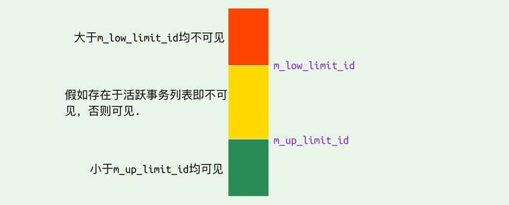
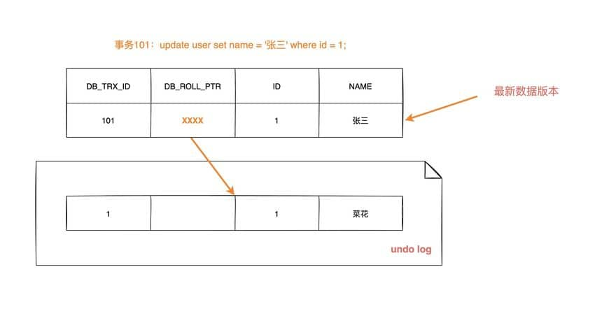
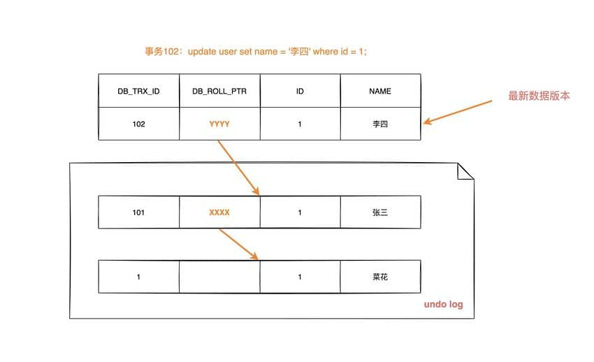
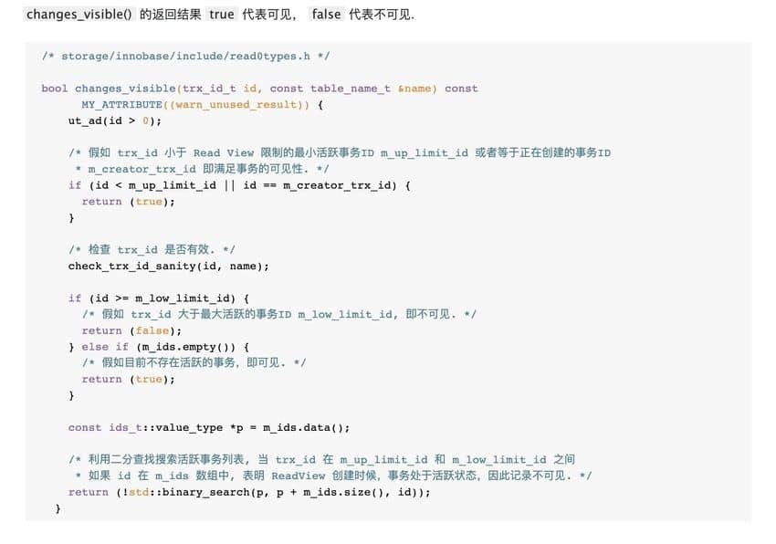
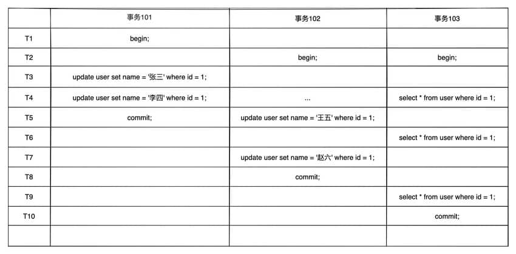
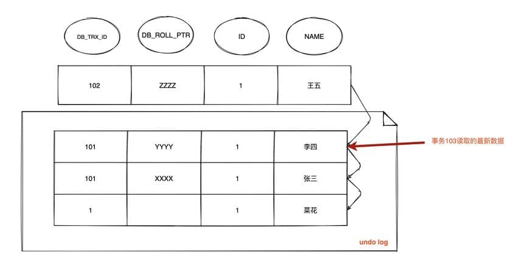
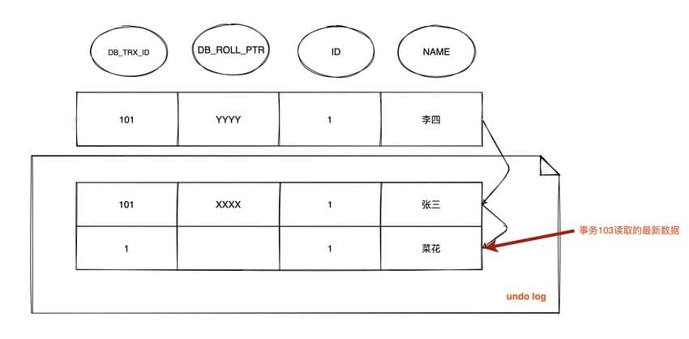
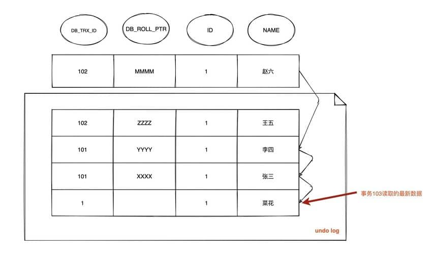
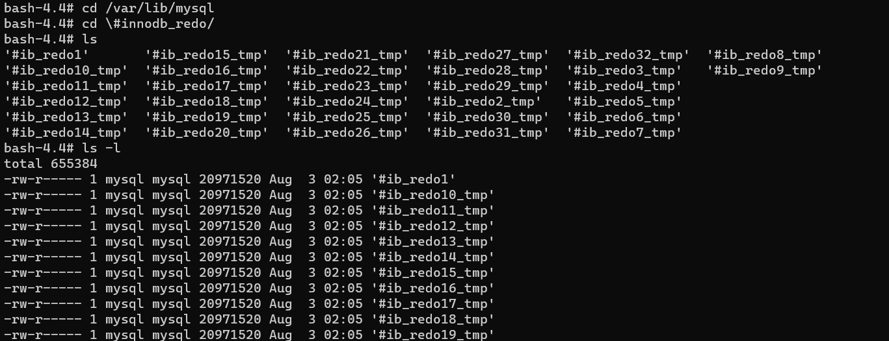
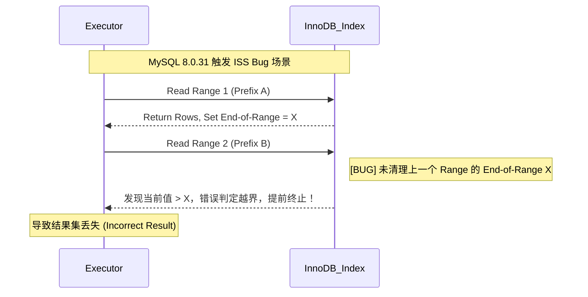

# mysql

> Aggregate of markdown under this directory (excludes README.md, TODO.md).


---

<!-- source: InnoDB存储引擎对MVCC的实现.md -->

---
title: InnoDB存储引擎对MVCC的实现
description: 深入剖析InnoDB存储引擎MVCC的实现原理，详解隐藏列、undo log版本链、ReadView机制，以及快照读与当前读的区别，理解MySQL如何实现事务隔离。
category: 数据库
tag:
  - MySQL
head:
  - - meta
    - name: keywords
      content: MVCC,多版本并发控制,InnoDB,快照读,当前读,一致性视图,ReadView,undo log,隐藏列,事务隔离
---

## 多版本并发控制 (Multi-Version Concurrency Control)

MVCC 是一种并发控制机制，用于在多个并发事务同时读写数据库时保持数据的一致性和隔离性。它是通过在每个数据行上维护多个版本的数据来实现的。当一个事务对数据进行修改时，InnoDB 会**直接更新当前数据行**（原地更新），并将**旧版本数据保存到 Undo Log** 中。其他事务在进行快照读（Snapshot Read）时，会根据 **ReadView** 和 **Undo Log** 中的版本链，读取到该数据在某一时刻的一致性视图，从而避免读操作被写操作阻塞。

1、读操作（SELECT）：

当一个事务执行读操作时，它会使用快照读取。快照读取是基于事务开始时数据库中的状态创建的，因此事务不会读取其他事务尚未提交的修改。具体工作情况如下：

- 对于读取操作，事务会查找符合条件的数据行，并选择符合其事务开始时间的数据版本进行读取。
- 如果某个数据行有多个版本，事务会选择不晚于其开始时间的最新版本，确保事务只读取在它开始之前已经存在的数据。
- 事务读取的是快照数据，因此其他并发事务对数据行的修改不会影响当前事务的读取操作。

2、写操作（INSERT、UPDATE、DELETE）：

当一个事务执行写操作时，它会生成一个新的数据版本，并将修改后的数据写入数据库。具体工作情况如下：

- 对于写操作，事务会为要修改的数据行创建一个新的版本，并将修改后的数据写入新版本。
- 新版本的数据会带有当前事务的版本号，以便其他事务能够正确读取相应版本的数据。
- 原始版本的数据仍然存在，供其他事务使用快照读取，这保证了其他事务不受当前事务的写操作影响。

3、事务提交和回滚：

- 当一个事务提交时，它所做的修改将成为数据库的最新版本，并且对其他事务可见。
- 当一个事务回滚时，它所做的修改将被撤销，对其他事务不可见。

4、版本的回收：

为了防止数据库中的版本无限增长，MVCC 会定期进行版本的回收。回收机制会删除已经不再需要的旧版本数据，从而释放空间。

MVCC 通过创建数据的多个版本和使用快照读取来实现并发控制。读操作使用旧版本数据的快照，写操作创建新版本，并确保原始版本仍然可用。这样，不同的事务可以在一定程度上并发执行，而不会相互干扰，从而提高了数据库的并发性能和数据一致性。

## 一致性非锁定读和锁定读

### 一致性非锁定读

对于 [**一致性非锁定读（Consistent Nonlocking Reads）**](https://dev.mysql.com/doc/refman/5.7/en/innodb-consistent-read.html)的实现，通常做法是加一个版本号或者时间戳字段，在更新数据的同时版本号 + 1 或者更新时间戳。查询时，将当前可见的版本号与对应记录的版本号进行比对，如果记录的版本小于可见版本，则表示该记录可见

在 `InnoDB` 存储引擎中，[多版本控制 (multi versioning)](https://dev.mysql.com/doc/refman/5.7/en/innodb-multi-versioning.html) 就是对非锁定读的实现。如果读取的行正在执行 `DELETE` 或 `UPDATE` 操作，这时读取操作不会去等待行上锁的释放。相反地，`InnoDB` 存储引擎会去读取行的一个快照数据，对于这种读取历史数据的方式，我们叫它快照读 (snapshot read)

在 `Repeatable Read` 和 `Read Committed` 两个隔离级别下，如果是执行普通的 `select` 语句（不包括 `select ... lock in share mode` ,`select ... for update`）则会使用 `一致性非锁定读（MVCC）`。并且在 `Repeatable Read` 下 `MVCC` 实现了可重复读和防止部分幻读

### 锁定读

如果执行的是下列语句，就是 [**锁定读（Locking Reads）**](https://dev.mysql.com/doc/refman/5.7/en/innodb-locking-reads.html)

- `select ... lock in share mode`
- `select ... for update`
- `insert`、`update`、`delete` 操作

在锁定读下，读取的是数据的最新版本，这种读也被称为 `当前读（current read）`。锁定读会对读取到的记录加锁：

- `select ... lock in share mode`：对记录加 `S` 锁，其它事务也可以加`S`锁，如果加 `x` 锁则会被阻塞

- `select ... for update`、`insert`、`update`、`delete`：对记录加 `X` 锁，且其它事务不能加任何锁

在一致性非锁定读下，即使读取的记录已被其它事务加上 `X` 锁，这时记录也是可以被读取的，即读取的快照数据。上面说了，在 `Repeatable Read` 下 `MVCC` 防止了部分幻读，这边的 “部分” 是指在 `一致性非锁定读` 情况下，只能读取到第一次查询之前所插入的数据（根据 Read View 判断数据可见性，Read View 在第一次查询时生成）。但是！如果是 `当前读` ，每次读取的都是最新数据，这时如果两次查询中间有其它事务插入数据，就会产生幻读。所以， **`InnoDB` 在实现`Repeatable Read` 时，如果执行的是当前读，则会对读取的记录使用 `Next-key Lock` ，来防止其它事务在间隙间插入数据**

## InnoDB 对 MVCC 的实现

`MVCC` 的实现依赖于：**隐藏字段、Read View、undo log**。在内部实现中，`InnoDB` 通过数据行的 `DB_TRX_ID` 和 `Read View` 来判断数据的可见性，如不可见，则通过数据行的 `DB_ROLL_PTR` 找到 `undo log` 中的历史版本。每个事务读到的数据版本可能是不一样的，在同一个事务中，用户只能看到该事务创建 `Read View` 之前已经提交的修改和该事务本身做的修改

### 隐藏字段

在内部，`InnoDB` 存储引擎为每行数据添加了三个 [隐藏字段](https://dev.mysql.com/doc/refman/5.7/en/innodb-multi-versioning.html)：

- `DB_TRX_ID（6字节）`：表示最后一次插入或更新该行的事务 id。此外，`delete` 操作在内部被视为更新，只不过会在记录头 `Record header` 中的 `deleted_flag` 字段将其标记为已删除
- `DB_ROLL_PTR（7字节）` 回滚指针，指向该行的 `undo log` 。如果该行未被更新，则为空
- `DB_ROW_ID（6字节）`：如果没有设置主键且该表没有唯一非空索引时，`InnoDB` 会使用该 id 来生成聚簇索引

### ReadView

```c
class ReadView {
  /* ... */
private:
  trx_id_t m_low_limit_id;      /* 大于等于这个 ID 的事务均不可见 */

  trx_id_t m_up_limit_id;       /* 小于这个 ID 的事务均可见 */

  trx_id_t m_creator_trx_id;    /* 创建该 Read View 的事务ID */

  trx_id_t m_low_limit_no;      /* 事务 Number, 小于该 Number 的 Undo Logs 均可以被 Purge */

  ids_t m_ids;                  /* 创建 Read View 时的活跃事务列表 */

  m_closed;                     /* 标记 Read View 是否 close */
}
```

[`Read View`](https://github.com/facebook/mysql-8.0/blob/8.0/storage/innobase/include/read0types.h#L298) 主要是用来做可见性判断，里面保存了 “当前对本事务不可见的其他活跃事务”

主要有以下字段：

- `m_low_limit_id`：目前出现过的最大的事务 ID+1，即下一个将被分配的事务 ID。大于等于这个 ID 的数据版本均不可见
- `m_up_limit_id`：活跃事务列表 `m_ids` 中最小的事务 ID，如果 `m_ids` 为空，则 `m_up_limit_id` 为 `m_low_limit_id`。小于这个 ID 的数据版本均可见
- `m_ids`：`Read View` 创建时其他未提交的活跃事务 ID 列表。创建 `Read View`时，将当前未提交事务 ID 记录下来，后续即使它们修改了记录行的值，对于当前事务也是不可见的。`m_ids` 不包括当前事务自己和已提交的事务（正在内存中）
- `m_creator_trx_id`：创建该 `Read View` 的事务 ID

**事务可见性示意图**（[图源](https://leviathan.vip/2019/03/20/InnoDB%E7%9A%84%E4%BA%8B%E5%8A%A1%E5%88%86%E6%9E%90-MVCC/#MVCC-1)）：



### undo-log

`undo log` 主要有两个作用：

- 当事务回滚时用于将数据恢复到修改前的样子
- 另一个作用是 `MVCC` ，当读取记录时，若该记录被其他事务占用或当前版本对该事务不可见，则可以通过 `undo log` 读取之前的版本数据，以此实现非锁定读

**在 `InnoDB` 存储引擎中 `undo log` 分为两种：`insert undo log` 和 `update undo log`：**

1. **`insert undo log`**：指在 `insert` 操作中产生的 `undo log`。因为 `insert` 操作的记录只对事务本身可见，对其他事务不可见，故该 `undo log` 可以在事务提交后直接删除。不需要进行 `purge` 操作

**`insert` 时的数据初始状态：**


2. **`update undo log`**：`update` 或 `delete` 操作中产生的 `undo log`。该 `undo log`可能需要提供 `MVCC` 机制，因此不能在事务提交时就进行删除。提交时放入 `undo log` 链表，等待 `purge线程` 进行最后的删除

**数据第一次被修改时：**



**数据第二次被修改时：**



不同事务或者相同事务的对同一记录行的修改，会使该记录行的 `undo log` 成为一条链表，链首就是最新的记录，链尾就是最早的旧记录。

### 数据可见性算法

在 `InnoDB` 存储引擎中，创建一个新事务后，执行每个 `select` 语句前，都会创建一个快照（Read View），**快照中保存了当前数据库系统中正处于活跃（没有 commit）的事务的 ID 号**。其实简单的说保存的是系统中当前不应该被本事务看到的其他事务 ID 列表（即 m_ids）。当用户在这个事务中要读取某个记录行的时候，`InnoDB` 会将该记录行的 `DB_TRX_ID` 与 `Read View` 中的一些变量及当前事务 ID 进行比较，判断是否满足可见性条件

[具体的比较算法](https://github.com/facebook/mysql-8.0/blob/8.0/storage/innobase/include/read0types.h#L161)如下([图源](https://leviathan.vip/2019/03/20/InnoDB%E7%9A%84%E4%BA%8B%E5%8A%A1%E5%88%86%E6%9E%90-MVCC/#MVCC-1))：



1. 如果记录 DB_TRX_ID < m_up_limit_id，那么表明最新修改该行的事务（DB_TRX_ID）在当前事务创建快照之前就提交了，所以该记录行的值对当前事务是可见的

2. 如果 DB_TRX_ID >= m_low_limit_id，那么表明最新修改该行的事务（DB_TRX_ID）在当前事务创建快照之后才修改该行，所以该记录行的值对当前事务不可见。跳到步骤 5

3. m_ids 为空，则表明在当前事务创建快照之前，修改该行的事务就已经提交了，所以该记录行的值对当前事务是可见的

4. 如果 m_up_limit_id <= DB_TRX_ID < m_low_limit_id，表明最新修改该行的事务（DB_TRX_ID）在当前事务创建快照的时候可能处于“活动状态”或者“已提交状态”；所以就要对活跃事务列表 m_ids 进行查找（源码中是用的二分查找，因为是有序的）

   - 如果在活跃事务列表 m_ids 中能找到 DB_TRX_ID，表明：① 在当前事务创建快照前，该记录行的值被事务 ID 为 DB_TRX_ID 的事务修改了，但没有提交；或者 ② 在当前事务创建快照后，该记录行的值被事务 ID 为 DB_TRX_ID 的事务修改了。这些情况下，这个记录行的值对当前事务都是不可见的。跳到步骤 5

   - 在活跃事务列表中找不到，则表明“id 为 trx_id 的事务”在修改“该记录行的值”后，在“当前事务”创建快照前就已经提交了，所以记录行对当前事务可见

5. 在该记录行的 DB_ROLL_PTR 指针所指向的 `undo log` 取出快照记录，用快照记录的 DB_TRX_ID 跳到步骤 1 重新开始判断，直到找到满足的快照版本或返回空

## RC 和 RR 隔离级别下 MVCC 的差异

在事务隔离级别 `RC` 和 `RR` （InnoDB 存储引擎的默认事务隔离级别）下，`InnoDB` 存储引擎使用 `MVCC`（非锁定一致性读），但它们生成 `Read View` 的时机却不同

- 在 RC 隔离级别下的 **`每次select`** 查询前都生成一个`Read View` (m_ids 列表)
- 在 RR 隔离级别下只在事务开始后 **`第一次select`** 数据前生成一个`Read View`（m_ids 列表）

## MVCC 解决不可重复读问题

虽然 RC 和 RR 都通过 `MVCC` 来读取快照数据，但由于 **生成 Read View 时机不同**，从而在 RR 级别下实现可重复读

举个例子：



### 在 RC 下 ReadView 生成情况

**1. 假设时间线来到 T4 ，那么此时数据行 id = 1 的版本链为：**


由于 RC 级别下每次查询都会生成`Read View` ，并且事务 101、102 并未提交，此时 `103` 事务生成的 `Read View` 中活跃的事务 **`m_ids` 为：[101,102]** ，`m_low_limit_id`为：104，`m_up_limit_id`为：101，`m_creator_trx_id` 为：103

- 此时最新记录的 `DB_TRX_ID` 为 101，m_up_limit_id <= 101 < m_low_limit_id，所以要在 `m_ids` 列表中查找，发现 `DB_TRX_ID` 存在列表中，那么这个记录不可见
- 根据 `DB_ROLL_PTR` 找到 `undo log` 中的上一版本记录，上一条记录的 `DB_TRX_ID` 还是 101，不可见
- 继续找上一条 `DB_TRX_ID`为 1，满足 1 < m_up_limit_id，可见，所以事务 103 查询到数据为 `name = 菜花`

**2. 时间线来到 T6 ，数据的版本链为：**



因为在 RC 级别下，重新生成 `Read View`，这时事务 101 已经提交，102 并未提交，所以此时 `Read View` 中活跃的事务 **`m_ids`：[102]** ，`m_low_limit_id`为：104，`m_up_limit_id`为：102，`m_creator_trx_id`为：103

- 此时最新记录的 `DB_TRX_ID` 为 102，m_up_limit_id <= 102 < m_low_limit_id，所以要在 `m_ids` 列表中查找，发现 `DB_TRX_ID` 存在列表中，那么这个记录不可见

- 根据 `DB_ROLL_PTR` 找到 `undo log` 中的上一版本记录，上一条记录的 `DB_TRX_ID` 为 101，满足 101 < m_up_limit_id，记录可见，所以在 `T6` 时间点查询到数据为 `name = 李四`，与时间 T4 查询到的结果不一致，不可重复读！

**3. 时间线来到 T9 ，数据的版本链为：**


重新生成 `Read View`， 这时事务 101 和 102 都已经提交，所以 **m_ids** 为空，则 m_up_limit_id = m_low_limit_id = 104，最新版本事务 ID 为 102，满足 102 < m_low_limit_id，可见，查询结果为 `name = 赵六`

> **总结：** **在 RC 隔离级别下，事务在每次查询开始时都会生成并设置新的 Read View，所以导致不可重复读**

### 在 RR 下 ReadView 生成情况

在可重复读级别下，只会在事务开始后第一次读取数据时生成一个 Read View（m_ids 列表）

**1. 在 T4 情况下的版本链为：**



在当前执行 `select` 语句时生成一个 `Read View`，此时 **`m_ids`：[101,102]** ，`m_low_limit_id`为：104，`m_up_limit_id`为：101，`m_creator_trx_id` 为：103

此时和 RC 级别下一样：

- 最新记录的 `DB_TRX_ID` 为 101，m_up_limit_id <= 101 < m_low_limit_id，所以要在 `m_ids` 列表中查找，发现 `DB_TRX_ID` 存在列表中，那么这个记录不可见
- 根据 `DB_ROLL_PTR` 找到 `undo log` 中的上一版本记录，上一条记录的 `DB_TRX_ID` 还是 101，不可见
- 继续找上一条 `DB_TRX_ID`为 1，满足 1 < m_up_limit_id，可见，所以事务 103 查询到数据为 `name = 菜花`

**2. 时间点 T6 情况下：**


在 RR 级别下只会生成一次`Read View`，所以此时依然沿用 **`m_ids`：[101,102]** ，`m_low_limit_id`为：104，`m_up_limit_id`为：101，`m_creator_trx_id` 为：103

- 最新记录的 `DB_TRX_ID` 为 102，m_up_limit_id <= 102 < m_low_limit_id，所以要在 `m_ids` 列表中查找，发现 `DB_TRX_ID` 存在列表中，那么这个记录不可见

- 根据 `DB_ROLL_PTR` 找到 `undo log` 中的上一版本记录，上一条记录的 `DB_TRX_ID` 为 101，不可见

- 继续根据 `DB_ROLL_PTR` 找到 `undo log` 中的上一版本记录，上一条记录的 `DB_TRX_ID` 还是 101，不可见

- 继续找上一条 `DB_TRX_ID`为 1，满足 1 < m_up_limit_id，可见，所以事务 103 查询到数据为 `name = 菜花`

**3. 时间点 T9 情况下：**



此时情况跟 T6 完全一样，由于已经生成了 `Read View`，此时依然沿用 **`m_ids`：[101,102]** ，所以查询结果依然是 `name = 菜花`

## MVCC➕Next-key-Lock 防止幻读

`InnoDB`存储引擎在 RR 级别下通过 `MVCC`和 `Next-key Lock` 来解决幻读问题：

**1、执行普通 `select`，此时会以 `MVCC` 快照读的方式读取数据**

在快照读的情况下，RR 隔离级别只会在事务开启后的第一次查询生成 `Read View` ，并使用至事务提交。所以在生成 `Read View` 之后其它事务所做的更新、插入记录版本对当前事务并不可见，实现了可重复读和防止快照读下的 “幻读”

**2、执行 select...for update/lock in share mode、insert、update、delete 等当前读**

在当前读下，读取的都是最新的数据，如果其它事务有插入新的记录，并且刚好在当前事务查询范围内，就会产生幻读！`InnoDB` 使用 [Next-key Lock](https://dev.mysql.com/doc/refman/5.7/en/innodb-locking.html#innodb-next-key-locks) 来防止这种情况。当执行当前读时，会锁定读取到的记录的同时，锁定它们的间隙，防止其它事务在查询范围内插入数据。只要我不让你插入，就不会发生幻读

## 参考

- **《MySQL 技术内幕 InnoDB 存储引擎第 2 版》**
- [Innodb 中的事务隔离级别和锁的关系](https://tech.meituan.com/2014/08/20/innodb-lock.html)
- [MySQL 事务与 MVCC 如何实现的隔离级别](https://blog.csdn.net/qq_35190492/article/details/109044141)
- [InnoDB 事务分析-MVCC](https://leviathan.vip/2019/03/20/InnoDB%E7%9A%84%E4%BA%8B%E5%8A%A1%E5%88%86%E6%9E%90-MVCC/)

<!-- @include: @article-footer.snippet.md -->


---

<!-- source: MySQL备份与恢复详解-mysqldump、XtraBackup、binlog和PITR.md -->

---
title: MySQL备份与恢复详解：mysqldump、XtraBackup、binlog和PITR
description: MySQL备份与恢复详解，讲解 mysqldump、MySQL Shell、Percona XtraBackup、binlog、PITR、RTO/RPO、恢复演练和常见备份误区。
category: 数据库
tag:
  - MySQL
  - 备份恢复
head:
  - - meta
    - name: keywords
      content: MySQL备份,MySQL恢复,mysqldump,mysqlbinlog,MySQL Shell,Percona XtraBackup,binlog,PITR,全量备份,增量备份,逻辑备份,物理备份,RTO,RPO
---

线上最怕的数据库事故，很多时候不是 MySQL 进程挂了。

进程挂了还能重启，主库挂了还能切从库。真正麻烦的是数据被删了、被错误脚本改了、磁盘坏了，或者迁移时发现少了一批表。这个时候，主从复制、redo log、undo log 都不够用，最后能救场的通常是备份和恢复方案。

这篇只讲 MySQL 备份与恢复，不展开 PostgreSQL、Redis 和云厂商备份产品。命令主要按 MySQL 8.4 LTS 校对，同时参考了截至 2026-06-25 的 MySQL 9.7 当前文档；不同版本的参数名、权限要求和工具兼容性会有变化，生产落地前一定要以自己环境里的 `mysqldump --help`、`mysqlbinlog --help` 和工具文档为准。

## 备份到底解决什么问题？

先把几个容易混在一起的概念拆开：

- **崩溃恢复**：MySQL 异常宕机后，InnoDB 依赖 redo log、undo log 等机制把数据库恢复到一致状态。这解决的是进程崩溃、机器重启后的存储引擎一致性问题。
- **主从复制 / 高可用切换**：主库不可用时，把流量切到从库或新主库。这解决的是服务可用性问题，但错误写入通常会被同步到从库。
- **备份恢复**：从某个历史数据副本恢复，再根据 binlog 回放到指定时间点。这解决的是数据丢失、误删误改、磁盘损坏、跨环境迁移和审计留存问题。

主从复制不能替代备份。

如果一条 `DROP TABLE` 在主库执行成功，它大概率也会同步到从库。复制做得越快，错误传播也越快。备份的价值在于保留一个独立的历史状态，让你有机会回到事故发生前。

## RTO 和 RPO 决定备份策略

备份策略不能只问“每天备几次”。更实际的问题是两个：

- **RPO（Recovery Point Objective）**：最多能接受丢多久的数据？
- **RTO（Recovery Time Objective）**：最多能接受多久恢复服务？

如果业务能接受丢 1 天数据，每天一次全量备份也许够用。如果订单、支付、库存这类数据最多只能丢几分钟，只有全量备份不够，还要保留 binlog 做增量恢复。如果数据库有几百 GB，恢复 SQL 文件可能跑很久，RTO 又要求在 30 分钟内恢复，那就要认真考虑物理备份、备库预热、恢复演练和切换流程。

一套常见组合是：

- 每天或每周做一次全量备份。
- 开启 binlog，并按 RPO 要求保留足够长的日志。
- 备份文件和 binlog 不放在同一块磁盘、同一个故障域里。
- 定期把备份恢复到一台新机器，记录实际耗时。

binlog 保留 30 天，不代表 RPO 就一定是几秒。真正能恢复到哪里，取决于最后一份完整、可读、已经复制到独立故障域的 binlog。生产里还要看 `sync_binlog`、`innodb_flush_log_at_trx_commit`、binlog 归档延迟、归档进程是否断过、binlog 文件链是否连续。MySQL 8.4 默认 `sync_binlog=1`、`innodb_flush_log_at_trx_commit=1`，这两个值更偏向安全；如果为了性能改小了持久性保证，就要把可能丢最近事务这件事算进 RPO。

所以，要求分钟级甚至秒级 RPO 的系统，不只要监控“磁盘上还有多少天 binlog”，还要监控“最新已安全归档的 binlog 距离现在多久”。

这里有个很现实的限制：恢复速度和数据量、磁盘性能、索引数量、网络带宽、导入方式都有关系。没有演练数据时，RTO 只能算愿望，不能算承诺。

## 备份方式有哪些？

MySQL 备份常见有三组分类，分别回答不同问题。

按备份时数据库是否提供服务：

| 类型 | 说明                                   | 适用场景                                 |
| ---- | -------------------------------------- | ---------------------------------------- |
| 冷备 | 停掉 MySQL 后复制数据文件              | 小型系统、维护窗口充足的场景             |
| 温备 | MySQL 运行中备份，但可能加锁或影响写入 | 对可用性要求一般、能接受短时间影响的场景 |
| 热备 | MySQL 运行中备份，尽量不阻塞业务读写   | 生产库、大库、维护窗口很短的场景         |

按备份文件内容：

| 类型     | 说明                             | 代表工具                                    |
| -------- | -------------------------------- | ------------------------------------------- |
| 逻辑备份 | 导出 SQL、CSV 等逻辑内容         | `mysqldump`、MySQL Shell dump utilities     |
| 物理备份 | 复制数据文件、日志文件等物理文件 | Percona XtraBackup、MySQL Enterprise Backup |

按备份范围：

| 类型     | 说明                             |
| -------- | -------------------------------- |
| 全量备份 | 备份某个时刻完整数据             |
| 增量备份 | 备份上次备份之后变化的数据或日志 |
| 差异备份 | 备份上次全量备份之后变化的数据   |

面试里经常会问这些分类，但生产里真正要落到一件事：备份文件能不能恢复出业务需要的数据。分类只是选型语言，恢复成功才是结果。

## 用 mysqldump 做逻辑备份

`mysqldump` 是 MySQL 自带的逻辑备份工具，它会导出一批 SQL 语句，用这些语句可以重建库表结构和表数据。它的优点是简单、通用、方便查看，也适合跨环境迁移。缺点同样明显：数据量大时备份慢，恢复更慢，因为恢复过程要重新执行 SQL、写数据、建索引。

MySQL 官方文档也明确提醒，`mysqldump` 不是大规模备份和恢复的快速方案；数据量上来以后，物理备份通常更合适。

一个偏生产的 InnoDB 全库备份命令可以这样写：

```bash
mysqldump \
  --host=127.0.0.1 \
  --user=backup_user \
  --password \
  --all-databases \
  --single-transaction \
  --routines \
  --events \
  --triggers \
  --source-data=2 \
  > mysql-full-backup.sql
```

几个参数要单独解释一下：

- `--single-transaction`：备份开始前开启一个一致性读事务，适合 InnoDB 表。它通常不需要在整个导出期间持续锁表，但本文命令还用了 `--source-data=2`，`mysqldump` 会在启动阶段短暂获取全局读锁，用来对齐一致性快照和 binlog 位点。因此更准确的说法是“不长期阻塞业务写入”，不是“完全无锁”。如果混了 MyISAM、MEMORY 等非事务表，备份期间这些表仍可能变化。
- `--routines` 和 `--events`：把存储过程、函数和事件也导出来。MySQL 8.4 文档明确说明，相关定义在数据字典里，`--all-databases` 不等于自动带上这些对象。
- `--triggers`：触发器默认会导出，显式写出来是为了让备份脚本的意图更清楚。
- `--source-data=2`：把当前 binlog 文件名和位置写入 dump 文件，并且以 SQL 注释形式保留。旧资料里常见的 `--master-data` 在新文档里已经是 `--source-data` 的废弃别名。

如果只备份一个库：

```bash
mysqldump \
  --host=127.0.0.1 \
  --user=backup_user \
  --password \
  --single-transaction \
  --routines \
  --events \
  --triggers \
  --source-data=2 \
  order_db \
  > order_db.sql
```

这种写法导出的主要是 `order_db` 里的对象，不会自动把 `CREATE DATABASE order_db` 和 `USE order_db` 写成一个完整建库脚本。恢复时要么提前建库，要么在备份时改用 `--databases order_db`：

```bash
mysqldump \
  --host=127.0.0.1 \
  --user=backup_user \
  --password \
  --single-transaction \
  --routines \
  --events \
  --triggers \
  --source-data=2 \
  --databases order_db \
  > order_db.sql
```

`--databases` 会在 dump 里加入 `CREATE DATABASE` 和 `USE`。如果你只是想把数据导入一个已经存在的同名库，保留前一种写法也可以，但恢复命令必须指明目标库。

如果备份文件很大，可以直接压缩：

```bash
mysqldump \
  --host=127.0.0.1 \
  --user=backup_user \
  --password \
  --single-transaction \
  --routines \
  --events \
  --triggers \
  order_db | gzip > order_db.sql.gz
```

恢复时执行：

```bash
mysql --host=127.0.0.1 --user=root --password < mysql-full-backup.sql
```

压缩文件可以这样恢复：

```bash
mysql --host=127.0.0.1 --user=root --password \
  -e "CREATE DATABASE IF NOT EXISTS order_db"

gunzip -c order_db.sql.gz | mysql --host=127.0.0.1 --user=root --password order_db
```

`mysqldump` 有几个常见坑：

- 备份用户权限不够，视图、触发器、存储过程、事件没有导完整。
- 使用 `--single-transaction` 时，备份期间执行了 `ALTER TABLE`、`DROP TABLE`、`TRUNCATE TABLE` 这类 DDL，可能导致备份失败或内容不符合预期。
- 没有记录 binlog 位点，后续无法从全量备份继续做按时间点恢复。
- 把备份恢复到启用了 GTID 的环境时，不要依赖默认的 `--set-gtid-purged=AUTO`。官方文档说明，默认情况下源端开启 GTID 时，dump 可能写入 `SET @@GLOBAL.gtid_purged` 和 `SET @@SESSION.sql_log_bin=0`；部分库 dump 也可能携带源实例 `gtid_executed` 中其他库事务的 GTID。导入测试库、临时库、已有 GTID 历史的目标实例时，通常要显式评估是否使用 `--set-gtid-purged=OFF`；如果是创建新的复制节点，则可能需要保留 GTID。关键是显式选择，不要照抄默认值。
- `--source-data=2` 记录的是实例级 binlog 位点，不是“只属于这个数据库”的增量日志。单库 PITR 比整实例 PITR 更麻烦，尤其要考虑跨库事务、存储过程、触发器和 `binlog_format`，不能简单地把整个实例 binlog 原样回放到目标库。

小库、测试环境、跨版本迁移、导出少量数据，`mysqldump` 很顺手。上百 GB 的生产库如果还只靠它做恢复，恢复时间通常会让人难受。

## MySQL Shell Dump Utilities：并行逻辑备份

如果你希望保留逻辑备份的可迁移性，又嫌 `mysqldump` 单线程导出和导入太慢，可以看看 MySQL Shell Dump Utilities。

MySQL Shell 提供了几类 `util` 函数：

```javascript
util.dumpInstance("/backup/mysql/instance", { threads: 8 });
util.dumpSchemas(["order_db"], "/backup/mysql/order_db", { threads: 8 });
util.dumpTables("order_db", ["orders", "order_item"], "/backup/mysql/orders", {
  threads: 8,
});
util.loadDump("/backup/mysql/order_db", { threads: 8 });
```

它的定位仍然是逻辑备份，但支持并行 dump / load、压缩、进度信息、校验和以及对象存储输出。官方文档里 `threads` 默认值是 4，可以按实例负载、网络和目标端写入能力调大。

不过不要把它误解成物理备份替代品。它导出的仍是逻辑对象和数据文件，恢复时也要重建表、索引和对象；大库如果 RTO 很紧，物理备份通常还是更稳。

## 用 binlog 做增量恢复

全量备份只能恢复到备份那一刻。想恢复到更靠后的时间点，需要依赖 binlog。

binlog 记录了会修改数据的事件，也是 MySQL 主从复制和按时间点恢复的基础。PITR（Point-in-Time Recovery）通常就是先恢复一个全量备份，再从备份对应的 binlog 位点开始回放日志，直到目标时间或目标位置。

一个简化例子：

1. 凌晨 02:00 做了一次全量备份，dump 文件里记录了 `binlog.000120` 和位置 `154`。
2. 上午 10:21 有人误删了 `order_item` 表的一批数据。
3. 恢复时先导入 02:00 的全量备份。
4. 再用 `mysqlbinlog` 回放 `binlog.000120` 及之后的日志，停止在误删语句之前。

按时间恢复可以这样写：

```bash
mysqlbinlog \
  --start-position=154 \
  --stop-datetime="2026-06-25 10:20:59" \
  binlog.000120 binlog.000121 \
  | mysql --binary-mode --host=127.0.0.1 --user=root --password
```

按时间停止适合快速缩小范围，但不能把它当成绝对精确的业务时间。`mysqlbinlog` 会按执行命令机器的本地时区解释 `--stop-datetime`，并在遇到第一个时间戳大于或等于目标值的事件时停止。生产恢复时，更稳的做法通常是先用时间范围导出一段 binlog 做检查，找到误操作对应的 event 或事务边界，再用 `--stop-position` 做最终回放。

如果已经精确找到了事件位置，用位置比时间更可靠：

```bash
mysqlbinlog \
  --start-position=154 \
  --stop-position=987654 \
  binlog.000120 \
  | mysql --binary-mode --host=127.0.0.1 --user=root --password
```

同时指定多个 binlog 文件时，`--start-position` 只作用于命令里的第一个文件，`--stop-position` 只作用于最后一个文件，中间文件会完整处理。位置是 binlog 文件里的字节偏移，不是第几个事件，必须落在有效事件边界上。

`mysql --binary-mode` 不是装饰参数。官方文档提到，如果 binlog 输出里包含 `\0` 这类空字符，不加 `--binary-mode` 可能无法被 `mysql` 客户端正确解析。

现代 MySQL 常见 `ROW` 格式 binlog。这个格式记录的是行变更，不一定能直接看到原始 SQL。排查误操作时，可以用下面的方式把行事件解码成便于阅读的注释：

```bash
mysqlbinlog --base64-output=DECODE-ROWS -vv binlog.000120 > binlog.000120.readable.sql
```

注意，这个输出主要用于人工检查。官方文档也提醒，如果要把 `mysqlbinlog` 输出重新执行，默认的 `--base64-output=AUTO` 才是安全行为；`DECODE-ROWS` 这类模式不应拿来做正式回放。

binlog 恢复有几个前提：

- MySQL 必须提前开启 binary logging。
- binlog 保留时间要覆盖你的 RPO 要求。
- 全量备份里要能找到起始 binlog 文件和位置，或者有 GTID 信息。
- 恢复前最好在隔离实例验证，不要直接把不确定的 binlog 回放到生产库。

binlog 文件本身也要备份。MySQL 官方文档给过一种连续备份 binlog 的方式：

```bash
mysqlbinlog \
  --read-from-remote-server \
  --host=127.0.0.1 \
  --user=binlog_backup \
  --password \
  --raw \
  --stop-never \
  --connection-server-id=330610 \
  --result-file=/backup/mysql/binlog/ \
  binlog.000999
```

这条命令会以原始二进制格式拉取 binlog，并在到达当前最后一个日志文件末尾后继续等待新事件。它和复制从库不同，连接断了不会像从库一样自动重连，所以生产脚本还要配合进程守护、告警和断点续传。

连续拉取 binlog 还有几个容易漏掉的点：

- 远程读取 binlog 的账号需要复制相关权限。MySQL 8.4 文档对 `--read-from-remote-server` 仍写的是 `REPLICATION SLAVE` 权限；不同版本和权限模型可能有差异，建账号时要按当前版本文档确认。
- `--stop-never` 会让 `mysqlbinlog` 以一个 server ID 持续连接源端，生产里建议显式配置 `--connection-server-id`，避免和复制节点或另一个 `mysqlbinlog` 进程冲突。
- `--raw` 模式默认会用源端 binlog 同名文件写到当前目录；如果文件已经存在会被覆盖。用 `--result-file` 指定独立目录或前缀，并对目录做权限和容量监控。
- 如果源端开启了 binlog 加密，`mysqlbinlog` 拉出来的副本仍会以未加密格式存放在备份端。传输链路要用 TLS，备份目录也要做加密、访问控制和删除保护。

## 用 XtraBackup 做物理备份

逻辑备份导出的是 SQL，物理备份复制的是 MySQL 数据文件和相关日志文件。数据量越大，物理备份的优势越明显：备份和恢复更接近文件复制，不需要逐条重放大量 `INSERT`。

Percona XtraBackup 是 MySQL 实践中常用的开源物理备份工具。它可以在 MySQL 运行时备份 InnoDB / XtraDB 等存储引擎的数据，常用于生产环境热备。不过“热备”主要是对 InnoDB 这类事务型引擎而言；Percona 文档也说明，复制非 InnoDB 数据时 InnoDB 表会被锁住，混用存储引擎的实例要单独评估影响。

一个最小的全量备份流程如下：

```bash
xtrabackup --backup --target-dir=/data/backups/mysql/base
```

备份完成后不能直接拿来启动，需要先 prepare，让数据文件达到一致状态：

```bash
xtrabackup --prepare --target-dir=/data/backups/mysql/base
```

`--prepare` 会应用 redo / undo，让备份目录里的文件形成一致快照。这个步骤不要中断；如果备份后面还要继续合并增量，需要按 Percona 文档使用 `--apply-log-only` 保留未提交事务回滚前的状态。

恢复时要停掉 MySQL，并确保目标 `datadir` 为空：

```bash
systemctl stop mysqld

mv /var/lib/mysql /var/lib/mysql.bak.$(date +%F-%H%M%S)
install -d -o mysql -g mysql /var/lib/mysql

xtrabackup --copy-back --target-dir=/data/backups/mysql/base

chown -R mysql:mysql /var/lib/mysql

systemctl start mysqld
```

这类命令看起来不复杂，真正容易出问题的是版本兼容。Percona 文档写得很明确：XtraBackup 8.4 只支持 MySQL 8.4 和 Percona Server for MySQL 8.4，不支持 MySQL 8.0 或 9.x；MySQL 8.0 要看 XtraBackup 8.0 系列的支持范围。生产环境不要用“版本号差不多”来判断能不能备份和恢复。

XtraBackup 也支持增量备份，例如基于一次全量备份继续备份变化数据：

```bash
xtrabackup \
  --backup \
  --target-dir=/data/backups/mysql/inc1 \
  --incremental-basedir=/data/backups/mysql/base
```

增量链路的 prepare 顺序、合并方式和恢复步骤更容易写错。团队没有熟练演练前，不建议一上来就把恢复能力押在复杂增量链上。更稳的做法是先保证“全量物理备份 + binlog”能恢复，再根据数据量和窗口压力增加增量备份。

如果 XtraBackup 恢复后还要继续做 PITR，起点不要靠猜。备份目录里的 `xtrabackup_binlog_info` 会记录备份时的 binlog 文件和位置：

```bash
cat /data/backups/mysql/base/xtrabackup_binlog_info
```

恢复全量物理备份后，再从这个文件给出的位点开始用 `mysqlbinlog` 回放后续日志。

## 逻辑备份和物理备份怎么选？

可以按数据量、恢复目标和运维能力来选。

| 场景                               | 更适合的方式                          |
| ---------------------------------- | ------------------------------------- |
| 小库、测试库、单表导出、跨环境迁移 | `mysqldump`                           |
| 需要查看或手工修改备份内容         | `mysqldump`                           |
| 中等规模逻辑迁移，希望并行导入导出 | MySQL Shell Dump Utilities            |
| 大库、恢复窗口短、主要是 InnoDB 表 | XtraBackup 或 MySQL Enterprise Backup |
| 需要按时间点恢复                   | 全量备份 + binlog                     |
| 云数据库实例                       | 优先用云厂商快照 / PITR，再做导出校验 |

这里不要把工具选型想得太玄。小库用 `mysqldump` 没问题，脚本简单，出问题也好排查。数据量上来以后，SQL 文件恢复慢的问题会越来越明显，再切到物理备份更实际。

最差的方案通常是只做一种备份，且从来不恢复验证。

## 恢复演练应该怎么做？

备份脚本跑成功，只说明生成了文件。文件能不能用，要靠恢复演练回答。

一个最小演练可以按这个流程走：

1. 准备一台隔离机器，安装相同大版本的 MySQL。
2. 拉取最近一次全量备份和对应 binlog，确认解密密钥、账号、证书和对象存储访问方式都可用。
3. 恢复全量备份，记录耗时。
4. 回放 binlog 到指定时间点，记录耗时。
5. 校验关键库表数量、关键业务 SQL、存储过程、事件、触发器、账号、角色和权限。
6. 检查 `charset`、`collation`、`time_zone`、`sql_mode`、只读开关和网络隔离，确保恢复实例不会被真实业务流量误连。
7. 用应用连接恢复实例，跑一组只读冒烟接口。
8. 记录这次演练的实际 RTO、可恢复到的时间点、失败步骤和人工操作。

校验不要只看 MySQL 能不能启动。至少要查几类数据：

```sql
-- 关键表行数
SELECT COUNT(*) FROM order_db.orders;

-- 最近写入时间
SELECT MAX(created_at) FROM order_db.orders;

-- 存储过程和函数
SHOW PROCEDURE STATUS WHERE Db = 'order_db';
SHOW FUNCTION STATUS WHERE Db = 'order_db';

-- 事件
SHOW EVENTS FROM order_db;

-- 触发器
SHOW TRIGGERS FROM order_db;

-- 账号、角色和权限
SELECT user, host FROM mysql.user;
SHOW GRANTS FOR 'app_user'@'%';

-- 关键环境参数
SELECT
  @@character_set_server,
  @@collation_server,
  @@time_zone,
  @@sql_mode,
  @@read_only,
  @@super_read_only;
```

如果业务有对账表、流水表、库存表，要优先校验这些表。恢复演练的目标很具体：尽早发现“备份少对象、binlog 缺文件、权限恢复不了、导入耗时远超预期”这类会在事故里放大的问题。

## 常见误区

**误区一：有从库就不用备份。**

从库能接管读写流量，但挡不住误删误改。错误 SQL 同步过去以后，从库也会变成错误状态。延迟从库能争取一点处理时间，但仍然不能替代离线备份。

**误区二：只备份数据，不备份 binlog。**

这种做法最多恢复到全量备份那一刻。全量备份之后到事故发生前的写入都找不回来，RPO 会被备份周期拉长。

**误区三：备份文件和数据库放在同一台机器。**

磁盘损坏、机房故障、误删目录时，数据和备份可能一起没了。至少要复制到独立存储；重要业务还要考虑跨机房或对象存储。

**误区四：备份脚本没有失败告警。**

备份目录里有旧文件，不代表最近一次备份成功。脚本应该检查退出码、文件大小、生成时间、校验和，并把失败通知到人。

**误区五：从不恢复。**

没有恢复演练的备份，平时看起来最省事，事故时最贵。恢复步骤越久没跑，越容易被版本、权限、路径、磁盘空间和工具参数卡住。

**误区六：校验和通过就等于能恢复。**

校验和只能说明文件在复制和存储过程中大概率没有损坏，不代表 SQL 能顺利导入、物理备份能启动、权限对象齐全，也不代表 binlog 链连续。恢复能力只能靠恢复演练证明。

**误区七：备份文件谁都能改、能删。**

备份如果和生产账号共用权限，或者普通运维脚本可以直接覆盖、删除，遇到误删、勒索软件、脚本 bug 时可能一起失效。重要业务至少要有一份跨账号、跨故障域、带版本或不可变策略的副本，并限制删除权限。

## 一套可落地的基础方案

如果没有现成方案，可以从这套开始：

- 业务库主要是 InnoDB，数据量不大：每天 `mysqldump --single-transaction --routines --events --triggers --source-data=2` 全量备份，保留 7 到 30 天，binlog 保留时间覆盖同样窗口。
- 数据量上来以后：每天或每周做一次 XtraBackup 全量备份，按业务写入量决定是否增加增量备份，binlog 单独备份。
- 备份落盘后计算校验和，复制到独立存储；重要业务再保留一份加密、跨账号、带版本或不可变策略的副本。
- 监控最新可用全量备份时间、最新已归档 binlog 时间、binlog 文件连续性和归档进程状态。
- 每月至少做一次恢复演练；核心业务在大促、迁移、版本升级前额外做一次。
- 写一份恢复 runbook，包含负责人、备份位置、解密方式、恢复命令、binlog 起点查找方式、隔离恢复环境、校验 SQL 和回滚说明。

这里的周期只是起点，不是标准答案。金融、订单、支付、医疗这类数据的 RPO/RTO 要求会更严；内部报表、日志分析库通常可以放宽。备份策略应该跟着业务损失来定，而不是跟着网上模板来定。

## 参考资料

- [MySQL Reference Manual：mysqldump](https://dev.mysql.com/doc/refman/8.4/en/mysqldump.html)
- [MySQL Reference Manual：mysqlbinlog](https://dev.mysql.com/doc/refman/8.4/en/mysqlbinlog.html)
- [MySQL Reference Manual：Using mysqlbinlog to Back Up Binary Log Files](https://dev.mysql.com/doc/refman/8.4/en/mysqlbinlog-backup.html)
- [MySQL Reference Manual：Point-in-Time Recovery](https://dev.mysql.com/doc/refman/8.4/en/point-in-time-recovery-binlog.html)
- [MySQL Reference Manual：Binary Logging Options and Variables](https://dev.mysql.com/doc/refman/8.4/en/replication-options-binary-log.html)
- [MySQL Shell 8.4：Instance Dump Utility, Schema Dump Utility, and Table Dump Utility](https://dev.mysql.com/doc/mysql-shell/8.4/en/mysql-shell-utilities-dump-instance-schema.html)
- [MySQL Shell 8.4：Dump Loading Utility](https://dev.mysql.com/doc/mysql-shell/8.4/en/mysql-shell-utilities-load-dump.html)
- [MySQL Reference Manual：MySQL Releases: Innovation and LTS](https://dev.mysql.com/doc/refman/8.4/en/mysql-releases.html)
- [Percona XtraBackup 8.4 Documentation](https://docs.percona.com/percona-xtrabackup/8.4/index.html)
- [Percona XtraBackup 8.4：Prepare a full backup](https://docs.percona.com/percona-xtrabackup/8.4/prepare-full-backup.html)
- [Percona XtraBackup 8.4：Index of files created by Percona XtraBackup](https://docs.percona.com/percona-xtrabackup/8.4/xtrabackup-files.html)
- [Percona XtraBackup 8.0 Supported Versions](https://docs.percona.com/percona-xtrabackup/8.0/supported-versions.html)

<!-- @include: @article-footer.snippet.md -->


---

<!-- source: MySQL查询缓存详解.md -->

---
title: MySQL查询缓存详解
description: 深入解析MySQL查询缓存的工作原理、配置管理及其优缺点，分析为什么MySQL 8.0移除了查询缓存功能，以及生产环境中的最佳实践建议。
category: 数据库
tag:
  - MySQL
head:
  - - meta
    - name: keywords
      content: MySQL查询缓存,Query Cache,MySQL缓存机制,缓存失效,MySQL 8.0,查询性能优化,MySQL内存管理
---

缓存是一个有效且实用的系统性能优化手段，无论是操作系统，还是各类应用软件与 Web 服务，均广泛采用了缓存机制。

然而，有经验的 DBA 都建议生产环境中把 MySQL 自带的 Query Cache（查询缓存）给关掉。而且，从 MySQL 5.7.20 开始，就已经默认弃用查询缓存了。在 MySQL 8.0 及之后，更是直接删除了查询缓存的功能。

这又是为什么呢？查询缓存真就这么鸡肋么?

带着如下几个问题，我们正式进入本文。

- MySQL 查询缓存是什么？适用范围？
- MySQL 缓存规则是什么？
- MySQL 缓存的优缺点是什么？
- MySQL 缓存对性能有什么影响？

## MySQL 查询缓存介绍

MySQL 体系架构如下图所示：


为了提高完全相同的查询语句的响应速度，MySQL Server 会对查询语句进行 Hash 计算得到一个 Hash 值。MySQL Server 不会对 SQL 做任何处理，SQL 必须完全一致 Hash 值才会一样。得到 Hash 值之后，通过该 Hash 值到查询缓存中匹配该查询的结果。

- 如果匹配（命中），则将查询的结果集直接返回给客户端，不必再解析、执行查询。
- 如果没有匹配（未命中），则将 Hash 值和结果集保存在查询缓存中，以便以后使用。

也就是说，**一个查询语句（select）到了 MySQL Server 之后，会先到查询缓存看看，如果曾经执行过的话，就直接返回结果集给客户端。**


## MySQL 查询缓存管理和配置

通过 `show variables like '%query_cache%'`命令可以查看查询缓存相关的信息。

8.0 版本之前的话，打印的信息可能是下面这样的：

```bash
mysql> show variables like '%query_cache%';
+------------------------------+---------+
| Variable_name                | Value   |
+------------------------------+---------+
| have_query_cache             | YES     |
| query_cache_limit            | 1048576 |
| query_cache_min_res_unit     | 4096    |
| query_cache_size             | 599040  |
| query_cache_type             | ON      |
| query_cache_wlock_invalidate | OFF     |
+------------------------------+---------+
6 rows in set (0.02 sec)
```

8.0 以及之后版本之后，打印的信息是下面这样的：

```bash
mysql> show variables like '%query_cache%';
+------------------+-------+
| Variable_name    | Value |
+------------------+-------+
| have_query_cache | NO    |
+------------------+-------+
1 row in set (0.01 sec)
```

我们这里对 8.0 版本之前`show variables like '%query_cache%';`命令打印出来的信息进行解释。

- **`have_query_cache`：** 该 MySQL Server 是否支持查询缓存，如果是 YES 表示支持，否则表示不支持。
- **`query_cache_limit`：** MySQL 查询缓存的最大查询结果，查询结果大于该值时不会被缓存。
- **`query_cache_min_res_unit`：** 查询缓存分配的最小块的大小(字节)。当查询进行的时候，MySQL 把查询结果保存在查询缓存中，但如果要保存的结果比较大，超过 `query_cache_min_res_unit` 的值，此时 MySQL 将在检索结果的同时保存数据，也就是说，有可能在一次查询中，MySQL 要进行多次内存分配的操作。适当的调节 `query_cache_min_res_unit` 可以优化内存。
- **`query_cache_size`：** 为缓存查询结果分配的内存的数量，单位是字节，且数值必须是 1024 的整数倍。MySQL 5.7 官方文档显示默认值为 `1048576`（1 MB），设置为 0 时禁用查询缓存。不同小版本的默认值存在差异，建议在配置文件中显式指定，不依赖默认行为。
- **`query_cache_type`：** 设置查询缓存类型，默认为 ON。设置 GLOBAL 值可以设置后面的所有客户端连接的类型。客户端可以设置 SESSION 值以影响他们自己对查询缓存的使用。
- **`query_cache_wlock_invalidate`**：如果某个表被锁住，是否返回缓存中的数据，默认处于关闭状态，生产环境通常建议保持此默认配置。

`query_cache_type` 可能的值（`query_cache_type` 在 MySQL 5.6/5.7 中是动态变量，**但有前提**：若实例启动时 `query_cache_type=0`，服务器会跳过查询缓存互斥锁的分配，此时通过 `SET GLOBAL` 动态修改将报错，必须修改配置文件并重启；若启动时非 0，则可通过 `SET GLOBAL query_cache_type=N` 在线生效，无需重启）：

- 0 或 OFF：关闭查询功能。
- 1 或 ON：开启查询缓存功能，但不缓存 `Select SQL_NO_CACHE` 开头的查询。
- 2 或 DEMAND：开启查询缓存功能，但仅缓存 `Select SQL_CACHE` 开头的查询。

**建议**：

- `query_cache_size` 不建议设置得过大。过大的空间不但挤占实例其他内存结构的空间，而且会增加在缓存中搜索的开销。建议根据实例规格，初始值设置为 10MB 到 100MB 之间的值，而后根据运行使用情况调整。
- 建议通过将 `query_cache_size` 设置为 0 来禁用查询缓存，而非仅依赖 `query_cache_type`。两者虽都是动态变量，但 `query_cache_size=0` 会完全跳过缓存内存分配和检查路径，禁用更彻底。

  8.0 版本之前，`my.cnf` 加入以下配置，重启 MySQL 开启查询缓存

```properties
query_cache_type=1
query_cache_size=614400
```

或者，当实例启动时 `query_cache_type` 非 0 的情况下，也可以通过以下命令在线开启查询缓存（若启动值为 0 则该命令会报错，需修改配置文件后重启）：

```sql
set global query_cache_type=1;
set global query_cache_size=614400;
```

手动清理缓存可以使用下面三个 SQL：

- `flush query cache;`：清理查询缓存内存碎片。
- `reset query cache;`：从查询缓存中移除所有查询。
- `flush tables;` 关闭所有打开的表，同时该操作会清空查询缓存中的内容。

## MySQL 缓存机制

### 缓存规则

- 查询缓存会将查询语句和结果集保存到内存（一般是 key-value 的形式，其中 Key 是由查询语句文本、当前所在的 Database、客户端字符集以及协议版本等环境参数共同计算生成的 Hash 值，Value 则是查询的结果集），下次再查直接从内存中取。
- 缓存的结果是通过 sessions 共享的，所以一个 client 查询的缓存结果，另一个 client 也可以使用。
- SQL 必须完全一致才会导致查询缓存命中（大小写、空格、使用的数据库、协议版本、字符集等必须一致）。检查查询缓存时，MySQL Server 不会对 SQL 做任何处理，它精确地使用客户端传来的查询。
- 不缓存查询中的子查询结果集，仅缓存查询最终结果集。
- 不确定的函数将永远不会被缓存, 比如 `now()`、`curdate()`、`last_insert_id()`、`rand()` 等。
- 不缓存产生告警（Warnings）的查询。
- 结果集超过 `query_cache_limit`（默认 1 MB）时不会被缓存。
- 如果查询中包含任何用户自定义函数、存储函数、用户变量、临时表、MySQL 库中的系统表，其查询结果也不会被缓存。
- 缓存建立之后，MySQL 的查询缓存系统会跟踪查询中涉及的每张表，如果这些表（数据或结构）发生变化，那么和这张表相关的所有缓存数据都将失效。
- MySQL 缓存在分库分表环境下几乎不起作用。原因在于：查询通常经由中间件（如 ShardingSphere、MyCat）路由到不同的 MySQL 实例，各实例维护各自独立的 Query Cache；中间件在路由时往往会改写 SQL（添加分片键条件等），导致改写后的语句与原始语句 Hash 值不一致，缓存无法命中。
- 不缓存使用 `SQL_NO_CACHE` 的查询。
- ……

查询缓存 `SELECT` 选项示例：

```sql
SELECT SQL_CACHE id, name FROM customer;# 会缓存
SELECT SQL_NO_CACHE id, name FROM customer;# 不会缓存
```

### 缓存机制中的内存管理

查询缓存是完全存储在内存中的，所以在配置和使用它之前，我们需要先了解它是如何使用内存的。

MySQL 查询缓存使用内存池技术，自己管理内存释放和分配，而不是通过操作系统。内存池使用的基本单位是变长的 block, 用来存储类型、大小、数据等信息。一个结果集的缓存通过链表把这些 block 串起来。block 最短长度为 `query_cache_min_res_unit`。

当服务器启动的时候，会初始化缓存需要的内存，是一个完整的空闲块。当查询开始返回结果时，由于此时无法预知完整的结果集有多大，MySQL 会先向内存池申请一个大小为 `query_cache_min_res_unit` 的基础数据块。如果结果集超出该块容量，则会在生成结果的过程中持续按需申请新的数据块，并将其通过链表拼接起来。

分配内存块需要先锁住空间块，所以操作很慢，MySQL 会尽量避免这个操作，选择尽可能小的内存块，如果不够，继续申请，如果存储完时有空余则释放多余的。

随着并发读写的进行，不同大小的缓存块被无序且随机地释放，加上分配时剩余的微小空间（小于 `query_cache_min_res_unit`）无法被复用，内存池中会迅速产生大量不连续的空闲内存块（类似操作系统层面的外部碎片），进而触发更频繁的内存整理消耗。

## MySQL 查询缓存的优缺点

**优点：**

- 查询缓存的查询，发生在 MySQL 接收到客户端的查询请求、查询权限验证之后和查询 SQL 解析之前。也就是说，当 MySQL 接收到客户端的查询 SQL 之后，仅仅只需要对其进行相应的权限验证之后，就会通过查询缓存来查找结果，甚至都不需要经过 Optimizer 模块进行执行计划的分析优化，更不需要发生任何存储引擎的交互。
- 由于查询缓存是基于内存的，直接从内存中返回相应的查询结果，因此减少了大量的磁盘 I/O 和 CPU 计算。**但此优势仅在低并发且读多写少的静态场景下成立**；在多核高并发环境下，`LOCK_query_cache` 全局互斥锁的激烈竞争会导致大量线程处于等锁状态（可通过 `SHOW PROCESSLIST` 看到 `Waiting for query cache lock`），实际 TPS/QPS 反而大幅下降。

**缺点：**

- MySQL 会对每条接收到的 SELECT 类型的查询进行 Hash 计算，然后查找这个查询的缓存结果是否存在。虽然 Hash 计算和查找本身的 CPU 开销微乎其微，但 Query Cache 底层依赖单一全局互斥锁（`LOCK_query_cache`）来保证并发安全。一旦涉及到高并发，成千上万条查询语句同时争抢该互斥锁进行缓存检查或写入，极其激烈的锁冲突和线程上下文切换开销将成为致命的性能瓶颈。
- 查询缓存的失效问题。如果表的变更比较频繁，则会造成查询缓存的失效率非常高。表的变更不仅仅指表中的数据发生变化，还包括表结构或者索引的任何变化。
- 查询语句不同，但查询结果相同的查询都会被缓存，这样便会造成内存资源的过度消耗。查询语句的字符大小写、空格或者注释的不同，查询缓存都会认为是不同的查询（因为他们的 Hash 值会不同）。
- 相关系统变量设置不合理会造成大量的内存碎片，这样便会导致查询缓存频繁清理内存。

## MySQL 查询缓存对性能的影响

在 MySQL Server 中打开查询缓存对数据库的读和写都会带来额外的消耗:

- **读操作需持锁检查**：读查询开始前必须检查缓存命中，这需要获取 `LOCK_query_cache` 共享锁。高并发下，大量读请求同时争抢锁会形成排队。
- **缓存写入开销**：若读查询可缓存，执行后需将结果写入缓存，涉及内存分配和链表拼接操作，同样需要持有锁。
- **写操作触发全局失效**：向表写入数据时，必须使该表所有缓存失效。这需要获取独占锁扫描整个缓存区，`query_cache_size` 越大持锁时间越长。Query Cache 的单一全局互斥锁设计导致写操作会阻塞所有其他读写请求，这也是 MySQL 8.0 移除它的首要原因。
- **InnoDB 长事务加剧问题**：MVCC 特性下，事务提交前相关缓存无法使用。长事务不仅降低缓存命中率，写操作触发的独占锁还会阻塞对**其他不相关表**的缓存读取。

可以通过以下命令查看查询缓存的使用情况，判断是否值得开启：

```sql
SHOW STATUS LIKE 'Qcache%';
```

关键指标说明：

| 状态变量               | 含义                                                               |
| :--------------------- | :----------------------------------------------------------------- |
| `Qcache_hits`          | 缓存命中次数                                                       |
| `Qcache_inserts`       | 写入缓存的查询次数                                                 |
| `Qcache_not_cached`    | 未被缓存的查询次数（不可缓存或未命中）                             |
| `Qcache_lowmem_prunes` | 因内存不足而被淘汰的缓存条目数，持续升高说明缓存空间不足或碎片严重 |
| `Qcache_free_memory`   | 缓存剩余空闲内存（字节）                                           |

命中率参考公式：

```
命中率 = Qcache_hits / (Qcache_hits + Qcache_inserts + Qcache_not_cached)
```

若命中率长期低于 50%，说明工作负载不适合 Query Cache，建议关闭。此外，还需关注 `Qcache_lowmem_prunes` 与 `Qcache_inserts` 的比值：若比值极高，意味着刚写入缓存的数据很快因内存碎片或空间不足被剔除，此时开启缓存是纯负收益。`Qcache_lowmem_prunes` 持续增长时，可执行 `FLUSH QUERY CACHE` 整理内存碎片，或适当降低 `query_cache_min_res_unit` 的值。

## 总结

MySQL 中的查询缓存虽然能够提升数据库的查询性能，但查询缓存机制本身也引入了额外的管理开销，每次查询后都要做一次缓存操作，失效后还要销毁。

查询缓存是一个适用较少情况的缓存机制。如果你的应用对数据库的更新很少，那么查询缓存将会作用显著。比较典型的如博客系统，一般博客更新相对较慢，数据表相对稳定不变，这时候查询缓存的作用会比较明显。

简单总结一下查询缓存的适用场景：

- 表数据修改不频繁、数据较静态。
- 查询（Select）重复度高。
- 查询结果集小于 1 MB。

对于一个更新频繁的系统来说，查询缓存的作用是很微小的，在某些情况下开启查询缓存会带来性能的下降。

简单总结一下查询缓存不适用的场景：

- 表中的数据、表结构或者索引变动频繁
- 重复的查询很少
- 查询的结果集很大

《高性能 MySQL》这样写到：

> 根据我们的经验，在高并发压力环境中查询缓存会导致系统性能的下降，甚至僵死。如果你一 定要使用查询缓存，那么不要设置太大内存，而且只有在明确收益的时候才使用（数据库内容修改次数较少）。

**确实是这样的！实际项目中，更建议使用本地缓存（比如 Caffeine）或者分布式缓存（比如 Redis） ，性能更好，更通用一些。**

## 参考

- 《高性能 MySQL》
- MySQL 缓存机制：<https://zhuanlan.zhihu.com/p/55947158>
- RDS MySQL 查询缓存（Query Cache）的设置和使用 - 阿里元云数据库 RDS 文档:<https://help.aliyun.com/document_detail/41717.html>
- 8.10.3 The MySQL Query Cache - MySQL 官方文档：<https://dev.mysql.com/doc/refman/5.7/en/query-cache.html>

<!-- @include: @article-footer.snippet.md -->


---

<!-- source: MySQL常见面试题总结.md -->

---
title: MySQL常见面试题总结
description: MySQL高频面试题精讲：基础架构、InnoDB引擎、索引原理、B+树、事务ACID、MVCC、redo/undo/binlog日志、行锁/表锁、慢查询优化，一文速通大厂必考点！
category: 数据库
tag:
  - MySQL
  - 大厂面试
head:
  - - meta
    - name: keywords
      content: MySQL面试题,MySQL基础架构,InnoDB存储引擎,MySQL索引,B+树索引,事务隔离级别,redo log,undo log,binlog,MVCC,行级锁,慢查询优化
---

## MySQL 基础

### 什么是关系型数据库？

顾名思义，关系型数据库（RDB，Relational Database）就是一种建立在关系模型的基础上的数据库。关系模型表明了数据库中所存储的数据之间的联系（一对一、一对多、多对多）。

关系型数据库中，我们的数据都被存放在了各种表中（比如用户表），表中的每一行就存放着一条数据（比如一个用户的信息）。


大部分关系型数据库都使用 SQL 来操作数据库中的数据。并且，大部分关系型数据库都支持事务的四大特性(ACID)。

**有哪些常见的关系型数据库呢？**

MySQL、PostgreSQL、Oracle、SQL Server、SQLite（微信本地的聊天记录的存储就是用的 SQLite） ……。

### 什么是 SQL？

SQL 是一种结构化查询语言(Structured Query Language)，专门用来与数据库打交道，目的是提供一种从数据库中读写数据的简单有效的方法。

几乎所有的主流关系数据库都支持 SQL ，适用性非常强。并且，一些非关系型数据库也兼容 SQL 或者使用的是类似于 SQL 的查询语言。

SQL 可以帮助我们：

- 新建数据库、数据表、字段；
- 在数据库中增加，删除，修改，查询数据；
- 新建视图、函数、存储过程；
- 对数据库中的数据进行简单的数据分析；
- 搭配 Hive，Spark SQL 做大数据；
- 搭配 SQLFlow 做机器学习；
- ……

### 什么是 MySQL？


**MySQL 是一种关系型数据库，主要用于持久化存储我们的系统中的一些数据比如用户信息。**

由于 MySQL 是开源免费并且比较成熟的数据库，因此，MySQL 被大量使用在各种系统中。任何人都可以在 GPL(General Public License) 的许可下下载并根据个性化的需要对其进行修改。MySQL 的默认端口号是**3306**。

### ⭐️MySQL 有什么优点？

这个问题本质上是在问 MySQL 如此流行的原因。

MySQL 成功可以归功于在**生态、功能和运维**这三个层面上的综合优势。

**第一，从生态和成本角度看，它的护城河非常深。**

- **开源免费：** 这是它得以广泛普及的基石。任何公司和个人都可以免费使用，极大地降低了技术门槛和初期成本。
- **社区庞大，生态完善：** 经过几十年的发展，MySQL 拥有极其活跃的社区和丰富的生态系统。这意味着无论你遇到什么问题，几乎都能在网上找到解决方案；同时，市面上所有的主流编程语言、框架、ORM 工具、监控系统都对 MySQL 有完美的支持。它的文档也非常丰富，学习资源唾手可得。

**第二，从核心技术功能上看，它非常强大且均衡。**

- **强大的事务支持：** 这是它作为关系型数据库的立身之本。值得一提的是，InnoDB 默认的可重复读（REPEATABLE-READ）隔离级别，通过 MVCC 和 Next-Key Lock 机制，很大程度上避免了幻读问题，这在很多其他数据库中都需要更高的隔离级别才能做到，兼顾了性能和一致性。详细介绍可以阅读笔者写的这篇文章：[MySQL 事务隔离级别详解](https://javaguide.cn/数据库/mysql/transaction-isolation-level.html)。
- **优秀的性能和可扩展性：** MySQL 本身经过了海量互联网业务的严酷考验，单机性能非常出色。更重要的是，它围绕着水平扩展，形成了一套非常成熟的架构方案，比如主从复制、读写分离、以及通过中间件实现的分库分表。这让它能够支撑从初创公司到大型互联网平台的各种规模的业务。

**第三，从运维和使用角度看，它非常‘亲民’。**

- **开箱即用，上手简单：** 相比于 Oracle 等大型商业数据库，MySQL 的安装、配置和日常使用都非常简单直观，学习曲线平缓，对于开发者和初级 DBA 非常友好。
- **维护成本低：** 由于其简单性和庞大的社区，找到相关的运维人才和解决方案都相对容易，整体的维护成本也更低。

值得一提的是最近几年，PostgreSQL 的势头很猛，甚至压过了 MySQL。网上出现了很多抨击诋毁 MySQL 的文章，笔者认为任何无脑抨击其中一方或者吹捧另外一方的行为都是不可取的。

笔者也写过一篇文章分享对这两个关系型数据库代表的看法，感兴趣的可以看看：[MySQL 被干成老二了？](https://mp.weixin.qq.com/s/APWD-PzTcTqGUuibAw7GGw)。

## MySQL 字段类型

MySQL 字段类型可以简单分为三大类：

- **数值类型**：整型（TINYINT、SMALLINT、MEDIUMINT、INT 和 BIGINT）、浮点型（FLOAT 和 DOUBLE）、定点型（DECIMAL）、位字段数据类型(BIT)
- **字符串类型**：CHAR、VARCHAR、TINYTEXT、TEXT、MEDIUMTEXT、LONGTEXT、BINARY、TINYBLOB、BLOB、MEDIUMBLOB 和 LONGBLOB 等，最常用的是 CHAR 和 VARCHAR。
- **日期时间类型**：YEAR、TIME、DATE、DATETIME 和 TIMESTAMP 等。

下面这张图不是我画的，忘记是从哪里保存下来的了，总结的还蛮不错的。


MySQL 字段类型比较多，我这里会挑选一些日常开发使用很频繁且面试常问的字段类型，以面试问题的形式来详细介绍。如无特殊说明，针对的都是 InnoDB 存储引擎。

另外，推荐阅读一下《高性能 MySQL(第三版)》的第四章，有详细介绍 MySQL 字段类型优化。

### ⭐️整数类型的 UNSIGNED 属性有什么用？

MySQL 中的整数类型可以使用可选的 UNSIGNED 属性来表示不允许负值的无符号整数。使用 UNSIGNED 属性可以将正整数的上限提高一倍，因为它不需要存储负数值。

例如， TINYINT UNSIGNED 类型的取值范围是 0 ~ 255，而普通的 TINYINT 类型的值范围是 -128 ~ 127。INT UNSIGNED 类型的取值范围是 0 ~ 4,294,967,295，而普通的 INT 类型的值范围是 -2,147,483,648 ~ 2,147,483,647。

对于从 0 开始递增的 ID 列，使用 UNSIGNED 属性可以非常适合，因为不允许负值并且可以拥有更大的上限范围，提供了更多的 ID 值可用。

### CHAR 和 VARCHAR 的区别是什么？

CHAR 和 VARCHAR 是最常用到的字符串类型，两者的主要区别在于：**CHAR 是定长字符串，VARCHAR 是变长字符串。**

CHAR 在存储时会在右边填充空格以达到指定的长度，检索时会去掉空格；VARCHAR 在存储时需要使用 1 或 2 个额外字节记录字符串的长度，检索时不需要处理。

CHAR 更适合存储长度较短或者长度都差不多的字符串，例如 Bcrypt 算法、MD5 算法加密后的密码、身份证号码。VARCHAR 类型适合存储长度不确定或者差异较大的字符串，例如用户昵称、文章标题等。

CHAR(M) 和 VARCHAR(M) 的 M 都代表能够保存的字符数的最大值，无论是字母、数字还是中文，每个都只占用一个字符。

### VARCHAR(100)和 VARCHAR(10)的区别是什么？

VARCHAR(100)和 VARCHAR(10)都是变长类型，表示能存储最多 100 个字符和 10 个字符。因此，VARCHAR (100) 可以满足更大范围的字符存储需求，有更好的业务拓展性。而 VARCHAR(10)存储超过 10 个字符时，就需要修改表结构才可以。

虽说 VARCHAR(100)和 VARCHAR(10)能存储的字符范围不同，但二者存储相同的字符串，所占用磁盘的存储空间其实是一样的，这也是很多人容易误解的一点。

不过，VARCHAR(100) 会消耗更多的内存。这是因为 VARCHAR 类型在内存中操作时，通常会分配固定大小的内存块来保存值，即使用字符类型中定义的长度。例如在进行排序的时候，VARCHAR(100)是按照 100 这个长度来进行的，也就会消耗更多内存。

### DECIMAL 和 FLOAT/DOUBLE 的区别是什么？

DECIMAL 和 FLOAT 的区别是：**DECIMAL 是定点数，FLOAT/DOUBLE 是浮点数。DECIMAL 可以存储精确的小数值，FLOAT/DOUBLE 只能存储近似的小数值。**

DECIMAL 用于存储具有精度要求的小数，例如与货币相关的数据，可以避免浮点数带来的精度损失。

在 Java 中，MySQL 的 DECIMAL 类型对应的是 Java 类 `java.math.BigDecimal`。

### 为什么不推荐使用 TEXT 和 BLOB？

TEXT 类型类似于 CHAR（0-255 字节）和 VARCHAR（0-65,535 字节），但可以存储更长的字符串，即长文本数据，例如博客内容。

| 类型       | 可存储大小           | 用途           |
| ---------- | -------------------- | -------------- |
| TINYTEXT   | 0-255 字节           | 一般文本字符串 |
| TEXT       | 0-65,535 字节        | 长文本字符串   |
| MEDIUMTEXT | 0-16,772,150 字节    | 较大文本数据   |
| LONGTEXT   | 0-4,294,967,295 字节 | 极大文本数据   |

BLOB 类型主要用于存储二进制大对象，例如图片、音视频等文件。

| 类型       | 可存储大小 | 用途                     |
| ---------- | ---------- | ------------------------ |
| TINYBLOB   | 0-255 字节 | 短文本二进制字符串       |
| BLOB       | 0-65KB     | 二进制字符串             |
| MEDIUMBLOB | 0-16MB     | 二进制形式的长文本数据   |
| LONGBLOB   | 0-4GB      | 二进制形式的极大文本数据 |

在日常开发中，很少使用 TEXT 类型，但偶尔会用到，而 BLOB 类型则基本不常用。如果预期长度范围可以通过 VARCHAR 来满足，建议避免使用 TEXT。

数据库规范通常不推荐使用 BLOB 和 TEXT 类型，这两种类型具有一些缺点和限制，例如：

- 不能有默认值。
- 在使用临时表时无法使用内存临时表，只能在磁盘上创建临时表（《高性能 MySQL》书中有提到）。
- 检索效率较低。
- 不能直接创建索引，需要指定前缀长度。
- 可能会消耗大量的网络和 IO 带宽。
- 可能导致表上的 DML 操作变慢。
- ……

### ⭐️DATETIME 和 TIMESTAMP 的区别是什么？如何选择？

DATETIME 类型没有时区信息，TIMESTAMP 和时区有关。

TIMESTAMP 只需要使用 4 个字节的存储空间，但是 DATETIME 需要耗费 8 个字节的存储空间。但是，这样同样造成了一个问题，Timestamp 表示的时间范围更小。

- DATETIME：'1000-01-01 00:00:00.000000' 到 '9999-12-31 23:59:59.999999'
- Timestamp：'1970-01-01 00:00:01.000000' UTC 到 '2038-01-19 03:14:07.999999' UTC

`TIMESTAMP` 的核心优势在于其内建的时区处理能力。数据库负责 UTC 存储和基于会话时区的自动转换，简化了需要处理多时区应用的开发。如果应用需要处理多时区，或者希望数据库能自动管理时区转换，`TIMESTAMP` 是自然的选择（注意其时间范围限制，也就是 2038 年问题）。

如果应用场景不涉及时区转换，或者希望应用程序完全控制时区逻辑，并且需要表示 2038 年之后的时间，`DATETIME` 是更稳妥的选择。

关于两者的详细对比以及日期存储类型选择建议，请参考我写的这篇文章： [MySQL 时间类型数据存储建议](./MySQL日期类型选择建议.md)。

### NULL 和 '' 的区别是什么？

`NULL` 和 `''` (空字符串) 是两个完全不同的值，它们分别表示不同的含义，并在数据库中有着不同的行为。`NULL` 代表缺失或未知的数据，而 `''` 表示一个已知存在的空字符串。它们的主要区别如下：

1. **含义**:
   - `NULL` 代表一个不确定的值，它不等于任何值，包括它自身。因此，`SELECT NULL = NULL` 的结果是 `NULL`，而不是 `true` 或 `false`。 `NULL` 意味着缺失或未知的信息。虽然 `NULL` 不等于任何值，但在某些操作中，数据库系统会将 `NULL` 值视为相同的类别进行处理，例如：`DISTINCT`,`GROUP BY`,`ORDER BY`。需要注意的是，这些操作将 `NULL` 值视为相同的类别进行处理，并不意味着 `NULL` 值之间是相等的。 它们只是在特定操作中被特殊处理，以保证结果的正确性和一致性。 这种处理方式是为了方便数据操作，而不是改变了 `NULL` 的语义。
   - `''` 表示一个空字符串，它是一个已知的值。
2. **存储空间**:
   - `NULL` 的存储空间占用取决于数据库的实现，通常需要一些空间来标记该值为空。
   - `''` 的存储空间占用通常较小，因为它只存储一个空字符串的标志，不需要存储实际的字符。
3. **比较运算**:
   - 任何值与 `NULL` 进行比较（例如 `=`, `!=`, `>`, `<` 等）的结果都是 `NULL`，表示结果不确定。要判断一个值是否为 `NULL`，必须使用 `IS NULL` 或 `IS NOT NULL`。
   - `''` 可以像其他字符串一样进行比较运算。例如，`'' = ''` 的结果是 `true`。
4. **聚合函数**:
   - 大多数聚合函数（例如 `SUM`, `AVG`, `MIN`, `MAX`）会忽略 `NULL` 值。
   - `COUNT(*)` 会统计所有行数，包括包含 `NULL` 值的行。`COUNT(列名)` 会统计指定列中非 `NULL` 值的行数。
   - 空字符串 `''` 会被聚合函数计算在内。例如，`SUM` 会将其视为 0，`MIN` 和 `MAX` 会将其视为一个空字符串。

看了上面的介绍之后，相信你对另外一个高频面试题：“为什么 MySQL 不建议使用 `NULL` 作为列默认值？”也有了答案。

### ⭐️Boolean 类型如何表示？

MySQL 中没有专门的布尔类型，`BOOL` 和 `BOOLEAN` 是 `TINYINT(1)` 的同义词，通常用 0 表示 false、非 0 表示 true。`BIT(1)` 是位字段类型，也可以存储 0 或 1，但它并不是 `BOOL`/`BOOLEAN` 的实际映射。

### ⭐️手机号存储用 INT 还是 VARCHAR？

存储手机号，**强烈推荐使用 VARCHAR 类型**，而不是 INT 或 BIGINT。主要原因如下：

1. **格式兼容性与完整性：**
   - 手机号可能包含前导零（如某些地区的固话区号）、国家代码前缀（'+'），甚至可能带有分隔符（'-' 或空格）。INT 或 BIGINT 这种数字类型会自动丢失这些重要的格式信息（比如前导零会被去掉，'+' 和 '-' 无法存储）。
   - VARCHAR 可以原样存储各种格式的号码，无论是国内的 11 位手机号，还是带有国家代码的国际号码，都能完美兼容。
2. **非算术性：** 手机号虽然看起来是数字，但我们从不对它进行数学运算（比如求和、平均值）。它本质上是一个标识符，更像是一个字符串。用 VARCHAR 更符合其数据性质。
3. **查询灵活性：**
   - 业务中常常需要根据号段（前缀）进行查询，例如查找所有 "138" 开头的用户。使用 VARCHAR 类型配合 `LIKE '138%'` 这样的 SQL 查询既直观又高效。
   - 如果使用数字类型，进行类似的前缀匹配通常需要复杂的函数转换（如 CAST 或 SUBSTRING），或者使用范围查询（如 `WHERE phone >= 13800000000 AND phone < 13900000000`），这不仅写法繁琐，而且可能无法有效利用索引，导致性能下降。
4. **加密存储的要求（非常关键）：**
   - 出于数据安全和隐私合规的要求，手机号这类敏感个人信息通常必须加密存储在数据库中。
   - 加密后的数据（密文）是一长串字符串（通常由字母、数字、符号组成，或经过 Base64/Hex 编码），INT 或 BIGINT 类型根本无法存储这种密文。只有 VARCHAR、TEXT 或 BLOB 等类型可以。

**关于 VARCHAR 长度的选择：**

- **如果不加密存储（强烈不推荐！）：** 考虑到国际号码和可能的格式符，VARCHAR(20) 到 VARCHAR(32) 通常是一个比较安全的范围，足以覆盖全球绝大多数手机号格式。VARCHAR(15) 可能对某些带国家码和格式符的号码来说不够用。
- **如果进行加密存储（推荐的标准做法）：** 长度必须根据所选加密算法产生的密文最大长度，以及可能的编码方式（如 Base64 会使长度增加约 1/3）来精确计算和设定。通常会需要更长的 VARCHAR 长度，例如 VARCHAR(128), VARCHAR(256) 甚至更长。

最后，来一张表格总结一下：

| 对比维度         | VARCHAR 类型（推荐）              | INT/BIGINT 类型（不推荐）    | 说明/备注                                                                   |
| ---------------- | --------------------------------- | ---------------------------- | --------------------------------------------------------------------------- |
| **格式兼容性**   | ✔ 能存前导零、"+"、"-"、空格等   | ✘ 自动丢失前导零，不能存符号 | VARCHAR 能原样存储各种手机号格式，INT/BIGINT 只支持单纯数字，且前导零会消失 |
| **完整性**       | ✔ 不丢失任何格式信息             | ✘ 丢失格式信息               | 例如 "013800012345" 存进 INT 会变成 13800012345，"+" 也无法存储             |
| **非算术性**     | ✔ 适合存储“标识符”               | ✘ 只适合做数值运算           | 手机号本质是字符串标识符，不做数学运算，VARCHAR 更贴合实际用途              |
| **查询灵活性**   | ✔ 支持 `LIKE '138%'` 等          | ✘ 查询前缀不方便或性能差     | 使用 VARCHAR 可高效按号段/前缀查询，数字类型需转为字符串或其他复杂处理      |
| **加密存储支持** | ✔ 可存储加密密文（字母、符号等） | ✘ 无法存储密文               | 加密手机号后密文是字符串/二进制，只有 VARCHAR、TEXT、BLOB 等能兼容          |
| **长度设置建议** | 15~20（未加密），加密视情况而定   | 无意义                       | 不加密时 VARCHAR(15~20) 通用，加密后长度取决于算法和编码方式                |

## MySQL 基础架构

> 建议配合 [SQL 语句在 MySQL 中的执行过程](./SQL语句在MySQL中的执行过程.md) 这篇文章来理解 MySQL 基础架构。另外，“一个 SQL 语句在 MySQL 中的执行流程”也是面试中比较常问的一个问题。

下图是 MySQL 的一个简要架构图，从下图你可以很清晰的看到客户端的一条 SQL 语句在 MySQL 内部是如何执行的。


从上图可以看出， MySQL 主要由下面几部分构成：

- **连接器：** 身份认证和权限相关(登录 MySQL 的时候)。
- **查询缓存：** 执行查询语句的时候，会先查询缓存（MySQL 8.0 版本后移除，因为这个功能不太实用）。
- **分析器：** 没有命中缓存的话，SQL 语句就会经过分析器，分析器说白了就是要先看你的 SQL 语句要干嘛，再检查你的 SQL 语句语法是否正确。
- **优化器：** 按照 MySQL 认为最优的方案去执行。
- **执行器：** 执行语句，然后从存储引擎返回数据。 执行语句之前会先判断是否有权限，如果没有权限的话，就会报错。
- **插件式存储引擎**：主要负责数据的存储和读取，采用的是插件式架构，支持 InnoDB、MyISAM、Memory 等多种存储引擎。InnoDB 是 MySQL 的默认存储引擎，绝大部分场景使用 InnoDB 就是最好的选择。

## MySQL 存储引擎

MySQL 核心在于存储引擎，想要深入学习 MySQL，必定要深入研究 MySQL 存储引擎。

### MySQL 支持哪些存储引擎？默认使用哪个？

MySQL 支持多种存储引擎，你可以通过 `SHOW ENGINES` 命令来查看 MySQL 支持的所有存储引擎。


从上图我们可以查看出， MySQL 当前默认的存储引擎是 InnoDB。并且，所有的存储引擎中只有 InnoDB 是事务性存储引擎，也就是说只有 InnoDB 支持事务。

我这里使用的 MySQL 版本是 8.x，不同的 MySQL 版本之间可能会有差别。

MySQL 5.5.5 之前，MyISAM 是 MySQL 的默认存储引擎。5.5.5 版本之后，InnoDB 是 MySQL 的默认存储引擎。

你可以通过 `SELECT VERSION()` 命令查看你的 MySQL 版本。

```bash
mysql> SELECT VERSION();
+-----------+
| VERSION() |
+-----------+
| 8.0.27    |
+-----------+
1 row in set (0.00 sec)
```

你也可以通过 `SHOW VARIABLES LIKE '%storage_engine%'` 命令直接查看 MySQL 当前默认的存储引擎。

```bash
mysql> SHOW VARIABLES  LIKE '%storage_engine%';
+---------------------------------+-----------+
| Variable_name                   | Value     |
+---------------------------------+-----------+
| default_storage_engine          | InnoDB    |
| default_tmp_storage_engine      | InnoDB    |
| disabled_storage_engines        |           |
| internal_tmp_mem_storage_engine | TempTable |
+---------------------------------+-----------+
4 rows in set (0.00 sec)
```

如果你想要深入了解每个存储引擎以及它们之间的区别，推荐你去阅读以下 MySQL 官方文档对应的介绍(面试不会问这么细，了解即可)：

- InnoDB 存储引擎详细介绍：<https://dev.mysql.com/doc/refman/8.0/en/innodb-storage-engine.html> 。
- 其他存储引擎详细介绍：<https://dev.mysql.com/doc/refman/8.0/en/storage-engines.html> 。


### MySQL 存储引擎架构了解吗？

MySQL 存储引擎采用的是 **插件式架构** ，支持多种存储引擎，我们甚至可以为不同的数据库表设置不同的存储引擎以适应不同场景的需要。**存储引擎是基于表的，而不是数据库。**

下图展示了具有可插拔存储引擎的 MySQL 架构：


你还可以根据 MySQL 定义的存储引擎实现标准接口来编写一个属于自己的存储引擎。这些非官方提供的存储引擎可以称为第三方存储引擎，区别于官方存储引擎。像目前最常用的 InnoDB 其实刚开始就是一个第三方存储引擎，后面由于过于优秀，其被 Oracle 直接收购了。

MySQL 官方文档也有介绍到如何编写一个自定义存储引擎，地址：<https://dev.mysql.com/doc/internals/en/custom-engine.html> 。

### ⭐️MyISAM 和 InnoDB 有什么区别？

MySQL 5.5 之前，MyISAM 引擎是 MySQL 的默认存储引擎，可谓是风光一时。

虽然，MyISAM 的性能还行，各种特性也还不错（比如全文索引、压缩、空间函数等）。但是，MyISAM 不支持事务和行级锁，而且最大的缺陷就是崩溃后无法安全恢复。

MySQL 5.5 版本之后，InnoDB 是 MySQL 的默认存储引擎。

言归正传！咱们下面还是来简单对比一下两者：

**1、是否支持行级锁**

MyISAM 只有表级锁(table-level locking)，而 InnoDB 支持行级锁(row-level locking)和表级锁,默认为行级锁。

也就说，MyISAM 一锁就是锁住了整张表，这在并发写的情况下是多么滴憨憨啊！这也是为什么 InnoDB 在并发写的时候，性能更牛皮了！

**2、是否支持事务**

MyISAM 不提供事务支持。

InnoDB 提供事务支持，实现了 SQL 标准定义了四个隔离级别，具有提交(commit)和回滚(rollback)事务的能力。并且，InnoDB 默认使用的 REPEATABLE-READ（可重读）隔离级别是可以解决幻读问题发生的（基于 MVCC 和 Next-Key Lock）。

关于 MySQL 事务的详细介绍，可以看看我写的这篇文章：[MySQL 事务隔离级别详解](./MySQL事务隔离级别详解.md)。

**3、是否支持外键**

MyISAM 不支持，而 InnoDB 支持。

外键对于维护数据一致性非常有帮助，但是对性能有一定的损耗。因此，通常情况下，我们是不建议在实际生产项目中使用外键的，在业务代码中进行约束即可！

阿里的《Java 开发手册》也是明确规定禁止使用外键的。


不过，在代码中进行约束的话，对程序员的能力要求更高，具体是否要采用外键还是要根据你的项目实际情况而定。

总结：一般我们也是不建议在数据库层面使用外键的，应用层面可以解决。不过，这样会对数据的一致性造成威胁。具体要不要使用外键还是要根据你的项目来决定。

**4、是否支持数据库异常崩溃后的安全恢复**

MyISAM 不支持，而 InnoDB 支持。

使用 InnoDB 的数据库在异常崩溃后，数据库重新启动的时候会保证数据库恢复到崩溃前的状态。这个恢复的过程依赖于 `redo log` 。

**5、是否支持 MVCC**

MyISAM 不支持，而 InnoDB 支持。

讲真，这个对比有点废话，毕竟 MyISAM 连行级锁都不支持。MVCC 可以看作是行级锁的一个升级，可以有效减少加锁操作，提高性能。

**6、索引实现不一样。**

虽然 MyISAM 引擎和 InnoDB 引擎都是使用 B+Tree 作为索引结构，但是两者的实现方式不太一样。

InnoDB 引擎中，其数据文件本身就是索引文件。相比 MyISAM，索引文件和数据文件是分离的，其表数据文件本身就是按 B+Tree 组织的一个索引结构，树的叶节点 data 域保存了完整的数据记录。

详细区别，推荐你看看我写的这篇文章：[MySQL 索引详解](./MySQL索引详解.md)。

**7、性能有差别。**

InnoDB 的性能比 MyISAM 更强大，不管是在读写混合模式下还是只读模式下，随着 CPU 核数的增加，InnoDB 的读写能力呈线性增长。MyISAM 因为读写不能并发，它的处理能力跟核数没关系。


**8、数据缓存策略和机制实现不同。**

InnoDB 使用缓冲池（Buffer Pool）缓存数据页和索引页，MyISAM 使用键缓存（Key Cache）仅缓存索引页而不缓存数据页。

**总结**：

- InnoDB 支持行级别的锁粒度，MyISAM 不支持，只支持表级别的锁粒度。
- MyISAM 不提供事务支持。InnoDB 提供事务支持，实现了 SQL 标准定义了四个隔离级别。
- MyISAM 不支持外键，而 InnoDB 支持。
- MyISAM 不支持 MVCC，而 InnoDB 支持。
- 虽然 MyISAM 引擎和 InnoDB 引擎都是使用 B+Tree 作为索引结构，但是两者的实现方式不太一样。
- MyISAM 不支持数据库异常崩溃后的安全恢复，而 InnoDB 支持。
- InnoDB 的性能比 MyISAM 更强大。

最后，再分享一张图片给你，这张图片详细对比了常见的几种 MySQL 存储引擎。


### MyISAM 和 InnoDB 如何选择？

大多数时候我们使用的都是 InnoDB 存储引擎，在某些读密集的情况下，使用 MyISAM 也是合适的。不过，前提是你的项目不介意 MyISAM 不支持事务、崩溃恢复等缺点（可是~我们一般都会介意啊）。

《MySQL 高性能》上面有一句话这样写到:

> 不要轻易相信“MyISAM 比 InnoDB 快”之类的经验之谈，这个结论往往不是绝对的。在很多我们已知场景中，InnoDB 的速度都可以让 MyISAM 望尘莫及，尤其是用到了聚簇索引，或者需要访问的数据都可以放入内存的应用。

因此，对于咱们日常开发的业务系统来说，你几乎找不到什么理由使用 MyISAM 了，老老实实用默认的 InnoDB 就可以了！

## ⭐️MySQL 索引

MySQL 索引相关的问题比较多，也非常重要，更详细的介绍可以阅读笔者写的这篇文章：[MySQL 索引详解](./MySQL索引详解.md) 。

### 索引是什么？

**索引是一种用于快速查询和检索数据的数据结构，其本质可以看成是一种排序好的数据结构。**

索引的作用就相当于书的目录。打个比方：我们在查字典的时候，如果没有目录，那我们就只能一页一页地去找我们需要查的那个字，速度很慢；如果有目录了，我们只需要先去目录里查找字的位置，然后直接翻到那一页就行了。

索引底层数据结构存在很多种类型，常见的索引结构有：B 树、 B+ 树 和 Hash、红黑树。在 MySQL 中，无论是 Innodb 还是 MyISAM，都使用了 B+ 树作为索引结构。

**索引的优点：**

1. **查询速度起飞 (主要目的)**：通过索引，数据库可以**大幅减少需要扫描的数据量**，直接定位到符合条件的记录，从而显著加快数据检索速度，减少磁盘 I/O 次数。
2. **保证数据唯一性**：通过创建**唯一索引 (Unique Index)**,可以确保表中的某一列（或几列组合）的值是独一无二的，比如用户 ID、邮箱等。主键本身就是一种唯一索引。
3. **加速排序和分组**：如果查询中的 ORDER BY 或 GROUP BY 子句涉及的列建有索引，数据库往往可以直接利用索引已经排好序的特性，避免额外的排序操作，从而提升性能。

**索引的缺点：**

1. **创建和维护耗时**：创建索引本身需要时间，特别是对大表操作时。更重要的是，当对表中的数据进行**增、删、改 (DML 操作)** 时，不仅要操作数据本身，相关的索引也必须动态更新和维护，这会**降低这些 DML 操作的执行效率**。
2. **占用存储空间**：索引本质上也是一种数据结构，需要以物理文件（或内存结构）的形式存储，因此会**额外占用一定的磁盘空间**。索引越多、越大，占用的空间也就越多。
3. **可能被误用或失效**：如果索引设计不当，或者查询语句写得不好，数据库优化器可能不会选择使用索引（或者选错索引），反而导致性能下降。

**那么，用了索引就一定能提高查询性能吗？**

**不一定。** 大多数情况下，合理使用索引确实比全表扫描快得多。但也有例外：

- **数据量太小**：如果表里的数据非常少（比如就几百条），全表扫描可能比通过索引查找更快，因为走索引本身也有开销。
- **查询结果集占比过大**：如果要查询的数据占了整张表的大部分（比如超过 20%-30%），优化器可能会认为全表扫描更划算，因为通过索引多次回表（随机 I/O）的成本可能高于一次顺序的全表扫描。
- **索引维护不当或统计信息过时**：导致优化器做出错误判断。

### 索引为什么快？

索引之所以快，核心原因是它**大大减少了磁盘 I/O 的次数**。

它的本质是一种**排好序的数据结构**，就像书的目录，让我们不用一页一页地翻（全表扫描）。

在 MySQL 中，这个数据结构是**B+树**。B+树结构主要从两方面做了优化：

1. B+树的特点是“矮胖”，一个千万数据的表，索引树的高度可能只有 3-4 层。这意味着，最多只需要**3-4 次磁盘 I/O**，就能精确定位到我想要的数据，而全表扫描可能需要成千上万次，所以速度极快。
2. B+树的叶子节点是**用链表连起来的**。找到开头后，就能顺着链表**顺序读**下去，这对磁盘非常友好，还能触发预读。

### MySQL 索引底层数据结构是什么？

在 MySQL 中，MyISAM 引擎和 InnoDB 引擎都是使用 B+Tree 作为索引结构，详细介绍可以参考笔者写的这篇文章：[MySQL 索引详解](https://javaguide.cn/数据库/mysql/mysql-index.html)。

### 为什么 InnoDB 没有使用哈希作为索引的数据结构？

> 我发现很多求职者甚至是面试官对这个问题都有误解，他们想当然的认为 MySQL 底层并没有使用哈希或者 B 树作为索引的数据结构。
>
> 实际上，不论是提问还是回答这个问题都要区分好存储引擎。像 MEMORY 引擎就同时支持哈希和 B 树。

哈希索引的底层是哈希表。它的优点是，在进行**精确的等值查询**时，理论上时间复杂度是 **O(1)** ，速度极快。比如 `WHERE id = 123`。

但是，它有几个对于通用数据库来说是致命的缺点：

1. **不支持范围查询:** 这是最主要的原因。哈希函数的一个特点是它会把相邻的输入值（比如 `id=100` 和 `id=101`）映射到哈希表中完全不相邻的位置。这种顺序的破坏，使得我们无法处理像 `WHERE age > 30` 或 `BETWEEN 100 AND 200`这样的范围查询。要完成这种查询，哈希索引只能退化为全表扫描。
2. **不支持排序:** 同理，因为哈希值是无序的，所以我们无法利用哈希索引来优化 `ORDER BY` 子句。
3. **不支持部分索引键查询:** 对于联合索引，比如`(col1, col2)`，哈希索引必须使用所有索引列进行查询，它无法单独利用 `col1` 来加速查询。
4. **哈希冲突问题:** 当不同的键产生相同的哈希值时，需要额外的链表或开放寻址来解决，这会降低性能。

鉴于数据库查询中范围查询和排序是极其常见的操作，一个不支持这些功能的索引结构，显然不能作为默认的、通用的索引类型。

### 为什么 InnoDB 没有使用 B 树作为索引的数据结构？

B 树和 B+树都是优秀的多路平衡搜索树，非常适合磁盘存储，因为它们都很“矮胖”，能最大化地利用每一次磁盘 I/O。

但 B+树是 B 树的一个增强版，它针对数据库场景做了几个关键优化：

1. **I/O 效率更高:** 在 B+树中，只有叶子节点才存储数据（或数据指针），而非叶子节点只存储索引键。因为非叶子节点不存数据，所以它们可以容纳更多的索引键。这意味着 B+树的“扇出”更大，在同样的数据量下，B+树通常会比 B 树更矮，也就意味着查找数据所需的磁盘 I/O 次数更少。
2. **查询性能更稳定:** 在 B+树中，任何一次查询都必须从根节点走到叶子节点才能找到数据，所以查询路径的长度是固定的。而在 B 树中，如果运气好，可能在非叶子节点就找到了数据，但运气不好也得走到叶子，这导致查询性能不稳定。
3. **对范围查询极其友好:** 这是 B+树最核心的优势。它的所有叶子节点之间通过一个双向链表连接。当我们执行一个范围查询（比如 `WHERE id > 100`）时，只需要通过树形结构找到 `id=100` 的叶子节点，然后就可以沿着链表向后顺序扫描，而无需再回溯到上层节点。这使得范围查询的效率大大提高。

### 什么是覆盖索引？

如果一个索引包含（或者说覆盖）所有需要查询的字段的值，我们就称之为 **覆盖索引（Covering Index）**。

在 InnoDB 存储引擎中，非主键索引的叶子节点包含的是主键的值。这意味着，当使用非主键索引进行查询时，数据库会先找到对应的主键值，然后再通过主键索引来定位和检索完整的行数据。这个过程被称为“回表”。

**覆盖索引即需要查询的字段正好是索引的字段，那么直接根据该索引，就可以查到数据了，而无需回表查询。**

### 请解释一下 MySQL 的联合索引及其最左前缀原则

使用表中的多个字段创建索引，就是 **联合索引**，也叫 **组合索引** 或 **复合索引**。

以 `score` 和 `name` 两个字段建立联合索引：

```sql
ALTER TABLE `cus_order` ADD INDEX id_score_name(score, name);
```

最左前缀匹配原则指的是在使用联合索引时，MySQL 会根据索引中的字段顺序，从左到右依次匹配查询条件中的字段。如果查询条件与索引中的最左侧字段相匹配，那么 MySQL 就会使用索引来过滤数据，这样可以提高查询效率。

最左匹配原则会一直向右匹配，直到遇到范围查询（如 >、<）为止。对于 >=、<=、BETWEEN 以及前缀匹配 LIKE 的范围查询，不会停止匹配（相关阅读：[联合索引的最左匹配原则全网都在说的一个错误结论](https://mp.weixin.qq.com/s/8qemhRg5MgXs1So5YCv0fQ)）。

假设有一个联合索引 `(column1, column2, column3)`，其从左到右的所有前缀为 `(column1)`、`(column1, column2)`、`(column1, column2, column3)`（创建 1 个联合索引相当于创建了 3 个索引），包含这些列的所有查询都会走索引而不会全表扫描。

我们在使用联合索引时，可以将区分度高的字段放在最左边，这也可以过滤更多数据。

我们这里简单演示一下最左前缀匹配的效果。

1、创建一个名为 `student` 的表，这张表只有 `id`、`name`、`class` 这 3 个字段。

```sql
CREATE TABLE `student` (
  `id` int NOT NULL,
  `name` varchar(100) DEFAULT NULL,
  `class` varchar(100) DEFAULT NULL,
  PRIMARY KEY (`id`),
  KEY `name_class_idx` (`name`,`class`)
) ENGINE=InnoDB DEFAULT CHARSET=utf8mb4;
```

2、下面我们分别测试三条不同的 SQL 语句。


```sql
# 可以命中索引
SELECT * FROM student WHERE name = 'Anne Henry';
EXPLAIN SELECT * FROM student WHERE name = 'Anne Henry' AND class = 'lIrm08RYVk';
# 无法命中索引
SELECT * FROM student WHERE class = 'lIrm08RYVk';
```

再来看一个常见的面试题：如果有索引 `联合索引（a，b，c）`，查询 `a=1 AND c=1` 会走索引么？`c=1` 呢？`b=1 AND c=1` 呢？ `b = 1 AND a = 1 AND c = 1` 呢？

先不要往下看答案，给自己 3 分钟时间想一想。

1. 查询 `a=1 AND c=1`：根据最左前缀匹配原则，查询可以使用索引的前缀部分。因此，该查询仅在 `a=1` 上使用索引，然后对结果进行 `c=1` 的过滤。
2. 查询 `c=1`：由于查询中不包含最左列 `a`，根据最左前缀匹配原则，整个索引都无法被使用。
3. 查询 `b=1 AND c=1`：和第二种一样的情况，整个索引都不会使用。
4. 查询 `b=1 AND a=1 AND c=1`：这个查询是可以用到索引的。查询优化器分析 SQL 语句时，对于联合索引，会对查询条件进行重排序，以便用到索引。会将 `b=1` 和 `a=1` 的条件进行重排序，变成 `a=1 AND b=1 AND c=1`。

MySQL 8.0.13 版本引入了索引跳跃扫描（Index Skip Scan，简称 ISS），它可以在某些索引查询场景下提高查询效率。在没有 ISS 之前，不满足最左前缀匹配原则的联合索引查询中会执行全表扫描。而 ISS 允许 MySQL 在某些情况下避免全表扫描，即使查询条件不符合最左前缀。不过，这个功能比较鸡肋， 和 Oracle 中的没法比，MySQL 8.0.31 还报告了一个 bug：[Bug #109145 Using index for skip scan cause incorrect result](https://bugs.mysql.com/bug.php?id=109145)（后续版本已经修复）。个人建议知道有这个东西就好，不需要深究，实际项目也不一定能用上。

### SELECT \* 会导致索引失效吗？

`SELECT *` 不会直接导致索引失效（如果不走索引大概率是因为 where 查询范围过大导致的），但它可能会带来一些其他的性能问题比如造成网络传输和数据处理的浪费、无法使用索引覆盖。

### 哪些字段适合创建索引？

- **不为 NULL 的字段**：索引字段的数据应该尽量不为 NULL，因为对于数据为 NULL 的字段，数据库较难优化。如果字段频繁被查询，但又避免不了为 NULL，建议使用 0,1,true,false 这样语义较为清晰的短值或短字符作为替代。
- **被频繁查询的字段**：我们创建索引的字段应该是查询操作非常频繁的字段。
- **被作为条件查询的字段**：被作为 WHERE 条件查询的字段，应该被考虑建立索引。
- **频繁需要排序的字段**：索引已经排序，这样查询可以利用索引的排序，加快排序查询时间。
- **被经常频繁用于连接的字段**：经常用于连接的字段可能是一些外键列，对于外键列并不一定要建立外键，只是说该列涉及到表与表的关系。对于频繁被连接查询的字段，可以考虑建立索引，提高多表连接查询的效率。

### 索引失效的原因有哪些？

1. 创建了组合索引，但查询条件未遵守最左匹配原则;
2. 在索引列上进行计算、函数、类型转换等操作;
3. 以 % 开头的 LIKE 查询比如 `LIKE '%abc';`;
4. 查询条件中使用 OR，且 OR 的前后条件中有一个列没有索引，涉及的索引都不会被使用到;
5. IN 的取值范围较大时会导致索引失效，走全表扫描(NOT IN 和 IN 的失效场景相同);
6. 发生[隐式转换](https://javaguide.cn/数据库/mysql/index-invalidation-caused-by-implicit-conversion.html "隐式转换");

## MySQL 查询缓存

MySQL 查询缓存是查询结果缓存。执行查询语句的时候，会先查询缓存，如果缓存中有对应的查询结果，就会直接返回。

`my.cnf` 加入以下配置，重启 MySQL 开启查询缓存

```properties
query_cache_type=1
query_cache_size=600000
```

MySQL 执行以下命令也可以开启查询缓存

```properties
set global  query_cache_type=1;
set global  query_cache_size=600000;
```

查询缓存会在同样的查询条件和数据情况下，直接返回缓存中的结果。但需要注意的是，查询缓存的匹配条件非常严格，任何细微的差异都会导致缓存无法命中。这里的查询条件包括查询语句本身、当前使用的数据库、以及其他可能影响结果的因素，如客户端协议版本号等。

**查询缓存不命中的情况：**

1. 任何两个查询在任何字符上的不同都会导致缓存不命中。
2. 如果查询中包含任何用户自定义函数、存储函数、用户变量、临时表、MySQL 库中的系统表，其查询结果也不会被缓存。
3. 缓存建立之后，MySQL 的查询缓存系统会跟踪查询中涉及的每张表，如果这些表（数据或结构）发生变化，那么和这张表相关的所有缓存数据都将失效。

**缓存虽然能够提升数据库的查询性能，但是缓存同时也带来了额外的开销，每次查询后都要做一次缓存操作，失效后还要销毁。** 因此，开启查询缓存要谨慎，尤其对于写密集的应用来说更是如此。如果开启，要注意合理控制缓存空间大小，一般来说其大小设置为几十 MB 比较合适。此外，还可以通过 `sql_cache` 和 `sql_no_cache` 来控制某个查询语句是否需要缓存：

```sql
SELECT sql_no_cache COUNT(*) FROM usr;
```

MySQL 5.6 开始，查询缓存已默认禁用。MySQL 8.0 开始，已经不再支持查询缓存了（具体可以参考这篇文章：[MySQL 8.0: Retiring Support for the Query Cache](https://dev.mysql.com/blog-archive/mysql-8-0-retiring-support-for-the-query-cache/)）。


## ⭐️MySQL 日志

上诉问题的答案可以在[《Java 面试指北》(付费，点击链接领取优惠卷)](https://javaguide.cn/专栏/java-mian-shi-zhi-bei.html) 的 **「技术面试题篇」** 中找到。


文章地址：<https://www.yuque.com/snailclimb/mf2z3k/zr4kfk> （密码获取：<https://t.zsxq.com/avfM0>）。

## ⭐️MySQL 事务

### 什么是事务？

我们设想一个场景，这个场景中我们需要插入多条相关联的数据到数据库，不幸的是，这个过程可能会遇到下面这些问题：

- 数据库中途突然因为某些原因挂掉了。
- 客户端突然因为网络原因连接不上数据库了。
- 并发访问数据库时，多个线程同时写入数据库，覆盖了彼此的更改。
- ……

上面的任何一个问题都可能会导致数据的不一致性。为了保证数据的一致性，系统必须能够处理这些问题。事务就是我们抽象出来简化这些问题的首选机制。事务的概念起源于数据库，目前，已经成为一个比较广泛的概念。

**何为事务？** 一言蔽之，**事务是逻辑上的一组操作，要么都执行，要么都不执行。**

事务最经典也经常被拿出来说例子就是转账了。假如小明要给小红转账 1000 元，这个转账会涉及到两个关键操作，这两个操作必须都成功或者都失败。

1. 将小明的余额减少 1000 元
2. 将小红的余额增加 1000 元。

事务会把这两个操作就可以看成逻辑上的一个整体，这个整体包含的操作要么都成功，要么都要失败。这样就不会出现小明余额减少而小红的余额却并没有增加的情况。


### 什么是数据库事务？

大多数情况下，我们在谈论事务的时候，如果没有特指**分布式事务**，往往指的就是**数据库事务**。

数据库事务在我们日常开发中接触的最多了。如果你的项目属于单体架构的话，你接触到的往往就是数据库事务了。

**那数据库事务有什么作用呢？**

简单来说，数据库事务可以保证多个对数据库的操作（也就是 SQL 语句）构成一个逻辑上的整体。构成这个逻辑上的整体的这些数据库操作遵循：**要么全部执行成功,要么全部不执行** 。

```sql
# 开启一个事务
START TRANSACTION;
# 多条 SQL 语句
SQL1,SQL2...
## 提交事务
COMMIT;
```


另外，关系型数据库（例如：`MySQL`、`SQL Server`、`Oracle` 等）事务都有 **ACID** 特性：


1. **原子性**（`Atomicity`）：事务是最小的执行单位，不允许分割。事务的原子性确保动作要么全部完成，要么完全不起作用；
2. **一致性**（`Consistency`）：执行事务前后，数据保持一致，例如转账业务中，无论事务是否成功，转账者和收款人的总额应该是不变的；
3. **隔离性**（`Isolation`）：并发访问数据库时，一个用户的事务不被其他事务所干扰，各并发事务之间数据库是独立的；
4. **持久性**（`Durability`）：一个事务被提交之后。它对数据库中数据的改变是持久的，即使数据库发生故障也不应该对其有任何影响。

🌈 这里要额外补充一点：**只有保证了事务的持久性、原子性、隔离性之后，一致性才能得到保障。也就是说 A、I、D 是手段，C 是目的！** 想必大家也和我一样，被 ACID 这个概念被误导了很久! 我也是看周志明老师的公开课[《周志明的软件架构课》](https://time.geekbang.org/opencourse/项目介绍/100064201)才搞清楚的（多看好书！！！）。


另外，DDIA 也就是 [《Designing Data-Intensive Application（数据密集型应用系统设计）》](https://book.douban.com/subject/30329536/) 的作者在他的这本书中如是说：

> Atomicity, isolation, and durability are properties of the database, whereas consis‐
> tency (in the ACID sense) is a property of the application. The application may rely
> on the database’s atomicity and isolation properties in order to achieve consistency,
> but it’s not up to the database alone.
>
> 翻译过来的意思是：原子性，隔离性和持久性是数据库的属性，而一致性（在 ACID 意义上）是应用程序的属性。应用可能依赖数据库的原子性和隔离属性来实现一致性，但这并不仅取决于数据库。因此，字母 C 不属于 ACID 。

《Designing Data-Intensive Application（数据密集型应用系统设计）》这本书强推一波，值得读很多遍！豆瓣有接近 90% 的人看了这本书之后给了五星好评。另外，中文翻译版本已经在 GitHub 开源，地址：[https://github.com/Vonng/ddia](https://github.com/Vonng/ddia) 。


### 并发事务带来了哪些问题?

在典型的应用程序中，多个事务并发运行，经常会操作相同的数据来完成各自的任务（多个用户对同一数据进行操作）。并发虽然是必须的，但可能会导致以下的问题。

#### 脏读（Dirty read）

一个事务读取数据并且对数据进行了修改，这个修改对其他事务来说是可见的，即使当前事务没有提交。这时另外一个事务读取了这个还未提交的数据，但第一个事务突然回滚，导致数据并没有被提交到数据库，那第二个事务读取到的就是脏数据，这也就是脏读的由来。

例如：事务 1 读取某表中的数据 A=20，事务 1 修改 A=A-1，事务 2 读取到 A = 19,事务 1 回滚导致对 A 的修改并未提交到数据库， A 的值还是 20。


#### 丢失修改（Lost to modify）

在一个事务读取一个数据时，另外一个事务也访问了该数据，那么在第一个事务中修改了这个数据后，第二个事务也修改了这个数据。这样第一个事务内的修改结果就被丢失，因此称为丢失修改。

例如：事务 1 读取某表中的数据 A=20，事务 2 也读取 A=20，事务 1 先修改 A=A-1，事务 2 后来也修改 A=A-1，最终结果 A=19，事务 1 的修改被丢失。


#### 不可重复读（Unrepeatable read）

指在一个事务内多次读同一数据。在这个事务还没有结束时，另一个事务也访问该数据。那么，在第一个事务中的两次读数据之间，由于第二个事务的修改导致第一个事务两次读取的数据可能不太一样。这就发生了在一个事务内两次读到的数据是不一样的情况，因此称为不可重复读。

例如：事务 1 读取某表中的数据 A=20，事务 2 也读取 A=20，事务 1 修改 A=A-1，事务 2 再次读取 A =19，此时读取的结果和第一次读取的结果不同。


#### 幻读（Phantom read）

幻读与不可重复读类似。它发生在一个事务读取了几行数据，接着另一个并发事务插入了一些数据时。在随后的查询中，第一个事务就会发现多了一些原本不存在的记录，就好像发生了幻觉一样，所以称为幻读。

例如：事务 2 读取某个范围的数据，事务 1 在这个范围插入了新的数据，事务 2 再次读取这个范围的数据发现相比于第一次读取的结果多了新的数据。


### 不可重复读和幻读有什么区别？

- 不可重复读：同一事务内，同一条记录被其他事务修改或删除，导致再次读取时记录内容或存在性发生变化。
- 幻读：同一事务内，同一个范围条件查询多次执行时，符合条件的记录集合发生变化，出现新增或消失的记录。

幻读其实可以看作是不可重复读的一种特殊情况，单独把幻读区分出来的原因主要是解决幻读和不可重复读的方案不一样。

举个例子：执行 `delete` 和 `update` 操作的时候，可以直接对记录加锁，保证事务安全。而执行 `insert` 操作的时候，由于记录锁（Record Lock）只能锁住已经存在的记录，为了避免插入新记录，需要依赖间隙锁（Gap Lock）。也就是说执行 `insert` 操作的时候需要依赖 Next-Key Lock（Record Lock+Gap Lock） 进行加锁来保证不出现幻读。

### 并发事务的控制方式有哪些？

MySQL 中并发事务的控制方式无非就两种：**锁** 和 **MVCC**。锁可以看作是悲观控制的模式，多版本并发控制（MVCC，Multiversion concurrency control）可以看作是乐观控制的模式。

**锁** 控制方式下会通过锁来显式控制共享资源而不是通过调度手段，MySQL 中主要是通过 **读写锁** 来实现并发控制。

- **共享锁（S 锁）**：又称读锁，事务在读取记录的时候获取共享锁，允许多个事务同时获取（锁兼容）。
- **排他锁（X 锁）**：又称写锁/独占锁，事务在修改记录的时候获取排他锁，不允许多个事务同时获取。如果一个记录已经被加了排他锁，那其他事务不能再对这条记录加任何类型的锁（锁不兼容）。

读写锁可以做到读读并行，但是无法做到写读、写写并行。另外，根据根据锁粒度的不同，又被分为 **表级锁(table-level locking)** 和 **行级锁(row-level locking)** 。InnoDB 不光支持表级锁，还支持行级锁，默认为行级锁。行级锁的粒度更小，仅对相关的记录上锁即可（对一行或者多行记录加锁），所以对于并发写入操作来说， InnoDB 的性能更高。不论是表级锁还是行级锁，都存在共享锁（Share Lock，S 锁）和排他锁（Exclusive Lock，X 锁）这两类。

**MVCC** 是多版本并发控制方法，即对一份数据会存储多个版本，通过事务的可见性来保证事务能看到自己应该看到的版本。通常会有一个全局的版本分配器来为每一行数据设置版本号，版本号是唯一的。

MVCC 在 MySQL 中实现所依赖的手段主要是: **隐藏字段、read view、undo log**。

- undo log : undo log 用于记录某行数据的多个版本的数据。
- read view 和 隐藏字段 : 用来判断当前版本数据的可见性。

关于 InnoDB 对 MVCC 的具体实现可以看这篇文章：[InnoDB 存储引擎对 MVCC 的实现](./InnoDB存储引擎对MVCC的实现.md) 。

### SQL 标准定义了哪些事务隔离级别?

SQL 标准定义了四种事务隔离级别，用来平衡事务的隔离性（Isolation）和并发性能。级别越高，数据一致性越好，但并发性能可能越低。这四个级别是：

- **READ-UNCOMMITTED(读取未提交)** ：最低的隔离级别，允许读取尚未提交的数据变更，可能会导致脏读、幻读或不可重复读。这种级别在实际应用中很少使用，因为它对数据一致性的保证太弱。
- **READ-COMMITTED(读取已提交)** ：允许读取并发事务已经提交的数据，可以阻止脏读，但是幻读或不可重复读仍有可能发生。这是大多数数据库（如 Oracle, SQL Server）的默认隔离级别。
- **REPEATABLE-READ(可重复读)** ：对同一字段的多次读取结果都是一致的，除非数据是被本身事务自己所修改，可以阻止脏读和不可重复读，但幻读仍有可能发生。MySQL InnoDB 存储引擎的默认隔离级别正是 REPEATABLE READ。并且，InnoDB 在此级别下通过 MVCC（多版本并发控制） 和 Next-Key Locks（间隙锁+行锁） 机制，在很大程度上解决了幻读问题。
- **SERIALIZABLE(可串行化)** ：最高的隔离级别，完全服从 ACID 的隔离级别。所有的事务依次逐个执行，这样事务之间就完全不可能产生干扰，也就是说，该级别可以防止脏读、不可重复读以及幻读。

| 隔离级别         | 脏读 (Dirty Read) | 不可重复读 (Non-Repeatable Read) | 幻读 (Phantom Read)    |
| ---------------- | ----------------- | -------------------------------- | ---------------------- |
| READ UNCOMMITTED | √                 | √                                | √                      |
| READ COMMITTED   | ×                 | √                                | √                      |
| REPEATABLE READ  | ×                 | ×                                | √ (标准) / ≈× (InnoDB) |
| SERIALIZABLE     | ×                 | ×                                | ×                      |

### MySQL 的默认隔离级别是什么?

MySQL InnoDB 存储引擎的默认隔离级别是 **REPEATABLE READ**。可以通过以下命令查看：

- MySQL 8.0 之前：`SELECT @@tx_isolation;`
- MySQL 8.0 及之后：`SELECT @@transaction_isolation;`

```sql
mysql> SELECT @@tx_isolation;
+-----------------+
| @@tx_isolation  |
+-----------------+
| REPEATABLE-READ |
+-----------------+
```

关于 MySQL 事务隔离级别的详细介绍，可以看看我写的这篇文章：[MySQL 事务隔离级别详解](./MySQL事务隔离级别详解.md)。

### MySQL 的隔离级别是基于锁实现的吗？

MySQL 的隔离级别基于锁和 MVCC 机制共同实现的。

SERIALIZABLE 隔离级别是通过锁来实现的，READ-COMMITTED 和 REPEATABLE-READ 隔离级别是基于 MVCC 实现的。不过， SERIALIZABLE 之外的其他隔离级别可能也需要用到锁机制，就比如 REPEATABLE-READ 在当前读情况下需要使用加锁读来保证不会出现幻读。

## MySQL 锁

锁是一种常见的并发事务的控制方式。

### 表级锁和行级锁了解吗？有什么区别？

MyISAM 仅仅支持表级锁(table-level locking)，一锁就锁整张表，这在并发写的情况下性非常差。InnoDB 不光支持表级锁(table-level locking)，还支持行级锁(row-level locking)，默认为行级锁。

行级锁的粒度更小，仅对相关的记录上锁即可（对一行或者多行记录加锁），所以对于并发写入操作来说， InnoDB 的性能更高。

**表级锁和行级锁对比**：

- **表级锁：** MySQL 中锁定粒度最大的一种锁（全局锁除外），是针对非索引字段加的锁，对当前操作的整张表加锁，实现简单，资源消耗也比较少，加锁快，不会出现死锁。不过，触发锁冲突的概率最高，高并发下效率极低。表级锁和存储引擎无关，MyISAM 和 InnoDB 引擎都支持表级锁。
- **行级锁：** MySQL 中锁定粒度最小的一种锁，是 **针对索引字段加的锁** ，只针对当前操作的行记录进行加锁。 行级锁能大大减少数据库操作的冲突。其加锁粒度最小，并发度高，但加锁的开销也最大，加锁慢，会出现死锁。行级锁和存储引擎有关，是在存储引擎层面实现的。

### 行级锁的使用有什么注意事项？

InnoDB 的行锁是针对索引字段加的锁，表级锁是针对非索引字段加的锁。当我们执行 `UPDATE`、`DELETE` 语句时，如果 `WHERE`条件中字段没有命中唯一索引或者索引失效的话，就会导致扫描全表对表中的所有行记录进行加锁。这个在我们日常工作开发中经常会遇到，一定要多多注意！！！

不过，很多时候即使用了索引也有可能会走全表扫描，这是因为 MySQL 优化器的原因。

### InnoDB 有哪几类行锁？

InnoDB 行锁是通过对索引数据页上的记录加锁实现的，MySQL InnoDB 支持三种行锁定方式：

- **记录锁（Record Lock）**：属于单个行记录上的锁。
- **间隙锁（Gap Lock）**：锁定一个范围，不包括记录本身。
- **临键锁（Next-Key Lock）**：Record Lock+Gap Lock，锁定一个范围，包含记录本身，主要目的是为了解决幻读问题（MySQL 事务部分提到过）。记录锁只能锁住已经存在的记录，为了避免插入新记录，需要依赖间隙锁。

**在 InnoDB 默认的隔离级别 REPEATABLE-READ 下，行锁默认使用的是 Next-Key Lock。但是，如果操作的索引是唯一索引或主键，InnoDB 会对 Next-Key Lock 进行优化，将其降级为 Record Lock，即仅锁住索引本身，而不是范围。**

### 共享锁和排他锁呢？

不论是表级锁还是行级锁，都存在共享锁（Share Lock，S 锁）和排他锁（Exclusive Lock，X 锁）这两类：

- **共享锁（S 锁）**：又称读锁，事务在读取记录的时候获取共享锁，允许多个事务同时获取（锁兼容）。
- **排他锁（X 锁）**：又称写锁/独占锁，事务在修改记录的时候获取排他锁，不允许多个事务同时获取。如果一个记录已经被加了排他锁，那其他事务不能再对这条事务加任何类型的锁（锁不兼容）。

排他锁与任何的锁都不兼容，共享锁仅和共享锁兼容。

|      | S 锁   | X 锁 |
| :--- | :----- | :--- |
| S 锁 | 不冲突 | 冲突 |
| X 锁 | 冲突   | 冲突 |

由于 MVCC 的存在，对于一般的 `SELECT` 语句，InnoDB 不会加任何锁。不过， 你可以通过以下语句显式加共享锁或排他锁。

```sql
# 共享锁 可以在 MySQL 5.7 和 MySQL 8.0 中使用
SELECT ... LOCK IN SHARE MODE;
# 共享锁 可以在 MySQL 8.0 中使用
SELECT ... FOR SHARE;
# 排他锁
SELECT ... FOR UPDATE;
```

### 意向锁有什么作用？

如果需要用到表锁的话，如何判断表中的记录没有行锁呢，一行一行遍历肯定是不行，性能太差。我们需要用到一个叫做意向锁的东东来快速判断是否可以对某个表使用表锁。

意向锁是表级锁，共有两种：

- **意向共享锁（Intention Shared Lock，IS 锁）**：事务有意向对表中的某些记录加共享锁（S 锁），加共享锁前必须先取得该表的 IS 锁。
- **意向排他锁（Intention Exclusive Lock，IX 锁）**：事务有意向对表中的某些记录加排他锁（X 锁），加排他锁之前必须先取得该表的 IX 锁。

**意向锁是由数据引擎自己维护的，用户无法手动操作意向锁，在为数据行加共享/排他锁之前，InnoDB 会先获取该数据行所在在数据表的对应意向锁。**

意向锁之间是互相兼容的。

|       | IS 锁 | IX 锁 |
| ----- | ----- | ----- |
| IS 锁 | 兼容  | 兼容  |
| IX 锁 | 兼容  | 兼容  |

意向锁和共享锁和排它锁互斥（这里指的是表级别的共享锁和排他锁，意向锁不会与行级的共享锁和排他锁互斥）。

|      | IS 锁 | IX 锁 |
| ---- | ----- | ----- |
| S 锁 | 兼容  | 互斥  |
| X 锁 | 互斥  | 互斥  |

《MySQL 技术内幕 InnoDB 存储引擎》这本书对应的描述应该是笔误了。


### 当前读和快照读有什么区别？

**快照读**（一致性非锁定读）就是单纯的 `SELECT` 语句，但不包括下面这两类 `SELECT` 语句：

```sql
SELECT ... FOR UPDATE
# 共享锁 可以在 MySQL 5.7 和 MySQL 8.0 中使用
SELECT ... LOCK IN SHARE MODE;
# 共享锁 可以在 MySQL 8.0 中使用
SELECT ... FOR SHARE;
```

快照即记录的历史版本，每行记录可能存在多个历史版本（多版本技术）。

快照读的情况下，如果读取的记录正在执行 UPDATE/DELETE 操作，读取操作不会因此去等待记录上 X 锁的释放，而是会去读取行的一个快照。

只有在事务隔离级别 RC(读取已提交) 和 RR（可重读）下，InnoDB 才会使用一致性非锁定读：

- 在 RC 级别下，对于快照数据，一致性非锁定读总是读取被锁定行的最新一份快照数据。
- 在 RR 级别下，对于快照数据，一致性非锁定读总是读取本事务开始时的行数据版本。

快照读比较适合对于数据一致性要求不是特别高且追求极致性能的业务场景。

**当前读** （一致性锁定读）就是给行记录加 X 锁或 S 锁。

当前读的一些常见 SQL 语句类型如下：

```sql
# 对读的记录加一个X锁
SELECT...FOR UPDATE
# 对读的记录加一个S锁
SELECT...LOCK IN SHARE MODE
# 对读的记录加一个S锁
SELECT...FOR SHARE
# 对修改的记录加一个X锁
INSERT...
UPDATE...
DELETE...
```

### 自增锁有了解吗？

> 不太重要的一个知识点，简单了解即可。

关系型数据库设计表的时候，通常会有一列作为自增主键。InnoDB 中的自增主键会涉及一种比较特殊的表级锁— **自增锁（AUTO-INC Locks）** 。

```sql
CREATE TABLE `sequence_id` (
  `id` BIGINT(20) UNSIGNED NOT NULL AUTO_INCREMENT,
  `stub` CHAR(10) NOT NULL DEFAULT '',
  PRIMARY KEY (`id`),
  UNIQUE KEY `stub` (`stub`)
) ENGINE=InnoDB DEFAULT CHARSET=utf8mb4;
```

更准确点来说，不仅仅是自增主键，`AUTO_INCREMENT`的列都会涉及到自增锁，毕竟非主键也可以设置自增长。

如果一个事务正在插入数据到有自增列的表时，会先获取自增锁，拿不到就可能会被阻塞住。这里的阻塞行为只是自增锁行为的其中一种，可以理解为自增锁就是一个接口，其具体的实现有多种。具体的配置项为 `innodb_autoinc_lock_mode` （MySQL 5.1.22 引入），可以选择的值如下：

| innodb_autoinc_lock_mode | 介绍                           |
| :----------------------- | :----------------------------- |
| 0                        | 传统模式                       |
| 1                        | 连续模式（MySQL 8.0 之前默认） |
| 2                        | 交错模式(MySQL 8.0 之后默认)   |

交错模式下，所有的“INSERT-LIKE”语句（所有的插入语句，包括：`INSERT`、`REPLACE`、`INSERT…SELECT`、`REPLACE…SELECT`、`LOAD DATA`等）都不使用表级锁，使用的是轻量级互斥锁实现，多条插入语句可以并发执行，速度更快，扩展性也更好。

不过，如果你的 MySQL 数据库有主从同步需求并且 Binlog 存储格式为 Statement 的话，不要将 InnoDB 自增锁模式设置为交叉模式，不然会有数据不一致性问题。这是因为并发情况下插入语句的执行顺序就无法得到保障。

> 如果 MySQL 采用的格式为 Statement ，那么 MySQL 的主从同步实际上同步的就是一条一条的 SQL 语句。

最后，再推荐一篇文章：[为什么 MySQL 的自增主键不单调也不连续](https://draveness.me/whys-the-design-mysql-auto-increment/) 。

## ⭐️MySQL 性能优化

关于 MySQL 性能优化的建议总结，请看这篇文章：[MySQL 高性能优化规范建议总结](./MySQL高性能优化规范建议总结.md) 。

### 能用 MySQL 直接存储文件（比如图片）吗？

可以是可以，直接存储文件对应的二进制数据即可。不过，还是建议不要在数据库中存储文件，会严重影响数据库性能，消耗过多存储空间。

可以选择使用云服务厂商提供的开箱即用的文件存储服务，成熟稳定，价格也比较低。


也可以选择自建文件存储服务，实现起来也不难，基于 FastDFS、MinIO（推荐） 等开源项目就可以实现分布式文件服务。

**数据库只存储文件地址信息，文件由文件存储服务负责存储。**

### MySQL 如何存储 IP 地址？

可以将 IP 地址转换成整形数据存储，性能更好，占用空间也更小。

MySQL 提供了两个方法来处理 ip 地址

- `INET_ATON()`：把 ip 转为无符号整型 (4-8 位)
- `INET_NTOA()` :把整型的 ip 转为地址

插入数据前，先用 `INET_ATON()` 把 ip 地址转为整型，显示数据时，使用 `INET_NTOA()` 把整型的 ip 地址转为地址显示即可。

### 有哪些常见的 SQL 优化手段？

[《Java 面试指北》(付费)](https://javaguide.cn/专栏/java-mian-shi-zhi-bei.html) 的 **「技术面试题篇」** 有一篇文章详细介绍了常见的 SQL 优化手段，非常全面，清晰易懂！


文章地址：https://www.yuque.com/snailclimb/mf2z3k/abc2sv （密码获取：<https://t.zsxq.com/avfM0>）。

### 如何分析 SQL 的性能？

我们可以使用 `EXPLAIN` 命令来分析 SQL 的 **执行计划** 。执行计划是指一条 SQL 语句在经过 MySQL 查询优化器的优化会后，具体的执行方式。

`EXPLAIN` 并不会真的去执行相关的语句，而是通过 **查询优化器** 对语句进行分析，找出最优的查询方案，并显示对应的信息。

`EXPLAIN` 适用于 `SELECT`, `DELETE`, `INSERT`, `REPLACE`, 和 `UPDATE`语句，我们一般分析 `SELECT` 查询较多。

我们这里简单来演示一下 `EXPLAIN` 的使用。

`EXPLAIN` 的输出格式如下：

```sql
mysql> EXPLAIN SELECT `score`,`name` FROM `cus_order` ORDER BY `score` DESC;
+----+-------------+-----------+------------+------+---------------+------+---------+------+--------+----------+----------------+
| id | select_type | table     | partitions | type | possible_keys | key  | key_len | ref  | rows   | filtered | Extra          |
+----+-------------+-----------+------------+------+---------------+------+---------+------+--------+----------+----------------+
|  1 | SIMPLE      | cus_order | NULL       | ALL  | NULL          | NULL | NULL    | NULL | 997572 |   100.00 | Using filesort |
+----+-------------+-----------+------------+------+---------------+------+---------+------+--------+----------+----------------+
1 row in set, 1 warning (0.00 sec)
```

各个字段的含义如下：

| **列名**      | **含义**                                     |
| ------------- | -------------------------------------------- |
| id            | SELECT 查询的序列标识符                      |
| select_type   | SELECT 关键字对应的查询类型                  |
| table         | 用到的表名                                   |
| partitions    | 匹配的分区，对于未分区的表，值为 NULL        |
| type          | 表的访问方法                                 |
| possible_keys | 可能用到的索引                               |
| key           | 实际用到的索引                               |
| key_len       | 所选索引的长度                               |
| ref           | 当使用索引等值查询时，与索引作比较的列或常量 |
| rows          | 预计要读取的行数                             |
| filtered      | 按表条件过滤后，留存的记录数的百分比         |
| Extra         | 附加信息                                     |

篇幅问题，我这里只是简单介绍了一下 MySQL 执行计划，详细介绍请看：[SQL 的执行计划](./MySQL执行计划分析.md)这篇文章。

### 读写分离和分库分表了解吗？

读写分离和分库分表相关的问题比较多，于是，我单独写了一篇文章来介绍：[读写分离和分库分表详解](../../高性能/读写分离和分库分表详解.md)。

### 深度分页如何优化？

[深度分页介绍及优化建议](../../高性能/深度分页介绍及优化建议.md)

### 数据冷热分离如何做？

[数据冷热分离详解](../../高性能/数据冷热分离详解.md)

### MySQL 性能怎么优化？

MySQL 性能优化是一个系统性工程，涉及多个方面，在面试中不可能面面俱到。因此，建议按照“点-线-面”的思路展开，从核心问题入手，再逐步扩展，展示出你对问题的思考深度和解决能力。

**1. 抓住核心：慢 SQL 定位与分析**

性能优化的第一步永远是找到瓶颈。面试时，建议先从 **慢 SQL 定位和分析** 入手，这不仅能展示你解决问题的思路，还能体现你对数据库性能监控的熟练掌握：

- **监控工具：** 介绍常用的慢 SQL 监控工具，如 **MySQL 慢查询日志**、**Performance Schema** 等，说明你对这些工具的熟悉程度以及如何通过它们定位问题。
- **EXPLAIN 命令：** 详细说明 `EXPLAIN` 命令的使用，分析查询计划、索引使用情况，可以结合实际案例展示如何解读分析结果，比如执行顺序、索引使用情况、全表扫描等。

**2. 由点及面：索引、表结构和 SQL 优化**

定位到慢 SQL 后，接下来就要针对具体问题进行优化。 这里可以重点介绍索引、表结构和 SQL 编写规范等方面的优化技巧：

- **索引优化：** 这是 MySQL 性能优化的重点，可以介绍索引的创建原则、覆盖索引、最左前缀匹配原则等。如果能结合你项目的实际应用来说明如何选择合适的索引，会更加分一些。
- **表结构优化：** 优化表结构设计，包括选择合适的字段类型、避免冗余字段、合理使用范式和反范式设计等等。
- **SQL 优化：** 避免使用 `SELECT *`、尽量使用具体字段、使用连接查询代替子查询、合理使用分页查询、批量操作等，都是 SQL 编写过程中需要注意的细节。

**3. 进阶方案：架构优化**

当面试官对基础优化知识比较满意时，可能会深入探讨一些架构层面的优化方案。以下是一些常见的架构优化策略：

- **读写分离：** 将读操作和写操作分离到不同的数据库实例，提升数据库的并发处理能力。
- **分库分表：** 将数据分散到多个数据库实例或数据表中，降低单表数据量，提升查询效率。但要权衡其带来的复杂性和维护成本，谨慎使用。
- **数据冷热分离**：根据数据的访问频率和业务重要性，将数据分为冷数据和热数据，冷数据一般存储在低成本、低性能的介质中，热数据存储在高性能存储介质中。
- **缓存机制：** 使用 Redis 等缓存中间件，将热点数据缓存到内存中，减轻数据库压力。这个非常常用，提升效果非常明显，性价比极高！

**4. 其他优化手段**

除了慢 SQL 定位、索引优化和架构优化，还可以提及一些其他优化手段，展示你对 MySQL 性能调优的全面理解：

- **连接池配置：** 配置合理的数据库连接池（如 **连接池大小**、**超时时间** 等），能够有效提升数据库连接的效率，避免频繁的连接开销。
- **硬件配置：** 提升硬件性能也是优化的重要手段之一。使用高性能服务器、增加内存、使用 **SSD** 硬盘等硬件升级，都可以有效提升数据库的整体性能。

**5.总结**

在面试中，建议按优先级依次介绍慢 SQL 定位、[索引优化](./MySQL索引详解.md)、表结构设计和 [SQL 优化](../../高性能/常见SQL优化手段总结.md)等内容。架构层面的优化，如[读写分离和分库分表](../../高性能/读写分离和分库分表详解.md)、[数据冷热分离](../../高性能/数据冷热分离详解.md) 应作为最后的手段，除非在特定场景下有明显的性能瓶颈，否则不应轻易使用，因其引入的复杂性会带来额外的维护成本。

## MySQL 学习资料推荐

[**书籍推荐**](../../书籍/数据库必读经典书籍.md#mysql) 。

**文章推荐** :

- [一树一溪的 MySQL 系列教程](https://mp.weixin.qq.com/mp/appmsgalbum?__biz=Mzg3NTc3NjM4Nw==&action=getalbum&album_id=2372043523518300162&scene=173&from_msgid=2247484308&from_itemidx=1&count=3&nolastread=1#wechat_redirect)
- [Yes 的 MySQL 系列教程](https://mp.weixin.qq.com/mp/appmsgalbum?__biz=MzkxNTE3NjQ3MA==&action=getalbum&album_id=1903249596194095112&scene=173&from_msgid=2247490365&from_itemidx=1&count=3&nolastread=1#wechat_redirect)
- [写完这篇 我的 SQL 优化能力直接进入新层次 - 变成派大星 - 2022](https://juejin.cn/post/7161964571853815822)
- [两万字详解！InnoDB 锁专题！ - 捡田螺的小男孩 - 2022](https://juejin.cn/post/7094049650428084232)
- [MySQL 的自增主键一定是连续的吗？ - 飞天小牛肉 - 2022](https://mp.weixin.qq.com/s/qci10h9rJx_COZbHV3aygQ)
- [深入理解 MySQL 索引底层原理 - 腾讯技术工程 - 2020](https://zhuanlan.zhihu.com/p/113917726)

## 参考

- 《高性能 MySQL》第 7 章 MySQL 高级特性
- 《MySQL 技术内幕 InnoDB 存储引擎》第 6 章 锁
- Relational Database：<https://www.omnisci.com/technical-glossary/relational-database>
- 一篇文章看懂 mysql 中 varchar 能存多少汉字、数字，以及 varchar(100)和 varchar(10)的区别：<https://www.cnblogs.com/zhuyeshen/p/11642211.html>
- 技术分享 | 隔离级别：正确理解幻读：<https://opensource.actionsky.com/20210818-mysql/>
- MySQL Server Logs - MySQL 5.7 Reference Manual：<https://dev.mysql.com/doc/refman/5.7/en/server-logs.html>
- Redo Log - MySQL 5.7 Reference Manual：<https://dev.mysql.com/doc/refman/5.7/en/innodb-redo-log.html>
- Locking Reads - MySQL 5.7 Reference Manual：<https://dev.mysql.com/doc/refman/5.7/en/innodb-locking-reads.html>
- 深入理解数据库行锁与表锁 <https://zhuanlan.zhihu.com/p/52678870>
- 详解 MySQL InnoDB 中意向锁的作用：<https://juejin.cn/post/6844903666332368909>
- 深入剖析 MySQL 自增锁：<https://juejin.cn/post/6968420054287253540>
- 在数据库中不可重复读和幻读到底应该怎么分？：<https://www.zhihu.com/question/392569386>

<!-- @include: @article-footer.snippet.md -->


---

<!-- source: MySQL高性能优化规范建议总结.md -->

---
title: MySQL高性能优化规范建议总结
description: MySQL高性能优化规范建议总结，涵盖数据库命名规范、表设计规范、字段设计规范、索引设计规范、SQL编写规范等，帮助你构建高效稳定的数据库系统。
category: 数据库
tag:
  - MySQL
head:
  - - meta
    - name: keywords
      content: MySQL优化规范,数据库设计规范,索引设计,SQL编写规范,慢查询优化,字段类型选择,表结构设计
---

> 作者: 听风 原文地址: <https://www.cnblogs.com/huchong/p/10219318.html>。
>
> JavaGuide 已获得作者授权，并对原文内容进行了完善补充。

## 数据库命名规范

- 所有数据库对象名称必须使用小写字母并用下划线分割。
- 所有数据库对象名称禁止使用 MySQL 保留关键字（如果表名中包含关键字查询时，需要将其用单引号括起来）。
- 数据库对象的命名要能做到见名识义，并且最好不要超过 32 个字符。
- 临时库表必须以 `tmp_` 为前缀并以日期为后缀，备份表必须以 `bak_` 为前缀并以日期 (时间戳) 为后缀。
- 所有存储相同数据的列名和列类型必须一致（一般作为关联列，如果查询时关联列类型不一致会自动进行数据类型隐式转换，会造成列上的索引失效，导致查询效率降低）。

## 数据库基本设计规范

### 所有表必须使用 InnoDB 存储引擎

没有特殊要求（即 InnoDB 无法满足的功能如：列存储、存储空间数据等）的情况下，所有表必须使用 InnoDB 存储引擎（MySQL5.5 之前默认使用 MyISAM，5.6 以后默认的为 InnoDB）。

InnoDB 支持事务，支持行级锁，更好的恢复性，高并发下性能更好。

### 数据库和表的字符集统一使用 UTF8

兼容性更好，统一字符集可以避免由于字符集转换产生的乱码，不同的字符集进行比较前需要进行转换会造成索引失效，如果数据库中有存储 emoji 表情的需要，字符集需要采用 utf8mb4 字符集。

推荐阅读一下我写的这篇文章：[MySQL 字符集详解](../字符集详解-字符集是什么？怎么用？.md) 。

### 所有表和字段都需要添加注释

使用 comment 从句添加表和列的备注，从一开始就进行数据字典的维护。

### 尽量控制单表数据量的大小，建议控制在 500 万以内

500 万并不是 MySQL 数据库的限制，过大会造成修改表结构，备份，恢复都会有很大的问题。

可以用历史数据归档（应用于日志数据），分库分表（应用于业务数据）等手段来控制数据量大小。

### 谨慎使用 MySQL 分区表

分区表在物理上表现为多个文件，在逻辑上表现为一个表。

谨慎选择分区键，跨分区查询效率可能更低。

建议采用物理分表的方式管理大数据。

### 经常一起使用的列放到一个表中

避免更多的关联操作。

### 禁止在表中建立预留字段

- 预留字段的命名很难做到见名识义。
- 预留字段无法确认存储的数据类型，所以无法选择合适的类型。
- 对预留字段类型的修改，会对表进行锁定。

### 禁止在数据库中存储文件（比如图片）这类大的二进制数据

在数据库中存储文件会严重影响数据库性能，消耗过多存储空间。

文件（比如图片）这类大的二进制数据通常存储于文件服务器，数据库只存储文件地址信息。

### 不要被数据库范式所束缚

一般来说，设计关系数据库时需要满足第三范式，但为了满足第三范式，我们可能会拆分出多张表。而在进行查询时需要对多张表进行关联查询，有时为了提高查询效率，会降低范式的要求，在表中保存一定的冗余信息，也叫做反范式。但要注意反范式一定要适度。

### 禁止在线上做数据库压力测试

### 禁止从开发环境、测试环境直接连接生产环境数据库

安全隐患极大，要对生产环境抱有敬畏之心！

## 数据库字段设计规范

### 优先选择符合存储需要的最小的数据类型

存储字节越小，占用空间也就越小，性能也越好。

**a.某些字符串可以转换成数字类型存储，比如可以将 IP 地址转换成整型数据。**

数字是连续的，性能更好，占用空间也更小。

MySQL 提供了两个方法来处理 ip 地址：

- `INET_ATON()`：把 ip 转为无符号整型 (4-8 位)；
- `INET_NTOA()`：把整型的 ip 转为地址。

插入数据前，先用 `INET_ATON()` 把 ip 地址转为整型；显示数据时，使用 `INET_NTOA()` 把整型的 ip 地址转为地址显示即可。

**b.对于非负型的数据 (如自增 ID、整型 IP、年龄) 来说，要优先使用无符号整型来存储。**

无符号相对于有符号可以多出一倍的存储空间：

```sql
SIGNED INT -2147483648~2147483647
UNSIGNED INT 0~4294967295
```

**c.小数值类型（比如年龄、状态表示如 0/1）优先使用 TINYINT 类型。**

### 避免使用 TEXT、BLOB 数据类型，最常见的 TEXT 类型可以存储 64k 的数据

**a. 建议把 BLOB 或是 TEXT 列分离到单独的扩展表中。**

MySQL 内存临时表不支持 TEXT、BLOB 这样的大数据类型，如果查询中包含这样的数据，在排序等操作时，就不能使用内存临时表，必须使用磁盘临时表进行。而且对于这种数据，MySQL 还是要进行二次查询，会使 sql 性能变得很差，但是不是说一定不能使用这样的数据类型。

如果一定要使用，建议把 BLOB 或是 TEXT 列分离到单独的扩展表中，查询时一定不要使用 `select *`而只需要取出必要的列，不需要 TEXT 列的数据时不要对该列进行查询。

**2、TEXT 或 BLOB 类型只能使用前缀索引**

因为 MySQL 对索引字段长度是有限制的，所以 TEXT 类型只能使用前缀索引，并且 TEXT 列上是不能有默认值的。

### 避免使用 ENUM 类型

- 修改 ENUM 值需要使用 ALTER 语句。
- ENUM 类型的 ORDER BY 操作效率低，需要额外操作。
- ENUM 数据类型存在一些限制，比如建议不要使用数值作为 ENUM 的枚举值。

相关阅读：[是否推荐使用 MySQL 的 enum 类型？ - 架构文摘 - 知乎](https://www.zhihu.com/question/404422255/answer/1661698499) 。

### 尽可能把所有列定义为 NOT NULL

除非有特别的原因使用 NULL 值，否则应该总是让字段保持 NOT NULL。

- 索引 NULL 列需要额外的空间来保存，所以要占用更多的空间。
- 进行比较和计算时要对 NULL 值做特别的处理。

相关阅读：[技术分享 | MySQL 默认值选型（是空，还是 NULL）](https://opensource.actionsky.com/20190710-mysql/) 。

### 一定不要用字符串存储日期

对于日期类型来说，一定不要用字符串存储日期。可以考虑 DATETIME、TIMESTAMP 和数值型时间戳。

这三种种方式都有各自的优势，根据实际场景选择最合适的才是王道。下面再对这三种方式做一个简单的对比，以供大家在实际开发中选择正确的存放时间的数据类型：

| 类型         | 存储空间 | 日期格式                       | 日期范围                                                     | 是否带时区信息 |
| ------------ | -------- | ------------------------------ | ------------------------------------------------------------ | -------------- |
| DATETIME     | 5~8 字节 | YYYY-MM-DD hh:mm:ss[.fraction] | 1000-01-01 00:00:00[.000000] ～ 9999-12-31 23:59:59[.999999] | 否             |
| TIMESTAMP    | 4~7 字节 | YYYY-MM-DD hh:mm:ss[.fraction] | 1970-01-01 00:00:01[.000000] ～ 2038-01-19 03:14:07[.999999] | 是             |
| 数值型时间戳 | 4 字节   | 全数字如 1578707612            | 1970-01-01 00:00:01 之后的时间                               | 否             |

MySQL 时间类型选择的详细介绍请看这篇：[MySQL 时间类型数据存储建议](https://javaguide.cn/数据库/mysql/some-thoughts-on-database-storage-time.html)。

### 同财务相关的金额类数据必须使用 decimal 类型

- **非精准浮点**：float、double
- **精准浮点**：decimal

decimal 类型为精准浮点数，在计算时不会丢失精度。占用空间由定义的宽度决定，每 4 个字节可以存储 9 位数字，并且小数点要占用一个字节。并且，decimal 可用于存储比 bigint 更大的整型数据。

不过， 由于 decimal 需要额外的空间和计算开销，应该尽量只在需要对数据进行精确计算时才使用 decimal 。

### 单表不要包含过多字段

如果一个表包含过多字段的话，可以考虑将其分解成多个表，必要时增加中间表进行关联。

## 索引设计规范

### 限制每张表上的索引数量，建议单张表索引不超过 5 个

索引并不是越多越好！索引可以提高效率，同样可以降低效率。

索引可以增加查询效率，但同样也会降低插入和更新的效率，甚至有些情况下会降低查询效率。

因为 MySQL 优化器在选择如何优化查询时，会根据统一信息，对每一个可以用到的索引来进行评估，以生成出一个最好的执行计划。如果同时有很多个索引都可以用于查询，就会增加 MySQL 优化器生成执行计划的时间，同样会降低查询性能。

### 禁止使用全文索引

全文索引不适用于 OLTP 场景。

### 禁止给表中的每一列都建立单独的索引

5.6 版本之前，一个 sql 只能使用到一个表中的一个索引；5.6 以后，虽然有了合并索引的优化方式，但是还是远远没有使用一个联合索引的查询方式好。

### 每个 InnoDB 表必须有个主键

InnoDB 是一种索引组织表：数据的存储的逻辑顺序和索引的顺序是相同的。每个表都可以有多个索引，但是表的存储顺序只能有一种。

InnoDB 是按照主键索引的顺序来组织表的。

- 不要使用更新频繁的列作为主键，不使用多列主键（相当于联合索引）。
- 不要使用 UUID、MD5、HASH、字符串列作为主键（无法保证数据的顺序增长）。
- 主键建议使用自增 ID 值。

### 常见索引列建议

- 出现在 SELECT、UPDATE、DELETE 语句的 WHERE 从句中的列。
- 包含在 ORDER BY、GROUP BY、DISTINCT 中的字段。
- 不要将符合 1 和 2 中的字段的列都建立一个索引，通常将 1、2 中的字段建立联合索引效果更好。
- 多表 join 的关联列。

### 如何选择索引列的顺序

建立索引的目的是：希望通过索引进行数据查找，减少随机 IO，增加查询性能，索引能过滤出越少的数据，则从磁盘中读入的数据也就越少。

- **区分度最高的列放在联合索引的最左侧**：这是最重要的原则。区分度越高，通过索引筛选出的数据就越少，I/O 操作也就越少。计算区分度的方法是 `count(distinct column) / count(*)`。
- **最频繁使用的列放在联合索引的左侧**：这符合最左前缀匹配原则。将最常用的查询条件列放在最左侧，可以最大程度地利用索引。
- **字段长度**：字段长度对联合索引非叶子节点的影响很小，因为它存储了所有联合索引字段的值。字段长度主要影响主键和包含在其他索引中的字段的存储空间，以及这些索引的叶子节点的大小。因此，在选择联合索引列的顺序时，字段长度的优先级最低。对于主键和包含在其他索引中的字段，选择较短的字段长度可以节省存储空间和提高 I/O 性能。

### 避免建立冗余索引和重复索引（增加了查询优化器生成执行计划的时间）

- 重复索引示例：primary key(id)、index(id)、unique index(id)。
- 冗余索引示例：index(a,b,c)、index(a,b)、index(a)。

### 对于频繁的查询，优先考虑使用覆盖索引

> 覆盖索引：就是包含了所有查询字段 (where、select、order by、group by 包含的字段) 的索引

**覆盖索引的好处**：

- **避免 InnoDB 表进行索引的二次查询，也就是回表操作**：InnoDB 是以聚集索引的顺序来存储的，对于 InnoDB 来说，二级索引在叶子节点中所保存的是行的主键信息，如果是用二级索引查询数据的话，在查找到相应的键值后，还要通过主键进行二次查询才能获取我们真实所需要的数据。而在覆盖索引中，二级索引的键值中可以获取所有的数据，避免了对主键的二次查询（回表），减少了 IO 操作，提升了查询效率。
- **可以把随机 IO 变成顺序 IO 加快查询效率**：由于覆盖索引是按键值的顺序存储的，对于 IO 密集型的范围查找来说，对比随机从磁盘读取每一行的数据 IO 要少的多，因此利用覆盖索引在访问时也可以把磁盘的随机读取的 IO 转变成索引查找的顺序 IO。

---

### 索引 SET 规范

**尽量避免使用外键约束**

- 不建议使用外键约束（foreign key），但一定要在表与表之间的关联键上建立索引。
- 外键可用于保证数据的参照完整性，但建议在业务端实现。
- 外键会影响父表和子表的写操作从而降低性能。

## 数据库 SQL 开发规范

### 尽量不在数据库做运算，复杂运算需移到业务应用里完成

尽量不在数据库做运算，复杂运算需移到业务应用里完成。这样可以避免数据库的负担过重，影响数据库的性能和稳定性。数据库的主要作用是存储和管理数据，而不是处理数据。

### 优化对性能影响较大的 SQL 语句

要找到最需要优化的 SQL 语句。要么是使用最频繁的语句，要么是优化后提高最明显的语句，可以通过查询 MySQL 的慢查询日志来发现需要进行优化的 SQL 语句。

### 充分利用表上已经存在的索引

避免使用双%号的查询条件。如：`a like '%123%'`（如果无前置%,只有后置%，是可以用到列上的索引的）。

一个 SQL 只能利用到复合索引中的一列进行范围查询。如：有 a,b,c 列的联合索引，在查询条件中有 a 列的范围查询，则在 b,c 列上的索引将不会被用到。

在定义联合索引时，如果 a 列要用到范围查找的话，就要把 a 列放到联合索引的右侧，使用 left join 或 not exists 来优化 not in 操作，因为 not in 也通常会使用索引失效。

### 禁止使用 SELECT \* 必须使用 SELECT <字段列表> 查询

- `SELECT *` 会消耗更多的 CPU。
- `SELECT *` 无用字段增加网络带宽资源消耗，增加数据传输时间，尤其是大字段（如 varchar、blob、text）。
- `SELECT *` 无法使用 MySQL 优化器覆盖索引的优化（基于 MySQL 优化器的“覆盖索引”策略又是速度极快、效率极高、业界极为推荐的查询优化方式）。
- `SELECT <字段列表>` 可减少表结构变更带来的影响。

### 禁止使用不含字段列表的 INSERT 语句

**不推荐**：

```sql
insert into t values ('a','b','c');
```

**推荐**：

```sql
insert into t(c1,c2,c3) values ('a','b','c');
```

### 建议使用预编译语句进行数据库操作

- 预编译语句可以重复使用这些计划，减少 SQL 编译所需要的时间，还可以解决动态 SQL 所带来的 SQL 注入的问题。
- 只传参数，比传递 SQL 语句更高效。
- 相同语句可以一次解析，多次使用，提高处理效率。

### 避免数据类型的隐式转换

隐式转换会导致索引失效，如：

```sql
select name,phone from customer where id = '111';
```

详细解读可以看：[MySQL 中的隐式转换造成的索引失效](./MySQL隐式转换造成索引失效.md) 这篇文章。

### 避免使用子查询，可以把子查询优化为 join 操作

通常子查询在 in 子句中，且子查询中为简单 SQL(不包含 union、group by、order by、limit 从句) 时，才可以把子查询转化为关联查询进行优化。

**子查询性能差的原因**：子查询的结果集无法使用索引，通常子查询的结果集会被存储到临时表中，不论是内存临时表还是磁盘临时表都不会存在索引，所以查询性能会受到一定的影响。特别是对于返回结果集比较大的子查询，其对查询性能的影响也就越大。由于子查询会产生大量的临时表也没有索引，所以会消耗过多的 CPU 和 IO 资源，产生大量的慢查询。

### 避免使用 JOIN 关联太多的表

对于 MySQL 来说，是存在关联缓存的，缓存的大小可以由 join_buffer_size 参数进行设置。

在 MySQL 中，对于同一个 SQL 多关联（join）一个表，就会多分配一个关联缓存，如果在一个 SQL 中关联的表越多，所占用的内存也就越大。

如果程序中大量地使用了多表关联的操作，同时 join_buffer_size 设置得也不合理，就容易造成服务器内存溢出的情况，就会影响到服务器数据库性能的稳定性。

同时对于关联操作来说，会产生临时表操作，影响查询效率，MySQL 最多允许关联 61 个表，建议不超过 5 个。

### 减少同数据库的交互次数

数据库更适合处理批量操作，合并多个相同的操作到一起，可以提高处理效率。

### 对应同一列进行 or 判断时，使用 in 代替 or

in 的值不要超过 500 个。in 操作可以更有效的利用索引，or 大多数情况下很少能利用到索引。

### 禁止使用 order by rand() 进行随机排序

order by rand() 会把表中所有符合条件的数据装载到内存中，然后在内存中对所有数据根据随机生成的值进行排序，并且可能会对每一行都生成一个随机值。如果满足条件的数据集非常大，就会消耗大量的 CPU 和 IO 及内存资源。

推荐在程序中获取一个随机值，然后从数据库中获取数据的方式。

### WHERE 从句中禁止对列进行函数转换和计算

对列进行函数转换或计算时会导致无法使用索引。

**不推荐**：

```sql
where date(create_time)='20190101'
```

**推荐**：

```sql
where create_time >= '20190101' and create_time < '20190102'
```

### 在明显不会有重复值时使用 UNION ALL 而不是 UNION

- UNION 会把两个结果集的所有数据放到临时表中后再进行去重操作。
- UNION ALL 不会再对结果集进行去重操作。

### 拆分复杂的大 SQL 为多个小 SQL

- 大 SQL 逻辑上比较复杂，需要占用大量 CPU 进行计算的 SQL。
- MySQL 中，一个 SQL 只能使用一个 CPU 进行计算。
- SQL 拆分后可以通过并行执行来提高处理效率。

### 程序连接不同的数据库使用不同的账号，禁止跨库查询

- 为数据库迁移和分库分表留出余地。
- 降低业务耦合度。
- 避免权限过大而产生的安全风险。

## 数据库操作行为规范

### 超 100 万行的批量写 (UPDATE、DELETE、INSERT) 操作，要分批多次进行操作

**大批量操作可能会造成严重的主从延迟**

主从环境中，大批量操作可能会造成严重的主从延迟，大批量的写操作一般都需要执行一定长的时间，而只有当主库上执行完成后，才会在其他从库上执行，所以会造成主库与从库长时间的延迟情况。

**binlog 日志为 row 格式时会产生大量的日志**

大批量写操作会产生大量日志，特别是对于 row 格式二进制数据而言，由于在 row 格式中会记录每一行数据的修改，我们一次修改的数据越多，产生的日志量也就会越多，日志的传输和恢复所需要的时间也就越长，这也是造成主从延迟的一个原因。

**避免产生大事务操作**

大批量修改数据，一定是在一个事务中进行的，这就会造成表中大批量数据进行锁定，从而导致大量的阻塞，阻塞会对 MySQL 的性能产生非常大的影响。

特别是长时间的阻塞会占满所有数据库的可用连接，这会使生产环境中的其他应用无法连接到数据库，因此一定要注意大批量写操作要进行分批。

### 对于大表使用 pt-online-schema-change 修改表结构

- 避免大表修改产生的主从延迟。
- 避免在对表字段进行修改时进行锁表。

对大表数据结构的修改一定要谨慎，会造成严重的锁表操作，尤其是生产环境，是不能容忍的。

pt-online-schema-change 它会首先建立一个与原表结构相同的新表，并且在新表上进行表结构的修改，然后再把原表中的数据复制到新表中，并在原表中增加一些触发器。把原表中新增的数据也复制到新表中，在行所有数据复制完成之后，把新表命名成原表，并把原来的表删除掉。把原来一个 DDL 操作，分解成多个小的批次进行。

### 禁止为程序使用的账号赋予 super 权限

- 当达到最大连接数限制时，还运行 1 个有 super 权限的用户连接。
- super 权限只能留给 DBA 处理问题的账号使用。

### 对于程序连接数据库账号，遵循权限最小原则

- 程序使用数据库账号只能在一个 DB 下使用，不准跨库。
- 程序使用的账号原则上不准有 drop 权限。

## 推荐阅读

- [技术同学必会的 MySQL 设计规约，都是惨痛的教训 - 阿里开发者](https://mp.weixin.qq.com/s/XC8e5iuQtfsrEOERffEZ-Q)
- [聊聊数据库建表的 15 个小技巧](https://mp.weixin.qq.com/s/NM-aHaW6TXrnO6la6Jfl5A)

<!-- @include: @article-footer.snippet.md -->


---

<!-- source: MySQL日期类型选择建议.md -->

---
title: MySQL日期类型选择建议
description: 深入对比MySQL中DATETIME和TIMESTAMP的区别，分析时区处理、存储空间、取值范围等差异，给出日期类型选择的最佳实践建议。
category: 数据库
tag:
  - MySQL
head:
  - - meta
    - name: keywords
      content: MySQL时间存储,DATETIME,TIMESTAMP,时间戳,时区处理,日期类型选择,MySQL日期函数
---

在日常的软件开发工作中，存储时间是一项基础且常见的需求。无论是记录数据的操作时间、金融交易的发生时间，还是行程的出发时间、用户的下单时间等等，时间信息与我们的业务逻辑和系统功能紧密相关。因此，正确选择和使用 MySQL 的日期时间类型至关重要，其恰当与否甚至可能对业务的准确性和系统的稳定性产生显著影响。

本文旨在帮助开发者重新审视并深入理解 MySQL 中不同的时间存储方式，以便做出更合适项目业务场景的选择。

## 不要用字符串存储日期

和许多数据库初学者一样，笔者在早期学习阶段也曾尝试使用字符串（如 VARCHAR）类型来存储日期和时间，甚至一度认为这是一种简单直观的方法。毕竟，'YYYY-MM-DD HH:MM:SS' 这样的格式看起来清晰易懂。

但是，这是不正确的做法，主要会有下面两个问题：

1. **空间效率**：与 MySQL 内建的日期时间类型相比，字符串通常需要占用更多的存储空间来表示相同的时间信息。
2. **查询与计算效率低下**：
   - **比较操作复杂且低效**：基于字符串的日期比较需要按照字典序逐字符进行，这不仅不直观（例如，'2024-05-01' 会小于 '2024-1-10'），而且效率远低于使用原生日期时间类型进行的数值或时间点比较。
   - **计算功能受限**：无法直接利用数据库提供的丰富日期时间函数进行运算（例如，计算两个日期之间的间隔、对日期进行加减操作等），需要先转换格式，增加了复杂性。
   - **索引性能不佳**：基于字符串的索引在处理范围查询（如查找特定时间段内的数据）时，其效率和灵活性通常不如原生日期时间类型的索引。

## DATETIME 和 TIMESTAMP 选择

`DATETIME` 和 `TIMESTAMP` 是 MySQL 中两种非常常用的、用于存储包含日期和时间信息的数据类型。它们都可以存储精确到秒（MySQL 5.6.4+ 支持更高精度的小数秒）的时间值。那么，在实际应用中，我们应该如何在这两者之间做出选择呢？

下面我们从几个关键维度对它们进行对比：

### 时区信息

`DATETIME` 类型存储的是**字面量的日期和时间值**，它本身**不包含任何时区信息**。当你插入一个 `DATETIME` 值时，MySQL 存储的就是你提供的那个确切的时间，不会进行任何时区转换。

**这样就会有什么问题呢？** 如果你的应用需要支持多个时区，或者服务器、客户端的时区可能发生变化，那么使用 `DATETIME` 时，应用程序需要自行处理时区的转换和解释。如果处理不当（例如，假设所有存储的时间都属于同一个时区，但实际环境变化了），可能会导致时间显示或计算上的混乱。

**`TIMESTAMP` 和时区有关**。存储时，MySQL 会将当前会话时区下的时间值转换成 UTC（协调世界时）进行内部存储。当查询 `TIMESTAMP` 字段时，MySQL 又会将存储的 UTC 时间转换回当前会话所设置的时区来显示。

这意味着，对于同一条记录的 `TIMESTAMP` 字段，在不同的会话时区设置下查询，可能会看到不同的本地时间表示，但它们都对应着同一个绝对时间点（UTC 时间）。这对于需要全球化、多时区支持的应用来说非常有用。

下面实际演示一下！

建表 SQL 语句：

```sql
CREATE TABLE `time_zone_test` (
  `id` bigint(20) NOT NULL AUTO_INCREMENT,
  `date_time` datetime DEFAULT NULL,
  `time_stamp` timestamp NOT NULL DEFAULT CURRENT_TIMESTAMP ON UPDATE CURRENT_TIMESTAMP,
  PRIMARY KEY (`id`)
) ENGINE=InnoDB DEFAULT CHARSET=utf8;
```

插入一条数据（假设当前会话时区为系统默认，例如 UTC+0）:：

```sql
INSERT INTO time_zone_test(date_time,time_stamp) VALUES(NOW(),NOW());
```

查询数据（在同一时区会话下）：

```sql
SELECT date_time, time_stamp FROM time_zone_test;
```

结果：

```plain
+---------------------+---------------------+
| date_time           | time_stamp          |
+---------------------+---------------------+
| 2020-01-11 09:53:32 | 2020-01-11 09:53:32 |
+---------------------+---------------------+
```

现在，修改当前会话的时区为东八区 (UTC+8):

```sql
SET time_zone = '+8:00';
```

再次查询数据：

```bash
# TIMESTAMP 的值自动转换为 UTC+8 时间
+---------------------+---------------------+
| date_time           | time_stamp          |
+---------------------+---------------------+
| 2020-01-11 09:53:32 | 2020-01-11 17:53:32 |
+---------------------+---------------------+
```

**扩展：MySQL 时区设置常用 SQL 命令**

```sql
# 查看当前会话时区
SELECT @@session.time_zone;
# 设置当前会话时区
SET time_zone = 'Europe/Helsinki';
SET time_zone = "+00:00";
# 数据库全局时区设置
SELECT @@global.time_zone;
# 设置全局时区
SET GLOBAL time_zone = '+8:00';
SET GLOBAL time_zone = 'Europe/Helsinki';
```

### 占用空间

下图是 MySQL 日期类型所占的存储空间（官方文档传送门：<https://dev.mysql.com/doc/refman/8.0/en/storage-requirements.html>）：


在 MySQL 5.6.4 之前，DateTime 和 TIMESTAMP 的存储空间是固定的，分别为 8 字节和 4 字节。但是从 MySQL 5.6.4 开始，它们的存储空间会根据毫秒精度的不同而变化，DateTime 的范围是 5~8 字节，TIMESTAMP 的范围是 4~7 字节。

### 表示范围

`TIMESTAMP` 表示的时间范围更小，只能到 2038 年：

- `DATETIME`：'1000-01-01 00:00:00.000000' 到 '9999-12-31 23:59:59.999999'
- `TIMESTAMP`：'1970-01-01 00:00:01.000000' UTC 到 '2038-01-19 03:14:07.999999' UTC

### 性能

由于 `TIMESTAMP` 在存储和检索时需要进行 UTC 与当前会话时区的转换，这个过程可能涉及到额外的计算开销，尤其是在需要调用操作系统底层接口获取或处理时区信息时。虽然现代数据库和操作系统对此进行了优化，但在某些极端高并发或对延迟极其敏感的场景下，`DATETIME` 因其不涉及时区转换，处理逻辑相对更简单直接，可能会表现出微弱的性能优势。

为了获得可预测的行为并可能减少 `TIMESTAMP` 的转换开销，推荐的做法是在应用程序层面统一管理时区，或者在数据库连接/会话级别显式设置 `time_zone` 参数，而不是依赖服务器的默认或操作系统时区。

## 数值时间戳是更好的选择吗？

除了上述两种类型，实践中也常用整数类型（`INT` 或 `BIGINT`）来存储所谓的“Unix 时间戳”（即从 1970 年 1 月 1 日 00:00:00 UTC 起至目标时间的总秒数，或毫秒数）。

这种存储方式的具有 `TIMESTAMP` 类型的所具有一些优点，并且使用它的进行日期排序以及对比等操作的效率会更高，跨系统也很方便，毕竟只是存放的数值。缺点也很明显，就是数据的可读性太差了，你无法直观的看到具体时间。

时间戳的定义如下：

> 时间戳的定义是从一个基准时间开始算起，这个基准时间是「1970-1-1 00:00:00 +0:00」，从这个时间开始，用整数表示，以秒计时，随着时间的流逝这个时间整数不断增加。这样一来，我只需要一个数值，就可以完美地表示时间了，而且这个数值是一个绝对数值，即无论的身处地球的任何角落，这个表示时间的时间戳，都是一样的，生成的数值都是一样的，并且没有时区的概念，所以在系统的中时间的传输中，都不需要进行额外的转换了，只有在显示给用户的时候，才转换为字符串格式的本地时间。

数据库中实际操作：

```sql
-- 将日期时间字符串转换为 Unix 时间戳 (秒)
mysql> SELECT UNIX_TIMESTAMP('2020-01-11 09:53:32');
+---------------------------------------+
| UNIX_TIMESTAMP('2020-01-11 09:53:32') |
+---------------------------------------+
|                            1578707612 |
+---------------------------------------+
1 row in set (0.00 sec)

-- 将 Unix 时间戳 (秒) 转换为日期时间格式
mysql> SELECT FROM_UNIXTIME(1578707612);
+---------------------------+
| FROM_UNIXTIME(1578707612) |
+---------------------------+
| 2020-01-11 09:53:32       |
+---------------------------+
1 row in set (0.01 sec)
```

## PostgreSQL 中没有 DATETIME

由于有读者提到 PostgreSQL（PG） 的时间类型，因此这里拓展补充一下。PG 官方文档对时间类型的描述地址：<https://www.postgresql.org/docs/current/datatype-datetime.html>。


可以看到，PG 没有名为 `DATETIME` 的类型：

- PG 的 `TIMESTAMP WITHOUT TIME ZONE`在功能上最接近 MySQL 的 `DATETIME`。它存储日期和时间，但不包含任何时区信息，存储的是字面值。
- PG 的`TIMESTAMP WITH TIME ZONE` (或 `TIMESTAMPTZ`) 相当于 MySQL 的 `TIMESTAMP`。它在存储时会将输入值转换为 UTC，并在检索时根据当前会话的时区进行转换显示。

对于绝大多数需要记录精确发生时间点的应用场景，`TIMESTAMPTZ`是 PostgreSQL 中最推荐、最健壮的选择，因为它能最好地处理时区复杂性。

## 总结

MySQL 中时间到底怎么存储才好？`DATETIME`?`TIMESTAMP`?还是数值时间戳？

并没有一个银弹，很多程序员会觉得数值型时间戳是真的好，效率又高还各种兼容，但是很多人又觉得它表现的不够直观。

《高性能 MySQL 》这本神书的作者就是推荐 TIMESTAMP，原因是数值表示时间不够直观。下面是原文：


每种方式都有各自的优势，根据实际场景选择最合适的才是王道。下面再对这三种方式做一个简单的对比，以供大家实际开发中选择正确的存放时间的数据类型：

| 类型         | 存储空间 | 日期格式                       | 日期范围                                                     | 是否带时区信息 |
| ------------ | -------- | ------------------------------ | ------------------------------------------------------------ | -------------- |
| DATETIME     | 5~8 字节 | YYYY-MM-DD hh:mm:ss[.fraction] | 1000-01-01 00:00:00[.000000] ～ 9999-12-31 23:59:59[.999999] | 否             |
| TIMESTAMP    | 4~7 字节 | YYYY-MM-DD hh:mm:ss[.fraction] | 1970-01-01 00:00:01[.000000] ～ 2038-01-19 03:14:07[.999999] | 是             |
| 数值型时间戳 | 4 字节   | 全数字如 1578707612            | 1970-01-01 00:00:01 之后的时间                               | 否             |

**选择建议小结：**

- `TIMESTAMP` 的核心优势在于其内建的时区处理能力。数据库负责 UTC 存储和基于会话时区的自动转换，简化了需要处理多时区应用的开发。如果应用需要处理多时区，或者希望数据库能自动管理时区转换，`TIMESTAMP` 是自然的选择（注意其时间范围限制，也就是 2038 年问题）。
- 如果应用场景不涉及时区转换，或者希望应用程序完全控制时区逻辑，并且需要表示 2038 年之后的时间，`DATETIME` 是更稳妥的选择。
- 如果极度关注比较性能，或者需要频繁跨系统传递时间数据，并且可以接受可读性的牺牲（或总是在应用层转换），数值时间戳是一个强大的选项。

<!-- @include: @article-footer.snippet.md -->


---

<!-- source: MySQL三大日志(binlog、redo log和undo log)详解.md -->

---
title: MySQL三大日志(binlog、redo log和undo log)详解
description: 深入解析MySQL三大日志binlog、redo log和undo log的作用与原理，详解两阶段提交保证数据一致性的机制，以及日志在崩溃恢复和主从复制中的应用。
category: 数据库
tag:
  - MySQL
head:
  - - meta
    - name: keywords
      content: MySQL日志,binlog,redo log,undo log,两阶段提交,崩溃恢复,主从复制,WAL,事务日志
---

> 本文来自公号程序猿阿星投稿，JavaGuide 对其做了补充完善。

## 前言

MySQL 日志 主要包括错误日志、查询日志、慢查询日志、事务日志、二进制日志几大类。其中，比较重要的还要属二进制日志 binlog（归档日志）和事务日志 redo log（重做日志）和 undo log（回滚日志）。


今天就来聊聊 redo log（重做日志）、binlog（归档日志）、两阶段提交、undo log（回滚日志）。

## redo log

redo log（重做日志）是 InnoDB 存储引擎独有的，它让 MySQL 拥有了崩溃恢复能力。

比如 MySQL 实例挂了或宕机了，重启时，InnoDB 存储引擎会使用 redo log 恢复数据，保证数据的持久性与完整性。


MySQL 中数据是以页为单位，你查询一条记录，会从硬盘把一页的数据加载出来，加载出来的数据叫数据页，会放入到 `Buffer Pool` 中。

后续的查询都是先从 `Buffer Pool` 中找，没有命中再去硬盘加载，减少硬盘 IO 开销，提升性能。

更新表数据的时候，也是如此，发现 `Buffer Pool` 里存在要更新的数据，就直接在 `Buffer Pool` 里更新。

然后会把“在某个数据页上做了什么修改”记录到重做日志缓存（`redo log buffer`）里，接着刷盘到 redo log 文件里。


> 图片笔误提示：第 4 步 “清空 redo log buffe 刷盘到 redo 日志中”这句话中的 buffe 应该是 buffer。

理想情况，事务一提交就会进行刷盘操作，但实际上，刷盘的时机是根据策略来进行的。

> 小贴士：每条 redo 记录由“表空间号+数据页号+偏移量+修改数据长度+具体修改的数据”组成

### 刷盘时机

在 InnoDB 存储引擎中，**redo log buffer**（重做日志缓冲区）是一块用于暂存 redo log 的内存区域。为了确保事务的持久性和数据的一致性，InnoDB 会在特定时机将这块缓冲区中的日志数据刷新到磁盘上的 redo log 文件中。这些时机可以归纳为以下六种：

1. **事务提交时（最核心）**：当事务提交时，log buffer 里的 redo log 会被刷新到磁盘（可以通过`innodb_flush_log_at_trx_commit`参数控制，后文会提到）。
2. **redo log buffer 空间不足时**：这是 InnoDB 的一种主动容量管理策略，旨在避免因缓冲区写满而导致用户线程阻塞。
   - 当 redo log buffer 的已用空间超过其总容量的**一半 (50%)** 时，后台线程会**主动**将这部分日志刷新到磁盘，为后续的日志写入腾出空间，这是一种“未雨绸缪”的优化。
   - 如果因为大事务或 I/O 繁忙导致 buffer 被**完全写满**，那么所有试图写入新日志的用户线程都会被**阻塞**，并强制进行一次同步刷盘，直到有可用空间为止。这种情况会影响数据库性能，应尽量避免。
3. **触发检查点 (Checkpoint) 时**：Checkpoint 是 InnoDB 为了缩短崩溃恢复时间而设计的核心机制。当 Checkpoint 被触发时，InnoDB 需要将在此检查点之前的所有脏页刷写到磁盘。根据 **Write-Ahead Logging (WAL)** 原则，数据页写入磁盘前，其对应的 redo log 必须先落盘。因此，执行 Checkpoint 操作必然会确保相关的 redo log 也已经被刷新到了磁盘。
4. **后台线程周期性刷新**：InnoDB 有一个后台的 master thread，它会大约每秒执行一次例行任务，其中就包括将 redo log buffer 中的日志刷新到磁盘。这个机制是 `innodb_flush_log_at_trx_commit` 设置为 0 或 2 时的主要持久化保障。
5. **正常关闭服务器**：在 MySQL 服务器正常关闭的过程中，为了确保所有已提交事务的数据都被完整保存，InnoDB 会执行一次最终的刷盘操作，将 redo log buffer 中剩余的全部日志都清空并写入磁盘文件。
6. **binlog 切换时**：当开启 binlog 后，在 MySQL 采用 `innodb_flush_log_at_trx_commit=1` 和 `sync_binlog=1` 的 双一配置下，为了保证 redo log 和 binlog 之间状态的一致性（用于崩溃恢复或主从复制），在 binlog 文件写满或者手动执行 flush logs 进行切换时，会触发 redo log 的刷盘动作。

总之，InnoDB 在多种情况下会刷新重做日志，以保证数据的持久性和一致性。

我们要注意设置正确的刷盘策略`innodb_flush_log_at_trx_commit` 。根据 MySQL 配置的刷盘策略的不同，MySQL 宕机之后可能会存在轻微的数据丢失问题。

`innodb_flush_log_at_trx_commit` 的值有 3 种，也就是共有 3 种刷盘策略：

- **0**：设置为 0 的时候，表示每次事务提交时不进行刷盘操作。这种方式性能最高，但是也最不安全，因为如果 MySQL 挂了或宕机了，可能会丢失最近 1 秒内的事务。
- **1**：设置为 1 的时候，表示每次事务提交时都将进行刷盘操作。这种方式性能最低，但是也最安全，因为只要事务提交成功，redo log 记录就一定在磁盘里，不会有任何数据丢失。
- **2**：设置为 2 的时候，表示每次事务提交时都只把 log buffer 里的 redo log 内容写入 page cache（文件系统缓存）。page cache 是专门用来缓存文件的，这里被缓存的文件就是 redo log 文件。这种方式的性能和安全性都介于前两者中间。

刷盘策略`innodb_flush_log_at_trx_commit` 的默认值为 1，设置为 1 的时候才不会丢失任何数据。为了保证事务的持久性，我们必须将其设置为 1。

另外，InnoDB 存储引擎有一个后台线程，每隔`1` 秒，就会把 `redo log buffer` 中的内容写到文件系统缓存（`page cache`），然后调用 `fsync` 刷盘。


也就是说，一个没有提交事务的 redo log 记录，也可能会刷盘。

**为什么呢？**

因为在事务执行过程 redo log 记录是会写入`redo log buffer` 中，这些 redo log 记录会被后台线程刷盘。


除了后台线程每秒`1`次的轮询操作，还有一种情况，当 `redo log buffer` 占用的空间即将达到 `innodb_log_buffer_size` 一半的时候，后台线程会主动刷盘。

下面是不同刷盘策略的流程图。

#### innodb_flush_log_at_trx_commit=0


为`0`时，如果 MySQL 挂了或宕机可能会有`1`秒数据的丢失。

#### innodb_flush_log_at_trx_commit=1


为`1`时， 只要事务提交成功，redo log 记录就一定在硬盘里，不会有任何数据丢失。

如果事务执行期间 MySQL 挂了或宕机，这部分日志丢了，但是事务并没有提交，所以日志丢了也不会有损失。

#### innodb_flush_log_at_trx_commit=2


为`2`时， 只要事务提交成功，`redo log buffer`中的内容只写入文件系统缓存（`page cache`）。

如果仅仅只是 MySQL 挂了不会有任何数据丢失，但是宕机可能会有`1`秒数据的丢失。

### 日志文件组

硬盘上存储的 redo log 日志文件不只一个，而是以一个**日志文件组**的形式出现的，每个的`redo`日志文件大小都是一样的。

比如可以配置为一组`4`个文件，每个文件的大小是 `1GB`，整个 redo log 日志文件组可以记录`4G`的内容。

它采用的是环形数组形式，从头开始写，写到末尾又回到头循环写，如下图所示。


在这个**日志文件组**中还有两个重要的属性，分别是 `write pos、checkpoint`

- **write pos** 是当前记录的位置，一边写一边后移
- **checkpoint** 是当前要擦除的位置，也是往后推移

每次刷盘 redo log 记录到**日志文件组**中，`write pos` 位置就会后移更新。

每次 MySQL 加载**日志文件组**恢复数据时，会清空加载过的 redo log 记录，并把 `checkpoint` 后移更新。

`write pos` 和 `checkpoint` 之间的还空着的部分可以用来写入新的 redo log 记录。


如果 `write pos` 追上 `checkpoint` ，表示**日志文件组**满了，这时候不能再写入新的 redo log 记录，MySQL 得停下来，清空一些记录，把 `checkpoint` 推进一下。


注意从 MySQL 8.0.30 开始，日志文件组有了些许变化：

> The innodb_redo_log_capacity variable supersedes the innodb_log_files_in_group and innodb_log_file_size variables, which are deprecated. When the innodb_redo_log_capacity setting is defined, the innodb_log_files_in_group and innodb_log_file_size settings are ignored; otherwise, these settings are used to compute the innodb_redo_log_capacity setting (innodb_log_files_in_group \* innodb_log_file_size = innodb_redo_log_capacity). If none of those variables are set, redo log capacity is set to the innodb_redo_log_capacity default value, which is 104857600 bytes (100MB). The maximum redo log capacity is 128GB.

> Redo log files reside in the #innodb_redo directory in the data directory unless a different directory was specified by the innodb_log_group_home_dir variable. If innodb_log_group_home_dir was defined, the redo log files reside in the #innodb_redo directory in that directory. There are two types of redo log files, ordinary and spare. Ordinary redo log files are those being used. Spare redo log files are those waiting to be used. InnoDB tries to maintain 32 redo log files in total, with each file equal in size to 1/32 \* innodb_redo_log_capacity; however, file sizes may differ for a time after modifying the innodb_redo_log_capacity setting.

意思是在 MySQL 8.0.30 之前可以通过 `innodb_log_files_in_group` 和 `innodb_log_file_size` 配置日志文件组的文件数和文件大小，但在 MySQL 8.0.30 及之后的版本中，这两个变量已被废弃，即使被指定也是用来计算 `innodb_redo_log_capacity` 的值。而日志文件组的文件数则固定为 32，文件大小则为 `innodb_redo_log_capacity / 32` 。

关于这一点变化，我们可以验证一下。

首先创建一个配置文件，里面配置一下 `innodb_log_files_in_group` 和 `innodb_log_file_size` 的值：

```properties
[mysqld]
innodb_log_file_size = 10485760
innodb_log_files_in_group = 64
```

docker 启动一个 MySQL 8.0.32 的容器：

```bash
docker run -d -p 3312:3309 -e MYSQL_ROOT_PASSWORD=your-password -v /path/to/your/conf:/etc/mysql/conf.d --name
MySQL830 mysql:8.0.32
```

现在我们来看一下启动日志：

```plain
2023-08-03T02:05:11.720357Z 0 [Warning] [MY-013907] [InnoDB] Deprecated configuration parameters innodb_log_file_size and/or innodb_log_files_in_group have been used to compute innodb_redo_log_capacity=671088640. Please use innodb_redo_log_capacity instead.
```

这里也表明了 `innodb_log_files_in_group` 和 `innodb_log_file_size` 这两个变量是用来计算 `innodb_redo_log_capacity` ，且已经被废弃。

我们再看下日志文件组的文件数是多少：



可以看到刚好是 32 个，并且每个日志文件的大小是 `671088640 / 32 = 20971520`

所以在使用 MySQL 8.0.30 及之后的版本时，推荐使用 `innodb_redo_log_capacity` 变量配置日志文件组

### redo log 小结

相信大家都知道 redo log 的作用和它的刷盘时机、存储形式。

现在我们来思考一个问题：**只要每次把修改后的数据页直接刷盘不就好了，还有 redo log 什么事？**

它们不都是刷盘么？差别在哪里？

```java
1 Byte = 8bit
1 KB = 1024 Byte
1 MB = 1024 KB
1 GB = 1024 MB
1 TB = 1024 GB
```

实际上，数据页大小是`16KB`，刷盘比较耗时，可能就修改了数据页里的几 `Byte` 数据，有必要把完整的数据页刷盘吗？

而且数据页刷盘是随机写，因为一个数据页对应的位置可能在硬盘文件的随机位置，所以性能是很差。

如果是写 redo log，一行记录可能就占几十 `Byte`，只包含表空间号、数据页号、磁盘文件偏移
量、更新值，再加上是顺序写，所以刷盘速度很快。

所以用 redo log 形式记录修改内容，性能会远远超过刷数据页的方式，这也让数据库的并发能力更强。

> 其实内存的数据页在一定时机也会刷盘，我们把这称为页合并，讲 `Buffer Pool`的时候会对这块细说

## binlog

redo log 它是物理日志，记录内容是“在某个数据页上做了什么修改”，属于 InnoDB 存储引擎。

而 binlog 是逻辑日志，记录内容是语句的原始逻辑，类似于“给 ID=2 这一行的 c 字段加 1”，属于`MySQL Server` 层。

不管用什么存储引擎，只要发生了表数据更新，都会产生 binlog 日志。

那 binlog 到底是用来干嘛的？

可以说 MySQL 数据库的**数据备份、主备、主主、主从**都离不开 binlog，需要依靠 binlog 来同步数据，保证数据一致性。


binlog 会记录所有涉及更新数据的逻辑操作，并且是顺序写。

### 记录格式

binlog 日志有三种格式，可以通过`binlog_format`参数指定。

- **statement**
- **row**
- **mixed**

指定`statement`，记录的内容是`SQL`语句原文，比如执行一条`update T set update_time=now() where id=1`，记录的内容如下。


同步数据时，会执行记录的`SQL`语句，但是有个问题，`update_time=now()`这里会获取当前系统时间，直接执行会导致与原库的数据不一致。

为了解决这种问题，我们需要指定为`row`，记录的内容不再是简单的`SQL`语句了，还包含操作的具体数据，记录内容如下。


`row`格式记录的内容看不到详细信息，要通过`mysqlbinlog`工具解析出来。

`update_time=now()`变成了具体的时间`update_time=1627112756247`，条件后面的@1、@2、@3 都是该行数据第 1 个~3 个字段的原始值（**假设这张表只有 3 个字段**）。

这样就能保证同步数据的一致性，通常情况下都是指定为`row`，这样可以为数据库的恢复与同步带来更好的可靠性。

但是这种格式，需要更大的容量来记录，比较占用空间，恢复与同步时会更消耗 IO 资源，影响执行速度。

所以就有了一种折中的方案，指定为`mixed`，记录的内容是前两者的混合。

MySQL 会判断这条`SQL`语句是否可能引起数据不一致，如果是，就用`row`格式，否则就用`statement`格式。

### 写入机制

binlog 的写入时机也非常简单，事务执行过程中，先把日志写到`binlog cache`，事务提交的时候，再把`binlog cache`写到 binlog 文件中。

因为一个事务的 binlog 不能被拆开，无论这个事务多大，也要确保一次性写入，所以系统会给每个线程分配一个块内存作为`binlog cache`。

我们可以通过`binlog_cache_size`参数控制单个线程 binlog cache 大小，如果存储内容超过了这个参数，就要暂存到磁盘（`Swap`）。

binlog 日志刷盘流程如下


- **上图的 write，是指把日志写入到文件系统的 page cache，并没有把数据持久化到磁盘，所以速度比较快**
- **上图的 fsync，才是将数据持久化到磁盘的操作**

`write`和`fsync`的时机，可以由参数`sync_binlog`控制，默认是`1`。

为`0`的时候，表示每次提交事务都只`write`，由系统自行判断什么时候执行`fsync`。


虽然性能得到提升，但是机器宕机，`page cache`里面的 binlog 会丢失。

为了安全起见，可以设置为`1`，表示每次提交事务都会执行`fsync`，就如同 **redo log 日志刷盘流程** 一样。

最后还有一种折中方式，可以设置为`N(N>1)`，表示每次提交事务都`write`，但累积`N`个事务后才`fsync`。


在出现 IO 瓶颈的场景里，将`sync_binlog`设置成一个比较大的值，可以提升性能。

同样的，如果机器宕机，会丢失最近`N`个事务的 binlog 日志。

## 两阶段提交

redo log（重做日志）让 InnoDB 存储引擎拥有了崩溃恢复能力。

binlog（归档日志）保证了 MySQL 集群架构的数据一致性。

虽然它们都属于持久化的保证，但是侧重点不同。

在执行更新语句过程，会记录 redo log 与 binlog 两块日志，以基本的事务为单位，redo log 在事务执行过程中可以不断写入，而 binlog 只有在提交事务时才写入，所以 redo log 与 binlog 的写入时机不一样。


回到正题，redo log 与 binlog 两份日志之间的逻辑不一致，会出现什么问题？

我们以`update`语句为例，假设`id=2`的记录，字段`c`值是`0`，把字段`c`值更新成`1`，`SQL`语句为`update T set c=1 where id=2`。

假设执行过程中写完 redo log 日志后，binlog 日志写期间发生了异常，会出现什么情况呢？


由于 binlog 没写完就异常，这时候 binlog 里面没有对应的修改记录。因此，之后用 binlog 日志恢复数据时，就会少这一次更新，恢复出来的这一行`c`值是`0`，而原库因为 redo log 日志恢复，这一行`c`值是`1`，最终数据不一致。


为了解决两份日志之间的逻辑一致问题，InnoDB 存储引擎使用**两阶段提交**方案。

原理很简单，将 redo log 的写入拆成了两个步骤`prepare`和`commit`，这就是**两阶段提交**。


使用**两阶段提交**后，写入 binlog 时发生异常也不会有影响，因为 MySQL 根据 redo log 日志恢复数据时，发现 redo log 还处于`prepare`阶段，并且没有对应 binlog 日志，就会回滚该事务。


再看一个场景，redo log 设置`commit`阶段发生异常，那会不会回滚事务呢？


并不会回滚事务，它会执行上图框住的逻辑，虽然 redo log 是处于`prepare`阶段，但是能通过事务`id`找到对应的 binlog 日志，所以 MySQL 认为是完整的，就会提交事务恢复数据。

## undo log

> 这部分内容为 JavaGuide 的补充：

每一个事务对数据的修改都会被记录到 undo log ，当执行事务过程中出现错误或者需要执行回滚操作的话，MySQL 可以利用 undo log 将数据恢复到事务开始之前的状态。

undo log 属于逻辑日志，记录的是 SQL 语句，比如说事务执行一条 DELETE 语句，那 undo log 就会记录一条相对应的 INSERT 语句。同时，undo log 的信息也会被记录到 redo log 中，因为 undo log 也要实现持久性保护。并且，undo-log 本身是会被删除清理的，例如 INSERT 操作，在事务提交之后就可以清除掉了；UPDATE/DELETE 操作在事务提交不会立即删除，会加入 history list，由后台线程 purge 进行清理。

undo log 是采用 segment（段）的方式来记录的，每个 undo 操作在记录的时候占用一个 **undo log segment**（undo 日志段），undo log segment 包含在 **rollback segment**（回滚段）中。事务开始时，需要为其分配一个 rollback segment。每个 rollback segment 有 1024 个 undo log segment，这有助于管理多个并发事务的回滚需求。

通常情况下， **rollback segment header**（通常在回滚段的第一个页）负责管理 rollback segment。rollback segment header 是 rollback segment 的一部分，通常在回滚段的第一个页。**history list** 是 rollback segment header 的一部分，它的主要作用是记录所有已经提交但还没有被清理（purge）的事务的 undo log。这个列表使得 purge 线程能够找到并清理那些不再需要的 undo log 记录。

另外，`MVCC` 的实现依赖于：**隐藏字段、Read View、undo log**。在内部实现中，InnoDB 通过数据行的 `DB_TRX_ID` 和 `Read View` 来判断数据的可见性，如不可见，则通过数据行的 `DB_ROLL_PTR` 找到 undo log 中的历史版本。每个事务读到的数据版本可能是不一样的，在同一个事务中，用户只能看到该事务创建 `Read View` 之前已经提交的修改和该事务本身做的修改

## 总结

> 这部分内容为 JavaGuide 的补充：

MySQL InnoDB 引擎使用 **redo log(重做日志)** 保证事务的**持久性**，使用 **undo log(回滚日志)** 来保证事务的**原子性**。

MySQL 数据库的**数据备份、主备、主主、主从**都离不开 binlog，需要依靠 binlog 来同步数据，保证数据一致性。

## 参考

- 《MySQL 实战 45 讲》
- 《从零开始带你成为 MySQL 实战优化高手》
- 《MySQL 是怎样运行的：从根儿上理解 MySQL》
- 《MySQL 技术 Innodb 存储引擎》

<!-- @include: @article-footer.snippet.md -->


---

<!-- source: MySQL事务隔离级别详解.md -->

---
title: MySQL事务隔离级别详解
description: 详解MySQL四种事务隔离级别（读未提交、读已提交、可重复读、串行化）的特点与区别，分析脏读、不可重复读、幻读等并发问题，以及InnoDB如何通过MVCC和锁机制解决幻读。
category: 数据库
tag:
  - MySQL
head:
  - - meta
    - name: keywords
      content: MySQL事务隔离级别,读未提交,读已提交,可重复读,串行化,脏读,不可重复读,幻读,MVCC,间隙锁
---

> 本文由 [SnailClimb](https://github.com/Snailclimb) 和 [guang19](https://github.com/guang19) 共同完成。

关于事务基本概览的介绍，请看这篇文章的介绍：[MySQL 常见知识点&面试题总结](./MySQL常见面试题总结.md#MySQL-事务)

## 事务隔离级别总结

SQL 标准定义了四种事务隔离级别，用来平衡事务的隔离性（Isolation）和并发性能。级别越高，数据一致性越好，但并发性能可能越低。这四个级别是：

- **READ-UNCOMMITTED(读取未提交)** ：最低的隔离级别，允许读取尚未提交的数据变更，可能会导致脏读、幻读或不可重复读。这种级别在实际应用中很少使用，因为它对数据一致性的保证太弱。
- **READ-COMMITTED(读取已提交)** ：允许读取并发事务已经提交的数据，可以阻止脏读，但是幻读或不可重复读仍有可能发生。这是大多数数据库（如 Oracle, SQL Server）的默认隔离级别。
- **REPEATABLE-READ(可重复读)** ：对同一字段的多次读取结果都是一致的，除非数据是被本身事务自己所修改，可以阻止脏读和不可重复读，但幻读仍有可能发生。MySQL InnoDB 存储引擎的默认隔离级别正是 REPEATABLE READ。并且，InnoDB 在此级别下通过 MVCC（多版本并发控制） 和 Next-Key Locks（间隙锁+行锁） 机制，在很大程度上解决了幻读问题。
- **SERIALIZABLE(可串行化)** ：最高的隔离级别，完全服从 ACID 的隔离级别。所有的事务依次逐个执行，这样事务之间就完全不可能产生干扰，也就是说，该级别可以防止脏读、不可重复读以及幻读。

| 隔离级别         | 脏读 (Dirty Read) | 不可重复读 (Non-Repeatable Read) | 幻读 (Phantom Read)    |
| ---------------- | ----------------- | -------------------------------- | ---------------------- |
| READ UNCOMMITTED | √                 | √                                | √                      |
| READ COMMITTED   | ×                 | √                                | √                      |
| REPEATABLE READ  | ×                 | ×                                | √ (标准) / ≈× (InnoDB) |
| SERIALIZABLE     | ×                 | ×                                | ×                      |

**默认级别查询：**

MySQL InnoDB 存储引擎的默认隔离级别是 **REPEATABLE READ**。可以通过以下命令查看：

- MySQL 8.0 之前：`SELECT @@tx_isolation;`
- MySQL 8.0 及之后：`SELECT @@transaction_isolation;`

```bash
mysql> SELECT @@transaction_isolation;
+-------------------------+
| @@transaction_isolation |
+-------------------------+
| REPEATABLE-READ         |
+-------------------------+
```

**InnoDB 的 REPEATABLE READ 对幻读的处理：**

标准的 SQL 隔离级别定义里，REPEATABLE READ 是无法防止幻读的。但 InnoDB 的实现通过以下机制很大程度上避免了幻读：

- **快照读 (Snapshot Read)**:普通的 SELECT 语句，通过 **MVCC** 机制实现。事务启动时创建一个数据快照，后续的快照读都读取这个版本的数据，从而避免了看到其他事务新插入的行（幻读）或修改的行（不可重复读）。
- **当前读 (Current Read)**:像 `SELECT ... FOR UPDATE`, `SELECT ... LOCK IN SHARE MODE`, `INSERT`, `UPDATE`, `DELETE` 这些操作。InnoDB 使用 **Next-Key Lock** 来锁定扫描到的索引记录及其间的范围（间隙），防止其他事务在这个范围内插入新的记录，从而避免幻读。Next-Key Lock 是行锁（Record Lock）和间隙锁（Gap Lock）的组合。

值得注意的是，虽然通常认为隔离级别越高、并发性越差，但 InnoDB 存储引擎通过 MVCC 机制优化了 REPEATABLE READ 级别。对于许多常见的只读或读多写少的场景，其性能**与 READ COMMITTED 相比可能没有显著差异**。不过，在写密集型且并发冲突较高的场景下，RR 的间隙锁机制可能会比 RC 带来更多的锁等待。

此外，在某些特定场景下，如需要严格一致性的分布式事务（XA Transactions），InnoDB 可能要求或推荐使用 SERIALIZABLE 隔离级别来确保全局数据的一致性。

《MySQL 技术内幕：InnoDB 存储引擎(第 2 版)》7.7 章这样写到：

> InnoDB 存储引擎提供了对 XA 事务的支持，并通过 XA 事务来支持分布式事务的实现。分布式事务指的是允许多个独立的事务资源（transactional resources）参与到一个全局的事务中。事务资源通常是关系型数据库系统，但也可以是其他类型的资源。全局事务要求在其中的所有参与的事务要么都提交，要么都回滚，这对于事务原有的 ACID 要求又有了提高。另外，在使用分布式事务时，InnoDB 存储引擎的事务隔离级别必须设置为 SERIALIZABLE。

## 实际情况演示

在下面我会使用 2 个命令行 MySQL ，模拟多线程（多事务）对同一份数据的脏读问题。

MySQL 命令行的默认配置中事务都是自动提交的，即执行 SQL 语句后就会马上执行 COMMIT 操作。如果要显式地开启一个事务需要使用命令：`START TRANSACTION`。

我们可以通过下面的命令来设置隔离级别。

```sql
SET [SESSION|GLOBAL] TRANSACTION ISOLATION LEVEL [READ UNCOMMITTED|READ COMMITTED|REPEATABLE READ|SERIALIZABLE]
```

我们再来看一下我们在下面实际操作中使用到的一些并发控制语句:

- `START TRANSACTION` |`BEGIN`：显式地开启一个事务。
- `COMMIT`：提交事务，使得对数据库做的所有修改成为永久性。
- `ROLLBACK`：回滚会结束用户的事务，并撤销正在进行的所有未提交的修改。

### 脏读(读未提交)

%E5%AE%9E%E4%BE%8B.jpg>)

### 避免脏读(读已提交)


### 不可重复读

还是刚才上面的读已提交的图，虽然避免了读未提交，但是却出现了，一个事务还没有结束，就发生了 不可重复读问题。


### 可重复读


### 幻读

#### 演示幻读出现的情况


SQL 脚本 1 在第一次查询工资为 500 的记录时只有一条，SQL 脚本 2 插入了一条工资为 500 的记录，提交之后；SQL 脚本 1 在同一个事务中再次使用当前读查询发现出现了两条工资为 500 的记录这种就是幻读。

注：这个例子本质上是第一次快照读和第二次当前读的读语义不同。RR 下，MVCC 可以保证快照读不出现幻读，Next-Key Lock 可以约束当前读；但同一事务内混用快照读和当前读时，两次读取看到的结果可能不同。

#### 解决幻读的方法

解决幻读的方式有很多，但是它们的核心思想就是一个事务在操作某张表数据的时候，另外一个事务不允许新增或者删除这张表中的数据了。解决幻读的方式主要有以下几种：

1. 将事务隔离级别调整为 `SERIALIZABLE` 。
2. 在可重复读的事务级别下，给事务操作的这张表添加表锁。
3. 在可重复读的事务级别下，给事务操作的这张表添加 `Next-key Lock（Record Lock+Gap Lock）`。

### 参考

- 《MySQL 技术内幕：InnoDB 存储引擎》
- <https://dev.MySQL.com/doc/refman/5.7/en/>
- [Mysql 锁：灵魂七拷问](https://tech.youzan.com/seven-questions-about-the-lock-of-MySQL/)
- [Innodb 中的事务隔离级别和锁的关系](https://tech.meituan.com/2014/08/20/innodb-lock.html)

<!-- @include: @article-footer.snippet.md -->


---

<!-- source: MySQL索引失效场景总结.md -->

---
title: MySQL索引失效场景总结
description: 全面总结MySQL索引失效的常见场景，包括SELECT *查询、违背最左前缀原则、索引列计算函数转换、LIKE模糊查询、OR连接、IN/NOT IN使用不当、隐式类型转换以及ORDER BY排序优化陷阱，帮助你避免索引失效导致的性能问题。
category: 数据库
tag:
  - MySQL
  - 性能优化
head:
  - - meta
    - name: keywords
    - content: MySQL索引失效,索引失效场景,最左前缀原则,覆盖索引,索引下推,隐式类型转换,SQL优化,MySQL性能优化,全表扫描,回表查询
---

在数据库性能优化中，索引是最直接有效的优化手段之一。然而，**建了索引并不等于一定能用上索引**。实际开发中，我们经常遇到这样的困惑：明明在字段上建立了索引，查询却依然慢如蜗牛，通过 `EXPLAIN` 分析发现居然是全表扫描。

导致索引失效的原因多种多样，既有 SQL 语句写法问题，也有索引设计不当的因素。有些失效场景是显性的（如违背最左前缀原则），有些则非常隐蔽（如隐式类型转换）。如果不深入了解这些失效场景，很容易在生产环境中埋下性能隐患。

本文将系统总结 MySQL 索引失效的常见场景，分析失效背后的原理机制，并提供相应的优化建议，帮助你在日常开发和排查问题中快速定位并解决索引失效问题。

### SELECT \* 查询（成本权衡）

- **核心定义**：`SELECT *` 本身**不会直接导致索引失效**。它是一种”非覆盖索引”查询，如果 `WHERE` 条件命中了索引，索引依然会被初步考虑。
- **回表成本决策**：当查询需要的字段不在索引树中时，MySQL 必须拿着主键回聚簇索引查找整行数据（回表）。优化器会对比”索引扫描 + 回表”与”直接全表扫描”的成本。如果查询结果占总数据量的比例较高（通常阈值在 20%~30%），优化器会认为全表扫描的顺序 IO 效率高于回表的随机 IO，从而**主动放弃索引**。
- **场景权衡**：
  - **覆盖索引场景**：如果查询只需索引覆盖的字段，使用覆盖索引可以避免回表，性能最优。
  - **回表不可避免时**：如果业务确实需要多个非索引字段，直接 `SELECT 需要的字段` 即可。当需要大部分字段时，代码可读性可能比”省几个字段”的微优化更重要，此时用 `SELECT *` 也无妨。
- **落地建议**：优先 `SELECT 需要的字段`，能覆盖索引最好；如果需要大量字段且回表不可避免，不必教条地”省字段”。

### 违背最左前缀原则

- **核心定义**：最左前缀匹配原则指的是在使用联合索引时，MySQL 会根据索引中的字段顺序，从左到右依次匹配查询条件中的字段。如果查询条件与索引中的最左侧字段相匹配，那么 MySQL 就会使用索引来过滤数据。
- **范围查询的中断效应**：在联合索引中，如果某个字段使用了范围查询（例如 >、<、BETWEEN、前缀匹配 LIKE "abc%"），该字段本身以及其之前的列可以正常匹配并用于索引的精确定位，但该字段之后的列将无法利用
  索引进行快速定位（即无法使用 ref 类型的二分查找）。这是因为在 B+Tree 索引结构中，只有当前导列完全相等时，后续列才是有序的。一旦前导列变成一个范围，后续列在整个扫描区间内就呈现相对无序状态，从而中断了精准定位能力。不过，在 MySQL 5.6 及以上版本中，这些后续列并未完全失效，而是降级为使用**索引下推（Index Condition Pushdown, ICP）机制**，在范围扫描的过程中直接进行条件过滤，以此来减少回表次数。
- **索引跳跃扫描 (ISS)**：MySQL 8.0.13 引入了**索引跳跃扫描（Index Skip Scan）**，允许在缺失最左前缀时，通过枚举前导列的所有 Distinct 值来跳跃扫描后续索引树。
  - **版本避坑指南**：在 **MySQL 8.0.31** 中，ISS 存在严重 Bug（[[Bug #109145]](https://bugs.mysql.com/bug.php?id=109145)），在跨 Range 读取时未清理陈旧的边界值，会导致查询直接**丢失数据**。
  - **落地建议**：ISS 在前导列基数（Cardinality）极低（如性别、状态枚举）时性能最优，因为优化器需要枚举前导列的所有 distinct 值逐一跳跃扫描——distinct 值越少，跳跃次数越少。但"基数低"本身并非官方限制条件，优化器会综合评估成本决定是否触发 ISS。在生产环境中，**严禁依赖 ISS 来弥补糟糕的索引设计**，必须通过调整联合索引顺序或补齐前导列条件来满足最左前缀。

**Index Skip Scan 失败路径图：**



失效示例：

```sql
-- 索引：(sname, s_code, address)
SELECT * FROM students WHERE s_code = 1;                  -- 跳过最左列 sname，索引失效
SELECT * FROM students WHERE sname = 'A' AND address = 'Shanghai'; -- 跳过中间列，仅 sname 走索引（索引下推 ICP 可优化过滤）
SELECT * FROM students WHERE sname = 'A' AND s_code > 1 AND address = 'Shanghai'; -- 范围查询后，address 无法用于定位，仅用于过滤
```

### 在索引列上进行计算、函数或类型转换

- **核心定义**：索引 B+Tree 存储的是字段的**原始值**。一旦在 `WHERE` 条件中对索引列应用了函数（如 `ABS()`、`DATE()`）或算术运算，该列的值在逻辑上发生了改变。
- **有序性破坏效应**：由于 B+Tree 是基于原始值排序的，经过函数处理后的结果在索引树中是**无序**的。数据库无法利用二分查找快速定位，只能被迫进行全表扫描。
- **函数索引**：MySQL 8.0 支持**函数索引**（Functional Index），可针对计算后的值建索引，但使用场景有限，首选还是优化 SQL 写法。

失效示例：

```sql
SELECT * FROM students WHERE height + 1 = 170;            -- 对索引列进行计算
SELECT * FROM students WHERE DATE(create_time) = '2022-01-01'; -- 对索引列使用函数
```

优化建议：

```sql
SELECT * FROM students WHERE height = 169;                -- 将计算移到等号右边
SELECT * FROM students WHERE create_time BETWEEN '2022-01-01 00:00:00' AND '2022-01-01 23:59:59';
```

### LIKE 模糊查询以通配符开头

- **核心定义**：`LIKE` 查询必须以具体字符开头才能利用索引有序性，例如 `WHERE sname LIKE 'Guide%';`。这是因为 B+ 树是从左到右排序的。前缀通配符（`%`）破坏了有序性，无法定位起始点。
- **前缀通配符的失效机制**：如果以 `%` 开头（如 `'%abc'`），由于索引是按字符从左到右排序的，前缀不确定意味着可能出现在索引树的任何位置，导致无法定位搜索区间的起始点。
- **落地建议**：
  - 如果必须进行全模糊查询，尽量只查询索引覆盖的列，此时 `EXPLAIN` 会显示 `type: index`（**Index Full Scan**），虽然扫描了整棵树，但无需回表，性能仍优于 `ALL`。
  - 核心业务的大规模模糊搜索应通过 **ElasticSearch** 或其他搜索引擎实现。

失效示例：

```sql
SELECT * FROM students WHERE sname LIKE '%Guide';          -- 前缀模糊，全表扫描
SELECT * FROM students WHERE sname LIKE '%Guide%';         -- 前后模糊，全表扫描
```

### OR 连接与 Index Merge

- **核心定义**：在 `OR` 连接的多个条件中，只要有**任意一列没有索引**，MySQL 就会放弃所有索引转而执行全表扫描。
- **Index Merge 机制**：若 `OR` 两侧都有索引，MySQL 5.1+ 可能会触发**索引合并（Index Merge）**优化，分别扫描两个索引后取并集。不过，如果两个索引过滤后的数据量都很大，合并结果集的成本可能高于全表扫描，依然会放弃索引。
- **落地建议**：
  - 优先将 `OR` 改写为 `UNION ALL`。`UNION ALL` 可以让每一段查询独立使用索引，且规避了优化器对 `OR` 成本估算不准的问题。
  - 注意：只有当确定结果集不重复时才用 `UNION ALL`，否则需用 `UNION`（涉及临时表去重，有额外开销）。

失效示例：

```sql
-- 假设 sname 和 address 都有索引，但各匹配 30%+ 数据
SELECT * FROM students WHERE sname = '学生 1' OR address = '上海'; -- 可能放弃索引，全表扫描

-- 建议改写为
SELECT * FROM students WHERE sname = '学生 1'
UNION ALL
SELECT * FROM students WHERE address = '上海'; -- 各自走索引
```

**验证方式**：`EXPLAIN` 中若出现 `type: index_merge` 和 `Extra: Using union; Using where`，说明使用了 Index Merge。

### IN / NOT IN 使用不当

**`IN` 列表长度**：

- `eq_range_index_dive_limit`（默认 **200**）并不直接导致索引失效，而是影响**行数估算策略**：
  - **<= 200**：MySQL 使用 **Index Dive**（深入索引树探测）精确估算行数，成本估算准确，索引大概率有效。
  - **> 200**：当 `IN` 列表长度超过 `eq_range_index_dive_limit`（MySQL 5.7.4+ 默认为 200）时，优化器从精确的 Index Dive 切换为基于 `index_statistics` 的估算。若表数据的基数（Cardinality）统计陈旧，可能导致估算成本异常，从而放弃走范围扫描（Range Scan）而选择全表扫描。
- 可通过调大 `eq_range_index_dive_limit` 或改写为 `JOIN` 临时表来规避。

**`NOT IN`** ：

- **常量列表**（如 `NOT IN (1,2,3)`）：通常全表扫描，因需遍历整个 B+ 树证明"不在集合中"。
- **子查询关联索引列**：`WHERE id NOT IN (SELECT user_id FROM orders WHERE user_id > 1000)` 可用 `orders` 表的 `user_id` 索引。
- **推荐替代**：优先使用 `NOT EXISTS` 或 `LEFT JOIN / IS NULL`，性能更优且语义更清晰。

失效示例：

```sql
SELECT * FROM students WHERE s_code IN (1, 2, 3, ..., 500); -- 列表过长，可能改用统计估算导致误判
SELECT * FROM students WHERE s_code NOT IN (1, 2, 3);     -- 常量列表，全表扫描
```

### 隐式类型转换

这是开发中最隐蔽的坑，**转换的方向决定了索引的生死**。

| 场景                  | 示例                | 转换方向                     | 索引是否有效 |
| --------------------- | ------------------- | ---------------------------- | ------------ |
| **字符串列 + 数字值** | `varchar_col = 123` | 字符串转数字（发生在索引列） | ❌ 失效      |
| **数字列 + 字符串值** | `int_col = '123'`   | 字符串转数字（发生在常量）   | ✅ 有效      |

**关键点**：

- 只有当**转换发生在索引列上**时，索引才会失效。
- 当字符串与数字进行比较时，MySQL 默认将字符串转换为**浮点数（DOUBLE）**进行比较（详见 [MySQL 官方文档规则 7](https://dev.mysql.com/doc/refman/8.0/en/type-conversion.html)）。对索引列发生隐式类型转换等同于在索引列上应用了不可逆的转换函数，破坏了 B+ 树的有序性，导致只能走全表扫描。
- `int_col = '123'` 会被转换为 `int_col = CAST('123' AS DOUBLE)`，转换发生在常量侧，不影响索引使用。

**详细介绍**：[MySQL隐式转换造成索引失效](https://javaguide.cn/数据库/mysql/index-invalidation-caused-by-implicit-conversion.html)

### ORDER BY 排序优化陷阱

即使 `WHERE` 条件精准，如果 `ORDER BY` 处理不好，依然会出现慢查询。

**触发 `Using filesort` 的条件**：

- 排序字段不在索引中
- 索引顺序与 `ORDER BY` 不一致（如索引 `(a,b)` 但 `ORDER BY b,a`）
- `WHERE` 与 `ORDER BY` 分别使用不同索引
- 排序列包含 `SELECT *` 中非索引列（需回表排序）

**优化方案**：

- 利用**覆盖索引**同时满足 `WHERE` 和 `ORDER BY`。例如索引为 `(name, age)`，查询 `SELECT name, age FROM users WHERE name = 'A' ORDER BY age`。
- 调整索引顺序以匹配 `ORDER BY`。

**验证方式**：`EXPLAIN` 中 `Extra` 列出现 `Using filesort` 即表示触发了排序。

### 总结

本文系统梳理了 MySQL 索引失效的常见场景，从底层机制上可归纳为以下两大核心类：

**1. SQL 写法与底层逻辑冲突（破坏 B+Tree 有序性）**

此类问题最为常见，本质是查询条件让底层的 B+Tree 失去了“二分查找”的快速定位能力。

- **违背最左前缀原则**：跳过联合索引前导列，或遇到范围查询（如 `>`、`<`、`BETWEEN`、`LIKE "abc%"`）导致后续列中断精确定位，降级为范围扫描加过滤。
- **对索引列进行加工**：在 `WHERE` 左侧对索引列进行数学计算或应用函数，导致原始数据发生逻辑改变，在索引树中呈现无序状态。
- **隐式类型转换（隐蔽且致命）**：当“字符串类型的列”去比较“数字类型的值”时，MySQL 会默认在列上套用转换函数，直接破坏树的有序性。
- **LIKE 模糊查询前置通配符**：如 `LIKE "%abc"`，前缀字符的不确定性使得优化器无法锁定扫描区间的起始点。
- **ORDER BY 排序陷阱**：排序列未命中索引、排序方向与索引结构不一致等触发额外的内存或磁盘排序（`Using filesort`）。

**2. 优化器的成本决策（基于 I/O 成本妥协）**

此类问题并非索引本身不可用，而是 MySQL 优化器经过计算后，认为”不走普通索引”整体开销反而更小。**需要特别说明的是：优化器选择全表扫描或回表查询，往往是正确的成本决策，而非”性能问题”**。

- **回表查询是正常现象**：当查询需要非索引覆盖的字段时，回表是不可避免的正常操作。索引过滤 + 回表获取业务字段是标准查询模式，并非”性能不佳”的表现。只有当回表次数过多（如命中数据量超过 20%~30%）且存在更优的全表扫描方案时，才需要关注。
- **全表扫描可能是最优选择**：优化器选择全表扫描通常是基于成本计算的理性决策。当索引选择率低（命中数据量大）时，顺序 IO 的全表扫描往往比随机 IO 的索引回表更高效。这不是索引”失效”，而是优化器选择了更优的执行路径。
- **`SELECT *` 的场景权衡**：优先 `SELECT 需要的字段`，能命中覆盖索引最好。如果需要大量非索引字段且回表不可避免，不必教条地"省字段"——当需要大部分字段时，代码可读性可能比"少传几个字段"的微优化更重要。
- **`OR` 条件导致全表扫描**：只要 `OR` 连接的任意一侧条件没有对应索引，就会触发全表扫描。即使两侧都有索引，若 Index Merge（索引合并）的预期成本过高，依然会被放弃。
- **`IN` 列表过长引发估算失真**：当 `IN` 列表长度超过系统阈值（默认 200）时，优化器会从精准的深入探测（Index Dive）切换为粗略的统计估算，极易因统计信息陈旧而产生执行成本的误判。

**实战建议**：

1. **养成 `EXPLAIN` 分析习惯**：在编写复杂 SQL 后，务必使用 `EXPLAIN` 分析执行计划，重点关注 `type`、`key`、`rows`、`Extra` 字段。**注意**：`type: ALL` 不一定是问题，可能是优化器的正确决策。
2. **根据场景选择查询策略**：
   - 如果查询字段能被索引覆盖，优先使用覆盖索引避免回表
   - 如果必须获取多个非索引字段，避免为了"省字段"而拆分多次查询，减少网络往返
3. **规范数据类型使用**：保持查询条件与字段类型一致，避免隐式类型转换。
4. **合理设计联合索引**：按照查询频率和选择性安排字段顺序，优先满足高频查询场景。
5. **大规模模糊搜索考虑 ES**：对于前后模糊查询（`%keyword%`），建议使用 Elasticsearch 等搜索引擎。

索引优化是数据库性能优化的基本功，但也需要结合实际业务场景和数据分布进行权衡。理解索引失效的根本原因，才能在遇到性能问题时快速定位并解决。

**延伸阅读**：

- [MySQL 索引详解](https://javaguide.cn/数据库/mysql/mysql-index.html)
- [MySQL 执行计划分析](https://javaguide.cn/数据库/mysql/mysql-query-execution-plan.html)
- [MySQL 隐式转换造成索引失效](https://javaguide.cn/数据库/mysql/index-invalidation-caused-by-implicit-conversion.html)


---

<!-- source: MySQL索引详解.md -->

---
title: MySQL索引详解
description: MySQL索引详解，深入剖析B+树索引结构、聚簇索引与二级索引的区别、联合索引与最左前缀原则、覆盖索引与索引下推优化，以及常见的索引失效场景。
category: 数据库
tag:
  - MySQL
head:
  - - meta
    - name: keywords
      content: MySQL索引,B+树索引,聚簇索引,覆盖索引,联合索引,索引下推,回表查询,索引失效,最左前缀原则
---

> 感谢[WT-AHA](https://github.com/WT-AHA)对本文的完善，相关 PR：<https://github.com/Snailclimb/JavaGuide/pull/1648> 。

但凡经历过几场面试的小伙伴，应该都清楚，数据库索引这个知识点在面试中出现的频率高到离谱。

除了对于准备面试来说非常重要之外，善用索引对 SQL 的性能提升非常明显，是一个性价比较高的 SQL 优化手段。

## 索引介绍

**索引是一种用于快速查询和检索数据的数据结构，其本质可以看成是一种排序好的数据结构。**

索引的作用就相当于书的目录。打个比方：我们在查字典的时候，如果没有目录，那我们就只能一页一页地去找我们需要查的那个字，速度很慢；如果有目录了，我们只需要先去目录里查找字的位置，然后直接翻到那一页就行了。

索引底层数据结构存在很多种类型，常见的索引结构有：B 树、 B+ 树 和 Hash、红黑树。在 MySQL 中，无论是 Innodb 还是 MyISAM，都使用了 B+ 树作为索引结构。

## 索引的优缺点

**索引的优点：**

1. **查询速度起飞 (主要目的)**：通过索引，数据库可以**大幅减少需要扫描的数据量**，直接定位到符合条件的记录，从而显著加快数据检索速度，减少磁盘 I/O 次数。
2. **保证数据唯一性**：通过创建**唯一索引 (Unique Index)**，可以确保表中的某一列（或几列组合）的值是独一无二的，比如用户 ID、邮箱等。主键本身就是一种唯一索引。
3. **加速排序和分组**：如果查询中的 ORDER BY 或 GROUP BY 子句涉及的列建有索引，数据库往往可以直接利用索引已经排好序的特性，避免额外的排序操作，从而提升性能。

**索引的缺点：**

1. **创建和维护耗时**：创建索引本身需要时间，特别是对大表操作时。更重要的是，当对表中的数据进行**增、删、改 (DML 操作)** 时，不仅要操作数据本身，相关的索引也必须动态更新和维护，这会**降低这些 DML 操作的执行效率**。
2. **占用存储空间**：索引本质上也是一种数据结构，需要以物理文件（或内存结构）的形式存储，因此会**额外占用一定的磁盘空间**。索引越多、越大，占用的空间也就越多。
3. **可能被误用或失效**：如果索引设计不当，或者查询语句写得不好，数据库优化器可能不会选择使用索引（或者选错索引），反而导致性能下降。

**那么，用了索引就一定能提高查询性能吗？**

**不一定。** 大多数情况下，合理使用索引确实比全表扫描快得多。但也有例外：

- **数据量太小**：如果表里的数据非常少（比如就几百条），全表扫描可能比通过索引查找更快，因为走索引本身也有开销。
- **查询结果集占比过大**：如果要查询的数据占了整张表的大部分（比如超过 20%-30%），优化器可能会认为全表扫描更划算，因为通过索引多次回表（随机 I/O）的成本可能高于一次顺序的全表扫描。
- **索引维护不当或统计信息过时**：导致优化器做出错误判断。

## 索引底层数据结构选型

### Hash 表

哈希表是键值对的集合，通过键(key)即可快速取出对应的值(value)，因此哈希表可以快速检索数据（接近 O(1)）。

**为何能够通过 key 快速取出 value 呢？** 原因在于 **哈希算法**（也叫散列算法）。通过哈希算法，我们可以快速找到 key 对应的 index，找到了 index 也就找到了对应的 value。

```java
hash = hashfunc(key)
index = hash % array_size
```


但是！哈希算法有个 **Hash 冲突** 问题，也就是说多个不同的 key 最后得到的 index 相同。通常情况下，我们常用的解决办法是 **链地址法**。链地址法就是将哈希冲突数据存放在链表中。就比如 JDK1.8 之前 `HashMap` 就是通过链地址法来解决哈希冲突的。不过，JDK1.8 以后`HashMap`为了提高链表过长时的搜索效率，引入了红黑树。


为了减少 Hash 冲突的发生，一个好的哈希函数应该“均匀地”将数据分布在整个可能的哈希值集合中。

MySQL 的 InnoDB 存储引擎不直接支持常规的哈希索引，但是，InnoDB 存储引擎中存在一种特殊的“自适应哈希索引”（Adaptive Hash Index），自适应哈希索引并不是传统意义上的纯哈希索引，而是结合了 B+Tree 和哈希索引的特点，以便更好地适应实际应用中的数据访问模式和性能需求。自适应哈希索引的每个哈希桶实际上是一个小型的 B+Tree 结构。这个 B+Tree 结构可以存储多个键值对，而不仅仅是一个键。这有助于减少哈希冲突链的长度，提高了索引的效率。关于 Adaptive Hash Index 的详细介绍，可以查看 [MySQL 各种“Buffer”之 Adaptive Hash Index](https://mp.weixin.qq.com/s/ra4v1XR5pzSWc-qtGO-dBg) 这篇文章。

既然哈希表这么快，**为什么 MySQL 没有使用其作为索引的数据结构呢？** 主要是因为 Hash 索引不支持顺序和范围查询。假如我们要对表中的数据进行排序或者进行范围查询，那 Hash 索引可就不行了。并且，每次 IO 只能取一个。

试想一种情况：

```java
SELECT * FROM tb1 WHERE id < 500;
```

在这种范围查询中，优势非常大，直接遍历比 500 小的叶子节点就够了。而 Hash 索引是根据 hash 算法来定位的，难不成还要把 1 - 499 的数据，每个都进行一次 hash 计算来定位吗？这就是 Hash 最大的缺点了。

### 二叉查找树（BST）

二叉查找树（Binary Search Tree）是一种基于二叉树的数据结构，它具有以下特点：

1. 左子树所有节点的值均小于根节点的值。
2. 右子树所有节点的值均大于根节点的值。
3. 左右子树也分别为二叉查找树。

当二叉查找树是平衡的时候，也就是树的每个节点的左右子树深度相差不超过 1 的时候，查询的时间复杂度为 O(log2(N))，具有比较高的效率。然而，当二叉查找树不平衡时，例如在最坏情况下（有序插入节点），树会退化成线性链表（也被称为斜树），导致查询效率急剧下降，时间复杂退化为 O(N)。


也就是说，**二叉查找树的性能非常依赖于它的平衡程度，这就导致其不适合作为 MySQL 底层索引的数据结构。**

为了解决这个问题，并提高查询效率，人们发明了多种在二叉查找树基础上的改进型数据结构，如平衡二叉树、B-Tree、B+Tree 等。

### AVL 树

AVL 树是计算机科学中最早被发明的自平衡二叉查找树，它的名称来自于发明者 G.M. Adelson-Velsky 和 E.M. Landis 的名字缩写。AVL 树的特点是保证任何节点的左右子树高度之差不超过 1，因此也被称为高度平衡二叉树，它的查找、插入和删除在平均和最坏情况下的时间复杂度都是 O(logn)。


AVL 树采用了旋转操作来保持平衡。主要有四种旋转操作：LL 旋转、RR 旋转、LR 旋转和 RL 旋转。其中 LL 旋转和 RR 旋转分别用于处理左左和右右失衡，而 LR 旋转和 RL 旋转则用于处理左右和右左失衡。

由于 AVL 树需要频繁地进行旋转操作来保持平衡，因此会有较大的计算开销进而降低了数据库写操作的性能。并且， 在使用 AVL 树时，每个树节点仅存储一个数据，而每次进行磁盘 IO 时只能读取一个节点的数据，如果需要查询的数据分布在多个节点上，那么就需要进行多次磁盘 IO。**磁盘 IO 是一项耗时的操作，在设计数据库索引时，我们需要优先考虑如何最大限度地减少磁盘 IO 操作的次数。**

实际应用中，AVL 树使用的并不多。

### 红黑树

红黑树是一种自平衡二叉查找树，通过在插入和删除节点时进行颜色变换和旋转操作，使得树始终保持平衡状态，它具有以下特点：

1. 每个节点非红即黑；
2. 根节点总是黑色的；
3. 每个叶子节点都是黑色的空节点（NIL 节点）；
4. 如果节点是红色的，则它的子节点必须是黑色的（反之不一定）；
5. 从任意节点到它的叶子节点或空子节点的每条路径，必须包含相同数目的黑色节点（即相同的黑色高度）。


和 AVL 树不同的是，红黑树并不追求严格的平衡，而是大致的平衡。正因如此，红黑树的查询效率稍有下降，因为红黑树的平衡性相对较弱，可能会导致树的高度较高，这可能会导致一些数据需要进行多次磁盘 IO 操作才能查询到，这也是 MySQL 没有选择红黑树的主要原因。也正因如此，红黑树的插入和删除操作效率大大提高了，因为红黑树在插入和删除节点时只需进行 O(1) 次数的旋转和变色操作，即可保持基本平衡状态，而不需要像 AVL 树一样进行 O(logn) 次数的旋转操作。

**红黑树的应用还是比较广泛的，TreeMap、TreeSet 以及 JDK1.8 的 HashMap 底层都用到了红黑树。对于数据在内存中的这种情况来说，红黑树的表现是非常优异的。**

关于二叉搜索树、AVL 树、红黑树、B 树和 B+ 树的基础对比，可以先看 [树结构详解](../../计算机基础/数据结构/树结构详解（二叉树、AVL、BB+树）.md) 和 [红黑树详解](../../计算机基础/数据结构/红黑树详解（性质、旋转、应用）.md)。

### B 树& B+ 树

B 树也称 B- 树，全称为 **多路平衡查找树**，B+ 树是 B 树的一种变体。B 树和 B+ 树中的 B 是 `Balanced`（平衡）的意思。

目前大部分数据库系统及文件系统都采用 B-Tree 或其变种 B+Tree 作为索引结构。

**B 树& B+ 树两者有何异同呢？**

- B 树的所有节点既存放键(key)也存放数据(data)，而 B+ 树只有叶子节点存放 key 和 data，其他内节点只存放 key。
- B 树的叶子节点都是独立的；B+ 树的叶子节点有一条引用链指向与它相邻的叶子节点。
- B 树的检索的过程相当于对范围内的每个节点的关键字做二分查找，可能还没有到达叶子节点，检索就结束了。而 B+ 树的检索效率就很稳定了，任何查找都是从根节点到叶子节点的过程，叶子节点的顺序检索很明显。
- 在 B 树中进行范围查询时，首先找到要查找的下限，然后对 B 树进行中序遍历，直到找到查找的上限；而 B+ 树的范围查询，只需要对链表进行遍历即可。

综上，B+ 树与 B 树相比，具备更少的 IO 次数、更稳定的查询效率和更适于范围查询这些优势。

如果只想从数据结构角度快速复盘 B 树和 B+ 树，可以回到 [树结构详解](../../计算机基础/数据结构/树结构详解（二叉树、AVL、BB+树）.md) 的面试复盘部分。

在 MySQL 中，MyISAM 引擎和 InnoDB 引擎都是使用 B+Tree 作为索引结构，但是，两者的实现方式不太一样。（下面的内容整理自《Java 工程师修炼之道》）

> MyISAM 引擎中，B+Tree 叶节点的 data 域存放的是数据记录的地址。在索引检索的时候，首先按照 B+Tree 搜索算法搜索索引，如果指定的 Key 存在，则取出其 data 域的值，然后以 data 域的值为地址读取相应的数据记录。这被称为“**非聚簇索引（非聚集索引）**”。
>
> InnoDB 引擎中，其数据文件本身就是索引文件。相比 MyISAM，索引文件和数据文件是分离的，其表数据文件本身就是按 B+Tree 组织的一个索引结构，树的叶节点 data 域保存了完整的数据记录。这个索引的 key 是数据表的主键，因此 InnoDB 表数据文件本身就是主索引。这被称为“**聚簇索引（聚集索引）**”，而其余的索引都作为 **辅助索引**，辅助索引的 data 域存储相应记录主键的值而不是地址，这也是和 MyISAM 不同的地方。在根据主索引搜索时，直接找到 key 所在的节点即可取出数据；在根据辅助索引查找时，则需要先取出主键的值，再走一遍主索引。 因此，在设计表的时候，不建议使用过长的字段作为主键，也不建议使用非单调的字段作为主键，这样会造成主索引频繁分裂。

## 索引类型总结

按照数据结构维度划分：

- BTree 索引：MySQL 里默认和最常用的索引类型。只有叶子节点存储 value，非叶子节点只有指针和 key。存储引擎 MyISAM 和 InnoDB 实现 BTree 索引都是使用 B+Tree，但二者实现方式不一样（前面已经介绍了）。
- 哈希索引：类似键值对的形式，一次即可定位。
- RTree 索引：一般不会使用，仅支持 geometry 数据类型，优势在于范围查找，效率较低，通常使用搜索引擎如 ElasticSearch 代替。
- 全文索引：对文本的内容进行分词，进行搜索。目前只有 `CHAR`、`VARCHAR`、`TEXT` 列上可以创建全文索引。一般不会使用，效率较低，通常使用搜索引擎如 ElasticSearch 代替。

按照底层存储方式角度划分：

- 聚簇索引（聚集索引）：索引结构和数据一起存放的索引，InnoDB 中的主键索引就属于聚簇索引。
- 非聚簇索引（非聚集索引）：索引结构和数据分开存放的索引，二级索引（辅助索引）就属于非聚簇索引。MySQL 的 MyISAM 引擎，不管主键还是非主键，使用的都是非聚簇索引。

按照应用维度划分：

- 主键索引：加速查询 + 列值唯一（不可以有 NULL）+ 表中只有一个。
- 普通索引：仅加速查询。
- 唯一索引：加速查询 + 列值唯一（可以有 NULL）。
- 覆盖索引：一个索引包含（或者说覆盖）所有需要查询的字段的值。
- 联合索引：多列值组成一个索引，专门用于组合搜索，其效率大于索引合并。
- 全文索引：对文本的内容进行分词，进行搜索。目前只有 `CHAR`、`VARCHAR`、`TEXT` 列上可以创建全文索引。一般不会使用，效率较低，通常使用搜索引擎如 ElasticSearch 代替。
- 前缀索引：对文本的前几个字符创建索引，相比普通索引建立的数据更小，因为只取前几个字符。

MySQL 8.x 中实现的索引新特性：

- 隐藏索引：也称为不可见索引，不会被优化器使用，但是仍然需要维护，通常会软删除和灰度发布的场景中使用。主键不能设置为隐藏（包括显式设置或隐式设置）。
- 降序索引：之前的版本就支持通过 desc 来指定索引为降序，但实际上创建的仍然是常规的升序索引。直到 MySQL 8.x 版本才开始真正支持降序索引。另外，在 MySQL 8.x 版本中，不再对 GROUP BY 语句进行隐式排序。
- 函数索引：从 MySQL 8.0.13 版本开始支持在索引中使用函数或者表达式的值，也就是在索引中可以包含函数或者表达式。

## 主键索引（Primary Key）

数据表的主键列使用的就是主键索引。

一张数据表有只能有一个主键，并且主键不能为 null，不能重复。

在 MySQL 的 InnoDB 的表中，当没有显示的指定表的主键时，InnoDB 会自动先检查表中是否有唯一索引且不允许存在 null 值的字段，如果有，则选择该字段为默认的主键，否则 InnoDB 将会自动创建一个 6Byte 的自增主键。


## 二级索引

二级索引（Secondary Index）的叶子节点存储的数据是主键的值，也就是说，通过二级索引可以定位主键的位置，二级索引又称为辅助索引/非主键索引。

唯一索引、普通索引、前缀索引等索引都属于二级索引。

PS：不懂的同学可以暂存疑，慢慢往下看，后面会有答案的，也可以自行搜索。

1. **唯一索引（Unique Key）**：唯一索引也是一种约束。唯一索引的属性列不能出现重复的数据，但是允许数据为 NULL，一张表允许创建多个唯一索引。 建立唯一索引的目的大部分时候都是为了该属性列的数据的唯一性，而不是为了查询效率。
2. **普通索引（Index）**：普通索引的唯一作用就是为了快速查询数据。一张表允许创建多个普通索引，并允许数据重复和 NULL。
3. **前缀索引（Prefix）**：前缀索引只适用于字符串类型的数据。前缀索引是对文本的前几个字符创建索引，相比普通索引建立的数据更小，因为只取前几个字符。
4. **全文索引（Full Text）**：全文索引主要是为了检索大文本数据中的关键字的信息，是目前搜索引擎数据库使用的一种技术。Mysql5.6 之前只有 MyISAM 引擎支持全文索引，5.6 之后 InnoDB 也支持了全文索引。

二级索引：


## 聚簇索引与非聚簇索引

### 聚簇索引（聚集索引）

#### 聚簇索引介绍

聚簇索引（Clustered Index）即索引结构和数据一起存放的索引，并不是一种单独的索引类型。InnoDB 中的主键索引就属于聚簇索引。

在 MySQL 中，InnoDB 引擎的表的 `.ibd`文件就包含了该表的索引和数据，对于 InnoDB 引擎表来说，该表的索引（B+ 树）的每个非叶子节点存储索引，叶子节点存储索引和索引对应的数据。

#### 聚簇索引的优缺点

**优点**：

- **查询速度非常快**：聚簇索引的查询速度非常的快，因为整个 B+ 树本身就是一颗多叉平衡树，叶子节点也都是有序的，定位到索引的节点，就相当于定位到了数据。相比于非聚簇索引， 聚簇索引少了一次读取数据的 IO 操作。
- **对排序查找和范围查找优化**：聚簇索引对于主键的排序查找和范围查找速度非常快。

**缺点**：

- **依赖于有序的数据**：因为 B+ 树是多路平衡树，如果索引的数据不是有序的，那么就需要在插入时排序，如果数据是整型还好，否则类似于字符串或 UUID 这种又长又难比较的数据，插入或查找的速度肯定比较慢。
- **更新代价大**：如果对索引列的数据被修改时，那么对应的索引也将会被修改，而且聚簇索引的叶子节点还存放着数据，修改代价肯定是较大的，所以对于主键索引来说，主键一般都是不可被修改的。

### 非聚簇索引（非聚集索引）

#### 非聚簇索引介绍

非聚簇索引（Non-Clustered Index）即索引结构和数据分开存放的索引，并不是一种单独的索引类型。二级索引（辅助索引）就属于非聚簇索引。MySQL 的 MyISAM 引擎，不管主键还是非主键，使用的都是非聚簇索引。

非聚簇索引的叶子节点并不一定存放数据的指针，因为二级索引的叶子节点就存放的是主键，根据主键再回表查数据。

#### 非聚簇索引的优缺点

**优点**：

更新代价比聚簇索引要小。非聚簇索引的更新代价就没有聚簇索引那么大了，非聚簇索引的叶子节点是不存放数据的。

**缺点**：

- **依赖于有序的数据**：跟聚簇索引一样，非聚簇索引也依赖于有序的数据。
- **可能会二次查询（回表）**：这应该是非聚簇索引最大的缺点了。当查到索引对应的指针或主键后，可能还需要根据指针或主键再到数据文件或表中查询。

这是 MySQL 的表的文件截图：


聚簇索引和非聚簇索引：


#### 非聚簇索引一定回表查询吗（覆盖索引）？

**非聚簇索引不一定回表查询。**

试想一种情况，用户准备使用 SQL 查询用户名，而用户名字段正好建立了索引。

```sql
 SELECT name FROM table WHERE name='guang19';
```

那么这个索引的 key 本身就是 name，查到对应的 name 直接返回就行了，无需回表查询。

即使是 MyISAM 也是这样，虽然 MyISAM 的主键索引确实需要回表，因为它的主键索引的叶子节点存放的是指针。但是！**如果 SQL 查的就是主键呢?**

```sql
SELECT id FROM table WHERE id=1;
```

主键索引本身的 key 就是主键，查到返回就行了。这种情况就称之为覆盖索引了。

## 覆盖索引和联合索引

### 覆盖索引

如果一个索引包含（或者说覆盖）所有需要查询的字段的值，我们就称之为 **覆盖索引（Covering Index）**。

在 InnoDB 存储引擎中，非主键索引的叶子节点包含的是主键的值。这意味着，当使用非主键索引进行查询时，数据库会先找到对应的主键值，然后再通过主键索引来定位和检索完整的行数据。这个过程被称为“回表”。

**覆盖索引即需要查询的字段正好是索引的字段，那么直接根据该索引，就可以查到数据了，而无需回表查询。**

> 如主键索引，如果一条 SQL 需要查询主键，那么正好根据主键索引就可以查到主键。再如普通索引，如果一条 SQL 需要查询 name，name 字段正好有索引，
> 那么直接根据这个索引就可以查到数据，也无需回表。


我们这里简单演示一下覆盖索引的效果。

1、创建一个名为 `cus_order` 的表，来实际测试一下这种排序方式。为了测试方便，`cus_order` 这张表只有 `id`、`score`、`name` 这 3 个字段。

```sql
CREATE TABLE `cus_order` (
  `id` int(11) unsigned NOT NULL AUTO_INCREMENT,
  `score` int(11) NOT NULL,
  `name` varchar(11) NOT NULL DEFAULT '',
  PRIMARY KEY (`id`)
) ENGINE=InnoDB AUTO_INCREMENT=100000 DEFAULT CHARSET=utf8mb4;
```

2、定义一个简单的存储过程（PROCEDURE）来插入 100w 测试数据。

```sql
DELIMITER ;;
CREATE DEFINER=`root`@`%` PROCEDURE `BatchinsertDataToCusOder`(IN start_num INT,IN max_num INT)
BEGIN
      DECLARE i INT default start_num;
      WHILE i < max_num DO
          insert into `cus_order`(`id`, `score`, `name`)
          values (i,RAND() * 1000000,CONCAT('user', i));
          SET i = i + 1;
      END WHILE;
  END;;
DELIMITER ;
```

存储过程定义完成之后，我们执行存储过程即可！

```sql
CALL BatchinsertDataToCusOder(1, 1000000); # 插入100w+的随机数据
```

等待一会，100w 的测试数据就插入完成了！

3、创建覆盖索引并使用 `EXPLAIN` 命令分析。

为了能够对这 100w 数据按照 `score` 进行排序，我们需要执行下面的 SQL 语句。

```sql
#降序排序
SELECT `score`,`name` FROM `cus_order` ORDER BY `score` DESC;
```

使用 `EXPLAIN` 命令分析这条 SQL 语句，通过 `Extra` 这一列的 `Using filesort`，我们发现是没有用到覆盖索引的。


不过这也是理所应当，毕竟我们现在还没有创建索引呢！

我们这里以 `score` 和 `name` 两个字段建立联合索引：

```sql
ALTER TABLE `cus_order` ADD INDEX id_score_name(score, name);
```

创建完成之后，再用 `EXPLAIN` 命令分析再次分析这条 SQL 语句。


通过 `Extra` 这一列的 `Using index`，说明这条 SQL 语句成功使用了覆盖索引。

关于 `EXPLAIN` 命令的详细介绍请看：[MySQL 执行计划分析](./MySQL执行计划分析.md)这篇文章。

### 联合索引

使用表中的多个字段创建索引，就是 **联合索引**，也叫 **组合索引** 或 **复合索引**。

以 `score` 和 `name` 两个字段建立联合索引：

```sql
ALTER TABLE `cus_order` ADD INDEX id_score_name(score, name);
```

### 最左前缀匹配原则

最左前缀匹配原则指的是在使用联合索引时，MySQL 会根据索引中的字段顺序，从左到右依次匹配查询条件中的字段。如果查询条件与索引中的最左侧字段相匹配，那么 MySQL 就会使用索引来过滤数据，这样可以提高查询效率。

最左匹配原则会一直向右匹配，直到遇到范围查询（如 >、<）为止。对于 >=、<=、BETWEEN 以及前缀匹配 LIKE 的范围查询，不会停止匹配。

假设有一个联合索引 `(column1, column2, column3)`，其从左到右的所有前缀为 `(column1)`、`(column1, column2)`、`(column1, column2, column3)`（创建 1 个联合索引相当于创建了 3 个索引），包含这些列的所有查询都会走索引而不会全表扫描。

我们在使用联合索引时，可以将区分度高的字段放在最左边，这也可以过滤更多数据。

我们这里简单演示一下最左前缀匹配的效果。

1、创建一个名为 `student` 的表，这张表只有 `id`、`name`、`class` 这 3 个字段。

```sql
CREATE TABLE `student` (
  `id` int NOT NULL,
  `name` varchar(100) DEFAULT NULL,
  `class` varchar(100) DEFAULT NULL,
  PRIMARY KEY (`id`),
  KEY `name_class_idx` (`name`,`class`)
) ENGINE=InnoDB DEFAULT CHARSET=utf8mb4;
```

2、下面我们分别测试三条不同的 SQL 语句。


```sql
# 可以命中索引
SELECT * FROM student WHERE name = 'Anne Henry';
EXPLAIN SELECT * FROM student WHERE name = 'Anne Henry' AND class = 'lIrm08RYVk';
# 无法命中索引
SELECT * FROM student WHERE class = 'lIrm08RYVk';
```

再来看一个常见的面试题：如果有索引 `联合索引（a，b，c）`，查询 `a=1 AND c=1` 会走索引么？`c=1` 呢？`b=1 AND c=1` 呢？ `b = 1 AND a = 1 AND  c = 1` 呢？

先不要往下看答案，给自己 3 分钟时间想一想。

1. 查询 `a=1 AND c=1`：根据最左前缀匹配原则，查询可以使用索引的前缀部分。因此，该查询仅在 `a=1` 上使用索引，然后对结果进行 `c=1` 的过滤。
2. 查询 `c=1`：由于查询中不包含最左列 `a`，根据最左前缀匹配原则，整个索引都无法被使用。
3. 查询 `b=1 AND c=1`：和第二种一样的情况，整个索引都不会使用。
4. 查询 `b=1 AND a=1 AND c=1`：这个查询是可以用到索引的。查询优化器分析 SQL 语句时，对于联合索引，会对查询条件进行重排序，以便用到索引。会将 `b=1` 和 `a=1` 的条件进行重排序，变成 `a=1 AND b=1 AND c=1`。

MySQL 8.0.13 版本引入了索引跳跃扫描（Index Skip Scan，简称 ISS），它可以在某些索引查询场景下提高查询效率。在没有 ISS 之前，不满足最左前缀匹配原则的联合索引查询中会执行全表扫描。而 ISS 允许 MySQL 在某些情况下避免全表扫描，即使查询条件不符合最左前缀。不过，这个功能比较鸡肋， 和 Oracle 中的没法比，MySQL 8.0.31 还报告了一个 bug：[Bug #109145 Using index for skip scan cause incorrect result](https://bugs.mysql.com/bug.php?id=109145)（后续版本已经修复）。个人建议知道有这个东西就好，不需要深究，实际项目也不一定能用上。

## 索引下推

**索引下推（Index Condition Pushdown，简称 ICP）** 是 **MySQL 5.6** 版本中提供的一项索引优化功能，它允许存储引擎在索引遍历过程中，执行部分 `WHERE` 字句的判断条件，直接过滤掉不满足条件的记录，从而减少回表次数，提高查询效率。

假设我们有一个名为 `user` 的表，其中包含 `id`、`username`、`zipcode` 和 `birthdate` 4 个字段，创建了联合索引 `(zipcode, birthdate)`。

```sql
CREATE TABLE `user` (
  `id` int NOT NULL AUTO_INCREMENT,
  `username` varchar(20) CHARACTER SET utf8mb4 COLLATE utf8mb4_0900_ai_ci NOT NULL,
  `zipcode` varchar(20) CHARACTER SET utf8mb4 COLLATE utf8mb4_0900_ai_ci NOT NULL,
  `birthdate` date NOT NULL,
  PRIMARY KEY (`id`),
  KEY `idx_zipcode_birthdate` (`zipcode`,`birthdate`) ) ENGINE=InnoDB AUTO_INCREMENT=1001 DEFAULT CHARSET=utf8mb4;

# 查询 zipcode 为 431200 且生日在 3 月的用户
SELECT * FROM user WHERE zipcode = '431200' AND MONTH(birthdate) = 3;
```

- 没有索引下推之前，即使 `zipcode` 字段利用索引可以帮助我们快速定位到 `zipcode = '431200'` 的用户，但我们仍然需要对每一个找到的用户进行回表操作，获取完整的用户数据，再去判断 `MONTH(birthdate) = 3`。
- 有了索引下推之后，存储引擎会在使用 `zipcode` 字段索引查找 `zipcode = '431200'` 的用户时，同时判断 `MONTH(birthdate) = 3`。这样，只有同时满足条件的记录才会被返回，减少了回表次数。


再来讲讲索引下推的具体原理，先看下面这张 MySQL 简要架构图。


MySQL 可以简单分为 Server 层和存储引擎层这两层。Server 层处理查询解析、分析、优化、缓存以及与客户端的交互等操作，而存储引擎层负责数据的存储和读取，MySQL 支持 InnoDB、MyISAM、Memory 等多种存储引擎。

索引下推的 **下推** 其实就是指将部分上层（Server 层）负责的事情，交给了下层（存储引擎层）去处理。

我们这里结合索引下推原理再对上面提到的例子进行解释。

没有索引下推之前：

- 存储引擎层先根据 `zipcode` 索引字段找到所有 `zipcode = '431200'` 的用户的主键 ID，然后二次回表查询，获取完整的用户数据；
- 存储引擎层把所有 `zipcode = '431200'` 的用户数据全部交给 Server 层，Server 层根据 `MONTH(birthdate) = 3` 这一条件再进一步做筛选。

有了索引下推之后：

- 存储引擎层先根据 `zipcode` 索引字段找到所有 `zipcode = '431200'` 的用户，然后直接判断 `MONTH(birthdate) = 3`，筛选出符合条件的主键 ID；
- 二次回表查询，根据符合条件的主键 ID 去获取完整的用户数据；
- 存储引擎层把符合条件的用户数据全部交给 Server 层。

可以看出，**除了可以减少回表次数之外，索引下推还可以减少存储引擎层和 Server 层的数据传输量。**

最后，总结一下索引下推应用范围：

1. 适用于 InnoDB 引擎和 MyISAM 引擎的查询。
2. 适用于执行计划是 range、ref、eq_ref、ref_or_null 的范围查询。
3. 对于 InnoDB 表，仅用于非聚簇索引。索引下推的目标是减少全行读取次数，从而减少 I/O 操作。对于 InnoDB 聚集索引，完整的记录已经读入 InnoDB 缓冲区。在这种情况下使用索引下推不会减少 I/O。
4. 子查询不能使用索引下推，因为子查询通常会创建临时表来处理结果，而这些临时表是没有索引的。
5. 存储过程不能使用索引下推，因为存储引擎无法调用存储函数。

## 正确使用索引的一些建议

### 选择合适的字段创建索引

- **不为 NULL 的字段**：索引字段的数据应该尽量不为 NULL，因为对于数据为 NULL 的字段，数据库较难优化。如果字段频繁被查询，但又避免不了为 NULL，建议使用 0、1、true、false 这样语义较为清晰的短值或短字符作为替代。
- **被频繁查询的字段**：我们创建索引的字段应该是查询操作非常频繁的字段。
- **被作为条件查询的字段**：被作为 WHERE 条件查询的字段，应该被考虑建立索引。
- **频繁需要排序的字段**：索引已经排序，这样查询可以利用索引的排序，加快排序查询时间。
- **被经常频繁用于连接的字段**：经常用于连接的字段可能是一些外键列，对于外键列并不一定要建立外键，只是说该列涉及到表与表的关系。对于频繁被连接查询的字段，可以考虑建立索引，提高多表连接查询的效率。

### 避免索引失效

索引失效也是慢查询的主要原因之一，常见的导致索引失效的情况有下面这两类：

**1. SQL 写法与底层逻辑冲突（破坏 B+Tree 有序性）**

此类问题最为常见，本质是查询条件让底层的 B+Tree 失去了“二分查找”的快速定位能力。

- **违背最左前缀原则**：跳过联合索引前导列，或遇到范围查询（如 `>`、`<`、`BETWEEN`、`LIKE "abc%"`）导致后续列中断精确定位，降级为范围扫描加过滤。
- **对索引列进行加工**：在 `WHERE` 左侧对索引列进行数学计算或应用函数，导致原始数据发生逻辑改变，在索引树中呈现无序状态。
- **隐式类型转换（隐蔽且致命）**：当“字符串类型的列”去比较“数字类型的值”时，MySQL 会默认在列上套用转换函数，直接破坏树的有序性。
- **LIKE 模糊查询前置通配符**：如 `LIKE "%abc"`，前缀字符的不确定性使得优化器无法锁定扫描区间的起始点。
- **ORDER BY 排序陷阱**：排序列未命中索引、排序方向与索引结构不一致等触发额外的内存或磁盘排序（`Using filesort`）。

**2. 优化器的成本决策（基于 I/O 成本妥协）**

此类问题并非索引本身不可用，而是 MySQL 优化器经过计算后，认为“不走普通索引”整体开销反而更小。

- **无脑 `SELECT \*` 导致回表成本超载**：查询大量非索引覆盖列时，若命中数据量较大（通常超 20%~30%），优化器会判定全表扫描的顺序 I/O 优于频繁回表的随机 I/O，从而主动放弃索引。
- **`OR` 条件导致全表扫描**：只要 `OR` 连接的任意一侧条件没有对应索引，就会触发全表扫描。即使两侧都有索引，若 Index Merge（索引合并）的预期成本过高，依然会被放弃。
- **`IN` 列表过长引发估算失真**：当 `IN` 列表长度超过系统阈值（默认 200）时，优化器会从精准的深入探测（Index Dive）切换为粗略的统计估算，极易因统计信息陈旧而产生执行成本的误判。

详细介绍：[MySQL索引失效场景总结](https://javaguide.cn/数据库/mysql/mysql-index-invalidation.html)。

### 被频繁更新的字段应该慎重建立索引

虽然索引能带来查询上的效率，但是维护索引的成本也是不小的。 如果一个字段不被经常查询，反而被经常修改，那么就更不应该在这种字段上建立索引了。

### 限制每张表上的索引数量

索引并不是越多越好，建议单张表索引不超过 5 个！索引可以提高效率，同样可以降低效率。

索引可以增加查询效率，但同样也会降低插入和更新的效率，甚至有些情况下会降低查询效率。

因为 MySQL 优化器在选择如何优化查询时，会根据统计信息，对每一个可以用到的索引来进行评估，以生成出一个最好的执行计划，如果同时有很多个索引都可以用于查询，就会增加 MySQL 优化器生成执行计划的时间，同样会降低查询性能。

### 尽可能的考虑建立联合索引而不是单列索引

因为索引是需要占用磁盘空间的，可以简单理解为每个索引都对应着一颗 B+ 树。如果一个表的字段过多，索引过多，那么当这个表的数据达到一个体量后，索引占用的空间也是很多的，且修改索引时，耗费的时间也是较多的。如果是联合索引，多个字段在一个索引上，那么将会节约很大磁盘空间，且修改数据的操作效率也会提升。

### 注意避免冗余索引

冗余索引指的是索引的功能相同，能够命中索引(a, b)就肯定能命中索引(a) ，那么索引(a)就是冗余索引。如(name,city)和(name)这两个索引就是冗余索引，能够命中前者的查询肯定是能够命中后者的。在大多数情况下，都应该尽量扩展已有的索引而不是创建新索引。

### 字符串类型的字段使用前缀索引代替普通索引

前缀索引仅限于字符串类型，较普通索引会占用更小的空间，所以可以考虑使用前缀索引带替普通索引。

### 删除长期未使用的索引

删除长期未使用的索引，不用的索引的存在会造成不必要的性能损耗。

MySQL 5.7 可以通过查询 `sys` 库的 `schema_unused_indexes` 视图来查询哪些索引从未被使用。

### 知道如何分析 SQL 语句是否走索引查询

我们可以使用 `EXPLAIN` 命令来分析 SQL 的 **执行计划** ，这样就知道语句是否命中索引了。执行计划是指一条 SQL 语句在经过 MySQL 查询优化器的优化会后，具体的执行方式。

`EXPLAIN` 并不会真的去执行相关的语句，而是通过 **查询优化器** 对语句进行分析，找出最优的查询方案，并显示对应的信息。

`EXPLAIN` 的输出格式如下：

```sql
mysql> EXPLAIN SELECT `score`,`name` FROM `cus_order` ORDER BY `score` DESC;
+----+-------------+-----------+------------+------+---------------+------+---------+------+--------+----------+----------------+
| id | select_type | table     | partitions | type | possible_keys | key  | key_len | ref  | rows   | filtered | Extra          |
+----+-------------+-----------+------------+------+---------------+------+---------+------+--------+----------+----------------+
|  1 | SIMPLE      | cus_order | NULL       | ALL  | NULL          | NULL | NULL    | NULL | 997572 |   100.00 | Using filesort |
+----+-------------+-----------+------------+------+---------------+------+---------+------+--------+----------+----------------+
1 row in set, 1 warning (0.00 sec)
```

各个字段的含义如下：

| **列名**      | **含义**                                     |
| ------------- | -------------------------------------------- |
| id            | SELECT 查询的序列标识符                      |
| select_type   | SELECT 关键字对应的查询类型                  |
| table         | 用到的表名                                   |
| partitions    | 匹配的分区，对于未分区的表，值为 NULL        |
| type          | 表的访问方法                                 |
| possible_keys | 可能用到的索引                               |
| key           | 实际用到的索引                               |
| key_len       | 所选索引的长度                               |
| ref           | 当使用索引等值查询时，与索引作比较的列或常量 |
| rows          | 预计要读取的行数                             |
| filtered      | 按表条件过滤后，留存的记录数的百分比         |
| Extra         | 附加信息                                     |

篇幅问题，我这里只是简单介绍了一下 MySQL 执行计划，详细介绍请看：[MySQL 执行计划分析](./MySQL执行计划分析.md)这篇文章。

## 数据结构延伸阅读

理解 MySQL 索引时，建议回到树结构本身看一遍：

- [树结构详解](../../计算机基础/数据结构/树结构详解（二叉树、AVL、BB+树）.md)：对比二叉搜索树、AVL、红黑树、B 树和 B+ 树。
- [红黑树详解](../../计算机基础/数据结构/红黑树详解（性质、旋转、应用）.md)：理解内存中自平衡搜索树的取舍，再对比 B+ 树为什么更适合磁盘索引。

<!-- @include: @article-footer.snippet.md -->


---

<!-- source: MySQL隐式转换造成索引失效.md -->

---
title: MySQL隐式转换造成索引失效
description: 深入分析MySQL中隐式类型转换导致索引失效的原因和场景，通过实际案例演示字符串与数字比较时的性能问题，并给出避免索引失效的最佳实践。
category: 数据库
tag:
  - MySQL
  - 性能优化
head:
  - - meta
    - name: keywords
      content: MySQL隐式转换,索引失效,类型转换,MySQL性能优化,数据类型不匹配,全表扫描,SQL优化
---

> 本次测试使用的 MySQL 版本是 `5.7.26`，随着 MySQL 版本的更新某些特性可能会发生改变，本文不代表所述观点和结论于 MySQL 所有版本均准确无误，版本差异请自行甄别。
>
> 原文：<https://www.guitu18.com/post/2019/11/24/61.html>

## 前言

数据库优化是一个任重而道远的任务，想要做优化必须深入理解数据库的各种特性。在开发过程中我们经常会遇到一些原因很简单但造成的后果却很严重的疑难杂症，这类问题往往还不容易定位，排查费时费力最后发现是一个很小的疏忽造成的，又或者是因为不了解某个技术特性产生的。

于数据库层面，最常见的恐怕就是索引失效了，且一开始因为数据量小还不易被发现。但随着业务的拓展数据量的提升，性能问题慢慢的就体现出来了，处理不及时还很容易造成雪球效应，最终导致数据库卡死甚至瘫痪。造成索引失效的原因可能有很多种，相关技术博客已经有太多了，今天我要记录的是**隐式转换造成的索引失效**。

## 数据准备

首先使用存储过程生成 1000 万条测试数据，
测试表一共建立了 7 个字段（包括主键），`num1`和`num2`保存的是和`ID`一样的顺序数字，其中`num2`是字符串类型。
`type1`和`type2`保存的都是主键对 5 的取模，目的是模拟实际应用中常用类似 type 类型的数据，但是`type2`是没有建立索引的。
`str1`和`str2`都是保存了一个 20 位长度的随机字符串，`str1`不能为`NULL`，`str2`允许为`NULL`，相应的生成测试数据的时候我也会在`str2`字段生产少量`NULL`值（每 100 条数据产生一个`NULL`值）。

```sql
-- 创建测试数据表
DROP TABLE IF EXISTS test1;
CREATE TABLE `test1` (
    `id` int(11) NOT NULL,
    `num1` int(11) NOT NULL DEFAULT '0',
    `num2` varchar(11) NOT NULL DEFAULT '',
    `type1` int(4) NOT NULL DEFAULT '0',
    `type2` int(4) NOT NULL DEFAULT '0',
    `str1` varchar(100) NOT NULL DEFAULT '',
    `str2` varchar(100) DEFAULT NULL,
    PRIMARY KEY (`id`),
    KEY `num1` (`num1`),
    KEY `num2` (`num2`),
    KEY `type1` (`type1`),
    KEY `str1` (`str1`),
    KEY `str2` (`str2`)
) ENGINE=InnoDB DEFAULT CHARSET=utf8;
-- 创建存储过程
DROP PROCEDURE IF EXISTS pre_test1;
DELIMITER //
CREATE PROCEDURE `pre_test1`()
BEGIN
    DECLARE i INT DEFAULT 0;
    SET autocommit = 0;
    WHILE i < 10000000 DO
        SET i = i + 1;
        SET @str1 = SUBSTRING(MD5(RAND()),1,20);
        -- 每100条数据str2产生一个null值
        IF i % 100 = 0 THEN
            SET @str2 = NULL;
        ELSE
            SET @str2 = @str1;
        END IF;
        INSERT INTO test1 (`id`, `num1`, `num2`,
        `type1`, `type2`, `str1`, `str2`)
        VALUES (CONCAT('', i), CONCAT('', i),
        CONCAT('', i), i%5, i%5, @str1, @str2);
        -- 事务优化，每一万条数据提交一次事务
        IF i % 10000 = 0 THEN
            COMMIT;
        END IF;
    END WHILE;
END;
// DELIMITER ;
-- 执行存储过程
CALL pre_test1();
```

数据量比较大，还涉及使用`MD5`生成随机字符串，所以速度有点慢，稍安勿躁，耐心等待即可。

1000 万条数据，我用了 33 分钟才跑完（实际时间跟你电脑硬件配置有关）。这里贴几条生成的数据，大致长这样。


## SQL 测试

先来看这组 SQL，一共四条，我们的测试数据表`num1`是`int`类型，`num2`是`varchar`类型，但是存储的数据都是跟主键`id`一样的顺序数字，两个字段都建立有索引。

```sql
1: SELECT * FROM `test1` WHERE num1 = 10000;
2: SELECT * FROM `test1` WHERE num1 = '10000';
3: SELECT * FROM `test1` WHERE num2 = 10000;
4: SELECT * FROM `test1` WHERE num2 = '10000';
```

这四条 SQL 都是有针对性写的，12 查询的字段是 int 类型，34 查询的字段是`varchar`类型。12 或 34 查询的字段虽然都相同，但是一个条件是数字，一个条件是用引号引起来的字符串。这样做有什么区别呢？先不看下边的测试结果你能猜出这四条 SQL 的效率顺序吗？

经测试这四条 SQL 最后的执行结果却相差很大，其中 124 三条 SQL 基本都是瞬间出结果，大概在 0.001~0.005 秒，在千万级的数据量下这样的结果可以判定这三条 SQL 性能基本没差别了。但是第三条 SQL，多次测试耗时基本在 4.5~4.8 秒之间。

为什么 34 两条 SQL 效率相差那么大，但是同样做对比的 12 两条 SQL 却没什么差别呢？查看一下执行计划，下边分别 1234 条 SQL 的执行计划数据：


可以看到，124 三条 SQL 都能使用到索引，连接类型都为`ref`，扫描行数都为 1，所以效率非常高。再看看第三条 SQL，没有用上索引，所以为全表扫描，`rows`直接到达 1000 万了，所以性能差别才那么大。

仔细观察你会发现，34 两条 SQL 查询的字段`num2`是`varchar`类型的，查询条件等号右边加引号的第 4 条 SQL 是用到索引的，那么是查询的数据类型和字段数据类型不一致造成的吗？如果是这样那 12 两条 SQL 查询的字段`num1`是`int`类型，但是第 2 条 SQL 查询条件右边加了引号为什么还能用上索引呢。

查阅 MySQL 相关文档发现是隐式转换造成的，看一下官方的描述：

> 官方文档：[12.2 Type Conversion in Expression Evaluation](https://dev.mysql.com/doc/refman/5.7/en/type-conversion.html?spm=5176.100239.blogcont47339.5.1FTben)
>
> 当操作符与不同类型的操作数一起使用时，会发生类型转换以使操作数兼容。某些转换是隐式发生的。例如，MySQL 会根据需要自动将字符串转换为数字，反之亦然。以下规则描述了比较操作的转换方式：
>
> 1. 两个参数至少有一个是`NULL`时，比较的结果也是`NULL`，特殊的情况是使用`<=>`对两个`NULL`做比较时会返回`1`，这两种情况都不需要做类型转换
> 2. 两个参数都是字符串，会按照字符串来比较，不做类型转换
> 3. 两个参数都是整数，按照整数来比较，不做类型转换
> 4. 十六进制的值和非数字做比较时，会被当做二进制串
> 5. 有一个参数是`TIMESTAMP`或`DATETIME`，并且另外一个参数是常量，常量会被转换为`timestamp`
> 6. 有一个参数是`decimal`类型，如果另外一个参数是`decimal`或者整数，会将整数转换为`decimal`后进行比较，如果另外一个参数是浮点数，则会把`decimal`转换为浮点数进行比较
> 7. **所有其他情况下，两个参数都会被转换为浮点数再进行比较**

根据官方文档的描述，我们的第 23 两条 SQL 都发生了隐式转换，第 2 条 SQL 的查询条件`num1 = '10000'`，左边是`int`类型右边是字符串，第 3 条 SQL 相反，那么根据官方转换规则第 7 条，左右两边都会转换为浮点数再进行比较。

先看第 2 条 SQL：``SELECT * FROM `test1` WHERE num1 = '10000';`` **左边为 int 类型**`10000`，转换为浮点数还是`10000`，右边字符串类型`'10000'`，转换为浮点数也是`10000`。两边的转换结果都是唯一确定的，所以不影响使用索引。

第 3 条 SQL：``SELECT * FROM `test1` WHERE num2 = 10000;`` **左边是字符串类型**`'10000'`，转浮点数为 10000 是唯一的，右边`int`类型`10000`转换结果也是唯一的。但是，因为左边是检索条件，`'10000'`转到`10000`虽然是唯一，但是其他字符串也可以转换为`10000`，比如`'10000a'`，`'010000'`，`'10000'`等等都能转为浮点数`10000`，这样的情况下，是不能用到索引的。

关于这个**隐式转换**我们可以通过查询测试验证一下，先插入几条数据，其中`num2='10000a'`、`'010000'`和`'10000'`：

```sql
INSERT INTO `test1` (`id`, `num1`, `num2`, `type1`, `type2`, `str1`, `str2`) VALUES ('10000001', '10000', '10000a', '0', '0', '2df3d9465ty2e4hd523', '2df3d9465ty2e4hd523');
INSERT INTO `test1` (`id`, `num1`, `num2`, `type1`, `type2`, `str1`, `str2`) VALUES ('10000002', '10000', '010000', '0', '0', '2df3d9465ty2e4hd523', '2df3d9465ty2e4hd523');
INSERT INTO `test1` (`id`, `num1`, `num2`, `type1`, `type2`, `str1`, `str2`) VALUES ('10000003', '10000', ' 10000', '0', '0', '2df3d9465ty2e4hd523', '2df3d9465ty2e4hd523');
```

然后使用第三条 SQL 语句``SELECT * FROM `test1` WHERE num2 = 10000;``进行查询：


从结果可以看到，后面插入的三条数据也都匹配上了。那么这个字符串隐式转换的规则是什么呢？为什么`num2='10000a'`、`'010000'`和`'10000'`这三种情形都能匹配上呢？查阅相关资料发现规则如下：

1. **不以数字开头**的字符串都将转换为`0`。如`'abc'`、`'a123bc'`、`'abc123'`都会转化为`0`；
2. **以数字开头的**字符串转换时会进行截取，从第一个字符截取到第一个非数字内容为止。比如`'123abc'`会转换为`123`，`'012abc'`会转换为`012`也就是`12`，`'5.3a66b78c'`会转换为`5.3`，其他同理。

现对以上规则做如下测试验证：


如此也就印证了之前的查询结果了。

再次写一条 SQL 查询 str1 字段：``SELECT * FROM `test1` WHERE str1 = 1234;``


## 分析和总结

通过上面的测试我们发现 MySQL 使用操作符的一些特性：

1. 当操作符**左右两边的数据类型不一致**时，会发生**隐式转换**。
2. 当 where 查询操作符**左边为数值类型**时发生了隐式转换，那么对效率影响不大，但还是不推荐这么做。
3. 当 where 查询操作符**左边为字符类型**时发生了隐式转换，那么会导致索引失效，造成全表扫描效率极低。
4. 字符串转换为数值类型时，非数字开头的字符串会转化为`0`，以数字开头的字符串会截取从第一个字符到第一个非数字内容为止的值为转化结果。

所以，我们在写 SQL 时一定要养成良好的习惯，查询的字段是什么类型，等号右边的条件就写成对应的类型。特别当查询的字段是字符串时，等号右边的条件一定要用引号引起来标明这是一个字符串，否则会造成索引失效触发全表扫描。

<!-- @include: @article-footer.snippet.md -->


---

<!-- source: MySQL执行计划分析.md -->

---
title: MySQL执行计划分析
description: 详解MySQL EXPLAIN执行计划的各列含义，包括id、select_type、type、key、rows、Extra等关键字段解读，帮助你分析SQL性能瓶颈并进行针对性优化。
category: 数据库
tag:
  - MySQL
head:
  - - meta
    - name: keywords
      content: MySQL执行计划,EXPLAIN,查询优化器,SQL性能分析,索引命中,type访问类型,Extra字段,慢查询优化
---

优化 SQL 的第一步应该是读懂 SQL 的执行计划。本篇文章，我们一起来学习下 MySQL `EXPLAIN` 执行计划相关知识。

> **版本说明**：本文内容基于 MySQL 5.7+ 和 8.0+ 版本。`filtered` 和 `partitions` 列在 MySQL 5.7+ 可用，`EXPLAIN ANALYZE` 和 Hash Join 特性需要 MySQL 8.0.18+ 和 8.0.20+。

## 什么是执行计划？

**执行计划** 是指一条 SQL 语句在经过 **MySQL 查询优化器** 的优化后，具体的执行方式。

执行计划通常用于 SQL 性能分析、优化等场景。通过 `EXPLAIN` 的结果，可以了解到如数据表的查询顺序、数据查询操作的操作类型、哪些索引可以被命中、哪些索引实际会命中、每个数据表有多少行记录被查询等信息。

## 如何获取执行计划？

MySQL 为我们提供了 `EXPLAIN` 命令，来获取执行计划的相关信息。

需要注意的是，标准 `EXPLAIN` 语句并不会真的去执行相关的语句，而是通过查询优化器对语句进行分析，找出最优的查询方案，并显示对应的信息。

MySQL 8.0.18 引入了 `EXPLAIN ANALYZE`，它会**真正执行**查询并输出每个步骤的实际耗时与行数，比标准 `EXPLAIN` 的估算数据更可靠，适合在测试环境深度排查慢查询：

```sql
mysql> EXPLAIN ANALYZE SELECT * FROM users WHERE age = 25\G
*************************** 1. row ***************************
EXPLAIN: -> Covering index lookup on users using idx_age_score_name (age=25)
(cost=1.52 rows=12) (actual time=0.0272..0.0344 rows=12 loops=1)
```

此外，`EXPLAIN FORMAT=JSON` 可以输出优化器的成本模型数据（`query_cost`），比表格形式更能反映各步骤的实际代价，在多表 JOIN 或子查询调优时尤为有用：

```sql
mysql> EXPLAIN FORMAT=JSON SELECT * FROM users WHERE age = 25\G
*************************** 1. row ***************************
EXPLAIN: {
  "query_block": {
    "select_id": 1,
    "cost_info": {
      "query_cost": "1.52"
    },
    "table": {
      "table_name": "users",
      "access_type": "ref",
      "key": "idx_age_score_name",
      "rows_examined_per_scan": 12,
      "filtered": "100.00",
      "using_index": true
    }
  }
}
```

`EXPLAIN` 执行计划支持 `SELECT`、`DELETE`、`INSERT`、`REPLACE` 以及 `UPDATE` 语句。我们一般多用于分析 `SELECT` 查询语句，使用起来非常简单，语法如下：

```sql
EXPLAIN SELECT 查询语句；
```

我们简单来看下一条查询语句的执行计划：

**示例 1：单表查询（使用索引）**

```sql
-- 表结构：users(id, age, score, name, address)，联合索引 idx_age_score_name(age, score, name)
mysql> EXPLAIN SELECT * FROM users WHERE age = 25;
+----+-------------+-------+------------+------+---------------------+---------------------+---------+-------+------+----------+-------------+
| id | select_type | table | partitions | type | possible_keys       | key                 | key_len | ref   | rows | filtered | Extra       |
+----+-------------+-------+------------+------+---------------------+---------------------+---------+-------+------+----------+-------------+
|  1 | SIMPLE      | users | NULL       | ref  | idx_age_score_name  | idx_age_score_name  | 5       | const |   12 |   100.00 | Using index |
+----+-------------+-------+------------+------+---------------------+---------------------+---------+-------+------+----------+-------------+
```

**示例 2：UNION 查询（id 为 NULL 的场景）**

```sql
mysql> EXPLAIN SELECT * FROM users WHERE id = 1 UNION SELECT * FROM users WHERE id = 2;
+----+--------------+------------+------------+-------+---------------+---------+---------+-------+------+----------+-------+
| id | select_type  | table      | partitions | type  | possible_keys | key     | key_len | ref   | rows | filtered | Extra |
+----+--------------+------------+------------+-------+---------------+---------+---------+-------+------+----------+-------+
|  1 | PRIMARY      | users      | NULL       | const | PRIMARY       | PRIMARY | 4       | const |    1 |   100.00 | NULL  |
|  2 | UNION        | users      | NULL       | const | PRIMARY       | PRIMARY | 4       | const |    1 |   100.00 | NULL  |
|  3 | UNION RESULT | <union1,2> | NULL       | ALL   | NULL          | NULL    | NULL    | NULL  | NULL |     NULL | Using temporary |
+----+--------------+------------+------------+-------+---------------+---------+---------+-------+------+----------+-------+
```

可以看到，执行计划结果中共有 12 列，各列代表的含义总结如下表：

| **列名**      | **含义**                                     |
| ------------- | -------------------------------------------- |
| id            | SELECT 查询的序列标识符                      |
| select_type   | SELECT 关键字对应的查询类型                  |
| table         | 用到的表名                                   |
| partitions    | 匹配的分区，对于未分区的表，值为 NULL        |
| type          | 表的访问方法                                 |
| possible_keys | 可能用到的索引                               |
| key           | 实际用到的索引                               |
| key_len       | 所选索引的长度                               |
| ref           | 当使用索引等值查询时，与索引作比较的列或常量 |
| rows          | 预计要读取的行数                             |
| filtered      | 按表条件过滤后，留存的记录数的百分比         |
| Extra         | 附加信息                                     |

## 如何分析 EXPLAIN 结果？

为了分析 `EXPLAIN` 语句的执行结果，我们需要搞懂执行计划中的重要字段。

### id

`SELECT` 标识符，用于标识每个 `SELECT` 语句的执行顺序。

`id` 列的解读规则：

- **id 相同**：从上往下依次执行（通常出现在多表 JOIN 场景）
- **id 不同**：id 值越大，执行优先级越高（子查询先于外层查询执行）
- **id 为 NULL**：表示这是 UNION RESULT 或 DERIVED 表的结果集，不需要单独执行查询

**示例**：

```sql
mysql> EXPLAIN SELECT * FROM users WHERE id = 1
    -> UNION
    -> SELECT * FROM users WHERE id = 2\G
*************************** 1. row ***************************
           id: 1
  select_type: PRIMARY
        table: users
         type: const
*************************** 2. row ***************************
           id: 2
  select_type: UNION
        table: users
         type: const
*************************** 3. row ***************************
           id: NULL
  select_type: UNION RESULT
        table: <union1,2>
         type: ALL
        Extra: Using temporary
```

第三行的 `id = NULL`，table = `<union1,2>`，表示这是前两个查询结果的合并。

### select_type

查询的类型，主要用于区分普通查询、联合查询、子查询等复杂的查询，常见的值有：

- **SIMPLE**：简单查询，不包含 UNION 或者子查询。
- **PRIMARY**：查询中如果包含子查询或其他部分，外层的 SELECT 将被标记为 PRIMARY。
- **SUBQUERY**：子查询中的第一个 SELECT。
- **UNION**：在 UNION 语句中，UNION 之后出现的 SELECT。
- **DERIVED**：在 FROM 中出现的子查询将被标记为 DERIVED。
- **UNION RESULT**：UNION 查询的结果。

### table

查询用到的表名，每行都有对应的表名，表名除了正常的表之外，也可能是以下列出的值：

- **`<unionM,N>`** : 本行引用了 id 为 M 和 N 的行的 UNION 结果；
- **`<derivedN>`** : 本行引用了 id 为 N 的表所产生的派生表结果。派生表有可能产生自 FROM 语句中的子查询。
- **`<subqueryN>`** : 本行引用了 id 为 N 的表所产生的物化子查询结果。

### type（重要）

查询执行的类型，描述了查询是如何执行的。**从最优到最差的排序为**：

`system > const > eq_ref > ref > fulltext > ref_or_null > index_merge > unique_subquery > index_subquery > range > index > ALL`

**性能判断经验法则**：

- **优秀**（至少达到）：`system`、`const`、`eq_ref`、`ref`、`range`
- **需关注**：`index_merge`、`index`（全索引扫描，大数据量下仍有性能风险）
- **需优化**：`ALL`（全表扫描）

**注意**：此排序反映的是**单表访问效率**，不代表整体查询性能。例如 `type=ref` 配合大量回表，可能比 `type=index` 的覆盖索引更慢。

常见的几种类型具体含义如下：

- **system**：表中只有一行记录（或者是空表），且存储引擎能够精确统计行数。适用于 MyISAM、Memory、InnoDB（当表只有 1 行时，InnoDB 会优化为 const）等引擎。是 const 访问类型的特例。
- **const**：表中最多只有一行匹配的记录，一次查询就可以找到，常用于使用主键或唯一索引的所有字段作为查询条件。
- **eq_ref**：当连表查询时，前一张表的行在当前这张表中只有一行与之对应。是除了 system 与 const 之外最好的 join 方式，常用于使用主键或唯一非空索引的所有字段作为连表条件（严格保证一对一匹配）。
- **ref**：使用普通索引作为查询条件，查询结果可能找到多个符合条件的行（与 eq_ref 的区别：一个驱动行可能匹配多个被驱动行）。
- **index_merge**：当 WHERE 子句包含多个范围条件，且每个条件可以使用不同索引时，MySQL 会合并多个索引的扫描结果。key 列列出使用的索引，Extra 列显示合并算法：

  - `Using union(...)`：对多个索引结果取并集（OR 条件）
  - `Using sort_union(...)`：先对索引结果排序再取并集（OR 条件，索引列非有序）
  - `Using intersection(...)`：对多个索引结果取交集（AND 条件）

  **示例**：

  ```sql
  -- OR 条件触发 index merge union
  EXPLAIN SELECT * FROM employees WHERE emp_no = 10001 OR dept_no = 'd001';
  -- Extra: Using union(PRIMARY,dept_no_index)
  ```

- **range**：对索引列进行范围查询，执行计划中的 key 列表示哪个索引被使用了。
- **index**：Full Index Scan，查询遍历了整棵索引树。与 ALL（全表扫描）类似，但通常开销更低：索引记录的体积远小于完整行数据，读取相同行数所需的 I/O 页数更少；若同时满足覆盖索引条件，还可避免回表。但在超大表（亿级以上）上，全索引扫描同样可能产生大量 I/O，不可因 type 级别高于 ALL 就忽视其代价。
- **ALL**：全表扫描。

### possible_keys

possible_keys 列表示 MySQL 执行查询时可能用到的索引。如果这一列为 NULL ，则表示没有可能用到的索引；这种情况下，需要检查 WHERE 语句中所使用的列，看是否可以通过给这些列中某个或多个添加索引的方法来提高查询性能。

### key（重要）

key 列表示 MySQL 实际使用到的索引。如果为 NULL，则表示未用到索引。

### key_len

key_len 列表示 MySQL 实际使用的索引的最大长度；当使用到联合索引时，有可能是多个列的长度和。在满足需求的前提下越短越好。如果 key 列显示 NULL ，则 key_len 列也显示 NULL 。

### rows

rows 列表示根据表统计信息及索引选用情况，**估算**出找到所需记录需要读取的行数，数值越小越好。

需要注意的是，该值是估算值而非精确值。InnoDB 的统计信息基于对索引页的随机采样：

- 采样页数由 `innodb_stats_persistent_sample_pages` 控制（默认 20 页）
- 在表数据频繁变动或批量导入后，估算值与真实行数的偏差可能达到 10%～50% 甚至更大
- **小表陷阱**：当表行数极少（如 < 100 行）时，优化器可能忽略索引而选择全表扫描，因为全表扫描的成本估算更低

**验证方法**：

```sql
-- 执行计划估算行数
mysql> EXPLAIN SELECT * FROM users WHERE age = 25\G
rows: 12

-- 实际行数（注意：在大表上慎用 COUNT(*)）
mysql> SELECT COUNT(*) FROM users WHERE age = 25;
+----------+
| COUNT(*) |
+----------+
|       12 |
+----------+
```

遇到执行计划与实际性能不符时，可以执行 `ANALYZE TABLE` 重新采样，再观察执行计划的变化。

### filtered

filtered 列表示存储引擎返回的数据在 Server 层经 WHERE 条件过滤后，**估算**留存的记录占比（百分比，0～100）。计算公式为：`filtered = (条件过滤后的行数 / 存储引擎返回的行数) × 100`。

**解读规则**：

- 当 `filtered = 100`：存储引擎返回的所有行都满足 WHERE 条件（理想情况）
- 当 `filtered < 100`：部分行被 Server 层过滤掉，说明索引未能覆盖所有查询条件
- **JOIN 场景**：优化器用 `rows × (filtered / 100)` 估算当前表传递给下一张表的行数（扇出）

该字段在多表 JOIN 场景中尤为重要：扇出越大，驱动表需要匹配的被驱动表行数就越多。因此当 `filtered` 值很低时，说明过滤效率较好；而当 `rows` 很大且 `filtered` 又不高时，则是潜在性能瓶颈的信号，应优先考虑通过索引下推（ICP）或更合适的索引来减少扇出。

### Extra（重要）

这列包含了 MySQL 解析查询的额外信息，通过这些信息，可以更准确的理解 MySQL 到底是如何执行查询的。常见的值如下：

- **Using filesort**：MySQL 无法利用索引完成 ORDER BY 或 GROUP BY 的排序要求，需要在返回结果集后额外执行一次排序操作。当结果集大小在 `sort_buffer_size` 以内时，排序在内存中完成；超出则借助临时磁盘文件。"filesort" 是历史遗留名称，并不代表一定产生磁盘 I/O。
- **Using temporary**：MySQL 需要创建临时表来存储查询的结果，常见于 ORDER BY 和 GROUP BY。
- **Using index**：表明查询使用了覆盖索引，不用回表，查询效率非常高。
- **Using index condition**：表示查询优化器选择使用了索引条件下推这个特性。
- **Using where**：MySQL Server 层对存储引擎返回的行应用了额外的 WHERE 条件过滤。即使已命中索引（如 `type=ref`），若索引只能满足部分查询条件，剩余条件仍需在 Server 层过滤，此时同样会出现 `Using where`。
- **Using join buffer (Block Nested Loop)**：连表查询时，被驱动表未使用索引，MySQL 会先将驱动表数据读入 join buffer，再遍历被驱动表进行匹配（复杂度 O(N×M)）。
- **Using join buffer (hash join)**：MySQL 8.0.18 引入了 Hash Join 算法，**仅用于等值 JOIN**（如 `t1.id = t2.id`），8.0.20 起默认替代 BNL。Hash Join 复杂度为构建阶段 O(N) + 探测阶段 O(M)，比 BNL 的 O(N×M) 更高效。

  **例外场景**（仍会退回 BNL）：

  - 非等值 JOIN（如 `t1.id > t2.id`）
  - JOIN 条件包含函数或表达式
  - 被驱动表上有索引可用时（此时会使用 Index Nested Loop）

这里提醒下，当 Extra 列包含 Using filesort 或 Using temporary 时，MySQL 的性能可能会存在问题，需要尽可能避免。

## 参考

- <https://dev.mysql.com/doc/refman/8.0/en/explain-output.html>
- <https://dev.mysql.com/doc/refman/8.0/en/explain.html>
- <https://juejin.cn/post/6953444668973514789>

<!-- @include: @article-footer.snippet.md -->


---

<!-- source: MySQL自增主键一定是连续的吗？.md -->

---
title: MySQL自增主键一定是连续的吗？
description: 详解MySQL自增主键不连续的原因，分析唯一键冲突、事务回滚、批量插入等场景下自增值的分配机制，以及InnoDB自增锁模式的配置与影响。
category: 数据库
tag:
  - MySQL
  - 大厂面试
head:
  - - meta
    - name: keywords
      content: MySQL自增主键,AUTO_INCREMENT,主键不连续,事务回滚,批量插入,唯一键冲突,innodb_autoinc_lock_mode
---

> 作者：飞天小牛肉
>
> 原文：<https://mp.weixin.qq.com/s/qci10h9rJx_COZbHV3aygQ>

众所周知，自增主键可以让聚集索引尽量地保持递增顺序插入，避免了随机查询，从而提高了查询效率。

但实际上，MySQL 的自增主键并不能保证一定是连续递增的。

下面举个例子来看下，如下所示创建一张表：


## 自增值保存在哪里？

使用 `insert into test_pk values(null, 1, 1)` 插入一行数据，再执行 `show create table` 命令来看一下表的结构定义：


上述表的结构定义存放在后缀名为 `.frm` 的本地文件中，在 MySQL 安装目录下的 data 文件夹下可以找到这个 `.frm` 文件：


从上述表结构可以看到，表定义里面出现了一个 `AUTO_INCREMENT=2`，表示下一次插入数据时，如果需要自动生成自增值，会生成 id = 2。

但需要注意的是，自增值并不会保存在这个表结构也就是 `.frm` 文件中，不同的引擎对于自增值的保存策略不同：

1）MyISAM 引擎的自增值保存在数据文件中

2）InnoDB 引擎的自增值，其实是保存在了内存里，并没有持久化。第一次打开表的时候，都会去找自增值的最大值 `max(id)`，然后将 `max(id)+1` 作为这个表当前的自增值。

举个例子：我们现在表里当前数据行里最大的 id 是 1，AUTO_INCREMENT=2，对吧。这时候，我们删除 id=1 的行，AUTO_INCREMENT 还是 2。


但如果马上重启 MySQL 实例，重启后这个表的 AUTO_INCREMENT 就会变成 1。 也就是说，MySQL 重启可能会修改一个表的 AUTO_INCREMENT 的值。


以上，是在我本地 MySQL 5.x 版本的实验，实际上，**到了 MySQL 8.0 版本后，自增值的变更记录被放在了 redo log 中，提供了自增值持久化的能力** ，也就是实现了“如果发生重启，表的自增值可以根据 redo log 恢复为 MySQL 重启前的值”

也就是说对于上面这个例子来说，重启实例后这个表的 AUTO_INCREMENT 仍然是 2。

理解了 MySQL 自增值到底保存在哪里以后，我们再来看看自增值的修改机制，并以此引出第一种自增值不连续的场景。

## 自增值不连续的场景

### 自增值不连续场景 1

在 MySQL 里面，如果字段 id 被定义为 AUTO_INCREMENT，在插入一行数据的时候，自增值的行为如下：

- 如果插入数据时 id 字段指定为 0、null 或未指定值，那么就把这个表当前的 AUTO_INCREMENT 值填到自增字段；
- 如果插入数据时 id 字段指定了具体的值，就直接使用语句里指定的值。

根据要插入的值和当前自增值的大小关系，自增值的变更结果也会有所不同。假设某次要插入的值是 `insert_num`，当前的自增值是 `autoIncrement_num`：

- 如果 `insert_num < autoIncrement_num`，那么这个表的自增值不变
- 如果 `insert_num >= autoIncrement_num`，就需要把当前自增值修改为新的自增值

也就是说，如果插入的 id 是 100，当前的自增值是 90，`insert_num >= autoIncrement_num`，那么自增值就会被修改为新的自增值即 101

一定是这样吗？

非也~

了解过分布式 id 的小伙伴一定知道，为了避免两个库生成的主键发生冲突，我们可以让一个库的自增 id 都是奇数，另一个库的自增 id 都是偶数

这个奇数偶数其实是通过 `auto_increment_offset` 和 `auto_increment_increment` 这两个参数来决定的，这俩分别用来表示自增的初始值和步长，默认值都是 1。

所以，上面的例子中生成新的自增值的步骤实际是这样的：从 `auto_increment_offset` 开始，以 `auto_increment_increment` 为步长，持续叠加，直到找到第一个大于 100 的值，作为新的自增值。

所以，这种情况下，自增值可能会是 102，103 等等之类的，就会导致不连续的主键 id。

更遗憾的是，即使在自增初始值和步长这两个参数都设置为 1 的时候，自增主键 id 也不一定能保证主键是连续的

### 自增值不连续场景 2

举个例子，我们现在往表里插入一条 (null,1,1) 的记录，生成的主键是 1，AUTO_INCREMENT= 2，对吧


这时我再执行一条插入 `(null,1,1)` 的命令，很显然会报错 `Duplicate entry`，因为我们设置了一个唯一索引字段 `a`：


但是，你会惊奇的发现，虽然插入失败了，但自增值仍然从 2 增加到了 3！

这是为啥？

我们来分析下这个 insert 语句的执行流程：

1. 执行器调用 InnoDB 引擎接口准备插入一行记录 (null,1,1);
2. InnoDB 发现用户没有指定自增 id 的值，则获取表 `test_pk` 当前的自增值 2；
3. 将传入的记录改成 (2,1,1);
4. 将表的自增值改成 3；
5. 继续执行插入数据操作，由于已经存在 a=1 的记录，所以报 Duplicate key error，语句返回

可以看到，自增值修改的这个操作，是在真正执行插入数据的操作之前。

这个语句真正执行的时候，因为碰到唯一键 a 冲突，所以 id = 2 这一行并没有插入成功，但也没有将自增值再改回去。所以，在这之后，再插入新的数据行时，拿到的自增 id 就是 3。也就是说，出现了自增主键不连续的情况。

至此，我们已经罗列了两种自增主键不连续的情况：

1. 自增初始值和自增步长设置不为 1
2. 唯一键冲突

除此之外，事务回滚也会导致这种情况

### 自增值不连续场景 3

我们现在表里有一行 `(1,1,1)` 的记录，AUTO_INCREMENT = 3：


我们先插入一行数据 `(null, 2, 2)`，也就是 (3, 2, 2) 嘛，并且 AUTO_INCREMENT 变为 4：


再去执行这样一段 SQL：


虽然我们插入了一条 (null, 3, 3) 记录，但是使用 rollback 进行回滚了，所以数据库中是没有这条记录的：


在这种事务回滚的情况下，自增值并没有同样发生回滚！如下图所示，自增值仍然固执地从 4 增加到了 5：


所以这时候我们再去插入一条数据（null, 3, 3）的时候，主键 id 就会被自动赋为 `5` 了：


那么，为什么在出现唯一键冲突或者回滚的时候，MySQL 没有把表的自增值改回去呢？回退回去的话不就不会发生自增 id 不连续了吗？

事实上，这么做的主要原因是为了提高性能。

我们直接用反证法来验证：假设 MySQL 在事务回滚的时候会把自增值改回去，会发生什么？

现在有两个并行执行的事务 A 和 B，在申请自增值的时候，为了避免两个事务申请到相同的自增 id，肯定要加锁，然后顺序申请，对吧。

1. 假设事务 A 申请到了 id = 1， 事务 B 申请到 id=2，那么这时候表 t 的自增值是 3，之后继续执行。
2. 事务 B 正确提交了，但事务 A 出现了唯一键冲突，也就是 id = 1 的那行记录插入失败了，那如果允许事务 A 把自增 id 回退，也就是把表的当前自增值改回 1，那么就会出现这样的情况：表里面已经有 id = 2 的行，而当前的自增 id 值是 1。
3. 接下来，继续执行的其他事务就会申请到 id=2。这时，就会出现插入语句报错“主键冲突”。


而为了解决这个主键冲突，有两种方法：

1. 每次申请 id 之前，先判断表里面是否已经存在这个 id，如果存在，就跳过这个 id
2. 把自增 id 的锁范围扩大，必须等到一个事务执行完成并提交，下一个事务才能再申请自增 id

很显然，上述两个方法的成本都比较高，会导致性能问题。而究其原因呢，是我们假设的这个 “允许自增 id 回退”。

因此，InnoDB 放弃了这个设计，语句执行失败也不回退自增 id。也正是因为这样，所以才只保证了自增 id 是递增的，但不保证是连续的。

综上，已经分析了三种自增值不连续的场景，还有第四种场景：批量插入数据。

### 自增值不连续场景 4

对于批量插入数据的语句，MySQL 有一个批量申请自增 id 的策略：

1. 语句执行过程中，第一次申请自增 id，会分配 1 个；
2. 1 个用完以后，这个语句第二次申请自增 id，会分配 2 个；
3. 2 个用完以后，还是这个语句，第三次申请自增 id，会分配 4 个；
4. 依此类推，同一个语句去申请自增 id，每次申请到的自增 id 个数都是上一次的两倍。

注意，这里说的批量插入数据，不是在普通的 insert 语句里面包含多个 value 值！！！，因为这类语句在申请自增 id 的时候，是可以精确计算出需要多少个 id 的，然后一次性申请，申请完成后锁就可以释放了。

而对于 `insert … select`、replace …… select 和 load data 这种类型的语句来说，MySQL 并不知道到底需要申请多少 id，所以就采用了这种批量申请的策略，毕竟一个一个申请的话实在太慢了。

举个例子，假设我们现在这个表有下面这些数据：


我们创建一个和当前表 `test_pk` 有相同结构定义的表 `test_pk2`：


然后使用 `insert...select` 往 `teset_pk2` 表中批量插入数据：


可以看到，成功导入了数据。

再来看下 `test_pk2` 的自增值是多少：


如上分析，是 8 而不是 6

具体来说，insert……select 实际上往表中插入了 5 行数据 （1 1）（2 2）（3 3）（4 4）（5 5）。但是，这五行数据是分三次申请的自增 id，结合批量申请策略，每次申请到的自增 id 个数都是上一次的两倍，所以：

- 第一次申请到了一个 id：id=1
- 第二次被分配了两个 id：id=2 和 id=3
- 第三次被分配到了 4 个 id：id=4、id = 5、id = 6、id=7

由于这条语句实际只用上了 5 个 id，所以 id=6 和 id=7 就被浪费掉了。之后，再执行 `insert into test_pk2 values(null,6,6)`，实际上插入的数据就是（8,6,6)：


## 小结

本文总结下自增值不连续的 4 个场景：

1. 自增初始值和自增步长设置不为 1
2. 唯一键冲突
3. 事务回滚
4. 批量插入（如 `insert...select` 语句）

<!-- @include: @article-footer.snippet.md -->


---

<!-- source: SQL语句在MySQL中的执行过程.md -->

---
title: SQL语句在MySQL中的执行过程
description: 详解SQL语句在MySQL中的完整执行流程，从连接器身份认证、查询缓存、分析器语法解析、优化器生成执行计划到执行器调用存储引擎的全过程。
category: 数据库
tag:
  - MySQL
head:
  - - meta
    - name: keywords
      content: MySQL执行流程,SQL执行过程,连接器,解析器,优化器,执行器,Server层,存储引擎,InnoDB
---

> 本文来自[木木匠](https://github.com/kinglaw1204)投稿。

本篇文章会分析下一个 SQL 语句在 MySQL 中的执行流程，包括 SQL 的查询在 MySQL 内部会怎么流转，SQL 语句的更新是怎么完成的。

在分析之前我会先带着你看看 MySQL 的基础架构，知道了 MySQL 由那些组件组成以及这些组件的作用是什么，可以帮助我们理解和解决这些问题。

## 一 MySQL 基础架构分析

### 1.1 MySQL 基本架构概览

下图是 MySQL 的一个简要架构图，从下图你可以很清晰的看到用户的 SQL 语句在 MySQL 内部是如何执行的。

先简单介绍一下下图涉及的一些组件的基本作用帮助大家理解这幅图，在 1.2 节中会详细介绍到这些组件的作用。

- **连接器：** 身份认证和权限相关(登录 MySQL 的时候)。
- **查询缓存：** 执行查询语句的时候，会先查询缓存（MySQL 8.0 版本后移除，因为这个功能不太实用）。
- **分析器：** 没有命中缓存的话，SQL 语句就会经过分析器，分析器说白了就是要先看你的 SQL 语句要干嘛，再检查你的 SQL 语句语法是否正确。
- **优化器：** 按照 MySQL 认为最优的方案去执行。
- **执行器：** 执行语句，然后从存储引擎返回数据。 -


简单来说 MySQL 主要分为 Server 层和存储引擎层：

- **Server 层**：主要包括连接器、查询缓存、分析器、优化器、执行器等，所有跨存储引擎的功能都在这一层实现，比如存储过程、触发器、视图，函数等，还有一个通用的日志模块 binlog 日志模块。
- **存储引擎**：主要负责数据的存储和读取，采用可以替换的插件式架构，支持 InnoDB、MyISAM、Memory 等多个存储引擎，其中 InnoDB 引擎有自有的日志模块 redolog 模块。**现在最常用的存储引擎是 InnoDB，它从 MySQL 5.5 版本开始就被当做默认存储引擎了。**

### 1.2 Server 层基本组件介绍

#### 1) 连接器

连接器主要和身份认证和权限相关的功能相关，就好比一个级别很高的门卫一样。

主要负责用户登录数据库，进行用户的身份认证，包括校验账户密码，权限等操作，如果用户账户密码已通过，连接器会到权限表中查询该用户的所有权限，之后在这个连接里的权限逻辑判断都是会依赖此时读取到的权限数据，也就是说，后续只要这个连接不断开，即使管理员修改了该用户的权限，该用户也是不受影响的。

#### 2) 查询缓存(MySQL 8.0 版本后移除)

查询缓存主要用来缓存我们所执行的 SELECT 语句以及该语句的结果集。

连接建立后，执行查询语句的时候，会先查询缓存，MySQL 会先校验这个 SQL 是否执行过，以 Key-Value 的形式缓存在内存中，Key 是查询语句，Value 是结果集。如果缓存 key 被命中，就会直接返回给客户端，如果没有命中，就会执行后续的操作，完成后也会把结果缓存起来，方便下一次调用。当然在真正执行缓存查询的时候还是会校验用户的权限，是否有该表的查询条件。

MySQL 查询不建议使用缓存，因为查询缓存失效在实际业务场景中可能会非常频繁，假如你对一个表更新的话，这个表上的所有的查询缓存都会被清空。对于不经常更新的数据来说，使用缓存还是可以的。

所以，一般在大多数情况下我们都是不推荐去使用查询缓存的。

MySQL 8.0 版本后删除了缓存的功能，官方也是认为该功能在实际的应用场景比较少，所以干脆直接删掉了。

#### 3) 分析器

MySQL 没有命中缓存，那么就会进入分析器，分析器主要是用来分析 SQL 语句是来干嘛的，分析器也会分为几步：

**第一步，词法分析**，一条 SQL 语句有多个字符串组成，首先要提取关键字，比如 select，提出查询的表，提出字段名，提出查询条件等等。做完这些操作后，就会进入第二步。

**第二步，语法分析**，主要就是判断你输入的 SQL 是否正确，是否符合 MySQL 的语法。

完成这 2 步之后，MySQL 就准备开始执行了，但是如何执行，怎么执行是最好的结果呢？这个时候就需要优化器上场了。

#### 4) 优化器

优化器的作用就是它认为的最优的执行方案去执行（有时候可能也不是最优，这篇文章涉及对这部分知识的深入讲解），比如多个索引的时候该如何选择索引，多表查询的时候如何选择关联顺序等。

可以说，经过了优化器之后可以说这个语句具体该如何执行就已经定下来。

#### 5) 执行器

当选择了执行方案后，MySQL 就准备开始执行了，首先执行前会校验该用户有没有权限，如果没有权限，就会返回错误信息，如果有权限，就会去调用引擎的接口，返回接口执行的结果。

## 二 语句分析

### 2.1 查询语句

说了以上这么多，那么究竟一条 SQL 语句是如何执行的呢？其实我们的 SQL 可以分为两种，一种是查询，一种是更新（增加，修改，删除）。我们先分析下查询语句，语句如下：

```sql
select * from tb_student  A where A.age='18' and A.name=' 张三 ';
```

结合上面的说明，我们分析下这个语句的执行流程：

- 先通过连接器进行身份认证和权限获取（若认证失败则直接拒绝），在 MySQL8.0 版本以前，认证通过后会先查询缓存，以这条 SQL 语句为 key 在内存中查询是否有结果，如果有直接缓存，如果没有，执行下一步。
- 通过分析器进行词法分析，提取 SQL 语句的关键元素，比如提取上面这个语句是查询 select，提取需要查询的表名为 tb_student，需要查询所有的列，查询条件是这个表的 id='1'。然后判断这个 SQL 语句是否有语法错误，比如关键词是否正确等等，如果检查没问题就执行下一步。
- 接下来就是优化器进行确定执行方案，上面的 SQL 语句，可以有两种执行方案：a.先查询学生表中姓名为“张三”的学生，然后判断是否年龄是 18。b.先找出学生中年龄 18 岁的学生，然后再查询姓名为“张三”的学生。那么优化器根据自己的优化算法进行选择执行效率最好的一个方案（优化器认为，有时候不一定最好）。那么确认了执行计划后就准备开始执行了。

- 进行权限校验，如果没有权限就会返回错误信息，如果有权限就会调用数据库引擎接口，返回引擎的执行结果。

### 2.2 更新语句

以上就是一条查询 SQL 的执行流程，那么接下来我们看看一条更新语句如何执行的呢？SQL 语句如下：

```plain
update tb_student A set A.age='19' where A.name=' 张三 ';
```

我们来给张三修改下年龄，在实际数据库肯定不会设置年龄这个字段的，不然要被技术负责人打的。其实这条语句也基本上会沿着上一个查询的流程走，只不过执行更新的时候肯定要记录日志啦，这就会引入日志模块了，MySQL 自带的日志模块是 **binlog（归档日志）** ，所有的存储引擎都可以使用，我们常用的 InnoDB 引擎还自带了一个日志模块 **redo log（重做日志）**，我们就以 InnoDB 模式下来探讨这个语句的执行流程。流程如下：

- 先查询到张三这一条数据，不会走查询缓存，因为查询缓存的设计规则就是只服务于查询类语句。
- 然后拿到查询的语句，把 age 改为 19，然后调用引擎 API 接口，写入这一行数据，InnoDB 引擎把数据保存在内存中，同时记录 redo log，此时 redo log 进入 prepare 状态，然后告诉执行器，执行完成了，随时可以提交。
- 执行器收到通知后记录 binlog，然后清空该表的查询缓存。此时清空能保证后续的 SELECT 不会读到旧缓存 —— 因为事务马上就要最终提交，数据即将变成最新状态，缓存失效的时机刚好匹配数据的实际更新。
- 执行器调用引擎接口 ，提交 redo log 为 commit 状态。
- 更新完成。

**这里肯定有同学会问，为什么要用两个日志模块，用一个日志模块不行吗?**

这是因为最开始 MySQL 并没有 InnoDB 引擎（InnoDB 引擎是其他公司以插件形式插入 MySQL 的），MySQL 自带的引擎是 MyISAM，但是我们知道 redo log 是 InnoDB 引擎特有的，其他存储引擎都没有，这就导致会没有 crash-safe 的能力(crash-safe 的能力即使数据库发生异常重启，之前提交的记录都不会丢失)，binlog 日志只能用来归档。

并不是说只用一个日志模块不可以，只是 InnoDB 引擎就是通过 redo log 来支持事务的。那么，又会有同学问，我用两个日志模块，但是不要这么复杂行不行，为什么 redo log 要引入 prepare 预提交状态？这里我们用反证法来说明下为什么要这么做？

- **先写 redo log 直接提交，然后写 binlog**，假设写完 redo log 后，机器挂了，binlog 日志没有被写入，那么机器重启后，这台机器会通过 redo log 恢复数据，但是这个时候 binlog 并没有记录该数据，后续进行机器备份的时候，就会丢失这一条数据，同时主从同步也会丢失这一条数据。
- **先写 binlog，然后写 redo log**，假设写完了 binlog，机器异常重启了，由于没有 redo log，本机是无法恢复这一条记录的，但是 binlog 又有记录，那么和上面同样的道理，就会产生数据不一致的情况。

如果采用 redo log 两阶段提交的方式就不一样了，先写完 redo log，标记为 prepare，紧接着写完 binlog 后，然后再将 redo log 标记为 commit 就可以防止出现上述的问题，从而保证了数据的一致性。
那么问题来了，有没有一个极端的情况呢？假设 redo log 处于 prepare 状态，binlog 也已经写完了，这个时候发生了异常重启会怎么样呢？
这个就要依赖于 MySQL 的处理机制了，MySQL 的处理过程如下：

- 判断 redo log 是否为 commit 状态，如果是，说明 binlog 一定已完成刷盘，就立即提交。
- 如果 redo log 只是 prepare 状态但不是 commit 状态，这个时候就会拿着事物的XID，去 binlog 判断该事物是否完成刷盘，如果是就提交 redo log, 否则就回滚事务。

这样就解决了数据一致性的问题。

## 三 总结

- MySQL 主要分为 Server 层和引擎层，Server 层主要包括连接器、查询缓存、分析器、优化器、执行器，同时还有一个日志模块（binlog），这个日志模块所有执行引擎都可以共用，redolog 只有 InnoDB 有。
- 引擎层是插件式的，目前主要包括，MyISAM,InnoDB,Memory 等。
- 查询语句的执行流程如下：权限校验（如果命中缓存）--->查询缓存--->分析器--->优化器--->权限校验--->执行器--->引擎
- 更新语句执行流程如下：分析器---->权限校验---->执行器--->引擎---redo log(prepare 状态)--->binlog--->redo log(commit 状态)

## 四 参考

- 《MySQL 实战 45 讲》
- MySQL 5.6 参考手册:<https://dev.MySQL.com/doc/refman/5.6/en/>

<!-- @include: @article-footer.snippet.md -->


---

<!-- source: 一千行 MySQL 学习笔记.md -->

---
title: 一千行 MySQL 学习笔记
description: 一千行MySQL学习笔记精华总结，涵盖数据库操作、表管理、SQL语法、索引、视图、存储过程、触发器等核心知识点，适合快速查阅和复习。
category: 数据库
tag:
  - MySQL
head:
  - - meta
    - name: keywords
      content: MySQL学习笔记,MySQL命令大全,SQL语法,数据库操作,表操作,索引,视图,存储过程,触发器
---

> 原文地址：<https://shockerli.net/post/1000-line-mysql-note/> ，JavaGuide 对本文进行了简答排版，新增了目录。

非常不错的总结，强烈建议保存下来，需要的时候看一看。

### 基本操作

```sql
/* Windows服务 */
-- 启动 MySQL
			net start mysql
-- 创建Windows服务
				sc create mysql binPath= mysqld_bin_path(注意：等号与值之间有空格)
/* 连接与断开服务器 */
-- 连接 MySQL
				mysql -h 地址 -P 端口 -u 用户名 -p 密码
-- 显示哪些线程正在运行
				SHOW PROCESSLIST
-- 显示系统变量信息
				SHOW VARIABLES
```

### 数据库操作

```sql
/* 数据库操作 */
-- 查看当前数据库
    SELECT DATABASE();
-- 显示当前时间、用户名、数据库版本
    SELECT now(), user(), version();
-- 创建库
    CREATE DATABASE[ IF NOT EXISTS] 数据库名 数据库选项
    数据库选项：
        CHARACTER SET charset_name
        COLLATE collation_name
-- 查看已有库
    SHOW DATABASES[ LIKE 'PATTERN']
-- 查看当前库信息
    SHOW CREATE DATABASE 数据库名
-- 修改库的选项信息
    ALTER DATABASE 库名 选项信息
-- 删除库
    DROP DATABASE[ IF EXISTS] 数据库名
        同时删除该数据库相关的目录及其目录内容
```

### 表的操作

```sql
/* 表的操作  */
-- 创建表
    CREATE [TEMPORARY] TABLE[ IF NOT EXISTS] [库名.]表名 ( 表的结构定义 )[ 表选项]
        每个字段必须有数据类型
        最后一个字段后不能有逗号
        TEMPORARY 临时表，会话结束时表自动消失
        对于字段的定义：
            字段名 数据类型 [NOT NULL | NULL] [DEFAULT default_value] [AUTO_INCREMENT] [UNIQUE [KEY] | [PRIMARY] KEY] [COMMENT 'string']
-- 表选项
    -- 字符集
        CHARSET = charset_name
        如果表没有设定，则使用数据库字符集
    -- 存储引擎
        ENGINE = engine_name
        表在管理数据时采用的不同的数据结构，结构不同会导致处理方式、提供的特性操作等不同
        常见的引擎：InnoDB MyISAM Memory/Heap BDB Merge Example CSV MaxDB Archive
        不同的引擎在保存表的结构和数据时采用不同的方式
        MyISAM表文件含义：.frm表定义，.MYD表数据，.MYI表索引
        InnoDB表文件含义：.frm表定义，表空间数据和日志文件
        SHOW ENGINES -- 显示存储引擎的状态信息
        SHOW ENGINE 引擎名 {LOGS|STATUS} -- 显示存储引擎的日志或状态信息
    -- 自增起始数
    	AUTO_INCREMENT = 行数
    -- 数据文件目录
        DATA DIRECTORY = '目录'
    -- 索引文件目录
        INDEX DIRECTORY = '目录'
    -- 表注释
        COMMENT = 'string'
    -- 分区选项
        PARTITION BY ... (详细见手册)
-- 查看所有表
    SHOW TABLES[ LIKE 'pattern']
    SHOW TABLES FROM  库名
-- 查看表结构
    SHOW CREATE TABLE 表名 （信息更详细）
    DESC 表名 / DESCRIBE 表名 / EXPLAIN 表名 / SHOW COLUMNS FROM 表名 [LIKE 'PATTERN']
    SHOW TABLE STATUS [FROM db_name] [LIKE 'pattern']
-- 修改表
    -- 修改表本身的选项
        ALTER TABLE 表名 表的选项
        eg: ALTER TABLE 表名 ENGINE=MYISAM;
    -- 对表进行重命名
        RENAME TABLE 原表名 TO 新表名
        RENAME TABLE 原表名 TO 库名.表名 （可将表移动到另一个数据库）
        -- RENAME可以交换两个表名
    -- 修改表的字段机构（13.1.2. ALTER TABLE语法）
        ALTER TABLE 表名 操作名
        -- 操作名
            ADD[ COLUMN] 字段定义       -- 增加字段
                AFTER 字段名          -- 表示增加在该字段名后面
                FIRST               -- 表示增加在第一个
            ADD PRIMARY KEY(字段名)   -- 创建主键
            ADD UNIQUE [索引名] (字段名)-- 创建唯一索引
            ADD INDEX [索引名] (字段名) -- 创建普通索引
            DROP[ COLUMN] 字段名      -- 删除字段
            MODIFY[ COLUMN] 字段名 字段属性     -- 支持对字段属性进行修改，不能修改字段名(所有原有属性也需写上)
            CHANGE[ COLUMN] 原字段名 新字段名 字段属性      -- 支持对字段名修改
            DROP PRIMARY KEY    -- 删除主键(删除主键前需删除其AUTO_INCREMENT属性)
            DROP INDEX 索引名 -- 删除索引
            DROP FOREIGN KEY 外键    -- 删除外键
-- 删除表
    DROP TABLE[ IF EXISTS] 表名 ...
-- 清空表数据
    TRUNCATE [TABLE] 表名
-- 复制表结构
    CREATE TABLE 表名 LIKE 要复制的表名
-- 复制表结构和数据
    CREATE TABLE 表名 [AS] SELECT * FROM 要复制的表名
-- 检查表是否有错误
    CHECK TABLE tbl_name [, tbl_name] ... [option] ...
-- 优化表
    OPTIMIZE [LOCAL | NO_WRITE_TO_BINLOG] TABLE tbl_name [, tbl_name] ...
-- 修复表
    REPAIR [LOCAL | NO_WRITE_TO_BINLOG] TABLE tbl_name [, tbl_name] ... [QUICK] [EXTENDED] [USE_FRM]
-- 分析表
    ANALYZE [LOCAL | NO_WRITE_TO_BINLOG] TABLE tbl_name [, tbl_name] ...
```

### 数据操作

```sql
/* 数据操作 */ ------------------
-- 增
    INSERT [INTO] 表名 [(字段列表)] VALUES (值列表)[, (值列表), ...]
        -- 如果要插入的值列表包含所有字段并且顺序一致，则可以省略字段列表。
        -- 可同时插入多条数据记录！
        REPLACE与INSERT类似，唯一的区别是对于匹配的行，现有行（与主键/唯一键比较）的数据会被替换，如果没有现有行，则插入新行。
    INSERT [INTO] 表名 SET 字段名=值[, 字段名=值, ...]
-- 查
    SELECT 字段列表 FROM 表名[ 其他子句]
        -- 可来自多个表的多个字段
        -- 其他子句可以不使用
        -- 字段列表可以用*代替，表示所有字段
-- 删
    DELETE FROM 表名[ 删除条件子句]
        没有条件子句，则会删除全部
-- 改
    UPDATE 表名 SET 字段名=新值[, 字段名=新值] [更新条件]
```

### 字符集编码

```sql
/* 字符集编码 */ ------------------
-- MySQL、数据库、表、字段均可设置编码
-- 数据编码与客户端编码不需一致
SHOW VARIABLES LIKE 'character_set_%'   -- 查看所有字符集编码项
    character_set_client        客户端向服务器发送数据时使用的编码
    character_set_results       服务器端将结果返回给客户端所使用的编码
    character_set_connection    连接层编码
SET 变量名 = 变量值
    SET character_set_client = gbk;
    SET character_set_results = gbk;
    SET character_set_connection = gbk;
SET NAMES GBK;  -- 相当于完成以上三个设置
-- 校对集
    校对集用以排序
    SHOW CHARACTER SET [LIKE 'pattern']/SHOW CHARSET [LIKE 'pattern']   查看所有字符集
    SHOW COLLATION [LIKE 'pattern']     查看所有校对集
    CHARSET 字符集编码     设置字符集编码
    COLLATE 校对集编码     设置校对集编码
```

### 数据类型(列类型)

```sql
/* 数据类型（列类型） */ ------------------
1. 数值类型
-- a. 整型 ----------
    类型         字节     范围（有符号位）
    tinyint     1字节    -128 ~ 127      无符号位：0 ~ 255
    smallint    2字节    -32768 ~ 32767
    mediumint   3字节    -8388608 ~ 8388607
    int         4字节
    bigint      8字节
    int(M)  M表示总位数
    - 默认存在符号位，unsigned 属性修改
    - 显示宽度，如果某个数不够定义字段时设置的位数，则前面以0补填，zerofill 属性修改
        例：int(5)   插入一个数'123'，补填后为'00123'
    - 在满足要求的情况下，越小越好。
    - 1表示bool值真，0表示bool值假。MySQL没有布尔类型，通过整型0和1表示。常用tinyint(1)表示布尔型。
-- b. 浮点型 ----------
    类型             字节     范围
    float(单精度)     4字节
    double(双精度)    8字节
    浮点型既支持符号位 unsigned 属性，也支持显示宽度 zerofill 属性。
        不同于整型，前后均会补填0.
    定义浮点型时，需指定总位数和小数位数。
        float(M, D)     double(M, D)
        M表示总位数，D表示小数位数。
        M和D的大小会决定浮点数的范围。不同于整型的固定范围。
        M既表示总位数（不包括小数点和正负号），也表示显示宽度（所有显示符号均包括）。
        支持科学计数法表示。
        浮点数表示近似值。
-- c. 定点数 ----------
    decimal -- 可变长度
    decimal(M, D)   M也表示总位数，D表示小数位数。
    保存一个精确的数值，不会发生数据的改变，不同于浮点数的四舍五入。
    将浮点数转换为字符串来保存，每9位数字保存为4个字节。
2. 字符串类型
-- a. char, varchar ----------
    char    定长字符串，速度快，但浪费空间
    varchar 变长字符串，速度慢，但节省空间
    M表示能存储的最大长度，此长度是字符数，非字节数。
    不同的编码，所占用的空间不同。
    char,最多255个字符，与编码无关。
    varchar,最多65535字符，与编码有关。
    一条有效记录最大不能超过65535个字节。
        utf8 最大为21844个字符，gbk 最大为32766个字符，latin1 最大为65532个字符
    varchar 是变长的，需要利用存储空间保存 varchar 的长度，如果数据小于255个字节，则采用一个字节来保存长度，反之需要两个字节来保存。
    varchar 的最大有效长度由最大行大小和使用的字符集确定。
    最大有效长度是65532字节，因为在varchar存字符串时，第一个字节是空的，不存在任何数据，然后还需两个字节来存放字符串的长度，所以有效长度是65535-1-2=65532字节。
    例：若一个表定义为 CREATE TABLE tb(c1 int, c2 char(30), c3 varchar(N)) charset=utf8; 问N的最大值是多少？ 答：(65535-1-2-4-30*3)/3
-- b. blob, text ----------
    blob 二进制字符串（字节字符串）
        tinyblob, blob, mediumblob, longblob
    text 非二进制字符串（字符字符串）
        tinytext, text, mediumtext, longtext
    text 在定义时，不需要定义长度，也不会计算总长度。
    text 类型在定义时，不可给default值
-- c. binary, varbinary ----------
    类似于char和varchar，用于保存二进制字符串，也就是保存字节字符串而非字符字符串。
    char, varchar, text 对应 binary, varbinary, blob.
3. 日期时间类型
    一般用整型保存时间戳，因为PHP可以很方便的将时间戳进行格式化。
    datetime    8字节    日期及时间     1000-01-01 00:00:00 到 9999-12-31 23:59:59
    date        3字节    日期         1000-01-01 到 9999-12-31
    timestamp   4字节    时间戳        19700101000000 到 2038-01-19 03:14:07
    time        3字节    时间         -838:59:59 到 838:59:59
    year        1字节    年份         1901 - 2155
datetime    YYYY-MM-DD hh:mm:ss
timestamp   YY-MM-DD hh:mm:ss
            YYYYMMDDhhmmss
            YYMMDDhhmmss
            YYYYMMDDhhmmss
            YYMMDDhhmmss
date        YYYY-MM-DD
            YY-MM-DD
            YYYYMMDD
            YYMMDD
            YYYYMMDD
            YYMMDD
time        hh:mm:ss
            hhmmss
            hhmmss
year        YYYY
            YY
            YYYY
            YY
4. 枚举和集合
-- 枚举(enum) ----------
enum(val1, val2, val3...)
    在已知的值中进行单选。最大数量为65535.
    枚举值在保存时，以2个字节的整型(smallint)保存。每个枚举值，按保存的位置顺序，从1开始逐一递增。
    表现为字符串类型，存储却是整型。
    NULL值的索引是NULL。
    空字符串错误值的索引值是0。
-- 集合（set） ----------
set(val1, val2, val3...)
    create table tab ( gender set('男', '女', '无') );
    insert into tab values ('男, 女');
    最多可以有64个不同的成员。以bigint存储，共8个字节。采取位运算的形式。
    当创建表时，SET成员值的尾部空格将自动被删除。
```

### 列属性(列约束)

```sql
/* 列属性（列约束） */ ------------------
1. PRIMARY 主键
    - 能唯一标识记录的字段，可以作为主键。
    - 一个表只能有一个主键。
    - 主键具有唯一性。
    - 声明字段时，用 primary key 标识。
        也可以在字段列表之后声明
            例：create table tab ( id int, stu varchar(10), primary key (id));
    - 主键字段的值不能为null。
    - 主键可以由多个字段共同组成。此时需要在字段列表后声明的方法。
        例：create table tab ( id int, stu varchar(10), age int, primary key (stu, age));
2. UNIQUE 唯一索引（唯一约束）
    使得某字段的值也不能重复。
3. NULL 约束
    null不是数据类型，是列的一个属性。
    表示当前列是否可以为null，表示什么都没有。
    null, 允许为空。默认。
    not null, 不允许为空。
    insert into tab values (null, 'val');
        -- 此时表示将第一个字段的值设为null, 取决于该字段是否允许为null
4. DEFAULT 默认值属性
    当前字段的默认值。
    insert into tab values (default, 'val');    -- 此时表示强制使用默认值。
    create table tab ( add_time timestamp default current_timestamp );
        -- 表示将当前时间的时间戳设为默认值。
        current_date, current_time
5. AUTO_INCREMENT 自动增长约束
    自动增长必须为索引（主键或unique）
    只能存在一个字段为自动增长。
    默认为1开始自动增长。可以通过表属性 auto_increment = x进行设置，或 alter table tbl auto_increment = x;
6. COMMENT 注释
    例：create table tab ( id int ) comment '注释内容';
7. FOREIGN KEY 外键约束
    用于限制主表与从表数据完整性。
    alter table t1 add constraint `t1_t2_fk` foreign key (t1_id) references t2(id);
        -- 将表t1的t1_id外键关联到表t2的id字段。
        -- 每个外键都有一个名字，可以通过 constraint 指定
    存在外键的表，称之为从表（子表），外键指向的表，称之为主表（父表）。
    作用：保持数据一致性，完整性，主要目的是控制存储在外键表（从表）中的数据。
    MySQL中，可以对InnoDB引擎使用外键约束：
    语法：
    foreign key (外键字段） references 主表名 (关联字段) [主表记录删除时的动作] [主表记录更新时的动作]
    此时需要检测一个从表的外键需要约束为主表的已存在的值。外键在没有关联的情况下，可以设置为null.前提是该外键列，没有not null。
    可以不指定主表记录更改或更新时的动作，那么此时主表的操作被拒绝。
    如果指定了 on update 或 on delete：在删除或更新时，有如下几个操作可以选择：
    1. cascade，级联操作。主表数据被更新（主键值更新），从表也被更新（外键值更新）。主表记录被删除，从表相关记录也被删除。
    2. set null，设置为null。主表数据被更新（主键值更新），从表的外键被设置为null。主表记录被删除，从表相关记录外键被设置成null。但注意，要求该外键列，没有not null属性约束。
    3. restrict，拒绝父表删除和更新。
    注意，外键只被InnoDB存储引擎所支持。其他引擎是不支持的。

```

### 建表规范

```sql
/* 建表规范 */ ------------------
    -- Normal Format, NF
        - 每个表保存一个实体信息
        - 每个具有一个ID字段作为主键
        - ID主键 + 原子表
    -- 1NF, 第一范式
        字段不能再分，就满足第一范式。
    -- 2NF, 第二范式
        满足第一范式的前提下，不能出现部分依赖。
        消除复合主键就可以避免部分依赖。增加单列关键字。
    -- 3NF, 第三范式
        满足第二范式的前提下，不能出现传递依赖。
        某个字段依赖于主键，而有其他字段依赖于该字段。这就是传递依赖。
        将一个实体信息的数据放在一个表内实现。
```

### SELECT

```sql
/* SELECT */ ------------------
SELECT [ALL|DISTINCT] select_expr FROM -> WHERE -> GROUP BY [合计函数] -> HAVING -> ORDER BY -> LIMIT
a. select_expr
    -- 可以用 * 表示所有字段。
        select * from tb;
    -- 可以使用表达式（计算公式、函数调用、字段也是个表达式）
        select stu, 29+25, now() from tb;
    -- 可以为每个列使用别名。适用于简化列标识，避免多个列标识符重复。
        - 使用 as 关键字，也可省略 as.
        select stu+10 as add10 from tb;
b. FROM 子句
    用于标识查询来源。
    -- 可以为表起别名。使用as关键字。
        SELECT * FROM tb1 AS tt, tb2 AS bb;
    -- from子句后，可以同时出现多个表。
        -- 多个表会横向叠加到一起，而数据会形成一个笛卡尔积。
        SELECT * FROM tb1, tb2;
    -- 向优化符提示如何选择索引
        USE INDEX、IGNORE INDEX、FORCE INDEX
        SELECT * FROM table1 USE INDEX (key1,key2) WHERE key1=1 AND key2=2 AND key3=3;
        SELECT * FROM table1 IGNORE INDEX (key3) WHERE key1=1 AND key2=2 AND key3=3;
c. WHERE 子句
    -- 从from获得的数据源中进行筛选。
    -- 整型1表示真，0表示假。
    -- 表达式由运算符和运算数组成。
        -- 运算数：变量（字段）、值、函数返回值
        -- 运算符：
            =, <=>, <>, !=, <=, <, >=, >, !, &&, ||,
            in (not) null, (not) like, (not) in, (not) between and, is (not), and, or, not, xor
            is/is not 加上true/false/unknown，检验某个值的真假
            <=>与<>功能相同，<=>可用于null比较
d. GROUP BY 子句, 分组子句
    GROUP BY 字段/别名 [排序方式]
    分组后会进行排序。升序：ASC，降序：DESC
    以下[合计函数]需配合 GROUP BY 使用：
    count 返回不同的非NULL值数目  count(*)、count(字段)
    sum 求和
    max 求最大值
    min 求最小值
    avg 求平均值
    group_concat 返回带有来自一个组的连接的非NULL值的字符串结果。组内字符串连接。
e. HAVING 子句，条件子句
    与 where 功能、用法相同，执行时机不同。
    where 在开始时执行检测数据，对原数据进行过滤。
    having 对筛选出的结果再次进行过滤。
    having 字段必须是查询出来的，where 字段必须是数据表存在的。
    where 不可以使用字段的别名，having 可以。因为执行WHERE代码时，可能尚未确定列值。
    where 不可以使用合计函数。一般需用合计函数才会用 having
    SQL标准要求HAVING必须引用GROUP BY子句中的列或用于合计函数中的列。
f. ORDER BY 子句，排序子句
    order by 排序字段/别名 排序方式 [,排序字段/别名 排序方式]...
    升序：ASC，降序：DESC
    支持多个字段的排序。
g. LIMIT 子句，限制结果数量子句
    仅对处理好的结果进行数量限制。将处理好的结果的看作是一个集合，按照记录出现的顺序，索引从0开始。
    limit 起始位置, 获取条数
    省略第一个参数，表示从索引0开始。limit 获取条数
h. DISTINCT, ALL 选项
    distinct 去除重复记录
    默认为 all, 全部记录
```

### UNION

```sql
/* UNION */ ------------------
      将多个select查询的结果组合成一个结果集合。
      SELECT ... UNION [ALL|DISTINCT] SELECT ...
      默认 DISTINCT 方式，即所有返回的行都是唯一的
      建议，对每个SELECT查询加上小括号包裹。
      ORDER BY 排序时，需加上 LIMIT 进行结合。
      需要各select查询的字段数量一样。
      每个select查询的字段列表(数量、类型)应一致，因为结果中的字段名以第一条select语句为准。
```

### 子查询

```sql
/* 子查询 */ ------------------
    - 子查询需用括号包裹。
-- from型
    from后要求是一个表，必须给子查询结果取个别名。
    - 简化每个查询内的条件。
    - from型需将结果生成一个临时表格，可用以原表的锁定的释放。
    - 子查询返回一个表，表型子查询。
    select * from (select * from tb where id>0) as subfrom where id>1;
-- where型
    - 子查询返回一个值，标量子查询。
    - 不需要给子查询取别名。
    - where子查询内的表，不能直接用以更新。
    select * from tb where money = (select max(money) from tb);
    -- 列子查询
        如果子查询结果返回的是一列。
        使用 in 或 not in 完成查询
        exists 和 not exists 条件
            如果子查询返回数据，则返回1或0。常用于判断条件。
            select column1 from t1 where exists (select * from t2);
    -- 行子查询
        查询条件是一个行。
        select * from t1 where (id, gender) in (select id, gender from t2);
        行构造符：(col1, col2, ...) 或 ROW(col1, col2, ...)
        行构造符通常用于与对能返回两个或两个以上列的子查询进行比较。
    -- 特殊运算符
    != all()    相当于 not in
    = some()    相当于 in。any 是 some 的别名
    != some()   不等同于 not in，不等于其中某一个。
    all, some 可以配合其他运算符一起使用。
```

### 连接查询(join)

```sql
/* 连接查询(join) */ ------------------
    将多个表的字段进行连接，可以指定连接条件。
-- 内连接(inner join)
    - 默认就是内连接，可省略inner。
    - 只有数据存在时才能发送连接。即连接结果不能出现空行。
    on 表示连接条件。其条件表达式与where类似。也可以省略条件（表示条件永远为真）
    也可用where表示连接条件。
    还有 using, 但需字段名相同。 using(字段名)
    -- 交叉连接 cross join
        即，没有条件的内连接。
        select * from tb1 cross join tb2;
-- 外连接(outer join)
    - 如果数据不存在，也会出现在连接结果中。
    -- 左外连接 left join
        如果数据不存在，左表记录会出现，而右表为null填充
    -- 右外连接 right join
        如果数据不存在，右表记录会出现，而左表为null填充
-- 自然连接(natural join)
    自动判断连接条件完成连接。
    相当于省略了using，会自动查找相同字段名。
    natural join
    natural left join
    natural right join
select info.id, info.name, info.stu_num, extra_info.hobby, extra_info.sex from info, extra_info where info.stu_num = extra_info.stu_id;
```

### TRUNCATE

```sql
/* TRUNCATE */ ------------------
TRUNCATE [TABLE] tbl_name
清空数据
删除重建表
区别：
1，truncate 是删除表再创建，delete 是逐条删除
2，truncate 重置auto_increment的值。而delete不会
3，truncate 不知道删除了几条，而delete知道。
4，当被用于带分区的表时，truncate 会保留分区
```

### 备份与还原

```sql
/* 备份与还原 */ ------------------
备份，将数据的结构与表内数据保存起来。
利用 mysqldump 指令完成。
-- 导出
mysqldump [options] db_name [tables]
mysqldump [options] ---database DB1 [DB2 DB3...]
mysqldump [options] --all--database
1. 导出一张表
　　mysqldump -u用户名 -p密码 库名 表名 > 文件名(D:/a.sql)
2. 导出多张表
　　mysqldump -u用户名 -p密码 库名 表1 表2 表3 > 文件名(D:/a.sql)
3. 导出所有表
　　mysqldump -u用户名 -p密码 库名 > 文件名(D:/a.sql)
4. 导出一个库
　　mysqldump -u用户名 -p密码 --lock-all-tables --database 库名 > 文件名(D:/a.sql)
可以-w携带WHERE条件
-- 导入
1. 在登录mysql的情况下：
　　source  备份文件
2. 在不登录的情况下
　　mysql -u用户名 -p密码 库名 < 备份文件
```

### 视图

```sql
什么是视图：
    视图是一个虚拟表，其内容由查询定义。同真实的表一样，视图包含一系列带有名称的列和行数据。但是，视图并不在数据库中以存储的数据值集形式存在。行和列数据来自由定义视图的查询所引用的表，并且在引用视图时动态生成。
    视图具有表结构文件，但不存在数据文件。
    对其中所引用的基础表来说，视图的作用类似于筛选。定义视图的筛选可以来自当前或其它数据库的一个或多个表，或者其它视图。通过视图进行查询没有任何限制，通过它们进行数据修改时的限制也很少。
    视图是存储在数据库中的查询的sql语句，它主要出于两种原因：安全原因，视图可以隐藏一些数据，如：社会保险基金表，可以用视图只显示姓名，地址，而不显示社会保险号和工资数等，另一原因是可使复杂的查询易于理解和使用。
-- 创建视图
CREATE [OR REPLACE] [ALGORITHM = {UNDEFINED | MERGE | TEMPTABLE}] VIEW view_name [(column_list)] AS select_statement
    - 视图名必须唯一，同时不能与表重名。
    - 视图可以使用select语句查询到的列名，也可以自己指定相应的列名。
    - 可以指定视图执行的算法，通过ALGORITHM指定。
    - column_list如果存在，则数目必须等于SELECT语句检索的列数
-- 查看结构
    SHOW CREATE VIEW view_name
-- 删除视图
    - 删除视图后，数据依然存在。
    - 可同时删除多个视图。
    DROP VIEW [IF EXISTS] view_name ...
-- 修改视图结构
    - 一般不修改视图，因为不是所有的更新视图都会映射到表上。
    ALTER VIEW view_name [(column_list)] AS select_statement
-- 视图作用
    1. 简化业务逻辑
    2. 对客户端隐藏真实的表结构
-- 视图算法(ALGORITHM)
    MERGE       合并
        将视图的查询语句，与外部查询需要先合并再执行！
    TEMPTABLE   临时表
        将视图执行完毕后，形成临时表，再做外层查询！
    UNDEFINED   未定义(默认)，指的是MySQL自主去选择相应的算法。
```

### 事务(transaction)

```sql
事务是指逻辑上的一组操作，组成这组操作的各个单元，要不全成功要不全失败。
    - 支持连续SQL的集体成功或集体撤销。
    - 事务是数据库在数据完整性方面的一个功能。
    - 需要利用 InnoDB 或 BDB 存储引擎，对自动提交的特性支持完成。
    - InnoDB被称为事务安全型引擎。
-- 事务开启
    START TRANSACTION; 或者 BEGIN;
    开启事务后，所有被执行的SQL语句均被认作当前事务内的SQL语句。
-- 事务提交
    COMMIT;
-- 事务回滚
    ROLLBACK;
    如果部分操作发生问题，映射到事务开启前。
-- 事务的特性
    1. 原子性（Atomicity）
        事务是一个不可分割的工作单位，事务中的操作要么都发生，要么都不发生。
    2. 一致性（Consistency）
        事务前后数据的完整性必须保持一致。
        - 事务开始和结束时，外部数据一致
        - 在整个事务过程中，操作是连续的
    3. 隔离性（Isolation）
        多个用户并发访问数据库时，一个用户的事务不能被其它用户的事务所干扰，多个并发事务之间的数据要相互隔离。
    4. 持久性（Durability）
        一个事务一旦被提交，它对数据库中的数据改变就是永久性的。
-- 事务的实现
    1. 要求是事务支持的表类型
    2. 执行一组相关的操作前开启事务
    3. 整组操作完成后，都成功，则提交；如果存在失败，选择回滚，则会回到事务开始的备份点。
-- 事务的原理
    利用InnoDB的自动提交(autocommit)特性完成。
    普通的MySQL执行语句后，当前的数据提交操作均可被其他客户端可见。
    而事务是暂时关闭“自动提交”机制，需要commit提交持久化数据操作。
-- 注意
    1. 数据定义语言（DDL）语句不能被回滚，比如创建或取消数据库的语句，和创建、取消或更改表或存储的子程序的语句。
    2. 事务不能被嵌套
-- 保存点
    SAVEPOINT 保存点名称 -- 设置一个事务保存点
    ROLLBACK TO SAVEPOINT 保存点名称 -- 回滚到保存点
    RELEASE SAVEPOINT 保存点名称 -- 删除保存点
-- InnoDB自动提交特性设置
    SET autocommit = 0|1;   0表示关闭自动提交，1表示开启自动提交。
    - 如果关闭了，那普通操作的结果对其他客户端也不可见，需要commit提交后才能持久化数据操作。
    - 也可以关闭自动提交来开启事务。但与START TRANSACTION不同的是，
        SET autocommit是永久改变服务器的设置，直到下次再次修改该设置。(针对当前连接)
        而START TRANSACTION记录开启前的状态，而一旦事务提交或回滚后就需要再次开启事务。(针对当前事务)

```

### 锁表

```sql
/* 锁表 */
表锁定只用于防止其它客户端进行不正当地读取和写入
MyISAM 支持表锁，InnoDB 支持行锁
-- 锁定
    LOCK TABLES tbl_name [AS alias]
-- 解锁
    UNLOCK TABLES
```

### 触发器

```sql
/* 触发器 */ ------------------
    触发程序是与表有关的命名数据库对象，当该表出现特定事件时，将激活该对象
    监听：记录的增加、修改、删除。
-- 创建触发器
CREATE TRIGGER trigger_name trigger_time trigger_event ON tbl_name FOR EACH ROW trigger_stmt
    参数：
    trigger_time是触发程序的动作时间。它可以是 before 或 after，以指明触发程序是在激活它的语句之前或之后触发。
    trigger_event指明了激活触发程序的语句的类型
        INSERT：将新行插入表时激活触发程序
        UPDATE：更改某一行时激活触发程序
        DELETE：从表中删除某一行时激活触发程序
    tbl_name：监听的表，必须是永久性的表，不能将触发程序与TEMPORARY表或视图关联起来。
    trigger_stmt：当触发程序激活时执行的语句。执行多个语句，可使用BEGIN...END复合语句结构
-- 删除
DROP TRIGGER [schema_name.]trigger_name
可以使用old和new代替旧的和新的数据
    更新操作，更新前是old，更新后是new.
    删除操作，只有old.
    增加操作，只有new.
-- 注意
    1. 对于具有相同触发程序动作时间和事件的给定表，不能有两个触发程序。
-- 字符连接函数
concat(str1,str2,...])
concat_ws(separator,str1,str2,...)
-- 分支语句
if 条件 then
    执行语句
elseif 条件 then
    执行语句
else
    执行语句
end if;
-- 修改最外层语句结束符
delimiter 自定义结束符号
    SQL语句
自定义结束符号
delimiter ;     -- 修改回原来的分号
-- 语句块包裹
begin
    语句块
end
-- 特殊的执行
1. 只要添加记录，就会触发程序。
2. Insert into on duplicate key update 语法会触发：
    如果没有重复记录，会触发 before insert, after insert;
    如果有重复记录并更新，会触发 before insert, before update, after update;
    如果有重复记录但是没有发生更新，则触发 before insert, before update
3. Replace 语法 如果有记录，则执行 before insert, before delete, after delete, after insert
```

### SQL 编程

```sql
/* SQL编程 */ ------------------
--// 局部变量 ----------
-- 变量声明
    declare var_name[,...] type [default value]
    这个语句被用来声明局部变量。要给变量提供一个默认值，请包含一个default子句。值可以被指定为一个表达式，不需要为一个常数。如果没有default子句，初始值为null。
-- 赋值
    使用 set 和 select into 语句为变量赋值。
    - 注意：在函数内是可以使用全局变量（用户自定义的变量）
--// 全局变量 ----------
-- 定义、赋值
set 语句可以定义并为变量赋值。
set @var = value;
也可以使用select into语句为变量初始化并赋值。这样要求select语句只能返回一行，但是可以是多个字段，就意味着同时为多个变量进行赋值，变量的数量需要与查询的列数一致。
还可以把赋值语句看作一个表达式，通过select执行完成。此时为了避免=被当作关系运算符看待，使用:=代替。（set语句可以使用= 和 :=）。
select @var:=20;
select @v1:=id, @v2=name from t1 limit 1;
select * from tbl_name where @var:=30;
select into 可以将表中查询获得的数据赋给变量。
    -| select max(height) into @max_height from tb;
-- 自定义变量名
为了避免select语句中，用户自定义的变量与系统标识符（通常是字段名）冲突，用户自定义变量在变量名前使用@作为开始符号。
@var=10;
    - 变量被定义后，在整个会话周期都有效（登录到退出）
--// 控制结构 ----------
-- if语句
if search_condition then
    statement_list
[elseif search_condition then
    statement_list]
...
[else
    statement_list]
end if;
-- case语句
CASE value WHEN [compare-value] THEN result
[WHEN [compare-value] THEN result ...]
[ELSE result]
END
-- while循环
[begin_label:] while search_condition do
    statement_list
end while [end_label];
- 如果需要在循环内提前终止 while循环，则需要使用标签；标签需要成对出现。
    -- 退出循环
        退出整个循环 leave
        退出当前循环 iterate
        通过退出的标签决定退出哪个循环
--// 内置函数 ----------
-- 数值函数
abs(x)          -- 绝对值 abs(-10.9) = 10
format(x, d)    -- 格式化千分位数值 format(1234567.456, 2) = 1,234,567.46
ceil(x)         -- 向上取整 ceil(10.1) = 11
floor(x)        -- 向下取整 floor (10.1) = 10
round(x)        -- 四舍五入去整
mod(m, n)       -- m%n m mod n 求余 10%3=1
pi()            -- 获得圆周率
pow(m, n)       -- m^n
sqrt(x)         -- 算术平方根
rand()          -- 随机数
truncate(x, d)  -- 截取d位小数
-- 时间日期函数
now(), current_timestamp();     -- 当前日期时间
current_date();                 -- 当前日期
current_time();                 -- 当前时间
date('yyyy-mm-dd hh:ii:ss');    -- 获取日期部分
time('yyyy-mm-dd hh:ii:ss');    -- 获取时间部分
date_format('yyyy-mm-dd hh:ii:ss', '%d %y %a %d %m %b %j'); -- 格式化时间
unix_timestamp();               -- 获得unix时间戳
from_unixtime();                -- 从时间戳获得时间
-- 字符串函数
length(string)          -- string长度，字节
char_length(string)     -- string的字符个数
substring(str, position [,length])      -- 从str的position开始,取length个字符
replace(str ,search_str ,replace_str)   -- 在str中用replace_str替换search_str
instr(string ,substring)    -- 返回substring首次在string中出现的位置
concat(string [,...])   -- 连接字串
charset(str)            -- 返回字串字符集
lcase(string)           -- 转换成小写
left(string, length)    -- 从string2中的左边起取length个字符
load_file(file_name)    -- 从文件读取内容
locate(substring, string [,start_position]) -- 同instr,但可指定开始位置
lpad(string, length, pad)   -- 重复用pad加在string开头,直到字串长度为length
ltrim(string)           -- 去除前端空格
repeat(string, count)   -- 重复count次
rpad(string, length, pad)   --在str后用pad补充,直到长度为length
rtrim(string)           -- 去除后端空格
strcmp(string1 ,string2)    -- 逐字符比较两字串大小
-- 流程函数
case when [condition] then result [when [condition] then result ...] [else result] end   多分支
if(expr1,expr2,expr3)  双分支。
-- 聚合函数
count()
sum();
max();
min();
avg();
group_concat()
-- 其他常用函数
md5();
default();
--// 存储函数，自定义函数 ----------
-- 新建
    CREATE FUNCTION function_name (参数列表) RETURNS 返回值类型
        函数体
    - 函数名，应该合法的标识符，并且不应该与已有的关键字冲突。
    - 一个函数应该属于某个数据库，可以使用db_name.function_name的形式执行当前函数所属数据库，否则为当前数据库。
    - 参数部分，由"参数名"和"参数类型"组成。多个参数用逗号隔开。
    - 函数体由多条可用的mysql语句，流程控制，变量声明等语句构成。
    - 多条语句应该使用 begin...end 语句块包含。
    - 一定要有 return 返回值语句。
-- 删除
    DROP FUNCTION [IF EXISTS] function_name;
-- 查看
    SHOW FUNCTION STATUS LIKE 'partten'
    SHOW CREATE FUNCTION function_name;
-- 修改
    ALTER FUNCTION function_name 函数选项
--// 存储过程，自定义功能 ----------
-- 定义
存储存储过程 是一段代码（过程），存储在数据库中的sql组成。
一个存储过程通常用于完成一段业务逻辑，例如报名，交班费，订单入库等。
而一个函数通常专注与某个功能，视为其他程序服务的，需要在其他语句中调用函数才可以，而存储过程不能被其他调用，是自己执行 通过call执行。
-- 创建
CREATE PROCEDURE sp_name (参数列表)
    过程体
参数列表：不同于函数的参数列表，需要指明参数类型
IN，表示输入型
OUT，表示输出型
INOUT，表示混合型
注意，没有返回值。
```

### 存储过程

```sql
/* 存储过程 */ ------------------
存储过程是一段可执行性代码的集合。相比函数，更偏向于业务逻辑。
调用：CALL 过程名
-- 注意
- 没有返回值。
- 只能单独调用，不可夹杂在其他语句中
-- 参数
IN|OUT|INOUT 参数名 数据类型
IN      输入：在调用过程中，将数据输入到过程体内部的参数
OUT     输出：在调用过程中，将过程体处理完的结果返回到客户端
INOUT   输入输出：既可输入，也可输出
-- 语法
CREATE PROCEDURE 过程名 (参数列表)
BEGIN
    过程体
END
```

### 用户和权限管理

```sql
/* 用户和权限管理 */ ------------------
-- root密码重置
1. 停止MySQL服务
2.  [Linux] /usr/local/mysql/bin/safe_mysqld --skip-grant-tables &
    [Windows] mysqld --skip-grant-tables
3. use mysql;
4. UPDATE `user` SET PASSWORD=PASSWORD("密码") WHERE `user` = "root";
5. FLUSH PRIVILEGES;
用户信息表：mysql.user
-- 刷新权限
FLUSH PRIVILEGES;
-- 增加用户
CREATE USER 用户名 IDENTIFIED BY [PASSWORD] 密码(字符串)
    - 必须拥有mysql数据库的全局CREATE USER权限，或拥有INSERT权限。
    - 只能创建用户，不能赋予权限。
    - 用户名，注意引号：如 'user_name'@'192.168.1.1'
    - 密码也需引号，纯数字密码也要加引号
    - 要在纯文本中指定密码，需忽略PASSWORD关键词。要把密码指定为由PASSWORD()函数返回的混编值，需包含关键字PASSWORD
-- 重命名用户
RENAME USER old_user TO new_user
-- 设置密码
SET PASSWORD = PASSWORD('密码')  -- 为当前用户设置密码
SET PASSWORD FOR 用户名 = PASSWORD('密码') -- 为指定用户设置密码
-- 删除用户
DROP USER 用户名
-- 分配权限/添加用户
GRANT 权限列表 ON 表名 TO 用户名 [IDENTIFIED BY [PASSWORD] 'password']
    - all privileges 表示所有权限
    - *.* 表示所有库的所有表
    - 库名.表名 表示某库下面的某表
    GRANT ALL PRIVILEGES ON `pms`.* TO 'pms'@'%' IDENTIFIED BY 'pms0817';
-- 查看权限
SHOW GRANTS FOR 用户名
    -- 查看当前用户权限
    SHOW GRANTS; 或 SHOW GRANTS FOR CURRENT_USER; 或 SHOW GRANTS FOR CURRENT_USER();
-- 撤消权限
REVOKE 权限列表 ON 表名 FROM 用户名
REVOKE ALL PRIVILEGES, GRANT OPTION FROM 用户名   -- 撤销所有权限
-- 权限层级
-- 要使用GRANT或REVOKE，您必须拥有GRANT OPTION权限，并且您必须用于您正在授予或撤销的权限。
全局层级：全局权限适用于一个给定服务器中的所有数据库，mysql.user
    GRANT ALL ON *.*和 REVOKE ALL ON *.*只授予和撤销全局权限。
数据库层级：数据库权限适用于一个给定数据库中的所有目标，mysql.db, mysql.host
    GRANT ALL ON db_name.*和REVOKE ALL ON db_name.*只授予和撤销数据库权限。
表层级：表权限适用于一个给定表中的所有列，mysql.talbes_priv
    GRANT ALL ON db_name.tbl_name和REVOKE ALL ON db_name.tbl_name只授予和撤销表权限。
列层级：列权限适用于一个给定表中的单一列，mysql.columns_priv
    当使用REVOKE时，您必须指定与被授权列相同的列。
-- 权限列表
ALL [PRIVILEGES]    -- 设置除GRANT OPTION之外的所有简单权限
ALTER   -- 允许使用ALTER TABLE
ALTER ROUTINE   -- 更改或取消已存储的子程序
CREATE  -- 允许使用CREATE TABLE
CREATE ROUTINE  -- 创建已存储的子程序
CREATE TEMPORARY TABLES     -- 允许使用CREATE TEMPORARY TABLE
CREATE USER     -- 允许使用CREATE USER, DROP USER, RENAME USER和REVOKE ALL PRIVILEGES。
CREATE VIEW     -- 允许使用CREATE VIEW
DELETE  -- 允许使用DELETE
DROP    -- 允许使用DROP TABLE
EXECUTE     -- 允许用户运行已存储的子程序
FILE    -- 允许使用SELECT...INTO OUTFILE和LOAD DATA INFILE
INDEX   -- 允许使用CREATE INDEX和DROP INDEX
INSERT  -- 允许使用INSERT
LOCK TABLES     -- 允许对您拥有SELECT权限的表使用LOCK TABLES
PROCESS     -- 允许使用SHOW FULL PROCESSLIST
REFERENCES  -- 未被实施
RELOAD  -- 允许使用FLUSH
REPLICATION CLIENT  -- 允许用户询问从属服务器或主服务器的地址
REPLICATION SLAVE   -- 用于复制型从属服务器（从主服务器中读取二进制日志事件）
SELECT  -- 允许使用SELECT
SHOW DATABASES  -- 显示所有数据库
SHOW VIEW   -- 允许使用SHOW CREATE VIEW
SHUTDOWN    -- 允许使用mysqladmin shutdown
SUPER   -- 允许使用CHANGE MASTER, KILL, PURGE MASTER LOGS和SET GLOBAL语句，mysqladmin debug命令；允许您连接（一次），即使已达到max_connections。
UPDATE  -- 允许使用UPDATE
USAGE   -- “无权限”的同义词
GRANT OPTION    -- 允许授予权限
```

### 表维护

```sql
/* 表维护 */
-- 分析和存储表的关键字分布
ANALYZE [LOCAL | NO_WRITE_TO_BINLOG] TABLE 表名 ...
-- 检查一个或多个表是否有错误
CHECK TABLE tbl_name [, tbl_name] ... [option] ...
option = {QUICK | FAST | MEDIUM | EXTENDED | CHANGED}
-- 整理数据文件的碎片
OPTIMIZE [LOCAL | NO_WRITE_TO_BINLOG] TABLE tbl_name [, tbl_name] ...
```

### 杂项

```sql
/* 杂项 */ ------------------
1. 可用反引号（`）为标识符（库名、表名、字段名、索引、别名）包裹，以避免与关键字重名！中文也可以作为标识符！
2. 每个库目录存在一个保存当前数据库的选项文件db.opt。
3. 注释：
    单行注释 # 注释内容
    多行注释 /* 注释内容 */
    单行注释 -- 注释内容     (标准SQL注释风格，要求双破折号后加一空格符（空格、TAB、换行等）)
4. 模式通配符：
    _   任意单个字符
    %   任意多个字符，甚至包括零字符
    单引号需要进行转义 \'
5. CMD命令行内的语句结束符可以为 ";", "\G", "\g"，仅影响显示结果。其他地方还是用分号结束。delimiter 可修改当前对话的语句结束符。
6. SQL对大小写不敏感
7. 清除已有语句：\c
```

<!-- @include: @article-footer.snippet.md -->

