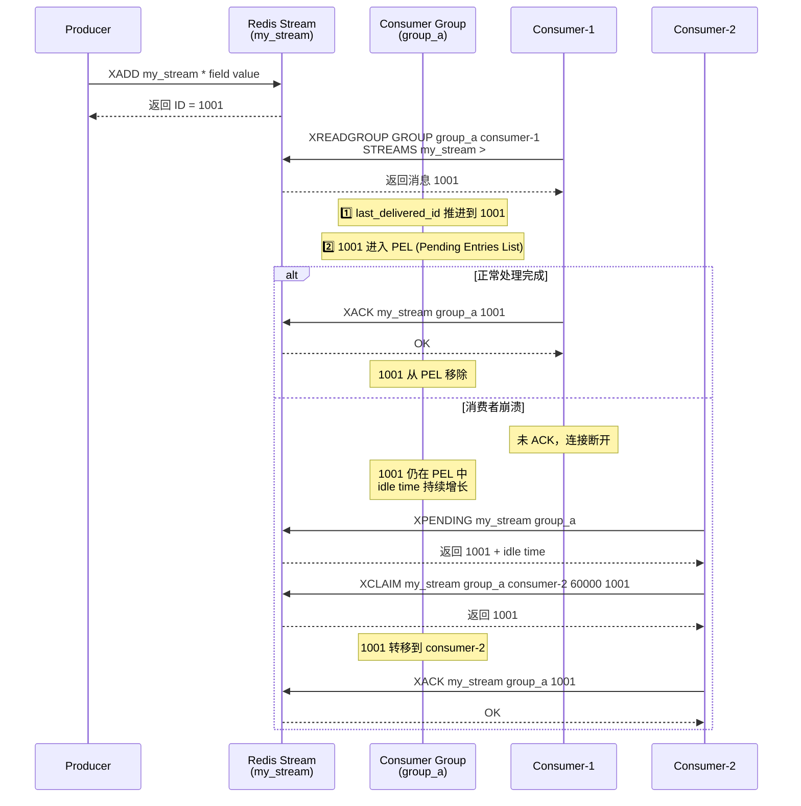

# redis AI优化汇总

> 基于 0-ALL.md 的 AI 优化版（原文较大）：正文收录重点篇并补充体系化内容；完整原文见 0-ALL.md。

## AI 补充：体系化梳理与易漏考点

> 本节在汇总原文基础上，补充面试追问、对比项与工程落地注意点。

### 知识地图
- MySQL：索引、事务隔离、MVCC、undo/redo/binlog、执行计划
- Redis：数据结构、持久化、过期淘汰、穿透击穿雪崩、集群
- SQL：连接/分组/子查询/索引友好写法

### 常漏追问
1. **为什么要覆盖索引？** 减少回表；注意选择性与维护成本。
2. **RR 下如何避免幻读？** Next-Key Lock；结合业务幂等与唯一约束。
3. **缓存与 DB 一致性？** Cache Aside 最常见；强一致需额外方案。
4. **大 Key / 热 Key？** 拆分、本地缓存、热点发现与限流。

### 工程落地检查清单
- [ ] 是否有明确指标（延迟、吞吐、错误率、积压）？
- [ ] 失败是否可重试且幂等？
- [ ] 是否有限流/超时/降级？
- [ ] 是否有日志、链路追踪与告警？
- [ ] 配置变更与回滚是否可操作？


## TOC

1. 3种常用的缓存读写策略详解 (`3种常用的缓存读写策略详解.md`)
2. Redis 3 种特殊数据类型详解 (`Redis 3 种特殊数据类型详解.md`)
3. Redis 5 种基本数据类型详解 (`Redis 5 种基本数据类型详解.md`)
4. Redis常见面试题总结(上) (`Redis常见面试题总结(上).md`)
5. Redis常见面试题总结(下) (`Redis常见面试题总结(下).md`)
6. Redis常见阻塞原因总结 (`Redis常见阻塞原因总结.md`)
7. Redis持久化机制详解 (`Redis持久化机制详解.md`)
8. Redis内存碎片详解 (`Redis内存碎片详解.md`)
9. Redis为什么用跳表实现有序集合 (`Redis为什么用跳表实现有序集合.md`)
10. 缓存基础常见面试题总结 (`缓存基础常见面试题总结.md`)
11. 如何基于Redis实现消息队列？ (`如何基于Redis实现消息队列？.md`)
12. 如何基于Redis实现延时任务？ (`如何基于Redis实现延时任务？.md`)

---

<!-- source: 3种常用的缓存读写策略详解.md -->

## [1] 3种常用的缓存读写策略详解

---
title: 3种常用的缓存读写策略详解
description: 深入对比 Cache Aside、Read/Write Through、Write Behind 三种缓存读写策略，附详细时序图、一致性问题分析及生产级解决方案，Redis 实战必备！
category: 数据库
tag:
  - Redis
head:
  - - meta
    - name: keywords
      content: 缓存读写策略,Cache Aside,Read Through,Write Through,Write Behind,Write Back,缓存一致性,缓存失效,旁路缓存,读写穿透,异步缓存写入,Redis缓存策略,缓存更新策略
---

看到很多小伙伴简历上写了“**熟练使用缓存**”，但是被我问到“**缓存常用的 3 种读写策略**”的时候却一脸懵逼。

在我看来，造成这个问题的原因是我们在学习 Redis 的时候，可能只是简单写了一些 Demo，并没有去关注缓存的读写策略，或者说压根不知道这回事。

但是，搞懂 3 种常见的缓存读写策略对于实际工作中使用缓存以及面试中被问到缓存都是非常有帮助的！

**下面介绍到的三种模式各有优劣，不存在最佳模式，根据具体的业务场景选择适合自己的缓存读写模式。**

### Cache Aside Pattern（旁路缓存模式）

这是我们日常开发中**最常用、最经典**的一种模式，几乎是互联网应用缓存方案的事实标准，尤其适合**读多写少**的业务场景。

这个模式之所以被称为**“旁路”(Aside)**,是因为应用程序的**写操作完全绕过了缓存，直接操作数据库**。

应用程序扮演了数据流转的“指挥官”，需要同时维护 Cache 和 DB 两个数据源。

下面我们来看一下这个策略模式下的缓存读写步骤。

**写操作 ：**

1. 应用**先更新 DB**。
2. 然后**直接删除 Cache**中对应的数据。

简单画了一张图帮助大家理解写的步骤。


**读操作：**

1. 应用先从 Cache 读取数据。
2. 如果命中(Hit)，则直接返回。
3. 如果未命中(Miss)，则从 DB 读取数据，成功读取后，**将数据写回 Cache**，然后返回。

简单画了一张图帮助大家理解读的步骤。


你仅仅了解了上面这些内容的话是远远不够的，我们还要搞懂其中的原理。

比如说面试官很可能会追问：

1. 为什么写操作是“先更新 DB，后删除 Cache”？顺序能反过来吗？
2. 那“先更新 DB，后删除 Cache”就绝对安全吗？
3. 为什么是“删除 Cache”，而不是“更新 Cache”？

接下来我会以此分析解答这些问题。

**1. 为什么写操作是“先更新 DB，后删除 Cache”？顺序能反过来吗？**

**答：** 绝对不能。如果“先删 Cache，后更新 DB”，在高并发下会引入经典的数据不一致问题。

- **时序分析 (请求 A 写, 请求 B 读):**
  1. 请求 A: 先将 Cache 中的数据删除。
  2. 请求 B: 此时发现 Cache 为空，于是去 DB 读取**旧值**，并准备写入 Cache。
  3. 请求 A : 将**新值**写入 DB。
  4. 请求 B: 将之前读到的**旧值**写入了 Cache。
- **结果：** DB 中是新值，而 Cache 中是旧值，数据不一致。

**2. 那“先更新 DB，后删除 Cache”就绝对安全吗？**

**答案：** 也不是绝对安全的！因为这样也可能会造成 **数据库和缓存数据不一致**的问题。

- **时序分析 (请求 A 读, 请求 B 写):**
  1. 请求 A : 缓存未命中，从 DB 读取到**旧值**。
  2. 请求 B: 迅速完成了 DB 的更新，并将 Cache 删除。
  3. 请求 A : 将自己之前拿到的**旧值**写入了 Cache。
- **结果：** DB 中是新值，Cache 中又是旧值。
- **为什么概率极小？** 这个问题本质上是一个并发时序问题：只要“读 DB → 写 Cache”这段时间窗口内，恰好有写请求完成了 DB 更新，就有可能产生不一致。在大多数业务里，这个窗口时间相对较短，而且还需要与写请求并发“撞车”，所以发生概率不算高，但绝不是不可能。

**3. 为什么是“删除 Cache”，而不是“更新 Cache”？**

- **性能开销：** 写操作往往只更新了对象的部分字段，如果为了“更新 Cache”而去重新查询或计算整个缓存对象，开销可能很大。相比之下，“删除”是一个轻量级操作。
- **懒加载思想：** “删除”操作遵循懒加载原则。只有当数据下一次被真正需要（被读取）时，才触发从 DB 加载并写入缓存，避免了无效的缓存更新。
- **并发安全：** “更新缓存”在高并发下可能出现更新顺序错乱的问题导致脏数据的概率会更大。

当然，这一切都建立在一个重要的前提之上：我们缓存的数据，是可以通过数据库进行确定性重建的，并且业务上可以容忍从‘缓存删除’到‘下一次读取并回填’之间这个极短时间窗口内的数据不一致。

现在我们再来分析一下 **Cache Aside Pattern 的缺陷**。

**缺陷 1：首次请求数据一定不在 Cache 的问题**

解决办法：对于访问量巨大的热点数据，可以在系统启动或低峰期进行缓存预热。

**缺陷 2：写操作比较频繁的话导致 Cache 中的数据会被频繁被删除，这样会影响缓存命中率 。**

解决办法：

- 数据库和缓存数据强一致场景：更新 DB 的时候同样更新 Cache，不过我们需要加一个锁/分布式锁来保证更新 Cache 的时候不存在线程安全问题。
- 可以短暂地允许数据库和缓存数据不一致的场景：更新 DB 的时候同样更新 Cache，但是给缓存加一个比较短的过期时间（如 1 分钟），这样的话就可以保证即使数据不一致的话影响也比较小。

### Read/Write Through Pattern（读写穿透）

在这种模式下，应用程序将**Cache 视为唯一的、主要的存储**。所有的读写请求都直接打向 Cache，而 Cache 服务自身负责与 DB 进行数据同步。

对应用程序**透明**，应用开发者无需关心 DB 的存在。

这种缓存读写策略小伙伴们应该也发现了在平时在开发过程中非常少见。抛去性能方面的影响，大概率是因为我们经常使用的分布式缓存 Redis 本身并没有提供 Cache 将数据写入 DB 的功能，需要我们在业务侧或中间件里自己实现。

**写（Write Through）：**

- 先查 Cache，Cache 中不存在，直接更新 DB。
- Cache 中存在，则先更新 Cache，然后 Cache 服务自己更新 DB。只有当 Cache 和 DB 都写入成功后，才向上层返回成功。

简单画了一张图帮助大家理解写的步骤。


**读(Read Through)：**

- 应用从 Cache 读取数据。
- 如果命中，直接返回。
- 如果未命中，由**Cache 服务自己**负责从 DB 加载数据，加载成功后先写入自身，再返回给应用。

简单画了一张图帮助大家理解读的步骤。


Read-Through 实际只是在 Cache-Aside 之上进行了封装。在 Cache-Aside 下，发生读请求的时候，如果 Cache 中不存在对应的数据，是由客户端自己负责把数据写入 Cache，而 Read Through 则是 Cache 服务自己来写入缓存的，这对客户端是透明的。

从实现角度看，Read-Through 本质上是把 Cache-Aside 中“读 Miss → 读 DB → 回填 Cache”的逻辑，下沉到了缓存服务内部，对客户端透明。

和 Cache Aside 一样， Read-Through 也有首次请求数据一定不再 Cache 的问题，对于热点数据可以提前放入缓存中。

### Write Behind Pattern（异步缓存写入）

Write Behind（也常被称为 Write-Back） Pattern 和 Read/Write Through Pattern 很相似，两者都是由 Cache 服务来负责 Cache 和 DB 的读写。

但是，两个又有很大的不同：**Read/Write Through 是同步更新 Cache 和 DB，而 Write Behind 则是只更新缓存，不直接更新 DB，而是改为异步批量的方式来更新 DB。**

**写操作 (Write Behind)：**

1. 应用将数据写入 Cache，然后**立即返回**。
2. Cache 服务将这个写操作放入一个队列中。
3. 通过一个独立的异步线程/任务，将队列中的写操作**批量地、合并地**写入 DB。

这种模式对数据一致性带来了挑战（例如：Cache 中的数据还没来得及写回 DB，系统就宕机了），因此不适用于需要强一致性的场景（如交易、库存）。

但是，它的异步和批量特性，带来了**无与伦比的写性能**。它在很多高性能系统中都有广泛应用：

- **MySQL 的 InnoDB Buffer Pool 机制：** 数据修改先在内存 Buffer Pool 中完成，然后由后台线程异步刷写到磁盘。
- **操作系统的页缓存（Page Cache）：** 文件写入也是先写到内存，再由操作系统异步刷盘。
- **高频计数场景：** 对于文章浏览量、帖子点赞数这类允许短暂数据不一致、但写入极其频繁的场景，可以先在 Redis 中快速累加，再通过定时任务异步同步回数据库。

<!-- @include: @article-footer.snippet.md -->


---

---

<!-- source: Redis 3 种特殊数据类型详解.md -->

## [2] Redis 3 种特殊数据类型详解

---
title: Redis 3 种特殊数据类型详解
description: 详解Redis三种特殊数据类型Bitmap、HyperLogLog、GEO的使用方法和应用场景，包括签到统计、UV统计、附近的人等典型业务场景实现。
category: 数据库
tag:
  - Redis
head:
  - - meta
    - name: keywords
      content: Redis特殊数据类型,Bitmap,HyperLogLog,GEO,位图,基数统计,地理位置,签到统计,UV统计
---

除了 5 种基本的数据类型之外，Redis 还支持 3 种特殊的数据类型：Bitmap、HyperLogLog、GEO。

## Bitmap （位图）

### 介绍

根据官网介绍：

> Bitmaps are not an actual data type, but a set of bit-oriented operations defined on the String type which is treated like a bit vector. Since strings are binary safe blobs and their maximum length is 512 MB, they are suitable to set up to 2^32 different bits.
>
> Bitmap 不是 Redis 中的实际数据类型，而是在 String 类型上定义的一组面向位的操作，将其视为位向量。由于字符串是二进制安全的块，且最大长度为 512 MB，它们适合用于设置最多 2^32 个不同的位。

Bitmap 存储的是连续的二进制数字（0 和 1），通过 Bitmap, 只需要一个 bit 位来表示某个元素对应的值或者状态，key 就是对应元素本身 。我们知道 8 个 bit 可以组成一个 byte，所以 Bitmap 本身会极大的节省储存空间。

你可以将 Bitmap 看作是一个存储二进制数字（0 和 1）的数组，数组中每个元素的下标叫做 offset（偏移量）。


### 常用命令

| 命令                                  | 介绍                                                             |
| ------------------------------------- | ---------------------------------------------------------------- |
| SETBIT key offset value               | 设置指定 offset 位置的值                                         |
| GETBIT key offset                     | 获取指定 offset 位置的值                                         |
| BITCOUNT key start end                | 获取 start 和 end 之间值为 1 的元素个数                          |
| BITOP operation destkey key1 key2 ... | 对一个或多个 Bitmap 进行运算，可用运算符有 AND, OR, XOR 以及 NOT |

**Bitmap 基本操作演示**：

```bash
# SETBIT 会返回之前位的值（默认是 0）这里会生成 7 个位
> SETBIT mykey 7 1
(integer) 0
> SETBIT mykey 7 0
(integer) 1
> GETBIT mykey 7
(integer) 0
> SETBIT mykey 6 1
(integer) 0
> SETBIT mykey 8 1
(integer) 0
# 通过 bitcount 统计被被设置为 1 的位的数量。
> BITCOUNT mykey
(integer) 2
```

### 应用场景

**需要保存状态信息（0/1 即可表示）的场景**

- 举例：用户签到情况、活跃用户情况、用户行为统计（比如是否点赞过某个视频）。
- 相关命令：`SETBIT`、`GETBIT`、`BITCOUNT`、`BITOP`。

## HyperLogLog（基数统计）

### 介绍

HyperLogLog 是一种有名的基数计数概率算法 ，基于 LogLog Counting(LLC)优化改进得来，并不是 Redis 特有的，Redis 只是实现了这个算法并提供了一些开箱即用的 API。

Redis 提供的 HyperLogLog 占用空间非常非常小，只需要 12k 的空间就能存储接近`2^64`个不同元素。这是真的厉害，这就是数学的魅力么！并且，Redis 对 HyperLogLog 的存储结构做了优化，采用两种方式计数：

- **稀疏矩阵**：计数较少的时候，占用空间很小。
- **稠密矩阵**：计数达到某个阈值的时候，占用 12k 的空间。

Redis 官方文档中有对应的详细说明：


基数计数概率算法为了节省内存并不会直接存储元数据，而是通过一定的概率统计方法预估基数值（集合中包含元素的个数）。因此， HyperLogLog 的计数结果并不是一个精确值，存在一定的误差（标准误差为 `0.81%` ）。


HyperLogLog 的使用非常简单，但原理非常复杂。HyperLogLog 的原理以及在 Redis 中的实现可以看这篇文章：[HyperLogLog 算法的原理讲解以及 Redis 是如何应用它的](https://juejin.cn/post/6844903785744056333) 。

再推荐一个可以帮助理解 HyperLogLog 原理的工具：[Sketch of the Day: HyperLogLog — Cornerstone of a Big Data Infrastructure](http://content.research.neustar.biz/blog/hll.html) 。

除了 HyperLogLog 之外，Redis 还提供了其他的概率数据结构，对应的官方文档地址：<https://redis.io/docs/data-types/probabilistic/> 。

### 常用命令

HyperLogLog 相关的命令非常少，最常用的也就 3 个。

| 命令                                      | 介绍                                                                             |
| ----------------------------------------- | -------------------------------------------------------------------------------- |
| PFADD key element1 element2 ...           | 添加一个或多个元素到 HyperLogLog 中                                              |
| PFCOUNT key1 key2                         | 获取一个或者多个 HyperLogLog 的唯一计数。                                        |
| PFMERGE destkey sourcekey1 sourcekey2 ... | 将多个 HyperLogLog 合并到 destkey 中，destkey 会结合多个源，算出对应的唯一计数。 |

**HyperLogLog 基本操作演示**：

```bash
> PFADD hll foo bar zap
(integer) 1
> PFADD hll zap zap zap
(integer) 0
> PFADD hll foo bar
(integer) 0
> PFCOUNT hll
(integer) 3
> PFADD some-other-hll 1 2 3
(integer) 1
> PFCOUNT hll some-other-hll
(integer) 6
> PFMERGE desthll hll some-other-hll
"OK"
> PFCOUNT desthll
(integer) 6
```

### 应用场景

**数量巨大（百万、千万级别以上）的计数场景**

- 举例：热门网站每日/每周/每月访问 ip 数统计、热门帖子 uv 统计。
- 相关命令：`PFADD`、`PFCOUNT` 。

## Geospatial (地理位置)

### 介绍

Geospatial index（地理空间索引，简称 GEO） 主要用于存储地理位置信息，基于 Sorted Set 实现。

通过 GEO 我们可以轻松实现两个位置距离的计算、获取指定位置附近的元素等功能。


### 常用命令

| 命令                                             | 介绍                                                                                                 |
| ------------------------------------------------ | ---------------------------------------------------------------------------------------------------- |
| GEOADD key longitude1 latitude1 member1 ...      | 添加一个或多个元素对应的经纬度信息到 GEO 中                                                          |
| GEOPOS key member1 member2 ...                   | 返回给定元素的经纬度信息                                                                             |
| GEODIST key member1 member2 M/KM/FT/MI           | 返回两个给定元素之间的距离                                                                           |
| GEORADIUS key longitude latitude radius distance | 获取指定位置附近 distance 范围内的其他元素，支持 ASC(由近到远)、DESC（由远到近）、Count(数量) 等参数 |
| GEORADIUSBYMEMBER key member radius distance     | 类似于 GEORADIUS 命令，只是参照的中心点是 GEO 中的元素                                               |

**基本操作**：

```bash
> GEOADD personLocation 116.33 39.89 user1 116.34 39.90 user2 116.35 39.88 user3
3
> GEOPOS personLocation user1
116.3299986720085144
39.89000061669732844
> GEODIST personLocation user1 user2 km
1.4018
```

通过 Redis 可视化工具查看 `personLocation` ，果不其然，底层就是 Sorted Set。

GEO 中存储的地理位置信息的经纬度数据通过 GeoHash 算法转换成了一个整数，这个整数作为 Sorted Set 的 score(权重参数)使用。


**获取指定位置范围内的其他元素**：

```bash
> GEORADIUS personLocation 116.33 39.87 3 km
user3
user1
> GEORADIUS personLocation 116.33 39.87 2 km
> GEORADIUS personLocation 116.33 39.87 5 km
user3
user1
user2
> GEORADIUSBYMEMBER personLocation user1 5 km
user3
user1
user2
> GEORADIUSBYMEMBER personLocation user1 2 km
user1
user2
```

`GEORADIUS` 命令的底层原理解析可以看看阿里的这篇文章：[Redis 到底是怎么实现“附近的人”这个功能的呢？](https://juejin.cn/post/6844903966061363207) 。

**移除元素**：

GEO 底层是 Sorted Set ，你可以对 GEO 使用 Sorted Set 相关的命令。

```bash
> ZREM personLocation user1
1
> ZRANGE personLocation 0 -1
user3
user2
> ZSCORE personLocation user2
4069879562983946
```

### 应用场景

**需要管理使用地理空间数据的场景**

- 举例：附近的人。
- 相关命令: `GEOADD`、`GEORADIUS`、`GEORADIUSBYMEMBER` 。

## 总结

| 数据类型         | 说明                                                                                                                                                                                                                                                                  |
| ---------------- | --------------------------------------------------------------------------------------------------------------------------------------------------------------------------------------------------------------------------------------------------------------------- |
| Bitmap           | 你可以将 Bitmap 看作是一个存储二进制数字（0 和 1）的数组，数组中每个元素的下标叫做 offset（偏移量）。通过 Bitmap, 只需要一个 bit 位来表示某个元素对应的值或者状态，key 就是对应元素本身 。我们知道 8 个 bit 可以组成一个 byte，所以 Bitmap 本身会极大的节省储存空间。 |
| HyperLogLog      | Redis 提供的 HyperLogLog 占用空间非常非常小，只需要 12k 的空间就能存储接近`2^64`个不同元素。不过，HyperLogLog 的计数结果并不是一个精确值，存在一定的误差（标准误差为 `0.81%` ）。                                                                                     |
| Geospatial index | Geospatial index（地理空间索引，简称 GEO） 主要用于存储地理位置信息，基于 Sorted Set 实现。                                                                                                                                                                           |

## 参考

- Redis Data Structures：<https://redis.com/redis-enterprise/data-structures/> 。
- 《Redis 深度历险：核心原理与应用实践》1.6 四两拨千斤——HyperLogLog
- 布隆过滤器,位图,HyperLogLog：<https://hogwartsrico.github.io/2020/06/08/BloomFilter-HyperLogLog-BitMap/index.html>

<!-- @include: @article-footer.snippet.md -->


---

---

<!-- source: Redis 5 种基本数据类型详解.md -->

## [3] Redis 5 种基本数据类型详解

---
title: Redis 5 种基本数据类型详解
description: 详解Redis五种基本数据类型String、List、Set、Hash、Zset的使用方法和应用场景，深入分析SDS、跳表、压缩列表等底层数据结构实现原理。
category: 数据库
tag:
  - Redis
head:
  - - meta
    - name: keywords
      content: Redis数据类型,String,List,Set,Hash,Zset,SDS,跳表,压缩列表,Redis命令
---

Redis 共有 5 种基本数据类型：String（字符串）、List（列表）、Set（集合）、Hash（散列）、Zset（有序集合）。

这 5 种数据类型是直接提供给用户使用的，是数据的保存形式，其底层实现主要依赖这 8 种数据结构：简单动态字符串（SDS）、LinkedList（双向链表）、Dict（哈希表/字典）、SkipList（跳跃表）、Intset（整数集合）、ZipList（压缩列表）、QuickList（快速列表）。

Redis 5 种基本数据类型对应的底层数据结构实现如下表所示：

| String | List                         | Hash          | Set          | Zset              |
| :----- | :--------------------------- | :------------ | :----------- | :---------------- |
| SDS    | LinkedList/ZipList/QuickList | Dict、ZipList | Dict、Intset | ZipList、SkipList |

Redis 3.2 之前，List 底层实现是 LinkedList 或者 ZipList。 Redis 3.2 之后，引入了 LinkedList 和 ZipList 的结合 QuickList，List 的底层实现变为 QuickList。从 Redis 7.0 开始， ZipList 被 ListPack 取代。

你可以在 Redis 官网上找到 Redis 数据类型/结构非常详细的介绍：

- [Redis Data Structures](https://redis.com/redis-enterprise/data-structures/)
- [Redis Data types tutorial](https://redis.io/docs/manual/data-types/data-types-tutorial/)

未来随着 Redis 新版本的发布，可能会有新的数据结构出现，通过查阅 Redis 官网对应的介绍，你总能获取到最靠谱的信息。


## String（字符串）

### 介绍

String 是 Redis 中最简单同时也是最常用的一个数据类型。

String 是一种二进制安全的数据类型，可以用来存储任何类型的数据比如字符串、整数、浮点数、图片（图片的 base64 编码或者解码或者图片的路径）、序列化后的对象。


虽然 Redis 是用 C 语言写的，但是 Redis 并没有使用 C 的字符串表示，而是自己构建了一种 **简单动态字符串**（Simple Dynamic String，**SDS**）。相比于 C 的原生字符串，Redis 的 SDS 不光可以保存文本数据还可以保存二进制数据，并且获取字符串长度复杂度为 O(1)（C 字符串为 O(N)）,除此之外，Redis 的 SDS API 是安全的，不会造成缓冲区溢出。

### 常用命令

| 命令                            | 介绍                             |
| ------------------------------- | -------------------------------- |
| SET key value                   | 设置指定 key 的值                |
| SETNX key value                 | 只有在 key 不存在时设置 key 的值 |
| GET key                         | 获取指定 key 的值                |
| MSET key1 value1 key2 value2 …… | 设置一个或多个指定 key 的值      |
| MGET key1 key2 ...              | 获取一个或多个指定 key 的值      |
| STRLEN key                      | 返回 key 所储存的字符串值的长度  |
| INCR key                        | 将 key 中储存的数字值增一        |
| DECR key                        | 将 key 中储存的数字值减一        |
| EXISTS key                      | 判断指定 key 是否存在            |
| DEL key（通用）                 | 删除指定的 key                   |
| EXPIRE key seconds（通用）      | 给指定 key 设置过期时间          |

更多 Redis String 命令以及详细使用指南，请查看 Redis 官网对应的介绍：<https://redis.io/commands/?group=string> 。

**基本操作**：

```bash
> SET key value
OK
> GET key
"value"
> EXISTS key
(integer) 1
> STRLEN key
(integer) 5
> DEL key
(integer) 1
> GET key
(nil)
```

**批量设置**：

```bash
> MSET key1 value1 key2 value2
OK
> MGET key1 key2 # 批量获取多个 key 对应的 value
1) "value1"
2) "value2"
```

**计数器（字符串的内容为整数的时候可以使用）：**

```bash
> SET number 1
OK
> INCR number # 将 key 中储存的数字值增一
(integer) 2
> GET number
"2"
> DECR number # 将 key 中储存的数字值减一
(integer) 1
> GET number
"1"
```

**设置过期时间（默认为永不过期）**：

```bash
> EXPIRE key 60
(integer) 1
> SETEX key 60 value # 设置值并设置过期时间
OK
> TTL key
(integer) 56
```

### 应用场景

**需要存储常规数据的场景**

- 举例：缓存 Session、Token、图片地址、序列化后的对象(相比较于 Hash 存储更节省内存)。
- 相关命令：`SET`、`GET`。

**需要计数的场景**

- 举例：用户单位时间的请求数（简单限流可以用到）、页面单位时间的访问数。
- 相关命令：`SET`、`GET`、 `INCR`、`DECR` 。

**分布式锁**

利用 `SETNX key value` 命令可以实现一个最简易的分布式锁（存在一些缺陷，通常不建议这样实现分布式锁）。

## List（列表）

### 介绍

Redis 中的 List 其实就是链表数据结构的实现。我在 [线性数据结构 :数组、链表、栈、队列](https://javaguide.cn/计算机基础/数据结构/linear-data-structure.html) 这篇文章中详细介绍了链表这种数据结构，我这里就不多做介绍了。

许多高级编程语言都内置了链表的实现比如 Java 中的 `LinkedList`，但是 C 语言并没有实现链表，所以 Redis 实现了自己的链表数据结构。Redis 的 List 的实现为一个 **双向链表**，即可以支持反向查找和遍历，更方便操作，不过带来了部分额外的内存开销。


### 常用命令

| 命令                        | 介绍                                       |
| --------------------------- | ------------------------------------------ |
| RPUSH key value1 value2 ... | 在指定列表的尾部（右边）添加一个或多个元素 |
| LPUSH key value1 value2 ... | 在指定列表的头部（左边）添加一个或多个元素 |
| LSET key index value        | 将指定列表索引 index 位置的值设置为 value  |
| LPOP key                    | 移除并获取指定列表的第一个元素(最左边)     |
| RPOP key                    | 移除并获取指定列表的最后一个元素(最右边)   |
| LLEN key                    | 获取列表元素数量                           |
| LRANGE key start end        | 获取列表 start 和 end 之间 的元素          |

更多 Redis List 命令以及详细使用指南，请查看 Redis 官网对应的介绍：<https://redis.io/commands/?group=list> 。

**通过 `RPUSH/LPOP` 或者 `LPUSH/RPOP`实现队列**：

```bash
> RPUSH myList value1
(integer) 1
> RPUSH myList value2 value3
(integer) 3
> LPOP myList
"value1"
> LRANGE myList 0 1
1) "value2"
2) "value3"
> LRANGE myList 0 -1
1) "value2"
2) "value3"
```

**通过 `RPUSH/RPOP`或者`LPUSH/LPOP` 实现栈**：

```bash
> RPUSH myList2 value1 value2 value3
(integer) 3
> RPOP myList2 # 将 list的最右边的元素取出
"value3"
```

我专门画了一个图方便大家理解 `RPUSH` , `LPOP` , `LPUSH` , `RPOP` 命令：


**通过 `LRANGE` 查看对应下标范围的列表元素**：

```bash
> RPUSH myList value1 value2 value3
(integer) 3
> LRANGE myList 0 1
1) "value1"
2) "value2"
> LRANGE myList 0 -1
1) "value1"
2) "value2"
3) "value3"
```

通过 `LRANGE` 命令，你可以基于 List 实现分页查询，性能非常高！

**通过 `LLEN` 查看链表长度**：

```bash
> LLEN myList
(integer) 3
```

### 应用场景

**信息流展示**

- 举例：最新文章、最新动态。
- 相关命令：`LPUSH`、`LRANGE`。

**消息队列**

`List` 可以用来做消息队列，只是功能过于简单且存在很多缺陷，不建议这样做。

相对来说，Redis 5.0 新增加的一个数据结构 `Stream` 更适合做消息队列一些，只是功能依然非常简陋。和专业的消息队列相比，还是有很多欠缺的地方比如消息丢失和堆积问题不好解决。

## Hash（哈希）

### 介绍

Redis 中的 Hash 是一个 String 类型的 field-value（键值对） 的映射表，特别适合用于存储对象，后续操作的时候，你可以直接修改这个对象中的某些字段的值。

Hash 类似于 JDK1.8 前的 `HashMap`，内部实现也差不多(数组 + 链表)。不过，Redis 的 Hash 做了更多优化。


### 常用命令

| 命令                                      | 介绍                                                     |
| ----------------------------------------- | -------------------------------------------------------- |
| HSET key field value                      | 设置指定哈希表中指定字段的值                             |
| HSETNX key field value                    | 只有指定字段不存在时设置指定字段的值                     |
| HMSET key field1 value1 field2 value2 ... | 同时将一个或多个 field-value (域-值)对设置到指定哈希表中 |
| HGET key field                            | 获取指定哈希表中指定字段的值                             |
| HMGET key field1 field2 ...               | 获取指定哈希表中一个或者多个指定字段的值                 |
| HGETALL key                               | 获取指定哈希表中所有的键值对                             |
| HEXISTS key field                         | 查看指定哈希表中指定的字段是否存在                       |
| HDEL key field1 field2 ...                | 删除一个或多个哈希表字段                                 |
| HLEN key                                  | 获取指定哈希表中字段的数量                               |
| HINCRBY key field increment               | 对指定哈希中的指定字段做运算操作（正数为加，负数为减）   |

更多 Redis Hash 命令以及详细使用指南，请查看 Redis 官网对应的介绍：<https://redis.io/commands/?group=hash> 。

**模拟对象数据存储**：

```bash
> HMSET userInfoKey name "guide" description "dev" age 24
OK
> HEXISTS userInfoKey name # 查看 key 对应的 value中指定的字段是否存在。
(integer) 1
> HGET userInfoKey name # 获取存储在哈希表中指定字段的值。
"guide"
> HGET userInfoKey age
"24"
> HGETALL userInfoKey # 获取在哈希表中指定 key 的所有字段和值
1) "name"
2) "guide"
3) "description"
4) "dev"
5) "age"
6) "24"
> HSET userInfoKey name "GuideGeGe"
> HGET userInfoKey name
"GuideGeGe"
> HINCRBY userInfoKey age 2
(integer) 26
```

### 应用场景

**对象数据存储场景**

- 举例：用户信息、商品信息、文章信息、购物车信息。
- 相关命令：`HSET` （设置单个字段的值）、`HMSET`（设置多个字段的值）、`HGET`（获取单个字段的值）、`HMGET`（获取多个字段的值）。

## Set（集合）

### 介绍

Redis 中的 Set 类型是一种无序集合，集合中的元素没有先后顺序但都唯一，有点类似于 Java 中的 `HashSet` 。当你需要存储一个列表数据，又不希望出现重复数据时，Set 是一个很好的选择，并且 Set 提供了判断某个元素是否在一个 Set 集合内的重要接口，这个也是 List 所不能提供的。

你可以基于 Set 轻易实现交集、并集、差集的操作，比如你可以将一个用户所有的关注人存在一个集合中，将其所有粉丝存在一个集合。这样的话，Set 可以非常方便的实现如共同关注、共同粉丝、共同喜好等功能。这个过程也就是求交集的过程。


### 常用命令

| 命令                                  | 介绍                                      |
| ------------------------------------- | ----------------------------------------- |
| SADD key member1 member2 ...          | 向指定集合添加一个或多个元素              |
| SMEMBERS key                          | 获取指定集合中的所有元素                  |
| SCARD key                             | 获取指定集合的元素数量                    |
| SISMEMBER key member                  | 判断指定元素是否在指定集合中              |
| SINTER key1 key2 ...                  | 获取给定所有集合的交集                    |
| SINTERSTORE destination key1 key2 ... | 将给定所有集合的交集存储在 destination 中 |
| SUNION key1 key2 ...                  | 获取给定所有集合的并集                    |
| SUNIONSTORE destination key1 key2 ... | 将给定所有集合的并集存储在 destination 中 |
| SDIFF key1 key2 ...                   | 获取给定所有集合的差集                    |
| SDIFFSTORE destination key1 key2 ...  | 将给定所有集合的差集存储在 destination 中 |
| SPOP key count                        | 随机移除并获取指定集合中一个或多个元素    |
| SRANDMEMBER key count                 | 随机获取指定集合中指定数量的元素          |

更多 Redis Set 命令以及详细使用指南，请查看 Redis 官网对应的介绍：<https://redis.io/commands/?group=set> 。

**基本操作**：

```bash
> SADD mySet value1 value2
(integer) 2
> SADD mySet value1 # 不允许有重复元素，因此添加失败
(integer) 0
> SMEMBERS mySet
1) "value1"
2) "value2"
> SCARD mySet
(integer) 2
> SISMEMBER mySet value1
(integer) 1
> SADD mySet2 value2 value3
(integer) 2
```

- `mySet` : `value1`、`value2` 。
- `mySet2`：`value2`、`value3` 。

**求交集**：

```bash
> SINTERSTORE mySet3 mySet mySet2
(integer) 1
> SMEMBERS mySet3
1) "value2"
```

**求并集**：

```bash
> SUNION mySet mySet2
1) "value3"
2) "value2"
3) "value1"
```

**求差集**：

```bash
> SDIFF mySet mySet2 # 差集是由所有属于 mySet 但不属于 A 的元素组成的集合
1) "value1"
```

### 应用场景

**需要存放的数据不能重复的场景**

- 举例：网站 UV 统计（数据量巨大的场景还是 `HyperLogLog`更适合一些）、文章点赞、动态点赞等场景。
- 相关命令：`SCARD`（获取集合数量） 。


**需要获取多个数据源交集、并集和差集的场景**

- 举例：共同好友(交集)、共同粉丝(交集)、共同关注(交集)、好友推荐（差集）、音乐推荐（差集）、订阅号推荐（差集+交集） 等场景。
- 相关命令：`SINTER`（交集）、`SINTERSTORE` （交集）、`SUNION` （并集）、`SUNIONSTORE`（并集）、`SDIFF`（差集）、`SDIFFSTORE` （差集）。


**需要随机获取数据源中的元素的场景**

- 举例：抽奖系统、随机点名等场景。
- 相关命令：`SPOP`（随机获取集合中的元素并移除，适合不允许重复中奖的场景）、`SRANDMEMBER`（随机获取集合中的元素，适合允许重复中奖的场景）。

## Sorted Set（有序集合）

### 介绍

Sorted Set 类似于 Set，但和 Set 相比，Sorted Set 增加了一个权重参数 `score`，使得集合中的元素能够按 `score` 进行有序排列，还可以通过 `score` 的范围来获取元素的列表。有点像是 Java 中 `HashMap` 和 `TreeSet` 的结合体。


### 常用命令

| 命令                                          | 介绍                                                                                                          |
| --------------------------------------------- | ------------------------------------------------------------------------------------------------------------- |
| ZADD key score1 member1 score2 member2 ...    | 向指定有序集合添加一个或多个元素                                                                              |
| ZCARD KEY                                     | 获取指定有序集合的元素数量                                                                                    |
| ZSCORE key member                             | 获取指定有序集合中指定元素的 score 值                                                                         |
| ZINTERSTORE destination numkeys key1 key2 ... | 将给定所有有序集合的交集存储在 destination 中，对相同元素对应的 score 值进行 SUM 聚合操作，numkeys 为集合数量 |
| ZUNIONSTORE destination numkeys key1 key2 ... | 求并集，其它和 ZINTERSTORE 类似                                                                               |
| ZDIFFSTORE destination numkeys key1 key2 ...  | 求差集，其它和 ZINTERSTORE 类似                                                                               |
| ZRANGE key start end                          | 获取指定有序集合 start 和 end 之间的元素（score 从低到高）                                                    |
| ZREVRANGE key start end                       | 获取指定有序集合 start 和 end 之间的元素（score 从高到底）                                                    |
| ZREVRANK key member                           | 获取指定有序集合中指定元素的排名(score 从大到小排序)                                                          |

更多 Redis Sorted Set 命令以及详细使用指南，请查看 Redis 官网对应的介绍：<https://redis.io/commands/?group=sorted-set> 。

**基本操作**：

```bash
> ZADD myZset 2.0 value1 1.0 value2
(integer) 2
> ZCARD myZset
2
> ZSCORE myZset value1
2.0
> ZRANGE myZset 0 1
1) "value2"
2) "value1"
> ZREVRANGE myZset 0 1
1) "value1"
2) "value2"
> ZADD myZset2 4.0 value2 3.0 value3
(integer) 2

```

- `myZset` : `value1`(2.0)、`value2`(1.0) 。
- `myZset2`：`value2` （4.0）、`value3`(3.0) 。

**获取指定元素的排名**：

```bash
> ZREVRANK myZset value1
0
> ZREVRANK myZset value2
1
```

**求交集**：

```bash
> ZINTERSTORE myZset3 2 myZset myZset2
1
> ZRANGE myZset3 0 1 WITHSCORES
value2
5
```

**求并集**：

```bash
> ZUNIONSTORE myZset4 2 myZset myZset2
3
> ZRANGE myZset4 0 2 WITHSCORES
value1
2
value3
3
value2
5
```

**求差集**：

```bash
> ZDIFF 2 myZset myZset2 WITHSCORES
value1
2
```

### 应用场景

**需要随机获取数据源中的元素根据某个权重进行排序的场景**

- 举例：各种排行榜比如直播间送礼物的排行榜、朋友圈的微信步数排行榜、王者荣耀中的段位排行榜、话题热度排行榜等等。
- 相关命令：`ZRANGE` (从小到大排序)、 `ZREVRANGE` （从大到小排序）、`ZREVRANK` (指定元素排名)。


[《Java 面试指北》](https://javaguide.cn/专栏/java-mian-shi-zhi-bei.html) 的「技术面试题篇」就有一篇文章详细介绍如何使用 Sorted Set 来设计制作一个排行榜。


**需要存储的数据有优先级或者重要程度的场景** 比如优先级任务队列。

- 举例：优先级任务队列。
- 相关命令：`ZRANGE` (从小到大排序)、 `ZREVRANGE` （从大到小排序）、`ZREVRANK` (指定元素排名)。

## 总结

| 数据类型 | 说明                                                                                                                                                                                           |
| -------- | ---------------------------------------------------------------------------------------------------------------------------------------------------------------------------------------------- |
| String   | 一种二进制安全的数据类型，可以用来存储任何类型的数据比如字符串、整数、浮点数、图片（图片的 base64 编码或者解码或者图片的路径）、序列化后的对象。                                               |
| List     | Redis 的 List 的实现为一个双向链表，即可以支持反向查找和遍历，更方便操作，不过带来了部分额外的内存开销。                                                                                       |
| Hash     | 一个 String 类型的 field-value（键值对） 的映射表，特别适合用于存储对象，后续操作的时候，你可以直接修改这个对象中的某些字段的值。                                                              |
| Set      | 无序集合，集合中的元素没有先后顺序但都唯一，有点类似于 Java 中的 `HashSet` 。                                                                                                                  |
| Zset     | 和 Set 相比，Sorted Set 增加了一个权重参数 `score`，使得集合中的元素能够按 `score` 进行有序排列，还可以通过 `score` 的范围来获取元素的列表。有点像是 Java 中 `HashMap` 和 `TreeSet` 的结合体。 |

## 数据结构延伸阅读

Redis 数据类型背后大量使用了基础数据结构。想从面试角度补底层，可以结合这些文章看：

- [线性数据结构详解](../../计算机基础/数据结构/线性数据结构详解（数组、链表、栈、队列）.md)：理解 List、队列和链表的关系。
- [哈希表面试题总结](../../计算机基础/数据结构/哈希表面试题总结-哈希冲突、扩容与 Java HashMap.md)：理解 Hash、Set 这类结构的查找和冲突处理。
- [跳表面试题总结](../../计算机基础/数据结构/跳表面试题总结-多级索引、范围查询与 Redis ZSet.md)：理解 Sorted Set 范围查询和排名能力背后的结构取舍。

## 参考

- Redis Data Structures：<https://redis.com/redis-enterprise/data-structures/> 。
- Redis Commands：<https://redis.io/commands/> 。
- Redis Data types tutorial：<https://redis.io/docs/manual/data-types/data-types-tutorial/> 。
- Redis 存储对象信息是用 Hash 还是 String : <https://segmentfault.com/a/1190000040032006>

<!-- @include: @article-footer.snippet.md -->


---

---

<!-- source: Redis常见面试题总结(上).md -->

## [4] Redis常见面试题总结(上)

---
title: Redis常见面试题总结(上)
description: 最新Redis面试题总结（上）：深入讲解Redis基础、五大常用数据结构、单线程模型原理、持久化机制、内存淘汰与过期策略、分布式锁与消息队列实现。适合准备后端面试的开发者！
category: 数据库
tag:
  - Redis
head:
  - - meta
    - name: keywords
      content: Redis面试题,Redis基础,Redis数据结构,Redis线程模型,Redis持久化,Redis内存管理,Redis性能优化,Redis分布式锁,Redis消息队列,Redis延时队列,Redis缓存策略,Redis单线程,Redis多线程,Redis过期策略,Redis淘汰策略
---

## Redis 基础

### 什么是 Redis？

[Redis](https://redis.io/) （**RE**mote **DI**ctionary **S**erver）是一个基于 C 语言开发的开源 NoSQL 数据库（BSD 许可）。与传统数据库不同的是，Redis 的数据是保存在内存中的（内存数据库，支持持久化），因此读写速度非常快，被广泛应用于分布式缓存方向。并且，Redis 存储的是 KV 键值对数据。

为了满足不同的业务场景，Redis 内置了多种数据类型实现（比如 String、Hash、Sorted Set、Bitmap、HyperLogLog、GEO）。并且，Redis 还支持事务、持久化、Lua 脚本、发布订阅模型、多种开箱即用的集群方案（Redis Sentinel、Redis Cluster）。


Redis 没有外部依赖，Linux 和 OS X 是 Redis 开发和测试最多的两个操作系统，官方推荐生产环境使用 Linux 部署 Redis。

个人学习的话，你可以自己本机安装 Redis 或者通过 Redis 官网提供的[在线 Redis 环境](https://try.redis.io/)（少部分命令无法使用）来实际体验 Redis。


全世界有非常多的网站使用到了 Redis，[techstacks.io](https://techstacks.io/) 专门维护了一个[使用 Redis 的热门站点列表](https://techstacks.io/tech/redis)，感兴趣的话可以看看。

### ⭐️Redis 为什么这么快？

Redis 内部做了非常多的性能优化，比较重要的有下面 4 点：

1. **纯内存操作 (Memory-Based Storage)** ：这是最主要的原因。Redis 数据读写操作都发生在内存中，访问速度是纳秒级别，而传统数据库频繁读写磁盘的速度是毫秒级别，两者相差数个数量级。
2. **高效的 I/O 模型 (I/O Multiplexing & Single-Threaded Event Loop)** ：Redis 使用单线程事件循环配合 I/O 多路复用技术，让单个线程可以同时处理多个网络连接上的 I/O 事件（如读写），避免了多线程模型中的上下文切换和锁竞争问题。虽然是单线程，但结合内存操作的高效性和 I/O 多路复用，使得 Redis 能轻松处理大量并发请求（Redis 线程模型会在后文中详细介绍到）。
3. **优化的内部数据结构 (Optimized Data Structures)** ：Redis 提供多种数据类型（如 String, List, Hash, Set, Sorted Set 等），其内部实现采用高度优化的编码方式（如 ziplist, quicklist, skiplist, hashtable 等）。Redis 会根据数据大小和类型动态选择最合适的内部编码，以在性能和空间效率之间取得最佳平衡。
4. **简洁高效的通信协议 (Simple Protocol - RESP)** ：Redis 使用的是自己设计的 RESP (REdis Serialization Protocol) 协议。这个协议实现简单、解析性能好，并且是二进制安全的。客户端和服务端之间通信的序列化/反序列化开销很小，有助于提升整体的交互速度。

> 下面这张图片总结的挺不错的，分享一下，出自 [Why is Redis so fast?](https://twitter.com/alexxubyte/status/1498703822528544770)。


那既然都这么快了，为什么不直接用 Redis 当主数据库呢？主要是因为内存成本太高，并且 Redis 提供的数据持久化仍然有数据丢失的风险。

### 除了 Redis，你还知道其他分布式缓存方案吗？

如果面试中被问到这个问题的话，面试官主要想看看：

1. 你在选择 Redis 作为分布式缓存方案时，是否是经过严谨的调研和思考，还是只是因为 Redis 是当前的“热门”技术。
2. 你在分布式缓存方向的技术广度。

如果你了解其他方案，并且能解释为什么最终选择了 Redis（更进一步！），这会对你面试表现加分不少！

下面简单聊聊常见的分布式缓存技术选型。

分布式缓存的话，比较老牌同时也是使用的比较多的还是 **Memcached** 和 **Redis**。不过，现在基本没有看过还有项目使用 **Memcached** 来做缓存，都是直接用 **Redis**。

Memcached 是分布式缓存最开始兴起的那会，比较常用的。后来，随着 Redis 的发展，大家慢慢都转而使用更加强大的 Redis 了。

有一些大厂也开源了类似于 Redis 的分布式高性能 KV 存储数据库，例如，腾讯开源的 [**Tendis**](https://github.com/Tencent/Tendis)。Tendis 基于知名开源项目 [RocksDB](https://github.com/facebook/rocksdb) 作为存储引擎 ，100% 兼容 Redis 协议和 Redis4.0 所有数据模型。关于 Redis 和 Tendis 的对比，腾讯官方曾经发过一篇文章：[Redis vs Tendis：冷热混合存储版架构揭秘](https://mp.weixin.qq.com/s/MeYkfOIdnU6LYlsGb24KjQ)，可以简单参考一下。

不过，从 Tendis 这个项目的 Github 提交记录可以看出，Tendis 开源版几乎已经没有被维护更新了，加上其关注度并不高，使用的公司也比较少。因此，不建议你使用 Tendis 来实现分布式缓存。

目前，比较业界认可的 Redis 替代品还是下面这两个开源分布式缓存（都是通过碰瓷 Redis 火的）：

- [Dragonfly](https://github.com/dragonflydb/dragonfly)：一种针对现代应用程序负荷需求而构建的内存数据库，完全兼容 Redis 和 Memcached 的 API，迁移时无需修改任何代码，号称全世界最快的内存数据库。
- [KeyDB](https://github.com/Snapchat/KeyDB)：Redis 的一个高性能分支，专注于多线程、内存效率和高吞吐量。

不过，个人还是建议分布式缓存首选 Redis，毕竟经过了这么多年的考验，生态非常优秀，资料也很全面！

PS：篇幅问题，我这并没有对上面提到的分布式缓存选型做详细介绍和对比，感兴趣的话，可以自行研究一下。

### 说一下 Redis 和 Memcached 的区别和共同点

现在公司一般都是用 Redis 来实现缓存，而且 Redis 自身也越来越强大了！不过，了解 Redis 和 Memcached 的区别和共同点，有助于我们在做相应的技术选型的时候，能够做到有理有据！

**共同点**：

1. 都是基于内存的数据库，一般都用来当做缓存使用。
2. 都有过期策略。
3. 两者的性能都非常高。

**区别**：

1. **数据类型**：Redis 支持更丰富的数据类型（支持更复杂的应用场景）。Redis 不仅仅支持简单的 k/v 类型的数据，同时还提供 list、set、zset、hash 等数据结构的存储；而 Memcached 只支持最简单的 k/v 数据类型。
2. **数据持久化**：Redis 支持数据的持久化，可以将内存中的数据保持在磁盘中，重启的时候可以再次加载进行使用；而 Memcached 把数据全部存在内存之中。也就是说，Redis 有灾难恢复机制，而 Memcached 没有。
3. **集群模式支持**：Memcached 没有原生的集群模式，需要依靠客户端来实现往集群中分片写入数据；而 Redis 自 3.0 版本起是原生支持集群模式的。
4. **线程模型**：Memcached 是多线程、非阻塞 IO 复用的网络模型；而 Redis 使用单线程的多路 IO 复用模型（Redis 6.0 针对网络数据的读写引入了多线程）。
5. **特性支持**：Redis 支持发布订阅模型、Lua 脚本、事务等功能，而 Memcached 不支持。并且，Redis 支持更多的编程语言。
6. **过期数据删除**：Memcached 过期数据的删除策略只用了惰性删除，而 Redis 同时使用了惰性删除与定期删除。

相信看了上面的对比之后，我们已经没有什么理由可以选择使用 Memcached 来作为自己项目的分布式缓存了。

### ⭐️为什么要用 Redis？

**1、访问速度更快**

传统数据库数据保存在磁盘，而 Redis 基于内存，内存的访问速度比磁盘快很多。引入 Redis 之后，我们可以把一些高频访问的数据放到 Redis 中，这样下次就可以直接从内存中读取，速度可以提升几十倍甚至上百倍。

**2、高并发**

一般像 MySQL 这类的数据库的 QPS 大概都在 4k 左右（4 核 8g），但是使用 Redis 缓存之后很容易达到 5w+，甚至能达到 10w+（就单机 Redis 的情况，Redis 集群的话会更高）。

> QPS（Query Per Second）：服务器每秒可以执行的查询次数；

由此可见，直接操作缓存能够承受的数据库请求数量是远远大于直接访问数据库的，所以我们可以考虑把数据库中的部分数据转移到缓存中去，这样用户的一部分请求会直接到缓存这里而不用经过数据库。进而，我们也就提高了系统整体的并发。

**3、功能全面**

Redis 除了可以用作缓存之外，还可以用于分布式锁、限流、消息队列、延时队列等场景，功能强大！

### ⭐️为什么用 Redis 而不用本地缓存呢？

| 特性         | 本地缓存                             | Redis                            |
| ------------ | ------------------------------------ | -------------------------------- |
| 数据一致性   | 多服务器部署时存在数据不一致问题     | 数据一致                         |
| 内存限制     | 受限于单台服务器内存                 | 独立部署，内存空间更大           |
| 数据丢失风险 | 服务器宕机数据丢失                   | 可持久化，数据不易丢失           |
| 管理维护     | 分散，管理不便                       | 集中管理，提供丰富的管理工具     |
| 功能丰富性   | 功能有限，通常只提供简单的键值对存储 | 功能丰富，支持多种数据结构和功能 |

关于本地缓存、分布式缓存和多级缓存的详细介绍，可以看我写的这篇文章：[缓存基础常见面试题总结](http://localhost:8080/数据库/redis/cache-basics.html)。

### 常见的缓存读写策略有哪些？

关于常见的缓存读写策略的详细介绍，可以看我写的这篇文章：[3 种常用的缓存读写策略详解](https://javaguide.cn/数据库/redis/3-commonly-used-cache-read-and-write-strategies.html)。

### 什么是 Redis Module？有什么用？

Redis 从 4.0 版本开始，支持通过 Module 来扩展其功能以满足特殊的需求。这些 Module 以动态链接库（so 文件）的形式被加载到 Redis 中，这是一种非常灵活的动态扩展功能的实现方式，值得借鉴学习！

我们每个人都可以基于 Redis 去定制化开发自己的 Module，比如实现搜索引擎功能、自定义分布式锁和分布式限流。

目前，被 Redis 官方推荐的 Module 有：

- [RediSearch](https://github.com/RediSearch/RediSearch)：用于实现搜索引擎的模块。
- [RedisJSON](https://github.com/RedisJSON/RedisJSON)：用于处理 JSON 数据的模块。
- [RedisGraph](https://github.com/RedisGraph/RedisGraph)：用于实现图形数据库的模块。
- [RedisTimeSeries](https://github.com/RedisTimeSeries/RedisTimeSeries)：用于处理时间序列数据的模块。
- [RedisBloom](https://github.com/RedisBloom/RedisBloom)：用于实现布隆过滤器的模块。
- [RedisAI](https://github.com/RedisAI/RedisAI)：用于执行深度学习/机器学习模型并管理其数据的模块。
- [RedisCell](https://github.com/brandur/redis-cell)：用于实现分布式限流的模块。
- ……

关于 Redis 模块的详细介绍，可以查看官方文档：<https://redis.io/modules>。

## ⭐️Redis 应用

### Redis 除了做缓存，还能做什么？

- **分布式锁**：通过 Redis 来做分布式锁是一种比较常见的方式。通常情况下，我们都是基于 Redisson 来实现分布式锁。关于 Redis 实现分布式锁的详细介绍，可以看我写的这篇文章：[分布式锁详解](https://javaguide.cn/分布式/distributed-lock.html)。
- **限流**：一般是通过 Redis + Lua 脚本的方式来实现限流。如果不想自己写 Lua 脚本的话，也可以直接利用 Redisson 中的 `RRateLimiter` 来实现分布式限流，其底层实现就是基于 Lua 代码+令牌桶算法。
- **消息队列**：Redis 自带的 List 数据结构可以作为一个简单的队列使用。Redis 5.0 中增加的 Stream 类型的数据结构更加适合用来做消息队列。它比较类似于 Kafka，有主题和消费组的概念，支持消息持久化以及 ACK 机制。
- **延时队列**：Redisson 内置了延时队列（基于 Sorted Set 实现的）。
- **分布式 Session**：利用 String 或者 Hash 数据类型保存 Session 数据，所有的服务器都可以访问。
- **复杂业务场景**：通过 Redis 以及 Redis 扩展（比如 Redisson）提供的数据结构，我们可以很方便地完成很多复杂的业务场景，比如通过 Bitmap 统计活跃用户、通过 Sorted Set 维护排行榜、通过 HyperLogLog 统计网站 UV 和 PV。
- ……

### 如何基于 Redis 实现分布式锁？

关于 Redis 实现分布式锁的详细介绍，可以看我写的这篇文章：[分布式锁详解](https://javaguide.cn/分布式/distributed-lock-implementations.html)。

### Redis 可以做消息队列么？怎么实现？

先说结论：

- **如果业务简单、量小、追求极致性能**，且能容忍极小概率的数据丢失，使用 **Redis Stream** 是最优解，因为它省去了部署维护 MQ 的成本，可以复用现有的 Redis 组件（大部分需要用到 MQ 的项目，通常都会需要 Redis）。
- **如果是金融级业务、海量数据、需要严格保证不丢消息**，必须选择 **Kafka、RabbitMQ** 等更成熟的 MQ。

这个问题还是挺重要，技术选型也能用上，我专门写了一篇文章详细介绍和分析，推荐时间充足的同学抽空认真看几遍，收藏一下：[Redis 能做消息队列吗？怎么实现？](https://javaguide.cn/数据库/redis/redis-stream-mq.html)。

### 如何基于 Redis 实现延时任务？

> 类似的问题：
>
> - 订单在 10 分钟后未支付就失效，如何用 Redis 实现？
> - 红包 24 小时未被查收自动退还，如何用 Redis 实现？

基于 Redis 实现延时任务的功能无非就下面两种方案：

1. Redis 过期事件监听。
2. Redisson 内置的延时队列。

Redis 过期事件监听存在时效性较差、丢消息、多服务实例下消息重复消费等问题，不被推荐使用。

Redisson 内置的延时队列具备下面这些优势：

1. **减少了丢消息的可能**：DelayedQueue 中的消息会被持久化，即使 Redis 宕机了，根据持久化机制，也只可能丢失一点消息，影响不大。当然了，你也可以使用扫描数据库的方法作为补偿机制。
2. **消息不存在重复消费问题**：每个客户端都是从同一个目标队列中获取任务的，不存在重复消费的问题。

关于 Redis 实现延时任务的详细介绍，可以看我写的这篇文章：[如何基于 Redis 实现延时任务？](./如何基于Redis实现延时任务？.md)。

## ⭐️Redis 数据类型

关于 Redis 5 种基础数据类型和 3 种特殊数据类型的详细介绍请看下面这两篇文章以及 [Redis 官方文档](https://redis.io/docs/data-types/)：

- [Redis 5 种基本数据类型详解](https://javaguide.cn/数据库/redis/redis-data-structures-01.html)
- [Redis 3 种特殊数据类型详解](https://javaguide.cn/数据库/redis/redis-data-structures-02.html)

### Redis 常用的数据类型有哪些？

Redis 中比较常见的数据类型有下面这些：

- **5 种基础数据类型**：String（字符串）、List（列表）、Set（集合）、Hash（散列）、Zset（有序集合）。
- **3 种特殊数据类型**：HyperLogLog（基数统计）、Bitmap （位图）、Geospatial (地理位置)。

除了上面提到的之外，还有一些其他的比如 [Bloom filter（布隆过滤器）](https://javaguide.cn/计算机基础/数据结构/bloom-filter.html)、Bitfield（位域）。

### String 的应用场景有哪些？

String 是 Redis 中最简单同时也是最常用的一个数据类型。它是一种二进制安全的数据类型，可以用来存储任何类型的数据比如字符串、整数、浮点数、图片（图片的 base64 编码或者解码或者图片的路径）、序列化后的对象。

String 的常见应用场景如下：

- 常规数据（比如 Session、Token、序列化后的对象、图片的路径）的缓存；
- 计数比如用户单位时间的请求数（简单限流可以用到）、页面单位时间的访问数；
- 分布式锁（利用 `SETNX key value` 命令可以实现一个最简易的分布式锁）；
- ……

关于 String 的详细介绍请看这篇文章：[Redis 5 种基本数据类型详解](https://javaguide.cn/数据库/redis/redis-data-structures-01.html)。

### String 还是 Hash 存储对象数据更好呢？

简单对比一下二者：

- **对象存储方式**：String 存储的是序列化后的对象数据，存放的是整个对象，操作简单直接。Hash 是对对象的每个字段单独存储，可以获取部分字段的信息，也可以修改或者添加部分字段，节省网络流量。如果对象中某些字段需要经常变动或者经常需要单独查询对象中的个别字段信息，Hash 就非常适合。
- **内存消耗**：Hash 通常比 String 更节省内存，特别是在字段较多且字段长度较短时。Redis 对小型 Hash 进行优化（如使用 ziplist 存储），进一步降低内存占用。
- **复杂对象存储**：String 在处理多层嵌套或复杂结构的对象时更方便，因为无需处理每个字段的独立存储和操作。
- **性能**：String 的操作通常具有 O(1) 的时间复杂度，因为它存储的是整个对象，操作简单直接，整体读写的性能较好。Hash 由于需要处理多个字段的增删改查操作，在字段较多且经常变动的情况下，可能会带来额外的性能开销。

总结：

- 在绝大多数情况下，**String** 更适合存储对象数据，尤其是当对象结构简单且整体读写是主要操作时。
- 如果你需要频繁操作对象的部分字段或节省内存，**Hash** 可能是更好的选择。

### String 的底层实现是什么？

Redis 是基于 C 语言编写的，但 Redis 的 String 类型的底层实现并不是 C 语言中的字符串（即以空字符 `\0` 结尾的字符数组），而是自己编写了 [SDS](https://github.com/antirez/sds)（Simple Dynamic String，简单动态字符串）来作为底层实现。

SDS 最早是 Redis 作者为日常 C 语言开发而设计的 C 字符串，后来被应用到了 Redis 上，并经过了大量的修改完善以适合高性能操作。

Redis7.0 的 SDS 的部分源码如下（<https://github.com/redis/redis/blob/7.0/src/sds.h>）：

```c
/* Note: sdshdr5 is never used, we just access the flags byte directly.
 * However is here to document the layout of type 5 SDS strings. */
struct __attribute__ ((__packed__)) sdshdr5 {
    unsigned char flags; /* 3 lsb of type, and 5 msb of string length */
    char buf[];
};
struct __attribute__ ((__packed__)) sdshdr8 {
    uint8_t len; /* used */
    uint8_t alloc; /* excluding the header and null terminator */
    unsigned char flags; /* 3 lsb of type, 5 unused bits */
    char buf[];
};
struct __attribute__ ((__packed__)) sdshdr16 {
    uint16_t len; /* used */
    uint16_t alloc; /* excluding the header and null terminator */
    unsigned char flags; /* 3 lsb of type, 5 unused bits */
    char buf[];
};
struct __attribute__ ((__packed__)) sdshdr32 {
    uint32_t len; /* used */
    uint32_t alloc; /* excluding the header and null terminator */
    unsigned char flags; /* 3 lsb of type, 5 unused bits */
    char buf[];
};
struct __attribute__ ((__packed__)) sdshdr64 {
    uint64_t len; /* used */
    uint64_t alloc; /* excluding the header and null terminator */
    unsigned char flags; /* 3 lsb of type, 5 unused bits */
    char buf[];
};
```

通过源码可以看出，SDS 共有五种实现方式：SDS_TYPE_5（并未用到）、SDS_TYPE_8、SDS_TYPE_16、SDS_TYPE_32、SDS_TYPE_64，其中只有后四种实际用到。Redis 会根据初始化的长度决定使用哪种类型，从而减少内存的使用。

| 类型     | 字节 | 位  |
| -------- | ---- | --- |
| sdshdr5  | < 1  | <8  |
| sdshdr8  | 1    | 8   |
| sdshdr16 | 2    | 16  |
| sdshdr32 | 4    | 32  |
| sdshdr64 | 8    | 64  |

对于后四种实现都包含了下面这 4 个属性：

- `len`：字符串的长度也就是已经使用的字节数。
- `alloc`：总共可用的字符空间大小，alloc-len 就是 SDS 剩余的空间大小。
- `buf[]`：实际存储字符串的数组。
- `flags`：低三位保存类型标志。

SDS 相比于 C 语言中的字符串有如下提升：

1. **可以避免缓冲区溢出**：C 语言中的字符串被修改（比如拼接）时，一旦没有分配足够长度的内存空间，就会造成缓冲区溢出。SDS 被修改时，会先根据 len 属性检查空间大小是否满足要求，如果不满足，则先扩展至所需大小再进行修改操作。
2. **获取字符串长度的复杂度较低**：C 语言中的字符串的长度通常是经过遍历计数来实现的，时间复杂度为 O(n)。SDS 的长度获取直接读取 len 属性即可，时间复杂度为 O(1)。
3. **减少内存分配次数**：为了避免修改（增加/减少）字符串时，每次都需要重新分配内存（C 语言的字符串是这样的），SDS 实现了空间预分配和惰性空间释放两种优化策略。当 SDS 需要增加字符串时，Redis 会为 SDS 分配好内存，并且根据特定的算法分配多余的内存，这样可以减少连续执行字符串增长操作所需的内存重分配次数。当 SDS 需要减少字符串时，这部分内存不会立即被回收，会被记录下来，等待后续使用（支持手动释放，有对应的 API）。
4. **二进制安全**：C 语言中的字符串以空字符 `\0` 作为字符串结束的标识，这存在一些问题，像一些二进制文件（比如图片、视频、音频）就可能包括空字符，C 字符串无法正确保存。SDS 使用 len 属性判断字符串是否结束，不存在这个问题。

🤐 多提一嘴，很多文章里 SDS 的定义是下面这样的：

```c
struct sdshdr {
    unsigned int len;
    unsigned int free;
    char buf[];
};
```

这个也没错，Redis 3.2 之前就是这样定义的。后来，由于这种方式的定义存在问题，`len` 和 `free` 的定义用了 4 个字节，造成了浪费。Redis 3.2 之后，Redis 改进了 SDS 的定义，将其划分为了现在的 5 种类型。

### 购物车信息用 String 还是 Hash 存储更好呢?

由于购物车中的商品频繁修改和变动，购物车信息建议使用 Hash 存储：

- 用户 id 为 key
- 商品 id 为 field，商品数量为 value


那用户购物车信息的维护具体应该怎么操作呢？

- 用户添加商品就是往 Hash 里面增加新的 field 与 value；
- 查询购物车信息就是遍历对应的 Hash；
- 更改商品数量直接修改对应的 value 值（直接 set 或者做运算皆可）；
- 删除商品就是删除 Hash 中对应的 field；
- 清空购物车直接删除对应的 key 即可。

这里只是以业务比较简单的购物车场景举例，实际电商场景下，field 只保存一个商品 id 是没办法满足需求的。

### 使用 Redis 实现一个排行榜怎么做？

Redis 中有一个叫做 `Sorted Set`（有序集合）的数据类型经常被用在各种排行榜的场景，比如直播间送礼物的排行榜、朋友圈的微信步数排行榜、王者荣耀中的段位排行榜、话题热度排行榜等等。

相关的一些 Redis 命令：`ZRANGE`（从小到大排序）、`ZREVRANGE`（从大到小排序）、`ZREVRANK`（指定元素排名）。


[《Java 面试指北》](https://javaguide.cn/专栏/java-mian-shi-zhi-bei.html) 的「技术面试题篇」就有一篇文章详细介绍如何使用 Sorted Set 来设计制作一个排行榜，感兴趣的小伙伴可以看看。


### Redis 的有序集合底层为什么要用跳表，而不用平衡树、红黑树或者 B+ 树？

这道面试题很多大厂比较喜欢问，难度还是有点大的。

- 平衡树 vs 跳表：平衡树的插入、删除和查询的时间复杂度和跳表一样都是 **O(log n)**。对于范围查询来说，平衡树也可以通过中序遍历的方式达到和跳表一样的效果。但是它的每一次插入或者删除操作都需要保证整颗树左右节点的绝对平衡，只要不平衡就要通过旋转操作来保持平衡，这个过程是比较耗时的。跳表诞生的初衷就是为了克服平衡树的一些缺点。跳表使用概率平衡而不是严格强制的平衡，因此，跳表中的插入和删除算法比平衡树的等效算法简单得多，速度也快得多。
- 红黑树 vs 跳表：相比较于红黑树来说，跳表的实现也更简单一些，不需要通过旋转和染色（红黑变换）来保证黑平衡。并且，按照区间来查找数据这个操作，红黑树的效率没有跳表高。
- B+ 树 vs 跳表：B+ 树更适合作为数据库和文件系统中常用的索引结构之一，它的核心思想是通过可能少的 IO 定位到尽可能多的索引来获得查询数据。对于 Redis 这种内存数据库来说，它对这些并不感冒，因为 Redis 作为内存数据库它不可能存储大量的数据，所以对于索引不需要通过 B+ 树这种方式进行维护，只需按照概率进行随机维护即可，节约内存。而且使用跳表实现 zset 时相较前者来说更简单一些，在进行插入时只需通过索引将数据插入到链表中合适的位置再随机维护一定高度的索引即可，也不需要像 B+ 树那样插入时发现失衡时还需要对节点分裂与合并。

另外，我还单独写了一篇文章从有序集合的基本使用到跳表的源码分析和实现，让你会对 Redis 的有序集合底层实现的跳表有着更深刻的理解和掌握：[Redis 为什么用跳表实现有序集合](https://javaguide.cn/数据库/redis/redis-skiplist.html)。如果只想先过一遍跳表的基础结构、复杂度和范围查询，可以看 [跳表面试题总结](https://javaguide.cn/计算机基础/数据结构/skip-list.html)。

### Set 的应用场景是什么？

Redis 中 `Set` 是一种无序集合，集合中的元素没有先后顺序但都唯一，有点类似于 Java 中的 `HashSet` 。

`Set` 的常见应用场景如下：

- 存放的数据不能重复的场景：网站 UV 统计（数据量巨大的场景还是 `HyperLogLog` 更适合一些）、文章点赞、动态点赞等等。
- 需要获取多个数据源交集、并集和差集的场景：共同好友（交集）、共同粉丝（交集）、共同关注（交集）、好友推荐（差集）、音乐推荐（差集）、订阅号推荐（差集+交集）等等。
- 需要随机获取数据源中的元素的场景：抽奖系统、随机点名等等。

### 使用 Set 实现抽奖系统怎么做？

如果想要使用 `Set` 实现一个简单的抽奖系统的话，直接使用下面这几个命令就可以了：

- `SADD key member1 member2 ...`：向指定集合添加一个或多个元素。
- `SPOP key count`：随机移除并获取指定集合中一个或多个元素，适合不允许重复中奖的场景。
- `SRANDMEMBER key count`：随机获取指定集合中指定数量的元素，适合允许重复中奖的场景。

### 使用 Bitmap 统计活跃用户怎么做？

Bitmap 存储的是连续的二进制数字（0 和 1），通过 Bitmap，只需要一个 bit 位来表示某个元素对应的值或者状态，key 就是对应元素本身。我们知道 8 个 bit 可以组成一个 byte，所以 Bitmap 本身会极大的节省储存空间。

你可以将 Bitmap 看作是一个存储二进制数字（0 和 1）的数组，数组中每个元素的下标叫做 offset（偏移量）。


如果想要使用 Bitmap 统计活跃用户的话，可以使用日期（精确到天）作为 key，然后用户 ID 为 offset，如果当日活跃过就设置为 1。

初始化数据：

```bash
> SETBIT 20210308 1 1
(integer) 0
> SETBIT 20210308 2 1
(integer) 0
> SETBIT 20210309 1 1
(integer) 0
```

统计 20210308~20210309 总活跃用户数：

```bash
> BITOP and desk1 20210308 20210309
(integer) 1
> BITCOUNT desk1
(integer) 1
```

统计 20210308~20210309 在线活跃用户数：

```bash
> BITOP or desk2 20210308 20210309
(integer) 1
> BITCOUNT desk2
(integer) 2
```

### HyperLogLog 适合什么场景？

HyperLogLog (HLL) 是一种非常巧妙的概率性数据结构，它专门解决一类非常棘手的大数据问题：在海量数据中，用极小的内存，估算一个集合中不重复元素的数量，也就是我们常说的基数（Cardinality）

HLL 做的最核心的权衡，就是用一点点精确度的损失，来换取巨大的内存空间节省。它给出的不是一个 100%精确的数字，而是一个带有很小标准误差（Redis 中默认是 0.81%）的近似值。

**基于这个核心权衡，HyperLogLog 最适合以下特征的场景：**

1. **数据量巨大，内存敏感：** 这是 HLL 的主战场。比如，要统计一个亿级日活 App 的每日独立访客数。如果用传统的 Set 来存储用户 ID，一个 ID 占几十个字节，上亿个 ID 可能需要几个 GB 甚至几十 GB 的内存，这在很多场景下是不可接受的。而 HLL，在 Redis 中只需要固定的 12KB 内存，就能处理天文数字级别的基数，这是一个颠覆性的优势。
2. **对结果的精确度要求不是 100%：** 这是使用 HLL 的前提。比如，产品经理想知道一个热门帖子的 UV（独立访客数）是大约 1000 万还是 1010 万，这个细微的差别通常不影响商业决策。但如果场景是统计一个交易系统的准确交易笔数，那 HLL 就完全不适用，因为金融场景要求 100%的精确。

**所以，HyperLogLog 具体的应用场景就非常清晰了：**

- **网站/App 的 UV（Unique Visitor）统计：** 比如统计首页每天有多少个不同的 IP 或用户 ID 访问过。
- **搜索引擎关键词统计：** 统计每天有多少个不同的用户搜索了某个关键词。
- **社交网络互动统计：** 比如统计一条微博被多少个不同的用户转发过。

在这些场景下，我们关心的是数量级和趋势，而不是个位数的差异。

最后，Redis 的实现还非常智能，它内部会根据基数的大小，在**稀疏矩阵**（占用空间更小）和**稠密矩阵**（固定的 12KB）之间自动切换，进一步优化了内存使用。总而言之，当您需要对海量数据进行去重计数，并且可以接受微小误差时，HyperLogLog 就是不二之选。

### 使用 HyperLogLog 统计页面 UV 怎么做？

使用 HyperLogLog 统计页面 UV 主要需要用到下面这两个命令：

- `PFADD key element1 element2 ...`：添加一个或多个元素到 HyperLogLog 中。
- `PFCOUNT key1 key2`：获取一个或者多个 HyperLogLog 的唯一计数。

1、将访问指定页面的每个用户 ID 添加到 `HyperLogLog` 中。

```bash
PFADD PAGE_1:UV USER1 USER2 ...... USERn
```

2、统计指定页面的 UV。

```bash
PFCOUNT PAGE_1:UV
```

### 如果我想判断一个元素是否不在海量元素集合中，用什么数据类型？

这是布隆过滤器的经典应用场景。布隆过滤器可以告诉你一个元素一定不存在或者可能存在，它也有极高的空间效率和一定的误判率，但绝不会漏报。也就是说，布隆过滤器说某个元素存在，小概率会误判。布隆过滤器说某个元素不在，那么这个元素一定不在。

Bloom Filter 的简单原理图如下：


当字符串存储要加入到布隆过滤器中时，该字符串首先由多个哈希函数生成不同的哈希值，然后将对应的位数组的下标设置为 1（当位数组初始化时，所有位置均为 0）。当第二次存储相同字符串时，因为先前的对应位置已设置为 1，所以很容易知道此值已经存在（去重非常方便）。

如果我们需要判断某个字符串是否在布隆过滤器中时，只需要对给定字符串再次进行相同的哈希计算，得到值之后判断位数组中的每个元素是否都为 1，如果值都为 1，那么说明这个值在布隆过滤器中，如果存在一个值不为 1，说明该元素不在布隆过滤器中。

关于布隆过滤器的误判、删除困难、Guava 和 RedisBloom 使用，可以继续看 [布隆过滤器详解](https://javaguide.cn/计算机基础/数据结构/bloom-filter.html)。

## ⭐️Redis 持久化机制（重要）

Redis 持久化机制（RDB 持久化、AOF 持久化、RDB 和 AOF 的混合持久化）相关的问题比较多，也比较重要，于是我单独抽了一篇文章来总结 Redis 持久化机制相关的知识点和问题：[Redis 持久化机制详解](https://javaguide.cn/数据库/redis/redis-persistence.html)。

## ⭐️Redis 线程模型（重要）

对于读写命令来说，Redis 一直是单线程模型。不过，在 Redis 4.0 版本之后引入了多线程来执行一些大键值对的异步删除操作，Redis 6.0 版本之后引入了多线程来处理网络请求（提高网络 IO 读写性能）。

### Redis 单线程模型了解吗？

**Redis 基于 Reactor 模式设计开发了一套高效的事件处理模型**（Netty 的线程模型也基于 Reactor 模式，Reactor 模式不愧是高性能 IO 的基石），这套事件处理模型对应的是 Redis 中的文件事件处理器（file event handler）。由于文件事件处理器（file event handler）是单线程方式运行的，所以我们一般都说 Redis 是单线程模型。

《Redis 设计与实现》有一段话是这样介绍文件事件处理器的，我觉得写得挺不错。

> Redis 基于 Reactor 模式开发了自己的网络事件处理器：这个处理器被称为文件事件处理器（file event handler）。
>
> - 文件事件处理器使用 I/O 多路复用（multiplexing）程序来同时监听多个套接字，并根据套接字目前执行的任务来为套接字关联不同的事件处理器。
> - 当被监听的套接字准备好执行连接应答（accept）、读取（read）、写入（write）、关 闭（close）等操作时，与操作相对应的文件事件就会产生，这时文件事件处理器就会调用套接字之前关联好的事件处理器来处理这些事件。
>
> **虽然文件事件处理器以单线程方式运行，但通过使用 I/O 多路复用程序来监听多个套接字**，文件事件处理器既实现了高性能的网络通信模型，又可以很好地与 Redis 服务器中其他同样以单线程方式运行的模块进行对接，这保持了 Redis 内部单线程设计的简单性。

**既然是单线程，那怎么监听大量的客户端连接呢？**

Redis 通过 **IO 多路复用程序** 来监听来自客户端的大量连接（或者说是监听多个 socket），它会将感兴趣的事件及类型（读、写）注册到内核中并监听每个事件是否发生。

这样的好处非常明显：**I/O 多路复用技术的使用让 Redis 不需要额外创建多余的线程来监听客户端的大量连接，降低了资源的消耗**（和 NIO 中的 `Selector` 组件很像）。

文件事件处理器（file event handler）主要是包含 4 个部分：

- 多个 socket（客户端连接）
- IO 多路复用程序（支持多个客户端连接的关键）
- 文件事件分派器（将 socket 关联到相应的事件处理器）
- 事件处理器（连接应答处理器、命令请求处理器、命令回复处理器）


### Redis6.0 之前为什么不使用多线程？

虽然说 Redis 是单线程模型，但实际上，**Redis 在 4.0 之后的版本中就已经加入了对多线程的支持。**

不过，Redis 4.0 增加的多线程主要是针对一些大键值对的删除操作的命令，使用这些命令就会使用主线程之外的其他线程来“异步处理”，从而减少对主线程的影响。

为此，Redis 4.0 之后新增了几个异步命令：

- `UNLINK`：可以看作是 `DEL` 命令的异步版本。
- `FLUSHALL ASYNC`：用于清空所有数据库的所有键，不限于当前 `SELECT` 的数据库。
- `FLUSHDB ASYNC`：用于清空当前 `SELECT` 数据库中的所有键。


总的来说，直到 Redis 6.0 之前，Redis 的主要操作仍然是单线程处理的。

**那 Redis6.0 之前为什么不使用多线程？** 我觉得主要原因有 3 点：

- 单线程编程容易并且更容易维护；
- Redis 的性能瓶颈不在 CPU，主要在内存和网络；
- 多线程就会存在死锁、线程上下文切换等问题，甚至会影响性能。

相关阅读：[为什么 Redis 选择单线程模型？](https://draveness.me/whys-the-design-redis-single-thread/)。

### Redis6.0 之后为何引入了多线程？

**Redis6.0 引入多线程主要是为了提高网络 IO 读写性能**，因为这个算是 Redis 中的一个性能瓶颈（Redis 的瓶颈主要受限于内存和网络）。

虽然，Redis6.0 引入了多线程，但是 Redis 的多线程只是在网络数据的读写这类耗时操作上使用了，执行命令仍然是单线程顺序执行。因此，你也不需要担心线程安全问题。

Redis6.0 的多线程默认是禁用的，只使用主线程。如需开启需要设置 IO 线程数 > 1，需要修改 redis 配置文件 `redis.conf`：

```bash
io-threads 4 #设置1的话只会开启主线程，官网建议4核的机器建议设置为2或3个线程，8核的建议设置为6个线程
```

另外：

- io-threads 的个数一旦设置，不能通过 config 动态设置。
- 当设置 ssl 后，io-threads 将不工作。

开启多线程后，默认只会使用多线程进行 IO 写入 writes，即发送数据给客户端，如果需要开启多线程 IO 读取 reads，同样需要修改 redis 配置文件 `redis.conf`：

```bash
io-threads-do-reads yes
```

但是官网描述开启多线程读并不能有太大提升，因此一般情况下并不建议开启。

相关阅读：

- [Redis 6.0 新特性-多线程连环 13 问！](https://mp.weixin.qq.com/s/FZu3acwK6zrCBZQ_3HoUgw)
- [Redis 多线程网络模型全面揭秘](https://segmentfault.com/a/1190000039223696)（推荐）

### Redis 后台线程了解吗？

我们虽然经常说 Redis 是单线程模型（主要逻辑是单线程完成的），但实际还有一些后台线程用于执行一些比较耗时的操作：

- 通过 `bio_close_file` 后台线程来释放 AOF / RDB 等过程中产生的临时文件资源。
- 通过 `bio_aof_fsync` 后台线程调用 `fsync` 函数将系统内核缓冲区还未同步到到磁盘的数据强制刷到磁盘（AOF 文件）。
- 通过 `bio_lazy_free` 后台线程释放大对象（已删除）占用的内存空间.

在`bio.h` 文件中有定义（Redis 6.0 版本，源码地址：<https://github.com/redis/redis/blob/6.0/src/bio.h>）：

```java
#ifndef __BIO_H
#define __BIO_H

/* Exported API */
void bioInit(void);
void bioCreateBackgroundJob(int type, void *arg1, void *arg2, void *arg3);
unsigned long long bioPendingJobsOfType(int type);
unsigned long long bioWaitStepOfType(int type);
time_t bioOlderJobOfType(int type);
void bioKillThreads(void);

/* Background job opcodes */
#define BIO_CLOSE_FILE    0 /* Deferred close(2) syscall. */
#define BIO_AOF_FSYNC     1 /* Deferred AOF fsync. */
#define BIO_LAZY_FREE     2 /* Deferred objects freeing. */
#define BIO_NUM_OPS       3

#endif
```

关于 Redis 后台线程的详细介绍可以查看 [Redis 6.0 后台线程有哪些？](https://juejin.cn/post/7102780434739626014) 这篇就文章。

## ⭐️Redis 内存管理

### Redis 给缓存数据设置过期时间有什么用？

一般情况下，我们设置保存的缓存数据的时候都会设置一个过期时间。为什么呢？

内存是有限且珍贵的，如果不对缓存数据设置过期时间，那内存占用就会一直增长，最终可能会导致 OOM 问题。通过设置合理的过期时间，Redis 会自动删除暂时不需要的数据，为新的缓存数据腾出空间。

Redis 自带了给缓存数据设置过期时间的功能，比如：

```bash
127.0.0.1:6379> expire key 60 # 数据在 60s 后过期
(integer) 1
127.0.0.1:6379> setex key 60 value # 数据在 60s 后过期 (setex:[set] + [ex]pire)
OK
127.0.0.1:6379> ttl key # 查看数据还有多久过期
(integer) 56
```

注意 ⚠️：Redis 中除了字符串类型有自己独有设置过期时间的命令 `setex` 外，其他方法都需要依靠 `expire` 命令来设置过期时间 。另外，`persist` 命令可以移除一个键的过期时间。

**过期时间除了有助于缓解内存的消耗，还有什么其他用么？**

很多时候，我们的业务场景就是需要某个数据只在某一时间段内存在，比如我们的短信验证码可能只在 1 分钟内有效，用户登录的 Token 可能只在 1 天内有效。

如果使用传统的数据库来处理的话，一般都是自己判断过期，这样更麻烦并且性能要差很多。

### Redis 是如何判断数据是否过期的呢？

Redis 通过一个叫做过期字典（可以看作是 hash 表）来保存数据过期的时间。过期字典的键指向 Redis 数据库中的某个 key（键），过期字典的值是一个 long long 类型的整数，这个整数保存了 key 所指向的数据库键的过期时间（毫秒精度的 UNIX 时间戳）。


过期字典是存储在 redisDb 这个结构里的：

```c
typedef struct redisDb {
    ...

    dict *dict;     //数据库键空间,保存着数据库中所有键值对
    dict *expires   // 过期字典,保存着键的过期时间
    ...
} redisDb;
```

在查询一个 key 的时候，Redis 首先检查该 key 是否存在于过期字典中（时间复杂度为 O(1)），如果不在就直接返回，在的话需要判断一下这个 key 是否过期，过期直接删除 key 然后返回 null。

### Redis 过期 key 删除策略了解么？

如果假设你设置了一批 key 只能存活 1 分钟，那么 1 分钟后，Redis 是怎么对这批 key 进行删除的呢？

常用的过期数据的删除策略就下面这几种：

1. **惰性删除**：只会在取出/查询 key 的时候才对数据进行过期检查。这种方式对 CPU 最友好，但是可能会造成太多过期 key 没有被删除。
2. **定期删除**：周期性地随机从设置了过期时间的 key 中抽查一批，然后逐个检查这些 key 是否过期，过期就删除 key。相比于惰性删除，定期删除对内存更友好，对 CPU 不太友好。
3. **延迟队列**：把设置过期时间的 key 放到一个延迟队列里，到期之后就删除 key。这种方式可以保证每个过期 key 都能被删除，但维护延迟队列太麻烦，队列本身也要占用资源。
4. **定时删除**：每个设置了过期时间的 key 都会在设置的时间到达时立即被删除。这种方法可以确保内存中不会有过期的键，但是它对 CPU 的压力最大，因为它需要为每个键都设置一个定时器。

**Redis 采用的是那种删除策略呢？**

Redis 采用的是 **定期删除+惰性/懒汉式删除** 结合的策略，这也是大部分缓存框架的选择。定期删除对内存更加友好，惰性删除对 CPU 更加友好。两者各有千秋，结合起来使用既能兼顾 CPU 友好，又能兼顾内存友好。

下面是我们详细介绍一下 Redis 中的定期删除具体是如何做的。

Redis 的定期删除过程是随机的（周期性地随机从设置了过期时间的 key 中抽查一批），所以并不保证所有过期键都会被立即删除。这也就解释了为什么有的 key 过期了，并没有被删除。并且，Redis 底层会通过限制删除操作执行的时长和频率来减少删除操作对 CPU 时间的影响。

另外，定期删除还会受到执行时间和过期 key 的比例的影响：

- 执行时间已经超过了阈值，那么就中断这一次定期删除循环，以避免使用过多的 CPU 时间。
- 如果这一批过期的 key 比例超过一个比例，就会重复执行此删除流程，以更积极地清理过期 key。相应地，如果过期的 key 比例低于这个比例，就会中断这一次定期删除循环，避免做过多的工作而获得很少的内存回收。

Redis 7.2 版本的执行时间阈值是 **25ms**，过期 key 比例设定值是 **10%**。

```c
#define ACTIVE_EXPIRE_CYCLE_FAST_DURATION 1000 /* Microseconds. */
#define ACTIVE_EXPIRE_CYCLE_SLOW_TIME_PERC 25 /* Max % of CPU to use. */
#define ACTIVE_EXPIRE_CYCLE_ACCEPTABLE_STALE 10 /* % of stale keys after which
                                                   we do extra efforts. */
```

**每次随机抽查数量是多少？**

`expire.c` 中定义了每次随机抽查的数量，Redis 7.2 版本为 20，也就是说每次会随机选择 20 个设置了过期时间的 key 判断是否过期。

```c
#define ACTIVE_EXPIRE_CYCLE_KEYS_PER_LOOP 20 /* Keys for each DB loop. */
```

**如何控制定期删除的执行频率？**

在 Redis 中，定期删除的频率是由 **hz** 参数控制的。hz 默认为 10，代表每秒执行 10 次，也就是每秒钟进行 10 次尝试来查找并删除过期的 key。

hz 的取值范围为 1~500。增大 hz 参数的值会提升定期删除的频率。如果你想要更频繁地执行定期删除任务，可以适当增加 hz 的值，但这会增加 CPU 的使用率。根据 Redis 官方建议，hz 的值不建议超过 100，对于大部分用户使用默认的 10 就足够了。

下面是 hz 参数的官方注释，我翻译了其中的重要信息（Redis 7.2 版本）。


类似的参数还有一个 **dynamic-hz**，这个参数开启之后 Redis 就会在 hz 的基础上动态计算一个值。Redis 提供并默认启用了使用自适应 hz 值的能力，

这两个参数都在 Redis 配置文件 `redis.conf` 中：

```properties
# 默认为 10
hz 10
# 默认开启
dynamic-hz yes
```

多提一嘴，除了定期删除过期 key 这个定期任务之外，还有一些其他定期任务例如关闭超时的客户端连接、更新统计信息，这些定期任务的执行频率也是通过 hz 参数决定。

**为什么定期删除不是把所有过期 key 都删除呢？**

这样会对性能造成太大的影响。如果我们 key 数量非常庞大的话，挨个遍历检查是非常耗时的，会严重影响性能。Redis 设计这种策略的目的是为了平衡内存和性能。

**为什么 key 过期之后不立马把它删掉呢？这样不是会浪费很多内存空间吗？**

因为不太好办到，或者说这种删除方式的成本太高了。假如我们使用延迟队列作为删除策略，这样存在下面这些问题：

1. 队列本身的开销可能很大：key 多的情况下，一个延迟队列可能无法容纳。
2. 维护延迟队列太麻烦：修改 key 的过期时间就需要调整其在延迟队列中的位置，并且还需要引入并发控制。

### 大量 key 集中过期怎么办？

当 Redis 中存在大量 key 在同一时间点集中过期时，可能会导致以下问题：

- **请求延迟增加**：Redis 在处理过期 key 时需要消耗 CPU 资源，如果过期 key 数量庞大，会导致 Redis 实例的 CPU 占用率升高，进而影响其他请求的处理速度，造成延迟增加。
- **内存占用过高**：过期的 key 虽然已经失效，但在 Redis 真正删除它们之前，仍然会占用内存空间。如果过期 key 没有及时清理，可能会导致内存占用过高，甚至引发内存溢出。

为了避免这些问题，可以采取以下方案：

1. **尽量避免 key 集中过期**：在设置键的过期时间时尽量随机一点。
2. **开启 lazy free 机制**：修改 `redis.conf` 配置文件，将 `lazyfree-lazy-expire` 参数设置为 `yes`，即可开启 lazy free 机制。开启 lazy free 机制后，Redis 会在后台异步删除过期的 key，不会阻塞主线程的运行，从而降低对 Redis 性能的影响。

### Redis 内存淘汰策略了解么？

> 相关问题：MySQL 里有 2000w 数据，Redis 中只存 20w 的数据，如何保证 Redis 中的数据都是热点数据?

Redis 的内存淘汰策略只有在运行内存达到了配置的最大内存阈值时才会触发，这个阈值是通过 `redis.conf` 的 `maxmemory` 参数来定义的。64 位操作系统下，`maxmemory` 默认为 0，表示不限制内存大小。32 位操作系统下，默认的最大内存值是 3GB。

你可以使用命令 `config get maxmemory` 来查看 `maxmemory` 的值。

```bash
> config get maxmemory
maxmemory
0
```

Redis 提供了 6 种内存淘汰策略：

1. **volatile-lru（least recently used）**：从已设置过期时间的数据集（`server.db[i].expires`）中挑选最近最少使用的数据淘汰。
2. **volatile-ttl**：从已设置过期时间的数据集（`server.db[i].expires`）中挑选将要过期的数据淘汰。
3. **volatile-random**：从已设置过期时间的数据集（`server.db[i].expires`）中任意选择数据淘汰。
4. **allkeys-lru（least recently used）**：从数据集（`server.db[i].dict`）中移除最近最少使用的数据淘汰。
5. **allkeys-random**：从数据集（`server.db[i].dict`）中任意选择数据淘汰。
6. **no-eviction**（默认内存淘汰策略）：禁止驱逐数据，当内存不足以容纳新写入数据时，新写入操作会报错。

4.0 版本后增加以下两种：

7. **volatile-lfu（least frequently used）**：从已设置过期时间的数据集（`server.db[i].expires`）中挑选最不经常使用的数据淘汰。
8. **allkeys-lfu（least frequently used）**：从数据集（`server.db[i].dict`）中移除最不经常使用的数据淘汰。

`allkeys-xxx` 表示从所有的键值中淘汰数据，而 `volatile-xxx` 表示从设置了过期时间的键值中淘汰数据。

`config.c` 中定义了内存淘汰策略的枚举数组：

```c
configEnum maxmemory_policy_enum[] = {
    {"volatile-lru", MAXMEMORY_VOLATILE_LRU},
    {"volatile-lfu", MAXMEMORY_VOLATILE_LFU},
    {"volatile-random",MAXMEMORY_VOLATILE_RANDOM},
    {"volatile-ttl",MAXMEMORY_VOLATILE_TTL},
    {"allkeys-lru",MAXMEMORY_ALLKEYS_LRU},
    {"allkeys-lfu",MAXMEMORY_ALLKEYS_LFU},
    {"allkeys-random",MAXMEMORY_ALLKEYS_RANDOM},
    {"noeviction",MAXMEMORY_NO_EVICTION},
    {NULL, 0}
};
```

你可以使用 `config get maxmemory-policy` 命令来查看当前 Redis 的内存淘汰策略。

```bash
> config get maxmemory-policy
maxmemory-policy
noeviction
```

可以通过 `config set maxmemory-policy 内存淘汰策略` 命令修改内存淘汰策略，立即生效，但这种方式重启 Redis 之后就失效了。修改 `redis.conf` 中的 `maxmemory-policy` 参数不会因为重启而失效，不过，需要重启之后修改才能生效。

```properties
maxmemory-policy noeviction
```

关于淘汰策略的详细说明可以参考 Redis 官方文档：<https://redis.io/docs/reference/eviction/>。

## 参考

- 《Redis 开发与运维》
- 《Redis 设计与实现》
- 《Redis 核心原理与实战》
- Redis 命令手册：<https://www.redis.com.cn/commands.html>
- RedisSearch 终极使用指南，你值得拥有！：<https://mp.weixin.qq.com/s/FA4XVAXJksTOHUXMsayy2g>
- WHY Redis choose single thread (vs multi threads): [https://medium.com/@jychen7/sharing-redis-single-thread-vs-multi-threads-5870bd44d153](https://medium.com/@jychen7/sharing-redis-single-thread-vs-multi-threads-5870bd44d153)

<!-- @include: @article-footer.snippet.md -->


---

---

<!-- source: Redis常见面试题总结(下).md -->

## [5] Redis常见面试题总结(下)

---
title: Redis常见面试题总结(下)
description: 最新Redis面试题总结（下）：深度剖析Redis事务原理、性能优化（pipeline/Lua/bigkey/hotkey）、缓存穿透/击穿/雪崩解决方案、慢查询与内存碎片、Redis Sentinel与Cluster集群详解。助你轻松应对后端技术面试！
category: 数据库
tag:
  - Redis
head:
  - - meta
    - name: keywords
      content: Redis面试题,Redis事务,Redis性能优化,Redis缓存穿透,Redis缓存击穿,Redis缓存雪崩,Redis bigkey,Redis hotkey,Redis慢查询,Redis内存碎片,Redis集群,Redis Sentinel,Redis Cluster,Redis pipeline,Redis Lua脚本
---

<!-- @include: @article-header.snippet.md -->

## Redis 事务

### 什么是 Redis 事务？

你可以将 Redis 中的事务理解为：**Redis 事务提供了一种将多个命令请求打包的功能。然后，再按顺序执行打包的所有命令，并且不会被中途打断。**

Redis 事务实际开发中使用的非常少，功能比较鸡肋，不要将其和我们平时理解的关系型数据库的事务混淆了。

除了不满足原子性和持久性之外，事务中的每条命令都会与 Redis 服务器进行网络交互，这是比较浪费资源的行为。明明一次批量执行多个命令就可以了，这种操作实在是看不懂。

因此，Redis 事务是不建议在日常开发中使用的。

### 如何使用 Redis 事务？

Redis 可以通过 **`MULTI`、`EXEC`、`DISCARD` 和 `WATCH`** 等命令来实现事务（Transaction）功能。

```bash
> MULTI
OK
> SET PROJECT "JavaGuide"
QUEUED
> GET PROJECT
QUEUED
> EXEC
1) OK
2) "JavaGuide"
```

[`MULTI`](https://redis.io/commands/multi) 命令后可以输入多个命令，Redis 不会立即执行这些命令，而是将它们放到队列，当调用了 [`EXEC`](https://redis.io/commands/exec) 命令后，再执行所有的命令。

这个过程是这样的：

1. 开始事务（`MULTI`）；
2. 命令入队（批量操作 Redis 的命令，先进先出（FIFO）的顺序执行）；
3. 执行事务（`EXEC`）。

你也可以通过 [`DISCARD`](https://redis.io/commands/discard) 命令取消一个事务，它会清空事务队列中保存的所有命令。

```bash
> MULTI
OK
> SET PROJECT "JavaGuide"
QUEUED
> GET PROJECT
QUEUED
> DISCARD
OK
```

你可以通过[`WATCH`](https://redis.io/commands/watch) 命令监听指定的 Key，当调用 `EXEC` 命令执行事务时，如果一个被 `WATCH` 命令监视的 Key 被 **其他客户端/Session** 修改的话，整个事务都不会被执行。

```bash
# 客户端 1
> SET PROJECT "RustGuide"
OK
> WATCH PROJECT
OK
> MULTI
OK
> SET PROJECT "JavaGuide"
QUEUED

# 客户端 2
# 在客户端 1 执行 EXEC 命令提交事务之前修改 PROJECT 的值
> SET PROJECT "GoGuide"

# 客户端 1
# 修改失败，因为 PROJECT 的值被客户端2修改了
> EXEC
(nil)
> GET PROJECT
"GoGuide"
```

不过，如果 **WATCH** 与 **事务** 在同一个 Session 里，并且被 **WATCH** 监视的 Key 被修改的操作发生在事务内部，这个事务是可以被执行成功的（相关 issue：[WATCH 命令碰到 MULTI 命令时的不同效果](https://github.com/Snailclimb/JavaGuide/issues/1714)）。

事务内部修改 WATCH 监视的 Key：

```bash
> SET PROJECT "JavaGuide"
OK
> WATCH PROJECT
OK
> MULTI
OK
> SET PROJECT "JavaGuide1"
QUEUED
> SET PROJECT "JavaGuide2"
QUEUED
> SET PROJECT "JavaGuide3"
QUEUED
> EXEC
1) OK
2) OK
3) OK
127.0.0.1:6379> GET PROJECT
"JavaGuide3"
```

事务外部修改 WATCH 监视的 Key：

```bash
> SET PROJECT "JavaGuide"
OK
> WATCH PROJECT
OK
> SET PROJECT "JavaGuide2"
OK
> MULTI
OK
> GET USER
QUEUED
> EXEC
(nil)
```

Redis 官网相关介绍 [https://redis.io/topics/transactions](https://redis.io/topics/transactions) 如下：


### Redis 事务支持原子性吗？

Redis 的事务和我们平时理解的关系型数据库的事务不同。我们知道事务具有四大特性：**1. 原子性**，**2. 隔离性**，**3. 持久性**，**4. 一致性**。

1. **原子性（Atomicity）**：事务是最小的执行单位，不允许分割。事务的原子性确保动作要么全部完成，要么完全不起作用；
2. **隔离性（Isolation）**：并发访问数据库时，一个用户的事务不被其他事务所干扰，各并发事务之间数据库是独立的；
3. **持久性（Durability）**：一个事务被提交之后。它对数据库中数据的改变是持久的，即使数据库发生故障也不应该对其有任何影响；
4. **一致性（Consistency）**：执行事务前后，数据保持一致，多个事务对同一个数据读取的结果是相同的。

Redis 事务在运行错误的情况下，除了执行过程中出现错误的命令外，其他命令都能正常执行。并且，Redis 事务是不支持回滚（roll back）操作的。因此，Redis 事务其实是不满足原子性的。

Redis 官网也解释了自己为啥不支持回滚。简单来说就是 Redis 开发者们觉得没必要支持回滚，这样更简单便捷并且性能更好。Redis 开发者觉得即使命令执行错误也应该在开发过程中就被发现而不是生产过程中。


**相关 issue**：

- [issue#452: 关于 Redis 事务不满足原子性的问题](https://github.com/Snailclimb/JavaGuide/issues/452)。
- [Issue#491:关于 Redis 没有事务回滚？](https://github.com/Snailclimb/JavaGuide/issues/491)。

### Redis 事务支持持久性吗？

Redis 不同于 Memcached 的很重要一点就是，Redis 支持持久化，而且支持 3 种持久化方式：

- 快照（snapshotting，RDB）；
- 只追加文件（append-only file，AOF）；
- RDB 和 AOF 的混合持久化（Redis 4.0 新增）。

与 RDB 持久化相比，AOF 持久化的实时性更好。在 Redis 的配置文件中存在三种不同的 AOF 持久化方式（`fsync` 策略），它们分别是：

```bash
appendfsync always    #每次有数据修改发生时，主线程直接调用fsync同步AOF文件（刷盘），fsync完成后返回。always由主线程执行而非后台线程，严重降低Redis性能
appendfsync everysec  #每秒钟调用fsync函数同步一次AOF文件
appendfsync no        #让操作系统决定何时进行同步，一般为30秒一次
```

AOF 持久化的 `fsync` 策略为 no、everysec 时都会存在数据丢失的情况。always 下可以基本是可以满足持久性要求的，但性能太差，实际开发过程中不会使用。

因此，Redis 事务的持久性也是没办法保证的。

### 如何解决 Redis 事务的缺陷？

Redis 从 2.6 版本开始支持执行 Lua 脚本，它的功能和事务非常类似。我们可以利用 Lua 脚本来批量执行多条 Redis 命令，这些 Redis 命令会被提交到 Redis 服务器一次性执行完成，大幅减小了网络开销。

一段 Lua 脚本可以视作一条命令执行，一段 Lua 脚本执行过程中不会有其他脚本或 Redis 命令同时执行，保证了操作不会被其他指令插入或打扰。

不过，如果 Lua 脚本运行时出错并中途结束，出错之后的命令是不会被执行的。并且，出错之前执行的命令是无法被撤销的，无法实现类似关系型数据库执行失败可以回滚的那种原子性效果。因此，**严格来说的话，通过 Lua 脚本来批量执行 Redis 命令实际也是不完全满足原子性的。**

如果想要让 Lua 脚本中的命令全部执行，必须保证语句语法和命令都是对的。

另外，Redis 7.0 新增了 [Redis functions](https://redis.io/docs/latest/develop/programmability/functions-intro/) 特性，你可以将 Redis functions 看作是比 Lua 更强大的脚本。

## ⭐️Redis 性能优化（重要）

除了下面介绍的内容之外，再推荐两篇不错的文章：

- [你的 Redis 真的变慢了吗？性能优化如何做 - 阿里开发者](https://mp.weixin.qq.com/s/nNEuYw0NlYGhuKKKKoWfcQ)。
- [Redis 常见阻塞原因总结 - JavaGuide](https://javaguide.cn/数据库/redis/redis-common-blocking-problems-summary.html)。

### 使用批量操作减少网络传输

一个 Redis 命令的执行可以简化为以下 4 步：

1. 发送命令；
2. 命令排队；
3. 命令执行；
4. 返回结果。

其中，第 1 步和第 4 步耗费时间之和称为 **Round Trip Time（RTT，往返时间）**，也就是数据在网络上传输的时间。

使用批量操作可以减少网络传输次数，进而有效减小网络开销，大幅减少 RTT。

另外，除了能减少 RTT 之外，发送一次命令的 socket I/O 成本也比较高（涉及上下文切换，存在 `read()` 和 `write()` 系统调用），批量操作还可以减少 socket I/O 成本。这个在官方对 pipeline 的介绍中有提到：<https://redis.io/docs/manual/pipelining/>。

#### 原生批量操作命令

Redis 中有一些原生支持批量操作的命令，比如：

- `MGET`（获取一个或多个指定 key 的值）、`MSET`（设置一个或多个指定 key 的值）、
- `HMGET`（获取指定哈希表中一个或者多个指定字段的值）、`HMSET`（同时将一个或多个 field-value 对设置到指定哈希表中）、
- `SADD`（向指定集合添加一个或多个元素）
- ……

不过，在 Redis 官方提供的分片集群解决方案 Redis Cluster 下，使用这些原生批量操作命令可能会存在一些小问题需要解决。就比如说 `MGET` 无法保证所有的 key 都在同一个 **hash slot（哈希槽）** 上，`MGET`可能还是需要多次网络传输，原子操作也无法保证了。不过，相较于非批量操作，还是可以节省不少网络传输次数。

整个步骤的简化版如下（通常由 Redis 客户端实现，无需我们自己再手动实现）：

1. 找到 key 对应的所有 hash slot；
2. 分别向对应的 Redis 节点发起 `MGET` 请求获取数据；
3. 等待所有请求执行结束，重新组装结果数据，保持跟入参 key 的顺序一致，然后返回结果。

如果想要解决这个多次网络传输的问题，比较常用的办法是自己维护 key 与 slot 的关系。不过这样不太灵活，虽然带来了性能提升，但同样让系统复杂性提升。

> Redis Cluster 并没有使用一致性哈希，采用的是 **哈希槽分区**，每一个键值对都属于一个 **hash slot（哈希槽）**。当客户端发送命令请求的时候，需要先根据 key 通过上面的计算公式找到的对应的哈希槽，然后再查询哈希槽和节点的映射关系，即可找到目标 Redis 节点。
>
> 我在 [Redis 集群详解](https://javaguide.cn/数据库/redis/redis-cluster.html) 这篇文章中详细介绍了 Redis Cluster 这部分的内容，感兴趣地可以看看。

#### pipeline

对于不支持批量操作的命令，我们可以利用 **pipeline（流水线）** 将一批 Redis 命令封装成一组，这些 Redis 命令会被一次性提交到 Redis 服务器，只需要一次网络传输。不过，需要注意控制一次批量操作的 **元素个数**（例如 500 以内，实际也和元素字节数有关），避免网络传输的数据量过大。

与 `MGET`、`MSET` 等原生批量操作命令一样，pipeline 同样在 Redis Cluster 上使用会存在一些小问题。原因类似，无法保证所有的 key 都在同一个 **hash slot（哈希槽）** 上。如果想要使用的话，客户端需要自己维护 key 与 slot 的关系。

原生批量操作命令和 pipeline 的是有区别的，使用的时候需要注意：

- 原生批量操作命令是原子操作，pipeline 是非原子操作。
- pipeline 可以打包不同的命令，原生批量操作命令不可以。
- 原生批量操作命令是 Redis 服务端支持实现的，而 pipeline 需要服务端和客户端的共同实现。

顺带补充一下 pipeline 和 Redis 事务的对比：

- 事务是原子操作，pipeline 是非原子操作。两个不同的事务不会同时运行，而 pipeline 可以同时以交错方式执行。
- Redis 事务中每个命令都需要发送到服务端，而 Pipeline 只需要发送一次，请求次数更少。

> 事务可以看作是一个原子操作，但其实并不满足原子性。当我们提到 Redis 中的原子操作时，主要指的是这个操作（比如事务、Lua 脚本）不会被其他操作（比如其他事务、Lua 脚本）打扰，并不能完全保证这个操作中的所有写命令要么都执行要么都不执行。这主要也是因为 Redis 是不支持回滚操作。


另外，pipeline 不适用于执行顺序有依赖关系的一批命令。就比如说，你需要将前一个命令的结果给后续的命令使用，pipeline 就没办法满足你的需求了。对于这种需求，我们可以使用 **Lua 脚本**。

#### Lua 脚本

Lua 脚本同样支持批量操作多条命令。一段 Lua 脚本可以视作一条命令执行，可以看作是 **原子操作**。也就是说，一段 Lua 脚本执行过程中不会有其他脚本或 Redis 命令同时执行，保证了操作不会被其他指令插入或打扰，这是 pipeline 所不具备的。

并且，Lua 脚本中支持一些简单的逻辑处理比如使用命令读取值并在 Lua 脚本中进行处理，这同样是 pipeline 所不具备的。

不过， Lua 脚本依然存在下面这些缺陷：

- 如果 Lua 脚本运行时出错并中途结束，之后的操作不会进行，但是之前已经发生的写操作不会撤销，所以即使使用了 Lua 脚本，也不能实现类似数据库回滚的原子性。
- Redis Cluster 下 Lua 脚本的原子操作也无法保证了，原因同样是无法保证所有的 key 都在同一个 **hash slot（哈希槽）** 上。

### 大量 key 集中过期问题

我在前面提到过：对于过期 key，Redis 采用的是 **定期删除+惰性/懒汉式删除** 策略。

定期删除执行过程中，如果突然遇到大量过期 key 的话，客户端请求必须等待定期清理过期 key 任务线程执行完成，因为这个这个定期任务线程是在 Redis 主线程中执行的。这就导致客户端请求没办法被及时处理，响应速度会比较慢。

**如何解决呢？** 下面是两种常见的方法：

1. 给 key 设置随机过期时间。
2. 开启 lazy-free（惰性删除/延迟释放）。lazy-free 特性是 Redis 4.0 开始引入的，指的是让 Redis 采用异步方式延迟释放 key 使用的内存，将该操作交给单独的子线程处理，避免阻塞主线程。

个人建议不管是否开启 lazy-free，我们都尽量给 key 设置随机过期时间。

### Redis bigkey（大 Key）

#### 什么是 bigkey？

简单来说，如果一个 key 对应的 value 所占用的内存比较大，那这个 key 就可以看作是 bigkey。具体多大才算大呢？有一个不是特别精确的参考标准：

- String 类型的 value 超过 1MB
- 复合类型（List、Hash、Set、Sorted Set 等）的 value 包含的元素超过 5000 个（不过，对于复合类型的 value 来说，不一定包含的元素越多，占用的内存就越多）。


#### bigkey 是怎么产生的？有什么危害？

bigkey 通常是由于下面这些原因产生的：

- 程序设计不当，比如直接使用 String 类型存储较大的文件对应的二进制数据。
- 对于业务的数据规模考虑不周到，比如使用集合类型的时候没有考虑到数据量的快速增长。
- 未及时清理垃圾数据，比如哈希中冗余了大量的无用键值对。

bigkey 除了会消耗更多的内存空间和带宽，还会对性能造成比较大的影响。

在 [Redis 常见阻塞原因总结](./Redis常见阻塞原因总结.md) 这篇文章中我们提到：大 key 还会造成阻塞问题。具体来说，主要体现在下面三个方面：

1. 客户端超时阻塞：由于 Redis 执行命令是单线程处理，然后在操作大 key 时会比较耗时，那么就会阻塞 Redis，从客户端这一视角看，就是很久很久都没有响应。
2. 网络阻塞：每次获取大 key 产生的网络流量较大，如果一个 key 的大小是 1 MB，每秒访问量为 1000，那么每秒会产生 1000MB 的流量，这对于普通千兆网卡的服务器来说是灾难性的。
3. 工作线程阻塞：如果使用 del 删除大 key 时，会阻塞工作线程，这样就没办法处理后续的命令。

大 key 造成的阻塞问题还会进一步影响到主从同步和集群扩容。

综上，大 key 带来的潜在问题是非常多的，我们应该尽量避免 Redis 中存在 bigkey。

#### 如何发现 bigkey？

**1、使用 Redis 自带的 `--bigkeys` 参数来查找。**

```bash
# redis-cli -p 6379 --bigkeys

# Scanning the entire keyspace to find biggest keys as well as
# average sizes per key type.  You can use -i 0.1 to sleep 0.1 sec
# per 100 SCAN commands (not usually needed).

[00.00%] Biggest string found so far '"ballcat:oauth:refresh_auth:f6cdb384-9a9d-4f2f-af01-dc3f28057c20"' with 4437 bytes
[00.00%] Biggest list   found so far '"my-list"' with 17 items

-------- summary -------

Sampled 5 keys in the keyspace!
Total key length in bytes is 264 (avg len 52.80)

Biggest   list found '"my-list"' has 17 items
Biggest string found '"ballcat:oauth:refresh_auth:f6cdb384-9a9d-4f2f-af01-dc3f28057c20"' has 4437 bytes

1 lists with 17 items (20.00% of keys, avg size 17.00)
0 hashs with 0 fields (00.00% of keys, avg size 0.00)
4 strings with 4831 bytes (80.00% of keys, avg size 1207.75)
0 streams with 0 entries (00.00% of keys, avg size 0.00)
0 sets with 0 members (00.00% of keys, avg size 0.00)
0 zsets with 0 members (00.00% of keys, avg size 0.00
```

从这个命令的运行结果，我们可以看出：这个命令会扫描（Scan）Redis 中的所有 key，会对 Redis 的性能有一点影响。并且，这种方式只能找出每种数据结构 top 1 bigkey（占用内存最大的 String 数据类型，包含元素最多的复合数据类型）。然而，一个 key 的元素多并不代表占用内存也多，需要我们根据具体的业务情况来进一步判断。

在线上执行该命令时，为了降低对 Redis 的影响，需要指定 `-i` 参数控制扫描的频率。`redis-cli -p 6379 --bigkeys -i 3` 表示扫描过程中每次扫描后休息的时间间隔为 3 秒。

**2、使用 Redis 自带的 SCAN 命令**

`SCAN` 命令可以按照一定的模式和数量返回匹配的 key。获取了 key 之后，可以利用 `STRLEN`、`HLEN`、`LLEN` 等命令返回其长度或成员数量。

| 数据结构   | 命令   | 复杂度 | 结果（对应 key）   |
| ---------- | ------ | ------ | ------------------ |
| String     | STRLEN | O(1)   | 字符串值的长度     |
| Hash       | HLEN   | O(1)   | 哈希表中字段的数量 |
| List       | LLEN   | O(1)   | 列表元素数量       |
| Set        | SCARD  | O(1)   | 集合元素数量       |
| Sorted Set | ZCARD  | O(1)   | 有序集合的元素数量 |

对于集合类型还可以使用 `MEMORY USAGE` 命令（Redis 4.0+），这个命令会返回键值对占用的内存空间。

**3、借助开源工具分析 RDB 文件。**

通过分析 RDB 文件来找出 big key。这种方案的前提是你的 Redis 采用的是 RDB 持久化。

网上有现成的代码/工具可以直接拿来使用：

- [redis-rdb-tools](https://github.com/sripathikrishnan/redis-rdb-tools)：Python 语言写的用来分析 Redis 的 RDB 快照文件用的工具。
- [rdb_bigkeys](https://github.com/weiyanwei412/rdb_bigkeys)：Go 语言写的用来分析 Redis 的 RDB 快照文件用的工具，性能更好。

**4、借助公有云的 Redis 分析服务。**

如果你用的是公有云的 Redis 服务的话，可以看看其是否提供了 key 分析功能（一般都提供了）。

这里以阿里云 Redis 为例说明，它支持 bigkey 实时分析、发现，文档地址：<https://www.alibabacloud.com/help/zh/apsaradb-for-redis/latest/use-the-real-time-key-statistics-feature>。


#### 如何处理 bigkey？

bigkey 的常见处理以及优化办法如下（这些方法可以配合起来使用）：

- **分割 bigkey**：将一个 bigkey 分割为多个小 key。例如，将一个含有上万字段数量的 Hash 按照一定策略（比如二次哈希）拆分为多个 Hash。
- **手动清理**：Redis 4.0+ 可以使用 `UNLINK` 命令来异步删除一个或多个指定的 key。Redis 4.0 以下可以考虑使用 `SCAN` 命令结合 `DEL` 命令来分批次删除。
- **采用合适的数据结构**：例如，文件二进制数据不使用 String 保存、使用 HyperLogLog 统计页面 UV、Bitmap 保存状态信息（0/1）。
- **开启 lazy-free（惰性删除/延迟释放）**：lazy-free 特性是 Redis 4.0 开始引入的，指的是让 Redis 采用异步方式延迟释放 key 使用的内存，将该操作交给单独的子线程处理，避免阻塞主线程。

### Redis hotkey（热 Key）

#### 什么是 hotkey？

如果一个 key 的访问次数比较多且明显多于其他 key 的话，那这个 key 就可以看作是 **hotkey（热 Key）**。例如在 Redis 实例的每秒处理请求达到 5000 次，而其中某个 key 的每秒访问量就高达 2000 次，那这个 key 就可以看作是 hotkey。

hotkey 出现的原因主要是某个热点数据访问量暴增，如重大的热搜事件、参与秒杀的商品。

#### hotkey 有什么危害？

处理 hotkey 会占用大量的 CPU 和带宽，可能会影响 Redis 实例对其他请求的正常处理。此外，如果突然访问 hotkey 的请求超出了 Redis 的处理能力，Redis 就会直接宕机。这种情况下，大量请求将落到后面的数据库上，可能会导致数据库崩溃。

因此，hotkey 很可能成为系统性能的瓶颈点，需要单独对其进行优化，以确保系统的高可用性和稳定性。

#### 如何发现 hotkey？

**1、使用 Redis 自带的 `--hotkeys` 参数来查找。**

Redis 4.0.3 版本中新增了 `hotkeys` 参数，该参数能够返回所有 key 的被访问次数。

使用该方案的前提条件是 Redis Server 的 `maxmemory-policy` 参数设置为 LFU 算法，不然就会出现如下所示的错误。

```bash
# redis-cli -p 6379 --hotkeys

# Scanning the entire keyspace to find hot keys as well as
# average sizes per key type.  You can use -i 0.1 to sleep 0.1 sec
# per 100 SCAN commands (not usually needed).

Error: ERR An LFU maxmemory policy is not selected, access frequency not tracked. Please note that when switching between policies at runtime LRU and LFU data will take some time to adjust.
```

Redis 中有两种 LFU 算法：

1. **volatile-lfu（least frequently used）**：从已设置过期时间的数据集（`server.db[i].expires`）中挑选最不经常使用的数据淘汰。
2. **allkeys-lfu（least frequently used）**：当内存不足以容纳新写入数据时，在键空间中，移除最不经常使用的 key。

以下是配置文件 `redis.conf` 中的示例：

```properties
# 使用 volatile-lfu 策略
maxmemory-policy volatile-lfu

# 或者使用 allkeys-lfu 策略
maxmemory-policy allkeys-lfu
```

需要注意的是，`hotkeys` 参数命令也会增加 Redis 实例的 CPU 和内存消耗（全局扫描），因此需要谨慎使用。

**2、使用 `MONITOR` 命令。**

`MONITOR` 命令是 Redis 提供的一种实时查看 Redis 的所有操作的方式，可以用于临时监控 Redis 实例的操作情况，包括读写、删除等操作。

由于该命令对 Redis 性能的影响比较大，因此禁止长时间开启 `MONITOR`（生产环境中建议谨慎使用该命令）。

```bash
# redis-cli
127.0.0.1:6379> MONITOR
OK
1683638260.637378 [0 172.17.0.1:61516] "ping"
1683638267.144236 [0 172.17.0.1:61518] "smembers" "mySet"
1683638268.941863 [0 172.17.0.1:61518] "smembers" "mySet"
1683638269.551671 [0 172.17.0.1:61518] "smembers" "mySet"
1683638270.646256 [0 172.17.0.1:61516] "ping"
1683638270.849551 [0 172.17.0.1:61518] "smembers" "mySet"
1683638271.926945 [0 172.17.0.1:61518] "smembers" "mySet"
1683638274.276599 [0 172.17.0.1:61518] "smembers" "mySet2"
1683638276.327234 [0 172.17.0.1:61518] "smembers" "mySet"
```

在发生紧急情况时，我们可以选择在合适的时机短暂执行 `MONITOR` 命令并将输出重定向至文件，在关闭 `MONITOR` 命令后通过对文件中请求进行归类分析即可找出这段时间中的 hotkey。

**3、借助开源项目。**

京东零售的 [hotkey](https://gitee.com/jd-platform-opensource/hotkey) 这个项目不光支持 hotkey 的发现，还支持 hotkey 的处理。


**4、根据业务情况提前预估。**

可以根据业务情况来预估一些 hotkey，比如参与秒杀活动的商品数据等。不过，我们无法预估所有 hotkey 的出现，比如突发的热点新闻事件等。

**5、业务代码中记录分析。**

在业务代码中添加相应的逻辑对 key 的访问情况进行记录分析。不过，这种方式会让业务代码的复杂性增加，一般也不会采用。

**6、借助公有云的 Redis 分析服务。**

如果你用的是公有云的 Redis 服务的话，可以看看其是否提供了 key 分析功能（一般都提供了）。

这里以阿里云 Redis 为例说明，它支持 hotkey 实时分析、发现，文档地址：<https://www.alibabacloud.com/help/zh/apsaradb-for-redis/latest/use-the-real-time-key-statistics-feature>。


#### 如何解决 hotkey？

hotkey 的常见处理以及优化办法如下（这些方法可以配合起来使用）：

- **读写分离**：主节点处理写请求，从节点处理读请求。
- **使用 Redis Cluster**：将热点数据分散存储在多个 Redis 节点上。
- **二级缓存**：hotkey 采用二级缓存的方式进行处理，将 hotkey 存放一份到 JVM 本地内存中（可以用 Caffeine）。

除了这些方法之外，如果你使用的公有云的 Redis 服务话，还可以留意其提供的开箱即用的解决方案。

这里以阿里云 Redis 为例说明，它支持通过代理查询缓存功能（Proxy Query Cache）优化热点 Key 问题。


### 慢查询命令

#### 为什么会有慢查询命令？

我们知道一个 Redis 命令的执行可以简化为以下 4 步：

1. 发送命令；
2. 命令排队；
3. 命令执行；
4. 返回结果。

Redis 慢查询统计的是命令执行这一步骤的耗时，慢查询命令也就是那些命令执行时间较长的命令。

Redis 为什么会有慢查询命令呢？

Redis 中的大部分命令都是 O(1) 时间复杂度，但也有少部分 O(n) 时间复杂度的命令，例如：

- `KEYS *`：会返回所有符合规则的 key。
- `HGETALL`：会返回一个 Hash 中所有的键值对。
- `LRANGE`：会返回 List 中指定范围内的元素。
- `SMEMBERS`：返回 Set 中的所有元素。
- `SINTER`/`SUNION`/`SDIFF`：计算多个 Set 的交集/并集/差集。
- ……

由于这些命令时间复杂度是 O(n)，有时候也会全表扫描，随着 n 的增大，执行耗时也会越长。不过， 这些命令并不是一定不能使用，但是需要明确 N 的值。另外，有遍历的需求可以使用 `HSCAN`、`SSCAN`、`ZSCAN` 代替。

除了这些 O(n) 时间复杂度的命令可能会导致慢查询之外，还有一些时间复杂度可能在 O(N) 以上的命令，例如：

- `ZRANGE`/`ZREVRANGE`：返回指定 Sorted Set 中指定排名范围内的所有元素。时间复杂度为 O(log(n)+m)，n 为所有元素的数量，m 为返回的元素数量，当 m 和 n 相当大时，O(n) 的时间复杂度更小。
- `ZREMRANGEBYRANK`/`ZREMRANGEBYSCORE`：移除 Sorted Set 中指定排名范围/指定 score 范围内的所有元素。时间复杂度为 O(log(n)+m)，n 为所有元素的数量，m 被删除元素的数量，当 m 和 n 相当大时，O(n) 的时间复杂度更小。
- ……

#### 如何找到慢查询命令？

Redis 提供了一个内置的**慢查询日志 (Slow Log)** 功能，专门用来记录执行时间超过指定阈值的命令。这对于排查性能瓶颈、找出导致 Redis 阻塞的“慢”操作非常有帮助，原理和 MySQL 的慢查询日志类似。

在 `redis.conf` 文件中，我们可以使用 `slowlog-log-slower-than` 参数设置耗时命令的阈值，并使用 `slowlog-max-len` 参数设置耗时命令的最大记录条数。

当 Redis 服务器检测到执行时间超过 `slowlog-log-slower-than` 阈值的命令时，就会将该命令记录在慢查询日志（slow log）中，这点和 MySQL 记录慢查询语句类似。当慢查询日志超过设定的最大记录条数之后，Redis 会把最早的执行命令依次舍弃。

⚠️ 注意：由于慢查询日志会占用一定内存空间，如果设置最大记录条数过大，可能会导致内存占用过高的问题。

`slowlog-log-slower-than` 和 `slowlog-max-len` 的默认配置如下（可以自行修改）：

```properties
# The following time is expressed in microseconds, so 1000000 is equivalent
# to one second. Note that a negative number disables the slow log, while
# a value of zero forces the logging of every command.
slowlog-log-slower-than 10000

# There is no limit to this length. Just be aware that it will consume memory.
# You can reclaim memory used by the slow log with SLOWLOG RESET.
slowlog-max-len 128
```

除了修改配置文件之外，你也可以直接通过 `CONFIG` 命令直接设置：

```bash
# 命令执行耗时超过 10000 微妙（即10毫秒）就会被记录
CONFIG SET slowlog-log-slower-than 10000
# 只保留最近 128 条耗时命令
CONFIG SET slowlog-max-len 128
```

获取慢查询日志的内容很简单，直接使用 `SLOWLOG GET` 命令即可。

```bash
127.0.0.1:6379> SLOWLOG GET #慢日志查询
 1) 1) (integer) 5
   2) (integer) 1684326682
   3) (integer) 12000
   4) 1) "KEYS"
      2) "*"
   5) "172.17.0.1:61152"
   6) ""
  // ...
```

慢查询日志中的每个条目都由以下六个值组成：

1. **唯一 ID**: 日志条目的唯一标识符。
2. **时间戳 (Timestamp)**: 命令执行完成时的 Unix 时间戳。
3. **耗时 (Duration)**: 命令执行所花费的时间，单位是**微秒**。
4. **命令及参数 (Command)**: 执行的具体命令及其参数数组。
5. **客户端信息 (Client IP:Port)**: 执行命令的客户端地址和端口。
6. **客户端名称 (Client Name)**: 如果客户端设置了名称 (CLIENT SETNAME)。

`SLOWLOG GET` 命令默认返回最近 10 条的慢查询命令，你也自己可以指定返回的慢查询命令的数量 `SLOWLOG GET N`。

下面是其他比较常用的慢查询相关的命令：

```bash
# 返回慢查询命令的数量
127.0.0.1:6379> SLOWLOG LEN
(integer) 128
# 清空慢查询命令
127.0.0.1:6379> SLOWLOG RESET
OK
```

### Redis 内存碎片

**相关问题**：

1. 什么是内存碎片？为什么会有 Redis 内存碎片？
2. 如何清理 Redis 内存碎片？

**参考答案**：[Redis 内存碎片详解](https://javaguide.cn/数据库/redis/redis-memory-fragmentation.html)。

## ⭐️Redis 生产问题（重要）

### 缓存穿透

#### 什么是缓存穿透？

缓存穿透说简单点就是大量请求的 key 是不合理的，**根本不存在于缓存中，也不存在于数据库中**。这就导致这些请求直接到了数据库上，根本没有经过缓存这一层，对数据库造成了巨大的压力，可能直接就被这么多请求弄宕机了。


举个例子：某个黑客故意制造一些非法的 key 发起大量请求，导致大量请求落到数据库，结果数据库上也没有查到对应的数据。也就是说这些请求最终都落到了数据库上，对数据库造成了巨大的压力。

#### 有哪些解决办法？

最基本的就是首先做好参数校验，一些不合法的参数请求直接抛出异常信息返回给客户端。比如查询的数据库 id 不能小于 0、传入的邮箱格式不对的时候直接返回错误消息给客户端等等。

**1）缓存无效 key**

如果缓存和数据库都查不到某个 key 的数据，就写一个到 Redis 中去并设置过期时间，具体命令如下：`SET key value EX 10086`。这种方式可以解决请求的 key 变化不频繁的情况，如果黑客恶意攻击，每次构建不同的请求 key，会导致 Redis 中缓存大量无效的 key。很明显，这种方案并不能从根本上解决此问题。如果非要用这种方式来解决穿透问题的话，尽量将无效的 key 的过期时间设置短一点，比如 1 分钟。

另外，这里多说一嘴，一般情况下我们是这样设计 key 的：`表名:列名:主键名:主键值`。

如果用 Java 代码展示的话，差不多是下面这样的：

```java
public Object getObjectInclNullById(Integer id) {
    // 从缓存中获取数据
    Object cacheValue = cache.get(id);
    // 缓存为空
    if (cacheValue == null) {
        // 从数据库中获取
        Object storageValue = storage.get(key);
        // 缓存空对象
        cache.set(key, storageValue);
        // 如果存储数据为空，需要设置一个过期时间(300秒)
        if (storageValue == null) {
            // 必须设置过期时间，否则有被攻击的风险
            cache.expire(key, 60 * 5);
        }
        return storageValue;
    }
    return cacheValue;
}
```

**2）布隆过滤器**

布隆过滤器是一个非常神奇的数据结构，通过它我们可以非常方便地判断一个给定数据是否存在于海量数据中。我们可以把它看作由二进制向量（或者说位数组）和一系列随机映射函数（哈希函数）两部分组成的数据结构。相比于我们平时常用的 List、Map、Set 等数据结构，它占用空间更少并且效率更高，但是缺点是其返回的结果是概率性的，而不是非常准确的。理论情况下添加到集合中的元素越多，误报的可能性就越大。并且，存放在布隆过滤器的数据不容易删除。


Bloom Filter 会使用一个较大的 bit 数组来保存所有的数据，数组中的每个元素都只占用 1 bit ，并且每个元素只能是 0 或者 1（代表 false 或者 true），这也是 Bloom Filter 节省内存的核心所在。这样来算的话，申请一个 100w 个元素的位数组只占用 1000000Bit / 8 = 125000 Byte = 125000/1024 KB ≈ 122KB 的空间。


具体是这样做的：把所有可能存在的请求的值都存放在布隆过滤器中，当用户请求过来，先判断用户发来的请求的值是否存在于布隆过滤器中。不存在的话，直接返回请求参数错误信息给客户端，存在的话才会走下面的流程。

加入布隆过滤器之后的缓存处理流程图如下：


更多关于布隆过滤器的详细介绍可以看看我的这篇原创：[不了解布隆过滤器？一文给你整的明明白白！](https://javaguide.cn/计算机基础/数据结构/bloom-filter.html)，强烈推荐。

**3）接口限流**

根据用户或者 IP 对接口进行限流，对于异常频繁的访问行为，还可以采取黑名单机制，例如将异常 IP 列入黑名单。

后面提到的缓存击穿和雪崩都可以配合接口限流来解决，毕竟这些问题的关键都是有很多请求落到了数据库上造成数据库压力过大。

限流的具体方案可以参考这篇文章：[服务限流详解](https://javaguide.cn/高可用/limit-request.html)。

### 缓存击穿

#### 什么是缓存击穿？

缓存击穿中，请求的 key 对应的是 **热点数据**，该数据 **存在于数据库中，但不存在于缓存中（通常是因为缓存中的那份数据已经过期）**。这就可能会导致瞬时大量的请求直接打到了数据库上，对数据库造成了巨大的压力，可能直接就被这么多请求弄宕机了。


举个例子：秒杀进行过程中，缓存中的某个秒杀商品的数据突然过期，这就导致瞬时大量对该商品的请求直接落到数据库上，对数据库造成了巨大的压力。

#### 有哪些解决办法？

1. **永不过期**（不推荐）：设置热点数据永不过期或者过期时间比较长。
2. **提前预热**（推荐）：针对热点数据提前预热，将其存入缓存中并设置合理的过期时间比如秒杀场景下的数据在秒杀结束之前不过期。
3. **加锁**（看情况）：在缓存失效后，通过设置互斥锁确保只有一个请求去查询数据库并更新缓存。

#### 缓存穿透和缓存击穿有什么区别？

缓存穿透中，请求的 key 既不存在于缓存中，也不存在于数据库中。

缓存击穿中，请求的 key 对应的是 **热点数据** ，该数据 **存在于数据库中，但不存在于缓存中（通常是因为缓存中的那份数据已经过期）** 。

### 缓存雪崩

#### 什么是缓存雪崩？

我发现缓存雪崩这名字起的有点意思，哈哈。

实际上，缓存雪崩描述的就是这样一个简单的场景：**缓存在同一时间大面积的失效，导致大量的请求都直接落到了数据库上，对数据库造成了巨大的压力。** 这就好比雪崩一样，摧枯拉朽之势，数据库的压力可想而知，可能直接就被这么多请求弄宕机了。

另外，缓存服务宕机也会导致缓存雪崩现象，导致所有的请求都落到了数据库上。


举个例子：缓存中的大量数据在同一时间过期，这个时候突然有大量的请求需要访问这些过期的数据。这就导致大量的请求直接落到数据库上，对数据库造成了巨大的压力。

#### 有哪些解决办法？

**针对 Redis 服务不可用的情况**：

1. **Redis 集群**：采用 Redis 集群，避免单机出现问题整个缓存服务都没办法使用。Redis Cluster 和 Redis Sentinel 是两种最常用的 Redis 集群实现方案，详细介绍可以参考：[Redis 集群详解](https://javaguide.cn/数据库/redis/redis-cluster.html)。
2. **多级缓存**：设置多级缓存，例如本地缓存+Redis 缓存的二级缓存组合，当 Redis 缓存出现问题时，还可以从本地缓存中获取到部分数据。

**针对大量缓存同时失效的情况**：

1. **设置随机失效时间**（可选）：为缓存设置随机的失效时间，例如在固定过期时间的基础上加上一个随机值，这样可以避免大量缓存同时到期，从而减少缓存雪崩的风险。
2. **提前预热**（推荐）：针对热点数据提前预热，将其存入缓存中并设置合理的过期时间，比如秒杀场景下的数据在秒杀结束之前不过期。
3. **持久缓存策略**（看情况）：虽然一般不推荐设置缓存永不过期，但对于某些关键性和变化不频繁的数据，可以考虑这种策略。

#### 缓存预热如何实现？

常见的缓存预热方式有两种：

1. 使用定时任务，比如 xxl-job，来定时触发缓存预热的逻辑，将数据库中的热点数据查询出来并存入缓存中。
2. 使用消息队列，比如 Kafka，来异步地进行缓存预热，将数据库中的热点数据的主键或者 ID 发送到消息队列中，然后由缓存服务消费消息队列中的数据，根据主键或者 ID 查询数据库并更新缓存。

#### 缓存雪崩和缓存击穿有什么区别？

缓存雪崩和缓存击穿比较像，但缓存雪崩导致的原因是缓存中的大量或者所有数据失效，缓存击穿导致的原因主要是某个热点数据不存在于缓存中（通常是因为缓存中的那份数据已经过期）。

### 如何保证缓存和数据库数据的一致性？

缓存和数据库一致性是个挺常见的技术挑战。引入缓存主要是为了提升性能、减轻数据库压力，但确实会带来数据不一致的风险。绝对的一致性往往意味着更高的系统复杂度和性能开销，所以实践中我们通常会根据业务场景选择合适的策略，在性能和一致性之间找到一个平衡点。

下面单独对 **Cache Aside Pattern（旁路缓存模式）** 来聊聊。这是非常常用的一种缓存读写策略，它的读写逻辑是这样的：

- **读操作**：
  1. 先尝试从缓存读取数据。
  2. 如果缓存命中，直接返回数据。
  3. 如果缓存未命中，从数据库查询数据，将查到的数据放入缓存并返回数据。
- **写操作**：
  1. 先更新数据库。
  2. 再直接删除缓存中对应的数据。

图解如下：


如果更新数据库成功，而删除缓存这一步失败的情况的话，简单说有两个解决方案：

1. **缓存失效时间（TTL - Time To Live）变短**（不推荐，治标不治本）：我们让缓存数据的过期时间变短，这样的话缓存就会从数据库中加载数据。另外，这种解决办法对于先操作缓存后操作数据库的场景不适用。
2. **增加缓存更新重试机制**（常用）：如果缓存服务当前不可用导致缓存删除失败的话，我们就隔一段时间进行重试，重试次数可以自己定。不过，这里更适合引入消息队列实现异步重试，将删除缓存重试的消息投递到消息队列，然后由专门的消费者来重试，直到成功。虽然说多引入了一个消息队列，但其整体带来的收益还是要更高一些。

相关文章推荐：[缓存和数据库一致性问题，看这篇就够了 - 水滴与银弹](https://mp.weixin.qq.com/s?__biz=MzIyOTYxNDI5OA==&mid=2247487312&idx=1&sn=fa19566f5729d6598155b5c676eee62d&chksm=e8beb8e5dfc931f3e35655da9da0b61c79f2843101c130cf38996446975014f958a6481aacf1&scene=178&cur_album_id=1699766580538032128#rd)。

### 哪些情况可能会导致 Redis 阻塞？

常见的导致 Redis 阻塞原因有：

- `O(n)` 复杂度命令执行（如 `KEYS *`、`HGETALL`、`LRANGE`、`SMEMBERS` 等），随着数据量增大导致执行时间过长。
- 执行 `SAVE` 命令生成 RDB 快照时同步阻塞主线程，而 `BGSAVE` 通过 `fork` 子进程避免阻塞。
- AOF 记录日志在主线程中进行，可能因命令执行后写日志而阻塞后续命令。
- AOF 刷盘（fsync）时后台线程同步到磁盘，磁盘压力大导致 `fsync` 阻塞，进而阻塞主线程 `write` 操作，尤其在 `appendfsync always` 或 `everysec` 配置下明显。
- AOF 重写过程中将重写缓冲区内容追加到新 AOF 文件时产生阻塞。
- 操作大 key（string > 1MB 或复合类型元素 > 5000）导致客户端超时、网络阻塞和工作线程阻塞。
- 使用 `flushdb` 或 `flushall` 清空数据库时涉及大量键值对删除和内存释放，造成主线程阻塞。
- 集群扩容缩容时数据迁移为同步操作，大 key 迁移导致两端节点长时间阻塞，可能触发故障转移
- 内存不足触发 Swap，操作系统将 Redis 内存换出到硬盘，读写性能急剧下降。
- 其他进程过度占用 CPU 导致 Redis 吞吐量下降。
- 网络问题如连接拒绝、延迟高、网卡软中断等导致 Redis 阻塞。

详细介绍可以阅读这篇文章：[Redis 常见阻塞原因总结](https://javaguide.cn/数据库/redis/redis-common-blocking-problems-summary.html)。

## Redis 集群

**Redis Sentinel**：

1. 什么是 Sentinel？ 有什么用？
2. Sentinel 如何检测节点是否下线？主观下线与客观下线的区别？
3. Sentinel 是如何实现故障转移的？
4. 为什么建议部署多个 sentinel 节点（哨兵集群）？
5. Sentinel 如何选择出新的 master（选举机制）？
6. 如何从 Sentinel 集群中选择出 Leader？
7. Sentinel 可以防止脑裂吗？

**Redis Cluster**：

1. 为什么需要 Redis Cluster？解决了什么问题？有什么优势？
2. Redis Cluster 是如何分片的？
3. 为什么 Redis Cluster 的哈希槽是 16384 个？
4. 如何确定给定 key 的应该分布到哪个哈希槽中？
5. Redis Cluster 支持重新分配哈希槽吗？
6. Redis Cluster 扩容缩容期间可以提供服务吗？
7. Redis Cluster 中的节点是怎么进行通信的？

**参考答案**：[Redis 集群详解](https://javaguide.cn/数据库/redis/redis-cluster.html)。

## Redis 使用规范

实际使用 Redis 的过程中，我们尽量要准守一些常见的规范，比如：

1. 使用连接池：避免频繁创建关闭客户端连接。
2. 尽量不使用 O(n) 指令，使用 O(n) 命令时要关注 n 的数量：像 `KEYS *`、`HGETALL`、`LRANGE`、`SMEMBERS`、`SINTER`/`SUNION`/`SDIFF` 等 O(n) 命令并非不能使用，但是需要明确 n 的值。另外，有遍历的需求可以使用 `HSCAN`、`SSCAN`、`ZSCAN` 代替。
3. 使用批量操作减少网络传输：原生批量操作命令（比如 `MGET`、`MSET` 等等）、pipeline、Lua 脚本。
4. 尽量不使用 Redis 事务：Redis 事务实现的功能比较鸡肋，可以使用 Lua 脚本代替。
5. 禁止长时间开启 monitor：对性能影响比较大。
6. 控制 key 的生命周期：避免 Redis 中存放了太多不经常被访问的数据。
7. ……

## 参考

- 《Redis 开发与运维》
- 《Redis 设计与实现》
- Redis Transactions：<https://redis.io/docs/manual/transactions/>
- What is Redis Pipeline：<https://buildatscale.tech/what-is-redis-pipeline/>
- 一文详解 Redis 中 BigKey、HotKey 的发现与处理：<https://mp.weixin.qq.com/s/FPYE1B839_8Yk1-YSiW-1Q>
- Bigkey 问题的解决思路与方式探索：<https://mp.weixin.qq.com/s/Sej7D9TpdAobcCmdYdMIyA>
- Redis 延迟问题全面排障指南：<https://mp.weixin.qq.com/s/mIc6a9mfEGdaNDD3MmfFsg>

<!-- @include: @article-footer.snippet.md -->


---

---

<!-- source: Redis常见阻塞原因总结.md -->

## [6] Redis常见阻塞原因总结

---
title: Redis常见阻塞原因总结
description: 全面总结Redis常见的阻塞原因，包括O(n)复杂度命令、bigkey操作、AOF日志刷盘、RDB快照创建、主从同步等场景，帮助你排查和预防Redis性能问题。
category: 数据库
tag:
  - Redis
head:
  - - meta
    - name: keywords
      content: Redis阻塞,Redis性能问题,O(n)命令,bigkey,AOF刷盘,RDB快照,主从同步,内存达上限
---

> 本文整理完善自：<https://mp.weixin.qq.com/s/0Nqfq_eQrUb12QH6eBbHXA> ，作者：阿 Q 说代码

这篇文章会详细总结一下可能导致 Redis 阻塞的情况，这些情况也是影响 Redis 性能的关键因素，使用 Redis 的时候应该格外注意！

## O(n) 命令

Redis 中的大部分命令都是 O(1)时间复杂度，但也有少部分 O(n) 时间复杂度的命令，例如：

- `KEYS *`：会返回所有符合规则的 key。
- `HGETALL`：会返回一个 Hash 中所有的键值对。
- `LRANGE`：会返回 List 中指定范围内的元素。
- `SMEMBERS`：返回 Set 中的所有元素。
- `SINTER`/`SUNION`/`SDIFF`：计算多个 Set 的交集/并集/差集。
- ……

由于这些命令时间复杂度是 O(n)，有时候也会全表扫描，随着 n 的增大，执行耗时也会越长，从而导致客户端阻塞。不过， 这些命令并不是一定不能使用，但是需要明确 N 的值。另外，有遍历的需求可以使用 `HSCAN`、`SSCAN`、`ZSCAN` 代替。

除了这些 O(n)时间复杂度的命令可能会导致阻塞之外， 还有一些时间复杂度可能在 O(N) 以上的命令，例如：

- `ZRANGE`/`ZREVRANGE`：返回指定 Sorted Set 中指定排名范围内的所有元素。时间复杂度为 O(log(n)+m)，n 为所有元素的数量， m 为返回的元素数量，当 m 和 n 相当大时，O(n) 的时间复杂度更小。
- `ZREMRANGEBYRANK`/`ZREMRANGEBYSCORE`：移除 Sorted Set 中指定排名范围/指定 score 范围内的所有元素。时间复杂度为 O(log(n)+m)，n 为所有元素的数量， m 被删除元素的数量，当 m 和 n 相当大时，O(n) 的时间复杂度更小。
- ……

## SAVE 创建 RDB 快照

Redis 提供了两个命令来生成 RDB 快照文件：

- `save` : 同步保存操作，会阻塞 Redis 主线程；
- `bgsave` : fork 出一个子进程，子进程执行，不会阻塞 Redis 主线程，默认选项。

默认情况下，Redis 默认配置会使用 `bgsave` 命令。如果手动使用 `save` 命令生成 RDB 快照文件的话，就会阻塞主线程。

## AOF

### AOF 日志记录阻塞

Redis AOF 持久化机制是在执行完命令之后再记录日志，这和关系型数据库（如 MySQL）通常都是执行命令之前记录日志（方便故障恢复）不同。


**为什么是在执行完命令之后记录日志呢？**

- 避免额外的检查开销，AOF 记录日志不会对命令进行语法检查；
- 在命令执行完之后再记录，不会阻塞当前的命令执行。

这样也带来了风险（我在前面介绍 AOF 持久化的时候也提到过）：

- 如果刚执行完命令 Redis 就宕机会导致对应的修改丢失；
- **可能会阻塞后续其他命令的执行（AOF 记录日志是在 Redis 主线程中进行的）**。

### AOF 刷盘阻塞

开启 AOF 持久化后每执行一条会更改 Redis 中的数据的命令，Redis 就会将该命令写入到 AOF 缓冲区 `server.aof_buf` 中，然后再根据 `appendfsync` 配置来决定何时将其同步到硬盘中的 AOF 文件。

在 Redis 的配置文件中存在三种不同的 AOF 持久化方式（ `fsync`策略），它们分别是：

1. `appendfsync always`：主线程调用 `write` 执行写操作后，**主线程**立即会调用 `fsync` 函数同步 AOF 文件（刷盘），`fsync` 完成后线程返回。`always` 策略由**主线程直接执行 fsync**，而非后台线程。这种方式数据最安全，但每个写操作都会同步阻塞主线程，严重降低 Redis 的性能（`write` + `fsync`）。
2. `appendfsync everysec`：主线程调用 `write` 执行写操作后立即返回，由后台线程（ `aof_fsync` 线程）每秒钟调用 `fsync` 函数（系统调用）同步一次 AOF 文件（`write`+`fsync`，`fsync`间隔为 1 秒）
3. `appendfsync no`：主线程调用 `write` 执行写操作后立即返回，让操作系统决定何时进行同步，Linux 下一般为 30 秒一次（`write`但不`fsync`，`fsync` 的时机由操作系统决定）。

当后台线程（ `aof_fsync` 线程）调用 `fsync` 函数同步 AOF 文件时，需要等待，直到写入完成。当磁盘压力太大的时候，会导致 `fsync` 操作发生阻塞，主线程调用 `write` 函数时也会被阻塞。`fsync` 完成后，主线程执行 `write` 才能成功返回。

关于 AOF 工作流程的详细介绍可以查看：[Redis 持久化机制详解](./Redis持久化机制详解.md)，有助于理解 AOF 刷盘阻塞。

### AOF 重写阻塞

1. fork 出一条子线程来将文件重写，在执行 `BGREWRITEAOF` 命令时，Redis 服务器会维护一个 AOF 重写缓冲区，该缓冲区会在子线程创建新 AOF 文件期间，记录服务器执行的所有写命令。
2. 当子线程完成创建新 AOF 文件的工作之后，服务器会将重写缓冲区中的所有内容追加到新 AOF 文件的末尾，使得新的 AOF 文件保存的数据库状态与现有的数据库状态一致。
3. 最后，服务器用新的 AOF 文件替换旧的 AOF 文件，以此来完成 AOF 文件重写操作。

阻塞就是出现在第 2 步的过程中，将缓冲区中新数据写到新文件的过程中会产生**阻塞**。

相关阅读：[Redis AOF 重写阻塞问题分析](https://cloud.tencent.com/developer/article/1633077)。

## 大 Key

如果一个 key 对应的 value 所占用的内存比较大，那这个 key 就可以看作是 bigkey。具体多大才算大呢？有一个不是特别精确的参考标准：

- string 类型的 value 超过 1MB
- 复合类型（列表、哈希、集合、有序集合等）的 value 包含的元素超过 5000 个（对于复合类型的 value 来说，不一定包含的元素越多，占用的内存就越多）。

大 key 造成的阻塞问题如下：

- 客户端超时阻塞：由于 Redis 执行命令是单线程处理，然后在操作大 key 时会比较耗时，那么就会阻塞 Redis，从客户端这一视角看，就是很久很久都没有响应。
- 引发网络阻塞：每次获取大 key 产生的网络流量较大，如果一个 key 的大小是 1 MB，每秒访问量为 1000，那么每秒会产生 1000MB 的流量，这对于普通千兆网卡的服务器来说是灾难性的。
- 阻塞工作线程：如果使用 del 删除大 key 时，会阻塞工作线程，这样就没办法处理后续的命令。

### 查找大 key

当我们在使用 Redis 自带的 `--bigkeys` 参数查找大 key 时，最好选择在从节点上执行该命令，因为主节点上执行时，会**阻塞**主节点。

- 我们还可以使用 SCAN 命令来查找大 key；

- 通过分析 RDB 文件来找出 big key，这种方案的前提是 Redis 采用的是 RDB 持久化。网上有现成的工具：

- - redis-rdb-tools：Python 语言写的用来分析 Redis 的 RDB 快照文件用的工具
  - rdb_bigkeys：Go 语言写的用来分析 Redis 的 RDB 快照文件用的工具，性能更好。

### 删除大 key

删除操作的本质是要释放键值对占用的内存空间。

释放内存只是第一步，为了更加高效地管理内存空间，在应用程序释放内存时，**操作系统需要把释放掉的内存块插入一个空闲内存块的链表**，以便后续进行管理和再分配。这个过程本身需要一定时间，而且会**阻塞**当前释放内存的应用程序。

所以，如果一下子释放了大量内存，空闲内存块链表操作时间就会增加，相应地就会造成 Redis 主线程的阻塞，如果主线程发生了阻塞，其他所有请求可能都会超时，超时越来越多，会造成 Redis 连接耗尽，产生各种异常。

删除大 key 时建议采用分批次删除和异步删除的方式进行。

## 清空数据库

清空数据库和上面 bigkey 删除也是同样道理，`flushdb`、`flushall` 也涉及到删除和释放所有的键值对，也是 Redis 的阻塞点。

## 集群扩容

Redis 集群可以进行节点的动态扩容缩容，这一过程目前还处于半自动状态，需要人工介入。

在扩缩容的时候，需要进行数据迁移。而 Redis 为了保证迁移的一致性，迁移所有操作都是同步操作。

执行迁移时，两端的 Redis 均会进入时长不等的阻塞状态，对于小 Key，该时间可以忽略不计，但如果一旦 Key 的内存使用过大，严重的时候会触发集群内的故障转移，造成不必要的切换。

## Swap（内存交换）

**什么是 Swap？** Swap 直译过来是交换的意思，Linux 中的 Swap 常被称为内存交换或者交换分区。类似于 Windows 中的虚拟内存，就是当内存不足的时候，把一部分硬盘空间虚拟成内存使用，从而解决内存容量不足的情况。因此，Swap 分区的作用就是牺牲硬盘，增加内存，解决 VPS 内存不够用或者爆满的问题。

Swap 对于 Redis 来说是非常致命的，Redis 保证高性能的一个重要前提是所有的数据在内存中。如果操作系统把 Redis 使用的部分内存换出硬盘，由于内存与硬盘的读写速度差几个数量级，会导致发生交换后的 Redis 性能急剧下降。

识别 Redis 发生 Swap 的检查方法如下：

1、查询 Redis 进程号

```bash
redis-cli -p 6383 info server | grep process_id
process_id: 4476
```

2、根据进程号查询内存交换信息

```bash
cat /proc/4476/smaps | grep Swap
Swap: 0kB
Swap: 0kB
Swap: 4kB
Swap: 0kB
Swap: 0kB
.....
```

如果交换量都是 0KB 或者个别的是 4KB，则正常。

预防内存交换的方法：

- 保证机器充足的可用内存
- 确保所有 Redis 实例设置最大可用内存(maxmemory)，防止极端情况 Redis 内存不可控的增长
- 降低系统使用 swap 优先级，如`echo 10 > /proc/sys/vm/swappiness`

## CPU 竞争

Redis 是典型的 CPU 密集型应用，不建议和其他多核 CPU 密集型服务部署在一起。当其他进程过度消耗 CPU 时，将严重影响 Redis 的吞吐量。

可以通过`redis-cli --stat`获取当前 Redis 使用情况。通过`top`命令获取进程对 CPU 的利用率等信息 通过`info commandstats`统计信息分析出命令不合理开销时间，查看是否是因为高算法复杂度或者过度的内存优化问题。

## 网络问题

连接拒绝、网络延迟，网卡软中断等网络问题也可能会导致 Redis 阻塞。

## 参考

- Redis 阻塞的 6 大类场景分析与总结：<https://mp.weixin.qq.com/s/eaZCEtTjTuEmXfUubVHjew>
- Redis 开发与运维笔记-Redis 的噩梦-阻塞：<https://mp.weixin.qq.com/s/TDbpz9oLH6ifVv6ewqgSgA>

<!-- @include: @article-footer.snippet.md -->


---

---

<!-- source: Redis持久化机制详解.md -->

## [7] Redis持久化机制详解

---
title: Redis持久化机制详解
description: 深入解析Redis三种持久化机制RDB快照、AOF日志和混合持久化的工作原理、配置方法和优缺点对比，帮助你选择适合业务场景的持久化策略。
category: 数据库
tag:
  - Redis
head:
  - - meta
    - name: keywords
      content: Redis持久化,RDB,AOF,混合持久化,bgsave,数据恢复,Redis备份,fork子进程
---

使用缓存的时候，我们经常需要对内存中的数据进行持久化也就是将内存中的数据写入到硬盘中。大部分原因是为了之后重用数据（比如重启机器、机器故障之后恢复数据），或者是为了做数据同步（比如 Redis 集群的主从节点通过 RDB 文件同步数据）。

Redis 不同于 Memcached 的很重要一点就是，Redis 支持持久化，而且支持 3 种持久化方式:

- 快照（snapshotting，RDB）
- 只追加文件（append-only file, AOF）
- RDB 和 AOF 的混合持久化(Redis 4.0 新增)

官方文档地址：<https://redis.io/docs/latest/operate/oss_and_stack/management/persistence/> 。


**本文基于 Redis 7.0+ 版本**。不同版本的持久化机制有重要差异，使用前请确认你的 Redis 版本：

| 版本           | 持久化默认方式 | 重要特性                |
| -------------- | -------------- | ----------------------- |
| **Redis 4.0**  | RDB            | 引入 RDB+AOF 混合持久化 |
| **Redis 6.0**  | RDB            | AOF 仍需手动开启        |
| **Redis 7.0**  | RDB            | 引入 Multi-Part AOF     |
| **Redis 7.2+** | RDB            | 进一步优化持久化性能    |

**关键行为差异**：

- **AOF rewrite 内存占用**：Redis 7.0 之前重写期间增量数据需在内存中保留，7.0+ 使用 Multi-Part AOF 解决
- **混合持久化**：Redis 4.0-6.x 需手动开启，Redis 7.0+ 默认启用。

检查你的 Redis 版本：

```bash
redis-cli INFO server | grep redis_version
# 输出示例：redis_version:7.0.12
```

下面这张图展示了 Redis 持久化机制的完整流程，包含了本文的核心内容：


## RDB 持久化

### 什么是 RDB 持久化？

Redis 可以通过创建快照来获得存储在内存里面的数据在 **某个时间点** 上的副本。Redis 创建快照之后，可以对快照进行备份，可以将快照复制到其他服务器从而创建具有相同数据的服务器副本（Redis 主从结构，主要用来提高 Redis 性能），还可以将快照留在原地以便重启服务器的时候使用。

快照持久化是 Redis 默认采用的持久化方式，在 `redis.conf` 配置文件中默认有此下配置：

```clojure
# Redis 7.0 默认配置（单行格式）
save 3600 1 300 100 60 10000

# 各条件含义：
# - 3600 秒（1 小时）内至少有 1 个 key 变化
# - 300 秒（5 分钟）内至少有 100 个 key 变化
# - 60 秒（1 分钟）内至少有 10000 个 key 变化

# 等价于旧版多行格式：
# save 3600 1
# save 300 100
# save 60 10000
```

### RDB 创建快照时会阻塞主线程吗？

Redis 提供了两个命令来生成 RDB 快照文件：

- `save` : 同步保存操作，会阻塞 Redis 主线程；
- `bgsave` : fork 出一个子进程，子进程执行。

> 这里说 Redis 主线程而不是主进程的主要是因为 Redis 启动之后主要是通过单线程的方式完成主要的工作。如果你想将其描述为 Redis 主进程，也没毛病。

#### fork 性能开销分析

虽然 `bgsave` 在子进程中执行，不会阻塞主线程处理命令请求，但 **fork 操作本身是阻塞的**，且会带来额外的内存开销（下表中的为参考值，实际数值受到 CPU 性能、内存碎片率、系统负载等因素影响）：

| 数据集大小 | fork 延迟 | 额外内存占用     | 风险等级 |
| ---------- | --------- | ---------------- | -------- |
| < 1GB      | < 10ms    | ~10MB (页表复制) | 低       |
| 1-10GB     | 10-100ms  | 10-100MB         | 中       |
| 10-50GB    | 100ms-1s  | 100-500MB        | 高       |
| > 50GB     | > 1s      | > 500MB          | 极高     |

> 本文以 RDB 的 `bgsave` 为例说明 fork 性能影响，但**同样的机制也适用于 AOF 重写（`BGREWRITEAOF` 命令）**。AOF 重写同样需要 fork 子进程，同样面临 fork 延迟、COW 内存开销和 THP 风险。生产环境中，无论是 RDB 还是 AOF 重写，都需要关注 fork 相关的性能指标。

#### Copy-on-Write (COW) 机制

- fork 后，子进程共享父进程的内存页（标准页 4KB）
- 当父进程或子进程修改内存页时，内核复制该页（Copy-on-Write）
- 大数据集 + 高写负载时，会导致大量页面复制，影响性能

#### THP（透明大页）导致的内存雪崩问题

Linux 发行版默认开启 **THP（Transparent Huge Pages，透明大页）**，大小为 2MB。THP 会增加大页被 COW 的概率，**最坏情况下**，如果内存被合并为 2MB 大页，即使客户端仅修改 10 字节的数据，内核也会复制完整的 2MB 内存页，导致 COW 的内存开销**放大 512 倍**（2MB / 4KB = 512）。

**实际行为**：内核不会强制所有内存都使用 2MB 大页，而是根据情况动态决定是否合并。只有在 THP 成功合并为大页后，修改才会触发 2MB 的 COW。但在高并发写入场景下，这仍会显著增加内存消耗，可能瞬间吸干宿主机内存，触发 **OOM Killer 强杀 Redis 进程**。

**验证方式**：

```bash
cat /sys/kernel/mm/transparent_hugepage/enabled
# 输出 [always] madvise never 表示已开启（危险！）
# 应该输出 always madvise [never]
```

**解决方案**：在 Redis 启动脚本中添加 `echo never > /sys/kernel/mm/transparent_hugepage/enabled`，或使用 `redis-server --disable-thp yes`（Redis 6.0+ 支持）。

**启动警告**：Redis 检测到 THP 开启时会在启动日志中打印 `WARNING you have Transparent Huge Pages (THP) support enabled in your kernel`，必须立即处理。

#### 生产环境建议

```bash
# 1. 监控 fork 风险指标
redis-cli INFO memory | grep -E "(used_memory|used_memory_rss)"

# 输出示例：
# used_memory:1073741824
# used_memory_rss:1226833920
# used_memory_rss_human:1.14G

# 计算 RSS/USED 比值，fork 时应 < 2
# 如果接近或超过 2，说明 fork 风险高

# 2. 设置 maxmemory 限制 Redis 内存占用，为 fork 预留空间
# 在 redis.conf 中设置：
# maxmemory 8gb
# maxmemory-policy allkeys-lru

# 3. 避免在高峰期手动触发 BGSAVE
# 让 Redis 根据配置规则自动触发

# 4. 考虑主从复制 + 从节点持久化架构
# 将持久化操作转移到从节点，避免主节点 fork 开销
```

**监控告警**：

- `rdb_last_bgsave_time_sec`：上次 bgsave 耗时，应 < 5s
- `rdb_last_cow_size`：上次 fork 的 COW 内存大小，应 < 10% `used_memory`

## AOF 持久化

### 什么是 AOF 持久化？

与快照持久化相比，AOF 持久化的实时性更好。默认情况下 Redis 没有开启 AOF（append only file）方式的持久化，可以通过 `appendonly` 参数开启：

> **版本说明**：Redis 默认使用 RDB 持久化方式。若需使用 AOF，需要手动设置 `appendonly yes`。Redis 7.0 引入了 Multi-Part AOF 机制优化 AOF 性能，但并未改变默认持久化方式。

```bash
appendonly yes
```

开启 AOF 持久化后每执行一条会更改 Redis 中的数据的命令，Redis 就会将该命令写入到 AOF 缓冲区 `server.aof_buf` 中，然后再写入到 AOF 文件中（此时还在系统内核缓存区未同步到磁盘），最后再根据持久化方式（ `fsync`策略）的配置来决定何时将系统内核缓存区的数据同步到硬盘中的。

只有同步到磁盘中才算持久化保存了，否则依然存在数据丢失的风险，比如说：系统内核缓存区的数据还未同步，磁盘机器就宕机了，那这部分数据就算丢失了。

AOF 文件的保存位置和 RDB 文件的位置相同，都是通过 `dir` 参数设置的，默认的文件名是 `appendonly.aof`。

### AOF 工作基本流程是怎样的？

AOF 持久化功能的实现可以简单分为 5 步：

1. **命令追加（append）**：所有的写命令会追加到 AOF 缓冲区中。
2. **文件写入（write）**：将 AOF 缓冲区的数据写入到 AOF 文件中。这一步需要调用`write`函数（系统调用），`write`将数据写入到了系统内核缓冲区之后直接返回了（延迟写）。注意！！！此时并没有同步到磁盘。
3. **文件同步（fsync）**：这一步才是持久化的核心！根据你在 `redis.conf` 文件里 `appendfsync` 配置的策略，Redis 会在不同的时机，调用 `fsync` 函数（系统调用）。`fsync` 针对单个文件操作，对其进行强制硬盘同步(文件在内核缓冲区里的数据写到硬盘)，`fsync` 将阻塞直到写入磁盘完成后返回，保证了数据持久化。
4. **文件重写（rewrite）**：随着 AOF 文件越来越大，需要定期对 AOF 文件进行重写，达到压缩的目的。
5. **重启加载（load）**：当 Redis 重启时，可以加载 AOF 文件进行数据恢复。

> Linux 系统直接提供了一些函数用于对文件和设备进行访问和控制，这些函数被称为 **系统调用（syscall）**。

这里对上面提到的一些 Linux 系统调用再做一遍解释：

- `write`：写入系统内核缓冲区之后直接返回（仅仅是写到缓冲区），不会立即同步到硬盘。虽然提高了效率，但也带来了数据丢失的风险。**同步硬盘操作取决于 Linux 内核的脏页回写策略（Dirty Page Writeback）**，主要受以下参数影响：
  - `/proc/sys/vm/dirty_expire_centisecs`：脏页过期时间（默认 30 秒）
  - `/proc/sys/vm/dirty_writeback_centisecs`：内核回写线程的唤醒间隔（默认 5 秒）
  - 系统内存压力：内存不足时会更积极触发同步
- **这意味着 `appendfsync no` 模式下宕机时，可能丢失的数据量是不可控且不可预测的**，取决于上次内核同步的时间点。
- `fsync`：`fsync`用于强制刷新系统内核缓冲区（同步到磁盘），确保写磁盘操作结束才会返回。

AOF 工作流程图如下：


### AOF 持久化方式有哪些？

在 Redis 的配置文件中存在三种不同的 AOF 持久化方式（ `fsync`策略），它们分别是：

1. `appendfsync always`：主线程调用 `write` 执行写操作后，会立即调用 `fsync` 函数同步 AOF 文件（刷盘），期间主线程阻塞，直到 `fsync` 将数据完全刷到磁盘后才会返回。`always` 策略由**主线程直接执行 fsync**，而非后台线程。这种方式数据最安全，理论上不会有任何数据丢失。但因为每个写操作都会同步阻塞主线程，所以性能极差。
2. `appendfsync everysec`：主线程调用 `write` 执行写操作后立即返回，由后台线程（ `aof_fsync` 线程）每秒钟调用 `fsync` 函数（系统调用）同步一次 AOF 文件（`write`+`fsync`，`fsync`间隔为 1 秒）。这种方式主线程的性能基本不受影响。在性能和数据安全之间做出了绝佳的平衡。不过，在 Redis 异常宕机时，通常可能丢失最近 1 秒内的数据。

> **生产级真相（2 秒丢失与阻塞风险）**：
>
> "最多丢失 1 秒"是理想情况。当磁盘 I/O 繁忙时，后台 fsync 执行时间过长，主线程在执行写命令时会检查上一次 fsync 的完成时间。如果距离上次成功 fsync 超过 2 秒，主线程将被**强制阻塞**以保护内存不被撑爆（Redis 源码 `aof.c` 中的 `aof_background_fsync` 阻塞判断逻辑）。
>
> 因此，**极端宕机情况下，可能会丢失最多 2 秒的数据**，且磁盘抖动会直接导致 Redis P99 延迟飙升。
>
> **必须监控指标**：`redis-cli INFO persistence | grep aof_delayed_fsync`（记录主线程被 fsync 阻塞的累计次数，只有启用了 AOF 才有这个字段）。

3. `appendfsync no`：主线程调用 `write` 执行写操作后立即返回，让操作系统决定何时进行同步，Linux 下一般为 30 秒一次（`write`但不`fsync`，`fsync` 的时机由操作系统决定）。 这种方式性能最好，因为避免了 `fsync` 的阻塞。但数据安全性最差，宕机时丢失的数据量不可控，取决于操作系统上一次同步的时间点。

可以看出：**这 3 种持久化方式的主要区别在于 `fsync` 同步 AOF 文件的时机（刷盘）**。

为了兼顾数据和写入性能，可以考虑 `appendfsync everysec` 选项 ，让 Redis 每秒同步一次 AOF 文件，Redis 性能受到的影响较小。通常情况下，即使出现系统崩溃，用户最多只会丢失一秒之内产生的数据。当硬盘忙于执行写入操作的时候，Redis 还会优雅的放慢自己的速度以便适应硬盘的最大写入速度。

> ⚠️ **注意**：当磁盘 I/O 瓶颈严重时，Redis 主线程可能因等待 fsync 而阻塞长达 2 秒，期间数据丢失窗口扩大至 2 秒。生产环境应监控 `aof_delayed_fsync` 指标来评估磁盘健康度。

从 Redis 7.0.0 开始，Redis 使用了 **Multi Part AOF** 机制。顾名思义，Multi Part AOF 就是将原来的单个 AOF 文件拆分成多个 AOF 文件。在 Multi Part AOF 中，AOF 文件被分为三种类型，分别为：

- BASE：表示基础 AOF 文件，它一般由子进程通过重写产生，该文件最多只有一个。
- INCR：表示增量 AOF 文件，它一般会在 AOFRW 开始执行时被创建，该文件可能存在多个。
- HISTORY：表示历史 AOF 文件，它由 BASE 和 INCR AOF 变化而来，每次 AOFRW 成功完成时，本次 AOFRW 之前对应的 BASE 和 INCR AOF 都将变为 HISTORY，HISTORY 类型的 AOF 会被 Redis 自动删除。

Multi Part AOF 不是重点，了解即可，详细介绍可以看看阿里开发者的[Redis 7.0 Multi Part AOF 的设计和实现](https://zhuanlan.zhihu.com/p/467217082) 这篇文章。

**相关 issue**：[Redis 的 AOF 方式 #783](https://github.com/Snailclimb/JavaGuide/issues/783)。

### AOF 为什么是在执行完命令之后记录日志？

关系型数据库（如 MySQL）通常都是执行命令之前记录日志（方便故障恢复），而 Redis AOF 持久化机制是在执行完命令之后再记录日志。


**为什么是在执行完命令之后记录日志呢？**

- 避免额外的检查开销，AOF 记录日志不会对命令进行语法检查；
- 在命令执行完之后再记录，不会阻塞当前的命令执行。

这样也带来了风险（我在前面介绍 AOF 持久化的时候也提到过）：

- 如果刚执行完命令 Redis 就宕机会导致对应的修改丢失；
- 可能会阻塞后续其他命令的执行（AOF 记录日志是在 Redis 主线程中进行的）。

### AOF 重写了解吗？

当 AOF 变得太大时，Redis 能够在后台自动重写 AOF 产生一个新的 AOF 文件，这个新的 AOF 文件和原有的 AOF 文件所保存的数据库状态一样，但体积更小。


> AOF 重写（rewrite） 是一个有歧义的名字，该功能是通过读取数据库中的键值对来实现的，程序无须对现有 AOF 文件进行任何读入、分析或者写入操作。

由于 AOF 重写会进行大量的写入操作，为了避免对 Redis 正常处理命令请求造成影响，Redis 将 AOF 重写程序放到子进程里执行。

AOF 文件重写期间，Redis 还会维护一个 **AOF 重写缓冲区**，该缓冲区会在子进程创建新 AOF 文件期间，记录服务器执行的所有写命令。当子进程完成创建新 AOF 文件的工作之后，服务器会将重写缓冲区中的所有内容追加到新 AOF 文件的末尾，使得新的 AOF 文件保存的数据库状态与现有的数据库状态一致。最后，服务器用新的 AOF 文件替换旧的 AOF 文件，以此来完成 AOF 文件重写操作。

开启 AOF 重写功能，可以调用 `BGREWRITEAOF` 命令手动执行，也可以设置下面两个配置项，让程序自动决定触发时机：

- `auto-aof-rewrite-min-size`：如果 AOF 文件大小小于该值，则不会触发 AOF 重写。默认值为 64 MB;
- `auto-aof-rewrite-percentage`：执行 AOF 重写时，当前 AOF 大小（aof_current_size）和上一次重写时 AOF 大小（aof_base_size）的比值。如果当前 AOF 文件大小增加了这个百分比值，将触发 AOF 重写。将此值设置为 0 将禁用自动 AOF 重写。默认值为 100。

**AOF rewrite 的失败边界与风险场景**：

虽然 AOF rewrite 放在子进程执行，但仍存在以下风险需要了解：

| 风险场景         | 影响                        | 触发条件                 | 应对措施                                    |
| ---------------- | --------------------------- | ------------------------ | ------------------------------------------- |
| **fork 失败**    | 无法创建 rewrite 子进程     | 内存不足、系统限制       | 监控内存使用率，设置 `maxmemory`            |
| **磁盘满**       | 新 AOF 文件写入失败         | rewrite 期间数据量增长快 | 监控磁盘使用率（`df -h`），设置告警阈值 70% |
| **inode 耗尽**   | 无法创建新文件              | 小文件过多的系统         | 监控 inode 使用率（`df -i`），清理临时文件  |
| **时间戳回拨**   | Multi-Part AOF 文件管理混乱 | 虚拟机时钟同步问题       | 配置 NTP 服务，设置 `aof-timestamp-enabled` |
| **SIGTERM 信号** | rewrite 被中断              | 运维人员手动重启         | 配置优雅关闭（`shutdown-timeout`）          |

**生产环境监控建议**：

```bash
# 监控 AOF rewrite 状态
redis-cli INFO persistence | grep aof_rewrite_in_progress

# 监控 AOF 文件大小增长
redis-cli INFO persistence | grep aof_current_size
redis-cli INFO persistence | grep aof_base_size

# 检查磁盘和 inode 使用率
df -h /var/lib/redis
df -i /var/lib/redis

# 设置 AOF rewrite 期间增量 fsync 策略（Redis 7.0+）
# aof-rewrite-incremental-sync yes
```

Redis 7.0 版本之前，如果在重写期间有写入命令，AOF 可能会使用大量内存，重写期间到达的所有写入命令都会写入磁盘两次。

Redis 7.0 版本之后，AOF 重写机制得到了优化改进。下面这段内容摘自阿里开发者的[从 Redis7.0 发布看 Redis 的过去与未来](https://mp.weixin.qq.com/s/RnoPPL7jiFSKkx3G4p57Pg) 这篇文章。

> AOF 重写期间的增量数据如何处理一直是个问题，在过去写期间的增量数据需要在内存中保留，写结束后再把这部分增量数据写入新的 AOF 文件中以保证数据完整性。可以看出来 AOF 写会额外消耗内存和磁盘 IO，这也是 Redis AOF 写的痛点，虽然之前也进行过多次改进但是资源消耗的本质问题一直没有解决。
>
> 阿里云的 Redis 企业版在最初也遇到了这个问题，在内部经过多次迭代开发，实现了 Multi-part AOF 机制来解决，同时也贡献给了社区并随此次 7.0 发布。具体方法是采用 base（全量数据）+inc（增量数据）独立文件存储的方式，彻底解决内存和 IO 资源的浪费，同时也支持对历史 AOF 文件的保存管理，结合 AOF 文件中的时间信息还可以实现 PITR 按时间点恢复（阿里云企业版 Tair 已支持），这进一步增强了 Redis 的数据可靠性，满足用户数据回档等需求。

**相关 issue**：[Redis AOF 重写描述不准确 #1439](https://github.com/Snailclimb/JavaGuide/issues/1439)。

### AOF 文件如何验证数据完整性？

**核心结论**：纯 AOF 文件**没有**校验和机制，仅通过逐条命令解析验证；CRC64 校验和仅存在于混合持久化文件的 **RDB 部分**。

#### 纯 AOF 模式：无校验和，仅语法解析

纯 AOF 文件不会对整体或单条命令计算 CRC64 校验和，而是通过逐条解析文件中的命令来验证有效性。

**为什么没有校验和？**

AOF 是高频追加写入的文本日志。如果每次追加命令都要重新计算整个文件的 CRC64 校验和，会对主线程的 CPU 和磁盘 I/O 造成严重拖累。因此 Redis 选择了更轻量的方式：重启加载时逐条读取并解析命令语法。

如果解析过程中发现语法错误（如命令不完整、格式错误），Redis 会终止加载并报错。

> **尾部截断容灾（自动恢复）**：
>
> 在遭遇意外断电或 `kill -9` 强制终止时，AOF 文件的最后一条命令极可能写入不完整（只写了一半）。此时的恢复行为由 **`aof-load-truncated`** 配置决定：
>
> | 配置值        | 行为                                                                            | 适用场景                                 |
> | ------------- | ------------------------------------------------------------------------------- | ---------------------------------------- |
> | `yes`（默认） | Redis 自动丢弃文件尾部不完整的命令，继续完成启动并在日志中打印警告信息          | 生产环境推荐，允许少量数据丢失换取可用性 |
> | `no`          | Redis 拒绝启动并直接报错，强制要求人工使用 `redis-check-aof` 工具确认并修复数据 | 金融等对数据完整性要求极高的场景         |
>
> **验证截断恢复**：
>
> ```bash
> # 模拟断电场景：向 AOF 文件追加无意义的乱码
> echo "truncated garbage data" >> /var/lib/redis/appendonly.aof
>
> # 重启 Redis（aof-load-truncated=yes 时会自动恢复）
> redis-server /path/to/redis.conf
> # 日志输出：# Bad file format reading the append only file: make a backup of your AOF file, then use ./redis-check-aof --fix <filename>
> ```
>
> **失败模式**：如果 AOF 文件的**中间部分**（而非尾部）因为磁盘静默损坏出现乱码，自动截断机制无效，Redis 将直接宕机拒绝服务。此时需要使用 `redis-check-aof --fix` 工具修复。

**redis-check-aof 工作原理**：

- **检测阶段**：根据 AOF 文件格式逐一读取命令，判断命令参数个数、参数字符串长度等，提供错误/不完整命令的文件位置
- **修复阶段**：从错误位置截断后续文件内容（**注意：会丢失截断点之后的所有数据**），原文件会被备份为 `appendonly.aof.broken`

#### 混合持久化模式：分段校验策略

在 **混合持久化模式**（Redis 4.0 引入）下，AOF 文件采用"分段治理"的校验策略：

```
┌─────────────────────────────────────────────────────────┐
│                    混合持久化文件结构                    │
├─────────────────────────────────────────────────────────┤
│  RDB 快照部分（二进制）   ← CRC64 校验和保护这部分        │
│  ├── "REDIS" 头部                                       │
│  ├── 数据库编号、键值对...                               │
│  ├── EOF 标志                                           │
│  └── CRC64 校验和（8 字节）  ← 校验边界在这里            │
├─────────────────────────────────────────────────────────┤
│  AOF 增量部分（文本）     ← 无校验和，仅语法解析          │
│  ├── *3\r\n$3\r\nSET\r\n...                             │
│  └── ...                                                │
└─────────────────────────────────────────────────────────┘
```

- **RDB 快照部分**：以固定的 `REDIS` 字符开头，存储某一时刻的内存数据快照，并在快照数据末尾附带一个 CRC64 校验和。这个校验和**严格卡在 RDB 数据块的末尾**，仅保障这部分二进制快照的完整性。
- **AOF 增量部分**：紧随 RDB 快照之后，记录增量写命令。这部分**依然没有校验和**，采用与纯 AOF 相同的逐条语法解析验证。

**加载时的校验流程**：

1. Redis 首先校验 RDB 快照部分：计算该部分数据的 CRC64 校验和，与存储的校验和值比较。如果不匹配，Redis 拒绝启动。
2. RDB 部分校验通过后，逐条解析 AOF 增量命令。解析出错则停止加载后续命令（但此时 RDB 快照数据已成功加载）。

#### 配置项说明

| 配置项               | 作用域                                 | 说明                                               |
| -------------------- | -------------------------------------- | -------------------------------------------------- |
| `rdbchecksum`        | RDB 文件、混合持久化的 RDB 部分        | 控制是否计算 CRC64 校验和，对纯 AOF 增量部分不生效 |
| `aof-load-truncated` | 纯 AOF 文件、混合持久化的 AOF 增量部分 | 控制尾部截断时是否自动丢弃并继续启动               |

**人工修补**（高级用户）：

- 如果不想通过截断来修复 AOF 文件，可以尝试人工修补
- 使用文本编辑器打开 AOF 文件（纯文本格式），手动删除或修复错误命令
- 适用于明确知道错误位置的特定场景

## 新版本优化

### Redis 4.0 对于持久化机制做了什么优化？

由于 RDB 和 AOF 各有优势，于是，Redis 4.0 开始支持 RDB 和 AOF 的混合持久化。

#### 配置说明

```bash
# 开启 AOF
appendonly yes

# 开启混合持久化（Redis 7.0+ 默认启用）
aof-use-rdb-preamble yes

# 优化重写触发条件
auto-aof-rewrite-percentage 100   # AOF 文件大小比上次重写后增长 100% 时触发
auto-aof-rewrite-min-size 64mb    # AOF 文件至少达到 64MB 才触发重写
```

**版本差异**：

- **Redis 4.0-6.x**：混合持久化默认关闭，需手动配置 `aof-use-rdb-preamble yes`
- **Redis 7.0+**：混合持久化**默认启用**，无需额外配置

#### 工作原理

如果把混合持久化打开，AOF 重写的时候就直接把 RDB 的内容写到 AOF 文件开头。这样做的好处是可以结合 RDB 和 AOF 的优点, 快速加载同时避免丢失过多的数据。

**混合持久化文件结构**：

```
┌───────────────────┐
│   RDB Header      │ ← 二进制快照（压缩格式）
│   REDIS0009       │
│   ...             │
├───────────────────┤
│   AOF Log Entries │ ← 文本格式命令
│   *3\r\n$3\r\nSET\r\n$5\r\nkey01\r\n...
│   INCR counter    │
│   ...             │
└───────────────────┘
```

**核心工作流程**：

1. **写处理阶段**：

   - 客户端执行写命令（`SET/INCR` 等）
   - Redis 立即更新内存数据
   - 将命令追加到 AOF 缓冲区（文本格式）

2. **持久化触发阶段**：

   - AOF 文件大小达到阈值（默认 64MB）或增长 100%
   - 触发 AOF 重写（`BGREWRITEAOF`）

3. **文件构建阶段**：

   - 子进程将当前内存数据以 RDB 格式写入新 AOF 文件开头
   - 父进程继续处理写命令，增量数据记录到重写缓冲区
   - 重写完成后，将重写缓冲区的增量命令追加到新 AOF 文件末尾

4. **数据恢复阶段**：
   - Redis 启动时优先加载 RDB 部分（快速恢复基础数据）
   - 然后顺序重放 AOF 增量命令（恢复最新数据）

#### 优势对比

| 指标             | 纯 RDB       | 纯 AOF         | 混合持久化     |
| ---------------- | ------------ | -------------- | -------------- |
| **恢复速度**     | 快（秒级）   | 慢（分钟级）   | 快（秒级）     |
| **数据丢失窗口** | 分钟级       | ≤2 秒          | ≤2 秒          |
| **文件大小**     | 小（压缩）   | 大（文本日志） | 中等           |
| **写入影响**     | 低           | 高             | 中等           |
| **可读性**       | 差（二进制） | 好（文本）     | 差（RDB 部分） |

**基准数据**（1GB 数据集，SSD）：

- 纯 AOF 恢复：30-60 秒
- 混合持久化恢复：2-5 秒（**快 5-10 倍**）

**混合持久化缺点**：

- AOF 文件里面的 RDB 部分是压缩格式，不再是 AOF 格式，可读性较差。
- 需要额外消耗 CPU 进行 RDB 压缩和解压。

#### 常见问题及解决方案

**1. 配置验证**：

```bash
# 方法 1：检查文件头（输出 REDIS 表示启用了混合持久化）
head -c 5 appendonly.aof

# 方法 2：CLI 验证
redis-cli CONFIG GET aof-use-rdb-preamble
# 输出：1) "aof-use-rdb-preamble"
#      2) "yes"
```

**2. 文件损坏恢复**：

**工具说明**：

| 工具                | 工作原理                                                          | 错误检测                             | 修复功能                                            |
| ------------------- | ----------------------------------------------------------------- | ------------------------------------ | --------------------------------------------------- |
| **redis-check-aof** | 根据 AOF 文件格式逐一读取命令，判断命令参数个数、参数字符串长度等 | 检测命令正确性和完整性，提供错误位置 | ✅ **支持修复**：从错误位置截断后续内容，或人工修补 |
| **redis-check-rdb** | 按照 RDB 文件格式依次读取文件头、数据部分、文件尾                 | 在读取过程中判断内容是否正确并报错   | ❌ **不支持修复**：仅检测问题，需人工修复           |

**恢复步骤**：

```bash
# 步骤 1：检测 AOF 文件问题
redis-check-aof appendonly.aof
# 输出错误位置和原因

# 步骤 2：修复 AOF 文件（从错误位置截断）
redis-check-aof --fix appendonly.aof
# 原 AOF 文件会被备份为 appendonly.aof.broken

# 步骤 3：检测 RDB 部分
redis-check-rdb appendonly.aof
# 仅检测，不支持 --fix 参数

# 步骤 4：如果 RDB 部分有问题，需人工修复或丢弃整个文件
# 选项 A：人工修复（需了解 RDB 二进制格式）
# 选项 B：删除混合持久化文件，仅使用纯 RDB 或纯 AOF 恢复

# 步骤 5：启动 Redis
redis-server --appendonly yes --appendfilename appendonly.aof
```

> **⚠️ 重要提示**：
>
> - **AOF 文件**：`redis-check-aof --fix` 会从错误位置截断文件，**丢失截断点之后的所有数据**
> - **RDB 文件**：`redis-check-rdb` **不支持修复**，如果 RDB 部分损坏，整个混合持久化文件无法恢复，只能依赖备份或纯 AOF 文件
> - **人工修复**：对于 RDB 部分，如果必须修复，需要使用十六进制编辑器（如 `hexdump`、`xxd`）手动修改二进制格式

#### 生产配置建议

```bash
# 完整生产配置示例
appendonly yes
aof-use-rdb-preamble yes

# 性能优化
aof-rewrite-incremental-fsync yes   # 增量 fsync，减少磁盘 I/O 峰值
# 延迟敏感场景（推荐 yes）
no-appendfsync-on-rewrite yes       # 重写期间暂停 fsync，避免阻塞
# 数据安全场景（推荐 no）
no-appendfsync-on-rewrite no        # 重写期间仍执行 fsync，可能阻塞但更安全

# 容量规划建议：
# - 预留 2x 内存作为磁盘空间
# - 保持单个 AOF 文件 < 16GB
# - 监控 aof_delayed_fsync 指标
```

官方文档地址：<https://redis.io/docs/latest/operate/oss_and_stack/management/persistence/>


### Redis 7.0 对于持久化机制做了什么优化？

由于 AOF 重写过程中存在内存缓冲增量数据和磁盘双写的问题，于是，Redis 7.0 开始支持 Multi-Part AOF（默认启用，可以通过配置项 `appenddirname` 指定目录）。

如果把 Multi-Part AOF 启用，AOF 文件将被拆分为 base 文件（最多一个，初始全量快照，可为 RDB 或 AOF 格式）和多个 incr 文件（增量命令日志），重写期间新增命令直接写入新的 incr 文件，由 manifest 文件跟踪所有部分。这样做的好处是可以消除重写时的内存缓冲开销和双重 I/O 写入，提高性能并减少潜在的 fsync 阻塞。由于文件结构分离，INCR 文件在重写前保持只读，单文件拷贝相对安全；但跨文件的一致性备份仍需暂停重写，整体备份流程比单文件 AOF 更复杂，且在极大数据集下仍可能需监控资源。

> **核心单点故障风险：manifest 文件损坏**
>
> Multi-Part AOF 依赖 **manifest 文件**来跟踪和管理所有 `base/incr/history` 文件，这是整个增量日志体系的核心元数据。如果 manifest 文件损坏或丢失：
>
> | 风险场景                       | 影响                                                    | 恢复难度                    |
> | ------------------------------ | ------------------------------------------------------- | --------------------------- |
> | **manifest 静默损坏**          | Redis 启动时无法正确识别和加载 AOF 文件，数据库无法恢复 | 极高（需手动重建 manifest） |
> | **磁盘故障导致 manifest 丢失** | 即使 base/incr 文件完整，Redis 也无法重构文件依赖关系   | 极高（需人工干预）          |
>
> **缓解措施**：
>
> ```bash
> # 1. 备份 manifest 文件（与数据文件同等重要）
> cp /var/lib/redis/appendonlydir/appendonly.aof.manifest /backup/
>
> # 2. 监控磁盘健康度（提前发现故障）
> smartctl -a /dev/sda | grep -E "SMART overall-health self-assessment|Media_Errors"
>
> # 3. 定期验证 manifest 完整性（Redis 启动时会自动校验）
> redis-check-aof /var/lib/redis/appendonlydir/appendonly.aof.manifest
> ```
>
> **官方未提供自动化修复工具**，生产环境必须将 manifest 文件纳入备份策略，其重要性等同于 RDB/AOF 数据文件本身。

## 生产环境监控指标

### 持久化性能指标

```bash
# RDB 相关指标
redis-cli INFO persistence | grep rdb_last_bgsave_time_sec
# 建议：< 5s。超过 5s 说明数据集过大或 I/O 性能瓶颈

redis-cli INFO persistence | grep rdb_last_cow_size
# 建议：< 10% used_memory。超过说明 fork 的 Copy-on-Write 内存开销大

redis-cli INFO memory | grep used_memory_rss
redis-cli INFO memory | grep used_memory
# 计算：used_memory_rss / used_memory，fork 时应 < 2

# AOF 相关指标
redis-cli INFO persistence | grep aof_rewrite_in_progress
# 期望：0（未在重写）或 1（正在重写）

redis-cli INFO persistence | grep aof_current_size
redis-cli INFO persistence | grep aof_base_size
# 监控增长率，避免 rewrite 过于频繁

redis-cli INFO persistence | grep aof_buffer_length
# 建议：< 4MB。过大说明主线程写入速度快于 fsync 速度
```

### 系统资源监控

```bash
# 磁盘使用率和 I/O 等待
iostat -x 1 5 | grep dm-0
# 关注：%util（I/O 使用率）、await（平均等待时间）

# 磁盘空间（预留空间给 rewrite 生成新文件）
df -h /var/lib/redis
# 建议：使用率 < 70%

# inode 使用率（小文件多的场景）
df -i /var/lib/redis
# 建议：使用率 < 90%

# 内存使用率
free -h
# 建议：为 fork 预留至少 20% 空闲内存
```

### 告警规则建议

> **指标来源说明**：
>
> - **Redis 指标**：通过 `redis-cli INFO` 或 Redis exporter 获取（如 `redis_rss_memory`、`aof_current_size`）
> - **节点级指标**：通过 node_exporter 或系统命令获取（如 `disk_usage`、系统内存、CPU 使用率）
>
> 以下告警规则假设使用 Prometheus + Redis exporter + node_exporter 监控体系。

```yaml
alert_rules:
  # ── Redis 持久化相关告警 ────────────────────────────────────────
  - name: "RedisHighMemFragmentation"
    expr: redis_memory_rss_bytes / redis_memory_used_bytes > 2
    for: 5m
    labels:
      severity: warning
    annotations:
      summary: "Redis 内存碎片率过高，fork COW 风险上升"
      description: >
        实例 {{ $labels.instance }} 的 mem_fragmentation_ratio = {{ $value | humanize }}，
        超过阈值 2。碎片率过高意味着 OS 实际分配的物理页远多于 Redis 自身统计，
        执行 BGSAVE / BGREWRITEAOF 触发 fork 后，COW 需复制的页数会显著增加，
        在高写入负载下可能导致内存暴涨，OOM 风险上升。
        建议执行 MEMORY PURGE 或在低峰期重启实例整理碎片。

  - name: "RedisAofGrowthTooFast"
    expr: deriv(redis_aof_current_size_bytes[5m]) * 60 > 10485760
    for: 5m
    labels:
      severity: warning
    annotations:
      summary: "Redis AOF 文件写入速率过高"
      description: >
        实例 {{ $labels.instance }} 的 AOF 增长速率超过 10 MB/min
        （当前约 {{ $value | humanize1024 }}B/min）。
        高速写入会持续触发 auto-aof-rewrite，加剧磁盘 I/O 压力，
        并可能产生写入放大。建议检查业务是否存在大量小命令风暴或 KEYS 类全量扫描。

  - name: "RedisAofFsyncDelayed"
    expr: rate(redis_aof_delayed_fsync_total[5m]) > 0
    for: 2m
    labels:
      severity: critical
    annotations:
      summary: "Redis AOF fsync 延迟，主线程响应受阻"
      description: >
        实例 {{ $labels.instance }} 持续出现 aof_delayed_fsync 增长，
        主线程因等待 AOF fsync 完成而被阻塞，直接导致命令响应 P99 劣化。
        常见原因：① 磁盘 I/O 带宽饱和；② appendfsync 设置为 always；
        ③ 与其他高 I/O 进程共用磁盘。建议切换为 everysec 策略或迁移至独立磁盘。

  # ── 节点级资源告警 ─────────────────────────────────────────────
  - name: "RedisDiskUsageHigh"
    expr: >
      (1 - node_filesystem_avail_bytes{mountpoint="/var/lib/redis"}
         / node_filesystem_size_bytes{mountpoint="/var/lib/redis"}) * 100 > 70
    for: 5m
    labels:
      severity: warning
    annotations:
      summary: "Redis 数据盘使用率超过 70%"
      description: >
        挂载点 /var/lib/redis 当前使用率为 {{ $value | humanize }}%。
        AOF rewrite 期间会临时生成新文件，需预留约 1.5x 当前 AOF 大小的空间，
        磁盘不足将导致 rewrite 失败并触发 Redis 错误日志 "MISCONF"。
        RDB bgsave 同理。
      remediation: >
        1. 清理过期 RDB 快照与历史 AOF 文件；
        2. 调高 auto-aof-rewrite-min-size 降低 rewrite 频率；
        3. 磁盘扩容或将数据目录迁移至更大分区。
```

## 如何选择 RDB 和 AOF？

关于 RDB 和 AOF 的优缺点，官网上面也给了比较详细的说明[Redis persistence](https://redis.io/docs/manual/persistence/)，这里结合自己的理解简单总结一下。

**RDB 比 AOF 优秀的地方**：

- **文件紧凑，适合备份和灾难恢复**：RDB 文件存储的内容是经过压缩的二进制数据，保存着某个时间点的数据集，文件很小，非常适合做数据的备份和灾难恢复。AOF 文件存储的是每一次写命令，类似于 MySQL 的 binlog 日志，通常会比 RDB 文件大很多。当 AOF 变得太大时，Redis 能够在后台自动重写 AOF，新的 AOF 文件和原有的 AOF 文件所保存的数据库状态一样，但体积更小。不过，Redis 7.0 版本之前，如果在重写期间有写入命令，AOF 可能会使用大量内存，重写期间到达的所有写入命令都会写入磁盘两次。
- **恢复速度快**：使用 RDB 文件恢复数据，直接解析还原数据即可，不需要一条一条地执行命令，速度非常快。而 AOF 则需要依次执行每个写命令，速度非常慢。也就是说，与 AOF 相比，恢复大数据集的时候，RDB 速度更快。
- **主从复制优势**：在副本（replica）上，RDB 支持重启和故障转移后的**部分重新同步**（Partial Resynchronization）。副本可以使用 RDB 快照快速同步到主节点的某个时间点状态，而不需要全量同步。
- **性能开销小**：RDB 最大化 Redis 性能，因为 Redis 父进程需要做的唯一持久化工作就是 fork 子进程，子进程将完成所有其余工作。父进程永远不会执行磁盘 I/O 或类似操作。

**AOF 比 RDB 优秀的地方**：

- **数据安全性更高，支持秒级持久化**：RDB 的数据安全性不如 AOF，没有办法实时或者秒级持久化数据。生成 RDB 文件的过程是比较繁重的，虽然 BGSAVE 子进程写入 RDB 文件的工作不会阻塞主线程，但会对机器的 CPU 资源和内存资源产生影响，严重的情况下甚至会直接把 Redis 服务干宕机。AOF 支持秒级数据丢失（取决于 `fsync` 策略，如果是 `everysec`，通常最多丢失 1 秒的数据；但磁盘 I/O 繁忙时可能丢失 2 秒且主线程会阻塞），仅仅是追加命令到 AOF 文件，操作轻量。
- **版本兼容性好**：RDB 文件是以特定的二进制格式保存的，并且在 Redis 版本演进中有多个版本的 RDB，所以存在老版本的 Redis 服务不兼容新版本的 RDB 格式的问题。
- **可读性和可操作性强**：AOF 以一种易于理解和解析的格式包含所有操作的日志。你可以轻松地导出 AOF 文件进行分析，也可以直接操作 AOF 文件来解决一些问题。比如，如果执行`FLUSHALL`命令意外地刷新了所有内容后，只要 AOF 文件没有被重写，删除最新命令并重启即可恢复之前的状态。
- **追加日志无损坏风险**：AOF 日志是追加日志，没有寻道，也没有断电损坏问题。即使日志由于某种原因（磁盘已满或其他原因）以半写入命令结尾，`redis-check-aof` 工具也能轻松修复。

**版本演进对选型的影响**：

| 版本          | 关键改进                                 | 对 AOF 的影响                                           | 对选型的意义                                                   |
| ------------- | ---------------------------------------- | ------------------------------------------------------- | -------------------------------------------------------------- |
| **Redis 4.0** | 引入混合持久化（`aof-use-rdb-preamble`） | AOF 重写时 base 文件使用 RDB 格式，恢复速度提升 5-10 倍 | 缓解了纯 AOF 加载慢的问题，但仍需关注重写期间的内存和 I/O 开销 |
| **Redis 7.0** | 引入 Multi-Part AOF                      | 彻底消除重写期间的双写问题，内存和 I/O 开销大幅降低     | 单独使用 AOF 在生产环境更具可行性，但 fork 阻塞问题仍未解决    |

**未解决的核心问题**：

- **fork 阻塞**：无论是 RDB bgsave 还是 AOF 重写，fork 操作本身都会阻塞主线程（数据集越大，阻塞时间越长）
- **官方建议**：Redis 官方文档至今仍建议**同时开启 RDB 和 AOF**，RDB 作为额外的冷备手段，应对 AOF 文件损坏或写入错误等极端场景

**AOF 和 RDB 的交互**：

当 AOF 和 RDB 持久化同时启用时：

- **避免同时进行重 I/O 操作**：Redis 2.4+ 确保避免在 RDB 快照进行时触发 AOF 重写，或允许在 AOF 重写期间进行 BGSAVE。这防止两个 Redis 后台进程同时进行繁重的磁盘 I/O。
- **AOF 重写调度**：当快照正在进行且用户显式请求日志重写操作（使用 BGREWRITEAOF）时，服务器将返回 OK 状态码，告诉用户操作已调度，重写将在快照完成后开始。
- **重启恢复优先级**：如果 AOF 和 RDB 持久化都启用且 Redis 重启，**AOF 文件将用于重建原始数据集**，因为它被保证是最完整的。

**选型建议**：

| 场景                             | 推荐方案                                                             | 说明                                                        |
| -------------------------------- | -------------------------------------------------------------------- | ----------------------------------------------------------- |
| **纯缓存（可丢失）**             | **关闭持久化** 或仅 RDB（低频）                                      | 完全关闭开销最小；若需冷备则保留低频 RDB                    |
| **数据重要性中等**（会话、配置） | **RDB + AOF 混合持久化**（Redis 4.0+）                               | RDB 加速恢复，AOF 增量补充，`everysec` 最多丢 1s            |
| **数据重要性高**（业务核心数据） | **RDB + AOF（MP-AOF，Redis 7.0+）**，且 Redis 作为缓存层而非唯一存储 | MP-AOF 降低重写开销；真正的持久化由主数据库（MySQL 等）负责 |
| **主从架构**                     | **主节点关闭持久化，从节点开启 AOF**                                 | 主节点禁止配置自动重启，防止空数据集覆盖从节点              |

## 参考

- 《Redis 设计与实现》
- Redis persistence - Redis 官方文档：<https://redis.io/docs/management/persistence/>
- The difference between AOF and RDB persistence：<https://www.sobyte.net/post/2022-04/redis-rdb-and-aof/>
- Redis AOF 持久化详解 - 程序员历小冰：<http://remcarpediem.net/article/376c55d8/>
- Redis RDB 与 AOF 持久化 · Analyze：<https://wingsxdu.com/posts/数据库/redis/rdb-and-aof/>

<!-- @include: @article-footer.snippet.md -->


---

---

<!-- source: Redis内存碎片详解.md -->

## [8] Redis内存碎片详解

---
title: Redis内存碎片详解
description: 深入解析Redis内存碎片产生的原因、判断方法和优化方案，包括内存碎片率计算、jemalloc分配器原理、自动内存碎片清理配置等。
category: 数据库
tag:
  - Redis
head:
  - - meta
    - name: keywords
      content: Redis内存碎片,内存碎片率,jemalloc,内存分配,activedefrag,内存优化,Redis内存管理
---

## 什么是内存碎片?

你可以将内存碎片简单地理解为那些不可用的空闲内存。

举个例子：操作系统为你分配了 32 字节的连续内存空间，而你存储数据实际只需要使用 24 字节内存空间，那这多余出来的 8 字节内存空间如果后续没办法再被分配存储其他数据的话，就可以被称为内存碎片。


Redis 内存碎片虽然不会影响 Redis 性能，但是会增加内存消耗。

## 为什么会有 Redis 内存碎片?

Redis 内存碎片产生比较常见的 2 个原因：

**1、Redis 存储数据的时候向操作系统申请的内存空间可能会大于数据实际需要的存储空间。**

以下是这段 Redis 官方的原话：

> To store user keys, Redis allocates at most as much memory as the `maxmemory` setting enables (however there are small extra allocations possible).

Redis 使用 `zmalloc` 方法(Redis 自己实现的内存分配方法)进行内存分配的时候，除了要分配 `size` 大小的内存之外，还会多分配 `PREFIX_SIZE` 大小的内存。

`zmalloc` 方法源码如下（源码地址：<https://github.com/antirez/redis-tools/blob/master/zmalloc.c）：>

```java
void *zmalloc(size_t size) {
   // 分配指定大小的内存
   void *ptr = malloc(size+PREFIX_SIZE);
   if (!ptr) zmalloc_oom_handler(size);
#ifdef HAVE_MALLOC_SIZE
   update_zmalloc_stat_alloc(zmalloc_size(ptr));
   return ptr;
#else
   *((size_t*)ptr) = size;
   update_zmalloc_stat_alloc(size+PREFIX_SIZE);
   return (char*)ptr+PREFIX_SIZE;
#endif
}
```

另外，Redis 可以使用多种内存分配器来分配内存（ libc、jemalloc、tcmalloc），默认使用 [jemalloc](https://github.com/jemalloc/jemalloc)，而 jemalloc 按照一系列固定的大小（8 字节、16 字节、32 字节……）来分配内存的。jemalloc 划分的内存单元如下图所示：


当程序申请的内存最接近某个固定值时，jemalloc 会给它分配相应大小的空间，就比如说程序需要申请 17 字节的内存，jemalloc 会直接给它分配 32 字节的内存，这样会导致有 15 字节内存的浪费。不过，jemalloc 专门针对内存碎片问题做了优化，一般不会存在过度碎片化的问题。

**2、频繁修改 Redis 中的数据也会产生内存碎片。**

当 Redis 中的某个数据删除时，Redis 通常不会轻易释放内存给操作系统。

这个在 Redis 官方文档中也有对应的原话:


文档地址：<https://redis.io/topics/memory-optimization> 。

## 如何查看 Redis 内存碎片的信息？

使用 `info memory` 命令即可查看 Redis 内存相关的信息。下图中每个参数具体的含义，Redis 官方文档有详细的介绍：<https://redis.io/commands/INFO> 。


Redis 内存碎片率的计算公式：`mem_fragmentation_ratio` （内存碎片率）= `used_memory_rss` (操作系统实际分配给 Redis 的物理内存空间大小)/ `used_memory`(Redis 内存分配器为了存储数据实际申请使用的内存空间大小)

也就是说，`mem_fragmentation_ratio` （内存碎片率）的值越大代表内存碎片率越严重。

一定不要误认为`used_memory_rss` 减去 `used_memory`值就是内存碎片的大小！！！这不仅包括内存碎片，还包括其他进程开销，以及共享库、堆栈等的开销。

很多小伙伴可能要问了：“多大的内存碎片率才是需要清理呢？”。

通常情况下，我们认为 `mem_fragmentation_ratio > 1.5` 的话才需要清理内存碎片。 `mem_fragmentation_ratio > 1.5` 意味着你使用 Redis 存储实际大小 2G 的数据需要使用大于 3G 的内存。

如果想要快速查看内存碎片率的话，你还可以通过下面这个命令：

```bash
> redis-cli -p 6379 info | grep mem_fragmentation_ratio
```

另外，内存碎片率可能存在小于 1 的情况。这种情况我在日常使用中还没有遇到过，感兴趣的小伙伴可以看看这篇文章 [故障分析 | Redis 内存碎片率太低该怎么办？- 爱可生开源社区](https://mp.weixin.qq.com/s/drlDvp7bfq5jt2M5pTqJCw) 。

## 如何清理 Redis 内存碎片？

Redis4.0-RC3 版本以后自带了内存整理，可以避免内存碎片率过大的问题。

直接通过 `config set` 命令将 `activedefrag` 配置项设置为 `yes` 即可。

```bash
config set activedefrag yes
```

具体什么时候清理需要通过下面两个参数控制：

```bash
# 内存碎片占用空间达到 500mb 的时候开始清理
config set active-defrag-ignore-bytes 500mb
# 内存碎片率大于 1.5 的时候开始清理
config set active-defrag-threshold-lower 50
```

通过 Redis 自动内存碎片清理机制可能会对 Redis 的性能产生影响，我们可以通过下面两个参数来减少对 Redis 性能的影响：

```bash
# 内存碎片清理所占用 CPU 时间的比例不低于 20%
config set active-defrag-cycle-min 20
# 内存碎片清理所占用 CPU 时间的比例不高于 50%
config set active-defrag-cycle-max 50
```

另外，重启节点可以做到内存碎片重新整理。如果你采用的是高可用架构的 Redis 集群的话，你可以将碎片率过高的主节点转换为从节点，以便进行安全重启。

## 参考

- Redis 官方文档：<https://redis.io/topics/memory-optimization>
- Redis 核心技术与实战 - 极客时间 - 删除数据后，为什么内存占用率还是很高？：<https://time.geekbang.org/column/article/289140>
- Redis 源码解析——内存分配：<<https://shinerio.cc/2020/05/17/redis/Redis> 源码解析——内存管理>

<!-- @include: @article-footer.snippet.md -->


---

---

<!-- source: Redis为什么用跳表实现有序集合.md -->

## [9] Redis为什么用跳表实现有序集合

---
title: Redis为什么用跳表实现有序集合
description: 深入讲解Redis有序集合Zset为何选择跳表而非红黑树、B+树实现，详解跳表的数据结构原理、时间复杂度分析和Redis源码实现。
category: 数据库
tag:
  - Redis
head:
  - - meta
    - name: keywords
      content: Redis跳表,SkipList,有序集合,Zset,跳表原理,平衡树对比,Redis数据结构
---

## 前言

近几年针对 Redis 面试时会涉及常见数据结构的底层设计，其中就有这么一道比较有意思的面试题：“Redis 的有序集合底层为什么要用跳表，而不用平衡树、红黑树或者 B+树？”。

本文就以这道大厂常问的面试题为切入点，带大家详细了解一下跳表这个数据结构。

如果你只是想先快速了解跳表的多级索引、查询复杂度和面试回答框架，可以先看 [跳表面试题总结](../../计算机基础/数据结构/跳表面试题总结-多级索引、范围查询与 Redis ZSet.md)，再回到本文看 Redis ZSet 的源码实现。

本文整体脉络如下图所示，笔者会从有序集合的基本使用到跳表的源码分析和实现，让你会对 Redis 的有序集合底层实现的跳表有着更深刻的理解和掌握。


## 跳表在 Redis 中的运用

这里我们需要先了解一下 Redis 用到跳表的数据结构有序集合的使用，Redis 有个比较常用的数据结构叫**有序集合(sorted set，简称 zset)**，正如其名它是一个可以保证有序且元素唯一的集合，所以它经常用于排行榜等需要进行统计排列的场景。

这里我们通过命令行的形式演示一下排行榜的实现，可以看到笔者分别输入 3 名用户：**xiaoming**、**xiaohong**、**xiaowang**，它们的**score**分别是 60、80、60，最终按照成绩升级降序排列。

```bash

127.0.0.1:6379> zadd rankList 60 xiaoming
(integer) 1
127.0.0.1:6379> zadd rankList 80 xiaohong
(integer) 1
127.0.0.1:6379> zadd rankList 60 xiaowang
(integer) 1

# 返回有序集中指定区间内的成员，通过索引，分数从高到低
127.0.0.1:6379> ZREVRANGE rankList 0 100 WITHSCORES
1) "xiaohong"
2) "80"
3) "xiaowang"
4) "60"
5) "xiaoming"
6) "60"
```

此时我们通过 `object` 指令查看 zset 的数据结构，可以看到当前有序集合存储的还是**ziplist(压缩列表)**。

```bash
127.0.0.1:6379> object encoding rankList
"ziplist"
```

因为设计者考虑到 Redis 数据存放于内存，为了节约宝贵的内存空间，在有序集合元素小于 64 字节且个数小于 128 的时候，会使用 ziplist，而这个阈值的默认值的设置就来自下面这两个配置项。

```bash
zset-max-ziplist-value 64
zset-max-ziplist-entries 128
```

一旦有序集合中的某个元素超出这两个其中的一个阈值它就会转为 **skiplist**（实际是 dict+skiplist，还会借用字典来提高获取指定元素的效率）。

我们不妨在添加一个大于 64 字节的元素，可以看到有序集合的底层存储转为 skiplist。

```bash
127.0.0.1:6379> zadd rankList 90 yigemingzihuichaoguo64zijiedeyonghumingchengyongyuceshitiaobiaodeshijiyunyong
(integer) 1

# 超过阈值，转为跳表
127.0.0.1:6379> object encoding rankList
"skiplist"
```

也就是说，ZSet 有两种不同的实现，分别是 ziplist 和 skiplist，具体使用哪种结构进行存储的规则如下：

- 当有序集合对象同时满足以下两个条件时，使用 ziplist：
  1. ZSet 保存的键值对数量少于 128 个；
  2. 每个元素的长度小于 64 字节。
- 如果不满足上述两个条件，那么使用 skiplist 。

## 手写一个跳表

为了更好的回答上述问题以及更好的理解和掌握跳表，这里可以通过手写一个简单的跳表的形式来帮助读者理解跳表这个数据结构。

我们都知道有序链表在添加、查询、删除的平均时间复杂都都是 **O(n)** 即线性增长，所以一旦节点数量达到一定体量后其性能表现就会非常差劲。而跳表我们完全可以理解为在原始链表基础上，建立多级索引，通过多级索引检索定位将增删改查的时间复杂度变为 **O(log n)** 。

可能这里说的有些抽象，我们举个例子，以下图跳表为例，其原始链表存储按序存储 1-10，有 2 级索引，每级索引的索引个数都是基于下层元素个数的一半。


假如我们需要查询元素 6，其工作流程如下：

1. 从 2 级索引开始，先来到节点 4。
2. 查看 4 的后继节点，是 8 的 2 级索引，这个值大于 6，说明 2 级索引后续的索引都是大于 6 的，没有再往后搜寻的必要，我们索引向下查找。
3. 来到 4 的 1 级索引，比对其后继节点为 6，查找结束。

相较于原始有序链表需要 6 次，我们的跳表通过建立多级索引，我们只需两次就直接定位到了目标元素，其查寻的复杂度被直接优化为**O(log n)**。


对应的添加也是一个道理，假如我们需要在这个有序集合中添加一个元素 7，那么我们就需要通过跳表找到**小于元素 7 的最大值**，也就是下图元素 6 的位置，将其插入到元素 6 的后面，让元素 6 的索引指向新插入的节点 7，其工作流程如下：

1. 从 2 级索引开始定位到了元素 4 的索引。
2. 查看索引 4 的后继索引为 8，索引向下推进。
3. 来到 1 级索引，发现索引 4 后继索引为 6，小于插入元素 7，指针推进到索引 6 位置。
4. 继续比较 6 的后继节点为索引 8，大于元素 7，索引继续向下。
5. 最终我们来到 6 的原始节点，发现其后继节点为 7，指针没有继续向下的空间，自此我们可知元素 6 就是小于插入元素 7 的最大值，于是便将元素 7 插入。


这里我们又面临一个问题，我们是否需要为元素 7 建立索引，索引多高合适？

我们上文提到，理想情况是每一层索引是下一层元素个数的二分之一，假设我们的总共有 16 个元素，对应各级索引元素个数应该是：

```bash
1. 一级索引:16/2=8
2. 二级索引:8/2 =4
3. 三级索引:4/2=2
```

由此我们用数学归纳法可知：

```bash
1. 一级索引:16/2=16/2^1=8
2. 二级索引:8/2 => 16/2^2 =4
3. 三级索引:4/2=>16/2^3=2
```

假设元素个数为 n，那么对应 k 层索引的元素个数 r 计算公式为:

```bash
r=n/2^k
```

同理我们再来推断以下索引的最大高度，一般来说最高级索引的元素个数为 2，我们设元素总个数为 n，索引高度为 h，代入上述公式可得：

```bash
2= n/2^h
=> 2*2^h=n
=> 2^(h+1)=n
=> h+1=log2^n
=> h=log2^n -1
```

而 Redis 又是内存数据库，我们假设元素最大个数是**65536**，我们把**65536**代入上述公式可知最大高度为 16。所以我们建议添加一个元素后为其建立的索引高度不超过 16。

因为我们要求尽可能保证每一个上级索引都是下级索引的一半，在实现高度生成算法时，我们可以这样设计：

1. 跳表的高度计算从原始链表开始，即默认情况下插入的元素的高度为 1，代表没有索引，只有元素节点。
2. 设计一个为插入元素生成节点索引高度 level 的方法。
3. 进行一次随机运算，随机数值范围为 0-1 之间。
4. 如果随机数大于 0.5 则为当前元素添加一级索引，自此我们保证生成一级索引的概率为 **50%** ，这也就保证了 1 级索引理想情况下只有一半的元素会生成索引。
5. 同理后续每次随机算法得到的值大于 0.5 时，我们的索引高度就加 1，这样就可以保证节点生成的 2 级索引概率为 **25%** ，3 级索引为 **12.5%** ……

我们回过头，上述插入 7 之后，我们通过随机算法得到 2，即要为其建立 1 级索引：


最后我们再来说说删除，假设我们这里要删除元素 10，我们必须定位到当前跳表**各层**元素小于 10 的最大值，索引执行步骤为：

1. 2 级索引 4 的后继节点为 8，指针推进。
2. 索引 8 无后继节点，该层无要删除的元素，指针直接向下。
3. 1 级索引 8 后继节点为 10，说明 1 级索引 8 在进行删除时需要将自己的指针和 1 级索引 10 断开联系，将 10 删除。
4. 1 级索引完成定位后，指针向下，后继节点为 9，指针推进。
5. 9 的后继节点为 10，同理需要让其指向 null，将 10 删除。


### 模板定义

有了整体的思路之后，我们可以开始实现一个跳表了，首先定义一下跳表中的节点**Node**，从上文的演示中可以看出每一个**Node**它都包含以下几个元素：

1. 存储的**value**值。
2. 后继节点的地址。
3. 多级索引。

为了更方便统一管理**Node**后继节点地址和多级索引指向的元素地址，笔者在**Node**中设置了一个**forwards**数组，用于记录原始链表节点的后继节点和多级索引的后继节点指向。

以下图为例，我们**forwards**数组长度为 5，其中**索引 0**记录的是原始链表节点的后继节点地址，而其余自底向上表示从 1 级索引到 4 级索引的后继节点指向。


于是我们的就有了这样一个代码定义，可以看出笔者对于数组的长度设置为固定的 16**(上文的推算最大高度建议是 16)**，默认**data**为-1，节点最大高度**maxLevel**初始化为 1，注意这个**maxLevel**的值代表原始链表加上索引的总高度。

```java
/**
 * 跳表索引最大高度为16
 */
private static final int MAX_LEVEL = 16;

class Node {
    private int data = -1;
    private Node[] forwards = new Node[MAX_LEVEL];
    private int maxLevel = 0;

}
```

### 元素添加

定义好节点之后，我们先实现以下元素的添加，添加元素时首先自然是设置**data**这一步我们直接根据将传入的**value**设置到**data**上即可。

然后就是高度**maxLevel**的设置 ，我们在上文也已经给出了思路，默认高度为 1，即只有一个原始链表节点，通过随机算法每次大于 0.5 索引高度加 1，由此我们得出高度计算的算法`randomLevel()`：

```java
/**
 * 理论来讲，一级索引中元素个数应该占原始数据的 50%，二级索引中元素个数占 25%，三级索引12.5% ，一直到最顶层。
 * 因为这里每一层的晋升概率是 50%。对于每一个新插入的节点，都需要调用 randomLevel 生成一个合理的层数。
 * 该 randomLevel 方法会随机生成 1~MAX_LEVEL 之间的数，且 ：
 * 50%的概率返回 1
 * 25%的概率返回 2
 *  12.5%的概率返回 3 ...
 * @return
 */
private int randomLevel() {
    int level = 1;
    while (Math.random() > PROB && level < MAX_LEVEL) {
        ++level;
    }
    return level;
}
```

然后再设置当前要插入的**Node**和**Node**索引的后继节点地址，这一步稍微复杂一点，我们假设当前节点的高度为 4，即 1 个节点加 3 个索引，所以我们创建一个长度为 4 的数组**maxOfMinArr** ，遍历各级索引节点中小于当前**value**的最大值。

假设我们要插入的**value**为 5，我们的数组查找结果当前节点的前驱节点和 1 级索引、2 级索引的前驱节点都为 4，三级索引为空。


然后我们基于这个数组**maxOfMinArr** 定位到各级的后继节点，让插入的元素 5 指向这些后继节点，而**maxOfMinArr**指向 5，结果如下图：


转化成代码就是下面这个形式，是不是很简单呢？我们继续：

```java
/**
 * 默认情况下的高度为1，即只有自己一个节点
 */
private int levelCount = 1;

/**
 * 跳表最底层的节点，即头节点
 */
private Node h = new Node();

public void add(int value) {
    int level = randomLevel(); // 新节点的随机高度

    Node newNode = new Node();
    newNode.data = value;
    newNode.maxLevel = level;

    // 用于记录每层前驱节点的数组
    Node[] update = new Node[level];
    for (int i = 0; i < level; i++) {
        update[i] = h;
    }

    Node p = h;
    // 关键修正：从跳表的当前最高层开始查找
    for (int i = levelCount - 1; i >= 0; i--) {
        while (p.forwards[i] != null && p.forwards[i].data < value) {
            p = p.forwards[i];
        }
        // 只记录需要更新的层的前驱节点
        if (i < level) {
            update[i] = p;
        }
    }

    // 插入新节点
    for (int i = 0; i < level; i++) {
        newNode.forwards[i] = update[i].forwards[i];
        update[i].forwards[i] = newNode;
    }

    // 更新跳表的总高度
    if (levelCount < level) {
        levelCount = level;
    }
}
```

### 元素查询

查询逻辑比较简单，从跳表最高级的索引开始定位找到小于要查的 value 的最大值，以下图为例，我们希望查找到节点 8：


- **从最高层级开始 (3 级索引)** ：查找指针 `p` 从头节点开始。在 3 级索引上，`p` 的后继 `forwards[2]`（假设最高 3 层，索引从 0 开始）指向节点 `5`。由于 `5 < 8`，指针 `p` 向右移动到节点 `5`。节点 `5` 在 3 级索引上的后继 `forwards[2]` 为 `null`（或指向一个大于 `8` 的节点，图中未画出）。当前层级向右查找结束，指针 `p` 保持在节点 `5`，**向下移动到 2 级索引**。
- **在 2 级索引**：当前指针 `p` 为节点 `5`。`p` 的后继 `forwards[1]` 指向节点 `8`。由于 `8` 不小于 `8`（即 `8 < 8` 为 `false`），当前层级向右查找结束（`p` 不会移动到节点 `8`）。指针 `p` 保持在节点 `5`，**向下移动到 1 级索引**。
- **在 1 级索引** ：当前指针 `p` 为节点 `5`。`p` 的后继 `forwards[0]` 指向最底层的节点 `5`。由于 `5 < 8`，指针 `p` 向右移动到最底层的节点 `5`。此时，当前指针 `p` 为最底层的节点 `5`。其后继 `forwards[0]` 指向最底层的节点 `6`。由于 `6 < 8`，指针 `p` 向右移动到最底层的节点 `6`。当前指针 `p` 为最底层的节点 `6`。其后继 `forwards[0]` 指向最底层的节点 `7`。由于 `7 < 8`，指针 `p` 向右移动到最底层的节点 `7`。当前指针 `p` 为最底层的节点 `7`。其后继 `forwards[0]` 指向最底层的节点 `8`。由于 `8` 不小于 `8`（即 `8 < 8` 为 `false`），当前层级向右查找结束。此时，已经遍历完所有层级，`for` 循环结束。
- **最终定位与检查** ：经过所有层级的查找，指针 `p` 最终停留在最底层（0 级索引）的节点 `7`。这个节点是整个跳表中值小于目标值 `8` 的那个最大的节点。检查节点 `7` 的**后继节点**（即 `p.forwards[0]`）：`p.forwards[0]` 指向节点 `8`。判断 `p.forwards[0].data`（即节点 `8` 的值）是否等于目标值 `8`。条件满足（`8 == 8`），**查找成功，找到节点 `8`**。

所以我们的代码实现也很上述步骤差不多，从最高级索引开始向前查找，如果不为空且小于要查找的值，则继续向前搜寻，遇到不小于的节点则继续向下，如此往复，直到得到当前跳表中小于查找值的最大节点，查看其前驱是否等于要查找的值：

```java
public Node get(int value) {
    Node p = h; // 从头节点开始

    // 从最高层级索引开始，逐层向下
    for (int i = levelCount - 1; i >= 0; i--) {
        // 在当前层级向右查找，直到 p.forwards[i] 为 null
        // 或者 p.forwards[i].data 大于等于目标值 value
        while (p.forwards[i] != null && p.forwards[i].data < value) {
            p = p.forwards[i]; // 向右移动
        }
        // 此时 p.forwards[i] 为 null，或者 p.forwards[i].data >= value
        // 或者 p 是当前层级中小于 value 的最大节点（如果存在这样的节点）
    }

    // 经过所有层级的查找，p 现在是原始链表（0级索引）中
    // 小于目标值 value 的最大节点（或者头节点，如果所有元素都大于等于 value）

    // 检查 p 在原始链表中的下一个节点是否是目标值
    if (p.forwards[0] != null && p.forwards[0].data == value) {
        return p.forwards[0]; // 找到了，返回该节点
    }

    return null; // 未找到
}
```

### 元素删除

最后是删除逻辑，需要查找各层级小于要删除节点的最大值，假设我们要删除 10：

1. 3 级索引得到小于 10 的最大值为 5，继续向下。
2. 2 级索引从索引 5 开始查找，发现小于 10 的最大值为 8，继续向下。
3. 同理 1 级索引得到 8，继续向下。
4. 原始节点找到 9。
5. 从最高级索引开始，查看每个小于 10 的节点后继节点是否为 10，如果等于 10，则让这个节点指向 10 的后继节点，将节点 10 及其索引交由 GC 回收。


```java
/**
 * 删除
 *
 * @param value
 */
public void delete(int value) {
    Node p = h;
    //找到各级节点小于value的最大值
    Node[] updateArr = new Node[levelCount];
    for (int i = levelCount - 1; i >= 0; i--) {
        while (p.forwards[i] != null && p.forwards[i].data < value) {
            p = p.forwards[i];
        }
        updateArr[i] = p;
    }
    //查看原始层节点前驱是否等于value，若等于则说明存在要删除的值
    if (p.forwards[0] != null && p.forwards[0].data == value) {
        //从最高级索引开始查看其前驱是否等于value，若等于则将当前节点指向value节点的后继节点
        for (int i = levelCount - 1; i >= 0; i--) {
            if (updateArr[i].forwards[i] != null && updateArr[i].forwards[i].data == value) {
                updateArr[i].forwards[i] = updateArr[i].forwards[i].forwards[i];
            }
        }
    }

    //从最高级开始查看是否有一级索引为空，若为空则层级减1
    while (levelCount > 1 && h.forwards[levelCount - 1] == null) {
        levelCount--;
    }

}
```

### 完整代码以及测试

完整代码如下，读者可自行参阅:

```java
public class SkipList {

    /**
     * 跳表索引最大高度为16
     */
    private static final int MAX_LEVEL = 16;

    /**
     * 每个节点添加一层索引高度的概率为二分之一
     */
    private static final float PROB = 0.5f;

    /**
     * 默认情况下的高度为1，即只有自己一个节点
     */
    private int levelCount = 1;

    /**
     * 跳表最底层的节点，即头节点
     */
    private Node h = new Node();

    public SkipList() {
    }

    public class Node {

        private int data = -1;
        /**
         *
         */
        private Node[] forwards = new Node[MAX_LEVEL];
        private int maxLevel = 0;

        @Override
        public String toString() {
            return "Node{"
                    + "data=" + data
                    + ", maxLevel=" + maxLevel
                    + '}';
        }
    }

    public void add(int value) {
        int level = randomLevel(); // 新节点的随机高度

        Node newNode = new Node();
        newNode.data = value;
        newNode.maxLevel = level;

        // 用于记录每层前驱节点的数组
        Node[] update = new Node[level];
        for (int i = 0; i < level; i++) {
            update[i] = h;
        }

        Node p = h;
        // 关键修正：从跳表的当前最高层开始查找
        for (int i = levelCount - 1; i >= 0; i--) {
            while (p.forwards[i] != null && p.forwards[i].data < value) {
                p = p.forwards[i];
            }
            // 只记录需要更新的层的前驱节点
            if (i < level) {
                update[i] = p;
            }
        }

        // 插入新节点
        for (int i = 0; i < level; i++) {
            newNode.forwards[i] = update[i].forwards[i];
            update[i].forwards[i] = newNode;
        }

        // 更新跳表的总高度
        if (levelCount < level) {
            levelCount = level;
        }
    }

    /**
     * 理论来讲，一级索引中元素个数应该占原始数据的 50%，二级索引中元素个数占 25%，三级索引12.5% ，一直到最顶层。
     * 因为这里每一层的晋升概率是 50%。对于每一个新插入的节点，都需要调用 randomLevel 生成一个合理的层数。 该 randomLevel
     * 方法会随机生成 1~MAX_LEVEL 之间的数，且 ： 50%的概率返回 1 25%的概率返回 2 12.5%的概率返回 3 ...
     *
     * @return
     */
    private int randomLevel() {
        int level = 1;
        while (Math.random() > PROB && level < MAX_LEVEL) {
            ++level;
        }
        return level;
    }

    public Node get(int value) {
        Node p = h;
        //找到小于value的最大值
        for (int i = levelCount - 1; i >= 0; i--) {
            while (p.forwards[i] != null && p.forwards[i].data < value) {
                p = p.forwards[i];
            }
        }
        //如果p的前驱节点等于value则直接返回
        if (p.forwards[0] != null && p.forwards[0].data == value) {
            return p.forwards[0];
        }

        return null;
    }

    /**
     * 删除
     *
     * @param value
     */
    public void delete(int value) {
        Node p = h;
        //找到各级节点小于value的最大值
        Node[] updateArr = new Node[levelCount];
        for (int i = levelCount - 1; i >= 0; i--) {
            while (p.forwards[i] != null && p.forwards[i].data < value) {
                p = p.forwards[i];
            }
            updateArr[i] = p;
        }
        //查看原始层节点前驱是否等于value，若等于则说明存在要删除的值
        if (p.forwards[0] != null && p.forwards[0].data == value) {
            //从最高级索引开始查看其前驱是否等于value，若等于则将当前节点指向value节点的后继节点
            for (int i = levelCount - 1; i >= 0; i--) {
                if (updateArr[i].forwards[i] != null && updateArr[i].forwards[i].data == value) {
                    updateArr[i].forwards[i] = updateArr[i].forwards[i].forwards[i];
                }
            }
        }

        //从最高级开始查看是否有一级索引为空，若为空则层级减1
        while (levelCount > 1 && h.forwards[levelCount - 1] == null) {
            levelCount--;
        }

    }

    public void printAll() {
        Node p = h;
        //基于最底层的非索引层进行遍历，只要后继节点不为空，则速速出当前节点，并移动到后继节点
        while (p.forwards[0] != null) {
            System.out.println(p.forwards[0]);
            p = p.forwards[0];
        }

    }
}

```

测试代码：

```java
public static void main(String[] args) {
        SkipList skipList = new SkipList();
        for (int i = 0; i < 24; i++) {
            skipList.add(i);
        }

        System.out.println("**********输出添加结果**********");
        skipList.printAll();

        SkipList.Node node = skipList.get(22);
        System.out.println("**********查询结果:" + node+" **********");

        skipList.delete(22);
        System.out.println("**********删除结果**********");
        skipList.printAll();


    }
```

**Redis 跳表的特点**：

1. 采用**双向链表**，不同于上面的示例，存在一个回退指针。主要用于简化操作，例如删除某个元素时，还需要找到该元素的前驱节点，使用回退指针会非常方便。
2. `score` 值可以重复，如果 `score` 值一样，则按照 ele（节点存储的值，为 sds）字典排序
3. Redis 跳跃表默认允许最大的层数是 32，被源码中 `ZSKIPLIST_MAXLEVEL` 定义。

## 和其余三种数据结构的比较

最后，我们再来回答一下文章开头的那道面试题: “Redis 的有序集合底层为什么要用跳表，而不用平衡树、红黑树或者 B+树？”。

### 平衡树 vs 跳表

先来说说它和平衡树的比较，平衡树我们又会称之为 **AVL 树**，是一个严格的平衡二叉树，平衡条件必须满足（所有节点的左右子树高度差不超过 1，即平衡因子为范围为 `[-1,1]`）。平衡树的插入、删除和查询的时间复杂度和跳表一样都是 **O(log n)** 。

对于范围查询来说，它也可以通过中序遍历的方式达到和跳表一样的效果。但是它的每一次插入或者删除操作都需要保证整颗树左右节点的绝对平衡，只要不平衡就要通过旋转操作来保持平衡，这个过程是比较耗时的。


跳表诞生的初衷就是为了克服平衡树的一些缺点，跳表的发明者在论文[《Skip lists: a probabilistic alternative to balanced trees》](https://15721.courses.cs.cmu.edu/spring2018/papers/08-oltpindexes1/pugh-skiplists-cacm1990.pdf)中有详细提到：


> Skip lists are a data structure that can be used in place of balanced trees. Skip lists use probabilistic balancing rather than strictly enforced balancing and as a result the algorithms for insertion and deletion in skip lists are much simpler and significantly faster than equivalent algorithms for balanced trees.
>
> 跳表是一种可以用来代替平衡树的数据结构。跳表使用概率平衡而不是严格强制的平衡，因此，跳表中的插入和删除算法比平衡树的等效算法简单得多，速度也快得多。

笔者这里也贴出了 AVL 树插入操作的核心代码，可以看出每一次添加操作都需要进行一次递归定位插入位置，然后还需要根据回溯到根节点检查沿途的各层节点是否失衡，再通过旋转节点的方式进行调整。

```java
// 向二分搜索树中添加新的元素(key, value)
public void add(K key, V value) {
    root = add(root, key, value);
}

// 向以node为根的二分搜索树中插入元素(key, value)，递归算法
// 返回插入新节点后二分搜索树的根
private Node add(Node node, K key, V value) {

    if (node == null) {
        size++;
        return new Node(key, value);
    }

    if (key.compareTo(node.key) < 0)
        node.left = add(node.left, key, value);
    else if (key.compareTo(node.key) > 0)
        node.right = add(node.right, key, value);
    else // key.compareTo(node.key) == 0
        node.value = value;

    node.height = 1 + Math.max(getHeight(node.left), getHeight(node.right));

    int balanceFactor = getBalanceFactor(node);

    // LL型需要右旋
    if (balanceFactor > 1 && getBalanceFactor(node.left) >= 0) {
        return rightRotate(node);
    }

    //RR型失衡需要左旋
    if (balanceFactor < -1 && getBalanceFactor(node.right) <= 0) {
        return leftRotate(node);
    }

    //LR需要先左旋成LL型，然后再右旋
    if (balanceFactor > 1 && getBalanceFactor(node.left) < 0) {
        node.left = leftRotate(node.left);
        return rightRotate(node);
    }

    //RL
    if (balanceFactor < -1 && getBalanceFactor(node.right) > 0) {
        node.right = rightRotate(node.right);
        return leftRotate(node);
    }
    return node;
}
```

### 红黑树 vs 跳表

红黑树（Red Black Tree）也是一种自平衡二叉查找树，它的查询性能略微逊色于 AVL 树，但插入和删除效率更高。红黑树的插入、删除和查询的时间复杂度和跳表一样都是 **O(log n)** 。

红黑树是一个**黑平衡树**，即从任意节点到另外一个叶子叶子节点，它所经过的黑节点是一样的。当对它进行插入操作时，需要通过旋转和染色（红黑变换）来保证黑平衡。不过，相较于 AVL 树为了维持平衡的开销要小一些。关于红黑树的详细介绍，可以查看这篇文章：[红黑树](https://javaguide.cn/计算机基础/数据结构/red-black-tree.html)。

相比较于红黑树来说，跳表的实现也更简单一些。并且，按照区间来查找数据这个操作，红黑树的效率没有跳表高。


对应红黑树添加的核心代码如下，读者可自行参阅理解：

```java
private Node < K, V > add(Node < K, V > node, K key, V val) {

    if (node == null) {
        size++;
        return new Node(key, val);

    }

    if (key.compareTo(node.key) < 0) {
        node.left = add(node.left, key, val);
    } else if (key.compareTo(node.key) > 0) {
        node.right = add(node.right, key, val);
    } else {
        node.val = val;
    }

    //左节点不为红，右节点为红，左旋
    if (isRed(node.right) && !isRed(node.left)) {
        node = leftRotate(node);
    }

    //左链右旋
    if (isRed(node.left) && isRed(node.left.left)) {
        node = rightRotate(node);
    }

    //颜色翻转
    if (isRed(node.left) && isRed(node.right)) {
        flipColors(node);
    }

    return node;
}
```

### B+树 vs 跳表

想必使用 MySQL 的读者都知道 B+树这个数据结构，B+树是一种常用的数据结构，具有以下特点：

1. **多叉树结构**：它是一棵多叉树，每个节点可以包含多个子节点，减小了树的高度，查询效率高。
2. **存储效率高**:其中非叶子节点存储多个 key，叶子节点存储 value，使得每个节点更够存储更多的键，根据索引进行范围查询时查询效率更高。-
3. **平衡性**：它是绝对的平衡，即树的各个分支高度相差不大，确保查询和插入时间复杂度为 **O(log n)** 。
4. **顺序访问**：叶子节点间通过链表指针相连，范围查询表现出色。
5. **数据均匀分布**：B+树插入时可能会导致数据重新分布，使得数据在整棵树分布更加均匀，保证范围查询和删除效率。


所以，B+树更适合作为数据库和文件系统中常用的索引结构之一，它的核心思想是通过可能少的 IO 定位到尽可能多的索引来获得查询数据。对于 Redis 这种内存数据库来说，它对这些并不感冒，因为 Redis 作为内存数据库它不可能存储大量的数据，所以对于索引不需要通过 B+树这种方式进行维护，只需按照概率进行随机维护即可，节约内存。而且使用跳表实现 zset 时相较前者来说更简单一些，在进行插入时只需通过索引将数据插入到链表中合适的位置再随机维护一定高度的索引即可，也不需要像 B+树那样插入时发现失衡时还需要对节点分裂与合并。

### Redis 作者给出的理由

当然我们也可以通过 Redis 的作者自己给出的理由:

> There are a few reasons:
> 1、They are not very memory intensive. It's up to you basically. Changing parameters about the probability of a node to have a given number of levels will make then less memory intensive than btrees.
> 2、A sorted set is often target of many ZRANGE or ZREVRANGE operations, that is, traversing the skip list as a linked list. With this operation the cache locality of skip lists is at least as good as with other kind of balanced trees.
> 3、They are simpler to implement, debug, and so forth. For instance thanks to the skip list simplicity I received a patch (already in Redis master) with augmented skip lists implementing ZRANK in O(log(N)). It required little changes to the code.

翻译过来的意思就是:

> 有几个原因：
>
> 1、它们不是很占用内存。这主要取决于你。改变节点拥有给定层数的概率的参数，会使它们比 B 树更节省内存。
>
> 2、有序集合经常是许多 ZRANGE 或 ZREVRANGE 操作的目标，也就是说，以链表的方式遍历跳表。通过这种操作，跳表的缓存局部性至少和其他类型的平衡树一样好。
>
> 3、它们更容易实现、调试等等。例如，由于跳表的简单性，我收到了一个补丁（已经在 Redis 主分支中），用增强的跳表实现了 O(log(N))的 ZRANK。它只需要对代码做很少的修改。

## 小结

本文通过大量篇幅介绍跳表的工作原理和实现，帮助读者更进一步的熟悉跳表这一数据结构的优劣，最后再结合各个数据结构操作的特点进行比对，从而帮助读者更好的理解这道面试题，建议读者实现理解跳表时，尽可能配合执笔模拟来了解跳表的增删改查详细过程。

## 数据结构延伸阅读

如果想从面试角度快速复盘跳表，可以看 [跳表面试题总结](../../计算机基础/数据结构/跳表面试题总结-多级索引、范围查询与 Redis ZSet.md)。如果想对比 Redis ZSet 背后的其他结构，也可以顺手复习 [红黑树详解](../../计算机基础/数据结构/红黑树详解（性质、旋转、应用）.md) 和 [哈希表面试题总结](../../计算机基础/数据结构/哈希表面试题总结-哈希冲突、扩容与 Java HashMap.md)。

## 参考

- 为啥 redis 使用跳表(skiplist)而不是使用 red-black？:<https://www.zhihu.com/question/20202931/answer/16086538>
- Skip List--跳表（全网最详细的跳表文章没有之一）:<https://www.jianshu.com/p/9d8296562806>
- Redis 对象与底层数据结构详解:<https://blog.csdn.net/shark_chili3007/article/details/104171986>
- Redis 有序集合(sorted set):<https://www.runoob.com/redis/redis-sorted-sets.html>
- 红黑树和跳表比较:<https://zhuanlan.zhihu.com/p/576984787>
- 为什么 redis 的 zset 用跳跃表而不用 b+ tree？:<https://blog.csdn.net/f80407515/article/details/129136998>


---

---

<!-- source: 缓存基础常见面试题总结.md -->

## [10] 缓存基础常见面试题总结

---
title: 缓存基础常见面试题总结
description: 深入讲解缓存的核心思想、本地缓存与分布式缓存的区别、多级缓存架构设计。涵盖Caffeine、Redis等主流缓存方案，以及缓存一致性的解决方案。适合Java开发者学习缓存架构设计。
category: 数据库
tag:
  - Redis
head:
  - - meta
    - name: keywords
      content: 缓存,本地缓存,分布式缓存,多级缓存,Caffeine,Redis,缓存一致性,系统设计,Java缓存,Guava Cache
---

> **相关面试题** ：
>
> - 为什么要用缓存？
> - 本地缓存应该怎么做？
> - 为什么要有分布式缓存?/为什么不直接用本地缓存?
> - 为什么要用多级缓存？
> - 多级缓存适合哪些业务场景？

## 缓存的基本思想

很多同学只知道缓存可以提高系统性能以及减少请求 **响应时间**（Response Time），但是，不太清楚缓存的本质思想是什么。

缓存的基本思想其实很简单，就是我们非常熟悉的 **空间换时间** 这一经典性能优化策略的运用。所谓空间换时间，也就是用更多的存储空间来存储一些可能重复使用或计算的数据，从而减少数据的重新获取或计算的时间。

说到空间换时间，除了缓存之外，你还能想到什么其他的例子吗？这里再列举几个常见的：

- **索引**：索引是一种将数据库表中的某些列或字段按照一定的排序规则组织成一个单独的数据结构，虽然需要额外占用空间，但可以大大提高检索效率，降低数据排序成本。
- **数据库表字段冗余**：将经常联合查询的数据冗余存储在同一张表中，以减少对多张表的关联查询，进而提升查询性能，减轻数据库压力。
- **CDN（内容分发网络）**：将静态资源分发到多个边缘节点以实现就近访问，进而加快静态资源的访问速度，减轻源站服务器以及带宽的负担。

编程需要要学会归纳总结，将自己学到的东西串联起来！假如你在面试的时候，能聊到这些，面试官一定会对你有一个好印象的。

不要把缓存想的太高大上，虽然，它的确对系统的性能提升的性价比非常高。当我们在学习并应用缓存的时候，你会发现缓存的思想实际在 CPU、操作系统或者其他很多地方都被大量用到。

比如，**CPU Cache** 缓存的是内存数据，用于解决 **CPU** 处理速度与内存访问速度不匹配的问题；内存缓存的是硬盘数据，用于解决硬盘 **I/O** 速度过慢的问题。


再比如，为了提高虚拟地址到物理地址的转换速度，操作系统在页表方案基础之上引入了 **转址旁路缓存**（Translation Lookaside Buffer，**TLB**，也被称为快表）。


拿日常使用的浏览器来说，它会对访问过的图片或静态文件进行缓存（浏览器缓存），这样下次访问相同页面时加载速度会显著提升。


我们日常开发中用到的缓存，其中的数据通常存储于 **RAM**（内存）中，访问速度极快。为了避免内存数据在重启或宕机后丢失，许多缓存中间件（如 **Redis**）提供了磁盘持久化机制。相比于关系型数据库（如 **MySQL**），缓存的访问速度和并发支持量都要高出几个数量级。在数据库之上增加一层缓存，是保护底层存储、提升系统吞吐量的核心手段。

## 缓存的分类

接下来，我们来看看日常开发中用到的缓存通常被分为哪几种。

### 本地缓存

#### 什么是本地缓存?

这个实际在很多项目中用的蛮多，特别是单体架构的时候。数据量不大，并且没有分布式要求的话，使用本地缓存还是可以的。

本地缓存位于应用内部，其最大的优点是应用存在于同一个进程内部，请求本地缓存的速度非常快，不存在额外的网络开销。

常见的单体架构图如下，我们使用 **Nginx** 来做**负载均衡**，部署两个相同的应用到服务器，两个服务使用同一个数据库，并且使用的是本地缓存。


**注意：** 在集群模式下使用本地缓存，必须考虑**负载均衡策略**。如果 Nginx 使用默认的**轮询（Round-Robin）**，同一个用户的请求会随机落在不同机器，导致本地缓存命中率极低。解决方案如下：

1. **网关层**：使用一致性哈希或 Sticky Session，保证同一用户的请求固定打到同一台机器。
2. **应用层**：仅将本地缓存用于**“全局几乎不变”**的数据（如配置字典），而非用户维度数据。

#### 本地缓存的方案有哪些？

**1、JDK 自带的 `HashMap` 和 `ConcurrentHashMap` 了。**

`ConcurrentHashMap` 可以看作是线程安全版本的 `HashMap` ，两者都是存放 key/value 形式的键值对。但是，大部分场景来说不会使用这两者当做缓存，因为只提供了缓存的功能，并没有提供其他诸如过期时间之类的功能。一个稍微完善一点的缓存框架至少要提供：**过期时间**、**淘汰机制**、**命中率统计**这三点。

**2、 `Ehcache` 、 `Guava Cache` 、 `Spring Cache` 这三者是使用的比较多的本地缓存框架。**

- `Ehcache` 的话相比于其他两者更加重量。不过，相比于 `Guava Cache` 、 `Spring Cache` 来说， `Ehcache` 支持可以嵌入到 hibernate 和 mybatis 作为多级缓存，并且可以将缓存的数据持久化到本地磁盘中、同时也提供了集群方案（比较鸡肋，可忽略）。
- `Guava Cache` 和 `Spring Cache` 两者的话比较像。`Guava` 相比于 `Spring Cache` 的话使用的更多一点，它提供了 API 非常方便我们使用，同时也提供了设置缓存有效时间等功能。它的内部实现也比较干净，很多地方都和 `ConcurrentHashMap` 的思想有异曲同工之妙。
- 使用 `Spring Cache` 的注解实现缓存的话，代码会看着很干净和优雅，但是很容易出现问题比如缓存穿透、内存溢出。

**3、后起之秀 Caffeine。**

相比于 `Guava` 来说 `Caffeine` 在各个方面比如性能都要更加优秀，一般建议使用其来替代 `Guava` 。并且， `Guava` 和 `Caffeine` 的使用方式很像！

使用 `Caffeine` 创建本地缓存的代码示例，用到了建造者模式：

```java
// 使用 Caffeine 创建本地缓存示例
Cache<String, String> cache = Caffeine.newBuilder()
        // 设置写入后 60 天过期
        .expireAfterWrite(60, TimeUnit.DAYS)
        // 初始容量
        .initialCapacity(100)
        // 最大条数限制
        .maximumSize(500)
        // 开启统计功能
        .recordStats()
        .build();
```

#### 本地缓存有什么痛点？

本地的缓存的优势非常明显：**低依赖**、**轻量**、**简单**、**成本低**。

但是，本地缓存存在下面这些缺陷：

- **本地缓存应用耦合，对分布式架构支持不友好**，比如同一个相同的服务部署在多台机器上的时候，各个服务之间的缓存是无法共享的，因为本地缓存只在当前机器上有。
- **本地缓存容量受服务部署所在的机器限制明显。** 如果当前系统服务所耗费的内存多，那么本地缓存可用的容量就很少。

### 分布式缓存

#### 什么是分布式缓存？

我们可以把分布式缓存（Distributed Cache） 看作是一种内存数据库的服务，它的最终作用就是提供缓存数据的服务。

分布式缓存脱离于应用独立存在，多个应用可直接的共同使用同一个分布式缓存服务。

如下图所示，就是一个简单的使用分布式缓存的架构图。我们使用 Nginx 来做负载均衡，部署两个相同的应用到服务器，两个服务使用同一个数据库和缓存。


使用分布式缓存之后，缓存服务可以部署在一台单独的服务器上，即使同一个相同的服务部署在多台机器上，也是使用的同一份缓存。 并且，单独的分布式缓存服务的性能、容量和提供的功能都要更加强大。

**软件系统设计中没有银弹，往往任何技术的引入都像是把双刃剑。** 你使用的方式得当，就能为系统带来很大的收益。否则，只是费了精力不讨好。

简单来说，为系统引入分布式缓存之后往往会带来下面这些问题：

- **系统复杂性增加** ：引入缓存之后，你要维护缓存和数据库的数据一致性、维护热点缓存、保证缓存服务的高可用等等。
- **系统开发成本往往会增加** ：引入缓存意味着系统需要一个单独的缓存服务，这是需要花费相应的成本的，并且这个成本还是很贵的，毕竟耗费的是宝贵的内存。

#### 分布式缓存的方案有哪些？

分布式缓存的话，比较老牌同时也是使用的比较多的还是 **Memcached** 和 **Redis**。不过，现在基本没有看过还有项目使用 **Memcached** 来做缓存，都是直接用 **Redis**。

Memcached 是分布式缓存最开始兴起的那会，比较常用的。后来，随着 Redis 的发展，大家慢慢都转而使用更加强大的 Redis 了。

有一些大厂也开源了类似于 Redis 的分布式高性能 KV 存储数据库，例如，腾讯开源的 [Tendis](https://github.com/Tencent/Tendis) 。Tendis 基于知名开源项目 [RocksDB](https://github.com/facebook/rocksdb) 作为存储引擎 ，100% 兼容 Redis 协议和 Redis4.0 所有数据模型。关于 Redis 和 Tendis 的对比，腾讯官方曾经发过一篇文章：[Redis vs Tendis：冷热混合存储版架构揭秘](https://mp.weixin.qq.com/s/MeYkfOIdnU6LYlsGb24KjQ) ，可以简单参考一下。

不过，从 Tendis 这个项目的 Github 提交记录可以看出，Tendis 开源版几乎已经没有被维护更新了，加上其关注度并不高，使用的公司也比较少。因此，不建议你使用 Tendis 来实现分布式缓存。

目前，比较业界认可的 Redis 替代品还是下面这两个开源分布式缓存（都是通过碰瓷 Redis 火的）：

- [Dragonfly](https://github.com/dragonflydb/dragonfly)：一种针对现代应用程序负荷需求而构建的内存数据库，完全兼容 Redis 和 Memcached 的 API，迁移时无需修改任何代码，号称全世界最快的内存数据库。
- [KeyDB](https://github.com/Snapchat/KeyDB)： Redis 的一个高性能分支，专注于多线程、内存效率和高吞吐量。

不过，个人还是建议分布式缓存首选 Redis ，毕竟经过这么多年的生产考验，生态也这么优秀，资料也很全面。

### 多级缓存

#### 什么是多级缓存？为什么要用？

我们这里只来简单聊聊 **本地缓存 + 分布式缓存** 的多级缓存方案，这也是最常用的多级缓存实现方式。

这个时候估计有很多小伙伴就会问了：**既然用了分布式缓存，为什么还要用本地缓存呢？** 。

本地缓存和分布式缓存虽然都属于缓存，但本地缓存的访问速度要远大于分布式缓存，这是因为访问本地缓存不存在额外的网络开销，我们在上面也提到了。

不过，一般情况下，我们也是不建议使用多级缓存的，这会增加维护负担（比如你需要保证一级缓存和二级缓存的数据一致性）。而且，其实际带来的提升效果对于绝大部分业务场景来说其实并不是很大。

这里简单总结一下适合多级缓存的两种业务场景：

- 缓存的数据不会频繁修改，比较稳定；
- 数据访问量特别大比如秒杀场景。

多级缓存方案中，第一级缓存（L1）使用本地内存（比如 Caffeine)），第二级缓存（L2）使用分布式缓存（比如 Redis）。


读取缓存数据的时候，我们先从 L1 中读取，读取不到的时候再去 L2 读取。这样可以降低 L2 的压力，减少 L2 的读次数。如果 L2 也没有此数据的话，再去数据库查询，数据查询成功后再将数据写入到 L1 和 L2 中。

多级缓存开源实现推荐：

- [J2Cache](https://gitee.com/ld/J2Cache)：基于本地内存和 Redis 的两级 Java 缓存框架。
- [JetCache](https://github.com/alibaba/jetcache)：阿里开源的缓存框架，支持多级缓存、分布式缓存自动刷新、 TTL 等功能。

#### 多级缓存一致性如何保证？

在多级缓存系统中，保证强一致性成本太高，业界的几个提供多级缓存功能的缓存框架基本都是最终一致性保证。例如，可以使用 Redis 的发布/订阅机制、Redis Stream 或者消息队列来确保当一个实例的本地缓存发生变化时，其他实例能够及时更新其本地缓存，以保持缓存一致性。

政采云技术的方案是 Canal + 广播消息，这里简单介绍一下：

1. DB 修改数据：首先在数据库中进行数据修改。
2. 通过监听 Canal 消息，触发缓存的更新：使用 Canal 监听数据库的变更操作，当检测到数据变化时，触发缓存更新。
3. 同步 Redis 缓存：对于 Redis 缓存，因为集群中只共享一份数据，所以直接同步缓存即可。
4. 同步本地缓存：由于本地缓存分布在不同的 JVM 实例中，需要借助广播消息队列（MQ）机制，将更新通知广播到各个业务实例，从而同步本地缓存。

详细介绍：[分布式多级缓存系统设计与实战](https://juejin.cn/post/7225634879152570405)

## 数据结构延伸阅读

缓存问题经常会追到具体数据结构：

- [布隆过滤器详解](../../计算机基础/数据结构/布隆过滤器详解（原理、实现、应用场景）.md)：理解缓存穿透、误判率和删除困难。
- [LRU 缓存面试题总结](../../计算机基础/数据结构/LRU 缓存面试题总结-哈希表、双向链表与 LinkedHashMap.md)：理解本地缓存淘汰策略、`LinkedHashMap` 写法和页面置换思想。
- [哈希表面试题总结](../../计算机基础/数据结构/哈希表面试题总结-哈希冲突、扩容与 Java HashMap.md)：理解缓存 key 映射、哈希冲突和扩容。

## 参考

- 缓存那些事：https://tech.meituan.com/2017/03/17/cache-about.html
- 解析分布式系统的缓存设计：https://segmentfault.com/a/1190000041689802


---

---

<!-- source: 如何基于Redis实现消息队列？.md -->

## [11] 如何基于Redis实现消息队列？

---
title: 如何基于Redis实现消息队列？
description: 讲解 Redis 做消息队列的三种方式：List、Pub/Sub、Stream。对比生产级 MQ 核心能力，详解 Redis 5.0 Stream 的消费者组、ACK 机制及与 Kafka/RabbitMQ 的适用场景对比。
category: 数据库
tag:
  - Redis
  - 消息队列
head:
  - - meta
    - name: keywords
      content: Redis消息队列,Redis Stream,Redis List,Redis Pub/Sub,消息队列,消费者组,ACK机制,XREADGROUP,XADD,XACK
---

先说结论：**可以是可以，但要看具体场景。和专业的消息队列（如 Kafka、RabbitMQ）相比，还是有一些欠缺的地方。**

正式开始介绍之前，我们先来看看：**一个生产级 MQ 需要具备哪些核心能力？**

| 能力维度         | 定义                            | 关键指标/特征                       |
| :--------------- | :------------------------------ | :---------------------------------- |
| **持久化**       | 消息写入后不因进程/节点故障丢失 | 同步刷盘/多副本确认、RPO ≈ 0        |
| **至少一次投递** | 消息最终被消费，允许重复        | 需配合消费者幂等性                  |
| **消费确认**     | 消费者显式告知处理成功          | ACK 机制、超时重试、死信队列        |
| **消息重试**     | 消费失败可自动重新投递          | 退避策略、最大重试次数、死信转移    |
| **消费者组**     | 多消费者协作消费，故障自动转移  | 组内负载均衡、分区分配、Rebalance   |
| **消息堆积能力** | 生产速率 > 消费速率时的缓冲能力 | 磁盘存储、TTL、堆积告警             |
| **顺序保证**     | 消息按发送顺序被消费            | 分区有序/全局有序、乱序惩罚         |
| **可扩展性**     | 水平扩展以提升吞吐或容灾        | 分片机制、无状态 Broker、动态扩缩容 |

Redis 提供了多种实现 MQ 的方式，从早期的 `List` 到 `Pub/Sub`，再到 Redis 5.0 新增的 `Stream` 数据结构（基于有序链表实现，支持消费者组和 ACK 机制，可用于构建轻量级消息队列）。

### 第一阶段：早期用 List 数据结构

**Redis 2.0 之前，如果想要使用 Redis 来做消息队列的话，只能通过 List 来实现。**

通过 `RPUSH/LPOP` 或者 `LPUSH/RPOP` 即可实现简易版消息队列：

```bash
# 生产者生产消息
> RPUSH myList msg1 msg2
(integer) 2
> RPUSH myList msg3
(integer) 3
# 消费者消费消息
> LPOP myList
"msg1"
```

不过，通过 `RPUSH/LPOP` 或者 `LPUSH/RPOP` 这样的方式存在性能问题，我们需要不断轮询去调用 `RPOP` 或 `LPOP` 来消费消息。当 List 为空时，大部分的轮询的请求都是无效请求，这种方式大量浪费了系统资源。

因此，Redis 还提供了 `BLPOP`、`BRPOP` 这种阻塞式读取的命令（带 B-Blocking 的都是阻塞式），并且还支持一个超时参数。如果 List 为空，Redis 服务端不会立刻返回结果，它会等待 List 中有新数据后再返回或者是等待最多一个超时时间后返回空。如果将超时时间设置为 0 时，即可无限等待，直到弹出消息

```bash
# 超时时间为 10s
# 如果有数据立刻返回，否则最多等待10秒
> BRPOP myList 10
null
```

List 实现消息队列功能太简单，像消息确认机制等功能还需要我们自己实现。**最致命的是，它不支持一个消息被多个消费者消费（广播），而且消息一旦被取出，就没有了，如果消费者处理失败，消息就永久丢失了。**

### 第二阶段：引入 Pub/Sub（发布/订阅）模式

**Redis 2.0 引入了发布订阅 (Pub/Sub) 功能，解决了 List 实现消息队列没有广播机制的问题。**


Pub/Sub 中引入了一个概念叫 **Channel（频道）**，发布订阅机制的实现就是基于这个 Channel 来做的。

Pub/Sub 涉及发布者（Publisher）和订阅者（Subscriber，也叫消费者）两个角色：

- 发布者通过 `PUBLISH` 投递消息给指定 Channel。
- 订阅者通过`SUBSCRIBE`订阅它关心的 Channel。并且，订阅者可以订阅一个或者多个 Channel。

也就是说，多个消费者可以订阅同一个 Channel，生产者向这个 Channel 发布消息，所有订阅者都能收到。

我们这里启动 3 个 Redis 客户端来简单演示一下：


Pub/Sub 既能单播又能广播，还支持 Channel 的简单正则匹配。

Pub/Sub 有一个致命的缺陷：**它发后即忘，完全没有持久化和可靠性保证**。 如果消息发布时，某个消费者不在线，或者网络抖动了一下，那这条消息对它来说就永远丢失了。此外，它也**没有 ACK 机制**，无法知道消费者是否成功处理，更别提**消息堆积**的问题了。所以，Pub/Sub 只适合做一些对可靠性要求极低的实时通知，绝对不能用于任何严肃的业务消息队列。

### 第三阶段：Redis 5.0 新增 Stream

Redis 5.0 新增了 `Stream` 数据结构。这是一个基于 Radix Tree（基数树）实现的有序消息日志，天然支持消费者组和 ACK 机制，可用于构建轻量级消息队列。

**为什么要用 Radix Tree？** 很多人好奇，为什么不继续用 `List/LinkedList`？

1. **内存极度压缩**：`Stream` 的消息 ID（如 `1625000000000-0`）是高度有序且前缀高度重合的。Radix Tree 是一种压缩前缀树，它会将具有相同前缀的节点合并。而 List/LinkedList
   每个元素都要完整的链表节点开销，并且无法利用 ID 的前缀重复特性来节省空间。
2. **高效检索**：在处理数百万级消息堆积时，Radix Tree 能保持极高的查询效率，这也是 `Stream` 能支持大数据量范围查询（`XRANGE`）的底层底气。相比之下，`List/LinkedList`只能从头尾操作，无法高效按 ID 范围查询，执行 `XRANGE` 需要遍历整个列表。

它借鉴了 Kafka 等专业 MQ 的核心概念：

1. **消费者组（Consumer Groups）**：实现消息在多个消费者间的负载均衡，支持故障自动转移。
2. **持久化**：可以通过 RDB 和 AOF 保证消息在 Redis 重启后不丢失（取决于 `appendfsync` 配置，`everysec` 模式下通常最多丢失 1 秒数据）。
3. **ACK 机制**：消费者处理完消息后，需要手动 `XACK` 确认，否则消息会保留在 `Pending List` 中。这保证了消息至少被成功消费一次。
4. **消息回溯与转移**：支持 `XRANGE` 按时间范围回溯消息，以及 `XCLAIM` 将挂起的消息转移到其他消费者处理。

> 🌈 版本演进：
>
> - Redis 8.2：`XACKDEL`、`XDELEX`、`XADD` 和 `XTRIM 命令提供了对流操作如何与多个消费者组交互的细粒度控制，简化了跨不同应用程序的消息处理协调。
> - Redis 8.6：支持幂等消息处理（最多一次生产），防止在使用至少一次交付模式时出现重复条目。此功能可实现可靠的消息提交，并自动去重。

`Stream` 的结构如下：


这是一个有序的消息链表，每个消息都有一个唯一的 ID 和对应的内容。ID 是一个时间戳和序列号的组合，用来保证消息的唯一性和递增性。内容是一个或多个键值对（类似 Hash 基本数据类型），用来存储消息的数据。

这里再对图中涉及到的一些概念，进行简单解释：

- `Consumer Group`：消费者组用于组织和管理多个消费者。消费者组本身不处理消息，而是再将消息分发给消费者，由消费者进行真正的消费。
- `last_delivered_id`：标识消费者组当前消费位置的游标，消费者组中任意一个消费者读取了消息都会使 last_delivered_id 往前移动。
- `pending_ids`：记录已经被客户端消费但没有 ack 的消息的 ID。

下面是`Stream` 用作消息队列时常用的命令：

- `XADD`：向流中添加新的消息。
- `XREAD`：从流中读取消息。
- `XREADGROUP`：从消费组中读取消息。
- `XRANGE`：根据消息 ID 范围读取流中的消息。
- `XREVRANGE`：与 `XRANGE` 类似，但以相反顺序返回结果。
- `XDEL`：从流中删除消息。
- `XTRIM`：修剪流的长度，可以指定修建策略（`MAXLEN`/`MINID`）。
- `XLEN`：获取流的长度。
- `XGROUP CREATE`：创建消费者组。
- `XGROUP DESTROY`：删除消费者组。
- `XGROUP DELCONSUMER`：从消费者组中删除一个消费者。
- `XGROUP SETID`：为消费者组设置新的最后递送消息 ID。
- `XACK`：确认消费组中的消息已被处理。
- `XPENDING`：查询消费组中挂起（未确认）的消息。
- `XCLAIM`：将挂起的消息从一个消费者转移到另一个消费者。
- `XINFO`：获取流（`XINFO STREAM`）、消费组（`XINFO GROUPS`）或消费者（`XINFO CONSUMERS`）的详细信息。

下面这张时序图展示了 Stream 消费者组消息流转与 ACK 机制：



总的来说，`Stream` 已经可以满足一个消息队列的基本要求了。不过，`Stream` 在实际使用中需要注意以下几点：

1. **持久化限制**：Redis 5.0 的 Stream 依赖 RDB/AOF 异步持久化，在故障恢复时可能丢失最近未持久化的消息（取决于 `appendfsync` 配置）。AOF 的 `everysec` 模式下通常最多丢失 1 秒数据。
2. **消息堆积受限**：Redis Stream 的数据存储在内存中，受服务器内存容量限制。相比 Kafka 基于磁盘的存储，Redis Stream 不适合海量堆积场景。
3. **消费组管理**：Consumer Group 的状态信息（如 `last_delivered_id`）需要定期维护，长时间未处理的 Pending 消息会占用内存。

下面这张表格是 Redis Stream 和常见 MQ 的对比：

| 维度           | Redis Stream               | RabbitMQ                         | Kafka                               | 内存队列                 |
| :------------- | :------------------------- | :------------------------------- | :---------------------------------- | :----------------------- |
| **吞吐量**     | 高（十万级 QPS）           | 中（万级 QPS）                   | **极高（百万级，靠分区水平扩展）**  | 极高（受限于 CPU/内存）  |
| **延迟**       | **极低（亚毫秒级）**       | **低（微秒/毫秒级，实时性强）**  | 中（毫秒级，受批处理影响）          | 极低（纳秒/微秒级）      |
| **持久化**     | 支持（RDB/AOF 异步）       | 支持（磁盘）                     | **强支持（原生磁盘顺序写）**        | 无                       |
| **消息堆积**   | 一般（受内存限制）         | 中（堆积多时性能下降明显）       | **极强（TB 级磁盘存储，性能稳定）** | 差（易 OOM）             |
| **消息回溯**   | 支持（按 ID/时间）         | **不支持（传统队列模式下）**     | **强支持（按 Offset/时间）**        | 不支持                   |
| **可靠性**     | 中（AOF 丢数据风险）       | **高（Confirm/确认机制成熟）**   | **极高（多副本 + 强一致性配置）**   | 低                       |
| **运维复杂度** | 低（运维 Redis 即可）      | 中（Erlang 环境，集群管理）      | 高（依赖 ZK 或 KRaft）              | 极低                     |
| **适用场景**   | 轻量级、低延迟、已有 Redis | **复杂路由、高可靠性、金融业务** | **大数据、日志聚合、高吞吐流处理**  | 进程内解耦、极致性能要求 |

### 总结

**回到最初的问题：Redis 到底能不能做 MQ？**

- **如果业务简单、量小、追求极致性能**，且能容忍极小概率的数据丢失，使用 **Redis Stream** 是最优解，因为它省去了部署维护 MQ 的成本，可以复用现有的 Redis 组件（大部分需要用到 MQ 的项目，通常都会需要 Redis）。
- **如果是金融级业务、海量数据、需要严格保证不丢消息**，必须选择 **Kafka、RabbitMQ** 等更成熟的 MQ。

更多 Redis 高频知识点和面试题总结，可以阅读笔者写的这几篇文章：

- [Redis 常见面试题总结（上）](https://javaguide.cn/数据库/redis/redis-questions-01.html "Redis 常见面试题总结（上）")（Redis 基础、应用、数据类型、持久化机制、线程模型等）
- [Redis 常见面试题总结(下)](https://javaguide.cn/数据库/redis/redis-questions-02.html "Redis 常见面试题总结(下)")（Redis 事务、性能优化、生产问题、集群、使用规范等）
- [如何基于Redis实现延时任务](https://javaguide.cn/数据库/redis/redis-delayed-task.html "如何基于Redis实现延时任务")
- [Redis 5 种基本数据类型详解](https://javaguide.cn/数据库/redis/redis-data-structures-01.html "Redis 5 种基本数据类型详解")
- [Redis 3 种特殊数据类型详解](https://javaguide.cn/数据库/redis/redis-data-structures-02.html "Redis 3 种特殊数据类型详解")
- [Redis为什么用跳表实现有序集合](https://javaguide.cn/数据库/redis/redis-skiplist.html "Redis为什么用跳表实现有序集合")
- [Redis 持久化机制详解](https://javaguide.cn/数据库/redis/redis-persistence.html "Redis 持久化机制详解")
- [Redis 内存碎片详解](https://javaguide.cn/数据库/redis/redis-memory-fragmentation.html "Redis 内存碎片详解")
- [Redis 常见阻塞原因总结](https://javaguide.cn/数据库/redis/redis-common-blocking-problems-summary.html "Redis 常见阻塞原因总结")

我的 [《SpringAI 智能面试平台+RAG 知识库》](https://javaguide.cn/专栏/interview-guide.html)项目就是用的 Redis Stream 作为消息队列。在我的项目的场景下，它几乎是最合适的选择，完全够用了。


---

---

<!-- source: 如何基于Redis实现延时任务？.md -->

## [12] 如何基于Redis实现延时任务？

---
title: 如何基于Redis实现延时任务？
description: 详解基于Redis实现延时任务的两种方案：过期事件监听和Redisson延时队列，分析各方案的优缺点、可靠性问题和适用场景。
category: 数据库
tag:
  - Redis
head:
  - - meta
    - name: keywords
      content: Redis延时任务,延时队列,过期事件监听,Redisson DelayedQueue,订单超时,定时任务
---

基于 Redis 实现延时任务的功能无非就下面两种方案：

1. Redis 过期事件监听
2. Redisson 内置的延时队列

面试的时候，你可以先说自己考虑了这两种方案，但最后发现 Redis 过期事件监听这种方案存在很多问题，因此你最终选择了 Redisson 内置的 DelayedQueue 这种方案。

这个时候面试官可能会追问你一些相关的问题，我们后面会提到，提前准备就好了。

另外，除了下面介绍到的这些问题之外，Redis 相关的常见问题建议你都复习一遍，不排除面试官会顺带问你一些 Redis 的其他问题。

### Redis 过期事件监听实现延时任务功能的原理？

Redis 2.0 引入了发布订阅 (pub/sub) 功能。在 pub/sub 中，引入了一个叫做 **channel（频道）** 的概念，有点类似于消息队列中的 **topic（主题）**。

pub/sub 涉及发布者（publisher）和订阅者（subscriber，也叫消费者）两个角色：

- 发布者通过 `PUBLISH` 投递消息给指定 channel。
- 订阅者通过`SUBSCRIBE`订阅它关心的 channel。并且，订阅者可以订阅一个或者多个 channel。


在 pub/sub 模式下，生产者需要指定消息发送到哪个 channel 中，而消费者则订阅对应的 channel 以获取消息。

Redis 中有很多默认的 channel，这些 channel 是由 Redis 本身向它们发送消息的，而不是我们自己编写的代码。其中，`__keyevent@0__:expired` 就是一个默认的 channel，负责监听 key 的过期事件。也就是说，当一个 key 过期之后，Redis 会发布一个 key 过期的事件到`__keyevent@<db>__:expired`这个 channel 中。

我们只需要监听这个 channel，就可以拿到过期的 key 的消息，进而实现了延时任务功能。

这个功能被 Redis 官方称为 **keyspace notifications** ，作用是实时监控 Redis 键和值的变化。

### Redis 过期事件监听实现延时任务功能有什么缺陷？

**1、时效性差**

官方文档的一段介绍解释了时效性差的原因，地址：<https://redis.io/docs/manual/keyspace-notifications/#timing-of-expired-events> 。


这段话的核心是：过期事件消息是在 Redis 服务器删除 key 时发布的，而不是一个 key 过期之后就会就会直接发布。

我们知道常用的过期数据的删除策略就两个：

1. **惰性删除**：只会在取出 key 的时候才对数据进行过期检查。这样对 CPU 最友好，但是可能会造成太多过期 key 没有被删除。
2. **定期删除**：每隔一段时间抽取一批 key 执行删除过期 key 操作。并且，Redis 底层会通过限制删除操作执行的时长和频率来减少删除操作对 CPU 时间的影响。

定期删除对内存更加友好，惰性删除对 CPU 更加友好。两者各有千秋，所以 Redis 采用的是 **定期删除+惰性/懒汉式删除** 。

因此，就会存在我设置了 key 的过期时间，但到了指定时间 key 还未被删除，进而没有发布过期事件的情况。

**2、丢消息**

Redis 的 pub/sub 模式中的消息并不支持持久化，这与消息队列不同。在 Redis 的 pub/sub 模式中，发布者将消息发送给指定的频道，订阅者监听相应的频道以接收消息。当没有订阅者时，消息会被直接丢弃，在 Redis 中不会存储该消息。

**3、多服务实例下消息重复消费**

Redis 的 pub/sub 模式目前只有广播模式，这意味着当生产者向特定频道发布一条消息时，所有订阅相关频道的消费者都能够收到该消息。

这个时候，我们需要注意多个服务实例重复处理消息的问题，这会增加代码开发量和维护难度。

### Redisson 延迟队列原理是什么？有什么优势？

Redisson 是一个开源的 Java 语言 Redis 客户端，提供了很多开箱即用的功能，比如多种分布式锁的实现、延时队列。

我们可以借助 Redisson 内置的延时队列 RDelayedQueue 来实现延时任务功能。

Redisson 的延迟队列 RDelayedQueue 是基于 Redis 的 SortedSet 来实现的。SortedSet 是一个有序集合，其中的每个元素都可以设置一个分数，代表该元素的权重。Redisson 利用这一特性，将需要延迟执行的任务插入到 SortedSet 中，并给它们设置相应的过期时间作为分数。

Redisson 定期使用 `zrangebyscore` 命令扫描 SortedSet 中过期的元素，然后将这些过期元素从 SortedSet 中移除，并将它们加入到就绪消息列表中。就绪消息列表是一个阻塞队列，有消息进入就会被消费者监听到。这样做可以避免消费者对整个 SortedSet 进行轮询，提高了执行效率。

相比于 Redis 过期事件监听实现延时任务功能，这种方式具备下面这些优势：

1. **减少了丢消息的可能**：DelayedQueue 中的消息会被持久化，即使 Redis 宕机了，根据持久化机制，也只可能丢失一点消息，影响不大。当然了，你也可以使用扫描数据库的方法作为补偿机制。
2. **消息不存在重复消费问题**：每个客户端都是从同一个目标队列中获取任务的，不存在重复消费的问题。

跟 Redisson 内置的延时队列相比，消息队列可以通过保障消息消费的可靠性、控制消息生产者和消费者的数量等手段来实现更高的吞吐量和更强的可靠性，实际项目中首选使用消息队列的延时消息这种方案。

