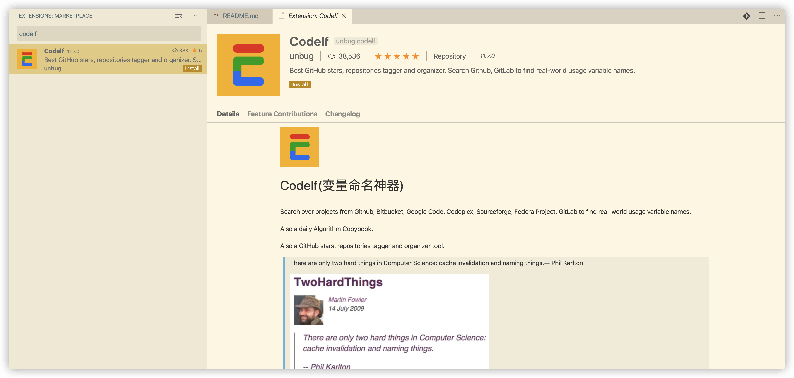

# 基础 AI优化汇总

> 基于 0-ALL.md 的 AI 优化版：保留原文并补充知识地图、易漏考点与工程清单。

## AI 补充：体系化梳理与易漏考点

> 本节在汇总原文基础上，补充面试追问、对比项与工程落地注意点。

### 知识地图
- 工程基础：API、命名、重构、单测
- 安全：认证授权、JWT、SSO、RBAC、加密脱敏
- 框架：Spring IoC/AOP/事务/自动装配

### 常漏追问
1. **@Transactional 失效场景？** 自调用、非 public、异常被吞等。
2. **JWT 优缺点？** 无状态易扩展；注销/续期/密钥轮换要设计。
3. **权限模型？** RBAC 为主，数据权限与菜单权限分层。

### 工程落地检查清单
- [ ] 是否有明确指标（延迟、吞吐、错误率、积压）？
- [ ] 失败是否可重试且幂等？
- [ ] 是否有限流/超时/降级？
- [ ] 是否有日志、链路追踪与告警？
- [ ] 配置变更与回滚是否可操作？


## TOC

1. RestFul API 简明教程 (`RestFul API 简明教程.md`)
2. 代码命名指南 (`代码命名指南.md`)
3. 代码重构指南 (`代码重构指南.md`)
4. 单元测试到底是什么？应该怎么做？ (`单元测试到底是什么？应该怎么做？.md`)
5. 软件工程简明教程 (`软件工程简明教程.md`)

---

<!-- source: RestFul API 简明教程.md -->

## [1] RestFul API 简明教程

---
title: RestFul API 简明教程
description: RESTful API设计规范详解，涵盖REST架构原则、资源路径设计、HTTP方法使用及状态码规范等内容。
category: 代码质量
head:
  - - meta
    - name: keywords
      content: RESTful API,REST,API设计,资源路径,HTTP方法,状态码,幂等性,接口规范
---

这篇文章简单聊聊后端程序员必备的 RESTful API 相关的知识。

开始正式介绍 RESTful API 之前，我们需要首先搞清：**API 到底是什么？**

## 何为 API？

**API（Application Programming Interface）** 翻译过来是应用程序编程接口的意思。

我们在进行后端开发的时候，主要的工作就是为前端或者其他后端服务提供 API 比如查询用户数据的 API 。


但是， API 不仅仅代表后端系统暴露的接口，像框架中提供的方法也属于 API 的范畴。

为了方便大家理解，我再列举几个例子 🌰：

1. 你通过某电商网站搜索某某商品，电商网站的前端就调用了后端提供了搜索商品相关的 API。
2. 你使用 JDK 开发 Java 程序，想要读取用户的输入的话，你就需要使用 JDK 提供的 IO 相关的 API。
3. ……

你可以把 API 理解为程序与程序之间通信的桥梁，其本质就是一个函数而已。另外，API 的使用也不是没有章法的，它的规则由（比如数据输入和输出的格式）API 提供方制定。

## 何为 RESTful API？

**RESTful API** 经常也被叫做 **REST API**，它是基于 REST 构建的 API。这个 REST 到底是什么，我们后文在讲，涉及到的概念比较多。

如果你看 RESTful API 相关的文章的话一般都比较晦涩难懂，主要是因为 REST 涉及到的一些概念比较难以理解。但是，实际上，我们平时开发用到的 RESTful API 的知识非常简单也很容易概括！

举个例子，如果我给你下面两个 API 你是不是立马能知道它们是干什么用的！这就是 RESTful API 的强大之处！

```plain
GET    /classes：列出所有班级
POST   /classes：新建一个班级
```

**RESTful API 可以让你看到 URL+Http Method 就知道这个 URL 是干什么的，让你看到了 HTTP 状态码（status code）就知道请求结果如何。**

像咱们在开发过程中设计 API 的时候也应该至少要满足 RESTful API 的最基本的要求（比如接口中尽量使用名词，使用 `POST` 请求创建资源，`DELETE` 请求删除资源等等，示例：`GET /notes/{id}`：获取某个指定 id 的笔记的信息）。

## 解读 REST

**REST** 是 `REpresentational State Transfer` 的缩写。这个词组的翻译过来就是“**表现层状态转化**”。

这样理解起来甚是晦涩，直白地说，REST 描述的是客户端通过资源的“表现形式”，从一个应用状态转移到另一个应用状态。如果还是不能继续理解，请继续往下看，相信下面的讲解一定能让你理解到底啥是 REST 。

我们分别对上面涉及到的概念进行解读，以便加深理解，实际上你不需要搞懂下面这些概念，也能看懂我下一部分要介绍到的内容。不过，为了更好地能跟别人扯扯 “RESTful API”我建议你还是要好好理解一下！

- **资源（Resource）**：我们可以把真实的对象数据称为资源。一个资源既可以是一个集合，也可以是单个个体。比如我们的班级 classes 是代表一个集合形式的资源，而特定的 class 代表单个个体资源。每一种资源都有特定的 URI（统一资源标识符）与之对应，如果我们需要获取这个资源，访问这个 URI 就可以了，比如获取特定的班级：`/classes/12`。另外，资源也可以包含子资源，比如 `/classes/{classId}/teachers`：列出某个指定班级的所有老师的信息
- **表现形式（Representational）**："资源"是一种信息实体，它可以有多种外在表现形式。我们把"资源"具体呈现出来的形式比如 `json`，`xml`，`image`,`txt` 等等叫做它的"表现层/表现形式"。
- **状态转移（State Transfer）**：大家第一眼看到这个词语一定会很懵逼？内心 BB：这尼玛是啥啊？ 大白话来说，客户端通过资源的表现形式以及其中的链接等控制信息，从一个应用状态转移到另一个应用状态。通过 HTTP 方法进行增删改查，也可能引起服务器端资源状态的改变。ps:HTTP 是一个无状态协议，服务器不需要在两次请求之间保存客户端的会话状态。

综合上面的解释，我们总结一下什么是 RESTful 架构：

1. 每一个 URI 代表一种资源；
2. 客户端和服务器之间，传递这种资源的某种表现形式比如 `json`，`xml`，`image`,`txt` 等等；
3. 客户端通过特定的 HTTP 动词，对服务器端资源进行操作，实现"表现层状态转化"。

## RESTful API 规范


### 动作

- `GET`：请求从服务器获取特定资源。举个例子：`GET /classes`（获取所有班级）
- `POST`：让目标资源按照自身语义处理请求内容，常用于创建资源。举个例子：`POST /classes`（创建班级）
- `PUT`：创建或替换目标资源的当前状态（客户端通常提供更新后的完整资源）。举个例子：`PUT /classes/12`（更新编号为 12 的班级）
- `DELETE`：移除目标 URI 与当前资源功能之间的关联。举个例子：`DELETE /classes/12`（删除编号为 12 的班级）
- `PATCH`：更新服务器上的资源（客户端提供更改的属性，可以看作是部分更新），使用的比较少，这里就不举例子了。

其中，`GET` 是安全且幂等的，`PUT` 和 `DELETE` 是幂等的，`PATCH` 默认不保证幂等。

### 路径（接口命名）

路径又称"终点"（endpoint），表示 API 的具体网址。实际开发中常见的规范如下：

1. **资源型 HTTP API 的网址通常使用名词，名词常用复数形式。** 这是一种常见的 URI 命名约定，并非 REST 强制约束。如果 API 调用不便抽象为资源（如计算、翻译等操作）的话，也可以用动词。比如：`GET /calculate?param1=11&param2=33` 。
2. **不用大写字母，建议用中杠 - 不用下杠 \_** 。比如邀请码写成 `invitation-code`而不是 ~~invitation_code~~ 。
3. **善用版本化 API**。当我们的 API 发生了重大改变而不兼容前期版本的时候，我们可以通过 URL 来实现版本化，比如 `http://api.example.com/v1`、`http://apiv1.example.com` 。版本不必非要是数字，只是数字用的最多，日期、季节都可以作为版本标识符，项目团队达成共识就可。
4. **接口尽量使用名词，避免使用动词。** RESTful API 操作（HTTP Method）的是资源（名词）而不是动作（动词）。

Talk is cheap！来举个实际的例子来说明一下吧！现在有这样一个 API 提供班级（class）的信息，还包括班级中的学生和教师的信息，则它的路径应该设计成下面这样。

```plain
GET    /classes：列出所有班级
POST   /classes：新建一个班级
GET    /classes/{classId}：获取某个指定班级的信息
PUT    /classes/{classId}：更新某个指定班级的信息（一般倾向整体更新）
PATCH  /classes/{classId}：更新某个指定班级的信息（一般倾向部分更新）
DELETE /classes/{classId}：删除某个班级
GET    /classes/{classId}/teachers：列出某个指定班级的所有老师的信息
GET    /classes/{classId}/students：列出某个指定班级的所有学生的信息
DELETE /classes/{classId}/teachers/{ID}：删除某个指定班级下的指定的老师的信息
```

反例：

```plain
/getAllclasses
/createNewclass
/deleteAllActiveclasses
```

理清资源的层次结构，比如业务针对的范围是学校，那么学校会是一级资源:`/schools`，老师: `/schools/{schoolId}/teachers`，学生: `/schools/{schoolId}/students` 就是二级资源。

### 过滤信息（Filtering）

如果我们在查询的时候需要添加特定条件的话，建议使用 url 参数的形式。比如我们要查询 state 状态为 active 并且 name 为 guidegege 的班级：

```plain
GET    /classes?state=active&name=guidegege
```

比如我们要实现分页查询：

```plain
GET    /classes?page=1&size=10 //指定第1页，每页10个数据
```

### 状态码（Status Codes）

**状态码范围：**

| 2xx：成功 | 3xx：重定向    | 4xx：客户端错误  | 5xx：服务器错误 |
| --------- | -------------- | ---------------- | --------------- |
| 200 成功  | 301 永久重定向 | 400 错误请求     | 500 服务器错误  |
| 201 创建  | 304 资源未修改 | 401 未授权       | 502 网关错误    |
|           |                | 403 禁止访问     | 504 网关超时    |
|           |                | 404 未找到       |                 |
|           |                | 405 请求方法不对 |                 |

## REST 中的 HATEOAS

> **在 Fielding 对 REST 的原始定义中，HATEOAS 是统一接口约束的一部分。不过，工程中很多被称为 REST API 的 HTTP/JSON API 并没有实现它。**

上面是 RESTful API 最基本的东西，也是我们平时开发过程中最容易实践到的。HATEOAS 要求通过 Hypermedia 驱动应用状态，即返回结果中提供链接等控制信息，使得用户不查文档，也知道下一步应该做什么。

比如，当用户向 `api.example.com` 的根目录发出请求，会得到这样一个返回结果

```javascript
{"link": {
  "rel":   "collection",
  "href":  "https://api.example.com/classes",
  "title": "List of classes",
  "type":  "application/vnd.yourformat+json"
}}
```

上面代码表示，文档中有一个 `link` 属性，用户读取这个属性就知道下一步该调用什么 API 了。`rel` 表示目标资源与当前上下文的关系，`href` 表示目标资源的路径，`title` 表示链接的标题，`type` 是目标资源表现形式的媒体类型提示。这样的 `Hypermedia API` 设计被称为[HATEOAS](https://roy.gbiv.com/untangled/2008/rest-apis-must-be-hypertext-driven)。

在 Spring 中有一个叫做 HATEOAS 的 API 库，通过它我们可以更轻松的创建出符合 HATEOAS 设计的 API。相关文章：

- [在 Spring Boot 中使用 HATEOAS](https://blog.aisensiy.me/2017/06/04/spring-boot-and-hateoas/)
- [Building REST services with Spring](https://spring.io/guides/tutorials/rest/) (Spring 官网 )
- [An Intro to Spring HATEOAS](https://www.baeldung.com/spring-hateoas-tutorial)
- [spring-hateoas-examples](https://github.com/spring-projects/spring-hateoas-examples/tree/master/hypermedia)
- [Spring HATEOAS](https://spring.io/projects/spring-hateoas#learn) (Spring 官网 )

## 参考

- [Fielding 论文：Representational State Transfer](https://ics.uci.edu/~fielding/pubs/dissertation/rest_arch_style.htm)

- [RFC 9110：HTTP Semantics](https://www.rfc-editor.org/rfc/rfc9110.html)

- [RFC 5789：PATCH Method for HTTP](https://www.rfc-editor.org/rfc/rfc5789.html)

- [RFC 8288：Web Linking](https://www.rfc-editor.org/rfc/rfc8288.html)

- <https://RESTfulapi.net/>

- <https://www.ruanyifeng.com/blog/2014/05/restful_api.html>

- <https://juejin.im/entry/59e460c951882542f578f2f0>

- <https://phauer.com/2016/testing-RESTful-services-java-best-practices/>

- <https://www.seobility.net/en/wiki/REST_API>

- <https://dev.to/duomly/rest-api-vs-graphql-comparison-3j6g>

<!-- @include: @article-footer.snippet.md -->


---

---

<!-- source: 代码命名指南.md -->

## [2] 代码命名指南

---
title: 代码命名指南
description: 代码命名规范指南，涵盖变量、方法、类的命名原则与技巧，提升代码可读性和可维护性。
category: 代码质量
head:
  - - meta
    - name: keywords
      content: 代码命名,命名规范,变量命名,函数命名,类命名,可读性,代码质量,Code Review
---

我还记得我刚工作那一段时间， 项目 Code Review 的时候，我经常因为变量命名不规范而被 “diss”!

究其原因还是自己那会经验不足，而且，大学那会写项目的时候不太注意这些问题，想着只要把功能实现出来就行了。

但是，工作中就不一样，为了代码的可读性、可维护性，项目组对于代码质量的要求还是很高的！

前段时间，项目组新来的一个实习生也经常在 Code Review 因为变量命名不规范而被 “diss”，这让我想到自己刚到公司写代码那会的日子。

于是，我就简单写了这篇关于变量命名规范的文章，希望能对同样有此困扰的小伙伴提供一些帮助。

确实，编程过程中，有太多太多让我们头疼的事情了，比如命名、维护其他人的代码、写测试、与其他人沟通交流等等。

据说之前在 Quora 网站，由接近 5000 名程序员票选出来的最难的事情就是“命名”。

大名鼎鼎的《重构》的作者老马（Martin Fowler）曾经在[TwoHardThings](https://martinfowler.com/bliki/TwoHardThings.html)这篇文章中提到过 CS 领域有两大最难的事情：一是 **缓存失效** ，一是 **程序命名** 。


这个句话实际上也是老马引用别人的，类似的表达还有很多。比如分布式系统领域有两大最难的事情：一是 **保证消息顺序** ，一是 **严格一次传递** 。


今天咱们就单独拎出 “**命名**” 来聊聊！

这篇文章配合我之前发的 [《编码 5 分钟，命名 2 小时？史上最全的 Java 命名规范参考！》](https://mp.weixin.qq.com/s?__biz=Mzg2OTA0Njk0OA==&mid=2247486449&idx=1&sn=c3b502529ff991c7180281bcc22877af&chksm=cea2443af9d5cd2c1c87049ed15ccf6f88275419c7dbe542406166a703b27d0f3ecf2af901f8&token=999884676&lang=zh_CN#rd) 这篇文章阅读效果更佳哦！

## 为什么需要重视命名？

咱们需要先搞懂为什么要重视编程中的命名这一行为，它对于我们的编码工作有着什么意义。

**为什么命名很重要呢？** 这是因为 **好的命名即是注释，别人一看到你的命名就知道你的变量、方法或者类是做什么的！**

简单来说就是 **别人根据你的命名就能知道你的代码要表达的意思** （不过，前提这个人也要有基本的英语知识，对于一些编程中常见的单词比较熟悉）。

简单举个例子说明一下命名的重要性。

《Clean Code》这本书明确指出：

> **好的代码本身就是注释，我们要尽量规范和美化自己的代码来减少不必要的注释。**
>
> **若编程语言足够有表达力，就不需要注释，尽量通过代码来阐述。**
>
> 举个例子：
>
> 去掉下面复杂的注释，只需要创建一个与注释所言同一事物的函数即可
>
> ```java
> // check to see if the employee is eligible for full benefits
> if ((employee.flags & HOURLY_FLAG) && (employee.age > 65))
> ```
>
> 应替换为
>
> ```java
> if (employee.isEligibleForFullBenefits())
> ```

## 常见命名规则以及适用场景

这里只介绍 3 种最常见的命名规范。

### 驼峰命名法（CamelCase）

驼峰命名法应该我们最常见的一个，这种命名方式使用大小写混合的格式来区别各个单词，并且单词之间不使用空格隔开或者连接字符连接的命名方式

#### 大驼峰命名法（UpperCamelCase）

**类名需要使用大驼峰命名法（UpperCamelCase）**

正例：

```java
ServiceDiscovery、ServiceInstance、LruCacheFactory
```

反例：

```java
serviceDiscovery、Serviceinstance、LRUCacheFactory
```

#### 小驼峰命名法（lowerCamelCase）

**方法名、参数名、成员变量、局部变量需要使用小驼峰命名法（lowerCamelCase）。**

正例：

```java
getUserInfo()
createCustomThreadPool()
setNameFormat(String nameFormat)
UserService userService;
```

反例：

```java
GetUserInfo()、CreateCustomThreadPool()、setNameFormat(String NameFormat)
UserService user_service;
```

### 蛇形命名法（snake_case）

**测试方法名可以按团队约定使用蛇形命名法（snake_case），常量和枚举常量通常使用大写蛇形命名法。**

在蛇形命名法中，各个单词之间通过下划线“\_”连接，比如`should_get_200_status_code_when_request_is_valid`、`CLIENT_CONNECT_SERVER_FAILURE`。

蛇形命名法的优势是命名所需要的单词比较多的时候，比如我把上面的命名通过小驼峰命名法给大家看一下：“shouldGet200StatusCodeWhenRequestIsValid”。

感觉如何？ 相比于使用蛇形命名法（snake_case）来说是不是不那么易读？

正例：

```java
@Test
void should_get_200_status_code_when_request_is_valid() {
  ......
}
```

另一种常见写法：

```java
@Test
void shouldGet200StatusCodeWhenRequestIsValid() {
  ......
}
```

### 串式命名法（kebab-case）

在串式命名法中，各个单词之间通过连接符“-”连接，比如`dubbo-registry`。

建议项目文件夹名称使用串式命名法（kebab-case），比如 dubbo 项目的各个模块的命名是下面这样的。


## 常见命名规范

### Java 语言基本命名规范

**1、类名需要使用大驼峰命名法（UpperCamelCase）风格。方法名、参数名、成员变量、局部变量需要使用小驼峰命名法（lowerCamelCase）。**

**2、测试方法没有唯一正确的命名方式，可以根据团队约定使用蛇形命名法（snake_case）**，比如`should_get_200_status_code_when_request_is_valid`。常量和枚举常量通常使用大写蛇形命名法，比如`CLIENT_CONNECT_SERVER_FAILURE`；枚举类型仍然使用大驼峰命名法。

**3、项目文件夹名称使用串式命名法（kebab-case），比如`dubbo-registry`。**

**4、包名统一使用小写，尽量使用单个名词作为包名，各个单词通过 "." 分隔符连接，并且各个单词必须为单数。**

正例：`org.apache.dubbo.common.threadlocal`

反例：~~`org.apache_dubbo.Common.threadLocals`~~

**5、抽象类命名使用 Abstract 开头**。

```java
//为远程传输部分抽象出来的一个抽象类（出处：Dubbo源码）
public abstract class AbstractClient extends AbstractEndpoint implements Client {

}
```

**6、异常类命名使用 Exception 结尾。**

```java
//自定义的 NoSuchMethodException（出处：Dubbo源码）
public class NoSuchMethodException extends RuntimeException {
    private static final long serialVersionUID = -2725364246023268766L;

    public NoSuchMethodException() {
        super();
    }

    public NoSuchMethodException(String msg) {
        super(msg);
    }
}
```

**7、测试类命名以它要测试的类的名称开始，以 Test 结尾。**

```java
//为 AnnotationUtils 类写的测试类（出处：Dubbo源码）
public class AnnotationUtilsTest {
  ......
}
```

POJO 类中布尔类型字段是否使用 `is` 前缀，需要结合访问器生成规则和序列化框架判断。通常可以将基本类型字段命名为 `active` 并提供 `isActive()`，将包装类型 `Boolean` 字段命名为 `active` 并提供 `getActive()`；如果框架推断结果不符合预期，可以通过显式访问器或序列化注解固定属性名。

如果模块、接口、类、方法使用了设计模式，在命名时需体现出具体模式。

### 命名易读性规范

**1、为了能让命名更加易懂和易读，尽量不要缩写/简写单词，除非这些单词已经被公认可以被这样缩写/简写。比如 `CustomThreadFactory` 不可以被写成 ~~`CustomTF` 。**

**2、命名不像函数一样要尽量追求短，可读性强的名字优先于简短的名字，虽然可读性强的名字会比较长一点。** 这个对应我们上面说的第 1 点。

**3、避免无意义的命名，你起的每一个名字都要能表明意思。**

正例：`UserService userService;` `int userCount`;

反例: ~~`UserService service`~~ ~~`int count`~~

**4、避免命名过长（50 个字符以内最好），过长的命名难以阅读并且丑陋。**

**5、不要使用拼音，更不要使用中文。** 不过像 alibaba、wuhan、taobao 这种国际通用名词可以当做英文来看待。

正例：discount

反例：~~dazhe~~

## Codelf:变量命名神器?

这是一个由国人开发的网站，网上有很多人称其为变量命名神器， 我在实际使用了几天之后感觉没那么好用。小伙伴们可以自行体验一下，然后再给出自己的判断。

Codelf 提供了在线网站版本，网址：[https://unbug.github.io/codelf/](https://unbug.github.io/codelf/)，具体使用情况如下：

我选择了 Java 编程语言，然后搜索了“序列化”这个关键词，然后它就返回了很多关于序列化的命名。


并且，Codelf 还提供了 VS code 插件，看这个评价，看来大家还是很喜欢这款命名工具的。



## 相关阅读推荐

1. 《阿里巴巴 Java 开发手册》
2. 《Clean Code》
3. Google Java 代码指南：<https://google.github.io/styleguide/javaguide.html>
4. 告别编码 5 分钟，命名 2 小时！史上最全的 Java 命名规范参考：<https://www.cnblogs.com/liqiangchn/p/12000361.html>

## 总结

作为一个合格的程序员，小伙伴们应该都知道代码表义的重要性。想要写出高质量代码，好的命名就是第一步！

好的命名对于其他人（包括你自己）理解你的代码有着很大的帮助！你的代码越容易被理解，可维护性就越强，侧面也就说明你的代码设计的也就越好！

在日常编码过程中，我们需要谨记常见命名规范比如类名需要使用大驼峰命名法、不要使用拼音，更不要使用中文……。

另外，国人开发的一个叫做 Codelf 的网站被很多人称为“变量命名神器”，当你为命名而头疼的时候，你可以去参考一下上面提供的一些命名示例。

最后，祝愿大家都不用再为命名而困扰!

<!-- @include: @article-footer.snippet.md -->


---

---

<!-- source: 代码重构指南.md -->

## [3] 代码重构指南

---
title: 代码重构指南
description: 代码重构实践指南，涵盖重构定义、重构原则、代码坏味道识别及常用重构技巧与最佳实践。
category: 代码质量
head:
  - - meta
    - name: keywords
      content: 代码重构,重构技巧,重构原则,设计模式,SOLID,代码坏味道,可维护性,单元测试
---

前段时间重读了[《重构：改善代码既有设计》](https://book.douban.com/subject/30468597/)，收货颇多。于是，简单写了一篇文章来聊聊我对重构的看法。


## 何谓重构？

学习重构必看的一本神书《重构：改善代码既有设计》从两个角度给出了重构的定义：

> - 重构（名词）：对软件内部结构的一种调整，目的是在不改变软件可观察行为的前提下，提高其可理解性，降低其修改成本。
> - 重构（动词）：使用一系列重构手法，在不改变软件可观察行为的前提下，调整其结构。

用更贴近工程师的语言来说：**重构就是在不改变软件可观察行为的前提下，通过一系列小步的结构调整，让代码更容易理解，更易于修改。** 设计模式和软件设计原则可以为重构提供方向，自动化测试则是重构的重要保障。

软件设计原则指导着我们组织和规范代码，同时，重构也是为了能够尽量设计出尽量满足软件设计原则的软件。

正确重构的核心在于 **步子一定要小，每一步的重构都不会影响软件的正常运行，可以随时停止重构。**

**常见的设计模式如下**：


更全面的设计模式总结，可以看 **[java-design-patterns](https://github.com/iluwatar/java-design-patterns)** 这个开源项目。

**常见的软件设计原则如下**：


更全面的设计原则总结，可以看 **[java-design-patterns](https://github.com/iluwatar/java-design-patterns)** 和 **[hacker-laws-zh](https://github.com/nusr/hacker-laws-zh)** 这两个开源项目。

## 为什么要重构？

在上面介绍重构定义的时候，我从比较抽象的角度介绍了重构的好处：重构的主要目的是让代码更容易理解，降低后续修改的成本。

如果对应到一个真实的项目，重构具体能为我们带来什么好处呢？

1. **让代码更容易理解**：通过添加注释、命名规范、逻辑优化等手段可以让我们的代码更容易被理解；
2. **避免代码腐化**：通过重构干掉坏味道代码；
3. **加深对代码的理解**：重构代码的过程会加深你对某部分代码的理解；
4. **发现潜在 bug**：是这样的，很多潜在的 bug ，都是我们在重构的过程中发现的；
5. ……

看了上面介绍的关于重构带来的好处之后，你会发现重构的最终目标是 **提高软件开发速度和质量** 。

重构并不会减慢软件开发速度，相反，如果代码质量和软件设计较差，当我们想要添加新功能的话，开发速度会越来越慢。到了最后，甚至都有想要重写整个系统的冲动。


《重构：改善代码既有设计》这本书中这样说：

> 重构的唯一目的就是让我们开发更快，用更少的工作量创造更大的价值。

## 性能优化就是重构吗？

重构的目的是提高代码的可读性、可维护性和灵活性，它关注的是代码的内部结构——如何让开发者更容易理解代码，如何让后续的功能开发和维护更加高效。而性能优化则是为了让代码运行得更快、占用更少的资源，它关注的是程序的外部表现——如何减少响应时间、降低资源消耗、提升系统吞吐量。这两者看似对立，但实际上它们的目标是统一的，都是为了提高软件的整体质量。

在实际开发中，理想的做法是首先**确保代码的可读性和可维护性**，然后根据实际需求选择合适的性能优化手段。优秀的软件设计不是一味追求性能最大化，而是要在可维护性和性能之间找到平衡。通过这种方式，我们可以打造既**易于管理**又具有**良好性能**的软件系统。

## 何时进行重构？

重构在是开发过程中随时可以进行的，见机行事即可，并不需要单独分配一两天的时间专门用来重构。

### 提交代码之前

《重构：改善代码既有设计》这本书介绍了一个 **营地法则** 的概念:

> 编程时，需要遵循营地法则：保证你离开时的代码库一定比来时更健康。

这个概念表达的核心思想其实很简单：在你提交代码的之前，花一会时间想一想，我这次的提交是让项目代码变得更健康了，还是更腐化了，或者说没什么变化？

项目团队的每一个人只有保证自己的提交没有让项目代码变得更腐化，项目代码才会朝着健康的方向发展。

**当我们离开营地（项目代码）的时候，请不要留下垃圾（代码坏味道）！尽量确保营地变得更干净了！**

### 开发一个新功能之后&之前

在开发一个新功能之后，我们应该回过头看看是不是有可以改进的地方。在添加一个新功能之前，我们可以思考一下自己是否可以重构代码以让新功能的开发更容易。

一个新功能的开发不应该仅仅只有功能验证通过那么简单，我们还应该尽量保证代码质量。

有一个两顶帽子的比喻：在我开发新功能之前，我发现重构可以让新功能的开发更容易，于是我戴上了重构的帽子。重构之后，我换回原来的帽子，继续开发新能功能。新功能开发完成之后，我又发现自己的代码难以理解，于是我又戴上了重构帽子。比较好的开发状态就是就是这样在重构和开发新功能之间来回切换。


### Code Review 之后

Code Review 可以非常有效提高代码的整体质量，它会帮助我们发现代码中的坏味道以及可能存在问题的地方。并且， Code Review 可以帮助项目团队其他程序员理解你负责的业务模块，有效避免人员方面的单点风险。

经历一次 Code Review ，你的代码可能会收到很多改进建议。

### 捡垃圾式重构

当我们发现坏味道代码（垃圾）的时候，如果我们不想停下手头自己正在做的工作，但又不想放着垃圾不管，我们可以这样做：

- 如果这个垃圾很容易重构的话，我们可以立即重构它。
- 如果这个垃圾不太容易重构的话，我们可以先记录下来，当完成当下的任务再回来重构它。

### 阅读理解代码的时候

搞开发的小伙伴应该非常有体会：我们经常需要阅读项目团队中其他人写的代码，也经常需要阅读自己过去写的代码。阅读代码的时候，通常要比我们写代码的时间还要多很多。

我们在阅读理解代码的时候，如果发现一些坏味道的话，我们就可以对其进行重构。

就比如说你在阅读张三写的某段代码的时候，你发现这段代码逻辑过于复杂难以理解，你有更好的写法，那你就可以对张三的这段代码逻辑进行重构。

## 重构有哪些注意事项？

### 自动化测试是重构的保护网

**自动化测试可以为重构提供信心，降低重构的成本。单元测试通常是反馈最快的一层，集成测试、验收测试等也可以共同组成保护网。我们要像重视生产代码那样，重视测试代码。**

另外，多提一句：持续集成也要依赖快速、可靠的自动化测试，当持续集成服务自动构建新代码之后，会自动运行测试来发现代码错误。

**怎样才能算单元测试呢？** 网上的定义很多，很抽象，很容易把人给看迷糊了。我觉得对于单元测试的定义主要取决于你的项目，一个函数甚至是一个类都可以看作是一个单元。就比如说我们写了一个计算个人股票收益率的方法，我们为了验证它的正确性专门为它写了一个单元测试。再比如说我们代码有一个类专门负责数据脱敏，我们为了验证脱敏是否符合预期专门为这个类写了一个单元测试。

**单元测试也是需要重构或者修改的。** [《代码整洁之道:敏捷软件开发手册》](https://book.douban.com/subject/4199741/)这本书这样写到：

> 测试代码需要随着生产代码的演进而修改，如果测试不能保持整洁，只会越来越难修改。

### 不要为了重构而重构

**重构一定是要为项目带来价值的！** 某些情况下我们不应该进行重构：

- 学习了某个设计模式/工程实践之后，不顾项目实际情况，刻意使用在项目上（避免货物崇拜编程）；
- 项目进展比较急的时候，重构项目调用的某个 API 的底层代码（重构之后对项目调用这个 API 并没有带来什么价值）；
- 重写比重构更容易更省事；
- ……

### 遵循方法

《重构：改善代码既有设计》这本书中列举除了代码常见的一些坏味道（比如重复代码、过长函数）和重构手段（如提炼函数、提炼变量、提炼类）。我们应该花时间去学习这些重构相关的理论知识，并在代码中去实践这些重构理论。

## 如何练习重构？

除了可以在重构项目代码的过程中练习精进重构之外，你还可以有下面这些手段：

- [当我重构时，我在想些什么](https://mp.weixin.qq.com/s/pFaFKMXzNCOuW2SD9Co40g)：转转技术的这篇文章总结了常见的重构场景和重构方式。
- [重构实战练习](https://linesh.gitbook.io/代码重构指南/)：通过几个小案例一步一步带你学习重构！
- [设计模式+重构学习网站](https://refactoringguru.cn/)：免费在线学习代码重构、 设计模式、 SOLID 原则 （单一职责、 开闭原则、 里氏替换、 接口隔离以及依赖反转） 。
- [IDEA 官方文档的代码重构教程](https://www.jetbrains.com/help/idea/refactoring-source-code.html#popular-refactorings)：教你如何使用 IDEA 进行重构。

## 参考

- [再读《重构》- ThoughtWorks 洞见 - 2020](https://insights.thoughtworks.cn/reread-refactoring/)：详细介绍了重构的要点比如小步重构、捡垃圾式的重构，主要是重构概念相关的介绍。
- [常见代码重构技巧 - VectorJin - 2021](https://juejin.cn/post/6954378167947624484)：从软件设计原则、设计模式、代码分层、命名规范等角度介绍了如何进行重构，比较偏实战。

<!-- @include: @article-footer.snippet.md -->


---

---

<!-- source: 单元测试到底是什么？应该怎么做？.md -->

## [4] 单元测试到底是什么？应该怎么做？

---
title: 单元测试到底是什么？应该怎么做？
description: 单元测试入门指南，涵盖单元测试概念、Mock与Stub技术、测试金字塔及JUnit测试框架使用方法。
category: 代码质量
head:
  - - meta
    - name: keywords
      content: 单元测试,Unit Testing,Mock,Stub,Fake,测试金字塔,可测试性,TDD,JUnit
---

> 本文重构完善自[谈谈为什么写单元测试 - 键盘男 - 2016](https://www.jianshu.com/p/fa41fb80d2b8)这篇文章。

## 何谓单元测试？

维基百科是这样介绍单元测试的：

> 在计算机编程中，单元测试（Unit Testing）是针对程序模块（软件设计的最小单位）进行的正确性检验测试工作。
>
> 程序单元是应用的 **最小可测试部件** 。在过程化编程中，一个单元就是单个程序、函数、过程等；对于面向对象编程，最小单元就是方法，包括基类（超类）、抽象类、或者派生类（子类）中的方法。

由于每个单元有独立的逻辑，在做单元测试时，为了隔离外部依赖，确保这些依赖不影响验证逻辑，我们经常会用到 Fake、Stub 与 Mock 。

关于 Fake、Mock 与 Stub 这几个概念的解读，可以看看这篇文章：[测试中 Fakes、Mocks 以及 Stubs 概念明晰 - 王下邀月熊 - 2018](https://zhuanlan.zhihu.com/p/26942686) 。

## 为什么需要单元测试？

### 为重构保驾护航

我在[重构](./代码重构指南.md)这篇文章中这样写到：

> 单元测试可以为重构提供信心，降低重构的成本。我们要像重视生产代码那样，重视单元测试。

每个开发者都会经历重构，重构后把代码改坏了的情况并不少见，很可能你只是修改了一个很简单的方法就导致系统出现了一个比较严重的错误。

单元测试可以及时发现一部分逻辑错误，降低重构引入回归问题的风险。写完一个类，为它补充单元测试；写第二个类，继续补充单元测试……不过，每个类单独通过测试，并不代表它们组合起来一定没有问题，接口契约、配置、数据库、网络和事务等问题还需要通过集成测试、端到端测试等方式发现。

### 提高代码质量

由于每个单元有独立的逻辑，做单元测试时需要隔离外部依赖，确保这些依赖不影响验证逻辑。因为要把各种依赖分离，单元测试会促进工程进行组件拆分，整理工程依赖关系，更大程度减少代码耦合。这样写出来的代码，更好维护，更好扩展，从而提高代码质量。

### 减少 bug

一个机器，由各种细小的零件组成，如果其中某件零件坏了，机器运行故障。必须保证每个零件都按设计图要求的规格，机器才能正常运行。

一个可单元测试的工程，会把业务、功能分割成规模更小、有独立的逻辑部件，称为单元。单元测试的目标，就是验证各个单元是否按预期工作，从而降低局部逻辑错误和回归问题出现的概率。整个项目能否正确运行，还需要其他层次的测试共同验证。

### 快速定位 bug

如果程序有 bug，我们运行一次全部单元测试，找到不通过的测试，可以很快地定位对应的执行代码。修复代码后，运行对应的单元测试；如还不通过，继续修改，运行测试……直到**测试通过**。

### 持续集成依赖自动化测试

持续集成需要依赖快速、可靠的自动化测试。当持续集成服务自动构建新代码之后，会自动运行单元测试、集成测试等来发现代码错误，单元测试通常是其中反馈最快的一层。

## 谁逼你写单元测试？

### 领导要求

有些经验丰富的领导，或多或少都会要求团队写单元测试。对于有一定工作经验的队友，这要求挺合理；对于经验尚浅的、毕业生，恐怕要死要活了，连代码都写不好，还要写单元测试，are you kidding me？

培训新人单元测试用法，是一项艰巨的任务。新人代码风格未形成，也不知道单元测试多重要，强制单元测试会让他们感到困惑，没办法按自己思路写代码。

### 大牛都写单元测试

国外很多家喻户晓的开源项目，都有大量单元测试。例如，[retrofit](https://link.jianshu.com?t=https://github.com/square/retrofit/tree/master/retrofit/src/test/java/retrofit2)、[okhttp](https://link.jianshu.com?t=https://github.com/square/okhttp/tree/master/okhttp-tests/src/test/java/okhttp3)、[butterknife](https://link.jianshu.com?t=https://github.com/JakeWharton/butterknife/tree/master/butterknife-compiler/src/test/java/butterknife)…… 国外大牛都写单元测试，我们也写吧！

很多读者都有这种想法，一开始满腔热血。当真要对自己项目单元测试时，便困难重重，很大原因是项目对单元测试不友好。最后只能对一些不痛不痒的工具类做单元测试，久而久之，当初美好愿望也不了了之。

### 保住面子

都是有些许年经验的老鸟，还天天被测试同学追 bug，好意思么？花多一点时间写单元测试，确保没低级 bug，还能彰显大牛风范，何乐而不为？

### 心虚

笔者也是个不太相信自己代码的人，总觉得哪里会突然冒出莫名其妙的 bug，也怕别人不小心改了自己的代码（被害妄想症），新版本上线提心吊胆……花点时间写单元测试，有事没事跑一下测试，确保原逻辑没问题，至少能睡安稳一点。

## TDD 测试驱动开发

### 何谓 TDD？

TDD 即 Test-Driven Development（ 测试驱动开发），这是敏捷开发的一项核心实践和技术，也是一种设计方法论。

TDD 原理是开发功能代码之前，先编写测试用例代码，然后针对测试用例编写功能代码，使其能够通过。

TDD 的节奏：“红 - 绿 - 重构”。


由于 TDD 对开发人员要求非常高，跟传统开发思维不一样，因此实施起来相当困难。

TDD 在很多人眼中是不实用的，一来他们并不理解测试“驱动”开发的含义，但更重要的是，他们很少会做任务分解。而任务分解是做好 TDD 的关键点。只有把任务分解到可以测试的地步，才能够有针对性地写测试。

### TDD 优缺点分析

测试驱动开发有好处也有坏处。因为每个测试用例都是根据需求来的，或者说把一个大需求分解成若干小需求编写测试用例，所以测试用例写出来后，开发者写的执行代码，必须满足测试用例。如果测试不通过，则修改执行代码，直到测试用例通过。

**优点**：

1. 帮你整理需求，梳理思路；
2. 帮你设计出更合理的接口（空想的话很容易设计出屎）；
3. 减小代码出现 bug 的概率；
4. 提高开发效率（前提是正确且熟练使用 TDD）。

**缺点**：

1. 能用好 TDD 的人非常少，看似简单，实则门槛很高；
2. 投入开发资源（时间和精力）通常会更多；
3. 由于测试用例在未进行代码设计前写；很有可能限制开发者对代码整体设计；
4. 可能引起开发人员不满情绪，我觉得这点很严重，毕竟不是人人都喜欢单元测试，尽管单元测试会带给我们相当多的好处。

相关阅读：[如何用正确的姿势打开 TDD？ - 陈天 - 2017](https://zhuanlan.zhihu.com/p/24997923) 。

## 单测框架和 Mock 工具如何选择？

对于单测来说，JUnit、Spock 属于测试框架，Mockito、PowerMock、JMockit、TestableMock 等则主要用于创建 Mock 等测试替身。

JUnit 几乎是默认选择，但是其不提供 Mock 能力，因此通常还需要搭配 Mockito 等 Mock 工具。Spock 则同时提供测试规范和 Mock 能力。

究竟是选择 JUnit 搭配 Mockito，还是选择 Spock 呢？我这里做了一些简单的对比分析：

- Spock 2.4 可以通过 `SpyStatic()` 配合支持静态方法的 Mock Maker 模拟 Java 和 Groovy 的静态方法；Mockito 3.4.0 以后也支持静态方法的 Mock。具体可以看 [Spock 2.4 发布说明](https://spockframework.org/spock/docs/2.4/release_notes.html)和 [Mockito 官方文档](https://javadoc.io/doc/org.mockito/mockito-core/latest/org.mockito/org/mockito/Mockito.html)。
- Spock 基于 Groovy，写出来的测试代码更清晰易读，比较规范(自带 given-when-then 的常用测试结构规范)。Mockito 没有具体的结构规范，需要项目组自己约定一个或者遵守比较好的测试代码实践。通常来说，同样的测试用例，Spock 的代码要更简洁。
- Mockito 使用的人群更广泛，稳定可靠。并且，Mockito 是 SpringBoot Test 默认集成的 Mock 工具。

JUnit 搭配 Mockito 和 Spock 都是非常不错的选择，相对来说，JUnit 搭配 Mockito 的适用性更强一些。

## 总结

单元测试确实会带给你相当多的好处，但不是立刻体验出来。正如买重疾保险，交了很多保费，没病没痛，十几年甚至几十年都用不上，最好就是一辈子用不上理赔，身体健康最重要。单元测试也一样，写了可以买个放心，对代码的一种保障，有 bug 尽快测出来，没 bug 就最好，总不能说“写那么多单元测试，结果测不出 bug，浪费时间”吧？

以下是个人对单元测试一些建议：

> - 越重要的代码，越要写单元测试；
> - 代码做不到单元测试，多思考如何改进，而不是放弃；
> - 边写业务代码，边写单元测试，而不是完成整个新功能后再写；
> - 多思考如何改进、简化测试代码。
> - 测试代码需要随着生产代码的演进而重构或者修改，如果测试不能保持整洁，只会越来越难修改。

作为一名经验丰富的程序员，写单元测试更多的是**对自己的代码负责**。有测试用例的代码，别人更容易看懂，以后别人接手你的代码时，也可能放心做改动。

**多敲代码实践，多跟有单元测试经验的工程师交流**，你会发现写单元测试获得的收益会更多。

<!-- @include: @article-footer.snippet.md -->


---

---

<!-- source: 软件工程简明教程.md -->

## [5] 软件工程简明教程

---
title: 软件工程简明教程
description: 软件工程基础知识详解，涵盖软件危机、软件开发过程模型、瀑布模型、敏捷开发等软件工程核心概念。
category: 系统设计
head:
  - - meta
    - name: keywords
      content: 软件工程,软件危机,软件开发过程,瀑布模型,敏捷开发,需求分析,软件生命周期,工程化方法
---

大部分软件开发从业者，都会忽略软件开发中的一些最基础、最底层的一些概念。但是，这些软件开发的概念对于软件开发来说非常重要，就像是软件开发的基石一样。这也是我写这篇文章的原因。

## 何为软件工程？

1968 年 NATO（北大西洋公约组织）提出了**软件危机**（**Software crisis**）一词。同年，为了解决软件危机问题，“**软件工程**”的概念诞生了。一门叫做软件工程的学科也就应运而生。

随着时间的推移，软件工程这门学科也经历了一轮又一轮的完善，其中的一些核心内容比如软件开发模型越来越丰富实用！

**什么是软件危机呢？**

简单来说，软件危机描述了当时软件开发的一个痛点：我们很难高效地开发出质量高的软件。

Dijkstra（Dijkstra 算法的作者） 在 1972 年图灵奖获奖感言中也提到过软件危机，他是这样说的：“导致软件危机的主要原因是机器变得功能强大了几个数量级！坦率地说：只要没有机器，编程就完全没有问题。当我们有一些弱小的计算机时，编程成为一个温和的问题，而现在我们有了庞大的计算机，编程也同样成为一个巨大的问题”。

**说了这么多，到底什么是软件工程呢？**

工程是为了解决实际的问题将理论应用于实践。软件工程指的就是将工程思想应用于软件开发。

上面是我对软件工程的定义，我们再来看看比较权威的定义。IEEE Std 610.12-1990《软件工程术语标准词汇表》给出的定义是这样的：　(1)将系统化的、规范的、可量化的方法应用到软件的开发、运行及维护中，即将工程化方法应用于软件。　(2)在(1)中所述方法的研究。

总之，软件工程的终极目标就是：**在更少资源消耗的情况下，创造出更好、更容易维护的软件。**

## 软件开发过程

[维基百科是这样定义软件开发过程](https://zh.wikipedia.org/wiki/%E8%BD%AF%E4%BB%B6%E5%BC%80%E5%8F%91%E8%BF%87%E7%A8%8B)的：

> 软件开发过程（英语：software development process），或软件过程（英语：software process），是软件开发的开发生命周期（software development life cycle），其各个阶段实现了软件的需求定义与分析、设计、实现、测试、交付和维护。软件过程是在开发与构建系统时应遵循的步骤，是软件开发的路线图。

- 需求分析：分析用户的需求，建立逻辑模型。
- 软件设计：根据需求分析的结果对软件架构进行设计。
- 编码：编写程序运行的源代码。
- 测试 : 确定测试用例，编写测试报告。
- 交付：将做好的软件交付给客户。
- 维护：对软件进行维护比如解决 bug，完善功能。

软件开发过程只是比较笼统的层面上，定义了一个软件开发可能涉及到的一些流程。

软件开发模型更具体地定义了软件开发过程，对开发过程提供了强有力的理论支持。

## 软件开发模型

软件开发模型和方法有很多种，比如瀑布模型（Waterfall Model）、快速原型模型（Rapid Prototype Model）、V 模型（V-model）、W 模型（W-model）、敏捷开发方法。其中最具有代表性的还是 **瀑布模型** 和 **敏捷开发** 。

**瀑布模型** 定义了一套完整的软件开发周期，完整地展示了一个软件的生命周期。


**敏捷开发** 并不是单一的软件开发模型，而是一组价值观和原则，常见的具体方法有 Scrum、极限编程（XP）和看板（Kanban）等。敏捷开发强调个体和互动、工作的软件、客户合作和响应变化，并通过迭代和频繁交付持续获取反馈。

**持续集成**、**重构**、**小版本发布**、**结对编程**、**测试驱动开发** 是极限编程中常见的技术实践，**站会** 常见于 Scrum，它们并不是每一种敏捷方法都强制要求的实践。敏捷开发也不等于低文档，而是更重视工作的软件，同时保留必要且有价值的文档。

## 软件开发的基本策略

### 软件复用

我们在构建一个新的软件的时候，不需要从零开始，通过复用已有的一些轮子（框架、第三方库等）、设计模式、设计原则等等现成的物料，我们可以更快地构建出一个满足要求的软件。

像我们平时接触的开源项目就是最好的例子。我想，如果不是开源，我们构建出一个满足要求的软件，耗费的精力和时间要比现在多的多！

### 分而治之

构建软件的过程中，我们会遇到很多问题。我们可以将一些比较复杂的问题拆解为一些小问题，然后，一一攻克。

我结合现在比较火的软件设计方法—领域驱动设计（Domain Driven Design，简称 DDD）来说说。

在领域驱动设计中，很重要的一个概念就是**领域（Domain）**，它就是我们要解决的问题。在领域驱动设计中，我们要做的就是把比较大的领域（问题）拆解为若干的小领域（子域）。

除此之外，分而治之也是一个比较常用的算法思想，对应的就是分治算法。如果你想了解分治算法的话，推荐你看一下北大的[《算法设计与分析 Design and Analysis of Algorithms》](https://www.coursera.org/learn/algorithms)。

### 逐步演进

软件开发是一个逐步演进的过程，我们需要不断进行迭代式增量开发，最终交付符合客户价值的产品。

这里补充一个在软件开发领域，非常重要的概念：**MVP（Minimum Viable Product，最小可行产品）**。

最小可行产品是以最少投入获取最多经验证的客户认知的产品版本，目的是尽快验证关键假设，不一定是一个能够完整满足客户需求的产品。下面这张图片把这个思想展示的非常精髓。


利用最小可行产品，我们可以也可以提早进行市场分析，这对于我们在探索产品不确定性的道路上非常有帮助。可以非常有效地指导我们下一步该往哪里走。

### 优化折中

软件开发是一个不断优化改进的过程。任何软件都有很多可以优化的点，不可能完美。我们需要不断改进和提升软件的质量。

但是，也不要陷入这个怪圈。要学会折中，在有限的投入内，以最有效的方式提高现有软件的质量。

## 参考

- [IEEE Std 610.12-1990：IEEE Standard Glossary of Software Engineering Terminology](https://standards.ieee.org/ieee/610.12/855/)
- [Manifesto for Agile Software Development](https://agilemanifesto.org/)
- [Minimum Viable Product: a guide - Eric Ries](https://www.startuplessonslearned.com/2009/08/minimum-viable-product-guide.html)
- 软件工程的基本概念-清华大学软件学院 刘强：<https://www.xuetangx.com/course/THU08091000367>
- 软件开发过程-维基百科：[https://zh.wikipedia.org/wiki/软件开发过程](https://zh.wikipedia.org/wiki/软件开发过程)

<!-- @include: @article-footer.snippet.md -->

