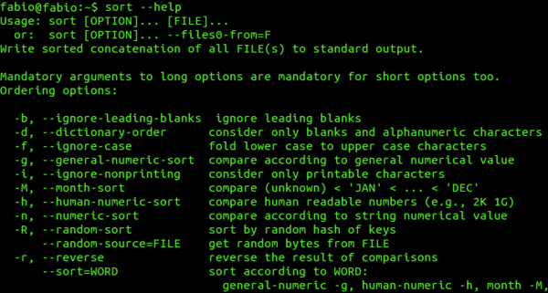

# 操作系统

> Aggregate of markdown under this directory (excludes README.md, TODO.md).


---

<!-- source: CPU 调度与系统负载详解.md -->

---
title: CPU 调度与系统负载详解
description: CPU 调度和系统负载高频面试题总结，从进程线程为什么需要调度讲起，讲清抢占、时间片、优先级、上下文切换、经典调度算法、Linux CFS/EEVDF、load average、CPU 使用率、I/O wait 和常用排查命令。
category: 计算机基础
tag:
  - 操作系统
  - Linux
  - CPU 调度
head:
  - - meta
    - name: keywords
      content: CPU 调度, 进程调度, 线程调度, 系统负载, load average, CPU 使用率, iowait, CFS, EEVDF, top, uptime, vmstat, pidstat, mpstat, perf top, 操作系统面试题
---

CPU 调度不只是 FCFS、RR、CFS 这些算法名词。排查线上问题时，还要弄清线程为什么被换下去、上下文切换的成本在哪里，以及 load average 很高但 CPU 使用率不高意味着什么。

这些问题背后是同一组约束：CPU 核心有限，任务需要排队，调度器负责决定谁先运行；系统指标则帮助判断任务是在争抢 CPU、等待 I/O，还是卡在内核、中断或虚拟化层。

比如一台有 8 个逻辑 CPU 的机器，load average 已到 40，但 CPU 还有空闲，`%Cpu(s)` 里的 `wa` 长期偏高。此时直接去找 CPU 热点函数可能没有结果，机器上更可能堆了一批等待 I/O 的任务。CPU 使用率和 load average 需要分开判断。

## 为什么需要 CPU 调度

CPU 核心有限，可运行任务可能很多。

在一个 Java 服务中，业务线程、GC 线程、JIT 线程、Netty 事件循环线程都可能要跑；同机还可能有日志采集、监控 Agent、定时任务和数据库客户端。如果系统可用的是 8 个逻辑 CPU，同一时刻最多只能让大约 8 个可运行任务占用 CPU，其余任务只能排队、睡眠或等待 I/O。容器环境还要看 CPU quota，不能只看宿主机物理核心数。

不同系统对调度对象的叫法不完全一样。后端排查时，可先把 Linux 的调度实体理解成能被内核单独安排到 CPU 上运行的执行单元。

一个进程可包含多个线程。它们共享进程地址空间和文件描述符，但各自有栈、寄存器、程序计数器等执行现场。


在 Linux 内核里，进程和线程都用 task 表示，调度器实际调度的是 task 或调度实体；用户态看到的一条线程，大多对应一个内核可调度任务。

如果没有调度，单核机器上的一个死循环就能一直占着 CPU，其他程序没有机会响应。多核机器只是把同一时刻能运行的任务数从 1 个变成 N 个；任务数超过核心数后，仍然要排队和切换。

调度器要兼顾交互响应、公平性、吞吐量、优先级、实时任务、功耗和缓存局部性。这些目标经常互相牵制：时间片长一些，切换会减少，但交互任务可能等更久；时间片短一些，响应会改善，切换开销又会上升。


## 任务离开 CPU 的几种情况

一个任务离开 CPU，大致有几类原因。时间片用完只是其中一种情况。

最常见的是任务主动让出 CPU。比如线程调用 `read()` 读取磁盘，数据还没有准备好，它就会进入等待；线程等待锁、条件变量、定时器时，也会从运行态离开。CPU 不应该陪着它空等，调度器会选择其他可运行任务。

另一类是被抢占。通用操作系统通常选用抢占式调度，任务运行一段时间后，时钟中断会给内核一个检查机会；如果当前任务已经运行够了，或者有更合适的任务变为可运行，内核就可能把当前任务换下去。

很多教材为了讲清楚抢占，常常把这个过程简化成：定时器周期性地产生时钟中断。

这个模型可以说明抢占的大致过程。不过，现代 Linux 支持 `NO_HZ` / tickless，会在空闲 CPU 或特定配置下减少调度时钟 tick。定时器和调度 tick 是内核获得抢占检查机会的重要机制，线上机器未必一直按固定频率打 tick。

优先级也会影响调度。高优先级任务排得更靠前，低优先级任务就更容易等待。如果系统完全偏向高优先级任务，低优先级任务可能长期拿不到 CPU，这就是饥饿。教材算法常用动态优先级、老化或队列提升来缓解饥饿；真实系统的处理方式取决于调度类和具体实现。

上下文切换发生在换任务的那一刻。内核要保存当前任务的寄存器、程序计数器、栈指针等现场，再恢复下一个任务。跨进程切换还可能带来页表、TLB、缓存局部性的额外成本。线程很多、锁竞争严重、任务频繁睡眠和唤醒时，业务代码没运行多少，CPU 时间可能先花在调度和同步上。

线程数量需要结合任务类型和 CPU 核数设置。线程可掩盖 I/O 等待，也可利用多核；但线程数量远大于 CPU 核数时，运行队列、上下文切换、缓存失效、锁竞争都会随之上升。

## 经典调度算法

面试里经常会问 FCFS、SJF、RR、优先级、多级反馈队列。

把这些算法放到短任务、长任务和交互任务如何排队的场景中，更容易看出差异。它们主要是教材中的简化模型；真实 Linux 的普通任务调度不会直接照搬某一个算法，还会涉及 CFS/EEVDF、实时调度类、cgroup、CPU affinity、NUMA 等机制。

| 算法         | 选择方式                           | 容易被追问的问题                             |
| ------------ | ---------------------------------- | -------------------------------------------- |
| FCFS         | 先到先服务                         | 长任务排在前面，短任务也要等待               |
| SJF          | 预计运行时间短的先运行             | 很难提前知道任务还要运行多久，长任务可能饥饿 |
| RR           | 每个任务轮流运行一个时间片         | 时间片太短会放大上下文切换，太长又接近 FCFS  |
| 优先级调度   | 优先级高的先运行                   | 低优先级任务可能长期等不到 CPU               |
| 多级反馈队列 | 多个优先级队列，按运行行为调整位置 | 规则和参数较多，实现更复杂                   |

举个例子，线程池前面排了几个大文件压缩任务，后面很多只查缓存的请求也要跟着等待，平均响应时间会被长任务拖坏。SJF 可改善这场景，但前提很强：系统得知道每个任务还要运行多久。真实系统没有这种上帝视角，只能根据历史行为、I/O 等待、交互特性来猜。

RR 更像分时系统的入门模型。每个任务运行一个时间片，运行完放回队列。用户敲命令、移动鼠标、发请求时，不必等长任务完全结束才有响应。上下文切换存在固定成本，因此时间片越短，切换开销占比越高；时间片拉长后，切换成本被摊薄，交互延迟又可能变大。

多级反馈队列同时考虑短任务的响应时间和长任务的推进。新任务一般先进入高优先级队列；如果它总是用完整个时间片，更接近 CPU 密集型长任务，可逐步降级；如果它经常主动等待 I/O，更接近交互或 I/O 型任务，可保留较高优先级。队列数量、时间片和升降级规则都会影响调度效果，实际系统还会叠加更多机制。

## 从 CFS 到 EEVDF

Linux 普通任务调度长期使用 CFS，也就是 Completely Fair Scheduler。

理解 CFS 时，先看 `vruntime`。

`vruntime` 记录任务在公平时间轴上已经运行了多少。任务真实运行一段时间后，内核会把这段时间折算进它的虚拟运行时间；nice 值不同，权重不同，折算速度也不同。调度器倾向于选择 `vruntime` 更小的任务，让各个任务长期按权重分到 CPU。

CFS 没有旧调度器那种固定 timeslice 概念，它更接近在一段时间内按权重分配 CPU 份额。可运行任务少，每个任务可多运行一点；可运行任务多，每个任务分到的片段会变短。CFS 使用红黑树维护按虚拟运行时间排序的可运行任务，通常选择最左边，也就是在公平时间轴上相对获得 CPU 较少的任务。

Linux 6.6 开始在普通任务调度中引入 EEVDF，也就是 Earliest Eligible Virtual Deadline First。

EEVDF 仍然围绕公平分配 CPU 展开，在选择任务时引入了 lag 和虚拟截止时间。lag 为正，表示任务还欠着 CPU 时间；符合条件的任务中，虚拟截止时间更早的任务优先运行。延迟敏感、请求较短时间片的任务，会更早获得调度机会。

在 Linux 的代码和工具输出中，普通任务仍归到 fair 调度类。EEVDF 改变的是 fair class 中的任务选择逻辑，并不意味着所有调度概念都换了一套名字。

线上机器是否已经使用 EEVDF，要看实际内核版本，以及发行版是否回补或调整了相关补丁。生产排查时，不要默认所有机器都是同一套调度实现。

后端面试通常需要说明 CFS 的 `vruntime`、权重和公平份额，以及 EEVDF 的 lag、虚拟截止时间和延迟敏感任务。更细的内容会涉及内核实现。


## load average 和 CPU 使用率不是一回事

`uptime` 里看到的三个 load average 数字，对应 1、5、15 分钟时间尺度上的平均负载。它们是指数衰减平均值，并不是最近 N 分钟采样值的简单算术平均。

load average 统计 R 状态的可运行任务，以及 D 状态的不可中断睡眠任务。D 状态经常与 I/O 有关，但排查时不能只盯本地磁盘，块设备、网络存储、文件系统、Swap 等不可中断等待路径都要考虑。

因此，load 高不等于 CPU 被打满。它既可能来自可运行任务争抢 CPU，也可能是大量任务卡在不可中断等待中。

判断 load 必须结合逻辑 CPU 数。8 个逻辑 CPU 的机器 load 8 左右，可能只是 CPU 被排满；load 40 通常说明大量任务在排队或处于不可中断睡眠。1 个逻辑 CPU 的机器 load 8 已经很紧张，64 个逻辑 CPU 的机器 load 8 可能还较轻。

`/proc/loadavg` 第四个字段形如 `3/1024`。斜杠前面是当前可运行的内核调度实体数量，后面是系统当前存在的调度实体总数。这个字段补充了采样时刻的任务数量，可与前三个平均负载值一起判断。

CPU 使用率看的是 CPU 时间花到了哪里。`top` 里的 `%Cpu(s)` 常见字段可这样读：

- `us`：未调整 nice 值的用户态时间。业务计算、JSON 序列化、正则、压缩、加解密常落在这里。
- `ni`：调整过 nice 值的用户态时间。常见于被调低优先级的用户进程。
- `sy`：内核态时间。系统调用、网络协议栈、文件系统、内核锁竞争会抬高它。
- `wa`：I/O wait。它表示 CPU 空闲且系统有未完成 I/O 请求的时间，适合作为排查线索，不能单独用于精确归因。
- `id`：空闲时间。CPU 没事做，或者任务堵在别的资源上。
- `hi` / `si`：硬中断 / 软中断时间。网络包量大、网卡中断集中、协议栈处理压力大时要关注。
- `st`：虚拟化环境里被宿主机拿走的 CPU 时间。云主机上这值高时，先不要急着改业务代码。


`wa` 尤其容易被误读。iowait 不是可靠的归因：CPU 不会真的等待 I/O 完成；在多核系统里，等待 I/O 的任务也不运行在某个 CPU 上。因此，`wa` 高只能说明系统存在 I/O 等待线索，不能直接说明 CPU 忙于 I/O。

下一步，应该看 `vmstat` 的 `b`、`bi/bo`、`si/so`，再用 `pidstat -d` 和 `iostat -x` 找具体进程和块设备。

## 从 CPU 报警开始排查

排查时不要一上来就钻进 Java 栈。先把压力类型分出来，再下钻到进程、线程、CPU 核和热点函数。


`uptime` 先看负载趋势。1 分钟高、5 分钟和 15 分钟不高，可能是短时尖刺；三个值都高，说明压力已持续了一段时间。再打开 `top`，看 `%Cpu(s)` 里是 `us`、`ni`、`sy`、`wa`、`si` 还是 `st` 抬头，同时看进程排序和任务状态。

如果 `us` 很高，先找业务热点。Java 进程可在 `top` 里按 `H` 切到线程视图，找到高 CPU 线程，把线程 ID 转成十六进制，再去 `jstack` 或 `jcmd Thread.print` 里找对应栈。单次 `jstack` 只是一瞬间，最好连续抓 2～3 次；如果同一个线程多次停在同一段业务栈，可信度会更高。也可以使用：

```bash
pidstat -u -t -p <pid> 1
```

它可按线程查看 CPU 使用率。定位到线程后，再看它是在业务循环、序列化、正则、加解密，还是在 GC/JIT。`jstack` 适合看线程当下栈帧；要找 CPU 热点，`perf top`、async-profiler 这类采样工具更可靠。

如果 `sy` 或 `si` 很高，先不要只盯 Java 栈。大量短连接、网络收包、文件 I/O、系统调用、软中断都可能把 CPU 时间抬到内核态。可以使用：

```bash
mpstat -P ALL 1
sudo perf top
```

`mpstat` 看是不是某几个 CPU 核特别忙，`perf top` 看热点符号落在用户态函数、内核网络栈、软中断，还是锁相关路径。某个核心 100%、其他核心很空时，要留意单线程瓶颈、软中断集中在单核、绑核配置或队列倾斜。

如果 load 高、`wa` 也高，先跑：

```bash
vmstat 1
```

重点看 `r`、`b`、`wa`、`bi`、`bo`、`si`、`so`。`r` 是可运行任务数量，`b` 不是所有睡眠线程数量，而是阻塞等待 I/O 的任务数量；`bi/bo` 是块设备读写吞吐，单位通常是 KiB/s，不是 I/O 请求次数；`si/so` 是 Swap 换入换出。`wa` 高同时 `b`、`bi/bo` 高，继续查磁盘；`wa` 高同时 `si/so` 高，内存压力和 Swap 可能已经把服务拖慢。

再用：

```bash
pidstat -d -p ALL 1
iostat -x 1
```

看哪个进程在读写、哪个块设备延迟高。`iostat -x` 重点看 `await`、`aqu-sz`、读写吞吐和请求数，`%util` 对机械盘有参考价值；RAID、SSD、NVMe 能并行处理请求，不能只靠它判断打满。`iostat` 第一行通常是自启动以来的平均值，排查当前问题时更应该看后续采样；必要时可用 `iostat -x -y 1` 跳过第一行。

业务进程 I/O 不高但系统 `wa` 高，也要看日志压缩、备份、数据库、镜像拉取、同节点其他容器。

如果系统支持 PSI，也可看：

```bash
cat /proc/pressure/cpu
cat /proc/pressure/io
cat /proc/pressure/memory
```

PSI 看的是任务因为 CPU、内存、I/O 压力停住了多久。`some` 表示至少有任务因为对应资源不足而停顿；对内存和 I/O，`full` 表示所有非 idle 任务同时停顿。系统级 `/proc/pressure/cpu` 的 `full` 没有诊断意义，排查 CPU 压力时主要看 `some`。PSI 能直接反映业务是否因资源压力而停顿，单看 CPU 使用率无法得到这个信息。

容器环境里还要看 cgroup 限制。一个容器只分到 2 核 quota，即使宿主机有 64 核，容器内的任务也可能已经在排队。排查时要结合 `cpu.max`、`cpu.stat`、`cpu.pressure`、`memory.current`、`memory.events`、`memory.pressure`、`io.stat`、`io.pressure` 等 cgroup 指标，而不是只看宿主机总体 CPU。这里列的是 cgroup v2 常见文件名；如果系统还在使用 cgroup v1，路径和文件名会分散在不同 controller 目录下。

如果 load 高、`wa` 不高，`vmstat 1` 里的 `r` 长期明显大于 CPU 核数，说明可运行任务在排队。接着看线程数、线程池、锁竞争和上下文切换：

```bash
vmstat 1
pidstat -w -p ALL 1
ps -eo pid,ppid,stat,ni,pri,psr,pcpu,comm --sort=-pcpu | head
```

`vmstat` 的 `cs` 可看到系统上下文切换频率，`pidstat -w` 里重点看 `cswch/s` 和 `nvcswch/s`。前者是自愿上下文切换，常见于等待 I/O、锁、条件变量；后者是非自愿上下文切换，常见于时间片用完后被抢占。线程池太大时，`r`、`cs`、CPU 使用率一起上升，请求延迟反而变差，继续加线程只会更堵。

`time` 命令适合看一个单次命令把时间花在哪里：

```bash
/usr/bin/time -p <command>
```

`real` 是墙钟时间，`user` 是用户态 CPU 时间，`sys` 是内核态 CPU 时间。`real` 很长但 `user + sys` 不高，常见于等待 I/O、网络或锁；`user` 很高，说明计算本身消耗 CPU；`sys` 高，则要看系统调用和内核路径。

## 常用排查命令

下面这些命令可以先把大多数 CPU/load 问题分出方向：

| 命令       | 常用写法                                            | 主要看什么                                         |
| ---------- | --------------------------------------------------- | -------------------------------------------------- |
| `uptime`   | `uptime`                                            | 1、5、15 分钟 load average                         |
| `top`      | `top`，进入后按 `H`                                 | 总 CPU、进程/线程 CPU、任务状态、load              |
| `vmstat`   | `vmstat 1`                                          | `r`、`b`、`us/sy/wa/id/st`、`cs`、`bi/bo`、`si/so` |
| `pidstat`  | `pidstat -u -d -w -t -p <pid> 1`                    | 单进程/线程 CPU、I/O、上下文切换                   |
| `iostat`   | `iostat -x 1`                                       | 块设备吞吐、队列长度、平均等待时间、设备利用率     |
| `mpstat`   | `mpstat -P ALL 1`                                   | 每个 CPU 核的使用率、iowait、softirq、steal        |
| `ps`       | `ps -eo pid,stat,ni,pri,psr,pcpu,comm --sort=-pcpu` | 进程状态、优先级、CPU 核、CPU 占用                 |
| `perf top` | `sudo perf top`                                     | 实时 CPU 热点函数，区分用户态和内核态热点          |
| `PSI`      | `cat /proc/pressure/{cpu,io,memory}`                | CPU、I/O、内存压力导致的任务停顿比例               |

`perf top` 的结果取决于 perf 权限以及内核符号、用户态符号和 JIT 符号能否解析；Java 场景下必要时还要结合 async-profiler。

## 面试回答要点

回答 CPU 调度时，需要交代任务为什么排队、内核何时切换任务以及切换会产生哪些成本。这比只背算法名称更完整。

### CPU 调度

> CPU 核心数有限，可运行的进程和线程可能很多。调度器从可运行队列里挑任务上 CPU；任务阻塞、时间片用完、优先级变化，或有更合适任务出现时，内核会调度和上下文切换。调度要在响应时间、吞吐量、公平性和切换开销之间做取舍，线程开太多反而可能把时间花在排队和切换上。

### 经典调度算法怎么回答

> FCFS 简单，但长任务会拖住短任务；SJF 平均周转时间好，但很难知道任务长度，也可能让长任务饥饿；RR 借助时间片改善响应时间，时间片太短会放大切换开销；优先级调度能表达任务紧急程度，但要处理低优先级饥饿；多级反馈队列会根据任务运行行为调整队列位置，尽量照顾交互任务，同时让长任务继续推进。

### Linux 调度

> Linux 普通任务调度不能直接套某个教材算法。CFS 用虚拟运行时间和权重分配 CPU，倾向选择已经获得 CPU 较少的任务；EEVDF 继续围绕公平份额做选择，用 lag 判断任务是否欠 CPU，再按虚拟截止时间选择任务。普通后端岗位讲到这层面即可。

### load average 和 CPU 使用率

> load average 统计 R 状态的可运行任务和 D 状态的不可中断睡眠任务，要结合 CPU 核数看。CPU 使用率描述 CPU 时间去向，`us/ni/sy/wa/id/hi/si/st` 分别对应普通用户态、nice 用户态、内核态、I/O wait、空闲、中断、软中断和虚拟化 steal。load 高但 CPU 不高，常见原因是大量任务处于不可中断睡眠；CPU 高但 load 不夸张，可能是少数线程把 CPU 打满。

如果继续追问排查方法，可以回答：用 `uptime` 和 `top` 定位现象，用 `vmstat` 判断是运行队列、I/O 还是上下文切换问题，再用 `pidstat`、`mpstat` 定位到进程和 CPU 核，必要时通过 `perf top` 查找热点函数。


---

<!-- source: IO 多路复用详解-select、poll、epoll 原理与区别.md -->

---
title: I/O 多路复用详解：select、poll、epoll 原理与区别
description: I/O 多路复用高频面试题总结，从网络读取的两个阶段讲起，拆解 select、poll、epoll 的实现原理、数据结构、性能差异、LT/ET 触发模式，以及 Redis、Nginx、Java NIO 和 Netty 的应用。
category: 计算机基础
tag:
  - 操作系统
  - 网络编程
  - Linux
head:
  - - meta
    - name: keywords
      content: I/O多路复用,IO多路复用,select,poll,epoll,Linux epoll,LT,ET,Java NIO,Netty,Redis,Nginx,操作系统面试题
---

写一个 TCP 服务端，最直觉的写法是：主线程 `accept` 一个连接，就丢给一个新线程去 `read`、处理、`write`。连接少的时候这套跑得很好。

可一旦连接数冲到上万，问题就来了。在不少 Linux 发行版里，新线程默认会预留数 MB 的栈空间，常见配置是 8 MB（实际值取决于 `ulimit -s`、运行库和线程属性）。一万个连接哪怕栈页是按需提交的，预留的地址空间、真正用到的栈页加上线程元数据叠起来也很可观；更要命的是几千上万个线程挤在几个 CPU 核上，光是线程间的上下文切换就把 CPU 啃掉一大半，真正干活的时间所剩无几。更别提大部分连接其实是空闲的——它们各自占着一个线程，却只是在那儿干等数据。

这就是经典的 C10K 问题：**怎么让一个（或少数几个）线程，同时盯着成千上万个连接，谁来数据了就处理谁。**

答案就是 **I/O 多路复用**。

下面按 select、poll、epoll 的顺序往下讲，它们解决的是同一个问题，但一个比一个聪明。

## 什么是 I/O 多路复用？

要讲清楚，得先知道一次网络读操作在内核里其实分成两个阶段：

1. **等数据就绪**：数据还在网卡、还在路上，内核要等它到达并拷进内核缓冲区。这一步往往很慢。
2. **拷数据**：数据到了内核缓冲区，再从内核态拷到用户态的应用缓冲区。这一步很快。


一个连接一个线程的阻塞模型，问题出在第一阶段：线程调用 `recv` 后就卡死在那儿，专门为这一个连接等数据，等的时候什么也干不了。

I/O 多路复用换了个思路：把所有要监听的文件描述符（fd）交给内核，让线程阻塞在一个专门的监听系统调用上。只要这批 fd 里有任意一个就绪，这个调用就返回，告诉你谁可以读、谁可以写了，然后你再去处理那几个就绪的 fd。

打个比方：一个服务员同时管十张桌子，不是站在第一桌死等客人想好菜，而是来回扫一眼，哪桌举手了就去哪桌。

**多路** 指的是多个连接，**复用** 指的是复用同一个线程去处理它们。

注意一个容易混淆的点：多路复用本身仍然是**同步 I/O**。`select` 这类调用只报告 fd 已经就绪，应用仍要主动调用 `recv` 完成读取。同步不等于阻塞：这次 `recv` 是否会等待，还取决于 fd 是否设为非阻塞、就绪状态是否在读取前发生变化等因素。事件循环通常会配合非阻塞 fd 使用。

## 多路复用在五种 I/O 模型里的位置

UNP 把 Unix 下的 I/O 归成五种模型，搞清楚多路复用站在哪一格，比单看它本身更清楚：

- **阻塞 I/O**：调 `recv` 后线程一直睡，等数据就绪再加拷贝两个阶段全程卡死。最简单，也最浪费线程。
- **非阻塞 I/O**：`recv` 没数据立刻返回 `EWOULDBLOCK`，线程不睡，但你得反复轮询去问“好了没”，空转烧 CPU。
- **I/O 多路复用**：阻塞在 `select`/`poll`/`epoll` 上，一个线程同时等多个 fd，谁就绪处理谁。这就是本文主角。
- **信号驱动 I/O**：注册 `SIGIO`，数据就绪时内核发信号通知你，平时线程该干嘛干嘛。用得不多。
- **异步 I/O**：提交请求后立即返回，I/O 完成后再通知应用。这里描述的是语义模型，具体实现取决于平台和 API；例如 Linux glibc 的 POSIX `aio_read` 主要由用户态工作线程实现，不能直接等同于内核原生异步 I/O。


关键区别在于谁来完成“把数据从内核缓冲区搬到用户缓冲区”这个动作：前四种模型里，最终都得由应用自己调 `read`/`recv` 来完成这次复制，调用返回后才能用数据，所以都算**同步**（至于这次调用会不会真的睡，要看 fd 是否非阻塞以及当时数据在不在）；只有异步 I/O 把等待和复制全交给内核，完成后再通知你。多路复用的价值不在于让单次读取变快，而在于让一个线程把“等”这件事一次性摊到多个连接上。

## select 是怎么做的？

`select` 是最早的实现，几乎所有平台都支持。它的函数签名长这样：

```c
#include <sys/select.h>

int select(int nfds, fd_set *readfds, fd_set *writefds,
           fd_set *exceptfds, struct timeval *timeout);
```

核心是 `fd_set` 这个数据结构，本质是一个**位图**：每一位对应一个 fd，置 1 表示关心它。配套有四个宏来操作：

```c
void FD_ZERO(fd_set *set);          // 清空所有位
void FD_SET(int fd, fd_set *set);   // 把 fd 对应的位置 1
void FD_CLR(int fd, fd_set *set);   // 把 fd 对应的位清 0
int  FD_ISSET(int fd, fd_set *set); // 检查 fd 对应的位是否为 1
```

一个用 `select` 写的 echo 服务端，主循环大致是这样：

```c
fd_set rset;
int maxfd = listenfd;

while (1) {
    FD_ZERO(&rset);                       // 每轮都得重新清空
    FD_SET(listenfd, &rset);              // 再把关心的 fd 一个个塞回去
    for (int i = 0; i < n; i++)
        if (conns[i] >= 0) FD_SET(conns[i], &rset);

    // 写集合、异常集合不关心，传 NULL；最后一个 NULL 表示一直阻塞
    int ready = select(maxfd + 1, &rset, NULL, NULL, NULL);

    if (FD_ISSET(listenfd, &rset)) {      // 监听 fd 就绪，有新连接
        int connfd = accept(listenfd, NULL, NULL);
        // 存进 conns[]，更新 maxfd
    }
    for (int i = 0; i < n; i++)           // O(N) 挨个问：你就绪了吗？
        if (conns[i] >= 0 && FD_ISSET(conns[i], &rset)) {
            // 处理这个连接上的读事件
        }
}
```

这段代码里藏着 `select` 的几个硬伤，看清楚它们，才明白后面 poll 和 epoll 在改什么。

**第一，fd 数量有上限**。在 Linux/glibc 环境里，`fd_set` 位图的大小由 glibc 的常量 `FD_SETSIZE` 决定，默认是 1024，只能安全表示 0~1023 的 fd——这个限制来自用户态 glibc 的固定大小数据结构和 `FD_*` 宏，而不是 Linux 内核本身。对超出范围的 fd 使用这些宏属于未定义行为，也别指望靠重定义 `FD_SETSIZE` 或重新编译内核绕过去。真要盯更多连接，正确做法是换用 poll、epoll。

**第二，每次调用都要把位图在用户态和内核态之间来回拷一遍**。调用前你在用户态填好位图，`select` 把它拷进内核；返回时内核改写位图（把没就绪的位清掉），再拷回用户态。内核实际检查和回写的范围由 `nfds` 决定，所以 fd 编号越大、监听越多，这一来一回越费。

**第三，位图是“传入即传出”参数（value-result）**。内核返回时会把没就绪的位清零，所以你下一轮必须 `FD_ZERO` + 重新 `FD_SET` 一遍，老的关心列表不能复用。代码里那句“每轮都得重新清空”就是被这个逼出来的。

**第四，返回后还得自己 O(N) 遍历**。`select` 的返回值只给出就绪 fd 的数量，具体哪些 fd 就绪体现在被原地改写的 `fd_set` 中。应用仍要遍历候选范围并调用 `FD_ISSET`；一万个连接哪怕只有一个来数据，也可能要检查一万次。

`timeout` 这个参数倒是有点用：传 NULL 一直阻塞，传一个 0 值的 `timeval` 表示不等立即返回（轮询），传具体值表示最多等多久。

## poll 改进了什么？

`poll` 和 `select` 是同代产物，思路一致，但换掉了数据结构。它不用位图，改用一个 `pollfd` 结构体数组：

```c
#include <poll.h>

struct pollfd {
    int   fd;       // 要监听的文件描述符
    short events;   // 你关心的事件，调用前填，比如 POLLIN（可读）
    short revents;  // 实际发生的事件，由内核回填
};

int poll(struct pollfd *fds, nfds_t nfds, int timeout);
```

主循环长这样：

```c
struct pollfd fds[MAX];
fds[0].fd = listenfd;
fds[0].events = POLLIN;
// 其余 fds[i].fd = connfd; fds[i].events = POLLIN;

while (1) {
    int ready = poll(fds, nfds, -1);      // timeout 传 -1 表示一直阻塞
    for (int i = 0; i < nfds; i++) {
        if (fds[i].revents & POLLIN) {    // 内核把结果写在 revents 里
            // 处理读事件
        }
    }
}
```

相比 `select`，`poll` 改对了两件事：

**没有 1024 的硬上限**。监听多少个 fd 取决于你传入的数组多大，不再受 `FD_SETSIZE` 卡死，上限主要看进程能打开的 fd 数。

**关心的事件和发生的事件分开了**。`events` 是你填的（输入），`revents` 是内核回填的（输出），两个字段各管各的。这样下一轮不用像 `select` 那样把整个关心列表重置，`events` 保持不动就行。

但 `poll` 没解决 `select` 最要命的两个性能问题：每次调用还是要把整个数组从用户态拷到内核态，返回后还是要 O(N) 遍历整个数组才能找出哪些 fd 就绪。连接规模一上去，开销照样是线性增长。

说白了，`poll` 是把 `select` 的接口擦干净了，性能模型没变。真正的质变在 epoll。

## epoll 为什么是质变？

`epoll` 是 Linux 专有的，由 Davide Libenzi 实现，在 **2.5.44** 内核引入，glibc 2.3.2 开始提供封装。它把“一个系统调用搞定一切”拆成了三个，各司其职：

```c
#include <sys/epoll.h>

int epoll_create1(int flags);  // 创建 epoll 实例，返回一个 fd（旧接口是 epoll_create(int size)）
int epoll_ctl(int epfd, int op, int fd, struct epoll_event *event);  // 增删改要监听的 fd
int epoll_wait(int epfd, struct epoll_event *events, int maxevents, int timeout);  // 等就绪事件
```

其中 `epoll_ctl` 的 `op` 有三种：`EPOLL_CTL_ADD`（注册）、`EPOLL_CTL_MOD`（修改）、`EPOLL_CTL_DEL`（删除）。事件用 `epoll_event` 描述：

```c
typedef union epoll_data {
    void     *ptr;
    int       fd;
    uint32_t  u32;
    uint64_t  u64;
} epoll_data_t;

struct epoll_event {
    uint32_t     events;   // 事件类型，如 EPOLLIN、EPOLLOUT、EPOLLET
    epoll_data_t data;     // 用户数据，epoll_wait 返回时原样带回，通常存 fd
};
```

完整用起来是这样：

```c
int epfd = epoll_create1(0);              // 第一步：建实例

struct epoll_event ev;
ev.events = EPOLLIN;                       // 关心可读，默认水平触发
ev.data.fd = listenfd;
epoll_ctl(epfd, EPOLL_CTL_ADD, listenfd, &ev);  // 第二步：注册一次就够

struct epoll_event events[MAX_EVENTS];
while (1) {
    // 第三步：只返回真正就绪的 fd，n 就是就绪个数
    int n = epoll_wait(epfd, events, MAX_EVENTS, -1);
    for (int i = 0; i < n; i++) {          // 只遍历就绪的，不扫描全集
        int fd = events[i].data.fd;
        if (fd == listenfd) {
            int connfd = accept(listenfd, NULL, NULL);
            ev.events = EPOLLIN;
            ev.data.fd = connfd;
            epoll_ctl(epfd, EPOLL_CTL_ADD, connfd, &ev);  // 新连接注册进去
        } else {
            // 处理 fd 上的读事件
        }
    }
}
```

对比 `select` 那段代码，差别一眼就看出来：注册 fd 和等事件被拆开了，`epoll_wait` 返回的 `events` 数组里**全是就绪的 fd**，遍历它就行，不用再拿所有 fd 挨个问。

这个差别不是接口设计上的小聪明，而是底层数据结构换了。一个 epoll 实例在内核里对应一个 `eventpoll` 结构，里面有两样关键东西：

- **一棵红黑树（rbr）**：存所有通过 `epoll_ctl` 注册进来的 fd（每个 fd 对应一个 `epitem` 节点）。增删改是 O（log N） 的树操作。fd 只在这里登记一次，之后一直待着，不像 select/poll 每次调用都要把全量列表搬进内核。
- **一条就绪链表（rdllist）**：一个双向链表，专门存“已经就绪”的 fd。


关键在于回调机制。`epoll_ctl` 注册 fd 时，内核会给这个 fd 挂一个回调函数。当网卡来数据、某个 fd 变得可读时，这个回调被触发，把对应的就绪对象挂进就绪链表，并唤醒阻塞在 `epoll_wait` 上的线程。于是 `epoll_wait` 要做的只是看一眼就绪链表空不空——有就把里面的事件拷给用户态，没有就睡觉等回调来唤醒。（补一句：红黑树、就绪链表都是当前内核的实现方式，`epoll` 对用户态承诺的只是“注册集合 + 就绪列表”这层抽象语义，别把树结构当成稳定的 ABI。）

这就是 epoll 高效的根子：在海量连接、少量活跃的场景下，`epoll_wait` 返回后要遍历的就只是本批次就绪的事件，和“注册的 fd 总量”无关。注册十万个 fd、其中只有三个来数据，`epoll_wait` 就只处理这三个，不用像 select/poll 那样每次扫描全集。但要强调：epoll 的整体成本不只是 `epoll_wait` 返回这一下——注册变更（`epoll_ctl`）、事件回调、并发锁竞争、把就绪事件拷回用户态都有开销；当连接活跃比例接近 100% 时，它相对 select/poll 的优势也会缩小。一句话总结：select 和 poll 每次等待都要把完整监听集合交给内核并线性扫描；epoll 把监听集合长期保存在内核里，等待时只取已经就绪的事件，因此更适合大量 fd、少量活跃连接的场景。

数据拷贝也省了。fd 通过 `epoll_ctl` 一次性登记在红黑树上，之后 `epoll_wait` 反复调用都不用再重传整个 fd 列表。

这里得纠正一个流传很广的说法：“epoll 之所以快，是因为它用 mmap 在内核和用户态之间共享内存，省掉了拷贝。”这个说法是错的。翻 epoll 的内核实现就能看到，`epoll_wait` 返回时是实打实地用 `__put_user` 把就绪事件拷到用户态的 `events` 数组里，并没有什么 mmap 共享区。epoll 省掉的拷贝是另一回事：是省掉了 select/poll 那种“每次调用都把全量 fd 列表搬进内核”的重复拷贝，而不是省掉返回就绪事件这一次拷贝。这两件事别混为一谈。

## 水平触发和边缘触发，区别在哪？

epoll 支持两种触发模式，这是它比 select/poll 多出来的一个能力，也是面试和实战里最容易踩坑的地方。

**水平触发（LT，Level Triggered）** 是默认模式。只要 fd 上还有数据没读完（或者还有空间可写），每次 `epoll_wait` 都会一直通知你。select 和 poll 只有这一种模式。

**边缘触发（ET，Edge Triggered）** 要显式加 `EPOLLET` 标志。它只在状态**发生变化**的那一刻通知一次。

用一个具体场景说清楚区别（这也是 Linux man page 里的经典例子）：假设对端往一个 socket 写了 2 KB 数据。

- LT 模式：`epoll_wait` 通知你可读。你只读了 1 KB，缓冲区里还剩 1 KB。下次 `epoll_wait` 还会继续通知你“这儿有数据没读完”，直到你把 2 KB 读干净。
- ET 模式：`epoll_wait` 通知你一次。你只读了 1 KB 就走了，那剩下的 1 KB——除非对端又写了新数据、状态再次发生变化，`epoll_wait` 不会主动再为它通知你。这 1 KB 可能就长期躺在缓冲区里，连接迟迟得不到处理。


所以用 ET 必须遵守两条铁律：**fd 设为非阻塞**，并且**循环 `read` 直到返回 `EAGAIN`（或 `EWOULDBLOCK`）**，确保一次把数据彻底读空。典型的 ET 读法是这样：

```c
// 前提：connfd 已设为非阻塞，且注册时带了 EPOLLET
while (1) {
    ssize_t n = read(connfd, buf, sizeof(buf));
    if (n > 0) {
        // 处理这批数据，然后继续循环把缓冲区抽干
    } else if (n == 0) {
        close(connfd);                 // 对端关闭连接
        break;
    } else {  // n < 0
        if (errno == EAGAIN || errno == EWOULDBLOCK)
            break;                      // 数据读完了，这才是正常退出点
        if (errno == EINTR)
            continue;                   // 被信号打断，重试
        close(connfd);                  // 真出错了
        break;
    }
}
```

如果 fd 是阻塞的，最后一次没数据的 `read` 会把整个线程卡死在这里——这也是为什么 ET 和非阻塞 fd 必须成对出现。

ET 的好处是减少 `epoll_wait` 的唤醒次数，适合追求极致吞吐、又能把读写逻辑写严谨的场景；代价是编程门槛明显更高，漏读 `EAGAIN` 导致连接长期停滞是这类代码最常见的 bug。反过来，如果为了“读干净”在单个活跃 fd 上一直读，又可能饿死其他连接，所以工程上常给每个 fd 设单轮处理预算、配合应用层就绪队列轮转。LT 编程简单、不容易出错，绝大多数业务用 LT 就够了。Nginx 这类对性能敏感的服务才会用 ET。

写生产级事件循环时，光会读还不够，还有一圈边角要处理：`epoll_wait` 被信号打断返回 `EINTR` 要重试；ET 下 `accept` 同样得循环到 `EAGAIN`；`EPOLLERR`/`EPOLLHUP`/`EPOLLRDHUP` 要和读写事件一起判断；`read` 返回 0 表示对端关闭了写方向；`write` 可能短写，得自己缓存没发完的数据并按需注册 `EPOLLOUT`；多线程处理同一个 fd 时，考虑用 `EPOLLONESHOT` 配合重新武装（rearm）。

## 三者横向对比

把前面拆开讲的东西汇总成一张表，方便横向看：

| 维度               | select                                                                       | poll                                                                | epoll                                                                        |
| ------------------ | ---------------------------------------------------------------------------- | ------------------------------------------------------------------- | ---------------------------------------------------------------------------- |
| 平台               | 跨平台较好；Unix、Windows 均有（Windows 主要用于 socket）                    | 主要用于 Unix-like 系统                                             | Linux 专有（Linux 2.6+）                                                     |
| 内核侧管理         | 每次调用临时检查 fd 集合                                                     | 每次调用临时检查 fd 数组                                            | 长期维护 interest list 和 ready list；Linux 当前实现通常使用红黑树和就绪链表 |
| fd 数量限制        | 受 `FD_SETSIZE` 限制；Linux glibc 通常为 1024，只能安全处理编号 0~1023 的 fd | 不受 `FD_SETSIZE` 限制，但仍受 `RLIMIT_NOFILE` 和内存约束           | 不受 `FD_SETSIZE` 限制，但受文件描述符、内存和 `max_user_watches` 等限制     |
| 每次等待的传参     | 每轮传入完整位图，返回后集合被修改，下轮必须重建                             | 每轮传入完整 `pollfd` 数组，内核填写 `revents`（`events` 不用重建） | 监听集合通过 `epoll_ctl` 维护，`epoll_wait` 只接收就绪事件                   |
| 查找就绪 fd 的开销 | 扫描到 `nfds - 1`，通常记作 O(N)                                             | 遍历整个数组，O(N)                                                  | 等待阶段不扫描完整监听集合，返回成本主要与就绪事件数有关                     |
| 触发模式           | 仅 LT                                                                        | 仅 LT                                                               | 默认 LT，也支持 ET（`EPOLLET`）                                              |


## epoll 不是银弹

讲到这儿很容易得出“epoll 全面碾压”的结论，但实战里没这么绝对，有几个边界值得记住。

**连接少且都很活跃时，epoll 不一定更快**。epoll 维护红黑树、挂回调、走就绪链表这套机制本身有固定开销。如果你只盯着几十个 fd，而且它们几乎每次都有数据，那么 select/poll 那种“一把梭遍历”反而更直接、更省。epoll 的主场是**海量连接 + 大部分空闲**：几万条长连接挂着，同一时刻只有少数活跃，这时候只盯就绪的那几个才真正划算。

**它是 Linux 专有的**。macOS 和 BSD 上对应的是 `kqueue`，Windows 上是 IOCP。要写跨平台的网络程序，一般不会直接调 epoll，而是用 libevent、libuv 这类封装库，让它们在 Linux 上走 epoll、在别的系统上走对应实现。

**惊群问题**。多个进程/线程在同一个 listen fd 上等事件时，一个连接到来可能把它们全唤醒，但只有一个能 `accept` 成功，其余白忙一场。Linux 4.5 之后可以用 `EPOLLEXCLUSIVE` 标志缓解，让内核在多个 exclusive waiter 里只唤醒一个、或较少的几个；它并不是在所有部署形态（比如多个 epoll 实例、混用非 exclusive 注册）下都“严格只唤醒一个”的保证。

**ET 模式的坑前面说过**：一旦漏读没到 `EAGAIN`，剩余数据可能长期不再触发通知，连接迟迟得不到处理。这不是性能问题，是正确性问题，调试起来还很隐蔽。没把握就老老实实用 LT。

## 它们都用在哪儿

这套机制不是停在课本上的概念，常见的高性能组件底层都靠它。

**Redis** 是单线程事件循环 + I/O 多路复用的典型。它没有为每个客户端开线程，而是用一个线程通过多路复用同时监听大量 socket，谁就绪了就调对应的事件处理器。Redis 自己封装了一层（`ae.c`），在不同平台上分别选 epoll、kqueue 或 select。这也是它单线程还能扛住高并发的关键之一，省掉了多线程的上下文切换和锁竞争。


补充一个常被误解的点：Redis 6.0 引入了多线程，但加的只是网络 I/O 读写和协议解析这部分，命令的实际执行仍然是单线程。多路复用这套事件循环的内核没变，多线程只是把“读 socket、解析请求”这种耗时的活儿分摊到几个线程上，避免它成为单线程的瓶颈。

详细介绍推荐你看看这篇文章：[Redis常见面试题总结(上)](https://javaguide.cn/数据库/redis/redis-questions-01.html)。

**Nginx** 是多进程 + epoll，而且用的是 ET 模式，配合非阻塞 socket 把每次唤醒的处理压到最少，这是它能用很少的进程扛住海量连接的底子。

**Java NIO** 里的 `Selector` 就是多路复用的 Java 封装。在 Linux 上，`Selector` 底层走的就是 epoll（对应 `EPollSelectorImpl`）；换到别的系统会换成对应实现，这层切换对上层代码透明。


Netty 在标准 NIO 之外还额外提供了一套原生 epoll 传输（`EpollEventLoop`），直接对接 epoll、绕开 JDK 那层封装，在 Linux 上能榨出更高的性能。这里要留意版本差异：Netty 4.0 的原生 epoll transport 曾主打边缘触发；到了 Netty 4.2，`EpollMode` 已被标记废弃，并注明 transport 始终使用水平触发。中间 4.1 各小版本的行为以所用版本的源码和 API 为准。

另外，关于 Java I/O 模型的针对性详细介绍，可以阅读这篇文章：[Java I/O 模型详解](https://javaguide.cn/java/io/io-model.html)。

## 面试里怎么答？

问“I/O 多路复用解决什么问题”，别答成“让一次 read 更快”。它解决的是“等”的问题：一个线程不用阻塞在单个连接上，而是把一批 fd 交给 `select`、`poll` 或 `epoll`，哪个 fd 就绪了再处理哪个。真正把数据从内核缓冲区拷到用户缓冲区的 `read/recv` 仍然是应用自己调用，所以它属于同步 I/O 模型。

`select`、`poll`、`epoll` 的区别可以从三点展开。第一，数据结构不同：`select` 用固定大小的 `fd_set` 位图，Linux glibc 下通常受 1024 限制；`poll` 换成 `pollfd` 数组，绕开了 `FD_SETSIZE`，但数组仍然每次传进内核；`epoll` 把监听集合长期放在内核里，通过 `epoll_ctl` 增删改，`epoll_wait` 只拿就绪事件。

第二，性能模型不同。`select` 和 `poll` 每次等待都要传完整集合，返回后还得线性扫描，连接多但活跃少时很亏；`epoll` 适合大量 fd、少量活跃连接，因为等待阶段不用扫描完整监听集合，返回成本主要和本轮就绪事件数相关。不过它不是所有场景都更快，连接很少且都很活跃时，维护回调、红黑树和就绪链表的固定成本也要算进去。

第三，`epoll` 的 LT/ET 经常被追问。LT 是默认模式，只要缓冲区还有数据没读完，下次还会通知；ET 只在状态变化时通知一次，所以必须配合非阻塞 fd，并循环读到 `EAGAIN`。面试里能把这句话说清楚，再补上 `EINTR`、短写、`EPOLLHUP/EPOLLERR` 这些生产代码要处理的边角，基本就不是只会背概念了。

## 参考

- [W. Richard Stevens《UNIX Network Programming》Chapter 6（select/poll 与五种 I/O 模型）](https://notes.shichao.io/unp/ch6/)
- [epoll(7) - Linux manual page](https://man7.org/linux/man-pages/man7/epoll.7.html)
- [epoll_create(2) / epoll_ctl(2) / epoll_wait(2) - Linux manual pages](https://man7.org/linux/man-pages/man2/epoll_ctl.2.html)
- [epoll final interface（LWN，记录 epoll 在 2.5.44 引入）](https://lwn.net/Articles/16026/)


---

<!-- source: Linux 基础知识总结.md -->

---
title: Linux 基础知识总结
description: 简单介绍一下 Java 程序员必知的 Linux 的一些概念以及常见命令。
category: 计算机基础
tag:
  - 操作系统
  - Linux
head:
  - - meta
    - name: keywords
      content: Linux,基础命令,发行版,文件系统,权限,进程,网络
---

简单介绍一下 Java 程序员必知的 Linux 的一些概念以及常见命令。

## 初探 Linux

### Linux 简介

通过以下三点可以概括 Linux 到底是什么：

- **类 Unix 系统**：Linux 是一种自由、开放源码的类似 Unix 的操作系统。
- **Linux 本质是指 Linux 内核**：严格来讲，Linux 这个词本身只表示 Linux 内核，单独的 Linux 内核并不能成为一个可以正常工作的操作系统。所以，就有了各种 Linux 发行版。
- **Linux 之父（林纳斯·本纳第克特·托瓦兹 Linus Benedict Torvalds）**：一个编程领域的传奇式人物，真大佬！我辈崇拜敬仰之楷模。他是 **Linux 内核** 的最早作者，随后发起了这个开源项目，担任 Linux 内核的首要架构师。他还发起了 Git 这个开源项目，并为主要的开发者。


### Linux 诞生

1989 年，Linus Torvalds 进入芬兰陆军新地区旅，服 11 个月的国家义务兵役，军衔为少尉，主要服务于计算机部门，任务是弹道计算。服役期间，购买了安德鲁·斯图尔特·塔能鲍姆所著的教科书及 minix 源代码，开始研究操作系统。1990 年，他退伍后回到大学，开始接触 Unix。

> **Minix** 是一个迷你版本的类 Unix 操作系统，由塔能鲍姆教授为了教学之用而创作，采用微核心设计。它启发了 Linux 内核的创作。

1991 年，Linus Torvalds 开源了 Linux 内核。Linux 以一只可爱的企鹅作为标志，象征着敢作敢为、热爱生活。


### 常见的 Linux 发行版本


Linus Torvalds 开源的只是 Linux 内核，我们上面也提到了操作系统内核的作用。一些组织或厂商将 Linux 内核与各种软件和文档包装起来，并提供系统安装界面和系统配置、设定与管理工具，就构成了 Linux 的发行版本。

> 内核主要负责系统的内存管理，硬件设备的管理，文件系统的管理以及应用程序的管理。

Linux 的发行版本可以大体分为两类：

- **商业公司维护的发行版本**：比如 Red Hat 公司维护支持的 Red Hat Enterprise Linux（RHEL）。
- **社区组织维护的发行版本**：比如基于 Red Hat Enterprise Linux（RHEL）的 CentOS、基于 Debian 的 Ubuntu。

对于初学者学习 Linux，不建议再无条件选择 CentOS。CentOS Linux 8 已在 2021 年底停止维护，CentOS Linux 7 也已在 2024 年 6 月结束生命周期；现在的 CentOS Stream 是 RHEL 的上游持续交付分支，定位和过去“稳定的 RHEL 兼容重构版”不一样。

更稳妥的选择是：

- 想学习企业服务器环境、RHEL 生态：优先选择 Rocky Linux 或 AlmaLinux。
- 想快速上手、资料多、桌面和服务器都常见：选择 Ubuntu LTS。
- 想要稳定、轻量、贴近社区发行版：选择 Debian。

如果你的公司环境仍在使用 CentOS，可以按实际环境学习对应版本；但新装学习环境时，更推荐选择仍在维护的发行版。

## Linux 文件系统

### Linux 文件系统简介

在 Linux 操作系统中，一切被操作系统管理的资源，如网络接口卡、磁盘驱动器、打印机、输入输出设备、普通文件或目录等，都被视为文件。这是 Linux 系统中一个重要的概念，即“一切都是文件”。

这种概念源自 UNIX 哲学，即将所有资源都抽象为文件的方式来进行管理和访问。Linux 的文件系统也借鉴了 UNIX 文件系统的设计理念。这种设计使得 Linux 系统可以通过统一的文件接口来管理和操作不同类型的资源，从而实现了一种统一的文件操作方式。例如，可以使用类似于读写文件的方式来对待网络接口、磁盘驱动器、设备文件等，使得操作和管理这些资源更加统一和简便。

这种文件为中心的设计理念为 Linux 系统带来了灵活性和可扩展性，使得 Linux 成为一种强大的操作系统。同时，这也是 Linux 系统的一大特点，深受广大用户和开发者的喜欢和推崇。

### inode 介绍

inode 是 Linux/Unix 文件系统的基础。那 inode 到底是什么？有什么作用呢？

通过以下五点可以概括 inode 到底是什么：

1. 硬盘以扇区（Sector）为最小物理存储单位，而操作系统和文件系统通常以块（Block）为单位进行读写，块由多个扇区组成。传统磁盘扇区常见大小是 512 字节，现代磁盘也常见 4 KB 物理扇区（例如 512e/4Kn 设备）；文件系统块大小也常见 4 KB，但两者不是一个概念。文件元信息（例如权限、大小、修改时间以及数据块或 extent 的映射）通常记录在 inode（索引节点）中。inode 号只保证在同一个文件系统内唯一，多个硬链接目录项可以指向同一个 inode。固态硬盘（SSD）虽然没有传统机械磁盘意义上的物理扇区，但仍然对外暴露逻辑块接口。
2. 在 ext2/ext3/ext4 这类文件系统中，磁盘上的 inode 记录大小会在创建文件系统时确定；其他 Linux 文件系统的元数据布局可能不同。
3. inode 的访问速度非常快，因为系统可以直接通过 inode 号码定位到文件的元数据信息，无需遍历整个文件系统。
4. ext2/ext3/ext4 等文件系统会在创建文件系统时确定可用 inode 数量，inode 用完后，即使还有数据块空间也无法创建新文件。并非所有 Linux 文件系统都采用固定 inode 表，排查时要结合具体文件系统实现。
5. 可以使用 `stat` 命令查看文件的 inode 信息，包括文件的 inode 号、文件类型、权限、所有者、文件大小、修改时间。

简单来说：inode 就是用来维护某个文件被分成几块、每一块在的地址、文件拥有者、创建时间、权限、大小等信息。

再总结一下 inode 和 block：

- **inode**：记录文件的属性信息，可以使用 `stat` 命令查看 inode 信息。
- **block/extent**：用于保存文件内容或描述连续的数据块范围。具体分配和共享方式取决于文件系统，不能概括成“一个块永远只属于一个文件”。


Linux/Unix 文件系统使用 inode 标识文件系统对象。同一文件系统内重命名文件时，通常只是修改目录项，inode 号不会改变；删除最后一个硬链接后，如果也没有进程继续打开该文件，inode 会被释放，其编号以后可能被复用。通过路径访问文件时仍要先解析目录项，不能绕过路径查找直接把 inode 号当成稳定的全局文件标识。

不过，使用 inode 号码也使得文件系统在用户和应用程序层面更加抽象和复杂，需要通过系统命令或文件系统接口来访问和管理文件的 inode 信息。

### 硬链接和软链接

在 Linux/类 Unix 系统上，硬链接和符号链接的实现并不相同：硬链接是另一个指向同一 inode 的目录项，符号链接则是具有独立 inode 的特殊文件。

**1、硬链接（Hard Link）**

- 在 Linux/类 Unix 文件系统中，每个文件和目录都有一个唯一的索引节点（inode）号，用来标识该文件或目录。硬链接通过 inode 节点号建立连接，硬链接和源文件的 inode 节点号相同，两者对文件系统来说是完全平等的（可以看作是互为硬链接，源头是同一份文件），删除其中任何一个对另外一个没有影响，可以通过给文件设置硬链接文件来防止重要文件被误删。
- 只有删除了源文件和所有对应的硬链接文件，该文件才会被真正删除。
- 硬链接具有一些限制，不能对目录以及不存在的文件创建硬链接，并且，硬链接也不能跨越文件系统。
- `ln` 命令用于创建硬链接。

**2、软链接（Symbolic Link 或 Symlink）**

- 软链接和源文件的 inode 节点号不同，而是指向一个文件路径。
- 源文件删除后，软链接依然存在，但是指向的是一个无效的文件路径。
- 软链接类似于 Windows 系统中的快捷方式。
- 不同于硬链接，可以对目录或者不存在的文件创建软链接，并且，软链接可以跨越文件系统。
- `ln -s` 命令用于创建软链接。

**硬链接为什么不能跨文件系统？**

我们之前提到过，硬链接是通过 inode 节点号建立连接的，而硬链接和源文件共享相同的 inode 节点号。

每个文件系统都有独立的 inode 命名空间，目录项只能引用本文件系统内的 inode，无法直接指向另一个文件系统中的 inode。因此，硬链接不能跨越文件系统边界，这不是简单的 inode 号冲突问题。

### Linux 文件类型

Linux 支持很多文件类型，其中非常重要的文件类型有：**普通文件**、**目录文件**、**链接文件**、**设备文件**、**管道文件**、**Socket 套接字文件** 等。

- **普通文件（-）**：用于存储信息和数据，Linux 用户可以根据访问权限对普通文件进行查看、更改和删除。比如：图片、声音、PDF、text、视频、源代码等等。
- **目录文件（d，directory file）**：目录也是文件的一种，用于表示和管理系统中的文件，目录文件中包含一些文件名和子目录名。打开目录事实上就是打开目录文件。
- **符号链接文件（l，symbolic link）**：保存目标路径字符串。访问符号链接时，内核会按这个路径重新解析目标。
- **字符设备（c，char）**：用来访问字符设备比如键盘。
- **设备文件（b，block）**：用来访问块设备比如硬盘、软盘。
- **管道文件（p，pipe）**：一种特殊类型的文件，用于进程之间的通信。
- **套接字文件（s，socket）**：用于进程间的网络通信，也可以用于本机之间的非网络通信。

每种文件类型都有不同的用途和属性，可以通过命令如 `ls`、`file` 等来查看文件的类型信息。

```bash
# 普通文件（-）
-rw-r--r--  1 user  group  1024 Apr 14 10:00 file.txt

# 目录文件（d，directory file）
drwxr-xr-x  2 user  group  4096 Apr 14 10:00 directory/

# 套接字文件(s，socket)
srwxrwxrwx  1 user  group    0 Apr 14 10:00 socket
```

### Linux 目录树

Linux 使用一种称为目录树的层次结构来组织文件和目录。目录树由根目录（/）作为起始点，向下延伸，形成一系列的目录和子目录。每个目录可以包含文件和其他子目录。结构层次鲜明，就像一棵倒立的树。


**常见目录说明：**

- **/bin：** 存放二进制可执行文件（ls、cat、mkdir 等），常用命令一般都在这里。
- **/etc：** 存放系统管理和配置文件。
- **/home：** 存放所有用户文件的根目录，是用户主目录的基点，比如用户 user 的主目录就是 /home/user，可以用 ~user 表示。
- **/usr：** 用于存放系统应用程序。
- **/opt：** 额外安装的可选应用程序包所放置的位置。一般情况下，我们可以把 tomcat 等都安装到这里。
- **/proc：** 虚拟文件系统目录，是系统内存的映射。可直接访问这个目录来获取系统信息。
- **/root：** 超级用户（系统管理员）的主目录（特权阶级^o^）。
- **/sbin：** 存放二进制可执行文件，只有 root 才能访问。这里存放的是系统管理员使用的系统级别的管理命令和程序。如 ifconfig 等。
- **/dev：** 用于存放设备文件。
- **/mnt：** 系统管理员安装临时文件系统的安装点，系统提供这个目录是让用户临时挂载其他的文件系统。
- **/boot：** 存放用于系统引导时使用的各种文件。
- **/lib 和 /lib64：** 存放着和系统运行相关的库文件。
- **/tmp：** 用于存放各种临时文件，是公用的临时文件存储点。
- **/var：** 用于存放运行时需要改变数据的文件，也是某些大文件的溢出区，比方说各种服务的日志文件（系统启动日志等）等。
- **/lost+found：** 这个目录平时是空的，系统非正常关机而留下“无家可归”的文件（Windows 下叫什么 .chk）就在这里。

## Linux 常用命令

下面只是给出了一些比较常用的命令。

推荐一个 Linux 命令快查网站，非常不错，大家如果遗忘某些命令或者对某些命令不理解都可以在这里得到解决。Linux 命令在线速查手册：<https://wangchujiang.com/linux-command/>。


另外，[shell.how](https://www.shell.how/) 这个网站可以用来解释常见命令的意思，对你学习 Linux 基本命令以及其他常用命令（如 Git、NPM）。


### 目录切换

- `cd usr`：切换到该目录下 usr 目录。
- `cd ..（或 cd../）`：切换到上一层目录。
- `cd /`：切换到系统根目录。
- `cd ~`：切换到用户主目录。
- **`cd -`：** 切换到上一个操作所在目录。

### 目录操作

- `ls`：显示目录中的文件和子目录的列表。例如：`ls /home`，显示 `/home` 目录下的文件和子目录列表。
- `ll`：`ll` 是 `ls -l` 的别名，ll 命令可以看到该目录下的所有目录和文件的详细信息。
- `mkdir [选项] 目录名`：创建新目录（增）。例如：`mkdir -m 755 my_directory`，创建一个名为 `my_directory` 的新目录，并将其权限设置为 755，其中所有者拥有读、写、执行权限，所属组和其他用户只有读、执行权限，无法修改目录内容（如创建或删除文件）。如果希望所有用户（包括所属组和其他用户）对目录都拥有读、写、执行权限，则应设置权限为 `777`，即：`mkdir -m 777 my_directory`。
- `find [路径] [表达式]`：在指定目录及其子目录中搜索文件或目录（查），非常强大灵活。例如：① 列出当前目录及子目录下所有文件和文件夹：`find .`；② 在 `/home` 目录下查找以 `.txt` 结尾的文件名：`find /home -name "*.txt"`，忽略大小写：`find /home -iname "*.txt"`；③ 当前目录及子目录下查找所有以 `.txt` 和 `.pdf` 结尾的文件：`find . \( -name "*.txt" -o -name "*.pdf" \)` 或 `find . -name "*.txt" -o -name "*.pdf"`。
- `pwd`：显示当前工作目录的路径。
- `rmdir [选项] 目录名`：删除空目录（删）。例如：`rmdir -p my_directory`，删除名为 `my_directory` 的空目录，并且会递归删除 `my_directory` 的空父目录，直到遇到非空目录或根目录。
- `rm [选项] 文件或目录名`：删除文件/目录（删）。例如：`rm -r my_directory`，删除名为 `my_directory` 的目录，`-r`（recursive，递归）表示会递归删除指定目录及其所有子目录和文件。
- `cp [选项] 源文件/目录 目标文件/目录`：复制文件或目录（移）。例如：`cp file.txt /home/file.txt`，将 `file.txt` 文件复制到 `/home` 目录下，并重命名为 `file.txt`。`cp -r source destination`，将 `source` 目录及其下的所有子目录和文件复制到 `destination` 目录下，并保留源文件的属性和目录结构。
- `mv [选项] 源文件/目录 目标文件/目录`：移动文件或目录（移），也可以用于重命名文件或目录。例如：`mv file.txt /home/file.txt`，将 `file.txt` 文件移动到 `/home` 目录下，并重命名为 `file.txt`。`mv` 与 `cp` 的结果不同，`mv` 好像文件“搬家”，文件个数并未增加。而 `cp` 对文件进行复制，文件个数增加了。

### 文件操作

像 `mv`、`cp`、`rm` 等文件和目录都适用的命令，这里就不重复列举了。

- `touch [选项] 文件名..`：创建新文件或更新已存在文件（增）。例如：`touch file1.txt file2.txt file3.txt`，创建 3 个文件。
- `ln [选项] <源文件> <硬链接/软链接文件>`：创建硬链接/软链接。例如：`ln -s file.txt file_link`，创建名为 `file_link` 的软链接，指向 `file.txt` 文件。`-s` 选项代表的就是创建软链接，s 即 symbolic（软链接又名符号链接）。
- `cat/more/less/tail 文件名`：文件的查看（查）。命令 `tail -f 文件` 可以对某个文件进行动态监控，例如 Tomcat 的日志文件，会随着程序的运行，日志会变化，可以使用 `tail -f catalina-2016-11-11.log` 监控文件的变化。
- `vim 文件名`：修改文件的内容（改）。vim 编辑器是 Linux 中的强大组件，是 vi 编辑器的加强版，vim 编辑器的命令和快捷方式有很多，但此处不一一阐述，大家也无需研究的很透彻，使用 vim 编辑修改文件的方式基本会使用就可以了。在实际开发中，使用 vim 编辑器主要作用就是修改配置文件，下面是一般步骤：`vim 文件------>进入文件----->命令模式------>按 i 进入编辑模式----->编辑文件------->按 Esc 进入底行模式----->输入：wq/q!`（输入 wq 代表写入内容并退出，即保存；输入 q! 代表强制退出不保存）。

### 文件压缩

**1）打包并压缩文件：**

Linux 中的打包文件一般是以 `.tar` 结尾的，压缩的命令一般是以 `.gz` 结尾的。而一般情况下打包和压缩是一起进行的，打包并压缩后的文件的后缀名一般 `.tar.gz`。

命令：`tar -zcvf 打包压缩后的文件名 要打包压缩的文件`，其中：

- z：调用 gzip 压缩命令进行压缩。
- c：打包文件。
- v：显示运行过程。
- f：指定文件名。

比如：假如 test 目录下有三个文件分别是：`aaa.txt`、`bbb.txt`、`ccc.txt`，如果我们要打包 `test` 目录并指定压缩后的压缩包名称为 `test.tar.gz` 可以使用命令：`tar -zcvf test.tar.gz aaa.txt bbb.txt ccc.txt` 或 `tar -zcvf test.tar.gz /test/`。

**2）解压压缩包：**

命令：`tar [-xvf] 压缩文件`

其中 x 代表解压。

示例：

- 将 `/test` 下的 `test.tar.gz` 解压到当前目录下可以使用命令：`tar -xvf test.tar.gz`。
- 将 /test 下的 test.tar.gz 解压到根目录 /usr 下：`tar -xvf test.tar.gz -C /usr`（`-C` 代表指定解压的位置）。

### 文件传输

- `scp [选项] 源文件 远程文件`（scp 即 secure copy，安全复制）：用于通过 SSH 协议进行安全的文件传输，可以实现从本地到远程主机的上传和从远程主机到本地的下载。例如：`scp -r my_directory user@remote:/home/user`，将本地目录 `my_directory` 上传到远程服务器 `/home/user` 目录下。`scp -r user@remote:/home/user/my_directory`，将远程服务器的 `/home/user` 目录下的 `my_directory` 目录下载到本地。需要注意的是，`scp` 命令需要在本地和远程系统之间建立 SSH 连接进行文件传输，因此需要确保远程服务器已经配置了 SSH 服务，并且具有正确的权限和认证方式。
- `rsync [选项] 源文件 远程文件`：可以在本地和远程系统之间高效地进行文件复制，并且能够智能地处理增量复制，节省带宽和时间。例如：`rsync -r my_directory user@remote:/home/user`，将本地目录 `my_directory` 上传到远程服务器 `/home/user` 目录下。
- `ftp`（File Transfer Protocol）：提供了一种简单的方式来连接到远程 FTP 服务器并进行文件上传、下载、删除等操作。使用之前需要先连接登录远程 FTP 服务器，进入 FTP 命令行界面后，可以使用 `put` 命令将本地文件上传到远程主机，可以使用 `get` 命令将远程主机的文件下载到本地，可以使用 `delete` 命令删除远程主机的文件。这里就不进行演示了。

### 文件权限

操作系统中每个文件都拥有特定的权限、所属用户和所属组。权限是操作系统用来限制资源访问的机制，在 Linux 中权限一般分为读（readable）、写（writable）和执行（executable），分为三组。分别对应文件的属主（owner）、属组（group）和其他用户（other），通过这样的机制来限制哪些用户、哪些组可以对特定的文件进行什么样的操作。

通过 **`ls -l`** 命令我们可以查看某个目录下的文件或目录的权限。

示例：在随意某个目录下 `ls -l`


第一列的内容的信息解释如下：


> 下面将详细讲解文件的类型、Linux 中权限以及文件有所有者、所在组、其它组具体是什么？

**文件的类型：**

- d：代表目录。
- -：代表文件。
- l：代表软链接（可以认为是 window 中的快捷方式）。

**Linux 中权限分为以下几种：**

- r：代表权限是可读，r 也可以用数字 4 表示。
- w：代表权限是可写，w 也可以用数字 2 表示。
- x：代表权限是可执行，x 也可以用数字 1 表示。

**文件和目录权限的区别：**

对文件和目录而言，读写执行表示不同的意义。

对于文件：

| 权限名称 |                  可执行操作 |
| :------- | --------------------------: |
| r        | 可以使用 cat 查看文件的内容 |
| w        |          可以修改文件的内容 |
| x        |    可以将其运行为二进制文件 |

对于目录：

| 权限名称 |               可执行操作 |
| :------- | -----------------------: |
| r        |       可以查看目录下列表 |
| w        | 可以创建和删除目录下文件 |
| x        |     可以使用 cd 进入目录 |

传统 root 通常拥有绕过普通文件自主访问控制（DAC）检查所需的 capability，但这不代表它能绕过 capabilities、LSM、挂载选项、immutable 标志等所有限制。权限为 `000` 的对象也不能简单概括成 root 一定可以执行或访问。

**在 Linux 中的每个用户必须属于一个组，不能独立于组外。在 Linux 中每个文件有所有者、所在组、其它组的概念。**

- **所有者（u）**：一般为文件的创建者，谁创建了该文件，就天然的成为该文件的所有者，用 `ls ‐ahl` 命令可以看到文件的所有者，也可以使用 chown 用户名 文件名来修改文件的所有者。
- **文件所在组（g）**：当某个用户创建了一个文件后，这个文件的所在组就是该用户所在的组，用 `ls ‐ahl` 命令可以看到文件的所有组，也可以使用 chgrp 组名 文件名来修改文件所在的组。
- **其它组（o）**：除开文件的所有者和所在组的用户外，系统的其它用户都是文件的其它组。

> 我们再来看看如何修改文件/目录的权限。

**修改文件/目录的权限的命令：`chmod`**

示例：修改 /test 下的 aaa.txt 的权限为文件所有者有全部权限，文件所有者所在的组有读写权限，其他用户只有读的权限。

**`chmod u=rwx,g=rw,o=r aaa.txt`** 或者 **`chmod 764 aaa.txt`**


**补充一个比较常用的东西：**

假如我们装了一个 zookeeper，我们每次开机到要求其自动启动该怎么办？

现在主流 Linux 发行版基本使用 systemd 管理服务，推荐做法是编写一个 `zookeeper.service` 单元文件，然后使用下面的命令设置开机自启：

```bash
sudo systemctl enable zookeeper
sudo systemctl start zookeeper
sudo systemctl status zookeeper
```

如果修改了 service 文件，需要先执行 `sudo systemctl daemon-reload` 让 systemd 重新加载配置。`chkconfig --add zookeeper`、`chkconfig --list` 属于 SysV init 时代的做法，只有在较老的发行版或兼容环境中才会用到。

### 用户管理

Linux 系统是一个多用户多任务的分时操作系统，任何一个要使用系统资源的用户，都必须首先向系统管理员申请一个账号，然后以这个账号的身份进入系统。

用户的账号一方面可以帮助系统管理员对使用系统的用户进行跟踪，并控制他们对系统资源的访问；另一方面也可以帮助用户组织文件，并为用户提供安全性保护。

**Linux 用户管理相关命令：**

- `useradd [选项] 用户名`：创建用户账号。使用 `useradd` 指令所建立的帐号，实际上是保存在 `/etc/passwd` 文本文件中。
- `userdel [选项] 用户名`：删除用户帐号。
- `usermod [选项] 用户名`：修改用户账号的属性和配置比如用户名、用户 ID、家目录。
- `passwd [选项] 用户名`：设置用户的认证信息，包括用户密码、密码过期时间等。例如：`passwd -S 用户名` 显示账号密码状态；`passwd -d 用户名` 会删除密码，使密码字段为空，是否允许空密码登录取决于 PAM 和登录服务配置；`passwd -l 用户名` 只锁定密码认证，SSH 密钥等其他认证方式仍可能可用；`passwd 用户名` 用于修改密码。
- `su [选项] 用户名`（su 即 Switch User，切换用户）：在当前登录的用户和其他用户之间切换身份。

### 用户组管理

每个用户都有一个用户组，系统可以对一个用户组中的所有用户进行集中管理。不同 Linux 系统对用户组的规定有所不同，如 Linux 下的用户属于与它同名的用户组，这个用户组在创建用户时同时创建。

用户组的管理涉及用户组的添加、删除和修改。组的增加、删除和修改实际上就是对 `/etc/group` 文件的更新。

**Linux 系统用户组的管理相关命令：**

- `groupadd [选项] 用户组`：增加一个新的用户组。
- `groupdel 用户组`：要删除一个已有的用户组。
- `groupmod [选项] 用户组`：修改用户组的属性。

### 系统状态

- `top [选项]`：用于实时查看系统的 CPU 使用率、内存使用率、进程信息等。
- `htop [选项]`：类似于 `top`，但提供了更加交互式和友好的界面，可让用户交互式操作，支持颜色主题，可横向或纵向滚动浏览进程列表，并支持鼠标操作。
- `uptime [选项]`：用于查看系统总共运行了多长时间、系统的平均负载等信息。
- `vmstat [间隔时间] [重复次数]`：vmstat（Virtual Memory Statistics）的含义为显示虚拟内存状态，但是它可以报告关于进程、内存、I/O 等系统整体运行状态。
- `free [选项]`：用于查看系统的内存使用情况，包括已用内存、可用内存、缓冲区和缓存等。
- `df [选项] [文件系统]`：用于查看系统的磁盘空间使用情况，包括磁盘空间的总量、已使用量和可用量等，可以指定文件系统上。例如：`df -a`，查看全部文件系统。
- `du [选项] [文件]`：用于查看指定目录或文件的磁盘空间使用情况，可以指定不同的选项来控制输出格式和单位。
- `sar [选项] [时间间隔] [重复次数]`：用于收集、报告和分析系统的性能统计信息，包括系统的 CPU 使用、内存使用、磁盘 I/O、网络活动等详细信息。它的特点是可以连续对系统取样，获得大量的取样数据。取样数据和分析的结果都可以存入文件，使用它时消耗的系统资源很小。
- `ps [选项]`：用于查看系统中的进程信息，包括进程的 ID、状态、资源使用情况等。`ps -ef`/`ps -aux`：这两个命令都是查看当前系统正在运行进程，两者的区别是展示格式不同。如果想要查看特定的进程可以使用这样的格式：`ps aux|grep redis`（查看包括 redis 字符串的进程），也可使用 `pgrep redis -a`。
- `systemctl [命令] [服务名称]`：用于管理系统的服务和单元，可以查看系统服务的状态、启动、停止、重启等。
- `journalctl [选项]`：用于查看 systemd 日志，排查服务启动失败、系统错误非常常用。例如：`journalctl -u nginx -f` 实时查看 nginx 服务日志，`journalctl -xe` 查看最近的系统错误上下文。

### 网络通信

- `ping [选项] 目标主机`：测试与目标主机的网络连接。
- `ifconfig` 或 `ip`：用于查看系统的网络接口信息，包括网络接口的 IP 地址、MAC 地址、状态等。
- `netstat [选项]`：用于查看系统的网络连接状态和网络统计信息，可以查看当前的网络连接情况、监听端口、网络协议等。
- `ss [选项]`：比 `netstat` 更好用，提供了更快速、更详细的网络连接信息。
- `nload`：`sar` 和 `nload` 都可以监控网络流量，但 `sar` 的输出是文本形式的数据，不够直观。`nload` 则是一个专门用于实时监控网络流量的工具，提供图形化的终端界面，更加直观。不过，`nload` 不保存历史数据，所以它不适合用于长期趋势分析。并且，系统并没有默认安装它，需要手动安装。
- `sudo hostnamectl set-hostname 新主机名`：更改主机名，并且重启后依然有效。`sudo hostname 新主机名` 也可以更改主机名。不过需要注意的是，使用 `hostname` 命令直接更改主机名只是临时生效，系统重启后会恢复为原来的主机名。

### 其他

- `sudo + 其他命令`：以系统管理者的身份执行指令，也就是说，经由 sudo 所执行的指令就好像是 root 亲自执行。
- `grep [选项] "搜索内容" 文件路径`：非常强大且常用的文本搜索命令，它可以根据指定的字符串或正则表达式，在文件或命令输出中进行匹配查找，适用于日志分析、文本过滤、快速定位等多种场景。示例：忽略大小写搜索 syslog 中所有包含 error 的行：`grep -i "error" /var/log/syslog`，查找所有与 java 相关的进程：`ps -ef | grep "java"`。
- `kill -9 进程的 pid`：杀死进程（-9 表示强制终止），先用 ps 查找进程，然后用 kill 杀掉。
- `shutdown`：`shutdown -h now`：指定现在立即关机；`shutdown +5 "System will shutdown after 5 minutes"`：指定 5 分钟后关机，同时送出警告信息给登入用户。
- `reboot`：`reboot`：重开机。`reboot -w`：做个重开机的模拟（只有纪录并不会真的重开机）。

## Linux 环境变量

在 Linux 系统中，环境变量是用来定义系统运行环境的一些参数，比如每个用户不同的主目录（HOME）。

### 环境变量分类

按照作用域来分，环境变量可以简单的分成：

- 用户级别环境变量：`~/.bashrc`、`~/.bash_profile`。
- 系统级别环境变量：`/etc/bashrc`、`/etc/environment`、`/etc/profile`、`/etc/profile.d`。

环境变量配置文件的加载顺序不是固定一条线，取决于当前 shell 是登录 shell、非登录交互 shell，还是非交互 shell。以 Bash 为例，登录 shell 通常会读取 `/etc/profile`，再读取用户目录下第一个存在且可读的 `~/.bash_profile`、`~/.bash_login` 或 `~/.profile`；交互式非登录 shell 通常读取 `~/.bashrc`。很多发行版会在 `~/.bash_profile` 中手动加载 `~/.bashrc`，所以你实际看到的加载链路还会受发行版默认配置影响。

如果要修改系统级别环境变量文件，需要管理员具备对该文件的写入权限。

建议用户级别环境变量在 `~/.bash_profile` 中配置，系统级别环境变量在 `/etc/profile.d` 中配置。

按照生命周期来分，环境变量可以简单的分成：

- 永久的：需要用户修改相关的配置文件，变量永久生效。
- 临时的：用户利用 `export` 命令，在当前终端下声明环境变量，关闭 shell 终端失效。

### 读取环境变量

通过 `export` 命令可以输出当前系统定义的所有环境变量。

```bash
# 列出当前的环境变量值
export -p
```

除了 `export` 命令之外，`env` 命令也可以列出所有环境变量。

`echo` 命令可以输出指定环境变量的值。

```bash
# 输出当前的PATH环境变量的值
echo $PATH
# 输出当前的HOME环境变量的值
echo $HOME
```

### 环境变量修改

通过 `export` 命令可以修改指定的环境变量。不过，这种方式修改环境变量仅仅对当前 shell 终端生效，关闭 shell 终端就会失效。修改完成之后，立即生效。

```bash
export JAVA_HOME="/path/to/jdk"
export PATH="$JAVA_HOME/bin:$PATH"
```

通过 `vim` 命令修改环境变量配置文件。这种方式修改环境变量永久有效。

```bash
vim ~/.bash_profile
```

如果修改的是系统级别环境变量则对所有用户生效，如果修改的是用户级别环境变量则仅对当前用户生效。

修改完成之后，需要 `source` 命令让其生效或者关闭 shell 终端重新登录。

```bash
source ~/.bash_profile
```

<!-- @include: @article-footer.snippet.md -->


---

<!-- source: Shell 编程基础知识总结.md -->

---
title: Shell 编程基础知识总结
description: Shell 编程在我们的日常开发工作中非常实用，目前 Linux 系统下最流行的运维自动化语言就是 Shell 和 Python 了。这篇文章我会简单总结一下 Shell 编程基础知识，带你入门 Shell 编程！
category: 计算机基础
tag:
  - 操作系统
  - Linux
head:
  - - meta
    - name: keywords
      content: Shell,脚本,命令,自动化,运维,Linux,基础语法
---

Shell 编程在我们的日常开发工作中非常实用，目前 Linux 系统下最流行的运维自动化语言就是 Shell 和 Python 了。

这篇文章我会简单总结一下 Shell 编程基础知识，带你入门 Shell 编程！

## 版本说明

**本文示例适用于 bash 4.0+ 版本**。不同版本的 bash 在某些特性上可能有差异，特别是：

- **数组**：bash 2.0+ 支持，纯 POSIX sh（如 dash）不支持。
- **某些字符串操作**：如 `${var:offset:length}` 在较旧版本可能不支持。
- **算术扩展 `$((...))`**：bash 2.0+ 支持。

检查你的 bash 版本：

```shell
bash --version
# 或
echo $BASH_VERSION
```

## 走进 Shell 编程的大门

### 为什么要学 Shell？

学一个东西，我们大部分情况都是往实用性方向着想。从工作角度来讲，学习 Shell 是为了提高我们自己工作效率，提高产出，让我们在更少的时间完成更多的事情。

很多人会说 Shell 编程属于运维方面的知识了，应该是运维人员来做，我们做后端开发的没必要学。我觉得这种说法大错特错，相比于专门做 Linux 运维的人员来说，我们对 Shell 编程掌握程度的要求要比他们低，但是 Shell 编程也是我们必须要掌握的！

目前 Linux 系统下最流行的运维自动化语言就是 Shell 和 Python 了。

两者之间，Shell 几乎是 IT 企业必须使用的运维自动化编程语言，特别是在运维工作中的服务监控、业务快速部署、服务启动停止、数据备份及处理、日志分析等环节里，Shell 是不可缺的。Python 更适合处理复杂的业务逻辑，以及开发复杂的运维软件工具，实现通过 web 访问等。Shell 是一个命令解释器，解释执行用户所输入的命令和程序。一输入命令，就立即回应的交互的对话方式。

另外，了解 Shell 编程也是大部分互联网公司招聘后端开发人员的要求。下图是我截取的一些知名互联网公司对于 Shell 编程的要求。


### 什么是 Shell？

**Shell 是 Linux/Unix 系统的命令解释器**，它充当用户和操作系统内核之间的桥梁，负责接收用户输入的命令并调用相应的程序。

**Shell 编程**是通过 Shell 解释器（如 bash）将命令、控制结构（if/for/while）、变量和函数组合成自动化脚本的过程。Shell 既是命令解释器，也是一门完整的编程语言（支持变量、数组、函数、流程控制、管道、重定向等）。

**常见的 Shell 类型**：

- **bash**（Bourne Again Shell）：Linux 系统默认 Shell，最常用。
- **sh**（Bourne Shell）：Unix 传统 Shell，POSIX 标准。
- **zsh**：功能强大的交互式 Shell。
- **dash**：轻量级 Shell，Ubuntu 的 /bin/sh 默认指向它。
- **csh/tcsh**：C 风格的 Shell。

### Shell 编程的 Hello World

学习任何一门编程语言第一件事就是输出 HelloWorld 了！下面我会从新建文件到 Shell 代码编写来说下 Shell 编程如何输出 Hello World。

（1）新建一个文件 helloworld.sh：`touch helloworld.sh`，扩展名为 sh（sh 代表 Shell）（扩展名并不影响脚本执行，见名知意就好，如果你用 php 写 Shell 脚本，扩展名就用 php 好了）。

（2）使脚本具有执行权限：`chmod +x helloworld.sh`

（3）使用 vim 命令修改 helloworld.sh 文件：`vim helloworld.sh`（vim 文件------>进入文件----->命令模式------>按 i 进入编辑模式----->编辑文件------->按 Esc 进入底行模式----->输入:wq/q!（输入 wq 代表写入内容并退出，即保存；输入 q! 代表强制退出不保存。））

helloworld.sh 内容如下：

```shell
#!/bin/bash
set -euo pipefail  # 严格模式：遇错退出、未定义变量报错、管道失败报错
# 第一个 shell 小程序，echo 是 Linux 中的输出命令
echo "helloworld!"
```

Shell 中 `#` 符号表示注释。**Shell 的第一行比较特殊，一般都会以 `#!` 开始来指定使用的 Shell 类型。在 Linux 中，除了 bash Shell 以外，还有很多版本的 Shell，例如 zsh、dash 等等...不过 bash Shell 还是我们使用最多的。**

（4）运行脚本：`./helloworld.sh`。（注意，一定要写成 `./helloworld.sh`，而不是 `helloworld.sh`，运行其它二进制的程序也一样，直接写 `helloworld.sh`，Linux 系统会去 PATH 里寻找有没有叫 helloworld.sh 的，而只有 /bin、/sbin、/usr/bin、/usr/sbin 等在 PATH 里，你的当前目录通常不在 PATH 里，所以写成 `helloworld.sh` 是会找不到命令的，要用 `./helloworld.sh` 告诉系统说，就在当前目录找。）


## Shell 变量

### Shell 编程中的变量介绍

**Shell 编程中一般分为三种变量：**

1. **自定义变量（局部变量）**：默认仅在当前 Shell 进程内有效，**子进程无法访问**。若需传递给子进程，需使用 `export` 声明为环境变量。
2. **环境变量**：例如 `PATH`、`HOME` 等，可被子进程继承。使用 `env` 命令可以查看所有环境变量，`set` 命令可以查看所有变量（包括环境变量和局部变量）。
3. **Shell 特殊变量**：由 Shell 设置的特殊变量（如 `$?`、`$$`、`$!` 等），用于保存进程状态、参数等信息。

**常用的环境变量：**

> PATH 决定了 Shell 将到哪些目录中寻找命令或程序。
> HOME 当前用户主目录。
> HISTSIZE 历史记录数。
> LOGNAME 当前用户的登录名。
> HOSTNAME 指主机的名称。
> SHELL 当前用户 Shell 类型。
> LANGUAGE 语言相关的环境变量，多语言可以修改此环境变量。
> MAIL 当前用户的邮件存放目录。
> PS1 基本提示符，对于 root 用户是 #，对于普通用户是 \$。

**使用 Linux 已定义的环境变量：**

比如我们要看当前用户目录可以使用：`echo $HOME` 命令；如果我们要看当前用户 Shell 类型可以使用 `echo $SHELL` 命令。可以看出，使用方法非常简单。

**使用自己定义的变量：**

```shell
#!/bin/bash
#自定义变量hello
hello="hello world"
echo $hello
echo  "helloworld!"
```


**Shell 编程中的变量名的命名的注意事项：**

- 命名只能使用英文字母、数字和下划线，首个字符不能以数字开头，但是可以使用下划线（\_）开头。
- 中间不能有空格，可以使用下划线（\_）。
- 不能使用标点符号。
- 不能使用 bash 里的关键字（可用 help 命令查看保留关键字）。

### Shell 字符串入门

字符串是 Shell 编程中最常用最有用的数据类型（除了数字和字符串，也没啥其它类型好用了），字符串可以用单引号，也可以用双引号。这点和 Java 中有所不同。

在单引号中，所有特殊字符（如 `$`、反引号、`\` 等）都失去特殊含义，被视为字面量。

在双引号中，以下字符保留特殊含义：

- `$`：变量扩展（如 `$var`）和命令替换（如 `$(cmd)` 或 `` `cmd` ``）
- `\`：转义字符
- `` ` `` 或 `$()`：命令替换（推荐使用`$()` 语法）
- `!`：历史扩展（仅在交互式 Shell 中默认开启）
- `${}`：参数扩展

**注意**：单引号中的字符串是**完全字面量**，双引号中的字符串会进行变量和命令替换。

**单引号字符串：**

```shell
#!/bin/bash
name='SnailClimb'
hello='Hello, I am $name!'
echo $hello
```

输出内容：

```plain
Hello, I am $name!
```

**双引号字符串：**

```shell
#!/bin/bash
name='SnailClimb'
hello="Hello, I am $name!"
echo $hello
```

输出内容：

```plain
Hello, I am SnailClimb!
```

### Shell 字符串常见操作

**拼接字符串：**

```shell
#!/bin/bash
name="SnailClimb"
# 使用双引号拼接
greeting="hello, "$name" !"
greeting_1="hello, ${name} !"
echo $greeting  $greeting_1
# 使用单引号拼接
greeting_2='hello, '$name' !'
greeting_3='hello, ${name} !'
echo $greeting_2  $greeting_3
```

输出结果：


**获取字符串长度：**

```shell
#!/bin/bash
# 获取字符串长度
name="SnailClimb"
# 第一种方式（推荐）：bash 内置
echo ${#name}  # 输出 10
# 第二种方式：外部命令（性能较差）
expr length "$name"
```

输出结果：

```plain
10
10
```

**说明**：

- 推荐使用 `${#var}` 语法，这是 bash 内置功能，性能更好。
- `expr` 是外部命令，需要 fork 进程，性能较差。
- **`expr length` 是 GNU 扩展**，非 POSIX 标准。在 macOS 的 BSD expr 或其他系统上可能不支持。
- 如需可移植性，推荐使用 `${#var}` 或 `expr "$var" : '.*'`（POSIX 兼容）。

使用 expr 命令时，表达式中的运算符左右必须包含空格：

```shell
expr 5+6       # 直接输出 5+6（无空格）
expr 5 + 6     # 输出 11（有空格）
# 更推荐使用 bash 算术扩展：
echo $((5 + 6))  # 输出 11
```

对于某些运算符，还需要我们使用符号 `\` 进行转义：

```shell
expr 5 * 6       # 输出错误（未转义）
expr 5 \* 6      # 输出 30（正确转义）
```

**截取子字符串：**

简单的字符串截取：

```shell
#从字符串第 0 个字符开始往后截取 10 个字符（索引从 0 开始）
str="SnailClimb is a great man"
echo ${str:0:10} #输出:SnailClimb
```

根据表达式截取：

```shell
#!/bin/bash
# author: amau

var="https://www.runoob.com/linux/linux-shell-variable.html"
# %表示删除从后匹配, 最短结果
# %%表示删除从后匹配, 最长匹配结果
# #表示删除从头匹配, 最短结果
# ##表示删除从头匹配, 最长匹配结果
# 注: *为通配符, 意为匹配任意数量的任意字符
s1=${var%%t*} #h
s2=${var%t*}  #https://www.runoob.com/linux/linux-shell-variable.h
s3=${var%%.*} #https://www
s4=${var#*/}  #/www.runoob.com/linux/linux-shell-variable.html
s5=${var##*/} #linux-shell-variable.html
```

### Shell 数组

**bash 2.0+** 支持一维数组（不支持多维数组），并且没有限定数组的大小。

**重要提示**：数组是 bash 的**非 POSIX 扩展特性**，纯 POSIX sh（如 dash）不支持数组。若需编写可移植脚本，应避免使用数组。

下面是一个关于数组操作的 Shell 代码示例，通过该示例大家可以知道如何创建数组、获取数组长度、获取/删除特定位置的数组元素、删除整个数组以及遍历数组。

```shell
#!/bin/bash
array=(1 2 3 4 5);
# 获取数组长度
length=${#array[@]}
# 或者
length2=${#array[*]}
#输出数组长度
echo $length #输出：5
echo $length2 #输出：5
# 输出数组第三个元素
echo ${array[2]} #输出：3
unset 'array[1]' # 删除下标为 1 的元素，也就是第二个元素
for i in "${array[@]}"; do echo "$i"; done # 遍历数组，输出：1 3 4 5
unset array; # 删除数组中的所有元素
for i in "${array[@]}"; do echo "$i"; done # 遍历数组，数组元素为空，没有任何输出内容
```

**重要说明：数组索引空洞**：

使用 `unset array[1]` 删除元素后，数组会产生**索引空洞**：

```shell
#!/bin/bash
array=(1 2 3 4 5)
echo "删除前: ${array[@]}"  # 输出: 1 2 3 4 5
echo "索引1的值: ${array[1]}"  # 输出: 2

unset array[1]  # 删除索引1的元素
echo "删除后: ${array[@]}"  # 输出: 1 3 4 5
echo "索引1的值: ${array[1]}"  # 输出: (空值)
echo "索引2的值: ${array[2]}"  # 输出: 3 (索引2仍在)

# 遍历时索引不连续
for index in "${!array[@]}"; do
    echo "索引[$index] = ${array[$index]}"
done
# 输出:
# 索引[0] = 1
# 索引[2] = 3
# 索引[3] = 4
# 索引[4] = 5
```

**注意**：删除元素后，如果使用 `${array[1]}` 访问会得到空值。遍历数组时建议使用 `"${!array[@]}"` 获取有效索引，或使用 `"${array[@]}"` 直接遍历值。

## Shell 基本运算符

Shell 编程支持下面几种运算符：

- 算数运算符
- 关系运算符
- 布尔运算符
- 字符串运算符
- 文件测试运算符

### 算数运算符

| **运算符** | **说明** | **举例**                                         |
| ---------- | -------- | ------------------------------------------------ |
| **+**      | 加法     | `expr $a + $b`                                   |
| **-**      | 减法     | `expr $a - $b`                                   |
| **\***     | 乘法     | `expr $a \* $b`（注意星号需要转义）              |
| **/**      | 除法     | `expr $b / $a`                                   |
| **%**      | 取余     | `expr $b % $a`                                   |
| **=**      | 赋值     | `a=$b` 将变量 b 的值赋给 a                       |
| **==**     | 相等     | `[ "$a" == "$b" ]` 用于字符串比较，相同返回 true |
| **!=**     | 不相等   | `[ "$a" != "$b" ]` 用于字符串比较，不同返回 true |

**推荐使用 bash 内置算术扩展**：

```shell
#!/bin/bash
a=3; b=3
val=$((a + b))  # bash 算术扩展（推荐）
# 输出：Total value: 6
echo "Total value: $val"
```

**说明**：

- `$((...))` 是 bash 内置功能，无需 fork 外部进程，性能更好。
- **不推荐**使用 `expr` 命令（需 fork 进程，且运算符两边必须有空格）。
- **不推荐**使用反引号 `` `...` ``（已过时），应使用 `$(...)` 语法。

**如果需要兼容 POSIX sh**，可以使用：

```shell
val=$(expr "$a" + "$b")  # POSIX 兼容，但性能较差
```

### 关系运算符

关系运算符只支持数字，不支持字符串，除非字符串的值是数字。

| **运算符** | **说明**                           | **对应英文**  |
| ---------- | ---------------------------------- | ------------- |
| **-eq**    | 检测两个数是否**相等**             | equal         |
| **-ne**    | 检测两个数是否**不相等**           | not equal     |
| **-gt**    | 检测左边的数是否**大于**右边的     | greater than  |
| **-lt**    | 检测左边的数是否**小于**右边的     | less than     |
| **-ge**    | 检测左边的数是否**大于等于**右边的 | greater equal |
| **-le**    | 检测左边的数是否**小于等于**右边的 | less equal    |

通过一个简单的示例演示关系运算符的使用，下面 Shell 程序的作用是当 score=100 的时候输出 A 否则输出 B。

```shell
#!/bin/bash
score=90;
maxscore=100;
if [[ $score -eq $maxscore ]]
then
   echo "A"
else
   echo "B"
fi
```

输出结果：

```plain
B
```

### 逻辑运算符

| **运算符** | **说明**       | **举例**                                         |
| ---------- | -------------- | ------------------------------------------------ |
| **&&**     | 逻辑的 **AND** | `[[ $a -lt 100 && $b -gt 100 ]]`（全真才为真）   |
| **\|\|**   | 逻辑的 **OR**  | `[[ $a -lt 100 \|\| $b -gt 100 ]]`（一真即为真） |

**算术扩展中的逻辑运算**：

```shell
#!/bin/bash
a=$(( 1 && 0))
# 输出：0；逻辑与运算只有相与的两边都是1，与的结果才是1；否则与的结果是0
echo $a;
```

**命令短路执行（生产环境常用）**：

在运维自动化和 CI/CD 管道中，经常使用 `&&` 和 `||` 来控制命令链路的执行流程，这称为**短路执行**：

```shell
#!/bin/bash
set -euo pipefail

# &&：前一个命令成功（返回 0）时才执行后一个命令
mkdir -p "/tmp/app_data" && echo "目录就绪"

# ||：前一个命令失败（返回非 0）时才执行后一个命令
mkdir -p "/tmp/app_data" || echo "目录创建失败"

# 组合使用：生产环境典型的防御姿势
mkdir -p "/tmp/app_data" && echo "目录就绪" || exit 1

# 实际场景示例
# 1. 检查文件存在后再删除
[ -f "/tmp/old_file.log" ] && rm "/tmp/old_file.log"

# 2. 命令失败时输出错误信息并退出
cd /app/config || { echo "无法进入配置目录"; exit 1; }

# 3. 条件执行命令
command1 && command2 || command3
# ⚠️ 注意：此写法有陷阱！
# - 当 command1 成功时，执行 command2
# - 当 command1 失败时，执行 command3
# - 但如果 command1 成功但 command2 失败，command3 仍会执行！
#
# ✅ 更安全的写法（推荐）：
if command1; then
    command2
else
    command3
fi
#
# 或明确知道 command2 不会失败时才使用 && || 组合
```

**重要提示**：

- 短路执行依赖命令的**退出码（Exit Code）**：成功返回 0，失败返回非 0。
- 这与 `[[ ]]` 内部的 `&&` 和 `||` 不同，后者用于条件测试。
- `command1 && command2 || command3` 存在陷阱：若 command1 成功但 command2 失败，command3 仍会执行。
- 生产环境中强烈建议使用 if-then-else 结构，确保逻辑清晰。

### 布尔运算符

| **运算符** | **说明**                                                             | **举例**                                              |
| ---------- | -------------------------------------------------------------------- | ----------------------------------------------------- |
| **!**      | 将表达式的结果取反。如果表达式为 true，则返回 false；否则返回 true。 | `[ ! false ]` 返回 false，因为 `false` 是非空字符串。 |
| **-o**     | 有一个表达式为 true，则返回 true。                                   | `[ "$a" -lt 20 -o "$b" -gt 100 ]` 返回 true。         |
| **-a**     | 两个表达式都为 true 才会返回 true。                                  | `[ "$a" -lt 20 -a "$b" -gt 100 ]` 返回 false。        |

### 字符串运算符

| **运算符** | **说明**                          | **举例**                      |
| ---------- | --------------------------------- | ----------------------------- |
| **=**      | 检测两个字符串是否**相等**        | `[ "$a" = "$b" ]`             |
| **!=**     | 检测两个字符串是否**不相等**      | `[ "$a" != "$b" ]`            |
| **-z**     | 检测字符串长度是否为 **0** (zero) | `[ -z "$a" ]` 为空返回 true   |
| **-n**     | 检测字符串长度是否**不为 0**      | `[ -n "$a" ]` 不为空返回 true |
| **str**    | 直接检测字符串是否为空            | `[ "$a" ]` 不为空返回 true    |

简单示例：

```shell
#!/bin/bash
a="abc";
b="efg";
if [[ "$a" = "$b" ]]
then
   echo "a 等于 b"
else
   echo "a 不等于 b"
fi
```

输出：

```plain
a 不等于 b
```

### 文件相关运算符

用于检测 Unix/Linux 文件的各种属性（如权限、类型等）。

- **存在与类型检测：**
  - **-e file**：检测文件（包括目录）是否存在。
  - **-f file**：检测是否为普通文件（既不是目录也不是设备文件）。
  - **-d file**：检测是否为目录。
  - **-s file**：检测文件是否非空（文件大小大于 0 返回 true）。
  - **-b/-c/-p**：分别检测是否为块设备、字符设备、有名管道。
- **权限检测：**
  - **-r file**：检测文件是否可读。
  - **-w file**：检测文件是否可写。
  - **-x file**：检测文件是否可执行。
- **特殊标识检测：**
  - **-u / -g / -k**：分别检测文件是否设置了 SUID、SGID 或粘着位（Sticky Bit）。

使用方式很简单，比如我们定义好了一个文件路径 `file="/usr/learnshell/test.sh"`，如果我们想判断这个文件是否可读，可以这样 `if [ -r $file ]`；如果想判断这个文件是否可写，可以这样 `-w $file`，是不是很简单。

## Shell 流程控制

### if 条件语句

简单的 if else-if else 的条件语句示例：

```shell
#!/bin/bash
a=3;
b=9;
if [[ $a -eq $b ]]
then
   echo "a 等于 b"
elif [[ $a -gt $b ]]
then
   echo "a 大于 b"
else
   echo "a 小于 b"
fi
```

输出结果：

```plain
a 小于 b
```

相信大家通过上面的示例就已经掌握了 Shell 编程中的 if 条件语句。

**空语句的处理**：Shell 中空语句可以使用 `:`（冒号命令）或 `true` 命令实现：

```shell
if [[ condition ]]; then
    :  # 空语句（什么都不做）
fi

# 或
if [[ condition ]]; then
    true  # 空语句
fi
```

这在某些场景下很有用，例如在 while 循环中作为占位符。

### for 循环语句

通过下面三个简单的示例认识 for 循环语句最基本的使用，实际上 for 循环语句的功能比下面你看到的示例展现的要大得多。

**输出当前列表中的数据：**

```shell
for loop in 1 2 3 4 5
do
    echo "The value is: $loop"
done
```

**产生 10 个随机数：**

```shell
#!/bin/bash
for i in {0..9};
do
   echo $RANDOM;
done
```

**输出 1 到 5：**

通常情况下 Shell 变量调用需要加 $，但是 for 的 (()) 中不需要，下面来看一个例子：

```shell
#!/bin/bash
length=5
for((i=1;i<=length;i++));do
    echo $i;
done;
```

### while 语句

**基本的 while 循环语句：**

```shell
#!/bin/bash
int=1
while (( int <= 5 ))  # 算术上下文内变量无需 $
do
    echo $int
    (( int++ ))  # 推荐使用 (( )) 替代 let
done
```

**while 循环可用于读取键盘信息：**

```shell
echo '按下 <CTRL-D> 退出'
echo -n '输入你最喜欢的电影: '
while read -r FILM  # -r 选项禁止反斜杠转义，提高安全性
do
    echo "是的！$FILM 是一个好电影"
done
```

输出内容：

```plain
按下 <CTRL-D> 退出
输入你最喜欢的电影: 变形金刚
是的！变形金刚 是一个好电影
```

**无限循环：**

```shell
while true
do
    command
done
```

## Shell 函数

### 不带参数没有返回值的函数

```shell
#!/bin/bash
hello(){
    echo "这是我的第一个 shell 函数!"
}
echo "-----函数开始执行-----"
hello
echo "-----函数执行完毕-----"
```

输出结果：

```plain
-----函数开始执行-----
这是我的第一个 shell 函数!
-----函数执行完毕-----
```

### 有返回值的函数

**输入两个数字之后相加并输出结果：**

```shell
#!/bin/bash
set -euo pipefail

funWithReturn(){
    local aNum
    local anotherNum
    echo "输入第一个数字: "
    read -r aNum
    echo "输入第二个数字: "
    read -r anotherNum
    echo "两个数字分别为 $aNum 和 $anotherNum !"
    result=$((aNum + anotherNum))
}
result=0
funWithReturn
echo "输入的两个数字之和为 $result"
```

**重要说明**：

- **`local` 关键字**：将变量限制在函数作用域内，避免污染全局命名空间。
- **`read -r`**：`-r` 选项禁止反斜杠转义，提高安全性。
- **函数返回值**：`return` 设置的是 0-255 的退出状态，不适合传递计算结果。需要传递数据时，可以使用标准输出或变量。

**为什么使用 local？**

- 在复杂脚本或引入多个外部脚本时，非 local 变量可能被意外覆盖。
- 全局变量污染会导致难以排查的配置漂移或逻辑越权。
- 使用 `local` 是函数编程的最佳实践，类似于其他编程语言的局部变量概念。

输出结果：

```plain
输入第一个数字:
1
输入第二个数字:
2
两个数字分别为 1 和 2 !
输入的两个数字之和为 3
```

### 带参数的函数

```shell
#!/bin/bash
funWithParam(){
    echo "第一个参数为 $1"
    echo "第二个参数为 $2"
    echo "脚本名称为 $0"
    echo "第十个参数为 ${10}"   # 注意：参数 ≥ 10 时必须用 ${n}
    echo "第十一个参数为 ${11}"
    echo "参数总数有 $# 个"
    echo "所有参数为 $*"         # 作为单个字符串输出
    echo "所有参数为 $@"         # 作为独立的参数输出（推荐）
}
funWithParam 1 2 3 4 5 6 7 8 9 34 73
```

输出结果：

```plain
第一个参数为 1
第二个参数为 2
脚本名称为 ./script.sh
第十个参数为 34
第十一个参数为 73
参数总数有 11 个
所有参数为 1 2 3 4 5 6 7 8 9 34 73
所有参数为 1 2 3 4 5 6 7 8 9 34 73
```

**重要提示**：

- **位置参数 `$n` 当 `n >= 10` 时必须使用 `${n}` 语法**。
- 例如：`$10` 会被解析为 `$1` 和字面量 `0` 的拼接，而非第十个参数。
- `$0` 表示脚本本身的名称。
- `$#` 表示参数总数。

**`$*` 与 `$@` 的核心区别**：

| 表达式 | 未引用         | 双引号包裹                               |
| ------ | -------------- | ---------------------------------------- |
| `$*`   | 展开为所有参数 | 展开为**单个字符串**（所有参数合并）     |
| `$@`   | 展开为所有参数 | 展开为**独立的参数**（每个参数保持独立） |

**示例对比**：

```shell
#!/bin/bash
test_args() {
    echo "--- 使用 \$* （无引号）---"
    for arg in $*; do
        echo "参数: [$arg]"
    done

    echo -e "\n--- 使用 \$@ （无引号）---"
    for arg in $@; do
        echo "参数: [$arg]"
    done

    echo -e "\n--- 使用 \"\$*\" （双引号）---"
    for arg in "$*"; do
        echo "参数: [$arg]"
    done

    echo -e "\n--- 使用 \"\$@\" （双引号，推荐）---"
    for arg in "$@"; do
        echo "参数: [$arg]"
    done
}

# 调用函数，传递包含空格的参数
test_args "hello world" "foo bar"
```

**输出结果**：

```plain
--- 使用 $* （无引号）---
参数: [hello]
参数: [world]
参数: [foo]
参数: [bar]

--- 使用 $@ （无引号）---
参数: [hello]
参数: [world]
参数: [foo]
参数: [bar]

--- 使用 "$*" （双引号）---
参数: [hello world foo bar]  # 所有参数合并为一个字符串

--- 使用 "$@" （双引号，推荐）---
参数: [hello world]  # 每个参数保持独立
参数: [foo bar]
```

**结论**：在传递参数时，**始终使用 `"$@"`** 以确保每个参数的独立性（特别是当参数包含空格时）。

## Shell 编程最佳实践

在掌握了 Shell 编程的基础知识后，了解一些最佳实践能帮助你编写更安全、更高效的脚本。

### 脚本基础规范

**1. Shebang 规范**：

```shell
#!/usr/bin/env bash
# 通过 PATH 查找 bash
set -euo pipefail
```

**Shebang 两种写法**：

- `#!/bin/bash`：直接指定 bash 路径，适用于你知道 bash 位置的固定环境。
- `#!/usr/bin/env bash`：通过 env 查找 bash，更可移植，适合不同系统（如 macOS / Linux）。

**本文示例选择**：

- 教程示例使用 `#!/bin/bash`：简洁明了，适合初学者理解。
- 生产级示例使用 `#!/usr/bin/env bash`：强调可移植性。

**2. 变量引用**：

```shell
# 始终用双引号包裹变量
echo "$var"     # 推荐
echo $var       # 可能导致 word splitting 和 globbing 问题
```

**3. 使用 shellcheck**：

```bash
shellcheck your_script.sh  # 静态分析，发现常见问题
```

**4. 推荐语法**：

- 使用 `[[ ]]` 而非 `[ ]`（更安全、支持模式匹配）。
- 使用 `$((...))` 而非 `expr`（性能更好）。
- 使用 `$(...)` 而非反引号（可嵌套、更清晰）。
- 使用 `${n}` 访问位置参数 n >= 10。

### pipefail 工作原理

默认情况下，管道命令的返回值只取决于最后一个命令。启用 `pipefail` 后，管道的返回值将是最后一个失败命令的返回值，这能避免隐藏中间步骤的错误。

**示例对比**：

```shell
# 默认模式（危险）
cat huge_file.txt | grep "pattern" | head -n 10
# 即使 cat 失败（文件不存在），只要 head 成功，返回码就是 0

# pipefail 模式（安全）
set -o pipefail
cat huge_file.txt | grep "pattern" | head -n 10
# cat 失败会立即返回错误码，不会被忽略
```

## 把 Shell 脚本放进生产环境前

基础语法写对只是第一步。脚本进入定时任务、部署流程或线上机器后，还要处理失败退出、临时文件、网络超时和后台任务退出码。下面用几个完整的小例子说明。

`set -u` 和 `set -o pipefail` 的行为相对明确；`set -e` 的例外较多，在条件判断、函数、子 Shell 和命令替换中的行为都可能让人意外。可以把 `set -euo pipefail` 当作新脚本的起点，但不能用它代替显式的 `if ! command; then ... fi` 错误处理。变量展开仍应按场景加双引号，函数内部变量用 `local` 限定作用域。

### 给网络请求设置总预算

一次请求要同时限制连接阶段和整个传输时间。重试只能放在一层：如果外层循环和 `curl --retry` 同时启用，真实请求次数会相乘，总耗时也很难估算。下面的函数由外层统一控制尝试次数，并在每次失败后加入 0～2 秒的整数随机延迟：

```shell
#!/usr/bin/env bash

retry_request() {
    local url="$1"
    local max_attempts=5
    local attempt=1
    local delay
    local jitter

    while (( attempt <= max_attempts )); do
        if curl --fail --silent --show-error \
                --connect-timeout 3 \
                --max-time 10 \
                "$url"; then
            return 0
        fi

        if (( attempt == max_attempts )); then
            break
        fi

        delay=$((1 << (attempt - 1)))
        (( delay > 16 )) && delay=16
        jitter=$((RANDOM % 3))
        delay=$((delay + jitter))
        printf '第 %d 次请求失败，%d 秒后重试\n' "$attempt" "$delay" >&2
        sleep "$delay"
        ((attempt += 1))
    done

    return 1
}

command -v curl >/dev/null 2>&1 || {
    echo "curl 未安装" >&2
    exit 1
}

[[ $# -eq 1 ]] || {
    echo "用法: $0 <url>" >&2
    exit 1
}

retry_request "$1" || {
    echo "请求失败" >&2
    exit 1
}
```

真实脚本还要根据接口语义决定哪些错误可以重试。非幂等写请求、认证失败和参数错误通常不应直接重放。

### 临时文件和互斥锁

不要用 `/tmp/data_$$` 这类可预测路径。`mktemp` 会原子创建文件或目录，配合 `trap` 可以在正常退出和收到常见信号时清理：

```shell
#!/usr/bin/env bash

temp_dir=$(mktemp -d "${TMPDIR:-/tmp}/myapp.XXXXXXXX") || {
    echo "无法创建临时目录" >&2
    exit 1
}
cleanup() {
    rm -rf -- "$temp_dir"
}
trap cleanup EXIT
trap 'exit 129' HUP
trap 'exit 130' INT
trap 'exit 143' TERM

temp_file="$temp_dir/result.txt"
printf 'temporary data\n' > "$temp_file"
cat "$temp_file"
```

同一台机器上需要阻止脚本重复运行时，可以对应用自己管理的锁文件使用 `flock`：

```shell
exec 9>/var/lock/myapp.lock || exit 1
flock -n 9 || {
    echo "脚本已在运行" >&2
    exit 1
}
```

`flock` 是协作式锁，其他进程可以选择不遵守。Linux 的 NFS 客户端可以把它模拟为整文件 `fcntl` 锁，但实际行为还受客户端内核、服务端和 `local_lock` 等挂载选项影响。锁文件放在网络文件系统时，应在目标部署环境用两个独立客户端验证，不能预设一定有效或一定失效。跨机器互斥也不能只写一句 Redis `SET NX PX`：实现还要处理唯一 token、条件删除、租约续期和故障模型。

### 收集后台任务的退出码

不带参数的 `wait` 会等待所有后台任务，但 Bash 返回 0，无法告诉你其中哪个任务失败。下面的脚本并发统计多个文件的字节数，并逐个收集子进程状态：

```shell
#!/usr/bin/env bash
set -u

pids=()
for file in "$@"; do
    wc -c -- "$file" &
    pids+=("$!")
done

exit_code=0
for pid in "${pids[@]}"; do
    if ! wait "$pid"; then
        echo "后台任务 $pid 执行失败" >&2
        exit_code=1
    fi
done

exit "$exit_code"
```

直接写 `while wait -n; do ...; done` 也不完整：某个任务失败时 `wait -n` 返回非 0，循环会立即结束，剩余任务可能没有被收集。

### 常见误区

不要把整条命令的标准输出和标准错误都长期重定向到 `/dev/null`，否则失败时只剩退出码，没有诊断信息。只屏蔽确认不需要的输出，错误信息写入日志或保留在标准错误中。脚本依赖 `curl`、`jq` 等外部命令时，启动阶段先用 `command -v` 检查；管道需要感知中间命令失败时，再启用 `set -o pipefail`。

### 上线前怎么验证

验证内容应贴着脚本真实依赖来定。网络脚本至少覆盖连接失败、超时和不可重试的 HTTP 状态；并发脚本检查每个子进程的退出码；会创建临时资源的脚本还要验证正常退出和信号中断后是否完成清理。故障注入命令会修改防火墙、系统时间或挂载状态，不适合当作可直接复制的通用示例，应在隔离测试环境中按实际基础设施单独设计。

## 总结

Shell 适合把已有命令串成小型自动化流程。先掌握变量引用、条件、循环、函数和退出状态，再根据脚本实际使用的网络、文件和并发资源补上超时、清理与错误处理。

### 核心知识点回顾

| 知识模块     | 关键要点                                                                          |
| ------------ | --------------------------------------------------------------------------------- |
| **变量**     | 区分局部变量、环境变量和特殊变量；使用 `local` 避免全局污染；始终用双引号包裹变量 |
| **字符串**   | 推荐使用双引号；理解单引号和双引号的区别；掌握 `${#var}` 获取长度                 |
| **数组**     | bash 2.0+ 支持数组（非 POSIX）；注意删除元素后的索引空洞                          |
| **运算符**   | 优先使用 `$((...))` 进行算术运算；`[[ ]]` 比 `[ ]` 更安全                         |
| **流程控制** | 使用 `[[ ]]` 进行条件测试；避免 `command1 && command2 \|\| command3` 的陷阱       |
| **函数**     | 使用 `local` 限制变量作用域；函数只能返回 0-255 的退出码                          |
| **命令替换** | 使用 `$(...)` 替代反引号；使用 `read -r` 提高安全性                               |

### 学习建议

从日志筛选、批量改名、文件统计这类短任务开始，写完先用 `bash -n` 检查语法，再用 ShellCheck 找未引用变量、错误重定向等常见问题。脚本开始管理后台进程或系统服务后，再继续学习信号、作业控制、`sed`、`awk` 和 `grep`。超过几百行、需要复杂数据结构或异常恢复时，Python 等通用语言通常更容易维护。

### 参考资源

- **官方文档**：Bash Reference Manual（GNU）
- **代码检查**：ShellCheck - Shell Script Analysis Tool
- **编码规范**：Google Shell Style Guide
- **常见陷阱**：Bash Pitfalls (http://mywiki.wooledge.org/BashPitfalls)


---

<!-- source: 操作系统常见面试题总结（上）.md -->

---
title: 操作系统常见面试题总结（上）
description: 最新操作系统高频面试题总结（上）：用户态与内核态、中断、异常、系统调用、进程线程、上下文切换、CPU 调度算法、Linux CFS/EEVDF、系统负载和死锁等核心考点。
category: 计算机基础
tag:
  - 操作系统
head:
  - - meta
    - name: keywords
      content: 操作系统面试题,用户态 vs 内核态,中断,异常,系统调用,进程 vs 线程,进程状态,PCB,TCB,fork,exec,wait,进程间通信IPC,CPU调度算法,CFS,EEVDF,load average,上下文切换,死锁必要条件
---

<!-- markdownlint-disable MD033 -->

很多读者抱怨计算操作系统的知识点比较繁杂，自己也没有多少耐心去看，但是面试的时候又经常会遇到。所以，我带着我整理好的操作系统的常见问题来啦！

这篇《操作系统常见面试题总结（上）》会先从操作系统基础讲起，再重点梳理 **用户态/内核态、系统调用、进程和线程、进程间通信、进程调度、死锁** 这些高频考点。它适合用来快速建立面试问题清单，也适合作为复习时查漏补缺的入口。

学习操作系统不只是为了背八股。缓存、调度、同步、内存映射、零拷贝、I/O 多路复用这些思想，在 Redis、Kafka、Nginx、Netty、JVM、数据库里都能看到影子。把底层机制想清楚，再理解上层框架和线上性能问题，会轻松很多。

本文偏“面试速查 + 核心概念串联”，深入学习还是建议搭配教材和专题文章一起看。文中部分内容参考了《现代操作系统》第三版，在此表示感谢。

## 操作系统基础


### 什么是操作系统？

通过以下四点可以概括操作系统到底是什么：

1. 操作系统（Operating System，简称 OS）是管理计算机硬件与软件资源的程序，是计算机的基石。
2. 操作系统本质上是一个运行在计算机上的软件程序，主要用于管理计算机硬件和软件资源。举例：运行在你电脑上的所有应用程序都通过操作系统来调用系统内存以及磁盘等等硬件。
3. 操作系统存在屏蔽了硬件层的复杂性。操作系统就像是硬件使用的负责人，统筹着各种相关事项。
4. 操作系统的内核（Kernel）是操作系统的核心部分，它负责系统的内存管理，硬件设备的管理，文件系统的管理以及应用程序的管理。内核是连接应用程序和硬件的桥梁，决定着系统的性能和稳定性。

很多人容易把操作系统的内核（Kernel）和中央处理器（CPU，Central Processing Unit）弄混。你可以简单从下面两点来区别：

1. 操作系统的内核（Kernel）属于操作系统层面，而 CPU 属于硬件。
2. CPU 主要提供运算，处理各种指令的能力。内核（Kernel）主要负责系统管理比如内存管理，它屏蔽了对硬件的操作。

下图清晰说明了应用程序、内核、CPU 这三者的关系。


### 操作系统主要有哪些功能？

从资源管理的角度来看，操作系统有 6 大功能：

1. **进程和线程的管理**：进程的创建、撤销、阻塞、唤醒，进程间的通信等。
2. **存储管理**：内存的分配与回收、地址转换、进程隔离、页面回收，以及外存空间管理等。
3. **文件管理**：把底层存储块组织成文件和目录，负责文件读写、创建、删除、权限控制和崩溃恢复等。
4. **设备管理**：完成设备（输入输出设备和外部存储设备等）的请求或释放，以及设备启动等功能。
5. **网络管理**：操作系统负责管理计算机网络的使用。网络是计算机系统中连接不同计算机的方式，操作系统需要管理计算机网络的配置、连接、通信和安全等，以提供高效可靠的网络服务。
6. **安全管理**：用户的身份认证、访问控制、文件加密等，以防止非法用户对系统资源的访问和操作。

内存管理和文件系统是操作系统面试里最容易继续追问的两块，会在这篇单独展开：[操作系统常见面试题总结（下）](./操作系统常见面试题总结（下）.md)。

### 常见的操作系统有哪些？

#### Windows

目前最流行的个人桌面操作系统，不做多的介绍，大家都清楚。界面简单易操作，软件生态非常好。

_玩玩电脑游戏还是必须要有 Windows 的，所以我现在是一台 Windows 用于玩游戏，一台 Mac 用于平时日常开发和学习使用。_


#### Unix

Unix 是早期最具影响力的多用户、多任务操作系统之一，后来的 Linux、BSD 等类 Unix 系统都受到它的影响。传统商业 Unix 的市场份额已经明显下降，但 Unix 标准、认证系统及其设计思想仍在使用。



#### Linux

**Linux 是一套免费使用、开源的类 Unix 操作系统。** Linux 存在着许多不同的发行版本，但它们都使用了 **Linux 内核**。

> 严格来讲，Linux 这个词本身只表示 Linux 内核，在 GNU/Linux 系统中，Linux 实际就是 Linux 内核，而该系统的其余部分主要是由 GNU 工程编写和提供的程序组成。单独的 Linux 内核并不能成为一个可以正常工作的操作系统。
>
> **很多人更倾向使用 "GNU/Linux" 一词来表达人们通常所说的 "Linux"。**


#### Mac OS

苹果自家的操作系统，编程体验和 Linux 相当，但是界面、软件生态以及用户体验各方面都要比 Linux 操作系统更好。


### 用户态和内核态

#### 什么是用户态和内核态？

用户态和内核态描述的是 CPU 执行代码时的特权级别。应用代码通常在用户态运行；需要访问受保护资源时，CPU 会按规定入口进入内核态，由内核代表当前线程完成操作。


- **用户态（User Mode）**：权限较低，不能直接执行特权指令，也不能随意访问内核地址空间或操作硬件。应用读文件、收发网络数据时，需要通过系统调用请求内核服务。
- **内核态（Kernel Mode）**：权限较高，可以执行管理页表、中断、设备等特权操作。系统调用、中断或同步异常进入内核后，运行的是内核代码，不是把整个用户进程变成了“内核进程”。

用户态/内核态切换需要经过架构规定的入口、保存必要状态并执行权限和参数检查，因此比普通函数调用更重。但它不等于线程上下文切换：只有调度器换成另一个执行实体时，才会发生线程切换。

#### 为什么要有用户态和内核态？只有一个内核态不行么？

这样设计主要是为了**安全**和**稳定**。

- **限制特权操作**：修改页表、控制中断、访问特定设备寄存器等操作会影响整个系统，只能由内核执行。
- **隔离故障和权限**：如果应用都能以内核权限运行，一个越界写或恶意程序就可能破坏其他进程和内核数据，进程隔离也就失去了基础。

这套特权级机制把普通应用限制在受控环境中，硬件和系统资源则统一交给内核管理。

#### 用户态和内核态是如何切换的？


让 CPU 从用户态进入内核态的事件主要有三类：

1. **系统调用（Trap）**：应用程序主动执行 `syscall`、`ecall` 等指令，请求内核完成 `read()`、`send()` 等操作。它由当前指令触发，属于同步事件。
2. **硬件中断（Interrupt）**：由定时器、网卡、磁盘等外部硬件触发，与当前正在执行的指令没有直接关系，因此属于异步事件。
3. **同步异常（Exception）**：由当前指令触发，例如除零、非法指令或 Page Fault。异常不一定代表程序出错，懒分配、COW 和从文件调页也会触发可恢复的 Page Fault。

中断、异常和系统调用描述的是 CPU 为什么进入内核；信号则是内核通知进程或线程的一种软件机制。非法内存访问可能先触发 Page Fault，内核判断无法修复后，再向当前线程投递 `SIGSEGV`。

不同体系结构的入口细节不完全相同，但都会根据事件类型转到对应的内核处理入口。完整的概念对比和处理路径可以看：[中断、异常与系统调用详解：从内核入口到缺页异常](./中断、异常与系统调用详解-从内核入口到缺页异常.md)。

### 系统调用

#### 什么是系统调用？

系统调用是内核向用户程序提供的受控服务接口。应用不能直接操作磁盘、页表和网卡等受保护资源，需要通过系统调用让内核代为完成。


这些系统调用按功能大致可分为如下几类：

- 设备管理：完成设备（输入输出设备和外部存储设备等）的请求或释放，以及设备启动等功能。
- 文件管理：完成文件的读、写、创建及删除等功能。
- 进程管理：进程的创建、撤销、阻塞、唤醒，进程间的通信等功能。
- 内存管理：完成内存的分配、回收以及获取作业占用内存区大小及地址等功能。
- 网络通信：创建 Socket、建立连接、收发数据等。

系统调用和库函数不是同一层概念。普通函数调用始终在用户态执行；glibc 等运行库提供的 `read()` 包装函数会按 ABI 准备系统调用号和参数，再执行特殊指令进入内核。也有很多库函数完全不需要系统调用。

#### 系统调用的过程了解吗？

以 Linux x86-64 下的 `read(fd, buf, count)` 为例，系统调用过程可以概括为：

1. glibc 包装函数按照调用约定，把系统调用号和参数放入指定寄存器，执行 `syscall`。
2. CPU 切换到内核特权级和对应入口。内核入口代码保存后续需要的寄存器状态，再根据系统调用号分发到 `read` 对应的处理逻辑。
3. 内核检查文件描述符、用户缓冲区、访问权限和文件状态，然后进入 VFS、文件系统、网络协议栈或设备驱动等路径。
4. 数据已经就绪时，内核完成读取并返回结果；数据未就绪时，当前线程可能进入等待状态，调度器转而运行其他可运行任务。
5. 调用完成后，返回值通过寄存器交给用户态。出错时，glibc 通常把内核错误码转换成 `-1` 和 `errno`。


#### 系统调用一定会发生上下文切换吗？

系统调用会让 CPU 进入内核态。如果内核很快处理完并返回原线程，整个过程只有用户态/内核态切换，没有切换线程。

当系统调用需要等待 I/O、锁或其他资源时，当前线程可能阻塞，调度器才会选择另一个可运行任务，此时会发生线程上下文切换。反过来，时钟中断进入内核后，如果调度器仍让原线程继续运行，也不会发生线程切换。

更完整的 `read()` 调用链、信号中断和系统调用重启可以看：[中断、异常与系统调用详解：从内核入口到缺页异常](./中断、异常与系统调用详解-从内核入口到缺页异常.md)。

## 进程和线程

进程和线程是操作系统面试里绕不开的一组概念。下面先给出高频问法的精简答案，想系统学习的话，可以继续阅读这些详细文章：

- [进程与线程详解：区别、状态、通信、上下文切换与虚拟线程](./进程与线程详解-区别、状态、通信、上下文切换与虚拟线程.md)，路径：`./进程与线程详解-区别、状态、通信、上下文切换与虚拟线程.md`
- [进程间通信（IPC）详解：管道、消息队列、共享内存、Socket 与 Binder](./进程间通信（IPC）详解-管道、消息队列、共享内存、Socket 与 Binder.md)，路径：`./进程间通信（IPC）详解-管道、消息队列、共享内存、Socket 与 Binder.md`
- [CPU 调度与系统负载详解](./CPU 调度与系统负载详解.md)，路径：`./CPU 调度与系统负载详解.md`

### 进程和线程的区别是什么？

进程和线程是操作系统中并发执行的两个核心概念，它们的关系可以理解为 **工厂和工人** 的关系。


**进程（Process）就像一个工厂**。操作系统在分配资源时，是以进程为基本单位的。比如，当我启动一个微信，操作系统就为它建立了一个独立的工厂，分配给它专属的内存空间、文件句柄等资源。这个工厂与其他工厂（比如我打开的浏览器进程）是严格隔离的。

**线程（Thread）则像是工厂里的工人**。一个工厂里可以有很多工人，他们共享这个工厂的资源，但每个工人有自己的工具箱和任务清单，让他们可以独立地执行不同的任务。比如微信这个工厂里，可以有一个工人（线程）负责接收消息，一个工人负责渲染界面。

这是我用 AI 绘制的一张图片，可以说是非常形象了：


下图是 Java 内存区域，我们从 JVM 的角度来说一下线程和进程之间的关系吧！


从上图可以看出：一个进程中可以有多个线程，多个线程共享进程的**堆**和**方法区（JDK1.8 之后的元空间）**资源，但是每个线程有自己的**程序计数器**、**虚拟机栈**和**本地方法栈**。


可以从资源、调度、通信、开销和可靠性这 5 个角度总结：

| 维度          | 进程                                               | 线程                                                    |
| ------------- | -------------------------------------------------- | ------------------------------------------------------- |
| 基本定位      | 资源分配和隔离的基本单位                           | CPU 调度和执行的基本单位                                |
| 地址空间      | 默认拥有独立虚拟地址空间                           | 同一进程内的线程共享进程地址空间                        |
| 私有内容      | PID、地址空间、打开文件表、权限信息等进程级资源    | 线程 ID、栈、寄存器、程序计数器、线程本地存储等执行现场 |
| 通信方式      | 需要 IPC，例如管道、消息队列、共享内存、Socket     | 可以直接读写共享内存，但必须处理同步和线程安全          |
| 创建/切换成本 | 通常更高，进程切换可能涉及地址空间切换、TLB 失效等 | 通常更低，同进程线程切换一般不需要切换整套地址空间      |
| 故障影响      | 隔离性更好，一个进程崩溃通常不影响其他进程         | 一个线程出错可能导致整个进程退出                        |

比较完整的面试回答可以这样组织：

> 进程是程序运行时的资源容器，拥有独立虚拟地址空间和文件、权限等资源；线程是进程内的执行流，多个线程共享进程资源，但各自保存栈、寄存器、程序计数器等执行现场。进程间隔离更强，通信和切换成本更高；线程间协作更方便，创建和切换通常更轻，但共享内存带来线程安全问题。

### 有了进程为什么还需要线程？

核心原因就是**为了在单个应用内实现低开销、高效率的并发**。

如果一个服务端要同时处理网络读写、业务计算、日志刷盘，用多个进程当然也能做，但进程之间共享状态麻烦，通信要走 IPC，资源占用也更高。改成多个线程后，它们能直接共享堆内存和打开的连接，只要同步写对，协作成本低很多。

线程也能提高资源利用率。单核 CPU 上，一个线程阻塞在磁盘或网络 I/O 时，其他线程可以继续运行；多核 CPU 上，多个线程有机会在不同核心上并行执行。不过，线程不是越多越好。线程过多会带来栈内存占用、调度开销、锁竞争和缓存失效等问题，CPU 密集型任务和 I/O 密集型任务的线程数配置也不一样。

### 多线程一定能提高性能吗？

多线程能否提速取决于任务类型、CPU 核数和共享资源竞争：

- **I/O 密集型任务**：一个线程等待磁盘、网络或锁时，其他可运行线程可以继续使用 CPU，多线程能够隐藏一部分等待时间。
- **CPU 密集型任务**：可拆分且相互独立的计算可以分配到多个 CPU 核心并行执行，但加速效果还会受到串行部分、数据依赖、缓存和调度开销影响。
- **线程过多**：可运行线程远多于 CPU 核数后，运行队列会变长，上下文切换、缓存失效和锁竞争随之增加，吞吐量和延迟都可能变差。

线程数量需要结合任务特征、CPU quota、阻塞比例和压测结果设置，不能只按宿主机物理核心数或并发请求数直接推算。

### 线程间的同步的方式有哪些？

线程同步是两个或多个共享关键资源的线程的并发执行。应该同步线程以避免关键的资源使用冲突。

下面是几种常见的线程同步的方式：

1. **互斥锁（Mutex）**：采用互斥对象机制，只有拥有互斥对象的线程才有访问公共资源的权限。因为互斥对象只有一个，所以可以保证公共资源不会被多个线程同时访问。比如 Java 中的 `synchronized` 关键词和各种 `Lock` 都是这种机制。
2. **读写锁（Read-Write Lock）**：允许多个线程同时读取共享资源，但只有一个线程可以对共享资源进行写操作。
3. **信号量（Semaphore）**：它允许同一时刻多个线程访问同一资源，但是需要控制同一时刻访问此资源的最大线程数量。
4. **屏障（Barrier）**：屏障是一种同步原语，用于等待多个线程到达某个点再一起继续执行。当一个线程到达屏障时，它会停止执行并等待其他线程到达屏障，直到所有线程都到达屏障后，它们才会一起继续执行。比如 Java 中的 `CyclicBarrier` 是这种机制。
5. **条件变量（Condition Variable）/事件通知**：线程在条件不满足时等待，其他线程在条件变更后通知等待线程继续执行。它通常需要和互斥锁配合使用，避免“通知先发生、等待后发生”导致的丢通知问题。Java 中的 `Object.wait()/notify()`、`Condition.await()/signal()` 都属于这类思路；Windows 中的 Event 对象也可以看作事件通知类同步原语的一种实现。

### PCB 是什么？包含哪些信息？

**PCB（Process Control Block）** 即进程控制块，是操作系统中用来管理和跟踪进程的数据结构，每个进程都对应着一个独立的 PCB。你可以将 PCB 视为进程的大脑。

当操作系统创建一个新进程时，会为该进程分配一个唯一的进程 ID，并且为该进程创建一个对应的进程控制块。当进程执行时，PCB 中的信息会不断变化，操作系统会根据这些信息来管理和调度进程。

- **标识信息**：PID、父进程 ID、用户 ID 等。
- **进程状态和调度信息**：就绪、运行、阻塞、优先级、时间片、CPU 时间统计等。
- **CPU 上下文**：程序计数器、栈指针、通用寄存器、程序状态字 PSW 等，用于上下文切换后恢复执行。
- **内存管理信息**：虚拟地址空间、页表、内存映射等。
- **资源信息**：打开文件、文件描述符、I/O 状态、工作目录、信号处理信息等。
- ……

发生上下文切换时，操作系统会把当前进程的寄存器等现场保存到 PCB 中，再从下一个进程的 PCB 中恢复现场，让它能够从上次暂停的位置继续执行。

### TCB 是什么？和 PCB 有什么关系？

**TCB（Thread Control Block）** 即线程控制块，用来保存线程级别的控制信息，例如线程 ID、线程状态、寄存器现场、栈信息、调度优先级、线程本地存储等。

在一些教材或系统实现里，PCB 和 TCB 是分开的：PCB 更偏进程级资源，TCB 更偏线程级执行现场。Linux 的实现比较特殊，它把进程和线程都看成 task，用 `task_struct` 描述调度实体，再通过资源结构是否共享来区分进程和线程。理解时不用纠结名字，关键是分清：**地址空间、文件表等属于资源边界；栈、寄存器、程序计数器等属于执行现场**。

### 进程有哪几种状态？

我们一般把进程大致分为 5 种状态，这一点和线程很像：

- **创建状态（new）**：进程正在被创建，尚未到就绪状态。
- **就绪状态（ready）**：进程已处于准备运行状态，即进程获得了除了处理器之外的一切所需资源，一旦得到处理器资源（处理器分配的时间片）即可运行。
- **运行状态（running）**：进程正在处理器上运行（单核 CPU 下任意时刻只有一个进程处于运行状态）。
- **阻塞状态（waiting）**：又称为等待状态，进程正在等待某一事件而暂停运行如等待某资源为可用或等待 IO 操作完成。即使处理器空闲，该进程也不能运行。
- **结束状态（terminated）**：进程正在从系统中消失。可能是进程正常结束或其他原因中断退出运行。


状态转换要重点看触发原因：就绪态拿到 CPU 后进入运行态；运行态时间片用完，可能回到就绪态；运行中发起阻塞 I/O、等待锁或等待事件，会进入阻塞态；阻塞等待的事件完成后，通常先回到就绪态，等待下一次被调度。

有些教材还会加入**挂起状态**。挂起强调进程暂时不在内存中，或者被用户/系统暂停；阻塞强调进程在等待某个事件。二者不是一回事：进程可以阻塞但仍在内存里，也可以被换出到外存后处于阻塞挂起。

### 进程间的通信方式有哪些？

进程默认拥有独立虚拟地址空间，不能直接访问彼此的用户态内存，所以需要 **IPC（Inter-Process Communication，进程间通信）**。

面试里先按使用场景回答即可：

- 父子进程传少量字节流：匿名管道。
- 无亲缘关系进程做本机通信：命名管道、Unix Domain Socket。
- 小型结构化消息：消息队列。
- 本机大块数据交换：共享内存，但要配合信号量、互斥锁、`futex`、`eventfd` 等同步机制。
- 异步事件通知：信号。
- 跨机器通信：TCP/UDP Socket 或更上层的 RPC 框架。

更系统的分类、边界和选型可以看：[进程间通信（IPC）详解：管道、消息队列、共享内存、Socket 与 Binder](./进程间通信（IPC）详解-管道、消息队列、共享内存、Socket 与 Binder.md)，路径：`./进程间通信（IPC）详解-管道、消息队列、共享内存、Socket 与 Binder.md`。

### fork、exec、wait 分别做什么？

在 Unix/Linux 编程里，进程创建和程序替换常绕不开 `fork()`、`exec()`、`wait()` 这三个动作。这里先记面试短答，更多文件描述符继承、写时复制和多线程 `fork` 的细节可以看：[进程与线程详解](./进程与线程详解-区别、状态、通信、上下文切换与虚拟线程.md)，路径：`./进程与线程详解-区别、状态、通信、上下文切换与虚拟线程.md`。


- **`fork()`**：创建子进程。父子进程从同一个位置继续执行，但返回值不同。
- **`exec()`**：在当前进程中装入另一个程序。它不会新建进程，而是替换当前进程的用户态代码和数据。
- **`wait()`/`waitpid()`**：等待子进程状态变化，并回收子进程退出后留在内核里的状态信息。

Shell 启动外部命令时，常见链路就是：Shell 先 `fork()` 出子进程，子进程再 `exec()` 成目标程序，父进程用 `wait()` 或 `waitpid()` 等待并回收退出状态。如果父进程一直不回收已退出的子进程，就可能留下僵尸进程。

### 什么是上下文切换？

上下文切换指 CPU 从一个执行实体切到另一个执行实体。操作系统需要保存当前执行实体的寄存器、程序计数器、栈指针等现场，再恢复下一个执行实体的现场。


线程切换和进程切换都会有开销，但进程切换通常更重。原因是进程有独立地址空间，切换时可能涉及页表切换、TLB 失效、缓存局部性下降等成本；同一进程内的线程共享地址空间，切换时通常不需要换整套内存映射。

可以这样简化理解：同一进程内的线程切换，主要换线程自己的栈、寄存器、程序计数器等执行现场；跨进程切换除了换执行现场，还可能切换地址空间，并带来 TLB 和缓存局部性的影响。线上性能分析里，如果发现大量时间花在调度、锁等待、系统调用和上下文切换上，继续盲目加线程通常只会让情况更差。

还要区分**上下文切换**和**用户态/内核态切换**。系统调用、Page Fault、硬件中断都会进入内核，但只要内核处理后仍返回原线程，就没有发生线程上下文切换。

### 进程的调度算法有哪些？


教材里的进程调度算法用于说明：当可运行任务多于 CPU 核数时，应该让谁先运行。调度器通常需要在**吞吐量、周转时间、响应时间、公平性**和切换开销之间做权衡。

这些算法可以分为**非抢占式**和**抢占式**两类。

**第一类：非抢占式调度（Non-Preemptive）**

这种方式下，一旦 CPU 分配给一个进程，它就会一直运行下去，直到任务完成或主动放弃（比如等待 I/O）。

1. **先到先服务（FCFS，First Come, First Served）**：按到达顺序运行，实现简单；长任务排在前面时，后面的短任务也要等待，会出现护航效应。
2. **短作业优先（SJF，Shortest Job First）**：优先运行预计执行时间短的任务，可以降低平均等待时间；现实中很难准确预测任务长度，也可能让长任务长期得不到运行。

**第二类：抢占式调度（Preemptive）**

操作系统可以暂停当前任务，把 CPU 交给另一个更合适的可运行任务。现代通用操作系统通常支持抢占。

- **时间片轮转（RR，Round-Robin）**：每个任务轮流运行一个时间片。时间片太短会放大上下文切换开销，太长又会逐渐接近 FCFS。
- **优先级调度（Priority）**：优先运行高优先级任务，能够表达任务的紧急程度，但需要处理低优先级任务饥饿问题。

**多级反馈队列（MLFQ，Multi-Level Feedback Queue）** 设置多个优先级队列，并根据任务的运行行为调整位置。新任务通常先进入高优先级队列；经常用完整个时间片的 CPU 密集型任务会逐步降级，经常主动等待 I/O 的交互任务可保留较高优先级。具体的升降级和防饥饿规则取决于实现。

FCFS、SJF、RR、优先级和 MLFQ 主要是教材中的简化模型。真实 Linux 调度的是 task 或调度实体，普通任务长期由 CFS 按权重和 `vruntime` 分配 CPU；Linux 6.6 开始在 fair 调度类中引入 EEVDF，用 lag 和虚拟截止时间改进任务选择。线上机器具体使用哪套实现，还要看内核版本和发行版补丁。

详细介绍：[CPU 调度与系统负载详解](./CPU 调度与系统负载详解.md)。

### 那究竟是谁来调度这个进程呢？

负责调度的是操作系统内核中的**调度器（Scheduler）**。当前任务阻塞、主动让出 CPU、时间片或运行额度耗尽、优先级变化，或者更合适的任务被唤醒时，内核都可能触发调度。

教材还会用**分派程序（Dispatcher）**描述把调度决定落到 CPU 上的过程：

- 调度器从可运行队列中选出下一个任务。
- 分派过程完成具体的上下文切换：
  - 保存当前进程的上下文（CPU 寄存器状态、程序计数器等）到其进程控制块（PCB）中。
  - 加载下一个被选中进程的上下文，从其 PCB 中读取状态，恢复到 CPU 寄存器。
  - 将 CPU 的控制权正式移交给新进程，让它开始运行。

现代 Linux 内核的实现不会严格拆成两个独立组件，面试时理解“选择下一个任务”和“完成上下文切换”这两项职责即可。

### load average 和 CPU 使用率有什么区别？

load average 反映一段时间内系统中可运行任务和不可中断睡眠任务的数量，Linux 下主要对应 R 状态和 D 状态；CPU 使用率描述 CPU 时间具体花在用户态、内核态、I/O wait、中断、空闲或虚拟化 steal 等位置。

load 高既可能是可运行任务在争抢 CPU，也可能是大量任务在等待块设备、网络存储、文件系统或 Swap，后一种情况下 CPU 仍可能有空闲。判断 load 还要结合逻辑 CPU 数：同样是 load 8，对 1 个逻辑 CPU 和 64 个逻辑 CPU 的压力完全不同。

排查时可以先用 `uptime` 看 1、5、15 分钟负载趋势，再结合 `top`、`vmstat 1`、`pidstat` 和 `mpstat` 判断任务是在争抢 CPU、等待 I/O，还是频繁发生上下文切换。更完整的指标解释和排查路径可以看：[CPU 调度与系统负载详解](./CPU 调度与系统负载详解.md)。

## 死锁

### 什么是死锁？

死锁（Deadlock）描述的是这样一种情况：一组进程/线程互相等待对方释放资源或完成动作，等待关系形成闭环，导致所有参与者都无法自行继续执行。

更具体地说，死锁不是“等得久”这么简单。普通阻塞可能等锁释放、I/O 返回或事务提交后继续执行；死锁里的等待链绕成了环，如果没有外力介入，这个环不会自然解开。

关于死锁的形成过程、Java 线程死锁排查和数据库死锁处理，可以看这篇更完整的专题：[死锁详解：四个必要条件、Java 死锁排查与数据库死锁处理](./死锁详解-四个必要条件、Java 死锁排查与数据库死锁处理.md)。

一个最经典的例子就是 **“交叉持锁”**。想象有两个线程和两个锁：

- 线程 1 先拿到了锁 A，然后尝试去获取锁 B。
- 几乎同时，线程 2 拿到了锁 B，然后尝试去获取锁 A。

这时，线程 1 等着线程 2 释放锁 B，线程 2 等着线程 1 释放锁 A，双方都持有对方需要的资源，并等待对方释放，就形成了一个等待环。


### 产生死锁的四个必要条件是什么？

死锁的发生并不是偶然的，它需要同时满足**四个必要条件**：

1. **互斥**：资源必须处于非共享模式，即一次只有一个进程可以使用。如果另一进程申请该资源，那么必须等待直到该资源被释放为止。
2. **占有并等待**：一个进程至少应该占有一个资源，并等待另一资源，而该资源被其他进程所占有。
3. **非抢占**：资源不能被抢占。只能在持有资源的进程完成任务后，该资源才会被释放。
4. **循环等待**：有一组等待进程 `{P0, P1, ..., Pn}`，`P0` 等待的资源被 `P1` 占有，`P1` 等待的资源被 `P2` 占有，...，`Pn-1` 等待的资源被 `Pn` 占有，`Pn` 等待的资源又被 `P0` 占有。


**注意**：这四个条件是产生死锁的必要条件，必须同时成立。只满足其中一两个条件不一定会死锁；反过来，只要能稳定破坏其中任意一个条件，就可以从结构上预防死锁。

### 能写一个模拟产生死锁的代码吗？

下面通过一个实际的例子来复现上面的交叉持锁场景：

```java
public class DeadLockDemo {
    private static final Object resource1 = new Object(); // 资源 1
    private static final Object resource2 = new Object(); // 资源 2

    public static void main(String[] args) {
        new Thread(() -> {
            synchronized (resource1) {
                System.out.println(Thread.currentThread() + "get resource1");
                try {
                    Thread.sleep(1000);
                } catch (InterruptedException e) {
                    Thread.currentThread().interrupt();
                }
                System.out.println(Thread.currentThread() + "waiting get resource2");
                synchronized (resource2) {
                    System.out.println(Thread.currentThread() + "get resource2");
                }
            }
        }, "线程 1").start();

        new Thread(() -> {
            synchronized (resource2) {
                System.out.println(Thread.currentThread() + "get resource2");
                try {
                    Thread.sleep(1000);
                } catch (InterruptedException e) {
                    Thread.currentThread().interrupt();
                }
                System.out.println(Thread.currentThread() + "waiting get resource1");
                synchronized (resource1) {
                    System.out.println(Thread.currentThread() + "get resource1");
                }
            }
        }, "线程 2").start();
    }
}
```

Output

```text
Thread[线程 1,5,main]get resource1
Thread[线程 2,5,main]get resource2
Thread[线程 1,5,main]waiting get resource2
Thread[线程 2,5,main]waiting get resource1
```

线程 1 通过 `synchronized (resource1)` 获得 `resource1` 的监视器锁，线程 2 通过 `synchronized (resource2)` 获得 `resource2` 的监视器锁。`Thread.sleep(1000)` 不是死锁的原因，它只是把两个线程交错执行的窗口拉大，让死锁更容易复现。休眠结束后，两个线程都开始申请对方持有的资源，于是陷入互相等待。

### 解决死锁的方法

面试里回答到这个程度即可：解决死锁一般有 **预防、避免、检测和解除/恢复** 四类思路。

- **预防**：提前破坏死锁四个必要条件之一。工程里最常见的是固定加锁顺序、缩小锁范围、避免持锁做慢操作。
- **避免**：分配资源前判断系统是否仍处于安全状态，典型代表是银行家算法。这个方法更偏教材理解，普通业务系统很少直接实现。
- **检测**：允许等待发生，再检查等待图或资源分配图里是否出现环。Java 里可以用 `jcmd <pid> Thread.print -l`、`jstack -l <pid>` 或 `ThreadMXBean.findDeadlockedThreads()` 辅助排查；数据库也会检测事务等待环。
- **解除/恢复**：发现死锁后打破等待环，例如终止进程、回滚事务、抢占资源或让应用层重试。数据库事务天然支持回滚，因此更适合采用检测和恢复。


这部分面试不必展开太细，抓住层次即可。想继续看资源分配图、等待图、Java 线程栈排查和数据库死锁重试，可以看：[死锁详解：四个必要条件、Java 死锁排查与数据库死锁处理](./死锁详解-四个必要条件、Java 死锁排查与数据库死锁处理.md)。

## 参考

- 《计算机操作系统—汤小丹》第四版
- 《深入理解计算机系统》
- 《重学操作系统》
- 操作系统为什么要分用户态和内核态：<https://blog.csdn.net/chen134225/article/details/81783980>
- 从根上理解用户态与内核态：<https://juejin.cn/post/6923863670132850701>
- 什么是僵尸进程与孤儿进程：<https://blog.csdn.net/a745233700/article/details/120715371>

<!-- @include: @article-footer.snippet.md -->


---

<!-- source: 操作系统常见面试题总结（下）.md -->

---
title: 操作系统常见面试题总结（下）
description: 最新操作系统高频面试题总结（下）：内存管理、VSZ/RSS/PSS、虚拟内存、TLB、Page Fault、页面置换、阻塞 I/O、I/O 多路复用、零拷贝、文件系统、Page Cache、fsync 和磁盘调度。
category: 计算机基础
tag:
  - 操作系统
head:
  - - meta
    - name: keywords
      content: 操作系统面试题,内存管理,VSZ,RSS,PSS,虚拟内存,进程地址空间,进程隔离,共享内存,分页 vs 分段,页面置换算法,内存碎片,伙伴系统,TLB,Page Fault,缺页异常,SIGSEGV,Swap,OOM,阻塞I/O,read系统调用,零拷贝,mmap,sendfile,splice,I/O多路复用,select,poll,epoll,文件系统,inode,VFS,Page Cache,fsync
---

<!-- @include: @article-header.snippet.md -->

这篇《操作系统常见面试题总结（下）》承接上篇，重点放在 **内存管理、虚拟内存、分页分段、TLB、缺页异常、页面置换、I/O 多路复用、零拷贝、文件系统和磁盘调度**。

如果说上篇更偏“进程、线程和并发控制”，这篇更偏“程序运行时到底怎么用内存、怎么做 I/O、怎么和文件系统交互”。这些内容看起来离业务代码比较远，但很多后端问题最终都会落到这里：为什么 mmap 能少一次拷贝？为什么 epoll 能撑住大量连接？为什么同一个虚拟地址在不同进程里互不影响？为什么频繁缺页会让系统变慢？

建议阅读时抓住一条主线：**操作系统通过虚拟内存管理地址和隔离，通过 I/O 机制管理数据流动，通过文件系统管理持久化数据**。把这条线串起来，很多零散概念就不再只是名词。

## 内存管理

### 内存管理主要做了什么？


面试里回答“内存管理做什么”，可以从 5 件事说起：

- **分配和回收内存**：用户态分配器会通过 `brk()`、`mmap()` 等接口向内核申请或释放虚拟地址区域；内核再管理物理页和内核对象。
- **地址转换**：程序访问虚拟地址，CPU 中的 MMU 配合页表和 TLB，把虚拟地址翻译成物理地址。
- **进程隔离和权限保护**：每个进程都有自己的地址空间，页表项还能记录读、写、执行、用户态/内核态等权限。
- **页面回收和换页**：物理内存紧张时，内核会回收文件页或匿名页，必要时把匿名页写入 Swap。
- **共享和映射**：动态库共享、共享内存 IPC、`mmap()` 文件映射、写时复制（COW）都依赖虚拟地址到物理页的映射能力。

面试里可以抓住一条主线：内存管理把程序看到的地址和真实物理内存隔开，再用分配、映射、保护和回收把内存管起来。

### VSZ、RSS 和 PSS 有什么区别？

Linux 里看进程内存，最容易混的是 VSZ、RSS 和 PSS。

- **VSZ**：进程已经映射的虚拟地址空间大小。它包含尚未真正驻留的匿名映射、文件映射、共享库和预留地址，不能直接当成物理内存占用。
- **RSS**：当前已经驻留在 RAM 中、并映射给该进程的页面总量。共享库、共享内存和 Page Cache 中的共享页也会算进相关进程的 RSS。
- **PSS**：按比例分摊共享页后的内存占用。一个物理页如果被 4 个进程共享，每个进程的 PSS 只算四分之一。

所以，看单个进程常驻内存可以参考 RSS；要估算多个进程合计占用，PSS 更合适。直接把多个进程的 RSS 相加，通常会把共享页重复算进去。

常用命令：

```bash
grep -E 'VmSize|VmRSS|RssAnon|RssFile|RssShmem|VmSwap' /proc/<pid>/status
cat /proc/<pid>/smaps_rollup
```

### 什么是内存碎片？

内存碎片是由内存的申请和释放产生的，通常分为下面两种：

- **内部内存碎片（Internal Memory Fragmentation，简称为内存碎片）**：已经分配给进程使用但未被使用的内存。导致内部内存碎片的主要原因是，当采用固定比例比如 2 的幂次方进行内存分配时，进程所分配的内存可能会比其实际所需要的大。举个例子，一个进程只需要 65 字节的内存，但为其分配了 128（2^7）大小的内存，那 63 字节的内存就成为了内部内存碎片。
- **外部内存碎片（External Memory Fragmentation，简称为外部碎片）**：由于未分配的连续内存区域太小，以至于不能满足任意进程所需要的内存分配请求，这些小片段且不连续的内存空间被称为外部碎片。也就是说，外部内存碎片指的是那些并未分配给进程但又不能使用的内存。我们后面介绍的分段机制就会导致外部内存碎片。


内存碎片会导致内存利用率下降，如何减少内存碎片是内存管理要非常重视的一件事情。

### 常见的内存管理方式有哪些？

内存管理方式可以简单分为下面两种：

- **连续内存管理**：为一个用户程序分配一个连续的内存空间，内存利用率一般不高。
- **非连续内存管理**：允许一个程序使用的内存分布在离散或者说不相邻的内存中，相对更加灵活一些。

#### 连续内存管理

**块式管理** 是早期计算机操作系统的一种连续内存管理方式，存在严重的内存碎片问题。块式管理会将内存分为几个固定大小的块，每个块中只包含一个进程。如果程序运行需要内存的话，操作系统就分配给它一块，如果程序运行只需要很小的空间的话，分配的这块内存很大一部分几乎被浪费了。这些在每个块中未被利用的空间，我们称之为内部内存碎片。除了内部内存碎片之外，由于两个内存块之间可能还会有外部内存碎片，这些不连续的外部内存碎片由于太小了无法再进行分配。

在 Linux 系统中，连续内存管理采用了 **伙伴系统（Buddy System）算法** 来实现，这是一种经典的连续内存分配算法，可以有效解决外部内存碎片的问题。伙伴系统的主要思想是将内存按 2 的幂次划分（每一块内存大小都是 2 的幂次比如 2^6=64 KB），并将相邻的内存块组合成一对伙伴（注意：**必须是相邻的才是伙伴**）。

当进行内存分配时，伙伴系统会尝试找到大小最合适的内存块。如果找到的内存块过大，就将其一分为二，分成两个大小相等的伙伴块。如果还是大的话，就继续切分，直到到达合适的大小为止。

假设两块相邻的内存块都被释放，系统会将这两个内存块合并，进而形成一个更大的内存块，以便后续的内存分配。这样就可以减少内存碎片的问题，提高内存利用率。


虽然解决了外部内存碎片的问题，但伙伴系统仍然存在内存利用率不高的问题（内部内存碎片）。这主要是因为伙伴系统只能分配大小为 2^n 的内存块，因此当需要分配的内存大小不是 2^n 的整数倍时，会浪费一定的内存空间。举个例子：如果要分配 65 大小的内存块，依然需要分配 2^7=128 大小的内存块。


对于小对象频繁分配带来的内部内存碎片和性能问题，Linux 还会使用 **SLAB/SLUB** 这类分配器优化。它们会把常用内核对象缓存起来，按对象类型复用已经初始化过的内存块，减少重复分配、初始化和释放的成本。由于这部分内容不是本篇文章的重点，这里点到为止。

#### 非连续内存管理

非连续内存管理存在下面 3 种方式：

- **段式管理**：以段（一段连续的物理内存）的形式管理/分配物理内存。应用程序的虚拟地址空间被分为大小不等的段，段是有实际意义的，每个段定义了一组逻辑信息，例如有主程序段 MAIN、子程序段 X、数据段 D 及栈段 S 等。
- **页式管理**：把物理内存分为连续等长的物理页，应用程序的虚拟地址空间也被划分为连续等长的虚拟页，是现代操作系统广泛使用的一种内存管理方式。
- **段页式管理机制**：结合了段式管理和页式管理。程序的地址空间先按逻辑分段，每个段再划分为固定大小的页，物理内存仍按页框分配。

### 虚拟内存

#### 什么是虚拟内存？有什么用？

**虚拟内存（Virtual Memory）** 是操作系统提供的一层内存抽象。程序看到的是连续、私有的虚拟地址空间，真正的数据放在物理内存的哪些位置，由操作系统和硬件共同决定。

简单来说，虚拟内存把“程序使用的地址”和“内存条上的真实地址”隔开了。进程访问虚拟地址时，CPU 中的 MMU 会根据页表等映射关系，把虚拟地址转换成物理地址，再去访问真正的内存。


总结来说，虚拟内存主要提供了下面这些能力：

- **隔离进程**：每个进程都有自己的虚拟地址空间和页表。不同进程即使使用相同的虚拟地址，也可以映射到不同的物理页，彼此不会直接踩内存。
- **提升物理内存利用率**：操作系统不需要把进程的全部代码和数据一次性装进物理内存，只把当前真正会用到的页加载进来。
- **简化内存管理**：进程看到的是一片连续的虚拟地址空间，物理内存可以是离散的页帧，复杂的拼接工作交给页表和 MMU。
- **多个进程共享物理内存**：进程在运行过程中会加载许多操作系统动态库，这些库对于多个进程而言可以共用同一份物理页；多个进程也可以通过共享内存 IPC 主动映射同一块物理内存，用于高效交换数据。
- **提高内存使用安全性**：控制进程对物理内存的访问，隔离不同进程的访问权限，提高系统的安全性。
- **提供更大的可使用内存空间**：当物理内存不够用时，可以把暂时不用的页换出到磁盘，需要时再换回来。这样程序感知到的可用内存空间可以超过实际物理内存，不过频繁换页会明显拖慢系统。

#### 没有虚拟内存有什么问题？

如果没有虚拟内存的话，程序直接访问和操作的都是物理内存，看似少了一层中介，但多了很多问题。

**具体有什么问题呢？** 这里举几个例子说明（参考虚拟内存提供的能力回答这个问题）：

1. 用户程序可以访问任意物理内存，可能会不小心操作到系统运行必需的内存，进而造成操作系统崩溃，严重影响系统的安全。
2. 同时运行多个程序容易崩溃。比如你想同时运行一个微信和一个 QQ 音乐，微信在运行的时候给内存地址 1xxx 赋值后，QQ 音乐也同样给内存地址 1xxx 赋值，那么 QQ 音乐对内存的赋值就会覆盖微信之前所赋的值，这就可能会造成微信这个程序会崩溃。
3. 程序运行过程中使用的所有数据或指令都要载入物理内存，根据局部性原理，其中很大一部分可能都不会用到，白白占用了宝贵的物理内存资源。
4. ……

#### 什么是虚拟地址和物理地址？

**物理地址（Physical Address）** 是真正的物理内存中地址，更具体点来说是内存地址寄存器中的地址。程序中访问的内存地址不是物理地址，而是 **虚拟地址（Virtual Address）**。

也就是说，我们编程开发的时候实际就是在和虚拟地址打交道。比如在 C 语言中，指针里面存储的数值就可以理解成为内存里的一个地址，这个地址也就是我们说的虚拟地址。

操作系统一般通过 CPU 芯片中的一个重要组件 **MMU（Memory Management Unit，内存管理单元）** 将虚拟地址转换为物理地址，这个过程被称为 **地址翻译/地址转换（Address Translation）**。在现代系统里，这个转换通常依赖页表完成，TLB 会缓存最近使用过的地址转换结果，减少查页表的开销。


通过 MMU 将虚拟地址转换为物理地址后，CPU 再访问对应的物理内存位置，完成读写请求。也正是因为有这层转换，不同进程里数值相同的虚拟地址，最终可以落到完全不同的物理页上。

这也是进程隔离和进程间通信的基础：默认情况下，一个进程不能直接读写另一个进程的用户态地址空间；如果两个进程确实需要交换数据，就要借助管道、消息队列、共享内存、Socket 等 IPC 机制。关于 IPC 的系统总结可以看：[进程间通信（IPC）详解：管道、消息队列、共享内存、Socket 与 Binder](./进程间通信（IPC）详解-管道、消息队列、共享内存、Socket 与 Binder.md)。

MMU 将虚拟地址翻译为物理地址的主要机制有两种：**分段机制** 和 **分页机制**。

#### 什么是虚拟地址空间和物理地址空间？

- 虚拟地址空间是虚拟地址的集合，是虚拟内存的范围。每一个进程都有一个一致且私有的虚拟地址空间。
- 物理地址空间是物理地址的集合，是物理内存的范围。

#### 虚拟地址与物理内存地址是如何映射的？

MMU 将虚拟地址翻译为物理地址的主要机制有 3 种：

1. 分段机制
2. 分页机制
3. 段页机制

其中，现代操作系统广泛采用分页机制，需要重点关注！

### 分段机制

**分段机制（Segmentation）** 按程序的逻辑结构来划分地址空间，比如代码段、数据段、堆、栈等。每个段的长度可以不同，段本身有明确的语义，也可以配合权限控制。

#### 段表有什么用？地址翻译过程是怎样的？

分段管理通过 **段表（Segment Table）** 映射虚拟地址和物理地址。段表项通常会记录段基址、段界限（段的长度）、访问权限等信息。

分段机制下的虚拟地址由两部分组成：

- **段号**：标识着该虚拟地址属于整个虚拟地址空间中的哪一个段。
- **段内偏移量**：相对于该段起始地址的偏移量。

具体的地址翻译过程如下：

1. MMU 首先解析得到虚拟地址中的段号；
2. 通过段号去该应用程序的段表中取出对应的段信息（找到对应的段表项）；
3. 检查段内偏移量是否超过段界限，检查访问权限是否合法；
4. 合法的话，用段基址加上段内偏移量得到最终的物理地址。


举个例子，要访问段 3、偏移量 500 的地址，如果段 3 的基地址是 7000，且偏移量没有越界，那么最终物理地址就是 7000 + 500 = 7500。

如果段选择子无效、段内偏移越界或访问权限不符合要求，CPU 会触发体系结构规定的异常。页面是否已经驻留物理内存则属于分页和 Page Fault 处理的问题，不应和纯分段模型混在一起。

#### 分段机制为什么会导致内存外部碎片？

分段机制容易出现外部内存碎片，根本原因是**段的长度不固定，并且每个段通常需要一块连续的物理内存**。进程不断创建和释放段后，物理内存里会留下很多零散空洞；这些空洞总量可能够用，但单个空洞不够大，仍然无法分配给新的大段。

举个例子：假设可用物理内存为 5G 的系统使用分段机制分配内存。现在有 4 个进程，每个进程的内存占用情况如下：

- 进程 1：0~1G（第 1 段）
- 进程 2：1~3G（第 2 段）
- 进程 3：3~4.5G（第 3 段）
- 进程 4：4.5~5G（第 4 段）

此时，我们关闭了进程 1 和进程 4，则第 1 段和第 4 段的内存会被释放，空闲物理内存还有 1.5 GB。由于这 1.5 GB 物理内存并不是连续的，导致没办法将空闲的物理内存分配给一个需要 1.5 GB 连续物理内存的进程。


外部碎片可以通过内存紧凑来缓解，也就是把还在使用的段搬到一起，腾出连续空间。但搬移大段很费时间，如果还伴随换出、换入磁盘，系统会明显变慢。

### 分页机制

**分页机制（Paging）** 把虚拟地址空间和物理内存都切成固定大小的块。虚拟地址空间里的块叫虚拟页，物理内存里的块叫物理页或者页帧。Linux 下，一页通常是 4 KB。

**注意：这里的页是连续等长的，不同于分段机制下不同长度的段。**

在分页机制下，应用程序虚拟地址空间中的任意虚拟页可以映射到物理内存中的任意物理页帧上，因此物理内存可以离散分配。分页按照固定页大小管理内存，基本消除了分段机制中的外部内存碎片；不过最后一页可能装不满，会产生少量内部碎片。

分页还有一个很重要的能力：支持按需调页。程序并不需要一启动就把所有页装进物理内存，只有真正访问到某个虚拟页时，操作系统才把对应数据加载进来。

#### 页表有什么用？地址翻译过程是怎样的？

分页管理通过 **页表（Page Table）** 映射虚拟地址和物理地址。页表项记录虚拟页号和物理页帧号的对应关系，还会记录访问位、脏位、权限位、存在位等状态信息。我这里画了一张基于单级页表进行地址翻译的示意图。


在分页机制下，每个进程都会有自己的页表。正因为页表是进程私有的，不同进程相同的虚拟页号可以映射到不同的物理页帧，从而实现地址空间隔离。

分页机制下的虚拟地址由两部分组成：

- **页号**：通过虚拟页号可以从页表中取出对应的物理页帧号；
- **页内偏移量**：物理页帧起始地址 + 页内偏移量 = 物理内存地址。

具体的地址翻译过程如下：

1. MMU 首先解析得到虚拟地址中的虚拟页号；
2. 通过虚拟页号去该进程的页表中取出对应的物理页帧号（找到对应的页表项）；
3. 用物理页帧号对应的起始地址加上虚拟地址中的页内偏移量，得到最终的物理地址。


如果页表项不存在、页面当前不在物理内存中，或者访问权限不匹配，CPU 会触发 Page Fault。内核随后判断这次访问能否修复：可以修复就建立映射或调入页面，无法修复则通常向当前线程投递 `SIGSEGV`。

**通过虚拟页号一定能找到对应的物理页帧号吗？找到了物理页帧号得到最终的物理地址后，对应的物理页一定存在吗？**

不一定。页表项可能不存在，页面可能还没有驻留物理内存，访问方式也可能不符合页表项记录的权限。这些情况都会触发 Page Fault，具体处理过程会在后文介绍。

#### 单级页表有什么问题？为什么需要多级页表？

以 32 位环境为例，虚拟地址空间范围共有 2^32（4 GB）。假设一页大小是 2^12（4 KB），那就需要 4 GB / 4 KB = 2^20 个页表项。每个页表项占用 4 字节，整张单级页表大约就是 4 MB。也就是说，一个进程即使只用了一小段虚拟地址空间，单级页表也要为整个 4 GB 地址空间预留页表项。

系统运行的进程多起来后，这部分开销就很明显。更要命的是，绝大多数进程只会使用虚拟地址空间中的一小部分，单级页表里的大量页表项其实都是空的。

为了解决这个问题，操作系统引入了 **多级页表**。多级页表的核心思路是：顶层页表覆盖整个虚拟地址空间，下级页表按需创建；某段虚拟地址完全没用到，就不需要为它创建下级页表。

这里以二级页表为例进行介绍：一级页表共有 1024 个页表项，每个一级页表项可以指向一张二级页表；每张二级页表同样有 1024 个页表项。只有某个一级页表项覆盖的地址范围真的被使用时，才需要创建对应的二级页表。

假设只需要 2 个二级页表，那两级页表的内存占用情况为：4 KB（一级页表占用） + 4 KB \* 2（二级页表占用） = 12 KB。


多级页表是在省页表空间：多走几层索引，换来更小的页表内存占用。实际系统会配合 TLB 缓存常用页表项，所以多级页表的额外查表开销不会每次都完整发生。

#### TLB 有什么用？使用 TLB 之后的地址翻译流程是怎样的？

为了提高虚拟地址到物理地址的转换速度，CPU/MMU 会使用 **转址旁路缓存（Translation Lookaside Buffer，TLB，也被称为快表）** 缓存近期的地址转换结果。


在主流的 AArch64 和 x86-64 体系结构下，TLB 是 MMU 使用的硬件缓存。可以把它理解为按虚拟页匹配物理页框的高速缓存，但不能把具体硬件结构等同于软件哈希表。操作系统负责维护页表；页表映射发生变化后，还要按体系结构要求使相关 TLB 项失效，避免 CPU 继续使用旧映射。

使用 TLB 之后的地址翻译流程是这样的：

1. CPU 使用虚拟页号以及地址空间标识等信息匹配 TLB 项；
2. 如果能查到对应的物理页的话，就不用再查询页表了，这种情况称为 TLB 命中（TLB hit）。
3. 如果不能查到对应的物理页的话，还是需要去查询主存中的页表，同时将页表中的该映射表项添加到 TLB 中，这种情况称为 TLB 未命中（TLB miss）。
4. 当 TLB 填满后，又要登记新页时，就按照一定的淘汰策略淘汰掉快表中的一个页。


由于页表也在主存中，因此在没有 TLB 之前，CPU 访问一个虚拟地址，往往要先访问内存查页表，再访问真正的数据；多级页表下查表次数还会更多。有了 TLB 之后，命中时可以跳过页表查询，直接拿到物理页帧号，地址转换会快很多。

TLB 的设计思想非常简单，但命中率往往很高，效果很好。这依赖的还是局部性原理：程序在一段时间内频繁访问的页通常只是少数几个。

看完了之后你会发现快表和我们平时经常在开发系统中使用的缓存（比如 Redis）很像，的确是这样的，操作系统中的很多思想、很多经典的算法，你都可以在我们日常开发使用的各种工具或者框架中找到它们的影子。

#### 换页机制有什么用？

换页机制的思想是：当物理内存不够用时，操作系统选择一些暂时不常用的物理页，把它们换出到磁盘；等进程再次访问这些页时，再把它们换回物理内存。也就是说，换页机制利用磁盘这种更低成本的存储设备，从逻辑上扩展了可用内存。

这也就解释了一个日常使用电脑常见的问题：为什么操作系统中所有进程运行所需的物理内存即使比真实的物理内存要大一些，这些进程也是可以正常运行的，只是运行速度会变慢。

这同样是一种时间换空间的策略，用页的调入调出时间，换来更大的可用内存空间。问题也很直接：一旦频繁发生主缺页和磁盘换页，系统会明显变慢，严重时会出现抖动（Thrashing），CPU 大部分时间都耗在换页上。

#### 什么是缺页异常（Page Fault）？

Page Fault 是 CPU 在地址翻译或页级权限检查无法直接完成时触发的**同步异常**。它由当前访存指令引起，不是外设触发的硬件中断，也不代表程序一定出错。

内核接管后，会检查地址是否落在进程合法的虚拟内存区域（VMA）中，以及访问类型是否符合权限要求：

- **可修复的 Page Fault**：例如匿名页第一次访问时才分配物理页、文件页或 Swap 页尚未驻留内存、写入 COW 页需要先复制。内核完成分配、调页或 COW，更新页表后，CPU 重新执行触发异常的指令。
- **不可修复的 Page Fault**：例如地址不属于任何合法 VMA、写只读映射、执行不可执行页面。Linux 通常向当前线程投递 `SIGSEGV`，进程按默认动作终止。

从性能统计角度，可修复的 Page Fault 常分为：

- **主缺页（Major Page Fault）**：处理过程需要从文件或 Swap 读取页面，涉及实际 I/O，开销较大。
- **次缺页（Minor Page Fault）**：不需要从存储设备读取页面，例如建立已有物理页的映射、分配零页或处理部分 COW 场景，开销通常更小。

C/C++ 越界访问也不保证立刻触发 `SIGSEGV`。如果越界地址仍落在已映射且权限允许的页面中，CPU 不会仅凭语言层面的数组边界识别错误，程序可能只是破坏了相邻数据。


Page Fault 与系统调用、信号之间的关系可以看：[中断、异常与系统调用详解：从内核入口到缺页异常](./中断、异常与系统调用详解-从内核入口到缺页异常.md)。

#### 常见的页面置换算法有哪些？

当发生主缺页时，如果物理内存中没有空闲的物理页面可用，操作系统就必须将物理内存中的一个物理页淘汰出去，这样就可以腾出空间来加载新的页面。

用来选择淘汰哪一个物理页的规则叫做 **页面置换算法**，我们可以把页面置换算法看成是淘汰物理页的规则。

页缺失太频繁的发生会非常影响性能，一个好的页面置换算法应该是可以减少页缺失出现的次数。

常见的页面置换算法有下面这 5 种（其他还有很多页面置换算法都是基于这些算法改进得来的）：


1. **最佳页面置换算法（OPT，Optimal）**：优先淘汰未来最长时间不会再被访问的页面，理论上缺页率最低。但它需要预知未来，现实中无法实现，通常作为衡量其他算法的基准。
2. **先进先出页面置换算法（FIFO，First In First Out）**：总是淘汰最早进入内存的页面，实现简单，但容易误伤热点页，并且可能出现 Belady 异常。
3. **最近最久未使用页面置换算法（LRU，Least Recently Used）**：淘汰最久没有被访问的页面。它利用的是时间局部性，效果接近 OPT，但精确实现需要维护时间戳或链表，成本较高。
4. **最少使用页面置换算法（LFU，Least Frequently Used）**：淘汰一段时间内访问次数最少的页面。它关注访问频率，但容易让早期频繁访问、后来不再使用的页面长期留在内存中，因此实际使用时常配合计数衰减。
5. **时钟页面置换算法（Clock）**：也叫二次机会算法，是 LRU 的一种低成本近似实现。它给每个页面维护一个访问位，页面排成环形队列；访问位为 1 时先清零并跳过，访问位为 0 时才淘汰。


**FIFO 页面置换算法性能为何不好？**

主要原因有二：

1. **经常访问或者需要长期存在的页面会被频繁调入调出**：较早调入的页往往是经常被访问或者需要长期存在的页，这些页会被反复调入和调出。
2. **存在 Belady 现象**：被置换的页面并不是进程不会访问的，有时就会出现分配的页面数增多但缺页率反而提高的异常现象。出现该异常的原因是因为 FIFO 算法只考虑了页面进入内存的顺序，而没有考虑页面访问的频率和紧迫性。

**哪一种页面置换算法实际用的比较多？**

LRU 及其近似算法在实际系统中应用较多，因为它比较符合程序的局部性规律。不过，真实系统通常不会原样照搬教科书算法，而是做大量工程化改造。比如 Linux 内核不是简单地在 OPT/FIFO/LRU/CLOCK 里挑一个，而是使用活跃/非活跃 LRU、workingset、refault 检测等机制做近似回收；InnoDB Buffer Pool 也对传统 LRU 做了改进，避免预读和全表扫描把热点页挤出去。


### Swap、工作集和抖动分别是什么？

**Swap** 是磁盘上的后备空间。匿名页没有对应的文件来源，物理内存紧张时，如果内核要回收这类页面，就可能把它们写入 Swap；以后进程再次访问，再从 Swap 读回内存。

Swap 不是免费的内存扩容。磁盘比内存慢很多，Swap 活跃时，业务延迟通常会变差。

**工作集** 是进程在一段时间内真正频繁访问的页面集合。只要物理内存能放下主要进程的工作集，缺页就比较可控；如果放不下，页面会被频繁换出又换入。

这种状态叫 **抖动（Thrashing）**。抖动时，CPU 不一定忙在业务计算上，可能大量时间耗在缺页处理、页面回收和磁盘 I/O 上。

排查时可以看这些指标：

```bash
free -h
vmstat 1
grep -E 'pgfault|pgmajfault|pswpin|pswpout|pgscan|pgsteal' /proc/vmstat
cat /proc/pressure/memory
```

### Overcommit 和 OOM 是什么关系？

Linux 允许进程申请的虚拟内存超过当前 RAM 和 Swap，这叫 **Overcommit**。它适合那些会预留很大地址空间、但不一定真正使用完的程序。

因此，`malloc()` 或 `mmap()` 成功，通常只表示虚拟地址空间申请成功，并不代表所有物理页已经准备好。很多物理页要等到首次访问时才会真正分配。

当进程实际访问页面时，如果内核无法通过回收、写回或 Swap 获得足够内存，就可能触发 **OOM Killer**，选择一个或多个进程杀掉来释放内存。

在容器环境里，还要看 cgroup 限制。宿主机还有空闲内存，不代表容器还能继续用；容器达到 `memory.max` 后，也可能先触发 cgroup 范围内的 OOM。

### mmap、COW 和共享内存有什么关系？

`mmap()` 会在进程虚拟地址空间里创建一段映射。它既可以映射文件，也可以创建匿名映射。映射建立时不一定马上读入数据，真正访问到某个页面时，才可能触发缺页异常。

多个进程映射同一个文件时，内核可以让它们共享 Page Cache 中的物理页。共享内存 IPC 也是类似思路：不同进程的虚拟地址映射到同一批物理页，进程之间读写数据不需要每次经过内核拷贝。

**COW（Copy-On-Write，写时复制）** 常见于 `fork()`。父子进程刚创建时可以共享同一批物理页，页表先标成只读；谁先写，谁触发缺页异常，内核再复制一份页面给写入方。

详细介绍：[操作系统内存管理详解：分页、分段、页面置换、Swap 与 OOM](./操作系统内存管理详解-分页、分段、页面置换、Swap 与 OOM.md)

### 分页机制和分段机制有哪些共同点和区别？

**共同点**：

- 都是非连续内存管理的方式。
- 都采用了地址映射的方法，将虚拟地址映射到物理地址，以实现对内存的管理和保护。

**区别**：

- **划分依据不同**：分页按固定大小切分地址空间和物理内存，页是内存管理的物理粒度；分段按程序的逻辑结构切分，比如代码段、数据段、堆、栈，段是更贴近程序语义的逻辑单位。
- **大小是否固定不同**：页大小固定，常见为 4 KB；段大小不固定，取决于程序中对应逻辑区域的大小。
- **碎片问题不同**：分段容易产生外部碎片，因为每个段需要连续空间；分页基本消除了外部碎片，但最后一页可能装不满，会产生少量内部碎片。
- **地址结构不同**：分页地址通常由页号和页内偏移组成，通过页表完成映射；分段地址由段号和段内偏移组成，通过段表完成映射。
- **工程使用不同**：现代通用操作系统主要依赖分页管理内存。以 x86 为例，硬件历史上支持分段和分页，但 Linux 基本把段基址设为 0，让分段“弱化”为权限和兼容机制，实际内存管理主要靠分页完成。

### 段页机制

结合了段式管理和页式管理的一种内存管理机制。程序视角中，内存被划分为多个逻辑段，每个逻辑段进一步被划分为固定大小的页。

在段页式机制下，地址翻译的过程分为两个步骤：

1. **段式地址映射（虚拟地址 -> 线性地址）**：
   - 虚拟地址 = 段选择符（段号）+段内偏移。
   - 根据段号查段表，找到段基址，加上段内偏移得到线性地址。
2. **页式地址映射（线性地址 -> 物理地址）**：
   - 线性地址 = 页号 + 页内偏移。
   - 根据页号查页表，找到物理页框号，加上页内偏移得到物理地址。

### 局部性原理

要想更好地理解虚拟内存技术，必须要知道计算机中著名的 **局部性原理（Locality Principle）**。另外，局部性原理既适用于程序结构，也适用于数据结构，是非常重要的一个概念。

局部性原理是指在程序执行过程中，数据和指令的访问存在一定的空间和时间上的局部性特点。其中，时间局部性是指一个数据项或指令在一段时间内被反复使用的特点，空间局部性是指一个数据项或指令在一段时间内与其相邻的数据项或指令被反复使用的特点。

在分页机制中，页表的作用是将虚拟地址转换为物理地址，从而完成内存访问。在这个过程中，局部性原理的作用体现在两个方面：

- **时间局部性**：由于程序中存在一定的循环或者重复操作，因此会反复访问同一个页或一些特定的页，这就体现了时间局部性的特点。为了利用时间局部性，分页机制中通常采用缓存机制来提高页面的命中率，即将最近访问过的一些页放入缓存中，如果下一次访问的页已经在缓存中，就不需要再次访问内存，而是直接从缓存中读取。
- **空间局部性**：由于程序中数据和指令的访问通常是具有一定的空间连续性的，因此当访问某个页时，往往会顺带访问其相邻的一些页。为了利用空间局部性，分页机制中通常采用预取技术来预先将相邻的一些页读入内存缓存中，以便在未来访问时能够直接使用，从而提高访问速度。

总之，局部性原理是计算机体系结构设计的重要原则之一，也是许多优化算法的基础。在分页机制中，利用时间局部性和空间局部性，采用缓存和预取技术，可以提高页面的命中率，从而提高内存访问效率。

### 虚拟内存是如何实现地址转换和进程隔离的？

面试里问虚拟内存，不要只背“隔离进程”。可以按这条线回答：**虚拟内存把进程看到的地址和真实物理地址隔开，再由 MMU、页表和 TLB 完成地址翻译**。

进程访问的是虚拟地址（VA），真正落到内存条上的是物理地址（PA）。每个进程都有自己的虚拟地址空间和页表，所以不同进程即使使用相同的虚拟地址，也可以映射到不同的物理页，从而实现进程隔离。


不过，隔离不代表进程之间完全不能共享数据。操作系统可以有控制地让多个进程映射同一批物理页，例如动态库共享、`mmap` 文件映射、共享内存 IPC。区别在于：默认隔离由页表权限保证，共享则必须由内核显式建立映射并配合权限控制；如果是共享内存 IPC，还需要额外处理同步问题。

分页机制把虚拟地址空间和物理内存都切成固定大小的页，通过页表记录“虚拟页号 -> 物理页帧”的映射。这样基本消除了分段容易产生的外部碎片，也让物理内存可以离散分配；页表本身会占空间，所以现代系统会用多级页表按需创建下级页表。

TLB 可以理解为页表项缓存。CPU 先查 TLB，命中就直接拿到物理页帧号；未命中才去查多级页表，并把结果回填到 TLB。如果页表项显示页面不在内存，就会触发缺页异常，内核再判断访问是否合法，合法则分配页帧、必要时换出旧页、从文件或 Swap 调入页面，最后更新页表并重新执行那条指令。

页面置换算法可以抓住一句话：**换出去的页，最好是后面最晚再用到的页**。OPT 是理论最优但无法实现，LRU 接近 OPT 但实现成本高，CLOCK 用访问位近似 LRU，FIFO 简单但可能出现 Belady 异常。

详细介绍：[虚拟内存详解：地址转换、TLB、缺页异常与页面置换](./虚拟内存详解-地址转换、TLB、缺页异常与页面置换.md)

## I/O

### 一次阻塞 `read()` 经历了什么？

以 `read(fd, buf, count)` 为例，用户程序通常先调用 glibc 包装函数。包装函数按 ABI 准备系统调用号和参数，执行 `syscall` 等指令进入内核。内核检查文件描述符、用户缓冲区和访问权限，再进入 VFS、文件系统、Socket 或设备驱动对应的读取路径。

如果数据已经就绪，内核把数据复制到用户缓冲区并返回读取字节数；如果数据尚未就绪，阻塞 fd 会让当前线程进入等待状态，调度器可以运行其他可运行任务。磁盘 I/O 完成或网卡收到数据后，设备通过硬件中断通知内核，内核唤醒等待队列中的线程。该线程以后重新获得 CPU，才会继续完成 `read()` 并返回用户态。

这条路径可能同时出现系统调用、硬件中断和线程上下文切换，也可能只经历其中一部分。Page Cache 已经有数据时，`read()` 可以直接返回，不需要等待设备中断，也不需要切换到另一个线程。

详细介绍：[中断、异常与系统调用详解：从内核入口到缺页异常](./中断、异常与系统调用详解-从内核入口到缺页异常.md)。

### 什么是 I/O 多路复用？

I/O 多路复用解决的不是“单次读写更快”，而是**一个线程如何同时等待多个文件描述符（fd）的就绪事件**。

一次网络读取通常分成两个阶段：先等数据从网卡到达并进入内核缓冲区，再把数据从内核缓冲区拷贝到用户缓冲区。阻塞 I/O 的问题在第一阶段：一个线程调用 `recv` 后，如果这个连接没数据，线程就只能卡在那里等。


I/O 多路复用把一批 fd 交给内核，让线程阻塞在 `select`、`poll` 或 `epoll` 这类系统调用上。只要其中任意 fd 就绪，调用就返回，应用再去处理对应的连接。这样一个线程就能管理成千上万个连接，特别适合大量连接空闲、少量连接活跃的场景，比如 Redis、Nginx、Netty 这类高性能网络程序。

需要注意：I/O 多路复用仍然属于**同步 I/O**。内核只是通知“可以读/可以写了”，真正的 `read`/`recv` 还得应用自己调用，数据从内核缓冲区拷到用户缓冲区这一步并没有被省掉。

详细介绍：[I/O 多路复用详解：select、poll、epoll 原理与区别](./IO 多路复用详解-select、poll、epoll 原理与区别.md)

### select、poll 和 epoll 有什么区别？

结论：`select` 和 `poll` 每次等待都要把完整监听集合交给内核，并在返回后线性扫描；`epoll` 把监听集合长期维护在内核里，`epoll_wait` 主要返回已经就绪的事件，更适合“连接很多但活跃连接较少”的场景。

`select` 使用固定大小的 `fd_set` 位图，Linux glibc 下通常受 `FD_SETSIZE` 限制，只能安全处理编号 0~1023 的 fd。每次调用前都要重新设置监听集合，返回后还要遍历位图找出哪些 fd 就绪。

`poll` 把位图换成了 `pollfd` 数组，绕开了 `FD_SETSIZE` 的限制，但本质上还是每次把完整数组传入内核，返回后遍历整个数组检查 `revents`。所以连接数量很大、活跃比例很低时，扫描成本仍然明显。

`epoll` 通过 `epoll_ctl` 维护监听集合，通过 `epoll_wait` 获取就绪事件。内核会维护 interest list 和 ready list，fd 就绪后进入 ready list，应用等待时只取这批就绪事件。它还支持 LT（水平触发）和 ET（边缘触发）：LT 只要缓冲区还有数据就会反复通知；ET 只在状态变化时通知一次，必须配合非阻塞 fd，并循环读到 `EAGAIN`。


不过，epoll 不是所有场景都更快。如果连接数量很少，或者所有连接都很活跃，`epoll_ctl`、回调、就绪链表等维护成本也要算进去。它的主场是海量长连接、大部分时间空闲的服务端程序。

详细介绍：[I/O 多路复用详解：select、poll、epoll 原理与区别](./IO 多路复用详解-select、poll、epoll 原理与区别.md)

### 什么是零拷贝？

零拷贝不是完全没有拷贝，而是**尽量避免 CPU 在内核缓冲区和用户缓冲区之间搬运数据**，从而减少 CPU 拷贝和用户态/内核态切换。

以传统 `read + write` 文件发送为例，数据通常要经历 4 次拷贝：磁盘到内核缓冲区是 DMA 拷贝，内核缓冲区到用户缓冲区是 CPU 拷贝，用户缓冲区到 Socket 缓冲区还是 CPU 拷贝，Socket 缓冲区到网卡是 DMA 拷贝。这里最浪费的是中间两次 CPU 拷贝，因为应用并没有修改数据，只是让数据到用户空间绕了一圈。


零拷贝的思路就是让数据尽量留在内核路径里转发。比如 `sendfile` 可以把文件数据从 Page Cache 直接送到 Socket；如果网卡支持 SG-DMA，Socket 缓冲区里甚至可以只放描述信息，payload 由 DMA 从内核缓冲区直接送到网卡。

零拷贝很适合文件原样转发、大文件传输、消息队列日志发送这类场景。Kafka 消费端把日志段文件发送给消费者时，就很适合走 `FileChannel.transferTo` 这类 sendfile 路线。

详细介绍：[零拷贝详解：mmap、sendfile 与 splice](./零拷贝详解-mmap、sendfile 与 splice.md)

### mmap、sendfile 和 splice 有什么区别？

结论：**要改数据，用 mmap；只是文件到 Socket 原样转发，用 sendfile；更一般的 fd 之间转发，再考虑 splice**。

`mmap + write` 利用虚拟内存映射，把文件映射到进程地址空间。应用访问这段内存时，实际访问的是 Page Cache 对应的物理页，省掉了传统 `read` 中“内核缓冲区 -> 用户缓冲区”的那次 CPU 拷贝。不过后续 `write` 到 Socket 缓冲区通常还会有一次 CPU 拷贝。它适合需要在发送前读取、修改、解析数据的场景。

`sendfile` 更适合“文件 -> Socket”的原样发送。数据不进入用户态，系统调用次数也更少；在支持 SG-DMA 的网卡上，还能把 CPU payload 拷贝降到 0。静态文件服务器、Kafka 日志段发送这类场景很典型。

`splice` 借助 pipe 在内核中移动页引用，适合更一般的描述符之间转发，比如 socket 到 socket、文件到管道再到 socket。它的限制是路径里通常要有 pipe，而且文件到 socket 往往需要两次 `splice` 调用，代码复杂度和系统调用次数都要考虑。


零拷贝也有失效场景：TLS 加密、压缩、格式转换、内容过滤、水印处理等都需要应用真正处理 payload，数据就很难一直停留在内核路径里。小文件或随机访问下，映射、缺页、管道的固定成本也可能盖过收益。

详细介绍：[零拷贝详解：mmap、sendfile 与 splice](./零拷贝详解-mmap、sendfile 与 splice.md)

## 文件系统

### 文件系统主要做了什么？

文件系统负责把存储设备上的块组织成应用能理解的文件和目录。面试里可以从这 6 件事回答：


1. **命名**：用路径和文件名找到目标文件，例如 `/var/log/app.log`。
2. **组织**：用目录树管理文件和目录，让不同文件有清晰层次。
3. **定位**：把文件的第 N 个字节映射到底层数据块。
4. **空间管理**：分配、释放和复用磁盘块，记录哪些块空闲、哪些块已使用。
5. **权限保护**：记录所有者、权限、时间戳等元数据，并在访问时做检查。
6. **缓存和恢复**：用 Page Cache 提升读写性能，用日志机制减少崩溃后的文件系统结构损坏。

不是所有文件系统都对应本地磁盘。`tmpfs` 主要以内存作为后端，`procfs` 暴露内核运行状态，NFS 则把远端文件系统接入本地目录树。Linux 通过 VFS 给这些文件系统提供统一接口。

### 文件、目录、inode、dentry 有什么关系？

在 Linux/Unix 文件系统里，文件名通常不存放在 inode 中。


- **目录项**：保存文件名到 inode 号的映射。
- **inode**：记录文件类型、权限、所有者、大小、时间戳、链接计数，以及数据块或 extent 的映射信息。
- **dentry**：VFS 在内存里维护的目录项缓存，用来加速路径查找。它通常指向 inode，也可能缓存“不存在”的查找结果，也就是 negative dentry。
- **数据块或 extent**：保存普通文件的实际内容。

这也解释了为什么同一个文件可以有多个名字：多个目录项可以指向同一个 inode。`mv a.txt b.txt` 如果发生在同一个文件系统内，很多时候只是修改目录项，文件内容本身不用移动。

可以用这些命令观察 inode 和元数据：

```bash
ls -li app.log
stat app.log
df -i
```

### open 一个文件时发生了什么？

`open()` 不会把整个文件读进内存，它主要做路径解析和打开对象创建。


大致流程是：

1. 从根目录或当前目录开始解析路径，逐级查目录项和 dentry 缓存。
2. 找到目标 inode 后，检查权限、打开标志和文件类型。
3. 创建内核里的打开文件对象，记录当前文件偏移量、打开状态、读写标志等。
4. 在当前进程的文件描述符表里分配一个最小可用的非负整数，也就是 fd。

fd 是进程文件描述符表里的索引，不是 inode。`dup()`、`fork()` 之后，多个 fd 可能引用同一个打开文件对象，所以它们共享文件偏移量；两个进程分别 `open()` 同一个文件，通常会得到不同的打开文件对象，各自维护偏移量。

### 文件在磁盘上怎么存放？

文件系统会把一个分区或卷划分成很多块，再用元数据记录文件内容和块之间的关系。教材里常见三种分配方式：


- **连续分配**：文件占用一段连续块，顺序读写和随机访问都快；缺点是文件增长麻烦，容易产生外部碎片。
- **链式分配**：每个块指向下一个块，不要求连续空间；缺点是随机访问差。
- **索引分配**：把数据块地址集中放在索引块中，随机访问更方便；缺点是需要额外索引空间。

经典 ext2/ext3 使用直接块指针、一级间接、二级间接和三级间接块定位文件数据。ext4 通常使用 extent tree，一个 extent 记录一段连续物理块的逻辑起点、物理起点和长度；对连续大文件来说，它比“每个块记录一个地址”更省元数据。

### 硬链接和软链接有什么区别？

硬链接和软链接都能让一个路径关联到另一个文件，但它们指向的对象不同。


| 对比项           | 硬链接                                               | 软链接                               |
| ---------------- | ---------------------------------------------------- | ------------------------------------ |
| 指向对象         | 同一个 inode                                         | 另一个路径                           |
| 是否创建新 inode | 不创建新的目标文件 inode，只新增目录项并增加链接计数 | 软链接本身是独立文件，有自己的 inode |
| 删除源文件后     | 只要还有硬链接，数据还在                             | 软链接可能变成悬空链接               |
| 是否能跨文件系统 | 不能                                                 | 可以                                 |
| 是否能链接目录   | Linux 不允许普通用户对目录创建硬链接                 | 可以                                 |

可以用这几个命令做个小实验：

```bash
echo hello > a.txt
ln a.txt hard.txt
ln -s a.txt soft.txt

ls -li a.txt hard.txt soft.txt
```

`a.txt` 和 `hard.txt` 的 inode 号相同，`soft.txt` 的 inode 号不同。删除 `a.txt` 后，`hard.txt` 还能读到内容，`soft.txt` 会指向一个不存在的路径。

### 硬链接为什么不能跨文件系统？

硬链接指向的是 inode，而 inode 号只在当前文件系统内有意义。每个文件系统都有自己的 inode 表，另一个文件系统里的同一个 inode 号不代表同一个文件。

软链接保存的是路径字符串，解析时按路径重新查找目标文件，所以可以跨文件系统。

### write 成功后数据一定落盘了吗？

不一定。对于普通 buffered I/O，`write()` 成功通常只表示数据已经被内核接收，常见情况是进入 Page Cache 并被标记为脏页，不代表数据已经持久化到底层设备。


如果应用需要更强持久性，要调用：

- `fsync()`：同步文件数据和关联元数据。
- `fdatasync()`：同步文件数据，以及后续读取数据所必需的元数据，例如文件大小。
- 带同步语义的打开标志，例如 `O_SYNC`、`O_DSYNC`。

还要注意两个细节：

1. `write()` 可能只写入部分字节，调用方要处理 partial write。
2. 创建新文件、`rename()` 或 `unlink()` 后，如果要求掉电后目录项也可靠持久化，通常还需要对父目录 fd 调用 `fsync()`。

### 日志文件系统解决了什么问题？

文件系统一次操作常常要改多处元数据。比如创建文件时，要分配 inode、分配数据块、更新目录项、更新位图。机器在中途断电，文件系统可能停在不一致状态。

日志文件系统会先把即将进行的元数据变更写入日志区域，再更新正式位置。系统恢复时扫描日志，已经完整提交但还没写回正式位置的事务可以重放，没有完整提交的事务会被丢弃。

以 ext4 为例，常见数据模式有三种：

| 模式             | 说明                                                   |
| ---------------- | ------------------------------------------------------ |
| `data=writeback` | 只保证元数据日志，不保证相关数据块先于元数据写入       |
| `data=ordered`   | 默认模式，元数据进日志前，相关数据块会先写到主文件系统 |
| `data=journal`   | 数据和元数据都先写日志，再写最终位置，写放大更明显     |

日志文件系统主要保证文件系统结构一致性，不等于帮应用保证所有业务数据都不丢。事务级持久性仍然要靠应用正确使用 `fsync()`、写入顺序和恢复逻辑。

### 提高文件系统性能的方式有哪些？

可以从访问模式、缓存、元数据和硬件几方面答：

- **尽量顺序读写**：顺序 I/O 更容易被预读、合并写和 extent 这类连续空间映射利用。
- **利用 Page Cache**：普通文件读写会经过 Page Cache，命中时可以少访问磁盘；但缓存不是越大越好，还要看内存压力和回写压力。
- **减少小文件和元数据操作**：大量小文件会放大 inode、目录项、权限检查、创建删除等元数据成本。
- **控制刷盘频率**：频繁 `fsync()` 会降低吞吐，但完全不刷盘又会扩大掉电丢数据窗口，需要按业务持久性要求取舍。
- **选择合适的文件系统和挂载参数**：ext4、XFS、Btrfs 等实现不同，日志模式、atime、barrier 等参数也会影响性能和可靠性。
- **使用更合适的硬件**：SSD、NVMe、RAID、磁盘缓存策略都会影响读写延迟和吞吐。

排查时常看这些命令：

```bash
df -h
df -i
lsof +L1
iostat -x 1
```

`df` 很满但 `du` 找不到大文件时，优先查被删除但仍被进程打开的文件；小文件特别多时，`df -i` 可能比 `df -h` 更早暴露问题。

详细介绍：[操作系统文件系统详解：inode、VFS、Page Cache 与日志机制](./操作系统文件系统详解-inode、VFS、Page Cache 与日志机制.md)

### 常见的磁盘调度算法有哪些？

下面介绍的 SCAN、SSTF、LOOK 等算法主要面向机械硬盘。机械硬盘的一次读写由寻道时间、旋转延迟和传输时间组成，调度器可以调整请求顺序，减少磁头移动和等待时间。

常见的磁盘调度算法有下面这 6 种（其他还有很多磁盘调度算法都是基于这些算法改进得来的）：


1. **先来先服务算法（First-Come First-Served，FCFS）**：按照请求到达磁盘调度器的顺序处理，实现简单，但没有考虑磁头移动的路径和方向，平均寻道时间可能较长。它不会把某个请求无限期跳过，因此通常没有算法意义上的饥饿问题，不过排在长请求后面的请求可能等待较久。
2. **最短寻道时间优先算法（Shortest Seek Time First，SSTF）**：也被称为最佳服务优先（Shortest Service Time First，SSTF）算法，优先选择距离当前磁头位置最近的请求进行服务。SSTF 算法能够最小化磁头的寻道时间，但容易出现饥饿问题，即磁头附近的请求不断被服务，远离磁头的请求长时间得不到响应。实际应用中，需要优化一下该算法的实现，避免出现饥饿问题。
3. **扫描算法（SCAN）**：也被称为电梯（Elevator）算法，基本思想和电梯非常类似。磁头沿着一个方向扫描磁盘，如果经过的磁道有请求就处理，直到到达磁盘的边界，然后改变移动方向，依此往复。SCAN 算法能够保证所有的请求得到服务，解决了饥饿问题。但是，如果磁头从一个方向刚扫描完，请求才到的话，这个请求就需要等到磁头从相反方向过来之后才能得到处理。
4. **循环扫描算法（Circular Scan，C-SCAN）**：SCAN 算法的变体，只在磁盘的一侧进行扫描，并且只按照一个方向扫描，直到到达磁盘边界，然后回到磁盘起点，重新开始循环。
5. **边扫描边观察算法（LOOK）**：SCAN 算法中磁头到了磁盘的边界才改变移动方向，这样可能会做很多无用功，因为磁头移动方向上可能已经没有请求需要处理了。LOOK 算法对 SCAN 算法进行了改进，如果磁头移动方向上已经没有别的请求，就可以立即改变磁头移动方向，依此往复。也就是边扫描边观察指定方向上还有无请求，因此叫 LOOK。
6. **均衡循环扫描算法（C-LOOK）**：C-SCAN 只有到达磁盘边界时才能改变磁头移动方向，并且磁头返回时也需要返回到磁盘起点，这样可能会做很多无用功。C-LOOK 算法对 C-SCAN 算法进行了改进，如果磁头移动的方向上已经没有磁道访问请求了，就可以立即让磁头返回，并且磁头只需要返回到有磁道访问请求的位置即可。

举个简单例子：假设磁头当前在 50 号磁道，请求序列是 82、170、43、140、24。FCFS 会按请求到达顺序处理，磁头移动路径可能很长；SSTF 会先找离 50 最近的 43，再逐步选择最近请求，平均寻道距离通常更短，但远处请求可能一直被推迟；SCAN/LOOK 则会固定一个扫描方向，沿途处理请求，更像电梯上下运行，公平性更好。

SSD 和 NVMe 设备没有机械寻道，不能直接套用上面的磁头调度模型。不过，现代 Linux 块层仍可能合并、排序请求，并通过 blk-mq 和 I/O 调度器处理吞吐、公平性和延迟目标；具体策略取决于设备、内核版本和所选调度器。

## 参考

- 《计算机操作系统—汤小丹》第四版
- 《深入理解计算机系统》
- 《重学操作系统》
- 《现代操作系统原理与实现》
- 王道考研操作系统知识点整理：<https://wizardforcel.gitbooks.io/wangdaokaoyan-os/content/13.html>
- 内存管理之伙伴系统与 SLAB：<https://blog.csdn.net/qq_44272681/article/details/124199068>
- 为什么 Linux 需要虚拟内存：<https://draveness.me/whys-the-design-os-virtual-memory/>
- 程序员的自我修养（七）：内存缺页错误：<https://liam.page/2017/09/01/page-fault/>
- 虚拟内存的那点事儿：<https://juejin.cn/post/6844903507594575886>

<!-- @include: @article-footer.snippet.md -->


---

<!-- source: 操作系统内存管理详解-分页、分段、页面置换、Swap 与 OOM.md -->

---
title: 操作系统内存管理详解：分页、分段、页面置换、Swap 与 OOM
description: 操作系统内存管理高频面试题总结，从 VSZ/RSS/PSS、连续分配与内存碎片讲起，讲清伙伴系统、分页分段、页表、TLB、缺页异常、页面置换、Swap、Overcommit、OOM、mmap、COW 和大页。
category: 计算机基础
tag:
  - 操作系统
  - 内存管理
head:
  - - meta
    - name: keywords
      content: 操作系统内存管理,内存管理,内存管理面试题,Linux内存管理,虚拟内存,分页,分段,页表,TLB,缺页异常,页面置换,Swap,伙伴系统,Overcommit,OOM,mmap,COW,大页,操作系统面试题
---

打开一个普通进程的内存信息，你会看到很多看起来反直觉的数字：进程有自己的虚拟地址空间，地址范围可能很大；真正占用的物理内存又是另一回事；同一个动态库还可能被多个进程共享。

程序写代码时只是在访问地址，操作系统看到的却是一堆更具体的问题：这块内存给谁？能不能让别的进程碰？物理内存不够时换谁出去？释放之后留下的空洞还能不能继续用？

这就是内存管理要处理的事。小 G 建议不要一上来就背分页、分段、TLB 这些名词，先抓住一条线：**操作系统把程序看到的地址和真实物理内存隔开，再用分配、映射、保护和回收把内存管起来。**

## VSZ、RSS 和 PSS 分别代表什么？

Linux 里最容易看错的是进程内存数字。`ps` 里的 VSZ、`/proc/<pid>/status` 里的 `VmSize`，表示进程已经映射的虚拟地址空间大小。它可能包含尚未真正驻留的匿名映射、文件映射、共享库和预留地址，不能直接当成物理内存占用。

RSS 表示当前驻留在 RAM 中、并映射给该进程的页面总量。共享库、共享内存、Page Cache 中的共享页也会算进每个相关进程的 RSS，所以把多个进程 RSS 直接相加容易重复计算。

PSS 更适合估算进程的实际分摊占用。一个物理页如果被 4 个进程共享，每个进程的 PSS 只算四分之一。需要看汇总时可以用：

```bash
grep -E 'VmSize|VmRSS|RssAnon|RssFile|RssShmem|VmSwap' /proc/<pid>/status
cat /proc/<pid>/smaps_rollup
```

`smaps_rollup` 会给出进程级汇总；要分析每段映射，再看 `/proc/<pid>/smaps`。不过完整 `smaps` 会遍历进程的 VMA 和页表，线上高频采集要谨慎。

## 内存管理主要负责什么？

从操作系统视角看，内存管理至少要做 5 件事。


**第一，分配和回收内存。** 用户态的 `malloc()`/`free()` 负责管理进程堆里的内存块。以 glibc 为例，分配器必要时会通过 `brk()`、`mmap()` 等接口扩展可用虚拟地址区域；虚拟区域建好后，物理页通常还要等首次访问时通过缺页路径建立。内核内部则通过页分配器和 SLAB/SLUB 这类对象分配器管理物理页与内核对象。

**第二，完成地址转换。** 程序访问的是虚拟地址，真正落到内存条上的是物理地址。CPU 里的 MMU 会配合页表、TLB，把虚拟地址翻译成物理地址。

**第三，做进程隔离和权限控制。** 每个进程都有自己的地址空间。A 进程里的 `0x1000` 和 B 进程里的 `0x1000` 可以映射到完全不同的物理页；页表项还能标记可读、可写、可执行，越权访问会触发异常。

**第四，在物理内存紧张时回收页面。** 干净的文件页可以直接丢弃，需要时再从文件读取；脏文件页通常要先回写；匿名页如果要回收，通常需要写入 Swap。Linux 会结合页面冷热、refault、内存水位、cgroup 和 `swappiness` 等因素选择回收对象，不是固定先回收某一种页面。

**第五，支持共享和映射。** 动态库共享、共享内存 IPC、`mmap()` 文件映射、写时复制（COW），都依赖“多个虚拟地址映射到同一批物理页”这个能力。

## 没有内存抽象会怎样？

早期或很小的系统里，程序可以直接访问物理地址。单个程序运行时，这种方式还能凑合；一旦多个程序同时运行，问题马上出现。

假设程序 A 往物理地址 1000 写数据，程序 B 也把自己的变量放在物理地址 1000。两个程序互相不知道对方存在，最后谁后写，谁就覆盖前者。更糟的是，普通用户程序也可能写到操作系统自己的内存，系统稳定性没法保证。

解决办法是引入**地址空间（Address Space）**。每个进程看到一套自己的地址，里面通常有代码段、数据段、堆、栈、内存映射区等。进程只和虚拟地址打交道，真实物理页由操作系统和硬件共同决定。

这样一来，进程隔离、按需加载、共享内存、COW 才有落脚点。

## 连续内存分配和碎片问题

最容易理解的内存分配方式是连续分配：一个进程需要多少内存，操作系统就找一整块连续物理内存给它。早期系统常用固定分区或动态分区管理。

连续分配的问题是碎片。


**内部碎片**指已经分配出去、但实际没用上的空间。比如系统按 128 字节为单位分配，一个对象只需要 65 字节，剩下 63 字节就浪费在这个分配单元内部。

**外部碎片**指空闲空间总量够，但不连续，没法满足新的大块连续分配。比如内存里有两块空闲区，每块 128 MB，总共 256 MB；现在要申请一块连续 200 MB 空间，仍然失败。

动态分区常见的分配策略有首次适应、最佳适应、最坏适应等。它们能改变碎片出现的位置和速度，但不能从根上消除外部碎片。内存紧凑会迁移可移动页面，把分散的空闲页聚合成更大的连续物理区域。它不等同于 Swap I/O，但同步紧凑可能占用 CPU、迁移大量页面并造成延迟尖峰。

## Linux 的伙伴系统解决了什么？

Linux 管理物理页时使用**伙伴系统（Buddy System）**。它把空闲内存按 2 的幂次组织，比如 4 KB、8 KB、16 KB、32 KB……申请内存时，先找能满足请求的最小块；如果找到的块太大，就不断一分为二；释放时，如果相邻伙伴块也空闲，就合并成更大的块。

这个设计的好处是分裂和合并规则很简单，能较快找到连续物理页，也能减少外部碎片。

不过它也会浪费一些空间：伙伴系统的分配单位是 `2^order` 个连续物理页。以 4 KB 基础页为例，如果内核调用方需要至少 65 KB 的连续物理内存，就可能申请 32 页，也就是 128 KB 的 order-5 块，从而产生内部浪费。这个例子描述的是内核连续物理页申请，不代表用户调用 `malloc(65KB)` 就一定直接占用一块 128 KB 的 buddy block。

另外，伙伴系统主要按页管理物理内存。内核里还有大量比页小的对象，例如文件对象、inode、网络缓冲结构。如果每次都按页申请，会浪费太多。Linux 会在伙伴系统之上使用 SLAB/SLUB 这类分配器，按对象大小缓存和复用内存块，减少频繁分配、初始化和释放的成本。

## 分段、分页和段页式有什么区别？

地址空间不一定只能按一种方式拆。操作系统教材里常见三种：分段、分页、段页式。

| 方式   | 划分依据                               | 地址结构                   | 优点                                               | 主要问题                           |
| ------ | -------------------------------------- | -------------------------- | -------------------------------------------------- | ---------------------------------- |
| 分段   | 按程序逻辑划分，如代码段、数据段、栈段 | 段号 + 段内偏移            | 贴近程序结构，便于共享和保护                       | 段长不固定，容易产生外部碎片       |
| 分页   | 固定大小切分虚拟地址和物理内存         | 页号 + 页内偏移            | 物理内存可离散分配，减少进程连续分配导致的外部碎片 | 页表占空间，最后一页可能有内部碎片 |
| 段页式 | 先按逻辑分段，再把段切成页             | 段号 + 段内页号 + 页内偏移 | 兼顾逻辑保护和离散分配                             | 地址转换更复杂                     |

现代通用操作系统主要依赖分页管理内存。以 x86 为例，硬件历史上支持分段和分页；在 x86-64 长模式下，Linux 的普通用户地址空间主要依赖分页，传统代码段和数据段基本采用平坦模型。不过 FS/GS 仍然有实际用途，例如 FS 常用于用户态线程本地存储（TLS）。

还要补一个容易被教材简化掉的点：分页减少的是进程地址空间连续分配带来的外部碎片，并没有让物理内存自身的碎片问题消失。DMA、大页和部分内核申请仍可能需要连续物理页，所以空闲内存总量够，高阶连续页申请也可能失败，内核还需要伙伴合并和内存紧凑。

## 分页是怎么完成地址转换的？

分页把虚拟地址空间切成固定大小的虚拟页，把物理内存切成同样大小的页帧。常见 Linux x86-64 系统一页通常是 4 KB，但具体页大小和架构有关。

一个虚拟地址可以拆成两部分：

- **虚拟页号**：用来查页表，找到对应物理页帧。
- **页内偏移**：页内的具体位置。

地址转换大致是：CPU 发出虚拟地址，MMU 取出虚拟页号查页表，得到物理页帧号，再拼上页内偏移，得到物理地址。


页表项不只保存物理页帧号，还会保存很多状态位，例如 present 位、读写权限、用户/内核权限、脏位、访问位等。present 位表示页面是否已经在物理内存里；权限位用于保护；访问位和脏位会参与页面回收判断。

## 为什么需要多级页表？

单级页表很好理解，但空间开销太大。

以 32 位地址空间、4 KB 页大小为例，一个进程有 4 GB 虚拟地址空间，需要 `4 GB / 4 KB = 2^20` 个页表项。如果每个页表项 4 字节，单个进程的页表就要约 4 MB。进程多起来后，这部分内存不能忽略。

更麻烦的是，大多数进程不会用满整个虚拟地址空间。单级页表却要为整片空间准备页表项，大量条目都是空的。

多级页表的做法是分层：顶层页表覆盖整片虚拟地址空间，下级页表按需创建。某段虚拟地址根本没用到，就不创建对应下级页表。Linux 的架构无关页表代码按照 5 层层级编写；如果具体架构或机器没有使用全部层级，多余层会被折叠。


在 x86-64 上，传统配置通常使用 4 级分页；CPU、内核和配置支持 LA57 后才会使用 5 级分页。Linux 文档说明，5 级分页可启用 56 位用户态虚拟地址空间，但为了兼容部分会使用指针高位的程序，内核默认不会主动在 47 位以上分配虚拟地址，除非应用通过高位 hint 地址显式请求。

## TLB 为什么重要？

多级页表省了空间，却让地址转换多走了几次内存访问。每次访问数据前都完整查多级页表，成本太高。

TLB（Translation Lookaside Buffer，快表）就是页表项缓存，通常在 MMU 里。CPU 访问内存时先查 TLB：

- 命中：直接得到物理页帧号。
- 未命中：再去走多级页表，查到后把结果放回 TLB。

程序访问内存有局部性：刚访问过的页，接下来大概率还会访问；访问某个地址，附近地址也可能很快被访问。TLB 正是吃这份局部性红利。

这也是大页有价值的原因之一。普通 4 KB 页下，一个 TLB 项只能覆盖 4 KB；如果使用 2 MB 大页，一个 TLB 项能覆盖更大的地址范围，TLB miss 可能减少。不过大页也会带来更大的分配和回收成本，数据库、JVM 这类程序是否启用 THP 或 HugeTLB，要按延迟和吞吐目标验证。

## 缺页异常（Page Fault）是怎么回事？

虚拟内存不是进程一启动就把所有页面装进物理内存。很多页面只有第一次访问时才真正加载，这叫按需调页。

Page Fault 是当前指令同步触发的处理器异常，不是外部设备异步产生的硬件中断。

当进程访问某个虚拟页，MMU 找不到有效翻译，就会触发缺页异常并进入内核处理。内核先判断访问是否落在合法 VMA 中，以及访问权限是否允许。非法地址或权限违规通常会转化为 `SIGSEGV`；合法缺页则根据映射类型处理：可能映射已有 Page Cache 页面、建立匿名零页、执行 COW、分配新页，或者从文件和 Swap 读取数据。处理完成后更新页表，再重新执行刚才那条指令。

Linux 的 `getrusage(2)` 把缺页统计分成两类：

- **次缺页（minor fault）**：处理时不需要实际 I/O。例如页面已经在内存里，只是当前进程还没建立映射；COW 触发复制也常见于这类路径。
- **主缺页（major fault）**：处理时需要 I/O，例如要从磁盘文件或 Swap 读入页面。

主缺页比次缺页慢得多。线上排查内存问题时，`majflt` 增长很快通常比 `minflt` 更值得警惕。

## 页面置换：内存不够时换谁出去？

物理内存满了，还要装入新页，就必须先回收一批页。页面置换要解决的问题很直接：内存不够时，先把哪一页换出去，才能尽量少影响后面的访问。


最理想的是 OPT：直接换出未来最长时间不会再访问的页。它只能当理论上限，因为操作系统没法预知未来。FIFO 更容易实现，谁先进内存谁先出去，但它不关心页面是否还热，甚至会出现 Belady 异常：分配更多页框，缺页次数反而可能增加。

LRU 的直觉更接近真实程序：最近一直没访问的页，以后大概率也没那么快用到。问题在实现成本，精确维护每个页的访问顺序太贵。CLOCK 就是在这个背景下出现的折中方案，它用访问位和环形队列给页面一次“第二次机会”，用较低成本近似 LRU。LFU 走的是另一条路，按访问频率淘汰，但如果没有衰减机制，早期热点页可能长期占着位置，后面已经不用了也不容易被踢出去。

真实 Linux 不会照搬某个教科书算法。经典回收路径会使用文件页/匿名页、活跃/非活跃 LRU、workingset 和 refault 等机制近似识别冷热页面；较新的内核还可能启用 Multi-Gen LRU，用多个访问代际表示页面新旧程度。文件页、匿名页、cgroup、NUMA、内存水位都会影响回收路径，具体算法还取决于内核版本和配置。


因此，把 Linux 页面回收简单说成某一个算法并不准确。它更像一组围绕工作集保护、冷热识别和内存水位控制组合起来的策略。

## Swap、工作集和抖动

Swap 不是“多出来的内存”，更像一块低速后备区域。匿名页没有文件来源，内存紧张时如果要回收它，就可能写入 Swap；以后再访问，再从 Swap 读回。

一个进程真正活跃使用的页面集合叫工作集。只要物理内存能容纳系统里主要进程的工作集，缺页就比较可控；如果容纳不下，页面会被频繁换出又换入，系统进入抖动状态。

抖动时，CPU 看起来不一定忙在业务计算上，磁盘 I/O、主缺页、内存回收会变得很明显。排查时可以看这些指标：

```bash
# 系统整体
free -h
vmstat 1
cat /proc/meminfo
cat /proc/pressure/memory
grep -E 'pgfault|pgmajfault|pswpin|pswpout|pgscan|pgsteal' /proc/vmstat

# 单个进程
grep -E 'VmSize|VmRSS|RssAnon|RssFile|RssShmem|VmSwap' /proc/<pid>/status
cat /proc/<pid>/smaps_rollup
pmap -x <pid>
perf stat -e page-faults,major-faults <command>

# 容器 / cgroup v2
cat /sys/fs/cgroup/memory.current
cat /sys/fs/cgroup/memory.max
cat /sys/fs/cgroup/memory.events
cat /sys/fs/cgroup/memory.pressure
```

读这些指标时，可以按来源拆开看：进程侧看 RSS/PSS 和 `smaps_rollup`，确认常驻内存落在匿名页、文件页还是共享内存；缺页侧看 `pgmajfault` 和 `major-faults`，确认慢在 I/O 还是只是在建映射；系统侧看 Swap、回收扫描和 PSI，确认内存压力有没有传到业务延迟上。

排查时不要只看 `free`。Linux 会尽量把空闲内存用于 Page Cache，低 `MemFree` 不一定表示压力很大；更应结合 `MemAvailable`、Swap 活跃度、主缺页、回收扫描和 PSI 判断。PSI 里的 `some` 表示至少有任务因内存压力停顿，`full` 表示所有非 idle 任务都同时因该资源停顿，通常更能反映内存压力对业务延迟的影响。

## Overcommit 和 OOM：申请成功不等于物理内存已经准备好

Linux 可以允许进程承诺的虚拟内存超过当前 RAM 和 Swap，这叫内存 overcommit。它适合那些会申请很大地址空间、但只实际使用其中一部分的程序。

`vm.overcommit_memory` 常见有 3 种模式：

- `0`：启发式判断，拒绝明显不合理的申请。
- `1`：尽量允许申请，直到真正耗尽资源。
- `2`：使用更严格的 commit 限制。

因此，`malloc()` 或 `mmap()` 成功，通常只表示地址空间和 commit 检查通过，不代表对应物理页已经全部驻留。当页面实际被访问，内核又无法通过回收、写回或 Swap 获得足够内存时，可能触发 OOM Killer，选择进程终止以释放资源。

在容器里，还可能先触发 cgroup 范围内的 OOM。宿主机整体仍有可用内存，某个容器也可能因为 `memory.max` 达到上限而被限制；cgroup v2 的 `memory.events` 会记录 `high`、`max`、`oom`、`oom_kill` 等事件。

## mmap、COW 和共享内存

`mmap()` 会在进程虚拟地址空间里创建一段映射。它可以映射文件，也可以创建匿名映射。映射建立时不一定马上读入数据，真正访问到某个还没驻留的页时，才可能触发缺页。

文件映射适合随机访问、共享文件页，以及希望直接按内存地址访问文件内容的场景。它可以减少显式的用户态缓冲区拷贝和系统调用，但不保证一定比 `read()`/`write()` 更快；实际效果还取决于访问模式、缺页成本、预读、写回、异常处理和文件大小。

多个进程映射同一个文件时，内核可以让它们共享 Page Cache 中的物理页。`MAP_SHARED` 的修改可以对其他映射可见，并可写回底层文件；`MAP_PRIVATE` 创建的是私有 COW 映射，写入不会传播给其他进程，也不会写回原文件。共享内存 IPC 也是类似思路：不同进程的虚拟地址映射到同一批物理页，读写数据不需要每次经过内核拷贝。

COW（Copy-On-Write，写时复制）也很常见。`fork()` 后父子进程最开始可以共享同一批物理页，页表标成只读；谁先写，谁触发缺页，内核再复制一份页面给写入方。这样避免了 `fork()` 时立刻复制整个地址空间。

不过，COW 不是免费午餐。Redis 做 RDB 快照时会 `fork()` 子进程，父进程继续处理写请求；写请求越多，被复制的页越多，内存压力也越大。理解这点，才能看懂很多数据库、缓存系统里的 fork、mmap、Page Cache 和内存峰值问题。

## 内存管理和 Java 后端有什么关系？

操作系统内存管理并不只停在教材里。Java 后端平时会遇到很多相关现象。

**JVM 堆是虚拟地址空间的一部分。** `-Xmx` 限的是 Java 堆最大值，但进程 RSS 还会包含元空间、线程栈、JIT 代码缓存、DirectBuffer、本地库、mmap 文件映射等。看到 RSS 大于 `-Xmx`，不能直接判断是堆泄漏。

**线程栈也要占地址空间和物理页。** 平台线程很多时，线程栈、调度开销、TLB 和缓存失效都会变重。虚拟线程能降低大量阻塞任务对平台线程的依赖，但 CPU 密集型任务仍然受核心数限制。

**DirectBuffer 和 mmap 不在 Java 堆里。** 它们由 JVM 或本地代码管理，最终还是落到进程地址空间和物理页上。排查时不能只看 GC 日志，也要结合 NMT、`pmap`、`smaps_rollup`、cgroup 指标一起看。

HotSpot NMT 默认关闭，需要在 JVM 启动时加参数：

```bash
-XX:NativeMemoryTracking=summary
# 或
-XX:NativeMemoryTracking=detail

jcmd <pid> VM.native_memory summary
```

NMT 能按 JVM 子系统统计原生内存，例如 Java Heap、Class、Code、Thread 等；但它不是操作系统级的完整进程内存账本，也不能覆盖所有第三方 native library 分配。RSS/PSS、`smaps_rollup` 和容器内存限制仍然要一起看。

**大页不一定总是收益。** 大页能降低 TLB 压力，但 THP 的直接回收、内存紧凑、大页清零和 COW 都可能带来延迟波动。Redis 官方就明确提醒：RDB/AOF 后台任务依赖 `fork()` 和 COW，写密集时额外内存可能接近平时用量的一倍；THP 还可能放大 `fork()` 后的 COW 成本。JVM、数据库和缓存系统不能共用一套固定结论，应按产品文档和实际负载压测。

## 面试里怎么回答？

如果被问“操作系统内存管理做什么”，别从分页、分段这些名词开始背。先讲主线：

操作系统先给每个进程一套独立的虚拟地址空间，再通过页表、TLB 和 MMU 把虚拟地址翻译成物理地址。页表不只做地址翻译，还会记录权限、是否在内存、是否被修改、是否被访问过。等物理内存紧张时，内核再根据页面冷热、页面类型和系统水位回收文件页或匿名页，必要时才动用 Swap。

追问分页和分段时，把差别落到“怎么切地址空间”上。分页按固定大小切，物理内存可以离散分配，基本消除了外部碎片；分段按代码、数据、栈这类逻辑区域切，表达程序结构更直观，但段长不固定，容易留下外部碎片。现代通用系统主要靠分页，分段更多用于理解历史设计和逻辑保护。

缺页异常可以按处理过程讲：CPU 访问某个虚拟地址，页表项不存在、页面不在内存，或者权限不匹配，就会触发 page fault。内核先判断这次访问是否合法；非法访问通常变成 `SIGSEGV`，合法访问才会按映射类型建立页面，例如映射已有 Page Cache 页面、分配匿名页、处理 COW，或者从文件和 Swap 调页。`minor fault` 通常不需要 I/O，`major fault` 需要 I/O。

真要聊到线上排查，再补这个限制：教科书算法适合理解思路，但 Linux 的内存回收、THP、NUMA、cgroup 内存限制、内存压缩和数据库自己的缓存管理都会叠在一起。定位问题时，用一个“LRU”解释所有现象，通常不够。


---

<!-- source: 操作系统锁与同步机制详解-mutex、semaphore、condition variable、spinlock 与 futex.md -->

---
title: 操作系统锁与同步机制详解：mutex、semaphore、condition variable、spinlock 与 futex
description: 操作系统锁与同步机制高频面试题总结，讲清临界区、mutex、spinlock、semaphore、condition variable、futex、原子指令、内存顺序、优先级反转，以及用户态锁和 Linux 内核锁的区别。
category: 计算机基础
tag:
  - 操作系统
  - Linux
  - 并发编程
head:
  - - meta
    - name: keywords
      content: 操作系统锁,同步机制,临界区,互斥锁,mutex,自旋锁,spinlock,信号量,semaphore,条件变量,condition variable,futex,原子指令,内存屏障,优先级反转,Linux内核锁,操作系统面试题,并发编程
---

两个线程同时给同一个计数器加 1，看起来很小的一件事，最后结果却可能少加一次。

原因其实很简单。`count++` 在源码里是一行，机器执行时通常要经历读取、计算、写回几个步骤。线程 A 刚读到旧值，还没写回；线程 B 也读到了同一个旧值。两边各自算出新值，最后写回的却是同一个结果。

为了避免这类并发问题，操作系统提供了锁和一系列同步机制。它们要解决的问题不只是一段代码能不能同时执行，还包括线程该不该阻塞、资源数量怎么控制、条件不满足时怎么等待。到了内核里，还要继续考虑中断、抢占、多 CPU、实时性和调度延迟。

这篇文章只讲操作系统视角下的同步机制。Java 里的 `synchronized`、`ReentrantLock`、AQS、CAS 和锁优化已经在 [Java 锁详解](../../java/并发/Java 锁详解-互斥锁、读写锁、自旋锁与 synchronized 锁优化.md) 里展开过，这里不会重复那套内容。本文重点看 mutex、semaphore、condition variable、spinlock、futex 这些概念各自解决什么问题。等理解了这些同步原语，再去看 [死锁详解](./死锁详解-四个必要条件、Java 死锁排查与数据库死锁处理.md)，就更容易看懂“等待关系为什么会绕成环”。

先通过一张表大致看一下这些同步机制分别解决什么问题：

| 机制               | 主要解决什么             | 等待方式                          | 常见场景                           |
| ------------------ | ------------------------ | --------------------------------- | ---------------------------------- |
| mutex              | 临界区互斥               | 语义上等待锁可用，实现可自旋/阻塞 | 保护共享结构                       |
| spinlock           | 极短临界区互斥           | 忙等                              | 内核中不能睡眠的路径               |
| semaphore          | 资源计数、并发数量控制   | 计数为 0 时等待                   | 缓冲区槽位、连接数、并发任务数     |
| condition variable | 等某个共享状态变为真     | 原子释放 mutex 并等待             | 队列非空、任务完成、缓冲区非满     |
| futex              | 用户态锁的阻塞/唤醒底座  | 用户态快路径，内核慢路径          | pthread mutex、运行时同步器        |
| memory barrier     | 约束内存访问顺序和可见性 | 通常不负责阻塞                    | 无锁结构、内核同步、设备寄存器访问 |

## 临界区到底在保护什么？

**临界区（critical section）** 指的是访问共享可变状态、并且不能被多个执行流随意交错执行的代码段。它可能是用户程序里的一段计数器更新，也可能是内核里修改调度队列、文件描述符表、页表、设备状态的代码。


评价一种锁或同步机制时，可以从正确性、进展性、公平性和性能这 4 个角度看。

**第一是正确性。** 同一时刻不能让多个执行流随意交错修改共享状态；多 CPU 场景里，还要有必要的同步语义，让一个线程释放锁前写入的状态，能被后续拿到同一把锁的线程按预期看到。

**第二是进展性。** 同步机制本身不能把所有等待者都困住，导致系统再也没人能往前走。

**第三是公平性。** 多个线程都在等同一把锁时，尽量避免某个线程长期拿不到锁。实际系统不一定严格 FIFO，但饥饿问题必须被认真对待。

**第四是性能。** 没有竞争时，加锁和解锁路径应该足够轻；竞争很激烈时，等待线程不能把 CPU 大量浪费在无效循环上。

OSTEP 讲锁时也会关注这些问题：能不能真的做到互斥，等待线程会不会饿死，没有竞争时要付多少成本，单 CPU 和多 CPU 下的表现有什么差别。只问“哪种锁最快”意义不大，同一把锁放到不同机器、不同临界区长度、不同竞争强度下，答案经常会变。

## 互斥锁：先把门关上，再改共享状态

回到前面的 `count++`。如果这段自增必须算对，最直接的办法就是在读、加、写这几个动作外面加一把 **互斥锁（mutex）**。谁先拿到锁，谁先改；没拿到锁的线程在门外等着。

用 POSIX 线程写出来大概是这样：

```c
pthread_mutex_t mutex = PTHREAD_MUTEX_INITIALIZER;
int count = 0;

void increase(void) {
    pthread_mutex_lock(&mutex);
    count++;
    pthread_mutex_unlock(&mutex);
}
```

这段代码里，`pthread_mutex_lock()` 不只是做一次标记。从 POSIX 语义看，如果锁已经被其他线程持有，调用线程会等待锁变得可用，成功返回后才拥有这把锁。

具体实现可以更灵活。很多 pthread mutex 或语言运行时里的锁，可能先在用户态短暂自旋；如果竞争还没解除，再走 futex 之类的阻塞路径。对使用者来说，重点放在语义上：拿到锁之前不能进入临界区，拿到锁之后才拥有被保护状态的访问权。

mutex 适合守住边界清楚的共享状态修改。更新引用计数、改链表指针、维护进程表、更新一小段内存缓存，都很典型。写这类代码时，最该先确认的是这把锁负责保护哪一份状态，以及所有访问这份状态的入口有没有遵守同一套规则。

举个很常见的坑：一个共享对象有 5 条访问路径，其中 4 条都会拿同一把锁，剩下一条为了“方便”直接改字段。这样一来，前面 4 条路径写得再认真，互斥关系也被绕开了。锁保护的是访问协议，光把变量放在锁旁边没有用。

还有一个细节，mutex 通常有持有者语义。简单说，谁拿锁，谁释放。Linux 内核文档介绍 lock types 时专门提到 owner semantics，大多数锁都要求获取锁的上下文负责释放。信号量不太一样，它更像计数器，后面讲到它时这个差别会很明显。

## 自旋锁：别睡，原地等一小会儿

mutex 拿不到时，线程可以睡下去，等内核以后再唤醒它。**自旋锁（spin lock）** 反过来：先别睡，继续在 CPU 上循环检查锁有没有释放。

这听起来有点傻，实际要看等待时间。


如果一把锁只保护几行代码，持锁线程马上就会离开临界区，等待线程睡下去反而不划算。睡眠和唤醒都要经过调度器，期间还可能发生上下文切换；在多 CPU 机器上，持锁线程也许正在另一个 CPU 上执行，几条指令后就释放锁。这个时候，等待线程原地转几圈，成本可能更低。

但自旋有两个硬限制。

**第一，临界区必须短。** 持锁线程如果要访问磁盘、等待网络、分配可能睡眠的内存，等待方就会把 CPU 时间烧在空转上。

**第二，要小心单 CPU 或可抢占场景。** 如果持锁线程被抢占，而等待线程在同一个 CPU 上自旋，等待线程转得再努力也等不到释放动作。

在非 PREEMPT_RT Linux 内核里，普通 `spinlock_t` 获取后会隐式禁用抢占；如果还要防止中断处理程序在本 CPU 上打断当前临界区，才会使用 `spin_lock_irq()`、`spin_lock_irqsave()` 这类带后缀的接口。也就是说，plain `spin_lock()` 不等于总是禁用硬中断。

Linux 内核文档把锁粗分为 sleeping locks、CPU local locks 和 spinning locks。`mutex`、`semaphore`、`rw_semaphore` 属于可能睡眠的锁；`raw_spinlock_t` 在普通内核和 PREEMPT_RT 内核里都是严格自旋锁。`spinlock_t` 的语义会随 PREEMPT_RT 改变：非 PREEMPT_RT 下，它映射到 `raw_spinlock_t`；PREEMPT_RT 下，它基于 `rt_mutex` 实现，不再隐式禁用抢占，`_irq` / `_irqsave` 后缀也不再直接改变硬中断禁用状态。

用户态业务代码通常不应该自己写自旋锁。库和运行时可以在非常短的路径上做自适应自旋，但应用代码里手写 `while` 循环等锁，多数时候只是在把 CPU 变热。

## 信号量：不是只有 0 和 1 的锁

**信号量（semaphore）** 可以看成一个不会降到负数的计数器。`sem_wait()` 尝试把计数减 1；如果当前值大于 0，减完就继续；如果当前值是 0，调用线程阻塞。`sem_post()` 把计数加 1，并可能唤醒等待者。

计数初始值设为 1 时，信号量可以当互斥锁用：

```c
sem_t sem;

sem_init(&sem, 0, 1);

sem_wait(&sem);
// critical section
sem_post(&sem);
```

不过，信号量真正常见的用途是“资源计数”。比如缓冲区有 N 个空槽，连接池最多允许 N 个连接，某类任务最多同时跑 N 个。这个时候，信号量的初始值就是资源数量。

二值信号量可以模拟互斥，但它不等于 mutex。mutex 强调持有者和临界区所有权，semaphore 强调计数和许可数量。一个有界缓冲区通常会把这两类问题拆开：信号量管槽位数量，mutex 管缓冲区内部结构。


下面代码省略了 `item_t` 和缓冲区的具体实现，只保留同步骨架：

```c
#include <errno.h>
#include <pthread.h>
#include <semaphore.h>
#include <stdlib.h>

#define BUFFER_SIZE 1024

sem_t empty_slots;
sem_t filled_slots;
pthread_mutex_t buffer_mutex = PTHREAD_MUTEX_INITIALIZER;

void init_buffer(void) {
    if (sem_init(&empty_slots, 0, BUFFER_SIZE) == -1) {
        abort();
    }
    if (sem_init(&filled_slots, 0, 0) == -1) {
        abort();
    }
}

static void wait_sem(sem_t *sem) {
    while (sem_wait(sem) == -1) {
        if (errno == EINTR) {
            continue;
        }
        abort();
    }
}

void producer(void) {
    item_t item = produce_item();

    wait_sem(&empty_slots);
    pthread_mutex_lock(&buffer_mutex);
    put_item(item);
    pthread_mutex_unlock(&buffer_mutex);
    sem_post(&filled_slots);
}

void consumer(void) {
    wait_sem(&filled_slots);
    pthread_mutex_lock(&buffer_mutex);
    item_t item = take_item();
    pthread_mutex_unlock(&buffer_mutex);
    sem_post(&empty_slots);

    consume(item);
}
```

`empty_slots` 记录还有多少空位，`filled_slots` 记录已经有多少可消费元素。生产者先消耗一个空位，放入数据后增加一个可消费元素；消费者反过来。`buffer_mutex` 只负责保护 `put_item()` 和 `take_item()` 对缓冲区结构的修改。

`wait_sem()` 里重试 `EINTR` 也不是装饰。Linux man-pages 明确列出 `sem_wait()` 可能因为信号处理程序打断而返回 `-1`，并把 `errno` 设为 `EINTR`。示例代码如果完全不处理这个分支，读者复制以后很容易留下偶发 bug。

Linux Kernel locking 文档明确说明，semaphore 可以用于串行化和等待；写新代码时，更推荐把互斥、事件完成这类语义拆到 mutex、completion 等机制里。原因之一是 semaphore 没有明确 owner，PREEMPT_RT 无法为它提供优先级继承，阻塞在 semaphore 上可能出现优先级反转。

## 条件变量：等的不是锁，是某个条件成立

mutex 解决的是“同一时刻谁能进临界区”。但很多时候，线程进入临界区后发现条件还没满足。

比如消费者拿到锁后发现队列为空。它不能继续取数据，也不能一直拿着锁睡觉。否则生产者拿不到锁，没法往队列里放数据，系统就僵住了。

**条件变量（condition variable）** 解决的就是这种等待条件的问题。它通常和 mutex 配套使用：

```c
pthread_mutex_t mutex = PTHREAD_MUTEX_INITIALIZER;
pthread_cond_t not_empty = PTHREAD_COND_INITIALIZER;
queue_t queue;

void consumer(void) {
    pthread_mutex_lock(&mutex);

    while (queue_empty(&queue)) {
        pthread_cond_wait(&not_empty, &mutex);
    }

    item_t item = queue_pop(&queue);
    pthread_mutex_unlock(&mutex);

    consume(item);
}

void producer(item_t item) {
    pthread_mutex_lock(&mutex);
    queue_push(&queue, item);
    pthread_cond_signal(&not_empty);
    pthread_mutex_unlock(&mutex);
}
```

`pthread_cond_wait()` 做了一件非常关键的事：它会原子地释放 mutex，并让当前线程等待条件变量；被唤醒返回前，又会重新获得 mutex。这个“释放锁并睡眠”的动作必须连在一起，否则就可能出现丢信号：线程刚准备睡，生产者已经发完通知，消费者随后睡下去，再也没人叫醒它。


条件变量有三条使用规则很重要。

**第一，等待条件要写在 `while` 里，不要写成 `if`。** POSIX 明确允许 condition wait 出现 spurious wakeup，也就是线程醒来时条件未必成立。即使没有这种唤醒，多个消费者同时被唤醒后，也可能只有一个线程抢到数据，其他线程再次发现队列为空。

**第二，条件变量本身不保存状态，真正的状态必须放在受 mutex 保护的共享变量里**。`pthread_cond_signal()` 不是往队列里塞一张永久有效的票。如果 signal 发生时没人等待，这次通知可能就过去了。真正决定消费者能不能继续执行的，是 `queue_empty()` 背后的队列长度。

**第三，同一个条件变量在有等待者期间，应该和同一把 mutex 配套使用。** POSIX 把这叫动态绑定：只要还有线程阻塞在某个 condition variable 上，其他线程如果拿另一把 mutex 去等待同一个 condition variable，行为就是未定义的。这个规则平时不常被提起，但它能解释为什么条件变量代码通常会把“状态变量、mutex、condvar”放在同一个数据结构里管理。

很多条件变量 bug 都出在这里：把 signal 当状态，或者醒来后不重新检查条件。

## futex：用户态先试，失败再找内核

Linux 里经常会听到 futex（fast userspace mutex）。名字里有 mutex，但 futex 更像一块搭锁的地基。

futex 的设计思路是：没有竞争时，完全在用户态用原子指令修改一个 32 位整数；只有需要睡眠或唤醒等待者时，才进入内核调用 `futex()`。这样可以避开每次加锁都系统调用的开销。

一个简化版流程是：

1. 线程先在用户态用原子操作尝试把锁字从 0 改成 1。
2. 如果成功，说明没人竞争，直接进入临界区。
3. 如果失败，说明锁被占用，再调用 `FUTEX_WAIT` 让内核把线程挂起。
4. 持锁线程释放锁后，如果发现有人等待，调用 `FUTEX_WAKE` 唤醒一个或多个等待者。


`FUTEX_WAIT` 走的是 compare-and-block：内核会先确认 futex word 仍然等于调用者传入的期望值，只有匹配时才把线程挂起。这个比较和阻塞动作是原子的，所以它能把用户态原子操作和内核睡眠队列接起来。

man-pages 对 futex 的描述也强调了这一点：futex 操作围绕一个用户空间地址上的 32 位值展开，常见操作包括等待和唤醒。应用一般不会直接把 futex 当业务锁使用；pthread mutex、条件变量、运行时同步器这类库，会在更高层同步原语里用到它。

所以，看 Linux 用户态锁时可以记住这句话：快路径尽量留在用户态，慢路径才进内核排队睡眠。

## 原子指令：锁总得有一个不可拆的起点

无论 mutex、spinlock 还是 futex，最后都要落到某种硬件支持的原子操作上。否则“检查锁是否空闲”和“把锁标记为已占用”之间仍然会被别的线程插进来。

常见原子指令包括 test-and-set、compare-and-swap、fetch-and-add 等。它们保证对某个内存位置的读改写不会被其他 CPU 观察成半截状态。

早期教材里还会讲“关中断实现锁”。在单 CPU 内核里，关中断可以防止当前执行流被中断处理打断，从而保护某些内核临界区。但这个方法有很强边界：它只影响当前 CPU，不能阻止另一个 CPU 同时访问同一份内存。多处理器系统里，跨 CPU 的互斥仍然要靠原子指令、缓存一致性协议和内核锁规则。

这也是为什么操作系统课程会先讲原子指令，再讲锁实现。锁对程序员暴露的是 `lock()` / `unlock()`，底下靠的是 CPU 和内核共同维护的不可拆更新。

## 锁还负责内存顺序

锁不只是在临界区门口排队。多 CPU 系统里，CPU 和编译器都可能调整内存访问顺序；如果同步语义不够，一个 CPU 写入的状态，另一个 CPU 未必会按源码顺序看到。

所以，锁获取和锁释放通常还带有内存顺序含义。可以先按这两个词理解：

- acquire：拿到锁之后的内存访问，不能被重排到拿锁之前。
- release：释放锁之前的内存访问，不能被重排到释放锁之后。

Linux 内核内存屏障文档也把 LOCK 操作归到 acquire，把 UNLOCK 操作归到 release。正确使用 mutex、spinlock 这类同步原语时，开发者通常不需要手写内存屏障；只有写无锁结构、驱动、内核底层同步或设备交互时，才需要直接面对 memory barrier。

这里还有一个边界：acquire 和 release 是最小保证，二者配合不等于任意场景下的 full memory barrier。普通业务代码一般不需要背这些细节，但如果已经在写无锁队列、RCU、驱动或 MMIO 访问，这个差别就不能跳过。

## 优先级反转：锁也会影响调度

锁还会把调度问题带进来。

经典问题是优先级反转。低优先级线程 L 持有一把锁，高优先级线程 H 等这把锁；这时中优先级线程 M 持续运行，把 L 抢占掉。结果是 H 明明优先级最高，却一直等不到 L 释放锁。

解决思路之一是优先级继承。持锁的低优先级线程临时继承等待者中的最高优先级，尽快跑完临界区并释放锁。

POSIX mutex 的 protocol 属性里就有 `PTHREAD_PRIO_INHERIT` 和 `PTHREAD_PRIO_PROTECT`。Linux 的 `rt_mutex` 也围绕 priority inheritance 设计，用来支持 PI-futex 和带优先级继承属性的 pthread mutex。

这也是前面说 semaphore 没有 owner 会带来限制的原因。没有明确持有者，系统就不知道该提升谁的优先级；Linux Kernel locking 文档也指出，semaphore 在 PREEMPT_RT 下无法提供优先级继承，阻塞在 semaphore 上可能导致优先级反转。

## 用户态锁和内核锁有什么不同？

用户态程序关心的是线程之间如何协作。Pthreads 给你 mutex、condition variable、semaphore；C++、Java、Go、Rust 又在各自运行时和标准库里封装出更贴近语言的同步工具。

内核里的锁多了一层上下文约束。内核代码可能运行在普通进程上下文，也可能运行在中断、软中断或不可抢占区域；有些路径能睡眠，有些路径绝对不能睡；有些锁拿着时会禁用抢占或中断；实时内核还要处理优先级反转和调度延迟。

所以，看内核锁时要多问几句：

- 当前上下文能不能睡眠？
- 持锁期间能不能被抢占？
- 是否可能被中断处理程序重入？
- 它保护的是 per-CPU 数据，还是跨 CPU 共享数据？
- 当前运行的是普通内核，还是 PREEMPT_RT 内核？
- 是否需要优先级继承来控制实时延迟？


可以先抓住几个常见区别：

- mutex 这类 sleeping lock 可以让任务睡眠，适合较长临界区，但不能在中断上下文随便使用。
- spinlock 适合非常短、不能睡的内核路径，持锁期间要避免调用可能阻塞的函数。
- rw_semaphore、rwlock 面向多读单写，但公平性和实时语义会随内核配置变化。
- local lock、关抢占、关中断更偏向保护当前 CPU 上的数据，不能自然替代跨 CPU 锁。

Linux Kernel locking 文档把这些规则写得很细，尤其是 PREEMPT_RT 下锁语义的变化。普通应用开发不需要背完整细节，但要知道一件事：内核锁不能只按“互斥/读写/自旋”几个名字理解，它还和当前上下文能不能睡、能不能被抢占、能不能处理中断紧紧绑在一起。

## 怎么选同步原语？

如果只是保护一段共享状态修改，先考虑 mutex。它表达清楚，等待时可以睡眠，适合大多数用户态临界区。

如果要限制某类资源同时被多少线程使用，信号量更自然。比如最多 10 个并发下载任务、连接池最多 50 个连接。这个场景的关键是“数量”，不是谁进入临界区。

如果线程要等某个状态变化，用条件变量。队列从空变非空、任务从未完成变完成、缓冲区从满变未满，都属于这种等待条件。记得把状态放在共享变量里，用 mutex 保护，并在 `while` 中等待。

如果在内核里保护非常短的路径，并且当前上下文不能睡，才考虑 spinlock。用户态业务代码里长期自旋通常是坏味道。

如果你在实现语言运行时、线程库或高性能同步器，futex 这类机制才会进入视野。普通业务代码更应该使用标准库或成熟并发库，而不是直接对 futex 系统调用编程。

这几个判断也解释了为什么 Java 文章里会把 `synchronized`、`ReentrantLock`、AQS、CAS 放在一起讲。Java 开发者面对的是语言级抽象；操作系统面对的是线程调度、阻塞唤醒、CPU 原子指令和内核上下文。

## 常见错误

**把锁当成性能开关。**

锁先保证正确性，再谈性能。如果共享状态会被写坏，少一把锁只会把 bug 交给调度时机决定。

**用 `if` 等条件变量。**

条件变量醒来不代表条件已经成立。醒来后必须重新检查条件。这里用 `while` 才符合条件变量的使用语义。

**把 semaphore 当万能锁。**

信号量能做很多事，也正因为如此，代码读起来容易失去语义。只是互斥就用 mutex；只是等一次性事件，内核里常见 completion 这类更直接的工具；需要资源计数时再用 semaphore。

**在持锁期间做慢操作。**

持锁时访问磁盘、发网络请求、等待外部系统，都会把临界区拖长。线程越多，锁竞争越容易放大成吞吐下降、排队积压甚至死锁。

**忽略锁顺序。**

两个线程分别按 `A -> B` 和 `B -> A` 拿锁，等待环很容易形成。操作系统、数据库、Java 线程都会遇到同样的问题。死锁的完整介绍可以看 [死锁详解](./死锁详解-四个必要条件、Java 死锁排查与数据库死锁处理.md)。

## 总结

操作系统里的锁不能只按某一个 API 理解。它是一组围绕共享状态、等待条件、资源数量和调度上下文设计出来的同步机制。

mutex 负责互斥，spinlock 用忙等换掉睡眠切换，semaphore 负责计数和限流，condition variable 让线程在条件不满足时睡下去，futex 把用户态原子操作和内核阻塞唤醒接在一起。它们看起来都和“等”有关，实际等待的对象并不一样：有的等进入临界区，有的等资源数量，有的等状态变化，有的等内核把自己重新放回可运行队列。

学 Java 锁时，很多细节会被 JVM 和类库包起来；回到操作系统这一层，重点就变成了：线程什么时候该睡，什么时候可以自旋，谁负责唤醒，哪段代码不能被抢占，哪个上下文不能阻塞。

## 参考资料

- [OSTEP: Locks](https://pages.cs.wisc.edu/~remzi/OSTEP/threads-locks.pdf)
- [OSTEP: Condition Variables](https://pages.cs.wisc.edu/~remzi/OSTEP/threads-cv.pdf)
- [OSTEP: Semaphores](https://pages.cs.wisc.edu/~remzi/OSTEP/threads-sema.pdf)
- [POSIX Programmer's Manual: pthread_mutex_lock](https://man7.org/linux/man-pages/man3/pthread_mutex_lock.3p.html)
- [POSIX Programmer's Manual: pthread_cond_wait](https://man7.org/linux/man-pages/man3/pthread_cond_wait.3p.html)
- [POSIX Programmer's Manual: pthread_mutexattr_getprotocol](https://man7.org/linux/man-pages/man3/pthread_mutexattr_getprotocol.3p.html)
- [Linux man-pages: sem_wait](https://man7.org/linux/man-pages/man3/sem_wait.3.html)
- [Linux man-pages: futex](https://man7.org/linux/man-pages/man2/futex.2.html)
- [Linux Kernel Documentation: Lock types and their rules](https://docs.kernel.org/locking/locktypes.html)
- [Linux Kernel Documentation: Memory Barriers](https://www.kernel.org/doc/Documentation/memory-barriers.txt)
- [Linux Kernel Documentation: RT-mutex subsystem with PI support](https://docs.kernel.org/locking/rt-mutex.html)


---

<!-- source: 操作系统文件系统详解-inode、VFS、Page Cache 与日志机制.md -->

---
title: 操作系统文件系统详解：inode、VFS、Page Cache 与日志机制
description: 文件系统高频面试题总结，从文件和目录讲起，讲清 inode、dentry、文件描述符、VFS、磁盘块分配、空闲空间管理、硬链接、软链接、Page Cache、fsync 和日志文件系统。
category: 计算机基础
tag:
  - 操作系统
  - Linux
head:
  - - meta
    - name: keywords
      content: 文件系统,操作系统文件系统,文件系统面试题,Linux文件系统,inode,dentry,VFS,文件描述符,硬链接,软链接,Page Cache,fsync,ext4,日志文件系统,操作系统面试题
---

写一个保存文件的接口，最直觉的写法是：拿到路径，`open` 一个文件，把数据 `write` 进去，最后 `close`。文件少、并发低、机器不出故障的时候，这套流程看起来没什么难度。

可一到面试追问，问题就来了。`open()` 返回的 fd 到底指向什么？文件名是存在 inode 里吗？两个硬链接为什么能看到同一份内容？`write()` 返回成功，数据是不是已经落盘？日志文件删了，为什么 `df -h` 还是显示磁盘满？

这些问题都绕不开文件系统。它要把路径解析成文件对象，把文件的第 N 个字节定位到底层数据块，还要处理权限、缓存、删除、重命名和崩溃恢复。

答案就藏在 inode、dentry、VFS、Page Cache 和日志机制里。

下面先从最基础的问题讲起：文件系统到底在管什么？

## 文件系统到底在管什么？

平时写代码，看到的是路径、文件名、目录、`read`、`write`。对于建立在本地块设备上的文件系统，底层通常是逻辑块、扇区和设备 I/O；文件系统把这些低层资源组织成文件、目录和元数据。

不过，并不是所有文件系统都对应本机磁盘。`tmpfs` 主要以内存作为后端，`procfs` 暴露内核运行状态，NFS 则把远端文件系统接入本地目录树。VFS 在这些实现之上提供统一的文件接口。

小 G 更建议这样看文件系统：它不是只负责“保存文件内容”，还要同时解决 4 件事。


- **命名**：用路径和文件名找到目标文件，例如 `/var/log/app.log`。
- **组织**：用目录树管理文件，让不同文件能归到不同目录下。
- **定位**：把文件的第 N 个字节映射到磁盘或 SSD 上的某个数据块。
- **保护**：记录权限、所有者、时间戳，并在访问时做检查。

没有文件系统，应用就得自己记住“第几个块到第几个块属于哪个文件”，还要自己处理删除、扩容、权限、崩溃恢复。文件系统把这些事收进统一接口里，应用只需要拿文件描述符读写。

本文主要按 Linux/Unix 风格讲。NTFS、APFS、Btrfs、XFS、ext4 的实现各有差异，但文件、目录、元数据、缓存、分配、恢复这些问题绕不开。

## 文件和目录分别是什么？

在 Unix/Linux 语境下，普通文件可以理解为一段带有名称和元数据的字节序列，通常由持久化存储保存。VFS 还会用类似的文件接口暴露目录、设备、FIFO、Socket 和伪文件系统对象。

所以，“一切皆文件”更准确的理解是：Linux 尽量让不同资源通过文件描述符和统一的 I/O 接口访问，而不是所有对象都会真正写到磁盘。管道的数据在内核缓冲区里，`/proc` 下的很多内容则是内核实时生成的伪文件。

目录也是一种文件，只是它的数据内容比较特殊。在 ext4 这类 Unix 风格文件系统中，目录的数据主要保存“文件名到 inode 号”的映射。用户通过路径找文件时，文件系统会逐级查目录：

```text
/home/guide/a.txt
  -> 查根目录 /
  -> 找到 home
  -> 进入 home 后找到 guide
  -> 进入 guide 后找到 a.txt
```

目录树让文件有了层次。挂载机制又把多个文件系统接到同一棵目录树上，例如把 `/dev/sda2` 挂载到 `/data` 后，访问 `/data/app.log` 时，实际访问的就是另一个分区里的文件系统。

目录虽然在文件系统内部也拥有数据块和 inode，但用户态通常不能像普通文件那样直接 `read()` 它，而要通过 `readdir()`、`getdents()` 这类目录遍历接口读取目录项。

## inode、dentry 和文件名有什么关系？

在 Linux/Unix 文件系统里，理解 inode 很关键。

**inode（索引节点）记录文件元数据**，常见内容包括文件类型、权限、所有者、大小、时间戳、链接计数，以及指向数据块的位置。

inode 通常不保存文件名。文件名属于目录项，同一个 inode 可以有多个文件名。普通文件的数据通常保存在独立的数据块或 extent 中，inode 只保存数据映射信息。不过部分文件系统存在内联优化，例如 ext4 可以把很小的文件内容或短符号链接目标直接放进 inode。

Linux VFS 还会在内存中维护 dentry。dentry 表示路径中的一个目录项，用来缓存名称查找结果；它通常指向 inode，但也可能是“不存在目标”的 negative dentry。可以粗略理解成：

- **文件名**：保存在磁盘目录项中。
- **dentry**：VFS 在内存中维护的路径组件和查找缓存。
- **inode**：代表文件系统对象，保存或关联其元数据与数据映射。
- **数据块或 extent**：保存普通文件的数据内容。

这也解释了为什么重命名文件通常很快。`mv a.txt b.txt` 如果发生在同一个文件系统内，很多时候只是修改目录项里的名字映射，文件内容本身不用移动。


可以用下面几个命令观察这些信息：

```bash
# 查看 inode 号
ls -li app.log

# 查看文件元数据
stat app.log

# 查看文件系统 inode 使用情况
df -i
```

对于 ext4 这类预先建立 inode 表的文件系统，inode 数量也可能比数据块更早耗尽。服务器磁盘看起来仍有空间，但大量小文件占满 inode 后，创建文件仍可能报 `No space left on device`。不同文件系统的 inode 分配方式并不完全相同，因此 `df -i` 的解释也要结合具体文件系统。

## `open` 一个文件时发生了什么？

应用调用 `open()` 后，内核不会把整个文件读进内存。它主要做几件事：

1. 解析路径，找到对应目录项和 inode。
2. 检查权限、打开标志和文件类型是否合法。
3. 创建一个内核里的打开文件对象，记录文件偏移量、状态标志等信息。
4. 在当前进程的文件描述符表里分配一个最小可用的非负整数，也就是 fd。

Linux man-pages 对这块说得很清楚：`open()` 返回的是进程文件描述符表里的索引；每次 `open()` 还会创建一个系统范围内的 open file description，用来记录文件偏移和状态标志。

这几个结构容易混：


| 结构          | 归属               | 主要记录什么                   |
| ------------- | ------------------ | ------------------------------ |
| 文件描述符表  | 每个进程一份       | fd 到打开文件对象的引用        |
| 打开文件对象  | 系统范围内         | 当前偏移量、打开状态、读写标志 |
| inode 表/缓存 | 文件系统和内核维护 | 文件元数据、数据块位置         |

`dup()`、`fork()` 之后，多个 fd 可能引用同一个打开文件对象，所以它们共享文件偏移量。两个进程分别 `open()` 同一个文件，则通常会得到两个不同的打开文件对象，各自维护偏移量。

这就是下面这种现象的来源：同一个文件被删除后，正在写它的进程可能还能继续写。`unlink()` 删除的是目录中的名称，并减少 inode 的链接计数。只有当最后一个硬链接已经删除，并且所有打开引用、内存映射等内核引用都释放后，文件占用的空间才会真正回收。

## 文件在磁盘上怎么放？

磁盘和 SSD 对外通常以块为单位读写。文件系统会把一个分区或卷划分成很多块，再用一些元数据结构管理它们。以 ext 系列文件系统为例，磁盘布局通常会包含这些区域：

- **超级块（superblock）**：记录文件系统整体信息，例如块大小、inode 数、空闲块数量、挂载状态。
- **inode 区**：保存 inode。
- **数据块区**：保存普通文件内容和目录内容。
- **位图或其他空闲空间结构**：记录哪些 inode、哪些数据块还没被使用。

教材里常见的文件分配方式有连续分配、链式分配和索引分配。它们适合用来理解设计取舍。

**连续分配**把一个文件放进一段连续块里。优点是顺序读写和随机访问都很直接，只要知道起始块和长度就能定位。缺点也直接：文件增长麻烦，反复创建删除后容易留下外部碎片。

**链式分配**让文件块分散在磁盘各处，每个块指向下一个块。它不要求连续空间，文件扩展方便，但随机访问差。要读第 1000 个块，可能得从第 1 个块一路跟指针走过去。FAT 文件系统把这些指针集中到文件分配表里，改善了部分查找问题，但表本身又成了需要维护的元数据。

**索引分配**把文件的数据块地址集中放在索引块里。要读第 i 个块，先查索引块第 i 项，再去读对应数据块。它支持随机访问，也没有连续分配那种外部碎片问题，代价是要额外保存索引块。

经典 ext2/ext3 使用直接块指针、一级间接、二级间接和三级间接块定位文件数据。ext4 通常改用 extent tree：一个 extent 记录一段连续物理块的逻辑起点、物理起点和长度；对于连续大文件，它比“每个块记录一个地址”节省大量映射元数据。


其他现代文件系统也可能使用 B 树、extent、延迟分配、写时复制等不同组合，不能把直接/间接块结构当成所有现代文件系统的统一实现。

## 空闲空间怎么管理？

文件删除后，原来占用的数据块要归还给文件系统；新文件写入时，又要快速找到可用块。这就是空闲空间管理。

常见方法有几类：

- **空闲表**：记录每段连续空闲区域的起始块和长度。适合连续分配，但表会随着碎片增多而变复杂。
- **空闲链表**：把空闲块串成链表，分配和回收单个块比较直接，但查找连续空间不方便。
- **位图**：每个块对应 1 个 bit，0 表示空闲，1 表示已用。查找连续空闲块可以扫描位图，空间开销也可控。
- **成组链接**：把一批空闲块地址放在一个块里，再链接到下一批，早期 Unix 系统里常见。

位图很常见。假设文件系统大小为 1 TiB，块大小为 4 KiB，那么共有 `2^28` 个块。每个块使用 1 bit 标记，位图大小约为 32 MiB。这个开销可以接受，换来的是清晰的块状态管理。

真实文件系统还会结合分配策略减少碎片。比如优先把同一个目录下的文件、同一个大文件的连续 extent 放得近一些，让顺序读取更友好。SSD 没有机械磁盘的寻道问题，但连续写、写放大、擦除块、TRIM 等因素仍然会影响性能和寿命。

## VFS 解决了什么问题？

Linux 支持 ext4、XFS、Btrfs、tmpfs、procfs、NFS 等很多文件系统。用户程序不可能为每一种文件系统写一套 `open_ext4()`、`open_xfs()`。

VFS（Virtual File System，虚拟文件系统）就是中间抽象层。应用还是调用统一的 `open`、`read`、`write`、`close`，VFS 根据目标文件所在的文件系统，把操作转发给具体实现。

Linux 官方 VFS 文档把几个对象讲得很直接：

- **superblock**：代表一个已挂载文件系统。
- **inode**：代表文件系统里的一个对象，比如普通文件、目录、FIFO。
- **dentry**：代表路径中的一个目录项，通常指向 inode。
- **file**：代表一次打开后的文件对象，也就是 fd 背后的内核结构。

有了 VFS，`cat /proc/cpuinfo`、`cat /var/log/app.log`、读取 NFS 上的文件，都可以使用相同的用户态接口。差异被压到 VFS 下面的具体文件系统实现里。

## 硬链接和软链接有什么区别？

硬链接和软链接都能让一个路径关联到另一个文件，但它们指向的对象不同。

| 对比项           | 硬链接                                                   | 软链接                                   |
| ---------------- | -------------------------------------------------------- | ---------------------------------------- |
| 指向对象         | 同一个 inode                                             | 另一个路径                               |
| 是否创建新 inode | 不创建新的目标文件 inode，只新增一个目录项并增加链接计数 | 软链接本身是一个独立文件，有自己的 inode |
| 删除源文件后     | 只要还有硬链接，数据还在                                 | 软链接可能变成悬空链接                   |
| 是否能跨文件系统 | 不能                                                     | 可以                                     |
| 是否能链接目录   | Linux 不允许通过普通硬链接接口链接目录                   | 可以                                     |


硬链接不能跨文件系统，因为 inode 号只在当前文件系统内有意义。另一个文件系统有自己的 inode 表，同一个数字不代表同一个文件。

可以用下面的命令做个小实验：

```bash
echo hello > a.txt
ln a.txt hard.txt
ln -s a.txt soft.txt

ls -li a.txt hard.txt soft.txt
```

你会看到 `a.txt` 和 `hard.txt` 的 inode 号相同，`soft.txt` 的 inode 号不同。删除 `a.txt` 后，`hard.txt` 还能读到内容，`soft.txt` 会指向一个不存在的路径。

## Page Cache 为什么影响文件读写性能？

直接读写磁盘太慢。Linux 会用 **Page Cache** 缓存文件数据，把磁盘文件的一部分页保存在内存里。

读文件时，如果目标页已经在 Page Cache 中，内核可以直接从内存复制给用户态，不需要真的读盘。没有命中时，才从磁盘把页读进 Page Cache，再返回给应用。

对于普通文件的 buffered I/O，`write()` 成功通常只表示数据已经被内核接收，常见情况是进入 Page Cache 并被标记为脏页。它既不保证完整写入请求的全部字节，也不保证数据已经持久化到底层设备。调用方要处理 partial write；如果需要持久性，还要检查 `fsync()`、`fdatasync()` 和 `close()` 的错误。

`fdatasync()` 也会同步文件数据，但只同步后续读取数据所必需的元数据，例如文件大小；`fsync()` 则同步文件数据和更完整的关联元数据。这里说的是普通 buffered I/O，`O_DIRECT`、`O_SYNC`、DAX 等路径会改变具体行为。

代价是崩溃风险。进程写完文件后，如果机器突然掉电，已经返回成功的写入不一定都落盘。需要更强持久性时，要使用 `fsync()`、`fdatasync()` 或带同步语义的打开标志，但这些操作会让应用等待刷盘，吞吐会下降。

还有一个很容易漏掉的点：`fsync(fileFd)` 只同步文件本身，不一定同步父目录中的文件名变化。创建新文件、执行 `rename()` 或 `unlink()` 后，如果要求掉电后目录项也可靠持久化，还需要打开父目录并对目录 fd 调用 `fsync()`。

一个典型的安全替换流程是：在同一目录创建临时文件，写入完整内容，对临时文件调用 `fsync()`，再用 `rename()` 原子替换目标文件，最后对父目录调用 `fsync()`。同一文件系统内的 `rename()` 可以原子替换目标名称，但“命名空间操作原子”不等于“掉电后一定持久”。

数据库、消息队列、日志系统都绕不开这点。它们经常自己管理刷盘策略：有的追求每次事务提交都尽量落盘，有的允许短窗口内的数据丢失来换取吞吐。这里没有通用最优解，只有业务能接受的恢复点目标。


## 日志文件系统是怎么减少崩溃损坏的？

文件系统最怕写到一半崩溃。比如创建文件时，既要分配 inode，又要分配数据块，还要更新目录项和位图。只写完其中一部分就断电，文件系统可能处于不一致状态。

日志文件系统（journaling filesystem）会先把即将进行的元数据变更写入日志区域，之后再更新正式位置。系统恢复时会扫描日志：已经完整提交、但还没全部写回正式位置的事务可以重放；没有 commit record 或校验失败的事务会被丢弃。日志的目标是避免文件系统结构停在“只更新了一半”的状态。

以 ext4 为例，官方文档列了 3 种数据模式：

- **`data=writeback`**：只保证元数据日志，不保证相关数据块先于元数据写入。性能通常更好，但崩溃后新写文件里可能出现旧数据。
- **`data=ordered`**：默认模式。元数据进入日志前，相关数据块会先写到主文件系统。它没有把文件数据本身写进日志，但降低了元数据指向未写数据的风险。
- **`data=journal`**：数据和元数据都先写日志，再写最终位置。对经过日志的数据提供更强的崩溃一致性保证，但写放大和性能成本也更高。

日志文件系统解决的是“文件系统结构一致性”，不是替应用保证所有业务数据都不丢。应用要保证事务级持久性，仍然要正确使用 `fsync()`，并处理重命名、临时文件、目录刷盘这些细节。

## 文件系统性能问题通常看哪里？

排查文件系统问题，不要只盯磁盘容量。下面这些指标更常见。

**inode 是否用完**：

```bash
df -i
```

小文件过多时，inode 可能比容量更早耗尽。

**文件描述符是否泄露**：

```bash
ulimit -n
cat /proc/<pid>/limits
lsof -p <pid>
ls /proc/<pid>/fd | wc -l
```

服务报 `Too many open files` 时，先看进程 fd 上限和当前 fd 数，再查有没有连接、日志文件、临时文件没有关闭。这里也要区分两类错误：`EMFILE` 表示当前进程的文件描述符达到上限，`ENFILE` 表示系统范围内的打开文件数量达到上限。

多线程程序创建 fd 时，尽量优先使用 `O_CLOEXEC` 这类原子 close-on-exec 选项，避免 fd 意外泄漏到 `exec()` 后的新程序。

**Page Cache 大小和内存压力**：

```bash
free -h
vmstat 1
```

`free -h` 和 `vmstat 1` 可以辅助判断缓存规模、内存压力、换页和 I/O 活动，但不能直接得出 Page Cache 命中率。Linux 会尽量用空闲内存做缓存，所以 `free` 里 buff/cache 很大不一定是坏事。真正要看的是应用是否频繁等待 I/O、是否有大量回写、是否因为内存压力导致缓存被反复回收。

需要观察具体文件的缓存页面时，新版 Linux 提供 `cachestat()`；也可以使用基于 eBPF 的 `cachestat` 一类工具，但生产使用前要评估采集开销。

**磁盘是否繁忙**：

```bash
iostat -x 1
```

对于传统串行设备，`%util` 长期接近 100% 可能意味着设备繁忙。但对于 NVMe SSD、RAID 和其他可以并行处理多个请求的设备，`%util` 不能直接等同于饱和度。还要结合 `await`、`r_await`、`w_await`、`aqu-sz`、吞吐量、IOPS 以及应用端延迟一起判断。

**`df` 很满，`du` 却找不到大文件**：

```bash
lsof +L1
ls -l /proc/<pid>/fd
```

`du` 统计目录树中仍有名字的文件；`df` 统计文件系统已经分配的块。如果一个大日志已经被 `unlink()`，但进程还保持 fd 打开，它不会再出现在目录遍历结果里，`du` 看不到它；底层空间却还没释放，所以 `df` 仍然很高。处理时通常应该让进程重新打开日志文件，或者正常重启服务，不要直接对 `/proc/<pid>/fd/*` 做未经验证的破坏性操作。

小 G 这里也留一个限制：不同文件系统、内核版本、挂载参数、硬件缓存策略都会改变表现。比如 `O_DIRECT` 在 Linux 下还有对齐限制，而且限制会随文件系统和内核版本变化。做性能判断时，最好结合当前系统的 `mount`、`uname -a`、`fio` 或真实业务压测结果，不要只按教材结论下判断。

## 面试里怎么回答文件系统？

如果面试问“文件系统是什么”，可以按这条线回答：

文件系统负责把存储设备上的块组织成用户能理解的文件和目录。它要管理命名、目录、元数据、数据块分配、空闲空间、权限、缓存和崩溃恢复。

讲 Linux 时，可以继续补上 inode、dentry、file 和 superblock。文件名保存在目录项里，inode 保存文件元数据和数据块位置；`open()` 解析路径、检查权限后返回 fd，fd 指向一次打开后的文件对象，读写时再通过 VFS 调到具体文件系统。

如果追问“硬链接和软链接”，抓住一句话：硬链接是多个目录项指向同一个 inode，软链接是一个独立文件，内容是目标路径。

如果追问“为什么写完文件还可能丢”，回答 Page Cache 和写回策略：`write()` 成功通常只代表数据进入内核缓存，不代表已经持久化；需要更强保证时要配合 `fsync()`、日志机制和正确的写入顺序。


---

<!-- source: 进程间通信（IPC）详解-管道、消息队列、共享内存、Socket 与 Binder.md -->

---
title: 进程间通信（IPC）详解：管道、消息队列、共享内存、Socket 与 Binder
description: 进程间通信高频知识点总结，从进程地址空间隔离讲起，讲清管道、消息队列、共享内存、信号量、信号、Socket、Android Binder 和微内核 IPC 的设计取舍。
category: 计算机基础
tag:
  - 操作系统
  - Linux
  - IPC
head:
  - - meta
    - name: keywords
      content: 进程间通信,IPC,Linux IPC,管道,FIFO,消息队列,共享内存,信号量,信号,Socket,Unix Domain Socket,Android Binder,微内核 IPC,操作系统面试题
---

两个进程想交换一段数据，最直觉的想法是：A 进程把数据写到自己的内存里，然后 B 进程直接去读就行了。

不过，这在操作系统里行不通。每个进程都有独立的虚拟地址空间，A 进程里的 `0x7f...` 地址和 B 进程里的 `0x7f...` 地址并不是同一块内存。用户态进程之间不能随便互相摸内存，否则权限隔离也没法谈。

所以 **IPC（Inter-Process Communication，进程间通信）** 绕不开操作系统。

不要想得太复杂，我更习惯把 IPC 看成三件事：**怎么传数据、怎么同步控制流、怎么做命名和权限检查**。只记“管道、消息队列、共享内存”这些名字，很容易背完就忘。


## IPC 到底在解决什么？


**IPC 先解决数据怎么过去。** 管道和字节流 Socket 传连续字节，消息边界由应用约定；消息队列、数据报 Socket、Binder 事务传一条条消息，天然有边界；共享内存让多个进程映射同一块物理内存，映射完成后读写共享区域不需要每次陷入内核。

**它还要解决同步。** 共享内存只解决“看见同一份数据”，不解决“谁先写、谁后读”。多个进程同时改同一个环形队列，如果没有互斥锁、信号量、futex 或条件变量，数据很快就会乱。

**命名和权限也不能少。** 匿名管道靠 `fork` 后继承文件描述符建立关系；FIFO 靠文件系统路径；System V IPC 靠 key 和内核对象 ID；Unix Domain Socket 可以绑定路径，也可以用 Linux 的 abstract namespace；Android Binder 借助 Service Manager 把服务名映射到 Binder 引用。

## 管道：字节流，简单，但边界少

管道（pipe）是最容易遇到的 IPC。Shell 里的 `ps aux | grep java`，中间那个 `|` 就是把前一个进程的标准输出接到后一个进程的标准输入。

Linux 里调用 `pipe()` 会得到两个文件描述符：一个读端，一个写端。父进程创建管道后再 `fork()`，子进程会继承这些文件描述符，于是父子进程就能靠同一条管道传数据。匿名管道没有名字，通常用于有亲缘关系的进程之间。


管道是单向字节流。POSIX 只要求它单向，双向通信通常建两条管道；它不理解消息边界，写端写了 3 次，读端不一定也读 3 次；缓冲区在内核里，写满后阻塞写会睡眠，非阻塞写可能返回 `EAGAIN`；它也不是普通文件，不能用 `lseek()` 随机定位。

Linux 上还有一个容易被问到的数字：`PIPE_BUF` 是 4096 字节。对管道或 FIFO 来说，单次 `write()` 不超过 `PIPE_BUF` 时，内核保证这次写入不会和其他写者的数据交错；阻塞模式下可能等待缓冲区空间，非阻塞模式下如果空间不足会返回 `EAGAIN`。超过 `PIPE_BUF` 的写入可能被拆分，也可能和其他写者的数据交错。这个保证不代表管道有消息边界。

命名管道（FIFO）用 `mkfifo` 在文件系统里创建一个特殊文件，两个无亲缘关系的进程按路径打开它就能通信。FIFO 有路径名，但数据并不是写进磁盘；路径只是命名入口，真正的数据仍在内核缓冲区里。

管道适合命令行工具串联、父子进程传少量数据。它不适合复杂协议和大对象传输。真要在字节流上做长度前缀、校验和、序列号，很多场景下不如换 Socket 或消息队列。

## 消息队列：内核保存消息，应用少处理切包

消息队列把数据拆成一条条消息存到内核对象里。发送方调用 `msgsnd()` 或 `mq_send()` 把消息放进队列，接收方调用 `msgrcv()` 或 `mq_receive()` 取出来。System V 消息队列和 POSIX 消息队列接口不同，但都属于“内核持有队列，进程按消息读写”的方案。

和管道相比，消息队列最直接的好处是**消息有边界**。System V 消息队列支持按消息类型接收；POSIX 消息队列支持优先级，Linux 上 `sysconf(_SC_MQ_PRIO_MAX)` 常见返回值是 32768，而 POSIX 标准只要求至少支持 0 到 31 这个范围。

代价也很直接：发送时，应用缓冲区的数据被拷进内核队列；接收时，再从内核队列拷回接收进程的用户缓冲区。队列本身也受内核参数限制，比如 POSIX 消息队列有 `/proc/sys/fs/mqueue/msg_max`、`msgsize_max` 等限制项。

所以消息队列适合传结构化小消息，比如任务通知、状态事件、控制命令。它不适合传大块图片、音视频帧或超大的序列化对象。Linux IPC 里的消息队列也不是 Kafka、RocketMQ 那种消息中间件，没有持久化日志、消费组和跨机器复制。

## 共享内存：少拷贝，但同步要自己负责

共享内存的思路很直接：让多个进程把同一块物理内存映射到各自的虚拟地址空间里。映射建立之后，A 进程写这块内存，B 进程就能读到更新。

Linux 上常见两类接口：System V 共享内存用 `shmget()`、`shmat()`、`shmdt()`、`shmctl()`；POSIX 共享内存用 `shm_open()` 创建对象，`ftruncate()` 设置大小，再用 `mmap()` 映射到进程地址空间。


共享内存快在数据路径短。管道、消息队列、Socket 这类方式通常要把数据先交给内核，再由内核交给另一个进程；共享内存完成映射后，进程读写的是同一片物理页，数据本身不用每次都在用户态和内核态之间搬来搬去。日志采集、音视频处理、数据库缓存这类本机大块数据交换场景，才比较适合把它拿出来用。

不过，映射同一块内存只解决“能不能看见”的问题，不解决“什么时候能读”和“谁可以写”的问题。

以共享环形队列为例，生产者通常会写数据、更新 `tail`，消费者根据 `head` 和 `tail` 判断有没有新数据。如果生产者还没把一条记录写完整，就提前更新了 `tail`，消费者可能马上读到一条半成品。这个问题不能靠共享内存自己解决，需要把写入顺序、可见性和唤醒机制一起设计好：简单一点可以用进程间互斥锁、POSIX 信号量；追求性能时可能会用 `eventfd`、`futex`、原子变量和内存屏障。

还有一个细节很容易踩坑：共享内存里别直接放进程内指针。同一块共享内存在 A 进程里可能映射到 `0x7000...`，在 B 进程里可能映射到 `0x5000...`，A 写进去的地址，B 拿到后大概率没有意义。工程里更常见的写法是保存偏移量、数组下标，或者一开始就约定好固定布局结构。

所以共享内存不能只看拷贝次数。整体性能还会受缓存一致性、锁竞争、内存屏障、唤醒机制和数据布局影响。它适合数据量大、双方都在本机、并且愿意认真处理同步和内存布局的场景；如果只是传几个状态字段或一条控制命令，消息队列、管道、Unix Domain Socket 反而更省心。

## 信号量和信号有什么区别？

信号量（semaphore）经常和共享内存一起出现，但它不负责传业务数据。它更像一个计数器，用来控制有多少进程可以进入某段临界区，或者通知对方“现在有数据可读”。POSIX 信号量可以是命名的，也可以是未命名的；`sem_post()` 会把计数加一，`sem_wait()` 会尝试把计数减一，计数为 0 时调用方会阻塞等待。

信号（signal）更像异步事件通知：`SIGINT` 表示终端中断，`SIGTERM` 表示请求进程退出，`SIGCHLD` 表示子进程状态变化。Linux 支持标准信号和实时信号。信号能携带的信息少，处理函数也受 async-signal-safe 限制，生产代码里常让 signal handler 只修改 `volatile sig_atomic_t` 标志位，或者通过 async-signal-safe 的 `write(2)` 往 self-pipe 写一个字节、往 eventfd 写一个 `uint64_t` 计数值，再由主循环统一处理。

## Socket：本机和跨机器都能用

Socket 不只用于网络通信，也能做本机 IPC。

如果两个进程在不同机器上，基本就得走 TCP/UDP 这类网络 Socket。如果两个进程在同一台机器上，可以用 Unix Domain Socket。它的地址族是 `AF_UNIX` 或 `AF_LOCAL`，支持 `SOCK_STREAM`、`SOCK_DGRAM`、`SOCK_SEQPACKET` 等类型。

Unix Domain Socket 的接口接近网络 Socket，支持无亲缘关系进程通信；Linux 下既可以绑定文件系统路径，也可以使用 abstract namespace。它还可以借助 `sendmsg()` 的辅助数据和 `SCM_RIGHTS` 传文件描述符。对端身份这块，连接型 Unix Socket 常用 `SO_PEERCRED` 获取 pid、uid、gid；数据报场景也可以结合 `SO_PASSCRED` 和 `SCM_CREDENTIALS` 让凭据随消息传过来。

如果问“管道和 Unix Domain Socket 怎么选”，可以这样答：父子进程之间的简单字节流，用管道就够；要双向通信、请求响应、传 fd、服务端监听，Unix Domain Socket 更合适；要跨机器，换 TCP/UDP 或更上层的 RPC 框架。

## Android Binder：把 IPC 做成系统服务调用


Android 里最典型的 IPC 是 Binder。应用调用系统服务、不同进程里的 Service 交互、AIDL 生成的远程接口，底层都离不开它。

Binder 有几个设计点值得单独看。AIDL 让客户端和服务端约定接口，Android 工具链生成参数编解码和代理代码；客户端像在调本地方法，实际会把参数打包成 Parcel，交给 Binder 驱动完成跨进程事务。系统里的 Service Manager 会向 Binder 驱动注册为 context manager，负责维护服务名到 Binder 引用的映射。

Binder 事务里可以携带 Binder 对象、handle、fd 等特殊对象。fd 传递让 Binder 可以和共享内存配合：Binder 传控制消息和句柄，大块数据放到共享内存里。Android 官方 AIDL 文档也提醒过：远程调用会从平台维护的 Binder 线程池分发进服务进程，服务实现必须考虑线程安全。

Binder 也不是拿来塞大对象的通道。Android 的 `TransactionTooLargeException` 文档写得很明确：Binder transaction buffer 当前是 1 MB，并且由进程内正在进行的事务共享。这个异常本身也是启发式判断：客户端无法准确知道失败发生在请求发送阶段，还是响应返回阶段。更稳的做法是让 Binder 传小请求、分页结果、fd 或资源标识。

## 微内核为什么特别在意 IPC？

Linux 这种宏内核把文件系统、网络协议栈、驱动等大量能力放在内核里。微内核会把尽可能多的服务移到用户态进程，比如文件系统服务、驱动服务、网络服务。隔离性更好，但 IPC 会变得非常频繁。

应用读一个文件，在宏内核里可能主要是一次系统调用进内核；在微内核里，可能要和文件系统服务、块设备服务多次通信。IPC 慢一点，整个系统都跟着慢。

所以微内核论文和系统实现里，IPC 优化一直是重点。

Mach 的代表设计是 port。port 可以理解成受内核保护的消息队列和能力句柄：任务持有某个 port right，才可以向对应对象发送或接收消息。L4 家族则尽量把常见 IPC 做短：短消息用寄存器传参，同步 IPC 采用 rendezvous 风格，直接进程切换（direct process switch）避免某些路径绕一圈调度器。LRPC（Lightweight Remote Procedure Call）也在做同一件事：减少同机跨保护域调用里的线程、缓冲和调度开销。

## 常见 IPC 怎么选？

选型时别只问“哪个最快”。更好的问题是：数据有多大？需不需要消息边界？通信双方有没有亲缘关系？要不要双向请求响应？要不要跨机器？要不要权限校验和身份识别？

| IPC 方式           | 数据形态               | 是否保留消息边界 | 是否适合大数据     | 是否跨机器       | 典型场景               |
| ------------------ | ---------------------- | ---------------- | ------------------ | ---------------- | ---------------------- |
| 匿名管道           | 字节流                 | 否               | 不适合             | 否               | 父子进程、Shell 管道   |
| FIFO               | 字节流                 | 否               | 不适合             | 否               | 无亲缘关系进程简单通信 |
| 消息队列           | 消息                   | 是               | 不适合             | 否               | 控制命令、状态事件     |
| 共享内存           | 共享区域               | 由应用定义       | 适合               | 否               | 大块本机数据交换       |
| Unix Domain Socket | 字节流、数据报、顺序包 | 取决于类型       | 中等               | 否               | 本机服务监听、传 fd    |
| TCP/UDP Socket     | 字节流或数据报         | 取决于协议       | 取决于协议和实现   | 是               | 跨机器通信             |
| Binder             | 事务、对象引用、fd     | 是               | 不适合直接传大对象 | 否，Android 本机 | Android 系统服务调用   |


父子进程之间传少量字节流，管道够用；无亲缘关系进程需要双向请求响应，Unix Domain Socket 更顺手；小型结构化事件可以用消息队列；大块数据优先考虑共享内存加同步通知；跨机器通信交给 TCP/UDP 或更上层的 RPC；Android 应用跨进程调用则通常走 Binder。


## 面试里怎么答 IPC？

可以这样回答：进程默认不能直接访问彼此的用户态地址空间，所以 IPC 要么让内核代收代发数据，要么让内核创建一份可共享的对象或内存映射。

沿着这条线看，管道、FIFO、Socket 主要传字节流，消息边界通常要由应用协议处理；消息队列保留消息边界，适合较小的任务消息、状态变化和控制命令；共享内存把同一批物理页映射给多个进程，适合本机大块数据交换，但同步和内存布局要自己处理；信号偏事件通知，信号量、互斥锁、`futex` 这类机制更多是配合共享数据做同步。Android Binder 可以看作面向系统服务的本机 RPC/事务通道，常用于跨进程服务调用。

真正做选择时，不是看名字熟不熟，而是看数据量、消息边界、通信范围、双方关系和权限校验。比如父子进程串联命令，管道就够；本机服务要双向请求响应，还想传 fd，Unix Domain Socket 更合适；跨机器通信再考虑 TCP/UDP 或上层 RPC。

如果继续追问“共享内存为什么还需要信号量”，可以这样答：共享内存只是让两个进程看到同一块数据，不保证访问顺序。谁先写、谁后读、写到一半能不能读，都要靠信号量、进程间互斥锁、`futex`、`eventfd` 这类机制约束。

如果追问“Binder 为什么不适合传大对象”，可以补上 Android 官方文档里的 1 MB 事务缓冲限制，并说明这个缓冲由进程内进行中的事务共享。Binder 更适合传方法参数、返回值、对象引用和 fd；大块数据应该拆分、分页，或用共享内存传递。

记 IPC 时不要把它背成一串名词，可以先问这几个问题：数据大不大？要不要保留消息边界？通信双方是不是都在本机？要不要双向请求响应？同步和权限谁来管？这些问题答完，方案基本也就出来了。


---

<!-- source: 进程与线程详解-区别、状态、通信、上下文切换与虚拟线程.md -->

---
title: 进程与线程详解：区别、状态、通信、上下文切换与虚拟线程
description: 进程与线程高频面试题总结，从操作系统视角梳理进程和线程的概念、资源模型、状态转换、PCB/TCB、fork/exec/wait、线程模型、上下文切换以及 Java 线程和虚拟线程的关系。
category: 计算机基础
tag:
  - 操作系统
  - 进程线程
  - Java 并发
head:
  - - meta
    - name: keywords
      content: 进程,线程,进程和线程的区别,进程状态,线程状态,PCB,TCB,fork,exec,wait,clone,pthread,上下文切换,线程模型,Java虚拟线程,操作系统面试题
---

进程和线程是操作系统里最基础、也最容易被混着背的两个概念。

面试里问它们的区别，很多回答会停在“进程是资源分配的基本单位，线程是 CPU 调度的基本单位”。这句话可以作为入口，但不够用。

继续往下追，就会遇到一串更具体的问题：为什么进程之间默认隔离？线程到底共享了什么？`fork()` 后父子进程有哪些东西相同、哪些东西已经分开？为什么多线程程序里随便 `fork()` 会出问题？Java 虚拟线程又算不算操作系统线程？

这篇文章就顺着这些问题展开。先把程序、进程、线程的边界讲清楚，再看 Linux 里的 `fork`、`exec`、`wait`、`clone`，最后回到上下文切换、线程模型和 Java 虚拟线程。读的时候可以抓住一条主线：进程更像资源和隔离边界，线程更像一条可以被调度的执行路径。

## 程序、进程和线程分别是什么？


程序是存放在磁盘上的一组指令和数据，比如一个可执行文件、一个 JAR 包。它还没有真正运行，只是静态文件。

当操作系统把程序加载到内存，为它建立虚拟地址空间、文件描述符表等进程级资源，并为初始线程建立栈、寄存器上下文等执行现场后，程序的一次运行就变成了**进程**。同一个程序可以启动多次，对应多个进程；比如同时打开两个终端窗口，通常就是两个不同的进程实例。

线程是进程里的执行流。一个进程至少有一个线程，进程中的多个线程共享这份进程资源，但每个线程也有自己的执行现场。现代操作系统真正拿去调度的通常是线程：哪个线程处于可运行状态，调度器就可能把 CPU 时间片分给它。

可以用一句话先记住大方向：**进程侧重资源边界，线程侧重执行和调度。**

判断一个概念更偏进程还是更偏线程，也可以先问：它描述的是资源边界，还是一条执行路径？地址空间、打开文件表、权限信息更偏进程；栈、寄存器、程序计数器更偏线程。


不过这句话只是学习时的抓手，不能当成所有系统的实现细节。比如 Linux 内核内部用 `task_struct` 描述调度实体，进程和线程更像是共享资源程度不同的任务；Windows 文档则明确把线程说成操作系统分配处理器时间的基本单位。不同系统名字不完全一样，但抽象层面的关系大致相通。

## 进程拥有哪些资源？

进程不是只有正在执行的代码。一个进程通常包含这些内容：

- **虚拟地址空间**：进程看到的是一段连续的虚拟内存，里面有代码段、数据段、堆、栈、内存映射区域等。
- **打开的文件和句柄**：比如文件描述符、Socket、管道、设备句柄。
- **安全和身份信息**：比如用户 ID、权限、凭据、安全上下文。
- **调度相关信息**：优先级、CPU 时间统计、亲和性、状态等。
- **信号、环境变量、工作目录等运行上下文**。

进程之间默认是隔离的。一个进程不能随便读写另一个进程的虚拟地址空间，这也是操作系统能把不同程序保护起来的基础。两个进程想交换数据，需要借助管道、消息队列、共享内存、Socket、文件、信号等 IPC 方式。

隔离带来安全，也带来成本。两个进程各自有地址空间和资源表，切换、通信、创建和销毁都比线程更重。

## 进程有哪些常见状态？

教材里常见的五状态模型够应付大多数面试题：

- **创建状态（New）**：进程正在创建，还没有进入就绪队列。
- **就绪状态（Ready）**：运行条件基本具备，只差 CPU。
- **运行状态（Running）**：正在 CPU 上执行。
- **阻塞状态（Blocked/Waiting）**：正在等某个事件，比如 I/O 完成、锁释放、定时器到期。
- **终止状态（Terminated/Exit）**：进程结束，操作系统回收相关资源。


状态转换的关键不在名词，而在触发原因。就绪态拿到 CPU 会变成运行态；运行中的时间片用完，可能回到就绪态；运行中发起阻塞 I/O，会进入阻塞态；阻塞等待的事件完成后，先回到就绪态，等待下一次被调度。

有些教材还会加入**挂起状态**。挂起强调进程暂时不在内存中，或者被用户/系统暂停；阻塞强调它在等待事件。二者不是一回事：一个进程可以阻塞但仍在内存里，也可以被换出到外存后处于阻塞挂起。

## PCB 是什么？

PCB（Process Control Block，进程控制块）是操作系统管理进程的数据结构。进程运行时的许多信息不会散落在空气里，而是由内核放在类似 PCB 的结构里维护。

PCB 通常记录：

- 进程标识信息：PID、父进程 ID、用户 ID 等。
- 进程状态和调度信息：就绪、运行、阻塞、优先级、时间统计。
- CPU 上下文：程序计数器、栈指针、通用寄存器等，方便切换回来继续执行。
- 内存管理信息：页表、虚拟地址空间、内存映射。
- 资源信息：打开文件、信号处理、工作目录、I/O 状态等。

发生上下文切换时，操作系统会把当前执行实体的寄存器等现场保存起来，再恢复下一个执行实体的现场。PCB/TCB 这类结构就是“下次从哪儿继续跑”的依据。

Linux 的实现有一点特别：它把进程和线程都看成 task，`task_struct` 里并不直接塞进所有资源，而是通过指针指向内存描述符、文件表、信号处理等资源结构。多个线程属于同一进程时，它们会指向同一批资源结构；不同进程则指向不同资源。这也是 Linux 上理解 `clone()` 很有用的原因。

## Linux 里 fork、exec、wait 分别做什么？


在 Unix/Linux 编程里，进程创建常绕不开 `fork()`、`exec()`、`wait()` 这三个动作。

`fork()` 用来创建子进程。调用成功后，父子进程从同一个位置继续往下执行，只是返回值不同：父进程拿到子进程 PID，子进程拿到 0。父子进程拥有独立的虚拟地址空间，刚创建时内容看起来一样；现代系统一般配合写时复制，只有当某一方写内存时，内核才复制对应页面。

还要注意文件描述符。`fork()` 后，父子进程的文件描述符表是各自的副本，但对应 fd 会指向同一个 open file description，所以文件偏移量、打开状态标志等会共享。工程里常配合 `FD_CLOEXEC` 或 `O_CLOEXEC`，避免 `exec()` 后把不该继承的 fd 泄漏给新程序。

`exec()` 系列函数用于在当前进程里装入另一个程序。它不会新建进程，而是把当前进程的代码、数据、堆、栈等用户态内容替换成新程序。命令行里常见的模型就是：Shell 先 `fork()` 出子进程，子进程再 `exec()` 成目标程序。

`wait()`/`waitpid()` 用来等待子进程状态变化，并回收子进程退出后残留在内核里的状态信息。子进程已经退出但父进程还没有 `wait`，就会留下僵尸进程。僵尸进程不再执行代码，但仍占着 PID 和退出状态记录。

Shell 启动外部命令时，常见链路就是：Shell 调 `fork()` 创建子进程，子进程调 `exec()` 变成目标程序，父进程用 `wait()` 或 `waitpid()` 等待并回收退出状态。

这里有个容易忽略的细节：多线程进程调用 `fork()` 后，子进程里只保留调用 `fork()` 的那个线程。父进程其他线程的锁状态、条件变量状态、malloc 状态、stdio 状态可能被复制过去，但对应线程已经不存在。更严格地说，多线程程序 `fork()` 之后、`exec()` 之前，子进程只应调用 async-signal-safe 的函数；在这段窗口里做复杂逻辑很容易踩坑。

## 线程共享什么，又私有什么？


从操作系统角度看，同一进程内的线程共享进程的大部分资源，例如：

- 代码段、数据段、堆等进程地址空间里的内存区域；
- 打开的文件描述符、Socket、工作目录；
- 进程 ID、地址空间、信号处理配置中的一部分；
- 全局变量和堆对象。

如果换到 Java/JVM 语境，Java 线程还会共享同一个 JVM 进程里的堆、方法区/元空间等运行时数据区域。方法区/元空间不是通用操作系统概念，放在 JVM 这一层理解更合适。

在 Linux 用户态，同一进程内的多个线程调用 `getpid()` 通常看到的是同一个线程组 ID，也就是平时说的进程 ID；但每个线程在内核里仍有自己的 task/TID，可以用 `gettid()` 区分。

每个线程也有自己的私有内容：

- 栈：保存函数调用、局部变量、返回地址等。
- 寄存器和程序计数器：记录线程当前执行到哪里。
- 线程 ID、调度优先级、线程本地存储（TLS）。
- 线程状态和少量内核用于恢复执行的上下文信息。

共享让线程间通信很方便，一个线程往堆里的对象写入数据，另一个线程马上就可能看到。但共享也带来数据竞争：多个线程同时读写同一份可变数据，如果没有锁、原子变量、条件变量等同步手段，结果就可能不符合预期。

这也是线程和进程在工程上的重要差别：进程崩溃通常不会直接破坏另一个进程；同一进程内某个线程越界写内存、触发非法访问，往往会把整个进程带走。

## TCB 是什么？

TCB（Thread Control Block，线程控制块）可以理解为线程级别的控制信息。它通常记录线程 ID、线程状态、寄存器现场、栈信息、优先级、线程本地存储等内容。

在一些教材或系统实现里，PCB 和 TCB 是分开的：PCB 负责进程级资源，TCB 负责线程级执行现场。Linux 的 `task_struct` 则把调度实体统一为 task，再按资源结构是否共享来区分进程和线程。概念学习时不必纠结名字，关键是看清哪些信息属于资源边界，哪些信息属于执行现场。

## 有了进程为什么还需要线程？

主要是为了在同一个应用内用更低成本做并发。

如果一个服务端要同时处理网络读写、业务计算、日志刷盘，用多个进程当然也能做，但进程之间共享状态麻烦，通信要走 IPC，资源占用也更高。改成多个线程后，它们能直接共享堆内存和打开的连接，只要同步写对，协作成本低很多。

线程也能提高资源利用率。单核 CPU 上，一个线程阻塞在磁盘或网络 I/O 时，其他线程可以继续运行；多核 CPU 上，多个线程有机会在不同核心上同时执行。CPU 密集型任务、I/O 密集型任务对线程数的需求不同，不能简单理解为线程越多越快。

线程不是免费资源。Linux NPTL 下，如果进程启动时的 `RLIMIT_STACK` 软限制不是 `unlimited`，它会决定新线程的默认栈大小；常见 `ulimit -s` 为 8192 KB，因此常见默认线程栈是 8 MB。如果 `RLIMIT_STACK` 是 `unlimited`，则使用架构相关默认值，例如多数架构为 2 MB。也可以通过 `pthread_attr_setstacksize()` 指定线程栈大小，但不能低于 `PTHREAD_STACK_MIN`，Linux man-pages 给出的值是 16384 字节。除此之外，线程还受 PID 数量、`threads-max`、内存等限制。线上系统里盲目创建大量平台线程，常见后果是内存压力、调度开销和上下文切换增多。

## 用户线程、内核线程和线程模型怎么区分？

按“谁负责调度”来看，线程可以分为用户级线程和内核级线程。

**用户级线程**由用户态运行时或线程库管理，内核通常看不到这些线程。它的好处是创建、切换不一定需要系统调用；问题是如果所有用户线程只对应一个内核调度实体，那么其中一个线程发起阻塞系统调用，可能拖住整个进程，也很难利用多核。

**内核级线程**由操作系统内核创建和调度。某个线程阻塞，内核还能调度同进程的其他线程；多个线程也能在多核上并行执行。代价是创建、销毁、阻塞、唤醒、切换都要内核参与。

常见线程模型有三类：


| 模型   | 含义                           | 优点                       | 主要问题                                   |
| ------ | ------------------------------ | -------------------------- | ------------------------------------------ |
| 多对一 | 多个用户线程映射到一个内核线程 | 用户态切换快，实现成本低   | 一个阻塞可能影响整体，不能充分利用多核     |
| 一对一 | 一个用户线程映射到一个内核线程 | 能利用多核，阻塞影响较小   | 线程数量受系统资源限制，创建和切换成本更高 |
| 多对多 | 多个用户线程映射到多个内核线程 | 在灵活性和并行能力之间折中 | 运行时和调度实现更复杂                     |

Linux 的 POSIX 线程和 Windows 系统线程基本属于一对一模型。Linux 的 `pthread_create()` 底层会使用 `clone()`，并由 `CLONE_VM`、`CLONE_FILES`、`CLONE_FS`、`CLONE_THREAD` 等标志决定共享哪些资源。Linux 上进程和线程并不是两套完全割裂的创建机制，而是 `clone()` 参数不同带来的资源共享差异。

## 线程上下文切换和进程上下文切换有什么不同？


上下文切换指 CPU 从一个执行实体切到另一个执行实体。操作系统需要保存当前实体的寄存器、程序计数器、栈指针等现场，再恢复下一个实体的现场。

线程切换和进程切换都会有开销，但进程切换通常更重。原因是进程有独立地址空间，切换时可能涉及页表切换、TLB 失效、缓存局部性下降等成本；同一进程内的线程共享地址空间，切换时通常不需要换整套内存映射。

可以把它简化成两句话：同一进程内的线程切换，主要换线程自己的栈、寄存器、程序计数器等执行现场；跨进程切换除了换执行现场，还可能切换地址空间，并带来 TLB 和缓存局部性的影响。

不过，线程切换也不能只看成“保存几个寄存器”。跨核迁移、锁竞争、缓存行来回失效、线程数量远大于 CPU 核数时，线程调度照样会消耗很多 CPU。性能分析里如果看到大量时间花在调度、锁等待、系统调用和上下文切换上，继续加线程往往只会让情况更差。

## 纤程、协程和虚拟线程算线程吗？

纤程（Fiber）和协程通常运行在用户态，由应用或运行时调度。操作系统真正调度的是承载它们的内核线程，而不是每一个纤程或协程。因此，这类轻量执行单元切换时通常不需要陷入内核，成本可以更低。

但它们不是“免费线程”。如果运行时没有把阻塞 I/O 改造成可挂起、可恢复的形式，一个用户态任务阻塞住承载线程，同一承载线程上的其他任务也会受影响。另外，不同语言、运行时、CPU 架构和调用栈深度都会影响切换成本，不能把某个基准测试里的纳秒数字当成通用结论。

Java 21 引入的虚拟线程就是一个典型例子。它仍然是 `java.lang.Thread`，但不会长期独占一个操作系统线程。虚拟线程运行时会挂载到平台线程（platform thread）上，平台线程再对应底层的系统内核线程；当虚拟线程执行 JDK 支持的可挂起阻塞 I/O 时，JDK 可以先把它卸载下来，让这个平台线程去运行别的虚拟线程。

所以，虚拟线程适合大量“等 I/O”的任务，比如高并发请求、数据库访问、远程调用等。它提升的是并发承载能力和吞吐扩展性，不是让一段 CPU 计算代码跑得更快。CPU 密集型长任务仍然要看 CPU 核数、计算量和调度开销，不能无限量丢给虚拟线程。

虚拟线程、平台线程和系统内核线程的关系：


还要注意 pinning。以 Java 21 为例，虚拟线程在 `synchronized` 块/方法、native 方法或 foreign function 中执行阻塞操作时，可能无法从承载它的平台线程上卸载，结果就是平台线程也被一起占住，不能去运行其他虚拟线程。少量、短时间的 pinning 不会让程序出错，但频繁、长时间的 pinning 会影响扩展性。后续 JDK 对 `synchronized` 相关的 pinning 做过改进，实际判断时要以当前使用的 JDK 版本为准；native/foreign 调用这类边界仍然需要额外留意。

## 进程和线程的区别怎么总结？

面试里可以从资源、调度、通信、开销、可靠性 5 个角度答。

| 维度          | 进程                                       | 线程                             |
| ------------- | ------------------------------------------ | -------------------------------- |
| 基本定位      | 资源分配和隔离的基本单位                   | CPU 调度和执行的基本单位         |
| 地址空间      | 默认独立                                   | 同一进程内共享                   |
| 私有内容      | PID、地址空间、资源表等                    | 栈、寄存器、程序计数器、TLS 等   |
| 通信方式      | 需要 IPC，如管道、Socket、共享内存         | 可直接读写共享内存，但要同步     |
| 创建/切换成本 | 通常更高                                   | 通常更低                         |
| 故障影响      | 隔离性更好，一个进程崩溃通常不影响其他进程 | 一个线程崩溃可能导致整个进程退出 |

比较完整的回答可以这样组织：

进程是程序运行时的资源容器，拥有独立虚拟地址空间和文件、权限等资源；线程是进程内的执行流，多个线程共享进程资源，但各自保存栈、寄存器、程序计数器等执行现场。进程间隔离更强，通信和切换成本更高；线程间协作更方便，创建和切换通常更轻，但共享内存带来线程安全问题，一个线程出错也可能影响整个进程。

## 常见误区

**误区一：进程并行，线程并发。**

并发和并行描述的是执行关系，不是进程/线程的固定属性。单核上多个进程或线程都只能并发；多核上多个进程或线程都可能并行。

**误区二：线程越多，性能越好。**

线程适合掩盖 I/O 等待，也能利用多核；但线程过多会带来栈内存、调度、锁竞争和缓存失效。CPU 密集型任务通常更接近“核心数附近”的线程配置，I/O 密集型任务才可能需要更多并发执行单元。

**误区三：进程之间完全不能共享内存。**

默认隔离不等于不能共享。共享内存就是专门让多个进程映射同一块物理内存的 IPC 方式，只是程序员需要自己处理同步和生命周期。

**误区四：Java 虚拟线程就是操作系统线程。**

平台线程通常是 OS 线程的薄封装；虚拟线程由 Java 运行时调度，会挂载到平台线程上执行。它们都表现为 `Thread`，但资源模型和调度方式不同。


---

<!-- source: 零拷贝详解-mmap、sendfile 与 splice.md -->

---
title: 零拷贝详解：mmap、sendfile 与 splice
description: 零拷贝高频面试题总结，讲清传统 read/write、mmap、sendfile、splice 的拷贝路径、上下文切换、SG-DMA、Java NIO、Kafka 和 RocketMQ 的应用场景。
category: 计算机基础
tag:
  - 操作系统
  - Linux
  - 高性能
head:
  - - meta
    - name: keywords
      content: 零拷贝,mmap,sendfile,splice,SG-DMA,Page Cache,Java NIO,FileChannel,transferTo,Kafka,RocketMQ,操作系统面试题
---

面试里有个很常见的套路：先问你“Kafka 为什么快”“RocketMQ 为什么扛得住堆积”，等你答出顺序写、Page Cache、零拷贝之后，面试官顺势往下挖：“零拷贝具体省掉了哪几次拷贝？”“mmap 和 sendfile 有什么区别？”“splice 又是干嘛的？”

到这一步，很多人就开始打太极了。能背出“零拷贝就是不经过用户态”的不少，能把四次拷贝、两次 DMA、几次上下文切换的账算清楚的不多。

这篇文章就从一次文件发送说起：**传统 I/O 会拷几次，零拷贝的“零”到底省在哪，mmap、sendfile、splice 三条路线分别省了什么，又各自要付出什么代价。**

在文章正式开始之前，我们需要把计算口径定下来。

后面提到“几次拷贝、几次切换”时，默认按下面这个简化模型来算。换了场景，数字就会变：

- 场景是把一个普通文件通过 TCP socket 发出去，且数据初始不在 Page Cache 里（需要真正读盘）。
- 不涉及 TLS 加密、压缩、格式转换这类要在用户态碰数据的处理。
- 设备支持常见的 DMA 与 scatter-gather。
- 数到的“拷贝次数”只算数据本身（payload），不含描述符、元数据。
- 下文说的“上下文切换”，准确讲是**用户态和内核态之间的模式切换**（一次系统调用进出各算一次），它和线程被调度器换上换下的“线程上下文切换”不是一回事；只有系统调用真的阻塞、线程被换出时，才会额外发生线程上下文切换。

Page Cache 命中、走 TLS、硬件不支持 SG-DMA，这些数字都会变。这里的假设只是为了把机制看清楚，别把数字当成所有环境里的固定答案。

## 传统 read/write 到底拷了几次

先看一个最常见的场景：一个文件下载接口，服务端要把磁盘上的文件，通过已经建立好的 socket 发给客户端。最直接的写法就是一个 read 加一个 write：

```c
while ((n = read(file_fd, buf, BUF_SIZE)) > 0)
    write(socket_fd, buf, n);
```

看着只有两行，底层却折腾得不轻。一次完整的“读磁盘 + 发网络”，CPU 和 DMA 一共要搬四趟数据，用户态和内核态之间还要来回切四次。


把这两行拆开看，read 这一半发生了什么：

1. 应用进程调用 read，发起系统调用，**上下文从用户态切到内核态**（第 1 次切换）。
2. DMA 控制器把数据从磁盘读进内核读缓冲区（第 1 次拷贝，DMA 拷贝）。
3. CPU 把内核读缓冲区的数据拷到用户缓冲区（第 2 次拷贝，CPU 拷贝），**上下文切回用户态**（第 2 次切换），read 返回。

write 这一半是对称的：

4. 应用进程调用 write，发起系统调用，**上下文切到内核态**（第 3 次切换）。
5. CPU 把用户缓冲区的数据拷到 socket 缓冲区（第 3 次拷贝，CPU 拷贝）。
6. DMA 把 socket 缓冲区的数据拷到网卡（第 4 次拷贝，DMA 拷贝），**上下文切回用户态**（第 4 次切换），write 返回。

数一下：**4 次模式切换，4 次数据拷贝**，其中 2 次是 DMA 拷贝、2 次是 CPU 拷贝。（严格说，`write` 把数据复制进 socket 发送缓冲区后通常就返回了，网卡的排队、分段和 DMA 发送是协议栈异步完成的，并不需要等 DMA 真正发完才切回用户态。这里把它画进一次调用里，只是为了把账算齐。）

这里插一句 DMA（Direct Memory Access，直接内存访问）。它是设备控制器或系统里的 DMA 引擎提供的能力，能在外设和内存之间直接搬数据，全程基本不用 CPU 盯着（现代硬件里它通常集成在设备控制器、SoC 或芯片组中，未必是一块独立芯片）。磁盘到内核缓冲区、socket 缓冲区到网卡这种纯体力活交给它，CPU 就能腾出手算别的，所以 DMA 拷贝并不烧 CPU。

真正难受的是那两次 **CPU 拷贝**。数据从内核读缓冲区拷到用户缓冲区，再从用户缓冲区原样拷回 socket 缓冲区，可我们这个下载接口压根没碰过它的内容，数据只是路过用户空间打了个转。CPU 全程在做无意义的搬运，外加四次切换的寄存器保存恢复开销。高并发、大文件场景下，这部分浪费会被放大得很明显。

零拷贝要省的，就是这部分。

## 零拷贝的“零”，零的是哪个拷贝

先纠正一个常见误解：零拷贝不是真的一次拷贝都没有。

在本文设定的“文件未命中 Page Cache，再通过 TCP 发出”的模型里，数据仍要经历磁盘到内存、内存到网卡这两段 DMA 搬运。**零拷贝省掉的是 CPU 在内存之间复制 payload 的工作，并可能减少用户态和内核态之间的模式切换。** 换成 Page Cache 已命中、设备直接访问持久内存等场景，搬运次数还会变化。

所以零拷贝更精确的定义是：在 I/O 操作中让 CPU 不再参与数据在内存之间的复制，从而减少 CPU 拷贝和用户态/内核态切换的次数。它是一类技术的统称，下面三条路线都是在围着“怎么干掉 CPU 拷贝”做文章。

## 路线一：mmap + write

第一个思路来自虚拟内存。现代操作系统用虚拟地址替代物理地址，这里有个关键特性：**多个虚拟地址可以指向同一块物理内存**。

mmap 用的正是这一点。它的函数签名长这样：

```c
void *mmap(void *addr, size_t length, int prot, int flags, int fd, off_t offset);
```

其中 fd 是要映射的文件描述符，length 是映射长度，offset 是文件偏移。调用之后，内核读缓冲区会和用户空间的一段虚拟地址映射到同一块物理内存上。换句话说，内核缓冲区和用户缓冲区“共享”了同一份数据，不再各存一份。

于是原来的 read + write 就变成了 mmap + write。这里要先破除一个常见误区：**`mmap` 调用本身只是建立文件到一段虚拟地址的映射，并不会立刻把文件读进内存**。真正的读盘发生在后面访问到尚未驻留的映射页、触发缺页异常时，由内核从 Page Cache（没有就从磁盘）按页加载。流程大致是：

1. 应用进程调用 `mmap`，内核建立文件到虚拟地址区间的映射，进出内核态各一次，调用返回。此时还没有任何文件数据被搬进来。
2. 后续访问这段映射区（典型是把它当作 `write` 的数据源），首次碰到未驻留的页就触发缺页异常；若 Page Cache 里没有该页，DMA 把数据从磁盘读进 Page Cache（DMA 拷贝）。
3. 页表建立映射后，这段内核 Page Cache 页同时映射进了用户地址空间，两边共享同一份物理内存。
4. 应用调用 `write`，CPU 把这份数据从内核 Page Cache 拷进 socket 缓冲区（CPU 拷贝）——因为共享物理内存，省掉了传统方式里“内核到用户、再回内核”那次多余的 CPU 拷贝。
5. DMA 把 socket 缓冲区的数据发往网卡（DMA 拷贝），`write` 返回。


算账（缓存未命中、走完整路径时）：大致 **2 次 DMA + 1 次 CPU 拷贝**；切换上 `mmap` 一次、`write` 一次，外加首次访问的缺页处理。和传统方式比，mmap 干掉的是“内核到用户”那次 CPU 拷贝。

所以“mmap + write 固定是 4 次切换、3 次拷贝”只能当教学简化模型——Page Cache 命中与否、缺页发生在哪，都会让真实数字浮动。

mmap 还有个附带好处：用户进程不必再维护一份和 Page Cache 内容重复的用户态读缓冲区，省掉了这块额外的缓冲和复制。至于到底省多少物理内存，取决于处理窗口、缓冲区大小和访问模式，不能一概而论说“省一半”。

不过 mmap 不是没有坑。映射本身有成本，建立和拆除页表、处理缺页异常都要花时间，文件很小的时候，这点开销摊下来可能比老老实实 read/write 还慢，所以 mmap 更适合大文件、反复读写。还有个更隐蔽的雷：如果你映射的文件被另一个进程截断（truncate），你再去访问被截掉的那段映射区，会直接吃一个 SIGBUS 信号，程序当场挂掉。这类问题在生产环境里排查很费劲，用 mmap 时得心里有数。

## 路线二：sendfile

mmap 省了一次 CPU 拷贝，但它仍然绕不开 `mmap` 和 `write` 两类系统调用；如果只是把文件原样发出去，能不能用一次系统调用把内核内的数据传输做完？

Linux 2.1 内核引入的 sendfile 就是干这个的：

```c
ssize_t sendfile(int out_fd, int in_fd, off_t *offset, size_t count);
```

- in_fd：数据来源，必须是支持 mmap 式读取的对象（通常是普通文件），不能是 socket。
- out_fd：数据去向，在 Linux 2.6.33 之前只能是 socket，之后可以是任意文件。具体限制要绑定内核版本看。
- offset：从文件哪个位置开始读，传 NULL 表示用文件当前偏移。
- count：传输多少字节。

它的语义是：在两个文件描述符之间直接传数据，整个过程都在内核里完成，数据完全不经过用户空间。流程缩短成：

1. 应用进程调用 sendfile，**切到内核态**（第 1 次模式切换）。
2. DMA 把数据从磁盘拷到内核读缓冲区（DMA 拷贝）。
3. CPU 把内核读缓冲区的数据拷到 socket 缓冲区（CPU 拷贝）。
4. DMA 把 socket 缓冲区的数据拷到网卡（DMA 拷贝），**切回用户态**（第 2 次模式切换），sendfile 返回。

算账：**2 次模式切换，3 次数据拷贝（2 次 DMA + 1 次 CPU）**。

对比 mmap，sendfile 的核心优势是把文件到 socket 的转发收进一次系统调用里，通常少了一轮用户态/内核态来回；代价是数据全程在内核里走，用户态不能直接处理这份数据。如果传输前需要修改内容，sendfile 就不合适，应改用 mmap、普通 read/write 或其他会让数据进入用户态的处理方式。

走到这里还剩一次 CPU 拷贝（内核读缓冲区到 socket 缓冲区）。能不能连这一次也干掉？

## 路线三：sendfile + SG-DMA（真正的零拷贝）

Linux 2.4 给 sendfile 做了升级，关键是引入了 SG-DMA（scatter/gather DMA，分散/聚集 DMA）。这项硬件能力让 DMA 可以直接从内核读缓冲区把数据搬到网卡，不必先经过 socket 缓冲区。

升级后的流程：

1. 应用进程调用 sendfile，**切到内核态**（第 1 次模式切换）。
2. DMA 把数据从磁盘拷到内核读缓冲区（DMA 拷贝）。
3. CPU 不再拷贝数据本身，只把这份数据在内核缓冲区里的**描述信息**（内存地址 + 偏移量长度）写进 socket 缓冲区。
4. SG-DMA 根据这些描述信息，直接把数据从内核读缓冲区搬到网卡（DMA 拷贝），**切回用户态**（第 2 次模式切换），sendfile 返回。


算账：**2 次模式切换，2 次数据拷贝，且两次都是 DMA 拷贝，payload 的 CPU 拷贝为 0**。

这才是名副其实的零拷贝：全程没有任何一次靠 CPU 搬运 payload，磁盘到网卡完全由 DMA 完成。第 3 步 CPU 写的那点描述信息只是几个字节的元数据，不算数据拷贝。不过能不能真走到这条路径有前提：网卡得支持 scatter-gather、内核版本够、协议栈中途不需要碰数据。一旦开启用户态 TLS 加密、要做格式转换，内核就得真正读到 payload，这条 0 CPU 拷贝的路就走不通了。

## 路线四：splice

sendfile 已经很好了，但它有个硬限制：in_fd 得是支持 mmap 式读取的对象（通常是普通文件），不能是 socket，out_fd 早期也只能是 socket。如果想在两个 socket 之间、或者更一般的两个描述符之间做零拷贝转发，sendfile 就不够用了。

Linux 2.6.17 内核引入的 splice（由 Jens Axboe 提交，需要 glibc 2.5 支持）补上了这块。它的思路是借道**管道（pipe）**：

```c
ssize_t splice(int fd_in, loff_t *off_in, int fd_out, loff_t *off_out,
               size_t len, unsigned int flags);
```

splice 要求 fd_in 和 fd_out 中**至少有一个是管道**。它为什么要绑着管道？因为 Linux 的管道底层是一组**引用计数的页指针**：管道缓冲区里存的不是数据本身，而是指向内核内存页的指针，外加每页的引用计数。所谓“把数据从管道挪到另一端”，多数情况下只是复制指针、给对应的页引用计数加一，不真正搬动 payload。要提醒的是，`SPLICE_F_MOVE` 只是给内核的一个提示，并非硬保证——遇到某些文件系统、设备或缓冲区形态无法直接移动页时，内核仍可能退化成真正的复制。

用 splice 实现文件到 socket 的传输，得**两步走、两次系统调用**：

```c
splice(file_fd, NULL, pipe_w, NULL, len, SPLICE_F_MOVE);   // 文件 → 管道写端
splice(pipe_r, NULL, socket_fd, NULL, len, SPLICE_F_MOVE); // 管道读端 → socket
```


第一次把 Page Cache 里的页挂到管道缓冲区上，第二次把这些页指针当作网络包的分片发往 socket。数据全程不进用户空间，CPU 不搬运 payload。但要看清楚：这是**两次 `splice` 调用**，进出内核态各算一次，合计大约 4 次模式切换，并不是有些文章说的“和 sendfile 一样只有一次系统调用、两次切换”。实际工程里两个 fd 还得设非阻塞、配合 epoll，并处理短传输和 `EAGAIN`。

splice 和前面几位的区别可以这么理解：

- **比 sendfile 通用**：sendfile 更专注于内核内 fd 到 fd 的传输（典型是文件到 socket）；splice 借助管道，能在更广的描述符之间转发数据，包括 socket 到 socket。有些内核版本内部会复用相关实现，但两者是独立的系统调用，参数限制和演进各不相同，别简单理解成严格的父子继承关系。
- **和 mmap 取向相反**：mmap 把数据映射到用户空间，让你能改；splice 的全部意义就在于数据压根不碰用户空间，你看不见也改不了。

补一个版本细节：在 Linux 2.6.30 及更早，fd_in 和 fd_out 必须恰好有一个是管道；从 2.6.31 开始，两端可以都是管道。

## 四种方式横向对比

把上面四条路线放一起看，账就一目了然了：

| 方式                       | CPU payload 拷贝         | DMA 拷贝 | 模式切换                               | 典型系统调用           |
| -------------------------- | ------------------------ | -------- | -------------------------------------- | ---------------------- |
| 传统 read + write          | 2                        | 2        | 4                                      | read + write           |
| mmap + write               | 1                        | 2        | 映射后发送通常至少 2，首次访问另有缺页 | mmap 一次 + write 多次 |
| sendfile                   | 0 或 1（取决于发送路径） | 通常 2   | 2                                      | sendfile               |
| splice（文件→管道→socket） | 通常可避免               | 通常 2   | 4                                      | splice 两次            |


（mmap 那行的拷贝/切换次数随 Page Cache 命中与缺页时机浮动，不宜钉成固定值；sendfile 在网卡支持 SG-DMA 时，CPU payload 拷贝降到 0。）

两个结论：

**第一，在本文的 cache miss 文件到 TCP 模型里，2 次 DMA 搬运仍然存在。** 它们分别对应“磁盘到内存”和“内存到网卡”。零拷贝主要减少的是 CPU payload 拷贝和模式切换；换一个 I/O 场景，不能继续照搬这个固定数字。

**第二，选哪条路，先看数据要不要被应用碰一下。** 传输前要改内容，用 mmap 更顺手；只是把文件原样发出去，sendfile 更合适，网卡支持 SG-DMA 时还能把 CPU payload 拷贝压到 0。splice 的位置更靠后：只有文件到 socket 之外的 fd 转发需求，比如 socket 到 socket，才值得把管道这层搬出来，同时也要接受两次系统调用的成本。

零拷贝也不是开关一拧就永远赚。开了 TLS、要压缩、要做格式转换，payload 迟早要进用户态处理；内容过滤、加水印、限速也是同一类问题。文件很小或者访问很随机时，映射、缺页、管道这些固定开销可能反而更显眼。

mmap 还要小心文件被 truncate 后访问旧映射触发 SIGBUS；零拷贝发送量很大时，Page Cache 被挤占、内存回收变重，也会把收益吃掉一部分。

## Java 里怎么用零拷贝

Java NIO 里能直接碰到的，主要就是 mmap 和 sendfile 这两条线。

**MappedByteBuffer 对应 mmap。** 用 `FileChannel.map` 拿到 `MappedByteBuffer` 后，文件（或文件的一部分）会被映射到内存里。后面读写这段 buffer，操作的就是映射区，不再像普通 `read/write` 那样先把数据拷进 JVM 自己维护的缓冲区：

```java
FileChannel channel = FileChannel.open(
        Paths.get("./data.bin"),
        StandardOpenOption.READ, StandardOpenOption.WRITE);
// 把文件映射到内存，底层是 mmap
MappedByteBuffer buffer = channel.map(
        FileChannel.MapMode.READ_WRITE, 0, channel.size());
```

**FileChannel.transferTo / transferFrom 更接近 sendfile 这条线。** 但这里别把 Java API 和 `sendfile` 直接画等号：`transferTo` 只承诺把字节写到目标 Channel，底层怎么传，要看 JDK、操作系统和目标 Channel 类型。目标是已连接的 `SocketChannel`，并且平台支持时，JDK 才可能走内核里的零拷贝传输；换成普通文件或其他 Channel，就可能走别的实现，甚至退回用户态复制。所以下面这个示例把目标写成 `SocketChannel`：

```java
FileChannel source = FileChannel.open(
        Paths.get("./in.dat"), StandardOpenOption.READ);
// socketChannel 是一条已连接的 SocketChannel
// 文件 → socket，JDK 在支持的平台上可能使用零拷贝优化（如 sendfile）
source.transferTo(0, source.size(), socketChannel);
```

这里有个容易踩的坑：`transferTo` 不保证一次就传完，调用方必须根据返回值循环处理剩余数据。底层若走 Linux `sendfile`，单次上限是 `0x7ffff000`（约 2 GB）字节；但 Java 层暴露的具体上限、以及到底走没走零拷贝路径，都要结合 JDK 版本和目标平台验证——比如 Windows 上的行为就和 Linux 不完全一致。

## Kafka 和 RocketMQ 各用了哪一种

零拷贝最常被拿来解释 Kafka、RocketMQ 为什么快，但这两家选的路线其实不一样，背后是各自读写模式的差异。

**Kafka 消费端用零拷贝发送。** 消费者来拉消息时，Kafka 要把日志段文件（log segment）从磁盘发到网络，这是典型的“只转发、不修改内容”，于是它用 `FileChannel.transferTo` 把日志直接从 Page Cache 送进 socket，数据不进 JVM 堆。再叠加生产端的顺序写和 Page Cache，高吞吐就是这么攒出来的。（顺带一提，Kafka 的索引文件用的是 mmap。）但零拷贝不是无条件生效：一旦需要做消息格式转换、解压重压缩，或开启了 TLS 要在用户态加密，payload 就得被读出来处理，这条路径会退化——能不能用零拷贝，要结合 Kafka、JDK 和操作系统版本判断。

**RocketMQ 主要走 mmap。** RocketMQ 的 CommitLog 用 MappedByteBuffer 做内存映射来读写文件，这也是它把 CommitLog 设计成固定大小文件的原因之一，固定大小便于映射管理。选 mmap 而不是 sendfile，是因为它的读写模式需要更灵活地操作映射出来的这段内存，而不只是把文件原样转发出去。

一句话区分：**单纯转发选 sendfile，需要操作映射内存选 mmap**，这正好呼应前面那条“要不要改数据”的判断标准。

## 延伸：Rust 的 zerocopy crate 是另一回事

搜"zerocopy"很容易搜到 Google 维护的一个 Rust 库 [google/zerocopy](https://github.com/google/zerocopy)，由 Google 工程师持续维护，下载量很大、活跃度没问题。它的版本号更新很快（写作时已到 0.8.x 系列），这里就不钉死某个具体数字了，以 crates.io 和 GitHub Release 为准。

但要提醒一句：**这个 crate 和本文讲的操作系统零拷贝不是一个概念**，别混淆。OS 层面的零拷贝说的是 I/O 过程中减少 CPU 在内核/用户缓冲区之间的数据搬运；而 Rust 的 zerocopy crate 解决的是**类型安全的内存转换**，在字节序列和结构体之间做安全转换（safe transmutation），不必拷贝、也不写 unsafe。两者都叫"zero copy"，一个在讲系统调用和 DMA，一个在讲语言层面的内存布局与类型安全，别在面试里混为一谈。

## 面试里怎么答？

面试里问“零拷贝是什么”，先把“零”说准：它不是没有任何拷贝，磁盘到内存、内存到网卡这两段 DMA 搬运通常还在；零拷贝主要省的是 CPU 在内核缓冲区和用户缓冲区之间搬 payload 的那几次，以及随之减少的模式切换。

传统 `read + write` 可以按 4 次拷贝来讲：磁盘到内核缓冲区是 DMA，内核到用户缓冲区是 CPU，用户缓冲区到 Socket 缓冲区还是 CPU，Socket 缓冲区到网卡是 DMA。这里最浪费的是两次 CPU 拷贝，因为应用并没有改数据，只是让数据经过用户空间转了一圈。

几种方案的回答顺序可以这么排：`mmap + write` 让用户空间和 Page Cache 映射同一批物理页，省掉“内核到用户”那次 CPU 拷贝，但还要 `write` 到 Socket 缓冲区；`sendfile` 把文件到 socket 的转发放进一次系统调用，数据不进用户态；配合 SG-DMA 时，Socket 缓冲区只放描述信息，payload 可以直接由 DMA 从内核缓冲区送到网卡；`splice` 则借助 pipe 传递页引用，更适合一般 fd 之间的转发，但通常要两次系统调用。

如果面试官把话题拉到 Kafka、RocketMQ，答案也不要混。Kafka 消费端把日志段文件原样发给消费者，适合走 `FileChannel.transferTo` 这类 sendfile 路线；RocketMQ 的 CommitLog 需要更灵活地读写映射内存，所以更常和 mmap 绑定。再补一句边界：TLS、压缩、格式转换、内容过滤这些场景需要应用真正处理 payload，零拷贝路径就会退化。


---

<!-- source: 死锁详解-四个必要条件、Java 死锁排查与数据库死锁处理.md -->

---
title: 死锁详解：四个必要条件、Java 死锁排查与数据库死锁处理
description: 死锁高频面试题总结，从死锁定义和四个必要条件讲起，结合 Java synchronized、ReentrantLock、ThreadMXBean、jstack、jcmd、JConsole 以及 PostgreSQL、MySQL 数据库死锁排查与事务重试实践。
category: 计算机基础
tag:
  - 操作系统
  - Java 并发
  - 数据库
head:
  - - meta
    - name: keywords
      content: 死锁,Deadlock,死锁四个必要条件,Java死锁,线程死锁,synchronized,ReentrantLock,ThreadMXBean,jstack,jcmd,JConsole,数据库死锁,MySQL死锁,PostgreSQL死锁,操作系统面试题,Java并发面试题
---

线程 A 已经拿到了资源 1，线程 B 也拿到了资源 2。接下来，线程 A 想继续往下走，需要资源 2；线程 B 想继续往下走，又需要资源 1。

两个线程都没抛异常，也不是 CPU 把机器打满了。线上看到的现象可能只是几个请求一直不返回，线程池里的工作线程慢慢被占住。

这类问题麻烦就麻烦在这里：程序没有“算错”，而是卡在一条自己解不开的等待链上。

线程死锁说的就是这种情况：一组线程互相等对方释放资源，等待关系绕成闭环，参与其中的线程都没办法靠自己继续执行。

如果这些线程正好承载订单、支付、库存这类关键流程，外部看到的就不只是某个线程 `BLOCKED` 了，而是接口超时、队列堆积，甚至进程迟迟退不干净。


把范围放大一点，死锁不只属于 Java 线程。进程、数据库事务、分布式任务，只要互相占着资源再继续等待，都可能卡成同样的形状。这里的资源也不一定是操作系统教材里的打印机、磁带机，它可以是 Java 对象监视器、`ReentrantLock`、数据库行锁、分布式锁、连接池里的连接、线程池里的工作线程，甚至是管道缓冲区。

后面会用 Java 代码演示，是因为这类例子最容易复现。但要记住，死锁不是 Java 专属的问题。只要系统里同时出现独占资源、持有后继续等待、资源不能被强制剥夺、等待关系成环，线程、进程和事务都会踩进去。

如果你想先把 mutex、semaphore、condition variable、futex 这些同步原语的职责边界理清楚，可以先看：[操作系统锁与同步机制详解：mutex、semaphore、condition variable、spinlock 与 futex](./操作系统锁与同步机制详解-mutex、semaphore、condition variable、spinlock 与 futex.md)。这篇死锁专题会把重点放在等待关系怎么成环，以及线上怎么排查和恢复。

这篇文章按排查时更常用的顺序来讲：先看等待环怎么形成，再看四个必要条件、Java 复现代码、资源分配图、处理策略，最后落到线上该怎么抓线程栈、怎么看数据库锁。

## 死锁是怎么卡住的？

先看并发编程里最常见的场景。系统里有两个线程和两份资源：

- 线程 A 先拿到资源 1，再去申请资源 2。
- 线程 B 先拿到资源 2，再去申请资源 1。

如果两个线程刚好交错执行，就会出现下面这个状态：

- 线程 A 持有资源 1，等待资源 2。
- 线程 B 持有资源 2，等待资源 1。

线程 A 想继续运行，必须等线程 B 释放资源 2；线程 B 想继续运行，又必须等线程 A 释放资源 1。两边都在等对方先动，但谁都没有继续执行到释放资源的机会。

所以，死锁和“等得久”不是一回事。普通阻塞还有自然恢复的机会：别的线程释放锁，事务提交，网络 I/O 返回，后面的线程就能继续跑。死锁里多了一个环，环上的每个参与者都在等别人先释放资源。

还有一个排查时很容易误判的点：**死锁不一定伴随高 CPU**。很多时候线程只是安静地停在 `BLOCKED` 或 `WAITING`，CPU 反而很低。接口超时、线程池占满、数据库连接耗尽时，CPU 只能作为线索之一，不能当成唯一判断依据。

## 死锁的四个必要条件

操作系统教材通常会讲 Coffman 条件。死锁要发生，下面 4 个条件必须同时成立：

| 条件                     | 含义                                     | 对应到 Java 或数据库                          |
| ------------------------ | ---------------------------------------- | --------------------------------------------- |
| 互斥                     | 某个资源同一时刻只能被一个执行单元占用   | `synchronized` 锁对象、行级排他锁、独占文件锁 |
| 请求与保持（占有并等待） | 已经拿着一部分资源，同时继续等待其他资源 | 线程持有 `resource1` 时继续申请 `resource2`   |
| 非抢占                   | 资源不能被外部强行拿走，只能由持有者释放 | Java 内置锁不能被另一个线程直接剥夺           |
| 循环等待                 | 等待关系形成闭环                         | 线程 1 等线程 2，线程 2 又等线程 1            |


这张表不要当成“满足其中一条就死锁”的清单。它真正表达的是：四项同时出现，死锁才具备发生条件；少掉任意一项，等待环就很难闭合。

写业务代码时，最容易下手的是第 2 条和第 4 条。

互斥通常绕不开。同一行库存、同一个账户余额、同一段共享内存，本来就不能让多个线程同时乱写。非抢占也不好硬改，锁保护的往往是一段尚未完成的状态，粗暴抢走可能留下半成品。相比之下，让线程一次拿齐资源，或者规定所有入口都按同一顺序拿锁，更容易变成团队能执行的代码规范。

## 用 Java 复现一个死锁

下面这段代码就是把图 1 写成 Java。两个 `Object` 分别充当资源 1 和资源 2，两个线程按相反顺序进入 `synchronized`。

`Thread.sleep(1000)` 不是死锁的原因，它只是把两个线程交错执行的窗口拉大，让问题更容易复现。

```java
public class DeadLockDemo {
    private static final Object resource1 = new Object();
    private static final Object resource2 = new Object();

    public static void main(String[] args) {
        new Thread(() -> {
            synchronized (resource1) {
                System.out.println(Thread.currentThread() + "get resource1");
                try {
                    Thread.sleep(1000);
                } catch (InterruptedException e) {
                    Thread.currentThread().interrupt();
                }
                System.out.println(Thread.currentThread() + "waiting get resource2");
                synchronized (resource2) {
                    System.out.println(Thread.currentThread() + "get resource2");
                }
            }
        }, "线程 1").start();

        new Thread(() -> {
            synchronized (resource2) {
                System.out.println(Thread.currentThread() + "get resource2");
                try {
                    Thread.sleep(1000);
                } catch (InterruptedException e) {
                    Thread.currentThread().interrupt();
                }
                System.out.println(Thread.currentThread() + "waiting get resource1");
                synchronized (resource1) {
                    System.out.println(Thread.currentThread() + "get resource1");
                }
            }
        }, "线程 2").start();
    }
}
```

比较典型的一次输出是：

```text
Thread[线程 1,5,main]get resource1
Thread[线程 2,5,main]get resource2
Thread[线程 1,5,main]waiting get resource2
Thread[线程 2,5,main]waiting get resource1
```

程序到这里就停住了。`sleep()` 早晚会结束，真正卡住的是第二层 `synchronized`：线程 1 进不去 `resource2`，线程 2 进不去 `resource1`。

把现场对回前面的四个条件：

- 互斥：`resource1` 和 `resource2` 同一时间只能被一个线程持有。
- 请求与保持：线程 1 拿着 `resource1` 等 `resource2`，线程 2 拿着 `resource2` 等 `resource1`。
- 非抢占：Java 不会强制把 `resource1` 从线程 1 手里拿走。
- 循环等待：线程 1 等线程 2，线程 2 又等线程 1。

四个条件都对上了，剩下的就是调度时序。也正因为触发依赖时序，有些死锁在线上不是每次都能复现，压测跑十次可能只有一两次卡住。

**怎么改这段代码才能没有死锁问题？**

最直接的修法是把加锁顺序固定下来。所有线程都先拿 `resource1`，再拿 `resource2`，等待链就没有机会绕回起点。

```java
public class OrderedLockDemo {
    private static final Object resource1 = new Object();
    private static final Object resource2 = new Object();

    public static void main(String[] args) {
        Runnable task = () -> {
            synchronized (resource1) {
                System.out.println(Thread.currentThread() + "get resource1");

                synchronized (resource2) {
                    System.out.println(Thread.currentThread() + "get resource2");
                }
            }
        };

        new Thread(task, "线程 1").start();
        new Thread(task, "线程 2").start();
    }
}
```

这个改法破坏的是“循环等待”。只要所有代码路径都遵守同一个顺序，就不会出现 A 等 B、B 又等 A 的闭环。

难点在“所有代码路径”。小例子里只有两个锁，一眼就能看完；业务系统里，锁可能散在订单、库存、支付几个模块里。A 链路先拿订单锁再拿库存锁，B 链路先拿库存锁再拿订单锁，单独看每个方法都像是合理的，组合起来才出问题。

实际项目里，我更建议把下面几条写进并发代码的检查清单：

- 资源要有稳定顺序。可以按业务 ID、数据库主键、账户号这类不会变的值排序，别依赖对象哈希这种不适合表达业务顺序的东西。
- 锁内只做必要的状态修改。RPC、慢 SQL、文件 I/O 这类操作尽量放到锁外，否则一次慢调用就会把等待链拉长。
- 拿不齐资源就退出来。已经拿到 A、拿不到 B 时，释放 A 后重试，比拿着 A 一直等 B 更安全。
- 业务允许失败时，用 `tryLock(timeout, unit)` 给等待加上上限，别让线程无限挂住。
- 如果两把锁总是一起出现，考虑合成一把更粗的锁。并发度会下降，但换来的是更容易证明的正确性。

最后这一条看起来有点“退步”，但工程里经常有用。锁拆得太细不一定更高级；如果几份状态天然强相关，拆开反而会给死锁留出空间。

## 资源分配图和等待图

操作系统教材里常用资源分配图来画死锁。图里其实就两类东西：

- 进程或线程节点。
- 资源节点。

箭头也分两种：

- 从线程指向资源，表示线程正在等待这个资源。
- 从资源指向线程，表示资源已经分配给这个线程。

先看一个最有用的结论：图里没有环，就没有死锁。

图里有环时，不能立刻一刀切，还要看资源实例数：

- 每类资源只有 1 个实例时，有环就代表死锁。
- 每类资源有多个实例时，有环只说明可能死锁，还要继续判断是否存在某个线程能先完成并释放资源。

拿数据库行锁举个例子。事务 T1 已经锁住订单 `id=1`，接着要更新 `id=2`；事务 T2 先锁住了 `id=2`，又回头更新 `id=1`。这时可以把资源节点先拿掉，只看事务之间的等待关系：

```text
T1 -> T2
T2 -> T1
```

这种只保留“谁等谁”的图叫等待图（Wait-for Graph），可以看成资源分配图的简化版。Java 线程死锁、数据库死锁检测、Linux lockdep 都会用到类似的图思维，只是使用时机不一样：数据库通常等事务真的阻塞后再检查等待环；lockdep 更像是记录锁获取顺序，提前发现某些顺序组合可能绕成环。


## 预防、避免、检测、恢复

讲死锁处理时，经常会看到 4 个词：预防、避免、检测、恢复。名字很像，但它们介入的时间点不同。

业务代码里最常见的是预防，比如统一加锁顺序、缩短持锁时间；数据库更习惯检测和恢复，因为事务可以回滚；银行家算法属于“避免”，很适合理解安全状态，但普通后端服务很少真的照着实现一套。

| 方法 | 做法                                           | 代价                             | 工程常见程度                   |
| ---- | ---------------------------------------------- | -------------------------------- | ------------------------------ |
| 预防 | 破坏死锁四条件之一，让死锁结构上不成立         | 可能降低并发度或增加编码约束     | 很常见                         |
| 避免 | 分配资源前判断这次分配会不会把系统推向危险状态 | 需要提前知道资源需求，检查成本高 | 教材常讲，通用系统少见         |
| 检测 | 允许死锁发生，定期或按需检查等待环             | 检测本身有成本                   | 数据库、JVM 工具、内核调试常见 |
| 恢复 | 检测到死锁后终止、回滚或抢占资源               | 可能丢弃已完成工作               | 数据库事务里比较自然           |


### 死锁预防

预防做的事很直接：别让四个必要条件同时凑齐。

**破坏互斥**：把资源改成可共享。只读数据、不可变对象、无锁数据结构、追加写日志，都能减少互斥需求。但这条路经常走不通，比如同一行库存扣减、同一个文件写入位置、同一个用户余额，本来就不能让多个执行单元随便同时改。

**破坏占有并等待**：要么一次拿齐资源，要么一个都不拿。这样就不会出现“手里攥着 A，又一直等 B”的状态。代价也清楚：资源利用率可能下降，调用方还得提前知道自己到底要哪些资源。

**破坏非抢占**：拿不到新资源时，主动释放已经拿到的资源，稍后再试。Java 内置锁不支持超时获取，也不能让别的线程强制撤销；`Lock` 接口提供的 `tryLock()`，可以把“等不到就退出来”写进代码里。

```java
boolean gotA = false;
boolean gotB = false;

try {
    gotA = lockA.tryLock(100, TimeUnit.MILLISECONDS);
    if (!gotA) {
        return;
    }

    gotB = lockB.tryLock(100, TimeUnit.MILLISECONDS);
    if (!gotB) {
        return;
    }

    // 同时拿到两把锁后再处理共享状态
    updateSharedState();
} catch (InterruptedException e) {
    Thread.currentThread().interrupt();
    // 不要吞掉中断信号，具体是返回还是抛异常由业务决定。
} finally {
    if (gotB) {
        lockB.unlock();
    }
    if (gotA) {
        lockA.unlock();
    }
}
```

这段代码的好处是不会无限等下去。坏处也要看清：它只是把等待变成了失败返回，后面怎么重试、是否允许重试、有没有幂等键，都得由业务自己处理。否则死锁没了，频繁失败或活锁又来了。

**破坏循环等待**：给资源排一个稳定顺序，所有线程只能按这个顺序申请。后端业务里最常见的例子是批量更新数据库行时先按主键排序，再逐条更新。

### 死锁避免

死锁避免不直接拆四个条件，而是在资源分配前先问一句：这次分配出去之后，系统还找不找得到一条“大家都能陆续完成”的顺序？

教材里最典型的是银行家算法。它要求每个进程提前声明最大资源需求，系统每次准备分配资源前，都要做一次安全性检查：

- 如果分配后仍然存在一个安全序列，就允许分配。
- 如果分配后找不到安全序列，就先让申请方等待。

安全状态不会走到死锁；不安全状态也不是已经死锁，只是后面可能走进死锁。

银行家算法适合用来理解“安全状态”，但普通业务服务很少直接用它。原因并不玄乎：大多数程序很难提前说清最大资源需求，请求顺序也会随业务分支变化；每次分配前都做全局检查，成本还不低。

### 死锁检测

检测的思路换了一个方向：系统先正常运行，等线程或事务真的互相等住了，再去找等待环。

数据库很适合这么做。事务本来就有回滚边界，发现死锁后选一个事务回滚，另一个事务就能继续执行。应用侧要做的是识别这类错误，并决定是否重试整个事务。

Java 进程里也能做诊断。JDK 提供了 `ThreadMXBean`：

```java
import java.lang.management.ManagementFactory;
import java.lang.management.ThreadInfo;
import java.lang.management.ThreadMXBean;

public class DeadlockDetector {
    public static void printDeadlocks() {
        ThreadMXBean bean = ManagementFactory.getThreadMXBean();
        long[] threadIds = bean.findDeadlockedThreads();

        if (threadIds == null || threadIds.length == 0) {
            System.out.println("No deadlock found");
            return;
        }

        ThreadInfo[] threadInfos = bean.getThreadInfo(threadIds, true, true);
        for (ThreadInfo threadInfo : threadInfos) {
            System.out.println(threadInfo);
        }
    }
}
```

`findDeadlockedThreads()` 可以检查对象监视器，也能覆盖 `java.util.concurrent` 里的 ownable synchronizer。它更适合放在诊断工具或临时排障脚本里，不适合高频塞进业务主流程；这类检查本身也会有开销。

它的边界也要说清楚：它只能看到 JVM 内部可见的 monitor 和 ownable synchronizer。线程 A 拿着 Java 锁去等数据库行锁，线程 B 拿着数据库行锁又卡在另一个应用动作上，这种跨系统等待链，单靠 `ThreadMXBean` 看不完整，还得把线程栈、数据库锁视图和业务日志放在一起对。

线上更常见的是直接打线程栈：

```bash
jcmd <pid> Thread.print -l
jstack -l <pid>
```

如果输出里出现 `Found one Java-level deadlock`、`waiting to lock`、`which is held by`，通常就可以顺着等待链反查到业务代码。这里建议带上 `-l`，因为很多项目里用的是 `ReentrantLock`、`ReentrantReadWriteLock` 这类 JUC 锁；少了 `-l`，ownable synchronizer 的信息可能不完整。

本地复现时，JConsole、VisualVM 这类图形化工具也很好用。以 JConsole 为例，先找到 JDK 的 `bin` 目录并打开 `jconsole`。


连接目标 Java 进程后，进入“线程”页面，点击“检测死锁”。


如果目标进程里存在 Java 线程死锁，JConsole 会把相关线程单独列出来。


线上环境一般还是优先用 `jcmd`、`jstack`。它们可以通过 SSH 执行，输出也容易留档。JConsole 更适合本地复现、教学演示，或者测试环境里快速看线程状态。生产环境远程连 JConsole 要额外考虑权限、网络暴露和运行开销，很多团队会选择先导出线程栈，再离线分析。

如果应用大量使用 Java 21+ 虚拟线程，还要多留一个心眼。虚拟线程不是长期绑定在某个 OS 线程上，传统 `jstack` 或 `Thread.print` 看到的信息可能不如平台线程直观。可以用下面的命令导出虚拟线程 dump：

```bash
jcmd <pid> Thread.dump_to_file -format=text thread-dump.txt
jcmd <pid> Thread.dump_to_file -format=json thread-dump.json
```

虚拟线程 dump 和传统线程 dump 的字段并不完全一样；对象地址、锁、JNI 统计、堆统计等传统线程 dump 里常见的信息未必都会包含。排查时别只看一份 dump，业务日志、JFR、数据库和外部依赖状态都要一起看。

### 死锁恢复

恢复比检测更棘手，因为系统得决定“牺牲谁”。

常见手段有 3 类：

- 终止所有参与死锁的执行单元。
- 一次终止一个，检测死锁是否解除。
- 抢占某些资源，回滚到可继续执行的状态。

数据库事务适合恢复，因为事务边界清楚，回滚以后可以重新执行。普通 Java 线程就麻烦得多：一个线程持锁时可能已经改了一半内存状态、写了一半文件、发了一半远程请求，直接杀掉通常不可取。Java 早就不推荐使用 `Thread.stop()`，也是这个原因。

应用代码更应该做的是避免把自己写进绝路：一旦卡住，只能靠杀进程恢复。

## 数据库里的死锁

死锁在数据库里很常见，尤其是多事务更新多行数据时。

假设有一张订单表：

```sql
CREATE TABLE orders (
  id BIGINT PRIMARY KEY,
  status VARCHAR(32) NOT NULL
);
```

两个事务这样执行：

```sql
-- 事务 T1
BEGIN;
UPDATE orders SET status = 'PAID' WHERE id = 1;
UPDATE orders SET status = 'PAID' WHERE id = 2;
COMMIT;
```

```sql
-- 事务 T2
BEGIN;
UPDATE orders SET status = 'CANCELLED' WHERE id = 2;
UPDATE orders SET status = 'CANCELLED' WHERE id = 1;
COMMIT;
```

如果 T1 先锁住 `id=1`，T2 先锁住 `id=2`，后面就会互相等待。

数据库一般不会让这两个事务一直挂着。PostgreSQL 有 `deadlock_timeout` 参数，默认是 `1s`；事务等锁超过这个时间后，数据库才开始检查死锁，因为构造和扫描等待图也要成本。MySQL InnoDB 默认开启死锁检测，发现等待环后会回滚一个事务来解开局面，通常倾向选择修改行数更少的事务。

应用层要配合两件事。

第一，事务失败后要能重跑。PostgreSQL 的死锁错误码是 SQLSTATE `40P01`；MySQL InnoDB 遇到死锁时会回滚整个事务。应用收到这类错误后，应该重新执行整个事务，而不是只补最后一条 SQL。

第二，加锁顺序要稳定。批量更新多行时，先按主键或唯一业务键排序，所有入口都按同一个顺序更新。这个习惯很普通，但能减少大量交叉等待。

重试前还要确认业务具备幂等能力。比较常见的做法是使用唯一请求号、业务流水号或状态机校验。否则数据库已经把死锁处理掉了，应用层却可能因为重试引入重复扣款、重复发货。

减少和排查数据库死锁时，可以先看这几类信息：

- 事务尽量短，别在事务里等用户输入、调用慢接口、处理大文件。
- 索引要正确，否则更新一行可能扫描并锁住更多记录。
- 少用不必要的 `SELECT ... FOR UPDATE`。
- MySQL 可以用 `SHOW ENGINE INNODB STATUS` 看最近一次 InnoDB 死锁信息；如果死锁很频繁，可以考虑开启 `innodb_print_all_deadlocks` 把所有死锁信息写入错误日志。
- PostgreSQL 可以结合错误日志、`pg_locks`、`pg_stat_activity` 查阻塞关系。

PostgreSQL 里可以先用下面这个查询看当前哪些会话正在等锁，以及它们被哪些 pid 阻塞：

```sql
SELECT
    a.pid,
    a.usename,
    a.state,
    a.wait_event_type,
    a.wait_event,
    pg_blocking_pids(a.pid) AS blocking_pids,
    a.query
FROM pg_stat_activity a
WHERE a.wait_event_type = 'Lock';
```

这条 SQL 只能看当前等待关系。分析一次已经发生的死锁，还要回到数据库错误日志里的死锁详情，找到应用日志里的 traceId/requestId，再还原两个事务各自执行 SQL 的顺序。

数据库死锁不是“数据库坏了”。更多时候，它是在提醒你：应用层访问同一批资源的顺序不够稳定。

## 死锁、饥饿和活锁有什么区别？

这几个概念都会表现成“程序没按预期往前走”，但现场差别很大。

| 问题 | 表现                                           | 典型原因                       |
| ---- | ---------------------------------------------- | ------------------------------ |
| 死锁 | 多个执行单元互相等待，形成闭环                 | 反向加锁、事务交叉更新         |
| 饥饿 | 某个执行单元长期拿不到资源，但系统整体仍在推进 | 优先级过低、非公平锁竞争       |
| 活锁 | 执行单元一直在动作，但总是互相让路，没人完成   | 失败后同时重试、退避策略太同步 |


可以用三个画面记：死锁像两辆车在窄桥中间顶住，谁都不倒车；饥饿像队伍里一直有人插队，队尾那个人始终轮不到；活锁像两个人迎面走来，每次都同时往同一边让，结果一直错不开。

排查时别只看“卡住”这一个现象。死锁要找等待环，饥饿要看调度或锁竞争是否长期偏向，活锁要看重试逻辑是不是把所有参与者绑在同一个节奏上。

## 哪些卡住不一定是死锁？

线上有不少“卡住”看起来像死锁，最后查下来并没有等待环。常见的有这些：

- **线程池耗尽**：所有工作线程都在跑慢任务，新请求只能排队。
- **连接池耗尽**：线程都在等数据库连接，但没有形成互相等待的闭环。
- **慢 SQL**：线程停在 JDBC 调用里，数据库还在执行。
- **外部服务超时**：线程卡在 HTTP/RPC 调用上，等待对方响应。
- **GC 或 safepoint 停顿**：所有 Java 线程短时间暂停。
- **饥饿**：某些线程长期抢不到资源，但系统整体仍在推进。

判断死锁，关键证据不是“慢”或“卡”，而是能不能找到稳定的等待环。

## 线上怎么排查 Java 死锁？

如果线上接口卡住，先别急着重启。只要进程还活着，就尽量先留下线程栈和现场指标。

### 1. 先确认是不是“全挂”

先看现象是不是集中在“线程不释放资源”上：

- 某些接口一直超时，但进程还活着。
- CPU 不高，线程数、连接数、请求队列持续堆积。
- 线程池活跃线程长期占满，队列不下降。
- 数据库连接池连接被占住不释放。

这些现象只能说明服务在等，不足以证明死锁。慢 SQL、外部依赖卡住、线程池配置不合理，也会制造类似现场。

### 2. 连续抓 2 到 3 次线程栈

线程栈建议连续抓几次，间隔 10 到 30 秒。只抓一次，很容易把瞬时阻塞误判成死锁：

```bash
jcmd <pid> Thread.print -l > thread-1.log
sleep 10
jcmd <pid> Thread.print -l > thread-2.log
sleep 10
jcmd <pid> Thread.print -l > thread-3.log
```

多次栈的价值在于对比。如果三次都停在同一把锁、同一个连接池、同一段业务代码上，判断会比单次栈可靠得多。

Java 能识别的线程死锁，线程栈通常会直接打印死锁信息。没有直接打印时，也可以观察大量线程是不是长期停在同一批锁、同一个连接池获取逻辑或同一段业务方法上。

### 3. 顺着 `waiting to lock` 找持有者

读线程栈时，先抓这几类信息：

- 线程名和线程状态，例如 `BLOCKED`、`WAITING`。
- 正在等待的锁对象。
- 当前已经持有的锁。
- 栈顶业务方法。
- `parking to wait for` 对应的 `Lock` 或条件队列。

如果能看到 A 等 B 持有的锁，B 又等 A 持有的锁，等待环基本就浮出来了。

`synchronized` 相关死锁通常会看到 `waiting to lock <...>` 和 `locked <...>`；`ReentrantLock` 这类 JUC 锁通常会看到 `parking to wait for <...>`，并且需要关注 `Locked ownable synchronizers`。因此抓栈时建议带上 `-l`。

### 4. 回到代码看锁顺序

定位到栈里的业务方法后，再回代码里查这些点：

- 是否存在多个入口反向获取同一组锁。
- 是否在持锁期间调用外部服务或数据库。
- 是否锁住了范围过大的对象，例如全局 `Map`、单例对象、`Class` 对象。
- 是否混用了 Java 锁和数据库事务锁，导致链路更长。
- 是否用了非公平锁、无限等待、无超时获取。

很多死锁不是某一行代码单独造成的，而是两个调用链组合以后才出现。单看 A 链路、B 链路都说得过去，放在一起才绕成环。

## 写代码时怎么减少死锁？

下面几条更像代码评审时的检查项，尤其适合多锁、多事务、多资源更新的场景。

### 固定加锁顺序

同时操作多个用户、订单或账户时，先排序再加锁。下面这个转账例子假设账户 ID 全局唯一，并且创建后不再变化。

```java
public void transfer(Account from, Account to, long amount) {
    if (from == to) {
        return;
    }

    Account first;
    Account second;
    int compare = Long.compare(from.id(), to.id());
    if (compare < 0) {
        first = from;
        second = to;
    } else if (compare > 0) {
        first = to;
        second = from;
    } else {
        throw new IllegalStateException("Account id must be unique");
    }

    synchronized (first) {
        synchronized (second) {
            from.withdraw(amount);
            to.deposit(amount);
        }
    }
}
```

这个例子里，不管是 A 给 B 转账，还是 B 给 A 转账，都会先锁 ID 小的账户，再锁 ID 大的账户。顺序固定后，循环等待就少了一条边。

### 避免持锁做慢操作

持锁期间尽量别做下面这些事：

- RPC 或 HTTP 请求。
- 慢 SQL 或大事务。
- 文件上传下载。
- 等待消息队列返回。
- 调用不清楚内部会不会加锁的第三方代码。

锁应该保护共享状态，而不是把整段业务流程都包进去。能提前算好的数据放在锁外算，锁内只留下最短的状态切换。

### 使用超时和失败策略

内置锁 `synchronized` 没有超时获取能力。业务允许失败或重试时，可以考虑 `ReentrantLock.tryLock()`：

```java
try {
    if (!lock.tryLock(200, TimeUnit.MILLISECONDS)) {
        throw new IllegalStateException("系统繁忙，请稍后重试");
    }

    try {
        updateSharedState();
    } finally {
        lock.unlock();
    }
} catch (InterruptedException e) {
    Thread.currentThread().interrupt();
    throw new IllegalStateException("获取锁时被中断", e);
}
```

超时只能限制等待时间，不能自动保证业务正确。拿不到锁以后要不要重试、最多重试几次、会不会重复提交、是否需要幂等键，这些问题都要提前设计好。否则，超时只是让错误更快暴露出来。

### 少混用多套锁体系

比较难排的是跨层死锁，比如：

- Java 线程持有 JVM 锁，同时等待数据库行锁。
- 另一个请求持有数据库行锁，回调到应用逻辑里等待 JVM 锁。

这种等待链会同时出现在 JVM 线程栈和数据库日志里，单看一边都不完整。能把锁控制在同一层，就别让等待关系穿透太多组件；必须跨层时，至少要有超时、日志和统一顺序。

### 给锁命名，给线程命名

线上排查时，最怕看到的就是“Thread-17 等待 Object@4afcd809”这种信息。线程池自定义线程名、锁对象绑定业务 ID、日志里打印关键资源顺序，平时多写几行，出问题时能省很多时间。

比如线程名里带上业务池：

```java
private static final AtomicInteger THREAD_INDEX = new AtomicInteger();

ThreadFactory factory = runnable -> {
    Thread thread = new Thread(runnable);
    thread.setName("order-worker-" + THREAD_INDEX.incrementAndGet());
    return thread;
};
```

`AtomicInteger` 来自 `java.util.concurrent.atomic`。自己编号比直接依赖线程 ID 更稳，也兼容 Java 8/11 这类仍然很常见的运行环境。

命名本身不能防死锁，但能让你更快知道是哪一类业务线程卡住了。

## 面试怎么回答死锁？

面试里问死锁，不用一上来背很长的定义。可以先用一个两锁互等的例子把场景讲清楚：

> 死锁是多个线程或进程互相等待对方释放资源，导致所有参与者都无法继续执行的状态。典型例子是线程 A 拿着锁 1 等锁 2，线程 B 拿着锁 2 等锁 1。

然后补四个必要条件：

> 死锁要同时满足互斥、占有并等待、非抢占、循环等待这 4 个条件。只要能破坏其中一个条件，就可以从结构上避免死锁。

再说处理方法：

> 工程里最常用的是预防，比如统一加锁顺序、缩小锁范围、一次申请完整资源、使用超时锁。操作系统教材还会讲银行家算法，它属于死锁避免，需要提前知道最大资源需求。数据库一般采用检测和恢复，发现等待环后回滚一个事务，应用层再重试。

如果继续追问 Java 排查：

> Java 可以用 `jcmd <pid> Thread.print -l` 或 `jstack -l <pid>` 打线程栈，也可以用 `ThreadMXBean.findDeadlockedThreads()` 在程序里做诊断。排查时看线程状态、正在等待的锁、已经持有的锁，再回到代码里确认是否存在反向加锁或持锁慢操作。

这样答能覆盖概念、条件、方案和排查，比只背四个条件更完整。

## 总结

死锁最该记住的不是术语，而是等待关系。

只要代码里存在“已经持有一部分资源，又继续等待另一部分资源”的路径，就要多问一句：这些等待关系有没有可能绕成环？如果有，要么固定顺序，要么缩短持有时间，要么允许超时撤退，要么交给数据库事务这类能检测、能回滚的系统处理。

有些地方没法保证永远不死锁，比如复杂数据库事务、高并发批量更新、跨服务资源编排。更现实的目标是把概率降下来，把现场留住，把失败做成可以安全重试，而不是一路拖到只能重启进程。

## 参考资料

- [JavaGuide：操作系统常见面试题总结（上）](https://github.com/Snailclimb/JavaGuide)
- [用个通俗的例子讲一讲死锁 - 知乎专栏](https://zhuanlan.zhihu.com/p/26945588)
- [Yale CS：Deadlock](https://www.cs.yale.edu/homes/aspnes/pinewiki/Deadlock.html)
- [University of Wisconsin CS 537 Notes：Deadlock](https://pages.cs.wisc.edu/~bart/537/lecturenotes/s12.html)
- [Oracle Java Tutorials：Deadlock](https://docs.oracle.com/javase/Java 优质开源技术教程/essential/concurrency/deadlock.html)
- [Oracle JDK API：ReentrantLock](https://docs.oracle.com/en/java/javase/17/docs/api/java.base/java/util/concurrent/locks/ReentrantLock.html)
- [Oracle JDK API：ThreadMXBean](https://docs.oracle.com/javase/8/docs/api/java/lang/management/ThreadMXBean.html)
- [Oracle Troubleshooting Guide：The jstack Utility](https://docs.oracle.com/javase/8/docs/technotes/guides/troubleshoot/tooldescr016.html)
- [Oracle Java Documentation：Virtual Threads](https://docs.oracle.com/en/java/javase/21/core/virtual-threads.html)
- [Linux Kernel Documentation：Runtime locking correctness validator](https://docs.kernel.org/locking/lockdep-design.html)
- [PostgreSQL Documentation：Lock Management](https://www.postgresql.org/docs/current/runtime-config-locks.html)
- [PostgreSQL Documentation：Error Codes](https://www.postgresql.org/docs/current/errcodes-appendix.html)
- [PostgreSQL Documentation：pg_locks](https://www.postgresql.org/docs/current/view-pg-locks.html)
- [MySQL 8.4 Reference Manual：Deadlock Detection](https://dev.mysql.com/doc/refman/8.4/en/innodb-deadlock-detection.html)
- [MySQL 8.4 Reference Manual：InnoDB Error Handling](https://dev.mysql.com/doc/refman/8.4/en/innodb-error-handling.html)


---

<!-- source: 虚拟内存详解-地址转换、TLB、缺页异常与页面置换.md -->

---
title: 虚拟内存详解：地址转换、TLB、缺页异常与页面置换
description: 虚拟内存高频面试题总结，从进程隔离讲起，讲清虚拟地址到物理地址的分段、分页、多级页表、TLB、缺页异常、页面置换算法、Belady 异常，以及 mmap、COW、JVM 大页等工程场景。
category: 计算机基础
tag:
  - 操作系统
  - 内存管理
head:
  - - meta
    - name: keywords
      content: 虚拟内存,虚拟地址,物理地址,MMU,页表,多级页表,TLB,缺页异常,缺页中断,页面置换算法,CLOCK算法,Belady异常,mmap,COW,操作系统面试题
---

打开任务管理器时，你可能会看到一个挺反直觉的现象：每个进程都像拿着一大片“自己的内存”，有些进程里的地址看起来还差不多，但它们并不会互相影响。浏览器、IDE、数据库同时跑，大家都以为自己有一块连续、干净、独占的空间。

这不是因为程序之间互相信任，而是操作系统在中间加了一层翻译。

程序看到的是虚拟地址，真正落到内存条上的位置，由内核和硬件一起决定。虚拟内存要讲的，也就是这层翻译怎么做、进程为什么能隔离、内存不够时又怎么把一部分数据先挪到磁盘上。

## 没有虚拟内存会怎样？

先看一个反例。

很多人大学里玩过单片机。单片机上没有复杂的操作系统，CPU 直接操作物理地址。这个环境里如果想同时跑两个程序，麻烦马上就来了：第一个程序往地址 2000 写了个值，第二个程序也刚好把数据放在 2000，那一写就把对方的数据覆盖了，两个程序一起出问题。

原因也不绕：两个程序都在直接引用同一套物理地址，谁也躲不开谁。

操作系统的做法是加一层隔离：给每个进程发一套独立的“虚拟地址”。进程只跟自己的虚拟地址打交道，这个地址最后落到哪块物理内存上，进程不用知道，操作系统统一安排。

于是就有了两个概念：

- 程序里用的地址，叫 **虚拟地址（Virtual Address）**。
- 真正存在内存条上的地址，叫 **物理地址（Physical Address）**。

进程访问虚拟地址时，CPU 里的内存管理单元（MMU）会根据映射关系，把它翻译成物理地址，再去访问内存。不同进程写的虚拟地址哪怕数值一样，映射到的物理地址也可以完全不同，自然就不会打架。


我们可以把虚拟内存的好处归成三条，后面整篇文章其实都在围绕它们展开：

- **进程隔离**：每个进程一套页表，互相看不到对方的物理内存，A 进程没法靠一个地址直接摸到 B 进程的数据。
- **突破物理内存大小限制**：程序运行有局部性，暂时用不到的页可以先放到磁盘上，需要时再换回来，所以进程“感觉到”的内存可以比物理内存大。
- **统一且连续的地址空间**：进程看到的是一整片连续的虚拟地址，物理上却可以东一块西一块。拼起来这件事，交给映射表。

接下来最重要的问题只有一个：**虚拟地址到物理地址，到底怎么映射？**

主要有两种办法：**分段和分页** 。

## 分段是怎么映射的？

分段（Segmentation）出现得比较早，思路也很符合程序员直觉。一个程序本来就由代码、数据、栈、堆这些部分组成，它们的访问权限和生命周期都不一样，那就按逻辑切成几个段。

分段下的虚拟地址由两部分组成：**段选择子和段内偏移量**。

段选择子放在段寄存器里，里面最关键的是段号，用来当段表的索引。段表里记录这个段的基地址、段界限（段有多长）和特权级。

翻译过程也不复杂：拿段号去段表里查到段基地址，再检查段内偏移量有没有超过段界限。在只使用分段、不启用分页的模型里，基地址加偏移量就是物理地址。比如要访问段 3、偏移 500 的地址，段 3 的基地址是 7000，那物理地址就是 7000 + 500 = 7500；如果系统还启用了分页，这一步得到的是线性地址，还要再经过页表转换。


分段解决了“程序不用关心物理地址”的问题，但它也留下两个坑。

**第一个是外部内存碎片**。每个段的长度不固定，段与段之间很容易剩下一些零碎空隙。举个例子，物理内存里依次放了四段：A 占 256 MB、B 占 128 MB、C 占 256 MB、D 占 128 MB。现在释放掉 B 和 D，空闲总量有 256 MB，但它被 C 隔成了两块 128 MB。此时想再放一个连续 200 MB 的段，就放不下了。总量够，连续空间不够。

**第二个是整理碎片代价高**。想把这些零散空闲空间拼成一整块，就得做内存紧凑：把还在用的段挪位置，重新排成连续空间。如果搬移过程还伴随把段换出到磁盘 Swap、再换回来，就会多出一大块磁盘 I/O。不管怎么做，变长段这种大粒度搬移都很重，碰上大段，系统很容易卡住。

段的问题就卡在这里：粒度大、长度不固定，碎片和整理成本都不好控制。

## 分页又是怎么映射的？

分页（Paging）换了个办法：不按代码、数据、栈这种逻辑去切，而是把虚拟地址空间和物理地址空间都切成固定大小的小块，每一块叫一页（Page）。Linux 下一页默认是 4 KB。

虚拟地址到物理地址靠页表（Page Table）映射。页表在内存里，MMU 负责查表翻译。地址转换通常分三步：

- 把虚拟地址拆成页号和页内偏移；
- 用页号去页表里查出对应的物理页号；
- 物理页号拼上页内偏移，得到最终物理地址。


分页怎么解决分段的毛病？

页大小固定，物理页也按固定粒度管理，不会像变长段那样在段与段之间留下奇怪的小空隙，所以基本**消除了外部碎片**。代价是页内可能浪费：一个程序哪怕只用了几个字节，也得占满一整页，这部分叫**内部碎片**。不过这个浪费通常可控，比外部碎片好处理。

管理粒度也变小了。物理内存不够时，操作系统可以挑一些“最近没怎么用”的页换出到磁盘（Swap Out），需要时再换入（Swap In）。调入调出的单位，从一整个变长段，缩到了固定大小的页。

别误会，分页不代表磁盘压力一定小。真遇到大量主缺页或者抖动，频繁的页级 I/O 一样能把系统拖垮。

分页还有一个很实用的点：程序不需要一次性全部装进内存。先把虚拟页和物理页的映射关系准备好，但不急着把页真的搬进物理内存。等程序访问到某个虚拟页，再把它加载进来。这就是按需调页（Demand Paging）的基础。

## 段页式：两者其实能合体

分段和分页不一定只能选一个，也可以合在一起用，这就是 **段页式内存管理** 。

做法是先分段再分页：先把程序切成有逻辑意义的段，再把每个段切成固定大小的页。地址也就变成三段：段号、段内页号、页内偏移。每个程序一张段表，每个段再挂一张页表，段表项里存这个段对应页表的起始地址。

缺点也很好理解：访问内存的次数变多。一次段页式地址转换要走三趟内存：

1. 第一趟查段表拿到页表起始地址；
2. 第二趟查页表拿到物理页号；
3. 第三趟才用物理页号加页内偏移访问真正的数据。

这里插一段历史，能解释为什么 Linux 看起来“既分段又分页”。Intel 从 80286 开始用段式管理，到 80386 补上了页式管理，但页式是建立在段式之上的：逻辑地址先经分段变成线性地址，也就是通常说的虚拟地址；线性地址再经分页变成物理地址。CPU 硬件就是这么设计的，Linux 只能配合。

32 位 x86 Linux 通常采用平坦内存模型，让主要代码段和数据段的基地址为 0，逻辑地址和线性地址在数值上相等，内存管理主要交给分页。到了 x86-64 长模式，CS、SS、DS、ES 的分段作用基本被弱化，但 FS 和 GS 仍可使用非零基址，常用于线程局部存储和内核的 per-CPU 数据。

## 单级页表为什么不够用？

分页落到真实系统里，最先碰到的不是思路问题，而是空间问题。

算一笔账。32 位环境下，虚拟地址空间是 4 GB，页大小 4 KB（2^12），那一个进程就有约 100 万（2^20）个页。每个页表项占 4 字节，整张页表就是 4 × 2^20 = 4 MB。

4 MB 看着还行，但别忘了，**每个进程都有自己的页表**。100 个进程就是 400 MB 内存用来存页表。到了 64 位环境，只会更夸张。

更别扭的是，单级页表得把整个虚拟地址空间一次性铺满。页表的工作是翻译地址，某个虚拟地址如果在页表里没有位置可查，翻译就断了。所以哪怕进程实际只用了一小片地址，那 100 万个页表项也得先建出来，绝大多数还都是空的。

这就太浪费了。

## 多级页表怎么省空间？

多级页表（Multi-Level Page Table）的招数很直接：**只给真正用到的地址建下级页表，没用到的就不建。**

还是 32 位、4 KB 页的场景。把 100 多万个页表项再分一层：一级页表（页目录）有 1024 项，每一项指向一张二级页表，每张二级页表也有 1024 项。1024 × 1024 正好覆盖那 100 多万个页表项。

你可能会马上反问：这不是多了一层吗？4 KB 的一级表，再加 4 MB 的二级表，岂不是更费？

如果真把 4 GB 虚拟地址全映射满，确实更费。但现实里，一个进程通常不会用满 4 GB。关键就在这里：一级页表必须常驻，它覆盖全部地址空间，但只占 4 KB；二级页表按需创建，某个一级表项没用到，对应的二级表就不建。

算个数。假设只有 20% 的一级表项被用到，那页表总开销就是 4 KB（一级）+ 20% × 4 MB（二级）≈ 0.804 MB。对比单级页表的 4 MB，省得很明显。这里省下来的内存，靠的是局部性原理：程序在一段时间内通常只访问地址空间里的一小块。

到了 64 位，两级就不够用了。当前 Linux 的通用页表抽象是五级，自顶向下是：

- 全局页目录 PGD（Page Global Directory）
- 第四级目录 P4D（Page 4th Directory）
- 上层页目录 PUD（Page Upper Directory）
- 中间页目录 PMD（Page Middle Directory）
- 页表项 PTE（Page Table Entry）


在只用四级硬件分页的 x86-64 上，P4D 这一层会被“折叠”掉，不实际参与地址转换。所以你常听到的“四级页表”，说的是这种折叠后的形态，不是 Linux 只定义了四级。

具体到 x86-64，目前主流是四级分页，用 48 位虚拟地址（寻址 256 TB）。一个 64 位虚拟地址通常这样拆：高 16 位是符号扩展位，接下来 PGD、PUD、PMD、PTE 各占 9 位（每级 512 项，2^9），最低 12 位是页内偏移（对应 4 KB 页）。每个页表项 8 字节，512 项 × 8 字节 = 4 KB，每一级页表刚好占满一个页。

需要更大地址空间时，x86-64 提供五级分页（LA57），把规范线性地址从 48 位扩到 57 位，物理地址最多 52 位。这里别把时间线记错：Linux 从 4.14（2017 年）起支持五级分页，是否启用取决于 CPU 和内核配置；Intel 这边明确支持 57 位虚拟、52 位物理地址的是第三代至强可扩展（Ice Lake 服务器平台，2021 年发布）。Linux 文档还提到，五级分页最多给用户空间 56 位虚拟地址；为了兼容那些把指针高位拿去做 tagging 的程序，内核默认不会主动在 47 位以上分配地址，除非应用显式请求。普通机器默认还是四级更常见。

## TLB（快表）解决了什么？

多级页表省了空间，但会多花时间：原来查一次表，现在 64 位下可能要查四级。一次内存访问背后，如果还藏着四五次查表访存，代价就太高了。

还是靠局部性原理救场。程序在一段时间内反复访问的页，通常就那几批。那就把最常用的页表项，缓存到比内存快得多的硬件里。这块缓存就是 TLB（Translation Lookaside Buffer），中文叫快表、转址旁路缓存，封装在 CPU 的 MMU 里。

有了 TLB，CPU 寻址时先查 TLB：

- 命中（TLB Hit），直接拿到物理页号，跳过多级页表查找。
- 未命中（TLB Miss），再去查内存里的多级页表，查到后把这一项塞进 TLB，方便下次访问。


因为热点页就那么多，TLB 命中率通常不低。多级页表带来的查表成本，大多数时候都被 TLB 扛掉了。

## 缺页异常（Page Fault）是怎么走完的？

按需调页有个前提：进程访问某个虚拟页时，这个页不一定已经在物理内存里。MMU 查页表时，如果发现地址翻译或页级权限检查无法完成，CPU 会触发缺页异常，把控制权交给内核的缺页处理程序。中文资料也常把它称为“缺页中断”，但从体系结构分类看，它是由当前访存指令同步触发的异常，不是外设发起的硬件中断。

流程可以按这几步记：

1. CPU 拿着虚拟地址查页表，发现地址翻译或权限检查无法完成，触发缺页异常。
2. 进入内核态，缺页处理程序先判断这次访问是否合法。如果访问的是非法地址，比如野指针，就报段错误（Segmentation Fault），进程通常会被杀掉。
3. 合法的话，找一个空闲物理页帧。如果没有空闲帧，就回收或置换一个“受害者”页：干净的文件页可以直接丢弃，要用时再从原文件读回；脏的文件页要先写回原文件；匿名页则在启用了 Swap 时写入交换空间。到底会不会产生磁盘写，取决于页的类型以及脏不脏。
4. 把需要的页从磁盘（Swap 区或文件）读进物理内存，更新页表项，让它指向新的物理页帧。
5. 返回用户态，重新执行刚才触发缺页的那条指令，这次就能正常访问了。


从 Linux 的性能统计角度看，缺页主要分两类，`getrusage` 里也只有 `ru_minflt` 和 `ru_majflt`：

- **次缺页（Minor Page Fault）**：页其实已经在物理内存里了，只是当前进程的页表还没建立映射，比如多个进程共享的库；写时复制（COW）触发的页复制通常也算次缺页，因为它要新建或复制页面，但不用读盘。开销小。
- **主缺页（Major Page Fault）**：页确实不在内存，必须从磁盘（文件或 Swap）读进来，开销大。

访问非法地址，比如野指针，也会由硬件触发 page-fault 异常进内核。但内核判定非法后，一般是给进程发 `SIGSEGV`。这属于错误处理，通常不和 minor/major 并列当成第三种性能统计类别。

如果物理内存太紧，系统大部分时间都在换入换出页，CPU 没怎么干正事，全在搬数据，这种状态叫**抖动（Thrashing）**。

## 页面置换算法：换谁出去？

物理内存满了，又要装新页，就得挑一个页换出去。挑得好，后面少缺页；挑得差，刚换出去的页转头又要用，白折腾。

常见算法有这么几个。

**OPT（最优置换）**：换出“未来最长时间内不会被访问”的页。它的缺页次数理论上最少，但需要预知未来，现实里实现不了，主要用来当衡量其他算法的参照。

**FIFO（先进先出）**：维护一个队列，谁最早进来就先换谁。实现简单，但很容易误伤热点页，因为一个页待得久，不代表以后就用不到。

**LRU（最近最少使用）**：换出“最久没被访问”的页。它赌的是局部性：最近用过的页，接下来大概率还会用。LRU 效果接近 OPT，但成本高，要么给每个页维护时间戳，要么用链表在每次访问时把页移到表头。纯软件实现很难扛住高频访问。

**CLOCK（时钟 / 二次机会）**：LRU 的近似实现，用来避开 LRU 的高成本。给每个页加一个访问位（reference bit），所有页排成一个环，一根指针像时钟一样转。要换页时，指针指到谁就看它的访问位：是 1，说明最近用过，给它“第二次机会”，把访问位清 0，指针往下走；是 0，就换这一页出去。一个访问位加一圈环形扫描，就能便宜地模拟“最近有没有被用过”。


**LFU（最不经常使用）**：给每个页记访问次数，换出访问次数最少的页。它看的是访问频率，不是访问时间。问题是早期被频繁访问、后来不用的页，计数很高却赖着不走，所以实际中常配合计数衰减来用。

横向对比一下：

| 算法  | 换出依据          | 实现成本          | 效果                 | 能不能落地       |
| ----- | ----------------- | ----------------- | -------------------- | ---------------- |
| OPT   | 未来最久不用      | 无法实现          | 理论最优             | 只作基准         |
| FIFO  | 进入时间最早      | 很低              | 一般，可能误伤热点页 | 能               |
| LRU   | 最久未访问        | 高（时间戳/链表） | 接近 OPT             | 纯软件较吃力     |
| CLOCK | 访问位 + 环形扫描 | 低                | 接近 LRU             | 能，主流近似方案 |
| LFU   | 访问次数最少      | 中（需计数）      | 看场景               | 能，常配衰减     |

这里别误会：上面这些是教科书算法，用来理解置换策略。真实的 Linux 内核不是在 OPT/FIFO/LRU/CLOCK 里直接挑一个，而是用活跃/非活跃双 LRU 链表、workingset、refault 检测这套近似机制；文件页和匿名页的回收策略也不一样，还会受 NUMA、cgroup、内存水位影响。所以“Linux 用的就是 CLOCK”这种说法不严谨。

## Belady 异常：加内存反而更慢？

按直觉，物理内存的页帧越多，缺页应该越少。但 FIFO 会打脸：**有时候增加页帧数，缺页次数反而变多**。这就是 Belady 异常（Belady's Anomaly），由 László Bélády 在 1960 年代发现。

用经典访问串就能复现。访问序列 1, 2, 3, 4, 1, 2, 5, 1, 2, 3, 4, 5，跑 FIFO：

- 3 个页帧时，缺页 9 次。
- 4 个页帧时，缺页 10 次。

多给了一个页帧，缺页反而多了一次。

原因在于 FIFO 不满足**栈性质（stack property）**：n 个页帧时驻留的页集合，不一定是 n+1 个页帧时驻留页集合的子集。这个包含关系一断，加页帧就可能踢错页。

满足栈性质的算法叫栈算法。它们对每个页的置换优先级和页帧数无关，所以从数学上可以避开 Belady 异常。OPT 和 LRU 都是栈算法，可以证明页帧数增加时，缺页只会减少或不变，不会反增。FIFO 不满足这个性质，所以会出问题。至于 LFU 会不会出现 Belady 异常，取决于它的频率统计方式，以及相同频率时怎么打破平局，不能直接说它一定免疫。

CLOCK 也别想当然。经典二次机会/CLOCK 是 LRU 的近似，但不具备 LRU 那种严格的栈性质；极端情况下，所有访问位都是 1，它还会退化成 FIFO。所以不能因为它“近似 LRU”，就推出它一定免疫 Belady 异常。稳妥的结论是：FIFO 存在能触发 Belady 异常的访问序列，OPT 和 LRU 一定不会，CLOCK、LFU 这类要看具体定义。

记住一个结论就够用了：Belady 异常是 FIFO 这类非栈算法的毛病，遇到“加内存性能反降”的诡异现象，先怀疑置换策略，而不是怀疑内存条坏了。

## 这些概念在工程里怎么用？

虚拟内存不是只活在操作系统课本里，往上层走几步就能撞见它。

**mmap 与零拷贝**：`mmap()` 把文件直接映射到进程的虚拟地址空间，读文件变成访问内存。映射建立时并不会立刻把文件读进来，等你访问到某一页，才触发缺页、按页加载，这就是按需调页。它省掉了一次从内核缓冲区到用户缓冲区的拷贝，所以经常出现在零拷贝方案里。

**Redis 的内存与碎片**：Redis 是纯内存数据库，但它申请的内存最终也要落到物理页上。内存分配器（默认 jemalloc）按固定大小档位（size class）分配，会有空间浪费。它和分页里“不足一页也占一页”在“分配粒度大于实际用量”这点上很像，但一个发生在用户态分配器，一个发生在操作系统分页层，位置和治理方式都不同，不能直接当成同一种碎片。Redis 持久化时 fork 出子进程做快照，靠的也是写时复制（Copy-On-Write）：父子进程先共享同一批物理页，谁写谁才触发页复制，背后还是页表那套机制。

**JVM 的堆**：JVM 向操作系统申请的堆，也是一片虚拟地址空间。大堆会让页表覆盖的范围变大，配大页（HugePage / 2 MB 大页）能减少页表项数量、缓解 TLB 压力，对降低 GC 期间的访存开销有帮助。GC 扫描对象时反复跳来跳去，访问局部性差，更直接的代价是 cache miss 和 TLB miss 增多；只有相关页还没驻留、被回收过，或者系统本身内存吃紧时，才会进一步表现为缺页。这也是大堆调优要盯 TLB 的原因。

往下是硬件的页表和 TLB，往上是数据库、JVM、零拷贝。虚拟内存这层东西，看起来偏底层，实际经常会从各种性能问题里冒出来。

## 面试里怎么答？

如果面试官问“为什么需要虚拟内存”，别一上来就只说“为了隔离”。可以先这么答：程序里用的是虚拟地址，不是内存条上的真实地址。CPU 访问内存时，MMU 会根据页表把虚拟地址翻译成物理地址。这样每个进程都像在用一片连续的独立内存，哪怕两个进程里的地址数值一样，最后也可能落到不同的物理内存上。

然后再补一句收益：进程之间改不到对方的数据，程序不用关心物理内存具体放在哪，操作系统还能按需分配内存、换页，以及用 COW 这种机制减少复制。

如果继续追问“分页解决了什么”，就拿它和分段对比。分段是按代码段、数据段、栈这些逻辑模块来切，长度不固定，所以容易留下外部碎片，后面整理起来也麻烦。分页就简单很多：虚拟地址空间和物理内存都切成固定大小的页，页表只负责记录“虚拟页号 → 物理页帧”的关系。这样基本消除了外部碎片，不过页内可能会浪费一点空间，也就是内部碎片。

多级页表也可以顺手带一下：它不是为了让查表更快，而是为了省内存。没用到的地址空间，不需要真的把下级页表建出来。

问到 TLB 和缺页异常时，可以按“先走快路径，再处理异常”来说。CPU 先查 TLB，命中就直接拿到物理页号；没命中，才去查多级页表。如果页表项显示这个页还不在内存里，就触发缺页异常。内核先判断这次访问合不合法，合法才分配页帧，必要时回收旧页，再从文件或 Swap 把页面调进来，最后更新页表，重新执行刚才那条指令。

minor fault 通常不用读盘，major fault 要读盘；如果是非法地址访问，最后一般会走到 `SIGSEGV`。

页面置换算法不用把名字挨个背一遍，抓住一句话就行：换出去的页，最好是后面很久都用不到的页。OPT 最优但现实里做不到；LRU 效果接近 OPT，但实现成本高；CLOCK 用访问位近似 LRU；FIFO 最简单，但可能出现 Belady 异常。真实 Linux 也不是照搬某个教科书算法，而是用活跃/非活跃 LRU、workingset、refault 等机制做近似回收。


---

<!-- source: 中断、异常与系统调用详解-从内核入口到缺页异常.md -->

---
title: 中断、异常与系统调用详解：从内核入口到缺页异常
description: 中断、异常与系统调用高频面试题总结，以 read() 为线索讲清硬件中断、同步异常、系统调用、信号、时钟中断、缺页异常和线程上下文切换之间的关系。
category: 计算机基础
tag:
  - 操作系统
  - Linux
  - 系统调用
head:
  - - meta
    - name: keywords
      content: 中断,异常,系统调用,trap,信号,用户态,内核态,上下文切换,时钟中断,缺页异常,Page Fault,SIGSEGV,read,操作系统面试题
---

系统调用从用户态进入内核态，只是理解这条路径的起点。沿着一次 `read()` 往下看，还会遇到几个紧密相关的问题：

- `read()` 是怎么进入内核的？
- 时钟中断为什么能让正在运行的线程停下来？
- Page Fault 为什么有时是正常行为，有时又会变成 `SIGSEGV`？
- 系统调用进了内核，是否一定会发生线程上下文切换？

这些问题可借助一条 `read(fd, buf, count)` 调用串起来看。用户程序执行 `read()`，glibc 把系统调用号和参数放到约定寄存器里，CPU 执行 `syscall` 进内核。内核检查 fd、缓冲区地址、文件状态，再决定从 Page Cache、文件系统、socket 缓冲区或设备驱动里取数据。

如果数据已经准备好，内核把数据复制回用户缓冲区，`read()` 很快返回。数据没准备好时，当前线程可能睡眠；磁盘 I/O 完成或网卡收到数据后，硬件中断进入内核，内核再唤醒等待队列里的线程。线程再次被调度到 CPU 上，`read()` 才继续返回。

一次普通 I/O 跑起来后，系统调用、中断、异常、调度常连在一起。

## 进入内核的几类事件

CPU 正常执行用户程序时，下一条指令由程序计数器和跳转逻辑决定。外设事件、当前指令出错、用户程序主动请求内核服务，都会让控制流转到内核。CSAPP 把这类跳出正常指令流的情况称为异常控制流（Exceptional Control Flow），并把 interrupt、trap、fault、abort 作为不同类型。

常见入口可按来源分：

- **中断（Interrupt）**：来自外部硬件，和当前指令没有直接关系。网卡收包、磁盘 I/O 完成、定时器到点，都属于这一类。
- **陷入（Trap）**：程序主动执行特殊指令进入内核。系统调用就是最常见的 trap。
- **故障（Fault）**：当前指令执行时遇到问题，但内核可能进行修复。典型例子是缺页异常，修好后会重新执行触发 fault 的那条指令。
- **终止（Abort）**：处理器发现难以恢复的严重错误，通常不再回到原来的指令流。


`trap` 这个词在不同资料里的用法不完全一样。CSAPP 语境下，它通常指程序主动触发的同步异常，比如系统调用；RISC-V 则把 trap 定义为异常或中断引起的控制转移。本文提到“trap / 系统调用”时使用前一种狭义含义，涉及 RISC-V 时会单独说明。

## 中断、异常、系统调用和信号的关系

这几个词容易混，因为它们不在同一层。

硬件中断、同步异常和系统调用描述 CPU 为什么进入内核；信号则是内核向进程或线程交付的软件通知。信号可能由硬件异常转化而来，也可能由其他进程、终端或定时器产生。

先把这几个概念放到一张表里：

| 概念     | 触发来源                                             | 同步/异步                  | 谁处理                                    | 常见结果                             |
| -------- | ---------------------------------------------------- | -------------------------- | ----------------------------------------- | ------------------------------------ |
| 硬件中断 | 外设或定时器                                         | 异步                       | 内核中断处理程序                          | 处理设备事件、唤醒等待任务、触发调度 |
| 同步异常 | 当前指令执行过程                                     | 同步                       | 内核异常处理程序                          | 修复后重试、转成信号、终止进程       |
| 系统调用 | 用户程序执行 `syscall`/`ecall` 等指令主动触发的 trap | 同步                       | 内核系统调用入口                          | 返回结果、返回错误码、阻塞等待资源   |
| 信号     | 内核或进程发出的通知                                 | 通常异步，也可能由异常引发 | 目标进程的默认动作或用户态 signal handler | 忽略、终止、暂停、继续、执行 handler |

这张表里的同步/异步，看的是事件是不是由当前指令引出来。除零、非法指令、Page Fault、系统调用都和当前正在执行的指令有关，所以是同步事件。硬件中断来自外设或定时器，CPU 正在跑 Java 线程时，网卡也可能刚好收到包，这件事和当前那条用户代码没有直接关系，所以是异步事件。

阻塞和非阻塞是另一个维度。`read()` 进入内核这一步是同步的，但进入内核后，如果资源还没有准备好，阻塞 fd 会让线程睡眠；设置了 `O_NONBLOCK` 的 fd 可能直接返回 `EAGAIN`。

硬件中断像是外设敲了一下 CPU。比如 CPU 正在跑你的 Java 线程，时钟中断来了，CPU 跑完当前指令后会进入内核的中断入口。内核更新时钟、统计运行时间，必要时让调度器把 CPU 交给另一个线程。你的代码里没有写过让出 CPU，但它还是可能被抢占。

异常出在当前指令身上。除以 0、执行非法指令、访问没有权限的地址，都是这条指令触发的问题。缺页异常也算这一类：进程访问某个虚拟地址，页表里暂时没有有效映射，CPU 只能把现场交给内核。同步异常不代表一定能修好，内核修不了时，还是会投递信号或终止进程。

系统调用就是用户程序主动找内核帮忙。用户态程序不能直接读磁盘、改页表、操作网卡，所以 glibc 的 `read()`、`write()`、`fork()`、`mmap()` 最后都要走到内核提供的系统调用接口。

信号不属于 CPU 入口机制。它是内核给进程或线程发的通知。非法内存访问可能先触发 Page Fault，内核发现无法修复，再给进程投递 `SIGSEGV`。用户按下 `Ctrl+C`，终端驱动会让内核给前台进程组发 `SIGINT`。另一个进程也可调用 `kill()` 发信号。

几个容易混的维度可以拆开看：

| 维度              | 关注的问题                       | 例子                                                  |
| ----------------- | -------------------------------- | ----------------------------------------------------- |
| 同步/异步事件     | 事件是否由当前指令直接触发       | Page Fault 是同步异常；网卡中断是异步中断             |
| 阻塞/非阻塞 I/O   | 资源未就绪时线程是否等待         | 阻塞 `read()` 会睡眠；非阻塞 `read()` 可返回 `EAGAIN` |
| 用户态/内核态切换 | 是否进入内核执行特权代码         | `syscall`、Page Fault、硬件中断都会进入内核           |
| 线程上下文切换    | CPU 是否从一个线程切到另一个线程 | 阻塞、抢占、调度时可能发生                            |

信号 handler 也不是内核函数。内核通常在从内核态返回用户态前检查待处理信号；如果要执行 handler，就准备用户栈、寄存器和 trampoline，再让线程回到用户态执行 handler。因此，信号 handler 通常不是在任意机器指令之间立刻插入执行，而是等线程从内核态返回用户态，或从可中断等待中被唤醒后，再按内核安排进入 handler。多线程程序还要多留意一步：发给进程的信号，不一定由预想中的那个线程处理，内核会选择一个没有屏蔽该信号的线程。

事件处理完后，回到哪里也不一样：

| 类型            | 处理后通常回到哪里                                   |
| --------------- | ---------------------------------------------------- |
| 中断            | 回到被打断的位置继续执行，或者调度到别的线程         |
| Trap / 系统调用 | 通常回到陷入指令之后继续执行；系统调用重启等情况除外 |
| Fault / 缺页    | 修复后重新执行触发 fault 的那条指令                  |
| Abort           | 通常不返回原程序                                     |

这张表只描述最常见路径。真实系统里，内核还可能投递信号、重启系统调用、切换到别的线程，或者直接终止进程。

## 用户态/内核态切换与上下文切换

用户态和内核态的差别在 CPU 特权级。用户态不能执行特权指令，不能随便访问内核地址空间；内核态可以管理页表、设备、中断控制器和调度器。

从用户态进入内核态，不是普通函数调用。CPU 和内核必须留下足够的现场信息，否则后面不知道该回到用户程序哪条指令。

x86-64 上，64 位系统调用通常走 `syscall` 指令；异常和外部中断更多走 IDT 中配置好的入口。有些异常会压入错误码，有些不会；NMI、Double Fault 这类特殊入口还可能使用 IST 栈。

本文用 Linux x86-64 举例，所以主要写 `syscall`。其他架构或旧 ABI 可能使用 `int 0x80`、`sysenter`、`ecall`、`svc` 等入口指令，寄存器约定也不同。

`syscall` 指令本身做的事有限。它会把返回地址和标志寄存器放到 `RCX`、`R11`，但不会像普通函数调用那样保存完整寄存器现场，也不会自动切到内核栈。Linux 入口汇编还要继续完成切栈、`swapgs`、保存寄存器等工作。

还要区分用户态/内核态切换和线程上下文切换：

- 用户态/内核态切换：CPU 从低特权级进入高特权级，执行内核代码，再返回用户态。
- 上下文切换：调度器把 CPU 从一个线程或进程切给另一个执行实体。

系统调用一定会进入内核，但不一定切换到另一个线程。`getpid()` 这类调用通常很快返回，还是当前线程继续运行。`read()` 如果要等待数据，内核可能挂起当前线程，先调度别的线程。另外，一些时间相关接口可借助 vDSO 在用户态完成，比如 `clock_gettime()`、`gettimeofday()` 在某些架构和配置下可以读取内核映射给用户态的数据页，不一定每次都真正进入内核。


## `read()` 的系统调用路径

以 Linux x86-64 上的 `read(fd, buf, count)` 为例，业务代码一般调用的是 glibc 包装函数，不会自己写汇编。


glibc 会把系统调用号放进 `rax`，把参数放进约定寄存器。x86-64 的系统调用参数依次放在 `rdi`、`rsi`、`rdx`、`r10`、`r8`、`r9`。

CPU 执行 `syscall` 后，会按架构约定跳到内核配置好的入口。Linux 入口代码保存后续要用到的寄存器状态，再根据系统调用号分发到 `read` 对应的处理函数。内核会检查 fd、访问权限和其他参数；真正向用户缓冲区复制数据时，地址问题仍可能导致 `EFAULT`。

目标是普通文件时，路径会走 VFS 和具体文件系统，优先从 Page Cache 拿数据。目标是 socket 时，内核会检查接收缓冲区有没有数据。数据准备好后，内核把数据复制到用户传入的 `buf`。

内核访问用户缓冲区时，也可能触发 Page Fault。Linux 会把这类可能 fault 的用户内存访问点记录在 exception table 里；如果 fault 发生在可修复位置，内核会跳到对应 fixup 代码，把结果转换成 `-EFAULT` 这类错误返回，而不是直接让内核崩溃。

例如，把 `read()` 的 `buf` 传成明显不可写的地址，系统调用通常不会把内核一起拖死，而是返回 `-1`，并把 `errno` 设为 `EFAULT`。

```c
#include <errno.h>
#include <fcntl.h>
#include <stdio.h>
#include <unistd.h>

int main(void) {
    int fd = open("/dev/zero", O_RDONLY);
    char *p = (char *)1;
    ssize_t n = read(fd, p, 1); // n == -1, errno == EFAULT
    printf("n=%zd errno=%d\n", n, errno);
}
```

`read(2)` 对 `EFAULT` 的描述就是用户缓冲区不在可访问地址空间里。对应到内核路径，问题出在内核把数据拷回用户缓冲区这一步。x86 的 exception table 文档里也用 `get_user()` 做例子：可能 fault 的用户内存访问指令会和一段 fixup 代码配对；Page Fault 发生后，内核能查到这对地址，就把返回值改成 `-EFAULT`，再跳到 fixup 路径继续收尾。

系统调用返回时，成功的 `read()` 返回实际读到的字节数，这个值可以小于 `count`，不算错误。失败时内核返回负错误码，glibc 包装函数通常把它转成 `-1` 并设置 `errno`。用户缓冲区不可访问时可能得到 `EFAULT`；阻塞等待期间被信号打断时，可能得到 `EINTR`。

写生产代码时，不要默认一次 `read()` 要么读满，要么失败。阻塞系统调用等待期间，如果线程收到信号并执行了 handler，系统调用可能返回 `EINTR`；如果信号到达前已经读到部分数据，`read()` 也可能直接返回已经读到的字节数，而不是失败。如果安装 handler 时使用了 `SA_RESTART`，部分阻塞系统调用会在 handler 返回后自动重启。是否重启，取决于接口类型和信号处理设置。

## 时钟中断与抢占

抢占式操作系统不能指望每个程序主动让出 CPU。教材通常把这条路径简化为内核配置定时器、硬件周期性产生中断。现代 Linux 支持 tickless，实际机器不一定始终按固定频率产生调度 tick，但定时器中断仍是理解抢占的基础模型。

假设线程 A 正在用户态运行。定时器到点后，CPU 进入内核的时钟中断处理程序。内核更新当前线程的运行时间，检查是否要进行调度。如果不用调度，处理结束后返回 A，A 继续执行；如果要调度，内核保存 A 的执行现场，选出线程 B，切到 B 的内核栈和寄存器上下文，最后从内核返回到 B 的用户态位置。

OSTEP 讲 Limited Direct Execution 时，也是按这条链路展开的：定时器中断先让硬件和内核保存当前进程的用户寄存器，内核再调用切换例程保存旧进程上下文、恢复新进程上下文，最后通过 return-from-trap 回到新进程。

这条路径一定发生了中断，是否发生上下文切换则取决于调度器是否选中了另一个线程。

硬件中断处理程序一般要快进快出，不能像普通进程上下文那样随便阻塞等待。较重的工作会被延后到软中断、工作队列或内核线程里处理。

网卡收包就是一个常见例子。Linux NAPI 的基本路径是：设备先用硬件中断通知主机，驱动在中断处理里调度 NAPI，后面的包处理通常在 softirq 上下文里运行。驱动调度 NAPI 后通常会保持 IRQ masked，直到 NAPI polling 结束，因为这段时间继续收硬中断没有必要。处理量过大或 softirq 被推迟时，也可能由 `ksoftirqd` 这类内核线程继续处理。线上看到 `ksoftirqd` 或 `%si` 长时间偏高时，要联想到网络包处理、软中断压力和中断亲和性。硬中断只负责挂起后续工作，批量处理 packet 时已经切到了 softirq 或内核线程上下文。

## 缺页异常的正常路径和错误路径

Page Fault 这个名字容易让人以为程序已经出错。实际上，它只表示 CPU 做地址翻译或权限检查时，当前页表项没法直接完成这次访问。

常见情况有几类：

1. 页还没分配物理内存，例如懒分配的堆页第一次被访问；
2. 页在文件或 Swap 里，当前还没驻留到内存；
3. COW 页被写入，页表暂时标成只读，要内核复制一份；
4. 访问权限不对，比如用户态访问内核页、写只读页、执行不可执行页；
5. 地址根本不属于进程合法的虚拟地址区域。


内核处理 Page Fault 时，先看地址是否落在进程合法的 VMA 中，再看访问类型和权限是否契合。

合法缺页可以修复。内核分配物理页、从文件读页、从 Swap 换入，或者处理 COW，更新页表后返回。CPU 会重新执行触发异常的那条指令。这类缺页可能是 minor fault，也可能是 major fault，差别在于是否要实际 I/O。

地址不属于任何合法 VMA，或者访问方式违反页级权限时，内核通常会向当前线程投递 `SIGSEGV`。访问 `NULL` 附近、写只读映射都属于这类情况。C/C++ 里的越界访问则不保证触发 Page Fault：如果目标地址仍在已映射且权限允许的页面内，程序可能只是破坏了相邻数据。只有越界地址落到未映射区域或违反页权限时，硬件才会通过 Page Fault 把问题交给内核。

xv6 的 COW fork 和 lazy allocation 很适合帮助理解这一点。父子进程先共享只读页，谁写谁触发页故障，内核复制页面后让写入继续；进程扩大地址空间时，内核可以先只记录范围，等第一次访问再分配物理页。两个场景都借助 Page Fault 把工作延后。

`userfaultfd(2)` 可以作为一个高级例子：用户态注册某段内存后，missing、minor 或 write-protect 这类 page fault 可以变成 fd 上的事件；触发 fault 的线程先阻塞，另一个用户态线程补页、继续或解除写保护后再让它继续。这类机制常用于虚拟机迁移、懒加载和脏页跟踪，但普通后端业务很少直接用。

## 系统调用的成本

系统调用比普通函数调用重。普通函数调用仍在用户态，按照 ABI 传递参数、保存必要现场并完成跳转和返回；系统调用还要切到内核态，经过入口代码保存现场、执行权限检查，并可能访问页表、文件对象、设备驱动或等待队列。从内核返回用户态前，内核还可能检查待处理信号、抢占和调度标志等状态。

但系统调用的成本不能一概而论。`getpid()` 这类调用主要花在进入和退出内核；`read()` 碰到磁盘 I/O 时，主要成本在等待设备和数据复制。基于 futex 实现的锁在无竞争时通常只执行用户态原子操作，不调用 `futex(2)`；发生竞争、需要线程睡眠或唤醒时，才通过 `futex(2)` 进入内核。

工程上不要为了少一次系统调用牺牲正确性。更常见的优化是批量化和减少无意义等待：缓冲 I/O、一次读写更多数据、I/O 多路复用、`sendfile()`、`mmap()`、`io_uring`，分别在不同场景里减少模式切换、复制或等待成本。

## 面试回答要点

回答“中断、异常、系统调用是什么关系”，可以按入口来源说：

> CPU 正常按指令流执行。外设事件、当前指令错误、用户程序主动请求内核服务，都会让控制流进入内核。硬件中断来自外部设备，是异步的；同步异常由当前指令触发；系统调用则是程序通过 `syscall`、`ecall` 等指令主动触发的 trap，也属于同步事件。内核处理完以后，可能返回原程序继续执行，也可能调度别的线程，或者向进程投递信号。

回答“系统调用流程”，可以抓 `read()`：

> glibc 包装函数把系统调用号和参数放到约定寄存器里，执行 `syscall`。CPU 先按架构约定进入内核入口，Linux 入口代码再保存后续需要的寄存器状态，并根据系统调用号分发到对应处理函数，检查参数和权限，执行 VFS、网络、内存管理等逻辑。返回时把结果放回寄存器；出错时通常由 glibc 转成 `-1` 和 `errno`。如果调用要等待 I/O，线程会阻塞，后续设备中断再唤醒它。

回答“缺页异常和非法访问的区别”，抓住内核分流：

> Page Fault 只是 CPU 发现这次地址翻译或权限检查过不去。内核会判断地址和权限是否合法。合法缺页可以修复，比如分配匿名页、从文件或 Swap 调页、处理 COW，然后重新执行触发异常的指令；非法访问无法修复，通常投递 `SIGSEGV`，进程默认终止。

用户态/内核态切换和线程上下文切换不是一回事。一次真正的系统调用一定进入内核，但只有调度器选择了另一个执行实体时，CPU 才会切换线程，例如当前线程阻塞、主动让出 CPU 或被抢占。

