# 消息队列 AI优化汇总

> 基于 0-ALL.md 的 AI 优化版（原文较大）：正文收录重点篇并补充体系化内容；完整原文见 0-ALL.md。

## AI 补充：体系化梳理与易漏考点

> 本节在汇总原文基础上，补充面试追问、对比项与工程落地注意点。

### 知识地图
- 高可用：限流、熔断、降级、超时重试、幂等、容灾多活
- 高性能：缓存、读写分离、分库分表、负载均衡、MQ 削峰

### 常漏追问
1. **重试为什么会雪崩？** 要抖动退避、幂等、熔断、限流联动。
2. **分库分表后如何分页？** 避免深分页；二次查询或业务截断。
3. **幂等怎么做？** Token、唯一索引、状态机、去重表。

### 工程落地检查清单
- [ ] 是否有明确指标（延迟、吞吐、错误率、积压）？
- [ ] 失败是否可重试且幂等？
- [ ] 是否有限流/超时/降级？
- [ ] 是否有日志、链路追踪与告警？
- [ ] 配置变更与回滚是否可操作？


## TOC

1. Disruptor常见问题总结 (`Disruptor常见问题总结.md`)
2. Kafka常见问题总结 (`Kafka常见问题总结.md`)
3. RabbitMQ 常见问题总结 (`RabbitMQ 常见问题总结.md`)
4. RocketMQ 常见问题总结 (`RocketMQ 常见问题总结.md`)
5. 消息队列基础知识总结 (`消息队列基础知识总结.md`)

---

<!-- source: Disruptor常见问题总结.md -->

## [1] Disruptor常见问题总结

---
title: Disruptor常见问题总结
description: 本文总结 Disruptor 高性能内存队列的核心知识与面试要点，涵盖 Disruptor 架构（RingBuffer/Sequencer/WaitStrategy）、高性能原理（无锁设计/缓存行填充/预分配内存）、与 ArrayBlockingQueue 对比、生产者消费者模式等，助力 Disruptor 学习与面试。
category: 高性能
tag:
  - 消息队列
head:
  - - meta
    - name: keywords
      content: Disruptor,高性能队列,RingBuffer,无锁队列,缓存行填充,LMAX,内存队列,Disruptor面试
---

Disruptor 是一个相对冷门一些的知识点，不过，如果你的项目经历中用到了 Disruptor 的话，那面试中就很可能会被问到。

一位球友之前投稿的面经（社招）中就涉及一些 Disruptor 的问题，文章传送门：[圆梦！顺利拿到字节、淘宝、拼多多等大厂 offer！](https://mp.weixin.qq.com/s/C5QMjwEb6pzXACqZsyqC4A) 。


这篇文章可以看作是对 Disruptor 做的一个简单总结，每个问题都不会扯太深入，主要针对面试或者速览 Disruptor。

## Disruptor 是什么？

Disruptor 是一个开源的高性能内存队列，诞生初衷是为了解决内存队列的性能和内存安全问题，由英国外汇交易公司 LMAX 开发。

根据 Disruptor 官方介绍，基于 Disruptor 开发的系统 LMAX（新的零售金融交易平台），单线程就能支撑每秒 600 万订单。Martin Fowler 在 2011 年写的一篇文章 [The LMAX Architecture](https://martinfowler.com/articles/lmax.html) 中专门介绍过这个 LMAX 系统的架构，感兴趣的可以看看这篇文章。。

LMAX 公司 2010 年在 QCon 演讲后，Disruptor 获得了业界关注，并获得了 2011 年的 Oracle 官方的 Duke's Choice Awards(Duke 选择大奖)。


> “Duke 选择大奖”旨在表彰过去一年里全球个人或公司开发的、最具影响力的 Java 技术应用，由甲骨文公司主办。含金量非常高！

我专门找到了 Oracle 官方当年颁布获得 Duke's Choice Awards 项目的那篇文章（文章地址：<https://blogs.oracle.com/java/post/and-the-winners-arethe-dukes-choice-award）> 。从文中可以看出，同年获得此大奖荣誉的还有大名鼎鼎的 Netty、JRebel 等项目。


Disruptor 提供的功能优点类似于 Kafka、RocketMQ 这类分布式队列，不过，其作为范围是 JVM(内存)。

- Github 地址：<https://github.com/LMAX-Exchange/disruptor>
- 官方教程： <https://lmax-exchange.github.io/disruptor/user-guide/index.html>

关于如何在 Spring Boot 项目中使用 Disruptor，可以看这篇文章：[Spring Boot + Disruptor 实战入门](https://mp.weixin.qq.com/s/0iG5brK3bYF0BgSjX4jRiA) 。

## 为什么要用 Disruptor？

Disruptor 主要解决了 JDK 内置线程安全队列的性能和内存安全问题。

**JDK 中常见的线程安全的队列如下**：

| 队列名字                | 锁                      | 是否有界 |
| ----------------------- | ----------------------- | -------- |
| `ArrayBlockingQueue`    | 加锁（`ReentrantLock`） | 有界     |
| `LinkedBlockingQueue`   | 加锁（`ReentrantLock`） | 有界     |
| `LinkedTransferQueue`   | 无锁（`CAS`）           | 无界     |
| `ConcurrentLinkedQueue` | 无锁（`CAS`）           | 无界     |

从上表中可以看出：这些队列要不就是加锁有界，要不就是无锁无界。而加锁的队列势必会影响性能，无界的队列又存在内存溢出的风险。

因此，一般情况下，我们都是不建议使用 JDK 内置线程安全队列。

**Disruptor 就不一样了！它在无锁的情况下还能保证队列有界，并且还是线程安全的。**

下面这张图是 Disruptor 官网提供的 Disruptor 和 ArrayBlockingQueue 的延迟直方图对比。


Disruptor 真的很快，关于它为什么这么快这个问题，会在后文介绍到。

此外，Disruptor 还提供了丰富的扩展功能比如支持批量操作、支持多种等待策略。

## Kafka 和 Disruptor 什么区别？

- **Kafka**：分布式消息队列，一般用在系统或者服务之间的消息传递，还可以被用作流式处理平台。
- **Disruptor**：内存级别的消息队列，一般用在系统内部中线程间的消息传递。

它们解决的问题不是一个层级：

| 对比维度     | Kafka/RocketMQ/RabbitMQ      | Disruptor                        |
| ------------ | ---------------------------- | -------------------------------- |
| 使用范围     | 跨进程、跨机器、跨服务       | 单 JVM 进程内                    |
| 是否持久化   | 通常支持                     | 不负责持久化                     |
| 是否支持重放 | 通常支持                     | 不负责历史重放                   |
| 重点能力     | 可靠投递、削峰、解耦、消费组 | 低延迟、少锁竞争、高吞吐事件处理 |
| 典型场景     | 订单事件、日志采集、异步解耦 | 异步日志、撮合、进程内流水线     |

所以，Disruptor 不能替代 Kafka、RocketMQ 这类分布式消息队列。它更适合放在服务内部，用来把一段高频事件处理链路做得更快。

## 哪些组件用到了 Disruptor？

用到 Disruptor 的开源项目还是挺多的，这里简单举几个例子：

- **Log4j2**：Log4j2 是一款常用的日志框架，它基于 Disruptor 来实现异步日志。
- **SOFATracer**：SOFATracer 是蚂蚁金服开源的分布式应用链路追踪工具，它基于 Disruptor 来实现异步日志。
- **Storm** : Storm 是一个开源的分布式实时计算系统，它基于 Disruptor 来实现工作进程内发生的消息传递（同一 Storm 节点上的线程间，无需网络通信）。
- **HBase**：HBase 是一个分布式列存储数据库系统，它基于 Disruptor 来提高写并发性能。
- ……

## Disruptor 核心概念有哪些？

- **Event**：你可以把 Event 理解为存放在队列中等待消费的消息对象。
- **EventFactory**：事件工厂用于生产事件，我们在初始化 `Disruptor` 类的时候需要用到。
- **EventHandler**：Event 在对应的 Handler 中被处理，你可以将其理解为生产消费者模型中的消费者。
- **EventProcessor**：EventProcessor 持有特定消费者(Consumer)的 Sequence，并提供用于调用事件处理实现的事件循环(Event Loop)。
- **Disruptor**：事件的生产和消费需要用到 `Disruptor` 对象。
- **RingBuffer**：RingBuffer（环形数组）用于保存事件。
- **WaitStrategy**：等待策略。决定了没有事件可以消费的时候，事件消费者如何等待新事件的到来。
- **Producer**：生产者，只是泛指调用 `Disruptor` 对象发布事件的用户代码，Disruptor 没有定义特定接口或类型。
- **ProducerType**：指定是单个事件发布者模式还是多个事件发布者模式（发布者和生产者的意思类似，我个人比较喜欢用发布者）。
- **Sequencer**：Sequencer 是 Disruptor 的真正核心。此接口有两个实现类 `SingleProducerSequencer`、`MultiProducerSequencer` ，它们定义在生产者和消费者之间快速、正确地传递数据的并发算法。

下面这张图摘自 Disruptor 官网，展示了 LMAX 系统使用 Disruptor 的示例。


## Disruptor 等待策略有哪些？

**等待策略（WaitStrategy）** 决定了没有事件可以消费的时候，事件消费者如何等待新事件的到来。

常见的等待策略有下面这些：


- `BlockingWaitStrategy`：基于 `ReentrantLock`+`Condition` 来实现等待和唤醒操作，实现代码非常简单，是 Disruptor 默认的等待策略。虽然最慢，但也是 CPU 使用率最低和最稳定的选项生产环境推荐使用；
- `BusySpinWaitStrategy`：性能很好，存在持续自旋的风险，使用不当会造成 CPU 负载 100%，慎用；
- `LiteBlockingWaitStrategy`：基于 `BlockingWaitStrategy` 的轻量级等待策略，在没有锁竞争的时候会省去唤醒操作，但是作者说测试不充分，因此不建议使用;
- `TimeoutBlockingWaitStrategy`：带超时的等待策略，超时后会执行业务指定的处理逻辑;
- `LiteTimeoutBlockingWaitStrategy`：基于`TimeoutBlockingWaitStrategy`的策略，当没有锁竞争的时候会省去唤醒操作;
- `SleepingWaitStrategy`：三段式策略，第一阶段自旋，第二阶段执行 Thread.yield 让出 CPU，第三阶段睡眠执行时间，反复的睡眠；
- `YieldingWaitStrategy`：二段式策略，第一阶段自旋，第二阶段执行 Thread.yield 交出 CPU;
- `PhasedBackoffWaitStrategy`：四段式策略，第一阶段自旋指定次数，第二阶段自旋指定时间，第三阶段执行 `Thread.yield` 交出 CPU，第四阶段调用成员变量的`waitFor`方法，该成员变量可以被设置为`BlockingWaitStrategy`、`LiteBlockingWaitStrategy`、`SleepingWaitStrategy`三个中的一个。

等待策略本质是在延迟和 CPU 消耗之间做取舍：

- 延迟极敏感、机器资源独占时，可以评估 `BusySpinWaitStrategy` 或 `YieldingWaitStrategy`。
- 普通业务服务更推荐从 `BlockingWaitStrategy` 开始，稳定性和资源占用更可控。
- 如果既希望降低空转，又希望在短时间内快速响应，可以评估 `SleepingWaitStrategy` 或 `PhasedBackoffWaitStrategy`。

不要在共享业务机器上盲目使用忙等策略，否则很容易把 CPU 打满，影响同机其他服务。

## Disruptor 为什么这么快？

- **RingBuffer（环形数组）** : Disruptor 内部的 RingBuffer 是通过数组实现的。由于这个数组中的所有元素在初始化时一次性全部创建，因此这些元素的内存地址一般来说是连续的。这样做的好处是，当生产者不断往 RingBuffer 中插入新的事件对象时，这些事件对象的内存地址就能够保持连续，从而利用 CPU 缓存的局部性原理，将相邻的事件对象一起加载到缓存中，提高程序的性能。这类似于 MySQL 的预读机制，将连续的几个页预读到内存里。除此之外，RingBuffer 基于数组还支持批量操作（一次处理多个元素）、还可以避免频繁的内存分配和垃圾回收（RingBuffer 是一个固定大小的数组，当向数组中添加新元素时，如果数组已满，则新元素将覆盖掉最旧的元素）。
- **避免了伪共享问题**：CPU 缓存内部是按照 Cache Line（缓存行）管理的，一般的 Cache Line 大小在 64 字节左右。Disruptor 为了确保目标字段独占一个 Cache Line，会在目标字段前后增加字节填充（前 56 个字节和后 56 个字节），这样可以避免 Cache Line 的伪共享（False Sharing）问题。同时，为了让 RingBuffer 存放数据的数组独占缓存行，数组的设计为 无效填充（128 字节）+ 有效数据。
- **无锁设计**：Disruptor 采用无锁设计，避免了传统锁机制带来的竞争和延迟。Disruptor 的无锁实现起来比较复杂，主要是基于 CAS、内存屏障（Memory Barrier）、RingBuffer 等技术实现的。

综上所述，Disruptor 之所以能够如此快，是基于一系列优化策略的综合作用，既充分利用了现代 CPU 缓存结构的特点，又避免了常见的并发问题和性能瓶颈。

不过，Disruptor 的性能优势也有前提：事件处理逻辑不能太重，消费者不能长时间阻塞，RingBuffer 容量要结合峰值流量评估。如果消费者里调用慢接口、慢 SQL 或长时间加锁，再快的队列也会被下游处理能力拖住。

关于 Disruptor 高性能队列原理的详细介绍，可以查看这篇文章：[Disruptor 高性能队列原理浅析](https://qin.news/disruptor/) （参考了美团技术团队的[高性能队列——Disruptor](https://tech.meituan.com/2016/11/18/disruptor.html)这篇文章）。

🌈 这里额外补充一点：**数组中对象元素地址连续为什么可以提高性能？**

CPU 缓存是通过将最近使用的数据存储在高速缓存中来实现更快的读取速度，并使用预取机制提前加载相邻内存的数据以利用局部性原理。

在计算机系统中，CPU 主要访问高速缓存和内存。高速缓存是一种速度非常快、容量相对较小的内存，通常被分为多级缓存，其中 L1、L2、L3 分别表示一级缓存、二级缓存、三级缓存。越靠近 CPU 的缓存，速度越快，容量也越小。相比之下，内存容量相对较大，但速度较慢。


为了加速数据的读取过程，CPU 会先将数据从内存中加载到高速缓存中，如果下一次需要访问相同的数据，就可以直接从高速缓存中读取，而不需要再次访问内存。这就是所谓的 **缓存命中** 。另外，为了利用 **局部性原理** ，CPU 还会根据之前访问的内存地址预取相邻的内存数据，因为在程序中，连续的内存地址通常会被频繁访问到，这样做可以提高数据的缓存命中率，进而提高程序的性能。

## 参考

- Disruptor 高性能之道-等待策略：<http://wuwenliang.net/2022/02/28/Disruptor>
- 《Java 并发编程实战》- 40 | 案例分析（三）：高性能队列 Disruptor：<https://time.geekbang.org/column/article/98134>

<!-- @include: @article-footer.snippet.md -->


---

---

<!-- source: Kafka常见问题总结.md -->

## [2] Kafka常见问题总结

---
title: Kafka常见问题总结
description: 本文总结 Kafka 常见面试题与核心知识点，涵盖 Kafka 架构（Broker/Topic/Partition/Consumer Group）、高性能原理（零拷贝/顺序写/批量处理）、消息可靠性（ACK机制/ISR副本）、消息顺序性、Rebalance 机制、Kafka 与 RocketMQ 对比等，助力 Kafka 学习与面试。
category: 高性能
tag:
  - 消息队列
head:
  - - meta
    - name: keywords
      content: Kafka,消息队列,Kafka分区,Kafka副本,ISR,消费者组,Rebalance,零拷贝,Kafka面试
---

## Kafka 基础

### Kafka 是什么？主要应用场景有哪些？

Kafka 是一个分布式流式处理平台。这到底是什么意思呢？

流平台具有三个关键功能：

1. **消息队列**：发布和订阅消息流，这个功能类似于消息队列，这也是 Kafka 也被归类为消息队列的原因。
2. **容错的持久方式存储记录消息流**：Kafka 会把消息持久化到磁盘，有效避免了消息丢失的风险。
3. **流式处理平台：** 在消息发布的时候进行处理，Kafka 提供了一个完整的流式处理类库。

Kafka 主要有两大应用场景：

1. **消息队列**：建立实时流数据管道，以可靠地在系统或应用程序之间获取数据。
2. **数据处理：** 构建实时的流数据处理程序来转换或处理数据流。

### 和其他消息队列相比,Kafka 的优势在哪里？

我们现在经常提到 Kafka 的时候就已经默认它是一个非常优秀的消息队列了，我们也会经常拿它跟 RocketMQ、RabbitMQ 对比。我觉得 Kafka 相比其他消息队列主要的优势如下：

1. **极致的性能**：基于 Scala 和 Java 语言开发，设计中大量使用了批量处理和异步的思想，最高可以每秒处理千万级别的消息。
2. **生态系统兼容性无可匹敌**：Kafka 与周边生态系统的兼容性是最好的没有之一，尤其在大数据和流计算领域。

实际上在早期的时候 Kafka 并不是一个合格的消息队列，早期的 Kafka 在消息队列领域就像是一个衣衫褴褛的孩子一样，功能不完备并且有一些小问题比如丢失消息、不保证消息可靠性等等。当然，这也和 LinkedIn 最早开发 Kafka 用于处理海量的日志有很大关系，哈哈哈，人家本来最开始就不是为了作为消息队列滴，谁知道后面误打误撞在消息队列领域占据了一席之地。

随着后续的发展，这些短板都被 Kafka 逐步修复完善。所以，**Kafka 作为消息队列不可靠这个说法已经过时！**

### 队列模型了解吗？Kafka 的消息模型知道吗？

> 题外话：早期的 JMS 和 AMQP 属于消息服务领域权威组织所做的相关的标准，我在 [JavaGuide](https://github.com/Snailclimb/JavaGuide)的 [《消息队列其实很简单》](https://github.com/Snailclimb/JavaGuide#%E6%95%B0%E6%8D%AE%E9%80%9A%E4%BF%A1%E4%B8%AD%E9%97%B4%E4%BB%B6)这篇文章中介绍过。但是，这些标准的进化跟不上消息队列的演进速度，这些标准实际上已经属于废弃状态。所以，可能存在的情况是：不同的消息队列都有自己的一套消息模型。

#### 队列模型：早期的消息模型


**使用队列（Queue）作为消息通信载体，满足生产者与消费者模式，一条消息只能被一个消费者使用，未被消费的消息在队列中保留直到被消费或超时。** 比如：我们生产者发送 100 条消息的话，两个消费者来消费一般情况下两个消费者会按照消息发送的顺序各自消费一半（也就是你一个我一个的消费。）

**队列模型存在的问题：**

假如我们存在这样一种情况：我们需要将生产者产生的消息分发给多个消费者，并且每个消费者都能接收到完整的消息内容。

这种情况，队列模型就不好解决了。很多比较杠精的人就说：我们可以为每个消费者创建一个单独的队列，让生产者发送多份。这是一种非常愚蠢的做法，浪费资源不说，还违背了使用消息队列的目的。

#### 发布-订阅模型:Kafka 消息模型

发布-订阅模型主要是为了解决队列模型存在的问题。


发布订阅模型（Pub-Sub） 使用**主题（Topic）** 作为消息通信载体，类似于**广播模式**；发布者发布一条消息，该消息通过主题传递给所有的订阅者，**在一条消息广播之后才订阅的用户则是收不到该条消息的**。

**在发布 - 订阅模型中，如果只有一个订阅者，那它和队列模型就基本是一样的了。所以说，发布 - 订阅模型在功能层面上是可以兼容队列模型的。**

**Kafka 采用的就是发布 - 订阅模型。**

> **RocketMQ 的消息模型和 Kafka 基本是完全一样的。唯一的区别是 Kafka 中没有队列这个概念，与之对应的是 Partition（分区）。**

## Kafka 核心概念

### 什么是 Producer、Consumer、Broker、Topic、Partition？

Kafka 将生产者发布的消息发送到 **Topic（主题）** 中，需要这些消息的消费者可以订阅这些 **Topic（主题）**，如下图所示：


上面这张图也为我们引出了，Kafka 比较重要的几个概念：

1. **Producer（生产者）** : 产生消息的一方。
2. **Consumer（消费者）** : 消费消息的一方。
3. **Broker（代理）** : 可以看作是一个独立的 Kafka 实例。多个 Kafka Broker 组成一个 Kafka Cluster。

同时，你一定也注意到每个 Broker 中又包含了 Topic 以及 Partition 这两个重要的概念：

- **Topic（主题）** : Producer 将消息发送到特定的主题，Consumer 通过订阅特定的 Topic(主题) 来消费消息。
- **Partition（分区）** : Partition 属于 Topic 的一部分。一个 Topic 可以有多个 Partition ，并且同一 Topic 下的 Partition 可以分布在不同的 Broker 上，这也就表明一个 Topic 可以横跨多个 Broker 。这正如我上面所画的图一样。

> 划重点：**Kafka 中的 Partition（分区） 实际上可以对应成为消息队列中的队列。这样是不是更好理解一点？**

### Kafka 的多副本机制了解吗？带来了什么好处？

还有一点我觉得比较重要的是 Kafka 为分区（Partition）引入了多副本（Replica）机制。分区（Partition）中的多个副本之间会有一个叫做 leader 的家伙，其他副本称为 follower。我们发送的消息会被发送到 leader 副本，然后 follower 副本才能从 leader 副本中拉取消息进行同步。

> 生产者和消费者只与 leader 副本交互。你可以理解为其他副本只是 leader 副本的拷贝，它们的存在只是为了保证消息存储的安全性。当 leader 副本发生故障时会从 follower 中选举出一个 leader,但是 follower 中如果有和 leader 同步程度达不到要求的参加不了 leader 的竞选。

**Kafka 的多分区（Partition）以及多副本（Replica）机制有什么好处呢？**

1. Kafka 通过给特定 Topic 指定多个 Partition, 而各个 Partition 可以分布在不同的 Broker 上, 这样便能提供比较好的并发能力（负载均衡）。
2. Partition 可以指定对应的 Replica 数, 这也极大地提高了消息存储的安全性, 提高了容灾能力，不过也相应的增加了所需要的存储空间。

## ZooKeeper 和 Kafka

### ZooKeeper 在 Kafka 中的作用是什么？

> 要想搞懂 zookeeper 在 Kafka 中的作用 一定要自己搭建一个 Kafka 环境然后自己进 zookeeper 去看一下有哪些文件夹和 Kafka 有关，每个节点又保存了什么信息。 一定不要光看不实践，这样学来的也终会忘记！这部分内容参考和借鉴了这篇文章：<https://www.jianshu.com/p/a036405f989c> 。

下图就是我的本地 ZooKeeper，它成功和我本地的 Kafka 关联上（以下文件夹结构借助 idea 插件 ZooKeeper tool 实现）。


ZooKeeper 主要为 Kafka 提供元数据的管理的功能。

从图中我们可以看出，ZooKeeper 主要为 Kafka 做了下面这些事情：

1. **Broker 注册**：在 ZooKeeper 上会有一个专门**用来进行 Broker 服务器列表记录**的节点。每个 Broker 在启动时，都会到 ZooKeeper 上进行注册，即到 `/brokers/ids` 下创建属于自己的节点。每个 Broker 就会将自己的 IP 地址和端口等信息记录到该节点中去
2. **Topic 注册**：在 Kafka 中，同一个**Topic 的消息会被分成多个分区**并将其分布在多个 Broker 上，**这些分区信息及与 Broker 的对应关系**也都是由 ZooKeeper 在维护。比如我创建了一个名字为 my-topic 的主题并且它有两个分区，对应到 ZooKeeper 中会创建这些文件夹：`/brokers/topics/my-topic/Partitions/0`、`/brokers/topics/my-topic/Partitions/1`
3. **负载均衡**：上面也说过了 Kafka 通过给特定 Topic 指定多个 Partition, 而各个 Partition 可以分布在不同的 Broker 上, 这样便能提供比较好的并发能力。 对于同一个 Topic 的不同 Partition，Kafka 会尽力将这些 Partition 分布到不同的 Broker 服务器上。当生产者产生消息后也会尽量投递到不同 Broker 的 Partition 里面。当 Consumer 消费的时候，ZooKeeper 可以根据当前的 Partition 数量以及 Consumer 数量来实现动态负载均衡。
4. ……

### 使用 Kafka 能否不引入 ZooKeeper？

在 Kafka 2.8 之前，Kafka 最被大家诟病的就是其重度依赖于 ZooKeeper。Kafka 2.8 引入了基于 Raft 协议的 KRaft 模式，但当时还属于 Early Access；Kafka 3.3.x 开始，KRaft 面向新集群被标记为生产可用；Kafka 4.0 起，ZooKeeper 模式已经移除，Kafka 只支持 KRaft 模式。

不过，要提示一下：老集群从 ZooKeeper 模式迁移到 KRaft 模式需要按官方迁移流程执行，不能简单改配置重启。新集群建议优先按官方当前推荐模式部署。


## Kafka 消费顺序、消息丢失和重复消费

### Kafka 如何保证消息的消费顺序？

我们在使用消息队列的过程中经常有业务场景需要严格保证消息的消费顺序，比如我们同时发了 2 个消息，这 2 个消息对应的操作分别对应的数据库操作是：

1. 更改用户会员等级。
2. 根据会员等级计算订单价格。

假如这两条消息的消费顺序不一样造成的最终结果就会截然不同。

我们知道 Kafka 中 Partition(分区)是真正保存消息的地方，我们发送的消息都被放在了这里。而我们的 Partition(分区) 又存在于 Topic(主题) 这个概念中，并且我们可以给特定 Topic 指定多个 Partition。


每次添加消息到 Partition(分区) 的时候都会采用尾加法，如上图所示。 **Kafka 只能为我们保证 Partition(分区) 中的消息有序。**

> 消息在被追加到 Partition(分区)的时候都会分配一个特定的偏移量（offset）。Kafka 通过偏移量（offset）来保证消息在分区内的顺序性。

所以，我们就有一种很简单的保证消息消费顺序的方法：**1 个 Topic 只对应一个 Partition**。这样当然可以解决问题，但是破坏了 Kafka 的设计初衷。

Kafka 中发送 1 条消息的时候，可以指定 topic, partition, key,data（数据） 4 个参数。如果你发送消息的时候指定了 Partition 的话，所有消息都会被发送到指定的 Partition。并且，同一个 key 的消息可以保证只发送到同一个 partition，这个我们可以采用表/对象的 id 来作为 key 。

总结一下，对于如何保证 Kafka 中消息消费的顺序，有了下面两种方法：

1. 1 个 Topic 只对应一个 Partition。
2. （推荐）发送消息的时候指定 key/Partition。

当然不仅仅只有上面两种方法，上面两种方法是我觉得比较好理解的。

顺序消费还要注意两个边界：

- **只能保证同一分区内有序**：多个分区之间天然并行，不保证全局顺序。
- **失败重试可能打乱业务效果**：如果某条消息处理失败，而后续消息已经被处理，业务层仍然需要状态机或版本号兜底。

所以，生产上通常是“同一业务 key 进同一分区 + 单分区内顺序消费 + 消费端幂等/状态机校验”一起使用。

### Kafka 如何保证消息不丢失？

#### 生产者丢失消息的情况

生产者(Producer) 调用`send`方法发送消息之后，消息可能因为网络问题并没有发送过去。

所以，我们不能默认在调用`send`方法发送消息之后消息发送成功了。为了确定消息是发送成功，我们要判断消息发送的结果。但是要注意的是 Kafka 生产者(Producer) 使用 `send` 方法发送消息实际上是异步的操作，我们可以通过 `get()`方法获取调用结果，但是这样也让它变为了同步操作，示例代码如下：

> **详细代码见我的这篇文章：[Kafka 系列第三篇！10 分钟学会如何在 Spring Boot 程序中使用 Kafka 作为消息队列?](https://mp.weixin.qq.com/s?__biz=Mzg2OTA0Njk0OA==&mid=2247486269&idx=2&sn=ec00417ad641dd8c3d145d74cafa09ce&chksm=cea244f6f9d5cde0c8eb233fcc4cf82e11acd06446719a7af55230649863a3ddd95f78d111de&token=1633957262&lang=zh_CN#rd)**

```java
SendResult<String, Object> sendResult = kafkaTemplate.send(topic, o).get();
if (sendResult.getRecordMetadata() != null) {
  logger.info("生产者成功发送消息到" + sendResult.getProducerRecord().topic() + "-> " + sendRe
              sult.getProducerRecord().value().toString());
}
```

但是一般不推荐这么做！可以采用为其添加回调函数的形式，示例代码如下：

```java
        ListenableFuture<SendResult<String, Object>> future = kafkaTemplate.send(topic, o);
        future.addCallback(result -> logger.info("生产者成功发送消息到topic:{} partition:{}的消息", result.getRecordMetadata().topic(), result.getRecordMetadata().partition()),
                ex -> logger.error("生产者发送消失败，原因：{}", ex.getMessage()));
```

如果消息发送失败的话，我们检查失败的原因之后重新发送即可！

另外，这里推荐为 Producer 的`retries`（重试次数）设置一个比较合理的值，一般是 3 ，但是为了保证消息不丢失的话一般会设置比较大一点。设置完成之后，当出现网络问题之后能够自动重试消息发送，避免消息丢失。另外，建议还要设置重试间隔，因为间隔太小的话重试的效果就不明显了，网络波动一次你 3 次一下子就重试完了。

#### 消费者丢失消息的情况

我们知道消息在被追加到 Partition(分区)的时候都会分配一个特定的偏移量（offset）。偏移量（offset)表示 Consumer 当前消费到的 Partition(分区)的所在的位置。Kafka 通过偏移量（offset）可以保证消息在分区内的顺序性。


当消费者拉取到了分区的某个消息之后，消费者会自动提交了 offset。自动提交的话会有一个问题，试想一下，当消费者刚拿到这个消息准备进行真正消费的时候，突然挂掉了，消息实际上并没有被消费，但是 offset 却被自动提交了。

**解决办法也比较粗暴，我们手动关闭自动提交 offset，每次在真正消费完消息之后再自己手动提交 offset 。** 但是，细心的朋友一定会发现，这样会带来消息被重新消费的问题。比如你刚刚消费完消息之后，还没提交 offset，结果自己挂掉了，那么这个消息理论上就会被消费两次。

#### Kafka 弄丢了消息

我们知道 Kafka 为分区（Partition）引入了多副本（Replica）机制。分区（Partition）中的多个副本之间会有一个叫做 leader 的家伙，其他副本称为 follower。我们发送的消息会被发送到 leader 副本，然后 follower 副本才能从 leader 副本中拉取消息进行同步。生产者和消费者只与 leader 副本交互。你可以理解为其他副本只是 leader 副本的拷贝，它们的存在只是为了保证消息存储的安全性。

**试想一种情况：假如 leader 副本所在的 broker 突然挂掉，那么就要从 follower 副本重新选出一个 leader ，但是 leader 的数据还有一些没有被 follower 副本的同步的话，就会造成消息丢失。**

**设置 acks = all**

解决办法就是我们设置 **acks = all**。acks 是 Kafka 生产者(Producer) 很重要的一个参数。

acks 的默认值即为 1，代表我们的消息被 leader 副本接收之后就算被成功发送。当我们配置 **acks = all** 表示只有所有 ISR 列表的副本全部收到消息时，生产者才会接收到来自服务器的响应. 这种模式是最高级别的，也是最安全的，可以确保不止一个 Broker 接收到了消息. 该模式的延迟会很高.

**设置 replication.factor >= 3**

为了保证 leader 副本能有 follower 副本能同步消息，我们一般会为 topic 设置 **replication.factor >= 3**。这样就可以保证每个 分区(partition) 至少有 3 个副本。虽然造成了数据冗余，但是带来了数据的安全性。

**设置 min.insync.replicas > 1**

一般情况下我们还需要设置 **min.insync.replicas> 1** ，这样配置代表消息至少要被写入到 2 个副本才算是被成功发送。**min.insync.replicas** 的默认值为 1 ，在实际生产中应尽量避免默认值 1。

但是，为了保证整个 Kafka 服务的高可用性，你需要确保 **replication.factor > min.insync.replicas** 。为什么呢？设想一下假如两者相等的话，只要是有一个副本挂掉，整个分区就无法正常工作了。这明显违反高可用性！一般推荐设置成 **replication.factor = min.insync.replicas + 1**。

**设置 unclean.leader.election.enable = false**

> **Kafka 0.11.0.0 版本开始 unclean.leader.election.enable 参数的默认值由原来的 true 改为 false**

我们最开始也说了我们发送的消息会被发送到 leader 副本，然后 follower 副本才能从 leader 副本中拉取消息进行同步。多个 follower 副本之间的消息同步情况不一样，当我们配置了 **unclean.leader.election.enable = false** 的话，当 leader 副本发生故障时就不会从 follower 副本中和 leader 同步程度达不到要求的副本中选择出 leader ，这样降低了消息丢失的可能性。

生产环境还建议同时关注生产者端配置：

- 开启幂等生产者，避免生产者重试导致重复写入同一分区。
- 合理设置 `delivery.timeout.ms`、`request.timeout.ms` 和 `linger.ms`，在可靠性、延迟和吞吐之间取舍。
- 对关键业务消息记录发送失败日志或本地消息表，方便后续补偿。

Kafka 的可靠性不是某一个参数决定的，而是 Topic 副本、ISR、Producer ACK、Consumer offset 提交时机和业务幂等一起决定的。

### Kafka 如何保证消息不重复消费？

**kafka 出现消息重复消费的原因：**

- 服务端侧已经消费的数据没有成功提交 offset（根本原因）。
- Kafka 侧 由于服务端处理业务时间长或者网络链接等等原因让 Kafka 认为服务假死，触发了分区 rebalance。

**解决方案：**

- 消费消息服务做幂等校验，比如 Redis 的 set、MySQL 的主键等天然的幂等功能。这种方法最有效。
- 将 **`enable.auto.commit`** 参数设置为 false，关闭自动提交，开发者在代码中手动提交 offset。那么这里会有个问题：**什么时候提交 offset 合适？**
  - 处理完消息再提交：依旧有消息重复消费的风险，和自动提交一样
  - 拉取到消息即提交：会有消息丢失的风险。允许消息延时的场景，一般会采用这种方式。然后，通过定时任务在业务不繁忙（比如凌晨）的时候做数据兜底。

## Rebalance 有什么风险？如何减少影响？

Consumer Group 中消费者数量变化、订阅 Topic 变化、消费者长时间没有发送心跳，都可能触发 Rebalance。Rebalance 期间，分区会被重新分配，部分消费者会暂停消费，严重时会造成消费抖动和重复消费。

常见优化思路：

- 控制消费者实例的频繁上下线，发布时尽量滚动、分批。
- 合理设置 `max.poll.interval.ms`，避免单批消息处理太久导致消费者被踢出组。
- 控制单次拉取数量，避免一次拉太多导致处理时间超过心跳或 poll 间隔。
- 使用静态成员或更平滑的分区分配策略，减少不必要的分区迁移。
- 消费端必须幂等，因为 Rebalance 前后 offset 提交和业务处理之间仍然可能出现重复。

面试里如果被问到 Rebalance，不要只说“消费者重新分配分区”。更关键的是讲清楚它会带来短暂停顿、重复消费风险，以及如何通过参数、发布策略和幂等设计降低影响。

## Kafka 重试机制

在 Kafka 如何保证消息不丢失这里，我们提到了 Kafka 的重试机制。由于这部分内容较为重要，我们这里再来详细介绍一下。

网上关于 Spring Kafka 的默认重试机制文章很多，但大多都是过时的，和实际运行结果完全不一样。以下是根据 [spring-kafka-2.9.3](https://mvnrepository.com/artifact/org.springframework.kafka/spring-kafka/2.9.3) 源码重新梳理一下。

### 消费失败会怎么样？

在消费过程中，当其中一个消息消费异常时，会不会卡住后续队列消息的消费？这样业务岂不是卡住了？

生产者代码：

```Java
 for (int i = 0; i < 10; i++) {
   kafkaTemplate.send(KafkaConst.TEST_TOPIC, String.valueOf(i))
 }
```

消费者消代码：

```Java
   @KafkaListener(topics = {KafkaConst.TEST_TOPIC},groupId = "apple")
   private void customer(String message) throws InterruptedException {
       log.info("kafka customer:{}",message);
       Integer n = Integer.parseInt(message);
       if (n%5==0){
           throw new  RuntimeException();
       }
   }
```

在默认配置下，当消费异常会进行重试，重试多次后会跳过当前消息，继续进行后续消息的消费，不会一直卡在当前消息。下面是一段消费的日志，可以看出当 `test-0@95` 重试多次后会被跳过。

```Java
2023-08-10 12:03:32.918 DEBUG 9700 --- [ntainer#0-0-C-1] o.s.kafka.listener.DefaultErrorHandler   : Skipping seek of: test-0@95
2023-08-10 12:03:32.918 TRACE 9700 --- [ntainer#0-0-C-1] o.s.kafka.listener.DefaultErrorHandler   : Seeking: test-0 to: 96
2023-08-10 12:03:32.918  INFO 9700 --- [ntainer#0-0-C-1] o.a.k.clients.consumer.KafkaConsumer     : [Consumer clientId=consumer-apple-1, groupId=apple] Seeking to offset 96 for partition test-0

```

因此，即使某个消息消费异常，Kafka 消费者仍然能够继续消费后续的消息，不会一直卡在当前消息，保证了业务的正常进行。

### 默认会重试多少次？

默认配置下，消费异常会进行重试，重试次数是多少, 重试是否有时间间隔？

看源码 `FailedRecordTracker` 类有个 `recovered` 函数，返回 Boolean 值判断是否要进行重试，下面是这个函数中判断是否重试的逻辑：

```java
	@Override
	public boolean recovered(ConsumerRecord<?, ?> record, Exception exception,
	    @Nullable MessageListenerContainer container,
	    @Nullable Consumer<?, ?> consumer) throws InterruptedException {

	    if (this.noRetries) {
         // 不支持重试
	        attemptRecovery(record, exception, null, consumer);
	        return true;
	    }
     // 取已经失败的消费记录集合
	    Map < TopicPartition, FailedRecord > map = this.failures.get();
	    if (map == null) {
	        this.failures.set(new HashMap < > ());
	        map = this.failures.get();
	    }
     //  获取消费记录所在的Topic和Partition
	    TopicPartition topicPartition = new TopicPartition(record.topic(), record.partition());
	    FailedRecord failedRecord = getFailedRecordInstance(record, exception, map, topicPartition);
     // 通知注册的重试监听器，消息投递失败
	    this.retryListeners.forEach(rl - >
	        rl.failedDelivery(record, exception, failedRecord.getDeliveryAttempts().get()));
	    // 获取下一次重试的时间间隔
    long nextBackOff = failedRecord.getBackOffExecution().nextBackOff();
	    if (nextBackOff != BackOffExecution.STOP) {
	        this.backOffHandler.onNextBackOff(container, exception, nextBackOff);
	        return false;
	    } else {
	        attemptRecovery(record, exception, topicPartition, consumer);
	        map.remove(topicPartition);
	        if (map.isEmpty()) {
	            this.failures.remove();
	        }
	        return true;
	    }
	}
```

其中， `BackOffExecution.STOP` 的值为 -1。

```java
@FunctionalInterface
public interface BackOffExecution {

	long STOP = -1;
	long nextBackOff();

}
```

`nextBackOff` 的值调用 `BackOff` 类的 `nextBackOff()` 函数。如果当前执行次数大于最大执行次数则返回 `STOP`，既超过这个最大执行次数后才会停止重试。

```Java
public long nextBackOff() {
  this.currentAttempts++;
  if (this.currentAttempts <= getMaxAttempts()) {
    return getInterval();
  }
  else {
    return STOP;
  }
}
```

那么这个 `getMaxAttempts` 的值又是多少呢？回到最开始，当执行出错会进入 `DefaultErrorHandler` 。`DefaultErrorHandler` 默认的构造函数是：

```Java
public DefaultErrorHandler() {
  this(null, SeekUtils.DEFAULT_BACK_OFF);
}
```

`SeekUtils.DEFAULT_BACK_OFF` 定义的是:

```Java
public static final int DEFAULT_MAX_FAILURES = 10;

public static final FixedBackOff DEFAULT_BACK_OFF = new FixedBackOff(0, DEFAULT_MAX_FAILURES - 1);
```

`DEFAULT_MAX_FAILURES` 的值是 10，`currentAttempts` 从 0 到 9，所以总共会执行 10 次，每次重试的时间间隔为 0。

最后，简单总结一下：Kafka 消费者在默认配置下会进行最多 10 次 的重试，每次重试的时间间隔为 0，即立即进行重试。如果在 10 次重试后仍然无法成功消费消息，则不再进行重试，消息将被视为消费失败。

### 如何自定义重试次数以及时间间隔?

从上面的代码可以知道，默认错误处理器的重试次数以及时间间隔是由 `FixedBackOff` 控制的，`FixedBackOff` 是 `DefaultErrorHandler` 初始化时默认的。所以自定义重试次数以及时间间隔，只需要在 `DefaultErrorHandler` 初始化的时候传入自定义的 `FixedBackOff` 即可。重新实现一个 `KafkaListenerContainerFactory` ，调用 `setCommonErrorHandler` 设置新的自定义的错误处理器就可以实现。

```Java
@Bean
public KafkaListenerContainerFactory kafkaListenerContainerFactory(ConsumerFactory<String, String> consumerFactory) {
    ConcurrentKafkaListenerContainerFactory factory = new ConcurrentKafkaListenerContainerFactory();
    // 自定义重试时间间隔以及次数
    FixedBackOff fixedBackOff = new FixedBackOff(1000, 5);
    factory.setCommonErrorHandler(new DefaultErrorHandler(fixedBackOff));
    factory.setConsumerFactory(consumerFactory);
    return factory;
}
```

### 如何在重试失败后进行告警?

自定义重试失败后逻辑，需要手动实现，以下是一个简单的例子，重写 `DefaultErrorHandler` 的 `handleRemaining` 函数，加上自定义的告警等操作。

```Java
@Slf4j
public class DelErrorHandler extends DefaultErrorHandler {

    public DelErrorHandler(FixedBackOff backOff) {
        super(null,backOff);
    }

    @Override
    public void handleRemaining(Exception thrownException, List<ConsumerRecord<?, ?>> records, Consumer<?, ?> consumer, MessageListenerContainer container) {
        super.handleRemaining(thrownException, records, consumer, container);
        log.info("重试多次失败");
        // 自定义操作
    }
}
```

`DefaultErrorHandler` 只是默认的一个错误处理器，Spring Kafka 还提供了 `CommonErrorHandler` 接口。手动实现 `CommonErrorHandler` 就可以实现更多的自定义操作，有很高的灵活性。例如根据不同的错误类型，实现不同的重试逻辑以及业务逻辑等。

### 重试失败后的数据如何再次处理?

当达到最大重试次数后，数据会直接被跳过，继续向后进行。当代码修复后，如何重新消费这些重试失败的数据呢？

**死信队列（Dead Letter Queue，简称 DLQ）** 是消息中间件中的一种特殊队列。它主要用于处理无法被消费者正确处理的消息，通常是因为消息格式错误、处理失败、消费超时等情况导致的消息被“丢弃”或“死亡”的情况。当消息进入队列后，消费者会尝试处理它。如果处理失败，或者超过一定的重试次数仍无法被成功处理，消息可以发送到死信队列中，而不是被永久性地丢弃。在死信队列中，可以进一步分析、处理这些无法正常消费的消息，以便定位问题、修复错误，并采取适当的措施。

`@RetryableTopic` 是 Spring Kafka 中的一个注解,它用于配置某个 Topic 支持消息重试，更推荐使用这个注解来完成重试。

```Java
// 重试 5 次，重试间隔 100 毫秒,最大间隔 1 秒
@RetryableTopic(
        attempts = "5",
        backoff = @Backoff(delay = 100, maxDelay = 1000)
)
@KafkaListener(topics = {KafkaConst.TEST_TOPIC}, groupId = "apple")
private void customer(String message) {
    log.info("kafka customer:{}", message);
    Integer n = Integer.parseInt(message);
    if (n % 5 == 0) {
        throw new RuntimeException();
    }
    System.out.println(n);
}
```

当达到最大重试次数后，如果仍然无法成功处理消息，消息会被发送到对应的死信队列中。对于死信队列的处理，既可以用 `@DltHandler` 处理，也可以使用 `@KafkaListener` 重新消费。

## 参考

- Kafka 官方文档：<https://kafka.apache.org/documentation/>
- 极客时间—《Kafka 核心技术与实战》第 11 节：无消息丢失配置怎么实现？

<!-- @include: @article-footer.snippet.md -->


---

---

<!-- source: RabbitMQ 常见问题总结.md -->

## [3] RabbitMQ 常见问题总结

---
title: RabbitMQ 常见问题总结
description: RabbitMQ 常见面试题与知识点总结，涵盖 AMQP 协议、Exchange 交换机类型（Direct/Topic/Fanout）、消息确认机制、死信队列、延迟队列、优先级队列、Quorum Queue、Streams 等内容。
category: 高性能
tag:
  - 消息队列
head:
  - - meta
    - name: keywords
      content: RabbitMQ,AMQP协议,Exchange交换机,消息确认,死信队列,延迟队列,优先级队列,RabbitMQ集群,消息队列面试
---

RabbitMQ 现在不能只按“Exchange + Queue”那套老答案准备。RabbitMQ 4.0 已经移除镜像队列；需要复制和高可用时，主要看 Quorum Queue；需要日志型存储、历史回放或大量堆积时，再评估 Streams。

这篇文章按 RabbitMQ 4.x 最新版本为核心介绍，同时保留 3.x 老集群里还会遇到的镜像队列问题。重点看四件事：AMQP 模型怎么工作，Exchange 怎么路由，消息可靠性怎么保证，以及 Classic Queue、Quorum Queue、Streams 该怎么选。

## RabbitMQ 是什么？

RabbitMQ 是用 Erlang 编写的开源消息中间件，最常用的是 AMQP 0-9-1，同时也支持 AMQP 1.0、MQTT、STOMP 等协议。

它在系统中扮演 Broker 角色：生产者把消息发到交换器，交换器按照绑定规则把消息路由到队列，消费者再从队列取走消息。RabbitMQ 的优势主要体现在路由能力、确认机制、插件体系和多语言客户端生态上。

## RabbitMQ 特点

- **可靠性**：支持消息持久化、消费者手动 Ack、Publisher Confirms、死信交换器等机制。
- **灵活的路由**：消息先进入交换器，再由交换器根据路由键和绑定关系投递到队列。常见路由用内置交换器就够了，复杂场景也可以组合多个交换器或使用插件。
- **扩展性**：多个 RabbitMQ 节点可以组成集群，队列副本能力由队列类型决定，不能只看“集群”两个字。
- **高可用性**：Quorum Queue 基于 Raft 协议复制数据；Streams 也是复制型数据结构，更适合日志和回放场景。
- **多种协议**：RabbitMQ 除了原生支持 AMQP 协议，还支持 STOMP、MQTT 等多种消息中间件协议。
- **多语言客户端**：RabbitMQ 几乎支持所有常用语言，比如 Java、Python、Ruby、PHP、C#、JavaScript 等。
- **管理界面**：Management UI 可以查看队列、连接、Channel、Exchange、节点状态和常见运行指标。
- **插件机制**：RabbitMQ 通过插件扩展 MQTT、STOMP、Prometheus 监控等能力。

## RabbitMQ 有哪些重要概念？

RabbitMQ 整体上是一个生产者与消费者模型，主要负责接收、存储和转发消息。可以把消息传递的过程想象成：当你将一个包裹送到邮局，邮局会暂存并最终将邮件通过邮递员送到收件人的手上，RabbitMQ 就好比由邮局、邮箱和邮递员组成的一个系统。从计算机术语层面来说，RabbitMQ 模型更像是一种交换机模型。

RabbitMQ 的整体模型架构如下：


下面看几个主要对象。

### Producer(生产者) 和 Consumer(消费者)

- **Producer(生产者)** :生产消息的一方（邮件投递者）
- **Consumer(消费者)** :消费消息的一方（邮件收件人）

消息一般由 2 部分组成：**消息头**（或者说是标签 Label）和 **消息体**。消息体也可以称为 **payload**，消息体是不透明的，而消息头则由一系列的可选属性组成，这些属性包括 routing-key（路由键）、priority（相对于其他消息的优先权）、delivery-mode（指出该消息可能需要持久性存储）等。生产者把消息交由 RabbitMQ 后，RabbitMQ 会根据消息头把消息发送给感兴趣的 Consumer(消费者)。

### Exchange(交换器)

在 RabbitMQ 中，消息并不是直接被投递到 **Queue(消息队列)** 中的，中间还必须经过 **Exchange(交换器)** 这一层，**Exchange(交换器)** 会把我们的消息分配到对应的 **Queue(消息队列)** 中。

**Exchange(交换器)** 用来接收生产者发送的消息，再把消息路由到一个或多个队列。如果路由不到，消息可能被返回给生产者，也可能进入备用交换器，或者直接被丢弃，具体取决于发布参数和交换器配置。

**RabbitMQ 的 Exchange(交换器) 有 4 种类型，不同的类型对应着不同的路由策略**：**direct**，**fanout**, **topic**, 和 **headers**，不同类型的 Exchange 转发消息的策略有所区别。这个会在介绍 **Exchange Types(交换器类型)** 的时候介绍到。

> 注意：AMQP 0-9-1 里有一个默认交换器（Default Exchange），它是预声明的 direct 交换器，名称为空字符串 `""`。创建业务交换器时，需要显式指定交换器类型。

生产者将消息发给交换器的时候，一般会指定一个 **RoutingKey(路由键)**，用来指定这个消息的路由规则，而这个 **RoutingKey 需要与交换器类型和绑定键(BindingKey)联合使用才能最终生效**。

RabbitMQ 中通过 **Binding(绑定)** 将 **Exchange(交换器)** 与 **Queue(消息队列)** 关联起来。绑定时通常会指定一个 **BindingKey(绑定键)**，RabbitMQ 根据它判断消息应该进入哪个队列。一个绑定可以理解为一条路由规则，Exchange 和 Queue 可以是多对多关系。

生产者将消息发送给交换器时，通常会带上 RoutingKey。当 BindingKey 和 RoutingKey 按当前交换器类型匹配时，消息会被路由到对应队列。同一个交换器可以绑定多个队列，也允许多个绑定使用相同的 BindingKey。BindingKey 是否参与匹配取决于交换器类型，比如 fanout 交换器会忽略 BindingKey，把消息投递到所有绑定队列。

### Queue(消息队列)

**Queue(消息队列)** 用来保存消息直到发送给消费者。它是消息的容器，也是消息的终点。一个消息可投入一个或多个队列。消息一直在队列里面，等待消费者连接到这个队列将其取走。

**RabbitMQ** 在经典架构中，消息只能存储在 **队列** 中，这一点和 **Kafka** 这种消息中间件相反。Kafka 将消息存储在 **topic（主题）** 这个逻辑层面，而相对应的队列逻辑只是 topic 实际存储文件中的位移标识。RabbitMQ 的生产者生产消息并最终投递到队列中，消费者可以从队列中获取消息并消费。

> RabbitMQ 3.9 开始提供 Streams。Streams 采用 append-only 日志：消息消费后不会从日志里删除，消费者可以按 offset 回放历史消息。事件溯源、日志分发、大量消息堆积这类场景更适合 Streams；普通异步任务仍然优先看 Classic Queue 或 Quorum Queue。

**多个消费者可以订阅同一个队列**，队列中的消息会分发给其中一个消费者处理，而不是每个消费者都收到一份。

> 注意：实际分发效果受 `prefetch_count` 影响。在 AMQP 0-9-1 中，`prefetch_count=0` 表示不限制未确认消息数量，消费者可能一次拿到很多消息。业务处理耗时不稳定时，建议给消费者设置合适的 prefetch 值，避免消息都堆在某个消费者本地。

**RabbitMQ** 不支持队列层面的广播消费。如果希望每个消费者都收到一份消息，通常做法是给每个消费者准备独立队列，再把这些队列绑定到同一个 fanout 或 topic 交换器。

### Broker（消息中间件的服务节点）

对于 RabbitMQ 来说，一个 RabbitMQ Broker 可以简单地看作一个 RabbitMQ 服务节点，或者 RabbitMQ 服务实例。大多数情况下也可以将一个 RabbitMQ Broker 看作一台 RabbitMQ 服务器。

### Exchange Types(交换器类型)

RabbitMQ 常用的 Exchange Type 有 **fanout**、**direct**、**topic**、**headers** 这四种（AMQP 规范里还提到两种 Exchange Type，分别为 system 与自定义，这里不予以描述）。


| 类型    | 路由规则                                           | 常见场景                                     |
| ------- | -------------------------------------------------- | -------------------------------------------- |
| fanout  | 忽略 RoutingKey，发给所有绑定队列                  | 配置刷新、缓存失效、日志同时分发到多个消费者 |
| direct  | BindingKey 和 RoutingKey 完全匹配                  | 按级别、业务类型或服务名精确分发             |
| topic   | RoutingKey 按 `.` 分段，BindingKey 支持 `*` 和 `#` | 按地域、业务模块、事件类型做多级过滤         |
| headers | 按消息 headers 匹配，支持 `x-match=all` 和 `any`   | 很少使用，能用 topic 表达时一般不选 headers  |

topic 的两个通配符容易混：`*` 只匹配一个单词，`#` 可以匹配零个或多个单词。例如 `order.china.*` 可以匹配 `order.china.beijing`，不能匹配 `order.china.beijing.created`；`#.client.#` 可以匹配 `com.rabbitmq.client`。

## AMQP 是什么?

RabbitMQ 最早围绕 AMQP 0-9-1 实现，生产者、交换器、队列、绑定、路由键这些概念都来自 AMQP 模型。RabbitMQ 还支持 AMQP 1.0、MQTT、STOMP 等协议，不同协议接入时的功能细节会有差异。

RabbitMQ 中的交换器、交换器类型、队列、绑定、路由键等都是遵循的 AMQP 协议中**相应**的概念。

> RabbitMQ 4.0 起原生支持 AMQP 1.0，默认启用，不再依赖旧版 AMQP 1.0 插件做协议转换。AMQP 0-9-1 仍然被继续支持，现有 Java、Spring AMQP 等生态大多还是围绕它展开。新项目是否选择 AMQP 1.0，要看客户端库成熟度、互操作需求以及 RabbitMQ 对 AMQP 1.0 功能的实际支持情况。

**AMQP 0-9-1 里需要区分 AMQ model 和协议层**：

- **AMQ model**：定义交换器、队列、绑定等核心对象，以及消息如何从生产者路由到消费者。
- **Functional Layer**：定义按逻辑类分组的协议命令，例如 exchange、queue、basic、tx 等。
- **Transport Layer**：负责帧处理、Channel 复用、心跳、错误处理和数据表示等。

**AMQP 模型的三大组件**：

- **交换器 (Exchange)**：消息代理服务器中用于把消息路由到队列的组件。
- **队列 (Queue)**：用来存储消息的数据结构，位于硬盘或内存中。
- **绑定 (Binding)**：一套规则，告知交换器消息应该将消息投递给哪个队列。

## 说说生产者 Producer 和消费者 Consumer

**生产者**：

- 消息生产者，就是投递消息的一方。
- 消息一般包含两个部分：**消息体**（payload）和**消息头**（Label/Headers）。

**消费者**：

- 消费消息，也就是接收消息的一方。
- 消费者连接到 RabbitMQ 服务器并订阅队列。业务通常处理消息体；routing key、headers、delivery tag 等属于路由或投递元数据，可以用于日志、幂等和确认处理，但不应该被当成业务消息体本身。

## 说说 Broker 服务节点、Queue 队列、Exchange 交换器？

- **Broker**：可以看做 RabbitMQ 的服务节点。一般情况下一个 Broker 可以看做一个 RabbitMQ 服务器。
- **Queue**：RabbitMQ 的内部对象，用于存储消息。多个消费者可以订阅同一队列，这时队列中的消息会被平摊（轮询）给多个消费者进行处理。
- **Exchange**：生产者将消息发送到交换器，由交换器将消息路由到一个或者多个队列中。当路由不到时，或返回给生产者或直接丢弃。

## 什么是死信队列？如何导致的？

DLX，全称为 `Dead-Letter-Exchange`（死信交换器），当消息在一个队列中变成死信（`dead message`）之后，它能被重新发送到另一个交换器中，这个交换器就是 DLX，绑定 DLX 的队列就称之为死信队列。

**导致死信的常见原因**：

- 消息被拒（`Basic.Reject` 或 `Basic.Nack`）且 `requeue = false`。
- 消息 TTL 过期。
- 队列达到长度限制，消息被丢弃。
- Quorum Queue 中消息返回次数超过 `delivery-limit`。

## 什么是延迟队列？RabbitMQ 怎么实现延迟队列？

延迟队列保存的是延迟消息：消息已经发送到 RabbitMQ，但业务希望它过一段时间后再被消费者拿到。

RabbitMQ 本身是没有延迟队列的，要实现延迟消息，一般有两种方式：

1. 使用 TTL + DLX。消息先进入带 TTL 的队列，过期后被投递到死信交换器，再进入真正消费队列。缺点是容易受到队列头部阻塞影响；如果每种延迟时间都建一组队列，维护成本也会变高。
2. 使用 `rabbitmq-delayed-message-exchange` 插件。它提供 `x-delayed-message` 交换器，可以按消息设置延迟时间。官方 README 的定位是秒、分钟、小时级延迟，最多一两天；如果要做天、周、月级调度，或者要堆积十万、百万级延迟消息，应使用外部存储和调度系统。

也就是说，RabbitMQ 常见延迟消息不是普通队列的原生能力，TTL + DLX 和延迟插件都能做，但都要看延迟规模和可恢复性要求。

## 什么是优先级队列？

RabbitMQ 支持的是消息优先级，队列本身没有优先级区分。优先级队列指同一个队列内部按照消息优先级投递，高优先级消息会更早交给消费者。

Classic Queue 可以通过 `x-max-priority` 参数声明优先级队列，Quorum Queue 也支持优先级。需要注意的是，如果消费速度一直大于生产速度，队列里没有堆积，优先级就很难体现出来。

## RabbitMQ 有哪些工作模式？

- 简单模式
- work 工作模式
- pub/sub 发布订阅模式
- Routing 路由模式
- Topic 主题模式

## RabbitMQ 消息怎么传输？

由于 TCP 连接的创建和销毁开销较大（三次握手、慢启动等），并发连接数也受系统资源限制，RabbitMQ 使用信道（Channel）复用 TCP 连接。Channel 是建立在 TCP 连接上的虚拟通信通道。

> 注意：
>
> - 单个 TCP 连接可承载多个 Channel，但官方建议不超过 100-200 个/连接
> - 每个 Channel 有独立的编号，但共享同一 TCP 连接的流量控制
> - **Channel 不是线程安全的**，多线程应使用不同 Channel 实例

## 如何保证消息的可靠性？


消息可能在三个环节出问题：生产者到 Broker、Broker 存储期间、Broker 到消费者。

**1. 生产者到 Broker**

生产者端通常同时处理“是否被 Broker 接收”和“是否成功路由到队列”这两件事：

- **Publisher Confirms**：确认消息是否被 Broker 接收。对于持久化消息路由到持久化队列，确认会等消息持久化；对于 Quorum Queue，确认会等多数副本接受。

  ```java
  channel.confirmSelect();
  channel.addConfirmListener((sequenceNumber, multiple) -> {
      // Broker 已处理该序号对应的消息
  }, (sequenceNumber, multiple) -> {
      // Broker 无法处理该消息，记录日志并按业务策略重试
  });
  ```

- **mandatory + Return Listener**：消息到达 Exchange 但没有匹配队列时，生产者可以收到 return。

  ```java
  channel.basicPublish("exchange", "routingKey",
      true,  // mandatory=true
      null,
      messageBody);

  channel.addReturnListener((replyCode, replyText, exchange, routingKey, properties, body) -> {
      // 消息到达 Exchange，但没有路由到任何队列
      log.error("Message returned: {}", replyText);
  });
  ```

只开 Confirm 不够。路由失败的消息也可能收到 `basic.ack`，因为 Broker 已经处理了这次发布；是否进入业务队列，要靠 mandatory return 或 Alternate Exchange 兜住。

- **事务机制**（不推荐）：同步阻塞，吞吐通常比 Publisher Confirms 差很多。
  - 注意：事务机制和 Confirm 机制是互斥的，两者不能共存

**2. Broker 存储期间**

- `delivery_mode=2`：消息按持久化消息处理。
- `durable=true`：队列元数据可在 Broker 重启后恢复。
- 复制型队列：RabbitMQ 4.x 中，镜像队列已移除；需要复制时主要考虑 Quorum Queue 或 Streams。

只设置持久化并不等于消息一定不丢。生产者还要等 Publisher Confirm，消费者也要使用手动 Ack；否则 Broker 宕机、连接断开、消费失败这些场景仍然可能丢数据或重复消费。

**3. Broker 到消费者**

- **手动 Ack**：`basicAck(deliveryTag, multiple)`，确保消费成功后再确认
- **重试机制**：消费失败时可以 `basicNack` 或 `basicReject`，再根据异常类型决定是否 `requeue`
- **死信队列**：达到最大重试次数或被拒绝后路由到 DLQ，后续再告警、补偿或人工处理
- **幂等性保障**：业务层实现，避免重复消费导致的数据不一致。幂等性具体实现方案参考这篇文章：[接口幂等方案总结](https://javaguide.cn/高可用/idempotency.html)。

> 注意：Alternate Exchange（备用交换器）也能处理路由失败。配置了备用交换器后，无法路由的消息会被转发过去；如果备用交换器也无法路由，并且消息设置了 mandatory，生产者才会收到 return。

## 如何保证 RabbitMQ 消息的顺序性？

RabbitMQ 的 FIFO 只在单个队列内成立，而且会受到消费者数量、prefetch、重试和重新入队影响。常见处理方式有三种：

**1. 单 Consumer 模式**：一个队列只绑定一个消费者。顺序最好保证，吞吐也最容易成为瓶颈。

**2. 分区有序**：按业务 key（如订单 ID）哈希到不同队列，每个队列由独立消费者处理。同一个业务 key 始终进入同一个队列，就能在提高吞吐的同时保留局部顺序。

分区方案有两个坑：队列扩缩容会改变哈希结果，同一个业务 key 的新老消息可能进不同队列；消费失败后重新入队也可能改变后续投递顺序。强顺序业务最好在业务表里加状态机、版本号或唯一约束，不要只依赖 MQ 投递顺序。

**3. 消费者内部排队**：单个消费者先拉消息，再按业务 key 分发到本地内存队列和 Worker 线程。这个方案要自己处理内存堆积、进程宕机丢失、Ack 时机和背压，生产环境慎用。

## 如何保证 RabbitMQ 高可用的？

RabbitMQ 的高可用要分两层看：集群只能让多个节点共同管理元数据和连接；队列里的消息是否复制，要看队列类型。

RabbitMQ 4.x 里，Classic Queue 是非复制队列；镜像队列已经移除；复制型数据结构主要是 Quorum Queue 和 Streams。还在使用 3.x 的老集群时，才会遇到镜像队列的维护问题。

网络分区也要单独处理。普通集群和旧镜像队列都可能受到网络抖动影响，常见策略是配置 `cluster_partition_handling = pause_minority`，让少数派节点暂停服务，避免两边各自继续写入。Quorum Queue 使用 Raft，一致性更明确，但它也需要多数副本可用，不能把它理解成“任何网络故障都能继续服务”。

**单机模式**

Demo 级别的，一般就是你本地启动了玩玩儿的，没人生产用单机模式。

**普通集群模式**

意思就是在多台机器上启动多个 RabbitMQ 实例，每个机器启动一个。你创建的 queue，只会放在一个 RabbitMQ 实例上，但是每个实例都同步 queue 的元数据（元数据可以认为是 queue 的一些配置信息，通过元数据，可以找到 queue 所在实例）。

你消费的时候，实际上如果连接到了另外一个实例，那么那个实例会从 queue 所在实例上拉取数据过来。这方案主要是提高吞吐量的，就是说让集群中多个节点来服务某个 queue 的读写操作。

**镜像集群模式**（Classic Queue Mirroring，已移除）

镜像队列已在 RabbitMQ 4.0 移除。RabbitMQ 3.8 引入 Quorum Queue 作为替代方案，3.13 版本仍能使用镜像队列，但已经废弃。新项目不要再选镜像队列。

这种模式是 RabbitMQ 早期版本的高可用方案。跟普通集群模式不一样的是，在镜像集群模式下，你创建的 queue，无论元数据还是 queue 里的消息都会存在于多个实例上，每个 RabbitMQ 节点都有这个 queue 的一个完整镜像，包含 queue 的全部数据。每次写消息到 queue 的时候，都会自动把消息同步到多个实例的 queue 上。

它的工作方式大致如下：

- Queue 主节点接收消息，同步到 N 个镜像节点
- 主节点宕机时，最老的镜像节点升级为主节点
- 通过管理控制台新增策略，指定数据同步到所有节点或指定数量的节点

优点：

- 任何机器宕机，其他节点包含该 queue 的完整数据
- Consumer 可以切换到其他节点继续消费

缺点：

- 性能开销大，消息需要同步到所有机器上
- 网络带宽压力和消耗重
- 不是真正的分布式架构，是主从复制

**Quorum Queue**（3.8+）

Quorum Queue 是基于 Raft 协议的复制队列，适合长期存在、对数据安全要求高的队列：

- **基于 Raft 协议**：通过日志复制和选举实现一致性
- **仲裁写入**：需要多数节点确认（N/2 + 1）才认为写入成功
- **复制语义更清楚**：比镜像队列更容易处理主节点故障和网络分区
- **适用场景**：订单、支付、库存扣减等不能轻易丢消息的业务链路

Quorum Queue 不适合所有场景。临时队列、高频创建删除队列、极低延迟、大量长期积压（尤其是百万级以上）、大规模 fanout 这类场景，要优先评估 Classic Queue 或 Streams。官方也建议无论队列数量多少，都要做升级和故障演练。

**声明方式（客户端）**：

Java：

```java
Map<String, Object> args = new HashMap<>();
args.put("x-queue-type", "quorum");
channel.queueDeclare("my-queue", true, false, false, args);
```

Python：

```python
channel.queue_declare(
    queue='my-queue',
    durable=True,
    arguments={'x-queue-type': 'quorum'}
)
```

> `x-queue-type` 必须在队列声明时提供，不能通过 Policy 后续修改。队列类型一旦确定，就不能把已有 classic queue 直接改成 quorum queue。

## 如何解决消息队列的延时以及过期失效问题？

RabbitMQ 可以设置消息过期时间（TTL）。如果消息在队列中停留时间超过 TTL，就会过期；配置了 DLX 时会进入死信交换器，否则会被丢弃。

如果数据能从数据库等源头恢复，可以用批量重导做补偿：

1. 高峰期先丢弃无法及时处理的数据，保住系统可用性。
2. 低峰期编写临时程序，从数据库查询缺失数据。
3. 把查到的数据重新发送到 MQ 中，让消费者补偿处理。

**示例场景**：

- 假设 1 万个订单积压在 MQ 中未处理
- 其中 1000 个订单因 TTL 过期被丢弃
- 处理方案：从数据库查询这 1000 个订单，重新发送到 MQ 补偿

这个方案有前提：数据库里必须有完整历史数据，补偿消费要做好幂等，消息积压也要有监控告警。否则临时补偿程序很容易把重复数据或脏数据再打一遍。

## 生产环境要关注哪些指标？

**1. 内存水位线**

- 监控 `rabbitmq_memory_limit` 占比
- 告警阈值：默认高水位为 0.4（40%）
- 影响：达到高水位后，RabbitMQ 会阻塞发布连接，生产者写入会变慢甚至停住
- 建议配置：

  ```ini
  vm_memory_high_watermark.relative = 0.4
  vm_memory_high_watermark_paging_ratio = 0.5
  ```

**2. 文件句柄消耗**

- 监控 File Descriptors 使用率
- 连接数突增时，文件句柄耗尽会导致新连接失败，严重时会影响节点稳定性
- 高连接数环境要提前调大系统限制，例如 `ulimit -n 100000`

**3. Channel 创建和销毁速率**

- 监控信道的创建与销毁速率
- 高频创建销毁 Channel 会带来额外 CPU 和 Erlang 进程开销
- Channel 应复用，但也不要在单个连接上无限堆，通常控制在几十到一两百以内

**4. 消息积压深度**

- 监控 Queue 消息数量和 Consumer Lag
- 告警阈值：根据业务定义（如 > 10,000 条）
- 工具：RabbitMQ Management UI、Prometheus + Grafana

**5. 磁盘空间与 I/O**

- 监控磁盘剩余空间和 IOPS
- 告警阈值：磁盘剩余 < 20% 触发告警
- Quorum Queue 对磁盘 I/O 要求较高，建议使用 NVMe SSD

## RabbitMQ 使用中有哪些常见误区？

**误区 1：所有队列都用 Quorum Queue**

Quorum Queue 会把消息复制到多个副本，并且按 Raft 语义确认写入。它适合高可靠队列，但并不适合临时队列、极低延迟、大量短生命周期队列、超大积压和大规模 fanout。吞吐优先时，可以评估非复制 Classic Queue 或 Streams；可靠性优先时，再看 Quorum Queue。

**误区 2：Prefetch Count 越大越好**

Prefetch 太大时，消费者会提前拿走大量消息。服务端队列看起来不堆积，但消息都卡在消费者本地的 Unacked 状态，别的消费者接不到，客户端内存也可能被拖垮。

可以先给一个保守值，再按处理耗时和吞吐压测调整：

```java
channel.basicQos(20);
```

**误区 3：延迟队列插件可以当定时任务系统用**

`rabbitmq-delayed-message-exchange` 适合短时间延迟，不适合长期调度，也不适合堆积十万、百万级延迟消息。大规模延迟任务应该把调度状态放到数据库、Redis、时间轮或调度系统里，到点后再投递 MQ。

**误区 4：网络分区不会发生在我们环境**

跨机房部署、跨可用区部署、交换机抖动都可能触发网络分区。普通集群和旧镜像队列要配置分区恢复策略；需要复制队列时优先评估 Quorum Queue，但也要确认多数副本能落在可靠的可用区拓扑里。

**误区 5：开启事务机制后就不用 Publisher Confirms**

事务机制是同步阻塞模式，官方文档也明确提到它会明显降低吞吐。生产者侧通常优先使用 Publisher Confirms，再配合 mandatory return 或 Alternate Exchange 处理路由失败。


---

---

<!-- source: RocketMQ 常见问题总结.md -->

## [4] RocketMQ 常见问题总结

---
title: RocketMQ 常见问题总结
description: RocketMQ 常见面试题与知识点总结，涵盖 RocketMQ 架构（NameServer/Broker/Proxy）、消息类型（普通/顺序/事务/定时消息）、消息存储机制（CommitLog/ConsumeQueue）、高性能原理（零拷贝/顺序写）、消息可靠性保障、RocketMQ 5.x 新特性等内容。
category: 高性能
tag:
  - RocketMQ
  - 消息队列
head:
  - - meta
    - name: keywords
      content: RocketMQ,消息队列,NameServer,Broker,Proxy,顺序消息,事务消息,定时消息,消息存储,RocketMQ面试,RocketMQ5.x
---

> 本文由 FrancisQ 投稿！相比原文主要进行了下面这些完善：
>
> - [分析了 RocketMQ 高性能读写的原因和顺序消费的具体实现](https://github.com/Snailclimb/JavaGuide/pull/2133)
> - [增加了消息类型、消费者类型、消费者组和生产者组的介绍](https://github.com/Snailclimb/JavaGuide/pull/2134)
> - [RocketMQ 5.x 支持按消息粒度分配](https://github.com/Snailclimb/JavaGuide/issues/2778)

## 消息队列扫盲

RocketMQ 面试一般不会停在“消息队列是什么”。更常见的追问是：NameServer 为什么可以做得很轻，Broker 主从怎么同步，CommitLog 和 ConsumeQueue 各自负责什么，顺序消息、事务消息、定时消息又分别靠什么实现。

如果你还没系统用过 MQ，先把三个场景记住：异步、解耦、削峰。后面讲 RocketMQ 架构、存储和消费模型，基本都绕不开这三个问题。

### 消息队列为什么会出现？

单体应用里，接口之间直接调用最省事；系统拆成多个服务后，调用链一长，同步调用就会把响应时间、故障和流量峰值一起传递下去。消息队列插在中间，先把消息存起来，让下游按自己的节奏消费。

### 消息队列能用来干什么？

#### 异步

你可能会问，应用之间的通信又不是只能由消息队列解决，为什么中间非要插一个消息队列？直接进行通信不行吗？

这就引出了另一个概念——**同步通信**。比如业界使用较多的 Dubbo 就是一个适用于各个系统之间同步通信的 RPC 框架。

以购票系统为例，需求是用户在购买完成之后能接收到购买完成的短信通知。


我们省略中间的网络通信时间消耗，假如购票系统处理需要 150ms ，短信系统处理需要 200ms ，那么整个处理流程的时间消耗就是 150ms + 200ms = 350ms。

当然，乍看没什么问题。但仔细分析会发现问题：用户购票在购票系统处理完成时就已经完成了购买动作，而现在通过同步调用非要让整个请求时间变长。短信系统只是一个辅助功能，用于增强用户体验感，并非核心业务。整个调用流程显得 **头重脚轻**——购票是一个不太耗时的流程，但因为同步调用，必须等待发送短信这个较耗时的操作完成才能返回结果。如果再加一个发送邮件的需求呢？


这样整个系统的调用链又变长了，整个时间就变成了 550ms。

当我们在食堂排队打饭时，我们和食堂工作人员之间就是一个同步模型。

我们需要告诉工作人员：“请帮我加个鸡腿，再加个酸辣土豆丝，多打点饭”。

然后工作人员帮我们打饭配菜，我们需要等待这个过程完成。

最终我们从工作人员手中接过饭菜然后去寻找座位。

回想一下，我们在传达需求之后是 **同步等待工作人员配好饭菜** 的。如果增加更多菜品，工作人员打饭配菜的流程就会变长，我们等待的时间也会相应增加。

而在餐厅用餐时，我们告诉服务员来一碗牛肉面加个荷包蛋 **(传达一个消息)** ，然后可以在餐桌上做自己的事情 **(干自己其他事情)** ，等到牛肉面上桌我们再开始用餐。虽然做面的时间没有变短，但是我们只需要传达一个消息就可以干其他事情了，这就是 **异步** 的概念。

所以，为了解决这一个问题，聪明的程序员在中间也加了个类似于服务员的中间件——消息队列。这个时候我们就可以把模型给改造了。


这样，我们在将消息存入消息队列之后我们就可以直接返回了(我们告诉服务员我们要吃什么然后玩手机)，所以整个耗时只是 150ms + 10ms = 160ms。

> 但是你需要注意的是，整个流程的时长是没变的，就像你仅仅告诉服务员要吃什么是不会影响到做面的速度的。

#### 解耦

回到最初同步调用的过程，我们写个伪代码简单概括一下。


那么第二步，我们又添加了一个发送邮件，我们就得重新去修改代码，如果我们又加一个需求：用户购买完还需要给他加积分，这个时候我们是不是又得改代码？


如果还觉得可以接受，那么当需要移除发送邮件服务时，是不是又得改代码、又得重启应用？


这样频繁改动代码显然很麻烦，此时可以 **使用消息队列进行解耦** 。需要注意的是，后面的发送短信、发送邮件、添加积分等操作都依赖于 `result`，即购票的处理结果（如订单号、用户账号等），也就是说后续服务都需要相同的消息来进行处理。因此可以通过 **“广播消息”** 模式来实现。

这里所说的“广播”并不是真正的广播，而是下游系统作为消费者去 **订阅** 特定的主题。比如主题可以命名为 `订票`，购买系统作为生产者将消息发送到消息队列，消费者订阅该主题后，从消息队列中拉取消息并消费。在生产者端只需要关注 **生产消息到指定主题** ，**消费者只需要关注从指定主题中拉取消息** 。


> 如果没有消息队列，每当一个新的业务接入，我们都要在主系统调用新接口、或者当我们取消某些业务，我们也得在主系统删除某些接口调用。有了消息队列，我们只需要关心消息是否送达了队列，至于谁希望订阅，接下来收到消息如何处理，是下游的事情，无疑极大地减少了开发和联调的工作量。

#### 削峰

回到同步调用系统的场景，思考一下：如果此时有大量用户请求购票，整个系统会变成什么样？


假设有一万个请求进入购票系统，运行主业务的服务器配置通常较好，购票系统可以承受这一万个用户请求。但这意味着同时也会产生一万个调用短信服务的请求。短信系统并非主要业务，配备的硬件资源不会太高。此时短信系统能否承受这一万的峰值？很可能系统会 **直接崩溃** 。

短信业务并非主业务，能否 **折中处理** ？如果我们把购买完成的信息发送到消息队列中，而短信系统 **尽自己所能地去消息队列中取消息和消费消息** ，即使处理速度慢一点也无所谓，只要系统没有崩溃就可以接受。

系统可用性是最重要的，验证码短信的延迟几秒到达用户手机，通常是可以接受的。

### 消息队列能带来什么好处？

总结起来就是三个关键词：**异步、解耦、削峰**。这不仅是消息队列的核心价值，更是分布式架构设计的重要思想。

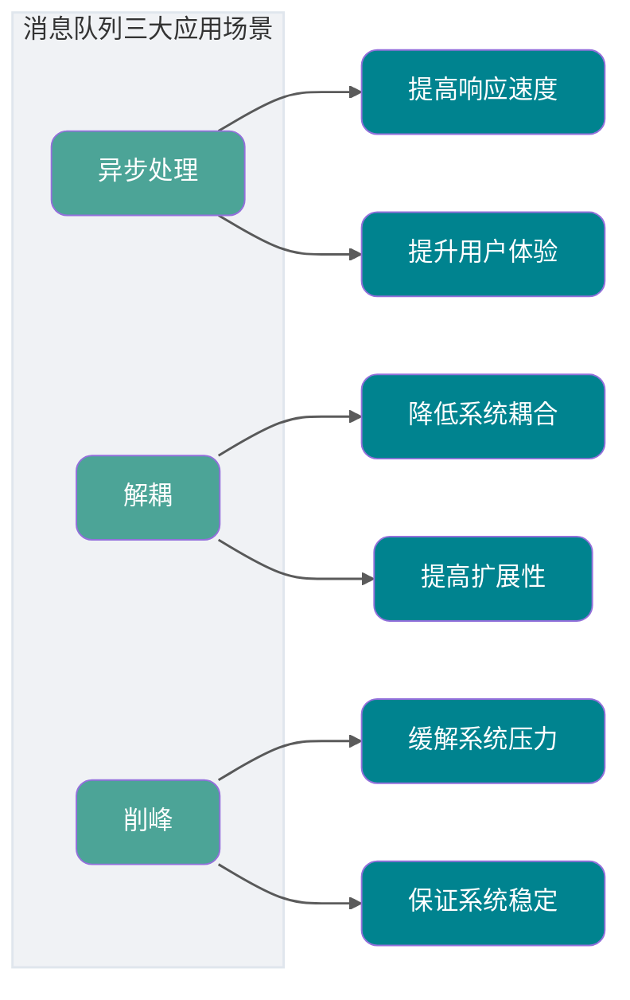

### 消息队列会带来副作用吗？

没有哪一门技术是“银弹”，消息队列也有它的副作用。

比如，本来好好的两个系统之间的调用，我中间加了个消息队列，如果消息队列挂了怎么办呢？是不是 **降低了系统的可用性** ？

那这样是不是要保证 HA(高可用)？是不是要搞集群？那么我 **整个系统的复杂度是不是上升了** ？

抛开上面的问题不讲，万一我发送方发送失败了，然后执行重试，这样就可能产生重复的消息。

或者我消费端处理失败了，请求重发，这样也会产生重复的消息。

对于一些微服务来说，消费重复消息会带来更大的麻烦，比如增加积分，这个时候我加了多次是不是对其他用户不公平？

那么，又 **如何解决重复消费消息的问题** 呢？

如果我们此时的消息需要保证严格的顺序性怎么办呢？比如生产者生产了一系列的有序消息(对一个 id 为 1 的记录进行删除增加修改)，但是我们知道在发布订阅模型中，对于主题是无顺序的，那么这个时候就会导致对于消费者消费消息的时候没有按照生产者的发送顺序消费，比如这个时候我们消费的顺序为修改删除增加，如果该记录涉及到金额的话是不是会出大事情？

那么，又 **如何解决消息的顺序消费问题** 呢？

就拿我们上面所讲的分布式系统来说，用户购票完成之后是不是需要增加账户积分？在同一个系统中我们一般会使用事务来进行解决，如果用 `Spring` 的话我们在上面伪代码中加入 `@Transactional` 注解就好了。但是在不同系统中如何保证事务呢？总不能这个系统我扣钱成功了你那积分系统积分没加吧？或者说我这扣钱明明失败了，你那积分系统给我加了积分。

那么，又如何 **解决分布式事务问题** 呢？

我们刚刚说了，消息队列可以进行削峰操作，那如果我的消费者如果消费很慢或者生产者生产消息很快，这样是不是会将消息堆积在消息队列中？

那么，又如何 **解决消息堆积的问题** 呢？

可用性降低、复杂度上升，同时还带来重复消费、顺序消费、分布式事务、消息堆积等一系列问题。这些问题如何解决？


下面我们逐一讨论这些问题的解决方案。

## RocketMQ 是什么？


在讨论上述问题的解决方案之前，我们先来了解一下 RocketMQ 的内部构造。建议带着问题去阅读和了解。

RocketMQ 是一个基于 **Topic 的发布订阅消息系统**，Topic 下可以包含多个 MessageQueue，MessageQueue 是消息存储和传输的最小队列单元。它具有**高性能、高可靠、高实时、分布式** 的特点，采用 Java 语言开发，由阿里巴巴团队在 2016 年底贡献给 Apache，成为 Apache 顶级项目。在阿里内部，RocketMQ 很好地服务了集团大大小小上千个应用，在每年的双十一当天，更有万亿级消息通过 RocketMQ 流转。

RocketMQ 具备高吞吐、低延迟、高可用的特点，经过了双十一等大规模场景的验证。

从 RocketMQ 5.x 开始，官方更强调云原生架构：Proxy 层支持 gRPC、多语言 SDK 和多协议接入，Broker 更专注消息存储和高可用。这意味着新项目选型时，除了看传统的 NameServer、Broker、Producer、Consumer，也要关注是否需要 Proxy、gRPC SDK、Kubernetes 部署和云原生可观测能力。

## 队列模型和主题模型是什么？

在谈 RocketMQ 的技术架构之前，我们先来了解一下两个名词概念——**队列模型** 和 **主题模型** 。

首先，为什么消息队列叫消息队列？

实际上，早期的消息中间件是通过 **队列** 这一模型来实现的，可能是历史原因，我们都习惯把消息中间件称为消息队列。

但是，如今例如 RocketMQ、Kafka 这些优秀的消息中间件不仅仅是通过一个 **队列** 来实现消息存储的。

### 队列模型

就像我们理解队列一样，消息中间件的队列模型就真的只是一个队列。


队列模型的特点：**一个消息只能被一个消费者消费**。

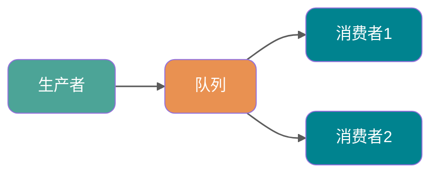

在一开始我跟你提到了一个 **“广播”** 的概念，也就是说如果我们此时我们需要将一个消息发送给多个消费者(比如此时我需要将信息发送给短信系统和邮件系统)，这个时候单个队列即不能满足需求了。

当然你可以让 Producer 生产消息放入多个队列中，然后每个队列去对应每一个消费者。问题是可以解决，创建多个队列并且复制多份消息是会很影响资源和性能的。而且，这样子就会导致生产者需要知道具体消费者个数然后去复制对应数量的消息队列，这就违背我们消息中间件的 **解耦** 这一原则。

### 主题模型

那么有没有好的方法去解决这一个问题呢？有，那就是 **主题模型** 或者可以称为 **发布订阅模型** 。

> 感兴趣的同学可以去了解一下设计模式里面的观察者模式并且手动实现一下，我相信你会有所收获的。

在主题模型中，消息的生产者称为 **发布者(Publisher)** ，消息的消费者称为 **订阅者(Subscriber)** ，存放消息的容器称为 **主题(Topic)** 。

其中，发布者将消息发送到指定主题中，订阅者需要 **提前订阅主题** 才能接受特定主题的消息。


主题模型的特点：**一个 Topic 可以被多个消费者组订阅，每个消费者组都有独立的消费进度**。在集群消费模式下，同一消费者组内通常只由一个消费者实例处理某条消息；在广播消费模式下，同一消费者组内的每个消费者都会收到消息。

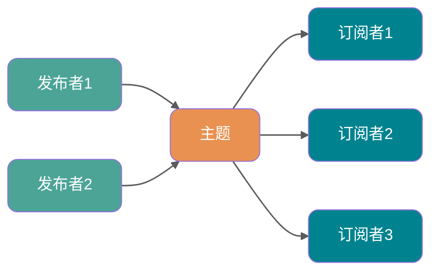

### RocketMQ 中的消息模型

RocketMQ 中的消息模型就是按照 **主题模型** 所实现的。那么 **主题** 到底是怎么实现的呢？

其实对于主题模型的实现来说每个消息中间件的底层设计都是不一样的，就比如 Kafka 中的 **分区** ，RocketMQ 中的 **队列** ，RabbitMQ 中的 Exchange 。我们可以理解为 **主题模型/发布订阅模型** 就是一个标准，那些中间件只不过照着这个标准去实现而已。

所以，RocketMQ 中的 **主题模型** 到底是如何实现的呢？先看一张图：


我们可以看到在整个图中有 `Producer Group`、Topic、`Consumer Group` 三个角色。这个图更接近早期和兼容模型，理解 5.x 时要记住：新版领域模型里生产者本身是轻量、匿名的，生产者组不再是重点概念。

- `Producer Group` 生产者组：在早期客户端和兼容场景中代表某一类生产者，比如我们有多个秒杀系统作为生产者，这多个合在一起就是一个 `Producer Group` 生产者组，它们一般生产相同的消息。
- `Consumer Group` 消费者组：代表某一类的消费者，比如我们有多个短信系统作为消费者，这多个合在一起就是一个 `Consumer Group` 消费者组，它们一般消费相同的消息。
- Topic 主题：代表一类消息，比如订单消息，物流消息等等。

你可以看到图中生产者组中的生产者会向主题发送消息，而 **主题中存在多个队列**，生产者每次生产消息之后会把消息发送到指定主题下的某个队列。

每个主题中都有多个队列(分布在不同的 Broker 中，如果是集群的话，Broker 又分布在不同的服务器中)，集群消费模式下，一个消费者集群多台机器共同消费一个 `topic` 的多个队列。

**负载均衡策略对比**

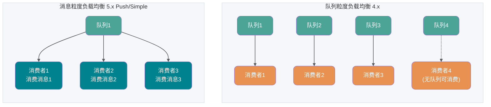

- **队列粒度负载均衡（4.x 默认策略）**：一个队列只会被一个消费者消费。如果某个消费者挂掉，分组内其它消费者会接替挂掉的消费者继续消费。队列数通常要大于或等于消费者数，消费者少于队列是常见情况，只是单个消费者会分到多个队列；如果消费者数多于队列数，多出来的消费者会空闲。这种模式的缺点是容易产生 **长尾效应**：如果某个消费者处理速度较慢，会导致其对应的队列消息堆积，而其他消费者却处于空闲状态。
- **消息粒度负载均衡（5.x PushConsumer/SimpleConsumer 默认策略）**：RocketMQ 5.x 中，PushConsumer 和 SimpleConsumer 默认使用消息粒度负载均衡，同一消费者分组内的多个消费者可以按照消息粒度分摊主题中的消息；PullConsumer 仍然是队列粒度。消费者获取某条消息后，服务端会将该消息加锁，保证这条消息对其他消费者不可见，直到该消息消费成功或消费超时。这种模式有效解决了长尾效应问题，因为消息不再静态绑定到某个消费者，而是动态分配给空闲的消费者。

消费者个数小于队列个数并不是问题，只是并发能力受消费者数量限制。真正需要避免的是队列数太少，导致后续扩容消费者时没有足够的队列可分配。如下图。


**每个消费组在每个队列上维护一个消费位置** ，为什么呢？

因为我们刚刚画的仅仅是一个消费者组，我们知道在发布订阅模式中一般会涉及到多个消费者组，而每个消费者组在每个队列中的消费位置都是不同的。如果此时有多个消费者组，那么消息被一个消费者组消费完之后是不会删除的(因为其它消费者组也需要呀)，它仅仅是为每个消费者组维护一个 **消费位移(offset)** ，每次消费者组消费完会返回一个成功的响应，然后队列再把维护的消费位移加一，这样就不会出现刚刚消费过的消息再一次被消费了。


可能你还有一个问题，**为什么一个主题中需要维护多个队列** ？

答案是 **提高并发能力** 。的确，每个主题中只存在一个队列也是可行的。你想一下，如果每个主题中只存在一个队列，这个队列中也维护着每个消费者组的消费位置，这样也可以做到 **发布订阅模式** 。如下图。


但是，这样我生产者是不是只能向一个队列发送消息？又因为需要维护消费位置所以一个队列只能对应一个消费者组中的消费者，这样是不是其他的 Consumer 就没有用武之地了？从这两个角度来讲，并发度一下子就小了很多。

所以总结来说，RocketMQ 通过**使用在一个 Topic 中配置多个队列并且每个队列维护每个消费者组的消费位置** 实现了 **主题模式/发布订阅模式** 。

## RocketMQ 架构

讲完了消息模型，我们理解起 RocketMQ 的技术架构起来就容易多了。

RocketMQ 的核心组件包括 **NameServer、Broker、Producer、Consumer**，在 5.0 版本中还引入了 **Proxy** 组件。

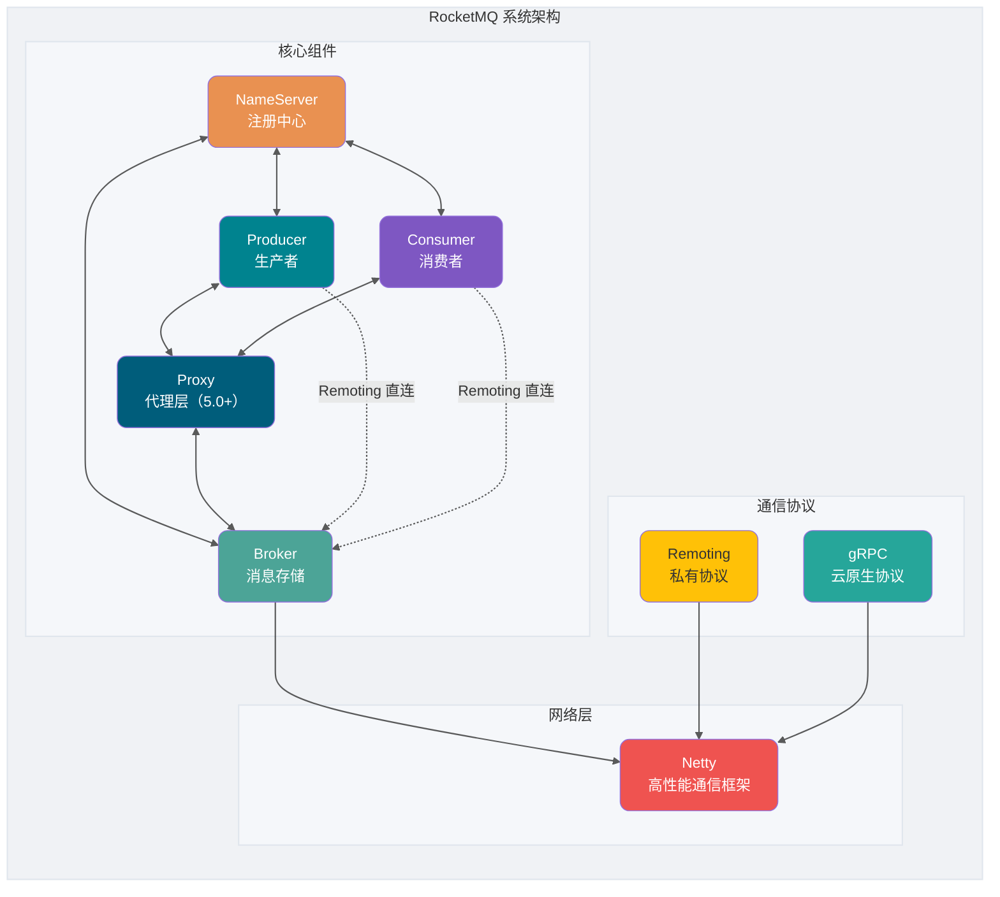

### 核心组件要点

| 组件           | 技术要点                                 |
| -------------- | ---------------------------------------- |
| **NameServer** | 轻量级注册中心，各节点无数据同步         |
| **Broker**     | 消息存储与投递，支持主从部署             |
| **Proxy**      | 5.0 新增，协议适配与计算卸载（可选组件） |
| **Producer**   | 同步、异步、单向多种发送方式             |
| **Consumer**   | Push/Pull/Simple 三种消费模式            |

### NameServer（注册中心）

NameServer 负责元数据的存储，扮演着集群“中枢神经系统”的角色，其核心作用是为生产者和消费者提供路由信息，帮助它们找到对应的 Broker 地址。

**核心功能：**

1. **Broker 管理**：Broker 启动时主动连接 NameServer，上报元数据信息。
2. **路由信息管理**：生产者和消费者从 NameServer 获取 Broker 路由表。

**心跳机制：**

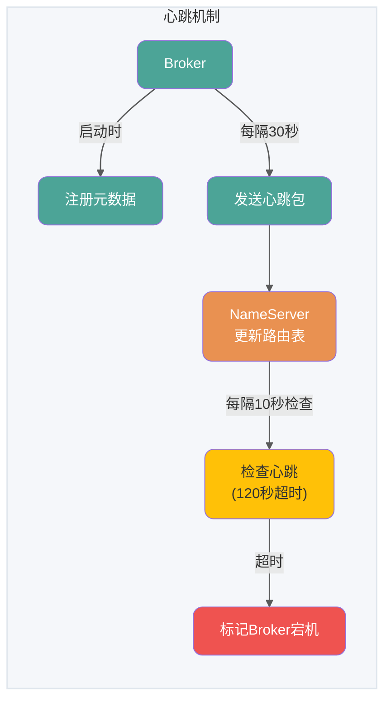

**元数据包含：**

- Broker 的地址、名称、BrokerId
- 主节点地址
- 该 Broker 上的所有 Topic 的队列配置

### Broker（消息存储）

Broker 负责消息的存储、投递和查询以及服务高可用保证。

**存储机制：**

1. **消息写入**：收到消息后顺序追加到 CommitLog 文件
2. **文件分割**：文件超过固定大小（默认 1G）生成新文件
3. **逻辑分片**：MessageQueue 是逻辑分片，ConsumeQueue 是消息索引

**一个 Topic 分布在多个 Broker 上，一个 Broker 可以配置多个 Topic ，它们是多对多的关系**。

如果某个 Topic 消息量很大，应该给它多配置几个队列(上文中提到了提高并发能力)，并且 **尽量多分布在不同 Broker 上，以减轻某个 Broker 的压力** 。

Topic 消息量都比较均匀的情况下，如果某个 Broker 上的队列越多，则该 Broker 压力越大。


### Producer（生产者）

**发送流程：**

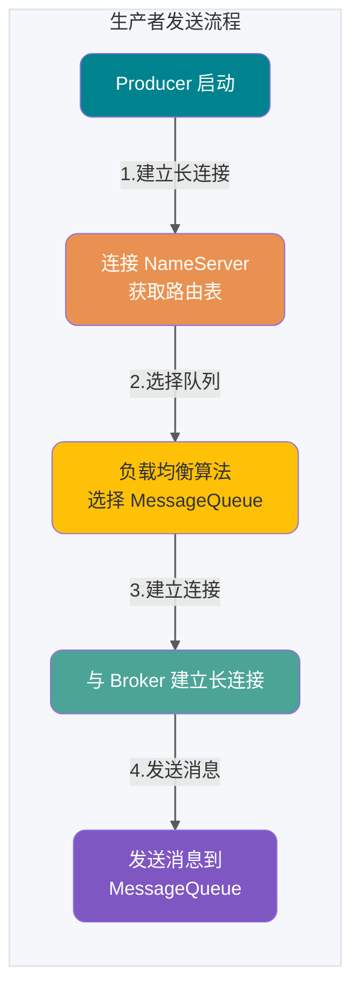

**三种发送方式：**

- **单向发送（Oneway）**：发送后立即返回，不关心是否成功
- **同步发送（Sync）**：发送后等待响应
- **异步发送（Async）**：发送后立即返回，在回调方法中处理响应

### Consumer（消费者）

**消费流程：**

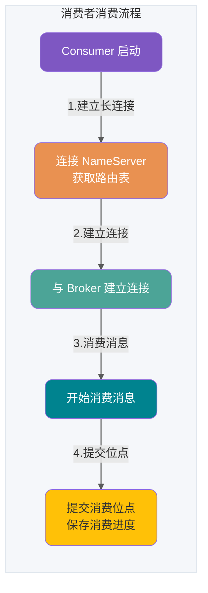

**三种消费模式：**

- **拉取模式（Pull）**：消费者主动向 Broker 发送拉取请求
- **推模式（Push）**：长轮询机制，Broker 有消息时才返回
- **无状态模式（Pop）**：RocketMQ 5.0 新增，服务端管理重平衡和位点

### 网络协议

RocketMQ 目前常见的是 Remoting 和 gRPC 两类接入方式：

| 对比项     | Remoting（传统协议）                | gRPC（5.x 新版 SDK）                      |
| ---------- | ----------------------------------- | ----------------------------------------- |
| **成熟度** | Java 生态使用时间长，路径短         | 适合多语言和云原生接入，通常经 Proxy 接入 |
| **扩展性** | 多语言接入需要分别适配              | 基于标准协议，客户端生态和网关治理更友好  |
| **取舍**   | 适合已有 4.x 客户端和内部高性能链路 | 链路多一层 Proxy 时，要额外关注延迟和容量 |

### 网络模块（基于 Netty）

RocketMQ 的 RPC 通信采用 Netty 作为底层通信库，基于 Reactor 多线程模型进行了深度扩展和优化。

**线程模型总结：**

- **Reactor 主线程**：1 个，负责监听连接
- **Reactor 线程池**：默认 3 个，负责网络数据处理
- **业务线程池**：动态调整，根据 CPU 核心数

### Proxy（代理层，5.0 新增）

RocketMQ 5.0 引入了 **Proxy** 组件，这是 **计算与存储分离** 架构的核心体现。Proxy 作为客户端与 Broker 之间的代理层，将客户端协议适配、权限管理、消费管理等计算逻辑从 Broker 中剥离出来，使 Broker 更专注于消息存储和高可用。这种设计对于云原生架构非常重要，使得计算层可以独立弹性扩展。

**两种部署模式：**

| 模式             | 说明                                            | 适用场景                                 |
| ---------------- | ----------------------------------------------- | ---------------------------------------- |
| **Local 模式**   | Proxy 和 Broker 同进程部署，只需新增 Proxy 配置 | 从旧版本平滑升级，或无特殊需求的场景     |
| **Cluster 模式** | Proxy 和 Broker 分别独立部署                    | 需要弹性扩展或对协议适配有定制需求的场景 |

**核心作用：**

- **协议适配**：支持 gRPC 协议接入，方便多语言客户端接入
- **计算卸载**：将认证鉴权、消费管理等计算逻辑从 Broker 剥离，降低 Broker 负载
- **弹性扩展**：Proxy 无状态，可独立水平扩展

> **注意**：在 5.0 版本中，使用新版 SDK（gRPC 协议）的客户端需要通过 Proxy 接入，而旧版 SDK（Remoting 协议）仍然可以直连 Broker。

Proxy 的价值不只是“多一层代理”。在云原生场景下，它可以把协议接入、认证鉴权、流量治理、消费管理这类计算逻辑从 Broker 中剥离出来，让 Broker 更稳定地承担存储职责。代价是链路多了一跳，需要额外关注 Proxy 的水平扩容、延迟、限流和监控。

### 为什么必须要 NameServer？

先看一个简单的架构模型：


你可能会发现一个问题：NameServer 是做什么的？直接让 Producer、Consumer 和 Broker 进行生产和消费消息不行吗？

Broker 需要保证高可用，如果整个系统仅靠一个 Broker 来维持，压力会非常大，所以需要使用多个 Broker 来保证 **负载均衡**。如果消费者和生产者直接和多个 Broker 相连，当 Broker 变更时会牵连每个生产者和消费者，产生耦合问题。NameServer 注册中心就是用来解决这个问题的。

**NameServer 的设计哲学：**

NameServer 是 **无状态的、各节点之间互不通信** 的。这与 ZooKeeper 的强一致性（需要选举机制）形成了鲜明对比，体现了 RocketMQ 追求 **极致性能和简单架构** 的设计哲学。每个 Broker 与所有 NameServer 保持长连接，定期上报自身信息，即使某个 NameServer 节点宕机，也不会影响整个集群的可用性。

下面是官网的架构图：


和前面的简化架构图相比，主要是一些细节上的差别：

第一、Broker **做了集群并且还进行了主从部署** ，由于消息分布在各个 Broker 上，一旦某个 Broker 宕机，则该 Broker 上的消息读写都会受到影响。所以 RocketMQ 提供了 `master/slave` 的结构，`slave` 定时从 `master` 同步数据(同步刷盘或者异步刷盘)，如果 `master` 宕机，**则 `slave` 提供消费服务，但是不能写入消息** (后面还会详细说明)。

第二、为了保证 HA，NameServer 也做了集群部署，但它是 **去中心化** 的。也就意味着它没有主节点，可以明显看出 NameServer 的所有节点之间没有进行 `Info Replicate`。在 RocketMQ 中，**单个 Broker 和所有 NameServer 保持长连接**，并且 **每隔 30 秒** Broker 会向所有 NameServer 发送心跳，心跳包含了自身的 Topic 配置信息。NameServer **每隔 10 秒** 检查一次心跳，如果某个 Broker **超过 120 秒** 没有心跳，则认为该 Broker 已宕机。

第三、在生产者需要向 Broker 发送消息的时候，**需要先从 NameServer 获取关于 Broker 的路由信息**，然后通过 **轮询** 的方法去向每个队列中生产数据以达到 **负载均衡** 的效果。

第四、消费者通过 NameServer 获取所有 Broker 的路由信息后，向 Broker 发送 `Pull` 请求来获取消息数据。Consumer 可以以两种模式启动—— **广播（Broadcast）和集群（Cluster）**。广播模式下，一条消息会发送给 **同一个消费组中的所有消费者** ，集群模式下消息只会发送给一个消费者。

## RocketMQ 消息

### 普通消息

普通消息一般应用于微服务解耦、事件驱动、数据集成等场景，这些场景大多数要求数据传输通道具有可靠传输的能力，且对消息的处理时机、处理顺序没有特别要求。以在线的电商交易场景为例，上游订单系统将用户下单支付这一业务事件封装成独立的普通消息并发送至 RocketMQ 服务端，下游按需从服务端订阅消息并按照本地消费逻辑处理下游任务。每个消息之间都是相互独立的，且不需要产生关联。另外还有日志系统，以离线的日志收集场景为例，通过埋点组件收集前端应用的相关操作日志，并转发到 RocketMQ 。

**普通消息生命周期**


- 初始化：消息被生产者构建并完成初始化，待发送到服务端的状态。
- 待消费：消息被发送到服务端，对消费者可见，等待消费者消费的状态。
- 消费中：消息被消费者获取，并按照消费者本地的业务逻辑进行处理的过程。 此时服务端会等待消费者完成消费并提交消费结果，如果一定时间后没有收到消费者的响应，RocketMQ 会对消息进行重试处理。
- 消费提交：消费者完成消费处理，并向服务端提交消费结果；如果消费失败或超时，消息会按重试策略重新投递，超过最大重试次数后可能进入死信队列。RocketMQ 不会因为某个消费组消费成功就立即删除消息，而是按照消息保存机制滚动清理，消息在保存时间到期或存储空间不足被删除前，消费者仍然可以回溯消息重新消费。
- 消息删除：RocketMQ 按照消息保存机制滚动清理最早的消息数据，将消息从物理文件中删除。

### 定时/延时消息

> **备注：定时消息和延时消息本质相同，都是服务端根据消息设置的定时时间在某一固定时刻将消息投递给消费者消费。**

在分布式定时调度触发、任务超时处理等场景，需要实现精准、可靠的定时事件触发。使用 RocketMQ 的定时消息可以简化定时调度任务的开发逻辑，实现高性能、可扩展、高可靠的定时触发能力。

**典型场景一：分布式定时调度**

在分布式定时调度场景下，需要实现各类精度的定时任务，例如每天 5 点执行文件清理，每隔 2 分钟触发一次消息推送等需求。传统基于数据库的定时调度方案在分布式场景下，性能不高，实现复杂。

**典型场景二：任务超时处理**

以电商交易场景为例，订单下单后暂未支付，此时不可以直接关闭订单，而是需要等待一段时间后才能关闭订单。使用 RocketMQ 定时消息可以实现超时任务的检查触发。

基于定时消息的超时任务处理具备如下优势：

- **精度更灵活、开发门槛低**：5.x 不再只依赖固定延迟等级，可以按时间戳设置投递时间；但默认投递粒度仍是秒级，不能理解为严格毫秒级准时触发。
- **高性能可扩展**：传统的数据库扫描方式较为复杂，需要频繁调用接口扫描，容易产生性能瓶颈。RocketMQ 的定时消息具有高并发和水平扩展的能力。

**定时时间设置原则**

RocketMQ 定时消息设置的定时时间是一个预期触发的系统时间戳，延时时间也需要转换成当前系统时间后的某一个时间戳，而不是一段延时时长。

- **时间格式**：毫秒级的 Unix 时间戳
- **定时时长最大值**：默认为 24 小时，不支持自定义修改
- **定时时间必须设置在当前时间之后**，否则定时不生效，服务端会立即投递消息

**示例**：

- 定时消息：当前系统时间为 2022-06-09 17:30:00，希望消息在 19:20:00 投递，则定时时间戳为 1654773600000
- 延时消息：当前系统时间为 2022-06-09 17:30:00，希望延时 1 小时后投递，则定时时间戳为 1654770600000

**4.x 版本与 5.x 版本的区别**

- **4.x 版本**：只支持延时消息，默认分为 18 个等级（1s 5s 10s 30s 1m 2m 3m 4m 5m 6m 7m 8m 9m 10m 20m 30m 1h 2h），也可以在配置文件中增加自定义的延时等级和时长。
- **5.x 版本**：支持通过毫秒级 Unix 时间戳设置投递时间，相比 4.x 固定延迟等级更灵活；但默认定时粒度为 1000ms，实际投递还会受服务端负载、存储恢复等因素影响，不能理解为严格毫秒级准时触发。

**定时消息生命周期**


- **初始化**：消息被生产者构建并完成初始化，待发送到服务端的状态。
- **定时中**：消息被发送到服务端，和普通消息不同的是，服务端不会直接构建消息索引，而是会将定时消息**单独存储在定时存储系统中**，等待定时时刻到达。
- **待消费**：定时时刻到达后，服务端将消息重新写入普通存储引擎，对下游消费者可见，等待消费者消费的状态。
- **消费中**：消息被消费者获取，并按照消费者本地的业务逻辑进行处理的过程。此时服务端会等待消费者完成消费并提交消费结果，如果一定时间后没有收到消费者的响应，RocketMQ 会对消息进行重试处理。
- **消费提交**：消费者完成消费处理，并向服务端提交消费结果；如果消费失败或超时，消息会按重试策略重新投递，超过最大重试次数后可能进入死信队列。RocketMQ 不会因为某个消费组消费成功就立即删除消息，而是按照消息保存机制滚动清理。
- **消息删除**：Apache RocketMQ 按照消息保存机制滚动清理最早的消息数据，将消息从物理文件中删除。

**使用限制**

1. **消息类型一致性**：定时消息仅支持在 MessageType 为 Delay 的主题内使用
2. **定时精度约束**：定时时长参数精确到毫秒级，但默认精度为 1000ms（秒级精度）

**使用建议**

定时消息的实现逻辑需要先经过定时存储等待触发，定时时间到达后才会被投递给消费者。因此，如果将大量定时消息的定时时间设置为同一时刻，则到达该时刻后会有大量消息同时需要被处理，会造成系统压力过大，导致消息分发延迟，影响定时精度。

### 顺序消息

**什么是顺序消息**

顺序消息是 Apache RocketMQ 提供的一种高级消息类型，支持消费者按照发送消息的先后顺序获取消息，从而实现业务场景中的顺序处理。

**应用场景**

在有序事件处理、撮合交易、数据实时增量同步等场景下，异构系统间需要维持强一致的状态同步，上游的事件变更需要按照顺序传递到下游进行处理。

- **撮合交易**：以证券、股票交易撮合场景为例，对于出价相同的交易单，坚持按照先出价先交易的原则，下游处理订单的系统需要严格按照出价顺序来处理订单。
- **数据实时增量同步**：以数据库变更增量同步场景为例，上游源端数据库按需执行增删改操作，将二进制操作日志作为消息，通过 RocketMQ 传输到下游搜索系统，下游系统按顺序还原消息数据，实现状态数据按序刷新。

**如何保证消息的顺序性**

RocketMQ 的消息顺序性分为两部分：**生产顺序性**和**消费顺序性**。

**生产顺序性**

如需保证消息生产的顺序性，则必须满足以下条件：

1. **单一生产者**：消息生产的顺序性仅支持单一生产者
2. **串行发送**：生产者使用多线程并行发送时，不同线程间产生的消息将无法判定其先后顺序

满足以上条件的生产者，将顺序消息发送至 RocketMQ 后，会保证设置了同一**消息组**的消息，按照发送顺序存储在同一队列中。

**消息组（MessageGroup）**

RocketMQ 顺序消息的顺序关系通过消息组（MessageGroup）判定和识别，发送顺序消息时需要为每条消息设置归属的消息组。

- **相同消息组**的多条消息之间遵循先进先出的顺序关系
- **不同消息组**、无消息组的消息之间不涉及顺序性

基于消息组的顺序判定逻辑，支持按照业务逻辑做细粒度拆分，可以在满足业务局部顺序的前提下提高系统的并行度和吞吐能力。

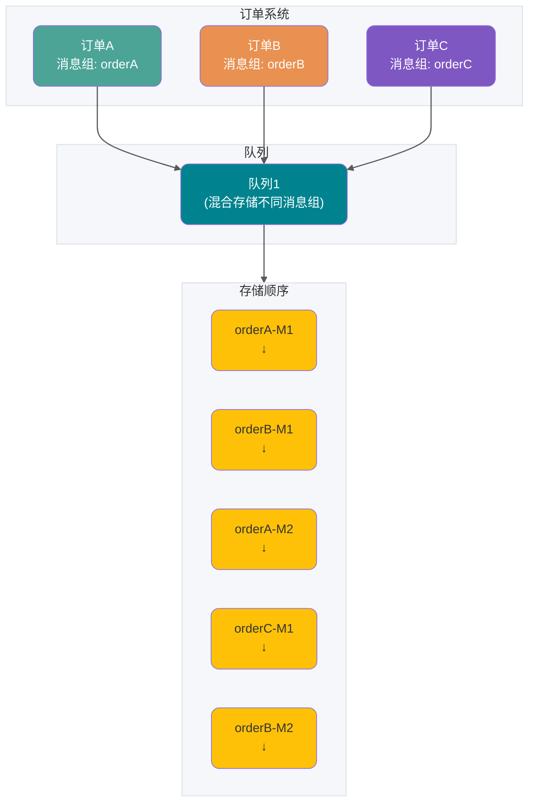

**说明**：

- orderA 消息组的 M1、M2 保持顺序
- orderB 消息组的 M1、M2 保持顺序
- 不同消息组可以混合存储在同一个队列中

**消费顺序性**

如需保证消息消费的顺序性，则必须满足以下条件：

1. **投递顺序**：RocketMQ 通过客户端 SDK 和服务端通信协议保障消息按照服务端存储顺序投递
2. **有限重试**：顺序消息投递仅在重试次数限定范围内，超过最大重试次数后将不再重试，跳过这条消息消费

**消费者类型对顺序消费的影响**

- **PushConsumer**：RocketMQ 保证消息按照存储顺序一条一条投递给消费者
- **SimpleConsumer**：消费者可能一次拉取多条消息，此时消息消费的顺序性需要由业务方自行保证

**生产顺序性和消费顺序性组合**

| 生产顺序                     | 消费顺序 | 顺序性效果                               |
| ---------------------------- | -------- | ---------------------------------------- |
| 设置消息组，保证消息顺序发送 | 顺序消费 | 按照消息组粒度，严格保证消息顺序         |
| 设置消息组，保证消息顺序发送 | 并发消费 | 并发消费，尽可能按时间顺序处理           |
| 未设置消息组，消息乱序发送   | 顺序消费 | 只能保证队列存储顺序，不保证业务发送顺序 |
| 未设置消息组，消息乱序发送   | 并发消费 | 并发消费，尽可能按照时间顺序处理         |

**使用限制**

1. **消息类型一致性**：顺序消息仅支持在 MessageType 为 FIFO 的主题内使用；RocketMQ 5.x 中还要为有序消息设置 MessageGroup，并把消费者组配置为顺序投递，否则仍可能按并发方式投递
2. 顺序消息消费失败进行消费重试时，为保障消息的顺序性，后续消息不可被消费，必须等待前面的消息消费完成后才能被处理

**使用建议**

1. **串行消费**：消息消费建议串行处理，避免一次消费多条消息导致乱序
2. **消息组尽可能打散**：建议将业务以消息组粒度进行拆分，例如将订单 ID、用户 ID 作为消息组关键字，可实现同一终端用户的消息按照顺序处理，不同用户的消息无需保证顺序

### 事务消息

**什么是事务消息**

事务消息是 Apache RocketMQ 提供的一种高级消息类型，支持在分布式场景下保障消息生产和本地事务的最终一致性。简单来讲，就是将本地事务（数据库的 DML 操作）与发送消息合并在同一个事务中。

**应用场景**

在分布式系统调用的特点为一个核心业务逻辑的执行，同时需要调用多个下游业务进行处理。如何保证核心业务和多个下游业务的执行结果完全一致，是分布式事务需要解决的主要问题。

以电商交易场景为例，用户支付订单这一核心操作的同时会涉及到下游物流发货、积分变更、购物车状态清空等多个子系统的变更：

- **主分支订单系统状态更新**：由未支付变更为支付成功
- **物流系统状态新增**：新增待发货物流记录，创建订单物流记录
- **积分系统状态变更**：变更用户积分，更新用户积分表
- **购物车系统状态变更**：清空购物车，更新用户购物车记录

**传统方案的问题**

- **传统 XA 事务方案**：基于 XA 协议的分布式事务系统可以实现一致性，但多分支环境下资源锁定范围大，并发度低
- **基于普通消息方案**：普通消息和订单事务无法保证一致，容易出现消息发送成功但订单没有执行成功、订单执行成功但消息没有发送成功等情况

**RocketMQ 事务消息方案**

RocketMQ 事务消息的方案，具备高性能、可扩展、业务开发简单的优势，支持二阶段的提交能力，将二阶段提交和本地事务绑定，实现 **本地事务和消息发送** 的最终一致性。

**事务消息处理流程**

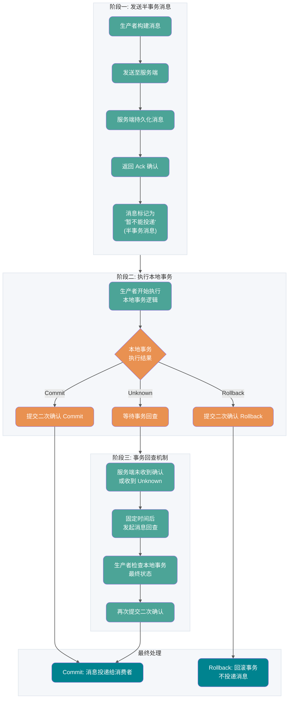

1. 生产者将消息发送至 RocketMQ 服务端
2. 服务端将消息持久化成功之后，向生产者返回 Ack 确认消息已经发送成功，此时消息被标记为“暂不能投递”，这种状态下的消息即为**半事务消息**
3. 生产者开始执行本地事务逻辑
4. 生产者根据本地事务执行结果向服务端提交二次确认结果（Commit 或 Rollback）
5. 如果服务端未收到二次确认结果，或收到的结果为 Unknown，经过固定时间后，服务端将对消息生产者发起**消息回查**
6. 生产者收到消息回查后，需要检查对应消息的本地事务执行的最终结果
7. 生产者根据检查到的本地事务的最终状态再次提交二次确认

**事务消息生命周期**

- **初始化**：半事务消息被生产者构建并完成初始化，待发送到服务端的状态
- **事务待提交**：半事务消息被发送到服务端后会被持久化到事务相关的存储中，但不会直接进入普通可消费状态；它需要等待第二阶段本地事务返回 Commit 或 Rollback 后再决定是否投递。此时消息对下游消费者不可见
- **消息回滚**：第二阶段如果事务执行结果明确为回滚，服务端会将半事务消息回滚，该事务消息流程终止
- **提交待消费**：第二阶段如果事务执行结果明确为提交，服务端会将半事务消息重新存储到普通存储系统中，此时消息对下游消费者可见
- **消费中**：消息被消费者获取，并按照消费者本地的业务逻辑进行处理的过程
- **消费提交**：消费者完成消费处理，并向服务端提交消费结果；如果消费失败或超时，仍会进入重试、死信或补偿流程
- **消息删除**：RocketMQ 按照消息保存机制滚动清理最早的消息数据

**使用限制**

1. **消息类型一致性**：事务消息仅支持在 MessageType 为 Transaction 的主题内使用
2. **消费事务性**：RocketMQ 事务消息保证本地主分支事务和下游消息发送事务的一致性，但不保证消息消费结果和上游事务的一致性
3. **中间状态可见性**：事务消息为最终一致性，即消息提交到下游消费端处理完成之前，下游分支和上游事务之间的状态会不一致
4. **事务超时机制**：事务消息的生命周期存在超时机制，半事务消息被生产者发送服务端后，如果在指定时间内服务端无法确认提交或者回滚状态，则消息默认会被回滚
5. **事务回查机制**：服务端默认 **每隔 60 秒** 对未确认的半事务消息发起回查；半事务消息默认最大超时时间为 **4 小时**，超时后会被强制回滚。老版本或部分云厂商实现可能还会暴露最大回查次数参数，面试和生产配置时要按实际版本确认。

**使用建议**

1. **避免大量未决事务导致超时**：生产者应该尽量避免本地事务返回未知结果，大量的事务检查会导致系统性能受损
2. **正确处理“进行中”的事务**：消息回查时，对于正在进行中的事务不要返回 Rollback 或 Commit 结果，应继续保持 Unknown 的状态
3. **本地事务状态要可查询**：事务回查依赖生产者查询本地事务最终状态，建议落库或写可靠存储，不要只放进进程内存。
4. **下游消费仍需幂等**：事务消息解决的是“本地事务和消息发送”的一致性，不保证消费者业务一定成功，消费端仍然要有重试、幂等和补偿。

### 关于发送消息

#### 不建议单一进程创建大量生产者

Apache RocketMQ 的生产者和主题是多对多的关系，支持同一个生产者向多个主题发送消息。对于生产者的创建和初始化，建议遵循够用即可、最大化复用原则，如果有需要发送消息到多个主题的场景，无需为每个主题都创建一个生产者。

#### 不建议频繁创建和销毁生产者

Apache RocketMQ 的生产者是可以重复利用的底层资源，类似数据库的连接池。因此不需要在每次发送消息时动态创建生产者，且在发送结束后销毁生产者。这样频繁的创建销毁会在服务端产生大量短连接请求，严重影响系统性能。

正确示例：

```java
Producer p = ProducerBuilder.build();
for (int i =0;i<n;i++){
    Message m= MessageBuilder.build();
    p.send(m);
 }
p.shutdown();
```

## 消费者分类

### PushConsumer（推模式消费者）

**核心特点：**

高度封装的消费者类型，消费消息仅仅通过消费监听器监听并返回结果。消息的获取、消费状态提交以及消费重试都通过 RocketMQ 的客户端 SDK 完成。

**适用场景：**

- 消息处理时间可预估
- 无异步化、高级定制需求
- 希望快速开发的场景

**使用示例：**

```java
public static void main(String[] args) throws InterruptedException, MQClientException {
    // 创建 Push 模式消费者
    DefaultMQPushConsumer consumer = new DefaultMQPushConsumer("CID_JODIE_1");

    // 订阅主题
    consumer.subscribe("TopicTest", "*");

    // 设置从哪里开始消费
    consumer.setConsumeFromWhere(ConsumeFromWhere.CONSUME_FROM_FIRST_OFFSET);

    // 注册消息监听器
    consumer.registerMessageListener(new MessageListenerConcurrently() {
        @Override
        public ConsumeConcurrentlyStatus consumeMessage(
                List<MessageExt> msgs,
                ConsumeConcurrentlyContext context) {
            System.out.printf("Receive New Messages: %s %n", msgs);
            // 业务处理逻辑
            return ConsumeConcurrentlyStatus.CONSUME_SUCCESS;
        }
    });

    consumer.start();
}
```

**消费监听器执行结果：**

- **返回消费成功**：表示该消息处理成功，服务端按照消费结果更新消费进度
- **返回消费失败**：表示该消息处理失败，需要根据消费重试逻辑判断是否进行重试消费
- **抛出异常**：按消费失败处理，需要根据消费重试逻辑判断是否进行重试消费

**使用注意事项：**

PushConsumer 消费时，不允许使用以下方式处理消息：

1. **错误方式一**：消息还未处理完成，就提前返回消费成功结果。此时如果消息消费失败，RocketMQ 服务端是无法感知的，因此不会进行消费重试。

2. **错误方式二**：在消费监听器内将消息再次分发到自定义的其他线程，消费监听器提前返回消费结果。此时如果消息消费失败，RocketMQ 服务端同样无法感知，因此也不会进行消费重试。

**Push 模式工作原理：**

1. **负载均衡**：RebalanceService 线程根据队列数量和消费者个数做负载均衡，将分配到的队列发布 pullRequest 到 pullRequestQueue
2. **消息拉取**：PullMessageService 线程不断从 pullRequestQueue 获取 pullRequest，从 Broker 拉取消息并缓存到 ProcessQueue
3. **消息消费**：ConsumeMessageService 线程从 ProcessQueue 获取消息，调用监听器处理业务逻辑
4. **位点提交**：消费完成后自动提交消费位点
5. **流控保护**：拉取前检查缓存阈值（1000 消息或 100M），超过则延迟拉取

### SimpleConsumer

SimpleConsumer 是一种接口原子型的消费者类型，消息的获取、消费状态提交以及消费重试都是通过消费者业务逻辑主动发起调用完成。

**消息不可见时间（Invisible Time）：**

SimpleConsumer 的核心机制是 **消息不可见时间**。当消费者获取消息后，该消息在指定的不可见时间内对其他消费者不可见。如果在不可见时间内完成消费并提交 ACK，消息被标记为已消费；如果超时未提交 ACK，消息会重新变为可见状态，可被其他消费者获取。这与 PushConsumer 的定时重试队列机制不同，SimpleConsumer 通过动态修改不可见时间来实现更灵活的重试控制。

一个来自官网的例子：

```java
// 消费示例：使用 SimpleConsumer 消费普通消息，主动获取消息处理并提交。
ClientServiceProvider provider = ClientServiceProvider.loadService();
String topic = "YourTopic";
FilterExpression filterExpression = new FilterExpression("YourFilterTag", FilterExpressionType.TAG);
SimpleConsumer simpleConsumer = provider.newSimpleConsumerBuilder()
        // 设置消费者分组。
        .setConsumerGroup("YourConsumerGroup")
        // 设置接入点。
        .setClientConfiguration(ClientConfiguration.newBuilder().setEndpoints("YourEndpoint").build())
        // 设置预绑定的订阅关系。
        .setSubscriptionExpressions(Collections.singletonMap(topic, filterExpression))
        // 设置从服务端接受消息的最大等待时间
        .setAwaitDuration(Duration.ofSeconds(1))
        .build();
try {
    // SimpleConsumer 需要主动获取消息，并处理。
    List<MessageView> messageViewList = simpleConsumer.receive(10, Duration.ofSeconds(30));
    messageViewList.forEach(messageView -> {
        System.out.println(messageView);
        // 消费处理完成后，需要主动调用 ACK 提交消费结果。
        try {
            simpleConsumer.ack(messageView);
        } catch (ClientException e) {
            logger.error("Failed to ack message, messageId={}", messageView.getMessageId(), e);
        }
    });
} catch (ClientException e) {
    // 如果遇到系统流控等原因造成拉取失败，需要重新发起获取消息请求。
    logger.error("Failed to receive message", e);
}
```

SimpleConsumer 适用于以下场景：

- 消息处理时长不可控：如果消息处理时长无法预估，经常有长时间耗时的消息处理情况。建议使用 SimpleConsumer 消费类型，可以在消费时自定义消息的预估处理时长，若实际业务中预估的消息处理时长不符合预期，也可以通过接口提前修改。
- 需要异步化、批量消费等高级定制场景：SimpleConsumer 在 SDK 内部没有复杂的线程封装，完全由业务逻辑自由定制，可以实现异步分发、批量消费等高级定制场景。
- 需要自定义消费速率：SimpleConsumer 是由业务逻辑主动调用接口获取消息，因此可以自由调整获取消息的频率，自定义控制消费速率。

**SimpleConsumer 工作原理：**

1. **主动获取消息**：业务方调用 receive() 接口主动获取消息
2. **业务处理**：获取到的消息由业务方自行处理
3. **主动提交 ACK**：消费处理完成后，业务方主动调用 ack() 接口提交消费结果
4. **高可控性**：业务方可完全控制消息处理时机和消费速率

### PullConsumer（拉模式消费者）

**核心特点：**

Pull 模式下，**应用程序对消息的拉取过程参与度高，可控性强**，可以自主决定何时进行消息拉取，从什么位置 offset 拉取消息。

**与 Push 模式的对比：**

| 特性           | Push 模式            | Pull 模式        |
| -------------- | -------------------- | ---------------- |
| **控制权**     | 客户端 SDK 自动拉取  | 应用程序主动拉取 |
| **可控性**     | 可控性不足           | 可控性高         |
| **开发复杂度** | 简单，只需实现监听器 | 需要管理拉取过程 |
| **适用场景**   | 消息处理可预估       | 需要精细控制拉取 |

**使用示例（DefaultMQPullConsumer）：**

```java
@Test
public void testPullConsumer() throws Exception {
    DefaultMQPullConsumer consumer = new DefaultMQPullConsumer("group1_pull");
    consumer.setNamesrvAddr(this.nameServer);
    String topic = "topic1";
    consumer.start();

    // 获取 Topic 对应的消息队列
    Set<MessageQueue> messageQueues = consumer.fetchSubscribeMessageQueues(topic);
    int maxNums = 10; // 每次拉取消息的最大数量

    while (true) {
        boolean found = false;
        for (MessageQueue messageQueue : messageQueues) {
            // 获取消费位置
            long offset = consumer.fetchConsumeOffset(messageQueue, false);
            // 拉取消息
            PullResult pullResult = consumer.pull(messageQueue, "tag8", offset, maxNums);

            switch (pullResult.getPullStatus()) {
                case FOUND:
                    found = true;
                    List<MessageExt> msgs = pullResult.getMsgFoundList();
                    System.out.println("收到消息，数量----" + msgs.size());
                    // 处理消息
                    for (MessageExt msg : msgs) {
                        System.out.println("处理消息——" + msg.getMsgId());
                    }
                    // 更新消费位置
                    long nextOffset = pullResult.getNextBeginOffset();
                    consumer.updateConsumeOffset(messageQueue, nextOffset);
                    break;
                case NO_NEW_MSG:
                    System.out.println("没有新消息");
                    break;
                case NO_MATCHED_MSG:
                    System.out.println("没有匹配的消息");
                    break;
                case OFFSET_ILLEGAL:
                    System.err.println("offset 错误");
                    break;
            }
        }
        if (!found) {
            // 没有队列中有新消息，则暂停一会
            TimeUnit.MILLISECONDS.sleep(5000);
        }
    }
}
```

**使用示例（DefaultLitePullConsumer - 推荐）：**

```java
DefaultLitePullConsumer litePullConsumer =
        new DefaultLitePullConsumer("lite_pull_consumer_test");
litePullConsumer.setConsumeFromWhere(ConsumeFromWhere.CONSUME_FROM_FIRST_OFFSET);
litePullConsumer.subscribe("TopicTest", "*");
litePullConsumer.start();

try {
    while (running) {
        // 应用程序主动调用 poll 方法拉取消息
        List<MessageExt> messageExts = litePullConsumer.poll();
        System.out.printf("%s%n", messageExts);
    }
} finally {
    litePullConsumer.shutdown();
}
```

**适用场景：**

- **需要精细控制拉取时机**：可以根据业务需求自主决定何时拉取消息
- **需要控制消费速率**：可以灵活调整拉取频率
- **批量消费场景**：可以一次性拉取大量消息进行批量处理
- **特殊消费需求**：如需要从特定 offset 开始消费、需要暂停消费等

**Pull 模式工作原理：**

1. **负载均衡**：RebalanceService 线程发现消费快照发生变化时，启动消息拉取线程
2. **消息拉取**：PullTaskImpl 拉取到消息后，把消息放到 consumeRequestCache
3. **消息消费**：应用程序调用 poll 方法，不停地从 consumeRequestCache 拉取消息进行业务处理

### 三种消费者类型对比

| 对比项         | PushConsumer                                                             | SimpleConsumer                                       | PullConsumer                                       |
| -------------- | ------------------------------------------------------------------------ | ---------------------------------------------------- | -------------------------------------------------- |
| 接口方式       | 使用监听器回调接口返回消费结果，消费者仅允许在监听器范围内处理消费逻辑。 | 业务方自行实现消息处理，并主动调用接口返回消费结果。 | 业务方自行按队列拉取消息，并可选择性地提交消费结果 |
| 消费并发度管理 | 由 SDK 管理消费并发度。                                                  | 由业务方消费逻辑自行管理消费线程。                   | 由业务方消费逻辑自行管理消费线程。                 |
| 负载均衡粒度   | 5.x SDK 默认是消息粒度，早期版本是队列粒度                               | 5.x SDK 默认是消息粒度                               | 队列粒度，吞吐攒批性能更好，但容易不均衡           |
| 接口灵活度     | 高度封装，不够灵活。                                                     | 原子接口，可灵活自定义。                             | 原子接口，可灵活自定义。                           |
| 适用场景       | 适用于无自定义流程的业务消息开发场景。                                   | 适用于需要高度自定义业务流程的业务开发场景。         | 仅推荐在流处理框架场景下集成使用                   |

**选择建议：**

- **普通场景**：优先使用 **PushConsumer**，开发简单，SDK 自动管理拉取和提交
- **消息处理时长不可控**：使用 **SimpleConsumer**，可以自定义处理时长
- **需要精细控制**：使用 **PullConsumer**，完全自主控制拉取过程

**注意**：生产环境中相同的 ConsumerGroup 下严禁混用 PullConsumer 和其他两种消费者，否则会导致消息消费异常。

## 消费者分组和生产者分组

### 生产者分组

RocketMQ 5.x 新版领域模型里，**生产者是轻量、匿名的运行实体**，一般不再需要像早期版本那样重点管理生产者分组（ProducerGroup）。不过在 3.x/4.x 客户端、Spring 生态或兼容模式里，仍可能看到 ProducerGroup 配置，迁移时不要简单删除，要按实际客户端版本确认。

### 消费者分组

消费者分组是多个消费行为一致的消费者的负载均衡分组。消费者分组不是具体实体而是一个逻辑资源。通过消费者分组实现消费性能的水平扩展以及高可用容灾。

**消费者组的核心作用：**

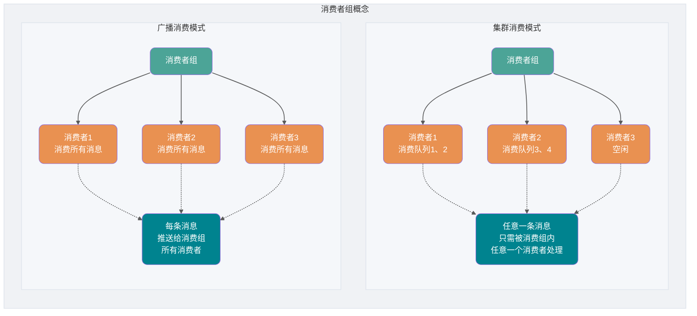

消费者分组中的订阅关系、投递顺序性、消费重试策略是一致的。

- 订阅关系：Apache RocketMQ 以消费者分组的粒度管理订阅关系，实现订阅关系的管理和追溯。
- 投递顺序性：Apache RocketMQ 的服务端将消息投递给消费者消费时，支持顺序投递和并发投递，投递方式在消费者分组中统一配置。
- 消费重试策略： 消费者消费消息失败时的重试策略，包括重试次数、死信队列设置等。

RocketMQ 服务端 5.x 版本：上述消费者的消费行为从关联的消费者分组中统一获取，因此，同一分组内所有消费者的消费行为必然是一致的，客户端无需关注。

RocketMQ 服务端 3.x/4.x 历史版本：上述消费逻辑由消费者客户端接口定义，因此，您需要自己在消费者客户端设置时保证同一分组下的消费者的消费行为一致。(来自官方网站)

**两种消费模式对比：**

| 对比维度     | 集群消费模式                                   | 广播消费模式                         |
| ------------ | ---------------------------------------------- | ------------------------------------ |
| **消息消费** | 任意一条消息只需被消费组内的任意一个消费者处理 | 每条消息推送给消费组所有消费者       |
| **扩缩容**   | 可通过扩缩消费者数量来提升或降低消费能力       | 扩缩消费者数量无法提升或降低消费能力 |
| **适用场景** | 需要提升消费能力、避免重复消费                 | 需要所有消费者都收到消息             |

## 如何解决顺序消费和重复消费？

其实，这些东西都是我在介绍消息队列带来的一些副作用的时候提到的，也就是说，这些问题不仅仅挂钩于 RocketMQ ，而是应该每个消息中间件都需要去解决的。

在上面我介绍 RocketMQ 的技术架构的时候我已经向你展示了 **它是如何保证高可用的** ，这里不涉及运维方面的搭建，如果你感兴趣可以自己去官网上照着例子搭建属于你自己的 RocketMQ 集群。

> 其实 Kafka 的架构基本和 RocketMQ 类似，只是早期 Kafka 依赖 ZooKeeper 管理元数据，而它的 **分区** 就相当于 RocketMQ 中的 **队列**。还有一些小细节不同会在后面提到。
>
> 补充：早期 Kafka 依赖 ZooKeeper 管理元数据，新版本已经引入 KRaft 模式。这里对比的是“分区/队列用于提升并行度”的架构思路，不应再简单认为 Kafka 一定依赖 ZooKeeper。

### 顺序消费

在上面的技术架构介绍中，我们已经知道了 **RocketMQ 在主题上是无序的、它只有在队列层面才是保证有序** 的。

这又扯到两个概念——**普通顺序** 和 **严格顺序** 。

所谓普通顺序是指 消费者通过 **同一个消费队列收到的消息是有顺序的** ，不同消息队列收到的消息则可能是无顺序的。普通顺序消息在 Broker **重启情况下不会保证消息顺序性** (短暂时间) 。

所谓严格顺序是指 消费者收到的 **所有消息** 均是有顺序的。严格顺序消息 **即使在异常情况下也会保证消息的顺序性** 。

但是，严格顺序看起来虽好，实现它可会付出巨大的代价。如果你使用严格顺序模式，Broker 集群中只要有一台机器不可用，则整个集群都不可用。你还用啥？现在主要场景也就在 `binlog` 同步。

一般而言，我们的 `MQ` 都是能容忍短暂的乱序，所以推荐使用普通顺序模式。

那么，我们现在使用了 **普通顺序模式** ，我们从上面学习知道了在 Producer 生产消息的时候会进行轮询(取决你的负载均衡策略)来向同一主题的不同消息队列发送消息。那么如果此时我有几个消息分别是同一个订单的创建、支付、发货，在轮询的策略下这 **三个消息会被发送到不同队列** ，因为在不同的队列此时就无法使用 RocketMQ 带来的队列有序特性来保证消息有序性了。


那么，怎么解决呢？

其实很简单，我们需要处理的仅仅是将同一语义下的消息放入同一个队列(比如这里是同一个订单)，那我们就可以使用 **Hash 取模法** 来保证同一个订单在同一个队列中就行了。

**4.x 版本：使用 MessageQueueSelector**

RocketMQ 4.x 版本通过继承 `MessageQueueSelector` 来实现自定义队列选择逻辑：

```java
SendResult sendResult = producer.send(msg, new MessageQueueSelector() {
    @Override
    public MessageQueue select(List<MessageQueue> mqs, Message msg, Object arg) {
        //根据订单ID等业务关键字计算队列索引
        Long orderId = (Long) arg;
        int index = Math.floorMod(Long.hashCode(orderId), mqs.size());
        return mqs.get(index);
    }
}, orderId);
```

**5.x 版本：使用消息组（MessageGroup）**

RocketMQ 5.x 版本引入了**消息组**的概念，通过设置消息组来保证同一组内消息的顺序性：

```java
Message message = messageBuilder.setTopic("topic")
        .setTag("messageTag")
        //设置顺序消息的排序分组
        .setMessageGroup("fifoGroup001")  // 比如使用订单ID作为消息组
        .setBody("messageBody".getBytes())
        .build();
```

**队列选择算法**

RocketMQ 实现了两种队列选择算法：

- **轮询算法**（默认）：向消息指定的 topic 所在队列中依次发送消息，保证消息均匀分布
- **最小投递延迟算法**：每次消息投递的时候统计消息投递的延迟，选择队列时优先选择消息延时小的队列

```java
// 启用最小投递延迟算法
producer.setSendLatencyFaultEnable(true);
```

### 特殊情况处理

#### 发送异常

选择队列后会与 Broker 建立连接，通过网络请求将消息发送到 Broker 上，如果 Broker 挂了或者网络波动发送消息超时此时 RocketMQ 会进行重试。

重新选择其他 Broker 中的消息队列进行发送，默认重试两次，可以手动设置。

```java
producer.setRetryTimesWhenSendFailed(5);
```

#### 消息过大

这里要区分两个限制：客户端可以配置消息体超过某个阈值后压缩（例如 Java 4.x 客户端常见默认值是 4KB），而 RocketMQ 5.x 官方参数里默认最大消息体是 4MB，且这个大小不包含压缩后的额外效果。大文件不建议直接塞进消息体，通常把文件放到对象存储或文件系统里，MQ 里只传业务 ID 和文件地址。

### 重复消费

RocketMQ 和大多数消息队列一样，工程上通常按 **至少一次投递** 来设计：只要出现消费失败、超时、客户端重启、网络抖动等情况，同一条业务消息就可能再次投递。因此，解决重复消费的核心思路就是两个字—— **幂等** 。在编程中，一个*幂等*操作的特点是其任意多次执行所产生的影响均与一次执行的影响相同。比如说，这个时候我们有一个订单的处理积分的系统，每当来一个消息的时候它就负责为创建这个订单的用户的积分加上相应的数值。可是有一次，消息队列发送给订单系统 FrancisQ 的订单信息，其要求是给 FrancisQ 的积分加上 500。但是积分系统在收到 FrancisQ 的订单信息处理完成之后返回给消息队列处理成功的信息的时候出现了网络波动(当然还有很多种情况，比如 Broker 意外重启等等)，这条回应没有发送成功。

那么，消息队列没收到积分系统的回应会不会尝试重发这个消息？问题就来了，我再发这个消息，万一它又给 FrancisQ 的账户加上 500 积分怎么办呢？

所以我们需要给我们的消费者实现 **幂等** ，也就是对同一个消息的处理结果，执行多少次都不变。

那么如何给业务实现幂等呢？这个还是需要结合具体的业务的。Redis 的 `SETNX` 可以做短期去重或弱幂等控制，但不要把它当成所有场景的唯一依据；订单、支付、库存这类强一致场景，更推荐使用 **数据库唯一键、幂等表或业务状态机** 来兜底，保证重复消息不会造成重复写入或重复扣减。

不过最主要的还是需要 **根据特定场景使用特定的解决方案** ，你要知道你的消息消费是否是完全不可重复消费还是可以忍受重复消费的，然后再选择强校验和弱校验的方式。毕竟在 CS 领域还是很少有技术银弹的说法。

RocketMQ 消费端幂等可以优先按业务唯一键设计，而不是只依赖消息 ID。比如订单支付消息用支付单号或订单号做唯一键，库存扣减消息用业务流水号做唯一键。这样即使消息重试、补偿或重新投递，只要业务唯一键不变，就能避免重复写入。

而在整个互联网领域，幂等不仅仅适用于消息队列的重复消费问题，这些实现幂等的方法，也同样适用于，**在其他场景中来解决重复请求或者重复调用的问题** 。比如将 HTTP 服务设计成幂等的，**解决前端或者 APP 重复提交表单数据的问题** ，也可以将一个微服务设计成幂等的，解决 RPC 框架自动重试导致的 **重复调用问题** 。

## RocketMQ 如何实现分布式事务？

如何解释分布式事务呢？事务大家都知道吧？**要么都执行要么都不执行** 。在同一个系统中我们可以轻松地实现事务，但是在分布式架构中，我们有很多服务是部署在不同系统之间的，而不同服务之间又需要进行调用。比如此时我下订单然后增加积分，如果保证不了分布式事务的话，就会出现 A 系统下了订单，但是 B 系统增加积分失败或者 A 系统没有下订单，B 系统却增加了积分。前者对用户不友好，后者对运营商不利，这是我们都不愿意见到的。

那么，如何去解决这个问题呢？

如今比较常见的分布式事务实现有 2PC、TCC 和事务消息(half 半消息机制)。每一种实现都有其特定的使用场景，但是也有各自的问题，**都不是完美的解决方案**。

在 RocketMQ 中使用的是 **事务消息加上事务反查机制** 来解决分布式事务问题的。我画了张图，大家可以对照着图进行理解。


**事务消息处理流程详解**

1. **发送半事务消息**：生产者将消息发送至 RocketMQ 服务端
2. **服务端确认**：服务端将消息持久化成功之后，向生产者返回 Ack 确认消息已经发送成功，此时消息被标记为“暂不能投递”，这种状态下的消息即为**半事务消息**
3. **执行本地事务**：生产者开始执行本地事务逻辑
4. **提交二次确认**：生产者根据本地事务执行结果向服务端提交二次确认结果（Commit 或 Rollback）
5. **事务回查**：如果服务端未收到二次确认结果，或收到的结果为 Unknown，经过固定时间后，服务端将对消息生产者发起**消息回查**
6. **检查本地事务**：生产者收到消息回查后，需要检查对应消息的本地事务执行的最终结果
7. **再次提交确认**：生产者根据检查到的本地事务的最终状态再次提交二次确认

在第一步发送的 half 消息 ，它的意思是 **在事务提交之前，对于消费者来说，这个消息是不可见的** 。

> 那么，如何做到写入消息但是对用户不可见呢？RocketMQ 事务消息的做法是：如果消息是 half 消息，将备份原消息的主题与消息消费队列，然后 **改变主题** 为 RMQ_SYS_TRANS_HALF_TOPIC。由于消费组未订阅该主题，故消费端无法消费 half 类型的消息，**然后 RocketMQ 会开启一个定时任务，从 Topic 为 RMQ_SYS_TRANS_HALF_TOPIC 中拉取消息进行消费**，根据生产者组获取一个服务提供者发送回查事务状态请求，根据事务状态来决定是提交或回滚消息。

你可以试想一下，如果没有从第 5 步开始的 **事务回查机制** ，如果出现网路波动第 4 步没有发送成功，这样就会产生 MQ 不知道是不是需要给消费者消费的问题。在 RocketMQ 中就是使用的上述的事务回查来解决的，而在 Kafka 中通常是直接抛出一个异常让用户来自行解决。

你还需要注意的是，在 `MQ Server` 指向系统 B 的操作已经和系统 A 不相关了，也就是说在消息队列中的分布式事务是——**本地事务和存储消息到消息队列才是同一个事务**。这样也就产生了事务的**最终一致性**，因为整个过程是异步的，**每个系统只要保证它自己那一部分的事务就行了**。

实践中会遇到的问题：事务消息需要一个事务监听器来监听本地事务是否成功，并且事务监听器接口只允许被实现一次。那就意味着需要把各种事务消息的本地事务都写在一个接口方法里面，必将会产生大量的耦合和类型判断。采用函数 Function 接口来包装整个业务过程，作为一个参数传递到监听器的接口方法中。再调用 Function 的 apply() 方法来执行业务，事务也会在 apply() 方法中执行。让监听器与业务之间实现解耦，使之具备了真实生产环境中的可行性。

另外，事务回查时不要只查 Redis。事务最终状态应该以和本地事务同库提交的事务表、业务表状态为准，Redis 最多作为缓存或加速查询的副本。下面示例保留 Redis 写法是为了演示思路，生产环境要把本地事务状态落到可靠存储，并用业务唯一键或数据库约束保证消费端幂等。

1.模拟一个添加用户浏览记录的需求

```java
@PostMapping("/add")
@ApiOperation("添加用户浏览记录")
public Result<TransactionSendResult> add(Long userId, Long forecastLogId) {

        // 函数式编程:浏览记录入库
        Function<String, Boolean> function = transactionId -> viewHistoryHandler.addViewHistory(transactionId, userId, forecastLogId);

        Map<String, Long> hashMap = new HashMap<>();
        hashMap.put("userId", userId);
        hashMap.put("forecastLogId", forecastLogId);
        String jsonString = JSON.toJSONString(hashMap);

        // 发送事务消息;将本地的事务操作,用函数Function接口接收,作为一个参数传入到方法中
        TransactionSendResult transactionSendResult = mqProducerService.sendTransactionMessage(jsonString, MQDestination.TAG_ADD_VIEW_HISTORY, function);
        return Result.success(transactionSendResult);
}
```

2.发送事务消息的方法

```java
/**
 * 发送事务消息
 *
 * @param msgBody
 * @param tag
 * @param function
 * @return
 */
public TransactionSendResult sendTransactionMessage(String msgBody, String tag, Function<String, Boolean> function) {
    // 构建消息体
    Message<String> message = buildMessage(msgBody);

    // 构建消息投递信息
    String destination = buildDestination(tag);

    TransactionSendResult result = rocketMQTemplate.sendMessageInTransaction(destination, message, function);
    return result;
}
```

3.生产者消息监听器,只允许一个类去实现该监听器

```java
@Slf4j
@RocketMQTransactionListener
public class TransactionMsgListener implements RocketMQLocalTransactionListener {

    @Autowired
    private RedisService redisService; // 示例缓存，生产环境不要作为事务状态唯一来源

    /**
     * 执行本地事务（在发送消息成功时执行）
     *
     * @param message
     * @param o
     * @return commit or rollback or unknown
     */
    @Override
    public RocketMQLocalTransactionState executeLocalTransaction(Message message, Object o) {

        // 1、获取事务ID
        String transactionId = null;
        try {
            transactionId = message.getHeaders().get("rocketmq_TRANSACTION_ID").toString();
            // 2、判断传入函数对象是否为空，如果为空代表没有要执行的业务直接抛弃消息
            if (o == null) {
                //返回ROLLBACK状态的消息会被丢弃
                log.info("事务消息回滚，没有需要处理的业务 transactionId={}", transactionId);
                return RocketMQLocalTransactionState.ROLLBACK;
            }
            // 将Object o转换成Function对象
            Function<String, Boolean> function = (Function<String, Boolean>) o;
            // 执行业务 事务也会在function.apply中执行
            Boolean apply = function.apply(transactionId);
            if (apply) {
                log.info("事务提交，消息正常处理 transactionId={}", transactionId);
                //返回COMMIT状态的消息会立即被消费者消费到
                return RocketMQLocalTransactionState.COMMIT;
            }
        } catch (Exception e) {
            log.info("出现异常 返回ROLLBACK transactionId={}", transactionId);
            return RocketMQLocalTransactionState.ROLLBACK;
        }
        return RocketMQLocalTransactionState.ROLLBACK;
    }

    /**
     * 事务回查机制，检查本地事务的状态
     *
     * @param message
     * @return
     */
    @Override
    public RocketMQLocalTransactionState checkLocalTransaction(Message message) {

        String transactionId = message.getHeaders().get("rocketmq_TRANSACTION_ID").toString();

        // 示例里查 Redis；生产环境建议查询本地事务表或业务表最终状态
        MqTransaction mqTransaction = redisService.getCacheObject("mqTransaction:" + transactionId);
        if (Objects.isNull(mqTransaction)) {
            return RocketMQLocalTransactionState.ROLLBACK;
        }
        return RocketMQLocalTransactionState.COMMIT;
    }
}
```

4.模拟的业务场景,这里的方法必须提取出来,放在别的类里面.如果调用方与被调用方在同一个类中,会发生事务失效的问题.

```java
@Component
public class ViewHistoryHandler {

    @Autowired
    private IViewHistoryService viewHistoryService;

    @Autowired
    private IMqTransactionService mqTransactionService;

    @Autowired
    private RedisService redisService; // 示例缓存，事务状态仍应以数据库为准

    /**
     * 浏览记录入库
     *
     * @param transactionId
     * @param userId
     * @param forecastLogId
     * @return
     */
    @Transactional
    public Boolean addViewHistory(String transactionId, Long userId, Long forecastLogId) {
        // 构建浏览记录
        ViewHistory viewHistory = new ViewHistory();
        viewHistory.setUserId(userId);
        viewHistory.setForecastLogId(forecastLogId);
        viewHistory.setCreateTime(LocalDateTime.now());
        boolean save = viewHistoryService.save(viewHistory);

        // 本地事务信息
        MqTransaction mqTransaction = new MqTransaction();
        mqTransaction.setTransactionId(transactionId);
        mqTransaction.setCreateTime(new Date());
        mqTransaction.setStatus(MqTransaction.StatusEnum.VALID.getStatus());

        // 事务状态应和本地业务数据在同一个事务中落库
        mqTransactionService.save(mqTransaction);

        // Redis 只能作为缓存副本，不能作为事务状态的唯一来源
        redisService.setCacheObject("mqTransaction:" + transactionId, mqTransaction, 4L, TimeUnit.HOURS);

        // 放开注释,模拟异常,事务回滚
        // int i = 10 / 0;

        return save;
    }
}
```

5.消费消息,以及幂等处理

```java
@Service
@RocketMQMessageListener(topic = MQDestination.TOPIC, selectorExpression = MQDestination.TAG_ADD_VIEW_HISTORY, consumerGroup = MQDestination.TAG_ADD_VIEW_HISTORY)
public class ConsumerAddViewHistory implements RocketMQListener<Message> {
    // 监听到消息就会执行此方法
    @Override
    public void onMessage(Message message) {
        // 幂等校验
        String transactionId = message.getTransactionId();

        // 示例里查 Redis；强一致场景建议用业务唯一键、幂等表或数据库约束兜底
        MqTransaction mqTransaction = redisService.getCacheObject("mqTransaction:" + transactionId);

        // 不存在事务记录
        if (Objects.isNull(mqTransaction)) {
            return;
        }

        // 已消费
        if (Objects.equals(mqTransaction.getStatus(), MqTransaction.StatusEnum.CONSUMED.getStatus())) {
            return;
        }

        String msg = new String(message.getBody());
        Map<String, Long> map = JSON.parseObject(msg, new TypeReference<HashMap<String, Long>>() {
        });
        Long userId = map.get("userId");
        Long forecastLogId = map.get("forecastLogId");

        // 下游的业务处理
        // TODO 记录用户喜好,更新用户画像

        // TODO 更新'证券预测文章'的浏览量,重新计算文章的曝光排序

        // 更新状态为已消费
        mqTransaction.setUpdateTime(new Date());
        mqTransaction.setStatus(MqTransaction.StatusEnum.CONSUMED.getStatus());
        redisService.setCacheObject("mqTransaction:" + transactionId, mqTransaction, 4L, TimeUnit.HOURS);
        log.info("监听到消息：msg={}", JSON.toJSONString(map));
    }
}
```

## 如何解决消息堆积问题？

在上面我们提到了消息队列一个很重要的功能——**削峰** 。那么如果这个峰值太大了导致消息堆积在队列中怎么办呢？

其实这个问题可以将它广义化，因为产生消息堆积的根源其实就只有两个——生产者生产太快或者消费者消费太慢。

我们可以从多个角度去思考解决这个问题，当流量到峰值的时候是因为生产者生产太快，我们可以使用一些 **限流降级** 的方法，当然你也可以增加多个消费者实例去水平扩展增加消费能力来匹配生产的激增。如果消费者消费过慢的话，我们可以先检查 **是否是消费者出现了大量的消费错误** ，或者打印一下日志查看是否是哪一个线程卡死，出现了锁资源不释放等等的问题。

> 当然，最快速解决消息堆积问题的方法还是增加消费者实例，不过 **同时你还需要增加每个主题的队列数量** 。
>
> **注意**：在 RocketMQ 4.x 及之前的版本中，**一个队列只会被一个消费者消费**，如果你仅仅是增加消费者实例就会出现我一开始给你画架构图的那种情况（部分消费者没有队列可消费）。
>
> RocketMQ 5.x 的 PushConsumer 和 SimpleConsumer 默认使用**消息粒度负载均衡策略**，同一消费者分组内的多个消费者可以按照消息粒度共同消费同一个队列中的消息，因此即使消费者数量多于队列数量，仍能提升消费并行度。PullConsumer 仍是队列粒度，扩容时还是要关注队列数。


生产排查消息堆积时，可以按这个顺序来：

1. **先确认堆积范围**：是单个 Topic、单个队列，还是整个 Broker 都堆积。
2. **看生产速度和消费速度**：生产突增要限流或削峰，消费下降要查消费者。
3. **查消费者耗时**：重点看慢 SQL、外部接口、锁竞争、线程池和批量大小。
4. **看队列和消费者匹配关系**：4.x 和 PullConsumer 需要关注队列数是否限制了并发，5.x PushConsumer/SimpleConsumer 还要关注消息粒度负载均衡策略。
5. **做临时扩容和补偿**：必要时临时扩容消费者、增加队列、拆分 Topic，历史积压用批处理任务慢慢追。

不要只盯着“加消费者”。如果单队列顺序消费卡住，或者业务处理本身很慢，加消费者也不会明显改善。

## 什么是回溯消费？

回溯消费是指 Consumer 已经消费成功的消息，由于业务上需求需要重新消费，在 RocketMQ 中， Broker 在向 Consumer 投递成功消息后，**消息仍然需要保留** 。并且重新消费一般是按照时间维度，例如由于 Consumer 系统故障，恢复后需要重新消费 1 小时前的数据，那么 Broker 要提供一种机制，可以按照时间维度来回退消费进度。RocketMQ 支持按照时间回溯消费，时间维度精确到毫秒。

## RocketMQ 如何保证高性能读写

### 传统 IO 方式


传统的 IO 读写其实就是 read + write 的操作，整个过程会分为如下几步

- 用户调用 read()方法，开始读取数据，此时发生一次上下文从用户态到内核态的切换，也就是图示的切换 1
- 将磁盘数据通过 DMA 拷贝到内核缓存区
- 将内核缓存区的数据拷贝到用户缓冲区，这样用户，也就是我们写的代码就能拿到文件的数据
- read()方法返回，此时就会从内核态切换到用户态，也就是图示的切换 2
- 当我们拿到数据之后，就可以调用 write()方法，此时上下文会从用户态切换到内核态，即图示切换 3
- CPU 将用户缓冲区的数据拷贝到 Socket 缓冲区
- 将 Socket 缓冲区数据拷贝至网卡
- write()方法返回，上下文重新从内核态切换到用户态，即图示切换 4

整个过程发生了 4 次上下文切换和 4 次数据的拷贝，这在高并发场景下肯定会严重影响读写性能故引入了零拷贝技术

### 零拷贝技术

#### mmap

mmap（memory map）是一种内存映射文件的方法，即将一个文件或者其它对象映射到进程的地址空间，实现文件磁盘地址和进程虚拟地址空间中一段虚拟地址的一一对映关系。

简单地说就是内核缓冲区和应用缓冲区共享，从而减少了从读缓冲区到用户缓冲区的一次 CPU 拷贝。基于此上述架构图可变为：


基于 mmap IO 读写其实就变成 mmap + write 的操作，也就是用 mmap 替代传统 IO 中的 read 操作。

当用户发起 mmap 调用时，内核主要是建立文件和进程虚拟地址空间的映射关系，并不会在这一步就把全部文件内容拷贝进内存。真正访问映射区域时，如果对应页还不在 Page Cache 中，才会触发缺页中断并把磁盘数据加载到内存；随后用户调用 write，仍需要把数据从内核缓冲区写到 Socket 缓冲区。

发生 4 次上下文切换和 3 次 IO 拷贝操作，在 Java 中的实现：

```java
FileChannel fileChannel = new RandomAccessFile("test.txt", "rw").getChannel();
MappedByteBuffer mappedByteBuffer = fileChannel.map(FileChannel.MapMode.READ_WRITE, 0, fileChannel.size());
```

#### sendfile

sendfile()跟 mmap()一样，也会减少一次 CPU 拷贝，但是它同时也会减少两次上下文切换。


如图，用户在发起 sendfile()调用时会发生切换 1，之后数据通过 DMA 拷贝到内核缓冲区，再由内核把数据发送到 Socket 相关缓冲区，最后写入网卡，sendfile()返回，发生切换 2。不同操作系统和网卡能力下具体拷贝次数会有差异，但核心收益是减少用户态和内核态之间的数据拷贝与上下文切换。Java 也提供了相应 api：

```java
FileChannel channel = FileChannel.open(Paths.get("./test.txt"), StandardOpenOption.WRITE, StandardOpenOption.CREATE);
//调用transferTo方法向目标数据传输
channel.transferTo(position, len, target);
```

在如上代码中，并没有文件的读写操作，而是直接将文件的数据传输到 target 目标缓冲区，也就是说，sendfile 是无法知道文件的具体的数据的；但是 mmap 不一样，他是可以修改内核缓冲区的数据的。假设如果需要对文件的内容进行修改之后再传输，只有 mmap 可以满足。

通过上面的一些介绍，结论是基于零拷贝技术，可以减少 CPU 拷贝和上下文切换，从而提升文件读写和网络传输效率。

RocketMQ 快不只是因为 mmap。更关键的是 CommitLog 顺序追加写、Page Cache、ConsumeQueue 定长索引，以及刷盘和复制策略之间的取舍。mmap 主要降低文件读写路径上的额外拷贝和系统调用成本，是其中一个重要环节。

## RocketMQ 的刷盘机制

了解了 RocketMQ 的架构和设计原理后，接下来探讨几个核心问题：

- 在 Topic 中的 **队列是以什么样的形式存在的？**
- **队列中的消息又是如何进行存储持久化的呢？**
- **同步刷盘** 和 **异步刷盘** 是什么？它们会给持久化带来什么样的影响？

### 同步刷盘和异步刷盘


如上图所示，在同步刷盘中需要等待一个刷盘成功的 ACK ，同步刷盘对 `MQ` 消息可靠性来说是一种不错的保障，但是 **性能上会有较大影响** ，一般地适用于金融等特定业务场景。

而异步刷盘往往是开启一个线程去异步地执行刷盘操作。消息刷盘采用后台异步线程提交的方式进行， **降低了读写延迟** ，提高了 `MQ` 的性能和吞吐量，一般适用于如发验证码等对于消息保证要求不太高的业务场景。

一般地，**异步刷盘只有在 Broker 意外宕机的时候会丢失部分数据**，你可以设置 Broker 的参数 `FlushDiskType` 来调整你的刷盘策略(ASYNC_FLUSH 或者 SYNC_FLUSH)。

### 同步复制和异步复制

上面的同步刷盘和异步刷盘是在单个节点层面的，而同步复制和异步复制主要是指 `Broker` 主从模式下，主节点返回消息给客户端的时候是否需要同步从节点。

- 同步复制：也叫 “同步双写”，也就是说，**只有消息同步双写到主从节点上时才返回写入成功** 。
- 异步复制：**消息写入主节点之后就直接返回写入成功** 。

然而，很多事情是没有完美的方案的，就比如我们进行消息写入的节点越多就更能保证消息的可靠性，但是随之的性能也会下降，所以需要程序员根据特定业务场景去选择适应的主从复制方案。

那么，**异步复制会不会也像异步刷盘那样影响消息的可靠性呢？**

答案是会影响。刷盘策略决定消息是否落到本机磁盘，复制策略决定消息是否已经同步到副本。异步复制下，主节点返回成功时消息可能还没有复制到从节点；如果主节点此时宕机且数据无法恢复，从节点就可能缺少这部分消息。因此，要求更高可靠性时，通常会选择同步刷盘 + 同步复制，或者使用 DLedger 这类多数派复制方案。

比如采用异步复制时，主节点已经向生产者返回成功，但这部分消息还没来得及同步到从节点。如果主节点只是短暂不可用，恢复后仍可能继续补齐复制；如果主节点数据丢失或发生不可逆故障，从节点就可能永远少这部分消息。这里影响的不只是可用性，也包括可靠性。

在单主从架构中，如果一个主节点挂掉了，那么整个系统就不能再生产消息了。那么这个可用性的问题能否解决呢？**可以通过多主从架构来解决**，在最初的架构图中，每个 Topic 是分布在不同 Broker 中的。


但是这种复制方式同样也会带来一个问题，那就是无法保证 **严格顺序** 。在上文中我们提到了如何保证的消息顺序性是通过将一个语义的消息发送在同一个队列中，使用 Topic 下的队列来保证顺序性的。如果此时我们主节点 A 负责的是订单 A 的一系列语义消息，然后它挂了，这样其他节点是无法代替主节点 A 的，如果我们任意节点都可以存入任何消息，那就没有顺序性可言了。

而在 RocketMQ 中采用了 DLedger 解决这个问题。DLedger 要求在写入消息的时候，**至少消息复制到半数以上的节点之后**，才给客户端返回写入成功，并且支持通过选举来动态切换主节点。

> DLedger 也不是完美的方案：在选举过程中是无法提供服务的；必须使用三个节点或以上；如果多数节点同时挂掉也无法保证可用性；要求消息复制到半数以上节点的效率和直接异步复制还是有一定差距的。

### 存储机制

至此，刷盘和复制的问题已经解决了。

接下来讨论 **队列是以什么样的形式存在的？队列中的消息又是如何进行存储持久化的？** 这涉及到 RocketMQ 的存储结构设计。首先介绍 RocketMQ 消息存储架构中的三大角色——CommitLog、ConsumeQueue 和 IndexFile。

**存储架构三大组件：**

- **CommitLog**：**消息主体以及元数据的存储主体**，存储 Producer 端写入的消息主体内容，消息内容不是定长的。单个文件大小默认 **1G**，文件名长度为 20 位，左边补零，剩余为起始偏移量，比如 00000000000000000000 代表第一个文件，起始偏移量为 0；当第一个文件写满后，第二个文件为 00000000001073741824，起始偏移量为 1073741824，以此类推。消息主要是 **顺序写入日志文件**，当文件满了，写入下一个文件。
- **ConsumeQueue**：指定 Topic 下某个 MessageQueue 的物理索引文件，**引入的目的主要是提高消息消费的性能**。由于 RocketMQ 是基于 Topic 的订阅模式，如果要遍历 CommitLog 文件根据 Topic 和队列检索消息是非常低效的。ConsumeQueue 保存了消息在 CommitLog 中的 **起始物理偏移量 offset**、消息大小 size 和消息 Tag 的 HashCode 值。ConsumeQueue 文件夹的组织方式为：topic/queue/file 三层组织结构，具体存储路径为：`$HOME/store/consumequeue/{topic}/{queueId}/{fileName}`。ConsumeQueue 文件采取定长设计，每一个条目共 **20 个字节**（8 字节 commitlog 物理偏移量 + 4 字节消息长度 + 8 字节 tag hashcode），单个文件由 **30 万个条目** 组成，每个 ConsumeQueue 文件大小约 **5.72M**。
- **IndexFile**：索引文件，提供了一种可以通过 key 或时间区间来查询消息的方法。

总结来说，整个消息存储的结构，最主要的就是 `CommitLog` 和 ConsumeQueue。MessageQueue 是 Topic 下的逻辑队列，ConsumeQueue 是这个逻辑队列对应的物理索引文件，不要把两者完全等同。


RocketMQ 采用的是 **混合型的存储结构** ，即 Broker 单个实例下所有的队列共用一个日志数据文件（CommitLog）来存储消息。而 Kafka 会为每个分区（Partition）分配一个独立的存储文件。

RocketMQ 这么做的原因是 **提高数据的写入效率** ，不分 Topic 意味着有更大的几率获取 **成批** 的消息进行顺序写入，但也带来一个问题：读取消息时如果遍历整个 CommitLog 文件，效率很低。

所以，RocketMQ 使用 ConsumeQueue 作为每个队列的索引文件来 **提升读取消息的效率**。可以直接根据队列的消息序号，计算出索引的全局位置（索引序号 × 索引固定长度 20），然后直接读取这条索引，再根据索引中记录的消息的全局位置找到消息。

下面结合架构图来理解存储结构：


> 如果上面没看懂的读者一定要认真看下面的流程分析！

首先，在图的最上面可以把 `ConsumeQueue` 理解为某个 MessageQueue 的索引文件，而不是消息主体本身。

在图中最左边说明了红色方块代表被写入的消息，虚线方块代表等待被写入的消息。左边的生产者发送消息会指定 Topic、`QueueId` 和具体消息内容，而在 Broker 中不区分消息类型，直接 **全部顺序存储到 CommitLog**。根据生产者指定的 Topic 和 `QueueId`，将这条消息在 CommitLog 中的偏移量（offset）、消息大小和 tag 的 hash 值存入对应的 ConsumeQueue 索引文件中。

在每个队列中都保存了 `ConsumeOffset` 即每个消费者组的消费位置，消费者拉取消息进行消费时只需要根据 `ConsumeOffset` 获取下一个未被消费的消息即可。

以上就是 RocketMQ 存储架构的核心原理。

最后留一个思考题：**为什么 CommitLog 文件要设计成固定大小的长度呢？** 提示：与 **内存映射机制（mmap）** 有关。

## 总结

本文系统地介绍了 RocketMQ 的核心知识点，以下是关键内容回顾：

**消息队列核心价值**

- **异步**：提升系统响应速度，非核心流程异步化处理
- **解耦**：降低系统间耦合度，通过发布订阅模式实现松耦合
- **削峰**：缓解瞬时流量压力，保护下游系统不被冲垮

**RocketMQ 架构要点**

| 组件           | 核心职责                                     |
| -------------- | -------------------------------------------- |
| **NameServer** | 无状态注册中心，各节点互不通信，追求简单高效 |
| **Broker**     | 消息存储与投递，支持主从架构和 DLedger 模式  |
| **Proxy**      | 5.0 新增，计算与存储分离，支持 gRPC 协议     |
| **Producer**   | 消息生产者，支持同步、异步、单向发送         |
| **Consumer**   | 消息消费者，支持 Push、Pull、Simple 三种模式 |

**消息类型对比**

| 消息类型     | 适用场景             | 关键特性                 |
| ------------ | -------------------- | ------------------------ |
| **普通消息** | 微服务解耦、事件驱动 | 无顺序要求，消息相互独立 |
| **顺序消息** | 订单处理、数据同步   | 同一消息组内严格有序     |
| **定时消息** | 延迟任务、超时处理   | 5.x 支持按时间戳设置投递 |
| **事务消息** | 分布式事务           | 半消息机制 + 事务回查    |

**5.x 版本核心升级**

- **消息粒度负载均衡**：5.x PushConsumer/SimpleConsumer 默认使用，缓解队列粒度负载不均
- **计算与存储分离**：Proxy 组件承担协议适配和计算逻辑，Broker 专注存储
- **定时消息增强**：不再只受限于固定延迟等级，可按毫秒级时间戳设置投递时间，默认粒度为秒级
- **gRPC 多语言 SDK**：降低多语言客户端接入成本，更适合云原生和多协议场景

**高性能设计**

- **顺序写**：CommitLog 采用顺序写入，充分利用磁盘顺序 IO 的高性能
- **零拷贝**：结合 mmap、Page Cache 等机制，减少数据拷贝和系统调用成本
- **索引设计**：ConsumeQueue 作为消息索引，避免遍历 CommitLog

**可靠性保障**

- **刷盘策略**：同步刷盘提升本机持久化可靠性，异步刷盘提升性能
- **主从复制**：同步复制提升副本可靠性，异步复制提升吞吐但可能丢失未复制消息
- **DLedger**：基于 Raft 协议实现自动主从切换，提升高可用能力

<!-- @include: @article-footer.snippet.md -->


---

---

<!-- source: 消息队列基础知识总结.md -->

## [5] 消息队列基础知识总结

---
title: 消息队列基础知识总结
description: 本文系统总结消息队列的核心知识，涵盖消息队列的应用场景（异步处理/解耦/削峰）、消息模型（点对点/发布订阅）、如何保证消息不丢失、消息幂等性、消息顺序性、消息积压处理等常见问题，以及 Kafka、RocketMQ、RabbitMQ 技术选型对比。
category: 高性能
tag:
  - 消息队列
head:
  - - meta
    - name: keywords
      content: 消息队列,MQ,异步解耦,削峰填谷,消息丢失,消息幂等,消息顺序,Kafka,RocketMQ,RabbitMQ
---

::: tip

这篇文章中的消息队列主要指的是分布式消息队列。

:::

“RabbitMQ？”“Kafka？”“RocketMQ？”...在日常学习与开发过程中，我们常常听到消息队列这个关键词。我也在我的多篇文章中提到了这个概念。可能你是熟练使用消息队列的老手，又或者你是不懂消息队列的新手，不论你了不了解消息队列，本文都将带你搞懂消息队列的一些基本理论。

如果你是老手，你可能从本文学到你之前不曾注意的一些关于消息队列的重要概念，如果你是新手，相信本文将是你打开消息队列大门的一板砖。

## 什么是消息队列？

我们可以把消息队列看作是一个存放消息的容器，当我们需要使用消息的时候，直接从容器中取出消息供自己使用即可。由于队列 Queue 是一种先进先出的数据结构，所以消费消息时也是按照顺序来消费的。


参与消息传递的双方称为 **生产者** 和 **消费者** ，生产者负责发送消息，消费者负责处理消息。


操作系统中的进程通信的一种很重要的方式就是消息队列。我们这里提到的消息队列稍微有点区别，更多指的是各个服务以及系统内部各个组件/模块之前的通信，属于一种 **中间件** 。

维基百科是这样介绍中间件的：

> 中间件（英语：Middleware），又译中间件、中介层，是一类提供系统软件和应用软件之间连接、便于软件各部件之间的沟通的软件，应用软件可以借助中间件在不同的技术架构之间共享信息与资源。中间件位于客户机服务器的操作系统之上，管理着计算资源和网络通信。

简单来说：**中间件就是一类为应用软件服务的软件，应用软件是为用户服务的，用户不会接触或者使用到中间件。**

除了消息队列之外，常见的中间件还有 RPC 框架、分布式组件、HTTP 服务器、任务调度框架、配置中心、数据库层的分库分表工具和数据迁移工具等等。

关于中间件比较详细的介绍可以参考阿里巴巴淘系技术的一篇回答：<https://www.zhihu.com/question/19730582/answer/1663627873> 。

随着分布式和微服务系统的发展，消息队列在系统设计中有了更大的发挥空间，使用消息队列可以降低系统耦合性、实现任务异步、有效地进行流量削峰，是分布式和微服务系统中重要的组件之一。

## 消息队列有什么用？

通常来说，使用消息队列主要能为我们的系统带来下面三点好处：

1. 异步处理
2. 削峰/限流
3. 降低系统耦合性

除了这三点之外，消息队列还有其他的一些应用场景，例如实现分布式事务、顺序保证和数据流处理。

如果在面试的时候你被面试官问到这个问题的话，一般情况是你在你的简历上涉及到消息队列这方面的内容，这个时候推荐你结合你自己的项目来回答。

### 异步处理


将用户请求中包含的耗时操作，通过消息队列实现异步处理，将对应的消息发送到消息队列之后就立即返回结果，减少响应时间，提高用户体验。随后，系统再对消息进行消费。

因为用户请求数据写入消息队列之后就立即返回给用户了，但是请求数据在后续的业务校验、写数据库等操作中可能失败。因此，**使用消息队列进行异步处理之后，需要适当修改业务流程进行配合**，比如用户在提交订单之后，订单数据写入消息队列，不能立即返回用户订单提交成功，需要在消息队列的订单消费者进程真正处理完该订单之后，甚至出库后，再通过电子邮件或短信通知用户订单成功，以免交易纠纷。这就类似我们平时手机订火车票和电影票。

### 削峰/限流

**先将短时间高并发产生的事务消息存储在消息队列中，然后后端服务再慢慢根据自己的能力去消费这些消息，这样就避免直接把后端服务打垮掉。**

举例：在电子商务一些秒杀、促销活动中，合理使用消息队列可以有效抵御促销活动刚开始大量订单涌入对系统的冲击。如下图所示：


### 降低系统耦合性

使用消息队列还可以降低系统耦合性。如果模块之间不存在直接调用，那么新增模块或者修改模块就对其他模块影响较小，这样系统的可扩展性无疑更好一些。

生产者（客户端）发送消息到消息队列中去，消费者（服务端）处理消息，需要消费的系统直接去消息队列取消息进行消费即可而不需要和其他系统有耦合，这显然也提高了系统的扩展性。


**消息队列使用发布-订阅模式工作，消息发送者（生产者）发布消息，一个或多个消息接受者（消费者）订阅消息。** 从上图可以看到**消息发送者（生产者）和消息接受者（消费者）之间没有直接耦合**，消息发送者将消息发送至分布式消息队列即结束对消息的处理，消息接受者从分布式消息队列获取该消息后进行后续处理，并不需要知道该消息从何而来。**对新增业务，只要对该类消息感兴趣，即可订阅该消息，对原有系统和业务没有任何影响，从而实现网站业务的可扩展性设计**。

例如，我们商城系统分为用户、订单、财务、仓储、消息通知、物流、风控等多个服务。用户在完成下单后，需要调用财务（扣款）、仓储（库存管理）、物流（发货）、消息通知（通知用户发货）、风控（风险评估）等服务。使用消息队列后，下单操作和后续的扣款、发货、通知等操作就解耦了，下单完成发送一个消息到消息队列，需要用到的地方去订阅这个消息进行消费即可。


另外，为了避免消息队列服务器宕机造成消息丢失，会将成功发送到消息队列的消息存储在消息生产者服务器上，等消息真正被消费者服务器处理后才删除消息。在消息队列服务器宕机后，生产者服务器会选择分布式消息队列服务器集群中的其他服务器发布消息。

**备注：** 不要认为消息队列只能利用发布-订阅模式工作，只不过在解耦这个特定业务环境下是使用发布-订阅模式的。除了发布-订阅模式，还有点对点订阅模式（一个消息只有一个消费者），我们比较常用的是发布-订阅模式。另外，这两种消息模型是 JMS 提供的，AMQP 协议还提供了另外 5 种消息模型。

### 实现分布式事务

分布式事务的解决方案之一就是 MQ 事务。

RocketMQ、 Kafka、Pulsar、QMQ 都提供了事务相关的功能。事务允许事件流应用将消费，处理，生产消息整个过程定义为一个原子操作。

详细介绍可以查看 [分布式事务详解](https://javaguide.cn/分布式/distributed-transaction.html) 这篇文章。


### 顺序保证

在很多应用场景中，处理数据的顺序至关重要。消息队列保证数据按照特定的顺序被处理，适用于那些对数据顺序有严格要求的场景。大部分消息队列，例如 RocketMQ、RabbitMQ、Pulsar、Kafka，都支持顺序消息。

### 延时/定时处理

消息发送后不会立即被消费，而是指定一个时间，到时间后再消费。大部分消息队列，例如 RocketMQ、RabbitMQ、Pulsar，都支持定时/延时消息。


### 即时通讯

MQTT（消息队列遥测传输协议）是一种轻量级的通讯协议，采用发布/订阅模式，非常适合于物联网（IoT）等需要在低带宽、高延迟或不可靠网络环境下工作的应用。它支持即时消息传递，即使在网络条件较差的情况下也能保持通信的稳定性。

RabbitMQ 内置了 MQTT 插件用于实现 MQTT 功能（默认不启用，需要手动开启）。

### 数据流处理

针对分布式系统产生的海量数据流，如业务日志、监控数据、用户行为等，消息队列可以实时或批量收集这些数据，并将其导入到大数据处理引擎中，实现高效的数据流管理和处理。

## 使用消息队列会带来哪些问题？

- **系统可用性降低：** 系统可用性在某种程度上降低，为什么这样说呢？在加入 MQ 之前，你不用考虑消息丢失或者说 MQ 挂掉等等的情况，但是，引入 MQ 之后你就需要去考虑了！
- **系统复杂性提高：** 加入 MQ 之后，你需要保证消息没有被重复消费、处理消息丢失的情况、保证消息传递的顺序性等等问题！
- **一致性问题：** 我上面讲了消息队列可以实现异步，消息队列带来的异步确实可以提高系统响应速度。但是，万一消息的真正消费者并没有正确消费消息怎么办？这样就会导致数据不一致的情况了!

判断一个链路是否适合引入 MQ，可以看下面几个问题：

- 调用方是否必须立刻拿到下游处理结果？如果必须，RPC 可能更合适。
- 业务是否能接受最终一致？如果不能，异步化会带来额外补偿成本。
- 高峰流量是否明显超过下游处理能力？如果是，MQ 可以做缓冲和削峰。
- 下游失败后是否需要重试、补偿和人工介入？如果需要，MQ 可以沉淀恢复链路。
- 团队是否具备 MQ 运维、监控和故障处理能力？如果没有，复杂度可能超过收益。

简单说，MQ 适合“可以晚一点完成，但不能丢、能恢复、要解耦”的场景，不适合所有同步链路无脑改异步。

## 如何保证消息可靠性？

消息可靠性要按链路拆，不要只说“开启持久化”：

1. **生产者发送阶段**：开启发送确认，发送失败要重试；核心业务可以落本地消息表或事务消息，避免本地事务成功但消息没发出去。
2. **Broker 存储阶段**：消息要持久化，关键 Topic/队列配置副本或高可用队列，刷盘策略和副本确认策略要和业务可靠性要求匹配。
3. **消费者处理阶段**：业务处理成功后再 ACK 或提交 offset；处理失败要重试、进死信队列或进入补偿流程。
4. **业务兜底阶段**：通过对账任务、补偿任务、告警和人工处理兜住极端异常。

不同 MQ 的实现细节不同，但思路都一样：**确认、持久化、重试、幂等、补偿**。

## 如何处理重复消费和幂等？

生产环境通常很难保证消息绝对只被消费一次。更常见的语义是“至少一次投递”，也就是说消息可能重复，消费者必须做幂等。

常见幂等方案：

- **唯一索引**：用订单号、支付单号、消息 ID 等业务唯一键防止重复写入。
- **状态机**：只允许状态按合法方向流转，例如订单只能从“已支付”流转到“已发货”。
- **消费记录表**：记录消息处理状态，重复消息直接跳过。
- **Redis 去重**：适合短时间窗口内的去重，但要注意过期时间和持久化风险。

幂等的关键是使用业务唯一键，而不是依赖 MQ 自动生成的消息 ID。因为同一业务事件在重试、补偿、重新发送时，可能生成不同的消息 ID。

## 如何处理消息积压？

消息积压时，先判断原因，再决定是否扩容：

- **生产突增**：活动、大促、爬虫或上游异常导致消息写入速度暴涨。
- **消费者变慢**：慢 SQL、外部接口慢、锁竞争、线程池不足、批处理太小。
- **分区或队列不足**：消费者实例增加了，但同一队列/分区仍只能被有限消费者并行处理。
- **Broker 异常**：磁盘、网络、Controller/NameServer、集群复制出现问题。

处理顺序通常是：先止血限流，再扩容消费者和分区，随后定位慢消费逻辑，最后对历史积压做临时批处理或重放。不要一上来只说“加消费者”，如果队列数量不足或消费逻辑串行，加实例也不会提升吞吐。

## JMS 和 AMQP

### JMS 是什么？

JMS（JAVA Message Service,java 消息服务）是 Java 的消息服务，JMS 的客户端之间可以通过 JMS 服务进行异步的消息传输。**JMS（JAVA Message Service，Java 消息服务）API 是一个消息服务的标准或者说是规范**，允许应用程序组件基于 JavaEE 平台创建、发送、接收和读取消息。它使分布式通信耦合度更低，消息服务更加可靠以及异步性。

JMS 定义了五种不同的消息正文格式以及调用的消息类型，允许你发送并接收以一些不同形式的数据：

- `StreamMessage：Java` 原始值的数据流
- `MapMessage`：一套名称-值对
- `TextMessage`：一个字符串对象
- `ObjectMessage`：一个序列化的 Java 对象
- `BytesMessage`：一个字节的数据流

**ActiveMQ（已被淘汰） 就是基于 JMS 规范实现的。**

### JMS 两种消息模型

#### 点到点（P2P）模型


使用**队列（Queue）**作为消息通信载体；满足**生产者与消费者模式**，一条消息只能被一个消费者使用，未被消费的消息在队列中保留直到被消费或超时。比如：我们生产者发送 100 条消息的话，两个消费者来消费一般情况下两个消费者会按照消息发送的顺序各自消费一半（也就是你一个我一个的消费。）

#### 发布/订阅（Pub/Sub）模型


发布订阅模型（Pub/Sub） 使用**主题（Topic）**作为消息通信载体，类似于**广播模式**；发布者发布一条消息，该消息通过主题传递给所有的订阅者。

### AMQP 是什么？

AMQP，即 Advanced Message Queuing Protocol，一个提供统一消息服务的应用层标准 **高级消息队列协议**（二进制应用层协议），是应用层协议的一个开放标准，为面向消息的中间件设计，兼容 JMS。基于此协议的客户端与消息中间件可传递消息，并不受客户端/中间件同产品，不同的开发语言等条件的限制。

**RabbitMQ 就是基于 AMQP 协议实现的。**

### JMS vs AMQP

|   对比方向   | JMS                                     | AMQP                                                                                                                                                                                                 |
| :----------: | :-------------------------------------- | :--------------------------------------------------------------------------------------------------------------------------------------------------------------------------------------------------- |
|     定义     | Java API                                | 协议                                                                                                                                                                                                 |
|    跨语言    | 否                                      | 是                                                                                                                                                                                                   |
|    跨平台    | 否                                      | 是                                                                                                                                                                                                   |
| 支持消息类型 | 提供两种消息模型：①Peer-2-Peer;②Pub/sub | 提供了五种消息模型：①direct exchange；②fanout exchange；③topic exchange；④headers exchange；⑤system exchange。本质来讲，后四种和 JMS 的 pub/sub 模型没有太大差别，仅是在路由机制上做了更详细的划分； |
| 支持消息类型 | 支持多种消息类型 ，我们在上面提到过     | byte[]（二进制）                                                                                                                                                                                     |

**总结：**

- AMQP 为消息定义了线路层（wire-level protocol）的协议，而 JMS 所定义的是 API 规范。在 Java 体系中，多个 client 均可以通过 JMS 进行交互，不需要应用修改代码，但是其对跨平台的支持较差。而 AMQP 天然具有跨平台、跨语言特性。
- JMS 支持 `TextMessage`、`MapMessage` 等复杂的消息类型；而 AMQP 仅支持 `byte[]` 消息类型（复杂的类型可序列化后发送）。
- 由于 Exchange 提供的路由算法，AMQP 可以提供多样化的路由方式来传递消息到消息队列，而 JMS 仅支持 队列 和 主题/订阅 方式两种。

## RPC 和消息队列的区别

RPC 和消息队列都是分布式微服务系统中重要的组件之一，下面我们来简单对比一下两者：

- **从用途来看**：RPC 主要用来解决两个服务的远程通信问题，不需要了解底层网络的通信机制。通过 RPC 可以帮助我们调用远程计算机上某个服务的方法，这个过程就像调用本地方法一样简单。消息队列主要用来降低系统耦合性、实现任务异步、有效地进行流量削峰。
- **从通信方式来看**：RPC 是双向直接网络通讯，消息队列是单向引入中间载体的网络通讯。
- **从架构上来看**：消息队列需要把消息存储起来，RPC 则没有这个要求，因为前面也说了 RPC 是双向直接网络通讯。
- **从请求处理的时效性来看**：通过 RPC 发出的调用一般会立即被处理，存放在消息队列中的消息并不一定会立即被处理。

RPC 和消息队列本质上是网络通讯的两种不同的实现机制，两者的用途不同，万不可将两者混为一谈。

## 分布式消息队列技术选型

### 常见的消息队列有哪些？

#### Kafka


Kafka 是 LinkedIn 开源的一个分布式流式处理平台，已经成为 Apache 顶级项目，早期被用来用于处理海量的日志，后面才慢慢发展成了一款功能全面的高性能消息队列。

流式处理平台具有三个关键功能：

1. **消息队列**：发布和订阅消息流，这个功能类似于消息队列，这也是 Kafka 也被归类为消息队列的原因。
2. **容错的持久方式存储记录消息流**：Kafka 会把消息持久化到磁盘，有效避免了消息丢失的风险。
3. **流式处理平台：** 在消息发布的时候进行处理，Kafka 提供了一个完整的流式处理类库。

Kafka 是一个分布式系统，由通过高性能 TCP 网络协议进行通信的服务器和客户端组成，可以部署在在本地和云环境中的裸机硬件、虚拟机和容器上。

在 Kafka 2.8 之前，Kafka 最被大家诟病的就是其重度依赖于 Zookeeper 做元数据管理和集群的高可用。在 Kafka 2.8 之后，引入了基于 Raft 协议的 KRaft 模式，不再依赖 Zookeeper，大大简化了 Kafka 的架构，让你可以以一种轻量级的方式来使用 Kafka。

不过，要提示一下：老集群从 ZooKeeper 模式迁移到 KRaft 模式需要按官方迁移流程执行，不能简单改配置重启。新集群建议优先按官方当前推荐模式部署。


Kafka 官网：<http://kafka.apache.org/>

Kafka 更新记录（可以直观看到项目是否还在维护）：<https://kafka.apache.org/downloads>

#### RocketMQ


RocketMQ 是阿里开源的一款云原生“消息、事件、流”实时数据处理平台，借鉴了 Kafka，已经成为 Apache 顶级项目。

RocketMQ 的核心特性（摘自 RocketMQ 官网）：

- 云原生：生与云，长与云，无限弹性扩缩，K8s 友好
- 高吞吐：万亿级吞吐保证，同时满足微服务与大数据场景。
- 流处理：提供轻量、高扩展、高性能和丰富功能的流计算引擎。
- 金融级：金融级的稳定性，广泛用于交易核心链路。
- 架构极简：零外部依赖，Shared-nothing 架构。
- 生态友好：无缝对接微服务、实时计算、数据湖等周边生态。

根据官网介绍：

> Apache RocketMQ 自诞生以来，因其架构简单、业务功能丰富、具备极强可扩展性等特点被众多企业开发者以及云厂商广泛采用。历经十余年的大规模场景打磨，RocketMQ 已经成为业内共识的金融级可靠业务消息首选方案，被广泛应用于互联网、大数据、移动互联网、物联网等领域的业务场景。

RocketMQ 官网：<https://rocketmq.apache.org/> （文档很详细，推荐阅读）

RocketMQ 更新记录（可以直观看到项目是否还在维护）：<https://github.com/apache/rocketmq/releases>

#### RabbitMQ


RabbitMQ 是采用 Erlang 语言实现 AMQP(Advanced Message Queuing Protocol，高级消息队列协议）的消息中间件，它最初起源于金融系统，用于在分布式系统中存储转发消息。

RabbitMQ 发展到今天，被越来越多的人认可，这和它在易用性、扩展性、可靠性和高可用性等方面的卓著表现是分不开的。RabbitMQ 的具体特点可以概括为以下几点：

- **可靠性：** RabbitMQ 使用一些机制来保证消息的可靠性，如持久化、传输确认及发布确认等。
- **灵活的路由：** 在消息进入队列之前，通过交换器来路由消息。对于典型的路由功能，RabbitMQ 己经提供了一些内置的交换器来实现。针对更复杂的路由功能，可以将多个交换器绑定在一起，也可以通过插件机制来实现自己的交换器。这个后面会在我们讲 RabbitMQ 核心概念的时候详细介绍到。
- **扩展性：** 多个 RabbitMQ 节点可以组成一个集群，也可以根据实际业务情况动态地扩展集群中节点。
- **高可用性：** RabbitMQ 4.x 中 Classic Queue 不再通过镜像队列实现高可用，高可靠场景应优先考虑 Quorum Queue 或 Streams。
- **支持多种协议：** RabbitMQ 除了原生支持 AMQP 协议，还支持 STOMP、MQTT 等多种消息中间件协议。
- **多语言客户端：** RabbitMQ 几乎支持所有常用语言，比如 Java、Python、Ruby、PHP、C#、JavaScript 等。
- **易用的管理界面：** RabbitMQ 提供了一个易用的用户界面，使得用户可以监控和管理消息、集群中的节点等。在安装 RabbitMQ 的时候会介绍到，安装好 RabbitMQ 就自带管理界面。
- **插件机制：** RabbitMQ 提供了许多插件，以实现从多方面进行扩展，当然也可以编写自己的插件。感觉这个有点类似 Dubbo 的 SPI 机制

RabbitMQ 官网：<https://www.rabbitmq.com/> 。

RabbitMQ 更新记录（可以直观看到项目是否还在维护）：<https://www.rabbitmq.com/news.html>

#### Pulsar


Pulsar 是下一代云原生分布式消息流平台，最初由 Yahoo 开发 ，已经成为 Apache 顶级项目。

Pulsar 集消息、存储、轻量化函数式计算为一体，采用计算与存储分离架构设计，支持多租户、持久化存储、多机房跨区域数据复制，具有强一致性、高吞吐、低延时及高可扩展性等流数据存储特性，被看作是云原生时代实时消息流传输、存储和计算最佳解决方案。

Pulsar 的关键特性如下（摘自官网）：

- 是下一代云原生分布式消息流平台。
- Pulsar 的单个实例原生支持多个集群，可跨机房在集群间无缝地完成消息复制。
- 极低的发布延迟和端到端延迟。
- 可无缝扩展到超过一百万个 topic。
- 简单的客户端 API，支持 Java、Go、Python 和 C++。
- 主题的多种订阅模式（独占、共享和故障转移）。
- 通过 Apache BookKeeper 提供的持久化消息存储机制保证消息传递 。
- 由轻量级的 serverless 计算框架 Pulsar Functions 实现流原生的数据处理。
- 基于 Pulsar Functions 的 serverless connector 框架 Pulsar IO 使得数据更易移入、移出 Apache Pulsar。
- 分层式存储可在数据陈旧时，将数据从热存储卸载到冷/长期存储（如 S3、GCS）中。

Pulsar 官网：<https://pulsar.apache.org/>

Pulsar 更新记录（可以直观看到项目是否还在维护）：<https://github.com/apache/pulsar/releases>

#### ActiveMQ

目前已经被淘汰，不推荐使用，不建议学习。

### 如何选择？

> 参考《Java 工程师面试突击第 1 季-中华石杉老师》

| 对比方向 | 概要                                                                                                                                                                            |
| -------- | ------------------------------------------------------------------------------------------------------------------------------------------------------------------------------- |
| 吞吐量   | 万级的 ActiveMQ 和 RabbitMQ 的吞吐量（ActiveMQ 的性能最差）要比十万级甚至是百万级的 RocketMQ 和 Kafka 低一个数量级。                                                            |
| 可用性   | 都可以实现高可用。ActiveMQ 和 RabbitMQ 都是基于主从架构实现高可用性。RocketMQ 基于分布式架构。 Kafka 也是分布式的，一个数据多个副本，少数机器宕机，不会丢失数据，不会导致不可用 |
| 时效性   | RabbitMQ 基于 Erlang 开发，所以并发能力很强，性能极其好，延时很低，达到微秒级，其他几个都是 ms 级。                                                                             |
| 功能支持 | Pulsar 的功能更全面，支持多租户、多种消费模式和持久性模式等功能，是下一代云原生分布式消息流平台。                                                                               |
| 消息丢失 | ActiveMQ 和 RabbitMQ 丢失的可能性非常低， Kafka、RocketMQ 和 Pulsar 理论上可以做到 0 丢失。                                                                                     |

**总结：**

- ActiveMQ 的社区算是比较成熟，但是较目前来说，ActiveMQ 的性能比较差，而且版本迭代很慢，不推荐使用，已经被淘汰了。
- RabbitMQ 在吞吐量方面虽然稍逊于 Kafka、RocketMQ 和 Pulsar，但是由于它基于 Erlang 开发，所以并发能力很强，性能极其好，延时很低，达到微秒级。但是也因为 RabbitMQ 基于 Erlang 开发，所以国内很少有公司有实力做 Erlang 源码级别的研究和定制。如果业务场景对并发量要求不是太高（十万级、百万级），那这几种消息队列中，RabbitMQ 或许是你的首选。
- RocketMQ 和 Pulsar 支持强一致性，对消息一致性要求比较高的场景可以使用。
- RocketMQ 阿里出品，Java 系开源项目，源代码我们可以直接阅读，然后可以定制自己公司的 MQ，并且 RocketMQ 有阿里巴巴的实际业务场景的实战考验。
- Kafka 的特点其实很明显，就是仅仅提供较少的核心功能，但是提供超高的吞吐量，ms 级的延迟，极高的可用性以及可靠性，而且分布式可以任意扩展。同时 Kafka 最好是支撑较少的 topic 数量即可，保证其超高吞吐量。Kafka 唯一的一点劣势是有可能消息重复消费，那么对数据准确性会造成极其轻微的影响，在大数据领域中以及日志采集中，这点轻微影响可以忽略这个特性天然适合大数据实时计算以及日志收集。如果是大数据领域的实时计算、日志采集等场景，用 Kafka 是业内标准的，绝对没问题，社区活跃度很高，绝对不会黄，何况几乎是全世界这个领域的事实性规范。

选型时可以更直接一点：

| 场景                 | 更常见选择    | 关注点                            |
| -------------------- | ------------- | --------------------------------- |
| 日志、埋点、流式处理 | Kafka、Pulsar | 吞吐、分区扩展、生态              |
| 交易、订单、业务事件 | RocketMQ      | 事务消息、延时消息、顺序消息      |
| 路由灵活、接入简单   | RabbitMQ      | Exchange 路由、确认机制、队列类型 |
| 进程内高性能事件流转 | Disruptor     | 低延迟、无锁、非分布式            |

没有绝对最好的 MQ，只有更适合当前团队、业务语义和运维能力的 MQ。

## 参考

- 《大型网站技术架构 》
- KRaft: Apache Kafka Without ZooKeeper：<https://developer.confluent.io/learn/kraft/>
- 消息队列的使用场景是什么样的？：<https://mp.weixin.qq.com/s/4V1jI6RylJr7Jr9JsQe73A>

<!-- @include: @article-footer.snippet.md -->

