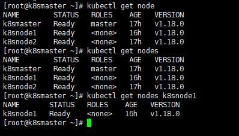

# Kubernetes集群管理工具kubectl

## 概述

kubectl是Kubernetes集群的命令行工具，通过kubectl能够对集群本身进行管理，并能够在集群上进行容器化应用的安装和部署

## 命令格式

命令格式如下

```bash
kubectl [command] [type] [name] [flags]
```

参数

- command：指定要对资源执行的操作，例如create、get、describe、delete
- type：指定资源类型，资源类型是大小写敏感的，开发者能够以单数 、复数 和 缩略的形式

例如：

```bash
kubectl get pod pod1
kubectl get pods pod1
kubectl get po pod1
```




- name：指定资源的名称，名称也是大小写敏感的，如果省略名称，则会显示所有的资源，例如

```bash
kubectl get pods
```

- flags：指定可选的参数，例如，可用 -s 或者 -server参数指定Kubernetes API server的地址和端口

## 常见命令

### kubectl help 获取更多信息

通过 help命令，能够获取帮助信息

```bash
# 获取kubectl的命令
kubectl --help

# 获取某个命令的介绍和使用
kubectl get --help
```

### 基础命令

常见的基础命令

|  命令   |                      介绍                      |
| :-----: | :--------------------------------------------: |
| create  |          通过文件名或标准输入创建资源          |
| expose  |        将一个资源公开为一个新的Service         |
|   run   |           在集群中运行一个特定的镜像           |
|   set   |             在对象上设置特定的功能             |
|   get   |               显示一个或多个资源               |
| explain |                  文档参考资料                  |
|  edit   |          使用默认的编辑器编辑一个资源          |
| delete  | 通过文件名，标准输入，资源名称或标签来删除资源 |

### 部署命令

|      命令      |                        介绍                        |
| :------------: | :------------------------------------------------: |
|    rollout     |                   管理资源的发布                   |
| rolling-update |             对给定的复制控制器滚动更新             |
|     scale      | 扩容或缩容Pod数量，Deployment、ReplicaSet、RC或Job |
|   autoscale    |      创建一个自动选择扩容或缩容并设置Pod数量       |


### 集群管理命令

| 命令         | 介绍                           |
| ------------ | ------------------------------ |
| certificate  | 修改证书资源                   |
| cluster-info | 显示集群信息                   |
| top          | 显示资源(CPU/M)                |
| cordon       | 标记节点不可调度               |
| uncordon     | 标记节点可被调度               |
| drain        | 驱逐节点上的应用，准备下线维护 |
| taint        | 修改节点taint标记              |
|              |                                |

### 故障和调试命令

|     命令     |                             介绍                             |
| :----------: | :----------------------------------------------------------: |
|   describe   |                显示特定资源或资源组的详细信息                |
|     logs     | 在一个Pod中打印一个容器日志，如果Pod只有一个容器，容器名称是可选的 |
|    attach    |                     附加到一个运行的容器                     |
|     exec     |                        执行命令到容器                        |
| port-forward |                        转发一个或多个                        |
|    proxy     |             运行一个proxy到Kubernetes API Server             |
|      cp      |                    拷贝文件或目录到容器中                    |
|     auth     |                           检查授权                           |

### 其它命令

|     命令     |                        介绍                         |
| :----------: | :-------------------------------------------------: |
|    apply     |         通过文件名或标准输入对资源应用配置          |
|    patch     |            使用补丁修改、更新资源的字段             |
|   replace    |          通过文件名或标准输入替换一个资源           |
|   convert    |            不同的API版本之间转换配置文件            |
|    label     |                  更新资源上的标签                   |
|   annotate   |                  更新资源上的注释                   |
|  completion  |             用于实现kubectl工具自动补全             |
| api-versions |                 打印受支持的API版本                 |
|    config    | 修改kubeconfig文件（用于访问API，比如配置认证信息） |
|     help     |                    所有命令帮助                     |
|    plugin    |                 运行一个命令行插件                  |
|   version    |              打印客户端和服务版本信息               |

### 目前使用的命令

```bash
# 创建一个nginx镜像
kubectl create deployment nginx --image=nginx

# 对外暴露端口
kubectl expose deployment nginx --port=80 --type=NodePort

# 查看资源
kubectl get pod, svc
```