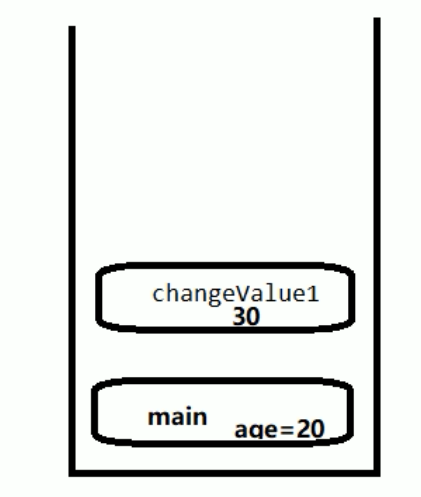

# 值传递和引用传递

## 举例

```
/**
 * 值传递和引用传递
 * @author: 陌溪
 * @create: 2020-03-14-18:25
 */
class Person {
    private Integer id;
    private String personName;

    public Person(String personName) {
        this.personName = personName;
    }
}
public class TransferValueDemo {

    public void changeValue1(int age) {
        age = 30;
    }

    public void changeValue2(Person person) {
        person.setPersonName("XXXX");
    }
    public void changeValue3(String str) {
        str = "XXX";
    }

    public static void main(String[] args) {
        TransferValueDemo test = new TransferValueDemo();

        // 定义基本数据类型
        int age = 20;
        test.changeValue1(age);
        System.out.println("age ----" + age);

        // 实例化person类
        Person person = new Person("abc");
        test.changeValue2(person);
        System.out.println("personName-----" + person.getPersonName());

        // String
        String str = "abc";
        test.changeValue3(str);
        System.out.println("string-----" + str);

    }
}
```

最后输出结果

```
age ----20
personName-----XXXX
string-----abc
```

## changeValue1的执行过程

八种基本数据类型，在栈里面分配内存，属于值传递

`栈管运行，堆管存储`

当们执行 changeValue1的时候，因为int是基本数据类型，所以传递的是int = 20这个值，相当于传递的是一个副本，main方法里面的age并没有改变，因此输出的结果 age还是20，属于值传递




## changeValue2的执行过程

因为Person是属于对象，传递的是内存地址，当执行changeValue2的时候，会改变内存中的Person的值，属于引用传递，两个指针都是指向同一个地址


## changeValue3的执行过程

String不属于基本数据类型，但是为什么执行完成后，还是abc呢？

这是因为String的特殊性，当我们执行String str = "abc"的时候，它会把 `abc` 放入常量池中


当我们执行changeValue3的时候，会重新新建一个xxx，并没有销毁abc，然后指向xxx，然后最后我们输出的是main中的引用，还是指向的abc，因此最后输出结果还是abc