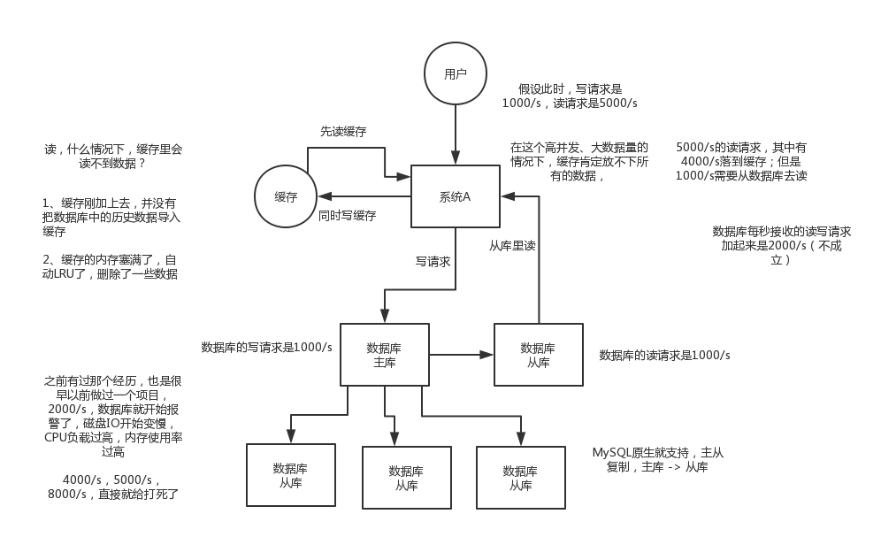
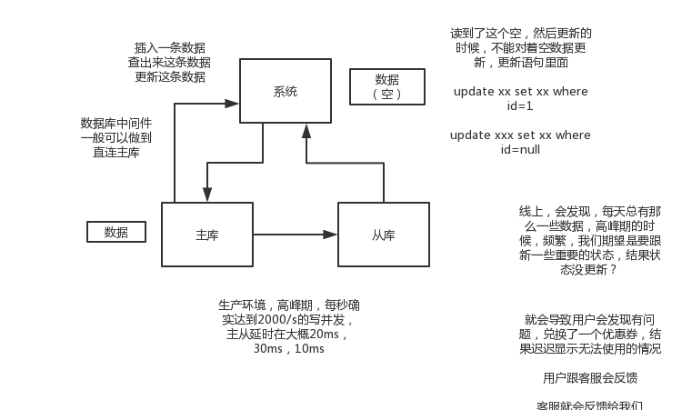

# MySQL读写分离及主从时延

## 面试题

- 如何实现mysql的读写分离？
- MySQL主从复制原理的是啥？
- 如何解决mysql主从同步的延时问题？

## 前言

这个，高并发这个阶段，那肯定是需要做读写分离的，啥意思？因为实际上大部分的互联网公司，一些网站，或者是app，其实都是读多写少。所以针对这个情况，就是写一个主库，但是主库挂多个从库，然后从多个从库来读，那不就可以支撑更高的读并发压力了吗？

## 如何实现mysql的读写分离？

其实很简单，就是基于主从复制架构，简单来说，就搞一个主库，挂多个从库，然后我们就单单只是写主库，然后主库会自动把数据给同步到从库上去。一般情况下，主库可以挂4-5个从库

## MySQL主从复制原理的是啥？

MySQL里有一个概念，叫binlog日志，就是每个增删改类的操作，会改变数据的操作，除了更新数据以外，对这个增删改操作还会写入一个日志文件，记录这个操作的日志。

主库将变更写binlog日志，然后从库连接到主库之后，从库有一个IO线程，将主库的binlog日志拷贝到自己本地，写入一个中继日志中。接着从库中有一个SQL线程会从中继日志读取binlog，然后执行binlog日志中的内容，也就是在自己本地再次执行一遍SQL，这样就可以保证自己跟主库的数据是一样的。

这里有一个非常重要的一点，就是从库同步主库数据的过程是串行化的，也就是说主库上并行的操作，在从库上会串行执行。所以这就是一个非常重要的点了，由于从库从主库拷贝日志以及串行执行SQL的特点，在高并发场景下，从库的数据一定会比主库慢一些，是有延时的。所以经常出现，刚写入主库的数据可能是读不到的，要过几十毫秒，甚至几百毫秒才能读取到。

而且这里还有另外一个问题，就是如果主库突然宕机，然后恰好数据还没同步到从库，那么有些数据可能在从库上是没有的，有些数据可能就丢失了。

所以mysql实际上在这一块有两个机制，一个是半同步复制，用来解决主库数据丢失问题；一个是并行复制，用来解决主从同步延时问题。

这个所谓半同步复制，semi-sync复制，指的就是主库写入binlog日志之后，就会将强制此时立即将数据同步到从库，从库将日志写入自己本地的relay log之后，接着会返回一个ack给主库，主库接收到至少一个从库的ack之后才会认为写操作完成了。

所谓并行复制，指的是从库开启多个线程，并行读取relay log中不同库的日志，然后并行重放不同库的日志，这是库级别的并行。

- 主从复制的原理
- 主从延迟问题产生的原因
- 主从复制的数据丢失问题，以及半同步复制的原理
- 并行复制的原理，多库并发重放relay日志，缓解主从延迟问题

## MySQL主从同步延时问题（重点）

线上确实处理过因为主从同步延时问题，导致的线上的bug，小型的生产事故

 show status，Seconds_Behind_Master，你可以看到从库复制主库的数据落后了几ms

 其实这块东西我们经常会碰到，就比如说用了mysql主从架构之后，可能会发现，刚写入库的数据结果没查到，结果就完蛋了。。。。

 所以实际上你要考虑好应该在什么场景下来用这个mysql主从同步，建议是一般在读远远多于写，而且读的时候一般对数据时效性要求没那么高的时候，用mysql主从同步

 所以这个时候，我们可以考虑的一个事情就是，你可以用mysql的并行复制，但是问题是那是库级别的并行，所以有时候作用不是很大

 所以这个时候。。通常来说，我们会对于那种写了之后立马就要保证可以查到的场景，采用强制读主库的方式，这样就可以保证你肯定的可以读到数据了吧。其实用一些数据库中间件是没问题的。

 一般来说，如果主从延迟较为严重

- 分库，将一个主库拆分为4个主库，每个主库的写并发就500/s，此时主从延迟可以忽略不计
- 打开mysql支持的并行复制，多个库并行复制，如果说某个库的写入并发就是特别高，单库写并发达到了2000/s，并行复制还是没意义。28法则，很多时候比如说，就是少数的几个订单表，写入了2000/s，其他几十个表10/s。
- 重写代码，写代码的同学，要慎重，当时我们其实短期是让那个同学重写了一下代码，插入数据之后，直接就更新，不要查询
- 如果确实是存在必须先插入，立马要求就查询到，然后立马就要反过来执行一些操作，对这个查询设置直连主库。不推荐这种方法，你这么搞导致读写分离的意义就丧失了

 

