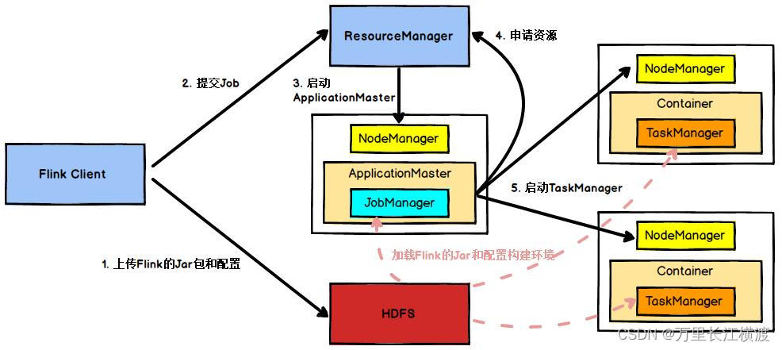

# 什么是有界流和无界流？什么事滑动窗口、滚动窗口、会话窗口？
有界流和无界流是 Flink 中流处理的两种基本类型。其中，有界流（Bounded Streams）指的是具有固定大小的数据集，例如从文件或数据库中读取的数据，这些数据集是有限的，可以被精确地计算和处理。相对地，无界流（Unbounded Streams）则是指在时间上不断增长的数据流，例如传感器数据、网络流量等实时数据，这些数据流通常无法预先知道其大小，并且无法进行精确的计算和处理。

为了对无界流进行计算处理，需要将数据流切分成固定大小的窗口进行处理。常见的窗口类型包括：

滑动窗口（Sliding Window）：在一个固定大小的窗口内，每次滑动一个固定大小的步长，对窗口内的元素进行处理。滑动窗口通常用于针对最近一段时间内的数据进行分析和处理。

滚动窗口（Tumbling Window）：在一个固定大小的窗口内对元素进行处理，当窗口到达设定的大小后，窗口内的元素被清空，开始处理下一个窗口内的元素。

会话窗口（Session Window）：通过检测一段时间内没有数据到达来确定窗口的边界，从而自适应地将数据分组到多个窗口中。会话窗口通常用于针对活动状态的数据进行分析和处理。

以上三种窗口类型都是无界流处理中常用的窗口类型，每种窗口类型都适用于不同的业务场景和需求。在 Flink 中，可以使用 DataStream API 或 Table API 来实现这些窗口操作，对于无界流的处理任务，使用合适的窗口类型和参数设置，可以有效提高 Flink 的计算效率和处理能力。

# 什么是flink的水位线？
Flink 的水位线（Watermark）是指一种用于处理无界流的时间机制，它可以帮助 Flink 在无法确定在一个窗口内的数据是否已经全部到达时，对数据进行有效的处理和分析。

水位线是由时间戳（Timestamp）加上一个延迟得到的一个时间戳界限。在 Flink 中，水位线常常表示为一个特殊的数据元素，在处理数据的过程中，每读入一个事件，系统都会与当前的水位线进行比较，如果事件时间戳小于等于水位线，则认为该事件已经到达，可以进行相应的计算和处理，否则该事件就被认为还没有到达，需要继续等待并更新水位线。

当应用程序将水位线发送到下游操作符时，下游操作符便可以根据水位线定期触发相应的窗口操作，例如关闭窗口或者触发计算。通过设置适当的水位线策略，Flink 可以有效地控制数据处理的延迟和准确性，以及应对流量突发情况进行弹性调整。

总之，水位线是 Flink 在处理无界流的过程中非常重要的一种时间机制，通过设置和更新水位线，Flink 可以保证数据处理的实时性和准确性，并且掌握处理无界流的核心技术。

# Flink有哪些重要特点？

- 支持流和批处理：Flink 提供了统一的流处理和批处理计算模型。你可以使用相同的 API 和编程模型编写流处理和批处理作业，实现流与批的无缝切换。

- 事件驱动的流处理：Flink 基于事件时间进行流处理，可以处理乱序事件，并在事件时间和处理时间上提供了丰富的窗口操作，如滚动窗口、滑动窗口、会话窗口等。

- Exactly-Once 语义：Flink 支持精确一次性（Exactly-Once）的状态一致性，即使在发生故障时也保证结果的准确性。它通过分布式快照和检查点机制来实现端到端的 Exactly-Once 语义。

- 低延迟和高吞吐量：Flink 的流处理引擎经过优化，能够实现毫秒级的低延迟和高吞吐量的数据处理。它能够有效地利用计算资源，实现高效的并行处理。

- 状态管理：Flink 支持在长时间运行的应用程序中维护大规模的状态，并提供了可靠的状态管理机制。它通过检查点和保存点（Savepoint）来实现状态的持久化和恢复。

- 容错处理：Flink 具有强大的容错机制，能够自动处理节点故障。它使用分布式快照和检查点机制来确保数据的一致性和可靠性，并支持故障恢复和自动重启。

- 高级流处理操作：Flink 提供了丰富的流处理操作，如窗口操作、时间语义、状态处理、水印生成等。它还支持基于事件的触发器和自定义函数，可以编写灵活且高效的流处理逻辑。

总之，Flink 是一个功能强大的分布式计算框架，具有支持流和批处理、Exactly-Once 语义、低延迟和高吞吐量、状态管理、容错处理等重要特点。它在大规模数据处理、实时分析和流式数据处理等方面具有广泛的应用和优势。

# 介绍一下Flink的Exactly-Once
Exactly-Once 是 Apache Flink 框架的一个重要特性，它确保在发生故障时仍能保证结果的准确性。具体来说，Exactly-Once 语义指的是在数据处理过程中，每个数据仅被处理一次，且处理结果在发生故障时能够被正确恢复，不会产生重复结果或丢失数据。

要实现 Exactly-Once 语义，Flink 采用了以下关键技术：

- 分布式快照（Distributed Snapshots）：Flink 使用分布式快照机制记录整个应用程序的状态，并将其保存到可靠的存储系统中。这样，在发生故障时，Flink 可以从最近的快照中恢复应用程序的状态，确保结果的一致性。

- 检查点（Checkpoint）：Flink 通过周期性地生成检查点来实现状态的持久化。检查点是应用程序状态的一种一致性快照，包括所有源数据、中间计算结果和用户定义的状态。每个检查点都有一个唯一的 ID，并按照先后顺序生成。当应用程序发生故障时，Flink 可以使用最近的检查点来恢复和重放数据，以保证 Exactly-Once 语义。

- 状态回溯和重放（State Backtracking and Replay）：在发生故障并恢复时，Flink 能够回溯到最近的检查点，并从那里重新处理数据。通过将数据源的输入回溯到故障发生之前的状态，并重新应用中间计算步骤，Flink 可以确保以 Exactly-Once 的方式重新生成正确的结果。

- 事务性源和下游连接器支持：Flink 提供事务性源和下游连接器的支持，可以与外部系统进行精确的一次事务性读写操作。这些操作遵循外部系统的事务性协议，并与 Flink 的快照机制协同工作，以实现端到端的 Exactly-Once 语义。

总而言之，Apache Flink 的 Exactly-Once 语义通过分布式快照、检查点、状态回溯和重放等关键技术来保证数据处理的一致性和准确性。这使得在发生故障或重启时，Flink 能够正确恢复并继续处理数据，避免了数据重复或丢失的问题，为应用程序提供了可靠性和准确性的保证。

# Flink在什么时候使用有限数据流和无限数据流？
Flink 可以同时处理有限数据流和无限数据流，并提供了统一的编程模型。下面是在何时使用有限数据流和无限数据流的一些示例：

- 有限数据流：当你有一个有限量的数据集需要进行批处理时，你可以使用 Flink 的有限数据流功能。这包括对静态数据集的处理、对历史数据的分析等。在这种情况下，你可以使用 Flink 的批处理 API 或将有界数据作为无限流的一部分进行处理。

- 无限数据流：当你需要处理实时生成的连续数据流时，你可以使用 Flink 的无限数据流功能。这包括流式数据处理、实时监控、实时报警等场景。通过 Flink 的流处理 API，你可以实时地对数据流进行转换、过滤、聚合、关联等操作。

通常情况下，Flink 在处理无限数据流时会更为常见。无限数据流是指数据源不会结束的连续数据流，例如传感器数据、日志流或消息队列中的消息。在这种情况下，Flink 的流处理引擎能够实时处理数据，并以低延迟和高吞吐量提供结果。

但是，Flink 的优势在于它能够同时处理有限数据流和无限数据流，通过统一的编程模型和 API，让用户能够灵活地选择处理有界或无界数据。这使得 Flink 在需要同时进行离线批处理和实时流处理的应用场景中非常有用，例如 ETL 数据处理、实时仪表盘和数据仓库等。

# Flink哪有3种时间类型？
- 处理时间（Processing Time）：处理时间是指事件在 Flink 运算符中实际处理的时间，它由处理事件的机器本地时钟提供。每个运算符都按照事件进入其输入通道的顺序进行处理，而不考虑事件的实际发生时间。处理时间通常用于对数据流进行快速处理，并且可以提供低延迟和高吞吐量。

- 事件时间（Event Time）：事件时间是指事件实际发生的时间。每个事件都携带一个事件时间戳，该时间戳反映了事件产生的时间点。通过根据事件时间戳对数据进行分配窗口、聚合等操作，Flink 可以解决乱序、延迟和重放等问题，以准确地处理事件流。

- 摄取时间（Ingestion Time）：摄取时间是指事件进入 Flink 的时间。在摄取时间模式下，Flink 使用摄取时间作为事件的时间标记。这个时间戳是在事件进入 Flink 数据流的源头处产生，并在整个处理过程中保持不变。摄取时间提供了一种介于处理时间和事件时间之间的时间概念，可以在一定程度上解决延迟和乱序的问题。

开发人员可以根据具体的应用需求选择适当的时间类型来处理数据流，以获得最佳的结果。使用处理时间可以获得低延迟和高吞吐量，而使用事件时间可以提供准确性和容错性，使用摄取时间则是一种折衷方案。

# 介绍一下Flink的故障检查机制？
Apache Flink 提供了一套强大的故障检查和容错机制，以确保应用程序在面对各种故障情况时能够保持可靠性和高可用性。下面是 Flink 的故障检查机制的主要组成部分：

- 容错检查点（Checkpointing）：Flink 使用容错检查点来实现故障恢复。检查点是应用程序状态的一致性存储点，它记录了所有作业任务在某个时间点的状态快照。通过定期创建检查点，并将检查点保存在分布式存储系统中，Flink 可以在发生故障时恢复到最近的一次检查点，并从该点继续处理。

- 恰好一次语义（Exactly-Once Semantics）：Flink 致力于实现恰好一次处理语义，即确保每条记录仅被处理一次，同时不会丢失或重复数据。通过结合容错检查点和一些状态管理机制，Flink 在发生故障时可以准确地恢复应用程序的状态，并确保结果的准确性。

- 任务重启策略（Task Restart Strategy）：当作业的一个或多个任务失败时，Flink 会根据预定义的重启策略自动重新启动失败的任务。重启策略可以根据具体需求进行配置，例如固定延迟重启、无限重启等。这样可以确保在任务失败时，Flink 可以尽快自动恢复，并继续处理数据。

- 容错状态后端（Fault-tolerant State Backend）：Flink 支持各种容错状态后端，包括内存、本地文件系统、分布式文件系统等。这些状态后端用于保存应用程序的状态和检查点数据，并保证数据的可靠性和一致性。

- 高可用性（High Availability）：Flink 支持高可用部署模式，通过将应用程序的状态和元数据存储在分布式存储系统中，从而确保在发生故障时仍然能够提供持续的服务。当主节点（JobManager）失败时，备用节点会接管工作，并保证作业的继续执行。

上述故障检查机制的组合使得 Flink 能够应对各种故障情况，并在故障发生时保持应用程序的正确性和可用性。开发人员也可以根据实际需求进行定制和配置，以满足特定的容错和故障恢复需求。

# 介绍一下Flink的CheckPoint和SavePoint？
Flink 中的 Checkpoint（检查点）和 Savepoint（保存点）是用于实现应用程序状态的一致性快照和故障恢复的两个关键概念。虽然它们都涉及到保存应用程序状态的操作，但在功能和使用方式上存在一些差异。

- Checkpoint（检查点）:
检查点是 Flink 用于实现故障恢复的核心机制之一。它是应用程序状态的一致性快照，用于将应用程序的所有状态数据保存到分布式存储系统中。通过定期创建检查点，Flink 可以保证在发生故障时能够从最近的一次检查点恢复，并继续处理数据。检查点包含了作业任务的所有状态信息，包括数据源、转换操作和输出等。

- Savepoint（保存点）:
保存点是一种特殊类型的检查点，它允许用户手动触发应用程序状态的保存和升级。与普通检查点不同，保存点是由用户主动触发的，并且可以在应用程序运行时的任意时间点进行创建。保存点的一个主要用途是应用程序版本升级或修改配置时的状态迁移。通过创建保存点，可以将当前应用程序的状态保存到分布式存储系统中，并在需要时加载到新的应用程序版本中。

总结：

检查点是 Flink 用于实现故障恢复的机制，用于定期保存应用程序的状态。而保存点是用户手动触发的一种特殊类型的检查点，用于保存应用程序状态并支持迁移到新的应用程序版本。两者都是为了保证应用程序的状态一致性和故障恢复能力，但在触发时机和用途上有所不同。

# 介绍一下Flink的状态？
在 Apache Flink 中，状态（State）是指应用程序在处理数据时维护的中间和持久化的信息。状态用于存储和更新数据流转换操作中的中间结果、累积计算结果以及应用程序的元数据等。

Flink 提供了三种类型的状态：

- 键控状态（Keyed State）：

键控状态是与特定键关联的状态，它用于在流处理任务中保存和访问与特定键相关的状态信息。例如，在通过 keyBy 操作对数据流进行分组后，可以使用键控状态来存储每个键对应的累积计算结果、窗口状态等。键控状态是 Flink 中最常用的一种状态类型，它提供了读取和更新特定键的状态数据的能力。

- 算子状态（Operator State）：

算子状态是与并行算子相关联的状态，它用于在同一个并行算子的不同任务之间共享状态信息。例如，当使用窗口操作时，可以使用算子状态来存储窗口计数器、窗口状态等。与键控状态不同的是，算子状态是在整个算子范围内共享的，可以被所有任务共享和访问。

- 一致性快照状态（Checkpointed State）：

一致性快照状态是指将应用程序的状态保存到检查点中，并用于实现故障恢复和应用程序迁移。它可以是键控状态或算子状态的子集，用于保存应用程序在执行过程中的中间结果或累积状态等。一致性快照状态会定期创建检查点，将当前状态的快照保存到分布式存储系统中，并在发生故障时使用该快照进行恢复。


通过使用这些状态类型，Flink 可以在流处理任务中保持和管理关键的中间状态和累积计算结果。状态的使用使得 Flink 能够实现复杂的数据处理逻辑，并保证在发生故障时能够可靠地恢复和继续处理数据。

# Flink有哪些用来优化的参数？
taskmanager.memory.task.heap.size：指定每个任务管理器的堆内存大小，默认为 536870912（512MB）。根据任务的内存需求，可以适当调整该值。

taskmanager.numberOfTaskSlots：指定每个任务管理器的任务槽数量，默认为 1。根据任务的并行度和集群的资源情况，可以适当增加或减少该值。

taskmanager.cpu.cores：指定每个任务管理器可用的 CPU 核心数，默认为机器上的最大核心数。可以根据任务的并行度和集群的资源情况进行调整。

parallelism.default：设置默认的并行度级别，默认为 1。根据数据量和任务的复杂性，可以适当调整该值。

buffer.timeout：设置网络缓冲区的超时时间，默认为 100ms。可以根据网络延迟和吞吐量要求调整该值，以减少数据传输的等待时间。

state.backend：指定状态后端的类型，默认为 MemoryStateBackend。可以选择不同的状态后端（如 RocksDBStateBackend）来适应不同的数据量和存储需求。

checkpoint.interval：设置检查点的触发间隔，默认为没有检查点。根据应用程序的容错需求，可以设置合适的检查点间隔，以实现故障恢复和数据一致性。

optimizer.optimizer_parallelism：设置优化器的并行度级别，默认为 1。可以根据集群的资源情况和任务的复杂性进行调整，以提高优化器的性能。

network.memory.fraction：指定可供网络缓冲使用的堆内存比例，默认为 0.1。可以根据任务的数据传输量和内存需求，适当调整该值。

io.file.buffer.size：指定文件 I/O 操作的缓冲区大小，默认为 4096。根据文件读写的性能要求，可以适当增加或减少该值。

注意，Flink 的参数设置不仅限于上述内容，还有其他参数可以根据具体的应用场景进行优化。你可以通过修改 Flink 的配置文件（flink-conf.yaml 或 flink-conf.sh）或在代码中使用 ExecutionConfig 来设置这些参数。同时，也建议参考官方文档和相关资源，深入了解这些参数的含义和用法。

# flink运行时的组件


Flink运行时架构主要包括四个不同的组件，它们会在运行流处理应用程序时协同工作：作业管理器（JobManager）、资源管理器（ResourceManager）、任务管理器（TaskManager），以及分发器（Dispatcher）。

---

# Flink 面试题补充

## 时间语义再问一遍：Processing / Event / Ingestion 怎么选？

| 类型 | 含义 | 适用 |
|------|------|------|
| Processing Time | 算子本地处理时刻 | 低延迟、可接受近似；不关心乱序 |
| Event Time | 事件自带时间戳 | 对账、指标、窗口统计要正确；乱序/延迟常见 |
| Ingestion Time | 进入 Flink Source 的时间 | 折中：比 Processing 稳一点，比 Event 实现简单 |

面试结论：**生产统计多用 Event Time + Watermark**；监控大盘可 Processing Time。

---

## 窗口怎么理解？滚动 / 滑动 / 会话 / 全局有何区别？

- **滚动（Tumbling）**：窗口大小 = 滑动步长，窗口互不重叠。例：每 5 分钟统计一次。
- **滑动（Sliding）**：窗口大小 > 滑动步长，窗口重叠。例：每 1 分钟算一次最近 5 分钟。
- **会话（Session）**：按 gap（一段时间无数据）切分；适合用户会话、活跃区间。
- **全局（Global）**：一个 key 一个大窗口，通常配合自定义 Trigger，少用。

按 key：`keyBy` 后是 **Keyed Window**（状态按 key 隔离，可并行）；不 keyBy 是 **Non-Keyed Window**（并行度多为 1，慎用）。

还可以分：

- **CountWindow**：按条数；**TimeWindow**：按时间。
- **Window Function**：`ReduceFunction` / `AggregateFunction`（增量，省内存）vs `ProcessWindowFunction`（能拿到全窗口元素和窗口元信息，贵）。

触发相关：

- **Trigger**：决定何时计算/清空；默认事件时间窗口在 Watermark 越过窗口 end 时触发。
- **Evictor**：触发前后踢掉部分元素（少用）。
- **Allowed Lateness**：允许迟到数据；迟到仍可能更新结果，并可用侧输出拿“太迟”的数据。

---

## Watermark（水位线）是什么？乱序怎么处理？

**Watermark = 事件时间进度的全局声明**：表示「小于等于该时间的事件，大概率都到了」。

常见生成方式：

1. **周期性（Periodic）**：每隔一段时间根据当前最大事件时间生成，如 `maxEventTime - maxOutOfOrderness`。
2. **标记性（Punctuated）**：某些特殊事件自带水位（少见）。

乱序处理套路：

```text
事件时间戳 t
Watermark ≈ max(t) - 乱序容忍度
当 Watermark >= windowEnd 时，关闭/触发窗口
```

要点：

- Watermark **单调不减**（多并行度取最小的上游 Watermark 向下游传播）。
- 容忍度越大：结果越准、延迟越大；越小：延迟低、易丢迟到数据。
- 迟到数据：`allowedLateness` 内可再更新；之外走 **side output**。
- 空闲分片：某 Kafka 分区长时间无数据会卡住 Watermark → 用 **watermark 空闲检测（idleness）**。

一句话：**窗口按 Event Time 切，Watermark 决定何时关窗。**

---

## Flink 的 Watermark 解决了什么问题？

核心就一个问题：**在 Event Time 下，怎么知道「某个时间窗口的数据可以开始算了」**。

无界流 + 乱序到达时会出现：

1. **不知道何时关窗**：按事件时间切的窗口，总可能还有更早时间戳的数据在路上；若无限等，窗口永不触发。
2. **乱序无法处理**：后发先至时，若按到达顺序立刻关窗，结果会少算/错算。
3. **延迟与正确性的权衡无从落地**：系统需要一个可配置的「最多再等多久」的信号。

Watermark 提供的就是这个信号：

- 声明「事件时间已推进到 W」→ 认为时间戳 ≤ W 的数据基本到齐。
- 窗口在 `Watermark >= windowEnd` 时触发计算。
- 用 **乱序容忍度** 换正确性；再用 **allowedLateness / side output** 兜底真正迟到的数据。

它不解决的问题：外部系统事务、状态容错（那是 Checkpoint）、数据倾斜等。  
**对比 Processing Time**：用本地时钟，无需 Watermark，但遇到乱序/延迟事件时窗口边界与业务时间不一致。

---

## 状态（State）面试常问

### 状态分类

| 类型 | 特点 | 例子 |
|------|------|------|
| Keyed State | 绑定 key，随 `keyBy` 分区 | `ValueState` / `ListState` / `MapState` / `ReducingState` / `AggregatingState` |
| Operator State | 绑定并行子任务 | Source 的 offset 列表、Broadcast 前的缓冲 |

Broadcast State：广播流状态，常用于动态规则下发。

### 状态后端

- **HashMapStateBackend**：堆内存，快；状态大易 OOM；适合小状态 + 改 Checkpoint 到文件系统。
- **EmbeddedRocksDBStateBackend**：本地 RocksDB，状态可很大；序列化/IO 有开销；生产大数据量常用。

### 状态生命周期

- **TTL**：超时清理，防状态无限涨。
- **Checkpoint**：自动、周期性，用于故障恢复。
- **Savepoint**：手动，用于停机扩缩容、版本升级、迁移。

Keyed State 访问必须在 **keyed context**（`keyBy` 后的算子）里。

---

## Checkpoint / Barrier / Exactly-Once

**Checkpoint 流程（简化）**：

1. JobManager 向 Source 注入 **Checkpoint Barrier**。
2. Barrier 随数据在拓扑中对齐（对齐模式）或近似对齐。
3. 算子收到 Barrier 后把状态快照到 State Backend。
4. 全部完成 → Checkpoint 成功；失败可从最近成功点恢复。

**Barrier 对齐**：多输入要等所有通道 Barrier 到齐再拍快照，保证 Exactly-Once；可能引入延迟。  
**非对齐 Checkpoint（Unaligned）**：反压严重时减少对齐等待，仍可 Exactly-Once（实现更复杂）。

端到端 Exactly-Once 还要求：

- Source 可重放（如 Kafka）。
- Sink 支持事务 / 幂等（两阶段提交 `TwoPhaseCommitSinkFunction`，Kafka 事务等）。

对比：

| | Checkpoint | Savepoint |
|--|------------|-----------|
| 触发 | 自动周期 | 用户手动 |
| 目的 | 容错恢复 | 运维变更、升级 |
| 格式 | 可更短命 | 更强调兼容、可移植 |

---

## Checkpoint 同步和异步有什么区别？

这里说的「同步 / 异步」主要指 **状态快照写到持久化存储时，是否阻塞主数据处理线程**（State Backend 的 snapshot 方式），不是指 Barrier 对齐本身。

| | 同步快照（Synchronous） | 异步快照（Asynchronous） |
|--|-------------------------|--------------------------|
| 做法 | 暂停（或阻塞）处理，把状态完整写完再继续 | 先快速拿到状态的一致性视图（如 copy-on-write / 增量句柄），**后台线程**再慢慢写存储 |
| 对作业影响 | Checkpoint 期间处理停顿明显，易拉高延迟、加重反压 | 主线程停顿短，吞吐更稳，生产默认更倾向这种方式 |
| 实现成本 | 实现简单 | 需要 COW、增量 Checkpoint 等支持 |
| 典型场景 | 小状态、调试、或后端不支持异步 | RocksDB 增量 Checkpoint、大状态作业 |

结合 State Backend 理解：

- **Heap（HashMapStateBackend）**：同步时往往要把堆上状态拷出去再写；也可配合异步机制，但大状态时拷贝贵、易 GC。
- **RocksDB**：常用 **异步 + 增量 Checkpoint**——同步阶段 mainly 做 RocksDB 快照/文件引用，真正上传 SST 在异步阶段完成，对主链路影响小。

注意区分容易混的几组概念：

1. **同步 vs 异步快照**：快照 IO 是否挡住 processElement（本题）。
2. **对齐 vs 非对齐 Checkpoint**：多输入 Barrier 是否等齐（反压场景）。
3. **全量 vs 增量 Checkpoint**：每次传全部状态还是只传变化（RocksDB 增量）。

面试一句话：**同步快照 = 写盘时卡住算子；异步快照 = 先打轻量一致点，写盘放到后台，用短暂同步换长时间不阻塞。**

---

## 反压（Backpressure）是什么？怎么排查？

**反压**：下游处理慢 → 上游发送阻塞 → 压力沿链路向上游传递，最终拖慢 Source 消费。

常见原因：

- 某算子逻辑重（复杂 JSON、大状态、热点 key）。
- 数据倾斜（某 key 流量巨大）。
- 网络 / 磁盘（RocksDB、Checkpoint IO）瓶颈。
- Sink 外部系统慢（Kafka/DB 写不动）。
- 窗口/状态过大导致 GC。

排查：

1. Flink UI：**BackPressure** 面板看 high/low；看各 Task 的 `busy` / `backpressured` 时间占比。
2. 看哪一级开始反压 → 瓶颈通常在 **第一个忙且被反压的下游**。
3. Metrics：`outPoolUsage`、`inPoolUsage`、checkpoint 时长、GC、反压时长。
4. 热点：打日志 / key 采样；用 `rescale`、加盐 key、拆分算子。

缓解：

- 提高并行度、优化热点 key（加盐再聚合）。
- 换 RocksDB、调内存与块缓存；减少状态大小、开 TTL。
- 异步 IO（`AsyncFunction`）打外部系统。
- 调网络缓冲、checkpoint 间隔；必要时非对齐 checkpoint。
- Sink 侧批量写、限流、隔离慢下游。

---

## 并行度、Slot、Chain 关系？

- **并行度（Parallelism）**：算子子任务个数。
- **Task Slot**：TaskManager 资源槽；一个 Slot 可跑多个算子的子任务（资源共享）。
- **Operator Chain**：一对一、同并行度的算子可链进同一线程，减序列化/网络开销。
- `disableChaining` / `startNewChain` / `slotSharingGroup` 用于隔离资源或打断链式。

---

## Flink 与 Spark Streaming / Storm 对比（口述版）

| | Flink | Spark Streaming(DStream) | 结构化流 / Micro-batch |
|--|-------|--------------------------|-------------------------|
| 模型 | 真正流（事件驱动） | 微批 | 微批为主 |
| 延迟 | 可达毫秒～秒级 | 通常秒级 | 秒级 |
| 状态 / 窗口 | 原生强 | 有，但历史包袱重 | 增强中 |
| 容错 | Checkpoint + Barrier | RDD 血缘 / WAL 等 | Checkpoint |

---

## 数据倾斜怎么处理？

- key 加盐（`key + random`）局部聚合，再去盐全局聚合。
- 热点 key 单独分流。
- 调整并行度；避免 `Non-Keyed` 大窗口。
- 两阶段聚合：`pre-agg → shuffle → final-agg`。

---

## Watermark 卡住 / 窗口不触发怎么查？

1. 是否设置了 Event Time 与 TimestampAssigner。
2. 是否有空闲源/空闲 Kafka 分区拖住最小 Watermark。
3. 乱序阈值是否过大导致迟迟达不到 `windowEnd`。
4. 上游反压导致事件/Watermark 推进慢。
5. 时间戳单位是否搞错（秒 vs 毫秒）。

---

## 常见代码级问题（口述）

**滚动事件时间窗口示例：**

```java
data.assignTimestampsAndWatermarks(
        WatermarkStrategy
            .<Event>forBoundedOutOfOrderness(Duration.ofSeconds(5))
            .withTimestampAssigner((e, ts) -> e.getEventTime()))
    .keyBy(Event::getKey)
    .window(TumblingEventTimeWindows.of(Time.minutes(1)))
    .aggregate(new MyAgg());
```

**ValueState 计数：**

```java
public class CountFn extends KeyedProcessFunction<String, Event, String> {
    private ValueState<Long> cnt;
    @Override public void open(Configuration conf) {
        cnt = getRuntimeContext().getState(new ValueStateDescriptor<>("cnt", Long.class));
    }
    @Override public void processElement(Event e, Context ctx, Collector<String> out) throws Exception {
        Long c = cnt.value();
        if (c == null) c = 0L;
        cnt.update(c + 1);
        out.collect(e.getKey() + ":" + (c + 1));
    }
}
```

---

## 面试速记

| 主题 | 一句话 |
|------|--------|
| 三种时间 | 处理时间本地钟；事件时间业务钟；摄取时间进站钟 |
| 窗口 | 滚动不重叠；滑动重叠；会话靠 gap |
| Watermark | 解决 Event Time「何时关窗/如何容忍乱序」；时间进度信号 |
| 状态 | Keyed / Operator；堆 or RocksDB；TTL 防膨胀 |
| Checkpoint | Barrier 对齐拍状态；容错；Savepoint 给人用 |
| 同步/异步 Checkpoint | 同步写盘阻塞处理；异步先打一致点再后台上传 |
| Exactly-Once | Checkpoint + 可重放 Source + 事务/幂等 Sink |
| 反压 | 下游慢向上传；UI 看反压；治热点与慢 Sink |
| 倾斜 | 加盐、两阶段聚合、拆热点 |
| 水平扩容 | 加 TM/Slot、提 parallelism；Savepoint rescale |
| Blink | 已并入 Flink；默认 SQL 规划器；changelog/MiniBatch/流批一体 |

---

## 水平扩容（面试专题）

Flink 水平扩展 = **加 TaskManager（Slot）+ 提高算子并行度**；状态随 key 分区，扩容时要考虑 **状态迁移与 rescale**。

### 运行时与并行度

```text
JobManager（调度、Checkpoint 协调）
TaskManager × N（每个提供若干 Slot）
算子 Parallelism = 子任务（SubTask）个数
```

| 概念 | 含义 |
|------|------|
| **Slot** | TM 上资源槽；一个 Slot 跑一条任务链 |
| **Parallelism** | 算子并行度，默认常 ≤ 总 Slot 数 |
| **Operator Chain** | 链内算子共享线程，减网络开销 |

### 怎么扩？

| 目标 | 做法 |
|------|------|
| **提高吞吐** | 加 TM 节点 / 每 TM slot 数；提高 `parallelism.default` 或算子 `setParallelism` |
| **治反压** | 先找瓶颈算子，只扩该算子并行度 |
| **扩集群资源** | `taskmanager.numberOfTaskSlots`、内存、网络 |
| **作业升级** | **Savepoint** 停作业 → 改并行度 → 从 Savepoint 启（支持 rescale） |

### Keyed 状态与扩容

- `keyBy` 后状态按 **key 的 hash % parallelism** 分到 subtask。  
- **改并行度** → key 到 subtask 映射变 → 需 **状态 rescale**（从 Savepoint/Checkpoint 恢复时指定新并行度）。  
- 状态大（RocksDB）：rescale 耗时长，占磁盘 IO。

### 与 Kafka 分区对齐（常见架构）

```text
Kafka Partition 数 P
Flink Source 并行度 ≈ P（或 P 的约数）
  → 一个 subtask 消费若干分区，避免过多空闲
```

- Source 并行度 **> Kafka 分区** → 部分 subtask 无分区可读。  
- Source **< 分区** → 一 subtask 消费多分区，可接受但单 subtask 更重。

### 不能线性扩的情况

- **Non-Keyed Window** 并行度常为 1。  
- **全局聚合**、**单点状态** → 瓶颈在单并行度。  
- **数据倾斜**：某 key 过大，加并行度无效 → 加盐、两阶段聚合。  
- Checkpoint 过大：并行度上去，状态总量不变但 rescale/对齐开销变。

### K8s / YARN 弹性（了解）

- 原生 on K8s 可 **主动扩缩 TM**（需配合调度与 Savepoint 策略）。  
- 批作业：并行度按数据量估；流作业：按峰值 lag 与反压调。

**30 秒收口：** Flink 水平扩靠 **加 TaskManager/Sslot 和提高 parallelism**；有状态作业用 Savepoint rescale；Source 并行度宜与 Kafka 分区对齐；倾斜 key 加并行度没用。

---

## Blink 是什么？和 Flink 什么关系？（面试高频）

**Blink** 是阿里巴巴基于 Flink 深度改造并开源的 **流计算引擎**，在 **TPC-DS 等基准** 上做过大量 SQL 与运行时优化。  
**2019 年捐赠并入 Apache Flink**；核心能力逐步成为 Flink 主线，而不是独立产品。

```text
Blink（阿里内部流引擎）
  → 捐赠 Apache Flink
  → Flink 1.9  可选 blink planner
  → Flink 1.11 blink 成为默认 SQL 规划器，old planner 废弃
  → Flink 1.14 移除 old planner
  → 今天「Flink SQL / Table API」默认就是 Blink 规划器路线
```

面试一句话：**Blink 不是单独部署的组件，而是已融入 Flink 的 Table/SQL 规划器与流批一体优化。**

---

## Blink 给 Flink 带来了什么？

| 能力 | 说明 |
|------|------|
| **Blink Planner** | 新一代 SQL 优化器：流/批统一逻辑计划、规则与代价优化 |
| **流批一体** | 同一套 Table API / SQL，批可当「有界流」在流运行时执行 |
| **Changelog 语义** | 表以 `+I/-U/+U/-D` 变更流表示，支撑 SQL 聚合、Join 正确性 |
| **MiniBatch 聚合** | 微批缓冲再计算，换延迟换吞吐，大流量 GROUP BY 常用 |
| **Local-Global 聚合** | 本地预聚合 + 全局汇总，减少 Shuffle 数据量 |
| **异步 Lookup Join** | 维表关联异步 IO，减轻同步查库反压 |
| **运行时优化** | 算子链、状态访问、序列化等，SQL 整体性能提升 |

---

## Blink Planner vs 老 Planner（old planner）

| 维度 | Old Planner（已移除） | Blink Planner（现默认） |
|------|----------------------|-------------------------|
| 状态 | Flink 1.14 前已废弃 | **默认且唯一** |
| 流/批 | 两套计划差异大 | **统一优化框架** |
| SQL 能力 | 功能弱、优化少 | 窗口、TopN、维表 Join、CDC 等更完整 |
| 性能 | 一般 | TPC 类场景明显更好 |
| 开启方式 | 1.9～1.10：`table.planner: blink` | 1.11+ **无需配置** |

---

## Changelog / Retract（变更流）

Blink SQL 里表不仅是「插入行」，而是 **带变更类型的流**：

| 类型 | 含义 |
|------|------|
| `+I` | Insert，新增 |
| `-U` | Update Before，更新前旧值 |
| `+U` | Update After，更新后新值 |
| `-D` | Delete，删除 |

**为什么需要？**  
流上 SQL 聚合、Join 会产生 **结果修正**（计数从 10→11 要先撤回 10 再发 11）。Changelog 让下游正确更新状态。

面试答：**流式 SQL 结果会更新，Blink 用 changelog 表达行的增删改。**

---

## MiniBatch 聚合（经典优化）

**问题**：逐条聚合 → 状态读写频繁、吞吐低。  
**做法**：缓冲一小批（条数或时间阈值）再触发计算。

```sql
SET 'table.exec.mini-batch.enabled' = 'true';
SET 'table.exec.mini-batch.allow-latency' = '5s';
SET 'table.exec.mini-batch.size' = '5000';
```

| 项 | 说明 |
|----|------|
| 优点 | 吞吐高、状态访问少 |
| 代价 | 延迟增加（最多到 allow-latency） |
| 场景 | 大流量 `GROUP BY`、窗口聚合 |

---

## Local-Global 两阶段聚合

```text
Local 聚合（各 subtask 预聚合）→ Shuffle → Global 聚合
```

类似 Combiner + Reduce，减少 Shuffle 量；与 **加盐两阶段** 治倾斜思路相通。

---

## 流批一体

| | 流 | 批 |
|--|-----|-----|
| 数据 | 无界 | 有界 |
| Blink | 同一套 Table API / SQL 逻辑计划，批当有界流优化执行 |

一套 SQL 可复用于离线 + 实时；批作业注意并行度与 Checkpoint 策略（批常可关或稀疏）。

---

## 异步 Lookup Join

同步维表 Join 每条事件查一次外部库 → 易反压。  
**Async Lookup**：并发请求维表 + 回调输出，常配合 LRU 缓存。适合事实流关联缓慢变化维表。

---

## Blink 面试追问

| 问题 | 答法 |
|------|------|
| 还要单独学 Blink 吗？ | 不用单独部署；掌握并入 Flink 的 SQL 优化、changelog、MiniBatch |
| SQL vs DataStream？ | SQL 做指标/ETL/维表 Join；DataStream 做复杂 CEP、细粒度状态 |
| CDC 常见链路？ | MySQL CDC → Flink SQL → Kafka / OLAP |
| MiniBatch vs 窗口？ | MiniBatch 是算子微批优化；窗口是时间边界；可并存 |
| vs Spark 结构化流？ | Flink 更低延迟、原生状态强；Spark 离线生态统一强 |

---

## Blink 速记

| 主题 | 一句话 |
|------|--------|
| 定位 | 阿里流引擎，已捐赠合并进 Flink |
| Planner | 现今默认 Flink SQL 引擎 |
| Changelog | +I/-U/+U/-D，流式结果可更新 |
| MiniBatch | 微批聚合，换延迟换吞吐 |
| Local-Global | 本地预聚合减 Shuffle |
| 流批一体 | 同一 SQL，批当有界流 |
| Lookup | 异步维表 Join 减反压 |
