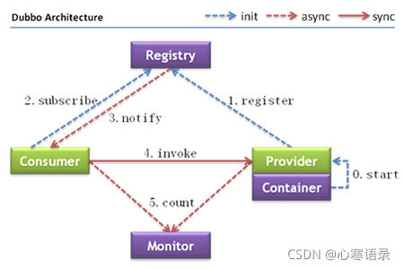
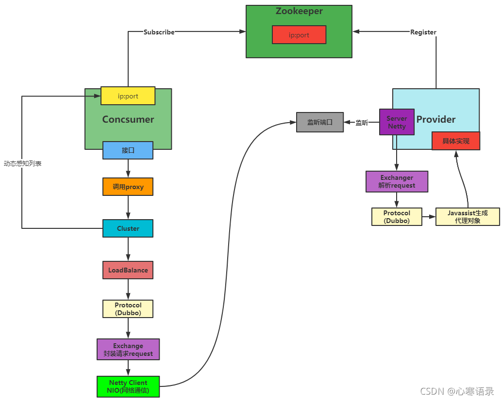

# 架构图


- Provider	暴露服务的服务提供方
- Consumer	调用远程服务的服务消费方
- Registry	服务注册与发现的注册中心
- Monitor	统计服务的调用次数和调用时间的监控中心
- Container	服务运行容器



# Dubbo和Feign底层通过什么方式实现RPC调用的？

Dubbo和Feign都是基于RPC（Remote Procedure Call，远程过程调用）实现的。在RPC调用中，客户端通过远程方式调用服务端的方法，就像调用本地方法一样。

具体来说，Dubbo和Feign底层实现RPC调用所采用的方式略有不同。

Dubbo使用Netty作为底层通信框架，实现了一套高效的RPC通信协议。在服务提供者启动时，Dubbo会将服务实例化并注册到Zookeeper等注册中心上，同时启动一个Netty服务器将服务暴露出去。在消费者发起RPC调用时，Dubbo客户端会在本地维护一个连接池，通过Netty向服务提供者发送请求，并等待响应返回。Dubbo还支持多种序列化和负载均衡策略，以及对服务治理、监控、流量控制等各种特性的支持。

而Feign则是基于HTTP实现RPC调用。在创建Feign客户端时，需要指定服务地址和相应的接口定义，Feign会自动生成相应的调用代码。当服务消费者发起调用时，Feign会通过底层的HTTP客户端（如OkHttp）向服务提供者发送HTTP请求，并解析响应。Feign还支持多种HTTP协议，如HTTP/1.1、HTTP/2等，并支持对请求和响应进行自定义编码和解码。

总之，Dubbo和Feign底层通过Netty和HTTP等不同的通信框架实现RPC调用。在使用时需要根据具体需求选择合适的工具，并了解其底层实现机制。

# Dubbo的SPI是怎么实现的？

Dubbo的SPI（Service Provider Interface）是一种扩展机制，可以在不修改原有代码的情况下，通过配置的方式替换掉默认实现或者增加新的功能。

Dubbo的SPI基于Java标准的SPI机制实现，不同之处在于Dubbo对Java SPI做了增强和优化。Dubbo的SPI机制支持扩展点自适应，可以根据配置文件指定的扩展点实现进行自动装配。Dubbo的SPI还支持扩展点的依赖注入，可以在扩展点实现中注入其他的扩展点。

下面是Dubbo的SPI实现过程：

定义扩展点接口
首先，需要定义一个扩展点接口，通常是一个Java接口。在接口上使用@SPI注解来标识该接口是一个扩展点，并指定默认的扩展实现类。例如：

```java
@SPI("defaultImpl")
public interface HelloService {
void sayHello();
}
```
实现扩展点
然后，编写一个或多个扩展点实现类，实现扩展点接口，并使用@Adaptive注解标明哪些方法是需要自适应的。使用@Activate注解来标明扩展点实现类的激活条件，可以指定一个或多个激活条件。

例如：

```java
@Activate(group = {"provider"})
@Extension("helloA")
public class HelloServiceAImpl implements HelloService {
@Override
public void sayHello() {
System.out.println("Hello, I'm A.");
}
}

@Extension("helloB")
public class HelloServiceBImpl implements HelloService {
@Override
public void sayHello() {
System.out.println("Hello, I'm B.");
}
}

@Adaptive
public class AdaptiveHelloServiceImpl implements HelloService {
@Override
public void sayHello() {
// 通过 SPI 获取自适应实现类，并调用 sayHello 方法
ExtensionLoader<HelloService> loader = ExtensionLoader.getExtensionLoader(HelloService.class);
HelloService service = loader.getAdaptiveExtension();
service.sayHello();
}
}
```
在上面的示例中，HelloServiceAImpl和HelloServiceBImpl是两个扩展点的实现，分别对应了两种不同的实现方式。AdaptiveHelloServiceImpl是一个自适应实现，它的sayHello方法中通过SPI获取自适应实现类并调用。

配置文件
最后，在classpath路径下编写一个META-INF/services/文件夹，创建文件名为扩展接口的全限定名的文件，并在文件中列出所有的扩展实现类。例如：
```
com.example.HelloService=helloA,helloB
```
这里指定了HelloService扩展点的两个实现类helloA和helloB。

获取扩展点实例
通过上述步骤，就可以使用Dubbo的SPI机制获取扩展点实例。通过ExtensionLoader类的getExtensionLoader方法获取对应的扩展点实例，然后通过getExtension方法指定具体的实现类名称来获取扩展点实例。

例如：

```java
ExtensionLoader<HelloService> loader = ExtensionLoader.getExtensionLoader(HelloService.class);
HelloService service = loader.getExtension("helloA");
service.sayHello();  // 输出：Hello, I'm A.
```
在上述示例中，通过getExtension方法获取HelloService的helloA实现类，并调用sayHello方法输出结果。

总结：Dubbo的SPI机制基于Java原生的SPI机制，支持扩展点自适应和扩展点依赖注入，可以通过配置的方式动态替换或增加扩展点实现。