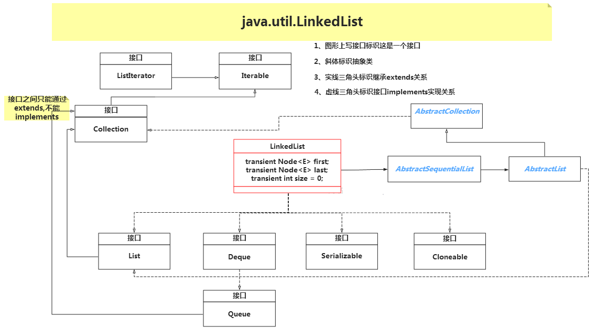
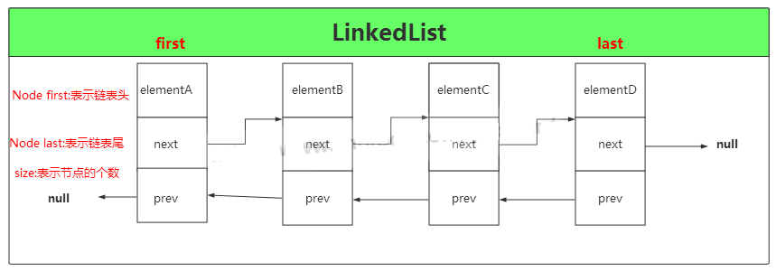

### **Java高级特性增强-集合框架(LinkedList)**
本部分网络上有大量的资源可以参考，在这里做了部分整理，感谢前辈的付出，每节文章末尾有引用列表，源码推荐看JDK1.8以后的版本，注意甄别~
####**多线程**
###**集合框架**
###**NIO**
###**Java并发容器**


* * *
## 集合框架
#### Java中的集合框架

ArrayList/Vector
LinkedList
HashMap
HashSet
LinkedHashMap
...
本章内容参考引用网上的内容为主，网上有大量优质的资源，作者在这里做了整理如下：

#### LinkedList（基于JDK1.8）
##### LinkedList 定义
**LinkedList 是一个用链表实现的集合，元素有序且可以重复。**
```java
public class LinkedList<E>
     extends AbstractSequentialList<E>
     implements List<E>, Deque<E>, Cloneable, java.io.Serializable
```


和 ArrayList 集合一样，LinkedList 集合也实现了Cloneable接口和Serializable接口，分别用来支持克隆以及支持序列化。List 接口也不用多说，定义了一套 List 集合类型的方法规范。
　　注意，相对于 ArrayList 集合，LinkedList 集合多实现了一个 Deque 接口，这是一个双向队列接口，双向队列就是两端都可以进行增加和删除操作。

##### 字段属性
```
//链表元素（节点）的个数
    transient int size = 0;

    /**
     *指向第一个节点的指针
     */
    transient Node<E> first;

    /**
     *指向最后一个节点的指针
     */
    transient Node<E> last;
```
注意这里出现了一个 Node 类，这是 LinkedList 类中的一个内部类，其中每一个元素就代表一个 Node 类对象，LinkedList 集合就是由许多个 Node 对象类似于手拉着手构成。
```
private static class Node<E> {
        E item;//实际存储的元素
        Node<E> next;//指向上一个节点的引用
        Node<E> prev;//指向下一个节点的引用

        //构造函数
        Node(Node<E> prev, E element, Node<E> next) {
            this.item = element;
            this.next = next;
            this.prev = prev;
        }
    }
```
如下图所示：


上图的 LinkedList 是有四个元素，也就是由 4 个 Node 对象组成，size=4，head 指向第一个elementA,tail指向最后一个节点elementD。

##### 构造函数 
```java
public LinkedList() {
    }
    public LinkedList(Collection<? extends E> c) {
        this();
        addAll(c);
    }
```
LinkedList 有两个构造函数，第一个是默认的空的构造函数，第二个是将已有元素的集合Collection 的实例添加到 LinkedList 中，调用的是 addAll() 方法，这个方法下面我们会介绍。
　　注意：LinkedList 是没有初始化链表大小的构造函数，因为链表不像数组，一个定义好的数组是必须要有确定的大小，然后去分配内存空间，而链表不一样，它没有确定的大小，通过指针的移动来指向下一个内存地址的分配。

##### 添加元素
**addFirst(E e)**
将指定元素添加到链表头
```
//将指定的元素附加到链表头节点
    public void addFirst(E e) {
        linkFirst(e);
    }
    private void linkFirst(E e) {
        final Node<E> f = first;//将头节点赋值给 f
        final Node<E> newNode = new Node<>(null, e, f);//将指定元素构造成一个新节点，此节点的指向下一个节点的引用为头节点
        first = newNode;//将新节点设为头节点，那么原先的头节点 f 变为第二个节点
        if (f == null)//如果第二个节点为空，也就是原先链表是空
            last = newNode;//将这个新节点也设为尾节点（前面已经设为头节点了）
        else
            f.prev = newNode;//将原先的头节点的上一个节点指向新节点
        size++;//节点数加1
        modCount++;//和ArrayList中一样，iterator和listIterator方法返回的迭代器和列表迭代器实现使用。
    }
```
**addLast(E e)和add(E e)**
将指定元素添加到链表尾
```
//将元素添加到链表末尾
    public void addLast(E e) {
        linkLast(e);
    }
    //将元素添加到链表末尾
    public boolean add(E e) {
        linkLast(e);
        return true;
    }
    void linkLast(E e) {
        final Node<E> l = last;//将l设为尾节点
        final Node<E> newNode = new Node<>(l, e, null);//构造一个新节点，节点上一个节点引用指向尾节点l
        last = newNode;//将尾节点设为创建的新节点
        if (l == null)//如果尾节点为空，表示原先链表为空
            first = newNode;//将头节点设为新创建的节点（尾节点也是新创建的节点）
        else
            l.next = newNode;//将原来尾节点下一个节点的引用指向新节点
        size++;//节点数加1
        modCount++;//和ArrayList中一样，iterator和listIterator方法返回的迭代器和列表迭代器实现使用。
    }
```
**add(int index, E element)**
将指定的元素插入此列表中的指定位置
```
//将指定的元素插入此列表中的指定位置
    public void add(int index, E element) {
        //判断索引 index >= 0 && index <= size中时抛出IndexOutOfBoundsException异常
        checkPositionIndex(index);

        if (index == size)//如果索引值等于链表大小
            linkLast(element);//将节点插入到尾节点
        else
            linkBefore(element, node(index));
    }
    void linkLast(E e) {
        final Node<E> l = last;//将l设为尾节点
        final Node<E> newNode = new Node<>(l, e, null);//构造一个新节点，节点上一个节点引用指向尾节点l
        last = newNode;//将尾节点设为创建的新节点
        if (l == null)//如果尾节点为空，表示原先链表为空
            first = newNode;//将头节点设为新创建的节点（尾节点也是新创建的节点）
        else
            l.next = newNode;//将原来尾节点下一个节点的引用指向新节点
        size++;//节点数加1
        modCount++;//和ArrayList中一样，iterator和listIterator方法返回的迭代器和列表迭代器实现使用。
    }
    Node<E> node(int index) {
        if (index < (size >> 1)) {//如果插入的索引在前半部分
            Node<E> x = first;//设x为头节点
            for (int i = 0; i < index; i++)//从开始节点到插入节点索引之间的所有节点向后移动一位
                x = x.next;
            return x;
        } else {//如果插入节点位置在后半部分
            Node<E> x = last;//将x设为最后一个节点
            for (int i = size - 1; i > index; i--)//从最后节点到插入节点的索引位置之间的所有节点向前移动一位
                x = x.prev;
            return x;
        }
    }
    void linkBefore(E e, Node<E> succ) {
        final Node<E> pred = succ.prev;//将pred设为插入节点的上一个节点
        final Node<E> newNode = new Node<>(pred, e, succ);//将新节点的上引用设为pred,下引用设为succ
        succ.prev = newNode;//succ的上一个节点的引用设为新节点
        if (pred == null)//如果插入节点的上一个节点引用为空
            first = newNode;//新节点就是头节点
        else
            pred.next = newNode;//插入节点的下一个节点引用设为新节点
        size++;
        modCount++;
    }
```
addAll(Collection<? extends E> c)
　　按照指定集合的迭代器返回的顺序，将指定集合中的所有元素追加到此列表的末尾

　　此方法还有一个 addAll(int index, Collection<? extends E> c)，将集合 c 中所有元素插入到指定索引的位置。其实 
addAll(Collection<? extends E> c) ==  addAll(size, Collection<? extends E> c)
##### 删除元素
删除元素和添加元素一样，也是通过更改指向上一个节点和指向下一个节点的引用即可.
**remove()和removeFirst()**
　　从此列表中移除并返回第一个元素
**removeLast()**
　　从该列表中删除并返回最后一个元素
**remove(int index)**
　　删除此列表中指定位置的元素
**remove(Object o)**
　　如果存在，则从该列表中删除指定元素的第一次出现
　　此方法本质上和 remove(int index) 没多大区别，通过循环判断元素进行删除，需要注意的是，是删除第一次出现的元素，不是所有的。
  
##### 修改元素
通过调用 set(int index, E element) 方法，用指定的元素替换此列表中指定位置的元素。
```java
public E set(int index, E element) {
        //判断索引 index >= 0 && index <= size中时抛出IndexOutOfBoundsException异常
        checkElementIndex(index);
        Node<E> x = node(index);//获取指定索引处的元素
        E oldVal = x.item;
        x.item = element;//将指定位置的元素替换成要修改的元素
        return oldVal;//返回指定索引位置原来的元素
    }
```
这里主要是通过 node(index) 方法获取指定索引位置的节点，然后修改此节点位置的元素即可。
##### 查找元素
getFirst()
　　返回此列表中的第一个元素
getLast()
　　返回此列表中的最后一个元素
get(int index)
　　返回指定索引处的元素
indexOf(Object o)
　　返回此列表中指定元素第一次出现的索引，如果此列表不包含元素，则返回-1。
  
##### 遍历集合
**普通for循环**
```
LinkedList<String> linkedList = new LinkedList<>();
linkedList.add("A");
linkedList.add("B");
linkedList.add("C");
linkedList.add("D");
for(int i = 0 ; i < linkedList.size() ; i++){
    System.out.print(linkedList.get(i)+" ");//A B C D
}
```
代码很简单，我们就利用 LinkedList 的 get(int index) 方法，遍历出所有的元素。
　　但是需要注意的是， get(int index) 方法每次都要遍历该索引之前的所有元素，这句话这么理解：
　　比如上面的一个 LinkedList 集合，我放入了 A,B,C,D是个元素。总共需要四次遍历：
　　第一次遍历打印 A：只需遍历一次。
　　第二次遍历打印 B：需要先找到 A，然后再找到 B 打印。
　　第三次遍历打印 C：需要先找到 A，然后找到 B，最后找到 C 打印。
　　第四次遍历打印 D：需要先找到 A，然后找到 B，然后找到 C，最后找到 D。
　　这样如果集合元素很多，越查找到后面（当然此处的get方法进行了优化，查找前半部分从前面开始遍历，查找后半部分从后面开始遍历，但是需要的时间还是很多）花费的时间越多。那么如何改进呢？
  
**迭代器**
```
LinkedList<String> linkedList = new LinkedList<>();
linkedList.add("A");
linkedList.add("B");
linkedList.add("C");
linkedList.add("D");


Iterator<String> listIt = linkedList.listIterator();
while(listIt.hasNext()){
    System.out.print(listIt.next()+" ");//A B C D
}

//通过适配器模式实现的接口，作用是倒叙打印链表
Iterator<String> it = linkedList.descendingIterator();
while(it.hasNext()){
    System.out.print(it.next()+" ");//D C B A
}
```
在 LinkedList 集合中也有一个内部类 ListItr，方法实现大体上也差不多，通过移动游标指向每一次要遍历的元素，不用在遍历某个元素之前都要从头开始。其方法实现也比较简单：
```java
public ListIterator<E> listIterator(int index) {
        checkPositionIndex(index);
        return new ListItr(index);
    }

    private class ListItr implements ListIterator<E> {
        private Node<E> lastReturned;
        private Node<E> next;
        private int nextIndex;
        private int expectedModCount = modCount;

        ListItr(int index) {
            // assert isPositionIndex(index);
            next = (index == size) ? null : node(index);
            nextIndex = index;
        }

        public boolean hasNext() {
            return nextIndex < size;
        }

        public E next() {
            checkForComodification();
            if (!hasNext())
                throw new NoSuchElementException();

            lastReturned = next;
            next = next.next;
            nextIndex++;
            return lastReturned.item;
        }

        public boolean hasPrevious() {
            return nextIndex > 0;
        }

        public E previous() {
            checkForComodification();
            if (!hasPrevious())
                throw new NoSuchElementException();

            lastReturned = next = (next == null) ? last : next.prev;
            nextIndex--;
            return lastReturned.item;
        }

        public int nextIndex() {
            return nextIndex;
        }

        public int previousIndex() {
            return nextIndex - 1;
        }

        public void remove() {
            checkForComodification();
            if (lastReturned == null)
                throw new IllegalStateException();

            Node<E> lastNext = lastReturned.next;
            unlink(lastReturned);
            if (next == lastReturned)
                next = lastNext;
            else
                nextIndex--;
            lastReturned = null;
            expectedModCount++;
        }

        public void set(E e) {
            if (lastReturned == null)
                throw new IllegalStateException();
            checkForComodification();
            lastReturned.item = e;
        }

        public void add(E e) {
            checkForComodification();
            lastReturned = null;
            if (next == null)
                linkLast(e);
            else
                linkBefore(e, next);
            nextIndex++;
            expectedModCount++;
        }

        public void forEachRemaining(Consumer<? super E> action) {
            Objects.requireNonNull(action);
            while (modCount == expectedModCount && nextIndex < size) {
                action.accept(next.item);
                lastReturned = next;
                next = next.next;
                nextIndex++;
            }
            checkForComodification();
        }

        final void checkForComodification() {
            if (modCount != expectedModCount)
                throw new ConcurrentModificationException();
        }
    }
```
这里需要重点注意的是 modCount 字段，前面我们在增加和删除元素的时候，都会进行自增操作 modCount，这是因为如果想一边迭代，一边用集合自带的方法进行删除或者新增操作，都会抛出异常。（使用迭代器的增删方法不会抛异常）
```
final void checkForComodification() {
            if (modCount != expectedModCount)
                throw new ConcurrentModificationException();
        }
```
比如：
```
LinkedList<String> linkedList = new LinkedList<>();
linkedList.add("A");
linkedList.add("B");
linkedList.add("C");
linkedList.add("D");


Iterator<String> listIt = linkedList.listIterator();
while(listIt.hasNext()){
    System.out.print(listIt.next()+" ");//A B C D
    //linkedList.remove();//此处会抛出异常
    listIt.remove();//这样可以进行删除操作
}
```
迭代器的另一种形式就是使用 foreach 循环，底层实现也是使用的迭代器.
```
LinkedList<String> linkedList = new LinkedList<>();
linkedList.add("A");
linkedList.add("B");
linkedList.add("C");
linkedList.add("D");
for(String str : linkedList){
    System.out.print(str + "");
}
```

-----------
**参考文章和书籍：**
《Effective Java》
感谢以下作者：
https://www.cnblogs.com/skywang12345/p/3308556.html
https://crossoverjie.top/JCSprout/#/collections/ArrayList
https://github.com/Snailclimb/JavaGuide/blob/master/Java%E7%9B%B8%E5%85%B3/ArrayList.md
https://blog.csdn.net/qq_34337272/article/details/79680771
https://www.jianshu.com/p/a5f99f25329a
https://www.jianshu.com/p/506c1e38a922